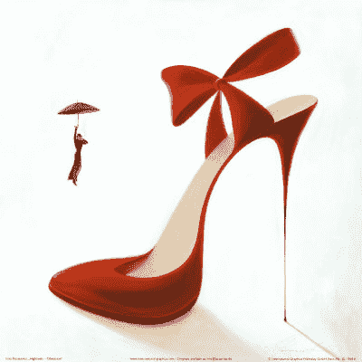

# 魔幻高跟鞋（1月17日）

作者：qqasd1988

TID：9147

<title>1</title> <link href="../Styles/Style.css" type="text/css" rel="stylesheet">

# 1

> <ignore_js_op>
> 
> **IG1944.jpg** *(22.42 KB, 下載次數: 4)*
> 
> [下載附件](forum.php?mod=attachment&aid=MjI4NDF8OTJiODE3OTN8MTYwMDg5MDUwMnwxODIzMHw5MTQ3&nothumb=yes)
> 
> 2011-1-18 00:01 上傳
> 
>   這是一個神奇的故事。     我和洛嵐是在異地工作的一對情侶，我們工作的地方相隔兩小時的車程，每到週末我都會她所在的城市，週日晚上不得不馬不停蹄的回來上班。
>     又到一個週末，我下了班並沒有馬上去洛嵐那裡，而是來到市中心購物，今天是洛嵐的生日，我準備給他送生日禮物。我所在的市中心的購物街東西琳瑯滿目，我看花了眼睛，卻不知道到底買什麼。天很快黑了下來，我還是沒有找到目標，整個購物街都快轉完了，卻還沒有買任何東西。我的電話響了，
>     【老公，這麼晚了，你怎麼還沒過來？ 】洛嵐微微的責怪我，我看了看手錶，已經6點半了，
>     【寶貝，今天下班有些晚，我等下就會過來。 】我撒了個善意的謊言。
>     我轉過身正準備無功而返的時候一雙高跟鞋吸引了我的目光，，我以前也為洛嵐買過高跟鞋，可那些高跟鞋從沒有像這雙鞋子那樣吸引我的目光。
>     這雙深紅色尖頭高跟鞋鞋跟像根銀白色的針管，鞋帶扎著個漂亮的結，我估摸著這鞋跟大概有15厘米高，剛好合適小嵐，我有172的個子，洛嵐只有157左右。雖然她並不高，但身材卻非常棒。
>    
>     【老闆這鞋跟是太細了吧。 】我問著店員，
>     【不用擔心，先生，這根鞋跟是用超硬度材料做成的，而且只有這一雙】店員裡面的回答。
>     【只有一雙？那這雙是怎麼來的呢？ 】我疑惑的問。
>     【這是一位老人家放在我們店裡寄賣的。不過價格有些貴。 】
>     我不在猶豫，狠下心用自己半月的工資把鞋子買下來。
>    
> 
>      在汽車上搖晃和快兩個小時，終於到家了，，我換好鞋子小心翼翼的提著鞋盒走到客廳，小嵐正坐在沙發上聚精會神看著某青春愛情劇。汗。她今天只是穿著條牛仔褲，上身套著件白襯衣，頭髮扎在頭上，看起來非常清純。 。見到我回來了，她有些高興又有些生氣的說：
>     【 飯在桌上還是熱得趁熱吃吧，】
> 我沒有去飯廳，而是走到沙發邊
>     【老婆，今天你生日，這是我送你的生日禮物。 】我把鞋盒裡的高跟鞋取了出來。
>     洛嵐一下就被這雙鞋子吸引住了，她迫不及待的把她那雙只有35碼小腳伸過來，
>     【老公，幫我穿上好嗎？ 】同時用她那雙晶瑩剔透的大眼睛含情脈脈的看著我。
> 我咽了口口水，把她的腳抓住，她的腳有些小，皮膚像嬰兒一樣潔白光滑。指甲上打著淡淡的粉色指甲油。
>     我慢慢的把她的腳塞入鞋子，鞋子彷彿是為她量身定做的，剛好合適。
>     我放開她的腳，她扶著沙發站起來，剛好與我面對面，她的眼睛剛好和我平視著。我伸手抱住她，嘴唇也粘上她的嘴唇。她的舌頭試圖擠開我的舌頭進入我的口中，我沒有阻止她的入侵。她的舌頭在我口中與我的舌頭交纏著。這又是一個纏綿的夜晚。 。 。 。 。 xxooooxxxxooooxx
>     第二天是周六，有昨晚的運動量太大，我們都睡到12點才起來，洛嵐先起來煮飯，我們吃了我們吃了午飯打算到公園了逛逛，她今天特意為這雙高跟鞋穿了一身淺藍色及膝裙子，腿上是一條黑色絲襪。走在大街上，她成了眾人的焦點。後頭率幾乎百分之百，我感覺微微有些不對勁，怎麼我要稍稍抬頭才能看見小嵐的眼睛呢？
>     【小嵐，你是不是長高了？ 】我疑惑的問道。
>     【嗯，我也不知道。 】她也發現她比我稍高一點。
>     【那我們找個地方去量量吧。 】我建議道。
> 公園門口正好有一家藥店，藥店門口擺放著一台
>      洛嵐脫下高跟鞋站上測量器上，159-51公斤。她長高了2厘米。我也站上去量了量，依然是172,.64公斤。出了藥店，我們看到公園門口正有背老婆比賽，
> [哇們也去玩玩！ ]我對小嵐說。小嵐點頭笑著。不過由於我體力並不強，沒有取得名次。
> [老公看來下次要我背你才能贏哦！ ]洛嵐開著玩笑。與洛嵐在一起的時間總是過得很快。
> 一個週末過了，我又回到我工作的城市，工作特別忙，連著加班了4個晚上，下了班都是倒頭就睡。又到週五下午了，我心不在焉的想著下班。洛嵐卻打電話說她在我樓下，有事情告訴我。我急忙跑下樓。小嵐就坐在底樓大廳的沙發上，看她表情貌似在想著什麼事，就沒注意到我，我悄悄走到沙發後猛的摀住她眼睛。小嵐站起來，轉身沒好氣的看著我，
>   [寶貝啥事呀？這麼急著找我。不是等下我就會回來嗎？ ]我笑著說。
>   [你沒發現我有些不一樣嗎？ ]小嵐嗔怒的看著我。我仔細的看著她，她今天穿著件淺藍色短袖，褲子是條粉白色的運動褲，穿著一雙白色網球鞋，還是那麼青春美麗。嗯，等等…不對，怎麼穿著平底鞋缺和我差不多高，我對視著她
> 
>   [看出來了吧，我一周長了10厘米，現在快有168了。 ]小嵐為我解答了疑問。我頓時一陣頭暈，
> [這長得也太快了吧，你都21歲了，怎麼還要長？ ]我迷惑的問道。 [我就是來找你想辦法的呢？你倒還來問我了。 ]小嵐沒好氣的說。
> [我們先去醫院看看吧，別是什麼巨人症吧。 ]我說到。 [你真狗嘴裡吐不出象牙，有你這樣給老婆想辦法的嗎？ ]小嵐伸手習慣性的爪上我肩膀伴隨著一聲慘叫。去醫院的路上我習慣性的想拔著小嵐的肩膀缺發現得稍微抬起手臂才能把上。經過一系列的檢查醫生給出的答案竟然是正常的長高。
> 到車站的時候都公交都快收班了，車站人太多了，費了九牛二虎之力擠上了汽車，沒有座位了，我一手抓著頭上的欄杆，一手打算抱著小嵐卻發現小嵐也能抓到車頂的欄杆。她似笑非笑的看著我，我尷尬的摸摸頭，以前坐車由於小嵐比較矮抓不到欄杆都是我抱著她。一雙手抱住我的腰，
> [老公，還是你抱著習慣。 ]小嵐笑嘻嘻的說。說著就倒向我，我順勢抱著她入手竟然差點沒抱住，她重了不少，不過還在我能承受的範圍之內。回到家，我色急得把她抱近臥室，直接抱上床脫下衣褲，我躺到她身上，親吻著她那豐滿的嘴唇，手撫摸著她堅挺而潔白的乳房，老二已經不自覺的蹺起。
> [你個色鬼，急什麼呀！先洗澡呀。 ]洛嵐風情萬種的說。在浴室裡，洛嵐先彎腰幫我擦洗身體，我欣賞著她現在的身體，雖然變高了，她身材看著依然那麼性感，只是手腳都變得修長了。身下一陣觸電的感覺，我低頭看，她正用手抓著我的老二，使勁的擦，老二立馬再次膨脹，似乎欲射。
> [老婆饒命呀！ ]我鬼叫著，老婆回了我個鬼臉
> [你這個不老實的小兄弟該教育教育了]
> [嘿嘿，我不都交給你的妹妹了嗎？ ]我回擊她。下身又是一陣酥麻，洛嵐更用力的抓著老二，我提起雙手抓住她的胸部。她彷彿觸電般放開我老二。
> [嘎嘎，老婆，你的胸部貌似也變大了哦。 ]在床上我終於發現長高的好處，我們可以一邊做愛一邊親吻，而我不用再低頭了。
> [聽說要多按摩胸部才變得大哦！ ]我揉著她胸部說，
> [老公，你好色呀！ ]洛嵐羞澀的說。第二天起床我又給她量身高，一天的時間，她竟然又長高了1厘米，大清早我就被老闆叫回去加班，只得坐車回去。
> 我以為她長高的趨勢會停止，可事情並不是我想的那樣發展。小嵐繼續著瘋狂的長高，到週末時，她竟然長到了180，我才到她眼睛的高度，到醫院去還是沒查出任何問題。回到家，我仔細回想有什麼變化。
> [對了，小嵐，我送你的高跟鞋給我看看]我對她說。她把鞋子找出來給我看，讓人驚訝的是這鞋子竟然變大了，小嵐的腳現在有40碼，這鞋子竟然也是40碼，我看了半天也沒發現這鞋子有什麼不同，
> 我對她說[我們去找那賣鞋的商店看看。 ]
> 來到商店的時候天已經黑了，鞋店店主仍在，通過她打聽到這鞋子原來的主人所居住的地方。這是一座很有些年頭的別墅，孤單的座立在城郊的密林中。
> [小嵐，小心有鬼哦！ ]我扮了個鬼臉，
> [你才是鬼呢，鬼看見我倆也是先找你，誰叫你看著比我矮呢！ ]我尷尬的笑了笑，又被打擊了。來到大門發現門是開著的，我倆叫了一會，也沒人出來。兩人像小偷一樣打開門就去，大廳的擺設讓我倆彷彿來到了巨人國一般，沙發有我胸口高，茶几跟小嵐差不多高，我倆又叫了兩聲依然沒人。
> 順著大廳旁的樓梯我們往上走，這上樓梯還真叫爬，每節樓梯都有我腿高，好不容易爬上二樓，二樓只有一扇門，門也真高，有近6米高，
> 我們走進房間，一陣觸電的感覺傳來，耀眼的白光讓我們不由的閉上眼睛，我慢慢的睜開眼睛，看到了一個在魔幻世界中才會出現的情景。
> 我們站在一條古老的大街上（參考哈利波特），兩旁是各種商店，這條大街估計是主要的商業街，所以人很多，不過這都不是重點，重點是這裡的人們，男性與我差不多，而女性卻大大不同！她們都非常高大，在我視野中最矮的也比我高了近一倍，男人們最高的也不過到旁邊女孩的肚臍，
> 我回頭看了看旁邊的小嵐，還好，她還沒變。她也在一臉震驚中。我走向最近的一個男人，其實我旁邊就有個女生，不過她給我的壓力實在太大，走到她面前都不一定看的到她的臉。
> [哥們，這是在哪？ ]我向那中年男子打聽。他一臉驚訝的看著我身邊的小嵐，我靠，一副豬哥樣，要不是有事問你，早給你兩拳了！我心裡不滿道。
> 他沒有回答我的問題而是問了個奇怪的問題[竟然有沒有打下疫苗！你竟然沒有打疫苗！ ]他一番話搞得我頭昏，這啥意思？小嵐也是一臉茫然。
> [你說的是什麼意思？ ]我問道。還在我問他的時候，我們發現我們周圍圍滿了人，他們都是驚訝的看著小嵐，我感到一絲不安。
> [請大家讓開！讓開！ ]人群竟然自動讓到一邊，兩個比周圍女性要高一大截的女孩皺著眉頭走過來，他們都穿著淡藍色的短袖和白色的超短裙，腳上是一雙及膝褐色長靴。當走到我面前是，我竟然不能看到她們的臉，我只比她們的膝蓋高些！她們蹲下身子，俯視著我們，
> 其中一個對小嵐說[你好！我們是蘭特洛馨城警察局的，請問您打了疫苗嗎？ ]。小嵐驚恐的抱住我的肩膀，不知道說什麼，
> 我不得不站出來[她是我女朋友，我們不知道你說的預苗是什麼，這裡是什麼地方我們也不知道！ ]。慧蘭妮瞟了眼面前弱小的男人，
> [對不起，先生，你們已經被我們拘留！ ]不在留給我反抗的時間，她伸手單手把我腰部抓住提了起來，像抓玩具般輕鬆，不管我如何掙扎，她的手紋死不動，小嵐也被另一個女孩抓起來。警局，我和小嵐站在桌子上，面前就是抓我回來的那女孩，她坐在桌前
> [美女，你在出生之時沒有打過疫苗？ ]，小嵐抓著我的手，
> [警官小姐，我們根本就不知道什麼是疫苗，我女朋友買了一雙鞋子就不停的長高，]說著我拿出那背包裡的高跟鞋，一隻巨手搶過我手裡的鞋子，我正準備對這個無禮的女孩發怒，卻看到她驚恐的表情，眼睛驚恐的彷彿見到鬼了。半刻鐘後她才恢復正常。
> [這件事情麻煩了，我必須告訴城主！ ]。
> [餵！你先告訴我到底是什麼事！ ]我苦惱的說
> [你確定真的想知道]她問道，我點點頭。她嘆了口氣
> [這個要從我們這個世界的開始說起了！ ]。
> 原來這個世界以前也與地球一樣的男人女孩都是正常身高，可後來下了一場小型流星雨，從外太空帶來了一種特別的物質，它融入空氣中，改變了大氣的成分，這種空氣中的物質關鍵是會與女性體內的雌性激素發生反應，並生成新的雌性激素，不斷強化人體的骨骼以及各個器官。
> 如果光是這樣還好，可是這種新的激素會與生長激素發生反應，這種新生長激素會不斷的產生，並且使身體巨大化並且不會停止，但身體巨大化的速度過快導致身體強化的速度跟不上，最後都會因為心臟血壓太高而死亡。
> 一位偉大的疫苗學科學家解決了這個難題，她的妻子在兩年多的時間里長到快10米高，經過強化的骨骼與心臟都快支持不住了。
> 在一次偶然的實驗中他發現了一種物質可以阻止變異後的生長激素的循環再生，所在女性都打了這種疫苗，一場災難解決了。
> 但帶來的後遺症是所在女性的身材都變得巨大，新出生的嬰兒也會注射疫苗，但變異的激素在疫苗的作用下極大的提高了作用，女孩都長得很快！即使生長激素最少的女孩也能長到3米高！
> 與此同時，一個古怪的女科學家研製出了能弱化疫苗作用的反疫苗，這疫苗能極大得提高骨骼器官的強化速度。她把自己拿來做實驗，使自己在停止長高多年後再次長高，她後來居然長到近百米高，因為身高的差距，使用這兩種疫苗的人生活在不同的地方。而由於使用了第二種疫苗的人都是先使用第一種疫苗，再使用第二種，沒有人實驗過反過來注射疫苗。
> 而這雙高跟鞋是第二種疫苗的注射器！它可以通過感應穿鞋子的腳的大小調節疫苗的作用。是一個星術者的作品，而這個星術者就是恐怖魔王—帝希爾加！因為第二類疫苗需要很多已經絕種的物品，所以現在已經沒有第二類疫苗，但第二類疫苗有遺傳性，能遺傳給下一代人，而真正的疫苗已經絕種，
> 魔王帝希爾加通過捕殺第二類疫苗遺傳者，把她們身體中的疫苗基因抽出製作成這樣的高跟鞋，而這樣的高跟鞋就會有疫苗同樣的功能，並且可調節，但彷彿是身份驗證一樣，一雙高跟鞋只能讓第一位穿的人獲得疫苗能力。
> 由於製作鞋子的過程非常血腥，所以帝希爾加被全世界通緝，最後居然消失了。由於第二類疫苗的稀少，真正擁有二類疫苗基因的女性也不過百多人，他殺害了3位女性，製作了3雙高跟鞋。其中一雙在逃亡過程中被毀壞。而另外兩雙不知所踪。
>    【這就是你這雙鞋子的歷史了!】她一口氣為我介紹清楚，我看著鮮紅的高跟鞋，彷彿那鞋子上的紅色都是血！</ignore_js_op>

~~~~~~~~~~~~~~~1月17日