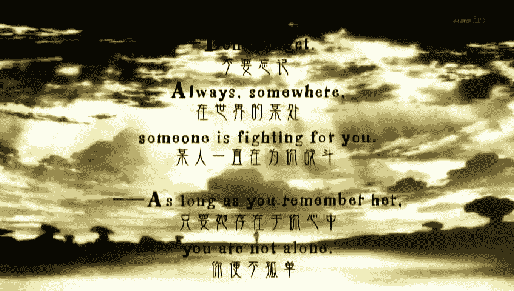
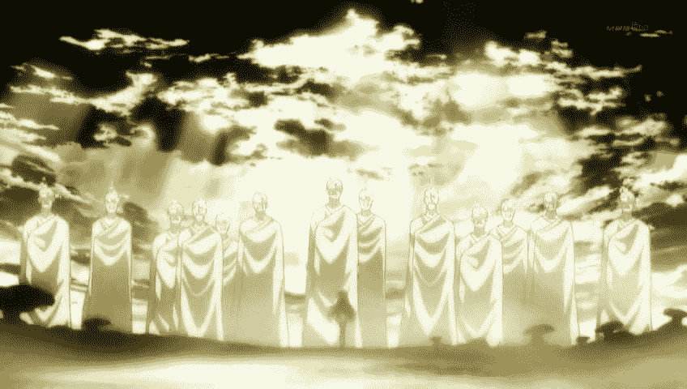

# 魔法少女小圆同人 橙与黑的奏鸣曲

作者：zsd

TID：12727

 

# 1

因为各种不想去画图……完全不想去画……做了俺妹的预告结果还是没有去画……

于是开始试着写文了，这是我写的第一篇，只是第一篇……

不过第一篇就开坑有点太不负责任呢……会不会填还得看其他两篇正常向小说的填坑情况

或许我只是在【文】这方面比不过狂草而不服气而已吧

因为剧情占得太多，GTS情节我会用颜色做记号，以下是正文（未完）

------------------------------------------------------------------------------------------------

Don’t longer.

Always ,some where,

Someone is fight for you.

As long as you remember her,

You are not alone.

<ignore_js_op>

**暴?截?2012710822281.jpg** *(54.99 KB, 下載次數: 0)*

[下載附件](forum.php?mod=attachment&aid=Mjk0OTJ8OGU0NDAyMjl8MTYwMDg5MTMzNHwxODIzMHwxMjcyNw%3D%3D&nothumb=yes)

2012-7-10 14:57 上傳

<ignore_js_op>

**暴?截?2012710856031.jpg** *(45.14 KB, 下載次數: 0)*

[下載附件](forum.php?mod=attachment&aid=Mjk0OTN8MmQ0N2Y0ZWF8MTYwMDg5MTMzNHwxODIzMHwxMjcyNw%3D%3D&nothumb=yes)

2012-7-10 14:57 上傳

-------------------------------------渺无人烟的沙漠  晓美焰视角----------------------------------

或许我已经习惯了。

小圆不在身边的每一天，难熬的每一天，会在晚上突然哭醒的每一天，我习惯了，或许。

我还记得，清楚地记得，沙耶加死时的那天晚上麻美学姐那困惑的表情，她说「圆香是谁？」。

为什么这么轻易的就忘了呢？

为什么小圆要让所有人都这么轻易的忘了自己呢？

为什么……  

为什么……

为什么明明自认了已经习惯了这一切，自己还是离开了那个城市呢？

我不知道……真的……我真的不知道……

不要这样……真的……不要……

圆香……

--------------------------------------------同时间 泷原市  巴麻美视角---------------------------------

轰隆隆隆隆隆隆隆！！！

作为泷原市的象征的那座高塔，就这样轻易地倒塌了。

或许我的表达方式出了些错误。

正确的说法应该是，那座高度达到817m，只比迪拜塔低10m左右的观光用高楼，被一只黑色高跟长靴轻易地踏碎在了脚下，而且还被它踩入了深达几十米的鞋印中。

（*魔法少女小圆OP最后一幕出现的高塔原型是世界第一高楼，阿拉伯迪拜的迪拜塔「Burj Khalifa」。共160层，总高度828m）

这座塔还不到她靴子的长度吧，刚才看来应该是这样的。不过那座塔现在已经消失了，可以比较的标准自然也就失去了。

说不定能测量它的高度的标准还是有的，仔细看的话，电视台的直升飞机正在那只靴子的主人膝盖以下的部分谨慎的飞行着。说起来，直升机的飞行高度上限是多少米？

不知道呢。

如果小焰还在这个城市的话绝对能轻易地说出来吧，如果小焰还在这个城市的话……

「麻美前辈。」

「啊！在。」杏子的呼唤声把我拉回了现实。

太不果断了，竟然在战斗之前陷入了冥想呢，一点作为前辈的自觉也没有。

前辈的自觉……

沙耶加已经死去了，小焰也离开了这个城市，可爱的后辈们不知不觉中早已经离我远去了。

「你在想些什么啊，麻美前辈。」

「啊，什么也没有，什么也没有呦。」

不能让后辈看到前辈的动摇呢，前辈什么的永远都是那么辛苦呢。

「那么，我们上吧。」

锵。

杏子的枪尖闪耀着凛厉的冷光，尖锐的虎牙看起来都是那么的帅气，真是，简直和男孩子一样啊。

「磨枪的工作用魔法来代替不可以吗？」

「不敢随便就用灵魂宝石了呢，啊，从那天晚上开始。」

是吗？从那天晚上开始呢。

沙耶加的死对你我来说，都是个不小的打击呢。

手抚过了杏子柔软的脸颊，杏子似乎小小的惊叫了一声，男孩子般凛厉的大眼睛遗留着惊讶抬了起来。

真是，可爱的前辈啊。

作为最不负责任的前辈，已经让两个后辈受到了不应该的伤害了。

至少对于最后一个的你……

「算上沙耶加的份，加油喔。」

「嗯，还有小焰。」

--------------------------------------------同时间 泷原市  无视角---------------------------------

Donnnnnnnnnnnnn!!!!

震撼着地面的震动还在继续。

电视台的直升机在那条曲线美丽的小腿抬起的那一刻就已经化作了耀眼的焰火，在空中的火焰还未燃尽的时候，不足50m的普通楼层已经被一只以靴子包裹的纤细素足轻易的踏碎成了粉末。

不是一座座的被踩烂，而是一片片的被辗碎。

这不是自然灾害可以比拟的破坏力。即使是地震，躲在狭小的角落仍然有活命的机会。但是只要被拒的阴影所遮盖住的楼层，躲在里面的人们就已经被剥夺了自己的一切权利。

没有反抗的权利。

没有活命的权利。

连看到踩碎自己的少女面容的权利都没有。

轻描淡写的就被踩碎了，和混凝土一起化作了少女脚下的粉尘。即便是躲在地下室的人们也一样被辗碎在了几十米深的足印之中。

成功逃出建筑物的人们也无法得救，狭小的街道简直容不下少女的一个脚趾。在巨足落地的那一刻，无论是人群还是街道都随着巨响一起粉碎了。

世界在少女的足下上演了最有临场感的特摄电影。

汽车在挤满了人的街道上横冲直撞，只想逃离那只巨足。但是少女仅是稍稍动了动脚趾，迅速逼近的鞋尖就轻易的辗碎了它们。

被私人包下的飞机无视了地面上各自恶毒的诅咒，想要尽快离开这座地狱般的城市。但是一架架飞机却无一例外的被从天而降的巨大靴底辗毁。

放弃了这所城市所有的居民，飞上了上千米高空的战机。少女只是轻轻的转了转身，及腰的乌黑秀发就将还未来得及发动进攻的战机悉数撞毁。

一切都是那么轻描淡写。

一切都是那么微不足道。

经受着这一切的渺小的人们不仅开始怀疑云端之上的那名巨大的少女是否真的有心。

云朵稍稍散开了一点。

幸运的位于城市边缘的人们终于看到了巨大少女云端之上的面孔。

没有人能够再次说得出话来。

已经不用少女亲自前去踩踏，城市边缘的人们也已经被那无言的压力所压垮。

远在云端之上，那高不可攀的人偶般精致的面孔。

那黑色的，大大的瞳孔之中散发出的是。

想要把这个世界沉入火海般的，仇恨悲痛的空洞眼神。

【未完】

[ *本帖最後由 zsd 於 2012-7-11 17:28 編輯* ] 

# 2

> 原帖由 *Yagami_ray* 於 2012-7-10 18:46 發表 

> 错过活动是不是很不甘心啊，弱狼狼  

才才才才才没有，魂淡YY</ignore_js_op></ignore_js_op>