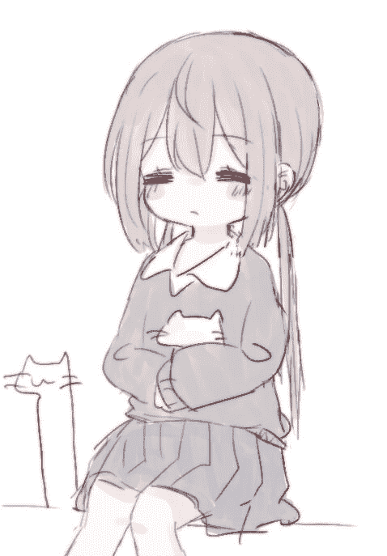

# 魔法少女的末路（4.20更新番外二）

作者：露西亚·黎明

TID：28452

<title>1</title> <link href="../Styles/Style.css" type="text/css" rel="stylesheet">

# 1

*本帖最後由 露西亚·黎明 於 2020-4-20 00:41 編輯*

可爱的我又回来了，果然，挚友才是我创作的动力源泉—谜—之—分—割—线—

『致奥利奥小姐
鉴于您已使用本公司的缩小装置满6个月，为了回馈用户，特此赠送本公司的最新缩小装置二代以及异空间传送机
今后也请继续支持我们哦』
以上，早起的女孩就这么在卧室门口捡到了这么一个奇怪的包裹。
“唔……这到底是什么啊？”
小奥有些迷糊的读完了上面的字条，没错，自己的确是有一个缩小装置，但那却是自己好朋友小夜猫子带过来的，不过要说使用的话…… 好像也没有什么问题。
打开了包裹，里面是一台平板和一个精巧的手环。
“这个就是缩小装置二代吗？”
小奥阅读着说明书先是拿起了手环，银白色的手环做工很是精巧，戴到手腕上还有一股冰冰凉凉的感觉。
『缩小装置二代：体型更小，功率更强，念力操纵，详细说明请参考一代。』
以上，就是简短的说明书。
唔，总感觉是个很不靠谱的公司啊。
小奥心里小声的嘀咕。
另外一个自然就是异世界传送机了，虽然这么说，不过这不就是个普通的平板吗？
小奥打开了平板仔细的确认了好久，才发现这似乎就是一个普通的平板，说明书也简单的离谱，只说了平板下面的按钮就是传送开关，可是按下了开关后—— 屏幕亮起，再按了一下—— 屏幕黑掉。
这不就是个息屏开关嘛！
会不会是送错东西了啊？小奥有些微微的困惑。
算了，就当是送错东西了吧，不过多了一个平板以后看视频也方便了很多。
安装好了视频软件后，小奥找到了自己最近正在看的那部《魔法少女S》，大概就是一所学校的3个少女变成魔法少女打倒怪兽拯救城市的故事，虽然是很俗套的剧情，但却偏偏是小奥喜欢的类型。
这周就是完结篇了，最终boss是一个三层楼这么巨大的触手怪，拥有很强的再生能力，一番苦战以后，小橙和小紫都已经倒下了，不过两人却将自己的力量都转移给了最后的小粉，三色的光芒流转，很明显，接下来就是小粉开大招秒杀boss的场景了。
但是……
城市的上空突然出现了巨大的黑色漩涡，瞬间吞噬了巨大的触手怪以及飞在半空中的魔法少女。
“欸欸欸？！”
一切的始作俑者自然就是小奥了，就在看到最最激动人心的时刻，小奥不小心碰到了平板下面的按钮了，于是，屏幕瞬间一黑，紧接着，刚刚还在战斗的双方突然很立体的出现在了漆黑的屏幕上，不对，这根本就是活的吧！
大概巴掌那么大的触手怪boss，和只有一厘米左右的，飞在空中的粉色魔法少女。
两道视线同时集中到了小奥的身上。
“呃……”
就在小奥还在发呆的时候，触手怪先一步发起了攻击，细细的触手直接朝着小奥的脸发射出来。
“这是什么啊？”
下意识的，小奥使用了手环的力量，原本巴掌大小的触手怪瞬间变得只有芝麻粒那么大，一旁观战的魔法少女瞬间瞪大了眼睛。
紧接着，小奥向着平板上的芝麻点伸出了手指。
“噗叽——”
在动漫里叱咤了三集的大boss没有死在主人公的光炮下，而是死在了一个人类女孩巨大的指尖之下，身体被完全碾碎，纵然是恢复力很强的触手怪也死的不能再死了。
魔法少女还没有回过神来，没想到自己苦战了好久的boss竟然就被这么轻描淡写的解决了，不过她看向女孩的眼神里也带上了一丝凝重。
抽出了一张纸巾擦了擦手指以后，小奥兴奋的眼神落到了半空中只有一厘米的魔法少女身上。
正巧小夜猫子回家了感觉有些无聊，现在就有了新的玩具了。
巨大的手指伸向了半空中的魔法少女，不过回应的却是几发魔法弹。
“好痒。”
缩小了无数倍的魔法弹就像是发丝拂过指尖的触感一样，根本造成不了半点伤害，不过即便是缩小了，魔法少女的速度还是很快的，几次躲开了小奥的手指，如同小小的苍蝇一样。
这样落空了几次，小奥也有些不耐烦了起来，手掌轻轻挥动，小小的魔法少女瞬间被巨大的手掌扇到了桌子上。
如果是普通的缩小人的话，这么一掌已经足够要了她的命了，不过对于魔法少女而言，也只是一般的伤势，晃了晃脑袋，小小的魔法少女就已经在桌子上站了起来。
随后，三色的光芒汇聚，一道如同手电筒般的光炮轰击了出去，小奥吓了一跳，不过看着声势浩大的轰击落在了手掌上也只是轻微的如同开了热风的吹风机一样。
“呼~”
小奥松了口气，但是看向桌上的小虫子的眼神已经有些冰冷了，巨大的手掌拍下，被那样的手掌拍中的话，就算是魔法少女短时间内也会无法行动的。
咬了咬牙，放完大招魔力几乎用完的魔法少女还是提起了最后一丝力量飞了起来，躲开了巨大女孩的这一次拍击。
“嘭！”
手掌重重的拍在了桌子上，桌上的物品都有些一颤，很明显，女孩这一拍并没有留情，如果真的被拍中的话，会被瞬间拍死也不一定。
小小的魔法少女暗自吞咽了一口口水，很明显，现在的自己别说击败这个巨大女孩了，就连伤到她都有些困难，反而是她的随手一次攻击都有可能要了自己的命。
“继续躲啊。”
巨大的女孩嘟了嘟嘴，微微有些生气的开口。
不好！
巨大的黑影再次笼罩了小小的魔法少女，这次躲开已经比上次要困难很多了，手掌带起的风压直接把魔法少女吹到了桌面上。
“嘭！”
又是一声巨响，桌面上的魔法少女直接被震得弹了起来，看着面前巨大的手掌，魔法少女的眼神变得有些畏惧，第一次，她产生了想要逃跑的念头。
根本不可能赢得了，曾经的自己也遇到过许多强大的敌人，但现在就算是把那些敌人绑在一起，也不一定能挡下这个女孩的一个巴掌。
跑！
尽管已经没有魔力飞行了，但是下定了决心的魔法少女还是狼狈的在桌面上逃跑了起来，只是她却不知道，自己引以为傲的速度，在巨大的女孩眼里却连一只蚂蚁都比不过。
“呼呼——”
不知道到底跑了多远，但是小小的魔法少女还是只能喘着粗气咬着牙跑下去。
巨大的黑影再次笼罩在了魔法少女的头顶，无数次战斗养成的本能促使小小的她向着一旁躲去。
“咚！”
巨大的白皙巨柱几乎贴着魔法少女的身体落下，那是女孩的手指，如果没记错，几分钟前自己面对的最终boss就是死在了这根手指之下。
巨大的恐惧涌上了魔法少女的心头，以现在的自己来看，如果被这根手指戳到的话，毫无疑问会死，会如同虫子一样被碾碎在女孩的指尖。
巨大的手指再次抬了起来，像是想要戏弄小小的魔法少女一样，手指移动的很是缓慢，略微调整了位置以后，巨大的手指再次按了下来。
“咚！”
再次狼狈的躲开以后，魔法少女已经不剩下多少力气了，可是头顶却又被熟悉的黑影笼罩了，魔法少女的眼中浮现了一抹绝望，难道真的要死在这里吗？
曾经朋友们的身影一一在眼前略过，最后定格在了一橙一紫两道身影之上，那是刚刚成为魔法少女时，三人一起许下的愿望——要一直一直在一起战斗！
明明已经背负了其他两个伙伴的力量，怎么能在这里倒下，已经力竭的少女强撑着身体，再次躲开了女孩接下来的几次攻击。
不过此刻的魔法少女并没有闲心抬起自己的头，不然她一定会发现，书桌前的巨大女孩一手撑着自己的小脸，一边露出玩味的笑容用手指逗弄着桌上的小人。
无论怎么挣扎都不过是巨大女孩的恶趣味罢了，如果想的话，女孩可以瞬间结束掉这场游戏，不过这也未免太过于无聊了。
魔法少女终究还是用尽了力气，巨大的手指落在了少女纤弱的身体上时，少女已经做好了等死的准备，不过出乎意料的，那根手指在落下来时就已经提前收好了力气，巨大的指尖最终只是轻柔的压在了魔法少女的身体上。
“呼——”
劫后余生的魔法少女颤抖着呼出了一口气，眼泪都有些不受控制的留了下来。
“看来小虫子已经跑不动了呢。”
小奥轻轻的用指尖抚摸了几下魔法少女的身体，不过那如同蚂蚁一样的大小实在难以给小奥带来什么感觉。
心念一动，指尖下的魔法少女缓缓变大最终定格到了6 厘米大小。
约莫小指大小的魔法少女还有些没有反应过来就已经被小奥握在了手里了。
仔细的端详了一下，之前被一番戏弄的魔法少女此刻的样子有些凌乱，长发完全被汗水打湿黏在了一起，也不知道是她的汗还是自己的手汗，不过即便如此，小小的魔法少女还是很可爱的，身材也十分完美，白丝包裹的细长双腿好像轻轻用力就可以捏断一样。
小小的魔法少女此刻已经完全提不起劲了，有些畏惧的盯着自己，不过眼里还是有些警惕和坚定。
看来还是没打算放弃啊。
那么就好好调教一下吧。
小奥露出了一个恬静乖巧的微笑，不过熟悉的人都知道，这恰恰是她黑化后的表现。
包裹着魔法少女的手指微微用力，掌心里的小人刹那间就感觉到了一股压力从四面八方袭来，这股力量还在不断的加强，很快——
“啊啊啊——”
掌心的小人忍不住惨叫了起来，好听的声音都有些变形。
在差不多快到了一个极限后，小奥松开了手掌的力量，掌心里的魔法少女得到了喘息的机会，好不容易恢复的魔力开始修复起了身体的损伤，但还没过几秒，巨大的压力就再一次重复了起来。
“啊啊啊——”
连惨叫的力量都减弱了不少，小奥饶有兴趣的重复了几次以后，终于在掌心里听到了魔法少女细弱的哭声，摊开手掌，小小的魔法少女已经瘫软在了自己的掌心上哭了起来。
无论拥有怎样的力量，魔法少女终究只不过是一名少女罢了，在经历了几次摧残以后，再怎么坚毅的意志此刻也都有些摇摇欲坠了。
“小虫子现在还能逃跑吗？”
小奥用另外一只手捏起了魔法少女的一条腿，就这样把她拎了起来在半空中摇晃着。
少女的意识早就因为疼痛而有些模糊了，因此此刻并没能做出回答。
于是，小奥也就当她是默认了，随意的松开了手指，魔法少女连飞行的力量都没有了，直接就摔在了桌子上。
“好了，开始逃跑吧。”
小奥再次露出了微笑，将手指弯曲伸到了魔法少女的身前。
巨大的力量积蓄在了手指的指尖，如果被弹中的话肯定会死的吧。
对死亡的恐惧让魔法少女瞬间清醒了过来，看着自己身前弯曲的手指，虽然很想逃跑，不过此刻的她真的一点力气也不剩了，只能眼睁睁的看着那根手指不断积蓄着力量。
“不要……”
“求求你……”
“我……哇啊——”
细微的声音不断的说着求饶的话语，不过还没等小小的魔法少女说完，巨大的女孩就有些不耐烦的弹出了手指。
巨大的疼痛瞬间就超过了人能感受的极限，魔法少女眼前一黑，被弹飞出去不知道多远，骨头不知道碎掉了多少，可能连内脏都已经碎成一团了，躺在桌上的魔法少女张了张口，却连一句话也没有说出口，一口血哇的就吐了出来。
“这就不行了吗？”
小奥微微嘟了嘟嘴，却并没有放过她的意思，手指再次弯曲了起来，这次，却是对准了她的肚子。
“不要……”
“我…投降……”
“让我……怎么都可以……”
奄奄一息的魔法少女用尽了力气求饶，祈求自己细微的声音能够传到巨大女孩的耳朵里。
“唔。”
魔法少女的求饶小奥自然是听见了，不过她没想到的是动漫里无论遇到什么危险都不会屈服的魔法少女主角竟然也会有着这样的一面，原本觉得她很厉害的评价瞬间就变低了不少。
不过，现在看起来要是再来一下的话也许真的会死也不一定，虽然死了也没什么可惜的，但是如果能再多玩一会儿也不错，抱着这样的想法，小奥收回了自己的手指。
看着这一幕，魔法少女长出了口气。
“小奥可不会养你，我已经有过一只宠物了。”
观察到这个细节的小奥直接冷冷的开口。
最后的希望也破碎了的魔法少女，眼神瞬间变得暗淡了下来。
这样好像就有些不太好玩了，小奥微微嘟了嘟嘴。
“待会我们玩个游戏吧，如果你能赢了的话小奥就考虑饲养你吧。”
听闻了这话的魔法少女再次燃起了活下去的希望，明明是守护城市的魔法少女，此刻却已经开始祈求起了一名女孩的饲养了。
魔法少女的恢复能力还是很强的，仅仅只是几分钟，刚刚看上去快要死掉的伤势就恢复的七七八八了。
“好了，那就开始吧。”
听着女孩有些雀跃的声音，魔法少女本能的察觉到了危险，可是却也毫无办法。
巨大的手指握住了魔法少女的身体。
“好像有些太大了……”
小奥小声的嘀咕了一句，紧接着将魔法少女缩小到了一厘米。
瞬间就被变小到了能被指尖完全包裹住的大小了，小奥捏起了掌心的魔法少女，此刻的魔法少女完全被女孩巨大的指腹包裹着，并不知道发生了什么。
等到被松开时，魔法少女发现自己已经身处在一个巨大的网织牢笼里了，粗大的白色线条织出的巨大牢笼，还带着淡淡的香味和女孩的汗味，这里是？
脚下的地面刹那间变得垂直，小小的魔法少女滚落下去，却被网织的地面很好的吸收了冲击力，不过意识到了什么的魔法少女俏脸却瞬间发白，有些难以置信的抬起了自己的头。
巨大的牢笼顶端，是女孩带着浅浅微笑的嘴角。
“好了，只要你能从我的袜子里逃出来就可以了，不限时的哦。”
看似巨大的牢笼，只不过是女孩脚上的一条长筒袜罢了，脚下的地面再次摇晃，头顶一黑，等到魔法少女再次抬头时，已经看到女孩巨大的脚不断的压迫了下来。
完全不知道该逃到哪去，不如说，只要还在女孩的袜子里，逃到哪去又有什么区别呢。
巨大的足底完全笼罩了下来，魔法少女害怕的闭上了眼睛。
坐在椅子上的小奥翘起了自己的左腿，左脚的脚心位置，能看到一个几乎看不出来的小小凸起，也不知道小小的魔法少女能不能逃出来呢。
世界摇晃了几次，最终陷入了平静，自己的位置应该是那个女孩的脚心吧，明明只是脚底与袜子的空隙，却已经难得的让魔法少女有了些许自由的空间。
“好了，到底要怎么逃出去。”
伸手摸了摸身前巨大的墙壁，带着女孩气息的温软肉壁在自己的抚摸下仿佛有着一丝颤动，魔法少女试着推了推身下的袜子，但是，尽管自己已经有了几倍于普通人的力量，却还是不能让身下的袜子有些一丝一毫的变形。
咬了咬牙，魔法少女选了一个方向爬了起来。
“好痒啊。”
坐在椅子上的小奥不断的扭动着脚趾，小人在脚下爬动的感觉比自己想象的还要瘙痒，虽然很想蹭一蹭自己的脚底，但万一把那个小虫子蹭死了就不太好了。
忍受着脚底的瘙痒，小奥感觉自己的腿都有些微微的颤抖，不过，一想到保护着城市，被别人憧憬的魔法少女此刻就如同虫子一样的在自己的袜子里攀爬，一股难以说清的兴奋感就涌了上来。
爬了一段距离的魔法少女此刻有些郁闷，好像爬反方向了，身前的袜子与足底的缝隙越来越小此刻已经有些让自己不能动弹了，很明显，自己应该是​​爬到了脚尖的位置，要不要回头呢？
从足跟绕到内侧脚踝的路线明显更好爬一点，但是……
挣扎了几下，魔法少女才发现自己已经完全被卡住了，没办法，现在是肯定后退不了了，要是往前走的话从脚趾缝爬上脚背的话应该也能爬出去才对，咬了咬牙，小小的魔法少女用尽了力气，朝着身前的缝隙钻了过去。
空隙瞬间变大，甚至小小的魔法少女都可以坐起来了，用魔力照明了一下以后，魔法少女才发现自己的头顶依旧是肤色的天花板，自己现在身处的位置就像是一条长长的隧道，这里是女孩的趾弓位置，头顶自然就是女孩的脚趾，而另一边就是女孩的趾腹了。
这里的气味要比足底还要重一点，甚至还有些湿热的汗气，要是攀爬的话大脚趾缝明显是最好的选择，选好了方向，小小的魔法少女继续在女孩的脚趾下攀爬了起来。
瘙痒的感觉逐渐消失了，袜子里的小虫子终于钻进了脚趾缝里，小奥微微抬起了自己的脚，白色的棉袜看不出什么异常，但是小奥却能感受到，来自于自己脚趾缝里的那股异样。
“该给小虫子一点挑战了。”
早就按捺不住的冲动终于释放了出来，小奥扭动着自己的脚趾，蹂躏着趾缝里小小的入侵者。
“啊！”
被巨大的脚趾瞬间捕获，明明已经用尽了全力去抵抗，可是却还是一点作用也没有，只是一轮揉搓，身上的骨头好像就断了几根，疼痛感已经有些麻木了，小小的魔法少女强忍着泪水，祈求巨大的暴君能赶紧放过自己。
身体被网织的牢笼彻底的绷在了巨大的肉壁上，动弹不得，小小的魔法少女在此刻终于认识到，所谓的游戏不过只是看着那名女孩自己的意愿罢了，如果她不同意的话，不论自己怎么反抗怎么挣扎都是徒劳的……
真是笨啊，为什么直到现在才意识到……
小奥抬起了自己的脚，刚刚的一番扭动好像彻底的把魔法少女给顶在了大脚趾肚上，看着袜尖上的那一个小小的凸起，小奥忍不住笑了出来，不过好像一点动静也没有了呢，真是弱呢，堂堂魔法少女竟然连自己的袜子都反抗不了吗？
“真是没用呢。”
小奥有些不满的脱下了自己的袜子，看着躺在里面的小小魔法少女有些嫌弃。
小小的魔法少女已经完全被玩坏了，眼睛有些无神的看着天空中女孩巨大的脸庞。
“不过呢，看在你这么努力的份上就给你一个活下去的资格吧。”
是时候该试试这个手环的极限缩小能力有多大了呢。
小小的魔法少女被从袜子里倒了出来，滚落在了小奥的拖鞋里，下一刻，小小的身影就消失在了拖鞋的绒毛里。
好像完全看不见了，这样就算想变回来也没办法了呢，算了，就这样吧。
小奥重新穿回了自己的袜子，又把脚放回了舒适的拖鞋里。
—— —— ——
已经不知道被缩小到多大了，明明只是拖鞋里的绒毛，却要比摩天大楼还要大上了无数倍。
小小的魔法少女绝望的看着周围的一切，下一刻，头顶被巨大的白色天空覆盖。
那是，她的袜底吗？
巨大的袜底压落下来，却被绒毛所支撑起来，即便是女孩的袜底，也变成我所无法触及到的天空了，世界彻底被女孩的气味和温度所包裹。
那么，自己成为魔法少女到底是为了什么呢？
“轰——”
巨大的声音传来，一个如同巨蛇一样的巨大怪兽从女孩的袜底掉落了下来，那是——细菌？
法杖的力量轻而易举的撕裂了巨大的细菌，在这一刻，我好像又找到了战斗的理由。

<title>2</title> <link href="../Styles/Style.css" type="text/css" rel="stylesheet">

# 2

因为是同一个设定背景，就不开新帖了算是一个小小的番外吧

<ignore_js_op>

**af2979362a7c87d.gif** *(164.02 KB, 下載次數: 0)*

[下載附件](forum.php?mod=attachment&aid=ODIzNzV8YzU3MGU2MzZ8MTYwMDg3ODcwM3wxODIzMHwyODQ1Mg%3D%3D&nothumb=yes)

2020-4-13 07:58 上傳

——————
幽暗地牢第100层
黑曜石铺就的狭长通道，第一次迎来了5个不速之客。
“嘭！”
秘金的大门被剑气直接破坏，五道身影从大门的破洞里走了进来，那是来自于王国的勇者，受雇前来解决地牢的魔王。
领队的自然就是勇者了，明明只是个16岁的少女，却已经有了剑圣级别的力量。
在其身后的御姐则是帝国的骑士长，手中的盾牌散发着神圣的光芒，对于黑暗力量有着极强的克制性。
再往后的是一名英姿飒爽的弓箭手，来自于精灵族的公主，每一只箭矢都带有精灵的祝福。
最后的则是两名双胞胎姐妹，两人都有着极强的魔法天赋，不过姐姐却选择做了一名牧师，保护着作为大魔导的妹妹。
然而，魔王似乎已经意料到了她们的到来，她高坐于王座之上，猩红的眼眸里带着一丝嘲弄。
那是一名银发红瞳的少女，虽然真实的年龄已经无法知晓，不过作为拥有悠长寿命的血族，她的外表依旧如同少女一样。
“魔王，今天就是你的死期！”
少女勇者在王座的台阶之下先行宣战，手中的长剑直指王座上的魔王。
不过对此，魔王却只是轻轻的笑了几声。
“库库库，好久没有新鲜的血食送上门了呢，我会好好享用你们的。”
王座之上的魔王眼神轻佻，猩红的舌尖轻轻的舔过嘴唇。
“啾——”
相较于被激怒的同伴，精灵弓箭手就显得冷静了很多，只见她抬手便射出了一只银白的箭矢，不过，那道快如闪电箭矢却被魔王白嫩的双指稳稳夹住。
此时此刻，双方的眼中都透出了一丝凝重。
勇者一行人原本以为这一箭就算无法造成伤害也至少能试探出魔王的一个技能，却没想到最后竟被如此轻描淡写的挡下。
而魔王也有些惊讶，这一箭中蕴含的祝福竟然能抑制自己血族的力量。
的确是个劲敌！
双方此刻都拿出了认真的态度。
勇者在弓箭手的掩护下冲上了台阶，骑士长驾好了盾牌守护着身后的队友，大魔导布下了几个魔法阵，而牧师则不断的为队友施加祝福。
王座之上的魔王也站了起来，口中念着一段晦涩的咒语。
“轰——”
整个地牢都震动了起来，就在这时，一个巨大的黑色漩涡出现在了魔王殿堂的上方，将下面正准备交战的双方全部吞了进去。
……
“唔，这里是哪里？”
狼狈的摔在了地上的勇者最先爬了起来，不过此刻的她却皱了皱眉。
脚下的地面十分柔软，还带着一股奇怪的气味，不仅如此，这里的温度和湿度都有些不太正常。
“是魔王的转移魔法吗？”
队伍里年纪最小的大魔导释放了一个光照的魔法，等到勇者一行人看清了周围的环境以后不由得都愣住了。
这里的环境与其说是洞穴更像是一个生物的体内，几十米高的粉红色肉质墙壁仿佛有生命一般的蠕动着，还分泌着一种气味奇怪的液体。
这里的五个人都莫名的感觉这种气味有些熟悉，可是又不太清楚这到底是什么味道。
“该死的，魔王究竟逃到哪里去了。”
骑士长左右四顾着，有些警惕的竖起了盾牌。
“我可没有逃哦。”
在洞穴的深处，魔王的声音突然传了出来，紧接着，从远处的黑暗里，浑身都被打湿的魔王朝着勇者一行人走来。
“你到底在耍什么诡计？”
勇者抬起了剑，指着不断靠近的魔王。
“这可不是我的杰作，不如说，我们现在都是受害者，你确定还要继续和我战斗吗？”
魔王眯了眯眼睛，强大的黑暗之力爆发出来，一时间让勇者的脸色更加难看了。
“我也觉得，现在搞清楚发生了什么才是最重要的。”
精灵弓箭手也赞成了休战，同时朝着洞穴的墙壁射出了几箭。
巨大的震动突然袭来，在众人都没有反应过来的时候，洞穴两边的墙壁猛的就收紧了。
勇者一行人连同魔王顿时都被肉壁死死的挤住，肉壁的力量有些惊人，身体最虚弱的大魔导直接吐出了一口血。
“怎么回事？”
牧师赶紧释放了魔法盾保护住了众人，不过没过几秒，魔法盾就传出了不堪重负的咔咔声。
海量的黏液从洞穴里涌了出来，顿时，魔法盾就呈现了快要碎裂的红色。
“该死！”
骑士长也激发了手中盾牌的力量，快要破碎的魔法盾堪堪坚持了下来。
“轰！”
大魔导释放了几个火系的魔法，烧灼着魔法盾外的黏液，不过就在此刻，包裹着魔法盾的肉壁仿佛受了什么刺激一样的再次收紧了，瞬间魔法盾上就出现了几道裂痕。
“快停手！”
见多识广的魔王赶紧下达了命令，果然，在大魔导的魔法停下以后，肉壁也逐渐放松了下来。
“呼——”
众人终于有了喘息的机会。
“现在要怎么办？”
骑士长向着魔王询问，虽然原本是对立的敌人，不过此刻为了应对这古怪的局面不得不统一了战线。
肉壁的力量大的超乎想象，如果没有魔法盾的防护，众人肯定会被挤成肉沫，不仅如此，那些黏液的黏稠程度也有些吓人，如果被吞噬的话估计也很难活着逃出来。
最重要的是，众人根本不敢再使用魔法消除那些黏液，万一肉壁再次暴动魔法盾可能就要碎掉了，到时候众人绝对是死路一条。
“没有万全的把握暂时先不要出手，我们先试试悄悄逃出去。”
沉思了两秒，魔王开口道。
众人顶着魔法盾在黏液里有些艰难的移动着，没有人知道洞穴的另一段究竟是什么。
—— —— ——
奥利奥的房间里
脸色有些潮红的少女半坐在床上，摆着一个诱人的姿势，图案可爱的胖次褪到了膝盖位置，少女的手指此刻正按在黑森林中花园的入口。
就在刚刚，少女用异世界传送机将一部动漫的魔王和主角团全部传送进了自己的花园里，不过有些遗憾的是，可能是把她们变得太小了，此刻花园里的动静有些不尽人意。
原本以为双方会在自己的花园里爆发出一场恒久的战斗，却没想到只是几下微弱的动静以后就销声匿迹了。
难道是被自己刚刚那一下全灭了吗？
正在少女有些苦恼的时候，花园里突然又出现了轻微的动静，不过，那股刺激实在太小了一点，很难让少女有所满意。
“真是没用呢。”
少女有些气呼呼的嘟了嘟嘴，犹豫了片刻，少女下定了决心，轻轻的将自己白嫩的食指探入了花园。
——————
明明只是在小心翼翼的移动，但不知道为什么，脚下的洞穴还是突然暴动了起来，众人趴在潮湿的地面上死死的维护着魔法盾，不过就在这时，一只粗长的白色巨兽突然从洞穴中冲了出来。
“那是……海德拉？”
看着那只巨兽，骑士长倒吸了一口凉气。
那好像是一条白色的巨蛇，不过却没有鳞片，反倒是全身都带着奇怪的花纹。
“不对……那是一根手指。”
就在众人疑惑巨兽的种族时，魔王突然有些颤抖着开口了。
众人先是一惊，不过在仔细观察以后，所有人都沉默了。
“这……怎么可能……”
勇者的眼神里露出了一丝绝望。
“我们现在……可能是在……某个少女的花园里……”
魔王有些断断续续的开口，作为血族的她对于人类的气息最为敏感，早在一开始她就已经意识到了什么，但是她却没有开口。
这根本是难以置信的事情，可是现在却真实的发生了，尽管所有人一开始都隐隐的感觉到了不对，可是没人敢往那个方向去猜想。
约莫十几米粗手指按在了魔法盾的上方，仅仅只是一秒，魔法盾就破碎了。
失去了魔法盾庇护的众人瞬间就被爱液吞噬，紧接着，就被巨大的肉壁挤压在手指上碾动。
几乎是一瞬间，这只由整个帝国组建的最精锐的勇者队伍就团灭了，被肉壁直接碾碎成了肉沫溶解在了爱液里。
最后，只剩下了魔王一个人还存活着，作为血族，除非是被魔法抑制住了生命力，不然即便是死多少次都能继续复活。
但是，眼下能无限复活的魔王也只不过是徒增痛苦罢了，被完全卷入了这次自慰的魔王只能可怜的重复着复活和被碾碎两个步骤，到最后魔王自己都有些麻木了。
爱液的海潮喷涌了出去，小小的魔王伴随着爱液流进了少女的黑森林里，这是她一辈子也无法逃脱的牢笼。

<title>3</title> <link href="../Styles/Style.css" type="text/css" rel="stylesheet">

# 3

无数的参天巨柱包围的巨大丛林，天空被漆黑的[天幕]所笼罩，湿热浑浊的空气不断的升腾。
在这样根本不适合生物生存的环境里竟然还有别的活物存在，而且还不止一只，远处数百米高的巨柱上缓缓的爬行着一只几十米大小的巨虫，在巨虫的一侧，一名闪耀着粉色光芒的小小身影飞舞着。
那是一名魔法少女，晦涩的咒语念动，下一刻，一道强大的光炮就从其手中的小小魔杖中射出，将巨虫彻底打的粉碎。
“呼~又消灭一只螨虫~”
做完这一切，魔法少女有些虚弱的落在巨柱上，脸色有些苍白的恢复着魔力。
看着头顶无边的黑色[天幕]，魔法少女忍不住苦笑了两声，也不知道这样的战斗还要持续多久。
“轰——”
巨大的轰鸣突然从脚下的大地传来，紧随其后的是一阵仿佛世界末日般的巨大震动。
尽管已经知道这股震动从何而来，但此时有些脱力的魔法少女还是脸色一白，拼命的想要稳住自己的身体。
“轰轰轰——”
震动声不断增大，远处的地平线仿佛被撕裂一般，漆黑的[天幕] 不断上升，地平线的尽头，刺目的光明伴随着冰冷的狂风呼啸而来。
魔法少女咬了咬牙，竭尽全力释放出了一个防御罩，不过却还是被狂风从巨柱上吹走，盘旋着撞进无边的黑暗里。
尽管这几天已经无数次认识到了自己的弱小，但此刻的魔法少女还是忍不住身躯的颤抖，只能拼命地反抗着。
“嘭——”
身体连同着防御罩一起撞入了天幕之上的一个数百米大小的由巨柱缠绕的漆黑球体内，巨柱上还有许多大大小小的球形水珠，再撞进了一个十几米大小的水珠后，魔法少女彻底停了下来。
防御罩碎开，魔法少女彻底被水珠吞噬。
“咳咳咳……”
只是呛下了一口，那股咸涩的味道就让魔法少女忍不住咳嗽起来。
用所剩不多的魔力从水珠里逃出，魔法少女跌坐在黑色巨柱上忍不住干呕了两下，等到身体的不适褪去，她才仰面躺在巨柱上休息了起来。
震动依旧有规律的传来，不过却已经波及不到这里的魔法少女了。
曾经拯救世界的魔法少女，在突如其来被穿送到了异界以后缩小成为了一名女孩的玩具，不仅如此，在被玩腻了以后，还被那名少女缩小到了微生物以下圈养在了拖鞋里。
刚刚倾尽全力的一场战斗，不过只是消灭了一只攀附在女孩拖鞋绒毛上的螨虫而已，而随后仿佛世界末日般的风暴，也不过只是女孩简单的走动。
头顶的天幕正是女孩的袜底，遮天的丛林只是女孩拖鞋里的绒毛，而此时庇护自己的避难所，也不过是女孩袜底的一个小小棉球罢了，就连刚刚快要把自己溺死的水珠，也只是女孩脚底微不足道的一点湿气。
自己虽然还生活在和女孩一样的世界里，却已经是两个世界的人了，对于小小的魔法少女而言，女孩脚下的一只拖鞋就是她的整个世界。
“咔嚓——”
仿佛镜子碎裂一样的声音传来，魔法少女愣了愣，才意识到这股异动来自于自己的手杖，在原本世界已经满级的手杖，此刻突然出现了即将突破的预兆。
怎么会这样？
魔法少女有些惊讶，她不知道的是，虽然这些天对于她而言只是杀死了几只女孩脚下的微生物，不过这些微生物在手杖的评定里早已有了[毁灭城市]级别的危害，有的甚至是比最终boss还要强大的评级。
于是，在这股经验积攒到了一定的数量，魔法少女的手杖超出了自己的级别，破格提升了一个程度。
魔法少女一时间有些惊喜，不过很快就冷静了下来，现在的自己再怎么变强又有什么用呢，再怎么强大，可能连女孩的袜子也打不破，想到这里，小小的魔法少女又自嘲的笑了笑。
不过，当她感知到了最终获得的魔法时忍不住瞪大了眼睛。
[？？魔法：可以放大缩小任何物体，同时也可以将这个效果无效化。]
不会吧？
确认了几遍，魔法少女才压抑住了内心的激动冷静了下来，有了这个魔法，就意味着自己拥有报仇的能力了，回想起被传送至今的经历，坚强的魔法少女忍不住哭了出来。
现在只需要等魔力回复了，想到即将到来的复仇，魔法少女忍不住咬了咬牙。
—— —— ——
粉色的光芒从女孩床边的拖鞋里不断闪烁，刚开始还只是针尖大小的小点，转眼间，就已经变成一人大小的光球了。
早已换上睡衣睡得迷迷糊糊的小奥被这突然的异像惊醒，有些惊讶的看着床边的光球。
光芒消散，半空中，身穿粉色套装过膝白丝的魔法少女有些冰冷的看着躺在床上的女孩。
刚刚睡醒的小奥愣了有足足三秒才反应过来，不过下一刻，她就被突如其来的力量缩小了下去。
“唔，怎么回事？”
躺在自己的枕头上，被缩小到五厘米的小奥还没有搞清楚状况，她试着使用手环的力量，但是却好像被另外一股力量干扰了。
到底怎么回事？她怎么会拥有这种力量？
一个接一个的疑惑涌上了小奥的心头，不过当她抬头接触到魔法少女那冰冷的眼神时心里突然一凉。
小奥清楚，不管发生了什么，现在自己好像是完蛋了。
“啊！”
还没等小奥逃跑，视线就已经被一道白色的巨影笼罩了，那是魔法少女的右脚。
光滑温热的白丝死死的踩了下来，瞬间，就让小小的女孩忍不住痛呼了一声。
实际上，这一脚只是魔法少女刚刚踩上去还没用上力量，不过对于普通人这已经是快要窒息的程度了。
意识到这一点，魔法少女下意识的松了几分力量，不过下一刻她忽然反应了过来，自己好像是来报仇的。
想到曾经的对待，魔法少女忍不住脚下又用上了几分力气，脚下又传来一声细微的痛呼，叹了口气，魔法少女还是没能忍心，轻轻的松开了力量。
“呼呼——”
被巨大的白丝压在身上，小小的小奥有些费力的抵抗着，虽然她并不知道现在之所以还没有被踩死只不过是因为魔法少女的仁慈而已。
柔软的枕头此时起到了一定的缓冲作用，尽管是被踩在脚下，却也没有那么难受，不过接下来要怎么办？小奥再次试了试手环，但还是一点用也没有。
感觉脚下的动静越来越小，原本还想着复仇的魔法少女此时也有些消气了，不管曾经这个女孩有多么过分，也终究不过是一个普通人罢了，现在她差不多也该意识到错误了吧。
这么想着，魔法少女抬起了脚坐到了女孩的床上。
枕头上的小小身影爬了起来，有些敌意的看着巨大的魔法少女。
“还敢不敢恶作剧了。”
魔法少女有些好笑的看着那个还想要反抗的小家伙，一时间好像有些理解当初的女孩了，好像…… 的确有些有趣。
然而，小小的女孩并没有回答，反而跑向了一边，似乎想要躲起来。
不过，这速度……
魔法少女有些无语，看着那个小小的身影跑了5秒以后才抬起了自己的左脚踩了下去。
“啊！”
小小的痛呼再次从脚底传来。
因为是坐在床上的缘故，踩得力度反而更轻了一点。
不过相对于被踩住，小奥更害怕魔法少女接下来会做什么。
想起来自己曾经对她做的一切，小奥就本能的颤抖起来，自己欺负她的游戏随便一个好像都能要了自己的命，想到这里，小奥有些后悔起来，后悔当初没有狠一点干脆要了魔法少女的命。
“小老鼠好像还有些不乖呢。”
想到女孩曾经的对待，这句话情不自禁的从魔法少女的口里说了出来。
不过很快她就意识到了不对。
“哼，认识到错了吗？”
轻轻的用脚搓弄了几下，魔法少女再次抬起了脚，这次，小小的女孩的眼里出现了一丝悔恨，但是更多的还是害怕和愤怒。
看来的确是在反省了，魔法少女暗自点了点头。
不过她并不知道女孩在后悔什么，还以为她知道错了。
“哼，小老鼠，还不服气吗？”
魔法少女莫名的感觉到了一丝快乐，情不自禁的用两只脚夹住了枕头上的女孩。
顿时，小小的女孩就被困在了两只脚掌中间。
魔法少女忍不住轻轻的搓弄了两下，一瞬间，脚掌中间的女孩就被欺负的快哭了。
好像有些过火了。
魔法少女原本是想报仇的，可是发现女孩只是个普通人以后也就没那么生气了，现在更多的只是想教训她一下，没想到好像快把她弄哭了。
看着脚掌中间还不服气的小小女孩，又想起曾经被她玩弄的场景，魔法少女突然想到了一个好主意。
“算了，玩一个小游戏吧，只要你能从我的脚中间逃出去的话我就放过你好了。”
魔法少女只是想起了曾经被丢进袜子里的游戏才这么说出来的，对于五厘米的女孩来说，想要爬出去并不困难，只是魔法少女自然不可能让她就这么轻易的逃出去，说到底，这也算是对曾经被欺负的一个小小报复。
被困在脚掌中间的小奥有些愣住了，她没想到魔法少女的游戏竟然这么简单，以自己的大小逃出去并没有什么难度。
虽然两边的白丝脚掌就像是高墙一样，不过小奥相信以自己的体力几秒钟就足够逃出去了。
在一边脚掌的足弓上蹬了一下，小小的女孩抓着魔法少女另一边的白丝快速的朝上面跳了起来，不过就在她快要跳出去的一瞬间，一道看不见的空气墙出现在头顶将她弹了回去。
那是魔法少女的结界，不懂魔法的话根本不可能逃出去。
看到这一幕，魔法少女忍不住偷偷的一笑，没让这个家伙彻底认错，自己是不会放她出来的。
意识到自己被耍了的女孩忍不住抬头恶狠狠的看着魔法少女，不过下一刻，她就发现，自己好像更小了，原本还只是高墙的脚掌此刻已经快要和楼房一样高了。
自己在缩小！
“你耍赖！”
意识到这一点的小奥有些慌了。
“哼哼，不认错的话你就慢慢变小吧，小老鼠……不对，现在已经是小蚂蚁了。”
有些满意的看了一眼脚掌中间的小点，魔法少女觉得自己想出的游戏还是很解气的。
“魔法少女姐姐，小奥知错啦，求放过。”
咬了咬牙，小奥决定现在还是假装认错比较好，不管怎么说先变回来再说。
“好像还是不服气呢。”
魔法少女自然看到了女孩咬牙的表情，忍不住眯了眯眼睛。
现在的女孩已经快缩小到一毫米了，两边的脚掌已经变成两座大山了，看到这一幕，女孩忍不住吓哭了。
“呜呜，不要再变小了。”
“好可怕啊，救命！呜呜……”
看到脚掌中间的女孩被吓哭了，魔法少女这才觉得差不多足够了。
她轻轻的舔了下食指，紧接着用口水黏起了脚掌中间的小点，又把手指移到了眼前。
“哼哼，小家伙，以后还敢不敢恶作剧了？”
“不敢了，再也不恶作剧了。”
看到女孩真的有在反省了，魔法少女这才把她变了回来，看着女孩哭的通红的双眼，一时间魔法少女又有些心疼的把女孩抱在了怀里。
“好啦，不恶作剧的话就是好孩子呢。”
“嗯嗯。”
……
晚风轻轻的吹过桌上[异世界传送机]的说明书，没人注意到的是，在背面的角落里印着一行小字[请勿随意传送魔法少女，否则后果自负]
<title>4</title> <link href="../Styles/Style.css" type="text/css" rel="stylesheet">

# 4

终于也轮到挚友被欺负一次了 <ignore_js_op>

**7f3039eb87e0c962.jpg** *(31.13 KB, 下載次數: 0)*

[下載附件](forum.php?mod=attachment&aid=ODI1ODJ8N2Y5YzFjYzR8MTYwMDg3ODcwM3wxODIzMHwyODQ1Mg%3D%3D&nothumb=yes)

2020-4-20 00:43 上傳

<title>5</title> <link href="../Styles/Style.css" type="text/css" rel="stylesheet">

# 5

银白色的手环微微闪烁，强大的力量瞬间笼罩在了魔法少女的身上，魔力自发的放出，魔法少女有些惊讶的看着怀中的女孩。
小奥已经收起了楚楚可怜的表情，有些恶狠狠的看着正在抵抗的魔法少女，变回来以后她就感觉到自己的手环可以继续使用了，尽管那股力量还在阻挡，不过已经微弱了无数倍。
魔法少女的脸色有些苍白，虽然已经拼尽全力在阻挡了，但是半分钟以后还是因为魔力耗尽，被缩小到了1 厘米。
瞬间，面前的女孩又变成了数百米的巨大怪兽。
魔法少女有些颤抖，她意识到自己好像做错了，面前的女孩根本就一点悔改的意思都没有。
巨大的黑影笼罩在魔法少女的身上，那是女孩的裸足。
巨足没有任何留情的踩了下来，尽管身下是柔软的床，但是巨大的力量还是把魔法少女死死的压在女孩的足底，无法呼吸。
“刚刚竟然敢踩小奥，罪无可恕呢，小虫子。”
小奥狠狠地捻动了几下，不过因为力量全都被床给吸收了，脚下的魔法少女还是苟活了下来。
巨足抬起，脚下的魔法少女已经受了重伤，躺在床上不能动弹。
见此，跪坐在床上的女孩露出了甜美的笑容。
“好像又换回来了呢，真是吓我一跳。”
“这样真的很可爱呢，魔法少女姐姐。”
“不要逃跑哦，小奥不会伤害你的。”
巨大的手掌笼罩下来，轻而易举的抓起了还在恢复的魔法少女。
手指肆意的挥霍着自己的力量，巨大的痛楚让指间的魔法少女忍不住惨叫出声。
“唔，弄疼了吗？真对不起。”
“刚刚魔法少女姐姐放过了小奥，作为补偿……”
“作为补偿……”
“可以让你选择一种死法呢。”
小奥依旧在甜甜的笑着，只不过甜美的声音说出的，却是最残酷的话语。
被手指死死的捏着的魔法少女瞪大了眼睛，有些难以置信的看着巨大的女孩，她有些后悔，后悔自己被她无辜的外表欺骗了。
“嗯，魔法少女姐姐是想死在小奥的嘴巴里，手里或者是脚下都可以哦。”
巨大的女孩随意的用两只手指捏住小小的魔法少女，轻蔑的说道。
手指松开，魔法少女跌落下去，摔进了一个肉色的山谷里，那是女孩的两只脚掌之间，就像刚刚魔法少女对待她一样，现在轮到魔法少女被扔进了这里。
巨大的脚掌搓弄起来，强大的力量仿佛要将魔法少女碾碎在脚掌之上。
“有一分钟的思考时间呢，要仔细考虑一下。”
虽然很想把小小的魔法少女直接捻死在脚底，不过那样未免也太便宜她了，从刚刚被欺负的时候开始，小奥就决定一定要狠狠报复回来。
“好了，时间到了，选择死法。”
搓动的双足停了下来，还没等魔法少女喘息两下，巨大的手指就将她捏了出来。
“选好了吗？”
巨大的女孩有些雀跃的问道，相较于直接把她碾碎，还是让她自己选择死法才更有趣一点。
“求求你，放过我……”
有些奄奄一息的魔法少女心里已经有些绝望了，她已经不再想要什么别的了，哪怕是今后一直活在女孩的脚下也好，她只想活下去。
不过女孩却是皱了皱眉，现在的魔法少女已经有了威胁自己的能力，原本不过只是普通的玩具，现在却必须要清除掉了。
“一分钟已经到了呢，既然没有等到答案，那就只好小奥自己做决定了呢。”
放过魔法少女自然是不可能的，虽然有些可惜没能让她自己选择，不过都已经无所谓了。
“魔法少女姐姐既然自己不做选择，那就只好承受三种刑法然后痛苦的死去。”
眼睛有些轻蔑的看了眼捏在指尖的小人，巨大的女孩无所谓的宣判了小人的死法。
不过这时，一个突然的想法出现在了小奥的脑袋里，让她忍不住眼睛一亮。
小奥急急忙忙的从床上爬了起来，坐到了桌前打开了平板。
找到了之前的魔法少女视频后，小奥选择了继续播放，画面上的怪兽和魔法少女已经消失了，画面一转，变成了一边有些惊讶的另外两名魔法少女。
“咔。”
开关按下，很快，另外两个一厘米的身影也出现在了平板上。
两名魔法少女原本还有些疑惑，不过当看到女孩指尖的那个小小身影时，两人都忍不住惊叫出声。
“优衣姐姐！”
“快放开姐姐！”
听着桌子上小小的叫声，女孩的笑容却更加甜美了起来。
不过指尖的魔法少女却感觉浑身发冷。
“不管什么都让我一个人来承受，不许你伤害唯和愿。”
唯是那名紫色的魔法少女，而愿则是那名橙色的魔法少女。
“太晚了哟，因为魔法少女姐姐没有做出自己的选择，所以才会有别人来替你承受呢。 ”
“要怪，就怪你自己好了。”
甜美的声音摧残着魔法少女的内心，尽管隐隐的知道这是不对的，但是小小的魔法少女还是陷入了自责，如果自己能早点做出选择的话……
“求求你，不管让我怎么死都好，求求你放过她们。”
尽管魔法少女自己都知道这是不可能的，但她还是挣扎着说了出去。
“嘭。”
指尖的魔法少女被随意的丢在了桌子上，滚在了另外两人面前。
“优衣姐姐！”
两人虽然不知道发生了什么，但此时也只能赶紧给她疗伤。
“快跑，你们，快跑！”
优衣有些焦急的看着她们，不过这时，两人的手却和她握在了一起。
优衣愣住了，这是曾经她们相互打气的方式，可是如今，她苦笑了一声，不可能的，根本不可能战胜那个女孩。
“啊！”
细弱的惊叫从一边响起，紫色的魔法少女已经被女孩的手指捏了起来。
“快放开唯！”
橙色的魔法少女赶紧打出了几道魔弹，却一点用也没有。
“太吵了呢。”
小奥有些冷冷的看了她们一眼，随手就捏起了她们丢进了自己的水杯里盖上了盖子。
水杯是透明的，两人依旧能看见外面发生的事。
“你是第一个呢，要感谢的话就感谢你们的姐姐好了，放心，会很快的。”
小奥这么说着，用手指小心的捏住了小小的魔法少女的一条腿。
只有一厘米大小的魔法少女瞬间就被拎了起来，下一刻，小奥的另一只手的手指就弯曲移到了她的面前。
魔法少女害怕的颤抖了起来，女孩的手指比自己的身体还要粗，这样的一指弹出来，可能自己的身体都要粉碎。
玻璃杯里的优衣看见这一幕，痛苦的闭上了眼睛，她已经不敢再看接下来的场景了。
“啊啊啊！”
细弱的惨叫声回响了起来，仅仅只是一指，就瞬间粉碎了小小的魔法少女全身的骨头，原本漂亮的腿也折断成了不可思议的样子，如果不是因为魔法的缘故，这一指早就把她弹死了。
“真厉害呢，竟然这样都没死。”
小奥的眼睛微微一亮，用两只手指捏住痛苦的魔法少女狠狠地捻动起来。
惨叫声很快就停止了，却是因为魔法少女再也叫不出来了。
奄奄一息的魔法少女被丢在了桌子上，很快。
“啪！”
巨大的手掌死死的拍在了桌面，顿时，整个桌子都为之一颤。
就像是打死一只虫子那样，手掌移开，女孩洁白的掌心出现了一摊小小的红色血迹。
“就像打死了一只蚊子一样呢。”
小奥无所谓的说着，用纸巾擦干净了自己的手掌。
杯子里的优衣痛苦的闭着眼睛，眼泪却止不住的流了下来，而在她身旁的愿已经害怕到全身颤抖了。
“好了，接下来是你呢。”
打开杯子，小奥有些眼神发亮的捏出了那名橙色的魔法少女。
还没等这名魔法少女说些什么，小奥就直接从地上捡起自己的黑色长筒袜把指尖的小东西丢了进去，长筒袜已经穿了一天，袜子里面已经带上了女孩脚的气味。
“要努力爬出来哦，小虫子。”
“等下就没有这么多空间了呢，要珍惜现在的时间哦。”
小奥摇了摇手中的长筒袜，有些恶趣味的开口。
当然，她是不可能逃出来的。
小奥开始慢慢的穿上了自己的袜子。
袜子内部的愿刚刚释放了照明术，就看见了一只巨足正在头顶不断的伸了进来。
“不要……”
有些绝望的魔法少女不断的放出各种魔法，却没能让那只巨足停顿一下，很快，她就被巨大的脚趾顶在了袜子上。
袜子的气味，女孩的体温，一切的一切交织在一起，让小小的魔法少女忍不住有些恍惚了起来。
“好像在我的脚尖呢。”
穿好了袜子的小奥感受到了脚尖的异动，她穿回了自己的拖鞋，站了起来，走动了两步之后她感到了一丝异常。
脚尖的那个小点有些坚硬，很像是什么防御魔法。
思考了一下，小奥踮起了脚尖转了个圈。
让人意想不到的是，脚尖的那个小东西依旧没事。
“还真是让人惊讶呢，哼哼。”
小奥索性靠在了窗前踮起脚尖看起了风景，想看看脚下的小东西能坚持多久。
大概半分钟以后，那股异样的感觉消失了，不过小奥察觉到，那名魔法少女逃进了自己的脚趾缝。
还真是愚蠢呢，只要还在自己的脚下，逃到哪里又有什么区别。
狠狠地捻动起了自己的脚趾，没有了魔法保护的魔法少女就像是虫子那样轻而易举的就被碾碎了。
小奥坐在椅子上重新脱下了自己的袜子，嫩白的脚趾缝里，一个红色的小点无比醒目。
随手用纸巾擦干净以后，就只剩下了杯子里的最后一只魔法少女。
此刻的她已经完全绝望了，失神的双眼中满是迷茫和后悔。
“为什么？”
她看着面前巨大的女孩，有些痛苦的开口。
“都是因为魔法少女姐姐没有选择死法，所以你们才要一起承受呢。”
“都是魔法少女姐姐的错呢。”
“是你害了她们哦。”
小奥甜甜的说着，有些满意的欣赏着小小的魔法少女的痛苦。
“原来都是我的错啊。”
小小的魔法少女被丢进了巨大的嘴巴里，原本还想戏弄她一番的小奥看见她这幅样子也失去了折磨她的欲望。
随意的嚼动了两下，就像是咬开了一粒米饭那样，小奥将破碎的魔法少女咽了下去。
“好困，该睡觉了呢。”
已经是深夜了，做完了这一切的小奥揉了揉眼睛，躺回了自己的床上。</ignore_js_op></ignore_js_op>