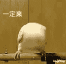

# 黑，2020.05.04

作者：ACE

TID：28629

<title>1</title> <link href="../Styles/Style.css" type="text/css" rel="stylesheet">

# 1

*本帖最後由 ACE 於 2020-6-4 08:53 編輯*

禁止转载，谢谢合作。
构想上我自己很有感觉很想写出来，至少是个中篇，但是，，打字太慢了，一个个情节脑子里爽完就懒得打出来了，，所以不知道后面会写多少，还会不会有。。
设定是个无限流
<title>2</title> <link href="../Styles/Style.css" type="text/css" rel="stylesheet">

# 2

前言
勇敢的少年呦，快去创造奇迹吧<title>3</title> <link href="../Styles/Style.css" type="text/css" rel="stylesheet">

# 3

*本帖最後由 ACE 於 2020-5-8 21:27 編輯*

请注意，本章含尿液情节
第一章，战坑
张开眼，世界已换了模样。
伴着震耳欲聋的轰鸣，我看到泥土飞走散向天空。那烟尘弥漫三万丈，遮盖了太阳。
巨大的声音绵延不绝。某一刻，我被气浪吹起飘在空中，又被黑烟和气流裹挟着四处流动。
不知过了多久，天光逐渐暗淡，声音和火光移动到了更远方。
我坠落了下去，落在了一个深谷里。似所托于空气和谷底松软的黑色泥土，我竟毫发无伤。
又是这样，我疲惫而无奈，或者已经麻木。
我尝试探索这巨大的谷地，因为我首先要解决自己的生存问题，比如获取食物。
但显然，我没有能力跋涉太远的路程。
我不知道该往哪走，四方望去好像没什么不同。
随便选一个方向吧。
没什么原因，只是一次单纯随机选择。
我向着一个方向走动，路径歪歪扭扭，因为或直或弯对我而言没有意义。
一段时间过去，我没发现什么有价值的东西，而且更饿了。
委身与一处浅浅的山坳，捱住一块巨大的石头，仰头看着天空试图理清思绪。
众星罗列，天空都好像离我更遥远。
蓦地，“咚咚"两声响，伴随着地面的震动，两幢巨大的黑影落入谷底，而后斜依在谷壁上，山石泥沙滚落而下。
我听到了巨大的呼吸声，像是这山谷里凭空出现了两个巨大的风箱。
我不知道那是什么，只想把自己隐藏得更深一些。
呼吸声逐渐平缓，黑影轻微调整身姿。
更多的泥沙滚落下来，震动远远传开。
”姐姐，我们去哪儿？“一个女声骤然出现，微弱得像是飘荡在天际。
“不知道。。”另一个女声随后响起，略微成熟，应该是姐姐吧。
这是人声。我不知道自己是什么心情，也许是惊喜与恐惧混杂，也许是麻木中透出了一点点空幻的希望。
一阵压抑的沉默，妹妹再开口“姐姐，我好饿”
一阵更压抑的沉默，姐姐说“只能吃一小口哦”
唇齿嚅动，嗫嚅声轻。
常说真正的黑暗下看不清轮廓，而现在我还能勉强分辨一些，大约是星光的功劳。
那两幢黑影组成的更大的黑影一串耸动，食物的香气弥漫开来。
也说不上什么香气，只是单纯的饼吧，麦芽面粉和了水后烤熟，那是食物。
我确定了一些事，我变小了。也不是第一次，虽然艰难，但也只能接受。
至少现在，我有了方向。我要去那里，争取寻找到一些残渣。哪怕伴随着巨大的危险。
行至中途，那其中一个巨大女孩微微撑起身体，躬腰在山谷中移动。
她只需要迈出两步就可以从一侧到达另一侧。她举脚又落下。
这一脚落在了我身边，泥土顺从着她的脚深深凹陷，巨大的震动使我浑身酥软。
是的，她的脚就在我旁边，我甚至能触摸得到。
她的脚坚硬而粗糙，向上蔓延似乎可以捅下天上的星星。
天啊地啊这样的描述其实很拙劣，只是无奈，我贫乏的语言系统里没有能够形容她的词汇。
她面朝下似乎在寻找什么。因为背光，她让我能看到的一面完全笼罩在阴影里。
我也被笼罩在她的阴影里。她的威压侵占了我全部的心灵。
我能感觉到她的目光从我所在的地方掠过，完全没有注意到我。我比起她眼中的砂砾更加渺小。
她轻盈而沉重地抬起脚掌伸向远方，石头如同喷发的火山岩浆一样被脚带动又落下。她离开了。
万幸，我还活着。
我继续向那个方向走去。
为什么不改变呢？因为另一个巨大的女孩还在那里，好像是妹妹，那么姐姐也会回去。我可能获得的食物也在那里。
翻越深沟和丘陵，我向着那个方向前进。
巨大的姐姐回去了，又是庞然的震动传开。
星辰在轨迹上运转，两个女孩发出的声音渐低渐无。
她们似乎休息了。
我仍然在向着那里前进。我知道这样做毫无意义。
我到了那里，我并不一定会获得食物，我可能被饿死，被她们无意中踩死，被泥土埋葬，等等等等。我依旧会死。
但我还抱有一点希望，也许我可以找到一点食物，苟活几时；也许我可以侥幸不被踩死，反而爬上她们的小脚趾。我也许可以和她们在一起，虽然这毫无意义，但我也许能以这渺小的身体和她们在一起。黑暗像纱又像雾，只有我在其中孤独跋涉。
过了子夜又过了几时？
一夜无话，再回神已是晨光微熹。
我来到了她们脚下。
我开始寻找食物。我一粒渣也没有发现。
我依靠在她们其中一只脚上，想着也许被瞬间踩死会是个不错的结局。
后背感到一阵颤动，山一样的人儿醒来了。
“唔。。”是妹妹的声音，似乎比昨天更加虚弱。
她推醒姐姐，然后岔开腿靠在谷壁上。
姐姐扶着妹妹的身体蹲了下来，把脸靠近妹妹的裤子。
我被她们刚刚的动作振飞，现在正在四只脚之间。
仰头看去，姐妹两人年纪都不大，俱是双眼无神，嘴唇干裂，穿着辨不出颜色的短衣短裤，皮肤像是血和灰的混合。
姐姐扒下妹妹的裤子，把嘴凑到她下面的小口上。
淅淅索索的声音响起，那是妹妹细弱的尿流在姐姐口腔里回旋的声音。
晨尿浓郁的味道在向下沉降。
一滴液体从姐姐口角落下，砸在我头上。
宝贵的水资源！我两只手胡乱挥舞试图将更多甘霖拢入口中。
随着最后的吞咽声，姐姐抬起头舔了舔嘴唇。
妹妹提上裤子弯曲膝盖开始蹲下，换到姐姐双脚开立，双手撑住坑壁。
她们筋骨摩擦的声音在这巨大空间里回荡，清晰可闻。
同样的动作，但妹妹更加饥渴，喝完尿后仍不满足，她伸出舌头用力舔弄姐姐下面的两个孔洞，试图获得哪怕一丝额外的水分。
一根阴毛被妹妹蹭了下来，砸在我面前。
这阴毛与我直立时一般粗壮，却像一列火车那样长。
阴毛表面干枯嶙峋，几乎没有光泽。
我奋力跑过去抱住它。我也不知道自己为什么这样做，也许是想占有这根阴毛。
占有这根阴毛？我太不自量力了，她的阴毛多么庞大，或许是她的阴毛占有我也说不定。
姐姐用手推开妹妹的脑袋，提上裤子。
她的脚掌变换方位，将我踩在两根脚趾之间。
然后抬脚，两根脚趾自然闭合。
我便成为了她脚趾上一丝不起眼的痕迹。
意识逐渐消散，勉力穿过两个巨大女孩肢体间隙的天光也愈发黯淡。
“我愚蠢的行为让她不悦了吗？她根本不知道我的存在吧。。真希望她们能在这个世界好好活下去啊。。。”
最后时刻，我用涂抹在她脚趾上的脑浆思考着。
一切归于黑暗。
。。。。。。
。。。。。。
萝莉音在我空旷的意识中响起：
本次生命结束。
获得奇异点：10
奇异点结余：71
获得道具：救命毫毛。效果，抵挡一次致死伤害。描述，这是一个可怜女孩对你的怜悯，诚心祈祷，即可获得庇护。
剩余时间：5h
是否进入缓存空间？

<title>4</title> <link href="../Styles/Style.css" type="text/css" rel="stylesheet">

# 4

> [fuguri 發表於 2020-5-4 16:22](https://giantessnight.com/gnforum2012/forum.php?mod=redirect&goto=findpost&pid=435457&ptid=28629)
> 很有意思的文呢！楼主还接着写后面的么~

随缘更新法。。。妙啊<title>5</title> <link href="../Styles/Style.css" type="text/css" rel="stylesheet">

# 5

 <ignore_js_op>[fbf18b83f7751d305be5c16362be329d.gif](forum.php?mod=attachment&aid=ODI4NTV8ZjQxYmQ4NzV8MTYwMDg3ODY3N3wxODIzMHwyODYyOQ%3D%3D&nothumb=yes) *(196.75 KB, 下載次數: 0)*

[下載附件](forum.php?mod=attachment&aid=ODI4NTV8ZjQxYmQ4NzV8MTYwMDg3ODY3N3wxODIzMHwyODYyOQ%3D%3D&nothumb=yes)

2020-5-4 17:31 上傳  

</ignore_js_op> <title>6</title> <link href="../Styles/Style.css" type="text/css" rel="stylesheet">

# 6

> [长寿青蛙 發表於 2020-5-4 18:42](https://giantessnight.com/gnforum2012/forum.php?mod=redirect&goto=findpost&pid=435472&ptid=28629)
> 妙啊，系统文么

也许是吧，主神空间啥的只是为了让换世界看起来有点合理。。系统存在感不会太强，毕竟小人一发大宝剑砍爆地球完全没感觉啊