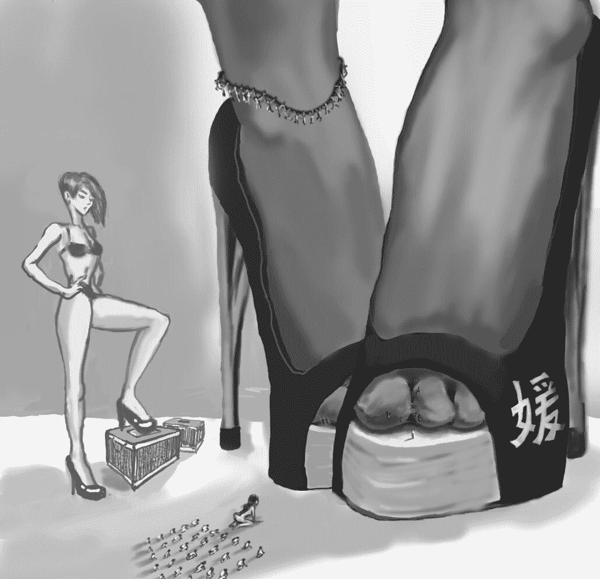

# （我的成长日志）第二十一章———媛之源(10.22图片插画）

作者：hongliang46

TID：16390

<title>1</title> <link href="../Styles/Style.css" type="text/css" rel="stylesheet">

# 1

*本帖最後由 hongliang46 於 2016-7-16 11:24 編輯*

为了让各位更直观的了解身高对比，特制了下面的图画<ignore_js_op>

**QQ图片20141022123309.jpg** *(96.1 KB, 下載次數: 7)*

[下載附件](forum.php?mod=attachment&aid=NDc4MzF8MDUxMzQ2OGN8MTYwMDg4NTQ5NXwxODIzMHwxNjM5MA%3D%3D&nothumb=yes)

2014-10-22 13:09 上傳

画师GN ID：1291626994
第二十一章———媛之源  
“一切生命，都归从于女神足下，忘却自我的崇拜，将会获得最大的恩典。”        “没事做，瞎念这啥玩意呢？”                                   “只是路过看到随口说说嘛，话说凯尔哥也真是的，竟在广场立个那么大的雕像，很让人琢磨不透啊。”   一晃就是三个月的时间过去了，草丛里的景观城，也从原本的十个，增加到了二十五个的数量，不明情况下疯狂涌入的人口，使得神御府不得不做出限制的命令，对于几座用地不足的老城市，居民也随之被再次缩小，而这，显然也是联盟预料之外的一次严重事故。              于是乎，哪怕是极为不情愿，也要不得已而为之，作为联盟首领的凯贝尔只能是为自己的过失，接受着此时近似羞辱般的谈判。            “不仔细看真是看不见呢，现在的大小是多少？怎么感觉比灰尘大不了多少呢，还想增加人口吗？呵呵呵…”   精致到完美的五官，妖媚的桃花眼，轻易的勾人魂魄，只是含笑着巡视着每一个人，嘴角勾出一抹戏谑的笑意。                                    “公主殿下，小虫们这次前来，是为了请求您宽恕的，作为您脚下最忠诚的虫子，我们在此进献一个特制饰品作为贡品，希望您能接受。”                                       随着话音落下，覆盖在小盒上的遮布随之掀开，俯视而下的惊喜目光里，两个精巧的趾环正摆放在小盒内部，那巧夺天工般的造型，几乎是模仿着女神所使用的造型，而最为让人惊叹的，则是这特制贡品上装点的一万名‘饰品’，这些携带者半年压缩食品的可怜人类，此时正满目惊恐的看着上方那未来的使用者，那朝他们伸来的巨指，成为了他们一切噩梦的开始。                 “啧啧啧，大小正合适，看不出你们还有这样的本事，真是小看你们了。 ”              将趾环分别带上左右食趾的婧部长，揉动着脚趾头满意说道，细微的舔舐感，也随之连续不断的传来，这些从此时便彻底成为物品的小人，成为第一批只供部长使用的装饰品。                     “谢谢公主夸奖，让您满意便是小虫们最大的追求。”看到对方露出笑容，凯贝尔连忙趁机献媚道。            “好吧，看在你们知错就改的份上，我就帮你们去跟上面汇报一下，记住，以后人口控制在20万以内，不然还会再次被缩小的，明白吗？”                                    “谨遵公主教诲！”
夜晚风林间，微风微拂，一双晶亮的眸子，明净清澈，灿若繁星，一颦一笑之间，高贵的神色自然流露，让人不得不惊叹于那清雅灵秀的光芒，至高无上的女神，倾国倾城般伫立着。               “嗯，该回去了…”               略带寂寞的话语，随着微风的吹拂，在庭院中轻盈的回响，刻意行走在草坪之上，让身后众多随从们不得不展现出各自高超的驾驶技术才得以跟随而上，这些在散步时一直保持着禁言的小家伙们，也在不知不觉中，变为了身边一种习以为常的工具般存在，从未获得过关心的他们，似乎总是在不断的替换着。                                 ‘或许，自己和这些小东西一样，都习惯各自的生活吧。’                                                   有些自私的自我安慰道，在一处景观城外停留的自己，自然地俯视起脚下这块一平方米大小的秀丽城市，对于这些仅仅为了打发一些休闲的时光却需要让十几万生命充当饲养物的游戏玩具，身为女神的自己，也曾有过不少不安的感觉，好在的是，这样的困扰，却很快被饲养小虫们所做出的举动所消释，就像此时一样，站立在城市之外便已获得城市之中人们集体崇拜的自己，只是需要随意撒下一些粉末装的食物，便足以让这些小小的生命陷入无比疯狂之中，这近似虫子争斗的场面，也让享受着身上各个部位细微刺激的自己，更加肯定内心给出的定义。                        ‘卑贱的生命，永远只能在脚下生存。’  不被任何力量所束缚的女神，做出的事情，看上去是会有些让人无法理解，比如说，并没有做出任何不敬的举动的城市居民，却依旧被当做过道一般踩踏而过，聚集在广场上丝毫没有准备的人们，还没来得及反映过来，便消失在了鞋底的纹路之下，十几万的城市，甚至抵不过自己简单路过造成的损害，更为可笑的还是那些剩余人类所做出的疯狂跪拜姿势，看到这些喊着颂歌求饶的虫子，真是有忍不住再多踩几脚的念头…            虽说不愿承认，但这些处置，确实大多数都与内心一些坏坏的想法相关，可在脚下蝼蚁一样的微小人类眼里，如此毫无道理的杀戮，竟也成了绝对不可质疑的惩罚，就算是自己已经走远，那留下了一个鞋印的城市中，人群依然是不停的跪拜着，可怜的小蚂蚁们，根本不会想到，自己所遭受的神罚，只不过是女神一个恶意的举动罢了。                     琐碎的事情，很快便抛之脑后…                              “嗯？这个是？我的雕像？看上去好像有二十厘米的样子啊。”                              站在景观城分布得最密集的草坪中央，巡视着各城发展情况，一座造型特异的城市很快便让自己将目光投了过去，在那有节奏的闪烁灯光中，位于城市中央的一个微型雕像，显得异常突出。“把这座小城市的管理者带出来。”         “遵命，女神！”               有些时候，太微小的虫子，也会造成一定的困扰，毕竟以自己的大小，要去抓取只有0.5毫米的小人，实在是很麻烦的事情，所以，随行的小组长们，便会是最好的传递工具。                        “做得很不错呢，需要什么奖励吗？”                           目光俯视中，跪候在飞行器上的男性，貌似并没有任何胆怯的反映。                     “至高无上的女神殿下，小虫们对您只有奉献，怎敢索求！”                                   “呵呵，还真是个好虫子，没事，女神既然答应奖励，就一定会给你们的哦。”     “女神圣决已下，那小虫就在此为城中居民们向您诉上最大的乞望……尊贵的殿下，请您接纳本城五万市民，作为清洁您鞋底最低贱的工具吧。”                       “嗯？鞋底？为什么要做这个？”                              出乎意料的请求，让自己都不免感到有些惊讶。                     “回女神，吾等都是从淘汰区选拔上来的低等虫子，能为您做这些奉献就是最大的奢望了。”                           “嗯，那就如你所愿吧，这样听话的虫子，女神可真是很喜欢哦，看你这么有能力，以后这里的所有的景观城就都归你来管理吧，要给女神更多的惊喜哦。”            “谢女神恩典！小虫一定不负您的重托！”                 “呵呵…”      就这样，一个随性的恩赐，却造成了日后那段更为混乱的局面。  
一星期后                           大洋中不为人知的海岛上，秀丽的热带风景让人流连忘返，山林之中，一座戒备森严的机场隐藏其中，那建成后就从未使用过的跑道上，此时竟停落着数百架大型客机，从世界各国赶来的代表团，正匆匆朝岛屿中央行进而去，那新坐落的世界会议中心前，迎接他们的，便是那在各国领导人间相互传说的，十位绝色部长们。      “都按照发给你们的分类牌号入场，进去后不许交谈，真是的，好不容易出来外面，竟是做这样的差事。”   “您好，能请问一下，这个清洁部是什么意思？”         正当两位美女部长交谈之时，一个穿着西装类似随行文官的年轻男生，前来询问到。                                   “哦？想知道是吗？来、到这个空地来。”                        “啊？是、是。”                    “闭上眼睛…”                        “是。”                                 感到不知所措的男生，按照指令听话地闭上了眼睛，但在几声顽皮的偷笑声过后，周围人群的惊呼声立刻便将其惊醒。                              “啊！这！这！”                  “怎么了？不是想知道清洁部的意思吗？喏，看到姐姐的鞋子了吗？是不是有些脏呢，过来，舔～干～净，嘻嘻…”                                    将穿着高跟鞋的黑丝足放在缩小到一厘米的男生面前，看着那跌坐在地上的小家伙惊恐模样，习惯训练有素工具服侍的两位部长，开心的嬉笑起来。            当然，这样的结果所造成的，就只能是苦了地上那四处逃窜的小男生了。         完全被当做工作空闲时用来调节心情的玩具一般，被惊吓驱赶的男生，尖叫着在不断落下的巨足间来回滚爬着，刻意让游戏时间变得持久一些的两位部长，就这样在众目睽睽之下，欢声笑语的进行着残酷的游戏，直到最后，那可怜的男生乞求般地跪爬到其中一双高跟鞋之前，游戏才得以停止。      “这么快就愿意做虫子啦？好吧，那就给你一个机会，到人家鞋子里做个听话的清洁工具哦。”                       完全没有想到所谓的机会竟是如此的结果，被玉指从地上拧起的小人，很快便再次缩小到一毫米的大小，还没等围观人们看清最后那放入鞋中的动作，重新直起身来的部长，立刻便让人群惊得四下散开而去。                 “哼，真敢来插话，胆子够大呢。”         “好啦，准备要进场了，殿下应该也快到达这里了，一会难保不出现小混乱呢。”                                   “嗯，听说仪器是第一次使用，不知道会是什么样的情况呢。”
而此时，卧室之内…           一片繁忙的景象，就坐在落地镜前的身姿，美眸炯炯放光，明亮的眼珠流转有神，弯弯的细眉象蚕蛾飞扬，娇娆的身段却散发出端庄的姿态，软椅上的自己，正忍着内心万般的不耐烦，接受着不停环绕在身子四周飞行器上爱宠的审核。                 “清水，用不着那么严格吧，上次人家可是直接将脚丫都搭到会议馆的上面去了，形象什么的早就没有了，这次也不用那么认真吧。”                                   无数的忙碌在头发中的小人使得自己连头的无法转动，别扭的感觉转变为不满从口中说出。           “我的殿下啊，这可不能怪虫儿，明明昨天已经和您约定好了，今天应该早起妆扮的，您晚上还让那么多小虫侍寝。而且这次的会议，您之前也交代过虫儿必须要办好，现在您又这样，真是…”            “好啦好啦！人家配合就是了。”                                    终于，再将挑选出的衣物穿上之后，进去入到新置仪器的自己，踏出了那重要的一步。                              〈设定一千倍，地点世界会议中心〉                                       
气势恢宏的会场中，200多个国家代表团成员们，严肃的坐立着，与之有些明显对比的，是就坐于前方贵宾台上的十位部长们，一阵阵嬉笑的打俏声，不时回响在安静的会场之中，让后方的各个政治家们，只能是苦笑的摇起头来。                        要知道，这十个绝色女性，可都是掌握了普通人生死权利的厉害角色。               “叮！叮叮叮！”                  突然响起的铃声，划过了沉寂的会场，伴随着机械地传动，两旁打开的圆顶，将午后温暖阳光洒进了所有的角落，原本十位嬉笑的部长，也终是在这一刻恢复了沉寂，那跪伏在地的卑微姿势，让人根本无法想象这竟是这些视生命如草介的女生所能做出的，除非，她们所要面对的是…                     “轰隆！！”                        惊天动地的巨响，再次唤醒了埋藏在人们内心深处的记忆，虽说仍旧没有看到那代表着死亡的巨影，但那雷鸣般的声音，却早已传入每个人的耳中。           “啊…果然，变大后感觉好很多呢…呵呵。”               一句自我放松般的话语，成为了变大传送后落在海岛上说出的第一句话语，俯视起迷人的热带海岛，一条由树林规划而成的宽阔道路，正笔直地通往不远处一座由石山为基础，精心开凿的座椅，看得出，为了举报这个会议，那等候在座椅把手上的小家伙，是耗费了多少的精力。                                于是，在挂着满意笑容，行进至小山石椅坐下之后首先将爱宠放入掌心爱抚以示奖励的自己，丝毫没有注意到地上已然响起的崇拜之声。“殿下、殿下，您怎么先顾虫儿了，会场里都开始膜拜了。”                            “那有什么关系，你这么辛苦，当然要先奖励啦。”     “啊、还是请赶快回应一下吧，这样对您形象很不好呢。”                              “好、好，呵呵…”               一边微笑道，一边将目光重新投回地面之上，那坐落在石椅前的会议中心，自然成了最引起注意的存在。
会场内                                 这样一届首脑云集的国际会议，对于身为一个小国家总统随行翻译的艾莉来说还是第一次参加，在接到通知的那一天起，会议神秘的内容就一直让人遐想连连，直到今天，自己在前往会议的飞机上拆开了那下发到每个随行人员的封保密文件，才得知了那令人震惊的惊世秘密，媛媛女神这个词语，也在那一刻，印记在大脑之中。                         就这样，还没有接受完这非常人所能理解的信息，跟随着代表团匆匆赶往会场的自己，很快又在会场前，见到了那一辈子都未曾想过会出现的事情。                     被所有领导人都尊称为部长的女生们，拥有着自己一生中所见过最卓越的姿色，但谁也未曾想到，如此美丽动人的女性，却能在谈笑之间，将那恐怖之极的一幕，展现在众人眼前，直到最后，跟着大家逃避般离去的自己脑海中，依旧是不停浮现出那位部长所穿高跟鞋中的可怕景象，不知那个不幸的男生，是否仍旧在黑暗沉闷的空间中爬行，那看似娇贵的玉足，到底会不会将那弱小的生命残忍碾碎，无法接受发生在眼前一幕幕的艾莉，神情逐渐变得恍惚。   不过这一切，很快便随着那巨大声响发出后变得烟消云散，看着周围那些时政要闻中熟悉的大人物们一个个争先恐后的跪伏下地，随行的艾莉，也不由得紧张的跪趴起来，而那犹如地震般的脚步声，更是让这名不知所措的小翻译陷入了莫大的恐慌之中。                              女神，这个自己不敢相信的真正统治者，终于是出现在了自己的所仰望的天空之中。                 碧水蓝天之上，一袭紫衣临风而漂，一头长发倾泄而下，修长的玉颈下，一片酥胸如凝脂白玉，半遮半掩，欣长水润匀称的秀腿裸露着，就连那秀美的莲足也在无声的妖娆着，一颦一笑之间，高贵的神态自然的流露，让人不得不惊叹于那圣洁庄肃，却又轻雅灵秀的绝世面容。可这样美好的画面，却仅仅持续了不到半分钟，便随之破灭。                                专门为此次会议建造的，可以称得上是星球上最大的会议中心，面积接近一平方公里，在这超巨大的内部空间中，围绕着中央空地而设置的一圈座椅，足以容纳所有代表团成员的入座，而随着本国参加的艾莉，此时便就坐在划分为清洁卫生区的席间。当那穿着白色金丝镂空高跟鞋的美足出现在圆顶上方时，这位跟着人们一起膜拜的小翻译眼中急剧扩张的瞳孔，便立刻将一种无法形容的恐惧强烈地发散而出，变大了整整一千倍的女神，身高已是达到了骇人听闻的1690米高度，如此巨大体型下伸入的巨足，自然会让一种暗无天日的强大压迫带给下方所在的人群，于是，在骚动的人群刺激下，这位胆小的女生，终于是在女神近二百米的玉足之下，高声尖叫起来。   “嗯？”                              “怎么回事！是谁叫的！？”伴随着上方降下的疑惑声，巨足也随之停止了行动，从前排冲上前来的警卫队，很快便将躲藏在座椅下的艾莉拉出，在一段野蛮的拖行之后，粗暴的丢在了坐在最前排的清洁部长身前。           “呜呜呜呜…呜呜呜……不要、不要杀我、不要杀我……呜呜呜…”                     在场数万名围观者投来的责怪目光中，跪趴在部长身前的艾莉，早已是吓得哭成梨花带雨一般。“哼，不知礼数的虫子，给我拖到后面打！”              失掉面子的部长，极为恼怒的命令到，如果不是女神在场，想必艾莉早已是化作了鞋底的一抹红斑。   “把她放下…”                     一段悦耳动人的盈音，让即将被拖拉而去的艾莉重新回到了原地，天空中，右腿架起后悬空在场馆上方的高跟鞋底，成为了此时这位死里逃生的小女生激动膜拜的对象。          “女神恕罪，是小奴监管不周，让这小虫惊扰您了。”                                 在地上连连跪拜解释到的部长，神色异常紧张。           “呵呵，一点小过失，不必惩罚得那么严重，小虫子，是不是被女神吓到了？”     “是、是，啊！不是、不是…”                                    不知该如何是好的艾莉，语无伦次的回答到，虽然不明白自己的话语为何可以被女神所获知，但那强大的气势下，自己的身子还是如倒糠般颤抖起来。                     “看来还真是被吓到了，是从哪个国家来的呢？”           “女、女神，我们只是一个西大陆的边陲小国，求您、求您开恩啊！”                    不知何时跪在一旁的总统，带着自己的同僚们，向上乞求着。                        “紧张什么，女神又没说要把你们国家踩碎，唔…架得腿都累了。”                  “全都统统滚回去！”           明白上方所传达意思的部长，没好气的挥手驱赶到，让犹如得到大赦一般的众人连滚带爬的回到了座位之上，而那闯祸的艾莉，更是连大气都不敢发出。           “砰！”      “砰！”                  “祝女神圣体万福！神佑众生。”                        接受众人膜拜的，正是那放入会场中央的一双美足，有着近两百米的长度，透过黑色透明水晶丝袜，美得出奇的玉足，保养得极好，白嫩的肌肤，还透着健康的粉红色。排列整齐的脚趾，趾部很长，弯弯的钩拢在一起，看上去很是优雅。趾甲晶莹剔透，闪着自然的光泽。足弓微微向上弯起，足面翘得很高，足踝圆滑纤细，几乎看不见踝骨。整只脚高贵秀美，如玉似翠，简直就是一件工艺品。                        当然，除了那些作为装饰的‘物品’之外。                  和任何第一次近距离瞻仰神足的虫子一样，艾莉的目光很快便被那众多的佩戴饰品所吸引，黑色的水晶丝袜中，首先映入眼帘的，便是那一圈戴在脚踝上的精致脚链，和所有见到过的款式不同，这一造型独特的链子上所用的挂饰，竟是一群被丝线垂吊着的妙龄少女，而作为对应，另一只玉足上垂吊的则是一群帅气的男生，从他们那近似机械的笑容可以看出，这些人类应该是为了点缀圣足而专门训练而出，不过相比起接下来发现的‘物品’们来说，这些人类的处境便算是极好了。      应该算是一种实用的装饰物吧，对于女神来说，圣足算得上是被小虫们瞻仰得最多的部位了，所以说，极致的保养与护理是非常有必要的，此时此刻的情况则变得更为特殊，放置于会场之中的圣足，显然是不方便移动的，那么在这样的情况之下，就需要通过工具来缓解女神的疲劳，那些聚集在足弓下的健壮男生便将充当这样的角色，通过用力的击打来刺激足底穴位，以做到增加血液流动，缓解足部肌肉紧张，不过……‘在那里真的安全么？怎么看都像是会被轻易踩碎的样子。’                            本该继续深入的想象下去，但却被一个更为奇特的景象所打断，微微做出移动的圣足，此时已是正对着艾莉的方向，从小观察敏锐的她，很快便发现了那隐藏在足趾间的秘密，看着那些奋力舔舐中的人类，自己内心中最后的防线被彻底击溃。      ‘完全就和奴隶、不，根本不能算是人类了，将人放到趾缝里使用，这样的女神，和恶魔有什么区别，大家为什么不反抗呢。’                  虽说心中是如此的想法，但却不敢将其说出口来，胆小懦弱的性格，让这个可怜的小翻译早已是习惯了逆来受顺的生活，看着身边一个个大人物争先恐后的进献道，经过开场那惊魂一幕的艾莉，只得是在座位上保持着乖巧安静的模样。               “好了，你们反馈来的小问题，女神都清楚了哦，一会让清水你们解决，现在先宣读新颁布的御令。”“这也叫小问题，都快要打仗了，这女神到底平时都做些什么啊…”                     小声的嘟囔道，天空中的御令也随之在广播中机械的响起。                           “遵照女神圣命，宣读下列四条御令：一、恢复被摧毁国原貌。二、从今日起，星球上所有国家，将按照神御府部门分类划分为十大块进贡区域，以满足神殿日常所需。三、每月的15号，定位女神降临日，每个国家都需要做好迎接的准备。四、任何挑起战争的国家，都将被视为破坏女神物品，接受最为严厉的惩罚。”“这下可好了，战争彻底解决了…”                                “你还天真啊！以后我们人类都将在她脚下永无天日了！”                                    一旁的国防大臣悄声说完后立刻再次将头低下。而会场的大屏幕中此时也已出现了一系列的条文。                 《神御府各部详细规划》——〈第一等级：神御警卫队 制御侍寝部                  第二等级：护理保养部 清洁卫生部  日常起居部                           第三等级：娱乐文化部 饮食管理部 服装饰品部      第四等级：原料供应部 回收分解部〉         “这些都是什么啊？”  看得一头雾水的艾莉，满脸疑惑的说道。                              “你没看见吗？这些部门都是按照女神所需来划分的，等级就是一个高低区别，高等部门能获得更好的地位，所属国家也能得到更多的发展许可，相反，越是低级的部门，那些国家的发展就会受到更多的限制，还好我们提前跟清洁部长做好了关系，不然像我们这样的小国家，是很有可能被分到第三、第四等级的，真是谢天谢地！”   “是…这样吗？可是不都是会变成她足下的虫子吗？”   “小心你的言语！你这丫头懂什么！这世界本来就是女神所有的，只是神不愿意亲临统治，所以我们各国政府才得以保留，这星球上的每一个人，包括你我，都是圣足下的虫子，看到那些丝袜里的人类吗？那就是第二等级的虫子，好好面对现实吧！”“！！！”                           眼前的一切加上那震撼人心的真像，这位发不出一句话语小翻译，只能是将脑袋紧紧的贴回地面，四周膜拜的声音，早已代表了各国政府的彻底臣服，那天空中传来的满意笑声，听上去竟仿佛充满着卑夷与嘲讽。           “呵呵呵…既然大家都同意了，那女神我就不需要多说什么了，作为奖励，可以允许你们派一个代表来亲吻圣足哦。”                                 ‘这算什么奖励嘛！’              看着那调皮揉动了两下足趾的巨足，艾莉几乎可以想象出那些位于趾缝间人类的可怜处境，根本没有在意，却要在楼房般的足趾间舔舐，或许这样真的能起到吸收脏物的作用，也有可能只是为了感受那趾缝间小小的刺激，但将如此之多的人类丢进丝袜之中，却完全感到毫不在意的巨大女神，是让所有生命感到极为畏惧的，那强烈的视觉冲击，让在场所有人，都能体会到自己那渺小而卑微的存在感。           “喂！刚刚的那个虫子！对就是你，到圣足那里去膜拜！”                                    “不、不要，啊！啊！放开我！”                                 丝毫没有任何反抗的余地，在部长命令之下被丢到场地中央的艾莉，再次重新回到了那众目睽睽的境地之中。   “呵呵…清水你看，那边的海里有鲸在游呢，一会去抓几条回去养着好不好？”     ‘不是吧，竟然去看海了…女神殿下啊，您好歹注意一下脚下的这只快要紧张到爆炸的虫子吧。’“还愣在那干什么！没看到鞋子前沿的梯吗？爬上去亲啊！”                                    在催促声中吓得朝前飞快爬行而去的艾莉，顾不上被磨破的裤子，狼狈不堪的攀上几层楼高的鞋底，好在的是，整个过程中，将注意力放在外边的女神，一直保持着足下静止的行为。            “天、天啊！这、这太巨大了吧！”                              终于是费尽力气爬上了鞋前段露趾鱼嘴的位置，犹如一个小蚂蚁一般面对着足趾的艾莉，不由得发出了这源自内心震撼的喊声。               “哦？又是你这个小虫子呢。”                                    ‘被，被注意到了！’              忍住快要跳出嗓子的小心脏，跪伏而上的艾莉，将脑袋死死地贴在了鞋垫之上。大脑一片混乱，完全不知道接下来应该要干什么的小翻译，就这么跪趴在巨大圣足前，瑟瑟发抖着。               被强大事物所带来的渺小感死死压制，艾莉几乎是想哭都不敢哭出来。                    突然间，一股摄人的清香，浸入心扉，顿时让这位小小的女生，惊讶不已。                                                         “好香啊。”                  “真是可爱的小家伙，女神的脚丫当然是香的啦。”     “小虫失礼，请女神殿下恕罪！”                           依旧是显得有些慌乱笨拙，但却似乎并没有因此被责备，稍微定下心来的艾莉，赶忙朝伫立在自己面前最大的脚拇趾爬去。那隐藏的一切，此时更为的清楚了。                             一群只有自己一半身高20岁左右的年轻人，数量大约在三十个左右，此时正服侍在拇趾和食趾最宽敞的趾缝中，赤裸着全身的他们，通过携带在手脚上的吸盘，攀附在楼房般高大的趾壁内侧与深处的两趾连接处，那犹如机械般的舔舐动作，正不断的刺激在女神敏感的肌肤上，从其身后背包中喷洒而出的护理液，也让将一种清爽的感觉带进那被包裹在丝袜里的趾缝间。                 为至高无上的女神提供绝对极致的护理，是身为虫子的人类所必须要做到。           不敢过多的观望，巨趾前的艾莉非常清楚此时面临处境，在爬行到位朝下用力磕扣了十下之后，将嘴唇凑上的小女生，极为恭谦地亲吻上了那黑丝圣足。可是……                             “到下面去。”                     “女神、女神、您，您这是？饶命啊！呜呜呜…”                     看着向上高高翘起的巨趾，前所未有的恐惧感，立刻便让艾莉胆小的本性彻底暴露出来。                                 ‘最后还是要被当做虫子碾碎！怪不得没人愿意来，谁来救救我啊！’                  “砰！”                                    “唔…唔…唔…”                                还没来得及准备  ，便已被压在趾肚下的艾莉，疯狂地挣扎起来。                              “嗯…还真是很激烈呢，大家说，女神该不该把这只小虫子碾碎呢？”                     ‘不要…不要…’被巨大重量来回搓揉的艾莉，意识逐渐模糊起来。                        “能死在女神圣足下是她的荣幸！”      “女神请恩典于她吧！”                              奉承般的呼喊，让小小的女生彻底的绝望。                 “噗嗤！”                              
‘嗯？怎么没有死？’              看着重新翘起的巨趾，不明不白就死里逃生的艾莉，依旧是傻傻的躺在鞋垫上。   “还不快点出来，真想被碾死吗？” 抬脚将小蚂蚁抖落的女神，轻声笑道，“只不过考察一下大家的反映哦，刚刚那些积极支持的，看来都是平时说违心话比较多呢，就先全部全部降到第四等级去吧。小虫子，被吓到了吧，女神夹死的是脚趾缝里的工具哦。”                     “小虫没事…。”                              “嗯，那就好，清水啊，我记得接受过我恩赐的虫子，好像是有什么…？”                 “是的，可以提拔为管理者。”                                 “那就做你们国家的领导人好了，好了，会议到此结束，女神要去抓鲸鱼了，嘻嘻！”                     “啊？？？”                        还没从对话内容中反应过来，已从会场中离去的巨足，早已是在十几公里之外的海中了，看着如释重负离去的各个国家元首，莫名其妙成为了总统的艾莉肩膀突然被一只手掌拍了一下。   “啊，部长大人！”               认出来者身份的艾莉，连忙再次跪倒在地。                 “恭喜呢，就这样做了小虫的总统，这是传送机器，拿好，今晚八点跟着大家到神御府集中。明白了吗？”     “遵命，请问部长大人该如何称呼呢？”                       “到时你就知道了。”
夜间，七点整                  行走在专属行道上，新任小国总统艾莉，正随着被划分为一起的其他国家首脑，匆匆忙忙地赶在前去集中的路上，对于这些第一次来此的外部人类，这里的任何景象，都是让人极为好奇的。 看着那富丽堂皇美、轮美奂的精美装饰，以及那摆放在各处的奇珍异宝，除了发出一声声惊叹外已是说不出其他赞美的词语，如果不是因为忙于赶路，这样难得一见的景色，真是让人不该错过。                              〈清洁卫生部长室小人专用出入口〉                           紧闭的高耸木门旁，一个仅有的开口上，正不停的闪动着，相互往了往，苦笑的众人，不得不从着狗洞般的开口钻了进去。      “啊，这是！”     “又被缩小了！”                                    穿过洞中再次被缩小成0.1毫米的众人，慌乱的惊呼到。                                 “安静！公主正在做足部按摩，大呼小叫些什么！”   前来带领的，是一位年轻的小组长，占据着一厘米的身高优势，跨立在人群上方的女生，趾高气扬的责骂道。“让他们过来吧…”              摄人心魂的妩媚语调，从远处悠然传来，那位于高高架起沙发上的部长，身姿竟是更为的巨大。                  有着整整二十厘米的可怕高度，就坐在由小组长们组合而成的椅垫之上，保持着闭目养神姿态的部长，此时正将那裸露的脚丫，放置在下方两只精巧透明的小箱之内，近五万名细微人类密密麻麻的攀附在其之上，通过奋力的舔舐，缓解着巨足经过了一天活动疲劳。
“噗嗤，噗嗤噗嗤…”           仿佛刻意做出的展示，透明盒中揉动起的五只足趾，在将大量的生命变成鲜艳的汁液的同时似乎也向外部的观众们宣告着那绝对可怕的权利，看着那些朝着巨足膜拜乞求的可怜人类，艾莉终于明白了低贱这个词语的含义。                                   “参见部长大人！”              “啪！”（皮鞭声）         “不知礼数，尊称婧公主殿下。”                                   “没关系，第一次犯错用不着惩罚。”                           精致到完美的五官，妖媚的桃花眼，轻易的勾人魂魄，嘴角是若有若无的笑意，只是嘴角含笑巡视着每一个人，目光在掠过阮绵绵和萧迟时，多停留了几分，嘴角隐隐勾出一抹戏谑的笑意。从沙发上俯视而下的巨大部长，让人顿时被笼罩在一种迷幻的世界中。  “如何？是不是感觉很刺激？”                                    “公主的玉足，尊荣华贵，实为天造之物，让小虫们无限敬畏。”                           “嗯，说得真好，既然你们这么聪明，本公主也就不绕什么弯子了，你们也知道，从今天起，宫殿内所使用的贡品都将由外部进献，作为专门负责圣体清洁卫生的部门，你们这二十个国家，必须在接下来的一个星期内建设好各自的训练场馆，并于每个星期天晚上八点，献上十万名优秀的虫子，具体的配额一会发给你们，都明白了吗？”                       “天、十、十万啊。”           “噗嗤！”                           “谨遵公主命令。”              看着被巨趾轻轻点碎在一旁的红斑，跪候在地上的众人，争先恐后的膜拜起来。  “嗯、嗯，知道就好，来、亲吻完‘圣足’后，就全部回去吧～”                             ‘                      一抹阴冷的笑容，浮现在妖艳的脸颊上。                     
（以下蓝色段落可能会有少许GT、GTS共存内容，剧情需要，不适请略过）     
忙碌的时光虽是匆匆，但却总不虚度。就如同现在，享受着，感悟着。那是思绪投身繁忙所获取的快慰，更是心怀在平和与烦躁下正确的取舍。伏案于宽大的办公桌前，批阅着一条条重要的条文，神御府总管的确是让人鞠躬尽瘁的一个职位。      ‘真不知道这些是让人咒骂，还是让人夸赞啊。’      在签署了一份下周果汁材料申请单之后，将笔放在一旁的韩清水不由得苦笑到，五万名生命，就这样变成了毫不足道的添加剂，而自己，便是这一切的罪魁祸首。   ‘女神一切需求，是人类为之发展的动力。’虽然听上去挺可笑的，但的确是在女神说出的各种御令之后，外部世界才停止了争斗，走上了共同合作发展的道路，在绝对力量的统治下，除了臣服，人类没有任何的选择，而自己，也是依靠着这力量，获得了这万人之上的权利，只不过，会非常辛苦就是了。       “总管大人，今晚的宴会，各部长都希望您能参加呢。”                                 桌面之上，一位侍女恭敬地伏拜道，对于这些各部长进献上来小礼物，韩清水总是视为和自己相同的生命一般呵护着，而这样的举措，更是让这些受过苦难的小女生们崇拜不已。  “嗯，我会去参加的，这次晚会是谁组织的？”              “回大人，是清洁卫生部的婧部长。”                           “哦，原来是她啊，知道了，你先下去吧。”                 “是，奴婢告退…”                 仍旧依依不舍的看着忙碌中的主人，小小婢女有些脸红地告退而下，对于心中那小小的的幻想，清楚自己卑微地位的小家伙深深明白，这位被女神宠爱的主人，是不允许任何小虫有过界的举动的。‘可是，就算主人再怎么深爱着女神，也只会被视为一个宠物吧，这样的关系，能保持多久呢…’虽然已是傍晚时分，却如同走进了白昼的世界。英伦风格的喷泉在金色的灯光下散发着耀眼的光芒，大片大片的草地上点缀着白色的星灯。每一种点缀，都散发着独特的光芒，混合在一块儿，却又那么和谐、舒适。衣着华丽又高贵的部长们，相互嬉笑攀谈，而在她们脚下，那些被链子锁着，跪伏在一旁的小组长们，更是是一脸欢喜的神色，要知道，能获得参加这样的宴会，显然是一种极高的荣誉，即便是被当做…   “你家的小宠物好漂亮呢，哎呀，还会表演呢。”                                 “平时训练多了嘛，来，表演几个高难度的。”            只不过是随意拽了一下手中的链子，地上的四位小组长便拼命在空中翻滚起来，让观看着的两位部长不由得开心的大笑起来，这就已经是对这些可怜宠物们最大的奖励了，用尽一切来换取主人们的开心，便是这些小女生们保证不被从组长位置上淘汰所必须要做得，不然，唯一的结局，变会是成为那些虫子一样……成为一群微不足道的生命。   “咳…咳…”                        从门口处传来的轻咳声，让喧闹的会场内顿时安静。     “恭迎韩总管大人！”                  纵然是平时嬉笑惯的部长们，在这一刻，也不得不展现出各自优秀的礼仪风貌，来迎接这位出现在门口处，深得神幸神御府总管。      “我说各位美女部长们，你们的爱好能不能改一改，虽然女神不在意，但至少不要那么明目张胆好吗？”虽然提前已经做好了心理准备，但那会场里一幕幕景象，还是让前来的韩清水皱起了眉头。“哎呀，总管大人，这些都只是一些提供服务的小虫而已啦，姐妹们都会很小心使用的，您不要操心啦。”如水蛇般缠绵而上，红唇中吐着香莲的婧部长，就这么在众目睽睽之下，做出了近似挑逗式的动作。   “作为东道主，表达热情是应该的，但是请注意尺度，婧部长。”                        “人家总管大人可不吃你那一套哦。”                 在姐妹嬉笑声中悻悻退下的妖艳清洁部长，一脸不悦的回到了座位上。                 “哼，装高尚，你们这些虫子，让你们表现的机会到了，去吧！”                       “遵命.”           悄声命令中，十名只有一毫米的小人迅速钻进了餐桌夹层中的秘密通道里，这些携带着特殊物品，训练有素的小虫子，正将穿令者一个可怕的计划，悄无声息的实施着。
“唔，很…热…”                        不知何时开始慢慢燃起的感觉，竟让一贯沉稳的总管感受到了那来自体内的炙热火焰，桌台上，一千名赤裸着娇躯的妙龄少女，正分成百人一组，在一个个透明器皿中，将那淫迷的舞姿卖力的展现而出，当然，作为今晚的压轴盛宴，这些女生，可不仅仅只有跳舞这个用途。                              “这些可都是经过小女精心培养的小虫，不管用来做什么，都是称心如意的呢，今晚各位姐妹愿意来赏光，就请当作是一点心意，拿回去享用吧。”                           “真的吗？婧儿你太客气了，那我们就恭敬不如从命，收下了。”                    谢谢款待，婧儿果然训练有方呢。”                                 “咦？总管大人，您不走么？”                                    “哎呀，没看见大人有些醉了吗，一会让婧儿送回去就好了嘛。”                        “等…等…”                        嬉笑声中，意识慢慢迷糊的韩清水，带着火热的身体晕了过去。                             十分钟后，宽大的沙发上，水蛇般缠绵在迷幻中总管身上轻轻摩挲着，催情的红灯光下，胯坐在大腿上的公主，魅惑般地摇摆起那性感蛮腰，在其身下，那饥渴难耐的男儿身躯，正急需释放。               “大人～现在就剩您跟婧儿了呢，是不是，感觉身体很热呢～哎呀！您真是很直接呢～嘻嘻。”         露出邪恶笑容同时轻轻解开自身衣物的媚魔，随之做出了更近一步的动作。             “婧儿心中最爱慕的就是大人您了，看到您每天如此操劳，却只能被当做一个宠物来对待，婧儿就觉得很不公平，很心痛，既然女神如此对您，干脆就请让小女来服侍一下您吧～”  “住…住手…”                       “哼！都昏成这样了，竟然还想抵抗……”         因为收到抗拒而感到极为恼火的婧公主，在将红唇直接凑上后，随即将玉臀微微上提，随后…                    “唔！”                              第一次接受男女之间强烈刺激的韩清水，瞬间便被来自体内的欲望彻底控制，喉咙里发出沉闷的声响。        “啊哈哈哈～大人真是很可爱呢。”                           “呼、呼、为什么、那里会有尖叫声，你、你放了小人进去？”            “不过是一些助兴小虫而已，您这样地位的大人物，没必要去在意这些吧，来，尽情的捣碎他们吧，啊～啊～！”                                 在耳旁蛊惑似的娇声说道，从两人之间传来的惊恐尖叫声，很快便随着结合的开始彻底消失得无影无踪，沉浸在快感里的韩清水，甚至已丧失了最后思考的能力。   
可这一切，在十五分钟后，瞬间转变。                          逐渐恢复的意识，却依旧无法停止自身那发泄般的动作，让人感到奇怪的是，那意识中本该和自己结合着的美艳部长，此时竟就坐在一旁的躺椅上，其挂在脸上的得意笑容，也在韩清水低下头发出惊叫时，转变成了肆意的笑声。     “！！！”                                                  “冷璇婧！你到底做了什么！”                                   “哎哟～大人，您竟然就立刻不承认了吗？”                           “这！这明明是你先挑起的！”                                    “呜呜呜呜…大人您怎么能这么说呢，这些小女生可都是被您弄死的，一会女神殿下过来，再还小女一个清白吧！”                                “什么！”                           终于意识到自己所钻进的是何等险恶的圈套时，急忙起身寻找衣物的韩清水，立刻便被从大地传来的剧烈震动晃倒在地。                     ‘糟了！’                           将散落在宴厅各处的衣服胡乱穿上，瞟了一眼蜷缩在沙发上被众多小组长围聚在一起的恶毒女生，平时沉稳的总管此时也变得脑子一片空白，还没等其理清思路时，那被巨力掀开的屋顶上俯视而入的圣容，无比愤怒。   “跪拜女神殿下！”               把围聚在身边的小组长们赶开，装出一副惊恐模样的冷璇婧，飞速的跪扑而下，两行清泪瞬间涌出。               “殿下！您、您听虫儿解释！”                              “跪下！”                             “是…”                                 被上方气势所完全压倒，没有胆量将话语继续说出的韩清水，巍巍地跪倒而下，显然，在这样的情况下，一切的辩解，都让自己处于极为不利的状态…      “衣服都还没穿好，该是有多激烈啊，现在感觉如何？我的‘小虫子’？”   “殿下，虫儿真不知道发生了什么，请您相信…”                        “相信？呵呵，相信什么？哎呀，连衣服都没有穿好呢。”                 “女神、女神…都怪小虫不好，让大人饮了那么多酒，弄得大人酒后乱性了，呜呜呜…”“你竟敢诬蔑我！明明是你先挑逗我的！”                        “闭嘴！”轰鸣般的警告声。     “小虫子长得挺漂亮的呢，叫婧儿是吧，出到门外来。”                    “是，女神殿下！”微微平稳了下呼吸，从宴会厅内一直跪行到大门处的冷璇婧，极其熟练的做出了应有的膜拜姿势，其前方，一双穿着红色金边镂空高跟鞋，涂饰着闪亮甲油的雪色圣足，正傲然伫立在地毯之上，高达八厘米的鞋跟上，数百名接受神罚的小虫不断挣扎扭动着，而那些被称为活体美学的装饰物，更是完美的衬托出了佩戴者那足以藐视世间万物的统治权利，那笼罩在四周的无形压迫力，甚至差点让十厘米的小部长感到透不过气来。      “嗯，礼仪做得很好嘛。” 天空中响起的话语，让冷璇婧不由得紧张地注视起那十只圆润的巨趾，对于这些善于察言观色的部长们来说，女神足趾任何一个细微的动作，都是需要注意的重要环节，而相比之下更为出色的婧部长，则是早已偷偷做出了进一步研究，要知道，在这样的神权世界里，人们所能接触的不会是其他任何事物，只能是女神那双足以践踏万物的圣足，对于低贱的人类来说，在没有获得允许的情况下，哪怕是目光稍微超过脚裸以上的部位，都会被御卫队处以极刑，深知这一点的婧部长，自然更是小心遵从。         ‘左脚的趾环和脚链都不在，是准备就寝脱下了吧，如此说的话…嗯，果然，趾缝里的虫子舔舐速度很快，有些水份分泌出来了，这么着急赶来，应该是非常恼怒了吧，看来得更加小心了…’                                    一边内心思索着，一边将头再次紧贴在地毯上，在绝对力量前，卑微的姿态是生存下来的唯一条件。            “抬起头来，让女神瞧瞧。”   “遵命。”                             “唔，的确是个美人胚子呢，身材好，脸蛋也不错，怪不得会讨人喜欢呢。”“女、女神，小虫只不过是一个服侍您的低贱蝼蚁，从来没有非分之想，今天的事情…啊！唔…唔…”  还没有来得及将接下来的话语说出，被高跟鞋前端踩在背上的冷璇婧，瞬间便感觉犹如被千斤巨物死死压在地面之上，而造成这样仅仅只不过是女神一个小小的动作罢了。       “你们几个，进去把我的小虫子抓出来。”破门而入的御卫队，不由分说的将身为总管的男生压叩而出，受到惊吓的小组长们，则更是连滚带爬的来到了大门之外，对于这些年轻的小女生们来说，没有什么比眼前被高跟鞋死死踩在地上的部长，更具有震撼力的了。           “清水呀，女神给你一个机会，你老实说，有没有和这个小虫子发生什么不好的关系。”     “唔…唔…唔…”                    完全无法说出一个字眼，被鞋段死死压在地上的冷璇婧，艰难呼吸着，痛苦的模样，甚至让刚被押叩出来的也男生，也变得有些惊慌起来。                                   “殿下，这、这事情是…”     “嗯？怎么结结巴巴的？看来你勇气还没有这个小虫子大。”一边说着，一边将脚掌向上翘起，下方暂时获得解放的小女生，连忙飞速的磕扣起来，“小家伙，既然他不说，就给你一个机会吧。”              笼罩在鞋底阴影之下，跪付在地毯上的冷璇婧，背后早已被汗水打湿，那无力的感觉，让其再次深刻体验了自身在圣足前渺小的存在。   “女神，小虫没有做过什么不守本分的事情，您可以查验。”                                    装出异常镇静的样子，说出这段话语的冷璇婧，很快便和对面的男生一起被御卫队按在地上，双腿随即强行分开。“女神，婧部长身体没有异常，总管大人下体有很多残迹，还有几只活的虫子。”   “问问她们，是怎么回事。”   伫立在地毯上的女神，面色变得严峻起来，冷酷的语调已占据了所有的话语。      “她们说是被大人拿来专门满足自己的，一次一百只，大人还想对婧部长做色欲的事情，但是被推开“冷璇婧，你陷害我，啊！！”                          “砰！”                                 被鞋尖重重踢飞，身子撞到神御府门匾上掉落回地面的韩清水，口中顿时吐出大量鲜血，没等其爬起，跟随而上的高跟鞋，便再次将其死死踩在地面，撵揉了几下后，随即粗暴的将其向后拖滑而去。          “怎么？还有话要说么？事实都摆在这里了。”              “殿下、是她，陷害…啊！啊！！”                              骨折的疼痛，让男生无法将接下来的话语说出，巨大的圣足将其脑袋死死按在了地面。               “女神！大人虽有过错，但也为您奉献了许多，您给他一些处罚就好了。”                    “看到了么，人家还求情呢，既然这样，就把他丢去做卫生纸吧，一会你把他带过去。”               “是，女神殿下。”               “很好。”                             看到将脚下男生踢到一边，转身离去的女神，冷璇婧不由得露出了兴奋的笑容，将男生变小后抓起的她，迅速的朝卫生间走去，却殊不知…                                   “御卫队，以后给我注意一下这些部长，有什么，就立刻给我汇报。”                     “遵命！”                                                  
而此时，卫生间中           “唰、唰、唰、唰…”            面黄肌瘦的身体，惨白憔悴的面容，空洞无神的双目，谁能想到，这混杂在人群里的女生，竟曾是那红极一时的天才歌手，自从在卫生间被捕获后，便一直惩罚般的关在寝室附近的浴室马桶中，作为一个保证内部瓷壁洁净的工具，已经工作了近一个月的蕾蕾，早已是如同枯草一般衰弱下来。           残酷的环境，甚至让人好几次都想跟随着那些绝望的同伴，跳入那冰冷的池水之中，而那仅存的幻想，却每次都将这样的念头制止下来。                 但这，却丝毫无法改变，人类在女神世界里低贱卑微的命运。               ‘也许有一天，自己也像他们一样，去接受那样的命运吧…’               黯然思索着，努力擦洗瓷壁的蕾蕾，不由得看了看下方那寂静得没有一丝波纹的池水，那湖泊般的大小，足以容纳下无数像自己一样只有一毫米大小的工具人类，可就是这么一个宽阔水面，却仅仅只需一次‘恩赐’，便可以轻松将其彻底改变，如果说这样画面所带来的，是无比恐惧的话，那更让人感到可怕的，便是在经过了一次又一次五官洗礼后，对人心灵上的毒染，要不是亲眼目睹过那些在此度过了近半年资深者的行为的话，蕾蕾也根本不敢相信，竟会有这么多人将那当做仪式来进行膜拜，这些接连不断的冲击，令成为虫子的蕾蕾，无法抵挡。“呀！这不是婧部长么，深夜突然来访，有何贵干呢？”               ‘！’                                 极其微弱的话语声，唤醒了正在疲惫工作与思考中的蕾蕾，那熟悉的名字，令其极为警惕的聚听起来。                              “天啊，真是好可怕，既然是女神殿下的命令，就请继续去执行吧，希望你不要牵扯到本部门，我只是一个不被关注的回收部长，一直安分守己，不像婧部长你那么活跃。”         “呵呵呵，姐姐真是爱开玩笑，既然您已知道了，那么小妹这就去执行处罚了，反正也是我们清洁部的事情，女神殿下可是很认真的呢。”                 “唉，大人怎么会是这样的人，真是奇怪。”                             ‘！‘大人’！！难道会是？！’                           听到消息蕾蕾，内心急剧跳动起来，几乎将心中的想法喊出声来。         
半小时后                              “嘀！请注意，请注意，因特殊原因，本部长下令，从今晚起，主浴室马桶内所有人员流动一律停止，严禁接近清洁卫生部所在区域范围，如有发现，必将严惩不怠！”“哼，果然有很大问题。”      拥挤在人群之中的蕾蕾，小声的嘀咕道，这位已经完成了整个下午工作的小女生，此时正跟随着几十名同小组成员，跪聚为一圈等待晚餐食物的配给，宽阔的大厅中，像这样五十人为一组的小分队，总共有一百个单位之多，也正因为如此，从人群中悄悄离去的蕾蕾，才得以幸运的没被组长们发现。  于是乎，成功从中央大厅逃出的小女生，开始了在内部大量复杂通道的探索，因为是使用频率最高的一个马桶，其中所分配的工具自然也是最多，虽说对于使用者的女神来说，这里的一切根本都是一些毫无兴趣的东西，但却依旧是近十万名回收分解部成员赖以生存的封闭世界，而作为其中一份子的蕾蕾，更是深刻体会到了那底端虫子最为可悲的命运。   ‘一定要逃出去！’               坚定了心中的念头，花费了近一个小时，终于是在偌大的空间中找到清洁部所在地的蕾蕾，忍不住兴奋地挥舞了一下自己芊细的手臂，随后……                                 便突然失去了知觉。模糊之中                       “哎呀，我们的‘总管’竟然对这小虫子感兴趣呢。”         “我只是希望您能让她编入我的小组，既然冷璇婧说过可以让我自己招揽组员，那我就有权利询问她是否愿意。”                                   “啧啧啧，一个逃跑的小虫而已，要不要都无所谓啦，现在这数量，估计是连女神都不察觉不到吧，真是可怜。”                                   “谢谢您的‘好意’，来、大伙把她伏回去吧。”                  不知是过了多久，从昏迷中醒来的蕾蕾，首先映入眼帘的，便是心中一直所希望见到的熟悉脸庞，只不过，如果是在这里看到的话，那么就意味着……                     “您、您被女神…”           “啊，连蕾蕾小姐都知道了吗？不过现在应该更关心自己下吧，看你的样子，没猜错的话，是从‘下面’逃出来的吧。”                              “是、是的，我听到您被放进这里惩罚，就想尽一切办法过来找您了。”                 “哦？可是我已经是一个毫无作用的小人了，怕是没办法帮到你了。”                    “不、不不，你误会了，我只是想问您一些问题，如果是被放进女神的卫…”         “砰！”                                 就当蕾蕾迫不及待的想把心中问题说出时，被打开的大门外，二十几个柔弱的男生，涌了进来。                     “韩先生，这二十五个小家伙，是被其他小组剔除掉的，本来是要被丢入分解所的，我看到后就把他们硬生生抢过来了。”                                         “哦，真是太感谢了，一会给他们安排一下住所，嗯…总共有九十五个成员了，总算是可以有所作为了。”                          热情地将人们送出门外，回到床前的男生自语说道。   “冒昧的问一下，您现在的身份是？”                           “这…恐怕要让蕾蕾小姐见笑了，鄙人现在的身份只不过是这里其中一队卫生纸成员的负责人。”                           “卫生纸？您是指…清理…”           “是啦，就是负责殿下恩赐后的清理。”                       “可是，这样的话，不是每次使用完后，就会被…冲掉吗？”                           “这个、应该是这样吧，毕竟你也知道殿下是怎么看待我们的，这个按照规定，算是正常的用品消耗。”         “殿下知道您在这里吗？”                                    “恐怕不知道吧，光且不说卫生间的数量，就是这里的的十组预备小队，都已经是数量众多了，你觉得女神会去注意这些她认为污秽的东西吗？”“唔…伺候了那么长时间了，竟然这样惩罚您。”“这不是女神的错，只怪我用人不察，进了那妖精的圈套。”                            “妖精？您是说婧部长？”     “没错，就是她，可惜我也已经没有办法再去阻止了，不知道她接下来还会做出什么更可怕的事情。”            “滴！”                                 急促响起的警笛声，打断了两人的对话，意识到发生了何事的蕾蕾赶忙撑起身来，门外，飞速集中的组员们，早已是整齐的排列在平地上，从那紧绷的面部神色可以看出，此时这些年轻人的内心是多么的紧张。           “快站上去，一会就要开始了。”                                 “这、这么多人，都是要去…”                                    “是的，这还不是标准配置，标准数量总共是一百五十个，啊！小心！”               还没等男生将话说完，打开的地面，瞬间便让所有人滑落而下。      熟悉的震动，随之从远方传来。                                   
深夜四点，极为准时的一个时间，对于夹层中等候着的十组人类来说，却是一个命运审判的时刻，透过前方变得透明的一小块瓷壁向外观望，那黑暗的内部空间此时已是灯火阑珊，不断四周喷涌而出，弥漫在空气中的清新香水，竟让人产生了一种平静的感觉，直到那沉重的脚步声极为接近的停止下来。                                   “滴！”                                 清脆电子声中，自动向后收缩的桶盖，终于是让外部世界的灯光照射了进来，可在那狭小的视野内，那绝美的使用者，却并没有出现。   “女神站得有些远，看不见呢。”                                   “您希望看见女神殿下？”      “你可能不知道吧，被放入这里的人，绝大多数都无法看见女神的容貌，即便是最后被消耗掉，也是如此。”   “啊，我理解了，唉…的确如此呢，既然已经接受了这样的命运安排，心中唯一的念头就应该是想看看使用自己的女神是什么模样吧。”“你说的没错，这是他们最后的奢望了，但实现的机会却又很小，啊，小心！”     
“啊！！！！天啊！”           
在蕾蕾惊恐的叫声中，从天空中降下的巨大物体，几乎占据了宽广桶口的所有面积，将内裤褪至大腿处的女神，在人们的注视下，自然朝下方坐了下来，那经过锻炼丰厚圆润的翘臀，很快便架在了位于四周的的垫圈上，那极具冲击力的庞然体积，甚至在接触的一瞬间，便将所有跪候中的人们震翻在地。                                 在女神面前，人类就是如此不堪一击。                        “快快，重新排好、排好。”   紧张的提醒到，从地上爬起的年轻人们，却并没有再次组成整齐的队列，而是跪伏在地上，发出了那一声声惊叹。         “都在看什么，啊，原来如此，殿下又做这些装饰了。”                                “那些、是装饰？”              “看来没有人反对，殿下又开始过度消耗了。”                              出现在视野内，能引发人们惊叹的，自然是不寻常的景观，这些已经见过数次相同场景的人类，此时却不得不震撼于上方那不可思议的一幕，在穿过两腿之间的光线照射下，修剪整齐的茂密森林，至上而下、由密到疏延绵生长着，而那令人们感到惊讶的，便是那些密布在精心修短到只有一厘米顽皮涩毛上的事物。                                   经过细心挑选，不计其数的年轻男女，此刻正浑身赤裸地系绑在森林之中，每一根黝黑的粗绳末端，都悬掉着一个鲜活的人类，那样的景象，就仿佛让那些可爱毛毛有了生命一般，将其点缀得活灵活现。                       不仅如此，如果将视线再次朝内部仔细望去，就会发现另一幕甚至称得上壮观的景象。                                   让世人为之敬仰的圣地，在瓷壁内灯光聚焦下显得是那么的完美无瑕，保持着自然姿势的美神，丝毫没有任何娇柔造作的举动，如同一名深夜起来的居家女生，睡眼惺忪的就坐在马桶，而对于那些正紧张注视着自己下面的人类则是一副毫不在意的模样。                              谁会去在意那些日常使用的消耗品呢。                        可明知如此，却也是被使用一方不得不无条件接受的事实，面对拥有压倒性的巨大女神，渺小的人类们，就如同可以随意取用的物品一般，只需要一个小小的示意，便可以让无数人变成一群低贱的小虫，就像此时展现在头顶的那一副景象一般，茂密的森林中央内，那一圈圈像轮廓一般围聚在圣地周围的黑色小点，正死死地依附在柔软花瓣旁，犹如自动运作的工具一般，极为有节奏舔舐着，和用于装饰的人类不同，这些隶属于护理保养部的小家伙，在各国进贡之后，便经过了时间加速的特别培养，虽说内心的恐惧还是存在，但相比起那些被挂在涩毛上不是大哭大叫就是不停发抖的虫子来说，这些会主动服侍的小人，也还算得上一个比较舒心的工具，除了消耗过快之外……当然，和女神圣地比起来，这些也不过是一些不需要理会的小事罢了。      接下来发生的，则是………     “哗！哗啦啦！！”                                      还没等下方的人们看清，从森林中央喷涌而出的汹涌水柱，瞬间便创造出了另一副震撼人心的奇观，在‘装饰物’们的鬼哭般恐叫声中，白透的圣水，犹如万马奔腾般气势恢宏。震耳欲聋的水潮声，甚至让所有人都失去了相互交流的可能，除了定定仰望那发生在眼前的壮丽景观外，已没有了丝毫杂念。“嗯…”                                 听似慵懒的语息，却是让此时此刻所有人神经为之紧绷的导火索，依旧就坐于上方的巨大女神，正轻轻地朝一个按钮点去。                    “不要点到、不要点到…”     蕾蕾小声地默念祈祷着，上方发生的一切，让所有人都感到无比紧张。       “唔，就用第三组好了，全部都是男生，动作要快哦～”                   “啪嗒！”                             随着话音的落下，一个小盒子立刻被机器传送而出，位于其中的男生们，在进入到清洗专用管后，迅速被送至位于中央的喷口之下，仅仅几秒钟的等待，这些小工具们便如同喷泉一般向外射出，开始了他们一生当中最为重要的使命———女神专属卫生纸。                           “天啊，现在看来就算是标准的配制，也不一定能做好，根本不成比例嘛！”  “嗯，按照一毫米大小，要想在一分钟内清洁完毕是非常困难的，而且前提还要是在女神配合的情况下。”     两人所望去的视线中，工作在森林中央的男生们，正在护理部成员同情的目光中，不顾一切的奋力吮吸着，虽说残留的圣水只有一丁点，却是需要所有男生们竭尽全力才能完成的任务，为了那几乎不可能得到的恩典，这些渺小的虫子们，已是拼尽了自己所有的力气。               “都挺麻利的嘛，不愧是男生呢，既然如此，那就不把你们彻底冲走好了。”  “呃？不彻底冲走？这是什么意思？”                                 满脸疑惑的蕾蕾扭头问道。 “这是节约计划的内容，为了增长一次性消耗人群的使用周期，神御府向女神提供了很多最终处置的办法，而这就是其中一个。”“增长使用周期？”               “没错，为了让其他预备人群不过快被使用，只能想办法让这些已经投入的使用的更加充分长久，就像现在这样，再被女神消耗掉后，还可以到地下的分解池里做回收工具，虽说结果是非常可怜，但总比让回收分解部专门放一批人下去要好多了。”                                         “啊！！原来传言是真的！分解池真的存在！”                             “是啊，虽然我也不明白为什么一定要设置这样残酷的装置，但女神却经常会时不时提供一些仪器让部门更新，也许真的有其他作用吧。”                “哼！到现在你还帮她说话，明明就是为了玩弄和折磨我们！”              “唉，对此…我无法反驳。”    （跟随两人对话同时进行的，还有那上方壮观的景象。）           “滴！”                                 仅仅只是使用了30秒左右的时间便已觉得不耐烦的女神，在轻轻触碰到一个按钮后，便引发了命运终结般声音，随着下方细丝的牵引，粘黏在洞口附近的男生们被无情的拉扯而开，一个个如同下雨般掉落进温热的水池中央，消失在不断泛起泡泡的水面之中，而最为可悲的是，即便男生们落得如此凄惨的结局，到头来竟也换不来使用者的一丝垂帘，在起身坐起之后，将睡袍重新放下的女神，就这么自然而然的莲移而去，留下身后那抽水声隆隆作响的微型世界    “结束了，都回去吧，记住，下次我们可不一定会那么——‘幸运’！”
身为组长的男生，长叹着，却没想到，令其平静的日子竟在接下来的一段时光中出乎意料的到来了。                     西大陆的边陲小国，面积不到一万平方公里，却因为地处亚热带季风洋流交汇处，成为了世界闻名的度假胜地，通过旅游业强有力的支撑起，这个原本落后的农业小国也因此步入先进国家的行列，拥有了让其他各国人民羡慕的生活环境，而其新当选的总统，更是在一段时间内获得了世界各国媒体的关注。     没有什么别的原因，仅仅是年龄只有22岁就足够吸引眼球了。               
总统府                             简约现代的风格，是一些没有历史文化底蕴的国家修建政府大楼大多数的作风，虽说最高领导人早已易位，却也其无法改变这样的风貌，而唯一做出改善的，只有那装修得还算典雅的总统办公室。                                   橡木打造的办公桌上，除了规规矩矩的办公用具外，还摆放着不少有趣的小工艺品，看得出来，这位突然就被全票通过的女士，并没有拥有一个最高领导人应有的模样，对此，正就坐在总统办公椅上的到访者，自然是更为的清楚。   仅仅只是随意地就坐在转椅上，右腿自然架翘而起，左手灵活把弄着一个精巧饰品的尊贵公主，丝毫没有将眼光投向那正跪在桌下仔细亲吻脚趾的女生，反而是在对方准备膜拜起自己另一边足趾时，用力的踹开而去。  “公主？？艾莉知错了！求您开恩！”                              虽说不明白为什么会被踢走。从地上爬起后重新跪伏而下的新任总统艾莉，还是朝着前方的玉足使劲地磕扣起来。                              “真是费力呢，看来踩惯小人了，踢你还是挺不容易呢。”                  “公主…求您不要……”      埋藏在心中那深入骨髓的恐惧感，再次袭来，让艾莉不由自主的颤抖起来。   “真是胆小的虫子，只不过是随便说说而已就吓成这样，要是女神来了，不知道还会变成怎样呢。”              “女神、女神殿下？”            听着那代表着一切的两个字体，曾经的一幕，再次于脑中浮现。             “没错，这就是此次前来通知你的消息，这个国家已经被女神亲自选定为第一次外出游玩目的地，你必须在一个星期内做好神临准备工作，从现在开始，其他国家都将屏蔽这里的信息，好好工作吧，如果完成的好，就可以升任你管理本部们所辖国家的三分之一哦。”         “可是公主…这里是我的家长…”                              “什么家乡不家乡的，你们要做的，只是充当女神游玩时消遣的玩具而已，本来就是一群虫子，被使用了应该谢恩才是，就像这样！”     “啊！！”                             完全没有任何心理准备，瞬间便回到了印象中可怕的环境之中，悬挂在头上的巨大高跟鞋底，刹那间便唤醒了心中的恐惧之源。      “啧啧啧啧，自己看看，明明就是个虫子嘛，小的可怜呢。”                “公、公主…不要这样…呜呜呜…”                                “知道错误就好，这可是在帮助你成长，要知道当初我也是这样爬上来的，呐，偷偷给你一个设备，好好收起来，过几天，会有其他国家送来女神使用的拖鞋，你把它放进去，就行了。”         “这、这样好吗？”               “叫你做就做！问那么多干吗？真是个不聪明的虫子，好了，到此为止吧，我也该回去了，好好表现吧！”     “遵、遵命！”                     
神临前夜，一派忙碌的景象，作为指定接驾部门，清洁卫生部的婧部长，自然是表现得最为积极，虽说心中怀着那不可告人的野心，但在那强大的威慑力下，却也只能是卑微跪伏在地上。                              “好了，就按这个时间来安排吧，已经很晚了，都下去吧。”                “是，小虫告退。”               按耐不住内心兴奋的心情，行进在走廊上的徐璇婧，忍不住将自己所驾驶的飞行器调节到了最快的速度，让其在不到十分钟的时间内，就到达了景观城区的范围内，那等候在草丛下的众多微型小人，早已是在此等候多时。      “这里面是你们的任务，务必在女神回来之前，调查清楚。“明白！” 一块肉眼也无法看清的晶片，闪耀着银白色的光芒，涌动的暗流终是掀起了波浪。                                   最后一个平静的夜晚很快就这样过去了，和往常一样，艾莉早早便来到了办公室内，准备着那经过内阁成员们推敲揣摩过无数边的全国紧急通告。         “不管怎么样，都是没用的吧，到头来只会被人民唾弃。”                  “啧啧，竟然还在在意这些虫子？不就是五百多万嘛，能成为女神玩物，还是他们的福分呢。”               突然从在身后响起的声音，让艾莉不由得吓了一跳，不知何时出现在办公室内的部长，让这位年轻的总统赶忙跪倒在地。                               “女神已决定，将以八百米的神姿降临，地点是国家度假区的沙滩，到时候带领好虫子过去迎接，这次随行的还有五个部长和二十万工具，你们还算幸运，不然到时候就要你们这些虫子去服侍了，不知会消耗多少呢，呵呵…”小虫明白，本国人民将以最崇拜的仪式来迎接女神殿下，只想请求公主能在殿下前前美言几句，让殿下尊贵的圣足不要踏在五百万卑贱蝼蚁的身上…”     “哈哈哈！真是可笑，好吧好吧，我会帮你说下的，但是会不会被踩碎，就是神的意志了。懂吗？”                 “是，小虫明白，真是太感谢公主了。”                       一切，都已经准备就绪…   沙滩上，早早便被广播从家里命令而出的民众，正紧张而略显杂乱地排列着，相比起人口众多的其他国家。这个只有五百万人口的小国，在经过了一个晚上紧急的通告后，很快便被清晨到来的御卫先遣队所管辖，面对眼前这些只在电影中才会出现的可怕军队，绝大多数民众还是选择了服从，而那些拒绝指挥的少数份子，则是在被强行关进一个笼子之后，放置到了沙滩上的人群之中。   “公民们！公民们！请你们听我说！”站在高台上的艾莉，努力地朝话筒喊到。喧闹的人群渐渐的安静了下来。                                   “和昨晚告知的内容一样，待会请大家一定要牢记那些注意事项，千万不要违反！你们也都看到了，现在的这些都是无法反抗的，因为我们要面对的，是这个真正统治这个世界的女神，所以！为了大家的生存，都请各位一定要遵循之前制定好的接待方式，绝对不能违反！”     一片无声的沉默，咬了咬发干的嘴唇，便大海转身跪下的艾莉，眼圈早已含满泪光。                                   蝼蚁，是没有选择的权利的，自己所能做的，只能是教会大家，在圣足下应有的生存方式。                        晶莹的浪花，欢快地拍打在沙滩上，温暖的海风，轻轻地拂过每个人的脸颊，如此美好的画面，却无法让在场的百万民众感觉到哪怕一丝惬意，当那巨大的裂缝出现在天空之后，这一切更是变得荡然无存。                    “啊，天气真好，看来这地方挺不错的嘛。”                  一阵悦耳的女声在裂缝中传出，随着海风传播到在海滩之上，在人们紧张地观望中，一条修长而雪白的大腿，成为了从裂缝中出现的第一个壮观景象，那犹如高塔般的可怕大小，令这些观看晚做完电视通告的民众们不由得发出了惊讶的叫声，毕竟没有什么比亲眼目睹更为直接的方式了。殿下小心，下面的海大概有一百米深这样。”              “哦，这点深度，都还没有没过膝盖呢，呵呵。”         “哗啦！”                             还有什么，能比一个800米高的巨大身躯，在你面前跳入大海更有视觉冲击力的景象，飞溅的浪花，甚至让一股巨浪，迅速的朝海滩汹涌的袭来！           “防浪墙竖起！”                  紧张的命令声中，延绵在海滩上的十几面高墙随之竖了起来，可怕的浪花，在尖叫声中重重地击打在高墙上。 如果光是这样轻轻的一跳，就能给如此遥远的海滩造成这样的冲击，那接下来呢…艾莉和人们，早已不敢想象。   “殿下，奴婢昨天已经要求他们在沙滩迎接，您看看这些小虫您满不满意。”  “嗯…”                                 没有过多的回答，逼近沙滩的身躯，下方的水线开始飞速下降，直到那夹杂着大量泥沙的巨足，踏在了离岸不到五十米的位置，让那完美的圣足终于是展现在了沙滩上无数的众人面前。           “我等小虫在此恭迎女神圣临，愿女神万安！”            从体育场搬来的超大扩音设备，让艾莉清脆的声音瞬间便响彻了整个沙滩，完美的将人群中稀稀拉拉的应付式崇拜声瞬间掩盖。   没经过培训的民众，是不可能做到绝对的崇拜与合格的礼仪的，作为总统的艾莉，只能用尽一切办法，去弥补这样的过失，要知道，任何细小的问题。都有可能带来可怕的后果。                     “这些小虫子做得还不错呢，竟然还会拍出女神殿下的名字来迎接。”        “嗯、嗯，看得出来是有精心准备过了，殿下应该会满意吧。”              四位有着膝盖高度的部长，悄悄地相互交流到，让一旁的婧部长不由得露出了得意的神色。                             “嗯，都挺不错的嘛，小家伙，你是这个国家的总统对吗？”               “是、是的，我尊贵的女神。”                                    紧张地跪伏在高台上，大气都不敢出的艾莉，卑谦的回复道。               “做得很好，来，女神恩赐你代表你的国民，来亲吻圣足吧。”              “啊！谢、谢谢女神！”        惊喜若狂的小总统，就这么在民众吃惊的目光中，飞快的爬下高台，在几位部长们耻笑的声音里，钻进巨趾间，低贱的亲吻起来。      “可以了，既然你们做得很好，女神也就不为难你们了，一会在前面带路吧。”“是！小虫这就去。”紧张得有些手忙脚乱的艾莉，就这么从沾满着湿沙的趾缝里钻出，一系列低贱的姿态，让跪伏在地上的国民们不由得窃窃私语起来。   “请殿下稍等片刻，还有些事情需要您处理一下呢。”            “嗯？”                                 “在您来之前，御卫队抓捕了大约一万多不服从管理的小虫，您看是不是需要处理一下？”                                   一旁走上前来婧部长，突然说出了这一句令小总统万分绝望的话语。         “女神殿下！他们不是不服从，是因为小虫没有传达到位，都是小虫的错！求您开开恩，不要处罚他们啊！”   “大胆！殿下有允许你说话吗！”                                   随着巨足边一位部长严厉地责问声，一条长长的鞭子立刻便从一旁的御卫队员手中甩出，重重的抽打在艾莉身上，瞬间便将其背部衣物打碎，露出一道深深的红色印记，让其趴在地上惨叫不已。                                   “是个很勇敢的小家伙呢，让女神看看，你们指的是这个小笼子里面的虫子是吗？”                                   被同僚搀扶而起的艾莉，再次艰难的跪伏而下，前方不远处，上万名被关押在笼中的民众，正一脸惊恐地看着那位于上方的巨大身躯，而刚刚总统被毫不留情鞭打的一幕，更是让所有在场的民众心惊不已。                     如果连身为总统的艾莉，都在被如此对待后丝毫不敢反抗，那身为普通人类的自己呢……只能是女神眼中的一只微不足道的蝼蚁罢了。  “也不是很多嘛，既然这样，就让你们几位部长处理好了，算是赏给你们的。”“啊！谢殿下恩赐！女神殿下万岁！”几位部长高呼道。                    
放弃了再次争取的念头，已经争取到大多数人生存权利的艾莉，只得是爬上停放在一旁的飞行器，带领着御卫队整齐的朝城市内飞去，而在她的后面，那双巨大的圣足也随之活动起来，轻易地跨过了聚集在沙滩上的一百万民众，踏在了城市的大道之上，在那专门为了女神行走而扩宽的大道两旁，原本站立着的民众，也随着巨足的到来纷纷跪拜而下，在着充满绝对统治的力量面前，任何渺小的生命，都已放弃了抵抗。                             “请女神在此清洗一下圣足…”                              “嗯？在这里吗？”                                   “是、是的，这里原本是我们修建的一个人工湖，因为找不到合适的地方，只能请女神屈尊使用了。”               
“殿下，您的鞋子已经运来了，您看是不是需要穿上呢？”                                  与其他几位部长合力将高跟鞋从机械上搬下来的婧部长，伺机向前请示到。      “嗯。”                              将圣足穿入鞋中的女神，丝毫没有注意到自己此时的脚底，一个极度细微的仪器已是偷偷依附上了肌肤。                                    而此刻，遥远的神殿内却已是另外一副景象。               “兄弟们，都给我上啊！把这些走狗都杀了！”                            群情激昂的联盟军，此时正与地下三大区守备御卫队激烈交火中，在凯尔的带领下，依靠着交换来的精良装备，人数众多的联盟军很快便冲入了淘汰区的大门之中，将位于其中的居民很快释放了出来，这些长期受到各种压迫的淘汰区人类，瞬间转变成了一股更为强大的力量。                              “打进缩放中心！把那万恶的设备给抢下来！”      在呼喊声中，被释放出来的淘汰区人类，纷纷涌入了位于中央的缩放中心，而令他们惊讶的是，那本该放置着巨大仪器的空间，此时竟已是空空如也。                        于是，在几小时后的景观城中，一个声音随之传了出来。                                   “总算是变大一些了！兄弟们，让我们以着五毫米身高，同心协力把那中央控制室攻破下来吧！”            在这可怕的浪潮持续不断的发酵的时候，那被称为可爱的国度里，花样的世界依然进行着。                                 轻快的音乐悠扬地回荡在山谷森林之中，作为建国以来组织的最大型晚会，前来‘参与’的民众不少于两百万之众，可真正作为欣赏者的，却是那侧躺在‘森林草席’上的女神，至于那些围聚在灯光下的两百万小黑点，根本就是一些无关紧要的存在罢了。                     “啊……”                          随着慵懒延绵的哈欠声将所有的欢莺雀语笼盖，那在舞台上竭尽全力表演的少男少女们，冷汗瞬间便从背后流了出来，看着天空中那写满厌倦神情的绝世面庞，眼前那杯仍有人影飘浮在内的暗红葡萄酒，成为大家所有恐惧的聚焦点。                             仅仅只是因为一句‘一般般’的评价便被推入酒杯之中，上一戏幕演员们的下场在一瞬间便把紧张的气氛推到了冰点，也让人们对于眼前的情况有了更直观的了解。                                   接下来的五分钟，成为这三十多名年轻人能把握住的最后一根稻草。         “以前都是这样的表演，你们要有更多的变化！”                              一句由总统在场下亲自喊出的话语，让舞台上的大部分演员们大多数仍旧是显得一头雾水，直到那一个火辣辣的字眼被喊了出来。         “脱！”                                 处于极度紧张气氛下的人，大脑的思维能力是缓慢的，特别是在死亡的威胁下，更是如此，这个由两个当红少男少女乐队组成的临时豪华表演组合，很快便在所有的民众面前，毫无保留的展示出了自己所有。                 “嗯、嗯，看不出这些小虫子还有两手么。”                 “有几只还挺不错呢，嘻嘻…”                                   “哎呀，没想到我们的卫生部长这么坏呢，竟然就已经在打主意了么？”     “那也得看殿下的意思呢，你看殿下的兴致好像被提起来一些了呢。”        在部长们的窃窃私语中将衣物去除的演员们，开始赤裸着身躯，表演起令自己都感到羞耻的舞蹈，天空中用手背托起脸颊的巨大女神，此时终于是露出了一丝感兴趣的神色，在拿起那摆放在舞台前的酒杯轻轻啜了一口之后，那摆放回来的酒杯更是让舞台上的小小演员们上演起最后的疯狂，直到那劲爆的音乐悄然散去，这些跳得几近虚脱的男女明星们，才一个个颤抖地跪倒在舞台之上，等候着最后的裁决。   “挺不错呢，第一次看到这种表演。”                             不再是冰冷结论，悦耳的声语让在场所有人都为之松了一口气，按捺不住激动心情的总统艾莉更是忍不住鼓起掌来，要知道，对于这些小家伙来说，能换来一句‘不错’，已经是莫大的恩典了。              “就是太露骨一些了，在虫子里的影响可不是很好哦，呵呵。”              捂起红唇盈盈而笑的女神，是令所有人都为之倾慕的美丽存在，直从发生总管事件后，哪怕是部长们也不曾记得上一次女神露出这样的笑容是何时的事情了，相比起在宫殿里冰冷的模样，接触外部世界的女神，显然心情容易愉悦起来。只不过这样的出行，在目前来说还是无法成为常态便是了。           “还不快谢恩！”                  看着跪在地上，紧张到已经不知该如何做的男女生们，一旁的艾莉连忙提醒到。“谢女神…谢女神…”         将头用力撞向地面，年轻演员们大声向上高呼道，卑贱的样子令其前来观看的众多粉丝哀伤不已。                                   “殿下，既然他们表现得不错，那就再让他们活跃下气氛如何？”           与身边部长们停止了窃窃私语的婧部长，态度积极地建议道。               “哦？说说看。”                       “殿下，一会准备的糕点表面比较平滑，可让他们在上面比赛表演一些更高难度的舞蹈，如果谁表演不好，您就当做小点心吃掉，这样一方面能让她们将更好的表演带给您，另一方面又可以给您带来口味独特的小点心。”            伴随着语音，一个放置在巨盘中，如二层楼房般的米苏蛋糕，被飞行器吊上了“餐桌”，而作为调味料的小明星们，也同样撒在了“小小”的蛋糕之上。
闪着银光的刀叉，在人们眼前优雅地拾起，粘滑的糕点上，可怜的明星们犹如毫不起眼的芝麻般渺小，那因恐惧而扭曲的面孔，在摄影机的拍摄下，被淋漓精致的投放在观众席间的大屏幕上，而那即将进食的统治者，更是满目莹莹笑意，在众人的瞩目下，将长达三十米的餐刀向下划去。
“不！！”
还没等艾莉将喉中字句喊出，那高达十米的巨型蛋糕很快便被一分为二，位于中间的几个小黑点，也在餐刀的牵引下被携进了切开的中间位置，其中的两位男生甚至还在同一时间内又被粘连在巨型餐刀之上，重新从蛋糕中抽出，摆放在一旁桌面上。
已经完全没有任何道理可言，仅仅只是一个作为打发时间的间歇茶点，看着那些曾经心中明星们在蛋糕上狼狈不堪的样子，人们已然认清了自己所处的地位，原本还略微有些微词的人群，早已一片沉寂。
画面开始变得越来越静谧，深知女神用膳礼仪的部长们，一言不发的跪候在餐桌旁，而下方的人群，则更是如临大刑般跪趴在地，偌大的空间内，除了那刀叉触碰到瓷盘的声音外，丝毫听不到任何的声响。
“有些太甜了。”
没有过多的评述，将半个楼房大小的蛋糕放入嘴中吞下的美神，说出了五个仿佛自语的评价。
而这一句话，也成为了十一条年轻男女生命唯一的结论。
三十个鲜活的生命，就这么走完了他们最后的篇章。
“殿下，请问您还需要一些其他的点心吗？”
跪候在一旁的婧部长依旧讨好般的爬上前问道。“不需要了，嗯？”
一个极其细微的感觉，让天空中的娇容不由得皱了一下眉目。

“殿下？”

“嗯…没事。”将目光疑惑的投向下方，却只能看到那群忙碌在自己足边细小的工具们，而那一瞬间的刺碰感，也丝毫没有任何痕迹。
“您没事就好。”
极力掩饰着紧张的语气，在磕头后退下的婧部长，脸上露出了诡异的笑容。

“拿到数据了！”
巨型中央控制室前，暴动的人们已经成功的将周围护卫击败，而作为最后一道防线，那根据女神身高制定的大门，也在输入了匹配的身体数据后，彻底敞开。
那一瞬间，凯尔感觉自己如同进了另外的世界。
映入眼帘的，是那完全超越星球文明的巨型设备，而中间那耀眼的能量团，更像是魔法一般在空中不停的跳动，直直射入在其一旁的星球地图上，聚合在画面中人们所熟悉的支配者身上。
“把这东西插进去。”
递出随身携带的小储存器。助手飞快的将其插入机器当中，在一阵短暂的停顿后，能量团以始料不及的速度，瞬间炸开。
反抗军从此消失殆尽…

而画面另一端。一件载入星球历史的事件也随之诞生了。
被光团笼罩的婧部长，在人们的瞩目下极速飞涨，短短几秒钟便超越了依靠在山桌前的女神，直到那光芒渐渐散去后，人们才惊讶的发现，那原本处于山桌前的那位统治者，早已消失得无影无踪。
“传我的命令，把她给我找出来，不然你们统统都得死。”
响彻云霄的女声，开始回荡在大地之间</ignore_js_op> <title>2</title> <link href="../Styles/Style.css" type="text/css" rel="stylesheet">

# 2

有点混乱，希望大家不要被弄晕了<title>3</title> <link href="../Styles/Style.css" type="text/css" rel="stylesheet">

# 3

更新了
············<title>4</title> <link href="../Styles/Style.css" type="text/css" rel="stylesheet">

# 4

图片很漂亮吧······<title>5</title> <link href="../Styles/Style.css" type="text/css" rel="stylesheet">

# 5

> [caoshuhao123456 發表於 2014-10-22 15:36](https://giantessnight.com/gnforum2012/forum.php?mod=redirect&goto=findpost&pid=237084&ptid=16390)
> 老大 和上一章接在一起眼睛都看花了

对排版非常不在行········