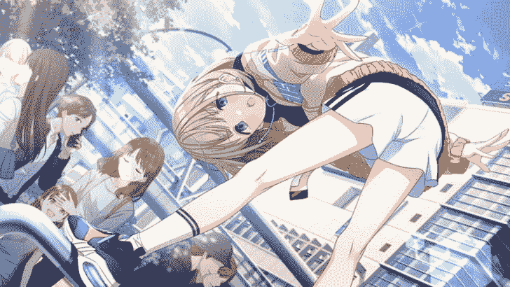
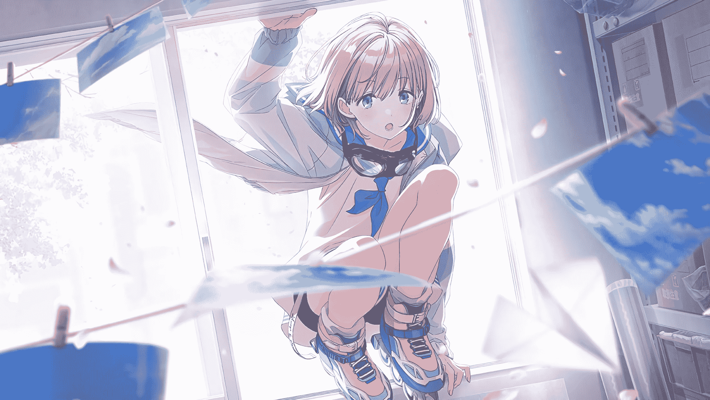
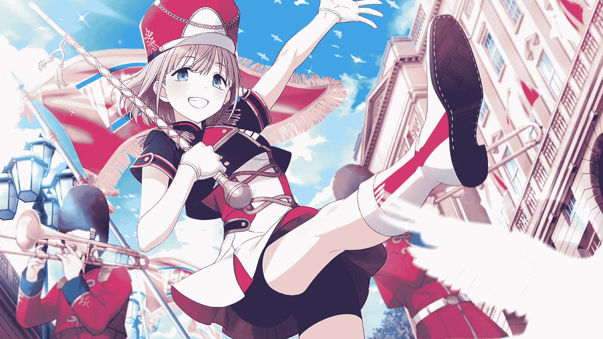
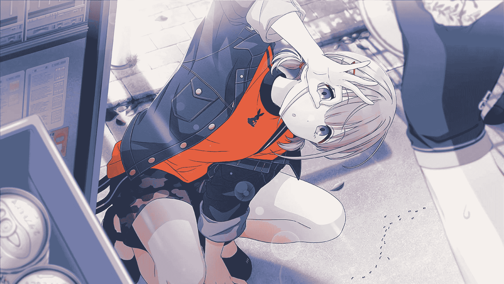

# （残忍）（百合之花）【im@s同人】Shrinklight ~asahi~

作者：朝雾绘梨花

TID：28475

<title>1</title> <link href="../Styles/Style.css" type="text/css" rel="stylesheet">

# 1

*本帖最後由 朝雾绘梨花 於 2020-4-14 10:13 編輯*

这里是黛 恋季，最近有在玩偶像大师闪耀色彩，很厨里面的角色——其中最具代表性的应该就是芹沢 あさひ（中文应该是芹泽朝日），虽然我对角色的了解其实并不算太深，但asahi总的来说是一个虽然洞察力很强，在偶像活动等等一些地方是天才水平的初中运动系少女，但是却不怎么会看氛围（KY），有时候表现出一种奇怪的冷漠感~ 她和黛 冬優子以及和泉 爱依之间发生的故事都很有趣，个人认为游戏剧情对这些人物刻画的也十分真实……    一直不太敢于写同人文的原因就是不太会刻画人物，或者说不一定能写的符合心意，但是姑且要尝试一下……关于朝日的，有些角色崩坏的巨大娘故事~

附上一些朝日的图片
<ignore_js_op>

**asahi 5.jpg** *(69.02 KB, 下載次數: 1)*

[下載附件](forum.php?mod=attachment&aid=ODIzNjN8NzdkNzk1ZDN8MTYwMDg3OTMwN3wxODIzMHwyODQ3NQ%3D%3D&nothumb=yes)

芹沢あさひ

2020-4-11 19:01 上傳

<ignore_js_op>

**asahi 4.jpg** *(571.21 KB, 下載次數: 0)*

[下載附件](forum.php?mod=attachment&aid=ODIzNjJ8OTExMWRiY2Z8MTYwMDg3OTMwN3wxODIzMHwyODQ3NQ%3D%3D&nothumb=yes)

芹沢あさひ

2020-4-11 19:01 上傳

<ignore_js_op>

**asahi 3.jpg** *(300.51 KB, 下載次數: 1)*

[下載附件](forum.php?mod=attachment&aid=ODIzNjF8ZjIzNGJkNTR8MTYwMDg3OTMwN3wxODIzMHwyODQ3NQ%3D%3D&nothumb=yes)

芹沢あさひ

2020-4-11 19:01 上傳

<ignore_js_op>

**asahi 2.jpg** *(364.92 KB, 下載次數: 0)*

[下載附件](forum.php?mod=attachment&aid=ODIzNjB8YzFiMWI5YmN8MTYwMDg3OTMwN3wxODIzMHwyODQ3NQ%3D%3D&nothumb=yes)

芹沢あさひ

2020-4-11 19:01 上傳

<ignore_js_op>

**asahi 1.jpg** *(296.1 KB, 下載次數: 1)*

[下載附件](forum.php?mod=attachment&aid=ODIzNTl8ODc5ZTBlZDV8MTYwMDg3OTMwN3wxODIzMHwyODQ3NQ%3D%3D&nothumb=yes)

芹沢あさひ

2020-4-11 19:01 上傳

顺便推荐两首歌吧，美波 的 *正直日記* 和 流汗吧！健身少女 的*お願いマッスル*，我就是边循环这两首边创作的！

从这里开始正文

“啊啊可恶！”朝雾气恼地摔了一下鼠标，“如果这回合打个perfect就能true end了！明明白条那么宽我怎么能打个good呢！”

为了抽满这期的卡，朝雾正拼命地积攒着游戏里的钻石，一个新卡的true end就能20连，是不能再珍贵的资金来源了。

“啊啊……明明就差最后一下就赢了。”

朝雾看了一眼左上角，突然察觉到一丝异样。

好像进入结局的标题不太一样，是特殊活动吗……

“制作人先生！”画面里是正面带笑容的朝日……正常应该是社长出现说一句残念才对，果真是碰上了什么特殊剧情吗，记得这个游戏里确实是有这种东西的。

朝雾饶有兴致地点了下鼠标。

“愿意继续帮助我W.I.N.G优胜吗！”对话上方浮现了两个选项，“好”和“算了吧”。

啊！难道是第二次机会！怎么可能选后者呢。

在满心期待地点击“好”的一瞬间，朝雾突然间头晕目眩，视线变得模糊，很快就陷入了黑暗之中……

“我说啊，你这么做有什么意义吗！”

“啊哈哈，冬优子酱，又有新的制作人出现了哦。”

“喂喂，把他们传送过来该怎么弄回去啊。”

“看啊，这只新的好像是女孩子欸。”

……

朝日的声音？和……冬优子？朝雾的头依然很痛，眼睛很难睁开，感觉自己正躺在硬硬的地面上，觉得正在说话的两个人声音很遥远。

“真是的，我不管了！你自己之后要好好处理掉！一会儿还要去参加mini live呢。”

“了解！”

发……发生什么了……是在做梦吗……

朝雾缓缓睁开眼睛，却被眼前的一切惊到了——这，这是什么。

首先映入朝雾眼帘的是干净的天花板，但是总感觉这天花板有一股怪异的感觉，一是这个天花板看起来实在是太高了，从上面挂着的灯显得异常的小就能感觉出来，二是她觉得这个天花板貌似不太真实，就像是一幅画。

朝雾还没什么力气坐起身，她只好转头看向一边。

这一切都超脱常识的范围了……

在视线扫过墙角的时候，注目于随风飘荡的窗帘的时候——看起来极其现实，又明显是作画一样的风格，什么时候VR技术这么先进了……在身边躺着的还有几个男性，朝雾不知道有几个人，但是至少明白，这些人类要比周围的景色，包括他们躺着的地板真实多了。就像是三次元的人坠进了二次元的世界。

“那fuyu一会儿再来叫你好了，现在有事要去找爱依。”（注：冬优子的自称是fuyu）

没错……是冬优子的声音，啊啊，头好痛。

地面突然传来了强烈的震感，间歇性的，越来越轻……

这是……这是什么感觉啊……好像有个巨大的东西在移动。

好像力气恢复的不错，朝雾坐起身来——

面前的……是什么？

好像是运动鞋……吧，这运动鞋也太巨大了，白色的鞋底看起来十分厚，应该用高来形容好一些……能勉强看到上面的深紫色应该是鞋头部分，再靠里点的鞋面就根本看不到了啊……这么巨大的鞋子的主人该不会是……

鞋主白皙的小腿的一半被白色的短袜遮住了，短袜顶端是有两圈紫色的细条带，再往上看可以看到现在的朝雾很难估算体积的大腿，洁白的超短裤几乎让朝雾确定了这个人的身份——

“啊，你醒啦。”

注目着的大腿突然移动起来，朝雾抬了下头，发现她正面带笑容看着自己。

自己，自己变小了！更奇怪的是，自己现在身处二次元的世界！！根据面前朝日的动作就明白了，虽然极其像3D，也有三渲二的感觉，但是也很像流畅过头的二次元动画啊……这样的“帧数”让朝雾陷入朦胧之中，不能理解哪边才是现实。

“在另外的世界，你应该是我的producer桑之一吧！”朝日蹲了下来，有一处淤青的膝盖悬在朝雾的上方，再上方是蓝色的运动衫，外面套着很青春风的薄外套，只有费力抬头才能看到朝日可爱的脸庞。

“啊……”朝雾怔住了。

“听不懂吗，世界不同语言不通也是很可能的呢……”

“啊啊，可以听懂的！”朝雾下意识间就开始尽力大声说话……毕竟就算她蹲了下来，看起来距离依旧实在是太远了，体型差距太大了……

“能听懂呀！太好了！虽然声音真的很小啦……其实我擅自用‘传送枪‘把你们传送过来了！上面的说明说你们都是平行世界的producer，不知道是不是真的是这样！”

朝雾点了点头，心里暗暗想着说不定这是哪个公司开发出的SAO一样的游戏。

“真的是producer呀，不过你们就像漫画里的角色呢！好有意思~”

我们像……漫画里的角色？这是她看到的我们的样子吗。

“不过比锹形虫都要小很多呢，哈哈~”

记得她有喜欢抓那种虫子的性格……

“呜……”朝雾听到身边传来了一声呜咽，目光循着声音来源才发现……原来被传送来的人数有这么多，很多“人类”就躺在地板上，有些人正痛苦地蠕动着，不过好像这些人都是男性……如果是来自“平行世界”的producer们，男性确实会很多。

“嗯嗯……为什么呢？”

“欸。”

“是因为你是女生吗，明明最后才被传送过来，却第一个清醒过来。”

“我也……不知道……”

朝日好像无视了朝雾的回应，把目光放到了朝雾左手边的一个正紧闭着眼睛挪动着双腿的“producer”身上。

“可能需要点帮助才会醒过来呢。”

朝雾一时难以理解朝日说的话的意思，她只是看到朝日伸出了右手的食指，缓缓地移向那个人……

朝日用手指轻轻按住了那个男生的腿，整个指尖就几乎能盖住两条腿了吗，也就是说我们只有一两厘米高吗？……因为不适而想要移动的双腿一下子受到了阻力而无法移动，男生明显更加难受了，但是依旧处于模糊的状态，没有睁开眼睛。

“喔喔……”

突然之间男生的双腿被压扁了。

什，什么？！

那个人，腿就像爆炸开来了一样，被朝日的指尖挤压，肌肉组织承受不住压力四散开来，连骨骼都被压碎，破裂的血管中血液都因为突然地挤压冲向四周，甚至有几滴血液溅到了差不多能有“五米远”的朝雾身上。

“啊啊啊啊啊啊——”男生一下子睁大了双眼，痛苦地哀嚎着，他想扭动身体，但是腰部因为两条腿神经的剧烈反应与大脑失去了联系，血液就像泉水一样从他那已经不能称作是伤口的伤口中泵出来。

这声大喊让很多人都苏醒了过来，不过除了朝雾大家都不知道发生了什么，有一两个人还在小声抱怨。

“啊啊啊啊……啊……啊……”男生的眼泪哗啦啦的浸了一脸，他用双手拼命试着去触摸那已经不存在的大腿。

“哈哈，真有趣~这样不就醒过来了嘛”

真……有趣……这，这种事怎么可能发生。

朝雾只是怔怔地看着那个受了重伤的人，同样看着他的还有其他一些人，那几个刚刚还在抱怨的人如今也都愣住了。鲜血越流越多，他的哀嚎声也越来越微弱，朝雾似乎看到他失禁了。

哀嚎声消失了，整个世界仿佛都陷入了沉寂。

“啊，这就死了吗，有点没劲……”朝日嘟了嘟嘴。

“游戏？”

“这也太真实了吧。”

“哪里真实了，你看看周围啊，明显是假的！”

别自我安慰了啊……朝雾心想，这明显就是现实啊，这股血腥味，还有脸上的温热的血液，告诉朝雾，她来到了一个恐怖的“平行世界”。

“你在做什么啊！朝日酱！”朝雾右边的男生突然站了起来，冲着正擦拭手指的朝日大喊。

喂喂，你在做什么啊！朝雾看了看这个肥宅一样的人物，内心中充斥着恐惧与不解。那个人，正在你的头顶上擦另外一个人的血啊，你真以为她是你的朝日老婆吗！

“朝日酱是不会这样子的，对吧！”肥宅接着大喊，声音震得朝雾耳朵都有点痛。

“真的是朝日诶。”

“我就说是游戏吧。”

这些人，为什么还不理解状况啊！玩游戏都玩魔怔了吗！！

“啊，果真是另外一个世界的producer呢。”朝日的声音很遥远，却很响亮，“但是完全就是虫子嘛。”

朝日那一脸失去兴致的表情，让朝雾吞了口口水——自己确实也只能期盼这是什么游戏的实验了。

她突然站起身来，朝雾再次感受到自己的身高都没有她鞋子高的恐惧和卑微，余光瞄到旁边站起身的肥宅也有些颤抖了。

朝日向后挪动了一小步，地面在微微颤动，朝雾深切地感觉到自己应该移动到什么安全的地方去，但是身体完全不听使唤，只是看着朝日的右脚向后方抬起……

终于看清了朝日浅紫色的鞋面，左右两侧还有延伸到两侧的黄色的三角形——

一阵强风把朝雾刮倒在地。

她躺在地面，肩部与地面的碰撞让她觉得很痛，眼睛也因为风压而受到影响，视线再次模糊起来。但是她还是很快理解了刚刚发生了什么，向右看去，那个肥宅……

怎么还站在那里啊……没有一脚踢到他吗，

不对。

朝日收回了脚，用地面蹭了蹭鞋尖，恢复了站立的状态，而那个肥宅缓缓地躺倒在地，像是被绳子拉倒的石像，却只剩了下半身，他被从腹部撕裂成两半，湿漉漉的肠子好似被碰倒的敞瓶糖罐的糖果一样散了出来，上半身不知道飞到了哪里去。

“唔啊啊啊啊啊啊啊啊！”朝雾喊出了声来……她不知道看过多少猎奇的作品，对于幻想作品中因为害怕就大喊大叫的人们颇为不屑，觉得自己完全可以最大程度的理性去面对一切，如今她也悲惨地成为了他们的一员。

“什……什么啊。”

“喂喂……”

“快跑吧……”

“啊……”

浓郁的血腥味让朝雾十分想吐，但她只是一味地干呕，连酸水都吐不出来。这种恐惧和痛苦如同镊子一般夹断了她的泪腺，眼泪完全止不住，和鼻涕混在了一起……她已经完全不关心周围的事情了，无论是有的人已经慌忙四散而逃，还是有的人只是坐在地上抱头发抖都无所谓了，她只是想快点结束这一切，要杀要剐给个痛快的感觉。

“不用这么害怕吧，我有好好瞄准的。”朝日蹲下身一脸不解地看着朝雾。

“不要这样啊……”朝雾不知道从哪里得来的勇气，也许只是无谓的歇斯底里，“朝日，不要这样啊……”

“欸~但是，不这样就没有意思了~”

朝雾一直觉得朝日很可爱的口癖现在仿佛变成了死神敲的钟声，她满面鼻水泪水的看向那个轻易杀掉两个人的凶手——那脸上的纯真，澄澈的眼神，仿佛幻境一般，真的是完完全全的本人，又完全不是一个人。

“放心啦，因为你比较特殊，我会最后处理你的。”

“处理……”

“如果在一个世界出现了另外的世界的东西会很糟糕吧！”朝日完全无视朝雾脸上的恐惧，用手指轻轻抚摸着朝雾的身体，笑着说，“所以安心啦，我会尽量好好对待你的~”

“可是，我们是人类啊！”朝雾用尽了全身的力气喊出了这句话。

“是这样吗~好像让你们死掉也不会违反法律的说。”

……

“啊，如果跑的太散的话我会很困扰的喔。”

……朝雾躺在地面上，轻声抽泣着。

“喂，你叫什么。”

“我？”二人一同想跑向门口，环顾四周，有一面墙上挂着十分巨大的镜子，整体来说十分空旷——应该是训练室之类的地方吧，既然没有什么掩体，那只好趁着她不注意一口气跑到门那里，从下面的缝隙逃跑才是。

高个男生点了点头，有些喘着粗气。

“小野，你呢。”矮个男生皮肤晒得有些黑，看起来十分强壮。

“我是宫崎。小野君，你觉得这个是什么情况。”

“我一直觉得这个是游戏啦，做的有点真实而已。”

“真的是游戏吗，可恶。怎么看都很真实啊，虽然这环境，和那个朝日都是……”

“不知道用了什么先进技术吧。”小野其实不太想去思考这个问题。

“连体力都模拟好了吗，我现在真的超累啊。”距离门也太远了吧，正常的大小的话，感觉几步就能到了，现在就像是要跑一公里一样。

“不知道啊……”

“啊，如果跑的太散的话我会很困扰的喔。”二人均听到了朝日的话语声。

怎么办……宫崎拼命思考着，这时地面上传来了一下不小的震动感。

好像还有一些距离……应该没问题……没问题的，没问题的，就是游戏而已，慢慢跑出去就好了！就好了！

“喂！快躲开！”小野突然大喊，宫崎没有注意到要发生什么，只是像小野的方向看去——他很用力地推了宫崎一把，直接让宫崎失去了重心，向一侧倒去，在地上打了两滚又滑了有好一段距离。

宫崎看到距离他并不远的小野，在刚刚推走他后，突然间就消失在视野中。

代替小野的是朝日运动鞋的一侧——

“不！！不要啊！！！”

震耳欲聋的响声传来，就快要击穿宫崎的耳膜一般，强烈的震感让宫崎头晕目眩。

朝日扭了扭脚，捻了捻脚下的肉酱，不过好像什么感觉都没有，就像是踩死了一只蚂蚁。仅仅用了两步就追上了跑了那么久的距离……这根本就不是什么游戏！在她眼里我们只是随随便便就会被杀掉的虫子啊……但是，但是我们怎么看就应该是人类啊，可恶！

没有任何东西从朝日的鞋底溢出来，血液的量甚至没法流淌过她鞋底的距离吗……可恶，可恶啊！

绝望混杂着愤怒，其中又蕴含着悲伤和不解，宫崎摇摇晃晃地站起身来，一下子扑在了朝日的运动鞋上，疯狂敲打着她的鞋子，但是多么可悲啊，若不是朝日在看着他，脚上根本不可能有任何感觉。

“怎么了怎么了？为什么要做这种没有意义的事呢，他百分之百死掉了喔。”

“可恶！可恶可恶可恶！”宫崎的拳头都锤的发红，但是完全不可能对朝日的鞋子造成伤害……别说对她本身了。

一阵推力传来，宫崎直接向后飞了两三“米”，重重地摔了出去，哐当一声砸向地面，感觉腰椎都受了伤，只能无力地躺倒等待死神的审判。

“嘛……想去门口是正确的逃跑方式呢。”朝日看了看地上的小虫子，抬起了脚，面无表情地移到了虫子的正上方。

宫崎看到了粘在朝日鞋底支离破碎的尸体，完全想象不到他原来的样子了，一些血液滴落在宫崎的旁边，但是他连求饶的力气都没有了，只能服从这个女孩子……只能等待这个自己在游戏中推的初中女孩子亲自执行的死刑……他闭上了眼睛。

但是死亡并没有如期到来，第一个传达到大脑的信号是疼痛，难以忍耐的疼痛感从左半身直袭全身，宫崎的右手下意识地想去触碰传来疼痛的左半身，但是有什么阻碍着他……

是朝日的鞋子。宫崎睁开眼睛就看到朝日鞋子的一侧直接踏在了自己身体的左侧，她把左臂和肩膀直接踩碎，可能同时擦去了一大块肺，现在的他与朝日的小腿呈近乎垂直的角度，只能清晰地看到朝日鞋子一侧的纹路，白色的有两圈紫色的短袜，和洁白又有显得经过运动的健壮感，让人敬畏的小腿，但是他却怎么样都看不到朝日的脸，因为头都没有力气动了，感觉动一下整个脑袋就会掉下来……

朝日的脚轻轻蹭了一下地面，让宫崎的左半身平摊在地面上，但是对于朝日自身来说，他并没有出多少血，所以也不是什么血腥的场景——有人会故意去拆掉蜘蛛的腿，有人会用牙签穿透一只蟑螂……朝日做的无非是这种事罢了。

“有点踩歪了吗，本身只想踩一条胳膊的。”

朝日移动脚步，两只脚放在宫崎的两侧——整个身躯都在宫崎的上方，朝日略微弯下腰看向他，这是一个完完全全能感受到自己的卑微与渺小的角度，但是宫崎却什么动作和思考都没有了，唯一的念想就是想去死，虽然没有移动的力气，但是疼痛依旧在持续，完全没有要麻木的意思。

啊……对，杀了我吧，好痛啊，好痛……

宫崎这样想着，左半身虽然因为直接消失而只有诡异的凉爽感觉，但右半身的神经却很完好并高效地传达着左半身的疼痛，血液也进入了他的肺与气管，让他喘不上气。

朝日不再看他了，也没有踩死他，而是默默地走开了。

也许宫崎看到朝日脸上倍感无趣的表情会更加绝望吧，不过他现在只能充斥着愤恨，感受着痛苦慢慢死去……

“还是都抓到比较好，这样好没意思的说。”

芹泽亲手创造的地狱还会继续……

<ignore_js_op></ignore_js_op>

**asafuyu1.jpg** *(223.95 KB, 下載次數: 0)*

[下載附件](forum.php?mod=attachment&aid=ODIzNjZ8MGQ3ZDg0ZGZ8MTYwMDg3OTMwN3wxODIzMHwyODQ3NQ%3D%3D&nothumb=yes)

asafuyu

2020-4-11 23:05 上傳

<ignore_js_op>

**asafuyu2.jpg** *(62.4 KB, 下載次數: 0)*

[下載附件](forum.php?mod=attachment&aid=ODIzNjd8OGUwODJjODR8MTYwMDg3OTMwN3wxODIzMHwyODQ3NQ%3D%3D&nothumb=yes)

asafuyu

2020-4-11 23:05 上傳

嗯，告一段落吧！其实把asahi写成这样有一种愧疚感，并且写的比我想象中要慢！所以有些地方比较赶，之后和我，啊不，和朝雾的互动应该会丰富一些~

其实asahi虽然是个KY，并且轻易地会说出伤害别人内心的话，但是其实是很温柔的孩子呢。

冬优子虽然也经常生asahi的气，但是却一直让着她，憧憬她的才能~并且如果冬优子真的很生气，asahi就会立即从ky话痨大王变老实喔ww

真的是很可爱的两个人！

<title>2</title> <link href="../Styles/Style.css" type="text/css" rel="stylesheet">

# 2

*本帖最後由 朝雾绘梨花 於 2020-4-12 20:47 編輯*

这次直接写完！今天边写边听的歌很多！印象比较深的有*あの娘にドロップキック*（邪神酱），*アノニマス*（さユり），偶像大师一之濑志希的*秘密のトワレ*！

当然，最为感动的是*いのちの歌*，这首歌作为日本的毕业歌曲十分有名，让我怀着珍惜生命的态度，渐渐开始创作之路吧……

（注：本文朝日台词会出现っす这个句尾，其实就是desu的简化版“su”，意思可以是“的说”，其实我就是为了突出朝日说话的风格以及一些可爱的点才这么加的……因为中文真的很难表现）

“嗯……这样应该齐了……”朝日又抓到了两个小人，弯腰丢在地上，虽然手离地面已经很近了，但是他们就像是从三楼高摔在了地面一样——可能是变小之后抗击打能力变得强了一些，也可能是这个平行世界的特性，两人只是觉得有些痛，加上大脑因为震荡有些发晕。

朝日看了看地面上余下的8只活着的“producer”，刚刚竟然只除掉了四只嘛……其实现在有点腻了。

除了刚刚根本就没跑多远的两个人，剩下的六个人只是待在原地哪里都没有去。

“喔，你精神起来啦，我很开心！”朝日看到朝雾坐起身来，向她看着，但是其实并不能她是什么表情。

朝雾没有回应，她刚刚躺在地面上，一边等待疼痛逝去，一边尽力让自己恢复冷静思考的能力。现在鼻腔已经习惯了血腥味，她只是平静地看着朝日的笑颜……无论怎么看都很萌啊这家伙，虽然这脸压根就不是真实的。在这里生存率究竟有多低，朝雾很清楚，他们现在都没有小强跑得快，也没有小强一般的生命力，所以逃跑是不可能的，只有……

“朝日桑，请你让我们走吧。”

什么，是女生的声音……？

朝雾看了看那个正在说着敬语的连帽衣，夸张的帽子快遮住整个头部了，确实如果不说话的话就注意不到她是个女生。不过她的想法应该是正确的，只要不是绝望到极点才挤出的这句话……

四只“出头鸟”已经死掉了，虽然都只是不到两分钟内发生的事情……不过这时主动对话的话反而生存的概率会大一些，如果不出意外的话，自己确确实实会最后再死，但是多了个女生的话，完全不知道之后会发生什么。

“喔！原来还有女孩子呀！”朝日露出了惊喜的表情，“你叫什么名字呢？”

“高森……”

“说名字啦。”

“千咲。”

“很可爱的名字嘛，千咲酱，那你呢。”朝日看向朝雾，清爽的银色短发随着窗外拂过的微风缓缓飘动。

“朝雾……游佐朝雾……”

“和我都有个朝字呢！我记下啦。所以剩下的是六个人呢。”

什么……剩下的六个人？为什么把我们两个排除在外了，是要先进行处刑吗，可恶，和自己想的完全相反，这个突然说话的女人坏了一锅粥啊。朝雾看了看朝日用手指抵住嘴唇，盯着他们认真思考的表情，背后沁出了不少汗水，她现在只能期盼这是美国人或者中国人开发出的什么高科技拟真游戏了……不行，不能自我安慰，要想办法，不能回去的话就算变成宠物也好，要活下去，怎么可以死在这里，不可以死在这里……

“不知道尝起来是什么味道的呢……”

“不行！”朝雾突然喊出声来，她的求生欲让她有些丧失了理智。

“为什么？”

“一般……一般人不会去吃虫子的！”

“说你们是虫子只是因为你们的大小っす，但是你们是我的producer吧~其实有点好奇漫画人物尝起来是什么味道的呢~”

果真……在她眼里我们才是二次元人物吗……知道是p为什么还要这么对待我们啊。

“万一，万一有糟糕的病毒就不好了！别的世界的东西的话，朝日的免疫系统可能并不适应，会很危险的！”朝雾搬出了点不知道对不对的上的生物知识。

“朝雾酱是在关心我吗，还是在害怕被我吃掉呢。”

被……被发现了！

“明明都说过了会最后处理朝雾酱的说，不过朝雾这么不喜欢被我吃掉嘛？应该很有趣的才对~”

朝日缓缓地向朝雾伸出手，手掌看起来大的出奇，明明朝日的手应该十分较小可爱，现在却觉得像是整个天空……糟糕了……自己说的话起了反作用吗！就相当于三个选项里选了个最糟糕的……可恶，玩游戏的时候可以查攻略，现在根本就束手无策啊。

朝雾因为害怕紧闭双眼，但是被抓走的不是她。

朝雾旁边的男生被抓了上去，那个男生不堪地尖叫了起来。

“真是的，男生的话就要有骨气才对っす。我开动了。”

朝雾睁开眼睛……看到朝日微微张开樱红的双唇，露出了些许洁白的牙齿，食指和拇指轻轻夹住那个男生放在嘴巴前方。

男生绝望地呼喊着，哀求着，却只能眼睁睁地看着那个红莲般的地狱在逐渐接近自己，他甚至能感觉到从地狱深处蒸腾而出的热气……

“不要……不要……”

男生的哀求声随着朝日闭上嘴巴而消失了。

朝日拨动舌头，不断翻转、舔舐着男生的身体，但是他穿着衣服，所以尝不到肉的味道，朝日有点后悔自己没先让他脱掉衣服再品尝。那这样只能先尝尝里面的味道了……

男生在朝日的口腔中被潮湿的舌头搅动着，又不断地被吸吮着，感觉自己的整个灵魂都要被吸进去了，肋骨也因为这难以抵抗的力量而断了好几根，有一根肋骨穿破了肺部，让他本身就因为这过于潮湿的环境而艰难的呼吸变得更加痛苦。

但是不知为何，朝日的口腔中有一股好闻的味道，这股薄荷味应该是刷过牙之后的残留物。男生甚至有死在这里也算不错的感觉出现。

突然身下的舌头一次剧烈的运动产生了强大的力量，把他甩到了一个坚硬的凸起之上，腰际悬挂在这个硬邦邦的凸起之上，上半身感觉快要坠下去了……不会吧……男生绝望地想着，但是黑暗中什么都看不到，人类，一直都会害怕不知道会发生什么的时候。

只是听到一声沉闷却嘹亮的响声，其中还混杂着大量骨头碎裂和血肉迸裂的声音，他被腰斩了，但是牙齿的厚度对于他来说比砍刀宽上许多，就像是被冲压机直接消去了整个臀部一般，他的下半身立即失去了知觉，上半身因为牙齿咬住了衣服而黏在牙齿上。

痛感还没有袭来，上半身摇摇欲坠的时候，朝日轻轻向上方甩了一下下巴，让他的上半身重心正好回到牙齿上……但是并不预示着第二次咬合的到来，而是从深处穿来了巨大的吸力……闭合的嘴巴一下子把空气全部传入肺部，这种失压的状态硬生生从他的上半身挤出了大量的血液，包括一部分碎裂的肠道和胃脏，意识恍惚只是一瞬间的事情，强烈的痛感随之而来。

“呸！好难吃。”

血液十分酸涩，生肉的味道也很糟糕，朝日有点受不了，直接吐了出来。

男生身体的两节……应该说是上半身和两条腿混合着唾液与血液从高处朝日的口中飞了出来，“啪”的一声砸在朝雾他们不远处。

“咕啊……啊啊……好痛……不要……”

其中的一条腿正好落在了男生的眼前不远处，腿的上面还缠着一圈肠道……他的痛苦已经麻木，上半身也因为从高处坠落而摔了个粉碎，心脏的每次跳动都泵出了更多地血液，男生只是拼命克服着无力感在地面攀爬着，朝日的唾液和他自己的血液让阻力变小了一些，右手摸到了已经不属于自己的那条腿的同时，气管中的一口气就憋在喉咙处，目光变得呆滞起来……

“死……死了……”千咲怔怔地看着，朝雾虽然也很恐惧，但是已经不会再失声了。

不给朝日找点有意思的事情，我们这群虫子的惨死就是最有趣的事情……但是现在完全不是能提建议的立场……吧……

“好无聊……”朝日用纸巾擦了擦自己的嘴唇和舌尖，捏作一团丢在男生破碎的尸体上，“一会儿让冬优子稍微帮忙收拾一下吧~”

好无聊是……她已经玩腻了吗，难道要结束了吗……虽然九成九是死掉，不过被干脆点杀掉也还……还好，至少是死在美少女的手里了！朝雾的绝望感催生了她M的心态，真的没什么可以去思考的了。

“我想快点和女生玩，一会也要去开演唱会了っす。”

还要……还要折磨我们吗。

“你们这些虫子就先在这里老实呆着吧……”朝日突然又伸出手指，但是所有人都愣住了，没有人移动……

朝日的手指伸到了其中一个一直坐着的男生上方，他突然间就像是被求生欲所激发一样，单手撑地想要转身站起来逃跑……但是太慢了，手指就这样直直地戳在了他的腿上，因为他转身的动作，正好侧身的他两条腿都被朝日戳了个粉碎，混杂在一起，已经分不清哪条是哪条了。

趁着那个人痛苦的叫喊，朝日放过了千咲，手指越过她，又戳断了第二个人的腿，因为他只是愣愣地坐在那里，所以只有一条腿在地面上摊在地面上变成了肉酱……疼痛化作眼泪流个不停。

这是……要把他们的腿都弄断防止逃跑吗……朝日，好残忍……

“朝日大人，朝日大人……”

朝雾突然听到旁边有液体的声音，感觉在是涂防晒霜……喂！你在做什么啊，好噁。

那个人边看着朝日边撸动着自己的下体，像是在模仿窒息高潮一样等待着死亡一瞬时的究极快感。

“恶心。”朝日冷冷地看了他一眼，用弹指把他的头弹了个粉碎，朝雾看着那个人一下子就停下了手头动作，弹指带来的风都让自己的发梢遮住了脸颊——但是她心中已经没有什么特殊的感觉了，不再是像那个肥宅死掉的时候那么惊诧恐惧。也许只是恐惧到麻木的程度了吧。

“让朝雾酱看到了不好的东西呢……”朝日冲着朝雾有些尴尬地笑着。

“谢谢……”

为什么要我说谢谢啊……好奇怪好奇怪。这个世界的朝日也好奇怪啊……不过感觉，只是微微的感觉，大抵还是带着自己内心的期望，朝日大概不会这么残忍地对待她们二人。

剩下的两个人开始转过头无谓的逃跑，朝日甚至没有换位置，只是用手指轻松碰倒了一个人，顺势碾碎了他的右腿，又一指弹在了最后一个人的后背上，不知道多少骨骼都在那一瞬间碎裂，身体飞了出去，像布偶一样在地上滚动，口吐鲜血失去了意识。

“呼~”朝日完成了对除了两个女生的所有人的处刑，站起身来坏笑着看向地面的两个幸存者。

二人只能无言地抬头看着朝日，心中怀着最后被怜悯的希望——不过每次朝日站起身来，他们都能感受到自己可悲的渺小，渺小的虫子，只有靠数量才能取得胜利，而如今她们只有两个人，也完全没有对抗朝日的意愿。

“千咲酱，朝雾酱，听过我唱的歌吗？”

二人附和式地点了点头，朝日勉强能看清她们表示同意的态度。

“但是应该没有亲眼看到我唱歌跳舞吧！正好我想再温习一下一会儿mini live的曲子~”

她要……练习？

"请欣赏Wandering Dream Chaser！这是给两位producer的特殊演出っす！”

朝日小跑着去音响那边准备放歌，地面的震感随着脚步特别强烈……朝雾看着朝日在跑步时微微颤动的腿部肌肉，好似萌生了些许崇拜的感情，虽然不理解是什么状况，但是也只能慢慢等待。

“这首歌记得很帅气呢。”千咲绕过正躺在地上呜咽的男性，走到了朝雾身边。

“啊……确实。”

“朝雾，要尽力活下去啊。像是那首歌的那句‘绝对不放弃‘唱的那样。”

朝雾看着隐藏在帽檐下的千咲的坚定眼神，点了点头。

“那要开始了喔——”朝日小跑回到二人的附近，“好像有点近……我离远点。”

向后撤了几步的同时，音乐响起了，二人可以感受到地面在随着音乐节拍微微颤动。

虽然是三个人分工的曲子，但是朝日自己就唱了三个人的歌词，流畅的舞步，悦耳的声音，满载热情的乐曲，让她们渐渐忘记了自己所处的境地。

朝日的每一个舞步，都化为震感传到千咲&朝雾的脚下，但是她们这时已经并不太害怕了，现在的角度就好似是在舞台下方观众席的第一排，就是舞台“高了一些”而已，与偶像距离最近的位置，能深切感受到偶像的激情，甚至能看到从偶像发梢坠落的汗滴。游戏中只能欣赏音乐，最多也只能隔着屏幕去欣赏声优们的演唱会……现在朝日就在他们面前跳舞，唱歌，一切都像是虚幻的，却又如此真实。

对于朝日来说，这就是她的世界，我们只是不幸被卷入这个世界的“入侵者”罢了。

Wandering Dream Chaser！

最后一个pose的定格，再随着音乐的终止，朝日结束了大约四分钟的演出。

二人……应该还有那个一条腿变成肉酱的人，三人都在为朝日鼓掌，两条腿残废的人喘着粗气，正往不知哪个方向爬行着，那个被弹了一下五脏俱伤的人似乎清醒过来而在地面上挣扎，另外的人也在漫无目的地拖着伤腿蠕动着。

“怎么样！”朝日小跑两步，弯下了腰看着他们。

“很棒！很棒啊朝日酱！”朝雾是真的很感动，感觉自己很快就要融入了这个现实一般——

“喔！太好了！我很开心~”朝日开心地笑了起来，注意到那个因为疼痛流着眼泪，却依旧在笑的男生，“受了伤也继续看我的演出，我也很开心っす！所以……”

朝日突然站起身来，抬起了右脚到那个男生旁边——只见他的笑容渐渐凝固了。

“别……”

还没等他说完话，朝日精准地把脚落在了他的身上，这次貌似并没有怎么用力，但运动鞋柔软的鞋底还是让男生变成了薄片。

“这样就不痛了っす！”

因为踩踏的地方就在千咲旁边，传来的巨大风压让她没有站稳，直接倒在了朝雾的怀中，她的后背直接压在了朝雾的胸上。

“喂，你竟然是个巨乳啊。”

“是说这个的时候吗……”

没错，两个人这时候都异常的冷静。

什么融入现实啊……这本来就是残酷的现实啊。

朝日抬起脚来，还有一些肉和内脏的碎片沾在她的鞋底上，与地面上的片状尸体间还拉出了血丝，女生二人看到已经缓缓扩散开来的血液除了沉默，已经什么都做不了了。

突然间的失力倒是让朝雾吓了一跳，她看到朝日用两根手指把她们二人都夹了起来，脚不由己地离开了地面，快速上升的过程使朝雾都能听到耳边的风声，对——这可不是电梯，空气不会跟着自己流动啊。她张开了嘴，避免耳鸣，强忍着头颅中失血的感觉，而不太明白怎么应对的千咲紧闭着口，让她头晕目眩几进呕吐。

啊啊啊啊好高……朝雾低头看了看下面，自己有蛮严重的恐高症，不过至少她面前的千咲，以及背后的手指正紧紧地贴着自己，让自己不至于滑下去。

地面在快速变化，明显的起伏感也让朝雾知道他们正在移动中——然后停止了，不远处就是一面墙。

原来这边还有个椅子……

朝日坐了下来，把她们放在了左手的手心中。

“咳咳……咳……呃……”千咲强忍着呕吐感，趴在手心上，这时要是吐在朝日手上恐怕就糟了。

而朝雾惊诧于“地面”的柔软程度，这就是朝日的手心吗，真的好柔软。她坐在手心中，小心的用手抵了抵下面软软的凉凉的肉，手心的纹路看起来很深，也有些潮湿。

“决定了っす！我会给你们两个活下去的机会的！不过也许只能活下去一个人……”

哈？这是要我们两个人决斗吗……

朝雾看了一眼趴着的千咲，发现对方也在看她，两个人眼中都冒出了些许恐惧。

“放心啦，不会让你们俩做残忍的事情的~”

……

说罢，朝日把她们轻轻丢在自己的大腿根处，之后翘起一条腿，解开鞋带，脱下了鞋子，露出被白袜包裹的足部，又这样脱去了第二只。因为抬腿的动作让二人都滑落到朝日的三角区上，看着朝日脱下鞋子，她们都咽了口口水，千咲是单纯的紧张感满溢，朝雾其实是觉得朝日的白袜脚丫真的很可爱……

“我一会儿要再跟着那首歌跳一遍っす！”朝日用左手抓住了朝雾，右手抓住了千咲，“你们要跟着我一起跳哟！”

“一起……？”

朝雾被举到空中，她往下看的时候仿佛明白了什么——下方是朝日的两只运动鞋。并且她正离着左边的鞋口越来越近……从上向下看，感觉朝日的中帮运动鞋仿佛一个巨大的怪兽一般，会吞噬掉一切坠入其中的东西。并且在还没到鞋口的时候，朝雾就闻到了一股味道——那是运动少女的汗臭味！

朝雾自己虽然是个百合，也蛮控少女的足的，但是可并不是什么恋臭癖……也根本不想死在鞋子里面啊……

别啊别啊别啊，神明大人神明大人神明大人放过我！放过我！

“嘿。”

朝雾在被送到鞋口时身旁的力量突然消失，就这样坠进了朝日的运动鞋中。

鞋垫要比地面软上不少，不过还是距鞋口有一定的高度，朝雾摔得不轻，腰部和腿部都很痛，她想转过身来用手支撑地面站起来的时候——

好湿！鞋垫是湿湿的，因为她刚刚脱鞋所以还留有一些温热感……并且这里面的味道过于浓郁。让朝雾不禁怀疑这真的是一个初中女生的脚吗，为什么味道会这么重，感觉自己的鼻腔，甚至是眼睛都在被刺激着。

其实朝日的脚味道并没有这么重，只是朝雾的体积太小了，同等的硫化物和细菌味对朝雾是致命级别的。再有就是她刚刚演唱了一曲，那首歌的运动量很不一般……

“我要穿上了喔，快点做准备吧~”

朝雾抬头看到朝日的脚趾就在鞋口的上方，突然慌张了起来——往哪里逃生存的概率大一点？

鞋跟处很近，应该也会留下一些空隙才对——不行，跳舞这种运动的话，一次脚跟和鞋底的离合，自己很容易就滑到脚下正好被踩死。

这么思考的话足弓处相对鞋跟要安全一些，最安全的应该是脚尖前方的那一大块空隙！

好，要拼命往那里跑……

朝雾突然间就陷入了黑暗当中，朝日的足趾落在了自己的面前，把自己前往鞋尖处的路堵死了——

别开玩笑了！穿的这么快怎么准备啊！

朝日脚上自带的味道要比鞋子浓郁很多，朝雾感觉到自己的眼眶都有些湿润了——看来只能趁她穿上的时候，跟着足弓的位置向前跑，到不了脚尖的话，只能在足弓处活下去了。

明明不到半个小时前还敲着鼠标，心中唯一的烦恼就是论文……现在却要在自己的偶像的玩耍中拼尽全力活下去……

可恶，我一定要活给你看，朝日！之后你可要履行诺言让我活着啊！当宠物也不错！

朝雾听到了足底摩擦鞋子的声音，说明足部在向前移动，这时只要跟着前面的这堵“墙壁”，也不要贴的太紧，略微低一下身子，应该就可以做到！在她穿上鞋子的时候，一定要正好在足弓的位置！之后怎么活下去再说！

没问题，没问题！朝雾一边向前慢慢走着一边安慰自己……但是为什么她的脚移动的这么慢？

刚刚搞突然袭击，现在又故意减缓穿鞋的速度玩弄我吗……真是可恶的女人啊！

想了想自己其实就是厨她这种“可恶”的性格。

本身正顺利向前行进着的朝雾……地面突然像后倾了一下——穿鞋的时候鞋头抬了起来。她脚下一滑，整个身体趴在了鞋垫上，这种温热的潮湿感从上下两方侵袭全身，臭味中还混杂着皮革的味道。

还好抬起的角度比较小，朝雾还是能以一定的速度往前爬，她有暗中计算过，很快朝日就能穿完鞋子了，只要自己在足弓处存活四分钟就没问题了，应该就没问题了！

老娘连冰醋酸都直接闻过（好孩子千万不要模仿，会严重损伤嗅觉），还怕这种程度的脚臭吗！

大概……大概是这里，鞋子被放平了，朝雾趴在鞋垫上什么都看不到，但是感觉自己应该是在足弓的位置。

“好痛——”朝雾立即明白了，自己多爬了不少距离，也许是朝日的脚比较小，导致正伸在前面的胳膊被朝日的足弓前方的前掌踩住了……由于她现在还在坐着，所以没有立即被压断，但是肉被挤压的撕扯感十分疼痛。

她应该很快就会站起来，如果，如果不赶快抽出来的话，这两条胳膊就都会废掉啊。

朝雾一边想着，一边拼力抽出自己的胳膊，肉和短袜的纤维的摩擦又热又痛，但她还是成功抽出来了，力气大的自己向后方打了个滚，同时朝日站起身来，开始移动了。多亏了朝雾打了个滚，现在她正处在比较安全的地方。

“还好朝日不是扁平足。”ACG作品中的女生脚型都比较好看……应该拜这个所赐吧。

在朝日行走的时候，朝雾拼命抓住鞋垫上的纤维防止滑到哪里去。手臂上的外伤、浓郁的气味和匮乏的氧气让朝雾的力气不断流失……连走步的时候都这么难稳得住，一会儿跳舞的时候只能听命于天了吗。

对于她来说，天本身就是朝日啊。

朝雾流下的眼泪已经分不清是悲伤绝望的泪水还是因为刺激性气体而产生的分泌物了，她现在觉得自己的生存希望渺茫，除非朝日大慈大悲放过她……只求有趣的朝日，估计不会有什么奇迹出现吧。

一阵平静突然到来，朝雾明白，音乐估计马上就要响起了。整理一下心情，现在只能靠自己了，但是自己忘记了具体的舞步是什么样的，没办法做出提前的反应，毕竟自己不是朝日，不是看一遍别人跳就能记住天才。

“哈？！”

一个突然向上的动作把朝雾直接甩到了鞋跟，她的身体和朝日的脚跟来了一个亲密的接触，之后又因为重力开始下落。朝雾在黑暗中只能胡乱抓住一切能抓的东西，她勉强抓住了白袜湿润的纤维，但是突然察觉到自己磨的地方是一块呈现凸起的曲线感。

马上缩回手的动作是无比正确的，刚才朝日只是做了一个后抬腿的动作，脚又踏回了地面，如果朝雾没缩回手，可能现在就要人手两界了。

不过她现在整个头部都紧紧贴着朝日的脚跟，根本就无法呼吸。朝雾想着无论怎样也要吸上一口气让自己活下去，于是真的吸到了一口——从袜子的另一侧传过来的气体。

这是一口几乎全浓的硫化物和二氧化碳，别说臭味会伤害大脑了，突然地缺氧也让朝雾一下子失去了所有力气。

完了……完了吗……

在朝雾绝望又迷茫的时候，朝日的一个前踢动作拯救了她，就像刚刚飞到脚后跟一样，这次她直接被甩到了脚尖处，这时她仅仅是下意识的求生欲驱使——拼劲全力抓住了朝日的其中一个脚趾，虽然她只是抓住了脚趾边缘的袜子纤维，这边正好有一处空隙。等一下，这个空隙意味着——？

她拼命像做引体向上一样要把自己向上方拉，右腿也在鞋垫上蹬着，但是少女的足臭已经充斥了朝雾的肺部，意识都有些朦胧了，移动显得十分困难

朝日又一次踩在地面上，这次朝雾不是那么幸运了……

朝日足部的前掌直接粉碎了朝雾的右脚，弯着的左腿勉强逃过一劫。

“啊啊……”朝雾痛苦地呻吟着，但是脚底的味道就像麻醉药一样，同时麻醉着她的身体和心灵。大概这两次甩的我有肋骨断掉了吧，虽然我其实不知道肋骨断掉是什么感觉，不过肺那里真的好痛……好像比腿都痛……人类为了存活下去会放弃尊严就是这样子吧……朝雾悲哀地想着。

又经历了两次剧烈的舞步，朝雾听到了外面传来了那句“绝对不要放弃”……说明歌曲才经过了四分之一左右，并且音乐的高潮是从这里开始。

就算只有1%的存活概率就要努力……朝雾想着一切可以给自己打气的话鼓舞着自己，但是她现在面临的最大问题可能不是被激烈的动作甩到脚底去，而是缺氧。

朝日穿的明显是一个没有孔的运动鞋，完完全全不透气——就算上方那些缝隙可以吸取一点氧气，但是朝雾现在在她的脚趾下方，正好在大拇脚趾和前掌的缝隙处。

朝日借着一些晃动和双臂的移动抵达了一个味道异常重的地方——是拇趾和第二脚趾的缝隙中间。

朝雾的头顶贴着朝日的袜子，左右是她的两个脚趾，虽然还在拼命思考着活下去的方法，但是朝雾已经越来越累了，汗臭味，伤口处的失血，以及肺部的疼痛，加上缺氧，感觉不用多久她就会死掉吧。

死在喜欢的偶像脚下……也不错吗……

可恶……趴着的朝雾突然转过身来，抱住面前的一块袜子，把头埋了进去——

这是自暴自弃吗，说不定吧，不过朝雾不是为了吸气，而是靠挤压挤出了一点汗水，她拼命舔舐着挤出来的咸咸的液体。也许补水可以适度改善自己的气短，虽然氧气的量越来越少了，但是还有希望活下去才对。

虽然不太想承认，忍着苦涩感喝下了点朝日的脚汗之后，朝雾的感觉确实好多了，虽然在补水的时候差点又被舞步甩下去。

右脚那里凉凉的，明明浑身都这么燥热——估计右脚那里已经什么都没有了吧。回到现实世界里可以申请残疾补助了。

朝雾一边自嘲一边思考着，如果能到朝日脚丫的上边去，基本上氧气的问题就能解决了，不，不止氧气的问题，只要爬到上面去就能活下去了，一定要爬上去啊！这是最后的希望了。

要等待，等待一个机会能把她甩到鞋尖处，再甩回来，运气好的话她就可以抱着脚趾向上爬到脚面去了。

看起来是需要自己的努力，其实就是需要依据“神”的意愿……也许朝日这么做就是为了把我们两个都玩弄死吧，也许千咲早就死掉了，但是既然我能活到现在，就一定要活到最后啊！

现在的朝日就是考验她的神明，朝雾这样想着。虽然这个神明如此没有同理心，随随便便就伤害人，却又如此可爱……

哈哈哈，我在想什么呢。

只是一瞬间发生的事情，朝雾被甩到了鞋尖处，头直接冲撞在了鞋子内部——幸好鞋子内是棉质，朝雾只是被撞得头晕。她凭借着感觉判断了一下方位，等朝日缩回脚的时候，争取一下子到脚面……？

不对，正常人踢腿的时候，脚趾会贴着鞋垫吗，上面会有空隙吗？除了踢正步，谁会故意压脚趾啊。

向朝日脚尖方向的推力到来了，而朝雾还在思考一些没什么用的问题，她重重地撞在了朝日的脚趾上，感觉内脏悉数破裂，吐了一口鲜血。

可恶……舞步的话说不定就是压脚趾好看啊，我在想什么啊。

自己所在的空间有上下晃动起来，朝雾感觉自己的眼睛快被晃出眼眶了，但是她还是努力向上攀爬者……作为阿宅的力气已经快用光了。

可恶啊，我下辈子再培养你就当我倒了八辈子霉！朝雾暗暗咒骂……但是她现在其实并不怨恨朝日，一种复杂的情感包裹着她，和求生的意志糅合在一起……

拜这个晃动所赐，一次向上的晃动让朝雾成功“着陆”。她摸了摸“地面”，发现不再是鞋垫的感觉，而是比脚底要干燥的短袜时，拼命吸了两口比刚刚澄澈很多的空气，完全忽视掉了肺部可能被破碎的肋骨扎入的疼痛感。朝雾已经渐渐习惯了舞步带来的晃动，听着朝日的歌声，把整个身体都埋在了朝日的袜子中……大概……没问题了……

“啊，你什么时候到这里来了，看起来好惨的样子。”强光刺激着朝雾的眼睛，她睁开眼发现朝日正微笑着看着她。

真元气啊这家伙。

朝雾看了看身后，自己仍然趴在朝日的脚上，断掉的右腿已经不知道去哪里了，自己的血把朝日的短袜染红了一片。

“对不起啊……咳……你的袜子被我弄……弄脏了。”朝雾咧了咧嘴。

“没事哦，你让我很开心っす！”

成功了……我竟然逃出来了……朝雾的眼角挤出了眼泪。

“那我可以……活下去了吗……”

“不可以哦（ダメっす）。”朝日依旧笑着。

欸……欸？

“a~sa~hi~你究竟要玩到什么时候啊，收拾收拾，还有十分钟就要出发了！”

“啊，冬优子酱，你帮我收拾一下吧，训练室地面让我弄脏了。”朝日一边说着，一边把朝雾从脚上拍了下去，朝雾像是从四层楼高摔了下去，感觉马上就要断气了一般痛苦。

她看到不远处有一个人头……是千咲的头吧……明明这么好看却总要戴着帽子，也是奇怪的人。

“真是的！为什么每次都要我收拾啊！”

“拜托っす！”朝雾感觉到朝日走开了，自己的生命好像也在流逝。

“好吧好吧，啊，这些不是还有活着的嘛，怎么办？”

“踩死就好了，他们是害虫的。”

“啊？不是producer们吗？”

“说明上写着不踩死的话会很糟糕っす，我先走啦！”

……

朝雾趴在地上，连抬头都要忍受着巨大的疼痛，她看到，双马尾的冬优子正一脸嫌弃地站在她的面前，慢慢抬起了一只脚……

“呜哇！”朝雾突然醒了过来，她慌忙地看了看自己的手臂，伸了伸被子下面的腿。

什么梦啊那是。她的脸庞有些泛红。

“制作人小姐~~”是朝日的声音。

朝日直接推开卧室的门，笑着跑了进来。

“制作人小姐会起晚真的很少见っす，明明说好要送我去拍电视节目的~”

“啊啊，好！真对不起！昨天熬夜打游戏了！”朝雾双手合十。

“快点哦，我在外面等你，冬优子酱和爱依酱都在っす。”

看着跑出去的朝日的背影，朝雾可爱地甩了甩头让自己清醒起来，满心期待地握拳比了个加油的手势。

“好，今天也要加油！”

~FIN~

<title>3</title> <link href="../Styles/Style.css" type="text/css" rel="stylesheet">

# 3

终于完成了っす！
但是发现好像还是很短啊！感觉自己明明写了很多！

附上一张图……虽然这张图的日语我宁愿理解为她俩在踩欧派2333！ <ignore_js_op>

**QQ图片20200412174849.jpg** *(1.59 MB, 下載次數: 0)*

[下載附件](forum.php?mod=attachment&aid=ODIzNzJ8ZmE3OTU3MTd8MTYwMDg3OTMwN3wxODIzMHwyODQ3NQ%3D%3D&nothumb=yes)

2020-4-12 17:49 上傳

asahi绝对不是喜欢杀人的，或者没有同理心的孩子~

很亚撒西的说
<title>4</title> <link href="../Styles/Style.css" type="text/css" rel="stylesheet">

# 4

> [foxfarmer 發表於 2020-4-12 10:59](https://giantessnight.com/gnforum2012/forum.php?mod=redirect&goto=findpost&pid=432929&ptid=28475)
> 居然有人写sc的同人文文章标题是迷光组名的梗吧？
> 说到asahi和锹形虫，我当时就是被asahi捉锹形虫那 ...

是的！
其实我对虫子很苦手，不过asahi超级可爱
<title>5</title> <link href="../Styles/Style.css" type="text/css" rel="stylesheet">

# 5

> [hht3390 發表於 2020-4-12 12:34](https://giantessnight.com/gnforum2012/forum.php?mod=redirect&goto=findpost&pid=432934&ptid=28475)
> 是asahi 我好了
> asahi踩我

かわいいっす！
可爱的asahi把大家踩成了肉酱
<title>6</title> <link href="../Styles/Style.css" type="text/css" rel="stylesheet">

# 6

*本帖最後由 朝雾绘梨花 於 2020-4-12 21:37 編輯*

> [天衣无缝 發表於 2020-4-12 21:21](https://giantessnight.com/gnforum2012/forum.php?mod=redirect&goto=findpost&pid=432986&ptid=28475)
> 啊居然有人写闪耀色彩同人。太棒了。说起来闪耀色彩里我觉得最适合残酷同人的反而是幽谷雾子，p桑梦里把p桑 ...

原来如此！有所了解了！
我刚刚入坑不久，还没有来得及了解各位偶像，目前也只是知道她们大概分别是“什么样子的”
我会去仔细看看雾子的剧情的~~

写asahi的主要原因之一也是因为我超喜欢运动系或者天才设定啦

但其实我真的觉得sc的所有人都很棒ww

可能是因为有这个produce环节，所以觉得她们的人设都很饱满
<title>7</title> <link href="../Styles/Style.css" type="text/css" rel="stylesheet">

# 7

> [MiaoKong 發表於 2020-4-12 21:54](https://giantessnight.com/gnforum2012/forum.php?mod=redirect&goto=findpost&pid=432990&ptid=28475)
> 你你你不是百合吗，怎么千咲就死了呜呜呜呜呜

反正是做梦啦~死掉就死掉惹

我喜欢的是asahi又不是这个路人~~
<title>8</title> <link href="../Styles/Style.css" type="text/css" rel="stylesheet">

# 8

> [茶道赛高 發表於 2020-4-13 01:17](https://giantessnight.com/gnforum2012/forum.php?mod=redirect&goto=findpost&pid=433011&ptid=28475)
> 以自己id作为主角，还是被虐的一方可还行，记得之前还有位大佬把你的id作为巨大娘的一方来写 ...

谁不喜欢被美少女虐待呢~
<title>9</title> <link href="../Styles/Style.css" type="text/css" rel="stylesheet">

# 9

> [fuguri 發表於 2020-4-16 12:47](https://giantessnight.com/gnforum2012/forum.php?mod=redirect&goto=findpost&pid=433399&ptid=28475)
> 超级可爱的asahi~爱了爱了！踩我！

对的！超级可爱っす！</ignore_js_op></ignore_js_op></ignore_js_op></ignore_js_op></ignore_js_op></ignore_js_op></ignore_js_op>