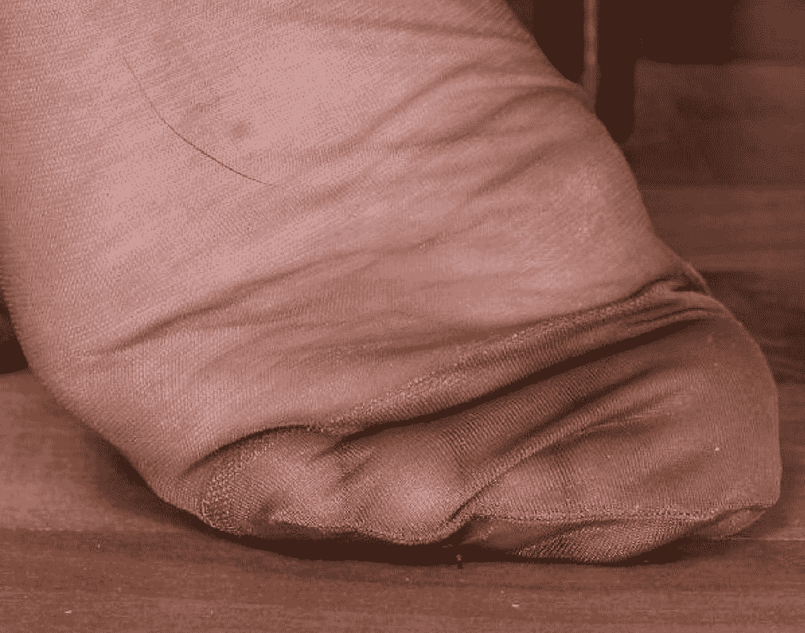

# ［圖文］Mother Toes！（自行腦補）

作者：8611071528

TID：22833

<title>1</title> <link href="../Styles/Style.css" type="text/css" rel="stylesheet">

# 1

這作者有為很多的圖片配上短篇的故事，但有些圖沒配上故事讓我感到一點點的遺憾，所以就自行的腦補一下
圖片來自於：http://    gt647.deviantart.com/   art/Mother-Toes-527706879（請把空格去掉）我文筆不好，但我只是要把想寫的給寫下來而已。（我相信大部分的人也有很有趣的劇情，只是沒有文筆而放棄許許多多的想法，但對我來講寫就是了，只要看的懂就好）

-------------

<ignore_js_op>

**image.jpeg** *(134.61 KB, 下載次數: 4)*

[下載附件](forum.php?mod=attachment&aid=Njc0MjF8MmI3NDIwNDF8MTYwMDg4Nzk2NHwxODIzMHwyMjgzMw%3D%3D&nothumb=yes)

2017-3-30 21:13 上傳

某一天的中午傑森在客廳裡莫名其妙的縮小到了0.1公分的大小，當傑森為眼前的場景感到震撼時，這時地面開始劇烈的搖晃，而震天動地的撞擊聲則鎮住了傑森的心神。
（蹬 蹬 蹬）
隨著聲音的變大，震動的幅度也隨之增強，在這突如其來的狀態下，傑森四肢癱軟的隨著震動的幅度上下跳動著，但雙眼始終都看著眼前如同史詩般巨大的肉色柱子，以異常的速度快速的移動著。
（轟）
巨大的肉色柱子以磅礴的氣勢往傑森前方大約50公尺的地方落下，接著隨之而來撞擊地板的風壓毫不客氣的撲向傑森，使傑森往後飛了出去。
「！！啊啊啊啊啊！！」
向後飛個幾十公尺的傑森，伴隨著身體的疼痛，他才理解到目前的處境，眼前巨大的肉色柱子是一隻腳，而那隻腳的主人正是自己的母親！！！
「媽 我在這裡！？往下看！！別踩我！！！」
傑森慌亂的揮著雙手大叫著，希望可以引起母親的注意，但傑森的母親完全沒有注意到自己的兒子的叫喊，也沒注意到自己剛才稀鬆平常的走動差點輾碎自己的親生骨肉，母親反而則是悠哉的走進書房，坐在椅子上，拿起桌上的書，讀著裡面的內容...
「...怎麼會這樣？」
傑森發現母親沒有注意到自己的存在，頓時灰心了起來，隨後傑森就自暴自棄的鼓勵著自己，並盲目的深信著自己一定能引起她的注意，而順著她走的方向前進著，卻並沒意識到他這行為將會給自己帶來巨大的麻煩。
......3小時後......
傑森來到媽媽的腳旁，傑森望著聳立的腳底，並安心了下來，因為傑森以腳的姿勢，可以判斷出自己的母親已經睡著了，並深信接下來的時間裡，可以安全的攀爬這吸收了腳汗且溦溫的尼籠襪。
傑森在攀爬尼龍襪的過程中，除了空氣中有微微的惡臭外，傑森發現其實這並沒有想像中的艱難，尼龍襪表面的纖維可以很容易的使人攀爬，且還發現皺摺的凹陷處可以讓自己稍微歇一會外，最重要的是傑森開始對現在的狀況產生一絲絲的樂趣。
爬著爬著，隨著高度的上升皺摺的凹陷處也越來越少，當傑森開使有一點點的疲倦時，這時傑森注意到了一跟頭髮。
這跟頭髮給了傑森一個主意，傑森開始在媽媽的腳底板下摩擦著身體，反覆來回擦著身體產生了靜電後，傑森一鬆手，就徹底的吸附在尼龍襪上。
傑森發現這方法後，就對攀爬這尼龍襪更有信心了，可傑森卻忽略了重要的事⋯⋯
「嗯～嗯嗯～」
「！！」
時間不知不覺過了很久，剛從睡夢中醒來的媽媽，伸直了雙腳，並伸了個懶腰後，仍然沒注意到吸附在自己的腳底板的尼龍襪上如同灰塵般的兒子，就直接的把腳伸進那穿戴已久的鞋子裡。
媽媽看了看時間後，就為了接女兒回來而出門了。
這時在鞋中的傑森，並沒有被輾碎成肉醬而消失在尼龍襪和鞋底之間，而是奇蹟般的在媽媽的腳趾縫處生存著，傑森看著周圍漆黑的環境，並為自己一時的幸運而感到安心時，卻不知到他接下來 等著他的事是如同地獄般的環境。
隨著時間的流逝，傑森長時間的飽受在充滿惡臭且溼熱的環境下，就在傑森快忍到極限時，這時他所在的空間突然的縮小，傑森就被周圍的肉壁給擠成了尼龍襪上毫不起眼的小紅點。
「啊！寶貝妳踩到我的腳了」
「對不起媽媽，我不是故意的」
「別在意，我們還是趕快回家吧，我想妳的弟弟可能已經回家了，不知道他今天一整個下午都去了哪兒？」
媽媽和女兒在對話的這段期間，媽媽始終都沒發現她口中的兒子已經死在她的腳下，而姐姐也沒發現她這無意間的不小心，卻幫助她的弟弟解脫痛苦。
...結束

<title>2</title> <link href="../Styles/Style.css" type="text/css" rel="stylesheet">

# 2

想說是那種 碰到絕望的情景時，對自己講一些勉勵的話，讓自己偏向自己想要的結果的那種心境
在自暴自棄的同時「利用」鼓勵的話來蒙蔽自己雙眼，因而判斷出失誤的判斷。
<title>3</title> <link href="../Styles/Style.css" type="text/css" rel="stylesheet">

# 3

GTS本身是虛構的，故事的角色可以不用太在意，只要內容好就好</ignore_js_op>