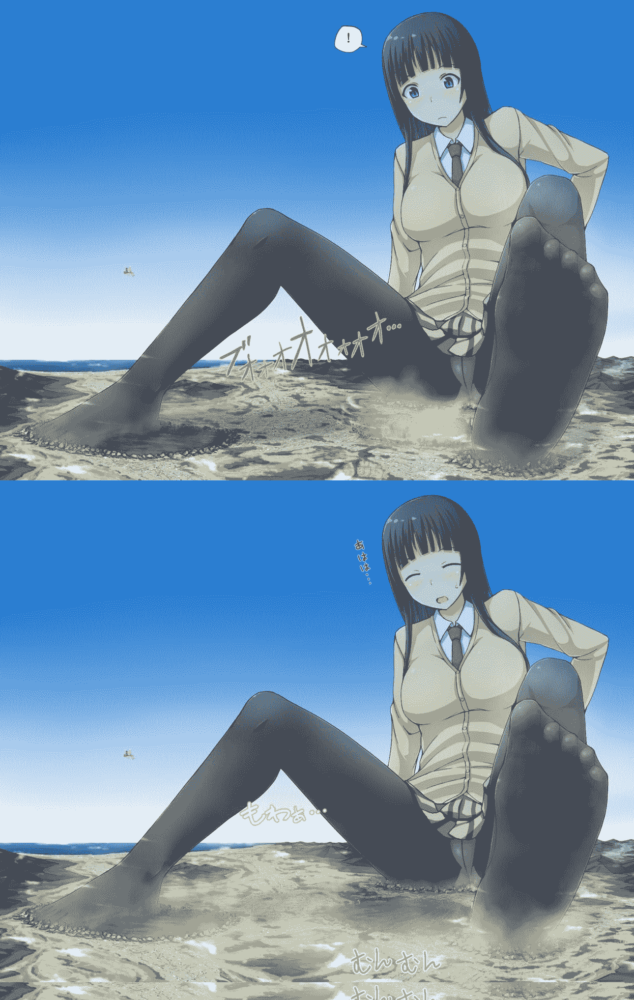

# 【图配文 短篇】 实地考察

作者：乔治·华盛顿

TID：30584

 

# 1

*本帖最後由 乔治·华盛顿 於 2021-3-23 23:55 編輯*

file:///C:/Users/16041/Desktop/PAN/2936C86A65867C62AE452D59540AA601.png

看到群里的图片而一时兴起的作品谈不上什么文笔，只能图一乐

大家有什么想看的，或者有可以提供的灵感、建议都可以在下面留言哦，感激不尽~—— ———————————————————————————分割线—————————————————————

《实地考察》

“那、那个！我是为了完成实、实地考察任务来到这里的铃原悠里！我、我是不会伤害大家的！”

凭空出现在城市群上空的巨大少女，从几百米的高度坠下，将下面的城市和几百万居住其中的小人化为了屁股底下的深坑。

“太、太好了！一口气说出来了！”名叫悠里的巨大少女内心窃喜着。

学校的社会实践课上，要求每个人对一颗其他星球做实地考察。

既然是考察，自然而然就要包括当地的风土人情，也就必然要与当地人交流。

虽然语言不同的问题可以靠翻译器解决，但是，性格的问题就束手无策了。

平日里悠里就是个内向的女孩，同本班的男生说话都会感到害羞，不要提外星人了。

但是，实地考察是必须要完成的。

看着教室里的同学纷纷传送去了其他星球，少女非常着急。

对了！如果没办法交流的话，就不用交流了！

于是，少女选择了只存在微小生命的地球作为考察对象，兴奋的将自己传送了过来。

可是，在传送过程中没有站稳，摔进了要考察的星球，脚上的室内鞋也不翼而飞。

“唔·····抱、抱歉！请稍稍让开些····”

将还悬在空中的左脚慢慢放在了地表上。

原本是一座超级城市的地方被悠里巨大的脚后跟砸平了。

来不及逃跑的几百万小人，以及车辆、房屋、学校·····统统在少女天文质量的大脚下化为了碎屑。

不仅如此，以悠里的脚后跟为中心，千万吨重量碰撞形成的几条大裂缝延伸开来，将邻近城市的数十万人们吞噬进无边的黑暗中。

“唔！！抱歉！！”

然而，并不是在对丧命于自己臀下和脚后跟的人们道歉。

整个半球上的人们都可以看见，一缕缕黄色的烟雾源源不断的从悠里被黑丝袜包裹的大脚散发出来，伴随着令人难以忍受的脚臭味，在空气流通不良的城市里沉积下来，钻进大楼和地铁，包裹住每一个人。

“唔····早上刚上完体育课，出了很多汗，所以····很抱歉···”

在闷热的环境中大量出汗，无法透气的脚，失去了室内鞋的庇护后，变成了对人类的生化武器。

对悠里自己而言很浓郁的味道，却让所到之处的人们痛苦的难以呼吸，甚至毒害着人们的神经。连植物也不能承受悠里的脚臭味，纷纷枯萎死去。

悠里摩擦了一下脚趾，简单的动作除了释放出更多的脚臭味，还让一滴脚汗从竖着的左脚滴下，落在了一座城市之中。

从高处落下的汗水在城市中形成了一场小规模的洪水，将街道上的所有东西纷纷卷进去，甚至冲塌了几座楼。

“唔···感、感觉这里的地面还挺软的呀···先考察一下地、地质状况好了!”

悠里没有携带什么专业的设备，于是只能靠体感作为考察标准了。

“嘿咻！”

悠里挪动着自己平放的右脚，携着脚臭味横扫过数千平方公里的区域。

巨大的黑色墙壁宛如推土机一般，将地表上、地表下的一切东西，乃至土地本身，以磅礴的气势推到了一边，露出了深褐色的地壳。

人类历史上从未有过的地貌改变被一个少女的一只脚完成了。

“嗯····上部较为疏松，下面比较硬么····果、果然所有的星球都是这样吧？”

悠里又轻轻用右脚拍打了几下地面，引发了几场大地震，并在已经没有生命迹象的废土上留下了一个硕大的脚印。

一次小小的地质考察便消耗了几千万人类。

“唔！怎、怎么在这种时候！？”

或许是因为地面太凉了，使得悠里的腹部感受到了刺激。

午餐时食用的咖喱化为了不良的气体在腹部积聚着，已经来不及去卫生间了。

“噗——！”令人羞耻的声音响彻整个大陆。

浓郁且腥臭的屁从悠里的臀部急剧释放出来，将臀部附近残存的数个大型城市和里面的人们一口气吹飞了。

浓郁的气体连人类本身都可以腐蚀殆尽，被少女的屁所波及到的人连尸骨也剩不下。

不仅如此，少女所释放的气体随着大气环流，飘散到了大得多的范围，毒害着其他大陆的人们，甚至溶解到大海里，将海洋生物也灭绝了大部。

幸存的人类在之后的时间里也接二连三的因为地貌、大气成分改变而接二连三的死去。

整颗星球的大气系统都被少女的屁和脚臭味所摧毁了。

“啊···怎么会这样呀····”

仅仅因为少女的一次实地考察，地球就被毁灭了。

 

# 2

<ignore_js_op>[2936C86A65867C62AE452D59540AA601.png](forum.php?mod=attachment&aid=ODgwMDd8OWI1MWFmM2J8MTYyNDY5MTM5MnwxODIzMHwzMDU4NA%3D%3D&nothumb=yes) *(859.19 KB, 下載次數: 3)*

[下載附件](forum.php?mod=attachment&aid=ODgwMDd8OWI1MWFmM2J8MTYyNDY5MTM5MnwxODIzMHwzMDU4NA%3D%3D&nothumb=yes)

2021-3-22 22:35 上傳  

寺田的早期作品之一

</ignore_js_op>  

# 3

> [kol 發表於 2021-3-22 23:50](https://giantessnight.com/gnforum2012/forum.php?mod=redirect&goto=findpost&pid=463494&ptid=30584)

> 是寺田的图吗？楼主自己配的文很强啊，支持

阿里嘎多~！

666666啊啊啊啊啊啊啊啊

 

# 4

> [咕咕的攸栗 發表於 2021-3-23 14:40](https://giantessnight.com/gnforum2012/forum.php?mod=redirect&goto=findpost&pid=463511&ptid=30584)

> 楼主是根据寺田的图，创作出来的文吗，感觉很接近作者的文笔了

是的~谢谢~

5555555