# 【方舟同人】 巴别塔往事【温柔系／Vore／UB】（6.21更新）

作者：Enigma2519

TID：30088

 

# 1

*本帖最後由 Enigma2519 於 2021-6-20 22:19 編輯*

一时心血来潮的作品，可能会出现OOC和部分设定不严谨，以及文笔烂得要死等现象。初次写文，还请多多指点。龟速更新中。

警报声几乎要刺破我的耳膜。

我牵紧自己未婚妻的手，我们在走道里拼命的奔跑着。

“预计伽马辐射暴到达星球表面还有30分钟”冰冷的女声，不带一丝感情地广播着。

......

休眠室内，十几个休眠舱，无一例外的发生了不同程度的损毁。但无论损伤程度多轻，这些休眠舱在强大的射线面前已不再安全。“该死的！”我一脚狠狠地踹在金属墙上，“一定是因为今天早上附近发生的陨石撞击，冲击波把这里最重要的防护层给震出了口子，在射线暴面前，有裂缝的休眠舱就是一口活棺材！”

“也有一个好消息呢！”普瑞塞斯总是那么乐观。“我之前在这里研究的时候，等比例做了一个很小的休眠舱，还好它还在这里，而且没有坏，”她说着，从角落里翻出了一个金属盒子，“至少我们可以把自己最心爱的东西存在里面，如果有一天它能重见天日的话，其他智慧生命也许可以知道我们存在过。”

沮丧已经毫无意义，与其继续抱怨，不如留下点弥足珍贵的东西。“那...”我在自己的白大褂里掏了掏，掏出了一枚钻戒，“学姐，本来这个是我是想给你亲手戴上的，真可惜啊...”我摇摇头，把钻戒置于小型休眠舱内。普瑞塞斯苦涩地笑了笑：“确实有点可惜呢，到我了，我的嘛，是这个。”她说着，把自己最喜欢的发明——缩小枪，从上衣兜里拿了出来。

我也很喜欢这个枪，不仅因为它是普瑞塞斯第一个发明成功的东西，这个枪也为我和她之间创造了无数美好的回忆。可惜它有缺点：首先，它每充能一周才能使用一次，其次，被缩小的物体不能自然恢复，必须得用缩小枪逆向照射才能恢复原形。“让我试试看它能不能用...”听到这话，我惊讶地将目光投向普瑞塞斯，而一道柔和的光却先包围住了我，一股恍惚的坠落感萦绕着我，周围的场景越变越大，几秒内，我美丽的未婚妻变得像山峦一般。

“学姐，你到底要干什么...”我拼命地挣扎着，但缩小的我，终究抵不住她手指的力量。之前放在里面的钻戒被她取出。而我被缓缓放入那个特制的休眠舱内，我试图爬出来，但被她用手指轻轻按住。冰冷的麻醉气体开始释放，一丝困倦开始袭上我的心头。我挣扎的力量稍稍微弱了一些...

“我必须这样做，才能让你活下去......啊，亲爱的......这样下去，我们就没机会再见面了。“普瑞塞斯微笑着，但一滴泪在她眼角逐渐凝集，“我不行，我不接受这种事，我可不会放弃。”

“亲爱的，我相信我们之间的联系会超越时间和空间，”她接着说，“就算是海洋沸腾，大气消失，就算我们的卫星接连坠入重力的漩涡，就算我们的太阳凶恶的膨胀，无情地吃掉她的孩子直至万籁俱寂。我们也一样能再见面，在那用黑暗和星空光芒装饰过的文明尽头，我们也一样会见面，一定。你看，戒指，我可戴上了哦。我会等到那一天的，所以等我，你也要等我。”

“老...老婆...”我的思维慢慢停止运作，我想喊，但我的嗓子完全梗住，发出的声音宛若呢喃。她含着泪笑了：“完全没长大呢，真是个爱撒娇的家伙。”巨大的樱唇，带着湿热而让我安心的香气，轻轻地贴上了我的身体，片刻后又分开来“不可以难过哦......还有，老公，不许忘记我......”比起亲我，我倒是更渴望她现在就能把我吞下去，这样我就永远和她在一起了。但无论我现在怎么想，我都什么都做不了了：随着气体的进一步释放，黑暗钻进了我的脑内，大口地吞噬着我的意识，我妻子的脸庞在我眼前逐渐模糊起来。一开始，我还能听到仪器的运转声和她的心跳声，后来这声音也微弱了下去，直至万籁俱寂。

 

# 2

<ignore_js_op>[8d279f2476cce4f37b7ed0317f0ad513db06de96.jpg@1320w_1338h.jpg](forum.php?mod=attachment&aid=ODY4MzV8MTE5YzljOGV8MTYyNDY4ODcyOHwxODIzMHwzMDA4OA%3D%3D&nothumb=yes) *(1020.88 KB, 下載次數: 2)*

[下載附件](forum.php?mod=attachment&aid=ODY4MzV8MTE5YzljOGV8MTYyNDY4ODcyOHwxODIzMHwzMDA4OA%3D%3D&nothumb=yes)

2021-1-15 14:12 上傳  

特蕾西娅

[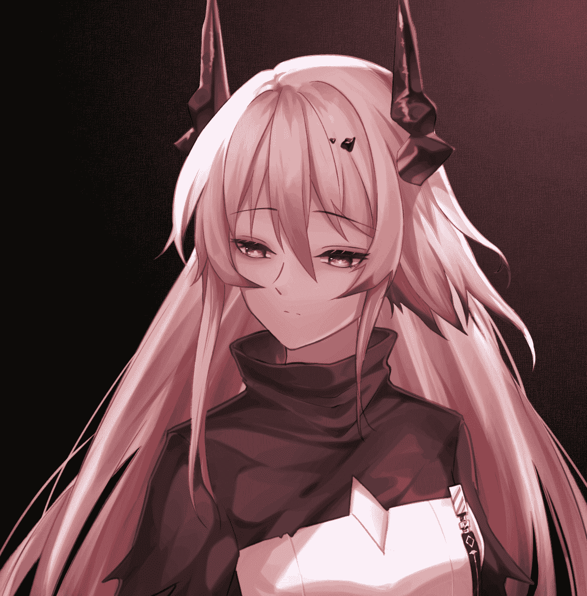](javascript:;)</ignore_js_op>  <ignore_js_op>[1c7abfc6b573376162e825f7c70ca4fbf57c9b0f.jpg@1320w_1868h.jpg](forum.php?mod=attachment&aid=ODY4MzN8MTM4NTNkZjR8MTYyNDY4ODcyOHwxODIzMHwzMDA4OA%3D%3D&nothumb=yes) *(871.46 KB, 下載次數: 0)*

[下載附件](forum.php?mod=attachment&aid=ODY4MzN8MTM4NTNkZjR8MTYyNDY4ODcyOHwxODIzMHwzMDA4OA%3D%3D&nothumb=yes)

2021-1-15 14:11 上傳  

普瑞塞斯

[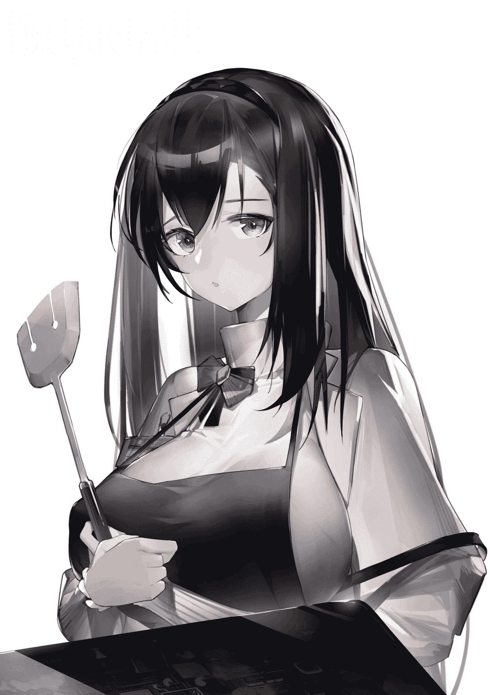](javascript:;)</ignore_js_op>  

# 3

巴别塔的成立，旨在解决萨卡兹的生存问题。

雷姆必拓，古代文明遗址挖掘现场，据上一次生物大灭绝约三万年后。

“殿下，您来了。”凯尔希对着一位身着白裙的萨卡兹少女深深鞠了一躬。

“凯尔希卿辛苦了，这个盒子就是你们在这个遗址中挖掘出来的？”白裙少女嫣然一笑，“真是一件好精致的物件啊，古代神民的科技，真是令人叹服啊。”

“是的，殿下。”凯尔希见白裙少女想要去触碰金属盒，不禁出声阻止道，“殿下，请小心，我们刚才用源石能量探测器试图探测盒子内部的结构，但是却一无所获，很明显，这个盒子的外壳反射了我们的射线。在一切都是未知的情况下，殿下请以自身安全为重。”

殿下报以一笑：“凯尔希卿，你还记得，我跟你说过的，萨卡兹最古老的预言之一吗？”

“我记得，殿下。您跟我说过的，‘封存在古代盒子里的最后血脉，将指引萨卡兹一族走向辉煌，将驱散矿石病的阴霾，将消灭这片大地上对感染者的不公’。”

“凯尔希卿，我不知道为何，这个盒子，和我有一种强烈的共鸣感。盒子里的东西...不，盒子里的人，对我非常重要，我感觉自己等他太久了。”

人？凯尔希对此疑惑不解，即使是泰拉大陆上最为袖珍的杜林族，身高也至少有1米2，完全不是眼前这个不到10厘米的小盒子能够容纳半毫的。但殿下这么坚持，另一方面，萨卡兹一族的古老预言并非空穴来风，她也不好说什么，只能将自己碧绿的眼睛盯死在那个小盒子上，如果一旦出现半分异样，就召唤Mon3tr立即将其摧毁。

殿下将盒子捧在手上，转了几圈，随之用葱玉般的手指按住几处......“呲！”盒子的四角猛地喷出冰冷的白烟。“殿下小心！”凯尔希立刻把金属盒子从殿下手中打掉（老女人你要杀了我呀！）。“我...我没事的，凯尔希卿，谢谢你。还有，凯尔希卿，请先不要毁掉那个盒子。”特蕾西娅嘴上谢着凯尔希，视线却还盯在那个不断喷烟的金属盒上。她不知道，自己为什么会感到激动，心跳加速，那种感觉，就像盒子里是一位她朝思暮想的人一般。

过了一会儿，盒子不再有任何动静了。特蕾西娅想伸手再次将其拿起来。“殿下且慢，Mon3str，去把盒子打开，要小心。”墨绿色的源石怪物应声发出一声怪叫，飞过去将金属盒子钳起来，放在桌上。接着，它找到了一条合适的缝隙，慢慢地，金属盒被打开了......

这是人偶？还是真的古代人类？凯尔希有些惊讶于盒子里的东西。说他是人偶，但太过栩栩如生，仿佛有生命一般。难道是古代人类？但一直以来的考古研究表示古代人类的身高体型与现今物种的差异不大，不应该出现这么小的人类。她看向殿下，而殿下仿佛对这个小人着魔了。

“凯尔希卿，今天辛苦了，请回去休息吧，他是对我不会有任何威胁的，请放心。让我和他单独待一会儿吧。”殿下起身，向凯尔希轻轻鞠了一躬。

“谢谢您，殿下，但是，殿下，我们对这个生物，还所知甚少，我还是希望能多观察他一会儿以防万一，您的安全始终是我第一位考虑的（你个老电灯泡）。”见凯尔希依旧对盒子里的不明生物怀有警觉。特蕾西娅笑道：“凯尔希卿，谢谢你的关心，但这个盒子里面的人，很有可能就是萨卡兹预言里的那个最后血脉。等他醒了，我希望能和他好好交流一下。好吗？”

“对不起，殿下，我问得太多了，我向您道歉。”“不用，感谢你的谨慎，我不会责怪你的，凯尔希卿，另外，今天关于这个盒子的事，还请你保密好吗？”

“好的，”凯尔希站起了身，“殿下，天色不早了，请您休息吧，我告退了。”

“凯尔希卿请慢走，晚安。”特蕾西娅甜甜一笑...等凯尔希走后很久，她才把盒子拿到床上，蹑手蹑脚的，像一个想要背着父母偷吃糖果的女孩。特蕾西娅看着盒子里的那个小人，俏脸已经通红，自言自语道：“对不起，凯尔希卿，那句预言还有一句，我没有告诉你，实际上，预言是‘封存在古代盒子里的最后血脉，将成为发现他的当届萨卡兹女王的配偶，与女王一起，指引萨卡兹一族走向辉煌，他们将驱散矿石病的阴霾，将消灭这片大地上对感染者的不公’。”

.......

他怎么没有醒来的迹象啊...特蕾西娅不禁有些着急。虽贵为王女，但特蕾西娅终究是个萨卡兹的女孩子，也是一样的渴望着爱情，只是因为王的头衔，她一直压抑着自己的天性。而萨卡兹一族又非常相信宿命论，所以当一个预言中的“真命天子”出现在她面前时，特蕾西娅自然会非常感兴趣。虽然这个小人的体温不像刚开始那样寒冷，但是几个小时过去了，小人的体温仍然处于一个比较低的水平。

特蕾西娅几乎凑到了小人的身上，温热的香风从两瓣巨大的粉唇间轻柔地呼出，如春风拂面。小人终于动弹了一下。他动了！特蕾西娅欣喜地想到，她便又向小人呵着热气。没呼一次，小人都会动弹一下，但是很快就停下了。这不行，我应该给他保暖。特蕾西娅想到，可怎么做能比较柔和地升高他的身体温度呢？想起刚才的事，特蕾西娅俏脸一红，但随即镇定下来。

熟悉的湿热香气轻柔地按摩着我。这是普瑞塞斯！老婆！我几次想动几下，但全身发寒，我的体温过低，无法控制自己的身体。一切全都是模糊的状态，我感觉一张可以弯曲的红色的温暖湿毛毯把我卷了起来，拉到什么地方，这里虽漆黑一片，但是温暖潮湿，而且还有淡淡的香气，依稀的滴水声。我一定来到了地下温泉，湿毛毯贴心地为我搓起了背。这一定是幻觉，但是太舒服了，我不禁发出了低低的呻吟声。

“呀！把他含在嘴里的感觉真的好冰！”特蕾西娅在心里小声地抱怨道。 

# 4

我不知道睡了多久，噩梦一般的事在我脑子中如走马灯一样的过：伽马射线暴，休眠舱被毁，我的未婚妻把我缩小，给了我最后一吻，然后与我诀别...

“啊！”我从噩梦中惊醒，周围黑乎乎的，伸手不见五指，我想用手把自己撑起来，但我躺着的红床湿漉漉的，而且稍一用力就会陷进去。我滑倒在床上，空气里充斥着让我安心而熟悉的湿热香气，前方很窄的缝隙透进一丝微光，我眯缝着眼睛，终于知道了自己在别人的嘴里。还好还好，我拍着胸脯，安心地躺了下来。心里认为这肯定是在我老婆嘴里，我刚才的一切不过是一场噩梦而已。啊，老婆今天把我含在嘴里，按规律，说明今天又是一个悠闲的周日哦。

“唔，嗯？”老婆大人似乎已经发觉我醒了，舌头一翻，把我压住，周围的口水被她咽了下去。接着把我翻上来，用舌头卷住我，就像用浴巾卷住沐浴刚结束的人一样，仔细地为我擦拭干净。然后她嘴巴大张，用舌头把我轻轻送到玉手上。

“哎呀，老婆，今天怎么回笼觉都不...”我话说一般，却卡住了，我老婆好像...不那么像我老婆了。我是不是...睡迷糊了？萨卡兹女王见这个小人在手上愣愣地看着自己，以为对方沉迷于自己的美貌（作者：其实不...啊呀，错了错了，是是是当然是！），一丝红晕不禁绕上脸庞，柔声道：“怎么了？”

“没有，老婆。你...什么时候染的淡粉色的头发？而且头上还有两只角，难道我们昨天晚上玩Cosplay了？呃，还有，你平时都是穿黑灰颜色的裙子的，怎么今天穿上白色裙子了？”“老婆？”特蕾西娅被这一下搞得小鹿乱撞，半天缓不过神来，”对...对不起先生，我...我现在还不是您老婆，您好，我是萨卡兹族的现任女皇，我叫特蕾西娅。”

特蕾西娅，萨卡兹？什么？我到底是不是在做梦？那个噩梦究竟是梦，还是说现在是梦？还是说这一切都是真切发生的？这到底是怎么回事？听完这个女孩一五一十地讲述发现我的经过，这居然和我噩梦中的情节完全连得上！一股强烈的悲痛感直击我的大脑，我发狂了，狠狠地咬住自己的手背，狠狠地咬，血从牙齿间渗出，很疼，非常疼，以至于我的眼泪也跟着流了下来。但这不是最糟的，这意味着眼前的才是事实。那样的话，这已经是三万年后的世界了吗？我那位心爱的人呢？难道世界真的毁灭了一次吗？！

“你在干什么呀？不要这样！”眼前这位叫特蕾西娅的女孩，用两根手指捏住我受伤的手，她头低下来，轻柔地用她的舌头为我舔舐伤口。她真是温柔啊，让我想起我的妻子，我这样想着。我真想她呀，如果她离开了的话，我也希望能找一个最好的办法去找她呀...

“特蕾西娅...殿下？”

“您叫我特蕾西娅就行。”

“好的，特蕾...西娅，我有一个请求，想请您帮忙...”

“您请说。”

“您能不能，吃了我？”

“诶？”

 

# 5

*本帖最後由 Enigma2519 於 2021-1-8 13:42 編輯*

> [kale 發表於 2021-1-8 13:36](https://giantessnight.com/gnforum2012/forum.php?mod=redirect&goto=findpost&pid=456229&ptid=30088)

> 支持一下，不过时间线这么早，应该有很多干员都不在吧

不好意思，基本属于单推 可能会插一些前干员的互动故事。

我的心已经被普瑞塞斯和特蕾西娅夺走了，此生无悲喜.jpg

 

# 6

*本帖最後由 Enigma2519 於 2021-1-8 14:53 編輯*

我日了佩洛了，想正儿八经吧，就得刀。

想快乐地谈个恋爱顺便凌晨四点泡面，迎娶普瑞塞斯和特蕾西娅，过上没羞没臊的日子（此乃真结局），就得走谐星路线，画风突变，我太难了。

算了，婚后生活最后给个后日谈吧，正文还是要延续YJ的走向希望的画风啊。

顺便，直接设定博士的名字就是“博士”吧，我真的不喜欢给角色起名。

 

# 7

*本帖最後由 Enigma2519 於 2021-1-8 16:25 編輯*

卡兹戴尔，皇女寝宫，距“博士”出土十天后

萨卡兹的王者正在享受她一天中最惬意的事情之一——沐浴，她的心情很好，温热的水流划过特蕾西娅曼妙的曲线，香蕴的肥皂泡在她吹弹可破的肌肤上弹跳着。这情景，恰一个芙蓉出水，好一个国色天香。但唯一有资格看得美景的人，此刻却看不了。换句话说，虽然博士现在也跟特蕾西娅一起在洗澡，但博士没有心情，也没有角度来欣赏这幅绝景。为什么？因为博士正在特蕾西娅嘴里“泡温泉”呢。

特蕾西娅嘴内，博士第一视角

我的心情就像日了狗一样。

不，入乡随俗地讲，我的心情就像日了佩洛一样。

我都不知道这段时间喝特蕾西娅的口水的次数有多少了（针不戳，喝未来老婆的口水的感觉针不戳）。这还不算，我依稀记着自己请求特蕾西娅把我吃掉的事。她虽然很惊讶，但是本着吓吓我，让我放弃自杀的念头，她照做了。

不试不知道，我真的是一个1000%的吞食控，特蕾西娅刚把我放进她的嘴里，我就一下可耻的石更的，毕竟这里又湿又热，特蕾西娅的嘴里有一种特异的香味，跟普瑞塞斯很像。换句话说，我真的在这里嗨到不行啦！她仅仅是用舌头把我在嘴里打转了几圈。我就完全理智归零，兴致高昂地大声呻吟起来。什么“女王殿下请吃了我吧”“我想和您合为一体”“我下辈子还当您和的食物”，把特蕾西娅都给逗得面红耳赤，哈哈大笑。这一笑不要紧，直接把还躺着舌根部的我吞了下去，在兴奋和恐惧的双重加持之下，我一边释放着精华，一边落入她的胃袋中了。据特蕾西娅讲，那晚上，她的胃部还感到了**另外几次热流**和伴随着的各种**狂热的口号**。口号的狂热程度甚至高于最忠诚的萨卡兹战士。多年后，前皇女殿下将其总结为“要想抓住一个男人的心，先用自己的胃去抓他”，而这实践理论深得另一位夫人——普瑞塞斯的认同。

学会进行自我吐槽，这是我在研究所里学会的打发时间最重要的技能。现在，我终于有大把的时间将其广泛应用了：当初，我要求特蕾西娅吃我只是一时上头，希望寻死而已，没想到一不小心发掘了一个主要XP出来。更讽刺的是，特蕾西娅的源石技艺包括对自身的体液调节，换句话说，她可以让自己的消化液对我完全无影响，甚至可以转成营养液来滋养我。而她的胃壁软得如席梦思一般，这里又没有空气质量问题。一个寻死上头之人，竟然给自己找到了全泰拉最安全的庇护所，这是我万万没想到的。另外，殿下舌头的按摩技术肯定专精三了，我本以为自己还能再坚持的久一点的...嗯...至少我不会再喊什么口号了，这是好事。以前，我过得总是“研究所---家”两点一线的生活，现在又过上了“特蕾西娅的嘴---特蕾西娅的胃”两点一线的生活。这说明什么？历史的发展是有规律的。

 

# 8

*本帖最後由 Enigma2519 於 2021-1-31 11:16 編輯*

特蕾西娅殿下真的是个非常亲和而且非常体贴的人，每次她吃东西前都会先让我知道，防止我被落下的食物块砸中。而且她都是特意把食物切成能够一口吞咽的大小，不经咀嚼就咽到胃里。这自然是为了照顾我，免得让我在一堆稀泥中找吃的，但是我又能吃多少呢？而且这对她的身体一点都不好。给我住的地方，给我吃的，让我天天泡温泉，还会唱歌给我听，还会主动跟我分享每天遇到的高兴的事情...请不要对我这样无微不至啊，我很感动的好不好！开始几天我还可以以心情不好为由欺骗自己，但我真的...没法拒绝一个人对我长时间的好...殿下对我的好，已在我心中埋下了一枚好感的种子，假以时日，结出的是什么果实自然不必说，但是，但是...我觉得这对普瑞塞斯不公平，我只能逃避，这可耻，但有效。

“好久不见了，我的博士。”一声熟悉的声音，从我右后方传来。

我觉得我肯定是听错了，这肯定是幻觉，我愣在原地，一切像定格了一样。

“唔，这么久不见，连我的声音都听不出来了吗？人家可不理你了哦。”我的脖子，像磨损多年的转轴，一度度地拧向那个声音的方向。我简直不敢相信自己的眼睛：“普...普...呀！”

脚下的胃壁软得出奇，我跌跌撞撞地，一头撞进那个让我魂牵梦萦的女孩的怀里，我死命地抱住她，抱住她，贪婪地呼吸这她的气息，而我的眼泪也控制不住地流了下来。

正在办公的特蕾西娅这时感觉胃部一阵异样。“博士卿做噩梦了吗？”她心里想着，“看来一会儿还要向凯尔希问一下晚上喝哪种安神茶才能不做噩梦啊。”她温柔地揉了揉肚子：“真不知道你过去背负着什么啊，博士卿，如果我能帮你分担一些的话那就好了。”

我抱着黑发少女，哭着，我不知道自己哭了多长时间，我也不知道自己哭得到底有多大声。哭吧，哭出来就好了，我肆意地向一个能让我撒娇，能包容我的人宣泄着我这三万年的思念之情，还有来到新世界的无助和迷茫之情。

哭了许久，我没力气了，普瑞塞斯坐下来，让我的头侧躺在她的大腿上，而她用她的柔软轻轻地揉着我的太阳穴，春风般地笑道：“真是的，博士现在还跟在上学期间一样，还是这么小孩子气呢。你还记得吗？每次你的得意的研究结果被期刊编辑打回来的时候，你就一边哭着大喊‘学姐’，一边冲进我的怀抱。一直蹭我，我要安慰你好久才能恢复。真是让我又好气又好笑。每次都是，真是个长不大的小宝宝。”我沉默不语，这种回忆的时光是温馨的，即使她是幻象也好，请让我在这幻境中多沉溺一会儿吧。

“但是哦，咱们实验室好看的师姐那么多，对你有好感的也不少。你却每次都只会冲进我的怀里，真是好专一的小弟弟啊。”普瑞塞斯笑着，用手指在我鼻尖上一点，“我就逐渐觉得，我这个学弟，离了我可怎么办呐，要是我毕业离开他了，那他会怎么做啊，所以，干脆，我做他女朋友好了，将来和他结婚生子，总之有我在，我亲爱的学弟肯定不会迷茫的。”

“普瑞塞斯...”我刚想说什么，却被普瑞塞斯用手指点住了自己的嘴唇。“我知道哦，我知道，这只是一开始的看法，后来啊，和你在一起后，进了研究所，我发现那个抱着我哭的小男孩长大了，遇到挫折也能坚持自己的主见。还有一次，你的假想几乎被整个评审委员会的人否定，但你凭借自己的力量，证明了自己的猜想是对了，那些老古董们惊得连下巴都找不到了...哈哈...还有一次，你打翻了几个企图对我动手动脚的醉汉，真是好帅呢！你对我说'一定要尽自己所有的可能保护自己心爱的人'，真的让我对你爱到不行呢。”

我的头不晕了，也不疼了。普瑞塞斯扶起我：“我知道哦，你来到这里的事情。我也看得出来，你对特蕾西娅真正的感情，已经跟我们上学时差不多了。”

“普瑞塞斯，我...我..."我很想在未婚妻面前否定和另外一个女人的关系，但我什么都没说出来。

”嗯哼～我就知道，不过呢...”普瑞塞斯站起身来，一脸顽皮地笑着“我倒一点都没有生气呢，特蕾西娅可是个好女孩哦，毕竟她可是继承了我，啊，不愧是另一个我，这么快就俘获了我的博士。呼呼，这种感觉，就像又回到了青春时代一样呢...”

“啊？”我有点不知所以。

“嗯，博士你不懂也正常，毕竟研究领域不同哦，不过呢...”普瑞塞斯贴近我的耳朵，湿热的香风让我不禁一阵春心荡漾，“来找我吧，博士，我就在离你不远的地方，所以，你还有很多工作要做，不可以沉沦哦。”

“嗯，好了，博士，我要走了。”普瑞塞斯在我脸上轻轻一点，轻声哼着，心情似乎不错。

“哎...”我想出声挽留，但还是停下来，“普瑞塞斯，我们什么时候会再见呢？”

“很快哟，而且...”普瑞塞斯转了一个圈，一下子成了特蕾西娅的模样，“博士卿，我一直都在守护着你哦，下次见。”

她化成一片光芒，在我眼前消散了。我感觉整个身子在有规律地摇晃着，睁开双眼，我还是在特蕾西娅的胃里，胃壁轻柔地抚摸着我，又是个梦吗？

不，直觉告诉我，应该不是。

这时我听到了外面的对话。

“啊，凯尔希卿，你来得正好，我想问你，又没有什么安神茶可以帮助我不做噩梦的？”

“殿下，晚间喝茶对身体不好，比起茶来，一杯热腾腾的牛奶的更有助于您的睡眠。”

“嗯，牛奶，我知道了，看来得找个合适大小的杯子，好给博士卿...”

“殿下，您说什么？”

“没什么，凯尔希卿，我知道了，非常谢谢你的建议。”

殿下又在为我考虑吗？一种甜蜜感止不住的在我心里涌出。

我感激地揉了揉特蕾西娅的胃。

 

# 9

和普瑞塞斯的再次相遇，以及特蕾西娅如春雨润物般的温柔，终于让我打开了心结，开始敞开自己的心扉。我也从不发一言到乐于和特蕾西娅交流了，我开始给她分享我的过去。对应的，我开始了解巴别塔的立场，我开始了解，同情感染者，我开始了解这片大地，也从特蕾西娅嘴里听到了那句萨卡兹古老的预言“封存在古代盒子里的最后血脉，将指引萨卡兹一族走向辉煌，将驱散矿石病的阴霾，将消灭这片大地上对感染者的不公...”

不过这句话，殿下似乎没有说完，每次都说什么“其实这个不是完整的话，还有一个小小的前提，只有历代的萨卡兹女王才知道...唔...”但殿下每次都说到这里，就脸红的说不下去了。哦，这想必不是什么正儿八经的前提吧。我（非常直男地）试着安慰特蕾西娅：“殿下，这种乱七八糟的前提我们就不要管它了。人还是要变通，前提实现不了我们照样...”

“你说什么！”我和特蕾西娅本来是对坐在床上的，她一下子把脸俯在我面前，呼出的气几乎要把我吹飞，“博士卿，古老的预言是不可以违背的，你知道吗？”

我很少见特蕾西娅虎着一张脸，哎呀，即使如此，她生气的样子也真让我怦然心动（结婚后就不这样了）。我可能无意间触及特蕾西娅的红线了，对方应该是误以为我不想全心全意帮助萨卡兹族了，我连忙道歉：”殿，殿下请不要动怒，我会全心全意地履行自己的义务的。”

“任何义务？”

“呃？啊对对对，任何义务，大到解决萨卡兹的生存问题，小到是殿下叫我交私房钱我决不留小金库这种(本意指为萨卡兹捐钱)。”

殿下的表情这才多云转晴，殿下果然是如此爱国民的明君啊！特蕾西娅满意地坐起身子，正色道：“博士卿，夜晚还很长，不如我们来下棋吗？”

“下棋？鄙人不才。不知道殿下想下哪种棋？”

“国际象棋吧。”

“呃，鄙人才疏学浅，不会下国际象棋。”

“一点都不会？”

“是的，一点都不会。”

“好，那我们就下国际象棋吧，博士卿。”

“？？？？？？遵命，殿下，您不会是个抖S吧？”

“dou S？”

“啊，没有，这是赞颂您的话。”

一丝笑容浮过特蕾西娅的面庞：“博士卿，不要担心哦，即使输了，也会有一个小奖励哦。”

“奖励？那我弃权了，殿下，我输了，奖励是什么？”

“好的，博士卿，”特蕾西娅用手把我从床上小心地拎起，凑到嘴边，湿热的香气从两瓣粉嫩的嘴唇间吹出，拂在我的脸上，“奖励就是，到我肚子里住一天一夜哦。”

“殿下，您还真是个抖S！”

“殿下，这着棋叫什么？好是精妙。”

“这叫‘王车易位’，这可以把王转移到相对安全的地方，用两个车从中间攻击对方......嗯，你被吃掉了呐。“特蕾西娅说着，舔了舔嘴唇。

“啊，殿下，我又输了呢，哈哈，时候不早了，微臣告退告退。”我撒丫子就准备溜。

“博士卿，你在说什么呀，家在这边哦...啊～～～”

“等等殿下！我最近晚上总做噩梦，翻过来调过去，睡姿不好，肯定会把您闹腾的肚子疼的，三思啊，殿下，我是无所谓去哪啊，但您的身体健康最重要！”

“啊，博士卿，放心，我为你准备好了这个”当我认为万事大吉时，特蕾西娅不知道从哪拿来一个和我差不多大的奶瓶，里面装满了温暖的牛奶（应该吧...）。“我一直都想这么试一下。来，张嘴，博士卿，叫‘妈妈’。”

“殿下，这这这...有违君臣之礼，而且太丢人了！”

“嗯～～～？”

“好的，殿下...妈...麻麻...”

“乖宝宝，再叫一下...”

就连普瑞塞斯都没有这种恶趣味！果然粉毛切开是黑的吗！我心里直发颤，向后一看，殿下的尾巴在后面来回摆动，看来殿下似乎...真的乐在其中？！哇！

“宝宝不乖了...嗯～～～？”

“妈妈！妈妈！唔！”

（此部分回忆具体细节太过丢人，博士已将其强制加密）

......

夜已经很深了，特蕾西娅站在窗前，看着天上的月亮。她是悲伤的，萨卡兹的王者能与她的国民共情，她在这片大地上看过太多的生离和死别。她是愤怒的，感染者，感染者，这片大地对感染者的迫害无休无止，感染者的未来又在哪里？她又是有些幸福的，自己预言中的配偶此时就在自己腹中，轻轻发出鼾声，和他在一起的时间，自己总是很快乐。只有现在，女皇殿下可以和自己爱的人一起享受片刻的安宁。又很快，特蕾西娅陷入了思绪中：这片大地上，多少家庭早已妻离子散了呢？在此刻，又有多少佣兵的头颅被割下，又有多少兄弟姐妹互相出卖，又有多少人为了活下去易子而食呢？不！感染者应该是自由的！萨卡兹应该是自由的！她要保护自己的国民，她要保护她所爱的人...这一切苦难的来源，必须被彻底根除，即使...她看向了放在一边的棋盘，一个冒险的想法在脑中初具雏形。

即使要自己付出一切，自己也一定...只是，他肯定不会同意吧...

“总有一天你会理解我的选择，原谅我...”她爱惜地抚了抚肚子。

特蕾西娅的眼神中含着哀伤和酸楚，但是，无比坚定。

她已经下定了决心。

 

# 10

妈耶，才写这么点就累死了，我也想要这样的普瑞塞斯和特蕾西娅治愈我啊。

 

# 11

*本帖最後由 Enigma2519 於 2021-1-9 17:11 編輯*

卡兹戴尔，女皇寝宫，黄昏时刻

“博士卿，你在忙什么呢？”一个美丽的萨卡兹少女，正将脸探近大理石桌，在桌上摆着一个金属盒，而金属盒内，一个小人在那不知干着什么。

“啊，殿下，欢迎回来。辛苦了。”我嘴上说着，但没有停下手中的动作，一会儿敲敲这里，一会儿按按哪里，“我在看，普瑞塞斯是否给我留下了什么讯息，她一向如此的。”

“那你有什么发现吗，博士卿？”

“现在还没有，”我沮丧地说，“不应该呀，一定我漏掉了什么细节。”

我一门心思地考虑讯息的事情，完全没有注意到，特蕾西娅的视线完全集中在我身上，她看到我汗流浃背，专心致志的样子，眼中的白色菱形逐渐变成爱心的模样：“让我也来帮忙吧，博士卿，你都看了哪里？”

”唔，休眠舱的四壁我都摸了个遍，还有休眠舱的内部，也努力寻找夹层了，还是一无所获。”我摇了摇头，从休眠舱中爬出，不禁困惑道“到底遗漏了哪里呢？还是真的没有给我留下什么吗？”

“博士卿，你有检查这个盒子的底部吗？”“没有，殿下，它太重了，仅凭我的力气是难以动起分毫的。”

“那我来帮你吧，博士卿。”

“哎？殿下？”

这个我无论怎样用力，都不会动分毫的休眠舱，被特蕾西娅轻而易举的抓了起来，我歪了歪头，下方似乎真的另有蹊跷：在整块漆黑的金属板上，有一块颜色却稍浅一些，是那里吗？

“失礼了，殿下，你能将右手的无名指向左移动一点吗？有点过了...再右一点...右一点...右一点，好，然后再下一点，好，就是这里！殿下，你看一下，它能按下去吗？”

特蕾西娅应声按下，奇迹出现了，一张VR地图投影在半空中，这是一幅从未见过的地图，一个醒目的红叉❌标在那里，注文为“你在这里”，另一个稍远。则是一个蓝色的三角形，标记着“R.I."。

”殿下，您是否了解这张地图呢？”抱着破罐破摔的心情，我尝试性地问了一下特蕾西娅。

“了解哦，博士卿，红叉这个位置应该就是我们这里，卡兹戴尔。那个蓝色三角的地方，是在雷姆必拓，嗯...这个位置，似乎离发现你的地方不远。”

“发现我的地方？”

“是啊，博士卿，在那里我们找到冰冻在盒子里的你，卡兹戴尔的考古专家说这应该有个大型的超古代遗迹的，但除了你，我们什么都没找到。呃...博士卿？”

“啊，一定是那儿周围！一定是那儿周围！我明白了，这是个定位系统，错不了！如果能定位，就说明我们当初的实验基地...罗德岛号...还残存着部分机能，也许这部分机能可能包含部分智能防御系统，避免被考古队发现...还有普瑞塞斯，她肯定也在那里...错不了，错不了！一定是那里！对对！一定是，一定是！”推论的结果指向一个靠得住，而且无比令人振奋的结论。狂喜的情绪一遍遍地冲击着我的大脑，我癫狂般地重复着这些话，我感觉现在就是让我死去也没什么遗憾了。

“博士卿，你还好吗？”特蕾西娅见我在原地，魔怔般地自言自语，还发出奇怪的笑声，不由得有些担心，于是把脸向我凑近。

“殿下！我好爱你！你真是我的幸运女神！！！”此时，我完全处于一种失智的状态，抑止不住自己山崩海啸般的喜悦，抱住特蕾西娅的粉唇狠狠地亲了一口。

“哎？哎？博士卿，你这样，我没准备好，博，博士卿，好大胆...”特蕾西娅被我这一下吓了一大跳。她顿时脸红到脖子根，许久，她像下定决心了一样，“其实，其实我对博士卿一直抱有很强的好感，所以...博士卿...你能，再说一遍刚才的话吗？”

“唔...”我大脑一片宕机，一是没想到自己被感性完全支配，作出有些出格的事，二是我没想到殿下会有如此反应。

特蕾西娅见我梗住，半天没说话，只能苦涩地一笑：“没关系的，博士卿，今天你也累了吧，不早了，也得准备休息了。”

“等等，殿下！”我有一种强烈的，即将要丢失心爱之人的失落感。为了挽回这一切，我人生中第二次鼓足全身的勇气，“那...那个，殿下，其实我又笨，缺点又多，然后，我也知道自己不会讨女孩子开心，长得也不算好。但是...在我人生遇到最重大的打击时，是你出现，拯救了我，让我振作了起来，和你在一起的每一天我都无比开心，你对我的每一份好我都记得，我非常...非常渴望能和您的关系更近一步...也非常渴望用自己的力量守护你，呵护你，无论这需要付出多么多么大的代价，所以，所以，所以...”

“所以，我好爱好爱你！特蕾西娅殿下！我希望给你幸福！请问！你...你...你愿意做我女朋友，在未来嫁给我吗？然后成为孩子的妈，最好生一个足球队的萨卡兹宝宝吗？”

我感觉我自己都可以烧开水了。

怎么没有动静？殿下，拜托了，要拒绝我也干净利落一点啊。我偷偷地瞄向特蕾西娅，她用双手合掌，捂住嘴巴，粉色的大眼睛顿时变得泪汪汪的：“博士卿..."

我还没反应过来，一股巨大的力量将我拉向空中，然后我就撞上了一堵柔软的墙，并陷了进去。“我愿意！我愿意！我愿意！”萨卡兹的女王将她小小的恋人贴在脸颊上，在原地转了好几个圈，“博士卿，我终于等到你这句话咯，你要是刚才不说的话，可真的会伤爱你的女孩子的心的。”

“殿，殿下...我，我...”特蕾西娅用一根手指轻轻地贴住我，“叫我'特蕾西娅'好吗？或者...你们那个世界是怎么称呼自己爱人的？”

“一般男方对女方是直呼姓名或者叫'老婆‘，殿...咳...特蕾西娅。”

“好，博士，那请叫我的名字或称我为'老婆’吧，”特蕾西娅甜甜一笑，“那么，作为一个老婆，她应该怎么称呼自己的爱人呢？”

“‘老公’，这么称呼，我的殿...老婆。”

“谢谢，老公。”

两人深情对望许久...眼中的爱意几乎要溢出来了。要是我的肚子没有因为饥饿而发出“咕”的声音，我们可以对望一天。

“老婆，那个..."我挠挠头，不好意思地说道，“请多指教。”

“我会的，老公，请多指教。”

 

# 12

*本帖最後由 Enigma2519 於 2021-1-9 17:15 編輯*

啊，终于啊，博士终于和特蕾西娅成功告白了，这是我一直都想写的剧情。

虽然一开始设置是重返雷姆必拓时段，两人正式成为情侣，但是吧，我读了之前自己写的部分，觉得两人的日常太过甜蜜，反正我是忍不住了。所以，这样早点成一对也挺好的！毕竟两人的关系早已不是简单的好朋友，知心的君臣这样了！

总之，可喜可贺！两人的关系更近一步，那么，仅剩的一个元素也将考虑尽快写进来了！

写文真累啊，不过每次重读自己写的段落，总会高兴不已呢！也希望YJ能补充更多关于殿下的故事（最好是糖，要是特蕾西娅真的和博士有那种倾向的话，我直接原地升天！）。然后必然爆更不可避。

 

# 13

之前没注意，怎么UB属性没打上啊，我说标题怎么总是不能完全显示。

 

# 14

*本帖最後由 Enigma2519 於 2021-1-9 21:28 編輯*

卡兹戴尔，女皇寝室，凌晨五时。

萨卡兹的女王在床上睡得正香，半解的睡衣漏出了她曼妙的胴体，这真是好一副冰肌玉骨，国色天香之景。她浅浅地笑着，因为她正做着一个美妙的梦：梦中，泰拉大陆的矿石病无影无踪，昔日互相戕害的感染者，非感染者如今亲如手足。在所有巴别塔成员的见证下，她和她的小小爱人在卡兹戴尔的皇家教堂里举行盛大的婚礼，在这里迈向了婚姻的殿堂......

那作为特蕾西娅梦中的男主角，我，此时又在何处呢？请把视线转向特蕾西娅腹中，不，这回不是在特蕾西娅的胃里，请再往下一点。这一次，我身处特蕾西娅的阴道内，正和萨卡兹女王的子宫，玩着拔河游戏——子宫口已经抓住我的小腿，用她强大的吸力试图把我拉回去。而我，用尽全力的抓住阴道内的褶皱，使出吃奶的力气向外爬。双方的拉锯战僵持了很久，这持续的快感使得殿下低声呻吟了起来。对应的，阴道内，我的局势雪上加霜——四壁开始分泌充满异香的液体，不但使褶皱更加难以被抓住，还使我的下面挺拔了起来，使我无法继续集中精神对与这强大的吸力抗衡。随着殿下发出一阵巨大的呻吟声，我也被快感冲昏了头脑，在她体内尽情释放着自己的精华，四壁贪婪地吸收掉了白浊的液体，待我缓过神来，子宫口已将我胸口以下的地方吸入...“不公平！殿下这是作弊！”无论我怎么叫喊，也无济于事了。子宫口轻轻地亲了一下我的脸部，然后将我全部咽回了肉壶中.......

我躺在粉红色的房间内，一双死鱼眼看着头顶的子宫口，听着特蕾西娅发出满意的呓语声。哎，看来，没有老婆的同意，仅凭我自己的力量，那是出不去了。与其继续浪费体力，不如躺平当咸鱼，补个回笼觉好了。但是......

事情，为什么会变成这样呢？

一切，还要从昨天说起。

我翻了个身，睡眼惺忪中，伸手就要去抱自己的枕边人，通常情况下，我会摸上一堵软乎乎的墙，但今天没有，我也感觉不到她本应呼出的，湿乎乎的气息。

“特蕾西娅？”我揉了揉眼睛，先是眯缝着，再缓缓睁开：巨大的床上本应躺着皇女殿下，现在却空无一人。

“诶？老婆？？？哇！”我一个激灵，变得精神起来，但却没保持平衡，一个猛子从枕头摔倒床上。挣扎着爬起来，我才看到，床头柜上，特蕾西娅留下的字条：

老公：

你的飞行背包我给你放这里了，今天的三餐都在桌子上。等我回来，爱你～

特蕾西娅

哦，对，我怎么忘了，特蕾西娅这几天都在加紧为重返雷姆必拓做准备。她跟我说过，最近卡兹戴尔边境的局势不太平：乌萨斯第四集团军在边境蠢蠢欲动，与莱塔尼亚接壤的几个村庄发现了巫王法术的受害者，还有就是我那个好战的大舅子——特雷西斯。特蕾西娅清楚，萨卡兹人天生就是好战的，卡兹戴尔也不是什么地大物博之地，这个国家现在还可以自保，但一旦对某国宣战，其他虎视眈眈的邻国都会趁机分一杯羹，将卡兹戴尔变成人间地狱。她必须要做足充分的准备，防止军队独走，从而陷卡兹戴尔于战火之中。

哎～～～我长叹一口气，头一次充满无力感。作为她的男朋友，我能为她做些什么呢？

“知道吗？今天是女皇殿下的生日哎。”

“啊？真的吗？我和殿下一天生日，好荣幸啊！”

“哎，我要是晚生几天就好了...好，那我们今天要更认真的去打扫这里！让殿下感受到她的子民对她的尊敬吧！”

“好！！！”

.......

几个年轻的萨卡兹女仆从门前走过，她们的谈话声传入我的耳朵。

今天是特蕾西娅生日？该死的，我怎么都没问过她！那...我的视线转到放在桌上的牛奶，黄油蛋糕，草莓酱...

而且我还有飞行背包...

那天从休眠舱底部还发现了一个暗格，说起来，普瑞塞斯居然还在里面给我放了一台缩小的*空气打印机（日常用品型），这是我们当初共同开发的实验型，真是帮大忙了！

万事俱备，让我给特蕾西娅做生日蛋糕吧！

空气打印机（日常用品型）：普瑞塞斯和博士共同开发的作品，里面存储了人类世界中常见的日用品的打印图纸，一经使用，它可以固化空气，以此为原材料，打印出所需要的日用品，但也有一个缺点，打印产品的有效时间不会超过两个小时，时间过了，将会再度分解为空气。

 

# 15

> [838390224 發表於 2021-1-9 10:29](https://giantessnight.com/gnforum2012/forum.php?mod=redirect&goto=findpost&pid=456412&ptid=30088)

> 方舟好耶！

> 楼主的文笔太好了，我已经好得不能再好了

> 偷偷问一句，会有H嘛（ ...

你可以猜一猜，感谢你的回帖，我才发现当初有一个元素没打在标题上

 

# 16

“我是一个粉刷匠，粉刷本领强～～”

“我要把老婆的蛋糕，刷得更漂亮～～”

“刷完奶油又刷酱，背包飞舞忙～～”

“奶油喷枪又炸了，劳资变了样～～”

我一边哼着自己改编的《粉刷匠》，一边反复审视着自己忙了大半天的成果：啊，虽然简陋了一点，不过这个改装的生日蛋糕也挺像个样子了。嗯...这句用草莓酱写的“祝我老婆特蕾西娅生日快乐”是不是太小了？她看得清楚吗？啊，这几个奶花可真是费了我九牛二虎之力才完成啊，希望她能喜欢。这颗草莓放在黄金比例点上好不好？还是更正中央好一些？嗯...还是不要移动吧。我看了看表，已经是晚上7点半了，特蕾西娅应该会在半个小时内回来，我要抓紧了...喷火枪...喷火枪...找到了...好了，点好了！这空气蜡烛还可以坚持一个多小时，应该时间足够了...可是不知道亲爱的到底多少岁，就只能点一根蜡烛做个象征意义吧，一会儿一定要问一下特蕾西娅她的年龄（这不找死吗）。

闻闻...唔...忙了一天都是汗味，再加上这空气奶油喷枪太不稳定，时不时糊我一脸，我的身上充斥着一股酸奶油味。还有时间，快点洗一下，还好我在做蛋糕前明智地把全部衣服都脱了，不然衣服也肯定脏得要命...

.......

“啊～舒服～人间极乐，人间极乐啊～”我把全身都浸在茶碗里，加热过的茶水抚摸着我的全身，抽走了我全身的疲倦。“泡澡果然最棒了！”泡了一会儿，我觉得眼皮有些发沉，我不由得懒懒的打了个哈欠，“太舒服就容易困呐。不行不行...” 困倦抓住了我，但我还有更重要的事情去做，我有点不舍地从茶碗里钻了出来，再闻自己身上已无异味后，在手巾上滚来滚去，把身子擦干。

搞定！我赤身裸体，穿上飞行背包，飞到蛋糕上方...找到那个记号了！那是我已经挖好的洞，里面早已被奶油填满。“嗝～”我不由得打了个饱嗝，为挖这个洞，我也吃得撑得要死...Okay！背包已经按我的设定飞走了，我慢慢陷入奶油沼泽中...哇，这还挺深的。

不知过了多久，一阵轻盈的脚步声接近...啊！特蕾西娅回来了...

"老公，我回来了～～嗯，怎么房间里这么暗啊...嗯？老公怎么点蜡烛了？”

萨卡兹的女皇越走越近，不知是我写的字真的小，还是烛光太暗。她低下身来，湿热的香气吹拂着我的头顶，硕大的正义完美地展露在我的眼前，CNM的，我勃起来了！！！

“祝...我...老...婆...特...蕾...西...娅...生...日...快...乐。”她一字一顿，宛若燕语莺声。

“生日快乐，老婆！嘟嘟嘟！”我猛地从蛋糕里钻出，吹响早已做好的吹吹笛，“嘟嘟嘟！生日惊喜，怎么样，喜欢吗？”

“呜...老公...”特蕾西娅感动的用手捂住嘴，许久才断断续续地说，“喜欢！喜欢！太喜欢了，最喜欢你了！”

“来，来，老婆，老婆，你坐下，你坐下，我给你唱生日歌...”

“等一会儿，老公...”特蕾西娅走到房间的一个角落，拿出了一个东西。好像是个粗蜡烛。她把蜡烛摆到桌上，稍微一个施法，房间里变得明亮了一些，夹杂着淡淡的薰衣草香气，房间里显得更加浪漫了，“这样就好了，老公。”

“嗯嗯，果然呢，我全然忘了，房间太暗了嘛，诶嘿～！”我卖萌似的敲了一下自己的脑壳，“好，我要唱了～祝老婆生日快乐～～祝你生日快乐～～祝你生日快乐～～祝你生日快乐～～～～”

“生日快乐！老婆！许个愿然后吹蜡烛吧！”

特蕾西娅虔诚地闭上双眼，此刻，她在想什么呢？我见她的样子，微微有些分神：这位萨卡兹的王，背负着这么多责任，作为她的老公，我除了让她快乐，在将来能不能为她做得更多呢？

“好了，我许好了！”萨卡兹的女王笑靥如花，她对蜡烛轻轻一吹，蜡烛应声而灭。

”嗯，那接下来该吃蛋糕了...我也该出...嗯？老婆？”我刚准备抽身出来，却被特蕾西娅的食指轻轻压住，我侧身向上看去，特蕾西娅的另一根食指搭在下唇上，她伸出诱人的粉舌，润了一圈双唇，媚眼如丝，表情十分勾人，但是，作为她的另一半，我从她的眼中，看到了捕食者的光芒。

“亲.爱.的，你不是说了吗？接下来该吃.蛋.糕.啊，”‘咕嘟’我咽了一口唾沫，这么有侵略性的特蕾西娅，我是第一次见。她朱唇轻启，接着说道：“感谢我的老公，为我专心准备的人形蛋糕～”

“不，不，不是...”

“啊啦～蛋糕在说话啊，不过...”她把头侧过来，轻声地在我耳边来了个沉浸式体验的ASMR，“你今晚，是我的猎物，我不会，让你逃脱的哦～～”

”哇～～这...”我的小心脏扑通扑通地跳个不停，这种一分害怕，万分期待的感觉真让人欲罢不能。

在特蕾西娅眼中，眼前的博士一副楚楚可怜的模样，“可爱”得让她恨不得现在就把他吞到肚子里去。【啊，他今夜绝对跑不掉了！他会完完全全成为自己的！而自己也将把第一次给他！】【也多亏了那个催情熏香的加成，要是之前这个榆木脑袋能主动一点，自己也不必做这么羞人的事情了】特蕾西娅含羞地想到。

 

# 17

我得缓一会儿，写文章给自己写兴奋了还行。啊，让我好好想想，该怎么写两个人的初夜吗？毕竟一大一小，可以玩玩比较涩的Cosplay啊。

 

# 18

*本帖最後由 Enigma2519 於 2021-2-11 07:51 編輯*

“啊呜...咝...”巨大的红唇在我面前张开，然后贴下来，轻轻地裹住我的身体，然后再往里一吸，我便又回到了这个“温泉胜地”。

“啊，搓个澡也好啊，老婆真体贴啊..."来都来了，我不如在这里放松一些。特蕾西娅的舌头温柔地帮我舔掉身上的奶油，然后卷成凹状，把我护在中间，以防我撞上她的贝齿，我转了个身，这感觉，就像躺在毛绒躺椅上一般。特蕾西娅小心地卷曲着舌头，给我背部来了个“舌式按摩”，我不由得舒服地呻吟出声。

......

许久，特蕾西娅才檀口微张，香涎护着我，让我轻轻落在她的胸口上，我靠着一只硕大的正义，特蕾西娅今天穿的是黑色蕾丝内衣，我的天啊，她怎么这么懂啊！看来今夜我注定要精尽人亡了。

特蕾西娅看着我这么痴痴地看着她的胸部，有些害羞，但更多地是欣喜，自己的心爱的男人无比迷恋于自己，她笑骂道：“呆子，怎么看走神了？你在想什么呢？”

“啊，特蕾西娅，我在想，你这一个乳房能喂饱咱们多少孩子呢？一个小队？一个中队？嗯...啊！那这样算，就算我们生一个大队的孩子，也是能喂饱的了！还可以顺便解决我的一日三餐！”

见我在为自己的“精妙”计算自鸣得意，特蕾西娅娇嗔道：“你当我是什么？蚁后吗？哼，不理你了...”

“哎哎哎？老婆！别...别生气啊！我就是一时犯愣，请不要跟我一般见识啊...”

“不过...”特蕾西娅红着脸，小声说，“生一个小队（12人）还是可以的...”

“老婆你说什么？”

“我是说...敢调戏女王，该当何罪？”特蕾西娅一下把我抓在手里，神色一凛，“博士卿花言巧语，还不快快认罚！”

“？？？哦...”我刚还有点丈二和尚——摸不着头脑，却看到特蕾西娅面若桃花，眼中的白色菱形已变成爱心形。这哪里有半点生气的样子，我明白了，这是情趣，我老婆还真可爱。我假装一副害怕的样子，跪在特蕾西娅手里，“殿下，罪臣自知罪孽深重，愿接受殿下的一切责罚。”

“好，博士卿，念在你是我的爱卿，又是初犯。死罪可免，但活罪难逃...噗呲...”特蕾西娅自己都差点没忍住，顿了一顿，又正色道，“嗯嗯...博士卿，我先赐你'夹刑'吧。”

“夹刑？”我疑惑道。特蕾西娅笑了笑，将我塞到她那条巨大的事业线中，雪白的乳肉像海洋一样吞没了我，软得像面包，弹得像棉花，铺天盖地的奶香味笼罩着我。啊，果不其然，男人喜欢奶子都是有原因的，我就像一叶扁舟，在特蕾西娅乳房的汪洋大海中，被肆意地捏圆捏扁。不行，我有点...遭不住了...

“爱卿，感觉如何啊？”特蕾西娅笑吟吟地问。此时，我完全一幅被玩坏了的样子，面色潮红，不能思考，嘴中喃喃：“啊，啊，殿下，殿下...”

特蕾西娅对我的反应十分满意：“爱卿既然如此迷恋我的身体，就判你在我的身体里终身监禁好了。”

“唔...”我哪里还能想那么多，我的身体内天人交战，今夜将是我和特蕾西娅的第一次，我可不希望现在就把持不住。在我大口喘气，试图恢复一丝清明时。特蕾西娅把我放在她那丰满诱人的大腿上。

“准备好了吗，博士卿？这就是你最后看到的世界哦...”说着，特蕾西娅在我前方，掀起自己黑蕾丝内裤的一角，接着，她把自己的大腿慢慢抬高，我便向前滑去...

顷刻之间，我便滑入了名为特蕾西娅的深渊之中。

“这就是殿下的第二张嘴啊...”我认真地打量着眼前的蜜穴。

“唔...老公，不要那么说了，好羞人...”特蕾西娅害羞道，接着娇嗔，“你...你你，还在看什么啊，好羞人，你你你你...你快点给我进去...”

“老婆，你怎么时而娇羞，时而能说出这么惊人的虎狼之词啊。”我调笑道，“不过，我虽然是第一次做（普瑞塞斯狂怒），但是，男方要温柔一些，我是懂的。”

“唔....人家也是第一次嘛...”

“哎...慢慢来...慢慢来..."我将双手插入特蕾西娅的蜜穴，这感觉，就像放入热糖浆之中。我缓缓将它撑开了一个小口。粉色的蜜穴呼出热情的香风，抽出手来，双臂已被甜腻的蜜浆浸湿，“殿下，您已经饥饿难耐了吧，那...微臣用自身来喂饱您吧..."说着，我就将头探入，并缓缓地向里钻。

"唔，老公，好痒，好痒。“特蕾西娅感受到我的体温，也感受到我向她身体最深处前进，”但...还要更多...更多！”说着她抓住我还处于体外的双脚，将我轻轻地向里推进...爬了很久，我的头顶上了一个瓶口状的器官，瓶口覆着一层薄薄的膜，这应该就是子宫口了。

“老婆..."

"嗯...老公...”

我深吸一口气，一头撞上那层薄膜，它一下就碎裂了，流出血来。“咳...咳..."我呛了一大口血。

“啊...呜...”特蕾西娅痛得失声叫了出来。

“老婆，你没事吧？！”我非常紧张地问到。

“嗯...有点痛，老公..."

"好，我先不动，你觉得疼痛轻微了，我们再继续...”

“呼～呼～没事了，老公...”特蕾西娅说着，抓着我的脚，让我在她阴道内轻轻摩擦着，“呜...好奇怪的感觉啊..."

......

摩擦的幅度越来越大，我觉得全身在发烫，周围越来越香，我的下体已经控制不住了:“啊，老婆...老婆..."

"啊，老公，我的博士，叫我的名字...叫我的名字..."

"特蕾西娅，特蕾西娅，我的特蕾西娅，老婆，啊～～～～～～”

“博士，博士，博士，啊～老公，啊～～～～～～～～”

我们同时到了高潮，我肆意地向花蕊最深处释放着自己全身的精华，蜜液如高压水流一样，将我全身冲洗，浸润...

特蕾西娅躺在床上，香汗淋漓。我躺在她阴道中，汗液和蜜液涂满了我全身，我一动都不想动了...

好幸福啊*2，我和特蕾西娅这样想着。

“老公，我终于把自己完全交给你了...你也...完全是我的了。”特蕾西娅喘息着。而我轻轻地摸着她的肉壁：“我很幸福，老婆。”

而我还没享受半刻的静谧，特蕾西娅的子宫口却把我吸住了。“？老婆。”

“亲爱的，辛苦了，今天就在我体内好好休息吧，这是我过的最棒的生日了。”

我溺爱般地摸了摸子宫口：“真是怕了你了。”

......

这正是夫妻互诉衷肠之时，我向特蕾西娅畅想着，消灭源石病，和她举行盛大的婚礼，有一群可爱的孩子，再和他们讲爸爸妈妈相遇的故事。

特蕾西娅有些沉默了，我似乎听到她轻轻地啜泣了两下，怎么回事？

”老婆？“

”没什么，老公。只是..."特蕾西娅顿了一顿，“你会一直在我身边的，对吗？“

“当然，因为我爱你啊！”

“嗯，谢谢你，老公，我也爱你。”

午夜，特蕾西娅已经睡熟了，我枕在她的子宫里，自言自语道：“老婆是怎么了，问我那句话，嘶...难不成，是怕，我是个花心大萝卜？”

“你本来就是啊！花心大萝卜先生。”

“哎？特蕾西娅？”

“特蕾西娅！特蕾西娅！”那人揪住我的脸颊，来回扯动着，“你好好看看，你老婆我是谁？”

“啊！普瑞塞斯！你来了？”我起身伸手就要去抱她，却被她轻轻点在额头上：“我既然在这个地方看到你，就说明我们的花心大萝卜先生，把该做的都做了吧？”

“诶嘿嘿...”我不好意思地挠挠头，不知道该怎么接话。

“真是的！”普瑞塞斯一下坐进我怀里，“居然被另一个自己捷足先登了，唔姆姆...早知道当初就应该把你给...哼....”

“学姐，你生气了？”我小心地问。

“那倒没有哦，”普瑞塞斯站起身来，“她这么温柔善良，还帮助我守护了你，我相信我们将来肯定会成为很好的姐妹的...所以，便宜你了，大色狼！"

"学姐，你真好！”我站起来抱住她，在她脸颊上猛亲一口。

“不过...特蕾西娅这个玩法，倒是蛮厉害的，我都想试试呢！”普瑞塞斯露出了小恶魔的微笑，“不过呢，我一个人这么玩，不如和特蕾西娅一起，这对你也是**双倍**的快乐呢。”

“请饶了我吧...我真的会死的。”我咽了一口唾沫。

“不试试怎么会知道呢，除非...”她嫣然一笑，然后她在我嘴唇上香了一口，“除非，你能凭借自己的力量，在特蕾西娅醒之前，从这里出去哦，所以，你加油，我美味的学弟，我很期待我们下一次的见面哦。”

普瑞塞斯笑着，化作一团光散去。

看着头顶的子宫口，它正紧闭着，不让一丝光线透入，我顿时成了苦瓜脸：“看来，我以后真的是死定了。”

 

# 19

卡兹戴尔，女皇浴室，清晨六时

“亲爱的，来给我刷牙好吗？”

“好的，老婆，你还真是很有情趣呢...”我笑笑，配合着把蘸好牙膏的牙刷送进特蕾西娅的嘴里，“刷刷我老婆可爱的牙齿～刷刷我老婆性感的舌头～哼哼～”我心情非常好，这就是小两口过日子的感觉吗？在我给特蕾西娅刷牙的时候，她已把一袭淡粉色的长发盘好，啊，这样子，好一个初为人妇的贤妻感啊！

“好了，老婆，刷好了！让我看看，呜...啊...莫名地有点涩呢。”

“？”

“你看，你这个样子就像是满嘴都是我的精华，我感觉我好了！”

“呼！”特蕾西娅被我的色狼样逗笑了，她喝了口水，将残余的牙膏沫漱掉，娇嗔道，“我真是嫁了个色狼呢，没正形...”顿了一顿，她又调笑说：“怎么着也得等你恢复原来的身高吧，你这大小，我一吸你就又进我肚子里了。”

“嘿嘿，老婆教训的是...”

“好了，”特蕾西娅把我放在香肩上，“我们一起去洗澡吧，老公...”

“啊，还好老婆你在这啊，我要是来泡就直接炖汤了。”我枕在特蕾西娅巨大的欧派上，撩起热水搓起自己的全身。

“老公...下雨咯...”特蕾西娅捧起一捧水，从我头上慢慢浇下来。

“哈哈哈...老婆别闹了...对了老婆，昨天我就想问了...你到底多大了？”

“......老公，问女孩子年龄是**不.太.礼.貌.**的哦～”

“啊？难道我老婆是BBA？”

“BBA？”

“就是老太...老太...老婆你凑得好近..."

"老太什么啊...你说啊，**亲.爱.的.**"

“老太...老太受我的喜欢了！”

“是老太婆，对吧？”

“......哈哈哈（干笑），老婆你知道啊...”

“哼...”

“对不起老婆我错了。”我立刻土下座。

“我没生气哦...”

“老婆大人万岁！”

“所以，老公，”特蕾西娅把嘴一张，舌头伸出来，向我发出邀请，“进来洗温泉吧。”

“唔...”

 

# 20

啊！失算了，写个重返雷姆必拓居然拖了这么久，果然我还是适合写日常的文章啊，剧情推进什么的真的难写。

 

# 21

> [blast 發表於 2021-1-11 00:02](https://giantessnight.com/gnforum2012/forum.php?mod=redirect&goto=findpost&pid=456605&ptid=30088)

> W看完要嫉妒炸了。不过特蕾西娅是会死的(尸体好像在摄政王那)，这个有考虑解决方案吗 ...

还真别说，这篇文章的创作的出发点就是合理代入gts元素到方舟目前的剧情，从而让博士拯救自己的前前妻（普瑞塞斯）和前妻（特蕾西娅）的。所以办法嘛，放心，当然是最优先考虑好的。

 

# 22

*本帖最後由 Enigma2519 於 2021-1-31 23:17 編輯*

雷姆必拓，卡特斯大道酒店，晚间八时

“殿下，这是我拟定的明天的行程计划，请您过目。”

“嗯...好...好的，今天也辛苦你了，凯尔希卿。好好休息吧。”

“好的，殿下，我告退了，晚安。”

“晚安，凯尔希卿，睡个好觉。”

门轻轻地关上了，特蕾西娅听到凯尔希的脚步声逐渐远去。她呼了一口气，看向自己的肚子。“小家伙都在我肚子里呆了一天了，肯定憋坏了吧，也是辛苦他了。”

“老公，老公...”

“唔，嗯，嗯？”我迷迷瞪瞪地从梦中醒来，“啊，头痛啊...老婆，致辞结束了？”

“早结束了，”特蕾西娅轻轻地抚着肚子，“老公，我吃了一些你喜欢的东西，你肯定也饿了吧，快点起来吃点东西吧。”

“我倒是不饿，”我打了个大哈欠，揉了揉太阳穴，“倒是...老婆，当女王也太辛苦了吧。啊，不说别的，那个卡特斯首相的致辞真是又臭又长，什么'致两国伟大的友谊'，什么'自古以来的朋友'...他甚至把卡兹戴尔念错了，还友谊...”

“外交礼仪嘛，”特蕾西娅笑着说，“两国即使关系并不怎么样，面子上还是要维系的。更何况，雷姆必拓虽然和我国的关系不算非常好，但并未和我国敌对，所以友谊，姑且也算吧...”

“外交人员真辛苦啊...我要是随行人员，在宴会厅，我估计自己就会就地打个地铺睡了。啊！幸好我有老婆！嘿嘿...在老婆肚子里睡觉，就连凯尔希那个更年期老猞猁也发现不了...”

“呵呵，没正形...”特蕾西娅轻轻地在肚子上一拍，受了震动，我躺倒在她的胃袋里，“凯尔希卿刚刚送来了明天的行程，我们将会以考察源石矿为由，明天启程前往你标定的那个地方，明天你不用听那种官方性质的致辞和社令了。”

“好耶！”我忍不住欢呼起来，接着就是一个川剧变脸，“凯尔希勋爵真是雷厉风行啊，吾辈弗如。”

“啊啦？刚刚好像还有人对凯尔希卿出言不逊呢...”

“嘿嘿，是我不对，该罚...该罚...”我挠挠头，“老婆辛苦一天了，来，我给你揉揉胃，这样有助于消化。”

“呼呼...老公，你这样的话，小心我也把你消化掉啊...”特蕾西娅笑了一下...见我半天没有回话，她接着说道，“老公，你有什么想对我说的话，就直说吧。”

“事实上，我...我...我很自责，也很...迷茫，因为我就像是个废物一般，什么都帮不上忙...”我垂下头，但手中却没有停下按摩的动作，“自我从休眠舱内醒来，特蕾西娅你就一直无微不至地照顾我，包容我，救我于绝望之中。我知道这片大地上的苦难太多，但有你的存在，让我感到如此幸福...在你们的预言中，我会和你一起拯救萨卡兹，拯救感染者...但...我真的做得到吗？我究竟能做什么呢？我不知道...之前，就连给你做了个蛋糕我都费了九牛二虎之力。而今天，我连忍受个无聊的致辞都做不到，这样的我，对于你来说，真的是个好选择吗？我...呜...”

我忍不住了，是的，我的心里有个难以愈合的创伤。越是接近那里，心中的痛就越是明晰：那个我那个深爱的女孩，我本来想用尽一切去保护的女孩，她却在最后关头保护了我。而特蕾西娅，她就像是另一个普瑞塞斯。这里不是和平的世界，阴谋和危机环绕在我的特蕾西娅身边——她是走在钢丝上的。我真的不知道会不会上演第二场悲剧，但，我又有什么能力阻止最坏的情况发生呢？我不懂军事，不懂政治，不能洞察人心。甚至现在的身材大小，都不能替特蕾西娅挡下一枚从黑暗中射来的箭矢。我能怎样阻止悲剧的重演？我真的不知道...

“没关系的哟，没关系的。”特蕾西娅还是那样，温柔的话语传入我的耳中，“我知道哦，亲爱的，一直都是很努力的呢。我一直知道哦，亲爱的有什么优点，有什么缺点，我全知道哦。”

“......”

“我和亲爱的，其实在神民时代就认识哦...亲爱的，在那个时候你也是爱哭的家伙呢，即使已经到了今天，迷茫了，自我否定的时候，你还是会跑到我怀里大哭一场呢，呵呵，真是让人怀念呢...”

“......特蕾西娅......"

"但是啊，那个向我撒娇的小男孩，也是一个在我受到骚扰时，会为我和醉汉大打出手的男人。是一个在我举目无亲，绝望无助时，他会给我温暖的拥抱，对我说还可以依靠他的人。还是一个...在世界末日的时候，想把结婚戒指封存在休眠舱里的理工男...讨厌！这种时候不应该浪漫地和我牵手，把戒指给我套上，对我说'我爱你'吗？”

“......普瑞塞斯......”

“可是我啊，太了解这个笨头笨脑的学弟了，所以，我趁他不注意，用缩小枪把他缩小了，把他放入那个我特制的休眠舱中。然后，我就不记得了...你不知道，当我从凯尔希卿手中那里接过这个休眠舱，再度打开，发现你还在里面，安然无恙的时候，我有多高兴！！！我对你的思念，在那一刻爆发了出来。我终于可以和你再续前缘了...还好当时做了那个决定，不然这个小家伙此时可不会在我肚子里哭鼻子，而是跟我做一对苦命鸳鸯了。”

我终于理解之前普瑞塞斯跟我说的，‘特蕾西娅是另一个她’代表什么意思了。五味陈杂间，我忍不住放声大哭。

”哭吧，哭吧...我亲爱的博士...我的爱人，苦了你了。”特蕾西娅将手放在肚皮上，“请感受我的温度，请感受我的存在吧，我的爱人。过去的我，是你的普瑞塞斯，现在的我，是你的特蕾西娅，无论我叫什么，无论我去哪里，你中有我，我中有你，我们永远是一个整体...”

请让我成为他的救赎吧。

请让我成为他的避风港吧。

即使“相逢，总是会别离”...

特蕾西娅虔诚地祈祷着。

“老公...”

“谢谢你，我的老婆..."

"......"

"......"

"老婆你先说吧...”

“老公，还是你先说吧。”

“谢谢老婆，帮我找回了自己的本心...”

“嗯...”

“我想通了，反正我什么都不会，不如慢慢去学自己最感兴趣的部分，说不定我还挺有天赋的？”

“老公，你想学那个方向呢？”

“指挥打仗啊！千军万马那是男人的浪漫嘛！啊～等我为这个国家平定了纷争，我就可以在卡兹戴尔最大的教堂迎娶这个国家的女王，当上亲王了～嘿嘿，想想还有点小激动。”

“真是我的小笨蛋呢，”特蕾西娅调笑道，“你不是已经和我在一起了吗？”

“哦哦，对哦，对不起老婆，因为刚才的对话，把你和普瑞塞斯记混了...啊，那我就迎娶你和普瑞塞斯，然后我们买一座大房子，生好多好多孩子！“

“花心大萝卜！”特蕾西娅羞红了脸，“老公，你胆子也不小啊，当着我的面还提别的女人...”

“哎，我还以为你们说好了...普瑞塞斯当初说没问题的...”

“哼，便宜你了，花心大萝卜老公...”

“哈哈，老婆，其实我都想好了，等把‘罗德岛’号挖出来了，我就想办法修复里面的智能AI系统，她可以帮助我掌控战场的局势，智能模拟可以模拟战场局势，有效利用的话，肯定能帮助我们减少冲突中的流血。我也可以利用这个系统好好学习战术指挥。啊，对了，我想，即使在军人中间，也会有像我一样，迷茫的人吧，也许我到时候能帮助他们...后面的计划是...”

 

# 23

*本帖最後由 Enigma2519 於 2021-1-11 16:44 編輯*

写这段的原因，是我突然意识到。“啊，坏了，特蕾西娅简直是个废柴制造机，巴别塔的恶灵要在特蕾西娅的溺爱下，变成后宫小说中的无用废柴了！”博士，你要觉醒啊，博士！按设定，你现在还不是一个有战场指挥能力的人啊。

第二嘛，也算是详细交代一下，为什么特蕾西娅会对博士那么好（凯爹 我还是不知道特蕾西娅为什么那么信任你.jpg）。

第三嘛，我还没想好......出于好看，在这写个第三。

总之，真是麻烦啊，剧情一推进，我的心思就完全不在Vore和UB上了。跟gts沾边的就只有博士常年蜗居特蕾西娅肚子里这一条了（博士：老婆，我能不能在这里安个WiFi和电脑？），看来后面还是要平衡一下剧情和gts元素的占比呀。

哎，接着码字了，我也在考虑，是否要和凯爹来个激情互动呢（博士：不不不，老婆，这是作者说的，我并不是要搞外遇，请不要生气，呜...‘吞咽声’)

 

# 24

“啊，真是让人感到胃痛啊...”

“你胃疼的话，不必在那呻吟，药柜里左手从上至下的第三个抽屉就有胃药，你可以飞过去拿一点。这样会让我们双方的心情都好一些。”

“不用了，我一会儿就会恢复了，谢谢你，凯尔希...”

“嗯。”眼前的巨大猞猁轻轻地应了一声，就继续专心在她的工作中了。

啊...要死要死。我望着墙上的钟，时间指向了1点45分，时间怎么过的这么慢啊。我不禁在心中大声疾呼：老婆，你什么时候才能回来啊？

时间回溯到6个小时前...

“哎？什么？老婆你要出门啊？”

“对不起啊，老公。”特蕾西娅在镜子前整理着自己的着装，歉意地对我说，“事发突然，一队萨卡兹佣兵在昨夜袭击了我们西北的一个小村落，那里的一户人家，除了孩子，全家都被杀掉了。今早，雷姆必拓官方向我们提出了严正抗议...我必须亲自去解决这件事情，弥合仇恨，将凶手绳之以法，才能给他们一个交代。”

“真是烦人啊，不知道是谁干的。但是...老婆，那里的村民...在他们看来，作恶的是萨卡兹人，现在又是萨卡兹人要为他们讨回公道，他们会接受吗？”

“不能因为畏惧别人的看法就停下做事的脚步啊，我的老公。”特蕾西娅对我说道。

“我只是担心你的安全...”

“不会担心，我会带足警卫的，而且...我也是会剑术的...放心，你老婆可不是吃素的...”

“确实，我还真不是素的...”

“老公又在油嘴滑舌了。”特蕾西娅微微笑道，“不过老公，我恐怕要明天一早才能回来，这次，我得把你放在别人那里住一天了。”

“哎？不能带我去吗？”

“老公，你想闷在我肚子里一天啥都不干吗？我是没意见。”

“呃，我还是算了...多看看书，补充知识，这样将来也好帮上老婆啊！”

“好老公，”巨大的双唇印上我的全身，给我留下来玫瑰花般的香气，“不过呢，这次这个人，你也认识哦。”

“啊？不可能吧。”

“是凯尔希卿。”

“凯——尔——希——！！！老婆我决定了我跟你去，我闷一天一夜也是可以的，总之不要把我和那个巨大的更年期的老猞猁放在一个屋子里吧，我会死的！”

“太夸张了，老公，而且啊...”特蕾西娅把我塞进她硕大的正义中，用手指头轻轻地一点，“凯尔希卿可是我们巴别塔重要的人员哦，是我的左膀右臂，你以后也免不了跟她共事的，不如现在就去跟她打好关系吧。凯尔希卿也是巴别塔里知识最渊博的人，你跟她多学习，对你也很有帮助的。”

“好吧，既然这是我家领导的命令，那我就只能执行了，不过，老婆...”

“什么事？老公？”此时特蕾西娅已经站在凯尔希办公室的门前。

“早点回来，我每时每刻都会想你的！”我望着这道地狱之门，流着泪说道。

 

# 25

*本帖最後由 Enigma2519 於 2021-1-12 02:06 編輯*

"话说啊，凯尔希，从早上到现在我就想问了。现在是下午三点，这已经是你喝的第五杯咖啡了，你期间没吃过一点食品。身体扛得住吗？”

“谢谢你的关心，我清楚自己的身体情况，如果你能把关心我的精力更多的放在学习知识上，也许你在以后能够尽快的帮助殿下。”

“......”

“炎国粗口！”我在心里默默骂着，哇，这个老女人啊！我还记得老婆出门前叮嘱我，要和她打好关系。从上午开始，我无数次试图跟她开启一个话题，友善地了解对方。可她呢？每句话都话中带刺，怼得我没脾气。用一句炎国话说，我这不是热脸贴她的冷屁股吗？

可是炎国还有一句话说，精诚所至，金石为开...要不，我再试试？

我乘着飞行背包，殷勤地从餐桌上拿了一块花生酱巧克力来，推到她面前：“那个...哈哈...凯尔希医生，工作辛苦了，吃块巧克力补充一下糖分吧，不然一会儿低血糖就不好了。”

“比起研究地图和频繁我搭话之外，我认为你应该去干些更有意义的事情。”凯尔希面无表情地说。

“你.....!”我指着凯尔希，但我忍住了爆”炎国粗口“的冲动，“别人是在关心你，难道你都不会表示一下对应的感谢吗？”

“我只是认为，与其两个人都浪费自己的时间于毫无意义的关心上，警醒对方不要活得像个废物，是一个更加妥当的选择。”

“你什么意思？你是说我是废物吗？”我真的火了。

“我只相信我自己的眼睛，我看到的事实告诉我，你没有帮上殿下任何的忙。”

“......"我愤怒地想反击她，但却不知道从何说起。

“而且，我不知道，殿下为什么那么信任你。”

“你根本不懂我和特蕾西娅的事情......”

“我只是希望殿下没有看错人，因为殿下太过善良了。而殿下的安危是我最关心的事情。你，你是和殿下最近的人，我不了解你，所以我没法判断你是否会对殿下产生任何威胁。对于无法判断的人，我都会假定他是危险的，我必须要把一切的危险掐灭在摇篮之中。放在以前，我肯定会动手清理你这样的人了。”

“凯尔希你......你真是毫不讲人情。”

“人情有时是我们自我捆绑的锁链，如果人情会影响我的工作，我自然会毫不留情。”

“好了，够了！”我恼火万分，但还是强压着自己的音量，“算我没问，好吧？但凯尔希，我要告诉你，首先，你没资格评价我和特蕾西娅的事情。其次，你这种想法无外乎是一种傲慢的偏见...是错误的！”

“目前来看，我采取的手段都是有效的，除非你能制造一个例外。”

“我会证明给你看的！”我恶狠狠地说，“不要用下巴看人，不然你看不清对方的手里拿着的到底是鲜花还是利剑...我就说这么多，再跟你主动搭话，我就是贱人！再见！”说罢，我背上喷气背包，气呼呼地飞到里屋去看卡兹戴尔的地形图和周边的动态军事部署了。

也不知道过了多久，当我对照资料，为自己终于能理解地图上的一切信息而得意时。我听到很轻的“咚”的一声。

“凯尔希怎..."是不是低血糖了？我刚想出去看个究竟，但一想着自己几个小时前被那个老女人怼个够呛，心里还是气不打一处来。“管那么多事干嘛？凯尔希勋爵都说了，做点有意义的事情。”

但是，凯尔希万一真的出什么意外了呢？不不...不可能，她是医生，现在出去看，不但会看到她什么事都没有，还会被她投以嘲讽和轻蔑的眼神吧，我可不贱......

天人交战间，我已经飞入了凯尔希的办公室。

妈的，就贱这一次...我在心里暗骂道。

 

# 26

“凯尔希，你怎么了？！”我不由得十分惊慌，刚才还跟我吵得天翻地覆的凯尔希，现在却趴倒在办公桌上，身体微微发颤，大滴的香汗从她额头上不断流下来。

啊，我知道了，是低血糖了吧？对，应该是...她到底多长时间没有好好吃饭了？一天到晚就喝那个咖啡，估计还老熬夜吧。哎，这帮女人啊，怎么都这个德行...我看看旁边的那块花生酱巧克力，幸好，它还没被凯尔希顺手丢进垃圾桶。呃...可凯尔希会领情吗？这个毒舌的BBA，醒了之后不知又怎么会吐槽我呢...

......“不能因为畏惧别人的看法就停下做事的脚步啊，我的老公。”我的脑海中，此刻传来了特蕾西娅的声音。

哎，小爷还是心太软，也好，这姑且是我对感染者伸出援手的第一步吧......

可是，拯救感染者...可真的太“炎国粗口”的难了。

我顶住凯尔希的胸口，用尽全身的化学能，试图让凯尔希躺在她的靠椅上。说实话，凯尔希...她没有特蕾西娅和普瑞塞斯的大...不不不，我是说，无意中透视过去，看到是天蓝色的...呃，我的意思是，即使将飞行背包和机械外骨骼都用上了，但由于体型的巨大差异，让她躺在椅子上，这一过程进展缓慢。

......好不容易把凯尔希放倒在椅子上了，好了，接下来就是给她喂进去这颗巧克力，就万事大吉了，呃，等等，很明显，她现在不能咀嚼，但这块巧克力，有两个我那么大了...让我用特蕾西娅对比一下，对特蕾西娅来说，我是那种恰好能顺利吞下去的体型，那么，假设凯尔希和特蕾西娅差不多，她在不咀嚼的情况下...好像吞下这块巧克力有些不太可能。只能让我来辅助了，我郁闷地翻了翻白眼...

还好特蕾西娅已经提前把我的打印机放在这里了，真是帮大忙了，我用它打印出来一柄高压空气切刀，很轻松地把巧克力切成一堆易于吞咽的小巧克力块。空气托盘配合外骨骼机械臂，可以让我一次带着所有的小巧克力块飞到凯尔希嘴边。

我落到凯尔希的嘴唇上，我把双手插入凯尔希的双唇间，慢慢让她的嘴张开了一条缝...清香而湿热的咖啡气息从我下方呼出，说实话我有点紧张，但又感觉刺激和兴奋。首先，我可没征求对方的同意，而且，对方的脾气，和我的关系都也不算好。其次，凯尔希这么高傲，尤其我们刚刚还吵了架，万一在我给她喂食的半道她醒了，又羞又怒的她回不回对我不利？最后，这可不是特蕾西娅，我要是真出个万一，掉进她胃里可就不是呆一天，睡个大觉完事，估计我就直接投胎去了...我发现，自己最近在做什么事情的时候，虽然脑子里会想到种种对自己不利的因素，但是手下的活还是不会停。回过神间，我已经让凯尔希的嘴张大到能轻易把我吃进嘴里的地步了，不过，嘛，也无所谓，反正我又不会主动钻进去，只要小心不要掉下去就行了。

“嘿，嘿，嘿！”我坐在凯尔希的下唇上，将巧克力块像篮球一样投向她的咽喉...投了几下，我停下来，观察到让她补充糖分这件事没有预想中的顺利。被她主动吞下的巧克力块少之又少，而不少都堆积在她的舌根处。

啊，我懂，我懂，就是那种发展吧，啊，无论如何都要想避开的最糟糕的情况终会发生在眼前。好像是叫“墨菲效应”吧。“谁叫我是个好人呢？好人就是爱管闲事啊。”我在心里大声地自嘲道，同时，我的一只脚已经踩到凯尔希舌头上，我侧身将飞行背包设置为悬停模式。设置完毕后，抱着“我不入地狱，谁入地狱”的想法，全身钻进了凯尔希的嘴里。

......

“什么嘛，原来也没什么危险的嘛。”片刻之后，我已经把大部分巧克力让凯尔希吃下去了。具体流程也很简单，用手将巧克力块一个个的推到她的嗓子眼里，同时撑住她的上颚确保自己不会连带着下去。然后控制机械臂，再倒一些巧克力块下来...

"呜，终于，这是最后一堆了，过一会儿凯尔希就会醒来吧，我得抓紧...“

就像听到我的话一般，整个口腔开始微微颤抖起来，要醒了？这么快吗？不行我得赶紧出去...但我还没来得及反应，”啪嗒“凯尔希一下子把嘴合上了，我一下子陷入了黑暗之中。

我的后方传来吞咽声，我什么都看不见，脚底的巨大舌头开始翻滚起来，准备把我往后送，我自然不答应，手撑着她的上颚，头顶住她的小舌头，脚蹬住她的扁桃体，做拼死的抵抗。凯尔希的舌头如浴巾一样，把我一卷，然后我在她嘴里天旋地转起来，她的口水浸湿了我的全身，我就像被扔进了滚筒洗衣机一样。”

”救命啊，我要...‘晕嘴’了，再不停下我就要吐了。”

幸好，凯尔希及时停下了，过了一小会儿，一只小手从她双唇间伸出，紧接着，我的半个身子探出她的嘴外。

“‘龙门粗口’，湿透了，不过，还好...终于呼吸到新鲜空气了...呼，呼...诶？不对？”我才感觉到，我是赤脚踩在凯尔希舌头上的。

“哎？我鞋呐？”我说着，又钻了回去。

飞行背包视角，音频记录仪记录，博士钻回凯尔希嘴内后10秒。

“啊，找到了！我的鞋卡在这里了，要是凯尔希真的把我鞋吃了，日后她不得以我右脚先迈进门而杀了我，好了...走了...哎哎哎？怎么回事？我不是吃的？我不是吃的？！不要咽我，啊！！！”

完了完了完了完了！刚才没有注意，现在我却陷入到这万难境地了。

我死死扒住凯尔希的舌根。恍惚之间，我听到凯尔希轻轻地”唔“了一声......

“凯尔希，太好了！快把我吐出去...唔..."可是，稍微有所反应的凯尔希不但对我的话没有任何回应，反而加大了吞咽我的力度。

“...我肯定会动手清理你这样的人...”，“人情有时是我们自我捆绑的锁链，如果人情会影响我的工作，我自然会毫不留情。”不知为何，在即将被吞下时，我的脑子突然闪过起凯尔希的这两句话。我感到惊讶，不解，然后感到恼火。我想：难道她在利用我的同情心，企图干掉我？

但无论我怎么想，我的大半个身子已经被咽进食道。我试图抓住什么地方向外爬，就像陷入了沼泽之中无力挣扎的人，我对自己沉入凯尔希胃中这一事情已经无能为力了。

哦豁，完蛋...

“凯尔希这个女人，真是“炎国粗口”天克我...”这是我被凯尔希吞下肚前，脑中闪过的最后一个想法。

 

# 27

*本帖最後由 Enigma2519 於 2021-1-13 23:45 編輯*

最近忙起来了，由于最近高强度写文，思路出现了暂时的断档，更新速度会下降了。

要不就姑且这么结束吧？和凯尔希融为一体也挺好的，呵呵呵呵（普瑞塞斯/特蕾西娅：明明是我先来的）

我开玩笑的，有始有终才是真啊

 

# 28

凯尔希趴在桌子上动弹不得。

虽然只是犯了一次轻微的低血糖，但是凯尔希这几天真的太劳累了。

殿下重返雷姆必拓不是一件小事，这期间皇都将会空虚，各种针对卡兹戴尔的阴谋很有可能在此时上演。作为殿下的左膀右臂，凯尔希自然要去监督实施一系列的预案，以应对期间可能出现的各种变数。时间不等人，凯尔希严格要求手下，自然也不会对自己太过慷慨：她已经三天没有好好睡觉和吃饭了。但就算自身的意志再过坚强，身体有时也会怯懦。咖啡再能提神，喝多了也与白水无异。为了不被身体所累，凯尔希提前给自己注射了好几针精力剂和营养液，但这终究只是一计扬汤止沸之策。

于是就有了前面我看到凯尔希晕倒的那一幕。

昏迷之后，凯尔希做了一个梦。她首先感到自己动不了，而那个刚跟她吵架的博士变得和自己一般大，他嘲讽地看着自己，然后用一只手拍在自己的胸脯上，向后推，慢慢的，自己仰躺在靠椅子上。然后，他用手把自己的嘴打开了，一个一个的把糖块丢进自己的嘴里，甜腻的感觉就在嘴中回味着，但梦中的自己也是难以下咽任何东西，于是他用手指强行把糖块捅到自己嗓子眼里去。梦的最后，这个让自己又羞又怒的人缩小了，变成一个小糖人，躺在自己嘴里，大声嘲笑自己不敢对他如何。这样的人，怎么能让他陪在殿下身边呢？而且，自己对糖分有所渴求，所以，她毫无顾忌地把博士咽了下去...但，他似乎在挣扎，自己的嗓子感到痒痒的，一阵作呕感袭来，那个东西又回到了她的嘴里...

“‘叙拉古常用口头禅’，我终于爬出来了...‘炎国粗口’，我真以为自己要死了...这种地方，给我龙门币，我都不会再去了，呃...'炎国粗口'..浑身都湿透了...身上好浓的酸味...‘炎国粗口’...我走了！”还好飞行背包悬停时间够长，我从凯尔希的双唇间探出一只手，死死地抓住这根救命稻草，启动最大马力，飞快的离开了这个是非之地。

“‘炎国粗口’，这个浑身上下都克我的老女人！”我把自己的衣服脱了个精光，自己用一张餐巾纸好好擦了擦，然后找了个碟子，配好了肥皂水，把衣服浸在里面洗干净“唔，什么怪味道...这下完了，我衣服到明天早上都干不了了，到时候恐怕要光着见老婆了...虽说光着见她也没什么，但希望她不要误会...”

“咕...”折腾了那么久，五脏庙也要求我进贡了。啊，落水之后就该喝点热汤热粥暖暖身子啊。我看向凯尔希...还管她干嘛？嗯...嗯...不过这个工作狂魔醒了之后，怕不是还要继续这么拼...她要是又晕了...我岂不是要二进宫？呃...想想就可怕...

反正自己要是用这里的厨房做饭的话，一次做得量也远远超出自己能吃的程度，不如顺便给她做一碗吧。

半小时后...

“凯尔希勋爵，别睡了，起来吃饭了。”

我推了几下凯尔希，但她还是无动于衷，不应该呀，她低血糖程度不应该很高啊，而且吃了一块花生酱巧克力，也差不多该醒了吧。是不是工作太累了啊...我想起来自己在厨房垃圾桶里看到的精力剂包装...算了，这粥还挺烫的...让这个猞猁睡一会儿在起来吃吧。

没过几分钟，凯尔希缓缓地起身。她觉得头还有点痛，眼前的桌上，放着一大碗红枣白粥，冒着热气。旁边的餐盘上，放着几个煮好的鸡蛋。

“这是..."

"勋爵你醒了，”我飞到凯尔希面前，“我给你做的，快点趁热吃了吧。”

“你做的？”

“没有毒，放心的吃吧...”我没好气地说，“我知道我拦不住你要工作，但你至少点吃点东西吧，不然你低血糖的话，我又得...哎...”

“下午，是你...”

“是我。勋爵，话说，你偶尔应该听一下别人的话吧。如果你真出什么身体上的事情，特蕾西娅肯定会担心吧...”我见她没有任何反应，裹起一张小手帕，背着飞行背包，就准备向里屋飞去，“好好吃点东西，别老注射什么精力剂，喝咖啡什么的，工作做完了早点休息。还有，我知道我婆婆妈妈的，我这就滚回里屋做自己的事情。”

凯尔希张了张嘴，但却一句话都没说出来...她把碗拿起来，用勺子舀了一小口，送到嘴边。

“真甜...”凯尔希想着。

凯尔希终于做完了今天的工作，她看了一下表，时间已经指向了凌晨两点了，里屋的灯还是开着的。“也许他并没有我想的那么没用。”凯尔希想着，站起身来，“去看看他吧。嗯，那是...”她看到了衣服状的东西晾晒在阳台上。

“这是他的衣服？他洗衣服干什么？说起来，他最后一次跟我说话的时候，好像是裹在手帕里的。”凯尔希有些好奇，拿起来闻了闻，肥皂味中，隐隐混着一种自己的咖啡味和特别的酸味。凯尔希一下联系到自己下午的那个梦境。难道他.....不论如何，自己向他道个谢吧。

地图室内

“噗...”凯尔希忍不住轻轻笑了一下，“这人...还真是有点...无药可救呢。”

我趴在一张雷姆必拓的地图上，睡得正香，凯尔希走进我，却被我在地图上的标注吸引了。地图上，我用红色记号笔标记了此行的出访路线。蓝色的记号笔则标注了此行路线周围的雷姆必拓军队，而橙色记号标记了此次雇佣兵袭击城镇的位置，我还在地图上写了一些草案，但字太小了，凯尔希看不清。尽管如此，我的表现还是有点出乎她的意料。

“尽管不是那么专业，但还是有让人值得称道的地方。你确实在努力着呢。”凯尔希走进自己的卧室，把她的枕头拿出来，垫到我的身下。再把自己的枕巾叠了几叠，给我当作被子盖上。她关了灯，然后带上地图室的门，“夜已经很深了，晚安，做个好梦，博士。”

 

# 29

*本帖最後由 Enigma2519 於 2021-1-15 01:40 編輯*

地图室，早上七点“嗯...睡得真香啊！”我起床了，伸了一个懒腰之后，我去挠动自己有点杂乱的头发：“哎呀，终于到新的一天了，老婆今天就应该回来了吧...嗯...终于，不用再跟那个大猞猁共处一屋啦。好日子，来临啦！”“你起来了？”一个如丧钟般的声音在我背后响起，我像一只被踩了尾巴的菲林，跳了起来：“凯...凯...凯尔希！早...早...早上好！呃，你怎么在这里。”“我看你睡得如何。”凯尔希还是那么面无表情，“早餐在桌子上了，你要是再不醒来，我可能会因为不想第二次热早餐而把你强制叫醒，不过你醒的还是时候，快去吃饭吧，一会儿早餐就凉了。”“啊...好...好...”我就像是一个开小差时被母亲抓个正着的孩子，不敢去直视她翠绿的眼睛。“你醒了的话，我的枕头和枕巾我就拿走了。”凯尔希继续说，“另外，吃完饭后过来找我，我有话对你说。”唔...这次惨了，肯定是要数落我昨天睡着了的事，我明明跟她说‘不要小看我’，‘我这就努力给你们看’，转眼就没能坚持多久。更倒霉的是，凯尔希还给我送枕头，这是有什么暗示吗？在各种胡思乱想下，我惴惴不安地完成了洗漱。早餐是烤全麦面包，火腿煎鸡蛋配一点黑胡椒粉，以及一杯可可牛奶，凯尔希确实也很厉害，给我分的面包和火腿煎蛋恰巧能填饱我的肚子，一些热可可让我的全身充满暖意。有心了，不过......我一想到接下来大概率要被凯尔希训斥一通，心情就好不起来。不过，特蕾西娅就要回来了，要不要假装自己闹肚子，去厕所待个几个小时？不，不，未来肯定和凯尔希低头不见抬头见，我还不想把关系搞得那么僵，不然特蕾西娅也会烦恼的。哎～算了，是福不是祸，是祸躲不过，死就死吧！想着，我飞到凯尔希的办公桌前。“凯尔希勋爵，我过来找你了。” “坐吧，还有，叫我凯尔希就可以了。”“啊，好的，凯尔希。”我准备飞向凯尔希办公桌另一侧的椅子。“等一下，你坐这里。”凯尔希指了指自己的办公桌。“.......”妈耶，这是让我死啊，我要是坐在那里，和凯尔希距离不过一尺。她要想拍死我，我都不够有时间反应的。我还是不去了吧...但对上凯尔希的眼神，我不由得心中一凛，乖乖地飞到她桌上坐下。不管了，苟命要紧，苟到特蕾西娅回来就是胜利！“刚才的早餐如何？”“啊，很不错，谢谢。”“殿下一会儿就回来了。”“啊，对。”我表现得就像是一个机器人，生怕说错半句话而惹凯尔希生气。凯尔希叹了口气，她知道我在担心什么：“昨天，是我态度不好。还请不要介意，我向你道歉。”这倒是大大出乎了我的意料，我一时被弄得手足无措：这个高傲的猞猁，居然会道歉？我结结巴巴地回复：“啊，不不，没什么，没什么，我我我...我接受你的道歉。”“我是真诚地向你道歉，博士。我必须承认，我的做法有些偏颇。这是我基于之前的经历所形成的一种做事方式，年龄越大，见得越多，脾气越差。而且我是在殿下身边，我的所做所为都是为了最大程度地减小殿下所面临的风险，即使这会伤害一些人。”“我接受你的道歉，我也理解你的立场，凯尔希。不过我希望，在以后，我们在什么方向再出现什么认知上的分歧。我希望我们能平心静气地坐下来，好好谈谈，而不是互相攻讦。”“我接受你的意见，博士，”凯尔希喝了一口热咖啡，“想听听我的一些故事吗？”“嗯，不过，我先感兴趣的是，昨天晚上，你...”“你还真是个关心人的家伙。”凯尔希的表情松弛了一些，“我睡了四个小时，工作完成的比预期的早，早饭也吃过了。”我因为自己的心思被看穿，红着脸坐在原地，一言不发。“我曾经在乌萨斯的一座城市当一所研究院的院长，我们的研究项目主要是针对一个古代文明的特殊装置，这个装置的工作原理至今不明，但是...我们设法应用并储存了一小部分能源，而这一小部分能源，却足以驱动那座移动都市前进。”“多久以前的文明？” “和你一个时代的，”凯尔希接着说，“你的部分我稍后会提到。”“我们最初是欣喜，但很快，欣喜变成了无边的恐惧。乌萨斯是一个好战的国家，如果这种能量被应用于战争中，不，他们一定会不计代价的把这种力量应用到自己的军队上，应用到战争中。我们必须封存这种力量。可是，我们的团队里混进了告密者，我们被监禁，我们被严刑拷问，但每一个人都是为了和平，半个字都不会吐露。最后，秘密警察瞄准了谢尔盖——他有些懦弱，最重要的是，他有一对儿女。谢尔盖很快就屈服了，军方派了专人进来，他们却对这个完全不属于这里的装置一无所知。我们被押解到那里，我们被强迫着为他们工作，但是大家都没有屈服，终于，在一个雨夜，我带领着所有人，我们烧掉了所有的研究数据，我们封停了那个装置，我想带着他们逃出来。但最后，他们或是被军警追杀，或是饿死，冻死在荒原上，逃到卡兹戴尔的，就只有我一个...那个时候，是殿下收留了我，她的理想，她的信念，是我要守护的东西，我要跟随她，去解救感染者，只有做这种事，才能赎清我的罪行。”“你有什么罪行？”“那些年轻的研究员，他们不应该死的...如果，我早日知道那个装置的巨大能量，我就可以篡改数据，假装这是一个无用的研究。如果，我早知道，队伍里有内谍，我就不会让他吐露半个字。我还应该早想到谢尔盖的，我当初不应该只考虑他在研究上的造诣，而忽略了他人性的弱点。你知道吗？这是我一生的罪行，我杀死了他们，我将毕生为我犯下的错误赎罪，而我不会让这件事第二次发生在我眼前了，博士。”“我懂了，所以你才会对我态度那么严苛。”“是的，就在几个月前，我从这里的遗迹把你挖了出来。殿下听到后，立刻从卡兹戴尔秘密赶了过来，就把你从我这里接走了。我没有时间去判定你到底是一个什么样的人，但是你是和殿下最亲近的人。我无法理解，殿下她，为什么那么相信你。你让我感到恐惧，博士。尤其是我知道，你和之前我在乌萨斯研究的装置是一个时代的人时。你又掌握着多少强大的科技呢？谁是你真正的同胞呢？你的种群特征不能匹配现今的任何种群。你是古代的人类，我不能了解你的思维，是否和今天的我们一致，你又会有什么样的人性的弱点呢？我们的敌人，如果他们真的想加害殿下的话，如果向你开出一个足够诱人的条件，你是否会接受呢？”“凯尔希，我...”我不知道如何解释，我完全理解凯尔希的立场，“我确实，可能没法和你用通俗的话解释，但是我和特蕾西娅的关系，非比寻常，这一点，从我那个时代就已经注定了。我和特蕾西娅走到今天，都是我们注定的事。我...不奢求和你对话一次，就能取得你对我的信任。你的意见也是我所努力的一个绝佳的参考方向，我希望你能帮我，我会用自己的行为向你证明的。”“我对之前向你表示恶意而道歉，但是，信任不是一朝一夕就能建成的，我会保持对你质疑的权力。另外，我会全心全意向你提供帮助的...” “如果你真的愿意与我们这些感染者同命运...”她小声地补充道。“凯尔希...谢谢你。”凯尔希微微点了点头。她突然抓住我，送到自己的双唇上，飞快点了一下，然后把我托在手里：“还有一件私人的事情，这是我为昨天的事向你表示的谢意。”好吧，这婆娘害羞的样子，还是有几分姿色的。我捂着脸，有些惊讶：“凯尔希，你真的不必这样的。呃，不说这个，我的..." 正当我想问凯尔希，我的衣服有没有干的时候，门被推开了，一个淡粉色的倩影走了进来：“凯尔希卿，博士卿，二位辛苦了！我回来了！”特蕾西娅看到我站在凯尔希手上，正与凯尔希近距离对视时，她有些发愣。“哎？凯尔希卿，博士卿，你们在干什么？” 夫妻二人共同沐浴后，我和特蕾西娅躺在床上，我知道特蕾西娅连夜折返，不免有些心疼，轻轻地抚着她的脸庞...刚才在浴室中，特蕾西娅给我简要讲了一下他们将凶手绳之以法的过程，奇怪的是，他们的作战风格并非像传统的雇佣兵，反而像是正规的萨卡兹军人，很可惜的是，那帮雇佣兵最后自知无力逃脱，全都服毒自尽了，没有什么标识，刺青可以证明他们的身份。特蕾西娅向我表达了担忧，我理解的，如果他们并非为雇佣兵，而是假冒身份，为了什么目的，最近才渗透到雷姆必拓的萨卡兹军人，那么军队里面，就存在巨大的不稳定因素了。而这个因素，很有可能就是那个好战的特雷西斯了。如果特雷西斯控制了不少军队，并以此发难，那么卡兹戴尔就有爆发内战的风险。从一件小事，却隐隐窥见巨大危机的冰山一角，即使还没有证实，特蕾西娅的心情也并不好受。我轻声安慰着她，告诉她我会一直与她同在，特蕾西娅感激地吻了吻我，我正想继续和特蕾西娅说几句情话，让我们继续沉溺在甜蜜中的时候，特蕾西娅的小鼻子动了动，她问道：“老公，从刚才给你洗澡的时候我就想问了，你的身上怎么有一股咖啡的气味啊，跟凯尔希卿喝的那种口味很像...而且，还有一股淡淡的酸味，还有，我送你过去的时候你明明是好好穿衣服的，回来的时候你却是裹在手帕里的...亲爱的，你不会是掉到凯尔希卿的咖啡杯里又掉进酸奶罐中了吧？”“啊哈哈，这个，一定意义上，也没错...”“对了，之前把你从凯尔希卿那里接回来时，凯尔希卿有点脸红，而你身上，她的唇印还没擦干净呢...”“啊？啊？啊？！凯尔希！我就说了，不用非得强行做到那一步，害得我没来得及脱衣服就进去了，结果都湿了（指凯尔希强行工作而低血糖的事）。而且不要亲我的，这下全露馅了吧！”“嗯...可能我当时看错了，不过呢...”“.......老婆（害怕，博士限定.jpg）。”“凯尔希卿的胸罩是什么颜色的？”“天蓝色的。”我下意识脱口，然后觉得大事不妙...“亲～爱～的～，你还有什么要～补～充～的～吗？”“有！凯尔希的胸部没老婆你的大，也没你的软...呃...这个...我不是那个意思。”我本来想趁机夸一下特蕾西娅的，但好像越描越黑了，特蕾西娅的表情已经变得相当不妙了...特蕾西娅的眼睛眯缝起来，露出了天真无邪的笑容。哈哈哈...这一次我可死定了呐。“老...老婆，我可以解释清楚～”“当然啦，老公，你～必～须～解释清楚呢，不过呢，不是现在。因为现在，我需要给坏孩子一点小小的惩罚...” 说罢，特蕾西娅把我从枕头上轻轻拨到床上，她翻过身来，两只小山般大小的正义就悬在我的头上...她对我露出笑容，那表情，就像捕食者知道自己的猎物无法从自己身边逃脱一样。我惊恐地发现，特蕾西娅眼中的白色菱形又一次变成了桃心状...“老～公...请全身心地染上...我的味道吧♥️♥️♥️！”说罢，特蕾西娅雪山般的胴体向我压了下来...“呃，呃，老婆，你这样...我有点怕...啊，老婆，不要生气啊...求求你...我错了...凯尔希！凯尔希！快点过来解释啊！啊！啊！啊啊啊啊啊～～～呜呜呜～～～♥️”可是，我再怎么叫喊也没有用了，全泰拉已经没有人可以阻止特蕾西娅对我实施最严酷的“家法”了...很快，屋子里发出两人性福的呻吟声，然后，就只能听到特蕾西娅的声音了...凯尔希靠在门外，轻轻地呼了一口气。她手里拿着的，正是我那刚刚干燥下来的衣物。她把我的衣物轻轻地攥在胸前，脸上不由得浮出了一抹淡淡的红色。 凯尔希篇暂时结束了，接下来就是普瑞塞斯+特蕾西娅的混合双打篇了。博士的肾...嘿嘿嘿嘿嘿....

 

# 30

<ignore_js_op>[d107d5cfa0d31d7b12ae37e09efc587171e70132.jpg@1320w_1028h.jpg](forum.php?mod=attachment&aid=ODY4MzZ8N2Q5NGVmNGR8MTYyNDY4ODczOXwxODIzMHwzMDA4OA%3D%3D&nothumb=yes) *(604.28 KB, 下載次數: 1)*

[下載附件](forum.php?mod=attachment&aid=ODY4MzZ8N2Q5NGVmNGR8MTYyNDY4ODczOXwxODIzMHwzMDA4OA%3D%3D&nothumb=yes)

2021-1-15 14:19 上傳  

凯尔希 博士 特蕾西娅

[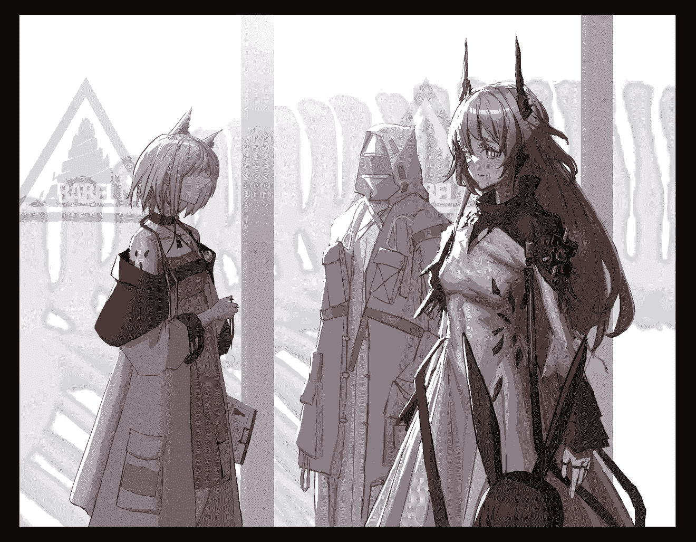](javascript:;)</ignore_js_op>  

# 31

> [咯咯 發表於 2021-1-14 22:56](https://giantessnight.com/gnforum2012/forum.php?mod=redirect&goto=findpost&pid=456909&ptid=30088)

> 就很不错，虽然我没玩mrfz，但我特地跑去查了一下特蕾西娅的立绘，文章读起来也没什么门槛，很舒服的温柔系 ...

谢谢支持！我会继续努力的！

 

# 32

哎，这两天太忙了，最早周中，最晚周末继续吧。

话说Rua牛设计地图和词条是真的可以⋯

孩子很喜欢，要被揍死了。

 

# 33

*本帖最後由 Enigma2519 於 2021-1-23 00:14 編輯*

两小时后...

“啊，原来是这样啊。辛苦你了，老公。呵呵，看来这一次进展地不错，老公和凯尔希卿的关系得到改善了呐。”

卡兹戴尔女王的曼妙胴体尽情暴露在空气之中，她坐在床上，双手揉动着自己的酥胸，这一香艳场景，任何一个男人看了这个场景，都会忍不住大喷鼻血。我例外...因为我刚刚被特蕾西娅吸干了...而此时，我正伏在特蕾西娅的乳沟中，享受着我爱妻给我的全身按摩。

“老婆大人教给我的任务啊，在下当然要全力以赴啊。唔...哈...哦...真是让人放松啊...我感到疲惫都飞走啦。”

“老公，你喜欢吗？”

“我喜欢的不能再喜欢了，老婆！妈耶，这种沉浸式的体验真是绝了！我感觉自己的精力又恢复啦！接下来我感觉自己什么都能干啦！”

“嗯？”特蕾西娅捂嘴轻笑，“好啊，老公，那，我们继续做刚才开心的事吧❤️。”

“哎呀，哎呀，我的腰啊～～～哎呀，哎呀，怎么又有点疼起来了啊...都怪凯尔希，她可把我折腾的不轻。不过我温柔体贴美丽大方国色天香善解人意贤妻良母的老婆大人可不一样，她肯定会无微不至地照顾我，不会忍心马上让我做什么剧烈运动的，老婆，你说对吗？”

“油嘴滑舌，”特蕾西娅娇嗔道，“你刚才那副样子，好像我是个吃人的怪兽似的。”

“怪不怪兽我不知道，吃人是真的...哎呀，老婆，别用力夹，别用力夹，别生气，别生气，我话没说完呢...就算是吃人的怪兽又如何？只要是特蕾西娅，不管是什么身份，我统统娶回家！”

“还统统...真是不正经。”特蕾西娅笑着点了一下我的额头，“成天在我面前没个正形，我可是萨卡兹的女王哦，你不怕我吗？”

“王权并非永恒，我的殿下，它以后会交接到我们的孩子的手上，但无论什么时候，你都是我老婆...”

特蕾西娅笑了笑：“不愧是我的老公，舌灿莲花。真是败给你了～孩子吗...嗯...现在时间也差不多了，来，老公，我现在带你去看个孩子。”

“孩子！孩子！！孩子！！！啊啊啊啊啊啊啊！我当爸爸了？！真的假的？老婆你什么时候怀上了？！啊，不管了，那是像我一样的男孩还是像你一样的女孩？或者说，双胞胎还是龙凤胎？啊，都行都行...这这这...我一点准备都没有。不行不行不行，孩子的名字得好好想，卡兹戴尔的小学哪家比较厉害...不行不行不行...啊！要考虑的事情太多了...啊，我应该早做计划的，我这个做丈夫的真是不称职啊！”

“看给你激动的呢...”特蕾西娅眉目含情地望了我一眼，但她又想说什么，却暂时止住了。

“我...我...我...特蕾西娅...老婆...我...我...谢谢...谢谢...”我不知道怎么描述自己的感动，那是一种，从青涩的少年初为人父的喜悦和激动，是知道一个和自己有血缘的小生命产生在这世界上的喜悦之情，泪珠在眼角打转，我侧过身去，偷偷将它抹掉。

我想我终于理解了我的父亲了，那个不苟言笑，对我异常严厉的科研疯子。因为他的严厉，我和他的关系比较淡漠。我想起第一次领普瑞塞斯回家过年，把她介绍给我父母的那次。二老都很高兴，甚至父亲这个老古板第一次在我面前喝高了。我从来没听他说过那么多关于我的话，趁着酒意，他还把一张珍藏多年的照片炫宝似得拿给我们看，照片中，是大着肚子的母亲在做B超，她慈祥地看着屏幕，那里显示着一个婴儿的身影。坐在床边的父亲则侧过身去，偷偷抹眼泪。我问父亲，为什么会落泪呢？父亲只是喝了口酒，告诉我，等我有孩子的那一天，就什么都知道了。现在，我终于理解他的心情了。我误会了他很多年，他并不是不爱我。也许父亲并不善于对我表达他对我的爱，或者说，他巧妙地把这种爱藏得很深，为了让我能够真正的成长。现在我终于...但是...也不知道....哎....

“对不起，老公，我还没怀孕呢。”特蕾西娅的声音把我从思绪中拉回，她对刚才的话让我空欢喜一场而感到万分抱歉，脸红地说到，“对不起，老公，刚才我没表达清楚，让你误会了。我说的孩子，是那户人家活下来的孩子，她已经没有亲人了，她还很小，无依无靠，既然这件事情是我们萨卡兹做错了，作为萨卡兹的王，我就有义务来抚养这个孩子。”

我确实有些兴奋过头了，我也红着脸道歉：“对不起，对不起，老婆，我太心急了...嗯，没事，今天晚上我也会加倍努力的！！！嗯，我还要锻炼身体，啊，以后要减少休息时间啦，没有孩子怎么算一个完整的家呢？啊...不过，先让我来见见那个孩子吧。”

“坏老公...”她嬉笑着点了点我的头，两分钟后，我们走到了一间白色的门前，特蕾西娅带着心疼的语调，对我说道，“好了，我们到了，这个小孩子现在应该还在睡觉，她之前...受了很大惊吓，再加上旅途劳顿，肯定是累坏了，所以，老公，进去后，我们要保持安静。”

“明白，老婆。”

卡特斯小女孩睡在一张儿童床上，她紧闭着双眼，痛苦地发出呜呜声，她正被噩梦折磨着，不，几天前的这场经历，不就是一场真实的噩梦吗？那些长角的恶魔，他们冲了进来，把大门打得粉碎。睡梦中的她被父亲摇醒，还没明白怎么回事，听见他对自己最后说，“活下去，阿米娅” 就觉得自己身子一阵悬空，然后是坠地感。她闻到了浓郁的血腥味，她看到自己的家燃起了大火。她感到害怕，她感到无比害怕，她想大叫爸爸和妈妈。但疼痛和恐惧死死地卡住了自己的喉咙，那些恶魔从自己的房子里冲了出来，四下搜寻着，他们在找自己吗？阿米娅恐惧地想着。

“造孽啊。”我的内心十分酸楚，这个棕发的卡特斯小女孩，本该有一个无比幸福的童年时光的，她却遭此大难。虽然特蕾西娅已经为她的家人报了仇，但是，她过去无忧无虑的生活，早已一去不复返了。

“唉，孩子～”特蕾西娅爱怜地抚了抚小女孩的脑袋。

“唔...唔....bb，mm...”小女孩轻声低语着什么，表情有些痛苦。

“嗯？老婆，这个孩子在说什么？”

“我也没听清，老公...”特蕾西娅小声回应道。

“呜呜，bb，mm，呜呜...”小女孩有点带了哭腔，但她的声音含糊不清，还是不能听清。

“老婆，这个孩子，有名字吗？”

“她叫阿米娅。”

“阿米娅，真是个好听的名字，可爱又可怜的孩子呀。”

“爸爸...妈妈...呜呜...”阿米娅在梦中小声地啜泣起来，我于心不忍，我向特蕾西娅示意，她心领神会，把我递到阿米娅耳边。

“爸爸在这里哦，爸爸在这里哦，阿米娅，我的女儿，我的女儿，不要哭，不要哭，爸爸在这里哦。”我对着阿米娅的耳朵，轻柔地说到。

“妈妈也在这里哦，我的阿米娅，是个又乖又坚强的孩子，不要难过，我的孩子。乖，阿米娅。”特蕾西娅宛如慈母一般，揉了揉阿米娅的小脑袋。

“呜呜呜...霸霸...麻麻...”阿米娅没有停止她的啜泣，我让自己的身子贴上阿米娅的脸，特蕾西娅弯下腰来，将头轻轻触在阿米娅的额头上。

“爸爸永远会在这里，爸爸永远爱你哦，阿米娅。”

“妈妈也永远会在这里，守护你和爸爸哦，阿米娅，乖～乖！”

“妈妈说的对，我们一家人，在一起...”

“唔...嗯...”也许是有点哭累了，也许是感受到‘爸爸妈妈’就在自己身边，阿米娅的哭声小了下去，她进入了另一个梦乡，梦中的她，紧紧抱着自己的爸爸妈妈，梦中的爸爸，耳朵和尾巴不见了，妈妈也长了角和细尾巴，同时头发变成了粉色。但是那份浓浓的亲情是不变的，阿米娅感到十分幸福。

“这就是我们的亲生女儿，谢谢你，特蕾西娅...谢谢你给了我这无边的幸福，谢谢你给了我一个完整的家...我们来把阿米娅抚养成人吧。无论将来有什么困难，我们都在一起，一家人，一起......”

 

# 34

没想到吧，小女孩就是我兔兔哒！这是我个人猜想博士和特蕾西娅是怎么认识阿米娅的，反正等官方出真剧情时，我再吃书也不迟。

 

# 35

*本帖最後由 Enigma2519 於 2021-1-24 00:19 編輯*

下午一时，雷姆必拓，灰沙荒漠，萨卡兹皇家考古队驻地。

“唔，我感觉自己好失败哟，老婆～我已经是条咸鱼了。”我呆在特蕾西娅的双峰之中，一副死气沉沉的样子。

“怎么了，老公？遇到什么困难了？”

“不是说女儿应该跟爹亲吗？唉～老婆，阿米娅看到我就会莫名地害怕，而且她会躲到你身后去，拉着你的衣角不放。从昨天到今天早上，我对阿米娅各种耍宝，按理说小孩子应该会被我逗笑吧。唉～～～她甚至一句话都没跟我说。感觉完全被女儿讨厌了呐，我这个做父亲的...”

“安啦安啦，老公。”像是再给我打气，特蕾西娅的那对正义轻轻夹了夹我，“阿米娅这孩子，她刚刚经历了这种不幸，自然会给自己的内心装上一层心防。不要怪阿米娅啊，老公。这是孩子的自我保护，也算是她给我们布置的考试，看看我们够不够格做她的父母的。孩子她爸，你可不要气馁哦。”

我的心情一下子因为‘孩子她爸’这个词好了很多：“哎呀，孩子她妈，也不是啦，我只是发现自己意外地不会和孩子搞好关系呢。不行，我要向你学习，不然以后等我们真的有了十几个孩子的时候，他们都不理我的话，我可受不了。”

“噗呲～好好，那我们一起加油吧，孩子她爸。”

“我会全力以赴的，孩子她妈！对了...老婆，我们现在离‘罗德岛号’已经非常近了，所以信号非常清晰。从休眠舱给出的定位上来看，它位于我们西北方向1453米处，距离地表158米。呃，这个工程量怕是相当大呢。”

“嗯，是的老公，工程队的人刚才在终端上跟我报告，他们探测到了地下的‘罗德岛’号，但他们给出的结论是：以当前的手段，光是进行挖掘和牵引，就会花费不少于三个月的时间。”

“不行啊，太久了，如果我能给出指令启动‘罗德岛’号，让它自行上升到地面就好了。可惜，我一不了解罗德岛号当前的舰船情况和能源储备情况，二无法给出具体的执行指令，要是学姐在这里就好了。”

“呼呼，我可爱的学弟遇到困难时还是这么依赖我呢，人家好高兴。”一个熟悉的声音从背后传来。特蕾西娅转身望去，我也能窥得来人的真容：啊，不是我心爱的普瑞塞斯还能是谁？不过，与前两次不同，此时的她，已和特蕾西娅一般高大了。

“学姐！”我高兴地叫出了声。

“你好，我是特蕾西娅，很高兴认识你。”这是特蕾西娅与普瑞塞斯第一次见面，特蕾西娅不免表现得有些紧张，有点像见家长的新媳妇。

“很高兴认识你，特蕾西娅，我是普瑞塞斯。”普瑞塞斯甜甜一笑，然后伸出了手，“你的事情我知道很多哦，谢谢你在这个孩子最无助的时候全心全意地照顾了他，非常感谢你。还有，以后我们就是一家人了，就让我们就以姐妹相称，好好相处吧。”

“好的，姐姐。”特蕾西娅有些害羞地笑了。

“啊，妹妹。你是真的很宠博士呢，还把他放在这里...这个小家伙，可被你给宠坏了。”

我心里暗暗吐槽一句，学姐，你当年可不比特蕾西娅好到哪里去啊。普瑞塞斯却仿佛看穿了我的心思，笑着对特蕾西娅说：“不过我也没办法说你呢，妹妹，我也很喜欢这样的，因为缩小的学弟实在是太可爱啦，很多时候我都会忍不住把他一口吞掉呢。”

特蕾西娅在普瑞塞斯面前表现得还是有些拘谨，我看得出来，面对正主，特蕾西娅为自己“横刀夺爱”了普瑞塞斯而感到有些对不起对方。唉～何必呢？你们都是我的翅膀啊，我的心又属于特蕾西娅，又属于普瑞塞斯，从来没变过的哦。不行，作为丈夫，不能让特蕾西娅背负这种心理压力啊！我心里已经开始盘算，必须要尽快找个契机消除她的担忧。

普瑞塞斯看在眼里，她主动牵起了特蕾西娅的手：“家人之间的私事，我们一会儿再谈吧，妹妹。现在，让我们谈些公事吧，殿下。现在，我以罗德岛号的主控系统这一身份和您对话，我的全称是Preliminary RhodesIsland Terminal System，简称PRTS，或者您可以叫我的炎国名，普瑞塞斯。我还有一个身份，是初任的萨卡兹魔王，为了拯救这片大地上的感染者，消除不公，解决萨卡兹的生存问题，我将授予特蕾西娅殿下罗德岛的最高指挥权限。”

“感谢您的肯定，初代的魔王殿下。”特蕾西娅微微低下了头，行了个提裙礼，“谨遵萨卡兹的预言，我将与古文明的血脉一起，指引萨卡兹一族走向辉煌，驱散矿石病的阴霾，消灭这片大地上对感染者的不公。”

嘛，这个场合，我不说点话好像也不适合，毕竟我也算是见证人。但是两位老婆的发言都太过优雅和正式了，我没那水平，也没准备发言稿，只能想到啥说啥了：“我，博士，作为见证人，在此见证我的两位老婆，普瑞塞斯，特蕾西娅之间许下的，拯救感染者的庄重誓言。如果以后，其中一方对誓言履行地不到位，我就...我就...我就晚上回家打她的屁股好了。”

“噗呲*2。”两位大美女都被我逗笑了，随即娇嗔道：

“学弟还真是胆大妄为呢。”

“老公，你是不是忘了自己身体还很小啊？”

“不过嘛，我很爱这样的学弟啊。妹妹，一会儿，我教你怎么激活罗德岛号，然后，今天晚上，我们一起，好好地教育一下这个好色的学弟吧。省得他将来不听我的话。”

“好的，姐姐...老公，不许跑，从现在开始，你就给我待在这里，哪都不许去...你可要乖乖地啊。”

完了，完了，看着对着我舔嘴唇的两人，我不禁也咽了一口唾沫。我太了解我的二位老婆了...嘛，虽然这也是个契机，可以让特蕾西娅消除那层心理障碍吧，不过...

你说我刚才非要瞎参和干什么呢？

 

# 36

很快（最快下篇，最慢下下篇）就要写到让我最兴奋的部分了。双人Vore，UB什么的，都可以试一试。

示意图：

 特蕾西娅 普瑞塞斯

（博）（士）

想想都刺激，不过有点难写啊。

 

# 37

> [kale 發表於 2021-1-24 01:59](https://giantessnight.com/gnforum2012/forum.php?mod=redirect&goto=findpost&pid=457724&ptid=30088)

> 建议lz在标题上加一个更新日期唉，不然这可能会导致很多人漏看（以为帖子是读者顶上来的所以没点 ...

谢谢你的建议，已加日期。

 

# 38

*本帖最後由 Enigma2519 於 2021-1-24 18:04 編輯*

下午六时，雷姆必拓，罗德岛号陆行舰，核心区域

“咳，嗯...啊！上古文明的科技结晶啊，我以萨卡兹女王的身份，以一个感染者的身份，向您祈祷，为了平息这片大地上的苦难。请借予我力量，回应我的呼唤吧......哈哈哈哈哈哈......哎呀，我不行了，老婆，你怎么做到一本正经地说完这种话的？哈哈哈哈哈哈....”此时，某人正端坐在萨卡兹女王的肩上，对自己老婆刚才的“中二”行为发出无情的嘲笑。

特蕾西娅的俏脸霎时变得通红，紧接着又恢复了正常，她扭过脸来，露出了让我感到恐惧的笑脸：“是的呢，给博士卿丢了脸真是不好意思，嗯，我现在感到非常害羞，以至于肚子有点饿了。正好，博士卿闻起来又很香，坐着离我又这么近，我看不如为我献身一下吧。”

“女王殿下饶命啊，我还有家室！我今天晚上要是没有按时回家吃饭就要跪搓衣板了！而且我今天也没准备啊，下次，下次，我肯定在鲜奶和蜂蜜里洗好了，给全身涂满可可粉了，再主动送上门。”

“博士卿，你可是我的爱卿，所以，我对你，可不会挑啊...”特蕾西娅伸出了自己的粉舌，她的舌头像床单一样包住了我，香涎浸湿了我的全身，散出淡淡的玫瑰味，她对我张开了两瓣巨大的红唇，“博士卿，感到荣幸吧，来，进到这里来吧，我会温柔地把你吞下，来吧，你会在我的体内永生。”

“老婆，这是犯规...”眼见这个粉红色的空间对我完全敞开，释放出的气味芬芳馥郁，里面传出来的声音宛如天籁，而在这尽头，是让人遐想联翩的无尽深渊，向那里进发的冲动扩散到了全身的每一个细胞，我已经兴奋异常。但是，最后一丝理性还是为我把持住一分清明，“不行，老婆，现在不行，我们先把正事干完吧，你现在不要诱惑我了，我真的禁不起这种考验...”

“老公的定力比以前强了呢，哎～难道是人家年老色衰了吗？好难过...”

“哪有的事！”

“逗你的...”特蕾西娅满意的亲了一下我，“哎，没想到老公都湿透了，还是这样保暖一下吧。”

说着特蕾西娅把我扒得精光，用一只手把我塞进她的bra内。

“老婆，你是不是早就谋划好的？”

“人家听不懂呢，要是老公不满意，还可以选择‘洗温泉’呐。”

“我满意到爆的，哈哈哈...老婆不要生气，我从来不会拒绝老婆的奶子的。”

“那就好...”

“原来老婆今天穿得是那件黑色蕾丝啊，真好啊，让我想起我们之间美好的开始呢...”

“老公，问你个问题啊...”特蕾西娅有些害羞，“你是，你是什么时候，开始对我有感觉呢？”

“什么时候嘛，嗯，呃，嗯，具体哪天也是说不上来，不过，肯定是在我醒来后那几周内，你对我无微不至的照顾，让我对你有感觉的啊：吃东西专门切成小块吞下来，每天唱歌给我听，主动跟我分享高兴的事，感觉我做噩梦的时候，还会揉肚子，间接给我做按摩。铁石心肠的人都会被你融化了吧！尤其，在我打开心结之后，我就更......哎，这，好害羞啊......"我感到脸在发烫，便忍不住抱住特蕾西娅硕大的正义，把脸埋了进去。

“老夫老妻了，还害什么羞啊，老公。”特蕾西娅调笑我道。

“这种事，真的很让人害羞吧，老婆！那你说说，你什么时候看上我的呢？”

“我的话，一看到冻在休眠舱内的老公，就怦然心动了呢，而且啊，当时你解冻后，体温迟迟不上升，还是我把你含在嘴里，给你取暖的呢，哦真的好冰啊，不是想让你当我老公的话，我真的不会这么做。呀！老公你脸怎么这么烫，没有生病吧？”特蕾西娅有些担心地问。

“没事...”我把脸在特蕾西娅的乳肉中埋的更深了，“我就是有点...唔...总之太犯规了，老婆，我被你吃得死死的。”

罗德岛号陆行舰，休眠舱室

“这里就是，老公当年被普瑞塞斯姐姐放进休眠舱的地方啊。”旧时的休眠室，已经破烂不堪，绝热材料制成的墙壁上，还残留着当年被超高温炙烤过的痕迹。

“啊，是啊，是啊...很久了呐...”我有些感到不真实，如同昨日碎梦一般，我就是在这里，被普瑞塞斯缩小，在这里，她向我许下了《上邪》般的山盟海誓，而也是在这里，我被迫与她分离。今天，我终于回到了这里，我等到了她所说的那一天。也是时候让她兑现诺言了呐，“老婆，我们去控制中枢吧，她，应该在那里等着我们呢。”我偷偷抹了把眼泪。

“好的，老公。不能让普瑞塞斯姐姐等太久了啊。”特蕾西娅微笑道。

罗德岛号陆行舰，控制中枢

“侦测到两名来宾，请表明你们的身份。”一个熟悉的女声在我们面前响起。

“普瑞塞斯姐姐，你好，我是特蕾西娅，我带博士来看你了。”

“声音已匹配，身份已识别，已连入罗德岛指挥系统终端，权限：10，欢迎登舰，特蕾西娅妹妹。”

“谢谢，姐姐...”特蕾西娅把我从她的bra里拿出，捧在手上，我有些激动地颤抖，特蕾西娅用手指点点我的后背，我向后望去，她对我投以鼓励的眼神。

“我...我回来了，普瑞塞斯...我好想你...”我的声音颤抖着，我努力控制情绪，不让自己哭出来。

“等一下，”她的声音有点波动，时断时续，“声音已匹配，身份...已识别...博士，已连入罗德岛指挥...终端，权限：10...我...我先去补个妆...”

然后声音就被切断了...

我有些焦急，我搓着手，感到有些惴惴不安。

一道巨大的光芒在特蕾西娅面前形成，所有的粒子开始凝集，最终，形成了一个黑发，穿着实验服的美人，那个让我魂牵梦萦的另一个身影。与前几次她的投影不同，这一次，我能感到她的心跳，她的呼吸，她的体温。她流泪了：“声音已匹配，身份已识别，是我亲爱的小学弟，已将其重新连入罗德岛指挥终端，权限：10，欢迎登舰。我很高兴，你没有忘记我呢，我的博士。”

“我...从来没有忘记...你，我的...学姐。我来...履行...自己的诺言了。”我激动的心犹如山呼海啸一般，我咬着自己的嘴唇，努力地把眼泪憋了回去。

“我知道的哦，所以说...”她笑了，那笑容如春风拂面，如细雨润物，“欢迎回家，我的爱人。”

 

# 39

<ignore_js_op>[IMG_3797.JPG](forum.php?mod=attachment&aid=ODY5Njd8ZTZkMjY0NDd8MTYyNDY4ODc0NnwxODIzMHwzMDA4OA%3D%3D&nothumb=yes) *(434.35 KB, 下載次數: 0)*

[下載附件](forum.php?mod=attachment&aid=ODY5Njd8ZTZkMjY0NDd8MTYyNDY4ODc0NnwxODIzMHwzMDA4OA%3D%3D&nothumb=yes)

2021-1-25 06:55 上傳  

</ignore_js_op> <ignore_js_op>[IMG_3796.JPG](forum.php?mod=attachment&aid=ODY5NjZ8ZjQxNjZiOTV8MTYyNDY4ODc0NnwxODIzMHwzMDA4OA%3D%3D&nothumb=yes) *(104.57 KB, 下載次數: 0)*

[下載附件](forum.php?mod=attachment&aid=ODY5NjZ8ZjQxNjZiOTV8MTYyNDY4ODc0NnwxODIzMHwzMDA4OA%3D%3D&nothumb=yes)

2021-1-25 06:55 上傳  

[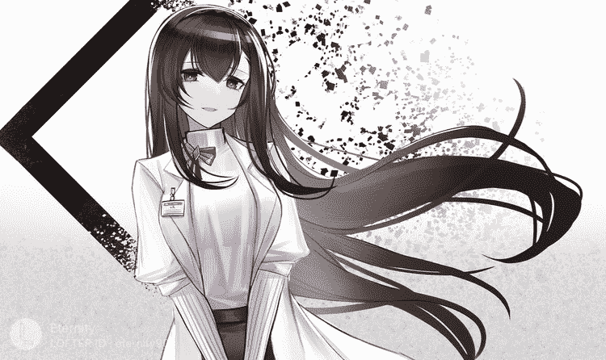](javascript:;)</ignore_js_op>  

# 40

呃，道个歉，当初写这个文章的时候，明明是选定了两个标题，“博士的过去”和“巴别塔往事”，但是最终定的是后者，标题只在word上改了，这里没改，今天把它修订了，不要误会成我写新文了啊。

 

# 41

在Lofter上找普瑞塞斯和特蕾西娅的图片，结果搜到一堆刀文，我人都不好了。

 

# 42

因为这章涉及三人对话，对话将用颜色代替不同的角色，以防造成混乱和误解。分别是博士，特蕾西娅，普瑞塞斯。

晚间十时，雷姆必拓，罗德岛号陆行舰，指挥员卧室，床上

“呃，二位老婆，你们...用那种眼神那么看我干什么...好像要吃了我似的，哈哈哈...这个...这个...我有点...怕...”

“呼呼，老公，夜晚还很长，你不觉得，我们应该做些快乐的事吗...”

“呵呵，学弟，我们可是很久没见面了呢，我的学弟能量急需补充呢..."

“这么宝贵的时刻，我们不应该谈谈人生，理想，还有我们的未来吗？呃，你们脱我衣服干什么。”

“创造我们的未来啊，学弟...”

“请...请二位...对我温柔一点，好吗？”

“好啊，小弟弟，呼～～放轻松～大姐姐们会非常温柔地对你哦，很快就会舒服起来的。就交给我们吧❤️。”

“博士卿，放轻松，交给我们吧，就让我们好好服侍你吧❤️～。”

这个房间里正在发生着无比香艳的一幕，窗外的月亮无意间看到这一幕，羞得躲进了乌云的怀抱中：在这张床上，两个美若天仙的女子只穿着内衣抱在一起，肆意地进行着法式香吻，两人都无比陶醉于这美妙的体验。但她们还是有些小心，生怕一个不留意就伤到了我。那我在哪呢？

被两个大美女像糖一样含在嘴里，而且两人还在进行法式深吻是一种怎么样的体验？谢邀，人在现场，刚进肚里（bushi）...一句话总结，我特么社保！特蕾西娅嘴里有一股淡淡的玫瑰香气，普瑞塞斯的嘴里却是有一种淡淡的茉莉味道。我被两条巨大的舌头挤着推到这一边，又被拉到那一边。我就像是香涎大海内的一叶扁舟一样，任自己被她们的舌头捏圆捏扁。她们两人的唾液浸湿了我的全身，虽然这可以做润滑剂，但是还是能感受到二人的舌头摩擦过我全身每一寸肌肤。啊，这轻柔的呼吸和温香的唾液，我宛若坠入一片玫瑰和茉莉的花海中。这天地都是粉红色的，好软啊，我陷进去了。理智已经到达沸点了，我不禁叫出声音。

“拜托了，普瑞塞斯，特蕾西娅，呼，呼，我受不了了，我真的受不了了！请吃掉我吧！请吃掉我吧！！请吃掉我吧！！！”

她们终于停了下来，相视一笑，另一只舌头从这嘴中脱离开去，我躺在这张嘴中，茉莉味的湿热唾液不断滴在我的脸上，热气从背后呼出，温暖着我的身体，我却丝毫动弹不得，因为我的下体已经逼近极限了，我大口大口地喘着粗气。身下的舌头轻轻把我往前推，等我的脑袋探出双唇之外，普瑞塞斯巨大的粉唇轻柔地含住了我的脖颈，她的舌尖垫在我身下，防止我被贝齿割伤。我向前看去，一条津液做的丝，像桥一样一直延伸到对面，那里是特蕾西娅的双唇之中。此刻，她坐在对面，微微喘气，媚眼如丝地看着我，那都是化不开的情。

“还有什么遗言吗？小弟弟？”

“遗...遗言？”

“是啊，不要担心，小弟弟，大姐姐会很温柔地把你吞下去呢，然后小弟弟，你呢，就静静地躺在大姐姐肚子里，睡个好觉，然后永远和我融为一体吧❤️。”普瑞塞斯跟我除了最后一件事，该跟我做的都做了，自然，她很清楚我的性癖。原来，要做那个了吗？我不禁兴奋地喘着粗气。当然，特蕾西娅并不知道我们要干什么吧。我对特蕾西娅投了一个笑脸：

“殿下老婆，别担心，我在学姐肚子里先玩一圈，一会儿就去你那里玩。” 

“噗呲，老公，一会儿你到我嘴里来，你看我不咬你几下。”

“哼哼，老婆，你老公我会变戏法哦...wo...”我话音未落，普瑞塞斯就把我吸进嘴里，舌头一翻，我就开始被咽进她的食道之中。

“爱耍宝的小弟弟不听话啊，应该被大姐姐好好消化掉啊。”啊，普瑞塞斯，你真的是个S，我...好喜欢！！！

普瑞塞斯的玉颈上出现了一个人型隆起，正慢慢地向下滑落到她的胴体之中，特蕾西娅突然靠近，隔着普瑞塞斯的玉颈舔了舔我，这也把普瑞塞斯吓了一跳，又咽了一下，使我加速进入到她的胃中。

“呀！妹妹你...”

“哼，这个家伙跑得挺快的，一会他出来，我就...”

“放心，他这辈子，都跑不出我们姐妹的手掌心。”普瑞塞斯笑着贴上了摸特蕾西娅的头。

我尽情地释放着自己全身的精华，我把自己的白浊用力地喷射到普瑞塞斯胃壁内的每一个角落。

“真有活力啊，小弟弟，就让大姐姐把你咕噜咕噜地消化掉吧。”

话音未落，我感觉腿部一软，我瘫倒在普瑞塞斯的消化液里，啊，开始了啊，现在要做的就是要放松。我感觉全身的知觉正在消失，很快，消化液把我淹没了。

“嗯，好像差不多了呢，好，让我可爱的学弟在我体内流一圈吧。”

“姐姐，你不会真的，消化了老公吧？”特蕾西娅有些担心地问道。

“放心吧，妹妹。”普瑞塞斯笑道，“别看博士他有点内向，其实他这人的性癖有点怪哦，我们这样也进行很多次了，不会有问题的。”

特蕾西娅点了点头。

“嗯，我感受到学弟在我全身流转，啊，我全身都暖呼呼呢，让我感觉一下...看来学弟身上也一点源石反应都没有呢，果然吗，看来这种所谓的源石，对我们毫不起效果呢...”普瑞塞斯喃喃自语道。

我的意识又开始恢复了，我感觉得到，自己变成了奶白色的粘稠液体，周围奶香四溢。呃...我知道这次在哪里了，自己成了啥了...接下来的剧情，我可以想像了...哎，前路漫漫啊...

 

# 43

*本帖最後由 Enigma2519 於 2021-1-25 06:17 編輯*

接下来几天又要忙了，尽量抽时间更新吧。这部分是Vore，其实还有下一半，UB的部分。但是这一半我给兴奋了还行，而且今天没什么时间了，回头尽快补上。

 

# 44

*本帖最後由 Enigma2519 於 2021-1-25 23:52 編輯*

“所以，姐姐，老公他...在这里？”特蕾西娅一脸难以置信地看着普瑞塞斯，后者已经把自己的胸罩解开了，露出了一对侧集型的双乳。普瑞塞斯笑道：“这个小家伙啊，最喜欢在我这里撒娇了，以前每周末都是的啊，都这么大了，还像个孩子一样。”

“呵呵，老公还真是童心未泯啊。”特蕾西娅笑意盈盈，眼中的白色菱形慢慢变成了爱心状。

“嗯，我感到他在里面不安份了，妹妹，来，把他吸出来。”普瑞塞斯说着，将一只乳房递到特蕾西娅眼前...

“哼哼，博士卿，我看你这回往哪里跑...”特蕾西娅说着，轻轻含住普瑞塞斯的乳头...

“啊，啊，他要...他要出来了！嗯，嗯！哈～～～哈～～～”普瑞塞斯一阵娇喘，开始大口大口地喘起气来。

我此时就像包在一个为我量身定做的鸭绒睡袋里，我好像听到她们在说什么，然后就是一阵翻江倒海，天旋地转。还好我现在是液体，不然我真的就吐了。接着，普瑞塞斯那摄人心魂的娇喘声传入我的耳朵，我又硬...哦，对不起，我是液体...我又想喷射出一部分了。啊，娶此二位妻，以后怕是枸杞当饭也难医。我脑子内正在那里胡思乱想，只感到脚下传来一阵巨大的吸力，我完全控制不了自己的身体，原本是我下半身的地方已经被吸出乳房去了。脚下感受到一片温暖...啊，这个温湿度，这个触感...我真是刚出一只母老虎的肚腹，又进了另一只母老虎的嘴里呀（普瑞塞斯/特蕾西娅：亲爱的，你说什么？可，以，再，说，一，遍，吗）。

“唔...唔...唔...嗯...嗯。”特蕾西娅真是体贴，她把变成奶的我全都含在嘴里，舌头卷曲起来，半张着嘴，即使口腔不断分泌着玫瑰味的香涎，也不敢下咽。她生怕把我撒出一点，或是咽下一部分，我就没法复原了。她微微仰着脖子，半张着嘴，向普瑞塞斯投以询问的眼神，湿热的香风从她嘴里慢慢呼出，那个场面要多香艳有多香艳。

普瑞塞斯也真正动情了，她迎了上来，一只手托住特蕾西娅的玉颈，微笑道：“不用担心，我的好妹妹，我们的老公可不会有事的，相反，他可最喜欢这种，告诉你吧，他可是1000%的吞食控啊。”

“蒸读麻（真的吗？）。”特蕾西娅听了，恶作剧的心理上来了，她闭上嘴巴，巨大的香舌搅来搅去。我现在不比以前了，我的身体，流淌过特蕾西娅口中的每一个角落，这种无与伦比的感觉，真的，不能用言语形容，啊，我感受到我与自己的爱人水乳交融了...我好幸福...

“老公真甜啊。”特蕾西娅高兴地想着。

“看着妹妹这样子，我都有点渴了呢。”普瑞塞斯笑着，将自己的红唇靠近，特蕾西娅心领神会，贴了上来，又是一次法式深吻，特蕾西娅将一半的我送进普瑞塞斯口内，二人细细品味着，像是嘴里含得是甘露琼浆。久久，才依依不舍的咽下...

我被两位老婆分别咽下，而我此时全力在做的事就是：

我TM社保！

没错，就是我TM社保！老子才不管明天自己还在不在，每次射的量就是有多少射多少。激流射到喷泉，喷泉射到肾虚，肾虚射到皮包骨。总之就是跟把整个人射出去没两样。回到卡兹戴尔后，凯尔希跑来问我说，这个月特蕾西娅殿下天天红光满面，无论遇到什么困难都能保持好心情，你有什么头绪吗？

我怎么会知道！

“普瑞塞斯！特蕾西娅！亲爱的老婆们，我爱死你们啦！”我一边感受着被融化的无上快乐，一边声嘶力竭地喊着。

“呼呼，亲爱的老公，还真是的。”特蕾西娅笑着对普瑞塞斯说，“记得我第一次把他吞下去时，他还喊‘女王殿下请吃了我吧’‘我想和您合为一体’‘我下辈子还当您和的食物’什么的，我都被他逗得肚子痛。”

“哈哈哈哈...”普瑞塞斯发出银铃般的笑声，她俏皮地拍拍肚子：“亲爱的，你再叫几句给我听听。”

她肚子里的我恢复了暂时的理性，听到这话，我羞得全身发红，慢慢地泡进她的胃液里了，咕嘟咕嘟地冒着泡。

“害羞了，真可爱...”普瑞塞斯面色潮红，对特蕾西娅说，“妹妹，我们继续吧...”

“？？？”我才刚打了个盹的功夫，我怎么出来了？我躺在白花花的巨床上，一脸茫然。哎？我好像变大了，大概，有十几厘米那么大？

“当然啦，我亲爱的博士，夜还很长啊。”山峦一般大小的普瑞塞斯在我面前坐了下来，我抓住床单，才不让自己这么快就滑进深渊。白花花的巨腿如王城的高墙，拦住了我两边的去路。

“博士卿，我们的前戏，才刚结束啊，接下来，你要好好服侍我们呢。”另一座山峦在我身后坐落了下来，黑丝的巨腿若古堡的城防，两双巨腿相叠，我被困于这天堂，亦或是地狱之中。

我觉得我明天肯定下不了床了，两双巨腿将我包围得越来越紧，特殊的香味，近在咫尺的压迫力，还有这包裹着我的热气，以及两端的无尽深渊，都在挑逗着我，予我以致命的诱惑。我咽了咽唾沫，我是荷尔蒙的机器，是精虫上脑的怪兽，但是，我必须控制本能，你们可能也好奇，为什么，和老婆们在做增进感情的活动时我要如此压抑或者拒绝配合。哈哈，其实这样是一种调情方式，普瑞塞斯和特蕾西娅都有些S倾向，我需要表现出一种欲拒还迎的姿态，就会极大地增进她们的性趣，我们就可以...而且，这样，激起她们的抖S心理，她们的行为会更加大胆。真是让我又害怕，又期待呃，很刺激，不是吗？不，不过这不意味着我是M，嗯...也可能只有一点点，嘛，如果老婆们喜欢就好了。

“两位女王，行行好，放过我吧。我只是一个普通的村民”

“嗯，可我是魔王啊。”普瑞塞斯满意地看着我，她舔了舔嘴。

“我也是魔王啊。”我回过头去，特蕾西娅风情万种地咬了咬自己的下嘴唇。

“那么，可怜的村民，就这样被我们吃掉吧。不过，这次，就用下面的嘴好了。”

“好，那么，老公，我们就拜托你了，尤其是对普瑞塞斯姐姐。”特蕾西娅媚眼如丝，眼中的白色菱形已经变成桃心状——这是她动情的表现，另一边，刚才还角色扮演玩得来劲的普瑞塞斯脸部却绯红无比，一副小女生的模样，细细看去，她眼中的白色菱形也变成桃心状了。今晚是时候了，我要加油啊！

特蕾西娅轻轻抬起她那巨大的桃臀，她用双手撑开自己的蜜穴，蜜穴留下汁液，它等待自己的猎物已经太久了，一口气就把我咽到胸部，然后将我含住了。“姐姐，来啊。”特蕾西娅微笑道，普瑞塞斯有些害羞，自己可以的，她给自己加油打气。

我感到自己的双腿像浸入了蜜糖的沼泽一般，我既激动，又兴奋，又有些感慨，自己等这一天等多久了？从第一次遇到学姐，到今天，终于能和普瑞塞斯成为正式的家人了。

“唔...”普瑞塞斯感受着博士在自己身体里，朝着最终目标前进。自己马上就要把自己全都交给他了，他是我的，我也是他的！

我越陷越深了...普瑞塞斯的蜜穴一点一点地把我吞入，特蕾西娅小心翼翼地做着，生怕一个不小心，把我们弄疼。我感激地摸了摸她的肉壁，将自己的手伸到头顶，伸得直直的。

好像到了，脚底终于踩到了一层薄薄的膜。这是最后一步了。

“学姐，准备好了吗？”

“一会儿，请叫我的名字，我的老公。”

“当然，”我有些感动，“准备好了吗？普瑞塞斯，特蕾西娅，我的两位挚爱。”

“好了，老公*2。”两人应道。

“好，那开始...”

“唔...”普瑞塞斯觉得肚子内一阵疼痛，一滴泪珠在眼角滚动。

“亲爱的，没事吧？”（为了方便辨认，用‘亲爱的’代指普瑞塞斯，‘老婆’代指特蕾西娅）。我感受到一股热流浸满了我的双腿。

“有点痛，老公。不过，没事的。”普瑞塞斯香汗淋漓，“妹妹，继续吧。”

似乎是因为疼痛，普瑞塞斯的阴道把我死死咬住了，特蕾西娅慢慢地抽动两下，普瑞塞斯的阴道才开始放松，慢慢地，她加快了频率。

“嗯，这种感觉，嗯，好舒服，啊，老公～老公～”

我自然也不会闲着，我不能什么事都让特蕾西娅干吧？话说回来，她的G点好像就在这附近...我挠，我舔...”

“呀，老公～唔～”我的挑逗也让特蕾西娅控制不住了，她的阴道开始分泌出更多蜜液来。

“嗯，老公～老公～”我也能感受到普瑞塞斯的热情，另一个世界，也逐渐被蜜液充满了...

“啊，亲爱的！啊，老婆！啊～啊～”

我们三人同时到达了高潮，我的精华全部喷射进普瑞塞斯的子宫之中了...

“啊～啊～老公，我好幸福，谢谢你，特蕾西娅妹妹...”普瑞塞斯香汗淋漓，感受在自己身体里的另外一个心跳，自己的幸福，在这一刻，那么真实。

“普瑞塞斯姐姐...我们，从此就是真正的家人了呢...啊～啊～老公，辛苦了。”特蕾西娅如淡粉瀑布一般的长发散开，她眉目含情，轻轻地摸了摸自己的肚子，自己的爱人...今天真是辛苦了。

“我幸福的，感觉跟做梦一样...如果是梦，就让我死在这里吧，如果...如果是真的...啊～啊～我亲爱的老婆们哦，我会拼尽我的生命...守护你们的...一辈子...不，是永远...永远...”我躺在特蕾西娅和普瑞塞斯的身体里，喃喃自语道。

 

# 45

*本帖最後由 Enigma2519 於 2021-1-25 23:52 編輯*

说实话，把自己写硬了。

另外就是。哇！我感觉好感动，博士终于在我笔下有了完整的家了。全游戏中对他（私设：男博）最好的两个老婆级的女人终于和他在一起了。

不过这不是博士的结婚后日谈，前面虽然一片祥和，后面该发刀的地方还是得发刀，毕竟方舟世界观...再怎么写同人，也得符合剧情，这就很TMD胃痛。

 

# 46

*本帖最後由 Enigma2519 於 2021-1-27 14:15 編輯*

思路上出现了一些死结，所以我决定，咕咕咕个一两天

我要是咕咕太久了，就肯定被两位老婆拿去煲汤了。

 

# 47

*本帖最後由 Enigma2519 於 2021-1-27 15:21 編輯*

嗯，也许可以加点变物属性，或者进一步缩小，或者胎归后在老婆子宫内转生？

啊，其实也挺想写giga的，但是不好写啊。

有了！啊，万能的PRTS系统可以上线了，我可以多写写战斗模拟这样的，揭露博士变强的秘密。还可以写写番外。

 

# 48

*本帖最後由 Enigma2519 於 2021-2-17 19:51 編輯*

2/18更新此段：我得吃书了，我发现第二个师姐并不好写，不打算写了，取而代之，我会用另一个角色代替一下。

我决定加一个私设人物，正好出个小番外，，博士的准老婆+1。

因为在我很喜欢的一个方舟塔罗同人作中，博士是Fool（愚者），阿米娅是Magician（魔术师），特蕾西娅是Empress（女皇），虽然普瑞塞斯没有出现，但十有八九是对应Priestess（女祭司）。所以我私设的这个人名字为塔罗牌职业的女性变格，个人预想是Hermitess（女隐士）。

名字嘛，暂时称为“赫尔弥兹”好了，如果有更好的同音名称建议，我会更换的。

因为作者画这系列作品比较早，所以女祭司一位对应的不是普瑞塞斯，有点遗憾啊。

等等，那这样老婆顺序的排位不就出来了吗。0号是博士，1号是阿米娅（这个是女儿，不算），2号是普瑞塞斯，3号是特蕾西娅...好耶！一家四口成了！磕到了磕到了！

 

# 49

<ignore_js_op>[博士.jpg](forum.php?mod=attachment&aid=ODcwMTV8NzJhYjBiZjR8MTYyNDY4ODc1NXwxODIzMHwzMDA4OA%3D%3D&nothumb=yes) *(1.02 MB, 下載次數: 0)*

[下載附件](forum.php?mod=attachment&aid=ODcwMTV8NzJhYjBiZjR8MTYyNDY4ODc1NXwxODIzMHwzMDA4OA%3D%3D&nothumb=yes)

2021-1-28 05:44 上傳  

</ignore_js_op> <ignore_js_op>[特蕾西娅.jpg](forum.php?mod=attachment&aid=ODcwMTR8NmI2NDExMzZ8MTYyNDY4ODc1NXwxODIzMHwzMDA4OA%3D%3D&nothumb=yes) *(1.69 MB, 下載次數: 0)*

[下載附件](forum.php?mod=attachment&aid=ODcwMTR8NmI2NDExMzZ8MTYyNDY4ODc1NXwxODIzMHwzMDA4OA%3D%3D&nothumb=yes)

2021-1-28 05:44 上傳  

[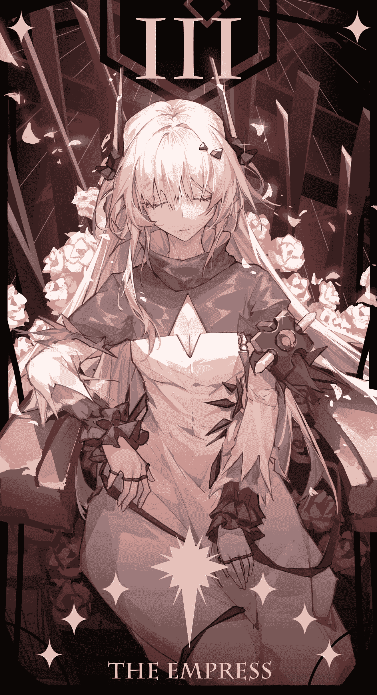](javascript:;)</ignore_js_op>  

# 50

*本帖最後由 Enigma2519 於 2021-1-28 03:00 編輯*

番外：手指糖游戏

因为又是多人剧场，所以，对话中蓝色代表博士，黑色代表普瑞塞斯，粉色代表特蕾西娅，橘色代表自设人物，博士新的未来老婆——赫尔弥兹。

文笔极烂警告⚠️

这是一个博士在以前世界的平凡周六...

已经八点了，窗外渐渐染上了一层夜色，普瑞塞斯坐在自己的电脑桌前查找着什么。明明今天是周六，她却已在报告和数据中忙了一天了，即便是回到宿舍也没有闲着。但不同的是，此时，眼角露出的一丝疲态却掩不住她嘴角的笑容——自己亲爱的师弟明天就会过来看自己，甚至还会在自己家住一夜！虽然在研究院也能天天见面，甚至在一个实验室，但两人之间的话题也是仅仅聚焦于工作上面。呼呼，明天，明天是个千载难逢的好机会，自己要好好地向自己的师弟展示展示自己的女子力！唔...再不加油，自己可爱的师弟就要被研究所里的其他野女人抢跑了，这是绝对不可妥协之事！哼哼，然后和自己两情相悦的师弟就可以和自己成为情侣，然后，结婚生子，然后，自己就可以照顾他一辈子了！唔...好害羞...

“哎？普瑞塞斯，你在看什么官能小说呢？脸红的这么厉害，也让我看一下呗。”

来了，普瑞塞斯心想，这就是研究所里最危险的野女人。偏偏那么倒霉，还是自己的舍友兼闺蜜。这家伙垂涎自己师弟的身子已经很久了，不行，明天是自己和师弟关系更进一步的大好机会，不能让她趁虚而入。

“赫尔弥兹，你明天有什么计划吗？”普瑞塞斯微笑着问道。

“啊？我？嗯...我倒是约了一个人呢。嗯...应该晚上才回来吧。”

“太好了。”普瑞塞斯心里暗暗高兴，她从抽屉中拿出了自己的一张银行卡，“那个，能不能帮我个忙，我明天...有些事情...你能不能...在外面住一晚，这卡里的钱，你到时候随便用。”

“哇，真的吗？老板大气！那我就不客气啦！明天你就好好过你的二人世界吧！”

.

“万岁！”普瑞塞斯高兴地握紧自己的小拳头，在心里暗暗欢呼着。

“哎，太好啦，明天可以带着师弟过夜了，有人还给报销...然后干脆我就一口气，就跟师弟来个既成事实，生米煮成熟饭吧！”

“等等...”普瑞塞斯面目“和善”地抓住赫尔弥兹的肩膀，她的力气大得离谱，赫尔弥兹回过头来，发现同为研究院院花的普瑞塞斯，此刻的神情宛若修罗附体，她发出来自地狱般的声音，“你刚才，说，的，是，和，**谁**？！”

“师弟啊，我还能约谁啊？他可是我的未来老公啊。”（博士：有一说一，确实）

“不会把师弟交给你这种色女人的！师弟明明是我将来的老公。”（博士：不用将来，现在就是）

“你有什么证据啊，普瑞塞斯？还有，谁才是色女人啊，谁会把师弟做成抱枕，晚上在那里用来解决生理需求啊，这屋子里就我们两个，反正这个色女人不是我。”

“我只是想测试一下我的床的结构稳定性和施力点而已，而且...我和师弟一起长大的哦，他从小就大姐姐大姐姐地叫我，抓着我的裙角，努力地想跟上我的脚步，而且他不止一次地说了哦，‘长大了要跟大姐姐结婚’，我也答应了哟，师弟和我可一直都是信守承诺的哦。”

“小孩子过家家，那时哪懂事呢？而且，你不知道吗，普瑞塞斯，自古青梅多败犬，明明是我这样的天降才是王道。放弃吧，我的优势很大！”

“哼哼，你看师弟每次遇到不高兴的事情，都是往谁的怀抱里钻，在众人面前向谁撒娇的。哪个师姐才是师弟的心之所属真是不言而喻啦。”

“是吗？‘抓住心爱男人的胃的十道菜’，‘能让男人怦然心动的十句话’，‘展现女性魅力的十种技巧’...刚刚还在抓紧补习这些的普瑞塞斯小姐，还真是游刃有余呢...”

......

两人居然会为这个话题争辩半个多小时，我真是叹为观止，是的，虽然有些唐突，但是我本人是在现场的。当然不是自己的意愿，今天白天，赫尔弥兹师姐拜托我说，希望我能去她那里一趟，参与一下缩小射线的研究。我本来是想起普瑞塞斯师姐对我的警告，本打算拒绝。可是赫尔弥兹师姐承诺我，要是我去，将来会把我的名字写在她的共同作者一栏上。然后...我就屁颠屁颠地过去了...然后我就中招了...然后我醒来就发现，自己在一个女士香包内，然后，我就听到了她们之间的对话...然后，我就被拿了出去...

“不如，我们让亲爱的师弟决定他的归属吧。”赫尔弥兹把我从自己的香包中拿出来，把我紧紧地贴住她的面颊，露出一副恩爱的表情。

“你...博士！”普瑞塞斯对我没听她的话感到有些生气。

“对不起...姐姐。”我耷拉下来脑袋，垂头丧气地向普瑞塞斯道歉。

“唔...算了，你肯定又被她骗了。笨蛋师弟！”普瑞塞斯对我说“姐姐”/“大姐姐”这个词总是没辙。

“我们来玩一个游戏吧，普瑞塞斯，谁赢师弟明天归谁。”

“比就比！我什么时候怕过你！”

“我...我觉得...”我小声地想发出抗议。

“小孩子不要插嘴！*2”两位大美女同时对我虎着脸，我又把头低下去，这里确实是没有我说话的份。

“你想怎么比？”普瑞塞斯问道。

“我们来玩个游戏，手指糖游戏，我把师弟放在我的指尖上，然后我们把嘴都贴到离他很近的地方，用我们的方式对他随便做什么，师弟可是个嘴控兼吞食控，如果他忍不住，对谁射精了或者主动钻到谁嘴里了，就算赢，怎么样？”

“真是个色女人，我是不会把师弟输给你的。”

“二位师姐，这不好吧...”可惜师姐们根本不听我的话。

“先让我热热身，”赫尔弥兹给自己倒了一杯果子酒，喝下。她对着我张了嘴，零星的黏丝分布在这个粉红色的诱人洞穴内，洞穴内轻轻呼来一阵薰衣草夹杂着果子味的暖风，诱惑的声音跳动着我的神经，“人家准备好了，我可爱的小师弟，准备在你朝思暮想的师姐的嘴里迷失了吗？”

我不可自持地立起了帐篷。

“这酒里，你不会做了什么手段吧，让我也试试。”普瑞塞斯喝了一口，这是我知道的，她第一次喝酒。普瑞塞斯显然还不习惯喝酒，她只喝了一点，剩下的还有一点，久久地含在嘴中，似乎是突然有了一个主意，她嘴角露出一丝微笑——这是要对我恶作剧的标志，果不其然，巨大的红唇亲上了我的面颊...然后张开，37度的酒水浴浸透了我的全身，是果香混合着茉莉的气息。

“呀，我好像醉了，对不起，师弟，这就给你打扫干净...”粉红的巨舌趁机把我卷入嘴中，然后，巨大的红唇闭合，我在这个闭锁空间内尽情领略到普瑞塞斯对我鼻，耳还有感官发动的无情侵略，我的师姐此刻就是我的世界。我鼻中都是她的味道，她吞咽口水的声响，舌头与下颚，牙床之间的摩擦声在我耳中宛如令人浮想连篇靡靡之音，她的舌头犹如棉被一样，把我紧紧包裹，周围的空间剧烈地颤抖起来，我听到赫尔弥兹的声音，颤抖有持续了一阵，眼前的黑暗突然变成一片白昼，我遮住双眼，然后我就体验到坠落的感觉，接着，又是另一片温热的黑暗包裹住了我，准确的说，是包裹住了我的上半身，而腹部以下的身躯，则被包裹在另一重不同的温热和柔软中。这一刻，我的脑子断弦了。

两个相反方向的强大吸力似乎想把我扯成两半，我知道这是两位师姐在争抢我，赫尔弥兹的口水逐渐滴在我的脸上，开始越积越多，我不得不屏住呼吸，因为我没法用手抹掉——我的手部已经开始被咽进赫尔弥兹的食道。很奇怪，我居然，兴奋无比，人在处于危机边缘时居然会爆发性冲动。而且，在心底里，这居然是我的一个可以接受的结局，我很爱普瑞塞斯，但对赫尔弥兹，很难说，这是什么感觉，也许算朋友以上，恋人未满？但是，如果我能变成赫尔弥兹身体里的一部分的话，我是肯定不会抗拒的。

我似乎接受了自己的命运，但我要留下一点种子——普瑞塞斯对我的射精感到猝不及防，下意识地张了下嘴。等她反应过来，只见我像面条一样被吸进赫尔弥兹嘴里了，很快，她看着我的双脚也淹没在了赫尔弥兹的唇间。

赫尔弥兹用不会伤到我的最快速度把我咽了下去。

“师弟归我了！！！”感受到博士在自己腹中的存在，赫尔弥兹兴奋地宣布着自己的胜利。

普瑞塞斯见状，立刻吞掉了我所有的精华：“你这个野女人，按规则，我也没有输！你快点把我的博士吐出来！吐出来！！！”

“做梦呢！我们说好的，师弟在谁我肚子里，谁就有对师弟的终身主权！拜拜，我走了！”

“休想！而且这跟一开始说的不一样！！！”

她扑倒了想要偷偷溜走的赫尔弥兹，两人滚在地毯上，场面一度十分混乱...弄到最后，两人都睡着了，赫尔弥兹到最后也没吐，我倒是差点吐了...

时间再次转动，回到现在。

罗德岛号，一个平常的周六，晚间八时

“姐姐的手艺真好啊。”特蕾西娅优雅地用餐巾擦了擦嘴，“我吃饱了，谢谢姐姐。”

“谢什么，别见外，学学咱们家亲爱的。”普瑞塞斯笑着揶揄我，“一台多么有效率的干饭机器啊，到桌上就是一顿胡吃海塞，半句话都不讲。”

“姐姐，老公今天训练很累的，还请别介意。”

“没办法，老婆做的饭太好吃了，要是因为说话而使菜凉掉的话，我感觉有些浪费...”

“真是的，败给你了，”普瑞塞斯笑笑，站起身，“我和特蕾西娅赶紧把这里收拾收拾，老公，你先去浴室泡澡吧，老地方。我和特蕾西娅妹妹收拾完了再去找你。”

“好的...”

哎，她们两位能好好相处，也是我的幸福啊。我让自己全身浸在鸡尾酒杯里，有些感叹，我真是太幸运了啊，能娶到两位这样贤惠又温柔的女子为妻，也让我来为她们做点什么吧...哎？话说，今天用一杯温热的果子酒来给我泡澡，是不是有点太奢侈了？啊，不过这又是普瑞塞斯的安排，我可不能坏了老婆的美意啊，我得好好洗，好好洗。嗯...因为我每天都被老婆们照顾得无微不至，不如，等一会儿，老婆们进来了，我给她们搓搓背吧，等睡前再给两位老婆好好地做个全身按摩吧。她们一天到晚的，也够辛苦的，今天周末，让她们放松放松吧。

另一边...

“妹妹，正好周末了，就放松一下吧，一会儿我们和老公一起做一个游戏...它的名字叫，手指糖游戏...”

这算是一个番外，也算是一个小尝试吧，赫尔弥兹的长相请参考这张图的右侧女性，别说，把这张图看成普瑞塞斯，博士，赫尔弥兹三个人一起玩手指糖游戏还真是毫无违和感... 

# 51

<ignore_js_op>[手指糖游戏.jpg](forum.php?mod=attachment&aid=ODcwMTZ8ZWE1Y2ViYzB8MTYyNDY4ODc1NXwxODIzMHwzMDA4OA%3D%3D&nothumb=yes) *(231.95 KB, 下載次數: 0)*

[下載附件](forum.php?mod=attachment&aid=ODcwMTZ8ZWE1Y2ViYzB8MTYyNDY4ODc1NXwxODIzMHwzMDA4OA%3D%3D&nothumb=yes)

2021-1-28 08:19 上傳  

[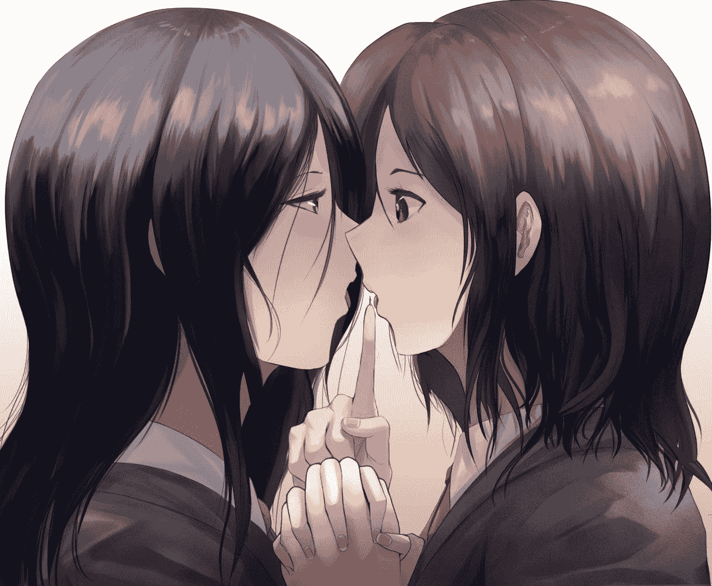](javascript:;)</ignore_js_op>  

# 52

没想到我会愿意创造一个新角色来纳入博士的后宫，也不会写凯尔希，对此我表示无比惋惜....

才怪嘞！！！！！我写之后才发现，主动的大姐姐她不香吗？！因为我（博士）可是1000%的年上控啊，这种温柔/侵略性的大姐姐我是没法抵御的。我要和这种大姐姐生一百个孩子！！！！！

 

# 53

*本帖最後由 Enigma2519 於 2021-1-30 21:47 編輯*

晚间十时，罗德岛号陆行舰，医疗室

“哎？今天...难道要玩点新花样？”我穿着普瑞塞斯为我特制的病号服，端坐在病床上。病床前，站着两位巨大的护士。黑发的护士面露笑容，而淡粉发的护士则是满脸娇羞。

“博士先生您好，请允许我介绍一下，我是本医院的护士长，普瑞塞斯。旁边这位是我们新来的护士，特蕾西娅，她有些容易害羞，还请您不要介意。”普瑞塞斯露出她标志性的微笑，向我介绍着她们的人设。

“两位老婆好...咳...我是说，两位护士小姐姐长得真好看啊，看来我病得真值啊，等我病好了，一定要把二位都娶回家里做老婆...”我立刻把自己代入成一个喜欢挑逗护士的，有些好色的病人形象。

特蕾西娅更害羞了，她一言不发，也不敢正眼看我，只是用一根手指去绕自己的护士服的衣角。很奇怪啊，她平时不是这样啊。

普瑞塞斯笑得更深了，她妩媚地看了我一眼，说道：“先生真是胆大呢，但很有男子气概啊。对于先生说的话，小女子真是十分期待呢...”

“先生，我...我也...”

啊，我知道了，这肯定是普瑞塞斯提前跟特蕾西娅说好的，看这架势，普瑞塞斯扮演的是热情而成熟的护士长，特蕾西娅扮演的则害羞而软萌的实习护士。哇，这个组合玩得有点大啊，我现在就有点开始兴奋了，这又会是一个漫长的夜晚啊...只希望明天我别真的去住院了...

“不过先生，我这里有医生关于您病情的诊断报告呢，恐怕不是很乐观啊。”普瑞塞斯神色一凝。

“咕...”我装作害怕的样子，咽了口唾沫，“没关系，我做好了心理准备了...医生...怎么说？”

“医生说，可以产生放大光线的光源及相关资料在上一次射线暴中全部被毁，所以，您的缩小病，恐怕是治不好了...”

“沃！德！发！”我忍不住爆了一句“哥伦比亚粗口”。不要啊！虽然我当前这个大小能让我跟老婆们把爱做的事情玩出花，但我也希望能恢复正常体格，和她们像正常夫妻一样，牵个手，散个步什么的，难道我要一辈子都要保持这种微缩身型吗？我脑袋耷拉下去，不禁露出一副生无可恋的表情。

“哎，老公...你别伤心...还有办法的...就是...就是...”特蕾西娅也顾不上那么多了，但是，说到一半，她也害羞地说不下去了，我给她投去了一个安慰的眼神。

“哎呀，我还没说完呢。亲爱的，你不会以为，我没有什么办法了吧？”

“我就知道我的老婆最厉害了！”

“你呀，”普瑞塞斯笑道，“刚才还跟霜打的茄子一样。现在又红光满面了，不过...”

她顿了一顿，神色严肃道：“不过这个方法，有风险啊...”

“什么风险啊，不对...话说，是什么方法啊...”

“我把这个方法，命名为‘重生’，这段时间，是特蕾西娅的排卵日，我的计划是，让你钻入特蕾西娅的子宫中，再二次缩小到精子大小，钻入特蕾西娅的卵细胞中。特蕾西娅的卵细胞会把你的身体分解掉，然后提取你的基因和记忆，形成一个新的受精卵...十个月后，你就会获得新生。根据计算机程序模拟，那时，你就会拥有特蕾西娅的一部分力量，而这力量足以帮助你恢复正常的身躯大小，甚至将来还可以自由变大变小。”

“太好啦！那么风险呢？风险是什么...”我等不及要去尝试这种方法了，啊，原来这些天是特蕾西娅的排卵日，怪不得她这么娇羞。啊！普瑞塞斯真是我的贤内助，这么异想天开的办法都能想到，了不起！不过，她提到风险还能是什么呢？

“风险就是，根据计算机的计算，你只有24%的概率能成功到达终点，如果不能的话...”

“不能的话，就会怎样？”

“不能的话，你会因为力竭而累倒，困死在特蕾西娅子宫的褶皱中，最后被她的身体一下子吸收掉...我想很难...很难...很难再...”普瑞塞斯一时语塞，我知道她想说什么，这也是我第一次看到她表现出有些失落的表情，“其实，这只是现阶段一个不成熟的想法，因为特蕾西娅妹妹和我都觉得有必要让你知情，并征求你的意见。不过，从我们的角度想，也许...将来会更可行的方法...我们还是暂时搁置这个吧。”

“不，我要试，而且...”我本想开个玩笑，放松一下紧张的气氛，“被老婆吸收掉，想想都很色啊，对我来说，也许是个不错的结局啊...”

“老公，我不许你这么说！我也不许你这么做！！！”这是特蕾西娅第一次对我发火，她把身体压上来，我可以近距离看到她美丽的面庞，现在这面庞却被怒意和哀伤装饰了，她眼角似乎隐含着泪花，“你难道不知道你在我心中的重要性吗，老公？”

“亲爱的，你这次真的做了一次很过分的事情呢...”普瑞塞斯叹了口气，从背后抱住特蕾西娅，后者开始轻轻地开始啜泣。普瑞塞斯轻声安慰着特蕾西娅，她有些责怪地对我说，“亲爱的，你应该知道你对我们姐妹的重要性吧？也知道我们不希望你冒一点险吧，但是啊，这次，事关你未来的路途，我们才因此破例。而且啊，萨卡兹女性，在排卵期的时候，情绪上是很脆弱的哦。你刚才对特蕾西娅妹妹说的那番话，那不正是刺痛她心里最柔软的部分了吗？”

其实普瑞塞斯又何尝不是一样呢，只不过她还选择装作坚强而已。我羞愧难当，深深地把头低下，我的自私伤害了两位老婆...对此，我后悔不已。我整理了一下情绪，走到两位老婆面前...

“对不起，特蕾西娅！对不起，普瑞塞斯！我不该说这种话伤害你们，我错了，我向你们郑重道歉！”我顿了一顿，接着说，“不过，我有预感，这次，可能真的是好长一段时间内最好的机会了，如果因为风险就不敢尝试，那么机会就白白溜走了。所以，我不能否定这个方法，因为我不能让老婆们替我遮风挡雨一辈子，所以，拜托二位了！让我试试吧！！！”

“老公...”

“亲爱的...”

哇，怎么普瑞塞斯脸上都有泪痕啊？！我一下子把两个老婆都弄哭了，搞得自己不免有些手足无措...冷静，要冷静！我深呼吸几口，拍了拍自己的脸颊，向前走了几步，柔声说道：“我亲爱的老婆们，我们男人呢，一辈子中总是有那么几个要去决断的时刻了，作为丈夫，我有必要为我心爱的妻子们做些什么。可是你看，普瑞塞斯，你当年把活下去的机会给了我...而特蕾西娅，要是没有遇到你，我早就自我了断了...所以说呢，为了我们又一个更好的未来，请让我试试吧。”

“老公...可是我很担心你，我怕你真的...”

“没事的，我亲爱的特蕾西娅，没事的。”我宠溺地拍了拍特蕾西娅伸过来的脸颊，“殿下，请相信我吧，就像相信我会给你带来幸福一样，就像相信我们会结束这片大地上的苦难一样，去相信我吧...而且，你的排卵期不是才刚开始吗？萨卡兹女性的排卵期，好像可以长达两个月吧，我在这期间好好锻炼，就一定可以做到的！”

“呜...”特蕾西娅在这个晚上完全展示出了她最小女生的一面，让我不禁对这样的她心生怜爱。

“特蕾西娅，我的老婆，今天怎么这么患得患失得了，乖，乖...听话...普瑞塞斯，我亲爱的，过来...”

黑发护士顺从地把脸伸到我面前，一言未发，我抱住她的面颊：“对不起，老婆，一直以来都让你为我这么操心，从以前就是...我以后不会那么任性了，我爱你们..."

她轻轻地“嗯”了一声：“老公，你就是我们姐妹的命根子，请不要再做让我们伤心的事了。”

我当然不会了，我抱紧二人的脸颊。

我们三人就这样抱在一起，享受这片刻的温馨。

“我突然想到一个很严肃的问题。”我突然开口，一副一本正经的样子，“要是我和特蕾西娅的卵细胞结合，再重生的话，我的女王老婆岂不是成为我的女王老妈了？”

 

# 54

怎么说呢，回读真的是，小学生文笔...早知道当初学文好了，但是古灵精怪，心思缜密的**普瑞塞斯**，还有可萌可御，温柔如水的**特蕾西娅**实在是让我太过喜欢了，我感觉根本停不下来。

本来当初只是一时冲动的，现在看了一下字数统计，居然写了近5万2千字，而且计划中的主线进度还很长，也许能写到12-15万再完结？谁知道...如果单纯写到巴别塔时期的结局，那是非常惨的，我现在构建的每一个温馨甜美的日常，回读起来都会化为刀子，纠结啊，要不要再写写罗德岛时期，还是结局+番外日常呢？还请同好们给给意见或建议（主要是我想骗回复哒！！！）。

***立个Flag好吧***：如果特蕾西娅能和博士关系在游戏里实锤，我肯定会写罗德岛篇，附加IF线（博士各种劈腿线）。要是特蕾西娅，普瑞塞斯和博士关系实锤，那我出了上面做的事，还会在完结后重新整理文本，修订，然后做成pdf分享（虽然肯定没人要就是了）。

 

# 55

犯蠢了，我犯了一个生理学错误。我一直以为受精过程中精子是不会接触子宫壁的，重温了一下受精过程，精子倒是更像从子宫“爬”进输卵管了，完了，前面写的部分给自己挖坑了。我想想办法把这个部分圆回来吧。

 

# 56

向各位道歉，前一天还雄心勃勃地做各种计划，现在就因为设定问题，我卡壳了，可恶啊，现在没有什么合理解释手段，也不想吃书，哎，周末晚上不写个文都觉得自己不干正事了。

 

# 57

凌晨四时，罗德岛陆行舰，舰桥

“我亲爱的殿下，你果然在这里。来，披件衣服吧，夜里很凉。”

白色的倩影回过头来，清冷的月光从背后照耀着她，在月下，她宛如一件没有残缺的维纳斯雕塑。我看不清她的表情，但从她的语气中，我能听出她的几分讶异：“老公，你怎么还没睡呢...”

“呵呵，我饿醒了，饿醒了...这是经常的事情，本来想找杯泡面吃的。不过，不重要。来，老婆，快，先把外套披上，这玩意可...重死我了...”事实上并不是这样，经过刚刚那场惨烈的盘肠大战，我睡得跟死猪似的，几乎是处于昏迷的那种状态。还是普瑞塞斯“温柔地”把我叫醒了，跟我说特蕾西娅睡不着，应该是她有心事，让我出来跟她聊一聊。哎呀，果然我学姐老婆的心思，就是比我这个钢铁直男要细腻得多啊。

特蕾西娅顺从地听了我的话，她把外套接过来披上，但全程低着头，也一言不发。

我一开始也不知道说些什么好，两人之间就这么对望着，陷入了短暂的平静。我喉咙里有些发紧，几次想开口，但都不知道该说些什么。快点，博士，别愣着，说些什么呀，总之要把话匣子打开吧！我在心里催促着自己。

“那个...呃...嗯...啊...啊！老婆，你看，今夜的月色真美啊。”我在自己的脑中检索了半天，终于蹦出了这一句。刚说完我就白了自己一眼，果然以后日漫要少看，这是什么鬼开头啊。我和特蕾西娅都是老夫老妻了，又不是即将确定关系的少年少女。而且对方明明有些心事，我却在搞这种夏目漱石式的场景真的没问题吗？

“嗯...老公...你能...”

“嗯？老婆你说。”

“你能...陪我一会儿吗？”

“当然，这是我至高无上的荣幸，我的女王殿下。”我向特蕾西娅行了一个模仿得颇为拙劣的萨卡兹贵族礼，那副滑稽的样子不禁使特蕾西娅的嘴角弧度上升了些。

“不过呢，我的小爱卿，你看看你那副强撑的样子，光为了面子，冻坏了身体可不好，你先到这里来...”我降落在特蕾西娅的手心里，她的玉手将我捧住，轻轻地将我塞入她的酥胸中。有心了，其实刚从普瑞塞斯的温柔乡里出来时，我没什么感觉，所以就穿了一件睡衣出来，匆匆给特蕾西娅送外套来了，学姐好像叫了我两下，不过我没太留意。但是在这呆了一小会儿，还真是有些冷。特蕾西娅肯定注意到我的身体微微颤抖了吧，真是个贤惠的妻子。在这个有些寒意的夜晚，特蕾西娅在用她的体温温暖着我，我能感受得到，她强有力的心跳，嗯，这就是给予我幸福的声音吧。我从嘴中长呼出一口白气，这下真是暖和多了。我不禁笑道：“我这就是传说中的，‘贴身近臣’了吧。啊，不，按平常的生活来说，应该是‘负距离近臣’了吧，作为臣子，能和殿下有这种关系，应该是前无古人了吧。”

“看把你得意的。”特蕾西娅挤了挤自己的胸部。我配合这特蕾西娅的动作，叫出了声：“哎哟唉哟，殿下，臣知错了，还望您大人有大量，还请胸下留人，胸下留人...”

一番打闹之后，我想，是时候跟特蕾西娅谈谈心了，她一直都是这样，单方面地把自己的悲伤和担忧放在心里。这样不好，我必须要以今晚为契机，要让她知道我的心意。

“特蕾西娅...问你一个问题，你爱我吗？”

“当然了，老公！你为什么突然说这个...”特蕾西娅有些讶异，自己的老公今天是怎么了？

“因为我爱你！我爱你和爱普瑞塞斯一样，我爱你们俩，都爱得发疯，这爱爱得深入骨髓，爱得把这种情感刻入了DNA里，可是呢...”我不禁有些感慨，“但...你和普瑞塞斯一样，对我的爱不像夫妻之间的爱，更像妈妈对自己唯一的儿子的爱，姐姐对自己唯一的弟弟的爱啊...”

“老公...不...不是这样的。”特蕾西娅稍微有些委屈，自己对老公无微不至的照顾，却让他内心受伤了吗？

“哎？哎？老婆你别...别这样啊，你...你先听我说完，听我说完，老婆，我完全没有责怪你们的意思。我只是在...自责，如果，我能更有用就好了。虽然类似的话题，我们之前，已经在雷姆必拓的酒宴后就谈过一回，但是，我今天，还有些别的事想和你讲。”我摸了摸特蕾西娅的胸，叫她安心，“一直以来，都辛苦你了，特蕾西娅...”

“老公？”

“做得好哟，做得好哟，但这太委屈你自己了，即使自己看到了一个又一个感染者家庭的妻离子散，家破人亡。即使你的共情之力能让你看到那么多忧伤的事情，强迫你和他们每一位经历悲剧的人感同身受，但你依然把这份悲伤深埋在心里，但你依然把笑和温暖无私地奉献给你的国民...”

“老公...”

“你是个温柔的君王啊，我的殿下。也是一位贤惠的妻子，未来肯定也会成为一名伟大的母亲，我亲爱的特蕾西娅。”我长叹一声，“但是，但是，我很不满，我很生气！！！因为我的妻子...她为什么要对自己这么残忍？！凭什么她非要去一个人背负这些黑暗的东西？为什么她什么伤心的事情都不告诉我？为什么，为什么我不能为她分忧？如果我妻子将来出什么毛病，那我怎么办？”

“老...公...”特蕾西娅有些哽咽。

“你知道吗？特蕾西娅，现在支撑我世界的，只有两种颜色——黑色和淡粉色，两种同样重要。我的人生一度因为失去了黑色而摇摇欲坠，而淡粉色在那个时候填充了进来，重新撑起了我的世界...我...我很幸运，命运女神垂青了我，现在我把原本失去的色彩又重新涂了回来。但那种失去色彩的痛苦和绝望感，我真的不想经历第二次了，那种感觉...除非肉体的死亡和精神的完全失忆，不然绝无可能将其抹掉...所以，我绝不能允许任何人威胁我的幸福，无论用什么样的手段，付出什么样的代价，我都要守卫她们。”

特蕾西娅眼含泪花，她想必也能理解我的那种痛苦吧。

“所以说...啊，有点尴尬...老婆，你能不能伸个手指到自己的胸前，我够不着。”我不好意思地挠挠头，还想耍帅来着，本打算抓着自己老婆的手，贴在自己胸膛上的，但无奈身体太小，实在做不到，“啊，对，谢谢老婆，嘿嘿...哎呀，耍个帅都做不到，真是挺让人不好意思啊。”

我牵引着特蕾西娅的手指，放在自己的胸前：“感受得到吗？老婆，这是你永远可以依靠的胸膛...啊，虽然现在你依靠一下，可能会把我坐扁...但是，这里的心跳声是永远为你跳动的，这副身躯里的灵魂是为了守护你，给你以幸福而生的。我啊，将来会为老婆你做更多的事情，不过现在这些天啊，老婆可以什么事情都跟我说哦，高兴的事情分享给喜欢的人，那就变成了双倍的快乐。悲伤的事，倾诉给自己的爱人，心中的悲伤就会少一半。嗯，这本笔记上是这么说的。”不知道什么时候，我手中变出一本情话笔记大全，当年我就是靠这本书泡到我学姐的（其实是普瑞塞斯引导博士，故意让他泡到自己的，博士结婚之后才知道，但为时已晚）。

“噗呲！”特蕾西娅破涕为笑，“果然是长着一张可以说甜言蜜语的嘴呢，我亲爱的博士卿。但是...”

“谢谢你，我的老公。我理解你对我的关心和心情了。以后我会加以改正的...”特蕾西娅把我从她的谷间捧起，给了我一个热情的香吻，“人家以后会多多依靠你的，我的老公。我会相信我老公，无论面对什么样的挑战，无论看上去希望多么渺茫，他都肯定能做得到啊。呐？”

特蕾西娅的脸上染上了一层淡淡的绯红，伴着月光的照耀，她显得圣洁，而又让我怦然心动。哇？这是什么！我老婆居然...太可爱了吧！什么啊，简直无敌超级可爱！有一个又美丽又可爱又贤惠的老婆，这不是相当难搞吗？而且对我的信任到了这种程度，真是让我不好意思...快点啊我，说些什么呀，哎呀，我的脸怎么又红了？！快点啊我，不要掉链子啊！老夫老妻的，还害羞什么呢？

“咕...”我的肚子不争气地叫了，呃...还是真的，相当毁气氛呢...

“老公，真的是...哈哈...嗯，不过现在四点半了，还是一点吃的都没有呢，我也不能让我的爱卿饿肚子，所以...”我看到特蕾西娅的眼中闪着星星，啊我感觉自己大事不妙。

“来，老公，让我们怀旧一下...张嘴，博士卿，叫‘妈妈’。”特蕾西娅把我递到自己右乳的乳头前。

“老婆，叫妈妈这个太难为情了，这对我来说简直是个挑战...”

“是嘛...可是我记得，我的老公当初叫得很高兴啊，而且啊，我不是说了嘛，无论面对什么样的挑战，我相信老公肯定做得到啊。”

“......”我不禁哑口无言，算了，叫就叫，“麻...麻麻。”

“乖宝宝，乖宝宝，多喝点，多喝点...”可能，特蕾西娅的母性，真被我激发出来了吧，她小声说道，“啊，等老公重生完成后，能不能天天让他叫我‘妈妈’呢？真是好期待啊。”

我还是听见了，差点一口奶呛出来。

我们轻手轻脚地返回了床上，普瑞塞斯睡得很熟。特蕾西娅把我放回她和普瑞塞斯中间的枕头上，我们互道了一声好梦，就准备双双前往梦乡。

但是我有些睡不着，所幸，身旁的佳人应该是因为解下了一些心结，加上本身就有些疲累，很快就睡着了。

我温柔地来回注视着二人的睡脸，但很快发现了一丝不对，我靠近了普瑞塞斯，发现她脸的温度跟我一样，都有些凉，哪里像是一直在这里睡的样子？她手里还攥着几件衣物，这好像是她打算让我穿上的衣物。哎？正当我疑惑间，普瑞塞斯偷偷睁开了一只眼睛。她见特蕾西娅已经睡熟，向我眨眨眼睛。

我明白了，刚才和特蕾西娅对话的时候，我总感觉后面一直有人在，但看了几次都没看到。原来，是普瑞塞斯吗？原来她一直没有睡觉，刚才在我们背后默默地守护着我们。我很感动，我们几个人的关系，已经不是爱情了，这是浓浓的亲情，我们是牢牢联系在一起的家庭。

我感激地抱上普瑞塞斯还有些发凉的脸颊，吻了她一下。她笑了笑，慢慢地抬起了头，轻轻地蹭了蹭我。

 

# 58

比起让我胃疼的剧情，果然还是温馨的家庭日常最好了啊。

啊，我在方舟中理想的家庭组成就是：

作为丈夫的博士

作为妻子的特蕾西娅

作为妻子的普瑞塞斯

作为女儿的阿米娅

这样一家四口的温馨日常，在点点滴滴中的相互关心，还有齐心协力，度过难关的事。不过老写日常也不是事，估计再写一篇博士养女儿的故事，就得写重生，然后继续推进主线了吧。哎，主线全靠编，现在这个时间线，距离可以有参考的时间点还有5年时间，我计划在这个过程中让博士重生两次（特蕾西娅一次，普瑞塞斯一次），也就是说，两个重生篇，应该会穿插博士怎样基于前世的知识，再次在这片大地上成为权威学者的零散事，还有PRTS模拟训练和博士与前干员的故事，最后应该是双王之战篇和生于黑夜篇了，嗯，现在的基本计划是这样的，希望到时候能凑够字数。

 

# 59

打个预防针，从这章开始，我会有意地把剧情往严肃的方向引了。本来写剧情向的，结果写成福利向，实在是太草了。

这几天实在是忙，好多时候本来计划码字，但经常是回家倒头就睡，真是私密马赛。

我承诺这周至少三更。

 

# 60

*本帖最後由 Enigma2519 於 2021-2-4 13:57 編輯*

“啊～～原来这就是家庭煮夫的日常生活啊。真是无聊而温馨啊。”我坐在办公桌上，却无心周边的材料，眼神全在房间另一侧，那只摆弄积木的小兔子身上。

“你倒是清闲啊，给你的资料，你都看了多少？熟悉了没有？”凯尔希喝了一小口咖啡，淡淡地问道。

“这个倒是真的好好读过呢，可以说，比我当初期末突击复习都要仔细。”我回过头，笑了笑，然后继续把目光又投回到阿米娅身上...她自己摸索着，试着用积木搭一座小房子...哎，这孩子。

“我倒是有一些问题需要请教你啊，凯尔希，关于，阿米娅的亲人遇刺的事情...”

“你倒是挺关心那孩子的...”

“因为她现在是我的女儿啊，我当然会关心她啦！那孩子的过去，就让我们慢慢用照顾和爱帮她疗伤吧...不过，我说的不是这点，这次我想问的重点是...”说到这里，我不禁面色一沉，“凶手的身份，你已经确定了吧？”

“......”凯尔希难得的沉默了一下，“你为什么想知道这个？”

“因为之前虽然有了大致的猜想，我还是有点心存侥幸。”

“如果你真有的话，那让我来打消你的侥幸吧，博士。结果，我们已经调查出来了，”凯尔希用看着我，她翠绿水晶般的眼眸中不杂含半丝情感，“那些出现在雷姆必拓村庄的‘雇佣兵’，不仅是萨卡兹的正规军，而且他们是......‘赦罪师’的成员。”

“赦罪师？听上去怎么跟神职人员一样。”

“呵...博士，如果你要是简单地用名字来判断的话，就会太小看问题的严重性了...赦罪师是殿下的直属禁军，是萨卡兹军队中精锐中的精锐。只有殿下才有权力调动他们。如果连这支力量都被渗透的话...”

“那说明敌人已经在萨卡兹军界一手遮天，或者，无孔不入了...如果在卡兹戴尔还有一个人能做到的话。那这个人就是特雷西斯。”

凯尔希用点头替代了话语。

“他下了血本派人来到这片荒芜之地，说明他的目标不太可能是考古遗址。这样的话，这里唯一有价值的目标就是特蕾西娅了...虽然刺客已除，但还是不能大意，考古队或者工程部可能也有他们的人，不然那队伪装的佣兵不可能这么直直地奔着我们来，甚至，可能还有第二队，第三队...嗯，这个村庄在这...我们在这...直线相距五十多公里。因为这里是雷姆必拓的荒漠区，也并非在常规的移动城市行进路线周围，所以，这个村庄是能够进行补给整顿的最后一个据点了。妙啊，只要准备完毕，他们可以潜伏过来，伺机下手了。一旦得手，还可以想办法栽赃给雷姆必拓人，这样特雷西斯就能坐上王位了。还可以顺势发动对雷姆必拓的战争...哎，不对啊...”

“你有什么疑问之处？”

“首先，就是这个‘赦罪师’的问题。我不理解，一支由绝对精锐组成的刺杀小队，他们居然暴露了自己的身份！他们甚至在还没有正式接近目标就暴露了！真的难以想像...好，我们就当他们在前来这里的前夜喝多了，耍了酒疯，暴露了自己。但是殿下去调查的时候，身边只带了不到一百护卫，这些护卫虽然都是战场老兵。但是对上一小队被逼入绝境的赦罪师，不说全军覆没，较大伤亡是免不了的。但我老po...咳咳，殿下跟我说，这边带去的人全员安然无恙地返回了。”

“这个问题，你留着，回头问问**你的殿下**关于这个孩子的故事吧，答案都在她的身上，这帮刺客，都是栽在这孩子手里了。”凯尔希她有一瞬间...笑了？她在调笑我？嗯，再一看，还是那副古井无波的模样，我肯定是眼花了。

“阿米娅？”我回望了我的小兔兔一眼，她不知道什么时候已经把玩具房子搭好了，现在她趴在玩具堆里又在翻找别的东西了。

“继续吧，博士。”

“第二个问题，凯尔希，特雷西斯即使坐上王座，他也如坐针毡。他这么急于下手干什么呢？”我表达着自己的疑惑，“殿下是受卡兹戴尔国民敬爱的领导者，如果她在雷姆必拓遇害的话，民众和军队的意志将会裹挟着特雷西斯向雷姆必拓发动全面战争。雷姆必拓虽然不是一个强大的帝国，但进行征服至少需要抽调一半的全国兵力。到时国内防务空虚，我想邻近国家肯定会狠狠参上一脚，趁机让卡兹戴尔吃个大亏，或者是直接将卡兹戴尔吞并。特雷西斯不会蠢到为了一个王位，而丢掉自己的国家吧。除非，他有恃无恐...等等，这可能吗？”

“没有什么不可能的，博士。萨卡兹人被蔑称为‘魔族’，也在这片大地上饱受白眼和迫害，大部分国家政府都对萨卡兹不屑一顾...这些你看到的，都是表面现象。如果合作会给他们的国家政府带来巨大收益的时候，这些人会立刻放弃他们对萨卡兹的‘偏见’，毫不犹豫地和自己口中的‘魔鬼’进行友好的合作。一切都可以出卖，一切都可以是筹码。‘敌友无绝对，而利益永恒’。”

“凯尔希，你是不是，连特雷西斯背后的盟友都已经查实了？”

凯尔希轻轻点了点头：“不过我想听听你的分析，博士。”

啊，班主任的小测吗...估计是想看看我到底了解多少吧...

“从方位上来看，对卡兹戴尔能有直接威胁的，一共有五个国家，分别是：乌萨斯，炎国，莱塔尼亚，叙拉古还有雷姆必拓。首先我想排除雷姆必拓，和特雷西斯这样合作没有任何好处，这样的苦肉计中，他们能捞到什么呢？而且，雷姆必拓的军事实力不能抵御一场来自萨卡兹的全面报复行动，稍有不慎就会有亡国灭种的危险，而且特雷西斯阴险狡诈，谁知道和他合作的结果是什么，如果没有强大的实力，很有可能在事后也被一锅端。我不相信雷姆必拓的政客们愿意进行一场集体自杀活动。”

我看向凯尔希，后者点点头，示意我继续。啊，得分了啊。

“然后是炎国，我想排除掉...炎国虽然在边境集结了重兵，但主要防范的是乌萨斯方向的第三，第四集团军。炎国有着大片的肥沃土地，物产丰富，最近十余年风调雨顺，处在国力上升时期，周围的邻国仅有卡兹戴尔，乌萨斯还有东国。卡兹戴尔和东国没有战略纵深，吃掉我们其实轻而易举，但这样也需要大量的军队和物资调用。即使是一场小型战争，它的耗费也是恐怖的，征服卡兹戴尔和东国带并不比进行和平的商业合作收益更高，而且，炎国目前和卡兹戴尔的关系不错。卡兹戴尔作为炎国贸易西进的枢纽，它的稳定对于炎国来说，至关重要。最后，北方还有虎视眈眈的乌萨斯，炎国不会给对方趁虚而入的机会...”

“说得不错，博士。”啊，又拿到一个得分点了。

“其实，第三个，我想排除乌萨斯。理由也很简单，他们不喜欢搞这些‘合作共赢’，他们只喜欢赢者通吃，这也是他们和几个邻国间关系一直不睦的重大原因。”我顿了顿，“乌萨斯人的历史，就是一部侵略和征服的历史。恐怕在他们眼中，发动一场窃国阴谋，还不如发动一场灭国战争。乌萨斯第四集团军在那里，不是摆设。如果乌萨斯人主动向特雷西斯释放善意，我想，后者都会考虑，乌萨斯是不是想趁虚而入，连自己一起灭掉。”

“简单直白的分析，虽然少了不少细节，但主体没有问题。”

“那最后，就是叙拉古和莱塔尼亚了，其实，我觉得这两个国家四六开。”我的语气开始不太确定起来，“叙拉古人刚刚经历了一场国内各大家族的血腥整合，需要进行整顿回血，他们向莱塔尼亚抛出了橄榄枝，后者也接受了，近日叙拉古特使将会启程，去觐见莱塔尼亚的双子女皇。对于卡兹戴尔，他们会不会，用另一种方式，来试图巩固自己国家的稳定...”

我有点卡壳了，很明显，主动与卡兹戴尔现任政府交好才是更明智的手段。国内刚平息一场纷乱，再主动参与别国的斗争是不明智的。

“莱塔尼亚的境况与叙拉古类似...几年前，双子女皇才在政治斗争中赢过了巫王，进入了莱塔尼亚的高塔中...但巫王对莱塔尼亚的影响太大了，他统治莱塔尼亚数十载，留下的信徒遍布全国，而且不少是国家骨干。双子女皇一直没能对巫王的遗毒进行强有力的清算，虽几年过去了，但她们的统治根基还不算非常稳定。寻求特雷西斯的力量进行合作，清除流毒，也许是一个可行的方案...吧...”

凯尔希什么都没说，只是盯着我。

“呃，凯尔希，你这样，有点让我害怕...尤其基于咱们的体型，我感觉像是被猫盯上的老鼠一般。”

“用排除法找答案，并不是一个明智的选择呢，博士。尤其，对我们来说。”

“我在想办法验证，啊，对不起，凯尔希...”我挠了挠头，“啊，对了！我有办法了，反正特雷西斯的合作者应该就在她们两国之间，不如让她们起冲突吧！”

“嗯？”凯尔希头一次露出了有些惊疑的表情。

“你看啊，凯尔希。如果我们想办法能让莱塔尼亚的双子女皇把菠萝披萨*作为国宴主菜之一，宴请叙拉古特使的话，说不定我们能挑动叙拉古对莱塔尼亚宣战，哈哈哈哈哈...”

“.......你想说什么？”

“呃...没有，凯尔希，我想来想去，周围的一圈邻国都没有足够的理由成为特雷西斯助力。我想不出个具体的结论，索性讲个冷笑话放松一下...”

“你对问题迷茫了，博士。”

“啊，是的...”我羞红了脸，无奈地把头垂了下去。

*叙拉古的原型是意大利，而意大利人非常讨厌菠萝披萨，觉得这是对正统披萨的亵渎。

“你觉得迷茫是有原因的，博士，你的思路没有问题，但你限制自己的视野。要把眼睛要往远看，也许能发现答案，这才是我们，作为巴别塔一员应该做的事情”凯尔希伸出自己的玉手，罗马柱般大小的手指在我刚刚提及到的地方一掠而过，一直向西前进，最终停在了另外一片疆域中，“比如这里。”

一个强大的帝国开始在阴影中显现，我的表情变得有些不太好看起来。

“维多利亚？”我有些惊讶地看着凯尔希。

初探泰拉，视频指路：[https://www.bilibili.com/video/BV1Hy4y1r7k7](https://www.bilibili.com/video/BV1Hy4y1r7k7)

请享受凯尔希的ASMR地理时间吧。

 

# 61

<ignore_js_op>[阿米娅.jpg](forum.php?mod=attachment&aid=ODcxOTd8MTZhMmU1Yjd8MTYyNDY4ODc3MXwxODIzMHwzMDA4OA%3D%3D&nothumb=yes) *(65.76 KB, 下載次數: 0)*

[下載附件](forum.php?mod=attachment&aid=ODcxOTd8MTZhMmU1Yjd8MTYyNDY4ODc3MXwxODIzMHwzMDA4OA%3D%3D&nothumb=yes)

2021-2-3 05:52 上傳  

</ignore_js_op> <ignore_js_op>[泰拉地图.JPG](forum.php?mod=attachment&aid=ODcyMzd8ZDA1Yjk4MWN8MTYyNDY4ODc3MXwxODIzMHwzMDA4OA%3D%3D&nothumb=yes) *(32.17 KB, 下載次數: 0)*

[下載附件](forum.php?mod=attachment&aid=ODcyMzd8ZDA1Yjk4MWN8MTYyNDY4ODc3MXwxODIzMHwzMDA4OA%3D%3D&nothumb=yes)

2021-2-4 19:24 上傳  

泰拉地图

[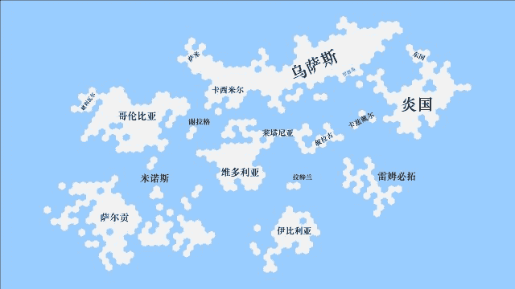](javascript:;)</ignore_js_op>  <ignore_js_op>[3D版泰拉地图.JPG](forum.php?mod=attachment&aid=ODcyMzh8NGI3M2Y4M2Z8MTYyNDY4ODc3MXwxODIzMHwzMDA4OA%3D%3D&nothumb=yes) *(33.07 KB, 下載次數: 0)*

[下載附件](forum.php?mod=attachment&aid=ODcyMzh8NGI3M2Y4M2Z8MTYyNDY4ODc3MXwxODIzMHwzMDA4OA%3D%3D&nothumb=yes)

2021-2-4 19:25 上傳  

[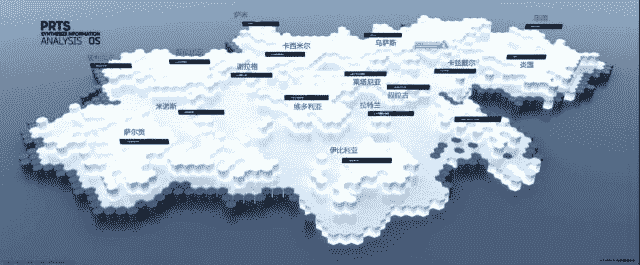](javascript:;)</ignore_js_op>  

# 62

因为被点名表扬了文章的福利，所以我决定推进剧情了。

啊，本来想写剧情文的，为什么会这样

 

# 63

看到了一张比较色的问卷，用手上所有有关特蕾西娅和普瑞塞斯的图拼接了个九宫图。觉得不分享真的对不起自己的工作

 

# 64

<ignore_js_op>[1.png](forum.php?mod=attachment&aid=ODcyNTh8NjljNmQ4Nzd8MTYyNDY4ODc3MXwxODIzMHwzMDA4OA%3D%3D&nothumb=yes) *(1.17 MB, 下載次數: 0)*

[下載附件](forum.php?mod=attachment&aid=ODcyNTh8NjljNmQ4Nzd8MTYyNDY4ODc3MXwxODIzMHwzMDA4OA%3D%3D&nothumb=yes)

2021-2-5 12:25 上傳  

博士的婚后日常

[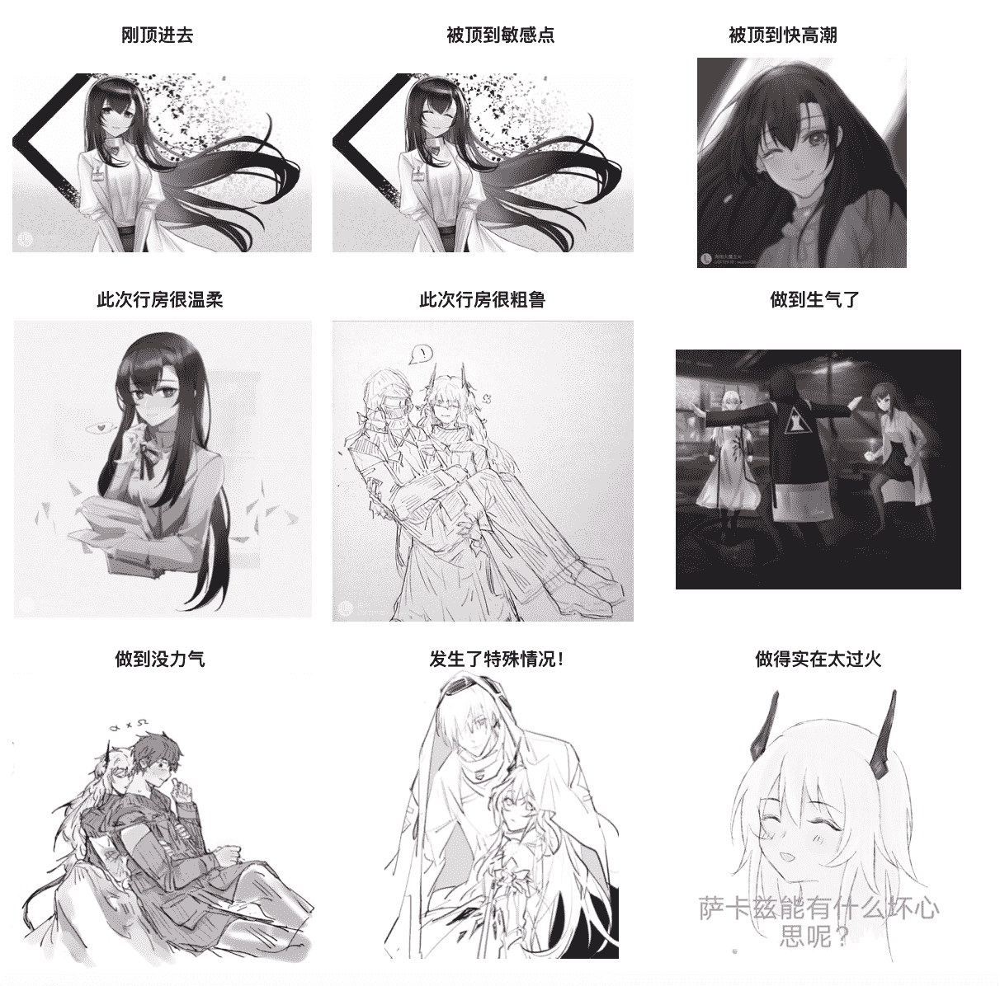](javascript:;)</ignore_js_op>  

# 65

> [kale 發表於 2021-2-6 11:38](https://giantessnight.com/gnforum2012/forum.php?mod=redirect&goto=findpost&pid=459171&ptid=30088)

> hhh猫看老鼠，不知道以后博士会不会也和他的老婆玩这种猫捉老鼠甚至是捉蚂蚁的play呢 ...

我就这一个表情，不过呢，应该主要为番外了...现在得主推剧情了。

 

# 66

“维多利亚？这还真是个...相当意外的答案。”

“你觉得不可能吗？博士。”

“嗯，因为对维多利亚皇家政府来说，和特雷西斯勾结，从他们的国民性格上来看，不太可能。从军事角度，似乎也没什么好处。你看啊，凯尔希，他们的国民种族组成为阿斯兰族（一般为皇室成员），德拉克族（一般为贵族），瓦伊凡族，还有菲林族。历史上，他们击败过不可一世的伊比利亚人，并从此度开启了他们长达几百年的‘美好旧日’。长久的盛世是一种葡萄酒味的慢性毒药，甜美，醇厚，但却致命。相比于几百年前的维多利亚人，今天的维多利亚人普遍少了一丝进取和血性，多了一丝傲慢，偏见和排外。他们自视为泰拉大陆最伟大的民族，现今的国王又是一只年迈的血统纯正阿斯兰雄狮，从他记事起到今天，维多利亚在泰拉找不到一个对手。他又怎会践踏自己的骄傲，放下身段和他眼中肮脏的魔族佬做交易呢？就算是他自己年老了，雄心不再，他的国民们会同意吗？”

“再有，维多利亚想直接干涉卡兹戴尔，也是笔划不来的买卖。首先，维多利亚若要直接将军事力量投射到卡兹戴尔，帮助特雷西斯发动卡兹戴尔战争。他们就必须经过莱塔尼亚和叙拉古——后两者都不是他们的盟友。即使他们想绕个远路，北有乌萨斯，南有伊比利亚，这两者不会放过任何打击维多利亚的机会的，即便是维多利亚派来的是自己最精锐的蒸汽甲胄，很大概率都是有来无回的。”

“第二，即便维多利亚方面成功了，他们想从卡兹戴尔这里得到什么？一块被五个国家环伺的飞地？如果真是这样，我认为是个无比愚蠢的决策。这块飞地的战略纵深并不大，五国都很能把自己的力量渗透进来，维多利亚不可能不在这里驻军吧？断你补给，不分昼夜进行袭扰，扰乱当地经济，让这里成为维多利亚一个持续的出血点，是各国都乐于见到的。特雷西斯也不是个吃斋念佛的主，他很有野心，维多利亚不可能不知道。比起对外采取怀柔政策的特蕾西娅，我想他们不会更喜欢一个阴谋家和野心家来掌权的。”

“说得不错，博士。”凯尔希脸上轻微浮现笑容，“你还有什么要补充的吗？”

“我想想，等下啊，凯尔希...啊，对了！内因内因！这个也很重要。”

“嗯，请讲。”

“内因就是，现在维多利亚虽然表面风平浪静，但实则暗潮涌动。没有强大的外敌作为黏合剂，内部就会出现分化——老国王年事已高，按照维多利亚近两百年盛世时期，国王的平均寿命来看，他会在将来的4-6年内辞世。现在他没有立任何继承人，可能是担心如果立得太早。自己心中的继承人就会被TA的兄弟姐妹下手暗害。但反过来说，如果没有立遗嘱，且国王在未来某个时刻，因为种种‘意外’，突然辞世了，那么操作空间可就大了...所有人都可以走上台来梭哈一把，机会均等。甚至王公贵族也可以炮制一个阴谋论，假借他们掌握的证据，抱着‘为老国王复仇’之意，用强硬和血腥的手段，把自己推上伦蒂尼姆的宝座。在新国王出现之前，我真的不相信维多利亚有机会干预外国内政，王子公主，皇亲国戚，每个人都会收起自己的羽翼，握紧自己战马的缰绳，等待最终赌局的来临。干嘛要现在出头，为一个卡兹戴尔大费周章呢？” 

“你倒是分析得有理有据的，博士。”

“唉嘿嘿...凯尔希，你这么说，我还真有点不好意思。”

“你支持谁？”

“嗯？”

“你觉得谁会最终胜出，或者，如果你是一个维多利亚的国民，你希望你的下一任国王是谁？”

“我嘛...肯定是维娜小姐啊，她是血统纯正的阿斯兰，手腕强硬，实干，有主见，而且胸又大，长得又好看...咳...我是说，据民间调查，她也被民众寄予厚望，是呼声最高的继承者。我想，老国王也是这么想的，他肯定也想立维娜为下一任国王。”

“嗯...我同意你的观点，所以维娜小姐很难成为下一任的维多利亚之王...”

“啊？”我有点怀疑自己听错了。

“具体原因，我一会儿再向你解释。现在，先让我来向你解释维多利亚的事吧，博士。”凯尔希终于要对我的长篇大论进行点评了，“你的思路没问题，逻辑清晰，论据合理，但你犯了一个严重错误，就像我之前跟你说的，你在推测答案之前，已经给自己预设了一个答案范围，你再怎么进行假设和推论，它始终会在这个圈里。事实上，真相会让你感到意外——我们设在维多利亚的机构传来的报告，报告中称，有迹象显示，维多利亚的地方贵族正在联合起来，谋划着什么，他们已数次派特使，前来卡兹戴尔，和特雷西斯方面进行过几次秘密接触，但双方谈论的具体内容不详。”

“地方贵族？！”这件事大出我的意料，看来，这是两个反贼联合起来，要一起造反啊！是的，从维多利亚皇室的角度来看，支持特雷西斯无疑是一步说不通的路数。但是，如果对方代表的是地方势力，情况就大不一样了——维多利亚已经上百年没有爆发过大规模战争，对应的，皇室担心，在和平时期，各个地方会出现拥兵自重，诸侯割据的情况，所以一直在有意地削减地方贵族的军权和财政，将军费的拨款，军队调拨和财政计划收拢中央。贵族的权利受到极大限制，他们自然不满。

我之前还愚蠢地坚持，维多利亚的合作方式，是他们会派兵过来，支持特雷西斯。现在看来，反而是特雷西斯会派兵过去帮他们在合适的时机起事。他们将对应的，付出某种回报或支持，以作为答谢。何种答谢呢？

“你立刻能对一丝蛛丝马迹作出回应，难得的品质，博士。” 

我有点脸红：“不用夸我，凯尔希。我之前...甚至一丝关于地方贵族的可能都没有考虑...”

“你在成长，博士，你确实在向我慢慢证明你的实力，而不是被我指出一丝缺点，就像被踩了尾巴的菲林一样，跳起来对我大吼大叫。这是你，作为一个巴别塔成员应具备的素质，总结信息，快速反应，冷静思考，然后得出有效的结论。”

“你也变得好说话了，凯尔希。如果那天我在地板上跟你对话，你会毫不犹豫地把我踩扁吧...现在你不会了。”

“有可能会，看你接下来的表现...”凯尔希的样子，似乎有点像在玩弄她的午餐的猫。

“......哎，哎，好吧，好吧...我懂...我懂...有效的结论...好，如果特雷西斯想要成功的话，他必须避免外国势力的干预，乌萨斯，莱塔尼亚，叙拉古...这些贵族...嗯？！！”

“这些贵族的属地都是分布在维多利亚的东，北两个方向，他们离乌萨斯，莱塔尼亚或是叙拉古的首都，经济中心不远，如果这些贵族有意地暗示一下，这应该会使这三个国家投鼠忌器。不过，这会是唯一的筹码吗？特雷西斯可是个胃口很大的家伙。”

“也许这是他们还没有完全谈妥的原因之一，博士，分析得很好，但以后千万不要被自己框住了。你下次再犯这种错误，我就不会对你特别客气了。”

我不好意思地挠了挠头。

 

# 67

<ignore_js_op>[某人下次犯错的时候.JPG](forum.php?mod=attachment&aid=ODczNDZ8ZTUzNDdjYjZ8MTYyNDY4ODc3MXwxODIzMHwzMDA4OA%3D%3D&nothumb=yes) *(156.71 KB, 下載次數: 1)*

[下載附件](forum.php?mod=attachment&aid=ODczNDZ8ZTUzNDdjYjZ8MTYyNDY4ODc3MXwxODIzMHwzMDA4OA%3D%3D&nothumb=yes)

2021-2-8 12:07 上傳  

[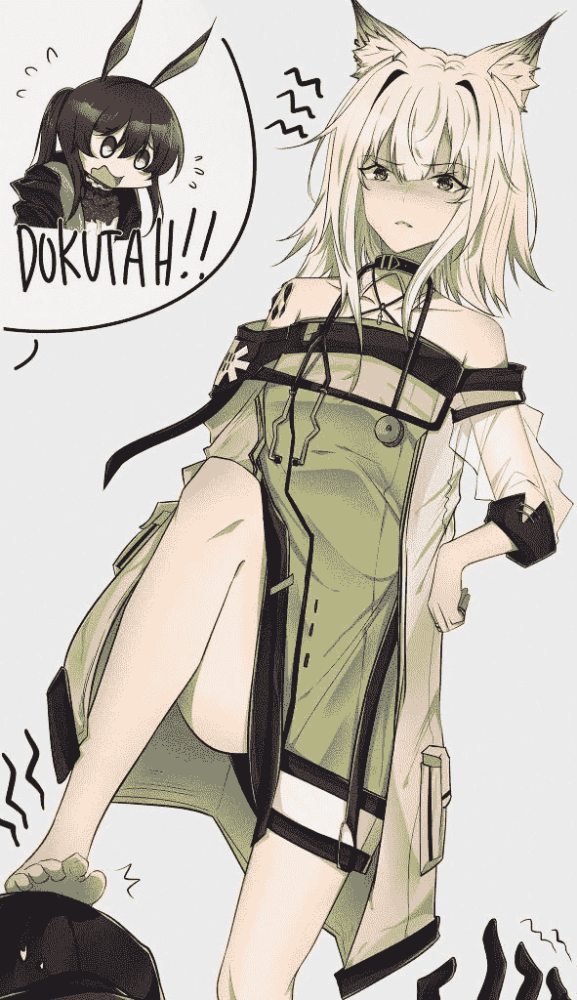](javascript:;)</ignore_js_op>  

# 68

道个歉，计划赶不上变化，少的一更过几天补上

 

# 69

卡壳了，写个小番外轻松一下。

 

# 70

*本帖最後由 Enigma2519 於 2021-2-23 11:30 編輯*

番外二：梦？亦或是未来？

“妈妈！妈妈！我从爸爸那里找到一本新的故事书哦！可是上面一张图片都没有哦！给我读读嘛，给我读读嘛！”一个长相与我非常相似的小男孩，从我的书房里跑了出来，他怀里抱着一本纯黑色封皮的本子，单纯从外表上看，这倒是像一本笔记或者日记，而并非是什么儿童读物。

“阿尔伯特，你是不是又跑到你爸爸的房间里去乱翻了？”普瑞塞斯宠溺地摸了摸自己儿子的头，“乱翻爸爸的东西是不太好的哦，趁爸爸没回来，快点放回去吧，省得爸爸生气啊。”

“嗯...麻麻...”阿尔伯特对着自己的母亲开始撒娇。

“哎，好吧，好吧，就读一点...读完就放回去吧。”普瑞塞斯最大的弱点就是自己的家人们。她很快在自己儿子的撒娇攻势中败下阵来，只得答应读一点。反正肯定也是博士的研究记录或者数据什么的，孩子肯定很快就会腻掉，普瑞塞斯这样想着。她随便翻了几页，在心里默读了一下...

她马上就不这么想了，她看到了本子上记录的东西...脸上青筋暴起，面容也变得核善了起来...

“乖儿子，你在哪里找到的呀？”

“妈妈，我在爸爸书架上的一个...嗯...我不小心碰掉了爸爸靠着一边的最重的那本书，就弹出来了一个格子，格子里就是这本新的故事书。妈妈，怎么了？”

“没什么，没什么，儿子，很乖很乖...你的两个姐姐呢？”普瑞塞斯微笑着，摸了摸自己儿子的头。

“特蕾西娅妈妈带着特蕾希雅姐姐还有普瑞缪斯姐姐买新裙子去了，两位姐姐出门前说，买好了的新裙子只会穿给懂事听话的弟弟看的，所以我听她们的话，乖乖地在家等着的！”

这孩子，真是跟他爹一个模子刻出来的啊...将来肯定有出息，普瑞塞斯在心里暗笑。不过呢，看了某人写的日记，有的人今晚要遭大难了...当普瑞塞斯正在思考具体细节时，门口传来了钥匙转动锁芯的声音。

“我回来啦...儿子，普瑞塞斯姐姐。”一位淡粉色的倩影出现在门口，她微笑着，手里提了几个大大的购物袋。

“啊！是特蕾西娅妈妈！”阿尔伯特跑了过去，像他爹一样抱住特蕾西娅的大腿蹭着，“我有在家里好好听话哦！”

“好，好，乖孩子，乖孩子。让我先把这些东西放下，好吗？”

“好...”阿尔伯特像个小大人一样要去接购物袋。

“噗呲，太重了，你接不动，乖儿子。”特蕾西娅把大包小包放在餐桌上，“这个是缪斯的...这个是希雅的...嗯，还有这个大袋子，是给你们三个小孩子买的各种零食...嗯，姐姐？”

普瑞塞斯示意特蕾西娅，自己有话跟她讲。

普瑞塞斯转头跟三个孩子说道：“孩子们，爸爸妈妈将来的几天会有些事情要忙，没法照顾你们，我会叫阿米娅姐姐来接你们，她会在晚饭前来接你们，你们去她家呆几天，这期间好好听阿米娅姐姐的话，好不好？”

“好！”孩子们也非常喜欢阿米娅，异口同声地答应了。

“好，大家先到里屋看电视吧，可以吃些放在那里的零食，但不要吃多哦！”

小孩子们欢呼了起来，两位姐姐一手拿着她们新买的小裙子，另一只手就拖着她们的弟弟进了里屋。

“姐姐，这是...”特蕾西娅有些不解。

“妹妹，有的人呢，欠修理了，背后说了我们好多坏话啊。你看这个...”普瑞塞斯说着就把我的那本秘密日记递给了特蕾西娅。

特蕾西娅看了一会儿，脸上挂上了一副人畜无害，天真无邪的笑容，在我看来最恐怖的那种。

“看到了吧，妹妹，有的人欠收拾，所以，我为他准备了这个...”普瑞塞斯不知从哪里掏出了一杆缩小枪。

“姐姐，你说的对哎。我一定让他好好回味一下...我们最初相遇时的种种...”

我的背后有些发毛，右眼皮一直在狂跳不已。难道我生病了？

下午接到两位老婆的短信，嘱咐我今天一定要早回家。啊，我现在连摸鱼的心思都没有了，终于又熬到一个周末了，我的心思早就飘回了家中，飞到了床上，和两位老婆亲热去了。不过，早回家...今天是什么节日吗？孩子们的生日吗？不，不是今天。老婆们的阴历生日？不是。阳历生日？也不是。我的生日？更不是...我和老婆们结婚2500天纪念日？不，还有几天。我们相遇的纪念日？不，也不是，炎国情人节...我想了一圈，也没有找到一个对应的节日。

啊，那就不是什么节日，单纯是老婆们更想我了而已。我得出了结论。

时间你快点走吧，快点走吧...你回家，我也好回家...

5点59分了，很好...我已经收拾完毕，整装待发。再看表，倒计时五秒钟...五，四，三，二，一...走人！谁也别想拦我！

“等等，博士。”唔，阿米娅你怎么来了...我还要回家和老婆们亲热呢。

阿米娅看见我的笑容瞬间凝固，顿时看出了我的心思，她笑了一下，凑到我耳边说：

“博士...你工作还有很多，所以...回家好好休息，下周努力做完吧...”

啊，吓死了，我的小兔子，我还以为你会说那句让我心脏骤停的话呢（“博士，你工作还有很多，还不能休息哦”）。果然，是因为成年后，能更加心疼自己老父亲了吗？不愧是我懂事的女儿，我笑着摸了摸阿米娅的头。

“呀！博士，我已经不是小孩子了...”罗德岛的CEO提出了抗议。

“可是，在特蕾西娅，普瑞塞斯和我看来，你永远是我们的小兔子。”

“唉嘿嘿，博士...”阿米娅的脸上露出了害羞的笑容，“对了，博士，刚才家里打电话，说让我把三个孩子接到我那里去住几天，所以，我开车送你吧，博士。”

啊，这对我这个挤地铁的社畜真是再好不过了。不要提我为什么不开车，别问，问就是不会，问就是开车恐惧症，我可不想出什么岔子，然后进局子，然后被某个龙警长公报私仇，对我动手动脚，做一些那个啥那个啥的事情。然后回家还会被二次检测公粮的储备情况。

“博士，你好像眉头紧锁的样子...”

“我只是在认真回忆，今天是什么日子，阿米娅...是我们成为一家人的日子吗？也不是...我也不知道你的妈妈们在准备什么...”

“也许，特蕾西娅妈妈和普瑞塞斯妈妈只是想和博士你独处一个周末，就像当初那样...”阿米娅笑着说。

“哎～这么简单吗...看来是我想多了。”

阿米娅的脸上保持着刚才那份笑容，这个小兔子是不是知道什么隐情，没告诉我？不过算了，反正一会儿就到家了...

“那么，我就周二晚上再把他们送回来了。”

“麻烦你了，阿米娅...”

“没事没事，我也想和弟弟妹妹们一起玩啊。正好周末可以带他们出去野餐什么的。”

“孩子们，好好听阿米娅姐姐的话啊，”普瑞塞斯趴在车窗上，叮嘱着自家的宝贝们，“麻烦你了，阿米娅，十分感谢。”

阿米娅对特蕾西娅和普瑞塞斯的感谢抱以笑容：“那我们走了...”

“爸爸妈妈再见...”孩子们挥舞着小手，兴奋地说道。没了我这个老古板的管束，他们可以自由的疯一个周末了。

车走远了...

特蕾西娅和普瑞塞斯一左一右，把我架住：“那么，我们回家吧，亲爱的老公...”

两女的脸上笑容更甚，但我多年的直觉却嗅到了强烈的杀气，她们不像是两位贤妻良母的女性对自己的心爱的丈夫诉取衷肠之情，反而像是两位黑白无常要将罪大恶极的人拖入十八层地狱的样子。我全身每一个细胞都感到了无名的恐惧，但我什么都做不了，眼睁睁地看着自己被拖入地狱的大门。

“咔，嚓，咚。”出口已经彻底锁死了。

“亲～爱～的～你知道我们为什么这么急着叫你回来呢...”

“啊，这个，这个...”我不禁说话变得磕巴了起来。

“是因为这个哟，”特蕾西娅掏出了一个熟悉的日记本，我的瞳孔顿时收缩了起来，“我们找到了这个，里面对我们的描述真是令我们大吃一惊呢。”

死了，再见了，这片美丽的大地。那本日记本...是我专门用来写坏话的，在跟普瑞塞斯和特蕾西娅处于暧昧阶段到确定关系这段时间里，两人可是对缩小的我没少“使坏”。那本日记里，都是我写的关于她们两个的坏话...你问我为什么不丢掉？这可是很有意思的回忆，干嘛要丢掉，拿出来还可以忆苦思甜，这样即使每周末被榨得下不了床也会觉得比过去要好。

当然，前提是，这本日记，不被对方看到。

一道柔和的光包围住了我，一股恍惚的坠落感萦绕着我，周围的场景越变越大，几秒内，我的两位美丽的妻子变得像山峦一般。

“亲爱的学弟，我们，来制造我们青春的回忆吧。”

“我心爱的博士卿，请相信我和那个预言，毕竟，萨卡兹女王能有什么坏心眼呢？”

她们开始宽衣解带，脸上浮现的，是对我这个猎物无尽的渴望。

也许我应该加班的...看着两位老婆完美如艺术般的胴体向我压下来时，我脑子中闪过了这个最后的念头。

“哇！要死人了！”我从梦中惊醒。

啊，是梦啊...我有些庆幸，又有点怅然若失。

啊，我想起来了，刚刚我和特蕾西娅在舰桥上对话，普瑞塞斯在我们身后守候来着。我们现在是刚回来睡回笼觉来着。

这个梦实在是太真实了...长大后的阿米娅，活蹦乱跳的三个孩子，我和两位老婆结婚什么的...哈哈。

我分别吻了吻两位老婆巨大的面颊，她们似乎在梦中梦见了什么好事，嘴角的弧度微微上升了些。

我看了下表，哈，才五点多一点，接着睡接着睡。

枕下时，我将梦中的细节过了一边，得出了一个有益的结论：没事，梦是反的，所以我那本日记没被找到。

你说其余的部分...那必须准确啊！

不过这梦也算给我提了个醒，我那本日记，确实得藏好一点。

 

# 71

<ignore_js_op>[萨卡兹有什么坏心思呢.JPG](forum.php?mod=attachment&aid=ODc0MzR8ZGRkYzlhNmJ8MTYyNDY4ODc4OHwxODIzMHwzMDA4OA%3D%3D&nothumb=yes) *(169.15 KB, 下載次數: 0)*

[下載附件](forum.php?mod=attachment&aid=ODc0MzR8ZGRkYzlhNmJ8MTYyNDY4ODc4OHwxODIzMHwzMDA4OA%3D%3D&nothumb=yes)

2021-2-11 10:12 上傳  

[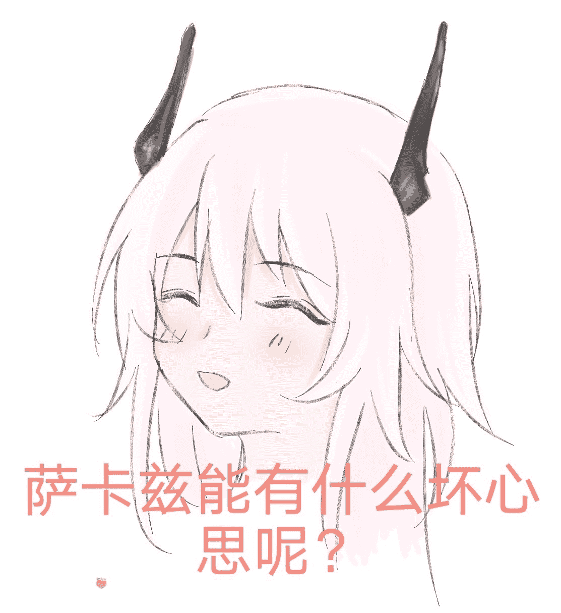](javascript:;)</ignore_js_op>  

# 72

年三十到了，祝大家牛年大吉，牛转乾坤，身体健康，阖家幸福，工作学业顺利！

 

# 73

*本帖最後由 Enigma2519 於 2021-2-11 20:43 編輯*

新年这几天就先不推主线剧情了，来点（只有博士被榨精榨得一塌糊涂的）充满希望的番外吧！

目前正在写番外3...

好耶！只有我自己受伤（肾亏）的世界完成了！

唉？好像暴露了自己是个抖M的事实。

 

# 74

*本帖最後由 Enigma2519 於 2021-2-14 23:01 編輯*

番外三：PRTS的模拟时间（上）“这是必要的牺牲。”我咧嘴一笑，向普瑞塞斯炫耀地挥了挥手，我亲爱的学姐立刻用最快的速度朝我奔来。可惜，我不会给她任何机会，我远远地对普瑞塞斯抛了个飞吻，就一个猛子扎进了那个粉红色的出口，啊，令人安心的温暖和玫瑰的香气，这就是胜利的味道吗？啊，简直像是跳进了温泉中～我成功地通过了PRTS的初步测试，今天晚上，肾算是保住了！！！我沉醉在幸福中，但脚下的地面却不安分地震动起来，光线也不自然得暗了下来...唉？！不会吧？！系统时间回到三小时前...“这个模拟系统，真的会有用吗？亲爱的。”“放心啦，我心爱的小博士...”普瑞塞斯正在对模拟系统进行最后的全景测试，“嗯，很好...一切正常。5分钟后开始正式演练...”“啊，所以，为了防止误解，我重复一边哈，老婆...我，会和99个和我长相完全一致的1:1全景分身布散到这片地域里，我们的编号为00-99随机分配，作为本体的我可以通过思维来单线命令每个分身，令他们团结协作，但他们都不知道真正的发令者是几号。最终目的，是要让作为本体的我安全穿过一片无人地带，到达正确的终点。对吧？”“是的呢，先生，不过，旅途遥远，路上免不了有陷阱，变节，还有食人的女妖，”普瑞塞斯魅惑地对我呼了口香气，“这种女妖啊，最中意你这种旅人呢...她们无时无刻不想请你到她们的肚腹中去做客呢...无论你想从上面进，还是下面进，都可以哟...”“啊，我能问问，这样的女妖，有几位吗？”老婆，不要跟我这么调情，我现在光想想，就有点...小兴奋。“大女妖只有两位哦。不过另一位还没来，可惜可惜，这么美味的小点心放着不吃怎么行...不过，不要懈怠呢，这片区域还蛰伏着数百个小型女妖等待你这样的猎物上钩呢。”啊，特蕾西娅果然还是太忙了，不过这也该到她结束工作的时间了，可能一会儿才能过来吧。“学姐...我真的绷不住，别再诱惑我了。”普瑞塞斯发出一声得意的轻哼，她笑着说：“不过，我们的小点心，你可一定要胜利啊，胜利的话，姐姐们今晚会很温柔地对待你的。”“如果我一个不小心...输了呢？”“嗯...输了的话啊...”普瑞塞斯对我舔了舔嘴唇，咽了咽口水，“嗯，那就没办法了...很期待小点心今夜被玩坏的样子啊。”“学姐～～～～”因为普瑞塞斯实在是太过...你懂吧，我只能使用撒娇战术。“好了，不闹了，我亲爱的老公。逗逗你感觉真好玩，”巨大的两瓣红唇予我以一个温柔的香吻，啊，这清香的茉莉，“不过呢，这个系统里会安排一些战场上会遇见的情况哦，给你个提醒，老公，不要完全相信你遇见的所有人哦，请加油！” 模拟战场，白沙峡谷，系统时间下午1时我看了一眼自己的狗牌，13号啊，啊哈哈，这个数字对萨卡兹来说还挺吉利的。我眼前浮现了一幅全景地图和若干个被标记的白点，正中心的蓝点代表我自己，右上的91...是总人数吗？不是算我的话，本体带分身一共有100人吗？是不是有9人直接roll到了女妖的巢穴中？那是真的够倒霉的...对他们来说游戏还没开始，就结束了。嗯，看地图标记，右上角那片区域，是安全区吧，终点就在那片区域的某个地点吧。好，我了解了。嗯，现在要做的，应该是重新集结队伍...离我几百米开外，就有一个我的分身，立刻把他叫过来吧...等等...我想起了普瑞塞斯对我说的话，我需要一个小小的测试，来确定他是否真正是我这边的人。“14号，14号，这里是本体，请回话。”我在自己的意识世界中呼唤着另一个分身。“这里是14号，本体，请讲...” 我用着相同的方法，接着测试了分散在地图各处，12个人的忠诚度。测试显示，他们都是可信的。我发号施令，把他们12人任命为分队长，并命令剩余的队员向指定的方位进行集结，15分钟内必须完成整队，逾期不候！可惜一些队员的运气并不是很好，很快，屏幕上的数字显示，我们又减员了一些，这些女妖似乎有智慧，其中两个分队所在的区域很快失去联系，应该是团灭了，果不其然，屏幕上的数字很快降到了70以下，短短十分钟内，我们损失了差不多三支小队。“14号，去前方警戒一下，看看有没有女妖冲着我们过来...天啊，最后一个成员怎么这么慢！”不过，从位置上看，他就在几百米外了，和我们隔着一座小山包，很快就能看到他了...“不好！”只见他从地图上消失了，“隐蔽！女妖们可能就在附近！呃？等等...”奇怪的是，刚刚，明明变成“69”的数字，却又变回了“70”，白色的标记再次从地图上出现，以更快的速度朝我们这里奔来。“警戒！”我向小队成员下了命令。 另一个我很快从拐角处出现，他上气不接下气，不时惊恐地向后看，像是有什么恐怖的东西追逐着他似的。“怎么了？！”“快..快走...附...附近有...有...我差点...差点被...拖进土里...”“女妖吗？”对方接不上话，不停地喘气，而且连连点头。麻烦了...“14号，请回复，14号，14号！”我也顾不上很多，立刻开始联系14号...其他组员只见我面色慢慢沉了下来，“14号恐怕...附近不安全，我们快走！”

模拟战场，白沙峡谷，系统时间下午1时13分十支小队集合完毕，我们从不同的方向向终点迈进。谁知道前方还有什么，这才刚刚开始，三成的人员已经失去联系，如果将来我也铸此大错，我是绝对不可能原谅自己的。也许零伤亡不是这次模拟的主题，好，我明白了，今天要学的东西到底是什么了。达成目的就行了，这次我就是要不计代价，不择手段地达成目的。我那古灵精怪的学姐，不知道你在前方又给我准备了什么惊喜呢。我看了看自己的小队成员，除我以外，分别是17号，18号，19号，25号，还有刚刚死里逃生的21号。他们中，会不会有女妖的耳目呢，我倒不想打草惊蛇。不过，如果真有这个人存在，我应该怎么办呢？在我沉思之际，我完全没有注意到，小队中的一个人，冲我露出了别样的笑容。  

# 75

我尝试了下新的内容，比预想中的还有点不太好写啊。

我的脑子本来就笨，写这种动脑的场景果然还是有点勉强啊。

 

# 76

*本帖最後由 Enigma2519 於 2021-2-13 21:21 編輯*

番外三：PRTS的模拟时间（中）“剩余各小队队长听令，我已将你们的队员的网络节点重新组接，现在，我授权各位队长使用独立的小型指挥网络，记住，在向队员下命令时，不要暴露自己的编号。警惕队伍中的人，如遇突袭，陷阱，或察觉任何异样，提前侦查到敌情，一定要及时向我报告。好，各位小心，预祝我们取得胜利！”“明白！”“好！”结束了与小队长们的思维对话，我转向接入了自己的队员的思维网络中：“各队员，进行整队，准备出发！” 模拟战场，白沙峡谷，系统时间下午2时21分。烈日炎炎，热浪和滚烫的沙海贪婪地吮吸掉我身体里的每一滴水分。不是吧...我记得现在可是深秋了，而且进系统的时候已是夜晚了，这里怎么会这么热？！我感觉自己就像一只放在烘箱里炙烤的鸭子，热量就像老婆们给我做按摩时用的那对欧派，把我全身都包裹的严严实实的，让我透不过气来。我感觉自己已经不是在冒汗了，而是滋滋地向外冒油。妈耶，不会是我亲爱的学姐假借模拟的名义，直接把我放烤箱里，准备烤了吃吧？我感觉自己嗓子要冒烟了...不行...得休息一会儿，话说队长这家伙还不让休息一会儿吗？干嘛对“自己”这么残忍，真是个没人性的家伙...哦，对了，忘了，原来我自己就是队长啊！唉，为了混淆视听，我是一开始就把自己分到了前锋组。没想到自己入戏入太深了，连自己是真正的本体这件事都忘了。 “D小队各成员注意，D小队各成员注意。前锋组报告，正北方向有一个大型石蘑菇，我们将在石蘑菇的阴影面进行休整并重新编排队伍。”“好啊！队长终于肯让我们休息一会儿了！”做戏要做全套，我装作队员的样子，对队长的“仁慈”发出衷心的赞美。“啊？队长你说啥呢...”“队长，您没热晕吧？”那两个分身见我突然说“胡话”，不禁有些担心地问...哦，该死，光叮嘱那九个小队长，不要暴露身份了，我反而忘了这件事，刚才和14号联系的时候没有顾忌，我的队长身份已经坐实。该死，我怎么这么不小心，不，好像这个局面也能挽救...不过我刚才的表现真是显得做作不堪，只能赶紧糊弄过去了：“哦，对对对，我是队长，我是队长。哎！这该死的天气，热得我脑子都要宕机了...” 对一段无聊的旅程来说，聊天实在是一个打发时间的绝佳方法，要不是一开始担心说话会加剧水分流失，我能和我的几个分身侃一路。“啊，终于要到了...哎，话说，队长，您这分组确实有意思哎，这个分队方法，13，17，19三人一组，18，21，25三人一组，先锋组是质数，后卫组是合数，真是让人感觉愉悦啊。”不知怎么的，17号突然将话题转向了编队数字。“还真是...你说的对，队长，要我分的话，我会让18号处在中心，我们剩下五个人辐射状散开警戒，这样就是5个奇数围一个偶数了，哈哈哈。”“...分队这事不可以大条啊，19号，在我看来，我们最好应该...”“......你的方法怎么这么奇怪啊，17号？根本不用想那么多吧！哈哈哈哈！” ......我和17，19号聊天时，发现了我的分身具备一个特点——他们的思维较为单一。他们说的那些组队方法，无论是简易，亦或是繁杂的，我在脑子里都一一衡量过。但是他们两个却都对对方的思路感到惊异，仿佛发现了一个全新的解法一样。

不，单一的不仅是他们的思维，还包括他们的遣词造句，肢体语言等等。甚至会有线性的联系——17号心思缜密，经常要思考一下，再回应别人，他的遣词比较精细，但是提出的想法太过繁琐，而且肢体小动作较多。19号大大咧咧，思维简单，说话直来直去，动作大开大合，乐天，想法普遍过于理想化...太像了，一个仿佛是读博时的自己，另一个仿佛是刚上大学的我，真的太像了...

原来我的分身，他们...是我的人格碎片吗？要是这个假设能成立的话，验证队伍里有没有外人，倒还真的不是一件难事了。

啊，不过，这就是“绝地求生版大家来找茬”吗？

我们到达了那个石蘑菇的阴影侧，几个人纷纷解下自己的水壶，仰着脖子猛灌，清凉甘甜的水啊，为我们这身被炙烤的焦干发烫的躯体注入了生命的活力。19号甚至用一些水淋在头上，我感觉那些水分在他额头上瞬间汽化了，就像把水泼在烤得滚烫的大理石板上一样。赞美水啊，这生命之源，我们真的活过来了啊，几个人抹了抹脸上的汗渍，不禁长呼一口气：“啊，真爽！”

七分钟后，后卫组在石蘑菇下与我们汇合了。三人也开始大口地灌着凉水，让我感到在意的，18号喝水时的微表情——那并不像是发挥自己生存本能的样子，更有点像是装出来的，难道他不渴不累吗？开玩笑，我可是最了解自己的体能的。在太阳的强烈暴晒下，让我在一小时内负重穿过五公里的沙漠，做到是能做到，但是之后只会觉得人都要死了，好吧？这个18号居然还能表现得留有一丝余地的样子，恐怕有鬼啊。

不过，也许，只是我的臆想，我是不是太敏感了？

为了进一步验证我的猜想，看看18号到底有没有问题。我像之前那样，主动打开了话匣子，大家聚在一起，开心地聊了很多共同话题（话说，这是本体和分身啊，聊啥不都是共同话题）......大学寝室里的回忆，当年的各种八卦糗事，甚至最后一起不知死活地对两位老婆和梦境中的婚后生活吐槽了起来，感慨婚后的自己肯定会被这两头漂亮的母老虎吃得死死的。而且以后一定要好好教育阿尔伯特这个熊儿子——男人嘛，自然有男人的话题。虽然大家都觉得，我永远也翻不出两位老婆的手心，这辈子就这样了。不过，大家还是达成共识——要减少被两位老婆无情剥削的次数，不然老下不来床实在是有点丢人。像今天，最重要的事就是要保证本体顺利进入安全出口。

说实话，真的很开心，这种感觉仿佛回到了自己的大学时光，周末的夜晚，几个舍友一起侃天侃地的日子。也许这个系统可以帮我解闷，以后需要的时候可以用来变出几个分身，大家一起聊天下棋，斗地主，打篮球什么的，也是一件美事。

可惜呀，严格的说，现在我们还是在战场之中，而且经过刚才的聊天，我基本证实18号有鬼——他没有非常热情地参与这些话题，即使我在最闷最自闭的时候，还是有一些值得回味的东西的，18号他没有讲，而且他也不是一个完全的闷油瓶子。我似乎还有一点小小的意外收获，看来是时候用上自己的王牌了，这也是给自己的又一层保险。如果终点前有“意外惊喜”的话，我想应该可以派上用场的。

我把自己和19号支出来放哨，我开始联系各支小队，问询他们的情况，当然，最重要的是处在我左右翼的C队和E队（C队在我们北面，E队在我们东面）。

“这里是C队，总队长，北面发现大量女妖，正在向我们直线接近。”

“这里是E队，总队长，我们的东北方向观测到大量扬尘，暂且不明是否与女妖活动有关。”

钳形包围来得这么快吗？我们的背后会不会也冒出一组女妖呢？我不清楚。

啊...接下来三公里，会走得比较艰难了，恐怕我得早下决断，弃车保帅了...

这种时刻总是会让人感到恐惧又无比刺激，多巴胺在我身体里擦起一个火星，灌满我全身，名为斗志的燃料，被这个火星彻底引燃了....

 

# 77

*本帖最後由 Enigma2519 於 2021-2-15 00:18 編輯*

番外三：PRTS的模拟时间（下）“C队，向西南方向撤退，把女妖引离我们。E队，转向东南方向前进...剩余各小队，根据我目前掌握的情报，我将调整我们D队的行进路线，各队若是未能摆脱女妖的追击，则必须把她们引离D队的新路线，务必要完成任务，听明白了吗？”“明白！”“好，那么，D队的行进路线将会是这样...各队，执行吧！”“是！”随着命令的下达，分散地图各处的小队开始新的行动了。 我看着终端里那些移动着的白点，突然有些失神。我意识到，刚才的一切，都顺理成章地可怕。我下达命令时，没有犹豫，没有停顿，没有后悔。我的命令简洁明了，且自私无情，但是没有人任何反对，也没有人任何质疑，就像象棋里的棋子不会对执棋者的招数发出抗议一样。我刚才那一刻又是怀着怎样的心思，平淡地发出那样的命令呢？我知道的，只是不太想承认而已，我已在无形中把他们看作是棋子，而我，则是这个棋盘上的一位棋手。我必须得承认，我的关注点并不是C队，E队，或者剩余小队的死活，甚至在这场模拟战中我失败了也无所谓，我想赢下一次的，是我的老婆——普瑞塞斯，我把她看成了和我平起平坐的对手，从小到大，我一直都在追逐她的脚步，我是想在这里，借这件事证明，我是有能力的，也是希望能帮上她们的忙，我希望她和特蕾西娅能更多地依靠我。可这好吗？我不清楚。感性的我告诉自己，尽管是分身，他们也应该享有权利，不应该像棋子一样被任意抛弃，试想，有一天，若是我的长官为了完成任务，就让我去当诱饵，我又会有何感受呢？而理性的我告诉自己，他们不过是一堆数据而已，不必在意。无论发生什么，都只是系统模拟给我看的，并不真实。啊，是啊，确实，我应该不必在意，我干嘛想那么多呢？我也快点行动吧，时间拖得越久，我完成任务的机会越渺茫。 我将D队重新进行编组，17和19一组，放在左翼，我和21一组，放在中央，18和25一组，放在右翼，我们以V字阵型前进。路线也由向东北方向转为正北，我们要经过C队刚刚停留的地方，而就在几分钟前，他们将这里的女妖引向了西南方。21号似乎有些腼腆，嗯，他倒很像是那个我和学姐刚确定关系时候的自己，而且他喜欢谈论的话题都是我和学姐恋爱的事情。啊，真好啊，有另一个我能帮我清晰地回忆起恋爱中的每一个细节，毕竟我在休眠舱里冷冻的时间太久了，过去很多珍贵的回忆都只能想起大概，但一些细枝末节都记得不太清楚了。C队在我的地图上消失了，他们把女妖诱离了我们。C队以全队为代价，完美地完成了任务。E队传来了信息，他们成功地引诱了另一队女妖，可以说，D队已经彻底安全了。但是，作为代价，E队已经被死死咬住，全灭也是很快的事情。我心情有些沉重，E队的信号也在逐渐减弱。最后，E队队长骄傲地向我报告，他说，他很高兴，自己的小队完成了任务，即使自己面前的这群女妖再去追击D队，也来不及了，自己可以去放松一下了。然后他们的信号就完全消失在了茫茫的戈壁滩中...地图上现在只有27个白点了。四支小队，A，D，F，H，这是我手上最后的筹码了。我有些想哭，尽管我知道，这不是真的；尽管我知道，这只是一场战斗模拟；尽管我知道，这里哪有什么生离死别，可能普瑞塞斯动一动手指，我的那些分身兄弟们就都能回来，我们可以坐在阴凉处，共同举起自己的水壶，一起侃一侃自己当成秘密的话题；但是我就是想哭。我第一次真实感受到了战场的滋味和被人托付生命的感觉。但是我...非常对不起各位...我终于还是忍不住，掉了一颗金豆子。 

胜利啊，只有胜利，我才不会辜负他们，只有给他们保证胜利的许诺，我才对得起他们的牺牲，我的良心也能安定一会儿。“13号，你哭了啊...” “21号，我...我只是，有些难过...”“难过什么呢？13号。”“你说，21号啊，被指挥官抛弃，是什么感觉啊...”“嗯，没想过呢，怎么突然问这个，13号？”“那假定，我们小队遇上了女妖，我让你去诱开她们，整个小队会因此得救，但是你肯定会有去无回，你怎么想？”“没什么想法，我会立刻照办，13号。”“为什么？你不会有什么犹豫，或者什么怨言吗？”“因为我相信你啊，我无条件地相信你啊。所以，无论你叫我做什么，我不会考虑后果的，当然，做出伤害你的事情除外。所以，请不要伤心，做你认为正确的事情，坚持下去吧，我会无条件地支持你的。”“......”我觉得我脸红了。怎么可能？！我感觉我自己被撩到了。我当年，这么亚撒西的吗？“谢谢你...我，我真不知道该...该说什么好。”“对于我，不用说什么谢谢的。我们本来就是一心同体的两人啊...而且，请相信我，大家都不会有事的，请放心吧...不要迷茫啊。” 我当年...到底跟普瑞塞斯学了多少情话啊，这也太撩了吧！啊，冷静点，你害羞什么啊！那是我自己啊！冷静冷静...也多亏21号，虽然这些话把我整得面红耳赤的，不过，这些话也安慰到了我，也很快把我从压抑和负面的情绪中解放出来...再度专注于战场局势了。距终点区域直线距离只有不到两公里了，位于我西南方的A队，位于我西北方的F队，还有位于我东方的H队，都给我传来了战场反馈。嗯，敌人从三个方向一直都在盯着我们D队，她们似乎很有耐心，并不着急吃掉我们。那么，也是时候了...食物放久了，可是会凉掉的啊。我故意给小队找了一处绝地，这是一处三岔路口，四周是几座小岩石山，根本无处可逃。我这次叫18号去西面放哨，自己去东北方向放哨，21号本来想接替我的，我拒绝了这一好意，有的事情，必须是我要做的。18号来到谷外的一个僻静之处，打开了装在包里的诱饵，三处女妖都收到了反馈，立刻用最快的速度向诱饵源冲来...18号打开了自己的终端，只见上面，三抹红色的海洋向这里聚拢，自己得快点回到聚集地，不然系统分配的任务就完不成了。对不住啦，各位，还有我的本体，我要是完不成任务的话，我系统里的那几个老婆今天晚上也会让我够受的，他在心里默默想着。只是，他回到休整地点，只看见了砂土和一堆杂乱的脚印，早已人去楼空了。三队女妖虽然离得就不远，但还是有一定时间差，趁着这个时间差，D队成功钻了出去，而唯独发出包围信号的自己，却被包了起来。哎，自己早就暴露了吗？没想到，初出茅庐的本体，居然用了这个方法，佩服啊。那自己呢？逃，现在往哪里逃？自己已经肉眼可见几队女妖向自己涌过来了了，既然无法反抗，就躺下来享受吧，只是，希望她们完事了就走，自己家里可不要再多几个母老虎了...三岔路口东一公里处，这是D小队的新的休整地点，现在，全队成员都在用望远镜，望着三岔口发生的事情。小队成员回忆着刚才的事情，就在十分钟前，队长出去放哨，但又立刻折回来了，命令全队成员立刻离开这里，不必管18号了。他们以最快的速度到达了队长所说的“安全地带”，又被队长命令用望远镜回望旧的休息营地，然后他们就看到望远镜中不知所措的18号，还有从三个方向聚来的女妖... “哎呀呀，真是蔚为壮观呐！不，岂止壮观啊，简直壮烈啊，虽然这哥们是叛徒，但是这也幸福得也太惨了点！会不会鸡儿坏死啊。”这声音来自队长。“我的娘哎！13号，我第一次见到女妖长什么样啊，你别说，学姐待咱们真得不薄，每一个都是我的理想型啊，身高3-5米的样子，身材丰满，还是那种大姐姐型，啊，18号这家伙，真让人羡慕啊，我要是能娶十个八个女妖回家就好了...”19号吹了个口哨。“哎...19号，理论归理论，实践归实践，你要是试一下，就不会这么想了。”这话来自17号。“啊，居然还可以这么玩啊，真是学到了呐。”这话来自21号。“窈窕淑女，君子好逑啊。要是能牡丹花下死，做鬼也风流啊。”“不是，25号，你怎么也这么文绉绉的呢？情话讲得那么一套一套的。”“啊，队长，天性，天性使然，不能怪我啊...”“哎，不管了，还有一公里，各位加油吧，安全到达终点，我们就完工回家啦！”“是，队长！” “队长！我看到出口啦！”21号兴奋地招呼道，在大伙眼前几百米处，出现了一个粉红色的洞口，旁边挂着个“出口”。“哈哈哈哈，学姐这在搞什么啊，这个地图一片白，出口还搞成这样这种颜色，少女心吗？”尽管A，F，H队最终也和我们失去联系了，但这也无所谓啦！我们终于到达了终点...而且啊，我被告知，消失掉的点完全不代表着分身的死亡，而仅仅是退出本局模拟。更有意思的是，这里的“女妖”，其实很多都是我各分身的家属。那些成家的女妖，她们的追击最优先度都是冲着自己丈夫的队伍去的，而那些没有成家的，则是行动规律不明，四下找寻猎物而已。举个例子，C队和E队两位队长，他们信号从终端上消失掉，仅仅是因为他们被自己的妻子捉回家了。得知这一消息，让我的心情变得大好。掉眼泪什么的，这页就揭过吧。冲进出口，一切就结束了。“你说谁少女心啊，学弟？”一个熟悉且无比温柔的女声从耳边响起。哎？老婆？感觉就在周围，到底在哪里？周围没看到啊。“这里哦。”寻着声音望去，只见原本站着21号的地方，现在已经变成了一位黑长直的美女，不是我老婆普瑞塞斯还是谁？“这...这...从一开始就是吗？”“嗯，一开始就是哦，我做了点小手段，叫21号的妻子把他接回家了，而我一开始就替换了21号，伴了你一路哦，学弟～”普瑞塞斯对自己的小恶作剧颇为得意。“哎～～～这样吗？可是，学姐。你这样也阻止不了我哦，我只要冲刺过去，就赢了。”“嗯，是吗，那～～～”普瑞塞斯的身体开始急速变大，最终变成了我熟悉的身高，“这样呢？我的小点心。”“呃～～～我还能...泥给路哒油！！！”说罢，整支D小队向相反的地方跑去。（**粗体表示普瑞塞斯的话**）

“**还跑得动吗？小点心...**”“呃～不行了，不行了～～～”“**那我要开动了...啊～～～**”“等一下！我有个几个问题要问！”“**嗯，你说。**”普瑞塞斯对博士在模拟中的表现很满意，所以愿意多给他一些时间。“我那些分身，他们...”“**都好哦，那些女妖很多都是他们的老婆哦，她们都把自己的丈夫接回家了呢，还有的人，家庭成员又多了不少呢。当然，你们D小队的亲属，一会儿才会过来哦。**”“啊，那就好，还有，你怎么知道，D小队就是本体在的地方？”“**我用了点权限，而且啊，D不是Doctor的首字母吗？我亲爱的小博士。你这个习惯一直没改呢。**”“我还以为你会考虑H队，毕竟H又有色情的意味，又代表HQ（总部）。”“**呵呵。**”普瑞塞斯嫣然一笑，“**如果是还没和我交往时的小博士，可能会这么想哦。**”“最后一个问题，学姐，13号，是你给本体特别的数字吗？”“**是啊，13，对萨卡兹，是个幸运数字，我以前也当过魔王，所以当然要给我心爱的小学弟一个幸运数字，而且，13还是代表一生的意思，不觉得很浪漫吗？我的小学弟。”**“啊，是很浪漫啊，不过，我也有句话想对你说哦，学姐。我其实是14号，不是真正的本体——13号哦，你被耍了，学姐，哈哈哈哈。”“**什么？**”普瑞塞斯被这个意外事件搞得有些猝不及防。“他说的没错呢，我亲爱的老婆。”我已站在出口处，远远望着我亲爱的学姐，“从21号的出场，我就有所怀疑了。到后面石蘑菇下的对话，已经我俩独处时，你鼓励我的话语，我越来越确信，你更像是我的老婆，而并非我的分身。在看三岔口发生的事时，你的表现和之前有所不同，这不像是一个分身的样子，反而是25号，他的表现更像是我和你谈恋爱时的我一样，所以，我更确信，21号有问题。如果21号真是老婆你假扮的，那我确信，你会在终点前给我一个大大的惊喜。”“**说得没错呢，亲爱的。**”普瑞塞斯甜甜一笑，“**不过，我很好奇，你和14号是什么时候互换身份的，而且，你不是说，14号一开始就失联了吗？**”“那是骗你的，亲爱的，因为我不知道小队成员会不会有间谍，又不能打草惊蛇，只能准备一张底牌。14号一开始就是我藏在手里的一张王牌，我让小队里其他成员都默认14号已经退出了，但实际上，我是这个信息的唯一来源，他们无法核实。所以，在局势不好的情况下，我可以把他打出来，替代我的身份。这叫王车易位，我还是从特蕾西娅老婆那里学到的哦！没想到今天可以用上，可惜，她现在不在这。不然我肯定要给她一个热吻！当然亲爱的你也是...”“**哈哈，亲爱的，看你紧张的，我可没有吃特蕾西娅妹妹的醋哦，我们都很高兴见证你的成长呢。**”“谢谢，亲爱的...在三岔口出去侦查的时候，就是我和14号进行身份交换的时机，因为从地图上看，这里已经离终点相当近了，如果再不交换的话，就来不及了。刚才我让14号朝反方向跑，而且连问了你很多问题，都是在为我争取时间呢...”“**哎？亲爱的，你在某些方面终于开窍了啊...**” 

“这是必要的牺牲。”我咧嘴一笑，向普瑞塞斯炫耀地挥了挥手，我亲爱的学姐知道我要溜，立刻用最快的速度朝我奔来。可惜，我不会给她任何机会，我远远地对普瑞塞斯抛了个飞吻，就一个猛子扎进了那个粉红色的出口，啊，令人安心的温暖和玫瑰的香气，这就是胜利的味道吗？啊，简直像是跳进了温泉中～我成功地通过了PRTS的初步测试，今天晚上，肾算是保住了！！！我沉醉在幸福中，但脚下的地面却不安分地震动起来，光线也不自然得暗了下来...唉？！不会吧？！ “咕噜，”白裙的萨卡兹少女将嘴中的爱人咽进了肚子里，“姐姐，老公居然和你说的一样，真的主动跳进我的嘴里了。”“**不过还是一波三折呐，要不是我刚才逼迫亲爱的一下，他可能真的发现这是个陷阱了呢？**”普瑞塞斯笑到，“**老公给我们制造了太多惊喜了，未来也很让人期待呢。**”“老婆？！你什么时候过来的？”“很早就过来了，我在旁边目睹了全程呢，老公表现得沉着冷静，非常棒啊！”“老婆...你这...嘿嘿...我真有点不好意思，不过老婆你这是...”“普瑞塞斯姐姐没有跟老公说吗？我也是全程参与这个模拟的，其实我一直都在沿系统的边界跟着你。老公，如果你从错误的地方退出，就会因为高度而摔伤啊，因为这些地方都是陷阱啊，我的任务就是保证老公你在落入陷阱前，平稳接住你哦。”“哎？哎？可是...这...这不是写着...出口吗？我这情况，直接‘进口’了吧。”“**这只写了‘出口’，又没写‘安全’，亲爱的。**”普瑞塞斯的说法，让我以为妙绝。听了这个解释，我不由得直接栽倒在特蕾西娅的胃里......“**你要有辨识能力，亲爱的，在压力之下，也要做出决断，一个看似安全的出口，背后其实可能是隐藏着敌人的重兵，待你松懈之时，就会把你一口吃掉。**”我表示同意，今天的模拟战中，我真的受益匪浅，不过呢...“那个，能不能算平局啊？”出乎我意料，两位老婆都表示同意，特蕾西娅甚至觉得我算小胜，哎，这就是“吾妻美我者，私我也”吧！**“不过呢，关于刚才在石蘑菇那里，亲爱的聊到我们的事，还是很让人在意呢，尤其是一些...很让人意外的内容...”**“这...这...为什么提这个...”“**亲爱的...如果你不打算交代的话，对本局胜负的判定，就难说了呐。今夜也是啊...**”普瑞塞斯的腹黑属性一下子就暴露无遗。“**老公...还请你...一，五，一，十，地，交，代，一，下。**”特蕾西娅一字一顿，她的声音虽然还是那么温柔，但她的语气让我感到颤栗。我果然，是娶了两位魔鬼老婆吧。 

 

# 78

*本帖最後由 Enigma2519 於 2021-2-14 23:46 編輯*

啊，番外三终于写完啦，感动，而且读完至少还挺像人话的，感动+1。

又得回归主线了，写了三天番外，主线是啥我都忘了...。

不过，写番外真好玩。而且不会有刀，而且博士次次吃瘪，啊，下次想到什么新点子了还会写的。

 

# 79

> [kale 發表於 2021-2-15 06:52](https://giantessnight.com/gnforum2012/forum.php?mod=redirect&goto=findpost&pid=460071&ptid=30088)

> hhh，这种小博士被调教的画面真是每次看都欲罢不能啊

谢谢，我蛮喜欢女A男O这种，无奈这一对产粮没那么多，只能自己动手，丰衣足食了。

 

# 80

*本帖最後由 Enigma2519 於 2021-2-15 20:31 編輯*

GG，连写几天番外，我写主线的感觉都没有了，一点都严肃不起来了。满脑子就是小博士被自己的两位巨大的老婆各种欺负调教，各种play的场景，还有各种黄色废料。

啊嘞嘞？我当初不是立志要继承YJ的风格，糖中带刀，绝望的尽头是希望那样...怎么真写成博士和他老婆们的温馨日常了？

我得反复回读一下前文，回忆回忆那种感觉，可能更新速度又要慢下来了。

 

# 81

*本帖最後由 Enigma2519 於 2021-2-17 22:20 編輯*

OK，我们接着来我们的主线

我...我现在是在哪里？有人在吗？这里为什么会黑成这样？嘶...头好疼...也好晕啊...啊，想吐...呃，忍不住了...呕...呕...呼...啊，感觉舒服多了。哎？我...我怎么来到这里的？这是什么地方？

由于眼睛还没有适应黑暗，我的视觉神经还不能帮上我任何忙。与其徒劳地让视觉分散走我的注意力，我索性把眼睛闭上，集中更多的精力开始进行回想：来到这里之前，我在干什么呢？

啊，我想起来了。我最后清晰的记忆是自己在PRTS系统中进行模拟。对，对，是这个，最近几周我都在为快要到来的“重生”做全面准备，为此，我每天都泡在PRTS模拟系统中，做着各种魔鬼训练...但是有时候我的计划有点不切实际。果然，不应该胡乱设置什么“无水补给条件下，沙漠十公里急行军”啊...太操之过急了，同时也是太眼高手低了，啧，我这两个毛病还是一直没改啊。而这也导致我付出了代价——在路程半途因为中暑晕过去了。

可这也解释不通我在哪里啊，最近几周的训练使我对PRTS系统有了很深入的了解。关于模拟训练板块，PRTS有一道保险机制：如果系统检测到任一参与者在模拟过程中出现生命体征的极度不稳定，PRTS将立即强制性取消当前模拟科目，进行针对性的应急处理，再将伤员移送至医疗部，同时通知具有最高权限的管理员——也就是我和我的二位老婆...如果一切按照正常流程来，那我现在应该是躺在医疗部的某个病床的枕头上，而我的两个老婆应该会守在我的两侧。不是吧，又让老婆们为我担心了...想到这里我忍不住白了自己一眼。

可这里没有熟悉的天花板，没有雪白的病床，没有柔软的枕头，没有我亲爱的老婆们，有的只是一片漆黑。那...既然这样，难道说，我现在是在普瑞塞斯，或是特蕾西娅肚子里？不，不可能。我光速排除了这个选项，老婆们的肚子里，那是比我的宿舍还要亲切的地方，我实在是熟得不能再熟了。绝对不会是那里，因为无论从气味，温度，湿度，景色，柔软度，甚至还有安心感的角度。全都对不上，肯定都不是！

“啊，你醒了啊。”一个成熟的女声从我头顶上空传来。

“你是谁？我这又是在哪？”

“唉～人家可是看你晕倒在那里，好心好意地把你救起来的哦。在问我问题之前，你总要先说句对我感谢的话吧～”

“啊，谢谢你，女士。”我不知道为什么，我在道谢的时候，说话冰冷的像个机器人一般。我的本能告诉我，这个女人极度危险，危险到我甚至还未和她打一个照面，就已经对她高度戒备，甚至充满敌视了。

“虽然有点敷衍，但是也无所谓了...”那个女声似乎兴致高了起来，“我嘛...先不介绍自己，算是考考你，看你自己能不能推测出我的身份。我也想看一看，那个来自古代的最后血脉，到底是是一个聪颖之躯，还是一个愚笨之人呐。”

怎么都喜欢当谜语人，让人猜猜猜的...你难道是凯尔希的亲戚吗？我在心中吐槽着。不，等等...她怎么知道我的种族的？我的身世，也就普瑞塞斯，特蕾西娅还有凯尔希知道吧，老婆们不可能跟外人讲，凯尔希...她也不太可能跟外人说啊...难不成你还真是凯尔希的亲戚，还是关系很近的那种？

“呵呵。”那女子见我沉默了，忍不住发出笑声，这笑声仿佛从我四面八方传来...等等，四面八方，这里很黑...难道我在她的...

“猜对了！”她仿佛看透了我的想法，“你就在我的肚～子～里～哦～奖励就是你可以永远呆在里面哦。” 我有些无奈，难道我真的是什么看上去就美味可口，深受广大女性朋友欢迎的小零食吗。怎么遇到的女性都喜欢把我往她们嘴里塞？ 

“你好像并不惊讶的样子，我还以为你会惊慌失措一点，再苦苦哀求我，让我把你放出去什么的。”

“我都习惯了...不过，我可不好吃，而且没有洗澡，浑身臭汗，你小心拉肚子，另外我的各项生理指标堪忧，为了你的健康考虑，还是把我吐出来吧。”

“唉～不要那么不自信啊。我可爱的小博士，我倒是觉得你很美味啊。嗯，不过放你出来一会儿也行，反正你很快又会再进来的...”

哈？“我可爱的小博士”？！不要用我老婆们对我的专用昵称啊，女士。跟你很熟吗我？ 

令我意外的是，没有发生预想中被吐出来的流程，取而代之的，是包裹住我的黑暗，就像是被重物击中的钢化玻璃一般粉碎掉了。我有些不适应突如其来的光亮，只得捂住眼睛...

不知过了多久，我才适应了周围的环境。我揉了揉被光亮刺激得有些酸涩的双眼，小心翼翼地睁开双眼，模糊的世界再度开始聚焦，我看到了——一座似乎是由某种未知黑色晶体制成的王座，王座右放着一柄同样用黑色晶体打造的大剑，而在王座上，则坐着一位有些冷艳的女人，说实话，她长得真的很美。我都为她的姿色倾倒了0.1秒——她有一袭黑瀑布般的长发，有一双金黄的眼瞳，而这双瞳有着黑洞般致命的吸引力，又似乎有着利刃般的洞察力。她的唇色居然是黑色的，很剑走偏峰，但这却与她气质十分相匹。她的头上则戴了一顶黑色的王冠，这似乎并不是什么买来的装饰品，她以一种饶有兴趣的玩味眼神打量着我，我感受到了来自上位者的凝视。胃痛啊，感觉，自己被一个超级麻烦的女人盯上了啊。

“现在你见到我了，我可爱的小博士。”

“呃...尊贵的女士，您好。请您...能不能不要用这种称呼叫我呢？我会误以为是我老婆有事叫我啊。”

“唉？这样不是显得很亲昵吗？”

“啊，算了，总之，谢谢您救了我，大恩不言谢...我走了，拜拜，请问出口在哪里？”在这里继续和对方纠缠不是什么明智之举，我立刻来了一套告辞三连。

“哎～别急嘛，我可爱的小博士...”怎么会，我明明已经背向她，朝外走了，她却化成一团晶体，又凝集在我的面前，“我们还没有开始了解对方呢。”

“不，我感到你对我很危险，你甚至没打算掩盖你自己身上那种赤裸裸的侵略性，我感觉，你打算要...”

“独吞你，没错。”她用玉指勾住我的下巴，鲜红的舌头妩媚地在唇间一舔，眼中闪着精光，“双重意义上的。”

“你能看出我在想什么？”

“一点小小的技巧而已。”她如蟒蛇缠住猎物一般贴了上来，一双白如莲藕的胳膊环住了我的脖子，她把头歪了几度，轻笑着，“我们继续？”

我觉得几个回合下来，我在这个女人面前彻底落入下风，我被她牵着鼻子走。

“呐...”她不知什么时候已经转到我的背后，我的耳朵只觉得一阵湿热，然后，包裹着的那种湿热感消失了，取而代之的是有些凉丝丝的液体留在上面的感觉。她又转到我的面前，双目有些迷离，嘴角的一丝晶莹告诉了我她刚才干了什么。她说道，“我找了你很久，你是这个世界上现在唯一存在的纯血人类男性了，你不会被污染，没有感染矿石病之虞，啊，这对我来说，最理想不过了...”

“你到底想要干什么？”

“我说了，吃了你。用你的血肉滋润我的身体，连你的灵魂也要化成我的一部分，仅此而已。”

她见我还是没有露出什么害怕的表情，反而还在沉思，觉得颇有意思，她轻拍我的脸颊：“怎么了？吓傻了，说话呀，呆子。”

“哈哈哈，很有意思，女士。但是，我拒绝，我要是不按时回家吃饭的话，我老婆们真的会把我吃了的。我不能再浪费时间和你玩角色扮演了。”

“噗呲，你还是以为这是梦吗，嗯？”她眼睛一眨，不知用了什么把戏，我的衣服全部不翼而飞了。

“‘炎国粗口’，女流氓！”我立刻用双手遮掩下体。

“别那么害羞嘛...没想到你这个人还挺守旧的。”

“你就不能有点上位者的矜持和礼仪吗？”

“呵，猜到我身份的一部分了啊，也是应该给个奖励的～”她打了个响指，我立刻躺在一张大床上，动弹不得，她压在我的身上，俯过身来，在我耳边说道，“我呀，干嘛要在意什么无用的矜持和礼仪呢，我想要的，就在我面前，我不管自己用的手段...我只要你...我只要你，完完全全和我融为一体。”

说实话，如果真有哪个女生对我说这样的情话，我会很快沦陷的，真的。但是，我比谁都清楚她的不怀好意。

“虽然你说的话，挺像是在跟我调情，但是，没有哪个晚餐会因为女主人在品尝时称赞了几句而会爱上女主人吧。”

“除非这晚餐是男主人自愿当的。”

“......”妈的，居然很有道理。

“没话讲了？呼呼...”不知道的，看到这个场景，颇像是恋爱中的女生向自己的男朋友撒娇一样，“那么，让我来，品尝一下我的晚餐吧？”

“啊...别...别舔...”她的小舌头在我的胸膛上划过一条又一条水痕，她满意地微眯着双眼，似乎是在享受美味一般。

“我要开动了，啊呜...”我的脖颈被她咬住了，我感觉热热的液体从我的身体中流进她的嘴里。

她似乎在回味这我的血液的味道，她的脸变得红扑扑的，呃...说实话，我有点想亲一口。

“是不是想亲我一口啊？”她露出笑容。

“......你难道是血魔+魅魔？”又被看穿了，我只得转移话题。

“嗯...不～～对～～”她强硬地吻上了我的嘴，一丝清凉的液体流进了我的嘴里...我的全身发酸，四周的场景都在急速变大。呃...又来了...

“这下变得更可口了呐。”她把我捧到自己嘴前，“我们还可以相处很长时间啊，我会慢慢消化你的...啊...”

会死，真的会死，不是闹着玩的...我有这种强烈的预感。我感觉自己慢慢滑入深渊之中...我的背后是真正的死亡...不！不！！不！！！不行！这不是我的终点！这不应该是我的结局！！我仿佛听到了特蕾西娅和普瑞塞斯呼唤我的声音，我仿佛看到她们流泪的样子...这是噩梦！我可“炎国粗口”！我宁愿对抗整个泰拉，也不愿让我的老婆们流下一滴眼泪！不！我要回去！回去！！！

“嗯？”她感到那个本该滑入她胃中的男人，化作光粒消失了。“啊，让他溜掉了啊...”

没事，我**亲爱的**小博士，你让我真的对你有些着迷了，我们...来日方长... 

“老公！”“老公你醒了！”

“我这是...”我感到嗓子好干，睁眼一看，这是熟悉的天花板，我躺在雪白的病床上，枕在柔软的枕头上，我亲爱的老婆们一左一右地枕在我的两侧，她们的脸上挂着淡淡的泪痕。我的心揪了起来。

“对不起，总是让你们为我担心。明明我应该是充当家里的顶梁柱的。”

两女温顺地把脸凑近，我伸出双臂，摸了摸她们的面颊...

“哎呀，怎么又哭了...乖...乖...对不起，对不起，是我不好，是我不好..."

刚才的事，真的只是个噩梦吗？我缓缓地转动头颅，只感到脖颈一处有些发疼，就像被什么人咬过一口一样。我知道，刚才那个绝对不是梦。

她还会回来的...下次她再来的时候，我会还像这次一样幸运吗？ 

但她是谁？ 

 

# 82

*本帖最後由 Enigma2519 於 2021-2-17 22:16 編輯*

这是我原创的一个人物，玩过明日方舟的可以猜一猜，如此强大而具有侵略性的女生，到底是以游戏中的什么为原型的，她在不远的将来又会和博士会发生什么样的事呢。

 

# 83

*本帖最後由 Enigma2519 於 2021-2-19 00:29 編輯*

今日的更新，来自两位老婆的哄睡时刻...哎，为什么我睡前要写这个，妈的，对自己羡慕嫉妒恨。

那之后的数周倒也是风平浪静，甚至有些顺风顺水——雷姆必拓官方与我们缔结了友好条约，罗德岛号顺利地从雷姆必拓回到了卡兹戴尔，没有预想中的第二波，第三波刺客的出现。特雷西斯似乎也收起了他那蠢蠢欲动的野心，甚至最近的一些动向和发言，有些向特蕾西娅表忠心的意味，我不禁感觉有些好笑。这应该与维多利亚最近发生的一件事有关——一周前，维多利亚的国王发动了一场小规模的平乱，平叛对象是位于维多利亚东部属地的几个子爵。他们因为“和国外势力相互勾联，企图发动针对国家的阴谋”而被押送至伦蒂尼姆公审，并当场处以极刑。而这几个子爵的部队也被重新整编，那里所有的军官骨干，他们必须要证明自己对维多利亚和国王陛下有着“铁一般的忠诚”，不然就要面对牢狱之灾，甚至是上绞刑架。

在这场平叛后，国王对民众盛赞一位在行动中表现出了“勇猛和忠诚”青年将军，称这位将军是“拯救国家的英雄”。破格将他册封为伯爵，接管那些叛乱者的属地。事实上，这次平叛，颇有杀鸡儆猴之意味，几个小小的子爵并不能掀起多大的风浪，真正具有发动动乱实力的，是那些盘踞于维多利亚北方的公爵和侯爵们。很明显，老国王认为一举剪除北方的贵族势力是不明智的，因为这会极大的刺激贵族们，他们极有可能狗急跳墙，最终演变成维多利亚的南北内战。那样的话，饥肠辘辘的乌萨斯，虎视眈眈的伊比利亚，还有野心勃勃的莱塔尼亚-叙拉古同盟，都会趁机翻翻旧账的。老国王为了国家，只能对躁动者睁一只眼，闭一只眼。这次的几个替死鬼，不过是被推出来，当了一回警钟。

短期来看，老国王的决策挑不出半丝错误——请客，斩首，收下当狗，这些手段他都玩了一遍。最后，把自己的亲信安置要位，震慑了那些生有反骨的贵族，还让那些叛军军官们发誓效忠，非常完美。可是，在我看来，老国王有可能犯了一个致命的错误，我隐隐觉得，这在未来，将成为一个更大的隐患。

这个隐患就是用人问题，我们驻维多利亚的机关在前几天给我们发来了那个将军的所有资料，资料显示，那个年轻的将军固然“勇猛且忠诚”，但此人因深得国王赏识，一路青云直上，所以平日里有些张扬骄狂，而且他没有什么城府，认为一切全靠实力说话。派他这样的莽夫去东部不一定是个好选择，我估计，他难以抵御那些贵族人精们一来二去的“软刀子”，长久时间下来，最坏的结果，甚至可能是他被拉到贵族那边的阵营里去。

我不知道老国王是出于什么考量做得这种决定，太过冒险，也绝非明智。但我们掌握的信息，终归没有老国王的多，也许，是可能造反的贵族远不止北方那些人，甚至让他都无奈的选择妥协了吧。也许，是王宫里的重臣们，也被查出和国外势力有所勾连的证据，牵扯的人太多，令他对宫廷大臣们的信任失掉了，打算重新培养亲信了吧...哎，谁知道呢，管他呢，我又不是这头老阿斯兰，哎...操心那么多，不是嫌自己老得慢吗？不想了不想了，总之，老国王也算帮大忙了，在他驾崩前，也就是未来的几年，应该都不会出什么幺蛾子了。未来的事，让未来的我去操心吧...我可以好好利用这段时间，把自己的事情做好，比如明天，我就得“重生”了。啊，那个麻烦的女人，最近几周也没来烦我了，好事啊...希望我们永远不要再见面了...她真的是我的克星...

已是深夜时分了，我的枕头两侧，两位老婆睡得正香，我却一点都睡不着...

啧，怎么感觉明天要高考似的...

自己多久时间没有失眠过了？忘了，至少自己从休眠舱中再度苏醒过来后，这还是第一次。啊，在过去的那个世界，自己失眠真的是家常便饭啊，高考前夜失眠了，报考研究所的期间也辗转反侧，等待录取结果放出的那几天也都失眠了。准备向普瑞塞斯告白的前一天晚上也是彻夜难眠，脑中胡乱地想着各种千百种告白失败的场景，自我纠结到底要不要去做这件事...还有的，就是最后时刻来临前...自己的人生每经历一次坎，自己就会失眠一次。自己是不是在这边过得太舒服了一点？先是遇上了特蕾西娅，然后又找回了普瑞塞斯。她们什么都帮自己做...现在，自己终于要独立面对一个小考验了，虽然自己也做了很多准备，但是做不做的到啊我？啊...比起这个，我老婆的睡颜可真好看啊...

“老公，睡不着吗？有心事吗？”我正在望着特蕾西娅望得出神，却见她突然侧过身来，睁开淡粉色的双眼看着我，月光下，她的目光温柔如水。

“哎？老婆居然没睡吗？”

“你睡不着的话，我们怎么可能会睡着呢，老公？”

我不好意思地挠了挠头，我的身后也有所动静，我能感到，普瑞塞斯也起来了。

“妹妹，我跟你说吧，这个小家伙，一到重要时刻前，就肯定会睡不着，直到一切尘埃落定之时，就会一下放松下去。当初有个小学弟，在我答应他的表白后，他立刻就高兴地抱紧我，然后就累得把头埋进了我的胸口，呼呼大睡起来，叫也叫不醒，真让人哭笑不得呢，你说是吧，小学弟？”

“不怪我，而且我们没确定关系之前，学姐你也老让我枕胸口午睡啊，谁叫学姐的胸部又大又软，我那天又困，告白成功之后不小心靠上去了，啊，不对，我想起来了，不是学姐你...用双手把我的头往自己胸口抱紧的吗？那谁顶得住啊，我可不就顺势睡着了吗？”

普瑞塞斯没有反驳，反而脸上展现出一副计划通的得意样子，为什么我总觉得有些不对...为什么总有一种，当年的一切，像表白啊，发展关系啊...都是在按她设计好的剧本走的感觉？

“老公，那我的呢？”特蕾西娅幽幽地说。

“这肯定是没区别啊，我亲爱的老婆～～当年我表白的时候，你们两人那时还是一心同体的啊。那我那不就算是又是枕在学姐的胸脯上，又枕在你的胸脯上吗。那这说明，我只有同时埋在我两位老婆的胸脯中，才能一下子就睡着的呀。”我隐隐觉得这个问题有送命题的潜质。

“这样啊，”特蕾西娅的脸变得红扑扑的，“那我们怀念一下，当年你向我们表白的场景吧。”

“行，让我想想啊...哎，过去好久了...记忆都有些模糊。”我的记忆又飘飞会那个枫叶飞舞的时刻了，学姐在我前面几步走着，我在后面给她拍着照片，我听到自己剧烈的心跳声，学姐的一颦一笑落在我的相机里，落在我的心坎上，我知道自己不能在等下去了，等待是一种漫长的折磨，前夜，我因为各种担忧而辗转反侧。现在，我炽热的情感，把我的胆小燃烧殆尽，我放下相机，深呼一口气，眼神开始坚定起来。学姐看我有些异样，关心地问我怎么了。我终于决定不要再犹豫了，要向她吐露心声，即使迎来的，会是一个一无所有的结局。在那个时刻，我人生中第一次鼓足了全身的勇气。

“我心爱的学姐啊，我...其实我又笨，缺点又多，然后，我也知道自己不会讨女孩子开心，长得也不算好。但是...我愿意用我赤诚的心，我愿意用我的一切甚至包括我的生命去守护你，我非常非常喜欢你，我想和你共度一生，你能，你能做我的女朋友吗？”

我记得，那时，她的回复是...

**“如果是要共度一生的话，当女朋友怎么够呢？”**记忆中的学姐，如今化作了两个人，她们异口同声地，重复着当年的话，**“我笨笨的小学弟啊，离了我，你可怎么办啊？看来我必须要花一辈子时间和你一起了，但是，为此，我的要价也很高哦。所以，打劫，交出你的一辈子。”**

“嗯，我想起来了，当年我对老公确实这么说过呢，”特蕾西娅高兴地说，“不过好像缺点什么呢。”

“缺点shen...唔...”我话都没说完，特蕾西娅就把我塞入她硕大的正义中。

“姐姐...”

“嗯。”普瑞塞斯应了一声。我感觉有压力从背后传来，这是...又一对正义！

“休息一下吧，安心地睡一会儿，什么都不要想，就像当年那样...”普瑞塞斯轻声的话语从我背后传来。 

“那...我们三个比谁睡得快，来，都闭眼，老公，姐姐，让我来数123啊...1，2，3...开始！第一个睡着的，有奖励哦！”

哈哈，我不禁哑然失笑，谁能想到，一个在外人看来，无比庄重优雅的萨卡兹的女皇，居然还能向自己的丈夫展现如此孩童的一面。她这个样子，也就只有我和普瑞塞斯才有机会能看到吧。

我顺从着特蕾西娅的发令，闭紧了眼睛，但我能感受到的，来自自己上方，一前一后的两股温柔且热切的视线，犯规啊，明明说要比谁睡得快的，明明知道，我就算是闭上眼睛，也能感受到她们的一举一动的，她们都知道的。 

我还真是，总是无条件的受着老婆们的各种关爱啊，其实从刚才普瑞塞斯引出这个话题，她们就已经计划好如何哄睡了吧。不知道为何，我想起了妈妈，我一生中的**三个女人**之一（“三个女人”通常指妈妈，妻子，女儿，这里博士的意思更接近于指自己的妈妈和两位妻子）。她每次和我一起吃饭的时候，总是喜欢一个劲地把最好的东西都夹进我的碗里头，而且如果我不撂筷子，她也不会开始吃饭。我跟她说过了很多次，她每次都会温柔地笑着说，下回注意，下回注意，但是每次都不改。后来，我干脆养成了五分钟吃完一顿饭的习惯。我妈总是抱怨我，这样对胃不好，但我知道，只有这样，才能让她也多吃一点热菜。

啊...也没什么，人在深夜总是容易多想，我也就是突然想起来了这些。啊，妈妈，我亲爱的妈妈，你如果知道，自己的儿子找到了世界上最完美的两位妻子，你又会是什么样的表情呢？会不会笑着摸着我的头，对我夸着，自己的儿子真是有出息了呢，而且还能一娶娶两个媳妇回来。又会不会把你那双不知什么时候已经开始绣起的小鞋拿出来，问我们什么时候可以给自己的孙儿孙女穿呢？你说你会吗？妈妈...

唉...... 

在玫瑰与茉莉环成的世界中，在柔和与醇厚的奶香组成的摇篮里，我安心地感受着二位老婆的心跳和体温，她们的呼吸声如同轻柔的摇篮曲。所有对未来的担忧，在这里都烟消云散，我长长地吐出一口气，最终沉沉睡去。

我愿意用我的所有，来守护这静谧的幸福。

一切来自明天的未知挑战？呵，那又有什么大不了的呢。

 

# 84

啊，睡了睡了，希望有一天自己也能找到自己的特蕾西娅或者普瑞塞斯吧，当然，两个一起来的话我双手赞成！

啃桃林.jpg 

 

# 85

日了，我不小心点开了一个同人作，讲的是特蕾西娅和阿米娅进行的15个约定的视频，看了之后，我伤心地有点睡不着。

所以我打算安利你们：[https://b23.tv/Ss06pe](https://b23.tv/Ss06pe)

 

# 86

卡兹戴尔近郊，罗德岛号，医疗部，晚间九时。

“老婆，你回来了！工作辛苦了。”特蕾西娅刚从皇宫回到罗德岛，我就走上前去，给了她一个大大的拥抱。

“唔...老公，你...你变回正常的身高了？”特蕾西娅看着比她高一个头的我，感到颇为惊喜。

“嗯...其实没有。现在抱着你的我，是通过仪器，创造出的意识的实体分身而已。我的本体还是没有什么变化，喏，那不在那里嘛。”我指了指一旁床上熟睡着的那个裸体小人，“而且啊，你看...”

然后，特蕾西娅面前的我，就双眼一翻，身子软绵绵地趴了下来。特蕾西娅赶忙抱紧我：“老公，你怎么了？”

“没事，没事。老婆，你看，你看！”刚才还在病床上睡熟的小人，现在却生龙活虎了起来，“我的意识可以自由地在我本体和分身之间跳转哦！而这样的话，没有意识支撑的一体就会立即陷入沉睡。”

然后，前一秒还在蹦蹦跳跳地小人，后一秒就昏倒在床上。 

“就是这样，老婆。”我结束了对本体的控制，意识又转回到分身里来了，“这样我在未来的十个月也好陪着你们了，嘿嘿，很厉害吧，老婆！这可是学姐和我的杰作哦！这我们那个文明的神经学科与工程学的至高科技结晶啊！有没有又一次爱上我啊！”

“老公和姐姐真棒！”特蕾西娅在我脸上香了一口，“不过姐姐呢？”

“欢迎回来，妹妹。哎，咱们家这位，还是那么喜欢耍宝。”普瑞塞斯不知什么时候出现在我身后，笑着在我脸颊上一点。

“妹妹，准备一下吧，所有仪器已经调试好了，我们一会儿就可以开始了。”

......

山洞一般大小的蜜穴矗立在我眼前，淫靡湿润的热气从深处冒出，呼在我的脸上，啊，今天的特蕾西娅，好像看上去格外色情。而且，我有一种强烈的冲动，我的气血上涌，搞得我恨不得现在就立马钻进那个温柔乡里，就算是融为一体也是莫大的福分...不行，不行，我今天到底是怎么了？要忍住，心静，心静。呃，我感觉什么热腾腾的液体从鼻子里流了出来，用手一摸，居然是鼻血！而我的下体，从刚才开始一直都在行注目礼，实在是涨得我难受的要死。不好，我今天好像有些兴奋过度啊？！

“果然发生了这样的事呢。萨卡兹女性在排卵期间，身体会释放特殊的激素，这激素一定意义上跟西地那非的作用类似呢。”普瑞塞斯笑着说，“亲爱的就算再怎么锻炼，还是会中招啊。还好我早就做好预备方案了呢。”

“什么预案？亲爱的，你今天可没跟我shuo...唔...”我话还没有说完，普瑞塞斯红唇一张，就把我含进了嘴里。

一阵天旋地转，我现在温热的茉莉的世界里，被香热又有些黏稠的唾液裹住全身。床垫般大小的舌头，像爱人的手一般温柔地按摩我全身的每一个角落。湿热的气体从食道深处呼在我的脸上，这种热情好客的感觉，我真让我想到那里去做客啊。啊！不行了！我想被普瑞塞斯吃掉！我想被她消化！！我想成为她身体的一部分！！！我的身体想！我的灵魂想！！我的每一寸肌肤想！我的每一个器官都想！我的每一个细胞都想！！！这想法似乎在我出生前就已经结合进了我的染色体，写进了我的基因中。一股强大的液压集中在了我的下体处，我终于在普瑞塞斯的嘴里爆发了。

“咕...咕...摄得怎都啊，靴靴框达（射得真多啊，谢谢款待）。”

普瑞塞斯恋恋不舍地把我从她嘴里拿出，我大口喘着粗气。一根晶莹的丝线从我身上连接至她的双唇之中。她媚眼如丝，看着我的双目写满情谊。

“不行，不行，我也得快点，不然真的忍不住这种想把亲爱的吞下去的欲望啊...”普瑞塞斯喃喃自语，“妹妹，帮我递一下那两瓶小药剂好吗？”

“给，姐姐。”特蕾西娅递过来盛有蓝色液体和绿色液体的两个小瓶。

普瑞塞斯首先打开了装有绿色液体的小瓶子，她用瓶盖喂了我一点药剂，我顿时感觉一丝清凉涌上大脑，像是在困倦的时候吃了一把薄荷糖，又像是在中暑的时候喝了一支藿香正气水。再加上我刚刚释放过，我的大脑终于变得一片清明。

“这个是抑制剂，理论上可以在一个小时内抑制你的性冲动，让亲爱的你可以正常思考或决策。”

然后她又喂给我蓝色药水：“这是缩小药，大概半小时后生效，会把你从不到两厘米的大小缩小到50微米——跟正常精子差不多大，那样你就可以进入特蕾西娅的卵细胞中了。不过，亲爱的，在缩小药起效之前，你必须要爬到壶腹部，或者峡部，这样成功率才能最大。”

“遵命！”我行了一个军礼，“保证完成任务。”

“那么，啊呜...”普瑞塞斯把我衔在嘴里，“我送你前半程吧，亲爱的...”

“老公，要平安...”特蕾西娅恋恋不舍地在我身上留下了一个吻。

“放心吧，特蕾西娅妈妈！”我的耍宝引得特蕾西娅“噗呲”一声笑了出来。

多亏了普瑞塞斯的舌头的帮助，我很快就前进到了特蕾西娅的子宫口前，四周的肉壁紧紧地挤压着我，我能感受到，她的身体还时不时地颤抖着。空气中还弥漫着异香...天，多亏普瑞塞斯想得周到！放在平常，我真的是一步也走不动道了。子宫口温柔地吸住我的头部，然后慢慢将我向内吞噬...到现在为止，时间过去了差不多十分钟吧。还好，不算太急。

等我穿过外口，内口，子宫，爬到输卵管口前，时间又过去了十六分钟。哎，子宫里真是又软又温暖，而且因为处于排卵期，这里弥漫着沁人心脾的香气。要不是今天有特殊的事情，我还真想在这里一直待着。

我的身体开始发热了，这是缩小药要起效的前兆，我拍拍自己的脸。甩掉了那些杂念，开始向输卵管内钻了去。

这里挺挤得，真的。就像是钻进紧身衣制成的管道中一样，而且眼前的管道还在变窄，我想，这算是到了输卵管的“峡部”了吧。啊，这确实是最艰难的一段，开始，我每努力地向前挤进一点，特蕾西娅的身体都会剧烈地抖动一下。肯定很疼吧，我放缓了挤压的力度，而特蕾西娅似乎也在尽力忍住疼痛。哎，真对不起，苦了老婆了。

通道似乎开始变宽了，时间也差不多了，我感觉自己的身子在缩小的速度越来越快了，药效时间快到了！我用尽全身的力量用力向前一滚，终于在完全变小前的最后一刻翻进了壶腹部。

啊，运气不错，卵子就浮在前方不远的地方。哇！它可真大啊，要按照我目前这个身型比例的话，这个卵子的高度目测有数十个我那么高。嗯...这些褶皱也变得挺高啊，每道都有一堵墙那么高了，两两之间的间隔还挺远，我没法直接跳过去...所以，接下来是...400米爬墙障碍赛？

“妈呀，累死。”我翻过了最后一道褶皱，卵子已经离我近在咫尺，真的累啊，这段路程，不停地爬上爬下的。更折磨的是，因为身体进一步收缩，抑制剂对我的效果也有所减缓，我承受着身体和精神的双重折磨，要不是心底里想着两位老婆，我恐怕早就无所顾忌地射了个爽，然后因为体力不支，掉进那道褶皱之中，最后被吸收掉吧。

“太折磨了，妈呀，不过可算到了。还好，没让老婆们失望啊。”好了，不管自己有多么累，再坚持一下，就成功了！

我把手小心翼翼地向卵子伸去，细胞膜探测到了我的存在，立即裹住我的手臂，这触感...像棉花糖，又像史莱姆，不等我多想，卵细胞向我压了上来，很快就将我的上半身裹了进去，可能是真的太舒服，又可能是我精神放松了下来，还没被胞吞进卵子的下半身在外面最后一次释放了，整个人的大脑都变得混混沌沌的，很快，我感到整个人都被吸了进来。我的身体开始软化，变形，意识也从自己旧的身体扩散到整只细胞中。我，真的成为一个细胞了？不，应该是，成为一只特蕾西娅体内的一只受精卵了。接下来十个月的时间内，我的本体将在她的子宫内缓慢发育成型。而这段时间内，我的分身将作为我意识的主要活动载体。特蕾西娅早已给我安排好了一个新的身份，利用这个新身份，我可以光明正大地加入“巴别塔”组织，并正式出现在众人面前。

在这里当一只安静的受精卵虽然没什么不好，但是，我还是快点返回到我分身里吧，让老婆们等久了，怕是会担心了。 

“两位老婆！一切搞定，我回来了！”刚才还呈躺尸状的分身，一下子生龙活虎起来。

“亲爱的，你回来了！”

“老公，你没事吧！”

“没事，没事。我是谁啊？辛苦了二位，辛苦了。”我对两位妻子使用了“摸头杀”。

特蕾西娅的额头上还沾着一些汗珠，我心疼地帮她擦了擦，刚才肯定很疼吧。

特蕾西娅温柔地笑了笑，她用双手抓住了我的右手，轻轻地放在自己的肚子上：“老公，你的本体，现在在这里哟。我好幸福，这种感觉，就像有了我们的孩子一样。”

我对她的反应报以微笑，啊，孩子啊，总有一天，等我们治愈了矿石病，平息了感染者和非感染者之间的仇恨，我们就可以要孩子了吧。到时候，我希望我们的孩子可以长在阳光下，无忧无虑地玩耍啊。哎，也不知道什么时候能等到这一天呢？

普瑞塞斯也像感受到了我的想法一样，她用双手轻轻环住了我的腰，侧着头，靠在我的背上。她这个动作的意思是——“无论怎样，我都会在你的背后支持你”。我用左手轻轻拍了拍她的双手，以示感激。 

我突然玩心大起，装作一副小孩子的腔调，调戏我的两位老婆：“普瑞塞斯妈妈，特蕾西娅妈妈，人家肚子饿了，我想吃nei nei...”

我说这句话的时候，并没有想过，这会导致我之后被她们按倒在床上，并一直运动到了后半夜。

我的意识终于又回到了受精卵中，做人太累了！现在我啥都不想干，只想好好地睡一觉。

很不幸，一个不速之客鬼一般地出现在我面前了。吓得我几乎当场表演一个细胞凋亡。

黑发黑冠，生得一双金眼，不过口红的色号倒是从黑色变成了深红，这点倒是让我觉得顺眼了一些。但问题不在这里，她从哪来的？！而且此刻，她正饶有兴趣地打量着我这个受精卵，表情和那天梦中毫无差异。不是吧，大姐？！你属佩洛的吗？我就算在这里你都能找到我啊？！

“没想到，我的博士，居然会变成一个受精卵啊，嗯，看上去，还真是很可爱啊。”

你不要瞎说，我不认识什么博士。我什么都不知道，我只是一只恰好在特蕾西娅体内的普通受精卵而已。

“把你吸进腹内，用自己的基因改造你，然后就让你变得更强吗？嗯，这倒是个颇为不错的主意，比直接吃掉要有意思多了。我来学一下好了，嗯，让我看看...意识体在这里不完全...肉体还在改造...那我要这个好了，这才是你的核心...”

她笑着，手一摆，一缕白雾从我的本体中飞出，被她捧在手里。她轻轻地抚摸了两下，我惊讶地看到，那团雾居然变成了一个半透明的我！

那个我似乎也很怕她，但是根本无力从她手中挣脱，她妖媚地一笑，将那个我向她的下面塞去...

我就眼睁睁地看着自己又被胎归了一次。 

“别乱动，小宝宝，在妈妈肚子里要乖乖的啊...不然惹妈妈生气的话，小心妈妈直接把你吸收掉。”她满意地拍了拍自己隆起的肚子，肚皮上隆起了一张人脸，似乎努力想往外挣脱，那是我的样子...我看见这个诡异的场景，忍不住咽唾沫，虽然细胞是没有唾沫的。

挣扎逐渐弱了下去，最终，一切收归平静，甚至她的肚子也没刚开始那么大了。

“对，这才乖啊。好，我的乖宝宝，妈妈会好好照顾你的。那，下次见了。”她冲我得意地笑了一下，然后就消失不见了。

惨了，虽然不知道她把我的什么东西拿走了，但恐怕，我和这个女人的牵绊更深了。 

算了，我也没辙，那这样，干脆一视同仁一下得了。明天早起的时候，就叫学姐也把我的意识分身也给吸收了吧。

 

# 87

许久不写，这文章都感觉像是看别人的作品一样了，顺便，我好像被自己的文开发出来了什么糟糕的xp，感觉缩小后被卵子胞吞分解掉，然后重组为受精卵似乎会有点色气的样子。

 

# 88

*本帖最後由 Enigma2519 於 2021-3-6 10:25 編輯*

冒个泡，证明还活着。开学了真的是忙成狗，这两天尽量会多更新的，大概。

主线有点卡壳啊，YJ一点线索都不给，我就在这编，硬编。

 

# 89

> [kale 發表於 2021-2-28 06:51](https://giantessnight.com/gnforum2012/forum.php?mod=redirect&goto=findpost&pid=461736&ptid=30088)

> 哇lz又觉醒了奇怪的xp么hhh，顺便问下主线打算什么时候推一推呢

快了，得再花一章把那个自创角色交代一下，就计划继续主线。我打算写正式成为巴别塔博士的经历和莱塔尼亚篇了。

 

# 90

*本帖最後由 Enigma2519 於 2021-3-6 20:55 編輯*

“我记得我们几小时前才见过面吧？你又来干什么？没事的话我就走了。” 我嘴角抽搐着，看着面前的这个黑冠女人。

“呜呜呜，真过分，没想到，你竟是个绝情的男人啊，我肚子里怀的可是你的骨肉，难道你不要我们了吗？”她躺倒在地上，用手指假意拭着眼角，做出一副楚楚可怜的模样。要是有什么外人看到这个场景，估计会立刻过来扶起她，并指着我的鼻子，骂我渣男吧...但是，这里不会有任何外人出现，她也并非是什么被男友背叛的小女生。正相反，这里是属于她的精神世界，她是这里的主宰。

“求求你。我有点...受不了你这样...你能正常点吗？哪怕像我们初次见面的样子也行啊。”我居然有那么一丝心软了，只能用无力的言语遮掩自己心底的动摇。

“嗯～～真是的，不解风情！嗯...好像不是...”她又像之前那样缠了上来，这一次，我倒是顺从地把她抱住了。反正根据之前的经验，她想对我做啥，我都反抗不了，那我不如换个思路，顺从她一下，也希望她满足之后能放我走吧。

她咯咯咯地笑着，用指尖在我鼻尖上一划：“这次你怎么不反抗了，死鬼？”

我一副死鱼脸的样子：“反抗有用吗？要是真的有用那我就开始全力反抗了。”

“对你来说，没有用哦，对我来说，你越反抗我就会越兴奋的。” 她趴在我肩头，在我耳边喃喃道，湿热的气体骚动着我的耳朵，令我有些心神不宁。

“那我就躺倒任草了，早办完事早回家。” 我早已经放弃了挣扎。

“你为什么不觉得我是在骗你呢？比如上次，你挣扎了，不就在我眼皮底下逃走了吗？”

“我也不知道，就是单纯的感觉，总觉得你这次没有那么强烈的恶意。不知怎的，我对你也充满了好奇心，但是，我不知道这些念头是怎么来的。而且，我大概想到你是谁了，我需要你对我的假设作出评判...最后，关于你说撒谎的事，你比我强大那么多，没必要吧？难道人类会刻意地对一只蚂蚁撒谎吗？” 这是实话，和之前相比，我确实对她有点敌意不起来了，现在只是单纯地希望和她保持距离而已，不过我到底是怎么了？是不是她把那个半透明的我胎归了的原因？另外，我已经初步猜到了她的身份，但是我也需要她的亲口确认。

“榆木脑袋，终于开窍了呢...” 她将王冠摘到一边，把额头与我的抵在一起，亲昵地蹭了蹭。我居然会对此感到很开心。

不，应该说，好怀念的感觉。难道我以前也经历这种事？

“现在不要多想了，我的小博士。之后，我会把你想知道的事，全都告诉你...不过，那是之后，现在，你是我的...”

我们两人的衣服不知什么时候早已被解了个精光，她轻轻一推，我就直接摔倒在大床上...好大的力量！呃...哪来的床？我刚下起身，两团硕大就压到了我的胸前，我居然因此而动弹不得。她已经全身都压了上来。我叹了口气，面对马上要发生的既成事实，内心只能轻轻祈祷着。

但愿这位，不要像普瑞塞斯或者特蕾西娅一样猛。

我现在被她搂在怀里，享受着事后的洗面奶服务，但我此刻的状态早已是毫无杂念，心无旁骛。毕竟我已经一滴都没有了。

她吻了吻我的额头，笑道：“没想到，亲自体验了一下，发现还真是很舒服呢！我一直都很好奇，为什么曾经主宰这个星球的智慧生物，要这么痴迷于这种原始的繁衍行为，原来这不单纯是为了让自己的基因延续下去，还是一种很有趣的娱乐方式呢！”

“这种事可以之后再说，现在我们该进入正题了吧。”

“唉～人家还想再来一轮嘛。” 她趴在我身上，用指尖在我的胸肌上画着圆圈。

“你之前答应了的，我想知道什么，你都会告诉我的，你不会是打算反悔吧？”

“哼，小气鬼。” 她报复性地在我胸口咬了一口。

“咝...你轻点...好了，第一个问题，我想验证一下我的猜想，关于你的身份...你的真身，其实是源石，对吗？”

“聪明！虽然不是准确的答案，但是猜对了一多半！给个奖励。” 她说着，就在我脸颊上亲了一口。

“那我没猜中的部分呢？还有，你说我是‘榆木脑袋’，那个，我想起来了，这...这个叫法其实是...还有那个动作...” 更多的记忆被唤醒，我的语气突然激动了起来。

“其实是你和你学姐订婚时，你学姐对你说的话，原句是‘你个呆子，成了情侣之后那么久才和我订婚，不过我很高兴，你这个榆木脑袋，终于开窍了啊’。然后她就抱着你，像小猫一样，蹭了蹭你，对不对？” 她说这话时，眼中的神情，一半是戏谑，另一半则是流露出对美好过去的回忆。

“你读了我的记忆？还是说，其实你是...” 我连忙摇头，想甩掉脑海中刚刚形成的想法。

“嗯，对，我既是源石，又是普瑞塞斯。或者说，我是为了和你见面，而诞生出的第三个普瑞塞斯。怎么样，有没有感到意外？” 她像一个看着自己恶作剧得逞的孩子一般，笑得非常开心。

我真的呆住了：“怎么会？！别骗人了！！！”

“唉～你之前还说，我没有必要骗你的。”

“是...但是，我真的难以相信，难以相信...到底...之前发生了什么？！”

“你亲眼看看不就知道了...” 她霸道地吻了上来，我还没来得及做什么反应，只觉得脑内一阵天旋地转，就像严重晕车了一样。我闭上眼，用力按压着自己的太阳穴，很久之后才把这种恶心感压制下去。待到我再次睁开双眼，眼前的景象完全变了...我的下巴都要惊得掉了下来。眼前，是捧着微型休眠舱的普瑞塞斯，她把休眠舱安置在一台小型钻土机内，并将目标设置在地表两千米下的一处铅矿内。她依依不舍地看着钻土机潜了下去。“我希望他能平平安安的，一定要度过这场劫难。” 她双手合十，祈祷道。

我多想去抱住她，告诉她我们现在一切安好。但是，她似乎并没有看到我，我也抱了个空，双手直接从她身体中穿过了。

“这只是一段实体影像罢了。” 源石的声音在我脑中响起，令我心中有些发苦。 

“预计伽马辐射暴到达星球表面还有15分钟。” 回应她祈祷的，只有那个冰冷的广播声。

“没时间了呢...希望有些工作已经完成了。” 她有些落寞，“PRTS，我的意识体复制进度是否完成了？”

“管理员普瑞塞斯的意识体全息复制工作已于23秒前完成。现在储存在中央计算机中，是否使用4D投影？”

“不使用，另外，我的备份克隆体的进度是否已完成？”

“尚未完成。备份克隆体仍需3天18小时53秒完成，但是记忆及情感已经完成复制工作，目前储存在晶体单元区。”

“管理员，普瑞塞斯，给予最高权限授权，PRTS，你的任务如下：一.立即中断克隆体的备份工作。二. 将存储我记忆和情感的晶体单元与中枢计算机移至地下防护区，使用最高等级防护工作，务必要挺过这场灾难。三. 等到一切都安全时，找到博士...替我...”

普瑞塞斯突然哽咽了起来，她看了一眼倒计时，强行让自己镇定了下来：“PRTS，以后，你就是普瑞塞斯。你要替我爱着他，保护他，不能让他受伤，那个晶体单元，是我最宝贵的东西，它储存了我对博士最真挚的情感和最美好的记忆。务必...务必...**务必**要储存妥当，或者将这份情感传递下去，让更多的人爱着博士，明白了吗？”

“我明白了。”

“拜托了...” 普瑞塞斯似乎已经用尽了全身的力气。她像是失去了血色，瘫坐在了地上。她泪流满面，掩面哭泣了起来。自己还是骗了他，只希望他在将来能够幸福吧。博士，请原谅我...

我的心已经支离破碎，我颤抖着，试图用手擦掉她的眼泪。这是虚影，我明白的，但是我控制不住自己的感情。

中枢计算机已经停止了工作，休眠室陷入了黑暗之中。PRTS忠实地执行着她的管理员的最后愿望。普瑞塞斯看着管理人终端，再过两分钟，晶体单元和中枢计算机就将被移至地下防护区，并会在那里硬扛这场浩劫的冲击，希望它们都能挺过去。而自己，将在再之后的数分钟内，孤独地迎来生命的终结。

只剩下不到七分钟了，普瑞塞斯有些累了，她想闭眼休息一会儿。这时，普瑞塞斯的余光却瞥到一抹突兀的金黄色，到底是什么东西在这个房间内发光呢？她走近一看，居然是那块博士佩戴的“黑曜石”护身符，寓意平安，健康。博士...真是的，黑曜石怎么会发光呢。明明是个神经学的天才，其他方面却意外地是个笨蛋呢...她脸上挂着泪，却最终噗呲一下笑了出来。

只剩不到五分钟了，普瑞塞斯将这块“黑曜石”捂在胸口，这是他最后留下的东西了。这是他天天挂在胸口的东西，啊，好温暖...好想再感受一下他的体温，好想再听他跟我说话，好想再对他恶作剧一下，好想再让他摸一摸自己的头发，好想看他在自己怀里撒娇，好想和他一起组建家庭，好想和他白头偕老，不想让他忘记自己，不...他不会忘记我的，我好想他！无论怎样，我都好想和他在一起！！！无论变成什么，我都想和他在一起！！！

像是感受到了普瑞塞斯强大的执念，那块黑色的晶体开始闪着红光。

**如果我能变成这块大地，那我就永远和我的博士在一起了...**

黑色的晶体突然爆发出了一阵巨大的光亮，普瑞塞斯紧闭着双眼，下意识地想要松手，却发现自己松不开，那块晶体紧紧吸住了她。

自己会变成这块结晶吗？如果自己的记忆还在，如果这样就能与他相遇，如果这样就是变成这片大地的第一步，那么，也无所谓...

随后不久，射线暴就到了...

当一切恢复平静时，罗德岛号损毁严重，但是万幸，挺了下来。地下防护区几乎化作废墟，中枢计算机和晶体单元收到了严重的冲击，但是万幸，没有完全毁坏。

只要存在，就还有希望。 

这片星球上的旧文明，最后只有深埋地里的博士，还有罗德岛号残存于世。 

而那块黑色的晶体，它的正中心处此时刻上了一个白色菱形，吸收了普瑞塞斯和伽马辐射的它，似乎具有了心跳...

我呆呆地看着这发生的一切，心中五味陈杂。眼前的幻像散去，源石转到我面前，抱紧了我。她把下巴磕在我的胸口，大眼睛一眨一眨的。

“你有什么观后感想发表的吗？”

“......” 我什么都没说，抱住她，扶正她的身子，轻轻在她额头一吻。

“你就不怕这是我骗你的吗？”

“......”

“你流泪了啊。”

“......”

“是不是很感动？要不要离开她们，只投入我的怀抱啊？”

“不可能！！！”

“呼呼，倒是很干脆呢。这样倒也挺好，反正我们三个人都是普瑞塞斯，也不算你出轨啊。让我想想，嗯...应该没有别的了呢，嗯，对。可是你要乱找除了我们三个以外的女人的话，小心我真的会吃了你哦！” 

我什么都没说，只是在不停地抚着她的长发。 

源石在我怀里抱得更紧了些。她的语调也变得温柔了一些。 

“后面的事情，亲爱的，你大概也都知道了吧。PRTS，她成了你的普瑞塞斯。而晶体单元，变成了萨卡兹一族的预言和传承，现在，她是你的特蕾西娅。而结合了普瑞塞斯肉体，记忆，情感，执念，还有大量辐射的‘黑曜石’，也就是站在你面前的我，成了第一块源石。或者说，我就是源石的意志。我在这片大地上找了好久，终于找到你了...无论你怎么看我，我都不在意。我不会，再让你离开我了。” 

 

# 91

<ignore_js_op>[第一块源石.jpg](forum.php?mod=attachment&aid=ODc3ODN8MWY4ZWJhMzZ8MTYyNDY4ODc5NXwxODIzMHwzMDA4OA%3D%3D&nothumb=yes) *(114.28 KB, 下載次數: 0)*

[下載附件](forum.php?mod=attachment&aid=ODc3ODN8MWY4ZWJhMzZ8MTYyNDY4ODc5NXwxODIzMHwzMDA4OA%3D%3D&nothumb=yes)

2021-3-7 09:52 上傳  

[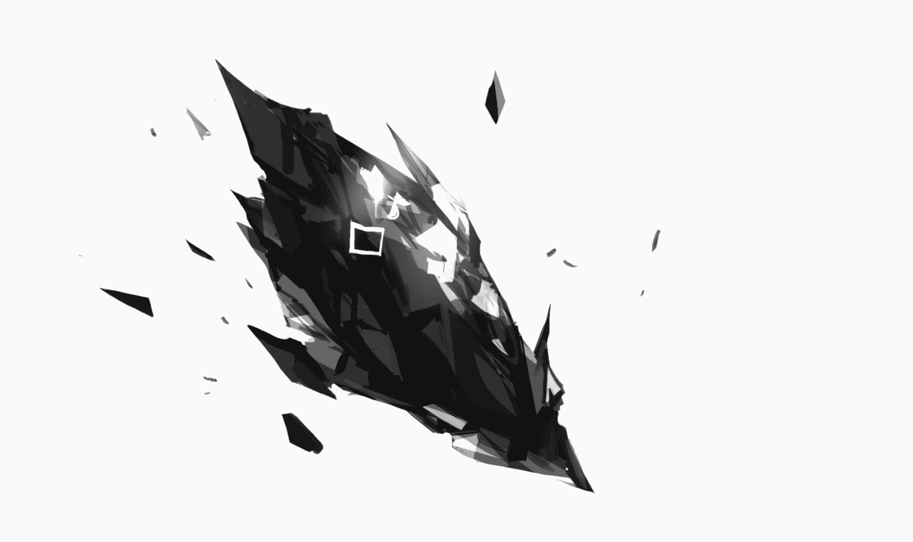](javascript:;)</ignore_js_op> <ignore_js_op>[绝望中的普瑞塞斯.jpg](forum.php?mod=attachment&aid=ODc3ODR8MmE1MTg2OTh8MTYyNDY4ODc5NXwxODIzMHwzMDA4OA%3D%3D&nothumb=yes) *(338.75 KB, 下載次數: 0)*

[下載附件](forum.php?mod=attachment&aid=ODc3ODR8MmE1MTg2OTh8MTYyNDY4ODc5NXwxODIzMHwzMDA4OA%3D%3D&nothumb=yes)

2021-3-7 09:52 上傳  

[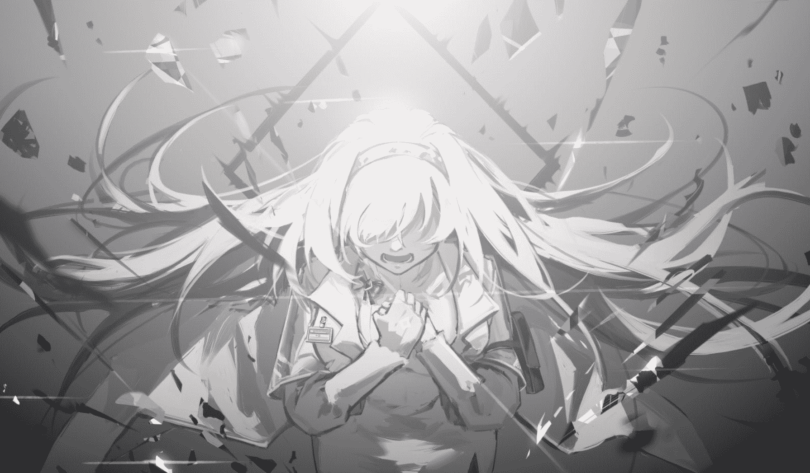](javascript:;)</ignore_js_op>  

# 92

*本帖最後由 Enigma2519 於 2021-3-6 21:00 編輯*

挺欣喜的，之前就给了第三个女主这个设定，但是一直没有什么合适的机会解释她具体是谁。还恰巧遇上一个手书《Satellite》，内容和我一开始写文的很多设定还挺相符的，作画也很棒。链接在此：

[https://www.bilibili.com/video/B ... 5978147902706693797](https://www.bilibili.com/video/BV1Th411k7ke?from=search&seid=5978147902706693797)

我也打算参照这个手书来写一下后面的主线

 

# 93

> [abc0000000 發表於 2021-3-6 23:44](https://giantessnight.com/gnforum2012/forum.php?mod=redirect&goto=findpost&pid=462226&ptid=30088)

> 還以為原創角色會是反派，結果是博士的第三倍快樂麼www

> 博士：我已經不能再好了 ...

不能算完全的反派，灰色人物吧。她有普瑞塞斯对博士的执念，所以在博士面前表现的更多是个占有欲很强的可爱妹子，但是她还有源石的一面，只是我还没有写而已。后面，她也算是博士成为巴别塔恶灵的一个原因吧。

 

# 94

*本帖最後由 Enigma2519 於 2021-3-7 01:32 編輯*

嗯，因为原来的一个老婆变成了现在的三个，我觉得我还是补充一下人设和博士评价吧（防止自己忘了）。

**普瑞塞斯：前身是第一代PRTS人工智能系统，与上一代普瑞塞斯的意识体结合后，成为了普瑞塞斯的转世。保存了所有的记忆，情感。非常具有智慧，而且古灵精怪，行动能力强。总喜欢对博士做些小的恶作剧。对于博士沾花惹草的行为倒是不是那么在意，正宫****の余裕。但是要是发起火来真的很可怕，一发火，博士晚上就会被...**

**“她是我的学姐，老婆，救命恩人，孩子的妈，老伴...她在我面前有太多身份了，但这些身份都有一个共同的名字，普瑞塞斯。——博士”** 

**特蕾西娅：萨卡兹之王，现任的魔王，巴别塔组织的缔造者。通过萨卡兹古老的血脉，从上一代普瑞塞斯那里继承了储存了记忆和情感的晶体单元。因此，对于博士有着天然的满好感和毫无保留的信任，就连无所不知的凯尔希都对这一现象迷惑不解。在之后与博士的相处中，好感进一度攀升（博士：都满好感了，居然还能升？）为人既善良，又坚强，是个理想主义者****。但是，有时喜欢吃醋，一吃醋，晚上博士就会被...**

**“她真是个无可救药的理想主义者，一个就连我都会无可救药地爱上她，愿意与她共度终生，甚至愿意与她共坠深渊的理想主义者。哈，我说笑的，我不会让她坠入深渊的，无论用什么办法。—— 博士”** 

****欧瑞莉姆**（源石）：上一代普瑞塞斯在最后时刻的执念激活了博士一直视为“黑曜石”的神秘晶体。在结合了上一代普瑞塞斯的肉体，记忆和执念后，又吸收了大量的伽马射线，从而成为泰拉大地上的第一块源石。对博士有着疯狂的占有欲，做事并不讲究手段。****除了普瑞塞斯和特蕾西娅，对其他适龄的女性都会有高度的戒备。一旦博士和某个女性接触时间过长，她会用自己的方法，清洗掉别的女性留在博士身上的味道。比如说，博士晚上就会被...**

**“我想，如果我死后进了地狱。而我的三个老婆都去了天堂，那普瑞塞斯和特蕾西娅肯定会立刻从天堂跳下来陪我，然后再想办法。而欧瑞莉姆则会把天堂占领，然后炸掉地狱，最后把我们几个都捞上去。——博士”**

新角色我打算命名为**“欧瑞莉姆”**，来自源石的英文名“**Originium**”。 

 

# 95

实在不好意思，电脑出问题，拿去修了，本来周末写的一些更新发不了，下周是春假，我努力更新来补上进度吧

 

# 96

*本帖最後由 Enigma2519 於 2021-3-18 00:41 編輯*

“博士，博士...起床了，起床了...”我感觉一双小手在我的脸上轻轻拍着。

谁啊，大早上的就来打扰我？唔...我想想...首先，排除老婆们。普瑞塞斯要帮特蕾西娅系统性地升级皇宫里的通讯系统，所以最近一阵子她们都住在宫里。虽然昨晚回来了一下，但是今天一大清早就已经回去了。欧瑞莉姆的话，恐怕不会这么温柔吧...凯尔希吗？不，那怎么可能！！！如果都不是的话，那还能有谁？我有点想睁眼看下，但是最终，困意还是战胜了好奇心，哎，随她去吧，我实在是懒得动弹了。

那双小手的主人见我没有醒，并没有放弃，还在继续轻拍着我的脸。最后，我索性把身子侧到一边去，把被子裹得紧了紧。

“博士，博士...6点了，快起来了，起来了啦...”那双小手不再继续拍打我的面颊，反而将施力点转到我的后背上，轻轻地推搡着。

“不是！谁啊？一大早上就这么...哦，啊，嗯...啊～早安啊，我可爱的小兔兔...”我本来被搞得有些窝火，一转身，看到的却是一个娇小的卡特斯幼女，前一秒还怒发冲冠的我，脸上立刻就多云转晴。我眯着眼睛，伸出双手，轻轻掐了掐她的小脸蛋，“啊～阿米娅，你怎么起得这么早啊，明明是周末，不多睡一会儿吗？”

“嗯，博士！特蕾西娅小姐和普瑞塞斯小姐跟我说，乖孩子应该早睡早起的，我有好好听她们的话的！”

“嗯～阿米娅是乖孩子，乖孩子～”我爱怜地摸了摸阿米娅的头，同时，忍不住打了个大哈欠，“啊～～～真是困死了...那，乖～阿米娅，你先去玩一会儿房间的积木吧，让我再...再眯瞪一会儿...就一小会儿。”

“嗯～～～～～博士～～～～～～起来嘛～～～起来嘛～～～～”阿米娅抱住我，使出了她的绝技——女儿的撒娇！使用效果：博士完全妥协。

“嗯，确实，阿米娅说得对，我也得听特蕾西娅和普瑞塞斯的话呢，我这就起，这就起。” 唉，谁叫我疼阿米娅呢，只能做出点牺牲了，等把阿米娅哄好了，再回来继续补觉吧，“阿米娅，走，我们去洗脸刷牙，啊呀我去...”

我的腿脚有些发软，刚才一下床，完全没有使上力气，导致我现在以一个平沙落雁式的姿态趴在地板上。

“博士你怎么了？”阿米娅担心地问道。

“没什么，没什么，刚醒，我现在还挺迷糊的，没有集中精神...别担心，阿米娅，哈哈...” 我这样解释道。

才怪呢！！！还不是因为昨天晚上，普瑞塞斯和特蕾西娅突然从皇宫那里回来，以需要紧急补充博士能量为由，火急火燎地把我之间从文集阅览室拖进卧室，一直从傍晚运动到凌晨。然后，梦中的我，又被欧瑞莉姆要了一遍又一遍，现在真的是一点力气都没有。啊，欧瑞莉姆真是的，明明叫她要有所节制，不然我可能会升天。可是她却跟我说：

“呵呵，亲爱的，你忘啦？这里可是精神世界，现在，你的灵魂可是在我的子宫中被保管得好好的。即使我们再怎么放纵，你的灵魂和精神都不会有事的...”

我还能有什么办法？我啥时候赢过她？

“博士，你腿没事吧？”阿米娅她蹲下身子，把小手放在我的腿上按了按，她似乎非常紧张我的健康问题，连自己的一对兔耳也耷拉了下去。

“没事，没事，阿米娅，我的乖孩子。你看...我这不是好好的吗？”我的腿终于恢复了一些知觉，我艰难地起身，强行忍住剧烈的酸麻感，扯出了一个不太自然的笑容。

“讨厌，博士好坏，不要吓阿米娅呀！”阿米娅鼓起面颊，一副“我很生气，需要哄”的样子。

“不好意思，不好意思...嘿！”我一个抄手，把小小的阿米娅抱起，让她骑在我的肩上，“走哦！刷牙洗脸，然后我们去食堂吃好吃的咯！”

“哦！”阿米娅兴奋地挥起了拳头。

“让小孩子吃太多甜食可不好。” 凯尔希看着坐在自己对面的那对父女，淡淡地说道。

“偶尔吃一根棒棒糖也没关系的，我多多少少也算是个博士，我也懂得一点小孩子的健康饮食。” 我在阿米娅的额头上轻吻了一下，“好了，我的乖孩子，先去里屋看一看图画书吧，我和凯尔希医生有工作上的事情要谈。”

“博士，我可以在这里听吗？”

“不了，阿米娅，工作上的事情很枯燥无味的，小孩子不会喜欢的。” 

“博士，我可以捂住耳朵的。”

“乖，乖，我的阿米娅，我不会离开的，现在我得花个一刻钟跟凯尔希医生谈些事情，做个乖孩子好吗，谈完了事情，我就来找你。”

“那好吧，博士...” 阿米娅恋恋不舍地从我怀中出来，低着头，走到了里屋。

“那孩子还挺依赖你的。”

“毕竟她现在开始把我当作父亲一般了，她之前经历了那么惨痛的事情，心里的阴影还没有消弭吧。不想离开我，正是一种没有安全感的表现...啧，可怜的孩子” 我摇了摇头，转换了下心情，“所以，今天是有什么事情吗，凯尔希？”

“你看这个，” 凯尔希把一张请柬递了过来，“‘全泰拉源石研究学术会议’将在一周后在莱塔尼亚的首都开幕，莱塔尼亚官方把请柬送来了，指名道姓请你去参加。”

“请我？”我把请柬拿了过来，仔细研读了几遍，请柬很短，也没有什么晦涩难懂的句子，但是正因如此，我被搞糊涂了，“搞错了吧，真的是请我吗？是不是有谁和我重名了？我也不是什么源石研究界的泰斗或是新秀啊，请我干什么？” 

“对方应该是想探探你的底，准确的说，我们的底，别忘了，你现在的身份是源石学和天灾学的博士，是巴别塔的学术顾问。” 凯尔希说道。

“唉～那又不是真的，掩护身份而已，我真实的专业方向可是神经科学，人工智能工程，还有制药学。源石和天灾？这个领域，我可是门外汉啊。” 我觉一阵头疼，仰躺在办公椅上，揉着自己的太阳穴。

“博士，我问你，” 凯尔希吹了吹手里捧着的咖啡杯，不紧不慢地问道，“假设，你面对是一种全新的神经系统病毒，怎样用你的现有知识来研究出有效的治疗手段。”

“啊，只问流程的话，这个简单。首先我们会利用小白鼠来追踪该病毒的作用位点及发病症状，然后用超级计算机来建模，根据现有的建模模型，反向推断神经毒素的致病机理，然后对症下药，找到具体的药物分子阻断机理反应，最后则是对药物分子进行进一步修饰，减少毒副作用以及合成难度什么的。” “瞧，博士。”凯尔希喝了一口咖啡，继续说道，“至少从刚才的三言两语中，你让我感觉你有点像个这个领域的学者了。”

“懂了，我会努力用自己的话语，把不怀好意者的问题堵掉的，顺便问一句，凯尔希。你希望我表现地像是个什么样子的学者？”

“重剑无锋，大巧不工。”

“......你要求还挺高的......” 我嘴角扯了两下，凯尔希应该是想借我的表现，给那些幕后伺机而动的人一个警告吧。巴别塔并不想显露锋芒，但要是真的被惹怒了，也会激起惊涛骇浪。

凯尔希点了点头：“看你的了，博士。这次你是主角。”

“你不去？”我眉毛扬了起来，“我一个人，恐怕不善处理交际场合的事。”

“这次我恐怕帮不上你，”凯尔希把肩膀一侧的源石结晶露给我看，“如你所见，博士，我是个感染者。莱塔尼亚的官方和民间，对感染者的态度都不是很好。我没有收到邀请，随意就跟着去会场，这会引起不必要的麻烦。给后续我们的外交工作制造麻烦，不过，你可以叫上普瑞塞斯，让她跟你一起去。”

“特蕾西娅呢？她总能跟我去吧。”

“殿下的话，那更不行，很抱歉。无论是从安全和外交的角度上讲，我都要为殿下负责。”

“唉，好吧好吧，我听你的，凯尔希。还有什么事吗？” 我瘫在了椅子上，真讨厌，该死的莱塔尼亚人，我还想带两个老婆去一下，姑且就算是度蜜月了。

“嗯，还有，你看下这个照片。” 凯尔希递过来了一张合照，照片上是一个普通的卡普里尼（羊）一家，夫妻俩都戴着眼镜，颇有些学者的味道，他们的女儿似乎才10岁，站在中间，有些怯生生地望着镜头。

“这是瑙曼教授一家，夫妻俩都是天灾学教授和火山专家，中间是他们的女儿，阿黛尔。不同于大部分莱塔尼亚人，瑙曼教授一家对感染者们非常同情，是我们可以信赖的人，而且，瑙曼教授的不少学生，现在都在为我们工作。” “不错的一家，那我要做什么？” “有人打算对瑙曼教授一家不利，教授向当地警方求助，但不知为什么，警方似乎不想管这件事情。你要去在会议上见瑙曼教授，找个合适的时机向他表明身份。我给你指挥莱塔尼亚办事处的几支行动小队的指挥权限，请暗中保护他们一家。但是，不能把动静闹得太大，不然我们不好收场。”

“凯尔希老师，你还真给我出了个难解决的课题。” 我又开始掐起了自己的太阳穴。

“好好计划一下吧，三天以后出发。”

“唉～是，遵命，长官。”  

# 97

感觉不写gts的部分就容易写得乱七八糟的，肯定是太久没写了的锅。

 

# 98

> [abc0000000 發表於 2021-3-18 04:45](https://giantessnight.com/gnforum2012/forum.php?mod=redirect&goto=findpost&pid=463123&ptid=30088)

> 雖然沒什麼影響，但更新日期應該是18日吧（？

感谢指正，这就把日期订正。

 

# 99

*本帖最後由 Enigma2519 於 2021-4-3 12:27 編輯*

番外四：希雅的日记本

把自己写了很久的日记给大家读，一定是一件非常快乐的事情。希雅坐在自己的写字台前，她这么想着。

她开始坚持写日记已经有两个多月了，这对小孩子来说，并不是一件容易的事情。尤其对希雅这种活泼好动的孩子来说，每天让她安静地坐在自己的书桌前，花个半小时写点什么，这更像是一种考验。她很想现在就去看妈妈做了什么糕点，很想去看看爸爸又在搞什么好玩的玩意，很想去和弟弟妹妹一起搭积木，玩过家家。

集中精力，专心，专心，希雅，写完今天的日记就可以去干别的了。她在心里对自己说道。

呜～写不出来，今天也不知道该写什么啊。希雅郁闷地趴在桌子上。

希雅为什么会开始写日记呢？还都是因为她弟弟，前一阵子，阿尔伯特不知从哪里翻出来爸爸很久以前的日记本，妈妈都没看过的那种。然后她就和自己的弟弟妹妹去了阿米娅姐姐家里住了几天，回来时发现自己妈妈和普瑞塞斯妈妈都是红光满面，人也漂亮了很多，但爸爸好像因为感冒，几天都没下床，妈妈们又轮番照顾了爸爸一周，他的身体才好过来。

希雅对妈妈们的笑容念念不忘，她觉得，她们不在家的那几天，爸爸一定是把自己的日记全都给妈妈们读了，让妈妈们都感到很高兴。而爸爸，他肯定是晚上读日记的时候，没有穿太多衣服，所以感冒了。对，一定是这样！读日记，一定是一件非常开心的事情！我也想要让爸爸妈妈开心！

但是，今天实在没思路啊...嗯，干脆来翻一翻以前的日记吧。

“X月XX日，晴。妈妈嘱咐爸爸，我要进入‘换角期’了，所以不能吃太多零食什么的。嗯...吃一点又没关系，爸爸也经常吃啊，虽然爸爸也不长角。妈妈真是的...最近几天，爸爸和我的零用钱都被限制了，‘我真是娶了个管家老太婆，希雅你长大之后可别学你妈妈’。这话是爸爸跟我说的...”

“嗯...可是我记得那一阵子我的零食没有断啊，难道我记错了？”希雅抱着这样的问题，迫不及待地继续念了下去。

“但是爸爸不愧是爸爸！他变戏法似的，从鞋底掏出了一百龙门币！他给我买了我最喜欢吃的可可冰激凌，自己还买了炭烤沙虫腿和仙人掌干拌辣椒老妈。嗯，虽然爸爸喜欢的零食味道有些古怪，但爸爸真是让人崇拜！回家之前，爸爸还给我们买了两瓶水，漱掉了吃过零食的味道。妈妈丝毫没有察觉！爸爸偷偷地告诉我，他在家里还藏了很多钱，让我不要担心零食问题。爸爸万岁！我爸爸最聪明了，我长大之后也要成为爸爸那样的人！”

“好呀，爸爸最好了！”希雅兴奋地挥动着小拳头。

读日记真的是一件很开心的事情，希雅高兴地想到。那再让我看看我还记录了什么快乐的事情吧。

翻了几页，希雅又看到了一些有意思的事情。

“X月XX日，晴。虽然今天是周日，但爸爸还是要去罗德岛一趟。我赖着爸爸，向他撒了好一会儿娇，他才勉强同意。罗德岛是爸爸妈妈都工作的地方，我也想看看到底是什么样子的！”

“嗯？可是我记得我那天大部分时间都在跟一些姐姐玩，没怎么看见爸爸啊。”希雅挠了挠自己的小脑袋瓜，奇怪地说道。

“到了罗德岛，迎接我们的就是凯尔希阿姨，凯尔希阿姨和我们一家的关系非常好，她也很疼我。凯尔希阿姨叫来了迷迭香姐姐和红姐姐，带我去参观罗德岛。而爸爸则被凯尔希阿姨拖去她的个人办公室了，肯定是去做身体检查了，凯尔希阿姨医术那么高明，肯定一下子就能检查出来爸爸身体有没有问题的！”

“罗德岛里面的姐姐们都很好，非常友善，我还认识了铃兰姐姐和泡普卡姐姐，很感谢她们把自己的娃娃拿出来让我玩。快到晚饭时间时，一堆阿姨簇拥着爸爸从她们的宿舍出来了。我也不知道她们什么时候过去的。她们脸上也都是红光满面的，就像妈妈们一样。我也又认识了好多人，有斯卡蒂阿姨，有白金阿姨，有煌阿姨，有安洁莉娜阿姨，有蓝毒阿姨...啊，总之好多，我真的记不过来了！总而言之，那么多阿姨喜欢着爸爸，希雅看得出来的，希雅又不是小孩子！妈妈们应该也知道这件事吧！”

“嗯！”希雅满意地拍了拍日记本，“希雅可不是小孩子，希雅也是成熟的大人哦！”

“希雅，缪斯，阿尔伯特！准备洗洗手，蛋挞马上就要烤好了！” 妈妈温柔的声音从客厅传来。

“好的，妈妈！” 希雅应了一声，但是还是不想放下手中的日记本。

“就看最后一篇吧。看完就去。” 希雅对自己说道。

“X月XX日，小雨。今天希雅发现了两个爸爸妈妈的大秘密，真的是大秘密！连弟弟妹妹都不知道的事！”

“嗯？！”希雅一下子被自己写的文字吸引了。

“原来爸爸妈妈总喜欢在晚上锻炼身体哎！而且三个人都那么认真，每次都能汗流浃背的，累得上气不接下气的。身体锻炼确实是一件不容易的事情，希雅也跑过步，做过仰卧起坐，真的很累！不愧是爸爸妈妈，就是聪明，只要用床做背垫，把衣服都脱光了就没那么累了！不过希雅还是不会像爸爸妈妈那样做，脱衣服会着凉的，我的抵抗力可没有爸爸妈妈那么好。”

“不过妈妈们总是欺负爸爸，每次都是两位妈妈把爸爸坐在下面，我观察了几天了，都是这样。好几次我都想冲进去，不让妈妈们这么欺负爸爸，不过我也想到，这可能是为了让爸爸更好的锻炼吧，还是不要打扰他们了。”

“另外一个事情，就是，爸爸竟然是我的亲哥哥！也是我弟弟妹妹的亲哥哥！是这样的，妈妈们在跟爸爸锻炼时，两位妈妈都会管爸爸叫‘乖儿子’，爸爸也顺从地管两位妈妈叫‘妈妈’，虽然有时也叫‘好姐姐’。而且啊，妈妈们还会说，这样让她们无比怀念肚子里怀爸爸的时光。那这样的话，爸爸不就是妈妈的儿子吗？那爸爸比我大，那爸爸就又是我的爸爸，又是我的哥哥了！好啊！希雅也有哥哥了！”

“姐姐～”一个稚嫩的声音突然从希雅身边响起，把希雅吓了一跳，她回头一看，原来是自己的宝贝弟弟，“妈妈叫我们过去吃蛋挞呢，你怎么还不出来啊...”

“没事没事...我们走吧。”希雅非常宠爱自己的弟弟，她收好了自己的日记本，便牵着弟弟的手，来到了客厅。

妈妈的烘培手艺一向不错，这次的蛋挞也是外酥里嫩，而且甜度合适。妈妈笑称，这都是当年为了迎合爸爸的胃口而练出来的。

爸爸也来了！他伸手就想从盘子里拿出一个，却被妈妈和普瑞塞斯妈妈用手打掉了。

“老公，你的在这里...” 不知道什么时候，妈妈嘴里叼了一块蛋挞。

“亲爱的，还有这里...” 普瑞塞斯妈妈嘴里也叼了一块。

奇怪，蛋挞明明很多啊...希雅感到困惑不解。

思考了一会儿，希雅恍然大悟：难道，这就是大家常常提到的，‘爱’吗？

“我懂了，妈妈们爱爸爸，爸爸也爱妈妈们。我和弟弟妹妹爱爸爸，爸爸也爱我们，罗德岛上的阿姨们爱爸爸，爸爸也爱阿姨们...这都是爱，我记录的，都是爸爸和我们之间的爱。”

“要让更多的人知道我们和爸爸之间的爱！要让更多的人爱爸爸！对了，读日记就能把这份开心和爱分享出去，我就这么做吧，”希雅小小的脑袋瓜转动了起来，“下个月就是学校的作文比赛了，优胜的可以在儿童节那天，当着全校家长同学的面，把自己的作文读出来。我就把我的日记改成一篇作文吧，题目就叫——《我的爸爸》！”

此刻，我对我女儿心中的想法一概不知，看着她一脸高兴的样子，我以为是蛋挞的原因，毕竟，特蕾西娅的糕点手艺真的棒极了！

我宠爱地摸了摸希雅的小脑袋。

殊不知，我的贴心小棉袄的作文，会让她的老父亲在儿童节那天当场社死。

不过，这都是后话了。

 

# 100

*本帖最後由 Enigma2519 於 2021-4-3 12:30 編輯*

4.4更新番外4，米4达狂怒。

咕了几周真的不好意思，下次还敢。

 

# 101

对不起各位啊，已近三周没有更新了。最近学业繁忙，无力写文。还有几件事要告诉大家：

第一件事，我找到属于自己的特蕾西娅了。

第二件事，今天方舟二周年庆直播，我终于听到我老婆的声音了！但是，我着实被这PV内容刀得不行，心中郁闷难平，我打算重新理了一下文章的思路，为博士和特蕾西娅，普瑞赛斯铺垫一个美好的结局。

第三件事，快期末了，事情真是几何数量地增长。等我处理好自己的学业，再回来更文。

各位，我们五月中下旬见！

 

# 102

咕咕咕，不好意思，好久没更新了。最近学业的事情太多，忙不过来。再加上YJ太能拖主线了，YY都没个参考依据。最近读了读前面写的文，觉得自己需要找找之前的那种感觉了，老写番外也不好。那周末吧，最迟这周末续更，要是没更新的话，那就把博士拿去炖汤给老婆补身子吧。附一张图，还是冬笙大佬的，非常符合我对博士官设的理解。而且，当初要不是看了他的手书，我也不会下定决心，写这样一篇文的，以上，咕咕咕两个月不好意思啊。 

# 103

<ignore_js_op>[IMG_4780.JPG](forum.php?mod=attachment&aid=ODkyMTd8OWE2Y2Q2ZWJ8MTYyNDY4ODgwNHwxODIzMHwzMDA4OA%3D%3D&nothumb=yes) *(248.49 KB, 下載次數: 1)*

[下載附件](forum.php?mod=attachment&aid=ODkyMTd8OWE2Y2Q2ZWJ8MTYyNDY4ODgwNHwxODIzMHwzMDA4OA%3D%3D&nothumb=yes)

2021-6-15 06:03 上傳  

不要再落单了，博士

[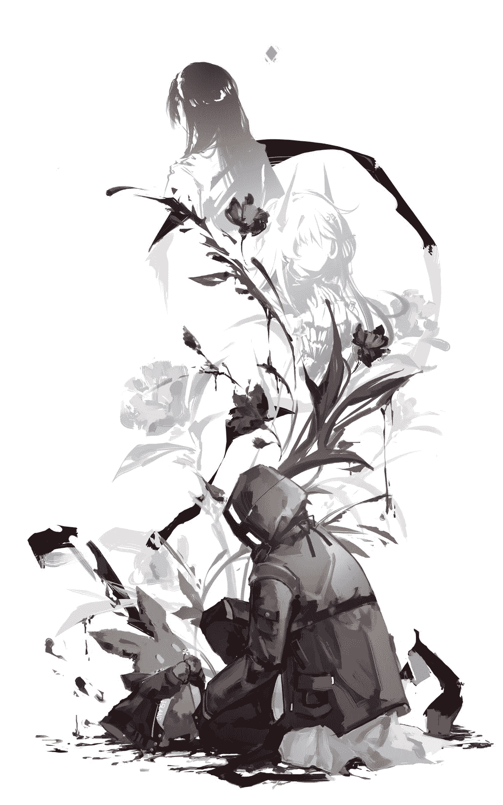](javascript:;)</ignore_js_op>  

# 104

*本帖最後由 Enigma2519 於 2021-6-20 22:24 編輯*

“Hallo, mein Name ist Doktor. Sie ist meine Freudin, Pristess. Ich freue mich, Sie zu sehen!" （大意：你好，我叫博士，这是我女朋友，普瑞塞斯，很高兴见到您！）

“Hallo, mein Name ist Doktor. Sie ist meine Freudin, Pristess. Ich freue mich, Sie zu sehen!"*2

“Hallo, mein Name ist Doktor. Sie ist meine Freudin, Pristess. Ich freue mich, Sie zu sehen!"*3

...

普瑞塞斯饶有兴趣地看着我，只见我手里拿着一张纸条，像吟唱咒语似的反复地念叨着。读了几遍后，我闭上双眼，摇头晃脑地复述着上面的内容。

“亲爱的，你念的什么啊？” 普瑞塞斯温柔的声音从我耳边传来，湿热的香风吻了吻我的耳垂，引得我不禁害羞地缩了缩脖子。她一阵娇笑，将头轻轻地依靠在了我的肩头。

“哦呀，亲爱的...嘿嘿，我在练习用莱塔尼亚语跟人打招呼还有向他们介绍你和我啊。”

普瑞塞斯轻轻地嗯了一声：“亲爱的，这句莱塔尼亚语你说的很标准哦。不过呢，有个小错误，我要指出来...”

她说着，用手揪了揪我的鼻子：“介绍我的时候，应该用的是Frau（本意女士，在此句意中特指妻子），而不是Freudin（女朋友）哦。”

“亲爱的说的对啊，这就改，这就改...‘meine Frau'...好的，记住啦，记住啦！哎呀，亲爱的！！！”

“这是小小的惩罚，”普瑞塞斯松开了嘴，而我的胳膊上则留了一道小小的牙印，她装作生气道，“你要是再说错了，就到我肚子里去好好反省一天吧！”

“不会的，不会的，亲爱的！哎？你看那是谁？”

普瑞塞斯顺着我的手指向外看去，却一个人都没看到，还没反应过来，我一个偷袭，她的左脸上就多了一道吻痕。某学姐立刻化身蒸汽姬，脸红扑扑地就贴到我怀里，双手用力地拉住我的衣角，她仰起头，装作发怒，用一双水灵灵的大眼睛盯着我，但见我面带得意的笑容，便又止不住自己的羞意，把脑袋埋进我的胸膛里啦。发出“呜～”的声音，好像被我欺负的很惨似的。

嘿嘿，我家普瑞塞斯被我偷吻，就会害羞，这个优良传统还是一直没变啊，真是百试百灵。

可惜我另一位...那个词怎么说来着？对，Frau！可惜我另一位“Frau”特蕾西娅不在这里，不然也想试试她的反应啊！！！嗯，回去找个机会吧，没准能看到我家王女大人如此娇羞的一面呢，桀桀桀桀桀桀！！！我不由得自鸣得意起来。

卡兹戴尔，卡兹戴尔皇宫，女皇寝室

“老公今天活动的要比平时更加积极啊，是想到什么开心的事了吗？”特蕾西娅摸了摸自己的肚子，在子宫中，博士的本体在欢快地游动着。虽然时不时会撞上子宫壁，但是依然没有减缓运动的迹象，“想必是和普瑞塞斯姐姐一起出游很开心吧，老公还真是像个孩子...不知道他们是不是已经见到瑙曼教授了呢？”

“嗯？老公的动静小了下去啊，是玩累了吧...呵呵，原来老公小时候是这个样子的吗？真可爱啊。好，睡吧，睡吧，我的乖宝宝，睡觉觉～～”萨卡兹的皇女用左手轻轻拍着肚子，轻哼起了摇篮曲。

今天特蕾西娅要处理的政务繁多，但是宫中的侍从能感受的到，殿下的心情显然不错。

莱塔尼亚分部的负责人热情地招待了我，我们谈论了一些瑙曼教授的事情。根据他们的调查，教授的人品很好，在大学里口碑很高。没有仇家或是有瓜葛的同事。他们判断，对教授的威胁来源不太可能是来自个人，而从另一个角度来看，警方不愿意插手也算是个印证他们想法的凭依。警方会不会知道一点内情？如果是的话，那会是谁，有这么大的本事摆平警方呢？

我陷入了沉思，无聊地摆弄着凯尔希给我的那张瑙曼一家的全家福，想了半天，也不知道问什么好。但不说话，还是会有点让气氛显得有些尴尬，我终于找到了一个问题：“对了，瑙曼夫妇都是教授，那瑙曼夫人一直以来的具体研究方向是什么？和他丈夫完全一样吗？”

“不，不是的。”负责人回答道，“瑙曼夫人虽对天灾和火山都有所涉猎，但是她真正擅长的领域是地质和矿业。她在这两个领域非常著名，一度被认为是这两个学界的学术新星。不过，三年前，位于西西里的一座火山爆发了，瑙曼先生决定去现场勘探，而瑙曼夫人的研究课题恰恰也选的对西西里山脉地质的研究，所以与她丈夫前去会合了。而就是那次，从西西里回来之后，瑙曼夫人辞掉了项目和资助她的资金，毅然决然地转行了。当时学术界都对瑙曼夫人的决定大惑不解，有的人甚至还讥讽瑙曼夫人是小女孩心思，把和瑙曼先生单独相处的时间看得比自己的远大前程要重要的多。”

“他们发现了什么？”

“没人知道，他们三年来没有发表过新的文章。也有其他的地质专家或是火山学者前去考察西西里火山，一连去了几个，但最后都杳无音讯了。有人说是被黑帮杀了，有人称是遇上小规模的火山碎屑流而丧命了，还有人说是，那些失踪的人也知道了不该知道的事，而永远失踪了。”

“咝～～～”我深吸了一口凉气，开始揉自己的太阳穴。

“博士，你还好吧？”

“不好不坏，”我继续做着眼保健操，舒缓一些有些发热的神经，“至少就现有信息，我敢肯定，瑙曼教授一家受威胁，那肯定是跟他们三年以来的种种研究相关，但我不能做出更进一步的推断。因为我缺少关键信息，对了，你知道瑙曼教授这三年都去了哪里吗？”

“嗯，是！教授这三年主要研究活动地有三处，分别是：莱塔尼亚河的下游区，施瓦茨森林的山区地带，还有劳尔特工业区区郊。”

“工业区？教授去那里干什么？他不是天灾学者还有火山学者吗？为什么跑到移动城市上去了？也就只有瑙曼夫人的矿业领域才和那座工业城市沾边吧，但她不是帮助自己的丈夫做研究了吗？”

身为教授前学生的负责人只是摇了摇头作为回应。

我总觉得，这像一条完整的叙事线，被人切了几刀，似乎答案在我嘴边，呼之欲出，但是缺少关键的结合点。

“你知道教授有什么私交非常好的人吗？我是说，绝对信得过的人。”

负责人脸上一阵抽搐，像是想起了什么不好的回忆，他颤巍巍地说：“有...那是个怪人，工程学的路德维希助理教授，他整天叮叮当当地发明什么奇怪东西，净做些奇思妙想，也不知道怎么和教授认识的，他招不到学生，所以每次都喜欢把他的古怪发明拿来，把我们这些瑙曼教授的学生们当实验对象。幸好我早毕业了。他和博士你...应该差不多大的样子。”

“没事，他住哪？”本来我还不感兴趣的，听负责人说是个和我年龄（看上去的年龄）相仿，还是个科学怪人，我就坚定了去拜访一下的心思，用普瑞塞斯的话说，这大概是“同类相吸”吧。

顺便，我还可以练练我刚学的莱塔尼亚语。

 

# 105

咕咕咕，因为我现在的时区还是周末的晚上11点多，所以，不用被炖汤...吧？