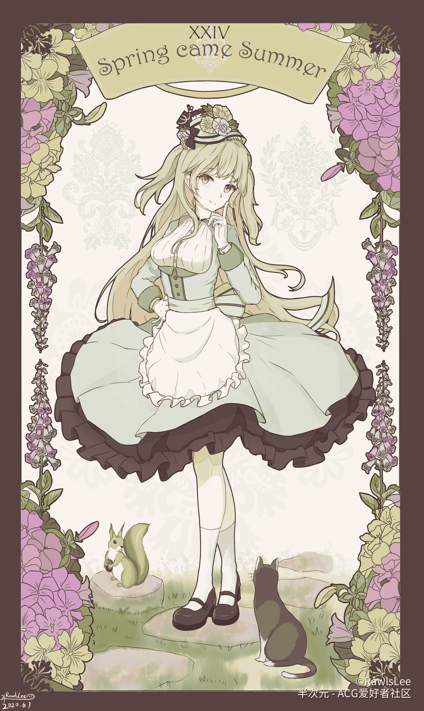

# DIAMOND 2021.2.6更新第一章（百倍）

作者：广翼云

TID：30297

 

# 1

大家好，这里是又开了一个坑的广翼云。（被打）

这个坑是开给为我画了头像的劳尔斯（@zyc4502）的，非常感谢他愿意在我的一大堆条件下为我画这个魔王自设的头像，也希望大家能去关注一下他的pixiv主页：[https://www.pixiv.net/member.php?id=17971195](https://www.pixiv.net/member.php?id=17971195)

本篇文的主角是劳尔斯家的oc，非常感谢他把这个孩子的命名权交给了我。

女主的形象是这样的： <ignore_js_op>

**QQ图片20210206094232.jpg** *(4.43 MB, 下載次數: 0)*

[下載附件](forum.php?mod=attachment&aid=ODczMDV8OWM2YzQ4ZTd8MTYyNDY5MjU2OHwxODIzMHwzMDI5Nw%3D%3D&nothumb=yes)

2021-2-6 09:44 上傳

那么写在前面的话就是这些啦，仍然希望大家看得开心，看得开心之后顺手给我一个回复就更好啦！

 

# 2

*本帖最後由 广翼云 於 2021-2-6 10:09 編輯*

（一）零露      “你，信命吗？”        零露不知道答案，她也不想知道答案。        因为她，不过是一个普通的中学生而已。要说哪里不普通，恐怕也就只有自己的家庭条件不普通了吧。      “你觉得人的命运，是天生注定的吗？”        零露是当之无愧的大小姐，她们家是重工业巨头，即使是在当地也是小有名气。       零露摇了摇头。       家族的事情，和她没有关系。她不希望别人因为自己的家族而格外高看自己。     “那么，你愿意试试我们的世界吗？”       零露全身抖了一抖，她的视线猛地从手中拿着的书转移到了站在她面前那个娇小的女孩身上。       她不由得回忆起了和这个女孩的相遇。       本来今天，她和往常一样穿着自己最喜欢的淡绿色长裙，走在熟悉的街道上。       她的手里像往常一样拿着那本自己从来都没有看懂过的书，匆匆忙忙地穿梭过街道和胡同。       随后，她就觉得被什么东西撞了一下。       回过神来的她，书已经掉到了地上。       她弯下腰捡起书，有些生气地看向刚刚撞了自己一下的人，朱唇轻启，似乎打算把自己书被撞掉的愤怒全部倾泻在那个家伙的身上。       话到嘴边，她却是突然愣住了。       在她眼前的，是一个身材看上去有些瘦小的女孩。女孩的身形被一袭黑袍裹得严严实实，只能透过黑色的布料依稀看见那还在发育的有些瘦小的身体轮廓。       看上去，女孩大概是小学五六年级的样子，她正以极不雅观的姿势瘫坐在地上，显然也受到了不小的冲击。       看到这样有些狼狈的女孩，零露本来已经到嘴边的责骂之语终究还是改了口:“你没事吧？”说着，她伸手去拉起女孩。       女孩被她扶起之后，像是在害怕着什么一样，深深地鞠了一躬就匆匆离开。       这便是她和眼前女孩的初遇。       对女孩感到好奇的她，加快脚步跟了上去。女孩消失在一个帐篷里之后，她也走进了帐篷。       而现在，眼前的女孩，正对着水晶球故弄玄虚，问她一些莫名其妙的问题。     “你们的世界？”       零露稍稍提起了些许兴趣，她总觉得这个满口中二话的女孩有她自己的想法。     “是，不需要在乎任何人的世界。”       女孩摘下了黑色长袍的帽子，露出一头飘逸的黑发，金色的眸子直直地盯着零露的眼睛。     “带我去看看？”零露合上了手里的书，对着女孩微微一笑。     “我叫冷霏。”女孩对着她伸出了手。     “零露。”零露自然而然地抓住了她的手。       抓住她的手的下一个瞬间，零露就发现周围的环境立刻发生了改变。原本神秘感十足的帐篷消失了，取而代之的是一个明亮辉煌的房间。原本小帐篷里昏暗摇曳的烛光突然变成了头顶光辉灿烂的吊灯，虽说零露是大户人家，也没见过这样大的吊灯。       眼睛有些适应了周围的环境之后，零露眯起眼看着房间的装潢。黄色和红色为主的色调让她不由得有些怀疑房间主人的品味；房间有些大，在檀木的衣柜旁边放了一个几乎无色的硕大无比的箱子，有两人多宽，高度也几乎要碰到天花板，这个奇怪的箱子在这个金碧辉煌的空间里显得格格不入。       房间里放了一张大床，一个书桌，一个梳妆台，几乎都是黑金和红色的配置，看上去甚至有点土气。    “这里是哪里？”       零露张了张口，她对于现状有太多不理解的地方，但她现在迫不及待想要知道的，还是这里究竟是什么地方。    “这里是我们的梦想。”冷霏拉着她的手，慢慢走近了那个看上去就要和周围环境融为一体的箱子，“也是我们的世界。”       是这个年龄段特有的中二吗……       零露苦笑了一下，用手轻轻触摸了一下那个箱子，原本无色的箱子顿时发出耀眼夺目的绿光。       什么？发生什么了？       几乎是应激反应一般的，零露闭上了眼。       再次睁开眼的时候，零露眼前所有的景象又一次发生了巨大的变化。       原本的房间消失了，取而代之的是低矮的砖房，翠绿的田野，忙碌的人群，和……       没有她一只脚宽的车道。       没错，这里虽然一派田园景象，现代化程度看上去并不算高，但是一切看起来都是那么渺小。低矮的平房甚至不如她棕色的圆头皮鞋大，甚至她抬起脚就可以轻松踏平一栋房屋。       这是……模型吗？       零露试探性地踏出一步，皮鞋轻松地踏碎了水泥地面，她的鞋印清清楚楚地留在了水泥路面上。       触感……好真实……       零露又踏出另一步，水泥路面仍然无法对她的脚步起到任何阻挡作用，水泥下面的泥土翻了出来，从水泥的缝隙里渗出。     “零露姐，听得到吗？”       就在她迈出第三步的时候，从她的内心中突然传出了不属于她的声音。她一时受惊，脚底一滑，直愣愣地坐在了地上。       重量要以千吨计算的身躯重重地落在地面上，周围的一切仿佛都经历了一次小型地震的洗礼。树木因为地面的震动倒伏下来，水泥路面如同交通网络一般向四周四通八达地裂开，地面上留下了两个圆润而清晰的屁股痕迹。       她落地时引发的暴风一瞬间荡开，路边的田野里原本绿油油的庄稼无法承受这样的暴风而被连根拔起，一时间狗吠鸡鸣，宁静的田野突然变得热闹了起来。     “你是谁？”       此时此刻的零露自然是无暇顾及太多，她只想知道内心深处这奇怪的声音是从哪里来的。     “是我啦，冷霏。”那个声音又一次响了起来，在她心头不断回荡。       零露有太多话想问她了，她牢牢握紧手里的书，起身拍了拍身上的土。     “我知道零露姐一定有很多问题想问，但是我先介绍一下最关键的东西吧！”冷霏的声音很绵软，听起来像是棉花糖。       零露瞥了一眼远处，因为刚刚的震动，似乎有人已经注意到她了，纷纷带着农具似乎打算靠近她。       这恐怕不是模型吧。       零露叹了口气，只是她轻轻叹的气就把一只刚好路过的鸽子吹飞到地上，即使是飞行经验丰富的鸽子也无法抵抗她呼出的一口气，只能被她呼出的气裹挟着，努力调整自己飞行的方向。     “零露姐你好聪明！”冷霏惊叹的声音从她心底传来，“其他人第一反应都是模型！”       不要偷听别人心里在想什么啊。       零露捏住了那只鸽子。鸽子实在是太小了，在她眼里还不如一只蚊子来的大一点。她有些不敢相信，自己手指中间这个只有两毫米长的小白点居然是鸽子。       零露曾经抱过一次鸽子，虽然那时候抱的是肉鸽，比普通鸽子更大一些，但是普通鸽子也不至于这么小吧。       零露为了防止捏死鸽子，用自己最小的力量捏住鸽子的身体。可是，即使是她最小的力量，鸽子也只能在她指尖一动不动，甚至连挣扎的可能性都没有。       只要她指尖稍稍施力，鸽子就会变成她手指上的一个小红点吧。       她第一次感觉到生命是这么脆弱。    “那个盒子叫戴尔蒙德。”冷霏的声音把她的思绪拉回现实，“DIAMOND，钻石的意思。”    “如你所见，被神选中的人触碰时，戴尔蒙德就会启动。”冷霏绵软的声音继续响起，“然后就会把那个人巨大化传送到已经设定好的地方。”     “类似奥特曼的感觉！”冷霏突然像是想起了什么，声音突然高亢了起来。     “这些东西看就知道了……”零露扶了扶额头，松开手指让鸽子从她指尖飞出，“没有什么更具有实际价值的情报吗……”     “女神大人是要借着戴尔蒙德筛选适合创造新世界的人。”冷霏慢悠悠地说着，“所以遵从你的内心吧！零露姐！想想看如果你要统治这个地方，你会怎么做呢！”       莫名其妙……       零露的目光重新投向了在自己脚边渐渐围上来的人群，没人敢靠近她，只能围着她的脚围出一个圈。       不过……说是统治这里的话……       零露舔了舔嘴唇，她虽然对统治什么的没有兴趣，但是如果有机会能尝试的话，也未必不可。       毕竟，没有人会不喜欢力量。       说是统治，第一步应该做什么呢？       零露看着围上来的人群，从人们的目光中，她看到的更多是敬畏和恐慌，与之相对的敌意反而并没有多少。       零露回味着刚刚冷霏的话，一个想法油然而生。     “各位，听好了。”零露清了清嗓子，装模作样地打开手里的书，“我是负责管理这里的女神。”       说这话的时候，她瞥了一眼人群。果然，这句话如同深水炸弹一般，原本沉寂的人群立刻开始议论纷纷。       零露此刻有着162米的身高，搭配上手里长度20米，厚度3米多的巨型书本，看起来像极了来人间视察的女神在宣读对人类的启示。       零露心里偷笑了一下，但是还是保持着面无表情看着手里的书:“人类，安静。”       似乎是被她威严满满的声音吓到了，刚刚还在叽叽喳喳的人群立刻鸦雀无声。       居然这么听话吗。       零露不由得有些开心，她第一次感觉到让这么多人服从是这么快乐的事情。       零露不知道的是，她以为自己的声音不过是平常说话一样的声音，在她脚边渺小的人们听来如同炸雷一般在耳边回荡。少女的声音经过放大之后，仿佛是来自天边的神谕，甚至在四周都可以听见回声。     “因为你们对女神毫无敬意，所以女神要毁灭掉这里。”       零露说这话的时候，脚尖轻轻点了一下地，蔓延开来的裂缝贯穿了人群，似乎在向所有人宣告着零露的力量。       人群之中一片哗然，原本还鸦雀无声的人们如同炸开了锅一样议论纷纷。       这时候，不知是谁大喊了一句:“喂！你凭什么说自己是女神！你看上去只是个长得高的丫头吧！”       这句话一出之后，人群回应声立刻此起彼伏。一瞬间，舆论就倒向了不利于零露的一边。       好在，零露的力量是绝对的。      “是吗，你们在忤逆女神啊。”零露表面上仍然看不出喜悲，让仰望着她的人们无法猜测她的内心在想什么。       她抬起腿，轻柔地解开了皮鞋的扣子，轻轻一拽就把鞋子脱了下来。脱掉鞋子之后，原本被束缚在鞋子里的脚解放了自己的形态，带着些许热气暴露在空气中。       零露随手把长度超过20米的鞋子扔到一边，圆头皮鞋在空中划了个弧度，重重地落在了田野中，一瞬间就超过了田野上的所有的物体，成了田野里最高的造物。松软的泥土簇拥着皮鞋慢慢下坠，在地上留下了清晰的鞋印形状。       所有人怔怔地看着少女的动作，一时间居然没有人知道自己接下来应该做什么。       随后，零露一不做二不休，把另一只鞋子也脱了下来。这只鞋子被她扔进了一边的住宅区，侧立在街道旁边。七米宽的鞋子，侧立的高度超过了周围所有的平房，就连两层的小楼也只能勉强才能到达那样的高度。沉重的重量落地的瞬间在地上掀起一人多高的土尘。虽然零露很小心地扔到了街道上，但是鞋子落地时，鞋尖还是落进了居民房里面。用砖头和土块砌成的墙在鞋尖的冲击力下简直不值一提，鞋尖压垮了外围的围墙，把用来屯粮的粮仓整个压垮，玉米沿着缺口滚了出来，洒满了整个院子。鞋跟则横跨过整条街道，落进了另一处居民房，硬质的鞋跟把这家的大门直接砸成了碎片，只剩下贴了一年已经有些褪色的春联挂在鞋跟上随风飞舞。       仅仅只是少女的一只圆头皮鞋就把这宽度六米左右的乡野水泥路整个堵死，长度超过15米的整个路段被完全遮蔽，失去了原有的交通功能。       零露轻笑一声，轻柔而优雅地迈步走过人群。她的身材原本就属于匀称型的，双腿修长而匀称，胸部虽不是巨乳，但在同龄人中也已经算是佼佼者，苗条的腰部没有一丝赘肉，收腰的长裙紧紧束在身上，显出少女曼妙的身姿。       长度接近90米的修长的腿宛如两根精雕细琢的玉柱一般，几乎就要垂到地面的裙摆在人们头顶掠过，带起来的风把一些没有做好准备的人吹翻在地上。包围的里三层外三层的人群被她轻松迈过，穿着白色中筒袜的脚最终停在了居民区正上方。       她俏皮地对着人们眨了眨眼，抬起的左脚脚尖在砖房正上方晃了晃。       此情此景，即使是最愚笨的人也能猜到她想做什么。她的脚尖距离瓦红色的屋顶不过十几米的高度，二十米长的雪白脚丫投下的阴影完全覆盖了渺小的房屋，黑色的阴影充斥了整个小院，只要巨大的足落下，这个民居就会变成不起眼的废墟。     “这里是谁的家呢？”零露坏笑了一下，慢慢把自己的左脚下压，直到她的足尖触碰到了屋顶。整栋房子摇晃了一下，似乎支撑住了零露一只脚的重量。       但是，任谁都能看出，零露只不过是没用力踩下去而已。       零露轻轻用自己的足底摩擦着屋顶的瓦片，在她的脚下，瓦片发出了“哗啦哗啦”的声音，有些本就不怎么牢固的瓦片和飞扬的尘土一起落到地上，摔成碎片。       噼里啪啦的声音不断刺激着人们脆弱的神经，不断提醒着人们这只白色巨足的主人随时都有能把他们辛勤的劳动化为泡影的能力。     “都不愿意承认吗？”零露的左脚稍稍用了点力，原本三角形的屋顶就无法支撑她的力量，瓦片出现不同程度的崩坏，噼里啪啦的声音更加响亮，屋顶的框架结构被她轻轻松松踩塌，碎裂的木头如同子弹一样飞出，深深地插进了地面。     “不承认的话，这个小房子就要消失在我的脚底了哦？”       零露微微笑着，白色的中筒袜上已经沾上了一些灰尘，颜色似乎都有了些许变化。       终于，人群中一个女人忍不住了，她不顾一切地冲了过去，跪倒在零露的足边，抹着眼泪，声音中已经有了几分颤音:“是我家……女神大人……这里是我的家……求求您不要踩下去……”       可惜，女人的声音对零露来说实在是太小，零露根本听不清她的求饶，只能通过她的动作来猜测她的意思。       零露眨了眨眼，说:“嗯，我完全听不见你对我的恭敬之情呢。”说着，她的左脚又向下压了一点，“如果愿意以后永远把我作为女神来敬仰的话，不如就来舔舔我的脚吧。”       女人先是吃了一惊，随后她跪在地上慢慢挪动向那踩在地上的二十米长的白色玉足。       零露的脚掌并没有什么难闻的异味，硬要说的话，只有皮革和薄荷味洗衣液的味道。女人跪在地上，如同朝圣一般慢慢靠近零露的脚。       当她靠近的时候，才不由得惊叹零露的巨大。一百五十米的巨大身躯让零露脚下的路面出现不同规模的裂缝，那被白色布料包裹起来的脚踝有三层小楼的高度，用梯子恐怕都很难触碰到那拥有着近乎完美的曲线的脚踝。顺着脚踝向上看去，淡绿色长裙的棕色内边完全遮住了太阳的光芒，那近百米长的双腿就这样隐藏在了长裙下面的黑暗中。       自己的正前方就是那需要自己侍奉的脚掌，小脚趾都有一人多高，珠圆玉润的五个脚趾被完美地包裹在白色的中筒袜后面，看上去像极了用大理石精雕细琢的雕塑。脚掌上微微散发着热气，和尘土混在一起，看上去似乎更像黄色的烟雾。       女人凑近了零露雪白的脚趾，高高翘起的大拇指有四米多高，不管是零露的哪个部位，无时无刻都在向女人炫耀着自己的强大。女人默默地流下泪水，伸出舌尖舔舐起那雪白的足底。她的舌尖因为粗糙的中筒袜表面而不断麻木，最后只是机械地上下移动着舌尖，在那远比自己还要巨大的足底上留下自己微不足道的唾液。       可是，无论她怎么努力，零露都完全感受不到。体型的差距过于巨大，在零露眼里，她不过是个一厘米半大小的虫子罢了。     “我说，这就是你的态度吗？”零露显然很不满意，她忽视了体型大小带来的差距，只是像个小女孩一样对自己的玩具发出了不满。     “那这样的话，人类也没什么用呢。”零露轻描淡写地说着，左脚用力踩了下去，脚掌完全落在地上，原本就不堪重负发生变形的房屋彻底坍塌，砖块瓦块刺激着零露的脚底，足够将一个成年人压垮，甚至压成肉泥的泥瓦只不过让她感受到了一点点瘙痒而已。       零露的脚趾轻轻抠了抠地面，那房屋的废墟就被埋进了五个深度超过一米的坑里。       女人看到自己的家成了这个样子，本就已经崩溃的她完全疯狂了。她不断抓挠着零露的袜子，似乎想要恶狠狠地把她的袜子撕成碎片。可是，不管她再怎么用力，甚至她的手臂都几乎要骨折了，零露的袜子也没有一点点脱线。认识到力量差距之后，女人绝望地抱住零露的脚趾，如同发疯一般舔舐着她的白袜，似乎希望以此取悦零露，能让零露原谅自己刚才的僭越。       然而事实上，零露刚刚根本就没有注意她的所有动作。毕竟，有谁会在乎自己脚边的一只小虫怎么做呢？       零露此刻被脚底的触感震撼了，她从来没有想过踩塌房屋是这么舒服的事情，感觉甚至像是踩在指压板上一样，让她的身体感到一阵舒爽。       零露看着沉默无语的人群，见过了刚刚那一幕之后，人群中反对的声音和窃窃私语的声音便消失了。人们大都冷汗直冒，诚惶诚恐地看着这个只在一瞬间就把一栋房子踩进地下一米深的少女。       可能，她真的是上天派来惩罚我们不敬的女神吧。       人们大气都不敢出，只好呆呆地看着巨大的零露。       死亡，这个词带来的威慑力是无与伦比的，人们害怕死亡，在最逼近死亡的时候，一般人都会想尽办法让自己活下去。       所以当所有人的目光和零露相对的时候，人们的目光中只剩下了求生的渴望。       对面是能够轻松决定一整个村子存亡的女神，不管从任何角度来看都应该归顺她吧。如同神殿的神像一般巨大的身躯，只要轻轻移动就能扫平一切的白色丝足，从上而下都散发着藐视一切的气息。       特别是刚刚，她当着所有人的面，把一栋房子踩进了地底。       这种行为是什么呢？       是示威。       不管零露自己的想法是什么样的，此时此刻在人群眼里，她刚刚的所作所为就是无言的示威，为了展示自己力量的示威。       不知道谁的心理防线最先崩溃了，人群中传来了一声“女神”的喊声。       在一片“女神”的喊声中，所有人都对着面前立在村中的零露跪拜了下来。       已经……征服了吧？       零露回想着冷霏的话，她当时说要统治这里，现在这样的情况下应该已经算完成任务了吧？       不过。       看着面前跪拜的人们，零露嘴角扬起了一丝微笑。       我还没有玩够呢。     “既然你们展现出对女神的崇敬的话。”零露翻开书，装模作样地说着装腔作势的话。     “我可以不毁灭这里。”零露下一秒说出的话让所有人心里松了一口气。       但是零露没有丝毫感情起伏的声音下一刻瞬间宣布了他们的死刑。     “但是作为不敬的惩罚，我会夺走这里的半个村落。”       零露看着他们的表情，内心深处不由得窃笑起来。       原来，这就是所谓拥有力量的感觉吗？       零露轻轻扬起脚，仍然如同尘土一般挂在在脚趾上的女人就被巨大的力量扬飞了出去，撞在人群中间。已经目瞪口呆的人们居然没有一个人接住她，他们惊慌失措地直起身看着零落，而零露脚边扬起的风带着她足底的香气扑在人们脸上。       明明是热气，却让人们的心凉了半截。       而零露显然是不会有闲情逸致关心他们在想什么，她的目光仍然聚焦在书上，但是余光一直在心不在焉地观察着人们的反应。看到他们有些愚笨一般呆坐的表情，零露有些不太满意。       这里是个村庄，从一开始她就看出来了。低矮的平房，大片的田野，待修的土路，圈养的家畜，无一不在宣告着这个地方只是一个不能再普通的村庄，人们大概淳朴忠厚，一生劳碌。       但是没办法，为了自己片刻的欢愉，他们的家只能成为自己的玩具。       这样想想，确实有些可怜了。       零露的脸上流露出一股稍纵即逝的惋惜，随后把自己的脚踩在另一栋房子上。那栋带院子的小平房里面还有几只狗，她踩下来的时候，它们正趴在自己的窝里，看着白色的天空覆盖视野，然后如同发疯一般慌乱地大声吠叫。       所有人都傻愣着。       有几个人张了张嘴，却只是感觉到了口干舌燥，他们不知道要说什么才能阻止这个自称女神的女人，刚刚那个女人的下场更是让他们什么都不敢做。       被封死了。       所有人的心连同那栋不幸的房子一起，被这从天而降的足封死了。       支撑墙开始挤压变形，慢慢倒塌。或许是怜悯心作祟，又或许是玩心大起，零露没有一瞬间把整个房子踩碎，而是慢慢施加压力，让整个房子始终处在摇摇欲坠的状态。飞扬的灰尘此刻似乎不是落在地上，而是落在了人们的心上，如同巨锤一般一下一下重击着人们的心。       但是，这样的房子终究无法坚持太久。       在她的发力下，地面一直在下陷，房顶也在一寸一寸接近地面。几只狗叫的更欢了，但是这并不会让它们从零露的脚下幸存下来。       终于，房屋还是没能支持住那巨足的重量，房顶折断，整个建筑轰然倒塌，零露的脚也毫无阻碍地落在了地上，脚后跟在地上压出一个坑。       没有人能够阻止她，没有人敢去阻止她。       现在她做的一切，在人们看来都是对自己曾经不敬的惩罚。       她要剥夺这个村子的一半，谁也没法阻止她，大家只能看着她像是跳房子一样在房顶上来回跃动，每次落脚点都准确无误地落在房子的正上方，然后整个房子被震碎。       货真价实的跳房子，田野间随处可见的女孩子的游戏。       大家此刻心如死灰，连求情的念头都已经没有了。毕竟，若是求情有用的话，那个女人此刻就不会全身骨折躺在大家面前了。       在神的恶作剧面前，所有人都是无力的，所有人都是可笑的。       总算有些累了的零露停了下来，回过头去看着被自己踩踏过的半个村子。那半个村子里面已经只剩下了不规则排布的片片脚印，在脚印和脚印之间的夹缝中，建筑物的碎片四处散落着，在那里面隐隐约约可以看见一些血迹。       可能是家禽的，也可能是家畜的。       更有可能是没办法逃脱神罚的卧病的老人。       接受能力差的人已经哭了起来，他们赖以生存的家园在女神眼里什么都不是，甚至都不能当做取乐的工具。       没有什么是比认识到自己的无力更打击人的了。       零露抬起脚看了看，她的白袜已经被灰尘染成了黄色。她有些嫌弃地吐了吐舌头，在心里小声叫了几下冷霏的名字。       迎接她的果然是冷霏的声音，冷霏清脆悦耳的声音欢天喜地地询问：“怎么了零露姐？已经玩腻了吗？”       冷霏这种一切尽在掌握的性格让零露一时间有些不爽，她清了清嗓子：“差不多了，接下来怎么办？”     “那我关闭戴尔蒙德咯，你把东西都收拾一下，回来吧。”冷霏的声音还是一样的轻快，她似乎早就料到了事情会发展成这样。       零露捡起了自己扔到地上的鞋，拿起了自己的书。在她准备好之后，白色的光芒闪过，她的身影就从这个村庄消失了。       看见巨大的女孩消失之后，所有人都松了口气。虽然她并没有杀什么人，但是建筑物的破坏是不可逆的。       那家伙真的是女神吗……       所有人这么想着的时候，天边突然出现了一个绿色的身影。       那个身影远比刚刚的零露来的巨大，人们只能看见她脚上绿色的公主鞋和绿色的短袜，再往上的地方就看不真切了。       并且，令人在意的是，她的脚并没有踩在地上，而是仍然和建筑物留有一定距离。       是……来彻底毁灭我们的吗？       这么巨大的身形，想要毁灭这个村庄，只需要一根手指吧？       在人们近乎绝望的时刻，那个巨大无比的身影伸出了一根手指，慢慢靠近了村庄，她的手指完全覆盖了整个村子，柔柔的绿色荧光不间断地从手指上倾泻下来。       奇迹出现了。       随着那个身影洒下的绿色荧光，原本已经成了一片废墟的房屋如同雨后春笋一般重建了起来，那之中死亡的家畜也活了过来。       就连那个骨折的女人，身上的伤痛也全部恢复如初。       一切都如同一场梦一样，梦醒了什么也没有改变。       虽然大家没有搞清楚发生了什么，但是大家不约而同地看着天空中逐渐消失的巨大身影，不约而同地想着。       这才是真正的女神吧。       随后，那个绿色的身影就在大家的注视中完全消失，太阳的光芒重新照耀了大地。       零露回到了那个房间，冷霏正笑眯眯地看着她。      “怎么样零露姐？好玩吗？”冷霏似乎是明知故问一般，仰着小脸看着比她高两个头的零露。       零露先是撇了撇嘴，又露出一丝微笑。       冷霏也笑了起来，她摆弄着手里无色的钻石，用极为轻松的语调说：“第一次就这么得心应手的，零露姐你是第一个呢。”       第一个？     “就是说，我不是第一个用DIAMOND的是吗？”零露不喜欢用谐音称呼这东西，她的发音极其标准，标准到连冷霏都吓了一跳。     “当然不是咯，小可爱。”冷霏还没有说话，房间的角落就传来了一声性感的成熟女声，“你是第五个。”       听到声音之后，零露循着声音的方向看了过去。站在那里的，是一个通身穿着紫色衣服的女人，紫色的开领西服露出被白色衬衫包裹的呼之欲出的胸部，紫色的短裙衬托出臀部完美的弧线，黑色的丝袜和紫色的细跟高跟鞋相得益彰，看上去充满了成熟女性的风范。      “你好，喊我雅就行。”那个女人手里正夹着一根烟，飘渺的烟雾从她口中呼出。      “房间里禁止抽烟！”冷霏气呼呼地去夺她的烟，但是因为太矮了连她的手都碰不到。       这个女人，可能要有一米八高了。       零露确认了那个女人的模样之后，自我介绍道：“我叫零露。”       女人掐灭了烟头，款款走来，附身看着零露的脸，随后捏了捏她的脸颊。     “是个好苗子啊。”雅随手一扔，烟头划出一道标准的抛物线落进了垃圾桶里，发出“叮当”的响声。。        零露很讨厌这种自来熟的人，她把雅的手拿开，坐到了一边的沙发上翻开了书。        雅对着冷霏耸了耸肩，又走回了自己刚刚所在的角落。      “雅姐，下次再抽烟就没收！”冷霏叉着腰教训了两句雅，随后坐到了零露旁边。        在沉默了一会以后，冷霏吸了口气说：“零露姐知道为什么这个装置叫戴尔蒙德吗？”        零露挑了挑眉，她合上书看着冷霏：“为什么？”      “因为啊。”冷霏扭头看着不知道什么时候又点了一根烟的雅，叹了口气，“我们每个人，都应该是一颗闪闪发光的钻石。”       零露看得出来，冷霏说这句话的时候，她的眼里有光。     “所以我们为了让自己发光，必须要推翻这个乱七八糟的秩序！”冷霏攥起了拳，似乎想要抓住什么东西，又似乎想要破坏什么东西。     “接下来是不是到我了？”雅又掐灭了烟头，揉了揉肩。     “嗯。”冷霏点了点头。     “祝我好运吧。”雅走向了戴尔蒙德，消失在光芒中。 

# 3

> [phone2345 發表於 2021-2-6 11:01](https://giantessnight.com/gnforum2012/forum.php?mod=redirect&goto=findpost&pid=459099&ptid=30297)

> 看到鸽子的我不禁笑了一声，广老师是在暗示鸽子不更文的下场吗？

> 

> 不过也是这个鸽子，让我搞不清楚文中女神 ...

是不如蚊子大啦，就比蚊子小一些的感觉，两毫米左右</ignore_js_op>