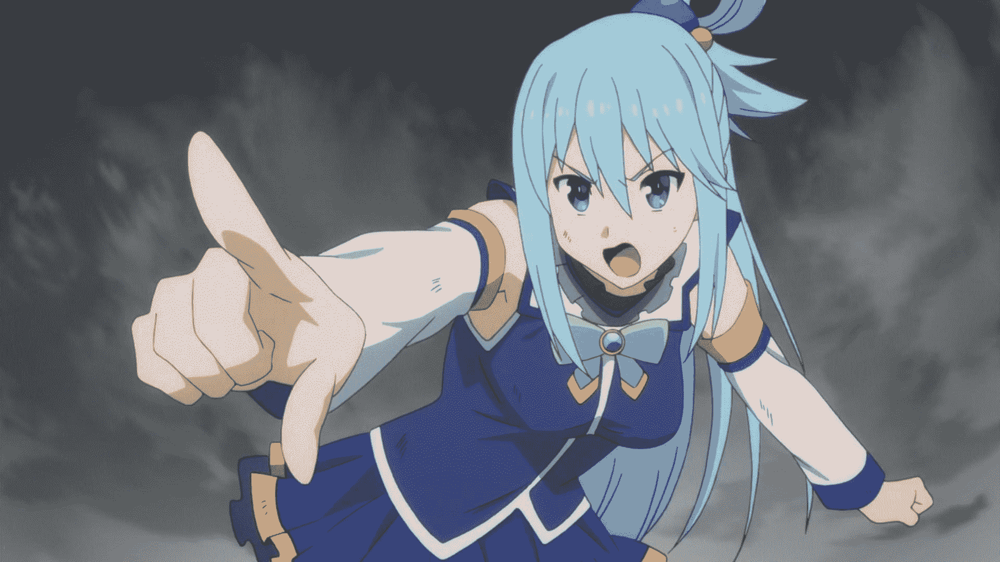
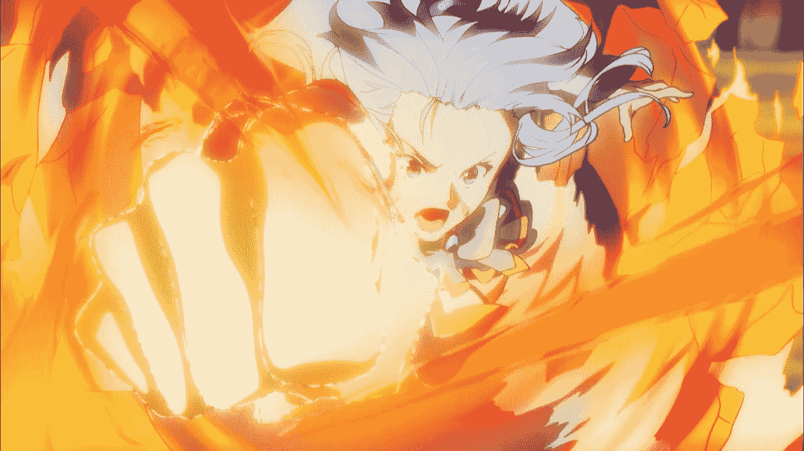
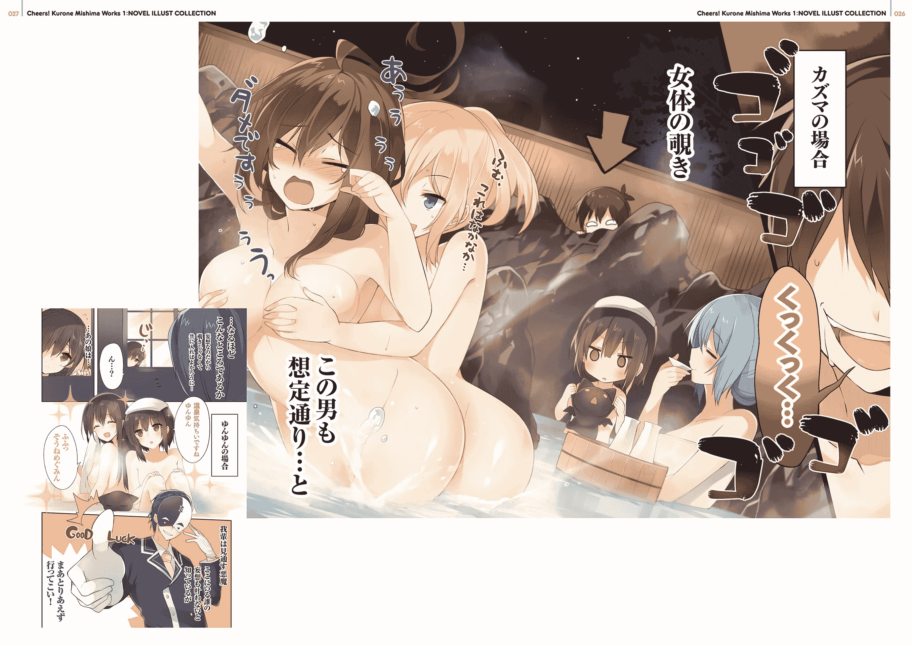
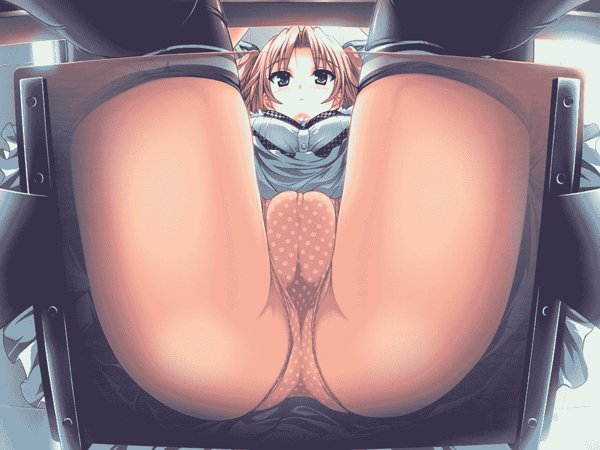
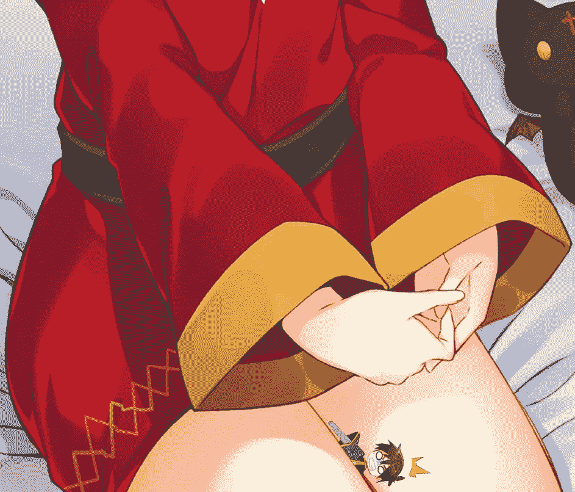
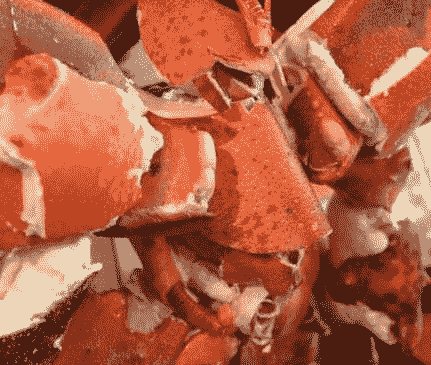
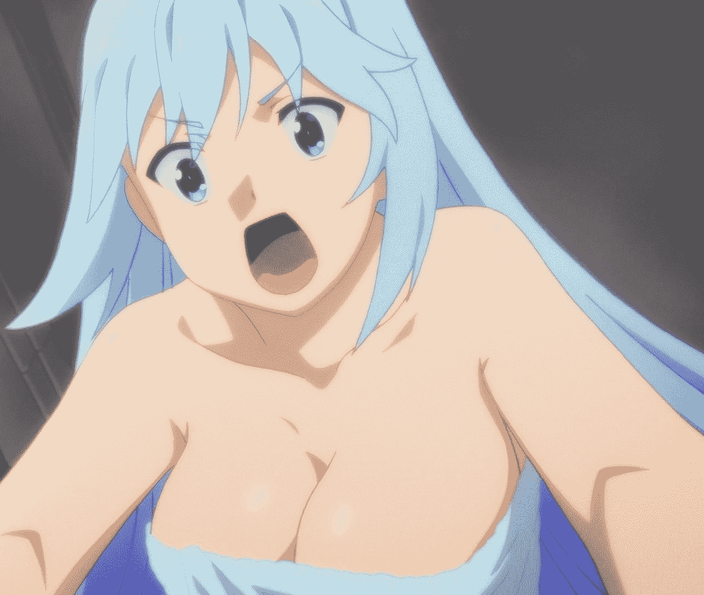

# [03／22更新第七章]為意外縮小的尼特獻上巨大的新生活

作者：phone2345

TID：25275

<title>1</title> <link href="../Styles/Style.css" type="text/css" rel="stylesheet">

# 1

*本帖最後由 phone2345 於 2019-3-22 18:12 編輯*

第一次發短篇同人小說，還請各位大佬多多指教。

 這個故事是《**為美好的世界獻上祝福！**》的同人創作，劇情設定是在小說第13本或動畫第二季之後，可能有一些梗需要看過原作比較有感覺。

(主角尼特與女性夥伴們)

圖片出處：[https://www.pixiv.net/member_illust.php?mode=medium&illust_id=60657202](https://www.pixiv.net/member_illust.php?mode=medium&illust_id=60657202)

 由於原作的風格是以搞笑、不按牌理出牌、各種莫名其妙的超展開為主，希望這個同人短篇(外傳)可以讓各位讀者從有點嚴肅的GTS主題中(絕對體型差、支配與受虐...等)，獲得一種能夠放鬆又不失GTS特色的新鮮感。

雖然我對於角色描寫與GTS情節敘述可能沒有大佬們出色，但如果看完我的文章後有一種「沒想到這樣也可以搞成GTS」之類的感受，就算是達到我的目的了。

 [正文]將使用原作小說描述主角和真第一人稱的風格撰寫，敘述這位被意外縮小的家裡蹲遇到各種GTS情節時的心境，寫實與H的部分會比較少；[幕間劇場]則跳脫原作風格，詳細描寫正文中各種以擦邊球的方式帶過的GTS情節，包含H的部分。

**目錄：**

正文

- 序　章 - 為當助手的家裡蹲獻上嶄新生活..............[2樓](https://giantessnight.com/gnforum2012/forum.php?mod=redirect&goto=findpost&ptid=25275&pid=377040)

- 第一章 - 為被縮小的家裡蹲獻上意外事故..............[3樓](https://giantessnight.com/gnforum2012/forum.php?mod=redirect&goto=findpost&ptid=25275&pid=377041)

- 第二章 - 為意外死的家裡蹲獻上神之氣息.............[17樓](https://giantessnight.com/gnforum2012/forum.php?mod=redirect&goto=findpost&ptid=25275&pid=377117)

- 第三章 - 為受詛咒的家裡蹲獻上解除魔法.............[29樓](https://giantessnight.com/gnforum2012/forum.php?mod=redirect&goto=findpost&ptid=25275&pid=377369)- 第四章 - 為骨灰級的家裡蹲獻上死亡遊戲.............[40樓](https://giantessnight.com/gnforum2012/forum.php?mod=redirect&goto=findpost&ptid=25275&pid=377900)

- 第五章 - 為餓肚子的家裡蹲獻上饗食天堂.............[90樓](https://giantessnight.com/gnforum2012/forum.php?mod=redirect&goto=findpost&ptid=25275&pid=381217)

- 第六章 - 給妄想中的家裡蹲獻上全身麻痺.............[130樓](https://giantessnight.com/gnforum2012/forum.php?mod=redirect&goto=findpost&ptid=25275&pid=397321)

- 第七章 - 給睡夢中的家裡蹲獻上回復魔法.............[137樓](https://giantessnight.com/gnforum2012/forum.php?mod=redirect&goto=findpost&ptid=25275&pid=400913)

幕間劇場

其之一：如果一開始沒有失去意識的話(補序章結尾後).....[33樓](https://giantessnight.com/gnforum2012/forum.php?mod=redirect&goto=findpost&ptid=25275&pid=377616)其之二：如果在椅子上沒有扭到腳的話(補第二章中段).....[45樓](https://giantessnight.com/gnforum2012/forum.php?mod=redirect&goto=findpost&ptid=25275&pid=378124)

其之三：如果被和真知道真正死因的話(補第四章後半).....[95樓](https://giantessnight.com/gnforum2012/forum.php?mod=redirect&goto=findpost&ptid=25275&pid=381348)

其之四：如果收到兄長大人的人偶的話(公主的小短篇).....[112樓](https://giantessnight.com/gnforum2012/forum.php?mod=redirect&goto=findpost&ptid=25275&pid=391615)

**如果文章排版，敘述描寫或劇情有任何建議與心得感想，請踴躍留言吧！****你的回饋是我填坑的動力！**以下是幾個主要人物簡介：(如果對原作已熟悉可跳過直接看2樓)

佐藤和真：

本作的主角，是個喜歡電玩、動畫、漫畫的家裡蹲尼特族高中生，16歲。在日本意外死後帶著阿克婭一起轉生到異世界。職業為最弱的冒險者，主要使用技能為偷竊、潛伏、千里眼、(弓箭)狙擊與Drain Touch(可對目標進行體力、魔力吸收與傳輸)，與阿克婭、惠惠、達克妮斯為同一小隊在異世界冒險。除了智力偏高，幸運超高以外，其餘能力值普通。個性是個有色心沒色膽的人，雖然總是被各種事件牽連，但隊友有困難時還是會協助處理。(或說被迫處理)

阿克婭：

指引日本英年早逝者轉生的水之女神(外表年齡約16)，外表是個有著水藍色長髮和眼睛的美少女，個性既貪財又自負，做事衝動粗心又少根筋、常常對和真頤指氣使，遇到挫折或害怕的事就會像小孩一樣嚎啕大哭並拖著和真解決…等等但萬一成功又會得意忘形，為當之無愧的「廢物女神」，此外還是全隊智力偏低，運氣最低的人，故又被和真稱為「智障女神」。在異世界的職業為大祭師，會所有恢復，復活，聖屬性魔法，另外才藝表演方面的技能也很厲害。

惠惠：

黑髮紅眼，長相俏麗但身材稚嫩的14歲少女，患有嚴重中二病，為紅魔族首屈一指的天才魔法師，最喜歡的東西、專長、興趣都是爆裂魔法。智力與魔力特別高，對和真有好感。

達克妮絲：

身高約170公分，年齡18歲，外表是個金髮碧眼、身材姣好、尤其上圍特別引人注目的冰山美人與貴族大小姐。但真正的本性是有重度受虐癖和妄想癖的大抖M。職業為十字騎士，具有全隊最高的物理防禦力與魔法防禦力，但由於命中率為0，因此總是打不中敵人，不過本人不太在意就是了。

艾莉絲：

異世界的女神，也是最大宗教"艾莉絲教"的神體，名字被當成貨幣單位，為阿克婭的後輩，跟阿克婭一樣指引異世界英年早逝者。

克莉絲：

艾莉絲下凡時的偽裝身分，職業為盜賊，與達克妮斯是深交好友。另外與和真組成"銀髮盜賊團"，以回收神器為主要活動。

悠悠(芸芸)：

惠惠的朋友兼競爭對手，黑髮紅眼，與惠惠一樣是14歲，職業是大魔法師，是紅魔族族長的女兒，跟惠惠的關係好到接近百合，此外因個性極為害羞，沒交到什麼朋友。以惠惠的競爭者自居，經常向惠惠挑戰。

巫妖・維茲：

「維茲魔道具店」店主，是個外表20歲的褐色捲髮巨乳美女。曾是個外號「冰之魔女」的著名大魔法師。

地獄公爵・巴尼爾：

維茲少數的朋友之一，自稱「地獄的公爵」、「看透一切的惡魔」、「或許比魔王還強的巴尼爾先生」，以人類負面感情為糧食，死對頭是阿克婭，目前在「維茲魔道具店」擔任店員。

 若有新角色登場，會再慢慢增加

上排：達克妮斯 / 爵爾帝 / 小米 / 和真 / 艾莉絲 / 維茲 / 阿克婭 / 愛麗絲

下排：標題 / 惠惠 / 露娜 / 悠悠 / 御劍響夜 / 巴尼爾 / 點仔 / 達斯特 

要快速了解原作，可看以下幾回「為美好世界獻上祝福」漫畫

[第一回：和真、阿克婭、惠惠登場](https://tw.manhuagui.com/comic/15284/153596.html#p=2)

[第二回：達克妮斯、克莉絲登場](https://tw.manhuagui.com/comic/15284/153597.html)

[第三回：巫妖維茲登場回](https://tw.manhuagui.com/comic/15284/157409.html#p=1)

[第十二回：艾莉絲女神登場](https://tw.manhuagui.com/comic/15284/193933.html)

[第十五回：維茲的魔道具店與豪宅登場](https://tw.manhuagui.com/comic/15284/207869.html)

[第十七回：魅魔姊姊](https://tw.manhuagui.com/comic/15284/215462.html#p=1)

[第二十五回：悠悠登場](https://tw.manhuagui.com/comic/15284/283580.html)

[第二十九回：大惡魔巴尼爾登場](https://tw.manhuagui.com/comic/15284/308340.html#p=1)

更多原作設定可參閱

[維基百科](https://zh.wikipedia.org/wiki/為美好的世界獻上祝福！)

[百度百科](https://baike.baidu.com/item/为美好的世界献上祝福！/14583472?fr=aladdin&fromid=20260796&fromtitle=为美好的世界献上祝福！)

前情提要：

和真轉生到異世界過了一年，與三個隊友合力擊敗多位魔王軍幹部，並且利用報酬購買了豪宅，除了偶爾做做冒險者公會的委託任務外，基本上過著家裡蹲生活。今日為了販售和真的發明，來到了維茲魔道具店...

<title>2</title> <link href="../Styles/Style.css" type="text/css" rel="stylesheet">

# 2

 <ignore_js_op>[小說封面圖2.jpg](forum.php?mod=attachment&aid=NzQ4MDd8YmUzMjQ4ZWZ8MTYyNDY5MTA3M3wxODIzMHwyNTI3NQ%3D%3D&nothumb=yes) *(749.83 KB, 下載次數: 5)*

[下載附件](forum.php?mod=attachment&aid=NzQ4MDd8YmUzMjQ4ZWZ8MTYyNDY5MTA3M3wxODIzMHwyNTI3NQ%3D%3D&nothumb=yes)

2018-9-17 22:37 上傳  

</ignore_js_op> <title>3</title> <link href="../Styles/Style.css" type="text/css" rel="stylesheet">

# 3

*本帖最後由 phone2345 於 2019-7-14 12:26 編輯*

在一個不易引人注意的巷弄中，一間樸實無華的商店門口，聚集了幾十位群眾，正在觀看中央的兩個人爭執。

「你說什麼我的才藝只是騙三歲小孩的把戲？」

<ignore_js_op>

**7hlEbau.jpg** *(106.83 KB, 下載次數: 0)*

[下載附件](forum.php?mod=attachment&aid=NzI4MzJ8MzAxYjdjNmZ8MTYyNDY5MTA3M3wxODIzMHwyNTI3NQ%3D%3D&nothumb=yes)

阿克婭不滿

2018-6-12 14:43 上傳

一位有著水藍色頭髮，身穿滾著白邊的藍色上衣與同色系波浪短裙的少女，憤怒的抗議著。

「智障女神呀，這種只是把水噴出來的簡單把戲，只要學會初級魔法的人都可以做的到吧，少在這妨礙我做生意。」

另一位帶著詭異面具的高瘦男子，穿著一件白色襯衫與深灰色西裝外套，肩上還掛著看似家庭主婦常用的圍裙，手中拿著與頭上面具相同風格的貼紙，一邊做出驅趕野貓野狗的手勢，一邊抱怨著。

「我才不是智障，我可是聰明絕頂的阿克婭女神大人，阿克塞爾最厲害的才藝大師喔，和真你來當我的助手，我馬上重現地球上最厲害的魔術師大衛的經典魔術給大家看！」

不甘示弱的阿克婭拉著我的手反駁道，我也試圖抗拒著強迫我當助手的搞事女神。

「我雖然知道妳才藝或魔術什麼的非常厲害，但絕對會闖出什麼禍吧？」

「吾預言汝將獲得一段你最難忘的美好時光，同時也會給身邊的人帶來滿滿的驚喜與快樂，能夠看透一切的巴尼爾在此宣言。」

連這個戴著面具的惡魔都如此回應，那肯定沒有好事，大概之後會出現他最愛的糧食 - 人類的負面情感吧。

「和真，你就配合阿克婭表演一下嘛，難得阿克婭這麼認真，她也幫你復活很多次，偶爾你也協助她一下呀！」

一位留著金黃色長髮，身穿以銀白色金屬及黃色皮革裝飾的華麗盔甲，有著漂亮臉蛋與傲人雙峰的美少女對我說。

「達克妮絲，妳雖然年紀比我大，但應該還沒到出現老人痴呆的歲數吧？怎麼會忘記每次都是阿克婭先闖禍，我收拾殘局時不小心死掉，她才幫我復活的呢？」

「我也很好奇這個稱為地球上最厲害的魔術師的魔術表演有多厲害，所以你就配合她表演一下，算我拜託你好嗎？和真？」

另一位比我矮小，有著羅莉身材、一頭俏麗且帶有兩條輕觸雙肩短束的烏黑秀髮，戴著一頂大的誇張的魔法師風格尖帽，身著長長的暗紅色斗篷與鮮紅色連衣裙的小女孩對我說。

「惠惠，地球上名為大衛的魔術師根本不會真正的魔法，只是手比較靈巧，會些欺騙眼球的把戲罷了。」

對於從地球轉生到這個異世界的我，知道這種常識也是理所當然的，而阿克婭過去身為負責接待地球年輕亡者的女神，因此也多少了解一點地球的事。

至於貴為女神的阿克婭怎麼會下凡來到地面上呢？這又是個說來話長的故事了......

總之，我以繼承前世記憶的狀態，經歷各種事件後成為了這個新手之都阿克塞爾中小有名氣的冒險者，與大祭師阿克婭，大魔法師惠惠，十字騎士達克妮絲一同在這異世界過著有如線上遊戲般的冒險生活。

「助手和真，快來這躺好，我要開始表演了！」

就在我猶豫是否同意要當助手時，阿克婭已經準備好一塊看似鬥牛士使用的深紅色華麗大布條，並示意要我在店門口的長板凳上躺下。

「快點躺下呀！還要我們等多久呀！」

同時圍觀的群眾也不斷慫恿我去當阿克婭的助手。

「躺一下而已又不會死掉！誰會睡眠魔法對他放一下吧！」

「我的拳頭跟睡眠魔法一樣有效，交給我好了！」

「喂！你們只是看表演的不要太過分了！」

這幫群眾居然為了看個魔術表演想盡辦法要讓我躺下！

「抱歉了和真！God Blow~~~！」

<ignore_js_op>

**HorribleSubs_Kono_Subarashii_Sekai_ni_Shukufuku_wo_2_10_720p.mkv_snapshot_17.48_.png** *(782.35 KB, 下載次數: 0)*

[下載附件](forum.php?mod=attachment&aid=NzI4MzN8ZGZiNTg4NzB8MTYyNDY5MTA3M3wxODIzMHwyNTI3NQ%3D%3D&nothumb=yes)

God Blow

2018-6-12 14:45 上傳

突然間阿克婭對我的後腦勺使出一拳，我感到全身一陣麻，兩腿發軟，慢慢往後倒下，同時意識漸漸離我遠去......

可惡，那個教唆阿克婭重擊的人給我記著......

-------------------------------------------------

咻〜！咻，咻咻〜

不知從哪傳來的刀劍揮過空氣的聲音在我耳邊響起，同時還有著一股好像在高空彈跳中下墜時的失重感。

「各位看仔細了，這是真正的人體飄浮魔術喔，沒有使用任何支撐或引線喔！」

聽到阿克婭對觀眾的說明，我漸漸睜開了沉重的雙眼，但上方卻是一片暗紅色，仔細觀察四周後，發現我被一塊紅布蓋著，同時身體下方似乎沒有與任何東西接觸。

所以我是真的飄起來了嗎？感覺好想吐呀！

「達克妮絲的揮劍可以證明四周沒有任何東西與我的助手接觸喔！」

別鬧了呀！很危險耶！雖然我知道自家的十字騎士攻擊總是打不中目標...

「喔喔喔，好像很厲害耶！」

「你們是串通好故意不揮中綁著著看不見的魔法線的地方吧！」

「肯定有什麼人拿著釣竿釣著吧！」

「我聽說王城也有人會使用這種魔法讓馬車飄起來，所以似乎也沒這麼厲害。」

「對呀，比起重上好幾倍的馬車，這種人體漂浮根本沒什麼嘛，還以為是什麼厲害的魔術呢。」

「被騙了呀......」

「真令人失望...」

群眾似乎不怎麼賞臉，雖然在地球肯定可以稱為本世紀最厲害的魔術，但在這個異世界或許不是這麼稀奇的事...

「這真的是魔術呀，大家相信我呀！」

看來真正厲害的魔術表演也是需要足夠的智力點數才行呀，有空再幫阿克婭找找有沒有增加智力點數的魔藥吧！

「哈哈哈，雖然負面情感不是很多，但當點心足以。汝輩如果也想要表演這樣的魔術，只要使用吾經營的魔道具店中販售的重力消除貼紙即可，貼在物品上就能讓它輕輕飄起，讓搬運更有效率喔，現在每張只要10萬艾莉絲......」

連巴尼爾也開始落井下石，還趁機推銷商品，目前看來最爽的就是這個大惡魔了！

「我還會更驚人的魔術喔，現在就讓我表演我最最最拿手也最最最厲害的絕招吧，讓你們見識一下大衛魔術的極致！」

啊啊，該不會是要把人切開的那個魔術吧，這個傢伙知道表演那種魔術是需要兩個人的嗎？不會真的想把人切開吧？

雖然阿克婭有復活技能，但我可不想要這麼隨便就死掉呀！

「我可以在一瞬間讓我的助手消失變不見喔！」

等等等等一下呀！阿克婭把東西變不見雖然很厲害，但是從來沒有復原過呀！

以前她曾經把正在叫賣的香蕉變不見，結果被老闆罵了一頓，不久之前甚至把別人送她看起來很貴重的戒子變消失，如果是生物的話會不會瞬間秒殺呀！要是沒有留下殘骸的話就會無法復活的呀！

「大家看仔細喔！3，2 ......」

阿克婭妳給我等一下呀！不要亂搞這種看似不危險其實超要命的魔術呀！等等等等呀！誰來救救我呀！

「1，消失了！」

隨著阿克婭倒數完畢，我感到似乎有什麼東西從身體四周蒸發了，接著整個人被周圍的布緊緊包住，隨後像是有如投石機中的石頭般被往上拋出，過程中意識伴隨著群眾短暫的驚呼聲，像斷了線的風箏般消失了......

-------------------------------------------------

再次醒來後，我的所在地似乎不是我預期中復活期間會來到的地點--由女神掌管的白色房間，而是......

<title>4</title> <link href="../Styles/Style.css" type="text/css" rel="stylesheet">

# 4

*本帖最後由 phone2345 於 2019-2-21 14:31 編輯*

恩，這裡是哪裡呢？不像死後世界中那個女神的房間呀？

地面似乎是由白色的大理石鋪成，四周看不見牆壁，上方...這什麼鬼呀！！！

「和真~你終於醒了！」

如同熱氣球般巨大的惠惠臉孔出現在我面前，往身後上方望去還可以見到同樣巨大的阿克婭與達克妮絲！

她們正在用觀察倉鼠之類小動物般的眼神盯著我看。

「什麼時候妳們變這麼巨大了？」

奇怪，我所在的「地面」似乎有點眼熟...？

「不是我們變大，而是你縮小了喔，和真！」

怎麼回事？這地面...不就是我家豪宅客廳沙發前的大理石長桌嗎?

為什麼我會縮小？完全想不起來呀！是誰對我做的惡作劇嗎？

我直覺認為應該與最會搞事的阿克婭有關，往她的方向一看，她果然想避開視線...

等等，她沒有避開我的視線！

「你該不會認為是我害你變成這樣的吧？和真先生？為什麼老是懷疑我呢？我偶爾也會是無辜的喔！或許之前我常常會不小心搞砸，但也不是每次都是我呀！」

阿克婭居然表現的這麼鎮定...是我猜錯了嗎？

「汝不要太難過，身體縮小並非罪過，只要汝開始信奉阿克西斯教，偉大的女神(吾)會庇佑汝的！而且汝還有如此優秀的隊友陪伴，絕對能在這個對汝來說有如巨人國的世界中好好生存的！」

<ignore_js_op>

**阿克婭注視.png** *(779.07 KB, 下載次數: 0)*

[下載附件](forum.php?mod=attachment&aid=NzI4MzZ8YjA2NGE3YmZ8MTYyNDY5MTA3M3wxODIzMHwyNTI3NQ%3D%3D&nothumb=yes)

2018-6-12 15:06 上傳

居然對我投以憐憫的眼神，這還是阿克婭嗎？不太對呀！

難道是...昨天晚上魅魔姊姊把我的需求單跟某個希望自己玩縮小play的顧客搞錯了嗎？

「和真，雖然我沒有養寵物的經驗，不過在你回復原狀之前，我會好好照顧你的。」

「我也會幫你打聽一下紅魔之里有沒有改變大小相關的魔道具或魔藥。」

「汝只要天天對我禱告三次的話，吾之信徒的神聖力量一定會幫助汝漸漸適應這個世界，說不定還能讓汝慢慢回復原本的大小喔，所以這段時間汝就跟吾之神獸爵爾帝好好相處吧，吾會照三餐給食物的！」

為什麼我會變成寵物呀！我是人耶！雖然縮小了，但應該還不至於降級成寵物吧！

是哪個怪人的口味這麼特殊，不但縮小了還要變成寵物...太變態了吧！

如果是魅魔姊姊搞錯了，只要我講出與調查表上的設定差異很大的對話，她們肯定能察覺到吧？

「可以告訴我，妳們是從哪裡發現這副模樣的我嗎？我總不會突然出現在這裡吧？而且我沒有這種縮小play的嗜好，應該不可能是我自願變成這樣的？」

我望向身旁的惠惠與達克妮絲，惠惠立刻別開了視線，達克妮絲更是臉紅了！難道這也在設定的範圍內嗎？這是什麼play呀我完全搞不清楚了！

不太妙呀！魅魔姊姊快發現搞錯了呀！我可沒有這種又抖M又抖S的嗜好呀！

「那個，是我把你救回來的喔，你之前遇到了一點...恩...意外事故...小小的意外事故...」

奇怪，阿克婭居然在這種時候說話，還給我講的結疤了！

話說回來，阿克婭只有在有求於我或心虛時才會用「和真先生」稱呼我...果然跟她有關係，肯定是這樣沒錯！

「所以說，我是從什麼意外事故獲救了？然後我是怎麼來到這個桌上的？」

「可以不要問這麼仔細嗎？你要我這個女生怎麼說出這種事情呀！那個...那段時間你應該感到很幸福吧？不過你大概是昏迷狀態所以也感受不到就是了...」

居然連惠惠也臉紅了！達克妮絲更是開始喘著粗氣，這甚麼鬼呀，難道我之前發生了什麼很羞恥的事我卻完全不記得嗎？該不會她們對我這縮小的身體做了什麼不該做的事...

「恩...恩...對呀...被巨大的胸擠壓什麼的...晃呀...晃的...晃的頭暈目眩什麼的...應該是一種很刺激的體驗吧？...恩恩，我也想體驗一下的說...」

這啥？什麼情況？被胸部夾著？雖然可能很痛苦，但體驗一下也不壞就是了！

「我把你從意外事故中救出來後，在回到家的路上我一直用我神聖的玉體保護著你喔，和真先生！畢竟...我的衣服沒有口袋，達克妮絲穿著盔甲可能會把你夾扁，惠惠則是明顯的不夠大...」

「喂，我好像聽到在說我壞話什麼的喔！我只是發育比較晚而已好嗎？話說搬運縮小的和真有必要用胸...胸...什麼的夾著嗎？放在我的帽子裡應該也可以吧？」

被放在女性的胸部中夾著確實是男人的夢想呀！比起阿克婭的，我更希望是維茲或達克妮絲的...

啊！我根本沒有任何記憶呀，這樣不算數，要趁現在還是縮小狀態重新體驗一次才行，要怎麼說服達克妮絲把我放在她的胸中...

「和真？」

啊啊！我在亂想什麼呀！要冷靜呀和真，現在應該要思考的是發生了什麼意外，以及恢復原狀的方法才對，那種夢幻的體驗稍微晚一點再考慮也行...

「你還好嗎？」

啊啊啊！說不定這只是一種詛咒，等一下阿克婭使用神聖解咒(Sacred Break Spell)後馬上就會復原了，所以要想想拖延的藉口...該怎麼說好呢...其實我一直想體驗縮小的感覺之類的嗎？

「和真，不能回復原狀真的讓你很苦惱嗎？你不用擔心，就算你一直是這個狀態我也會好好照顧你一輩子的。」

「我也會好好照顧你的，但你務必跟我分享一下縮小後被胸夾的感受...」

「不用特別照顧啦，他只是在想怎麼用小小的身體做色色的事罷了。」

「達克妮絲，要好好照顧我的話就馬上把我放...」

啊啊啊啊！我在說什麼鬼話呀！！

冷靜！冷靜呀和真，這時候應該要問：

「阿克婭妳可以告訴我，我遇上的是什麼意外嗎？」

「你忘了做為阿克婭魔術表演助手的事嗎？你協助她完成了某個魔術...」

看來惠惠也知道些什麼。

「麻煩再講詳細一點，阿克婭好好看著我，不要給我別開視線！」

「說到這個表演，我可是使出了超厲害的才藝技巧，從眾人目不轉睛注視著你的眼中，在一瞬間完成了絕妙的魔術，要不是那個惡魔巴尼爾多嘴的話，我一定會...」

「阿克婭妳給我閉嘴！我不想聽妳吹噓妳那沒用的才藝技能，惠惠與達克妮絲知道什麼就快說！」

「阿克婭她一瞬間把你變不見確實厲害，後來才知道她只是把你變小，再藏到胸...胸...什麼的...裡面...幹嘛要我一個女生把這種事詳細說明呀，你這個笨蛋！」

「我一開始看到和真消失的時候也覺得很驚訝，但是聽到有人說可能只是事先準備好傳送魔法後，似乎感覺就沒這麼厲害了...比起這個，要怎麼樣才能讓人那個...縮...縮小呀！阿克婭？」

所以說什麼意外事故根本是阿克婭的魔術表演失敗嗎？然後我怎麼會笨到當他的助手呀，完全想不起來...

「和真你應該要感謝我喔，如果不是我稍微控制縮小的尺寸在5公分左右的話，你應該已經變得比螞蟻還小了吧！還有呢，要是我沒有及時把你回收的話，你可能早就掉到地上摔死了呢！說不定還會被不小心踩成肉泥了喔！」

原來在我沒有意識的時候，經歷了這麼可怕的事呀？還可能會變成肉泥什麼的...

天呀阿克婭，為什麼你可以隨隨便便就搞出這種超級要命的事呀！我跟妳有什麼仇嗎？

「所以呢，今天就開始信奉阿克西斯教吧！如果汝喜歡女神的玉體，只要每天對吾禱告三次，並把所有財產捐獻給吾的話，偶爾讓汝依慰一下也是可以的喔！」

「唯獨妳的身體我完全提不起勁呀！被那對噁心的脂肪夾住有什麼好開心的，說不定因為妳冒失的個性，我還會不小心被悶死在一堆贅肉裡呢，妳這個成事不足敗事有餘的笨蛋女神！」

「你說什麼！！你居然說我神聖的玉體是噁心的存在！美麗且真實的酥胸是贅肉！我要給你降下天譴！讓你半夜想上廁所卻找不到廁所在哪裡！」

那算什麼天譴呀，在自己家怎麼會迷路呀！這次阿克婭真的太過分了！一定要好好教訓她！

「說妳是女神什麼的太客氣了，根本是邪神！是死神呀！每次都弄死我呀！」

「你說了最不該說的話呀，這個尼特繭居蟲！這麼想死的話，我現在就把你那毫無抵抗能力又柔弱的身體捏碎！」

「哎呀阿克婭，有話好說別太激動呀！和真我知道你很生氣，但也別挑釁阿克婭了！以你現在的體型很危險呀！」

「哼哼，你以為我這麼容易就會被抓住嗎？...啊，妳給我放手！」

可惡，沒想到這麼快就被抓住了，縮小的身體移動速度完全比不上她，必須再說點什麼讓這個蠢貨放手...

「要是真的弄死我，我就要告訴艾莉絲我不要再回到這個世界了！」

「你這麼想見那個胸墊女神，我現在就成全你！」

「啊啊啊啊啊~~~~！要骨折了呀~~~~」

「喔喔喔喔，喔喔喔喔！」

「達克妮絲妳在那興奮個什麼勁呀！快點跟我一起勸勸阿克婭呀，和真要死掉了啦~~」

怎麼可以就這樣認輸，看我的Drain Touch(體力,魔力吸收魔法)！

「太天真了呀，你以為那小小的手掌施展的Drain Touch能讓比你強大百倍的女神的手放開嗎？未免過於不自量力了，連搔癢都...唉呦好痛，惠惠你幹拿突然拿魔杖敲我頭，我正在教訓寵物...」

不管用是嗎？那就用最原始的方法...

「好痛，身為寵物居然敢咬主人...啊，你跑到哪去了，給我回來！」

趁著阿克婭手被我咬的痛到放開瞬間，我立刻施展潛伏技能，悄悄順著桌角裝飾滑到了地面。

哼哼，現在我的體型這麼小，又有盜賊技能，在這四周都有家具的客廳中，要抓到我簡直比找到蟑螂還難上數倍呀。

「哇哈哈哈，我在這呢，來抓我呀！」

「可惡，你別跑！」

「發動潛伏技能！」

「你以為潛伏技能會有效嗎？女神的眼睛可是能看透一切的！」

「要是連牆壁或家具都看得透就來抓我呀！哇哈哈哈！」

「和真你別鬧了呀！別不小心又受傷了，你應該知道你現在的狀態很危險吧！」

「被巨人追趕是什麼感覺呢？好想體驗看看呀...」

「給我出來！你這隻臭蟑螂」

看來真的被當成蟑螂了呢，還真是五味雜陳呀...

對了，就跟小時候在屋內玩躲貓貓時不會有人想到能躲在屋外一樣，我先到玄關外避難一下！

智力貧乏的阿克婭肯定不會想到這招，就讓妳這個搞事女神在這麼大的豪宅內慢慢找吧。

-------------------------------------------------

磅！康咚！啪啦啪啦！

「和~真~給我出來~」

阿克婭開始翻箱倒櫃般的移動家具，不過她現在的位置離我很遠，而我一邊潛伏一邊沿著牆壁移動，終於來到了玄關，再來就從門縫底下鑽過...哎呀...怎麼回事？

原本以為我現在的體型可以輕易從門縫下鑽過去，但這個大門下的縫比想像中還小呀，失算了呀...

磅咚！磅咚！惠惠逐漸靠近玄關...但似乎還沒發現我。

「和真你該不會想溜出門外吧？千萬別這麼做喔，外面對你來說太危險了...不要再躲了，我會保護你的...」

紅魔族的智力果然很高，知道我在想什麼，但最危險的地方就是最安全的地方，這可是躲貓貓必勝的常識。

而且我有潛伏與千里眼技能，沒什麼好怕的！

咚咚咚！

似乎有人在敲門，運氣果然是站在我這邊的，剛剛的問題這下都解決了呢！

「請問是哪位呢？現在有點忙自己進來吧！」

太好了！大門被打開了，終於能讓那個智障女神吃點苦頭了，這就趕快移動到外面...

「啊，惠惠，我要向你提出挑戰！」

疑？

碰磅！！！

周圍突然被一片陰影給籠罩，我還來不及反應，就被眼前突然出現的巨足踩的正著...

啊啊啊啊~~~~！

「吾名悠悠，乃操縱上級魔法的大魔導師，終將成為紅魔族長之人！這次的比賽內容我可是做了萬全的準...疑？我是不是踩到了什麼東西...？」

巨足的主人在表演誇張的自我介紹時，似乎也意識到自己踩到了什麼，緩緩地把腳移開...

我呈現臉部朝上，四肢以難以形容的扭曲姿勢隨意擺放，如同造型崩壞的薑餅人平躺在地上...

瞬間超出身體負荷的重壓似乎讓我全身骨頭都碎裂了，並且向大腦傳達一陣陣的劇痛...

落在我身旁不遠處的是一隻巨大的深咖啡色高筒長靴，沿著鞋跟往上看，從靴子入口處向上延伸的是以暗紅色絲襪包覆的小腿，再往上看到超過膝蓋，約莫大腿一半的位置，白嫩的肌膚從絲襪中蹦了出來，再往更上方看...

哎呀看不清楚...發動千里眼技能！

疑疑？怎麼沒有效果，而且視線漸漸模糊了...

唉唉，至少要看清楚兇(內)手(褲)的長(顏)相(色)是什麼呀...可惡...眼皮居然不聽使喚，漸漸闔上了...

「天呀！！和真！！！阿克婭快點過來，和真~~和真他~~~」

「找到了嗎？我一定要好好...疑！你怎麼擺著沒見過的瑜珈姿勢躺在地上的一動也不動了？」

「和真！和真？沒想到你居然抖M到這種程度，連命都可以豁出去...是我輸了呢！是我輸了呢！」

「唉，我只是想讓你重新認識一下女神的威嚴，沒有真的要害死你呀...稍等一下我馬上施展復活魔法...啊，你別轉生去別的世界呀，對不起，和真先生對不起，是我不對，我會好好道歉的，你別離開我們呀~~！」

雖然有點對不起人生最後關心我的人，笨蛋女神也對我道歉了，但我不能就這樣原諒她！

再怎麼說這次真的是太過分了！難得縮小了沒體驗到被胸部夾住的感覺，被踩了卻沒辦法確認兇(內)手(褲)，這種只有痛苦沒任何甜頭的人生...

啊！我受夠這種總是吃虧又三不五時就死亡的生活了！

唉...聲音漸漸聽不見，疼痛感也慢慢消失了，等等就會見到艾莉絲了吧......

-------------------------------------------------

原本期待著會來到熟悉的死後世界--艾莉絲女神的白色房間，但我似乎又來到了一個陌生的地方...

<title>5</title> <link href="../Styles/Style.css" type="text/css" rel="stylesheet">

# 5

*本帖最後由 phone2345 於 2019-2-21 14:33 編輯*

原本期待著會來到熟悉的死後世界--艾莉絲女神的白色房間，但我似乎又來到了一個陌生的地方...

我以躺著的姿勢來到一個四周有著白色牆壁、鋪著白色地毯且空無一物的房間，雖然色調，周遭氣氛與女神接待往生者的白色房間相似，但總有個說不上來的怪異感...

到底是哪裡怪怪的呢？是少了椅子嗎？鋪了地毯嗎？還是說，應該要在這等我的艾莉絲女神不在這裡呢？

不對不對，她說過她偶爾會下凡去摸魚一下，所以不成問題，而且周圍也有著艾莉絲淡淡的體香...

恩...淡淡的體香...啊啊，我是變態嗎？怎麼開始注意這種事了？

雖然她是我在這個異世界的初戀對象，但對方好歹也是個女神，可是有看透一切的神之力，萬一被她察覺到我這種變態的想法，會不會被討厭呀...

等等，艾莉絲與那個智障女神阿克婭是共用同一個房間接待往生者嗎？

<ignore_js_op>

**艾莉絲與阿克婭女神在往生世界.jpg** *(385.96 KB, 下載次數: 0)*

[下載附件](forum.php?mod=attachment&aid=NzI4Mzh8NTEyZTljZmF8MTYyNDY5MTA3M3wxODIzMHwyNTI3NQ%3D%3D&nothumb=yes)

艾莉絲/阿克婭女神在往生者世界

2018-6-12 15:29 上傳

啊啊，滅火了，這樣想就徹底滅火了呀，褲子下方撐起的帳篷應該也會慢慢回復原狀了吧？

不過阿克婭好像是接待日本年輕往生者來的，而且依她的個性，房間還會有各種零食才對，所以這裡果然還是...

不好，帳篷反而撐得更高了，萬一這時候女神...

擴叩~！擴叩~！

「唉，不好意思，有點遲了呀，等很久了嗎？」

伴隨著高跟鞋輕擊地面發出的聲響，以及帶有親切又有點像是犯錯的小女孩在自我反省般的聲音，女神似乎回來了！

不妙呀！

為了隱藏即將要天元突破的帳篷，我趕緊坐了起來，並往聲音的方向--後方轉頭過去...

疑？

原本應該要存在牆壁居然消失了！

等等，那裡原本有牆嗎？以我剛才躺著的姿勢好像也沒特別去注意後方...

不過，更奇怪的是我所在的地面，延伸到那個應該是牆的位置後就消失了？那麼艾莉絲女神會從哪裡來到這裡？

我的問題馬上就得到了答案。

伴隨著突然變暗，應該說不久前才體驗過，籠罩全身陰影之類的東西再次降臨。

我沿著陰影出現的方向往右上方一望，在牆壁的盡頭後方，出現了一大片有著純白色與垂直波浪，宛如婚宴廣場或大教堂落地窗簾之類的布，或者該說是女神的長裙？

畢竟再往上看過去，就可以看見帶有一點神祕感的深藍色、滾著金邊、看似輕飄飄的洋裝上衣，以及一束以金黃色球型髮飾固定末端，有著流蘇風格的銀白色秀髮鬆垮垮的搭在旁邊。

雖然看不清楚臉孔，但是這一身裝扮加上頭戴與洋裝相同款式的短版修女帽，與我所認識的女神艾莉絲形象分毫不差。

不對，絕對不會認錯，每次來到這裡最期望見到的那位女神大人的特徵，我怎麼可能會忘記呢？

只是，為什麼女神會這麼巨大？

啊！根據不久前的經驗，應該是我縮小了才對！

不過到了這個往生的世界，不該是所有死前受過的傷或詛咒什麼的都會留在原來的世界才對嗎？

「疑？好像不在呀，是還沒送過來嗎？」

現在的我有如從去掉屋頂的娃娃屋中仰望著這間屋子的主人。而這位主人從我右方的牆壁後方移動到了這房間唯一缺少牆面的那一側...

不久後女神雙手插著腰，開始扭動頭部四處張望...

雖然沒辦法看見女神艾莉絲的正面，但想像著正在尋找走失小貓般左顧右盼，又不知如何是好的模樣，身為被尋找對象的我開始有一種不知該如何形容的興奮感。

恩恩，好像當艾莉絲女神的寵物什麼的，也不錯呀！

「看來是還沒送到的樣子呢！」

如果是女神的寵物的話，那我也就會是神獸或使徒之類的存在嗎？

雖然還是比較想要以情侶這種酸酸甜甜的方式在一起，不過偶爾這樣也不錯，算發現女神有趣的另一面了！

「真是太好了！不小心在下面逗留太久，差點就趕不上了！要是被和真發現我不在這裡或遲到的話，長久在此建立的威嚴與這房間的神聖的氣氛就要破功了呀！」

差不多該給她一點驚喜了，真想看看她驚慌失措的樣子，被我抓住把柄的樣子，嘻嘻嘻！

「咳咳！艾莉絲大人！和真在此喔！」

女神大人不用擔心，我不會出賣妳的...不過，她好像沒有注意到我？

太小聲了嗎?

「咳咳！女神大人！和真在此喔，在這裡喔！」

唉唉，還是沒注意到嗎？

「急急忙忙趕來有點累呀，在他被送來之前先休息一下好了！」

女神開始往後靠近，應該說往我所處的這個房間靠近...？

疑？...好像哪裡怪怪的？

在我身後的那面白色的牆，明顯比我身旁兩側的牆要高上數倍，頂端還有兩座有著清真寺洋蔥屋頂的高塔靠著邊緣一左一右的豎立著。

沙沙喳...

正在我疑惑的同時，前方傳來某種摩擦聲...

回頭一望，發現女神的兩隻手正一左一右的扶著我身旁的兩面牆，並且...

這也靠得太近了吧，再繼續下去好像有點危險！

「喂喂喂~~！我在這裡呀！後面呀後面！和真在妳後面呀！」

女神依然沒有回應，似乎不太妙呀！

這房間...

不，這個空間，該不會是...接待往生者房間中，女神所坐的白色椅子上方？

大事不妙，這下真的不妙，要是讓艾莉絲誤以為我有這種抖M的變態癖好就再也沒臉見她了，該怎麼辦...

啊啊，前方沒有牆的那一面已經完全被女神的裙襬給堵上了，要往哪裡逃跑？

往後跑吧，跑起來呀和真，我正值的形象就看這一刻了！！

呼...呼...啊啊，不對呀要是她往後坐到底，發現有個小傢伙頂著她的...她的屁眼的話，會怎麼想呢？

一般來說坐下時兩腿是微微張開的，所以那邊應該還有藏身的空間！

可惡！剛剛跑反了呀，應該要往前跑才對，兩腿之間才是正確的目的地！

啊，半邊天都被遮住了，快衝呀~~！賭上男人的尊嚴一定達陣呀~~~！

喝哈...喝哈...疑？

好像不太對呀，人家是女神呀，女生坐下時雙腳應該是併攏的呀，也就是什麼兩腿之間的空間什麼的根本不存在呀，要是待在那裏肯定會被馬上注意到呀！被嚴重誤會呀！！

啊！椅子不一定會坐滿，也就是說待在底部還有機率不會被發現，不會被誤會呀，而且左右兩個角落空間似乎也比較大...

這次應該不會錯了，沒有錯，那就是這個迷宮的出口，這場女神信任危機的解方！要是失敗了，說不定就會到達我人生各種意義上真正的終點了呀呀呀呀！

唉唉唉唉，上方已經快塌下來了，要來不及了，全速衝刺呀！！...啪嚓~咕噶！

唉呦喂呀我的腳呀~~唉？

哇啊啊啊啊啊~~~~~~

噗拂，轟轟隆...

-------------------------------------------------

好重...身體要碎了，意識要，意識又要...啊啊啊，沒臉見艾莉絲了呀！不如這樣死去吧...

唉，意識還在？怎麼回事？

話說回來，在「死後的世界」死掉什麼的，到底會如何呢？

或者說，這種事會發生嗎？所以現在是什麼情況？

身體完全無法移動，也看不見四周狀況的我，還活著嗎？

恩，恩恩，這是...艾莉絲的體香，女神的香味...

唉唉，我在幹什麼呀？現在是想這種事的時候嗎？

但真的好香，或許這是天堂也說不定...天堂就是這種味道嗎？怪不得女神也是這種味道...

不過阿克婭說過天堂是什麼事都做不了，只能與往生的老人家聊天的地方...

所以...這裡是哪裡？剛剛我一開始先往後移動，又往前衝刺，最後想要折返時滑倒了...

該不會...這裡是...女神的...艾莉絲女神的...私...私私...私私私私處正下方？？

啊啊，偏偏到了最不該到達的位置呀，完蛋了呀，沒救了呀，死定了呀，要被誤會了！徹底的被討厭了呀！

我在異世界的初戀...我活著的動力...打倒魔王後我最期待見到的人的讚賞...

完了，完了，都去了呀...

雖然心情很差，但身體怎麼會還感到很興奮呀？

這種體驗不就跟夾在女生的胸間一樣，有著異曲同工之妙嗎？

啊啊，我在想什麼呀，自暴自棄了嗎？

但是...這裡可是私處喔！還是女神的私處喔！是達克妮斯胸部的升級版耶！

我活這麼久，還沒有摸過女生的胸，更不用說私私私私...處什麼的...現在不就在我眼前，在我的正上方嗎？

等等和真，冷靜一下，不小心被女神壓住什麼的或許還有機會解釋，畢竟是意外嘛，意外喔，對對對，就是意外喔！

要是主動摸下去的話，就是色狼了，是變態了，和真股就會變成跌停股了！不，是要被強制下市了呀！

「怎麼回事呀？等這麼久還是第一次呀，是負責傳送的天使出了什麼差錯嘛？」

嘎嘎嘎嘎...轟隆隆隆...

咿呀~~~！我的腳，我扭到的的腳呀~~~！痛死我啦！

「妳說什麼？已經傳送過來了？五分鐘前？」

救命呀！艾莉絲大人！女神大人呀~~~！腳要斷了，腳要斷了呀！

「剛剛把腳稍微翹起來時，好像感覺到什麼...」

根本是地獄呀！好痛苦啊，實在是太痛了呀！！就算被誤會也無所謂，一定要讓女神注意到我呀呀呀呀！！！

艾莉絲女神呀呀呀呀~~~~~！

「噫~~~~！什麼什麼？」

在我劇烈的抵(亂)抗(摸)下，原本把我全身壓著無法動彈的重量以及努力把我腳掌往外翻的力量瞬間消失了...

原本伸手不見五指的眼前突然變的無比明亮，刺眼的光讓我不由自主的頻頻眨眼。

「這個小東西....你...你是...和真...先生？」

慢慢適應光線後，出現在我上方的是女神艾莉絲的巨大臉龐。

怎麼辦，該說什麼好呢？

剛剛做了那麼...那麼鬼畜的事，說什麼也不會被原諒了吧！

怎麼辦，怎麼辦，眼看女神的臉越來越紅，我的臉似乎也將要變成煮熟的蝦子般紅的發燙呀！但我卻一句話也說不出口...

這種情況不只超出宅男或家裡蹲能夠處理的範圍，就算是佛洛依德這種心理學家或笛卡兒這樣的哲學家也沒辦法應對吧？

「那個...和真先生...」

啊啊啊，拜託，不要說出來呀！我不敢聽，我不敢聽呀！要是聽了我的SAN值肯定會立刻歸零呀！

「不好意思...」

疑？

「我不知道你縮小了...」

疑疑？

「啊，我知道你是縮小後被踩死的，但是來到這裡應該就會恢復成原本的大小才對...」

疑疑疑疑？好像被原諒了？或者說，往「意外」的方向發展了嗎？

「那個...都怪我急著回到這裡，沒注意到你在那種地方，然後...然後就...」

女神艾莉絲的臉更紅了，該怎麼辦？我是不是該說點什麼？該說點什麼安慰她呢？

「非常抱歉把你壓著這麼久...你...你很痛苦吧...在這個沒辦法死去...的空間中...」

恩，確實很痛苦呀，但是沒有被誤會真是太好了，太好了呀！

除了痛苦以外，我也有爽到的地方吧？例如...

「也不是那麼痛苦啦，而且我還摸...」

啊啊啊，不對不對，就差一點呀，差點就講出不該講的的話了，應該要說：

「我還有聞到女神的香氣，所以...」

「啊啊啊啊你在說什麼呀，你這個笨蛋！！」

啪吧！

在我意識消失之前，我看到女神的五指山，用拍死蚊子的氣勢，以閃電也比不上的速度往我身上襲來...

-------------------------------------------------

「和真先生，那個...冷靜一點了嗎？」

我睜開眼睛，發現自己躺在有著光滑表面，反射著白色光芒的地上，面積約略有兩個網球場的大小，其餘的部分似乎是深不見底。

「恩...發生了什麼事？這裡是...？」

巨大的女神艾莉絲兩手下垂，用一臉歉疚的表情在一旁不遠處望著我。

或許我的位置就在這個房間中，女神座椅旁邊的白色小桌子上吧！

望著有如五層樓公寓般大小的女神，我漸漸回想起因為阿克婭造成的意外事故而縮小，然後又被一腳踩死的事...

雖然死後來到這個往生者的世界是我已經體驗過好幾次的事，但全身痠痛的身體，尤其是右腳踝不自然的抽蓄感似乎在暗示著還有某些事情被我遺忘了...

話說，我之前來到這裡時從沒有像這次一樣有種渾身不對勁的感覺，而且也是以正常大小與艾莉絲見面。

「那個...關於原本應該以原來大小來到這裡的你，卻維持縮小狀態的原因，我查清楚了喔！」

「是嗎？說來聽聽！不過如果無法回復原狀的話，做為女神艾莉絲的神(寵)獸(物)或使(僕)徒(人)什麼的我也很樂意喔！」

「唉唉唉，不要逗我笑了啦！和真先生！」

「我可是認真的喔，如果不需要使徒什的，以我現在的大小，當胸墊也是可以的喔！」

「疑疑？什麼？那個你在說什麼啊...墊子什麼的不可能呀，不對，應該是說...啊啊啊啊...我在說什麼呀，好像想起什麼不想想起來的事呀...」

女神的臉瞬間刷紅，雖然我有點不好意思，但看到艾莉絲可愛的一面，還是忍不住想繼續欺負她。

「千萬別這麼說，就算我體型現在很小，也會努力做為胸墊的一部分...」

「和~~真~~！」

每次都是這樣，在氣氛正好的時候，這個搞事女神阿克婭就會來打斷...

「我已經把你復活了喔！你那又小又破碎的身體可是花了我很多時間修復呀！快點回來！別讓我的辛苦白費了呀！」

「看...看來前輩終於來接你了呢！呼！」

「話說回來，妳剛剛說沒有回復原來大小的原因，是什麼呢？」

「啊啊，那個呀，是因為如果你受的傷或魔法之類的影響是由天界的神所造成的話，就會無法恢復...原...狀...甚麼的...」

艾莉絲說話的聲音不知怎麼搞的越說越小聲...臉還越來越紅...

「啊！啊啊啊！所以說就是因為...」

「噫~~！妳不要突然生氣呀和真先！雖然讓你全身痠痛什麼的我也有責任就是了...」

我沒有理會艾莉絲在說什麼，因為我現在終於明白...

「我之所以會維持縮小的體型，就是因為這個狀態是阿克婭造成的嗎？」

「和~~真~~！別再跟胸墊女神聊天了，她胸部應該沒有大到能夾住你喔！快點回來啦！」

「喂！阿克婭！這次我真的決定不回去了！我要留下來當艾莉絲的使(寵)徒(物)，就算當胸墊也沒關係！」

「唉唉唉，那個...和真先生，我可以理解你的心情與想法，啊啊，除了墊子什麼的以外...嗚嗚，我想說的是前輩她也很辛苦的把你的身體修復了，而且要解除這種狀態的話，一般來說從施術者下手比較有機會不是嗎？」

「我不管啦~~~！以我這種大小，回去原來的世界又死個幾十次也不奇怪呀！這次我真的不回去了！」

「啊啊，不可以呀和真先生，如果你一直待在這邊我會很困擾，但是把你送到別的世界的話也不可能呀，我一定會被前輩殺掉的呀！而且我還有事要拜託你...希望你能協助我回收一樣神器的說...」

-------------------------------------------------

幾分鐘後，我以縮小的狀態，回到了原來的異世界。

是什麼理由讓我決定回到這個可能又會死掉的世界呢？

因為艾莉絲女神拜託我協助她回收的神器，名稱叫做：

「縮小燈」

<title>6</title> <link href="../Styles/Style.css" type="text/css" rel="stylesheet">

# 6

*本帖最後由 phone2345 於 2018-6-7 12:29 編輯*

謝謝各位的捧場，目前已經規劃現有內容三倍份量的小說大綱，有時間的話會慢慢完成的。

**補充說明****SAN值：**「SAN」來源於英語「sanity」（「理智」）。簡而言之SAN值是克蘇魯神話桌上遊戲的玩家數值，也成為「理智點」。 某種程度上可以認為是意志力。在SAN值歸0之前，一個人的精神都將被視為是正常的，但是短時間內較多的下降SAN值會導致一些不定期瘋狂和恐懼症，SAN值降為了0即意味著這個人陷入了永久性的瘋狂。

(來自《襲來！美少女邪神(潜行吧！奈亚子)》的梗)

 另外還有幾個問題想請問前輩們，使用對話括號，應該要用「 」還是“ ” 呢？自己比較習慣用前者，但對岸朋友會不會無法正常顯示呀？(感謝樓下1055348297大大回覆)

上傳的圖片附件有辦法引用或刪除嗎？

還有就是，明明同樣的內容發在百度「为美好的世界献上祝福」貼吧中，卻毫無人氣...

<title>7</title> <link href="../Styles/Style.css" type="text/css" rel="stylesheet">

# 7

*本帖最後由 phone2345 於 2018-6-6 10:53 編輯*

我發現貼吧有個特性，就是自己頂不起自己發的貼，因此就算有更新，沒人回覆的話就會一直沉下去…

明明主題是このすば卻在GTS獲得更高人氣，感覺好微妙呀...

<title>8</title> <link href="../Styles/Style.css" type="text/css" rel="stylesheet">

# 8

*本帖最後由 phone2345 於 2019-2-21 14:35 編輯*

「縮小燈」

一種在動漫迷中有如常識般的存在，可以隨意放大縮小物體的神奇道具，似乎被某個與我一樣來自日本的轉生者帶到這個異世界。

雖然縮小燈的消息令人興奮，但神器只有最初持有人才能發揮完整功能的特性，還是讓我相當在意。

畢竟，好不容易拿到了縮小燈，卻只有手電筒功能的話，豈不是白忙一場嗎？

「我知道你在擔心什麼，那個神器即使非原始持有者使用，也能發揮縮小放大的功能喔！」

疑？

不行不行，風險還是太高了。

我可不想再用這個脆弱的身體冒更多險了...被一腳踩成肉泥什麼的太可怕了！

「我也會對你施展各種輔助魔法，增加你的存活率喔！」

即使如此，我連縮小燈是不是手電筒造型什麼的也不清楚呀！

還是留在艾莉絲身邊當使(寵)徒(物)比較安(幸)全(福)...

「如果成功回收的話，讓你使用一陣子也不是不可以...的說...」

「此話當真？」

-------------------------------------------------

在我接受女神各種提升能力屬性的輔助魔法，並向她承諾不會拿縮小燈惡作劇後，回到了我在異世界的豪宅中。

「和真先生！你醒了嗎？那個...剛剛真的很對不起...都是我不小心...才害你...」

我發現我還躺在豪宅玄關附近的地面上，惠惠與悠悠蹲在我身旁，用觀察蟲子的姿勢望著我...

「抱歉喔和真！阿克婭說因為你身體太小了，不確定是否所有骨頭都有好好接上，所以讓你暫時待在地上，要是你覺得沒有怪怪的地方再...」

我緩緩望向惠惠聲音的方向，脖子卻意外的中了石化魔法...

出現在我眼前...或者說射出石化魔法的，是在惠惠紅色的短裙下方，以受到擠壓微微變形的大腿內側肌肉稍稍夾在兩側，中間被桃子造型的麵包撐住...向外膨脹伸展的黑色蕾絲內...

「啊，你在看哪裡呀！」

「疑？什麼？」

啊！我還沒看清楚麵(恥)包(丘)的形狀，麵包就被主人用裙子蓋住了...

我馬上用維持頭部靜止，只轉動眼球的方式，迅速地瞄向同樣蹲在旁邊的悠悠的......

唉！也遮得太快了吧！

至少要讓我確認把我踩死的兇手的內褲顏色...不對，我應該有這個資格要求兇手賠償我的損失...所以必須要...

「和真，你還想再死一次嗎？」

「喂，我有做錯什麼嗎？這是我的權利，知道嗎？啊，應該叫不可抗力...吾...那個，能不能先把拖鞋放下，對心臟不太好...」

「你們在玩什麼play呀？能不能也讓我加入？」

「我正在教訓色色的和真蟑螂，妳先不要妨礙我，一定要讓他知道這種壞習慣會害死他自己的，這麼脆弱的身體還去故意惹女生生氣的話會被...」

咚咚咚！

「那個，請問有人在家嗎？應該有人在吧？我進來了喔？」

「噫~~~~！」

「啊啊，和真你在幹嘛？不要突然跑到人家裙子下方呀！」

沒辦法呀，太可怕了呀，那個敲門聲...不趕快找地方躲起來肯定又會被一腳踩死呀！

「快給我出來呀，不要緊抓著人家裙子不放呀！你這笨...」

喀嚓！嘎~~噠！

「救命呀！我不想死，我不想死呀！不要呀~~~」

「唉唉唉唉，和真你怎麼往更裡面鑽了！啊啊，不要亂摸呀，噫~！你在摸哪裡呀！哇呀！」

碰咚！

「達克妮斯！我來打擾了喔？...疑？那個惠惠，妳怎麼會坐在地上？臉好紅喔，妳還好嗎？」

-------------------------------------------------

「和真，你醒了嗎？」

恩...是艾莉絲女神的聲音，所以我又來到...

「你不要亂動喔！」

疑？這次變成智障女神的聲音了？而且我似乎被...

「喂！阿克婭，為什麼要把我手腳都綁起來？」

「要是你再亂跑的話肯定會發生什麼危險吧，畢竟你剛剛被惠惠的...唉呦好痛，幹嘛突然打我呀惠惠！」

「那也沒必要把我眼睛矇起來吧！」

「這是為了防止你四處張望，看到不該看的東西...」

搞啥呀？完全想不起來之前看到什麼...

「和真你可以說一下你現在是什麼感受嗎？是什麼心情呢？有沒有覺得很...」

「達克妮斯，你就別開和真玩笑了啦。對不起呀和真，我應該要知道你會有心理陰影...」

「疑？克莉絲，你怎麼會...」

「唉唉唉，那個，我是說我不知道和真怎麼會還在門...啊啊啊！不對不對，總之...沒事就好...」

恩，沒事就好...所以我剛剛發生了什麼事？誰來說明一下啊？

「抱...抱歉，都是我害你有...有心理陰影的，和真先生...」

悠悠害我有心理陰影？好像想起了什麼？有一種要起雞皮疙瘩的感覺...

「不用再擔心了喔，我馬上就會解決一切的！」

解決什麼？那個成事不足敗事有餘的阿克婭，又要幹什麼蠢事嗎？

「喂！讓我知道妳要幹什麼！至少把遮住我眼睛的東西拿走呀！」

「這下就完成了呢！」

妳要幹什麼？給我等一下呀！

「Sacred Spell Break(神聖魔法解除)！」

啊啊...

「疑，奇怪，怎麼還是這麼小呢？人家可是花了很多時間才完成這個Sacred Spell Break(神聖魔法解除)的魔法陣，怎麼會沒有效果呢？」

啊啊啊啊...都想起來了...女神的輔助魔法，艾莉絲的體香，沒看到兇手內褲的怨念...還有...

「再試一次好了，Sacred Spell...唉，和真，你不要離開魔法陣中央呀，不在中央的話效果會打折扣的...」

造成我身上所有災難的禍源就是...

「阿克婭呀~~~~~~！」

在我極力掙扎之下，原本纏在我的臉上阻擋著視線，似乎是一小片衛生紙之類的東西脫落了。

「妳這個大...」

我眼前的是踩著水藍色拖鞋，穿著長度超過膝蓋，頂部圍繞著深藍色飾帶的長襪；身穿以藍色為基調，滾著白邊的無袖羽衣，擺著祈禱姿勢的阿克婭。

但我的視線不自覺地停留在深藍色的波浪短裙下方與兩腿之間，然後，我看到了...？！？！？

(不是扶它，請勿自己降SAN值)

「蠢...蛋...」

還來不及把憤怒的話說完，我的SAN值似乎在目視過程中急遽下降...超越了地平線...

<ignore_js_op>

**阿克婭下面.png** *(275.87 KB, 下載次數: 0)*

[下載附件](forum.php?mod=attachment&aid=NzI4MjR8YWY0OTNiOTd8MTYyNDY5MTA3M3wxODIzMHwyNTI3NQ%3D%3D&nothumb=yes)

阿克婭下面

2018-6-12 13:04 上傳

-------------------------------------------------

「和真先生，你還好嗎？」

恩？我剛剛怎麼了？

「因為被前輩不小心解除能力強化而壓力過大嗎？你不用那麼緊張啦！」

咦？啊啊啊！我想起那個蠢貨對我幹的好事了...

「輔助魔法什麼的我會在回收神器任務前再幫你施放一次的。」

與阿克婭相比，這才是我真正的女神呀！

「艾莉絲女神呀，妳對我這麼好，我實在不知道該如何好好感謝您呀！」

「唉唉，那種小事不用道謝啦！」

「而且，剛剛像坐墊般被惠惠的屁股壓扁前，要是沒有先受到妳的輔助魔法保護，大概我們又要在死後的世界見面了吧？所以我還是想待在...」

「別擔心啦，要是你不小心又死掉了，我會好好注意你有沒有出現在我的椅子...啊啊，我是說你在縮小這段時間又來到我這的話我會好好的照顧你的。還有，在下面要叫我克莉絲喔，助手君！」

我的另一個身分是與偽裝成克莉絲的女神所組成的銀髮盜賊團成員。

「是的！頭目！不過妳真的能再幫我放一次輔助魔法嗎？」

「當然沒問題呀...疑？...啊！...那個，能拜託前輩幫你放一下嗎？至少她也是貨真價實的女神，強度什麼的不會有問題的...」

要那個小氣的智障女神幫忙肯定不會那麼順利。

「不可能的啦，畢竟那個蠢貨...」

可是造成這次災禍的元兇呀！

「和真，你在幹嘛呀？什麼時候跟克莉絲關係這麼好了？先不管這個了，你快來看看悠悠帶來的桌遊，超有趣的耶！」

「克莉絲也快點過來吧！還有和真現在這麼弱小，我不准你帶他去做危險的事喔！而且你們的行動本來就是違法的。」

「頭目不用擔心，總會有辦法的。」

為了縮小燈，我會想出辦法的，應該說我一定要找到縮小燈！

只要有了縮小燈，要進出公共女澡堂就...

<ignore_js_op>

**027.jpg** *(899.85 KB, 下載次數: 2)*

[下載附件](forum.php?mod=attachment&aid=NzI4MjZ8YmMzNGQyOGJ8MTYyNDY5MTA3M3wxODIzMHwyNTI3NQ%3D%3D&nothumb=yes)

偷窺的和真

2018-6-12 13:14 上傳

啊！不對不對，我已經答應女神了，不能拿來惡作劇！

紳士的和真才不會去做這種無聊的事，縮小燈是為了幫助女神回收神器，潛入有美女的浴室...不對，是潛入有神器的密室而使用的...「那個，助手君...」

唉唉，應該沒被她察覺到吧？

「我的職業可是盜賊喔，把小小的你從豪宅中偷走可是我最拿手的本事呀！」

疑疑？怎麼突然就變成有點酸酸甜甜的氣氛了？

「助手君的表情變得很有趣了呢！啊，先不管這個了，去看看悠悠拿來什麼好玩的東西吧！」

-------------------------------------------------

悠悠拿來的似乎是一種特別豪華的桌遊...不對，應該稱為「地遊」比較適當。

這個遊戲的棋盤，或者說是對戰區域之類的面積，幾乎有半面羽球場地(約36平方米)這麼大。

在這個遊戲區域中有縮小版的森林、河流、高塔、城堡等像是小人國般的佈景，若不是我家豪宅客廳夠寬敞，大概也沒辦法玩，不過...

碰乓！啪答！噗嗖~~！

「這感覺好舒壓喔！」

我家的智障女神如同格列佛般，正在破壞著裡面的一切...

「啊啊啊，阿克婭小姐，妳在做什麼呀！不可以進去那邊啦！」

嘩啦嘩啦！

「哇嗚，看起來很堅固的高塔被阿克婭的大腿用力一夾，一瞬間就...嗚...喔喔喔，好想變成那座高塔呀！」

家中的變態達克尼絲也沒閒著，不知在興奮什麼的在一旁喘著粗氣，還說出令人難以理解的台詞。

「如果站上去的話，不知道這個承受得住嗎？」

毀滅女神的新目標轉向一個以正常人的角度來看，有如六吋生日蛋糕大小，像蒙古包的建築物。

嘎嘎嘎！科啦！科啦科啦！

「喔喔喔，裂開了，屋頂要撐不住崩塌了呀！好多不知道是小人還什麼的東西跑出來了！如果我也在那裡面的話...啊啊啊...」

「求求妳，不要鬧了呀！快點出來呀，阿克婭小姐！再這樣下去我跟惠惠的決鬥就...」

「哇哈哈哈！看來比賽還沒開始，悠悠就已經輸了呢！」

「唉唉唉，怎麼這樣，惠惠妳應該也想跟我決鬥吧？也幫我說句話，勸勸她們呀！」

-------------------------------------------------

原本以為這場鬧劇就要在破壞之神與抖M女主的表演下落幕了。

沒想到在不久之後，連我也被迫以小小的身體，加入這個遊戲之中...

<title>9</title> <link href="../Styles/Style.css" type="text/css" rel="stylesheet">

# 9

*本帖最後由 phone2345 於 2018-7-6 01:21 編輯*

非常感謝各位讀者的踴躍支持，讓我這個新手寫的文章在3天的時間中，回覆就突破到第4頁了

由於是初次創作，這次的寫作風格我想模仿「為美好的世界獻上祝福」原作小說般以描述主角第一人稱日常的方式寫作，各種設定也是在用原作的基礎上進行拓展。因此，許多GTS情節描寫似乎與版上較為寫實或是詳細描述的風格較不相同，搞笑的部分可能也需要看過原作比較能夠理解梗在哪裡。

為此，我想向各位調查一下，觀看我的文章的讀者們對「為美好的世界獻上祝福」這部作品的熟悉程度，以做為我未來創作這個故事的參考。

希望您能夠在下列選項中選出與你相符的狀態(可複選)，以點評的方式回覆：

1.完全沒看過「為美好的世界獻上祝福」這部作品，只是因為有GTS所以來看看在寫什麼

2.有看過原作小說，但沒有全部讀完

3.有看過動畫第一季與第二季

4.有看過漫畫或同人漫畫

5.原作小說、外傳什麼的都已經看到最新一本了，動畫、漫畫什麼的都看完了，而且還不知道看幾遍了

6.其它(請稍微說明一下)

為了感謝各位熱心回覆與持續關注，我嘗試用比較不擅長的GTS文筆，同時也與原作風格脫離的方式，描寫一段之前省略的內容，希望各位會喜歡。

(續章最後一段)

幕間劇場，其之一：**如果和真一開始沒有失去意識...**

我整個人被周圍的布緊緊包住，隨後像是有如投石機中的石頭般被往上拋出。

「哇啊啊啊！！」

原本緊包著我的布開始逐漸鬆脫，從眼角的餘光慢慢確認了目前我的狀態。

「啊！怎麼回事？」

我發現原本應該只有一公尺高度的地面變得深不見底，只能覆蓋我全身的紅布變得有如大巨蛋屋頂般鋪天蓋地...

「難到...我縮小了？又是阿克婭幹的好事嗎？原來把物體消失的方式就是...？」

就在快解開阿克婭魔術秘密的一瞬間，我突然被不知道什麼給包住...應該說被抓住了。

四周厚重的壓力襲向我全身的肌肉，粗糙的觸感摩擦著我的臉頰。我有如困在跳高的緩衝墊中，像擰毛巾般被用力紐轉成一團。

「啊呀...身體...快要被...」

突然我獲得短暫的解放，從四周的紋路與五條如希臘神殿中支撐屋頂的圓柱般大小的手指，可以確認現在的位置應該是在某人...或許是阿克婭的手掌心，而上方是？

一片充滿有如象鼻上的皺褶，皮膚色的巨大瓊頂壟罩上方，並往我左右兩側延伸。我還來不及思考這是什麼，或者說可能是阿克婭身體上的哪個部位，就被她的手重重壓入那巨大又充滿皺褶的皮膚中。在一陣天旋地轉的擠壓後，原本四周被包覆扭轉的壓力，似乎轉換為上下擠壓的夾入感，前方則透過縫隙傳來微弱的光線。

「千里眼發動！」

我使用千里眼技能，試圖窺視那縫隙中的光景，慢慢地確認了我現在的位置，大概是在阿克婭某一側的腋下，而她似乎在藉由敲打著某個人以對他發出嚴重抗議！

「你說什麼！我哪有使用傳送魔法？這是真的魔術，我真的讓和真消失了，並不是傳送到某處呀！」

「若要證明你所說的話，就把他本人再變回來呀！」

「已經消失了怎麼可能還變得回來！」

「所以說你果然是使用了傳送魔法，畢竟...」

隨著智障女神的敲擊，在我眼裡看來如熱氣球般的胸部，正在劇烈的一邊左右震盪，一邊產生出上下起伏的波浪，身處女神腋下極為靠近胸部的我，被一陣一陣傳來的衝擊波弄得暈頭轉向，失去了意識...

-------------------------------------------------

「這樣真的好嗎？」

「沒辦法呀，我跟惠惠的衣服都沒有口袋，達克妮斯全身盔甲...」

「算了，反正他似乎昏過去了，暫時這樣放著應該也沒關係。」

「啊，我也好想體驗看看喔！」

被那三位女性隊友的談話吵醒，再次恢復知覺的我，發現所在的位置似乎有了變化。原本如同折半土司麵包上下夾擠的感覺，變的像是卡在兩隻背靠背的卡比獸中間，以雙腳懸空的方式左右用力壓撐著，上方是一片深藍色又微微透入一點光線，有如帳篷般的天幕，阻擋著我前方的視野。

<ignore_js_op>

**阿克婭胸內.png** *(226.22 KB, 下載次數: 0)*

[下載附件](forum.php?mod=attachment&aid=NzI4NDB8MDMzY2M2MWN8MTYyNDY5MTA3M3wxODIzMHwyNTI3NQ%3D%3D&nothumb=yes)

2018-6-12 19:42 上傳

就在我正想開始思考著自己的新位置是哪裡時，夾緊我兩側，應該可以說是巨大脂肪塊的東西開始輪流以一左一右的方式交互震動。

大概是阿克婭開始踩著以我的感受而言，每一步都像是老爺車輾過坑洞般劇烈抖動的步伐，往我家的方向前進。而我目前的位置，似乎是智障女神前方噁心的兩團贅肉之中，雖然也可以稱為胸部之類的存在，但我實在是提不起勁。畢竟這種雙腳懸空，四周劇烈擠壓，有如催眠般以固定的頻率交互震動，還漸漸傳來悶熱的感受，完全讓人一刻也不想多待。但是，現在的我被她這樣用無法抵抗的力道一邊夾擠一邊不斷的晃動，還悶在這密不透風的地方，要維持意識清醒已經相當不容易了，更不用說試圖脫離這煉獄般的地方。

伴隨著似乎越來越悶熱的環境，擠壓著我的雙峰似乎開始如融雪般流出了一點汁液。雖然沒有任何味道，但它正在慢慢減少我的身體與周遭肉壁的摩擦力，使我開始緩緩下沉。

「啊，好像要掉下去了！」

擠壓的力量瞬間變大，似乎阻止了滑落的趨勢，但原本已經暈得七葷八素的我，被這超出負荷，從兩側傳來的猛烈力道用力夾殺，我的意識如同被最後一根稻草壓垮的駱駝般，又漸漸的離我而去...

再次醒來後，我的所在地似乎不是我預期中復活期間會來到的女神掌管的白色房間，而是...

(接第一章)

若是這類幕間劇場的短文回應不錯的話，未來會慢慢推出，做為補充原文中GTS不足之處。

最後，感謝各位讀者觀看，第四章已完成一半，會盡快推出。

<title>10</title> <link href="../Styles/Style.css" type="text/css" rel="stylesheet">

# 10

*本帖最後由 phone2345 於 2019-2-21 15:46 編輯*

「吾名惠惠，乃是紅魔族第一魔法師，操縱最強爆裂魔法之人！接受妳的挑戰，盡管放馬過來吧！」

「惠惠等一下，還沒有開始啦！」

「決鬥！我的回合，抽牌！」

「這不是之前玩的卡牌遊戲啦，遊戲說明書什麼的妳都沒有在看嗎？」

啪啦啪啦！碰！

「還有阿克婭小姐拜託妳快點出來呀！...啊啊啊，我的城堡快被妳弄壞了啦！」

「不就是個誰先破壞對方城堡誰就贏的遊戲嗎？阿克婭，繼續進攻！」

「收到！指揮官惠惠！」

轟！碰碰！啪嚓啪嚓！

「唉唉，雖然是這樣沒錯，但不是這樣玩的呀！妳應該要指揮遊戲中的人偶而不是阿克婭小姐啦！」

「悠悠，我可以當妳的城堡嗎？惠惠等等也對我進攻一下吧！」

「不該是這樣的啦，唉唉，妳們至少也聽我說一下遊戲規則再開始呀！」

-------------------------------------------------

「所以說，要以人偶做為替身加入這個遊戲中嗎？」

「是呀惠惠，只要把妳的頭髮放進人偶的嘴中就可以了。」

根據悠悠的說明，這應該是一個以人偶做為玩家的替身，進入迷你世界中進行對戰的遊戲。

玩法類似我前世在地球上流行的「英雄聯盟」或「傳說對決」，操控人偶(角色)從三條路徑向敵對陣營進攻，其他如防守塔、小兵與野怪的設定都一應俱全，獲勝條件則為擊破對方的城堡。

但悠悠的城堡看起來已經殘破不堪，防禦塔也被搞事女神拆掉好幾座了，再這樣下去還玩得起來嗎？

「來吧惠惠，與我在遊戲中跟我的人偶一分高下吧！」

悠悠似乎不太在乎自己陣營的建築已經所剩無幾，堅強的向宿敵惠惠宣戰...

不對，她本人看起來根本是急得快要哭出來了！反觀對手惠惠的建築則是完好如初...

「哼哼哼，我可是最強的爆裂魔法師喔，就算是人偶替身，只要一發就能夠把妳那看起來要垮掉的城堡秒殺呢！而且這方面我可是特別有經驗呢！」

太鬼畜了呀！居然還趁人之危呀！雖然自己也不確定是否有資格這麼說就是了...

她們口中的人偶有著秋葉原Q版動漫公仔般的外型，二頭身的身材，似乎還能繼承玩家的外貌與技能。

「雖然不知道妳經過什麼特訓，但完全不看說明書的妳，怎麼可能會贏過已經把它倒背如流的我呢？」

「沒想到妳還是這麼孤僻呢悠悠，居然會去背這種東西，身為好友...不，競爭對手的我都要替妳感到難過了呢！」

「沒...才沒這回事呢，雖然妳說我是好友讓我很開心，但為了擊敗宿命中的競爭對手，這點努力算不了什麼，而且我又不是沒有妳以外的朋友...」

「喔！是這樣嗎？妳剛剛說這個遊戲每個陣營最多可以5個人組隊沒錯吧？達克妮斯與克莉絲，一起加入我的陣營吧！」

「我們也可以一起玩嗎？好像很有趣耶！達克妮斯？」

「沒問題呀克莉絲，人偶什麼的好像會出現有趣的體驗呢。」

「疑疑疑？怎麼突然...唉唉唉等等呀！」

原本急著快哭出來的悠悠，看起來臉色更難看了。

「那我呢？我可以也加入嗎？我可是有最厲害的回復魔法喔！讓我也玩一下嘛！」

「雖然不是很想...不過，阿克婭也一起來吧，似乎是人越多越好的樣子。」

這個不會看場合的智障女神給了悠悠最後一擊...不不不，或許因為她搞事的特性，反而是幫悠悠一把也說不定？

「等等...等一下呀惠惠...」

「哇哈哈哈，悠悠妳看仔細喔，現在我有4個人了喔！妳的朋友在哪裡呀？怎麼沒看到呢？」

「耍詐！妳耍詐呀！原本想說要跟妳一對一決鬥的...是妳一口氣把身邊所有人都抓去幫妳的忙了才...」

看到悠悠快哭出來的表情，連我都想要幫她一下了！

再怎麼說我也曾是骨灰級玩家，面對有阿克婭在內的隊伍沒道理會輸呀！

「那個，和真先生，如果可以的話...能不能...加入我這一邊？...這樣加上遊戲內建的兩個預設人偶...我也可以有4個...」

「好呀！就讓號稱「永遠在線」的和真大人來教訓一下那群傢伙，先讓我把我的人偶...唉？」

奇怪，不論我放幾根頭髮進到人偶的嘴中，依然沒有成為我替身的跡象...

「妳想幹嗎？居然想搶我們家的和真？才不會讓給妳呢！」

「啊，妳做什麼？惠惠！快放開我！不要拔我頭髮...好痛...頭皮要被妳掀起來了！妳這腦子有問題的爆裂女！阿克婭救命呀！我的脖子要被扭掉了呀！」

「你就配合惠惠一下嘛，只是拔點頭髮，萬一受傷了我再幫你治療一下就好了。」

可惡，再不做點什麼就要被這腦子有病的傢伙與見死不救的笨蛋弄死了...

「唉，和真，不要抵抗這麼激烈，給我老實一點...啊！」

「哇呀呀呀呀~~！」

啪嚓~啪嚓啪嚓~咚！

我似乎掉到遊戲場地中的樹上再摔落地面，雖然痛死我了，但至少保住一條小命。

「和真你怎麼自己跑進去遊戲場地了？難道說其實你很想要被...」

「給我閉嘴妳這個抖M女變態，等等出去再讓我用...疑？這是什麼呀？」

在遊戲場地的邊緣，似乎有一道看不見的牆，阻擋了我的去路...

「那個，說明書有說，為了防止裡面的怪物跑出來，周圍設有結界，要到遊戲結束才會...」

喂，這可不妙呀！雖然我也想玩，但並沒有想要以肉身加入呀，而且還說會有怪物什麼的...聽起來就很危險呀！

對了！

「阿克婭，妳對破壞結界最在行吧，看妳剛剛進去又出來都沒受到什麼影響似的，快把我救出去啦！」

「才不要，這樣不有趣，畢竟看你在裡面掙扎也是樂趣之一。」

「阿克婭呀！妳只要救我出來，我就給妳零用錢喔！」

「.........」

可惡，居然假裝沒聽見！誰來救救我呀~~~~~！

-------------------------------------------------

呼呀~~~！吼啦吼啦~~~~！

康當~匡噹！

咻~咻咻，啪差，啪差！

遊戲場地中敵對的雙方戰況似乎十分激烈，但我不清楚到底有多慘烈，也不想去關心就是了。

為了保命，我從遊戲開始就一直躲在惠惠的城堡附近，看著阿克婭的人偶以數分鐘的間隔，不斷的從一個應該是用來復活的魔法陣中反覆出現。

「啊啊啊，右邊頂不住了，惠惠，請求支援！請求支援！達克妮斯根本只有被打但都沒輸出呀！」

這遊戲似乎挺寫實的，連本人的特性也會繼承給人偶呀，但達克妮斯的人偶倒是一次也沒復活過，不愧是最硬的十字騎士。

「不行呀，中間也很棘手呀，妳自己想辦法！我放了爆裂魔法滅掉幾十隻悠悠的小兵，但是他們又出現了，而且現在的我(人偶)居然一動也不動的躺在地上呀！阿克婭快來救我呀！」

沒想到連放完爆裂魔法就會耗盡體力而倒地不起的部分也忠實呈現呢！

「沒辦法呀，我在左邊被追著打呀，這邊都沒有不死怪，而且我已經被不知從哪裡出現的巨型青蛙吃掉好幾次了！」

「怎麼回事呀惠惠，妳那邊不是人比較多嘛？怎麼看起來要輸了呀？」

這遊戲野怪的buff似乎是能讓其加入自動進攻小兵的行列，難怪悠悠對這遊戲這麼有自信，畢竟她本人可是出了名的「單刷」冒險者呀！

「妳吵死了悠悠，我只是實力還沒發揮而已，喂，在裡面的和真，你也給我做點什麼，不要發呆！」

「才不要，我又不是自願的，而且你們都是替身人偶，我可是本人耶，送死什麼的我才不幹呢。」

「你再不幫忙，萬一城堡被攻破了，躲在旁邊的你也會一起掛掉吧！」

沒錯，她說的確實有道理，被困在遊戲中的我，要活下來的唯一方式除了獲勝，似乎沒其他辦法了...

可是，該怎麼辦呢？我可是最弱的冒險者呀，前線的戰鬥看起來都很激烈呀，根本不是我能應付的...

唉...總之先到高一點的地方看看現在的戰況吧。

-------------------------------------------------

「不要在城堡上發呆了呀和真，敵人已經越過中間的分界河了！」

雖然悠悠陣營的防守塔在遊戲開始之前就被搞事女神弄得殘破不堪，甚至有幾座已經不存在了，但惠惠這邊的除了城堡旁的兩座還完好如初以外，根本是全滅了呀！

「為什麼悠悠用的是預設人偶，卻強的不像話呀？那個戴面具的居然一發射線就把達克妮斯打暈了，穿紫色長袍的會各種高級魔法不說，甚至還會爆裂魔法...」

該不會這遊戲是那間魔道具店製作的吧！虧我之前還在那努力消費，現在卻給我添麻煩。

但我不再做點什麼的話，身旁的城堡就要淪陷了，我小命也會不保...有了！

「惠惠，阿克婭，把你們的人偶都叫回城堡，我有反敗為勝的方法了！」

「真的嗎，和真？快說是什麼妙招？」

「達克妮斯與克莉絲復活後守備位置交換，惠惠與阿克婭快命令人偶緊緊貼著我」

「雖然不知道你們在說什麼，但惠惠妳似乎快輸了呢！而且精通規則的我不管妳出什麼招，我都有準備了喔。」

潛伏技能發動！

我帶著兩個像Q版公仔般的惠惠與阿克婭從中路前進，一邊利用周圍的森林作掩護，一邊來到了一個只有骨灰級玩家才想的到的偷襲地點。

目前我的位置在一個看的到敵方城堡的上半部，同時也在附近防守塔的攻擊範圍外的地方。

如果這遊戲完全繼承真實人物特性的話，這個距離應該也在惠惠的爆裂魔法攻擊範圍內，畢竟之前可是每天都陪這個「爆裂女」練習呀！

「和真？還沒好嗎？對方已經在拆我們城堡前最後的兩座防守塔了，啊啊，城堡也開始受到攻擊了呀！」

從悠悠的城堡看起來搖搖欲墜的樣子，我覺得只要我們從這裡來一發爆裂，應該就能獲勝了！

我解除潛伏狀態，並對惠惠與阿克婭傳達最後的作戰計畫：

「阿克婭，快給惠惠上增加魔法或爆裂傷害的輔助魔法！」

「居然可以不知不覺的移動到那種地方？明明我已經在路上放了很多破解潛伏技能的陷阱...」

不知是我運氣好，還是我的技能獨立於遊戲系統之外，陷阱對我不管用。不過現在更重要的是...

「惠惠，立刻開始詠唱爆裂魔法，要用慢慢詠唱，威力最強的那種。」

「不簡單呀和真！居然能想得出這種戰術，利用己方城堡當誘餌吸引敵人注意，再一舉攻破敵人的城堡！」

不對呀，是妳們太弱，太沒用了才會被打成這樣好嗎？

「雖然出現在這種防守塔攻擊不到，小兵也不會經過的地方確實厲害，但我可是早就猜到妳跟和真可能會這麼做了喔！惠惠！」

「什麼？」<ignore_js_op>

**第四章場景.png** *(461.7 KB, 下載次數: 0)*

[下載附件](forum.php?mod=attachment&aid=NzI4NDh8MjRjOTg2OGV8MTYyNDY5MTA3M3wxODIzMHwyNTI3NQ%3D%3D&nothumb=yes)

2018-6-14 10:11 上傳

在我眼前出現的是手拿著短短的法仗，有著明顯過大的頭部與水汪汪眼睛的悠悠Q版人偶，正以隨時會進攻的戰鬥姿勢面向我們三人...

「到此為止了呢，是惠惠的城堡先倒塌，還是惠惠的人偶先被我制伏呢？」

「厲害呀悠悠，不過我們還有必殺技沒有用呢！」

喔？原來惠惠還有隱藏招式？難道在遊戲中她還會爆裂以外的魔法嗎？ 「和真，快對她使用你最拿手的Steal(偷竊)，偷走她手上的法杖！」

唉...我就知道，我實在不太想對女性使用這個技能，因為每次偷到的都是...

「啊啊，居然還有這一手，太奸詐了惠惠！不過已經太遲了，Light of Sa...(光之re..)」

「Steal(偷竊)！！！」

疑？我手上的是？粉紅色的布？人偶也有穿內褲嗎？？？

「奇怪，我(人偶)怎麼沒有發出Light of Saber(光之刃)？」

什麼？人偶居然也會臉紅？也會害羞？這設定也太寫實了吧！

「和真你在發什麼呆呀！快點偷走她的法杖呀！」

「沒辦法呀惠惠，剛剛試過了偷不到呀！」

「你該不會又偷到內褲了吧？」

「疑疑？討厭？人偶也有穿嗎？和真先生你...」

「什...那有，不是啦，這是手帕，手帕呀！」

「居然只偷到一條手帕，你在搞什麼呀！」

好險！她們似乎相信了！但是危機還是沒解除...

「喂！阿克婭，有沒有盜賊技能的輔助魔法呀？最好是專門強化偷竊技能的魔法？」

「有是有啦，不過你要做什麼？使用的話可是會把對方身上所有東西都偷的一件也不剩喔？」

「不管了啦，快對我施放這個魔法！」

「你是變態嗎？你肯定是變態吧？居然想做這麼鬼畜的事，後果自己負責喔！」

不要緊的，就算是全身脫光，人偶的裸體也沒什麼大不了的，只是個遊戲罷了！

「Phantom Thief(神風怪盜)！」

我的雙手從手掌中心開始出現金黃色的光芒，並逐漸延伸到手腕，甚至快把整隻下臂給覆蓋住了！

「你...你做了什麼？不管怎樣，Light of…(光之...)」

「Steal(偷竊)！！！」

雙手的光芒瞬間變得無比耀眼，再漸漸淡去...

我瞇著雙眼，從縫隙中偷看被我施展Steal(偷竊)之後的悠悠人偶...

恩，全身衣服已經...疑？法杖還拿在手上？怎麼會...跟阿克婭說的不同呀？最重要的武器沒被...

突然間四周變的昏暗，我反射性地往頭上一望...

一片粉紅色，幾乎可蓋住一整輛卡車般的大小，帶著不規則的波浪與褶皺的巨大布塊，往我所在的位置迅速墜落...

啪呼嚓...！

還不到1秒鐘的時間，我已經被埋進一片粉紅色世界中...

周圍還有著難以形容卻不令人討厭的味道...

「疑？疑疑疑疑？？？噫呀~~~~~！」

「太變態，太鬼畜了呀和真！沒想到你居然能做到這種事！」

發生了什麼事？怎麼了？我現在可是被困住了耶？是我造成的嗎？

「太...太難以置信了！這麼小的身體居然也能偷到...比你大上這麼多倍的內...」

什麼東西？

「暫停！暫停一下呀...惠惠...讓...讓我...先...先把內...內....拿回...」

「什麼？我聽不見呀悠悠？你要拿回什麼？」

「內...內...內褲...」

所以這...這是...悠悠的...內褲？

「內褲嗎？那可不行呀！遊戲還在進行中呢！如果我想要的話，也是可以命令我的人偶用爆裂魔法把它燒的什麼都不剩喔！」

粉紅色，所以踩死我兇手的內褲顏色是粉紅色嗎？

疑？惠惠剛剛說什麼？

「比黑色更黑，比黑暗更暗的漆黑...」

「啊，等等呀，我還在裡面呀！別把我也一起炸飛呀！！」

「在此寄託吾真紅的金光吧，覺醒之時的到來...」

可惡，沒聽到嗎？出口在哪裡呀呀呀！救命呀！不要炸呀~~~~！

「我...我知道了啦...我認輸了...是我輸了...這樣可以了吧？惠惠？快讓我去把內...內褲拿回來，不要燒掉呀！！！」

「荒謬教會的墮落章理，化作無形的扭曲而顯現...」

「快住手呀！我還不想死呀！！！」

碰磅！跨啦跨啦...

「我已經讓我的城堡自爆了，這樣可以了吧，惠惠？我可以把內褲拿回來了吧？」

「太好啦！我又勝利了！」

呼，好像停止爆裂魔法詠唱了...

碰磅！碰磅！碰磅！

疑？...唉等等，我還在...

「等等呀悠悠，先把我弄出...哇呀哇呀...」

一陣擠壓後又快速上升，搞得我暈頭轉向無法思考...

「那個惠惠，廁所...在...」

磅啪！磅啪！磅啪！磅啪！磅啪！磅啪！

又是一陣上下震盪...

碰！摳嚕喀啦！

稍微恢復神智後，發現四周非常昏暗，但又不是完全沒有光線...只是...

唰~！唰~！

好像有什麼從我身旁快速通過？我在哪裡？該不會...?

唰嘩~!

「噫呀~~~！」

接下來的事，我完全沒有記憶...

除了最後一刻身體被不知什麼用力捏碎，全身骨折所帶來的劇痛與口中充滿鮮血的味道以外...

-------------------------------------------------

我果然又來到死後的世界，女神掌管的白色房間，但也不是那麼確定就是了...

會這麼認為，是因為在我身旁的不是牆面，而是八根直直聳立著，有如摩天大樓般的白色巨柱。從其分布的位置可以推測的出，柱子大概是女神房間的白色椅子與一旁的桌子，而我的位置就在椅子前方的地上。

女神似乎又不在了？

不對，女神的偽裝克莉絲不久前還在豪宅裡，所以現在應該在趕來的路上。

這次我要小心一點，目前的位置似乎很容易被女神的腳踩到呀！

稍等一下，被腳踩到？也就是說在裙子下方？

不行不行，我在想什麼，怎麼可以有偷窺女神裙底風光的想法，我可是紳(變)士(態)呀！要是讓女神知道了就...

要當作不小心看到？...或許當作之前被女神壓在屁股下的補償也很合理...

碰控！碰控！碰控！

「唉唉，你怎麼又不小心死掉了呀和真先生！還偏偏在我下去找你的時候...」

唉唉唉，我還沒想清楚要看還是不要看，她怎麼就回來了！

「啊，對不起，我沒有抱怨的意思，畢竟死亡是一件很悲傷的事情，只是希望你更珍惜自己的生命。」

艾莉絲女神果然才是正牌女神呀，不像某個智障一樣。

我不能讓這麼好的女神生氣或傷心，現在應該先移動到柱子...或說是椅腳旁，免得她不小心踩到...

「和真先生你也應該小心一點嘛，不過既然來了就讓我好好照顧...疑？不在嗎？」

女神來到椅子前方，她果然認為我會出現在椅子上，正望著椅墊上方...

話說，我是不是該做點什麼讓她注意到我？

「喂！和真在此喔！艾莉絲女神大人！」

沒注意到嗎？往外移動一點讓她看見好了...

「在這裡呀！下面下面！和真在此呀！」

轟！碰磅！

女神突然轉身背對著椅子，單手靠到眉毛上方，另一手插著腰，向前微微彎曲並擺出一副在尋找什麼東西的樣子，而此時的我...

唉唉，糟糕了呀！怎麼不小心跑到女神裙子正下方了！

不妙不妙，要趕快回到椅腳附近才行，不然被誤會了就...

但偷看一下，應該不會怎麼樣吧？只看一秒就好，而且這也算是不可抗力...

「會不會還沒送到呢？跟負責的天使確認一下好了。」

疑？ 黑黑一片什麼都看不見？是因為穿長裙的關係嗎？

沒關係，我有「千里眼」技能，這點黑暗難不倒我的！

發動千里眼！...恩...女神下面穿的是...

「啊，和真先生，原來妳在這裡呀！」

唉！糟了！！要趕快...

「還好你有使用什麼技能，不然我的敵人感知技能可能沒辦法察覺到這麼小的你的存在！」

啊！對...沒錯！我是為了讓女神發現我才使用技能的，絕對不是想做什麼色色的事情！

「女神大人呀，你終於...注意...到我了嗎？」

唉唉，怎麼開始有點緊張了，這時候要(故作)鎮定才對呀和真！

「不過你為什麼要使用「千里眼」呢？我記得你還學會「初級魔法」之類的不是嗎？而且使用攻擊魔法對敵人感知更有效果的說？」

「唔...這個...那個...該怎麼說呢？...是因為...」

女神把我輕輕拿起，放到手心上方，以雙掌靠攏的捧水姿勢，慢慢提到胸前。

隨著越來越靠近女神的臉，我的耳朵...或許是整個臉頰越來越燙，而膚色可能早已比熟透的番茄(西紅柿)還紅了。

唉，要跟女神好好道歉才對，這樣太不像話了，展現誠實的一面才是好男人，所以...

「那個，艾莉絲女神大人，其實我很...」

「嘛~不過依和真先生小心謹慎的個性，先用「千里眼」確認周圍環境也是很正常的想法，畢竟現在身體這麼小...」

疑？

「而且我急急忙忙趕來，聰明的和真先生應該也猜的到我這身連衣裙底下是盜賊的服裝吧？」

疑疑疑疑？沒被發現？還往好的方向發展了？

啊...唉唉唉？所以我剛剛如果有偷看到的話就只會是...

「哎呵呵呵...」

啊？怎麼？

「抱歉呀和真先生，其實我都知道你心裡在想什麼，所以想說稍微整你一下下，做為小小的懲罰...」

啊啊啊啊！！！！

「沒想到你的表情這麼豐富，一點都不輸給前輩呢！」

「女神妳犯規呀！太欺負人了啦！！！」

<ignore_js_op>

**艾莉絲笑笑1.gif** *(774.04 KB, 下載次數: 0)*

[下載附件](forum.php?mod=attachment&aid=NzI4NDF8ZmQxMDc3OGF8MTYyNDY5MTA3M3wxODIzMHwyNTI3NQ%3D%3D&nothumb=yes)

2018-6-12 19:51 上傳

-------------------------------------------------

與艾莉絲女神短暫的聊天後不久，傳來破壞氣氛的智障女神呼喚聲。

我在向女神為我剛剛的所作的不禮之舉好好道了個歉，接受女神的各種輔助與祝福魔法後，與她道別並通過白色的門，回到了原來的世界。

回到了豪宅，我似乎是躺在客廳的大理石桌上方，惠惠則在一旁等待我甦醒。

「啊，你醒了呀！和真？」

四處張望了一下，發現悠悠似乎回去了，克莉絲自然也不在，而阿克婭與達克妮斯正在玩剛剛的遊戲，玩法卻與前兩人完全不同，畢竟那兩個傢伙整個人都跑到遊戲區域中了...

磅碰！磅碰！磅碰！

「該死的臭惡魔，早上居然敢破壞我的魔術才藝表演，我一定要趁現在好好報復一下。」

破壞女神正在對惡魔巴尼爾造型的Q版人偶發洩，不斷的用腳把他踩碎...等他復活後...再度踩碎...

咻咻！咻咻！框噹框噹！

「恩...恩呀...唉呀...在多一點，在激烈一點呀！」

抖M女主也沒閒著，似乎挑了一個防守塔最密集，同時也是小兵的必經之處，正享受的各種魔法與小小刀劍的攻擊。

「我說惠惠呀，讓她們這樣玩可以嗎？感覺會玩壞吧？這遊戲應該不便宜吧？」

「沒關係啦，反正是勝過悠悠的戰利品，她們開心就好。」

「話說回來，你知道我是怎麼死掉的嗎？」

這是我現在最在意的事，因為不論之前我怎麼問艾莉絲女神，她就是不告訴我。

「詳細情況我也不是很清楚就是了，聽到悠悠在廁所慘叫以後，我趕過去把門打開，就發現坐倒在地上的悠悠，以及被她緊握在手中，滿身鮮血的你。」

啊，這真的有點嚇到我了，雖然我早就猜到有可能是這種情況了，但從別人口中聽到後依然會感到全身刺痛。

「我不是告訴過你現在身體這麼小，不可以惹女生生氣嗎？你到底對她做了什麼事情呀？」

對她做了什麼事情？我印象中好像對悠悠放了Steal(偷竊)，把她的人偶全身都扒光了？但只是人偶而以，有必要這麼生氣嗎？

「雖然你偷走她的內...什麼的是很過分，但我也因此獲勝了，而且當時情緒很高昂，所以之後發生什麼事也沒特別注意就是了。」

恩，內褲...悠悠的內褲...粉紅色的...內褲...後面好像還發生什麼...

「唉，算了，讓你想起不好的回憶也不是很好...」

感覺似乎很重要，卻又想不起來呀...

「對了，今晚你來我房間睡吧！」

「你說什麼？」

「我會好好照顧你的，畢竟你身體這麼小，自己一個人睡也很危險吧？」

-------------------------------------------------

雖然我感到很開心，但最後我還是拒絕了惠惠的提議。

因為我今晚與艾莉絲女神約好，要協助她回收神器——

「縮小燈」

<title>11</title> <link href="../Styles/Style.css" type="text/css" rel="stylesheet">

# 11

*本帖最後由 phone2345 於 2018-6-12 19:53 編輯*

感謝各位讀者的支持，ˊ短短6天就累積到5頁回覆真是當初意想不到的狀況，上次的調查發現原來論壇中也有好幾位このすば的愛好者，讓我這周更文的動力滿載呀，不知不覺就寫了這麼多。

這次的幕間劇場描述和真在被女神艾莉絲壓在座椅上方時，如果沒有因為腳扭到而猛烈掙扎，而更深刻感受這神之威壓的話，會有什麼更深入的體驗呢？

幕間劇場其之二：如果在椅子上沒有扭到腳的話

(接第二章 艾莉絲女神剛趕回死後的世界不久)

到了死後的世界，我以為可以脫離被縮小的詛咒，接受艾莉絲女神的祝福，重新回到我的豪宅，好好教訓一下那位為了自己的魔術才藝表演，硬把我拖下水的智障女神。但不知哪裡出了差錯，我仍然維持縮小的狀態，甚至還出現在艾利斯女神的座椅上方。

“咳咳！艾莉絲大人！和真在此喔！”

“急急忙忙趕來有點累呀，在他被送來之前先休息一下好了！”

“喂喂喂~~！我在這裡呀！後面呀後面！和真在妳後面呀！”

原本想以「女神怎麼沒注意到我呀！」的心態給她點驚喜，卻馬上成為「在你後面呀不要坐下來呀！」的驚嚇。隨著女神越來越往後靠近，蓬鬆的連衣裙在膝蓋內側與椅子邊緣合力拉扯下漸漸緊繃，不久前只是微微隆起...應該是稱為臀部的位置慢慢浮現出蜜桃的形狀，我腳所踏的地毯...或可能是女神玉席上的坐墊，開始緩緩向前傾斜，同時出現有如波浪般的皺褶，並逐漸往我所在位置如樹枝般伸展開來。

大事不妙，這下真的不妙，我腦中閃過無數自家抖M達克妮斯可能會期望的情景，例如把自己當成椅墊，對著巨臀做伏地挺身，或是與內褲一同絞入股溝間什麼的...

啊啊啊，要是讓艾莉絲誤以為我有這種變態的癖好就再也沒臉見她了，該怎麼辦？

上方半片天空都被女神高不見頂的身影所覆蓋了，或許幾秒後有如夏天午後積雨雲般巨大的神體就要整個塌下來了，我至少先往反方向跑，逃到不會被壓到地方吧！

呼...呼...啊啊！

以百米田徑賽的起跑速度踏兩個步伐後，第三步尚未落地前的我猛然一驚，意識到了自己犯了嚴重的錯誤，必須立刻折返。如果從女神往後坐下的趨勢來看，即使往後跑到底仍無法逃離與女神臀部中心重合的命運，最後受擠壓而痛苦不堪不斷掙扎的我，要是被誤會成用雙手對著中心點...也就是屁眼做色色的事情，那可是跳到黃河也洗不清，掉入火山口也熔不掉的誤會呀！

而看似最危險的地方，也就是靠近椅子前緣，女神膝蓋附近，則存在著九死一生的存活空間。因為人在坐下時的雙腳是微微張開的，順利的話還能沿著長裙滑落地面，再找機會引起女神的注意。

我立即折返，但第一步才剛踩下，我又反悔了。我忽略一件最應該注意的事，也就是艾莉絲是"女"神這件事...換句話說，女生坐下時可是雙腳併攏的，兩腿之間有空間什麼的根本是不存在的呀！

天空幾乎已被她的下半身...也就是那神聖絕對不可侵犯，摸一下肯定會被誤會的臀部所壟罩。雖然我在最後一刻終於理解到椅子深處左右兩個角落才是最佳逃亡地點，但無情的神之巨臀沒有給我任何機會，降下了神之威壓的天罰。

我整個人以仰望的姿勢被壓住，伴隨著上方不斷增加的重量與力道，再想到不久後將被誤會成變態蟲般的存在，突然有種希望阿克婭能出現在我身邊，對我施展她最拿手的變不見魔術，讓我能永遠從這個被艾莉絲女神討厭的世界中消失。

或許是椅墊幫了忙，緩衝了女神的重量，即使我的全身無法動彈，卻沒有到會骨折的程度。而且伴隨著逐漸悶熱的空氣，還傳來一股淡淡的香氣，令人全身舒爽...或者說會興奮的微微抽動身軀的味道。

應該是女神的體香吧？就算是放屁也會是香的吧？

原本因將被嚴重誤會而失落的情緒漸漸淡去，取而代之的是一種全身放鬆的感覺，即使我仍能感受到周圍的壓力，也不覺得有一絲痠痛或麻痺。

啊...或許這是天堂也說不定...天堂就是這種味道嗎？怪不得女神也是這種味道...

說到天堂就想起阿克婭曾經說過關於那裡的描述：一個只能與往生者聊天，其餘的事都沒辦法進行的世界。

伴隨著雖然被壓住卻逐漸放鬆的身體，我開始試著思考目前所在位置是女神的哪個部位，根據移動距離與上方不很結實的觸感推測，不太可能是臀部肌肉下方；四周緊密的包覆感亦可認為是與股溝這類較寬鬆的位置有段距離。

所以...這裡是哪裡？剛才我先往後移動，又往前衝刺，最後又想要折返...

腦中突然閃過我前世電腦內的工口遊戲中，有一款以變物為主題，其中有一張是男主角變身為學校座椅並被女生坐在上方的CG，透過包覆臀部的內褲變形狀態，也就是微微浮起，中間還有一點凹槽的區域，與我目前所在位置似乎有幾分神似...<ignore_js_op>

**a01.jpg** *(79.57 KB, 下載次數: 1)*

[下載附件](forum.php?mod=attachment&aid=NzI3Nzl8OWFlMjQ1ZWV8MTYyNDY5MTA3M3wxODIzMHwyNTI3NQ%3D%3D&nothumb=yes)

2018-6-10 15:57 上傳

該不會...這裡是...女神的...艾莉絲女神的...私...私私...私私私私處正下方？？

原本已經完全放鬆的心情不知為何開始緊張起來。難道是因為我是一個連女生胸部都沒摸過的處男，如今卻能輕易的觸碰更神秘的私處而開始不知所措了嗎？

等等和真，冷靜一下，不小心被女神壓住什麼的或許還有機會解釋，畢竟是意外嘛！

既然想到了某種逃避的方式，我似乎不太擔心誤會的事了，不論我現在做什麼，就算是觸摸女神神聖不可侵犯的私處，只要能夠以意外解釋就能被原諒。更進一步來說，我為了逃離現況而盡可能地引起女神注意也是非常正當的行為。

不如來試一下吧？

我試著轉動雙手，將手掌的位置面向上方，並用力往上擠壓...

似乎沒有什麼反應？

這次我嘗試移動雙腳，用彎曲小腿的方式讓腳掌踢著一快似乎是有點凸起的位置...

嘎嘎嘎嘎...轟隆隆隆...

動了動了！我感到擠壓我全身的力量正在逐漸解除，不久之後...

“剛剛把腳稍微翹起來時，好像感覺到什麼...大概是錯覺吧！”

還以為女神會注意到我的存在，結果似乎沒什麼效果。

或許是因為女神翹腳的緣故，周遭的壓力減輕許多，我可以活動的空間更大了，於是我開始更劇烈的活動，以相撲力士常用的連擊方式拍打女神可能是私處的位置，雙腳用游泳仰式踩水的動作不斷用膝蓋頂著上方富有彈性的肉壁。

在我一連串的攻擊下，女神除了偶爾微微抖動以外，並沒有任何移動或起身的趨勢。

難道是因為裙子太厚，或是我的進攻不夠猛烈嗎？所以再鬼畜一點也是可以的嗎？不要小看宅在家裡的處男喔？我可是還有許多招式沒有使用的呀！

我回想初中時代每天一定會到電子遊樂場玩的格鬥遊戲中，裡面每一個角色使用的必殺技，再把對手換成高中時代電腦裡的工口遊戲中，漂亮大姊姊的臀部特寫，於腦中模擬著各式各樣的進攻方式，以及女神可能會出現的各種反應。

恩...如果孔子拜觀音用在這裡...會不會很有效果呢？

“和~~真~~！我幫你的身體修好了喔！復活魔法也啟動了，快點叫那孩子幫你把門打開吧！”

唉，每次都是這樣，在氣氛正好的時候，這個搞事女神阿克婭就會來打斷...

“什麼？前輩的聲音？和真先生在這裡嗎？可是我怎麼沒見到他...啊！該不會？”

原本把我全身壓著無法動彈的重量瞬間消失了，眼前突然變的無比明亮，而我呈現雙手食指與中指併攏向前伸直，其餘六指交扣，夾緊腋下並讓手軸在兩側彎曲，準備往上突刺的姿勢，完美的展現在女神面前...

“啊，這是意外，不可抗力...”

女神似乎理解我想表達的事，因為他並沒有開口罵我...啊，不對，只看著我不說話什麼的超恐怖的好嗎？...拜託女神大人妳說句話呀！

“還沒好嗎？你不要被她的胸墊騙到了，她的胸部應該沒有大到能夾住你喔！快點回來啦！”

啊啊啊！這個不會看場合說話的智障，害女神的的表情變得更可怕了啦~~~~~！

<ignore_js_op>

**HorribleSubs_Kono_Subarashii_Sekai_ni_Shukufuku_wo_07_720p.mkv_snapshot_17.08_20.jpg** *(69.92 KB, 下載次數: 0)*

[下載附件](forum.php?mod=attachment&aid=NzI4MTh8ZmYxZTdhNmF8MTYyNDY5MTA3M3wxODIzMHwyNTI3NQ%3D%3D&nothumb=yes)

2018-6-12 02:55 上傳

-------------------------------------------------

幾分鐘後，我以土下座的姿勢向艾莉絲女神道歉，並以願意協助她在下界(凡間)做任何事為補償，接著以縮小的狀態，回到了原來的異世界。

而我答應她的是一項回收神器任務，那個神器的名字似乎叫做：

“縮小燈”

(接第三章)

後記：

雖然我已經盡可能往H的方向寫了，但似乎還是不太理想，還變成搞笑的內容了...不過我會繼續努力的，同時也很感謝另一則[貼文](https://giantessnight.com/gnforum2012/forum.php?mod=viewthread&tid=25304)中許多大佬告知我論壇上也有許多這類幽默的GTS文章，我也會找時間慢慢吸收。最後，如果各位讀者如果有什麼文章上的建議或特別想看正文哪個部分變成幕間劇場，也請告訴我喔。

<title>12</title> <link href="../Styles/Style.css" type="text/css" rel="stylesheet">

# 12

*本帖最後由 phone2345 於 2019-2-21 14:48 編輯*

「今晚你來我房間睡吧！」

惠惠在我歷經一場死亡遊戲，成為致勝關鍵的MVP後這麼跟我說。

不知怎麼回事我又死了一次，而且女神艾莉絲堅持不肯透漏死因讓我有點在意，但根據惠惠的說法，似乎是我對悠悠做了「惹女生生氣」的事後，被她不小心弄死了。

或許是因為如此，惠惠表示為了保護又小又脆弱的我，今晚要我到她的房間去睡覺。

不久之前惠惠也告訴過我晚上去她房間一趟，但總是因為各種事情......或許該說是某個搞事的傢伙故意阻饒，導致最後都不了了之。

就算她主動來到我房間找我，在事情發展到最關鍵時刻，也會有個像是在吃醋的傢伙來打擾。

這次的邀約雖然一樣讓我感到興奮萬分，卻比之前出現更多的難題讓我相當擔憂，例如：

「我的身體這麼小，跟惠惠一起睡會不會不小心被妳壓扁呀？」

「不用擔心啦！我的睡相應該沒有這麼遭，會好好注意不要壓到和真的。」

還有就是......

「惠惠的棉被對我來說實在是太大了，我很擔心會不小心悶死......」

「我會小心地把和真放在我的胸口上，用棉被輕輕的蓋住，這樣就不用怕會發生受寒或窒息之類的事了。」

就...就算如此，我......

「我...我之前可是個家...家裡蹲喔，與惠惠貼身睡...睡在一起，我可...可能會不自覺對妳做出...色...色的事也說不定......」

「和真是在小看紅魔族的智力嗎？你這個人有色心沒色膽這點我還是很清楚的，要...要是你敢做出什麼讓我感到被騷擾的舉動，看...看我怎麼懲罰你！都叫你別惹女生生氣了還給我這麼說，是故意的嗎？你是故意的吧？是不是現在就要給你『震撼』教育一下呀？你這個迷你羅莉控尼特！」

「噫~~~！不要把手舉這麼高，別嚇我呀！是我不對，是我不好，我道歉可以吧？」

「唉，真是的......所以說今晚和真到底要不要來我房間呢？就算我很想要強行帶走你，避免某個變態對你做出什麼愚蠢的舉動，但還是想先徵得你本人的同意。雖然平時看不出來，但我在照顧人與寵物方面可是特別細心又有豐富經驗的喔！而且和真心中也是期望跟我一起睡的吧？所以晚上就來我的房間吧！」

這......這是什麼意思？綁架？誘拐？我已經有點搞不清楚了......還有寵物什麼的是怎樣？目前我在惠惠心中也只是隻寵物嗎？我確實也很想跟她一起睡，趴在她的胸口似乎也是不錯的體驗，但是......

「抱歉惠惠，妳的好意我非常開心，甚至想要馬上就進妳的房間與妳一起睡，但我晚上還有重要的事要做，必須獨自一人完成才行，而且跟妳睡在一起什麼的要是被達克妮絲發現了，妳也會很困擾吧？」

我與女神艾莉絲約好要協助她回收神器縮小燈，只好如此的拒絕惠惠了。

「疑？......啊......既然和真都這麼說了，今晚就讓你一個人睡吧......」

雖然對惠惠感到抱歉，但我是一個一旦答應別人就會說到做到的男人，縮小燈對我來說也更為重要，是必須優先處裡的事，而且與現在縮小的身體相比，我更希望用正常大小的身體與她同床共枕。

「我聽阿克婭說，之前和真在馬廄過夜時，晚上總會偷偷摸摸的做些什麼，或許對你來說是很重要的事吧？」

疑？什麼？

阿克婭那個多嘴的蠢貨到底說了什麼呀？

「不過我們在一起這麼久了，稍微透露一下也不行嗎？」

唉唉唉唉......我總不能告訴惠惠我是在「掳管子」吧？

「恩......該怎麼說呢？我的國家有一個習俗，未婚的青年會在晚上進行補充活力的重要儀式，讓自己在遇到理想的對象時可以精神飽滿，但萬一被別人撞見了就會發生......恩......就像紅魔族身上的神秘刺青被別人看見一樣，是非常嚴重的......」

「沒......沒想到是這麼羞恥的事......抱...抱歉，我不該強迫和真說出這些......我理解了，我完全可以體會，所...所以今今晚你就好好進行對你來說重要的儀式吧，我幫你會看緊達克妮絲的！」

似乎就這樣蒙混過去了？

不過紅魔族身上的神祕刺青原來是這麼羞恥的東西嗎？有機會我一定要好好確認一下......或許可以利用縮小燈的能力偷偷的......

「對了，和真！」

「啊！疑？什麼？我可沒有在想女體冒險之類的事喔！」

「你這個變態在說什麼呀？又想故意惹我生氣嗎？唉......算了，畢竟和真就是這副德行才讓人如此擔心。啊，先不管這個了，我們今晚吃海鮮火鍋來慶祝我與悠悠對決勝利好嗎？突然好想要吃霜降紅蟹喔，然後配冰冰涼涼的深紅啤酒！」

聽惠惠這麼一說，讓我想起我們也好一陣子沒有吃大餐了，或許就這樣順著惠惠的意思讓她高興一下，做為拒絕她邀約的補償也不賴。

而且現在身體小小的我，只要惠惠分我一點，就有吃不完的霜降紅蟹呀！這種有只有在動漫中才會出現的縮小人特殊福利「吃不完的巨大美食天堂」怎麼能錯過呢？

「霜降紅蟹火鍋什麼的當然沒有問題呀，要我請客也可以，但是啤酒之類的東西別想趁機偷喝喔！」

「紅魔族14歲就算成年了，我沒跟和真說過嗎？應該已經講過幾百次了吧？」

就算惠惠這麼說，我還是覺得太早了，而且達克妮絲之前也與我有相同看法，就是小時候就開始喝酒的人，將來成不了大器......但不久前天天跟公會朋友暢飲啤酒的我，也不確定是否有資格這麼說就是了。

「那個......和真，要吃火鍋的話......我想要河豚鍋...那麻麻的滋味嘗過後就令人......難以忘懷......啊......」

「別鬧了呀達克妮絲，上次吃河豚料理時我們差點滅團的事妳忘了嗎？這樣就臉紅的妳到底是有多抖M呀，該死的變態！」

「和真先生，說到舉辦宴會，怎麼可以漏掉身為宴會女神的我呢？請幫本女神準備海之王龍蝦與頂級純麥威士忌吧！」

「喂，別太過分了啊！剛剛的遊戲妳這傢伙除了放點輔助魔法之外有什麼了不起的貢獻嗎？還有那海之王龍蝦什麼的我聽都沒聽過呀，感覺就是超級稀有，肯定非常貴吧？你欠我的債還清了嗎？想吃就先把錢給我還來！」

「有什麼關係嘛~和真？說起來阿克婭的盜賊技能增強魔法也是獲勝的關鍵吧？」

「聽到了嗎，汝這個除了偷竊技能稍微厲害一點之外就沒什麼能力的弱小冒險者，還不快點為帶來勝利的幸運女神獻上豐盛料理？而且今天晚上本來就是輪到和真負責準備晚餐吧？吾的肚子已經餓扁了，汝還在發什麼呆？讓女神餓肚子什麼的像話嗎？應該要更感謝吾才對呀！」

可惡，為什麼這個平時少根筋的傢伙在這種時候腦袋會特別靈光？雖然今天確實是輪到我準備晚餐，但害我無法下廚的不也是妳這個搞事女神嗎？

「妳該不會沒有印象是誰害我不能做晚餐吧？這位健忘女神大人？我會縮小而無法工作什麼的，不就是您造成的嗎？哎呀，抱歉抱歉，畢竟您在這個世界上活了這麼久，有老人健忘症好像也是相當合理，是我粗心大意沒顧慮到，需要我幫您買些銀杏之類的東西嗎？不知道這個異世界有沒有類似......」

「啊啊啊，跟你這個臭尼特說過好幾次天界的時間流動的比較慢，還故意給我這樣說？看來在家裡蹲太久的你也得了健忘症，忘了你現在毫無抵抗力？吾現在就對汝降下神罰，讓汝好好回想一下吧！God Blow~~~~！」

我話還沒說完，阿克婭一邊回嘴，一邊以突擊的姿態衝到我所在的大理石桌前，以散發著金黃色的光芒的神之拳向我身上襲來......

但我也不是毫無準備就挑釁那個笨蛋！

早在阿克婭的拳頭落地前，我已往坐在沙發上的惠惠方向縱身一躍。

「這個意外敏捷的臭尼特蟲，別想逃走！」

惠惠應該懂我在想什麼，會好好地把我接住......

「唉！你想幹什麼？故意惹阿克婭生氣後又要做什麼色色的事嗎？」

「啊！惠惠等一下，這是意外，我並沒有要......」

原本預期著陸位子是在惠惠的短裙上方，但似乎錯估了距離，反而不小心落在她併攏的兩條白嫩大腿之間，下半身還狠狠的陷進狹窄又有彈性，同時微微散發溫熱觸感的大腿縫隙中......

<ignore_js_op>

**惠惠大腿夾擠.png** *(428.5 KB, 下載次數: 0)*

[下載附件](forum.php?mod=attachment&aid=NzMxMDl8OTRhNDYzZDZ8MTYyNDY5MTEyM3wxODIzMHwyNTI3NQ%3D%3D&nothumb=yes)

2018-7-5 00:06 上傳

嚓噗！

「嗚呀！」

大概是擔心走光，惠惠使盡力氣夾緊雙腿！

「哇啊啊啊腳要斷了呀，放鬆一點呀惠惠！我並沒有要偷窺的意思呀，就算不小心看到，也...也是不可抗力......」

「很好惠惠，就是這樣！好好夾住和真別他讓跑了！然後我必須趁他現在沒什麼抵抗力時，徹底讓他理解女神的威嚴是什麼，所以快把他交給我！」

「阿克婭與惠惠，妳們在玩什麼play呀，可以讓我也加入嗎？女神威嚴是什麼很厲害的懲罰遊戲嗎？能不能等等也讓我體會一下？」

「啊啊啊啊！好痛，好痛苦呀，快放開我呀惠惠，要被你擠死了呀呀呀呀......對，就是這樣......哇呀！不要把我交給阿克婭那個壞蛋，不要......嗚噗！」

惠惠才剛稍稍鬆開雙腿夾緊的力道，馬上用兩隻手指把我整個人從前後夾住。

她的手指不但擋住了我的視線，還順便賭了我的嘴......

然而不論我如何對那有如希臘神殿柱子般粗的巨大手指拳打腳踢，甚至使出Drain Touch，控制住我的手指依然不為所動......

「和真你給我老實點，再對我的手使用巫妖技能，我就用紅魔之里首屈一指的握力反擊喔！阿克婭，先別急著把這傢伙拿走，我給妳一個有可能贏和真猜拳的機會如何？」

「噗嗚噗！嗚什哞都看不到了怎麼能比猜拳？噗公平...不公平唔！我噗接受！」

「阿克婭，猜拳除了靠運氣，觀察對方手指的變化也是獲勝的技巧吧？聽說妳對自己的視力很有自信，而且我現在遮住了和真的雙眼，讓這傢伙只能憑感覺出拳，如此一來就變成對妳有利的狀態吧？」

「幹的好呀惠惠，我接受妳這非常公平的提議，這次我一定要贏。和真，我們來談條件吧，獲勝的人可以得到暖爐前的位子一個月的優先使用權如何？」

雖然阿克婭還是一如往常的愚蠢，對已經有暖桌的我提出這種毫無吸引力的條件。

可是在猜拳比賽上，無論如何我都不想輸給這個智障！

「稍等一下，我要加一個條件——輸的人負責去買火鍋食材，兩位參賽者還有什麼想說的嗎？......啊！和真如果輸掉的話我會陪你一起去買的。」

「沒有沒有！再多一個和真輸了要改信阿克西斯教的條件我也沒意見！」

這傢伙是怎樣呀？一邊說沒有意見，一邊又提出新條件，到底是哪招啦！

不過我只要擺爛不出拳，妳們也拿我沒轍吧？畢竟我也沒有答應要參加......

「現在由身為紅魔之里首屈一指的大法師的吾擔任裁判，數到三沒有出拳的人就算輸喔！那麼比賽開始，三、二 ......」

「等等！這樣太奸詐了......我還沒有答應......」

——幾分鐘過後，我以全勝的紀錄贏了這場猜拳比賽。

即使滿口說我使詐的阿克婭又追加了好幾回合，最後還是沒有贏過我，只能默默地出門去採購今晚火鍋的食材。

或許是這傢伙的智商還沒有高到能從手勢分辨接下來要出的拳是什麼吧！

不過被遮住眼睛的我單靠胡亂出拳就能獲勝這點也讓我蠻訝異的。

我清楚自己運氣一直很好，猜拳從小到大除了某個人之外從未輸過，但這次比賽過程似乎有一種詭異的不協調感......

到底是什麼地方不對勁呢？

——約一小時過後，阿克婭手提兩個大袋子回到了豪宅。

在家準備餐具的惠惠、達克妮絲與我，目瞪口呆的望著她買回來的食材......

「哇！這龍蝦看起來很高級耶，阿克婭是從哪裡買的呀？」

「唉嘿嘿，我很厲害吧？海之王龍蝦可是透過特殊管道才買到的喔！」

除此之外......

「這份量也太多了吧？而且和真現在還是縮小狀態，應該會吃不完吧？」

比起食材的稀有度與份量，最讓我在意的是：

「喂！阿克婭，這些不便宜吧？河豚或霜降紅蟹什麼的，幾十萬艾莉絲肯定跑不掉......還有海之王龍蝦什麼的一定貴得嚇人吧？給我老實說，整天無所事事的妳哪可能有這麼多錢？」

「當然是用和真的名義賒帳了呀！」

果然如此......

「你這傢伙給我記著！這筆帳我一定要討回來......不不不，要連本帶利的還給我！」

雖然我早就猜到可能是這樣，不過惠惠卻說：

「疑？當初說火鍋請客沒問題的不是和真嗎？應該可以理解成請大家吃吧？」

「啊，不對不對，請惠惠吃是沒問題，但我可沒說......」

等等，這該不會是......

知道我特別小氣的惠惠為了讓我買單，提出用蒙住我的眼睛與運氣最差的阿克婭比猜拳，故意讓對奢華享樂的事特別在行的阿克婭輸掉後去買食材，再用她總是用我的名義賒帳的習性達到原先的目的嗎？

紅魔族的智力果然不容小覷呀......

-------------------------------------------------

晚餐過後，全身沾滿黏呼呼的油漬與各種食物殘渣的我，望著身旁冒著白煙的熱水，臉頰像受驚的河豚般鼓起，氣呼呼的坐在浴室地板上。

這一切都要從那個不像樣的海鮮火鍋大餐說起——

「和真，餐具還用的習慣嗎？我應該有好好清洗過了，沒有砂石之類的東西吧？」

「恩，看起來還行，話說妳從哪弄來這些玩意的呀，阿克婭？」

擅自用我的名義賒帳購物的阿克婭，不知從哪生出一整組適合我身材大小使用，如同高級飯店中的刀叉與碗盤組合，甚至連餐桌椅也一應俱全，讓我稍微有點想原諒這個傢伙。

「我從那個對戰遊戲中的城堡找到的喔，雖然桌椅有點破損，但是我用精湛的手工藝技巧完美的修復了。現在是不是覺得才藝技能也有點用處呀？是不是該好好誇獎我一下呀？和真先生？」

「哼！造成我現在這個狀態的本來就是阿克婭妳自己，想辦法補償與維持我原有的生活水平也是理所當然的吧？」

聽阿克婭這麼一說，我才驚覺這個對戰遊戲的寫實程度真的是誇張到不行，如果有人說遊戲中的城堡是從異世界某個實際存在的城堡縮小後搬過來什麼的，我大概也會信以為真。

說不定以我現在的大小，住進這個城堡裡也沒什麼問題。

前提是沒被阿克婭這個搞事的傢伙弄壞的話......

不久之後，隨著熱騰騰的蒸氣與四散的海鮮味從火鍋中冒出，正常大小的三人開始往自己的碗盤中夾入各種煮好的食材，唯獨縮小的我只能望著巨大的鍋子，無能為力的在一旁乾瞪眼。

但就在此時......

「和真先生，這是火鍋的湯喔，我幫你盛了一大碗，還有切好的龍蝦肉、蟹腳肉、魚片、豆腐片......都放在旁邊的盤子裡喔！當然高級酒也幫你裝好了，如果還有需要什麼再跟我說喔。」

平時總是自己享樂優先的阿克婭居然主動為我服務？

這傢伙現在的表現還真讓我有點不習慣，難道是對把我縮小的事開始有所反省嗎？

我喝了一口她盛的湯，立刻就否決了剛剛的想法......

「喂！阿克婭妳這個笨手笨腳的傢伙！這根本是熱開水好嗎？」

笨手笨腳的傢伙似乎是裝作沒聽到，繼續大口吃著霜降紅蟹的蟹腳肉。

接著我咬一口阿克婭為我切好，有如拳頭大的龍蝦肉......

「恩......這什麼鬼東西呀？完全咬不爛是要怎麼吃啊？」

眼前的龍蝦肉對我而言，就如同帶著濃郁的蝦味，由數條橡皮筋捆成的白色巨大塊狀物。

我再拿刀子戳了戳旁邊同樣巨大，帶有一些紅色條紋的蟹腳白肉，似乎也是同樣的情況。

「喂！這根本沒辦法吃呀！還有湯根本就是熱開水，妳這傢伙該不會在整我吧？」

這個原本讓我期待有在反省的傢伙說不定只是用「先給寵物飯吃後就不用理牠」的心態在對待我。

等我回復原來大小，一定要讓阿克婭這個自私的傢伙好好體會一下當寵物的感覺！

「惠惠，達克妮絲，能幫我弄一點吃的嗎？別只顧自己享受呀！喂~~~有沒有聽到呀？」

「真是痛快呀！少了和真搶食，現在讓吾來表演一下瞬間剝10隻蝦並吃掉的密技吧！」

「惠惠你吃慢點別噎到了，話說你之前是在什麼樣的飢餓狀態下練成這種技術呀？」

「說到和真，本女神為他準了滿桌的食物，小小的他現在一定吃的相當開心吧？」

不論我怎麼大吼，惠惠與達克妮絲似乎沒有聽到我的請求，甚至連那個造成這一切的阿克婭還說出如此傷人的話。

咕嚕嚕......

肚子開始哀號的我望向蟹腳旁邊的魚肉，拿著刀叉準備切下一塊來吃。

魚肉似乎沒有蝦肉蟹肉般的堅韌，能夠輕易就切成方便入口的尺寸。

就在我正要把切好的肉送入口中時......

「等等！這該不會是河豚肉吧？」

就立刻停止了動作。

即使我對醫學沒什麼研究，還是知道毒性與體型大小非常有關。

例如正常人誤食蟑螂藥只會拉肚子，現在縮小的我吃了河豚肉肯定會當場暴斃！

我望著那傢伙為我準備的最後一樣食物——冒著微微蒸氣，看起來如同好幾片硬豆干相疊的火鍋凍豆腐......想必也是個咬不爛的東西吧......

原本期待縮小人的特殊福利「吃不完的巨大美食天堂」仍然停留在動漫的劇情中。

我拿起酒杯，如同經商失敗的老闆借酒澆愁般，邊嘆氣邊喝了一口......

......唉......果然只是水......

廢材就是廢材，就算阿克婭難得這麼認真，仍然什麼事都做不好。

「阿克婭，和真他還好嗎？有沒有好好吃飯呀？」

「不用管他啦惠惠，快來看看我的最新傑作：MSN-04沙薩比(Sazabi)，手腳還可以活動喔！」

<ignore_js_op>

**蝦殼鋼彈.jpg** *(124.98 KB, 下載次數: 0)*

[下載附件](forum.php?mod=attachment&aid=NzMxMTB8NDI0NDhlZjN8MTYyNDY5MTEyM3wxODIzMHwyNTI3NQ%3D%3D&nothumb=yes)

2018-7-5 00:32 上傳

「喔喔喔喔！太......太厲害了吧！沒想到龍蝦殼可以變成這麼帥氣的東西，還有這個帥氣的名子是怎麼想到的呀？吶，阿克婭，這個可以送給我嗎？」

惠惠雙眼閃爍著紅光，就這樣把注意力轉向這個在無用才藝上特別厲害的傢伙所製作的蝦殼鋼彈身上。

「怎麼樣！我很厲害吧？再多稱讚我一點吧！」

「管他是蝦蟹皮還什麼的，喂！阿克婭，妳幫我準備的東西沒一樣能吃的呀！！！」

——咕嚕...咕嚕嚕......

晚餐時間已經過了快一小時，我依然沒有吃到任何像樣的食物。

阿克婭、惠惠與達克妮絲等人倒是一副吃飽喝足的表情，讓我很不是滋味......或者說，我漸漸可以體會惠惠所謂家境貧困時挨餓的感覺了......

「哎呀！和真你怎麼都沒有吃呀？難道阿克婭買的食材不和你胃口嗎？」

過了這麼久之後，先注意到我挨餓狀態的是達克妮絲。

雖然這傢伙平時是個變態，但溫柔照顧人的時候確實還不賴的！

在我向達克妮絲哭訴那美食當前卻無法就口的慘況後，她像溫柔的大姊姊般，重新幫我裝了一鍋熱湯，並從蟹殼上刮了些蟹膏與蟹黃放在我的餐盤中，此時完全不會看狀況的阿克婭卻——

「達克妮絲妳在做什麼呀？和真他應該已經......哎呀！龍是蝦肉對你來說太硬嗎？需要本女神先幫你用嘴咬碎了再餵你吃呀？就像媽媽餵嬰兒一樣喔！」

在一旁說著這種聽起來格外諷刺的話。

「妳這個蠢貨，被妳嚼過的東西肯定會變得毫無味道吧？而且我也不想吃妳的口水，感覺智力會變低。」

「達克妮絲給我等一下，身為紅魔之里內照顧妹妹能力無人能及的吾......怎麼能被排除在外？所以也讓吾對和真做點什麼事吧？」

在自稱照顧妹妹能力超群的小姊姊惠惠，以及看似餵食嬰兒經驗豐富的假媽媽阿克婭協助之下，小小的餐桌上重新擺滿了各種我應該能吃的食物。

先忽略阿克婭弄的那碗看起來像廚餘的白色糊狀物之後，還有一盤散發濃濃蟹味的蟹膏與蟹黃，一碟大概是作為火鍋湯底的軟爛芋頭泥，剝成一條條有如烏龍麵般粗細的蟹腳肉，以及其他看起來相當美味又容易入口的食物，再加上一碗冒著淡淡白煙又散發著鮮甜香氣的海鮮湯，以及滿滿一壺外表布滿好幾顆水珠，似乎冰涼透頂的高級酒。

我決定先喝一口熱騰騰的海鮮湯來暖暖飢餓的胃......

噢嗚......這......怎麼......回事？

在湯汁滑入我口腔的瞬間，我嘴中出現了有如誤食發芽馬鈴薯(土豆)般的麻痺感，而且還漸漸地往喉嚨深處......甚至胃部擴散......

該......該不會......這湯......是......河豚肉的......魚湯......？

「救...救命...阿...阿克婭...快幫我...解...」

我還來不及把話說完，全身就進入麻痺狀態，以坐姿往後仰，隨著重心不穩的椅子向後翻轉，以兩腳搭在椅子上，雙手如大字平放，流著口水躺在地上。

我用唯一能動的雙眼，望著飯後開始喧嘩的三人不斷眨眼，希望能引起一點注意，但是她們這回似乎都認為我有足夠的食物可吃，反而開始玩起飯後的餘興節目......

「哎呀！還剩好多食材，惠惠與阿克婭有什麼想法嗎？」

「我提議來一場競賽，輸了就要喝一碗湯或吃一塊肉！順帶一提女神的胃是永遠裝不滿的喔！」

「哼哼，在身為紅魔族的吾面前提到比賽，吾可不能當作沒聽見呢！順帶一提紅魔族也是什麼都吃的下喔！」

「啊......雖然我已經吃飽了，但是強迫把食物往嘴裡塞的懲罰遊戲似乎會很刺激，所以也算我一份......」

搞什麼呀！我還餓肚子呀，妳們這群傢伙居然在浪費食物，等我麻痺狀態恢復一定要好好讓妳們體會珍惜食物的重要性......

匡啷匡啷~！匡啷匡啷！

哇呀！阿克婭......還不快住手，妳這個蠢貨......給我注意一下呀！

似乎是完全忘了我就在旁邊，阿克婭用手把她座位前桌面上的碗盤與各種海鮮廚餘往我使用的迷你餐桌椅所在位置一掃，害小小的我連同迷你桌椅一起被這堆沾著湯汁與食物碎屑的巨大餐盤推擠埋沒，最後變成有如受困在地震倒塌的建築物中被埋在底下......

「本女神準備好了！要比什麼都可以喔？」

然後她們就開始......

「吾乃紅魔之里中首屈一指的大魔法師，未來將成為魔王之人，善使人類最強的攻擊手段─爆裂魔法！」

由惠惠擅自決定「看誰自我介紹台詞比較帥氣」的比賽。

「啊！惠惠，這句我已經聽過妳說好幾次，早就不怎麼厲害了，對了對了，不如趁這個機會再次告訴妳們，吾乃阿克西斯教所供奉的水之女神本體，身為受人尊敬崇拜之存在，未來將消滅魔王之人，善使絕對無敵的宴會才藝——花鳥風月！」

「吾...吾乃虔誠的艾莉絲教徒，未...未來...將成為最強的十字騎士，善使...善使....啊啊！夠了夠了，我可以直接認輸嗎？什麼時候開始懲罰遊戲？」

「唉，這樣不有趣啦達克妮絲，我覺得應該是惠惠輸了才對，因為她的台詞之前已經說過了所以不算......」

「什麼！？敢說吾的經典台詞不算數？有哪條規定說不能重複的我洗耳恭聽？阿克婭你自稱女神什麼的就吾看來根本是胡說八道好嗎？至少吾之所言句句屬實......」

「啊！惠惠與阿克婭妳們別吵了，別再爭了啦！如果真的要比的話，我覺得應該找第三方公正人，例如沒有參賽的的和真......和真？......疑？和真你去哪裡了？」

匡啷~！匡啷~！

注意到我消失的三個蠢貨如同特殊救難隊般，為我移除頭頂上方一片片的盤子，同時對我這麼說：

「這是何等屈辱的懲罰遊戲呀，和真？請務必跟我分享一下。」

「和真你怎麼會躲在這種地方？全身都是食物的殘渣的好像蟑螂喔，超爆笑的，超爆笑的呀！噗哧哧！噗哧哧哧哧！」

「唉，快把和真弄出來比較好吧？他的樣子好像怪怪的？是不是被盤子壓到，哪裡受傷了呀？阿克婭或許該幫他治療一下比較好喔？」

「好......好啦惠惠...噗哧...我馬上就幫和真治癒...He...噗哧...Heeee噗哧...抱歉，實在太好笑了，噗哧，我好像連治癒(Heal)的咒語都念不好了啦...噗哧...Hea...嘔嘔嘔...嗚...嘔嘔嘔嘔......」

「哇啊啊啊！阿克婭妳沒事吧？......不對，比起這個，和真快被妳吐出來的東西淹死啦~~~！」

然後我就被這個連咒語也念不好的廢物女神從嘴中傾瀉而下，有如土石流般的嘔吐物淹沒......最後在吞了好幾口有如用水泡爛的饅頭般，一點味道也沒有的糊狀物之後，被達克妮絲用筷子夾出來。

「妳這個廢物女神給我記住！我一定要......」

疑？我能說話了？

是說阿克婭的嘔吐物也有解毒藥水的效果嗎？......感覺我的智力也跟著麻痺狀態一樣消失了呀！

之後達克妮絲帶著食慾全消的我去浴室好好洗個澡，阿克婭負責收拾杯盤狼藉的餐桌與她製造的那攤糊狀物，惠惠則負責清洗碗盤與清除垃圾。

「和真，這些應該夠你洗澡了，那我先回去協助收拾餐桌，等等再回來帶你出來喔！」

「疑？等等？不是妳要幫我洗嗎？喂！別裝作沒聽到，別故意不理我呀！」

達克妮絲留下一個裝滿熱水的盤子、一片當作我的浴巾的餐巾紙與一小塊肥皂，就離開了浴室。

真是的，害我還期待了一下。

我望著深盤中滿滿的熱水，卻發現缺少了某樣東西......

「喂！沒有給我裝水的水杓或臉盆之類的東西，是要我怎麼洗呀？達克妮絲！」

門外沒有任何回應。

唉，只好先用手撥點水......

呀啊......好燙......燙死我了，這根本是剛煮好的熱開水嘛！搞什麼呀？

為什麼連妳也跟阿克婭那個智障一樣什麼事都做不好呀？再怎麼不諧世事也該知道洗澡不會用這麼燙的熱水吧？

-------------------------------------------------

我現在的情緒就如同身旁那盤滾燙的熱水般，不斷冒出滾燙的水蒸氣。

伴隨著全身的黏膩感，廚餘的味道，冰冷的地板以及空無一人的浴室，生氣之餘又感受到了渺小的我在這個有如巨人的世界中是多麼的無力與脆弱。

唉，真希望艾莉絲女神能立刻降臨在我身旁......帶我離開這個荒誕的異世界。

磅咚~！磅咚~！

突然間，從更衣室的方向傳來腳步聲。

「迷途的羔羊啊……請說出汝所祈求之事吧。神明聽了汝誠心誠意的禱告後，必定會實現汝的願望的……」

有如回應我心中期望般，艾莉絲女神溫柔的聲音突然出現。

隨後分隔這兩個空間的玻璃門上方出現了人影——

一個有著勻稱體態、豐滿胸部，披著長髮的影子浮現在毛玻璃上方。

這是什麼情況！？艾莉絲女神怎麼會來到這裡？

難道說，我又來到了往生者的世界嗎？......我不記得剛剛有死掉呀？

我捏了捏自己的臉，確認自己所在位置仍然是豪宅中的浴室裡。

「汝的願望神明已經確實收到了，若無其餘未祈求之事......」

「等等！我...我還沒說完，如果我重新轉生後，希望可以來到一個有非血親漂亮姊姊與妹妹的家庭，然後過著衣食無缺且無憂無慮的......」

「...希望汝能夠...」

「還...還有就是，趁我轉生前還是縮小狀態...宅男的浪漫幻想...就是被女生胸部夾著什麼的...能不能讓我先體驗一下......」

「向他人宣楊阿克西斯教的女神阿克婭之名，並供奉一點金錢做為剛剛祈願的費用......」

疑？

更衣室的玻璃門被拉開，一位有著水藍色長髮及水藍色眼睛，圍著淺藍色浴巾的美少女走進浴室。

「啊！阿克婭！為......為什麼妳這傢伙會在這裡？」

「和真先生，是達克妮絲要我來看看你有沒有好好洗澡喔......疑？怎麼看起來還是髒髒臭臭的呀？是不是縮小之後連怎麼洗澡都忘記了呢？要不要身為水之女神的我幫你洗禮(淨身)一下呀？」

「先......先給我等一下！剛剛艾莉絲女神的聲音是怎麼回事？」

「你說那個呀，是我在練習如何運用模仿才藝裝成艾莉絲女神喔，畢竟這裡艾莉絲教的信徒比較多，祂的聲音應該會更有吸引力吧？話說回來，我裝的像嗎？有沒有讓你分辨不出來呢？和真先生？」

這傢伙......

「才......才沒有呢！借用艾莉絲女神的聲音什麼的也太惡劣了吧？對自己的後輩做這種事不會良心過意不去嗎？還有就是除了死掉的人以外，哪有機會聽到祂本人的聲音呀？你這個智障女神！」

「嗚嗚嗚嗚......這個明明是家裡蹲的傢伙，說出來的話居然意外的無法反駁，真不甘心......」

「要是妳很閒的話，就重新幫我裝一些不會太燙的熱水，然後準備一個適合我用的臉盆給我......等等，你要做什麼？」

阿克婭突然用手把我整個抓起，往浴室的盥洗區方向移動。

「哼！至少我要證明一下我在清洗這方面可是非常厲害的，不然嚥不下這口氣，所以和真就老老實實的讓我好好幫你淨身一下吧！」

「這就免了，還不快放開我，妳這蠢貨，我自己來就可以......不...不要扯掉我的浴巾，救命呀！這裡有個女癡漢呀！我要被侵犯啦！惠惠，達克妮絲！」

「身為女神的我偶爾也會處理一絲不掛的遺體，所以對男性裸體什麼的並不會有特別的感覺喔，你不用這麼緊張啦！還是說......和真先生對尊爵不凡的女神有什麼非分之想而故意先聲奪人嗎？」

這傢伙一邊說著自視甚高的台詞，一邊在蓮蓬頭前的小凳子上坐下來。

「妳...妳不在意但我會在意好嗎？還...還有我對妳這傢伙的身體一點興趣也沒有，雖然一開始有想過把妳當成女主角來對待，但不知為什麼就是提不起勁......啊啊啊！妳在做什麼？要...要被壓扁了啦！」

忽然間我被快速移動到這個女癡漢的左胸旁，然後被她用力夾在手臂與胸部之間。

「別亂動啦！單手沒辦法用肥皂在海綿上弄出泡沫，所以要用兩隻手......啊，不准逃跑，你這個髒兮兮的迷你尼特！」

<ignore_js_op>

**Aqua2.jpg** *(229.5 KB, 下載次數: 0)*

[下載附件](forum.php?mod=attachment&aid=NzMxMDd8ZjIxM2I5NjN8MTYyNDY5MTEyM3wxODIzMHwyNTI3NQ%3D%3D&nothumb=yes)

2018-7-4 23:18 上傳

看著阿克婭手上那塊一面是菜瓜布的洗碗用海綿，想必這個蠢貨是完全沒有幫人洗澡的經驗吧？

我趁著阿克婭在磋肥皂泡時，利用她手臂擠壓力道放鬆的空檔，順著浴巾下降到她的大腿附近，再從小凳子邊緣滑落地面，沿著牆角一邊發動潛伏技能，一邊快速逃離現場。

畢竟要是我繼續讓她搓洗身體，說不定連我的小兄弟都會被搓掉！

啪磅！

「之前就跟和真說過潛伏技能對我這能夠看透一切的女神之眼來說沒有作用！你就老實點讓我把你洗的乾乾淨淨吧，髒髒的尼特和真！」

阿克婭伸出一隻光著腳的巨足精準的把我壓在地上後，說出這句我本人聽起來如同要用菜瓜布把我殺掉的話。

「不...不要呀！妳這蠢貨！用菜瓜布刷我身體什麼的絕對會出人命呀！快放開我！別這樣...救命...噫~~~！」

被這蠢貨單手抓起並用拇指牢牢按在掌心後，另一隻拿著海綿菜瓜布的手逐漸靠近，接著......

唰唰嘩啦啦！

一陣溫熱的清水淋在我的身上。

「和真你在說什麼呀？我只是想在你身上弄點肥皂泡沫而已......疑？泡泡怎麼都不見了？」

「呼！呼！妳...妳要把我嚇死嗎？差點以為小兄弟就要去了呀！還有妳也太扯了吧？連自己有淨化任何液體的能力都給忘了嗎？啊......等等！所以說阿克婭妳這個傢伙從以前到現在都沒有用肥皂之類的東西洗澡嗎？」

「你是笨蛋嗎？身為水之女神的我，全身皮膚都有著神聖的淨化能力，自然不需要使用肥皂之類的東西呀，只要用清水沖洗掉泥沙可以了。」

聽起來似乎也挺合理的！

「既然沒辦法製造肥皂泡泡沖洗，那只好用力刷乾淨嚕！」

「喂！喂！快住手！不要呀~~~~~~！」

-------------------------------------------------

在被阿克婭這個蠢貨拿菜瓜布刷洗身體，又用如同移動中的機動要塞毀滅者(蜘蛛造型)般靈活移動的手指摸遍全身每一吋肌膚後，我帶著全身痠痛的身體，在有著蜿蜒曲線與四隻帶有華麗裝飾的金色支腳撐住的單人浴缸中泡澡。

阿克婭大概是從之前拿出迷你餐桌椅相同的地方，也就是對戰遊戲的城堡中，拿出我目前使用的迷你浴缸。

唰嘩！

在我檢查小兄弟是否健康存活的短短幾十秒間，阿克婭似乎是只用上一盆清水從頭到腳沖洗一次後，就表示她洗好澡了，並重新圍上了淺藍色的浴巾。

雖然很想懷疑她是否有洗乾淨，但她本人的淨化能力確實相當厲害，之前甚至只有身體泡在湖水中，就能淨化一整片有如富士山旁河口湖般大面積的水體。

或許對她而言，這樣稍微沖一下就足夠了也說不定。

「喂，阿克婭，我有點事想問妳。」

有件重要的事，我想趁這個兩人獨處的機會，問問在我身旁大浴池中，用淺藍色浴巾包裹著身體，臉上堆著看似快要融化般的傻笑，正在享受泡澡樂趣的傢伙。

「什麼事呢和真先生？該不會是想知道女神的身軀是有多麼美妙嗎？還是水藍色的秀髮有多麼柔順之類的嗎？」

「不是啦！就跟妳說我對妳的身體沒興趣了。我想問的是妳知不知道可以改變大小的神器？例如像『縮小燈』這樣的東西？」

阿克婭單手捏著下巴，裝作一副偵探在思考案情的樣子，低頭沉思一陣子後說：

「你說的縮小燈我沒什麼印象，但是可以改變大小的神器是有的喔！」

唉？對縮小燈沒印象？

「例如一個叫做『便利大裹巾』的神器，就有著可以改變物體大小與性質的功能。」

「喔？總覺得在哪裡聽過這個名稱，好像是日本某個描述念能力者的漫畫中來的......對了，你還記得這個神器是給哪個跟我一樣的轉生者使用嗎？或許找到他之後，我縮小的身體就能因此恢復......」

「那個神器現在就在我身上喔！」

「疑？什麼？等等，妳說妳身上的那條淺藍色的浴巾是神器？就算開玩笑也要有個限度吧？我可是很認真的在問妳耶！」

「我沒有騙你呀！你為什麼老是懷疑我呢？還有我的意思是持有『便利大裹巾』這個神器，並沒有說是這條浴巾呀？而且再怎麼說也不會拿神器來泡澡吧！你是不是泡昏頭了呀，和真先生？」

「才......才沒有呢！話說回來，妳那個神器能不能借我用一下呀？」

「那可不行！這可是身為『才藝之神』的象徵呢！而且神器只有原始持有者才能發揮功能這點不是早就跟你說過了嗎？就算借你用，對你來說也只會是一塊普通的大紅布罷了。我看你肯定是泡昏頭了吧？要不要我幫你施展一下Sacred Break Spell(解咒魔法)呢？」

「大紅布？該不會就是，早上把我變小的那塊......」

「對呀，就是我早上表演魔術蓋在你身上的那塊大紅布......呀！幹嘛突然用Create Water(造水初級魔法)對我噴水？想跟水之女神打水仗嗎？現在的我可是不會輸的喔！」

在與水之搞事女神互相噴了幾回合的水後，我又追問了關於「便利大裹巾」與「縮小燈」的詳細情報，最後只獲得前者「沒有變大的功能」及後者「完全沒有聽過」這兩個令人失望的回覆。

唉，看來只能今晚再跟克莉絲好好確認一下是不是她又搞錯了。

畢竟之前也發生過好幾次克莉絲以為是神器，結果只是稍微厲害一點的「魔道具」之類的狀況。

阿克婭帶著洗完澡的我回到我的房間後，不知從哪拿出了一張有著華麗裝飾與窗簾，如同童話故事中才會出現的公主床，以及整套寢具。

雖然我對這大概又是從那座城堡中拿出來的粉紅色床組有點抗拒，但沒有其他更好選項的我也只能接受了。

「床我幫和真先生準備好了喔，要不要本女神順便說點神話故事讓你好入眠呢？」

「喔喔喔......這種身為大男人卻只能使用粉紅色公主風寢具的屈辱，連身為女性的我似乎都有點羨慕你呀！」

「噗哧......和真你放心，我...噗哧...我會好好盯著達克妮絲，不會讓她半夜來找你麻煩的...噗哧噗哧...」

「吵...吵死了，妳們幾個趕快滾回去睡覺啦！本...本大爺才不會被這種夢幻少女風格所影響，快點去睡覺別呆在我房間啦！」

「「「那麼就...晚安...噗哧...」」」

趕走討人厭的三個蠢貨後，忙碌了一整天，疲憊不堪的我很快就睡著了。

-------------------------------------------------

在只能聽到貓頭鷹咕嚕咕嚕叫的深夜，我被一場夢給驚醒。

原以為這樣事情就結束的我，沒想到噩夢——或者說天譴之類的事故(福利？)，才正要開始......<title>13</title> <link href="../Styles/Style.css" type="text/css" rel="stylesheet">

# 13

*本帖最後由 phone2345 於 2018-7-7 14:16 編輯*

隔了三周多，我終於又有時間更新文章了！此外還要感謝各位讀者在這段時間不間斷的回覆，讓我一直沒有忘記要更新這件事，還想了許多新點子。

或許是因為邊寫邊想的點子太多，導致主線劇情，或者說是最開始想寫的內容一直沒辦法開始，但這回終於要在第六章進入一點對GN論壇中算是高潮的主線情節了。

不過我還是會維持我的寫作方式：正文中以搞笑與淡淡的H為主，避免原作的角色過度崩壞，也方便我未來有機會轉發到其他不能有18禁內容的論壇，但在專為GN保留的幕間劇場中，我會盡量想辦法寫出大家希望看的內容，所以還請各位看官大老繼續支持，不要吝嗇給獎勵喔！

接下來要補充的劇情是第四章和真被困在悠悠內褲中的情節，以艾莉絲女神的視角撰寫，希望各位會喜歡。

幕間劇場其之三：如果被和真知道真正死因的話

(接第四章 和真死亡後不久)「抱...抱歉，我突然想起還有重要的事沒做，所以先走啦。」「啊，怎麼這麼突然，克莉絲？原本還想邀你留下來一起吃晚餐的說！」「對不起呀！達克妮絲，這次的事真的很重要，而且時間快來不及了，所以下次再說吧！掰掰！」倉促的離開豪宅後，我轉進一個空無一人的小巷，開始詠唱不屬於盜賊技能的傳送魔法。我有一個不可告人的祕密：我的真實身分是負責接引這個世界意外往生者的女神艾莉絲，而目前的樣貌——盜賊克莉絲，只是我為了方便在凡間行動的偽裝。這次和真先生也真是的，居然在我下凡來找他的時候死掉，害我必須趕回天界處理他的身後事。說到這個人，他已經來過我工作的地方，也就是接引往生者的房間好幾次了，而且每次都會被阿克婭前輩強行帶走，害我總是要花好多時間寫報告。不過和真先生偶爾會協助我回收神器的工作，大概也算是有點恩情的人吧？「Teleport(傳送)！」我回到了天界屬於我的屋子裡，快速套上做為女神象徵的連衣裙(聖袍)後，立刻馬不停蹄的趕往工作地點。透過天界傳送物體與訊息的魔法，我收到了一份關於和真先生的死亡報告，以及他本人已經被送到接引往生者房間的消息。到底這次又是因為什麼原因死掉呢？我一邊要求幫我代班的女神不要與和真先生接觸，一邊閱讀這份報告書——- **死亡報告書** -往生者：佐藤和真年　齡：17歲生平概述：　　出生於地球日本國，意外死亡後由阿克婭女神接引，並接受轉生協議至異世界，以冒險者的身分......(略)......——報告書正面是我早已看過無數次的和真先生簡歷，雖然每次都會新增一些內容，但常常與他在凡間見面，同時又有看穿人類的過去經歷能力的我並不感興趣。我迅速翻到背面——- 縮小人和真先生之死 -　　由於天界知名的搞事女神阿克婭小姐闖了禍，和真先生被意外的縮小到只有5公分高的大小，在他的同伴——紅魔族女孩惠惠小姐的半強迫下，參與了一場對他來說相當危險的遊戲。　　在遊戲尾聲，和真先生使用女神阿克婭小姐強化過的Steal(偷竊)技能，試圖奪取由紅魔族女孩悠悠小姐控所制人偶手中的武器，卻因為技能效果外溢，額外將和真先生當時心中認為最有價值的物品——悠悠小姐本人穿著的粉紅色內褲給盜走。　　這條比和真先生大上數倍，帶有簡單的蕾絲花邊與一個小小蝴蝶結裝飾的粉紅色內褲突然出現在他高舉的雙手上方，並快速墜落到他本人身上。被困在一片粉紅色世界中搞不清楚狀況的和真先生，開始研究四周傳來淡淡的女孩私密處氣味是什麼東西的味道。不久之後......「疑？疑疑疑疑？？？噫呀~~~~~！」被盜走內褲的悠悠小姐驚慌失措的大喊。「太變態，太鬼畜了呀和真！沒想到你居然能做到這種事！」「太...太難以置信了！這麼小的身體居然也能偷到...比你大上這麼多倍的內褲」經過其他人七嘴八舌的討論後，和真先生終於理解自己是困在悠悠小姐粉紅色的內褲中。同一時間，與悠悠小姐處於競爭狀態的惠惠小姐說：「那可不行呀！遊戲還在進行中呢！如果我想要的話，也是可以命令我的人偶用爆裂魔法把它燒的什麼都不剩喔！」此時和真先生理解到，不快點逃出這片粉紅色的世界，將可能被爆裂魔法炸飛。　　過於緊張的和真先生拼命地想從這片柔軟、粉紅色、還保留著微微體溫的內褲迷宮中逃出，卻受到對他而言越來越濃郁的私密處氣味影響而昏頭轉向，最後困在一個有著淡淡的黃色污漬與輕微氨水味道的地方。　　內褲的主人——悠悠小姐為了避免自己的內褲被競爭對手焚毀，以自行拆毀己方遊戲城堡的方式投降認輸，並在對手惠惠小姐的同意下，快速移動到遊戲場地中將自己羞恥的粉紅色內褲拿起，同時揉成一團藏在自己的手中以避免被別人看見。　　對困在內褲中的和真先生而言，巨大的腳步聲使他從吸入濃濃的女性賀爾蒙氣味而頭昏腦脹的狀態中短暫清醒，隨後受到內褲主人悠悠從四面八方向內壓饋的力道變成四肢有些扭曲且無法動彈的狀態，再加上悠悠希望減少體積而不斷以雙手揉轉內褲，讓和真先生有如湯圓的內餡般被旋轉擠壓，使他瀕臨骨折的四肢傳來喀喀聲響與陣陣抽痛。最後由於悠悠快速從地面撿起內褲，和真先生在被擠壓的過程中又受到對他而言有如乘坐火箭發射時的強大G力，再次陷入昏迷狀態。「那個...惠惠，廁所...在哪裡？」　　悠悠小姐在詢問了廁所的方向後，帶著因羞恥心爆發而滿臉通紅的表情快步衝進只有從換氣小窗射入一點陽光的昏暗廁所中。　　和真先生在悠悠小姐快步移動的劇烈震動中再次驚醒，深陷內褲裡又被緊緊握住的他並沒有足夠的新鮮空氣，只能勉強吸著帶有綠茶味、有點刺鼻的淡淡尿騷味與會讓男人心跳加速的女性私密處荷爾蒙氣味。若是悠悠小姐年紀再大一點，可能還會有些血液的鐵鏽味也說不定。到達廁所的悠悠小姐迅速鎖上門，輕輕喘了一口氣緩和緊張的情緒，展開被揉成一團的粉紅色內褲，輪流讓雙腳暫時離開拖鞋並依序伸入內褲裡供左右腿穿過的洞中，將內褲套入自己的兩腿之間。 　　在內褲中被擠壓的和真先生獲得短暫釋放，流入的新鮮空氣讓他的思緒漸漸清晰，伴隨著昏暗的光線，和真先生從內褲裡用來讓大腿穿過的空隙中窺視著外界的狀態，但就在幾秒鐘後，有如高速過站的列車般，悠悠小姐的巨足在他眼前由上而下快速滑過，同時劇烈的摩擦著內褲內緣，使和真先生所在的地面，也就是內褲包覆兩腿之間特別增厚且柔軟的布片，開始如海浪般上下波動。雖然這個震盪只持續了數秒便停止了，但和真先生還未站穩腳步，同樣的體驗又再度降臨。不久後四周的光線消失，只剩下上方能夠隱隱約約看見一點點亮光。　　在確認內褲的位置正確，沒有不小心穿反後，悠悠小姐將內褲向上提起。隨後便發出：「噫呀~~~！」的尖叫聲。因為有個出乎意料之外的直立狀小東西正好頂在她的私處下方，甚至隨著提起內褲的力道，與陰唇接觸的小東西似乎還有一部分陷了進去。　　還來不及確認自己正處於被悠悠小姐內褲與她的大腿前後左右包圍狀態的和真先生，感受到一陣有如搭乘東京鐵塔老舊景觀台電梯般快速上升的晃動。他為了避免再次跌倒而迅速站穩腳步，卻在剛調整好姿勢時，四周光線瞬間消失，頭部頂撞到兩塊帶有一點皺褶，有如不久前才有人坐過的麝皮沙發般，帶著餘溫又柔軟的物體，隨後整顆頭便有如被少女的紅唇含著的棒棒糖般，陷入溫熱、伴隨著強烈尿騷味與女性荷爾蒙氣味的潮濕空間中，被雙唇緊緊的夾著。　　在悠悠小姐驚慌失措的尖叫後，她緊張的伸手拉開內褲，迅速捏住那個約5公分長，可能是蟲子的小東西，取出後又像是極度恐懼被蟲咬般，用力把手中的物體往地上一甩，隨後雙腳癱軟的悠悠小姐，帶著穿到一半的粉紅色內褲，光著有吹彈可破般肌膚的小屁屁，跌坐在冰冷廁所的地上。　　和真先生忽然感到雙腳所在地面消失，支撐著全身體重的脖子與脊髓開始因承受不住重力作用而發出嘎嘎聲響與陣陣痠痛，同時慢慢的進入將要脫臼狀態。幾秒後，悠悠小姐的右手握住和真先生胸腔以下的軀幹，解除了雙腳懸空的狀態，但隨後用力的橫向拉扯卻害頭部陷入陰唇間的和真先生脖子完全脫臼，呈現只有皮肉相連，隨著悠悠小姐快速移動的手，以詭異角度隨意扭轉擺放。雖然這個狀態足以讓和真先生喪命，但幸運值偏高的他似乎尚存一絲氣息，可悲的是最後被如同過年小孩常玩的甩炮般用力砸向地面，受到有如被砂石車撞上，連身體最堅硬的頭骨也能出現龜裂的全身性開放骨折傷害，徹底失去了早已有如風中殘燭般的性命。　　稍微冷靜下來的悠悠小姐，開始端詳被她丟到地上可能是蟲子之類的東西是什麼，卻被眼前的情景——一個四肢以不正常的分段方式隨意扭曲，同時身上衣服沾滿鮮紅色血液的小人——早已慘死的和真先生給嚇傻了。她輕輕拿起和真先生的遺體，放在不停顫抖的手中，試圖讓殘破不堪的遺體恢復正常人平躺的姿勢，並打算請恢復能力超群的大祭司阿克婭小姐進行修補與施放復活魔法。但悠悠小姐那無法自我控制不斷抖動的手，卻又不小心將和真先生的手臂扯斷，同時還撞上脊髓早已斷裂，只剩皮肉連結的頭顱，讓原本就相當悽慘的遺體變成有如殭屍般頭部歪斜、眼球掉落、四肢藉由破爛皮膚支撐而掛在軀幹上的恐怖狀態。「悠悠~~悠悠~~你還好嗎？出了什麼事？快點開門呀！」不久後廁所門外傳來惠惠小姐的呼喊聲，然而此時的悠悠小姐早已因過度驚恐，雙手呈現不自覺地緊握狀態，昏倒在地板上。和真先生存活在這世界上最後的紀錄到此為止。——我到底看了什麼東西呀？？？這到底是誰寫的報告？這種不知該如何形容的小說文筆是怎麼回事啊？報告不該是這樣撰寫的吧？到底是哪個文書天使......因遭受不明刺激而滿臉通紅的我，將目光移動到報告背面右下角，上面寫著：筆名：神曲詩人備註：金堤斯教百年紀念活動，小說競賽投稿用？！？！？在我好不容易調整好混亂的思緒，一臉正經的踏入女神事務所辦公區域後，一位天使帶著充滿歉意的表情對我說：「非常抱歉，艾莉絲大人，剛剛傳送給您的報告還漏掉一頁，現在馬上拿給您。」「所以說我手上這張紙的背面是？」「啊啊，那是因為新的紙剛好用完了，所以就暫時先用單面空白的廢紙印製，希望大人您不要介意......」 這怎麼不會介意……不對，應該說這種奇怪的內容怎麼會出現在如此神聖的地方？ 現在的我並沒有太多時間理會這些細節，更重要的是和真先生不知道已經在接待往生者的房間等我多久了，必須要趕快過去。我隨手接過和真先生死亡報告書的第二頁開始閱讀——- 第2頁 -死亡經過：　　因受到意外而變得只有有5公分高的佐藤先生，在X年X月X日下午參與了......(略)......最後佐藤先生於自家豪宅廁所內，被誤以為是蟲子般的存在而被悠悠小姐捏死，結束在這個世界的一生。製作：女神事務所傳記股日期：X年X月X日X時——這才是正常的報告書嘛！隨後我來到工作場所，也就是接引往生者的白色房間，與再次死亡的和真先生見面。-------------------------------------------------「沒問題！艾莉絲女神大人，那麼我先回去了，晚上見喔！」與和真先生道別後，我坐在白色的椅子上稍作休息。「唉，沒想到這次和真先生又給我搞失蹤了，不過這回總算是給了他一點小小的教訓！」我望向旁邊的白色小茶几，準備收拾放在上方的「死亡報告書」，不禁全身抖了一下……剛剛那份報告第一頁，居然是呈現背面朝上的方式擺放著！以正常的報告而言，空白的背面不會造成什麼問題，但今天這份報告卻是用單面廢紙印製的......所以說......該不會......內容被和真先生看見了吧？之前說什麼要變成我的寵物甚至胸墊什麼的已經讓我夠困擾了，這次希望不要因此讓他又出現奇怪的新癖好呀呀呀！！！

後記：

　　在撰寫第五章的過程中，我一直很猶豫到底該直接跳到第六章的主線劇情，還是對第四章的結尾再做補充，後來想起有一位非GTS興趣者看了我的文後告訴我說和真好色成分太高了，我才知道這篇小說的內容有點過度偏向色色的風格，因此決定以嘗試寫一些普通社會大眾較能接受的GTS情節，而有了這種多拉A夢這類作品才會出現的縮小人吃巨大美食的內容。原本寫完火鍋晚餐部分就要結束這章節，但看了看內容又發現似乎對GN論壇的人來說會是一篇無趣的文，因此又追加了阿克婭邦和真洗澡的橋段，結果就變成了字數最多的一章了。

<title>14</title> <link href="../Styles/Style.css" type="text/css" rel="stylesheet">

# 14

*本帖最後由 phone2345 於 2019-2-14 22:55 編輯*

上次更新是隔三周，這回整整快隔了五個月，但總算又能再次更新了。

為什麼會拖這麼久呢？就用這張圖來說明吧：

左邊的水之女神阿克婭象徵動漫中可以玩樂的美好生活，右邊的艾莉絲象徵現實中必須認真工作的正常生活，我就像被夾在中間的和真一樣，有時被擠到左邊，有時又被擠到右邊......總而言之就是現實生活忙到一個段落後又想回來繼續寫了，所以就開始動筆，經過約1個月斷斷續續的敲鍵盤後終於接近收尾的地步了。

為回應某位讀者的請求，這次的新篇章將會加入愛麗絲公主這位在原作小說中份量不輕的角色，還有她的貼身護衛克萊兒與蕾茵等人。

愛麗絲公主(アイリス/ Iris)

身為貝爾澤古王國，也就是主角和真所在國家的公主，初次與和真見面的年齡為12歲，是一個極少離開王城，未見過世面，不知世間常識的少女。在小說中將和真帶回王宮城為自己的玩伴，並稱呼其為「兄長大人」，本人身為王族，繼承眾多強大勇者的血脈，實力堪稱目前為小說中最強近戰人類的存在。

順帶一提，另一個名字中文翻譯同音的角色是女神艾莉絲(エリス/Eris)，此角色亦有人翻譯為厄里斯。

克萊兒(クレア / Claire)

愛麗絲公主的女性貼身護衛之一，劍術相當厲害，出身更是與達斯堤尼斯(達克妮絲)家比肩的，詩芳尼亞家的長女。本人非常喜歡愛麗絲，對她的事相當執著，也常常答應她任何請求。對於危害愛麗絲公主的人事物則會強烈的想要將其排除。

蕾茵(レイン / Rain)

愛麗絲公主的女性貼身護衛之一，會各種魔法的魔法師，擅長傳送魔法。蕾茵與克萊兒及愛麗絲相比更具有一般平民的常識，雖然同樣身為貴族但地位較低，存在感薄弱，有時候明明自己是對的，卻常常被愛麗絲與克萊兒牽著鼻子走。

-------------------------------------------------

目前第六章正在做最後的修改，在此先奉上一個小短篇，讓各位讀者能簡單了解一下這次會加入的新角色。

幕間劇場其之四：如果收到兄長大人的人偶的話

一如往常的早晨，我坐在梳妝台前讓女僕幫我編織髮辮，站在門口的執事向我報告每日預定的行程。

「愛麗絲殿下，今日上午用過早餐後有克萊兒大人的劍術訓練，下午是蕾茵大人的世界史課程，接著還有......」

唉......

身為貝爾澤古王國公主的我，由於父王與兄長大人前往北方與魔王軍作戰，只能一個人在城堡中過著一日復一日的無趣生活。

雖然有眾多僕人與家臣陪伴，但她們對我畢恭畢敬的態度讓我連聊天都覺得很不自在。

原以為這樣枯燥乏味的生活可能到魔王被擊敗前都會持續著。

但在某一天遇到了一位「哥哥」後，一切都變的不一樣了！

「哥哥」是一個名為阿克塞爾的城鎮中的冒險者，據說與三個女性夥伴一起組隊擊敗了許多魔王軍的幹部。

大約一多年前，我為了聽精彩的冒險故事，到阿克塞爾去拜訪他。

原以為只是像過去的勇者一樣用強大的神器或犯規的技能擊敗敵人的老套劇本，但他的故事卻與這些勇者完全不同。

哥哥雖然沒有什麼戰鬥能力，卻有著聰明的頭腦與各種讓人意想不到，甚至可稱為卑鄙手段的巧妙策略。

比如說謊報自己的名字嚇跑敵人，誘騙魔王軍幹部進入地下武器庫再偷偷關上門，用潛伏跑到敵營大鬧一場後立刻傳送逃走之類的奸詐手段，讓我一度搞不清楚誰才是魔王軍。

為了讓他說更多有趣的冒險故事，我稍微任性的把他帶回王城中，沒想到就此展開了我跟哥哥的不解之緣。

身為平民的他在王城中不會像僕人與家臣般對我畢恭畢敬，反而像是親哥哥般與我打鬧嘻笑，甚至還教我一些對付大人麻煩要求的小技巧。在哥哥待在城堡的幾十天中，我不知不覺漸漸喜歡上了他，雖然之後因為某些意外被驅逐出了王城，但在我需要幫忙時，他還是會如同童話中的王子般適時現身。

不過，最後一次見到哥哥已經是半年前的事了......

「殿下......愛麗絲殿下......」

「啊，不好意思，我只是回想了一些往事。」

由於最近實在是過於和平，都沒有發生一些能耍任性要哥哥來幫忙的事件，我們沒什麼機會見面。

或許命運就是如此捉弄人，我好幾次特地到阿克塞爾想偷偷拜訪他，也總是無法如願。

「抱歉，這裡有一份寄給您的包裹，寄件者是克萊兒大人交代要特別注意的佐藤和真閣下......」

等等，她剛剛是不是有提到哥哥的名字？就是「佐藤和真」這個名子？

「殿下，即使我們已經使用各種魔法檢查過沒有什麼異常，但為了安全起見......」

「快，快點拿給我！」

「啊！公主殿下，還是讓在下來打開吧，萬一裡面有什麼......」

我沒有理會執事在說什麼，立刻就把包裹從她手中搶走。

是一個名片盒大小，約有兩根手指厚度，用紅色細繩綁住的金屬小盒子。

我輕輕解開上方固定的蝴蝶節，將有點厚實的蓋子打開。

裡面放著一個約有一個拳頭高，穿著從沒見過的深綠色服裝，戴著一頭黑色短髮的小人偶。

「哇喔！是兄長大人的人偶！」

雖然人偶的臉孔相當小巧，但我依然能馬上看出這就是我日日夜夜想見到的哥哥！

怎麼辦，今天突然好想宅在房間裡陪著哥哥人偶度過一整天都不學習呀！

如同看好時機否決我的想法一般，門口傳來克萊兒的聲音——

「愛麗絲殿下，早餐已經幫您準備好囉，請您移動前往餐廳用膳......」

「克萊兒，今天我決定要在房間裡陪兄長大人用早餐，請幫我拿過來，還有也幫兄長大人也準備一份吧！」

「愛麗絲殿下，怎麼如此突然？等等，兄長大人是指佐藤和真閣下嗎？他什麼時候在這裡的？」

門被猛然打開，慌張的克萊兒衝了進來。

「那...那個傢伙......我是說佐藤和真閣下，他在哪裡？......啊，該不會您是指......那個人偶？」

「對呀，兄長大人送我一個跟他一模一樣的人偶耶！」

「您......您是說幫這個人偶也準備早餐嗎？這在怎麼說也太......」

「有什麼問題嗎？這點小事妳應該能處理吧！」

「是......是沒問題，但是......該怎麼說，總覺得這個和真造型人偶好像讓殿下您整個人變了啊......」

-------------------------------------------------

早餐過後是與克萊兒的劍術訓練時間——

「唉，等等，這實在是......愛麗絲殿下，您變的很奇怪，到底是哪裡學來這些奸詐的招式呀？」

我只是在木劍模擬對戰時，克萊兒喊比賽開始的瞬間便發起突襲罷了。

「之前不是教過您應該要先觀察對手在決定要採取哪一種策略......等等，你有在聽嗎？愛麗絲殿下？」

我正握著哥哥人偶，跟他用那小小的手輕輕地擊掌。

「太棒了兄長大人，你教我的那招終於成功了呢！」

「太可疑了，那個人偶一定有什麼問題，即使他本人不在這，我也可以感覺到他的意識好像就在這裡。」

「克萊兒是因為我人偶分心了嗎？那我把它收起來！」

「並沒有，我沒有分心，這次一定不會再......啊，愛麗絲殿下妳在做什麼？怎麼可以把那種東西放在那種地方？」

我正在把哥哥人偶如同護身符般放入胸口中，克萊兒不知道為什麼如此在意，大概是忌妒我有了哥哥人偶吧？

「兄長大人送我的人偶是幸運物，我決定今天要把他當作護身符帶著一整天。」

「不行，我覺得非常不妥，雖然剛剛是我自己疏忽大意才輸掉，但是那個人偶肯定有什麼奇怪的......」

「克萊兒妳......怎麼變得好像小孩子一樣呀？一定要怪這個兄長大人送我的人偶嗎？」

「啊，沒有，不是這樣的...我不是這個意思，我...我是說...唉...這個...」

看著克萊兒慌亂起來，我開始有點擔心她。

不知是不是平日工作太勞累了，或許該讓她休息一下。

「克萊兒，我覺得有點出汗了想先去洗個澡，可以幫我準備一下嗎？我今天想跟兄長大人一起洗，克萊兒也一起來吧。」

「疑？愛麗絲殿下，劍術練習時間應該還沒結束才對，這不像平常認真的您，而且那種說法會造成嚴重誤會，應該要說幫人偶清洗......等等，您剛剛有說要跟我一起洗嗎？我...我馬上替您準備。」

隨後克萊兒便手刀飛奔進城堡中。

-------------------------------------------------

城堡的澡堂裡——

「愛莉絲殿下，力道還可以嗎？」

克萊兒正在替坐在小木椅上的我刷背。

「很舒服喔，不過......我怎麼覺得妳的手在發抖呀？」

「是...是這樣嗎？大概是沒想到能有幫愛麗絲殿下您洗澡，所以特別...特別緊張吧？」

「哥哥，愛麗絲也來替您刷背了喔！」

我把仔細脫下衣服的哥哥人偶放在手中，用沾滿香皂泡沫的手指來回的在他身上搓動著。

「疑疑疑！？等等愛麗絲殿下，您在做什麼？人偶什麼的不是應該放在更衣處嗎？怎麼一起給帶進來了？」

克萊兒突然用力划過我的背脊。

「噫呀！......啊啊啊，不好！」

我一時沒抓穩，濕滑的哥哥人偶就這麼從指間空隙溜了出去。

「呼呼，好險好險......恩唉......」

幸好反應很快的我用雙腳好好的接住了，哥哥人偶並沒有摔到地上。

只是順著大腿滑到肚子下方有點令人害羞之處的哥哥人偶讓我有點不知所措。

這感覺就好像在對哥哥做色色的事一樣。

「啊啊，愛麗絲殿下，剛...剛剛實在是非常抱歉，您......您沒事吧？」

「沒事的克萊兒，人偶也平安無事。」

我繼續搓洗著哥哥人偶。

透過用手觸摸著人偶表面，我發現這個人偶的精緻程度超乎我的想像。

身體不但像人的肌肉一樣有彈性，肌膚也如同真人般滑順，甚至連頭髮都絲絲分明到令人嘆為觀止的地步。

可惜在胯下的地方似乎有一點瑕疵？

「克萊兒，能幫我看看這是什麼嗎？是不是製做人偶的工匠在收尾時沒有處理好呢？」

「好的愛麗絲殿下，讓我瞧瞧這是......唉唉唉唉，這個該不會是......是那個......啊啊啊啊.......」

克萊兒正在用手指觸摸那不正常的突起物時，不知為何突然慌張起來。

她不但雙手不停抖動，臉還漸漸轉紅。

「總總總之......我認為，那個是......唉唉唉，我也不清楚是什麼......等...等等晚點我調查清楚再...再告訴您......」

「連妳也不知道嗎？那等兄長大人又來找我玩時我再問問他好了。」

「啊！！！愛麗絲殿下，唯獨這個千萬不可！我...我一定會盡快查清楚的，這件事不用您操心......」

「克萊兒妳還好嗎？是不是有點太累了呢？先不用幫我洗了，快去好好泡個湯放鬆一下吧！」

「謝...謝謝殿下關心，屬下就恭敬不如從命的先過去了！」

不知為何紅著臉的克萊兒匆忙離開了。

我把哥哥人偶放到木製臉盆中，擰開水龍頭讓水沖去他身上的泡沫。

我也用蓮蓬頭把身體徹底沖洗一遍後，便帶著裝有哥哥人偶的臉盆，往大浴池的方向走了過去。

-------------------------------------------------

「恩，真是舒服呢，運動完泡個澡果然還是最棒的」

我把哥哥人偶放在臉盆中，加了一些熱水後就讓他自然浮在大浴池的水面上。

「克萊兒妳臉好紅呀，會不會泡過頭了呢？」

「不會不會一點都不會呀，愛麗絲殿下，我現在覺得非常享受，各方面都是呢！」

「太好了呢，我今天也實現了一個小小的心願呢。」

「愛麗絲殿下，您指的是？該不會是跟在下一起...一起洗澡之類...？」

「不是啦......啊啊，妳別這麼失望嘛，跟妳一起洗我也很開心喔。」

稍微安慰一下變的落寞的克萊兒後，我把肩膀以下都浸入了熱水中，想著哥哥的事。

不知道他現在正在做什麼呢......是不是在哪裡執行冒險者公會的任務呢？

好羨慕能跟他一起組隊的幾個女性夥伴喔，要是我也能成為其中一員，與哥哥一同奮戰維護世界和平，那該有多好呢？

聽說哥哥與那些女性夥伴都一起洗過澡了呢。

雖然會有點害羞，不過如果能一起洗澡似乎也不錯呀，給哥哥擦背什麼的也好想做呀。

所以幫哥哥樣貌的人偶清洗的話，應該也算另類的一起洗澡了吧？

看著裝有哥哥人偶的臉盆越漂越遠，我伸出一隻手想把他稍為勾回來一點......

「哎呀，不好了！」

沒想到臉盆整個翻了過來，放在裡頭的哥哥人偶自然也噗通一聲掉入水中。

「怎麼了？愛麗絲殿下？您沒事吧？」

「快點，快點幫我找找兄長大人送我的人偶，他掉到水裡去了！」

我連忙伸手往池底不斷搜索，克萊兒也靠過來幫我們尋找。

但加了入浴劑的池水相當混濁，我們找了幾分鐘仍然一無所獲。

就在我們手忙腳亂的在池中不斷摸索時，身上包著浴巾的蕾茵出現了。

「哎呀，這不是愛麗絲殿下與克萊兒嗎？妳們在忙什麼呢？」

「啊，蕾茵妳來的正好，能不能幫忙找一下愛麗絲殿下的人偶？我記得妳應該有尋找失物之類的魔法才對。」

蕾茵解開浴巾掛在牆上，緩緩走進了浴池。

「克萊兒，妳是指早上和真閣下送給愛麗絲殿下的人偶嗎？稍等一下我馬上發動魔法......啊！我...我好像踩到了什麼......」

蕾茵從水中舉起了一個小東西。

「這...這個該不會就是？」

那個小東西正是我在尋找的哥哥人偶。

「對對！就是這個，人偶有沒有怎樣，有沒有哪裡壞掉了？」

「愛麗絲殿下，看起來應該沒有壞......等等，為什麼是裸體？為什麼這個東西會看起來如此真實？不該只是個稍為精緻的人偶嗎？」

蕾茵似乎相當在意哥哥送我的人偶，目不轉睛的盯著他看。

「蕾茵，我早就覺得這個東西很可疑了，妳再檢查一次他有沒有被施加什麼詛咒之類的魔法，今天我覺得愛麗絲殿下特別奇怪呀！」

為什麼她們這麼在意這個人偶有沒有詛咒呢？我覺得很正常呀？

就在我這麼想的時候，蕾茵給了我們意想不到的答案。

「這個人偶......恐怕是......和真閣下本人......」

我與克萊兒的下巴似乎鬆脫了般，望著蕾茵久久不能闔上。

-------------------------------------------------

午餐過後，不知為何縮小後利用包裹偷渡到王城的哥哥，在蕾茵的幫助下回復了原狀。

「兄長大人，已經中午了喔，你身體還好嗎？」

於是我與久未見面的哥哥，又再次重逢了。

(完)

<title>15</title> <link href="../Styles/Style.css" type="text/css" rel="stylesheet">

# 15

 <ignore_js_op>[愛麗絲公主.jpg](forum.php?mod=attachment&aid=NzU1OTN8OWU3MmY1MWJ8MTYyNDY5MTEyM3wxODIzMHwyNTI3NQ%3D%3D&nothumb=yes) *(972.5 KB, 下載次數: 1)*

[下載附件](forum.php?mod=attachment&aid=NzU1OTN8OWU3MmY1MWJ8MTYyNDY5MTEyM3wxODIzMHwyNTI3NQ%3D%3D&nothumb=yes)

2018-11-30 14:26 上傳  

</ignore_js_op> <ignore_js_op>[愛麗絲公主.png](forum.php?mod=attachment&aid=NzU1OTJ8NmU4MDAzY2N8MTYyNDY5MTEyM3wxODIzMHwyNTI3NQ%3D%3D&nothumb=yes) *(665.05 KB, 下載次數: 0)*

[下載附件](forum.php?mod=attachment&aid=NzU1OTJ8NmU4MDAzY2N8MTYyNDY5MTEyM3wxODIzMHwyNTI3NQ%3D%3D&nothumb=yes)

2018-11-30 14:10 上傳  

</ignore_js_op> <ignore_js_op>[夾縫中求更文.png](forum.php?mod=attachment&aid=NzU1OTF8YWNhYTc2YzR8MTYyNDY5MTEyM3wxODIzMHwyNTI3NQ%3D%3D&nothumb=yes) *(768.3 KB, 下載次數: 0)*

[下載附件](forum.php?mod=attachment&aid=NzU1OTF8YWNhYTc2YzR8MTYyNDY5MTEyM3wxODIzMHwyNTI3NQ%3D%3D&nothumb=yes)

2018-11-30 13:49 上傳  

</ignore_js_op> <title>16</title> <link href="../Styles/Style.css" type="text/css" rel="stylesheet">

# 16

*本帖最後由 phone2345 於 2019-2-16 00:01 編輯*

在漆黑的夜裡，我躺在阿克婭為我準備帶有窗簾的公主床中回想著今天發生的事——

自從被阿克婭縮小後已經死了兩次，吃不盡的美食卻只能乾瞪眼餓肚子，洗澡時卻像碗一樣被菜瓜布刷，最後還要委屈躺在這張粉紅到不行的歌德蘿莉娃娃床中。

我明明是運氣最佳的男人，為什麼各種倒楣卻一直發生在我身上？該不會是縮小後連幸運值也一起跟著縮水吧？

一想到明天還要面對家中的那幾個蠢貨，就覺得好想半夜離家出走。但在自宅就難以生存的的我，又有什麼辦法在這荒唐的異世界中活下去呢？

要是......我能回到與愛麗絲妹妹在王都城堡中，每天過著無所事事的日子，該有多好呀？

沒錯，就是這個國家的公主的愛麗絲，她為了要聽我講冒險故事而強行把我帶回城堡後，因為我完美取代了她兄長的角色而成為了我的乾妹妹。

雖然因為某些誤會被趕出城堡，但如果能再回到那裡，就能夠衣食無憂，還有專屬的管家任我差遣，隨叫隨到的女僕任我使喚，更重要的是能與溫柔可愛的妹妹天天過著玩樂的生活呀！

即使我縮小了，她肯定也會像照顧娃娃般對我無微不至的百般呵護吧！但是該怎麼回到城堡裡呢？

把縮小的自己裝在包裹裡寄過去似乎不錯，暫時變成小人偶躺在愛麗絲懷裡，等到時機適當再用縮小燈回復原狀，給她的驚喜吧！

克莉絲不久後便會來找我，待會兒就把離家出走的計畫告訴她......唉等等，好像忘了什麼重要的事——這個世界的包裹是怎麼運送的呢？

記得是放在坐共乘馬車的車頂上，還要花好幾天才能抵達目的地，雖然糧食不成問題，水可以用魔法創造，我的體型只要幾片餅乾就夠吃上數日，但是途中遇到魔物襲擊的話又該怎麼辦呢？在行李中的我連逃跑的機會都沒有呀！

乾...乾脆在克莉絲來找我之前先小睡一會兒吧......本尊是女神的她肯定有什麼...辦法......

一開始考慮包裹偷渡的細節，眼前的景象就有如放入茶包的熱水逐漸混濁，眼皮也越來越沉重......

最後我的意識就有如下沉中的鐵達尼號般，緩緩地潛入漆黑的夜晚中。

-------------------------------------------------

啪嚓～啪嚓～轟～

不知何時我身邊響起一陣有如拆除房屋時牆壁碎裂的聲響，同時地面不斷震動著。

我睜開雙眼，卻現四周一片漆黑，伸手不見五指......等等，我居然連「伸手」都有困難！？

身體似乎是被麻痺魔法給固定住了，不論我如何使盡力氣想移動幾吋，四肢就如同斷了線的人偶，完全不聽我使喚。

「......」

也無法喊出聲音！

喂喂喂，這是什麼情況？我不是達克妮絲，這種任人宰割的恐懼play我可不喜歡呀！

誰快來救救我，阿克婭......阿克婭......你在哪裡呀阿克婭！

啪嚓～啪嚓～

牆壁發出不該出現的聲響啦！阿克婭大人呀！我知道妳是真的女神，每天對您跪拜三次也沒問題，總......總之，快來救救我呀阿克婭......

突然間，天花板裂開了一條縫隙，並逐漸擴大成一片方形的區域，強光直射至無法閉上的雙眼中讓我感到刺痛無比。

隨後冒出一位有著金髮碧眼的巨大少女，正從上方俯視我。

「哇喔！是兄長大人的人偶！」

金髮的巨大少女伸出比汽油桶還粗的手指，把我有如夾娃娃機中的商品搬用三隻手指抓起。

是我變成人偶了嗎？這聲音我似乎有點印象......

我被放在少女比頂級套房中雙人床還大的手掌心中，被仔細地注視著，隨後她把我的身體上下翻轉，頓時視野變得有如移動火車窗外的風景般快速滑過。

不知為何我沒有感到暈眩，反而能趁這個機會觀察周遭環境。這裡似乎是她的寢室，旁邊有一張附有窗簾的床，牆邊還有大片的落地窗，周圍還有幾個女僕正在疊棉被與編織少女的髮辮，由此推測大概是有錢人家的小孩吧？

但我總覺得這位金髮碧眼少女的臉，好像在哪裡見過？

叩叩！

房外傳來敲門聲，以及另一個也有點熟悉的聲音——

「愛麗絲殿下，早餐已經幫您準備好囉，請您移動前往餐廳用膳......」

啊啊，原來這位金髮蘿莉是愛麗絲呀，怪不得聲音這麼耳熟。

「克萊兒，今天我決定要在房間裡陪兄長大人用早餐......」

看來另一個聲音就是老看我不順眼，總是穿著白色西裝的克萊兒。

疑？剛剛愛麗絲是不是說什麼要陪我吃早餐來的？

「等等，兄長大人是指佐藤和真閣下嗎？他什麼時候在這裡的？」

伴隨著一陣碰乓巨響的開門聲，克萊兒衝進房裡。

「那...那個傢伙......我是說佐藤和真閣下，他在哪裡？」

克萊兒有如怪盜電影中搞笑警探在房內到處張望著，試圖尋找我的存在，不久之後她終於注意到躺在愛麗絲手中，像個人偶般一動也不動的我。

「啊，該不會您是指那個......人偶？」

「對呀對呀，兄長大人送我一個跟他一模一樣的人偶耶，妳看妳看！」

我被愛麗絲高高舉到克萊兒面前。

克萊兒把我小心的拿起，隨後便是一陣有如性騷擾般的全身亂摸。

她一會兒舉起我的右手，一會兒又稱開我的胯下，甚至還把我的肚子湊到她鼻子下方像吸塵器般用力吸氣狂嗅。

「這做工還真是精緻呢！」

穿著深綠色長袖運動服的我被克萊兒摸遍了以後，他把注意力移動到尼龍纖維製作的彈性長褲上。

「這種材質我還是第一次看到......」

接著她用指甲輕輕夾住長褲......不妙呀，她似乎試圖把我的褲子給脫了！快住手呀！

「克萊兒，兄長大人送的人偶差不多也可以還給人家了吧，還有早餐......」

真不愧是我的好妹妹！正在褲子被退到差一點就要走光的位置時，愛麗絲即時把我給要了回去。

「您......您是說幫這個人偶也準備早餐嗎？」

克萊兒雖然感到疑惑，但她還是把愛麗絲要求的早餐給送來了。

-------------------------------------------------

「來，哥哥，吃煎蛋囉，阿......」

如同扮家家酒一般，不能動的我被放置在一張雕工精細的白色木椅上。

地面是愛麗絲的女僕們般來的小圓桌，上頭擺放了煎雞蛋，三明治，烤火颴，生菜沙拉等歐式風格的食物。

令人感到驚奇的是我面前也有張以正常人大小來說相當迷你的小圓桌，上頭也擺放了一樣的東西，只是尺寸相較於旁邊的正常版縮小許多。

這是怎樣？王室貴族要什麼就有什麼嗎？莫非王宮裡還養著一批小人廚師來的？

「哥哥，好不好吃呢？」

恩，非常好吃喔愛麗絲，雖然一樣是看的到吃不到，但不知是能看到可愛妹妹的滿足感還是麻痺狀態不會感到飢餓，這次我心情非常的好。

「那麼你慢慢用喔，愛麗絲要先吃自己的份了。」

在妹妹優雅的一小口一小口吃著三明治與啜飲紅茶時，我觀察起眼前的迷你餐具。這些物品精緻程度已經超過我對這個世界加工技術的認知，就連茶杯上的釉彩與花邊的相當細緻。

忽然間，我注意到了每樣物品都有個特殊標誌，一段燙金字：

<ignore_js_op>

**1550196505593.png** *(6.86 KB, 下載次數: 0)*

[下載附件](forum.php?mod=attachment&aid=NzY1MjV8NjgwZDhjNWR8MTYyNDY5MTEyM3wxODIzMHwyNTI3NQ%3D%3D&nothumb=yes)

2019-2-15 10:08 上傳

是某間公司的商標嗎？好像在別的地方也看過，如果用異世界的文字發音唸出來，大概是「金堤斯奈」或「金帝斯萊」之類的吧。

愛麗絲用完餐後，帶著我移動到梳妝台前，輕輕地把我平放到桌面上，隨後女僕開始把她的衣服一件件給......疑？在我面前直接換衣服嗎？

「哥哥你等我一下喔，我換完裝馬上就好，雖然只是個人偶，但被哥哥盯著看我換衣服的樣子還是會覺得有點害羞呀。」

唉唉唉，我本人就在這裡的喔，雖然我也很想閉眼迴避一下，但是受麻痺狀態影響而無法辦到，所以這應該也算不可抗力，可以被原諒的吧？

啊啊，眼前的愛麗絲已經是上半身全裸的狀態，雖然只是幼女的軀體，但從我的角度望著巨大蘿莉，有如實況轉播偷窺鏡頭般的景象還是讓我情緒高漲。

愛麗絲站了起來，估計接下來下半身也要......唉？

無法往下看？怎麼會？該死的麻痺狀態，居然連眼球都無法轉動，為什麼總是在事情要到高潮時波我冷水呀呀呀呀......

就在我心中感到非常可惜時，愛麗絲換上一套深藍色，帶有金邊與白色蕾絲裝飾的輕皮甲，手也穿上有著相同顏色，帶有金屬護片的長皮手套，大概可以猜到接下來要進行戰鬥之類的訓練吧？

她把我從桌上拾起，用一條細細的紅繩繞過我的胸前與腋下，輕輕的打上一個簡單的結，把我如同護身符般掛在胸前，踏著輕跳的步伐離開房間。

伴隨著巨大步伐帶來的振動，掛在胸前晃來晃去的我感到有點煩燥，愛麗絲似乎也感應到我的困擾，她輕輕地壓在胸前，頓時撲通撲通的心跳聲透過衣服傳到我耳裡，同時手指似乎還傳來淡淡的體溫。

「哥哥，等等我們一起去劍術訓練吧！」

不久之後我們便來到了城堡後院訓練場中，原本一身白西裝的克萊兒也換上了輕皮甲在那等著我們。

-------------------------------------------------

經過半小時的體能訓練後，克萊兒與愛麗絲開始進入模擬對戰課程——

「接下來是實戰體驗，準備好了嗎，愛麗絲殿下？」

「我準備好了！」

愛麗絲剛說完便向前衝了出去，在克萊兒還沒反應過來前，手中的木劍便被匡噹一聲擊落。

「唉，等等，這實在是......」

做的好呀！不愧是我聰明的妹妹，平時對妳的教導都沒有忘記呢。

愛麗絲完美重現了我之前與一位靠著轉生特典魔劍而沒有吃什麼苦頭的冒險者御劍響夜決鬥情景，雖然我只有說了過程，沒想到她已經能如此的活用在實戰中！

隨後她把我從她胸前舉高，用手指把我的右手撐起，並伸出她自己比我腰還粗的食指，用前端輕輕的在我握拳的手上碰了一下。

「太棒了兄長大人，你教我的那招終於成功了呢！」

原來是想擊掌呀，如果我恢復原狀一定會給妳摸摸頭的，愛麗絲！

「太可疑了，那個人偶一定有什麼問題......」

克萊兒不知道在抱怨什麼，大概是愛麗絲裝備了一件能增加幸運的護身符(我)而感到不公平吧？

愛麗絲像是回應克萊兒的話般，再次把掛在胸前的我舉起，隨後用另一手勾著衣領處輕輕地拉開......

唉...等等，這是要？哇呀呀呀......唉唉唉？

「克萊兒是因為我人偶分心了嗎？那我把它收起來！」

「並沒有，我沒有分心，這次一定不會再......啊，愛麗絲殿下妳在做什麼？怎麼可以把那種東西放在那種地方？」

我被愛麗絲丟進了黑漆漆的衣服空隙中，要是沒有身上綁的繩子及時拉住，不斷墜落的我會掉到愛麗絲的哪裡呢？

聽著撲通撲通的心跳聲，我猜目前大概是在胸口的位置......

這該不會意味著......我與她的胸部貼在一起了嗎？

12歲左右的少女胸部似乎沒甚麼發育，我感覺不到任何軟軟的東西，只有硬梆梆的肋骨隨著呼吸不斷的擠壓我。

即使僅有如此，身為家裡蹲沒有女朋友的我已經感到非常興奮，興奮到下面......疑？

疑疑疑疑？？

下面怎麼沒有任何反應哇呀呀呀呀！！！

應該要撐起的帳篷如同洩了氣的充氣床般軟落無力，這下該如何是好？

我該不會是真的變成人偶了，連想要來一發也做不到了吧？

克萊兒與愛麗絲似乎在七嘴八舌的說些什麼，甚至還傳來陣陣急促的腳步聲，但想到可能要成為終生不舉狀態人偶而煩惱不已的我實再沒有心情理會她們。

就在我情緒如同營火餘燼般即將熄滅時，愛麗絲突然說道：

「哥哥，我們今天一起洗澡吧。」

我有如被淋上了汽油般又熊熊的燃燒起來！

-------------------------------------------------

在黑暗中度過一小段蘿莉溫柔鄉的時光後，伴隨著一陣有如火車剛出隧道重見天明般的景象在眼前展開——

這裡似乎是更衣室？

我仍然被掛在愛麗絲胸前，但在前方不遠處的籃子裡可以看到剛剛愛麗絲穿的輕皮甲內襯，以及......這這這這......應該是內褲吧？剛從蘿莉身上取下熱騰騰的內褲？

正當我所有注意力都集中在這個似乎發出無數光芒，對我施放誘惑魔法的高級絲製品時，綁在我身上的繩索突然失去了張力。

我往下掉了幾公尺，便被一雙有如皇宮大門般巨大的手掌接住，隨後便被放到剛剛愛麗絲剛脫下，還帶有餘溫的衣物上。

當我正在感受背後漸漸傳來的熱氣時，眼前突然出現一群一絲不掛，大約十七幾歲的女孩們。

「這是什麼衣服呢？該從哪體開始脫？」

「到底是什麼做的，從沒看過這種材質呀！」

大概是公主的貼身女僕吧？比起幼體型的愛麗絲，這些姊姊們發育相當不錯呀。

除了感受到如同觀察小動物般的視線外，還有她們胸前那兩顆有如西洋梨形狀般，不斷晃動的肉色垂掛物給我隨時會被掩埋的壓迫感，讓我既興奮又緊張的情緒有如曼陀珠掉進可樂瓶中，瞬間激起無數的氣泡像外噴發。

「這質感滑順又有彈性，感覺很貼身呀！」

「但似乎找不到接合處，到底該如何把衣服脫下來呢？」

看著毫無防備的全裸巨大姊姊們，心中原本不存在的縮小play似乎開始萌芽，之後購買夣魔服務時一定要麻煩她們重現這番光景......等等，她們似乎正在研究如何脫下我身上的運動衫？

「別讓公主殿下等太久，我去拿刀片來吧！」

拿刀片是怎樣？喂喂喂！快住手呀，感覺很危險耶！

看著女僕手上閃著白色光澤的小刀，上一秒還在天國飛翔的我有如掉道生物課中解剖台上，如同青蛙般成為一群十七八歲的少女們的實驗對象。

「出了什麼問題嗎？」

「抱歉，公主殿下，這人偶的衣服實在是......」

「啊啊，原來如此，妳們都沒見過這種衣服吧？讓我來吧！」

巨大姊姊們紛紛後退，取而代之是圍上浴巾的愛麗絲出現在眼前。她用指甲夾住我運動衫前方的拉鍊，輕輕地往下一拉——

「「「「喔喔喔喔，原來如此！」」」」

——頓時響起了陣陣讚嘆聲。

在卸下運動衫外套後，長褲與上衣也很快被脫掉了，只剩下最後的四角內褲......怎麼回事，明明是個大男人的我怎麼也開始感到害羞了？

「好像沒有這麼小條的浴巾呢，姑且先留著兄長大人的短褲好了。」

喔喔喔！不愧是我聰明又手巧的好妹妹呀，等我恢復正常大小後，我們再一起洗一次吧！

隨後我躺在愛麗絲軟軟的手心中，與她一同前往大浴場中。

-------------------------------------------------

一塊如貨櫃般大小的海綿在我頭上被擠壓，使我的全身沾滿了香皂的泡泡——

「哥哥，愛麗絲也來替您刷背了喔！」

她將我放在四跟手指上，用大拇指輕輕地刷過我的背部。接著把我翻轉過來，在我的胸膛與肚子上溫柔地用指腹畫圈圈。

啊......啊啊啊啊......這裡是天堂嗎？愛麗絲纖細的手以恰到好處的力道按摩我的全身，讓我彷彿巧克力般漸漸融化在她溫熱的手心裡，變成一團任由她隨意塑型的麥芽糖。

望著不遠處巨大的幼女朣體，以及在她後方替她刷背，偶爾會探頭過來的短髮克萊兒，我不禁覺得能成為人偶真是太幸福了。

真沒想到與我關係不是太好，總是穿著全套白色西裝的克萊兒，退去衣物後的身材是如此的凹凸有致，雖然與達克妮絲還有一段差距，但與愛麗絲的平胸擺在一起看的話，還是讓人覺得相當豐滿。

大概是因為克萊兒對愛麗絲有種特別的執著吧，我從她泛紅的雙頰與輕喘的嘴型能猜到她大概跟我一樣非常興奮。

就在此時，我與克萊兒對上眼。

「疑疑疑！？等等愛麗絲殿下，您在做什麼？人偶什麼的不是應該放在更衣處嗎？怎麼一起給帶進來了？」

正當我在想著要如何回嗆時......

「噫呀！」

哇啊啊啊啊！

伴隨著愛麗絲一聲驚呼與我無聲的吶喊，濕滑的我從她指間縫隙中溜了出去。

我啪搭一聲掉到了一個狹窄的肉色山谷間，並且像乘坐滑水道般快速向前滑。

最後一頭栽入充滿泡泡的狹小區域中，撞上了一塊富有彈性的牆壁而停了下來。

這...這是哪裡？

如果剛剛的山谷是愛麗絲併起來的大腿，那麼這裡該不會是......她的私...私......私處之類的地方？

隨後夾著我的肉之壁鬆開了，繼續滑落的我用頭頂撞上一塊堅硬地板，再啪的一聲倒在地上。

呈現仰躺姿勢的我﹐似乎看到了這輩子從來沒見過，往後大概也沒什麼機會再見到的光景——

巨大蘿莉的......的什麼呢？

我的腦袋好像中了麻痺魔法，思緒如同不穩的網路連線般發生停格(Lag)。

即使愛莉絲很快把我撿起，繼續幫我刷洗著手腳等四肢部位，但我腦中畫面依然停留在剛剛見到的景色，久久不能登出，直到——

嗚嗯！？

愛莉絲用手指觸碰到身為男人最敏感的部位時，我終於回神了。

「克萊兒，能幫我看看這是什麼嗎？是不是製做人偶的工匠在收尾時沒有處理好呢？」

才，才不是什麼收尾沒處理好，應該說做工精細好嗎，啊啊，給我等一下...別這樣.......嗚嗯嗯...嗚喔嗯嗯......

克萊兒不斷用手指摩擦我的敏感部位，她的臉有如煮熟的蝦子般紅到冒煙。

「唉唉唉唉，這個該不會是......是那個......啊啊啊啊.......」

喂喂喂喂！別在逗弄我的小老弟了，要就乾脆點用嘴......啊啊給我回來，把我丟還給愛莉絲後，人就一溜煙的不之跑哪去了是怎樣啦！虧我還如此期待著我的第一次體驗......

恩？這裡是？......唉唉，不要這樣對我，這樣我什麼都看不到了呀！

我似乎被放到了一個對我來說有一樓高的木盆中，失去了與外面極樂世界的連結，只能與上方的巨大水龍頭出口對望。

一隻巨掌伸向了水龍頭的開關，頓時間如同水庫緊急洩洪的大量熱水傾洩而下，我有如沉在杯底的茶包隨著水流不斷的原地打轉。上下翻騰了數十秒後，巨掌將我舉出水面並放入巨大水龍頭流出的洪流中，把我身上殘餘的泡沫沖走。

我躺在愛麗絲的巨掌中觀察四周，她重新披上了浴巾，正準備離開盥洗區，往對我來說如同湖泊般廣闊的溫泉池中移動。

看來號稱運氣只輸幸運女神一點點的我，美好生活還沒結束呢！

-------------------------------------------------

我被放在載浮載沉，不斷晃動的木盆裡——

「恩，真是舒服呢，運動完泡個澡果然還是最棒的」

高聳的牆壁讓我什麼都看不到，如同井底之蛙躺在木盆底部的我只能望著天花板與周圍徐徐上升的水蒸氣。

「克萊兒妳臉好紅呀，會不會泡過頭了呢？」

「不會不會一點都不會呀，愛麗絲殿下，我現在覺得非常享受，而且各方面都是呢！」

聽著周圍少女聊天的聲音，我只能努力的想像著她們入浴的畫面。

趴在池邊用腳踢著水，毫無防備的愛莉絲；頭上墊著微微冒煙的毛巾，用興奮表情看著公主殿下一舉一動的克萊兒......大概是這樣的吧？

「太好了呢，我今天也實現了一個小小的心願呢。」

「愛麗絲殿下，您指的是？該不會是跟在下一起......一起洗澡之類......」

「不是啦......啊啊，妳別這麼失望嘛，跟妳一起洗我也很開心喔。」

別再挑逗我了，最討厭放置play了啦，讓我也加入妳們......哇嗚！

突然木盆被整個打翻，我撲通的一聲沉入了水中，漸漸沉入了池底。

唉唉唉，作為人偶短暫的生命，就要這麼結束了嗎？

砰咚！砰咚！

疑？似乎麻痺狀態的我不需要呼吸也可以存活？還可以聽見似乎有什麼人在水中向我走過來的聲響。

雖然混濁的溫泉水中能見度很差，但我仍能感受到四周的水流正在不斷的轉變，身體隨其上下翻滾。

大概是發現我掉入水中的愛麗絲與克萊兒正著急的用手往池底摸索中吧？

「啊，蕾茵妳來的正好，能不能幫忙找一下......」

蕾茵也加入了搜救在浴池中受難者的行列嗎？話說回來我還沒看過蕾茵脫個精光的模樣呢！畢竟他平常都包的像個肉粽一樣緊，真是令人期待呀......噗嗚！

我的眼前一黑，隨後被某個巨大又柔軟的東西把我直接壓入池底。

這這這...似乎不太妙呀，雖然因為麻痺狀態感受不到疼痛，但在巨大重量的擠壓下，骨骼好像要撐不住了呀！

難到這回短暫的人偶身涯就要這麼結束了嗎？艾莉絲女神呀，我還想在這多待一會，別這麼快就把我接走呀！

如同回應我的請求般，上方的重量減輕了，隨之而來的是從肩膀附近連同頭部被整個包圍夾住，隨後是一陣乘坐電梯般快速上升的重力加速度。

視野隨著接近水面而漸漸清晰，最後出現在眼前的是——

用毛巾包住金色長髮與沾滿水珠的雄偉雙峰的巨大美少女，單腳豎立在眼前！

我躺在美少女比兩張雙人床並排還大的腳掌中，撐開的手臂與頭部被五指輕輕地固定著。她單腳舉起我的姿勢讓兩腿之間最神秘的私處嶄露無遺，低角度的仰視更增添了女神般的氣息。

這簡直是是天國繪圖呀，沒想到平時總是不太起眼，包的像肉粽一樣的蕾茵，內在居然如此的驚為天人，該不會這世界有大魔法師都是大胸美女的設定呀？

撇除只會爆裂魔法的惠惠不說，悠悠與維茲確實也是巨乳美女......該不會達克妮絲與公會的接待員露娜其實很有魔法天分呢？

先別想這麼多了，趕緊讓我用雙眼好好記錄起來以便讓夢魔替我重現......啊...等等，別這麼快就切換畫面呀！

蕾茵把我從腳掌中拿起，輕輕用用雙手捧著。大概是她本人有近視的關係，我被舉到了肩膀復進的高度。

就在我希望她可以稍為把我放低一點時，蕾茵說出了我最害怕聽到的話——

「這個人偶恐怕是和真閣下本人。」

唉唉唉唉唉唉！怎麼辦怎麼辦怎麼辦！？

我被發現不是人偶，而是縮小後偷窺公主洗澡的活人，會不會被當成重刑犯處死呀？

更重要的是要怎麼面對愛莉絲？她會不會因為認為我是個變態而不跟我說話了呀！

自從蕾茵說出了這句驚人的發言後，愛莉絲與克萊兒不約而同的陷入了沉默。

隨後不知所措的我被乾毛巾完全覆蓋，視野陷入一片黑暗，唯一能感受到的只有被搬運的輕微震動感。

不之過了多久後震動停止了，我似乎被平放到地面上。伴隨著毛巾被打開，一陣刺眼的光芒照射到眼裡。上方是如同手術台的探照燈，無法閉眼的我感到痛苦萬分。

「和真閣下呀，真不知道你是怎麼想的，居然會用這種方式偷渡到城堡裡。」

恩？該不會我真的是透過包裹運送的方式進到城堡裡吧？

「你怎麼總是能做出讓人意想不到的舉動呀，這種用於搬運蔬果使其暫時麻痺的魔法可是有很高的致死率呀，萬一出了什麼差錯可是會要人命的。」

原來是搬運蔬果的麻痺魔法呀，在這個高麗菜會飛橘子會噴汁攻擊的異世界中，如果不能讓牠們好好安靜一下，確實可能會發生各種意外。蔬果在中途死亡的話也只是降低了新鮮度，並不會有太大的影響，但如果是人的話......

所以我又再次體會了自己運氣真的很好嗎？

「唉，我說這麼多也沒有用，畢竟現在的你就像個屍體一樣什麼都感受不到吧？不過你真的非常好運呢，城堡裡剛好有不久前從貴族阿爾達普爵士遺產中回收的神器，它的功能正好能幫你回復成正常大小。」

等等，她剛剛有說到什麼神器之類的字眼嗎？是能把我恢復原狀......把我從縮小狀態恢復原狀嗎？

莫非「縮小燈」現在就在城堡中？

「和真閣下，我現在就使用神器幫你恢復原狀喔！」

躺在床上又無法移動頭部的我只能望著天花板上刺眼的探照燈，除了聽見蕾茵的聲音外，我完全不清楚她對我做了什麼，只能靜靜的等待她施法結束。

「好了，這樣就完成了，估計和真閣下會感到非常疲憊，你就在這房間裡睡一會而吧，大概過了中午以後麻痺就會消退了。」

已經完成了嗎？我什麼感覺都沒有呀，只有麻痺狀態依然持續著，還有就是天花板似乎稍微近了點。

「真希望和真閣下別再做這種蠢事，還有別再來找愛莉絲殿下了，等你醒後就快點回去吧。」

蕾茵幫我蓋上棉被後不久，房間的燈光熄滅了。她留下這句話與一聲輕輕的關門聲後，整個空間便陷入寂靜之中。

即使因麻痺未退而無法闔眼，但在這個毫無光線與連自己心跳聲都聽不見的房間中待一陣子後，意識似乎也漸漸的變的模糊。

-------------------------------------------------

「兄長大人......您還在睡嗎？」

突然間，有個稚嫩又細小的聲音，如同擔心被父母責罵般，帶著小動物似微微顫抖的緊張感對著我這麼說。

「現在已經過中午了喲......」

恩......是愛莉絲嗎？身為偷窺犯的我，她還願意跟我說話嗎？

伴隨著希希唆唆拉開窗簾的聲音，房間漸漸亮了起來。我下意識用手遮擋刺眼的陽光。

疑？我身體可以動了？

轉動脖子環顧四周後，我注意到自己位於一間有著大片落地窗與雕刻天花板的房間。

我正躺在一張比兩片榻榻米並排還要大的床上，蓋著一件輕柔又保暖，大概是用蠶絲之類原料製成的棉被。

而愛麗絲就在床邊的椅子上坐著，用一副探視病人般憐憫的眼神望著我。

「您醒了嗎？兄長大人。那個，您的身體還好嗎？」

難道他都不會在意不久前我才偷窺他洗澡的事嗎？

「我聽蕾茵說了，你被人縮小後施展了運送蔬果的麻痺魔法，再經由遙遠的路途運送到城堡裡，要是我知道是兄長大人您本尊的話，我一定會......」

我伸手摸摸愛莉絲的頭後說——

「沒事的，身為兄長的我才不會在意那些小事呢，妳不久前對我做的事我都可以原諒。」

「疑？」

我話才剛說完，愛莉絲便瞪大了眼睛，隨後臉頰逐漸泛紅。

「兄長大人...難道你還保有...縮小時候的記憶嗎？難不成......」

——愛莉絲雙手遮住嘴巴，身體不斷往後退，同時用一副難以置信，甚至是有點嫌棄的表情看著我。

「唉......不是的愛...愛莉絲，你誤會了啦！我的意思是我不會在意對我惡作劇把我縮小用包裹寄給你的傢伙啦......」

「真的只是這樣嗎？王族的可是有著看透一切的能力喔！」

「相信我呀，那個什麼搬運蔬果的麻痺魔法，不是會讓身體完全陷入麻痺狀態嗎？我連任何感覺都沒有，怎麼可能對妳做下流的事呢？」

「確...確實是...這樣沒錯...」

太好了，這下哥哥的形象有保住，接下來只要——

「所以我們改天一起去洗澡吧？」

「兄長大人果然是大變態！！！」

愛莉絲轉身跑向門邊。

「等等，不要這樣，哥哥錯了，聽我解釋呀呀呀呀！」

在我掀開棉被跳了起來的同時，房間的門被碰的一聲猛然打開了。

一位身穿全白西裝，有著金黃色俏麗短髮，手握銀白色細劍的克萊兒破門而入——

「愛麗絲殿下妳沒事吧？佐藤和真你......噫呀！你這個傢伙是怎麼回事，一絲不掛地想要對愛麗絲殿下做什麼？」

「唉...我？」

我完全忘記從澡堂過來的身體維持著沒穿任何衣物的狀態！

「蕾茵快點過來，快把這個變態用傳送魔法驅除出去！」

有著捲曲的金長髮，身穿深色長袍的蕾茵，拿著一把頂端鑲嵌著寶石，大概是魔杖之類的東西跟了進來。

「克萊兒別太激動呀，剛剛進行放大的和真先生應該很虛弱，沒有能力......唉唉唉！怎麼這麼快就恢復了？......啊！不對，請你快把衣服穿上，不能讓愛麗絲殿下到不該看的東西......」

我趕緊縮回被窩中，只露出一顆頭望著門口。

「給我等一下！為什麼我會被說成是變態？我什麼事都沒有做耶！那邊那個讓我一絲不掛躺在這裡的人才有問題好嗎？」

「嗚...那...那是因為......」

拿著法杖的蕾茵有如被我的言靈巨砲擊中而低下頭，同時臉紅的好像快要冒煙似的。

「總之我們已經幫你回復原來大小了，和真先生衣服穿上後就馬上給我離開吧，愛麗絲殿下還有很多事要做沒空陪你玩。」

大概是怕場面可能變得無法收拾，或者是怕我的氣場過於強盛，克萊兒趕緊幫忙回話，一旁的蕾茵點頭如搗蒜的表示讚同。

被克萊兒抱緊處理的愛麗絲則是回頭望著我，似乎希望我還能再多留一會兒。

愛莉絲應該是站在我這邊的吧？她是多麼希望我留下來，絕對是這樣沒錯，我不能讓妹妹失望，我必須說點什麼......

「等等，妳們聽我說，其實我特地冒險進入城堡中，是有目的的！我要來傳達一個訊息，沒錯，一個重要的的訊息，那就是魔王軍將要在今天襲擊王都呀！」

「原來兄長大人特地冒著生命危險是要傳遞如此重要的訊息嗎？克萊兒，我們必須快點準備防禦......」

「別聽他胡扯了愛麗絲殿下，估計是之前他待在這裡時魔王軍三不五時就進攻王都，才會挑這種容易成為事實的情況來講吧！自從北方要塞被擊破後，這裡已經很少遭到魔王軍襲擊了，情報顯示附近都沒有觀察到魔王軍的活動，他們絕對不可能在今天......」

『魔王軍襲擊警報！魔王軍襲擊警報！』

不知是運氣太好的我說什麼事都會成真，還是克萊兒立旗般的發言所致，警報聲就像是看準了時間點般震耳欲聾的響起了。

-------------------------------------------------

站在王都城門樓上，望著眼前黑壓壓一片萬頭攢動的魔王軍，我開始回想自己到底是如何捲入這麼麻煩的事件中。

大約半小時前，在城堡的房間裡。

「我好想看一下兄長大人指揮作戰的英姿喔！這次的戰鬥能不能給兄長大人指揮呢？」

——愛麗絲帶著期待的眼神對著我與克萊兒這麼說。

「愛麗絲殿下，讓一個冒險者來指揮騎士團這種事再怎麼說也太扯了，尤其是這種過去有各種不良紀錄的傢伙，絕對不行！」

——克萊兒帶著難以置信的表情對著我與愛麗絲迅速做出答覆。

「放心的交給我吧！愛麗絲，我會在王都城門樓上率領騎士團與冒險者們擊敗魔王軍的！」

——我帶著只要隨便下幾個簡單的指令讓騎士團進攻，萬一有什麼狀況還可以躲回城內的想法很有自信的對著克萊兒回嘴。

原本認為王都已經防禦過數十次魔王軍進攻了，這次應該也能夠很輕鬆的解決。

但到達現場用千里眼技能勘查戰況後，我立刻就後悔說了剛剛那些話。

我方雖然有數百名王都的騎士與冒險者，但外頭的魔王軍不管怎麼看都是以千人以上的規模。

難道王都一直都在如此不利的狀況下進行防衛戰嗎？

我開始敬佩之前每一場戰鬥的指揮官了。

由於這次戰鬥愛麗絲也想要觀戰的緣故，我與克萊兒、蕾茵及十幾名親衛隊騎士一同待在城門樓上方。

她還用期待的眼神等著我下達各種作戰指令，害我一時間想落跑也不太好意思了。

「騎士團布陣防守，冒險者上前殺敵！」

「感覺好酷喔！兄長大人！」

我憑著直覺隨便下了一些簡單的指示，愛麗絲馬上就露出了開心的表情，但隨即轉為充滿疑惑的樣子。

「不過...為什麼要讓裝備比較精良的騎士採取防守陣型，反而讓裝備參差不齊的冒險者先出陣呢？這好像跟我所學不太一樣耶，難道是兄長大人有什麼策略嗎？」

身為公主的愛麗絲，應該也學習過領導統御或孫子兵法之類的東西。

不過在實戰上我應該還是比較有經驗的。

「這是因為那些願意待在王都的冒險者通常都有很厲害的外掛武器或招術，就像御劍響夜一樣，一個打十個完全不成問題，反而是騎士團可能還......」

克萊兒沒等我說完便對著我大笑。

「噗嗤嗤嗤！那是什麼歪理，雖然御劍閣下很強沒錯，但其他冒險者與騎士團的作戰能力差距我在清楚也不過了」

甚至連旁邊的近衛隊也在嗤嗤竊笑。

「我猜和真先生只是想讓戰鬥力較高的人員離他近一點，好爭取逃跑時間罷了。」

沒想到平時明明沒什麼常識的克萊兒在這方面居然如此敏銳。

「愛麗絲殿下，我已下令讓騎士團先在前方組成進攻隊型，冒險者在後方支援的指令了！請相信有實際指揮作戰經驗的人吧！」

「克萊兒妳......妳那才是漏洞百出的策略呢，萬一有人用傳送魔法突然出現在王都前方，並打算使用爆......爆裂魔法攻擊的話，沒有強而有力的騎士團在一旁阻止對方詠唱不就大......大事不妙了嗎？」

我馬上不甘示弱的回嘴，但這回我也沒什麼自信就是了。

「據我所知魔王軍中擅使爆裂魔法的人已經在北方的要塞攻防戰中被殲滅了，除了你家的惠惠小姐外應該沒人會在王都附近使用爆裂魔法喔！不過我們還是有準備偵測傳送魔法的專用術式......」

身為魔法師的蕾茵幫我補充了我沒自信的原因。

但她話未說完，卻突然表情凝重的陷入一陣沉默，隨後充滿警戒的大喊道——

「大家注意！我感應到有人正在使用傳送魔法過來這裡，目的地大約是城門前幾公尺的空地，而且正要過來的傢伙魔力量......是魔王級的呀！」

「快快快！快保護愛麗絲殿下！那邊的和真，你不是很有本事，還不快去做點什麼，別想趁亂使用潛伏技能逃跑！」

「才......才沒有，我......我只是想先躲起來觀察敵人而......而已。話說回來，這都要怪妳亂說會立旗的發言才會......」

在城門前一片混亂，克萊兒一邊護著愛麗絲一邊指揮著親衛隊騎士上前包圍，蕾茵冷靜的詠唱著不知是用來攻擊還防禦的魔法時，伴隨著一陣炫目的光芒，那個魔力量讓蕾茵相當吃驚的傢伙抵達了。

<title>17</title> <link href="../Styles/Style.css" type="text/css" rel="stylesheet">

# 17

*本帖最後由 phone2345 於 2019-3-22 20:00 編輯*

一陣炫目的光芒後，負責傳送魔法的悠悠及我家的阿克婭、惠惠與達克妮絲等人，突然出現在王都城門前方，她們被騎士們拿著長劍圍成一圈地指著——

「惠惠肯定是妳常常亂放爆裂魔法所以現在被通緝了啦，那個騎士大人，如果我把惠惠交給你的話可以放過我嗎？」

阿克婭一臉驚恐的拉著惠惠的衣服說。

「也，也把我抓走吧！身為惠惠的同伴我願意代她接受懲罰，對......對了，我是裡面最年長也是最懂國家法律的，所......所以務必要讓我來承擔，不如說馬上就給綁起來用馬一路拖行到大牢裡吧！」

達克妮絲臉頰微微泛紅，不知道在胡言亂語什麼，一旁的騎士聽了反而還往後退了好幾步。

「這是怎樣？我什麼事都還沒有做呀？有什麼證據能證明我就是常常來這放爆裂魔法的犯人？還是你們想讓這個『證據』立刻成為事實？」

惠惠表情明顯不悅，開始詠唱著危險的咒語。

「都......都是惠惠的錯啦，妳每次來王都總是說什麼要通知愛麗絲殿下的就亂放爆裂魔法，現在害我們要被抓起來了啦！」

悠悠有如打臉惠惠的汙點證人般說道，同時手還掐著她的脖子不放。

看著搞不清楚狀況就跟騎士們道歉的阿克婭，不知在自嗨什麼的達克妮絲，打成一團的惠惠與悠悠，我不禁鬆了一口氣。

想起之前北方要塞攻防戰中，差點被會放爆裂魔法的魔王軍幹部炸的連渣都不剩的我，不禁覺得自己運氣確實特別好。

要是那個幹部出現在這裡，恐怕在場的所有人都要一起去找艾莉絲女神聊聊天了。

「各位可以放下武器了，她們是達斯提尼斯卿(達克妮絲)與她的冒險者夥伴，不是敵人。」

蕾茵差遣著騎士與冒險者們回到自己的防守崗位上，我與愛麗絲、克萊兒及幾位親衛隊騎士則從城門樓下來迎接仍然吵吵鬧鬧的四個不速之客。

「達斯提尼斯卿(達克妮絲)，您是得知王都受到魔王軍襲擊，特地趕來幫助我們作戰的嗎？」

「喂，怎麼走掉了，對我的懲......啊，這不是辛佛尼亞家的千金克萊兒卿嗎？別來無恙......疑？怎麼和真你也在這裡，到底是發生了什麼事呀？」

「達克妮絲，現在本大爺可是這場作戰的總指揮喔。」

「噗滋！」

「笑......笑什麼笑呀阿克婭？妳剛剛偷笑了對不對？」

「沒辦法呀，沒想到如此貧弱的和真會變成大將什麼的，我實在是忍不住了就......」

媽的阿克婭！

「哇！雖然我知道和真先生沒什麼戰鬥能力，但能統領軍隊也是相當了不起的對吧？」

說的好呀悠悠，看來還是有理解本大爺才華的傢伙在。

「哈哈哈，別說笑了悠悠，我家的男人是什麼個性有什麼能力我再清楚也不過了，大將什麼的再怎麼說也該由我這紅魔族首屈一指的天才來擔任才對......」

放完一發爆裂魔法就完全成為累贅的惠惠你最好有資格這麼說啦！

「妳們這群傢伙呀呀呀呀，敬酒不吃吃罰酒是吧，看我的Ste...(偷...)」

此時愛莉絲用期待的眼神，雙手十指交握望著我。

「兄長大人要施展什麼很厲害的招數了嗎？是傳說中有著鬼畜稱號的大絕招嗎？」

「對......啊不......不是的愛麗絲，我只是要......那個，想示範我最新學到的技能Skill Bind(技能封鎖)給她們瞧瞧而已，真正的大絕招是要到勝負關鍵才能拿出來的東西。」

好險，差一點哥哥的形象就要壞掉了呀！

「是～嗎？我要把他的冒險者卡片搶過來檢查一下，看他是否真的有這招盜賊專屬的高級技能，惠惠快幫我抓住和真！」

阿克婭突然拉住我的衣領，想要從我的胸口中拿出會洩漏「我根本沒足夠技能點數學Skill Bind」秘密的卡片，我趕緊我注她的手拼命抵抗。

「住......住手呀！既然知道我很貧弱就別這麼粗暴呀妳這只會學沒用宴會技能的智障女神。」

當我與阿克婭互相拉扯時，城牆上傳來惠惠的聲音——

「哇哈哈哈，吾乃紅魔族第一名的天才，遠方入侵王都的魔王軍們，拜倒在我的爆裂魔法下，成為我的經驗值吧！」

該死，那個蠢貨什麼時候跑上去的。

「Explooooooo......哇嗚你們幹什麼？」

匆忙趕到成牆上的我們正好看到被親衛騎士們壓倒在地的惠惠。

「呼呼呼，妳這腦子有病的傢伙！誰告訴妳可以亂放煙火的？」

我嚴厲的訓斥惠惠一頓，她卻先是一副理所當然的表情，隨後吱吱嗚嗚的說：

「嘛......難得來到這裡，看到大量又粗又肥的(經驗值)就在......就在眼前，實在忍不住了所以就......」

「等等，妳這種說法會讓人家誤會呀，而且明明應該當最後王牌的手段，怎麼可以在戰事一開始就用掉呢？」

「反正和真你有辦法讓我再來一發，到時候就拜託妳幫我再來一發就好了呀！」

愛莉絲雙手摀住小嘴，瞪大了眼睛看者我說：

「兄......兄長大人......沒想到你與惠惠小姐居然......居然是這種......關係......」

「啊啊啊啊不是這樣，愛莉絲妳誤會了，才不是像妳想的那樣，而是......等等呀惠惠，妳這時候抱住我的手做什麼，還不快幫我解釋一下！」

我想盡辦法扯開惠惠纏在我手臂上，不知為何有著強大握力的手，她卻開始正經地向著愛莉絲說：

「公主殿下，旁邊這位是我家的男人，我們平常的關係就像您現在看到的如此親密，甚至連澡都一起洗過了......嗚噗......」

我趕緊用另一隻手嗚住惠惠的嘴，不在讓她繼續往下說。

「什...什麼？一起洗洗洗澡？不...不過兄長大人來城堡裡時，我可是替他刷過背了喔，不只背部，連正面也...連正面......」

愛莉絲一邊說著一邊漸漸低下頭，漲紅的臉似乎正在微微冒煙。

「妳說什噗嗚嗚嗚噗嗚！」

惠惠不甘示弱的似乎想說些什麼，不過我立刻在嗚著她嘴巴的手中使用Create Water弄出一些水，好讓她無法繼續說下去。

站在旁邊的克萊兒見狀趕緊一個箭步插到惠惠與愛麗絲之間。

「那個......愛麗絲殿下，今天發生這麼多事，想必您是累了吧，讓我們回城堡裡早點休息吧。」

克萊兒用手拉著似乎還想繼續反擊的愛莉絲，一邊摸摸她的頭，一邊往城堡的方向走去。

「那邊的渣真就交給妳了，蕾茵。」

克萊兒丟下來處理善後的蕾茵似乎不知如何是好，與我面面相覻的對看著。

「那個...和真閣下......」

「身為國王懷刀的達斯堤尼斯家之長女(達克妮絲)也不會捨公主殿下而去的！相信擊敗多名魔王軍幹部的和真也是如此想的吧！」

「就...就是說呀......王都遭遇魔王軍襲擊，我怎麼能丟下愛麗絲公主就這樣夾著尾巴跑回阿克塞爾呢？」

「噗哈...噗哈，該死的和真，差點把我給嗆死了！順帶一提，我沒有領完(經驗值)也是不會走的，比起這個，剛剛公主殿下說的那些話你給我解釋清楚！」

「那個......想留下來的人你們慢慢聊喔，還有腳抖得不停的和真其實你也很想走吧，我已經麻煩悠悠準備傳送魔法了，要不要一起先回阿克塞爾呢？」

「吵死了！我...我腳才沒有抖也沒有想逃跑，話說回來阿克婭妳身為大祭司，是戰場中的稀缺職業之一，最不該走的就是妳！」

我打斷一旁似乎正在詠唱魔法的悠悠，同時把一副準備要閃人的阿克婭給拉回來。

「那個......諸位冒險者們願意留下來，身為王國一員的我甚感欣慰，但能不能請你們先......」

望著眼前有點慌張的蕾茵，我腦中閃過了一個絕妙的點子。

「對了！沒錯，就是妳呀，蕾茵！」

我望向一副不知所措的她。

「唉！我......我怎麼了嗎？」

接著我輕拍惠惠的肩膀，帶著有點遺憾的表情告訴她說——

「惠惠，這次或許輪不到妳出場，而是達克妮絲當主角的回合了！」

隨後我便把大家集合起來，像個指揮官一樣，用充滿自信的語調向大家說明我完美的作戰策略。

-------------------------------------------------

「這......恐怕行不通呢，那個神器並非像和真先生想的那樣便利的東西，如果對人體使用的話會有嚴重的副作用，最壞的情況可能會危及性命呀！」

——蕾茵聽了我的作戰策略後這麼跟我說。

我的策略是讓蕾茵使用早上把我「放大」的神器將達克妮斯變成女巨人，讓她直接去踩扁魔王軍們，但似乎進展的不太順利。

「如果不要放大到100倍，只有10倍左右呢？副作用應該就沒那麼大了吧？」

即使不能秒殺，這種體型差面對這麼多敵人，多少也會造成傷害吧？

「根據之前的人體實驗，只是放大到約為原本身高的兩倍時，身體就會感沉重到難以步行，反應也變得相當遲鈍，實際上戰場時大概只有挨打的份，因此並沒有人......」

「等等！這個請務必讓我執行！」

命運真是捉弄人呀，難得想到讓達克妮絲攻擊命中提升的方法，卻還是無法......等等，她剛剛有說什麼嗎？

「交給我吧！！只有挨打的份無所謂，誘敵本來就是女騎士最常被利用的方式，而且我......」

我沒等身為抖M代表的她說完便打斷她的話。

「我看妳是聽到『只有挨打的份』才搶著要做的吧？雖然剛剛是要妳當主角，但如果只能挨打不能消滅敵人就沒意義了呀！」

「我......我哪有，我也是想為國王盡一份心力，而且和真也知道我身體很強壯......就...就算有副作用我也會忍......克服的，在這個危急的時刻，能吸引敵人注意，減少對王都的傷害也是很有貢獻的吧！話說起來，明明提出這種作戰策略的是你，怎麼到關鍵時刻又退縮了呢？」

果然這個傢伙與之前攻略機動要塞毀滅者時一樣，說漂亮話的同時也在期待著接下來能有多爽......等等她還說了什麼？

「才不是退縮了呀，你還沒有搞清楚嗎？要能『消滅敵人』才有意義呀！果然與腦袋只長肌肉的傢伙是無法溝通的，要是妳現在馬上把技能點數用在提升命中率的技能上，或許我還可以讓妳上場。」

我趕緊嚴詞反駁。

「我......我也是有策略的好嗎？只要在我吸引敵人時讓惠惠與其他人連我一起攻擊，就算我打不中敵人也無所為了對吧？和真你放心，身為十字騎士我對自己的防禦力可是很有自信的喔！不要再阻止我了，我已經忍不住想要......」

原本蹲在地上悶悶不樂的惠惠有如被換醒般興奮的站起來。

「等等，我沒辦法對著達克妮絲發射爆裂魔法，雖然之前妳曾經吃下一發也活了下來，但是現在我的爆裂魔法威力已經提升許多，跟之前的破壞力已有很大的差別了呀！」

雖然沒有提到要攻擊敵人，但惠惠的表情與緊握魔杖的手很明顯非常想這麼做。

「吶，和真先生，都沒有我出場的分嗎？我可是女神喔！」

就在這些傢伙你一言我一語的說著時，似乎沒有人理會的那位自稱女神似乎也說了些什麼。

「喂，和真！與其讓達克妮絲出場這種危險的策略，不如先讓我對敵人來一發爆裂，至少能減少敵人數目，之後再像攻略機動要塞毀滅者時一樣把阿克婭的魔力傳輸給我，然就就可以再來一發，這樣連續幾回合後，他們肯定會像之前北方要塞攻防戰時一樣嚇的全部逃之夭夭吧！」

忍不住的惠惠終於說出她最想做的事。

「等一下，又想隨便使用我的魔力嗎？我的魔力可是很珍貴的，是我的信徒......」

聽到又要吸取魔力，帶著開心表情，嘴裡卻說著相反話的阿克婭拉著我的衣袖抗議著。

「惠惠，別忘了我等級也提升了不少，防禦力也與以前不同了，我也想趕快嘗嘗提升威力的爆裂魔法是什麼滋味......應該說來試一下誰比較厲害呢，而且作為十字騎士，早就有與敵人一同犧牲的心理準備了，所......所以蕾茵卿快用那個神器把我巨大化吧！」

不甘似乎快要被排除在外的達克妮絲也靠了過來

「不......不行呀達斯提尼斯卿，這不就是讓您去送死嗎？這......這種事情我做不到。而且要把人放大10倍的魔力也非同小可呀！」

聽到達克妮絲發言而一臉驚恐的蕾茵緊張地望著我說明這個神器可能會致人於死，所以不久前我被放大時也經歷了生死關頭嗎？

「這種小事不用擔心，交給我們家的祭司阿克婭與那邊那個看起來沒什麼戰鬥力的和真就可以了！」

阿克婭聽到自己的魔力就如同水龍頭打開就流出來的自來水般廉價，開始拼命搖晃我被她拉著的手。

「你們這群傢伙有在聽嗎？我的魔力可是透過眾多阿克西斯教信徒每天禱告一點一滴蒐集而來的呢，怎麼能讓你們說用就用？」

雖然說話內容與動作聽起來似乎不太高興，但感覺自己似乎能幫上什麼忙的阿克婭卻顯得相當開心。

「蕾茵小姐，把那個能巨大化物體的『神器』拿出來吧，我已經想到抵抗副作用的對策了，如果沒有猜錯的話，『那招』應該會有用！」

我把重新思考與調整過後的策略跟在場的幾個人說明了一遍。

簡單來說就是用阿克婭的強化輔助魔法抵銷神器的副作用，讓巨大化的達克妮絲去攻擊敵人。就算讓達克妮絲只能作為吸引敵人注意力的目標物，還有惠惠的爆裂魔法可以一網打盡她身旁的魔王軍們。

在蕾茵把有放大功能的神器拿來後，達克妮絲巨大化作戰就此展開。

-------------------------------------------------

我讓阿克婭與蕾茵站在前方，用手輕輕貼著兩人的頸部開始傳輸魔力。

「和真你不可以吸太多喔，我的魔力每一點都是很珍貴的喔！」

「就跟你的智力一樣珍貴的說。」

我立刻向她吐槽。

「你是在稱讚我的話嗎？為什麼我覺得高興不起來？反而覺得有一點被酸的感覺？」

我沒有理會她在說什麼，便自然的舉起雙手，輕輕握住阿克婭與蕾茵的後頸，開始用Drain Touch傳輸魔力。

「嗯......嗚嗯......就是傳說中巫妖的技能Drain Touch嗎？這個感覺實在是......會讓人上癮呀！話說回來，你到底是怎麼學到這個技能的？莫非你其實與魔王軍有......」

蕾茵一臉像是高潮般的鬆軟表情望著我如此說道。

「嘛......這說來話長呀，我有空在跟妳解釋吧，在這之前只能麻煩妳先相信我不是魔王軍的爪牙了，話說也差不多該用『神器』把達克妮絲巨大化了吧？」

我趕緊督促她處裡正事，免得被發現我與魔王軍幹部(維茲)還真的有關聯。

「說......說的也是，因為情況特殊，姑且就先相信你一回。那麼，我開始用『放大鏡』把達斯提尼斯卿巨大化了喔。」

嗯，她剛剛說什麼？放大鏡？

蕾茵從長袍裡小心翼翼的把神器「放大鏡」拿了出來，它的外型就跟電影或動畫作品中偵探形象角色手拿的放大鏡一模一樣。

這就是神器？怎麼看都像隨處可見的方便道具呀？

蕾茵小心舉起「放大鏡」，隨後伸直了手，用它遠遠的對著達克妮絲，一邊不斷前後移動調整距離，一邊注視著鏡片中的達克妮絲。

從我的角度我看來，她就像個不會正確使用「放大鏡」的小孩般，正在把玩著手中的玩具。

但這裡是異世界，在看過長在土裡的秋刀魚後，這種程度的怪事早已見怪不怪了，蕾茵肯定知道自己在做什麼吧？

不過在我右前方作為魔力來原，自稱女神的傢伙卻一副按耐不住的樣子急著想表達自己的看法。

「這種東西就是神器？我還以為是什麼稀有的東西呢！放大鏡這種東西在日本可是相當常見的喔，便利商店500日圓就可以買到的說。還有放大鏡不該是這樣用的，應該要用來看字典裡的小字或是觀察像螞蟻一樣的昆蟲才對，不如讓我來示範一下......嗚吆！」

我對阿克婭的脖子用力一掐，讓她稍微安分一下。

「不要做多餘的事，妳這個蠢貨！」

隨著時間一分一秒的過去，達克妮絲像吹氣球搬漸漸膨脹。

「因為有點在意，姑且讓我問一下喔，這樣把達克妮絲繼續放大下去，衣服會不會爆開呀？」

「有了...有了有了......身體有沉沉的感覺了......唉等等！不要呀！這跟我期待不久後會受到到的遭遇似乎不太一樣呀！雖然也不是完全討厭這種play......」

我實在不想理會正在巨大化中的抖M變態說些什麼。蕾茵則補充說明：

「達斯提尼斯卿不用擔心，今天稍早我已經練習過一次，是不會有這種意外的，如果身體受不了的話就麻煩阿克婭小姐再補一些強化輔助魔法吧！」

稍早的練習大概是指把我放大復原的事吧？

大約過了30分鐘左右，達克妮絲已經變的跟東京台場外的1:1鋼彈模型一樣巨大，身旁3層樓高的城牆大概只及腰部左右。

「變的又大又重的達克妮絲，妳都沒有感到任何副作用嗎？」

為了與巨大的達克尼絲對話，我們回到了城牆上。

「和...和真你的說法很容易讓別人誤...誤會呀！至少要說是放大之類的吧？至於副...副作用什麼的，因為有...有阿克婭的強化體力魔法發揮作用的關係，我只有感覺到身體比平常沉...沉一點點，差...差不多是穿重鎧甲的感覺吧，除此之外沒...沒什麼不適。」

看來造成副作用的原因大概是巨大化後肌肉骨骼強度增長趕不上重量增加帶來的負擔吧，正好達克妮絲的體能與力量本來就是別人的好幾倍，加上阿克婭的強化魔法進一步增加後，差不多能抵銷掉這副作用。

至於那看起來氣喘吁吁的狀態，大概是抖M到有病的她本人過於期待不久後被群毆的狀況而興奮地喘著粗氣吧？

「是這樣嗎？那真是太棒了呀，希望妳瘦下來後，多出來的肉沒有留在身上呀，也說不定這才是真正的副作用。」

「你...你這傢伙！都...都什麼時候了還說這種話......唉...唉...怎...怎麼回...事！？」

碰乓！

達克妮斯身體突然向前一傾，像是突然失去重心般整個人以半跪的姿勢趴倒在城牆上。

「不好了不好了，這是巨大化的嚴重副作用呀，再這樣下去會有生命危險！阿克婭小姐快幫達斯提尼斯卿施以增強體力的輔助魔法！」

唉？我說了什麼立旗的話嗎？還是有那裡疏忽了？

「好奇怪呀？像我這種程度祭司的輔助魔法效果應該能持續一整天才對呀，怎麼這麼快就失效了呢？」

「啊，我懂了！或許是因為達克妮絲變胖變重了吧？所以強化效果就被稀釋......哇嗚......是我錯了對不起，別這樣做對心臟很不好呀！」

達克妮絲以拇指扣住食指，在我面前擺出要將東西彈飛的手勢。

「和...和真你這傢伙！即...即使我現在很疲倦，但把你彈飛數百公尺的力道還是有的！」

「是...是沒錯啦，不過以妳的命中率彈的到......抱歉我開玩笑的。」

看著達克妮絲緊繃的手指，我趕緊向她道歉。

「對了，阿克婭別忘了增加命中率的魔法也要給她大大的來一發。」

達克妮絲回復體力後，我們重新檢討這個巨大化後橫掃敵軍的戰術，最後得到的結論是——

「不要呀～～～！快放開我！我才不要去這麼危險的地方啦～～～！」

讓阿克婭跟著達克妮絲，每隔一段時間幫她施展一次輔助魔法是最好的解決方案。

我把繩索一端綁在達克妮絲的腰帶上，另一頭試圖纏繞在不斷亂動的阿克婭腰部。同時為了避免發生意外，我還加上了盜賊的拘束(Bind)技能，但這傢伙卻......

「阿克婭妳好好待著不要抵抗，別一直解除我施展的拘束(Bind)啦，這樣我無法好把妳跟達克妮絲綁在一起！」

「我不要我不要，剛剛施的輔助魔法持久性已經比之前的高上數倍，我不在場也沒關係了啦！」

在阿克婭激烈的抵抗下，我改用直接的物理方式在阿克婭身上綁上繩索，雖然沒辦法像技能般牢靠，但至少不會被這智障給解除。

「和真不用麻煩了，我一定能撐過去的，不如說我還有點期待剛剛的狀況再次發生的說！」

「妳們這樣做太不乾脆了，還是讓我直接來一發爆裂魔法解決敵人吧！Exploooo...嗚呼！」

我沒有理會達克妮絲，並隨手甩了剩下的一小段繩子到惠惠身上，並用拘束(Bind)技能暫時將她綁住，但數秒後就被阿克婭用魔法解開。

「和真，就讓惠惠一發收拾敵人不好嗎？為什麼一定要讓身為大祭司的我冒這麼大的風險呢？以我對這個職業的理解不就是在後排施點輔助與回復魔法之類的嗎？」

正在想辦法解開複雜繩結的阿克婭提出疑問。

「阿克婭說的對呀，為什麼不讓我來一發？一發不夠的話用你那個Drain Touch的技能把她的魔力分給我就行了呀？」

惠惠聽到後也跟著抗議，聽到自己珍貴魔力被如如此濫用的阿克婭不滿的說：

「惠惠妳等一下，我不是說過我的魔力是非常珍貴的嗎？怎麼可以隨便的......」

咻轟！嘭嘭嘭嘭！

她話講到一半，一顆火球突然劃過天際，隨後在城牆上方被某種像透明牆壁之類的物體檔下後炸裂。

「小心！敵人發起進攻了！和真閣下快去避難，這裡就交給......」

「我已經忍不住了，都交給我吧！看我巨大女騎士的厲害！魔王軍們我來啦！！！」

蕾茵話還沒說完，似乎等不急的達克妮絲便一躍跳過城牆，往戰場的方向衝過去。

「啊！等等呀達克妮斯，我還沒把阿克婭給綁好，這樣可是會......」

「唉，妳說什...？...哇呀呀呀呀不要啊啊啊啊啊～～～！」

隨著啪答啪答快速抽動的繩索，阿克婭如同降落傘張開瞬間被往上拉走，伴隨著餘音繞樑般陣陣的尖叫聲，消失在巨大達克妮絲快步揚起的沙塵中。

-------------------------------------------------

「和真先生，我們會不會被敵人發現呀？」

為了探查達克妮絲與阿克婭的情況，我與悠悠各自發動了能隱藏自身的能力，悄悄地來到城外的戰場深處。

「別擔心啦，潛伏技能與光線折射魔法組成的雙重保險肯定萬無一失的，我們反而該擔心惠惠會不會案耐不住眼前的經驗值，對我們身旁的魔王軍突然來一發爆裂魔法才對吧？」

「也...也是呢，不過我們這樣手牽著手漫步著，好像是個有點令人心跳加速的情況呀？」

「別對這種事抵抗力低的家裡蹲亂說些危險的話呀，害我也跟著害臊起來了，不過這...這也是不可抗力呀，因...因為潛伏技能效果要靠肢體接觸才能夠分享，所以......咿呀！」

突然間一隻豬頭人從天而降掉到我們面前，害我嚇得雙手抱頭躲到悠悠的裙子下方。

「您...您幹什麼呀和真先生！害我嚇了一跳不小心解除了光線折射魔法了啦！」

「啊啊，不好意思，那個豬頭人讓我想起了某個痛苦的回憶，話說我的潛伏技能似乎也不爭氣的解除了。」

沒想到我們的雙重保險居然如此的不堪一擊。

「唉唉，那不是很不妙嗎？但是周圍的敵人怎麼......好像哪裡怪怪的？」

經悠悠這麼一問，我才發現附近的魔王軍似乎都拚了命往前方衝過去，即使擦身而過也完全無視我們的存在。

而敵人們的目標，正是以巨大的身姿豎立在前方不遠處，揮舞著長劍的達克妮絲。

「啊！我懂了，是十字騎士的挑釁技能！」

魔王軍像中了詛咒般拚了命向達克妮絲發動攻擊，但對於有明顯體型優勢的她並無法造成有效傷害，更別說十字騎士本身就是所有職業中防禦力最高的存在了。

「看來我的戰術相當成功呢，就這樣繼續下去的話，敵人應該就會被她全部擊敗了吧？」

「和真先生，我覺得有點奇怪耶，身為十字騎士的達克妮絲不是前鋒職業嗎？為什麼看起來她總是單方面的被打呢？」

「有這回事？」

達克妮絲揮舞著相對魔王軍們巨大許多的長劍，卻沒有注意到身高的差距使劍刃沒有擊中任何敵人，但颳起的風壓也不斷把體型較小的半獸人給吹飛。

怪不得剛剛豬頭人會飛過來呀！

「明明有交代阿克婭輔助魔法要特別強化命中率的，不會那個智障又給我漏掉了吧？」

「那個，和真先生，會不會是達克妮絲小姐本身命中率就很低，因此加成的輔助魔法才會沒什麼效果......」

「可惡，我忘了那傢伙的命中率是完美的0呀！就算在怎麼乘依然不會提高呀！」

「唉，那...那要怎麼辦和真先生？萬一達克妮絲小姐體力耗盡了不就不妙了？」

「這倒是不用擔心啦，本身就是體力怪物的她受到輔助魔法強化後體力早就多到用不完了，那些攻擊她的魔王軍大概會先耗盡體力而倒下吧，就算有特別耐久的惡魔類敵人，也有阿克婭在場......疑？她去哪了？」

她不是該掛在達克妮絲腰上，固定一段時間就幫她施展輔助魔法的嗎？

難道是沒有綁牢的繩索鬆脫了，讓她掉在地上了嗎？前面一團混亂，阿克婭該不會不小心被達克妮絲踩扁了呀？

我趕緊四處尋找阿克婭的蹤影。

「唉...嗚呼...終...終於可以再來一次了嗎？」

碰磅！啪嚓嚓嚓嚓！

忽然間達克妮絲單膝跪了下來，一手撐著地面，一手扶著插在地上的長劍，不斷的的喘著粗氣。

「攻擊有效了！攻擊有效果了呀！」

「女巨人終於要倒下了，大家快上呀！」

「現在她肯定變弱了，快來攻擊她無防備又招搖的巨乳呀！」

「大量流出不明異體(只是汗)的兩腿之間也不能放過呀！那肯定是她的弱點，集中攻擊那裡呀！」

此時敵人像是中了強化挑釁般，發了瘋似的包圍達克妮絲，在她身上掛了丁爪綁了繩，像攀岩般拼命往上爬。

「和...和真先生，這......這是不是不太妙了呀？達克妮絲小姐要被......」

「喂！腦袋裝滿肌肉的母豬達克妮絲，這點攻擊就讓妳要倒下了嗎？別在那邊自嗨享受被打的快感了，現在敵人就在妳身邊，還不快點發動攻擊呀妳這沒用的傢伙！」

我顧不得挑釁技能是否還有效果，自己是否會被注意到，拚了命向達克妮絲大吼，但她依然維持半跪的姿勢，僅動作緩慢的用手稍稍撥弄不斷往她大腿上攀爬的狗頭人。

「不愧是......和......真......都這種狀況...還給我...不錯的...獎勵呀呀......」

達克妮絲有氣無力的回覆我同時，更多魔王軍聚集到她身旁，架起梯子想要爬上她的背部。

「沒......沒想到和真先生居然如傳聞般的是如此的鬼畜......達克妮絲小姐都這種狀態了你還這樣對待她，原來惠惠說的都是真的......」

「別顧著吐槽呀，悠悠快用什麼魔法幫她弄掉身上的半獸人呀，有一隻已經爬到兩腿之間很不妙的位置了呀！」

「唉唉唉不可以啦，我的魔法威力太大，要是這樣朝那種地方發射的話，他的下半身就會一絲不掛了啦！」

我望著如同埃及神鬼片中不斷被聖甲蟲逐漸吞沒的達克妮絲，還來不及想出可以救她的方法時，達克妮絲有如被絆倒的巨象往側邊傾斜。

「恩......要...要爽上天啦！嗚呀～～～！」

砰轟！磅！！！

在達克妮絲一聲意義不明的驚呼與轟天巨響後，她便整個人平躺在地上。

-------------------------------------------------

「女巨人倒下了！女巨人倒下了！」

「絕對要為我們的死去的同伴報仇呀！大家快上！」

周圍足見響起的陣陣叫囂聲及數不清的腳步聲讓我稍微清醒過來，眼前煙塵漸漸散去後，我才注意到自己的位置正好在剛剛達克妮絲倒下時無意識擺放的手掌旁，還有隻豬頭人被有如油罐車儲存槽般粗的手指壓的不成人形。

達克妮絲倒下時引發的衝擊波吹飛了附近包含我在內的所有人，巨大的身軀下大概還有來不及走避的魔王軍被壓扁，要不是我真的運氣過人，可能也是凶多吉少吧？

「痛痛痛......啊，達克妮絲小姐還好嗎？」

「恩......看她本人胸膛起起伏伏還有呼吸的樣子，應該還活著吧？比起這個，我們就要被魔王軍包圍了，快點用傳送魔法回去，再讓惠惠把這附近都炸了吧！」

我緊張的拉著悠悠的手示意她快點詠唱，她卻緊張的望著我說：

「怎......怎麼可以這樣做？難道要把重傷的達克妮絲小姐丟在這不管，還要對她放爆裂魔法嗎？還有阿克婭小姐呀！我們還沒找到她呀！」

「你們在找我嗎？到底發生什麼事了？我睡的正舒服說。」

不知從何突然傳出了阿克婭的聲音，我四處張望後發現她居然從達克妮絲巨乳上緊身衣的破口中，一邊揉著眼睛，一邊慢慢的爬了出來。

「妳...妳這傢伙怎麼會在那種地方？」

由於達克妮絲的巨乳對我們來說太高了，我與悠悠沿著達克妮絲的手臂移動到阿克婭附近。

「太好了，原來阿克婭小姐還活著呀！」

彷彿忘了仍深在戰場的悠悠開心地說。

「人家可是女神耶，哪有這麼容易就死掉。因為綁著我的繩子斷了，達克妮絲便把我放到胸中，結果因為很溫軟不知不覺就睡著了，所以現在情況如何呢？」

「妳這傢伙也誇張了吧！居然可以在戰場中睡著？到底是有多廢才可以這樣？所以說也讓我體驗看看吧！」

我立刻吐槽，不過在胸中睡覺什麼地貌似不錯？

「哼哼，我看你只是想趁亂鑽進達克妮絲的巨乳中亂摸一把吧？」

有著女神直覺的阿克婭立刻說出我的心底話。

「兩位！現在不是開玩笑的時候啦，敵人都包圍過來了！快想點辦法啦！」

回過神的悠悠緊張的說，但阿克婭卻......

「所以說妳們是在聚集敵人嗎？我倒是有一個方便的魔法喔！」

她似乎就要重蹈覆轍般說著危險的台詞，之前在「奔跑蜥蜴」任務時就這樣被這智障給害死，於是我趕伸手拉住準備施展魔法的她。

「先給我等一下，你這傢伙要做什麼先跟我......」

「Force Fire！」

卻已經來不及阻止阿克婭往天空施放了一發如同煙火般，用來吸引敵人注意的火魔法。

「妳這蠢貨！看妳做了什麼好事，為什麼要放那個魔法？」

「疑？不是要聚集敵人後讓惠惠用爆裂魔法轟炸嗎？當然在這之前我會先對達克妮絲施加增強防禦力的輔助魔法，然後再讓悠悠用傳送魔法帶我們離開這裡呀？」

身為智障代表的阿克婭依然沒有理解自己搞出什麼麻煩。

「雖然妳說的大致上沒有錯，但更重要的是妳忘了已經跟惠惠約好向空中射出魔法是讓她直接發動爆裂轟炸的暗號嗎？為什麼妳一定要把事情搞得這麼棘手才善罷甘休呀妳這個智障！」

我往城牆的方向看去，站在上方的惠惠似乎已經開始詠唱，周圍出現淡淡的紅光。

「不好了，依我的經驗大概再過30秒左右惠惠的爆裂魔法詠唱就要結束了，晚點再跟妳這蠢貨算這筆帳，先幫達克妮絲上強化，悠悠立刻開始準備傳送魔法。」

「真...真的嗎？好像有這麼回事呀，和真大人對不起呀，我馬上照辦！」

我立刻下達指令，回神過來的阿克婭馬上準備詠唱，但悠悠卻用絕望般的表情望著我。

「唉唉唉......那個......和真先先，3人份的傳送魔法大概要詠唱45秒左右......」

「妳...妳說什麼？這樣會來不及呀！如果把阿克婭留在原地的話能夠快一點嗎？」

「為為為什麼是我呀和真？我都已經照你的話給達克妮絲上強化魔法了，有哪裡做錯了嗎？不如你留在原地，我晚點再來幫你復活你看怎樣？」

阿克婭大聲抗議，我選擇直接忽略後繼續聽著悠悠解釋，但她卻好像要壞般結結巴巴的說：

「那個......即使少一人也要40秒，所......所所以，現在是不是真的要被惠惠炸......炸飛了說？」

唉唉唉，該怎麼辦？惠惠周遭的紅色炫光已經大到隨時都可能會發射的程度了，有沒有哪裡可以躲過爆裂魔法的轟炸呀？達克妮絲嘴裡？鼻孔內？巨乳中？肚臍凹陷處？兩腿......對了！就是那裡！

「阿克婭與悠悠，妳們快跟我來，快往達克妮絲兩腿之間前進，那裡有可以躲過爆裂魔法的地方！」

我拉著她們兩人的手從巨乳中間穿越，繞過肚臍附近的凹陷處，就在靠近小腹下方一個約有直徑1公尺左右的緊身衣破口時，我一手抓著邊緣一邊要她們跟過來，但卻被阿克婭甩開了手。

「我看錯你了呀和真，原本我以為你只是普通的好色家裡蹲，沒想到是這種噁心到令人想吐的變態、人渣、色情狂、猥瑣男、社會敗類、女性公敵......」

「才......才不是你們想的那樣，但現在沒時間解釋了，快點......」

平時絕對會砲轟回去的我忍了下來，畢竟現況實在非常不妙。

「和真先生，要我進去那種地方實在是太......太難為情了，我實在是沒有辦法......要是被...被達克妮絲小姐知道，我還不如去死好了啦！！」

「渣真你要去那種地方就自己去吧，身為女神的我是絕對不會做這種下流的事的！」

她們兩人依然抗拒著。

「妳們在說什麼呀？我只是要......」

我還來不及說出「只是要躲在屁股下方大腿之間的空隙而不是OO裡」時，達克妮絲的手有如高鐵列車般從後方快速接近，隨後用神社屋頂般寬闊的巨掌把我們三人抓了起來。

夾在兩位豐滿女性之間與巨掌中的我從頭頂上的空隙與達克妮絲對上了眼，她似乎想出聲告訴我什麼，雖然沒辦法直接聽到內容，但透過讀唇術大概可以猜到是「不愧是OOO的男人」、「等等看我怎麼XXX」之類的。

(和真心想：OOO=想上我；XXX修理你，但實際上是：OOO=很懂我；XXX獎勵你)

我還來不及想等等要怎麼跟達克妮絲解釋，上一秒還在胸部三明治中的我，下一秒就有如驅鬼招福的豆子般被甩了出去。

就在這一瞬間，時間彷彿變慢了。

我們三人漂浮在空中，一道帶有強烈閃光，有如機動戰士動畫中陽離子特裝砲般的射線從不遠處如流星般擦身而過，引發了如同核彈引爆的烈風與不斷滾動上升的火球，將不久還在眼前的巨大達克妮絲及她附近的魔王軍們完全吞噬。

爆炸帶來的衝擊波使眼前的一切變的天旋地轉後，我們又重新回到了地面。附近阿克婭與悠悠的哀號聲可以推測我們都活下來了，不遠處巨大達克妮絲雖然變成更加慘不忍睹的狀態，但從上下起伏的肚皮判斷似乎還有氣息。

看來這場戰鬥就在全員生還的情況下畫上句點，順利的結束了。

-------------------------------------------------

「和真！達克妮絲怎麼樣了？為什麼你自己先回來了？」

我與悠悠透過傳送魔法回到了城堡，才剛抵達就被一旁躺在擔架上的紅魔族小羅莉質問著。

這個小羅莉正是造成剛剛那場爆炸的元凶，也是我家攻擊力最強的魔法師惠惠。由於每次都會用盡全身的魔力施放爆裂魔法，導致她接下來只能或躺或趴的倒在地上。但這傢伙又堅持每日都要放一發爆裂魔法，因此我幾乎每天都會陪他到某個地點去「爆裂散步」，再背著癱軟無力的她回家。

「妳不要擔心了啦，她還活著，阿克婭正在照顧她。」

我熟練的背起惠惠，她卻不斷搖晃著我的肩膀，一副很生氣的樣子。

「為什麼你可以拋下她不管？你的良心都不會不安嗎？重要的隊友受傷了，即使不能幫上忙，至少也該陪伴在她身邊吧？你這傢伙居然自己一個人城堡回休息，到底還是不是人呀你這個人渣！」

「稍等一下聽我解釋，事情並不是妳想的那樣，好歹我也是很想留在現場照顧達克妮絲的，但卻被阿克婭與後來趕到的蕾茵給強制傳送回來了呀！」

在惠惠的爆裂魔法爆炸，我與阿克婭、悠悠重摔落地後不久，帶著陣陣歡呼聲的王國騎士團與克萊兒及蕾茵便趕到了現場。

隨著煙霧漸漸散去，附近有如從盒中打翻的塑膠玩具士兵般散落一地的魔王軍逐一呈現，背景則是身上掛著殘破不堪的黑色緊身衣碎片，接近全裸狀態的巨大達克妮絲。

不久之後克萊兒便下達命令，要所有男騎士全部退回城牆內，我也就在這個時候被遣返了。

「該不會你趁達克妮絲受傷又毫無防備時做了什麼鬼畜的事呀？例如想藉著幫她擦藥膏時亂摸她身體之類的？」

「才......才沒有呢！我才是毫無心理準備的就被達克妮絲給丟了出去好嗎！」

聽到背後的惠惠說出我原本想做的事，我趕緊說明現況，一旁的悠悠也點頭附和。

「不管怎樣，快帶我去達克妮絲那裡，我必須好好跟她說聲抱歉，畢竟她的傷有一半......應該說絕大部分......都是我造成的吧......」

惠惠似乎對達克妮絲放爆裂魔法造成她受傷的事相當的自責，但我告訴她全員生還後便默默的停止搖晃我的肩膀，乖乖地待在我背上。

「好啦好啦我知道了，我背你過去就是了，悠悠要再麻煩妳幫我們傳送到城門口了，雖然妳已經這麼累了實在不好意思，但作為朋友的妳應該可以幫這個忙吧？」

「哪裡哪裡，身......身為朋友......只是舉手之勞而已啦，倒是惠惠等等發生了什麼令人心跳的事一定要告訴我喔！」

疲憊的悠悠聽到「朋友」兩字變臉紅了起來，隨後開始詠唱傳送魔法。

「謝謝你和真，抱歉在你也很累時還這樣麻煩你，不過你會發出那種要我可能會連同你們一起炸飛的指示，想必也是遭遇到什麼困難，迫不得已而下的決定吧？」

「算......算是吧，總之這次沒有人死掉真是太好了，話說回來，到時候我被克萊兒他們罵怎麼又回來的時候，妳可要幫我說話喔。」

我趕緊提醒惠惠要幫忙解釋一下。

「不要擔心，如果情況不對我會先把你的眼好好的遮住的。」

為了不讓事情演變得更為複雜，我沒有告訴她這一切都是阿克婭那個智障自作主張所造成的。不過她似乎對達克妮絲被轟炸後的狀態理解的相當快速，不愧是智力相當高的紅魔族呀！

傳送到王都城門口，耀眼的魔法光芒漸漸淡去後——

「達克妮絲矗立大地！」

上一秒還顯得悶悶不樂的惠惠，下一秒雙眼便有如充滿閃光般的立刻大叫起來。

在夕陽的背景下，達克妮絲穿著被餘暉照的閃閃發光，大概是蕾茵幫忙巨大化的新盔甲，單手握著腰間配劍的握柄，帶著有如英雄從戰場歸來般的氣勢，一步一步地往城門的方向走過來。

「和真和真，這是怎樣呀？你到底幫達克妮絲做了什麼？以紅魔族的審美觀來說簡直是酷爆了說！」

「我什麼都沒做呀......等等，你不要再垂我的身體了，我走快一點就是了。」

在惠惠的催促下，我們很快就來到了達克妮絲附近，卻在50公尺外被一副緊張兮兮的克萊兒阻擋著。

「等等，那邊的渣真，你不可以再靠近了，給我保持著這個距離！我們不是把你平安的送回去療傷了嗎？為什麼不乖乖待在城堡裡呢？」

這肯定有什麼祕密......等等，阿克婭那傢伙去哪了？

我抬頭仰望前方巨大的達克妮絲，立刻就發現坐在她肩膀上的阿克婭，她如同小孩子般踢著雙腳，一副非常開心的模樣，以及......

「啊！這個你不可以看！」

！？！？

惠惠突然用手矇住我的雙眼。

「沒關係啦惠惠，在怎麼說和真也是英雄吧，多虧她能想到這種出色的戰術，我才能享受到...總之給他看幾眼當作獎勵也不會怎麼樣啦，倒不如說我更想被這種色色的眼光給......」

「達克妮絲你不要想趁機拐騙他，還有我也想跟阿克婭一樣坐在你的肩膀上，能不能也讓我......噫～～！」

惠惠話還沒說完，達克妮絲便伸手像撿起掉在地上的鑰匙串般把我們兩人一把抓起，隨後輕輕地放到她右肩的盔甲上。

「喂！至少讓我有心理準備呀達克妮絲，還有一起把這個男人也帶上來是什麼意思？妳是想要......哇嗚！這景色也太壯麗了吧？」

惠惠為了抓緊我而鬆開了矇住我雙眼的手，讓我也能一看究竟。

由於達克妮絲現在比城牆還要高上許多，從這個角度可以俯視整片被夕陽餘暉照映著的王都。

整齊且漸漸延伸的陰影讓整個城市看起來更有立體感，遠方城堡的白色牆面被夕陽照成黃橙色，有如由黃金打造般閃閃的發著光。

伴隨著街上返家的人們移動，房屋中漸漸點亮的燈光與裊裊升起的炊煙彷彿在述說著國家首都有多麼的繁榮。

「我也是變的這麼高才能看到這番美麗的景緻呢，與好夥伴一起分享好東西不是理所當然的嗎？」

於是，我們四人一起度過了一段特別的美好時光。

在克萊兒與女騎士團的帶領下，我們回到了距離城門不遠處。

「為了不要嚇到王都內的人民，差不多要讓達斯提尼斯卿回復原本的大小了吧？」

蕾茵望著巨大的達克妮絲說。

「說的也是呢蕾茵卿，只穿著盔甲沒有任何內襯，實在是不怎麼舒服。」

「實在抱歉，達斯提尼斯卿的衣服尺寸比較特殊，一時間找不到適合的，只有這副包覆比較少的男用的盔甲穿的下」

等等，只穿著盔甲？因為不久前的爆炸把她的緊身衣全燒光，只好硬著頭皮直接穿著尺寸過大的盔甲嗎？

剛從達克妮絲肩膀上被放到地面的我聽到這句話，反射性地轉頭仰望後方的達克妮絲......

這是何等大膽，何等令人血脈噴張的景色！！！！！！

少了緊身衣的包覆，達克妮絲色情的肉體從盔甲粗寬的空隙中若隱若現的呈現著。

除了胸甲下方有著呼之欲出的巨乳，在僅由數片金屬板組成的裙甲中，豐腴緊緻的大腿也展露無遺。

甚至連兩腿間最神秘的私處也......

「和真～～～！你在亂看什麼東西！」

背上的惠惠直接從後方用手臂把我整顆頭用力纏住，害我重心不穩差點跌倒。

「我什麼都沒看到呀！快點放開我，要是因為看不道路而跌倒了，先拿妳當墊背喔！」

但她似乎沒有理會我的抗議，依然死纏著不放。

「蕾茵小姐，讓達克妮絲回復原來的大小需要多久時間呀？能不能越快越好呢？不然這個好色的男人大概會流鼻血致死喔。」

雖然我覺得鼻子有溫熱又帶有鐵鏽味的液體流出的，但才沒這麼誇張好嗎？

「這個嘛......這種大小的話，大概需要一整天吧，與放大時相比，若不慢慢變回來的話，身體可能會......有多餘的肉留在身上......」

蕾茵小聲地說，但耳多意外靈敏的達克妮絲卻崩潰地大喊：

「什麼意思？蕾茵卿妳的話是什麼意思？我會變成肥豬嗎？不要呀，雖然我本人希望被言語凌辱，但被叫胖子什麼的還是無法接受呀！」

阿克婭突然跑到所有人前方，一副得意的樣子說：

「呵呵呵呵，這時候就該本女神登場了呢，雖然我不會放大的魔法，但是縮小這種回復類的技能可是無人能比喔！」

「阿克婭妳想要做什麼？該不會才藝技能裡有縮小射線之類的魔法存在嗎？不管怎樣要做什麼先跟我說，我有非常不好的預感。」

我立刻表達心理的不安。

「和真你前世科幻電影看太多了嗎？才沒有縮小射線那種東西啦，我只是要用解咒魔法而已呀，就是曾經解除機動要塞毀滅者結界的那個。」

充滿自信的阿克婭接著說，隨後我便聽到魔法詠唱的聲音。

「等等阿克婭小姐，在這裡使用的話會......」

疑？剛剛蕾茵是不是想說什麼？啊，不對，要先阻止這傢伙才對！

「Sacred Spell Break(神聖解咒)！」

但我還來不及出手制止，阿克婭已經已完成了魔法。

我用力扭動頭部稍微掙脫惠惠纏著我的手，發現眼前是一大片閃閃發光的魔法陣，圍繞著包含巨大達克妮絲在內的所有人。

「放心吧，這個魔法對正常狀態的人來說是毫無影響的喔！」

如同她宣稱的，眼前除了達克妮絲全身被光芒覆蓋，其他人並沒有什麼異狀。

等等，為什麼我全身也在發光，該......該不會......？

下一秒，我看見眼前的達克妮絲有如電腦縮放3D模型般以等比例快速變小，同時不知為何地面也離我越來越近......

我的臉啪的一聲撞上了地面。

咻呼！碰磅！

隨後，似乎是一個比我大上數十倍的物體，伴隨著急促的風切聲，從背後上空快速墜落，把還搞不清楚狀況的我給狠狠的壓扁了。

「痛死我了呀，喂和真，你還真的把我給摔下......疑？唉......和真？你怎麼也縮小了，還在我下面扁掉了呀？你醒一醒呀！阿克婭，阿克婭快過來呀......」

隨後我的意識就漸漸離我遠去。

-------------------------------------------------

「和真......對不起和真......我會想辦法的......」

伴隨著似乎是阿克婭的呼喚我的聲音，我從昏厥中驚醒。

好痛，這裡是......哪裡？

帶著又酸又疼的身體，我緩緩坐了起來，睜開雙眼。四周一片黑暗，什麼都看不見。

我發動千里眼技能以使用其附加的夜視能力，隨後便發現這裡異常的空曠，一點都不像女神接待往生者的房間。此外還注意到身上纏著似乎是用面紙當原料做成的薄棉被，而且一張帶著窗簾的公主床在我身後。

我好像理解發生什麼事了。

不久前在王都見到的愛麗絲妹妹、與巨大化的達克妮絲對抗魔王軍入侵，大概都只是一場夢吧？現在的我依然是縮小的狀態，只是不小心從床上跌下來而驚醒嗎？

「和真......我一定會......讓你恢復......不要丟下我......」

但對於持續不斷的在這個空間中迴盪著，不知從何而來的阿克婭呼喚聲還是無法理解。

我記得那傢伙把我放在房間床邊的書桌上後就跟著大家一起離開了，所以現在是怎麼回事？......難道說？

「和真......不要被艾莉絲的外表騙了......她的胸部......是墊......出來的......」

我朝著聲音的方向前進，在接近桌面邊緣時，看到了穿著帶有花邊與小領帶的露肩睡衣，以歪七扭八的姿勢躺在我床上的阿克婭。

沒禮貌的傢伙，居然沒經過我的同意就睡在我的床上！不過她大概是想保護我吧，畢竟這棟房屋的惡靈還未完全驅逐，或許有她在反而比較安全也說不定。

就在我如此思考而打算原諒她阿克婭時，一個突然出現，不太妙的感覺向我襲來，而且對我來說甚至比遇到惡靈還要更棘手。

怎麼辦，好像有點想上廁所了說......媽的阿克婭，把我放在這麼高的地方，怎麼沒有順便幫我準備廁所呀？

於是我只好忍著尿意，開始了前往巨大豪宅中的廁所之旅。

<title>18</title> <link href="../Styles/Style.css" type="text/css" rel="stylesheet">

# 18

感...感謝還有人支持0.0

因為是第一次創作，自己覺得寫得不是很好，有重構的打算，但因為現在太忙碌了(白天碼農，晚上GW打雜)，實在抽不出時間寫，不過大綱都還留著，有空一定回頭完成這篇初作。</ignore_js_op></ignore_js_op></ignore_js_op></ignore_js_op></ignore_js_op></ignore_js_op></ignore_js_op></ignore_js_op></ignore_js_op></ignore_js_op></ignore_js_op></ignore_js_op></ignore_js_op></ignore_js_op></ignore_js_op>