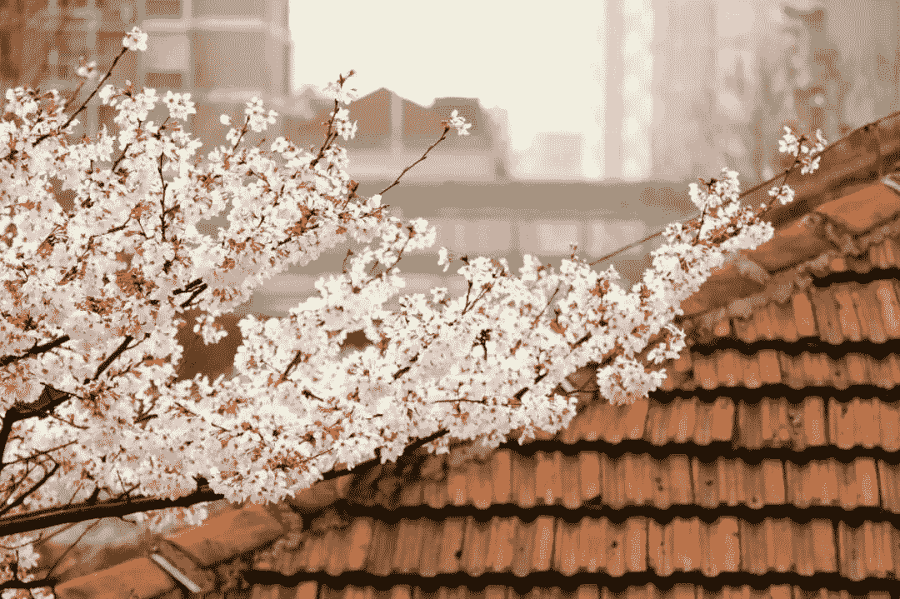

# 【mini,growth,恋爱,长篇】戀愛紀實（6.20更新）

作者：蕩漾

TID：28133

<title>1</title> <link href="../Styles/Style.css" type="text/css" rel="stylesheet">

# 1

*本帖最後由 蕩漾 於 2021-6-20 02:14 編輯*

**序**本以为是温顺的小猫，没想到实际是如此猛兽呢。现在想来是自己太过迟钝了吧。      我们故事的开端并非偶尔邂逅，一切的契机源于kigurumi。（kigurumi简单说就是扮娃娃，带上特制的面具（圈内称作头壳）和kigurumi的紧身衣（全能称作皮）来进行角色扮演）我们在一个同好群里相识、成为网友，我本以为我们的关系也就是和众多网友一样并不会有见面的缘分。早上被QQ的提醒铃闹醒了，是啾啾发来的消息，三个月前和她在KIG同好群里因为喜欢的角色相近成了朋友，之后便经常会有聊天。“8月的CM你会去么？”CM是H市办的还算比较成功的一个同人展，但我作为阿宅一次都没有去过。并且我的网络社交原则——网友就是网友。所以就算我们已经认识三个多月了，我甚至还不知道她的性别，纠结着不知如何回复，过了许久才试探性的问了一下“你也是H市的么？”“对呀，信息上不是写着嘛”她秒回。“诶...所以你QQ个人信息都是真的嘛，女生？”原来现在的孩子对于社交网络是这么开放的态度么，她的回答多少另外有点意外，如果对方是女生那见一面也不是不可以。“对呀，你之前也有看过照片的吧”“呢不是脸挡住的嘛，而且在kig（简写）群里男生比较多吧。虽然也有给你看过女装照，但我是男生哦”以为对方也和自己是一样的女装变态，结果是货真价实的女生。之前聊天时完全没有把对方当做女生来对待想到这里有点小尴尬。“我知道，你是男生，我一开始就知道哦。不过你的腿真的很好看啊。”被夸了反而更加不好意思了，脸突然红了还好有屏幕隔着，我努力提醒自己网友见面不要抱什么幻想，试图让自己冷静一点，但她的信息并没有给我太多喘息的时间。“怎么样一起去嘛，我装备快到了~”天真无邪的正攻法，单身至今的我很容易就上钩了。镇静之后，我欣然接受了她的邀请，得意的回复她：“好呀，到时候我给你做后勤吧。”“好哦，那到时候见吧”“暑期我在咖啡馆打工，有空来的话可以请你喝咖啡哦~对了，我叫章宥泊，生活中碰到的话还是不要叫网名吧，感觉有点羞耻”虽然鼓足了勇气，但我还是没敢更加直接了当的发出邀约，担心漫展上她要是带着kig面具那还是无法见到真容，只能以这样的方式期许着能在漫展前见上一面本尊。“很巧是同姓哦，我叫章秋桐。”“或许就是缘分吧~那到时候我就叫你秋桐可以么”“OK。”7月H市的梅雨季终于结束了，告别了潮湿迎来了正式的酷暑。白天光顾咖啡馆的客人只是零星，下午独我一人听着店外树林里的知了聒噪着，店长则要傍晚以后才来和我换班。店外的门帘被人掀起惊动了风铃，啊终于要迎来今天第一笔生意了么。推门进来的是一名戴着大大草帽的娇小女生，连衣裙的碎花却像极了啾啾曾发给我的照片。本想念出她的名字，但是面前的娇小少女总有一种违和感，我在照片中曾见过的那个人看起来更加高挑，保守起见，我只是礼貌的和她道了欢迎。娇小少女在店内环顾了一周什么都没说就走了，不久她拖着另一位女孩子回来了。“那个....这里是...mori....cafe..对吧”后进来的高挑女孩躲在她娇小女伴身后支吾吾显得很不好意思，虽然没有站直但是明显已经比碎花裙的女孩高出了不少。对于喜欢高个子女性的我来说这样的组合真是极好的福利。“都和你说没错啦，门外牌牌上不是写着嘛。别这么害羞嘛，平时不是还好好的。”“哪里有害羞啊，可是门帘上写的不一样啊。”后面那位女生发出了身高不相称的声音可爱而弱气，身材矮小的女孩倒是有点大大咧咧的。“你看你脸都红了，就算不是的话我们就当做来吃点东西嘛”“没错哦，这里也可以叫森之屋”我假装镇定的微笑着介入了她们的谈话，还装模作样念出了很傻的台词“很高兴你能来哦，秋桐”。这是我人生中最有勇气的一次搭讪，紧张的腿都在发抖，心想着要是认错了那就太尴尬了。两个女孩子突然安静了下来，果然我还是认错了嘛，感觉空气中充满了尴尬。“哈！哈哈哈，你也太中二了吧，明明是大学生了。”被小只女孩嘲笑了，果然刚才的台词还是太糟糕了，还好没有认错人已经是不幸中的万幸了。“别这样啦，人家会不好意思的”高挑女生拍了一下女伴的草帽，“那个....对不起，宥...泊...我擅自带了别人一起来了。”她从伙伴身后走上来微微欠了下身。她站直了以后好高相比在长裙下有一双修长的双腿吧，对于180cm的我来说是第一次接触这么高的女生呢，她看起来比我还高一点。“啊，还是应该先自我介绍一下。”像按下了神奇的开关她立刻从平复了紧张，音色也不像方才那样柔弱，“我叫章秋桐，16岁在H市高级中学就读，暑假后读高三，她是我的发小也是同班同学任雅秀。”说完她展现了模特般标准的露齿微笑。她身旁的雅秀甚至不到她的肩膀，像是贵族大小姐和她的小侍女。“我的身高是175cm，比普通的女生要高不少，还请不要介意........我今天还穿了...这么高的鞋子.....那个.....是秀她出的主意......”她补充说了些什么，但我只听到了身高，再往后声音越来越弱，到中段我就已经听不清她再说什么了。她说自己是175cm，可看起来比我还要高，那应该是穿了高跟鞋吧，我的心里多了一份安心也伴随着一丝失望。为缓解这尴尬的气氛我转移了话题，询问她们要点些什么，雅秀抢先点了单，秋桐则看着菜单陷入了选择焦虑，茫然的样子也十分可爱。“除了黑板上的经典款，这本册子上还有当季特选哦。”说着我把店长特制的手账递给了她。仅只是隔着吧台，这样近距离和她平视已经有点艰难了。美食搭起了我们沟通的桥梁，但是秋桐一直表现的比较怕生，我和她的对话始终没法像网上那样顺畅自在，有时还得借助着手机才能交流，这便是我们第一次的相遇。“非常感谢今天的招待呢，很高兴认识你。”刚走不久，秋桐就发来了信息，“果然还是QQ上交流比较方便呢(#^.^#)实在不好意思，面基时候表现的有点奇怪。实际上生活中我还是比较怕生的，虽然网上会比较话痨。”“hhh没事啦，我也很感谢这样的天气你们还来了哦。我作为学长也表现的不太成熟啦，如你所知我是个宅男嘛。”之后我们又回到了日常的网友关系，偶尔聊聊新番，互相安利旧番。虽然建立了新的缘分，双方都没敢以此为契机更进一步发展下去。直到7月28日，CM夏日漫展的前一周，她突然发了2双鞋子的照片给我，问我穿哪一双比较好，此时我才得知她COS的角色是《命运石之门》中的牧濑红莉栖。作为腿控，我毫不犹豫选了高跟的款式。“果然你们都觉得高跟比较好么”“当然咯，助手人设最突出的就是那双腿吧！”“诶，说是这么说啦。所以我才找师傅订了这双鞋嘛，就是...鞋跟好高....”“既然订了不穿不是很浪费嘛，那我是不是可以COS冈伦呀hhhh”“诶.....你的圆脸出冈伦不合适啦！还不如本体女装hhhh”“但是，我拒绝！”“还有哦，想问一下，CM之前的这一周你有哪天在店里值班么，雅秀说去展子之前想先试着拍一组看看，游场的时候拍出来的效果不一定好”“这一周我都是晚班，不过最近晚上店里客人比较多，可能要9点以后才会人比较少诶。”“额，那我问一下秀看看，我家里有规定最晚9:30之前一定得到家了。”“要么看情况，如果哪一天客人比较少的话我就提前把店关了？你们过来大约多久？”“打车的话10分钟左右，那约定了哦，可以的话提前半小时联系我吧。”终于在7月30日从19：30开始就没有客人在进来了，店里也只剩最后一名客人，我便给她发了消息“OK，来吧”发完消息我便走到门口把歇业的牌子挂上。“打扰了~”推开门先进来的还是雅秀，来的还真快呀。秋桐提着一个行李箱跟在后面，里面应该是kig的装备吧。此时最后一名客人也走了。“不好意思哈，给你添麻烦了”“没事没事”我接过她手中的行李帮她提上二楼，她今天没有穿高跟明显比上次见面矮了不少，宽大宅T下露出一双修长白净的双腿一样很是惹眼，不过我总觉得哪里好像有点不对劲。“换装的时候不许偷看哦”雅秀调皮的提醒着我。“才不会啦，好了喊我就行”大约过了20分钟之后才传来了秋桐的声音，“可以上来了哦，不好意思，第一次穿KIG还不太会。”咖啡馆的命名缘由是选址在H市植物园景区旁的小路上，店长是日本文化爱好者便以森之屋的罗马音做了咖啡馆的名字，一楼是普通的咖啡馆吧台和卡座，二楼则是两间和式榻榻米包房。我上楼推开移门，先看到的是雅秀梳理假毛的背影，秋桐跪坐在一旁，长发被包进了KIG紧身衣里，紧身衣脸窗部分只露出了她的五官样子十分可爱。视线再往下的话便是和幼齿脸蛋不相称的身材，量身定制的衬衫、皮短裤、助手标志性的黑丝长腿，我礼貌的将视线撇开了，一直盯着腿看对心脏不好。说起来她这么高但是胸前还真是平平如野诶。“我这边快好了。你要么先把鞋子穿上吧，等会戴上头视线会很差”雅秀还在仔细的打理着假毛。“哦哦，那我到外面穿”秋桐缓缓起身，从我身旁走过，方才的违和感得到了解释——她的身材比例如艺术品般完美，颀长优雅的颈脖托着精致小巧的脑袋，躯干则几乎未经发育的纤巧，胳膊自然下垂的状态下轻松手腕轻松的过了裆口一截，再往下是不用看也能想见的如画长腿。与她擦身而过，评估着我和她双腿的差距，下体丢人的勃起了。回味着刚才那一瞬缓过神来她坐在从门口的鞋盒中取出了夸张的短靴“原来这双鞋的鞋跟有这么高的嘛”脑中的想法不自觉的变成了声音，在她给我的照片中一点都看不出来。“对哦，算上水台有11cm的样子吧，毕竟助手人设造型的最大卖点就是腿嘛。我也还是第一次穿这么高的鞋子呢”她扶着墙慢慢的起身，缓缓升起的背影很快就到了我需要仰视的高度。她转过身来俯视着我，视线的角度明显超过了初次见面。她眼神中羞涩在闪烁着，她默默的低语这回被我听到了：“果然还是太高了吧。”“不会哦，很美呢。”不知该如何去赞美她，只用了最简单的字眼，明明是年幼童真的脸，却在需要仰视的高度，有种被小孩戏弄了的屈辱感，但与我腰部平齐的黑丝又疯狂的挑逗着我的神经。我似乎是从初中开始伴随着青春期萌发了对高个子女生的特殊感情，随着成长发育周围女生对我来说显得越来越矮，但身体对高挑女性的渴望却愈发强烈。与她相视的每一秒本我冲动和超我约束都在不断撕扯着我——我对比自己小五岁的未成年女孩产生了强烈的欲望，但这对于我的道德观来说是不允许的。“理好啦，来戴上吧。”雅秀的捧着头壳走到了秋桐面前，她踮起脚很努力想把手中的宝物递到秋桐面前，第一次得见这样梦幻的画面我快要绷不住了——娇小女生勉强能够平视秋桐微微隆起的胸部，助手热裤的腰带轻松没过雅秀的胸口。“诶，话说要怎么戴呀。”秋桐接过头壳感到疑惑。“先扣在头顶上然后盖下来，那边的这位小哥麻烦帮一下忙哦，她现在对我来说实在是太高了！”雅秀为了让秋桐能看见自己向后退了几步，示范着该如何穿戴。“诶，要怎么做”我也被她喊到了，刚才一直看着那双长腿有点入迷了。“去她身后帮她托一下假毛，长发可是我好不容易理顺的。”雅秀同时指挥着两位“高人”。“我准备戴了哦”秋桐举起手中的头壳，只是刚刚举过头顶的高度却快碰到二楼的天花板，助手的红发如瀑布一般垂了下来，她穿上高跟后我们有了明显的身高差，为此我得高举双手才能托住长发根部。“OK托住了。”几乎是贴身站在这样的尤物身后光是保持理智已经耗去了我大半心力。她确认戴准了以后将面具部分盖了下去，纤长的手指自然的拨开了不属于自己的红发，无意间我们的双手触碰到了对方，对于彼此来说都是一个意外，双方不自觉的抖了一下身子。“不好意思，我不是故意的”我慌忙解释到。“诶，这位小哥你对我家仙女怎么啦”“没有没有，只是我的手不小心碰到他了。”秋桐也帮着我在解释。“你们两个人还真是敏感呢”雅秀把弄着手里的摄影器材头也不回的说着，“好了，剩下的时间不多了，赶紧试着拍拍看吧”她娇小的身体抱着专业单反的样子显得有些滑稽，用镜头打量着秋桐片刻“啾你的头稍微有点歪，往左边调一点，戴上头壳以后要随时注意收着下巴不然样子会很怪。还有哦，小哥麻烦能把二楼的灯都打开么，有点暗”瞬间我收起了刚才对她的轻视，扛起相机的雅秀显得相当专业。拍摄很快，只持续了大约半个小时，两人体型上悬殊的差距和姿态的对比着实有些喜感，用一个不太恰当的比方——小小的勇士在挑战高大的魔王。分别时，她顺利用自己的声音向我道了晚安，我傻傻的朝他们的出租车挥挥手，脑袋里已经是一团浆糊了。回家后冲了个冷水澡试图让自己冷静一些，理性的努力徒然无用，躺在床上辗转许久无法入睡。恍惚中我回到了熟悉的咖啡馆门口，她缓缓向我走来，随着距离逐渐拉近她的身形愈发高挑，走到我面前时已经比我高了一头，我仰着头用手比划着和她的差距发现只有她肩膀高度，再平视前方已是她挺拔的乳房有着深邃的裂口，她把我抱入怀中柔软慈祥，在她怀里我像个婴孩，任她摆弄，她把我放下后人就不见了。此时一位浑身被白丝包裹的女子立于我面前前凸后翘身材性感，我抱住她想和她做爱，却只抱住了圆润的大腿她裆部已高过我的胸口；我抬头去找长腿的归属只寻得迷雾，腰身以上不在能见；我抱着的长腿突然也不见了，又出现在了我的前方，光是腿已和我等高，我仔细审视这双腿，比之刚才更加完美，臀部翘丽大腿圆润小腿修长跟腱纤细；我正要上前抚摸，她们又变成了黑色，膝盖骨的突起顶到了我的下体；我扑了上去，却从黑丝上滑了下来摔在了地上；裹着黑丝的大脚一步踏在我两腿之间，等我起身发现这双脚下还穿着黑色的高跟；我再靠近看原来是黑色的高跟皮靴，这双长腿突然动了一下膝盖顶到了我胸口把我拱出好几米；等落下的时候我被一双绒面的过膝长靴接住了，我坐在她的脚背上起身抱起她的脚踝疯狂输出，整双靴子被我染成了白色；靴子的主人抖了脚，我瘫坐在地上，仰视空中看见了秋桐的脸，她在我耳边小声对我说：“宥泊，你好变态哦。”我想要解释这不是真的，她的脸不见了，面前只有白色的长靴，靴子突然抬起，我的头顶天空被鞋跟完全盖住了。我猛然惊醒，原来这是个梦啊，内裤已经湿透了，好不容易克制住没有撸管却遗精了，有点懊悔应该先撸一发再睡，因为梦的内容醒来时都已忘却。早上醒来又洗了个热水澡，还是想她，我反问自己是否爱上了她，爱上了比自己小五岁的女高中生，不，仅仅是本能的生理反应。确认了这一事实后，我又陷入到了自责当中。QQ里有好几条她的信息还没有读，“昨天非常感谢哦”之后接着是好几张昨天的照片，应当是没有修过的原片但因为QQ传输的关系画质严重受损，照片中的她根本就是牧濑红莉栖本人，不，她比助手更加完美，看着照片下体不自觉地又硬了起来，不能再看下去了，会失控的，我赶紧将手机扔到了一边。但是又传来了QQ的声音。“非常抱歉CM可能去不了了学校里通知8月要求返校补习真的是非常非常非常的对不起！！！等我高考结束我们再一起去漫展吧~等你的装备到了以后一起出KIG吧好想看到你女装哦hhh这次真的是太对不起啦请不要生气哦┭┮﹏┭┮诶，在吗？看到了的话请原谅我哦”消息是拆分成了好几条发送的，每一条都是短短的一句话，看到第三条的时候我已经摊在床上成了一个大字，长长的舒了一口气，海绵体缓缓软了下去。手机还在不停的震动着，但我已经无暇顾及了。满脑子是“哦，太好了”刚刚萌生的恋情就这样夭折了，但我的理智不断庆幸，不道德的事情不会发生了。“诶，那真的是太遗憾了。这也是没有办法的啦，到了高三升学压力会大很多呢。我们当时的暑期补课也很漫长。kig的话我还在纠结要出什么角色诶，长发的感觉理起来太麻烦了。但是喜欢的角色又都是长发，好纠结。还想选一个穿长靴的角色，可选范围就更小了诶..等你毕业哦~”只是翻了个身一切上周与她接触的回忆被我隔离了，当作什么都没有发生过，指尖迅速的敲击着手机屏幕回复了一整段话给她。当时的我真是个怪物，居然靠着德道和理智战胜了本能。“恩，补课期间有空的话我还会来森之屋哦~”“OK~等你哦”此次约定不同当初，在之后的一年里，我们没有再见。

为方便同好进行比对，在每次更新最后会注明一下当前出场人物身高，章秋桐初次出场175cm，股下（腿长）91cm梦中2m~20000m章宥泊180cm任雅秀150cm

后记：故事取材于真实生活（不是在秀哈），可能整体节奏会很慢，福利也比较少。主要我也想写一个更生活化更写实系的故事。如果大家有什么比较好的意见建议非常欢迎哈。<title>2</title> <link href="../Styles/Style.css" type="text/css" rel="stylesheet">

# 2

> [Cod1945 發表於 2020-2-24 16:23](https://giantessnight.com/gnforum2012/forum.php?mod=redirect&goto=findpost&pid=427745&ptid=28133)

> 这个太棒了，不知道楼主是否基于真实经历或者偶然邂逅进行了改编呢？

> --

> （修改一下：抱歉 没看到楼主的后 ...

序章部分甚至可以说完全是真实经历了....后面的话比较纠结，如果主要是用生活素材补足妹纸身高来写的话好像身高play就会比较少........但又想保持写实系的初衷

<title>3</title> <link href="../Styles/Style.css" type="text/css" rel="stylesheet">

# 3

*本帖最後由 蕩漾 於 2020-3-17 00:17 編輯*

**一**这一年里我们彼此都忙着各自的毕业，只在QQ上有过零星对话以保持着淡淡的友谊，话题主要还是以动漫新番为主，偶尔也掺杂小说、kig，她没再给我发过照片，我也没有给她发过。我好不容易算是跨专业混进了社会学系的研究生继续在校园里苟活着，以逃避踏入社会。后知后觉的关心她高考成绩已是7月中旬，她说发挥还不错，以后我就是她的学长了，H高是市最好的重点高中之一，不过考上Z大的学子也是少数。恭喜之余打趣的问她是否要我来迎新，她说家人会陪着她，那我也不好意思再多纠缠。漫展相关事项我之前一直很少关心，一来兴趣不足，二来有升学压力，现在动力来源有了，阻碍也克服了，和啾啾一起扮娃娃逛展便提上了议事日程。去年的约定我可牢牢的记着呢。9月中旬，群里的同好们就开始讨论起了年底的活动，好像是叫Comic up简称cp，那群人总是热衷于各种聚会，真的不是很懂生活中不相关的人为什么要这么频繁的通过现实联络感情。“11月S市的冬季cp你会去么？”我有点明知故问的意思。“嗯嗯，正打算邀请学长一起同行呢，我们4人刚好可以凑一套Loft。”“这才9月中旬吧已经准备敲定住宿了么，4人是？”我猜雅秀会算在内，还有一位就不知道了。“再晚就订不到好的位置了，组团也比较划算，还会有人帮忙去和房东谈价格什么的很省心嘛。四人的话是我、学长、秀还有她的一个朋友。”“诶...雅秀她的朋友，那只有我一个男生会不会有点不太好？”曾和高中好姬友计划组团去贝加尔湖本应也是三女一男的结构，但最终因为我没抢到低价机票，她的签证没办下来，结果我们2个发起人没有去成。“放心啦是男生，她的准男友，而且是个K圈摄影师哦。这样的话你就可以女装啦！hhhh我可是期待了一年哦。”“可以哦”让雅秀一个人给我们做后勤总还是不那么让人放心，再多一个男生的话就不一样了。我往上看了几百条群里的聊天记录，得知有女群友要参加线下活动，死宅们都沸腾了，毕竟女生是K圈的珍惜物种。“学长还有在森之屋兼职么，之前顺路有去过几次都没有看到学长呢。”“没有了额，你最近有空的话约个下午茶？”虽然成了校友，但Z校的大一新生基本都非常忙，加之我们彼此分属在不同的校区想要见面也并并非易事。既然她提起来了，那我也不好意思总让女孩子主动，而且见面的话还是约在那里比较好吧。“OK，要么这周六下午吧，周五下午我们有个班会”“OK，不见不散”时隔一年激情早已被日常冲淡，期待的只是老友重逢。约定的时间是14:30，我本想14：00就到店里等她，但因为室友的乌龙给耽搁了些许时间，所幸没有迟到，透过玻璃除店长外没看到熟悉的身影。“好久不见啦，艾姐”我推门进来和店长寒暄了几句，店长是个30多岁的女人，算不上漂亮，体型微微发福，面相乍一看会以为她比较凶，但其实是个很好相处的人。“怎么样，最近得空一些了么。”“算是可以喘口气了吧”“那我请你喝一杯吧，刚好前两天新到了一批豆子。和往常一样你自己操作么，还是由我代劳？”“稍等一下，我和人有约。二楼的包房还是空着的吧”“恩，给你留着呢。是和哪个可爱的女孩子约会吗~”“哈哈哈，真的是超级可爱的女孩子哦。”“没看出来嘛，小伙子还挺厉害的。”“那我先上楼去啦”我刚准备往二楼走，有人轻轻地搭上了我的左肩“是要和哪位超级可爱的女孩子约会呀”侧后方传来了秋桐的声音，是她社交场合专用的明亮音质。“你已经到了呀”我差点忘了她所在的校区离植物园比我近很多，我正要转身她另一只大手搭上了我的右肩。“学长，请先不要回头哦.......”她又切换回了普通的声线，“那个....先和你说一下哦...不好意思.....我这一年又长高了.....不少（细声）..请....不要讨厌.....”“没关系，之前说过哦，不管多高，秋桐都很可爱。”她的手从我肩膀两侧滑落了，虽然她有提前预告，但转身再度见到本尊的时候我还是挺吃惊的。见面前我还专门思考过这个问题，16岁的女孩子一年长高再多，能有5cm已经很厉害了吧，大概和我一样高的程度吧，为此我可是穿了一双底还挺厚的气垫鞋。事实证明我还是失算了，转过身来和她保持平视有些困难了，近距离可以明显觉察到她的双眼高于我的视线。“喔.....确实长高了好多呢。”如果她没有穿高跟鞋的话，这一年里至少得长了7、8公分吧,很少听说有女孩子在青春期末尾还能这样长高的。“对....吧....果然你也还是觉得我太高了吧....”哇，她不是快哭出来了吧。“不会不会，脸还是和之前一样可爱哦”我连忙安慰她，不过这样说来她小巧的圆脸和高挑的身材真是有够猛烈的反差萌。“和以前一样点西瓜汁么？”“西瓜汁，刚才已经喝过了.....”“艾姐，今年有推出新品么”看来她很早就到了呢，我暗自咒骂着该死的室友耽搁了我宝贵的时间。“在第一页哦”她递给了我一本新的手账，老板娘对自己外形打点的并不是特别的勤快，但是手账做的却是一丝不苟，满满的少女风，可以说是这家店最大的特色，有不少客人都是因为精美的手账慕名前来。“那就莓莓木糠杯配思慕雪Lily，这样可以么？”我指给她看，她配合的点了点头。“你自己点什么呢”店长看秋桐表示同意，便转头问我。“还是老样子吧，提拉米苏和卡布。那我先上楼啦。”“不好意思哈，今天店里比较忙，兼职生也还没来，等会麻烦自己下来取一下餐哦”“OK”在进榻榻米前脱鞋的时候我才发现，她穿的是平的不能再平的瓢鞋，那她的这一年里到底是成长了多少呀，光是想到这里都不禁兴奋的发颤。“我先下楼拿杯水”我找了个借口让自己的大脑先喘口气。要是同时脱鞋那身高差距便会毫无保留的展现出来，对于这一年中没有和异性交往过的我来说，和她一同进门的刺激已经超出了我的承受范围。“她居然是你的女朋友么，进门的时候我可着实吓了一跳，身高快有两米了吧，点单的时候看着她我脖子都酸死了，不过确实是难得一见的大美女诶。”老板娘认真地做着我们的餐点，背对着我自顾自的说着。“嘘，小声一点，你也知道你们家隔音效果不怎么好吧。”我压着声音和她说“目前还不是我女朋友啦。”拿了2个杯子和一壶柠檬水便迅速上楼了。“不好意思哦，刚才有些失态，让你为难了。”秋桐的状态有所好转，貌似牵扯到身高问题就会令她面露难色。虽然没有怎么接触过高个子女生，但我也还是知道的，她们容易被女生嫉妒，被男生排斥，就连普通出门都要承受路人的冷眼和陌生人的非议。这个社会的文化对女性是不公平的，对出挑的女性更加。“没事，没事。”我盘腿坐了下来并把水递给她，她礼貌的和我道了谢。话说她不会听到了老板娘的调侃了吧。“那个.....我...不太喜欢自己的身高..不，是非常讨厌....在H市实在是太高了....小时候我还是和一般女生差不多高的，高一的时候在班上女生里也就刚刚中等偏上这样，高二下学期开始突然长高了好多。第一次和你见面的时候我已经是班上最高的女生了。当时穿了很高的鞋子，是秀的建议，但我觉得她说的也对，如果不能接受的话，还是只是保持在网友比较好.....你也发现了吧这一年里我长的实在太快了，高三上半学期结束我就已经是文科班里最高的了，包括男生在内哦，文科班的男生没有一个比我高了。我本以为超过180cm以后会慢下来的，没想到转入下学期开春以后又以控制不住的速度在长高，诶，现在这个身高像怪物一样......”听她断断续续地讲述着自己的事情，在间隙时我会安慰她几句，也借机得以有时间端详她现在的容貌，说成长了很多可能好像不太准确，她的脸庞和胸部在这一年内几乎没有什么变化，披肩的长发末梢还有刘海应该是烫过了显得五官更加甜美，比之前高中时期马尾要显得稍微成熟一点。单看上半身的话就是清纯可人的娇小美少女，但算上无敌的长腿那就完全是另一幅模样了。哪怕她长高了这么多，两人一同坐榻榻米时还是我比她高不少。其实我身材比例已经算很不错了，或者说更像女生一点吧，脚底到股下有89cm，脖子也还比较长，腕线能勉强过裆线。定制kig紧身衣的时候，老板也说我腿在男生里算很长的了。对了，说的紧身衣的话我可能得提醒她一下，“那.....你是不是要订新的皮了，还有C服也是不是也要再做过了”我打断了她的期期艾艾，毕竟一年里长高了这么多，之前的服装估计都没法穿了吧。“啊，对哦。还好你提醒了，现在下单排队不知道能不能赶上CP呢，尺寸也要都要重新量过，等会就回家量一下吧，啊，真的是超级麻烦，长高真的是太麻烦了，到底什么时候才能停下来啊”呼，应该不算是踩雷吧，她的精神状态比刚才振作了一些。“你的数据都是自己的量么？”想起下单前要测量身体各处的尺寸又不好意思找人帮忙的我可是费了好大的劲才完成的。“对啊，因为小时候一直有练舞蹈嘛，现在虽然舞蹈没有继续学了，但是拉伸什么的还是有在坚持的，所以自己测量的话倒没什么，只是要测量的数据也太多了，好像要填的数据有20多项吧”“好厉害啊，之前两次见面就发现了你的身姿格外挺拔呢，微笑也非常标准，还有自我介绍时候也是训练有素，不会是小时候经历了斯巴达式的教育吧”回忆着过去和她接触的细节，我推导出来了一个可怕的结果，还顺口就说出来了.....“额，你也很厉害啊，都被你看出来了...”“对不起对不起.....”完蛋，还是踩雷了，我真是个聊天鬼才。“没关系啦，都过去了，母亲大人也是为了我好。”“对了，怎么样大学是不是也没有想象中的轻松？”我试着转移话题，身为学长总有关心后辈的义务。“是还比较忙啦，不过还好，犹豫着加入什么社团比较好呢。”“噗，啾啾肯定会大受欢迎的。大二选专业有考虑过么。”“诶~但愿吧，之后的话想读哲学”“哲学啊~”“对的，觉得哲学比较有意思嘛，母亲大人一定要我选社科大类读财会经管什么的，但我还是选了人文大类。按她的意愿报了Z大，专业的志愿我自己偷偷改掉了，知道我选了人文类她可是好好发了一顿火呢，还好她后来也妥协了。最开始呢，她一定要让我读Z大我还挺抗拒的，想和秀一起报S市的学校可以离她远一点。不过后来想学长也在Z大嘛，估计Z大的动漫社团会比较有意思吧。”她像是在说着别人的故事，这份冷漠让人胃疼，有这样强势的母亲可真惨。“不好意思打扰啦”店长推开移门把我们的餐点放在了矮桌上“刚才有给你发消息，看你也木有回就给你们送上来了，带了这么一个大美女来店里生意都好了很多呢，今天就给你们免单吧。”“那真是太感谢啦！”艾姐你救场真是太及时了。“不好意思，给您添麻烦了”她转过身微笑着向店长致意，果然一举一动都极其优雅规范，被雕琢至此得经历多少苦难，若知道美的来由，是否还会让人如此追求。店长拉上了移门前，给我竖了个拇指还使了个颜色。她都听到了吧，还很满足的样子。“来尝尝吧，新品看起来很不错嘛，和手账上的一模一样！”所谓思慕雪LILY是用了谐音，实际是凤梨果肉加果酱淋在雪梨汁调制的沙冰上，莓莓木糠杯则用的是蓝莓和树莓，颜色搭配的十分诱人。“哇哦！先让我拍个照片，还有学长这边也麻烦等一下哦。我要发给秀，她可是超想念这家店的提拉米苏，哈哈哈馋死她”少女的脸上又充满了阳光。欢笑中时间总是流逝的很快，我们像老友一样交换着彼此一年间各自的趣闻。不知不觉间就到了傍晚，她起身欲走，我却不想道别，坐在榻榻米上的我看着她的脸在我面前不断升高，直至最后仰视到目眩。好想邀她一起吃晚饭再一起看电影，她转过身整理衣裙，我立马起身伸出手想要牵住他的手，但不敢触碰。她高高的背影已明显比我高出了不少，我只能注视着她，话在嘴边不停打转无法传达，好不容易能够启齿却是违心的言语：“非常感谢你分享了这么多有趣的经历，下午聊的很愉快。”此时她已经转过身来微笑着俯视我，并非是标准的量产笑容而是初阳般温暖的感觉，要是她这样看着我刚才我估计话都说不出了吧。藏青色大摆裙遮住了她夺魄的双腿，淡紫的半袖修身衬衫完美烘托了她的气质，今天聊了这么久才注意到她打扮如此高贵典雅。“应该感谢是我啦，又被美味款待了。”她欠身向我致谢，修长的身段让动作更加优美，宛如一位公主。我们一起下楼再度感谢老板娘的慷慨，店内的客人们纷纷将目光投向我们这对高海拔“情侣”（他们估计都是这么觉得的吧）。在咖啡馆门口我们相互道别，对她来说是很大的进步，告别的话语终于告别了网路，用自己本真的声音传达了谢意，离别的不舍，还有对再见的期许。独留我一人站在原地目送她的身影远去，她的背影在人群中是那么醒目。我责备自己没有勇气，说她是严苛教育的受害者，而被教育绑架的，我又何尝不是其中之一呢，不敢正视本能的愿望，并非是用理智战胜了欲望，我只是逃避了。

为方便同好进行比对，在每次更新最后会注明一下当前出场人物身高，章秋桐186cm，股下（腿长）101cm章宥泊180cm，股下（腿长）89cmEmily（森之屋老板娘）163cm后记：这个故事的初衷呢大概只是为了纪念一下我们这一段神奇的关系，不过发到论坛上以后呢总还是没法免俗的会期待回复呀。很努力的在往尽可能保持真实感的情况下多添加一些身高的差距感还是不太容易，我自己看都会觉得有比较重的流水账感觉。MINI系的同好在GTS圈里还真是小众诶....有比较资深的同好可以给点相关意见么，如何不流俗的表现出和妹纸的差距呢.

<title>4</title> <link href="../Styles/Style.css" type="text/css" rel="stylesheet">

# 4

*本帖最後由 蕩漾 於 2020-2-28 23:16 編輯*

> [kevinsky05 發表於 2020-2-28 23:07](https://giantessnight.com/gnforum2012/forum.php?mod=redirect&goto=findpost&pid=428157&ptid=28133)

> 一般來說都是透過對比還有環境因素等等

> e.g. 手腳大小的對比, 衣服大小褲子長度等 , 站高幾級樓梯, 腿太 ...

谢谢k神，好像我已经都用上了hhhh

<title>5</title> <link href="../Styles/Style.css" type="text/css" rel="stylesheet">

# 5

*本帖最後由 蕩漾 於 2020-3-17 00:15 編輯*

**二**H市几乎是没有秋天的，漫长的夏天过后紧接着就是冬天，阴冷潮湿的冬日之后是短暂而混乱的春天，鲜有几日怡人，4月中便开始升温，5月立夏正式拉响了的前奏，6月中旬湿热的黄梅天算是进入了副歌，7、8月更是将盛夏推向高潮，夏的尾声往往要拖入11月，休止符却来的仓促。今年的夏季比之往年略微偏短，直至11月上旬的午间还是一如既往高温，进入中旬连续一周的秋雨终结了长夏，气温25度左右由骤降至15度以下，这样离入冬也就不远了。我和秋桐如约的再见要等到11月下旬了，期间我们都忙着彼此的课业，以各类社交媒体保持着联系，交换过几次试装的照片，每每被她夸赞却只让我觉得惭愧。我们计划是26日下课后从学校去一同出发前去S市，27日与雅秀他们在S市内逛一逛，28~29日跟随kig大部队一道逛展。说是大部队算上我们一共也不足15人，在2015年kig这样一种形式的cosplay还鲜为人知。从11月24日开始连续放晴，气温又奇迹般的回升了不少，S市离H市不远天气应该也差不多，为此我和秋桐都很高兴不用做低温战士了，这或许第一次出展子的新手运吧。11月26日周四，想见她的心情填满了每一分每一秒，从前一天晚上就没有睡好，导致早上第一节早课睡过了，还是我导师的课，真令人头大。约定是17:00在她宿舍楼下见面，但我迫不及待想见她，急急忙忙的候在教室门口等她下课，对她来说着实是个意外。下课铃响，同学们纷纷走出教室汇成密集的人流，扎着高马尾的她显得格外突出。周围女生基本都不足她肩膀，男生也多在她鼻梁下方。“学长，不好意思，我得先回寝室准备一下，还得麻烦你再等好一会哦。”在人群的推搡中我们相遇了，挨得很近以至于她要低头俯视我。而我感觉她比上次见面又高了，或许是因为鞋子嘛，还是短短2个月的时间又长高了呢。“没关系哈，那我就在宿舍楼下等你吧，只是太想见你了....”终于说了心声，可是微弱声音被嘈杂人群给淹没了。随后我便为自己的冲动付出了一个多小时的等待，16:56，她准时出现在了宿舍一楼大厅，刚才见面还是阔腿裤连帽卫衣这般慵懒的穿着，已经换成了浅驼色高领罩衫，下着黑色皮短裤和黑色裤袜（80D左右的感觉吧，略有些透明），脚蹬一双骑士靴，头戴了一顶机车帽飒中透着一丝甜。“不好意思哦，让你久等了”。她弯腰朝我微笑，就算她已经的身子已经凹成了一个直角，但坐着想要看到她的笑脸依旧不容易，“行李我昨天就理好啦，在纠结要不要再多穿一件风衣耽误了不少时间。天气预报说是往后几天会保持温暖的晴好天气，但我还是有点担心会降温，最后决定了换这件毛衫的时候闹钟都响了。”“走吧，一起去食堂简单吃一下，然后就去车站吧。我已经约好出租了。行李应该可以现在大厅寄放一下吧。”那双骑士靴看起来是平底，但靴筒内好像带了内增高的设计，起身是我明显感觉她比刚才在教室门口又高了一点。“没问题的~走吧”她转身和宿管阿姨说了一下，为了配合阿姨的身高她几乎蹲到了地上，她直起身子后宿管阿姨只有她胸口的高度，阿姨也没什么特别反应，看来是已经习惯了吧。这一个半小时不到的时间里，她换了发型和全套服装，化了妆，应当还洗了个澡，刚凑近闻到洗发水的香味和之前在人群里见面时不一样了；说的闹钟估计就是比约定时间提前5分钟的下楼闹铃吧。以前听说女生都会迟到一些，但是她从来没有过。秋桐的双腿就算在一等座车厢也难以安放，想必对她来说每次长途出行都很辛苦吧。所幸H市离S市不远，高铁1小时左右的路程，忍一忍也就过去了。这样一双黑丝包裹着的圆润大腿横在我的面前，我却因紧张加之昨晚失眠的疲倦居然在火车上昏睡过去了，到站前还是她把我喊醒的。抵达S市后我们根据雅秀的指引换乘了2班地铁前往住处，地铁到站时，雅秀和她的朋友已经等着我们了。“妈呀，3个月没见，感觉你又高了好多啊，我好像看你的胸都要仰视了诶”是雅秀俏皮的声音。“秀，别捉弄我啦”“给你们介绍一下，这是我的学长，是我们F大传媒学院传播系的高材生，虽然他不高哈哈哈，还是F大学生摄影协会的下任会长，江湖人称南哥的苗毅南！”雅秀拍着边上男生的肩膀。他已经不是高不高的问题了，大概一米六的身高以男生来说根本就是矮，在秋桐面前则矮的更加彻底。“嗨，没那么多头衔，就喜欢拍拍照，叫我老苗也行。”不知是因为被奉承的不好意思，还是因为秋桐惊人的身高，他已经从脸红到了脖子。“好，接下来要隆重介绍一下，这是我的发小，我12年的同班同学，H市高级中学15级高考文科状元，2015级Z大人文第一才女，Z大校花No.1，身高一米九的超模，未来世界小姐，长腿星的卡丽熙，啾啾女神！本名是章秋桐。”秋桐原来是学霸么，居然是H高的文科状元。“秀，好了啦，越来越贫了你。”秋桐揉了揉小个子女生的头发。“好的，我这就闭嘴，那这位大哥麻烦您自我介绍一下吧”“额，我叫章宥泊，是Z大社会学系的普通在读研究生。kig群里的昵称是荡漾，称呼的话请随意吧。”突然让我自我介绍，一下子只想到的只有这么多。“给你补充一下重点，是个女装变态。”雅秀真是一如既往的不饶人啊。“所以他们是什么关系，兄妹么？”南哥还是没搞明白情况懵懵的，转头问雅秀。雅秀刚准备说话头被秋桐往下摁了一把，从动作上看秋桐右手刚并没用什么力气，但雅秀被冷不丁的这么来了一下差点摔在地上，接着秋桐回答南哥了刚才提问。“他是我在Z大的学长，和我一样是kig爱好者，也是我重要的朋友。”“喂，姐，他是你男人的话提前和我说一声就好了，不用这样对我嘛”雅秀委屈的呜咽着。“别乱说哦”秋桐马上反驳，冷着脸声音都变了。“既然都还没确立关系，你下手这么狠干嘛啦，我们十多年的友谊都比不上他么！见色忘友！”雅秀转而有点愤怒了，想向秋桐讨个说法。“对不起哦，是我不对，这么大个子力气太大了，不是你前面就一直乱讲话，我需要拦着你嘛。别把恶意玩笑当幽默和你说了多少次，只是我的话还没什么，但是牵扯到学长就不对了诶。还有哦，我才没有一米九，现在净高最多188cm。再说十多年友谊，我最讨厌有人拿我身高开玩笑，一直以来你不是最清楚么。见色忘友？倒是你一见面就拿我身高给别人寻开心？”平时口齿伶俐的雅秀被堵的说不出话来，一肚子气一时间无处发泄，就地放声大哭起来，秋桐从包包里抽出纸巾递给秀也不在多管。南哥心疼雅秀，接过了纸巾什么都没说。气氛异常尴尬，我被夹在中间不知所措只得向南哥和雅秀赔不是。雅秀哼了我一声，南哥叹了口气说“算了，也不是你的错，走吧回去休息吧。等会她们睡楼上，我们睡楼下。”从地铁站到住处约有10分钟的路程，一路思索着刚才秋桐对自己身高的陈述。她净高188cm的话随便穿一双鞋就一米九以上了吧，她真的是很在意自己的身高，看来和她相处身高话题还是要慎重。16岁的女孩一年半长了13cm，生长速度也有够让人瞠目结舌，按照上次见面她的说辞——高二下学期身高才开始突飞猛进.......我不敢再想，身体已经起反应了。很久以后我问起秋桐，她和秀以前有没有像那天一样吵架过，她说从来没有之后也没有，基本是她让着秀。为什么那次不一样呢，我追问她。她说：“看老苗和秀的样子多半是要成一对的；秀继续挑衅你，如果你没憋住发作了那他们对你印象就会很差，以后在相处就不容易了；你让着秀，她就会经常捉弄你，万一你讨厌她了也不好；当然咯，宥泊性格这么好是不会和秀计较的，但我也不想让你受这样的委屈呀。”我又继续追问，那天真的没有生气么，她笑着说当然没有生气啦，只是假装严肃一点。秀果然是孩子脾气，一觉醒来又阳光灿烂了。27日我们四人穿行在S市的大街小巷，奇妙的身高组合吸引了不少路人的目光。在老区建筑因年代久远往往门框低矮，秋桐得弯腰才能进入，游人和街坊无不赞叹；在新商业街漫步的时尚女郎们见到秋桐也都纷纷躲闪，不然只得沦为卑微的陪衬，毕竟在南方高过她肩膀的女生都很稀少。一天下来我已经稍稍有点习惯了她的美丽，只要别一直盯着看，下体就不会失控。玩了一天回到住处才发觉身体疲惫，“群里的人来了，我去接一下。”南哥说着准备开门，我看了下手机已是22:28，两个女孩子都在洗漱准备休息了。“是谁呀，稍等一下，我一起去吧。”我披上了刚脱下的外套。“没事儿，你先休息吧。你明天还要辛苦一天呢。” Day1的主要计划是购物，所以明天一早就得去场馆门口排队了，我和秋桐还得在家先换好kig装备，想到这里我也没在和他客气，和他挥了挥手，整理起了明天的装备。“谢谢啦，不好意思占用了你们楼下的卫生间这么久。”“没事，没事。我已经用厨房这边的水池洗漱过了。”“那真是抱歉了，晚安哦学长”她笑着俯视着坐在床上的我“晚安啦”看到了秋桐出浴的绝景今晚怕是又难以入眠了，当她转过身去，我放松了神经，裤子一下就被顶了起来。虽说是披着一件宽大的白袍，但间隙里透着粉嫩的睡裙是少女独有的性感。不过我躺倒床上还是很快就睡着了，睡的很沉没有做梦，直到被秋桐叫醒。“学长，起床了哦”听到秋桐的声音，我因惊厥从床上弹了起来，难道我在梦里按掉了闹铃么，Cp17day1我的闹钟设置在6:30，看了手机不过才5:40，秋桐坐在我的床边更让我怀疑自己是不是在做梦。“诶...吓到学长了么，不好意思额。我是在想，学长是第一次出kig，穿紧身衣的时候可能会比较慢。所以，提前了一点喊你。”比起特殊的morning call服务，此时秋桐的穿着才更让我感到惊愕，与昨晚出浴时几乎相同的打扮，就算她用袍子裹着，浅粉色蕾丝花边依稀可见，比起昨晚白袍下多出了一双白色腿袜，对我来说更添色气。“早餐的话，南哥已经买好了。一起来吃吧”“哦....哦.....你先吃吧，我马上起来”本来刚醒就处于晨勃状态，方才的刺激更是给我来了一剂猛药，要是直接起身那也太过明显了。“就你没起床啦大哥，今天我的list可是排得满满的哦。赶紧起来吃饭换衣服！”秀也到我们这一层了啊。不是说7:30出发么，怎么都这么早嘛。才意识到，原来以前去过几次漫展只能算是走马光花，油浮于水。我把背着秋桐穿上牛仔裤，虽然帐篷还坚挺着，但有牛仔裤的遮挡下应该不至于那么显眼吧。起身转过来的时候发现秋桐还坐在床上等着我，但愿她没有往不好的地方看啊。kig紧身衣一般是从头到脚的全身包裹，拉链开在背部就算身体柔韧性很好的秋桐第一次穿起来也花了不少功夫。早饭后我并没有迎来期待的秋桐服务，而是在南哥的帮助下艰难的穿上了紧身衣。“荡漾同学，你真的打算在家就换上这双鞋么。”他举着我的长靴样子十分的滑稽。我最终决定cos的角色是我童年时代最喜欢的角色之一——《圣少女》的女主角羽丘芽美，为了还原人设特别拜托了秋桐找了专业的裁缝定制了这套服装和长靴。靴子光是靴筒长度就已经达到了100cm比我自己的腿还长不少，在加上15cm高的水台高跟，靴子总长达到了惊人的115cm，提起来以后高度差不多在南哥胸口。“大哥你还真够变态的诶，居然是这样的癖好。”秀不亏是专业吐槽役，一针见血。“秀，不要这样说啦，学长是因为我无理的要求才订了这么高的鞋跟。”原来秋桐已经换好衣服下来等我了啊。“好啦，就算你想要他能够看起来比你高一点，但是那双靴子变态的可不只是鞋跟哦。这样的靴子还是在家里穿上比较好，今天我和南哥要先去扫本子，可没法照顾他在场内换装。还有这位大哥哦，请务必感谢一下我为你顺了假毛，要不是秋桐拜托了，我才不干呢。”“秀~”“好的，女王陛下，臣妾遵命。”秀说的确实没错，场内换装的话除了扫本子的计划会被大大延后，还会派生其他很多麻烦，昨天讨论的时候我也拒绝这个方案。现在落到被两位女生的注视着换上女装的境地，也实属意料之外。“哇哦，学长女装超级美诶，腿又长又细又直。腰身和胳膊居然也这么细，嘿嘿嘿~就连胸脯也软软的~~~学长，以后做个女孩子吧，我们就是姐妹了。”又被秋桐夸了，就算我知道她是真心，却总觉得的被揶揄了。换上长靴后站起来我终于比秋桐高了，仅有的一点点差距可能还不如第二次见面时，看来她助手的短靴还是有3cm左右的内增。仔细想想真的很久没有以这样舒适的视角看她了，好想以后也能这样看着她呀。“来，学长我帮你把头壳戴上吧，学长现在真的好高哦~真棒！”她娴熟的帮我戴上了头壳，看着镜子我已经认不出自己了。“有一说一，确实。一定要说的话肩膀稍稍有一点宽，不过戴着头壳也看不出来了，就这么站着不动的话可以说完全看不出来是男生。”秀居然也附和了。“美女就是美女还分什么性别。”南哥，你别发出这么奇怪的言论，我怎么感觉很危险啊。“原来你是这样的南哥啊，没看出来。”秀简直不放过任何一个吐槽机会。“好了好了不说啦，我们出发吧，打的Uber已经到了。”出发时间7:26，住处距离会场直线距离1.3km。

为方便同好进行比对，在每次更新最后会注明一下当前出场人物身高，章秋桐188cm，股下（腿长）103cm章宥泊180cm任雅秀150cm苗毅南160cm后记：又到了碎碎念环节，虽然也不是那么期待回复啦，但是居然回复量这么低也是意料之外的情况hhh不过主要也是给自己一个挑战这样的心态来写的，看看这回能不能坚持到最后这样子。如果观众有兴趣陪同的话自然更好【其实因为是取材于自己的生活所以也没想太多人看到，所以麻烦请不要转载哦

<title>6</title> <link href="../Styles/Style.css" type="text/css" rel="stylesheet">

# 6

*本帖最後由 蕩漾 於 2020-3-17 00:18 編輯*

**三** “哟，你们也是去CP么”南哥打到车已停在路边等我们。居然还是辆FSN（fate stay night）的痛车，司机是某红色弓兵，看到我们一行四人的身影他下车热情地朝着我们打招呼，“啧，两位妹子甚是高挑啊！”随着我们走近，他的视线越拉越高直至仰视，发现身高被我们压了至少半头，只得悻悻转身拉开了后座车门。“学姐你先进吧，让秀坐中间，她好帮你护着马尾”称呼居然都变了，是为了不要穿帮么，还是已经把我当成女生了啊。我穿着长靴要钻进这窄小的车门着实不太方便，超高的鞋跟令我陷进了座位里只能缓慢的往里挪动。出kig并没有我想象的那么美好，头壳闷视野小，光是上车都格外麻烦。“此行为你们服务是我的荣幸。后座两位身材高挑的姑娘，方便留个联系方式么？”全员就位后，这位司机又开始搭讪了。“帅哥，麻烦先开车。”秀无情回绝了。“结束了以后我可以送你们回宾馆哦，需要的话请再拨我电话”帅哥并不死心。“但是，我拒绝！”秀，原来你也是JOJO。这位帅哥碰上秀算他倒霉，只得沉默的把我们送到场馆入口。我正在为下车起身感到苦恼的时候，秋桐像王子一样向我伸手示意，就这样我们第一次牵手了。我们彼此都穿着包裹至指尖的紧身衣，我的手上还多覆盖了一层丝绒手套，经过了层层织物遮挡已难以感知到对方的体温，连触觉都变得模糊，但她还是叩动着我的心，大概这就是恋爱的感觉吧。下客点距离场馆入口还有好一段距离要走，穿着高跟鞋外出对我来说还是头一回，没想到初学者就挑战了超高难度。走到入口处已能看到排队的长龙，五颜六色的假发，千奇百怪的C服，空气中氤氲着二次元的气息。“等会进到场馆内，你们先自己逛一下吧，到时候我们来找你们。”是南哥的声音，他就在我面前，但完全看不到他，KIG面具遮住了大部分视线，加之我现在的高度造成了近距离有巨大的视野盲区，基本周身半米内身高在165cm以下的人都看不见。“学姐等会就跟着我吧，如果走累了就拽一拽我的手。”秋桐的声音应该不算很小，但隔着头壳听起来像是耳语。“诶诶，你看那边两个女生好高啊！得两米了吧。”“是男生吧，女生怎么可能有那么高。”“可是你看那个腿，哇，那个腿，那么细的肯定是女生”“我和你赌，是男生”“不可能，肯定是女生，腿太细了。”“赌么，肯定是男生”“不赌，肯定是女生，腿那么长那么细！你看那腿都到傍边人的胸口了。”“不赌那你就别看了，再看也不会是你的。”“靠！看看美腿不好嘛？”是女生的声音，听到她们的嫉妒老实说我有些暗爽。身后的人越来越多，前面的队伍却不纹丝不动。对我们的议论声随着人数不断增加，此起彼伏，秋桐的手微微发颤，握着我更紧了。她为什么会如此厌恶自己的身高呢，想不明白，因为从小身高出众被小朋友们排挤，可事实并非如此；或是不适应身体快速发育的过敏反应么，好像也不是，越想越不明白了。这几日白昼气温有所回升，但11月末的清晨还是能感到明显的凉意，我上身衣着单薄，寒风吹过不禁打了个寒颤。“学姐冷么？”被她发现了呢，“稍等一下哦，我从包里拿一下外套。”我想和她说不用，又实在不好意思用男生的嗓音说话，摇了摇头不知道她看到没有。“穿上吧。”她从JK皮包中取出一包白色的衣服递给了我，是整整齐齐的叠好装在塑封袋中的。“没关系的哦，皱了的话回去烫一下就好，我昨晚发现民宿居然里有熨斗和烫板！”。我打开包装是她昨晚出浴时披的白袍，她贴身穿着过的浴袍可真是会让人浮想联翩的物件。“这是我长高以后第一次参加漫展嘛....露着这么长的腿......还是不太好意思......但是学姐在身边的话就很安心啦，现在学姐比我还高呢~”实际上就算我穿着15cm高跟也没有比她穿短靴高出多少，经她的提醒我发现了真正的重点在于她腿的长度，一年成长的份量几乎都集中在了腿上。如果一年之前说她比例是完美，现在的话腿长已经有点恐怖了。她的裤腰几乎与我短裙的腰身持平，也就是意味着我脚下夸张的鞋跟仅仅填平了我们腿长的差距，甚至都没能让我反超一点，有点想哭诶，羡慕嫉妒或是自卑，都有点吧，说不上来到底是哪种。按照马氏指数来说我不穿高跟就已经是接近超长腿型了，而她只能论外了。披上身后我察觉到这并非普通的白袍，袖山略窄，垂下的宽松袖口轻松没过我的指尖，上半身的裁剪极为修身让我略微感到有些紧绷，硬要界定性质的话更像是风衣。“直到昨晚我还有点纠结的说，到底是科学家的白大褂还是公示服的外套比较好呢”，原来是COS的备用服装啊，得知原委减轻了我的心理负担，同时也令人性致大减，果然真相往往是残酷的。“哇哦，学姐穿起来也很合适呢。”才没有合适吧，这对我来说也太长了，下摆长及到我的脚踝了，若是没有鞋跟的支撑看上去就像是拖地长袍；袖子也是很过分的长度，估计是为了还原助手穿冈伦白大褂时那种宽大感的设计吧。感叹裁缝技术高超的同时我再次用身体领会到了和她显著的差距。“美女们注意，好像开始入场了！”南哥发来了提醒，人流确实开始缓缓挪动起来了。“来，学姐，手给我吧。”她细长的手指伸进白袍的袖口再次牵住了我的手。“你们两位，进去以后记得要一直压低下巴哦，不然看起来真的非常非常傻。”秀也从看不到的地方向我们传达注意事项。“场馆里信号不好，等会你们就在E4馆的摄影区等我们哦，计划顺利的话我们争取在2小时内结束战斗，然后来带你们嗨~”“紧张么，学姐。”我默默点了点头“噗，忘记学姐现在不能说话了呢。我也很紧张哦，不过没关系~没有人能看到我们的脸哦~戴上头壳就很有安全感呢”确实，对我来说选择玩kig最大的原因就是安全可靠的kig面具，可以完全遮挡面部还十分的可爱。没想到身为美少女的秋桐居然也会有这样的想法。我们随着人群缓缓向前，好不容易进到场馆内部，却被南哥告知距离展馆部分还有很长一段距离。脚下的长靴迫使我一点点了解女人为美丽所支付的代价。“前面过安检检票之后一路跟着人群往前走就是E4馆了，我们就在这里分别吧。”之前就看不到秀他们了，从现在开始他们的声音也要和我们再见了么。“OK，等会见”进场一路上都能听到路人的关于我们的议论，时不时有人上前来比个子，以及走在路上俯视众生的视角，对我来说这一切体验都像是哥伦布发现新大陆般新奇，对秋桐来说也许已经厌倦了吧。路人们的议论也并非如传闻所说以尖锐刺耳的讽刺为主，反而是羡慕之情和溢美之词居多，每天要是沉浸在这样的环境中我可是会飘起来的。“妹子妹子，能不能给你们拍个照呀。”又是从看不到的地方传来了陌生女孩的声音。秋桐胳膊稍稍晃动了一下让我停下来，过了两三秒的样子我才发现前方有个身材娇小穿着JK制服的姑娘捧着单反相机在给我们拍照。女孩子接着又提出了新的要求。“非常感谢哦，我想再给克里斯蒂娜单独拍几张可以么？”秋桐松开了牵着我的右手，往路的左侧挪了几步，双脚分立双手平举于胸前摆出了一个很中二的姿势，那是牧濑红莉栖的招牌动作，由啾啾摆出的造型极为传神，宛若动画重现。娇小的女生找了几个角度拍摄后，“哇塞，超酷！”少女向秋桐举手示意OK，并快速检查了一下照片质量，随后深深鞠躬表示感谢。“这是我的微博，可以关注一下哦。如果有返图的话那就更好啦~”秋桐从上衣口袋里摸出了一张印有二维码的卡面，并俯下身子向面前娇小的少女展示着，卡片是普通公交卡的尺寸在秋桐的手里却十分迷你。画面像是高挑的大姐姐在教刚上小学的小妹妹认字。戴着头壳的秋桐比平时外向活泼不少，声音也更清亮。“好滴，好滴，太感谢啦，我还有点不好意思问姐姐联系方式来着。”女孩子连声道谢，称呼也在不知不觉中变了“关注啦，既然这样的话我还有最后一个请求，想和两位漂亮姐姐集邮。”所谓集邮也就是同框大头照。“哇两位姐姐真的好高啊，站在你们中间我像是哈比人了。”镜头中同时装进两只kig大头和娇小少女的脸蛋并不是一件易事，我们配合着下蹲但少女也无法成功自拍，最终靠着秋桐修长的胳膊完成了这张自拍合影。“要记得给我返图哦”秋桐仍保持着半蹲的姿态提醒对方，像是姐姐在叮嘱妹妹要记得按时吃饭哦。“必须的，谢谢两位神仙姐姐，再见啦”就在进到E4馆前的路上我和秋桐就碰到了3次摄影请求，5次来自其他COSER的集邮请求，还有若干次路人游客前来合影，偷拍的话我想已经数不过来了。“学姐是不是觉得做一个高个子女生很棒呀，我很小的时候最大的愿望就是长高，后来发现还是做一个普通的女孩子比较好。生活中要是大家都像秀和学姐一样友善就好了。”谈到身高，秋桐活泼的声音又转而消沉起来。她刚刚透露的信息令我倍加疑惑，曾经如此向往高挑的身材，为何放弃了，现在得到了又为何抗拒？可是现在我不方便问，也不敢问，对她的过去我一无所知，对她的现状我无能力为。我拍了拍秋桐的背冀希能给她带来一丝安慰。“谢谢，学姐。没关系的，我会慢慢适应的。”跨过空旷的室外拍摄区我们终于进到了E4馆，E4馆是企业馆即各大厂商展示的舞台，巨头们以各自的方式展示着公司的财力。秋桐再度问我：“学姐真的没有什么想买的么？”我摇了摇头，之前“作戦会议”的时候秋桐问起过我，我说同人本什么的完全不了解这方面的文化，也没有收藏手办的兴趣，小时候痴迷过一段拼装高达，转而沉迷游戏后也就不在玩了，因此还被秀吐槽是个假宅。“那要麻烦学姐陪我了哦，场刊上角川好像在E4我想去看一下。我看看哦，好像是在CPB24，那应该就是往那个方向。”或许是因为我们来得太早了，还是进来以后大家都往后面同人展摊去了么，除了音响的聒噪外整体有些冷清，进来之后还没有人找我们拍照。一路顺利的走到了天闻角川的摊位前。“诶，刀剑神域和加速世界最新的单行本都没有诶。Love Live好像也没看到....”我在摊位门口等着听到了她的叹息。“是圣少女么？好高哦”“好像是的，看起来像娃娃一样，超级还原的说！C服的做工好棒啊，裙子、手套、靴子都是同一种面料诶。”“里面是真人么？”“是真人呢，你看胸口有呼吸的起伏。”“不知道是男生还是女生，还穿了这么高的鞋子。”又是两个女生的声音，好像漫展上的女生比较开放外向的样子，是两位穿着普通秋装的女生，年龄估计与我相仿吧，说不上是美女，但看得出妆容精心打扮过了。“她看的见我们么。”两人中个子稍微高一点女生在我面前挥了挥手，我点头作为回应。对于不了解kig的人来说最容易产生几个疑问——是真人还是娃娃、看得见么、面具下的本体是男生还是女生呀，她们挨个问了个遍。“诶，她点头了！太感动了居然还能看到有人cos圣少女。可以拍照么？”确实如她们所说知道这部动画的人多数已经和我一样上了年纪了。为了回应fans的期待我脱下牧濑红莉栖的白大褂还给了秋桐。“恩？不冷了么学姐。”她接过衣服，我摇摇头手指指外面两个女生。“哦哦，有人要拍照是么~好滴，等会还穿么”我摆了摆手，秋桐也跟我走了出来迅速把衣服折好放进了包包，转而开始给我进行动作指导。之前她提醒我要好好研究一下角色的动作和经典pose，不然拍照的时候会很尴尬。可是真的到实战的时候我脑袋里一片空白不说，手脚则更加僵硬。“喔！又跟出来了一个超高的助手。”“那个助手的动作好还原啊。就算这么高，身体协调性也超好的。好专业的样子！一定是模特出身！”“圣少女的COSER穿了那么夸张的鞋子嘛，动作肯定没法很灵活的。”“非常感谢！”拍摄完成她们心满意足的离去了。要是没有秋桐给我的动作示范我肯定只会拿着手里的帽子和手杖傻傻的做一两个停格动作，不得不再次佩服秋桐真的好厉害啊，想起上周她和我说她再看一下动画学了动作到时候可以教我，当时以为她开玩笑，今天看到才知道她是认真的，超认真的，我由衷感到敬佩。“哈哈哈学姐刚才的样子好可爱，等会一定要让秀好好拍下来。不好意思学姐，绝对没有嘲笑的意思哦，请相信我！”可我还是感觉被嘲笑了.....“拜托学姐再陪我一会可以么，还走的动么？”这回秋桐直接挽住了我的胳膊，既然是她的拜托，我可没有拒绝的理由呀。此时我的心境有些复杂，不像是在陪伴心怡的女孩，更像是与儿时的玩伴在一起，没有冲动、性奋，只感到单纯快乐，可理性上又觉得不该如此。随后我又跟着她逛了aniplex等不少摊位，买了一些东西，领了不少无料，最后在B站的摊前我终于无法忍耐这双高跟鞋带来的折磨，凑近她身边尽量以只有我们两人能听见的声音和她说：“不好意思，我走不动了。”“对不起，是我的任性让学长受苦了....”她温柔的声音中带着很内疚。“抱歉，麻烦再坚持一下，我们到拍摄区去。南哥帮我们背了小折凳，我给他们发信息了。”秋桐搀着一瘸一拐的我往展馆边缘走着，一路上一直都在和我道歉。“不是秋桐的错哦，最后下决定的毕竟还是我自己嘛。在满足秋桐小小愿望之外，我多少也有些私心的。”没有和秋桐说起过我是H高毕业的，我之所以变成今天这样的变态，主要就是源于当年高二学园祭上的一次反串。“波波啊，你头发留长一点还蛮像女生的嘛，眉清目秀的，皮肤又白。”当年我前桌的腐女经常这样转过来调侃我，想来还真是孽缘，高二我们又分在了同班，她还担任了班上文艺委员。高二班主任是英语老师，我们班学园祭节目就定为了英语话剧——全员反串的《白雪公主和七个小矮人》，我也因此在学校里出了名。接下来的剧情就如大家所知女装只有0次和无数次，机缘巧合得知了世界上还有kigurumi这样神奇的存在，合理女装还不用露脸，我果断入坑成了女装变态。“学长真的很会安慰人呢，诶，已经出了这么多汗啊。这么辛苦的话可以早点和我说的哦。”她从包包里取出纸巾，温柔地拭去了我下巴上的汗水。身体挨的好近，但一点都不色情。此时的摄影区还没有聚集多少coser和摄影，秋桐放松的把面具推上去露出了被紧身衣包裹着的娇小脸庞“呼，虽然已经戴习惯了，但头壳确实很闷呢。这里没有什么人，学长的头壳也可以先推上去放松一下。对啦，学长刚才说的私心是什么呀，有点好奇呢”“诶......”不知从何说起。“学长不方便说的话就算啦”“诶....就是想照片里自己的腿看起来长一些嘛。”为了避免她胡思乱想，我找了个相对合理的理由勉强解释一下，这确实是一部分的原因不过不是全部。“噗，真是不好意思，还是我给学长造成了很大压力吧。明明学姐本身的腿就很长很好看了。”还是被她归咎于自己身高的问题了，这次看起来并没有沮丧，还在开着玩笑。“没有没有，不是你的问题哦。长的再高也不是秋桐的错哦，只是有些人心胸狭小而已。秋桐这么可爱还请务必自信起来。”“学长真好诶，一般男生都不会这么想。学长其实是女孩子吧哈哈哈哈~”“额......”不知如何应对。“哈哈哈，果然是学姐才对~”她说着帮我把面具盖回了脸上，她不会是一直都没有把我当男生来看待吧，闺蜜关系固然已经挺好了，但还是想要成为她的男朋友诶。“才2个小时都不到就不行了，也太弱了吧。”是秀他们回来了。“章同学，请坐吧”南哥从背包里掏出折凳摆在地上。“别忘了自己的身份，要优雅”秀说的倒是容易，但是折凳这么矮....要怎么优雅的坐下去呀。“学姐我来帮你吧，双腿并拢哦。”秋桐扶着我，陪我一起慢慢下蹲。“嗯~这个姿势非常的淑女呢”在她的帮助下好不容易算是“优雅”地坐下了。“既然我们已经来了摄影区，你们要不要先拍几组场照？哦，我给忘了，有一只已经不行了。”“秀，就不要再调侃学姐啦。”“也没有调侃她啦，只是问下你要不要先拍？等她休息一会我们就去KFC排队吧，不然可吃不到午饭哦。”“诶....我好像也不不太知道.....单人的话我们之前也已经出了几组片了吧”“那要么我陪你游场，南哥继续扫本，11:30在回到这里集合去吃饭？”“诶，这样的话学姐就一个人在这了....”“这样吧，我继续去扫本，秀你也在这里先休息一下吧，如果有人来找她们合影什么的，你帮她们拍一下。正好我们也可以把早上买的东西放一下。OK的话你的清单就交给我吧”南哥提出了折中的方案。“也行吧”“等会见”南哥又从背包里取出两把折凳，黝黑的身影一下就消失在了人海中。秋桐和雅秀也在我身边坐下了，坐下之后的秋桐仅仅只是比150的雅秀高了不到半个头的高度。作为高妹爱好者，我更倾向于看高挑女生和普通人的差距，可能是我本身比较高的缘故吧。“诶，老苗还真是坏诶，留我和你们两只长腿星人坐在一起，自己溜了。”“啊？我以为你和啾啾在一起这么久已经习惯了。”好不容易抓住个机会可以吐槽一下秀。“戴着头壳请不要说话，请继续安安静静做的你长腿美少女。”“秀从小时候就一直喜欢身材高挑的女生不是么？”秋桐也少见的吐槽了。“啾你注意一下氛围呀”“我还是更喜欢诚实秀哦，我还能保持现在的自我主要是秀在支持呢。”“就算说我承认他的腿是很好身材也很赞，但是一想到是男生就很奇怪啊。而且现在没有人能比的过我家啾啾。当然咯，可以的话还是想试着抱一下，不准和老苗告状哦。”“学姐不会介意的吧”“诶？诶....没关系......反正我也不损失什么。”怎么突然发生了这样的神展开，原来你是这样的秀么！“别得了便宜还卖乖哦，麻烦起身哦美女”“学姐我帮你吧”我又是靠着秋桐才站了起来，她力气还不小诶。“不要乱动哦美女，尤其是某些不该动的地方，会让人恶心死的。”她说完就扑了上来，刚好是在胸口的高度，脸狠狠蹭着我胸前的义乳，胳膊也死死的搂住我的腰。得了便宜还卖乖的是你吧，这种情况怎么可能会没有反应啊，庆幸在穿靴子前多穿了一条压力瘦腿袜打底防走光，竟起到了意想不到的固定作用。高中学园祭上我成名并非因为滑稽，而是过于出彩。当时的我还没有胡子，面部特征也偏女性化，经妈妈专业的化妆技术加工，配合后台同学的出色配音，我们成功骗过了所有观众，直至谢幕所有演员摘去假发，配音演员走到台前，真相大白，全场哗然。那次演出除了让我成了校园奇葩，还觉醒了我另一个奇怪的性癖——扮演女生时会因居高临下而愉悦。“秀可以了哦，在下去的话学姐会为难的。”秀被秋桐强行从我身上扯了下来。秀的拥抱持续了一分多钟直至被秋桐拉开。就算我极力控制也不能避免下体肿胀，靠着打底袜、裙摆的双重加护才得以隐藏事态。秋桐拉开秀的时候我着实松了口气，秀还真是个罪恶的女孩竟有如此癖好。“刚才是啾自己拱手出让的哦，现在又这么小气。啾的....唔....”“不准说！”秀突然被秋桐的大手捂住了大半张脸，差点气都快喘不上来。“呼，不好意思，刚才差点顺口就说出来了.....但是哦！另外一件事我一定要说，啾你既然喜欢他为什么不说呢？这位美女你也是诶，你也喜欢啾啾的对吧！既然互相喜欢为什么就不在往前走一步呢？”“秀你好讨厌啊，我只是......想.........学姐那样就好.......而且我还没满18岁.....秀为什么.要我现在就说呢”秋桐哭了，坐到了马扎上哭声隔着头壳也能听到。当时的我是个情场菜鸟，有不少女性朋友但从来没有过女朋友，大一时追过一个女生可中途就放弃了，这样一只菜鸟面对这样的情景不知如何是好，不知道该怎么安慰她，不知道她是否真的不接受我，不知道自己是否配的上她，不知道自己现在有多失落。“秋桐，没有关系的，现在这样就很好哦。我会等你，等你18岁，等你准备好。”一边说着我自己的眼泪也在顺着眼角往下滑，喜欢你没能说出口，我爱你更没敢说出口。我们三人傻傻的坐在小马扎上，等她哭声停了，空余漫长的沉默，kig面具的扑克脸下隐藏着路人不知的故事。有人找我们拍照，我只是摆摆手，秀也没有说话。“你们两个傻瓜，大傻瓜。走吧，回去吧。我和南哥说过了，车我叫好了。”秀打破了僵局，结束了我们cp17day1的行程，回去的路上也没有人说话。

为方便同好进行比对，在每次更新最后会注明一下当前出场人物身高，章秋桐188cm，股下（腿长）103cm。kig状态：助手短靴3cm，头壳2cm，总高193cm，股下（腿长）106cm。章宥泊180cm。kig状态：高跟长靴15cm（增高约12cm），头壳2cm，总高194cm，股下（腿长）101cm。高二时179cm，演出时穿鞋185cm。任雅秀150cm苗毅南160cm路人高度均按穿鞋计：某红色弓兵177cm左右，路人JK妹摄153cm左右，书店前的普通路人娘X2 162cm左右、168cm左右。

后记：这回更新是因为意外的可以多放一天假就把下周的内容提上来吧，也算是妇女节了hhh~万一下周开工以后摸了呢hhh虽然之前有吐槽，但也不是在求回复拉，有喜欢的读者光是看也就可以了，说句实话简单加油之类的回复对我来说没有什么激励作用（当然每个人的回复的心境不一样啦，并不是嫌弃）。我动力不在于回复，初心还是对于mini系（以及对女朋友）的热爱吧，以及合口味的文or漫画相当难找，尤其在大陆还有墙的存在。所以就分享一下自己的故事给相同偏好的观众吧，更新我尽量保证1周1次吧，大概定在周六周日这样？喜欢的观众定期来瞅一眼就行。不过文学积累不足战线拉得越长愈发自觉词汇量贫乏。<title>7</title> <link href="../Styles/Style.css" type="text/css" rel="stylesheet">

# 7

*本帖最後由 蕩漾 於 2020-3-17 00:18 編輯*

**四** 下车后我在秋桐的搀扶下一瘸一拐的走回了房间，换在平时仅仅牵手就足以使我小鹿乱撞，大概是身体疲惫亦或心神憔悴，一路倚靠着她的肩膀我却淡泊如贤者。“学长，今天辛苦了。”我没想到会是她先开口，酝酿了一路话语一句都没有用上，心里乱乱的。“不好意思拖后腿了呢。”说完我便瘫软在客厅的沙发上。“你这样很毁角色诶，裙子会皱的。”秀已经吐槽的状态已经恢复了呀。“让学长休息一下吧。”秋桐帮我卸下了圣少女的假面，我们再度以真容相见，她是表里如一的美少女，而我又变回了颓废的宅男。“大哥你如果还保持着完美的kig形象，我倒是可以考虑帮你脱靴子的。”“不胜惶恐。”到底是谁有奇怪的癖好额...“那你就歇着吧~”秀在我们面前晃了圈拉着啾啾上楼了。听到上楼的脚步声，我慢慢褪下长及腿根的靴筒。为了穿着效果拜托裁缝将靴子的数据扣到了极限，导致穿脱费时费力，早上穿的时候着实被秀嘲笑得厉害。呼~经过一番挣扎终于解放了双脚，高跟鞋美归美，穿久了真是无比痛苦，想到明天还有一日活动就很后悔当初订了15cm的高度。我躺在沙发上倦意由足尖扩散至全身，意识渐渐模糊起来，恍惚间听到了秋桐的声音。我翻了个身睁开眼睛，她确实在我的视野里。“学长,对不起...”她没有和雅秀一起上楼，而是呆呆的站在楼梯口，眼神低垂双手交腿前，像刚犯了错的孩子。“怎么了啾啾..”我摇摇晃晃的支起身子，C服都还没有脱，与性别不相匹配的单薄四肢裹着长袜和手套，脸上却还带着胡渣，组合起来非常的变态。    她披散着长发，宛如克里斯蒂娜在三次元的受肉再生，这么说来她和助手的重叠部分还真是高啊，纤细的身材，柔顺的过肩秀发，以及都是天才学霸。她是名副其实的灿如星辰，我不过是作为背景的漆黑夜空。每当正视她优秀，我都会怀疑自己配的上她么？应该没问题的吧，冈部伦太郎不也是个狂人。“我并不是讨厌学长....”她湿红的眼眶令我心疼，我拖着步子缓缓向她挪去，只是脚上残留的酸痛令我步履迟滞。普通的中国男性听到这里想必已觉得胜利在望，放倒眼前的妹子不过是手到擒来，我是不懂他们为何有那般自信的。“学长人很好....个子高...女装也很漂亮....”她还在断断续续的说着什么，声音很轻，像是我们初次见面的那天，我只听到了句末对我女装的夸奖，但这时我已没有闲心害羞了。“我...在场馆里.....我不是有意那样说的....”我穿着房间内的一次性拖鞋，她依旧踩着带内增的短靴，差距本就明显的二人，随着距离缩短身高上的差异愈发显眼。不知不觉我已经走了她眼下，近距离的仰视让我下体蠢蠢欲动，好想拥抱她，手心里捏着牢笼的钥匙却在理智的铁栏前犹豫，或谴责着自己乘人之危，或害怕着被她推开。短暂迟疑过后对她的情感战胜了一切，我猛地朝她扑了上去，她没有拒绝我的拥抱，身体因为我的冲击向后退了2步，随后双臂绕到我的背后轻轻抱住了我。失去了高跟鞋的加持，我无法把她拥入怀中，就连轻抚她的头发都显得十分滑稽。“不用自责的，秋桐。”比她矮了小半头的我以艰难的角度仰视着她。“学长真好，可是我,,,.”她的眼角放弃挣扎不再阻拦泪水，她嘴角却微微上扬露出一丝欣慰。“这会儿说不出来的话不用勉强自己，我会等到你准备好的那一天。”我的右臂从她的怀抱中逃脱出来，将食指举到她的唇上轻轻点了一下。害怕听到拒绝的话语，只要她不说出来，我还能保有着一星半点的念想。“谢谢学长~”纤纤柔荑蔓上了我的脑勺，在她的推力下我离她的脸庞越来越近，本以为要如此浪漫的迎来初吻，下一秒我却被迫依偎在了她的肩头，从旁人的角度看过来像是姐姐在安慰弟弟吧。她脸庞无法照在我的眼前，却映在我的心田。感受着她心跳的脉动和呼吸的节律，我的理智也随之一点点的被蚕食着。她的眼泪滑落，滴在我的脸颊，身体本能的抖动了一下，下体因此顶到了她饱满的大腿。完了肯定会被发现的，会被当成变态嘛，我们的关系难道还没开始就要以这样的方式终结了嘛...在惶恐中度过了我人生中最漫长的5秒，她依然抱着我，脑内的警报解除了，我悬着的心落下了。她纤长的手指滑过我的头发扶起了我的脸，就是那么一瞬，她的嘴唇轻轻贴上了我的额头。“非常抱歉，还请麻烦学长再忍耐一段哦。”说完她就松开了束缚我的双手，那我也不好意思纠缠不放，再度看到她的脸时已是温暖的笑容。秋桐上楼后我思考着刚才那句话还是什么意思呢，她肯定是感觉到了吧，诶，算了，都已经发生了也没有办法，正当我准备洗澡，听见秋桐下楼的脚步声，我在厕所门口和她撞了个正着，我只穿着kig紧身衣，她却穿着圣少女c服和我刚脱下的简直一模一样。“嘿嘿~~在学长告诉我角色之后，我暑假就里补了动画，女主角和剧情都是我喜欢的类型呢~所以就偷偷的拜托裁缝师傅也帮我做一套了，不少学长没提及的服装细节还是我补充的哦。”她俯视着我，满脸天真的写着请夸我，看来她已经完全恢复了，还真是个单纯的孩子，对自己的魅力完全没有认识。不得不说她穿着真的非常好看，好像还专门垫了义乳胸，以她贫瘠的乳量应是撑不出衣服的效果。“学长你是要准备洗澡么，不好意思诶，又给学长添麻烦了，那学长的头可以先借我用一下么，我想试一下看看~”她才意识到了问题所在，没见过像今天这样冒失的啾啾呢。“头还是在茶几上自己拿吧，不过假毛没顺过，靴子在沙发边上需要的话自取即可。顺带，你穿这身比我好看多了~那我先去洗澡了哦。”我赶紧闪身躲进了她背后的厕所，刚脱下C服和紧身衣，只批了意见外套，下身仅一条短裤激凸暴露无遗，不知道刚才她注意到没有，好尴尬。之前的亲密接触早已让我按耐不住，好想来一发啊，可是两个女生就在房间里。我缩进浴缸中同时打开花洒和浴缸的龙头，水流冲刷身体，却洗不去欲火的躁动，嗨，撸一发吧，晚上遗精的话就更丢人了。我把水量拧到了最大借此掩盖无意中的喘息声，脑中的景象开始倒带，过去的记忆被强行拼凑在了一起编织出了无数可能，她还只有175cm的时候，我当多和她见见面，多摸摸她玲珑的脑袋，多聊聊彼此的爱好；她作为新生入学时，我该在校门口迎接她的美丽和青涩，欣赏她亭亭玉立的身姿在人群中闪耀；她现在打扮成我喜欢的模样，让我心动不已，我应对她说些甜言蜜语然后和她床上你侬我侬；她未来肯定会长到2米，说不定更高，她将发育成一个全然的女人，令少男思春让少女怀梦，而她仅属于我。我的妄想驰援到往后的生活又徐徐转舵回到当下，她此刻穿着和我一模一样的c服还有我的长靴，脑海中的画面立刻变得清晰具现了，她的形象就在我面前触手可及。她以不讲道理的腿长轻易就驾驭了一米长的靴子，因为膝盖弯曲靴筒堆叠，比我的腿还长好多的靴子她穿起来还有点不够；她踩着高跟随手就能摸到卫生间的吊顶；浴缸旁的帘幕完全无法阻拦她的视线，此刻她的双眼正在幕布上方俯视着我。她随意的撩开帘子弯腰将身子探进来，丝绒手套抵住了我的胸口将我按在墙上，另一只手顺着我的肋骨向下抚，经腹股沟侵入了重镇，比我长出一个指节的手指轻易裹住了我下体来回套弄，我屏息凝神与她的手指角力；她靴子也踏入了浴缸，膝盖柔柔的蹭着我的阴囊，终于我投降射在了她的手上，她低头朝我邪魅一笑，拉上帘子后隐去了身影。进入贤者时间后我没有像以往一样自责，意淫秋桐来自慰早已不是第一次了。自从相遇之后的半年里每次DIY几乎都是以她作为主菜的，结束之后又总会有负罪感，虽然每每都想着不能再这样继续下去，但就算用了其他原料最后脑中生成的还是秋桐的脸。“大哥你洗了好久啊，不会是在打飞机吧。”门外传来了秀的声音，口无遮拦啊。“你先别出来哦，我正在给啾拍照。”那确实还是先避避为妙，秋桐要是穿上那双15cm高的鞋子，2米多的高度我可是挡不住的。“大哥你出来吧，我们上楼了。”我关掉阀门又等了一会才听到雅秀发来的信号，我裹着浴巾慢慢将身子探出浴室，确认安全后方敢回到客厅。下午休息过后，我们四人准备出门觅食，人多的时候吃饭通常是件麻烦事，若是像昨天那样走街串巷品尝各色小食倒也无妨，真到了选地方坐下来吃顿正餐的时候，饮食习惯的差异便会被放大并转化为矛盾。老苗问我们火锅怎么样，秀赞同他的选项但更想吃自助烤肉，秋桐嘴上说着都可以但看的出她和我一样对这种烹饪方式都没有兴趣。既然秋桐不好意思说，那只有来我帮她解围，我提议日料，来之前我确实也在简单做了一点功课S市有许多口碑不错的日本料理，很幸运的是秋桐马上点头认可了我的建议。“日料也可以，据我所知好的店离我们有点远。”南哥表面妥协，暗示我们放弃。“南哥，请注意你的站位，刚才你不是还支持烤肉的嘛！”雅秀发起了抗议。“我站在你这边状况也是2比2嘛，要么我们折中一下去日式居酒屋怎么样，也有些远就是了。”南哥缓和着秀的情绪。“感觉好贵的样子，自助烤肉多划算呀，还近。”秀并不想让步。“没关系啦，我们就去吃烤肉吧。那等我换身衣服，烤肉的味道有点重。”秋桐妥协了，不到两分钟她就完成了换装，下身依旧是助手标志性的短裤加黑丝，上衣由蓬松的毛衣换成了短款真皮夹克，头发也扎了起来，看样子她是准备工作已经完成了。“这家名宿的配置还真的很齐全诶，衣橱还里有去味喷雾。”“现在3比1哦，放弃抵抗吧，少年。”“行吧，服了你..”既然秋桐妥协了 ，我也没必要坚持下去了。令我和秋桐始料未及的是南哥和秀又喊了隔壁的朋友，剩下的人知道我们要去吃烤肉也跟了过来，4人小队最终演变成了13人的庞大规模，然而噩梦才刚开始。“你们今天去晚了可是亏大了，阿荡一米八大长腿真是绝了，还穿了双女王靴超sexy。啾啾也在，平底鞋都和荡漾穿高跟差不多，荡漾还和她手牵手的羡慕死我了。”不熟悉的声音来自隔壁桌，我从没见过他，他好像和我很熟。“荡漾是哪位？”“中间那桌脸很白的男生。”“啾啾这次也来了么，传说超级高的妹子？”“对，也是那桌那个脸很小的妹子”“看起来都不高啊，那桌两个女生脸都不大啊，你说有一米七我都不信。”“他们腿长坐着当然看不出来，雨村你不信去比比就知道了。”“不比，我就一米七，要真碰到俩一米八多长腿怪比起来多丢人。aiko你长的帅你去呗”“不去，这有什么可比的。”“土豆，你一米八六你去吧”“也不是不行，你们看着哦”三四个不同的声音在议论着我们，有一种说不出来的不适。秋桐这两年都是在这样的环境里度过的么。“各位好呀，我叫土豆，上午在摄影区的时候我们有见过。现在还没买头壳入坑，就是跟着朋友过来玩玩。”这土豆还真够大颗的，从左边桌过来了一个大块头，身高应当是有185左右没跑了，体重怕是和身高也没差太远，这样的体型还要玩kig么。“不好意思，荡漾可以麻烦站起来一下么，他们今天早上起的太晚了没看到你们，想认识一下。”意图我刚才都已经听到了，比一下身高而已，在这公共场合难免还是有些尴尬。我放下手里的烤肉夹站了起来并朝土豆来的那一桌简单打了个招呼。“这样就好了对吧？”和秋桐一起出门我都会选底厚一些的鞋子，加上比例差距，我看起来和186cm的土豆也差不了多少。“嗯，多谢，你有一米八以上了吧。”从旁传来了一阵赞叹。“刚好一米八。”我懒得解释。“那还请不要再麻烦啾啾站起来了，她不太喜欢和人比个子。”“都听到了啊，你们是男女朋友么？”“和你们没什么关系吧。”“他也就是问问，咱们继续吃。”南哥出来打圆场了，我坐了下来，土豆也回到了自己的位置又继续和那一桌“朋友”闲侃，我位置离他们比较近听的非常清楚。“看见没，他虽然没我高，但腿比我长了一截。啾啾等会走的时候你们再注意吧，她的腿还要厉害，个子也比我高。”“嚯，比你还高，女巨人么。”“等会你们看就知道了。”“荡漾的腿确实长，男装也能看出来，明天一定要去和他们合张影。”“现在还早，回去就可以拍了。”“阿荡，别听了，怪我，没想到会这样。”南哥看我呆坐着不动，拍了拍我的肩膀低声和我说。“早知道就不该和他们说。”雅秀小声嘀咕，她后悔已经晚了，这才刚开始吃。秋桐则是从坐下来之后就没吭过声，也很少吃东西。“啾，不多吃点就浪费了哦。”秀想安慰一下秋桐给她的盘子里夹了几片刚烤好的五花肉。“哦，哦，我有在吃。”我不怎么喜欢烧烤，除了味觉体验较为单一外，在我的认知里烧烤是一种形式发泄式的饮食文化，往往伴随着恣意的酒精、纵情的喧闹，加上“自助”的前缀更是如虎添翼。我们第二波肉还没下锅，边上两桌桌面上已布满了啤酒瓶。换了2轮烤盘纸之后，他们终于开启了中国酒桌模式——互相劝酒。混乱一经燃起便很难熄灭，我们很快也被卷了进去，边上的人三三两两借着酒劲想来秋桐套近乎。“我们熟么？”我起身挡在他们面前。“诶，你们几个男的有意思么？”秀也有点坐不住了。“不好意思各位，两位女生有点怕生。我先陪你们喝。”老苗面子有点挂不住了。“没关系，我没事的。”秋桐的声音变了，她边说边站了起来俯视着面前这群乌合之众，“不过身高体重可是女孩子重要的隐私哦，你们随便议论这么不礼貌的事情是不是应该先各自罚3杯呀。”秋桐站起来后，穿着皮靴一米九有余的高度让来者无不震惊，有人唏嘘她的身高，有人下意识的退了几步，还有人识趣的转身坐回了原位。秋桐起身后不仅是随我们同来的2桌人，就连店里邻近的其他客人都开始窃窃私语了。“妹子，这就没意思了呀，不过是开个玩笑。”说话的是个略有驼背的瘦弱男子身高还不足秋桐的下巴，听声音像是刚才的雨村，看着年龄要比我还大不少，在秋桐面前只是个可悲的loser，连大大方方的仰头对视都不敢。“这玩笑可真扫兴，开不起就不要开，对吧。”秋桐说话的时候都没看面前这矮子，而是俯视着周围其他端着酒杯的男人,在场一米八以上的男性只有我和土豆两人，剩下的人至少都比秋桐矮半个头。“诶，你这女的怎么这说话。”刚才的大叔恼羞成怒，抬起头瞪着秋桐。“够了哦，注意点分寸，回去吧。”南哥把人挡了回去。“我想没人再对我的身高有什么疑问了吧，那再提醒你们一下，说话的时候要看着对方眼睛而不是大腿。”显然秋桐不打算轻易放过他们，从她站起来以后有几个人一直不怀好意地盯着那双黑丝长腿，被这么一点名吓的人都哆嗦了。“要敬酒的人先算好自己要自罚几杯哦。”手里拿着酒杯前来滋事的人都一副恨不得把杯子摔了的表情。“没事了么，那我们明天场馆再见吧。”她居高临下露出了训练有素的微笑。那理应是不带感情的假笑和我当初见过的一样，只是一念我觉得那一抹笑容真实的不可思议——将优越、不屑、鄙夷表现的淋漓尽致，和平时弱气温柔的秋桐判若两人。“我送你回去吧，啾。”我也借此得以从混乱中脱身。“谢谢学长啦~”雅秀回来后说我们2人成了当晚的话题人物，就算她不说我想也是。

为方便同好进行比对，在每次更新最后会注明一下当前出场人物身高，章秋桐188cm，股下（腿长）103cm。常服高193cm，骑士靴鞋跟5cm。章宥泊180cm。常服高185cm，CAT短靴高5cm左右。任雅秀150cm苗毅南160cm路人高度均按穿鞋计：土豆188cm左右，雨村170cm左右，aiko173cm左右，一众kig群友172cm左右。后记：不知道每次有多少人是会看我的自言自语hhh陆陆续续的要开始复工了，祝各位也身体健康吧。下班回来写的话真有点作论文的感觉，头一个小时基本就是发呆，或者说没法那么快进入状态吧，等进入状态了又已经很晚了。目前更新的部分还是之前假期里码出来的，后续是有些修补，这次也很成功的通过补丁让一次更新拆分成了2次hhh。不过以我自己的标准也就是花了70分的精力这样吧，从小语文老师教的好文章是改出来的.....但也没那么多时间去非常投入的改（真的有时间的时候也挥霍掉了hhh打游戏什么的）。本人处事也是个80分即完美的心态，所以姑且就先这样吧，若是能坚持到完结或许会统一稿重发？最近论坛的气氛好像又活跃了一点，不少作者有写着轻喷什么的，我倒是还希望有些尖锐的意见之类的，毕竟以作者的视角是有极限！【我不做作者了JOJO（误）】有碰撞更能产生火花嘛~发现有错别字什么的也非常欢迎指出哈（说起来因为是在大陆就一直用的简体，辛苦港台及海外读者了）

<title>8</title> <link href="../Styles/Style.css" type="text/css" rel="stylesheet">

# 8

> [434496403 發表於 2020-3-15 10:27](https://giantessnight.com/gnforum2012/forum.php?mod=redirect&goto=findpost&pid=430019&ptid=28133)

> 其实我挺喜欢这种风格的写作方式…读起来特别顺，心里可以一一对应上角色。就是男主还是有点高了，差距没那 ...

确实，已经有不少人提了这个意见了。大概是我剧本安排上的问题吧早先提笔的时候还没完全构思好，男主角的话因为是以楼主自己为原型的（本体182/183cm的样子）。昨天和喵姐讨论的时候也是，可能对于多数gts圈内同好来说，直戳性癖才是第一要义，属性贴合口味比其他的更重要。福利什么的还是会发的，还请各位观众姥爷再耐心等待一下吧。私心想要和其他作者不太一样的故事和风格。<title>9</title> <link href="../Styles/Style.css" type="text/css" rel="stylesheet">

# 9

> [夏游云 發表於 2020-3-15 21:30](https://giantessnight.com/gnforum2012/forum.php?mod=redirect&goto=findpost&pid=430098&ptid=28133)

> 我觉得180还好吧……

> 对我来说通篇一律160以下反而没代入感Orz

我觉得也还好啦hhh他指的主要应该是目前身高差太小了

可能你也比较高吧？不过高个子在生活中想要再找比自己更高的女生就不好找了

<title>10</title> <link href="../Styles/Style.css" type="text/css" rel="stylesheet">

# 10

*本帖最後由 蕩漾 於 2020-3-19 21:45 編輯*

**五**Day2的计划只有游场，考虑到提着行李等不便，房间也多续了半天，因此时间上相比day1充裕不少。昨天光是进场就消耗了我大半的耐久，早上我拜托老苗帮忙带着我的长靴进场以后再换他二话没说就答应了。“学长要不要试试我的靴子，鞋码好像是一样的。”“那太感谢啦！”我自己的工装靴搭配c服会非常的违和，真要让我主动开口去问啾啾借鞋子我还真开不了口，既然由她提出来了我也不必假装客气。对她而言高度刚没过小腿肚的中筒靴，在我的腿上成了长及膝盖的高筒靴。比起抽象的数字，果然用身体来体验和秋桐的差距更加令人兴奋。而且也证实了我的想法，靴子确实藏了内增，穿着靴子我高度快赶上了光脚的秋桐，令我感到一丝宽慰。“昨天已经体验过学姐细腿的恐怖了，今天又得被迫感叹一次诶。”秋桐愤愤的语气配合鼓胀的脸十分的喜感，很少看到她能露出闹别扭的小表情。“诶？秋桐的腿也很细啦”“可是你穿着我的靴子都空空的，我昨天想穿一下学长的靴子....都穿不进去.....”“诶.....诶....那真是太不好意思了。”“对嘛，男生腿比女生还细真的是很不礼貌。你要有点男生的自觉哦。”雅秀配合着秋桐发动了顺劈。“昨天真的对不起哈，我欠考虑了。”老苗打断了我们的话题，还在为昨晚内疚。“没事儿，张罗活动也很不容易。”我向他摆摆手，昨晚我们能顺利脱身也就没什么好再抱怨的了。“那是，南哥可牛逼了。昨天晚上为了让那群变态别来骚扰啾，南哥跟他们周旋了好久。”秀说像是见证了全程，然而她也是中途就溜回来了。“哪里哪里。”“多谢啦，南哥！”真男人就该默默的为朋友付出。“南哥你是个好人！”秋桐无情的打出了好人卡。“嗨，也就是陪他们去唱了个K。两位美女戴好头壳哦，我们动身出发吧，也不早了。等会你们要是看到哪位coser像和他们合影的话就拍拍我肩膀指一下就好，会把你们拍的美美的。”不知是day2大家的采购已经完成还是因临近饭点，场馆门口不见昨天的人山人海，进场一路上畅通无阻。入场之后搭讪的人比之昨日倒是有增无减并仍就是女生为主。说来这是我理解不能的一点，为什么在漫展上女生往往比男生勇敢主动，其中还不乏像雅秀这样豪迈的飞扑选手，认识圣少女的大龄二次元们都非常开放，弄得我身边啾啾有点无所适从。男更衣室门外大大蓝色黑体字样并无实际意义，更衣室内正经八百的男士可以说是几乎没有，除开女生就是身着女装的变态。不如说更像是一个休息区吧。“喔，原来男更衣室里是这样子的呀。”秋桐和我一样也被惊到了。雅秀和南哥一副见怪不怪的样子。“学姐确定要在这里换么？”不愧是漫展呢，我从换衣间出来踩着严重偏离日常的高跷都没人有闲心来注意我。“走吧~在高挑的学姐身边很安心呢~”我刚想着都没人看我一眼，就被啾啾拽住了手腕，原来她一直站在门口等我呀。“不错嘛，比昨天快多了。”秀说着顺手摸了一把我的腿，老苗则接过了我手里换下的靴子装进了包里。“两位大姐姐好高好漂亮啊。”我们刚走出更衣室没几步，就被一个小孩缠上了，身高还不足啾啾的裤腰，cos着FSN的女主角saber，小小的身体披着小小的铠甲充满了童趣，但双手却肆无忌惮的摸着秋桐的大腿。“不能随便摸大姐姐的腿哦。”孩子太小了就算是秀也可以一把拽开。“哇，大姐姐腿上的靴子比妈妈的还要长诶！”秀刚把那孩子放下又扑到了我的腿上，看到这一幕秀笑的合不拢嘴。“在公共场所不要到处乱跑哦，妈妈和你说过很多次了吧。”随着声音看过去一位年轻高挑的伊利亚斯菲尔（Fate/Zero中的角色）小跑着穿出人群追了过来，第一眼看到就觉得她明显比周围人高不少，走到我们面前感觉她至少得有一米八的高度。“诶！！小宝你怎么又乱摸大姐姐的腿啦！快和姐姐说对不起。”她慌忙拉开了我腿边的小朋友，若不是自称妈妈肯定会误认为是姐姐吧。“妈妈，你看我发现了两位大姐姐好高好漂亮~”这孩子笑嘻嘻的看着一脸无奈的母亲。“两位小姐姐不好意思哦，小男孩一下没管住就到处添乱，真是对不起。”妈妈漂亮有礼怎么儿子就不乖呢，啥，还居然是个男孩，从小就这么色长大肯定是个风流鬼。“诶....小朋友嘛...没事的啦...”啾啾好像不太擅长对付小孩有点短路了。“小朋友也不能乱摸女生的腿哦，小男孩就更不行啦！”秀假模假样的教育着小流氓。在高挑的太太面前秀和南哥看起来也像是孩子。“不好意思...”爱丽连声和我们赔不是，又转身蹲下摸着小saber语重心长的和他讲道理“小宝，你刚才又做了坏事，要说对不起。做坏事不道歉，会所有人都被讨厌的哦。”“对不起，姐姐。可以原谅我么？”小朋友在妈妈的吓唬下算是认识到了自己的错，可刚话音刚落就转头和妈妈说：“妈妈你看~那位大姐姐的靴子比妈妈的还长诶！”这完全没有悔改之意嘛。“小宝再这样，大姐姐和妈妈都要生气了哦。”“对不起，我错了。”小脑袋刚低下去又抬了起来，张着清澈的大研究试图萌混过关，漂亮妈妈随即把小朋友的头给压下去了，看来这孩子是个惯犯了啊。之后我们还是与这对母子合影留念了，毕竟同是老月球人嘛。时值FSN的UBW线热播，展子上fate系列的coser随处可见。靠着秀和南哥，我们与不少coser集了邮，无不惊奇我们的高度。“学姐~下次我们也出fate的cos吧！士郎的话很合适哦，学姐厨艺又好，又温柔~那我的话就出凛吧~”“诶...cos啊，要露脸额。”“不过这样子学姐的美腿就浪费了诶，果然学姐还是不适合出男性角色，要么rider吧~怎么样！长腿美女还是长靴御姐属性~非常适合学姐的说！”一涉及到她的领域就兴奋起来了，回到了最初的几个月里我所熟知的啾啾，隔着面具我也能想见她闪光的眼睛，真是的，我在心里到底是怎么样的存在呀。“栗悟饭与龟波功~”“咿！！！”秋桐像是被身后黄瓜吓到了的猫，突然弹了起来，我大概隔了5秒才反应过来这个梗，我们背后站着一双coser——冈部伦太郎和椎名真由理。“冈伦！（日语）”啾啾已经完全入戏了。“嘟嘟噜~”小只女孩也配合的念着角色标志性的口头禅。“嘟嘟噜~”啾啾也回应着。“我还以为你们不会来了呢。”秀把他们都拽回了现实，原来是熟人么。“怎么会呢~当然要来看看我们的小啾啾到底长得有多高了~真的好高呢！高一入学时明明还和我们差不多的，是属竹子的嘛~”和秀差不多高的真由理努力仰头看着啾啾。“寒暄稍后再继续吧，现在我们还堵在别人的摊子门口哦。”难得有一次话题终结者不是南哥了。“说起来你们在一起啦~”秀看着面前牵手的2人推断出他们的关系，真由理默默的点了点头，秋桐不自觉地加重了握力。秋桐曾喜欢过他么....我是吃醋了么，有点不像自己了。乘着移步的间隙彼此之间相互简单的介绍了一下，两人同是秋桐高中时期的好友，真由理是秀高二以后的同桌，冈伦高一时与秋桐同班。“机会难得不合个影么~”南哥举起手中的拍立得向他们示意。“好呀~”娇小的女孩右手立刻在眼前比了一个耶。姿势站定，快门声响，真由理连忙凑上前接过胶片甩了几下，色彩慢慢浮现出来，相片中间是清瘦的凶真右手抱着可爱的嘟嘟噜，高挑的助手藏在他们身后藏起了自己的双腿；啾啾在拍照的时候特意迁就二人压低了自己的高度，却依旧是最高的那只。女主角双双存活又与SteinsGate似是而非的世界线，陪伴凶真走到故事结局的是青梅竹马。是啊，我在怀疑什么呢，不论他们之间过去发生了什么，此刻秋桐正牵着我的手。三人摆拍时秀和我说，男生是理科班的尖子生，高三与女生在补习班相识，为了和女生在一起，填志愿时放弃了更好的高校；她也是这样么，H高文科状元的话，清北是没问题的。“凶真要和克里斯蒂娜合一组么~”真由理抬头看着自己的男朋友。“没问题么？”“大丈夫~”“啾啾你现在真的好高啊！”得到了女朋友的许可后满脸胡渣的男生才敢和秋桐搭话。“诶...是有点吧...”“高考前好像就比我高了吧”“诶....好像吧....”“好啦别问身高啦，你没看到人家不好意思了嘛！”女朋友有点忍不住了。嗨，我是真的被爱情蒙蔽了双眼，这样纠结女孩身高的男生啾啾根本不可能看的上眼嘛。漫展就是这样，平时因生活忙碌不相往来的人们，凭着共同的兴趣从四面八方聚集于此，千里赴约或不期而遇各是一番浪漫，当然也不全是高兴和快乐，可能还会碰上讨厌的事情。告别了那对情侣不一会碰到了土豆一行人，他老远就看到了我们还热情的打招呼，我本能的抵触这个大个子自来熟，扯了扯秋桐的手腕转身想走，她说没关系的，最多也就是合影罢了。秀也悄悄和我们说：“难得有画风相同的配角不是正好么。”“他们好歹也是K圈的前辈，别这样说嘛。”南哥有点过意不去。“哟，今天终于找到你们了。”土豆高大的身形在人群中也很醒目，靠过来拍拍南哥的肩膀，又转头对身后2只矮小的kiger说：“看到么，我没吹牛吧，他们就是我说的超级新人。”说我是新人没错，啾啾则算是小有名气了，仅有的5次kig正片加上散漫更新的日常搭配，她已在微博上收获了5K+粉丝。土豆的外形和举止让我对他产生了生理上的厌恶，瞥了一眼他身旁的两只kiger恶心进一步升级了。土豆一人单托了2只kiger，这二人皮下糙汉的实质一眼就能识破，举止延续着平日的粗糙，驼背、外八字俨然一副颓废大叔形象；kig装扮更是放大了他们身材的缺陷，头壳吞没了脖子，裤袜彰显了腿部丑陋的线条，五五身变为五头身更添滑稽。我要是这等模样绝然是不会出来丢人现眼的，与他们为伍会我都觉得掉价。一打照面高下立判，我和秋桐本体+鞋子+头壳总高度都接近195cm，而对面2只kiger人均不足175cm，光是高度就已碾压，自不必说还有身材仪态等差距，说是天鹅与蛤蟆的区别也不会过分。有头壳遮丑他们丝毫不在乎自身颜面，能接近美女就已然不亏，若是讨得一张合影更是血赚，来日还能向萌新炫耀，何乐不为呢。有雅秀和南哥在，拍照也就不用我和秋桐再弯腰屈膝了。经过昨晚秋桐的强化训练我也能像模像样的摆出角色经典造型了，秋桐自然是娴熟诠释了助手的风采，反观另外二人除了拍照时头壳下压做很到位外也就没有什么可以值得夸奖的了。他们角色分别是《樱花庄的宠物女孩》女主角椎名真白和某舰娘好像是大和吧，褐色高马尾搭配红色短裙是我能认出来的仅有几只。真白穿着制服却带着不知所以的白色长手套，更为莫名其妙的是还带着一把《bleach》中的斩魄刀作为道具；大和没有携带任何舰装，而是很敷衍的用了一把竹制短弓，拉弓姿势也很扭曲。各自“试镜”后并没能成功合影，舰娘凑上来想找秋桐，他刚伸出手秋桐便迅速抽回了自己的前臂搭在胸前，声音装出羞涩的样子婉言拒绝，对方厚着脸皮用粗哑的嗓子更为直接的提出诉求，雅秀出面挡住了舰娘。南哥有点于心不忍上前问对方是否还有什么想拍的，既然秋桐不成，他又打算找我。可在他找上我之前，我已经被秋桐拉走了，秀正在给我们二人拍合影。一来二去我们的意思对方也很明白了，2只kiger也不想再继续难堪，带着土豆走了。“是谁刚才说最多不过就是合影呀？”雅秀笑着调侃秋桐。“你不是也不想拍他们么。”“我可不想污染储存卡。”“你们是真的有点坏哦，一点情面都不留。”南哥看着面前一高一矮两位女生非常无奈。“抱歉，他们是真的连配角都做不了。”咻咻樣no mercy。“诶....”

为方便同好进行比对，在每次更新最后会注明一下当前出场人物身高，章秋桐188cm，kig状态193cm章宥泊180cm。kig状态194cm任雅秀150cm苗毅南160cm路人高度均按穿鞋计：伊莉雅斯菲尔183cm（净高约177，靴子鞋跟约8cm），Saber117cm，冈部伦太郎179cm，椎名真由理154cm，土豆188cm左右，大和（皮下雨村170cm）173cm，椎名真白（皮下丞相168cm）172cm

后记：这次计划外的更新算是鞭策自己吧（不过今天还是摸到9点才开始动笔，蹦蹦蹦更新了后崩kuora），其实呢这部分漫展day2内容打算是在上周末更新的，但是修补的内容没完成就拖了（周日晚上打DOTA匹配到了大肠老师在对面，我还被锤了很气。就没写下去了...）。今天补完就直接发了。故事进度反正还是缓慢进行着，反应不够看什么的也很正常，这部分还是以真实还原为主的，慢慢的会脱离现实tall girl往mini gts方向去的，虽然我私心还是希望能保持着写实的风格，但是哪怕是3米不到的mini系进入故事，真实感就不太好延续了，细心的读者应该发现了大概2次更新前我把tag改了（不知道我有没有这样细心的读者呢~）。不出意外的话周末常规更新还是会有的。看到更新期待着想要爽一下的读者这次更新又让你们失望了，这次更新女主角依旧没有长高hhh，但我也没啥不好意思的hhhh顺带在唠叨一下，这次更新把前面的内容也都统一成了微软雅黑方便各位观众。本来是工作习惯会统一调成仿宋GB2312，但看dickman长篇文的时候发现屏幕上还是无衬线字体更舒服，所以如果有文章作者的话建议大家在发文排版时注意一下，都已经花了不少力气把故事写出来了，再稍微努力一下让她更美观吧（虽然这种话由我这个不修边幅的人来说真的没什么说服力，但我也在改善自己啦）

<ignore_js_op>

**E04C9AF5A58ECE318FAA6686111EE4EA.png** *(380.31 KB, 下載次數: 1)*

[下載附件](forum.php?mod=attachment&aid=ODE5OTB8ZTc4NmJlYjV8MTYyNDY4ODU2NXwxODIzMHwyODEzMw%3D%3D&nothumb=yes)

2020-3-17 00:58 上傳

更到第五次了，我怀疑还是有人并不知道什么是kigurumi，那我就牺牲自己给大家科普一下。（图片为笔者本人）<title>11</title> <link href="../Styles/Style.css" type="text/css" rel="stylesheet">

# 11

> [夏游云 發表於 2020-3-19 19:35](https://giantessnight.com/gnforum2012/forum.php?mod=redirect&goto=findpost&pid=430440&ptid=28133)

> きぐるみ

> 着ぐるみ

> 大概就是这种头套类的C服吧

噗，差不多吧，图我已经发了，这次更新最后的照片是我本人

<title>12</title> <link href="../Styles/Style.css" type="text/css" rel="stylesheet">

# 12

*本帖最後由 蕩漾 於 2020-3-24 00:37 編輯*

**六**“学姐真的真的没有什么想买的吗？”我轻轻摇晃了一下头壳，是真的不太懂那些搞CP什么的，原作中清清白白的二人在她们眼中有着跨越银河的可能。“那来同人展不就少了很多乐趣嘛。”“和直男是说不通的，放弃吧。”昨天秀还dis我在场馆里娘的很，现在我又被掰直了，直男是块砖哪里需要往哪搬...“那学姐可以陪我们一起再逛逛么~”我又摇了摇头，能量耗尽行动不能，幸好三次元没有解除变身状态的设定。免去了入场时的长距离行进，但我的耐久已经到达极限了，大概我能活动的时限就只有2个小时吧。“你们去吧，我留下来陪他。”南哥稳。“可以把他放置play的~”“秀！”“我对同人本也没什么兴趣，你们赶紧，时间也不早了。”“我还是比较喜欢看你们俩并肩的背影，她们一高一矮也别有一番风味就是了。”南哥站在我视线内背对着和我说话像是自言自语一般，原来他也是长腿控呀。“怎么样，要坐会么？”他从包里翻出了个小马扎，递到我面前，我轻轻推了下。“也是哦，我一个人扶你有点麻烦，那你靠墙休息会吧。”说完他自己坐下了，我看不到他也没法出声，像真的被放置play了。       不知过了多久她们回来了，我身上长满了妹子，南哥正在一旁有节奏的按着快门。“南哥！”是秋桐的声音，矜持中带着不满。她是因为喜欢我才会生气么，敢这样想我还是真是傲慢啊。“Good job！”秀你在我心中已经是痴女石锤了。“好咯，妹子们，不好意思拍摄到此结束，我们要回去了。”虽然看不见但南哥应该是在驱赶着我周围的女孩子们。“诶...我才刚来...好高！又来了一只腿精~”不知从哪来的妹子们又不知去哪了。“南哥真是的...”啾啾有些小情绪的声音也很可爱呢。“诶嘿嘿，不好意思不好意思，荡漾同学太貌美，她们又太热情，拒绝不过来呀。”老苗打着哈哈，真不知道他拍了些什么。秀：“老板我要一份阿荡的写真！”秋桐：“我也要！”老苗：“OK，没问题”秀：“话说我们下次也可以来摆摊呀~很好赚诶，绝对暴利！”老苗：“那么问题来了，卖什么呢？”秀：“阿荡和啾啾的本子！”“喂！！”啾啾揉搓着秀的短发表示抗议，我也不知道该说什么...同他们分别是在出租车前，秋桐牵着我坐进了后座，雅秀和南哥乘地铁回了学校。我们返回住处时延期退房也快到点了，二人开始匆忙的整着行李。“学长需要帮忙么~”她总是出现的很及时，我正焦急摸索着圣少女礼服的拉链。女生的服装为了美观总是有很多在直男看来是反人类的设计，比如背后的隐藏式拉链。“太感谢了，能麻烦帮忙拉一下拉链么，稍微拉一下就好~”藏在领子后的细小拉头，对于柔韧性一般的我来说已是极大的挑战，加之包裹到指尖的紧身衣更是让拉开拉链成了无法完成的任务。“不用谢啦，这样的设计就是需要有人帮忙的哦~不然女生穿衣服的样子会很狼狈的。”说起来她真是神速换装，我才刚脱去长靴没多久，她就已经穿戴齐整了，穿着骑士靴的她至少得比我高出十二公分吧，早知道就不急着脱下高跟了，身高上比她矮一截，脱衣服还要拜托她帮忙，感觉自己就像个需要姐姐照顾的弟弟。她在领口附近摸索了一下，找到拉头后“唰”的一声拉到了底，“皮的拉链我也帮你拉了吧~”我都没来得及说话她的手指已经勾住了拉环。“诶，等....”还没等我反应过来她的手指已经触及了我背部的皮肤。“背心（紧身衣内用于放义乳的背心）也帮学长一并解开吧~说起来学长的皮肤真好啊，可以考虑本体女装的~~拉链都解开了我先回避啦~”义乳失去了束缚带着衣物垂在了我胸前的臂弯上，她踩着轻快的步伐逃走了....才从我眼前溜走的她，又急匆匆的从楼上跑了下来，我才刚刚穿好秋衣秋裤。平时一向优雅从容的她神色有点慌张。她将双手搭在我肩膀闭上眼睛平复了一下情绪，很严肃的说：“我有很重要的事情要拜托学长！”她将双手搭在我肩膀闭上眼睛平复了一下情绪，很严肃的说：“我有很重要的事情要拜托学长！”“诶？”“一起回去的时候可以女装么，拜托了！”她完全不像是开玩笑，一本正经说着糟糕的事情。“诶！！！”“刚刚看到家里短信他们会来车站接我....之前我说的是和同校的学姐一起出来玩家里才同意的....若是学长男装陪着我的话就穿帮了...”“诶...就算我想帮忙...也没有合适的衣服额”“衣服可以穿我的哦，学长的身材肯定没问题的！”“真的OK么，你的衣服不会被认出来吗，还有头发怎么办呀？”“假发碰巧有准备呢！”“额....”她一定是提前预谋好的....“拜托了，学长！”“好吧.....”看着她的眼神我完全没有拒绝的理由了。“哇！学长你真的是天使！”我勉强的尾音还没结束，她就兴奋的搂住了我，开心的像是打通游戏最终关卡的孩子，话说她力气还真大诶。随后她将刚换下不久的c服递给了我，整整齐齐的叠着装在一个小纸袋内，里面还有一包120D的丝袜是我当时不认识的外国牌子（Wolford），我取出那包丝袜疑惑的看着秋桐。“以学长的身高来说普通的袜子穿起来很辛苦吧，会掉档什么的，正好我有带备用袜子应该比学长自己买的舒服哦。”确实如她所说，这双袜子长度和包裹感都非常的好。我想着一双袜子的应该也不是什么贵重物品，朝她吐了下舌头：“那我就不客气的收下啦。”她给我的一套服装中除了衬衫不太合身外没有什么问题。衬衫肩部和胸围微微有些紧，袖子又长了点；助手的外套宽松舒适，短裤的腰围刚好，腰带成了装饰，假发是及肩的直发像是她初次与我见面时的发型。面部细微的男性特征让镜中的人物看起来有些违和，若是15岁的我有假发和衣着就足够伪装成女孩子了吧。“嗯嗯，学长的底子还是不错的嘛。噗，突然觉得有点像看着自己呢，不看脸的话~那让我来帮学姐完成最后一步吧，我还是第一次帮别人化妆呢。时间的话不用担心，已经和房东联系过了，可以在给我们免费再延一个小时。那么先用这个把脸洗一下吧~要洗干净哦~”她递给了我一块小方巾和一支洗面奶都是淡淡粉色，果然是少女的年纪。“肤质真的可以诶，又白，打底可以省不少事。不过眉毛真的是浓密粗狂，嘿嘿嘿，看我把他们修的秀气~原来是内双啊，藏的太深了吧，鼻梁不高不低但还算挺，整体的脸型和五官还是适合往可爱的日系风格上靠呢~可能有点痒但是别动哦，帮你贴个假睫……嗯，完美~果然还是比给自己化妆要慢呢。”       “好像学姐女装的时候反而比男装更帅呢~”拖着行李箱下楼时，她又利用身高优势做了些小动作——把自己的机车帽压在了我的头上还拉下了帽檐。如果不系红色领带，牧濑红莉栖的公示服意外挺适合秋季日常，本来招摇的短裤黑丝在秋桐长度更为夸张的紧身牛仔裤边上也显得朴素了。一路上她挽着我的胳膊，不考虑我们海拔惊人的话，背影看起来只是一双普通的美腿姐妹花。路边的闲言碎语确有不少，但没人质疑过我的性别，主要归功于秋桐高超的化妆技术，以及比我更高的身高，骑士靴鞋跟比助手短靴略高，我们之间还有8cm的净身高差，高度上的差异显而易见。高挑沉默的“姐姐”和身高更高的妹妹不会有人觉得哪里不对吧，只有在进站时吓到了检票妹子。在车站等她的是位高大瘦削的中年男子面目和善，见面时他只是扫了我一眼目光就聚焦到了宝贝女儿身上。秋桐为避免穿帮很快的把老父亲掳走了。诶，还好家和学校同在H市，现在这幅打扮可没法进宿舍呀。然而回家碰巧老妈今天休息。“我家的美女回来了呀，哪个小姑娘帮你化的妆，挺不错的嘛~”一眼就被认出来了，果然是亲妈....漫展回到家后我查了她给我的袜子还有那只借我用过的洗面奶，都是奢侈品中的高级货。她的衣服鞋子用料考究做工精细，却没有任何的商标。看来上天似乎给予了她过多的偏爱，才貌双全、衣食无忧。她鲜有提及家庭背景，但从使用的物件上也能看出家世的优裕。       隔周我从干洗店把衣服取回来想衣服还给她，却很难凑到时间，约了几次都无果，大半个月后她居然说全都让我留着好了，说下次漫展估计也穿不到了，还是留给我比较合适。的确要是按她现在的速率生长，到明年五月得有肯定190cm+了......衣服没有物归原主，但他还是再三感谢并坚持要请我吃饭，我推脱了几次，是真的不好意思，毕竟收下的衣物估计得值我几个月的生活费吧。“下次请你吃饭”在中国多半是不可信的，不过以秋桐认真的性格她肯定会信守诺言，待到兑现承诺，出乎我意料之外，倒也在情理之中——是价格不菲的竹哩放题日餐，不过费用对她来说应该不算什么吧。这家店开业的时候我眼馋了好久，最终没去体验，不单纯是因为贵，还是因为距离我家和学校至少得有一个40分钟的路程（单趟）。只是这一餐拖到了她考试周结束才吃上，期间有幸抢到2张学校新年音乐会的门票邀了她一同前去，算是作为助手c服的回礼，美中不足的是剧场狭小的座位对我们二人的长腿来说很不友好。顺带一提本以为她会加入某个文学学社或者是动漫社，最终却是加入了话剧社，原因单纯是喜欢听故事。寒假回来后她的身体又有了肉眼可见的变化，但她本人并没有什么感觉。她身高的问题我始终不敢开口，却又一直萦绕在我心头，而且每次见面她都会踩着至少5cm的鞋子显得更为高挑，她今天多高呢得靠近2米了吧~只有我们二人的场合里谁也不会去提及身高相关的话题。春学期开学之后的日子里我感觉她有些躲着我，平均一个月只能见到她一两次，还不是说约着看电影什么，只是见面而已都很少，对内向胆怯的我来说无疑是一个打击，但为了爱情我也不会轻易放弃，审慎保持着距离，怕被嫌弃了所以每周只约她一次，更多时候还是在网络上闲谈；有时提前一周约好了时间，等到临近时她总是说有课有小组作业什么的，真的挺受挫的。我只好安慰自己这样也有好处，至少每次见面都会有一种她又长高了的新鲜感，实际上真到了碰面时却找不回初见的心跳，也不像漫展时有牵手拥抱的理由。但我还是激励着自己继续努力，不能总让女孩子主动嘛。初春踏青，暮春食青，点点滴滴的日常汇聚在一起成了拉近我们关系的纽带。在旁人的眼里我们的关系是什么样的呢，室友吐槽过，和本科好友聚会时也被调侃了，就连我妈都问起过：“给你化妆的小姑娘是你喜欢的类型吧。”快了吧，我数着日子，距离她18岁快了吧。2016年的暑假陪她度过了18岁的生日，我没有准备诗意的告白，她没介意，只是微笑着说：“久等了，宥泊~”在关系确立之前她之前很少喊我的名字，似乎只要称呼不变我们就还是普通的朋友，但只是自欺欺人；就像我曾对自己说：“和她维持着朋友以上恋人未满的闺蜜关系就很满足了”，这也是不可能的，柏拉图式的恋爱不会发生在思春的青年男女身上。无论是肉体还是心灵，我都渴望更进一步接触，更深一层的了解。并非单纯见色起意的一见钟情，在认识她后每一个难以入眠的深夜里都会质问自己：“是爱慕她的容颜，或是痴迷她的身材，还是钟情她的灵魂？”开心想与她分享，难过想向她倾诉，喜欢与她在一起又说不出理由，这应当能算是恋爱了吧。至于18岁才能恋爱的缘由，我好奇过，她没肯说，没有追问。暑期刚开始她要参加学校的社会实践，之后又跟着家里去外地旅游了，漫长的暑假我们见面次数一只手就能数的过来。等到开学前的一周我们相约在森之屋门口见面，她踩着厚底的凉鞋已比我高了一头多，很远就能看到她醒目的长腿。2年前第一次见面曾我幻想过她会成为我的女朋友，现在梦想成真了。若是和当时有人和我说面前的长腿平板小姑娘会发育成穿鞋轻松超过2米高度的少女，我肯定会和他说你做的梦比我还大啊。拥抱时她的面容已经只能通过想象来弥补，成为恋人后每次见面都会与她拥抱，这是我们之间必不可少的仪式，我以自己的身体为尺去度量她的成长，既兴奋又欣慰，可能是同为火象星座更偏好身体接触得来的幸福吧。       弯腰掀开门帘进门再直起身子，我的眼睛如同高速相机般捕捉着一连串的画面，再三回放后，确信她今天高度肯定超过2米了，她站直以后遮阳草帽上的小花都高过了门槛。今天是时候问一下她的身高了，之前只能期待着遇到什么契机她可以自动说出那个不断增长的神秘数字。现在我的身份转变了，已经追到她了，问一下身高应该也不要紧了吧。舌头还在犹豫，摩挲着上颚，眼睛仔细的打量着她，从第一次见面到现在2年多的时间让她的身体有了长足的发育，身高长势喜人自不比多言，腰臀的曲线日益明显，就连一年前还是平坦的原野如今也拱起了小土丘，变化还会再继续下去的吧。终于说出来了：“秋桐，今天看起来好漂亮呀，现在净高多少了呀？”好不容易开口了又有点嫌弃自己笨拙的嘴巴。“宥泊第一次问我的身高诶，很让人介意吧，5月份体检的时候是192cm，现在可能又高了一点点？”“不是介意啦，稍微有点担心，健康的话多高都没关系哈。”我紧张的为自觉找了个荒诞的理由。“不用担心，我应该只是正常发育哦，本来以为可以就这样做一个普通的女孩子了，结果只是成长期迟到了。非常感谢关心，这2年来在大家的帮助下已经习惯不少了。学长功不可没哦！”她现在的确已经可以自如的和我讨论身高问题了，这无疑是巨大的进步。“诶，我没有做什么啦。成长期迟到了？16岁的时候才开始吗？”“嗯，差不多，算是家族遗传吧，母上大人18岁后也还有长高的。而且我们第一次见面的时候我也还不满16周岁哦。”假设现在195cm保持1年10cm的速率再长2年，喔，一般女生在她身边不是只有她腰腹左右的高度了，那秀的话哈哈哈哈，站在她身边完全就是妈妈和女儿了吧。“你们家基因也太好了哈哈哈。”说实话我都有点嫉妒了，现在与她相处不至于血液都直接冲到下体，但理性还在活动的话就忍不住羡慕，羡慕到嫉妒，她真是什么都有呢。“好过头了啊，可以的话我觉得178左右就很棒了，刚好比宥泊矮一点点，学姐穿上高跟鞋的话身高差刚好很般配~现在这么大只，想要学姐比我高基本已经难以实现了，好忧伤啊”“不好意思，是我太矮了，去年在车站接你的是伯父么，也很高诶。”确实，如果我比她高一点点的话，出门的时候凭着鞋跟决定今天谁比较高这样就很融洽，现在天平单方的朝她倾斜诶。面容还是像无邪的小学生一样可爱，完全没法生她的气，但一站起来压迫感还是很实实在在的产生了。稍微有一点点压迫感的话会让身高控更兴奋，差距越拉越大的话反而会恐惧呢。“对滴，那是我爸爸，他自称有185cm，实际不到一点。像学长这样对自己诚实的男人真的很少哦。”聊天像是回到了见面之前的感觉了，她内在还是那个乐观幽默的啾啾。“他看起来还挺随和的样子嘛。”“确实是很温顺的男人呢，什么都顺着我的母亲大人。说回来诶，这家店甜品食材真的是超级棒，宥泊那次捧了一盆提拉米苏过来，虽然样子是很丑啦，但是很美味哦，甜味也刚刚好。”她避开了关于家庭背景的话题，想来都是些又咸又苦的记忆吧。“毕竟你说喜欢软身版的嘛，还要在生日聚会上大家分着吃，我也很为难诶，再说....我本来也是装饰苦手....”“学长的手艺已经很优秀啦，份量也超满足。硬身版的看起来卖相会好很多，但口感还是软的更胜一筹。要是软身提拉米苏也是常驻就好了~”森之屋的黑板菜单上的常驻蛋糕一般只有4种，熔岩巧克力、重芝士、舒芙蕾、硬身版提拉米苏，其他饮品和果汁则根据时令变换并记录在老板娘的小本本上。我们基本每次见面都会先在森之屋门口碰头，之后或许是下午茶，或是别的安排，总之这里成了我们二人的据点。

为方便同好进行比对，在每次更新最后会注明一下当前出场人物身高，章秋桐15年11月188cm，16年8月底196cm，见面时鞋子8cm，股下107cm章宥泊180cm。任雅秀150cm苗毅南160cm秋桐的父亲183cm后记：果然摸鱼还是不行的，疏忽掉了不少内容呢。大家有什么意见的话请尽管提（反正采不采纳是我的事23333），嘛一般合理的话我都会考虑，至少也激发了我的灵感嘛。

<title>13</title> <link href="../Styles/Style.css" type="text/css" rel="stylesheet">

# 13

> [犬牙骑士 發表於 2020-3-23 00:07](https://giantessnight.com/gnforum2012/forum.php?mod=redirect&goto=findpost&pid=430750&ptid=28133)

> 这一下子长高这么多我是没想到的，属竹子名不虚传hhhh ​有确说实，很多时候身高发生变化，个人感觉如果描 ...

嗯嗯，建议很中肯采纳了，今天打了补丁。

<title>14</title> <link href="../Styles/Style.css" type="text/css" rel="stylesheet">

# 14

*本帖最後由 蕩漾 於 2020-4-21 23:00 編輯*

**七（章秋桐）**      “你知道她今天下午要走的吧，怎么还这么晚回来。”这是我坐上副驾后他和我说的第一句话，我都还没调整好座椅。      “她不总是这样么。”对于这样责备的开头我已经厌倦了。      “唉，都大学了还像小孩子。”他也一直没给过我平等的对待。      “我也还没成年呀。”      “好好好，不说这事。玩的还开心么？”看吧，他眼里我就还是个孩子。      “挺开心的，如果你们不催着我回来的话。”      “你明天不还有课么？”      “我和学姐明天都有课，今天肯定会回来的。”      “她是艺术生么也挺高的嘛。”开始了呢，调查户口。      “你见过的高个子女生还少么？”我装模作样的耍点脾气。      “哎....你有气也别撒在我身上呀。放心，我会帮你说好话的，别生气了。”这个小花招也只有母亲大人不在的时候偶尔才能管用。      “哼~”      “晚上睡家里么？”      “不了，明天早课直接送我回学校吧。”      CP周末后的周一我是上午3~5节的课，早上搭爸爸的车去学校也完全来得及，我只是不想回家，不想回到那个房子。早上起来收到了学长的信息      “衣服洗好以后还给你      感谢这双高贵的袜子      我不客气的收下了hhhh”      他穿着那一身真的很好看呢，五官本来就还算清秀，修掉杂乱的粗眉，简单打底，再画上恰到好处的眼妆，稍微修饰一下，最后补上唇彩就是很漂亮的女孩子了，真想看他再多穿几次，或者只是在家里自拍腿照也好~一边这样想着一边敲击着手机屏幕回复他不用还了，一行字刚打完又删去了，或许这样可以让他对衣服更珍惜一点吧。都说男孩子不注意护养服装，从他自己那条磨毛了边的牛仔裤可见一斑了。c服对现在的我来说基本上也都是一次性的，拍摄穿过，几个月之后再试多半就穿不到了，鞋子也是一年要换好几次，真的挺浪费的，不过最近的这段时间的衣服或许他都穿的上，可以给他留一下呢~      进入12月我有四门不进考试周的通识课已经公布了期末作业，压力还是蛮大的，诶，要是多一点的课也能像大英一样申请免修就好了，以及文科生还要学大物真的是很值得吐槽。      学长的期末倒是比较空，每个周末都以还衣服为由约我，但我十二月有一次小组展示要准备，两个团队作业要交，手头还有三篇小论文、四份读书报告的DL就在元旦后等着。拒绝学长两次之后我实在有点不好意思了，回复下次请他吃饭好了，就是可能要等一段时间了，也算是正式感谢一下他女装陪我回来吧。在S市他提议日餐应该同是和风料理的爱好者~这样还是选自助好了，同时缓解了两人用餐和点菜的尴尬，恩~就这样愉快的决定了。      高中时期老师们都说考上大学就可以放松放松了，我却把自己排的比高三还紧张，体验了入学第一个学期的忙碌，想着下学期稍微调整一下吧，结果到了春夏学期选课时我又像是有强迫症一般填充着时间表的空白。看着满满当当的课表暗自庆幸着居然都选上了，同时心里也有点内疚，有些对不起学长呢。我是喜欢上他了么，或许吧。和社团里的前辈们一起活动也很开心，想到他时又是另外一种心境了。      新的学期里他依旧坚持每周约我，可周一到周五我全都是课程和社团活动，从早到晚都被占用了，晚上21:00以后我们会在QQ上聊天直到互道晚安，每天早晨7点左右他会定时发来早安，没有早课的话我也会在吃早饭时和他聊上几句。周末我一般都要回家参加每周的家庭聚会除非母亲大人不回来，否则基本上是逃不掉的。      随着时间推移我的身高也一直不停的在增长，我告别南方普通女孩的尺寸已经快2年了，在大家的帮助下我渐渐接受了自己身高出众这一事实，终归还是不能习惯，除了和他在一起外只有运动时不会感到别扭。室友们还有社团的前辈们每个月都会说我肯定又长高了，我自己能感觉到长高一般得间隔2~3个月，或者穿上高跟鞋的时候才会明显感觉他们变矮了，习惯于抬头挺胸的我俯视着身边矮矮的他们，挺尴尬的，但他还是不太一样，见到穿着高跟鞋的我他总是会发自真心的赞美，虽然嘴巴笨笨的只会说些简单的词语。漫展的时候也不太一样，我只要扮演好应有的形象就行，可以把真实的自己隐藏在角色的面具下。      2月下旬开学可到了3月底我们约着一起出去玩的次数加起来只有2次。第一次带着我从三台云水一路徒步直至六合听潮，又领着我游览了有着百年历史的Z大之江校区，司徒雷登曾在校园内留驻。看得出这都是他精心安排过的行程，收尽了春日风光同时避开了比钱江潮还汹涌的游客，是我认识他之后最浪漫的一次出游。第二次出行也是让我倍感意外充满了惊喜，在3月12日植树节，他赶在H高举办樱花文会前带着我回母校赏樱，之前他都没告诉过我他也是这里毕业的。      H高的校址是民国时期就定下了的，校舍有后来翻修新建，总体保留历史气质。校园内的有鲁迅手植的两颗树，一颗是樱花树，另一颗还是樱花树。读书时我不喜欢先生的文章，一来是拗口难懂，二来是要求背诵，但园内樱花却一直是我向往的挚爱，我第一个网名便是秋樱，祈望着才秋天也能得见樱花，若樱花与枫叶齐舞想来必是如幻的美景。天气微凉，多云有些微风，我穿着高跟站在树下可以轻易触及当年遥不可及的花瓣，回想高中时的种种过往恍如隔世梦境，又似昨日方才落幕的话剧。      重返母校除了赏樱，也当向恩师道几声问候。此时才发现我们的英语老师竟是同一人——一位36岁173cm的杭州女人。去拜访时已由校长助理升至了学校办公室主任，有了独立的办公室。她见到毕业的学生回来探望老师自然很是高兴。      “萍姐好~”      “卢老师好~”      “宥泊好久没回来看老师了呀，哟，还带着我们的女状元回来了~是在一起了么。坐吧，你们两个都这么高，站着说话累。水的话你们自己倒一下吧。”她看到学长身后的我有点惊讶。他毕业多年老师还能记得他，想必在当时他也是老师的得意门生吧，但她一问我就有点害羞了，是呀，男女学生风华正茂一同返校看望恩师，换我也会是这个反应吧。      “在等她同意呢~”他看我默不作声巧妙的回答了，我的脸却红了。      “秋桐已经长成大姑娘了呢，也差不多到了谈恋爱的时候啦。宥泊人还挺不错的，样子也清秀，要是你看过高中时的他肯定会印象深刻的。”      “萍姐都毕业这么多年了你还记得啊。”      “当然记得，你们我是第一次作为班主任带完高三的班。后来在组织学园祭上的节目的再没那么好的效果了。现在也不会再有学生叫我萍姐了。”老师说完笑的有点怅然，转头又和我说：“你们是在Z大里认识的么，本来以为你会清北里挑一个的，或者索性拿国外的offer，结果报了Z大，学校有点替你可惜的，不过现在看来未免也不是好事……”      我们又琐碎的聊了会，整个谈天过程中她接了3个工作电话，上午第四节还有课，临上课前她起身同我们告别。“秋桐你现在真的好高啊，比我高好多了，高二开始带你们班的时候你好像就160cm左右吧。”曾经高挑的身影在我面前显得娇小了不少，念高中的时候她每天都穿的很正式，西服套装小高跟比班里不少男生都高，冬天可以有2个礼拜不重样的大衣，印象中她是一个很忙碌的老师，下课基本准时，课后答疑也比较难找见。很难想见她被称呼为萍姐的时候是什么模样。      “嗯嗯，长高了不少，我今天鞋子也比较高。”比之CP时我肯定是长高了，但我自己感觉并不明显。      “真的长大了呢。”她正很努力的抬着头，其实高三毕业的时候我已经比她高不少了，她当时感叹了好久，弄得我好尴尬。      “宥泊呀，你挺勇敢的嘛，追这么高的女孩。当年我也是看着你长成了一米八的帅小伙，现在喜欢的女孩子比自己高这么多有压力么？”她对我像是母亲慈爱，却隔着一层辈分；而对他则像是姐姐亲切，没有隔阂。      “嘿嘿嘿~”他憨憨的傻笑着，挺可爱的。随后我们又去看其他几位老师，基本也都把我们认成了情侣，我也不知道该怎么解释了，他也不置可否，偷偷的占了我的便宜，看在樱花的份上也就原谅他了。      离开校园之前我们又去看了那两株樱花，他们并不是最繁盛的两颗，只因先生手植成了最有名的两颗。当初我也是这样慕名前来观赏，对着它们回想起紧张充实的三年，眼前是当年矮小的自己，有点羡慕她呢，只是作为普通优等生和同学每天都腻在一起，课业也好兴趣爱好也好，有好多同性的好友可以相互交流；斜刘海长马尾是我学生时代的标志，幼稚的圆脸少有异性追求，况且我当时也没想过恋爱。      从初次见面到现在不知不觉间他已比我矮了一截，我其实有注意到他每次与我见面穿的鞋子都是有增高效果的，我侧目看着他，他还在看着樱花，他高中时应当是学校的知名人物吧，他高中时也陪喜欢的女孩看过樱花么，脑海中冒出了不少问题，有些冲动，想法不自觉的化作了言语：“你是什么时候喜欢上我的呀~”      四目相对时，他毫不犹豫说出了我们初次见面时的日子。他是个文科生，他的话语却从不带诗人的浪漫，更像理科生一样精准合乎逻辑。我俯视着他，他的额头正对着我的嘴唇，今天的鞋子鞋跟8cm不算太高，我们已经有这么大的差距了么。      从在群里关注他开始已经快3年了吧，开始喜欢上他的是什么时候说不清楚，喜欢他哪一点也说不上来。最初的起因还是记得的，明明是个男生裙下的双腿居然那么好看，这就是我关注他的契机，那时候我好像才只有165cm左右吧。      网络给了我一份虚拟的安全感，给了我勇气去认识他。没有现实关系的牵绊，话题的选择也更为容易，毕竟我们就是因为特别的兴趣而相遇的。他因为能没有压力的扮演女性角色，我则是因为可以合理穿着喜欢的紧身衣~当然我的这个癖好并没有和他说过。      高二突然长高以后作为班上的学习委员以义务答疑积累下来的人缘遭受了损失，不仅是班上的男生，连不少女生对我的态度都变了；除了秀之外，学校里只有老师们给予了我有利的支持，说我看起来更可靠了。      他成了我少数的几个聊天对象中唯一的异性。原先想拉秀陪我一起入坑，但她没有兴趣，说比起自己去扮演角色还是更喜欢用镜头记录。Kig相关的话题成了我们之间的起点，之后延伸到了动漫、轻小说、电影……      在秀的怂恿下我和他见面了。见面的时候他比我还不好意思呢，都已经是大学生了还这么不成熟，“男人至死都是少年”就是这个意思吧。第一次见面感觉他还挺有意思的，做的甜点和饮料都很美味。就是比我想象中的要矮一点大概是我长的太快了么，我穿着厚底的凉拖好像比他还高一点，不过直到最后他也没有提及我的身高呢，头一回有男生没有介意我的身高。      “那你为什么当时不追我呀。”我乘势追击，但也没敢提身高的事情。      “你那时候还在读高中嘛，16岁，未成年，我不好意思....”比一般男生白净的脸已经涨红了，既然如此那进一步在捉弄他一下吧。      “哼，那我现在也还是未成年呀。”      “因为太喜欢了....但我还是会等着的....”      “前面太小声了麻烦再说一遍哦。”我其实也是在努力绷着自己的神经，稍微松懈一点就会决堤。但对于那时的我来说更急切的想确认对方的心意。      “第一次见面就喜欢上你了，之后越来越喜欢，现在已经控制不住的喜欢你。”      “噗，好啦，你可以换高级一些的词汇嘛。”虽然确认了他的心意十分满足，但却成为了我的负担，此时我并没有回应这份爱意的勇气与准备，只能以这样调侃的方式来缓解当下的气氛。      有时候真的很羡慕秀诶，我小时候讨厌自己矮小，现在又嫌弃自己突兀，她的脸上很少有阴天，一整暴雨过后又是晴天。她小学毕业之后就几乎没有在长高了，但总是那么阳光乐观。她和南哥的关系也好融洽呀，直爽的性格遇上包容的脾性，又有不少共同话题，很顺利的就在一起了，诶....      劳动节回来后的周末，学校安排学生在风雨操场体检，以前我挺不喜欢体检的，一大早起床饿着肚子去抽血，以及脱掉上衣外套露出平坦的胸部，还有站在身高尺前听到自己的身高不论哪一件都是不愉快的回忆。现在并不那么讨厌了，扎针有点痛但早起已经习惯了，乳房不大运动的时候反而很方便，有他陪伴着也渐渐开始接纳自己的身高了。      “秋秋~我们先去量身高体重吧，那边人好像还不多。”陪我一起的不是同寝室的室友，而是对面寝室妹子赵圆圆。女生宿舍之间鲜有串门，我和她是靠着文科生普遍惧怕的高数课建立了友谊。她名字叫圆圆，但本人却是个高高瘦瘦的女孩，瘦的都有些骨感了。      我们到体育馆时大约七点抽完血之后，大家好像都去楼下排胸透了，我随着圆圆往西北角走去。负责体检的医生看到我们连声赞叹我们的身高，我和圆圆对这样的情况已经习惯了只是平静的将体检表放在桌上，脱去鞋子站上了仪器。这个仪器看上去比我高了也没有特别多，不仅想我有一天会长的比身高仪还高么，我已经好多年没有想过自己会长到多高了，小时候就算想也长不高，等到开始长高又不敢想了。      与路边的身高仪不同，嘀一声后没有机械音报数。“179,48下一个。”侧边的年轻医生报出了屏幕上的数字，课桌旁的中年医生负责登记。圆圆真的是好瘦啊，她或许也是不想在她量身高体重时被很多人围观吧。      “没想到大学里居然还长高了1cm，不过秋秋长得更多吧。”她穿鞋时像是说给我听的自言自语。      “192,76。你们两位都很高啊！”身高终于迈上了190的大关，192cm啊，穿一双高一点的鞋就能告别1开头的数字了呢，这一天还是来了，意识到了长高无法避免只能接受后，心情比去年平静不少。话说10厘米左右的身高差原来就是刚好亲到额头的距离么，当时错过了以后再也很难找到这样的机会了吧。      因为大学里锻炼比较多么，没有感觉自己变胖，体重却上升了很多，光是长高的话应该不至于重了这么多吧。比起身高的数字我倒是更在意体重，我可是坚持了高中的习惯每天至少在操场上跑5圈诶，空的时候也有增加跳绳卷腹等锻炼的，每周还有气排球社的训练；食量也从高三时期的每天三次正餐二回零食一顿夜宵削减到了常规的三餐加零食水果，难道是他见面都给我带甜点的缘故么，算了，让我放弃甜点还不如增加运动量呢。      “在你身边我就完全不用担心自己的身高问题~”她亲昵的搂住了我的胳膊作小鸟依人状。上学期在我的辅导下她的高数低分飘过，她成了我大学生涯在社团活动以外第一个结交的朋友。后来发现她不仅数学不行，英语也不行，这时候才知道她是艺术特招生进的Z大。她时常抱怨，Z大文化课太难过，当时就该去报美院云云，我只是听着，据我所知艺术生能考上美院的基本都不会来Z大。     我不太理解为什么多数女生都喜欢小鸟依人的感觉，我不喜欢自己太高是因为会显得自己格格不入很怪，或者太高被嫉妒也不舒服，但我更不喜欢自己矮小。有可能是我小时候因为身材弱小有过不好的回忆吧。       幼儿园时有梦想着长到妈妈那么高，现实无情的告诉我这是一个梦罢了。5岁就被她送进了小学，本身发育迟缓，在年长的同学中显得我更加小只。一年级开学第一周在放学出校门的时候，我因为个子是班上最矮被同学欺负了，班主任抓住了那个小男孩并带着他们的家长来我家里道歉，我的父母也只是说小朋友不懂事以后要好好教育。我当时很委屈，觉得他们只在乎面子不在乎我。      小学低年级的知识妈妈之前教过我，但是我的动作很慢，碰到听写总是写不完，成绩也只是勉强维持在中等偏上一点，这样的成绩妈妈是不会满意的。成绩好起来是从初一开始，小学毕业后的暑假里我自愿报满了各类补习班，恶补了初中的知识，上了初中后终于挤进了班里的前列，“认真、努力、优秀”作为我生活的信条也是从那时开始的吧。孩子对父母会无条件的爱应该是真的，现在想来童年的那些遭遇有点不可思议。

为方便同好进行比对，在每次更新最后会注明一下当前出场人物身高，章秋桐16年3月190cm，股下104cm；5月192cm，股下105cm。章宥泊180cm，股下89cm卢毓萍173cm，股下83cm，日常穿5cm中跟鞋。赵圆圆179cm，股下86cm后记：这次内容基本都是今天临时肝的，欢迎指点....因为想补足一些内容，光是男主角视角的话还是觉得有点单薄了，所以采用了女主角第一视角。结果就是故事的铺垫又拉长了一些，不知道发展到后半段我还有没有日常梗可以用，个人是不太喜欢同类事件反复用的。灵感嘛...总会有的....只是要去翻前面用过的事件有点麻烦就是了。以及不同地点的樱花分开来用也算是不同的事件嘛hhh【出现的实景太多我在考虑是不是就不用H市之类的虚指了

<title>15</title> <link href="../Styles/Style.css" type="text/css" rel="stylesheet">

# 15

 <ignore_js_op>[H高.jpeg](forum.php?mod=attachment&aid=ODIxMTR8Mjk2YmE5ZDd8MTYyNDY4ODU3M3wxODIzMHwyODEzMw%3D%3D&nothumb=yes) *(136.86 KB, 下載次數: 2)*

[下載附件](forum.php?mod=attachment&aid=ODIxMTR8Mjk2YmE5ZDd8MTYyNDY4ODU3M3wxODIzMHwyODEzMw%3D%3D&nothumb=yes)

2020-3-29 00:53 上傳  

H高

</ignore_js_op> <title>16</title> <link href="../Styles/Style.css" type="text/css" rel="stylesheet">

# 16

*本帖最後由 蕩漾 於 2020-8-28 04:04 編輯*

**八（章秋桐）**      5月初H市本地的桑葚快要下市了，樱桃才刚刚开始结果。若约见地点不是在屋他总是会给我带上一份时令特选作为伴手礼，2月的草莓塔，3月的樱花冻芝士，4月的蜂蜜桑葚糕，而5月中旬我们终于又约在了森之屋，这是我的提议，精致小纸盒所能包装的美味太过有限，总有意犹未尽之感，况且没有搭配的饮品，味蕾的享受要打上不少折扣。      “这次CP不去了么？”他少有的点了一壶哥伦比亚蜜处理，或许是为了搭配店里偶有掉落的布朗尼吧，他和我说起过想要做好这道甜品可不容易。      “不去了，刚好和六级冲突了。端午的时候也好热了吧。”我点的是想念了好久的舒芙蕾和刚到货的宇治抹茶。说来今天没有看到艾姐在店里呢。      “噗，你还担心六级么？裸考都有600多分吧。”不知从何时起我给他造成了学神的印象，对我来说分数是努力的证明，而不是禀赋的展示。      “学长别调侃我啦，我可不是那样的天才。而且不是单纯备考的问题，日期刚好撞车了额。”再说端午家里估计也不会放我去外地玩吧。      “额..好吧，好久没有关注CET了。本来想说今天要不要一起去爬山的，六月入梅以后估计会经常下雨。”他咬了一口酥松的布朗尼，他没有在意掉在金边瓷盘上的核桃碎，往杯子又里续了点咖啡。      “嘿嘿~好久没来了嘛，下午的活动等我吃完第二份甜点再议~学长读本科的时候平时周末会回家么？”那个布朗尼看起来很可口的样子呢，等会我也要尝一个~      “恩，一般都回，大一的时候带电脑还要向辅导员申请好麻烦的。”我乘着他在说话的间隙挖了一勺他盘子里的糕点，他好像没有发现，“现在想来大一还是应该先和室友熟悉起来吧，不过当时我们宿舍我隔壁床文科学霸，平时也不和我们来往；对面床都是理科生没有什么共同话题，玩的游戏也都不一样，额，好像呆不呆在寝室也差不多。哦，对了，现在你们只在学园住一年了是吧，我们当时学园是两年制的，第三年才进学院。”所谓学园是Z大多年前想出的教育改革，不分专业只以大类招生，进校后以学园为单位进行管理，美其名曰博雅教育，学校领导简单的幻象碰上了浮躁的环境与琐碎的现实，无异于以卵击石，牺牲的只是学生。专业老师和学院抗议下，学校又将学园改为了一年制。      本来我只是想确认一下学长独自一人时，是否就是个单纯的宅男，却莫名撞到了自己的痛处....我的舍友都是小个子女生，就算有两个北方女孩，也都是身高不足160cm的矮子，隔壁床则是个151cm的广东女孩，诶，在寝室里4人基本没什么交集。加之班级的概念比之高中被严重弱化，这和高中时期的紧密关系完全不同。同班同学间陌然到路上相遇都不打招呼，尽管大一快要结束了我还是不能习惯这样的同学关系。      “喜欢么，也给你点一份吧。”他打断了我的思绪，估计看我沉默不语便转而言他，学长总是这样狡猾。      “后来呢，你和室友们的关系怎么样了？”这回我没顺着他给的台阶下，倒不是和自己过不去，也不是为了让他难堪，我只是好奇男生之间的关系是怎样，他一个宅男会如何。      “后来么，也就那样吧。能一起打游戏、下馆子，湖北的学霸一直不和我们玩就是。”他说的很轻巧，如同小学生放学了就回家吃饭般自然。      “你们男生之间的关系真好诶。”我和室友几乎都不怎么说话，所以游戏才是拉近距离，维系关系的最佳桥梁么。      “额，还好吧，普通朋友嘛。”他有点困惑的看着我，果然不是游戏的问题，是男生的问题。      “布朗尼，我要 两 块~~”我朝他比了个耶~令双方都不适的话题还是就此打住比较好。我看了下左腕的机械表指针显示才一点半，等会去哪比较好呢，我脑海中还没过到第三个场景他就端着木盘上来了。      “どうぞ~”他将粉白相间带着樱花纹样的盘子递到了我的面前上盛着两块布朗尼，又为我的空杯里添上了柠檬水。      “学长等会去看电影么？我今天鞋子比较高不方便爬山诶。”也只有和他在一起的时候能穿带跟的鞋子呢。想起偶尔在寝室午休时室友对我的议论。      “她那么高居然还买高跟鞋”      “脚这么大亏她还买的到”      “你们就是羡慕嫉妒狠呗”      “你不嫉妒么……”她们以为我睡着了说的话都不怎么入耳，听着她们嚼舌，我没有生气只觉得无奈，我并不想要这夸张的身段，况且我也还没到两米巨人的地步吧....结果今天我穿着高跟就迈上了2米，刚刚进门的时候确认了过了，在站直之前头发已经触及了门框。      “都行~”      “那去看小李子吧~”      “荒野猎人么？”      “恩”其他好像也没什么比较好的影片，据说这一部还不错。      “原来你喜欢那个类型的啊~”他的表情非常夸张，仿佛知道了天大的秘密，十分搞笑。      “讨厌，没有啦！”我也做作的配合着他的表演，不过莱昂纳多年轻的时候确实很帅。我时常会想，我们这样的关系和普通情侣有什么区别呢？除了没有涉及性爱，除此之外似乎再无差别了；没有明确关系的仪式，彼此早已陷入恋爱之中；若说我们是恋人在某些微妙的情景下还是能感到违和，他总是很谨慎的保持着适当的距离，言行依然控制在友人的范围内，没有一丝油腻。学长如此，我自然也不好意思先去触及那条界线。      “那是秋桐吧~”学长上楼时没有带上榻榻米包厢的移门，上来了几个女生看了一眼我们，进了对面的包房。声音有点熟悉，她们带上了移门没来得及注意到脸。      “好像是的诶，她都有男朋友了么？”日式移门的隔音效果很差一般对谈隔着移门能听的非常清楚，所以我和学长平时在这聊天都很小声，而她们大概是第一次来，毫无顾忌的谈论着。      “她只不过比一般女生高了些，撇开身高不谈，其他各方面都很优秀，总还是有勇敢者去追求的。”声音的主人好像是气排球社的吴敏慧，是大四的老学姐了，声音和模样都生得很温柔。      “才不是高一点吧，已经是女巨人了，我看她早晚得上两米，谁敢要啊！”这个人好像也是社里的前辈了。      “走吧。”宥泊听到别人这样议论，他总是比我还要不舒服。      “走~”我表示赞同，继续听下去没什么意思，更改变不了她们的固有的观念。      “社长？”      “章秋桐！不参加社团活动原来是偷偷的和男朋友约会呀！这个理由很正当，没必要瞒着我们吧。”在楼下和紫金港分社的社长正面撞见，双方都意外，她声音很大，楼上的移门开了，两个高个子女生站在楼梯口，引得卡座和吧台的客人们也都转头看着我们。“这就是你的小男朋友么？还以为你会找个篮球队的帅哥呢。”说话的是除了我之外社里唯一一个身高超过一米八的女生，好像原来是运动员因为受伤从退役才来Z大读书的。      “真高兴呀，原来我看起来这么年轻。你好，我叫章宥泊，社会学系研一，请问怎么称呼。”学长今天穿的是一双普通的运动鞋，底不厚，比分社长要矮不少，但也能勉强平视。      “哟，研一学长把大一小学妹呀~”十分挑衅的语气，若不是学长握着我的手腕，我估计是忍不住的吧。      “请问怎么称呼？”他平静的重复了一遍。      “朱盼，公管体大三，你小女朋友社团的副社长。”她昂了点下巴傲慢的俯视着学长。      “朱社长，不好意思。我们订了2点30的电影票，先告辞了。”他只是很平淡的回敬了对方。      “盼姐再见~”走到门边时我回头和她摆摆手。她的表情变得有点扭曲，有点点生气又找不到发作的理由，却也没法平静下来好好说话了，只得做作的保持刚才的姿势看着我们远去。      “哼，别以为长得比我高了就得意了啊，下次训练可别跑。”门帘上的风铃响起，跟着的是她不痛不痒的威胁，有点可怜诶。据说她以前是膝盖受损在赛场上直接被120抬走的，修养一年发现运动能力没法恢复到比赛水准就直接退役了。      我还是第一次看到盼姐穿常服，平时见她都是一身运动装，但这衣品还不如运动装。吴学姐以前专门和新生们说过，平时言行小心一点别惹朱盼，她体工队出身脾气不好，确实有够暴躁的。不过学长还真是淡定呢，明明是个阿宅，意外的还蛮沉稳嘛。      “学长，票已经买好了么~”打上了出租我顺口问了一句。      “诶呀....忘记了....”噗，他可能缓过来后就忘了吧。我们再去售票处，2：30的票已经被卖完了，随后二人傻傻的坐在沙发上等着，他为了缓解尴尬说去帮我买杯奶茶，独留我在影厅门口。该怎么说他呢，不够成熟、有点迟钝，果然还是个宅男吧。今天好像是他第一次主动牵了我，也只是握住了我的手腕，从森之屋走出来后又慌忙的松开了。漫展时我轻易牵起了他手，内心没有任何波澜，刚才只是手腕被握着却有点心跳加速了。      端午时的CP我们都没有去，转过黄梅六月一个学期又进入了尾声，我这一年修的学分差不多赶上培养方案的两倍了吧。第二年的大学生活应适当做一些调整了，一路上我拼命追赶着某人背影，或许往后我该多在自己这停留片刻，把时间留给关心我的人。是因为他才让我看见了不同的可能，自在悠闲也是一种生活方式，契合H市的气质，而H市这样一座浪漫的城市，我一直匆匆不曾留意过她的美。      然而事与愿违，考试周结束后跟着就是为期两周的暑期短学期实践，紧凑的安排急起了我还没来得及放慢的心。家里又扣着我的时间订上了出国旅游的计划，这让我在面对他时很是难堪。我向他说明情况，他表示理解，他居然表示理解，他是想安慰我么，可这令我更加恼火。他若是真的理解我，就该生我的气，就该愤愤的说我怎么不肯见他，就该急冲冲的在我跟着家里出国前来见我一面。      好吧，那我也不见他了，本是这么决定的，然而没过几天我自己先忍不住了，还是想见他，在海拔差距过大前，我想让他陪度过这对我来说意义非凡的生日。提前三周早早就通知他了，我知道他没有任何拒绝的理由和权利，但在看到他回复时我还是高兴的像个孩子，马上着手策划起来。      2016年8月8日,我在水竹居闻莺厅订了一间包厢，这是第一次用了家里的关系来满足我私人的诉求。水竹居是这园子旧主所起的称呼，三面临湖、一面靠山、陈设典雅；本是清末刘姓巨贾斥重金所建的私家园林，因此得名刘庄，建国后改为国宾馆，随着改革开放后也渐渐的对民众开放了。      本以为家人不会同意我这无理的要求，没想到却爽快的答应了，我备用方案都好了两个，倒是心头的首选扭捏了许久才敢向父母提起。刘庄高额费用是一方面因素，另外一方面我也担心他对我会不会有什么不好的印象。好在邀请的其他几位女生家庭条件都还不错，应当不会见怪吧。      除了宥泊、雅秀，我邀请了还有大学时结识的好友赵圆圆、方菀樱。说大学才结识菀樱并不准确，我与她高中时就认识了，高一还是同班，高二分科后我读了文科，她念了理科，本以为就这样再无交集，机缘巧合又与她在Z大相遇。当年她是校园里的风云人物，全校个子最高的女生，父亲是Z大的副校长，才貌双全、品学兼优理所当然的选为了班长。高中时期我和她仅有的来往大概限于班干部竞选时都在台上发过言。对于从小羡慕高个子女生的我来说她是深深印在我脑海中的向往，可当时我们之间身高差距太大，大到我都不敢和她讲话，仅偷偷的仰慕着。      我与菀樱文理科分班后一别，重逢是在军训期间，我们同属一团，我在一连，她是二连，都因身高出众做了旗手。这是我长高后第一次庆幸自己有了这般高度，身高给我了同她搭话的勇气，入学时她还比我高出几厘米，却是十分安心的距离。我像是好不容易有机会靠近偶像的粉丝，激动到不知该如何称呼她，她也一时想不起我的名字。高中时的我怎会想到后来能与她成了好友，现在我竟然与她相差无几，真是造化弄人。      晚餐时间定在17：00，冀希饭后或许能借着残阳赏得一份独家的湖光山色，这是H市每年几千万游人慕名而来却无法得见的绝景。学长和秀是我提前接来的，另外两位客人在五点准时抵达。虽是八月酷暑，但大家如约盛装出席了。四人之间并不均为熟识，这本是我的忌讳，好在圆圆活泼开朗，菀樱落落大方，在秀的推搡下我才敢组局。      见面道过生日祝福后便是女孩子之间的寒暄，身着汉服的学长在我们四位女生之中默不作声，没人觉得有什么异样。举杯开席后的互相介绍揭开了谜底，不料学长当场就和我表白了。我期待了好久，想象过数十种可能，都是更为浪漫的展开，应着朋友们的祝福，俯视着面前亲手粉饰的容颜我有点无奈。      我和秀花了近两小时精心为他打造的形象，此时在我眼下显得苍白起来。他仰视着我，妆容盖不住焦躁，华服藏不住慌乱。我居高临下仿佛能轻易将他看穿，是我挑选的场合不好么，还是我邀请的伙伴不对吗，他看起来承受了巨大的压力，表白的话语更像是在哀求放过他，唉。罢了，这是我留给自己的惊喜，他也着实给我带来了意外，我只得苦笑着回应他：“久等了，宥泊。”      除了他，我和几位女生都提前知会过的，秀是我的共谋自不必说；和圆圆说的是会有神秘嘉宾，与菀樱讲的是我准男友会来；还同她们都约定好要穿上7厘米以上的高跟，这是一场属于高海拔女子的Party；唯独他，穿的是我准备的平底弓鞋，他是“高个子女生”中最矮的那一个，比踏着15cm高跟的我矮了一头有余，算上发簪的高度也不及我的下巴。我起意后与秀商量，她连声称快，必是馋这几人的身高；宥泊汉服、圆圆Lo裙、菀樱旗袍，我则穿着纯白的小礼服，四位风格迥异高矮不一的长身美人济济一堂，让她high到不行。      酒过三巡，菜过五味，他的表情仍在我脑中挥之不去。我按照秀的点子给他布置了一个任务——我的生日蛋糕。这个悬念一直留到了最后，由精美丝带扎着的纸盒被服务员捧了上来。盒子上有一张被丝带压着的生日贺卡，打开来是他的手书，努力做到工整的笔记像极了不修边幅的他为了与我约会认真的拾掇着自己。      “可以的话，不要在这里打开比较好。”是衣着扮相的关系么，今天学长整体的感觉非常弱气，一点也不像平时的他。      贺卡最显眼的位置写着“十八岁生日快乐秋桐！——宥泊”是很普通的祝福，在边上角落里还有着密密麻麻的小字“我喜欢你。不管你有多中二病，有多不懂得察言观色，有多喜欢偏门的北欧神话——我就是喜欢你。”他原封不动的照抄了《命运石之门：线性拘束的表征图》助手线——黄昏色的救世主中助手对冈伦的表白，这是只有重度石头门爱好者才知道的情节，真是的，笨拙的人诶，万一我忘记了呢，这样子莫名其妙的话语谁看的懂呀，心里这么想着，眼角却在微微的打颤，眼眶也微微润湿了。我与他的视线再度交织，他漂亮眼睛很快躲开了，之前一定是在紧张的注视我吧。我合上了贺卡看向窗外，夕阳同山水辉映，这如画的美景只是西子湖万千黄昏中的一抹。真是个不善言辞的木讷之人呢，我原谅你了，这份惊喜我收到了。      “贺卡上还写了什么？”提问的是圆圆，她看我怅然若缺有些好奇。      “没什么，来吧~我们吃蛋糕吧！可是宥泊手制的哦~”我搪塞了过去，将她们的注意力引向桌上的纸盒，几位女生纷纷赞叹。但盒子打开学长又给我们带来了意想不到的情况——仅一个hello kitty的搅拌盆和一个粉罐，看起来十分的寒酸，秀已经开始吐槽了。他看着我们一脸茫然，急忙解释着内容，并说不要以貌取人，还催着我为奶白色的提拉米苏撒上可可粉。他为我点起蜡烛，秀领着唱起了生日快乐，我对着夕阳和铁盆许下了平凡的愿望。      “好，请务必用力的吹灭蜡烛哦！”他的声音终于恢复了往日的活力，我猜不透他葫芦里卖的什么药但还是照做了，吸了一大口气后猛的吹灭了蜡烛，扬起的可可粉还把我自己呛到了。      “哇喔~原来如此，好浪漫~”菀樱看出了端倪。咖啡色的可可粉覆满了盆子却漏出一行镌秀的英文字母——Happy birthday，那是藏在芝士糊中的白巧克力，光滑的镜面没有黏住可可粉，借着我刚才吹灭蜡烛的气息抹去了表面残存的粉末，让它在松软的褐色中尤为显眼。      “喔噢噢噢~厉害哦，很浪漫哦”秀和圆圆也配合着开始起哄。      今晚聚会开始后他的脸上第一次露出了笑容，汉服本就适合他清秀的眉眼，这一笑恰似古时温婉贤淑的佳人。      “寿星，快来动手吧~我已经等不及啦！”是秀的声音，提拉米苏是她的最爱，今天她应该才是最幸福的了吧，赏尽伊人尝遍美食。      比起蛋糕刀还是用勺子更加合适，我剜了一勺膏体以餐厅典雅的瓷器盛着，虽不能说精致，至少卖相比这铁钵装着时还是要上了一个档次的。第一口甜蜜自然是要留给心爱的人，我弯腰欠身款款将盘子递到他面前，我幽幽的低语：“如果这一切都是命运石之门的选择~”中二的台词如同咒语电击着他的神经，他猛地回望，我已起身在高处微笑着俯视他了。“各位麻烦自己动手了哦，份量很足呢~”甜点就是宴席的终章，他的杰作为我的生日晚会做了完美的谢幕。      送别了圆圆和菀樱，夜暮渐浓我牵着他的手沿着湖岸一路漫步，由餐厅行至游船渡口，船夫已经下班剩几只手摇的木舟静静的停着，湖中泛着月光，他拉住了我的手，无言的仰望着我，只听的树林里声声蝉鸣。今天我鞋跟的高度让他姿势有些扭曲，我们沉默的对视着过了许久，他终于开口了却低下了头，不知是因为害羞还是脖子发酸：“喜欢你是我反反复复确认了三年才敢说出的答案。网上相谈只把你当做基友，可见面第一眼就喜欢上了，就是想追你的那种喜欢，但你还在读高中，不应该在那个时候与你恋爱；一起去漫展，哪怕秀捅破了窗户纸我也没有勇气说爱你，因为你不满18岁，因为我害怕向前再迈出一步就会失去现有的一切....”他的停顿了片刻，在黯淡的灯光中我还是看到了他的泪珠“抱歉，今晚我有点情绪化，本想挑一个更好的时机表白...”      我没有给他再说下去的机会，我撩起了他的下巴，以现在的身高优势轻易吻上了他的唇。对他来说可能是很不好的初吻体验吧，我只是为了保持着黏滞丝毫没有顾及他的感受，没有弯腰更没有屈腿仅将身子前倾压在他身上，缠绵中我本能的搂住了他的身子，这盈盈细腰可能已比我还细上几分了，不熟练的二人相互吮吸着对方的嘴唇（后来据他说基本上是我在吸，他只是想喘口气），舌头还都停留在各自的口腔中没有探出。      “脖....脖子...”他掐了下我的胳膊，我才反应过来这样的姿势对矮小的一方过于不友好了，整个过程持续了大约我感觉两三分钟？本想和他说些什么的，全然想不起来了。      “对...”我开口想要道歉，突然又记起了刚才的言语：“今晚可不适合道歉~”我轻轻亲了他的额头，对于穿着高跟鞋的我来说这样的动作已经需要低头了，我们身高上的差距往后只会越来越大吧，经由kig与认识我的学长，喜欢的是名为啾啾的幻象么，我不忍心想，如他所言，三年了，我也应堂堂正正回应他的心意，也该正视自己的内心：“我爱你~宥泊。”      是的，之前的关系已经很舒适了，可不能因为害怕结束、害怕分开就拒绝开始拒绝向前。以后会怎样我们都不知道，但是我觉得我此刻不答应，我以后肯定会后悔。

为方便同好进行比对，在每次更新最后会注明一下当前出场人物身高，章秋桐16年5月192cm，股下105cm，在咖啡馆时穿的高跟8cm；8月195cm，股下106cm，鞋跟15cm（纯白纱裙小礼服、白手套、白丝袜、阿尔托莉雅同款盘发）章宥泊180cm，股下89cm，鞋跟3cm（星空色真丝杂裾，孔雀刺绣，永真同款假发）赵圆圆179cm，股下86cm，鞋跟8cm（草莓柄图lo裙、红白相间lo袜）方菀樱196cm，股下97cm，鞋跟12cm（黑色齐腰直发，水墨旗袍）朱盼187cm，股下91cm，常服凉鞋2cm任雅秀150cm，鞋跟2cm（幼稚园服）后记：不好意思哈，鸽了一周，沉迷switch....没有上岛....是风花雪月3月底入手2周肝了快80个小时....这次因为也不知道该怎么写几个出场人物的衣着就都补在最后了。虽然之前也有摸，但还没有鸽....像这次续上两次更新的量结果也没做到，还是该努力践行对自己的承诺诶！摸了摸了....火纹通了皇女和教会...非破解要花时间刷级真的是烦.....4.15将完成度提高一点<title>17</title> <link href="../Styles/Style.css" type="text/css" rel="stylesheet">

# 17

*本帖最後由 蕩漾 於 2020-5-6 00:04 編輯*

**九**秋桐以大类第一的绩点轻松进了冷门的哲学系。新生升上大二，由学园转入学院，将根据专业分到不同的校区。多数学生都因此变更了住处，部分学子还要面临跨校区搬家的烦恼，秋桐就是其中之一。说来奇怪文科专业多半集中在西溪校区，而属于人文学院的哲学系单独留在了以理工科为主的玉泉校区，或许是为了调和校区内的男女比例吧。      女生搬家总是件不容易的事，好在秋桐和我一样是H市土著比之外地学生要方便不少。上次在森之屋见面问起她搬家的事，她说没事爸爸会开车送她，临开学前我有点过意不去便再次询问，她依旧婉言谢绝，但最终我还是问来了她返校的日期。      玉泉作为老校区，没有统一规划的生活区，先后批次建造的宿舍楼分散在校园各处，19舍好像是这几年才造起来的，总计11层高，是这老校区里最高最现代的建筑，也是校区内唯一带电梯的宿舍楼，因是最新的女生宿舍所以又被玉泉的同学们戏称为公主楼；楼下是一片篮球场，在19舍竣工前人迹罕至，那时玉泉男生们多是在田径场边的球场打球的。      待到那天我在她的新宿舍楼下等着，19舍虽有电梯但作为男友我想自己还是应进这一份义务。9月的H市酷暑难当，我蹲坐在球场旁的台阶上虽有树荫汗还是止步不住的冒。狭窄的坡道上开来了一辆大巴，开到近处我才发觉这原是一辆吉普，可这车高同公交相仿，在法国梧桐成荫的小道上它俨然是个巨无霸了。      “宥泊你还是来啦~”秋桐踏着三级台阶从副驾下来，她看到我有点惊喜，为这一抹笑靥也不枉我在这高温中的等待。说着她从车后提下了3个大行李箱。大号吉普开不上宿舍楼前的小坡，只能靠人力将行李拖上去。她笑着对我说：“还好你来了呢，我都忘了大车开不上去。”我走在她前面，斜坡的高低差拉不回我们身高的差距。她今天穿的非常朴素浅灰色的防晒服，淡粉色的运动长裤，一双平底帆布鞋，马尾扎的也很随意。      “不客气啦，啾，你有考虑过在外面租房子么，宿舍的床对你来说会不会太短了。”我没转身继续往前走着，身份变化后我更敢问关于她身高的话题了。      “对哦，我还没考虑过在外面租房呢。床确实是个问题，刚入学的时候还勉强可以，但上个学期已经明显感到不够了。之后可能会有考虑吧？先还是想和室友相处融洽成为朋友呢。”现在学校上床下桌的家具，床板一般只有190cm的样子，这对于她近2米的身高来说恐怕会很局促。      “也是，在外租房如果没有合适室友的话，我也可以哦。”      “讨厌~学姐愿意的话当然好啦。”我被反撩了一波有点意外。      19舍层数虽高但层高却不高，出了电梯低矮的走廊更衬托秋桐的高挑，她若穿一双高跟便足以平视门牌。她的寝室门号为719，是走廊东侧尽头朝南的那间，我们漫步在楼道里偶有外出的女生从她身边经过发出惊叹，或者说从她的胸边经过更为恰当一点。      到了719门口，她轻轻叩门以轻柔的声音问：“hihi，有人在么~”      “谁呀？”门内的女孩声音中气十足像是在宣告领地主权。      因为是本地人的关系她搬入新寝室的时间相对随意，其他几位室友当是已在屋内过了小半个暑假吧。      “我是这个寝室2号床哦，没问题的话我开门进来了哈。”秋桐不紧不慢的说着。      “好吧，才搬过来啊，有钥匙么。”门内传出了另外一个女孩的声音，比之刚才的大嗓门要婉转些许。      “大家好，我是人文学院哲学系的章秋桐。因为暑期比较忙，所以来晚了。”比门框还略高一点的啾啾需要欠身才能进入，进门后礼貌的打了招呼，她的自我介绍向来是极为优雅的。      “妈呀！好高啊！!是巨人吧！！!”3个不同的声音接连发出3声不同的惊叹表达了同一层感受，室友们已然被她的身高怔住了，我站在门外都能猜到她们愕然的表情。      “诶嘿嘿，确实是比较高啦，主要是遗传~”这好像还是我第一次听她回应陌生人的诧异。女生寝室内既然有人，男生是不方便进去的，我将箱子放在门口就下楼了。听着背后热闹的议论声渐渐远去，想来她未来的日子会挺辛苦吧，内向的性格遭遇了一群聒噪的室友。我下到一楼看见刚才夸张的大车居然停在正门口，不知司机是怎么开上来的，门前小道的宽度仅限两辆普通轿车交汇，而这台巨无霸几乎能将路面占满。“Hi~你就是秋桐的男朋友么，她在家里经常提起你呢。”高处传来的声音将我的注意力从车子上移开，同公交车一样高的女人靠在车边。她可能觉得仅靠自己的体型还不足够引起我的关注，便随性摘下了一片树叶并挥舞着；楼前绿化带中栽植的法桐少说有三米高，常人无法企及的高度对她来说易如反掌，扇面大小的叶片在她手中如叠好的纸巾一样小巧，这画面有点脱离现实让我觉得自己像是在做梦。楼上几个少见多怪的小女孩还在惊呼见到巨人了，出现在我面前的才是真真正正的女巨人，不单纯是个子高的问题了，是各种意义上都非常的大，站在她面前立刻就能感到自身的渺小，哪怕她在五米开外。秋桐若是和她对比，就好比尚未发育的女童与高挑性感的维密天使相较。      “嗯...啊..是的..”我一时间失了神，我们之间至少有两米的距离，就算秋桐穿着高跟鞋咄咄逼人的俯视也无法造成如此迫力，而她姿势慵懒仅凭自身存在随意释放的压迫感便足够让人窒息。这份力量不仅是精神层面的震慑，更是生理上的疾苦，咽喉被扼住了，舌头也麻痹了。      “不好意思初次见面多少有些吓到你了吧。不过你已经很不错了哦，还能说话嘛，有些人又吐又晕的。”她不痛不痒的说着恐怖的事情，这个女人真的和我们一样是人类吗！      放松一点、放松一点，靠着自我暗示的挣扎着，呼吸慢慢顺畅了，周围路过的人好多在惊呼呢，刚才居然都没注意到。分析一下现状吧，从话语和身高上判断应是秋桐的亲戚，保险起见还是先确认一下对方的身份。我终于用说出了第二句话：“请问您是？”      与这般高度的女人对话，我是绝不会再往前迈出半步的，站在站在两米外的宿舍二级台阶上我仰视这是何其夸张的身高。刚才我一定是被吓傻了，都没发现她的身材火爆到不行啊，雾霾蓝的防晒服下被她硕大胸部撑的鼓胀，赶上普通女孩身高的长腿上覆盖着轻薄透气烟灰色的leggings，紧身裤大腿外侧的面料像是半透明黑色丝袜，脚下是一双黑色网纱面跑鞋，空顶鸭舌帽加墨镜几乎完全遮盖了她的容颜，想来应是欲孽深重的妖艳容颜。      当恐惧逐渐消散，性欲夺回了身体的支配权，作为高女爱好者，我若不是心有所属，光是一瞥就足以承包我至少一个月意淫的原料。海绵体里不由自主充入的血液，仿佛不是血浆血细胞和血小板的混合物，而是我的脑子。那想过语法，想过时事，想过应该如何提高自己的大脑，只剩下了低劣的本能。      她小腿的轮廓靠凝脂和骨感协力填充，大腿的线条由锻炼有致的肌肉与恰到好处的脂肪共同勾勒。并不是说她完全碾压了啾啾，长度靠着身高巨大的优势获得了毋庸置疑的胜利，美的方式各不相同，啾啾的双腿像是含苞待放的洋桔梗，满载少女的芬芳；现在我面前女神的双腿则像是绽放的牡丹，充斥着荷尔蒙气息。而这双美腿所支撑的是玉润珠圆的臀部，可惜上衣遮挡了曼妙的腰身，只能透过衣服的褶皱窥视那朦胧的腰臀比。      “我是秋桐的姐姐。”她再次开口，熟悉的声音更显魅惑。      “哦哦....姐姐好~”我看着她的腿有点着魔，愣了一下才反应过来。      “噗，还以为你要感叹好高啊之类的。”只消几言她已打消了我的戒心，取得了我的信任。      “没有啦，一般高个子女生都比较介意被说太高什么的吧？”脑髓逐渐回流，不过仅仅是机械读取着合理的应对模式，下体依旧肿胀难消。      “我倒觉得没什么，陈述事实嘛，毕竟就算嘴上不说心里也会想，没错吧~”她高高在上的头颅微微下压了一点的角度，勃起被她发现了么，不至于吧，她高过宿舍大门的视点应不会关注到我的裆部。      “是这样，姐姐身高超级无敌厉害的。发现你们姐妹两的声音好像啊，刚还以为是秋桐在喊我呢。”羞耻感愈浓则精虫愈是上脑，不能在想下去了。      “谢谢啦，我就当你是在赞美我了。对了，你本科也是Z大的么？”话题转换主动权仍牢牢的攥在她手里。      “嗯，本科读的行管，现在社会学研二。我先帮她把行李搬上楼吧。”和她对话有难以名状的不适，除开她体格上的无情碾压，我们二人的空间构图更让我感到像是在被她审问，尽管她的墨镜隐藏住了视线，逃避可耻但是有用，我以帮啾啾搬东西为由溜了。将最后一箱行李从车上搬下时，我用余光瞥见的是蓬松的防晒服，难道我一米八的身高甚至都不能触及她的下乳，背脊不经一身恶寒。      这一箱行李好沉，大略是书吧。走到719的门口就能听到啾啾房间里三只小麻雀的声音，我将行李箱放在门口轻轻敲门便再度下楼了。走到门厅巨人姐姐还车旁等着我，我有点懊悔没在一楼的走廊里先观察一下。      她带着微笑的对我说：“你不用这么着急嘛，她还要理好一会呢。其实我们也是校友哦，我也是在Z大念的本科和研究生，外语系毕业。”      “喔，姐妹都很优秀呢！”走到大楼门口我便停下了脚步。      “你和优秀的人走到了一起，说明你也不赖呀。不仅跨专业读了研，身高在南方男生里也算蛮高的了，值得为自己骄傲。”我们之间大约三米的距离终于让我不用再艰难的仰视她。      “还好吧，刚好一米八。和你们姐妹完全比不了啦。”我本想就这样终结话题....      “你介意么，我们这样惊人的身高。”她不再倚靠车门，站直身子后她的海拔再度拉高，她的一举一动都左右着整个场域内的氛围。      “一点都不介意，女生个子高很有气质。”她平凡无奇的举动却令我感到潜在危机，从而激发了强烈的求生欲。      “那么说，你喜欢高个子女生咯？”她嘴角微微上扬，很是玩味。      “诶....可以这么说吧。”我陷入了完全被动，在之前的言语交锋中虽然一直处于劣势，但这下算是跌入了深渊。      “诶呀脸都红了，看来不止是喜欢高个子，还喜欢比自己高的女孩子对吧。”性癖被看穿了，她说的很委婉，可话语中透出的含义二人都心知肚明。      “诶......”姜还是老的辣，她不费一兵一卒就获得了彻底的胜利，将我的自尊牢牢的踩在脚下，我垂下了目光不敢看她，只觉得燥热，羞愧的想当场自尽。      “你看我怎么样，比她还要高不少吧~”她缓缓摘去墨镜，和她眼神对上一刹那我觉得自己已是被她叼在嘴里的猎物，如缩地之法仅轻巧的两步她就贴身站在了我的眼前，我视野瞬间被她的身躯填满。其实狩猎早就已结束，剩下不过是大猫玩弄猎物的时间。      “姐姐大人，您放过我吧。”我连忙闭上眼睛向她求饶。我小学一年级后就没遇到过哪个女人能比我高这么多了。屏蔽视觉后其他感官获得了增强，反而能更强烈的感觉她，她的体温、她的呼吸、她的香气，她的一切将我包围，我像是被她被捏在手里的蚂蚁随时都有被她抹杀的可能。      “哈哈哈，你太可爱了。不好意思哈宥泊，和你开了个小玩笑。”她可能是看到我闭着眼睛浑身颤抖的样子过于可怜，良心发现解除了压制。我再睁开眼她仍站在台阶上只稍往后挪了一点，二人的对比一目了然——我还不及她的腋窝。      “多谢姐姐大人不杀之恩。”被她玩弄于股掌令我倍感屈辱，但在她压倒性的力量面前我唯一的对策只剩乞求，宛如未开化的百姓信奉神明。      她往侧边后撤了一步得以让我重见天日，对开的宿舍大门在她身前低矮狭小。“哈哈哈哈，不好意思，刚才有点失礼了。”和秋桐含蓄优雅的笑容不同，她笑的十分爽朗阳光。她斜身靠着门框好让自己的高度降低一点，让我的脖子能找到一个仰视她的角度，冷静下来仔细端详，她墨镜下是和惹火身材不相称的清秀眉眼，少女感十足，肌肤的质感好过我所有的同门师姐师妹，想来她年龄应和秋桐差的不远。      “姐姐大人，那在下先行告退了。”得趁她再有什么一时兴起之前赶紧溜之大吉。      我本想从她腋下钻过，但她胳膊从门上滑下拦住了我的去路，“急什么呀，我又不会吃了你。”她转身一步跨回车边，拉开后座车门还有2大纸箱的行李。“秋桐的东西还没搬完哦，今天辛苦你了。”      “哪里哪里，这是作为她男朋友的荣幸。”这种情况下我还哪敢说个不字，刚才被她俯视着的时候真的有要被吃掉了的错觉。我走到车边抱起箱子拔腿就跑，根本不敢在她身旁多停留一秒。      “宥泊，今天真是谢谢你了。累了吧，脸上好多汗了。”上楼刚好碰到秋桐弯腰出门，她看我面红耳赤递给了我一张湿巾。      “没事，马上就好了，晚上去朴墅吃么，离森之屋不远新开的一家店网上评分好像不错。”这哪是累的呀，这都是刚才吓的，脖子上的红晕都还没消下去，也不好意思和秋桐说刚才发生了那么糟糕的事情，只得借着别的话题缓解一下紧张。      “不好意思晚上没法陪你了，我还要再回家一趟，这3个箱子里东西我已经都搬出来了，麻烦帮忙带一下吧。”      我再下楼秋桐的姐姐终于坐回了驾驶座，又戴回了墨镜，她叫我名字的时候我又一次没有反应过来。      “宥泊，麻烦你和她说一下哦，我晚上还有点事不等她了。下次再见啦。”      “哦哦，姐姐大人再见。”声音真的好像，尤其是和秋桐社交时的声音。      我站在原地定了定神，擦了擦汗，脸上的红晕终于算是消了，想再上楼去找秋桐却被宿管阿姨拦住了，只好给她拨电话。      “啾~你姐说她晚上有事先回了。”      “诶，她总是这样。那麻烦等我一下哈，我可能还要一会才能理好。”      “嗯，那我先去森之屋等你咯。”      “OK”      现在森之屋很少能见到老板娘的身影了，她好像是包下来边上的房子做起了民宿，咖啡厅交给了她的妹妹来打理。      “又好久不见了呀，宥泊，你的高个子女朋友今天没和她在一起么。”我刚推开门艾姐就笑着和我打招呼，现在真的是难得碰见她一回呢。      “好久不见，她刚换宿舍正在理东西，过会就来。”      “她在长下去我家天花板都不够了，哈哈哈。”      “她听到会生气哦。”      “怎么会当面和她这样的玩笑呢，听我妹说她已经成了都市传说呢——在天气宜人的午后或许能在森之屋遇见林中仙子哦。几乎店里的所有客人都知道她！比我精心制作的小册子有名多了，我好不甘心诶。”      “哈哈哈哈，还是要感谢艾姐暑期里肯把店借给我们整整半天呢。”      “是应该我感谢你们才对，本来最多也只能算是小有名气吧，从那开始突然就变成了网红店，可是忙死我了，日均营收几乎翻了2倍！以后你们来店里100元以下都可以免单~说吧今天点些什么。”确实自从上次拍摄的片子发布后，每次和秋桐一起来客人们都在交头接耳的议论，原来是这个原因啊。      “哇，也太好了吧。不过今天就不用啦，准备等会和她一起去边上吃晚饭。可以留到下次么。”      “哈哈哈，不准贪心哦。”      “开个玩笑啦”      我坐在水吧前静静的等了2个多小时，9月的傍晚来的很迟，就算6点屋外的阳光仍像是下午。      “不好意思，久等啦。”秋桐一进门店内就热闹了起来。甚至还有人大呼：“喔，是仙女本仙！太美了！”她还真是换了一身仙女打扮，纯白长裙清新素雅，刚洗过的长发还未干头随意的披在背上，仅在额前绑了一根发带，脚上一双松糕底罗马鞋添加的高度使她进门需要微微弯腰。      “嘘”艾姐对着刚才大喊的客人做了警告。      “诶诶？？”客人的欢呼让她有点失措。      “上次不是问艾姐借了半天咖啡馆和你的姬友们拍了一组片子嘛。好像正片发布后你在这家店的顾客中就火了。”我起身牵起她的手往外走，她现在的高度让我已经很难再和她“面对面”的交流了。      “诶~~？！”      “讨厌话我们以后可以换一家店。”承载了我们不少回忆的小店，如果她觉得不方便的话也只能放弃了。      “还好吧，艾姐对我们那么好，那次也没收我们场地费。”      “而且以后我们每次100元以下的消费免单哦。”      “哇，真哒~”      “真的哦，走吧，等会晚上客人少一点我们再来。”夜已落下了帘幕，我们才刚点好菜，她突然严肃的看着我：“哦对了，有一件很重要的事要说，请做好心理准备哦。”      “嗯？”      “你下午见到的不是我姐姐，是我的母上大人。”为方便同好进行比对，在每次更新最后会注明一下当前出场人物身高，以及其他一些设定章秋桐9月196cm，股下107cm，帆布鞋2cm，罗马鞋8cm章宥泊180cm，股下89cm章颀然（巨人姐姐）258cm，股下153cm，运动鞋5cm后记：在第十次更新终于进入主线了，开启了mini级的故事（误？）还是应该尽量负责的完成周更，不该因为switch fgo 崩坏3什么的鸽了，这次算是想尝试一下to be continue....风格的结尾了，好像也没有很到位。妈妈这个角色的身高经过N次斟酌以及和喵姐的讨论，终于达到了一个能算作GTS的高度，不过也还是在人类生长的极限内吧，历史上有记录最高的人好像有2米7？今天上论坛看到GN都有瓜，果然有人的地方就会有江湖。都说现在社会浮躁，或许古今中外都是会有这样的人吧，但自古以来就存在它就对么？显然老校长名言 只问是非，不计利害 在当下的环境下基本上不适用了，纯粹的人活着似乎都成了一种错误。

<title>18</title> <link href="../Styles/Style.css" type="text/css" rel="stylesheet">

# 18

> [夏游云 發表於 2020-4-20 08:44](https://giantessnight.com/gnforum2012/forum.php?mod=redirect&goto=findpost&pid=433808&ptid=28133)

> 之后女主应该会比妈妈还高吧……？

应该是这样的吧～一般来说

<title>19</title> <link href="../Styles/Style.css" type="text/css" rel="stylesheet">

# 19

*本帖最後由 蕩漾 於 2020-5-6 00:02 編輯*

**十（章秋桐）**      手机响起了为某人设置的专属铃声，我才将各类衣物收纳整齐，面前的狼藉让我无暇顾及口袋内的振动着电话电话，厚厚的积灰铺满了桌面和架子，各类书籍尚有一半在纸箱中躺着。      “你电话响了哦，美女。”一号床的女生正躺在床上用PAD看着电影，不知是善意的提醒，还是嫌我影响了她的观影体验。我在抹布上蹭掉了手上的灰，走出寝室接起了电话，本想对着手机抱怨几句，可话到嘴边又吞回去了：“我敬爱的母亲大人，有何吩咐？”说好的今天帮我完成搬家，明明她主动提出来的，结果又临时跑掉了。      “不好意思哦，晚上公司临时有个会。小件行李的话下次让爸爸帮你带一下吧。”装作事出突然，没经历过的人第一次肯定会被她真诚的声音欺骗。要他人遵守规则，自己却屡屡爽约的女人，我已经习惯了她的伎俩，却还总是期待着。更气人的是她今天还刻意把爸爸支去和同事打球了，我之前的计划被她彻底打乱了。      “您刚才已经让宥泊传达过了吧。”上次她主动给我电话已经是几个月前了吧，今天突然抢着说要送我过来，中途又把我鸽了，不知是什么用意，好像之前她食言后也是这样留下了假惺惺的抱歉？      “那我还是要和你赔礼的嘛，请相信我的诚意。作为补偿这个月的零花钱给你超级加倍哦。”谎话被当场揭穿她依旧泰然自若。      “道歉收到啦，还有什么别的指示么？”光是形式上的道歉一条短信就解决了，我想她肯定别有用意，但我猜不到。      “要知道你其实这么冷淡，男朋友会哭的哦。”      “所以目的是这个吧...”她算准了宥泊会来么...比起被放鸽子，这种被算计了的感觉让我懊恼。      “毕竟宝贝女儿有了男朋友，作为未来的丈母娘总还是要先审核一下的。”从小教育我的是女孩子要独立，自己则毫无边界，处处侵犯我的隐私。      “能给我留一点私人空间么！才过完生日还不到2周就逼问我是不是有男朋友了。今天实地考察您满意了么，还骗他......”真的很生气了，但也没有能吼出来。暑假里她看着我委屈地哽咽仅平淡的递给我了，等我流干了泪她继续增添着威胁的砝码。她不再满足于年龄、姓名、学校等例行调查，像是将脆弱的鲜花连根拔起只为确认泥土里是否藏匿了无害的小虫....      “妈妈太年轻了他也接受不了吧，而且我们不是说好的么，在外面要叫我姐姐哦~”诶...真的是羡慕她，进入生长期以后更羡慕了，明明只想做一个普通女孩就好了，明明只是把她当做崇拜的偶像就好了，我们的关系就可以一直保持在最原始最简单的状态。      “姐姐您说的对....”撇开我俩悬殊的身高，单从身材外貌上看没有人会相信我们是母女。      “你想过没有，如果有一天你也长到我这么高，他还会喜欢你么？”这是我想都不敢想的问题，却深深埋藏在我心中，现在她硬生生的将之刨了出来。我曾以为认清了现实，以为自己一辈子不可能像她那样出众，以为在她面前我只配卑微的活着。现实却和我开了一个天大的玩笑，让已经安于平凡安于兢兢业业的我看见了一丝希望，我爬出蜗牛壳向那束光伸手，摸到的却是陌生的恶意。向前是我负担不起的斜视、中伤和无端非议，回头是看得见摸不着的平凡和快乐。      “他肯定会的！”2年多来与他积累的共同经历让我给出了肯定回答，我不会这样轻易的屈服，他也不会像普通男生那样在意社会赋予性别的刻板属性，只是身高差距对学长来说不是问题。      “你确定么？就算你最终没能超过我，可是几年之后你还是现在的你么，他还能继续喜欢你么。顺带一提今天他看着我可是很害怕哦。”她的声音继续放软，充满了蛊惑。      “唔....我相信他不会介意的。”他可能是会紧张，但我愿意相信他。也许我自己会先动摇，若是拥有那样的身体我该怎么和他相处....      “他对你的爱有那么奋不顾身么，那瘦削的身板能付出多少爱，又能承受多少爱？”与我相似的声线缓缓渗透过防线，触及了我的软肋。      “额....”他确实不是那样直爽热烈的人，但我还是想相信他。      “我并不是想干涉你的恋情，只是想提醒你别太一厢情愿，毕竟你们是从网友开始认识的吧。”她将我的思绪搅的翻江倒海，又故作长辈姿态从话题里抽身出来，把我留在了感情的旋涡中。      “网友又怎么了！我们认识已经2年多了！”我放任自己的情绪发酵，若不如此我无法战胜内心的惑幻。我一直很受不了她对社交网络的蔑视，她可以坦然的用那副夸张的躯体与人相处，但是我做不到....我得先确保在一个环境的安全才能缓慢的与周围发生链接。      “所以你瞒了我1年？”她发觉失控了，失控是她不能接受的，她任何的不悦都会让我本能的害怕，但是这次面对她悬而未发的愤怒我的内心隐隐尝到了一丝自己都没有察觉的愉悦——我终于刺激到她了。      “不是你想的那样，我们只是朋友，我遵守了约定，他一直默默等着！”表层意识不受控制的感动恐惧，接着我就为自己开罪，然后又讨好她，这是我长久以来的应对模式。在我年幼无知的时候她总是和我立下一些古怪的约定，当我发现背后的荒唐时，我为自己的懦弱感到悲哀，为自己的乖巧感到愤怒。我小学刚毕业时她要我答应她18岁以前禁止恋爱，并说了一堆吓唬我的话，我当时都以为是真的，加之小时候因矮被欺负，高中以后因高被嘲笑，所以和男生交往对我而言向来不是易事，我对于禁止早恋一事也就不以为意。直到遇见了他，第一次觉得和男生相处并不可怕，第一次有了心动感觉，我却被过往的条规束缚了手脚。      “所以你们至今还没发生过性关系么？”她冷冷的质问。      “是的...”所幸我不用说谎。      “自己考虑吧，我快到公司了。”甩下最后一句话便挂断了电话，嘟嘟声一向短促从不给告别留一丝机会，我读小学以后就很少和她说再见，也很少和她再见。真嫉妒她诶，一生活的潇潇洒洒。      冬雷震，夏雨雪，乃敢与君绝。我第一次领悟了爱情所背负的沉重，我们二人会有那一天么？      性爱，那是我对她恐惧的开端，也是我逐渐厌恶她的根源。我曾在2010年1月1日晚窥视到了父母之间的成人游戏，就算现在我也能清晰回忆起那一晚的各种细节，本是我不愿回想的过去却久久无法忘却，可当她提起性的时候我又总会想起。我在梦中坠落而惊醒，一阵尿意让我起床向厕所走去。嘘嘘过后，我被楼上传来高跟鞋的响声所吸引，我从小就很喜欢高跟鞋发出的哒哒声。透过门缝我看到一丝不挂的父亲和衣着奇特的母亲。妈妈平时穿着一向前卫而那一晚则更加，全身都裹着像丝袜一样光滑透明的织物，脚上踩着厚度夸张的黑色红底高跟鞋。小时候的我不知道何为性感，只觉所见很新鲜，妈妈很美。      “还要来么~”她面带和蔼的微笑俯视着躺在地上的爸爸，二人悬殊的体型差距显而易见。      为什么妈妈和我们不一样呢，她为什么那么高那么大啊！在我更小的时候天真的以为所有人的妈妈都是这般高大，以为小伙伴们的妈妈都不见了，直到除了家人以外的每一个人都和我说——你的妈妈是巨人，我才知道我的妈妈和我们大家都不一样，她是巨人，我们是普通人。可是为什么呢.....她总是笑着回答我：“因为我是妈妈呀，妈妈要保护宝宝，保护爸爸，保护这个家，所以妈妈要长得很高。”      “再来一次吧。”爸爸缓缓的站了起来看上去像是累了，站直了的爸爸面门正对着妈妈的两腿间的三角区，她没有穿内裤，透过连体丝袜能隐约看到她用于排泄尿液的器官。      “你确定么，亲爱的~”      “没事儿，明天放假。”说着爸爸将头埋入了母亲两腿之间像是在舔妈妈的那里，那里不是用来小便的么这对当时我来说也是十分不理解的。妈妈双手顺着身材曼妙的曲线游走着，像是配合着父亲身子抖动的节律，她由上往下抚摸着自己完美的胴体，偶尔发出兴奋的哼鸣。我没见过妈妈露出过这么陶醉的表情，也搞不懂其中缘由。      母亲的双手落至父亲的脸庞，相形对比之下父亲的头颅看起来只有一颗鸡蛋大小。她的右手反复搓揉着私处的这颗卤蛋，左手则沿着爸爸的脊背缓缓下滑。妈妈的身子也顺着左手一并向下探，爸爸却没有察觉到面前的高墙倾斜了，可能是因为他视点一直停留在妈妈的裆部吧，而他的头顶仅仅只是高过了母亲的腹股沟。“不要心急嘛”妈妈的左腕已伸至爸爸的股间，大手包起了男人的臀部，单臂轻巧一提将男人送到了自己面前，好似手中无物。她将手中的男人拥入怀中倒退了几步，一米八多的大男人如三岁孩童般被她把弄，我一下看不见他们了。      “来看看你可爱的老婆大人是不是又长高了吧~”妈妈现在可能正靠在门边只和我相距不到一米，我也不敢将门开的更大。      2008年的暑假里我们搬进了现在住的房子，新家由两栋联排改建而成，屋后有一片百余平米的园子，角落里种着爸爸喜欢的梧桐，梧桐树下还有几株含笑。一楼是各类功能区，二楼是我的房间以及几间客房；父母的房间独占整个三楼，平时三楼的门平时都是锁着的，屋内的电梯也需刷卡才能到达三楼。不过我曾趁着房门没锁的时候悄悄溜进去过，门边有一副特殊的身高尺，刻度起始位228cm，测量的上限是天花板的高度300cm，三楼的南侧是父母的卧房，北侧为妈妈的衣帽间。刚搬进来那会我很是欣喜，告别了60平米的小户型，住进了三层洋房，生活质量陡然提升让我在家的每一天都充满了幸福感。      父：“278cm”      母：“和去年一样啊，大概这就是老了吧。”      父：“怎么会，夫人年轻着呢。”      母：“都奔四了，以前总觉得三十岁很远，自己不知不觉就到了这个年纪，时光匆匆诶。”      父：“别唉声叹气的，我现在教的孩子都没你水灵。”      母：“我也曾是你的学生。十多年前的故事都还历历在目。”      父：“是啊，秋桐都小学毕业了，你说她以后的身高....”      母：“别说了，你刚说再来一次么，帮我换双鞋吧。”      他们提到了我，我依旧看不见他们，果然他们还是觉得我太矮了吧。我静静等着后续的聊天内容，只听到一对足音，那是高跟鞋敲击地板的响声。哒哒声停下后，又听见他们对话却很模糊听不真切，他们应当是进了卧房，门缝渗出的微光消失了。我想进去看他们在干什么，我睡得很早，从没见过父母晚上的活动；想再看看妈妈，想看她被黑丝包裹着的身体；想听他们在聊什么，我平时很乖，都没旁听过父母之间的闲谈；想再听听关于我的事情，想听到他们对我的认可。可我还是不敢推开面前的门，我透过门缝看到的是漆黑虚空，我不敢向前并不是因为怕黑。最终我还是推开了门，是小学班主任的话语给了我勇气——“你是个聪明勤奋的孩子，回答问题的时候胆子可以大一点，你说的是对的。”在家里我是听不到有人夸我聪明的，在母亲面前我实在是太笨拙，老师的夸奖让我受到很大的鼓舞，虽然我知道自己并不是一个聪明的孩子，但现在我还是要胆子大一点，去满足自己的好奇，去踏出反叛的第一步。      很幸运，卧房的门依旧是虚掩着，留了一道缝隙。橙色的灯光下爸爸正在捧着皮靴试图裹上妈妈的腿，可是靴子对他来说太长了，手指够到膝盖已经是极限了，他继续努力鞋底已经却抵在胸口了，可是就连小腿部分的靴筒都还没有拉直。爸爸想绕到侧边刚起身就坐在了地上，仅因为妈妈的脚轻轻点了一下他的胸口。      “濮阳老师，好像您的手不够长哦~”妈妈的语调怪怪的，她平时和爸爸说话都嗲声嗲气的。      “女神大人说的对，是我太矮小了.....”爸爸对妈妈的称呼也变得奇怪了，不过很贴切，爸爸这样身材高大的男人也不及她的胯骨，妈妈是凌驾于我们之上的存在这我早就知道，或许她真的是神话故事中的女神吧，因此她才会格外与众不同，也只有神明才配拥有这样伟岸的身姿了。      “诶呀~老公还没开始啦，我靴子都还没穿好呢~”妈妈语调又回到了平时的娇气。我好像小学一年级还跟妈妈撒娇过，之后完全不被她理睬了，小学高年级以后连爸爸也会选择性忽视我的发嗲。      “那再来过Darin~”爸爸殷勤的起身去捧面前的长靴。      “你这么心急也可以早点开始哦~”一米八多的精壮男子刚起身轻易就被女人的足尖掀翻了，抱着靴子仰面躺在地板上，“濮阳教授看来最近没有好好锻炼身体呀，我还没用力呢~”爸爸仍想把这长及自己胸口的靴子献给女神，但这回他连起身的机会都没有了，女神的右腿探进了敞开的靴口一脚踩在了男人的胸口，将他死死的摁在地上。“穿靴子都服侍不好，还怎么评教授呢，濮阳~副~~教授~”妈妈戏谑着脚下的男人，爸爸评上副教授是在我刚上小学那会，那时家里还不算富裕，妈妈坚持请我们到高档饭店里吃了一顿好的，说这是应该庆祝的日子，现在副教授的职称却成了笑柄。      妈妈的上半身与她的长腿相较有些短小，腰间覆盖着的是与四肢皮质面料不配套的网纱腰封，八根鱼骨束出了油画般的极致腰线；胸前富饶的半球型乳房分外夺目，就算没有内衣支撑也少女般的挺立着。女神俯下身子去拉靴子的拉链，大腿动人的线条轻易超过了肩膀，膝头甚至快要没过眉毛，乳房从大腿侧面溢出悬在了男人上空，拉链摩擦空气发出悦耳的声音，女神的脸上露出了微笑。我也喜欢拉链的声音，小时候笨手笨脚的我总是扣错扣子，经常被幼儿园的小朋友嘲笑，而拉链就方便多了，我自己衣服上的拉链很短，妈妈靴子上的拉链很长，冬天的时候最喜欢做的事情之一就是帮妈妈拉靴子上的拉链。不过她平日穿的长靴多是从脚踝到小腿肚的半拉链，而这次是贯穿整双靴子的侧拉链从脚底一直延伸到大腿，拉链刚滑到膝盖处妈妈的手就停下了，她将右腿伸直爸爸也随着右脚在地板上滑行，原来妈妈只是要整理一下大腿部分的靴面，皮手套摩擦皮靴发出轻微的唦唦声，她陶醉于此反复抚摸着靴子，捋顺皮面后我又听到了拉链的声响。      妈妈整理了下大腿部分的皮料，高档的羊皮紧裹小腿完满呈现了迷人的曲线。才买的新靴膝盖部分皮质还没有因穿着而产生褶痕，新的皮子穿起来可能会有点硌腿，母亲大人不会在意这点小事，她甚至全然不顾脚下的丈夫，只是陶醉在穿上新鞋的喜悦中。每次她新靴子到家后都会开心的像个小女孩一样向我们炫耀并索要赞美。我在8岁之后就再也没有过这样臭美的行为了，那一年我学会了一个成语——东施效颦，我意识到了在世界上最美的女人面前我只能展示自己的矮小和丑陋，此后有新衣服时我最多也就是会趁着家里没人偷偷在镜子前试下是否合身，再找回对美的热爱是迷上cosplay之后的事了。      妈妈欣赏过自己的美貌满意的勒紧了皮靴大腿部分的束带，丰腴的大腿经皮带挤压有些微微形变，未被包裹的部分则更添肉感。或许是束缚感令她发出了轻微的呻吟，那是我未曾听过的魅媚。      “矮子，来舔吧。”妈妈的脚轻轻往前一推爸爸又滑行了一段距离，右腿顺势搭上了左膝，右臂支撑着下巴，眼神不怀好意俯视着面前赤裸裸的男人，嘴角却扬起一抹宠溺的微笑。      “好的，女神，好，我的女神！”平日里是我父亲的儒雅男子此时像狗一样匍匐在我母亲脚下，疯狂舔舐着靴子的鞋面。虽然第一反应那个男人像狗，但我真的细想更像以前妈妈收养过的一只流浪猫，每每妈妈接我回来脱下鞋子，它总是都要凑上去闻，时而舔，时而还会做出惊奇的表情，非常有趣，不过看到那个男人的模样，我只觉得很无聊，但是妈妈很美。      “含住她，小东西~”妈妈的鞋码是62号比爸爸整整大了20号，以她的身高来说算是纤纤玉足了，但对于现在卑贱的某人来说62码的皮靴无疑是一件巨物。靴子的鞋跟是妈妈日常的高度但也不在普通女性能驾驭范围内了，鞋底不像刚才的情趣高跟鞋有着夸张的厚底防水台，所以她脚边的男人还能很勉强的含住一点鞋尖。“含住哦~”女神只是惬意的晃动着脚腕，脚下的奴仆全身都要配合着起舞。不消几秒靴子就从男人的嘴里滑了出来，皮革上残留着一丁点唾沫是爸爸努力的证明，从我的视角望去并不能发现那微末的痕迹。他再想凑过去，尖锐的鞋跟已经抵在他的额头，鞋跟与鞋底连接部位的金属材质在昏黄的灯光下闪耀着。      “想死么？”妈妈冰冷的声音从高处传来，女神穿好靴子后第一次正眼看着匍匐在地的可怜虫。      “求...求求女神...”爸爸像真的被吓破了魂，头部以下止不住的发抖，他颤抖着发完最后一个音节，女神脚背一扫卑微的男人如草芥般伏倒在地，与之前轻描淡写的过家家不同这次是货真价值的迅猛一击，我吓得叫出了声。      “桐桐？！你怎么在这。”妈妈听到我的声音，比之我的惊恐，她只是稍微有点诧异，长腿两步就从床沿迈到了门口如神像一般矗立在我面前，我被突如其来的变故吓得傻坐在地板上，一双皮靴立在距我不到一米的近处，以至于我能清晰的闻到新鞋浓厚的皮革味。      “妈....爸..他...女神大人...吧.爸..死,.么？”我吓得已经不太会说话了，唯一能说清楚的话只有女神大人。      “宝宝别怕，妈妈还是妈妈哦。”女神左脚抬起的时候我竟有点期待会落在我的脸上，但鞋跟敲击的是我左侧的地面，尖头鞋的鞋底比我大腿还要长不少，我抬起头是看不到顶的长靴，就连她的膝盖我都要仰视。      “女神大人好美。”我想去抱女神的脚踝，可双腿发软站不起来只能抱住女神的脚，学着爸爸刚才的样子用脸蹭着脚背，其实我也不知道为什么要这样子，只是本能地动着，以前我是不喜欢皮革臭的。      “宝贝，是妈妈哦。”她蹲了下来把我搂进了怀里丝滑而又柔软，紧身衣摩挲着我的肌肤，手套上除了皮革味还带着妈妈独有的香气，令人安心。      “妈..妈..”我从惊吓中回过神来。      “嗯嗯，妈妈在哦。”是妈妈温柔的声音，我念小学以后很少有机会听到了。      “爸爸还好么？”才想起爸爸好像刚才被妈妈一脚踢倒在地上。      “嗯嗯，爸爸可能只是稍微有点累了吧。”我依然被妈妈的身体包裹着非常舒服。      “哦哦，原来爸爸只是累了。”在妈妈的怀里我理性被消解的一干二净，无条件地相信着她。      “要去看看爸爸么？他应该已经睡醒了。”妈妈将我放在了地上，她裹着丝袜的大腿对我来说就像是滑梯。      “嗯嗯~”说起来爸爸累了为什么要睡在地上呢。妈妈再度起身又成为了女神，12周岁未满的我站起来还不及妈妈的靴子高。      “老公，起来了哦。桐桐来看我们了。”趴在地上的男人缓缓支撑着自己的身体站了起来。      “桐桐，你怎么还没睡呀。”爸爸还是那么唠叨，他刚才肯定是累了吧。      “妈妈、爸爸，刚才你们在干什么呀？”我自己也想不到，好奇的问题居然脱口而出了。爸爸脸上的表情突然变得凝重起来，妈妈也没有吭声。      “妈妈在和爸爸玩游戏哦。”妈妈的语气还是保持着和我说话时的样子，但是她太高了我看不到她的脸，她的裆部都离我头顶有好大一段距离，我仰头最多也只能看到她突起的奶奶头，我长大以后也会变成这样么。      “在玩什么游戏呀？”我跳上了妈妈的脚背抱住了她的脚踝，脸颊依偎在她被皮靴包裹的跟腱上，是的我躯干长度都不足以支撑我用脸触及她的小腿肚。      “我们在玩大人之间的游戏哦，以后桐桐也要玩的哦~”她弯腰单手将我提了起来放在了一旁，又将爸爸提了起来，“桐桐以前经常问自己是哪里来的吧~桐桐就是妈妈和爸爸玩游戏才能生下来的哦~”      随后发生的一切，我直到后来才理解，这是多么的淫乱母亲，可凡人的道德怎么能用来束缚女神的行为呢。我站在走廊里，对着熄灭的手机屏幕问自己，相爱就一定要要般配么。为方便同好进行比对，在每次更新最后会注明一下当前出场人物身高，以及其他一些设定章秋桐9月196cm，股下107cm，帆布鞋2cm，2010年11岁时148cm章颀然258cm，股下153cm，高跟鞋28cm，长靴靴筒长135cm、鞋跟15cm濮阳承贤184cm，股下89cm，体重71kg后记：因为临时添加的内容有点多，本次更新后近期可能还会做一次修补，欢迎读者二次阅读（5.5已微调）。这周的更新又拖了一天，也还是码出来了。虽然在写着自己这淡而无味的故事，但也不敢自称什么创作者，算不上是谦虚，也就是有点自知之明罢了。毕竟GN上有不少高质量的原创作者都在用爱发电。上周五听历史系的系主任来给我们讲了一堂敦煌学相关的讲座，时代变了，多数人不在有信仰，也没有理想。女孩子找对象从找党员、找大学生、到找钱找权。但总还是有人坚守着的，就像那个系主任自己，不知道带着哪的口音，普通话都说不标准，一把年纪执着的和出版社较劲，诚恳的圈内向前辈约稿。我不知道当时听讲的其他人有没有被打动，但至少让我感觉到他在坚守着自己的价值。顺带一提前段时间论坛内某人的瓜我着着实实的吃了，嚣张的孩子，有被惹怒的人，有语重心长的长辈，但是都没有用，改变不了结局。就像我也碰到过的，证据凿凿，也能继续信口雌黄，最后无非就是装可怜装精神病，说真的我其实很不爽，觉得世界不公觉得社会糟糕，但也没有用，日子还是得过，有好人就会有坏人。回想起和东海大学某位老师的对话，通识教育的价值怎么传递下去呢？没有办法，只能依靠一个人影响另一个人。写这个故事的初衷是什么呢，是想让自己做点改变，不只是重复着单调日常，就算重复着，也想通过写作让自己注意一下生活中的更多细节。也算是想看看一个慵懒颓废动力匮乏的人能坚持到什么程度。【多年后看我写的这些估计自己都觉得很傻，何必如此呢，let it go补一张章颀然的身材参考<title>20</title> <link href="../Styles/Style.css" type="text/css" rel="stylesheet">

# 20

 <ignore_js_op>[IMG_8767(20200504-105018).JPG](forum.php?mod=attachment&aid=ODI4ODl8NGFmMGUxMmR8MTYyNDY4ODU3M3wxODIzMHwyODEzMw%3D%3D&nothumb=yes) *(199.29 KB, 下載次數: 4)*

[下載附件](forum.php?mod=attachment&aid=ODI4ODl8NGFmMGUxMmR8MTYyNDY4ODU3M3wxODIzMHwyODEzMw%3D%3D&nothumb=yes)

2020-5-5 23:56 上傳  

[.JPG")](javascript:;)</ignore_js_op> <title>21</title> <link href="../Styles/Style.css" type="text/css" rel="stylesheet">

# 21

*本帖最後由 蕩漾 於 2020-5-5 23:52 編輯*

突然开始的神寂杯，本来也是想写个短片或者片段混点ducat来着的，虽然有其他故事的构思，想想还是算了。这次没有更新，微调了十，以及修补了九的一个BUG不知道之前有木有人发现（估计是没有吧）。突然出现了很多新的作者，粗略的翻了一下依然没有碰到我喜欢的作品....so sad如果有完全口味对口作者，那我就可以光明正大的继续潜水摸鱼白嫖了。为什么就没有更多的MINI系同好了呀！！！话说最近梯子情况不是太好，本来想前两天改的，结果到我正常的施工时间梯子就挂了.....<title>22</title> <link href="../Styles/Style.css" type="text/css" rel="stylesheet">

# 22

**十一（章秋桐）**      智能手机的年代里是没办法像过去那样听着急促的嘟嘟声发呆的，但这早已然成了我的习惯，听着不存在的声音，想着还未说完的话。我此刻心情如同被投入了泡腾片的水杯，往事像翻腾的泡沫不断从记忆的深处涌上来。恍惚中额头轻轻碰到了门框，微微的疼痛才让我握着手机的右手从耳边垂了下来；我左手推开虚掩的房门弯腰进屋，进门的过程让我有一种莫名的仪式感，哦，我原来已经长到这么高了啊。“男朋友来催了么？”最先搭话的反倒是在看电影的妹子，方才见面时仅介绍了自己名字的女孩，叫陈怡婷；也只有她对我的身高不那么感兴趣，另外两位女生惊得都跳了起来，她则连床都没有下。她的桌子上摆了几盆小多肉，还有一颗文竹，书架里填充的并非教科书而是各色封皮的小说。“额，没有啦，家里的电话。”答案本应明了，我的回复则是含糊，思绪依旧被刚才的电话牵绊着。谈不上生气，算不上委屈，生理上则着实有着哽咽感，我的母亲就算在她最生气的时候也从没用她巨人的手掌扼过我喉咙，却有各种方式剥夺我说话的权利。陈怡婷扭头看了我一眼又继续看她的PAD。若是没有母亲大人这个不可抗力的话，我初次面对室友的状态也会好一些吧。“刚才帮你搬行李的男生是你男朋友吧？”三号床位的妹子正敷着面膜，她桌子右侧的书架隔层里摆满了各式各样的瓶瓶罐罐，书桌正中间是一台粉色的笔记本电脑。她是寝室里除一号床的陈怡婷外最矮的女生，腿脚纤细，但胸前意外的有料，先前刚进门的时候这个女孩就对我充满了好奇，她叫钱蕾是几天后才从室友那里知道的。“嗯嗯。”我简单的回应了一下这个精致的女孩。“你这样的身高找男朋友不容易吧。”我不知她是怀了怎样的用意问的，至少我听过来是不友好的，对此我没吭声仅是笑笑。按照计划是爸爸来帮我的，没想麻烦学长；而且就算情况有变，靠着宿舍楼的电梯我一个人也能对付这些行李，会辛苦不少就是了。说起来暑假之前一直遵守着约定不越界半步的学长今天积极的有点突然，是确立关系后他想和我更亲近一些么。挺好，比之于日历上确立的相约，这样意料之外的惊喜或许更像是恋爱该有的情节吧。对于恋爱这个过程我们二人都是笨拙的初心者，不知道我们会携手走到哪呢。“你男朋友比你还高么？那得多高啊！”四号床位的女生好像刚才还认真地看着kindle，看我回屋就加入了讨论。她叫黄雪莹，是理科大类转过来的女生，脸和胳膊都有些圆润，表情和语调总是很夸张。第二次开始宿舍的集体生活我依旧有些不适应，顶着190cm+的身高与素不相识的人共处真的不是一件易事，为此我只得以“盖茨比”的卷首语宽慰自己——在批评他人前务必牢记，这世上并非所有人都有你所享的优越条件。“他比我矮一点，不过也有一米八了。”对于男生的身高我是真的没什么要求和概念，亲戚们都挺高的，但生活中认识的男同学多数都只有170cm左右。而且我的身体也不知道会持续发育到什么时候，就算最终不及母亲大人的高度，想要有个和我身高相仿的男友也几乎是不可能的吧。“诶，你这么高，你男朋友居然只有一米八，那不是比你矮很多嘛。我男朋友都有183cm。”带刺的话依旧出自是敷面膜的妹子，她成功地引起了我的反感，初次相见不想生事仅是对她礼貌地笑笑。我因小时候的记忆对身材高大的男生并无好感，但宥泊的话，我希望能再高一些，甚至最好比我还高一点，这样他女装应比现在更好看，我们一起逛展子出CP也会更协调，可惜不存在这样的如果，他在我面前只可能变得越来越娇小。“诶，就只有我没有男朋友了。话说你有多高呀！刚才看你进门好像都是弯腰的。”四号床位的女生放下kindl起身靠了过来，她说话的时候手也没闲着，以自己为单位丈量着我的高度，“喔，秋桐你真的好高啊，我160还不到你肩膀。”她的小手正在我的胳膊上比划着，就在不到半个小时前她已经来比过一次身高了，现在又借着话题靠近过来。她比我腋窝稍微高一点的样子，那还不到一米六吧。“那我155就不自取其辱了。”三号床位的妹子闭着眼睛继续拍打着脸上的面膜。说实话根据先前进门时候的印象，她可能也就比秀高那么一点点的吧。她们这些在身高的小心思我也就不去拆穿了，和她们说我也曾经历过矮个子的痛苦她们估计也不会相信吧。我长到180cm+以后就时常能碰到有人来和我比个子，多到以至于我可以相对精确地评估他们是否谎报了自己的身高。我随意的回应了一下她的惊讶，应付身高相关的问题我在这2年来已经习以为常的了，不过最近出门感觉听到的议论声少了，也许过不了几年人们只敢悄悄地对我评头论足了吧。说起来我时常会想这个社会对女性的身材实在过于严苛了，无论高矮胖瘦总还是有人非议，而男人不论瘦弱、肥胖还是佝偻猥琐人们并不以为意。新的生活不仅是新的关系还有新的环境，回到房间我又将面对那将我位置包围的行李堆以及还蒙着灰的家具……诶，我明明不是处女座的。身体的忙碌也带来好处，让精神得以放松，暂时驱散了那个女人留下的阴霾。比之大一时候的学习型寝室，现在的寝室更像高中老师们所描述的那样慵懒惬意，不知未来3年的哲学系生活是否会像她们今天展示给我的这般闲适。挂上樱花纹样的浅粉色蚊帐，铺好洋甘菊印花的米白色床单，终于算是完成了最后一步；除了落地窗边的几个大箱子有些突兀之外，719寝室的二号铺位已是有模有样了。我对着面前的劳动成果长舒一口气，自认为收纳效率很高也花了差不多两个小时才将一切规整有序，我并不是热衷清洁整理并获得快感的人，但看着齐整的桌面还是挺有成就感的。“看不出来，你还挺能干的嘛。” 突然间冒出了一个声音，过于投入的我竟不知寝室里还有一人。陈怡婷放下了手中的pad，不再懒散的躺着而是坐起身来打量着我，我也才算是看清了她的样貌，一头垂顺的长发耷拉在肩上，五官生的有几分英气。“算是习惯吧。”我也不知为何，每每当人们得知我掌握家务技能时他们都要露出惊讶的表情。“我也是杭州的，高中是H市十四中的，你是H高的文科最高分吧，我有朋友也是H高的说起过你，没想到竟成了室友。” 黄雪莹穿着T恤睡裤拖鞋就去食堂吃饭了，三号床的女生似乎是出门赴约了，寝室里就剩我们两人，她不紧不慢地下床，我没接茬任由她自言自语。“晚上一起去白沙泉么？”紧接着突然邀我一起吃饭也是挺意外的，自我介绍的时候也没有看我一眼。“不好意思，晚上和男朋友约好了，他还在等着我呢。”我拒绝了她的邀请，她一个下午都窝在床上没看出来她个子还挺高的，可能有175cm左右吧，和我下巴差不多高了，宽大的T恤罩住了她整个身子，T恤下是一双健康修长的双腿，以后我们会因“同为”高个子女生多一点共同话题么。“好吧，那我先走了。”说着她直接当着我的面脱去了那件oversize的T恤露出了优美的腰身腹部的肌肉线条隐约可见，以及大小适中胸型漂亮的乳房，我看了一眼时间已经快6点了，接着我便转身向厕所走去了，没有露出惊讶的表情也许会让她失望吧，毕竟对我来说美好的女性肉体并不陌生，不过她乳晕的大小还是给我留下深刻的印象。第一次让宥泊等了这么久，真的有点对不起他了，嗯~没和他约定时间也不能算我迟到。虽然急切的想见他但是现在灰头土脸的样子可没法回应他的等待。19舍寝室有独卫已经够让不少玉泉老宿舍的女生们嫉妒了，卫生间干湿分离带淋浴房的设计更是连工科直男都羡煞不已。只可惜淋浴房的玻璃框就比我眉毛高出了几公分，花洒调到最高也不及我的前额。我不断长高的身体一直增加着生活中的局促感，尤其是在突破190cm以后个高腿长的“身材优势”成了日常添堵的源头，真是不知道那个女人为什么如此享受那庞大的身躯。洗去身上的灰尘和汗水不用太久，若是要弄干这头长发那就得花点功夫了。为了能快点出门，我挑了一件露肩的无吊带连衣裙，是Phoebe Phalaenopsis阿姨今年出的春夏新款，三层设计内衬是米白色的真丝长度在膝盖上一点，第二层是绣有银色薄荷叶片及繁星图样的白色雪纺纱，最外层是纯白的欧根纱相对硬挺的质感保证了廓形；第二层纱裙长及小腿，第三层再稍长点；裙子的腰线偏高且腰身收的十分紧致进一步显高显瘦。本来这条裙子是有搭配一件外套的我也很喜欢，不过还带着水汽的头发披在衣服上不太好就没有穿了，取而代之我在额上系了一根银白色的发带，简单的编了一下头发，将仙女裙穿出了希腊女神的感觉。看了下镜子好像还可以吧，虽然我还真的蛮喜欢那件带有小亮片的薄纱外套，那鞋子果然还是穿罗马鞋吧，再强化一下地中海风~其实我不太喜欢这种带松糕的罗马鞋感觉怪怪的，我已经够高啦，但是他喜欢就没办法了。市区到了晚上也难有凉爽的风，不过在植物园旁的和风庭院里还是有几桌客人在闲谈，今天森之屋的生意看起来很好呀。我弯腰掀起门帘，风铃叮当的响声还是和以往一样，他没和往常一样坐在窗边的小座而是坐在背对门的吧台前。我还没来得及给他一个惊喜，已有陌生的客人认出了我，坐在低矮的凳子上他离我的腰线还有一段距离。店内的杂音也满是对我的评论，其中不乏溢美之词，耳边充斥着对我的赞美却也无法令人愉悦，着实有些意外。他顺着声音转身望向我，距离过近落差过大让我们彼此都有些尴尬，以后他会不会接受不了诶，毕竟谁也不知道我会长到什么时候，长到多高，如果是像她一样的话我那还有好多年。他怕我不喜欢店内的嘈杂，起身拉着我往门外走，匆忙得我都没来得及和老板娘挥挥手，只得微笑着点头告别。一边走着他一边和我解释着情况，声音从左耳进从右耳出，我没有听到什么内容，仅是随意的附和着。此刻，我只惦念着在小巷的拐角处他踮起脚尖悄悄在我耳边说：“今天你穿的好仙。”没什么营养的赞美冲散了绕在我心头的阴霾，看来是我将不自信投射在了他的身上，就算现在学长比我矮了整整一头他也毫不在意。没能在差距小的时候多亲几次他的额头真是挺可惜的。他拉着我一直朝着南街的路口走去，从店里出来后他也没有片刻松开过，他的步子有些快，不知是否是为了配合我的长腿，自然地牵着我，已没有了四月时的羞涩；回想去年冬季我毫无顾虑地牵起他的手，此刻。他的手瘦瘦长长的，骨节生得也不算明显，看起来就像女生一般。“晚饭要么就在附近吃吧，我知道这边有一家挺实惠的日料店。”直接说我请客好像有点没照顾他的面子，不过的确是要感谢他下午帮忙抗了行李。“我已经订好了，就在青芝坞门口的璞墅。”青芝坞是玉泉校区南门外的一条小街，在以前是各种酒吧、烧烤、排档汇杂的垃圾街，后来被整改成了慢生活街区，我们常去的森之屋居巷尾，而璞墅则在街头，是一家以杭帮菜为主打的创意餐厅。“喔，那家店一般不是不接受预订么。”据我所知璞墅和多数杭帮菜馆一样都是现场取号不支持订座的，我有点疑惑的看着宥泊。“放心，稳的。”说着他从口袋里摸出了3张小纸片，“我每隔半小时去取一次票，刚微信提示我们前面还剩一桌，所以得稍微走快点啦。”原来是这样啊，那真是太不好意思，不仅让他等了这么久，还让他来回跑了3趟。要是以我下午的状态同她吃饭那也是个挺糟糕的选择，打扫房间在一定程度上也缓解了我的负面情绪。待走到店门口时，恰好轮到叫号，我们在门口一众等候的人群注视下从容走进了门内。两人用中餐的窘境在于点菜，想品尝的菜式太多，胃的容量有限；最后我们对照着各类点评应用斟酌再三选取了五道菜，趁着等菜的功夫我想还是应当让他知道一下：“你下午见到的不是我姐姐，是我的母上大人。”我自己下午在寝室里也纠结了好久要不要和宥泊讲，傍晚再见他看起来状态还不错多少也给了我一些安慰，真的还挺担心他被我妈吓到。他听到我说的话整个人僵住了，好不容易从喉咙里挤出来一个“啊？”看着他的表情我知道，犹豫再三我仍选择了一个错误的选项。此时他的脑中一定是翻江倒海吧，女朋友的妈妈是那样一个巨人，下午还把女朋友的妈妈当做了她的姐姐什么的，我都替他感到担忧。诶，果然我的母亲大人会给多数认识她的人留下沉重的精神负担。“抱歉，没能提前和你说明，这也是临时状况，本来是爸爸送我回学校的。下午在电话里也不太方便解释。”我嘴里解释着，并非寄希他能理解，主要还是想让自己好过一点。诶，我自己都没能消化的了，又何必再搭上他呢。“不怪你啦，确实很让人震惊就是了。你妈妈看起来真的好年轻啊！”他愣了两三秒回过神来，说了一句多数人都会说的话，他的安慰多少减轻了一些我的内疚。“诶，她就是这样一个被世界偏爱的女人。”身高与身材超常已是犯规级别了，在其他各方面还具有常人莫及的天赋才能更是令人唏嘘。宥泊知道我成绩优异后恭维过多次，他不知道我为此花费的时间和辛勤；他更不知道我的母亲在18岁时已轻松地从Z大毕业了，轻松地收割了Z大各类奖学金，轻松地取得了各项荣誉。选择牧濑红莉栖作为我第一个kigurumi角色的缘由也在于此，就像牧濑红莉栖之于比屋定真帆，不仅智力上的差距，连身高上的差距我们也复现了，在母亲大人面前我只一个发育不良的矮小女孩。在玩《命运石之门0》的时候深切的感受到我同真帆一样，只是努力追逐莫扎特的萨列里，只是活在着天才阴影里的庸人。所以就算皮下只是一具凡骨，我也要用这借来的假象冒充一回天才美少女。“学长有被吓到么，不好意思了，没能提前告知的原因其实是我也不知道该如何开口。”他的沉默给我了收拾情绪的间隙，我鼓起勇气说出了本该作为开头的道歉。“没事，没事，反正早晚要见，早见早有心理准备。”他憨笑着气氛颇为尴尬。“学长有什么样的感受呢，面对那样一个女人。”我加重了后半句话的咬字。“第一感觉当然是非常惊讶，除此之外的话要说没有压力肯定是假的。头回见到那么高的人，我想起来了，之前好像在电视还是杂志上看到过有关的报道，原来是你妈妈呀。”他使着小聪明刻意避开我提问的用意，虽然含糊其辞他至少承认了那巨大体型所造成的强烈压迫感。“宥泊，只是假设哦，假设有一天我也长到那么高，你会害怕么？”我忍不住还是抛出了这个问题，深藏于我记忆中的问题——假如我和妈妈一样高会怎样呢。被琐碎日常封沉多年的朴素命题，在未觉知时它已生了根纠缠着我初开的情窦；母亲下午的一通电话如同棒喝让我惊醒，假如我是和她一样的巨人，我们的生活，我们的感情，我不敢在想下去，我也想不下去那会是怎样的光景。心猿不定，意马四驰，无法调伏的脑海中是被把玩在母亲股间的男人，是崩坏的父母形象，是对未来的恐惧，也是对过去的失望。“怎么会呢，”我伸出右手以食指轻轻抵着他的嘴唇，他还以为自己说错了什么，茫然的样子有点可爱。“学长不用急的，请认真的想一下再告诉我吧。”如果我那么高，认识他的契机都不在了吧。我察觉到从前这个问号的落点都在于我， 以“和她一样高”为前提思考着我会如何，我的生活会如何；不知何时起我竟不自觉地将主语替换成了我们。所以我想知道的不是求生欲满满的讨好，而是他真切的内心。“嗯……如果啾啾也那么高的话，害怕肯定是不会的，毕竟是自己女朋友嘛。如果你指的是那么高我怎么看的话，会比较不方便吧？接吻什么的……”宥泊很快理解了我的意图，但总有点避重就轻的感觉。不久前他第一次问我身高的时候我就知道了他还是在意的。两年多的时间里几乎每一次见面我们之间的差距都是以肉眼可见的速度在扩大着。一般人都会在意的吧——17、8岁的女孩子以如此快的速度生长着；他在我们确立关系以前都很少提及，现在想来这才有悖于常理吧。“压力的话，是啾啾的话，经常在一起应该也会习惯的……”他又补充了一点内容，像是猜中了我的想法。“但愿吧，我可能也长不到那么高就是了。”继续下去也不会是我想要的答案，当我我意识到，我所求仅是以他的口来证实我的假设，而非他的心意，我的追问终止了。“抱歉，是我自己害怕……”我总以为自己对异于常人的身高已经适应了，可真的细想自己会成为一个巨人还是不太能接受。“会慢慢习惯的”他的手覆在我紧紧合实的拳上，给了我些许安慰。“忍不住想问一下，你是，讨厌她么？”“一定要说的话，我是喜欢她的。”有一瞬他的脸上露出了一丝不解随即消失了，母女关系岂是这么简单能说清的呢。“好吧……”他叹了口气，支吾地说着，“就是觉得你突然有点不太一样了，所以，我想是不是和伯母有什么关系。”“是没猜错，不过，一言难尽诶……”我第一次觉得上菜的时间如此漫长。“她就是那样的母亲，有些事情还是以后再说吧。”我先挑起的由头，没几个回合却先退缩了，真的不想再纠缠于这个话题了。“不好意思。”他道歉向来很积极。“没事，是我今天有些奇怪了。”究其原因我只能去怪罪比侦探还敏锐的某人了，终于上了第一道冷盘缓解了诡异的气氛。“吃饭吧，别多想啦。”我打起精神，笑着和他说，也是向内的劝说，算了吧，至少这一刻还是美好的。为方便同好进行比对，在每次更新最后会注明一下当前出场人物身高，以及其他一些设定章秋桐9月196cm，股下107cm，帆布鞋2cm，罗马鞋8cm章宥泊180cm，股下89cm陈怡婷177cm，股下85cm钱蕾152cm，股下69cm黄雪莹159cm，股下74cm后记：诶，5月初的时候电脑装WIN10，主板驱动错误导致系统崩溃，旧文档全没了。后来也越来越忙。。不过赶在停更4个月前模出来了。。。<title>23</title> <link href="../Styles/Style.css" type="text/css" rel="stylesheet">

# 23

*本帖最後由 蕩漾 於 2020-8-28 04:03 編輯*

**十二**    在璞墅晚餐结束后，没有和往常一样的餐后甜点时间，之后两周也没能再见到她，期间我有约过她2次，她婉言推脱了。原生家庭无形地影响着每一个人，对她而言影响的根源在物理层面也着实扎眼。那天在森之屋等她的下午，我久违地登录校园论坛开了个帖子——有玉泉19舍的小伙伴吗，一周后想起了这个帖子，意外的发现居然上了热帖（一共十条又称十大）。本意想问是否还有其他人也看到了那位美女巨人，起初以为不会有几人注意，没想到目击者人数众多，其中间有盗摄者，更有甚者考古出了阿姨在校期间发过的帖子。目击者的共鸣，照片引来的围观，对这位奇女子身份的议论，加之匿名版块的效应，这个帖子在第二周已经盖到了600多楼。在见不到她的日子里，空闲时间里会经常看看水友们的回复，不知啾啾会不会上98（论坛名），不知她会不会看到这个关于她母亲的帖子，更不知她看到后作何感想；所以于开贴的第15天我将这个帖子锁定了。      周五我捧着外卖在看刚更新的番剧，室友从背后拍了拍我的肩膀说：“我说老哥，15级最靓的小学妹是被你给泡了吧，你怎么就从来都没提起过呢。”我的室友是本专业保研的，本科不同系现在也非同门，加之他是现充我是阿宅，所以纵使同居一年仍算不上好哥们。      “啊？”不知道他从哪打听来的消息，我未在任何社交平台晒过合照。      “别装了，章秋桐是你女朋友吧。”他的语调并非确凿更像推测。      “你怎么知道？”我反问他时也肯定了他的想法；他想证明自己的推理，我好奇他的手段，各取所需。      “你都不关注学校的官微么，就在前几天有一篇关于她的推文。”他说的理所当然，就和没事刷刷微博水水群一样。      “我很少用微信，官微推文还有涉及隐私的么？”去年应导师要求我才下载了app，但秋桐本人没和提起过着实有些意外。      “她这样的美女专访自然少不了关于身高的话题，没想到嘛，平时看你也不怎么活动，刚进校的小学妹就被搞到手了。”      “她并不属于我，也不是我炫耀的资本。      “嗨，别介，我还想见见本尊呢。”      “看你缘分了。”      “行吧行吧，不过兄弟，你们小情侣还能两周不见面的咯，也是挺新鲜。”      “有完没完了啊！”      “好好好，您慢吃。”      “滚滚滚。”      我就着2集动画吃完了这份爆辣的黄焖鸡米饭。烦人的室友下午好像有约先出门了，临走前我威胁他再不带钥匙要杀人了，随后我翻身上床看着天花板发呆，关于她成了我女朋友这件事真没什么实感。也不知道她是日程表排满了，还是单纯不愿意见我。我掏出手机刷着微博、QQ，想看看她有没有更新什么动态，结果一无所获，想起了刚才室友说的话便关注了学校的官微，找到了本周三的推文“1年修足2年学分，入学即巅峰，Z大六边形女战士”，还真是浮夸的标题，封面图片是一张她坐在森之屋庭院里的半身照，戴着一顶宽帽檐的大草帽，穿着草绿色的泡泡袖碎花裙，这张照片我见过是暑期聚会时秀给她拍的，不过和我之前看过的好像有点不太一样。随手划着屏幕推文配的图或是半身照或者是大头照，没有一张露出她标志性的双腿；仅有的全身照是女大学生领导力培训班的合影，她站在最左侧鹤立鸡群，横幅遮住了她的大腿。再看推文，拒绝了竺院的荣誉，想以自己的节奏体验4年校园生活，学业、社团、文艺、体育……一项都不落，真实的全能型选手。学分绩点不必多提，稳居大类第一；田径运动会个人项目2块金牌，团体项目金牌银牌各一块；还有提到原来去年新年音乐会她是有机会登台演出的，只是个人放弃了；在军训期间就已作为旗手，崭露头角……      看完整篇我不禁咋舌，无愧为灿若星辰之人，我此生竟能与她为伴实属侥幸，也难怪室友揶揄。访谈中她留下的话更是让我汗颜：“聪明被称道时，会使已付的努力蒙尘；我深知自己与天才的距离，这并非谦虚。”我放下手机问自己，我究竟对她了解多少，大概只有她作为啾啾的部分吧，真实的章秋桐到底是怎样的存在……之前也有从秀那里听说了，她是个学霸，我简单地以为只是个聪明又努力的女孩，没想到恐怖如斯。其实我是知道的，她是做事很认真的人，在cp17的时候就知道了，她教我动作的身姿，不仅得益于她从小的训练，也源自于对角色深刻地理解；但我选择性忽视了，一厢情愿地认为那是她的天赋，刻板地认为家境优渥的大小姐不用这么卖力地活着。话说秋桐口中的天才是指她的母亲么，在帖子里貌似有人提到过阿姨曾在学校代过课；考古出来的帖子好像还是88论坛的年代，是培训班学员招募的帖子。没记错的话小时候有看到电视节目里报道她是因为身高吧，作为世界上最高的女人登上了吉尼斯世界纪录。整理了一下碎片化的信息，并不能得出天才是谁的结论，但秋桐母亲的可能性最高。思绪转了一圈又回来了，回到了我未来的丈母娘身上，之前说是说迟早要见的，但那样的女巨人我还真的不太想见第二次，少说也得有四十多岁吧，看脸还像个小姑娘一样，骗人眼睛都不眨一下，不论是物理还是精神手段她都能轻易让人屈服。啾啾问我被吓到了么，那肯定是被吓到了，想起来都害怕的那种，说都不敢说的那种。      与其担心未来的大魔王，现在应当先恢复与啾啾的联系才是。室友虽然是个不靠谱的渣男，但话糙理不糙，我们8月才确立关系，作为新晋恋人两周都不见面着实奇怪，我也正好有好多想当面和她说的，可我该怎么开口呢……纠结许久以后决定不知以何为开头，输入一些土气的文字发送键一直没敢按下，最后发送出去的仅是：“这周周末有空么？”      意料之外，她很快就回复了：“明天就可以。”      “那老时间，老地点。”      “诶……明天下午已经排出去了，得六点以后了。”      “那六点半，老地方见”      “OK。”      我宽慰自己，我们之间依旧有令人安心的默契。这回我早早到店里，借来了围裙，站在吧台候着她。18:25比约定的早5分钟，透过纱帘我看到高挑的剪影从窗外经过，风铃响起她缓缓推开木门躬身进来。蓬松的天蓝色沙滩长裙几乎占据了整个门框，裙上铺满了泡沫、贝壳、珍珠等印花，脚下一双点缀着珍珠的水蓝色凉鞋，大约8cm高的鞋跟被海马装饰着。除了CP那几日，很少有见她的裙子重样过。      “Café Moca，my lady？”我微微欠身向她致礼。      她轻轻以食指戳了一下我的额头，伴随着明媚的笑容：“想我了吧。”周六傍晚店内的客人并不算多，但我们的互动引来了不少瞩目，她没有在意旁人的目光依旧俯视着我，两三秒后她对我说：“大杯打包，加一份甜点~”      “你没发现今天店里很安静么？”我将塑料袋递给她时轻声问她，袋子则里是我为她特制的款式，巧克力酱、奶油事先与意浓混合，牛奶里加入少许焦糖打发出厚厚的奶沫铺在咖啡液上，最后再撒一点可可粉。甜点的话为她装了一小块熔岩黑森林和两块布朗尼，浓郁的摩卡还是得配上厚重的巧克力才是。我晚上喝不了咖啡，调了一杯百香果汁。      “这么一说好像是哦。”她接过纸杯顺手就将咖啡的杯盖打开，抿了一口香醇细腻的奶沫。我指了指她右侧的黑板墙，最上面用黄色粉笔写着几个大字——见到仙女请勿喧哗，边上还有一张暑期里我们与老板娘的合影。“噗。”她高挑的身子因为发笑抖了一下，上嘴唇周围满是奶沫。      “走吧，晚上想吃什么？”我举起手中的果汁与她碰杯，身高相差20cm+想做些亲昵的动作对于高度劣势的一方总归不那么方便。      “想吃炸鸡！”此时天色已暗，院子里仅剩一桌客人借着烛光和蚊香在交谈，被她清脆的声音打乱了思路，两人仰头发现了她又装作无事发生继续谈天，估计也是店里的常客了吧，毕竟老客人几乎都是认识她了。那桌客人并不怎么在意，啾啾自己突然害羞起来，僵硬地用咖啡杯挡着嘴，左手则紧紧地拽着我的胳膊；说起来大杯在她的手里还真是小诶，看起来就和中杯差不多。      “怎么突然想吃炸鸡了呀？”我仰视着她，路灯下她的脸看上去有些微红。以前这样看着她都会有些小小的冲动，差距拉开以后更多是感觉脖子好累诶。      “上周剧社活动组织大家一起去看话剧，社长请大家在北山街上吃了家超级棒的炸鸡还有汉堡。”她又喝了一口奶沫，还俏皮地用舌头将嘴边的奶沫刮干净了。      “噗，那次吃烤肉来看，我还以为你是不喜欢这些垃圾食品的养生派呢。”我本来想调侃她是瞧不上这些低端食物的大小姐，怕她生气改了措辞。      “诶，学长又开我玩笑啦，只要是美食我都喜欢的。烤肉本身我并不讨厌啦，只是烤肉店的环境我不太能接受，味道好大，冬天会弄的衣服上都是。而且炸鸡我以前很少能吃到嘛。”她解释起来软软的语调非常可爱。句末说的很小声但也被我听到了，还真是被管制的大小姐诶。      “是家里不让吃么？”省去了多余的调侃，只提出了疑惑。      “说出来你可能不信，其实我小时候家里还蛮穷的，要靠外公外婆接济才能过日子，所以也很少能吃到KFC什么的，钱都被我妈用来送我去各种培训班了。后来嘛，爸爸说外面的油都不干净，只偶尔在家里做一次。”她说着自己的过去总像是再说别人的故事，少有语气起伏，即使有也很细小。      “额，没想到……”不是因为故事有多煽情，只是她叙述的过程不免胃疼。的确从她身上看不出有过这样的童年经历，表现出来的只有良好的家教以及富足的家境。      “都过去了啦。宥泊是不是一直以为我是有钱人家的大小姐呀，很抱歉让你失望了哦。”她的声音又活泼了起来。      “最早以为只是普通人家的女孩子。是CP17的时候才一点点感觉到原来啾啾家境其实很好吧，随便送我的袜子都要500左右一双吧，一下还给了3包，查到价格的时候吓了一跳呢。后来见面穿的裙子也几乎没有重样的，而且看起来也都很高级的样子。”她既然说到这个份上，那我也把想到一五一十都交代清楚了。“这样说起来帮我订制的那套c服还有生日时候那套汉服是不是都超级无敌贵呀！”突然反应过来那她给我的衣服岂不是奢侈品了。      “嘿嘿嘿，宥泊还挺细心的嘛，确实现在家庭条件已经有了质的变化啦。但童年的痕迹不是轻易能够抹去的，学长也不要因为知道了我家庭背景而担心我有什么大小姐脾气之类的，我还是你所认识的啾啾。”她的背景？我这不是还完全不知道嘛，能用上这个词大概比我之前想象的还有钱吧。      “好啦，走到门口了，得把餐厅的定位发给我先。我还不知道那家炸鸡店在哪呢。”关于她过去的话题就此打住了，被勾起了好奇心的我并不会就此停下，现在只是暂时忍耐一会而已。      “算啦，不用约车了，直接拦一辆吧，青芝坞门口还是挺好打车的。地点我记得，等会和师傅说一下就好。” 她把饮料和装甜点的纸袋交给我，从白色的小皮包里找着她手机，几秒后她放弃了摸索，伸出了修长的胳膊拦住了一辆的士。“师傅，南山路XX号知道么？”      师傅没搭话摆摆手示意我们上车，我坐前排，后排两人位留给她那无处安放的长腿。上车后司机还在摆弄导航，开出去大概1分钟才问：“是不是叫必喜的店？”      “应该没错，是不是离美院不远？”她也不是很确定的样子。      司机回答：“对。”      周六晚上进景区的车子不多，一路上还算顺利。门口是红色霓虹灯标牌BeHappy，原来是一家西餐厅，我还是头回到西餐厅专门吃汉堡炸鸡的。进门以后发现整个店的内饰比起餐厅更偏向于酒吧，灯光昏暗装修简约，一楼本不宽敞的大厅却有一条极长的水吧，二楼的露台可以看到W湖，但室外因残存的暑气还有些闷热，我们找了一个靠窗的位置坐下了。二楼除了我们仅有一桌客人，是一对外国情侣，服务生是一位帅气的金发小哥，普通话不太标准递给了我们2张菜单，仅是文字不同，菜式都是一样的，菜单上没有图片取而代之的是名字加上用料。      她将中文的菜单推到我面前，指着黑松露超级汉堡和我说：“我推荐这款汉堡配薯条，如果你喜欢酸黄瓜的话也还蛮搭的，饮料的话没有你做的好喝，我们两个的话可以一人一个汉堡再点一份炸鸡，或者我们可以分一个汉堡多尝试一些别的。他们家的炸鸡超级嫩！”她从来不吝啬对美食的赞美。      我看了一眼用料：黑松露酱汁、牛里脊、培根、德国白肠、蘑菇、番茄、青椒、洋葱、总统芝士、自制蜂蜜燕麦面包，我心想这汉堡得有几层呀，啾啾既然来吃过那就按她推荐来呗：“那你就看着点吧。”说完我又把菜单推了回去。她招了招手示意服务生过来，她用地道的美式英语点了餐并将两份菜单还了回去，语速过快又夹杂着不少生僻词搞的我有点懵都不知道她点了啥。      秋桐看我一脸迷惑的看着她解释道：“哦，我点了一个黑松露、一个熔岩芝士堡、一份中份的炸鸡，还有一份海鲜沙拉，薯条没有要怕吃不下了。之前来因为是社团聚餐嘛，每个汉堡都切成了四份，虽然尝到了更多的味道但是就不那么过瘾了嘛。”我听她说到为什么要再来这家店的原因忍不住笑了，她急忙补充道：“先申明哦，那天我绝对不是没有吃饱！别笑啦，等会你看到就知道了，哪怕只吃半个汉堡就不会饿了，这家店的至尊汉堡一般人根本吃不消一整个的。喂！不准笑啦！”倒不是嘲笑她，只是觉得她好可爱。最后她纤长的手指直接堵在了我的嘴上，无意间发现她右手的无名指上带了一枚戒指，宝石不大是浅浅的蓝色和她今天的裙子很配。      她应该是刻意用右手的吧，之前碰杯也是，当时我没注意到就是了。上次见面以后就有在想了秋桐这么优秀的女孩子为什么就选择了我，昨天看到推文更加重了对自己的质疑，我凭什么能配上她呢，原本以为是凶真和助手的差距，现在看来更像是半吊子master卫宫士郎和常胜的亚瑟王吧，还是连“宝具真名”都未知的状态；而这枚小小的戒指在片刻便打消了我的紧张，真是的，我到底在担心什么。      “戒指和裙子的颜色很搭呢。”我选择了很简单的表述，对于女生的打扮不是没有察觉而是不知如何夸奖，这也是一种直男吧。      “被发现了，学长是不是想一定很贵吧？”她将手翻过来，得意地展示起了那枚戒指，“嘿嘿，不过猜错啦！既没有宝石，也没有贵金属。”在森之屋时就经常注视她的手，但没有这样恣意的看过；比之双腿，手的魅力在于优雅和灵巧，对某些特殊癖好的人而言，这双手即是绝佳的性器。她真是美而不自知呢。      “今天你也不止一次秀出它吧，再没发现我就太迟钝了，而且戴在你无名指上它即是无价。”的确没想到是不值钱的小玩意，但右手无名指的戒指象征着热恋，这份感情不是金钱可以度量的。      “诶嘿嘿。”她傻傻地笑着，脸上微微的泛红，稚嫩脸庞上的一份甜美甚是迷人。“还是要和宥泊解释一下，前两周是真的排不出时间了，并没有刻意躲着学长。”“学期初迎新么？”回想起来本科生活好像已经有些遥远了。      她喝了一口饮料继续说：“迎新还好，就3天，我没有报名副班主任，不用带新生。主要是在和菀樱一起看房子，今天下午又看了4套；她也觉得寝室里的床太小了，问我要不要一起在出去住，方婉樱你还记得么，在我生日的时候有见过的，那个穿旗袍的女生；而且我想要和同学一起在校外租房我还得经母亲大人批准。除此之外还有社团活动、补选课以及其他一些杂事。”印象中好像也是个子很高的女孩吧，穿了高跟鞋上2米的那种，wooo，她们两个在一起这画面……      “搬家要帮忙么？”之前开的玩笑没想到这么快就成真了。      “不用啦，我们准备叫个搬家公司。房子大致定下来了，准备下周签合同。”      “那先预祝你乔迁新喜啦。以及恭喜成为学校官微封面人物，虽然有点迟了。”      “诶，学长还是看到了呀，那个写的还挺不好意思的……”      “那些数据总不能造假吧，看得我目瞪口呆，原来我对啾啾还是知之甚少。”      “数据是真实的，访谈内容也没有捏造，只不过宣传部完全断章取义了，要知道当时可采访了整整一个下午，最后汇成文字的篇幅学长也知道的。”      “还是佩服得我五体投地。你也太努力了吧。”      “讨厌，学长又在调侃我了。一定要说的话算是习惯了……”      “所以，啾啾口中的天才，是指令堂么？”      “诶，看破不要说破啦。”      “那她在我心中的伟岸指数又提升了……”      “是吧……”      小哥端着沙拉打断了我们的交流，秋桐则示意我们可以开始用餐了。我趁着主菜上桌前还想多说几句：“上次你问的问题，我有好好想过，包括就在前两天还在想。在我们还是网友的时候只觉得挺聊得来，有共同的话题相近的审美。而见面那一刹那间我从没预料过的事情发生了，可能这就叫做一见钟情吧。”她笑着插了一颗小番茄塞进了我嘴里，我嚼了两口继续说：“还没说完啦，当然你要讽刺我是见色起意也可以，其中很大一部分原因就是你高挑的身材和美貌。所以啾啾不论多高多很可爱，是我发自真心的话。”      “学长今天怎么嘴这么甜呢~”说着她又喂了我一只甜虾。      “因为看到推文以后，真的觉得我所认识的章秋桐可能只是作为啾啾的部分；既然已经是恋人了，我当然想要了解更多呀，所以嘛，我想那就先从坦诚自己开始咯。”我也戳了一块三文鱼递到她嘴边。      “那么重点呢，关于之前的问题你打算怎么回答呢。”      “重点是，虽然阿姨的体型的确是令我产生了生理本能的恐怖，这仅是极其原始的反应，但在我们之间这完全就不是问题，因为你又不会突然变身成那样对吧，就像从初见时要靠高跟鞋才能比我高，到现在你随便穿一双高跟鞋都比我高出一头。这并非一朝一夕的变化，彼此都有充分的时间来相互适应磨合嘛，当然前提是你愿意把你schedule排的宽松一点咯。”      “也是呢，我也在试着让自己慢下来，先从换一个环境开始，等我们搬完了会邀你来玩的。”正巧此时主菜也上来了，两个汉堡都被对半切开用竹签固定着，分量厚实的惊人，这样的汉堡吃完一整个哪还吃的下别的东西呀；炸鸡也是满满的一盘，配有柠檬以及3种酱汁。啾啾身体发育的这么快，看来食量也没落下，嗨，这样说起来还真有点像士郎和Saber呢。      最后事实证明秋桐点多了，我们打包了半份炸鸡，还剩了一片汉堡面包。在她的寝室楼下我们道别后，她突然把我拽住，力气意外的大：“谢谢宥泊今天能把真实的想法告诉我，谢谢一直以来的陪伴和鼓励。”接下来是意想不到的吻，我们之间相隔的距离是我不管怎么想办法都亲不到她的，而她只要俯下身子便可轻易触及。就站在19舍门口我们缠绵了2，3分钟，所幸9点左右楼下没有多少行人；依旧是她不停在主动吮吸着我，我还是那个不熟练的被动的一方，亲吻时她也慢慢靠近我，同时为了迁就我的身高而不断调整着自己膝盖弯曲的程度；等结束时她站直了身子起来下巴正对着我的额头，我报复性地亲了一下的她的锁骨。她蜷起食指轻轻弹了一下我的脑门：“下次由我来邀请学长吧。”为方便同好进行比对，在每次更新最后会注明一下当前出场人物身高，以及其他一些设定章秋桐9月196cm，股下107cm，高跟鞋8cm章宥泊180，股下89cm方菀樱9月197cm，股下97cm（除女主角外也是有部分女生还是会长高的，小改了一下菀樱的身高目前还是比女主角略高一点）后记：又水了一波日常23333真的是要等到暑期不足了才开始断断续续的写一点补一点碎碎念，话说因为本地文档丢失回看之前内容时候，感觉比起tallgirl小说更像是美食节目（误？），甚至为了更文我还补了些时尚知识...那就顺手安利一个B站up：ahalolo。以及是从什么时候快进到XXX的句式开始流行起来了呀.......本意没有想把女主角写成一个全能型选手，更多想展示的大概是加把劲骑士这样的感觉吧

<title>24</title> <link href="../Styles/Style.css" type="text/css" rel="stylesheet">

# 24

*本帖最後由 蕩漾 於 2020-8-21 16:26 編輯*

> [b9420 發表於 2020-8-21 01:45](https://giantessnight.com/gnforum2012/forum.php?mod=redirect&goto=findpost&pid=445719&ptid=28133)

> 咳咳

> 连贵校的公众号吹牛逼风格都写的这么详细，还提到了88

> 楼主真的是不怕暴露自己

居然在GN还有人知道三本，难道是校友嘛（警觉还是因为近来丑闻太多了

适度玩梗，如有雷同纯属巧合【话说88论坛居然会有人知道真滴没想到

<title>25</title> <link href="../Styles/Style.css" type="text/css" rel="stylesheet">

# 25

> [b9420 發表於 2020-8-22 00:27](https://giantessnight.com/gnforum2012/forum.php?mod=redirect&goto=findpost&pid=445811&ptid=28133)

> 我没赶上88那么老啦，也是听说。

> 主要是要素太多，早就怀疑。看到公众号就100%确定了。

van van没想到在GN还能偶遇校友

一开始还是想隐晦一点，但是写着写着还是觉得直接用方便......像98上YQ ZJG什么的也怪怪的emmm

<title>26</title> <link href="../Styles/Style.css" type="text/css" rel="stylesheet">

# 26

*本帖最後由 蕩漾 於 2020-10-20 18:27 編輯*

**十三（章秋桐）**      因G20的关系，2016年的军训被推迟到了次年，因此学长组副连（军训时的副连长）优先的政策随之失效了。我还是挺想参加学长组的，可以领着刚踏进大学校园的后辈们慢慢了解大学校园的生活与文化，算不上是什么美差，但很有意义。      记得一年前我作为新生来校报到，学长学姐们的热情让我有点受宠若惊；可能因为我没有任何行李也无父母陪同吧，几位学姐争先恐后的为我引路，这等服务可以让给更需要的同学，我对着校园太过熟悉了。我的父母都是Z大毕业，父亲毕业后留校任教，我自小生活在Z大老校区边上的家属院，国内排上号的高校在小朋友眼里不过尔尔，或者说负面新闻听多了吧，所以我不太愿意选择Z大。进校的头几天前辈们为新生介绍校史、校歌，虽耳熟能详听罢却有些感动，作为故事的讲述者和历史的传承人的那份自豪我多少有点想体验呢。可惜这份感动没保存多久，到大一学期末招募学长组时才我果断放弃了，理由很简单——学期初常常会有些意想不到的情况填满我的日程，若不留些空余给学长我会内疚的。      待到开学我不出所料地迎来了忙碌，搬完寝室后没几天便是新生报到。我没有主动报名迎新筹备，但作为优秀学生代表被要求参加迎新任务我也没好意思拒绝，第一日的上午还没结束，我的热情就已被高温蒸发殆尽，责任感勉强支撑着我挺过了这一天。我的工作简而言之就是无情的引导牌——为新生及家长指路引路，并发放校园地图；他们看到我一般感叹一下学姐好高，最多奉承一句学姐好美，也有胆子大的想加微信，我自然不会答应，在这九月骄阳下谁愿意多站一秒呢。回想去年自己作为新生进校，恰逢台风过后天气凉爽，在学姐的陪伴下有说有笑的到了寝室楼，今年这天气就别提了……好在第二天中午，气排球队的老学姐返校请客吃饭，我趁机请假没再回岗。我由衷为社团聚餐而高兴，真是难得。      大一懵懂地加入了2个社团，现在有点后悔了呢。本意是填满空闲时间充实学生活，同时也尝试做点改变，比如主动与他人交往。简单考量后选择气排球与话剧，前者我可以发挥我身高的优势，我喜欢运动但不喜欢太过激烈的对抗；后者缘于童年父亲讲述的古希腊戏剧，稀里糊涂地递交了申请书了；考虑过动漫类社团，但我不想让其他人知道我在玩KIG于是便放弃了。      在时间规划上我按照高中时期校本课程的概念去理解大学的社团，一周两个社团2~4次活动可能占用4~8个课时的时间。显然我失策了，在社团活动时间不止局限于晚自习后的一个多小时或者某个周五的下午，还有聚餐、桌游、夜宵……总之这些让鲜有社交的我感到诧异，他们为了维护一段并不亲密的关系，居然愿意花如此多的时间。我为此还专门与秀交流，她说得很轻松，这些都是稀疏平常，并我为勇敢踏出改变的第一步感到高兴。后来我终究无法适应，选择逐渐淡出了社团，成了传闻中的学姐。      要说勇敢的第一步，早发生在军训期间，我首次向搭讪“陌生人”，也是我第身高给我带来自信的初回体验。军训时的国旗队仅5人组成，一名擎旗手三名护旗手以及一名替补，能被选入国旗队是极为光荣的事。我有幸作为替补入选，列队训练时我便认出了队里最高的她。再次见到高中时期的偶像，激动之情溢于言表，不知是否该如何称呼她；休息时我拍了拍她的肩膀轻声叫她班长，问她是否还记得我。高一那年班里几乎都是这么叫她，少有人喊她名字。她转身俯视着礼貌地问我名字还夸奖我的军姿，我们之间大约还有10公分的身高差距，比之当年近30cm的“鸿沟”已然是缩短了不少。她只觉得我眼熟，但没法和记忆中的人物相对应，我提示她H高一年五班，她依旧想不起我的姓名。倒也不能怪她，我高一入学时身高甚至不足160cm，是个不折不扣的矮子，平时穿着校服扎着最普通的马尾，除成绩优秀外毫无亮点。我又提示她我是班上的学习委员，她迟疑片刻，接着露出了难以置信的表情说：“是章秋桐么，我记得你原来……没有这么高吧。”看的她嘴型大概是想说我原来矮，觉得不合适临时改了口。她的惊讶在我意料之内，毕竟就连看着我长高的雅秀都曾惊叹过“你这段时间长得也太快了”。若我还是那个不起眼的小个子，就算能再与方菀樱相见，我也只敢远远的看着，没有上前搭话的勇气。      军训结束后我保持着与菀樱的联系，她对动画等二次元文化没有兴趣，交流的话题主要局限于新生对大学生活的适应，偶尔会找她吐槽一下身高引发的麻烦；她有时会找我陪她一起逛街，她和朋友唱K也会喊上我；一年下来凭着身高的缘分我与曾经偶像成了无话不谈闺蜜。      菀樱于我而言算是除了雅秀之外最亲近的挚友了，但她在今年开学后突然邀请我一起在校外租房也是出乎我的意料。毕竟如果可以选择室友的话，那一定会选最亲密的朋友吧，我从没奢望过自己能在她心中占据这等席位。顺带一提圆圆在我的好友中排第三位，当然这是不含宥泊的排序。      9月10日，我缩在寝室的小床上犹豫着是否要跨校区去迎新，室友们也都还在赖床，菀樱的电话为我做了决定。我看了下手机是菀樱的电话，时间8:04原来我已经在床上斗争了这么久，我划开了屏幕，电话传来了她的声音：“喂，秋桐，我打算在校外租房，我们合租一套怎么样？”      “哦哦。”搬家时学长提醒我可以在外租房时我确实想过，现在菀樱提起我便爽快答应了。      看我应的很快，她接着说：“那等会一起去看房吧，我已经联系了两家中介。”      “诶？这么突然吗！” 我还以为她还处在规划阶段，居然已经付诸行动了吗！      “当然咯，我想既然决定了就尽快嘛，学校的小床对你来说也不够长吧。”      “的确是有点短了。”      “那一个半小时后候我来玉泉找你哈。”      “下午可以么，上午我还有点事”      “好吧，那下午13:30。”      “OK”      新生名单上还未登记注册的名字已所剩无几，像我这样需要跨校区的同学不去参与收尾也是被允许的。所谓有事只是我的托词，毕竟在校外租房牵扯到到很多方面，所以我不得不向母亲大人汇报，这样的情况我可不想让别人知道，就算是宥泊也不行。我花了一个早餐的时间整理过思绪，回到寝室开反复斟酌短信的字句，信息发送前又通读了一遍确保语义通顺。      “短信收到了，没问题，一个月7K够么？” 她的回复一般都是电话，在5分钟内就会拨进来对细节进行盘问，这是头一回即没过问事件本身也没点评我的文字，直接干脆地答应了我的诉求。      “居然这么快就答应了！”我忍不住吐槽她。      “不够么？”她的关注点还在问题上。      “应该够了吧，我们还没开始看房呢。”我对租房市场行情没有什么概念。      “签了合同拍给我就行。对了，方菀樱是方坤嵩的女儿么？”她公事公办的语调一转问起了菀樱的父亲。      “诶，你和方校长认识么？” 名字念出来自然得像是老友，却从没听她提起过。      “他是我本科时的辅导员，曾经追过我。”她说完前半句略微停顿了一下，依旧是轻描淡写的，很少听她说起自己读书时的事。      “被你拒绝了？”大概率是直接被她拒绝了吧，据我所知她毕业后没多久便和我爸结婚了。      “你爸年轻的时候可比他有风度多了。”她的话中有些许得意和骄傲。      “那他现在可是常务了。”我挑衅地塞了她一句。      “你认为我在乎么？”的确，她哪会在乎男人的地位。“他女儿也挺高的吧。”她听我没吭声又换了个换题。      “嗯，略微比我高一点。”上次与菀樱见面还是在我的生日宴会上。      “不久就没你高了~”她又拿我打趣了。      “妈…”我拖了一声长音以示抗议。      “你们好好相处吧~”说完这句话电话就断了，她总是这样，我连谢谢都没来得及说。      13:32我没在大厅发现菀樱，想着到门口瞅瞅，她却出现在我身后拍下我的背：“没认出来吧~”她身着深紫色的防晒服，戴着兜帽、墨镜、口罩，防晒武装到了牙齿，她这套行头刚才坐在大厅木沙发上完全被我忽视了。“你的防护也很严实嘛~”和她比的话我少一副口罩，卫衣式的防晒服换成了防晒斗篷加一副臂套，下着leggings而非宽松的运动裤。      随后一周半的时间里，她开着车车载着我，前前后后看了大约50户。我不敢说从小白进阶为达人，也算是具备了基本的知识。最后选定了黄龙版块一户169平米的整租公寓，进门过了玄关，北侧是餐厅、厨房、厕所、洗衣房、北阳台和一间次卧，南侧是客厅、阳台和两间主卧；双主卧分立客厅东西，都带卫生间和小阳台；挂价是14000，最后谈到了12000，房东出差去了得一周后才能回来签合同。总体看下来这间的户型、区位条件是最令我们满意的，美中不足的是软装上不够精致，以及三间房间都没有床。为此我们又跑了两天家居市场购置了一批家具。忙碌了两周终于算是搞定了，想到一个月内连搬两次家……诶，头都大了！      9月24日我们正式入住新家的第一个周末。我从小被养成了不睡懒觉的习惯，每天基本6:45左右自然醒，夏天早点冬天晚点。从学校搬出来后，没有早课的日子里（前提是不下雨哦）我起床后都会直接慢跑到学校操场看心情跑5~10圈，充分拉伸以后再走回来，有时顺带着在食堂吃个早饭。虽然一直保持着慢跑的习惯，但我自然为跑的并不快，去年田径运动会上取得的女子800米和1500米的金牌全是靠着身高腿长的优势罢了，一米九左右的身高和一米六一米五的女生比赛，我自己赢的都不太好意思。      “早呀，樱。”我晨跑回来把外套搭在餐厅的椅背上，碰到了刚起床的菀樱，她只穿着睡裙和内裤，丰满的胸部顶起了两个凸点十分显眼。      “早啊，桐。”我们互道了早安，她揉着眼睛还打着哈欠。“今天早饭吃什么呀。”      “前两天在怡善堂买的饺子应该还够我们吃一顿。”我对她的憧憬因距离拉近而破碎，“千万不要离偶像太近”这句话还是很有道理的，生活的琐碎可以轻易粉碎偶像的光环。      “去吃burnch么，我知道有家店burnch做的不错。”住在校外一日三餐的日常成了每天都要思考的人生难题。她突然向前走了几步问我：“你现在多高了？”      “大概194cm？” 精确的数字我并不知道，因为这2年来几乎每个月都在长高。      她走到我面前，距离之近她那挺拔的双峰几乎就要贴到我身上了，她用手在我们头顶上比划了一下说： “我感觉你应该不止194，基本和我一样高了。一年间长了十多公分，也太夸张了吧！”我和菀樱在这一年间的见面频率少说也有一个月一次，她惊讶得像是我昨晚高的。      “诶，我自己也没想到。”我往后退了一步，有些尴尬地傻笑着，可以的话我想分给宥泊几厘米。      “你很快就比我高了吧。真好诶，我好像长不动了。”听得出来她是真心羡慕，但我并不理解这有什么好羡慕的，因为惊人的生长速率我的生活一直安定不下来。      “诶，我是希望能尽快停下来。你还想要长高么？不是已经很高了嘛。”我认识的女性里想要继续长高的就只有我妈了。      “也没想要特别高吧，想凑个整，差几公分就到2米了。我还蛮喜欢自己身高的。”她说的很自然，像是168女孩在说想长到170一样。      “为什么呀，不会觉得不方便么？”这个问题我之前问过她，她含含糊糊就过去了。      “是会有不少麻烦，但是克服这些麻烦不是收获了更多的喜悦吗？而且身高让我们比普通女生更拥有加出众，更修长的双腿，更舒展的比例，更有安全感，总是还是利大于弊吧。”她随意举出了好几项优势回应了我的疑问，接着她说出了的重点：“而且我喜欢居高临下，喜欢这种优越感。”      当我开始遇到身高的烦恼时我问过妈妈是否为自己的身高感到困扰，她说当然不会，她喜欢做一名巨人。现在我依然不太能同意她们的观点，但菀樱说的多少有一点道理，我嘟了一下嘴说：“好吧，那我们洗漱一下就出发吧。”      “等一下，你的腿也太长了吧。”她拉住了刚转身的我。是因为我的高腰紧身裤太显腿长了么？      “个子高嘛，你的腿也很长呀。”我没搞懂她在惊讶什么，个子高腿长有什么可奇怪的。      “我是说比例啦，你腿占的比例太长了！太羡慕了！”她说得有点激动，但我还是没明白。她看我一脸茫然不像是在装傻，补充道：“我们来背靠背比一下你就明白了。”      我按她说的转过身去并解开了马尾，她在我背后说：“你身材真的也太好了吧！别不好意思，要站直了哦。”说完她还轻轻拍了一下我的屁股。      “准备好啦。”我挺直了身子，有赖于从小训练我的站姿一直很挺拔，除了这几年在比身高的时候怕对方不好意思会故意屈点腿。两人背靠背慢慢贴在一起的时候我才意识到身材比例的差距，她的臀峰差不多才在我下臀线的位置，肩膀也比我低。她又把我拉到自己房间内的穿衣镜前，比划了一下两人胯骨的位置补充道：“看到了么，你的腿比我长了一双高跟鞋呢。虽然我们身高差不多但是每个人的身材比例是不一样的。”       “额。”重新认识了自己的身材优势，我却有些尴尬。       “别不好意思啦，你该为自己拥有超完美比例而高兴。”她说着又拍了一把我的屁股，比刚才还要用力，笑得格外阳光，并没有因身材比例不如我而嫉妒，而是真切地为我高兴。看着她的笑容我也扬起了嘴角，如她所言无需为优秀而羞愧。      菀樱带着我在满觉陇附近用了早午餐，下午我约了宥泊一起看了场电影。在菀樱的鼓励下我难得的穿了一次热裤，是由一条牛仔外套改制的牛仔裙裤，保留了外套的袖子在裤子的腰间打了个结，这个设计我还挺喜欢的，裤长大概刚刚盖住屁股，碍于这个原因我之前就没有穿过。上身我搭配了一件胸前印有蒙娜丽莎图案的黑色打底衫做搭配，在外套了一件宽大的灰白色防晒衫，鞋子挑了一双5cm内增3cm外增的马丁靴让双腿更加修长。说真的我180cm以后好像就没有在夏天这样大面积的露出过双腿，和宥泊约会一般也是选择长裙或者中裙避免暴露腿部，今天要不是菀樱推着我，我可能都不敢出门。      这次见面打招呼时宥泊都有点心不在焉，可能是在看我的长腿吧。在得知身材比例的不同后，我像是获得了新玩具的孩子，下午我仔细的观察了宥泊的比例，坐着的时候我们几乎一样高，可能他稍稍还比我高一点，站起来的话在马丁靴加持下他还不及我的下巴；即使如此他的比例也好过了绝大多数男生，单论比例的话可能比菀樱都要好一点点。我是今天才发现人与人比例的差异能有这么大，宥泊的话可能早就注意到了吧，今天他仰视我的时候对话都和平时不太一样。在电影院等候时，我也发现他时不时会偷瞄我的大腿，等到影院的灯光暗淡下来我悄悄地和他说：“学长可以直接一点的，我都知道的。”有赖于身高的优势，他的眼神和小动作，我俯视着都看得很清楚。他猛地亲了一下我的脸颊说道：“你说的哦。”然后他的手就摸上了我的大腿，我猜到了他的想法，右手牢牢扣住了他的左手，就这样我们十指相扣直至灯光亮起。散场时他吐槽我调戏他——明明同意了又抓着他，我借着影片的台词回答：“我手里拥有的东西太多，所以我放不掉。”      分别时的亲吻已成了我们之间的惯例，今天他向我索吻，我没有低头也没有弯腰，他原地蹦跶了两下都不能得手，便拉着我走到了台阶旁，站在一级台阶上算是勉强够着了。可我发现我好像已经习惯了俯身吻他，在亲吻的过程中我用力抱着他回到了平地上，回到了我熟悉的角度。在回来的路上我想起菀樱上午说的话，自嘲地笑了，我为什么要讨厌自己的身高呢。      到家看见菀樱正躺在客厅的懒人沙发上等着我，问道：“和小男朋友过的怎么样？”      “挺好的。”      “这一身他喜欢么？”      “对他来说可能刺激了一点吧。”      “噗，会习惯的。”说罢她站了起来，拉着我走到她的房间门边，门框边多出来的身高标尺看来是她今天下午贴上去的，“来量一下看看吧。”      “上午不是比过了嘛”我有点不情愿但还是站到了墙边。      “197cm，比我还高了诶。帮我也量一下吧。”果然我又长高了。      “197cm，wo~我居然还长了1cm。呢就是刚好和桐桐一样高啦~不过桐桐应该很快就会比我高了吧，真羡慕呢，可以这么轻松的长高。”她听到自己的身高后非常开心。在她的坚持下我们又量了腿长即股下长，她97cm、我107cm；知道数值上的差距后她并没有失落，仅是感叹我有一双夸张的长腿。为方便同好进行比对，在每次更新最后会注明一下当前出场人物身高，章秋桐15年8月184cm，股下100cm，16年9月197cm，股下107cm方菀樱15年8月195cm，股下97cm，16年9月197cm，股下97cm章宥泊180cm，股下89cm后记：拖更久了以后，碎碎念环节都不知道想说些什么了。算是在一个月内搞了这次更新。本想着更了几次没人发现就更随意了，结果意外的遭遇了校友。交流还是欢迎的（虽然也没什么人会来交流），还请各位同好不要做福尔摩斯或者列文虎克，拜托了，会害羞的。难道有人猜到我指的是哪位校长吗，不会吧不会吧。

<title>27</title> <link href="../Styles/Style.css" type="text/css" rel="stylesheet">

# 27

*本帖最後由 蕩漾 於 2020-12-8 22:17 編輯*

十四（章秋桐）“UUUUUUUUno！”雅秀打出蓝3后发出了胜利的呼声。      “uno”我正好打出了手里的蓝4后，也只剩最后一张牌了。一圈后雅秀被圆圆的skip轮空，我顺利地展示出了手里的变色结束了这局游戏；雅秀叹了口气遗憾自己失去了一次拷问机会。游戏结束时，手里牌最多的人输，得接受真心话挑战（必须如实回答赢家一个问题）。      “来吧，我准备好了。”菀樱的男朋友手里还攒着近10张牌，坦荡得像是赢了一样。      “你们到哪一步了？有没有不和谐啊！怎么敢追她的……”我不知该问什么，其他人在一边起哄。      “你觉得和比自己高很多的女孩子相处有压力么？”听到我的问题秀和圆圆不住地摇头，我没有捉弄败者的想法。只因有太多人和我说站在你身边压力太大了，让我难以释怀，就连宥泊也不否认这一点。这名叫胡林啸的男生身高只有170cm，以普通女孩的择偶标准都是偏矮了，不知他在面对比自己高了近30cm的女生时，有什么感受。      “没什么压力啊，刚认识的时候会有点震惊，处久了自然就习惯了。”相似的回答早已听过，可我仍想通过重复的肯定来堆积自信。      或许是不满我提问放水，新的一局游戏开始秀和圆圆各种针对胡林啸，转了几圈这可怜的少年只出过2次牌。很快圆圆打出手里最后一张牌宣告胜利。清算手牌时，才发现输的是菀樱，圆圆有些尴尬：“不好意思哈。”      “我们谁输都一样，随便问吧没关系的。”菀樱并不避讳谈论自己的隐私。      “能说一下你们相识的经历么？”圆圆在国庆节前不久刚分手，这次聚会上女孩子们都有男朋友陪着，除了她。      菀樱微笑着说起了过去。高一隔壁班的两人偶有照面，方菀樱高挑貌美全校瞩目，胡林啸仅是众人之一。高二文理分科凑巧同班，听话班长遇上问题儿童，一如经典邂逅。搞怪，耍小聪明，胡林啸靠着惯用的伎俩诱使班主任将心爱的优等生拱手送上。后续的故事便是酸酸甜甜的恋爱了。虽说是描述梗概，她也花了近20分钟才讲完了自己的罗曼史，简而言之男孩子主动追求，女孩子爽快答应，恋人关系从高二下延续至今已有2年多了。      “谢谢分享~”故事的满足与自身的失落扭作一团化为怅然印在了脸上。圆圆无男友相伴，今晚却非孑然，有位倾慕她的学弟陪着。      “应该我们谢谢你才对~”从他们的表情能看出来，那一定是幸福的过往。“怎么样，还继续玩么？”      “当然，我还没听够呢~”接茬的是雅秀，“美少女的小故事もともと~”      男生们在秀的催促下收拾着牌，菀樱站起身推开了客厅的落地移门，浓郁的桂花香飘进屋子，我长长地吸气让醉人的香气涤荡肺腑。桂花是本地的市花，桂花更是“十景”之一，说来今年桂花与往年相比开得较晚，节前菀樱带我去过一趟满觉陇，当时桂花尚未盛开，如今国庆游人如织那儿也难寻赏桂的意趣了。对于桂花的香气，女孩子们表现较为含蓄，胡林啸则俯上阳台狠狠地啜了一口并露出逍遥的神情，除宥泊外的男生也恣意地模仿起来。屋子的阳台正对小区中央庭院，绿地里栽满了金桂，夜里借着黯淡的路灯能看到星星点点的小花。大概是为了应衬小区璞桂园的名字开发商才种了如许桂树吧。与专程赏桂不同，在家中品桂少了一点浪漫，多了几分慵懒。      “要来点小酒么~”趁着我们吸桂的功夫菀樱已从厨房里拿了两瓶酒。有的女孩子表面文文静静的，一喝起酒来会让人觉得后悔认识她了。      菀樱左手是百利甜，右手拿着的淡黄色瓶子印我着看不懂的日文，既然有甜酒那我也不拒绝了：“好呀，要来帮忙拿杯子么？”我很讨厌酒桌文化，但并不讨厌酒精饮料，不是太过猛烈我都能接受。她扭着腰身款款走来的样子着实令人荡漾，只是躺在懒人沙发欣赏有点费脖子，果然女生197cm真的还是太高了。      “服务就让男生来做吧，而且~你起身的动作对大家心脏不好~”菀樱又拿我打趣了，我哼了声以示抗议。      “奴才接旨。”胡林啸突然猛地起身作接旨状跪倒在菀樱面前，结果一头撞到了大腿上，他这滑稽的举动逗得大家发笑。      菀樱没理睬他，从边上绕开了：“厨房里有你喜欢的酒自己去找吧。其他男孩子也别愣着，杯子在冰箱边上的橱柜里，酒也再拿点吧，这么多人两瓶不够的。”她发号施令的气势丝毫不减当年。       圆圆逮着男生都不在的间隙，扭捏着说要问一个私人问题，我们三人没多想便答应了，她犹豫了片刻小声说：“你们有和男朋友做过么？”她话刚说出口脸唰的就红了。雅秀第一个表示肯定，菀樱也点了点头。三人目光很快聚焦到了我身上又相视一笑，惹的我好不尴尬。的确，我的情况她们都清楚。      男士们很快就回来了，女孩子间的谈话戛然而止假装无事发生。之前她找我倾诉时意会的非常含蓄，今天居然如此直接了当。说来我是不是也该考虑一下这个问题，和宥泊实际交往时间已经一年多了，他会不会经常想着要和我做只是没好意思讲呀；以正式确立关系的话又还不到半年，让他再忍耐一段时间也没关系吧。但随着时间推移他在我面前会变得越来越矮诶，之前在上海差8cm左右还有人会把他当做“姐姐”，现在我们之间的身高差翻了一倍还要多，背后议论声有不少人认为他是我的弟弟。身边的杂音多了，心境也会被干扰，我明知道不可能有人能和跟得上我的生长速度，总还是不切实际的希望他能再高一点。我是在期待着什么呢，我自己也答不上来。      “来，你喜欢的冰百利甜加牛奶。”菀樱斟了第一杯酒是给我的。凉凉的玻璃杯贴到了我的脸颊，我身体下意识的接过杯子并说谢谢。      我回过神来，客厅的小圆茶几上已然摆满了琳琅满目的酒瓶，菀樱笑着递给宥泊一个空杯子问他要喝什么，我抢着替他回答了：“不好意思，宥泊不太会喝酒。”秀听到我为男朋友挡酒又开始揶揄我了。      大家的酒杯都满上以后，菀樱又使唤胡林啸拿了些点心和下酒的零嘴来。众人跪坐着凑到一块碰杯，菀樱宣布酒局开始，这次聚会的起因便是她想喝酒了。大一的时候她也约过我几次，开始我还挺意外的，一两回后也逐渐习惯了，多是唱K偶尔是约饭，像今天这样晚餐后的酒局却是第一次。这回时间不凑巧，先前我们忙着搬家随后又赶上国庆，导致她原本的酒友都不在H市，临时拜托我帮忙组局。雅秀带着南哥回H市玩，她向来是不拒绝party的；圆圆就在9.29找我哭诉了一番，我想或许可以帮她宣泄一下情感，她们三人也都认识。菀樱提议捎上男朋友，喝酒嘛，人多热闹一点，我征求了下她们的意见，圆圆居然也答应了，结果就变成了这样8人情侣周末的形式，傍晚冷餐会，接着是桌游，可没玩多久她就忍不住开了酒。      酒香伴着桂，愈发催人醉，可惜我的体质仅凭这几盏小酒都算不得起兴。三五巡后我和宥泊仿佛成了局外人，看着他们在酒精的作用下快乐了起来，我也想随着欢快起来，却放不开。      惩罚游戏结束了，以女孩子主导的恋爱话题却延续了下来，这次是秀的故事，不是同南哥，而是高中时期和别的男孩的轶事。屋子里最矮小的女孩，尽兴的讲述着，说到激动处她站起来了大声喊着：“我真的很羡慕你们诶！一个个都这么高！这么好看！都没有男孩子追过我！”      雅秀给了一个机会，我便起身把她搂在怀里，肌肤相拥的触感让我也兴奋了起来，前年高中毕业她分手的时候我也是这样安慰她的。只是现在我对于她而言太过高大了，她只能企及我的肋骨，以前相同的姿势她可以到我胸口呢。我很轻松就把她抱了起来，让她的脸庞可以靠在我的肩上，她悬空的两只小脚不住地扑腾着，间或有蹬到我的大腿，还轻轻咬了一口我的脖子，悄悄地说：“讨厌，真是羡慕死你了。”接着又大声的叫着：“好啦，放我下来啦。你以为自己是妈妈么！南哥，别笑啦，救我！”      第一波开起来的六瓶酒很快见底，对我而言这样才算是微微有点感觉了，要想喝到和她们一样的微醺我可能要浪费不少酒。比起享受酒精的效果，我更喜欢观察大家酒后的样子。菀樱的脸泛着桃色，比平日里更多了几分妩媚；雅秀刚一口闷了杯中的柚子酒，满足的打着嗝；圆圆好像也喝了不少，脖子都泛红了；除了宥泊，其他男生酒量好像都还不错，胡林啸喝的不多但已经打了两圈了，南哥也礼貌地敬了一轮，圆圆带来的学弟一直陪着她在喝，脸红得是所有人中最厉害的。      菀樱起了一瓶白桃覆盆子酒，胡林啸劝她少喝点，她一把甩开矮小的男生，又开了两种桂花米酒。我借机调侃着宥泊：“怎么样桂花米酒来一点么，正好配着窗外的桂花~”他半推半就的样子让我忍不住进一步戏弄他，我拿起了他的杯子将杯中的果汁一饮而尽，斟了满满一杯米酒递到他面前，“尝一点嘛，喝不完没关系，我帮你喝。”被我这一激，他终于算是喝了第一口酒，就当是我在耍酒疯吧，尽管我和他彼此都知道——我离醉还早着呢。      “咿！就你们最甜了。不许秀恩爱，我还单着呢。”圆圆抗议了。      “吴学弟一直陪着你喝酒，不考虑一下么。”菀樱回应道。      “在一起，在一起！”凑热闹是雅秀最喜欢的，胡林啸也附和着。      “我比他高了小半个头诶，他不会喜欢的。”圆圆随口说了一句，她的学弟几乎是秒答。      “我喜欢的！其他两位学姐也比男朋友高很多啊。”聚会已过了许久，这个男生第一次大声讲话，名为吴兵的一年级男生相貌俊朗打扮很讲究，可惜也是个身材矮小的男孩，身高比170cm的胡林啸还矮2公分。      “我经常穿高跟鞋哦。”圆圆吓唬他。      “我不介意！”吴兵又是大声高喊。      “在一起！在一起！”我和宥泊难得也加入了凑热闹的队伍。      “试着相处一段也不是不可以吧。”圆圆声音低的几乎听不见。      “真的吗！好耶！”学弟兴奋的不行。当即抓了一瓶草莓气泡酒对瓶吹光了。      “那至少还请你表白得再浪漫一点吧！”圆圆说着站了起来，向他的学弟伸出手。吴兵姿势迅速由从盘坐转为单膝跪地，可能因为喝多了差点摔倒，扶稳后握着圆圆的手并没起身，而是将她的手翻转为手背向上，吻了上去。      “我可以做你的男友吗？”他说话都有点大舌头了。      “好啦，先给你3个月试用期。”圆圆想拉他起身，没想到学弟一撒手倒头摊在了懒人沙发上。众人发出“哇哦”的呼声。      “哼，这个小傻瓜。”圆圆坐下来拍了一把新男友的大腿。      “个子高就是好嘛！大长腿不愁没人追。”秀的吐槽永远不会缺席。      “个子高也不总是好事。”圆圆得了便宜还要卖乖，不过她和我哭诉的时候就觉得自己因为太高前男友才被其他女生抢了。不出所料她把话题转了过来复述起我听过的内容——本来可以读美院的，为了能和比自己高一届前男友在一起来Z大，结果前男友越来越冷淡，直到国庆前突然提出分手说喜欢上别人了。也好，多说几次或许有助于她更快摆脱失恋的阴影。本以为全是重复的内容，直到她清了清了嗓子说：“我真的想问一下，你们男生对性真的那么饥渴吗？1年里约了我快十几次想要做爱，我有陪他一起睡了，还帮他打了飞机啊。一定要做爱么，就不能留到婚后嘛！”吴学弟好像昏睡过去了，听到这么劲爆的话题一动不动。      “那的确是他不对，这都忍不住。”我没想到接茬的居然是宥泊，该夸他情商高么      ，还是在暗示我呀，应该不至于吧，他还是蛮自制的。      “男生和女生还是不太一样啦。”菀樱含蓄地劝着圆圆。      “的确是比较难忍，况且开房也不便宜。”南哥说得就更直白了，剩下的人保持了沉默。      “好吧，是我太保守了。”经南哥一点，圆圆明白过来多数人的立场似乎并不站在她这方，便开始对前男友进行道德谴责：“但他真的很渣啊，做不了就直接把我甩了。”      “呢必须是渣男！”胡林啸站队是真的果断。      “该说说你的故事了吧~”既然得到了大家的声援，她心满意足地将话题抛给了我。      “我的故事……大家不都知道的嘛。” 我看看宥泊，又看看剩下的人，有点茫然不知该从何说起。      “我不知道！我也不知道！”听到此起彼伏的声音，我知道看来是逃不掉了。      “宥泊，得麻烦你一下了。”我搭上了他的肩膀，虽然我没有丝毫的醉意，但在这气氛下我也比平时要大胆不少。      “诶，怎么轮到我了。”宥泊愣了下神没明白我的意思，半杯6°的米酒下去他已经上脸了。      “那你认为躲得过他们么？”我又暗示了他一下。      “不是……这么多人，嗨，行吧，你说了算。”看来没醉，反应还是挺快的，一点拨就get到了。      “那先失陪一下了。”我拽着宥泊起身进了自己的房间。      “你们在说什么呀。”圆圆听的云里雾里，雅秀、南哥装作不知道，其他人是真不知道。      去年那些穿不到的衣服我留了几套宥泊可以穿的，想着等天气凉了可以拉着女装的他一起逛街。他穿上女装害羞的样子真的很有趣，而且作为男生而言确实很可爱啊，作为女生而言也在合格线以上嘛~没想到这次聚会竟然可以让他当众女装，我怎么会放过这个机会。本想让他COS牧濑红莉栖，但碍于顺毛太耗时间，还是让他穿了去年穿过的那一套，简单处理一下妆面，不到15分钟就完成了。      “哇哦！是美女！”雅秀明明知道，叫得却是最响的。除了不省人事的吴兵，其他人都赞叹不已，宥泊的底子真的很不错，当然也有赖于我的化妆技术。有宥泊“现身说法”的话我们之间的故事其实还挺简单的，没什么跌宕起伏的情节，几句话便可讲完。      时间在说笑中不知不觉地渡过，我注意到手机上的时间已是十一点多了。我给了菀樱一个眼神，她起身举起酒杯，示意大家用干杯为这次party画上圆满的句号。八人的身高呈明显的阶梯状，我同菀樱高高在上，宥泊、圆圆占据第二梯队，吴兵、胡林啸也就和我们肩膀差不多高，雅秀南哥这对情侣在我们四个长腿美人面前完全是哈比人了。其实今天party第一个环节就是测量大家的身高，吴兵、胡林啸都有虚报2cm因此被揭穿了，南哥倒是意外比他自己以为的要高1cm。      大家喝完杯中酒，在玄关道别，感谢我们的盛情款待。菀樱显然也喝多了还打算开车送圆圆他们回学校，就连临行前还傻笑着开我玩笑：“让宥泊别收拾了哈，我约了明天下午的保洁，今晚房子留给你们了哈，别浪费了，别浪费了他的“盛装”！”      “别开我玩笑啦。”我没把她说的当回事。      “我今晚不回来睡了，我和阿啸喜欢在酒店，方便省事。”她又强调了一遍，看来她是认真的。      “我们还没到那个份上。”我不知该怎么和她解释。      “这不就快了嘛。”说着她带上了门。      宥泊从厨房出来，问我菀樱刚才在说些什么，他好像听到了自己的名字。我说没什么，卫生明天会有阿姨来做的。我不好意思开口和宥泊说让他今晚就住这，但他这身装扮我真的很想在多看几眼。穿着我的骑士靴他比起平日里要高不少，黑丝让他本就纤细的双腿看起来更加修长。他转身朝着厕所走去脱掉了帽子，不赶紧做些什么的话他就要走了，看见他手伸向头顶正要摘假发时，我一把拽住他胳膊将他拉到身边。我没想到自己的力气竟有这么大，他打了个踉跄差点跌倒，我暗暗调侃自己——个子高其实很方便，不是吗。他穿着靴子仍没高过我的眼睛，他仰视着我眼神里带着讶异，我则居高临下欣赏着自己即兴发挥的作品。门厅没有开灯，借着客厅的光他显得分外迷人，我嘴角微微上扬说：“例行的仪式还没做呢~”他知道无法企及我的高度便闭上眼睛被动地等着，我没像往常一样吻他，仅是用嘴唇轻轻地碰了一下他的额头，又低头在他耳边哈了一口酒气装作微醺地说：“不用着急，菀樱今晚不回来了。”      他双手温柔地攀上了我的脖颈，我缓缓俯下身将脸庞凑近到他刚好能触及的高度。他有节律地吮着我的唇，那是因为他身子要随着脚尖起伏，我们像是舞蹈般默契的配合着。两人缠绵着由门厅转至客厅直至我的卧室，双手在彼此身上游走，双腿纠缠着相互摩挲。辗转中我的裙子被他褪去，他的皮带被我解开。我们扭做了一团拥抱着在床上打滚，混乱中我扒下了他的衬衣，他掀起了我的打底衫。在一个翻身后，他突然直起身子跨坐在了我的大腿上，然后深吸一口说：“你是不是有点喝多了，要么我们今天就到这儿吧。”      画面定格在这一帧，他上身赤裸，我仅余胸衣蔽体，两双丝袜却完好无损地包裹着二人下半身。无言地对峙中，我审视着他的裸体，肌肤白皙，肋骨起伏清晰可见，没有硬朗的肌肉，腹部隐约有点线条但不清晰，平坦的小腹上杂草丛生算是他全身最为雄性的特征，他的身子我早在去年CP就看过了，当时不以为意，今晚这份少年感却勾起我几分兴致。      他一动不动地看着我，真是狡猾呀，让女孩子来做这种决定。于我而言放纵这狂野也未尝不可，但要重启暂停后的激情，我还没有那股勇气。我支起上半身抱住他的后背小声说：“没关系的，实话说，我也还没准备好。”两个懦夫在终点红线前最后一米止步了。凑近时我才闻到他已是满身酒气，我为他卸了妆，他换上自己的衣服，打车走了。直到临行前他像是想起了什么，接连和我说了几次抱歉。我搀着他上车，嘱咐路上小心，到家给个留言。带上车门，目送尾灯远去，我叹了一口气，哎。

为方便同好进行比对，在每次更新最后会注明一下当前出场人物身高，章秋桐197cm，股下107cm方菀樱197cm，股下97cm章宥泊180cm，股下89cm赵圆圆179cm，股下86cm任雅秀150cm苗毅南160cm胡林啸170cm吴兵168cm后记：又拖了，不过迟到总比缺席好。好像有点感冒了，头晕晕的，这个天气大家还是注意保暖别感冒了哈。话说不知不觉又开了一个杯赛。。。又错失一波积分（说的好像我能多肝几篇稿子一样<title>28</title> <link href="../Styles/Style.css" type="text/css" rel="stylesheet">

# 28

*本帖最後由 蕩漾 於 2021-2-16 22:56 編輯*

**十五**      醒来时阳光透过窗帘缝隙照在我的脸上，体内残存的酒精让人不想起床。      咚咚咚，妈妈隔着房门说：“白白，起来吃早饭了哦。”她难得做一次早饭我还是乖乖下床吧，穿衣时看了眼枕边手机已是9点多了。      等我迷迷糊糊走出房间，母亲已在门口候着，她拦住我说：“白，昨天是约会去了么，这么晚回来。”她语调里带着些许责备的口吻，明明我大学都已经毕业了，总还被当做孩子对待。她习惯唤我小名，也怪我的身高至今没能长过她。      “嗯”我随口应了一下径直往餐桌走去了，早餐还蛮香的嘛。      妈：“喔？是什么样的女孩子居然让你这木头动心了。”她跟着我往餐厅走并以身高优势摸着我的头发。别看她这样，其实我们母子关系还算是平等和谐。我十三岁时父母离了婚，我跟了这个基本不管我生活的母亲，我们平时各顾各的，得空在一起就像朋友般交流琐事。“说说看嘛~”她看我不搭理她，长辈的架子便端不住了。      我：“你这样问，我也不知道从何说起呀。”桌上的早饭是烤面包、煎蛋、煎香肠配一杯混合豆浆，以她的厨艺来说这已经是大作了。      妈：“随便啊，想到什么说什么呗。用一个词形容一下看看？”      我：“哪有这么简单！”      妈：“那先说说外貌吧。我猜白白是喜欢的，是像妈妈这样身材高挑女孩吧，怎么样，对不对，她有175cm么？”她的语气略带骄傲，间杂调侃。      我：“别仗着自己高就小看别人啦。”当我发现自己生长停滞后，一度很在意自己的身高比她矮不少。      妈：“在一米八以上么，那不是比白白还高了？总不会比我还高吧。”我母亲身高足有186cm，按她自己的说辞原本身高不到180cm，因生我足足拔高了5公分，又因车祸修养期间意外长了3厘米。关于那起车祸我是有印象的，大约在我10岁的时候，她出院以后还在家静养了小半年，这样的长高我可不想要。      我：“比你还高啦，快两米了。”难得可以在身高的话题上刺激她一次。      妈：“居然有这么高的女孩子啊，现在的孩子可真厉害。所以，白白果然喜欢比自己高的女生呢。”反被她戳中了要害，我无言以对，她接着说：“哦，对了，之前你从上海回来那副扮相也是她的手笔吧。”      我：“真瞒不住您。”      妈：“那是，知子莫若母嘛。”她还真敢说，要不是赶上放假我们一个月能见面两次就不错了。      我们在闲聊中用完了早餐，她看了一眼墙上的钟说：“我等会约了美容院，时间有点紧了，那碗筷留给你收拾了哦~”我收了餐具进厨房，看着锅子、灶台、豆浆机都没清理，无奈的叹了口气。她的客户和追求者们肯定不敢想象她竟有着一面。我洗着餐盘，回想昨日种种，我和秋桐的关系还是不太像恋人诶。爱恋何必拘泥于固有的框架，只是我心中膈应。      哒哒哒，是她鞋跟敲击地板的声音，她依着厨房的门对我说：“你看我这套搭配可以么？哪个胸针比较好？”我还没清理完，她居然已经换好了衣服。      我：“嗯，还行吧。右手那个。”我扭头看了一眼，继续管自己擦瓷砖。      妈：“诶，你配合一下嘛”      我被迫停下手里的活来应付她：“行行行，到客厅去，别在门口杵着看着累。”我们家厨房地势要低一些，她又踩着高跟，一来二去感觉她都快赶上秋桐了。      我反问她：“你不是去美容院么？穿这么正式干嘛。”她着一套驼色的修身套装，内衬一件立领衬衫，形象干练；同色搭配的单鞋大约4cm的鞋跟不算高，齐肩的长发吹过以后精神许多，几次整形后现在的她比年轻时好看不少，只是这身高对一般人来说有些压迫。      妈：“晚上还约了人。”      我：“客户or来访者。”      妈：“客户。”      我：“那不是很OK嘛。”      妈：“胸针呢？”      我：“别上看看。”      妈：“怎么样？”      我：“还是刚才右手这个比较好。”      妈：“嗯，你感觉还蛮准的嘛，我也喜欢这条。那我走了哦，你晚上自己解决吧。”她提上包在玄关同我道别。      我：“好啦，知道了，下次再见吧。”      妈：“哦，对哦，已经是假期最后一天了。钱还够用吧。”      我：“够用。”      妈：“开始谈女朋友了那我每月再多给你2000吧。”      我：“那我不客气了。”      除开钱的问题，时常会觉得我们母子关系是倒置的，她过得自我的很，生活方面也很随意，更像是我在照顾她。想到这我不禁发笑，天底下还有这等奇怪的缘分，我的母亲与秋桐的母亲某种意义上惊人的相似，啊，真是辛苦秋桐了.....      一想到秋桐，思绪像是水龙头滑了丝，止不住地漫上来。我回到房间习惯性地打开电脑，手按在鼠标上迟迟没能动作，懊悔起昨晚没敢触及她的酥胸，纤腰、玉肌的触感在记忆中还很新鲜，光凭这份妄想已足够使我不眠。谁何尝不想同美少女云雨，只怪单身日久撸成了习惯。人生的第一次性爱总要有点仪式感吧，要是多年后回忆起来当初竟是酒后乱性多少有些难以启齿，我这般宽慰自己，手却不争气地搭在了帐篷上。我反复暗示自己：不能这样，有伴侣还自慰，可谓是对女朋友的大不敬。可欲火一旦燃便难以遏制，让人坐立不安，我翻来覆去许久才算缓了回来。诶，说来昨天秋桐主动明示，我竟然拒绝了.....这对女生也太不礼貌了，得好好向她道歉才是，想QQ先试探一下，纠结后选择了直接电话联系。      我：“喂.....你下午有空么....”      秋桐：“怎么啦？”      我：“emmmm.....想当面和你说”      秋桐：“什么事呀，神神秘秘的。你过来吧，我在家的。”      我：“好！”她心情好像还挺好的，我应该能顺利获得原谅吧。      我拨了门号，门禁没响几声便传来了秋桐的声音：“上来吧。”本想以森之屋的甜点来补偿，现在只好硬着头皮上了。      昨天来时竟没发现这栋楼是两梯一户的设计，整层电梯间仅供一家使用，想来她的室友也有不俗的家境吧。家门虚掩着，我按了门铃没敢直入。      秋桐：“门开着呢，没事的，菀樱还没回来。”她只是喊着，人没过来。      我过了玄关见她在客厅正跟着视频跳健身操，长发扎成马尾，发带束住刘海，紧身leggings+运动胸衣尽显青春活力。      她见我到了，停下了动作和电视问：“说吧，什么事呀？等会我要出门了哦。”      隔着宽敞的客厅我不用仰视她，我沉默了片刻说：“关于昨晚的事情，我要和你道歉。”因为害羞，不自觉把头低下了，语气却坚定。      她带着玩味的语调说：“哦？你知道自己错啦，那说说自己错在哪了吧。”边说边向我走来，不消几步她的长腿就出现在了我面前。      我：“额.....我....”对于我这样的情场菜鸟，这题显然超纲了。      秋桐：“来，看着我说。”她以纤长的食指抬起我的下巴。哪个二十几岁的小伙子经得住这种挑逗，下体立马起了反应。她居高临下地审视我，我想把脸别开，她大手一握牢牢把住我的脸颊，力度之大使我根本转不动脖子，就算秋桐美若天仙此刻我也只觉得压迫。我呜呜了两声，她意识到自己过分了，连忙松开了手道歉：“不好意思，我不是故意的。没弄疼你吧。”我们彼此都没想到，她有这么大力气。      我：“没事，没事。我是想说昨晚那样拒绝你太不礼貌了，对不起。”我脸被她一捏胆子反而大了，很顺畅地把话说了出来      秋桐：“哼，你这样道歉也不礼貌哦，又让我想起了那个尴尬的瞬间，本来都忘掉了！”她刚和我道歉时蹲了点身子，听到我的话又猛地站直了身子，双手叉腰，头歪到一侧，还装模作样地鼓起了脸颊，甚是可爱。      我：“对不起，是我错了！”我很诚恳地鞠了一躬。      秋桐：“好啦，没事啦，其实我自己也还没准备好的说。”耶，我获得原谅了！我还没高兴一秒，秋桐语调一转接着说：“但是！既然做错了就要惩罚。”      我：“诶？！”      秋桐：“罚你下午陪我出门。”      我：“没问题！”求之不得。      秋桐：“得女装。”      我：“诶？！”这就有点为难了....      秋桐：“不然可原谅你哦。”      我：“好吧，好吧。”真拿她没办法。      秋桐：“哦，对了，你有驾照的吧。”      我：“驾照是有的。但很少开。”其实几乎没开过      秋桐：“emmm，主要路有点远而且带的东西比较多，打车不太方便。虽然家里已经教会我怎么开了，但驾照还没拿到.....”她这样说我着实不太好拒绝。      我：“额...是自动档的吧。”      秋桐：“嗯，自动档。”      我：“那行，等会你帮我导航哦。”      秋桐：“OK，那说定了哈。那先帮忙整下衣服吧。”      我：“额？”难道要在外面过夜？      秋桐：“哦哦，还没说去哪是吧。我因为最近个子长得很快嘛，很多去年的衣服已经穿不到了，得拿给阿姨去改。你要是看到有喜欢的话也可以留给你哦。”原来亲戚是裁缝啊。      她边说边拉着我进了她房间，进门左手便是衣帽间。昨晚我喝得晕乎乎的好多细节都没注意到。她搬进来时间不长短衣橱已被她填充了大半，她信手拿起2件风衣，又找出几条裤子.....不一会我身上就被她挂满了衣物，随后她教我如何整理装袋。在收拾的间隙，她顺便还让我试了3套衣服2顶假发，最终我在试了5套衣服后，她才确认了我今天的造型——栗色的齐肩假发，烟灰色的翻绒贝雷帽，与帽子同色系的格纹西装，内搭黑色高领紧身打底衫，下着一条A字黑色小皮裙配黑色过膝靴，加上简约的皮质腋下包，整套搭配复古却不失飒气。我们整理好要带走的衣服后，她自己的着装却很休闲，卫衣、短裤、长筒袜、运动鞋、发型也没整理，难得见到她出门这么随意。      秋桐：“好，出发吧。”她满意地带上车门，后座已经被堆满了。要改的衣物多到我们两人没法一次性搬到车上。      我坐进驾驶座，香熏混合皮革的气息有些微妙，座位偏低距离方向盘也略远，我调了一会才找到舒适的角度，我问秋桐：“之前都是你在开么？”      秋桐：“不是哈，车是菀樱的。”她入座后并未调节座椅也佐证了她的话，座位应当是往后拉到极限了吧，可怜了秋桐难以安放的长腿。车是一辆深棕色的沃尔沃S60，当然型号价位什么的我也都是后来才知道，纯正的阿宅哪懂车呀。      我：“那麻烦帮忙导航一下哈。”秋桐设置好地址，将手机嵌进支架。车内的蓝牙音响传出了导航的语音播报——全长25公里，大约需要40分钟。我拿到驾照后几乎没摸过方向盘，听到需要40分钟着实有些紧张，副驾上秋桐的美腿都不香了。      我跟着导航指示驾车一路往西，神经紧绷，手心握着方向盘都快捏出汗来。多亏秋桐一路提示，没有开错路，不消40分钟到了目的地。秋桐看我眉头紧锁，凑上前来调侃我说：“好啦，到啦，放松下吧。一直绷着脸可不适合我今天给你化的妆哦。”      我：“见笑了.....拿到本子后第一次开这么久。”      秋桐见我打算停在路边补充道：“开进去吧，我和门卫说一下就好。”她和门岗打了个招呼，保安便放行了。园区内鲜有高楼，不远处还是正施工的工地。在她的指挥下我将车停在了一幢两层小楼前，一位身材高挑的女士正在门口等着我们。      我下了车才发现这位女士的身高惊人，穿的平跟鞋比我高出一头有余。      秋桐：“阿姨，我又来麻烦你啦~”单看她们两人站在一起非常和谐，把我划入镜头中便染上了超现实的色彩。她们家族难道是泰坦后裔吗？      高个女人：“哪有的事儿，我倒是希望桐能多来看看我呢，几个月不见又长了不少嘛。”她独特的口音不像是H市本地人，她瞥了一眼我接着对秋桐说：“这位是你的男朋友么？”      秋桐：“哇，一下就看出来了吗！”妈耶，我也差点叫出来，这都能看出来性别也太离谱了吧，打底衫盖住了喉结，西装模糊了肩线，靴子遮蔽了关节，何况我还戴着眼镜。      高个女人：“颀然最近和我说你恋爱了，说是男生长得还蛮清秀的。桐又不会随便把我做的衣服借人。所以嘛~介绍一下吧，我不会和她说的。”女子将食指贴近双唇并做了个winking。既然秋桐称呼她为阿姨，年纪应该比秋桐母亲小，相貌却比秋桐的母亲更成熟，不过显然伯母是不能以常识来思考的人，而且面前的女性看起来和伯母长相并不相似，难道是同母异父之类的么？      秋桐：“好吧，居然这都和你说啦！一定要帮我保密哦。”我作了脱帽礼，秋桐简要的向那名高个女子介绍了我，又向我介绍这位神秘的高个子女人：“她叫叶兰翡是我母亲的挚友，也是这片园区负责人。”原来不是亲戚....      叶兰翡：“我们公司最早一批入驻小镇的，所以和管委会关系比较好。我本职是服装设计师，叫我Phoebe就可以了。”所以此处是一个特色小镇？我不知该作何回应，略带尴尬了回了一句您好。仰视比自己高一头多的人真的很累，平视又有凝视胸口之嫌，我只得把目光移向别处，不料Phoebe正打量着我。她对秋桐说：“这身衣服是你给他配的吧，还蛮酷。妆面有一个小建议，眼影稍浓了点。”      秋桐小声嘀咕：“我本来还满得意的呢，终归没能瞒过你的眼睛。”      Phoebe转向我，俯下身子说：“哦，对了，去年桐有拜托我做过一套cosplay是为你准备的吧。我接到时数据觉得有点奇怪，原来是男生呀。的确是很中性的身材了。”在裁缝面前简直毫无隐私可言，被看透的感觉太糟了。她友善地半蹲以配合我平凡的身高，她高大身材所伴随的压迫感却更加突显。她像是自己意识到了这个问题，直起身子说：“我们进去聊吧。”在Phoebe的帮助下我们一次性把所有衣物都搬进了屋子，据她介绍这里是她们公司在H市的前哨站，一楼主要用于仓储，也作为零售点，二楼则是她工作室。      秋桐对我做了个可爱的鬼脸说：“要麻烦宥泊等我一会哦。”接着她们提着衣服上楼了，一楼还有一位导购在看着店，我没好意思闲逛。我坐在沙发上等了近一个小时，才听到楼梯再有动静，秋桐从楼梯上抬出一个脑袋说：“不好意思久等啦，宥泊也上来吧。”      我不知所以地上了楼，秋桐傻笑着和我说：“今年冬季CP你有想过出新角色么，Phoebe可以送你一套哦。”      我：“诶，这多不好意思呀。”      Phoebe：“没关系的，Maple给你添了不少麻烦吧。”额？是秋桐的英文名么？      秋桐：“才没有啦。”看来是的...      Phoebe：“Maple也比以前活泼不少。”      秋桐：“的确是诶，认识宥泊以前我还蛮内向的。”我倒是觉得念大学以后她变化蛮大的，和初次见面时已然判若两人了，只依稀能看到从前的影子。      我：“我也没有什么想要的诶。”      Phoebe：“没想好也没事，可以先量一下数据，你这个年龄段的男孩短时间内也不会有什么体型变化。哦，对了，Maple你没给他垫什么内衬吧。”      秋桐：“没有哦。”      量尺寸并没我想的那么简单，量腿围被要求脱掉裙子，还要量大腿根围度，甚至她的大手几乎摸到了我的emmm....这也太精确了吧.....测量完后Phoebe俯视着我说：“你第一次定制可能不太习惯，不过这是必要的程序。放心吧，客户的隐私我们绝对会保密的。”额，真的是在裁缝面前毫无隐私可言。此时我才注意到Phoebe的眼睛是蓝色的，不会是外国人吧。      我对着在一旁看偷笑秋桐说：“不要笑了啦。”      秋桐：“学长第一次见到害羞的样子，很可爱哦。”      我：“够了啦。”      秋桐：“Emilia怎么样，是你喜欢的角色吧。Re0最近也很火。”她话题一转开始帮我下一个角色出谋划策了。      我：“且不说改头壳时间能否赶上，露肩的角色还是算了吧。”      秋桐：“Emilia有斗篷的呀。头壳来不及的话学长可以本体出，请相信自己，也相信我的化妆技术。”说完还给我比了个拇指。      我：“额.....算了吧。”      秋桐：“爱丽丝菲尔呢，那套应该也挺适合你的。”      我：“太太是不错诶，也暖和。我之前完全没想过要出新角色诶，秋桐有什么打算么？”不知为何秋桐今天的状态比昨天聚会还要high。      秋桐：“平泽唯？千反田？喜欢的角色都是好多年前的番了，但是诶...”      我：“没关系啊，喜欢就好嘛，但是？”      秋桐：“但是....京阿尼的角色身材比例偏写实，我腿太长了......”真是幸福的烦恼额。      Phoebe：“你们要去的活动是在12月底吧，慢慢想也没关系哦。提前2周就行。”      我、秋桐：“谢谢啦！”      Phoebe：“难得来了要不我带你们简单参观一下小镇吧，虽然还没有完全建成。”Phoebe大致为我们介绍了一下，该特色小镇主打时尚、艺术产业。小镇目前仅建成的产业园区还处于招商引资阶段，艺术街区和文化街区尚在建设中。      临走前我还是去翻了件衣服的标牌，价格果然不是我负担得起的。我们返程赶上了晚高峰，路上时间多花了一快倍，我把秋桐送到家时天已经黑了。不过回来的路上我放松许多，一路上和秋桐有说有笑不觉得时间漫长，堵车时还能看看她的美腿，白丝果然还是要这样的漫画腿穿才好看呀。      秋桐：“谢谢啦，今天辛苦你了。”      我：“乐意效劳，还能收获一套价格不菲的C服，简直血赚。”      秋桐：“噗，你要是喜欢，这一身也可以送你哦。”      我：“诶，我要这么多女装干嘛。”      秋桐：“反正我穿不到了嘛，没人穿也挺可惜的，而且你穿也挺合身的。下次你可以主动换好来找我哈~反正你不是喜欢靴子嘛。”她呵呵的坏笑着。      我：“那也没见你每天穿紧身衣出门嘛。”      秋桐：“都怪长得太快了！之前你没看我leggings都不够长了嘛！”我隐约记得她在家里好像还穿了一双腿袜，这谁看的出来嘛。      回家时我对着夜色感叹，这才是真实的她么。我满脑子充盈着有关她的问题，我突然不顾路人忍不住地傻笑起来，在快要成为社会人的年纪意外收获了年轻时可望而不可及的甜蜜，我配享有这份爱恋么，嗐，管他呢。

为方便同好进行比对，在每次更新最后会注明一下当前出场人物身高，章秋桐197cm，股下107cm章宥泊180cm，股下89cm叶兰翡（Phoebe Phalaenopsis）213cm（7ft），股下113cm。后记：我并没有坑，只是摸了.....不知不觉快一年了，在这里拜个晚年吧。有些设定在后记里赘述一下好了，也防止自己忘了，叶兰翡为中法混血，母亲姓叶，母亲给起的中文名是叶嘉蓉，兰翡是章颀然（秋桐母亲）给起的名字，Phalaenopsis本意为蝴蝶兰，花语幸福来临。

<title>29</title> <link href="../Styles/Style.css" type="text/css" rel="stylesheet">

# 29

*本帖最後由 蕩漾 於 2021-2-24 01:43 編輯*

**十六（章秋桐）**      H市从10月上旬起维持了近一个月的降雨，夏天直到投降前也没能反抗一下。持续的阴雨提供了凉爽的温度，可雨天总归有诸多不便。今天，雨可算是停了，我也得以恢复长跑。久雨之后，H市已有几份秋意，刚踏出家门凉爽的空气让我不太适应，我一路小跑至操场，跑道上还有些积水，草坪上已长出许多蘑菇。为庆祝久违的晴天，我在跑道上绕行了12圈，随后去了儿时旧屋附近寻找回忆中的早餐铺，很幸运，店铺还在摊主依旧，只是面容老了许多。我买了4套蛋饼，3副葱包烩，各留了1份给菀樱，其余的我一口气都吃了，熟悉的味道唤起童年的记忆让我倍感满足。      Z大玉泉校区的周围配套了从幼儿园到大学的教育系统。返回时我边走边吃正赶上学潮，路上随处看见背着书包的孩子们——从小学生到高中生。我俯视着他们矮小的身影从我身边匆匆而过，心中的某个角落好像有什么失落了，高中入学的情景历历在目，高中的生活却离我已经很遥远了，那时的我还是个普普通通的南方女生，只是他们当中不起眼的一人。      我高高兴兴地出门，惆惆怅怅地回来，菀樱睡眼惺忪地从房间里走出来和我打招呼，睡裙的肩带半边滑到了胳膊上，成熟的身体真是性感呢。她难得早起居然还是因为自己忘记拉窗帘被太阳晒醒了。我把还热乎的早点放在了桌上，她看到不是食堂的产品嘴角露出了满意的微笑。与她共同生活的两个月彻底磨灭了她在我脑海中的原有形象，端庄、优雅、上进不过是她的表象，真实的她随性、叛逆、好酒，某种意义而言她依然是我的偶像。      菀樱洗漱后啃起了蛋饼，她突然和我说：“该轮到你请我喝酒了哦。”      我：“诶？哦....好的。”一早就想要喝酒么，她主动邀约的次数要远胜于我，我的确该有所表示才对，如何处理人际关系真的是有很多要向她学习呢。      菀樱：“你是章颀然的女儿吧。”      我懵了：“额....嗯....你怎么知道的呀？”怎么突然提到她，是有什么事么。      菀樱：“你知道么我们两家的父母是旧识，我妈跟你母亲还是同届的系友。”      我：“额.....没有听他们提起来过诶。”      菀樱：“那你知道我是方坤嵩的女儿吧。”      我：“嗯....高中的时候有听同学说起过。”      菀樱：“所以我就去问了一下我爸，他可是对年轻时热烈追求过的对象念念不忘呢。而且你的身高也太可疑了吧，军训的时候还比我矮不少，现在都和我差不多高了。”      我：“额.....我的母亲是比较特别.....身高也是因为遗传她的关系....”之前在电话里母上好像是有提到过方校长，他们之间竟还有这种故事，也是，像她那样的女人各种意义上都能让男人难以忘怀。要是我说其实我也不想这么高，她会不高兴的吧。      菀樱：“所以嘛，你居然瞒了我这么久。”她伸出右手食指轻轻戳了一下我的脸颊。      我：“诶？我也没有瞒你额......”有点无辜....      菀樱：“那为了我们两家的缘分，不该请我喝一次吗？现在想来去年你生日聚会的时候就该看出端倪了。有这么好的家境还每天老老实实的吃食堂也太低调了吧。”这是在嫌弃我平时给她带的早点不好吃么，除了身高相近之外，我们性格差距真的好大，脑海中回想起母亲大人话——好好相处吧。      等一下，她刚才的意思是就我们两人么，之前她的酒局不论哪一次都是很热闹的，我还是和她确认一下情况吧：“你有打算去的地方么？”如果她有安排的话应该会说吧...      菀樱：“你来定就好啦，不要洋酒其他都可以。”看来是没有其他人了。好在这学期我排的课比较少，当晚就能将承诺兑现。既然是两人用餐的话对我来说第一位的果然还是日本料理，刚好住处附近有新开的一家日料店我种草蛮久了，本想同宥泊一起尝试的，这次就当作是踩点吧。      夕阳西斜夜色未落，正是黄昏时分，小区里微黄的银杏映着金色的天空，不知等会能否有幸见到晚霞呢。家中我看着窗外纠结着穿搭，菀樱早早梳洗完毕，已全副武装在玄关催着我了，她是真的很期待呢。我偷偷猫出房间瞄了一眼她的穿着：粉色小香风外套、小黑裙、珍珠首饰、黑丝、马丁靴，还盘了编发，妆面也好精致，诶~~~真好啊，菀樱浑身散发着女性魅力呢。我该穿什么好呢，突然压力好大，明明我只想简单的吃个晚饭而已，怎么会变成这种局面啊？并不是为了和她比美，而是需报以相应的尊敬，我犹豫再三选择了一套对我来说有些热辣的打扮：木耳边真丝衬衫，黑色翻毛短裤，外搭oversize的宽肩西装以皮带束出腰身，配饰的话戴一副银质耳坠就好；鞋子的挑选又让我纠结了三五分钟，平跟只剩运动鞋，高跟不知菀樱是否尴尬，最后决定是一双漆皮高筒靴，鞋跟4.5cm内增3cm，长至膝盖下12公分左右。我有劝过Phoebe在生长放缓前不要给我做靴子了，太费料子，但她总是坚持，还基本都是高跟款。好在脚生长的速度相对身高较慢，一年也就大了一号，去年宥泊还说我的马丁靴有点点挤，待到明年我的靴子对他来说就会大了吧。      我刚从房间里出来，她看了我一眼说：“等一下，我换双鞋。”是因为身高的关系么，大概吧，我明显感到自己的视线高于她的眼睛，此刻比我矮的她感受应该更强烈吧。说来她的马丁靴是平底，也着实让我有点意外呢。      她换了一双素雅的踝靴，鞋跟高估摸有7~9cm，获得了同样的视点她满意地扬起嘴角，噗，还真好懂呢。目测比高并不能使她满足，她凑到我身边打量着我，凑近时她小声嘀咕了一下“她是不是有长高了啊”。她又将腿贴过来，原来是要同我比腿长，已比过反复验证的结果不会改变，这次亦然，于是她像计谋得逞般狠狠摸了一把我的大腿说：“腿长任性哦。”我假装得意地哼了一声，并报复性地捏了一下她的大腿，是棉花糖般的触感，好羡慕啊，我这贫瘠纤细的身材什么时候才能争点气呀。      下了楼她本想开车前往，奈何我没告诉她餐厅名只得妥协。H市鲜有秋风送爽的日子，可就此不能辜负了。走在人行道上，我接住了一片正巧下落树叶，菀樱在一旁调侃“是秋桐呢”。去往餐厅的路上道路两旁是成荫的法桐，虽是早秋地上已有些许落叶，爸爸曾说十多年前这条路只有如今一半宽，却是他们当年进城的唯一通道。我不知自己是得名于哪条路上的梧桐，我猜是此处亦或玉泉的北街吧。      出游引起了路人的骚动，但我们并不在意，且不说二人超过2米的高度，仅靠菀樱绰约的身姿就足以惹得人们驻足回眸，所以路人的惊叹是无法避免的。我与菀樱结伴时，不会像平时因“俯视众生”而感到尴尬，之前一起看房也好，跑家具市场也罢，只要和她在一起“居高临下”成了理所当然的事。人还真是奇怪的生物，哪怕只有一名同伴便不再认定自己是异类了。我们要去的地方距景区仅一条马路之隔，越接近目的地越是充斥着熙熙攘攘的游客。菀樱在人群中默默挽住了我的胳膊，步子也放缓了，她不会不习惯穿高跟鞋吧......      我：“抱歉，硬拉着你走路....”因为母亲大人坚持平底的靴子是没有灵魂的，所以这2年我已经习惯于穿带跟的鞋子了......      菀樱：“我还蛮喜欢俯视着人群散步的~”如同她所说，我们鹤立鸡群，肩膀没过路人的头顶，视野丝毫不受遮蔽，细细体会确实有一种难以形容的感觉。我不知她是否因好面子才这么说，算了，就当她是真的喜欢好了。      夜色渐浓，街边亮起盏盏路灯，远处红绿灯下是车流汇成的长龙，尾灯一个挨着一个。整个黄昏中我独爱它的尾声，夕阳与霞光都太过浓烈，在天色完全暗淡之前，这苍蓝的夜空纯净而空灵。凉风拂面，我不禁惬意地哼起歌（《君との明日》06版fate最终话ed）。      菀樱：“又是哪部动画里的么？”之前同她们去KTV时我一般都会唱电影中的歌，避免暴露自己是个宅。菀樱只要听到我哼着她不熟悉曲子，都会这么问。      我：“嗯~”说了她也不会知道吧。      菀樱：“我们要去的是哪家店？”诶...她看着有点难受了，眉头都已经绞起来了，还好快到了。      我：“本逸，一家日料，过了这个斑马线就到了。”我刚说完话已经能明显察觉到她的不满了，但要我像她那样在仅靠水果、小吃、酒精打发一顿正餐我可做不到，毕竟我随着身体发育，食量也越来越来大了。      导航步行20分钟的路程，腿长远超常人的我们花了28分钟才抵达。根据导航显示餐厅在一所酒店里，社交媒体上评价的就餐环境一流，就建筑外观而言只能用朴实无华来形容了。走进才知酒店内竟藏了一座江南庭院，而我们的就餐地位于酒店一楼正对中庭院落，亭台山水风景独好。      菀樱：“额，居然要脱鞋么。”今天我穿的是长筒靴有点麻烦呢，既然是榻榻米的话那也没有办法了。菀樱实际上应该很高兴吧，终于可以放松一下双脚了，我看她脱下短靴的时候长舒了一口气呢，还恣意地扭动着丝袜中脚趾。      或许因为新开张的关系店内十分安静，和式的装修简单而精致是我喜欢的风格。虽说我更偏好板前席位，和菀樱饮酒的话还是包厢吧。我正看着菜单，菀樱已把酒点好了——菊姬菊理媛吟酿（1800ml），很好听的名字呢。      我们从互相欣赏妆容服饰，到议论店家内饰格调，闲谈之间佐餐小菜齐备，酒已满上，菀樱举杯率先发难：“你和小男朋友怎么样了呀？”诶，开场就是这样的话题么....      我：“他比大5岁啦，虽然看起来还像本科生一样..”先糊弄一下好了，等会她自己就会喝糊涂的，她并非酒量不济，只是一旦喝酒，人就会飘然起来。      菀樱：“男生嘛，在我们面前都像小孩子一样~”以我们的身高而言她说得没错。她将酒杯置于面前闻了一闻又抿了一口，随后接着问，“那天晚上你们进展到哪一步了呀~”      我：“诶？”指的是一个月前么？      菀樱：“当然是国庆party的那晚嘛~”      我：“额，什么都没发生....”那种事情怎么可能说嘛。      菀樱：“诶？你们第二天傍晚回来时候不是已经很亲热么。”那天我们回来刚好赶在她点的外卖前，在门口撞了个正着。看见她站在门口，宥泊急匆匆地冲回房间去换衣服了，被菀樱居高临下以玩味的眼神看着，我都替他尴尬。      我：“当天晚上他就回去了嘛，要说进度的话我们还在KISS阶段。”不知不觉已经僵持3个月了，我一口喝光了盃中的酒。店里的酒器是供客人自选的，我挑了一只青花瓷猪口杯，她选了一只陶制吞杯。      菀樱夹起一缕海草说：“草食男嘛。”她略带轻蔑的口吻让我莫名不爽。      我：“那你们呢~”轮到我回敬她了。      菀樱夹起了一片鱼生蘸着酱油，平淡地说着：“第二天就分了。”      我：“发生了什么吗？”我停下了手中的筷子。      菀樱抿了一口酒说：“什么都没有，只是他不再吸引我了。”她像在说“我不想吃食堂了”一样自然，我却无法理解，不是互为初恋么，激情散去了也还有3年多的感情吧。她见我满脸不解，补充道：“先申明一下，我可从没找过备胎哦。既然不会有结果的话，我觉得还是趁早分了吧，节约彼此时间。”碰杯后她也喝光了杯中的液体。      我：“你是最近才有这样的感觉么？”初尝爱情的我还抱有许多美好的幻想，不愿相信感情是如此脆弱，筷子搅动着酱油中的芥末。      菀樱：“半年前就有和他谈过了，”说到一半她吞了一只生蚝，“生蚝配这个酱汁很不错哦~”我跟着吃了一只，不仅酱汁鲜美，小料也很有新意，但我更在意她的故事。她见我的眼神中充满了期待，敬了我一杯后接着说：“他当时也表达了和你相近的意思，但结局不会改变，多拖6个月罢了，或许这样他会好过一点么，在我看来没什么意义。”怎么可能没有意义啊，我差点就喊出来了.....      二人无言的吃着菜，瓶中的酒已去一半，我还是对她的话耿耿于怀，嗓子挤出了声像是在反问自己：“怎么会没有意义呢....”      菀樱：“那我不是也给他缓了半年么，这半年来我也还是真诚的待他嘛。”她说着说着委屈起来，“就是不喜欢了有什么办法呢，这也不是我的错啊！”她脸已经泛红了，情绪有些激动，说完她干了一杯，又随即为自己斟满。我陪着她也干了一杯，我刚想开口说点什么，她把话头就抢去了：“你知道吗，他呢，没有任何进步哦，高中时期就是这样耍宝的性格，我已经厌倦了，床上的功夫也是没有任何提升诶，尽管这样分手的时候我还是仁慈地和他做了最后一次呢，可他很丢人的早泄了。”他嗤笑着抓起一只牡丹虾送入嘴中，又将杯中的酒一饮而尽，她还想倒酒被我止住了。我劝她喝慢一点，她缓缓地说：“所以，有什么意义呢？”眼泪顺着她的眼角流了下来，我伸手替她拭去了。      我低头看着杯中的酒想着：还是有意义的——或许这样两个人分手时就能干干净净互不相欠了吧。我抬起头问她：“性，有那么重要么？”      菀樱：“当然啦，非常重要！”她喝不到酒，懊恼地把杯子举到我面前摇晃着，我无奈的给她倒酒，她喝得慢了些，已是醺醺然了。她见我面带微笑，突然严肃地说：“我没有开玩笑哦，性，真的很重要！”我连忙点头肯定，并示意她小声一点，她现在可能已经控制不住分贝了，不知这里的包厢隔音效果如何，这样的话题被听到太丢人了.....在她看来这么重要“性”，更应该慎重对待才是........      虽然趁她醉了套话不太好，但我还是要问：“你理想中的男朋友身高是多高呀？”之前聚会我就很想知道其他几位高个子女生对另一半身高的看法，菀樱当时说没关系，但有选择的话多少也会在意的吧。      菀樱：“嗯?男朋友的理想身高？没什么关系啦，反正都比我矮嘛，男生矮一点也挺好，矮个子会更加努力来弥补他们的身高的，所以我还挺喜欢小只的男生的，而且嘛，那里的长度和身高不一定相关嘛，虽然矮可以接受那家伙的尺寸太小就不行了，这也是分手原因之一哦。”她一边一说还一边傻笑着，看来是真的醉了，已经满嘴胡话了。可是身高差过大的话想必是很难和谐的，记忆中母亲大人单方面玩弄爸爸画面浮了上来，原来菀樱也有这种偏好么......      瓶中的酒还剩下约3杯的量，但不能再给她喝了。菜单上还剩一道强肴（主菜）、一道御饭（主食）以及水物（甜点）都没有上，我对面那个人形生物已经喝得七晕八素了想必是吃不动了。这家店的分量蛮实在的，但若是和菀樱平分双人套餐的话，我的量会不够一点，现在刚好我独享双份美味，最后的水物落肚，幸福感油然而生。      看到账单时我有点震惊的——那瓶酒居然这么贵，第一次吃这么贵多少有点舍不得的，这一顿差不多花了我整个月的生活费，我宽慰自己——满意就是值得。幸好从10月开始母亲大人给的生活费提升，真是太感谢了！又想起她留下的话，“好好相处吧~”嗯，果然姜还是老的辣呀....

为方便同好进行比对，在每次更新最后会注明一下当前出场人物身高，章秋桐11月199cm，股下108cm方菀樱11月197cm，股下97cm

后记：马上就开学了，那么又要摸了，在开学前赶紧在更一次吧。都说身高进度慢，秋冬嘛！人长高主要是在春夏！本来想着是先码外传补一下部分人物的背景和设定的，但是嘛，如果要通过番外来补全，本身就说明正作的不完整。所以Phoebe的外传就往后靠了，先水了这么一次毫无福利的更新，甚至连男主角都没出现。

<title>30</title> <link href="../Styles/Style.css" type="text/css" rel="stylesheet">

# 30

> [b9420 發表於 2021-6-8 21:36](https://giantessnight.com/gnforum2012/forum.php?mod=redirect&goto=findpost&pid=470681&ptid=28133)

> 高考完啦！楼主仍然没有更这就是老博的日常吗

> 

> 感觉男主已经好久不见了

在写了，在写了.jpg不过比较惨的是因为工作调动，原本的文档没拷出来....导致又从头开始，先码一个别的内容吧.....

<title>31</title> <link href="../Styles/Style.css" type="text/css" rel="stylesheet">

# 31

> [b9420 發表於 2021-6-15 00:53](https://giantessnight.com/gnforum2012/forum.php?mod=redirect&goto=findpost&pid=471094&ptid=28133)

> 什么工作还可以上班写文

> 这要是被后来人发现了，哈哈哈哈

是被调到了外地工作………没从自家的电脑上拷出来………<title>32</title> <link href="../Styles/Style.css" type="text/css" rel="stylesheet">

# 32

*本帖最後由 蕩漾 於 2021-6-20 02:54 編輯*

章颀然番外1（章若男）      1981年1月5日小寒，A县下了罕见的大雪，县卫生院里年轻的产妇历经十余个小时的艰难分娩，诞下了一名巨大儿。      “体重9斤4两，体长58.6厘米，是个女孩，母女平安。”听到护士的宣告，爸爸粗糙的脸上是带着失落的欣慰，我悬在半空的心跟着一起平安着陆了。这段3岁的记忆于我而言，早就不真切了，那是刻在父亲日记本上的痕迹，他没读过几年书，却写得一手好字。还好妈妈生的是个妹妹呀，只有这个念头我是一直记着的。随着时间推移这份庆幸渐渐变质，化作了难以名状的纠结，像是一块毒瘤梗在了我的心上——我怎么会有这样一个妹妹呢！      我们家不是什么望族，倒也有一份家谱。父亲是个传统的男人，渴望香火是再正常不过的事了，在传统观念里女儿是泼出去的水，是上不了家谱的。或是期许，或是慰藉，我被按上了章若男这名字。挨到妹妹出生，父亲更是愁上加愁，他的弟弟去年喜得贵子，做大哥的只得了两个女娃。姥姥姥爷特地从城里赶回来探望母亲，还几次三番地宽慰我爸，女孩也挺好，是爸爸的小棉袄。他们年轻时是被下放的知识分子，有几分学识，妹妹名字是姥爷给起的——颀然。我的父母因身材高大被县里人喊做长人，姥爷借此给妹妹起了名，不仅听起来比我多了几分文化，还给凑上了族谱里的然字辈，尽管妹妹也上不了谱，但我难免心生醋意。      起名这事很快我就不放在心上了，毕竟若男、颀然叫着押韵，听起来倒也像是一对姐妹了。况且我这妹妹打小就与众不同，别人家的小孩在襁褓时期一个赛一个丑，而她白白净净的，头发浓密，眉眼乍一看谁也不像，细看却是结合了父母精华之所在。妈妈每天都会抱着她在厂区家属院里溜达、晒太阳，见过她的人多说她生得贵气。那时，我从幼儿园放学回来最喜欢守在妈妈床边欣赏妹妹憨熟的睡相。      啼哭是婴儿唯一的语言，由于过于晦涩难免惹人烦躁，好在这个小家伙总是笑呵呵的，几乎不怎么吵闹，便更招人喜欢了。而且她学话很早，还没断奶已经在咿呀学语了，最初学会的发音自然是妈，其次便是姐，听到她模模糊糊地喊着“姐，姐”，把我感动得眼泪都流出来了。脱离襁褓期的妹妹习得了更多技能用以展现她的可爱，两只小脚丫子撑着身体一摇一晃地蹒跚着，奶声奶气说着单音节词。聪明伶俐的样子，不论远亲近邻谁见了妹妹都很喜欢，她不分老友贵贱一并回以纯真的笑容。老人们纷纷赞许，这孩子将来可了不得。连重男轻女的老爹，打从妹妹出生之后都很少再感叹：要是有个男孩就好了；虽然他有时在家里也会漏一嘴自己的遗憾，但在外人面前我从没听他再说过这句话了。      夏天的傍晚，妈妈常牵着我们到家属院的篮球场附近纳凉，邻居们见了她可劲地猛夸，不单因为爸爸是厂里的领导，更主要的是妹妹因日渐成长而变得愈发可爱动人。3岁的妹妹已是个美人胚子了，有着一般孩子5、6岁的身高，五官出落得比我标致许多，肉鼓鼓的脸颊白白嫩嫩的，水汪汪的大眼睛忽闪忽闪的，整个家属院的小朋友不论男女都被妹妹迷得团团转。偶尔妈妈让她背几首唐诗，更是赚足了围观者的掌声和赞叹。人们只关注妹妹，我这个做姐姐的，为妹妹骄傲的同时，内心隐隐有些失落，自己从没这么光彩过。以前收到的表扬顶天了不过是“这囡可真生得俊、长得真高之类”，现在只有少数好心人在夸赞妹妹之余，匀出一些好话给这个失色的姐姐。      好在3岁之后妹妹身体上的发育缓了下来，不然我这姐姐还没做几年呢，个子就要被比下去了；这对我来说可比她聪明伶俐来得重要得多，我对于妹妹而言也算是长辈了，长辈被晚辈低头看着多丢人呀。但是吧，人很肤浅，甭管是谁家的小女孩，只要长相甜美就讨喜，何况自家妹妹呢；而且小家伙一直对我喜欢得很，见着我总是笑眯眯地向我走来，嘴里喊着“姐姐，姐姐”，她轻易就能化解我的嫉妒，真是拿她没有办法。      我7岁那年，家中又添一女，虽说我的大妹足够让父亲长脸，但他想要儿子的念头从来不曾断过，可惜一再不能如愿，紧接着的计划生育更是绝了他的念想。我的母亲则因为没能生出男嗣倍遭婆家的冷落，打从我大妹出生开始奶奶便不再来照顾母亲的月子了。我爸好歹是长子，可逢年过节走亲戚还得凭白遭他们的冷脸。同一年里我还错过了入学，一半是因为家里忙于照顾母亲，一半是因为父亲疏忽，我8岁才开始读书，这个粗心的爸爸怕次年自己再错过入学报名，便托了关系把5岁的妹妹一并弄进了学校。我从父母那里分到的关爱本就不多，由于妹妹们的出生所获得的爱还不断被稀释，而我承担的家务负担只增不减，淘米洗菜、生煤饼、打开水、看管妹妹们……我的日子愈发惨淡，相比之下颀然则愈发的耀眼。没错，她依旧是那个喜欢粘我的妹妹，5岁的她不用我操心，还能帮着照看小妹；但刚过完小学第一个学期，她就凭着过人的天赋跳级到了二年级，过年时全家人为她庆祝，连爷爷都说这个女孩将来必定大有出息，在场的大人们非但没有肯定一下我照看妹妹的功劳，还都在说要是姐姐也有妹妹这么聪明就好了。我正要跳起来发作，妹妹站起来用稚嫩的声音喊了一声：“姐姐很能干的”，结果被夸奖的还是她。大年三十晚上我听着爆竹声，缩在床上的角落里哭泣，埋藏的嫉妒被唤醒，明明同一个爹妈生的，为什么会差这么多。      第二学期报道那天，我以一个意想不到的方式成了学校里的名人——章颀然的姐姐。不知怎么的，几乎全校都知道了有个5岁的小女孩因为聪慧过人而跳级，并且那个聪明的小神童有个比她大3岁的姐姐在同校读一年级。班上每一个同学都抱着猎奇的心态靠近我，第一节课下课后，我们班的教室总被围得水泄不通，老旧的教室里挤满了人，不乏从其他班甚至其他年级串班来凑热闹的人，一个个乌蛐蛐的小脑袋拼命地挤向我，人堆里有不少没教养的小孩嘲笑我、挖苦我。8岁的我在这一天领教到了人性的黑暗。第二个课间，人群由从杂乱的好奇演变为了有组织的邪恶，领头的高年级孩子在后面起哄，低年级的小毛头挤过人群争先恐后地说着恶毒的言语，善良和同情的声音被淹没在了嘲笑中，没有人出手相助，我就这么被弄哭了，不理解他们为什么这样对我，有个聪明的妹妹是一件如此糟糕的事吗？人群中的许多人，在这之前没有见过我，在这之后也不会再见到，我抱着头流着泪。平日里刺耳的上课铃在此刻成了我唯一的救赎，这群恶徒像是风一样随着铃声消失了，那漫长的十分钟对我而言如同地狱。我神志恍惚的度过第二节课，直到第三个课间，厌恶、烦躁、无助、愤怒化作了仇恨，当人群朝我涌来，我毫无征兆地站起身照着领头男生的面门上狠狠来了一拳，他被我一拳打倒在地，流出了鼻血。人群并没有因此散去，他们往后退了几步，依然围在我周围不远处起哄跳脚，像苍蝇蚊子般招人烦。      终于，年级主任的出现结束了这场闹剧。这名身材矮小的成年女子个头和8岁的我差不了多少，她成了我的救世主，带给了我温暖和希望，如果没有她的话我不知道自己会生出什么不好的念头。大概是因为年级组长的引导，当我回到教室时，大部分同学对我依然友善，有几个小男孩还夸我那一拳打的好帅，小孩子的世界是很简单的，我很轻易的和班上的同学们和解了，其实并不是什么我原谅了他们，当时我想得是——我被放过了，真好。      放学时，一名高挑的女孩静静站在校门边，一圈比她矮许多的小孩正围着她说话，应该是同班同学争着想和她做好朋友吧。妹妹的身高在二年级里也是出众的，长相甜美可人与周围的土里土气的农村娃对比鲜明，那个发光的女孩曾是我的骄傲，是我的热爱。此时我却不想承认她是我的妹妹，是招致我厄运的源头，为什么呢，明明我什么都没有做。我想起早上的事故，“你妹妹这么聪明，你怎么这么笨啊……”诸如此类的嘲笑和中伤还回荡在我耳边，我想躲开妹妹，她却一眼发现了我。从上学起不论刮风下雨、值日值周，我们总是相约一同回家，但今天我甚至不想看见她。她像往常一样主动牵起我的手，讲着班上的趣事来讨我开心，可今天我一点都听不进去，我好恨，为什么上天如此偏心，给予了她如此多恩惠，而我却要因她的幸福遭受不幸。走着走着她停下了脚步说：“姐姐今天，是不是，哭过了呀？”为什么她会发现呢，好丢人，眼泪不受控制地想跑出来；我能和她说什么呢，她我和一样没有做错任何事，我甩开她的手逃回了家。      母亲是个温柔的女人，不会苛求我平凡的资质，对于哭泣的孩子她总是无条件给予温暖的怀抱。有了依靠的我天真地安慰自己，妹妹无非就是比我聪明一点罢了，至少我现在身高还比她高一些，多少还能保有些姐姐的面子。但是，没过多久我便发现了自己的浅薄，暑假作业里老师留了几道聪明题，我思索了一个下午终不能解，找同学询问，发现大家也都不会做。万般无奈之下，我只得请教妹妹帮忙，顺便乘机看看她到底有多聪明，没想到她十分轻松地就写完了，像做10以内的加减法口算一样容易，倒是因为教我花费了她许多的时间。      认清智力差距的现实后，我放过了自己，人是习惯性的动物，有许多难以接受的事实，开头不免会难受、压抑，但只要还活着，不论多艰难的事，久而久之人都会习以为常。既然知道了妹妹是常人无法企及的神童，那么第二次跳级、第三次跳级也就没什么值得意外的了。如同三级跳远一般，颀然3年完成了一般孩子6年的学业。如果学校允许的话，说不定她可以更快毕业。这三年里成绩稳居年级第一对她来说易如反掌，高年级学生的体育达标她同样轻松拿下，各项证据表明我的妹妹是个毫无死角的全才。之后的时间里，再有人和我提“你妹妹怎么比你优秀这么多”之类的话题，我都能理所当然地回应：“她是个天才，我是个凡人，这么显而易见的事情，你都不看不出来么？”      常规的校园生活日复一日，没有人再提过一年级时他们对我做过的恶，我以为自己已经淡忘了，但事实并非如此，那件事像楔子嵌在了我的心中，时间只是将它埋藏，等待着发酵。青春期性别意识的觉醒，则是让它复苏的契机。随着长大，我越来越在意自己的身高相貌。      身高在我们家可谓是家族归属感的象征，父母是身高远超于平均水平的高人，父亲大约有187cm，母亲则更高，据说她原本比爸爸略矮一点，由于生孩子长得爸爸还要高不少，估摸着得有一米九以上了。在南方的小县城他们两个真算得上是小巨人。我作为家中长女自然有着傲视同龄人的身高，10岁时的我就长到了170cm，大多数老师都没有我高，班上的同学还停留在120~130cm，完全是大人和小孩的对比。在之后的1年里，我的身高便没再有什么大动静，进入青春期更加剧了我对停止长高的焦虑，要是连一米八都长不到的话，真是太丢脸了。除此之外还要面临来自妹妹的压力，虽说她的生长速度在3岁后大大放缓，但在不知觉中我们的身高差缩小到了10cm左右，我是比她大3岁的姐姐啊，我可不想比她矮。      对于容貌的执著，是家庭和社会刻在女人身上的烙印，女人可以没钱、没知识、没技能，但不能丑，因为丑了很难嫁出去。尤其我的名字还在无时不刻地提醒自己——你是个女人。美丑并非绝对的数值，而是相对的概念，所以只要在妹妹身边我就只能沦为衬托，沦为不美的存在。在那个物质匮乏的年代里，人们缺乏对美的追求，更缺乏追求美的手段，对于美的事物只能报以羡慕，或是嫉妒。自我意识的增强，对他人认同的渴望愈加强烈，不想被当做妹妹的陪衬，比过她吗，这不现实，全方面的不可能，那方法只剩一个了——逃避。      妹妹虽然升上初中，不再和我同校，但读的是离家最近的初中，每天抬头不见低头见，想要躲开她很难。小学毕业时，14岁的我身高180cm，达到了我内心的合格线，对得起父母的基因，成绩在班里名列前茅，只要不和妹妹比我也算是优秀了。我在未征得父亲同意的情况下报了寄宿制初中，如我所料事后得到了父亲的一顿打骂，毕竟妹妹本有机会去市里最好的高中都被父亲阻拦了，理由是：反正足够聪明，在哪读书不都一样能考上大学，女孩小时候就该学会帮着家里干活，长得了才好嫁人。纵使如妹妹这般才智过人，在父亲眼里也不过是个女人罢了，倍加坚定了我逃离的信念。幸好妈妈帮着说情让我酝酿已久的计划能得以实现，只要能离开，这次被打也值了。      此时，11岁的颀然身高172cm看上去和我已经没差多少了，这对我而言多少有些压力，12岁时我蹿了几厘米，现在又被她拉近了，好在她长得也不快。学业方面妹妹经过初中高中各一次跳级，已是县重点高中准高三的学生，明年高考过后她就要离开家乡去上大学了，以她的能力肯定是清华北大了吧，这样一别就远了。想到不久之后要面对与她长久的分别，真有些不舍，我自己也觉得好笑，挨近了膈应人，离远了舍不得。      这年暑假Z大在X市里招生，颀然被高中学校几经辗转举荐给了招生老师，校方见小县城里竟有这等神童，爽快地开出了破格保送的条件作为邀请，妹妹没有回答，转而回家告诉了父母，她其实知道凭自己的成绩，只要明年能参加高考全国的大学随便她挑。一天后，父亲在饭桌上宣布了他的决定——让妹妹保送Z大。我第一时间提出了异议，清北可是全国考生的梦想，几乎每一个学生都相信只要上了清北命运必将有不凡的人生。母亲也帮着我说话，清华北大是全国最好的学校，就算将来只是嫁人也可以嫁给更好的人家。连小妹都说，老师讲了能考上清华北大是极为荣耀的。父亲依然不同意，他认为自己小学没毕业，从部队转业回来照样做到厂里的一把手，改革开放后他更是凭着自己混社会的本事发了财，女孩能念个Z大可以了，家里出个大学生已经够光耀门楣了，Z大好歹在省内，不论是女儿往返或是他想看看女儿都方便。我们争了许久，颀然一声没吭，最后父亲语重心长地问她自己怎么想，她说听爸爸安排吧，话语中没有一丝犹豫。父亲迟疑了片刻，一拍桌子说：“那就这么定了，就Z大吧。”      之后的几天里父亲忙着给各路亲朋好友写信，提前一年告知家中二女被Z大录取的喜讯，并准备摆酒邀请他们来庆贺这一喜事。父亲找人挑了个黄道吉日，订上了县里最好的酒店，又自己亲手以工整的楷书写好了漂亮的请帖，随后套上信封给这些个七大姑八大爷的寄上，算是发出正式邀约。我从没见过他这么用心地操办这些琐事，前前后后折腾了小半个月才算是落定了。      宴席安排在了国庆节期间，发出的请帖少说200封，确认出席的了占了大半，父亲的人脉面子可见一斑。在县城里摆80桌酒席宴请近千人，这放在20年后都是大排场了，遑论当时，可谓是豪举。父亲向赴宴的嘉宾宣布喜讯时，激动得声音都颤抖了。短暂的仪式过后便是推杯换盏、把酒言欢。      姥爷姥姥对于此事更多是惋惜，他们对于妹妹的认知里那必是清北二选一，再次都轮不着Z大。爷爷笑盈盈地恭喜父亲，生了个光宗耀祖的女儿；奶奶则显得有些不情不愿，小声感叹着章家的长孙是个不学无术的顽主，竟要靠女人家来挣面。叔叔婶婶更是闷闷不乐地将嫉妒直接挂在了脸上，他们自己家的宝贝儿子学习成绩烂得一塌糊涂，还经常在学校里闹出事情；谁让他们生出个连妹妹小脚趾都比不上熊孩子来，只能自认倒霉了。父亲的老领导、老战友、老部下们都是一个劲的祝贺，其他的远房亲戚更是只顾着吃酒。我怀里的小妹难过地念叨着姐姐要走，颀然是她崇拜的对象，偶像明年要离开她去省城念大学了，换谁都舍不得。而此时此刻我的嫉妒心得到了极大的满足，发自心底的感到轻松、快乐，是一种解放的快感——我们真的要分开了。压在心头的大山终于被移走了，这个抢尽我风头的妹妹终于要淡出邻里乡亲们的视野了，我不用被再被拿来和她比较了吧，就算将来真的要比，Z大这档我应该也是考得上的吧。

为方便同好进行比对，在每次更新最后会注明一下当前出场人物身高，章志峰（父）1950年生，187cm刘皙童（母）1960年生，192cm章若男（姐）1967年11月生，14岁，180cm章颀然11岁，172cm章欣然（妹）7岁，150cm

后记：先抱歉一下吧，因为原文档没有拷贝到笔记本电脑上，导致断档了。那就借机补一些人物设定吧，虽说是设定但还是想以故事的形式展开，就当做是番外吧，这个小番外以正作女主角母亲为主角来展开（虽然是姐姐的视角），上半是这次收尾的到读大学前夕，下半部分是读大学到结婚生女。争取在我暑假回家前再更一次。和迷途小喵交流过几次，她的建议是番外嘛，还是等正作完结再出吧，毕竟番外就是可读可不读的内容嘛。不过个人总难免还是会给人物构思好背景，结果意外在女主角母亲身上投入了不少设定，既然已经存在构思了，那不如就把他更加完整把，正好又断档了（我也不愿意重新写那一部分）。不落实的话可能不少灵感就被耗死了呢。难得更新，就多啰嗦几句吧，还挺好奇其他作者在作业时的心境。于我而言认真的坐到电脑前做好码字准备，反而是比码字本身更加困难的事情，真的开始了多少总有些想法，一旦开始就会肝好久，毕竟开头很艰难啊。第一次文档丢失之后的更新几乎是把刚落实完未打磨过的内容丢上来了（这次其实也是），因为已经肝到很困了再要打磨不太坚持的住了，再次抱歉。顺带插一个蹲坑期间看到的微博。

<title>33</title> <link href="../Styles/Style.css" type="text/css" rel="stylesheet">

# 33

 <ignore_js_op>[IMG_7068(20210620-004546).JPG](forum.php?mod=attachment&aid=ODkyODZ8ODI0OTg5NWJ8MTYyNDY4ODU4MnwxODIzMHwyODEzMw%3D%3D&nothumb=yes) *(350.11 KB, 下載次數: 2)*

[下載附件](forum.php?mod=attachment&aid=ODkyODZ8ODI0OTg5NWJ8MTYyNDY4ODU4MnwxODIzMHwyODEzMw%3D%3D&nothumb=yes)

6 天前 上傳  

[.JPG")](javascript:;)</ignore_js_op> <ignore_js_op>[IMG_7067(20210620-004536).JPG](forum.php?mod=attachment&aid=ODkyODV8YzYzZGIxMmZ8MTYyNDY4ODU4MnwxODIzMHwyODEzMw%3D%3D&nothumb=yes) *(234.55 KB, 下載次數: 2)*

[下載附件](forum.php?mod=attachment&aid=ODkyODV8YzYzZGIxMmZ8MTYyNDY4ODU4MnwxODIzMHwyODEzMw%3D%3D&nothumb=yes)

6 天前 上傳  

[.JPG")](javascript:;)</ignore_js_op> <title>34</title> <link href="../Styles/Style.css" type="text/css" rel="stylesheet">

# 34

> [b9420 發表於 2021-6-20 17:12](https://giantessnight.com/gnforum2012/forum.php?mod=redirect&goto=findpost&pid=471600&ptid=28133)

> 考败来……啊不…爹败来Z

> 

> 少年搞个onedrive吧，丢存稿事小，丢论文事大啊

哈哈哈哈谢谢关心，不是老伯啦，早毕业了不读了</ignore_js_op>