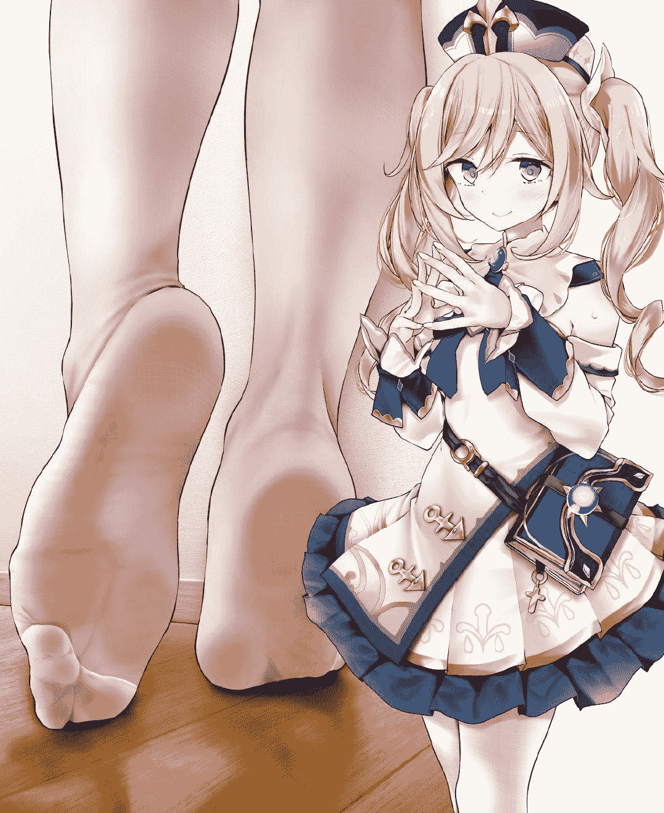

# 【原神同人】强化药剂可不能乱喝哟（芭芭拉）

作者：箭头君7号

TID：30008

 

# 1

<ignore_js_op></ignore_js_op> **W81ABU_0}6_8TN}QOBYUNJA.jpg** *(180.74 KB, 下載次數: 9)*

[下載附件](forum.php?mod=attachment&aid=ODY1ODZ8NDVlYTM5OGN8MTYyNDY5MzIyM3wxODIzMHwzMDAwOA%3D%3D&nothumb=yes)

2020-12-29 12:22 上傳 **芭芭拉冲呀！****[风起地]**谁是西风教会的牧师？　　谁是蒙德城居民心目中的偶像？？　　谁是提瓦特大陆上最可爱的美少女？？？　　谁是时不时给队友套上潮湿状态导致团灭的内鬼？？？？　　没错，就是这位充满了活力的灰发双马尾少女，芭芭拉！！！！！　　**“旅行者先生，你在哪里？”**芭芭拉气喘吁吁地赶到了风起地的神像处，但她想要找的人却并不在此处，**“不在么？明明可是你把我叫过来这里的。”**　　也许旅行者被什么敌人缠上了吧，现在能做的也就只有等了，芭芭拉相信旅行者不是会逗她玩的那种人。　　**“说是找到了有趣的东西，要给我看看……到底会是什么呢？”**　　芭芭拉四下看了看，只见不远处有一个小桌，上面摆放着一些不太常见的材料，以及一杯用看上去很普通的饮料瓶子装着的红色液体。　　**“看起来像是炼金台，旅行者是准备制作什么东西么，看不太懂呢，我还是别乱动比较好。”**　　但是一向喜欢吃辣的芭芭拉肯定不会忽略掉那瓶像是饮料的东西。自从旅行者知道了芭芭拉的喜好后，他也会经常准备一杯自制的辣味饮料。芭芭拉每次喝完，都会对旅行者的手艺赞叹不已。　　**“嗯……好香呢……还是这种杯子，绝对是旅行者为我准备的吧！”**　　芭芭拉坐到椅子上，毫不犹豫地把这瓶“饮料”喝光了。没错，就是芭芭拉期待的那种辣到舌根的感觉！　**　“呣，旅行者真是贴心呀~”**　　芭芭拉回味着嘴中的辣味，但奇怪的是，有一股倦意突然袭击了她的头脑。　　**“嗯？怎……怎么回事……好困啊……”**　　芭芭拉的上眼皮逐渐支撑不住，终于合住了。很快，她啪的一下就倒在了桌子上。　　**“芭芭拉？芭芭拉？”**　　空满头雾水地看着趴在炼金台上睡觉的少女。　　**“喂，你怎么在这里睡着了？醒醒！”**　　**“嘿嘿嘿……麻辣小鱼干……小鱼干……”**　　**“真是伤脑筋啊……”**空稍微看了下周围，就发现了已经变成空瓶子的“饮料”。　　**“不，不会吧！？快醒醒啊芭芭拉！”**　　空摇晃着芭芭拉的身体，就在此时，芭芭拉身上泛起了一丝荧光。　　**“这到底……”**　　空看着芭芭拉身上的奇怪现象，脑门上的冷汗越冒越多。　　然而这只是开始。因为接下来，随着清晰的肌肉挤压声，芭芭拉的身体好像是在逐渐变大！　　原本矮了别人一头的芭芭拉，现在光是坐着，就和空一样高了！　　**“天哪……”**　　看着越来越大的芭芭拉，空不禁往后退了几步。而芭芭拉的睡意也在此时逐渐消失了。　　**“呼，我，我睡着了……？”**　　芭芭拉睁眼，便是小小的旅行者。　　**“旅行者先生？你怎么这么矮？”**　　芭芭拉转向旅行者，并没有意识到此时的她还在巨大化，可怜的椅子已经发出了悲鸣声。　　**“你刚刚是不是喝了那瓶红色的东西？芭芭拉，不是我变矮了，是你变大了！而且你现在还在变大！”**　　**“嗯？变，变大？”**芭芭拉一时没反应过来空说的话是什么意思，**“不是旅行者先生变矮了么……”**　　**“芭芭拉！快看看你自己！”**　　**“呃？”**　　芭芭拉逐渐意识到了事情的不对劲。　　**“原来，是我在变大……好像真的是这么一回事……”**　　随着芭芭拉的巨大化，她的裙底也就正对着空了。　　**“白色……啊不我不能看！”**　　空立刻转过头，而椅子终于承受不住芭芭拉的重量，碎了。　　**“哎哟，我的屁股……”**　　芭芭拉掸去身上的木头屑，鸭子坐在了草地上，伸手压住了修女裙摆。而空开始翻起了他的那个看起来很小但是不知道塞了多少武器和料理的四次元背包。　　**“啊，不是这个，也不是这个……好像并没有应对这种情况的药剂啊，糟了！”**　　芭芭拉呆呆地看着眼前的旅行者可动手办。唯一的好消息是，芭芭拉的巨大化终于停了下来。　　即使如此，芭芭拉现在也太大了。　　以空和芭芭拉的视角来看，他们当然无暇顾及计算芭芭拉的身高了。但是他们不知道，不代表我们也不能知道。　　现在的芭芭拉，是巨大化了三十倍的偶像。几小时前尚能随时对芭芭拉使用摸头杀的空，现在在芭芭拉眼中只有五六厘米而已。　　虽然芭芭拉是贫乳，但是巨大化了三十倍后，她的胸围在提瓦特大陆是毫无疑问的第一名。　　芭芭拉此时的身高约是42米。需要旅行者攀爬半天的绝大部分峡谷，她只要稍微扒拉一下就能爬上去——或者干脆直接把峡谷给扒平。虽然她是个女孩子，但以她现在的力量，说不定真的可以。　　现在如果芭芭拉站起来的话，光是她的膝盖，就离地面十米以上了。就算是脚踝，也差不多有二米多的高度——还是脱了鞋的情况下。　　更恐怖的就是芭芭拉700多吨的体重了——当然，她还是永远也不要知道这件事比较好，虽然只是暂时的。　　**“旅行者先生？该怎么办啊！”**　　**“别急，让我想想……”**空作思考状，在草地上转了几圈。　　**“啊有了，如果喝了药水后眼睛变红的话，就说明有草药可以治！”**茅塞顿开的空眼前一亮，仰视着芭芭拉的脸庞。**“快，让我看看你的眼睛！”**　　**“哦？好的。”**　　芭芭拉赶紧双手撑着地面，弯下腰来，将脸凑到空前面。　　**“你这样不累么，把我捧起来就行了。”**　**　“好，好吧，这样么……”**　　芭芭拉轻轻伸出手，将空捏起来后，捧在了手上，凑近了她的眼睛。　　也正因为她的这个动作，空顺便得以欣赏了这位蒙德城偶像的纤纤玉手。　　很干净的手，白皙滑嫩，没有任何老茧，和他这种经常持剑战斗的人果然不一样呢。　　**“嗯……”**　　**“旅行者先生，我的眼睛怎么样了？”**　　**“没有红色……”**　　空不自觉地攥紧了拳头。　　**“啊？那要怎么办？”**　　**“别慌，或、或许我们可以看看舌头。”**　　空现在要做的就是赶紧让芭芭拉平静下来，但他自己也是装的。毕竟如果他不那么卖关子，或者干脆就直接不邀请芭芭拉的话，现在事情也就不至于这个样子了。　　**“诶，舌头也要？”**　　**“嗯嗯嗯，总之照我说的就对了！”**　　**“好吧。”**　　芭芭拉微微涨了嘴，同时闭上了眼。毕竟现在的情景多少会让女孩子感到害羞。空继续凑近芭芭拉的嘴，乃至于他的小脑袋都探进了这张深渊巨口里。　　从远处来看，一个少女闭着眼，似乎是要把口中的少年含在嘴里……很色气的感觉？　　**“啊这，黑乎乎的，看不清啊。”**　　**“那，我再把嘴张大点？”**　　空继续往前探去，但是不料双腿在这时候不听使唤，失去平衡了。　　**“哎呀！”**　　空就这么顺势掉进了芭芭拉的嘴里，而感觉到嘴里有什么东西的芭芭拉下意识闭上了嘴。她睁眼看到空空的双手，一下子就反应过来自己把什么东西含在了嘴里。　　**“诶诶诶？！”**芭芭拉的脸几乎要冒出蒸汽来，迅速把空吐在了手上，**“对不起，旅行者先生！”**　　**“舌头也没问题。”**　　从芭芭拉柔软的手掌上爬起来的空完全不在意刚才的小意外。　　**“对、对不起！我这就帮你擦干净！”**　　芭芭拉从口袋中掏出对于空来说比餐布还大的手帕，替他擦干身上的口水。　　**“没事没事，不过芭芭拉的口中真是香啊……根本没有任何异味，好想再闻闻……”**　　**“旅行者先生！你突然说什么啊！真是的，不要这么随便评价女孩子啊！”**　　芭芭拉的脸更红了。　　**“呃，我只是事出突然，顺口说了一下而已。”**　　**“所以到底要怎么办嘛，今天在蒙德城还有事呢……说起来，旅行者先生，那到底是什么饮料？”**　　弄了半天，芭芭拉才想起来还没弄明白这个问题呢。　　**“啊那个啊，那不是饮料啦，是我和另一组旅行者曾经在一次跨海旅行中，在一个上古遗迹中找到的强化药剂。”**　　**“强化……药剂……？”**　　**“准确来说，我找的是配方，不过之后就忘了。一直到今天才想起来，就临时做了一份。据说是能让人以一敌百，现在看你的样子，说不定真的能以一敌百！”**　　**“哎，都到这时候了就别拿我开玩笑了……那配方里有说解除办法吗？”**　　**“呃……没有，只是说了会持续上一天……”**　　**“一天？不不不绝对不行！别说一天了，一秒都不行！现在这个样子太羞耻了！只是被旅行者先生看到的话还好，要是让其他人知道芭芭拉现在的模样的话……”**　　芭芭拉说着，话语里逐渐带起了哭腔。　　**“啊啊啊，那个，别，别哭，我……”**　　满头大汗的空刚想安慰芭芭拉，但是令他惊讶的是，芭芭拉很快就恢复了正常的表情。　　**“没事的，芭芭拉，只是一时半会儿而已。这也不是什么太丢脸的事，对吧，旅行者先生？”**　　空这才想起来，芭芭拉是一个只有三十秒[失落时间]的坚强的女孩子，根本用不着他的帮忙。但是这一切终归是因自己而起，同时芭芭拉也一直没有怪罪他的意思，这倒是让空觉得很是尴尬。　　**“这样吧，芭芭拉，你就在这里等着，我现在就回蒙德城寻找让你恢复的办法。我保证，不出两个小时，一定能行的！”****“嗯，旅行者先生，路上小心！”****[不到一个小时后，空跑着回来了]****“真是快啊，旅行者先生，你真的找到了解药？”**　　**“没错，只是……”**　　空有些难于启齿地拿出了一个紫色药水瓶。　　**“这就是吗？”**　　**“嗯。但是它不是喝的，是涂的。”**　　**“为什么这种药会是涂的？！”**　　**“嗯……就是涂的，而且涂的位置还比较独特。”**　　说着，空指了指芭芭拉的脚。　　**“嗯……诶？？？意思是……得涂在……？”**　　**“脚底。****而且，还得配合史莱姆凝液……”**　　**“史莱姆凝液？”**　　**“没错，而且必须是现成的，新鲜的史莱姆凝液。”**　　**“那要怎么办？”**　　**“嗯，也不是很难……”**风指向了远处一堆懒洋洋的史莱姆，**“这样吧，我先把药给你涂上，然后，你把那些史莱姆踩扁？”**　　**“踩扁？！我？！”**　　**“没错……目前来看，这是最好的办法了……”**　　**“呃，听上去好恶……但，好吧，也只好这样了吧。”**　　于是，芭芭拉脱下了鞋子，露出少女那饰着白色薄丝的莲足，将脚底探到了空的眼前。同时用手压住了裙摆。　　**“唔呃，旅行者先生不会嫌有味道吧……”**　　**“放心啦，芭芭拉的脚，有种说不出来的香味呢！”**　　空说着，甚至主动凑近了这双尤物。　　**“那种事情以后再说啦！袜子，需要脱吗？涂药的话，也得脱掉吧……”**　　毕竟芭芭拉穿的是连裤袜，如果要脱下来的话会很麻烦的，况且现在还有空这个异性在场。她轻抿着嘴唇，略显不安。现在，她的足底全长几乎有五米高，对于空来说有着完全不亚于巨像的压迫感，但是她的微微蜷缩着的脚趾和足底上散发出来的清香却彻底打消了这股压迫感。　　**“如果你的袜子很薄的话，应该就不用了吧。”**　　空摸着芭芭拉的脚底，却突然想起什么事来。　　**“不对啊，会弄脏袜子的，到时候洗起来也会很麻烦吧。”**　　**“唔，这个倒是没事，毕竟我是可以用元素清洗的。不过，湿哒哒的袜子穿起来也不会舒服吧……”**　　芭芭拉站起来，踩在了松软的地面上：**“旅行者先生，能，转过去吗……就一会儿……”**　**　“放心，我没有偷窥女孩子脱衣服的爱好。”**说着，空也乖乖地转过了头。　　**“那么，嘿咻~”**　　身后传来丝袜与大腿的摩擦声，更别提现在的芭芭拉是巨大化三十倍的状态，所以这种令男人无法不起反应的声音也差点把空的魂给勾了去。不过穿越过无数世界的他，是完全有自制力不让自己的视线被吸引过去的。　　**“好啦，旅行者先生，可以转过来了。”**　　连裤袜已经被放在了一旁的草地上。芭芭拉背对着空，趴了下来。　　真是完美的脚底！白白嫩嫩的，让人看一眼就有想抱起来揉揉捏捏的欲望，脚趾也很可爱，真是比荧的要好看太多了！　　这是空的脑子里一瞬间产生又消失的想法。　**　“那么，开始涂了哦。”**　　**“嗯！”**　　要涂的话，就先从脚跟处开始吧。　　空抚摸着芭芭拉的脚跟，但即使是相对来说最粗糙的脚跟，也给空带来了前所未有的触感。　　更别提在没有了袜子的束缚后，撑在芭芭拉足底上的空所闻到的，是纯正的芭芭拉足香味。虽然他很喜欢芭芭拉的气味，但是也很奇怪为什么芭芭拉成天跟着他们在各种峡谷里跑来跑去却仍能保持美少女的清香。　　难道说这就是美少女偶像的加成么。　　**“唔……有点，痒……”**　　**“那我慢点？”**　　**“不用不用，旅行者先生，按你自己的节奏就好。”**　　脚跟之后，就是脚心——女孩子身上最敏感的部位之一了。　　意识到这点的空尽量减小了涂抹的力度，但是由于体型的缘故，加上芭芭拉的皮肤实在是太柔嫩了，他那小小的手掌完全是在给芭芭拉挠痒痒。　　**“唔……哈……哈哈！旅行者先生，好、好痒！”**　　**“呃，芭芭拉你忍耐一下，马上就好……”**　　经受不住的芭芭拉忍不住晃了几下脚丫，如果空没及时抓稳的话，就会被甩飞了。而且现在他的身体不断地与芭芭拉的足底发生撞击，就像是芭芭拉在踢他一样。　　赶紧完成这里的工作之后，就只剩脚指头了。十颗脚趾头就像是超大号的葡萄一样，勾起了空的食欲——他可是一直没来得及吃东西呢。　　今天，也是空第一次与芭芭拉的脚发生如此近距离的接触。也许是因为芭芭拉巨大化的缘故，也许是因为芭芭拉本来就有的个人魅力。此前不论是帮荧洗脚，还是给丽莎做足底按摩，甚至是帮应急食品揉腿，还有与骑士团其他女性的各式各样的邂逅，空都没有这样的感觉。　　只是，只是稍微舔一下的话，芭芭拉应该不会发现的吧……　　这么想着的空低下头，略微舔了一下芭芭拉的拇趾。　　咸咸的味道，混合着少女特有的荷尔蒙气息。　　很好吃呢。　　而芭芭拉也没有什么反应，空的心中不禁暗喜了一下。但是他是个很有分寸的人，不会在这种时候得意忘形。稍微回味了下刚才的滋味后，他就做起了本分工作。　　**“芭芭拉，已经涂好了。”**　　**“谢谢旅行者先生啦，不过还真是痒呢。”**　　芭芭拉站起来，然后抬腿看了看脚底上的药水，再把目光放回那些史莱姆身上。　　**“然后，就是史莱姆凝液，好的吧。”**　　身高四十多米的少女挎起了巨大的步伐。每走一步，空都觉得脚下的大地在震撼。毕竟风起地的泥土本来就是适合作物生长的，柔软的类型，可当然禁不住这位上百吨体重的牧师兼偶像。　　虽然史莱姆这种生物并没有智力，就算看到三四十级的冒险者也会不自量力地对他们使用撞击。可是根本没有脑子的它们，看到现在的芭芭拉，居然也本能性地往后退了。　　**“史莱姆们，失礼了！”**　　芭芭拉抬起了一只脚，在史莱姆群上方犹豫了一会之后，终于还是踩下去了。　　将近五米长，两米宽的巨足，在一瞬间就踩扁了八只史莱姆。　　炸裂的史莱姆喷出了一大堆蓝色的黏液，全沾在了芭芭拉红润的足底上。　　**“哦天啊，真的好恶心啊……”**　　脚底那种黏糊糊的感觉让芭芭拉觉得很不舒服，但现在也只能照着旅行者说的做。她又抬起另一只脚，对准了剩下的史莱姆。　　**“抱歉！就疼一下，一下就好！”**　　噗叽！　　剩下的五只史莱姆也变成了一堆经验值。　　**“所以说为什么要对野怪道歉啊……”**　　空在一旁无奈地说道。而芭芭拉开始用双脚摩擦着地上的史莱姆凝液，发出了很奇妙的液体交融声。　　很快，芭芭拉的足底又泛出了微微的紫光。这种紫光从足底一路蔓延到她的全身，随后，她的体型就开始逐渐恢复了。远处被芭芭拉脱下的鞋袜也恢复了原本的大小，看来这个强化药水是连人带装备一起生效的。　　**“居然真的有效！谢谢你，旅行者先生！”**　　**“不用谢啦，说到底，这事还得怨我……”**　　**“没关系哟，反正最后也是有了旅行者先生的帮忙，我才能恢复过来的。走啦，蒙德城的大家还在等着我们呢！”**　　**“哦哦，也是呢。”**　　相信以后芭芭拉绝对不会喝来路不明的东西了。而且自从芭芭拉留下的脚印被其他冒险者发现后，蒙德城就多了关于神秘巨人的传说……