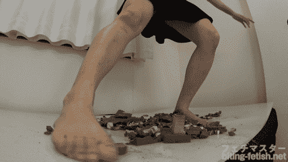

# 【改编+翻译】 60% 关于奏音花音小姐的事情

作者：乔治·华盛顿

TID：30764

<title>1</title> <link href="../Styles/Style.css" type="text/css" rel="stylesheet">

# 1

*本帖最後由 乔治·华盛顿 於 2021-5-2 01:16 編輯*

好久不见，又是我！

这次的文章同样是从xcream上拉下来的，同样的翻译+改编（因为附属的原文太短了，只有几行字）

原名：《缩小都市・小人を蹂躙する巨大な素足后编【奏音かのん】》

地址由于权限缘故暂时无法放送

虽然本质上是缩小属性，但由于内容更偏向于巨大少女板块，因此笔者放在了这里

本文是本系列作品的第二部分，与之前所做的《巨大少女排除压力的方法是……》及《巨大娘陆上交通公安队》相比，本作口味要清一些，主角是可爱的美少女奏音花音（Kanon Kanade）小姐~

<title>2</title> <link href="../Styles/Style.css" type="text/css" rel="stylesheet">

# 2

 <ignore_js_op>[1-1Z602231627.jpg](forum.php?mod=attachment&aid=ODg1MTF8NTg0YmQzZjd8MTYyNDY5MDQ5N3wxODIzMHwzMDc2NA%3D%3D&nothumb=yes) *(37.91 KB, 下載次數: 1)*

[下載附件](forum.php?mod=attachment&aid=ODg1MTF8NTg0YmQzZjd8MTYyNDY5MDQ5N3wxODIzMHwzMDc2NA%3D%3D&nothumb=yes)

2021-4-24 20:06 上傳  

</ignore_js_op> <title>3</title> <link href="../Styles/Style.css" type="text/css" rel="stylesheet">

# 3

*本帖最後由 乔治·华盛顿 於 2021-4-27 18:12 編輯*

下午。

正值下班时间。

一列列满载的电车将劳累了一天的人们从商业区接回住宅区中。

街上随处都是三三两两歪着领带，准备去随便哪家居酒屋喝杯冰镇啤酒放松下的人们。

“轰！——”

突然，一声巨响传来，伴随着不祥的大震动。

“是地震！快逃！”

早已经历过无数类似经历的人们迅速从大楼和平房内涌上了街道之类的开阔地方。

震动一下便停止了，可是人们却止不住惊讶。

上一秒高照的艳阳消失了，却而代之的是类似日光灯的柔和白光。

所有的手机都没信号了。

包括互联网，还有其他电子设备，都不能使用了。

不仅如此，连电力的供给似乎也中断了，大楼里的灯光成片成片的暗下去。

人们开始慌乱。随处可见举着手机试图获取信号的人。

“咚——咚——”

路边便利店的内部开始微微摇晃。货架上的商品慢慢移动，直至掉落。

但是仔细观察的话，和地震的摇晃是不同的。摇晃是有规律的。就像人在走路一样……

然后，在城市的某个方向，从类似于门一样的东西后出现的，是身穿白色连衣裙和黑色浅口高跟鞋的巨大少女，正眯起眼睛仔细观察着城市。

—————————————————————————————————————————————————— ————————

奏音看着被缩小传送到自己卧室地板上的城市。

“诶？这次怎么这么小？”奏音自言自语的嘟囔着。

从某个时候起，奏音唤醒了将东西缩小、传送到别的地方的能力，只不过缩小的倍数不能固定。

每当工作压力积累的时候，奏音就会将人或者小镇召唤到房间里，将他们完全摧毁以释放压力。

不喜欢的老板，在路上向自己搭讪的流氓，狡猾的同事，乃至满员的公交车、整个小镇……

今天在公司里，被坏心眼的上司逼迫，在大热天里跑业务。

于是准备将下班途中的上司传回家里，和他好好“谈谈”，没想到把他所在的整个街区一起传送回来了

但是这次召唤来的城区似乎格外小。

奏音的身高是166cm，是相当娇小可爱的女孩子。

但是，脚下城区里20层楼的公寓，连脚踝都远远够不上。

也就是说，在小人们的眼里，自己大约是1000倍的大小左右。

“嗯……大概有十几万人的样子吧？”

从“高空”看下去，勉强能看到许多小黑点，这样的情况要想找到上司再报复是根本不可能的了。

但是，奏音并没有感到沮丧——这个大小也意味着有更多的人被缩小传送了过来，也就可以虐杀更多的人了。

想到这里，抱着双臂的奏音对着脚下的城市露出了残酷的微笑。<title>4</title> <link href="../Styles/Style.css" type="text/css" rel="stylesheet">

# 4

 <ignore_js_op>[gia-37-2-contents-001.jpg](forum.php?mod=attachment&aid=ODg1MTJ8ODdiN2VhN2V8MTYyNDY5MDQ5N3wxODIzMHwzMDc2NA%3D%3D&nothumb=yes) *(96.96 KB, 下載次數: 2)*

[下載附件](forum.php?mod=attachment&aid=ODg1MTJ8ODdiN2VhN2V8MTYyNDY5MDQ5N3wxODIzMHwzMDc2NA%3D%3D&nothumb=yes)

2021-4-24 20:08 上傳  

</ignore_js_op> <title>5</title> <link href="../Styles/Style.css" type="text/css" rel="stylesheet">

# 5

*本帖最後由 乔治·华盛顿 於 2021-4-27 18:14 編輯*

“要来比比看大小吗？”奏音一边笑着一边脱下了高跟鞋。

这个大小的话，如果穿着鞋子的话，踩东西完全没有任何感觉。

“咚！”

奏音随意的将冒出白色蒸汽的高跟鞋扔在了城市的旁边。

从闷热的高跟鞋里解放出来的双脚有着很高的温度和不妙的气味。

如果是平常大小的话，肯定是会对这样的事情感到羞耻的。

但现在不一样了。

这里的人们再被奏音缩小的那一刻就已经失去了作为人的资格，成为了奏音消减压力的玩具。

面对玩具的话，自然而然就把羞耻心抛之脑后了。

“咚！——”

比刚刚更加沉闷的声音响彻城市。

奏音抱着膝盖坐了下来。

两只宽大的脚底版骄傲的挺立在城市边缘，面向城里的十几万人，哪怕是最气派的大楼也超不过脚后跟的高度。

从脚趾缝源源不断产生的脚汗流过通红的脚底板，形成了壮观的瀑布。

因为一下子和空气接触的缘故，从闷热的脚底上散发出的浓郁的酸臭味袭击了城市。

以双脚为中心，奏音的脚臭味席卷了邻近的街区。

脚臭的风暴顺着街道，钻进小巷，将所有没有防护措施的人们温柔的包裹起来。

从正常大小的人闻起来的话，是让人有些难以忍受的味道。

但从小人的角度来说，就和毒气没什么两样了。

哪怕是吸入一点，都会变得四肢乏力，甚至倒下不起。

第一批受害者在奏音行动之前就产生了。

“哦呀，这是……步行街吗？”

奏音的脚正对着的，是将整个城市一分为二的宽敞步行街。

每逢周末，数以万计的人都会在这里购物、消费。

现在，在那里，几千名恐慌的的小人们正在四散而逃。

奏音小姐自己也会光顾类似的地方，里面的店家多到一天都逛不完。

“嗯……似乎是个不错的地方呢？”

奏音歪着脑袋，坏笑了起来。

“嘿！——”

突然，奏音放下膝盖，驱动着巨大的双脚沿着步行街移动。

“嘎吱——嘎吱——”

巨大的双脚像压路机一样将遇到的所有东西都压碎在下面。

坚硬的大理石承受不了奏音巨足的重量，被紧紧地压碎、深埋到下方的地基里。

来不及逃走的人们也一波接一波被凄惨的压碎在奏音的脚后跟下。

不仅如此，宽度近百米的步行街容纳不了奏音的双脚，两旁的建筑也被波及进来推到、粉碎、崩塌。

巨大的双脚一边蒸腾出脚汗，一边散布着死亡。

几千人被移动着的大杀器追上、压垮、碾碎，然后又埋进凹陷了几米深的地基，被紧紧地压实，只有少数人设法从连同着的小巷钻到了别处。

“轰！——”

终于，奏音伸直了双腿，双脚已经达到了整个城区中心的位置，骄傲的俯视着周围的一切。

看着自己双脚制造的惨案，想象着有不知道多少人一边惨叫，一边被自己压碎，奏音便心情高涨，不禁捂着嘴轻轻笑了出来。

“~怎么样，大家对我的脚，有何感想？”

奏音不安分的扭动着脚趾，同时小幅度的晃动双脚，将更多的人、车、房屋卷入灾害之中。<title>6</title> <link href="../Styles/Style.css" type="text/css" rel="stylesheet">

# 6

 <ignore_js_op>[gia-37-2-contents-003.jpg](forum.php?mod=attachment&aid=ODg1MTN8NGI4MTUxMjd8MTYyNDY5MDQ5N3wxODIzMHwzMDc2NA%3D%3D&nothumb=yes) *(115.08 KB, 下載次數: 6)*

[下載附件](forum.php?mod=attachment&aid=ODg1MTN8NGI4MTUxMjd8MTYyNDY5MDQ5N3wxODIzMHwzMDc2NA%3D%3D&nothumb=yes)

2021-4-24 20:10 上傳  

</ignore_js_op> <title>7</title> <link href="../Styles/Style.css" type="text/css" rel="stylesheet">

# 7

> [御坂01403 發表於 2021-4-24 23:27](https://giantessnight.com/gnforum2012/forum.php?mod=redirect&goto=findpost&pid=466145&ptid=30764)

> 噢噢噢噢噢噢看到是lz的新作品立马就收藏了！感谢！

阿里嘎多～

66666666666666666666666

<title>8</title> <link href="../Styles/Style.css" type="text/css" rel="stylesheet">

# 8

“救命！”

“谁来救救我！”

被倒塌的建筑物废墟所掩埋、被挤压变形的汽车困住的人们拼命地呼救着。

“嘿咻！~”

仿佛是听到了脚下人们的呼救声一般，奏音收回了双腿，然后慢慢站了起来。

奏音身体的阴影覆盖了大半个城市。

“哼哼~”奏音冷笑着看着脚下的城市

一想到讨厌的上司大概正在不知道什么地方吓得瑟瑟发抖，奏音便赶到心情畅快。

可以的话，希望他活到最后，被慢慢的折磨死~

恐怖的想法从心底里冒出，奏音嘴角的弧度更大了一些。

稍稍俯下身来仔细观察，因为是新建城区的缘故，被缩小而来的城市整体上被划分为了错落有致的长方形街区。

有连片的公寓楼、商业区、购物中心，公园，还有别墅区——大概上司也住在这种地方。

每个街区大概只能勉强容纳下奏音的一只脚。

“那就……从这里开始吧！”

重新直起身子，奏音对着城市边缘的绿化公园区，高高的抬起了大脚。

“嘿！——”

一边发出可爱的声音，奏音一便慢慢的落下了脚。

诺大的公园，是遇到地震灾害时避难的首选。

现在，也有几千人躲在点点绿荫中避难，期盼着不会被可怕的巨人少女发现而躲过一劫。

可是，那样的希望终究被奏音的巨脚踩碎了。

很快，遮天蔽日的阴影覆盖了公园，奏音白嫩的脚底化作死神，裹挟着臭气袭击了那里。

奏音尽可能小心的控制脚下落的速度，希望能够慢慢享受。

但是，因为是公园的关系，没有什么高大的建筑，草啊树啊人啊，在奏音看来完全都是可以忽略高度的存在。

“嗯……”

离地面大概只有几厘米的距离了。

但是，对地面上的人们来说，高悬在几十米上空的巨大物体，遮蔽了一切光线。不管是平视还是抬头仰视，视线全都被奏音的巨脚所挤占。

空气中弥漫着的令人作呕的臭味加剧了人们的痛苦。

从脚趾缝滴落的一滴脚汗，将正下方，躲在树下避难的几人包裹、吞没，让他们最终在弥漫着奏音脚臭味的水里窒息身亡。

“咚！——”

为了试探到底离地面的距离，奏音将大脚趾踩了下去。

“唔……好软~”

巨大的红润物体以迅猛的势头落了下来，将那里的树林和其中的人们砸进了地表以下。

松开脚趾的话，可以看到在那里，形成了直径几十米的不规则圆坑

里面七零八落的散布着被压成不规则形状的树木，和难以辨认的断肢残臂。

“有幸”目睹这一场面的人们几乎控制不住的呕吐起来，乃至精神失常的晕了过去。

“唔……有点酸了”

一直将脚维持在一个高度是很困难的事情。

犹豫了一下，奏音还是决定一次性将脚压下去，毕竟，可供使用的玩具还有很多。

“咚！——”

大地发出沉闷的响声。

奏音的巨脚终于完全落了下来。

不管是草木花朵、街道，还是人也好车辆也好，在恐怖的重量面前连一秒钟也支撑不住。

许多人本能的在最后一刻伸出手想要阻止奏音巨脚的下落，但换来的只是在死亡前多经受一次骨折的痛苦。

所有的东西都被深深踩进了地基，被脚掌压平、埋实。

不仅如此，在将数千人踩碎后，奏音又转动脚腕，继续蹂躏剩下的东西。

电线杆、路灯、植被……所有东西都被卷入不安分的大脚下，踩平，碾碎。

“呼~”

奏音抬起脚，仔细凝视着那个稍稍有些变形的巨大脚印。

只能看到土黄色大坑里，零碎分布着绿色。

“怎么一点感觉也没有呀……简直就像是踩在了泥土上”

对自己的脚刚刚杀害了几千人的事毫不在意，奏音一边抱怨着脚感，一边再次将脚放了上去。

然后，突然用力——

整个生态区被奏音的脚拖动，硬生生扯出了城市，原本正方形的城区顿时少掉了一个角，在与之毗邻的住宅区留下了许多裂缝。

落下的些许泥土散落在地板上。

“哼哼，怎么样？看到我的力量了吗？小人们？不想死的话……好像也没有不死的办法呢，嘻嘻~”

奏音开怀大笑着，朝着下一批受害者，高高抬起了脚。<title>9</title> <link href="../Styles/Style.css" type="text/css" rel="stylesheet">

# 9

 <ignore_js_op>[gia-37-2-contents-012.jpg](forum.php?mod=attachment&aid=ODg1NDh8MGU2Y2E0Y2J8MTYyNDY5MDQ5N3wxODIzMHwzMDc2NA%3D%3D&nothumb=yes) *(110.26 KB, 下載次數: 0)*

[下載附件](forum.php?mod=attachment&aid=ODg1NDh8MGU2Y2E0Y2J8MTYyNDY5MDQ5N3wxODIzMHwzMDc2NA%3D%3D&nothumb=yes)

2021-4-27 18:10 上傳  

</ignore_js_op> <title>10</title> <link href="../Styles/Style.css" type="text/css" rel="stylesheet">

# 10

我还有另外一篇原创文章正在作业中，到时也请大家多多支持~<title>11</title> <link href="../Styles/Style.css" type="text/css" rel="stylesheet">

# 11

突然，城区的上空出现了可怕的巨大赤脚。

脚底的面积足以匹敌整个城区。

虽然还悬浮在空中，但由于那只巨脚实在是太大了，就连光线也统统被遮蔽，城区的大半陷入了黑暗。

街区里的人们已经目睹了奏音在生态区的破坏，但是没想到厄运这么快就降临到自己的头上。

抬头望去，连最前端的脚趾和最后方的脚后跟都不能同时收入视线。

如果仔细观察的话，会发现那只脚有着漂亮的曲线、圆润的脚趾，还有细腻的肌肤。

甚至连脚底的纹路和里面嵌着的各类建筑残骸都可以看得一清二楚。

不过，危在旦夕的人们显然没有这个心情去欣赏悬在自己头顶上的大杀器，想尽办法逃出这只脚的覆盖范围。

更何况，随着那巨大的脚趾不停搓揉，各种残骸、人类的肢体、泥土……纷纷落下，砸在裸露在外的人们身上，让人们葬身室外。

不久，巨大的赤脚开始慢慢降落。

城市里的空气受到剧烈压缩，沿着街道之类的空旷地方快速流动，发出“呼呼”的响声。

脚下处在夜晚一般的城区显得更加黑暗了。

不仅如此，伴随着巨大赤脚的下压，令人难以忍受的脚臭味在城区里蔓延开来，毒害着人们的神经。

这时，巨脚碰到了建筑。

因为建造之初是统一规划的缘故，城区里所有的公寓楼都是差不多的样式，相同的高度。

所有的建筑在接触到那柔软脚底的同时，都从最上层开始崩塌了。

能够抵抗大地震的坚硬混凝土连一下也支撑不住，

一边发出“ゴゴゴゴ”的悲鸣，一边解体了。

在路上奔走的人，坐在交通工具里逃亡的人，在大楼和民防设施里避难的人……

没有人能从遮天蔽日的巨脚下幸免于难。

所有人都被公平的踩扁了。

地下室里的人也不可能相安无事。

因为那巨脚的恐怖重量，即使在接触到地面后也没有停下的趋势，

反而把之前踩碎的各种东西，连带着道路和地表本身又一起向下挤压

所有的东西都被紧密的压实了。

之后，脚慢慢抬起。

这一次，被踩碎的城区残骸从宽阔的脚底稀里哗啦的倾注而下，

落到了取代整个城区位置的巨大脚印里面。

————————

“啧，果然呀，还是大楼什么的踩起来有感觉♫~树木啊、森林啊这些东西完全不能与之比较呢”

奏音捂着脸颊，欢快地说道。

故意的把脚悬停在城市的上空，搓揉脚底，将之前踩碎的东西一股脑的还给小人们。

最大限度的榨取人们的恐惧，只有这样，才能令自己感到愉悦。

一想到数以万计无辜的人们，痛苦又绝望的死在自己脚下，心情就变得异常高涨。

不知什么时候，连内裤都被沾湿了一小片。

“真是垃圾呢！”

将脚高高抬起，膝关节弯曲到90度，奏音用远超走路所需要的力气，重重的朝着另一片城区踏下。

“连本小姐的脚都抵挡不住的你们，大概也只配做我的玩具吧？”

每次将脚踩下，感受到无数的人和物崩溃在自己脚下，潮吹一般的酥麻快感就会袭遍全身。

巨大的双脚不需要刻意指挥，就会一下接一下朝着完好的地方落下，为几万人带去死亡。

“嘻嘻，你们建造出一座城市，需要多少年呢？”

奏音弯下腰，温柔的看着眼前尚且完好的大片城市。

为了让一座座高楼拔地而起，城市的建设者们呕心沥血，不知。

“真是辛苦了你们的奋斗呐~”

如果不是刚刚践踏了数十万人，穿着一袭白色连衣裙，用温柔声调说话的奏音或许会被人们当做天使也说不定。

“但是~”奏音直起了身板，又一次抬起了脚“踩扁你们辛苦建造的大楼，我连一秒钟也不需要哟☆！”

“咚！——”

伴随着传遍城市的巨响，又一个城区连带着在里面生活的几万人在奏音脚下灰飞烟灭。