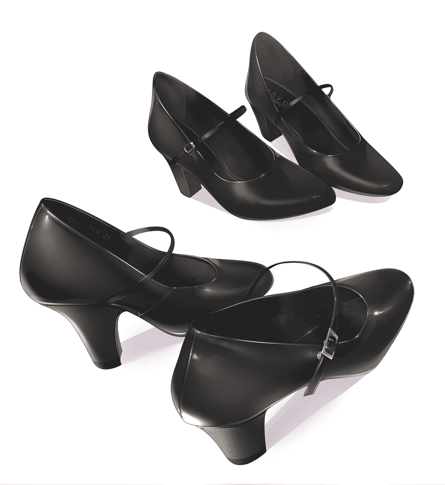
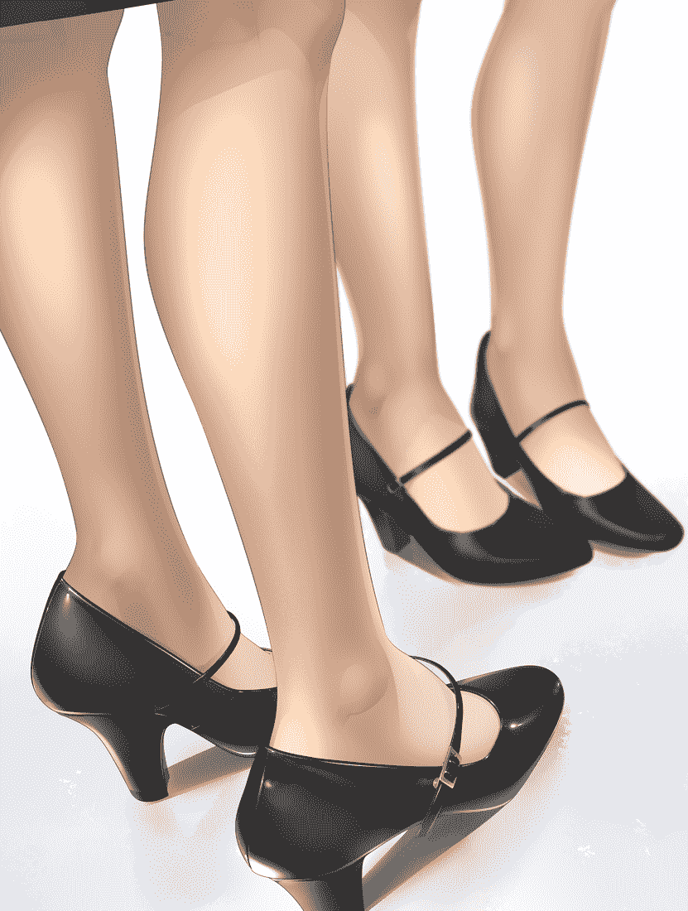
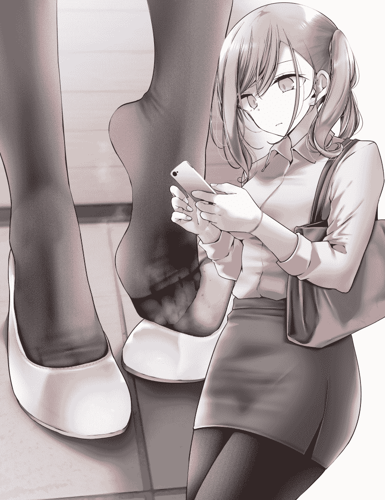
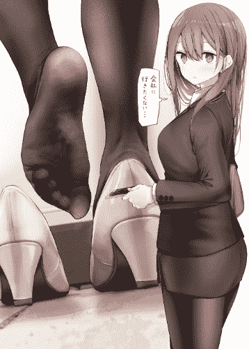

# 【翻译】働く女性の必需品【B-1】配属初日【b-1】治験の...

作者：ganbalakun

TID：29426

 

# 1

*本帖最後由 ganbalakun 於 2020-9-6 21:28 編輯*

原文链接：[https://gs-uploader.jinja-modoki ... php?uname=CHARLOTTE](https://gs-uploader.jinja-modoki.com/upld-index.php?uname=CHARLOTTE)

译名：职业女性的必需品

这篇文章我自己看着非常好，喜欢鞋内描写的可以看看，随缘更新，之前站内大佬翻译过该作者的A篇，这个作者善用小人和女巨人两个角度写。在这里先占个坑

 

# 2

【B-1】分配第一天

◯月×日晴天

毕业后工作已经半年了。研修期总算结束了，今天是接受期待已久的新药研究部分配的日子。虽然有点紧张，但是很在意新的职场是怎样的。

我工作的这个神岭制药公司经常进入“想工作的企业排名”前10，作为“女性活跃的企业”也是有名的公司。会不断利用最尖端的技术开发对人们的生活有用的药。我也想努力早点成为独当一面的研究者！

上午进行研修使用的桌子的整理和清扫，午饭后终于分配到新的工作岗位。穿惯了的浅口高跟鞋的脚步声响起，快步走向研究室。

从今天开始，我所分配的新药研究部正如其名，日夜进行着新药的研究和开发，其成果备受世界瞩目。前几天，高速治愈人体受伤了的细胞的实验成功了的事被新闻报道了。另外，去年发售的新药“FINE2NA～L”，据说是改变了感冒药的历史的效果，不仅在国内，在欧美和亚洲圈也获得了很大的份额。支撑着神岭制药业绩的顶梁柱就是这个新药研究部，就算说这个部门支撑着公司，也不为过。

另外，这里也是大多数女职员工作的部门。精神抖擞工作的女性研究员，总觉得很帅啊！我也是，我今天也穿着平常的西装和白衣，心情已经是一流研究员了。好好收紧之后，再整理一下服装，确认没有问题。深呼吸后，打开研究室的门。

“失礼了！”元气满满地寒暄之后环视室内，很多的前辈研究员们工作着。几乎所有的人都身着白衣，渐渐产生了被分配到研究机关的实感。还有，果然，正如大家所评价的那样，女性职员非常多。与其这么说，不如说找不到一个男人。这里是女性专用楼层吗？

“你是夜樱小姐吧，我在等你。我是负责新人教育的黑川。请多关照”

态度温和的前辈跟我搭话了。

“今，从今天开始要分配到这里了，我是夜樱コヨミ！”

“哎呀，不用那么紧张。工作必要的事情我来告诉你，请慢慢适应”

“好的，请多关照！”

今后要受到她关照的黑川前辈稳重而文雅。穿着干净的黑色西装，穿着白衣，端正的脸型。艳丽的黑发在脖子后面用可爱的红色丝带束起，表现出漂亮的女性模样。指尖涂了淡桃色的指甲，可以知道修剪得很好。化妆淡雅，皮肤看起来很年轻。也许和我的年龄没什么不同。尽管如此，表情却笑容满面、沉着冷静，充满着大人的魅力。能立刻关心紧张的我，温柔的前辈让我放心了

简单地结束了寒暄之后，我被黑川前辈带领着参观了一下研究设施的内部。不仅每个地方都有最先进的设备，研究中使用的器具也保持清洁，被整理得井井有条。另外，因为女职员很多，到处都摆着可爱的花，还有布娃娃。

“黑川前辈，我听说是制作药品的设施……虽然有更加坚固的印象，但这里真的是非常愉快的气氛呢”

“是啊。因为研究结果出来了，这里可以自由。大家都很活泼地工作着”

“这里的研究备受瞩目！这样的自由环境与成果紧密相连”

“呵呵，太被关注了也挺辛苦的。”

“…那个，就是那样的东西吗？”

“还有，大家能开心工作的理由不只是自由，还有一个。”

“诶？”

“到了，在这里。”

我走过长长的走廊，被带到了一个单间。虽然不是很大，但是桌子和沙发，还有茶点。这里是休息室吗？

“夜樱小姐，马上就要开始了，这是你最初的工作。今天您要帮忙做某药的实验”

“实验……”是吗？

「是的。从现在起，进行我们最近开发的新药的试验。虽说是临床试验，当然吃药的不是你哦。请您管理吃了新药的豚鼠。非常简单的工作哦”

“哇，知道了。”

“我去准备了，请在这里稍等一下。”

黑川前辈微笑着走出了房间。按照她说的，我决定坐在沙发上等着。

豚鼠就是那只可爱的老鼠一样的动物。我很喜欢动物，所以有点期待。比起那个，被给予的新药是怎样的东西，很在意这个。

几分钟后，黑川前辈不知为何拿着小木箱回来了。

“夜樱小姐，让您久等了”

前辈把木箱放在桌子上，坐在我旁边说明了临床试验的内容。

现在开发中的药，据说有使构成身体的骨和肌肉的强度增加，变得难受伤和病的效果。是所说的极为效果高(贵)的兴奋剂的感觉吗？据说这个将来会为身体不自由的各位的生活提供帮助。

说明到这里之后，前辈稍微低下头说“但是……”添加了。

“夜樱小姐，刚才提到的新药的制作目的到底是‘表面上的理由’。众所周知，这里的药物经常受到世人的关注。所以我们必须更加注意信息管理。特别，关于象此次一样的特殊的药的开发，预先准备『表面的理由』是有必要的。无论发生什么事情，药物的信息都不能泄漏到公司外”

“…是、是”

看到前辈非常认真地说话的样子，稍微有些紧张的时候，前辈突然微笑着，从侧面窥视着我的脸。

“…但是，如果信息处理得好的话，这个工作会非常开心的！所以，从现在开始，我通过考试来告诉你那个乐趣”

“哈，好的，请多关照”

前辈笑嘻嘻地表情很开心地打开了放在桌子上的小木箱的盖子。

“夜樱小姐，请看。你接下来要管理的豚鼠就是这个”

“…诶！？这是什么！？”

看到木箱里的我，怀疑自己的眼睛。被称为“豚鼠”的小生物，不是可爱的老鼠那样的动物，而是人的形状。大小大概只有2～3厘米左右，好好地穿着衣服，仔细看的话比我年长吗？好像是比中年稍微靠前的气氛的大叔。用害怕什么的表情看着这边。

“这个，这个，人偶…是吗？像个活的小人……非常真实，好像真的活着”

“呵呵，夜樱先生，这位不是人偶哦。是试喝此次的新药，临床的参加者。身体变小是受到我们开发的缩小药的影响”

“缩小药！？有这种东西吗！？也就是说，这个小人难道就是普通人吗！？”真是难以置信……”

“是的，没错，这位是和我们一样普通的人。就在最近，你知道在开发使物质变小的装置时成为了话题吗？报道称，通过将“表面上”的物质缩小，可以期待将来物流的效率大幅提高

”

“这个消息我知道。但是，那只是理论上是可能的，应该还没有达到实用阶段吧……”

「是的。“表面上”就是这样公布的。但是，实际上……”

黑川前辈用手指摘了小人的实验者，递到了我的眼前。

“像这样……新药研究部已经到了可以实用的阶段，只需服用就能减小生物的缩小药已经完成了。呵呵，吃惊了吗？”

“…好的。非常吃惊。但是，把人变小，到底要做什么呢？”

“呵呵，夜樱小姐。我们自己的目的是用于“各种各样的事情”哦”

“…啊？“各种各样的事情”

“这个……在这个公司能开心工作的理由之一。虽然不能大声说。呜呼呼」

前辈的语气一直都很柔和，但是现在，一瞬间觉得眼眸深处似乎窥视到了什么黑乎乎的东西。“…虽然说了些可怕的话，但虽说是‘使用’，那也是在考虑被试验者自身安全的前提下进行的。为此，给这位患者服用了这次的新药。确认新药所带来的耐久性能是本次临床试验的最大目的。同时服用缩小药，只是为了让临床试验更容易进行”

“是，是吗…”

没想到，使物质变小的技术已经完成了。与其这么说，倒不如说实际被缩小的人在眼前，还不能相信。

“那，然后呢……”接下来我该做什么呢？

“呼呼，马上就能准备好了，请再稍微等一下哦。”

于是，前辈用小白布卷起小人的身体。被试验者处于只有头部露出的“席卷”状态。所谓临床试验，就是被试验者的身体不能像那样动弹而进行的，第一次知道了。被试验者好像在喊什么，前辈用温柔的声音回应。

“没关系，可能有点拘束，请忍耐一下。我想很快就会习惯的。呼呼”

刚才前辈的表情有点恐怖，可能是心理作用吧。对变成了小人的被试者也用温柔的语言来对待，重新看了一下，是总是笑眯眯的黑川前辈。

看到被试验者变老实了，前辈蹲在我面前再次开始说明。

“神岭制药是非常自由的职场愉快工作的环境……如果一整天做着研究也有累的事，紧张状态也积蓄。在研究所内四处转动会出汗，当然也会弄脏身体。尽管如此，药品的开发实验长时间离不开办公桌的情况也很多。其中住进公司好几天工作也不新奇。这样的话，对女孩子来说会比较在意仪容吧。那样的时候，这个小人就会变得有用。这次，是为了那样的职业女性的实验”

这样说着，前辈一边给我看“席卷的小人”，一边微笑着。

“关于临床试验的内容，希望你现在开始体验“使用”新药的效果”

“…啊？“使用”的话，那小人怎么办呢？”

“夜樱小姐，你今天是……上午几乎不休息，在清扫工作中活动身体……那之后，下午也一直在我和部门里走来走去吧。那样的话……是不是很闷呢？那里……”

前辈指着我的脚下，不好意思的看着这边。我害羞地低着头，前辈突然说了一句“打扰一下”，然后笑嘻嘻地脱下了我的浅口高跟鞋。

“什……前辈，你在干什么！”

“哎呀哎呀…这个比预想的还要闷呢。那个也慢慢地……。长筒袜都这么湿了。”

「み…请不要看…我……非常容易出汗……脚特别……而且，臭味也很厉害……”

“这样的话……越发恰好是吧。那么，就用这个吧”

这样说着，前辈把手里拿着的小人扔进了刚脱下来的我的浅口鞋里。

“…诶！？”

“夜樱小姐，请穿上吧。”

突然，前辈说了不相信的事。居然要穿装有被试验者的高跟鞋…虽说是小人，被男人闻到脚的臭味也太害羞了！而且，如果穿了高跟鞋，可能会在里面把被试验者踩坏。没事吧？

“那个……前辈，真的好吗？无论如何……居然要穿放入人的鞋……”

“夜樱小姐，这次的试验就是这样的。因为被试者也同意了，所以请不要在意地穿着。你的工作，是把这个小人作为『除臭剂』使用，来调查新药的效果。没有问题，请放心穿吧”

“我……我知道了……”

虽说是为了进行新药的临床试验，但还是有人把他变成了小矮人，并将她放进了女孩子的高跟鞋里。而且那个浅口鞋从早上开始我一整天都穿着，应该很闷。这位现在是怎样的心情呢？里面有什么味道呢？但是，这居然是“已经同意了”……这位先生为什么要参加这样的临床试验呢？临床试验的打工高额报酬似乎很有魅力，但即便如此，对于我来说还是有点理解不了……

“啊，那个……被试验者先生……我现在要开始穿鞋了……如果太臭了的话，对不起……”

无意中试着打了招呼, 不过，没听见临床试验。没办法，只好把袜子包着的右脚慢慢地放进浅口鞋里。尽量不要让被试验者害怕，慢慢地，慢慢地。

只是穿鞋的动作这么紧张还是第一次。在高跟鞋中，只有二十几厘米的距离，我的脚会小心谨慎地前进。不久脚进入到了里面，脚尖有触摸了什么的触觉。肯定是被试验者。在无处可逃的狭窄的浅口高跟鞋中，他现在以怎样的心情注视着我的脚呢？

就这样，我尽量抬起脚趾，在浅口鞋内摩擦天花板，把脚放进去。为了让被试验者进入脚趾下面。不这样做的话，被试验者就会在浅口鞋和脚趾之间被踩烂。这是我能做到的最大限度的照顾。然后终于连脚后跟也被鞋跟收住了，穿完了。

“啊，那个……穿好了……”

“呵呵，怎么样？第一次‘使用’小人的心情……”

“嗯……还不太明白…鞋子里有种奇怪的感觉……”

在右脚的浅口高跟鞋中，为了确认被试验者的触觉，试着转动脚趾指。这样的话，脚趾下面会透过长筒袜感受到小异物的存在。被布铺成席卷，唯一露出的被试验者的头，唯一露出来的试验对象的头被夹在大拇指和食指的根部中间。那个小脑袋在不停蠕动。

从开始就职活动的一年多前开始就一直穿着黑色的浅口高跟鞋鞋。今天从早上开始也一直穿，里面非常脏，而且很闷热。被扔进那个高跟鞋里，就那样被穿上了的被试验者。被当做汗浸透的湿淋淋的，一定是很臭的长筒袜的脚垫，强制地闻着臭味。本来应该是普通人，现在却把他监禁在浅口鞋里当消臭剂使用……用脚趾踩踏，强制性地使之闻着脚的臭味。不仅仅是害羞，心情也变得莫名其妙了。

“你介意鞋子里面吗？但是没关系的，穿异物的感觉什么的，马上就会习惯的。比起这个，比起这个，如果你认为那个实验对象能把脚蒸出来的臭味全部吸走的话，不感到难得吗？”

“好……好的。我本来就很在意脚的臭味……”

“呵呵，刚开始的时候，请尽量不要踩坏它。他毕竟是很重要的豚鼠。当然，尽量…没关系”

“好的，知道了……”

实验对象居然是豚鼠。在这里那样称呼是普通的吗？前辈不理会觉得不可思议的我，将装有实验者的木箱子巧妙地收拾了一下。

“那么，我要去下一个工作场所了，请跟我来。”

 

# 3

*本帖最後由 ganbalakun 於 2020-9-6 17:37 編輯*

本文在机翻基础上进行修改，如果阅读体验不佳见谅 

# 4

一边这样说着，前辈一边快步走出房间。我也跟了上去。但是，要注意不要踩坏右脚高跟鞋中的被试验者。总有种不可思议的感觉。踩下右脚的时候，脚趾不能碰到地面。这样做的话，脚趾下面的试验对象就不会被踩烂。虽然有点难走，但是没办法。重要的被试验者……因为实验开始后不能很快地将豚鼠踩坏。

跟着前辈走了一会儿，这次好像要上楼梯了。这里也需要注意右脚。走到楼梯上，首先要抬起被试验者所在的右脚，向上走一段。然后接下来是左脚。这个时候，必然会在右脚的脚尖上加上体重。如果不注意的话，可能会不小心把被试者踩坏。小心谨慎。一级一级地上楼梯。

走过楼梯前面的走廊，走了一会儿就被来到了写着“药品保管库”的房间。房间里乱放着很多纸箱。

“夜樱小姐，我有点累了，能帮我收拾一下这里吗？”

“好的，知道了。”

在前辈的指示下，把装在纸箱里的药品拿出来，一个接一个地摆在架子上。一个箱子结束后，再整理下一个箱子。从轻到重，搬了很多药品。搬运重物的时候，一直担心脚尖的被试验者会不会崩溃。尽管如此，右脚的脚趾也绝对不能触到地面，一味地忍耐着。

从那以后持续了多长时间的工作呢？因为担心被试验者，所以右脚的脚趾不能贴在地面上，但是渐渐地累了。另外，在忙忙碌碌工作的过程中，渐渐没有时间去考虑高跟鞋里面的事情了。

“请把那个箱子放在架子的最上面。”

“好的，知道了。”

是被前辈指示，打算在架子上举起箱子的时候。抬起箱子的同时，我稍微失去了平衡，那个时候无意识地用脚尖撑起了。虽然避免了跌倒，但还是很普通的踩下去了。当然，在高跟鞋中作为脚趾垫的试验对象终于被踩坏了……

“啊！”

“夜樱小姐，怎么了？”

“啊，那个……现在脚尖稍微加了点体重…如果被试验者被踩烂了怎么办……”

“哎呀哎呀，难道你一直注意着不要让体重增加吗？…夜樱小姐，你真是温柔。如果介意的话，脱下高跟鞋确认一下怎么样？”

听了这话，我战战兢兢地脱了右脚的高跟鞋。拿着高跟鞋倒过来一看，“卷成一团的小矮人”从里面咕噜咕噜地掉了下来。试着用手掌接住了那个，小人很没精神i。那也是理所当然的。从那时起已经将近一个小时了，一直在忙碌地着的我的浅口高跟鞋里。而且刚才在无意识中把全部体重都踩上了……幸运的是身体好像没坏，让前辈看看有没有问题。

“那个……前辈。没事吧？”

“呵呵，好像有新药的效果呢。没关系，虽然有点累，但还是好好活着。这样的话还能充分使用”

“真的吗！？太好了~”

“比起那个，味道怎么样？还臭吗？

被前辈这么一说，我有点害羞地试着闻了下浅口鞋里面的臭味。令人惊讶的是气味有所改善。

“诶！？好厉害，虽然只有一点点，但是能除去臭味！虽然还不是完全除掉,不过，比什么都没使用的时候好很多！不错啊，这个！”

“这样啊。果然这个比想象中还要好用”

“有了这个，就不用担心脚的臭味了！”

“呵呵，是啊。那么，下次请试着放入左脚”

“好的，知道了！”

虽然只是一点点，但是因为以前就一直很在意的脚的臭味被除掉了，所以我心情变得很好。马上脱了左脚的鞋，把小人放进了里面。从鞋子里面露出疲惫的表情，他也抬头看着这边的被试验者好像在诉说什么，声音太小听不清楚。这个本来就是临床试验，被试验者也同意了，只能忍耐了。我把高跟鞋竖起来，让小矮人滚到了顶端。为了确认了一下他进到了里面，无意中闻到了里面的味道。

「呜…强烈的气味……”

看到我这个样子的前辈，开心地微笑着。

“呵呵，夜樱小姐真是个有趣的女孩啊。”

「哇，请不要笑啊…我很认真地烦恼着……”

“呵呵，但是现在有优秀的除臭剂，烦恼就等于解除了。”

“是的……高跟鞋中的小人先生，这次左脚的除臭，请努力。那么，我穿了！”

把高跟鞋放在地上，左脚慢慢地放入里面。另外，为了让小人保持在脚趾下面，要小心翼翼地穿。

“这样就好了！那么前辈，继续收拾吧！”

「是的。…这么说来，夜樱小姐，刚才好像是脚尖不加体重的样子，这次就请试着普通一点吧。所以即使体重增加了很多次也没有问题，我想确认其耐久性。”

“…啊，好的，知道了！”

左脚脚趾下有一点异物感。虽然知道那是人类，这次也不要犹豫，试着正常地施加体重。因为刚才用脚尖踩住了但是也没踩烂，恐怕普通地踩了也没有问题。新药的效果好厉害啊。

然后，又遵从前辈的指示进行着收拾工作。这次是普通的，脚尖也好好地挂上(放上)体重。左脚踏地时，脚趾下多少有些异物感，但那只是最初的时候，慢慢地就习惯了。

整理完药品保管库的时候，我完全没有意识到左脚底下的被试验者的存在。

从那以后数小时，散乱的药品保管库相当漂亮地被收拾好了。

“…之后再把它放到那里，就结束了”

“…好的，这些就是全部了。哈~，好久没运动了，做了很多很好的运动”

“呵呵，差不多到点了，今天的工作就到此为止了。辛苦了”

“好的，辛苦了！”

“那么，夜樱小姐，接下来的计划是……今天的新人欢迎会能来吗？”

“是的，当然要去了！”

“这样啊，那么稍微休息一下就出发吧。啊，但是在那之前……”

“在那之前……什么事？”

“‘那个’是怎样的呢，能让我看一下吗？”

这样说着，前辈指着我的左脚。

“啊，是被试验者吧？…哈哈，我完全忘记之前把他放进鞋子里了”

“夜樱小姐，开始那么在意鞋子里面，现在已经习惯了吗？看来还有很多看点呢，呵呵”

对看起来笑的很开心的前辈我也一边还以笑容，一边脱去左脚的浅口高跟鞋。然后把被试验者倒出来放在手掌上。令人吃惊的是被试验者完全没有被踩烂，还好好地活着。才分配第一天，如果让重要的实验者受伤了该怎样做，稍微有这种不安, 不过，现在不安被完全消除了。

可是，把那个小身体缠上的白布，因为我脚趾出的汗和污垢而有点黑和湿。小人看上去很痛苦的样子，脸很胆怯，看起来很虚弱。这也是没办法的事。虽说服用了多少能提高身体耐久性的新药，但浅口高跟鞋内的环境应该是比我想象中还要严酷的。被大量的脚汗闷着……我的脚趾被肮脏的长筒袜包裹着。小人在脚趾下面被踩着。而且，在我忙碌的期间一直…好几个小时。倒不如在那样的环境能活着让人感到惊讶。果然神领制药的药好厉害啊！

那个……前辈，这个……”

“哎呀，用了那么长时间，还好好地活着呢，做得很好。”

“我把那个人移到左脚的浅口鞋之后，一直普通的踩着。真的没问题吗？”

“夜樱小姐……你踩“那个”只是遵从我的指示而已。没什么好介意的。刚才也说了，这是新药的临床试验。就像这样，被试验者也平安无事”

“这样啊…那么，实验到此结束吗？

“…不，药的效果会持续数周，所以还要继续。所以夜樱小姐，‘那个’请再‘使用’一会儿吧”

“…是、是！我知道了”

“呵呵，比起那个……味道怎么样？有好好地除臭吗？”

被前辈催促着，我害怕地试着嗅了刚刚脱了的浅口高跟鞋的臭味。

“…哇，好厉害！刚才明明那么臭，现在基本闻不到了！”

我高兴地报告着，前辈也和善地微笑了。

“那个……前辈，这个被试验者在这之后也可以用『使用』吧？下次还想在右脚里用”

“当然，没关系。右脚在那之后可能会有很多臭味”

「啊！好过分啊前辈！不管怎么说，不会那么快就臭的啦！”

等我一边说着，一边重新穿上了左脚的浅口鞋，然后把右脚的鞋脱了，试着闻了闻味道。

“呜、呜…”

“哎呀，眼泪汪汪的……难道夜樱小姐……”

“我…脚真的很臭……仅仅几个小时就这么……前辈，请不要对任何人说？”

“当然不会对任何人说。与其这么说，因为没有脚不臭的女孩子，所以不必在意哦？问题是如何应对那个对策…是的。”

前辈晃了晃穿着黑色，艳丽的高跟鞋的右脚。

“…那个，黑川前辈，请问有什么不对劲的地方吗？难道前辈也是……有臭味吗？脚……”

“呵呵，在意吗？…其实我也是，脚的臭味相当严重哟。但是，好好地护理到现在都没有问题”

“所谓的护理，难道前辈也使用小人吗？”

“当然了。实际上，接受治疗试验的小人还有很多，我从昨天开始也使用‘新品’”

这样说着，前辈高雅地坐在椅子上，脱下双脚的高跟鞋，露出了脚掌。把穿着肉色的长筒袜的脚掌朝向这边，搓动着足趾和丝袜。

“果然脱了鞋子很舒服啊，呵呵”

以为前辈也和我一样，是在鞋子里‘使用’小人，就往脱下来的高跟鞋里偷看，可是里面什么也没有。但是前辈确实说使用了『新品』。也就是说，也就是说……

“没想到黑川前辈……把小人放进丝袜里……？”

“呵呵，观察的很好。在在意臭味的双脚脚尖，各用一只”

“也有那样的使用方法呢！而且……不仅仅是我，会在意脚的臭味……”

“呵呵，正如你所看到的那样，我的丝袜也是被脚汗浸的湿漉漉的。臭味是努力工作的女性的敌人。在这里工作的女孩子都是在用‘不知从哪儿来’的小人来做足部除臭的”

听前辈这么一说，仔细地看了前辈的脚掌，前辈的丝袜也和我一样都是脚汗，湿漉漉的，脏得有点黑。还有，透过肉色的长筒袜，微微地……在脚趾附近能看到像小人一样的东西。

“更换得小人什么的要多少有多少呢。我想不久你也会使用更多的豚鼠”

这样说着，前辈优雅地重新穿了脱下的高跟鞋。当然，两脚的长筒袜脚尖都放了小人。“他们”什么也做不了，就这样消失在了前辈的高跟鞋中。虽说是为了试验，但像这样理所当然在丝袜中使用小生命来为足部除臭的前辈那美丽的身姿，让我稍微看得入迷了。

“…那么，接下来就是你的欢迎会了。做好准备去店里吧”

“…是、是！”

我有一种“脚臭”的自卑感，但是我知道在这个工作单位不用在意也没关系，老实说我放心了。前辈也是很温柔的人，我想为了早日成为独当一面的职员而努力。

我把疲惫的被试验者又扔进右脚的浅口鞋里，再次好好地穿上了。透过丝袜感受到的小生命。他会在大拇指和食指之间的『最在意臭味的地方』好好努力吧。真的，我对被试验者感到佩服呢。

就这样我顺利完成了分配第一天的工作，之后，受到了很多前辈的欢迎。因为是星期五，吃了好吃的饭后去了卡拉OK。大家一起唱歌跳舞…玩的非常热烈，回过神来发现已经是早上了，这是秘密。在这期间，虽然一直穿着高跟鞋，但是我觉得臭味会控制在最小限度。右脚和左脚每隔几个小时更换一次优秀的“消臭剂”。小人先生，今天的临床试验，辛苦了。

只是……虽然日程有点紧张，但实际上今天下午之后，我有和朋友一起去玩的计划。虽然天已经亮了，还很困，但是稍微小睡一下的话我就没问题了！所以小人先生，请再稍微在浅口高跟鞋里努力一下吧！听黑川前辈说，临床试验至少要持续一周，今后也请多多关照！

 

# 5

*本帖最後由 ganbalakun 於 2020-9-6 21:29 編輯*

配图是自己理解的：（画师都很出名就不说了）

图一是温柔的夜樱小姐

图二三是浅口高跟鞋的样子

图四是残酷的黑川前辈

 

# 6

<ignore_js_op>[20200830_184947.jpg](forum.php?mod=attachment&aid=ODQ5Njh8MzlhYjk1ZDR8MTYyNDY4OTI3MnwxODIzMHwyOTQyNg%3D%3D&nothumb=yes) *(182.44 KB, 下載次數: 24)*

[下載附件](forum.php?mod=attachment&aid=ODQ5Njh8MzlhYjk1ZDR8MTYyNDY4OTI3MnwxODIzMHwyOTQyNg%3D%3D&nothumb=yes)

2020-9-6 13:25 上傳  

</ignore_js_op> <ignore_js_op>[illust_74802304_20200501_131311.png](forum.php?mod=attachment&aid=ODQ5Njl8NzZmYmNiMWZ8MTYyNDY4OTI3MnwxODIzMHwyOTQyNg%3D%3D&nothumb=yes) *(397.43 KB, 下載次數: 4)*

[下載附件](forum.php?mod=attachment&aid=ODQ5Njl8NzZmYmNiMWZ8MTYyNDY4OTI3MnwxODIzMHwyOTQyNg%3D%3D&nothumb=yes)

2020-9-6 13:25 上傳  

</ignore_js_op> <ignore_js_op>[illust_74802304_20200501_131313.png](forum.php?mod=attachment&aid=ODQ5NzB8ODgzODkyYzN8MTYyNDY4OTI3MnwxODIzMHwyOTQyNg%3D%3D&nothumb=yes) *(563.71 KB, 下載次數: 3)*

[下載附件](forum.php?mod=attachment&aid=ODQ5NzB8ODgzODkyYzN8MTYyNDY4OTI3MnwxODIzMHwyOTQyNg%3D%3D&nothumb=yes)

2020-9-6 13:25 上傳  

</ignore_js_op> <ignore_js_op>[illust_81293200_20200711_161718.jpg](forum.php?mod=attachment&aid=ODQ5Njd8M2QyMGExOGN8MTYyNDY4OTI3MnwxODIzMHwyOTQyNg%3D%3D&nothumb=yes) *(738.82 KB, 下載次數: 7)*

[下載附件](forum.php?mod=attachment&aid=ODQ5Njd8M2QyMGExOGN8MTYyNDY4OTI3MnwxODIzMHwyOTQyNg%3D%3D&nothumb=yes)

2020-9-6 13:25 上傳  

</ignore_js_op>  

# 7

【b-1】临床试验的打工

没有钱。

辞职已经2年了。持续着闭门不出的生活

小武很着急。为了将来孜孜不倦地存起来的存款也见底了，这个月的生活费也很危险。为什么会变成这样……

在开始从事不动产销售工作的时候，小武取得了相应的成果，也为公司做出了贡献。甚至被周围的人说成是“只要是武先生，任何家庭都能畅销”这样被人认可的存在。说不定那个时候有些骄傲自满了。突然注意到，同期生和后辈比小武先晋升了。小武慌忙想要挽回，但却白费了力气，销售成绩一点也没有好转。人生中第一次体会到的挫折。心碎了，变得什么都讨厌的小武从工作了10年的公司辞职了。从那里开始的生活是残酷的一句话。小武几乎不从家里出来，只顾家里蹲了。

以前的自己看到现在的样子会怎么想呢？不工作，躲避别人，没有任何生产性，也不会让任何人幸福。真的只是活着的生物。镜子里映照出的自己冷冰冰的脸，从心底里觉得自己很可怜。

不能就这样。我想重新来过。我还想像以前一样成为受人尊敬的人。金钱也好，人性也好，不能就这样持续着堕落的生活。

小武用双手拍打脸颊，下定决心鼓起干劲，改变生活。

为了真正地改变生活，首先有必要赚取目前的生活费。不管怎么说，日工的打工也行。小武一启动电脑，就开始寻找招聘网站。找了一会儿，发现了某公司的招聘。

短期高额报酬！以“用药来丰富世界”而出名的神岭制药，不试着做下临床试验的工作吗？

所谓临床试验，就是试饮尚未销售的新药，确认其效果。一方面有未知的副作用等风险，另一方面是只在特定状况下生活一段时间就能得到较高报酬的打工。

小武从来没有患过大病，对健康很有自信。在决定下一个工作之前，总之，为了获得生活资金，这也许是个不错的打工。

给网站上记载的号码打电话交流后，回答说第二天马上就可以面谈如果有这种想法的话，就可以直接开始打工了。小武让接待处的女性传达了面试的消息，并接受了临床试验的简单说明。内容大致如小武所想象的那样。据说服用新药后从数日开始生活数周，确认其效果。同时，因为那个间的衣食住的担心是不需要的，空手去也没有问题。

小武挂断了电话，决定从第二天开始去打工，早点休息。

第二天。晴朗的星期五早上。剃了凌乱邋遢的胡须，穿了好几年没穿过的西装。服装没有要求。但小武还是选择了西装。对小武来说，西装是为了鼓足干劲的战斗服。虽说只是为了打工，但这表明了回归社会和实现自我的决心。

系好领带，穿上皮鞋，精神抖擞地跑出了自己的家。

究竟隔了多少天才出门呢？仰望湛蓝清澈的天空，阳光格外耀眼。换乘电车，感受久违的都市氛围。回想起忘我工作的时候，我走向了指定的办公室。

穿过繁华街道的前方，有一座神岭制药的总公司大楼。数年前刚刚完成的38层新建办公楼。和附近一带的建筑物相比，高得多。

一边反射早上的阳光，一边睥睨着眼下的街道。

“真是的，在这个时代……真是个景气好的公司啊」

嘟哝没有意义的自言自语之后，通过正面的入口。不愧是新建的大楼，入口处的墙壁和地板都闪闪发光。小武混在接连不断来公司上班的神岭制药公司的职员中，前往接待处。告诉他我是来打工面谈的，他让我去地下会议室。

接待处说下到地下时不要使用电梯，而是使用员工用的楼梯。下楼梯后走过昏暗的走廊，到了指定的会议室前。从走廊的氛围来看，与其说是会议室，不如说是仓库那样的氛围。

轻轻敲了一下门，里面传来柔和的女性“请进”。小武深呼吸了一次之后，精神饱满地喊着“失礼了”，走进了里面。

“你好。我是这次负责试验的黑川。请多关照”

“…啊，哟，请多关照！”

在房间里等着的是穿着黑色西装和白衣的年轻女性。举止温和稳重，年龄大概在20多岁左右吧。看起来比自己年轻一圈左右。而且最重要的是，和她对视的瞬间，她是一个让人不禁哑口无言的美人。微笑着的眼睛和水灵灵的淡粉色的嘴唇，妆容轻薄，渗透着肌肤年轻的魅力。并且，在脖子后面扎起来的黑发上有红色的丝带，在那里也能窥见女孩子的气质。另外，穿得很工整的白衣强调了认真，表现出了她与可爱的反差从下面的紧身裙中，被肉色的长筒袜包裹着的纤细的腿挺直着，支撑着那个纤细的身体的是放出黑色光泽的干净的高跟鞋。我站在黑川的面前，听到高跟鞋的声音，再次微笑了。小武提心吊胆的时候，黑川小姐递给我写有临床指南的资料。

“这里写着这次试验的详细内容，请先过目一遍。”

资料中记载了本次试验中使用的药物内容和日程等。但是，小武并没有特别注意到详细的说明文，而是找到了最让人在意的报酬记载的地方。于是，看到资料最后写着的金额，不敢相信自己的眼睛。

“一周30万，十天50万！？这么多……”

“本公司认为临床试验是确认药物效果的最重要的阶段，因此支付给被试验者相应的报酬是妥当的。关于您能参加的期限，可以在试验开始后再决定哦”

“也就是说，想辞职的时候可以辞职吗？”

「是的。如果中途想辞职的话，请告诉负责人。报酬会根据当时的天数和时间来支付。还有其他问题吗？”

“不，特别是……”

“您也看过这边的资料了吧？根据事先咨询的信息这边的审查已经完成了，如果武先生同意临床试验的内容，就这样参加的话，请在这边的誓约书上签字”

小武听了报酬的说明，马上在誓约书上写了名字。因为自己想重新开始自己的人生，作为那个的立足点需要钱，所以来到了这里。我深知多少会有风险。事到如今，不可能有迷茫。

黑川小姐确认了誓约书上写着正确的签名，轻轻点了点头就走进了房间的深处。

几分钟后，她带着微笑的表情回来了。

“那么，请允许我马上开始试验。需要换个地方，请跟我来”

被黑川小姐带出会议室，从走廊向里走去。走了一会儿，前面有业务用的电梯。一上那个电梯，黑川就按下了地下15层的按钮。于是，电梯发出沉重而令人毛骨悚然的机器声音，开始慢慢地转动。

“啊，在很下面的位置呢。”

狭窄的电梯内。因为和年轻女性单独相处的状况感到有些尴尬，所以试着轻轻地搭话了。黑川小姐面向门站着回答「哼哼，是啊」。因为背对着小武，所以看不到她的表情，但她大概是露出了温柔的表情吧。黑川小姐的头发又亮又美丽，散发着非常好的香味。她是一位稳重沉着的，小武理想中的女性。

不久，叮！的短的铃声响了，到达了地下15层。下电梯后像黑川小姐一样在走廊里走。在走廊的两侧，有一定间隔的门排列着。这里到底是什么设施呢？没有一点声响，寂静而昏暗的空间，简直就像监狱一样。

走了一会儿，道路的尽头有门，往里走。房间内部是四块榻榻米左右的狭窄空间。这是一间只有昏暗、简易的床和桌子的朴素房间。桌子上放着一个小纸袋和一个矿泉水的塑料瓶。黑川先生打开桌子上的纸袋，从里面拿出了多个药片。那是新药吗？

“首先请吃掉这边全部的药片。而且因为一喝下去就会困，你就躺在那张床上吧。醒来的话会再去别的地方”

拿出来的药片一共有10粒以上。虽然想了很多，但是所谓的临床试验就是这样的吧，我并没有特别在意，把它们全部吞下去了。

全部的药都喝完了，就像黑川先生说的那样，马上被强烈的睡魔袭击。小武仰望着床，仰望着昏暗的天花板。站在床边的黑川小姐，笑嘻嘻地用和善的表情看着小武的情况。这样的美女是恋人的话，人生会多么快乐啊。在这样的妄想中，小武的意识陷入了黑暗之中。

＊

睡了多久呢？

响彻头脑深处的，女性的大声呼喊唤醒了我。

“武先生，落叶武先生。请起床，准备好了”

这个声音是从哪里传来的？声音在回响，不知道声音的起源在哪里。简直就像是从多个扩音器里用大音量播放一样，感觉周围整个空间都在颤抖，类似于这样的冲击。

环顾四周，发现和睡觉前明显不同的地方。另外，明明是穿西装的，却不知什么时候换了衣服。没有内衣，是在体检等场合穿的类似简易睡衣的衣服。

“为什么衣服会这样……”而且，这里是……？”

说明中确实说过“不用担心衣食住行”，这是接受治疗时的服装吗？暂且身体好象没有异常,不过，总觉得可怕。黑川小姐去哪里了？而且，这个谜一样的空间到底在哪里？什么都没有的木质房间。宽度从体感上讲……大约有30平方米左右吧。也有做过不动产销售的事，总觉得自己的空间宽度能掌握了。但是，即使是常年从事很多住宅建筑的落叶武，也从未见过这样的建筑物。墙壁和地板都是一样的质朴素材。只用廉价的胶合板做成的房间。但是，使用的木材却有着让人无法想象的厚度和强度。这木头究竟是什么？更奇怪的是，这个房间没有顶棚。虽说如此，也并非能看见天空。没有天花板的这个房间，好象在别的建筑物中。

被切成四方形的天花板上有更大的空间，遥远的上空有别的天花板。已经太远了看不太清楚，但天花板上有一盏昏暗的荧光灯。

可是，那个荧光灯，由于眼前出现的巨大的影子突然变得看不见了。出现在正上方的影子的原形，是巨大的人的脸。而且，那个脸是小武知道的脸。

“嗯……！？黑，黑川…小姐……？”

“哎呀哎呀，总算醒了啊。”

让空间本身颤抖的大音量的声音的主人是巨大的黑川小姐。

“哇，哇啊！！”

小武无法理解情况，陷入恐慌，急忙逃跑。这个房间里看不出有什么逃避的地方，总之本能就是要离开这个地方。

但是，不可思议的是，不管怎么动手脚，身体都不能前进。岂止如此，身体都漂浮在空中了。

「诶？啊？这是什么！？”

突然看到自己的身体，发现机身被什么东西拿着。那是肉色，粗壮，温暖，散发着甜蜜香味的两根手指。是刚才开始俯视这边的黑川小姐的手指。两根像柱子一样的手指，为了不捏坏小武，同时绝对不让他跑，用绝妙的力气夹住了身体。然后就这样被抬上天空，就在小武面前出现了一个美丽的巨人。那张脸上带着微笑，两只大眼睛温柔地凝视着小武。巨大的嘴唇，浅粉色，水灵灵，艳丽地张开了，可以轻易吞下武的嘴唇。

“呼呼呼，变成非常可爱的样子了呢。怎么样？你觉得自己变小了？”

从近距离发出的大音量的声音，快要被鼓膜破坏了。但是，巨大的黑川小姐说的话却反复回味着，武又陷入了恐慌。

“这，我变成小人了吗？这样的事情在现实中不应该会发生……为什么这样…可恶！！”

“请别那么闹腾，掉了可就糟糕了。…话虽如此，因为药已经有效了，所以从这么高的地方掉下来的话，我想“不会坏”了。要试一下吗？

于是，夹住身体的手指的力量变得弱，慢慢离开。小健总算是抱住一个粗大的手指避免了掉落，不由自主地往下看。

“哇，哇！！哎呀，给我住手！！咧，把手指……哈，别放开！！哦，掉下来了！！”

黑川小姐的脸的高度对于小武来说是能与超高层大楼匹敌的高度。紧紧抱住那个高度的手指，总算是没有掉落的状态。心脏一下子收缩，全身冷汗直冒。

小武认为这种状况是“做得好的梦”。自己成了小人，太戏谑了不可能。这肯定是由于吃了新药而产生的副作用，即使是幻觉也会看到。这不是现实。不如说，恳请是梦。

但是，紧紧抱住手指的手臂却渐渐疲惫不堪。慢慢地呼吸也变得粗糙，体力的界限接近。这种过于真实的感觉和恐怖，是现实，是事实。

“呵呵，居然一下子就抓住了手指……你很有精神啊。好不容易变小了……像虫子一样在地上爬来爬去不就好了”

「救命啊！黑川小姐！！如果这是现实的话，就早点恢复原状……恢复原状！快点！！啊，要掉下去了啊…！！”

小武一边死死地抱住有着清洁美丽又有甘甜香味的黑川小姐的手指，一边叫喊着。这真的是现实吗？到现在还不能相信。

没想到，我没听说临床试验会这么危险。我以为吃了药，随便过几天就好了。而且，黑川先生的语调很温柔，但说话总让人觉得有些疯狂。由于超出想象的状况的连续发生，头脑的处理已经跟不上了。至少……希望能再次告诉我这个临床试验的目的和详细情况。

「呼呼呼呼。太小了，连叫声都几乎听不到……我知道你心里很慌张。喝了缩小药的各位，一开始都会那么吃惊”

“缩，缩小…药品……！？那种东西……！？那，比起那个！黑川小姐，听我讲话！！听我说话！！”

小武开始意识到自己所处的状况很糟糕。这边的声音完全没到达黑川小姐。这样的话，到底该如何恢复原状才好呢？怎样表达我的意思呢？小武的不安情绪逐渐膨胀。并且黑川小姐单方面地推进谈话。

“刚才的资料上也写过，这次想要确认的新药的功能，也就是所谓的兴奋剂……大幅度增强身体机能。缩小药只不过是为了便于观测新药的效果的辅助”

「资、资料…？」

小武只注意金钱方面，几乎没有读过交给他的资料。那上面究竟写了些什么呢？没读完重要的内容现在开始后悔了。但是，时间已经晚了，黑川小姐淡然地继续说着。

“您刚才承诺了这个内容，并在誓约书上签了字。因此，现在不能立即取消治疗。虽然传达了随时都可以停止临床试验的消息，但作为最低期限的24小时还是会参加的”

“这、那种……还是个小人……24小时也……”

“但是，请放心。因为被试验者的身体安全最优先。我们会珍惜“物品”的。呼呼”

耸立在小武眼前的美人的脸，微笑了。但是，刚才还认为那样美丽的脸，现在却感到非常可怕。

“那么，我们正式开始试验吧。在别的房间有你负责的女孩子在等你。“使用”你的不是我，而是一个可爱的新人女孩。敬请期待哦”

在听到这意味深长的话后，小武被轻轻地从手指上剥了下来。然后就那样被扔到木箱里。矮小的身体划起缓缓的弧线，立刻就被猛烈的撞在木地板上。发出了小小的呻吟。对于突然的粗暴对待，小武甚至无法反驳。她说了什么，发生了什么？因为现在脑袋还不能理解。 然后，对于小人来说有着30平米的房间，被封上了胶合板的盖子。

＊

木制的室内变得黑暗。刚才从相当高的高度掉了下来,不过，但只是多少有疼痛，不可思议地没有受伤。当小武感到混乱和恐怖时，那个房间突然一下子浮了起来。大概是黑川小姐举起的吧。然后，好像开始移动了。

咚！咚！随着远处响起的巨人的脚步声，装着武的房间开始摇晃。那个定期的摇晃持续了一段之后，稍微激烈地咚咚！的振动，房间的动作停止了。被放在哪里了吗？同时，从房间外传来了女性的说话声。黑川的声音和说话对象的女性好像只有一个。虽然不能说是少女，但是是比较年轻的女孩子的声音。

小武在黑暗中听着两个女巨人的声音。同时，也注意到了刚才黑川小姐的话。“使用‘你’的是新人的女孩子”。这个“使用”一词，激起了不安和恐惧。虽然到现在还不想相信，但自己已经变成小人了。就像刚才被黑川小姐轻描淡写地指出的那样，在她看来，怎样对待现在的自己都可以做到。在这种情况下，黑川小姐确实说过“使用”。不知道自己今后会做什么，心脏扑通扑通地尖叫着。可是，即使想逃跑，被黑暗包围的这个房间哪里也没有逃跑的场所。

小武快要被巨大的恐慌压垮了，无意中抬头看向上方的时候，天花板的黑暗变得…一边发出声音一边被切开了。刺眼的光芒从四方裂开的黑暗的对面射进来。

“夜樱小姐，请看。你接下来要管理的豚鼠就是这个”

“…诶！？这是什么！？”

被拆除的天花板。然后，让人觉得自己已经没有被当做人类来对待了的羞辱的话。出现在空中的是两个女巨人。一个是黑川小姐，另一个是陌生的女孩。

“这个，这个，是人偶…是吗？像个活的小人……非常真实，好像真的活着”

“呵呵，夜樱小姐，这位不是人偶哦。是试喝了此次的新药，临床的参加者。身体变小是受到我们开发的缩小药的影响”

“缩小药！？有这种东西吗！？也就是说，这个小人难道就是普通人吗！？”真是难以置信……”

恐怕她是黑川先生所说的新人女孩吧。听说叫夜樱小姐。脸上有阴影，看不清楚，但感觉很认真。她大概是第一次知道小人存在吧，看到小武非常吃惊。没有伸出救援之手的样子，就好像看到了珍贵的宠物一样。小武被两位巨人的魄力所压倒，又被黑川先生用手指抓住了。再次被带回恐怖的高空。但是，两个巨人却是毫不在乎害怕的小武的感情，继续对话。

“…但是，把人变小，到底要做什么呢？”

“呵呵，就是那个啊，夜樱小姐。我们得目的是把他们用于自己的“各种各样的事情”哦”

“…啊？“各种各样的事情”

小武就这样被抓着，伸到了夜樱的面前。因为被牢牢地拿着，所以不用担心会掉下来，尽管如此这个高度还是很恐怖。而且所谓『对各种各样的事使用』是什么？自己能平安回来吗？能回到原来的身姿吗？几个忧虑在脑海中奔跑着。

“这个……在这个公司能开心工作的理由之一。虽然不能大声说。呜呼呼」

听了黑川小姐的话，夜樱先生也瞪大了眼睛。这姑娘也有说是新人，还不习惯把他当小人看待吧。虽说如此，但也不能因此而使竹笋武的状况好转。一想到今后一定会被用于不好的事情上，小武就变得忧郁起来。

但是，再看一下，这位新人夜樱的容貌却相当高雅、美丽。鲜艳的黑发一直留到腰部，用三股编法整理。再加上戴着细边眼镜，这些给人以认真的印象吧。那副眼镜的深处，焦褐色的瞳孔闪闪发光，至今仍对小人武兴致勃勃地注视着。视线向下看的话，丰满的胸部推搡着衣服。求职中的学生穿的求职套装，可能和她的身体尺寸不合适。上面披着的白衣像新品一样干净。一直到膝盖上的紧身黑裙子，自然地穿着长筒袜的脚向地面伸展着。在那下面，穿着黑色有光泽的浅口高跟鞋。确实，她是个天真无邪的“理科女生”。夜樱看着为了不从手指上掉下来而老实的小武，慢慢地开口说道。

“那，然后呢……”接下来我该做什么呢？

“呼呼，马上就能准备好了，请再稍微等一下哦。”

黑川这样说着，不知从哪拿出了一条相当于几条浴巾厚度的白布。从武的角度看是像毛毯一样的大布，但对黑川小姐来说，简直就像是小布块。她用手指灵巧地使用那块布，将小武的身体卷了起来。

“喂，干什么！？黑川！！住手……住手！！哇！！”

发出呼喊声，全力以赴抵抗，但抓住身体的几根手指却完全敌不过他。黑川小姐笑眯眯地将小武卷成席子。

“没关系，可能有点拘束，请忍耐一下。我想很快就会习惯的。呼呼”

“你疯了……黑川小姐！！你疯了！！就算是临床试验，这种侵犯人权的行为！！接下来要对我做什么？哇哇！！”

脸被手指压着，像是在说“闭嘴！”而且还被强行缠上了布。用坚固的布卷成一圈，再加上用粗绳系好的话，小武就不能动弹了。唯一露出的头部被两个手指用力抓住，再次被送到了夜樱的眼前。

“关于临床试验的内容，我希望你从现在开始，可以用这个‘使用’来体验新药的效果。”

“…啊？“使用”的话，那小人怎么办呢？”

两位女性在进行让人不安的对话的同时，小武被手指紧紧地夹住了头。仿佛被巨大的力包围着的感觉。但这不是多巨大的东西，而是非常普通的女性那纤细的手指。连两个女人的手指都不敢直视的屈辱。无计可施的小武只能发出含混不清的呻吟声。

“夜樱小姐，你今天……上午几乎没有休息，一直在清扫工作中活动身体……之后，下午也一直在我和部门里走来走去呢”

黑川小姐拿着小武的手向地面随手一甩。对于黑川小姐来说，这个动作可能只是边聊天边无意间的动作，但是对于小武来说，被抓到的头部一瞬间就降低了数十米的高度。真是令人无法忍受的痛苦啊。但是这样的冲击，脖子的骨头却没有折断，真是不可思议。美丽又粗壮的手指紧紧抓住小武的身体不肯放开。然后，朝下的食指的前方，可以看到夜樱穿着的浅口高跟鞋。

“这样的话……是不是很闷呢？那里……”

抓住小武的手指高度进一步下降。黑川好像蹲了下来。在远处看到的夜樱小姐的浅口鞋突然靠近。黑川小姐把没有抓武的左手伸向夜樱小姐的脚。然后就那样，强行脱掉了夜樱穿的高跟鞋。

“什……前辈，你在干什么！”

突然被脱下鞋子，惊讶的声音震撼着空间。

从高跟鞋中露出被丝袜包裹着的她的脚，周围的空气完全变了。就像打开了“不可打开的什么”一样，漂浮着那样不详的空气。

“哎呀哎呀…这个比预想的还要闷呢。那个也慢慢地……。长筒袜都这么湿了…””

「请…请不要看…我……非常容易出汗……脚特别……而且，臭味也很厉害……”

黑川小姐用左手抚摸夜樱小姐的脚尖，确认了情况。她那巨大的手指，光彩夺目地抚摸着巨大的脚趾，有一种非常美丽、淫荡的感觉。周围笼罩着湿度高的微暖空气。正如夜樱所说，她的脚确实散发着可怕的臭味。那么年轻，那么认真，那么可爱，脚尖却有这样的臭味……小武全身都感受到了不可思议的反差。

 

# 8

*本帖最後由 ganbalakun 於 2020-9-6 18:25 編輯*

刚刚脱下来的夜樱小姐的浅口高跟鞋就在小武的下面，散发着热气和臭气，静静地立着。话虽如此，女孩子的普通高跟鞋竟然那么大。话说回来，女孩子普通的高跟鞋竟然那么大。小武再次真切地感受到自己变成了多么渺小的身体。可以容纳几十个小矮人的巨大高跟鞋恐怕穿得相当深，鞋垫是黑色的。一想到如果要进入那样的地方，就害怕得浑身发抖。特别是现在，被卷在帘子上，连身体都无法动弹。如果掉在那里的话，靠自己的力量是绝对不可能爬出来的。小武只好在《地狱的入口》的正上方祈求他不要掉到那里。同时，为了尽量不吸入上升的臭气，要安静地呼吸。如果可以的话，我想早点离开这个高跟鞋。

“这样的话……越发恰好是吧。那么，就用这个吧”

黑川好像说出了什么可怕的事情。但是，比起考虑那个意思，被抓住头的手指突然被放开，小武的身体从那个场合开始自由落下。

“嗯……哇啊啊啊啊！！”

最害怕的事马上变成了现实。正下方，不断散发恶臭的夜樱小姐的浅口鞋。那个入口以猛烈的气势逼近。小武只能因为恐惧而尖叫起来。同时也觉得重力很残酷。无论自己怎样祈祷，无论呼喊，即使讨厌，也会毫不留情地将所有的物质引向地面。向正下的浅口高跟鞋掉下的命运绝对不能逃脱。

小武的脸猛地撞击了发黑的垫子。剧烈的冲击和疼痛在刺激着小武。而且下落的势头没有停止，被卷在帘子上的身体在浅口高跟鞋内的坡道上滚下去了。

高跟鞋的高跟对夜樱来说不会太高吧。但是对于小武来说是自己的身高的数倍。从那个高度一口气跌落下去。不久，那个矮小的身体就撞到了浅口高跟鞋山洞的最里面，停在了脚尖上。

浅口鞋内部微暗，只有中间陡坡的尽头有着微弱的光线。并且填满这个洞窟内部的空气，与刚才从夜樱先生的脚下散发出的气体一样充满了恶臭。这是一个热气弥漫的高温多湿的空间。武在那个恶劣的空间里，被厚厚的布裹着席子躺着。

另外，小武在下落的时候，抱着必死的心情发出了叫声。而且，由于在高跟鞋内部激烈地撞击了鞋面和鞋壁，肺里的空气全部跑出来了。也就是说，现在武的身体渴望着大量的空气。这是作为生物当然的反应。因此，武无意识地用力地吸进了浅口鞋内的空气。

渗入肺中的是腐败的发酵气味。像腐烂了的纳豆一样，像脏了的抹布的半干的味道一样，或者把汗的咸辣度和苦浓缩了一样的…那种浓密而恶劣的臭气，找不到能正确形容的词语。暖烘烘的，湿漉漉的，经过几天反复浓缩的臭气。没有通气性，一直闷在鞋里的臭气。这是一种将年轻且新陈代谢旺盛的女孩子所散发出的脚掌上的汗。一味地渗透进去的臭气。

“救……救……救命！！救命……救……咳……呕呕呕！！”

虽然想要呼救，但只要吸了一点气就可以蒸得很厉害。空气太浑浊了，几乎说不出话来。毒气般的臭气刺痛了眼睛和喉咙

“咳……咳……臭死了……臭死了……”

于是，尝试自力逃脱，但身体被卷在帘子上，几乎无法动弹。最多只能使头部和身体动起来。在这种状态下，好像无法到达浅口鞋的出口。

“什……为什么这种……事……哎……呃……”

在强烈的恶臭中，小武感觉到呼救和靠自己的力量逃脱是不可能的，于是决定尽量不呼吸。尽量不要吸入这个空间里的空气。慢慢地慢慢地，尽可能地花时间来照顾鼻子和喉咙。这样忍耐着的话，温柔的夜樱小姐应该马上会把自己拿出来。自己能得救的路，只剩下那一条了。对于她们来说，对于神岭制药来说，自己应该是重要的实验者。本来，把无罪的人变小放入鞋子里，想想就觉得不可能。黑川小姐也说过，被试验者的身体安全是最优先的。也许……也许只是被掉进浅口鞋里滑了一跤而已。毕竟自己的身体是这么小的。这里不能动弹，就这样等待救援才是努力的。已经能做到的只有相信她们了。

嘴巴稍微张开一点，然后静静地吸气。但是，即便如此，由于这种浓密的臭气，喉咙还是紧绷着，眼泪也止不住。快点儿…请快点救我。竹小武笋流着泪、鼻涕和口水，等待着救援的瞬间。

然而，从浅口鞋外面传来了黑川小姐柔和的说话声。

“夜樱小姐，请穿上吧。”

小武怀疑自己的耳朵。同时，感到浑身冒冷汗。

＊

她说的话。

越想那个意义，焦虑越高涨。心脏已经象发出悲鸣一样地扑通扑通地跳着。

黑川小姐所说的『穿』，怎么想也是这个浅口高跟鞋吧。这是催促夜樱穿上脱下的鞋子的话。想让夜樱穿上自己进入的这只鞋。

小武想象着今后发生的惨剧，脑海中变得一片空白。

“那个……前辈，真的好吗？无论如何……居然穿放着人的鞋……”

这次是夜樱的声音。

这样下去真的会被穿上。

但是她还在犹豫。

如果是现在，应该还有得到帮助的可能性。

“救……救命……从这里……呕……把我拿出去……呕……呕……”

快点……必须尽早告诉她，他希望得到帮助。

但是，什么都做不了。发不出声音。够不着……

在小武因恶臭而苦闷的期间，黑川小姐又用话语加进了他的身上。

“夜樱小姐，这次的试验就是这样的。因为被试者已经同意了，所以请不要在意，请穿上”

对于不知所措的夜樱，这是催促她穿上鞋子的恶魔般的话语。也许已经不行了，心就要崩溃了。但是与此同时，无可奈何的悲伤和愤怒涌上心头。

我对这样的事情没有“谅解”。

什么都不知道，只是被套上了而已。

确实，没怎么读交给我的资料是不好的，但是不管那上面写了什么，这样的事……竟然把人关在鞋子里穿…这样的事情不可能被允许。

「不…不对……是……我…呵呵……受骗……呜…”

虽然想方设法挤出声音，但还是无法发出很大的声音。我得赶紧去求助……这样下去，真的会被穿上。

“你的工作是为了调查新药的效果，把这个小人当成足部消臭剂来使用。没有问题，请放心穿吧”

小武怀抱的希望之光渐渐变成了绝望。黑川小姐口中说出的难以置信的话。难道说自己是被这个恶臭笼罩的浅口鞋的“除臭剂”吗？已经连生物都不能当作对待了吗？要继续吸这种气味吗……

“哇……我知道了……”

人道主义的夜樱小姐被指向了坏的方向。

那个叫黑川的女人是恶魔。披着美女皮的恶魔。虽说是为了试验新药物，竟然把一个人变成小人，还放进女孩的浅口鞋里。把人当足部除臭剂使用。

这种事不可能有。不可以有。

“等……等一下……等！！救……救……救命……救命……救命啊……呕……啊啊！！”

在恶臭中，带着决死的想法忘我地呼喊着。但是不能像想象中那样发出声音。

“啊，那个……被试验者……我现在开始穿……如果太臭了的话，对不起……”

是道歉的夜樱小姐的声音。

她温柔的关怀。

谢罪的话。

但是，被穿进高跟鞋的结果不会变吗？用可爱的声音编织出的温柔的话语，成为了对小武来说充满绝望的话语。

情况一刻一刻地往坏处发展。

“不要……”穿……不要穿……求……咳咳……”

流泪的小人悲痛的声音传不到遥远上空的夜樱小姐的耳朵里。从高跟鞋的出口照射出来的光被巨大的影子覆盖。她巨大的脚掌，阻挡着这个空间唯一的出口。逆光中，被尼龙包围了的大的脚趾5个，艳丽地搓动着，一点点地侵入了。

“啊啊啊啊……等等……等一下……求您……”

不久光芒全部被夺走，浅口鞋内染上了黑暗。视觉已经完全靠不住了。

但是，触觉和听觉会感觉到人工皮革和尼龙的摩擦，空间的振动和地面的声音。嗅觉和味觉能体会到上升的湿度和臭味，空气的苦味和沉重。剩下的4个感觉，是已经到了不愿意接近地狱的程度。意识到生命危机的心脏在呼哧呼哧地叫。被长筒袜包裹着的巨大脚尖，一点一点地…就像在剪切和挤压空间一样，确实，踏实地朝这边走来。

“不要……”救命…….谁来……”

对于夜樱来说，这也许只是脚踏在二十几厘米的浅口鞋中的动作。但是，对于内部害怕的小武来说，空间本身被夜樱的脚所支配，每当脚趾与鞋子最里面的距离缩短时，生命就会缩短。

然后，那个时候终于到来了。

“咚!!”

微暖柔软的尼龙质感的丝袜压在了武的脸上。就这样，夜樱先生的脚趾毫不留情地骑上了横卧在浅口鞋最里面的武的身体。年轻女孩的脚掌。大概在拇指和食指之间吧。在那正下方有小武的脸。被卷成席子的身体是中指的垫子。包裹着脚趾的长筒袜湿漉漉的，浸透了小武的脸。同时，恶劣的臭味也缠绕在身上。小武反射性地想稍微离开那脚趾一点点，于是转头, 但是却没能从极重的脚趾和臭味中逃脱出来。

「啊啊啊！！好臭…好臭啊~!”

令人讨厌的高跟鞋内的恶臭。夜樱的脚和长筒袜是其臭味的罪魁祸首，而且还散发着浓厚的恶臭。遭受了本来就难以忍受的臭味的折磨，结果被闻出了比这还要多出几倍臭味的武，已经到了极限。

为了向夜樱传达这份痛苦，想让她帮自己从这里出来，拼命地摇了摇头，扭动了身体。真的，抱着必死的觉悟挣扎着、挣扎着。但是，无论怎么挣扎，夜樱都没有脱掉高跟鞋的样子。压在身体上的巨大脚趾纹丝不动。

“呼呼！！呼呼！！啊啊啊啊啊啊！！”

在绝望的异臭笼罩中，小武渐渐开始意识到死亡。此后，自己将品尝怎样的地狱，将如何死去？黑暗中，在浅口鞋内部发出小小的悲鸣，被绝望侵蚀的同时，最坏的想象一个接一个地膨胀起来。

是因为浅口鞋内没有空气导致窒息死吗？被滴下的脚汗淹没而溺死吗？持续嗅到恶臭有可能导致中毒死。还是说，是被巨大的夜樱的体重压死，还是被脚趾直接轧死？每一个都是伴随着巨大痛苦的最糟糕的剧本。甚至觉得早就被杀了不是更好吗。

但是，在浅口式鞋内虽然是最坏的环境，但至少不会马上被践踏。岂止如此，脸上的脚趾稍微离开了身体。但是，就算说分离了，夜樱小姐也不可能脱下高跟鞋。夜樱先生稍微举起了脚趾。这是她的心血来潮，还是她为我着想呢？如果那样的话，如果从这里拿出来就好了。不管怎么说，暂且小武还活着，这是被夜樱允许的。

于是这次，5个脚趾开始奇怪地搓动起来。夜樱的脚趾弯曲或伸展着活动着。

“呼呼……唔……哎呀……哎……停下……唔唔！！”

挨着脏兮兮的长筒袜，高跟鞋内的竹笋多次被用脚趾按压。被卷在帘子里的身体和唯一露出来的头被来回抚摸。在夜樱先生的脚停下之前，成为了拘束的浅口鞋内。小武在里面不断地吸入被脚味污浊的空气，脸上也涂满了脚掌的汗。

不久脚趾的运动停止了。夜樱为了不踩烂武，又将脚趾抬起来。如果她真的把体重挂在脚的话，矮小的武的身体一瞬间就会溃烂，会变成浅口高跟鞋内的污垢吧。小武在绝望中，确信她是在为自己而担心的。

感受到她的慈悲。夜樱小姐一定是个很温柔的女孩子。本来，就不是像自己这样的中年单身男性能够相遇并互相接触的存在吧。美人，认真，可爱的声音。她是一个适合求职西装和白衣的天使般的女孩。

但是，她的腿…穿了一整天的长筒袜和高跟鞋，有种绝望的味道。难以形容的纳豆气味。实际上，她可能是一个不怎么处理角质、粗鲁的女孩子。我现在在窥探那个女孩子的私生活的一面，一整天积攒的臭味。虽然不是本意，但是在非常近的距离持续闻着。

「呜…呼呼……呜呜……”

我每次呼吸都喉咙痛。眼泪止不住。

虽然抬起脚趾是有帮助的，但是缠在脸上湿漉漉的长筒袜却离不开。张开的嘴巴也被紧紧地堵住了。呼吸困难。本来在浅口鞋内就空气淤塞无法正常呼吸，再加上又脏又湿的长筒袜压在脸上。我从来没想过有一天会被女孩子的长筒袜限制呼吸。即使想办法吸了一口气，这种空气也被夜樱的脚分泌的汗水和皮脂污染殆尽。

另外，张着大嘴的时候，舌头碰到了遮住脸的长筒袜。粗滑的尼龙的口感，粘糊糊滴下的脚汗的感觉。麻酥酥的。因为之前没有尝过的苦味和咸味而蒸得很厉害。后闭上嘴用鼻子呼吸的时候，强烈的臭气使大脑麻木。

无处可逃，连身体都动不了，连正经的呼吸都做不到。已经完全是活地狱了。

从浅口鞋的外面，隐约能听到夜樱小姐她们的说话声。小武在朦胧的意识中，倾听着那个声音。

“你介意鞋子里面吗？但是没关系的，穿异物的感觉什么的，马上就会习惯的。比起这个，让那个实验者吸收全部闷着的脚的臭味，不感到难得吗？”

“哈……好的。我本来就很在意脚的臭味……”

已经把自己的事不作为人完全作为足部『除臭剂』处理的二人的会话。对于不断吸入恶臭而衰弱的小武来说，已经没有生气的力气了。不过，即使矮小的武在巨人的脚下发怒，也不会改变这种状况吧。

“呵呵，刚开始的时候，请尽量不要踩坏它。他毕竟是很重要的豚鼠。当然，尽量…没关系”

“好的，知道了……”

两人的对话让小武陷入了无限的绝望。

虽说是为了打工，但自己来到了什么可怕的地方呢？小武讨厌自己的愚蠢和不讲理的现实。但是，即使现在后悔，也许也已经无法回到原来的生活了。自己能平安地活着回来吗？她们不会杀死自己吗？临床试验的报酬之类怎样都好。总之我想活下去。至少，想呼吸新鲜的空气。

小矮人抱着的小小愿望，在年轻可爱的女孩子的浅口高跟鞋里，被脏兮兮的长筒袜吸收之后消失了。

“那么，我要去下一个工作场所了，请跟我来。”

听到黑川先生小姐的声音之后，小武的绝望更加深刻。

在黑暗中什么也看不见，突然感到地面急剧地倾斜，像是要浮起来的感觉。踏在地面上的夜樱小姐的脚，向前迈出了。将小武封闭在浅口式鞋内。她好像真的打算就这样把小武当足部除臭剂使用。

夜樱所迈出的这一步，对于小武来说是真正的地狱的开始。

 

# 9

> 大撸若愚 發表於 2020-9-6 18:36

> 真的是十分精华，耗费心血的工作

感觉内容怎么样，给点评价 

# 10

第三部分里出现的横向力是走平路，纵向是楼梯，文里的（横G)这种说法不知道理解的对不对 

# 11

*本帖最後由 ganbalakun 於 2020-9-6 20:25 編輯*

【b-2】地狱的打工

人的身体里有一种叫做三分之一规管的器官。人通过这个器官的作用，能够感知到上下左右、旋转和加速的运动。

去临床试验打工的落叶武非常后悔。因为她被困在了神岭制药公司的一个新人女孩夜樱的鞋子里。

世上真的有很多无法理解的事情。今天喝的药也是其中之一。虽然现在还不能相信，但是因为作为新药被喝下的那个药，身体缩小到了几厘米的大小。说这样的话，可能会让人觉得脑子很奇怪，但因为是事实，所以没办法。而且，身体变小了，被布卷了一圈，动弹不得。就这样被关在了女孩穿的高跟鞋里。

这个拥有巨大高跟鞋的夜樱应该是个非常温柔的女孩子。但是，在前辈黑川的命令下，她踌躇着穿上了小武所在的高跟鞋。

当然，小武没有任何办法。在浅口高跟鞋中，他作为足部除臭剂被长筒袜包裹着的脚趾踩在下面。

夜樱小姐的浅口高跟鞋中的环境，可以说是最恶劣的。没有一丝阳光，又窄又闷热。后脑勺感觉的到挨着的鞋垫破破烂烂。似乎是穿了很久了，脚底的汗水和皮脂的污垢完全渗透了进去。在这里面一直一直被夜樱小姐的脚趾踩着，承受着夜樱小姐全部的体重这种事，谁也不会知道的吧。

她站着的时候、走路的时候、跑步的时候、坐电车的时候、工作的时候、购物的时候、玩耍的时候、吃饭的时候、上厕所的时候。

夜樱小姐每天都穿着这双浅口高跟鞋，在这一切的过程里都一直被踩着。

现在，小武像布团一样被踩在脚趾下面。而且最重要的问题是，蒙着脸的长筒袜的存在。不知道连续穿了几个小时，总之臭味很重。

尼龙袜湿漉漉的，散发着难以形容的纳豆气味。小武被蒸着的长筒袜包住了脸。身体一动也不动，只能继续吸这个臭味。

而且，听到鞋子外面的黑川小姐的话，更让人绝望了。

“那么，我要去下一个工作场所了，请跟我来。”

在视野完全封闭的黑暗中，横卧着的自己的身体浮了起来。穿着高跟鞋的夜樱开始移动了。

对于夜樱小姐来说，无意中的步行行为，对于高跟鞋内的小矮人来说是天崩地裂。世界在倾斜的同时漂浮。就这样向前移动。大拇趾和食趾，还有中趾。三个硕大的脚趾包裹般地压在武渺小的身体上，毫不留情的对他施加横向的力。倾斜的世界一边将角度恢复到水平，一边一直向相反的方向倾斜。紧接着，这次是落下的感觉。高跟鞋的鞋底着地，轰隆隆的轰鸣声响彻了高潮。

…咚

就是一瞬间的事情。

巨大的鞋跟和鞋底一口气踩在地上。由于当时的冲击，小武呻吟不止。被脏兮兮的长筒袜包裹的巨大脚趾，将小武的头压在了铺在鞋底的鞋垫上。而且，不久世界就会倾斜、浮游。

…咚……咚！！

从地面踢起的浅口高跟鞋倾斜到接近90度，再次高速向前移动。被关在里面的小武又被强烈的横向力压住，高跟鞋回到原来的角度，按鞋跟，鞋底的顺序着地。由于受到冲击，小武口中再次传出了悲鸣。完全失去了肺空气的小小身体，在世界重新平稳的瞬间，反射性地用力呼吸。于是，被脚趾和长筒袜污染成的腐臭的气体从鼻子到肺充满了整个身体。

“…不!!…救!!”

令人难以置信的臭气侵蚀了大脑。但是，连呜咽的时间都没给就经历了下一个着地的冲击。在高跟鞋中，对于感知到的味道甚至没有绝望的余地。遮住脸的长筒袜阻碍了说话的权利，一个劲地涂上身为恶臭的根源的脚汗。然后世界又倾斜、浮游、坠落了。反复多次，进行了强烈的横向和上下运动。

“不…不要…不……不要……救命……好酸……好臭……已经够了……不要啊啊啊啊！！”

已经不能用自己的意志呼吸、寻求帮助、满足地叫苦了。

那之后世界又动摇了多少次呢？被反复的摇晃和横向力所折服之后，这次被向纵方向急速上升的感觉袭击了。比电梯上升时所感受到的纵向力激烈数百倍，给人一种粗暴的感觉。但是，急剧的上升很快就会停止。紧接着，鞋底紧贴地面的冲击。然后世界又急速上升，轰鸣着落地。我反复经历了好几次那个动作。

“嗯……嗯……呼…嗯…”

每次身体上下摇晃呼吸都会变得困难。明显氧气不足。但是，不管肺如何伸缩，只有被污染了的空气围绕着武的身体。酸、咸、苦、温、潮湿、浓厚的发酵气味。只能呼吸着被湿尼龙过滤出来的无限臭气…

从漆黑的暗色高跟鞋内部，无法正确把握夜樱小姐的脚是怎么动的。但是，从这个特征性的动作来看，夜樱小姐现在正在上楼梯。

可是，即使这样的预想是正确的，和小武也没有任何关系。因为不管小武在想什么，感受什么，都不能从这个高跟鞋里出来。绝对不会缓和的恶臭和沾满脚汗的长筒袜。他只能继续吸这个味道。

激烈上升的感觉和冲击持续了十几次，之后又回到了横向强烈的摇晃。夜樱小姐上完楼梯，又开始走了吧。矮小的武身上再次收到了强烈的横向力。

“呃……呃……好可怕…”

她的右脚向前走大约需要一秒的时间。只有一秒左右。在那仅有的间隔中，世界瞬息万变地摇动着。而这一秒，一次又一次地降临。不休息，毫不留情，不断袭击着小人。小武只能在名为“浅口”的地狱深处，忍受着噩梦和恶臭。

然后，地狱的摇晃反复了几十次之后，终于停止了。夜樱好像不走了。

被巨大的鞋底踏在地面上的轰鸣声震了好几次，传到了耳朵深处。好不容易这场摇晃才平息下来，可脑袋却发晕。呼吸也很痛苦。虽说夜樱小姐停止了步行，但在小武的脸上依然缠着湿长筒袜的纤维。虽然尝试着调整呼吸，但是恶臭太厉害了，仍旧呜咽不止。夜樱小姐巨大的脚，像是要包住藏在拇指和食指之间的小矮人的头一样，纹丝不动。

“已经讨厌了……救救我……有谁……”

流着泪和鼻涕恳求，但是谁也没有注意到小小的悲鸣。沉默的脚趾，将小武残忍地压在了脏兮兮的鞋垫上。被遮住了悲鸣的小武正痛苦地挣扎着，从高跟鞋外面传来了黑川小姐的声音。

“夜樱，我有点工作要做，能帮我收拾一下这里吗？”

“好的，我知道了。”

她们现在正在工作。当然，也不在意高跟鞋里的小矮人。她们根本不知道小武含泪诉说什么，打算开始自己的工作。

停着的高跟鞋再次启动。令人厌恶的浮游感。地面倾斜强烈的横向力。着陆的冲击和轰鸣声。在黑暗中，被脚汗弄脏了的脸，一直被脚汗弄脏了的长筒袜不停地擦拭。而且，在零距离持续地闻浓缩的恶臭。

“呜呜……”不要……出…放我出……呜

明明只是来做临床试验的兼职，为什么还要遭遇这样的情况呢？小武的心被黑色的绝望所支配。有什么办法可以得救吗？他在脚趾间呜咽着拼命想。

在这种靠自己的力量绝对无法解决的情况下，如果唯一有可能性的话，那就是赌上夜樱的温柔。

夜樱走的时候，脚趾一直抬起着。多亏了这一点，即使把小武幽禁在浅口高跟鞋的最深处，也一次也没有被踩坏。

本来，人类正常行走的时候，脚着地后到踢地为止，脚尖会承受相应的体重。那是一瞬间的事情，但是如果小人子被压在下面的话，就一点也没有了。然后重复数十次、几百次、几千次。如果夜樱小姐真的毫不客气地普通地走着的话，在踢向地面的脚尖下，小武会陷入多次接住她的体重的窘境吧。那样的话，矮小的小人的身体应该很容易就崩溃了。然后就这样被无限践踏，被蹂躏到没有形状为止，成为汁液，与脚汗混合在一起，一起成为了长筒袜的污迹吧。

也就是说，即使在穿得很结实的高跟鞋里，也允许小武活下去。

这个事实是“幸运”还是“最糟糕”呢？

夜樱小姐一定是个非常温柔的女孩子。也许是为了照顾变小的小武，为了不让它毁掉吧。如果夜樱小姐能注意自己的意志不去弄坏小武的话，也许会有得救的希望。再过一会儿，脱掉高跟鞋，拿出去的可能性就足够了吧。

相反，最坏的情况是夜樱小姐对黑川小姐的吩咐只是“只是守护着”的情况。小武很在意刚才黑川小姐说的话。她说“为了调查新药的效果，把小人作为‘消臭剂’来使用”。此外，他还说。“只有在开始的时候，尽量不要踩坏”。如果夜樱只是遵从这个指示的话……如果现在只是为了不被破坏而活着的话……

如果是那样的话，夜樱总有一天会放下这个脚趾，开始普通地走起来。不理会下面的小矮人，就会把体重放在脚尖上。

那样的话，小武就没救了。就像头下的破破烂烂脚垫一样，谁也不知道，继续承受夜樱的全部体重。她每次踩在地上，都会把小武卷在鞋垫上，把这个矮小的身体踩坏。

小小的生命现在被夜樱小姐的反复无常的良心支撑着。无论如何，小武只能相信夜樱的温柔。

断断续续的剧烈摇晃和偶尔能听到她们说话的声音。一边忍受着噩梦和恶臭，一边听着那声音。

“请把那个箱子放到那边。”

“是的！”

看来夜樱小姐好像在做搬运很多东西的工作。不管是横、前、后，总之脚被复杂的移动了。小武在巨大的高跟鞋内感受到了其复杂的腿部动作。

和刚才夜樱小姐直线走的时候明显不同的摇晃方式、鞋子的倾斜。小小的身体被折腾得死去活来。

当然，小武没有任何办法，三分之一半规管发狂般地持续摇晃着。

这个完全无法习惯的拷问，到底要持续到什么时候呢？对于夜樱来说，即使是“只是在工作”，对于被囚禁在巨大右脚中的小武来说也是无限延伸的地狱游乐设施。上下左右复杂动荡的世界微光未入的漆黑。每次鞋底着地都会发生冲击和轰鸣声。脚汗蒸出来的空间温度变高了，简直就像桑拿一样。被污染殆尽的臭气也会增加浓度。

眼睛不停打转，头晕，恶心也止不住。已经不知道高跟鞋是怎么动的，时间过了多久了，甚至连自己活着还是死了都不知道了。

“请把那个箱子放在架子的最上面。”

“好的，我知道了。”

然后，从黑暗外面听到她们的说话声后，事态发生了急剧的变化。终于发生了小武最害怕的事情。

「…扑哧

突然出现了比平时更加急剧的横向力，原本应该浮在眼前的脚趾，突然压到了小武的身体上。在黑暗中，没有任何预兆就突然被踩垮了。令人难以置信的重压。巨大的脚趾简单地击碎了小武的身体，就这样支撑着夜樱的巨大身躯。小武在理解自己发生的事情之前就失去了意识。

＊

光

即使闭上眼睛也能感觉到，耀眼的光。

想起了久违的感觉，小武慢慢地醒了。

视觉渐渐恢复，环视四周。

“这、这里……”

有光，就是从那个地狱的高跟鞋里出来的吗？刚才尝到的“身体崩溃的感觉”是梦吗？

暄和的肤色地面周围弥漫着温柔水果般的香味。

小武为自己活着和没有在恶臭的世界里安心了。但是，这种安心感却被从正上方传来的大音量女性的声音一瞬间击碎了。

“呵呵，好像有新药的效果呢。没关系，虽然好像有点累，但会好好活下去的。这样的话还可以充分使用”

“真的吗？真是太好了~”

年轻又美丽，而且巨大的两个女性一边俯视着自己一边愉快地交谈着。这温暖的地面是夜樱的手掌。身体仍旧被卷在白布中动弹不得。自己所处的状况并没有什么变化。

我想办法逃出来，于是试着闹了一场，可是附近耸立的五根肉色的柱子弯了过来，把小武的身体包了进去。

「啊啊啊啊啊啊啊啊啊啊！呀，快住手！

他试图用语言来抵抗，但巨人的手指停不下来。小武的小小身体很容易就被夜樱的手掌所包围。

这竟然是普通女孩子的手中。重新真切感受到了自己的渺小和无力。

“比起那个，臭味怎么样？还臭吗？”

在手外，两位女性无视小人继续对话。

“诶！？好厉害，虽然只有一点点，但是能除去臭味！虽然还不是完全除掉,不过，比什么都没使用的时候好很多！不错啊，这个！”

“这样啊。果然这个比想象中还要好用”

“有了这个，就不用担心脚的臭味了！”

夜樱一副不在乎小人的样子，愉快地说着话。但是，和那个可爱的声音相反，说话的内容是“使用”、“去除臭味”等，对小武来说是加上了绝望。恐怕把小人……也就是他作为足部“消臭剂”使用的感想。

小武最后的希望破灭了，心情跌到了谷底。

认为是温柔女孩的夜樱，果然不是自己的伙伴。不能接受那个现实，死心了。

醒来的时候，我想是夜樱为了照顾自己从高跟鞋里拿出来的。温柔的夜樱，用这温暖而好闻的手掌，温柔地包围着我。

但是，那完全是讨论错误。

在噩梦中尽量不去想的事情。希望是错误的。那才是现实。夜樱只把自己当成足部“消臭剂”来看待。

为了不让脚趾掉落而不踩到它，也只是单纯的“活着”而已。只是被前辈职员说了而已。现在，在高跟鞋外面露出来的也只是确认了除臭效果，而不是担心小武。只是碰巧被拿出来了。

然后，两个巨人没有理会小武的想法，继续了对话。

“呵呵，是啊。那么，下次请试着放进左脚”

“好的，我知道了！”

对小武碎了的心再加上追击的言词。已经完全没有活着的感觉了。不如说是对活着这件事感到厌烦的绝望。

“讨厌……快住手……已经足够了吧……”

但是，夜樱却与小人的想法无关地行动着。

地面，手掌急速下降的感觉。这是因为拿着竹笋的夜樱小姐弯了腰而下降的。

打开弯曲的肉色的五根柱子，这个巨大的手的主人的脸就在空中。穿着求职套装和白衣的可爱夜樱，俯视着这边。在那巨大的身体的另一边，从遥远的上空，荧光灯的强光像日光一样熠熠生辉。还没习惯亮度的小武眯着眼睛。那时，地面突然倾斜了。

“啊啊啊……”

被卷在帘子上的身体无法站稳，骨碌骨碌地滚动。刚才还在地面上的手掌像墙壁一样垂直的时候，小武开始向下坠落。

马上朝着自己下落的方向，正下方一看，夜樱的浅口高跟鞋张开口，等待着“消臭剂”的到来。

“够了啊。啊啊啊啊啊啊啊！

小武小小的身体扑通一声掉在柔软的地面上停了下来。黑压压的地面上微微有“22.5”的字样。那里是夜樱刚脱下的左脚高跟鞋脚后跟的部分。渗透到鞋垫里的汗和污垢的臭味十分刺鼻。忍不住想办法抬起身体向上看，脸上露出微笑的夜樱看着这边。

明明是那么可爱又温柔的女孩子，高跟鞋却这么臭……而且，竟然能若无其事地把活着的人放进那个浅口鞋里……小武还没有相信那个。

“喂，喂，喂，喂，喂，请救救我！”请让我停止这样的临床试验吧！总之先从这里拿出来吧

一边忍受着从高跟鞋深处扑鼻而来的恶臭，一边用决死的想法呼喊着。那个充满臭味的洞窟深处，绝对不想再落到脚尖……而且，如果再被穿上的话，也许就再也活不下去了。这是最后的机会。嗓子破了也没关系。总之小武拼命地发出了声音。

但是，或许是没有听到这个声音吧，夜樱一言不发地凝视着这边。

紧接着，地面开始倾斜。夜樱用手拿起了高跟鞋。

“哇，不要…不要啊啊啊啊啊！

不理会小武的声音，高跟鞋渐渐倾斜。被卷在帘子上的小矮人的身体不可能承受这种倾斜，开始朝着黑暗的脚尖咕噜咕噜地滚动。

“等一下…住手……夜樱小姐！！啊啊啊啊啊！

在高速上摔倒的身体撞到了高跟鞋最里面，马上就停了下来。在强烈撞击脸的疼痛的同时，被嗅到讨厌程度的恶臭再次袭击了小武。

“喂喂喂！臭死了！咳咳！咳咳咳！！”

喉咙被像毒气一样浓密的臭气烧灼了。正常的呼吸变得困难，发出声音也很痛苦。也许是心理作用吧，我觉得比起最初放进去的右脚高跟鞋，味道更浓。

“嗯…强烈的气味…”

从外面听到了夜樱的声音。

你自己闻了自己的高跟鞋吗？而且，虽然知道很臭，但她还是把活着的人放了进去。明明是自己的意思。

“呵呵，夜樱小姐真是个有趣的女孩啊。”

“哇，请不要笑啊……我真的很烦恼…”

“呵呵，但是现在有优秀的消臭剂，烦恼就等同于消除了。”

“是的。”

关系很好地对话的两个巨人。小武流着眼泪听了那个声音。不是作为人，而是完全被当做东西来对待的恐怖。愤怒然后是绝望。完全不能沟通意思，什么也没有办法做，只是一味地闻脚的臭味。作为消臭剂，只有持续吸女孩子脚上的臭味才是自己存在的意义。无论怎样拒绝，即使无法相信，这就是事实，也是现实。

夜樱一定是个非常温柔的女孩子。

适合细框眼镜的高雅美丽的容貌。三股鲜明的黑发身材也很好，适合求职套装和干净的白衣。作为制药公司，毕业后能进入最大的神岭制药公司的那样优秀的她，一定到现在为止积累了很多的努力吧。

因为开朗的气氛，朋友也应该很多。我很容易想象她对待任何人都很温柔的样子。

但是，那种温柔说到底只是对“人”、“动物”等生物的，与“物”不同。那既不是残酷也不是什么，是非常普通的事情。不管多么温柔，担心鞋子里使用的消臭剂的女孩子是不存在的。那样的事只要是人都一样。这是很普通的，很正常的事情。

小武知道了这个现实后，无意识地流下了眼泪。因为自己活着，所以觉得作为人是不可能被当做“物”来对待的。黑川小姐所说的“将小人作为消臭剂使用”这个词的意思，到了现在才深深地体会到了。

但是，现在后悔也晚了。温柔的夜樱的可爱声音，让小武更加绝望。

“浅口皮鞋里的小矮人，这次请好好努力消除左脚的臭味。那么，我穿上了！”

高跟鞋的出口被巨大的影子覆盖着。

被弄脏的长筒袜包裹着的巨大脚趾再次侵入这个空间。小武流着泪拼命地叫，但是却不能很好地发出声音。呜咽不止

然后世界被黑暗所包围，矮小的身体无法动弹，变成了脚趾的垫板。

“这样就好了！那么前辈，继续收拾吧！”

确认了穿好了高跟鞋之后，夜樱小姐兴高采烈地说。与此相对，被塞进地狱底部的小武的眼泪和颤抖无法停止。

夜樱为了不踩碎小武，抬起了脚趾。左脚可能是因为之前的工作出了很多汗，长筒袜湿得厉害。显然，环境比最初被困的右脚还要恶劣。

 

# 12

> [1730231594 發表於 2020-9-6 19:37](https://giantessnight.com/gnforum2012/forum.php?mod=redirect&goto=findpost&pid=447058&ptid=29426)

> 之前用自带的机翻看过，感谢楼主翻译

我开始看的时候作者还没写到b2

 

# 13

“嗯……嗯……痛苦……好痛苦啊～……呜哇~……救命啊……谁……救命啊……”

在黑暗中，小武使出最后的力量求救。但是，那小小的悲鸣，谁也听不到。

这时，夜樱的脚趾在小武的脸上稍微动了一下。对夜樱来说，一定只是无意中无意识地动了脚趾而已。但是，由于那小小的动作，小武的面部完全被湿尼龙覆盖了。

呜呜

勉强地呼吸。但是，吸入的少量空气，是在发酵后的纳豆气味中混入了半干的抹布气味，使其浓缩的恶臭。我不相信这是那个可爱的夜樱的脚的臭味。

今后在这个地狱里要忍受多少时间？必须要活下去吗？必须要呼吸吗？这样的话，倒不如一意孤行，把我杀了更轻松。

就在这时，黑川小姐的恶魔的话像是要追击般降临。

「…这么说来，夜樱小姐，刚才好像是为了不让脚尖受体重，这次请试着做普通的。因为这是临床试验，所以我想确认一下体重再重也没有问题吗？”

「…啊，好的，我知道了！”

从高跟鞋外面听到的两个人的对话。黑川小姐说，这次要‘普通’把体重放在脚尖上。然后夜樱欣然答应了。被宣告从此将被“普通”践踏的小武，做好了人生终结的觉悟。

＊

在完全没有光芒的黑暗中。

被高跟鞋再次关在里面的可怜的小矮人，被布包裹着小小的身体动弹不得。唯一露出来的头上，被脚汗弄脏的湿长筒袜遮盖住了。那个长筒袜包着的巨大的脚趾，为了不弄破小人的身体，脚趾没有放在鞋垫上。

但是，当《关怀的时间》宣告结束时，脚趾就会慢慢放下。大拇趾和食趾，在中趾下方的小矮人的身体上，巨大的脚趾毫不留情地压在了上面。

扑哧

那个脚趾像是确认了小矮人用脚踩起来的感觉一样，慢慢地，慢慢地下来。小武连两三个脚趾的动作都不能抵抗。小小的身体在高跟鞋内被用力压在鞋底铺着的鞋垫上。

“呜呜呜呜……停…停止吧……啊…夜樱…小姐…”

不久，小武的头就被脚的重压压得抬不起头来了。被用力搓的侧过去的头，还被用力踩踏着。

“呃……啊……停止吧…不要踩……”

从外面看，可爱的新职员的女孩子穿着的，没有任何出奇的普通的平面高跟鞋。

“太夸张了……渐渐地……很重…呐…”

穿着白衣的两个女职员只是普通地站着聊天，是日常生活中的一个场面。但是，在那个“普通”穿上的高跟鞋内部，由于“普通”穿上了鞋，小小的生命发出了小小的悲鸣。

“啊…啊啊……要裂开了……啊啊啊啊啊

但是，高跟鞋内小小的绝望等，对两个女性来说是无所谓的事情。

然后，站着谈话结束后她们回到了原来的工作中。支撑着夜樱身体的高跟鞋，又开始行动了。只给内部的小矮人一瞬间浮游感，紧接着“普通”地踩破了小小的身体。

“扑哧”

到现在为止，夜樱小姐都不想把小武i踩烂捣碎，但现在她毫不留情地把体重放在了脚尖上。被脚趾压着的小小身体，被其压倒性的质量所压倒。被布裹住的身体，被脚趾将全身踩垮。

同时，湿了的长筒袜中包含的汗，由于被踩坏了而被榨出。黏黏的脚汗滴答滴落在干瘪的小武的脸上。又苦又咸，又暖和的脚汗，无视了小武的意愿侵入了口内。即使想甩开身体也完全动不了。头被压住了，连闭嘴都不行。被撬开的嘴里，无情地流着脚汗。强制饮用新陈代谢旺盛、年轻可爱的女性的脚汗。

然后，踏完一步的左脚马上进入下一步。用脚尖踩着小矮人，用力地踢着地面。脚以那个气势浮起的话，一边给小人儿加上急剧的横向力，一边向前方移动。一声巨响，鞋跟和鞋底落地了。踏完那壮丽的一步后，马上又向下一步。夜樱的体重从脚后跟顺利地转移到脚趾的根部和脚尖。当重量到达脚尖时，无条件地踩倒了压在脚趾下面的小武的身体。小被卷在帘子上动弹不了，所以没有办法。肺中的空气全部被挤压出来，发出了哼哼的呻吟声。那个小声音消失的时候，高跟鞋已经浮起来了，向前移动着着地。然后脚后跟又上升，体重转移到脚尖。竹笋小武被踩坏了。

不断反复那个。每次高跟鞋把地面踢上去，都会有好几次。对于夜樱来说只是普通的步行。每次“普通而理所当然的动作”的时候，小武都会被无情地踩死。

咕唧…咕唧…咕唧……. 咕唧….

.

她一般走的话会被踩死。

她为了取架子上的箱子，用脚尖的话，会被用力踩坏。

她拿重行李的话，那部分也会变重。

如果她回头的话，世界就会被踩垮。

她要是搬行李的话，就会被踩坏。

“咕唧…咕唧…咕唧……. 咕唧…..”

每次被踩到都会发出惨叫声。从长筒袜里渗出的脚汗。高跟鞋每次浮起来都会吸入的恶臭。身体的疼痛和浓厚的臭味。毫不留情地袭击的上下左右急剧的横向力。

加上难以忍受的重压，小武的意识再次融入了黑暗。

在失去意识的时候，没有察觉到丝袜的臭味和被踩到的疼痛。但是，随着不断摇晃的高跟鞋的动作和冲击，失去的意识马上回到了现实。

小武意识到自己昏厥了，回过神来，马上又被踩死了。连悠闲地把握情况的余地都没有。对有身体记忆的浮游感和恶臭。 作为“普通”工作的夜樱女士的高跟鞋里面的“足部消臭剂”完全不能休息。再次受到强烈的重压和剧痛的袭击，小武又失去了意识。

只是一味地重复着。

在高温多湿的黑暗中，视野为零，三半规管也不起作用。由于高跟鞋着陆而产生的轰鸣声和冲击。被毫不客气地踩坏品尝的重压。混浊的意识已经不知道什么变成了什么。确实，这里只是真正的地狱。

虽然被踩坏了好几次，但还是有一件担心的事。那就是，自己还活着。

至今为止都被夜樱兄阿姐多次踩坏了，为什么自己还活着呢？这个矮小的身体一直承受着巨大的夜樱的体重，为什么还活着呢？那个不可思议得不得了。

本来的话，明明已经承受过好几次一次就崩溃的重压了。虽说已经失去了很多次意识，但是，如果这个身体没有骨折的话，就不会受伤。有那种怪事吗？

刚开始的时候，为了吸收冲击而做的，柔软的，缠在身体上的布变成了靠垫，奇迹般地得救了。但是，仅凭这些是无法解释的，被无数次的踩踏。我不认为奇迹会持续那么长。

实际上，以压倒性的重量被毫不客气地踩着的瞬间，会感到异常的疼痛。无论怎么想都无法忍受的压力使全身崩溃，体内所有的血液和内脏都快要从身体里飞出来了。有一种全身骨头破碎的感觉。明明不断地受到这样的冲击，别说死了，恐怕连伤都没有。

难道这就是为了临床试验而喝的药的影响吗？这是神岭制药的新药的效果吗？如果是这样的话，那对小武来说是非常可怕的事情。为什么这么说呢，因为就算被尝到了如此程度的地狱，逃跑就不用说了，连死都做不到。因为必须活下去，活下去，继续忍受这地狱。

“呃……呃……已经够了……停下……求您！

在永无止境的，自己怎么也做不了的无限地狱里，小武的心一塌糊涂。

但是，小武认为这是地狱的地方，实际上是职业女性的“普通鞋子”。普通的高跟鞋。只是单纯的，小武是矮小的。因为矮小，所以被放进了那种“普通人进不去的地方”。

从高跟鞋外面，可以听到普通对话的女性们的声音。

「…还有……如果做完了，就结束了……”

「…是……全部，对吧。哈～、……身体动了很多……变成了运动”

没有什么特别的日常会话风景。

在高跟鞋的外面，蔓延着和小武所感受到的地狱毫无关系的和平景色。但是，她们愉快地说话的声音，只听得断断续续的。为什么声音会中断听到呢，理由只有一个。因为定期被巨大的脚趾踩到头部，每次听觉都会失去作用。

在她们无意间交谈的时候，浅口高跟鞋内的“消臭剂”也不停地呼吸着，即使被踩了也不会抱怨，一直保持着生命。

能否让我听到她们可爱的声音，全由穿着高跟鞋的夜樱的脚的动作和反复无常决定。

「…然后…樱小姐……之后的……今天的新人欢迎……要去吗？”

“是的……让我去……”

「…但是……之前…”

「…是什么呢…吗？”

“‘那个’变成了什么样，给我看看……”

刚听到一点声音，又断了。被湿尼龙包裹着的脚趾踩在了小武的头上。当脚趾稍微停止了踩踏的时候，夜樱的声音继续回响着。

啊，是被试验者吧？…啊哈哈，完全忘记放进鞋子里了”

“嘛，夜樱，开始那么在意鞋子里的东西，已经习惯了吗？看来有值得一看的地方呢，呵呵”

久违地好好地听到了她的声音。但是那个内容对于小武来说是非常残酷，无情的。但是，夜樱一直毫不客气地摧残着自己，她那愉快的声音，已经让她连生气的力气都没有了。

紧接着，感觉高跟鞋轻轻地往上升。和平时走路不同，感觉就像浮到很高的地方。同时，底下的鞋面大幅度倾斜。大致倾斜到直角的话，重力朝向脚尖方向。恐怕鞋子是竖着的。夜樱抬起脚弯曲膝盖吗？紧接着，把小武压在鞋垫上的脚趾的压力变弱了。于是，卷在竹席上的小身体从脚趾中解放出来，滚到了高跟鞋的深处。然后，长时间折磨着小武的巨大的脚，一边发出吱吱的声音一边后退。穿着长筒袜的巨大脚掌就这样从高跟鞋里出去了。

“嗯……啊…终于……脱下来吧…了…？”

在恶魔之脚消失的空间里，微弱的光芒照射进来。紧接着，高跟鞋又开始倾斜了。到现在为止脚尖都在下面，这次却相反。脚后跟朝下。也就是说，小武的身体开始朝着高跟鞋出口坠落。

在不能很好地理解状况的情况下，小武就滚到了高跟鞋外面。但是，从高跟鞋外面滚出来之后，落在了柔软肤色的地面上，停了下来。

暖和的肤色地面周围弥漫着温柔水果般的香味。这种感觉以前也有过相同的事情。确实这是……。和上次从高跟鞋里拿出来的时候一样。那个时候，被放在了夜樱的手掌上。

小武战战兢兢地抬头一看，巨大的夜樱兴致勃勃地俯视着这边。

“那个…前辈，这个…”

“哎呀哎呀，花了那么长时间，还好好地活着，真是太好了。”

这次也和上次一样，小武的身体被放在了夜樱的手掌上。与在高跟鞋内听的时候不同，她们的声音以大音量回响。这次夜樱和黑川似乎也在确认小武的情况。夜樱明明那么毫不客气地踩着小武，却略显担心地说着。

“我把这个小家伙移到左脚的高跟鞋上后，一直很普通地踩着。真的没问题吗？”

“夜樱小姐…你只是遵循了我的指示。没什么可在意的哦？我刚才也说过了，这是新药的临床试验。像这样，被试验者好像也没事”

 

# 14

从黑川小姐的话中推测，自己被踩坏了也不会死果然是药的影响。

确认了小武还活着，夜樱似乎放心了。她一定是个心地善良的女性。也许这次会让小武结束临床试验，小武心中涌起一线希望。比起这个，如果自己有得救的希望的话，夜樱的帮助是必须的。

“这样啊…那么，临床试验到此结束吗？”

由于她的声音，破破烂烂的小武的心充满了期待。但是，那一点点的希望，被黑川小姐的话一瞬间粉碎了。

「…不，药的效果会持续几周，所以还得从现在开始。所以夜樱小姐，“那个”请再稍微用一下”

「…是，是！我明白了”

在快要放弃的心中插入的微弱光芒。即使是那微弱的光芒，也会马上消失。在飘着温柔水果香味的夜樱的手掌上，小武又被绝望击倒了。

「…快……快住手……已经到极限了……不需要钱了……帮帮我……救命啊……”

因恐惧而颤抖的小小身体。为了绞尽脑汁，拼命地求救。但是，她们还是没能听到那小小的声音。她们还无视小人继续对话。

「…哇，好厉害！刚才明明那么臭，现在基本闻不到了！”

夜樱小姐看起来很开心地说话。看来小武作为足部除臭剂很优秀。她意识到自己的脚很臭，有自卑感吗？为了解决这个问题，难道对使用小人的生命没有抵抗吗？明明是那么可爱，连虫子都不会杀的人。

“我明明……明明还活着……明明是人类……呜……”

小武被卷在帘子上，流着泪诉说着。但是，夜樱依然没有将小武作为人类来对待的样子。

“那个…前辈，这个试验对象在这之后也可以用吧？下次我还想把它放进右脚”

“当然，没关系。右脚从那以后可能就有臭味了”

“啊！太过分了前辈！不管怎么说，不会那么快就臭的哦！”

除了开玩笑的她们之外，小武诅咒着自己还活着。活着已经很痛苦了。我再也不想体验那样的地狱了。与其让我回到那个地狱，还不如杀了我。

他一边流泪一边仰望着一边无视着小武，继续和黑川小姐对话的夜樱。拼命喊了好几次，却没有声音传来。

然后，在小武的声音枯竭的时候，她们的对话迎来了结束。那也就是说，对小武来说是地狱的再来。

「…接下来是你的欢迎会。做好准备后去店里吧”

「…是，是！”

手掌地面一倾斜，眼前就会看到地狱的入口。这次是右脚的高跟鞋。小武哭喊的声音被淤塞的空气吞没了。那小小的身体无法动弹，滚到了黑暗的深处。像是追赶其后一样，被尼龙包裹着的美丽的脚进入了高跟鞋。那只脚一停到脚后跟，就再也看不到小矮人的存在了。

在高跟鞋内部，被被汗泡湿了的长筒袜压住的小武呜咽着。被无情践踏，被迫喝下被尼龙美脚榨出的汗水。

她长时间忙于活动的高跟鞋。那个右脚的浅口鞋内的臭味比刚开始放的时候还重。更闷热，更严酷的环境。当然，那里不是人类能够生存的地方。被理所当然地扔进那样的地方的屈辱。被可爱的女孩子当做物品来对待的悲剧。

不久，随着高跟鞋的行动，地狱的拷问正式开始了。

＊

身体被缩小后，第一次被放进高跟鞋里的时候，小武看到了破破烂烂的鞋垫，觉得很可怜。不知不觉地被夜樱先生持续踩，脚汗的臭味浸入其中，成为了破烂的鞋垫。不管是多么年轻、多么可爱、温柔的女性，鞋子里都是这么脏，散发着恶臭，破烂不堪。我受到了那个差距的冲击。

只是，这是在《作为人的视点》中看到后所感受到的。不用说，自己是人类这种生物，鞋垫只是人类使用的东西。鞋垫在鞋子里被踩是理所当然的事情，如果长年使用的话，当然会消耗。

人和物。这些都是不同的东西，其存在理由和价值等并不是相互比较的。那样的事，是过分理所当然的事实。

但是，现在看到这个铺垫鞋垫，小武有着完全不同的感觉。看到黑压压的破烂不堪的鞋垫，小武从心里感到恐怖。因为他觉得“接下来轮到自己了”。

因为无论是抗争、逃避、甚至是死亡，都经历了一味地被践踏的经历。因为到现在为止，我才知道，被女孩子偷偷踩坏是多么残酷。

夜樱她们对待自己的方式。实际上现在的自己所处的状况。在高跟鞋中，被脚趾踩着，就那样被穿的情况和这个鞋垫没有什么区别。对于夜樱来说，鞋垫和自己都是一样的工具，只是消耗品。小武的存在不是作为人而存在的，原本就不被当做生物来对待。

从高跟鞋外面，可以听到很多女性的说话声。黑川小姐说“欢迎会”，恐怕夜樱她们现在也来居酒屋了吧。

在她们开心地谈笑中，小武独自一人挣扎在恶臭中痛苦不堪。

她们吃饭喝酒的时候，小武吮吸着湿长筒袜渗出的恶臭的脚汗。

夜樱小姐坐在椅子上的时候，小武“只是不被踩坏而已”。

夜樱小姐的脚吧嗒吧嗒地动了一下，小武的世界剧烈地摇晃着。

夜樱一离开座位，小武就被脚趾踩死了。

夜樱走的话，小武每次都会被踩成烂泥。

失去意识，回过神来又被踩了。一个劲儿地重复那个。

有时，被从高跟鞋里拿出来确认是否活着之后，就被转移到另一只鞋子里了。

右脚之后是左脚。左脚之后是右脚。每隔几个小时换一次。

然后，为了去除高跟鞋内的臭味，小武必须作为足部消臭剂生存下去。只有持续吸夜樱的长筒袜和脚趾的臭味才是他生存的唯一意义。在高跟鞋中，即使被踩破几千次，几万次，也要活下去，继续呼吸臭味。

谁都不知道，只是一味地承受着她的体重。

她站着的时候、走路的时候、跑步的时候、坐电车的时候、工作的时候、购物的时候、玩耍的时候、吃饭的时候、上厕所的时候。

她在卡拉OK唱歌、跳舞、兴致勃勃地听朋友的歌、烦恼接下来要唱什么的时候、笑的时候、说话的时候、喝饮料的时候。

她结束卡拉OK走出店门的时候，和朋友一起仰望迎接早上的天空的时候，和朋友分开开始走的时候。

困了的她进漫画咖啡馆的时候，进单间休息的时候，拿到喜欢的少女漫画的时候，读漫画的时候，迷迷糊糊的时候，睡着了的时候。

她在午后醒来的时候，去拿热饮的时候，把借来的漫画放回架子上的时候，结账的时候，从店里出去的时候，突然仰望天空沐浴着阳光，想着“今天也是好天气啊”的时候也有。

一直一直一直，只是一味地，一味地

。

夜樱小姐每天都要穿这双高跟鞋，必须在这鞋子被踩着，继续吸着尼龙袜和脚底的臭味。

不知道直到临床试验结束的日子什么时候对到。

然后，高跟鞋又开始动了。

 

# 15

*本帖最後由 ganbalakun 於 2020-9-6 21:35 編輯*

施工完毕，老实说有种意犹未尽的感觉，还蛮想看小武和黑川丝袜里的小人互动，或者让他看到他们的惨状，或者一辈子作为夜樱的足部除臭剂活下去。更想看公司做大了夜樱在新来的后辈面前习惯性地把几十个小人一起放进浅口高跟鞋了，充当小按摩球使。一定很爽，啊说着就硬了。这种温柔女孩却完全不把人当人来看的感觉真是太爽了。我之后可能会自己续写点，没有文笔的自嗨文吧。先打个预告。

 

# 16

这后面完全是自嗨文，总感觉有很多别的文的影子。。。大家随便看看好了不重要 

# 17

【B-2】职工咖啡厅

神岭制药作为首屈一指的大公司，员工可以享受充分的休息时间和十分优越的工作休闲环境。除开早午晚的休闲时间外，每日3：00的下午茶是员工们最欢乐的时光，忙碌了长时间的职工们会选择在公司内的职工咖啡厅里品尝来自各地的甜点，花茶，享受着清新舒适的音乐和形形色色的植物带来的自然气息。尤其受到其中的女性职员的青睐，整天和药物打交道的她们很需要这样的放松时刻。

当然，除此之外，咖啡厅也是“必需品”们唯一的天堂。

夜樱小姐进入分配后已经过了两周，逐渐熟悉了业务的办理，工作也越来越积极，更重要的是，哪怕是长时间进行作业和研究，也不用担心脚部的清洁和舒适问题，开始还有些介意，会每次都微笑着说“请小人先生加油帮我的脚除臭”的她，现在在工作前将除臭剂小人放入浅口高跟鞋，定时交换左右脚让其进行除臭工作已经轻车熟路，完全不会理会小人。除了吸收工作时在浅口鞋了闷了一天的脚产生的臭气外，被实验者还能够起到一定的按摩作用，可谓是一举两得。

脚臭味是职场女性最大的敌人，夜樱小姐在短短两周内就明白了为什么神崎制药是女性最喜欢的企业之一。

完成了大部分任务的她在听到下午茶铃声响起的后，便起身邀请黑川前辈去咖啡厅一起放松聊天。

“黑川前辈，这边差不多结束了，一起去咖啡厅休息一下吧，想给你看看我之前调查的研究成果报告，我还做了个小花样的汇报稿呢。”

“好啊，夜樱小姐，现在就过去吧，听说有新的蛋糕进口呢”

两人一前一后的从工位上离开，来到了50层的职工咖啡厅。

整个一层的职工咖啡厅，有着最大的空间跨度，根据不同的自然主题布置出了多样的环境，有空框的草地，密实的树林，还有海边风情和花丛等等布置。

夜樱和黑川两人找了一个靠水的座位坐了下来，每个咖啡桌位底部都有着可以放入脚掌自由舒展的形态各异的盒子，也不会散发出味道，能让努力工作了一天的女性充分地放松在鞋里蒸了一天的足部。落座之后，两人各选了新品蛋糕和平时一直青睐的高级花茶，夜樱慢慢地将穿着尼龙丝袜的脚从浅口高跟鞋中抽出来。脚掌冒着的蒸汽让盒子顶部的玻璃变得有些模糊不清。大脚趾和食趾之间夹着小人的头不，尼龙袜摩擦着脸部。

包裹着小人的白布不会频繁更换，已经使用了一周的情况下，经过了脚汗和皮脂浓缩成的污垢的不断侵蚀包裹，小人和白布团像是融在一起的样子，蓬头垢面，完全变成了黑色了。

夜樱小姐没有去看脚底夹着的小实验者，随意地搓动脚趾，把小人甩在盒子内部的特质地板上，和黑川前辈讨论起她的发现。

“前辈，我近几天发现这种小人足部除臭剂的效果是会持续减弱的，第二周我闻鞋里的味道，明显感觉不如第一周的除臭效果好了。会不会这种强身的药的药效需要一定的调整呢？“一边这么说着，一边无意识地用大脚趾一下一下地碾着小矮人脆弱的身体。

“这是很正常的情况，虽然强身药能够使这些小人承受巨大的重量和臭味的刺激，但是这还是有着一定的上限的，也就是说这种效果是会随着被压烂的次数和吸入的臭味，脚汗，皮质污垢的增加而减弱的，每个被实验者的体质也是不一样的，实验者的脚底环境也差很多，所以豚鼠的使用上限也会不同。”

黑川小姐一边这么说着，一边把自己的丝袜脚从高跟鞋中抽出来，肆意地扭动脚趾，散发着积累了一天的劳累。

“像我丝袜中的这两个虫子，之前你也看到了，有一个已经没有什么除臭效果了，时间还没到就直接换掉了。左脚里的这个现在也基本快了，感觉已经黏在我的脚沟里了，揉搓起来感觉都是软塌塌的。不过毕竟也已经三个月了。也算很扛用的了。”

夜樱一边感叹着把小生命随意称呼为虫子，淡然地说着换掉的前辈的不在意，一边往下探了探头，看到前辈右脚新换的实验者在对于他们来说厚实牢不可破的丝袜和巨大的脚掌间不停的蠕动，但是丝毫不能给黑川前辈带来一点感觉。这是多么渺小啊。

“那前辈之前换掉的实验者现在怎么样了？恢了正常生活吗？“

黑川前辈带着微笑回答：“啊，那个小脚垢虫子啊，本来就是无业游民，签合同又签了太长，最后完全就被我的脚搓成泥团了，每天浸泡着脚汗和皮脂，变得跟脚垢没什么区别，我就直接俄把他碾在鞋垫上了，这种不用在意的。“说着。用右脚脚趾夹了夹里面的豚鼠，立马安静了下来。

听着前辈轻描淡写的说着小人的遭遇，反而没什么感觉，看来也早就习惯了这些物品的身份，每天一起工作的女职员穿的普通高跟鞋里，又有多少足部除臭小人在里面拼命工作呢？即使在咖啡厅里，也能看见各个盒子里在脚下蠕动舔食着地板上特质食物的小矮人，而上边的女性职工则又说又笑。

一边是享受着香甜的蛋糕花茶，呼吸着清新的自然空气，感受着阳光的美丽，年轻的女性职员，一边是舔舐着由女性排泄物提取出的食物，呼吸着工作一天闷在鞋里的脚臭味，身上全是黏糊糊的脚汗和皮质，浑身发黑的，只能把为女性职员的脚服务作为唯一生存意义的小矮人。夜樱小姐也不可能会把他们认为是一个物种。

接过点的蛋糕花茶，两人又说又笑的聊着新出的化妆品的话题，一边无意识地搓动自己的脚掌。

 

# 18

【b-3】脚垢虫

作为药物的实验对象，小武已经被关进夜樱小姐的浅口高跟鞋两周了，在这期间，小武除了在每日体会的恶臭，重压，潮湿，高温，离心的冲击越发变得绝望和恐惧之外，也渐渐发现了夜樱小姐态度的转变。

开始的几天里夜樱小姐还会带着可爱的声音说让小武加油除臭，而近几天，连看都不会看，将他用已经融成脚味的黑布包起来直接扔进浅口鞋中，迅速地用尼龙丝袜脚压住全身，将的头固定在大脚趾和食趾之间，在经历了脚趾不断的揉搓碾压和沾满脚汗尼龙袜的包裹后，小武的大脑感觉已经被破坏了，充斥着她脚散发的味道，记忆和思考都模糊了起来。

每天在浅口地狱里被恶魔之脚蹂躏，只有一个时间可以见到光，进行短暂的休息，摆脱那只将小武如垃圾一般搓弄的巨脚。就是神崎制药的下午茶时间。

在鞋子中的小武隐约听到了下午茶铃声的想起，果然，夜樱小姐的脚动了起来，在她移动的过程中，不断地被碾碎然后复原，品尝着被榨出的如同放久了的纳豆一般气味的脚汗，总算

停了下来，头被脚趾夹着，粗暴地被带出了浅口地狱，掌管小武生命的脚趾随意地伸展，把他甩到了地上。

职工咖啡厅里每个桌下都会有形态各异的盒子，能让疲惫的女性员工将她们蒸了一天的脚从鞋里解放出来，同时这个地方是他们这些必须品，也就是被当作足部除臭剂的实验对象唯一可以放松一点的地方。被甩到地上后，小武尽可能地蠕动着远离那填满了他全世界的尼龙巨足。

“前辈，我近几天发现这种小人足部除臭剂的效果是会持续减弱的，第二周我闻鞋里的味道，明显感觉不如第一周的除臭效果好了。会不会这种强身的药的药效需要一定的调整呢？

头上传来夜樱小姐巨大的讨论声，同时，她的脚趾无意识地踩住了小武，像打节拍一样，将湿臭的尼龙袜抹在脸上，

“这是很正常的情况，虽然强身药能够使这些小人承受巨大的重量和臭味的刺激，但是这还是有着一定的上限的，也就是说这种效果是会随着被压烂的次数和吸入的臭味，脚汗，皮质污垢的增加而减弱的，每个被实验者的体质也是不一样的，实验者的脚底环境也差很多，所以豚鼠的使用上限也会不同。”

黑川也随意地回答着她的问题，她们完全没有在意脚下的小武，轻描淡写的语气让小武感觉越发的恐惧，在她们眼里，他们这些被实验者只是除臭剂而已。没有希望。

当小武沉浸在恐惧中的时候，黑川也把脚抽了出来，放在了盒子里，小武正面对着黑川的丝袜巨足。黑川的脚底很细腻，白皙的皮肤，柔嫩的质地，脚的形状更是十分美观，五根脚趾圆润灵巧，涂着鲜艳的红色指甲油，晶莹剔透。看上去很有一种优雅的感觉，可惜的是，之后小武看到的，这美丽的一幕，让人感到的是冰冷刺骨的寒意。

在黑川的丝袜和脚趾间被束缚着的左脚里，一个已经不成人形的除臭剂在被脚趾肆意地搓动着，他的身体已经变的漆黑，整个人像黏在了黑川的脚掌上，一部分的脸已经和黑川脚趾缝中的脚垢融为一体，不断地机械式地吞咽着黑川脚底滑落的巨大的汗液，甚至有的汗滴要比他目前的脑袋还要巨大，连声音都发不出了。而另一只脚的除臭剂被嵌在脚纹里，不断地扭动着，却丝毫引不起黑川和夜樱的注意，他拼命地边咳边喊着救命，小武看着他就仿佛刚被放入夜樱鞋中的自己，然而他也在被巨趾碾着，什么也做不了。

“像我丝袜中的这两个虫子，之前你也看到了，有一个已经没有什么除臭效果了，时间还没到就直接换掉了。左脚里的这个现在也基本快了，感觉已经黏在我的脚沟里了，揉搓起来感觉都是软塌塌的。不过毕竟也已经三个月了。也算很扛用的了。

黑川淡然地以虫子称呼着这些被实验者，（换掉）这种字眼让小武十分害怕到底那个小人发生了什么。会不会已经被放走了。然而接下里两个女巨人的对话更是击碎了他心中的希望。

“那前辈之前换掉的实验者现在怎么样了？恢了正常生活吗？“

黑川前辈带着微笑回答：“啊，那个小脚垢虫子啊，本来就是无业游民，签合同又签了太长，最后完全就被我的脚搓成泥团了，每天浸泡着脚汗和皮脂，变得跟脚垢没什么区别，我就直接把他碾在鞋垫上了，这种不用在意的。“说着。用黑川右脚脚趾夹了夹里面的豚鼠，刚刚还在扭动的除臭剂立马安静了下来。他在小武的面前被脚趾碾碎了脸，又慢慢地恢复。

小武彻底地明白了，是啊，他们只是这些女性职工脚底下的虫子而已，和享受着香甜的蛋糕花茶，呼吸着清新的自然空气，感受着阳光的美丽，年轻的女性职员相比，他们只是呼吸着工作一天闷在鞋里的脚臭味，身上全是黏糊糊的脚汗和皮质，浑身发黑的，只能把为女性职员的脚服务作为唯一生存意义的小矮人。女性职员的脚就是他们的上帝，他们的一切，为脚除臭是他们的荣幸，喝掉脚汗是脚给予他们的赏赐，酸臭的脚味是脚施舍给他们的空气，他们一切的一切，都是来自与职员们的脚，他们已经不是人类了，不过是脚垢虫子而已，把他们和脚垢放在一起，甚至都区分不开。

小武蠕动着去舔舐地板上的食物块，这些从女性的大便和尿液中提取物质浓缩而成的粪块是他们小人除了脚皮和脚垢外唯一能获得的食物，吃的是女性的排泄物集合，喝的是闷了一天的酸臭脚汗，呼吸的是让人窒息的脚臭，小武意识到他生存的全部都是被女性职工的脚和排泄物给予的，他慢慢地对着夜樱小姐的脚趾磕了头，怀着恭敬的心情继续舔舐着食物块。

 

# 19

*本帖最後由 ganbalakun 於 2021-5-26 16:18 編輯*

【B-4】人权剥夺

在接下来的五年里，神岭制药的药物得到大范围的推广与开发，掌握了核心的经济命脉和权利，在五年后达成了政府最高的决策机关，对法律进行了大换血。

神岭制药的员工在五年的逐渐积累下，已经变成了完全是女性领导的环境，在夺得权力之后，利用缩小药和强身药，将大量的男性进行缩小，彻底地推行女权制度。对男性进行了人权的全面剥夺。

首先取消了男性的人的种族的名头，所有缩小男性统一划分为新种族，种族名为脚垢虫族。顾名思义就是和脚垢一样的虫子。缩小男性没有任何的权力，女性可以随自己的喜好对其进行使用。最常用的就是当足部除臭剂，几乎80%的被用于除臭，其余地分配到了厕所去当厕纸，或是被捣碎榨成趾甲油。不同等级的除臭虫子的大小也不一样。而神岭制药公司的员工拥有着最高的解释权和更多的支配权力。

刚开始推行，制药公司也开始大量招收新员工，夜樱小姐在五年后已经升职成为了经理，黑川小姐去了政府那边取代原来的政府要员，越来越多年轻有志的女性青年被吸引，纷纷前来报名，夜樱小姐作为经理给她们上了生动形象的一课。

和开始羞涩的夜樱小姐不同，经历了5年的工作，早就习惯了将小人作为虫子使用的情况，曾经在意的脚臭现在完全不用担心。

现在的夜樱小姐身上穿着干练的OL服装，尼龙丝袜搭配上露趾高跟鞋，漂亮的黑色趾甲油显得十分的有魅力，等新人们都坐定后，夜樱小姐也开始她的演讲。

“欢迎各位来到神岭，我知道你们都是非常优秀的女性，不过有一些事情是要我先告诉大家的，我们女性工作的时候最大的敌人就是脚臭，劳累一天之后脚会散发很臭的味道，同时，袜子也会变得湿哒哒的，十分地影响工作效率和心情，但是现在，缩小男性的权力剥夺，也就是新种族脚垢虫族的诞生完美地弥补了这样的问题，他们有着怎么踩都难以彻底踩烂的身体，同时可以在你一边工作时一边充当按摩石子，最重要的是他们可以吸收你的脚汗和脚味，让你的脚时刻保持干净舒爽，数量越多效果越佳，而你的脚汗就是他们唯一的额水源，你们的脚垢和排泄物是他们的食物，你们的脚味是他们唯一能呼吸的空气。他们会被你的脚烙上烙印，一辈子都是你们脚的所有物。“

说着，随意地脱下了自己的高跟鞋，里面几十个脚垢虫小人在拼命地按摩夜樱娇嫩的足底，有的已经不成人形，在夜樱脚底和鞋垫之间拉出长丝，尼龙袜内的大量小人，在五对脚趾头的灵活搓动下叫苦连天，这些最高等级的虫子比平民虫子大十倍也只能通过叫喊和求饶来表达自己是多么卑微的东西，他们身上的扬声器放出声音“大脚趾大人，食趾大人，脚掌大人，脚后跟大人，求您，求您，放了我吧”“看到了吗？这些虫子的主人是我的脚，他们根本不配和我对话，你们也要好好努力，之后也会获得这样的权力。”

夜樱刚结束自己的演讲，全国大屏幕上就开始直播黑川的国家会议，镜头里面是黑川的丝袜脚，而国家原来的精英骨干都在丝袜和脚中间，有的被压在脚后跟下，有的被嵌在脚纹里，有的被夹在脚趾缝里，有的已经完全变成又黑又黏的脚垢了。

“我们请这些脚垢虫代表发言”黑川一边说着一边随意地搓弄脚趾，“我们完全遵从黑川脚大人的命令。”“全体脚垢虫民都听好了，要做好自己除臭剂的本分”“饶命，脚垢大人。不要’”大脚趾大人，求您，啊啊啊啊啊”

“呵呵，脚大人不满意，今天开始，三天没有脚汗给你们，下面的脚垢虫们也都听明白了吧，守好自己的本分，明白自己的一切都是女性的脚赐予的，你们生存的意义只有一个就是服饰女性的脚，你们书评对不对啊。”“是，求脚大人赐我们足仙气”“连我的脚味也是你们要求才能得到的，好好享受吧，哈哈哈哈哈哈。”

底下的新职员们看到后越发地兴奋起来，不愧是第一大厂。新的时代开始了。

【b-5】神明

作为原来的国家要员，现在全员都跪着，四周是潮湿的尼龙袜围墙，散发着可怕的臭气，是黑川穿了整整三天没有洗过的，中年30熟女的脚味充斥在整个围墙里，却没有一人敢反对，他们头顶上的就是黑川的双脚，双脚正在互相搓弄，大片的死皮和脚汗往下掉，而国家要员们只能一动不动地接受着，有被脚汗黏在地上的，地上铺满了黑川剪下的脚趾甲。

最老资历的官员在刚才的直播后有被放在镜头前，跪在黑川刚上完厕所的厕纸前，虔诚地磕头，并且舔舐着上面留下的屎尿，面对着大笑的黑川，他只能说着“屁股大人的屎尿真是天赐，能舔到是我的荣幸。黑川是神明大人，我们脚垢虫族的生存完全依赖着黑川神和各位神明的施舍，我们只配活在脚下，永远永远。

 

# 20

> leo1223 發表於 2020-9-7 13:43

> 非常nb，加油

> 

> 很好的翻译和文章啊

暂时没有脑洞了。这种单一性癖的感觉延展性小 

# 21

> abc0000000 發表於 2020-9-7 15:35

> 如果開發其他屬性肯定會更有趣

确实，不过个人更青睐脚部气味描写，这也是我喜欢这篇的原因，有兴趣的话老哥续写好了 

# 22

> 万恶作死党 發表於 2020-9-7 18:50

> 刚开始以女主视角的描写好棒啊，太有感觉了

这个作者两个视角对比很不错。 

# 23

> xb834464694 發表於 2020-9-8 14:43

> a篇怎么看哦，我点进去看不了，站里大佬翻译的是哪一篇，大佬有时间分享一下吧⊙▽⊙ ...

https://giantessnight.com/gnforum2012/forum.php?mod=viewthread&tid=28517&highlight=A%E7%AF%87 

# 24

> xiongzhiyao 發表於 2020-9-8 12:10

> 非常感谢楼主把这么好的文章分享给大家，射了三次了（老泪纵横

可以提点新的脑洞，这个确实好射 

# 25

> 考究BG 發表於 2020-9-9 10:27

> 也太好看了吧，谢谢楼主翻译这么好得文章

谢谢，欢迎提出新的脑洞 

# 26

> mjw123456 發表於 2020-9-9 12:06

> 这个作者在p站的收费平台有写文，可惜不会充值

买礼品卡啥的就行，问客服能不能在那个网站充， 

# 27

> mjw123456 發表於 2020-9-9 12:06

> 这个作者在p站的收费平台有写文，可惜不会充值

何况目前没有新作品，只有一个A篇的预告 

# 28

*本帖最後由 ganbalakun 於 2021-5-26 16:10 編輯*

> 超SizeJKGirl 發表於 2020-9-9 17:14

> 感謝大大分享了 樓主頭像圖片是哪裡的啊？網上找不到 可以告知一下嗎？或是順便貼一下原圖 ...

这个是dre在fantia上连载的付费内容了，想去买的话我可以给你发链接 

# 29

> sktggy3 發表於 2020-9-12 19:48

> 真不错啊，尤其是两个巨大娘做对比的时候

确定，可爱的夜樱小姐真是好棒 

# 30

*本帖最後由 ganbalakun 於 2021-5-26 16:10 編輯*

看了一眼作者的问答，问:《实验真的会结束吗？》答:《恐怕不会吧》太惨了啊小武，真就一辈子足部除臭剂，黑心公司啊哈哈哈 

# 31

先放个脑洞，夜樱小姐的第二个足部除臭剂和小武见面 

# 32

> xb834464694 發表於 2020-9-18 16:07

> 而且还是在不同的脚下，一只左脚一只右脚，隔着丝袜互相交流

> (/ω＼)

感觉让男主的父亲来一波可以。 

# 33

> mianqianai 發表於 2020-9-20 21:34

> 这应该是我最近看过最好的文了，太棒了简直哈哈哈

谢谢支持，这位作者写的还是很有感觉的 

# 34

更新，随便写的，很乱 

# 35

*本帖最後由 ganbalakun 於 2021-5-26 16:07 編輯*

【B-3】一次性用品

“鉴于越来越多民众多样化的需求，我们制药厂也在不断地革新研制新的药品，请看PPT上所展示，就是我们部门正在进行的一个项目。。。。。。”神岭制药厂的一间会议室里正进行着新药品展示研发的汇报。夜樱小姐也在认真地聆听其中的内容…本该是这样的，即使开着会议室专用空调，夜樱小姐也难以完全静下心来听讲，由于上午的外部宣传，夜樱小姐和同组的职员一起顶着夏日的烈阳不断在外面奔走推广，全身上下都被汗水浸湿，衣服都紧紧地黏在了身上。

刚结束了宣传活动的夜樱小姐连更换衣物的时间都没有，直接就在会议室中坐定接受所内的汇报，只能自己做一些小动作来减缓不舒适感。“啊啊，身上都有这么大的汗味，脚一定出了超多的汗，感觉好黏啊。”一边这样开着小差，一边不断地揉搓着闷在浅口高跟鞋里一上午的脚趾。

“果然用久了之后效果就会下降不少呢，脚底粘糊糊的，真是的，好好工作啊，小除臭虫子。”

距离开始使用（足部除臭剂）的时间已经过去了一个月，在这段时间里，夜樱小姐完全没有了当初的羞涩和担忧，和每天做着高新的工作，吃着美味的甜点，谈论着化妆品和旅游的精致女性职员相比，每天被自己扔进浅口高跟鞋里，被穿着尼龙黑丝的巨大脚趾不断地摩擦，吞咽者自己努力工作所产生的脚汗脚垢，拼命地呼吸闷在鞋子中一天的脚的味道来帮助自己的脚部进行除臭的被实验者怎么看也不是一个物种。

夜樱小姐感不断搓弄脚趾，感受到脚趾底下的小虫子的蠕动，粗暴地将闷了一天的脚汗抹在其身上，大脚趾和食趾又稍微用力夹了夹中间鼓起的小脑袋，希望能借此让里面的小家伙更卖力地吸脚底的臭味。

汇报逐渐接近尾声，主持人突然说道：“有件事通知大家，是关于我们工作舒适的保障”然后下意识地看了看自己穿的酒红色露趾高跟，又继续说道：“最近对于这方面又有新的发现，大家可以好好期待一下哦，散会。”

“啊啊，终于”。夜樱小姐迫不及待地离开座位，想去好好地收拾一下自己，旁边的黑川前辈拍了拍她

“夜樱，跟我来一下，有好东西呢”

“什么啊前辈，我今天上午外勤跑了好久，我先去换一下衣服，马上过去”

“好，一会来地下室，哦对，长筒袜不要换哦”

“诶，现在就已经完全粘在脚上了，超级潮，而且想必味道一定非常不好。哎，小除臭虫子用的太久了，效果还是下降太多了啊555”

“所以我说别换嘛，等下的东西能帮你轻松解决这个问题呢”

“诶，真的，那好，我换完上衣就过去”

看着黑川前辈热情的笑容，夜樱小姐西好奇了起来.

走到更衣室，夜樱赶紧换下了上衣，然后把脚掌从浅口高跟中解放，空气中瞬间充斥着像发了霉的抹布的味道，夜樱也难受的捂住了口鼻。随即看向了自己的脚掌，脚趾间紧紧夹着除臭剂，跟前两周相比，充当足部除臭剂的被实验者的身体已经完全发黑，仔细看的话有些地方已经有些发紫出现霉斑，应该是这一个月经过脚汗，脚垢和鞋底的三重滋养的侵蚀的结果。更不用说气味，被实验者已经完全和夜樱小姐的脚融为一体，身上的气味仿佛从开始他就只是夜樱脚的一部分。

“要更努力工作啊，这可是签了合同的，除臭剂虫子先生~”

微笑地说着的夜樱用清新剂简单喷了喷脚底和鞋子，然后又将被实验者用脚趾扔入另一只浅口高跟鞋中，快速地穿好后，在地上跺了跺。“不好好工作的话，今晚要没有饭了啊”这么说着，快步走向了地下室。

——

我来了

换了一件米蓝色的透气衫，露出的手臂和微露的侧乳让夜樱小姐的女性魅力毫无保留的显露出来。推开地下室的门。黑川前辈立刻就迎了上来。

“到底是什么啊，前辈，不要卖关子嘛”

“这么等不及了啊，看来确实很闷热呢。嘻嘻~”

一边调侃着夜樱，黑川像当初一样，拿出了一个小被实验者。

夜樱接过之后，看到手里的小人突然感到非常惊讶，因为手里的小人明显两鬓已经花白，估摸着应该有70岁左右了，有自己爷爷的年纪了，怎么也会来签这种打工的协议。

黑川像是看穿了夜樱小姐的想法，微笑地解释到“不用担心，这就是我们最近刚研发的一种药所需要的实验对象，这种药和缩小强化药类似，能够超级高效地吸收脚味和汗液，但是身体强度远不如强化药的效果，所以基本上只能用一天就要废除，是一次性用品呢~”

“诶，这样，这样他们也会签约嘛？

“其实签约的都是已经身患绝症快死的人了，想在生命结束前能够给家人和社会再做点贡献，这种的费用相对高很多，所以啊，你就放心地使用吧。啊，对了，要直接贴着肌肤才会有效果，所以要把他放在丝袜里呢。”

夜樱看着手中的小实验者，想着要把一个可以当自己爷爷辈分的人放进自己充满女性足部气味的丝袜中，努力地为自己的脚除臭是他生命最后的时光，无意识地有些兴奋。

也不用过多的思考，夜樱脱下刚才放入除臭剂小虫的高跟鞋，慢慢褪掉丝袜，尽情舒展着重新感受新鲜空气的脚掌，然后把手中的老年小人放入丝袜中，并让其划到最底层，为了不耽误下午的工作，夜樱也立刻就将自己散发着纳豆气味的裸足直接深入了丝袜中，在用脚趾好好的感受了一下新来的除臭用品后，重新踏上高跟鞋。跟黑川打了声招呼边匆匆离开了。

下午又要继续出外勤，尽管依旧顶着烈日，但现在的夜樱意外的发现脚底竟然散发着凉气，只是不断地走着，却感觉脚底越来越干燥，“不会吧，效果竟然这么好嘛？“用脚趾仔细感受了一下，发现丝袜中的老年小人和丝袜底部的消除臭虫碰到了一起，一软一硬，看来确实新的药物在强化方面不够，不过这样脚味就解决了，真是帮里大忙，夜樱哼起了小曲，无意识地搓弄脚趾间的两个小突起，仿佛在给脚趾进行按摩一样。

啊啊，终于下班了。

忙碌了一天，夜樱回到了自己的住所，直奔洗手间，进行舒畅之后，发现鞋子都还没脱，缓缓地夹着脚底的除臭小虫，基本上已经没有什么异味了，将小虫放到地上后，再倒出丝袜里的小虫，却发现完全倒不出来。正当夜樱感到迷惑时，突然发现原来这个一次性用品已经完全黏在了自己的脚上。

整个身体也呈现除臭小虫的黑色，甚至深度也不差，很多地方都已经变得粘糊糊的，手脚黏在脚掌的纹路中，脑袋则粘在脚缝上，看不出之前白发苍苍的老人模样了，相比人，可能更像脚底粘的毛线或者剩饭垃圾一样。

诶，果然是一次性的，好可惜，不过生命的最后也帮助了别人，感谢你为我的脚作除臭，希望你来世有个健康的身体呢。

夜樱从马桶上坐起，像之前黑川前辈的指示一样，用清洁喷雾扫了一边遍已经变成脚垢的老人，然后从脚上撕下来，像真的厕纸一样，慢慢地让其在肛门和屁股的缝隙中滑动，刚才还是黑色的老人逐渐染上了夜樱屎的颜色，

“这样一看，真的就像厕纸呢。啊对了，里面也要好好弄干净。”

这样说着的夜樱捏起手中小厕纸的头，慢慢塞入菊穴“嗯。。。好舒服“然后用不同的方向旋转着小厕纸的身体，让肛门内的屎残留充分粘连倒他的身上。

处理好之后，夜樱小姐用真正的纸巾将其包裹住，扔入了下水道。按下了冲水按钮，看着年近70的老人在一个只有20出头，刚入社会的小女生的粪便和尿液中沉浮，最后一起消失在下水道。难以言表的背德兴奋感涌上心头。

突然脚下的触感让夜樱回过神来，原来是臭小虫好像在不断地碰撞自己的脚趾，夜樱稍微抬起没褪掉丝袜的脚掌踩住他、“嗯？ 难道是被我的脚冷落了有些闹脾气啦，来，好好亲近一下。”

正当夜樱想要好好和小虫交流一下的时候，手机里传来黑川前辈的消息“啊啊，原来合同可以永久续签的，只要当事人同意就可以，怎么样？“

刚才读消息的时候，夜樱小姐无意识地用裸足的脚趾蹂躏了除臭小虫，他也不再是撞击，更像是在舔脚趾缝一样，“好，那就这样说定啦。”

夜樱一边享受着小虫的按摩，一边在发来的打印文稿上印上了自己大脚趾的脚纹。

 

# 36

> AngelEruda 發表於 2020-11-27 02:43

> 加油楼主，你写的续篇满有感觉的，而且和原作贴合得也非常好

谢谢支持~我倒是希望原作者赶紧写新篇哈哈哈 

# 37

*本帖最後由 ganbalakun 於 2021-5-26 16:03 編輯*

更新~兴致来了就填个坑

【b-4】重逢

“奇怪，怎么小武那孩子一个月了都没联系我了……”在一座质朴的日式宅邸的庭院中，一位白发苍苍的老者自言自语到。

这位年近70的老人叫落叶林，曾经是警部大队的负责人，以雷厉风行的手段在警界著称，破获过多起巨大恶性案件，一直兢兢业业为社会贡献，直到35岁才成家生子，本来一家其乐融融荣，妻子却染上疾病在5年前去世了，独子高木武2年前突然辞职家里蹲，本来意气风发的老林也很担心，渐渐有了力不从心的感觉。

不过本来治安稍差的地区最近逐渐犯罪事件发生频率变得低了不少，街上的流浪汉好像都消失了，这倒是个好兆头。

一个月前小武突然说他找到了一个好去处，作为父亲自然很为他能够回归社会而开心，可过了一个月了居然没半点联系，这几天问了问他的朋友，也收到了“没见过”，“一起打游戏也不回”的回答，原警察的直觉让他感觉有些不对劲了。

通过小武的网站浏览记录和通讯记录抽调查询，老林发现了神岭制药厂是小武最后的消息出现地点。

“神岭制药厂…..好熟悉的名字…啊，前段时间听局里的小家伙们说过，好像有记者去采访后失踪的情况，不过后来听上面说已经找到了，上次有个去调查的警员听说也没调查到什么就转走了，可惜没见到他走，不然留个联系方式还可以了解一下情况啊…”

“干脆，我也装作要去做实验的样子，借机打探其中的情况，看看到底有什么问题，得赶快准备一下，如果小武不是在这里的话，也可以赶紧找别的地方。”这么思考着，老林便换了一身保洁员的保洁服，做车来到了神岭制药厂。

*

“确实是个很气派的公司啊。”老林来到神岭制药厂的大楼门口，因为试验招聘上写的是要到地下会议室，不过要是直接去的话能调查到的东西可能太少，便装作保洁员的样子混进去好了。

“不好意思，请问你是做什么的？这里外人不可以进入。”一个甜美的声音打断了老林的思绪，老林顺着声音望去，看到一位身着蓝黑色条纹状毛衫，下身则是干练的黑色短裙的金长发年轻女性正微笑的看着他。

“啊，抱歉，我是新来的保洁员，公司雇用来打扫卫生的，请看证件。”说着拿着原来为了查案伪造的证件，那位女性仔细检查了后发现没有异常，便领着老林来到健身室。

“这里是职员们健身的地方，可能会有汗液和饮料汁，就请您主要打扫这里吧，对面的厕所在晚上工作结束后也麻烦您进行扫除。还有，旁边的会议室是不许外人进入的，请务必牢记。”

说完这些，她便转身离去了。

“会议室嘛，看来那里面应该有重要的东西，可是，该怎么溜进去呢…”正在想着这些东西的时候，突然看到，远处健身室的地板上好像有虫子在爬行，正想要先扮演好保洁员这个伪装身份的老林刚要去清理，听到啪叽一声，一只黑丝玉足便直接踏在了那个虫子一样的物体上。

“啊，小姐你好，我是新来的保洁员，您刚才好像踩到虫子了，您抬起来我清理一下吧。”听到老林这样说，那只玉足的主人缓缓说道“不用麻烦了，不是虫子啦，只是脚底除臭剂，刚才不小心掉出来了。”一边说着，一边搓弄着好像刚运动完的散发着热气的玉足。

“不过，我不记得公司有雇用过男性保洁员啊。”这样轻描淡写地说着的黑川小姐用脚夹着她口中的脚底除臭剂缓缓穿上了工作用的高跟鞋。

“啊，我也是刚刚调过来的，可能小姐你还没听说。”老林临危不乱地说道。

“嗯，估计是这样，那麻烦大爷您啦，这都是女生，运动后可能出汗比较多，辛苦您了。”黑川小姐这样一边说着，一边穿好衬衫向出口走去。

“呼…还好还好，刚才总有一种被识破了的感觉，看来是职业病犯了啊哈哈…”感叹着自己也老了的老林一边打扫着健身室一边思考着如何能够侵入会议室找寻线索。健身室地板上还残留着女性职员运动后的足迹，脚汗形成的印记贴在地面上，尽管如此，房间里却并没有多少味道，难道是她刚才所说的除臭剂的功效？这样联想了一下的老林也没有多想，便加紧了手头的工作。

几天下来，老林并未发现有什么异常的情况，职员们每天来这里锻炼放松，只是他经常会看到好像那些不小心掉下来的除臭剂像会动一样，但又马上被湿漉漉的丝袜脚覆盖住，感觉可能自己是眼花了。

一天在打扫厕所时，听到了厕所里传来高潮的声音，看来是还有人在干…小姑娘还是精力旺盛啊，不过总感觉会听到有呻吟声。

干几天下来，感觉和除此见到的黑川小姐慢慢熟络起来了，便打算简单调侃两句，顺带聊起了试验的事情。“听说你们有药品试验，不知道是什么样的，能不能帮我这老骨头重换青春，再给社会做做贡献啊哈哈。”

“当然可以啊，虽然不是重返青春，不过肯定能让大爷您对社会有所贡献的，嘻嘻。”黑川小姐带着温柔的微笑说道，不过不知为何，我总觉得有股寒意。

经过几天的工作，我终于抓到职员都不在，岗位人员也出去庆祝药品完工的日子，摸到会议室门口，看到门口的锁，我拿出破解的工具，当我刚摸到它时，突然，我感到身体一阵麻痹，失去了意识。

迷迷糊糊地睁开了眼睛，发现四周漆黑一片，在前面的空中有天井一样的开口。刚恢复意识的他，没有多思考的想法，顺从生理本能地吸了一口气。

“咳…咳…咳咳咳……这，这是…这是什么味道。”一股及其刺鼻浓密的臭气涌入了老林的肺腔，那味道，就好像拖过厕所后有捂了很久的拖布一样，火辣辣地刺激着老林的神经，虽然平时也有在努力地锻炼，但毕竟上了年纪，心肺功能下降很多，这样强烈的臭气差点让老林再一次陷入昏迷。

“这里，究竟…咳咳咳…是哪里。”他跪在黑黄色的地面上，感受到下面的地面粘稠而潮湿，就像被液体浸泡腌制了很久一样，而且感觉自己所在的位置凹凸不平，像是几个相隔的空洞，他尝试着屏住呼吸向亮光处走去，突然碰到了什么东西，他想拿出手机照亮，却发现自己身上早就换了一套薄薄的衬衫，手机根本不在身上，正当他想低头查看是什么绊到了自己的时候，漆黑的空间外面传来了巨大的轰鸣声。

“哎哎，起来了哦，落叶林先生！”

伴随着熟悉却震耳欲聋的声音出现在那天井的，正是黑川小姐的脸，但是，现在的黑川小姐就像是巨人一样，俯瞰着自己。

“咳咳咳…到底是怎么回事..这..难道，我被缩小..咳咳咳…为什么…要这么做…”一边质问黑川的老林一边被迫不断吸入那侵蚀他思维的恶臭，到底发生了什么事情。

“呵呵，从开始在体育室遇到我没有听说过得保洁员，我就开始起疑了。然后就趁这几天做了调查，果然，林先生是警察呢，啊不，应该说是原警察呢，呵呵。昨天特意安排大家去庆祝，正是给林先生你安排的陷阱。”

“什么，怎么可能，我的资料是有完整的保密的，你怎么可能…咳咳咳…咳咳咳咳咳咳。”

“诶呀，林先生毕竟是已经退休了呢，我们神岭制药厂在警界高层可是有很大的权利呢，先不说这些，林先生知道自己现在在什么地方吗，我来给林先生一个提示哦。”

她这么说着，突然拉开了距离，天井的光线瞬间暗了下来，黑色的巨物遮蔽住了光线，缓缓地向老林靠近，突然，比刚才还要强猎德酸臭味涌入了进来，空气变得更加的潮湿粘稠，巨物逐渐压住老林，巨大的压力使老林完全动弹不得，他好像被两个巨柱所夹住，中间散发出的味道让老林忍不住咳出血来。这味道中竟带着女性汗液的味道，“难，难道说……”

“猜到了吗，再提示一下下，我刚刚在健身房健过身，还没有清洗哦。”

“这…咳咳咳咳咳咳…这是”这黑色的巨物竟是黑川的脚，夹住他的巨柱正是她的两根足趾，那散发着致命味道的地方是她的足趾缝，这黑色潮湿的牢笼是她的高跟鞋，刚才所站的凹凸不平的应该就是脚趾踩出的坑洞，下面的地面是被脚汗不断滋养浸泡的鞋垫吗？

“不错，不愧是老警官呢，答案正是我的脚哦，哎呀，年轻女性的脚在高强度工作下总会变得湿漉漉的影响工作的心情，这时候就需要向林先生这样的除臭剂发挥作用了呢。”

“你说，我是..咳咳咳咳咳咳..除臭剂？等等..咳咳..难道，健身房那些都是！”

“没错哦，那些都是来做试验和外面的流浪汉哦，很方便，签了合同而且也没什么可以联系的人，非常适合当脚底除臭剂来用，正好来好好测试缩小药的效果，可谓是一箭双雕吧。”

黑川小姐露出和平时一样的微笑这样说着，可现在我只觉得不寒而栗。

那些之前在地板上看到的虫子一样的黑点都是活生生的人吗，每天每天被刚刚做完剧烈运动的女性湿漉漉的巨足碾压，拼命地吸入腐烂纳豆搬的女性足臭，被巨大的足趾支配着自己的一切，只是不到10分钟我就已经忍受不住的味道，他们居然每天都在承受？而且，所有的职员们都当做像是呼吸一样地平常，将生命用自己的脚肆意地踩弄，她们真的觉得我们是人类吗？

“等等，你说警局里有你们的权利，可是记者呢..咳咳咳..还有之前来调查后转职的警察，他没有理由隐藏不报…咳咳咳。”

“噗，你说他们啊，正好让你们见见面，说来也巧，他们正好就在你眼前哦。”她戏谑的笑声在远处传来。眼前？我眼前只有凝聚臭气的元凶，和包裹着它们的黏糊糊的尼龙丝袜，等等，难道说？

突然，漆黑的高跟鞋中产生了光亮，好像是鞋中的顶部有小灯，借着亮起的灯光，我终于看清楚了眼前的全貌，可那样残忍的光景让我差一点直接吐了出来。

在黑川巨大的脚趾和脚缝中夹着的东西好像只剩下头部能认得出来是人，晶莹剔透的脚趾上涂着鲜红明亮的指甲油，每根足趾都是那么的匀称饱满，而跟它们形成强烈对比的像是脚垢一样苟延残喘的人早已全身漆黑，四肢完全陷入脚底的嫩肉中，反应过来的我向脚下看去，那是比夹在足趾间的东西更加难以分辨的物体，浑身没有一块完整的地方，像脚皮一样的平铺在足趾踩出个的五个坑洞中，身体呈现黑黄色，整个身体散发的气味甚至和头顶的巨足比起来还要更加刺鼻，如果不是身上的警察证，根本分不清他是人还是本身就是黑川脚底的一块掉落的脚皮。

“啊啊，那两个家伙可比你还要蠢呢，直接就进来要搜查和采访，把缩小药当水喝掉后就一直被我当除臭剂用，不过时间太久了，那个记者已经快没用了，最后还能在吸吸脚味和脚汗，至于那个小警察，早就被我碾在鞋垫上，他应该成为鞋垫的一部分了，直到我换鞋为止他都会一直一直为我的脚服务，毕竟缩小药的药效在彻底报废前是不会让他死的。你说警局说他转职了倒也没说错，毕竟他转职成我的脚底除臭剂，也算在为市民做贡献嘛，呵呵呵。”

“你，你们这样做，一定…咳咳咳…会被抓捕…咳咳咳…”被足趾碾压的老林已经快要坚持不住了，但他仍然不害怕危险，哪怕他眼前就是被这双尼龙巨足用酸咸的脚汗和脚臭侵蚀成脚垢和脚底的死皮的曾经的同僚。

“你说调查了我，那你知道我儿子武他在..咳咳咳..咳咳咳。”说着，老林终于体力不支倒下了

“啊？武？武..哦哦，那个小脚垢虫嘛，嘛，看来我知道该怎么好好款待你了，呵呵”黑川笑着说道，一边用尼龙足趾夹紧老林，将昏迷的他夹出高跟鞋，并用清新剂好好清理了一下。

“你和那孩子用的不是一种缩小药呢，你就好好为我们的新药品做贡献吧，小警察虫~”

*

“黑川前辈….”

听到巨大的声音后，再次昏迷的我又一次醒了过来，感觉到背后好像很温暖的感觉，我身上好像已经没有衣物了。

“诶，这么老的爷爷也来签当脚底除臭剂的协议打工吗？”

是很温柔的声音啊，协议，打工？不，不是…我是被抓来的。

“不用担心，这就是我们最近刚研发的一种药所需要的实验对象，这种药和缩小强化药类似，能够超级高效地吸收脚味和汗液，但是身体强度远不如强化药的效果，所以基本上只能用一天就要废除，是一次性用品呢~”黑川那恶魔般的声音传来了。

“诶，这样，这样他们也会签约嘛？

“其实签约的都是已经身患绝症快死的人了，想在生命结束前能够给家人和社会再做点贡献，这种的费用相对高很多，所以啊，你就放心地使用吧。啊，对了，要直接贴着肌肤才会有效果，所以要把他放在丝袜里呢。”

什么？身患绝症，我还硬朗的很，而且“一次性”？她要把我处理掉，不行，绝对不行，我还没找到儿子，而且一定要揭发她们的罪行，这位小姐只是被骗了，只要告诉她一定可以…

可还没等老林说出话，夜樱小姐已经脱掉高跟鞋，将跑外勤穿了一天的尼龙黑丝脱掉，将老林直接扔入丝袜的底部，老林疯狂地看着天空离自己越来越远，直到跌到丝袜的袜尖端，丝袜已经完全被夜樱小姐的汗脚染上了她的味道，粘湿的丝袜完全粘住了老林，他刚想要挣扎着站起来，却迎面撞上了已经穿入丝袜的夜樱小姐的巨足，散发着纳豆气味的裸足将一天的疲惫与努力化作的粘稠的脚汗和集酸，咸，湿，苦，臭味合在一起的脚臭味通通不留余地地宣泄给了老林，夜樱的脚趾灵活地碾动，将老林牢牢掌握在自己脚底，巨大的汗滴直接覆盖了老林的脸，黏臭的足汗让老林差点窒息，只能不断吞咽，让夜樱脚底一天的发酵和自己融为一体。

瞬间，老林就感到了失重的痛苦，夜樱直接穿上了高跟鞋，快速地离开了。

巨大的黏湿脚趾不断地上上下下压踩着老林，每一步都让老林的骨头碎裂吐血，而不断溢出的脚汗和散发的脚臭也逐渐从伤口融入老林的血液和肺部，仿佛老林天生就是夜樱的脚汗虫。突然，老林感到自己碰到了和自己差不多大的硬物，在行动不受控制的情况下，老林勉强地拿出在黑川鞋中拿到的灯，却照出了自己最不想看见的一幕。

那个硬物现在正随着老林一起被头顶的巨足的足趾不断的碾碎，揉搓，当他复原的一刻能看出他的人形轮廓，那人已经完全发黑，仔细看的话有些地方已经发紫甚至出现了霉斑，更不用说去散发出比夜樱脚底更甚的女性足底的特有臭味，正是被一个月的脚汗脚垢和鞋垫三重滋养的他的儿子，小武。

老林哭了，他疯狂呼喊着儿子，尽管由于足趾的碾压变得断断续。“武…….武….w”可是，丝袜底下的小武仿佛完全听不到一般，他的精神早已经被夜樱的脚折磨地崩溃了，嘴里只念叨着：脚趾，脚趾，脚趾，脚汗，脚汗，脚汗，脚皮，脚皮……

这时老林才意识到，他刚才是多么的异想天开，以为这个温柔的女孩会帮助他和他的儿子，而实际上，在她眼里，他和他的儿子都只是她脚底下微不足道的除臭剂，是被她的脚汗所喂养，呼吸着她脚臭生存，拼尽生命只为了能让她的脚底舒服的物品和虫子，正是这个温柔的女孩，用她的足趾，丝袜和高跟鞋，打造了这个潮湿的极臭地狱，将自己的儿子从一个意气风发的中年工作者变成了浑身发霉，宛如她脚上撕下的脚皮和乌黑的脚垢一般的垃圾。意识到这样的他，对夜樱的脚产生了巨大的恐惧和敬畏，身体也逐渐被足趾碾成浆糊，明明和儿子只是隔着一层年轻女性的丝袜，却像无法突破的阴湿牢笼一样，将两人隔开，时不时又被足趾揉捻到一起。

不知道过了多久，老林已经快要没有意识了，突然，眼前的世界变得明亮起来，味道也终于减弱了两分，可是自己已经完全变得黏黏糊糊的，手脚黏在脚掌的纹路中，脑袋则粘在脚缝上，外面完全看不出之前白发苍苍的老人模样了，相比人，可能更像脚底粘的毛线或者剩饭垃圾一样。

“诶，果然是一次性的，好可惜，不过生命的最后也帮助了别人，感谢你为我的脚作除臭，希望你来世有个健康的身体呢。”

这个女孩到最后还在说着感谢的话，明明知道是人，明明知道自己的脚有多么可怕，却还是开心地使用着他们，对她来说，他们根本不算是人。

听到了哗哗的流水声，感觉到自己被从脚上撕了下来，被拿着靠近刚刚上完厕所的夜樱的肛门，不说对于现在的他来说已经是飞机一样的巨大白嫩的臀部，连肛门也是能轻松吞掉他的巨物，自己的身体来回地和还粘着粪便的肛门接触，将肛门上的秽物全部擦到自己的身上。

“这样一看，真的就像厕纸呢。啊对了，俩面也要好好弄干净。”

话音刚路，老林感到自己的脑袋被插入了肛门中，不断用自己的身体，脸，舌头，眼睛去粘黏肛门中残留的屎，直到自己变成和粪便分不开的东西为止。然后随着失重感，落入了夜樱刚刚如厕完的马桶中，周围都是漂浮的屎块，体积足以把他压烂，身上除了挥之不去的足臭外更是充斥着女性阴道和尿液的骚味。听着抽水马桶的运作声，自己一个70岁的警官最后在一个只有20出头，刚入社会的小女生的粪便和尿液中沉浮，他的心灵已经完全死掉了。

听着抽水马桶的声音响起，地上刚从尼龙巨足的掌控中摆脱的小武突然恢复了精神，想起他受人尊敬的父亲竟然被当做厕纸和夜樱的屎尿一起被冲走了，他发了疯地锤打夜樱的脚趾，想发泄自己的愤怒，发誓要杀了她。

然而夜樱只是抬起脚踩住他，“啊啊，原来合同可以永久续签的，只要当事人同意就可以，怎么样？“

她无意识地裸足碾压让他毫无还手之力，全身像散架了一般，夜樱根本没有看向她，他彻底明白了，他，他的父亲，他们注定就只是夜樱脚底下的虫子，他们活着的食物是夜樱她们的排泄物，他们的水源是夜樱脚底酸臭的脚汗，他们呼吸是夜樱的脚底赏赐的脚味，他们只应该为夜樱的脚底而活，这是他们唯一的生存意义，他停下了锤打，拼命地舔舐夜樱的脚趾缝，这把他和他的父亲当做垃圾一样的脚趾。

“好，那就这样说定啦。”

夜樱一边享受着小虫的按摩，一边在发来的打印文稿上印上了自己大脚趾的脚纹。他会一直作为夜樱的脚底除臭剂，为她的脚奉献一切，直到药效结束。

那时候，会有新的除臭剂代替他吧~。

 

# 38

> leo1223 發表於 2021-5-10 01:27

> 可以惊了，竟然更新了，写的真的很好啊，太有屈辱感了

主要是填之前的坑，原作者的新作没那么有感觉，再等更好的新作，自己想写点新人物又感觉会写成纯爽文。。。 

# 39

感觉好适合夜樱小姐，大嘘老师真是我的超人 

# 40

<ignore_js_op>[illust_90316770_20210605_103739.jpg](forum.php?mod=attachment&aid=ODkwNzh8NzVjZGM1Njl8MTYyNDY4OTI4NnwxODIzMHwyOTQyNg%3D%3D&nothumb=yes) *(46.21 KB, 下載次數: 1)*

[下載附件](forum.php?mod=attachment&aid=ODkwNzh8NzVjZGM1Njl8MTYyNDY4OTI4NnwxODIzMHwyOTQyNg%3D%3D&nothumb=yes)

2021-6-5 15:20 上傳  

</ignore_js_op>  

# 41

> [7777777 發表於 2021-6-4 08:17](https://giantessnight.com/gnforum2012/forum.php?mod=redirect&goto=findpost&pid=470305&ptid=29426)

> 写的真的很棒，点下赞耶✌

> 还有谢谢分享，嘿嘿

谢谢捧场，原作实在是太有感觉就忍不住翻译了

 

# 42

> [rat 發表於 2021-5-29 09:51](https://giantessnight.com/gnforum2012/forum.php?mod=redirect&goto=findpost&pid=469750&ptid=29426)

> 前面的原文机翻痕迹很明显

> 后面的续写部分和原文风格非常匹配，满满的屈辱感，非常赞

> 希望能有更多 ...

暂时没啥新构思，可能之后会写黑川前辈吧