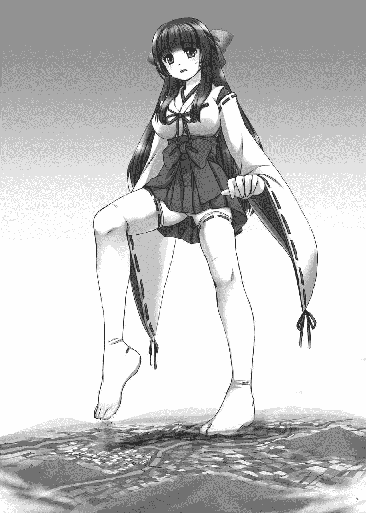
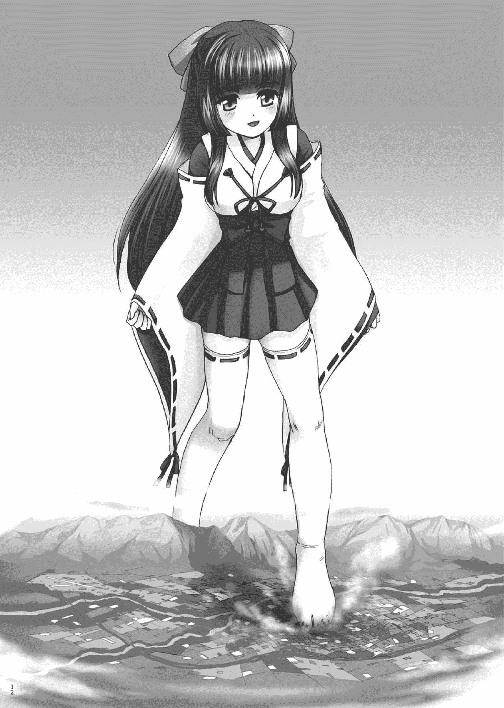

# 【翻译】小巫女美子（giga）

作者：TANGLUNG

TID：30260

<title>1</title> <link href="../Styles/Style.css" type="text/css" rel="stylesheet">

# 1

这篇文章是刊登在icecat大佬的同人志《モエデカ！》里面的，因为粗略的看了一下内容和插图都是我比较喜欢的所以就找了E站上的汉化组帮忙翻译了一下，希望大家能喜欢！<title>2</title> <link href="../Styles/Style.css" type="text/css" rel="stylesheet">

# 2

*本帖最後由 TANGLUNG 於 2021-2-1 15:34 編輯*

小巫女美子

作者：猫ちぐら

初次见面。我叫做黑姬美子。

我们一族世世代代经营着黑神神社，我也在见习中担任着巫女的职责。

嘻嘻，没错，美子和巫女发音挺像的吧。这雪白的长袖，鲜红的裤裙……反正都是迷你尺寸的。

但，但是，这绝对不是在玩什么cosplay哟！

因为，黑神大人云：“巫女服必须要迷你的！”……真是个有着奇怪性癖的神明大人呢。

但也因此，让黑神神社成为了唯一一座能看见迷你巫女的神社，特别是最近还在一部分人之前获得了非常大的人气呢。

虽然说很感谢他们能来给我们上供，但是我还是非常希望他们不要在我们神社内拍我们的照片呢。

除此之外，黑神大人还非常乖僻，甚至会让我们去乘人之危……呜呜，我光是想起来就觉得很害羞，也觉得非常对不起他们。这已经是以为我中心，差点将薄墨町乃至全国都毁灭的，稍微有点开心……不对，是非常恐怖的大事件了。

因此我接下来将要讲述这个事件的一部分。

那是我迎来十六岁生日那一天发生的事情。

在那天早上，我穿着与往常一样的巫女服（迷你）在院内打扫，突然，从正殿方向射来了一束如同阳光一样耀眼的光芒。

到底发生了什么呢。我想如果神明大人的神体有个万一可绝对不行，所以我放下扫帚，战战兢兢地走入了被光芒包裹着的正殿后，在一片白光之中，一个不知道从哪里传来的……应该说是有个声音直接传入了我的脑袋，那是一个沙哑的男声。

“美子……黑姬美子哟……。你今天也来侍奉得很好呢。对你这个勤奋努力的孩子，我会将我的一种力量传授于你，作为你十六岁生日的贺礼。你能发誓你今后也会诚心诚意地侍奉我吗？”

“……我能，黑神大人。”

我之所以叫出了这个名字，有可能是因我我作为巫女的直觉，也可能是当场灵机一动。

总之，当场的压力很大，我虽然想要再给一点回应，但是在我回答他之后突然感受到了一丝不安，他到底会给予我什么样的力量呢。

是变身成为动物或者魔物之类的异形之力？还是能起风或者点火的魔法之力呢？

但，但是，无论如何，都会没问题的吧……。

“很好。那么，现在暂时闭上眼，使劲地想吧。想你最想要的东西……”

（诶，诶诶，虽然你这么说……。嗯……我太矮了，所以让身高……？）

因为我一时间没有想到什么，所以慌慌张张地按他说的做了之后，就想到了这么无聊的东西。

事实上，我确实想要在天空里自由地翱翔，更大一点就是世界和平之类的愿望，但是我的身高确实一直都很头疼。明明是个高中生，但是我矮加上童颜，经常被当做是小学生。被人小不点小不点地嘲笑就算了，但是我单相思的对象都说过他更喜欢高一点身材好的女性。

当然，我也是非常努力的。每天早睡早起参加晨练，还喝了大量的牛奶以试图长高。

但是，无论我多么努力，身高完全没有变高的迹象，而营养反而都跑到胸部上去了……

所以说，我希望我能尽可能地长大——

“我懂了！”

然后，伴随着黑神大人的声音，我眼皮的背面传来了如同放电一般的眩晕感，同时身体如同火烧一般，一种漂浮在空中的感觉传了过来。

我不知道发生了什么，但是我忍耐住了非常想要确认情况的不安感，更加强烈地集中了精神，然后光线和不可思议的感觉就停住了，只剩下一片寂静。之前听到的鸟叫，以及风声都好像消失了一样。

“……似乎很顺利。我还是第一次遇到这么辛苦的呢，结果嘛……哈哈哈，好像过头了。没想到这居然和那个咲耶姬差不多呢。看来我好像还没有老呢，但如果再继续的话……。黑姬美子哟，虽然你的身体很小，但是你作为容器的容量还是相当大的。不愧是我的巫女。我积攒了几百年的力量全部都注入进去了。总之，你先确认一下被授予的力量吧。”

黑神大人的声音好像因为一些事情而很愉快。

让我长高一点有这么辛苦吗。不过，我确实比平均身高矮了至少十厘米呢……。

而且，咲耶姬，容器……。到底是什么东西呢。虽然我有些不解，但是再怎么想下去也是无济于事的，于是睁开眼睛后，看见的是……一片蓝色。我向四周望去，依旧是一片蓝色。我之前所处的正殿以及黑神神社，甚至于团簇着小镇的群山都不见了。

这难道是，把我送到了别的地方吗。是为了更方便地比身高吗……

“并不是这样，你看你脚下。”

在黑神大人的催促下，我往下看去，果然只是单纯的地面……？

深绿色的苔藓，浅绿色的马赛克花纹，以及散布着各种颜色的沙粒，风景完全变了一番。仔细看的话，像是资料馆里一千比一的模型一样的山林，田地以及小镇一样。

话说回来，不管是颜色还是质感都真实到让人惊讶，连芥子大小的住宅都一个个地细心地做出来了，这已经精细到怎么看都是真正的房屋缩小后的样子了……。

这到底是怎么一回事呢。

“这个呢，是因为你变大了”

“原来如此。……诶，诶诶诶诶！这，这变得太大了吧！这到底是怎么变得这么大的啊……”

“很简单，我只是完成了你的愿望而已。就是你想要变大这个愿望。不过只是稍微用力过头让你变大了一万倍而已，哈哈哈哈”

“……”

我简直无话可说了。一万倍……。

如果说我的身高是一百四十五厘米的话，一万倍就是，嗯……身高一万四千五百吗。哇啊，别说是富士山了，比世界上任何一座名山都要高了啊。好厉害啊，这下再也不会被说是小不点了呢，毕竟我已经是世界第一高了呢。嘿嘿嘿。

……我为什么会这么想啊！万事万物总要有个限度的啊！又不是飞机的高度，一万米这个，真的是……。

不过，虽然我真的是想的要变大，但是从常识来说长高的也就是十厘米，二十厘米之类的。但是，嗯，正好一万四千五百……九十八点五米，居然长到了这么高。这样，简直就像是怪兽一样啊……。

经常在特摄电影里出现的，全长几十米的大怪兽，现在在我的面前，也不过是几厘米的蚂蚁吧。哪怕我不想干掉它，估计也会在不经意间踩碎的，非常悲惨的存在吧。住宅、商店、学校和高层建筑应该也是一样的吧。

那么，比这还小的人们会怎么样呢。

现在即使这么俯瞰小镇，也无法用肉眼看见他们，这就算是微生物一样的存在吗……？

啊，不，不是的不是的！我绝对没有觉得他们的价值甚至不如垃圾。我不是那种坏孩子哟。无论多么小（虽然是我太大了），大家都是一样的人类。……大概。

总之，为什么陷入了这种事态呢？

……话说回来，我有件事想要请问您。虽然黑神大人实现了我的愿望，但这个也太极端了。比如说，一个身体羸弱的女孩祈求身体健康的话，会给予她能够空手扇飞一只熊的怪力吗？如果一个爱哭的女孩祈求她再也不哭了，会让她从第二天开始连笑都笑不出来吗。而且，为什么实现了愿望的都是年轻的女性？

哪怕是这么推迷你巫女的黑神大人，这次这个也还是搞得太极端了……。

“……看起来你还很迷糊呢，听好了美子。这个国家的人对我是没有信仰的。虽然这算是时代的变迁，但也诚可叹也。不止如此，他们还视奸侍奉我的巫女，甚至还用拍下的照片当做自慰用品。虽然说和我是同好，但是本来这就是只有我能做的事，他们这是在侵犯神的领域。而且，本来我已经完全没有力量了……。但是，他们这么过分，你就用我给予你的力量，现在就让这个国家知道我的伟大之处吧！”

自，自自自慰用品！？单手拿着我们的照片，然后做那种事情吗，这真是太肮脏了！

怪不得，他们都像在用下流的目光来回舔舐一样盯着手里的相机呢。我算是明白了……。

但是，既然我变得这么大了，这样就更加害羞了啊……。这肯定可以从小镇的任何角落尽情地看我。不止如此，可能全国都可以看见我吧。毕竟，我有14500米高呢……。

当然，毫无疑问大=引人注目，估计会有几十万，或者几百万，甚至可能有几千万人的目光，从四面八方注视我。哪怕每个人都像微生物一样小，但一想起来还是会觉得害羞到不行……。

这个，虽然说您告诉了我这么多，但是我到底要怎么做才行呢？

“只用，落下脚步即可。这对现在的你来说，就已经足够了。”

确，确实是这样呢。变大了一万倍的话，腿的长度也超过了两千米，脚的长度也有八百米以上。然后，至于体重的话……额，数量大到我都不太清楚了，但总之我陷入地面非常深的距离。诶嘿嘿，不是，呜呜……

总之，变得这么大了之后，应该不管我踩在哪里，那里的建筑物、道路、田地、山林……所有的东西都会被我踩碎的吧。虽然说因为矮，所以体重也轻一些，但既然变得这么大了，那应该也没什么差别了。哈啊。哪怕现在我的袜子之下，估计都有几十几百间住宅被碾碎了吧……

我的袜子是搭配着迷你巫女服的，边缘有红色丝带的纯白色长筒袜。长筒袜。长度大概在大腿的中部，和迷你巫女服交相呼应，仔细盯着看的话，绝对领域会让人看得目不暇接，大概是这样。当然，我的长筒袜和传统的日式袜子一样，把大脚趾和剩下四根脚趾分开，自然就可以穿上草鞋了。

但是，因为之前我去正殿的时候脱下了草鞋，所以现在穿着的只有袜子。如果把这个朝着小镇摔下去的话……。

不知道是出于良心的谴责，还是说我已经不知道该怎么办了，总之我只能听从黑神大人的命令……。遵从神明大人的命令是巫女的职责。虽说我只是见习的，但我还是黑神神社的巫女。

总之，先在看起来没有多少建筑物的地方下脚吧。

（小镇的各位，对不起了……！）

我在深呼吸了一口之后，终于迈出了我的第一步。

“这，这是黑神大人的天罚……”

我努力让我的腿不因为紧张而颤抖，然而当我一脚使劲踩下去之后，虽说是踩在田地的，但更像是在泥沼地一样在不断下沉着。

……仅仅如此。

虽然说这些地方没有多少建筑物，但是我并没有从脚底感受到我踩碎了几十间房屋。

在稍微等待一会儿之后，我就再次抬起了刚刚放下的脚，但是几秒之前还在那里的所有东西都消失了，取而代之的是一个袜子形状的足迹深深刻印在那里……。将四周隔离开来的大小，深浅和颜色，显示着我惊人的破坏力。

（呜呜，好过分……。但是……）

“是不是稍微有点舒服呢？哈哈，是的，就是这个样子”

“呀……。您，您在说什么啊！？我我我我才没有那样！”

我高耸入云的脸颊开始泛红，大声地试图蒙混过关。

“嗯，说话不要那么大声。小镇里的人们，都有可能会被你的巨大音量震晕过去哟”

“啊……。非，非常抱歉……”

我用非常微小的声音道歉。即使如此，这对小镇的人们来说也是非常大的声音了。

“不过没事。比起这个，你再继续往前走吧。继续，继续让世人……见识我的力量吧”

“……是”

虽然我有点慌乱，但是事实确实如此，哪怕造成了如此大的破坏，这对我来说也仅仅是迈出了一步而已。而且，这个薄墨町还有很多建筑——也就是需要被摧毁的东西。我也不能就这样站着不动。在我整理完了心情之后，重新朝着城镇迈去。

于是，我突然注意到了小镇中心里蠢动的存在。一开始以为是虫子什么的，但是如果那是在真正的薄墨町里的话，得是多大的虫子啊。因此，这个……都不用想，应该就是人吧……。

虽然我无法分辨出一个个个体，但是如果成群结队，或者坐上了车之类的我还是能看清楚的。这对我来说明明就是远远不到一厘米大小的程度，这还真是让人惊讶。不知道这是因为我越来越习惯这么看东西了，还是因为这也是黑神大人的神力。

总之，我都看见他们了，那也就没法直接朝他们踩下去了。当然了，没看见也不会踩下去的。

真，真的是这样的。

“各，各位，请赶紧逃跑吧。不然的话，要被踩碎了哟……！”

我就这么一边说着一边追赶着小镇的人们，我这次是踩在山脚一块非常宽广的区域上，为了等避难的人群完全撤离而慢慢地移动着脚步。

然后小镇上被刻上了巨大的足迹，曾经耸立着几百间住宅的地方也完全消失了，山脚也毫无反抗地变成了洼地。这就是在瞬息之间进行了大规模改造了吗。不管我踩上的是小镇，还是山林，都粉碎、固定，然后变成一块平地。

背德感、优越感和快感相互交织。我一边说服自己这就是巫女的命运，一边重复着这种事情，等我回过神来我的身体已经在擅自地行动起来了。

啪嗒啪嗒。无论是盆地的市区，还是山间的群落，全部都被压得扁扁的。只是踩碎的话就太无聊了，而且还觉得太可惜了，所以我偶尔会用脚趾去轻轻地触碰……，但是，这不就是说明我在享受着破坏吗！不可以，不可以！这终究不过是黑神大人的命令罢了……，是的，这都是没办法的事。

“对不起，但是，这都是为了展示黑神大人的力量，必须要破坏掉所有东西才行.”

我露出一副为难的表情，然后走到市中心，用双脚一起把地面踩结实。

本来并不大——即使如此也耸立着一千栋以上建筑物的市中心街区里，车站和小的商业街，以及几个中小学校都被轻松踩扁。而离市中心比较远的市政府也会被袜子的大拇指部分给轻松覆盖。

虽然我嘴上说着这下，但还是造成了一通很大的破坏。小镇中心一个不剩，变成了连废墟都称不上的烂地。在压倒性的力量下，明明我才走出去了不到10步，就已经破坏成这个样子了。我踩到现在都几乎没有传来任何触感，没有什么实际感觉传过来也算是个难点。

“怎么样啊，美子。感觉很好吧？”

“不，不要啦，黑神大人。请不要读人家的心啦……”

这么说起来，我之前想到的东西，都完全被黑神大人所听见了。虽然我被神明大人赐予力量这件事还是很光荣的，但是在接下来要进一步蹂躏小镇，蹂躏这个国家的时候，想到的，感觉到的各种东西，都会被知道。呜呜……。

总，总之，现在就集中在眼前的事情上吧。

虽然说就这样在小镇上继续行走也不错，但是从很远的天空上俯瞰下面脖子也很累，因为我有点在意小镇和人们的具体样子，所以就蹲下来了。

虽说比站起来的时候要好点，但哪怕我凑近了看，建筑物和人们还是太小了……。普通的住宅的话，估计可以用指尖轻易抬起十几二十间。人类的话估计可以抬起几百个吧。

因为正好眼前就有一些没来得及逃难的民众，我伸出食指对着他们挥舞，为了告诉他们赶紧逃命，而他们慌慌张张逃命的样子也很可爱。因此，我突然想要捉弄一下他们，用指尖挡住了他们逃跑的去路，因此他们不知道该往哪里走就只得四散奔逃。呜嘻嘻。但是，因为看起来有些可怜，所以就马上收回了手指，然后用手指去戳那些已经避难完成的建筑物。

“噌噌♪”

虽然我只是稍微戳了一下，但每次手指突刺都让几座建筑物被碾碎了。对小镇的人来说，肯定就是，轰隆，哐当这样的感觉吧。

巨大的手指突然从天而降，把家人和邻居住的房子三下两下碾碎……。

好恐怖呢。说不定还会失禁呢。嘿嘿嘿。

话说回来，不知道是我的力量太强了，还是建筑物太脆弱了，大部分的东西都没有刻意去戳，都只是轻轻地碰一下就直接碎掉了。

有次我本来打算摘一个建筑物的，结果就直接在手指指尖化为粉末，我有次只是用指尖轻轻地抚摸一群建筑物，结果它们就全灭了。还有，我用手心抚摸了一下地面，结果几百栋建筑就直接消失了，直接变成了一块空地。

这感觉简直就像是铺平沙地的表面一样……突然，我注意到了我手边的一个非常熟悉的建筑物，然后我的手就停了下来。

那是，我上的……不对，是我“上过”的薄墨高中。

既然机会难得那我就想仔细地看一看，我把手指深深地插入地面，然后连着周围的住宅一起用双手捧了起来，从凹字形的校舍到能看清楚道路轮廓的中庭，都可以在我的手心里看得清清楚楚的。

我再一次切实地感觉到了我现在已经变得非常大了。现在的我已经没法去上这个只有我大拇指大的学校了。这是我积攒了很多回忆的地方。同班的他也是……没有，没有这些事。

一半以上的小镇都已经字面意义上地毁灭了，剩下的地方估计也会走向同样的命运吧，但如果只剩下一个学校的话这也太可怜了。虽然我有些心疼，但是这已经无法挽回了。

在我温柔地包裹住，然后碾碎之后，再打开手时，已经没有任何东西剩下了。

“对不起……”

我在道歉之后，就转换了心情将这些全部抛之脑后了。

就在那个时候，我感受到了一点类似闪光的东西，然后朝前看去，发现有好几十个人站在附近小山的山头。是那些没来得及逃难的人们吗。虽然有些有违本意，但是我还是害怕的不敢动了。

但是，我还是不想让他们看见我没蹲稳，结果坐下去了的样子呢……

我有些惊讶地看着他们，然后发现他们手上拿着什么东西，一个劲地朝我这里看。

真是的，虽然你们在山上，但是我也可以随时踩碎你们哟……话说，他们看的地方是……。

我现在正在蹲着，但是迷你巫女裙并不能遮挡太多东西，所以，难道说，没什么难道了……我的内裤被他们看见了？

我慌慌张张地拉起了裙摆，试图遮挡住内裤，结果身体失去了平衡——

轰隆隆隆隆隆隆隆隆！

我一下子就坐到了地上。当然，垫着的街道（在某种程度上已经被碾碎了）和山林都被直接压碎了……。

“好痛……”

虽然身体这么大，但是加上了整个体重摔倒还是有点疼呢。呜呜……

虽说如此，但是这么光明正大地偷看别人的内裤……绝对饶不了你们。不只是这个，你们，肯定拍了照片的……。估计，之前我看到的闪光一样的东西应该就是摄像机的闪光灯吧。

明明除了家人以外的人……当然连他也没有看见过的，被这种完全不认识的人给看得一清二楚……。这已经是，不能让他们活下去了呢……？呜嘻嘻……

总之，我死死地瞪住了那些好色的家伙。因为好像坐下的冲击相当巨大，山周围的建筑物和人们都纷纷倒下了，但是我绝对不会手下留情的。

以现在的我，可以轻松地把这些家伙……。

“是的，你就血祭那些看了你神圣内裤的人吧。”

黑神大人的低语也给了我动力，然后我就捏了一个泥团狠狠地朝他们扔了过去。虽然我是打算稍微手下留情一点的，但还是挖了半个小山，所有人都被吹飞了，应，应该没关系的吧。我看见的是他们没有被没吹飞多远，应该只是被挂在了树枝上而已。而且，光是没有直接碾碎他们，就请当做我的仁慈吧。

虽然说我也可以把他们压扁，虽然说对方是变态，但是他们应该……还是和我一样的人类。我还是做不到那一步。至少现在是如此。

“如果有下次就不会手下留情了。”

我笑着对瑟瑟发抖的他们撂下了狠话。不知道是不是感觉到了一丝优越感，但我确实能感觉到来自我内心深处的黑色波动。

总之，暂时不用担心内裤会被看见了，不过虽然话虽如此，还是要考虑一下意外的情况，而且证明全是山林和田地，没有多少建筑物，所以就坐着转动了方向，用袜子把剩下的地方给全部踩碎了。

很多建筑物都在我坐在地上的时候就被冲击波给摧毁了，所以就不用去关心了。反正之后瓦砾也不会消失，所以我来把这些地方给踩实说不定反而是大功一件。说到底，到底会不会从零开始重建这个，马上就要完全消失的小镇这件事本身，就挺微妙的。而且，大部分地方都陷得挺深的。

不过，这跟我都没有关系。我只是听从黑神大人的命令，毁灭这个小镇而已。

所以说，我再次动起了放下的腿，用腿去扫过沿着街道的建筑群之类的，用双腿把宽广范围的建筑物给夹起来，然后用腿去砸碎之类的……。

伴随着我的这些行为，我的感觉在逐渐变得麻痹，罪恶感减少了，只剩下了快感。下脚的时候把沙粒一样的住宅和像马赛克一样的田地，给一口气变成废地的感觉真是开心到不行。

虽说如此，好像是因为我变得太大了，所以估计有好几公里，还隔着几座小山的距离，我只是稍微抬一下腿踏过去就行了，薄墨町里已经没有我能够破坏的东西了。

“不过十几分钟内就破坏了一整个小镇。不愧是我的巫女。不需要任何节制和客气，只用破坏就行，真是太棒了。”

黑神大人好像非常兴奋。

虽然说被他夸了是非常高兴的时候，但是他说的话简直就是说我像个大怪兽一样，让我无地自容。

“……这就是代价，你们这些愚蠢的人类。现在都还没有信仰我。真是让人叹息。美子哟，还不够。继续展示一下你的……我的力量吧！”

“是，黑神大人……”

黑神的口气突然不太高兴，于是我有点畏惧。

说到底，虽然我已经沉醉于破坏的快乐之中，就算他不这么说我也会这么做，但既然得到了指示，我也就赶紧站起来，拍下粘在我屁股上的污渍，然后发现了在正面脚下山脉的另一侧——空木市有许多的建筑物。

和人口一两万的薄墨町相比，住着五十万人以上的空木市有着更大的市区，哪怕整个市区没有那么鳞次栉比，但在平地上依旧有很多住宅和办公楼。当然了，高层建筑也有很多，除此之外还有几个大车站，大工厂群，可以不那么简单、无聊地展开破坏。

虽然省会城市可能会更加厉害，但是因为我没有去过哪些地方，所以空木市就是我去过的最大的地方。如果我走入这座城市的话，估计会展开一场薄墨町无法比较的大破坏，所以我根本无法控制住想要大肆破坏的心情。

“各位，这样可以明白黑神大人的伟大和恐怖了吗？……嗯，不行呢。你们完全没有体会到这种感情。没办法，这次就让我来试着破坏这座城市吧。”

在故意说了这些话之后，我就一脚跨过了两千米高的山脉，一步就走到了城市边上。

这么悠然跨过每天仰望山脉的感觉，悄悄地说还挺有优越感的。

“那么，差不多要开始了~”

总之先留给人们一定时间逃跑，等到周围都看不见人影了，我就发出了宣言，踏入了市内。

首先是抓住了山脚下的住宅群和没有我手指宽的河川，抛向对岸的建筑群。

哪怕是几百米左右的高层建筑，对现在的我来说也就一厘米左右，感觉像是非常脆弱的结晶一样。我什么都没有感觉到，这些建筑就轻松地被踩在了脚下，只得消失无法幸存。

不止如此，几个有月台的大车站，连着附近的宾馆、公寓、大量的高层建筑、以及车站前的写字楼都被我全部压扁了。

无数的人花了无数年月修建起来的东西，随着我的一踩，而全部化为粉末……。

嗯，我好兴奋啊，这个感觉太棒了。

那个曾经很矮的我，现在都不只是俯瞰整个世界，而是在轻松地毁灭它了。

这下，再也不会有人说我小不点了。敢说的人都只有一个下场。

轰隆隆隆隆隆！

我高高地抬起腿，然后狠狠地踩向已经化作脚印的车站附近的游戏厅街，被直接命中的商店街就不说了，连周围的建筑物都接连受到冲击，然后被毁灭了。

木制的住宅很多都直接爆成了粉末，公寓则土崩瓦解……。

虽然现在这情况还是很有趣的，但是因为破坏了很多意料之外的建筑，所以觉得稍微有点可惜。而且，放着被破坏了一半的建筑也不太好呢。作为道歉，我会好好地踩上去的，踩得扁扁的。

“哈哈哈，好像已经破坏了很多呢……”

我完全没听见黑神大人的低语，只是在一个劲地把破坏掉的不下几千栋建筑物给，一脚一脚地踩实。顺便那些幸免于难的建筑物也包含其中。

明明这么幸运没有被破坏，是不是太可怜了？没有这种事。反正我都会把这个城市整个破坏掉的，请好好享受就是了。呜嘻嘻。

在这之后，我寻求进一步的破坏，于是在城市里走来走去，踩踏周边混合住宅地里数千栋的住宅、店铺、设施，跳踩工业园区的细长工厂群，踩实郊外的田园地带，总之袜子底部被沙土和瓦砾给弄脏了。

黑神大人好像注意到了这一点，然后温柔的低语在脑海中响起。

“美子哟，把那个脏掉的袜子脱掉如何，这样的话，会获得新的触感哟。”

“但，但是……不，我知道了。”

我在家喝上学的时候穿着的白色长筒袜，和在神社工作的时候穿着的长筒袜，基本上除了睡觉就不会脱下来，所以让我裸足还是有点抵抗的。但是我都来回走了这么久，袜子底应该非常脏了，所以只得老老实实听黑神大人的话。

我交替着把袜子从大腿褪到脚踝、指尖，然后脱掉，最后丢在了地面上。

……虽然我没有特意这么做，但是从田地到住宅区和装卸区等一片宽广的区域都被袜子给覆盖了，几千座的住宅和仓库，以及同样数量的田地都被袜子垫在了下面。

本来应该很轻的长筒袜，也在变大了一万倍后变得异常沉重。当然了，这么重的东西从天空中坠落下来的话，别说木制的住宅了，就算是钢筋混凝土的建筑物估计都受不了——

“吼，光是袜子掉下去就造成了这么大的破坏啊。”

“那，那个，这是……啊……”

因为我有点在意脱下的袜子下面是什么样子，所以就确认了一下，结果下面所有的东西都被压扁了。

总之，虽然是破坏得很严重，但是并不是我有意而为之，所以我稍微有点不好意思……。

被一只袜子给碾碎的感觉到底是如何呢。至少我不想去试一试。虽然看起来还是很有趣的。

总之，光脚上阵了。被纯白色的袜子给保护得非常干净的光脚，从现在开始要踩踏市中心了。

“哇啊，这是多么新鲜的触感啊……”

然后，隔着袜子感觉不出来的建筑的凹凸，总算能稍微体会到一点了。感觉有点痒，想要挠的感觉。

为了再次确认一下而在城市上走来走去，压碎建筑物之后从脚底传来的是——。

“呀啊……”

真，真是个不可思议的感觉。硬要说的话，感觉像是在点心上走过的感觉。但是，现在走过的不是点心而是真正的建筑物，而且，数量还上千了。

果然有触感就是不一样啊。光脚踩踏城市居然也能这么有意思。我之前一直都穿着袜子到处踩的，现在都觉得有点可惜了，不过，接下来好好享受就行了。

就是这样，我光着脚用整个脚掌开始了踩踏，在几个住宅地和工厂群里留下了不同的脚印之后，想着这次要玩点不一样的，于是就用脚指甲挠起了地面。

我用稍微有点小，朋友们说很可爱，哪怕现在也非常可爱的脚来开始了蹂躏。

我小脚趾的大小正好可以覆盖十几二十家的住宅。我分开了五个脚指头，然后深深地嵌入了地底，于是脚底的住宅地就在一瞬间分崩离析，哪怕在脚趾缝里面的建筑，也随着冲击一个个崩坏。

然后，在我走向写字楼群的时候，我脚趾之间家住了一个稍微有点大（就体感而已也就一厘米左右）的高层建筑，然后一下子就碾碎了。

哪怕本来是几百米高的建筑物，也完全敌不过我的脚趾，被碰到了就直接烟消云散。这就是诸行无常吧。诶嘿嘿。

但是呢，好像脚趾指尖有些敏感，结果感觉挺痒的。在我试着普通地走过写字楼群的时候，也时不时被稍微有点坚固的建筑物给拌一下，还挺新奇的。

（感觉好像变得越来越敏感了呢……呜……）

但是，哪怕我越来越上瘾，但也停不下来了。

因为我还想感受更多，所以我不想单单地踩碎建筑群，而是握紧了脚趾一口气踩下去，或者用脚趾腹摩擦着地面走。

一次性甩过几十数百栋建筑物的时候，从脚底和脚趾传来的感觉非常舒服。

在这之后，我用脚趾的四个缝夹住高层建筑或者高层公寓，然后慎重地将他们抬起来，然后一口气捏个粉碎。

停在车站的几十辆电车也都让它们缠上了我的大拇指，然后一口气碾碎了。

我内心充满怜慈地蹂躏着数量不断减少的住宅区和工业区。

就在这个过程中，我的脚也因此沾上了混合着瓦砾的土色，但是没有关系。虽然说那边的河流太小了，但是如果需要的话还可以去海里或者湖里洗干净就行了。顺便还可以用光脚踩过沿海的城市……。

我就这样忘记了一开始的目的，仅仅是放纵着我自身的欲望蹂躏着空木市……，就在这个时候，转机来了。

“……嗯，看起来人类们多半也开始反击了呢。美子哟，抬起头看看吧”

黑神大人严肃的声音叫醒了沉醉于快乐之海的我。

不知道从什么时候开始就能看见一点微小的影子，看起来是来了呢，黑神大人……。

总之，我慌慌张张的向四周望去，有几十台酷似十字型——多半是战斗机的东西飞过了城市上空。看起来军队也出动了呢。

那么他们和垃圾一样小，但是被战斗机打中的话也不会好过的吧。

总之，我调整好了姿态，朝着他们飞来的方向望去，发现他们好像在没有任何警告的情况下，突然发射出了导弹。

……而且我是在导弹爆炸之后才注意到的它们。

“呀啊！怎，怎么突然就发射这个啦。好过分啊！”

（啊，但是我好像正在做一件非常过分的事情……）

我一边说一边想着，这个爆炸虽然让我有点惊讶，但是对巫女服也没有造成任何伤害，我自己也说不清楚到底是痛还是痒，就这么抱歉地接受着军队的攻击……其实是打算无视他们的。

但是，我一直在不停受到攻击，身体上不断发生爆炸，这也挺让我难受的。而且，因为我没有发起反抗所以不仅攻击更加激烈了，甚至还有战斗机在我身边飞来飞去。

“哎呀哎呀，怎么了？不反击的话，你会一直被打哟？”

“也是，呢……。军队的各位，你们做得稍微有点过分了。如果现在夹起尾巴逃回去的话我就原谅你们，不然的话……就会这样哟？”

黑神大人催促我之后，虽然我也可以马上发起反击，但我毕竟不是什么比山还要大的鬼怪或者魔鬼，而且我的目标毕竟还是城市，总之先警告他们，然后就开始用手朝战斗机之间的空隙挥去。

于是，好像有几个飞机受到乱流的影响，虽然看起来开始往下坠了，但是也马上就重整态势再次开启了攻击。

“真是的，我不管了啊！……嘿！”

明明我都警告过他们了，结果还没听进去，我也露出了不高兴的表情。那么我就没办法了，我会尽可能以不伤害你们生命的方式击落战斗机的。

哪怕他们的飞行速度是音速，对我来说也只是肚子吃饱了的蚊子一样，很轻松地追上了他们，然后轻轻地把他们打下来，或者摘掉他们的尾翼，只要看见飞行员弹射出来了就一巴掌把飞机拍掉。

就这样，不知道他们是不是终于知道他们敌不过我了，在只剩十几架飞机之后就溃败退逃了。

“呼，终于完了吗……”

接下来我再次转向空木市——，我之前太沉迷于天空，结果现在连城市的影子都看不见了，只能看见走过来的一系列又大又深的足迹。

虽然说这也没什么。但是这样就意味着我踩过了很多地方——那些空木市周边山林里的避难场所，这样的话，很多……没来得及逃难的人们……。

冷静下来思考的话，恐怕，不，应该是毫无疑问……之前也有很多人都牺牲了。

这简直就像我成为了真正的怪兽一样……。或者说，我可能一开始就是个邪恶的大怪兽。

这个时候，应该做出什么样的表情呢？

虽然说现在才意识到，但稍微……嗯，应该做得有点过分……。

“美子哟，怎么了。不要去思考那些东西。你现在只要听我的指示就行。而且，这个城市也已经毁灭了，差不多该去下一个城市了。……喂……”

黑神大人的话又是直接……进入了我的脑袋，正在我一个人烦恼的时候，我突然发现我膝盖周围漂浮着芥子大小的东西。这是为了吸引我的注意力吗，还是故意烦人地按八字飞行呢，哪怕我不愿意也看见了。

来找这样的我又什么事情吗？蹲下来仔细看看后发现，那好像是直升机。他们也不是军队的飞机，那新闻直升机来干嘛呢？

“在那种地方飞来飞去……。是要我把你们都捏碎吗？”

我想他们可能是又想来看我的内裤，所以我打算把他们全部都捏碎。

在那个时候，我听见了来自直升机飞机。

“快住手啊，黑姬！”

“……白，白川君？”

那个声音，以及他的样子，虽然非常小，但确实是他。

那是同班的男同学，白川司。虽然有点粗鲁，但是很会照顾人，脑袋和运动神经都很好，稍微有点帅……不是不是。现在不是考虑这个的时候了。

“……不，你现在来也已经太迟了。我呢，已经变成了一个大怪兽了……”

“美子哟，不要焦急。赶紧把这些东西打下来，然后去下一个城市吧。”

我遵从着黑神大人的声音，把手放在了直升机附近。

但是，白川同学的声音又传了过来，我马上就停住了双手。

“不管是怪兽还是什么，黑姬就是黑姬，矮矮的，但是，内心还是很好的，很纯粹，很会体贴他人很温柔……。快想起来啊，黑姬……”

“但，但是……”

“我知道的。大概，就是被那边那个邪神给骗了吧。黑姬是个好孩子。……居然敢利用这么善良的黑姬，就由我来代替她打败你！”

“白，白川……！”

没想到白川同学居然能看见黑神大人。这么说的话，听说这就是灵力很强的证明——。

“喂，喂，美子哟，赶紧把他们打下来！”

感觉黑神大人的声音中带着一丝焦急，所以我不由自主地停了下来。

我到底该怎么办才好呢。是听黑神大人的命令，还是——。

我的，我的决定是……。

“那个，这个……不行的！哪怕是黑神大人这么说也是不行的。果然，这么做真的很奇怪……”

“你说……什么……”

“破坏城市，甚至夺走他人性命……这都不用想，肯定是邪门歪道的行为。虽然我也是稍微……有点，乐在其中……，但是……”

“黑姬……”

“请叫我，美子。我也会叫白川同学，司的……”

“我，我知道了。……美子，拜托你了，快住手吧。这只会让大家都伤心的，包括我，和美子自己……”

“……嗯。”

白川说服了我，我决定再也不做这么过分的事情了。

但是，黑神大人好像还没有放弃。

“……不行不行，我绝对不承认这个样子！你知道我是谁！美子哟，我再让你见识下我的力量吧！”

“我不要。……黑神大人，我以后再也不承认你是神明了！”

我内心，是这么说的，而且确实这么说出来了，就是这样了吗。毕竟完全没有理由听一个邪神的话了。

“……吼？你作为我的巫女，在接受了我的力量之后还敢这么说吗？那么，你要怎么做呢？”

“我要踩碎黑神神社，然后做个了结！”

“……做，做做做这种是肯定是没有用的！而且，你现在才打倒我也没有用了哟！？”

“我知道的。但是，我也要稍微弥补一下我的罪过……”

然后，我在下定了决心之后就把空木市抛之脑后，踏上了薄墨町的遗迹，直接就朝着黑神神社的方向走去。二十公里的距离对我来说也就是几步而已，几秒钟就走到了。

神社在和空木市相反方向的小山里，虽然算是建筑物，但不知道是无意识，还是黑神大人给我的引导，总之还没有被破坏。

但是马上就要结束了。

“黑神大人。做好觉悟吧！”

我高高地抬起来我的腿，停在神社一带的正上方。

然后，正在下定了决心，准备一口气踩下去的时候——

“我，我认输了！是我错了！我会把城市和人们全部复原的，住手啊！”

黑神大人悲痛的叫声在我的脑海中响起，踩下的脚也停在了原地。

没，没想到居然会变成这样……

“真，真的能做到吗！？你不是说，力量已经用尽了……。而且……”

“因为你大肆闹腾，所以两个城市，不，应该是整个国家的人都对你……对我产生了敬畏之心。现在的话无论什么样的愿望都可以实现了。所以说……”

“嗯。我知道了……”

黑神大人的声音听起来挺遗憾。

“这个时候，我就不会说那种只能许一个愿望这种小气的话了……”

感觉他最后就在嘟囔中，认真地实现了我的愿望呢。

淡淡的光芒笼罩了薄墨町和空木市，光的碎片进入了城市，然后啪地一下恢复了原样。人和建筑，所有的东西都恢复了。

……当然了，我的大小也是。

等我醒过来之后，我已经回到了正殿。不知道什么时候穿上的长筒袜也没有显眼的污渍，从正殿看向薄墨町的景色也非常的和平。

一开始，我还以为这一切都是梦，但是那个触感都留在了我的脚底和心中。

然后，黑神大人的声音再次在我脑海里叮嘱了起来。

“就算是我……，也没有伤害人类的想法。只不过是，忘记了而已。只是凑巧想被敬畏而已。不过，我以为你可以被我轻松操控……直到中途我都很愉悦，果然这次也不行吗……”

真是个意外慎重的神明大人呢。

“话说，我感觉我好像长高了呢……”

我突然注意到一些违和感，然后试着询问了一下黑神大人。视线也好像稍微高了点……。

“哦哦，这个啊。我觉得难得赐予给你的力量就这样消散，实在是太可惜了”

“也，也就是说……”

“是的，也就是说又变大了。因为我的力量已经用完了，所以只变大了一点点，不过，以后说不定还是可以变大一百倍，一千倍”

（……也就是说，以这次作为例子，变大了也可以变回去=可以破坏很多次=心动）

我的脑袋里突然悄悄出现了这个图式。

（虽然不太对得起司，但是反正都可以变回去，那以后再来使用这个力量吧，之类的）

“嗯，这不错”

“呀！请，请不要偷窥人家的内心啊，黑神大人……”

我一边这么想着，一边开始了早上的工作。

脚底和心底，都泛起了炽热的触感和感情。

<ignore_js_op></ignore_js_op> **temporary_page_008.jpg** *(128.44 KB, 下載次數: 7)*

[下載附件](forum.php?mod=attachment&aid=ODcxMzJ8NjM1NzlmOWZ8MTYyNDY5MjQxNnwxODIzMHwzMDI2MA%3D%3D&nothumb=yes)

2021-2-1 15:26 上傳

<ignore_js_op></ignore_js_op> **temporary_page_013.jpg** *(134.32 KB, 下載次數: 7)*

[下載附件](forum.php?mod=attachment&aid=ODcxMzF8OWNlZGY1YTN8MTYyNDY5MjQxNnwxODIzMHwzMDI2MA%3D%3D&nothumb=yes)

2021-2-1 15:25 上傳