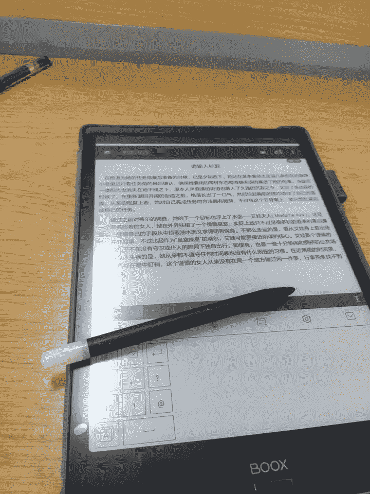

# 【翻译】渗透（Infiltration）20.11.25

作者：玉藻喵

TID：29255

 

# 1

*本帖最後由 玉藻喵 於 2020-11-25 13:14 編輯*

**本次翻译的是一篇缩小潜入胎内的文章，全程无意识，可能不合大多数人口味，慎入慎入，咳咳。**

**因为我英语水平很一般，所以翻译质量也比较一般，见谅，如有更好的翻译或者发现了错误，欢迎学习交流。**

格温（Gwen）最后再看了一眼手里的羊皮卷，然后随手就把它扔进了火堆里。她知道这次的任务事关紧要，不能留下来哪怕半点关于自己的蛛丝马迹。她的目标是一个叫哈根·克尔马斯（Hakon Kormas）的人——布莱顿的领主。最近一段时间，坊间流传着不少关于这个人的传闻，其中一条说的就是他与某个篡位夺权的阴谋有关，而且从皇室密探那边得到的消息来看，哈根很有可能就是这场阴谋的主要策划者之一。

　　格温的任务相当简单粗暴：调查出坊间关于哈根这个人的传闻是否是空穴来风，如果确有此事，那么最好能够得知他们计划的细节。

　　然而不怎么走运的是，这位领主的妻子早在几年前就已过世，况且他身边也没有任何一位女性顾问，为此，格温只能把目光放在了哈根的女儿——一位名叫蒂尔（Tiel）的女孩身上。选择这个可能对自己父亲阴谋一无所知的少女作为自己潜伏的容器显然不怎么完美，虽然格温希望能够找到一个更加有希望“宿主”，但眼前的状况不由得她选择。

　　太阳从地平线下徐徐升起，这表明距离她动身的时间已经差不多了，她翠绿色的双眼注视着火堆里已经快要燃尽了的羊皮卷，她必须得确定自己不留下哪怕一丁点的蛛丝马迹。待所有的一切都归于灰烬，她终于站了起来，翻了翻自己的背包，确认一切无误之后把包背到了自己的肩膀上。把围巾提起来遮住面容，双手把头发朝前梳了梳，随手扑灭了篝火然后长出了一口气，格温朝着城里的方向迈开了脚步。

　　是时候开始她的任务了。

　　仅仅是黎明刚过几个小时，布莱顿就已经开始变得车水马龙起来，但是这和她的任务并无关系。虽然她使用的潜伏方法十分特殊，但是这并不代表着格温对其他传统的谍报方法一无所知，相反，她已经在秘密之中监视了蒂尔好几天了。这几天的监视让格温对这位女孩的日常活动近乎了如指掌，并且基于此制定好了一个如何袭击她的计划，不过首先，她需要先找到蒂尔然后悄悄跟在她后面以确保这个女孩的日常活动一切照常，而且最最重要的是，蒂尔必须是独自一人。蒂尔的第一站总会是市场，所以格温并没有浪费时间，她径直朝着市场的方向走去。

　　没过多久，格温的猎物——蒂尔就出现在了她的视线当中，后者正站在某个珠宝商的面前欣赏着某个耳环。女孩的脖子上挂着一个金色的吊坠，上面镶嵌着某种红色的宝石，那吊坠看起来和她正想买下来的耳环很般配。她金色的头发扎成了两条辫子垂在身前，其余的头发则披散在了背后，遮住了她绿色衣服留下的些许空隙——对于王室成员来说十分暴露的衣服，虽然对胸前的重点部位有所保护，但是上背部和大部分白皙的小腹则毫无保留地暴露在外，裙子一角斜向一边，盖住了她右腿的膝盖，纤细左腿则完全露了出来。

　　她从珠宝商那走到了市场对面的几个摊位面前，天真的她对自己被人追踪这件事一无所知。不久之后，她迈开腿朝着城外走去——这正是格温一直在等的时刻，每天格温都能看见这个女孩走进城墙外的一片小树林里，显然蒂尔是想在那片僻静的树林里度过属于自己的隐私时间，好好放松一下。

　　当然，今天她的隐私时间似乎显得不再那么的“隐私”了。

　　蒂尔哼着小曲，开心地迈着大步走进了树林，她为自己能够找到与自己的红宝石吊坠十分般配的耳环而感到欣喜若狂，这个女孩恨不得马上就能看见自己戴着它们的样子。当然，回家或者使用珠宝商人摊位上的镜子，她随时都能够看见自己的美貌，但是在这片森林里有一个特别的地方，一个她经常去的小池塘，她希望第一次看见自己戴着耳环的时候，是通过倒映在清澈水面上的倒影。那个池塘是她唯一能够逃离繁杂的现实生活地方，是唯一一个她能够肯定不会有其他烦人的人来打扰自己的属于她的“圣地”。

　　这片小树林和她之前离开的时候别无二致。林间空地的中央是一棵苍翠的大树，树的前面是一个用石头围成的清澈的小池塘，蒂尔见到池塘眼睛立马亮了起来，她飞奔过去，跪在池塘面前，仔细地欣赏着自己的模样。耳环上的小红宝石在阳光下熠熠生辉，如同她心中所想的那样和自己的红宝石吊坠如同天生的一对。

　　“今天肯定是个好日子。”她站起来的时候不自觉地小声赞叹了一句。她深吸了一口气，让自己稍微平复一下欣喜的心情，然后带着痴痴的傻笑走到了空地上的那棵树前面，把手放到了树上，轻轻地抚摸着，似乎是在感受着那棵树粗糙的自然纹理。突然，她听到身后的灌木丛传来一阵沙沙的声响，她转过身去，想看看到底是什么，但突然她感觉到自己的右胸传来一阵剧痛，紧接着就是突如其来的，无法克制的疲倦感。她背朝着树倒了下去，视图在她的理智沉入黑暗之前发出微弱的呼喊声。

　　当格温意识到自己的飞镖因为女孩突然的动作而命中了一个预料之外的地方的时候，她的脸突然就红了。然而这无伤大雅，飞镖还是十分成功地完成了它的任务，几秒钟之后，蒂尔就倒了下来，靠在了树上。格温从灌木丛里钻了出来，走近了蒂尔，迅速地把她胸前的飞镖拔了下来，做了标记，然后扔进了自己的背包里。她停下来看了看她前面的女孩，蒂尔绝对是格温处理过的最具有吸引力的女孩：完美的腰围，光滑白皙的皮肤，能够吸引任何男人眼球的胸部，以及梳理得十分整洁漂亮的金发。或许这也是意料之中的，她毕竟是格温盯上的第一个皇室成员。

　　“我想知道这样一件衣服会不会让事情变得容易办一些。”格温一边这么想着，一边伸出了手轻轻抚摸着蒂尔的肚脐，检查着蒂尔裸露出来的腹部。过了一会她就把手从蒂尔的身上收了回来，她不想再浪费时间了。她深吸了一口气，从自己的背包里取出来一个药瓶，每次她都会犹豫上那么一小会，但是很快那瓶浓稠的浅蓝色药剂就被她灌进了自己的肚子里。几乎是同一时刻，一阵眩晕感冲上她的大脑，她冷不防跪倒在了地上。在一阵恶心的眩晕之中，格温努力地保持着自己的清醒，她紧紧地抓着自己的包，并且忍着眩晕所带来的恶心感一点点地朝着蒂尔爬过去，虽然从第三者的角度来看，这两人之间的距离正在逐渐变大而不是减小。

　　当然，事实正好相反：当药水的魔力发挥作用的时候，格温正在缩小。大约过了一分钟左右，她肚子那股强烈的恶心感终于平息了下来，她又重新站了起来，尽管这个时候她只有三四英寸那么高。此时她终于能够径直地朝着蒂尔相对于她来说巨大的身体走过去，准备开始她真正的工作。

　　已经缩小了的格温走到了蒂尔的双腿之间，爬到了蒂尔的衣服下面，蒂尔倒下来靠在树上的姿势正好十分完美，她的左褪伸向一边，这样格温就能轻轻楚楚地看清楚她的目的地了。然而还有女孩的内衣问题有待处理，所以她开始沿着蒂尔的右大腿往上爬。蒂尔的皮肤很是柔软，而且还略带潮湿，但是格温还是能够勉强抓住蒂尔的皮肤，艰难地在这面柔软的白墙上爬行。很快格温就爬上了蒂尔的胯部，她隐秘的三角上面覆盖着一条相当普通的丝质内裤，已经没有多少时间可以浪费了，格温拉开了蒂尔的内裤，开始在温暖柔软的肌肤和织物之间滑动，缓慢地朝着下方移动，直到她的整个身体都被内裤压在蒂尔的那条缝隙之上。她的手在少女的隐私之处摸索着，直到她找到了一个合适的位置能够让自己慢慢地挤进去。

　　格温在柔软的肉壁之间往前挤的时候，蒂尔发出了几声轻轻的呻吟声——虽然她已经被迷昏在了地上，但毕竟那是敏感之处，她身体的本能依旧在无意识之中做出了应有的反应。曾经有段时间，做这样的事情对格温来说尴尬万分，但是此时此刻，格温已经是泰然自若了。她小心翼翼地把头伸进少女的身体里，双脚踢蹬着后面的布料，挤进了这个温暖狭窄的活隧道。格温的上半身已经深入了进去，她开始伸展开自己的双臂，用力压进周围湿软的肉壁当中，用力想把剩下的身体都拉进来，由此带来的刺激让四周的软肉一下子靠了过来，蒂尔也随之发出了一声娇鸣。没过多久格温就完全深入到了蒂尔的小穴当中，她的腿和脚也消失在两瓣之间，完全进入到了这个温暖的洞穴当中，然而她并没有停下来，而是缓慢但是坚定地朝着蒂尔的身体深处蠕动。伴随着格温在蒂尔体内的移动，四周的墙壁开始活跃地蠕动了起来，她时不时能够听到从深处传来的蒂尔急促的呼吸声或者是几声娇甜的喘息声，在她的努力之下，很快她就来到了旅途中最让人感到不愉快的一站——子宫颈。格温深吸了一口气，把双手伸进了蒂尔的子宫口当中，开始拼尽全力地往前拉，然而前进的速度很慢，那个紧闭的洞口也在不断对抗着这个侵入者。但是没过多久，格温的手就伸进了一个稍微宽敞一些的洞穴当中，她用力把身体剩下的部分用力地往上撑，最终还是进入了她最终的目的地——蒂尔的子宫里。

　　蒂尔的小穴算得上是初极狭，才通人，后便虽算不上豁然开朗但是算得上稍微宽敞那么一点的子宫腔。格温送了一口气，依靠在蒂尔温暖厚实的子宫壁上让自己疲惫的身体能够稍微休息一下。她拿着自己的包在黑暗之中摸索着，把手伸到了包侧面一个特定的口袋里，然后从那个口袋里掏出了一个小东西，一块发出微光的小水晶：水晶发出的微弱亮光足以照亮她周围的环境，但还不足以亮到让蒂尔身体外面的人发现。她在蒂尔的子宫当中坐了下来，沉浸在蒂尔身体深处那种温暖和庇护的氛围当中，现在这里就是属于她一个人的小天地，除了等待，什么事情都不用做。

　　蒂尔逐渐从睡梦之中清醒过来，她眨了眨朦胧的双眼，昏昏沉沉地站了起来，完全记不起之前到底发生了什么事情，也不知道自己为什么会睡在地上。她感到自己的右胸隐隐作痛，而且令她感到尴尬的是，她的双腿之间有几分湿润的感觉。面对这一切她摸不着头脑，身上的财物都还在，而且也没有发生什么奇怪的事情，所以这个天真的女孩以为自己只是在树林里打了个盹而已。

　　“啊？！不是吧，我会太晚回去的！”她大声地惊叫了出来，此时已是夕阳西斜。当她沿着小路匆匆回到城里的时候，她已经把之前发生的那些奇怪的事情抛在了脑后，完全没有发现自己的身体里住进了一位小客人。

　　蒂尔一路跑进了庄园的门口，此时她已经是精疲力尽，气喘吁吁，她需要花一点时间让自己喘口气。当她在快步奔跑的时候，她能够感觉到自己的小腹之中有某种奇怪的感觉，但是现在那种奇怪的感觉却已经消失了。

　　“可能只是我饿了吧……”她一边这么想一边拍着自己衣服上的灰尘，走进了屋子。

　　“啊，亲爱的，你在这！我都开始担心你了！”一个低沉从她右边的走廊里传来，声音的主人是蒂尔的父亲哈根，他正急忙地朝着蒂尔这边赶过来。

　　“对……对不起，爸爸，我……我在城里散步的时候忘记了时间了……我不想让你你们为我担心的，我以后会注意的！”

　　“亲爱的，不用道歉，你来的正是时候。我们的客人都到齐了，女仆们刚刚开始摆桌子。你看你这头发乱的，先去洗漱一下再来餐厅见我们，好吗？”

　　“嗯，是的，爸爸。”蒂尔有些尴尬地回答道。她匆匆跑进了自己的房间，希望自己能在宴会开始之前打扮得更加体面一点，很多重要的客人都会出席这次宴会，她可不希望自己在众人面前出丑。

　　在蒂尔在小路上一路狂奔的时候，她子宫中的格温可就不那么好受了，格温随着蒂尔的奔跑变得晕头转向起来。现在一切终于平静了下来，她终于能够重新调整好自己身体的位置。这个时候，一扇门的声音让她重新集中起注意力来，因为这意味着蒂尔可能现在已经到了领主的庄园当中。果不其然，她很快就听到了另外一个人的声音，那个低沉的声音肯定就是哈根。她迅速把发光的小水晶夹在了自己的双峰之间，腾出手来，从包里取出来一本日记本和一根炭笔，专心地打听着任何一切值得记录下来的东西。

　　“宴会？真是天助我也。希望蒂尔能够被介绍给她的这些客人们，这样我就能够知道他们的名字了。”她这么想着。

　　蒂尔急忙朝着她的房间跑去，她跑动的时候，子宫里的格温又是一阵的颠簸，虽然没有之前快速奔跑的时候那么剧烈，当蒂尔开始打扮自己的时候，格温又陷入了无事可做的境地之中。蒂尔温暖的子宫里很安静，格温能够听到的只有蒂尔不自觉的哼唱和她身体深处脏器工作时发出的蠕动的声音，比如格温身后消化道发出的咕噜声。过了一会，格温感觉蒂尔又动了起来，应该是她赶去和父亲的同事们见面了。

　　“艾娃！（Ava）”蒂尔突然喊道。

　　“亲爱的蒂尔，好久不见！这对耳环看起来真漂亮，我喜欢。”一个低沉的女声回应道。

　　“谢谢，我今天才淘来的！话说你在这里干什么？我可没猜到今天除了我老爸那些无聊的老朋友之外会有其他的客人会来。”

　　艾娃轻声笑着说：“我有一些重要的差事需要和你的父亲商量。这些问题不能放到餐桌上讨论，但是别担心，我们还是有很多时间可以聊聊天的。”

　　格温很清楚这个女人是谁，她被称为“艾娃夫人”，严格意义上说，她并不算是皇室成员，但是这个女人富可敌国，控制东部的大部分市场。如果刚刚她提到的“差事”意味着她参与了这场阴谋，那么格温刚刚找到了一个可以让她更加接近的目标。

　　不幸的是，当宴会开始的时候，格温可以了解到的事情就很少了。她草草地记下了她听到的每一位客人的名字，但是接下来的对话都是那些听惯了的陈词滥调，对她的任务藓有裨益。有好几次提到一个叫“光荣斗争”的故事，而且显然出自两位士兵之口，他们正在就占有权的问题展开辩论，然后就是好几位客人多次试图与蒂尔调情。最后，当宴会告一段落，许多客人开始陆续离场。当格温听到汉根在和他的女儿谈话的时候，她正在留意谁还在大厅里。

　　“亲爱的，谢谢你今晚能够出席宴会，但是现在我和我的几个老熟人还有些差事需要处理。都是些大人之间的无聊话题，你不会感兴趣的，所以你为什么不先回房间过夜呢？”

　　蒂尔子宫里的格温不禁低声咒骂，蒂尔根本就是个局外人！哈根的“差事”的内容绝对就是她想要听的，但是她现在不得不在蒂尔的子宫里度过整个夜晚，完全置身局外。不过至少格温抓住了一条新的线索：艾娃还留在宴会大厅里，她现在成为了格温的下一个目标。

　　“啊？是的……没错，爸爸。”蒂尔喃喃道，她发现自己很难集中注意力，她在宴会上喝了不少酒，她一向不善于自我克制，她摇摇晃晃地站了起来，差点碰掉桌子上的玻璃杯，“别担心……我会……我会理你远点的……”

　　哈根这才注意到自己女儿的丑态，有些失望地叹了口气，“是的，我很肯定你现在应该去睡觉了。”他领着蒂尔走出了大厅。蒂尔给剩下的客人：她父亲的两个顾问，她记不得名字的一个穿着长袍的男人，还有艾娃告别。艾娃似乎被蒂尔滑稽的动作逗乐了，她热情地挥着手跟蒂尔告别。

　　蒂尔不时傻笑着，跌跌撞撞的穿过大厅朝着自己的房间走去。她一边走着一边心不在焉地抚摸着自己的小腹，现在她已经吃饱了，但是之前那种奇怪的感觉又回来了，就像是有什么东西压在自己的小腹里面一样，然而她现在的处境容不得她多想。当她走到自己房间门口的时候，一个下人从走廊里走过，蒂尔伸出手抓住了她的肩膀。

　　“玛格丽特（Margaret），亲爱的，把大厅的窗帘拉上，爸爸……爸爸不想让月亮盯着他……”她对着那个女人大喊道。

　　女佣辛西娅（Cynthia）迷惑地看了她一眼，然后只是点了点头，匆匆穿过走廊离开了。蒂尔转过身去把门踢开，这个动作差点让他失去平衡。一进屋，她突然就像变了个人一样，小心翼翼地把门关上，然后再确认门已经锁好。当她的父亲在处理他的差事的时候，她也有自己的 “差事”要处理。

　　她把衣服十分随意地扔到了地板上，项链也十分随意地放到了一边，耳环则比较小心地放在了床头柜上。脱下了所有衣物的她扑倒在了床上，她的一只手又开始抚摸着自己的小腹，另一只手则解开了辫子让自己的的头发垂下来。肚子里那种奇怪的感觉似乎打开了她某个奇怪的开关，她抚摸着自己的小腹的时候，一丝莫名其妙的暖意传遍了她的全身。她轻咬着自

　　己的下唇，把手伸进了自己的内裤里，自从她从树林里醒来，她就一直在期待着这个时刻。

　　在蒂尔体内的格温似乎意识到了什么，她的脸一瞬间涨红了，她已经习惯了钻进女孩的秘密花园的过程，但是在女孩的体内里面经历这种事情，她只经历过两次，而且更糟糕的是，蒂尔现在会这么兴奋，似乎正是因为自己的入侵。格温知道，这注定是一个漫长的夜晚了。

　　没过多久，蒂尔的手指变得更加大胆起来，她开始把自己的手指伸进自己的肉缝当中，同时发出阵阵娇喘。在蒂尔子宫里的格温能够听见一阵阵巨大的噗嗤噗嗤的声音从她的脚下发出来——蒂尔的手指在她的洞穴里抽插着。令人心惊肉跳的呻吟声在蒂尔的身体里回荡，令格温感厌恶的是，她时不时能够感受到蒂尔的动作牵动蒂尔的身体对格温的挤压。

　　声音变得越来越大了，格温能够感受到蒂尔的手指在自己的身下的肉穴中抽插得越来越快，蒂尔已经彻底沉醉在了性欲当中，她的双手都已经伸到了自己的私处，用于满足自己不断膨胀的情欲。她感觉自己已经快要达到顶峰了，她的身体开始因为兴奋而紧绷起来，很快，伴随着一声巨大的叫喊，快感贯穿了她不断颤抖着的身体。格温猝不及防地被因为蒂尔的自慰而变得黏糊糊的子宫壁紧紧地夹在中间，蒂尔强烈的宫缩近乎把她挤成了肉饼。

　　漫长的时间终于过去，四周黏糊糊的子宫壁终于重新松弛了下来，这里又变成了一个宽敞的小房间。蒂尔还在喘着粗气，她依旧没有从兴奋之中恢复过来。

　　没过多久，蒂尔似乎已经沉沉睡去，但是格温依旧醒着，躺在蒂尔的子宫里，她感觉自己简直像是经历了一场磨难。

　　最后，她终于能随着这幅身体的主人一起安顿下来，除了赶紧在早上把她的工作做完之外，她什么都不想。

　　格温被蒂尔的肚子发出的咆哮声惊醒，她能够感觉自己在移动，但是不知道自己现在在哪。这个时候，蒂尔的声音在她的身边回响：她正在和某个商人寻求某种治头疼的药。

　　“看起来我们现在在市场上，过不了多久她就会回到小树林了，那样我就能从这里离开了……”

　　果不其然，广场上熙熙攘攘的人群声很快就被蒂尔脚下踩着的枯叶发出的声音所取代。格温很难判断他们到底在那里，但当蒂尔似乎静止下来一段时间之后，她感觉他们已经到地方了。格温把手伸进包里，取出来一个烧瓶，然后把里面的很多内容物倒了出来，倒在她身边的肉壁上，然后她很快地把烧瓶放回了她的包里，并且做好了面对撞击的准备。那些液体和用来把蒂尔迷倒的药水别无二致，只不过随着她身体的缩小，她需要使用更大的剂量来确保药效足够。如他所料，蒂尔的身体稍后就朝着一边倾倒了下去。

　　格温没有浪费逃跑的时间，她把水晶放回了包里，然后钻进了蒂尔的子宫颈。她用力扭动着身体，穿过狭窄的子宫颈，不久就钻进了蒂尔的小穴当中，她不由自主地想起了不久之前这条血肉隧道的样子，不禁颤抖了一下。进去难，出来就容易了很多，很快她就从蒂尔的内裤之中爬了出来，滑到了地面上，重获自由。她远离了蒂尔身体一定的距离，然后从包里面取出来另外一个小瓶子，把里面的紫色液体悉数喝了下去。数秒之后，伴随着一阵剧烈的头疼，捂着头的格温已经恢复了正常的体型。她站了起来，看了看四周，这里确实就是前一天的那一片小树林，只不过这次蒂尔倒在了草地中间而不是倚靠在树上。没有必要再在这里浪费时间了，所以格温很快就消失在了树丛当中。

　　虽然精疲力尽的她很想休息，但是她知道她还需要继续完成她的调查然后动身返回布莱顿。她的下一个目标还在等着她。

　　TR by. Wolfypackage.zip

　　铁扇公主吧ID：玉藻喵♀

　　原作者：OsmiumOrchid

　　原文链接：[https://aryion.com/g4/view/438228](https://aryion.com/g4/view/438228)

　　没有我允许，私自转载到某论坛先死个妈，谢谢合作。

 

# 2

> [源青之绅 發表於 2020-8-10 09:29](https://giantessnight.com/gnforum2012/forum.php?mod=redirect&goto=findpost&pid=444568&ptid=29255)

> 追了楼主几篇文章，爽到！感觉楼主口味我一样，真希望论坛能有关注功能，这样就可以点个关注了！ ...

谢谢老铁（这是凑字数让我发出回复的内容）

 

# 3

看到这么多人正面的反馈，我十分开心，并且决定先咕咕咕再翻译第二篇章（） 

# 4

> [zhangwuwen321 發表於 2020-8-19 21:23](https://giantessnight.com/gnforum2012/forum.php?mod=redirect&goto=findpost&pid=445585&ptid=29255)

> 大佬你的舟舟游戏还在做吗？

quest那个编写太反人类了，在找到好的替代方案之前，暂时搁置

 

# 5

> [zhangwuwen321 發表於 2020-11-7 07:55](https://giantessnight.com/gnforum2012/forum.php?mod=redirect&goto=findpost&pid=451342&ptid=29255)

> 大佬,那个舟舟的同人游戏还做吗...好期待入菊的剧情啊

nope……坑有点多，快填不完了，因为没有找到合适的引擎替代品，所以优先级不高

 

# 6

在格温为她的任务做最后准备的时候，已是夕阳西下。她站在某条离领主庄园几条街区的僻静小巷里进行着任务的最后确认，确保她要用的每样东西都准确无误地塞进了她的包里。当最后一缕阳光也沉没到地平线之下，原本人声鼎沸的街道也落入了久违的沉寂之中，又到了该动身的时候了。在重新溜回开阔的街道之前，格温长出了一口气，然后拉起胸前的围巾遮住了自己的面庞。从某种方面上看，她对自己完成任务的方法略有微词，不过在这个节骨眼上，她只想赶紧把自己的任务做完。

经过之前对蒂尔的调查，她的下一个目标也浮上了水面——艾娃夫人（Madame Ava）。这是一个恶名昭彰的女人，她在外界扶植了一个傀儡皇室，实际上她只不过是很多肮脏差事的幕后操盘手，凭借自己的手段从中捞取油水而又求得明哲保身。不那么走运的是，要从艾娃的身上套出些什么并非易事，不过比起作为“皇室成员”的蒂尔，艾娃可能更接近阴谋的核心。艾娃是个谨慎的人，她几乎不在没有守卫或仆人的陪同下独自出行，即使有，也是一些十分热闹和拥挤的公共场所。最令人头疼的是，她从来不遵守任何时间表也没有什么固定的习惯。在近两周的时间里，格温一直在暗中盯梢，然而这个谨慎的女人从来没有在同一个地方做过同一件事情，行事完全找不到任何规律。考虑到她的角色，一个如此有影响力的决赛，她从王国权力中心的阴曹地府之中爬出来，掌握了能与领主和贵妇们抗衡的权利，格温很确定自己绝对不是第一个怀疑并且关注她的人。她如此的谨慎和多疑绝对是有意的，不过百密一疏，她还是为格温打开了一扇机会之窗。

她隐藏在那些藏污纳垢的角落，蹑手蹑手地穿过街道的阴影，避开那些守卫们警惕的目光，朝着庄园的院墙走去。艾娃在布莱顿期间就一直住在眼前这座属于领主哈根的庄园里，当艾娃沉入梦乡之时，格温就有办法悄悄溜进去。有几个麻烦的警卫在外围放哨，对于格温来说这不是什么难事，经过一小段时间的观察之后，她就发现了这些守卫巡逻时的几个死角，穿过这些死角，她来去自如。她在房子边上的一个灌木丛之中耐心地等着，直到那个稍纵即逝的时机到来，她一个箭步朝着围墙冲了过去——再慢上那么一点点，从另外一头绕过来的警卫就会把她抓个现行。

当她的手一碰到庄园冰冷的石墙的时候，她的另一只手已经从包里掏出了一瓶药水，一口闷了下去。这种蓝色的液体十分苦涩而且让她感觉很不舒服，不过现在她已经开始逐渐熟悉这种感觉了。咽下药水没过多久，她的身体就被缩小到只有几英寸高，伴随着缩小带来的眩晕感逐渐消失，“小女孩”慢慢地站起来，开始观察起面前的这面墙壁。这已经不是她第一次来这个庄园了，前一天晚上她就已经提早来踩过点，她提前测试了进入这座庄园的可能路线，并且在墙角藏了一支飞镖。没过多久，她就找到了她藏起来的那支飞镖，尽管现在看来，那块小小的金属碎片几乎和她一样高了。在开始上升之前，她十分小心地把飞镖绑在了自己的背上。

走运的是，不仅艾娃的房间在一楼，而且那个房间还有一扇窗户是“坏”的——玻璃上那一点点小瑕疵对于一般人来说完全不值一提，甚至算不上是破损，但是一块完全脱落下来的小碎片给这扇窗户开了一个小门，而且这个小门正好能够让格温现在的小身子挤进去。格温攀着粗糙外墙的砖缝，朝着那扇窗户进发。虽然现在那两个巡逻的卫兵完全可以看见窗户上格温准备溜进去的小角落，不过时间充足，她完全可以等两个守卫走过去，而且以她现在的身形也不大可能会引起远处任何人的注意。很快她就爬上了靠近玻璃窗的边缘，她停下来喘了口气，休息了一会。对于缩小了身体来说，原本不过胸口那么高的距离变成了一段精疲力尽的攀岩之旅。

那个小洞的边缘隐藏在阴影之中，看起来并没有什么危险，她小心翼翼地爬进去，进到了房间里面的窗台上。居高临下，他能够很清楚地看到房间的周围，从三扇窗户望出去的那堵围墙显得相当的荒芜，除了柔和的月光之外一无所有。对面是一扇精心雕琢过的木门，门上挂着一根门闩，旁边高高的花瓶里点缀着一些叫不出名字的橘黄色鲜花，然后就是一个装着巨大镜子的衣柜。在她的左边是一张装饰着奢华顶棚近乎占据了大半个房间的豪华大床，那就是目标所在了，格温抓着窗框上的窗帘，轻轻地滑到下面的木地板上。她以最快的速度穿过地板，爬上了一根床腿，她十分清楚，即使现在艾娃已经睡着了，但是在现在这个体型下，暴露在空无一物的地板上依旧是十分危险的。

现在她已经站在了铺满了床单的丝绸下方，眼前就是她的目标，不出所料，艾娃仰面淌着，满头的黑发蓬乱的披散在枕头上，她一只手捂着肚子，另一只手捂着头，似乎正沉浸在梦乡之中。格温小心翼翼地走到床上，蹑手蹑脚地朝着女巨人裸露着的手臂靠近，她近乎屏住了呼吸，避免发出半点声音，以免被察觉到自己的存在。当与艾娃距离触手可及的时候，格温把飞镖从自己的背上抽了出来，扎进了女巨人那象牙一般的小臂里，熟睡中的女巨人轻轻抽搐了一下，但是细微的疼痛似乎并没有把她惊醒，当药效发作的时候，什么都不会发生。当格温确认飞镖完成自己的使命之后就把它拉了出来，朝着床的后角扔了出去，她往常不会留下半点证据，但是在现在这个体型下这个飞镖对她来说实在是太大了，而且她也没有办法变回原来的体型把它带走，没办法，只能出此下策。随着药效的逐渐生效，现在是格温进行下一步行动的时候了。

她从毯子上滑了下来，滑到了床上，沿着艾娃的身体在被子底下爬行，被子下面一片漆黑，格温只能把那块水晶从包里面取出来照明。艾娃穿着一件黑色的丝绸睡衣，这让格温有些难以弄明白自己的位置，不过在艾娃的大腿在裙子下方暴露出来的一片白皙的空白给她指明了方向，没用多久，她就爬上了雪白的墙壁，来到了她的目的地。艾娃的双腿之间正好有足够的空间能够让格温进入，而且这一次显然要简单很多，因为艾娃只穿了她那件黑色的丝绸睡衣，其他的地方则是一片真空。

当她确定了自己的位置之后，为了安全起见，在潜入的时候，她把水晶藏了起来让自己重新融入到一片黑暗之中。她没有再耽搁，直接把自己的双手插进了艾娃的肉缝之中开始奋力地向前挤着，四周那些属于女巨人的肉壁在时不时抽搐着，尽管现在这个女巨人正处在昏睡当中，但是她的身体还是对从下身传来的奇妙刺激起了反应。格温泰然自若地朝着艾娃小穴的深处前进，奋力挥动双手试图把自己拉进这个肉穴的更深处。她不紧不慢地朝着更深处前进，目前为止，一切都十分的顺利，但就在她把屁股挤进这个肉穴当中的时候突然遇到些困难，似乎有哪里不对——每次她进入某个女人体内的时候，四周的肉壁都会随着她的侵入而变得活跃起来，十分热情地挤压着她的身体，但是这次的反应似乎比以往要强烈许多。四周剧烈收缩的肉壁把她压得几乎喘不过气来，这让她莫名想起了她在蒂尔体内度过的难忘的那一晚。当她感觉到有什么东西碰到自己的腿的时候，她瞬间就意识到发生什么了，一阵刺骨的寒意贯穿了她的骨髓，下一秒，她就从这个狭窄的血肉管道之中被拽了出去，暴露在了柔和但是在她看来有些刺眼的灯光之下。她尝试着重新找回自己的方位——毯子被推到了一边，她发现自己被一只大手紧紧攥着，而这只大手的主人是艾娃，一个十分清醒地看着自己的艾娃。

“嗯，哼哼……看来我的客人终于找上门来了，我一开始还以为自己想错了呢。”她坐了下来，把变成了小人的格温举到了自己的面前。格温被这突如其来的变故给吓懵了，她干这行这么久了，这是她第一次被抓住。

“哦？是不是觉得很震惊啊？”艾娃笑了起来，“如果你准备把自己变得这么小，这么弱不禁风的话，那就要做好被抓住了心理准备。你万分依赖的那个药剂，说实话，药效也不是那么难抵消的。”她继续说着，并且还把那支飞镖拿在手上，伸到格温的面前把玩。震惊的格温瞪大了自己的眼睛，她完全不知道艾娃为什么知道她会来，也不知道为什么艾娃知道自己会用那种药物。

“为……为什么？但是……”她结结巴巴地说着，当然她完全不清楚自己这么小的身体说出来的话还能不能被听见。

“我这么知道你要来？”这再简单不过了。我知道你是谁，格温多林·福尔克（Gwendolyn Falk），你办事虽然近乎天衣无缝，但是我的情报网可是无处不在的。如果不在那些能够给自己造成威胁的人身边多安插几个眼线，或者稍微关注一下那些有些“奇技淫巧”的雇佣兵，我是怎么爬到这个位置上的？我对你还是有点印象的，毕竟那个时候我还有考虑过要拉你入伙。”她解释道，“当可怜小蒂尔把那些在小树林里的奇怪经历告诉我的时候，我就大概有数了。想必，你是想知道哈根在打什么小算盘对吧？”

格温有些不知所措，不知道应该作何答复，听到这些，她开始觉得自己是多么的渺小和无力。

艾娃笑着说：“你不用回答我，我对此了如指掌，不然我怎么会猜到你今晚会来找我？我知道如果你那天晚上潜伏在蒂尔的体内，那么我一定就会是下一个目标，啧啧，我没猜错吧？”

突然整个世界开始旋转了起来，她发现自己正被按在女巨人的肚子上，隔着一层丝绸，深深地陷进了柔软的肚皮里。

“现在，或许我们可以稍微商量一下——我当然可以好好地利用一下你的‘小’能力……不过首先你应该为你的所作所为受到应有的惩罚。你怎么能够去玷污蒂尔那样天真无邪的小女孩，去玩弄你那些变态的把戏！”

格温本来想抗议说，蒂尔似乎对自己的入侵感到十分的享受，但当她被抓住双腿甩到空中的时候，她的脑袋里只剩下一片混沌。艾娃躺在床上，而抓着格温的那只手就悬在她的脸上。

“嗯哼，惩罚是少不了的。你说你的目标是进到我的体内？我觉得我可以给你一点小小的帮助？”艾娃的脸上露出诡异的笑容，她张大了自己的嘴巴。格温惊恐地看着自己身下的那张大嘴——艾娃准备把自己吃掉！

未完，更新中……

一点小幕后，本次更新是我笔译出来的。没错，“笔译”，在毛概课上一字一句写出来……

<ignore_js_op>

**IMG_20201125_093934.jpg** *(99.81 KB, 下載次數: 0)*

[下載附件](forum.php?mod=attachment&aid=ODYxMDR8NmIyMjBiMGV8MTYyNDY5MzkwNHwxODIzMHwyOTI1NQ%3D%3D&nothumb=yes)

2020-11-25 13:15 上傳</ignore_js_op>