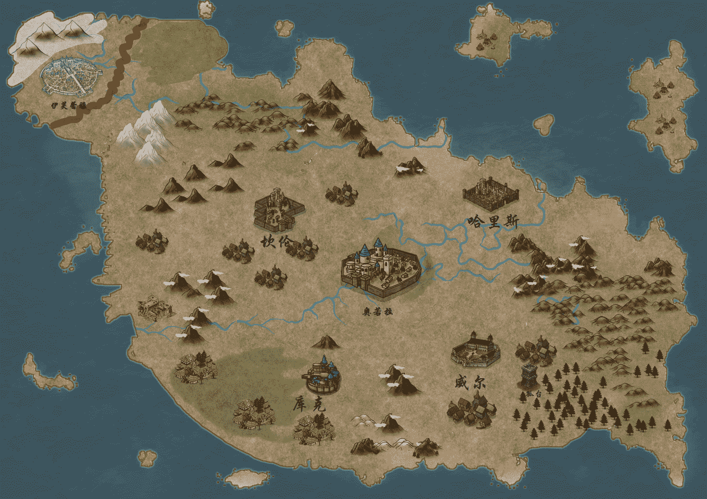

# 【长篇】不可救赎 （忙完了，在写了）

作者：樱花残月

TID：30156

<title>1</title> <link href="../Styles/Style.css" type="text/css" rel="stylesheet">

# 1

*本帖最後由 樱花残月 於 2021-6-18 20:42 編輯*

非常抱歉，因为临近毕业，各方面的事比较多，暂时无心无力继续更新，但我依旧有写完的打算，最迟也会在六月开始后续的更新。 

2021.4.6 为第五章的后半段进行润色，并增添了一些细节。 截至目前，字数230471。

几点声明：

1.本文题材为西幻，带有一定的GTS元素（以vore为主，当然各类经典元素都有涉及，不含GT，FUTA等重口元素）

2.本文以较为严肃的剧情为主，所谓福利情节仅作穿插。如果读者能以阅读一本普通小说的心态读本作品，并能适当地就剧情进行讨论，本人将不胜荣幸。

3.本文目前随缘更新。您的回复将是本人最大的动力。

4.我不希望以任何形式看到本文出现于GN论坛以外的场所。并且，如果您碰巧在他处看到本文，请不吝立刻联系我，以便做出应对。

最后希望大家能喜欢我的作品，首楼将在文章更新到一定程度时添加目录。

<title>2</title> <link href="../Styles/Style.css" type="text/css" rel="stylesheet">

# 2

 <ignore_js_op>[map_export_1615382276241(1).jpeg](forum.php?mod=attachment&aid=ODc4MzZ8ZTYzZGFjYzV8MTYyNDY4OTYxNnwxODIzMHwzMDE1Ng%3D%3D&nothumb=yes) *(2.29 MB, 下載次數: 0)*

[下載附件](forum.php?mod=attachment&aid=ODc4MzZ8ZTYzZGFjYzV8MTYyNDY4OTYxNnwxODIzMHwzMDE1Ng%3D%3D&nothumb=yes)

2021-3-10 21:37 上傳  

加纳尔大陆地图

</ignore_js_op> <title>3</title> <link href="../Styles/Style.css" type="text/css" rel="stylesheet">

# 3

*本帖最後由 樱花残月 於 2021-1-24 17:49 編輯*

**序章   终末与起始的故事**

     “今天，奥美希合众国1041年12月9日，我作为合众国总统，在此行使由神圣的宪法赋予我的职权。我宣布：     自1042年1月1日起，凡是定居在奥美希合众国境内的盖尔伯人，都应在那时及以后永远享受作为奥美希合众国公民的所有权利。合众国政府行政部门，包括海陆军当局，将承认并保障这些人行使自己的公民权，当他们或他们之中的任何人为自己的公民权而作任何努力时，不作任何压制他们的行为。凡是在奥美希合众国境内，任何地方都必须废除用以区别对待盖尔伯人种与威瑟人种的条规条款，合众国政府行政部门，包括海陆军当局将确保这些条规条款永远不会再被启用。     现在，我进一步命令合众国境内的所有盖尔伯人，除非是用以自卫，不得有违法行为。我劝告他们，让子女接受合众国公平且免费的教育，继而忠实地为合理的工资而劳动。”     演讲台后，这位身材颀长，肤色淡白的男子高举拳头，以震耳欲聋的高呼为他那激情洋溢的讲话作尾：    “我由衷地相信，这是合乎宪法的正义之举，它必将为奥美希合众国带来灿烂而光明的未来！”             他的话音刚落，连绵不绝地掌声便响彻整个演讲台上空。观众们肤色各异的手臂高高挥舞起合众国的旗帜，呐喊着：                                         “合众国万岁！”                                          ........     在广场不远处的一根电线杆上，数只漆羽乌鸦瞪着它们那暗红色的瞳孔，纹丝不动地观望着这一切。片刻后，或许是现场的盛势也感染到了他们，亦或是撼动万物的声浪打扰到了它们憩息，随着一声凄厉的啼鸣，乌鸦们振翅飞往高空，向着远方散去。     在矫健有力地翅膀扇动下，繁华的都市景象从它们身下褪去，荷着锄头的农夫正站在田埂上，出神地眺望着乌鸦们飞来的方向。渐渐地，大地上也不见了农夫的身影，只有那些参天古木，仍在为乌鸦们指引归巢的方向。     终于，在一片廖无人烟的森林上空，这群乌鸦才肯垂下高昂的头颅，俯冲进了一处山洞之中。不过，若非这些目光锐利的鸟兽，谁又能从布满青苔的灰岩中，发现这隐秘的洞口呢？在穿过狭长的通道之后，它们飞入了一间昏暗的房间。     在不算宽阔的空间中央，有一张积满灰尘的圆桌，而圆桌的不远处，则立着一个腐朽的木质书架。各类动物皮质的深色书壳，勉强维持着其内部似乎一碰就会化为灰烬的书页，歪歪倒倒地放置在书架上。     这些屋内的陈设已经无法用老旧来形容，简直可以说是刚出土的旧时代遗物。     那群乌鸦们落在了圆桌上的一个暗金色器皿边缘。它整体呈高脚杯状，内部一片黑红，令人不敢深想其曾经盛放过何种液体。     这时，一只纤长的手臂从暗处伸了出来，在昏暗的烛光下，竟如同玉璧一般白皙。顺着这只手，其主人的样貌也终于可以辨明，是一位银色长发的女子，衣着古朴，倒也与屋内的陈设相称。当你凝望她时，你会发现她的面容如同冰川一般冷寂，任凭你使出全力，也觉察不出一丝一毫的感情。然而，只要你的视线与她那血红色的瞳孔相触，便会感到难以言表的战栗。因为，这双眼睛会勾出你最为原初的恐惧——死亡。     世上没有任何一本书籍提及这名女子的事迹，也无人知晓她的名字。甚至，你可能会怀疑，她究竟是如何生活于这原始的森海之中。     她伸出的手落在了乌鸦背上，嘴里似乎念念有词。未几，这些生灵活现的乌鸦竟化作血水，流入了器皿。她那深邃的眼眸久久地凝视着“杯”中盛放之物，随后，一声仿佛是卸下了什么重负似的长叹，跨越时空，从她的樱唇中迸出。    “怎么了，女王？”声音从房间的暗处传来。在这之后，一位男性的身影出现在了幽暗的灯光下。他毕恭毕敬地半跪在女子面前。    “结束了。”简短而空灵的语句，让人分不清她究竟是在自言自语，还是回答男子的问题。    “这样就可以了吗？哪怕他们作出这样的宣言，距离彻底消除隔阂仍就有相当长的道路要走。”男子低着头说。    “那就交予汝等自己去走了。”她抽回手，说，“妾身做到这一步，已经算是完成了他的夙愿。”     说完，屋内陷入了沉默。     见男子仍旧保持着跪立的姿势，她开口道：“汝的使命也结束了，在妾身陷入长眠之前，汝可有何心愿？”     听闻此话，男子猛地抬头望向了她的脸，似乎在踌躇什么。片刻后，他说道：“女王将息，我亦无心留于世间。我愿化身为您长眠之前的食粮。”     男子的话语令她静若死水的脸庞上泛起了一丝波澜，她回应道：“妾身早已不再以汝等血肉为食。况且，汝不必寻死。妾身能抹去汝过去的记忆，并授予汝所希冀的任何身份以及相对应的学识，以供汝安然生活于现世。”    “不，女王。我提出这样的请求并不是为此。”男子答道。“我曾因为您在传闻中的美貌求见于您，而您收纳了我。但是，在我辅佐您的漫长时光中，这份源于爱慕的激情渐渐转变为了对您的景仰。是您让我这个纨绔子弟拥有了无人能及的宏大理想，也让我倍感荣耀和骄傲。而在那一刻，我的宿命便已决定，我将把我生命的全部，都奉献给女王。”    “宿命。”她微蹙起眉头，将这个词重复了一遍。随后，她的神情又复归于平静：“汝等为理想而毫不犹豫地舍弃生命时，真觉得自己的理由足够冠冕堂皇了吗？”     这突如其来的，明显带有怒意的质问一下子令男子陷入了慌乱，他在反思自己言语之中是否有触怒女王之处而未果后，选择垂下头颅，静待惩处。    “也罢。”她叹了口气，说，“如果这是汝的愿望，妾身会满足你。”     说完，她伸出手，一滴血液从她的指尖滴落。当这滴鲜红的血液触碰到漆黑的大地时，竟好似有了生命一般在地面上游梭着，很快，便勾勒出了一个圆形的图案。而这布满奇怪符号的图案中心，正是跪立着的男子。     细若游丝的血线开始泛出微暗的红光，男子的心脏也随之猛烈地跳动。他说不清这到底是由于紧张，恐惧，亦或是兴奋。他眼前的世界很快开始天旋地转，一阵前所未有的奇妙感觉笼罩在他身体的每一个角落。     突然，他感到一股寒冷，低头望向自己的身体时，才发现自己已然一丝不挂。充满褶皱的黑灰色“墙壁”包围着他，似乎还散发着些许热气。他辨认出，这是他自己的衣服和裤子，换言之，自己此时的身高，竟不比堆积在地上的衣物！             他并不是第一次见到女王使用这样的法术，但作用在自己身上，还是头一次。没等他发出什么感想，一只巨大的手掌压平了地面上的衣物，伸到了他面前。     高耸如同一座大山的女王映入了他的眼帘，也夺走了他脑海中的所有想法，如若不是身体还有些僵硬，他简直要直接匍匐在这女神一般的形象前了。     见他痴痴地望着自己，她开口道：“上来吧。”     男子战战兢兢抬腿，踏上了白玉一般完美无瑕的手指，而这细若柔荑的手，载着他来到了女王眼前。     当发现女王那巨大的红色瞳孔正凝望着自己时，男子忽然感到一丝窘迫。他扭扭捏捏地垂下头，望着自己干瘪而腐朽的躯体，一根根肋骨撑着仿佛触之即破的皮肤，骨瘦如柴的双腿几近骷髅。曾经，他也是加纳尔大陆上最风度翩翩的公子，只消一眼便召来无数追求的女子。他从未想过，有一天他会以这样的形象，赤身裸体地站在离女王如此之近的位置。     男子的内心复杂的情感并没有影响到她分毫。她依旧面无表情，只是确认道：“汝不后悔？”     湿润的吐息拂过男子的身躯，让他不禁对自己即将去往的，吐息的源头而想入非非。不过，他可不会再犯让女王久等的错误，随即坚定地答道：“不会。”     她短暂地闭上了眼睛，再次睁开时，像是下定了决心。然后，她手掌一翻，男子便落入她樱桃一般大小的嘴中。     然而，就是如此简单的动作，却给了男子闪电一般的刺激。在他的身体服帖地趴到在她香软的舌头上时，男子几乎要昏厥过去。所幸，她并没有将男子含在嘴里玩弄，头略微一仰，便将这渺小的肉体咽入喉中。     尽管被狭长的食道挤压，男子仍旧处于大脑放空的状态，像失去了五感一般，任由身体坠落着。直到跌到一块烂泥般的软肉上时，他才回过神来。     长年不食人间烟火的女王腹中，自然空无一物。除了浓厚的潮湿感外，也没有什么气味。他就地坐下，开口道：“在被消化之前，我还有一个小小的心愿。”     他的声音很轻，相比于环绕在整个胃袋中，女王那有韵律感的心跳声，显得微乎其微。但是，他却相信女王一定能够听到。    “何事？”     果不其然，这空灵的声音伴随着袅袅的回声穿入他的耳朵。他立刻答道：“您一直对您成为女王前的往事讳莫如深，我想在死前听一听这个故事。”     话语已经飘了出去，却久久不闻回音。他接着说道：“我知道，您从不愿谈论这些事，并将一切相关物连同记忆他们的人也一并抹去。但是，现在周围绝无二人，这个房间发出的所有声音都会随风消逝在山谷之中。而我只是您腹中的食物，您会担心一块面包泄露秘密吗？”    “这才是汝的真实目的吗？”女王闭上了眼睛，长叹口气。     男子并没有回答。这段往事一直是他的心病，哪怕是欺骗女王，也想要解开这一疑惑。    “汝的确很擅长说服妾身。也罢，在为一切画上句号之前，说一说往事并无不可。”     她望向了天花板，然而，她空旷而深远的目光却似乎并未被其阻隔，仿佛一眼便望穿了森林上空的璀璨星河，直至千年之前的岁月。    “那么，且听好罢！”<title>4</title> <link href="../Styles/Style.css" type="text/css" rel="stylesheet">

# 4

白天还会有一次更新，敬请期待。<title>5</title> <link href="../Styles/Style.css" type="text/css" rel="stylesheet">

# 5

*本帖最後由 樱花残月 於 2021-1-25 19:16 編輯*

**第一章 剑与血的相遇**     加纳尔大陆东南侧     傍晚时分的田野大抵是静悄悄的，几乎没有人影。     布雷尔村外亦是如此，辛勤耕耘了一整天的村民们，早就急急地跟着下山的太阳一起去休息了，还有谁会留在田野上呢？     但是，如果你恰巧于此时此刻出现在了此地，你或许就会看到这样离奇的景况：     田埂上，一个踩着草鞋，身着步衣的男子仿佛丢了魂般，拼命地跑着。而他的身后，跟着一位披有如同月光般银白长发的少女。在夜色下，少女不紧不慢地走着，她那血红地双眸，却一刻都没有从她的猎物上移开。     没错，少女眼中的猎物正是前面奔跑着的男子，尽管从他的扭曲的表情，粗声的喘息中，不难看出他的确是竭尽了全力，但是，他却依旧没能将少女甩开哪怕一步的距离。     终于，他精疲力竭地跌坐在了地上，带着无比惊恐的神色转身看向一步一步向自己走来的少女，他张了张嘴，却无法发出任何声音。    “终于放弃逃跑了？”少女走上跟前，俯视着他。借着少女身后那暗淡的月光，男子发现少女的肤色一如那天体一般惨白。而在这惨白之中，少女鲜红的舌头格外显眼，它正俏皮地舔着妖艳的红唇。一点寒光从少女地唇间射出，那是象征少女身份的，吸血鬼特有的尖利虎牙。     乡间一直有这么个传闻，当老鼠看到猫的舌头时，就会立刻接受自己的命运。之后它便僵在原地，任猫宰割。     现在看来，这对人也同样适用。尽管男子的心脏因为恐惧而几近将胸膛锤破，迸发出的血液也几乎使浑身的每一根血管爆裂，但他竟无法再驱使身体往后挪动哪怕一寸。他想将自己的目光从少女身上移开，然而视线却像是被勾魂巫婆攫住一般，死死地停留在少女裸露在外的小腹。     注意到男子视线的少女，则心满意足地抚摸了一下略微隆起的腹部：“准备好进来与你的朋友见面了吗？我可爱的小家伙？”     这时，人们才想起，他们不会在这个点离开家门，还有个比劳累更为重要的原因，那便是少女这般的存在。     时间回到十五分钟之前。     或许是狭小的农舍再也无法框柱喝得烂醉的乔治和吉姆，他们勾肩搭背，相互扶持着踏上更为广阔的田野。他们时而高声唱起不着调的歌谣，时而大肆吹嘘着自己的光辉事迹，尽管周围并不会有美丽的村妇被他们吸引，继而抛来崇拜的目光。     哦不，还是有东西被他们吸引而来的。    “你们看起来还真是开心呀！”一个清灵的女声从他们身后响起。     吉姆醉眼迷离地回头看了一眼，用不耐烦的口吻说：“去去去，这是哪家的小丫头，一边玩去。”    “我才不是什么小丫头！”少女挺起那略显贫瘠的胸脯，努力使自己看起来成熟一些：“你们年龄加起来还未必比我大呢。”     然而，这句听起来有些怪异的话并没有引起乔治和吉姆的警觉，他们仍旧高歌着向前面走着。     发觉自己被无视地少女气红了脸。她鼓起可爱的腮帮，气呼呼地蹲下，将一只手按向地面，瞬间，她手掌附近的黄土竟然涌出了一小泊鲜红的血池。    “血棘。”少女轻声念出了这两个字。话音刚落，掌下的血液凝成了一根锐利地长刺，眨眼间贯穿了吉姆的胸膛。     吉姆胸口处喷出的鲜血溅了乔治一脸，也让他酒意全无。他回头看向了少女：“吸.....吸血鬼？”    “现在意识到太迟了哦。”少女嘴角扬起一抹残忍的笑：“晚上好啊，食物们。”     少女说完，掌下的血泊一下与吉姆胸膛中渗出的血液连接了起来，形成了一片血沼。乔治见状，拔腿就想跑。然而，吉姆痛苦的呻吟声却拦住了他。见好朋友匍匐在地上，不住地咳血，他一咬牙，转身拉住同伴的手腕，想要把他拽出去。     这时，血沼中渐渐浮现出一些古怪的图案，而乔治的双脚也好似踩在沼泽之中，软绵绵地使不上力。眼见自己的身体即将陷入这血红的深渊，对于未知的恐惧终于使他松开了手，不顾一切地向外跑去。但是，哪怕跑出寸步之遥，都要付出百倍的力气。     这种怪象让乔治更为惶恐，强烈的求生欲让他爆发出了惊人的力气，他竟然真的从血池中跑了出去。乔治重重地踏着脚下坚实的土地，感到前所未有的亲切。     他当然明白，现在可不是停下脚步的时候，但内心中却有一股强大的力量驱使他转头看看发生了什么。他战战兢兢地回头望去，却发现身后怪异的景象竟消失不见，地面仿佛什么都没有发生过似的，只剩下摞成一堆的衣服。    “吉...吉姆？”他颤抖地喊着同伴的名字，因为，那本该将衣物支撑成人形的躯体，连同那些诡异的血液一起消失不见了。    “该说你关心朋友呢，还是抛弃了他呢？”少女面对这样的异况却没有一点惊讶，她径直走到那堆衣物旁，用她纤巧的手指从中拈出了一个肉色的东西。     若不是趁着暗淡的月光还能辨认出四肢以及不住滴落的血液，乔治永远不会相信，这小拇指般大小的，竟然是一个人。    “啊啦，露易丝教我的法术真的奏效了呢。”少女的大拇指和食指夹着小人的手臂，将他送至眼前，轻轻地摇晃着：“真好玩。”     然而，少女接下来的动作就完全超出了乔治的理解，这位他从小玩到大的同伴，像一颗糖果般地被少女丢入嘴中，被她娇软的舌头和上颚来回挤压着。而吉姆细小的身躯哪经得起这般蹂躏，如注的鲜血从他胸膛上的伤口迸出，浸满少女的口腔。    “啊~酒味很浓呢！”一声娇吟后，少女脸上浮现出一抹陶醉般的羞红，沾满鲜血的舌头又一次在嘴边舔了一圈，使那两瓣薄薄的嘴唇更为红艳。然而，在这充满魅惑的红唇后，恶魔般的行径从未停止。吉姆的身躯在少女一次又一次的吸吮中渐渐干瘪。    “好像没了。”由于嘴中含着东西，少女发出了模糊的声音。随即，吉姆的命运就如同那不能再含出味道的糖果，被少女咽入肚中。     一个小小的鼓包自上而下地划过少女的香颈。而这“咕噜”的吞咽声也给乔治断了线一般的大脑重新上了弦。终于明白自己该干什么的乔治，立马撒丫子想要开溜，也就出现了开头的那一幕。    “那么，我们开始吧！”少女面色红润，不知是因为刚运动过，还是什么别的原因。望着仍僵硬地坐在地上的乔治，她玩味一般地伸出手指，在乔治开敞的胸膛上游走。     感受到少女冰凉的指尖，乔治几乎吓得要屎尿横流，他的嘴巴不住地抽搐着，碎片似的言语从中漏了出来：“不要，不要吃我，求求你。”    “不~行~呢！”少女抽回手，按在了地上，“我还没吃饱呢！”     这个动作彻底击溃了乔治的心里防线，他连滚带爬地想要离少女远一点，而就在这时：    “到此为止了。”沉稳的男声从少女背后传来。她警觉地朝后望去，一个背负着大剑的男子站立在不远处。皎洁的月光为他身上的盔甲镀上一层银辉，也映亮了他胸甲上的十字纹徽。     什么时候接近的？少女对自己的感官一直很自信，人类绝无可能悄无声息地接近自己。     但眼下的状况由不得少女多想，骑士已经挥舞着那大得出奇的巨剑向自己斩来。动作之干脆迅疾让人不由怀疑那把大剑是否真的有与外形相称的重量，少女连忙敏捷地跳开。    “你找死！”少女在空中喊道。落地后，她咬破指尖，一滴血液悬浮在了少女面前，她对其伸出手掌，最为致命的招式呼之欲出——“血矛！”    “迅羽。”骑士淡淡地念出了这个词，随后，他的身影一晃，便踏着常人难以企及的步伐向前奔袭。无论是聚精会神地准备攻击术式的少女，还是被吓呆在地上的乔治，眼睛除了一道由剑刃划出的银色轨迹外，什么都没有捕捉到。     等不及血滴凝成的长矛彻底成型，男子的剑尖就已经近在咫尺，少女只好把手一推，血之长矛便射向骑士的胸膛，然而，在触及到男子胸甲的一瞬间，看似贯穿一切的长矛就化为了一滩血水，连一点凹痕都没有留下。    “这是银制的....”这般景象，让少女在圣城中所学习到的知识重新浮现在了她脑海之中。她也得出了结论：眼前的男子，正是人类王国最为致命的战士——“圣殿骑士”。    “啊啊啊，怎么第一次出来猎食就遇上这种家伙啊！”少女在心中抱怨道。她险险地避开了骑士的刺击，但宽阔的剑刃依旧划开了少女的腰侧。     顾不上喷涌的鲜血和剧烈的疼痛，少女转身想要逃走，然而，令她绝望的男声飘进了她的耳朵：“疾风。”     言出风随。甚至，风后出而先至。原本还在少女身后的骑士近乎闪现一般出现在了少女面前：    “骑士不斩背对之敌。”     大剑毫不留情地从少女胯部斩入，自左下至右上地切割过少女整个上半身，至肩斩出，几乎将她斩为两段。     巨大而可怖的剑伤让检查对手是否已经死亡都显得没有必要，骑士看都没有看一眼倒在地上，连内脏都滚落出来的少女。他震了震手中的大剑，将沾在上面的血液抖去，收入鞘中。     收剑如幕落，乔治也可算回过神来，他结结巴巴地对骑士说道：“大...大人，吉姆....吉姆被她缩...缩小吃掉了。”    “缩小？”听到这个词，一直泰然自若的骑士也皱起了眉头。他转身走到少女的身体前，将手插入少女腹腔，粗鲁地来回摸索一阵后便拔了出来。然而，他的掌心中只有些许细碎的，像是骨片一样的东西。接着月光，他打量着这些尚流有缕缕血丝的残渣，面色逐渐凝重。沉默了一会儿后，他摇了摇头，对乔治说：“很遗憾，你的朋友已经被消化殆尽了，回去吧。”     说完，他转身踏入了深邃而静谧的夜色之中。     布雷尔村西北侧 威尔家族城堡     虽然早已到了宵禁的时间，城堡内部仍是灯火通明，显得十分热闹。这当然不是古板的塔斯公爵，也就是这座城堡的主人突然开明了起来，而是因为明天有一项极为重要的活动：他的小儿子，菲尔里斯的受洗仪式。城堡的厨房在给来自王城的使臣准备了一场盛大地晚宴后，马上又热火朝天地开始为明天的仪式准备菜肴：不是什么时候都能看到塔斯公爵大宴宾客，而不问来者身份尊卑的。     这时，一位明显格格不入的人走进了城堡。相比于忙活得焦头烂额的人们，他的步调如同他身后的大剑一般沉稳。在更衣间卸下身上沉重的盔甲后，他面对镜子整理了一下略有蜷曲的头发，便拈着一个香囊般大小的布袋走了出去。     把守在门口的卫兵恭恭敬敬地向他行了个礼，而男子有礼貌地问道：“请问，我父亲现在在哪？”    “塔斯大人正在楼上的议事厅和圣裁官谈话。”卫兵回答道。男子点头致谢后便上了楼。轻敲几下门，他走进了议事厅。在他的正前方，一位衣着讲究中年男子正与另一位朝臣衣装的人，并排坐在一张长桌后，正交谈着。而客厅的一角，倚墙站立着一位低垂着头的男人，尽管看不清楚他的表情，但那道从他右眼划过，占据了大半张脸的伤疤，仍然十分显眼，格外渗人。    “父亲，以及斯泰特大人。”男子向长桌后的两人行礼示意后，又面向了站在墙角的人：“塞弗里斯，我的好兄弟。”     塔斯公爵闻声后望向来者，之前严肃的脸上流露出慈祥的笑容：“莫西里斯，你回来了。”随后，他语气严厉地对塞弗里斯说：“怎么还傻站在那边？还不赶快给你哥哥端张椅子过来。”     莫西里斯并没有在意他父亲的态度，而是走到他弟弟身旁拥抱了他一下，并轻轻拍了拍他的背：“好久不见了，近来可安好？”    “一切如常。”塞弗里斯答道。    “那就好。”说完后，莫西里斯走向了长桌。他将手中的布袋放到桌上，并打开了它。塔斯公爵和斯泰特便有些好奇地将脑袋凑了上去。     散落在淡蓝色布料上的是一些细小的灰白色碎屑，看起来就跟炉灰一般不起眼。斯泰特问：“这是什么？”    “刚才我在布雷尔村杀死了一个吸血鬼。”莫西里斯的语调沉重，“而这些是受害者的残骸。”    “残骸？你在说什么？”斯泰特疑惑地伸出手，想要拈一些细看，而莫西里斯阻止了他。     在众人不解的目光中，莫西里斯从怀里掏出了一枚银白色的十字架，轻轻放在这些碎屑上面。随着像是水滴落在烧红铁板上一样的“嘶拉”声，这些碎屑转眼间变成了拳头般大小，并且飘出令人作呕的酸臭味。    “什么情况？”塔斯公爵皱着眉头掩起鼻子，嚷嚷道。     莫西里斯并没有立刻回答他，而是对斯泰特说：“或许，我明白为什么在有些吸血鬼袭击的案件中，找不到受害人的遗体了，他们是被吸血鬼用法术变小后囫囵吞掉了。甚至，可能骑士莫莉安失踪的原因也是因为.......”    “这不可能！”在听到莫莉安这个名字后，这位身经百战的前圣殿骑士骑士长，斯泰特大声打断了莫西里斯：“如果他们有这样强力的魔法，早运用在与我们的战斗中了。”    “这些是在那个被我杀掉的吸血鬼胃中找到的，而它能被圣银净化，说明的确是吸血鬼的法术。”莫西里斯神色坚定，“并且，被我救下的，这位受难者的同伴也提供了关于缩小的证词。”     莫西里斯的神情以及他一贯的为人证明他绝非胡言。“嘶——”斯泰特深吸了一口气，过了好久才将它们缓缓吐出，他将牙齿咬得咯咯作响：“这些恶魔！”     见气氛有些紧张，塔斯公爵用下巴指了指摆在桌上的碎骨：“他叫什么？”    “他叫吉姆，我的父亲。他和他的朋友乔治是村里的闲汉。”莫西里斯答道，“估计是遇上了什么开心事，他们显然喝得有些多了，所以才会在傍晚到处乱跑。”    “酒鬼的下场。”塔斯公爵冷漠地评价完，便指使塞弗里斯道：“把这些脏东西收下去。”待到塞弗里斯离开房间，斯泰特才从愤怒中冷静下来，恢复了平时的语调：“回到王城后，我会和术士们商量此事。      另外，塔斯公爵，我需要这位叫做乔治的人来参加明天的受洗仪式。”     塔斯公爵听了后点了点头，随后对莫西里斯说：“我和斯泰特大人还有很多事情要讨论，你先退下吧。”    “我想去见见菲尔里斯，他在房间吗？”离开前，莫西里斯问道。    “哼！那当然！这小子就没怎么离开过房间。”塔斯答。     退出议事厅后，莫西里斯轻松地舒了口气，他慢悠悠地从挂有各式各样剑与盾牌图案的走廊中穿过，推开尽头处一个小房间的门。     屋子的中央站着一位黑发青年，尽管他并不如来者那般魁梧，但手臂上紧实的肌肉仍能说明他经历过严格的训练。此刻，他正以持剑的方式举着个扫帚，样子十分滑稽地盯着面前摊有一本大书的桌子。有人推门而入的声音显然惊吓到了这位全神贯注的青年，他连忙转过身来望向门口，由于动作过快，他不得不单手拿着扫把柄，腾出一只手扶住桌子来维持身体的平衡。     就在他手撑到桌子上的那一刻，一只巴掌大小的蜘蛛从书页中窜出，跳到了他的手背上，并迅速沿着胳膊向上爬行。青年立刻发出了“哇啊！”一声尖叫，奋力地甩手，将蜘蛛甩到了地上。然而，这样的动作显然破坏了本就微妙的平衡，他一下子跌坐在地，右手中的扫把也结结实实地砸在了他额头上。    “哈哈！菲里斯！”虽然莫西里斯并不想使他难堪，但此刻也难掩上扬的嘴角。他上前几步将蜘蛛拈起扔出窗外后，伸手将他的弟弟扶了起来，“你没事吧？”    “疼死了！”青年一边用手揉了揉脑门，一边抱怨道。不过，尽管他上半部分脸的表情还有点扭曲，嘴角却立刻扬起了笑容：“莫里斯大哥，你回来啦！”    “嗯！”莫西里斯按照惯例地拥抱了他一下后，问道：“准备得怎么样了？”    “啊.....应该还行吧。”菲尔里斯回答时撇开了视线，随后，他又兴奋地说：“哥，我刚才从卢克斯学士那里借来了一本很有意思的书，上面说，吸血鬼为了麻痹猎物，会在吸血的时候让猎物产生一种强烈的快感，甚至比做爱还要刺激，这是真的吗？”    “嗯？你知道做爱的感觉了吗？”莫西里斯笑着问。    “当....当然没有！”菲尔里斯红着脸回答道，随后他又问，“所以到底是不是真的？”    “这当然不可能，你只会很痛哦。”莫西里斯站起身将桌上的书合好，收到抽屉中，“要是被父亲发现你这种时候还在看这个，肯定得把你骂一顿。”    “哎！为什么非得成为什么圣殿骑士才能让父亲高兴呢？”菲尔里斯退了几步后一屁股坐到了床上，他望向几乎要顶到天花板的哥哥：“我又没法像你那样厉害。”    “身体可不是战斗的全部，只要用对方法，你就能取胜。”莫西里斯在椅子上坐了下来。     不过，他的话并没有取得很好的效果。见弟弟仍旧愁眉苦脸的，他接着说道：    “其实有我在，父亲的确没必要也让你们参加圣殿骑士的选拔。”莫西里斯有些无奈地叹了口气。“但是你也知道，只有王城的锻炉，才能生产圣银，且产量极少。它们会按培养出的圣殿骑士数量，分配给各位领主。而圣银是对抗吸血鬼不可或缺的东西，所以，想要更好地保护家人和封地内的村民，父亲必须要这么做。这是作为一名公爵的责任。”    他突然意识到自己在讲无聊的大道理，便笑着说：“再说，你就不想和我一起去王城吗？”    “我当然想，而且我也希望像你一样得到父亲的认可。”菲尔里斯低头捏着自己的手指，“但是，我二哥他的眼睛，就是在选拔中伤到的。要是换我面对那种怪物的话，可能还得更惨。”    “不用担心，这一次，我绝不会让你受伤。”莫西里斯凑上前去，用力地抓住弟弟的手，以表决心。“而且我给你带了个好东西。”说完，他将刚才那个银白色的十字架放到菲尔里斯的手中。    “这是什么？”菲尔里斯好奇地问。    “这是我在王城请人用圣银打造的，它能够净化吸血鬼的邪恶魔法。你把它戴在身上，或许能对明天的选拔有所帮助。”    “有这么厉害吗！”菲尔里斯开心地把它挂在了脖子上，“有这个东西，那我明天岂不是赢定了？”    “可不能掉以轻心！”莫西里斯站起身，将挂在外面十字架塞入弟弟的衣服里面，并竖起食指放至嘴边，单眨了一下眼：“另外，别让其他人发现这个，否则我要被说闲话了。”    “明白了！谢谢大哥！”    “那么，今晚好好休息吧。期待你明天的表现。”他轻轻拍了拍弟弟的肩膀，随后离开了房间。     第二天早上。     尽管晨雾才刚刚在暖阳下消散，但几乎所有威尔家族领地内的村民都已经聚集到了塔斯公爵的跑马场附近。为了让后面的人也能看到，塔斯公爵提前让人搭好了石台。村民们空前热情，一来是因为今天可以正大光明地翘掉农活，就着城堡提供的小食大碗饮酒，二来这是公爵小儿子的受洗仪式，它意味着，可能在很长一段时间内都不会再有如此盛大的节目了。不少好事者开了庄，来赌菲尔里斯能否通过选拔。很快，他们面前就堆满了用以下注的钱币。     公爵一家则坐在靠近跑马场围栏，铺有软毯的木质看台上。圣裁官斯泰特站在看台的最顶端，衣装较昨日更为正式，有种不可言说的威严。在斯泰特身旁，立着一位浑身都在哆嗦的男子，他蜡黄的脸色与黝黑的皮肤和身上干净整洁的新衣服似乎有点不相匹配。     斯泰特向前一步，清了清嗓子。副官会意地令手下鸣锣，好让现场安静下来。随后，斯泰特洪亮的声音传入了每一位到场者的耳朵。    “我很高兴今天有如此多的人来参加塔斯•威尔公爵幼子的受洗仪式。不过，在开始之前，我有一些话想要和大家说。     众所周知，我们人类原本在加纳尔大陆上，过着悠闲自在的田园生活。然而，邪恶的诸神却创造出吸血鬼这样扭曲的生物，来猎杀每一位无辜的人。我们当然不会束手就擒！在人类与吸血鬼的漫长斗争中，涌现出了无数英雄人物。而威尔家族及其子民自古以来就武德充沛。无论是传颂于每一首史诗中，瓦瑞安王朝开国四骑士之一的斯塔克•威尔，还是现任圣殿骑士的莫西里斯•威尔，都为保护国民免遭吸血鬼毒手立下汗马功劳。但现在，吸血鬼对于我等生命的威胁日益加剧，仅靠圣殿骑士已经越来越难以与之抗衡。更为糟糕的是，血族之中，还出现了一些穷凶极恶之徒。”     说到这里，斯泰特令人撑起一块方形长布，将上面的碎骨展示给了村民们。其中被侵蚀得坑坑洼洼的头骨，立刻在人群中引起了一阵骚乱。     斯泰特看向身后的男子，大声说：“走上前来，乔治！告诉你的同乡们，那个吸血鬼是怎么对付你的朋友的。”     显然，回忆起昨晚的惨剧给他带来了不小的创伤，斯泰特一连喊了好几声，乔治都没有反应，直到有一个士兵在他身后踢了一脚，才让他清醒过来。    “她突然就出现在了我和吉姆的身后，然后，吉姆的胸膛就被她撕开了。不知道她对可怜的吉姆做了什么，吉姆就变得比老鼠还小。然后，可怜的吉姆就被她整个吞下去了。”     乔治饱含痛苦的哭腔让他的描述在此刻无比真实，人们立刻陷入更大的恐慌之中，一时间男人的咒骂，女人的尖叫，以及孩童们的哭声充斥着整个跑马场。这样的乱象再次冲垮了乔治的心智，他抱着脑袋，不住地念叨着：“逃跑，必须得跑，要被吃掉了，跑，快跑.....”     见已经崩溃的乔治无法再说下去，斯泰特就让人把他拉下去了。在一长串锣声后，现场才又平静下来。斯泰特清了清嗓子，继续说道：     “大家不必担心，昨晚的那名吸血鬼已经被圣殿骑士莫西里斯杀死了。但是，这样就结束了吗？这些碎骨是在吸血鬼的胃中找到的。在昨晚被送到我手上的时候，它们比米粒还要小。我们用了圣银才使其恢复。现在，我想你们每一个人都应该彻底明白，她们的欲望已经不仅仅只是我们的鲜血，我们不可能再以只流失一些血的代价而侥幸地从她们手中存活。她们用尽邪恶的魔法，恨不得将我们每一寸血肉都吞入腹中。”     “我们人类，在她们眼中，不过是可以说话，可以跑动，进而可以玩弄的食物罢了。”斯泰特攥紧双拳，低沉的声音丝毫不能掩盖他眉宇间的愤怒。     “所以，如果你们不想变成这样的碎骨，变成散发着恶臭的，吸血鬼的粪便的话，就必须要付出你们的力量！莫西里斯已经率先贡献出他卓越的剑术技巧，菲尔里斯也即将紧随其后。我需要你们每一个人都支持他们！尽管你们可能无法拥有和他们一样的战斗技巧，但是，你们所进贡的每一粒米，所缴纳的每一笔税，都将成为王国的力量。”     “我们必须战斗到底，直到将加纳尔大陆上的每一只吸血鬼，都碎尸万段！”话音刚落，村民们便爆发出雷鸣一般的呐喊声，他们纷纷将手中的东西高高地丢到天上，激昂的斗志也一并冲上了云霄。     不过，这样的斗志似乎未能传到城堡的庭院内。此刻，菲尔里斯正持着剑，一板一眼地攻击着面前的稻草人。    “原来你没有去参加开幕式啊。”他的二哥，塞弗里斯正抱着双手，依靠在墙壁上，“那边看上去很热闹。”    “我想先热热手。”菲尔里斯喘着气回答，“不过，怎么二哥你也没有去？”    “你知道父亲看到我这张脸会生气。”塞弗里斯冷冷地说，“而且，我可不想让那些乡巴佬看到我这副模样。”    “除了大哥，父亲对谁都是板着脸啦。”菲尔里斯随口安慰道，“另外，书上不也有句话说，战士身上的伤痕，是最荣耀的奖章。”     塞弗里斯并没有接他的话，而是向城堡内部走去。开门前，他说道：“那边无聊的开场白估计要结束了，你最好不要让父亲派人来找你。”    “我知道，我马上就去。”     菲尔西斯说完便停下动作。他将长剑收入鞘中后，抹了抹头上的汗珠，向着大门走去。     当他来到看台时，塔斯公爵显然已经有些不耐烦。他斥责道：    “你怎么才来！难道还要我亲自去喊你吗？”    “我稍微练了会儿剑。”菲尔西斯答。随后，他走到母亲跟前，半蹲下身子，以便母亲能吻到他的额头。    “小心别受伤，我的孩子。”公爵夫人艾莎在他的耳边温柔的说道。    “请您放心，母亲。”     说完，他向斯泰特行了个礼，示意自己已经准备完全。斯泰特便让人领他去了台下。在换好盔甲后，菲尔里斯英姿飒爽地走向了跑马场。    “你现在看上去很不错。”莫西里斯早已在门口等候，他轻轻拍了拍弟弟的肩膀，道了句“加油！”便拉起了闸门。     见菲尔里斯已经整装待发，斯泰特既是对他，又是对所有人宣布道：    “要想成为圣殿骑士，必须按照王国统一的标准参与选拔。上午将进行常规武术的试炼，我们通过剑术，射术以及马术三个方面来考验受试者是否有资格拿起圣银制成的武器。现在，菲尔里斯子爵已经到场，就让我们奏响剑与血的乐章！”     在人们的欢呼声中，菲尔里斯和他的对手，一位从王城来的随从骑士相迎着来到场地中央站定。    “刀剑无眼，还望阁下小心。”这位骑士礼貌地向菲尔里斯抱拳。    “请多指教。”菲尔里斯回礼道。     随着一声锣鼓，二人“唰”地一下拔出了长剑，相互在离对手五步左右的距离试探着，他们的足迹渐渐地在沙土地上画就了一个圆弧，而这剑拔弩张的态势也在这个圆圈闭合的一瞬间爆发：     这名骑士率先一个箭步踏上前去，连续轻点剑尖刺探菲尔里斯的用手习惯后，经验老到的他便劈下一记重击，诱使菲尔里斯招架后来抓自己身体的僵直。对手果然上当，骑士冷静地架住追斩后绕至其弱侧，相缠的长剑也在此时打破了平衡。他用另一只手抓住剑身，借力一绞，便将菲尔里斯手中的长剑打落在地。     尽管塔斯公爵见此皱起了眉头，现场的村民们还是为这精彩的一幕献上雷鸣般的喝彩。不过，比试并没有结束，这位骑士将落在地上的长剑捡起，丢还给了菲尔里斯后，双方重新摆好了架势。     这一次，菲尔里斯没有选择再与对手纠缠，他先手直接将对手架至体前的长剑打开后，高举剑身并不停地变换方向，连续交替旋斩。这股年轻人专有的气势压得骑士节节后退，终于，菲尔里斯抓住了一个破绽，在对手步伐混乱之时，他侧开身子猛地用肩部撞向对手，令其跌坐在地。    “他的脑袋很灵活。”斯泰特评价道，而这句话也让塔斯公爵的面色稍稍缓和。     菲尔里斯则走到骑士面前，伸手帮助他站了起来。紧接着，他们开始了最后一回合的比试。     菲尔里斯知道，这一轮将决出胜负。他深吸一口气，拔出佩戴在腰间的短剑，双手灵活地前后旋剑，耍出两道令人眼花缭乱的剑花。见此情形，塔斯公爵轻哼了一声，嘴角微微上扬。而骑士则双手紧攥剑柄，做出防御架势，目不转睛地盯着菲尔里斯的剑尖。     静若处子，动若惊雷。菲尔里斯脚尖点地，手臂上抛，高高跃起，双剑借助身体的落势，猛地刺向对手，骑士则毫不含糊地连续撤步加以避开。菲尔里斯落地后，略微下蹲，右手长剑便紧接一记上斩。逼迫对手架开后，他左手短剑突刺，右手长剑蓄势待发，在对手避开刺击的一瞬间，他右手的长剑划过如同舞蹈一般的圆弧袭向对手，并在剑刃相交时转为刺击，直取面门。至此，对手的防御架式完全陷入混乱，而菲尔里斯丝毫不给任何喘息机会，左手斩击，右手斩击如同暴风骤雨一般砸向对手。最后，他一个转身，手中的双刃自右上而下，伴随一声划破天际的脆响，裹挟着对手的长剑，击于大地。然后菲尔里斯反向扭转身体，双剑又划出两道自左下而右上的圆弧：    “叮”！骑士的长剑旋转着飞向天空，随后又急速坠落，插在了大地上，为这场风暴画上了一个休止符。    “漂亮！”菲尔里斯的母亲艾莎率先站起，大声为其欢呼。     听到声音的菲尔里斯转过身，见父亲赞许地对自己点了点头，他兴高采烈地向着父母挥了挥手。    “威尔家族的双剑技巧依旧战无不胜啊。”斯泰特对着塔斯公爵夸赞道，“只可惜很少看到莫西里斯用过了。”    “那当然，要对付吸血鬼，还是你们的剑法更为实用。”塔斯公爵故作谦虚的答道。     斯泰特又望向跑马场，说：“看来你儿子的常规武术不会有什么问题了。”     事情也的确如他所言，菲尔里斯的后两项试炼也进行得很顺利，在射术技巧中，他在飞奔的骏马上连续命中草人的头部，而骑术方面，他只用了两个回合便用骑枪在对手的胸甲上留下一个不浅的凹痕。     午休时间，塔斯公爵将菲尔里斯喊到身边，他先慈爱地摸了摸儿子的脸，随后说道：“上午表现得不错。”     菲尔里斯点了点头。    “不过，下午与吸血鬼的实战才是重中之重。”塔斯公爵又换上了严肃的神情，“我知道你可能一直很疑惑，在你大哥成为圣殿骑士后，为什么我还非得逼着你们与这些怪物战斗。”     虽然不明白父亲为何突然提起这件事，菲尔里斯小心翼翼地回答道：“我明白，您想要更多的圣银，来保护您的子民。”    “圣银？哼！那东西可不比钢铁，交给那些只有蛮力的士兵用，不过是浪费罢了。并且，哪怕是一般的武器，只要能砍下吸血鬼的头颅，也能够杀死他。”     父亲不屑一顾的神情让他更加不安。为了避免说错话，他只好静静地等待父亲说明。    “你知道目前有几名圣殿骑士，他们分别来自哪里吗？”塔斯公爵突然发问。     这倒难不倒菲尔里斯，他平日里没少看书，故很快答道：    “一共七位，其中三位来自王族。另外四位中，一位来自哈里斯家族，一位来自库克家族，一位来自坎伦家族，最后一位就是我们家族的莫西里斯。”    “圣殿骑士莫莉安已经失踪了，也就是说，目前来自王族的只有两位。”塔斯公爵补充道，“你现在明白了吗？”    “恐怕还是不太明白。”     见此，塔斯公爵踢了一脚趴在旁边的养犬，那条可怜的狗便“呜呜”地跑开了。    “你觉得除了我之外还有人敢踢它吗？”    “当然没有。”    “那是因为它会咬人才不敢的吗？”    “不是。”    “这就对了。别人不敢这么做，是因为它是我养的狗。同样，你想让你的家人，你封地内的百姓不被欺辱，你就得让别人先畏惧你。”塔斯公爵将餐盘中的一条肉丢进嘴里，狠狠地嚼了两下，“而在加纳尔大陆，圣殿骑士就是绝对实力的象征，这一点无论是对吸血鬼，还是对人都一样。只要我们家族再出一名圣殿骑士，就没有人能敢小觑我们。”    “但是，你那没用的二哥已经失败了，还落到那副丑模样，所以，希望就在你身上了，你必须成为圣殿骑士。明白了吗？”     塔斯公爵的一席话把菲尔里斯教训得手足无措，大气都不敢出，他本以为成为圣殿骑士不过是为了对付吸血鬼，却不曾想有如此深远的意义。见此情形，莫西里斯快步走来，对父亲说：“父亲，下午的试炼很快就要开始了，我想再给菲里斯讲一点技巧，可以吗？”    “去吧。”塔斯公爵摆了摆手。莫西里斯便把弟弟拉到了台下。    由于一路上都是自己在牵着他走，莫西里斯能察觉出他此时无比的压力。站定后，莫西里斯认真地说道：“放轻松。”    “可是，这是关系到我们整个家族......”     莫西里斯将双手搭在他的肩膀上，神情严肃地说：“下午你所使用的仍是钢剑，所以你要做的绝对不是杀死吸血鬼，千万不要和你二哥一样做傻事，明白吗？”    “可你在接受试炼的时候，成功地砍下了吸血鬼的头颅。”菲尔里斯说。那天他大哥终结吸血鬼的那招回旋剑至今仍历历在目，记忆尤新。    “我那次只是运气好，碰到了个很弱的家伙。”莫西里斯搭在肩膀上的手又施加了一点力道，“先不管这么多了。下午的试炼实际上是魔法适应性的试炼，只要你能纯熟地运用魔力强化身体，并躲避掉吸血鬼所有的攻击，斯泰特就会宣布你通过选拔。”     见菲尔里斯仍旧面色凝重，莫西里斯不得不使劲晃了晃他的肩膀：“听明白了吗？”    “我明白了。”菲尔里斯轻声答。     休息时间很快结束，之前散去的人群又重新聚集到了跑马场周围。午后烈火般的骄阳正炙烤着大地上的万物，仁慈的大地母亲此刻却迟迟不愿送来一阵凉风。但是，尽管流落下的汗珠将眼球腌得生疼，却没有一个人愿意挪开目光，因为，四名披坚执锐的壮汉，正拖着承有黑色铁笼的板车，进入了跑马场。所有人都知道里面囚禁着的是什么，站在场地中央的菲尔里斯当然也不例外。    “现在将进行对吸血鬼实战试炼。菲尔里斯• 威尔必须与吸血鬼进行一对一的决斗......”     或许是一阵又一阵的热浪干扰了的确很扰人神志，斯泰特那中气十足的话语此刻在菲尔里斯的耳里却听得不甚分明。他紧紧攥着剑柄，注视着逐渐靠近的囚笼，脑海里不由自主地回响起关于和吸血鬼战斗的种种教诲。     吸血鬼的所有魔法都是藉由血液发动，千万要小心他们的血。     小心，血。他默声念叨着。    “.......这只吸血鬼已经被饿了七天，用来削弱她的魔力，但代价是她会变得十分的狂暴......”     吸血鬼拥有极强的自愈能力，当你用圣银以外的武器伤到他们时，切不可认为自己已经得手而麻痹大意，要时刻注意他们的行动。     警惕，保持距离。他继续念叨着。    “你的二哥已经失败了，希望全在你这了，你必须成为圣殿骑士。”这不和谐的声音突然闯入了他的脑袋，也打断了他的思考。     可恶，还有几点是什么来着的，他摇了摇头，绞尽脑汁的想着。然而，就像是溺水的人，越是想要浮上水面，身体便越是下沉。任凭菲尔里斯想破脑袋，也回忆不出剩下的要点。     傻事，砍下头颅，通过试炼。这些支离破粹的词汇萦绕在他的脑海里，令他心中升起一阵焦躁。    “.......现在即将打开牢笼，请做好准备......”    “咔！”的一声锐响，囚笼那四四方方的闸门便向外倒了下去，也惊醒了尚处于浑噩之中的菲尔里斯。他顺着望去，一个蓬头垢面，身形精廋，像是脱毛猴一样的怪物正被数条银色锁链固定在囚笼里。它的双手正被拷在长方形的木板之中，每一根手指都套有稍细的锁链。这些细链连接到木板的背面，使得它的手掌永远无法握拳。在它十根被迫乍开的手指上，生有长而尖利的指甲，呈现出极为不净的青紫色。     虽然在哥哥们的受洗仪式中，菲尔里斯于看台上远远地在望见过吸血鬼，但是，从这么近的距离直视它，仍使菲尔里斯心里一阵发毛。     这时，一名壮汉扛着个大桶走到了囚笼旁。他站在闸门相对的那一侧，透过囚笼的网眼，将桶中之物泼洒进了囚笼之中。     霎时间，一股血腥味弥漫了出来。屠户们可能会觉得很熟悉，因为在给猪马牛羊放血的时候时常能够闻到。而就在鲜血浸湿身体的那一刻，随着一声尖锐刺耳的长啸，笼中的吸血鬼不顾皮开肉绽，十指俱折的代价挣脱了锁链，向着门前的菲尔里斯扑了过去。     好快！菲尔里斯在心中暗道。他连忙拔剑格挡，吸血鬼锋利的指甲在剑身上划出令人心悸的尖响。他双手持剑，回转身体，像是击球一般把缠抱在长剑上的吸血鬼甩了出去。     锐利的剑刃划破了吸血鬼的腹部，腐烂而腥臭的暗红色肠子裸露出来。它仰天发出了一声撕心裂肺地长啸，像是一个被惹恼的巫婆。     随后，它身边的大地开始泛红，一缕缕不详的血丝从黄土中渗透出来，随之而来的，还有令人掩鼻的恶臭。不过，菲尔里斯可顾不得这些，他明白，这是吸血鬼发动魔法的前兆。     一滴滴血液从土地中升起，像飞蝇一样环绕在吸血鬼身旁。随着它双手向前一扑，这些“飞蝇”仿佛箭矢一般射向菲尔里斯。他完全无法想象，仅凭一只吸血鬼就唤来了足以覆盖整个跑马场的万千箭雨。     若是常人，绝不可能在这雨点一般密集的血箭中寻得一线生机。菲尔里斯深吸一口气，体内的魔力如惊涛般奔涌，浑身的血液仿佛在这一瞬间沸腾。    “迅羽。”     滚烫的血液给予了他常人无法企及的速度与眼力。他在这箭雨中四处腾挪，硬是做到了滴血不沾身。     但是，这显然不是长久之策。菲尔里斯强忍着来自于身体内部的烧灼感，仔细观察起吸血鬼的动作：此刻，它的双拳紧攥，双臂前伸，仍保持术式发动时的姿势。     联想起吸血鬼被囚禁时手被牢牢缚住，菲尔里斯推断道，它必须通过手部的动作来引导魔法攻击的方向。    “那么，尝尝这个如何！”菲尔里斯敏捷地躲开最近的一支血箭，顺手拔出腰间的短刃，向着吸血鬼掷去。     短刃径直地飞向吸血鬼的咽喉，它愤怒地呜鸣一声，便抽出手去阻挡。而在这一刻，连绵不断的箭雨出现了短暂的断档。     就是现在！    “疾风！”     菲尔里斯强行让体内燃烧的魔力再次翻倍，他端着剑，踩着疾风一般迅疾的步伐刺向了吸血鬼。而察觉到他意图的吸血鬼对着菲尔里斯嘶吼了一声，双手置于胸口，像是手中抱着一个不可见的球体。     一滴滚圆的血液在它掌间凝聚，随后，这滴血液化为了布满倒钩与利齿的矛尖，直指奔袭而来的菲尔里斯。     就在在菲尔里斯的剑刃将要刺中吸血鬼，而吸血鬼手中的血矛也将射出之时，菲尔里斯的身子向右一歪，笔直的冲刺轨迹也在这一瞬间转为一道小小的圆弧。他借着速度绕至吸血鬼身后，而不明所以的吸血鬼也紧跟着转身面向了菲尔里斯。     因为速度过快，菲尔里斯一直到离吸血鬼十步左右的距离，才勉强刹住脚步。他喘着粗气，不得不将长剑插在地上以支撑疲惫的身体。然而，他脸上却扬起一丝不易察觉的微笑：“得手了！”    “唰！”一根短剑从背后刺穿了吸血鬼的胸膛。它惊诧地低头望向露在外面的剑尖，手中凝成的血矛也像是融化了的冰锥一样掉落在地。     原来，菲尔里斯刚才冲刺的速度竟然超越了之前掷出的短剑！注意力全在菲尔里斯身上的吸血鬼自然忘掉了被他遮挡在身后，向着自己飞来的利刃。之后，菲尔里斯就只需诱骗它转身，便可等着短剑将其刺穿。     只要趁机砍下它的头，就可以......     菲尔里斯的眼前，已经浮现出了父亲欣慰的笑容，哥哥莫西里斯也高兴地夸赞着自己。他再次端平长剑，默念道：“迅羽。”     原本冷却下来的血液再次沸腾，他如同离弦之箭一般冲向了吸血鬼。     在他离吸血鬼只有三四步之遥的时候，一阵猛烈的咳嗽却阻挡了他的脚步。紧接着，他眼中的大地开始旋转，内脏仿佛纠结在了一起般剧烈作痛。又是一声凄厉的干咳，大量鲜红的血液从他嘴中喷出。他下意识的捂住嘴巴，汩汩的血液将他的手染成通红。     这时，他才想起，人类是无法像吸血鬼一样随心所欲的使用魔法的。哪怕穷尽几十代人的研究，仍然只能催发少得可怜的魔力，仅可以在一定程度上提升身体的机能，并且还会对使用者的身体造成损伤。而对于菲尔里斯这样技巧还不够纯熟的年轻人，一天中能使用魔法的次数，也就最多一两次罢了。     可恶，就差那么一点。菲尔里斯踉踉跄跄地举起剑，想要继续斩下吸血鬼的头颅。     但是，面前的吸血鬼早已在他愣神的时间里，拔掉了插在胸腔中的短剑。它高高的跃起，利爪径直地劈向了菲尔里斯的脸。     此刻，菲尔里斯已经没有气力格挡吸血鬼的攻击了，望着迎面而来的尖爪，他的脑海中却不由闪现出二哥塞弗里斯当年的情况：半张脸被利爪撕破，右眼的眼球就像是水袋一样被戳爆，鲜血四溅。而且，这还是塞弗里已经向后闪躲的情况，他明白，现在的自己，整个头颅都要被撕碎。     他仿佛能够看到这样的惨状：一个脑浆横流的人躺倒在了地上，一位母亲跪倒在他身旁，不住地哭泣。     不！     不要！！！     于是，他做出了一个绝大多数人都会做出的反应，丢下武器，把背留给了敌人。     就在吸血鬼的利爪要落在菲尔里斯的后颈上的关键时刻，一阵劲风从他身旁呼啸而过。套有银白臂甲的手在空中攥住了吸血鬼如同枯树枝一般的胳膊，随后，这只手的主人以一记漂亮的过肩摔把吸血鬼掼到了地上。未等吸血鬼爬起身，他的铁靴毫不犹豫地踏在了吸血鬼的胸口，黑红色的污血飞溅在同样银白的腿甲上。     莫西里斯从背后抱住仍在瑟瑟发抖的弟弟，不停地柔声说：“没事了，没事了。”而听到哥哥声音的菲尔里斯，不由地嚎啕大哭。    “您觉得如何？”看台上的塔斯公爵问向圣裁官斯泰特。     斯泰特用大拇指和食指捏着下巴，沉默地望着台下紧抱在一起的兄弟俩。片刻后，他说：“恐怕菲尔里斯不能胜任圣殿骑士。”    “什么！？你疯了吗？？”听到这样的判决，公爵夫人艾莎尖声叫道，“菲里斯不是差一点就成功了吗？”    “但是，他差的这一点非常重要。”斯泰特说，“因为.....”    “我家菲里斯才17岁！你要是觉得，他现在就能杀死吸血鬼，那我们还需要个屁的圣殿骑士？”艾莎不依不饶地吼道，全然不顾自己的形象。     塔斯公爵不明白妻子为何如此暴怒，他语气平和地质问斯泰特道：“我觉得菲尔里斯很有潜力，难道不是吗？”    “一个人若在恐惧面前丢掉长剑，那么他就很难再捡起来了。”斯泰特不无遗憾地说。“而这对于每天都要直面生死的圣殿骑士来说，是致命的。如果我放菲尔里斯去了王城，他迟早会害死自己，甚至害死他的哥哥，莫西里斯。”     说完，他用眼神指了指搀扶着弟弟往回走的莫西里斯。     这让塔斯公爵陷入了沉默，他制止了仍旧想要争辩的妻子，背着手，一言不发地离开了看台。     人们或许很难记清在一场好戏落幕后，他们是怎么离开的。     斯泰特是如何宣布自己失败的呢？菲尔里斯感到迷糊。他脑海中只残存着被运气之神眷顾，赚得盆满钵满的村民的欢呼声，以及不幸损失掉部分钱币者的咒骂，还有听起来既陌生又熟悉的安慰话语。     在目送斯泰特和莫西里斯一行人押着被重新关入囚笼的吸血鬼，离开了威尔家族的领地后，菲尔里斯彷徨地在乡野中漫步着，直到黄昏时分，他才重新回到了恢复往日平静的城堡。    “塔斯公爵正在议事厅等您。”卫兵一见到他，便如是传话。    “知道了。”     他俨然一副做了错事的孩童模样，希望着用放慢步调的方法，来拖延见到即将发怒的父亲。不过，再慢的步伐对于穿过城堡里的通路来说，都显得绰绰有余。他还是站到了议事厅的大门前，踌躇了一会儿后，他推门而入。     塔斯公爵和夫人艾莎正坐在长桌后，而城堡里的学者卢克斯站在他们身旁。他的二哥塞弗里斯则一如既往地依靠着墙壁，垂着头，待命在专属于他的墙角。     见有人进门，塔斯公爵只是抬眼看了一下来者，便又埋头忙活面前的文书。菲尔里斯只好手足无措的呆站在大厅中央。     过了很长一段时间，公爵夫人艾莎忍无可忍地打破了沉默：“我就知道会这样！我差不多快受够了！”她的眼圈看起来有些红。     塔斯公爵并没有回应她，仍旧只是在纸上勾勾画画。艾莎只好继续等待，只不过，她几乎将双唇咬出了血。     直到从墙壁开口处映入的夕阳完全消失，塔斯公爵才将一摞文书签署完毕，递给了身后的学者。又过了会儿，他终于开口道：    “你让我很失望。”他的语气却很平静。     此时的菲尔里斯双腿已经站麻，他无心做任何的辩驳，只希望父亲的责骂能早一点结束。    “他近期有找你借书吗？”公爵突然问向卢克斯。     卢克斯显得有些犹豫，但发觉到塔斯公爵眼神中的怒火愈来愈灼人时，他点了点头。    “哼，好啊，看来很是悠哉嘛。”塔斯公爵边点头，边用鼻孔发出一连串地轻哼。见菲尔里斯一直垂着头站在那里，突然，他抄起桌上的铁质酒壶，砸到了菲尔里斯的脸上：    “我他妈给你强调了多少次圣殿骑士的重要性！为什么你宁愿把他妈的时间放在读那些狗屁不通的书上，也不愿意多练习一下魔法？”     菲尔里斯缓缓地跪了下去，捂住被酒壶划破的右脸，发出了低声的抽泣。    “哭？对哦！我堂堂塔斯公爵的儿子，在大庭广众之下缩在哥哥的怀里，哭得像一个娘们！你可真给我长脸啊！”     塔斯公爵正欲继续发泄，艾莎狠狠地拍了一下桌子，站起身来：    “够了！”她紧咬着牙怒视着她的丈夫，“是什么让你变得如此狠心，让你逼自己的儿子去用那种折寿的魔法？”    “我的莫里斯去了王城，一年才回来一次；塞里斯瞎了右眼，还留下那么大的疤；我就剩下菲里斯还完完好好的，你难道非要把他逼死吗？”艾莎歇斯底里地喊道。    “你给我坐下！我教训人的时候不需要你插嘴。”塔斯公爵用低沉的声音命令道。    “今天要不是莫里斯反应快，我的儿子就死在那怪物手上了。”艾莎并没有理睬丈夫的话，掩面哭泣。     见妻子已经泣不成声，塔斯公爵只好作罢。他无所适从地锤了几下桌子，又砸碎了一些东西。最后，他对屋内的人甩了甩手，说：    “你们都给我退下！菲尔里斯你今晚不准吃饭，给我回房间好好反省反省。”     夜晚，正当菲尔里斯坐在床上，对着手中的那枚圣银十字架发呆时，塔斯公爵推开了他的房门。     他连忙把那东西收回怀里，并站起来给父亲端来凳子。     塔斯公爵路过桌子时，从抽屉的缝隙中瞥到了昨晚那本被莫西里斯藏起来的书。他恶狠狠地“啧”了一声后坐到了椅子上，凝视着儿子那张仍占有血迹的脸。片刻后，他开口道：    “你已经成年了，所以今晚我想和你谈谈你的未来。”     菲尔里斯不敢说话，只是低着头站在父亲面前。    “本来你是有那个实力，成为和你大哥一样优秀的人。但是你自己毁掉了自己的前途，也让家族的未来黯淡无光。”     塔斯公爵顿了一下，接着说道：“因此，我打算派你去看守东南部的瞭望台。”     听到这句话，菲尔里斯张大了嘴巴。他知道，父亲领地的东南部只有一个瞭望台，而再往外走，则是一片被称为“迷雾森林”的无边林海。人们都说那里面居住着一位专吃小孩子的巫婆。百年以来，无数驻守在那里的人凄惨死去，当他们被发现的时候，往往只剩下一堆白骨。因此，那里已经荒废了很多年了。     这个事实让他一时无法接受，他嗫嚅着：“为什么.....父亲，我......”    “因为我城堡里已经有一个丑恶的怪胎在闲晃了，我不允许再有一个酒囊饭袋成天躲在小屋子里，和老鼠一起啃食着书页。”塔斯公爵狠狠地瞪了他一眼。    “不过，如果我派你去那里，你的母亲是绝对不会善罢甘休的。她迟早会有一天把我吵烦了，然后把你接回来。”塔斯公爵的表情有些许缓和，“所以，如果你不想去那里，明天我提出这个方案的时候，你必须主动提议，说你很愧疚，想要出去历练历练。”     这时，塞弗里斯揣着几个面包走到了门口。他听到屋子内有父亲的声音，便连忙停下脚步，侧耳偷听了起来。     菲尔里斯并不明白这有什么区别，他可怜巴巴地听着塔斯公爵继续说道：     “我会立即同意你的想法，并给你一笔可观的金币。你可以雇几个人帮你种田，或者醉死在某个妓院，怎样都可以，只要让我能不再看到你。”    “当然，你也可以真的去当一个游侠，然后行一些大义之事。如果你的英雄事迹恰巧飘入了我的耳朵，或许我会欢迎你回来，甚至允许你继承我的爵位。毕竟你大哥作为圣殿骑士无法继承爵位，而至于你那阴郁的二哥，哼！我宁愿让我的狗做公爵。”    “你今晚好好考虑一下吧！”见菲尔里斯连话都不敢说一句，他心里又窜起一股火气。为了不让自己发作，他站起身，准备离开。“多想想你的母亲！她是一个很善良的女人，你作为男子汉应该知道如何不让她担心。”     站在门外的塞弗里斯听到了逐渐靠近的脚步声，他连忙闪躲到了阴影之中，待塔斯公爵推门离开，并走远后，他才进入房间。     房间内的菲尔里斯像是木头人一样坐在床上，一动不动，就连有人进来了，他都没看一眼。塞弗里斯只好阴沉沉地说：    “我给你带了些吃的。”     菲尔里斯仍不回话，他只好把那几块面包留在了桌子上。在出门前，塞弗里斯似乎听到了一句：“谢谢。”     但他并未停留，径直地走回了自己的房间。     第二天早上。     当菲尔里斯走进议事厅时，他发现里面已经坐满了人。除了他的父母、兄弟以及一些亲戚，领地内各个村庄的村头似乎也聚集到了这里，他们的目光齐刷刷地望向了走进来的菲尔里斯。    “安静，安静！”塔斯公爵敲了敲桌子，随后，他清了清嗓子，开口说道：“今天我召集你们来，是想让你们一同见证我的幼子，菲尔里斯•威尔的任命仪式。”    “男人需要一番天地供他施展抱负，我的孩子也不例外。众所周知，我的长子成为了一名光荣的圣殿骑士，我的次子虽然未能通过选拔，但现在也能从容地辅佐我管理城堡。昨晚，我的幼子找我谈了谈他的人生理想，他希望我能给予他一份使命，好让他大展拳脚。”    “我很欣慰他能有如此想法，在经过整晚的研究后，我发现东南部的瞭望台一直疏于管理。它是由布拉汉•威尔在两百多年前修建的，用以抵御来自森林中的威胁。它屹立在那里，就象征着无上的勇气。因此，我认为看守这座瞭望台能够满足他的理想。”     听到这句话，人群中响起一阵窃窃私语。而公爵夫人艾莎则瞪大了眼睛，半天说不出一句话。片刻后，她尖声叫道：    “你疯了吗？？？？你要把我的儿子派到那种鬼地方送死？？？”    “这是一项光荣的使命。”公爵冷静地回答道。    “你！？你个铁石心肠的混蛋！！”艾莎整个面部都在抽搐，“就因为那个斯泰特一句话，你就要做到这个地步！你难道还看不出来他就是不想威尔家族有两个圣殿骑士吗？”     塔斯公爵没有理睬她，而是看向了菲尔里斯。    “母亲，这是我自己的想法，我愿意为父亲看守那座瞭望台。” 然而，菲尔里斯并没有如同他预料的那般提出要远游。     艾莎诧异地看了他一眼，又看了眼自己的丈夫，随后气得咬牙切齿：“原来你昨晚去他房间是为了这个，我是绝不会让你得逞的！”     说完，她把戴在手指上的戒指往桌上一拍，快步离开了议事厅。    “那就这么决定了。”公爵镇定地说道，“诸位请回吧。”     待人群散尽后，塔斯公爵走到了菲尔里斯的身旁，他冷冷地问：“这是你的报复吗？”     菲尔里斯没有回话。    “很好，很好！我不会给你派去任何手下，并且，我只会给你少得可怜的几枚银币和几支圣银箭矢。”他面无表情地说道，“我保证所有人很快就会忘掉你。给我在那里对着寒风和篝火，后悔一辈子吧。”     菲尔里斯已经记不清他是怎么被从城堡里赶出来的。反正当他回过神来时，他已经牵着一匹又矮又瘦的丑马，站在了城堡的大门外。他自嘲似的苦笑了几声，便骑上了马，漫无目的地向前走着。     下午的暖阳懒洋洋地晒在他身上，竟使他感到些许困倦。这让他想起小时候和哥哥们打猎归来时的场景。而在这一刻，这个场景却变得真实了起来，仿佛莫西里斯和塞弗里斯真的有说有笑地骑着马，走在他前头。     他有些欣喜地揉了揉眼，好像被赶出城堡只是他在马上打盹时做的梦。然而，当他看向前方时，却只有空无一人的乡间小道，以及聒噪不休的夏蝉。     菲尔里斯再次苦笑了一下。     大约骑行了一个小时，一块孤零零的木质路牌竖在路边，上面写着：布雷尔村。     看来没有走错方向。他自言自语道。     这时，他的耳边传来了微弱的人声，若有若无，并不分明。他好奇地循声而去，终于，在路旁的一颗树下找到了声音的源头。     一位女孩正依靠着树干，坐在地上。不过，相比于她背后异于常人的银色长发，耷拉在她身体两侧的，似乎是被某种利刃切开的短衬衣更加引人注目。少女的上半身就这么毫无遮蔽地暴露在外，让人不禁浮想联翩。     当然，如果你没有看到那道从她的小腹一直延伸到肩膀上，无比惊悚的伤口的话。     此时，少女的眼睛紧闭，面色惨白，气若游丝，只有嘴巴仍在不停轻声叨念着：“救命。”     菲尔里斯立刻跳下马，走到了少女面前，询问道：“发生什么事了？”     听到人声，少女缓缓地睁开了失去神采的眼睛。还未等她说话，菲尔里斯立刻说道：“别乱动，我马上送你去城堡，那里有学者可以......”     他突然停下了，因为他意识到，他已经不再是曾经那个公爵的儿子，菲尔里斯•威尔了。    “这附近有一个村庄，我可以把你......”菲尔里斯转口道。    “血......”少女打断了他的话，“可以给我一点血吗？”     菲尔里斯这时才注意到少女那锋利的虎牙，以及她血红的瞳孔。     什么？？吸血鬼？？怎么可能？为什么会在这？一连串的疑问整得菲尔里斯有些懵。不过，相比于这些，最令他震惊的是少女那张和人类少女无异的俊俏脸庞，以及嘴里所清晰地说出的加纳尔大陆的通用语。因为，在他的认知里，吸血鬼一直是昨天和他交战的那样，只会嘶吼的丑陋怪物     不过，惊讶归惊讶，他立马警觉地后跳一步，拔出长剑。    “不要杀我。”晶莹的泪珠从少女的眼角滑落，流过她脸上早已干涸的血迹，滴落在那可怖的伤口上，“求求你......”她满脸害怕的神情。     少女凄惨地泪脸让菲尔里斯将剑举起了一次又一次，却始终无法真正斩下去，他只好无可奈何的收剑回鞘。     这怎么办？菲尔里斯烦躁地挠着脑袋，他从未想到自己会遇上这种状况。    “你是吸血鬼，我不能救你。”思来想去之后，他丢下这句话，翻身上马。    “救命，救......”然而，少女虚弱的声音却不依不饶地飘进他的耳朵，令他心烦意乱，始终无法挥下长鞭。     自己到底是怎么了？在同情一个将死的吸血鬼？他突然回过味。这也让他心中窜起了一股无名火。     是的，就是这一份软弱，才导致了自己的失败，也让父亲彻底失望。     他攥向长剑，杀心渐起，或许，取下这个吸血鬼的首级后，父亲就能原谅自己呢？     但是，当他看向楚楚可怜，正闭目等死的少女时，他的杀意却又消散得无影无踪。所有书籍都在教育他作为一名骑士的崇高精神。而他的哥哥也告诉他，在学会剑术后，切不可用来欺负弱小，哪怕面对敌人，也要赢得堂堂正正。     脑海中的两种声音在不停地争吵，就在这时，少女的声音又传了过来：    “救救我，我不想死......”    “啊啊！”菲尔里斯大吼了一声。意识到自己终究无法安心离开后，他自暴自弃地回到了少女面前，问道：“我该怎么做？”     少女又勉强地睁开眼，以细小宛如蚊子哼一般的声音说：“请给我一点血。”     他深吸了一口气，像是下定了决心一般将胳膊伸到了少女嘴边：“喝吧。”     出什么事也认了。他心想。更何况，像自己这样无用的家伙，还能有什么更糟糕的事。     少女有些吃力地向前伸了伸脖子，好不容易才够到了近在眼前的手臂。她轻轻地咬了下去，锋利的虎牙随即刺破了菲尔里斯的皮肤。     一阵酥酥麻麻的感觉顺着他的手臂传了过来，令他不由地喘息起来。随后他感觉浑身轻飘飘的，像是失去了控制一般。他曾经经历过这种感觉，那是一个淫糜的梦，而梦醒时，他把整张床都尿湿了。     此刻，那种失禁的感觉又找了上来，他不得不咬紧牙关。     还没结束吗？他想问，然后，舌头如同被麻痹了一般发不出声。一阵恐惧从他心中慢慢滋生。     我会死吗？他想。     所幸，这虚无与梦幻的感觉并未持续太久，一阵咳嗽打断了少女地吸吮。她将一大口鲜血吐在了菲尔里斯的手臂上，不知是她自己的，还是之前喝下去的菲尔里斯的血。而菲尔里斯则脱力般的坐在了地上。     不过，他并没有为少女过度攫取自己血液的行为感到愤怒。相反，当他意识到自己做了如此离经叛道的事情时，竟有从心中升起了一丝不易察觉的愉快。但菲尔里斯并没有去细细品味这种感情，他只是问道：“可以了吗？”     少女并没有作答，她期待地望向腹部的伤口。见伤口两侧的血肉像是有了生命一般颤动起来，似乎想要黏合在一起，她的脸上流露出欣喜的神情，仿佛抓住了救命的稻草。然而，好景不长，伤口中心那仿佛被烧焦了一般的烂肉像是一道不可逾越的鸿沟，固执地横在中间，并且，象征着腐烂与凋败的黑紫色迅速从中蔓延到了附近原本完好的血肉上。    “呀啊！”少女发出一声呻吟，雪白的额头上沁出了几滴汗珠。所有看到这幅模样的人都不难感受到少女此时的痛苦。    “这是圣银造成的伤口，你是没法愈合的。”菲尔里斯回想起了之前受到过的教育，判断道。同时，他也对吸血鬼惊人的生命力以及圣银的威力有了更深的认知。    “为什么会这样。”少女轻声啜泣，“我才第一次出来，为什么会这样。我不想死......”    “我可以给你一个痛快。”菲尔里斯站起身，拔出长剑。    少女呆呆地望着他，目光里尽是对世间的眷念，她本能地说了一句“不要”。然而，胸前的伤口带来的剧痛一遍又一遍袭击着她的神经，甚至比之前更为猛烈。见菲尔里斯转身要走，她突然便认了命，轻声道：“谢谢。请杀死我吧。”     菲尔里斯回头望了望她，这样的转变也让他心中五味杂陈。不过他还是举起了剑。就在他将要手起刀落之刻，菲尔里斯突然感觉身体内部像是燃烧起来了一般，不得不拄着剑维持站立。     什么情况？他熟悉这种感觉，这是用魔力加速血液涌动的代价。但是，他根本没有发动加速的魔法。在他疑惑之时，少女也痛苦地大叫一声，匍匐在了地上不断抽搐。     菲尔里斯的意识也渐渐消散。在昏迷的前一刻，他似乎看到，少女的背后泛起鲜红的亮光。在此之后，他的世界便陷入一片黑暗。     “今天你们谁先抓到猫，谁就可以在晚上多吃一个鸡腿哦！”男人笑着说道。随后，他便松开手，怀里那三只橘色的小猫便一溜烟地逃窜到了庭院之中，“那么开始吧。”      号令一下，原本乖巧地并排站在他面前的，三名约摸着七八九岁的男孩便立马撒丫子追向了庭院。望着他们的背影，男人和蔼地笑了。      原本宁静的城堡内很充斥着男孩们的欢笑声。不过，即便是在这最活泼的年纪，想要抓住风儿一般灵敏的猫咪，也是一件难事。所以，欢闹声一直持续到了傍晚。      “爸爸，我是第一个！”其中年龄稍长男孩开心地提着猫走回了城堡。      “他用了加速魔法，他作弊！”剩下两个孩子就不那么高兴了。       男人笑着挨个摸了摸他们的头；“这可不算作弊哦，你们想要赢过哥哥，得多向他学习呢。”       餐桌旁正张罗着晚饭的女人则微笑着望着这一幕，悄悄地在每一个碗里放了一个鸡腿。      “孩子们，该吃晚饭了！”她喊道。      当菲尔里斯再次睁开眼睛之时，血红的夕阳已经洒在了他身上。他艰难地支起身，脑袋却像是做了一个漫长的梦一样沉重，他不得不用手扶着额头。    “你醒了。”他的耳边传来了温柔的声音。菲尔里斯抬起头，发现一位少女正坐在他面前，好奇地打量着自己。     他立刻回忆起了之前发生的事，带着些许敌意问道：“你对我做了什么？”    “其实我也不知道发生了什么，哈哈。”少女挠了挠头，可爱地吐了吐舌头。     少女这充满活力的声音点醒了菲尔里斯，他顺着少女的脖子向下望去，令他无比吃惊的是，之前那深可见骨的伤口，竟然消失得无影无踪。少女胸前的皮肤一如新生的婴儿般光滑紧致。    “你在看什么呢。”少女偏过头，红着脸嗔怪道。     愈合了？怎么可能，这可是圣银造成的伤口。菲尔里斯有些不敢相信自己的眼睛。不过，他昏昏沉沉的大脑也不想再思考这些没有答案的东西，他想起了自己的使命。    “看来你已经恢复了，那就这样吧。再见。”他说。     听到这话，少女连忙站起来，问：“你要去哪里？我得跟着你。”    “你在说什么蠢话？”菲尔里斯不耐烦地说。    “因为......”前天的事情给少女留下了很深的心理阴影，现在她可不敢再贸然地攻击人类。而如果放任这个人走了的话，她根本不知道该如何解决食物的问题。不过，这样的原因显然不能讲出来，少女脑筋一转，说道：“你救了我一命，我总得报答你。”     虽然听起来很老套，但也的确有几分真情实意在里面。    “不需要。”菲尔里斯冷冷地拒绝了他。“我其实是一名圣殿骑士，你最好在我改变主意之前从我眼前消失。”     哼！愚蠢的谎言。少女在心中暗暗嘲笑道。因为她一眼就看出菲尔里斯手中的剑只是普普通通的钢剑。    “不要这么绝情嘛。”她假装哀求道，“如果没有你的话，恐怕我很快又要饿死在荒郊野岭了，那你刚才的一切不全白费了吗？”     还想要我的血，真是个贪婪的家伙。菲尔里斯在心中暗骂了一句后，冷冷地说道：“你的死活与我无关。再不滚的话，我真要动手了。”    “唉！看来只能找别人要点血了。”少女叹了口气。     她话音刚落，冰冷的长剑便架到了她的脖子上。    “你敢袭击村民的话，我立马就杀了你。”菲尔里斯的语气不容置疑。    “哎呀，那好矛盾呀。”少女暗暗窃笑，脸上却摆出一副苦恼的样子，“你救了我，却又要让我饿死，那你还不如给我个痛快吧。”    “你！？”菲尔里斯被少女说得哑口无言。    “哎！圣殿骑士都这么优柔寡断吗？连承担起一点小小的责任，都畏畏缩缩。”少女连忙乘胜追击。     之前菲尔里斯做出决定时，可没想过这么多问题，他只是想让自己能安心一点罢了。现在他陷入两难之中。一阵咬牙切齿的悔恨后，菲尔里斯愤愤地说：“好吧，你可以跟过来。但是，如果你有任何一点可疑的举动，我会毫不犹豫地砍下你的脑袋，懂了吗？”    “明白了！”少女欢快地跳了起来。     这让菲尔里斯感到一股挫败感，他又气又恼的登上马，扬起长鞭。    “喂喂，说了那么多，你还要丢下我吗！”少女立马慌了神，嚷嚷道。    “你给我先在这里等着！我去给你搞一身衣服。”菲尔里斯没安好气地回答道。     少女这才又意识到自己正赤裸着胸脯，她垂下目光，轻声说道：“那说好了。你要食言的话，头发就会掉光光。”     这是哪里的毒咒。菲尔里斯在心里笑话了一声后，随即扬长而去。     在布雷尔村，他找到了一位抚有与少女身材相仿女儿的农妇，花了近两倍的价钱才从她手中买下一件穿旧了的淡蓝色连衣长裙。菲尔里斯叹了口气，拎着这有些不合季节的长裙骑马又折返回了少女等待的地方。     少女此时正将双手举在胸前，几滴血液在掌心上方漂浮着，仿佛萤火虫一般间歇地闪着忽明忽暗的亮光。     不过，菲尔里斯可没心情探究少女在做什么，他随手将衣服甩到了少女头上，说：“穿上吧。”    “唔。”突然被衣服套住头的少女闷哼了一声，手中的血液也滴到了地上。她噘着嘴穿好了衣服，“哎呀，你们人类不仅举止粗鲁，衣服布料也真是粗糙！”    “挑三拣四。”菲尔里斯毫不留情地骂了她一句。“还有，你要是在别人面前也这么肆无忌惮地讲话而暴露了身份，我可不会帮你。”    “哼！我又不傻。”少女重新捧起双手，本来消失在土地上的血液又重新凝聚，跳上掌心。她嘴中念念有词，随后将这些血液抹在头上，便发生了令菲尔里斯吃惊地一幕：少女那一头银白色的长发竟由根处开始，变得乌黑透亮。已经完全与人类无异的她大大咧咧地跨上了菲尔里斯的马：“我们走吧。”     自来熟的家伙。菲尔里斯皱起眉头。    “对了，我还没问你名字呢。”抱着菲尔里斯后背的少女突然问道。    “菲尔里斯，你可以叫我菲里斯。”他随口答道。    “菲里斯，有趣的名字。”少女轻声念了一遍。“我叫希斯塔尼娅，不过这发音对于你们人类来说或许有些困难。你就喊我希娅吧。”     菲尔里斯现在并没有闲心和少女废话。少女刚才的法术令他一阵后怕。如果吸血鬼能够很轻松地掩盖自己的特征，那么人类岂不是根本无法发现她们，除非......    “在被砍成那样前，你做了什么？”菲尔里斯冷冷地问道。    “我什么都没做啊。”少女矢口否认。她当然知道如果实话实说，菲尔里斯一定不会轻饶她。    “休要骗我。你这样怎么可能被认出身份。”菲尔里斯回头瞪了少女一眼，“你袭击人类了？”    “我不是说了嘛。我是第一次出来。要是早知道落得这幅下场，我可不敢再大摇大摆地走在路上了。”     菲尔里斯盯了她一会儿，愈发地后悔起之前草率地救下了少女，但眼下又无可奈何。     待会在布雷尔村打听打听看吧，如果近期有吸血鬼袭击的事件，就借此机会把她交由卫兵处置。他在心里决定道。     不一会儿，那熟悉的村落又出现在了菲尔里斯眼前。不过，由于天色已经昏暗下去，村子里点起了大大小小的火把。     原本没被少女耽搁的话，菲尔里斯能够在天黑前赶到那座瞭望台。但现在，不仅视线不清，他的肚子也咕咕叫了起来。摸了摸口袋中剩余的银币，他决定先在村里的旅店吃一点东西。     于是，他将马安置在了旅馆前的马厩，随后，朝着门口走去。    “吃晚饭了？”少女倒是机灵，一下子明白了他的意图，开开心心地跟了上去。     菲尔里斯在屋子的一角坐了下来，随便要了杯酒和一点下酒的东西。希娅也学着他将熏制的鸡肉在热汤中过了一下，丢进了嘴里。    “呜哇，好难吃！”她又不死心地尝了尝别的菜，终于不再动嘴。     菲尔里斯没有理睬她，只是一杯又一杯地喝着闷酒。     这时，几个明显醉眼惺忪的村汉围了过来，其中一位嚷嚷道：    “哟，这不是菲尔里斯大人吗！”其他人也将目光对向了这里。    “你害我输得老惨了！”另一位动手推了推菲尔里斯的肩膀，“而你倒好，还在这边悠哉地喝酒。”     见菲尔里斯一直不说话，那几位便肆无忌惮了起来。    “哼！就那东西，老子用手就能捏死它。你吃着城堡里的，喝着城堡里的，塔斯老头估计还给你找了个教头，结果还都打不过。”    “我劝你最好对我的父亲尊重一点，否则小心你的舌头。”菲尔里斯冷冷地说。    “哈哈！父亲？父亲！我都听说了，你被派到那个鸟不拉屎的地方等死，你还喊他父亲！”    “你别说，他聪明着呢。还知道带个女人过去。看来他晚上不会像你那样寂寞哦。”这位好事者刚说完，就被上一位推了一把，踉踉跄跄地扶住桌子才站稳。不过，他并没有生气，脸上仍旧挂着开心的笑脸。    “哈哈！”众人都笑了起来。    “嘿！小姑娘，你别跟他去。你跟我。我家床热乎着呢。”有人趁机拽了拽希娅的胳膊。     如果少女的身份被发现，那同行还同餐的自己可就说不清了。菲尔里斯可不想在打听清楚前就惹出一堆传闻，于是他站了起来：“看来你们缺少点教训。”     见此，其他几人立马围了上来。    “哟！你想逞英雄呢！”     围观者起哄道：    “打他！打他！”    “让他尝尝农民的铁拳！”     听到这话，菲尔里斯将双臂护于脸前，摆好了架势。闹事者也不含糊，一拳撂了过去，却没想被菲尔里斯轻松挡了下来。他顺势一拳将这人打倒在地。    “有几下子嘛！”其他人说。     不过，接着招呼过来的，就是一顿乱拳。菲尔里斯自是招架不住，被扯住衣领一顿胖揍。     眼见掺和进来的人越来越多，菲尔里斯叹了口气，迸发的魔力荡漾在他每一根血管之中。    “迅羽。”     菲尔里斯一下子挣脱了抓住他的手，以肉眼难以捕捉的速度连出数拳，转眼间便将围在周围的人全部打倒在地。看热闹的人则连忙跑了出去，似乎想去通报守卫。     如果被父亲发现。刚出去就在他的领地内打架闹事，那后果菲尔里斯想都不敢想。     看来是打听不成了。鼻青脸肿的菲尔里斯跨过众人的身体，瞥了眼因惊慌而缩在柜台后的老板娘，对无言坐在原位的希娅道了声：“走吧。”     纵使日间的气温令人燥热难耐，晚风吹在脸上也有些微凉。菲尔里斯快马离开了布雷尔村，在月光下行着夜路。    “你们人类的魔法到底是怎么回事？”希娅回想起刚才菲尔里斯那熟悉的加速魔法，好奇地问道。     菲尔里斯当然没心思理她。自讨没趣的少女只好转帆：“看来你这个圣殿骑士没那么受人爱戴呢。”     这句戏谑的话语在菲尔里斯心上浇了一把油。想到这一切都是因为她，而她自己却浑然不觉，菲尔里斯夹杂着怒意说：“要么滚蛋，要么闭嘴。”    “唔。”希娅便不再说话。     为什么总对我这么恶声恶气的，就这么想赶我走吗。少女委屈地蹙起了眉头，而她的内心里也渐渐萌生了一个想法。     终于，一座爬满青苔的高塔出现在了月光下。菲尔里斯下马确认了一下刻在墙上的路牌：“孤台”。正是那座矗立于东南部的瞭望台。     他掏出钥匙，打开了早已腐朽的木门。一股腐烂的气味扑面而来，令他一阵反呕。菲尔里斯捏着鼻子走了进去，开始清理起了里面垂朽的物品。     怅寥的情绪渐渐支配了他的内心。回想起城堡内温暖的壁炉以及温柔和蔼的母亲，他的视线也逐渐模糊。     但是，父命不可违，他又能改变什么呢？他只能给自己收拾出一个勉强可以睡觉的床铺，并将驮在马背上的东西在屋子里安置好。    “那我呢？”希娅不合时宜地插了句嘴。    “自己想办法。”得到的当然是无情的回复。不过，菲尔里斯还没有想好怎么处置她，便又补了一句：“但不准离开这里。”    “唔。”希娅又发出了委屈的声音，她默默爬下楼梯。     菲尔里斯躺在床上，望着由塔顶洒下的银辉，却怎么也无法入眠。楼下再次不合时宜地传来了“叮叮当当”的声音，令他一阵厌烦：“别吵吵！”     声音很快止歇，过了会儿，希娅拖着几个棕黄色的布袋爬了上来。看样子，原先应该是用来装面粉之类的东西。她将菲尔里斯丢出去的烂棉絮以及破烂不堪的衣物统统塞了进去，用鼓鼓囊囊的布袋在墙角搭了个“床”。     她乐天地蹦了上去，却马上抱怨道：“呜哇，好难闻。”     菲尔里斯瞥了她一眼，没有说话。夜渐深，他想着明天要做的事情，终于感到一丝倦意。     在半梦半醒间，他隐约看到楼梯处出现了几个人影。而一道寒光从人影手中射出，令他一个激灵。    “谁！？”他爬起身，攥向床头的长剑。    “如果你没有醒来，可能死得会好受点。”为首的人瓮声瓮气地说。     暗淡的星光让菲尔里斯很难看清他们的脸，不过，确确实实有四个人站在了他面前。    “我不记得和你们有什么恩怨。”一边说着，他一边观察起了来者的装束。整齐划一，配置齐全，不像是普通的村民。“这是我父亲的领地，如果不想被吊在树上，最好赶紧滚蛋。”    “可是，就是城堡里的人想让你死。”     这句话如一把重锤敲在了他的心上。菲尔里斯一时间竟不敢相信自己的耳朵，一阵阵恶寒从他四肢末端涌向身体，令他不住地颤抖：    “你说什么？”    “多说无益。”来者亮出手中的刀刃，“死在这里吧。”     听到是城堡里派来的人，希娅蜷缩在杂物之中瑟瑟发抖。怎么我老是遇上这种事啊！！她在心里抱怨道。不过，看来他们似乎并没有发现自己，希娅悄悄地屏住了呼吸。     这四人显然受过一定的训练，在这狭小的空间中，菲尔里斯逐渐疲于应付。在一次失败的躲闪后，他的大腿被利刃割伤。     钻心的疼痛使他半跪在地上，来者冷笑一声，以胜利者的姿态站在他前面。    “为什么？”菲尔里斯说。不知他到底是在问自己，还是在问即将杀死自己的人。    “既然有人专门让人失望，那么就有人专门使人满意。”来者举起刀，“另外，收集遗言不是我的工作。”    “别开玩笑了！！”听到“失望”这个词，菲尔里斯咬牙切齿地大吼一声。“难道安排这种货色就能杀死我？”     说罢，奔涌的魔力瞬间盈满他全身。在长刀落下来的那一刻，他近乎自杀一般地催发出了比之前任何一次都要多的魔力量：    “奔雷！”     局势瞬间逆转，菲尔里斯避开劈斩的同时，绕至男人身侧，锋利的长剑如同切菜一般斩断了男人的大腿，而就在男人因失去平衡向前倒下时，他干脆利落地砍下了男人的头颅。     整套动作行云流水，快如闪电。男人几乎连眼睛都没有来得及眨一下，就已经身首异处。     滚落在地的头颅将剩下的人吓了个不轻。他们连忙求饶说：“我们只是拿钱办事。”    “谁派你们来的？”菲尔里斯恶狠狠地问，他既期望，又恐惧地想要知道下此狠手者的名字。    “不...不知道，是.....是他雇的我们。”其中一人指着地上的头颅说。     然而事却不遂他愿。菲尔里斯见他们不像说谎，便拄着剑，瞪起充斥着血丝的眼睛，大喝一声：“滚！”     然而，就在三人想要离去时，菲尔里斯剧烈地咳嗽了起来，他浑身的经脉像是炸开了一般，鲜红的血液冒着热气从他皮开肉绽的身躯上迸出。     见此情形，一位手持着木棍的人斗胆走了回去，当他发现菲尔里斯根本无力反抗时，手中包裹着铁皮的木棍便狠狠地砸向了菲尔里斯的脑袋。     菲尔里斯想要躲闪，然而身体只要略微动弹，就有透彻骨髓的疼痛袭来。一声闷响后，他的脸便贴在了腐烂潮湿的地面上。     我被击中了吗？他的意识渐渐消散。痛苦与不甘啮咬着他的心，一滴泪水划过了他的脸颊，他愤恨道：“父亲......我到底做错了什么.......”    “呵！还是你手段狠！”胜利者们开始吹捧起了他们的事迹。    “这小子还真有两下子，我们差点就被忽悠了。”    “我们可以回去领赏钱了吧？”    “别急！你忘了，老大说过，要把他血放干，伪装成被吸血鬼袭击的样子。”    “老大已经死了！”    “他算什么，给钱的才是老大。”     叽叽喳喳中，有人走向菲尔里斯的尸体，就在这时：    “不用费事，这里就有真正的吸血鬼。”     在荒寂的边郊，这声银铃般清脆的女声着实令人浑身发毛。他们三人立刻紧靠在一起，望向声音的方向。     希娅从杂物间站起，自黑暗走入了由塔顶倾泻而下的月光中。她的银发几乎与月色融为一体，而血红的瞳孔散发着近乎死神一般的威压。     这帮人做梦都没想到，会有一个吸血鬼潜藏在屋子中。不过，事已至此，又有什么可怕的？顿时怒从心中起，恶向胆边生，之前偷袭了菲尔里斯的人，狠声说道：“那岂不是正好？一颗吸血鬼的头能值不少钱呢！”     希娅轻哼了一声。她之所以敢站出来，是因为根据刚才的观察，她断定这帮人不过是乌合之众，根本和之前的骑士不是一个级别，换言之，只是食物罢了。    “想不到原先准备给那家伙的小陷阱要先用在你们身上了。”希娅的脸上绽放出一抹残忍而玩味的笑容。     随着她举起手，楼梯道周围的墙壁上映现出了三个奇异的符号。暗红的血丝随即将它们连接成一个完美的圆形，把三人包围在其中。察觉到事情有变的他们立马想要跑出去，然而，脚下踏着的，原先坚硬无比的青岩砖头此刻竟好似奶酪一般，陷住了他们的双腿。     还未等他们叫出声，三个大活人便仿佛人间蒸发了一般消失得无影无踪，而失去支撑的衣服掉落在了地上。    “轻~松~搞~定！”少女踩着欢快的步调走到那三堆衣服前，将三个只有小拇指一般大小的人从中拈出，放在地上。     这三个小人显然还没有理清现在的状况，而出现在他们头顶上的，少女巨大的面孔更是加剧了他们的慌乱。     希娅借着月光睁大眼睛，努力辨识着。随后她捏起那个击倒了菲尔里斯的人，举到眼前。    “啊啊啊，你要干什么！！”那个小人在空中手舞足蹈着，然而，他渺小的身体根本无法跟比他人都粗的希娅的手指抗衡。    “当然是将最可恶的家伙先吃掉。”希娅戏谑地对他眨了一下眼睛，便将手往嘴边送去。    “救我！快救救我！”他望着地上的，离他越来越远同伴，大声喊道。然而，剩下那两个被吓得呆若木鸡的，虫豸一般弱小的人，又能做些什么呢？     少女樱色的嘴唇微微张开，一股热气吹到了他身体上。眼见着那肉红色的深渊离自己越来越近，唇齿间勾连的唾液仿佛也正欲和他融为一体，这个男人却停止了挣扎。他的心脏几乎在此刻停止了跳动，换言之，他被吓得昏了过去。    “唔嗯。”希娅温软的舌头搅拌着男子的躯体，随后她一仰脖，男子便落入她狭长的食道。      直至被结实有力的肉壁挤捏，那男子才苏醒过来。滚烫的黏液浸湿了他整个身体，他宛如大海中的一叶扁舟，被波涛肆意摆弄着。     他回想起了之前听到的消息，大声喊道：“啊啊啊啊！这到底是什么情况啊！！不是说那个吃人的吸血鬼已经被干掉了吗！！”     然而，除了沉闷的腹鸣，没有人回答他的问题。     他浑身忽然感到无比的刺痛，他想要弄清自己怎么了，然而在这一片黑暗之中，他什么也看不到。他费力驱使着被胃壁压得动弹不得的双手，揉了揉自己的大腿。然而，从烂乎乎的手感中，他能感觉到，原本坚实的肌肉现在却如同热蜡一般不住地滴落。     自己在融化。他意识到了这个恐怖的事实。    “救命！救命！！！”他张嘴叫唤着，并撑起手，想要把困住自己的肉壁推开。可是，这只让更多的胃液涌进了他的嘴里，无情地夺走了他发声的能力。     好热，好挤。这是他接收到的最后的感觉。他怎么也没想到，吃着鸡鸭牛羊而长大的自己，竟会以同样的方式消逝在另一个生物幽暗而腥臭的腹中，成为她的养料。     我可是一个人啊！他无助地在心里呐喊。然而，少女那正忠实履行自己职责的胃却并不这么想。     在死前的幻觉中，他又看到了那个被他打倒的男人。“杀了我吧。”他向那个男人乞求道。或许，死在剑下，就不会置身于这炙热的炼狱中。    “啊~”男子的血肉融入身体的感觉让希娅发出一声娇吟，她面色郝红地望着身下的两个男人，问：“谁是下一个？”    “哦，对了，我最多只能吃得下两个人呢~”希娅有些不好意思地摸了摸小腹，“所以也可以换个问法，你们谁不想被吃掉？”     这个问题，在犹如丧钟一般，希娅肠胃的蠕动声中，毫无任何询问的必要。    “我！”    “我！”     两个人几乎同时作答。这让希娅“噗嗤”地笑出声。    “要是平常，我或许会让你们自行决断，毕竟你们两个没做什么事呀。但眼下没那么多时间呢！”希娅瞥了一眼倒在旁边的菲尔里斯。随后，她蹲了下来，伸出手指在两个人的脑袋上点来点去，最终停在了左边那人的头上，“就决定是你了吧。”     没人领会少女这般言行的含义，至少在现在。     她的手指抵住男子小小的脑袋，向前一推，男子便跌坐在地上。然后希娅站了起来，并抬起了脚。一点灰尘从她鞋底剥落，却像是石头一般砸在了男子身旁。     一个人究竟在什么情况下，才会看到别人鞋底的花纹呢？或许，此刻希娅脚下的那个男人可以回答这个问题，只不过，她并不打算给男子时间发表一下感想。    “拜拜~”希娅笑着审判道。     她那橙色的鹿皮长靴毫不留情的碾在了男子身上，迸裂的碎骨和内脏溅了旁边的人一脸。他惊恐地看到，半截露在外面的手臂，随着希娅脚尖不断地来回碾踩，不停地滚动着，直至沾上地面的污垢，失去血色。     这样残忍的蹂躏一直持续了近半分钟，希娅才抬起了脚。她的鞋底除了一滩稀扁的暗红色污迹，什么都没剩下，而那个粘在鞋底边缘的半截手臂，摇晃了一回儿后，落在了男子的旁边。    “啊啊！”他失了心一般的惨叫着，发疯似的向着远离少女的方向逃跑。然而希娅只用了一步便赶上了他，略微俯身一捞，便把正在逃跑的男人提了起来。    “不行呀！你是要被吃掉的那个。”她俏皮地说道。随后，全然不顾男子手舞足蹈的挣扎，她松开了手指，男子便尖叫着落入了那温热的深渊。    “对付普通人还是挺容易的嘛。”希娅心满意足地舔了舔嘴唇后，走到了菲尔里斯身旁。     可怜的家伙。她感叹着蹲了下去。希娅正欲查看他头上的伤口，却闻到一股令他无比陶醉的味道。     难道是这家伙的血？她忍不住伸出手指蘸了一点，含入嘴中。瞬间，希娅如同品尝到一杯陈酿了多年的美酒般，泛红了脸。她不禁瞪大了眼睛。明明之前也喝过他的血，怎么这次格外的非同寻常？     不过，她砰砰直跳的心脏却催促她再喝一些。于是，希娅不由地望向了菲尔里斯受伤的大腿，那里不断流逝的鲜血正散发着无法拒绝的诱惑。然而，意想不到的是，她发现原本血肉模糊的伤口此刻正在缓缓愈合。     这是什么情况？难道......     不过，微醺的希娅可管不了这些，她朱唇微启，凑向了菲尔里斯的脖颈。菲尔里斯此时却发出了一声呻吟。少女吓得连忙后退几步，片刻后，菲尔里斯捂着头缓缓地坐起身来。     他环顾了四周，使劲晃了晃脑袋，才回想起刚才发生了什么。他连忙想捡起一旁的长剑，身体却支不住地想要倒下去。     见此，希娅立马上去扶住了他。    “他们人呢？”菲尔里斯打开了她的手。    “被我吓跑了。”希娅揉着被打痛的手背，噘着嘴说道。    “吓跑了？”菲尔里斯疑惑地望向楼梯口的三堆衣服，问：“那是怎么回事？”    “他们袭击我们，肯定不能白白放他们走啊。”希娅的话听起来天经地义，“所以我就让他们把所有东西都留下来咯。”     这当然不是谎言，如果把永远留在希娅体内和鞋底的身体也算在“所有东西”之内的话、     说完，她走了过去，在衣服中一阵摸索。随后她开心地将两枚银币举到菲尔里斯眼前：“你看你看，我厉害吧~”     菲尔里斯无心追究少女这幅态度的缘由。他长叹了口气，想要站起身，却被希娅阻止：    “别动啊，你受了很重的伤，我这就给你治疗。”说着，菲尔里斯的身下便泛起了丝丝红光。     哼~我真聪明。希娅在心里洋洋自得。她当然不会什么治疗法术，她只想将菲尔里斯也缩小，然后永远地留在身边罢了。一想到每天都能轻松地啜饮到如此甘甜的血液，她几乎都要控制不住脸上的表情而笑出声来。     人类啊，还是小巧一点才有食物的样子呢。她下了这样的判断。     但是，菲尔里斯并没有像她所想的那样，乖乖地等待术式完成。他一个翻滚滚出了圆阵，冷冰冰地说：“你要是再敢对我使用这种肮脏的法术，我定会让你和他一样脑袋搬家。”菲尔里斯说着，用下巴指了指地上的无头尸体。    “切，好心没好报。”希娅只好顺着说道。她甚至有一点失落，明明自己如此卖力地讨好他，却仍这么戒备着自己。难道自己有这么讨人厌嘛？她有些怀疑地打量打量了自己。     菲尔里斯则起身取来了一张信纸，便点起蜡烛，伏在桌前写着什么。直至一束晨曦映亮了整座高塔，他才站起身。     希娅注意到，他的眼眶红红的。    “你之后作何打算？”希娅问道。    “不用你管。”     他说这句话时，脸上写满了决意。附：菲尔里斯留给父亲的信     亲爱的来者，如果你造访此地，并恰巧看到了这封信，请帮我将它带给塔斯公爵，或者威尔家族的任何人。很不幸，可能我又要让您失望了，还请您原谅我擅离职守。     经过我一整晚的（模糊），我决定独自去迷雾森林里碰碰运气。人们常说，那里面有可怕的巫婆。既然如此，她想必也是您的敌人。我想，如果我能铲除她的话，一定算是功劳一件吧。     当然里面可能并没有巫婆，亦或许有别的什么东西。但是无论是吸血鬼，还是其他什么妖魔鬼怪，我一定会和他分出个胜负。我想，无论结果如何，您都一定会高兴的吧！那时候，请告诉我的哥哥们，我并不是一个软蛋。     最后，我最挂念的，就是我的（模糊）。您说的对，我的确不是一个男子汉，我一次又一次地让您失望的同时，还不断让她担心。如果我未能回来，还请您（模糊）（模糊）。     再见了，我的父亲。天一亮我就要出发了。请祝我好运。                                                                                     您的儿子                                                                                     菲尔里斯•威尔                          第一章 完<title>6</title> <link href="../Styles/Style.css" type="text/css" rel="stylesheet">

# 6

第一章由于要铺垫设定，可能内容有些冗杂，还望大家耐心看完。

下一章开始就有男女主角之间的互动剧情了。完全不同的两个人会擦出怎样的火花呢？

如果你喜欢这篇文章的内容，还请多多发表评论，如果有评分，那就更好了。读者的鼓励就是我创作的动力。当然，如果你发现文章中有不通顺或者不合理之处，也请不吝赐教。

那么，本周的更新内容到此结束，敬请期待下周的更新吧。

P.S 我在一年多前还发表了两篇风格迥异的短篇小说，如果有兴趣，也可点开我个人主页观看。<title>7</title> <link href="../Styles/Style.css" type="text/css" rel="stylesheet">

# 7

*本帖最後由 樱花残月 於 2021-2-2 19:56 編輯*

**第二章 歧路**       “可以给我一点血吗？”     低沉而富有磁性的嗓音，搭配上淡金色头发下如同夜空般深邃的眼睛，以及嘴角那一抹迷人的微笑。哪怕忽略掉他身上雍容华贵的暗红风衣，我们也有十足的把握相信，声音主人足以使大半城的少女为他倾心。     更为糟糕的是，此刻他的眼神中还燃烧着比身旁壁炉中的熊熊烈火更盛的欲望，我敢打赌，全加纳尔大陆恐怕找不出第二双眼睛能比他还要煽情。在这样的气氛下，哪怕是刚才的话语听起来并不像是贵妇人爱看的浪漫戏剧中的柔情台词，整个情景也好似一位深情脉脉的男子在向他朝思暮想的恋人求爱。     当然，如果你选择忽略躺倒在男子脚边，尚还温热的尸体；被扼住脖子顶到墙上几近窒息的女人，以及瞪大眼睛透过储物室门缝惊恐地望着这一切的男孩的话。     “是什么让秋蝉停止鸣泣？又是什么让可爱的小鸟噤声？”这位异常有风度的血族丝毫不在意被他粗壮的手臂所钳制住的猎物是否有能力回答他的话，自顾自地说道，“凡不被拒绝的，皆视作允诺。”     说完，他张开嘴，露出了惨白的獠牙，向着女人的脖颈处凑去。     这地狱一般的场景让躲在门后窥探的男孩不禁长大嘴巴，倒灌着凉气。尽管他处于几近崩溃的恐惧中，身体却愚蠢地动了起来，他攥紧手中的柴刀，似乎想要推开这保护着他性命的木门。就在门轴将要发出“吱呀吱呀”响声的前一刻，被摁在墙上，向右侧垂下脑袋的女人恰好看到了这蠢蠢欲动的一幕。     随着一声尖叫，被激发的母性竟然挣脱了这拥有无穷怪力的铁钳，发了疯一般的朝着木门撞去。这一沉闷的撞击不禁使木门完全关闭，也将另一侧的男孩震退了好几步远。她痛哭着，如同大海上失事的船员，在惊涛骇浪中紧紧抱住漂浮着的船板一般，死死扒着房门。     “想要逃走的话，大门可不在这一边哦。”男子温柔地嗔怪道，像是在批评因毛手毛脚而做了蠢事的娇妻。说罢，他踱着优雅的步子走到女人的背后，咬向她的后颈啜饮起来。温热的鲜血于男子而言，更像是陈年的葡萄酒，散发着令他沉醉的芬芳。至此，男子多情的手便再也控制不住地解开了女人的衣裳，温柔地采摘起女人胸前早因成熟而挺立的葡萄，以及私处所流淌下来的琼浆玉液。     销魂的低吟声直到日出才停歇。木门后的男孩并不知道自己是怎么熬过这一夜的。他只记得，在客厅的声响消失了好一段时间后，他推开门，跨过已经干瘪了的母亲的尸体，和惨不忍睹的父亲尸体，离开了家门，并再也没有回来。     “兰伯特？兰伯特大师？”     急促的呼喊声将走神了的兰伯特拽回现实。     “怎么了？”他问。     “啊，抱歉，我刚看您的神色有些不太对劲。”说话的是他的战友，马克。     “没什么，只是回忆起了一些往事罢了。”兰伯特摆了摆手，重新振作起精神，“我们出发吧。”     冷冽的月光让他的神情更加刚毅，周围人也放下心来。在这万籁俱寂的深夜，一伙人潜入了如同古墓一般寂静的废弃城堡。     城堡内部一如在外面看到的那般陈旧，积满灰尘的墙角无一不盘踞着厚厚一层蜘蛛网，遗留在城堡内的瓶罐锅盆，则布满裂痕，仿佛触之即碎。它们在黯淡的月光下翕动着，似乎里面潜藏着不少鼠族。不过，与外面万籁俱寂的夜色不同，城堡内凝滞的空气中总能丝丝缕缕地听到几声女人的呻吟，在这完全不见有人近期生活过的痕迹的大厅，显得格外诡异。不少人的汗毛已经竖了起来，神经敏锐的兰伯特也感受到了同伴的不安：     “虽然不知道女鬼和血族哪一个更好对付一点，但可以确定的是，被恐惧支配的人绝对活不过今晚。”他的神色严肃，“不过，你们完全可以相信，在砍下吸血鬼头颅这一方面，我们是专业的。”     这般自信的话语，从名声在外的吸血鬼猎人兰伯特嘴里说出，无疑是一股坚定人心的力量。很快，这些自愿跟来的勇士们便调整好了呼吸，向着兰伯特点了点头。     兰伯特看了看身旁同为吸血鬼猎人的马克与约翰，他们此刻正提着两个紧闭的木桶，静待指令。他轻声道了一句“开始狩猎”后，便率先循着声音大步开去。     一直到城堡的顶层，他们才找到了一扇透露出微弱亮光的门，之前若有若无的女声也在此刻变得清晰。兰伯特向着同伴眼神示意了一下，一脚踹开了门。     率先印入眼帘的是一个硕大无比的华丽吊灯，其上点有数不清的蜡烛，将还算宽阔的房间照得通亮。而在闯入者的眼睛从之前昏黑的走道中适应过来后，他们看到，十七八个光着身子的妙龄女性，头朝下地被铁索吊在了天花板下。     她们其中有几个一息尚存，转过头望向破门而入的众人，而其他的，则像是挂在屠户砧板上的鸡鸭一般，被放干了血。     一位男性从这些肉体中走出，他柔情的捧起其中一位尚有气息的女人的头，不顾她将腿上拴着的铁索蹬得“哗啦哗啦”响，深深地向着她的脖颈处吻去。鲜血瞬间染红了他的嘴部，一缕缕血丝顺着他不断上下颤动的喉结，流入衣领。直至那个可怜的女人不再动弹，他才意犹未尽的松开嘴，从怀里掏出一方洁白的布绢，优雅地擦干了嘴角以及脖子上的血迹。     “看来有客人造访了。”他不慌不忙地说。     目睹这样的场景，又有何人能压抑住怒火？     “你这杂种！”一名勇士从兰伯特的身后冲出，挺着手中三人多长的竹竿，向他刺去。     “等等！”马克出声阻止，但是，他的声音如何才能停下这位暴怒者的步伐？     男性望向拖曳着一道银光，刺向自己的竹竿，却只是不急不慢地打了一下响指。刹那间，原本平常无奇的地面上亮起三个闪烁着红光的符号，随后，三根锐利无比的暗红长刺从符号中窜出，顷刻就刺穿了来着的身体，他像是篝火上的烤肉一般被长刺架到空中。还未等受难者发出一声呜鸣，这些长刺便化为血水，他的身体也重重的掉在了地上，没了气息。     男性瞥了一眼滚落到脚边的竹竿，其尖端处嵌有一块指节般大小的银块。他不禁嘲弄似的笑一声：“这般寒酸的武器！你们应该向圣殿骑士再讨一点圣银后再来挑战我。”     “用不着。”兰伯特一边冷冷地说，一边伸手拦住身后躁动不安的人们。     “哈哈！”兰伯特的话语让这位吸血鬼爆发出狂妄地笑声，“那么我真想看看，是什么让区区一个吸血鬼猎人，胆敢踏入我的城堡！”     他说得没错。吸血鬼的魔法皆由血液发动，若是毫无准备的偶然遭遇，人类尚可依靠速度夺得先机。但是，踏入这座早已布满血印陷阱的城堡，即便是用圣银武装到牙齿的圣殿骑士，也得三思而行。     但是，他话音未落，兰伯特便甩出一把由铁链勾连的镰刀。随着银光一闪，锋利的镰刃切断了系着吊灯的绳索。吸血鬼望着头顶砸落下来的吊灯，连忙后跳一步。还未等他站稳脚跟，马克和约翰便将桶中之物倒向吊灯。     “嘶拉”一声响后，原本亮如白昼的大厅顿时陷入黑暗。     “愚蠢！”吸血鬼不屑地一笑。即便夜色如墨，他所刻画下的鲜血符文，在他眼中也如同繁星一般闪耀。然而，正当他想要激发符文将兰伯特一行人撕成碎片时，就像是是河底淤积的烂泥被翻上水面，一股无比刺鼻的恶臭飘进了他的鼻腔。     “呕！”这异常刺激的气味对于嗅觉灵敏的吸血鬼无疑是地狱中的烈火，炙灼着他每一寸的灵魂。他大怒道：       “你们做了什么！”     未等他发作，嵌有圣银的竹竿便刺破他的身体。被圣银接触到的血肉立马迸裂出一阵钻心的疼痛，黑绿色的溃烂也从伤口处蔓延开来。     “啊啊啊！”暴怒的吸血鬼胡乱地激活符文。但是在恶臭与疼痛的双重加持下，他根本没有办法集中精神来精准地攻击到这些潜伏在黑暗中的人们。     兰伯特这边则简单了很多，早已陷入陷入狂怒的人们将手中的复仇之矛，竭尽全力地刺向黑暗中那奸邪的存在。     吸血鬼的哀嚎一直持续了近一个小时，才渐渐停歇。兰伯特停下来确认了一会儿，判断再也没有能发出攻击的血印后，他令人点亮了火把。     大厅已然一片狼藉，血魔法那恐怖的破坏力几乎完全摧毁了天花板。点点星光从屋顶的洞口泻下，之前那猖狂的吸血鬼遍体鳞伤的缩在墙角，宛若一块刚经历海上风暴的船帆。     兰伯特扫了一眼身边的同伴，尽管黑暗和提前准备好的烂泥在血魔法的狂风骤雨中给予了他们掩护，但是仍有不少人负伤在地。而之前挂在空中的受害者则更为凄惨，她们血肉模糊的残缺肢体几乎让人无处立足。     “马克，你带着那些伤势较轻的人检查一下地上还有哪些活着的家伙，把他们抬出去。”兰伯特吩咐道，“约翰，你去看看这个吸血鬼在城堡里藏了哪些宝贝。”      将人们都支出去后，兰伯特举着火把走到吸血鬼的身旁，一把揪住他灰白色的头发后将他提起，摁在墙上。他用火把在吸血鬼的脸前晃了晃，以便能看清面孔。      “血......我要血........”伤痕累累的吸血鬼呢喃道。      兰伯特冷笑一声，将火把丢到一旁。随后，他咬破手指，一滴鲜血便从伤口渗出，悬挂在指尖将落未落。兰伯特将手举至吸血鬼头顶，而闻到血液味道的吸血鬼费力的仰起脖子，干涸的喉咙不停地发出沉闷的呼声。     “知道「绅士」藏身何处吗？”兰伯特一边冷冰冰地发问，一边晃了晃手指，使那滴血液更像要落下的样子。     “吾等永远不会背叛族人！”尽管他仍在用力地够着那宛如沙漠中涌出的甘泉一般的血液，却仍用极为强硬的语调吐出这句话。     “是吗？真有骨气。”兰伯特冷声嘲讽了一句。随后，他指尖一震，那滴血便滴落下来：     就在吸血鬼仰脖张嘴想要接住这滴血时，兰伯特却松开掣住他脖子的手，反手拔出腰间的短刃，银光一闪，便干脆利落地切下了他的头颅。     “扑通”。没头的尸体和滚圆的头颅落在了地上。     “不告诉我也没有关系。因为我总有一天会把你们全部杀光。”     兰伯特将话语掷在地上后，跨过堆积如山的肢体，离开了城堡。     天明时分，满身是血的吸血鬼猎人们，领着互相搀扶的受伤村民，回到了他们接下委托的村庄。     村里的人皆已等待在门口，不知是有人远远看到了归来者而鸣起锣号，还是他们本来就在此站了一个彻夜。令人感到悲凉的是，这群人中无论老少，竟然连一个女性都没有。     兰伯特提起吸血鬼的头颅，递给了伸手来接的村头。看到这摧残了他们几代人，死后仍面目狰狞的头颅，不少村民悄悄地抹去眼角的泪痕。     白发苍苍的村头颤颤巍巍地从怀里掏出一个布袋，说：“兰伯特大师，这是村里凑出来的佣金。”     兰伯特看了看身边的马克和约翰，他们向自己点了点头。于是，他说道：“我们在这家伙的老巢中已经搜刮到了足够的战利品。这些钱，你们还是留着给年轻人讨女人用吧。”     说罢，猎人们离开了村庄。     加纳尔大陆东南部·迷雾森林     菲尔里斯像是无头苍蝇一般在森林中横冲直撞了两天，但除了将身上携带的干粮消耗殆尽外，什么也没有碰到。为此，他懊恼地挥起长剑，砸向身旁的合抱之木。     锋利的剑刃立马在树干上留下一道新鲜的砍痕，也将菲尔里斯的虎口震得发麻。在这个时候，他耳边又传来了令他发烦的声音     “你到底想找什么呀？”希娅站在他不远处抱怨道。“这片森林里压根什么都没有嘛！”     “那你还跟着我干嘛？”菲尔里斯没安好气地冲了她一句，这两天来他一直尝试着赶走这个恼人的家伙，但希娅却一直阴魂不散地跟在他身后。“我说过多少次了，之前我的确救了你一命，但这个人情你已经在瞭望台里还清了。”     “啊？你现在不怕我袭击别人了？”希娅一边说着，一边配合地摆出咬人的动作。     “你爱怎样怎样，反正总会有人收拾你。”菲尔里斯丢下这句话后，劈开了前方拦路的枝杈，继续向前走着。     什么嘛，这家伙！希娅在心中恨恨道。要不是我在塔里保护了你，你早就是一具尸体了。     但是，一回想起那天晚上的事，希娅的心中便涌起一阵悸动。菲尔里斯血液的味道已经深深烙印在了她的脑海里，挥之不去。再加上她已经两天没有吸过人血了，对于血液的饥渴也让她蠢蠢欲动，恨不得立马就扑在菲尔里斯的身上，大快朵颐。     不过，她也很清楚的认知到，就凭她现在的能力，别说吸到菲尔里斯的血，就连他的一根毛都别想摸到。就算是提前设下血印陷阱，菲尔里斯也能靠加速魔法轻轻松松地逃脱。再加上他现在的情绪看起来很不稳定，贸然行动而把他惹恼了的话，他可以很轻易地用剑砍下自己的脑袋。     啊啊啊！要是趁着他昏迷的时候就对他用缩小的血毒诅咒就好了。一想到这里，希娅不由地又懊悔地跺了跺脚。那时候，她以为菲尔里斯已经死了，再加上被血液的芳香迷了神智，才错失良机。     哼！你身上带的东西已经吃得差不多了吧！我看你能坚持到什么时候。希娅转念一想，又露出了志在必得的笑容。你可千万别落入我手里！     她不禁想象起将菲尔里斯握在手中的场景：菲尔里斯难以置信地望着自己，不断地做着徒劳的挣扎。而自己呢，当然是要好好地惩罚惩罚这个小家伙，把这几天受到的委屈全部还回去。最后再把这块甜美的糖果放到嘴里，细细品尝一下他的恐惧。至于要不要把他咽下去呢？哼！这就要看他的表现了。     想到这儿，她已经几乎要控制不住自己的欲望。晶莹的爱液从她的私处滴落，顺着少女紧绷而富有弹性的大腿内侧流下，也让这位满脸羞红的少女散发出充满诱惑的气息。然而，她完全顾不上风拂过裙下那冰冰凉凉的感觉，一蹦一跳地追着菲尔里斯的步伐去了。     直到第三天上午，菲尔里斯才觉得视线豁然开朗。一片开阔的青草地为树林所环绕，出现在了他眼前。而令他无比欣喜的是，这片青草地上，歪歪扭扭地立着几间简陋的木房。     他快步向木屋走去，然而未走几步，他的腿却被埋藏在草丛中的绳索绊倒。紧接着，木屋旁的铃铛便“叮叮当当”地响了起来。几名披着动物毛皮的男人从屋子里冲了出来，充满敌意地看向菲尔里斯。     菲尔里斯则以一个流畅地翻滚站起身来，当他拔出剑准备和屋内的巫婆或是吸血鬼或是别的什么东西大战一场时，却发现面前站着的是和自己一样的人类。     “你来这里干什么？”其中一个男人用听起来有些别扭的通用语问道。     “听说这里有专门吃小孩的巫婆。”菲尔里斯只好如实答道，但这听起来像是小屁孩一般幼稚的话让他脸颊一阵发烫。     “这里没有巫婆，只有被遗弃的孩子。”男子冷冷地说道，“不过，看你样子很是憔悴，进来吃点暖的吧。”     早已饥肠辘辘的菲尔里斯也闻到了从木屋中飘出的香气，他思索了一下，便接受了男子的好意。     屋内除了挂在窗前的铁丝上，看上去十分破旧的孩童衣服外，其他的陈设简直就跟原始人一样。同样穿着毛皮衣服的女人抬眼望了一下菲尔里斯后，便继续坦胸露乳地给怀中的孩子喂奶。领着菲尔里斯进来的男人用骨器从挂在墙上的，似是野狗的肉上划拉下一块，丢到了正在烹煮着的石锅里。片刻后，他为菲尔里斯盛来一碗热汤。     在与男人的交谈中，菲尔里斯才知道，这里曾经住着一位叫做温蒂的老奶奶。那些被村民遗弃的，或是在森林里迷路的孩子被她遇上，就会被带到这里抚养。而木屋里的人，就是那些孩子们的后代。这些孩子继承了温蒂奶奶的做法，继续收养起新出现在森林里的孩子。尽管附近的村庄时常将养不起的孩子抛弃在森林中，但因为食物匮乏，以及森林中的野兽，活下来的也只有屋子里的这几位而已。     “你为什么会来这里？”男人结束讲述后，又问向了菲尔里斯。显然，他不相信之前的回答，“我看你的穿着可不像是村里的人。”     “我......”菲尔里斯一时语塞，他何尝又不是一个被抛弃了的人呢？他只好答道：“我只是在森林里迷路了。”     “那么，从这里离开吧。”男子待到他吃完，便将他请出了木屋。他给菲尔里斯指了指方向，“从这里便可以走出去。”     菲尔里斯轻声道了句谢谢，正欲离开，男子又补充了一句：“不要和别人谈起这件事，我们不想被打扰。”     望着孤独地生活在这原始森林中的一家人，菲尔里斯心中有种说不出来的滋味。不过，他还是肯定地点了点头。     离开那片空地后，菲尔里斯重新踏入了森林。这次，他没再看到那名吸血鬼少女的身影。想着她终于肯滚蛋了，菲尔里斯多多少少地舒了口气。     不过，刚才的见闻仍像是巨石一般压在他的心上。倒不是因为，传闻中吃小孩的巫婆其实是一位富有善心的老奶奶，而是这片森林中，压根就没有什么威胁。     也就是说，那座名为“孤台”的瞭望塔，根本没有任何用处。进一步而言，守望在孤台里的人，也毫无意义。     怪不得荒废了那么多年，父亲都没有派人去把守。菲尔里斯长叹一口气。诚如父亲所言，待在那座瞭望塔中，只会和寒风中的篝火一起，漫无目的地消磨掉自己的一生，然后直到化为枯骨，都未必有人发现。     可即便这样，也要派人来杀掉自己吗？     菲尔里斯的心中忽然升起了一股强烈地想要发笑的欲望，他放浪的笑声也回荡在林海上空。     直到将自己折磨至精疲力竭，嘶哑的嗓子再也发不出任何声音，他才止住了笑声。     “真无趣。”菲尔里斯绷着冰冷的脸色，麻木地向前走着。     很难说清菲尔里斯口中的无趣指的是什么，但命运之神显然会错了意思。周围的树林中忽然传来了窸窸窣窣的声音，菲尔里斯立马警觉地拔出长剑，压低重心，做好应战准备。     一双双幽绿色的眼睛从灌木中探出，龇起的獠牙不断发出低沉的嘶吼，灰白的毛皮则与林地上的那一层永不消散的雾气融为了一体。     狼群？？？菲尔里斯咬着牙，确认了自己的处境。     虽然森林里遇见狼不是什么稀奇事情，但在菲尔里斯的记忆中，这些狡猾残酷的野兽往往畏惧公正严明的太阳。尽管视线被头顶上茂密的树冠遮蔽，有些影响到菲尔里斯对于时间的认知，不过，他可以确定现在绝不是狼群出没的时间点。     眼下形势可容不得他多想，近处的几匹灰狼已经身体前倾，他当然明白，这是扑杀前的准备姿势。     “来得正好。”菲尔里斯心中早就扬起杀戮的欲望。他架起长剑，默念道：     “迅羽。”     他身体的每一寸血管都随着激扬的魔力颤动起来，这也让菲尔里斯体会到一阵肌肉撕裂一般的疼痛，仿佛在提醒他，身体还未从之前使用“奔雷”后的疲态中恢复过来。但是，相比于落入狼口，这点疼痛又算得了什么？     刀光剑影，血肉横飞。靠着被魔法强化过后的身体，菲尔里斯勉强能够应付这些最为凶恶敏捷的猎食者。然而，随着身旁的狼尸越积越多，菲尔里斯仅存的气力也逐渐用尽。可周围的灰狼却仍旧层层将他包围。     持久战显然不是他的强项。他再次催发了更多的魔力量，默念一声“疾风”后，便获取更为惊人的速度。菲尔里斯一跃而起，想要从包围圈中冲出去。     这远超常人的速度却无法躲过这些目光锐利的野兽。奔逃中，几只灰狼咬住了他的双腿，无比锋利的狼牙立刻撕扯下一大块皮肉。     钻心一般的剧痛让菲尔里斯一下跌到在地，身体却因为冲刺的势头仍在向前滑行着，将胸口的衣服撕成碎布。他的胸膛也在与枯木烂叶的摩擦中皮开肉绽，鲜血淋漓。而眼冒金星的菲尔里斯却顾不上这般疼痛，他艰难地撑起身，面向对着自己飞扑而来的狼群。     结束了吗？他想。被狼群撕成碎片后吞吃，似乎便是自己的死法。     真耻辱。在生命的最后一刻，菲尔里斯感慨道。身为训练有素的骑士，竟像是野兔一般死于狼口。     就在狼群趴到菲尔里斯的身体上，开始撕咬的那一刻，一声尖利的喊叫划破长空：     “血棘！”     希娅对着狼群伸出右手，五指尖的血滴化为长刺，射向狼群。然而，在这些长刺飞及之前，相同的血刺却率先从菲尔里斯伤口处炸裂开来，将趴在身上的灰狼刺了个对穿。     这不可能！希娅大吃一惊，菲尔里斯身上又没有自己的血液，怎么可能会响应自己的施法？但反应迅速的她立刻捏紧拳头，向着菲尔里斯飞去的长刺立马化为血水，落在地上。而老奸巨猾的狼王，嗅了嗅手下尚且温热的尸体，悄无声息地带着剩余的灰狼消失在了灌木丛中。     希娅则小心翼翼地走到菲尔里斯跟前，俯视着仰躺在地的他。     “为什么还要救我？”     “你这个人一点感激的话都不会说嘛？”希娅环着他走了一圈，仔细查看着他的伤势，就在她判断菲尔里斯这回可得好好躺一阵子时，菲尔里斯却摇摇晃晃地坐起身，这吓得她一连退了好几步。     不能小瞧他啊。站定后，希娅将手背到背后。整个人被撕咬得破破烂烂的菲尔里斯并没有注意到，一滴鲜血从她的指尖滴下，在落到草地上的一瞬间，便和土壤融合在了一起。     “我劝你最好还是躺着休息一会比较好哦？”希娅说道。     “不需要。在找到你那些邪恶的族人前，我是不会停下来的。”菲尔里斯拄着剑站了起来，“当然，如果你再出现在我面前的话，先拿你开刀也未尝不可。”     只是，与这句听上去十分决绝的话不同，菲尔里斯的身体哀鸣着又倒在了地上。他不甘心地又做了许多次尝试，但是始终都无法站起身。他只好愤恨地匍匐在厚厚一层散发着腐败气味的烂叶上。     看来就算直接动手，他也无法逃出诅咒的范围了。望着在地上不断喘气地菲尔里斯，希娅如是判断。不过，相比于立刻施法来获得想要的鲜血，希娅有一些话更急着说出口。     “差不多够了吧？你不觉得你现在的样子很可悲吗？”     这句话一下子点燃了菲尔里斯的怒火，他又拼死挣扎着想要起身却未果后，喘着粗气恶声道：“我还不至于让你一个吸血鬼觉得可悲。”     “是这样吗？”希娅将双手抱于胸前，“我只看到一个急于求死的傻瓜，在做着难看的挣扎而已。”     “这和你有什么关系！你又了解我什么？”     菲尔里斯的咆哮声让希娅闭上了眼睛，片刻后她重新睁开，清澈的眼眸中写满了真挚：“我当然看到了你的遭遇。你被父亲赶了出去，又在旅店被人痛打，然后又在瞭望塔遇到了来杀你的人，最后，你想去这片森林里寻死，但却又失败了。”     “你可能觉得你是个人见人厌的家伙，”尽管希娅的语气听上去很柔和，但却不乏坚定，“但是你这样的家伙却救了我，所以我并不讨厌你，甚至，我很需要你。”     希娅说的的确是真心话，虽然在她的观念中，对于菲尔里斯血液的渴求，或许也算是需要他的原因。     然而她没想到的是，这般发自肺腑的话语却彻底激怒了菲尔里斯。他竭尽全身的力气吼道：“别开玩笑了！难道你以为被你这样肮脏的，觊觎着人类血液的怪物需要，是一件幸运的事吗？你有种就站在那里别走，等恢复一点力气后，看我不把你碎尸万段。”     看到因愤怒而面容扭曲的菲尔里斯，希娅就像是面对发怒的父亲却不知道自己哪里做错了的小女孩一般，慌张地后退了一步。她实在不明白，为何这位好心的人在救了自己一命后，却如此地憎恶自己。但是，菲尔里斯眼中的杀意却又是确确实实的，等他缓过气来后，一定会来取自己性命。     虽然希娅之前还幻想着菲尔里斯能接受自己，从而可以不再担忧进食的问题，但眼下继续等待是愚蠢的。希娅的魔力在指尖凝聚，在术式的准备过程中，她红着眼睛说：     “我不知道你是在装糊涂，还是真没有发现。那天晚上，你大腿被利刃割破，第二天却就又能活蹦乱跳的往森林里跑。而刚刚你被狼群咬成那样，竟还能留有一口气。”     “你难道没有意识到，你早就变成和我一样的存在了吗？为何非要对我如此抵触呢？”     希娅的话如同一把利剑扎入了菲尔里斯的内心。他颤抖着望向自己身上，正在缓慢愈合地伤口，神情由惊讶，到绝望，再到怒不可遏。在任何一本书上，以及任何一次的教导中，他都没听说过这样的情况。菲尔里斯从未料想过，那一天的决定竟然会产生这般深远的影响：     我竟然，成了吸血鬼？     哈哈哈哈！命运你可真他妈会跟我开玩笑！     他抄起手旁的长剑，以惊人的毅力站了起来，眨眼间便摆好突进的姿态，以骑兵冲锋陷阵之势向着希娅咽喉刺去，其速度之快，竟好似他胯下真有一匹纵横疆场的骏马。     环绕起菲尔里斯的法阵连闭合都没来得及，他就已经近在希娅眼前。逼近的剑尖让她想起那晚与圣殿骑士的对决，因恐惧而浑身瘫软的她控制不出地向后仰去。     就在菲尔里斯的长剑即将刺入她喉咙的前一刻，他整个人却离奇地在希娅眼前凭空消失了，只剩下失去支撑的衣服和长剑落在地下。被吓傻了的希娅坐在地上一连往后挪了几步才回想起来，自己提前在身边布置下了血印陷阱。     她将右手按置在胸前，安抚着疯狂跳动的心脏。过了好久才喘匀了气息，走到那堆衣服前，俯视着已经不比她大脚趾高多少的菲尔里斯。     好险，好险！他还真想杀了我，幸亏提前布置好了陷阱，不然准得死在这。她望着在一堆衣物中东张西望，不知所措的菲尔里斯，重重地跺了跺脚，宣誓自己的存在。     而这几下跺脚给菲尔里斯带来了地震一般的体验，他缓缓抬起头来，顺着两根擎天之柱，仰视着数十倍于自己的少女。     “你对我做了什么？？？？”意识到不对劲的他大吼道，然而，此刻他的声音，于希娅耳里，却像是蚊蝇般微弱。     “你终于还是落到我手里了。”希娅得意地绕着他走了一圈，而每一步，都带来地震山摇一般的气势，让菲尔里斯难以站立。“如果你对人家好一点，可能人家还不至于这么对你。”     “你到底在说什么鬼话？”看了周围庞大无比的衣料，他才终于意识到自己被缩小了，他完全没有想到，看上去人畜无害的希娅还藏有这样的术式，不过，他并没有将自己的慌乱显露出来，而是冷静地威胁道：“我记得我说过，如果你再敢对我用这种邪恶的魔法，我一定会砍下你的脑袋。不想死的话，就赶快把我变回来。”     菲尔里斯的态度让希娅心生升起一阵怒火，她抬起脚，悬于菲尔里斯的头顶。     “你再说一句试试看？”     这简短的威胁，却在那遮天蔽日的鞋底的加持下，胜过千言万语。     望着因希娅的体重而纠葛着陷入靴底花纹中的烂泥和碎叶，菲尔里斯明白，如果希娅踩下来，自己的血肉之躯不会比它们好到哪去。他明智地选择了沉默，而这让发觉到他不敢再吭声的希娅心情大好。     她得意地放下脚，开始数落起菲尔里斯的不是：“人家明明救了你两次！两次了！你却一点都不领情，甚至还想杀了我！你们人类到底有没有一点良心呀！”     “更何况，之前人家明明都是在关心你，你却还要执着地送死！”希娅越说越委屈，她俯下身，一把抓起菲尔里斯，“既然你这么想死在别的吸血鬼手上，那还不如由我来了结你算了！”     “你想干嘛？”菲尔里斯咬着牙质问道。但他这副借着愤怒压抑心中恐惧，强装威严的可怜模样却让希娅“噗嗤”地笑了出来。     “老鼠落在猫的手上，还要问猫想干嘛吗？”希娅俏皮地舔了舔嘴唇。望见菲尔里斯因意识到自己的命运而瞪大了眼，她却愈发地觉得他可爱起来，便戏弄似的摊开手，将嘴凑了过去。     望着不断迫近的血红深渊，菲尔里斯下意识地蜷缩起来，把双臂遮挡在了脸前。然而，他预期的坠落感并没有到来，反倒是被一个湿润而温热的物体死死顶在了手掌上。     巨物上的球状凸起弄得他浑身痒痒，想要呼吸却又呛入了不少上面粘连着的，略有酸臭气味的液体。他想出声求救，然而这柔软的物体却紧紧压迫着他的胸膛，令他一点声音都发不出来。     这样的酷刑一直持续了十几秒，希娅才饶过了他。粉红的舌头拉出一道晶莹剔透的细丝，离开了菲尔里斯身体时。     重获自由的菲尔里斯擦去脸上粘稠的液体，大口大口地呼吸着新鲜空气。他也明白过来，刚才那几乎将自己压扁的折磨不过是希娅舔了他一下。     一阵微风拂过，让光着身子，浑身湿透的菲尔里斯打了个寒战。见此，希娅温柔地说：“啊，对不起。我马上就让你到温暖的地方来。”     说罢，菲尔里斯便感到身体一阵发沉，眼前那精致的面庞连同周围的景物却在逐渐下降。他意识到，自己被举了起来。他惶恐地爬到手掌边缘，向下望去，却发现希娅带着灿然笑意，缓缓地张开了嘴。     要被吃掉了。这样的想法夺去了菲尔里斯的七魂六魄，他的身体拼命往后蹭，但随着手掌的倾斜度越来越大，他仍在无可避免地滑向那个足以将自己囫囵吞下的黑洞。     知道自己完全无法反抗的菲尔里斯认命一般地骂道：“你这个邪恶混账的吸血鬼婊子，我那时真应该一剑砍了你。”     若是以往，希娅听到菲尔里斯用这样的话骂她一定会非常生气。不过，此刻菲尔里斯的愤怒却格外令她愉快。她渐渐展露出一个近乎妖媚的笑容：“是吗？那你就在人家的胃里好好后悔吧！”     “咕咚！”菲尔里斯落到了她的嘴里，未做停留，便又滑入狭长而又拥挤的食道。菲尔里斯感觉到，自己正在被强有力的肌肉挤压着，一点一点地往深处送去，直至通过一个几乎将他碾碎了的卡口，才落到了一个稍微宽阔一点的地方。     在一片漆黑中，他什么都看不到。菲尔里斯强忍着刺鼻的气味，踩在不断蠕动的，滑溜溜的软肉上，艰难地扶着周围略有褶皱的“墙壁”站起身来。不过，还未等他站稳脚跟，面前的“墙壁”却又势不可挡的压迫过来，将他死死地摁到背后的“墙壁”上。     被夹得动弹不得的菲尔里斯，气急败坏地撑起手想要推开压迫自己的肉壁，然而，若不是这堵肉壁相比于真正的城墙要柔软一些，菲尔里斯连呼吸都不到，更何谈推开它？而他更想象不到的是，这几乎将自己压扁的力量，竟然只是来源于隔在肚皮外轻抚着小腹的，希娅的手而已。     由于血魔法的本质就是亲和体内的血液后，并加以操控。所以对于吸血鬼来说，控制其它体液也不算难。希娅可不会冒失地像对付之前那些倒霉蛋一样，短时间内用大量而粘稠的胃液将他们融化干净。她十分克制地分泌出一点点胃液，而柔软的胃壁则忠诚地执行了她的指令，将这“一点点”液体，均匀地涂抹在了菲尔里斯身上。     火辣辣的刺痛从皮肤上传来，挣扎中，他能觉察到自己的皮肉就像是风化了的墙纸一样，被周围的肉壁一点点剥落，而渗出的血液，则被它们贪婪地吸收了个一干二净。     果然还是这家伙的血液最棒了！希娅的脸上泛起一阵红晕。这让她不禁稍稍加大了手部的力道，更多的血液也被从菲尔里斯的身体中挤出，滋润着她久未进食的胃肠道。     “啊~”她发出了一声淫糜的娇吟，压在腹部的手再添一份力度，“更多！我还想要更多！”     被情欲彻底支配了的少女，完全不知羞耻地撩起长裙，将另一只手伸向早已润湿的私处。随着灵巧的手指在蜜壶的壶口有节奏的摩擦，一阵阵触电一般的快感从下体袭来，让她的身体不停地抽搐。     “不够，还不够。”希娅勉勉强强地吐露着早已破碎了的言语，她再一次加快了手指的力道和速度，同时，按压在小腹的手也几乎深陷到肚皮之中。她全然忘却了周遭的一切，一声声地娇吟让淫乱的气味飘荡在整个树林中。     少女毫无克制的动作可让菲尔里斯吃尽了苦头。他已然意识模糊，没有任何一丝的气力抵抗这蹂躏着自己的胃壁，只得任它摆布。原本烧灼一般的痛感也渐渐褪去，取而代之的，是感受不到自己身体的虚无感。     无论任何生物的胃，都是用来消化食物的，吸血鬼的当然也不例外。想明白这个道理的菲尔里斯绝望地闭上了眼。     自己的归宿竟是在吸血鬼的胃里吗？生前的走马灯一幕一幕地在他眼前闪现，望着那个勤奋练习剑术以杀死吸血鬼的自己，一股难以言喻的荒诞感袭向了他。     哈哈！你是说，那个从小练习着各种方式杀死吸血鬼，并为此参加了圣殿骑士选拔仪式还差点通过了的菲尔里斯，居然被一个他在乡野小道上大发慈悲地救活的，奄奄一息的吸血鬼，当做一块小面包整个吞下肚子，然后在这幽暗无光的胃中被慢慢消化掉，成为她的养分，供使她继续袭击更多的人吗？     命运在跟我他妈开什么狗屎的玩笑！     然而，这句话他还没有骂出口，便完全失去了意识。     加纳尔大陆中部·斯卡辛自治城邦     城内酒店的老板都深谙一个道理，当有一群吸血鬼猎人推门而入，肆无忌惮地挥霍起他们的钱财，将柜台上所有高级的酒一扫而空时，大抵又有一个令人恨之入骨的吸血鬼殒命了。     这位将写着“维恩”字样的招牌挂在门口的酒店老板亦是如此。他满脸堆笑地招待起三位来客，全然不顾他们脏兮兮的外衣所散发出的汗臭味。     几杯美酒下肚，这三人已经有些飘飘然了。这倒也不能说他们，和穷凶极恶的怪物生死相搏后，怎能不放纵一下，犒劳自己？或者说，这些干着将生死置之度外的勾当的人，为的不就是活下来后，能好好享受享受吗？     “嘿！约翰！你说那个村子的人真是惨！”醉眼迷离地马克将长臂搭在同伴的肩膀上，“老婆女儿全被吸血鬼掳走了！”     “可不是嘛！”约翰也喝得烂醉，任由马克亲昵地搂着自己。     “我们是不是遇到好几个只喝女人血的吸血鬼了？”马克突然发起火来，他重重地砸了几下桌子，吓得周围人都看向这边，“这样下去，加纳尔大陆上的女人岂不是全要被糟蹋光了？”     “不糟蹋到这里就行。”约翰却不恼，“哎，你真应该亲自去尝尝萝丝的味道，她的屁股可大了！”     “哎？对了！你说吸血鬼有那玩意吗？”马克却没有在意这名被约翰视若珍宝的妓女，而是突发奇想地问道。     “那想必是没有的吧。看他们那白兮兮的样子，像个娘们！”     “也是，我要是他，抓来那么多娘们，挨个疼爱过去都来不及，哪会把她们吊起来！”     见同伴的聊天越来越不着调，兰伯特沉默地站起身，走向二楼。他可不像马克和约翰那样，热衷于讨论城里哪个妓女的屁股更大更翘。他从怀中掏出钥匙，打开了二楼的一扇房门。     屋内，一位衣着靓丽的年轻女子正对着铜镜，梳妆打扮。见兰伯特进来，她热情地扑了过去搂住他的脖子，并留下深情地一吻：     “你可算回来了！委托还顺利吗？”     “当然顺利，不然我就不会站在这里了。”兰伯特搂着她的腰，一件件地脱下她的衣服，缓缓地走向床边。     “现在可不行。”女子轻声拒绝了她，“等下我还有工作呢！”     听闻此话，兰伯特却没有停下手上的动作。他温柔地揉捏着女子饱满的乳房，亲吻着她的脸。     “黛安娜。”他煽情地呼唤着她的名字。     “兰伯特。”得到的是同样含情脉脉的回应。     经过短暂的前戏，二人的身体便缠绵在了一起。时光在这一刻仿佛变得无比柔情，它善解人意地放缓了步伐，让这般愉快的交欢持续了很久。     一番情意绵绵的云雨后，他们十指相扣，惬意地躺在床上。     “你不是说还有工作吗？”     “哎！只是去大剧院逢场作戏罢了，晚些也无妨。”     “那我可要继续攻击了！”兰伯特翻过身，骑在了黛安娜身上。     “啊呀~”黛安娜娇喘了一声，兰伯特腰部爆发出力量把她弄得一塌糊涂，“那吸血鬼还不够你发泄精力吗？”     “只是个杂鱼罢了。”     “你这么喜欢我，倒不如直接把我娶回家？”被兰伯特压在身下，笑得花枝招展的黛安娜，半是打趣，半是认真地说。     兰伯特却停下动作，陷入了沉默。见气氛不对，黛安娜认真地问：     “还没有找到他的踪迹吗？”     “还没有。”兰伯特轻叹口气，坐到床边。“那家伙藏得很好。”     “但你终究会杀死他的，对吗？”     兰伯特抓住了她的手，紧紧地握在手心。片刻后，回答道：“是的，我会的。”     “那就快一点，别老让我担心。”黛安娜安详地趴在兰伯特满是伤痕的背上，轻声道。     按捺不住担忧之情的，在加纳尔大陆边缘的瞭望台中，还有一位。     希娅花了一天的时间，才从迷雾森林回到了那座名为“孤台”的瞭望塔。这段时间内，不断地有醇香浓烈的美酒，从她肚子里那似乎永远不会空的“酒桶”渗出。而榨取了太多菲尔里斯的血液，浑身轻盈的希娅像是一个醉鬼，完全记不清自己是怎么“飘”回来的。     不过，看到孤台内那有些发臭的无头尸体，希娅才惊醒过来，菲尔里斯已经在自己胃里呆了一天一夜了。她连忙伸出手指，使劲压了一下舌根，一阵阵“呜呜哇哇”的作呕后，才将菲尔里斯吐了出来。     望着昏迷在一滩黄浊的消化液中的菲尔里斯，希娅的内心又忍不住升起了一股想要欺负一下他的欲望。但当她注意到菲尔里斯的四肢已经被自己消化到露出森森白骨，便立即打消了了这个想法。     她将菲尔里斯放在床上，轻声念了几句后，解除了诅咒。菲尔里斯便变回了原来的大小。望着这残缺不全的躯体，希娅不禁有些慌乱：     “是不是太过火了？”她紧张地将手置于他的胸膛，“不会死了吧？”     所幸的是，从希娅小巧的手掌中，仍传来了微弱的心跳。她松了口气，从带回来的那堆破破烂烂的衣服中找出了菲尔里斯的短刀，在自己的手腕上割开一道口子，将流出来的血液浇灌到了他身上。     这样能帮助他愈合吗？希娅自己也拿不准，不过，根据她的推断，自己的血已经和菲尔里斯在某种程度上，连结在了一起。随后，她便趴在床头，静静地端详着昏迷中的菲尔里斯。     直到深夜，昏昏欲睡的希娅才被一阵咳嗽声惊醒，她欣喜地望向菲尔里斯，发现他已经睁开了眼睛。     他茫然地望了望眼前的世界，似乎还没有从那黑暗狭窄的炼狱中缓过神来。直到瞥见了身旁冲着自己微笑的希娅，他才回想起之前发生的事情。他连忙掀开被子，看向自己光溜溜的身体，却发现并不像他想象中的那样只剩下一些骨架，反而，他身上的皮肤如同新生婴儿一般光滑。     “你为什么又把我吐出来了？”菲尔里斯带着疑惑，问向一旁笑吟吟的希娅。     “诶？你真以为自己要死在我肚子里了？”见他一副难以置信的样子，希娅“哧哧”地笑了几声，“我们血族可不像你们人类那样恩将仇报。既然你救过人家一命，人家自然不会伤害你。”     菲尔里斯可不管她说的是真心话，还是另有企图。他的目光越过希娅，看到了仍摞在楼梯口的，之前那几个人的衣物，似乎明白了什么。他夹杂着怒意问道：“那几个人其实是被你用同样的方法给吃掉了吧？”     这人在我肚子里呆了一天，头脑还这么灵活的吗？这回轮到希娅有一点惊讶了。不过，这次她并没有再编一些谎话，而是诚实地答道：“诶嘿，被你发现了。不过，我只吃了两个，其中一个是打晕你的人，剩下的那个被我踩死了。”     听到这话，菲尔里斯瞪大了眼睛。他能感受到，自己的心脏在狂跳不止。     他当然还记得，希娅靴底那稀扁的烂泥，他完全不敢想象，一个人的肉体被蹂躏成那样是何等惨绝人寰的痛苦。他更无法接受，有两个鲜活的人类，真真正正地消失在了希娅黑暗闷热的胃。     一想到他们的肉体逐渐融化成肉糜，然后被希娅吸收，而自己不久前正身处在这一暴行所发生的场所，强烈的反胃几乎让菲尔里斯呕吐出来。     “你！你居然敢骗我！”菲尔里斯气得说不出话。     “你这个人到底怎么了啦？那些人才是骗了你，不仅是骗了你，还想趁机杀了你呢！而我帮杀了他们，你有什么好生气的。”希娅一脸理所当然地说，“至于为什么一开始没告诉你，要不是你一直对人家那么戒备，还动不动威胁人家，人家才不想说谎呢！”     “你！？”菲尔里斯完全无法理解，这名看上去天真无邪的少女，是怎么在做出如此残忍的事情后，还能一脸无辜地说话的。     他正欲发作，希娅从地上拿起他的衣服，丢给了他。菲尔里斯发现，那被狼咬得破破烂烂的大衣，已经被用线缝好，从针脚上看，缝纫者的水平相当了得。     “喏！帮你缝好了，但是因为这破地方找到的针线都快烂掉了，所以看上去有些丑。”希娅看上去甚至有些愧疚，不过，她心里却想着，这下菲尔里斯总该不敢再对自己指手画脚了吧。     然而希娅截然相反，判如两人的言行产生了一股难以言喻的割裂感，几乎使菲尔里斯陷入疯狂。她在说什么？她到底在做什么？她为什么还能一脸无所谓地缝衣服？？在无数的疑问中，他的目光瞥见了刚才被压在衣服下的长剑。     之前中了她的诡计是因为自己被愤怒冲昏了头脑，再加上精疲力尽。而睡了一整天后，他现在感到精力充沛。现在，只要能拿到剑，就可以杀死这个不可理喻的家伙了。     居然敢毫无防备地将我恢复，真是把我看扁了啊。于是，菲尔里斯从床上暴起，念道：“疾风！”     但是，还未等魔力迸发出惊人的速度，他忽然觉得天旋地转，跌入一片棉絮之中。望着自己的双手，以及脚下那巨大的枕头，他明白，自己又被缩小了。     怎么可能？！菲尔里斯根本没看到希娅发动血魔法，也根本没有注意到周围有被触发的法阵，她怎么可能悄无声息地以快过“疾风”的速度，瞬间对自己施法？     望见站在枕头上，满脸疑惑地菲尔里斯，原先有些生气的希娅顿时换上了得意地笑容：     “哼哼~你这么厉害，真当我没有对付你的办法，也敢将你复原呀？”她戏谑地伸出一根手指，放在菲尔里斯的头上，轻轻一戳，便将他推倒在柔软的面料上，“之前我就觉得奇怪，为什么我的法术能从你的伤口上发动。趁着你昏迷的时候，我尝试了几番，终于发现，你的血液似乎已经通过某种方式和我连结在一起了。”     “简单的说，我可以通过你的血施法了。也因此，将你变小的诅咒，可以直接作用在你身上。”希娅一边说着，一边调皮地用手指轻点着菲尔里斯的胸口。     而对于菲尔里斯来说，少女指尖的轻击，却像是一柄大锤，不停地捶着他的胸口，他感到自己的肋骨都要被敲碎了。而在这样的痛楚中，少女听上去简简单单的解释听起来如同天书，大脑中只剩下疼痛的菲尔里斯一时无法理解，少女的话意味着怎样绝望的现实。     “好啦！我也累了。这床现在归我咯！”希娅毫不见外地把衣服一脱，一屁股坐到了床上，引发的震动差点把菲尔里斯弹到天上去。“之前喝了你那么多血，本来还想着今晚就不欺负你了，没想到你还不学乖。就罚你以这样的姿态睡觉吧~”     她快快乐乐地在床上翻滚了一圈，吓得菲尔里斯连忙躲在枕头后面，以避免被这山一般庞大的身躯压住。     “不过也好，这么小的床怎么够两个人睡嘛！”她没心没肺地丢下这句话后，很快进入了梦乡。     然而，在平稳的呼吸声中，菲尔里斯看着她静谧安详且毫无防备的睡脸，却怎么也无法睡着。     现在自己到底是什么？菲尔里斯的脑海里蹦出了这个常人根本不会去想的疑问。食物？宠物？但无论是哪一个，都让他的后背一阵发凉。     本以为死在吸血鬼的胃里已经够耻辱的了，他万万没想到，自己竟会以这样的方式，被这名吸血鬼囚禁在身边。这让他没法再想下去了，因为他知道，再继续下去，自己一定会失心疯掉。     来个人，谁都好，救救我。他几乎要跪下来乞求道，脑海中也浮现出了他大哥的身影。然而，一想到莫西里斯此时远在王城，而除了他，谁会来这荒郊野岭呢？一阵绝望笼罩了他的身体，他近乎崩溃地趴在散发着霉味的床单上。     “唔嗯。”希娅则懒懒散散地翻了个身。     必须想办法逃走。菲尔里斯想着，或许离开一段距离后，这邪恶的术式就会失效呢？不过无论怎样，他此刻只想离这个一脸惬意地做着美梦的恶魔远一点。     他快步走到床边，却如同是站在城墙上往下看一般，产生了一股恐高感。原本还不到他膝盖的床面，现在却像是悬崖峭壁一般高耸。     这要是跳下去，得粉身碎骨吧。菲尔里斯虽然知道自己现在拥有和吸血鬼相近的自愈能力，但他可不保证这个高度的摔伤能够恢复。     孤独无助中，他看到了在床尾处的，希娅的长靴，突然灵机一动。他立马向床尾跑去，虽然床只有一人多长，但他足足耗费了几十秒，才顺利抵达床尾。     他俯视着希娅的长靴，那幽深黑暗的靴口此时散发着难以言喻的感觉，像是山洞口的妖灵，在勾引人类的灵魂进去。菲尔里斯定了定神，仔细地观察了起来：靴筒的根部一直到靴口，虽然略有褶皱，但这皮制的面料想必十分光滑，所以不可能从靴筒靠近床的一侧爬下去。而靴筒的正面，应该会系有几根用来加紧的鞋带，可以用来攀爬。但是这也意味着，他必须要跃过整个靴口。     赌一把吧。菲尔里斯不知道希娅什么时候会醒来，更不知道她会对自己做什么。对于新的一天的恐惧让他没时间再犹犹豫豫。于是，他后退几步，留出冲刺距离后，默念道：“迅羽。”     所幸，即便身体变小了，魔法仍旧能顺利发动。菲尔里斯小心地控制速度，在跑到边缘时猛地一蹬床单，向前跃起！     本来应该是这样的，然而，床边的布料并不像他想的那样实心踏实，而是暗含空隙的鼓包。他一脚踏在上面，像是踩在了悬在空中的芭蕉叶上一样，根本没有使上劲。未来得及迟疑，他的身体便以一个极小的弧线，向下坠去。     出于本能，他的手胡乱地向前抓着，竟真的抓到了一撮撮毛絮一般的东西。这大大减缓了下坠的速度，他眼冒金星地跌在了一块柔软的面料上。     这是哪儿？四周一片黑暗，空气中弥漫着若有若无地酸臭味，像是在太阳下暴晒的海鱼。他抬头望去，微弱的光线从头顶上圆圆的洞口射入，仿佛他正坐在井底，仰望着外面的世界。     他顿时明白了自己身体的所在：他掉到希娅的靴子里了。而刚刚像是悬崖上横长出去的树枝一般被自己抓住的，仅仅是靴筒中的绒毛；他脚下踩着的，则是鞋垫。     呵，呵，哈哈！他不由地笑出声来。自己真是一个不折不扣的傻瓜，做什么都不会成功。     一想到自己可能是加纳尔大陆上第一个被困在少女靴子里的人，他不由地挥起拳头，砸向了面前的靴壁，然而挨了这全力一击的长靴却纹丝不动。     不过，从拳头那传来的软绒绒的感觉倒是启发了菲尔里斯。他拽着这些绒毛，手脚并用地向靴口爬去。但是，不知是不是因为希娅一直穿着它的缘故，靴筒内的绒毛此时汗津津的，也格外滑溜。他不得不将整个身体都贴上去，以增加摩擦。     少女特有的淡淡汗味混合着皮革的味道将菲尔里斯的肺清洗了一遍又一遍，每次他爬到中段的时候，都会因此而头昏脑涨，没能抓紧而掉了下去。几次尝试都失败了后，他颓然地坐了下来，忍受着靴中那令人作呕的湿气，思考起自己的命运：     希娅醒来的时候发现自己不见了会怎样？她会穿鞋子去找吗？她能发现处在她靴子里的小小的我吗？一想象到一只巨大的脚，从靴口伸入，毫不留情的填满现在看上去十分宽阔的整个空间，菲尔里斯完全找不到一小块安全的地方能让自己和巨足平安共处。     但是，时间可不会因为他的恐惧放慢步伐，他一分一秒地捱到了天明。     当一束晨光打在了希娅甜美的睡脸上时，她终于醒了过来，并起身伸了一个懒腰：“睡得真舒服。”     “嗯？我的小家伙呢？”她揉着惺忪的睡眼，在床上翻找着。然而，即便将被子抖了好几下，也没发现菲尔里斯的身影。     “不会吧？都变成那样了还逃走了吗？”希娅皱起了眉头。     她连忙挪着屁股到了床尾，将白皙粉嫩的脚丫伸向了靴口。这声响也惊醒了菲尔里斯，望着粉红色的脚趾如同日食一般遮住了靴口的光亮，他瞪大了眼睛。     完了！她要穿鞋子了！意识到这一点的菲尔里斯立马本能地想要往靴尖处跑，然而巨大的脚趾可不给他机会，一下子将他推倒在地。随着希娅的脚丫向前伸着，菲尔里斯的身体像是面团一般被脚掌搓着向前，一连翻滚了好几圈。     强大的压力几乎将他浑身的骨头都碾碎了，从鼻孔呛出的鲜血，混合着少女脚底的些许汗液，直往菲尔里斯的嘴里灌去，然而，在这天崩地裂一般的翻滚中，这一点苦涩的液体又算什么？     继被吃掉之后是被踩死吗？菲尔里斯不禁想起了那个死在希娅鞋下的可怜虫。不过，相比于一直被少女囚禁，这或许反倒是解脱。就在菲尔里斯认命了地安慰起自己时，少女敏感的神经却准确地将脚下的异物反馈给了希娅。     “嗯？有颗石子吗？”她疑惑地抽出脚，倒举起靴子，抖了抖，并将另一只手接在了靴口下。浑身脏兮兮的菲尔里斯便落在了她掌心里。     “你怎么掉到我鞋子里了？”希娅问道。不过，回想起刚才差点把他踩扁，希娅又是一阵后怕，她嗔怪道：“你想逃跑也小心一点啊？要是我粗枝大叶一点，可就把你踩死了。”     见他不说话，希娅生气地嘟起嘴：“看来得小小地惩罚一下，才能让你长记性了。”     她将菲尔里斯放在床上后，自己也爬了上去。她站起身，抬起右脚，悬在了他的头顶。     “记好了哦，被我踩到可是很疼的。”说完，她便踩了下去。     菲尔里斯刚从之前的翻滚中缓过劲来，便又看到白里透粉的脚底铺天盖地地向自己压来。他还未来得及发出一声叫喊，就被希娅的前脚掌死死踩住，深深地陷到了床单里。     较刚才更为巨大的压力几乎将菲尔里斯踩成一滩肉泥。他感到，自己的五脏六腑都要炸裂开来。然而，希娅可不知道他的感受，她仍旧嘟着嘴，旋转着脚尖碾踩着菲尔里斯的躯体：     “你看，你看，我说的没错吧！是很痛的吧！”     她似乎是有些沉浸在其中了，一直到脚下传来了什么东西断裂的触感，希娅才慌忙抬起脚。褐黄色的床单上已然荡漾开了一滩圆圆的血迹，她赶忙跳下床，连声道：“哇！不好意思，我太用劲了。”     然而，四肢已经扭成诡异角度的菲尔里斯可没法再回应她的道歉，希娅连忙咬破手指，将血滴在了他身上。见他的躯体开始扭转着复原，希娅才稍稍松了口气。     “哎呀！这也是你的错啦！人家明明根本不想伤害你的，为什么还想着逃走嘛！”希娅又委屈地数落起来。随后，她突然想到了什么似的，开始念念有词，之前那滴血液便沁入了菲尔里斯的身体：“好了，我给你打上标记了。这回无论你藏在哪里，我都能发现了。”     说完她便试了一试，凝神灌注魔力后，菲尔里斯的背后便泛起红光，十分显眼。见自己的点子生效，她开心地开始穿衣服。认真地将衣冠整理好后，她又看向了菲尔里斯。     此刻，菲尔里斯垂着头，蜷缩在床的边缘，他的眼神如同死了一般，毫无神采。见此，希娅的心中涌起一阵自责，她默默地将菲尔里斯复原。     “杀了我吧。”这是菲尔里斯恢复正常大小后，说出的第一句话。     “抱歉，我做得有点过了。”希娅低下了头，仿佛是在父亲前认错的小女孩。     “杀了我吧。”菲尔里斯又重复了一遍。     听到这话，希娅彻底慌了神，她本来只想挫一挫菲尔里斯的锐气，却没想到如此轻易地击碎了他生存下去的渴望。希娅连忙扑上去抱住了身上还残留着大块淤青的菲尔里斯，认错道：“我只是想把你留在身边而已！只要你答应不再对我抱有敌意，不再想逃跑，我保证不会再像刚才那样对你了！”     然而，少女带着哭腔的话并没有打动菲尔里斯，他甚至还很诧异为何这位残酷无情的血族少女会同情起，便只是冷冷地将希娅推开，说：“我也可以自己动手。”说罢，他向着长剑走去。     他刚跨出一步，那把近在咫尺的长剑便又远在天边。他知道，自己又被变小了。     “为什么！为什么！为什么非要逼我！”希娅跑到他前面，气得又蹦又跳，“难道人家有那么讨厌吗？”     菲尔里斯却没有回答她的话，叹息着自言自语道：“我连死亡的权利都没有吗？”     这句听起来万念俱灰的话让希娅平静了下来，她明白说再多好话已徒劳。于是，希娅的神情渐渐变得冷峻，片刻后，她冷漠地说道：     “那好吧，我给你两个选择。”     “在此之前，我觉得你得先明白一件事。凡予恩者，必不可弃。这是吾等的信条。更何况，我已经无法离开你的血液了，所以我绝不会允许你死。”希娅无视了听到这句话后，菲尔里斯脸上绝望的表情，继续说道：“因此，要么你马上给我振作起来。我在白天会给予你自由，你想去哪，想干什么都可以，但到了晚上，你的一切都将属于我。而如果你坚持求死的话.......”     希娅顿了顿，说：“那我只好像之前那样把你吃下去，在你回心转意之前，就给我一直呆在暗无天日的胃里吧。”少女面无表情地将这残忍的选项抛给了瘫坐在地上的菲尔里斯。     “这就是你所谓的必不可弃吗？”菲尔里斯出言讽刺道。     “我是尝试着和你友好共处的，但是你却一直逼我这么做。”希娅冷言回应。     友好共处？在开什么玩笑？菲尔里斯简直觉得无法理喻。但是，在拥有对自己绝对的处置权的少女面前，违逆她的意志显然是有勇无谋，想着从长计议的他，答道：“那把我复原吧。”     希娅绷紧的神情一下子舒缓了下来，她满意地说道：“早这样不就好了嘛！”     加纳尔大陆上，曾有一本风靡全国的书，叫做《与鲸同行》。书籍的作者乔尔·科沃金在书里讲述了他离奇的经历：他在东海群岛上做生意时遇到了海难，本以为要葬身鱼腹的他，却被一条大得离奇的鲸鱼顶出水面。尽管他觉得鲸鱼随时都可能吃掉自己，但为了生存，他还是趴在鲸鱼的背脊上。这只奇怪的巨兽每隔一段时间就会沉入水中，过了一会儿便又会在飘浮着的乔尔身下浮起，同时张开大嘴，释放出嘴里千万条的小鱼。数次后，终于领回了它意思的乔尔轻松的抓到了小鱼，并在鲸鱼背上美餐一顿。就这样，鲸鱼一直将他送到了近海，他也得以游上了岸。     如果菲尔里斯的文采够好的话，他也可以写一本《与吸血鬼同行》，好好讲述一下一路上，他是怎么靠着吸血鬼帮忙，捕猎一些小动物充饥，然后晚上自己化身为吸血鬼的食物，相互依靠着从加纳尔大陆的东南部，跨越他父亲塔斯公爵的领地，一直走到了大陆的中部偏西南的位置。这里严格来说，应该算在库克家族的领地内。     在经历了近一个月的以天为被，以地为席后，菲尔里斯思来想去后决定要找一个村庄休息一下了。一是因为再这么茹毛饮血下去，自己可能就要疯掉，二是那匹瘦弱的小马，也愈发无法支撑着跑下去了。在他提出想法后，希娅大方地掏出了几枚银币给他，这让菲尔里斯不禁有些疑惑，如果大部分时间睡在希娅衣服口袋中的自己还算舒适的话，希娅是怎么心甘情愿地一直依靠着树干坐着入睡的。     不过，因为害怕父亲再派人来杀掉自己，也因为想早点离开这个伤心之地，菲尔里斯并没有去细想这个问题。终于寻到一个小村庄后，他将那匹丑陋的小马安置好，走进了一家旅店。     在久违地享用了一顿烹煮过的食物后，菲尔里斯好奇地问向静静地看着自己吃东西的希娅：“若是寻常情况，你们吸血鬼怎么过夜？”     “当然是住在最好的旅店呀！”希娅理所当然地即答。     “那你们哪来的钱？”     “这还用问，当然是从人类身上搜刮来的。”     意识到自己问了一个不太想知道答案的问题，菲尔里斯陷入了沉默。见此，希娅一脸揶揄的笑容往他那里凑了凑：     “哎呀，要不是考虑到某个正义感泛滥的家伙，人家过得可比现在好多啦！”她俏皮地眨了眨眼，“可现在，不仅得风餐露宿，剩下的钱还得留给他偶尔吃点人类的食物。唉！我是多么的高尚呀！”     可以看得出，希娅对于菲尔里斯一路上表现出的顺从十分得意。     菲尔里斯并不想理睬她。不过，希娅的确信守承诺，不仅白天没有丝毫干涉他的行为，晚上也再没攻击过其他人。这的确让他有些诧异，明明自己根本无法抵抗希娅的术式，她完全是可以为所欲为的。     吃过饭后，旅店的店主，一位满头银发的老婆婆领着菲尔里斯和希娅去了房间。在他们进去后，老婆婆用颤抖的手在门口撒下了一些白晶晶的粉末。     “长夜漫漫，愿神圣的盐保护你们免遭来自黑暗中的险恶。”她虔诚地祈祷着。     菲尔里斯的确听说过，在屋外两米处撒上盐能阻止吸血鬼靠近。但在向大哥求证时，被否定了。他并没太在意老婆婆的行为，只是礼节性的道了句谢谢。     关上门后，菲尔里斯麻木地面向了希娅。希娅的确在白天不会对他做什么，但太阳一旦下山，她便会露出真正的本性，这时候的希娅，可以说是完全忠于自己欲望的恶魔，肆意玩弄着可怜的菲尔里斯。之前提到过，菲尔里斯大部分时候睡在希娅的口袋里，但那小部分，包括但不限于含在嘴巴里，吃到肚子里，夹在衣服里，甚至是一整晚地被踩在脚下，或是被坐在屁股下。     不过，今天晚上，希娅却迟迟没有将他变小，而是径直地向菲尔里斯走来。     “今天就普普通通地吸你一点血吧。”她说着向菲尔里斯的脖子凑去。     察觉到有些变化的菲尔里斯推开了他，沉默地与她对峙着。     “干什么啊？突然这么冷淡。”希娅伸出手，“可别惹我生气哦。”     “你想做什么就来吧。但别指望我乖乖地给你吸血。”     “你！？”希娅瞪了他一眼后，坐到床上，“那算了，今天不跟你计较了。”     这是什么情况，难道真是门口的盐起效果了吗？菲尔里斯心中涌起一阵欣喜。他一边盯着希娅，一边慢慢地往房门处退去。他可不想错过这个好机会。     “你想干嘛？给我回来！”希娅命令道。      希娅的态度印证了菲尔里斯的猜想。在希娅能直接对自己使用术式之前，她或许还会费点脑筋耍耍嘴皮子，但发现之后，二人之间的关系就发生了极大的逆转。要是她还能施法的话，此时早就二话不说地把自己变小了。     菲尔里斯没有理她，在后背贴到房门的一瞬间，以迅雷不及掩耳之势，将手伸向了门把手。然而，就在门起缝的一瞬间，熟悉的感觉再次袭来，他懊恼地发现，自己又站在一堆衣服中间了。     “哈哈！我的演技不错吧！”希娅兴高采烈地走了过来，“撒盐能驱散吸血鬼，绝对是我听过的最搞笑的谣言。没想到你还真信了。”     她将菲尔里斯拎了起来，戏谑地说道：“不过，我原以为你会立马拔剑砍向我，但没想到你只是想逃走。怎么？相处了一段时间后，不忍心杀我了？”     “当然不是。”菲尔里斯颓唐地垂下眼睑，“我从一开始就没太相信盐的效用。只不过不想陪你演这出滑稽戏而已。”     “哼！你可骗不了我。在你碰到房门时，我明明看到你眼神里充满希望的。”      菲尔里斯并没有再做辩解，而是说：“我本来就没法反抗你。你想玩弄我的话，直接动手就是，没必要大费周章地试探我。”     “因为这样才有趣嘛！”希娅流露出玩味的神情，“你要是太容易就死心了的话，人家反而要担心起来了。”     菲尔里斯没有说话。他本以为自己已经习惯了这永无止境的屈辱，但此刻，他的内心仍涌出强烈的不甘与悔恨。可是，希娅只要一个想法就能将自己缩小，自己又能做什么呢？他只能强忍着迎合希娅的各种想法。     “那么，该怎么惩罚这个想要逃跑的小家伙呢。”希娅却很快入戏，她走回床边，将菲尔里斯放在了白色的床单上。     “这么玩吧！”她站在了床上，抬起了脚，“马上人家会不停地踩下去，而你得尽量规避。当然，凭你正常的速度肯定是躲不掉的呀，毕竟人家的脚是你十几倍大呢，所以你可以使用魔法加速。”     “如果在我玩累之前没被踩到的话，人家就原谅你啦，今晚你就可以以原本的体型睡一觉。但是如果被踩到的话，哼哼，那只好请你到人家的肚子里做客了哦。”希娅自顾自地介绍起了规则。      相比于使用魔法后，浑身酸痛的感觉，置身于那闷热潮湿的炼狱，感受自己每一寸血肉被汲取显然更为痛苦。菲尔里斯可不想明天一整个白天都趴在马背上无精打采的，只好陪希娅玩了起来。     但如希娅所言，这样的体型差距，根本是不可能躲避的。地上的蚂蚁尚可利用石子缝隙躲避人类的践踏，菲尔里斯要如何才能在平整白净的床单上，避开像帆船一般大的脚呢？更加糟糕的是，希娅每次踏下，都会使柔软的床垫凹陷下去，形成陡峭的深坑。而想要从中爬出，则像是难于登山。     逐渐体力不支的菲尔里斯放慢了速度，希娅却似乎不想这么快地结束游戏。她故意狠狠地踩在菲尔里斯附近的位置，然后看着这可怜的小家伙被床单弹起，落在自己的脚背上。     “加油呀~”她还不忘戏谑几句。     长时间使用魔法奔跑早已让菲尔里斯的身体过度充血，在咳出一大口血后，他倒在了床单上。见此，希娅缓缓地将白里透粉的脚丫摆在了菲尔里斯的后背上。不过，她极其小心地控制着力道，点到为止地轻踩了他一下后，便将他握在手心，举至眼前。     “你输啦！”她望着无精打采地菲尔里斯，“那么，我要开动了哦。”     希娅微微张开嘴，故意将湿润的气息吐在他身上。她本以为能看到菲尔里斯惊恐无助的反应，菲尔里斯却只是麻木地闭上眼睛。觉得无趣的希娅便不再戏耍他，将他朝嘴里送去。     就在菲尔里斯要被希娅粉红的口腔包裹的前一刻，有人轻敲了几下门。希娅嗅了嗅鼻子，皱起眉头。     “进来。”她说。     一位身材颀长的男性走了进来，他穿着和黑夜一般浓郁的风衣，伸出袖口的苍白手指上留有尖利的指甲。     他礼貌地向希娅行了一个礼，微笑着的嘴角露出彰明身份的獠牙：     “我察觉到族人的气息，便寻了过来。请问这位优雅可爱的女士，这座村庄已经被您预定下来了吗？”     希娅连忙将抓着菲尔里斯的手藏到背后，而明白男子身份的菲尔里斯，不顾被手指捏得生疼，大喊道：“放开我，我要杀......”     他话还没有说出口，希娅便将大拇指按在他脸上，阻止了他。希娅一改刚才的轻浮，回答道：“是的，先生。如果您想要在此进食的话，恐怕您来晚了一步。”     “我知道了。”男子轻轻点了点头，“不过，能不能请您下次先在村口处留下标记呢？”     希娅当然明白男子的意思，这是吸血鬼之间约定俗成的规矩：为了避免和族人盯上同一个猎物，而产生不必要的矛盾，先来的吸血鬼会在狩猎前，在附近滴下血液，来提醒后来者，这里已经有一位食客了。     “这是我的疏忽，先生。”希娅惭愧地鞠了一躬，“我明天清早就会去这么做。”     “感谢您听从我的建议。”男子向希娅告别后，便向房门退去。“愿您一直如同那明月一般美丽。”     待男子离开后，希娅才将藏在背后的手拿了出来，并移开了大拇指。几近窒息的菲尔里斯立马大口大口地喘息着，过了很久，他那憋红的脸才恢复正常的血色。     “你看，不需要你，我也能赶跑他吧！”希娅像是在父亲面前寻求夸奖的小女孩，“本来这里的村民要遭殃的哦！还不快感谢我！”     “有什么用！他还会去别的地方！”菲尔里斯狠狠地喊道。     菲尔里斯的回答却让她大失所望。希娅流露出失落的神情：“你不会是他的对手的。”     “少找理由了！你能抓住我，只是因为我体内流淌着的该死的血背叛了我自己。”菲尔里斯对着希娅的手指啐了一口， “而我从出生起，就在练习着如何杀死你们这群怪物。”     “或许是我让你产生了一些误解，他和我完全不同，是血族中，罕见拥有血纹的强大战士。”希娅平静地说，“用你们人类的话来讲，他是挂在通缉板上的存在。你们的圣殿骑士尚且奈何不了他们，更何况你？”     虽然希娅提到了一个陌生的词汇，但对于遭到王国通缉的吸血鬼，菲尔里斯还是有清晰的认知的。他们无一不是手握千百条人命的恶魔。不过，他仍坚定地说：“这并不影响。城堡里的骑士生来就是为了保护领地内的百姓的。”     “够了。”希娅不想再和他争论，便握紧了拳头，“现在是晚上，我说了算。”     菲尔里斯感到自己的内脏几乎要被从喉咙中挤了出来，再也没法发出任何声音。无论怎么挣扎都推不开希娅的手指后，他恨恨地垂下了头。     “我有点没兴致了。”希娅躺到床上，松开手将菲尔里斯放在枕边。“睡吧。”     “可恶！”菲尔里斯屈辱地锤着面前草垛一般高的枕头，不甘道。     在度过一个对于菲尔里斯而言十分难眠之夜后，希娅仍守约将他变回正常体型。他闷闷不乐地穿好了衣服，提上剑，走出房门。而睡了一个晚上的希娅却恢复了好心情，她开心地跟在后面：“你要去哪呀？”     当然是去追昨晚的家伙。不过，菲尔里斯可没傻到明说出来，他只是回答：“去四处转转。”     “如果你想去找我的族人的话，劝你最好别浪费时间哦。”希娅一眼就看穿了他的心思，“现在天已经亮了，他肯定早就猎食完毕，消失得无影无踪了。”     “当然啦，你要觉得你比那么多像是猎犬一般不放过任何踪迹的人厉害，你也可以找找看。”希娅十指相叉，背在脑后，悠闲地说：“只不过，哪怕你真的找到了他，我也不会让你去送死的。”     听到这话，菲尔里斯短暂地停顿了一下后，便又执着地向外面走去。     旅店外却莫名地围着黑压压的一片人。他们见菲尔里斯携带着长剑走出来，脸上露出了复杂的神色。     “谢谢你，年轻人。”其中一位老者说道。     接着，其他人也七嘴八舌地抛来了感激的话语，大体上就是感谢菲尔里斯帮他们赶走了吸血鬼。不少妇人黑着眼圈，抱着孩子声泪俱下，显然昨晚被吓得不轻。     “不....不是。”菲尔里斯一时没理解状况，希娅却抢他一步说道：     “是的是的！哎你们不知道，昨晚有多惊险刺激。只可惜再凶恶的吸血鬼，遇到他也只能夹着尾巴溜走。”     “年轻的骑士，你叫什么名字？”老者并没有在意菲尔里斯那落魄的装扮，饱含敬意的问道。     见众人都接受了希娅的谎话，菲尔里斯只好顺着回答：“菲里斯。孤台的菲里斯。”     随后，面颊有些发烫的他，从人群中挤了出去。把希娅抱上马背后，匆匆驾马离开了这座村庄。行驶了一段距离后，菲尔里斯问道：“你为什么要这么做？”     “开心吗？”希娅的回答显然有些文不对题。     “没功劳就得到的虚名有什么好开心的。”     “哎！你们人类真是麻烦。”希娅却不在意，“要求那么多干嘛。”      讨好我对你有什么好处吗？菲尔里斯差点就直接问出来了。他发现，关于吸血鬼的一切都是他无法理解的，包括昨晚希娅和那个吸血鬼矫揉造作的对话方式，也包括刚才希娅的举动。     难道你想让我心甘情愿地被你玩弄？别做梦了！菲尔里斯狠狠地扬起马鞭抽了一下，受惊了的马儿便撒开蹄子往前奔去。     未过多久，又有一个村落出现在了交叉路口旁。横穿村子的主干道边，一位村妇正对着面前惨不忍睹的尸体哭泣，而站在她旁边的村民，正唯唯诺诺地和四个带着黑色兜帽的人说话。     尽管用黑色的大衣遮蔽，菲尔里斯还是一眼就看穿了，他们衣服中藏着不少武器。察觉到这可能和昨晚的吸血鬼有关，他便策马靠了过去。     “我说了多少遍！这点钱根本不够雇佣我们！”     “行行好吧！大人！这是我们仅存的东西了。”     “既然你们把粮食银币都上交给了兰德公爵，那就请他来帮你们干掉吸血鬼吧。”     “只是这几天而已！等兰德公爵儿子的受洗仪式过去，我们就能存下钱了。到时候全都还给你们。”     “吸血鬼猎人从不赊账！”     人们的争吵声愈大，那妇人便哭得愈凶。菲尔里斯便下马快步走了过去：     “少在这里敲诈村民了！”他气愤地打断了讨价还价，“击退吸血鬼难道不是理所应当的事情吗？”     那几个吸血鬼猎人上下打量了一番菲尔里斯，不屑地轻哼一声：“哟！这是哪里来的正派骑士，可真是光鲜！”     肆意奚落一通后，他们又对村民说：“你们的救世主来了，我们走了。”     其他村民对形容落魄的菲尔里斯翻了个白眼，连忙拦住猎人们：“这个小毛头能有什么本事？大人千万不要和他计较。”     眼见他们又开始了讨价还价，菲尔里斯本来就有些厌恶吸血鬼猎人这种见钱眼开的职业，此刻更是气不打一处来，再加上昨晚收到的屈辱，和旁边聒噪不停的妇人哭声，他低声骂道：          “这帮鬣狗。”     这听起来不太文雅的词，是那些受训的骑士用来讽刺吸血鬼猎人的。因为他们常常穿着深色衣服，从不惮用最为肮脏阴险的手段，在阴暗的角落嗅寻着吸血鬼的踪迹。并且，为了获得圣银，他们还偶尔去城堡里偷窃，甚至袭击配备圣银武器的卫兵。     话语刚飘出去，一把短剑便从菲尔里斯脸庞刺过。锋利的剑刃割破了他的脸颊，汩汩涌出的鲜血染红了他半张脸。     “小子，你再敢出言不逊，下一次流血的就是你的脖子了。”一位猎人举着剑说道。     “那可未必，也有可能是你们被我砍掉脑袋。”菲尔里斯用手背抹去脸上的血迹，后退一步，正欲拔出长剑。     这时，他突然发现，看向他的眼睛由不屑，渐渐变得惊恐，最后变得愤怒。这让他有些莫名其妙。     “看到了吗？他脸上的伤口在愈合！”     “是.....是吸血鬼！！”     不知是谁这么高喊了一句，本来围在附近看热闹的村民们一哄而散。而那四个吸血鬼猎人立马后跳一步，藏在身上的利器尽出，严阵以待地看向菲尔里斯。     菲尔里斯可没有预料到会演变成这种状况，但他索性拔剑在手，低吟一声：“疾风！”     倒不能说是感谢希娅，只不过在自己获得自愈能力后，菲尔里斯运用魔法就少了一些后顾之忧。再加上希娅没少逼着自己使用加速魔法来取乐她，他的技巧也更为纯熟。     眨眼间，他便绕至到一名猎人的身侧，锋利的长剑正要切开大腿上的肌腱。他却听到一阵锁链的“哗啦”声。刚才还在面前的猎人已然退出五步开外，而一把镰刀正甩向菲尔里斯的脖子。     他们也会加速魔法吗？菲尔里斯暗叫不好。他连忙避开飞向自己的镰刀，然而就在他腾身的一刹那，三只同样由铁链拴着的重锤从不同的方向砸向了自己。     菲尔里斯只好架起长剑打开了其中一个，并驱使身体躲开了另外两个。而被他打开了的流星锤却缠在了他的长剑上。还未等他摆脱，他便看到四个人影围绕着自己高速跑动着，落在地上的铁链眨眼间便将菲尔里斯捆了个五花大绑。     可恶，应该用到“奔雷”的。从未和吸血鬼猎人交过手的菲尔里斯倒在地上，悔恨着自己的轻敌。然而他的四肢却被铁链牢牢锁住，根本无法动弹。     连他们我都对付不了吗？菲尔里斯懊恼地用头磕了几下大地。而一名猎人走上来用力地踢了一下满脸是血的菲尔里斯：“我还是头一次见到用人类魔法的吸血鬼。”     “希望你的头能卖个好价钱。”     三把长剑顺着铁链的缝隙插入了菲尔里斯的身体，并将他挑了起来。剩下那位猎人端起长剑，正欲砍下他头颅时：     “血棘！”     无数锐利的长刺从菲尔里斯伤口处窜出，刹那间便洞穿了围在旁边的吸血鬼猎人。他们捂住伤口，跪倒在地上，难以置信地望向声音的方向：一位睁着血红眼眸的少女，平举着手，向他们缓缓走来。     “敢让吾之眷属流血，我必用你们的血肉加倍偿还。”希娅恶狠狠地说道，她话音刚落，地上的鲜血仿佛响应她的号召一般，自行流动起来。在黄土地上，勾勒出一个布满符文的圆阵。     菲尔里斯立马明白希娅想做什么，回想起之前那些葬身于希娅腹中的造访者，他连忙低声下气地哀求道：“别对他们用这个！求你了！”     他本来对自己的恳求没报多大希望的，因为如同玩物一般的自己，根本影响不了希娅的意志。但令他没有想到的是，希娅竟然立刻乖巧地放下手，一改之前残酷的神情，流露出开心的神色：“嗯哼？你是想独占人家的身体吗？”     虽然不知道她是怎么理解到这一层面的，菲尔里斯眼下还是连连点了点头。     “哎呀，本来还想换换口味的，既然你都这么求人家了，那就没办法啦！”希娅上前帮菲尔里斯松了绑，并轻轻在他脖颈上咬了一口，顿时酥麻的感觉盈满了他全身。“作为交换，你的血也只有人家能够享用哦。”     菲尔里斯可顾不上这调情一般的话语，他扫了一眼躲在房子后面，惊恐地看向这里的村民，以及倒在地上的吸血鬼猎人后，飞身上马，匆匆忙忙地离开了这里。     接下来的几天，希娅的心情看上去异常的好，菲尔里斯只好强忍着应付她各种亲昵的举动。不过，从之前村民和猎人的对话中，菲尔里斯还是得到一点有用的信息：一是这里已经是库克家族的领土了，他也终于逃出了父亲的势力范围。二是库克家族近期也要进行圣殿骑士的选拔仪式。     这让菲尔里斯心中腾起一阵激动。作为加纳尔大陆最为隆重的仪式，必然会有一位圣殿骑士参与其中。如果能碰巧在此遇上莫西里斯大哥的话，或者就算是别的圣殿骑士，也能终结自己的苦难。他四处打听到地点和时间后，便如期站上了一个有些偏远地石台。     只要在散场的时候假装和王城的车队撞个照面，就可以......他计划着。     希娅则对菲尔里斯的计划毫不知情。不过，她也十分好奇地望向跑马场，显然，这样声势浩荡的活动也勾起了她的兴趣。     “你就是没通过这个，才被赶出去的嘛？”希娅不合时宜地揭起菲尔里斯的伤疤。     “是的。”他随意地答道。此刻，一名身材魁梧的男人已经站上了最高的看台，菲尔里斯一眼就能认出，那是圣裁官斯泰特。只不过，这一次他身后坐着的是兰德·库克公爵。而令他有稍许失望的是，站在闸门前的并不是他哥哥莫西里斯，而是一名他不认识的圣殿骑士。     倒也无可厚非，毕竟库克家族也有一名在任的圣殿骑士。菲尔里斯想着，在自家地盘上举行的选拔仪式，没理由让别的家族的圣殿骑士前来。     “我很高兴你们前来参加兰德公爵次子，斯威夫特· 库克的受洗仪式。在仪式开始之前，我想先跟你讲讲别的事情。”     由于在自己的受洗仪式上，他并没有去听斯泰特的开幕演讲，所以这一次，菲尔里斯竖起耳朵格外认真地听了起来。     “就在不久之前，圣殿骑士团终于发现了「舞者」的行踪。这位酷爱用人类鲜血装点自己的吸血鬼，此前至少已经杀了我们203个同胞，并且，还有115起失踪案与她有关。她的进食现场只能用恐怖来形容，被她吸干的人类躯体，被她扭成怪异奇葩的姿势浸泡在树脂之中，成为类似于雕像一般的存在。幸存者提到过，她会将受害者的血涂抹在脸上，然后挽着僵硬的尸体起舞。”     斯泰特“形象生动”的描述让菲尔里斯都不由地起了一身鸡皮疙瘩，他屏住呼吸，听着斯泰特继续讲下去。     “但是大家不用担心！就在前日，英勇无比的圣殿骑士，来自威尔家族的莫西里斯在她起舞时，砍下了她的脑袋！这位被王国通缉了十余年的吸血鬼，终于落得了他应有的下场！”     听到这句话，现场爆出一阵雷鸣般的欢呼声。零零星星地站在菲尔里斯所处的石台上的村民，也跟着义愤填膺地挥舞起拳头。而听到大哥名字的菲尔里斯，不免从心底里升起一阵自豪。莫西里斯一直是令威尔家族感到骄傲的存在。     不过，在这在这欢呼雀跃地浪潮中，希娅却有些如坐针毡。她不安地望着周围狂欢着的人们，眼神中满是不解。     菲尔里斯当然注意到了希娅的局促。不过他一点都不担心，因为有圣殿骑士在这里，谅她也不敢胡作非为。     “所以，我衷心地希望，我们的斯威夫特·库克也能成为一名优秀的圣殿骑士，为王国贡献出他的力量！我们人类已经屈辱地在吸血鬼的魔爪下生活了近千年，而现在，是时候让我们吹响反击的号角了！只要我们拥有足够的圣殿骑士，我们终将踏平吸血鬼的圣城！将大陆上的吸血鬼一个不留地杀光殆尽！”     接下来，菲尔里斯看到了一个和自己年纪相仿的小伙，精神饱满的从闸门后走了出来，迎面走向了王国派来的随从骑士。他们对鞠一躬后，便交战在了一起。     旧时之景恍若昨日。菲尔里斯仿佛看到自己的身影和这位青年重合到了一起，不禁在心中暗暗为他加油助威。事情也如她所愿，这名年轻人顺利的击败了对手，通过了常规武术试炼。     中午时，菲尔里斯咀嚼着库克家族提供的食物，望着公爵夫人搂着自己的孩子又亲又抱，心中泛起一阵酸涩。他不用想起，自己的母亲现在怎样了呢？她有没有发现，她的儿子已经离开了孤台？她又是否违抗丈夫的命令，暗中派人搜寻儿子的踪迹呢？     这些问题让菲尔里斯心中不是个滋味。他沉默地旁观着，而这时，希娅却请求道：     “我不想在这里看下去了，我们能离开吗？”     菲尔里斯瞥了她一眼，一股大仇得报的感觉涌现出来。他冷冷地说：“你答应过我白天不干涉我的自由的，你想毁约吗？”     当然，菲尔里斯可没办法让希娅遵守约定，只不过他在赌希娅不敢在这里使用血魔法。但令他没想到的是，希娅在听到毁约这两个字后身体一个激灵，立马不作声。     这种看起来高尚贞洁的品格却让菲尔里斯一阵反感。这种装模作样的家伙。他在心里骂道。     此时，人群中响起一片“嘘”声，菲尔里斯顺着望去，那熟悉的黑色囚车已经被拉到了场地中央。随着壮汉手中的鲜血被泼了出去，那笼里的吸血鬼呜嚎着冲破封锁，菲尔里斯认得，这正是上次和自己交战的那只。     他不免跟着拔剑在手的斯威夫特一起紧张了起来，他很想看看，这位库克家族的骑士如何对付这凶残的怪物。但是，一阵轻声的啜泣却打断了他的注目。     只见希娅掩面跪在地上，娇小的身体随着抽泣声不停地颤动着。她自言自语道：     “那是什么？你们对我的族人做了什么？为什么她被折磨成这样？”     希娅痛哭流涕的样子让菲尔里斯心中窜起一股无名火。同情族人？哼！你用那种残忍的方法杀死人类的时候，怎么没见你心慈手软？他压抑着怒火继续看向跑马场。     斯威夫特运用魔法的技巧显然比菲尔里斯那时成熟，此刻他已经占据了上风。那只像脱毛猴一般的吸血鬼被砍得皮开肉绽，右肢几乎被齐肩砍下，只剩下些许筋肉相连。吸血鬼的惨状，搭配上希娅的痛苦，让菲尔里斯在心里连声叫好，自被赶出来后，他还从未像此刻这般畅快。     就在斯威夫特调整身姿，加速冲向吸血鬼时，情绪彻底崩溃了的希娅用菲尔里斯听不懂的语言哭喊了一声：“不要！！！”     本来正在准备魔法对敌的吸血鬼，突然扭头望向了希娅的方向，而就在它露出破绽的那一刻，斯威夫特毫不留情地砍下了它的头。     全场立刻爆发出了响天震地的喝彩，兰德公爵甚至直接冲下场去，抱住了自己的儿子。菲尔里斯恍若隔世一般地望着这温馨的场景，几乎将自己的嘴唇咬破。     库克家族要先出第二名圣殿骑士了，父亲的希望落空了。然而，对于这样的结果，菲尔里斯却如释重负一般，跟着周围的人一起鼓起掌来。     但是，希娅的哭泣声引来了周围人的关注。菲尔里斯在望向这里的，疑惑的眼睛中，看到了几位惊恐失色的人。     他们是之前那个村子的村民！菲尔里斯一下子紧张起来。他知道，这些人认出那天在村口和吸血鬼猎人起争执的自己了，他们当然也不可能忘记，当他们面使用血魔法的希娅。     糟了。菲尔里斯几乎要将牙关咬碎。如果被这些人揭发，那就算借自己一百张嘴，也说不清和希娅的关系，那位圣殿骑士会毫不犹豫地将自己和希娅斩杀。     好不容易看到了希望的菲尔里斯，却没想到被希娅的哭声坏了好事。眼见他们已经在窃窃私语，甚至已经有人向着公爵那里跑去，菲尔里斯只得放弃自己的计划，他刚想离开了石台，却想起，万一希娅觉得自己逃跑了而不顾一切地将自己变小怎么办？     真是倒了血霉。菲尔里斯只好转身一把抱起希娅，咏起咒语，如风一般消失在人们的视线中。     菲尔里斯不顾一切地策马狂奔了十几里，才在一棵格外粗壮的榕树下勒住缰绳，翻身下马。此刻，他的后背已经被希娅的泪水湿透。     他将希娅抱到树下，好让她依靠着树干坐着。希娅仍旧是哭泣着，直到天色渐暗，她才擦了擦满是泪痕的脸。     “谢谢。”她说。     你还感谢我？被希娅夺去了求救机会的菲尔里斯简直要气晕过去。但是，现在他却没办法发作，只好忍气吞声地瞪着她。     “你那时候，就是这样跟我的族人战斗的吗？”希娅虚弱地问。     “是的。”菲尔里斯冷冷地回答，“只不过我失败了。”     希娅听了后低下了头，她喃喃道：“我从未想过，我的族人会有一天落魄成那个样子，我们明明最注重形象、知性，到底是受到过怎样的折磨才能把她变成那样？”     听到这里，菲尔里斯再也忍不住了，他冲上去揪住了希娅的衣领，将她提了起来：     “我受够了！你到底在说什么？我们人类难道在你们眼中连畜生都不是吗！我们也拥有情感！我们也拥有朋友！！我们也在乎同胞地生死！！！在你残忍地将人活吞下去的时候，在你残忍地像是碾死一只蚂蚁一样踩死人类的时候，在你千方百计地玩弄我，羞辱我的时候，你这悲悯心去哪里了！？”     希娅惊恐地望着暴怒的菲尔里斯，一滴晶莹的泪水顺着她的脸颊滑落：     “原来，你这么恨我吗？”她喃喃道。     “废话！难道我还要感激你饶我一命，没有把我变成你脚下的污泥，或是臭不可闻的大便吗？”     “变小！”希娅咬牙切齿地说了一句，原先比她高一个头的菲尔里斯便消失在了她眼前。她从一堆衣物中翻出了赤身裸体的菲尔里斯，并握在手心。     “我并不怕你。”菲尔里斯梗起脖子说。     “你以为这样就能激怒我吗？”希娅的反应却令他琢磨不透，“不不不，当然不会。”     “你什么意思？”     “因为，看了刚才的事情，我愈发地感激起你来。”希娅此刻的眼睛里，闪烁着诡异而热切的光芒。随后她几近病态地，以极快的语速说道：“我需要你，我喜欢你，我爱你，我比任何人都要爱你。因为，如果没有你的话，我或许会被抓去，然后也被折磨成那个样子。是你拯救了我，哪怕是刚和那如同怪物一般的族人战斗过。”    “这一定是命运让我们相遇。”说完，她发疯似的舔舐着手里的菲尔里斯，锐利的虎牙将他划得遍体鳞伤，而渗出的鲜血却让她更加兴奋，变本加厉地吸吮起来。     或许，即便是饥肠辘辘了几周的猎豹，在扑倒羚羊后，也不会如此疯狂。一直到明月挂上了树梢，希娅才停下贪婪地索取。此刻，菲尔里斯已经在她舌头惨无人道地折磨下，昏迷了近一个小时。他胸前的皮肤完全被剥落掉了，一根根白色的肋骨裸露出来，那颗尚在跳动着的鲜红心脏，就这么暴露在了外面。     希娅却一脸平静，她自言自语着将菲尔里斯放到了身旁：“快快长好哦，我的小家伙。期待明早与你相见。”     直到后半夜，菲尔里斯才猛地喘过气来。他像是做了噩梦一般直起身，看向自己的身体，不过，他胸前的皮肤并不像噩梦中那般惨烈，而早已愈合如初。     刚刚发生了什么？菲尔里斯一开始回想，便仿佛又能看到那粗暴无比的红色巨物，肆意地蹂躏向自己，他连忙摇了摇头，将自己拉回现实。     她说她爱我？？菲尔里斯完全没法想象，希娅说完这句话后，仅凭舌头就差点杀死自己，而她脸上闪烁的，痴狂的表情让菲尔里斯一阵后怕。     她一定是疯了。菲尔里斯浑身都在发抖，他都不敢想象再这样下去，自己会是什么下场。决不能再在她身边待下去了，一定要想办法逃走。他想道。     由于库克家族的受洗仪式，他忽然想起了一件事。他哥哥莫西里斯曾经送给了他一个圣银制成的十字架，说是能净化吸血鬼的魔法，那是不是......     这样的想法让他仿佛抓住了救命稻草。他不顾一切地拨开比他人还要高的杂草，冲向了自己那堆衣服。     放在哪里了呢？菲尔里斯回忆着。更让他担心的是，虽然离开孤台的时候他有印象把十字架小心地放进了大衣内部的口袋，但经历了这么多天的风餐露宿，以及无数次缩小，他没法保证，那十字架没有遗失在某个不知名的地方。     不过，有希望总比等死要好。尽管由于身体渺小，本来还算轻质的大衣，此刻像是城墙一般高不可攀，但他还是费力地翻过了大衣，在鼹鼠一般，在一堆布料中来回钻着。每一步都极为艰难，菲尔里斯不断地鼓励自己不要放弃，才得以继续撑开这十分厚重的“墙壁”，向前爬去。只不过，从东方映亮天际的晨曦催促他加快脚步，一想到希娅就要醒了，他几乎发了疯似的往衣服里拱着。     终于，在一个棉布缝成的口袋里，他看到了十字形的凸起。菲尔里斯兴奋地翻了进去，那闪着银色光泽的十字架正静静地躺在里面。     于此同时，他听到了希娅伸懒腰时的呻吟声，这让他的心脏几近从喉咙里跳出来。他立马跳了下去，紧紧抱着比他人还要粗一些的十字架。     然而，他预想的变化并没有发生。他的身体依旧只有手指般大小，而他的耳边传来了希娅的声音：     “怎么又躲起来啦？你难道忘了，我给你打上标记了吗？”震天动地的脚步声渐渐接近，“你这个藏在衣服里的小坏蛋？”     为什么会没效果啊！！菲尔里斯几近绝望。生效啊！生效啊！他在心里大喊着。     突然，他身体一沉，仿佛整个世界都在上升。他身不由己地抱着十字架滚落到了口袋底部。他意识到，这是希娅把衣服提起来了。     “在哪呢？在哪呢？干嘛躲着人家啊？”希娅“咯咯”地笑着，“难不成，你觉得自己的体味更好闻一点嘛？”     眼见一只巨大的手撑开了口袋，向下伸来，菲尔里斯倒抽一口凉气，此刻，他只想离这只初笋一般白嫩的手远一点。     “疾风！”     在他的身体激荡起魔法的一瞬间，宛若水汽蒸发的“嘶拉”声几乎将他的耳膜震破，随着一阵天旋地转，他发现，一个矮个子的少女正万般惊讶地看向自己，而自己的手上，正攥着那枚圣银制成的十字架。     “你.....你怎么自己复原了？”希娅目瞪口呆地问道。     菲尔里斯却不理会，他一只手攥着十字架，另一只手抄起地上的长剑，向希娅扑去。     “你干嘛呀！！！变小！！！”希娅闭着眼睛尖叫道，然而，她的叫喊声没有起到任何效果，菲尔里斯一下子把她扑倒在地，而她的脖子上也传来了冰冷地触感。     “为什么......为什么会没有效果？”希娅被压在身下，惊恐地四处望着。很快便瞥到了菲尔里斯左手中的十字架。     “圣银......”她浑身卸下劲来，松松软软地望着神色狰狞的菲尔里斯。     这泫然欲泣的脸庞让菲尔里斯手中的力道又加重了几分，锋利的长剑在少女的脖颈上留下了一道不浅的血口。一缕缕血丝浸红了她雪白的皮肤。     砍下去啊！！砍下去你就自由了！！他在心中大骂道。为什么到这个时候了你还不想杀了这该死的家伙。然而，与心中的意愿相违背，他的手却不听使唤，不住地颤抖着。     希娅则闭上眼睛，一副乖乖领死的样子，而这让菲尔里斯更下不去手。二人就这样僵持着，或许，如果有一位路人从旁经过，甚至会以为这是一对因为饥渴而不知羞耻的恋人，迫不及待地在荒郊野岭开始了苟且之事。     自己算是着了她的道。菲尔里斯长长地叹息一声，将圣银十字架挂在了脖子上，收起长剑站了起来。     “你不杀我？”希娅匪夷所思地看向正在穿衣服的菲尔里斯。     “现在不会。”菲尔里斯整理着衣领，“但是，如果你再出现在我面前，我就会毫不犹豫地杀了你。”     “别.....别离开我！”听到这句话，希娅却慌了神，她跪倒在地，乞求道：“我错了，你让我做什么都行，但是求求你不要离开我。”     菲尔里斯充满蔑视地瞟了她一眼，这副可怜的样子让他一声冷笑。他背过身去，走向自己的马。     “别走，别走！！”希娅连忙站起身追了过去，而听到她脚步声的菲尔里斯，毫不犹豫地拔出长剑，转身刺去。     “唰！”锋利的长剑贯穿了少女的胸膛。     菲尔里斯缓缓地将长剑拔出，留下捂着胸口跪在地上，目光呆滞的希娅，飞驰而去。

<title>8</title> <link href="../Styles/Style.css" type="text/css" rel="stylesheet">

# 8

*本帖最後由 樱花残月 於 2021-1-31 17:22 編輯*

本章应该算是全文中GTS互动最频繁的章节，还望大家看得开心。大家的评论每一条我都会看，但是由于我还是希望大家能在后续的文章里找到答案，所以一些问题我没有回复。

另外，没被评上推荐着实让我有一点小失落，下个礼拜我或许会稍微放慢一下更新的步伐，以反思我的文章存在哪些缺陷。当然，我也十分欢迎读者的批评性意见，还望大家直白地指出来。

以上。

<title>9</title> <link href="../Styles/Style.css" type="text/css" rel="stylesheet">

# 9

*本帖最後由 樱花残月 於 2021-2-1 18:06 編輯*

> [kale 發表於 2021-1-31 17:49](https://giantessnight.com/gnforum2012/forum.php?mod=redirect&goto=findpost&pid=458469&ptid=30156)

> 楼主别灰心啊，个人感觉是你前面的几万字都在铺垫状态，暂时还没有和gts文有过多的联系（那个时候与其说是 ...

感谢支持和鼓励，也不用担心弃坑，会有始有终地写完的。<title>10</title> <link href="../Styles/Style.css" type="text/css" rel="stylesheet">

# 10

*本帖最後由 樱花残月 於 2021-2-2 20:53 編輯*

终于将之前写得有些仓促的后半段修改到可读了。不过，我有些奇怪的是，怎么感觉这一章反倒没什么人看啊，明明我写得时候感觉挺嗨的。

另外我想调查一下，你们是希望我一周固定更一大章，还是不定期的小更新？<title>11</title> <link href="../Styles/Style.css" type="text/css" rel="stylesheet">

# 11

*本帖最後由 樱花残月 於 2021-2-20 15:10 編輯*

                              **第三章 破壁**

     两袖疾风吹面去，一骑绝尘任平生。终于从摆脱了希娅魔爪的菲尔里斯，快意驰骋在库克家族领地北部那大野荒山之中，顿时将所有的烦恼抛之脑后。     当然，离开希娅后，生计倒是成了不小的问题。菲尔里斯不得不频繁地求助于由垦荒者聚集起来的村落，或者袭击强盗山贼们的营地。虽然他也时常会怀疑起这样的行为是否有悖于一名正派的骑士，但是，相比于夜夜受到来自于血族少女的折磨，他宁愿选择这种游侠般的漂泊生活。至少，他在白天要比过去精神百倍。     再加上他终于知晓该如何运用那枚圣银十字架，现在的菲尔里斯恨不得立马有一个吸血鬼出现在面前，好品尝一下砍掉血族的头颅是何种感觉。     不过，之前他觉得时刻潜伏在黑夜中，并渴望夺取每个人性命的吸血鬼，却一直没有正面现身，仿佛像是害羞的沙丘猫一般，你从来没法在白天看到它们的身影，哪怕是在夜晚，你也只能从蛇类惨死的尸体上，得知它们来过的痕迹。更令菲尔里斯恼火的是，这些血族进食时的品行甚至非常的“优雅”，他们几乎不会让猎物发出惨叫。直到菲尔里斯醒来，听到村落里的居民发出凄惨的哭声，他才知道昨晚又有一名吸血鬼光顾了这里。     甚至，并不是每一位受害者都在吸血鬼的进食中殒命，有些人只不过是陷入了失血过多的虚弱，调养几天便可恢复健康。这让菲尔里斯更加琢磨不透这些血族的想法，哪怕是像希娅这种初出茅庐的吸血鬼，他觉得对付那些没有卫兵驻扎的村落，也是绰绰有余。但是，菲尔里斯可不会觉得这是因为他们出于好心，希娅的言行早就告诉过他，人类在吸血鬼眼里无异于是两脚兽。他们留受害者一命，可能只是像牧羊人那样，希望羊群第二年能产出更多的羊毛和奶罢了。     这天，菲尔里斯又在一片喧闹声中醒来，他整理好衣装后挎着长剑，走出了颇为简陋的旅店房间，来到了村口。     一群好事的村民早就围在那里了，他们的外围站着一名正独自抽泣着的妇人，从她灰白的头发上看去，约莫着有五十多岁了。而人群的中央，一位壮年男性正和三名身披黑衣的人讲话，言语中满是些不耐烦的样子。     虽然这样的情景菲尔里斯已经看了很多遍了，但每次他都爱莫能助。正如前文所言，这些黑夜中的幽灵从不会留下任何踪迹。不过这次，那三名目光锐利的外来者，还是引得菲尔里斯想要靠近些观察。     又是吸血鬼猎人吗？他猜测道。为什么这帮村民总是宁愿求助于这些不靠谱的家伙，也不愿意向所在地的领主申请，让更专业的圣殿骑士来摆平血族的威胁呢？他小时候想象过很多次这样的场景：他和哥哥们游历于各个村庄为民除害，并深受村民爱戴。     靠近些后，菲尔里斯悄悄观察起正与村民交谈着的男子，相比于之前遇见的那几个贼眉鼠眼的猎人，眼前这位倒还算是正气凛然，鹰隼般的眼睛深陷在棱角分明的眉骨下，眼角处荡漾开饱经风霜的皱纹，但这并不意味着他面部松垮，相反的是，一茬茬坚硬杂乱的胡须蔓生在他紧实的下巴上，显得尤为干练。     菲尔里斯的二哥曾经教导过他，相比于遇上那些白白壮壮贵族骑士，这样的人更需要小心应对，岁月在他们脸上刻下印痕的同时，也赠予了他们丰富的战斗经验以及极为凶狠的手段。     其他两位虽不似谈话者那般锐气逼人，但勇者身边焉有匹夫？他们虽是安静的候在一旁，菲尔里斯仍旧能从他们沉稳的呼吸中觉察出身手不凡。     这回最好不要招惹到他们，菲尔里斯心想。不过，他还是竖起耳朵听着他们在交谈的内容。     “你一直在强调你父亲突然失踪，但我从你的话语中听不出这和吸血鬼有关。”为首的那位猎人皱起了眉头， “就我所知，吸血鬼很少会把猎物拖到别的地方去。”     “那你要我怎么证明？你不会觉得我看到吸血鬼的样子还能活着找你们吧？”那名壮年男子嚷嚷道。     “那就等确定了再发布悬赏。我们可不是来帮你找人的。”     猎人说完，便想推开人群离开，而这时，有位老翁插了一句：     “这怪事已经持续一个月了，每周就会有人失踪。我想，如果是遭遇到什么野兽的话，不会这么碰巧。”     “是呀是呀，如果不是这样，干嘛还大老远的请你们来。”其他人纷纷附和。     这样的论断让一些人面露凄苦的神色，他们悄悄地退出了人群。想来这些人应该是之前失踪者的亲属。     老翁所提到的每周都会有人失踪，让这名猎人停下了脚步。他知道，一周是一般吸血鬼能够忍耐不吸人血的最长时间，他也由此肯定，村民们所言非虚。     “我们接下这份委托。”猎人说着望向那名男子，“你叫迪克是吧？我可以认为你是全权代表村民的委托人吗？”     男子点了点头，说：“是的，我们也筹集了足够的赏金，希望你们能尽快将这名穷凶极恶的怪物干掉。”     猎人则扫了一眼周围的人，问：“我们要对付的显然是个狡猾的家伙，你们有人愿意来帮忙吗？我们可以给你们提供圣银武器。”     他的询问却让众人面面相觑，他们纷纷摇了摇头。迪克开口说道：“我们花钱请你们来，正是不想自己对付这个怪物。”     “这样吗？我以为会有人想亲自向吸血鬼复仇。”猎人平淡地回答道。     听到他的话，迪克咬牙切齿地质问道：“你想说我们贪生怕死吗？”     “只是想问一下。”猎人却不在意他的态度，“毕竟人越多，胜算越大。”说完，他便领着同伴向村外走去。不过，他们没走几步，菲尔里斯便追了上去。     “算上我一个吧。”菲尔里斯说。虽然他理应远离这些人，但他心里很想看看所谓的吸血鬼猎人有什么手段。     那领头的男子回头觑了菲尔里斯一眼，丢了句“跟来吧。”便继续向前走。     还挺有谱。菲尔里斯在心里不屑地哼了一声，快步跟了过去。     猎人们接下来的举动，却让菲尔里斯不明所以。他原本以为马上就要撸起袖子和吸血鬼大干一场，所以目的地应该是某个偏僻的角落，或者是从哪个林中小屋中揪出这位伪装成人类的血族。然而，猎人们只是绕着村落的外围走着，一声不吭。他们专注的神情让菲尔里斯并没有找到好的时机询问究竟，只得默默地跟在后面。在他们将这个本就不大的村落绕了整整三圈后，菲尔里斯终于有些忍不住了，他刚想发问，忽然，为首的男子蹲了下来，拨开了面前及膝深的杂草。     菲尔里斯顺着望去，青绿的草茎上似乎沾着暗红色的污迹。男子则将手伸向背后，同行者会意地递来了一小块银锭。     他将银锭置于草根部，随着像是水烧开了的“呲啦”声，那些暗红色的污迹便化为青紫色，而银锭的表面也泛起了一层黑色。     虽然不知道他是怎么察觉到草叶下的痕迹的，但菲尔里斯此刻也明白发生了什么：这是圣银与血发生反应时的声音，也就意味着，草茎上沾染的，正是血液。     但是，光发现血迹，该怎么追踪呢？菲尔里斯并没有见到他们有带着猎犬，而光靠人眼如何才能在面前那一片荒草地上追循血液滴落的痕迹？     正当菲尔里斯疑惑时，猎人却取来了一根长竹竿，他将圣银嵌入竹竿尖端，然后像是拄着拐杖一般在草地里探索着，并时不时地举起来看一下。他的同伴也如法炮制地做着同样的举动。     他们打算这样找吗！？虽然菲尔里斯立刻明白了他们的用意，但还是在心里暗自惊讶。他从未想过圣银还能这般使用。不过，既然决定要帮忙，菲尔里斯便也要了一根在草地上胡乱地戳了起来。不一会儿，其中一名猎人举着尖端变黑了的竹竿，喊道：“兰伯特大师，在这里。”这名叫做兰伯特的猎人便向同伴的方向走去。     就靠着这看起来有些驽笨，但却异常行之有效的办法，一行人小心翼翼地追随着血液的踪迹，向前搜寻着。终于在天黑之前，于一处靠着小溪的芦苇丛中，发现了一具已经有些腐烂的尸体。兰伯特根据之前村民对于服装的描述，立马确认了这位正是村民失踪的父亲。     不顾扑鼻的恶臭，他将尸体从芦苇中拖出来仔细观察，随着他手指在尸体上探索，他自言自语道：     “死因是颈椎被扭断。不过，骨头并未全碎，看来这名吸血鬼力气不够大。是比较年幼吗？不对。”     “脖子上有好几处咬痕。进食并不顺利吗？”     “指甲中还残留着血肉，嗯，应该是吸血鬼身上的。奇怪，居然还能够反抗。”     “其他的受害者好像也都是上了年纪。”     “嗯，我好像明白了。”     他站起身，对着两名同伴说道：“我们遇上了一个年老的吸血鬼，体力型，不善用血魔法。但不能掉以轻心，因为他十分小心谨慎。”     兰伯特的这一通分析把菲尔里斯惊得目瞪口呆，他完全无法理解为什么根据这些就能推断出如此多的信息。     “你是怎么确定的？”他率直地问道。     兰伯特瞥了他一眼，解释道：“吸血鬼大约分为两派，一派是靠血魔法增幅肉体，获得难以想象的怪力，而另一种倾向于直接用血魔法攻击。我们面对的显然是前者。吸血鬼在死者落单的时候袭击了他，并拖到了这里。但因为牙齿老化，所以咬了好几次都无法顺畅吸血，反倒因为死者的反抗，被抓挠出许多伤口，恼羞成怒的吸血鬼便扭断了死者的脖子。”     “这一切显然不会是一个处于壮年的吸血鬼所为，因为他们不会在感到饥饿时才捕猎，也不会专挑年老体衰的猎物，更不会将尸体藏到隐秘的位置。而他这么做，则代表.......”     兰伯特顿了顿，继续说道：“一名老奸巨猾的吸血鬼在这里扎窝，把那个村子里的人，当作自己安度晚年的食粮。”     他的话让菲尔里斯倒吸了一口凉气，背脊隐隐发寒。一想到马上还会有更多的人被袭击，菲尔里斯攥紧拳头说道：“我们得马上除掉这家伙！”     看到菲尔里斯义愤填膺的样子，约翰拍了拍马克的肩膀，打趣道：“这小伙子挺像你年轻时候的样子啊！”     马克瞥了一眼套着缝缝补补的大衣，系着脱皮的腰带，腰间揣着一长一短两把剑的菲尔里斯，轻笑道：“哼！我可不会穿着这种滑稽的衣服玩扮演骑士的游戏。”     “不能着急。”兰伯特则语气沉着地回应道，“我说过，他很谨慎。他明白细水流长，也知道不能打草惊蛇。所以，如果我们大张旗鼓地开始搜查的话，会把他吓跑。”     “那怎么办？回村里干等着他出现吗？”菲尔里斯没有理会马克的嘲弄，急切地问道。     “当然也不能呆在村子里，他看到我们驻足，也不会现身的。”兰伯特望向天空，似乎在回忆着什么。“从他们发起悬赏，到我们赶来过去了五六天的时间，也就是说，这名吸血鬼明后天就会出现。待会让村民们未来两天不要离开村子，我们在村外守株待兔即可。”     待一切安排妥当后，菲尔里斯和兰伯特一行人在村外不远处地一座小山坡上驻扎。这里居高临下，可以望见所有进出村落的人，并且绿树环绕，蔓草横生，适合用来掩蔽行踪。由于夜色降临，他们生起火，围坐在火堆旁闲聊起来。     “嘿！小子！你弄到这两把剑的时候，有没有把你父亲害进大牢里啊？”马克朝着菲尔里斯仰了仰头。     “那你们是袭击了哪里的卫兵才偷到这些圣银的？”菲尔里斯不甘示弱地回敬道。     “哈哈！这家伙的嘴巴还挺麻溜。”约翰大笑了起来。     “知道的还挺多嘛。你该不会真的是哪个城堡里的少爷吧？”马克继续取笑道。     “小心你的嘴！免得他真让父亲带人来割掉你的舌头。”约翰跟着起哄。     “他手上拿着的明显就是城堡里打造的剑。”兰伯特白了他同伴一眼，问向菲尔里斯：“剑柄上有雄狮的雕印，威尔家族的人？”     兰伯特的敏锐再次让菲尔里斯大吃一惊。他想了想，干脆承认道：“是的。我叫菲尔里斯·威尔，是塔斯公爵的儿子。”     “嚯！还真是啊？”马克有些惊讶地向后一仰，“威尔家族的领地离这里还蛮远的吧？你干嘛不老实呆在城堡温暖的壁炉旁，跟女佣人你侬我侬？是离家出走了吗？”     “你这乡下人怎么会理解贵族老爷们的想法！我看他只是像出来找点刺激。”约翰揶揄道，“不过，比起这些，我想知道的是，我们把他带回去，塔斯公爵会高兴地赏我们一笔吗？”     “我既不是小孩子，也不是那种沾花惹草的家伙。”菲尔里斯压着嗓音说道。     马克当然觉察到了他言语中的不快，便开玩笑地问：“你可千万不要告诉我，你是带着满腔的热血离开城堡，想要去杀些吸血鬼吧？”     “你在说你自己吗！”约翰大叫了一声，随后两人便哈哈大笑。但他们很快发现，菲尔里斯陷入了沉默，于是，马克试探道：“不会真被说中了吧？”     “想试试我的本事吗？”菲尔里斯将手按在剑柄上，冷冷地说。     “你就别再拿他取乐了！你看他都生气了。”约翰笑着打起圆场。     马克却正在兴头上，他站起身，说：“好嘛！正好晚上无聊，来和我练练？”     正当菲尔里斯也想站起来的时候，兰伯特却打断了他们：“马克，你是觉一个吸血鬼不够对付吗？”     见兰伯特面色严肃，马克讪讪地坐了下来，而菲尔里斯也感受到了兰伯特不怒自威的气场，将按在剑柄上的手收了回来。     “我们轮流守夜，绝不能漏掉任何想进入村庄的东西。”兰伯特用脚踩灭了面前的篝火，“谁先来？”     “我先吧。”马克说。     荒野的夜是寂寥的，乌云在那皎白的天体边翻滚，使月光忽明忽暗。而在这夜行的恶兽都陷入安眠的后半夜，菲尔里斯却被一阵摇晃惊醒，他睁开眼，看到马克正晃着自己的肩膀；“他来了。”     菲尔里斯立马打起万分精神，站起身来。他发现，其余两人也已经整装待发。     这时，马克将一根长竹竿递到了他手上：“这个的顶端嵌有圣银，你要用吗？”     菲尔里斯却摆了摆手：“我用剑就可以了。”他说完，忽然想起了临行前父亲给自己的几支圣银箭矢，便从马鞍那里取来箭袋和短弓，背在身后。     “走吧。”兰伯特说道。     一行人蹲伏着靠近村落。就着当空皓月，菲尔里斯也看见一个人形生物，佝偻着腰鬼鬼祟祟地在横穿村庄的道路上晃悠着。就在菲尔里斯屏住呼吸，凝神细望时，那吸血鬼却抓耳挠腮起来。     “家家户户都门窗紧闭。”兰伯特轻声说，“看起来它察觉到自己被发现了。”     “我们怎么做？等他破门进屋袭击人的话，就来不及了吧？”菲尔里斯问。     “别着急，还不是时机。”兰伯特说着望向菲尔里斯身后的箭袋，“射得准吗？”     虽然自离开城堡后，菲尔里斯就没怎么摸过弓箭了，但长年累月的刻苦练习让他仍能有自信点点头：“很准。”     “那你可以瞄着他了。”兰伯特吩咐道。“你最多有两箭的机会，如果第一箭没结果他的话，第二箭就瞄准他的腿。”     “我知道。”菲尔里斯拔出一根箭矢，轻舒长臂，引弓待发。月色下，他如刀尖般锐利的目光一刻都没有从吸血鬼身上离开。     在大道上来回走了两圈都没发现可乘之机的吸血鬼，此刻已经有些恼羞成怒。他靠近了一扇略显单薄的木门，正当他背对一行人，将手伸向门锁时：     兰伯特大臂挥下：“就是现在！”     伴随着一声撕裂空气的尖啸，搭在弓弦上的圣银箭矢破空而出，拖曳着一道明亮而笔直的银光，直取吸血鬼的后脑！     但是，不知是这样的声响惊动了吸血鬼，还是血族的感官天生敏锐，他居然在完全背对的情况下，凭借本能将头歪向一侧，险险地避开了本可致命的箭矢。不过，那无比锋利的圣银箭头，仍从他的鬓角边穿过，将他尖长的耳朵深深地钉在了门板上。     霎时间，如注地鲜血从他耳根出喷出，他用手捂住伤口，发出了一声凄厉的长啸，并愤怒地望向箭矢飞来的方向。皎洁的月光映照在他秃噜得只剩下几根毛的脑门上，菲尔里斯他们也看到了他因疼痛而扭曲到狰狞的脸。     不过，吸血鬼并没有愤怒地冲向菲尔里斯复仇，而是拔腿就跑，但牢记兰伯特叮嘱的菲尔里斯，早已搭箭在弦，第二支圣银箭矢呼啸而出，狠狠地扎在了吸血鬼奔逃的大腿上。     他又发出了一声痛苦的哀嚎，全然不顾没入大腿的圣银箭头，已经将周围的血肉灼烧至可怖的黑紫色，仍旧奋力向前奔跑着，但显然已经不复刚才狂奔的势头。     “好小子！有两下子嘛！”马克毫不掩饰自己的赏识，用力拍了拍菲尔里斯的肩膀。     “我们追。”兰伯特则大步流星地跟了上去。     尽管插在大腿上的利箭减缓了吸血鬼的速度，但兰伯特一行人想凭借着双腿追上他还是有些困难。他们穿过一片低矮的灌木，又越过一条小溪，最后在翻越一个山头后，才追上了逃跑的吸血鬼。此刻，他坐在山涧中的一片软草地上，龇牙咧嘴地拔出了大腿上的箭矢。     见吸血鬼误以为将追击者甩掉，菲尔里斯拔出长剑，正欲奔袭，兰伯特却拦住了他：     “别冲动。”他用下巴指了指不远处山坡上的洞口，“这里可能是他的老巢，小心有血印符文。”     菲尔里斯却在心中冷笑一声：血印陷阱？只要在它发动前砍下吸血鬼的脑袋，就没什么好怕的。随后，他端平长剑，全身的魔力在每一根血管中奔涌：     “奔雷！”     他无视兰伯特的提醒绝非鲁莽，而是源于充分自信。人类的加速魔法大概分为三档。第一档“迅羽”就能够在一支十二人的弓箭手小队的射击下安然存活，第二档“疾风”则可以快于战马冲锋的速度，出其不意地突袭任何处于二十步以内的敌人。而刚刚他倾注所有魔力使用的“奔雷”，则足以将十步以内的敌人全部视作不会还手的稻草人，任他宰割。     此时，吸血鬼的后颈离他不过十来步之遥，这个距离使用“奔雷”的话，完全可以无视任何一触即发的血魔法。     菲尔里斯所爆发出来的速度也如同描述的那般，其余三个猎人完全没能捕捉到他的身影，便已然望见他出现在了吸血鬼背后约两步左右的位置，只要他再向前踏出一步，就可以顺利地砍下吸血鬼的头颅，而吸血鬼连回头的时间都没有。     然而，就是这关键的一步却中了吸血鬼的圈套。菲尔里斯一脚踏进了如同沼泽一般湿软的泥土，左腿膝盖以下瞬间被土壤吞没，而他的大腿骨，也在冲刺的势头下几近折断。但是他还是强忍着痛彻骨髓的疼痛，将手中的长剑斩了出去。     锋利的剑刃划过了吸血鬼的后颈，可惜的是，菲尔里斯的手心并未传来砍断骨头的手感，他明白，由于被淤泥阻隔，这一剑砍浅了。     吃到痛的吸血鬼大叫一声，向前翻滚了一圈，随后张开利爪，回身扑向了深陷沼泽，动弹不得的菲尔里斯，而就在这紧要关头，一把勾连着铁索的镰刀旋转着向他飞来，他连忙后跳一步加以躲开。然后，他三步并两步地爬上了后面山坡，站在洞口呜嚎道：     “人类！为何要打扰我！”     “因为你死期将至。”兰伯特猛地一抽，镰刀便飞回手中。     “笑话！如果你们不怕死的话，就进来吧！”说罢，吸血鬼便消失在幽暗的洞穴之中。     马克和约翰则帮助菲尔里斯从沼泽中脱身，待到菲尔里斯将气息喘匀后，马克关切道：“你还好吧？”     “没什么。”菲尔里斯一瘸一拐地站了起来。他之前没少被没控制好力道的希娅弄断骨头，这种级别的疼痛他已经习惯了。     “你就在洞口守着吧。”兰伯特吩咐道，“我们几个会进去干掉他。”     “不用，我能战斗。”菲尔里斯摆了摆手。     “不是因为这个。”兰伯特冷冷地说，“你这么冲动，进去只是急着送死罢了。”     菲尔里斯听到这句话后惭愧地低下了头，他诚恳地说：“刚才的确是我不对，我保证后面会听你的指令。”     兰伯特眯着眼睛看了他一下，便向着洞口走去。而马克拍了拍他的背：“虽然我不会魔法，但我也听说过使用魔法的强烈副作用。所以不要逞强，就在这里休息一会儿吧。”     “况且，我们需要有人把守洞口，万一待会他从里面冲出来，就由你负责干掉他。”马克补充道。     见他们都这么说，菲尔里斯只好点了点头，马克和约翰则跟着兰伯特走进了洞穴。     洞穴深处潮湿而又漆黑，尽管猎人们点起了火把，也很难看到五步以外的东西。幸亏刚刚的吸血鬼已经遭受重创，否则兰伯特绝不会轻易地踏入洞穴。不过，一行人仍旧绷紧了神经。     再穿过一段狭窄崎岖的通道后，他们面前出现了一个巨大的溶洞，无数钟乳石勾连着洞顶与底部深浅不一的水池，闪烁着忽明忽灭的荧光。借助这微弱的光线，他们看到之前那个吸血鬼正蹲坐在水泊中央，清洗着大腿上的伤口。     “各自小心。”兰伯特叮嘱一句后，率先跳入没过脚踝的水泊，向吸血鬼走去。     见猎人们真敢踏入自己的洞穴，这个吸血鬼站起身，发出低沉地怒吼：“你们找死！”     说完，他紧攥双拳，拱起双臂。随着他一声又一声的喘息，原本因衰老而骨瘦如柴的四肢渐渐丰腴起来，膨胀的肌肉也撑起了松垮的皮肤。他张开五指，任由指甲疯长。     这般的情景任谁看到都会心中发憷，但兰伯特却见怪不怪地抖了抖手中的铁链，气定神闲。金属撞击的声音点燃了吸血鬼最后一丝怒火，他扬起黑猩猩一般粗壮的臂膀，冲向了兰伯特。     兰伯特将手中的铁镰丢在地上，身体向右一闪，便避开了他的攻击。伴随着一声沉闷的巨响，原本兰伯特站立位置旁的石柱被拍得粉碎，飞溅的石子向着猎人们射去。面对这飞石，兰伯特却只是稍微用左臂遮挡了一下飞向面庞的那些，右手猛地一抽锁链，之前落入水中的镰刀立马勾缠在了吸血鬼大腿上的伤口处，将被圣银烧灼至黑紫的皮肤彻底撕烂。     剧烈的疼痛让吸血鬼单膝跪地，发出震耳欲聋的嚎叫。马克和约翰却不顾这极具冲击的声浪，将手中嵌有圣银的长矛狠狠地扎入吸血鬼紧实的肌肉中。     圣银如同附骨之蛆般灼烧着吸血鬼，令他陷入狂怒之中。他宛若疯牛一般，肆意地在洞穴内横冲直撞。但是，尽管一根根的石柱在他的蛮力下化为碎片，但他的利爪却无法伤及到猎人的一根毫毛。他越是使出浑身力气，就越是被猫一般灵敏的猎人闪躲开来，随后便在喘息的间隙中被圣银戳出几个窟窿。     随着他身上黑紫色的溃烂越来越多，他的气力也逐渐消耗殆尽，在吸血鬼最后一次冲锋中，马克和约翰联手牵起在刚才的闪躲中暗藏于水下的铁链，将他绊倒，而尚未等他跌倒在地，三人便快速地牵着铁链围着他绕圈，将他五花大绑起来。     吸血鬼猎人特制的铁链上，每隔三节，就会套上几个圣银制成的圆环。当它紧紧捆绑住猎物时，这些细若发丝的圣银圆环便会嵌入他们的肉体，带来无法想象的疼痛。     待到吸血鬼的哀嚎停歇后，马克和约翰一左一右地拉起铁链，这位垂朽的吸血鬼便立了起来。兰伯特走上前去，用剑尖挑起他的下巴：     “知道「绅士」藏身何处吗？”     “人类，你在羞辱我。”吸血鬼瞪起污浊的眼睛，语调低沉。     兰伯特丝毫没有畏惧他咄咄逼人的目光，而是将长剑插入吸血鬼的腹腔，慢慢地转动起来：“是吗？那现在感觉如何？”     肝肠寸断的剧痛几乎让吸血鬼目眦尽裂，而兰伯特却慢慢地将长剑抽出，等待他伤口愈合：“现在，你愿意告诉我了吗？”     “我会告诉你一件事。”吸血鬼咬牙切齿地绷起全身的肌肉，将铁链挣得哗啦直响，“那就是，跟我一起死在这洞穴里吧！”     吸血鬼的话让兰伯特皱紧眉头，他连忙四处望去，却发现洞顶上倒悬着的钟乳石柱根部，泛起了微红色的光芒。兰伯特万万没有料到，这名吸血鬼会在洞穴顶部，布满这种同归于尽式的血印符文。     “快跑！”他向同伴大喊道。     他话音刚落，血印符文便炸开了洞顶，无数根石柱像是铁锥一般砸落，震起滔天水浪。兰伯特带着马克和约翰迅速躲到了洞穴边缘，向着来时的通道跑去。     “小心！！！”跟在约翰身后的马克，突然大喊一声拽住同伴，而就在约翰止步的一刹那，一根石柱从天而降，几乎贴着他插在了大地上。      兰伯特回头望向愣在原地的约翰，此刻他满脸是血，原来尖翘挺拔的鼻梁被削去一半。兰伯特连忙大吼道：“还愣着干嘛？继续跑！！”     约翰被这声撕心裂肺的吼叫惊醒，三人忙不迭地在黑暗中躲避着掉落下来的石块，仓皇逃窜起来。     守在洞外的菲尔里斯，听到里面传来的阵阵巨响，不禁好奇地向洞口走去。突然，一个浑身溃烂的怪物拖拽着半截铁链，狼狈地向外逃窜。     吸血鬼？他们失败了？但眼下的情况由不得菲尔里斯多想，他拔出长剑便刺了上去。     然而，吸血鬼根本不理睬刺向胸膛的长剑，他硬挨了这一下后，左手一掸，便将菲尔里斯连人带剑的打飞十几步远，并继续向着树林跑去。     想到之前自己的失手竟然造成如此后患，菲尔里斯气不打一处来。他拾起长剑，另一只手拔出短剑，大喝一声：“疾风！”     菲尔里斯踩着骤雨一般的步伐快速跟上前去，在追上吸血鬼的一瞬间，割断了他大腿上的肌腱。失去平衡的吸血鬼转过身来，扬起长臂扇向菲尔里斯面门，而在这一刻，菲尔里斯的身体充盈起爆裂般的魔力：     “奔雷！”     刹那间，吸血鬼看似横扫千军的挥击，在菲尔里斯的眼中却如同乌龟一般，缓慢无比。他舞起双剑，砍瓜切菜一般卸去了吸血鬼的四肢，而在其躯干落下的前一刻，菲尔里斯双剑交叉，架于脖颈，随后双手奋力一剪，便使其头颅落地。     “干掉了！”虽然短时间内多次使用加速魔法令他连咳出好几大口鲜血，他也明白，若不是因为拥有吸血鬼的自愈体质，自己必死无疑，但他还是不顾血管寸寸迸裂的疼痛，露出极为扭曲的笑容。     我干掉了！我成功干掉一个吸血鬼了！他欢呼道。你们看到了吗？我也是能做到的！     不过，他很快意识到，周围并没有人看到他的壮举，便慢慢冷静下来。     “他们怎么样了？”菲尔里斯忽然想起猎人同伴的安危，向着洞口走去。     所幸，他没走几步便看到满身是血的兰伯特从洞口走出，而马克搀扶着约翰紧跟其后。见到菲尔里斯，兰伯特第一句话便是：“那吸血鬼呢？”     “被我干掉了。”菲尔里斯侧身，好让兰伯特看到不远处身首异处的尸体。     “做得不错。”兰伯特夸赞了一句后，便带着同伴找到一块岩石坐下。     得到兰伯特这样精锐的吸血鬼猎人的认可，让菲尔里斯很是受用。不过，他也很清楚的明白，若不是猎人们在洞穴内重创了吸血鬼，他也难以取下它的首级，因此，他关切地问道：“里面发生什么了？”     “那该死的家伙把洞顶弄塌了。”兰伯特恨恨地说，“我的朋友受了伤，能请你帮忙回之前驻扎的地方把行李带过来吗？”     菲尔里斯听罢，立马支起疲惫的身体，往回跑去。     当他骑着自己的马，带着猎人们的装备回到山洞底下时，天已经蒙蒙亮。兰伯特和马克将约翰满是血污的脸用清水洗净，露出他鼻子上惨烈的伤口。菲尔里斯立马快步上前，将一个四四方方的箱子递给了兰伯特。     兰伯特则从中取出了吸血鬼猎人的草药，敷在了昏迷当中的约翰脸上，并用白布包扎好了伤口。之后，狼狈不堪的三人便无言地围坐在了一起，休整体力。     “你们之前一直都在猎杀吸血鬼吗？”菲尔里斯打破了沉默。     兰伯特和马克点了点头。这让菲尔里斯陷入了沉思当中。     他原以为吸血鬼猎人不过是讹人钱财的勾当，却没想到他们为了无亲无故的村落，差点丧命。除此之外，兰伯特之前所展露出的专业与敏锐更让他心生佩服，他本认为，只有像大哥那样的圣殿骑士，才是对付吸血鬼的专家。     但是，这样的事实却更让菲尔里斯感到荒诞。为什么这样有才能的人，会受到包括大哥在内，圣殿骑士的蔑视？为什么领主不给他们分发圣银武器，而是给武艺平平的士兵？为什么村民更乐意于求助他们，而不是领主？     他感到自己内心中，有某种东西在渐渐破碎，同时，也萌生出了一个想法。     既然自己无法成为圣殿骑士，为何不跟他们走呢？有了经验丰富的吸血鬼猎人的帮助，何愁找不到吸血鬼！更为重要的是，兰伯特那里有自己最渴望的东西，那便是对于自身实力的认可。     正当菲尔里斯为这个想法而感到欢欣鼓舞时，约翰醒了过来，他茫然地摸了摸自己的脸，问道：     “我鼻子没了？”     这句话逗得原本严肃的众人哈哈大笑，马克强忍着抽搐的嘴角拍了拍他的肩膀：“还有一半呢！只不过你再也吹嘘不了自己的鹰钩鼻了。”     约翰站起身，狠狠地踢了一脚地上的尸体：“我要是破相了，全城的妓女都会恨死这个老东西的。”     “那未必是件坏事。”马克打趣道，“你正好可以试探试探，萝丝是更喜欢你的脸，还是你胯下的家伙。”     他说着，从背后往约翰挡下猛地一掏，气得约翰将他连推出好几步远。     “嘿！别生气啊老兄！要不是我拉住了你，你少掉的可不只是这几两肉了哦。”马克站稳脚跟后仍笑着说道。     这样的场景让菲尔里斯不禁心生羡慕，也更让他打定主意，一定要加入他们。兰伯特见此则收拾了一下东西站起身：“既然都这么活泼了，想必也有力气回去了。走吧。”     说完，他提起吸血鬼那苍老的头颅，往回走去。     “早点拿完报酬，回城里找个学者瞧瞧伤口，或许还有的救呢。”马克安慰了仍对着溪流中倒映出的脸发呆的约翰后，快步跟了上去。     回到村庄后，兰伯特找到了之前那个委托人，并将吸血鬼的头丢到了他脚下。     这颗丑陋的头颅引来不少村民围观，而那个委托人问道：“你们找到我父亲了吗？”     “找到了他的尸体。”兰伯特如实答道，“就在不远处的一条小河边。”     听到这话，他身旁像是他母亲的人蹲了下来，抹着眼泪。而他却不耐烦地训斥道：“别哭了！我早就跟你说他死了。哼！为了找一具尸体还得花这么多钱。”     委托人的态度让菲尔里斯不禁攥紧了拳头，他没想到会有人说出如此大逆不道的话。兰伯特却不在意地伸出手： “吸血鬼已经被我们干掉了，报酬拿来吧。”     那人从怀里掏出一小袋银币，递给了兰伯特。     “这比之前说好的要少啊。”兰伯特清点后问道。     “那不是废话！失踪的人你们一个都没救到，干掉的吸血鬼也不过是个老不死的东西。”他双手抱于胸前，蛮狠地说。     “你在说什么！！！”菲尔里斯气得忍不住大叫道，他完全想不通，居然会有人耍弄和吸血鬼浴血搏斗以保护他们的人。“那吸血鬼就在附近的山洞驻扎，如果不是我们干掉他，你们整个村子的人都会被他吃掉！”     男子一脚将头颅踢开，不屑地说：“说实话，就这东西，我们自己都能解决。”     “放你妈的屁！”菲尔里斯指着身后受伤的约翰，“你看到他的样子了吗？他为了保护你们受了这么重的伤，你还好意思觉得你比吸血鬼猎人厉害！”     “你又是哪里冒出来的小屁孩！这事情轮不到你插嘴。”男子依靠在门板上，颇为无赖。     “之前没人教过你，糊弄吸血鬼猎人会有什么后果吗。”兰伯特语气平和地质问道。     “你们想怎么着？”男子一副天不怕地不怕的样子，“跟我们动手吗？”     菲尔里斯注意到，已经有人拿着锄头，棍棒围了过来，而这让男子的态度更为嚣张。     “看来得我们教教你了。”兰伯特拔出剑。     虽然不知道人得愚蠢到什么地步，才会主动与三名经验丰富的猎人，和一位城堡里走出来的骑士为敌，但显然他们长了个教训。轻松解决掉一帮乌合之众后，兰伯特用剑柄敲晕了最后一个还站着的人，走到早已吓得魂飞魄散的委托人面前，伸出了手：“现在你明白了吗？”     他慌忙地将怀里的钱全部交给了兰伯特，求饶道：“刚才是小的有眼无珠，冒犯了大人，还请饶命。这是我们仅剩的钱了。之前兰德公爵为了办受洗仪式，派士兵把村里值钱的东西全都搜刮走了。”     兰伯特却毫不同情地轻哼了一声，将钱币放进了怀里，随后一拳打晕了男子。他望向仍对脚下横躺着的村民出神的菲尔里斯喊道：“走吧。”     在村口，兰伯特掏出一小袋银币，递给菲尔里斯：“这是你应得的。”     菲尔里斯此刻倒不是很关心自己的报酬，他随手将其放到衣袋里后，开口说道：     “能让我加入你们吗？我也想成为一名吸血鬼猎人。”     听到这话，马克和约翰相视一笑，不过，他们并没有给出答复，而是看向了兰伯特。     “吸血鬼猎人向来是城堡里的人所不齿的。”兰伯特用眼神指了指菲尔里斯腰间的长剑，“我想你应该明白自己的话意味着什么。”     “我知道。”菲尔里斯捏紧了拳头，“我之前并没有告诉你们我离开家门的原因。实际上，我是因为没能按照父亲的意志成为圣殿骑士而被赶出来的，所以我已经不在乎了。”     “那些家伙们还是这么偏执啊。”马克不无同情地说，“之前我就听说，有的家族不惜绝后，也要将自己的孩子送去参加圣殿骑士的选拔仪式。”     “这些已经无所谓了。”菲尔里斯却不想跟着他埋怨父亲的不是，“重要的是，我并不想浪费这一身武艺，我仍旧想对付这些邪恶的家伙，可一路上却发生了太多让我无能为力的事情，我希望得到你们的帮助。”     见兰伯特不语，他又补充道：“当然，之前的事的确是我想当然了，我保证今后绝对听您吩咐，不会再冲动行事。”     “就算成为猎人，也只会让你遇上更多力不能及的事情，然后在一个又一个的黑夜，慨叹人力渺小，直至你的满腔热血彻底冷却。”兰伯特语调冷峻，令人听不出他的意愿是何。     这般言语也令菲尔里斯的脸色黯淡下去，虽然他之前也想过会被拒绝，毕竟仅凭一次合作，很难让兰伯特他们信任自己，但是，菲尔里斯又十分不愿放弃这样的机会，正当他想一表决心时，兰伯特接下来的话却让他为之一振：     “因此，我们总是很缺人的，更不用说在城堡内经历过艰苦训练的骑士。”     “看来要多一个人分酬金了。”约翰说着摸了摸缠在脸上的纱布。     “欢迎你啊，小子！”马克拍了拍还有些发愣的菲尔里斯，这让他醒过神来。“谢谢你们！我绝不会拖后腿的！”菲尔里斯高声感激道。     这时，不远处走来了两个人影。菲尔里斯一眼就认出是之前遇到的那几个吸血鬼猎人，便连忙背过身去。     “兰伯特？你们怎么会在这里？”其中一位猎人远远地打招呼道。     兰伯特听见有人喊自己，便转身回应道：“我们已经完成了这里的委托。”     因为求助的村民会四处张贴委托，所以遇上同行对于吸血鬼猎人来说并不是啥新鲜事。大部分时候，他们会遵循先来后到的原则，并不会为同一个委托争执。     “我们不是为了这个。之前我们遇上了个会使用人类魔法的吸血鬼，他身边还跟着个女性吸血鬼，大概这么高的样子。”他俩走近后用手比划道。“你见到过吗？”     “我还从没听说过吸血鬼会结伴而行。”兰伯特回答道。“至于会使用人类魔法，那是什么意思？”     “就是那些贵族骑士的伎俩。”那人恨恨地说，“我们有两个兄弟被那家伙和同伴杀死了。而我俩也受了重伤。”     听到这话，兰伯特有些怀疑地侧过身去，望向背着脸的菲尔里斯，那两名猎人也望见了他。     “就是他！”猎人一下子就认出了菲尔里斯，“他怎么会跟你们待在一起？”     “那不可能。”马克嚷嚷道，“我们刚和他一起干掉了个吸血鬼，我可从没见过有吸血鬼会帮人对付同类的。”     “就是，而且他是威尔家族塔斯公爵的儿子，怎么可能是吸血鬼。”约翰附和道。     “你们都被他骗了。”那名猎人抽出镰刀，“我马上就给你们展示一下，他是怎么自愈伤口的。”     说罢，他便将镰刀掷向菲尔里斯，而马克一剑将它打落：“我劝你谨慎行事。”     兰伯特此时语气平和地问向菲尔里斯：“你有什么要说的吗？”     菲尔里斯却在心中无比懊悔之前的冲动。他明白，只要那两个猎人的话令兰伯特他们起了疑心，自己再怎么辩解，日后也会被看出破绽。毕竟对付吸血鬼怎么可能一点伤都不受，而只要被发现伤口自愈，自己就怎么也洗不清身份了。     明明马上就可以加入兰伯特的队伍成为一名吸血鬼猎人，怎么偏偏在这个节骨眼上遇到这事。他几乎要将牙齿咬碎。     “你看，他都不敢说话了。”那两名猎人抄起武器，“你们最好不要妨碍我们报仇。”     眼见猎人们向着自己走来，菲尔里斯只好做出决定。他默念了一声“疾风”后，向着自己的马匹跑去。     “休想跑！”猎人一边大吼，一边向菲尔里斯的马掷出铁锤。这带有尖刺的铁锤正好击中马头，原本乖巧地站在树下，吃着草的马儿发出一声闷哼，轰然倒地。     “这帮家伙！”菲尔里斯在心中暗骂一声，顾不上去取马鞍中的物品，将全身的魔力贯注在双腿上，向远处的树林跑去。     “追！”那两名猎人骑上马，朝着菲尔里斯消失的方向奔去。     望着他们远去的背影，马克和约翰神情复杂。他们看向兰伯特，问道：“他为什么要逃跑？难不成？”     吸血鬼想要加入吸血鬼猎人，这对于见多识广的兰伯特而言也是一件滑稽事，不过，尽管他凭借之前的观察有十足的把握可以确定，那个名为菲尔里斯的男人是城堡里受训的骑士没错，但他也绝不允许吸血鬼欺骗自己。     “这得以后再遇上他的时候才知道了。”兰伯特双眉紧锁，“不过，如果他真是吸血鬼，我会毫不犹豫地取下他的首级。”     菲尔里斯不知道他是怎么靠着双腿甩掉两名骑马的人的。反正，在他几乎将灵魂燃烧殆尽的那一刻，身后终于不再传来马蹄声了。他随意找到一棵树坐下，长时间的奔跑让他感到嗓子眼几乎能冒出火来。然而，他在身上摸来摸去后，才想起他的干粮和水全存放在马鞍里。     草！他狠狠地用拳头砸了一下大地。为什么会变成这样！他喘着粗气，质问着命运之神。     当然，他没得到任何回应。不过，他可不甘心像一条野狗一样死在这荒郊野岭，他随手拔起几根草茎，放到嘴里嚼了起来。     苦涩的草汁令他的舌头一阵发麻，但也稍稍润湿了他的喉咙。菲尔里斯踉踉跄跄地站起身，摸了摸怀里兰伯特给他的拿一小袋银币。     得赶快找到一个村庄。他想。     只是，原本他就已经处在库克家族领地的边郊，在经历了这么一通追逐的戏码后，菲尔里斯更不知道自己身处何处。漫山遍野的低矮灌木显然不像是有路的样子，他只好随便向个方向碰碰运气，看看能不能回到大路上。     直到黄昏时分，又饥又渴的菲尔里斯才在不远处看到升起的一缕炊烟，他连忙挪动着酸痛的双腿，走了过去。     这是一座只有三四间小屋的村庄，烂泥糊成的矮墙围着布满蜘蛛网的水井和石磨。若不是刚刚的炊烟表明有人迹，菲尔里斯甚至不会浪费力气去这种荒废之地。     两个男人迎接了他，他们光着头，蚕豆一般细小的眼睛深陷在圆实的脸庞中，与其他五官挤在了一起。他们赤裸着的双臂上，布满蚯蚓般鼓起的血管，显得有些恶心。     菲尔里斯不知道究竟是怎样的环境才让他们长成这样的，不过，他还是走上前去，问道：“可以给我点水和食物吗？我会付钱的。”说着，他将一枚银币捏在手指中。     那两个男人没有说话，只是让开身子，指了指身后的一个水缸。菲尔里斯轻声道谢后，向着水缸走去。缸底沉着不少泥沙，上层的水倒是十分清澈，倒映出菲尔里斯灰头土脸的面庞以及他身后的蓝天白云。不过，口干舌燥的菲尔里斯可管不了这么多了，他垂下头，刚想啜饮几口时，水面上却映出一张凶神恶煞的脸庞。正当菲尔里斯大惊失色地想要回过身时，后脑却挨了重重一击，霎时间，天旋地转，他扒着缸口，昏了过去。     待他醒来之时，天色已黑。之前那两个男人在不远处生了一把火，而在摇曳的火舌上，正煮着一口黑色的铁锅。锅中的沸水此刻正不断发出“咕咚咕咚”的声音。     他们想干什么？菲尔里斯突然感到一阵恶寒，才发现自己的衣服被扒光了，手脚也皆被捆住，     突然，他的耳边传来了“哗啦哗啦”的声音，他循声望去，一名男子正在一块青灰色的石头上，卖力地磨着把小臂长的砍刀。锋利的刀刃在火焰下闪着点点寒光，刺破了菲尔里斯的神经。     如果是想宰杀些猪羊招待客人，大抵不会将客人脱光捆住。一个恐怖的事实蹦进了菲尔里斯的脑海：     他们想吃了我？？？菲尔里斯终于明白为什么他们长成那样了。他曾在书上读到过，在一些偏远贫瘠的地方，经常有饿得发慌的村民袭击路人，而吃了人肉的身体，往往会发生可怕的异变。     菲尔里斯做梦也想不到，自己居然会遇上食人族。他连忙扯着嗓子大声喊着“救命”，然而回应他的就只有冷冽的晚风。     听闻他的叫喊，那名男子提着刀向他走来，毫不犹豫地砍向菲尔里斯的右腿。瞬间，鲜血喷涌，剧烈的疼痛让他发出一声惨叫。     或许是刀还不够锋利的原因，这一击并没有将他的腿骨砍断，男子随即便一刀一刀地剁向裸露在外的，森白的腿骨，想将其整个剁下。男子此刻脸上的神情残忍而专注，像是在对付一条羊腿。     这样的神情让菲尔里斯心中又陡然窜起一阵荒诞感：开什么玩笑！吸血鬼都没能吃了我，难道还能被你们吃了不成！他强忍着剧痛，趁着男子挥刀的间隙，腰部一缩腿一曲，使出浑身的力气蹬向了男子的脸，一下就将他踢晕过去。     发现同伴被打倒的另一名男子勃然大怒，他抄起一根棍子，向着菲尔里斯走来。此时的菲尔里斯手脚皆被束缚，只能像个蛆一般在地上蠕动着。     棍棒如同暴雨一般猛烈地砸下，菲尔里斯不停翻滚着想要躲避，但还是被打得鼻青脸肿。追打间，菲尔里斯滚到了火堆旁，顿时心生一计。     他再次收腰猛地一踢，将载着铁锅的木架踢倒，烧红的铁锅立马翻到在地，滚烫的沸水将光脚的男子烫的龇牙咧嘴，跌到在地。而匍匐在地上的菲尔里斯顾不上皮肤被烧得焦黑，翻滚过去，用捆住双手的草绳死死勒住了男子的脖子。     残酷的角力开始了。尽管男子手舞足蹈地想要将他甩开，但菲尔里斯像是缠住猎物的蟒蛇一般死不松手，并越勒越紧。终于，在菲尔里斯脱力之前，男子挣扎的手垂向了地面，没了气息。     菲尔里斯可不敢大意，他蠕动着捡回了之前男子手中的长刀，在两个人的胸膛上各补了一刀后，才肯放心。不过，这般拼死的挣扎也耗尽了他饥渴交迫的身躯中最后一丝气力，他感到嘴里满是血腥味，还未等他吐出，便眼前一黑，昏了过去。     很少有人会来到这棵立于荒郊的榕树下，因此，并没有人发现，一位少女正跪在那里，用纤巧的双手紧紧捂住那贯穿胸口的剑伤。     留下这个伤口的，是一把钢剑。这本应该很快就愈合好的，希娅却花了一天的时间才填补上这个窟窿。此刻，她的双腿已在长久的跪立中，失去知觉。     她揉了揉酸麻的大腿，踉踉跄跄地站了起来，漠然地望向前方：     天风浩荡，大漠孤烟，荒草凄迷，暮鸦回翔。然而，在这苍茫的天地下，竟没有一处栖身之地，留给这位彷徨的少女。     该去往何处？希娅思索着。她不知道，那名圣殿骑士是否已经离开这片土地，所以她不敢暴露身份；她想过回到之前那座村庄，租住在那位会给客人房间门口撒上盐的老婆婆的旅店里，但是，她终究要饮食人血，又如何与他们生活在一起呢？     是的，少女是一名血族。她生命的前三十二年，在圣城学会了如何在人类社会生存。她本应该熟知自己的前路，但是，她的生命仿佛已经在圣殿骑士的那一剑下断绝了一般，竟不知该如何向前延续。     造成这个问题的，是一位年轻的骑士。他以人类的身份，粗鲁地改变了她惨死的命运。他像一束曙光照进了少女的内心，然而，就在她试图紧紧地将这道曙光把握在手心里时，他却离开了她。     因此，失去指引的少女，又变回了那死于剑下的幽灵。     在流浪了三天之后，希娅灵魂深处对于鲜血的渴望已经如烈火般熊熊燃烧。不过，她并非没有在路上遇到适宜的猎物，相反，不少行商走贩淡漠地从这位孤苦伶仃的少女身旁经过，可是希娅却无法对他们出手，仿佛一旦她露出獠牙，就会看到那位骑士厌恶的眼神，而剩下的最后一丝光芒，就会彻底消失。     饥渴与幻想交替地蹂躏着希娅的内心。她甚至产生了深深的怀疑：自己摄取生存所必需的血液，是否为一件错事？或者，自己这样的存在，是否本身即是一种荒谬？     她不得不依靠在一棵粗壮的树上休息片刻。树皮嶙峋，刺痛了她的皮肤。但她却并不在意，此刻她的目光被不远处的一位人类男性所吸引：他正挥舞镰刀，收割着沉甸甸的麦穗。     秋风虽凉，豆大的汗珠却不住地从他黝黑的皮肤上滑落，他不得不经常用挂在脖子上的毛巾擦拭。但是，每当他抬起头，希娅却总能从在他被太阳晒得干裂的面庞上，看到一抹满足的笑容。     健康，强壮，快活的人类农民。他们血液的味道，在旅行者布兰登所撰写的《血液之香——论不同因素下人类血液的味道差异》中，有详尽的描述：那些龟缩在城堡里，吃着大鱼大肉，喝着上品葡萄酒的人类贵族，他们血液的味道并不如想象中那般富有层次，仿佛复杂的食谱全都转换为了一种滋味，那便是酸涩，就像是馊掉了的青梅派。与他们相反的是，那些吃着米糠菜叶的农民体内，却流淌着味道醇厚的佳酿。并且，他们越是健康，越是快乐，血液就越甘醇。因此，我有充足理由建议各位，与其冒险闯入城堡，不如好好品尝这流淌在田野间的血液。     在布雷尔村亲身感受了一下后，希娅知道此言非虚。此刻，她的口腔内不由生出大量的津液。     吃掉他吧！这样的声音在希娅脑海中不断响起，似乎之前使她克制的一切缘由，在此刻都烟消云散。     人类终究是血族的食物，而源于被捕食的恐惧所产生的怨恨，终究无法消弭。你为了他所做的一切妥协，都无法改变这个事实。     声音还在劝诱着，希娅不禁咽了一口口水。     视线之内，只有一座小小的房屋。居然敢在加纳尔大陆离群索居，真是愚蠢的家伙！这样的人不就是提供给你的食粮吗？     脑海中的声音越来越有说服力，希娅终于屈从了自己的食欲。她决定，今天晚上就痛饮这名男人的血液。     因此，她变得极有耐心，一整个下午都依靠着树干，凝望着这位辛勤收获的农民，仿佛在看着自己饲养的鸡鸭，盘算着吃掉他们的那天。     那位快活而可怜的男子，终于在黄昏时分，停下了手中的活计，满足地扛起一大捆麦秸，向自己的小屋走去。他不知道，一直有一双血红的眼睛在盯着他。他也不知道，一位血族少女正悄悄地跟在他身后。     希娅故意在屋外多徘徊了一会儿，从门缝中飘出的香气让她明白，男子此刻正在享用晚餐。她大方地允许男子享用这最后一餐。直到月明星稀，希娅才走向了房门。     一声声淫糜的声音却在此刻传入了希娅灵敏的耳朵，她不禁好奇地将眼睛凑到缝隙前，观察屋内所行之事。     青灯半盏，罗帐昏黄。赤裸的男人此刻正伏在妻子身上，轻拢慢捻，一深一浅。那女子也配合着扭动曼妙的腰肢，低吟高唱，半开半合。     这最为原初的鱼水之欢令希娅屏住呼吸，满脸羞红，她竟然忘记了原本的目的。     半晌过后，男子躺到妻子身侧：     “今天差不多了。”     “再来点嘛！”女声娇俏。     “明天还得把剩下的地收了。”男声温柔。他轻吻了一下妻子的嘴唇，吹灭了烛灯。     希娅却坐在门前，彻夜失神。     一连几天，他们都是白日劳作，夜晚交媾，仿佛天地间，再无他人。     第七天夜里，希娅趁二人熟睡后推开房门，在他们的脖子上留下了夜访者的轻轻一吻。     “谢谢你们。”     单薄的木门，根本无法隔开屋内的狂风暴雨。男孩怯生生地依靠在门上偷听着，打他记事起，还从未见过父母争吵得如此激烈。     “你不能这么对我的孩子们！”     “他们也是我的孩子，艾莎。而且，没有时间了。”     “我们可以让士兵站满城堡的每一个角落！为什么要拿你的亲生儿子.......”     “你必须知道，只有圣殿骑士才能保护我们，甚至，一名还不够，我必须让他们全部成为圣殿骑士。”     “可是......”     “我爱你，艾莎，所以我不会让任何人夺去你。”     男孩听得出神，却不小心推动了房门。他惊恐地仰望着开门查看的父亲。     “快去睡觉，明天要早起。”     男孩或许早已忘记这句语气冰冷的话，但他始终记得，那天后，父亲仿佛变了个人。     当菲尔里斯睁开眼睛时，他感到脑袋昏昏沉沉的，像是做了一个很长的梦。不过，在他看到自己的正上方并不是一望无际的苍穹，而是交错的木椽时，顿时猛地一激灵。他连忙坐起身，发现自己正躺在一张淡黄的鸭绒床上。     发什么什么？他回忆着，他只记得在杀死那两个食人族后，自己就昏了过去。     这时，一位穿着黄布背心的男人端着个水盆，走了进来。见菲尔里斯坐在床上，便关切道：“你醒了？身体还有不舒服的地方吗？”     “你救了我？”菲尔里斯问道。     “也不算是。毕竟在我来之前，你已经靠自己杀死了那两个野蛮人。”男子温和地笑了，“我不过是将你抬回了村子里。”     “谢谢。”菲尔里斯说着，坐到床边。     “哦对了！你的随身物品我也给你带回来了。”男子指了指屋子角落的一堆衣物，“你要想起床的话，可以穿回自己的衣服。希望我没有把什么东西遗漏在那个地方。”      菲尔里斯再次感谢了男子后，走向那堆衣物。他首先摸了摸放在口袋里的圣银十字架，确认它还在原来的位置后，他长舒了一口气。     “这里是哪？”他问道。     “普罗尔村。”     这个名字对于菲尔里斯有点陌生。他之前并没有在从强盗手中搜刮来的地图上，读到过这个名字。不过，想着有点疏漏在所难免，他往房门那走去。     “身为一个草药师，我还是建议你多休息几天。如果你不介意的话，可以就住在我家。”男子忽然提议道。     男子的态度让菲尔里斯有些奇怪。他之前遇到的村民可没这么温文尔雅。于是，他说道：“谢谢你的好意，不过我想先出去看看，再决定去留。”     “当然可以。”男子说，“正好这几天村里在庆祝秋收，你应该可以看到不少有趣的东西。”     菲尔里斯离开男子的房屋，来到户外。上午的太阳正晴，温和地照耀着来来往往的人们。相较于之前投宿过的，脏乱混杂村落，普罗尔村土地平旷，屋舍俨然。村民们在道路两旁排起一条条长桌，上面摆放着各式瓜果蔬菜，色泽新鲜，不难看出，今年是丰收之年。     这是哪位爵士的庄园吗？菲尔里斯漫步在这颇为热闹的街道，猜测道。这里应该还在库克家族的领地内，难道是兰德公爵的远亲居住在这里吗？但是，他很快就否定了这个猜测，因为他并没有找到一座宏伟的城堡，那些毗邻的木屋，基本上没什么明显的差异。     这时，他身后传来了喧闹的乐曲声。菲尔里斯回头望去，打扮得鲜艳华丽的人群，簇拥成了一条长长的队列前进着。几位带着黑色高帽的乐手走在最前面，鼓起腮帮子吹着手上的小号，为人群开路。     见此，菲尔里斯连忙让到路边，望着前排的人们载歌载舞的走过。随后，一辆花车映入眼帘。它的底部由四根浑圆的棕色长木呈“井”字型支撑，每一段都被扛在一名壮汉的肩膀上。车厢用碧绿的藤萝编织而成，透过孔洞，可以望见里面五颜六色的花束。而车厢的底部，则摆有一个巨大的花篮。不过，里面所盛放的并不是什么华贵的东西，菲尔里斯定睛一看，辨认出是一束麦穗，颗粒饱满，颜色金黄。    “这是在干什么？”菲尔里斯忍不住问向身边仰着头，跟着乐曲节奏拍手的村民。    “你是外来人吗？近年很少见到来客了。”他笑了笑，“这是在欢迎谷物女神呢。”    “谷物女神？”菲尔里斯并没有听说过这样的名字。由于吸血鬼的危害，圣银教会现在掌管着王国的信仰，乡间那些小众的神明已经不怎么招人待见了。     “你不知道吗？谷物女神会藏在庄稼里哦，”男子神色专注地盯着那束麦穗，解释道。“只要人们收割一点，她的藏身之处就会少一点。那是剩下的最后一束麦穗，所以，谷物女神一定寄身在其中。”     他的神情十分虔诚，以至于菲尔里斯也不由得跟着望向那束麦穗，像是与人们一同沉浸在丰盛的欢庆之中。     人群过去后，男子对菲尔里斯说道：“这几天都会有不同的节目，如果你打算在这里待一段时间的话，可别错过。”说完，他便向菲尔里斯道别。     菲尔里斯则立在原地，好久才回过神来。他看到对面有一座门扉半启的小屋，窗台上养着两盆淡黄色的花，似是在招徕客人，便好奇地走了过去。     屋内还算宽阔，整整齐齐地摆放着八张桌椅，上面坐着三三两两的客人。一位穿着青色围裙的女子站立在红木柜台后，她的发髻上装点有一小节花枝，似乎就是从那盆栽中摘下的。此刻，她脸上正带着温和的微笑。     看来是一间酒店。菲尔里斯心想。不过，这里要比寻常的酒店安静得多，客人们轻声细语地交谈，品茗着杯中之物，完全不像是那些聒噪的酒鬼。     这一切都是那么的让人惬意，菲尔里斯甚至都有些不自在。他掏出一枚银币，要了杯酒，兀自地喝了起来。     酒味很淡，却有一股花草的清香。他一边啜饮着，一边竖起耳朵聆听着隔壁桌的谈话。不过，内容倒是寻常，只是些农家琐事罢了。     真是群悠闲的人啊。菲尔里斯在心中感叹道。他曾经读过一本书，书里讲述了一座建立在孤岛上的村庄，那里的人们生活就和这里十分相似。他那时就在想象，如果没有来自于血族的威胁的话，大人是不是就可以安心地劳作，孩子也可以自在地玩耍，所有人都能过上悠闲自得的田园生活呢？     他不由得羡慕起这座被吸血鬼遗忘了的村庄，也羡慕起居住在这里的人们。     那位热情的草药师似乎并不介意菲尔里斯住在他家里，所以接下来几天，他一直在村内闲晃着。秋收的气氛越来越浓，他也大胆地参与到了这些欢庆的人群中，或是合唱，或是饮酒。菲尔里斯从未感到如此轻松。     终于，在一个阳光明媚的午后，几乎全村的人都聚集到了晒谷场内，享受丰收庆典的最后欢娱。那束躺在花车上，把整个村子都游历了一遍的麦穗，此时正被举在一位中年人的手中，菲尔里斯在这几天了解过，这位德高望重的男人名为西德，是普罗尔村的村头。     在众人的目光下，西德将麦穗高举过头顶，大喊：“丰收了！丰收了！丰收了！”     其他人不约而同的高声问道：“什么？什么？什么？”     他再次大喊：“庄稼！庄稼！庄稼！”     于是，所有村民都跟着欢呼：“太棒了！太棒了！太棒了！”     在这欣喜异常的氛围里，菲尔里斯也加入了人们的呐喊，他挥舞着双手，仿佛他自己也是一位在这里耕耘的农夫。     在西德小心翼翼地将这束麦穗供奉在场地中央搭起的木台上后，一群花枝招展的年轻女子从木台后鱼贯而出。她们激情地跳起了舞蹈，不断有同样年轻俊美的男性村民走上前去，挽手共舞。     狂欢一直到傍晚才结束，村民们各自散去，只留下几个人在打扫着现场。菲尔里斯激动的心情却久久不能平复，秋日的晚风渐凉，他不由走动起来好让自己暖和一点。     这时，西德从木台上，挑起放置在麦穗后的两个木桶，向远处走去。几位之前见过的舞女也跟在他身后。出于好奇，菲尔里斯也远远地跟了上去。     这是给谁送酒吗？菲尔里斯推测道。因为那木桶很像是城堡地窖内贮藏美酒的容器。     他们穿过了一条小溪，走进了一片竹林之中。月明星稀，这有些幽暗的林间小道却让菲尔里斯有些生疑，究竟是谁住在这远离村庄的竹林中呢？     不一会儿，丛生的青竹便向两侧散开，菲尔里斯面前出现了一块开阔的空地。而在这为树林环绕的空地中，立着一座并不高城堡，昏黄的灯光从窗口处射出，似有人住。     西德到这里便停下了步伐，他交由身后的舞女将木桶抬进屋内，自己独身折返。菲尔里斯倒很有兴趣会会城堡里面性情孤高的堡主，他挺想知道，究竟是哪位伯爵或者是侯爵居住在这样雅致的环境中。     等西德走远后，菲尔里斯闪身离开了灌木丛。舞女进去后并没有合上大门，他径直地走了进去。     穿过装饰精美的走廊，一个金碧辉煌的大厅出现在了菲尔里斯眼前。大厅的正中设有一张方桌，上面摆着各式水果，而在这果盘后，坐着一位淡灰色头发的男子，他五官精致，面色红润，配合身上穿的那件烫有金边的红色大衣，以及手指上碧绿色的扳指，显得格外雍容端庄。之前那两个木桶则摆在他桌旁，而四位舞女，此时正扭着婀娜的身姿，殷勤地为他献舞。     这本是贵族享乐的常见场面，身为塔斯公爵儿子的菲尔里斯，自然见怪不怪。     如果，他没看到男子尖长的耳朵，以及微笑时露出的獠牙的话。     吸血鬼？？？？他在这里干什么？？菲尔里斯感到自己的心脏就像是要爆开一般，不停地锤击着胸膛。之前在路上看到的那一具具惨死的尸体挨个浮现在了他脑海里，他感到，这些热情的舞女，仿佛下一秒就会在他面前香消玉殒，成为尸体中的一员，而这童话般的普罗尔村也会就此消失，变成他熟悉的那副模样。     必须得马上杀了他！菲尔里斯毫不迟疑地决定道。尽管长剑落在了草药师的家里，但他随手抄起挂在墙壁上装饰用的短剑与盾牌，向着男子奔袭而去。     由于他和男子之间隔着几位激情舞蹈的女子，所以菲尔里斯只使用了“疾风”，不过，他刺向男子的刀刃仍然在空气中划出一道亮眼的银光。     突然闯入的菲尔里斯将舞女们吓得大声尖叫，躲到一旁。而菲尔里斯则趁机直取男子咽喉。然而，那吸血鬼却气定神闲地打了一个响指，地板上的血印符文立刻被激活，从中刺出的血色荆棘立马缠住了菲尔里斯的双腿。     “怎么来了个无礼的客人，吓坏了我高歌的夜莺。”男子皱着眉头招了招手，示意舞女们退出去，等待片刻后，他继续说道：“只有你一个人吗？”     菲尔里斯紧瞪着他，并未答话。他的左手悄悄地摸出了那枚圣银十字架，置于缠住双腿的荆棘旁，只要他贯注魔力进去，就能立即解开吸血鬼的法术。     男子见他不答话，又打了一个响指，顷刻间大厅内闪起无数红点，这些如同繁星般闪耀的血印符文，无声地帮衬着主人的威严。     菲尔里斯不得不停下了手中的动作。他明白，突袭失败已经让他断送先机，而在这么多已经激活的血印符文下，哪怕解开缠在脚上的术式，使用“奔雷”，也最多只能落到和男子同归于尽的下场。见他有意愿交谈，菲尔里斯便想着先寻找时机，故答道：“没错！是只有我一个人。”     “想来也是。毕竟若是一群人闯进了村，西德早就通知我了。”男子将胳膊搭在桌上，用左拳撑着脑袋，一副尽在掌握的样子，“我看你也不像是圣殿骑士，那么你单枪匹马地闯到这里，是想扫我的雅兴吗？”     “看来你对于血族会被人类彻底除尽这个事实还有些误解。”菲尔里斯不卑不亢地回答。     “愚不可及！”男子冷笑一声，打开了木桶盖，用桌上的那只高脚杯从中舀起一杯鲜红的佳酿，送至鼻下。他轻嗅了几下后，便一饮而尽。     “嗯，西德怎么还是掌控不好比例。”他皱着眉头，自言自语地评价道。“少女的血液放多了些，而老者的太少了。我明明跟他强调过，年轻人的血占比太重的话，味道就会很冲，需要老年人的血液加以调和。待会得好好训斥他一番。”     他的话语不像是一位吸血鬼，反倒像是一名味觉敏锐，鉴酒无数的品酒师。而他提到西德这个名字让菲尔里斯瞪大了眼睛：“你是说这些血是西德采集给你的？”     这名血族看到菲尔里斯脸上流露出匪夷所思的神情，又是不屑地一声冷笑：“怎么？很奇怪吗？”     他这副高高在上的样子让菲尔里斯一阵恼火，他低下头，咬牙切齿道：“没想到他居然会和吸血鬼同流合污，欺骗村民。”     “你在说什么？”男子饶有趣味地看着菲尔里斯，“这件事全村的人都知道，他们是自愿贡献一些血给我的。”     听到这句话，菲尔里斯目瞪口呆，回想起之前遇到过的吸血鬼，他立刻用力地摇了摇头：“这不可能！”     “为什么不可能？”男子笑了笑，“我教会他们顺应季节耕种，传授给他们能够遮挡风雨的建筑技巧，让他们能穿上柔软舒适的衣服，更重要的是，我保护他们免遭其他族人的猎食。难道在做了这么多后，我还不能要一些血作为报偿吗？”     震惊、怀疑、愤怒。这些情绪交织着构成了菲尔里斯复杂的表情，他几乎要将下唇咬出血来。见他这副模样，这名血族悠闲自得地将头歪靠在了右拳上：“是什么让同说着通用语的我们交流如此困难？是因为客人突然闯入主人的房间，不等主人做出自我介绍，就想谋害他吗？”     “不过，宽宏大量的我并不会计较你的失礼，”男子从容地说道，“我是尼古拉斯威特·加莉娜·米哈伊尔，是这座城堡的主人。当然，他们都叫我尼古拉斯。”     他等待了一会儿，面露不悦：“我以为你们人类也有在对方报上名字后，回应自己名字的礼仪。”     菲尔里斯抬起头，说：“菲里斯，孤台的菲里斯。”     “嗯，菲里斯，是个有趣的名字。”男子又舀了一杯血液喝下肚。“那么，这位勇敢而富有正义感的骑士菲里斯，听完我的话后，还想杀了我吗？”     “别以为你的花言巧语对我也奏效。”菲尔里斯怒视着他，“你们肮脏，邪恶，哪怕采取这样的方式，也改变不了你以人血为食的事实。”     “肮脏，邪恶吗？你用这些词汇来修饰我的时候，自己真的相信吗？”他摊开手，像是将自己的一切展示开来，“是什么让你得出和普罗尔村民完全相反的结论？”     “你们只不过在用这令人作呕的礼仪来粉饰野兽般的内心。别以为我没见过你们生啖人肉，生饮人血的样子。甚至，你们还热衷于残忍地玩弄着猎物，死在你们手上的人比死在任何一种野兽手上更要凄惨。”     “这倒是没错。我的族人中，的确有一些很是野蛮。他们居然会直接扑到满是汗臭味的人类身上，咬开他们污浊不堪的皮肤，丝毫不在意涌出的血液已经被玷污。”尼古拉斯流露出了轻蔑的神情，爽快地承认了这个事实。“连被他们认为低等的人类尚且会用锅釜烹煮食物，而不是直接扒在牛背上啃食，他们怎么会做出这种行径来！真令血族蒙羞。”     男子的这席话又一次打破了菲尔里斯对于血族的认知。他从未想过会听到一名吸血鬼用如此戏谑讽刺的话语谈论自己的族人。在觉得试图理解他们只是徒劳后，他顺着尼古拉斯的话说道：“原来你自己也知道啊。”     “可是，你们人类中难道就没有歹毒之徒吗？在我这一百多年的年岁中，我可没少见你们互相残杀，易子而食的情景。就连这座村庄的村民，原先也有在灾年食人的习俗，我花了近三十年，才让他们的礼仪符合我的标准。”     “你只不过是想要他们的血罢了。”     “但我也没听说过，你们驯养家畜，让他们乖乖呆在棚里的时候，是为了口腹以外的欲望啊？”     “我们是人！”菲尔里斯龇着牙，大吼一声。     “是的，你们是人，比那些猪马牛羊高等，拥有智慧，能使用工具，所以，你们可以理所当然的以他们为食。但是你有没有想过，我们血族拥有更为高等的知性，并且能够随心使用血魔法，我们吸食人血，难道不也理所当然吗？”     “我们不是为了成为你们的食物才出生在这个世界的。”     “难道那些猪马牛羊是吗？哼！”尼古拉斯冷笑一声，“你们为了生存，会吃下家畜的肉。我们为了生存，也必须喝你们的血。难道就因为你们有知性，觉得自己不应该作为食物而死，就得让同样拥有感情的血族统统饿死吗？”     “是的，你说的很对。”菲尔里斯突然接受了他的说法，“但死于羊角下的猎豹也不是没有，你们终究会在这份狂妄自大中死去。”     他觉得争辩已经没有意义，对于这些自诩文明的怪物，只有剑与血才能让他们恐惧。菲尔里斯立马用圣银十字架解开了束缚，正当他想要发动突袭的时候，他的大腿却被某种锐利的东西扎穿。     菲尔里斯连忙回头看去，却发现西德正举着弓瞄向自己，随后，数十个村民涌进大厅，将菲尔里斯团团围住。     “你们竟然帮吸血鬼对付我？”菲尔里斯拔出箭矢，不顾鲜血喷涌，气得大叫道。他万万没想到，同为人类的西德居然会帮尼古拉斯对付自己。     西德则冷冷地对菲尔里斯说：“约克好心将被野蛮人袭击的你带回村内治疗，我们也热情地招待你参加丰收节，但你却窥探我们的秘密。”     “他可是吸血鬼！他是要喝你们血的！！”菲尔里斯越发地觉得这村里的人不可理喻。     “那点血，让他拿去便是。”西德脱下外衣，露出背上那一条条可怖的伤疤，“而这是兰德公爵在我背上留下的，仅仅是因为我父亲上交的粮食有些发霉罢了。”     “你一定是疯了！”菲尔里斯不再理睬西德，而是看向其余村民，“你们呢？你们就甘愿这么被他欺骗，让一个吸血鬼肆意索取同乡的血液？？”     “只要你们肯帮我，我保证会帮你们杀掉这怪物的！”菲尔里斯大吼道。     其他村民却没有作声，他们同西德一样，只是用冷峻的目光看着菲尔里斯。     “真是可怜啊！”尼古拉斯用怜悯的目光看向一脸难以置信的菲尔里斯，“难道你以为，只要你摆出为民除害的姿态，他们就会乖乖地帮你杀了我，放弃这里的生活重新投入人类社会，然后被那些贵族所奴役吗？”     “天真可笑的想法！血族是肮脏邪恶的，只不过是你们人类一厢情愿的想法，拥有最高知性的我们是神的至高杰作，可没有任何理由在任何方面不如人类。”尼古拉斯正色道，“而你不过是一条妄图忽略并修改事实来顺应你那狭隘观念的可怜虫罢了！这就是你和西德最大的不同。在你抱着王侯贵族灌输的血族是全人类敌人的想法一意孤行时，西德他们选择了臣服于我，故他们获得了别处没有的美好生活。”     “你一定没少去过别的村庄吧！我猜在你被同族人袭击，并被救到这里时，心理一定会生出这样的感慨。”尼古拉斯轻声一笑，“这里真好啊！不是吗？”     “妖言惑众！”菲尔里斯面向他，刚想起身，又一支利箭插在了他的背上，将他射倒在地。     “我其实不想杀你。一是因为，用拳头解决问题是野蛮人的行为。二是对于你这样的狂妄的人，让你活着比死了更痛苦。”尼古拉斯晃着杯中鲜红的血液，“但是我不得不担心你将这里通报给哪位领主，然后招来圣殿骑士打扰我宁静的生活，所以我准备将你交给西德处置。”     “你以为是你在审判我吗？”菲尔里斯挥剑逼退了围上来的村民。     “那又是什么让你觉得你可以名正言顺地处死我呢？”尼古拉斯轻蔑地一笑，“当然，看你刚才的架势，想必也受过不少训练。你可以选择杀死这里的所有人后再和我决一死战。”     “但是，相比于给予他们安定生活的我，谁才更像是邪恶的怪物呢？”     这句话犹如一记重锤，砸在了菲尔里斯的心头，而就在他愣神的功夫，有人趁机一锄头将他砸倒：“尼古拉斯大人，我们绝不会让他伤害到您。”     “给他个痛快吧。”尼古拉斯神色怜悯。“毕竟他犹豫过是否对你们动手，这说明他本性并不坏，只是太年轻罢了。”     正当人们一拥而上，想要打死菲尔里斯时，门口却传来了清澈的女声：     “等一下。”这句话并不是通用语。     听到血族语言的尼古拉斯立刻拍了拍手，示意村民停下，并令他们让开道。     一位身着淡色长裙，脚蹬橙色鹿皮长靴的银发少女走了进来，她向菲尔里斯伸出手，便有泛着红光的标记透过衣服，从菲尔里斯的后背上显露出来。     “我不觉得乱碰被标记过的东西是合乎礼仪的行为。”少女说道。     “那可真是失礼了。”尼古拉斯看见着血红的印记后，立马站起身，低头道歉，“我没想到族人会在人类身上打上标记。”     “什么人类？这不过是我的东西罢了。”少女走到了菲尔里斯身旁蹲了下来。     菲尔里斯吃力地睁开被打肿了的眼睛，发现希娅正关切地看着自己。     “不想死的话就按我说的做。”希娅小声说道。她顺手夺去了菲尔里斯手中的圣银十字架，放到自己口袋了。随后她拎着菲尔里斯的后领，像拖着麻袋一样朝门口走去。     “这位美丽的姑娘，请容许我把你喊停。”尼古拉斯叫住了她，“虽然我不该干涉族人的行为，但我担心他会走漏这里的秘密，给我带来不便。我相信你一定不会忍心让族人受到伤害吧？”     “我说了，他只是我的东西。”希娅默念几句，把菲尔里斯变得只有手指大小。她在村民惊讶的眼神中从衣服里翻出了菲尔里斯，轻轻往上一抛，张嘴接住了完全没反应过来的他。随后她脖子一仰，便把他吞入腹中，“您难道会担忧食物走漏什么风声吗？”     直到被温热的胃壁包裹，菲尔里斯才回过神来。他敲打着柔软的肉墙，要求希娅把自己吐出来，但却没有得到任何回应。他只好恨恨不平地任由胃袋揉搓着他。虽然已经有近一个月没落入这闷热潮湿的黑暗之中，但以往痛苦的回忆还是涌现出来。正当他以为自己又要成为希娅的食粮时，他却意外地发现，希娅的胃这次并没有死死地将他挤住，他伸手摸了摸，也并未摸到那滚烫粘稠的胃液。     她想干什么？菲尔里斯有些后悔就这么被她骗了过去，任由他夺走了圣银十字架。     而目睹这一切的尼古拉斯坐了下来，说：“没想到你还会这样的诅咒。”     希娅将地上的衣服收拾好，夹在胳膊下：“现在我可以离开了吗？”     “当然可以，并且我还想请你原谅我刚刚的僭越。”尼古拉斯诚恳地说，“不过，我发现你面色有些憔悴，不如在我的村庄里休息几天再离开？我会给你安排一间最舒适的房间。”     一路上跟随着标记追寻而来的希娅的确有些疲倦，再加上她有不少的话想跟菲尔里斯说，便答应了下来。     “那，西德，你带她去吧。千万不可有任何怠慢。”尼古拉斯吩咐道。     “尼古拉斯大人，可是......”西德望向希娅的小腹，刚想说些什么。     “你要违抗我的命令吗？”尼古拉斯打断了他。     “不。”西德低下了头，“我会照做的。”     希娅被带领到一间宽敞且内饰精美的房间后，西德等人便掩上门退了出去。她压了压舌根，将菲尔里斯吐了出来，并恢复成原本的大小。     赤身裸体的菲尔里斯趴在地上，他刚才呛了不少希娅的口水，正不住的咳嗽着。     “对不起。”希娅说，“但是，不用这种方法，我没法把你带出来。”     菲尔里斯将气息喘匀后，望向自己的身体，除了还未愈合的淤青外，并没有被胃酸腐蚀的痕迹。他疑惑的问道：“你为什么又要救我？”     希娅却撇开视线，轻声说道：“我只是不想让你死。”     “唉。”菲尔里斯一声长叹，“你一直跟着我？”     希娅摇了摇头：“我是跟着标记找过来的。”     “这东西这么远都能看到吗？”     见希娅点了点头，菲尔里斯又叹了口气，嘲笑着自己的天真：他居然以为已经把希娅彻底甩掉了。     “那你现在想做什么？”菲尔里斯看向有些局促不安的希娅，“你把我的圣银十字架抢走了，是想像以前那样囚禁我吗？”     “不！不是的。”希娅连忙否认，“因为你之前说过，再遇到我的时候会杀了我。所以这只是出于自保”     她低下头，神情悲伤：“如果你还是讨厌我的话，我会离开的。”她说着把圣银十字架放在了桌上，“我会把你变小，等走出一段距离后再把你复原。”     “但是，我还是有些话想对你说。”希娅嘴唇嗫嚅着，“我一开始不知道，你受到了那样的教导，仍然选择救了我一命。所以，我以为只要多相处一会儿，再做些我以为会让你开心的事，就可以和你好好相处了。这样的话，我就不用再冒着被砍成那样的风险喝别人的血了。”     “可是我错了，因为我以血族的想法，是无法做出让你高兴的事的。不仅如此，我还用那样的方式强行把你留在身边，让你更加憎恨我.......”她的声音越来越小，菲尔里斯已经完全听不清她在说什么。他抬头望向了希娅的脸，此刻，她的眼眶红红的。     发觉菲尔里斯在看自己，希娅鼓起勇气把剩下的话说完：     “但我已经离不开你的血了，所以我还是想请你原谅我。我保证不会再伤害你，也不会再伤害别的人类，只要你能偶尔给我一点血就好。虽然在路上为了能活下去，我还是少少地趁人们睡着的时候吸了一点点血，但我发誓没有杀害他们。”     见希娅如此努力地想要寻求自己的谅解，菲尔里斯心里忽然很不是个滋味。而他的沉默让希娅有些不安，她接着小声说道：“当然我也不指望说这些话就能让你忘记我对你做的一切，所以我会离开的。不过，我或许还是会在暗中跟着你，因为......”     “不用麻烦了。”菲尔里斯突然打断了她。他站起身，在希娅害怕的眼神中捡起了衣服，从那十字架旁路过，坐在了床上。     希娅并不理解菲尔里斯这般言行的含义，只好怯生生地站在原地望着他。“我的亲生父亲认为我不擅对付吸血鬼，有辱家族的威望，把我赶了出去，还要派人追杀我。”菲尔里斯长长地叹了口气，吐出了这句话。没人知道他是在和希娅说话，还是在自言自语。“吸血鬼猎人却认为我是血族，不留余力地想砍下我的脑袋。”     “而普通百姓呢？我学习剑术想要保护的普通百姓，一部分想要把我丢到锅里烹煮，好吃了我的肉，另一部分却想帮助吸血鬼杀了我。”     “到最后，再看看一路上保护我，四次救下我性命的是谁呢？居然是一个吸血鬼！”     “这世界是荒诞的。”菲尔里斯说完，自暴自弃似的笑了两声。正当希娅试探着想走上去安慰他时，他却突然又握紧了拳头，把希娅吓得连退几步，“但是我不会甘心就这么被它玩弄，我想了解它，理解它，最后找出为何它如此荒诞的原因。”     “可是，就凭我能做到什么呢？几个吸血鬼猎人就能追得我慌不择路，两个食人族就可以从背后把我放倒，我甚至不是一群拿着农具的村民的对手！”菲尔里斯愤愤地说道。     “那只是因为你不想......”希娅试图替他辩解。     “不用安慰我！我就是如同那可恨的尼古拉斯所言，天真，狂妄，囿于成见，还没什么本事！”菲尔里斯自顾自地发泄着，不过这也的确让他好受了些。     过了很长一段时间，菲尔里斯才冷静下来。他明白，在落选圣殿骑士、失信于吸血鬼猎人后，就连苟且地生存于这座与世隔绝的村庄，亦被尼古拉斯无情地否定了，而驱使他去往别处的信念，也跟着被这名血族彻底戳破。眼下，只剩下最后一种身份还在锲而不舍地等着他，这也是他唯一破局的出路。     “我需要你的帮助。”菲尔里斯望向了仍不知所措的希娅，恳求道：“可以吗？”     一直处在战战兢兢中的希娅完全没有料到菲尔里斯会是这种态度，她先是惊讶，然后难以相信自己的耳朵，最后竟低声的啜泣了起来。     这家伙到底是有多需要我啊。希娅的反应让菲尔里斯更觉一丝荒诞，他绕了一个大圈，最终还是回到了原点。不过，他不愿看着女人一直哭泣，便将脑袋歪向一侧，露出了脖颈：“你不是说我的血很合你胃口吗？随你享用吧。”     希娅揉了揉眼睛看了看菲尔里斯，随后小心翼翼地伏在他身上，对着她脖子和肩膀交接的位置咬了下去，小口啜饮起来。     那熟悉的酥麻感又袭向了菲尔里斯，他默默咬着牙忍受着，好不让自己失态。     久旱逢甘霖往往会教会人感激，希娅也是如此。这次，她并没有因为过分的渴求而做出出格的事。在一阵并不算贪婪地索取后，希娅放开了菲尔里斯的脖子，心满意足地擦了擦嘴。她的气色看上去好了不少。     菲尔里斯则穿起了衣服，说：“你既然能普普通通地吸血，为何非要用那种法术？而且这一路上我也没见到过像你这样的吸血鬼。”     “只是一点个人癖好嘛。”希娅眨了眨眼，“我总害怕你们会在被吸血的时候挣扎呢。”     “其实被你咬住后，我根本就动不了，连话都说不出，更别说反抗了。”     “这个我当然知道。”她骄傲地一挺胸，“之前都学过嘛。”     “那你以后就这么吸血吧。可别再把我缩小了。”菲尔里斯说道。     “不嘛！我还是喜欢小巧的东西呢！”希娅却撒娇起来，“而且把人整个吞下去后，再一点点感受他们的血肉融入自己身体的感觉，这是妙不可言！”     她一只手扶在脸上，双眼紧闭，嘴角上扬，显得十分陶醉的样子。     “但对于我可一点都不妙不可言！”菲尔里斯重重地说了一句。他不明白希娅是怎么一脸无邪地说着这么恐怖的话的。“你是不知道呆在你胃里有多难受。”     尽管被吓了一跳后，希娅也意识到自己又失态了，但她仍天真地抬起头，说：“有那么难受吗？我觉得里面应该暖暖的，软软的，很舒服的样子。”     她的眼神里不像是在开玩笑，菲尔里斯自是被气得说不出话来，只好没安好气地说道：“那要不你自己试试？”     “如果可以的话，我也想试试啊。只可惜这种低等的诅咒，并没法对血族生效呢。”希娅噘着嘴。     低等的诅咒？菲尔里斯可完全想象不到，这样能把人缩小的法术只是低等的诅咒吗？不过他并不想和希娅探讨血魔法的原理，便不再问下去。     “如果我可以让你在我的肚子里不那么难受，你愿意满足我这个小小的癖好吗？”希娅突然问道。     “你在说什么胡话！”菲尔里斯白了她一眼，“胃本来就是用来消化食物的，怎么给你说得像是玩具一样。而且正常人谁会有让胃里的食物好受一点这种想法啊！”     “你先回答我嘛！愿不愿意啊？”希娅却继续取闹。     菲尔里斯被她弄得有些烦了，再加上他现在只想好好思考一下以后该怎么办，便随口答应道：“随便你随便你，我可以让你试一次，如果我不满意的话，以后你都不准再对我用这样的诅咒。”     “好的！”她兴高采烈地欢呼到。     不过，就算希娅真就乖巧地在床上睡着了，不再烦他，菲尔里斯想了一个彻夜都没能想好，像他这样既没有名分，也没有什么权力，身份还很特殊的人，即便有希娅的帮助，除却可以不用死在荒郊野岭，又究竟能在加纳尔大陆做什么。     第二天早上，希娅开心地跑出门外，说是要去采集必要的东西，菲尔里斯却没心情陪她出去玩闹，失眠加上劳累让他只想在房间里带着。他郁闷地来回踱步，把想到的可能性一个个地排除掉。     中午时，希娅带着一篮子的花花绿绿的植物茎叶回到了房间。菲尔里斯抬眼瞟了她一下，发现她正在用一个小小的石杵，在研盘中磨着这些植叶。     片刻后，希娅将盘中墨绿色的汁液一饮而尽。尽管从她龇牙咧嘴的表情上看，这些东西并不可口，但她仍旧兴高采烈地对着菲尔里斯说：“人家准备好了。”     “那你开始吧。”菲尔里斯摊开手，一副随她摆布的样子。他刚说完，便站在了一堆衣服当中。     他好久都没有以这样的体型面对希娅了，此刻望着山峰一般宏伟的希娅，他还有些不习惯。希娅却很熟练地将他拈出：“希望能让你满意~”     她说完便将菲尔里斯含在了嘴里。她的舌苔和牙缝中，还残留着些许汁液。这让菲尔里斯感到滑溜溜的，并被一些碎渣弄得有点痒痒。不过此刻，希娅的口腔内弥漫着一股草药的清香，丝毫没有以往那令人恶心的酸臭味道。     “有两下子嘛。”菲尔里斯自言自语道。他没想到希娅对于草药还有研究。他任由希娅的舌头温柔的搅弄着自己，像是睡在一张水床上。     没过多久，希娅像是玩腻了一般，把菲尔里斯咽了下去。穿过狭长的食道，他落在了希娅幽暗的胃中。原本弥漫着腐烂腥臭味道的胃，此时也散发着和口腔里一样的清香，温暖的胃壁将菲尔里斯包裹了起来，轻柔地蠕动着，像是在给他做按摩。     “感觉怎么样？”巨大的声音盖过肠胃蠕动的声音，透过肚皮传来。     “还可以吧。”菲尔里斯如实答道。他确实发现，少了那股难闻的味道，以及灼烧皮肤胃液后，这里就跟躲在柔软的被窝里一样，甚至还有点舒服。     “嘻嘻！人家没说错吧。”希娅得意道。     “你用了什么，才能有如此清香的气味啊？”菲尔里斯在她的胃里扯着嗓子问道。     “嗯？我用了几片龙香草，几粒月芙兰的草籽，还有幽篁竹的笋叶，还有......”希娅说了一串菲尔里斯完全没听说过的名字。     当然，希娅并没有全告诉他，因为，她还悄悄地在里面混入了红枸杞，铁鳖血，巨蟹黄等一系列会被加入到妓院的熏香中，用来激起客人雄力的东西。     想到这里，希娅偷偷地笑了起来，她温柔地用手揉着小腹，期待着他的反应。     本来被柔软的胃壁弄得有些昏昏欲睡的菲尔里斯，一下被这般挤压弄得清醒。他发现胃壁正轻轻蹭着他的身体，而随着这样的摩挲，他的小弟弟却不合时宜的挺了起来。     这是什么情况！菲尔里斯大吃一惊。他完全没想料到自己会在希娅的胃里起了生理反应。     我是疯了吗？他蛮横地用手将有些胀痛的小弟弟按了下去，然而蠕动的胃壁却将他的手挤开，仍旧揉搓着他的身体。     “喂喂！别揉肚子了！”菲尔里斯大声抱怨道。但是已经沉浸在幻想中的希娅，哪能听到他的话语，她依旧在来来回回地揉着小腹。     胃壁对他的刺激仍在继续，他拼命憋着不让自己缴枪，但是一阵又一阵的刺激冲击着他的大脑，令他几乎将牙关咬碎。     这样的情景让他回想起了十六岁那年，自己成人礼的那天夜晚。大哥莫西里斯和二哥塞弗里斯骗他说是去喝酒，却把他带到了妓院，强行将他和四个骚气妖媚的妓女锁在一个房间里，名曰带他成人。     然而，望着如同饿狼一般扭着腰肢爬上自己床的妓女，菲尔里斯却只在她们的眼眸里看出将自己吃干抹尽的渴望，这让他一点欲望都没有，任凭妓女在他面前搔首弄姿，爬上爬下，硬是没有任何反应。她们只好打开房门，对莫西里斯和塞弗里斯抱怨道：“他压根就不行。”     这让菲尔里斯日后没少受大哥的嘲笑，也让他对女色只有恐惧而毫无兴趣。     然而，眼下自己居然要在希娅的胃里，一个吸血鬼的胃里释放！这让菲尔里斯仿佛遭受了奇耻大辱，他拼命对抗着欲望，想要保持冷静。     “嗯姆。”希娅手上的力气又加重了几分，似是对肚子里的小家伙不满意的样子。     而这一次的揉捏，配合少女的娇吟，彻底击溃了菲尔里斯理智的最后一道防线。大量白色的液体从他胯下射出，与希娅胃中那黏糊糊的草药汁液混合到了一起，被胃壁吸收殆尽。     菲尔里斯却像是被夺去了童贞的处女般，陷入了深深的无助。他大脑一片空白，任由胃壁挤捏着自己，像是给奶牛挤奶一样，将自己体内的精华一滴不剩地全部挤出。     我一定是坏掉了。他得出这个结论。     “哎呀！有些走神了呢。”希娅却惊醒过来，问向腹内的小人。“怎么样了？要不要吐你出来？”     见没有回应，她有些慌张地一压舌根，将如同木偶般呆滞的菲尔里斯吐了出来，并恢复到原来大小。     “你怎么啦？”希娅关切地问道。她发现菲尔里斯看上去十分虚弱。     而浑身沾满黏液的菲尔里斯看了希娅一眼，留下句“你可真是个恶魔。”便昏了过去。     “啊呀！！怎么会变成这样！”希娅焦急地叫道，“人家明明没有分泌一点胃液呀，也根本没有吸血，你怎么变成这样了！”     她使劲地摇晃着菲尔里斯的身体，他却并没有回应。     “别装啦！我知道你肯定只是不想变小！干嘛这样骗人家嘛！”     仍没有回应。     “人家答应你以后都不把你变小了！快醒醒啊！你别吓人家啊！”     见他还是没有回应，希娅有些手足无措地坐到了地上。     “怎么回事呢？”少女歪着脑袋猜测道，“不会是那些东西放多了吧。”

<title>12</title> <link href="../Styles/Style.css" type="text/css" rel="stylesheet">

# 12

这次更新以剧情为主，虽然没有多少GTS情节，但可以期待一下，和好后的希娅，会对主角展开哪些温柔的互动呢？（希娅：喵喵喵？难道人家之前不温柔吗？）

截止到本章节，已经到达了将近9W的字数。而根据大纲，才进行了不到四分之一的剧情。看来GTS的互动要比预想中费字数。不过不用担心，只要还有人支持，我会有始有终地更完文章。

另外，一周一章的更新幅度的确让我有些疲惫，也导致每次更新的后半段都显得有些急促，下周开始我可能稍微减少一些每次更新的文本量，以给大家带来更优质的作品，也希望大家能多多回复，给予我更多的动力和支持。

以上。

<title>13</title> <link href="../Styles/Style.css" type="text/css" rel="stylesheet">

# 13

> [kale 發表於 2021-2-8 14:38](https://giantessnight.com/gnforum2012/forum.php?mod=redirect&goto=findpost&pid=459351&ptid=30156)

> 哇楼主这一次性大更新果然看得爽啊过年的时候能看到下一段的温柔互动呢。

> 还有lz更新可以不用太急 ...

实际上在动笔前，我已经列出了相当详细的大纲。因此我每周只是把文字填进去，而不怎么需要构思，所以并不是灵感上的问题。我的确是有些急躁了，无论是在写gts桥段，还是普通剧情，可能是因为我自己写的东西肯定最戳我的xp，所以写的时候会被欲望和幻想影响而没法静下心来。不过我每次都会在隔一短时间冷静下来后修改润色，希望能有效提高质量吧。

<title>14</title> <link href="../Styles/Style.css" type="text/css" rel="stylesheet">

# 14

> [AlexYuan 發表於 2021-2-9 02:48](https://giantessnight.com/gnforum2012/forum.php?mod=redirect&goto=findpost&pid=459411&ptid=30156)

> 嗷 有点期待接下来的发展

> 不知道会不会有奶子play呢

> （好像希娅是个贫乳来着） ...

会有的。不过得等到好感度足够了，才能解锁一些私密部位的play，大概在第五章后吧。

<title>15</title> <link href="../Styles/Style.css" type="text/css" rel="stylesheet">

# 15

*本帖最後由 樱花残月 於 2021-4-7 23:41 編輯*

**第四章 命运的单向路口**     加纳尔大陆上的人认为，那些阵亡的战士灵魂，会去往诸神生活的“乐园”。在那里，他们会继续为人类而战，直至诸神黄昏。     因此，对于瓦瑞安王朝来说，有两件事必须得到最为盛大的排场，以展示它的神圣庄严：一是圣殿骑士的受洗仪式，它将选拔出一位合格的战士，为王国征讨游荡于加纳尔大陆上的血族；二是圣殿骑士的葬礼，它为这名即将前往讨伐诸神的战士祝福，以希冀诸神陨落后不再有新的血族诞生。     前者进行于各大家族的封地，后者则举办在王城的圣斯坦丁大教堂内。     此刻，在教堂金碧辉煌的大厅内，正有一名骑士躺在中央铺有白布的桌上。他眼睛紧闭，神色安详，双手交叉着搭在胸前完美无瑕的圣银盔甲上。     祭司们环绕在桌旁，慢步走着。他们全身白衣，只露出一双眼睛，在教堂内回荡的肃穆的音乐声中，轻声诵读着悼词。他们时不时地伸出手，将一把银白色的粉末，洒在这位沉睡的骑士身上。     一排身穿黑衣的人们，站在大厅的边缘。他们中的一个小男孩不适时地问向牵着他手的父亲：“这是在干什么？”     神情悲肃的男人立马瞪了他一眼，小男孩便乖乖闭上了嘴，用他那闪着童真的双眼，与死寂沉沉的人们一起，凝望着面前发生的一切。     而这，便是男孩对于王城最初的记忆。     一缕曦光透过木窗洒在了洁白的枕边，轻柔地将菲尔里斯唤醒。他坐起身揉了揉眼，或许是之前太过疲惫，亦或许是身下的鹅绒十分温暖，他很久没有如此舒适地睡上一觉了。     尽管因休息充足而格外清醒的大脑，此刻仍残存着梦的回响，菲尔里斯却并没有太在意，自离开城堡后，他时常做一些旧时的梦。     “唔嗯。”一声微弱的呻吟引起了他的注意，菲尔里斯侧头望去，一位银发少女正坐在床头的椅子上，趴在床边睡觉。也许是因为床比较矮的缘故，这样的姿势并不舒服，也就让睡梦中的少女发出了刚才的声音。     少女静谧的睡脸让菲尔里斯想起了之前发生的事，明白是她将原本倒在地上的自己抬到床上安睡，于是便不无怜爱地摸了摸她的头。     这无意的动作却让菲尔里斯感到很是奇妙。他之前从未想过自己有一天会对一名吸血鬼做出这般亲近的动作。但是，路上所经历的一系列机缘巧合，却让他不得不选择将自己的命运同这位血族少女绑定在了一起。     后悔吗？他突然这么问向自己。然而，这却是一个他目前无法回答的问题。     不过，希娅沉稳的呼吸声足以让他确定，这位血族少女倒是欣然接受了这一结果。看到她那副毫无防备的样子， 菲尔里斯不禁再次思考起她对自己究竟是抱有怎样的情感。而在这次思考中，他能隐隐约约地觉察出，对于这样的情 感，他内心其实并没有他想象中的那么排斥，甚至还有一点满足。     因为被一名血族爱着而感到满足？这太荒唐了！菲尔里斯连忙摇了摇头。虽然他第一次关于“爱”的经历，在哥哥们的捉弄中告终，也令他感到十分羞愤，但他并没少在书中读过王子和公主间的浪漫故事。在他的理解中，爱就是门当户对下的两情相悦，因此，他没有理由回应来自血族少女的感情，也绝不应该对此抱有期待。     但是，一个无可否认的事实就摆在了他面前：这份来自于希娅的感情，比菲尔里斯从出生到现在所承受过的任何一种都要炽热、强烈。她是如此热烈的追随着自己，无论是被憎恨，被刺伤，还是被抛弃，她都没有离开。甚至，尽管菲尔里斯不愿意承认，如果不是因为她，自己早就死于亲生父亲的放逐之中了。     “她只是想要你的血罢了！”忽然，菲尔里斯的脑海里响起了另一种声音。“哪怕她假惺惺地向你道歉，还保证什么不再伤害别人，都不过是狼欺骗羊的伎俩而已。”     这样的声音并非第一次响起。早在之前被希娅所“囚禁”的日子里，菲尔里斯就不止一次地这么警醒自己，不要被希娅有时所表现出的亲昵和温柔骗了。但此刻，这句话的效力却远没有往常那般立竿见影。他的耳边又回响起尼古拉斯的话：他到底是不是在为了迎合自己的观念，而刻意忽略一些事实呢？     想到这里，菲尔里斯的头脑中又生出了这一困扰他多时的疑问：人的血液在血族眼里，到底是怎样的东西？它能让希娅意乱神迷，足以抛弃一些身为血族的习性；也能让尼古拉斯为了调配出心目中最适宜的比例，甘愿和普罗尔的村民们和谐地生活在一起。     这不禁让他思索起了一些本源性的东西，人类和血族之间，究竟是怎样的关系，难道真就仅仅是不共戴天的，猎物与捕食者之间的关系吗？     可惜的是，无论是在他读过的书籍，还是他浅显的经历中，都没有问题的答案。这也无怪乎被尼古拉斯耻笑，因为在遇到希娅后，他本就不该再用“怪物”这样单纯的字眼来打量吸血鬼了。     他无言地望着睡梦中的希娅，思索着，直至太阳高照在这片安和的大地上。     “呜哇！脖子好痛！”终于醒过来的少女伸了个懒腰，发出了这可爱的抱怨。不过，她很快发现菲尔里斯正坐在床上看着自己，便有些惊慌地整理了下头发，问：“你醒多久了？”     “很久了吧。”菲尔里斯随意答道。     听到这句话，少女涨红了脸：“那你干嘛不喊醒我？”     菲尔里斯并没有回答，见此，本来有些不快的少女稍稍缓和了神色，关切地问道：“你昨天是怎么了？突然晕了过去。”     这回轮到菲尔里斯红起脸来，他当然想起了在那潮湿闷热的“牢笼”中所发生的事，只不过，这显然不可能告诉少女。     “准备离开吧。”菲尔里斯强行镇定了下来，以平静的口吻说道：“我想去王城转转看。”     他上次去王城，还是在大约七岁的时候。近十一年的时光匆匆过去，也使他对王城的印象，只剩下一片模糊的幻影。不过，他却相信，这座云集着全大陆各色各样的人，最为古老的城市，有他所追寻的答案。     他的话立马让少女忘掉了刚才的问题，希娅有些慌张地确认道：“王.....王城！？那里是有很多圣殿骑士的地方吧！”     “这倒是。”菲尔里斯点了点头。的确，来自各家族的圣殿骑士都候命于王城，随时准备对付大陆上最具威胁的吸血鬼。     “那也太可怕了吧！”希娅的声音都在发抖，她到死都不会忘记那天夜里差点一剑便结果自己性命的圣殿骑士，“咱们能不能换个地方？”     “我必须去那里。”菲尔里斯的声音却不容让步，“如果你实在害怕的话，可以留在这里。我想你那个叫做尼古拉斯的族人应该不会介意多招待你一会儿。”     “你你你！？”听到这话，希娅语无伦次地叫了出来，片刻后她才组织好了语言：“你是想借他们的手干掉人家吗？？呜呜，为什么都到这个份上了还想赶人家走。”     她一边说着，一边用眼睛偷偷瞟向那枚还放在桌上的圣银十字架。这小孩子般的举动让菲尔里斯轻声笑了出来： “我要是想这么做，早就自己动手了，何必冒着被当作血族的危险去那里？”     “况且，只要你想隐藏的话，没人能察觉到你身份。”菲尔里斯说。“我去王城也不是想找人打架，只要你喝我 血的时候小心别被人发现，就没什么问题吧？”     “说起这个，你还没有回答之前的问题呢！”希娅却突然将话题转了回去，“昨天你在人家肚子里怎么了啊？还是弄伤你了吗？以后还可不可以把你变小呀？”     听到希娅的话，菲尔里斯不禁扶了扶额头。他不明白希娅是怎么又扯回这个话题的，她到底怕不怕圣殿骑士？还是说，相比于去对血族来说危机四伏的王城，能不能满足她那奇怪的癖好进食让希娅更为在意吗？     又一次地，菲尔里斯发现自己根本无法理解血族的想法。     不过，看着希娅殷切的目光，菲尔里斯只好回答道：“我可以允许你用那种方式吸我的血，但事先必须经过我同意，明白吗？”     “当然，我会贴身戴着那枚十字架，所以，就算你想直接动手也变小不了我。”他补充道。     “没问题！”希娅却爽快地拍了拍胸脯，“那我得多准备一些香料随身带着了。”     “那个就不必了！”菲尔里斯抬高了嗓门，阻止站起身的希娅，“你就像最开始那样，直接把我吃了就好。”     “诶？你不是说那样会很难受的吗？”希娅歪着头问道。     “难受就难受吧！”菲尔里斯的态度格外坚决，相比于皮肉之痛，他可绝不想再在那种完全常理之外的地方失态了。     他的态度让希娅有些疑惑地皱起眉头，直觉告诉她，昨天自己肚子里是发生了一些事情的，但她也能看出来，菲尔里斯绝口不谈这件事，便不再问下去。     “正好那东西喝着苦死了！你不需要那就最好啦！”希娅说着吐了吐舌头，“算了！只要你愿意给人家血，去哪都无所谓了。”     “那动身吧。”菲尔里斯从床上坐起，开始穿衣服。     在他们离开房间时，守候在房门外的侍从却拦住了菲尔里斯和希娅。他先是用惊异的眼神看了菲尔里斯一眼，然后毕恭毕敬地对希娅说：“您要离开吗？”     他的态度让菲尔里斯有些厌恶地看向别处。希娅则不在意地点了点头：“是的。替我和尼古拉斯威特道个别吧。”     侍从则从旁边拿起了一个四四方方的包裹，递给了希娅：“尼古拉斯大人吩咐我，如果您要离开的话，就把这个东西交给您。他说，这是给您的礼物。”     听到这话，希娅有些疑惑地把包裹救了过来。它的面料很柔软，希娅能从指尖的触感推测出里面装得同样不是什么坚硬的东西。     “这是什么？”希娅问。     “您打开看看就知道了。”侍从点头行礼后，便走远了。     见希娅看向了自己，菲尔里斯说：“拆开看看吧，我也不是很急。”     听到这话，希娅便回到房间内，将包裹放到桌上拆开。那里面是一条天蓝色的连衣裙，裙面用淡金色的缎带点缀，领口和袖口则加有棕色的动物毛绒，看起来十分暖和。除此之外，还有一件半透明的纱衣，质地细腻，薄如蝉翼。     在衣物旁，有一张烫了金边的卡片，上面有两行文字，字迹优美。菲尔里斯认出，这是血族的语言。     “写了什么？”他好奇地问道。     “致我美丽的族人：您身上的衣服实在有些遮挡您所散发出的，明月一般的光辉。特此送您一件与您的美貌相称的衣服。”希娅念完后，问向菲尔里斯：“我可以换上它吗？”     菲尔里斯望了望希娅，她现在穿的还是自己在布雷尔村从一位农妇手上买下的，不仅脏兮兮的，胸口上还留着自己用剑刺破的窟窿。他有些歉意地答道：“随便你，这本来就是送给你的礼物。”     希娅立马兴高采烈地将手伸向维系长裙的布结，不过，她很快停下了动作，面色郝红地望向菲尔里斯：“能请你在外面等着吗？”     “哦哦！”菲尔里斯当然知道偷看女士更衣是无礼的，他连忙退出房间，并关上门。在房间外，他回想起刚和希娅遇见时的场景，那时候的她倒是大大咧咧的样子，并不怎么在意自己赤裸着身体。这样的转变让菲尔里斯感到有趣，不过，在细细分析后，他却苦笑了出来：估计那时，自己在她眼里只是个食物吧。     希娅并没有让他久等，不一会儿，她便推开门，站在了菲尔里斯面前：     “怎么样？怎么样？”她用手提着裙摆，踮起脚尖，原地转了一圈。裙边的花褶随着她的动作飘舞，像是一朵盛开的野花，送来阵阵幽香。此刻的希娅完全像是换了个人，此刻，若不是  菲尔里斯知道她身份的话，一定会认为希娅是深受某位公爵宠爱的小女儿。     此情此景，哪怕昧着良心，菲尔里斯也很难说出一个“不”字。他如实答道：“很漂亮。”     听到这话，希娅显得格外开心，她踩着轻盈的步伐来到菲尔里斯身旁。     “我们走吧！”她说。     王城奥若拉·西门郡     究竟怎样的一座城市，才能让人们自发的在其城门外聚集，以至于形成一个郡县呢？     这座冠以曙光之名，瓦瑞安王朝的都城内，或许有你想要的答案。然而，她却又像是害羞的女子一般，总不嫌弃用更厚实的衣服来遮蔽自己的身体。王城外围那高耸的城墙将城内的风光牢牢锁住，只开有四扇城门供人们进出这座加纳尔大陆上最为宏伟的城市。     黄昏时分，滞留在城门外的人们终于放弃了他们今天拜访王城的心愿，转而选择在附近留宿。这也是郡县内的酒店最为热闹的时光，他们快活地用美酒招待起这些客人，然后将烂醉的客人们引到格外舒适的房间，最后赚得盆满钵满。     因此，越来越多的商人，或者那些无法继承爵位的贵族子女，带着全部家当来此定居，希望创立一番事业。来自大陆各地的人们为这些郡县带来了多姿多彩的生活，以至于来客们常常会忘却他们原本的目的而流连于此，再加上少有吸血鬼敢来侵扰此地，这里成为了名副其实的享乐之所。有一首广为流传的诗歌形象地描绘了这般情景：          茶酒飘香鸡豚足，琴瑟悠扬灯影疏。          劝君莫怨入城苦，城外自有娱君处。     这不，在奥若拉的西门外，生意火爆的多恩旅店便又迎来了两位疲惫的客人。其中一位挎着长剑，衣衫破旧的男子用食指将一枚银币压在了柜台上：     “两杯库伦黑啤。”     “好嘞！”店老板麻利地从酒桶里倒出佳酿，将两只看起来就十分豪迈的杯子装满，递给了来者，“客人好品味！这酒最能驱乏！”     来客却不急于取酒落座，而问道：“怎样才可以进城？”     “这个啊，大概有三种方式。”这位小个子的老板已经在此经营了十余年，自然熟知进城的条件，“最简单的是交钱，现在的行情应该是1600瓦朗吧。”     这个数目哪怕是那些富商，或者王侯公爵，拿出来时脸色也一定会如同割肉一般难看，普通人就更是想都不敢想。男子简单地回答道：“我没那么多钱。剩余两种方法呢？”     听到这话，店老板有些疑惑地看了看站在男子身后，正好奇地东张西望着的少女。她面容姣好，衣着光鲜，店老板原本以为，这是哪位出身高贵的淑女带着她的仆从，所以先说了最直接的方法。不过，既然客人问了，他便接着说道：“或者是你提供那些挂在通缉板上的吸血鬼的情报，帮助圣殿骑士成功找到他们。这样国王会欢迎你进城。”     这对于男子也是个不切实际的办法，他便叹了口气问道：“还有呢？”     “这最后一种方法嘛，如果你能用，就不会问我了。因为你需要一张通行证，它上面还得盖着某位公爵的章印。”老板答道。     男子当然也没有这样的东西，他皱紧眉头思索了一会儿，问道：“就没有别的方法溜进去吗？”     “溜进去？”老板一听哈哈大笑起来，“你看到城门上挂着的尸体了吗？那些就是溜进去的人的下场。”     男子却不以为意，他立刻追问道：“这么说的确有办法咯？”     老板听了一愣，他又疑惑地望了望男子和他身后的同伴，有些不相信自己的耳朵。因为那些想要偷摸着进城的多半是些亡命之徒，可不会带着这样的少女。于是，他稍稍提高了嗓门确认道：     “你真要去？”     见男子坚定地点了点头，老板便对他招了招手，示意他将耳朵凑过来，然后便低语道：“你可以去西门郡的东南部，找一间单着的小屋。那里面有位名叫卢卡的人，他或许能够帮你。”     “谢了。”男子举杯将酒一饮而尽后，又拿出六枚银币按在桌上，“给我留一间安静的小房间。”     “好嘞！”老板将钱币抹到抽屉里，并拿出一根钥匙给了男子，“你的房间在右手边走廊的尽头，希望能使你满意。”     离开酒店后，男子顺着指引，找到了那件不起眼的木屋，他推开门，发现一位皮肤黝黑的壮汉正坐在小桌子旁，用刀叉切割着面前的香肠。见有人进来，他望向门口，目光凶狠：     “什么事？”     “你是卢卡吗？”     “是的，怎着？”     “听说你可以带人进城。”     “我是可以。”卢卡将双臂抱于胸前，态度傲慢，“你叫什么？”     “菲里斯，孤台的菲里斯。”男子自我介绍道。     “你是吸血鬼猎人？”卢卡瞥向了菲里斯腰间的长剑。     “不是。”     “那倒奇了怪了，除了那些家伙，还有不怕死的想进去吗？”卢卡冷笑一声，望了望躲在门外，悄悄往里面瞄着的少女，“不过我的确没见过会有猎人带着个小娘们。”     “你先说说你的办法吧。”菲里斯并不在意卢卡粗鲁的态度，心平气和地问道。     “他们都称我为黑鼠，因为我对王城下水道的走向了如指掌。我可以带你从那里进去。”卢卡说，“但是你得给我500瓦朗。”     “五百！？”菲里斯抬高了音量，“正常进去都只要1600瓦朗吧？”     “这可是提着脑袋干的活。”卢卡轻哼一声，对着菲里斯脏兮兮的鞋子啐了一口，“况且，我还得安排人在里面接应你，不然就你这样子，刚走上街就会被抓住，然后就会被挂在城墙上了。”     “能不能稍微......”     菲里斯的话还未说完，就被卢卡粗声打断，他不耐烦地扇着手：“快滚吧快滚吧！我早看出你在浪费我时间！你这种乳臭未干的小屁孩，还是找张柔软的床，和你的小妞你侬我侬吧！”     见卢卡又开始闷头嚼着那半截香肠，吃了个闭门羹的菲里斯只好退了出去，回到了之前的旅店。打开门后，他将长剑往屋角一丢，闷闷不乐地坐在了椅子上。     希娅倒是很开心的样子，她一屁股坐到了木床上，呈大字躺开：“好久没躺床上了！真舒服！”     随后，她向菲里斯那侧滚了半周，将娇小的脸蛋埋在柔软的天鹅绒枕头里，打趣道：“那我们什么时候开始你侬我侬呀？”     菲里斯此刻可没闲心陪她开玩笑，由于丢了马匹，他花了近一个月才走到王城，而且他为了躲避可能还在追查的吸血鬼猎人，一路上基本没在村庄停留。然而，命运之神却和疲惫不堪的他又开了个玩笑，完全没有留给他进城的办法。     被菲里斯狠狠白了一眼的希娅嘟起嘴：“别那么凶嘛！人家还以为，你选了这种只有一张床的房间，是想和人家亲热呢！”     “只是没钱罢了！”菲里斯恶声恶气地说。尽管他一路上省吃俭用，但那一小袋银币仍旧被花去大半，他甚至有些同情起兰伯特他们来：那么拼死拼活，就只为了挣这么一点少得可怜的酬金。     真该让希娅向她那大方的族人讨一匹好马，再多要些钱的！菲里斯在心里懊悔道。     “那就明天再想想办法嘛。”希娅乐天地说，“好不容易住进了这么舒服的屋子里，今晚先陪人家玩一会嘛！”     “不行。”菲里斯冷冷地拒绝。他强撑起因为疲劳而格外沉重的脑袋，思索着进城的办法。     王城外围着城墙，城墙外又是一圈护城河。连接城门的吊桥有不少士兵看守，想偷摸进去显然是不可能的。但是，想要正大光明地进去的话，菲里斯可不觉得自己能像兰伯特那样明察秋毫，找到所谓吸血鬼的踪迹简直是痴心妄想，而让希娅那家伙出卖血族则更不可能。     当然了，如果当初没有和父亲闹僵，而是提出想要远游的话，现在或许能从他那求来一张通行证。然而，父亲已经决定让自己在那荒野中等死，自是不可能帮助自己。而自己跟其他的公爵根本没什么交往，怕是连面都见不着，更别说要通行证了。     只能想办法赚点钱吗？菲里斯想着。可是，哪怕是500瓦朗，对于他来说也是天文数字。因为三枚银币才能换一枚金币，而一瓦朗大约要两枚金币。要知道，和兰伯特一同杀死的那个吸血鬼，才值260多银币。     想到这里，菲里斯不禁用手烦躁地抓起头来，将头发弄得乱糟糟的。     “上次进食都是两天前了！”希娅的声音却又不合时宜地响起，“该给人家点血啦！”     见菲里斯仍垂着头，并没有回绝，希娅便愈发得寸进尺起来：     “血！血！甜美的血！”她开心地哼唱着，在洁白的床单上滚来滚去。     然而，这宛如天籁般的声音在菲里斯耳朵里却如同蝉鸣一般聒噪。想到与希娅同行后，晚上没少被她折腾，导致白天又恢复到以前那种昏昏沉沉的状态，他便将这毫无头绪的困境完全归因到少女的吵闹上：     “烦死了！！！”他呵斥道，“你是蚊子吗？满脑子就知道吸血！哪怕吸不到，也要嗡嗡地吵着人睡不着！！”     “蚊...蚊子？？”希娅顿时瞪大眼睛，流露出难以置信的神情，她完全没料到自己会被这样形容，“你居然说人家是蚊子！？”     “难道有错吗？我没拍死你都算是仁慈了咧！”     “不理你了！”     她呜呜然地用被子蒙住头，不再出声。菲里斯却在心里叫好，他终于可以安静地思考一会儿了。     只不过，古往今来可没少有人抱有相同的想法。在王城的戒备越来越森严的今天，对于一没财力，二没人脉的菲里斯，已经是不是想破脑袋就可以找出漏洞的了。夜渐深，他的眼皮耷拉在一起，再难睁开。菲里斯只好叹口气，从椅子上站起，望向身后的床。     希娅此时已将华丽的连衣裙脱去，正穿着那件轻薄的纱衣。在昏黄的烛光下，她曼妙的酮体在纱衣的遮蔽下半隐半现，显得十分白皙水嫩。这原本应该是相当诱惑的场景，只不过少女的脸上却蒙着一层阴霾，她兀自地坐在床边，生着闷气。     还在生气啊。望着她的样子，菲里斯轻轻摇了摇头。无论是希娅之前做过的事，还是他遇到过的吸血鬼，都让他很难想象血族会有如此孩子气的一面。不过这也让他心生愧疚，他原本是决定以后不再对希娅发脾气的。正当他想着该如何哄她的时候，希娅脱在一旁的连衣裙却让菲里斯灵机一动，他忽然有了个值得一试的点子。不过，这个方法需要希娅帮忙，所以当务之急还是哄她开心。     于是，菲里斯脱下大衣，将戴在脖子上的圣银十字架取下，抓在手里，嘴中故意嚷嚷着：“哎呀，好累啊，先睡一觉，明天再想吧。”     然后他将大衣往椅背上一丢，而那枚十字架也跟着衣服脱了手。菲里斯立马表现出一副失了手的样子，用担心害怕的眼神不停瞄着希娅：“啊该死！我怎么把最重要的东西丢出去了，得赶紧捡起来。”     他一边说着，一边蹲下来将手伸向落在地上的圣银十字架。不过，他的动作却十分缓慢，看上去很是滑稽。     希娅立刻会意，她开心地念动咒语，将菲里斯变得只有小手指那般大小。     “嘿嘿！血族可不会给粗心大意的人悔过的机会哦！”她顺着说道。     见希娅笑了，菲里斯在心里暗暗不屑：“好哄的家伙。”不过，为了使希娅更高兴些，好让她待会乐意帮自己忙，他还是继续进行着浮夸的表演。他先是东张西望了一阵，然后立马追悔莫及地趴在地上，用拳头砸着如同石子般大小的灰尘：“可恶！刚才不该惹她生气的。”     “哼！现在意识到可就晚了，接受惩罚吧！”希娅歪着脑袋思索片刻后，露出了一抹坏笑。她神气地将脚从靴子里抽出，伸到菲里斯面前，“人家走了一路，脚都快磨出泡了！作为惩罚，快给人家揉揉脚！”     她的脚趾调皮地来回晃动着，指肚圆嘟嘟的透着些许粉色，甚是可爱。不过，由于长时间闷在靴子里，此刻她的脚丫正散发着浓郁的汗臭味，像是变了质的海鱼。     见此，菲里斯楞了一下。他原本以为自己最多会像之前那样被希娅囫囵吞下去，然后损失些血肉，却没想到她的性格远比自己能想象到的还要恶劣一些。不过，希娅脸上的笑容又不像是在故意羞辱自己，仿佛只是单纯地觉得很好玩，这让刚刚还有些自得的菲里斯皱了皱眉：     真要为了讨好她做这种屈辱的事吗？菲里斯犹豫着。他当然想起了最开始的那段饱受折磨的日子，他做梦都不会料到，有一天自己竟然会去主动寻求希娅对他的玩弄。     还是得跟她划清界限，不然她以后还得得寸进尺，菲里斯这么决定道。他刚想开口教训一下希娅，却发现她正有些不安地瞄着自己。     “快点啦！”她小心翼翼地试探道。     如果现在跟她上纲上线地讲些大道理，恐怕只会让她难过吧。短暂地权衡了一下后，菲里斯无奈地苦笑一下，掩着鼻子走到希娅的脚趾前。而他的举动也让希娅放下心来，还未等他伸出手，希娅便恶作剧似的将他夹在了脚趾缝间。     突然被来了这么一下子的菲里斯下意识地想要挣脱，然而，在两根和他人差不多大的脚趾面前，他的挣扎自然是徒劳的。靠近之后，那酸臭的气味却更加浓烈，一股脑地往菲里斯鼻子里窜，熏得他不停作呕。而希娅却在不停地用眼神催促他加快动作，为了早点结束这一酷刑，他只好强忍着反胃，伸手揉捏着身旁细嫩的皮肉。     “力气太小了啦！”希娅毫不领情地抱怨道，“偷懒的话，人家就要踩扁你了哦！”     说完，她将脚丫向前一伸，菲里斯就被推倒在地。随后，希娅便将前脚掌压在了他身上，轻轻施加了点力气。     然而，对于希娅连轻踩都算不上的动作，却将菲里斯整个人都压的服服帖帖，他将脸扭向一侧，艰难地在脚掌和地面的缝隙中呼吸着。肺内的空气被脚掌的重压挤出，他费尽全力，却只能吸入混着尘埃与汗臭的污浊空气，很快，他的脸便涨红起来，拼命的喘息着。     感觉脚底下有些痒痒的，希娅便抬起了脚。她看到菲里斯有些痛苦地匍匐在地上，连忙俯身把他拈了起来：“抱歉，弄疼你了吧。”     她说着，也闻到沾染在菲里斯身上的臭味，便蹙了蹙眉：“呀！好难闻！我忘记好久没有洗脚了！”     希娅起身去房间的角落那盛满水的木桶中舀了些水，浇在了菲里斯身上，并用手指轻轻给他搓洗着，一连几遍后，她将鼻尖点到了菲里斯身上嗅了嗅，满意地说：“嗯，没味道了。”     而这一通折腾弄得菲里斯连生气的劲都没了，他软踏踏的瘫在希娅掌心，一动不动。由于时近深秋，气温也渐向着肃杀的寒冬靠拢，浑身湿透的菲里斯不禁冻得直哆嗦，他不由自主地紧紧贴着希娅掌心的皮肤，向它索取暖意。     他这瑟瑟发抖的样子却让希娅心中泛起一阵怜爱，她樱唇微启，将菲里斯含到了嘴里。     希娅温暖的口腔顿时驱散了寒意，他任由希娅粉嫩的舌头搅拌着自己，而她尖利的虎牙划破了菲里斯的皮肤。一丝丝血液渗了出来，希娅则忘情地吸吮着，这让她白皙的脸蛋上泛起一股血色，显得红扑扑地，更为可爱。     在菲里斯觉得自己要变成干尸了的前一刻，希娅将他吐了出来，并用布绢温柔地擦去了他身上的唾液，将他捧在手心里，静待菲里斯自愈。     “对不起，之前说的话有点重了。”菲里斯道歉道。“现在消气了吗？”     “嘿嘿~”希娅并没有回答，而是将菲里斯举到唇边，轻轻地吻了他一下，“还不够哦！毕竟你刚才并没有把人家的脚按摩完呢。”     “还要来啊。”菲里斯叹了口气，“我倒是佩服你，刚用脚踩过的东西也能放到嘴里。”     “有好好洗过的！”希娅捏住菲里斯的手指加了点力气，弄得他一阵生疼，“不过，看在你态度良好的份上，给你降低点难度啦！”     她将小巧的菲里斯放在床边，背朝上的趴到床上：“给人家捶捶背吧！”     “我这体型怎么可能捶得动？不如你把我变回来？”     “不要！就这样捶啦！你不是很有力气吗？”     “那你倒是把我放上去啊！”菲里斯抬起头，望向希娅城墙一般高的腰肢。     “自己想办法爬上去！”希娅说完便又将头埋在了枕头里，像是正趴在海滩上惬意地晒着太阳。     真是任性的家伙。菲里斯在心中苦笑了一下，便开始观察起周围的状况。幸运的是，希娅并未脱去纱衣，那轻薄的布料便耷在床单上，连接着她那光滑无暇的后背。     菲里斯拽着那薄纱，手脚并用的向上爬去。尽管这件由血族赠予的纱衣看上去十分丝滑，但对于菲里斯现在的体型，却像是孔眼细小的渔网，不难攀爬。只是，刚被少女贪婪地吸取了血液的菲里斯浑身软绵绵的，他费了不少力气，才爬上了希娅的后背。     这里对于菲里斯而言，竟像是广场一样宽阔，丝毫想象不出是一位身材娇小的少女的背梁。几束银练般的发丝随意披散在洁如白玉的皮肤上，颇得几分主人的慵懒。空气中则弥漫着若有若无的清香，菲里斯仔细嗅了嗅，发现是希娅身体所散发出的气味，这让他不禁感到一阵奇妙，于是便在希娅的后背上漫步起来。     他轻盈的体重踩在后背上，让皮肤本就敏感的希娅“咯咯”地笑了：“人家是让你捶背啦！怎么给人家挠痒痒来了？”     “我就这么小，还能怎么办嘛！”菲里斯在颤动的后背上好不容易才站稳脚跟。他蹲下身，一拳砸在了少女娇嫩的皮肤上，“怎么样，感觉到了吗？”     “被蚊子叮一下都比你来得重！”希娅故意将“蚊子”二字重读，戏谑道。     “你怎么还记着这事。”菲里斯在希娅的后背上坐了下来。就着昏暗的烛光，他看到这洁白的后背上，有一些奇怪的符文，它们呈暗红色，形状像是个倒三角。     于是，他好奇地问道：“你们血族还有在背上纹上花纹的习惯吗？”     “没有啊。”希娅的双腿交替着曲起，放下，看上去很是惬意。     “那你背上怎么有一些暗红色的花纹？”     “怎么可能？你看错了吧？”     “就在我眼前怎么会看错。”菲里斯站在希娅的后背上，沿着最近一处花纹的轮廓走了一圈，这让他想起了，小时候和哥哥们玩过的，在背上写字然后猜出来的游戏。想到同样在背上，那时用的是手指，而此刻却得用上全身的重量，他觉得还挺有趣。走完后，他说道：“就是这形状。”     希娅当然不可能通过背上所传来的断断续续的脚步想象出图案的样子，不过，菲里斯的行为却表明他没在开玩笑，一种可能跳进了希娅的脑海，她连忙用手撑起身体，使劲扭着脖子向往后背上看去。     不过，谁的头能扭到足以看到后背呢？所以，希娅除了将背上的菲里斯甩了下来外，什么都没能看到。     所幸，床单柔软，跌到上面的菲里斯并没有受伤。他摸着脑袋，抱怨道：“你突然干什么啊！”     “啊抱歉，我忘了你还在背上了。”希娅不好意思地笑了笑。     “想到什么让你这么惊讶？”菲里斯敏锐地问。     “这个嘛......”希娅挠了挠头，说：“你还记得之前遇到的那名血族？就是我提到有血纹的那个？”     “记得啊，你那时说他是挂在通缉板上的存在。”     “我们血族中只有很少一部分人拥有「血纹」，而拥有它的人能够使用强大的血魔法。”希娅轻声说，“但是，它是与生俱来的，在血族出生时，就会浮现在他的后背上。”     “这么说，你也有那个什么所谓的「血纹」？”     “当然没有啦！人家要有的话，怎么可能还会差点被你们人类杀死。”     “那你后背上的玩意是什么？”     “人家又看不到，怎么知道。”希娅说，“等以后找面镜子再看看瞧吧。”     这样的态度让菲里斯一阵抓耳挠腮，他觉得这明明是一件很重要的事，却没想到希娅一点也不在意。不仅如此，身为问题主人的希娅惬意地翻了个身，面朝上地躺在了床上：“睡觉啦！要把你变回来吗？”     菲里斯可不想以正常的体型和希娅同床共寝，但他也不愿意坐在椅子上入睡，便摇了摇头：“就这样吧！反正这床也不够两人睡。”     “人家不介意和你挤一挤哦？”希娅俏皮地向菲里斯眨了眨眼。此刻，她那如同红宝石一般瑰丽的眼眸几乎将他完全囊入其中，甚是动人。     “我介意。”菲里斯却冷静地拒绝了诱惑。     “真无情呢。”希娅有些不满地撅起嘴，她将被子盖好，又将菲里斯放在了胸前的被子上，并将双手搭在了他身上，“那就这样吧，晚安。”     “不用！我自己睡到边角就好。”菲里斯挣扎着想从希娅手掌下爬出来，却被希娅牢牢按住。     “你不怕晚上被人家压在身下啊？”     这的确是一件很恐怖的事情，菲里斯之前就领教过她放浪不羁的睡相，便陷入沉默。     “好了好了！睡觉！”     希娅一副得胜的神情，很快进入梦乡。菲里斯只好被这十指环抱着，不过，希娅的体温通过细嫩的皮肤，传到菲里斯的身上，倒也还算温暖舒适，一阵疲劳袭来，他也很快落入安梦。     明天再说进城的事吧。他想。     第二天     原本喧闹了一整个上午的城门，在秋日午后那和煦的暖阳下，归于平静。守卫们持着长矛，懒洋洋地闲聊着，不时打起一阵哈欠。这时，一位少女款款地走向了西门。     “请止步！”一个守卫拦下了她，“进城做什么？”     “无礼！”少女却只是厉声斥责道。     她的态度让守卫们面面相觑，他们的目光也落在了少女精致的长裙上，这般典雅华贵的装束一看便价格不菲，而悬挂在少女胸前的圣银十字架更暗示她身份非凡。他们的态度也恭敬了起来：“请问您是要进城找谁吗？”     “我父亲住在里面。”少女简短地回答。     “那把通行证拿出来给我们检查一下。”     “你是要让本小姐把那种万人摸过的脏东西带在身上吗！”少女高仰起头，并挺起胸，“别废话了！快让开！否则待会我会让父亲把你们全部吊到城门上！”     “可是......”     少女立马打断了这名守卫的话，厉声说：“你的嘴要敢再吐出一个字，我一定会让人拔了你的舌头！我父亲可是西里尔！这座王国的首相！！”     听到西里尔这个名字，守卫们互相窃窃私语了几句，随后，一个人拉开城门：“请您息怒。正是您的父亲要求我们这么严格的。”     “滚开！”少女目中无人地从人群中穿过，“真是一群不长眼睛的家伙！”     少女很快混入了城中熙熙攘攘的人流，在这些衣着奢华，谈吐优雅的人群中，少女的一言一行却没有丝毫违和，仿若她本身就属于这座高贵的城市。     当然，也没人注意到，有一位身长不足两寸的小人正借助少女如同瀑布般的黑色长发遮掩，站在她的肩膀上。     “人家的演技还不错吧~”希娅轻声说道。很快，她的耳边便传来了菲里斯的低语：     “帮大忙了。”菲里斯应和地夸赞了几句，脑袋里却回响起他和哥哥莫西里斯的一段对话。     那是莫西里斯成功当选圣殿骑士后的第一次回家，在父亲举办的盛大晚宴上，自然有不少人向他打听王城的景况，菲尔里斯也不例外。不过，莫西里斯的回答却让那时的菲尔里斯半懂不懂。他说，王城是一座世外之城，它像石巨人一般屹立在加纳尔大陆上，坚不可摧，沉默寡言。     因为这句话，加上那座神圣的教堂在菲尔里斯脑海里模模糊糊的印象，王城在他心中一直都是传说故事般的存在。     不过，置身于石墙中后，菲里斯似乎能够明白这句话的含义了。相较于别的城邦内的木质房屋，王城奥若拉内的建筑几乎由青灰色的磐石建成，深苔遍布，不苟言笑。来往行人虽如流水，却无一人高声吆喝，仿佛那高高的城墙，将城门郡的热闹完全隔离在外。     “这里真是干净呀！”希娅深吸了几口清新的空气，也发出了这般的感慨。     她说的不错，相比于其他城市内污水横流的街道，这里的石板路实在是太过于干净整洁了。冥冥中，菲里斯能觉察到有一股坚强的力量，在维持着城内的秩序。     “想去哪里呢？”希娅轻声询问道。她之前和菲里斯约好，进城后一切行动都听他指挥。     “去那座城堡边看看吧。”菲里斯一只手扶着希娅的耳朵，另一只手指着城中央的一座城堡。它拔地而起，君王一般藐视着城内其余建筑。     由于菲里斯叮嘱过，千万不能偏头看向站在她肩膀上的自己，所以希娅当然不可能知道渺小的菲里斯手指的方向，她只觉得耳朵痒痒的，不由轻笑了一声。     “你觉得别人看到大街上有个人走着走着突然自个儿笑了一下，会怎么想？”     “都怪你把人家弄痒了嘛。”希娅压低嗓音回答道。     她这幅悠哉的样子让菲里斯有点恼火，但却又不好发作，只得狠狠地掐了她耳朵一下。然而，他这使出全力的一击却并没有在这细嫩的皮肤上留下什么创伤，甚至，希娅都没有觉察到这小小的反击。菲里斯只好说：“快去吧。”     穿过层层小巷，以及数不清的大门，那座城堡终于在菲里斯的视线中清晰起来。它依山而建，庄严宏伟。与远观不同的是，城堡的外围仍有高耸的城墙，遮住了其大部分的体积，只露出尖尖的顶部。     希娅停下了脚步，菲里斯也望到，不远处有两位全副武装的圣殿骑士守在城堡的大门外。而走到这里，周围已经少有行人经过。     虽然不难猜出，这里面住着的是瓦瑞安家族，也就是王族，但菲里斯还是挺好奇，为何在这座世外之城里，国王仍要再次修建城墙，将自己与城内的生活隔绝开来。     “不要再往前走了吧？”希娅小心翼翼地试探道，而站在她肩上的菲里斯也能明显的感觉到，她正因害怕在发抖。     “的确没什么好看的，回之前经过的那个市民广场去吧。”     得到指令后，希娅像是逃跑一般快步离开了这儿。这让菲里斯不禁紧紧拽住希娅衣领的绒毛，以免被颠下去。待到希娅在广场的一角站定后，菲里斯才得空抱怨一句：“别走那么快啊！”     希娅却没理会，她凝望着广场中央的水泉，以及竖立在其上的银色雕像。那是一个女人的形象，她一只手高举权杖，眼波却斜向伸往身侧的另一只手，似乎像是在等着谁牵住一般，极富感召力。     在喷泉的周围有数个花坛，时值深秋，却仍有各式各样的花朵在其中绽放。不少居民三三两两地坐在花坛边的长椅上，安静地阅读着手中的书籍。如此习惯让这里虽为广场，却谈不上喧闹，只有那哗哗的流水声，萦绕在秋日上空。     “怎么了？”菲里斯问道。     “总觉得那个雕像在哪里见过呢。”     “那是曙光女神像，你自然会在别的地方见过。”菲里斯不在意地说。“去那里的公告牌看看吧。”     希娅顺从地迈步走去，在那不大的公告牌上，密密麻麻地张贴着各种告示。其中一张引起了菲里斯的注意：那是一份名单，上面用大大小小的字体写着一些奇怪的名字，比如「绅士」、「织梦师」、「贵妇人」、「舞者」、「变色龙」等。而在这些名字旁边，还有不少新旧不一的字迹，标注着最后一次发现的位置，主要活动区域，或者是讨伐情况。意识到这就是针对罪行滔天的吸血鬼的通缉名单后，菲里斯快速地将这些信息记在了心中。     “你们人类真是给我们起了好多奇怪的称号呢。”希娅看到这份名单，却“嗤嗤”地笑了出来，似乎一点都不担心这些被通缉的族人们。     “那想必是因为你们没有自报家门的习惯。”菲里斯相信，像尼古拉斯那种深谙人类习俗的绝对是极少数。     “我倒是觉得是因为你们记不下来血族的名字，”希娅突然问道，“你还能说出人家的全名吗？”     “希斯.....”菲里斯结巴了起来，的确，血族的名字对于人类来说又长又拗口。     “是希斯塔尼娅哦。”希娅随和地提醒道，看样子，她并没有为此生气。“下面去哪？”     眼见太阳快落下山去，菲里斯便说：“找一家旅店吧，希望我们能住的起。”     “我也不是很介意在广场的长凳上过一晚啦！”希娅倒是挺善解人意，“在这里把钱花完的话，以后可就不好过了。”     “我当然不是在考虑你！”尽管希娅并不能看到，菲里斯仍白了她一眼，“我们的通行证是你展露出的高贵，而一旦你露宿街头，这张通行证就不管用了。”     “就算睡在长凳上，人家也是可以很优雅的！”希娅双手叉腰，打趣道。     “我没心思和你开玩笑。”菲里斯却冷冷地说，“刚才一路上我可没看过哪怕一个乞丐或是流浪汉，你应该很清楚这意味着什么。”     “什么嘛，这么冷淡！明明我是在为你着想。”希娅撅起嘴，“都同行怎么久了，你还是一点都不领情。”     不过，虽然希娅嘴上数落着，步伐却明显欢快起来。这倒是不难理解，相比于在徘徊着圣殿骑士的大街小巷中闲逛，她更想早点住入安静舒适的房间。感觉到她的步子又飘了起来，菲里斯忍不住提醒道：“待会进入旅店后，所有对话一定要按我说的去回答。”     “知道啦知道啦。”希娅满不在乎地应答着。     天黑前，希娅在旧街的一角找到了一家不怎么起眼的旅店，踏进门后，店老板立刻笑脸相迎地从柜台走出：“这位小姐，请问您要住店吗？”     希娅按照菲里斯的指示，没有说话，只是点了点头。     “那么请问，您是通过何种方式进城的呢？”     果然会问这个问题。菲里斯挠了挠头。对流浪者进行清理后，再在旅店里设一道卡，就可以彻底将那些投机者拒之墙外了。在城内谎称是王侯的女儿显然是行不通的，她们没理由不住在自己的家宅里。幸而，菲里斯早想好了对策。     希娅并未作答，只是将胸口的圣银十字架取下，背面朝上，按在了柜台上。老板一开始对这枚做工精美的十字架并没有十分惊讶，直至他注意到其背后镌刻的，王城内鼎鼎大名的铸剑师哈维尔的名字后，才肃然起敬。     城内的人都明白，能够令他打造东西的，除了国王、教长，也就只有圣殿骑士了。而在这些人里，无论哪一个都是小小的旅店老板所惹不起的，所以，他立刻聪明地闭上了嘴。     “我不应该如此失礼的！只是因为最近老是有人溜进来，导致城内查的比较严。”他忙不迭地说，“我这就让人给您安排一个好房间！”     “价钱呢？”     “只收您15银币一晚。”     虽然西门郡内的旅店已经比寻常的村庄贵一些了，而这里还要再贵上一倍多，但菲里斯还是有理由相信店主往少里报了。这倒不是坏事，凭借着剩余的酬金，他们还是能在城内住上个两三晚的，这个时间足够菲里斯在王城内好好探索一番了。     见虚张声势取得了不错的成效，菲里斯安下心来，趁店小二跑腿的功夫，他便让希娅和老板聊上几句。     “你说的那些人冒死进城来，是为了什么？”     “害！不过是些偷鸡摸狗之徒，想从城里弄些圣银出去卖钱呢！”老板摆了摆手，不屑地说。     “圣银？”菲里斯在心中暗自疑惑。他注意到了老板身后的立柜中所供奉的一尊较小的曙光女神像，以及墙上所悬挂的十字架。虽然因为身体渺小的缘故，这些东西在他看来甚是遥远，但从泛起的光泽来看，这些显然是银质的。为了确认，菲里斯让希娅问道：     “这些都是圣银做成的吗？”     这个问题让老板的脸上掠过一丝怀疑，不过他很快便又回到了之前恭敬的样子：“是的。”     他的态度仿佛就像是坐拥金矿的人，理所当然地将家里的所有器皿全都换成金制的一样，这让菲里斯皱紧了眉头。他想起父亲精打细算地分配着作为圣殿骑士莫西里斯俸禄的圣银，也想起兰伯特他们绞尽脑汁，让手里指节般大小的圣银发挥出最大的功用，不禁疑惑地问道：     “圣银不是很稀缺的东西吗？”     “稀缺？倒也的确。从教会那里请来这些圣银是花了不少钱。”老板听到这句话有些莫名其妙，“但城内所有的人家，都会将这些供奉在屋子里。”     他在说什么？？菲里斯十分清楚圣银在对抗吸血鬼时是至关重要的，他完全想不通，在外面人们恨不得将一支圣银箭簇回收用上一百次，这里居然就简简单单地当做圣物礼拜？？？更何况，他记得哥哥曾说过，正是因为圣银产量极少，所以各大家族才不惜一切代价，也要培养出更多的圣殿骑士。     不过，他的满腹疑问并不能宣泄出来，他可以看出，眼前这个人显然对外界的状况毫不知情，继续发问只会让其怀疑自己的来历，他便让希娅换了个话题：     “那既然这样，教会直接把圣银卖给外面的商人不就行了吗？”     但令菲里斯没想到的是，这个问题让老板大惊失色，他连忙将手指竖在嘴唇边：“无论您是什么来历，都不要乱说啊！对圣银不敬，可不是闹着玩的！”     他左顾右看，确定周围没人听到这句话后，才稍稍镇定下来，说：“圣银可是曙光女神的赐物，是人类的救赎！怎么可能当商品卖呢！要知道，偷溜进城，不过是吊死在城墙上，而偷窃圣银，是要处以火刑的。”     老板见希娅的眉毛挑了一下，判断她对此有些兴趣，便压低声音说：“明天在广场就有一个人被执行火刑。这个蠢货，居然把想圣银藏在裤裆里带出去。是什么让他产生了这种想法！”     这时，店小二回到了前厅，向老板报告房间已经收拾好。老板也立刻结束了刚才的话题，让他将希娅引入一间明亮宽敞的房间。安顿妥当后，店小二立在门口虔诚地祈祷了起来，并从怀里掏出了一个小罐罐，将一撮银白色的粉末散在了门口。     “愿圣银庇佑你们。”     待他离开后，希娅迫不及待地关紧门，并咬破手指，在门口滴下几滴血液。这些血液一碰到地面，就自主地形成了某种符文，随后消失得无影无踪。     尚在沉思中的菲里斯被吓了一跳，立马训斥说：“你怎么敢在这里施法？？”     “没关系啦！不会被发现的。”希雅做完后长长地舒了口气，“这样就安心多了。”     “哇！这里真豪华呀。”随后她开心地在屋子里转悠着，她挨个摸过陈放在桌上的餐具，窗台上的烛台，以及嵌入墙体中的大十字架，“这些真都是圣银做的诶！”     希娅悠哉的态度让菲里斯一阵恼火。但是他也清楚，希娅不过是忠实地复述自己的话，对于内容以及自己的心情当然是不理解的，所以他只是平静地说：     “先把我变回来吧。”他想认认真真地思考一下刚才的问题。     “不嘛~”希娅一把将肩头的菲里斯抓到了手心，然后开心地坐到了柔软的白鹅绒床上，“难得你主动让人家变小，就多玩一会啦！”     “你说什么！？”尽管身体被攥得动弹不得，菲里斯还是用力地挣扎了几下。徒劳无功后，他瞪了希娅一眼，“我们约定过，得要经过我同意才能把我变小。”     “现在是特殊情况啦！”希娅嘴角扬起一抹坏笑。“你看，你的衣服还都储存在城外的旅店，就算变回来，也是光溜着身子，多不好！”     “旅店里肯定会有浴巾的。”     “那万一有人突然进来呢？”     “他们肯定会敲门，那时候你再把我变小就可以了。”     “你才说不能在这里施法的！”     “别无理取闹！否则以后都不允许你这么做了。”     听到这句话，希娅撅起嘴，看起来有些生气了：“为什么都一起旅行了这么久，还对人家这么冷淡嘛！明明又不会对你做什么过分的事。”     “昨天的事还不过分啊！”菲里斯叫出了声，他想不明白，被碾踩，被含在嘴里玩弄，难道对希娅来说都算平常事吗？他觉得，有必要给这个愈发得寸进尺的家伙敲一敲警钟了，便正色道：     “听着，虽然我的确很感激你一路上的帮助，但我们俩就是很简单的互助关系，”菲里斯顿了顿，“就是我给你血，你帮我忙，明白吗？我可不会忍受屈辱陪你玩这种恶趣味的游戏！”     菲里斯说完后，希娅眼中顿时失去了神采，她垂下眼睑，喃喃道：“还是这样吗.....”     希娅这幅失落的样子让菲里斯或多或少又有些心软，再加上自己现在虽然能通过圣银自主解除诅咒，但实际上被变小后，仍旧是任人宰割的状态，他也有点害怕希娅彻底破罐破摔，便又补充了一句：“当然啦，在互相尊重的前提下，我们也没必要像商贾之间那般冷冰冰地谈交易，还是可以友好相处的。”     见希娅的脸色缓和了些，菲里斯刚想提出把自己复原，却见她的嘴角露出微笑：     “嘿嘿！你提醒我了！现在你得靠人家帮忙呢！要是你非逼着人家把你变回来的话，你明天就自己披着浴巾去街上溜达吧！”     “你！？”菲里斯被气得咬牙切齿，却又无可奈何。他认识到，这天底下最蠢的人，非一再纵容希娅的自己莫属。     “好啦好啦！别闹别扭了！”希娅反倒安慰起他来，“白天我做你的人偶，晚上你做我的人偶，很公平的交易，不是吗？”     菲里斯听到这话，又徒劳地挣扎了几下，但这无力的反抗不过是增添希娅的快乐，她开心地哼起了胜利者的高歌，俯视着这个被攥在拳头里的小家伙。     这时，门口突然传来了敲门声，希娅连忙翘起大拇指，按到菲里斯露在外面的脑袋上，不顾他的抗议，将他整个人都捏到手心里。随后，她打开了门。     满脸堆笑的店小二捧着一碟热气腾腾的食物，站在门外，见希娅开门后，他说：“我们店里的苹果馅饼可是很有名的，要来一碟作为晚餐吗？只要一枚银币哦！”     “来一份吧。”希娅自作主张地掏出一枚银币递给了他，并将他手中的碟子接了回来，重新关好了门。     她将碟子放到桌上后，才松开了手，而菲里斯差点没给她捏晕过去，此刻正坐在她汗津津的掌心上大口喘气。希娅的注意力则完全被碟中那飘散着浓郁果香的食物吸引了。她伸出纤白的手指微微掰开了炸至金黄的面饼，滚烫的淡橙色馅料立马流了出来，并飘出更令人垂涎欲滴香气。     她用桌旁的小刀切下三角形的一小块，送入嘴中，然后她明亮的眼眸立马闪了一下：     “哇！你们人类还是能做出好吃的东西的嘛！”     “你居然把宝贵的钱花在这种东西上面！！！”菲里斯好不容易才喘匀气息，他觉得自己简直要被希娅逼疯了。     “你也尝尝看嘛！很好吃的！”希娅说着用叉子挑起一小块馅饼送到菲里斯面前，不过，很快她又意识到了什么，连忙将叉子移开，“啊！差点忘了这是圣银做的了。”     “不过偶尔吃点好吃的也是很重要的啦！你之前一直啃那种又黑又硬的面包，不觉得生活很没有趣味吗？”希娅说着将叉尖含入嘴中，细细吮吸，直至将上面的馅料舔得干干净净。     见希娅完全无视了自己的斥责，菲里斯已经彻底被她弄得没脾气了，只得没好气地说：“那你不把我变回来，我怎么吃？”     “这一点肯定不够我们俩分的啦！”希娅一边说着，一边贪婪地将大部分的馅饼塞入口中，只给菲里斯留下了不到四分之一的一小块，“但这点对于你现在的体型，肯定能吃个痛快吧！”     “哎！我真聪明！”她说着将菲里斯放在了碟子上，又将周围的银质餐具往远处挪了挪。这时，她打了一个响亮的饱嗝，便有些不好意思地捂住嘴，“好像吃的太快了呢。”     菲里斯此刻却在脑海中搜寻着最为恶毒的词汇，想要狠狠地挖苦一下这个言不着调的家伙。然而，苹果的清香却不停撩拨着饥肠辘辘的他，望着面前小船一般大的馅饼，他不禁咽下一口口水。     自中午到现在，他还没吃过任何东西。而或许是变小了的缘故，早该咕咕叫的肚子却现在才敦促他进食，让他一阵恼火。不过，肚内有饥虫在闹腾，这让他很难集中精神去构想他那狠毒的话，他只好这么说服自己：先吃饱了再说。     诚如希娅所言，若是原本的体型，这一小块馅饼他一两口就吃下去了，确实很不尽兴。而现在，他可以肆意地趴在上面大快朵颐，这让他不禁回想起，小时候观察蚂蚁们分食掉一小块面包屑的场景。     自己为什么要像蚂蚁一样吃东西啊！菲里斯醒悟过来后，心中又掠过了一阵不快，但那温软可口的馅料却让他很难将这种屈辱转化某种硬气的行动，犹豫片刻后，他还是选择暂时放下人的身份。     希娅则双手撑在桌子上，托着腮，笑眯眯地看着菲里斯在馅饼上来回爬动，宛若慈祥的母亲望着孩子进食一般。不过，随着香气一缕缕地飘进她的鼻子里，希娅脸上的表情愈发奇怪起来——那是黄鼠狼在栅栏外窥探农舍内小鸡时的神情。     为什么这家伙看上去那么诱人啊！希娅望着浑身沾满馅料的菲里斯，不由得口舌生津，馋涎欲滴。她狠狠地咽了口口水，而一个声音与之俱来：吃了他吧！     但此刻，希娅的理性尚能够抑制这样的念头，她明白，刚才已经惹得菲里斯不快了，现在再胡闹的话，他很可能真生气了。     生气又能怎样呢？他还能反抗你不成？她脑海中的声音却丝毫没有放弃，继续诉说着恶魔般的低语。     不行不行！这样是不好的！     有什么关系，大不了之后道歉一下就行了。     这两种声音在希娅的脑海中不断争吵着。眼见那一小块馅饼越来越小，最终，食欲还是压制了理性，占据了上风：     明明身为食物，还把自己浑身裹满美味的酱料，那就怪不得人家啦！     打定主意后，她悄悄地站起身，将脑袋俯在盘子上空，并伸出湿润而小巧的舌头，沿着盘子的表面，向着菲里斯舔去。这场景活像是一位贪心的小孩，正意犹未尽地将碟子里菜肴的汤汁一滴不剩的舔尽。     而菲里斯此刻正在经历一种奇妙的体验，他浑身浸泡在温热浓稠的馅料中，鼻腔内满是甜丝丝的空气，他不禁想到，自己恐怕是这片大陆上第一个在苹果汁里泡澡的人，这让他暂时忘却了之前的郁闷，反倒竟有些惬意。只不过他并没有察觉到，身后正有一个巨大的红色物体，以席卷一切的势头向自己袭来。     在舌尖接触到菲里斯身体的一瞬间，希娅举起碟子，向里侧一掀，菲里斯整个人便向后躺到在了希娅鲜红的舌头上，连同那些残余的苹果馅饼，一并被卷入口中。     “唔嗯！”希娅发出了满足的声音，而可怜的菲里斯，连一声叫唤都没来得及喊出，就落入了暗红色的深渊。     “你在做什么！！”回过神来的菲里斯挣扎起来，然而，哪有口中之食能反抗舌头的道理？希娅完全无视了他小小的抵抗，驱动灵巧的舌头细细地将他身上所沾染的所有馅料，一点不剩地舔舐干净后，脖子一仰，便将菲里斯吞入腹中。     就这样，菲里斯又落入了希娅结实而有力的胃袋里。他感到周围黏糊糊的，半消化的苹果馅饼和希娅的胃液融合在一起，散发出既清香，又酸臭的混杂气味，令他一阵作呕。而希娅的胃很快察觉到了这位新来客，它尽职尽责地对 付着这个明显异于苹果馅饼的东西，想把他变得和周围烂乎乎的食糜一样。     菲里斯的皮肤很快遭到腐蚀，缕缕鲜血从他体表渗出，混入那些食糜，为希娅所吸收。这让她发出格外愉快的娇吟：“啊~鲜血配上珍馐！还有比这更美妙的东西吗！”     她腹中的菲里斯却已经没有力气同她反驳了，这次胃液分泌的势头，比以往任何一次都要猛烈。在胃壁疯狂地蹂躏下，他的意识很快消散。     自己竟然要和这些苹果馅饼融化在一起吗？他坠入黑暗前的愤怒却没能影响到希娅分毫，她眼神迷离地脱去衣服，心满意足地躺到了床上，做了个比那甜甜的点心更为甜美的梦。     直至第二天临近中午的时候，菲里斯才猛然睁开眼睛，发现周围环境已经由潮湿黑暗变得干燥洁白。他连忙望向自己的身体，此前在路途中晒黑干裂的皮肤又如同新生。在使劲晃了晃脑袋确定这不是死后的幻觉后，菲里斯才抬起头，望向面前如同小山一般跪坐着的希娅。此刻她正满怀歉意的垂着脑袋，看起来已经醒来多时了。     “对不起，昨晚又做得有点过分了。”见菲里斯醒了过来，她嗫嚅着道歉道。     菲里斯却没像她预想的那般大发雷霆，只是望向窗外，问道：“几点了？”     “快到中午了吧。”     “唉！一个上午的时间都被浪费了。”     “抱歉.....”希娅继续低着头，满脸内疚，像是做错了事的小孩子一般不知所措。     菲里斯却不理会她的态度，站起身后说：“赶快走吧。”     “你不生气吗？”希娅有些惊奇的问。     “如果你希望我骂你几句的话，我的确有满肚子的词可用。”     “唔。”希娅挠了挠头，她不知道这句话的意思是原谅，还是别的什么。不过，在菲里斯催促的目光下，希娅还是惴惴不安地将他放到肩头，离开了房间。尽管菲里斯给她的指示是在城内随便逛一逛，希娅仍旧猜到了他心中的真实想法，径直走向了广场。不过，她还是来晚了一步，审判已经结束了，徒留下一具烧得焦黑的尸体在黑炭上冒着缕缕青烟，     菲里斯想起了那位被称为“黑鼠”的男人的话，便不敢再往那具尸体上多看一眼。他十分害怕辨认出，这具尸体是某个他所熟识的吸血鬼猎人，虽然它早已面目全非。     希娅却凝望着这位殒命于火刑架上的人。片刻后，她开口道：     “为什么你们人类会对族人下此狠手？”     菲里斯并不能回答这个问题，因为他同样觉得发生这样的事是无法理解的。但是，他亦不能忍受被希娅这样性格恶劣的家伙蔑视，便反驳道：“他对于居住在城里的人来说，是敌人罢了。我相信你们吸血鬼对敌人同样不会心慈手软吧？”     “我们永远不会将族人视作敌人，”希娅的语气不容置疑，“我也从没听说过有哪个血族伤害了他的族类。”     “是吗？你们用尽残忍的手段虐杀人类，而这颗毒蝎之心在面对族人时就变为温顺的绵羊了？”菲里斯毫不示弱地反唇相讥，“你该不会以为，我你们这种虚伪的礼仪游戏能够骗到我吧？”     “才不是什么游戏呢！”希娅有些着急了，“我们是发自真心地尊敬同胞的。”     菲里斯觉察到她的语调有些上扬，为了不引起周围人的注意，便打住道：“随你怎么解释吧，反正恶狼在逼急了的时候，从来是不惮吃同类的肉的。”     希娅被这句话气坏了，她原本还对这座广场挺有好感的，但是，当花坛流水中立着一个散发着焦糊味的火刑架，而周围的人仍面不改色，无动于衷地来来往往后，她对这里就只有厌恶了。     在她掉头想要离开时，却迎面撞上了一位面色慈祥，衣着朴素的妇人，尽管她看上去已有四五十岁了，耳鬓也生出灰丝，但不难从她端正的五官窥得年轻时的气韵。更难能可贵的是，她脸上还洋溢着一种坚实的力量，丝毫不见这个年纪常有的，被繁忙的事物压垮了的疲态。     “孩子，在王城内切不可这么着急。”她对于希娅的莽撞并不生气，而是和蔼的说道。     希娅站稳后整理了一下头发，道歉说：“对不起。”     而妇人此时注意到了她胸前的圣银十字架，便伸出手，在上面摩挲了一阵后，露出欣慰的笑容：“很不错。陪我去那边的凳子上坐一坐吧。”     希娅愣住了，这样的要求她可不敢做主。然而，刚才那一撞后，耳边却没了菲里斯的声响，但她现在又不好确认情况，便着急起来。     “啊，这个......”她支支吾吾的说道，眼神却在不停地游离，希望能找寻到菲里斯的踪迹。     “怎么了，孩子？”     希娅本想运用魔力，激活刻印在菲里斯身上的标记来定位，但她突然发现妇人的身后跟着两名全副武装的护卫，便连忙打消了这个念头。     身旁有随从护送，也说明了她身份非同一般。希娅不敢拒绝她的要求，只好一边答应，一边祈祷着菲里斯不要出事。     落座后，妇人询问道：“孩子，你是哪里的人啊？”     希娅当然明白，这要是回答得不好，不仅自己会暴露，下落不明的菲里斯也会跟着完蛋，便急忙开动脑筋。幸而，她在布雷尔村听过菲里斯父亲的名字，便说道：“我是塔斯公爵的女儿。”     “那你来王城干嘛？”     “因为我跟她说，想去王城玩玩。”     “那可真是任性的想法。”妇人和蔼地笑了，并不像是指责的样子。她的目光又落在了那枚十字架上，“可以看出，他的确十分宠爱你。”     “是...是这样的。”希娅只好顺着说道，心里却希望这样的对话能早点结束。     “我记得威尔家族出的圣殿骑士好像是莫西里斯吧？”妇人微微抬首，回忆道，“他也是一名很优秀的骑士，我丈夫很欣赏他呢。”     原来他叫这个名字啊。希娅立马想起那天晚上遇到的圣殿骑士，便不由攥紧了拳头。妇人敏锐地抓住了她的这一变化，笑着问道：“怎么？你们兄妹关系不是很好吗？”     “没....没有。”希娅意识到了自己的失态，便连忙否认。     “那就好，你们身为塔斯公爵的孩子，应当要团结的。”妇人放下心来，“这样才能更好地对抗吸血鬼。”     听到这话，希娅又蹙起了眉头，但她还是冷静了下来，将话题引开：     “能给我讲讲曙光女神的故事吗？”希娅手指着泉水上方立着的雕像，这个问题从昨天开始，她就十分好奇。因为她确信自己没像菲里斯所说，在别的地方见过它，她很想知道，为什么自己会对人类信奉的神明产生一种似曾相识的感觉。     “嗯？你父亲没跟你讲过吗？那可有些失职呢。”妇人的神情突然虔诚起来，可以看得出，她乐于此道。“让我来告诉你吧。”     “在很久很久以前，我们人类在这片大陆上安然地生活着，但是，我们这安居乐业，其乐融融的生活却引来了诸神的嫉妒，他们便创造出一种邪恶的物种，来破坏人类平静的生活。这就是至今仍在威胁着人类生存的吸血鬼。     起初，人类在这些会使用强大魔法的敌人面前束手无策，我们的武器也根本没法杀死他们，所以，无数人沦为了他们的食物，甚至是玩物。我们的土地被他们抢夺，我们的鲜血被他们吸干，人类濒临灭绝。而神明们，却在乐园笑着观赏我们遭遇苦难。     幸运的是，诸神并非都是邪恶的，一位心地善良的女神不愿和那些残忍的神明同流合污。她私自下凡，引领人类建设保护自己的城墙，并带来了针对吸血鬼的杀器：圣银。     有了圣银后，人类重新燃起了希望，无数勇士们举起圣银制成的武器，向吸血鬼发起反攻，一举夺回了加纳尔大陆的大部分土地，逼迫剩余的吸血鬼进入流窜状态，然而，正当人们将这位女神视为带来希望的曙光，拥立她为女王时，诸神却发现了她的背叛。他们残忍地对曙光女神降下神罚，而因帮助人类耗散了绝大部分神力的曙光女神没能承受下诸神的怒火，永远地离开了她所爱戴的人们，后来人们为了纪念她，便用圣银修建了这座神像。”     妇人讲述完后，眼角竟闪烁着晶莹的泪花，不难看出，她对此深信不疑。然而，希娅却对这个故事大失所望，她根本没有从中找到自己想知道的答案。     “那既然如此，为何还要在神像旁把一个人活活烧死呢？”希娅质问道，“曙光女神那么喜爱人类，肯定不愿意看到这个场景吧。”     “你在说什么？”一向和蔼可亲的妇人听到这话却有些愠怒了，“这人犯下了玷污圣银的罪行，必须得到严惩。”     妇人严厉的语调将希娅吓了一跳，她没想到自己的话会激怒这位温和的人，正当她慌乱时，妇人却缓和了些许颜色：“你应该是因为不太了解才说出这种冒犯的话的，下次可要注意了。”     希娅连忙不住地点头，她乖巧的样子让妇人流露出慈爱的笑容：    “塔斯公爵也真有福气，既生下一位勇敢的战士，又有这么一位美丽动人的女儿。”她微笑着说，“去玩吧，孩子。感谢你陪一位老人度过愉快的午后。”     说回菲里斯这边。希娅和路人相撞后，他就从希娅的肩头跌到了地上，尽管希娅个头不高，但对于只有手指般大小的菲里斯，可相当于是从一座高塔上坠落。所幸，或许是因为身体轻盈的缘故，他并未摔得粉身碎骨，只是昏迷了一阵，便很快醒了过来。     然而，他举目四望，却找不到希娅的踪迹。来来往往的行人当然不会注意到地上的小虫子，不时有巨大的脚掌落在他附近。     这家伙跑哪去了！菲里斯暗自骂道，他突然有一个不祥的预感：她不会暴露身份被抓走了吧？草！那我岂不是一辈子要保持这种体型了？     想到这里，菲里斯后背一阵发凉。而此刻，一只淡红色的布鞋就落在了与他咫尺之遥的地方，震起的灰尘迷了他一脸。     他抬头望去，布鞋的主人是一位看上去二十岁出头的年轻女性，神情殷切，似乎着急地想去什么地方。菲里斯明白，现在不是考虑以后的时候。这些路人可不会在意踩死一只虫子，如果再呆在路上，自己迟早要被人踩成肉泥，便连忙催发魔力：     “疾风！”     他凭借被魔力强化过的双腿，一跃而起，跳上了这只布鞋。由于是浅口设计，所以菲里斯落在了女子淡黄色的布袜上。或许是刚洗过的缘故，这只布袜正散发着淡淡的清香。     菲里斯可管不了这些，他急于跟脚的主人离开这充满危险的大街。他倒不在乎女子的目的地是哪，反正如果希娅那家伙没事的话，怎么都能找到自己。而就算她真出了什么事，按照旅店老板所说的话，女子的家中肯定也有圣银制品，自己可以扒在她的袜子上，跟她一同回家，然后再找机会复原自己。     想到这里，菲里斯紧紧扯住她的布袜，生怕被甩在地上。所幸，尽管她看上去有些急切，却仍保持着淑女的优雅，步伐轻盈，尚不至于在抬起落下时，将趴在脚背上的“虫子”甩出去。     女子一直走进了室内，才在椅子上坐下。由于视角低矮，菲里斯并不知道自己在什么地方，不过，根据周围吵杂的人声，和一排穿着不同裤子的腿脚，他估摸着这里应该是剧院之类的地方。     或许是因为运动过的缘故，女子坐定后，她的脚背上开始沁出湿润的汗味，再加上一路随着女子的步调上下颠簸，菲里斯几乎要呕吐出来，但是，由于周围“人足攒动”，他不敢从女子的脚背上下来，只好掩起鼻子，虚弱地趴在布袜上休息。     幸运的是，坐下后，女子的脚很是安分，并没有再给菲里斯添更多的麻烦。他长叹口气，等待希娅来找自己。     与妇人道别后，希娅连忙找到一个僻静的拐角，确认四周无人后，便激发魔力。很快，一个黯淡的红点出现在了她的视线里。希娅长长地舒了口气，不过，确认菲里斯的位置并不能保证他现在安全，希娅又急匆匆地迈开脚步，在红点的指引下，向前走去。     随着红点渐渐清晰，希娅站在了一栋宏伟的房屋前。它装修气派，造型典雅，门庭若市，丝毫不似之前安静的城区。     这家伙怎么跑到这么远来了。希娅疑惑道。虽然那位妇人讲述故事时语速舒缓，花费了不少时间，但凭借着菲里斯的体型，绝不足以跑到这里。这让希娅担心起来，她的脑海中不由浮现出这样的场景：血肉模糊的菲里斯黏在了某位路人的鞋底上，被她无意间的践踏，碾成污泥。     她立马捏紧了拳头，悔恨起自己的冒失。她一边祈祷着，一边快步走了进去。由于那红色的标记似乎在下面一层，希娅便穿过金碧辉煌的招待大厅，找到阶梯后，走到地下。     如果不是亲眼看到，很难想象这座建筑下有这般天地：这一层呈碗状，四周阶梯性的摆放有无数座椅，而此刻竟几乎座无虚席。人们聚精会神地望着中央的圆柱形深坑，坑底平整宽阔，一左一右开有铁质的闸门。     希娅并不在意人们在看什么，她快步在座位中穿梭着，终于找到了红点的源头，那是一名年轻的女子。希娅向下看去，发现菲里斯正伏在女子的脚背上。虽然他此刻一动不动，但似乎并没有受伤的样子。     这家伙在干什么！！希娅感到血气蹭的一下漫到了脑子里，亏人家这么担心你，而你却悠闲地躺在别的女人脚上休息？     想到这里，她咬牙切齿地在女子旁边的座位上坐下，并用靴尖有节奏地敲击着地面。这当然引起了菲里斯的注意，他发现希娅完好无损地来找自己后，长舒一口气，从女子的脚背上跳下，走到希娅的靴旁，希望她将自己捡起。     然而迎接他的并不是希娅纤细的手指，而是遮天蔽日的靴底。希娅将长靴抬起，重重地踏在了菲里斯面前，一下把他震倒在地，随后，她将脚压在了菲里斯身上。     这家伙想搞什么啊！菲里斯被坚硬的靴齿硌得生疼，他感到，只要希娅再施加一点点力气，自己就要在她的脚下粉身碎骨了。他想大声呼救，却又怕引起别人注意，只好在靴底的污垢中苟延残喘，拼命忍住不叫出声。     狠狠地惩罚了这个花心的家伙后，希娅才渐渐地消了气。她将脚挪开，将满身疮痍的菲里斯拈了起来，放到肩头。     “你踩我干什么！！！”好不容易缓过气来的菲里斯，极力地压低声音，对着希娅的耳朵吼道。     “哼！既然你那么喜欢脚，那人家就好好满足你咯。”希娅噘着嘴说道。     “你在说什么？？”菲里斯简直感到莫名其妙。     “人家倒要问你在干什么呢！”希娅不满地回敬道，“你趴在旁边那女人的脚上干嘛？”     “当然是逃命啊！你想让我在街上被人踩死吗？”     “我看惬意得很啊！比起我，你更喜欢她吗？”     “你在胡说八道什么，”菲里斯感到又好气又好笑，“不知道是哪个家伙冒冒失失地撞到行人，害我从那么高的地方掉了下来。刚从昏迷中醒来就要忙着躲避路人的踩踏，好不容易逃出生天后，还得被造成这一切的家伙责怪吗？”     “唔。”希娅一时说不出话，但她心里仍是十分不快，“那路上的人那么多，你为什么刚好选择她呢？”     “你是不是小时候从马背上摔下来，然后磕到脑袋过啊？在那种情况下我没被踩烂就不错了，我还有空挑人呢！”菲里斯狠狠地掐了她耳朵一下，“跟你废话真是浪费时间。不说这些了！你怎么这么久才找过来？遇上什么事了吗？”     “我才没从马上摔下过呢！人家十岁就能驭马了！”希娅抗议过后解释道，“只是被我撞到的人非要拉我聊了一会罢了。”     “好啊！我在拼命求生，你倒是悠闲地在聊天啊！”菲里斯气得七窍生烟，“出去以后你别想再把我变小了。”     “不，不要！”听到这话，希娅立马慌了起来，之前强硬的态度荡然无存，“对不起，是人家不对。只是那人身后跟着两名圣殿骑士，人家根本不敢拒绝她嘛！”     “我保证以后再也不会发生这样的事了。”希娅又补充了一句。     正当菲里斯想要继续数落她时，希娅身旁的女子转过脸来：“您怎么了，为什么在自言自语？”     “没什么没什么！”希娅连忙摆了摆手，随口转移了话题：“这里在干什么啊？马上是有演出吗？”     “什么演出？这里可是皇家角斗场！”女子面露不悦，“您不知道就进来了吗？”     “啊啊是这样啊！我正想看这个呢！”希娅表现出一副恍然大悟的样子，“谢谢你。”     那女子疑惑地盯着希娅看了会儿，但最后还是没有深究，她将脸转了回去，注视着脚下的角斗场。     菲里斯刚想为希娅擅作主张地进行这番前言不搭后语的对话教训她，却突然听到一连串“嘎吱嘎吱”的声音。他循声望去，有一个人从一侧的闸门走出。那人全身上下只穿着个短裤，并未着甲，看起来十分生龙活虎。这勾起了菲里斯的注意力：哪怕是用练习的钝剑，这样赤身裸体也难免会受伤。     这时，另一侧的闸门也打开了，一个蓬头垢面的人形生物从中走出。菲里斯立马辨认出，那是一个吸血鬼。     希娅的肩膀立刻颤抖起来，而菲里斯的惊诧程度丝毫不逊于她。虽说他自己就接受过这样的试炼，而在全人类对抗血族的大本营，进行相同的训练更不足为奇，但是，他从没想过，会有人自信到以这种姿态面对吸血鬼。     不过，菲里斯很快便发现他多虑了。眼前的战士绝非鲁莽，反倒技巧娴熟。无论是对加速魔法的运用，还是基本的剑技，都远在自己之上。他轻松地避开了吸血鬼的全部攻击，并用长剑将它削成“人棍”，赢得了满堂喝彩。     这是哪个家族出的剑术天才？正当菲里斯这么疑惑时，从铁门中源源不断地走出一些精壮的年轻汉子们。他们个个都拥有不逊于开头那位的本领，让菲里斯大吃一惊，他本以为像哥哥那样的战士凤毛麟角，却从未料想到，居然有这么一群和自己年纪相仿的人，掌握着如此高超的技巧。     那还要各大家族费尽全力培养圣殿骑士干嘛？菲里斯陷入深深地疑虑中，按他的推测，这里的年轻人当然不可能就是王城的全部战士，这么算的话，想要组成百人以上的圣殿骑士团轻轻松松，加纳尔大陆绝不应该只有明面上的七位圣殿骑士。     更让他费解的是，这么一群年轻人完全可以颠覆加纳尔大陆上的形势，将那些不肯夹着尾巴过日子的血族们统统砍掉脑袋。然而，菲里斯却从没有听说过他们的事迹，民间流传的一直是哪些圣殿骑士又干掉了某位臭名昭著的吸血鬼。     只是，随着吸血鬼们一个个惨遭虐杀，希娅肩头的起伏越来越大，菲里斯已经无法再进行这样的思考了。他出声提醒道：“冷静！你应该知道在这种地方暴露身份是什么后果吧？”     “可是我的族人们在被.....”     菲里斯立马打断了她：“你还敢说族人二字？你是想变得和她们一样吗？”     “唔。”希娅紧咬嘴唇，“那我们赶紧离开吧，我不想在这里待下去了。”     虽然她话是这么说，但她的眼睛却一刻都没法从面前的杀戮中离开。菲里斯正好也有很多疑惑不解的地方，便指使希娅问身旁的女子：     “这些人是谁？”     “他们是圣银教会的孩子们。”女子直勾勾地看着台上战士，眼睛里闪烁着倾慕的光芒。     这样的回答却让菲里斯摸不着头脑，便接着问道：“这里每天都会有人战斗吗？”     “当然。”女子淡淡一笑，“您果然也被这剑与血的交鸣感染了吧！他们战斗的样子很美妙，不是吗？”     女子心驰神往的样子让菲里斯不禁皱眉，于是问道：“所以你天天来看？”     “啊这，教义上是说应该每天都来接受洗礼呢。”女子突然流露出惭愧的神色，仿佛做了什么错事，“但我毕竟也没有那么多空闲时间，所以我只在棕熊上场的那天来看。”     棕熊？看到女子目光所聚焦的那位战士生有茂盛的棕色体毛，菲里斯忽地明白了这应该是他的外号，也便理解了女子话中的含义。     “轮换了这么多人了，有没有哪个让您倾慕？”女子突然发问，“我可以告诉您哪些追求者比较少哦？”     “什么！？”希娅忍不住叫出了声。     幸而，女子并没有注意道她的失态，只是兀自说道：“能跟他们中的一个交合，是最幸运的事呢。”     “为什么？”     “只有拿起剑杀向吸血鬼的，才是合格的男人，而他们，无疑是男人中最优秀的，”女子的目光虔诚而又坚定，“而我们的职责，就是和他们相爱，然后生下更优秀的战士。”     女子的话让菲里斯明白，为什么场内的观众大多为女性，而在她说完后不久，场上那位被称为“棕熊”的男子，用他那无比壮硕的臂膀，挥舞起一人多长的巨剑，干脆利落地砍下了吸血鬼的头颅。那无头尸体的脖颈喷溅着乌黑的血液，倒在地上不断抽搐。而女子则睁大眼睛，留下了欣喜的泪水：“太棒了。”     希娅再也忍不住了，她无视菲里斯的阻拦，质问女子：“他们残杀着血族，而你却在叫好！？”     听到这话，女子十分莫名其妙地看了希娅一眼：“残杀？你在说什么？这不是我们每一个人的使命吗？”     “你！？”希娅忽地发现，如若不亮出身份，她根本没有反驳女子的立场，便只好换个角度攻击，“那城内其他的人呢？你在这里自我陶醉，他们却在那享乐呢！”“这可不像是淑女该说的话！”女子正色道，“城内生活的要么是立下功勋的人，要么是培养出圣殿骑士的领主及其眷属，而剩下的人也是心甘情愿为他们服务的，我不觉得有什么问题。”     希娅正欲继续争辩，然而，或许是情绪过于激动所致，原本遮盖住菲里斯的头发被她甩向身后。   “嗯？你身上好像有一只虫子。”女子注意到了菲里斯，她好心地伸出手，想帮希娅赶走它。     由于事发突然，希娅完全没有反应过来，这只手便径直地伸向了菲里斯。看到遮天蔽地的手掌向自己包来，菲里斯的心脏几乎要从嗓子眼里跳出来了。不过，他立马做出了应对，默念加速魔法后，敏捷地避开了女子的抓取，但他也因慌不择路落入了希娅的衣领。     夹在连衣裙内侧的布料和希娅光滑紧致的皮肤间的菲里斯快速坠落，慌乱中，他抓住了一个粉嫩的凸起，才免于落入更深处。而突然被刺激到乳首的希娅立马红着脸惊叫了一声。     “别怕。”女子伸手，对着希娅胸口的凸起一拍，手上立马返回了什么东西被拍烂的触感，“帮你打死了。”     “你....你在做什么？？”希娅感到，有温热的液体顺着胸前的皮肤流落，她明白，这是菲里斯的血。     “帮你把爬到衣服里的虫子打死呀。”女子不在意地说，“好了，你赶快回去洗个澡，然后换件衣服吧。”     “你！？”希娅本来就对女子没什么好感，她这般话语几乎让希娅忍不住要对她动手了，但一想到菲里斯的安危，她还是极力地克制住了自己，快步离开了角斗场，向之前的旅店跑去。一回到房间，她便将长裙褪下，把血肉模糊的菲里斯取了出来。     “你还好吧！！”她几乎要哭出来了，连忙咬破手指，将自己的血滴了上去。看到菲里斯几乎被拍烂了的下半身逐渐愈合，希娅才稍稍松了口气。她暗自庆幸，若是那女的发力点再往上一些，将菲里斯的头颅击碎，就怎么也愈合不了了。     过了好久，菲里斯才缓缓睁开眼，一想到自己差点被当作虫子拍死，便沉默地瞪着面前满脸歉意的希娅。     “对不起，我又......”希娅开口道。     “我早晚得死在你手上。”菲里斯长长地叹了口气。     “可是，看到他们这么对待我的族人，我实在忍不住......”     “是啊是啊，你忍不住要同情族人，但是你的行动是什么呢？在遍布能轻松砍下你脑袋的家伙们的地方，和人大吵一架吗？你可千万不要告诉我你还打算动手啊！”   见菲里斯眼睛里几乎要冒出火来，希娅小声说：“是我错了，人家保证下次一定不会这么不小心了。”     “你都保证多少次了。”菲里斯冷冷地说，“如果你爱你的族人胜过自己的命的话，那还是赶快离我远点吧，我可不想被你害死。”     “不...我只是....”希娅哭了出来，语无伦次地说道。     这次，菲里斯没再像之前那样心软了，他只是冷眼望着红着眼睛的希娅。而这时，门口传来了敲门声。     希娅连忙揉了揉眼睛，擦去泪痕，然后望向了菲里斯。他皱了皱眉，说：“去应付一下吧。”     她便将菲里斯放到肩头，整理好衣服，打开了门。     站在门外的还是昨天那个店小二，他关切的问：“老板看到您慌张地跑到房间去了，让我来慰问一下您。”     “没什么，不用担心。”     “噢噢！”店小二点了点头，“我看您有些疲惫，要不要来尝试一下我们店里面的特殊服务呢？”     “那是什么？”希娅问道。     “那是能让您全身放松的东西哦。”店小二却故作神秘。     他这个态度让菲里斯十分生疑，他隐隐约约地能猜到那是什么，便想让希娅拒绝。然而，希娅的直觉同样敏锐，未等菲里斯说话，她便答道：     “那带我去看看吧。”     穿过狭长的窄道，店小二将希娅领到一个狭间前，并用钥匙打开了门上沉甸甸的铁索，并点亮了房间内的蜡烛。察觉到光源后，屋内的某种生物立马扑腾了起来。     菲里斯定睛一看，发现果然是一只吸血鬼被铁索束缚在了墙上，连忙又对希娅说了声“冷静”。而店小二则熟练地走上前去，把这名吸血鬼的四肢生生扭断，回头对希娅说：“只要您给这东西一点血，她就会带给你从未体验过的刺激哦。”     见希娅呆立在原地，他又补充一句：“您放心，我已经把她的手脚扭断了，她根本伤害不了您。”     “你们，到底在，干什么！？”希娅强行压抑着怒火，一字一顿的质问道。     “没什么呀？您不知道吗，吸血鬼吸血的时候会给猎物产生特别的快感哦，”他满脸堆笑地说，“体验一次只需要10银币。”     “把钱给他，让他离开后再说。”菲里斯冷静地吩咐道。     希娅颤抖地将手伸入怀中，取出十枚硬币递给店小二：“你走吧。”     “为了您的安全，我得在旁边照看着呢。”     “不需要，快走。”希娅冷冷地说。     “可是老板说.....”     “快滚！”     希娅厉声地呵斥让店小二吓了一跳，他望着手中的银币，犹豫了一会儿后，说：“那您自己小心啊，而且动作得快点，因为这家伙一会儿就能重新长好骨头了。”说完，他便退了出去。     待脚步声远去后，希娅一下跪坐在了地上，泣不成声：“为什么，为什么你们要这么对待我的族人.....”     菲里斯却没理睬她，而是仔细观察了一下面前的吸血鬼，她的身前有不少青紫色的剑伤，便一下子明白过来：“看来是那些在角斗场上负伤的家伙。”     这其实是可以预料的。早在菲里斯发现圣殿骑士的选拔仪式需要用到吸血鬼时，就应该能预料到王城内肯定圈养着不少吸血鬼。而这些在训练中被砍致重伤，以至于不再具有练习功用的吸血鬼，卖给旅店用来继续赚钱，简直可以说是天才一般的点子，只不过，对于身为血族的希娅肯定是不能接受的罢了。     希娅此刻则不停地用血族语想要和族人交流，然而，令她绝望的是，面前的族人早已陷入疯癫状态，只会徒劳地张着嘴，像狗一样的哈气，这让她心如刀割。     “她已经听不懂你说的话了。”菲里斯冷冷地点醒了希娅，“我也同意你花了钱，那就赶快喂饱她吧，毕竟不是每个客人都这么大方的。”     “你难道就一点同情心都没有吗？”希娅满脸泪痕。     “哼！要不是我这愚蠢的同情，我就还在那座孤塔里，而不是被你带到这里来了。”     希娅一时语塞，垂下头，喃喃道：“喝同族的血是解决不了饥渴的。”     “那你可以把我变回来，我不介意被你的族人咬上一口。”     “不行！”希娅猛地抬起头，“你的血是专属于我的！”     听到这话，菲里斯冷笑了一声：“看来你们也没有慷慨到什么都愿意和族人分享啊。那你想怎么做？”     “我们能把她救出去吗？”希娅近乎乞求地问向菲里斯，“这里没有那些人看守。”     “别说傻话了。这可是旅店的摇财树，怎么可能轻易让你带走。”菲里斯嗤笑了她一下，“再说，就算你成功把它救出旅店，你准备怎么带着你的族人，当着无数位丝毫不逊于圣殿骑士的战士面，堂而皇之地离开王城？”     “难道就要让她一直在这见不着阳光的黑屋里一直受折磨吗？”希娅又哭了起来，哭得撕心裂肺。     “这王城里受折磨的吸血鬼多着呢，”菲里斯又冷笑一声，“而这片大陆上，受吸血鬼折磨的人也多着呢。”     听到这话，希娅一把把他从肩膀上抓了下来，攥在手心，举到面前。这粗暴的举动差点将菲里斯的内脏全部挤碎，他吐出一大口血。     “你对我发火有什么用吗？”菲里斯强忍着五脏破裂的剧痛梗起脖子，无畏地说，“你就算把我捏成稀泥，也救不了你的族人。”     “我没想捏疼你的。”希娅愧疚地松了点劲，“我只想问你，假如是你的朋友被关在血族的囚笼里，你会冒死救他吗？”     她的问题让菲里斯不禁假想起兰伯特他们被囚禁的场景，便立刻回答道：“我想我会的。”     “那你为什么还要阻止我？”     菲里斯停顿了一下，回答道：“虽然我可能会义无反顾地去救他们，但是我内心中会希望有人能站出来拦住我，让我不要去做傻事。”     “这样你就可以怪罪到他头上，从而逃避负罪感吗？”希娅直直地质问道。     菲里斯则坦然答道：“没错。”     “唔。”希娅闷闷不乐地低下头去。     “而且，我并没有阻止你。”菲里斯继续说道，“如你所见，我现在只是一个被小女孩的手死死攥住的虫子，生死全在她一念之间，所以我根本就没办法干涉你的行为。”     “如果你想自杀，顺便害死我的话，那就去救你的族人吧。”菲里斯接着说道，“只要你答应在圣殿骑士砍掉你脑袋前，把我变回来就行。我可不想像虫子一样死在没人知道的角落。”     听到这话，希娅泄气一般的松开了全身的力量：“你好狡猾，你明明知道我是绝对不会伤害你的。”     “是吗？对此我倒是十分怀疑。”菲里斯冷冰冰地回答道。不过，在看到希娅的脸上立马蒙上了一层厚厚的阴霾后，他很快便后悔说出如此冷酷的话，因为他清楚，现在不是和希娅耍嘴皮子，在她脆弱的内心上再划开一道伤口的时候。     “我之前也遇上了许多无法改变的事，也曾深深地为无能为力的自己而感到愤怒，”菲里斯站在希娅的手掌上，柔声安慰道：“不过，我向你保证，我以后一定会帮你救出这里的吸血鬼的，但眼下我们必须先安全的离开，可以吗？”     “真的吗？”面容憔悴的希娅有些难以置信地看着菲里斯。     “当然。”菲里斯坚定地说，“我身为威尔家族的后裔，塔斯公爵的三子，在这里对你许下承诺。”     希娅盯着他看了会儿，轻声道了句“谢谢。”说完，她将双手合上，把菲里斯包在掌心，挪至胸前，低头轻轻地吻了一下。随后，她站起身，用血族语轻声向族人道了别，便离开了狭间。     回到房间后，希娅将菲里斯安放在床上，自己面对着壁橱旁的落地镜发呆。刚才的事让她心中仍有不甘，她又想起那个倒在圣殿骑士剑下的夜晚，不禁一阵后怕：在这片无比憎恨自己的土地上，如果遇到的不是菲里斯，会怎样呢？     她头一次为自己的无力感到悲凉，如果她像某些族人那样拥有强大的力量的话，或许就不会这么无助了。     突然，她想起了什么，便站起身，走到镜前，脱下衣裙，裸露后背，扭头张望着镜中的倒影。     菲里斯也记起了前天晚上的发现，便问向希娅：“看到什么了吗？”     “这不可能。”她喃喃道，“为什么.....”     她的眼中，清晰地看到了血色的纹理贴合在了雪白的背脊上，而在她的知识中，只有一种可能会导致这种情况发生，那便是之前提到的「血纹」。     为什么会这样？在圣城的学习中，希娅的资质平平是千真万确的，她和血魔法的导师都从未发现她拥有血纹。不对，要是自己有血纹的话，早在出生的时候，就会被弗拉基米尔看到了。     难不成是后来才出现的？但也不可能啊，希娅清楚地记得，所有的书上都说，血纹是天生的，绝不可能后天产生，而就连掌管整座圣城，精通所有血魔法的弗拉基米尔，也未曾拥有血纹。     希娅不禁摊平手掌，瞬间，几只拳头大小，由血液凝聚成的血球浮在了她掌心上空，她娴熟地操作魔力，让这些血球变成各种形状。     “到底怎么了？”菲里斯一边担忧地望着门口，一边皱着眉头问道。     “我后背上的东西的确很像血纹。”希娅回答道，“但是我并没有感到自己的魔力与之前有什么不同。”     她说着，手指上又加了一些力道，这让那些血球发出“哔哩啪啦”的声音。     “你疯了吗？”菲里斯呵斥道，“赶快收手，你要试也好歹到荒郊野岭上试。”     “马上就好了。”全神贯注于操控血魔法的希娅随口应付道。     然而，本来就因为希娅的态度而有些担心的店小二，听到她房间里传来奇怪的声音，便想起了老板让他千万不可怠慢的叮嘱，就推门而入：“怎么了吗？客人？”     不出所料的，他看到了面前的一切。店小二瞠目结舌地望向耍弄着血魔法的希娅，结结巴巴地说：     “您在干什么？您难....难道是....”他从未想到会有一名吸血鬼堂而皇之地住进自己的旅店。     见希娅转头错愕地看向自己，店小二拔腿就跑，想要通知街上巡逻的卫兵。这让希娅立马激活了之前埋藏在门口的符文，眨眼间，店小二便消失得无影无踪，只剩下一摊衣服落在了地上。     希娅连忙快步上前，把脑袋探出门外，四处张望了一下确认没有其他人后，便把门关好，从一堆衣服中拈出惶恐而不知所措的店小二，摆在了桌上。     “瞧你干的好事！！！”目睹了这一切的菲里斯在床上气得直跳脚。     “对...对不起，我不知道.....”希娅又垂下头去。     “你除了会道歉，就真的不知道改一改你那马马虎虎的个性吗！！！”然而他的怒吼只得到了一连串的“对不起”     被变小了的店小二茫然地望着如同大海一般宽阔的桌面，以及山峰一样高大的希娅，还有床上和自己差不多大小的菲里斯。     “发生了什么？”他垂头看向自己的双手，“为什么我变得这么小。”     “都怪你这家伙！”希娅愤怒地将气撒在了他身上，她用双指捏起店小二举到空中。     被两根比自己腰都粗的手指钳住，店小二感到浑身筋骨俱断，剧烈的疼痛让他龇牙咧嘴，拼命地想要挣脱，然而身下数十米的落差又让他一阵胆寒，生怕这死死捏住自己的手指会松开，自己摔得尸骨无存。     “放下他！”菲里斯厉声喝道，“你要是敢伤他一根汗毛，你就再也别想跟着我走了。”     听到这话，希娅立马将他又放回了桌面，乖巧地问向菲里斯：“那我们该怎么处置他？”     这却让菲里斯也犯了难，店小二已经发现希娅身份了，如果就这么把他变回来放走，难保他不会告密，而这里可是王城腹地，不仅有圣殿骑士，还有数不清的士兵以及对付吸血鬼的好手，一旦他们围剿过来，自己和希娅必死无疑。     但是，菲里斯也不能接受再有人类死在希娅手里了，思来想去后，他说：“我们把他带出去，到城外再把他变回来放走吧。”     “不行！”这个建议却遭到希娅断然拒绝，“他已经看过我伪装成人类的模样了，如果把他放了，我就再也没办法在大陆上生存了。”     希娅在圣城时，就被反复叮嘱过，一定不能让人类把自己伪装后的样貌和实际身份联系起来，否则就会被全大陆通缉，无数的吸血鬼猎人以及圣殿骑士会循迹而至，直到将你诛杀。所以，几乎没人能活着记得血族的样貌，就连王城的公告板上，也少有那些被通缉的血族的画像。     “这不都是你自己作的。”菲里斯恶声说。     “让我杀了他吧。”希娅却不在意他的态度，低声恳求道，“否则他一定会害死我们的。”     这句话让菲里斯陷入了沉默，他刚刚才用它劝说希娅放弃了救族人的念头，却没想到这么快自己就要面临同样的抉择，他烦躁的抓耳挠腮，在洁白的床单上上蹦下跳。     而听到希娅说要杀掉自己，店小二惊恐地看向了百倍于自己的希娅，又望了望不远处的菲里斯，问道：“你们到底是谁？想对我做什么？”     “你要想活命的话，就给我闭嘴！”菲里斯喝道。随后，他正色问向店小二：“你能保证不把这里的事说出去吗？”     “这样不行的！”希娅连忙叫道，“就算他答应了，你怎么保证他不会骗你？”     “那就拔掉他的舌头。”     “万一他会写字呢？”     菲里斯刚想说“把他的手也弄折就好了。”，马上就打住了，他明白自己想说一句很荒唐的话，如果他真对店小二这么做了，和杀掉他又有什么区别？     店小二则对菲里斯怒目而视：“你个肮脏邪恶叛徒，居然和吸血鬼串通一气！！！”     希娅走到菲里斯身边，将他捧起，柔声说：“我绝不会让别人伤害到你，所以，就让我杀掉他吧，我肯定不会留下任何痕迹的。”     菲里斯粗重地喘息着，几乎感到自己要昏了过去。他知道希娅的话意味着什么，也十分清晰的认知到，如果同意了希娅的主张，又意味着什么。     难道为了自己的命，就可以容忍血族杀掉无辜的人吗？     “这是我的错。”希娅继续劝说道，“你可以把一切都怪罪到我身上，并且，如果你不想看的话，我会把你藏到一个绝对看不到的地方。”     希娅的这句话，让菲里斯全身的血液冷却下来。他感到十分奇怪，明明刚才还觉得燥热难耐的，为什么现在却如同掉入冰窟窿里一般寒冷。     “可以吗？”希娅又问道。     “动手吧。”菲里斯长长地叹了口气，“但先把我弄晕过去。”     “那对不起了。”希娅把菲里斯含到了嘴里。     在嘴唇闭合的前一刻，菲里斯通过两唇间透露进来的最后一缕光线，看到店小二流露出了绝望的神情，他高声喊道：“你个懦夫！！连你自己审判的人被行刑都不敢看！你就是人类的耻辱！！”     希娅不忍心让菲里斯继续忍受侮辱，她连忙闭上双唇，翻动舌头，很快，一缕缕血液就从菲里斯的身上的伤口处被吸吮出来，而失血过多的菲里斯转瞬间便失去了意识。     她将口中的菲里斯吐出，用布绢将他全身擦干后，安放在床上。随后，带着冷峻的表情走向了桌上的店小二。     “你想对我做什么？？”店小二完全不能理解刚才发生了什么，几乎失去理智一般吼道。     “对你做你不久前做过的事。”     希娅说完，便用食指在他的头上一点，将他推倒在桌面上。随后，她用指甲在他右臂和躯干连接处一碾，便将他的手臂从身体上撕扯下来。     “啊！！”剧烈的疼痛让他发出一声极为凄厉的惨叫，他将眼睛瞪得跟铜铃一般，眼睁睁地看着希娅拈起那截手臂，丢入嘴中。     “你这食人的怪物！！！！”     “哟！你刚刚面对同样食人的怪物时的神气，去哪了？”希娅戏谑地问，然后用同样的方式碾断了他另一只手，“你这家伙的肉可真难吃啊。”     这倒不是希娅说的气话，相比于散发着甜美香气的菲里斯，店小二的血肉简直又酸又涩，像是腐烂的老鼠。不过，她并没有花时间去思考其中的原因，而是相继吃掉了他剩下双腿。     望着只剩下躯干和脑袋的店小二，希娅的嘴角扬起一抹残忍地微笑：“不错嘛，都这样了还没昏过去。我简直要感谢你完完整整地体验了四肢被扭断的痛苦。”     “你这怪物，圣殿骑士一定会把你们一个不留地全杀光。”店小二用最后的气力喊道。     “或许会吧。”希娅神色冷漠，她轻抚着小腹说，“但你没机会看到这一幕了。因为你满上就会完全消失在我的体内，成为我的养分。”     说完，她拈起了失去四肢的店小二，将他丢入嘴中。因为觉得让他死在嘴里算是便宜了他，所以希娅并未玩弄，他还来得及发出一声哀嚎，就被希娅咽下了肚子。     可怜的店小二被狭长的食道一路挤压，却连抵抗的肢体都没有，只得任由自己落到了希娅的胃中。他的脸触碰到了一个条状的坚硬物体，尽管四周一片漆黑，但他立马意识到，这是自己的一条手臂。     上面的肉呢？他不禁寒毛直竖，因为从他脸上传来的，分明是骨头的触感。这时，大量粘稠而滚烫的胃液滴落在了他身上，带来针扎一般的刺痛。而那坚硬的骨头，也渐渐酥软起来。     我要像这只手臂一样被消化了吗？？强烈的恐惧攫住了他的心脏，令他喘不过气来，不要！！不要！！！谁来救救我！！！！     他奋力地想要离开这萦绕着沉闷腹鸣声的鬼地方，然而，失去四肢的他只能在希娅的胃壁上可笑地蠕动着。而每一次挣扎，都让相当一部分的血肉融为食糜，渐渐地，他的意识滑向了不可逆的深渊。     在临终前的那一刻，他忽然有了一种奇妙的感觉，自己的血肉正在融入少女的身体，永远成为她的一部分。     不，她是吸血鬼.....     不，她只是一个可爱的女孩子....     吸血鬼......     女......     希娅的胃并没有给他想明白自己到底归往何方的机会，便无情地将这一块有思想的肉体，化成一滩无意识的食糜。     当菲里斯醒过来时，已是深夜。他借着窗口射入的月光，打量着四周。他看见了倚在墙角的，自己的长剑，以及椅背上的大衣，便明白，希娅已经带着他离开了王城，回到了位于西门郡的旅店。     希娅早已睡去，她将菲里斯放在胸口，双手软绵绵地搭在了菲里斯身上，权当他的被子。轻叹一声后，菲里斯从希娅的手下挣脱，沿着盖在她身上的柔软的被褥，走到了她腹部的位置。     尽管隔着一层快有菲里斯一半身高的被子，他仍能听到这底下传来的肠胃蠕动的声音。他清楚地明白，以希娅的性格，必然是把那个可怜人生吞下肚。     也就是说，此刻他的脚下，是一名人类的坟墓。而将这个人送进坟墓的，正是他自己。     肮脏邪恶的叛徒吗？菲里斯的耳旁不由响起了他的话。被用这样的词形容，简直是莫大的讽刺。     我终于堕落到和西德一样的地步了吗？菲里斯想道。     一样个屁！西德向吸血鬼臣服，换来了整个村庄的繁荣安全，而自己为了活命向希娅屈服，只是害死了一个无辜的人。     真可耻！！他狠狠地扇了自己一耳光，火辣辣的疼痛让他龇牙咧嘴，但他仍觉不够，又换了另一只手再扇了自己一耳光。     为什么我会变成这样？？他跪在了希娅小腹之上，掩面痛哭。父亲！哥哥！为什么你的儿子，你们的弟弟会为虎作伥！难道你们的教导全都付诸东流了吗！！     他从未如此憎恨过自己，他憎恨，为什么自己连一名疯掉的吸血鬼都搞不定，明明王城内有有一群同龄人杀起它们来易如反掌；他憎恨，为什么自己会对一名吸血鬼抱有同情，放任她残杀了数名人类；他憎恨，为什么连自我了结的勇气都没有，居然忍受屈辱，苟延残喘到了现在！     这时，他心中却有另一个声音响起：为什么是你要死呢？     为什么死的不是父亲呢？他凭什么为了自己的意志把成为圣殿骑士这一理想强加给自己？     为什么死的不是哥哥呢？他身为圣殿骑士，剑术那么好，怎么就没把希娅完全杀掉呢？     为什么死的不是希娅呢？这些事明明都是她干的呀！人也都是她杀的，你又做错了什么呢？     这样的想法让菲里斯毛骨悚然，他不顾一切地大喊着，发疯一般地扯着自己的头发，头皮撕裂的疼痛让他更加癫狂，他拼命地折腾着自己，直至精疲力尽。     他坐在床边，彻夜无眠。     第二天早上，希娅伸了个懒腰，从床上坐起。经过一夜的睡眠后，她的心情好上了不少，便发出了一声慵懒的呻吟。不过，她很快发现，菲里斯正阴沉地坐在床边，连忙将他变回原样。     “哇！你怎么了！”希娅望着头发凌乱，神色憔悴的菲里斯关切的问道。     菲里斯却不语。     “还在为昨天的事发愁吗？”希娅轻快地说，“放心，人家已经让他永远地从这个世界上消失了。并且，在离开前，没人发现他失踪了。就算他们发动一整个城的人来找，也找不到那个人的下落。”     菲里斯仍旧不语，这让希娅不安起来，她小心翼翼地将那枚圣银十字架塞到菲里斯手里，说：“这东西还给你。你要是不想再被人家变小的话，就好好拿着它。当然，你要还是生气的话，你就拿那把剑砍人家几下。”     “反正怎样都好，你别不理人家嘛！”希娅一边说着，一边偷瞄着菲里斯的脸色。     见他仍绷着脸，希娅又尝试着邀请道：“你记不记得，之前我们路过一片盛开的野菊花，就离这边不远，要不要去那里散散心？”     “你自己去吧。”菲里斯开口道，“今天能不能让我一个人静一静？”     “可是.....”希娅看着他的脸，欲言又止。     “我也跑不掉，是吧？所以，今天能别来烦我了吗？”     听到这话，希娅流露出失落的神情。她一声不吭地离开了房间。     希娅离开后，菲里斯仍旧在床边坐着，直到太阳高照，他才被咕咕叫的肚子打扰。他穿戴好衣服，走出房间，来到楼下的酒店。     时值中午，酒店里早已坐满了客人。菲里斯拿出仅剩的几枚银币，要了两杯烈酒，和一叠小菜，在一张偏僻的桌旁坐下，喝着闷酒。     “这位兄弟，可以和您拼桌吗？”他的耳边突然响起了一个声音。     菲里斯抬眼看去，一位英俊的青年正站在自己面前，他面色阳光，衣冠整洁，和阴郁而邋遢的自己形成了鲜明的对比。     不过，相较于此，更令菲里斯吃惊的是，他发现自己竟然认识这位青年：他正是那天通过圣殿骑士选拔，库克家族的孩子，斯威夫特·库克。     “你坐吧。”菲里斯简短地回答道。     “谢谢。”斯威夫特表现得彬彬有礼。这让菲里斯不禁想象，如果自己通过了选拔，会不会也像他一样志得意满，神采奕奕呢？     “你是库克家族的圣殿骑士吧？”菲里斯问道。     “嗯？你怎么知道？”他被菲里斯问得一愣。     “我看过你的选拔仪式。”     “哦，这样啊！那真是巧了。”他腼腆的一笑，似乎有点不好意思，“不过现在我还不是正式的圣殿骑士，尚在圣殿骑士莫西里斯身边见习呢。”     听到哥哥的名字，菲里斯的眉毛猛地一挑，斯威夫特敏锐地抓住了这一细节，问道：“您认识他？”     菲里斯知道，要是在这里承认身份，只会带来不必要的麻烦，他可不想让大哥看到自己现在的样子，便随口答道：“只是听说过他的事迹，毕竟他也算是很有名呢。”     “那何止是有名！”听到这话，斯威夫特来了劲，他的双眼里闪烁着崇敬的光芒，“他简直是世间一切美德的化身！！不仅如此，他的剑术也是万里挑一，比我的哥哥不知道高到哪里去了！”     “你又在这里瞎说！”一个声音从他背后响起，莫西里斯一只手托着酒杯，另一只手在他的脑门上弹了一下，“要是斯塔克听到你又在诋毁他，可要生气了。”     “本来他就不如你嘛！”斯威夫特捂着脑门站起来，方便莫西里斯坐下，“这位兄弟已经同意我们拼桌了。”     而菲里斯万万没有料到会在这里碰到大哥，连忙把头深深地低了下去。可是，这显然无济于事，莫西里斯一眼就认出了他：     “菲里斯！！？你怎么会在这里？？”莫西里斯慌忙丢下酒杯，单腿跪在菲里斯身旁，“你怎么把自己弄成这样了？？”     他心疼地望着浑身脏兮兮的菲里斯，脸上满是关切。斯威夫特则好奇地问道：“你们认识？？”     莫西里斯看向他，说：“哦！忘记和你介绍了，这是我的弟弟菲尔里斯。”     “他是你弟弟？？”这回轮到斯威夫特大惊失色了，他简直不敢相信自己的眼睛：眼前这位邋里邋遢的人，竟然是莫西里斯的弟弟吗？     “先不说这些。”莫西里斯在菲里斯身旁坐下，从怀里掏出洁白的方娟，拂去他脸上的污痕，“快跟我说说，发生什么了？我记得父亲写信告诉我，他分给了你一块地，让你自力更生啊？”     “我逃跑了。”菲里斯简短地说。     “为什么？”     “没什么，我只是想出去转转。”     听到这话，莫西里斯长舒了口气：“我说你，怎么还这么淘气！你知不知道，你把你自己弄成这样，又要害母亲担心了。”     见他沉默不语，莫西里斯便安慰道：“要不，你先在我这里住几天，等什么时候顺心了，我再抽空把你送回去？不用担心，我不会向父亲告状的。”     “不用管我，我自己能回去的。”菲里斯心里只想着赶快把哥哥应付过去，要是被他纠缠，等到待会希娅回来了，就全完蛋了。     “这怎么行！你都这么落魄了，我怎么放心让你一个人回去，而且这里离父亲的领地有几个月的路程，万一路上遇到吸血鬼，可就危险了。”莫西里斯皱着眉头责怪道，“还有，你都到这里了，早点找人告知我嘛，何必自己在这边吃苦。”     “求求你！让我一个人吧。”菲里斯恳求道。     听到这话，莫西里斯的神色严峻起来，他正色道：“遇到什么事了吗？你该不会在哪里欠了钱，或者犯了什么事吧？老老实实地告诉哥哥，我会帮你处理好的。”     “没什么，只是.....”然而，一阵让菲里斯的心跌落谷底的从背后传来，也打断了他的话。     “你看你看！！这些花是不是很漂亮！”     坐在菲里斯对面的斯威夫特率先看到了捧着一大束金黄色花枝的希娅，一蹦一跳地向着菲里斯跑来，便笑着打趣道：“看来是因为您的弟弟找到女人了呀！”     听到这话，莫西里斯回头望去，然而，在看到希娅的一瞬间，他的身体和希娅一起，凝固在了原地。     菲里斯自暴自弃地笑了两下，他明白，一切都完蛋了。     “你是！？”希娅手中的花束掉到了地上，她的声音颤抖，飘向了这位差点夺去自己性命的骑士。     莫西里斯眯了眯眼，他也记起这位在布雷尔村庄被自己了结的吸血鬼，令他感到疑惑的是，几乎被圣银大剑斩为两段的少女，怎么可能活到现在？     “从我的菲里斯身旁滚开。”希娅率先发难，虽然她的声音仍在发抖，却有着不容争辩的气势。     “你怎敢对莫西里斯大人这样说话！！”斯威夫特厉声呵斥道。     这时，已经有不少坐在附近的人侧目向了这里。莫西里斯看了看希娅，又望了望菲里斯，虽然他还不明白为什么这名吸血鬼嘴里会吐出“我的菲里斯”这种话，但他还是拉起菲里斯的手，压低声音对斯威夫特说道：“别说话，带上东西，跟着我。”     尽管满腹疑问，斯威夫特还是顺从地跟在了莫西里斯身后，在经过希娅时，他听到莫西里斯说了句：“你也别声张，让我们到外面解决此事吧。”     离开酒馆后，莫西里斯一直没有放开他的手，而菲里斯则如同行尸走肉一般任由哥哥牵引着自己向前。     他其实明白，现在的每一分每一秒，都应该拿来思考对策，而不是消极地等待审判。然而，那只牵着他的，大哥莫西里斯宽大而布满老茧的手掌，却剥夺了他一切思考的能力。他不时地回忆起，小时候，他哥哥就是这样牵着自己去树林里捉虫，去山洞里探险。     菲里斯甚至产生了这样的幻觉，仿佛他仍是在被哥哥拉到哪里去玩耍一般。     只是这一幻觉在他忍不住回头的那一刻便被粉碎：希娅正阴沉着脸，焦躁地跟在不远处，而斯威夫特则已经拔剑在手，万分警惕地跟在希娅身后。     他知道，大哥是不想让路人发现自己和一名吸血鬼勾结的事，才没有当场出手解决掉希娅。他也清楚，希娅亦是明白这一点，才按捺住自己的冲动。所以，尽管此时一行人间风平浪静，但却像是紧绷的弓弦，随时可能激发。     这种感觉压抑得菲里斯喘不过气来，他既希望这根箭能早一点射向自己，了结一切烦恼，却又祈祷着，能再多拖延一点时间。     终于，莫西里斯停下了脚步。菲里斯张目四望，他们已经将那繁华的人烟远远甩在了身后。这里似乎是某个没落的贵族庄园，秋风萧瑟，古堡废弛；旧墙斑驳，霉苔处处，已经无法看出曾经居住在此地的人的痕迹，只有那断壁残垣间的一片野菊花田，似乎还能些许反映出主人的性格。     菲里斯不合时宜地想道：希娅说的地方，就是这里吧！     这时，莫西里斯松开了他的手，寒风吹过，他感到手背上凉飕飕的。莫西里斯则问道：“到底怎么回事？你为什么会跟一个吸血鬼走在一起？”     希娅显然已经被消磨尽了耐心，她猛地一跺脚，无数血滴从褐色的大地上升起，在空中化为利箭，指向莫西里斯：“把他还给我！”     “她是吸血鬼！？”斯威夫特大吃一惊。他连忙一个箭步，站在了莫西里斯身前。不过，由于他和莫西里斯实际上处于休假中，再加上匆忙，所以他并未携带圣银武器，这让他持剑的手微微颤抖着，额头上也沁出紧张的汗珠。     菲里斯此时大脑一片空白，他嘴唇翕动着，却不知道该说些什么。良久，他才对着希娅喃喃道：“你快跑吧！”     听到这话，希娅露出了释然的神情，她语气坚定地说：“我不会抛下你的。”     “求求你，快跑吧。”他再次恳求。     莫西里斯则皱紧了眉头，他完全没法理解他弟弟的态度。他眯起眼睛思考了一会儿后，拔出了随身携带的佩剑，将菲里斯护在身后：“你看起来有些累了，这里就交给哥哥解决吧。”          “别....不，但....”菲里斯只能吐出支离破碎的话。     莫西里斯温柔地回头看了一眼：“别害怕，我会很快结束的。待会和我好好解释一下就可以了。”     随后，他看向斯威夫特，吩咐道：“好好照料他。”     “可是....”斯威夫特有些担忧地望向他。     “不用担心，我一个人能对付。”     “遵命！”他便听话地拉着菲尔里斯去了一旁。     “虽然我不知道你对我弟弟做了什么，但我并不想听血族的谎言。”他将剑尖指向希娅，“不过，上次让你捡回一命着实是我的疏忽，今天，我会弥补我的过错。”     他持剑的方式又让希娅回想起了那个夜晚，身前的皮肤便开始隐隐作痛，仿佛在提醒她圣殿骑士留下的伤口。她的理智告诉她，或许，听从菲里斯的劝告才是明智的选择。然而，正是这样的劝告却让希娅有了绝不退缩的理由。“别说大话了，你难道以为，我会败给你两次吗？”希娅靠着话语抑制住了内心的胆怯，释放出她积攒的所有魔力。强烈的魔力涌动像是烧红的烙铁一般，在灼烧着她每一寸的皮肤。但是，她已经无心顾及这些了，眼下，她只想早点与这位曾经夺去她生命的圣殿骑士分出胜负，然后回到菲里斯身边。     伊芙蕾雅，请保佑你的族人。她在心中祈祷道。     看到希娅和大哥交战在一起，菲里斯自嘲式的苦笑了两下。见此，斯威夫特恶狠狠地斥责道：     “你身为人类，竟然和肮脏的吸血鬼勾结在一起！”他向菲里斯啐了一口，“你要是个普通人也就算了，你可是莫西里斯大人的兄弟啊！你知不知道这会对他的名誉带来多少影响？？要是王国因此怪罪他，你知道又有多少人会因为少掉一名优秀的圣殿骑士而丧命于吸血鬼？”     菲里斯只是垂着头，没有回答，而这副懦弱的样子让斯威夫特一阵恼火：“瞧瞧你那样！！还像是个男人吗？”     斯威夫特拎起菲里斯的衣领，揪着他的头发，迫使他看向正在与希娅交战的莫西里斯：“你的哥哥正在和一名吸血鬼交战！！他可没穿圣银铠甲，手上拿的也是普通的钢剑！这一切全都是为了你！！！你要还有种的话，就给我振作起来，然后我们一同对付她！”     一起对付希娅吗？由于头发被斯威夫特提着，菲里斯不得不仰着脖子。     对啊，难道不是应该如此吗？他想着。自己之前不是费尽心思想要大哥把自己从希娅手中救出来吗？为什么现在却犹豫了呢？     换言之，他有什么理由在这边旁观，而不是拼上一切的帮助最信任，最爱护自己的大哥呢？     一边是从小一起长大，处处照顾你的亲哥哥，另一边是觊觎着你的鲜血，多次让你命悬一线的吸血鬼。这还有什么可以选的呢？     然而，菲里斯却被某种难以言喻的情感束缚住了，尽管理性在呼喊着他站起身来，身体却纹丝不动。     斯威夫特等待了会儿，发现菲里斯仍旧无动于衷，便恼怒地晃了晃他的脑袋，而思考被打断的菲里斯一把推开了斯威夫特，怒吼道：“你又了解我什么！！！”“你已经被鬼迷了心窍。”斯威夫特厌恶地用手掸了掸被菲里斯推过的地方，“看来我必须得给你一点教训了。”     望着劈斩而来的斯威夫特，菲里斯毫不犹豫地拔出长剑，与他交战。不过，或许是因为他昨晚被希娅吸食了血液，现在仍十分虚弱，又或许是他本来就和斯威夫特有不小的差距，很快他便落入下风，只能被动地招架对手的攻击。     而莫西里斯这边则少见的陷入了苦战。虽然因为没有圣银盔甲，他不得不要躲避希娅的血魔法，但他不认为这是自己陷入被动的缘由，换句话说，即便没有圣银盔甲的保护，他也应该能轻松对付希娅才对。他意识到，眼前的这位吸血鬼，在自己离开后，得到了惊人的成长。莫西里斯不免有些好奇，这期间到底发生了什么，让原本弱小的她获得了如此强大的力量。     希娅这边的攻势则愈发猛烈，她发现，血液响应自己魔力的速度有了大幅度的增长，她可以以更快的速度以及更短的间隔施法。     一想到这可能是血纹的作用，她心中暗喜，正当她用万千的箭雨将莫西里斯逼入绝境，准备发动致命一击时，却听到了一声熟悉的咒语：     “奔雷！”     面前的骑士瞬间便以肉眼难以企及的速度，挥舞着长剑，秋风扫落叶一般将突进的道路上所有的血箭全部打落， 转眼间便踏到距离希娅只有一步之遥的距离。希娅大惊失色，连忙后退，在这瞬间，莫西里斯回转身体，以一记漂亮的回旋剑，削开了希娅的咽喉。     希娅捂住喉咙跪倒在地，而迸出的鲜血染红了她玉白的手指，也让她不住地咳嗽。她明白，若不是见过多次菲里斯战斗的手段从而下意识地后退一步，她早就人头落地了。不过，即便没有当场毙命，连接着大脑和心脏的咽喉挨了这一下，她也无力再反抗。     尽管有些讶异于希娅躲过了自己的斩击，但莫西里斯仍不动声色的调匀呼吸。使用“奔雷”给他的身体带来了不小的负担，他不得不缓步走向希娅，准备给她致命一击。     目睹到这一幕，正与斯威夫特交手的菲里斯懈下了力气，而原本就有些疲于应付的他，被斯威夫特轻而易举地削破手腕，钢制长剑也落在地上。     “真是不堪一击。”斯威夫特向着菲里斯发出一声轻蔑的鼻息。     是啊，不堪一击，自己已经不堪一击多少次了呢？菲里斯不禁想道，就这样还要想要有所反抗吗？     他忽然觉得有些可笑，无论是对被大哥秒杀的希娅，还是对莫名其妙和斯威夫特战斗的自己。     然而就在菲里斯以为他大哥就要顺势砍下希娅脑袋的时候，却发现希娅的嘴角露出了狡黠的微笑：     被切断了魔力供应源和指挥所的连接，希娅本应该无法再使用血魔法的，但是，她咽喉处流下的血液竟在土地上形成了一个巨大的血色符文，其成型速度甚至要比一般健全的吸血鬼还要快。莫西里斯见状连忙后跳一步，退了出去。可是，这却正中她的下怀，因为，被那巨大的符文吸引住注意的莫西里斯，并没有发现沾染在钢剑剑锋上的血液，同样形成一个小小的符文。并且，由于莫西里斯远离了她，希娅可以毫无顾忌地以最大的魔力激活那个符文，而不用担心波及到自己。     眼见离莫西里斯的身体只有几寸之遥的剑锋上炸开无数道血红锐利的长刺，在一旁的斯威夫特伸出手，发出一声尖叫，菲里斯也不由地瞪大了眼睛：     大哥要输了吗？他会死吗？希娅居然要把一位圣殿骑士杀死了？     更让他惊诧的，是他察觉到了自己的心境：我在这里干嘛？我为什么能看着希娅杀死莫西里斯大哥而无动于衷？     悔恨呀！愤怒呀！悲痛欲绝呀！现在不应该是这样的情绪吗？     就在菲里斯为自己的冷漠而感到一阵恶寒时，莫西里斯冷笑一声，反应神速地将长剑往前方的上空一抛，反手掏出腰间的圣银匕首，手腕快速翻腾，将散射出去的血色长刺一个不落地全部挡下。希娅被他冷静果断的应对惊呆了，她刚想腾出手继续发动魔法，莫西里斯却早早地将匕首掷出，扎穿了希娅的掌心。     由于圣银带来的溃烂瞬间从她掌心蔓延开来，钻心的疼痛让希娅捂着手掌趴倒在地，莫西里斯却不给她任何喘息的机会，快步上前，干脆利落地接住了掉落下来的长剑，直斩希娅的后颈。     “漂亮！！！”刚才还在担心着的斯威夫特发出了庆祝的欢呼，他的喜悦甚至让菲里斯松了口气。     此刻，他无比庆幸，他的大哥没有被希娅打败，否则，他可能就要为刚才那一瞬间的想法憎恨自己一辈子。         一切都结束了。他想着，终于，一切都结束了。     尽管菲里斯很清楚，失去希娅后，他就又要变回半吊子的贵族幼子，既继承不了爵位，又无法晋升为圣殿骑士。他还要遭遇到父亲的冷眼，旁人的嘲讽。那些困扰在他心中的谜团再也没办法解开，他只能在无人照应的孤台中了却一生，但是，他知道：     他与希娅的相遇无疑只是一个童话，虽然他曾想过，就这么和希娅生活下去，好像也不是很糟，可是，前几天发生的事，却在提醒他，这样的童话无法成为现实，因为：     希娅终究是血族，而身为人类的菲里斯，在面对希娅族人的问题上，永远不可能与她和解。     菲里斯终究是人类，而身为血族的希娅，只要她还渴望着人血，就不可能以同行者的身份，在菲里斯身边待下去。美梦终究要破碎的，不是吗？更何况，他的希娅相处的日子也算不上美梦，而击破梦境的是最信任他，爱护他的大哥。这已经是最好的结果了。想着更名为菲里斯，就可以逃脱那位名为菲尔里斯威尔的人类的宿命，实在是天真可笑的想法。     想定后，他最后向希娅望了一眼，巧合的是，希娅没有望向即将落在自己身上的剑锋，而同样地望向了菲里斯。     那是永远无法用言语来表述的眼神，在它之中，没有即将死亡的恐惧，却有希望心爱之人能活下去的欣慰；没有因为被菲里斯的哥哥夺去性命的愤怒，却有生死离别的悲伤。菲里斯甚至都没法从中找出一丁点对自己的埋怨，那是一汪无悔的深情，他仿佛从中能读出这样一句话：     谢谢你陪伴我的日子。     菲里斯本能地避开了希娅的眼神，他明白，再多看一眼，他的余生便会活在愧疚与悔恨之中。然而，这时却有一个声音将他从逃避拉回了现实。     “你到底是人是鬼？”斯威夫特惊恐地发现，菲里斯手腕上的伤口正在愈合。他立马把长剑架在了他脖子上。菲里斯没有争辩，任由长剑割破了自己的皮肤。     “为什么，莫西里斯大人的弟弟会是吸血鬼？”斯威夫特自言自语着，眼睛不停地在兄弟二人间徘徊。但是，在看到莫西里斯毫不犹豫地斩向吸血鬼时，他很快意识到，自己对于他的怀疑是可耻的，莫西里斯是且一直是人们所景仰，所信赖的圣殿骑士，问题可能且只可能是菲里斯这边的。     “你的存在就是莫西里斯大人的污点，哪怕违背他的命令，我也绝不会允许你玷污他！”斯威夫特冷冰冰地说完后，高举长剑，毅然决然地向菲里斯的脑袋上砍去。     很可笑，不是吗？菲里斯望向那凌冽的剑锋，忽然想通了一切。     一直使自己苦恼的，真的是一个抉择吗？     换言之，当他将自己的血液赠送给希娅后，他还真的有的选择吗？     是的，他一连串的碰壁，并不是因为命运之神的捉弄，而是他根本就没有认清，摆在自己面前的从来只有一条路，而不是一边通往人类，一边通往血族的岔路口。     如果他早一点明白，他就不会因为被希娅强迫地留在身边而苦恼，因为，他除了希娅的身边，哪里也去不了。     如果他早一点明白，他就不会因为没有加入兰伯特成为吸血鬼猎人而懊恼，因为，他除了希娅的同伴，谁也成为不了。     如果他早一点明白，他就不会因为希娅和大哥的矛盾而犹豫，因为，哪怕是最疼爱自己的大哥，也绝不可能接受早已不再是人类的自己。     因此，只要希娅的头落到地上，那么自己的前方的道路就彻底坍塌了。这的确是一种终结，只不过，它包含着自己的末路。     他突然发现，发生在自己身上的一切并不可笑，而是那么的理所当然。     “闪光！！！”     菲里斯的身体里激荡着绝对禁忌的魔力量，在锻炼加速魔法时，无数人都告知过他，从未有人在使用这之后生存，因为，正如其名字，使用者的生命，将会绽放出最亮眼，也是最后一次的闪光。     他将无视任何距离，像光芒一般出现在任何想要照耀的角落。     斯威夫特后来告诉莫西里斯，菲里斯就像是在他眼前凭空消失了一般，只留下了焦躁的空气。     而对于莫西里斯这样的战士而言，剑落如疾风，本不应该有任何东西来得及阻挡在锋刃前。     但是，莫西里斯剑刃下落的轨迹上，却凭空出现了菲里斯的后背，是的，只是后背，因为即便在此刻，菲里斯也认为，即便是为了格挡，将剑刃对向自己的大哥仍是一种大逆不道的行为。     没有任何人能在这一瞬间收住手，强大如莫西里斯也不例外。锋利的钢剑刹那间切断了菲里斯的脊骨，大量鲜血喷溅而出。     希娅倒抽一口凉气，惊恐地望着扑在自己身上的菲里斯，他的皮肤滚烫，如同烧红的铁片，刺激着希娅每一寸的神经。     “希娅！！！”这是他第一次呼唤她的名字，却也是留给她的最后一句话。     希娅立刻会意。     “血雾！！”随着少女的吟唱，菲里斯后背喷溅出的血液立马化为浓雾，遮蔽了所有人的视线。之后，他就像沉默的骏马，无言地拖着希娅跑向了天涯海角。     直到斯威夫特焦急地在血雾外面呼喊自己的名字，莫西里斯才回过神来，他长剑一挥，便驱散了周围红色的雾气。     “要追吗？”斯威夫特吹响口哨，唤来爱马。     “算了吧。”莫西里斯担忧地望向早已没有二人踪迹的远方，自言自语道：“这就是你的选择吗？菲里斯。”     在一片荒郊野岭，希娅拼命地拍着菲里斯的后背。     “够了够了！快停下！他们已经不会再追来了！”     听到这话，菲里斯轰然倒地，像是燃尽最后一寸棉线的蜡烛。     “菲里斯？”希娅惊恐地望向双眼无神的菲里斯，她能感到，原本炙灼的皮肤，正在飞速地冷却下去。     “不要！不要！！不要！！！！！”     少女立刻拔出长剑，割开手腕，将自己的鲜血全部洒到菲里斯身上。然而，即便少女因为失血过多而发冷，停滞的心跳却再也没有重新跃动的迹象。     “不行，不要，不可以，人家不允许你离开我！！！！！！”少女语无伦次地呼唤着，然而，那双如同黑夜一般深邃的眼睛却再也没法闪烁出繁星一样的光芒。     “为什么.....”少女呆坐在原地，她不明白，为什么眼前的这名人类，明明早上还在赶自己走，刚才却又不顾一切地救了自己。     “我绝不会让你死的。”少女几乎将嘴唇咬破，她用稚嫩的双肩背起菲里斯沉重的身体，坚定地向前踏去。     她想到，全大陆只有一个地方，或许能够挽救菲里斯的生命，那便是一切血族起源之地，所有族人的永恒家乡——血族圣城“伊芙蕾雅”。<title>16</title> <link href="../Styles/Style.css" type="text/css" rel="stylesheet">

# 16

春节繁忙，所以这次更新的内容不多，还请见谅。不过，虽然剧情上没多少进展，但还是包含一个比较有爱的互动的，希望大家看得开心。

<title>17</title> <link href="../Styles/Style.css" type="text/css" rel="stylesheet">

# 17

*本帖最後由 樱花残月 於 2021-3-8 02:55 編輯*

> [膜蛤仙人 發表於 2021-2-25 20:24](https://giantessnight.com/gnforum2012/forum.php?mod=redirect&goto=findpost&pid=461396&ptid=30156)

> 发现宝藏文章一篇（狂喜）

> 以新人来说文章水平相当超模，作者确定不是某大佬的小号？2333

> 细节方面完全可以 ...

感谢您的认真回复！说实话，如果没有看到您的支持，我可能已经没有热情继续写下去了。然后是关于您所提到的虐主问题，实际上我一开始并没有料到会有读者产生这样的疑问，因为主角在成长的道路上，总会遇到不少坎坷，再加上本文要和GTS联系起来，男主吃点苦头就在所难免啦。

至于龙傲天或者是吃软饭的问题，还请您大可放心，我还是有不让自己的文章沦为厕纸的野心和信心的，所以，可以期待一下，男主在后文合理地运用自己的智慧和剑术，和女主共渡难关的高光时刻。

最后，得到您的肯定的确让我非常开心，让我们为高度相似的XP系统干杯吧

<title>18</title> <link href="../Styles/Style.css" type="text/css" rel="stylesheet">

# 18

*本帖最後由 樱花残月 於 2021-3-8 02:56 編輯*

> [kale 發表於 2021-2-27 20:42](https://giantessnight.com/gnforum2012/forum.php?mod=redirect&goto=findpost&pid=461644&ptid=30156)

> 悄悄地顶一下，希望lz可以早日调整好状态回来，毕竟这算是gn为数不多设定和剧情都相当详细的文了 ...

感谢支持！您的回复是我继续更新的动力！

<title>19</title> <link href="../Styles/Style.css" type="text/css" rel="stylesheet">

# 19

*本帖最後由 樱花残月 於 2021-3-8 03:04 編輯*

虽然拖更了两周，但还是在第三周的末尾把第四章的剩余文本补完了。这一章对于塑造男主心理历程，以及铺垫后文剧情格外重要，所以我近两日仍会反复打磨它。

同样地，因为这一章倾注了我不少心血，还请大家多多支持。要知道，在辛辛苦苦奉上三四万字的更新后，还是非常希望能得到内容相关的反馈的。所以，哪怕是批评性的意见，对于我来说也十分受用，至少让我知道的确是有人在认真看我作品的。

下一章将是血族圣城之章，它会是前半部分的高潮，并起到揭露世界观，承上启下的作用。在看到高质量的回复后，我会在周日发布这一章的更新。

最后，希望大家看文愉快~

<title>20</title> <link href="../Styles/Style.css" type="text/css" rel="stylesheet">

# 20

*本帖最後由 樱花残月 於 2021-3-8 16:49 編輯*

> [tony 發表於 2021-3-8 14:26](https://giantessnight.com/gnforum2012/forum.php?mod=redirect&goto=findpost&pid=462326&ptid=30156)

> 从年前就在追更的老读者来发表一点不成熟的看法。首先，个人感觉非常的不错的是作者大大对于整体剧情大框架 ...

首先十分感谢认真点评。

第一点，对于您提出的为什么男主要救希娅的问题，我可以先剧透一下将会发生在后面某一章的对话：

希娅：“你自己也别说我，我问你，要是当初躺在树下的是一个胡子拉渣的粗汉，你还会救他吗？”

菲里斯楞了一下，并未答话。

希娅立刻哂笑道：“你看你看，你不也一样吗”

男人本来就是颜值生物嘛（雾）

实际上，城内的居民，当然也包括男主这样生活在城堡里的人，对于吸血鬼是抱有“丑陋怪物”这一刻板印象的，我在文中多个细节也提及到了这一点，所以，当男主第一次看到女主时，并没有产生特别深刻的“这是吸血鬼，这是敌人”的想法，因为希娅和他脑海中的吸血鬼完全不一样，至于叛逆，那还是更深层次的原因，在这里反而并不是特别起决定性作用。

而身在对抗吸血鬼一线的圣殿骑士就没有这样顾虑了，因为他们见过正常状态的吸血鬼，所以，男主的大哥斩杀希娅时毫不犹豫。这两种态度是一个对比。

当然，这些只是构思时的设想，写小说当然不能直白地把这些原因写出来，必须藏匿在细节中，所以这就牵扯到了笔力的问题，而我自己在写的时候，也能感到笔力不足的局限性，这些设定我没能找到一个很典型的细节来把它表现出来，因此，不知道设定的读者就会无法领悟我实际想表达的意思，这是需要我去改进的，实际上，我也是打算在把下一章写完后，好好地对细节进行扩充，这里先说一句敬请期待吧。

第二点，对于男女主角之前的情感问题，实际上我是这样考虑的。

男主出生的家庭就决定了他一开始是极不擅长和异性打交道的，再加上在成人礼上哥哥们对他的捉弄，导致他对于异性抱着一种比较微妙的态度（甚至可以说是别扭的）。另外，在前期，男主是没有把女主当做女人看的，这一点对于女主也一样，她同样不在意人类的性别，就跟我们吃鸡肉时并不太在意公母一样。当然，这些也都是设定，如上文所说，也需要通过细节来表现，所以我很感谢你指出这个问题，我会在这方面多补充一些细节。除此之外，这里也想表达家庭教育对子女的影响，在各方面优秀的大哥，自然饱受赞誉，这种正反馈让他更加优秀，而相比之下，二哥和男主的性格，就可以说是对比鲜明了。在这种情况下，很难对女主和和气气。 第三点，关于希娅道歉的问题，这我倒是有可以辩驳的地方。

我个人对爱情的理解，是两个人相互驯化的过程。而驯化可以发生，必须有一定的感情基础，不然肯定就会产生抵触，并且不能是单方面驯化。希娅现在就是单方面的驯化，她显然是想把男主驯化成乐意被自己玩弄，并且能从中觉察到自己的爱意，所以她做了很多功夫，比如说在明明出于支配地位，却仍温柔相待，比如说给一棒子后，又给颗糖（指做一些她认为会让男主开心的事），比如说喝下草药清除气味，但她一直失败的原因在于，截止到第四章结尾前，男主对她并没有“一定的感情基础”，或者说，换成普通女孩，男主可能已经沦陷在温柔乡里了，但希娅是吸血鬼，这是男主在前期绝对无法接受的底线。因此，希娅每次发现自认为的“亲昵”行为却引得男主生气（这里的生气可不是打情骂俏的那种）时，就只能想到用道歉结束这一次的“驯化”，否则，一旦男主真正厌恶自己，就很难逆转了。这里可以期待一下，在她发觉，男主终于也爱上自己，并且无论做什么都不会离开她后，完全没有顾虑的她会表现出怎样强势的性格呢？

第四点，关于男主为什么到第四章末尾才自省。实际上，这是由于他性格中的懦弱引起的，他不是那种刚正不阿的人，否则早就杀掉女主或者自裁了，他在前期，对于自己的人生和未来是比较得过且过的，所以，对于父亲的苛责，流放他都采取了顺从的态度，而希娅是他被父亲“支配”的人生中的一丝转机，所以对于希娅的存在，他本身十分矛盾，但又没勇气直面矛盾，就只好一边厌恶她，一边又不得不借助她的力量完成他原本独自一人无法完成的事，他幻想着能够折中，就是既保持人类的身份与原则，又利用血族的力量，但是，这种折中在面对原则性的矛盾时，他就没办法说服自己了，所以在接连遇上希娅族人问题，无辜店员问题后，他开始认清这一点，但仍然下意识选择逃避（没有和希娅翻脸，只是想自已个人静一静），可惜却碰巧遇上了，他最无法欺骗，糊弄的大哥，给了他的幻想最后一击。

<title>21</title> <link href="../Styles/Style.css" type="text/css" rel="stylesheet">

# 21

> [kale 發表於 2021-3-8 07:14](https://giantessnight.com/gnforum2012/forum.php?mod=redirect&goto=findpost&pid=462308&ptid=30156)

> 哇lz算是凌晨更新了么hhh，现在看来男主开始往女主那边一路狂奔不复返了啊，有些矛盾和悲剧也不可避免地发 ...

他倒不是因为社会蹂躏瞒着大哥的，要是没有女主，他早就扑在大哥怀里倒苦水了（

<title>22</title> <link href="../Styles/Style.css" type="text/css" rel="stylesheet">

# 22

*本帖最後由 樱花残月 於 2021-3-12 19:36 編輯*

> [膜蛤仙人 發表於 2021-3-11 21:53](https://giantessnight.com/gnforum2012/forum.php?mod=redirect&goto=findpost&pid=462624&ptid=30156)

> 向作者认真的态度致敬，书荒症晚期的表示这年头想找一个对自己作品质量有严格要求的还挺难，讲真你要是在别 ...

         我大学期间出于兴趣爱好，的确写过两篇小说，但包括这篇在内，每篇的题材和风格都大不相同，所以其实我自己也不知道我想写什么样子的文章。         关于那个称谓问题，也蛮有意思的。前段时间我看某本西方小说的时候，还吐槽过译者用了些衙门，县令之类的词，感觉看起来挺违和的，没想到转眼自己就犯了同样的错误，也感谢指正。

        因为我自己是出身于一个比较严苛的家庭，这一点和男主比较像，所以，虽然我从小到大是读了不少书，但基本上是那些印在学生必读清单上的那些名著，因此其实我没怎么看过什么西幻或者是网文。我写这篇是源于我大学看的权游和指环王，想试一试这方面的题材，但是本身积累不足，所以一些比较捉急的地方还是见笑了。

        除此之外，我一开始对战斗相关的剧情是有比较详细的设定的，比如说招式和关于圣银的克制关系，比如说，掌握加速魔法的贵族骑士，和一般的不会魔法的吸血鬼猎人战斗方式不一样（因为可以用魔法快速近身，所以男主他们用剑，而猎人需要用一系列长柄武器和投掷的锁链武器，再加上一些策略）。不过，实际成文后，一方面我自己不是很有耐心去花大量的篇幅去写战斗剧情，而延后写互动的时间，（她实在是太可爱了.jpg）另一方面，第一章写完后我发现的确也没什么人关注这点，所以我权衡了一下后，后面就简化了战斗的剧情，只保留了与核心剧情有关的设定。（看到你第一句就称赞我的态度，写到这里突然感到受之有愧呢）

        多余的客套话也不冗述了，总而言之，十分感谢你的用心回复，后面的剧情，我会尽力在gts和剧情中找到一个平衡点，然后写出更好的文章。

<title>23</title> <link href="../Styles/Style.css" type="text/css" rel="stylesheet">

# 23

*本帖最後由 樱花残月 於 2021-4-6 16:29 編輯*

**第五章 剑血交融**          加纳尔大陆东部          秋忙过后，辛苦耕耘了大半年的农民们终于可以过上几个月的闲散日子，再加上加纳尔大陆的冬季寒冷而又漫长，人们就更乐于和家人拥挤在壁炉旁，暖洋洋地聊上一整天。          哈里斯家族领地内的布莱尔村也不例外。得益于东边沿海，与克沙群岛的贸易频繁，德雷克·哈里斯公爵治下的人们甚至比其他地方还要富足一些。在这寒风凌冽的严冬，他们往往会烧滚一杯克沙群岛上种植的红茶，躲在密不透风的房屋中，悠闲自得地度过每一个午后。          不过，旅店的伙计们就没有这么清闲了。想要在大雪封路前多拉一批货的商人们络绎不绝，而这些商队往往会在各个村庄短暂休整，所以，旅店的生意并未因为季节而清淡，反倒是更为红火。也因此，这里的旅店无论是从环境，还是服务上来说，都要比一般的村庄高上一个档次。          此刻，在布莱尔村内最好的旅店内，正住着一位贵客。她已经在这里停留了好几日了，但由于出手阔绰，店内的服务依旧如刚来时一般热情。侍者们围绕着她的房间忙上忙下，好似是在伺候一位达官显贵。不过，倘若你细心观察，或许就能察觉到一丝异样：他们脸上的神情实在是过于殷勤了，完全不像是那种因为钱财而堆起笑容的人应有的模样。          这倒不是由于店老板的训导有方。因为，如果你有幸目睹这位客人的样貌，很有可能你也会这般心甘情愿地为她做牛做马：那是一种由骨子里生出来的高贵，相较于那些在王子面前意乱神迷，扭捏作态的贵族长女们，这位客人的一肌一容，尽态极妍；一举一动，淑雅自然。当你以为是年岁的积淀才孕育出这般端庄的气质时，在她身上你却又找不出一点岁月的痕迹。所以，你只好迫使自己相信，她天生就不沾凡尘，旁人必须卑躬屈膝，才配得侍奉她这样的尤物。          不过，也并不是所有男人都吃这一套，否则，就不会有那些要江山不要美人的故事了。客人宁静的下午茶时光被突然闯入的六名男人打破。他们手中的兵器齐刷刷地指向女子的咽喉，银光闪烁，杀意凌人，仿佛只要有一点风吹草动，便会血溅寒刃。          望着这些披坚执锐的士兵，坐在高背藤椅上的女子却一点都不慌张。她轻舒右臂，端起桌上的茶杯，举至胸前，左手则提起陶瓷杯盖，用它拂去飘浮在水面的茶沫后，小抿了一口。          “哈洛克。我让你去找一位少女，怎么把一群臭男人找来了？”女子悠哉地放下茶杯，瞟了其中一位青年一眼。          这惊鸿的一瞥，足以让无数男人为她神魂颠倒。然而，获得女子垂青却没有让这位青年表现出受宠若惊的样子，他只是义正辞严地说：“我让父亲打听过了，诺尔城中根本就没有叫做维斯第的商人，当然也就不会有什么女儿了。因此，你在说谎。”          “哦？那又怎样？”女子将右手举至眼前，透过套在她手上的黑纱，隐约可见她那如春笋一般白嫩的手指。她轻轻晃动着葱葱细指，丝毫没有一点被看穿身份的恐慌，这与杀气腾腾的众人形成了十分诡异的反差。          “别再装模作样了！要不是我碰巧看到有侍者悄悄地放血给你，我做梦都不会想到，竟然有一个吸血鬼大摇大摆地住在村内，还敢要求我帮忙做事！！”这位名为哈洛克的青年额头上青筋暴起，“只可惜，你们装得再像，也蛊惑不了我！”          “你倒是挺机灵。”女子并没有在意青年的态度，而是轻描淡写地说道。          “如果你想死得痛快一点，最好就老老实实地回答我的问题。”她那淡定自若的态度让哈洛克有些紧张，他挺了挺胸甲上的家族纹徽，试图让自己更有威严一些，“你要找的那名少女也是吸血鬼吗？她到底长什么样？”          “只可惜不够谨慎。”女子并没有回答青年的问题，她轻捻着杯盖上的提手，说道：“不然你就会带着几名圣殿骑士来找我了。”          “狂妄自大！”哈洛克意识到，想跟吸血鬼交流无疑是愚蠢的，尽管她们能够虚饰成人类的模样，但本质上仍旧是面目可憎的怪物，剑与血才是它们唯一能听懂的语言。他一挥手，带头冲向了女子：“宰了她！”          然而，他刚踏出一步就察觉到有点不对劲，因为，他的振臂高呼并没有人响应。他疑惑地回头望向身后的士兵们，发现他们正痴痴地看着前方，一动不动。          “你们在干什么！？”哈洛克吼道，他想不明白为什么这些他精选出来的战士会不听自己的指令。          “你无法驱使一群温顺善良的绵羊去攻击一只毛羽光鲜的鸟儿。”女子用左手的大拇指和食指撑着她娇俏的面庞，带着似有似无的笑意说道，“因为那是狡猾邪恶的毒蛇干的事。”          “你对他们做了什么？”哈洛克转脸对这名吸血鬼怒目而视。          那些侍者被迷惑尚且可能是贪念女色的原因，而这些经过训练，有些甚至和吸血鬼战斗过的士兵没有理由只看了一眼就沦陷。哈洛克在心中暗叫不好。他从未听说过吸血鬼拥有迷惑人心的血魔法，而且，血魔法必须通过血液发动，可是，任凭他回忆了进入旅馆以后的所有细节，也没有找到女子发动血魔法的痕迹。          “仅仅，是他们吗？”女子声音甚是轻佻，她玩味地看着有些惊慌失措的哈洛克，而在这一刻：          原本美貌倾城的女子突然散发出一种无名的恐怖，而瞪着她的哈洛克就像是在直视着一头不可名状的怪物，被无穷无尽的恐惧攫住了四肢。紧接着，一股足以摧毁任何人心智的恶寒袭来，他仿佛落入了冰川的裂隙当中，再也无法使身体动弹哪怕一下。          “这是什么邪法？”他几乎将嘴唇咬出了血，而眼中女子的身影越来越虚幻，也愈发的模糊诡谲，这让他意识到，可能是眼睛出了什么问题。他便使出浑身力气，勉勉强强地眨了一下眼，方才让女子的身形变得清晰。可是，这根本无济于事。因为，即便他发现女子并没有真的变成什么怪物，将他压抑得动弹不得的恐惧也没有消散。          “你的心智确实要比一般人顽强一些。”女子站起身，像是那大海上用美妙歌喉吸引水手的海妖，风姿绰约地向着她的猎物走去，“不过也仅此而已了。”          “动起来！快动起来！！”望着吸血鬼逼近的身影，哈洛克在心中狂吼。他意识到，这名吸血鬼绝对非同小可，他必须要在这里打到她，至少也得安全脱身，将她拥有蛊惑人心的力量这一情报传达给父亲，否则，一定会有无数的人不明不白地丧命她手。          哈洛克想起不久前学会的加速魔法，尽管还很不熟练，临走前也被父亲叮嘱过不要蛮干，但是，他可不想坐以待毙，因为一旦被吸血鬼咬上就全完了。          下定决心后，青年拼尽全力地深吸了一口气，聚集全部精神，想象着魔力在血管中奔涌的场景。刹那间，他的身上宛若有几万只蚂蚁在爬，令哈洛克感到无比的瘙痒。          不过，他的意志终究战胜了不适，大量不稳定的魔力激荡在了他的身体内。于是，他在脑海中幻想着鸟儿扇动翅膀，在空中翱翔的姿态，默念道：    “迅羽！”          看到青年的身体颤动了一下，这名美艳绝伦的吸血鬼警觉地往后退了一步，这让她避免了被腰斩的命运，但是，哈洛克手中那挣脱束缚的长剑仍旧划开了她小腹前的纱裙。          这柄长剑由圣银打造，因此，女子腹部上那触目惊心的伤口立马向四周溃烂开来，原本吹弹可破的雪白肌肤，呈现出可怖地焦黑色。          “得手了！”尽管身体还有些僵硬，哈洛克仍设法站稳脚跟，调整架势。他十分清楚，圣银能够污染所接触到的任何吸血鬼的血液，带来无可忍受的剧痛同时，也能极大地削减它们的战斗力，所以此刻正是他给予这名吸血鬼致命一击的好时机。          “居然敢在我的身体上留下伤口，不可饶恕！”女子将拳头捏得咯咯响，她抬起血红色的眼眸，瞪向挥剑斩来的青年。          在这瞬间，哈洛克敏锐的直感让他察觉到身后有某种东西袭来，他连忙收住长剑，向一侧翻滚，这让他避开了穿心的长矛。哈洛克赶忙回头望去，眼前的景象令他大吃一惊：          之前呆立在原地的士兵们，脸上正带着极度扭曲而狰狞的表情，他们发疯似的攻击屋内除了女子外的任何活物，甚至包括青年和他们的同伴在内，哪怕肠子被矛尖勾出，都没有停下手中的杀戮。          “这可恶的怪物又做了什么？”          然而，这些陷入癫狂的人们并没有给他思考的机会，他只好一边应付着士兵们的攻击，一边提防浑身因愤怒而发抖的吸血鬼。当他躲开直指自己咽喉的一刺，并顺势砍下那名士兵的头颅后，屋内便只剩下满地残缺不全的尸体以及尚且还站着的哈洛克和那名吸血鬼了。          “她为什么还能发动血魔法？”哈洛克气愤地瞪向女子，却看见了更让他惊诧的一幕：          女子腹部因被圣银所伤而荡漾开去的溃烂已经停止，而被烧焦的皮肉竟然正在缓缓地愈合。          这不可能！！！为什么它能够愈合圣银造成的伤口？？          如果说它在负伤后仍能够用邪恶的魔法让士兵们陷入癫狂尚且可以当做是比较坚韧，但哈洛克的战斗经历明确地告诉他，圣银对于吸血鬼的伤害绝对是不可逆的。          这名吸血鬼的一切都是超出常理。得出这一判断后，哈洛克的背脊上冷汗直流。他紧紧攥着剑柄，摆出防御的架势，以期让自己冷静下来，能够思考对策。          这时，女子腹部的伤口已经几乎完全痊愈，她冷笑一声看向颤抖着的哈洛克，之前那熟悉的恐惧感又在他的全身蔓延开来。他惊恐地发现，自己又动弹不得了。          女子再次走向了他，就在哈洛克以为她要张开满是獠牙的血口，咬断自己的脖颈时，这吸血鬼却只是伸出一根手指，在他身上的伤口处沾了一点血，放入嘴里品尝。片刻后，她不紧不慢地说道：“不解。恐惧。后悔。还有一点不甘。真是滋味丰富的血呢。”          她话中的含义正如其此刻的神情一般难以理喻。甚至，哈洛克感觉到那攫住他身体的恶寒顷刻间竟消失得无影无踪，他立马浑身瘫软地坐倒在了地上。          他不明白这是因为吸血鬼魔力耗尽，还是它觉得自己已经尽在其掌握之中，但是，从它脸上勉强读出的那一丝玩味告诉哈洛克事情绝对没有那么简单。他一边望向俯视着自己的女子，一边一点点地往后挪动着，直到后背贴到了房间的墙壁，才发觉已经无路可退。          那吸血鬼仍在咂摸着嘴，很快又有了新的发现：“明明已经快要崩溃了，为什么还没有开始求饶或者逃跑呢？”          “我不怕你！即便你在这里杀了我，我父亲也一定会给我报仇。”哈洛克紧咬着牙关，放出了狠话，“我哥哥和王国其余的圣殿骑士会追杀你到天涯海角，直至踏平你们的老巢！”          “死在我手上的人类都会说这种话呢！只可惜，你们所期望的永远也不会到来。”女子从容不迫地拨弄着自己的手指，戏谑道：“更何况，你并不想这么简单的死去。”          “你在临行前对父亲夸下海口，说你一定会带着我的头颅来见他。因此，你得到了全套圣银装备和五名忠心耿耿的士兵。你满怀信心地认为，这会让你获得父亲的认可，进而能够参与圣殿骑士选拔。”女子仿佛洞察一切般地背过身去。此刻，她婀娜的后背上正浮现着淡淡血光，交织出一个令哈洛克无法理解的图案。“因此，你浑身的每一滴血都在拼命思考着，如何反败为胜，哪怕是牺牲生命，也要除掉我。”          女子的话句句诛心。哈洛克不明白，她是如何看穿自己的心思的。不过，女子为了羞辱自己而故意背对的行为令哈洛克被愤怒冲晕了头脑。他猛然站起身，端平长剑，催发出全身的魔力，向着女子奔袭而去。          然而，尽管哈洛克迸发的速度一如战场上无往不利的骑兵，但这位吸血鬼竟未卜先知一般躲开了他的突刺，而由于加速魔法的副作用，扑了个空的哈洛克一个趔趄，又跌到在了地上。          他的脸正好对着一位死去的士兵，士兵脸上扭曲的表情把他吓得寒毛直竖。          见此，这位举止优雅的吸血鬼轻笑一声，漫步到他身边，然后翻动手腕，将一缕缕鲜血洒在了青年周围的地板上，很快，这些血液便仿佛获得了生命一般，在血迹斑斑的地面上勾画出一副布满符文的圆形图案。          “你如此戏弄我，到底想干什么？”哈洛克恨恨地问道，他当然明白，这名吸血鬼正在准备某种血魔法，然而，他已然没有气力从中爬出去了。          “你早就该思考，为什么我没有让你和这些士兵一起，丑陋地死在疯癫之中。”女子话音刚落，那鲜血画成的图案就泛出黯淡的红光，而身处在其中，体格健壮的青年倏然消失得无影无踪。          目睹了这诡异的一幕，女子却没有丝毫惊讶。她俯下身，在一堆甲胄中，用两根手指拈起了左顾右盼，茫然无助的青年。          你没有听错，的确是只用了两根手指就拈起了一位十七八岁的青年男性，因为他此刻，只有一只菜虫般大小。而被从黑暗中拈出来的青年，望着那如同血月一般的眼眸，不禁倒抽一口凉气，他不禁怀疑自己是否身处于噩梦之中：“为什么？为什么你变得这么大？？”          “因为那些散发着汗臭味的低贱士兵没有资格作为我的食物。”女子自顾自地接着前面的话说道，“而你，哈里斯家族的次子，哈洛克，将有幸融入血族高贵的身体。”          随着女子微启的朱唇逐渐占据了哈洛克的全部视野，他终于明白女子想要干什么。他拼尽全力地挣扎着，想要避免被推入这散发着阵阵湿气的深渊。然而他的一切抵抗却全都化作女子指尖可笑的手舞足蹈，他无可拒绝被散发着阵阵酸腐气息的唾液粘连在了布满细小凸起的红舌上。          随后，女子的巧舌一挑，光彩斑斓的世界便被两片薄薄的嘴唇隔在了外面，哈洛克彻底坠入了伸手不见五指的黑暗囚笼之中。          “救命！！！父亲！！救我！！！”他在这囚牢之中哭喊着，可迎接他的，只有如同船帆一般巨大的舌头冷酷无情的搅拌。          这位吸血鬼似乎很享受猎物绝望的挣扎，她时不时地张开些嘴，放任丝缕光亮射进囚笼，而哈洛克便立刻如趋光之虫，拼命地想要往外爬，全然不顾吸血鬼那尖牙利齿割破了他渺小脆弱的身体。然而，每一次在他快要能将手伸出那两瓣薄唇，女子便会舌尖一卷，让哈洛克跌回绝望的深渊。如此反复数次后，哈洛克终于将自己弄得精疲力竭，再也喊不出一点声音。玩腻了的女子，“咕咚”一声，将他咽下肚。          浑身无力地哈洛克任凭食道结实的肌肉紧紧地将他包裹，一点一点地向下挤捏着，他听见女子平缓而富有韵律的心跳，也听见了将给自己带来终结的腹鸣声。          “我在一个吸血鬼的肚子里？”          这个常人永远无法经历的事实几乎摧毁了他全部的理智，他本能地抓挠着压过来的，布满褶皱的胃壁，却只弄得满手都是粘稠的胃液。很快，他就感受不到双手的存在了。          “为什么我会在一个吸血鬼的肚子里？”他实在无法相信，饱受父母期待的自己，竟会以这种方式消失在他最为痛恨的敌人腹中。          “父亲......”          随着胃液侵蚀进了头骨，哈洛克再也无法继续着人类的思考。他的血肉化为了缕缕魔力，流入了女子体内。然而，吸纳一个朝气蓬勃的灵魂却没能在女子平静如水的面庞上泛起一丝波澜，她只是扫了一眼满是狼藉的房间，自言自语道：         “算了，先回圣城问问看吧，正好衣服也被他们弄脏了。”          说罢，她步伐优雅地走出了房间。          王城奥若拉·圣殿骑士厅内          “以上这就是哈里斯家族领土内的吸血鬼袭击事件报告。”哈里斯家族的圣殿骑士，哈罗德笔直地站在一张大得出奇的圆桌前，如是为自己的讲述作尾。“我的父亲，德雷克公爵要求圣殿骑士团立刻出发，围剿这名残忍的吸血鬼。”          时任圣殿骑士长的克雷米亚听完报告后皱了皱眉头，说：“你刚才说村里的人没有受到牵连，但是却都记不清吸血鬼的长相？”         “是的，包括那名吸血鬼下榻的旅店的老板，都表示无论怎么回忆，脑海中也只有一团模糊的印象。”尽管哈罗德的语调很平静，但周围人不难听出，他在竭力压制住自己的愤怒。“不过，据一位外出归来的村民说，他看到有一名穿着华丽的女子离开了村庄。”          “看来又是「贵妇人」干的好事。”克雷米亚根据经验判断道，“你还提到，公爵的次子，也就是你的弟弟在这次袭击中消失不见了？”          “没错。与他同行的几名士兵的尸体被发现在了这名吸血鬼的房间中，然而，屋内只有哈洛克的盔甲，却不见他的人影。”哈罗德攥紧拳头，身体在微微颤抖，“正是哈洛克发现了布莱尔村内混进了一名吸血鬼，之后，他自告奋勇地向父亲提出要去讨伐。”          “勇气可嘉。”克雷米亚评价道。他随后看向一直低着头的莫西里斯，询问道：“我记得斯泰特跟我说过，你之前干掉过一只会将人缩小，然后囫囵吃掉的吸血鬼？”          莫西里斯却没有回话，他的双手仍能记起砍在菲里斯背后的感觉，剑术高超的他自然知道那一剑的分量，再加上陪在生死未卜的菲里斯身边的还是一位用离奇手段食人的吸血鬼，他这些天一直忧心忡忡，也因此有些心不在焉。          “莫西里斯？”克雷米亚提高了嗓音。          笔直地站在他身后的见习骑士斯威夫特从未想过一向严谨认真的莫西里斯，居然会在圣殿骑士会议上开小差。他只好向前一步，轻轻拍了拍莫西里斯的肩膀。          “啊，是的。”莫西里斯猛然回过神来，“血族中的确有这种将人缩小的血魔法。”          “你是说我弟弟被那吸血鬼整个吃了！！？”哈罗德再也控制不了自己的愤怒，他一拍桌子，大吼道。          “冷静，骑士哈罗德。”克雷米亚看了他一眼，随后又望向了莫西里斯：“那次战斗还有什么别的细节吗？”          “没有，因为我并没有看到她施法的经过。”莫西里斯如实回答，“另外，我遇上的那个吸血鬼很弱，估计几名有经验的士兵就能结果她。”          “只是，如果「贵妇人」也掌握这样的血魔法的话，恐怕可以证实失踪的圣殿骑士莫莉安死于她手。”          他的话语令整个房间都陷入了沉默，严峻的神情爬上了每一位骑士的面庞。          “我明白了。我今天会向首相申请「贵妇人」的讨伐。全员立刻回到各自房间，做好出发准备！”克雷米亚站起身宣布道，“散会！”          刚回到房间，斯威夫特就急不可耐地质问道：“您为什么要隐瞒之前的事？”          “因为那的确与这次事件无关。”莫西里斯平静地回答道。“我说出来，只会扰乱寻查的方向。”          “可是它的确会缩小魔法不是吗？您怎么就能确定不是它杀害的哈罗德骑士的弟弟？”斯威夫特攥紧拳头，这是他头一次对他景仰的莫西里斯产生怀疑，“难道是您害怕牵扯出那个菲里斯？我明明已经说过好多次了，他会自愈伤口，他不是人类！您为什么不相信我？”          “如果那个吸血鬼真是这次事件的凶手，那为何你我还能活着？为何还能记清她的样貌？”莫西里斯反问道，“我们那时可没有穿着圣银铠甲。”          “也许是它一时疏忽呢？”          “不，斯威夫特，心思疏忽的吸血鬼可没法在通缉板上待太久。”          “那也有可能是骑士长判断错了，或许它根本就不是「贵妇人」，也并没有想象中那么厉害呢？”          “她可是在大白天毫发无伤地全灭了六名全副圣银武装的战士，还没有让任何人记得她的样貌，你为什么会觉得她是前些天遇上的那个杂鱼？”          “可是......”          “斯威夫特，我知道你有很多不解，也对我的弟弟有所怀疑。”莫西里斯并没有表现出生气，而是耐心地解释道，“但是，菲里斯绝对是人类，他和那名吸血鬼之间肯定另有隐情。此外，我不认为菲里斯会拼死救一名到处行凶作恶的吸血鬼。”          “难道血族中还有不行凶作恶的吗？？”斯威夫特简直觉得莫西里斯在开玩笑了。          “争吵就到此为止吧，这次任务会给出答案的。”莫西里斯打住了话题，“在此之前可以答应我，将我弟弟的事情保密吗？”          听到这话，斯威夫特咬了咬嘴唇，他思考了很久后，方才回答道：“行吧，但是，仅限于在此之前。要是最后发现，正是那名被您放掉的吸血鬼干的，我一定会毫不犹豫地杀了它，然后揭发您。”          “谢谢。”莫西里斯将大剑背在了身后，没有多说话。          加纳尔大陆西北部          生活于坎农家族领地内的人们，十分热衷于在广袤的山野中开拓自己的家园。不过，他们向西北方向探索的步伐往往会被屹立在前方的崇山峻岭所阻拦，因此，几乎没人知道，在重峦叠嶂的另一边，究竟是怎样的天地，当然也不会有人发现，近日，在山脉脚下的原始森林中，多了两道浅浅的车辙。          将全部希望寄托在圣城伊芙蕾雅后，希娅立刻动身向着她的家乡进发。对于血族而言，圣城时不刻不闪耀着璀璨的光芒，如同大海中的灯塔指引归航的方向，所以，越过道阻且跻的群山，穿过迷雾缭绕的森林并不算难事。但是，这位心急如焚的少女很快便觉得，想仅凭她的双腿赶回圣城，实在是太过于缓慢，因此，一位倒霉的行商丢失了他的马车，还付出了一点鲜血。希娅的运气则很不错，这匹精心饲养的骏马拥有如风一般的速度，让她心安了不少。在日夜兼程下，她觉得自己很快就能抵达那座被誉为以罗伊雪山下的明珠的城市。          然而，一路顺利的希娅却在圣城前遇到了阻碍，有一条“河流”挡住了她的前路。          说是“河流”，其实是极为不准确的，因为在河道中缓缓流淌着的，并非清澈见底的河水，而是猩红色的粘稠液体，散发出无比阴邪恐怖的气息，以至于即便有勇敢的冒险者翻过了崇山峻岭，也会在看到它后失去理智，再也无法找到返回的路。          不过，这条“河”对于希娅而言并不可怕，因为，这条用来把圣城和人类社会完全隔开的「冥河」，并不会影响想要通过的血族，所以希娅可以轻松地蹚过及膝深的河水，但问题出在，「冥河」不仅会令看到它的人类陷入疯癫，其河底也设有永续的强大血魔法，足以让任何试图跨过河流的人类化为河中的血水，而这位血族少女想要过河的目的，却正是拯救一名人类。          希娅望了望躺倒在马车厢内的菲里斯，他已经昏迷了近一个月。当然，昏迷是少女自我安慰的说法，实际上，在他从圣殿骑士的剑下救出少女后，就已经没了心跳。或许是少女仍不死心地在持续将自己的血液洒在他身上的缘故，菲里斯的身体并未腐烂，甚至连后背上深可见骨的剑伤也愈合了，只是，这并不能令那双紧闭的眼眸重新焕发神采，也不能让苍白的嘴唇再次吐露言语。          “这该怎么办.....”少女早已干涸的眼窝已经流不出泪水。不过，她一路上有无数放弃的可能，可她都坚持了下来，现在，她没理由在圣城门口踌躇不前，哪怕连这具无神的身体也消失不见，希娅也要尝试救活她心爱的人。          她解开马儿与车厢之间的束缚以放它自由后，毅然决然地背起菲里斯，踏入血色流河之中，她甚至不敢回头看，生怕发现菲里斯已经化为河水的一部分。          「冥河」并不算宽阔，她很快就踏在了对岸的土地上，后背上的重量却有些模糊，希娅战战兢兢地回过头，幸运的是，菲里斯宁静的面庞正垂在她的肩膀上，并没有什么变化，这让她欢欣鼓舞。她立刻快步向前走去，而她的目的地，是城内的圣堂，在那里，她能找到一位古老而智慧的吸血鬼——弗拉基米尔。          虽说是圣城，但却全然不似人类城市的样子。这里并没有高高的城墙，除了那条「冥河」外，你很难确定圣城的界限。房屋多由红木建成，但没有像城市里那样整齐排列，而是与周围的环境相映成趣，十分和谐。希娅行走的道路由青石铺就，偶尔还会与族人们擦肩而过，他们无不以惊异的目光看向希娅背后的菲里斯，不过，希娅本人并无暇理会他们。          终于，在穿过一座典雅的流水花园后，希娅站在了圣堂前。它是城中少有的石质建筑，拥有高耸瘦削的尖顶，宏伟的尖形拱门，以及无数画有斑斓玻璃画的窗户。但除了这些外，你很难在其表面找到砖石堆砌的痕迹，整座建筑浑然一体，像是由一块巨石刻凿而成。          若在以往，希娅一定会在进门拜谒前，站在圣堂外停留一会儿，因为光是凝视它的外观，便会从心底里涌出一种愉快的感觉。但这次，希娅径直地推开了同样五彩斑斓的玻璃大门，走入室内。          圣堂内部并不算广阔，也未开有多少小房间，除去包裹着整个空间的，布满奇异绘画的墙壁外，就只有中央的月牙形“水池”，里面正静静地盈满着淡红色的液体。一位身披黑红色立领斗篷的男子正坐在水池边缘，他的灰发及肩，双耳尖长，此刻正在闭目养神。          “弗拉基米尔！”希娅带着哭腔喊出了他的名字，也唤醒了这位休憩中的男子。          “怎么了，我的孩子？”他站起身，目光自然落在了希娅背上的菲里斯身上，原本慈爱的语调立马严肃起来：“你怎么把人类带入圣城里来了？”          “请您救救他！”希娅将菲里斯放下，扑倒男子的怀里哀求道。由于男子的身材颀长，本就娇小的希娅只能到他腰部的高度。          “真是胡闹！”弗拉基米尔虽然嘴上这么说着，但是在看到希娅憔悴而悲伤的脸庞后，他还是怜爱地摸了摸她的头，“孩子，我恐怕不得不告诉你，他已经死了。”          “不行！不要！您一定有办法的！”希娅紧紧拉住了弗拉基米尔的手，像是一位缠着父亲买下心仪的布娃娃的小女儿。          “可是，就算是我，也没办法救活一个死去的人类呀。”          听到这话，希娅顺着他的大腿，缓缓地跪下，泣不成声：“求求您救救他，没有他的话，我一天都活不下去。”          弗拉基米尔摇了摇头，他蹲下身，将希娅搀扶起来，说道：“孩子，你哭得是那样的伤心，就连那高冷地悬在夜空中的明月，也要用乌云遮住她的脸，以免被你的悲痛感染，落下泪来。我当然不似那冰冷的天体一般无情，不过，在我想办法前，你得先告诉我，你是怎么背着他渡过「冥河」的？”          “不知道，人家就是这么背着他过来了，”希娅的眼中突然焕发出希望的光芒，“这是不是说明，他就不是人类了？您一定有办法的，对吧？”          希娅的回答当然没有解答他的疑问，但弗拉基米尔已经自己发现了答案。他注意到希娅背后的血红色图纹，愣了很久后，脸上流露出极为少见的惊诧：“「血契」！？你居然和他.....”          “巧合吗？明明她已经....”          即便是希娅，对于「血契」这个词，也十分陌生，她一脸茫然地望向正自言自语的弗拉基米尔，问道：“那是什么？她又是谁？”          “没什么。”弗拉基米尔却不愿解释下去了，他以极低的声音说了句“或许这就是命运吧”后，神情归于平静，吩咐希娅道：“你把他的衣服脱去，然后放到「池子」里吧。”          听到这话，希娅欣喜若狂，她三下两下地就扒去了菲利斯的衣服，然后托着他的脑袋，轻轻地将他的身体浸没在这淡红色的液体中。完事后，她又有些忧心忡忡地问向弗拉基米尔：“这样就能救活他吗？”          “你应该知道这是什么地方。”弗拉基米尔淡淡地说，“这座池子孕育出了大陆上第一个生命，也是我们血族的起源之地，所以，如果连它都挽救不了这名人类的生命，就真的没有办法了。”         “不过，因为他的死亡并不是由于外伤，而是灵魂燃烧殆尽的缘故，所以，即便是能够重塑他的灵魂，他也未必会持有之前的记忆了。”弗拉基米尔顿了顿，“虽然我更好奇的是，一个人类究竟做了什么，才会把灵魂耗尽到如此地步。”          希娅立刻回忆起了菲里斯迸发出的那难以想象的速度，以及仿佛至今仍留存在她皮肤上的炙灼。想到菲里斯为了催发足够的魔力从圣殿骑士的剑下救出自己而燃尽生命，她完全无法接受弗拉基米尔的说法：“不行！绝对不行！您不能让他忘记我！如果他不记得我了的话，那和死去了有什么区别！”          “唉。”希娅的哭闹让弗拉基米尔又是一声叹息，他思索了一会儿后，问：“你应该吸过不少次他的血吧？”          希娅点了点头，他便接着说道：“这样的话，你体内流动的血液中，应该存续着他的「鲜血记忆」，这或许能帮助重构出这个人类原本的灵魂。”          “那我该怎么做？”希娅着急地问道。          “将你的血滴入池中吧！”弗拉基米尔说，“尽可能多一些。”          听闻此话，希娅瞪大了眼睛，她知道，污染「起源之池」对于血族而言可是重罪，她没料到身为看护者的弗拉基米尔会这么爽快地同意自己把血滴进去。但是，为了救回菲里斯，希娅立马从他的衣物中摸出一把小刀，重重地划向了自己的手腕，由于力道太大，伤口几乎深到能看见苍白的骨头，如注的鲜血从血管中喷薄而出，落入池内。          在这一瞬间，弗拉基米尔高举收手，十指内收，呼喊道：“Bring seine Seele zurück!”          随着这句古老的咒文，弗拉基米尔的双眼迸射出白光，无数气流在他掌间汇聚，随即又爆散开来，延伸到生堂内的每一个角落，而圣堂也因强大的魔力而震颤，原本平静的池面开始涌动，渐渐以菲里斯的身体为中心，形成一个漩涡。          希娅这边，由于伤口在不断的愈合，她必须得不停地在粘黏在一起的皮肉上划上一刀。在她将血放到几乎要站立不住时，弗拉基米尔从她的身侧抱住了她：“傻孩子，如果你因为失血过多而死去，那么就算他活过来又有什么意义呢？”          “这样可以了吗？”希娅虚弱地询问。“他什么时候能够醒过来？”          “那要看他自己的意志了。”弗拉基米尔心疼地摸了摸希娅的脑袋，“你的气色很不好，先回到居所调养几日吧。”          “不行！我要在这里等着他。”希娅的神色却很坚定，显得不容商量，“他醒来时第一个看到的必须是我！”          弗拉基米尔有些无奈地望了望她，随后向停留在圣堂窗沿上的白鸽伸出手指，立马有一只扑棱着翅膀飞了过来，用它鲜红的脚爪站立在弗拉基米尔苍白的食指上。          “去告诉雷蒙德，让他带一些血餐来。”          得令后的白鸽扇动翅膀，快速消失在了天空之中。          热闹的城堡，喜庆的人们，以及一对紧张的兄弟。          “哥，我从父亲那里把药水偷来了。”年龄稍小的那个男孩从怀里摸出一个小瓶子，递给了小屋里的另一个人。          “帮大忙了，弟。”年龄稍大的那个面露喜悦，他珍重地接过了小瓶。          “但是，真的要真么做吗？”          哥哥不答，而是从抽屉里又拿出了一个同样的小瓶，并拧开瓶盖，一饮而尽。刹那间，他的神情扭曲了起来，挤满了痛苦与恶心，仿佛喝下去的是马粪一般。他躬下腰，不住地干呕。          弟弟立马上去扶住了他，关切道：“哥，你没事吧？”                “没事。”他伸出手，颤颤巍巍地拧开了另一瓶的盖子。          “咱还是算了吧！”弟弟拉住了他的手，不让他将小瓶送到嘴边，“一瓶就这么难受了，再喝下去，可能会有危险的！”          哥哥却拨开了弟弟的手，将另一瓶也全部倒入喉中，而在瓶中的液体入肚的那一刻，连在一旁的弟弟都能听见他浑身的每一条血管都发出了“哔哩啪啦”的爆裂声，强烈的魔力冲击着他的每一寸皮肉，散发出令人生怖的血烟，以至于血肉消融，形貌大变，原本强壮的身躯迅速枯瘦下去，像是被烈火燃尽的干柴。          “哥！哥！”弟弟远没有想到药效会如此激烈，他拼命晃着哥哥的肩膀，滚烫的皮肤灼得他双手如同针扎一般刺痛。          “别喊那么大声。”哥哥将通红的手搭在了弟弟的手背上，“我能挺过来。”          “你没必要为明天的选拔这么拼命的。”弟弟带着哭腔说道。          “我必须这么做。”哥哥却神色坚决地说，“父亲有三个儿子，我们的大哥已经成为圣殿骑士了，只要我也通过选拔，你就可以不受这样的苦，安心地继承爵位了。”        “可是，万一你没通过呢？你把自己弄成这样，后半辈子岂不是连一个普通人都没法做吗？”          “大哥的确很厉害，”他向弟弟凄惨地一笑，“但是，就算我不如他，也没有使用一倍的量还不能企及的道理。瞧好吧，有了充足的魔力，明天我一定会把那个怪物剁成碎片！”          “但是，父亲......”          “不用担心这么多，就算真的失败了，我相信父亲他也一定会理解我的。”哥哥伸出手在弟弟垂着的脑袋了摸了下，“去做你喜欢的事吧！”          少年惴惴不安地离开了房间，他彻夜未眠，却又做了无数噩梦，他忽然有一种很不好的预感。          第二天是个朦朦胧胧的大晴天，那位少年如立孤洲般置身在喧闹的观看席间，望着台下那位与他共守着秘密的人，顺顺利利地击败了他的对手，顺顺利利地射中了靶心，也顺顺利利地借助魔力冲刺到了那只丑陋的怪物面前。          只有一步之遥，凝神屏气的观众们似乎即将就要爆发出地动山摇一般的欢呼。步入中年的男人面露笑容，身着银甲的男人微微颔首。          然而，荣耀与胜利却止于这一步之遥，他突然停下了所有动作，滚烫的鲜血不住地从他的眼角，鼻孔，嘴角，耳洞流出。          怪物高高跃起，他也应声倒地，直至尖牙将他的胸口撕开，那道银色的闪光才姗姗来迟。          “不！！！！！！！”少年伸出手，撕心裂肺的叫喊着。          时隔两年，少年再次被这凄厉的惨叫惊醒，不过这次，他却听得很不真切。因为，他此刻仿佛置身于淡红色的梦境中。          这是哪里？他好奇地划动着手臂，皮肤上传来了流水般的触感，温暖中暗含着生命的律动，这让迟钝的大脑终于察觉到了一件事：他在水下。          而他不是鱼。与生俱来的对于溺亡的恐惧令他立刻手脚并用的挣扎起来，所幸，将他淹没的水并不算深，他直起身体后，就可以将脑袋探出水面。          “咳咳！”他剧烈的咳嗽着，勉强地睁开眼睛，打量着周围的世界，他看到，一位面容熟悉的少女，正飞速向自己扑来。          “菲里斯！你终于醒了！”          “哗啦”一声，毫无准备的菲里斯被少女格外沉重的爱意扑倒，他还未将淤积在气管中的液体咳干净，便又倒入水中。          幸而，他及时屏住了呼吸，没有呛入更多的水。并且，希娅很快便拥抱着他的脖子，将他从水中扶起。          “太好了，太好了！”少女娇嫩的脸蛋在他胸膛上磨蹭着，不停地喃喃道。          “这里可不是戏水的地方！”严厉的声音从不远处传来，似乎还带着一丝怒意。          菲里斯循声望去，一位高大的男人正皱着眉头看着自己。同时，他也打量了一圈所置身的环境，以及那些对他来说风格诡异的壁画。          “这是哪里？”          “让希斯塔尼娅和你解释吧，人类，现在请你马上离开圣堂！”弗拉基米尔毫不客气地说道。          男人使用的称呼让菲里斯心头一惊，他恍惚间想起了之前发生的事情，血肉沸腾的苦痛似乎仍旧历历在目。他猛然一个激灵，连忙低头望去：他正赤身裸体的站在一湾浅浅的淡红色水泊中，四肢完好，体态健康。          “这是哪儿？发生了什么？我居然还活着？”一连串的疑问几乎让菲里斯的脑袋炸了锅，但是，他怀里的那位喜不自禁的少女，以及胸膛上无比真实的压迫感，让他稍稍平静了一点，他轻抚着希娅的后背，低声安慰着她。          “希斯塔尼娅！！”          弗拉基米尔又将音量提高了几分，这才让沉浸于失而复得的喜悦中的希娅回过神来，她满脸歉意地向他低下了头：“谢谢您！”          说完，她麻利地给仍处于茫然中的菲里斯套上大衣，提起其余的衣物，拉着他快步离开了圣堂。          屋外天色已黑，归巢的乌鸦正盘踞在树枝上，不时发出几声凄厉地啼鸣。不过，与这些归巢的鸟儿不同，血族似乎很喜爱在傍晚时分徘徊，而希娅和菲里斯急促的脚步打扰了他们的沉思。察觉到一些不悦的视线后，希娅拉着菲里斯走进了一栋隐藏在树林之间的木屋。本就位于大陆极北之地的圣城，在严严冬日更显得寒冷刺骨。希娅连忙从壁橱中取出一条洁白的毛巾，将菲里斯的身体擦拭干净后，让冻得发抖的他躺到温暖柔软的床上，并替他盖好了厚实的羽绒被。之后，她搬来了一张小椅子，坐在床头。          由于被褥的面料十分细腻，很快，菲里斯便在前所未有的舒适中放松下来，他侧头打量着屋内的陈设，离床不远处有一张圆形的小桌，桌上放置着窄口的花瓶，以及一个带有把手的茶壶和几只茶杯；墙边立着一个书架，上面歪歪倒到地放置着几本旧书，而书架旁则有一个嵌于墙壁内的方洞，看上去像是壁炉，但里面并没有木柴燃烧后的余烬。屋内的家具大都由玫红色的木头制成，在橘黄色的烛光下，洋溢着温馨的气息。          “还冷吗？”希娅关切地问道。          “有点。”          听到这样的回答，希娅站起身，向着那壁炉走去。她从中取出一个刻满符文的淡金色小碟，滴了些血进去，霎时间，一束红光闪现，摇曳着浮于碟子上方。随后，希娅将它放回原位，正当菲里斯疑惑的时候，一阵暖流扑面而来，屋内很快便像是沐浴在春日的阳光下一般温暖。          这样神奇的景象让菲里斯咋舌，他问道：“这里是哪儿？”          “我们现在在血族的圣城，伊芙蕾雅哦。”希娅冲他一笑，“而这里是归乡者的居所。”          “圣城？”菲里斯疑惑地皱起眉头，他回忆起之前在书上看到过的描述——在加纳尔大陆不知名的地方，有一座阴森诡异的城市，那里面住满了吸血鬼，并且，在城内昏暗的角落，仍源源不断地诞生着新的罪恶。瓦瑞安王国的战士们一直在寻找它，希望能一举剿灭这些可恨的吸血鬼，然而，从未有人真正踏足过那里，亦或是，凡是误打误撞发现其位置的人，都未能幸存。          “那这里岂不是吸血鬼的老巢！！？”想明白过来的菲里斯差点从床上跳了起来。          “好好躺着啦！”希娅将他按了回去，“弗拉基米尔说了，你需要好好调养几日以恢复元气，对了，他还叮嘱过，这几天千万不能催发魔力哦！”          “弗拉基米尔又是谁？”重新躺倒的菲里斯问道。          “就是你刚才见到的那个人啦！他对于血族来说，相当于是父亲一般的存在呢。”希娅满脸感激地说，“也是他救了你。”          这些话让菲里斯的脑袋快要炸掉了，他勉强从中大致理清了发生在自己身上的事情，希娅应该是在自己昏迷后，将自己拖到了圣城，并借助吸血鬼的手段救活了自己。          菲里斯陷入了沉默，他原本以为，他的一切已经在那一刻终结，然而，命运却似乎并不想让他过早地离去，又逼迫他带着复杂的身份以及沉重的罪孽继续在凡世间苟活，甚至，还将他抛弃在了人类敌人的大本营。          希娅也一时不知道该说些什么。她本来有很多的话想要在菲里斯苏醒后向他倾诉，但此刻，千语万语却凝噎在了喉头，她只好深情地凝视着这位死而复生的人类。          在漫长的沉默与对视后，菲里斯终于开了口：          “抱歉，之前我一直向你隐瞒了我哥哥的事，虽然从我在布雷尔村救下你的时候，就已经猜到是莫西里斯大哥砍伤的你了。”          这是他最纠结的事情，他也愿意接受希娅因此而怨恨自己，毕竟她曾两度险些死于莫西里斯之手。          “没关系啦！”希娅吐了吐舌头，不在意地笑了。“你不也很好地保护了人家吗？”          “那恐怕算不上是保护，”菲里斯撇开了视线，因为，这是他第二个需要忏悔的地方，“我之前其实一直在纠结到底该用怎样的态度回应你，也因此，我几乎从未对你坦率过。而等醒悟过来后，我已经做了太多伤你心的事情了。”          “并没有你想得那么多哦？这一路上人家也是很开心的。”希娅有些不好意思地戳着指尖，“况且，我也有不少事情瞒着你呢。”          希娅的态度让菲里斯心中涌起一阵暖流，除去他两个哥哥，他还从未被人如此宽容相待过，于是，他便提议道：“那我们不如趁此机会，坦诚相待吧？”          “可以是可以，但你得答应人家，无论人家说了什么都不准生气哦？”希娅向他眨了眨眼。          “当然不会。”菲里斯抬眼望着天花板，“在我违逆大哥救下你的时候，就已经决定彻底抛弃曾经的身份，站在你这边了。”          菲里斯的话让希娅心情大好，因为这说明他终于接纳了身为血族的自己，而这一天她已经等了太久太久了。她高兴地向菲里斯确认道：“那，一言为定？”          “一言为定。”菲里斯坚定地说。          于是，希娅用手轻抚着自己的小腹，率先坦白：“其实在你最初救下我的时候，我和你说了谎。我在那天的前一天，吃掉了一位村民，也正因此，才会被那位圣殿骑士发现。”          然而，尽管菲里斯做好了心理准备，希娅的话还是让他失声叫了出来。他原先就有点怀疑希娅在遇到自己前已经捕食过人类，但因为各种事情并未仔细追究。这样的事实意味着，他的罪恶并非始于容许希娅吃掉王城的那名侍者，而是在最开始，他用自己的鲜血救活一位腹中消化着同胞血肉的吸血鬼时，就已经踏上了对于人类的背叛之路。          他又觉得自己之前的一切都太过于可笑了，他究竟是以怎样自欺欺人的方式，一边安慰着自己，一边与希娅同行的呢？          菲里斯的反应让希娅噘起了嘴，她没料到菲里斯居然这么快就反悔了，便一脸委屈地说：“啊，你个大骗子！你明明说好不生气的！”          “是你先骗了我吧！”菲里斯伸出手，他十分想在这个从一开始就蒙骗了自己的家伙脸上狠狠地拧一下，但是，或许是因为他此刻过于虚弱的缘故，身手远不复曾经那般敏捷，希娅灵巧地躲开了他的偷袭。          菲里斯孱弱的样子让她不禁笑出了声，希娅冲着菲里斯扮起了鬼脸：“略略略！还不是你自己一厢情愿地相信了人家！另外，人家是血族，为了充饥吃个人有什么错嘛！”          “你！？”发泄不成，反被嘲弄的菲里斯气得一时说不出话。意识到现在可能不是希娅对手后，他在脑海中搜刮到了一些能反将希娅一军的事例：“那我也说一件事。在离开你后，我曾短暂地加入吸血鬼猎人，然后亲手宰了一个吸血鬼！”          为了刺激希娅，他添油加醋地把他砍下那名吸血鬼头颅的过程吹嘘了一通，并用“我是人类，为了活命杀个吸血鬼有什么错嘛”作结。不过他很快就为此后悔了：希娅气鼓鼓地在他身上狠命地掐了一下，而他迟缓的反击却被希娅全数躲开。不消一刻，菲里斯全身上下遍布淤青和红肿，他气喘吁吁地躺平在了床上：          “你嘴上说要让我好好调养，下手还是这么狠啊！”          “哼！明明是你自找的！”希娅得意洋洋地叉着腰，丝毫没有同情的样子，“而且，要不是考虑到你现在可能吃不消，人家早把你变小了！你可知道，人家为了救你，已经憋了一个月没有吸你血了。”          “那种情况你要还吸我血的话，恐怕恶魔都没你冷酷无情吧！”菲里斯不甘示弱地回敬道，他随后举起挂在脖子上的圣银十字架，“看看这个！我才不怕你对我用那个诅咒哩！”          “啊，你现在不能使用魔力的！”希娅忽然有点慌张，她想从菲里斯手中夺下那枚十字架，却因菲里斯早有预料而未能成功。          “我宁愿再次力竭而亡，也不想被某位穷凶极恶的家伙玩弄。”菲里斯将攥着十字架的手收回了被窝。          “唔，你居然说人家穷胸极恶！”希娅很想用一贯的方法教训一下这个嘴巴逞能的家伙，但又怕把菲里斯逼急了影响身体痊愈，只好以其人之道还治其人之身：“那人家也再告诉你一件事，迷雾森林里的那群狼是人家引过来的！为的就是让某个自以为是的嚣张鬼吃点苦头，好中我设下的陷阱。”          “你！？唉！我一开始怎么会以为你很单纯的，真是蠢透了！”听闻这个事实，菲里斯不禁捶胸顿足。他当时就觉得那群狼出现得有些蹊跷，而如果不是因为被它们消耗了太多的力气，他绝对能躲开希娅的血魔法，并且，身上没有伤口的话，希娅也未必能发现可以直接对自己使用诅咒，那样的话，或许根本就不会有之后受到的折磨以及一系列事情了。     菲里斯气急败坏的表情让希娅大为满意，她再次向菲里斯投以胜利者的微笑：“是的呀！蠢透了！”          当然，他不会这么简单地认输：“好啊！我也来！在那个什么尼古拉斯的村庄里，我说的那些话根本就是骗你的，我压根就没想跟你和好，只不过是利用你罢了！”          “嘻嘻，你搜肠刮肚想出来的话就只有这吗？那我一开始也只是把你当做后备食物，才缠着要跟你走的！”希娅满脸嘲弄的笑容，“况且，你说你在利用人家，怎么利用到最后，你就只能虚弱地躺在满是血族的圣城里呀？”          “你难道还不清楚你的处境吗？这里可不用忌惮暴露身份什么的，人家可以对你为所欲为哦？”希娅趴在菲利斯的胸口坏笑道，“而你呢？就算你手中握有圣银，你敢在吸血鬼的老巢对人家动手吗？”     希娅的话可谓是一击致命，的确，他现在连把希娅从自己身上推开来的胆子都没有。菲里斯不得不承认，其实他早就已经被希娅牢牢地掌握在魔掌之中了，他以为自己在斗智斗勇，却一直在被希娅牵着鼻子走。沉默了许久后，他叹息道：“我算是彻底败给你了。”          “别说的那么悲伤嘛！你其实也没那么讨厌人家，不是吗？”希娅则换上认真的神情，乘胜追击，“不然你为什么没有回到哥哥的身边，反而说要坚定地站在人家这里呢？”          这话菲里斯倒是无可反驳，他内心中的确很感激希娅将他从那既定的命运中拉了出来，给予他按照自己的意愿选择的可能。所以，尽管看上去他在刚才的交心中被希娅气得够呛，但是，此刻菲里斯的心中充斥着一种释然的感觉。毫无疑问，从现在开始，他可以完全信任身边的这位血族少女，甚至可以说，希娅是他目前唯一的依靠。          想到这里，菲里斯由衷地点了点头：“你说的也没错就是了。至少，我并不后悔与你相遇。”          听到这句话，希娅开心地钻进了被窝，而这次，菲里斯并没有再拒绝她。一阵倒腾后，希娅找到了最舒服的位置，她从菲里斯的左手边钻出脑袋，枕在他的左肩上，眼角闪烁着晶莹的泪花，因为，刚才的对话让她明白，菲里斯还好好的保留着记忆，更加重要的是，她确定了菲里斯的心意。          菲里斯则听见，希娅小声在自己的耳边回应道：“人家也是哦~”          只是，早已疲惫不堪的他，没能好好体悟这句话中的温存就进入了梦乡。          翌日。          菲里斯在血族圣城迎来了自己第一个清晨。虽然这里的床具无可挑剔，但他并非是在舒适中自然苏醒，因为，他感到胸口有个挺沉的东西在动。          菲里斯抬起脑袋看去，希娅正带着一抹坏笑，全神贯注地趴在他的胸膛上，似乎在找寻着什么东西。于是，菲里斯眯着眼睛问道：“你在干嘛？”          他能很明显的感觉到，压在自己身上的躯体抖了一下。希娅被惊醒的菲里斯吓了一跳，不过，她很快便冷静下来，以娇媚的声音回答道：“当然在清除掉某个会阻碍人家爱意的东西啦~”          菲里斯当然明白希娅指的是什么，他立马伸出手想要阻拦，却还是晚了一步。希娅一把扯断了系在菲里斯脖子上的细线，而那枚银光闪闪的十字架，则被她牢牢地攥在了手中。          见此，菲里斯下意识地闭上眼睛，用手背遮在脸前，然而，那熟悉的眩晕感并没有到来。他睁开眼后，发现自己仍是以原本的体型躺在床上，而希娅则骑在自己腰上，像是拿着战利品一般高举着那枚圣银十字架，一脸戏谑地俯视着自己。          “你看，就算没这个东西，人家也不会对你做什么吧~”          “快还我！”菲里斯可不会再轻易上希娅的当，“我要是再相信你，那我一定是天大的傻瓜。”          “你居然还这么说！”希娅装着用手揉了揉眼睛，像是要哭出来的样子，“我好难过！”          “少废话！别忘了我们之前的约定。”菲里斯坚决地向希娅伸出手。          “现在又是特殊情况咯！你要知道，这里是血族的圣城，城内有不少族人见识过圣银。如果你戴着它到处乱逛的话，会招来什么后果呢？”希娅故意将圣城二字读得很重。          见菲里斯瞪大眼睛望着自己，却一句话也憋不出来，希娅心里乐开了花。她心满意足地将那枚十字架放入裙侧的口袋，说道：“所以呢，这东西就由人家暂时替你保管啦！如果不服气的话，可以试着来抢哦？”          “谁要呆在这儿！”菲里斯当然知道抢回来是不现实的，他想到了应对的办法，“你爱怎样怎样，反正我准备马上就离开这里。”          菲里斯明白，只要跟一希娅提起自己要离开她，她就会乖乖听话。然而这次，这一招却突然不管用了。希娅只是平静地望着他，说：“我的确有些事要在圣城里解决呢，所以你请便咯！如果你觉得靠自己一个人就能从居住着上百个血族的地方走出去的话。”          “你！？”          “哎呀！不久之后就能听到某个不知天高地厚的人类惨死在圣城的消息了，真是期待呢。”希娅把食指顶在下嘴唇，一脸玩味地看着菲里斯。          菲里斯幡然醒悟，希娅以前之所以会对自己诚惶诚恐，只不过是因为她还未摸清自己的真实想法罢了。一旦她认定自己不会真的离开她，她就会立即暴露本性，再加上处于家中，她自然变得有恃无恐且肆无忌惮起来。而造成这一结果的，正是昨晚愚蠢到向希娅吐露衷肠的自己。          这该如何是好？菲里斯真想回到昨晚扇自己一耳光。但现在，再怎么后悔都无济于事，没了那枚十字架，别说是走出这片陌生的土地，就连离开这间屋子都做不到。他战战兢兢地试探道：“那你打算在这里待多久？”          菲里斯态度的转变让希娅一阵窃喜，她故意漫不经心地回答道：“嗯？说不准哦？弗拉基米尔让我在圣城里好好学习一下，毕竟人家现在拥有「血纹」了呢~”          “「血纹」？你之前不是说它不可能后天获得吗？”          “那是因为弗拉基米尔以前没告诉过人家，缔结「血契」也会获得血纹。”希娅摊开双手，一滴圆滚滚的血液在她手心间不断变换着形态，“不过，他也没给我解释得很详细就是了，所以人家才要留在圣城里学习呀！”          听到这话，菲里斯再也无心关注那些名词，而是绝望地用手捂住了双脸，失声痛哭：“那完了，我一定会死在这里了。”          这样的反应有些出乎希娅的意料，她慌忙问道：“你突然怎么了？人家刚才说的话只是想吓吓你啦！放心吧，我不会让族人伤害你的。”          “不是因为这个。”菲里斯抹了抹眼泪，“你看来要在这里呆上很多天，没有那枚圣银十字架的话，我肯定会被你活活玩死的。”          “你！？”恍然大悟的希娅气得浑身发抖，她举起手就想要发动那个诅咒好让菲里斯真的体验一下被“玩死”的感觉，但又想起他现在还处于比较虚弱的状态，只好咬牙切齿地作罢。          “好啦好啦！还给你就是了！不过要记得，这两天不能用魔力哦。”希娅蹙着眉头，从口袋里掏出十字架，丢还给了菲里斯，“真是的！明明我都说了不会对你做什么的！”          接过那枚十字架后，菲里斯立即平复了神色，而他的嘴巴自然是毫不留情：“那你就应该反思一下，到底对我做了哪些暴虐无度的事情让我这么不信任你。”说完，他重新将其系在了脖子上。          希娅此时已经在心中盘算着，等菲里斯的身体完全恢复后，玩弄他的各种方法。随着各种新奇点子的冒出，她的心情反倒舒畅了起来，嘴角不禁露出了令人毛骨悚然的笑容。          可惜的是，菲里斯并没有注意到这一危险的信号，否则之后他就会万分的小心。他坐起身，把那些破破烂烂的衣服套在了身上，问道：“话说我昏迷了多久？”          “先是路上的一个月，然后你在圣堂内苏醒，又花了近一个礼拜的时间。”          “那可真是挺久的。”菲里斯惊讶之余，不忘向希娅表示感激：“谢谢你坚持照顾了我这么长时间。”          “也没什么啦！”希娅有点不好意思地别过脸去，“对了，你那么久没吃东西，现在能感觉到饥饿吗？”          希娅这句话提醒了菲里斯，他昨晚刚回来的时候倒没有什么饥饿感，但是睡了一觉后，腹中的饥虫仿佛也跟着苏醒过来了一般，开始咕咕直叫了。他便如实回答：“说实话，我现在饿得能吃下一头熊。”          “那很好！能感到饿说明你的身体在康复。”希娅欣喜地拉起了菲里斯的手，“今天就先带着你在圣城内逛一逛吧！”          菲里斯正有此意，他很好奇血族居住的地方是否真如同传闻那般诡异。于是，他将长剑插在腰间，向门口走去。          “你不能带着剑出去！”希娅连忙拦住了他，“圣城内可是禁止一切武器以及打杀的。”          “啊？为什么？”菲里斯疑惑道。如果让他赤手空拳的行走在一众吸血鬼之中，他可没那个胆子踏出木屋。          “反正就是规定啦！”希娅叉着腰，一副不可一世的神气，“还有，你要明白，保护你到现在的是我，而不是那把剑哦！”          考虑到当下正处于她的地盘，菲里斯最终决定听从她的话，将长剑留在了屋中。见此，希娅则兴高采烈地牵起他的手：“走吧！”          外面天气正晴，冬日早晨特有的凉风，拂过菲里斯尚有些酸痛的身体，让他感到一阵神清气爽。昨晚由于匆忙，再加上夜色昏暗，他并未留意圣城的样貌，而眼下，清朗的阳光正照耀着这片祥和的大地，菲里斯也得以仔细地打量起周围环境。          远处连绵纵横的山脉自然最先攫住了他的视线，山顶白雪皑皑，映照出万丈曦光。随着视线往下，山色却向深绿渐变，仿佛那些白雪，只是戴在青山头上璀璨耀眼的王冠。山脚下则是一片郁郁青青的深林，几间与他身后差不多的木屋点缀在其中，颇有几分诗情画意。          “这是你家吗？”他回头望向那精致的木屋问道。          “人家并有家哦，这里只相当于是旅店。”          “那圣城呢？”          “嗯？”希娅有些莫名其妙地看着菲里斯，她掌心向上，绕着身体挥了半周，“这些地方全都是啊？”          “你们管这种深山老林叫做城市吗？”          “待会你就明白了！”希娅理解了菲里斯的疑惑，神秘地向他眨了眨眼，“不仅如此，甚至，整个圣城的常住人口只有不到十人呢！”说完，她便向前迈开了步伐。          希娅和菲里斯住的木屋在半山腰上，所以一开始，希娅带着菲里斯沿着青石路向下走去。在越过两山间的一条小溪后，他们又踏入了另一片山林。希娅轻车熟路地在前面开道，而菲里斯则很是好奇，虽然脚踩着人为开拓的道路，但是血族们是怎么在这一片山林中辨识方向的呢？然而，一路上他都没有找寻到答案，因为，他连一个路标都没有看到。          翻越一个山头后，菲里斯的身体已经有些支撑不住了，但他又不愿在希娅面前表现出来，只好硬着头皮跟着她继续向前走。所幸，没过多久后视线便开阔起来，他们站在了山脚下的一片平地上。          虽然时值冬日，这里却绿茵遍地，一条湍急的溪流裹挟着阵阵寒意，将这片青草地一分为二。沿溪而望，之前看到的雪山就屹立在不远处，而这水质清冽的溪流，正是从那山顶奔涌而下。菲里斯顿时明白，那股寒意正是雪山峰顶的气息。          这时，菲里斯听到了一阵“吱呀吱呀”的声音，他循声看去，一个两人多高的水车正被那迅猛的水流推动着。水车向岸边延伸出一个削去半边的青竹，一缕清水顺着它流进了一座长条形的木屋，看上去是用来汲水的。          这里也太美了。菲里斯发出了与他之前的认识完全不相符的赞叹。居住在这如画般的美景中，究竟是怎样的感受？他不禁对木屋的里的人心生羡慕，而希娅则领着他大大方方地敲了敲门，随后便走了进去。          “早上好，雷蒙德。”希娅用血族语和里面的人打了声招呼。          这位有着灰色卷曲头发的男子，以人类的年龄来看的话，约摸着三十多岁的样子。他抬眼瞧了希娅和菲里斯一下，用血族语回答道：“希斯塔尼娅，这个人类是你带来的食材吗？”          “您还是那么喜欢开玩笑呢。”希娅温和地笑了，“我能要一份血餐和两份普食吗？”          “缠着弗拉基米尔救治他后，又想让我给一个人类做东西吃吗？”雷蒙德神色严肃的教训道，“太任性的话，可能会被族人烦厌哦？”          “求求您啦！他已经饿坏了。”希娅向他低头恳求，“而且，他能渡过「冥河」，说明已经不是普通的人类了，弗拉基米尔也说过，可以把他当做客人看待。”          “他的客人并非我的客人。”见希娅听到这句话后难过地垂下脑袋，雷蒙德稍稍缓和了语气，“算了，让如此可爱的族人失落实属罪过，你带他入座吧。”          “谢谢！您最好了！”希娅欢天喜地地拉着菲里斯坐到了一张小巧的桌子前。          虽然刚才他们一直在用血族语交谈，菲里斯还是通过屋内的陈设大致猜出了这里是什么地方。不过，相比于一般的酒店，这里供客人落座吃饭的区域仅仅占了房屋很小的一部分，而大部分是一些不知道装着什么的瓶瓶罐罐。联想到之前希娅说的城内常驻人口不过十人，菲里斯好奇地问道：          “到底是哪些血族居住在圣城里？”          希娅似乎早已预料到菲里斯会问这个问题，她很快地回答道：“血族在成年后便会离开圣城，去大陆上追求自己的生活。不过，他们不时地会回圣城呆上几天，就跟你们人类返乡一样。因此，需要有几名族人长期居住在圣城内，以维持城内的运作。比如这位雷蒙德先生，就是专门负责为归来的族人提供美味佳肴的。还有一位叫做布兰登的，他负责修建和维护房屋，供归乡者居住。”          “当然啦，偶尔会出现多名血族都想留在城内的情况呢。这时候他们就会展示自己的能耐，以证明自己更适合留下来为圣城做事。比如说雷蒙德先生，就是当前所有血族当中，做菜手艺最好的呢。”希娅丝毫不吝惜自己的夸奖，菲里斯注意到，那个叫做雷蒙德的吸血鬼听到这句话后嘴角流露出一丝不易察觉的微笑。          不过，他还是觉得这样的制度匪夷所思：“那如果后来有人挑战赢了他，他岂不是要被赶出去了？”          “不会啦！大多数族人都更喜欢去外面闯荡呢，所以也就在某一职位空缺的时候才会有几名血族竞争一下，平时并没有人挑战他们。”          “这样啊。”虽然菲里斯还有点半信半疑的，不过，想到包括希娅在内的，所有他遇到过的吸血鬼都是一些很奇怪的家伙，他也便不想以人类的思维深究下去了。          这时，那名叫做雷蒙德的血族，将三个浅碟摆在了他面前的台子上。希娅则快步走去把它们端到桌子这里，她不忘对这位族人表达感谢：“谢谢您的食物。”          雷蒙德则优雅地回礼：“祝您用餐愉快。”          菲里斯打量着这些“食物”：偌大的碟子中只盛放着一个不比指节大多少的方体，其中两碟浇有棕黄色的酱汁，而另一碟，则淋上了鲜红的液体，菲里斯敏锐的鼻子告诉他，那毫无疑问是血。          血族显然不会用族人的血液作为菜肴，菲里斯颤抖着问向希娅：“这血是从哪里来的？”          “啊，不用担心，这是人家吃的东西。”希娅向着菲里斯吐了吐舌头，“还是说，你现在已经有点迫不及待地想给人家提供血液了呢？”          “我是在问你，这些血是从那来的。难不成这里囚禁着人类吗？”菲里斯无心和希娅开玩笑，他想起那些被关押在王城的吸血鬼，他完全可以推测，有一群人类也被用相似的方式困在这里，为城内的血族提供食粮。          然而，希娅的话却否定了他的想法：“绝对不可能有人类能踏入圣城哦，原因嘛，以后你就知道了。”          “那我是怎么.....”菲里斯说了一半，就明白自己在问一个蠢问题，他将血液供奉给希娅后，就拥有吸血鬼一样的自愈能力，他早就没有资格再自称为是人类了。          希娅则带着一抹微笑看着菲里斯把话咽回去的样子，她似乎很喜欢欣赏菲里斯每一次醒悟这一事实的表情。          “所以你不用担心啦，我们血族可不会把人类关起来取血，因为既做不到，又太残忍了。”希娅用叉子叉起那个方块，在血液中来回蘸了几下，放入嘴中。顿时，她白皙的脸蛋透露出一抹红晕，但希娅却嘟着嘴：“这些果然不如你的血甜美呢。”          残忍？她在说什么？菲里斯发现，只要他试图想要理解吸血鬼的话，脑袋就会像是要炸开一般疼痛。想到自己已经是个半人半鬼的怪物了，他索性放弃了思考，而询问眼前的问题：“那我吃什么？你不会想让我和你一样食用人血吧？”          “如果可以的话，人家真想试试呢。”看到菲里斯的表情瞬间变得有些吓人后，希娅连忙正经解释道：“这两碟是正常的食物哦，你可以放心，里面绝对没有一丁点血液。”          菲里斯拧着眉毛，犹犹豫豫地叉起碟中的食物送到嘴边，但他仍未下定决心把它放进嘴里。这时，雷蒙德厉声说道：“我觉得你此刻应该怀着无比的荣幸去品味它，毕竟你是第一个尝到我手艺的人类。”          他的话语中丝毫不掩藏身为血族的高傲，这让菲里斯下意识地白了他一眼：“哦，原来你会说通用语啊。”          刹那间，菲里斯从雷蒙德身上感受到了一股凌冽的杀意，正当他为自己的失言而后悔时，小腿处传来了一阵钻心的疼痛。          “不可以对我的族人无礼！”希娅用靴尖重重地踢了菲里斯一下，并厉声斥责道。          不过，希娅脸上的表情却不像话语那般凶神恶煞，她有些不安地看着菲里斯，而菲里斯立刻会意，他痛苦地将脑袋伏在了桌子上，满脸乞求的神色：“对不起，我错了。”          由于希娅背对着他，雷蒙德自然没有看到希娅的表情，见菲里斯乖乖认错，他便敛起了敌意。希娅则堆起笑容转过头去，说：“不好意思啊，是人家管教不周。”          “没关系，你做的很好。”雷蒙德摆了摆手，“另外，如果这个人类胆敢违逆你的话，尽管跟我说，我会帮你把他剁成肉末的。”          “还好啦~他平时很听话的。”希娅长松一口气，回过头来，向菲里斯露出一个胜利的微笑。          虽然被这么说很是耻辱，但因为错在自己，所以菲里斯也没跟她计较了。他鼓起勇气，将那块不知名的食物丢入嘴中，咀嚼起来。          随着一阵绵密细软的口感传来，菲里斯的双眼简直要闪出光芒。这像是土豆泥或是山薯粉一样的方块，却拥有着远胜于它们的丰富味道。先是外层的酱汁散发出阵阵山茶花的清香，细细品味后又能觉察出一抹荸荠的甜腻，而作为主体的方块，除去无与伦比的绵柔口感外，还在菲里斯的嘴中荡漾开一股沁人心脾的鲜香，即便是咽下肚后，还留有无穷的回味。          “太好吃了吧！”菲里斯两眼发直，惊声叫道。诚然，即便是出生在公爵家庭的他，也从未品尝过如此美味的东西。          “有那么夸张吗？”希娅瞟了他一眼，将另一份送入了口中，“嗯，味道不错。雷蒙德，这是用什么做的？”          听到这话，他洋洋自得的介绍了起来，虽然都是些菲里斯听不懂的材料，但从数量上来看，绝非是任何一种人类菜肴可以比拟的。他十分不解，为什么这个吸血鬼肯花如此功夫用这么多食材做出如此一小块食物，但眼下，食欲轻松地压倒了求知欲。          “可以再来一点吗？”菲里斯很诚实地对希娅说道，对于他发瘪的肚皮而言，这一小口根本微不足道。          希娅则用询问性的目光看向雷蒙德，他一开始显然有些抵触，但看到菲里斯几乎一点不剩的吃干净后，便松了口。          “虽说让这个人类尝到一口我做的东西就已经需要他这辈子的气运相抵了，但宽容的我决定今天再多发一点慈悲。”在雷蒙德转身向烹饪的桌台前，他柔声问向希娅，“你自己呢？”          “人家已经吃饱了。”希娅有些不好意思地摸了摸肚子。          趁着雷蒙德去忙活的功夫，菲里斯想起了心中的一个疑问。他之前就发现，希娅几乎不怎么吃东西，便问道：“你们血族的食量都这么小吗？”          “是呀，我们喝血就能生存了，”希娅回答，“吃别的东西只是为了换换口味。”          “这样啊。”他自言自语道：“怪不得你胃里面那么挤。”          希娅一听到这话，脸“唰”的一下变得通红，她小声嗔怪道：“你在外面瞎说什么呢！”          没过多久，雷蒙德又呈上了各种菜肴，有浇上红酒的牛肉块，有切成几乎透明薄片的生鱼片，还有香醇的菜汤，虽然每一份都分量极少，但味道极佳。菲里斯狼吞虎咽地将这些东西塞到嘴里，味蕾上的刺激几乎快让他昏厥过去。          “真像是野蛮的畜生一般的吃法。”尽管雷蒙德嘴上讽刺着，但他的神色却友善了许多。          菲里斯这次没有再在意他的嘲讽，他反倒有些可怜起这帮吸血鬼来，因为，尽管他们拥有绝世的手艺，也肯如此大费周章地烹饪各种食材，却因为肚皮不能装纳，只能用来换换口味。          “吃饱了。”在刚才那样的想法下，菲里斯的这句话简直就像是站在高高摞起的餐盘上的自豪宣言。他优雅得体的擦了擦嘴，并放归了餐具，“谢谢。”          不过，这份得意并未持续多久，菲里斯忽然想起了什么，表情一下子绷紧了起来，他小声对希娅说：“我们已经没钱了，怎么办？”          希娅却开怀大笑，她起身对雷蒙德点头表示感谢后，便领着菲里斯离开了木屋，在外面，她告诉菲里斯，圣城里面的东西都是免费的，并且，没有任何一种钱币流通。          这让他目瞪口呆，他完全想象不到一座没有铜臭味的城市是怎么存在的，便询问希娅：“那他是为了什么而招待我们的？”          “不为什么啊？雷蒙德先生就是喜欢做各种菜肴。”希娅一脸莫名其妙地看着菲里斯。          “那原材料从哪里来？”          “一部分是他自己采集的，另一部分是米哈伊尔提供的。”希娅说，“我们马上就是去见他呢。”          希娅又带着菲里斯翻越了几个山头，所幸，吃饱了的菲里斯恢复了一些气力，方才能跟得上她的步伐。他们穿过树林，在不算太高的山头上停下了脚步，而山坡的另一面，是一片广阔的草原。          成群的山羊，奶牛正悠闲地埋头吃草，犹如飘荡在绿色天空上的一朵朵白云。在这些牲畜间，有一个瘦高的男人懒散地骑在牛背上，虽然看不清他脸上的神情，但不难从他嘴里叼着的草茎看出，这位吸血鬼很是惬意。          “他就是米哈伊尔，掌管着城内的畜牧。”希娅介绍道，“他为圣城提供肉类食物以及编织衣服的毛绒。”          菲里斯凝望着这位羊群的主人，平静地问：“他也是因为热衷于此吗？”          “当然啦。据说他能和牛羊交流呢。”希娅踮起脚尖，在菲里斯的耳边轻声说，“因此，米哈伊尔会把那些聊不来的牛呀羊呀送给雷蒙德呢，是不是很有趣？”          “真好啊。”菲里斯无言地眺望着一望无际的青青草原，以及无忧无虑地过着放牧生活的米哈伊尔。他忽然想到，或许，如果没有这些吸血鬼的话，加纳尔大陆上的孩子们也能自由自在地选择自己的生活，菲里斯忽然分辨不清，自己此刻的心情究竟是羡慕，还是怨恨了。          希娅能够察觉到，菲里斯还挺喜欢这片草原，于是，她陪伴着菲里斯在广袤地草地上漫无目的地散步了很久，直至太阳高照，站在毫无遮蔽的大草原上甚是晒人，希娅才提议道：“我们该去下个地方啦！”          菲里斯已经不太在乎希娅想要将他带往何处，行走在这片被剑与血遗忘的净土上，使他感到前所未有的安宁与舒畅。在他出神之际，希娅已经带着他站在了另一间房屋前。          这次是类似于衣店的地方，里面的裁缝西奥拉是一位精廋的小老头。在希娅的一阵软磨软泡后，这名有些固执的吸血鬼终于同意在为希娅做几件新衣的空隙，给菲里斯缝制一件得体的外衣。不过，与之前那几位常住在圣城的“工匠”不同，这位西奥拉的兴趣并非在缝纫上，而更喜欢绘画一些。他花了一个下午的时间将希娅娇小玲珑的身躯完美重现在了一张等身长的淡黄色画布上。希娅告诉菲里斯，他会先在画布上绘制出衣服，再据此编织出实物。完成后，还可以擦去原稿以外的部分，开始新的设计。因此，无论是要做多少件衣服，都只需要来这里一次。          这样的方式是他闻所未闻的，在菲里斯暗自惊讶之际，希娅已经商定好取衣的时间，再次分文未付地离开了木屋。这时，外面已经夕阳西下，黄昏中的圣城笼罩在一种静谧而又安和的气氛中，令沉思了许久的菲里斯发问道：          “难道你们血族之间就真的一点争吵都不会发生吗？”          原本，他对于圣城内禁止打杀这一条规是嗤之以鼻的，但是，在发现希娅靠着撒娇接连让几个鄙视人类的吸血鬼改变主意后，菲里斯发现自己又十分地琢磨不透他们了。          “近几百年的确是没有发生同族相残的事情了，这要归功于弗拉基米尔的治理呢。”希娅面带崇敬，“再加上我们大部分时间都独来独往，能够发生争执的机会就更少了。”          “还有力气吗？”希娅早已察觉菲里斯已经很是疲惫了，“有个地方或许能让你更了解我们，当然，如果你很累的话，今天就先回去吧~”          “去吧。”他说。          在橘红的夕霞下，希娅带着菲里斯走入了一片连排着的房屋旁。这倒是让菲里斯倍感熟悉，他第一次在血族圣城内看到了人类世界的影子，因为这里很像是一条街道。          “我们血族中也有小部分喜爱热闹的哦，因此，他们回城时不会选择住在林间小屋，而是居在此处。”希娅指着这条小街解释道，“此外，他们还会带着不少有趣的东西回来，供其他族人游览，久而久之，这里就成为了圣城里最繁华的地方。”          希娅说完，默默散发出了一些魔力，原本平淡无奇的街道，闪烁起无数的红点。          “这是？”菲里斯走到近处的一块石台，那上面插着一把钢剑，剑柄上的花纹雕刻精美，能看出是在某个城堡里打造的。此刻，它上面映射出淡淡的红色光芒，像是某个古怪的符号。          “叶格里西斯。打败了一位肥头大耳的人类贵族，缴获了他的长剑，请看，它上面还冒着油呢！”          “标记的种类是Ⅱ型，意味着可以触碰，但不能挪位。”希娅补充说明道。          菲里斯则沉默地往前走，片刻后，他驻足在了一颗树下。树本身平平无奇，并且比较矮，菲里斯伸手就可以够到最高的枝杈。引起他注意的是，树枝沉甸甸地下垂着，上面挂有琳琅满目的金银珠宝。          当然，这些饰品也出自人类之手。          “彼得盖尔。这些是某位公爵夫人的生日礼，天呐，他们居然装满了整整三辆马车！”希娅读道，“Ⅲ型标记，代表喜欢的话可以直接拿走。”          菲里斯再也不愿在这条“战利品”的回廊上走下去了，因为他明白，每有一处标记，就很可能有不止一名人类命丧血族之手。他平静地问道：“这和之前说的有什么关系？”          “我们会对每一件自己的东西做上标记，这样一看就知道是否需要敬而远之，便不会产生矛盾啦！”希娅打了一个响指，这些红色的光点便在菲里斯眼前消失了，“因为你不靠人家的帮助看不到这些，所以不可以独自在圣城内乱跑乱碰哦，否则就会被赶出去呢。”          “也就是说，要跟紧人家哟！”希娅说着抱起了菲里斯的手臂，亲昵地依偎在他怀里。          “那你在我身上做的标记也是这种吗？”菲里斯突然想起来问。          “啊这个嘛，”希娅的脸庞与那夕阳融为一色，她踮起脚尖，凑到菲里斯耳旁。正当菲里斯以为希娅要告诉自己她写了什么时，希娅却一下子缩了回去：“嘻嘻，人家才不告诉你呢！”          “我们回去吧！”希娅精神满满地走在了最前头。          “自己的东西吗？”菲里斯望着街道上的那些稀奇古怪的东西喃喃道。或许，身处血族圣城的他，正是希娅带回来的“战利品”。不过，令菲里斯感到惊讶的是，认识到他在被希娅以一种特别的方式“拥有”着，他心中的第一缕波澜似乎并不是愤恨或者耻辱，而是一种很奇妙的感觉。只是，直至他回到之前的木屋，又因疲惫而沉沉地睡着在异常舒服的床上，他也没想明白这样的感觉究竟是什么。          一夜安寝。菲里斯在第二天的晨曦中睁开了眼睛。或许是因为吃饱睡足的缘故，他感到浑身充满了活力，而不再像昨日那般僵硬。不过，考虑到昨晚希娅很是安分，并没有再折腾自己，菲里斯决心继续装出病恹恹的样子，免得被某个性格恶劣的家伙发现自己恢复得很快。          另外，尽管希娅并未将菲里斯变小，她还是以自己的方式让菲里斯心神不宁。因为此刻，熟睡的她正紧紧地抱着菲里斯，似乎已然将他当做了抱枕或是布娃娃。而少女温暖湿润的吐息则不断刺激着菲里斯脖子根部的皮肤，她的体温，也毫无外散地传递到了菲里斯全身。          他从小到大还未和母亲以外的女人同床睡过，更何况，希娅还是一位楚楚可人的血族少女，他感到自己的心跳在不断加速，气息也变得粗重起来，他很想拍一拍希娅的脸蛋，好将她唤醒，又有些不忍心惊扰这张静谧的脸庞。这让他不禁重新审视起，昨天内心中泛起的那股奇妙的感情。          所幸，希娅没过多久便也醒了过来，中断了菲里斯的胡思乱想。          “嘿呀！还是圣城的床睡得舒服。”希娅坐起身，伸了一个长长的懒腰。随后，她瞥向菲里斯，问“你现在感觉如何？有没有好些了？”          “脑袋还是有点沉重。”菲里斯背过身去坐到床边，以免让希娅发现自己滚烫的脸颊。          “这样啊。”希娅的语气听起来有些惋惜。“还得好好休息几天呢。”          “话说你们血族就没有大一点的房间吗？”菲里斯环顾着屋内的陈设，可以很明显地看出，这是一间单人房。          “当然有啦，为了满足族人的需要，布兰登建造了各式各样的房间呢。”          “那既然在这里做什么都不用花钱，你一开始为什么不带着我去住双人间？”          菲里斯的话音刚落，他就听到了“噗”的一声，便连忙回头望去，发现希娅的脸一直红到了脖子根。          “那那那是.......”希娅有些语无伦次，“反正我们还没到那个地步呢！”          “什么地步？”菲里斯皱了皱眉，他想不明白，希娅都乐意睡在自己身边了，还有什么可以让她害羞的，“事到如今，也没什么好隐瞒的了吧。”          望着菲里斯疑惑的目光，希娅用双手拍了拍脸颊，好不容易才冷静下来：“那是结了婚的血族住的地方啦！”          “哈？为什么你们血族结了婚之后反而要住在有两张床的房间啊？”          “不是反而要住在两人间，而是只有在缔结婚姻的状况下，一名血族才会和另一名居住在同一屋檐下！”希娅因为语速过快，差点咬到了舌头。          “为什么？”          “昨天不是说过了嘛！我们喜欢独来独往啊！也因此，不少族人因为找不到合适的伴侣，一生都不结婚呢！”希娅突然支支吾吾起来，“不...不过，有时候，族人们也....也会像你们人类一样，短暂地交缠片刻，但一般没几天就分手了。”          “怪不得很少见到血族结伴行动。”菲里斯恍然大悟地点了点头。          “就算是结了婚，血族也会单独觅食。”希娅纠正道，“让族人看到自己吸血的样子，是很羞耻的事情！所以，在圣城里不准跟别人说人家是怎么进食的，要是再犯昨天那种错误，人家就要生气了！”          说着，希娅鼓起腮帮，挺起胸膛，表现得一副很认真的样子：“记住了吗？”          这让菲里斯觉得有些滑稽，他白了希娅一眼，说：“我难道会把被你当成玩具的事情很骄傲地到处宣传吗？”          “才不是玩具呢！只是....”希娅顿了顿，似乎在给自己的暴行找理由开脱，“只是在很普通的进食罢了！好啦！不要在谈论这个话题了，今天该干正事了。”          直到出门后，希娅也没说正事是什么。今天圣城的上空飘荡着几朵乌云，而少了太阳的照耀，气温便阴冷起来，这让刚从温暖的房屋中走出的菲里斯很不适应，他用劲裹了裹身上褴褛的衣服，好让自己暖和一些。不过，希娅倒很是自在，丝毫没有因寒冷而畏缩的样子，这让菲里斯有些好奇，难道血族不怕冷吗？          希娅快步在前面走着，菲里斯便没有找到契机询问，他们一直走到了一座光秃秃的山下，才停住脚步。          菲里斯发现，近处的山体上竟开有一扇气派的大门，正当他好奇那里面有什么的时候，希娅已经推门而入。          穿过一条狭长的走道后，眼前便豁然开朗起来。一盏华丽的吊灯高悬在空中，将整个空间照亮，而定睛细看后的菲里斯，下巴差点掉到了地上：          山体几乎完全被凿空了，所以在他面前的，是无比巨大的空腔。若仅如此，还称不上惊奇，问题在于，山体的内壁上，嵌满了一层一层的木架，而这些木架上，摆放着密密麻麻，数不胜数的书籍。          “我听说，弗拉基米尔前天用「起源之池」救活了一名人类，雷蒙德昨天则用血族的菜肴招待了他，甚至，连西奥拉都被迫同意给他做一身衣服后，就在想我那不知廉耻的族人什么时候会让那肮脏的两足兽去玷污这座神圣的图书馆，却没料到今天你就带着他过来了。”低沉沙哑的女声从上空传来，“希斯塔尼娅·柳德米拉·叶夫根尼，你为何敢让人类踏进此地？”          话音刚落，菲里斯就感到自己的身体像是挂着千万条铁链一般沉重，他不由自主地趴到在了地上，甚至连抬头看一眼声音的来源都做不到。         “卡捷琳娜，弗拉基米尔让我来这里学习如何控制「血纹」。”希娅张开双手，挡在了菲里斯身前，“所以，希望您不要妨碍我。”          “你当然可以在此阅读，但是，只要这位浑身散发着恶臭的灵魂停留在馆中一秒，我那灵敏的鼻子就如同在烈火中炙烤一般煎熬。”          她什么时候发动术式的？菲里斯根本没注意到四周有血魔法的根源，也就是吸血鬼用自身血液绘制的符文。然而，随着压在身上的重量越来越难以忍受，他甚至已经听到了骨头开裂的响声，他知道，再这样下去他就会如同被五马分尸一般撕成碎片。          圣银。他在极度痛苦中想到了这个法宝，然而，由于身体前倾，原本贴合在胸膛上的十字架自然垂了下去，他并没法靠这枚十字架解开血魔法。          注意到菲里斯的表情越来越痛苦，希娅焦急地打了一下响指，他的背部立马浮现出一抹残阳般的红光，她大声喊道：“他的身上有我的标记！您如果继续对他动手的话，我就要告诉弗拉基米尔了！”          这句话立竿见影。正在撕扯菲里斯身体的力量忽然消失，他得以躺倒在地，不停地喘息。他挣扎着抬起头，望向上空，他看到，一位神情严厉的女子，正翘着腿坐在一个四四方方的方块上，而诡异的是，尽管菲里斯看不到任何绳索或者木杆支撑，那个方块却载着女子和几本厚重的书飘浮在了半空中。          这也是血魔法吗？菲里斯在心中感到一阵惊奇。                   “自你成年以后离开圣城，才过去不到一年。是什么让你把之前学习到的礼教全部忘光，竟然会和一个人类狼狈为奸？”卡捷琳娜居高临下地质问道。          “我才没有遗忘任何东西呢，人家做的所有事都有弗拉基米尔的许可！”          “我看是因为你把他烦得受不了了吧。”          “才不是呢！”希娅用双手揉了揉泛红的眼圈，一副泫然欲泣的表情，“行啦！刚才您也出过气了，就让他在这里陪着人家吧！”          菲里斯看得出来，希娅十分擅长用这样的方式让他人心软，而那些故作绅士的吸血鬼们还挺吃这一套，前面几次都让希娅蒙混过关。但是，这回却没有按剧本发展，那位卡捷琳娜似乎十分了解她，任凭希娅如何撒娇，闹腾，她都坚决不肯让步。这时，有几名吸血鬼从木质隔间中探出脑袋，他们咄咄逼人的视线让菲里斯有点难以忍受，就在他想要提出自己出去的时候，希娅气鼓鼓地说：“您要是再不同意，我就把您在三年零两个月前，和古拉夫在图书馆里做......”          “收声吧！你这个淘气任性的小家伙！我多么希望弗拉基米尔把你教育成一个知书达礼的姑娘，而不是任由露易丝宠坏你！”卡捷琳娜大声打断了希娅的话，“让你的人类朋友留在这吧，尽管他很快会将这里弄得乌烟瘴气！”          获得许可后，希娅一改之前愁苦的神色，得意洋洋地叉起了腰：“才不会这样哩！无论是圣堂，还是雷蒙德先生的小屋，现在都还好好的。”          “随你怎么说吧！本以为将你这个小坏蛋送出去后，就能清净一段日子，却没想到你成年后还能一如既往地让我感到心烦！”卡捷琳娜说完，那个神奇的方块载着这名吸血鬼悠悠地飘荡上天。         “你还好吧？”希娅关切地扶起了跪立在地上的菲里斯。         “她对我做了什么？”菲里斯还没有从刚才的疼痛中缓过劲来。为此，他十分不甘，如果说希娅能轻松地压制他是因为特殊关系，那眼前的这位吸血鬼凭什么能让他毫无还手之力。         “其实只是惩罚性质的术式啦，我小时候也经受过不少次呢。”希娅有些不好意思地笑了，“她其实人挺好的，就是有时候比较严厉啦！”         “那你就没必要把我带到这里。”菲里斯沉着脸晃了晃胳膊，肩胛骨传来一阵“咯吱”的响声。          “人家想一直跟你呆在一起嘛！”希娅嘟起嘴说。          希娅理直气壮的样子让菲里斯不禁扶额，想到就连那些血族都奈何不了她，菲里斯自然清楚自己的抗议也只是在白浪费时间，还不如直接顺着她的心愿：“算了算了，你赶快做你的正事去吧。”          “对哦，得先找到弗拉基米尔说的那几本书。”希娅用食指撑着她向一边歪起脑袋，似乎是在回忆什么。          菲里斯抬头望向天花板，其高度让他毫不怀疑，那就是山体的顶端，而只要轻轻一戳，就会有一缕日光射入。但是，洞穴内部并没有看到阶梯，他十分好奇，这些吸血鬼怎么拿到放置在高处的书本，难不成都像是卡捷琳娜一样，乘着立方块飞上去？或者说依靠她帮自己取来吗？可就算这样，在这茫茫书海中，想找到自己想要的那本恐怕也要费不少时间。          这时，希娅伸出手指，一滴鲜血在她指尖汇聚，她用这滴血在空中描绘出了一个奇怪的符号，随后，大约在山体中部的某处木架上，有一本红色扉页的书开始蠢蠢欲动。它仿佛受了什么牵引一般从紧挨着的书籍中挤出，晃悠悠地飞到了希娅手中。          希娅用手掸了掸上面的灰尘，辨清书名后，满意地点了点头：“就是这本呢。”          而刚才的场景让菲里斯仿佛像是看到石头长脚走路一般大吃一惊。他连忙问道：“这又是怎么回事？？”          “很简单啦，这里的每一本书上都有标记，所以，我只需要画出相对应的符文，它们就会相互吸引，然后就会飞过来了。”          她如此轻描淡写的解释着，似乎这就跟磁石相吸一样简单，而菲里斯却大受震动，他意识到，血族的魔法可能远比他所认识到的还要高深玄妙。          莫西里斯大哥他们知道这些吗？他不禁有些怀疑，因为，包括希娅常对自己使用的那个所谓的“低等诅咒”，以及那些功能繁多的标记，在菲里斯眼里，都如同奇迹一般难以理解。          希娅则用同样的方法又取到了几本书，随后，她拉着菲里斯走进了位于洞底的一个空着的隔间，并拉上了门。          这个由木板围成的空间很小，长宽均不足四步，陈设也只有一张小小的桌子和一把高背竹椅。希娅在插有棉芯的灯盏上滴上一滴血，它便发出了明亮的橘光，将隔间照得通亮。          希娅翻开了那本红色扉页的书，淡黄色的书页上布满菲里斯所看不懂的文字与符号，不过，他倒是可以确信，希娅似乎也不是很懂的样子，因为她的眉毛已经拧成了一团。果然，没过多久，希娅将厚厚的书本往前一推，整个上半身都趴在了桌子上。          “好难啊！”          菲里斯则抱着双臂，依靠在木板上：“这些是关于血魔法的书吗？”          “也算是啦。”          “所以你们小时候是在这里学习血魔法的？”          “可以这么说，不过，这里与血魔法有关的书只占少数呢。”          这倒激起了菲里斯的好奇心，他想起希娅之前提到过，血族成年后才会离开圣城，再加上刚才她说，她之前也经常来这里，菲里斯忽然很想知道，血族是如何度过童年的。          “那除了学习血魔法呢？”          “主要就是如何捕食你们人类啦！”希娅一边说着，一边偷瞄着菲里斯的脸色，在她发现并没有出现她预期的惊恐后，便有些无趣地继续解释道，“其实并不是，因为无论是学习血魔法，还是了解一些关于人类社会的常识，都不需要多长时间，而剩下的时光，我们一般会做一些自己喜欢的事。”          “比如说在这里看看族人写的游记啦，诗歌啦之类的书，也可以和回城的族人聊聊天，学点有意思的东西。”          “哎，对了！既然你在这里也无事可干，要不我帮你也借几本看看吧？”希娅忽然提议道，“无论你想看哪些方面的，这里都应有尽有哦？”          “我又不懂血族语。”          “也许这里有用通用语写的书呢，毕竟我们都要花一点时间学习通用语。”希娅站起身，“我去问问通用语的书怎么检索，你就乖乖地待在这里，不要乱跑哦！”          说罢，希娅欢快地跑了出去，而菲里斯则望着桌上的书本出神。          这一回，他确定自己的心情是羡慕无疑了。因为，即便是城堡里卢克斯学士的书房，也不及这里的万分之一。菲里斯甚至在想，如果他不是人类，而是和希娅一样在这里长大的话，他一定会把所有的时间用在这里，尽管，他估计即便是不分昼夜地看，这辈子也未必能穷尽这座大山里的书籍。          他正唏嘘着，希娅灰溜溜地跑了回来，注意到菲里斯疑问的目光后，她讪讪一笑：“被狠狠地骂了一通。”          这倒不难理解，毕竟，这帮自视甚高的血族怎么可能会屈尊用人类的语言写书呢。正当菲里斯想要表示放弃的时候，希娅却灵机一动，两眼放光：“对了！让人家来教你血族语吧！！”          不过，令她没想到的是，她的提议只得到了菲里斯冰冷的拒绝。          “通用语和血族语有不少相通的地方的，所以不难学的哦？”希娅不死心，继续劝说道。          “这不是难不难的问题。”菲里斯白了希娅一眼。“你自己还有很多东西要学吧！赶快弄完，然后我们就可以离开了。”          “原来是因为这个啊。”希娅却露出了狡黠的微笑，“你为什么这么不想呆在这里呢？”          “这还用问吗？”菲里斯稍稍抬高了音量，“你也注意到他们看我的视线了，个个都想把我生吞活剥！呆在这里的每一秒，我都像是行走在狼群里的羔羊一样。”          “所以说你害怕了？明明人家去王城的时候也没你这样胆小呢？”希娅眨着眼戏谑道。          “那可不一样，我又不会伪装成血族的样子。”菲里斯正色道，“好了好了！你快去看你的书吧，我在这里看着你就好。”          “不行不行！这些书太深奥了！人家现在根本不想看！”希娅一副誓不罢休的样子，“反正弗拉基米尔也没有给人家规定时限，如果你不答应人家的话，那就一直住在圣城好了！”          “你！？”菲里斯简直被希娅的胡搅蛮缠气得头晕。          “让我教你嘛！很好玩的！而且，你能看懂血族语的话，就能读懂那些标记或者符文了哦？”          这对于菲里斯来说倒挺有诱惑力的。标记什么的倒无所谓，如果他能在血魔法发动前，从激活的符文中大致看出其功用，对于和吸血鬼战斗很有帮助。他之前也听说过，王城内的巫师们一直在研究血魔法的符文。          想到刚才莫名其妙被那个卡捷琳娜打倒，菲里斯决定听从希娅的提议：“真拿你没办法。随你吧！”          见菲里斯答应了，希娅立马将那些陈旧的书籍收拾了起来，转而兴致勃勃地取来了些通俗易懂的作品。          “那我们开始吧~”她开心地翻开了书页。          接下来的两周时间，希娅乐此不疲地教授着血族的语言与文字，菲里斯不得不承认，希娅在这方面表现出了充足的耐心和机智，因此，他进步得很快。当然，对于相互依恋的两个年轻人而言，把时间全部花在图书馆里的狭小隔间中未免太过于无趣，所以，希娅也常常带着菲里斯在圣城内游玩，他们在雪山脚下的湖泊上泛舟，在澄如明镜的湖面放下折好的纸船，目送它们漂泊进山峰的倒影；他们也会在草原上平躺，仰望冬日里那寂寥无垠的夜空，指辨漫天繁星。圣城的景色可谓是如诗如画，它令菲里斯沉醉，也涤清了淤积在他心中的全部苦闷。          此外，希娅还带菲里斯去了守护着圣城的「冥河」，并告诉他，圣城餐厅内用到的血，全是来源于此。而那诡异的颜色以及强大的术式令菲里斯惊讶不已，他简直不敢相信希娅背着自己蹚过了这条恐怖的河流。也因此，菲里斯不再怀疑圣城内有除他以外的人类。          当然，最让菲里斯感到意外的还是希娅这些天竟然真的没有对他做些什么，虽然这很可能也是因为，他时不时巧妙地表现出一些疲态让希娅觉得他尚未完全恢复，但总而言之，希娅的悉心照顾让他在圣城的日子过得算是非常快活。          这天，是与西奥拉商定好取走新衣服的日子。希娅在黄昏时分带着菲里斯去往他的木屋。由于天气愈发地寒冷，穿着破烂不堪的大衣外出让菲里斯冻得发颤。他不禁由衷地感激起愿意替自己做一件衣服的西奥拉，不然的话，他可能就得蜷缩在希娅的小木屋中度过寒冬腊月。          不一会儿，希娅就从木屋内走了出来，并扛着大包小包的衣物。她兴高采烈地告诉菲里斯，西奥拉创作热情正盛，所以一口气给她做了四套衣服，足以应付一年四季的变换。菲里斯则从希娅手中接过了那些包裹，因为即便是对于人类而言，让一位娇弱的女孩拎着沉重的东西也是不齿的行为。只是，希娅很快便忘却了菲里斯的好意，她步伐轻快地走在最前，而身负重担的菲里斯则跟在后面苦不堪言。          正当菲里斯想出声提醒希娅停下来休息一会儿时，一群看上去十岁左右的孩童围了上来。他们好奇地打量着菲里斯，像是村内来了一位兜售奇珍异宝的行商。          希娅则很是亲和地躬下腰，挨个摸了摸他们的脑袋：“卡捷琳娜允许你们出来玩啦？”     “当然！”他们异口同声地回答道。          “那快去吧。”希娅直起身，温柔地说，“我今天还有别的事情呢，就不陪你们玩了。”     已经能够听懂血族语的菲里斯自然也理解了这些对话。虽然之前在各种地方都看见过血族的孩子们，但都隔得比较远，所以并不真切。不过，在近距离观察之后，他发现这些孩子除了血族的体征外，与人类也没什么不同。他们就像是曾经调皮捣蛋的自己一样，手里或是抓着一小节树枝，或是拖着半截草绳，将身上精致的衣服弄得脏兮兮的。          “卡捷琳娜告诉我们他不是血族，而是人类。”其中一位指着菲里斯说道。          “她还让我们小心，因为人类会用宝剑杀死我们！”另一位挥舞着树枝，嚷嚷道。     “并不会啦！那是卡捷琳娜吓唬你们的。”希娅温和地笑了笑，并俯下身在他的脑门上轻轻弹了一下，“他的确是人类，但是是一名温柔的人类哦，并不会伤害你们。”          “真的吗？那他的血是什么味道的呀？”          “和雷蒙德叔叔做的东西是一个味道的吗？”          “你有没有喝过他的血呀？”          孩子们七嘴八舌地询问着，希娅只好耐心地给他们解答。当她用极为绚丽的辞藻描述完菲里斯血液的甜美后，其中一位天真地问道：“那能不能让我们也尝一尝？”          他的提议立马得到了其他孩子的拥戴，他们向着菲里斯围去。          “不行不行！”这次，希娅慌张了起来，她张开手臂拦住了一拥而上的孩子们，并点亮了菲里斯身上的标记，“他是人家的东西哦？”          这些孩子看到标记内容后，只得悻悻地退了回去，并嚷嚷道：          “小气鬼！”“吃独食！”          菲里斯见此轻哼了一声，他没想到，即便是顽劣的孩子们，也只是嘴上抱怨，而不会违背血族的规矩，这让他或多或少地理解了希娅之前说过的一些话。          “等你们长大后，就可以品尝到新鲜的血液了，所以乖乖地跟着弗拉基米尔和卡捷琳娜学习吧！”          终于将他们打发走后，希娅长长地舒了口气。这次，她与菲里斯并肩行走在归途之上。          “这些小孩子还挺懂事。”菲里斯意味深长地看了希娅一眼。          “倒也没错啦。”希娅并未听出话中的深意，只是随口附和着，“不过，你可不能叫他们小孩哟，因为按照你们人类的岁数，他们可能都比你大呢！”          尽管菲里斯之前听说过，吸血鬼的寿命要比人类长上许多，但他还是为此感到惊奇：“那某个已经成年的家伙多少岁了？”          “询问女士的年龄可是很不礼貌的哦？”希娅俏皮地回答道。          “有什么关系嘛，反正对于我们人类来说，你们血族的年龄又没什么意义。”          不过，希娅仍不肯告诉菲里斯她的年龄，只是，这次菲里斯格外的坚决，在他一再的催问下，希娅只好回答道：“好啦好啦！告诉你就是了！人家已经36岁了~”          虽然菲里斯已经做好了心理准备，但得知身旁这位只到他肩头的女孩比他母亲的年龄还大时，仍然发出了“嘶”得一声长音，而他这无礼的反应自然遭到了希娅的报复，她狠狠地在菲里斯的腰上掐了一下，而双手皆被占用的他自然毫无反抗之力。          “你突然干什么啊！”他埋怨道。          “谁让你露出那么失礼的表情！”希娅鼓起了腮帮子，“我们能活两三百岁呢！所以，人家现在还年轻得很！”          这样的寿命让菲里斯咋舌，因为对于人类来说，二十岁为一代，最长寿的人也不过四世同堂，而吸血鬼竟让能见证十几代人的更替，这是他完全无法想象的。于是乎，他引开了这略让他感伤的话题：“这些孩子的父母也居住在圣城里吗？”          “嗯？父母？”希娅一脸疑惑地望着菲里斯，仿佛听到了一个陌生的词汇。          “你不会告诉我你们真的是凭空出现的吧？”因为大陆上的人从没有看过吸血鬼诞生的样子，而他们又到处都是，所以人们相信，是诸神创造了这些以血液为食的生灵，并随机诞生在各个角落。当然，在圣城居住了这么久的菲里斯，自然已经不相信这样的解释了。他觉得，尽管这帮家伙在很多地方很古怪，但大体和人类是相似的。然而，希娅给出的回答却让他大吃一惊。          “我们是从「起源之池」中诞生的哦？你就是从那里醒来的。”        “啊？？”菲里斯大吃一惊，他一时间没法理解这其中的含义，“你不是说你们会结婚的吗？”          “那只是爱的契约罢了，跟孩子有什么关系？”          “啊？？？”菲里斯被说得一愣一愣的，但是，他从希娅认真的表情上，又看不出任何开玩笑的意味，正当他满腹疑问之时，希娅却哈哈大笑。          “果然你的表情很有趣呐！”希娅乐不可支地取笑着菲里斯。          “所以你是在忽悠我？”菲里斯有些不快。          “也不全是啦！我们在这方面的确和你们人类有很大的不同哦。”希娅顿了顿，解释道，“首先，我们并不会从身体里生出孩子，而你们人类好像是这样子的吧？虽然我也只是从族人写的书中了解的就是了。”          “决心生下孩子的血族会经历一段时间的交合，当他们的血液达到某种程度的共鸣时，就可以去圣堂的「起源之池」内，滴下双方的血液，过一段时间后，就会有一个健康的宝宝从中孕育出来啦！”          然而，即便是这个版本的讲述，菲里斯还是感到难以置信：“那谁来照料这个孩子呢？”          “弗拉基米尔呀！所有的孩子都是他抚养长大的，当然，常住在圣城里的族人也会帮忙呢。”          “那为什么父母不去抚养呢？”          “这有什么为什么的。”希娅莫名其妙地看了他一眼，“我之前不是和你说过了吗？除了结婚外，血族之间只会短暂的媾和，所以当然不会留在圣城里抚养孩子。”          “那岂不是全乱套了？过一段时间谁还记得谁是谁的孩子啊？”菲里斯简直抓狂起来。          “并不会乱套。”希娅答道，“就像你们人类一样，我们会用贡献出血液的两名血族的名字，来作为孩子的姓氏。比如我叫希斯塔尼娅·柳德米拉·叶夫根尼，其中，希斯塔尼娅是弗拉基米尔给我取的，作为我的名字。而柳德米拉是提供血液的女方名字，用你们人类的话说，可以相当于是我的母亲；叶夫根尼则是男方的名字，也就是父亲啦。”             尽管希娅的解释天衣无缝，但菲里斯仍觉得不可理喻。正当他沉思着，希娅却绕到了他前面，她鞠着腰，双手背到了身后，笑嘻嘻地问：“之前也是，今天也是，人家怎么觉得你很喜欢聊有关于结婚生子的话题呀？”          “什！！什么！？”菲里斯一下子被打断了思考，脸也羞得通红。“才没有！只是对你们有点好奇罢了。”          “是这样吗？”希娅的嘴角忽然扬起一抹不可言表的笑容，看起来似乎在谋划着什么。而菲里斯则急于岔开话题，他们有说有笑地闲扯着，那座熟悉的木屋出现在了眼前，希娅则迫不及待地跑上前去打开了房门。          “终于到家啦！”她开心地从菲里斯手中接过包裹，并拆开，“人家已经等不及想要穿给你看看了。”          本来已经十分劳累的菲里斯只想躺倒床上休息一会儿，但听到这句话后，他只好向门外退去，因为这栋小巧的木屋并没有其他的房间。希娅却叫住了他：“没事的啦！你就呆在屋内好了，反正人家里面还穿着一件纱衣呢！”          说罢，她褪去了身上天蓝色的连衣裙，那还是尼古拉斯送给她的，但因为与莫西里斯战斗，以及一路上的奔波，多有破损。随后，她从包裹中挑拣出了一件红白相间的衬衣，以及一条及膝长的深色褶裙，作为搭配，她还套上了一双覆盖到小腿的纯白色的羊绒长袜，袜口上悬挂着两颗粉色的绒毛小球。          “怎么样？怎么样？”希娅急切地问道。          “十分可爱。”菲里斯发出了由衷地赞叹。但是，希娅对此却并不满意。          “多夸几句嘛~”希娅用双手略微提起裙角，朝他眨了眨眼。          “那请原谅我的语言太过于贫瘠了。”菲里斯有些不好意思地将视线撇向别处。          “好好地看着人家！”注意到这一点的希娅走上去捧起了菲里斯的脸，娇嗔道，“人家想知道你最喜欢哪一件呢。”          说罢，她又挨个换上了其余的衣服。希娅时而如同公主一般旋转着白色长裙，时而又像是位精明的女猎人，包裹在紧身的皮衣之下，最后，她穿上了一件优雅的紫罗兰色的礼裙，腰段上装点着一层一层的花褶，裙边薄如蝉翼，微微透出布料后的大腿，而最令菲里斯感到悸动的是，希娅本就修美的双腿外，紧紧贴合着一双靛色长袜，轻薄的丝绸让她白皙的皮肤若隐若现，仿佛吹弹可破。          “很好看。”菲里斯咽了口口水。之前他还觉得，血族只是喜欢用一些华贵的布料罢了，现在，他不得不承认，他们在审美方面也远远高于任何人类裁缝。          希娅则很是得意地在菲里斯面前走来走去，她不断地搔首弄姿，撩拨着菲里斯的心弦，并满足于收获他脸上痴迷的神情。          “到底是哪一件呢？”希娅缓缓脱去了外面的衣服，只剩下最内侧的纱衣。她慢慢叠着散落在床上的衣服，并不时地朝菲里斯暗送秋波，“这将决定哪件衣服会陪伴你比较长的时间哟？”          “什么意思？又不是我穿。”菲里斯有点莫名其妙。          听到这话，希娅的嘴角却扬起了一个细小的弧度，她压低声音，以无比魅惑的语调说道：“难道你忘了我俩之间的小游戏了？”          希娅的话语像是闪电一般击中了菲里斯，令他全身都麻酥酥的，他当然回想起了之前睡在希娅衣袋里的日子，不过，这并没有给他带来某种恐惧，而是一股难以抑制的欲望与冲动。          “在勾引我之前，我劝你最好别忘了，我也是一名正常的男性哦？”菲里斯望着坐在床边的希娅，这些天的相处，他一直在积累着欲望，而此刻，少女娇嫩的身躯以及令人面红耳赤的私密部位，正透过半透明的纱衣，毫无防备地展现在他面前，让这份欲望达到了顶峰，“否则，可能会发生一些恐怖的事情。”          “什么嘛！你把我当小孩吗？拐弯抹角的！其实人家懂得很哦！”希娅轻哼了一声，满脸挑逗地看着菲里斯，“不过，难道你要对我出手吗？可别忘了，人家是你之前最憎恶的血族哟？”          “那也只能怪这位血族太过于可爱，迷了某位愚蠢的人类的心窍。”菲里斯发觉，自己的下体已经胀得发痛，他的确也没有想到，对于女色不怎么感兴趣的自己竟然会对一名血族少女产生欲望。          “是吗？有本事你就来呀？”希娅却很是受用的样子，她前后晃动着如同芦苇心一般茭白的双腿，“来呀？来呀？”            她娇媚的声音成为了击溃菲里斯理智的最后一击。他站起身，甩掉衣服，向着希娅缓缓走去，而希娅的表情则由轻佻，到惊讶，再到惊恐。          “等等等等一下？”她用一只手护住胸口，语调颤抖着说，“你不会要来真的吧？”          “我们人类有一句俗语，不知道你听没听过。”菲里斯阴沉沉地说。“叫做开弓没有回头箭。”          “人家才不管什么俗语呢！快停下。”希娅朝他伸出了手，而菲里斯在感到头晕目眩的一瞬间，催发出了大量的魔力，随着“呲啦”一声，那蕴含着诅咒的力量便消失得无影无踪。          “你！？”希娅看见了菲里斯手上紧紧攥着的声音十字架，“你不是说身体还有点不适吗？怎么可以使用魔力？”          “现在已经无所谓了。”          菲里斯说完，将宽大的手掌按在了希娅娇嫩的肩膀上，用力一推，她便后仰着躺倒在了洁白的床单上。血气不断上涌的他一把撕开了希娅身上的纱衣，房间里回荡着丝帛断裂的声音。          “你干嘛呀！！！”希娅尖声叫道，她望见了菲里斯两腿之间高高挺立着的“箭矢”，虽然她之前无数次看过菲里斯的裸体，但他大多是被缩小了的状态，所以她从来没有注意到，这支“箭矢”居然可以膨胀到如此地步。发觉它正朝着自己的私密花园刺去，希娅很快就因为恐惧而哭得梨花带雨。          菲里斯却感到前所未有的畅快，他早就想狠狠地教训一下这个喜欢骑在自己头上作威作福的家伙了，他冷笑一声，说道：“你叫呀，你喊呀，看看你的族人会不会来救你。”          说罢，他一只手将那枚十字架按在希娅的胸口，另一只手掰开了希娅的双腿，将自己的分身狠狠地插入了希娅粉嫩的小穴，而少女的秘密花园，就这样迎来了它的第一位来客。只是，这位来客显然有些粗暴，希娅全身痉挛似的颤抖着。          “好疼啊！不要！！！！”她歇斯底里地尖叫着，然而，这样的声音飘出木屋后，很快便消散在了深林之中。          被希娅紧致灼热的蜜穴包裹，菲里斯的下体传来了无与伦比的快感。他匍匐在希娅身上，一边用双手揉捏着希娅胸前微微隆起的“小葡萄”，一边用力驱动腰肢，在那布满褶皱的道路上抽插着，大量晶莹的爱液随着肉棒的一进一出喷涌，顺着希娅紧绷绷的大腿根部流淌而下，空气中顿时弥漫起一股淫糜的气息，恍若春风到来，百花流香。          “嗯啊！”希娅娇喘着，脸上泛起了一阵阵红晕，但她的双手却在菲利斯的后背上拼命的抓挠着，划出一道道血痕，她胡乱地喊着：“不要！疼死了！对不起！要死了！！放过人家吧！！”          只不过，没有任何一个男人会在这时停下。菲里斯无视了希娅的求饶，而少女软弱的挣扎与抵抗，在他的体重下显得那么的无力。他将积蓄已久的欲望全数解放，随着一次次的深入，他的眼前渐渐发白，强烈的快感让他达到了高潮。          就在菲里斯即将释放的前一刻，希娅猛地弓起腰，拼命向上伸着脖子，在她的嘴唇接触到菲里斯肩膀的一瞬间，她张开嘴，将两颗锐利的虎牙重重地刺入了菲里斯的皮肤，而随着血液从皮肉中渗出，菲里斯全身的力气仿佛被什么东西抽走一般，软塌塌地趴在了希娅身上。          “希娅这家伙！”他的喉头发出了含糊不清的声音，他奋力想要支撑起身体，手臂却软绵绵地不听使唤。          被压在身下的希娅一边大口啜饮着菲里斯的鲜血，一边将手伸到了那枚十字架旁边，由于浑身脱力，菲里斯只能眼睁睁地看着希娅从他手中夺走了圣银十字架，而在温润的金属触感消失的一瞬间，菲里斯感到一阵天旋地转，然后，他就趴倒在一片一望无际的肉色平原上。          还未等他反应过来，这片肉色平原便发生了翻天覆地的震荡。希娅翻身向下，前身紧紧贴合在柔软的床垫上，腰肢内曲，臀部高高撅起，弯曲的膝盖则将平整的床单压陷。          尽管那根粗大的“肉棒”已经随着疼痛一并消失，但随之而来的，火烈的快感如同潮水一般淹没了希娅，再加上吸食完格外甜美的血液，希娅已然被无止尽的欲望支配。她保持着这样的姿势，将左手伸向了自己的私处，用细嫩的手指在湿漉漉的双唇上来回抠弄着，随着指尖用力，一阵阵快感好似闪电，刺激着希娅的每一寸肌肤。          “哈啊，哈啊！”少女卖力地揉搓着自己的蜜壶口，身体随着手部的动作激烈的颤动着，而这，让身下的菲里斯痛不欲生。          由于希娅翻了个身，他从希娅的小腹上坠落。随即，希娅庞大的身躯如同天崩一般碾压下来，让他慌不择路地向前跑去。但是，他那渺小的身躯怎么可能从这无边无际的阴影中逃脱，一颗粉红的凸起轻而易举地压垮了奔跑中的菲里斯，并死死地抵在了他的胸口上，让他动弹不得。更为糟糕的是，这颗凸起连同周围的粉晕以及遮天蔽日的肉色障壁在不停抽搐，也拖动着菲利斯的全身在床单上前前后后的摩擦着，几乎快要将他的身体磨得散架。          “希娅！救命！！！”他绝望地大喊着，然而，已经意乱神迷的少女哪能听到胸下如同蚊子哼一般的呼喊？          “啊~~”希娅娇吟着，显然，两根手指根本比不过之前强壮的访客，她无比地渴求着更激烈的刺激。于是，希娅看向了手中的圣银十字架，然后，毫不犹豫地将它的末端插入那娇粉的缝隙。          “啊！！！”金属的触感比手指要强烈数百倍，并且，亵渎这件曾经妨碍过自己的人类珍宝给她带来了无可比拟的快感，她拼命的用手指，用淫液，用私处去玷污这开启一切淫欲的罪魁祸首，把刚才的愤恨，恐惧，全部发泄在了这枚十字架上。          而被压在乳首下的菲里斯，全然不知道那比自己大上无数倍的躯体发生了什么，他只发觉，他所承受的重量再次加剧，已经到了足以将他碾为肉泥的程度。          就在他即将失去意识的一刹那，希娅拔出了十字架，并随手将它摔到一边，然后再次翻身，仰面朝上，而处于无边的黑暗与千钧的重压下的菲里斯，也在此刻拨云见日，重获光明。但是，还未等他缓过气来，两根散发着强烈荷尔蒙气息的手指如同铁钳一般夹在了他的腰上，随着视野逐渐升高，他看到，平躺在床上，浑身香汗淋漓的希娅正用一种奇妙的眼神，仰视着被高高提在空中的自己。          “希娅，我......”他刚想说些什么，便看到如同大地一般的少女诡谲地一笑，随后，周围的景物迅速模糊，他被一股无可抵抗的力量送至一片黑森林的上空，他绝望地发现，这里就是他刚刚出入的地方。          “希娅，别...别！！！！”          “开弓没有回头箭哦？”少女俏皮地回答。          话音刚落，少女便蛮横地将他细弱的身体按在了两片娇嫩的肉上，顿时，一阵湿润的气息从夹缝中扑面而来，直窜鼻腔，逼入脑髓。          显而易见的是，此刻的少女已经不满足于在外侧的刺激了，她轻轻一压手指，便将手舞足蹈的菲里斯的上半身，全部按入了壶口，紧接着，她用指尖推搡着菲里斯的腰肢，大腿，以及最后露在外面的脚掌，直至食指的第一个指节也没入蜜穴之中，她方才满意。          菲里斯则被推入了布满褶皱的肉色长廊，晶莹的爱液粘连在长廊的各个角落。他本能地拼命挣扎，殊不知，这样只会导致他越钻越深，而他的全身则刺激着少女最为敏感的部位，引来了一阵又一阵的痉挛。随着肉壁的收缩压榨尽最后一点可供他挣扎的空隙，菲里斯被紧紧包裹在少女私密花园的最深处，而那些不断分泌的黏液，则灌进了他的口鼻，剥夺了除却荷尔蒙气味以外的全部感知。          “啊~啊~~”将心上人整个埋没在身体深处，让希娅感受到无与伦比的快意。她肆意扭动着腰肢，将夹紧的双腿来回摩挲，渴望着菲里斯的身体能跟自己融和得再紧密一些，而丝毫不顾这样的行为会给困在狭道内的小人带来怎样的痛苦与折磨，相反，她用身体最娇嫩的部分去感受爱人的每一寸皮肤，贪婪地攫取着由他的挣扎，由他的抵抗所带来的快感，直到这些快感累积到最高潮而引发猛烈的山洪，欲求不满的少女才终于得到了满足。          “啊~~~要死了！！”希娅张开双腿，软绵绵地平摊在床上。她将两指伸入蜜壶中，捏住菲里斯的双腿，将已经被挤成一条的他拈了出来，提到眼前。          还剩下最后一口气的菲里斯无助地看着身下巨大的脸庞，他已经无法发出任何声音，也没法再动弹一下。但是，他知道现在还不是他苦难的终结，因为，他十分了解这张脸庞之后的性格，所有的玩弄只会以一种符合其身份的方式告终。          果然，希娅眼神迷离地望着两指间的黏答答的小家伙，在一片爱的气息中嗅到了一丝香甜的味道。她已然看不清他的样貌，也忘却了这不盈一握的小家伙叫做什么名字，只觉得他应该非常的美味。在食欲的掌控下，希娅微微张开了樱红色的小口，并松开了手指。可怜的菲里斯直直地落入了她的咽喉，甚至都没有在舌根停留哪怕那么一秒。          “咕咚。”少女吞咽下了这块浑身裹满自己爱液的肉体，交由自己的胃来洗净他身上残存的淫糜，随后，她心满意足的闭上眼睛，遁入了无尽的梦境。          菲里斯就没这么安逸了，他那如同风中残烛一般的意识再也经不起食道的折腾，甚至还未落入因刚才的剧烈运动，而格外炙热的胃腔，就已经失去神智。          人言道，良宵苦短，但对于菲里斯而言，却有充足的理由对这个论断发表异议。他一直到了正午时分才从昨晚的噩梦中挣脱出来。剧烈地喘了几口气后，他猛然睁开双眼，发现自己以正常的体型，平躺在熟悉的床上。          我居然还活着？回想起昨晚的事后，他发出了劫后余生般的感叹。菲里斯简直不敢相信，在昨晚那样的状况下，希娅都没有忘记克制住气势汹涌的胃液，而未把他变成今天苏醒后排出体外的废泄。          不过，这可不代表他原谅了希娅，因为，没有任何一个男人能够忍受昨晚的屈辱。他左右转着脑袋想寻找那个可恨的家伙，而这样的动静惊醒了趴在他胸口上的希娅。          “你终于醒啦！”希娅揉着眼睛坐在他的腰上，“人家等得都又睡着了。”          她这副悠哉的模样让菲里斯气不打一处来，他原本以为希娅会慌里慌张地为她昨晚的暴行向自己道歉。不过，由于大脑还昏昏沉沉的，菲里斯一时间竟想不出指责她的话语，只好怒目而视。          察觉到他的视线后，希娅的嘴角抿起一抹微笑。她从口袋里掏出圣银十字架，并将系在上面的细绳，套在了食指上。希娅摇动着手指，那枚十字架就跟着以她的手指为中心，“嗖嗖”地旋转起来。          “昨晚精力很旺盛嘛？甚至都可以催发魔力了。”希娅俯视着菲里斯，开口道。          这看似关切的话语，在她指尖的动作下，却格外戏谑。菲里斯当然明白这意味着什么，原本绷紧的身体立马软了下去。          “别那么害怕嘛！”希娅立马发觉到了菲里斯表情上的细小变化，“我很高兴哦？毕竟这说明你已经完全恢复了。”          “把它还给我。”菲里斯压低嗓音说道。          希娅听到这句话后，停止了转动。她一把将其攥在了掌心，挑衅似的回望着菲里斯。          “你昨晚对人家做了那样的事，难道要说的只有这个吗？”希娅俯下腰，一直将脸凑到了菲里斯面前，似乎只要再靠近一点，她的鼻尖就会触到菲里斯的脸。          希娅近在咫尺的脸庞让菲里斯有些慌乱，而她的话语也使他回忆起了昨晚的淫糜。他下意识地避开了希娅直勾勾盯着自己的血色眼眸，望向枕头上的一缕凌乱的银白发丝。          “哈！你怎么害羞了？”希娅得意地坐直腰板，将菲里斯从她的阴影中释放。“昨晚不是挺勇敢的吗？”          菲里斯的噤声让希娅更是肆无忌惮，她坐在菲里斯身上摇晃着，而娇翘的臀部则不停地刺激着菲里斯的下体，令其又不合时宜地挺了起来。          “啊！又有反应了！你这么喜欢人家吗？”希娅毫不留情地取笑着他，“那刚才怎么还一副很生气的样子呀？”          菲里斯的眼睛却一刻都没有从她手中十字架上移开过，他十分明白，如果不把它拿回来的话，他就只能任由希娅戏弄自己。          “比起人家的宠爱，更想要这个吗？”希娅当然也注意到了他的视线，便收敛起了笑容，“让我告诉你昨晚你的行为意味着什么吧！”          “虽然我们血族普遍认为，在漫长的生命中，若只忠于一段感情，那未免也太可惜了，因此，在缔结婚姻前，我们可以随意地交欢，享受鱼水之乐。”希娅的语气严肃，并不像是在开玩笑。“但是，这必须建立在双方都同意的前提下哦？如果有一方违背了另一方的意愿，强行发生了关系的话，就会被视作为是伤害同胞的行为。”          “所有血族一致约定，凡是伤害族人的，都会被打上永不泯灭的标记。他会失去族人的一切尊重，甚至人人见而诛之。”希娅用手在脖子那里比划了几下，“而你昨晚的行为，似乎正是在人家不情愿的情况下，发生的呢！”          “人家要不要把这件事传出去呢？要不要告诉弗拉基米尔，让他在你身上作下这样的标记呢？”希娅眯起眼睛，看着菲里斯。          “你自己就能对付我吧？”菲里斯撇了撇嘴，他搞不懂希娅为何需要绕这么大一个弯子来威胁自己。          “那不一样，必须要经过公正的审判，才能够裁决呢，再说了，人家也不忍心伤害你嘛！”希娅扬起一丝坏笑，“但是我的族人可不会这么心软哦？听到这个消息后，雷蒙德可能会把你剁成肉馅，卡捷琳娜的话，则有各种各样的血魔法可以用到你身上哟？”          菲里斯当然明白，要是在这座血族圣城内被列为公敌，会是怎样的下场。目光对峙了一会儿后，他只好服软，诚恳地说：“是我错了，请不要说出去。”          希娅见此，洋洋得意地说：“当然啦，血族的律法也给犯人留有改过的余地，要是不想被打上标记的话，就必须要向被害人道歉，并且无条件的遵从他的命令，直至其表示谅解才可以结束。”          “那我还不如直接死了算了。”菲里斯无奈地笑了一下。          “你还有另外一种选择，”希娅显然早已预料到了他的反应，迫不及待地补充道，“那就是和我缔下婚姻的契约，这样昨晚的事就可以当做是婚内的小打小闹啦！”          听到这句话，菲里斯才意识到彻底中了希娅的圈套。他甚至怀疑，昨晚希娅就是故意诱惑他那么做的。这让菲里斯无比后悔自己的冲动，不仅让她发现自己已然痊愈，还在希娅手上留下了把柄。          希娅则不给菲里斯过多苦恼的时间，她从菲里斯身上爬了下来，穿上鞋，将手搭在了门把上：“再不做决定的话，人家要去了咯？”          “行吧行吧！”菲里斯叫住了希娅。他发现，一直想要反抗她的自己是多么的可笑，“要是某位血族不觉得这么早就缔结婚约太可惜了的话，我愿意为她效劳。”          “好诶！”希娅立马蹦蹦跳跳地走回床边，兴高采烈地说：“那我们马上进行仪式吧！”          在希娅兴冲冲地拉着自己出门后，菲里斯现在有充足的理由相信，希娅早就谋划好了这一切。她换上了那件庄重地礼服，直奔一片百花装点的木屋。打点着一大片种植园的血族名为克里斯汀娜，她在听到希娅想要一支卡罗拉的请求后，脸上立马泛起了如同老母亲一般慈爱的笑容，并亲手修剪了一支深红色的花枝递给了希娅。哪怕是看到了不远处站着的菲里斯，克里斯汀娜仍用最为高洁的语言给予了祝福。希娅还从她手里接过了三个盛满水的水晶瓶，随后深深地向她鞠了一躬。          “谢谢。”希娅说。          “愿圣山守望你的幸福。”克里斯汀娜虔诚地回应。          菲里斯此刻开始有些慌张起来，因为他发现，希娅毫无疑问是认真的。他倒不是害怕和希娅的关系更进一步后，会带来怎样的后果。因为就算是再愚钝的人，到了这个地步也能察觉到少女的爱意，而菲里斯也没有拒绝她的理由。令他担心的是血族婚礼的流程，毕竟无论如何，和自己这样的人类缔结婚约，都是十分任性的想法，他可没有勇气和希娅明目张胆地挑衅圣城内的所有吸血鬼。          然而，走在最前面的希娅已经颇有些急不可耐的意味，好像生怕菲里斯会改变主意似的。她风风火火地走着，就连菲里斯都不得不一路小跑才能跟上希娅的步伐，当然也无暇思考现在的处境了。          幸运的是，即便路上遇到的族人们对希娅手中那名为卡罗拉的花束投以惊异的目光，也并没有血族发表异议。他们一路向北，翻越了无数山峰后，终于来到了一座巍峨的雪山下。这里已然是一片白茫茫的荒野，呼啸的山风裹挟着鹅毛大雪，为前来朝拜的二人洗礼。置身于这样人迹罕至的地方，菲里斯终于发现自己的担忧纯属多余，像吸血鬼这样喜欢特立独行的族类，当然不可能会有人类那样轰轰烈烈的仪式。          尽管他已经换上了新做的黑色大衣，在这片冰雪世界中，仍然冻得瑟瑟发抖。希娅将那三个瓶子用布带绑好，背在身后，一只手紧握着在风中摇曳的花枝，另一只手伸向了身后：          “你或许会成为第一位登上以罗伊雪上的人类呢~”          已然通晓血族语的菲里斯，自然对这座冠以神圣之名的雪山心生敬意。他惶恐地牵上了希娅的手，一股火热的的情感透过菲里斯早已冻僵的指尖，源源不断地流入他的内心。他十分好奇，为何在这天寒地冻的雪山下，希娅的掌心还能那么的暖和。          借助手心间传递的温暖，希娅拉着菲里斯在没过膝盖的积雪中穿行，她似乎能在一片白野中，辨别上山的道路，而菲里斯早在积雪所反射的晃眼的阳光中，失去了方向，他索性将自己的一切，交给了相扣的十指。          终于，在下午三时左右，希娅和菲里斯登上了雪顶。令他感到惊诧的是，尽管半山腰风雪交加，以罗伊圣山的顶端却笼罩在异常宁静的氛围之中。菲里斯松开了希娅的手，揉了揉已经失去作用很久了的双眼，辨别出他的处境。          这是令万物都感慨自身渺小的寰宇。在一片澄澈的苍穹下，缭绕着层层叠叠的白云，它们和无数连绵的山峰一起，拜倒在菲里斯的脚下，令他心中泛起一股一览众山小的豪情。而当他将目光从广袤的天地间收回，眼前的景象却再次令他惊讶不已，将刚才那股豪迈冲到了九霄云外。          希娅告诉他，为了承接诸神的一滴眼泪，以罗伊圣山的峰巅形成了环形的凹陷。千年以前，这里是一片澄如明镜的山顶湖，白天水光映日，夜晚静影沉璧，但时光荏苒，这里逐渐成为了永冻的冰原，湖里的一切，都被永远地定格在了蔚蓝的冰晶之下。          “那我们来这里干什么？”菲里斯不解地问。          希娅则朝他神秘地一笑：“马上你就知道了。”          他们沿着陡峭的山壁滑到了冰面之上，菲里斯发现，在这苍白的冰雪下，隐约闪烁着点点深红，宛若无数只血色的眼眸，在凝视着两位不速之客。正当他感到毛骨悚然的时候，希娅已经选好了心仪的位置，她割破手腕，让汩汩流淌出的鲜血，滴落到了脚下的坚冰。          血液在冰面上渐渐形成了一个符文，菲里斯认出，那是「灼」的意思。随着希娅将魔力注入，一缕缕热气从符文上升腾，看似坚不可破的冰层迅速向下消融。未过多久，冰面上就形成了手掌大小的窟窿。          希娅掬起手，把窟窿内的血水舀出，将她带过来的那支玫瑰，放入其中。          “已经准备好啦~”希娅掸了掸手，带着盈盈的笑意望向了菲里斯。          菲里斯却没有急着回应，而是疑惑地问道：“这是？”          “这就是血族婚契的仪式。”希娅深情地望向这片曾经是湖泊的“大地”，“相爱的二人会将一朵卡罗拉冰封在这里，它会与屹立不倒的圣山一起见证永恒的时间，象征着不朽的爱情。”          听到这话，菲里斯总算明白了那些深藏在冰层下的暗红，竟是一朵朵永不凋零的卡罗拉。岁月流转，一对又一对的血族新人们，在这里藏下爱情的信物，他们的故事，也随着不断堆积的冰雪，永远流传在了圣山之上。          如此浪漫的情景让菲里斯心生悸动，他咬了咬嘴唇，毅然看向了希娅：“我需要做什么吗？”          希娅从他眼睛里看到了决意。她欣然从背上取下一个瓶子，用瓶里的水填补了其中三分之一的空隙。寒风凛冽，水面很快结成一层薄薄的冰片，希娅等它彻底冻实后，对菲里斯说：“我们需要交换第一个誓言。”          “你是否愿意对我忠贞如一，至死不渝？”希娅虔诚地问道。          “我愿意。”菲里斯举起一只手，他虽然不确定在这里以人类婚礼的方式回应是否合适，但他觉得，既然是表露真心，形式方面就不重要了，“仁慈的曙光女神将见证我的誓言。”          “请滴一些血液进去吧。”          在希娅的指引下，菲里斯和她一起，刺破了无名指，将血液滴在了坑内新形成的冰面之上。随后，希娅驱动魔力，将这些血写成了血族的标记。          接着，希娅又倒入了第二瓶水，同样等待其冻结之后，向菲里斯交换第二个誓言：          “你是否愿意和我如影随形，不离不弃？”          “我愿意。”          在希娅将新滴入的血液写成标记之前，她颇为得意地向菲里斯确认道：“你想好了吗？定下这句誓约后，你就不能用离开来吓唬人家了哟？”          “现在不是已经吓唬不了你了吗？”菲里斯无奈地笑了笑。          希娅并没有说话，只是心满意足地将这个约定写在了冰层之上，然后倒入了第三瓶水：“这是最后一句誓言。”          “你是否愿意将我视若珍宝，并且包容大度？”          听到这句话，菲里斯皱了皱眉头。对于希娅的了解，让他感觉到这句誓言中暗藏玄机，便问道：“这最后一个誓言好像和之前的不太一样嘛？”          “嘿嘿！就是无论人家对你做了什么，都不准生气的意思啦！”希娅又将那枚十字架取出，套在指尖旋转着。          这把菲里斯气得够呛，他没想到希娅就这么大大方方地提出这种不平等的条约，而且还直白地讲出来。他简直觉得之前严肃地表露真心的自己可笑至极。但是，他又完全没办法发作，且不说没了那个十字架后，希娅一个念头就可以将自己缩小，就算跟希娅在这里争吵，先冻成冰棍的也是自己。他只好哭笑不得地说：“这是不是太过分了一点？”             “一点都不过分哦~”希娅胜券在握一般叉着腰，“都这么长时间了，你也该习惯人家的小爱好啦！”          “你！？”菲里斯很想知道，之前自己是怎么会觉得没理由拒绝她的。一想到同意这个约定后，恐怕一秒钟都不得安宁，菲里斯简直觉得还不如被那个什么雷蒙德做成菜肴算了。          “你不会到这一步想反悔吧？”希娅说这句话的时候，却不复之前的嚣张，而是侧着头，小心翼翼地试探着。          “我.....”菲里斯看到希娅这副不安的样子，却怎么也没法狠下心来拒绝。回想起当初就是因为这样的心软才会跟希娅扯上关系，菲里斯自暴自弃似的抓挠了一会儿头发后，说：“随便你吧！反正无论怎样到最后都会顺你心意的。”          “呀！这不行！”希娅连忙上去捂住了他的嘴巴，“在圣山上心口不一，可是会遭到报应的！”          “.....”菲里斯此时已经不知道该说什么好了，望着希娅恳切的眼神，他只好长叹一声后深吸一口气，“我愿意。”          “真的？”          “真的！我向着曙光女神发誓。”          “耶！”希娅立刻发出了胜利的欢呼，她用鲜血写下了最后的誓言，并用捧起一抔雪，将这个埋藏有她与菲里斯誓言的冰洞彻底封平。          “完成啦~”她挽起了菲里斯的胳膊，“从今往后，我们就是夫妻了哦？”          或许，此时的菲里斯还并未完全理解这句话代表着什么，他只是苦笑着点了点头。          在他们准备下山时，夜幕已经笼罩在了群山之上。冬日的星空格外明净，再加上身处在高山之巅，仿佛那璀璨的星辰，也是伸手可摘。          “太晚了回不去了呢。”希娅躲在菲里斯的臂弯里喃喃道。          “那怎么办？”菲里斯已经因为严寒而感到头晕，他不得不抱紧了浑身热乎乎的希娅，以索取一点温暖。          “人家知道一个暖和的地方可以让你过夜哦？”希娅向他眨了眨眼。          “我可以拒绝吗？”菲里斯一听就泄了气，因为他明白，希娅无非又想把他缩小吃下去。          “好过分啊你！”希娅却噘起嘴，一副不满的样子，“人家还没说是哪里呢！”          “你说的温暖的地方还能是哪里？”菲里斯无可奈何地叹了口气。          “哼！走着瞧吧！人家马上就会让你明白你的成见是多么可笑。”希娅说完，就拉着菲里斯向山下走去。          即便是群星闪耀，行走在夜晚的雪山上，也完全可以说是嫌命长的行为。菲里斯心惊胆战地跟在希娅后面，深一脚浅一脚地踩在她的脚印上。尽管如此，他还是摔了不少跟头，如果不是希娅每次把他从雪坑中拉起，他早就和那些花束一样成为雪山的珍藏了。正当他想要抱怨希娅带他来到这个鬼地方时，希娅却在七拐八转中把菲里斯引到了半山腰的一个山洞里。          “喔！挺有本事的嘛。总算找到避风的地方了。”他长吁了一口气，刚准备坐下，希娅却拽住了他。          “远不止如此哦？”          随后，希娅拉着他继续往深处走去，在蜿蜒崎岖的黑暗中摸索了数十步后，他们竟来到了山体中的一个大空洞。菲里斯豁然开朗的同时，也察觉到了一股热腾腾的水汽。          “这里是？”在伸手不见五指的墨色中，他根本不知道自己身处在何方。          希娅却默念咒文，在她的魔力被释放到空气中后，四处的符文响应了她的呼唤，洞穴陡然明亮起来，菲里斯惊讶地看到，前方不远处有一片“咕噜咕噜”冒着水泡的温泉！          “这是奥菲尔德在六百三十七年前发现的哦？虽然他已经魂归乐园，但这处泉眼，依旧在冒着温泉。”希娅介绍道，“很神奇吧？”          菲里斯已经无心去感叹大自然的鬼斧神工，他只想泡到水中好让自己的身体暖和起来。他三下五除二地脱去结满冰霜的外衣，跳进了温暖的池水里。          “这么着急呀！”希娅乐呵呵地笑了。随后，她也优雅的脱去礼裙，将其叠好，妥善地放置在了干燥处后，走向泉水。          只是，希娅那近乎白玉一般无暇的胴体，死死地吸引住了菲里斯的视线，而当她的玉足轻轻点入水面的一刹那，菲里斯简直要克制不住内心中的欲望。为了掩饰尴尬，他红着脸问道：“为什么感觉你们血族不怕冷的样子？”          “我们可以随心操纵体内的血液哦？”希娅缓缓地游到了菲里斯身边，和他靠在了一起，“只要持续催发魔力，就能够让血液发热呢。”          这样的肌肤相亲却已经让菲里斯的理智达到了极限，他根本听不清希娅回答了什么，只能拼命咬紧牙关，以免再犯昨晚的错误。          可惜的是，希娅才不会轻易放过他。等待片刻后，她像是恶魔一般在菲里斯的耳边低语道：“我们都缔结婚契了，难道就不该做点什么吗？”          希娅一边说着，一边在水下把一个坚硬的东西塞到了菲里斯手中。通过触感，菲里斯不用看就知道那是圣银十字架。          但是，他很清醒，在希娅那家伙发现可以先咬住自己，再施加诅咒后，这枚十字架在这样的距离下已经没有用处。他可不会再轻易地中了希娅的圈套。菲里斯一边全力地控制自己，一边将脑袋扭到一侧：“不要。你就是想找个理由玩弄我吧？”          “哇，你这人真是的！人家想这么做，还需要拐弯抹角吗？”希娅气嘟嘟地往旁边挪了一个身位，“不理你了！”          听到这话，菲里斯忽然有些愧疚，明明是新婚第一夜，不应该如此冷淡。他看向希娅，只见她只露一个脑袋在水外，兀自地生着闷气，而湿润的长发在水汽下格外顺滑，将她白皙的皮肤映衬得更加水润。菲里斯咽下一口口水，他相信，没有男人应该在这种情况下继续克制自己了。          他缓缓得挪到了希娅身边，并抱住了她。随后，他们在这世外的洞穴中，相吻，相拥，最后相交。他们的情意是如此的缠绵，甚至连时光都已经忘却，在不知做了多少次后，菲里斯终于力尽一般地瘫倒在温泉的边缘。          希娅的脸庞则在这般云雨的滋润下呈现出一抹好看的红晕。为了让滚烫的脸颊冷却下来，她将半张脸埋入了水中，十分可爱地吐着泡泡。          “谢谢你。”菲里斯望着洞顶倒悬的石柱，长长地吐了口气，“如果不是遇到你的话，我恐怕不知道自己可以这么幸福。”          这原本应该是十分感人的氛围，希娅却因为菲里斯这句发自肺腑的话而呛到了水。          “你突然说这么肉麻的话干什么呀！！”她咳嗽着站起身，用手掀起水花，泼到了菲里斯脸上。          “喂！你这家伙！！”突然被糊了一脸水的菲里斯也站了起来，希娅则趁机又向他泼了一点水。          “不爽的话，你也来呀？”希娅“咯咯”地笑着，发出了挑衅。          “你可别后悔。”          就这样，两人在水池里嬉闹着，溅起的水花撒到了洞穴中的每一个角落，希娅银铃一般的笑声也飘荡到了山谷之中。只是，在菲里斯认真起来后，身材娇小的她完全不是对手。希娅被菲里斯堵在了一个角落，在其猛烈的攻势下，只能用双手遮住脸庞，根本无暇反击。这让菲里斯来了劲：“叫你泼我！叫你泼我！”他借此将之前的怨气全部发泄了出去。          “好啊你！”希娅咬牙切齿地念动了咒文，刚才还在肆无忌惮地掀着水花的菲里斯瞬间消失在了空气当中，当他反应过来的时候，已经漂荡在一片汪洋当中。          从小就是旱鸭子的他立马手脚并用地挣扎起来，这副滑稽的样子让希娅哈哈大笑。          “没想到不可一世的威尔家族的公子，居然不会水！”希娅肆意取笑着。          “救我！救救我！”菲里斯呼喊道。然而，他的求救完全没有唤起希娅一丝一毫的同情。          “让你欺负我！”她反倒变本加厉地在水里扑腾着，用上了双手，双脚，甚至是全部身体，掀起了滔天巨浪。          菲里斯如同惊涛骇浪中的一叶扁舟，孤独无助地任由希娅这只翻江倒海的巨兽摆布着。很快，他就因为呛了过多的水而意识模糊，就在他即将沉入水中时，水面却突然风平浪静起来。          “希娅......”他四处寻找着那位血族少女的踪迹，乞求她在自己淹死前把他从水里捞出来，然而，希娅庞大的身躯却与那浪潮一起消失了，正当他绝望之际，却发现身下的水域中，有一个黑影快速变大。          “哗啦！”伴随着水花，希娅从水底一跃而起，像是鲨鱼捕食贴着水面飞行的鸥鸟一般，将渐渐下沉的菲里斯叼入嘴中。随后，她一仰脖，菲里斯便顺着她的舌头，滑入了喉咙。          不过，这倒是避免了菲里斯将要溺亡的命运，他在希娅拥挤而幽暗的胃中拼命咳嗽，总算将呛进去的水咳了出来。          “你明明说不会玩弄我的！”菲里斯本能地用手推着挤压过来的胃壁，抗议道。          “注意哦！你刚刚发过誓，不管人家做了什么，都不可以生气的。”希娅则轻抚着小腹，缓缓地泡入水中。          “你！？”菲里斯哑口无言。          “好啦好啦！时候不早了，该休息啦~”希娅惬意地将全身没入水中，只留半个脑袋在外面，“希望你在人家的胃里做个好梦哟！”          “放我出去！”尽管已经一次又一次地证明了，身为食物想要反抗胃袋是徒劳的，菲里斯仍旧用力拍打着面前粉红色的肉壁。奇怪的是，尽管希娅并未分泌多少胃液，菲里斯却感到身体渐渐使不上劲。          “好热啊。”他绝望地喘息着。          这是自然。希娅此时正浸泡在温泉中，皮肤都有点被烫得发红，更别说是体内的温度了。菲里斯很快便被源源不断的热量蒸煮得头晕脑胀，连呼喊的力气都没有了。          “我居然会相信她.......”在彻底失去意识前，菲里斯悔恨道。          希娅则惬意地打了一个哈欠，泡在舒服的温泉中，再加上菲里斯的血肉正一点一点地融入身体，她感到整个人都飘飘欲仙。          “真好呀~”她说。             第二天天还未亮，希娅就拍着菲里斯的脸颊将他唤醒。仍在迷迷糊糊中的他被希娅那双在黑暗中尤为瘆人的血红瞳孔吓了一跳。这让希娅很是不快。          “我这是在哪？”菲里斯胡乱地挥着手，显然，他还未适应体型的恢复。          “我们该离开啦。”希娅把菲里斯的衣服砸在了他脸上，这才让他清醒过来。          “你就不能对我好一点吗？”菲里斯一边穿着衣服，一边抱怨，“还是说这样折腾我会让你很开心？”          “哼！当然啦！”希娅竟毫不犹豫的承认了，“谁让你一开始不领情呢。”          希娅理直气壮的样子让菲里斯无话可说，他只好默默地跟着希娅走出了洞穴。刺骨的寒风立马吹散了希娅在他身上的温存，让他不禁缩成一团。          “天还没亮啊！”菲里斯疑惑地望向天际，那里隐约泛出一片鱼肚白，经验告诉他，距离太阳完全升起，还需要个把个小时。          “当然是要趁天还没亮的时候去了。”希娅牵起他的手，沿着昨晚尚未被风雪掩盖的足迹，向山上爬去。          这让菲里斯有点摸不着头脑，他本以为天亮就可以回去了，想到可能是还有什么流程没走完，他只好由着希娅的性子。          未花多长时间，他们又回到了那片宁静的山顶湖。只是昨天在冰面上留下的痕迹已然被风雪抹去，菲里斯已经找不到那支冻在冰下的花束了。不过，他明白，如果希娅想找到它的话并不困难，因为那上面已经做好了血族的标记。但是，她的目的似乎不是那儿，希娅沿着那环形的山口走了一圈，找到一块平坦的地方坐了下来。          她一直没有说明想要干什么，菲里斯只好在她的身旁坐下。屁股下的寒冰则冻得他发痛，正当他想开口问希娅时，一道金光从天边射出。          紧接着，一轮旭日冉冉升起，万丈曦光冲破山间环绕着的雾气，撒在了这片苍茫的大地。一时间，风云缭绕，山雾滚滚，好似有成千上万的天兵天将，自那遥远的东方，杀将过来，为即将高照的太阳，开辟出一条康庄大道。随后，那个宏伟的天体高傲地支配在了最高空，染红了万顷云霞，给灰白的山峦镶上了金边。          菲里斯从未看过如此壮观的日出之景，他忘却了肌肤间溜过的寒风，忘却了胯下千年不化的积雪，甚至连他自己的存在，都抛散在了这金光灿灿的天地间。          希娅适时地将脑袋靠在了他的肩膀上，而菲里斯则将她拥入了臂弯。二人就保持着这样的姿势，直至晨雾散去，所有的黑暗都被彻底地从大地上驱逐。          这是希娅送给他的礼物，在菲里斯意识到这一点后，怀中那娇小的身躯，一下子沉重到难以忽视。此后，他或许不会再去想，希娅是血族，而他是人类，也不会再为希娅时常刁蛮任性而烦恼。因为，在他的内心中，有一股情感如同那当空旭日，以不可阻挡气势升起。万千的感慨与思绪汇聚成了淡淡的一句话。          “我爱你，希娅。”          这一次，尽管一抹红晕悄然爬上了她的脸庞，但希娅的反应却十分从容。          “我也爱你，菲里斯。”她轻声说。

          之后，是一段漫长而缠绵的吻，仿佛在这浩然天地下，只剩下他们两人。

<title>24</title> <link href="../Styles/Style.css" type="text/css" rel="stylesheet">

# 24

*本帖最後由 樱花残月 於 2021-4-6 23:31 編輯*

          归途似乎要比来时容易得多。希娅将一些自己的血涂抹在了菲里斯身上后，那刺骨的寒风就被抵御在了菲里斯身外。他当然会问希娅为何之前不这么做，得到的也自然是希娅风格的回答：“因为想让你抱紧人家嘛~”。          尽管如此，他们回到圣城时也已经接近黄昏。此时正是血族们喜欢出来游荡的时间，每一个遇上归来的希娅的血族，都在她身上察觉到了一丝微妙的变化，很快，这些原本喜欢独来独往的家伙，都不得不找寻到一位同伴来对此事窃窃私语。希娅本人则是大大方方，丝毫不掩饰她和菲里斯的关系。在月亮升起之前，他们回到了那座温馨的木屋。          菲里斯却有些不自在，在那座与世隔绝的雪山上，方圆百里都只有彼此，而身处于充满生活气息的小屋中，则让他无比清醒地认识到了一个事实：至少在血族这里，他已经和希娅是夫妻关系了。          该说些什么呢？该做些什么呢？这让菲里斯有些不知所措。不过，很快他就发现这样的苦恼纯属多余，因为在他踏入房门的下一秒，便又站在了“山脉”之间，只是这一次并不是什么以罗伊圣山，而是自己的衣服。在这个体型下，他不过是希娅的小玩偶罢了，除了取悦她外，什么都不需要说，也什么都不用做，          希娅开开心心地从中拈起了菲里斯，然后一跃上了床。          “还是躺在床上舒服呀！”希娅来回翻滚着，把手心里的菲里斯弄得七荤八素。          好不容易等希娅安静下来，菲里斯从她的指缝间探出脑袋，胆战心惊地问：“以后不会每天都是这样吧？”          “谁知道呢？”希娅则带着灿然笑意平躺在床上，将他高高举起。          菲里斯知道央求希娅放过自己已经不会有结果了，他只好另出一计：“那现在我们是不是可以换到大一点的房间去住了？”          至少如果能让她不每时每刻地看到自己，或许能够稍许避免被她整日玩弄的状况。然而，希娅给出的回答却让菲里斯的心凉了半截。          “当然不可以啦！”          “为什么，你之前不是说那里是结婚了的血族居住的吗？”          “你也说了是血族呀？人家可一点都不觉得和你呆在同一个房间会不自在哦？”          “那最起码，晚上睡觉的时候能不能让我以正常的体型......”菲里斯仍然不死心。          “这就得看人家的心情啦~”希娅看到菲里斯垂头丧气的样子很是得意，她甚至想让菲里斯的表情更绝望一些，“目前的话，起码这几天人家只想看到你小巧的样子呢~”          话音刚落，希娅如愿以偿地欣赏到了她想要的表情，这让她心里乐开了花。她钻到被窝里后，用十指把菲里斯按在了胸口处的被单上：“昨晚你应该没睡好吧？今天我就大发慈悲地饶过你，让你在人家的手心里休息吧！”          这时，菲里斯打了一个喷嚏，他仿佛像是抓住了救命稻草一般说道：“可是这样太冷了啊，也许会染上风寒的。”          “之前在王城外的旅店，不久是这么睡的吗？”          “那里可比圣城暖和多了，天气也没这时候冷。”为了表示自己没在说谎，菲里斯又卖力地打了一个寒战。          希娅眯起眼，用两根手指把他提到了嘴唇上方。菲里斯惊恐地向下望去，希娅的嘴角正勾起一个不易察觉的弧度。她樱唇微启，威胁道：“再挑三拣四的话，就让你到人家的肚子里睡哦？那边想必足够暖和吧？”          菲里斯连忙摆了摆手：“不不，不用了。还是就像刚才那样吧。”          “不~行~哟~人家改变主意啦~”          希娅张开了血盆大口，并故意地发出了“啊”的声音，将口腔里的湿润气息吹在了菲里斯身上。这让菲里斯追悔莫及，正当他满脸愁容的时候，希娅忽然合上了嘴唇，将他放到了枕边。菲里斯惊讶的发现，自己恢复了正常的大小。          “算啦！不欺负你了。”希娅说着钻进了菲里斯的怀里，紧紧抱住了他，“可不准乱动哦？”          还未回过神来的菲里斯自是一动都不敢动，他像是石雕一般熬到了深更半夜，才捕捉到了一丝睡意。                第二天醒来时，菲里斯却发现怀里的希娅不见了踪影。在木屋内环视了一圈后，他发现了希娅留在桌上的纸条：          “我今天有事外出一下，大概傍晚回来，要乖乖地呆在屋子里哟~”          这倒是新奇的状况，自打住在圣城以来，希娅还从未单独外出过。不过菲里斯也不觉得在圣城内希娅会遇到什么危险，他穿戴好衣服坐回了床边，忽然有些百无聊赖起来。          是因为自己太晚没醒吗？但菲里斯又想不出在这个生活节奏缓慢的地方，有什么事会让希娅等不及自己醒来。为了打发寂寞，他顺手拿起了床头书架上的一本旧书，翻看起来。          书页上的文字对于基本掌握了血族语的菲里斯来说，并不算难懂。它首页上写着：“写给我亲爱的族人打发时间用。”之后的几页也印证了这句话，菲里斯能够很明显的感受到，作者十分随意，就像是在记日记一般，也难怪没有存放在图书馆。其内容无非是他在加纳尔大陆上游历时遇上的事情，或许，其他血族看到他绘声绘色地描述，如何潜入居住着一家三口的茅草屋，当着妻子的面杀死了她丈夫，然后在明知道有一个孩子躲在隔板背面的情况下，把他的母亲按在隔板上吸干抹净这样的故事会觉得很有趣，但菲里斯却只能感到实实在在的愤怒罢了。          他快速翻动着书页，想看看这个自诩高人一等的家伙还干了哪些坏事，这时，有一段文字勾起了他的注意：          “接下来的这个故事，或许是我最不风光的经历，但是考虑到我亲爱的族人们也许能从中吸取经验，我还是乐意把它写出来。          在加纳尔大陆的东南部，按照那些脱毛猴的划分，应该算是歪儿家族的领土。哦天哪，他们是怎么舔着脸将这块气候宜人的地方收归到一个人手里的！我真希望赶走他们，让我的族人们安居在这片美妙的土地上。说远了，当我悠闲地在乡野里独步，聆听风儿为我奏响歌谣时，我发现一群群穷苦的农夫，正费力地将比他们更低级的动物，运往猴群里的佼佼者，也就是这片土地名义上主人的，散发着粪便臭味的石头屋。哦！如果可以的话，我真不想靠近它。但是，从里面传出来的，嘈杂不着调的音乐，如果还配被称之为音乐的话，简直就像是森林里的狒狒大合唱，着实坏了我的兴致。身为高贵的血族，我觉得很有必要让他们见识一下文明生物的演奏。于是，我乔装打扮成了一个吟游诗人，混进了本不该踏入的猴窝。”          读到这里，菲里斯的心提到了嗓子眼。虽然这位血族在谈论人类的时候全程用着鄙夷的词汇，但他不难根据地理方位以及“歪儿”的发音，推测作者正是要去自己家族的城堡。菲里斯慌忙地向下读着，希望能了解到他做了什么。          “在弥漫着汗液与腐败臭味的大厅内，我看到一只打扮得滑稽的猴儿正在盛情宴请另一个和他长相差不多的猴儿。这另一只猴儿看上去大有来头，因为他全身佩戴着可笑的盔甲。这帮在灵魂上极其贫乏的家伙无法使用魔法，只能靠这些低劣的装备保住自己的小命。可恨的是，我竟然偶尔会听闻有血族丧命在这些武器下的消息，真不知道他们是用了怎样卑劣的方法偷袭我高贵的族人。为此，我曾无数次谏言弗拉基米尔，召集所有的族人，彻底摧毁这帮脱毛猴的反抗力量，留下一部分供我们观赏和食用就好了，但他总是劝诫我最好不要太过于张扬。他算是说服了我，毕竟身为文明而富有知性的血族，没必要以灭亡一个愚昧弱小的种族来耀武扬威。好像又扯远了，继续说回刚才的事。我随手用人类的乐器就获得了满堂喝彩，他们像是发了疯的大猩猩一般向我狂吠，无数多情的小鸟儿环绕在我身边。这里多插一句，或许我亲爱的族人们已经从我之前的记叙中看出，我对那些母性的脱毛猴，我宁愿称她们为小鸟，还是有些好感的，虽然他们的毛羽比不上我美丽的族人，但也还算值得赏玩，这或许也是我没有下定决心屠灭他们的原因之一吧。在这些小鸟儿中，有一只格外漂亮，衣着也最为华丽，后来我才知道，她居然已经许配给了那只穿着滑稽的猴儿。她邀请我去她的房间里单独演奏，我自然不会拒绝美好的事物，便跟着去了。穿过布满剑盾图案的走廊，我来到了小鸟的房间。一曲终了，我认为该收取属于我的费用了，便想从这只鸟儿身上吸一点血，你们知道我向来只喜欢喝她们的血的，却没想到被她的配偶发现了。那只猴儿很勇敢，他在与我周旋的同时，喊来了同伴以及之前提到过的，穿有铠甲的弟兄，我此刻才知道他们是一窝生的。重点来了，我本来以为自己能轻松的打败他们，就像碾死一只蚂蚁般简单，却没想到那个身穿盔甲的猴子着实有点本事，我在杀了几名杂猴后，与他一直战到了屋外，直到在一片广袤的田野中，才用血魔法刺穿了他的胸膛。正当我想去结果他时，他居然还有力气向我挥剑，该死，我的两根手指被他砍下了了，甚至，还因为他挥舞的是蕴含着诅咒的武器，也就是所谓的圣银，我的手开始溃烂。我当时就气急败坏地手撕了他。”          “但不得不承认，我受了很重的伤，所以没再回去品尝我可爱的小鸟儿，回到圣城疗养，也得以写下这些文字。幸运的是，我拥有「血纹」，所以才不至于在这次战斗中落下残疾。我想提醒族人们，的确不能小觑那些挥舞圣银武器的圣殿骑士，尤其不应该在没有准备的情况下和他们在狭窄的室内交手，也不能低估他们的战斗意志和生命力，你们最好.......”          后面，就是一些菲里斯看不太懂的，有关于血魔法的叙述了，再往后翻，就是一些随性写下的，赞美圣城景色的诗歌，看起来，这名吸血鬼在圣城养好伤之后，就把这本书留了下来，没有再继续写下去。然而，光是之前的内容就足以让菲里斯头皮发麻了。          首先，他根据笔迹以及所描述的城堡布置上判断，这就是近十年内发生的事情。因为，他还记得，那些剑盾图案是父亲亲手张贴上去的，而那时，他最小也有六七岁了。换句话说，这名吸血鬼闯进城堡的时候，菲里斯已经出生且有记事能力了。但奇怪的是，他并不记得有这样的事，父亲和母亲也没和他讲过。          不过，他可以确信父亲在这件事上有所隐瞒，因为父亲的兄弟，也就是菲里斯的叔叔，正是一名圣殿骑士。菲里斯之前做梦还梦到了参加葬礼时的场景，只是现在并不能回忆起，当初父亲是怎么解释死因的，当然也有可能是那时候他年龄还太小的缘故。甚至，菲里斯还回想起，父亲的确是在一场盛大的晚宴后不久，突然开始变得无比严苛，全方面的开始培养自己和哥哥们的剑术。          这么说来，写这本书的吸血鬼，很有可能就是杀死自己叔叔的凶手，这让菲里斯不禁攥紧了拳头。他又仔细翻越了一遍这本薄薄的书册，希望能在其中找到署名或者其他能够辨别出作者的细节，可惜却一无所获，正当他苦恼的时候，希娅推开了房门。她左手捧着一个小碟子，右手则提着一摞书。          “我回来啦！”她将那个小碟子放到了那张小圆桌上，“饿了吗？”          菲里斯现在并没有心情吃东西，他拿起那本书，问向希娅：“你知道这是谁写的吗？”          希娅则注意到他的脸色有一点阴沉，便接过了书本，将魔力注入后，暗红色的标记显现在了扉页上：瓦列里·达丽雅·阿纳托利          “原来他曾经在这里住过呀。”希娅自言自语道。          “你认识他？”          “倒也不算。”希娅回答道，“不过，我们都见过他哦？”          “什么！？”菲里斯大吃一惊。          “就是之前在一家旅店里遇到的那位呀！我跟你说她拥有血纹的那次。”          菲里斯回忆起了那天晚上的场景，只不过，他那时被希娅变小了，所以并没太看清来者的样貌。          “怎么了吗？”希娅询问道，“你的脸色看起来不是很好。”          “没什么。”菲里斯垂下了头。他明白，就算告诉了希娅也没什么意义，因为她肯定不会帮助自己向族人开刀，更何况，那还是一名能够杀死圣殿骑士的血族。          “嗯？”希娅当然能感觉到菲里斯肯定隐瞒了什么，只是相比于接下来的乐趣，这点小事微不足道，“算啦，你先吃点东西吧。”          菲里斯望向了摆在桌上的食物，它显然是出自雷蒙德之手。前些日子，这名在圣城掌厨的吸血鬼习惯了为一名人类提供一日三餐，毕竟菲里斯每天都得吃饭。在希娅带着他来到圣城的餐厅时，雷蒙德便会端出一碟适应其食量的菜肴。不过，今天希娅带回来的碟子里，只有一小口食物，是准备给血族的分量。          “就这么一点吗？”菲里斯有些疑惑，希娅不可能不知道这根本不够。          “毕竟要带回来嘛，人家哪有那么多只手。”希娅吐了吐舌。          “那你今天去干嘛了？怎么不带上我？”          “寂寞了吗？”          “有点吧。”菲里斯将视线撇向别处。          听到这句话，希娅显得很是高兴，随后，她告诉菲里斯，她今天去借了一些书回来，顺便在西奥拉的裁缝店做了点东西。因为看到菲里斯睡得挺沉的，就没喊醒他。          “先不说这些了，你再不吃的话可就凉了哟。”她说。          血族精美的菜肴对于菲里斯来说自然是百吃不厌的，他有些失落地望着那还不够塞牙缝的菜品，举起勺子时，忽然想到了个点子。          “对了，如果把我.....”他打住了，因为他意识到，自己是在提出一个绝不该提出的请求。          希娅则一副阴谋得逞的样子，坏笑着鼓励道：“说呀！说下去呀！”          “才不要。”菲里斯回想起了，他连同苹果派一起被希娅吃下去的糟糕场景，一连摇了好几下脑袋，“我可不想再跟这些东西一起融化在你肚子里了。”          “不会啦！人家保证不会趁着你吃东西的时候捉弄你哦？”希娅向他眨了眨眼。          “那吃完就会了吧！”菲里斯后退了半步，将手按在了挂在胸口的十字架上。          “之后本来就是人家的娱乐时间嘛~”希娅瞪起她血红的眼眸，无形的威胁到：“如果你不肯乖乖就范的话，那就千万要小心哟，如果被人家找到机会，可能会后悔一辈子哦？”          若在以往，菲里斯想要不被希娅变小的话，只需要在那阵眩晕感袭来的时候攥紧圣银就可以了，但现在，他还得提防不能被希娅咬住。在和希娅生活在同一屋檐下情况下，菲里斯都不知道自己还能怎么小心。想明白这点后，他觉得自己要哭出来了，他万万没想到，在和希娅的关系更近一步后，居然会比最初和她敌视的那段时光还要煎熬。最糟糕的是，他又不能公然违背在圣山上许下的誓言。思来想去后，他只好垂头丧气地松开了攥住圣银的手，一副任凭希娅发落的样子。          “嘻嘻~早这样不就好了嘛~”希娅开心地念动咒语，将菲里斯变成她心仪的大小，“既能让人家高兴，还能填饱肚子。”          然后，她小心翼翼地将菲里斯拈到了盘子上，然后托着腮，心满意足地看着小家伙一点点地蚕食着盘中的珍馐。          如果菲里斯知道后面会发生的事的话，他现在应该会希望自己能够硬气一些，而不是很快屈服于美味。但是，不是每个人都能在飘香的佳肴前忍住口水，而不是扑上去大快朵颐的。菲里斯没多久就忘却了刚才的屈辱，反倒是急于用美食填饱自己的肚子。          “别吃那么快，没人跟你抢哟~”希娅则像是老母亲一般教导着。          不多会儿，菲里斯就将他小小的肚皮装满了，他四仰八叉地躺在油腻的酱汁中，摸着自己圆鼓鼓的肚子。          “不可有剩的哦！得吃干净才是乖孩子。”          这或许是每一个孩子在长大前都会听过的话，曾经被这样教训过的希娅，终于找到机会教训比她小的人后，自然是无比愉悦。          “我已经饱了。”菲里斯有气无力地说。即便是对于血族而言一小口的分量，也不是他现在这个体型能吃完的。          听到这话，希娅的嘴角扬起一抹坏笑，这对菲里斯而言，无疑是危险的信号，他慌忙站起来，可为时已晚。          “那就让人家来帮你吧~”希娅说着伸出舌头，沿着盘子舔舐。吃得胀鼓鼓的菲里斯哪还躲得开这席卷一切的巧舌，希娅很轻松地便将菲里斯吃剩下的残渣连同菲里斯本人一起，舔入嘴里。          “唔。”希娅忘情地舔弄着嘴里的小家伙，直至将他嗦得干干净净，再也没有一点酱汁残留，才将已经头昏眼花的菲里斯吐在了干净的桌上，并从怀里掏出布绢，将他揾干。          菲里斯好不容易才忍住没把刚才吃下去的吐出来，缓过劲后，他哀怨地对希娅喊道：“你明明刚说不捉弄我的，你让我以后怎么相信你？”          “人家只是帮你洗个澡啦~你肯定不想浑身油乎乎的吧！”希娅擦了擦嘴，“而且，你没发现人家都没有咬破你吸血吗？这怎么能叫捉弄呢？”          “那可以用清水呀！我这浑身都是你的口水也没比之前好多少吧！”          “要用水的话还得出去打，太麻烦了！还有，你想想现在外面的水得有多冰呀！”               “呜呜，我就知道，呆在这里迟早会被你活活玩死的。”          “好啦好啦！”希娅伸出一根手指，搭在了那颗比她指尖还小一些的脑袋上，安慰道：“别闹别扭了，人家给你准备了个礼物。”          希娅说着，从裙子的口袋里掏出了一个粉红色的东西，摆在了菲里斯面前：“我今天在西奥拉的屋里，给你织了一件衣服哦，这样以后把你变小的话，就不用担心你会着凉了。快穿上试试，看看合不合身。”          菲里斯则有些不情愿地捡起了那件衣服，将它抖开后，仔细打量着。尽管它比一片树叶还要小，但缝制它的人，依然给它加了不少装饰，比如领口的花边，腰侧的口袋，以及一些装饰性的扣子。整体上和正常的衣服无异，甚至比一般人能穿的还要精巧一点，除了....          “为什么是一条裙子啊！！！！！”菲里斯气得大叫道。          “不是很适合你现在的样子嘛！”希娅一直觉得，菲里斯正常的时候看上去有点凶巴巴的，但变成手指一般大小后，就异常可爱了，“快穿上看看！”          “你到底要把我羞辱到什么地步才满意啊！”他歇斯底里的大吼道。          希娅则无视了他的抗议，转而以命令的口吻说：“穿上！”          “绝对不要！”菲里斯握着拳，毫不畏惧地瞪着得寸进尺的希娅。          “那别怪人家了哟！”希娅说完，便用一只手捏住了菲里斯，尽管他在指尖拼命挣扎，希娅还是像小女孩给布娃娃换衣服一般，将那天粉红色的裙子套在了菲里斯身上。          “哈哈！果然很可爱呀！”希娅看到菲里斯的样子后乐得合不拢嘴，而菲里斯只能颓然地原地坐下，半晌说不出一句话。          不过，希娅在笑够了之后，看菲里斯的眼神渐渐发生了变化。他套在小裙子里那副绝望无助的样子勾起了希娅内心中的某种欲望，并且这股欲望越来越强烈，以至于她有点把持不住了。          “该到人家享用点心的时间啦！”这位吸血鬼微笑着露出尖尖的虎牙，此刻，她仿佛不再是一位楚楚可人的少女，而是在夜天之下支配一切的魔王，将魔爪伸向了可怜的人类。          她全然不顾菲里斯的抵抗，粗暴地撕扯着他刚穿上没多久的衣服，很快，这件精致的小裙子就成了破破烂烂的布条，菲里斯则又变回光溜溜的样子，他惊恐地躺在希娅的掌心上，看着那散发着死亡气息的明眸皓齿，离自己越来越近。          由于刚才希娅的动作太过于粗鲁，此刻菲里斯的四肢正以一种很不自然的角度折向外侧，在将他送到嘴边时，希娅清楚地看到了菲里斯痛苦的表情以及眼角噙着的泪。这让她之前的那股欲望消失得无影无踪，她有些心疼地将菲里斯放回桌上，满脸歉意地垂下了头。          本来以为自己肯定又要落入那闷热潮湿的牢笼的菲里斯，已经放弃地闭上双眼。但当他的后背贴到了坚硬的桌面后，他有些惊讶地看向了希娅，见她有些不好意思地嗫嚅着嘴唇，只得长叹一声。          “你应该没真的生人家气吧？”希娅小心翼翼地问道。          “还好吧。”菲里斯被扭断的骨头正在缓缓地愈合，他挣扎着坐起身，“不过最好稍微注意一点分寸比较好。”          希娅听到这话松了口气，她叉起腰，像小孩子一般很快恢复了神气：“反正你大前天也是这么对我的，现在咱俩扯平啦！”          说完，她又从口袋里掏出了一件深色的衣服，摆在了菲里斯面前：“再试试看这个？”               “你就不能把我变回来吗？”菲里斯无比后悔昨晚采取怕冷的计策，导致了这一切的后果。不过，在看到希娅殷切的视线后，他只好顺从地穿上了它。这次倒是一件很正常的布袄，虽然不像刚才那条裙子一般细节丰富，但仍继承了血族服装轻便暖和的特点。          “合身吗？”希娅问。          “很不错。”菲里斯像是站在镜子前试衣服般来回转身，他回想起之前希娅帮自己缝补过衣服，便夸奖道：“你手还挺巧的嘛。”          “当然啦。”希娅继续得意洋洋地叉着腰，“人家可是花了好几年的时间练习缝纫哦。”          “真羡慕你们啊，有那么多时间做自己喜欢的事。”菲里斯由衷地说          这话倒是让希娅惊奇地睁大眼睛：“难道你们人类不可以吗？”          菲里斯想了想，他再怎么解释，希娅可能也无法理解为了抵御吸血鬼的侵犯，提心吊胆的过日子是有多么艰难，再加上他身上本来还承担着保护更为弱小的平民百姓的责任，就更是很难寻得一刻放松。于是，他便岔开了话题：“我们有很多身不由己的情况。不说这些了，那些是什么书啊？”          “啊，那个啊，”希娅顺着菲里斯手指的方向看去，“就是之前弗拉基米尔让人家看的书啊。现在不是已经教会你血族语了吗，人家也该学学自己的东西啦！”          这让菲里斯很欣慰，他没想到希娅还记着这事。想着等希娅学完了后就可以离开圣城，他又觉得生活充满了希望：“那我认为去图书馆看效率比较高哦？”          “那里哪有躺在床上舒服！”希娅悠闲自得地拿起一本书，提着菲里斯爬上了床，“而且你不是说害怕被我的族人盯着吗？”          “不怕不怕！我现在已经一点都不怕了！我们去那里看吧！”菲里斯当然明白，在庄重严肃的图书馆，希娅肯定会收敛一点，而在家的话，她会想出千方百计来折腾自己。他可不能放过这样的好机会。“我也想读一读别的书呢。”          “那可不行，我就是为了能让你这样陪着我，才给你做了这身衣服哦。”希娅却一眼看穿了他的心思，她将床上的被子摞起，调整到舒服的高度后垫在靠背上。然后，她舒舒服服地躺下，将书本架在了小腹上，并把菲里斯也放到了那个位置，保证能看到纸张上的文字同时，还能瞧着这个小家伙。          这样的举动让菲里斯心中燃起的希望顿时破灭，他只好认命一般地坐在了希娅的肚皮上。希娅则快速翻动着书本，纸页扇起的狂风让菲里斯不禁怀疑，她到底有没有在认真看。          这时，希娅灵巧的右手引起了菲里斯的注意，他想起，之前在那本书上还读到一个细节，那便是书的作者在与自己的叔叔战斗中，被圣银砍伤了手指，然而，他后来却说自己因为拥有血纹，而没落下残疾。菲里斯猛然回忆起，希娅在与自己哥哥战斗时，曾被莫西里斯大哥掷出的圣银短刃扎穿了手掌，但是，此刻希娅手上的皮肤光滑白嫩，丝毫没有任何伤痕。          “我记得你的手被圣银伤过吧？为什么它痊愈了？”菲里斯问道。          “嗯？好像是的哦。”希娅被这么一说也想起了这件事，她之前因为满心想着菲里斯的安危，随手将那只短刃拔下扔掉后，就没再管它了，现在一想，她的确是愈合了圣银造成的伤口。不过，这对于希娅而言倒不是什么奇怪事，她解释说：“拥有「血纹」的血族不会被圣银持续腐化呢。人家现在也有了「血纹」，自然能够愈合它造成的伤口啦！”          这让菲里斯大吃一惊，他原以为，圣银对抗吸血鬼的法宝，只要一点伤口就能要了他们的命，而现在希娅这么一说，他不由得对那些列在通缉板上的家伙心生恐惧，便连忙问道：“那你看的这些书中，有解释「血纹」到底是什么东西吗？”          “没有哦，这些都是以往拥有血纹的族人们留下的关于如何运用这份力量经验之谈。更何况，人家到现在连自己的「血纹」是怎么获得的都不知道呢。”希娅诚实地回答道，“之前你还在昏迷的时候，人家也问过弗拉基米尔，整个圣城就属他知识最渊博，可是他遮遮掩掩的不肯告诉我，只是提到了「血契」这种我也不太懂的词语。”          “不过，我猜这肯定和你有关啦！毕竟我能通过你的血液施法，还能将原本需要画下符文阵才能发动的诅咒，直接作用在你身上，说明我俩之间肯定存在着某种连系。”希娅补充道。          希娅的话倒是给了菲里斯思考的线索，他一路往前推，终于回想起，在最开始他给奄奄一息的希娅喝血后，她在晕倒前后背突然闪现出暗红色的光辉，之后再醒来时，那道触目惊心的伤口就痊愈了。他将这段回忆告诉了希娅。          “看来我俩的结合真的是命运的指引呢！不过.....”希娅看到菲里斯此刻正扶着书页，试图从上面寻找答案，而渺小的他与摊开的大书形成了鲜明的反差，就像是一个人在欣赏着磅礴的壁画。这让希娅生出了一个捉弄他的念头。她悄悄地用双手合着书本，而全神贯注地辨识着足有他脑袋那么大的文字的菲里斯，自然没注意到正缓缓合上的书页以及身后正坏笑着的希娅。待到他发现周围的光线变暗的时候，希娅忽然发力，将这本大书完全合上。          猛然被柔软的纸页夹住，菲里斯吓了一跳，他本能地挣扎起来，而希娅提起书，看着菲里斯露在外面正不断扑腾的小腿“咯咯”直笑。不过，她并不想伤着菲里斯，所以很快便释放了这只差点被纸张压扁的“小虫子”。          “喂！你突然干嘛呀！”菲里斯掉在了希娅的衬衣上，揉着还有些作痛的胸口抱怨道。          “下次有什么事情要立刻告诉人家哦！”希娅向他挤了挤眼。          “我当时哪想那么多。”          希娅重新翻开了书本，心有余悸的菲里斯这回不敢再靠近了，就这样过了一会儿，希娅却又突然合上了书，不满道：“你在人家眼前走来走去，我根本没办法专心嘛！”          菲里斯听到这话真是又好气又好笑，他立马反驳道：“不是你自己把我放在这的吗！还有，你把我变回来我不就不会打扰你了。”          “你体型恢复的话，在屋里太显眼啦！人家还是会分心的。”          “那我站在屋外好了。”          “我就是想让你陪着我才把书借回来的！”          “你到底想怎么样啊！”菲里斯感觉自己快要疯了。          希娅想了想，把菲里斯从身上拈了下来，放到了床上：“你自己在附近玩玩吧！但不能跑到人家看不见的地方哦？”          菲里斯无可奈何地原地坐了下来，原本在希娅肚子上的时候，他还能跟着一起看那本书，现在这么干坐着，没一会儿便让他有些无聊。他站起身，随性地向床尾走着。          希娅今天穿着的是件红白相间的衬衣，这套衣服搭配有一双羊绒白袜。菲里斯没过多久便走到了希娅小腿的位置，而袜口那两只粉色的小绒球吸引了他的注意。          原本作为装饰用的绒球，现在比菲里斯的脑袋还大上一圈。他伸手拍了一下，那个小绒球便向远处荡去，然后又荡了回来。          这让无聊的菲里斯觉得还挺好玩，他不断地用各种方式击飞那个绒球，等它荡回来的时候再把它打飞。他不禁想起了小时候，父亲把一个沙包挂在树下，让他和哥哥们轮流用拳头打它，谁让沙包荡出去最远，谁就能得到一点小奖励。          希娅用余光瞟见了菲里斯的举动，发现他居然和自己袜子上的小球玩得正起劲后，难免又生出了一个捉弄他的点子。她将膝盖曲起，原本垂在菲里斯面前的小球一下便上升到了他所触碰不到的高度。          菲里斯扭头看向了希娅，但因为被打开的书当着，所以看不到希娅的脸。于是，他便以为这是希娅无意识的举动，正当他想去找点别的乐子的时候，希娅突然把他踩在了脚下。          “希娅！？”被铺天盖地的白袜压住了大半个身体的菲里斯，将露在外面的脑袋转向了她。然而，他发现希娅并没有在看着自己，而是聚精会神地读着她的书。          “希娅！！我被你踩住了！”菲里斯大喊道，希望能引起她的注意，然而希娅却不为所动，她皱着眉头，似乎是读到了什么难懂的东西。          “这家伙！”菲里斯暗自认栽，只好自己想办法爬出去。但是，即便希娅现在正躺着，压在菲里斯身上的重量也不是小小的他能够逃脱的，在几般尝试无果后，他精疲力尽地放弃了挣扎，祈祷希娅能在无意中抬起脚。然而，他不会想到，这只是一个开端。          没过多久，希娅的脚就开始不安分起来，它们慢慢的并拢，把底下的菲里斯撮到了脚心的位置。这时候，菲里斯已经完全身处在一片柔软的白色绒毛中，什么也看不到了。          或许是这只袜子没穿多久的缘故，狭小的空间内弥漫着淡淡的清香，像是薰衣草的味道。不过，随着菲里斯的呼吸，周围的环境变得闷热起来，他就像是被人捂在了两层棉被之中，渐渐喘不过气来。这还没完，在他扯着嗓门求救的时候，希娅的双脚不自觉地揉搓起来，而菲里斯则像一根草绳，被搓成了一条。          “希娅！！”          他的呼喊并没能停止这两只小脚丫的暴行，随着揉搓的幅度越来越大，他感到浑身的骨头都快散架了，肺里的空气也被挤压出去，他不得不将脸埋在厚厚的一层棉绒上拼命吸嗅，好寻得脚缝间的一缕空气。          由于极度缺氧，菲里斯的意识逐渐模糊，正当他以为自己要死在希娅脚下的时候，这两只调皮的脚丫却放开了他，随后，他被两根肉柱夹了起来，软塌塌地躺在了希娅柔软的掌心。          看到菲里斯身上满是毛絮，布袄也被揉得皱巴巴的，希娅意识到自己好像玩得有点过了，便焦急地询问道：“你还好吧？”          菲里斯则费力地抬眼瞥了她一下，苦笑了声后陷入了昏迷。此时的他或许已经隐隐约约预料到了，今晚将会是他和希娅未来生活的缩影。          时间一晃过去了两个月，当一缕春风穿过圣城的每一个角落，并像变戏法似的留下一路盛开的鲜花后，所有居住在此地的生灵都明白，寒冷的冬天已经过去，新的一年已经到来。          这段时光或许是菲里斯人生中最幸福的日子，在他终于意识到，希娅就像是高坐在层层叠叠罗网上的网虫，而他自己只是撞在了粘性十足网丝上的小飞虫后，便接受了被她用晶莹的丝线一层层缠起，永远无法脱逃的命运。这样的转变让他有了足够坚韧的内心去满足爱人的各种稀奇古怪的想法，尽管他常常会为此付出一点伤痛的代价。而如果能够忽视掉这一点点小小的不快，他毫无疑问地正在享受甜蜜而缠绵的爱情，这让他不再急于离开圣城，甚至产生了在这里和希娅生活一辈子好像也还不错的想法。          更为神奇的是，菲里斯还因为每日三餐的拜访，从而与雷蒙德熟络起来，最后竟然成为了朋友。雷蒙德似乎还挺喜欢这个大肚皮的家伙，因为菲里斯总是能够来者不拒地品尝完他的全部创作，而菲里斯日趋熟练的血族语则让他进一步的放下敌视，开始向菲里斯打听一些人类的菜肴和烹饪技巧。他们的话题往往会以此为契机展开，然后聊上一整个下午。菲里斯在发现希娅不太好意思明着打断自己和她族人之间甚是投机的聊天后，便敏锐地抓住了这个好机会，以减少暴露在希娅魔爪下的时间。          希娅这边，除了每天换着花样折腾她的人类丈夫外，在血魔法的掌控上取得了显著的进步。她按照弗拉基米尔给她推荐的，前人留下的经验心得，逐渐掌握了与菲里斯结合给她带来的意外之喜——「血纹」。她时常带着菲里斯去血族练习血魔法的山谷，并在他身上试验新学到的法术。希娅偶尔会遇到其他来到此地的族人，他们在看到这样的场景后，往往也会想拿圣城中唯一的人类试试手，当然，这些请求都遭到了希娅的严词拒绝。不过，即便只是被远远地盯着，菲里斯也还是有一点担心这样会提升别的吸血鬼与人类战斗时的技巧，因此，希娅不得不带着他去到更为偏僻的地方。          如果没有第三者介入的话，这样平淡无奇的二人生活或许还能持续很久，毕竟时间这个概念对于长寿的血族而言，并不像它对人类那样紧迫。那是一个寻常的上午，俩人居住的木屋里只有希娅一人坐在了椅子上。这倒不是因为菲里斯单独外出了，事实上，希娅也不可能允许这样的事发生。他只是很寻常地被希娅变小后吃进了肚子，只不过并不是因为希娅又渴求他的血肉了，而是在试验某个不太需要出去的小法术。          “人家要开始分泌胃液啦，如果你身体的恢复速度跟不上了的话，要赶紧喊停哦！”希娅说完后又笑嘻嘻地补充了一句，“当然啦，你要是想成为人家身体的一部分，我也不介意的。”          菲里斯可不相信什么成为身体的一部分这种鬼话，食物的终点就是变成粪便排出体外，不需要用一些听起来很浪漫的语言修饰，而他显然是不想变成一坨散发着恶臭的东西的。因此，他借助希娅在他身上留下的符文所发出的亮光，全神贯注地盯着自己的身体，以防止在呼喊前就失去了意识。          这时，一滴粘稠的半透明液体，从粉红色的褶皱上渗出，而菲里斯也能明显地看出，胃部上的肌肉开始蠕动起来，发出阵阵低沉的腹鸣。原本这样的场景发生在一片漆黑之中，无论菲里斯经历了多少次都还会觉得有些恐怖，但这次能够清楚地看到后，他反倒觉得有点奇妙。          随着越来越多的液体附着在肉墙表面，菲里斯的身上也被蠕动胃壁涂抹上了清亮的胃液。血族的胃液明显比人类的要强力得多，因为菲里斯还能清楚地记得，有一次他因为吃了不太干净的东西而呕吐，那些食物经过了大半个下午的消化，仍然能保持一定的形状，而现在他的手臂才沾上希娅的胃液一小会儿，就已经开始糜烂，像是一块放在火上烤化的奶酪。不过，他的身体随即掠过了一丝奇异的感觉，仿佛体内流动的血液都有了自主的意识一般，开始努力地填补伤口，并且要比正常的自愈效率得多。          他明白，这是希娅新学到的快速愈合在起效，也正是因为希娅想要试试该血魔法作用在与自己血液相连系的菲里斯身上效果如何，才有了本次试验。这时，厚实的胃壁外，传来了希娅询问的声音：“怎么样？还能坚持住吗？”          “目前看起来，消化的速度远赶不上它恢复的速度。”菲里斯如实答道。          “那么人家要认真起来了哦？专心一点别死掉了。”          虽然这句话听起来总感觉哪里有点别扭，但菲里斯仍顺从地提起了精神，而包裹着他的胃袋，也顺应了希娅的预告，开始以凶猛的势头工作起来，仿佛是在对付一块硬骨头。菲里斯看到自己的皮肉像是蜡油一般迅速融化，滴落，他明白，若不是伤口处迅速长出了新的，自己恐怕不消片刻就会变成一堆白骨。          “现在呢？”希娅的声音听起来有点担忧。          “你好像还可以再认真一点。”          菲里斯也说不清楚，在猎食者的胃中，指使其再努力一点好消化掉自己是怎样离奇的对话。反正在他说完后，希娅的胃就发出了一声愤怒的低吼，它以前所未有的劲头蠕动着，大量的胃液像是泼水一般涌出，在胃底积蓄了一片浅池。在这种情形下，连因皮肉融解而裸露在外的骨头，都迅速的变得酥软，发觉自己融化的速度已经远超再生的速度，甚至连发光的符文都在腐蚀下失去效力，他明白自己马上就要在黑暗中被消化得连骨头渣都不剩下。菲里斯强忍剧痛，连忙趁着嗓子还能发声的时候大喊道：“不行了不行了！快停下！”          希娅自然知道她主动操控血液而催发出来的胃酸对于食物来说意味着什么，所以听到这句话后，她连玩笑都不敢开，就喝下了早已准备好的一大口水，稀释了胃中粘稠的消化液。待到菲里斯告诉他，自己已经完全复原后，希娅一压舌根，将如获新生般的菲里斯吐了出来。          “明明你们不怎么需要吃东西，可消化起食物来真是恐怖。”菲里斯站起身后的第一句话，就是感慨刚才危险的经历。     这让希娅嘟起了嘴，数落道：“你怎么可以用这样的词形容一位楚楚可爱的少女的胃呢！”          听到希娅这般厚脸皮的自夸，菲里斯没忍住冷笑了一声，这当然招来了希娅的报复。在一阵实力悬殊的打闹后，菲里斯被希娅用一根手指制服在了桌上。          “你居然还敢笑话人家，”希娅轻哼了一声后得意地说，“你难道还没意识到，有了这样的术式后，人就就可以尽情的玩弄你了吗？”          “原来你之前还有所忌惮呀？”菲里斯苦笑了一下，不过他很清楚，希娅可不是为了玩弄他而练习这样的血魔法的，因为之前她还学习了如何将她的魔力灌输到自己身体里之类的术式，而这明显说明希娅想在以后靠她自己来救治菲里斯。“而且，这样的血魔法，应该很消耗魔力吧？”          “只要吸一点你的血，就可以恢复了哦？”希娅俏皮地向他眨了眨眼，“刚才的实验中我发现了个有趣的事，哪怕我一边正常地消化着你，一边用汲取到的魔力加快治愈，都还略有盈余。”          “什么？？！”这句话在菲里斯的耳朵里听起来，就像是把小麦磨出的面粉，又倒回磨盘里后，不仅变回和原本一样多的小麦，甚至还余了些麸皮。他从直觉上就认定这是不可能发生的：“你一定是哪里弄错了。”          “我也觉得挺不可思议的。”希娅赞同了菲里斯的看法，“如果换成别人的血，肯定会入不敷出，但似乎你的血能转化的魔力要比普通人多一些。”          “而且也更甜美。”希娅说着摸了摸自己的肚子，刚才接着实验的名头，又好好饱餐了一顿。          这个举动让菲里斯害怕起来，希娅要是生出反正可以源源不断地吸收自己血肉，不如一直把自己关在胃里榨取魔力的念头，他后面的日子可就没法过了。正在他担心之际，门外突然传来了敲门声。          在圣城有人登门拜访，属实是很罕见的情况，希娅赶忙让菲里斯穿好衣服，然后打开了门。          “露易丝！！”希娅看清来者的样貌后，惊声叫道。          “好久不见了，希斯塔尼娅。”这位女性吸血鬼一把将娇小的希娅揽入怀中，甚是宠溺地揉了揉她的小脑袋，“小家伙长高了一点呢。”          “唔。”希娅由于脸被按入了女子的双峰之中，不禁发出呼吸不畅的声音。不过，她似乎并不反感女子的行为，反倒是亲昵地在女子一看就很华贵的黑色纱裙上使劲蹭着。          “你怎么突然回圣城啦？”希娅被放开后，开心地问道。          “你还好意思问。”露易丝用指节在希娅的脑门上轻轻敲了一下，“我们不是约好，你离开圣城后要来找我吗？怎么我一直没见到你？”          希娅挨了这一下后，捂着脑袋满脸委屈地说：“人家在布雷尔村附近没找到你呀。”          “你个小粗心鬼！”露易丝又在她脑袋上敲了一个栗子，“我说的是在布莱尔村的传送点见面，怪不得怎么找都找不到你。”          在露易丝面前，希娅就像是做错了事的小姑娘般，丝毫不复往日的神气。她垂着脑袋，满脸讨好似的笑容，企图蒙混过关。然而，这招似乎对露易丝并不管用。          “你发现我不在那里后，怎么不继续找我呢？”她继续追问道。          “我想着你可能忙别的什么去了，再加上我也遇到了一连串的事情，所以就忘啦。”希娅刚说完，便看到露易丝又抬起手来，她赶忙用手捂着脑袋，缩成了一团。“对不起，我错啦。”          “算了，你平安无事就好。”露易丝放下了手，踱着优雅的步子，擅自走进了小屋。找了一张椅子坐下后，她的目光自然落在了不停张望着地菲里斯身上。          “我听说，有一个族人竟然把一个人类带到了圣城，并且天天和他鬼混在一起，甚至还和他缔结了婚契。”露易丝用充满敌意的目光瞥了菲里斯一眼，“说的是不是你呀，我可爱的希斯塔尼娅？”          菲里斯在与这位吸血鬼的目光遭遇后，立马就像是坠入了冰窖一般，被夺人心魄的酷寒夺去了一切行为能力。希娅发现他的异样后，赶忙跑到了露易丝身边：“你听我解释嘛！”          “哦？”露易丝收住了视线，转而看向了希娅。菲里斯则像是从冰窖回到了温暖的地面，大口喘息着。          “说来听听？”她双手抱于傲然挺立的山峰前，并翘起了两条包裹在黑色丝绸内的修长美腿。“不过在此之前，你能让这个人类别像是猪猡一样盯着我看吗？”          希娅这才注意到，尽管菲里斯在痛苦地喘着粗气，他的眼睛却仍旧直勾勾地看着露易丝。这也怪不得他，因为在他眼中，这位名为露易丝的吸血鬼拥有着近乎鬼魅一般的吸引力，无论是她的容颜，身材，还是气质，都完美到了常人能够想象到的极限之外，就像是传闻中那个仅凭美貌就灭掉一整个国家的女妖，散发着任何人都无可抗拒的为之迷狂的气息。          “啊呀！你怎么这么快就忘了在圣山上许下的誓言啦！！”希娅慌慌张张地站到菲里斯面前，强硬地把他的脑袋扭开。在视线完全被希娅占据后，菲里斯终于恢复了一点神智，他语无伦次地说：“不，希娅，我不是......”          希娅则把他的脑袋抱在怀里，轻轻拍着他的后背安抚了会儿后，望向了露易丝，一副快要哭出来的样子：“求求你，别对他用那个，别抢走他，他是我的......”          见此，露易丝轻哼了一声，在自己的大腿上轻轻拍了拍。希娅立马走了过去，乖巧地坐在上面，露易丝则开始用手给她梳理起头发：“别露出这样凄苦的表情，我可爱的希斯塔尼娅。如果这个像虫子一般低贱的人类，真的值得你这样珍惜的话，那我也不会为难你。不过，你得先告诉我，到底发生了什么。”          希娅马上就一五一十地把之前的经历告诉了露易丝，不敢有半点虚假。露易丝在听到，名叫莫西里斯的圣殿骑士曾两度差点杀死希娅后，怒不可遏地瞪向了菲里斯：“你等着，在我亲手捏死那个叫做莫西里斯的虫子后，就会来让你和他一起上路。”          这让希娅慌张了起来，她连忙钻进露易丝怀里撒娇道：“他没做错什么啦，而且也是他两次救了我。”          “第二次分明是他害得你差点被杀吧？”尽管露易丝稍稍缓和了语气，但眼中的杀意依旧。          “没这回事的，只是不碰巧。”希娅大声地哭了出来，“别生气了，你生气的样子让人家好害怕。”          “好了好了，别哭了。”露易丝轻轻地抚摸着希娅的脑袋，丝毫不在意身上华美的衣服被她的泪水沾湿，并柔声安慰道，“是我太冲动了，我向你道歉。”          菲里斯在攥住那枚十字架后，冷静了下来。他听到这名吸血鬼大言不惭地说想要杀死莫西里斯大哥时，便用冷眼回瞪向了她。          察觉道两人间的气氛仍有些紧张，希娅连忙想办法引开了话题，她半脱下衣服，裸露出光滑白皙的后背：“你看你看，人家现在也有血纹了哦？”          “这我也听说了，”露易丝见状赶紧帮希娅把衣服穿好，轻声责怪道：“你怎么可以在肮脏龌龊的人类面前露出身体呢？真是不成体统！”          希娅则毫不在意，她语调轻快地说：“这些天我一直在按照弗拉基米尔的要求练习血魔法，感觉自己进步了不少呢！”          “是太阳打西边出来了？你个小调皮蛋居然能定下心来学习血魔法啦？”露易丝用手指在希娅的鼻尖轻点了一下，“那你有没有学会自己独有的术式？”          “这个倒还没有。”希娅不好意思地吐了吐舌头。          “那你也好意思说自己进步很大？”露易丝轻声笑了笑。          “所以想让你教教我嘛！”希娅从她的大腿上站了起来，“我们去回音谷吧？”          “行呀，正好让我看看你努力的成果。”露易丝也站起身，牵着希娅的手，款款地向门口走去。          “好好呆在家里别乱跑哦？”希娅抽空回头叮嘱道。          菲里斯却无心应和她的话，他原以为，这几个月的生活已经让他对血族有了足够的了解，然而刚才发生的一系列事情却又在他的脑海里埋下了无数的谜团，光是将它们厘清，都需要花上一整天来沉思，他自然不可能有闲暇乱跑。只不过，就算他绞尽脑汁，也没法想明白其中的一些问题，只好等待希娅回来再做询问。          直到落下夜幕，希娅才匆匆回到了房屋。她是一个人回来的，看上去有些疲惫。于是菲里斯就让她在自己脖子上吸了些血，希娅方才恢复了一些元气。          “那个露易丝呢？”菲里斯冷冷地问。          “你怎么还想着她呀！”希娅有些不悦地撅起了嘴，“难道影响还没消除吗？”          “什么影响？”菲里斯回想起之前那仿若掉入冰窖般的感觉，便询问道。          “就是露易丝「血纹」的独有魔法，”希娅低下了头，似乎对此颇有怨恨的样子，“她可以调节自己的血液，然后随心所欲的散发出她想要的气场，她也可以通过品尝别人的血来感知其目前的情绪状态。”          这般晦涩的话语自然超出了菲里斯的理解范围，他几乎是急不可耐地追问道：“等一下，这是什么意思？”          “简单来说，她想要你用什么样的心情看她，你就得用什么样的心情看她。”希娅咬着嘴唇解释道，“露易丝之前跟我讲过，她只需要看他们一眼，就可以让人类心甘情愿地放弃抵抗，成为自己的食粮。”          “嘶——”菲里斯不禁倒抽了一口凉气。希娅的话再次刷新了他对于血魔法的观点，他完全无法想象血族还拥有如此恐怖的法术。一想到自己毫无察觉地就中了招，菲里斯的后背冷汗直流。“那她和你是什么关系？你不是说血族喜欢独来独往吗？但我看你们还挺亲近的。”          “她叫露易丝·柳德米拉·阿历克塞。从名字你就可以看出，我们俩是同一位女性血族的血诞生出来的。”          “所以说你们俩是姐妹关系？”          “我们血族不说什么兄弟姐妹的，而且露易丝是天生就拥有「血纹」的个体，还比人家大了四十多岁。”希娅解释完后又马上补充了一句，“你可千万不要在她面前提及年龄啊，就连想都不能想，否则也会被她察觉到，她发起火来很恐怖的。”          “不说她了吧？虽然她一直对我很好，但露易丝应该吃了不少人了，并且被你们人类通缉，所以你肯定不愿意听她的事的。”希娅小心翼翼地询问道。          “那你之前提到的，「血纹」的独有魔法又是什么意思？”菲里斯顺从地转帆。          “这个啊，之前忘记跟你说了，拥有「血纹」的血族，能够掌握一种其他人无法学习的独特的血魔法，露易丝那种操纵周围人情绪的能力就是她专属的血魔法。”          “这么说来，你也应该有属于自己的咯？”          “我这种后天拥有「血纹」的比较特殊啦！今天露易丝带我试验了几次，但都没什么发现呢。可能人家并没有这种东西吧。”希娅顿了顿说，“不过她似乎对此也很疑惑，所以马不停蹄地去找弗拉基米尔一问究竟了。”            菲里斯感到脑袋里乱成了一锅粥。他原以为希娅在这两个月表现出来的能力，就是「血纹」的全部样貌，但自从那个露易丝出现后，一切仿佛都变得浅薄可笑。想到这样的血族可能只是王城那张通缉单上普普通通的一员，菲里斯简直不敢想包括自己大哥在内的圣殿骑士们都在和怎样的敌人战斗。并且，更令他后怕的是，这些东西在他学习如何与吸血鬼战斗的时候，全然没有人提及。他不明白，父亲或者大哥为什么不告诉自己敌情的严峻，而让自己误认为血族不过是那些被囚禁在铁笼中的丑陋怪物。          这些疑问，他一直都没有想清。不过，包括露易丝的到来在内，似乎都没有怎么影响到他和希娅的生活。接下来的几天里，露易丝经常登门拜访。尽管她收敛起了对菲里斯的敌意，菲里斯仍时刻警惕着她，但他很快发现，露易丝似乎就和之前蔑视过自己的血族没什么区别，在接受了希娅和自己的关系后，她表现得就像是希娅的大姐姐一样。甚至，菲里斯还要感谢这位“大姐”，因为曾经无法无天的希娅在她面前立马变成了乖宝宝，让他这几天轻松了不少。只是，在有一个问题上希娅绝不让步，那就是不同意被这位十分宠爱她的“大姐姐”占据过多和菲里斯独处的时间，这使他不止一次地从露易丝脸上看到一丝失落的表情。但毕竟是在圣城内，而且希娅也告诉她自己和菲里斯真的去圣山缔结了婚契，所以，菲里斯倒不担心她会做出什么出格的事。          这天早上，菲里斯在希娅的手心里醒来。因为天气转暖的缘故，所以他又得以这样的方式入眠。不过，他倒是很庆幸，在希娅学会快速愈合后，没有像是在睡觉前含下一块糖果般把他吃掉，而是采用这种比较温和的同眠方式。这说明，希娅还不能随心所欲地持续施放那样的魔法，因而害怕在入睡后中断。          希娅此刻脸上洋溢着幸福的笑容，菲里斯知道，她还在做着美梦，所以就先自己从希娅的指缝间爬了出来。他原本想要在床上转悠转悠打发时间的，却突然听到自己身后似乎传来一点动静。          他回头望去，一个毛茸茸的八爪怪物正滴溜溜地转着深红色的眼珠，虎视眈眈地盯着自己。在意识到那是一只大蜘蛛后，他不禁汗毛倒立。          “希娅！！希娅！！！快醒醒！！！”他声嘶力竭地大吼道，然而此刻希娅仍在说着含糊不清的呓语。但那个凶狠狡猾的恶灵，却被菲里斯的呼喊声惊扰到了。菲里斯看到它从恶心的口器中露出尖刺一般的毒牙，后几条布满刚毛的细腿猛地一蹬，已经以铺天盖地地势头向自己扑来。          菲里斯原本就很怕这玩意，更别说以现在这样的体型直面它了。他吓得魂飞魄散，尖叫着从希娅盖在身上的被子上翻滚下来。然而，这只蜘蛛似乎认定了菲里斯是一只毛虫，或者别的什么在它食谱上的东西，也顺着棉被爬了下来，对他穷追不舍。菲里斯感到自己的心脏都要从喉咙里跳出来了，在慌不择路的情况下，他直接从宛如悬崖一般的床边跳了下去，摔在了木质的地板上。          如果按照他现在的身高与床高的比例来看，他应该会摔得粉身碎骨，但或许是体重轻盈的缘故，菲里斯只折了一条腿，而这对于能够像血族一样自愈身体的他并没什么大碍。然而，就在他满心以为那只蜘蛛不会从床上追下来的时候，却看到了令他无比绝望的场景：那个长了八条腿的怪兽正利索地沿着床脚，向地面爬去。          菲里斯再次发出了撕心裂肺地尖叫，他慌忙拖着还未完全恢复的断腿，头也不敢回地向远处爬去，但未过多久，他便惊恐的发现，一个巨大的阴影笼罩了他。菲里斯抬头一看，他已经处在八根柱子围成的牢笼中了，而那只面目丑陋的蜘蛛，正从嘴里滴下令人恶心的褐绿色黏液，将毒牙刺向了自己的身体。          “疾风！！！！”他已经很久没有使用加速魔法了，但在这生死攸关的关头，他还是本能地记起自己是一位接受过良好训练的骑士。魔力所迸发出的速度让他如风烟一般从蜘蛛嘴下消失，而扑了个空的网虫，又恼羞成怒地朝着菲里斯追去，并且，这一次它还使出了自己的法宝。          菲里斯惊恐地发现，从它那布有眼睛一般花纹的腹部，喷出了一股银白色的粘稠蛛丝，直直地向自己飞来。他当然看过那些殒命在蛛网上的飞虫，他知道，一旦被缠住，等待自己的就只有被吸成空壳的命运，便连忙再次驱动魔力，险险地避开了这次喷吐。          可惜，这并不能解决实际问题，那个八爪怪兽似乎拥有无穷无尽的耐心与用之不竭的体力，它锲而不舍地追赶着菲里斯，直至他精疲力竭，瘫倒在地上大口喘气。          再次被细长的蛛腿包围，菲里斯已然躲避不开那粘性十足的蛛丝。他的下半身很快便如同草绳一般粗细的蛛丝覆盖，死死地与木质地板粘在了一起，而那只蜘蛛已经迫不及待地将毒牙咬向已经动弹不得的猎物。          望着飞速迫近的那张狰狞的怪脸，菲里斯感到全身都平静了下来，他回想起了很多事情，与希娅生活的点点滴滴像是走马灯一般在他眼前掠过，让他坚信了一个念头：自己要死了。     死在蜘蛛手上？？？开什么玩笑！！菲里斯每一寸身体都因这个可笑的事实而暴怒，他顺手折断了地板上翘起的一根木刺，使出浑身的力气对着那张怪脸刺了过去。          霎时间，菲里斯就像是打翻了染色盘，各种黄的，绿的，黑的，白的汁液喷溅出来，淋了他一身，而吃了痛的蜘蛛，带着那根贯穿了它脑袋的木刺，后跳了一大步，不断在地板上扭动着丑陋的肢体。          菲里斯则顾不得身上散发着恶臭的液体，拼命地大口吸气，仿佛刚才那一击用尽了全身的力量。          “我成功了，我战胜它了。”他不住地呢喃道。然而，未等他高兴太久，那只垂死的蜘蛛又不顾一切地扑了过来。          就在菲里斯绝望地发出无比凄厉的惨叫时，一朵巨大的乌云飘了过来，随后，这朵乌云化作了遮天蔽日的鞋底，毫不留情地碾向了这只小家伙。在菲里斯眼里无比恐怖地八足怪兽，连一点响声都没发出，便化作了鞋底地一滩烂泥。          菲里斯抬头望去，希娅正带着嘲弄的笑意，来回旋转着足尖，直到将它彻底碾为尘埃。          “刚才的战斗很英勇哦？”希娅俯下身，将菲里斯提起，放在掌心，戏谑道，“屠~蛛~者~菲~里~斯~”          瘫倒在希娅柔软的手掌上，菲里斯一下子因为安心而痛哭流涕，这让希娅反而有点不好意思了，她从水瓶里倒了些水，洗去菲里斯身上的污垢后，把他放在桌子上。          “好啦，不哭不哭啦！”希娅用一根手指摸了摸他的头，“你怎么被一只小蜘蛛吓成这个样子了。”          “什么小蜘蛛！你去以这样的体型面对看一看啊！”菲里斯哭着朝她大喊道。          希娅有些悻悻地收起手指，无言地等待菲里斯冷静下来。          “你什么时候醒来的？”菲里斯问道。          “大概是你从床上跳下去后？”          “那你为什么不早点来救我？？”菲里斯大吼道。          “因为人家觉得看你和它战斗很有趣嘛~”希娅笑嘻嘻地说，“而且你不也靠自己打败了它吗？”          听到这句话，菲里斯丢下一句“我再也不让你把我变小了！！！”后，转身就走。不过他这个体型，希娅一伸手就把他抓了回来。          “还不是因为你擅自从人家地手里跑出去了嘛！”希娅笑看着这个被握在手心里的小家伙，不知道是否是因为他太过于小巧了，无论是歇斯底里地发脾气，还是凶神恶煞就地挣扎，都让希娅觉得十分可爱。“人家保证下次不束手旁观啦！你别生气啦。”          随后，她将菲里斯变回了原样，并轻轻地吻了他一下：“人家今天要和露易丝出去踏春，她已经提过很多次了，所以就拜托你看家啦！”          “不，你把我送到雷蒙德那边吧。”菲里斯穿好了衣服，“我之前也答应他，帮他试吃点新菜肴。”          “又是雷蒙德！”希娅气鼓鼓的撅起嘴，“明明人家花了那么长时间才得到你的信任，凭什么他那么快就和你成为好朋友？”          这不是第一次希娅为此事和他斗嘴了，菲里斯也不知道为什么希娅这家伙居然能吃雷蒙德的醋，他没好气地答道：“因为他可不会放任我差点被一只蜘蛛咬死。”          “但他之前不也让你吃坏过肚子好几次吗？”希娅尖声喊道，“可你居然和他聊得比和我还开心！甚至你还让他喝了你的血！”          “我都解释过多少次了，雷蒙德说他从没直接从人类身上喝过血，所以我就满足了他一点好奇心，之后他也没要喝了啊。”菲里斯简直觉得希娅不可理喻。          “明明之前说好了，你的血只属于我的。呜呜，难道人家还比不上他吗？”希娅垂头丧气地拨弄着自己的手指。          “行了行了。你有你的同性朋友，我也交到了我的同性朋友，我又没因为你和露易丝亲热说过什么，你也就别妨碍我和雷蒙德探讨食谱了。”菲里斯不耐烦地说，“还是说，你打算又让我在家里饿一天啊？”          听到这话，希娅只好很是不情愿地把菲里斯送到了餐厅，然后去找她的露易丝。菲里斯则很轻松地和这个胡子拉渣的血族聊起了天。由于春天到来，可供雷蒙德发挥的材料也大大丰富了起来，所以菲里斯一边给他绘声绘色地介绍加纳尔大陆各地的风土人情，一边就他不断呈上来的新鲜创作发表议论，告诉他哪里还有待改进。          一直到夕阳西下，雷蒙德才停止给菲里斯端上新的菜肴。而菲里斯摸着圆滚滚的肚皮，瘫在椅子上打了一个响亮的饱嗝。          “在等希斯塔尼娅来接你吗？”雷蒙德收拾着堆积如山的餐盘，问道。          “是呀，她不让我一个人在圣城里走。”          “嚯！你们小两口倒是像皮和肉一样喜欢黏在一起。”雷蒙德开玩笑道，“弄得我像是分开它们的菜刀。”          “皮和肉也要偶尔被菜刀咔嚓一下，才能知道彼此的宝贵呀。”菲里斯笑着回应道。          “哼！我原以为你们人类都是些无趣的家伙，就像是米哈伊尔养的牛羊一样。”雷蒙德显然被菲里斯的俏皮话逗乐了，他轻哼一声说，“没想到你们的嘴也挺机灵的嘛。”          “承蒙夸奖了。”菲里斯说。          这时，有人推开了房门，菲里斯以为是希娅而回头看去，却发现露易丝站在了门口。          “下午好，雷蒙德。”她礼貌地打了声招呼。          “下午好。”雷蒙德回礼道，“需要来点点心吗？”          “不了。”露易丝看向了菲里斯，“希斯塔尼娅被弗拉基米尔喊去圣堂了，所以拜托我来把她的人类朋友送回去。”          “不用劳烦了。我可以在这里多等一会儿。”菲里斯恭敬地回答道。          “她说可能要弄到很晚，所以不想让你在这边打扰雷蒙德。”露易丝的语气却不容商量。          “他和我聊得很开心，我不觉得有被打扰。”雷蒙德眯起眼睛看向了露易丝，“另外，就我所知，希斯塔尼娅应该不会让别的吸血鬼碰她的人类一下。”

          露易丝并没有理睬他，而是从口袋里掏出了一个银光闪闪的东西，丢给了菲里斯：“希斯塔尼娅说，你看到这东西就会乖乖跟我走。”          菲里斯立马认出，这是自己的圣银十字架，由于它早失去了应有的作用，所以菲里斯也就随着希娅经常抢走它。不过，他没想到，希娅居然会把这东西交给露易丝。          “你想让我等你吗？”露易丝冷峻地问道。          “我不允许你在我的地盘对我的朋友这么说话。”雷蒙德稍稍抬高了语调，“菲里斯，你可以这里等着，我会送出一只信鸽让希斯塔尼娅来这边找你的。”          菲里斯望着手中的十字架，斟酌了片刻后，决定还是不要让雷蒙德和他的族人闹僵，便打圆场说：“感谢您的好意。不过，希娅既然把这个东西交给她，就说明可以信任。明天见，我的好朋友。”          见菲里斯这么说，雷蒙德也不好再做阻拦。在与菲里斯道别后，便又埋头于自己的事情。而菲里斯，则跟在露易丝身后，回到了他和希娅居住的小屋。          关上门后，露易丝瞪起血红色的双眸，回身望向已经站在墙角的菲里斯。他的身旁，有一把落了很多灰的长剑。          “警惕性倒是不错。”露易丝不动声色地评价道。          “如果您能稍稍收敛一下杀意，我或许已经帮您泡上一杯茶。”菲里斯攥着那枚十字架，回答道。          “我不知道你到底对希娅那孩子做了什么，竟然会让她如此死心塌地地跟着你。”露易丝气定神闲地望着已经绷紧身体的菲里斯。          “那你不如好好问问希娅，而不是费尽心思地找和我独处的机会。”          菲里斯的话音刚落，一股恶寒便席卷了他全身。他明白，这是露易丝的伎俩，便立马催发魔力，他手中的圣银十字架则驱散了这股明显不合节气的寒意。见圣银对露易丝的把戏同样生效，菲里斯暗暗松了口气。          不过，菲里斯仍然装出一副中招的样子，瞪起双眼望向露易丝。          “没有一个人类在对我无礼后能存活下来，所以我劝你好好掂量掂量自己。”          见她似乎在等待自己回话，菲里斯认为她已经解开了术式。于是，他回应道：“所以呢？你在禁止一切打杀的圣城如此威胁我，到底想要得到什么？”          “圣城禁止的是血族之间争吵，可不包括捏死一只聒噪不休的虫子。”露易丝冷冷地说，“快如实告诉我，你到底对希斯塔尼娅做了什么？”          “只是简简单单地相处，然后相爱罢了。”菲里斯轻描淡写地说。          “不可能！你可能不知道，这孩子从小就十分粘我，我不相信她会为了区区一块口粮，而屡次拒绝我的邀约。”          “如果我真的像你嘴中说的那样无足轻重，那你就不该怀疑是我做了什么，足以让高贵的血族爱上一块面包。”菲里斯回答得不卑不亢。          见露易丝一时无言以对，菲里斯便乘胜追击道：“可惜的是，希娅并不认为我只是一块面包，雷蒙德也不这么认为，甚至，就连所有血族的父亲，弗拉基米尔都愿意用「起源之池」来救活我。难道你认为，你的族人都失了心智，就你一个人清醒着吗？”          菲里斯本以为，这会让露易丝自知无趣地离开，却没料到她在听到这句话后青筋暴起，以极为低沉的语调说：“看来不先让你认识到食物的身份，你是不清楚该怎么和我说话了。”          说罢，菲里斯瞬间感到自己置身于一片荒野之上，周围是无尽的死寂。很快，一种孤独无助的恐惧从他心中蔓延开来，令他几欲发疯。意识到露易丝又对自己使用她的血魔法后，菲里斯再次催发魔力，用圣银驱散了这股恐惧。而他本人则故技重施，只是咬牙切齿地蹬着朝自己款款走来的露易丝。          他很清楚，露易丝肯定以为自己动不了了，所以准备等她放松防备的靠近后，再发起反击。不过，在圣城内用剑斩杀一只吸血鬼肯定会引起轩然大波，到时候很可能会连累希娅。因此，菲里斯准备在她那张倾国倾城的脸上狠狠来上一拳，把她打晕后再逃回雷蒙德的餐厅。          就在露易丝走进攻击范围的一瞬间，菲里斯用魔法给全身加速后，抡圆胳膊，打向了她。然而，露易丝就像是早有预料般地避开了他的攻击，随后，一滴血液在菲里斯攥着圣银十字架的那条手臂边，像刺猬一样爆炸开来，瞬间，无数根利刺扎穿了他的臂膀，而因为经脉被切断，菲里斯的手掌自然松开，那枚十字架也掉在了地上。          “什么！？”菲里斯完全想不通，为什么露易丝能够躲开自己的偷袭，然而，还未等他做出下一步反应，露易丝那血红的瞳孔便释放出难以想象的威压，菲里斯的身体立马被麻痹，连眨一下眼睛都没法做到。          “看来是这个东西解开了我的法术。”露易丝垂眼瞟了它一下，便用鞋尖踢开，随后，看向了满脸扭曲的菲里斯：“你似乎在疑惑，为什么我看穿了你的伪装。”          “哼！就算不去理会你的血液飘散出的有所图谋的气息，你刚刚中了我的法术还能说话，就暴露了你的阴谋诡计。”露易丝冷笑了一声，“所以，我早就知道你是装出一副中招的样子。”          这话让菲里斯在心里追悔莫及，他没想到自己反而中了她的圈套。可眼下，那枚十字架被露易丝踢到了很远的地方，他已经没有机会去弥补之前的过失了。          正当他在猜想露易丝要对自己做什么的时候，露易丝已然在菲里斯的脚下画好了一个布满符文的圆阵。通晓血族语的他，一眼就读懂了其中的文字：“渺小乎如蚁”          他立马回想起了希娅也画过一模一样的圆阵，便明白了露易丝的企图。然而，他已经没法从中逃脱。幸运的是，在那阵熟悉的眩晕感袭来的一瞬间，束缚在他身体上的威压短暂地消失了，菲里斯趁此机会，甩掉了身上的外衣。          “咻”得一声，菲里斯的身影从屋子里消失了，而露易丝却皱了皱眉头：          “跑得还挺快。”          已经只有小手指一般大小的菲里斯，正躲在桌子腿后面喘着粗气。如若不是他提前辨认出了露易丝想要使用的缩小诅咒，从而甩掉大衣的话，他现在就会被困在一堆衣服当中，绝无可能逃脱。但是，这并不代表他安全了，因为只要以这个体型呆在房间内，他就随时有被踩成肉泥的危险。          还是小瞧她了。菲里斯捶胸顿足的懊恼道。现在这个状况，只能拖到希娅回来救自己了。他倒不担心希娅会找不到他，毕竟自己身上有希娅作下的标记。          这时，菲里斯的耳边传来的“嘀嗒嘀嗒”的声音，他把脸探出桌腿，发现露易丝正在房间内徘徊着，而刚刚的声音就是她脚下的高跟鞋发出来的。这让菲里斯不禁屏住了呼吸，生怕被露易丝发现自己的位置。          随后，如同山峰一般高大的露易丝做出了令他疑惑的举动，她将一滴血滴在了房间中央的地板上后，便悠然自得地翘着二郎腿坐到了床上。而那双包裹在丝质黑袜里的美腿，正不停地撩拨着菲里斯的心弦。          他很难用言语来形容露易丝身上散发出来的美感，无论他如何抗拒，都会让他打心里感到一种愉快。菲里斯忽然有些情不自禁地想要去跪倒在她的高跟鞋前，低头亲吻那隔着一层薄袜的脚趾，并且，这种欲望越来越难以抗拒，它像是附骨之蛆一般折磨着菲里斯，催促着他的身体赶快行动。          糟糕！菲里斯意识到，这很可能也是露易丝的把戏，再这么等下去，他迟早要沦为欲望的奴隶，愚蠢地走到将会把自己碾碎的脚边。他尝试着闭上眼睛，却发现这股欲望仍在一点点累积着。          趁着自己神智还清醒，必须做点什么。菲里斯这样想道。他很清楚，以现在的状况是不可能等到希娅回来的，否则露易丝绝不会这么悠哉。他的目光落在了远处地上的一个银光闪闪的物品上，如果能碰到那枚十字架的话，就可以自行恢复身体，从而有机会逃脱。          说干就干，菲里斯咬紧牙关，以至于迸出血来，希望用疼痛来让自己清醒。随后，他催发出全身的魔力，不顾一切地朝圣银十字架冲去。          然而，就在他离那枚十字架只有几步之遥时，一只套在黑纱内的，遮天蔽日的大手从他头顶迅速落下，一把将渺小的菲里斯握在了手心。          “你果然会往这里跑。”当露易丝巨大的脸庞浮现在了菲里斯眼前时，他明白，一切都结束了。          “我身上有希娅作下的标记，如果你不想违背血族的规矩的话，我劝你不要轻举妄动。”菲里斯说道。          “喔！是吗？让我看看。”露易丝贯注了魔力后，菲里斯身上的标记便显现出来，读取上面的内容后，露易丝冷笑了一声：“想知道上面写了什么吗？”          “你自己清楚就够了。”菲里斯说。          “「这是希斯塔尼娅的储备粮」”露易丝带着嘲弄的微笑读了出来，“Ⅰ型标记，只可远观，不可亵玩。”          “那你还不赶快放了我？”          “像你这样的储备粮，希斯塔尼娅想要多少，我就能给她抓来多少。”露易丝说，“而我，从小看着她长大，希斯塔尼娅从来没有拒绝和我分享她的私人物品。”          “你！？”菲里斯意识到，他碰上了一个难缠的家伙，只好绞尽脑汁地想要让这名自以为是的吸血鬼，认清楚他对于希娅是特别的，“希娅跟我一起旅行了八个月，这一路上，我们历经生死，却从没有分开。她为了救我，带我跨过冥河，还和我一同把一束卡罗拉永远地冰封在了圣山之上。我和她还在圣山内的温泉中尽情做爱，度过了情意绵绵的新婚初夜！难道这一切还不能让你认识到，我并不是你口中想要多少有多少的人类吗！！”          然而，他的话音未落，便感到一股强烈的压力从身体四周袭来，令他筋骨俱碎。露易丝咬牙切齿地捏紧拳头，极力压抑着声音中的愤怒：“你一个肮脏低贱的人类，竟然还敢在我面前炫耀你如何上了我最疼爱的族人？”          “就算在你眼里我是如何如何地不堪，希娅爱我也远胜过爱你。”尽管被如同铁丝一般的黑纱割得遍体鳞伤，菲里斯仍毫不示弱地回敬道，“你不过是依靠血魔法维持自己尊严的窝囊废，如果没了它，你所谓的高贵气质就会荡然无存。”         “你等着瞧吧，你把我杀了后，你就看看希娅会如何对待你，雷蒙德会如何对待你，弗拉基米尔会如何处置一个在圣城内，杀害一位血族丈夫的罪犯！”          菲里斯说完后，发觉攥住自己的力量松了几分，正当他暗自松了口气的时候，却听到露易丝以极其平静的语调说：“你似乎说了一些不该说的东西呢。”          “放心吧，我不会捏死你，因为你的血会弄脏我手上的轻纱，我有一个更好的方法处置你。”露易丝接着说道，“或许希娅已经对你做过很多次这样的事情了，因为我发现你被我缩小后一点都不吃惊。”          菲里斯看到，露易丝微微张开了嘴，露出了那隐藏在她妖艳的红唇背后的死亡深渊。恐惧与惊讶让菲里斯不禁瞪大了眼睛。他原先猜想，露易丝可能不知道自己会自愈伤口，所以无论是被踩死，还是被捏死，都还可能有一线生机，但如果被消化能力极强的血族吃下肚子，那绝无生还可能。他连忙叫道：“不要！不要吃我！！我要是死了的话，希娅会很伤心的！”          “你知道吗？这能把人缩小的诅咒，正是我教给她的。”露易丝说着拉下领口，露出若隐若现的锁骨，菲里斯看到，那里有一处细小的疤痕，“我曾经也遵循弗拉基米尔的教诲，只是温和地从你们人类脖子上吸一点血。直到有一个阴险狡诈的人趁机用一把圣银小刀，刺向我的咽喉。”          “我特意不愈合这一处伤口，提醒自己铭记这件事。我还抛弃了原来的进食方式，因为你们人类作为血族的食物必须要有食物的样子。希斯塔尼娅也接受了我的见解，我很乐于看到她用这种方式，离你们这些满腹坏水的人类远一点，而不是在吸血的时候被你们的花言巧语所欺骗。只可惜，似乎希娅那孩子，还是重蹈了我的覆辙。”露易丝冷笑了一声，“虽然我很想知道，希斯塔尼娅那样贪吃的小家伙，在把你囫囵吞下去后，是怎么被你所欺骗，然后还把你吐出来的。不过，现在也没必要弄明白了，因为你马上就会死在我的肚子里，而希斯塔尼娅很快就会认清，她犯了多么愚蠢的错误。”          “她没有犯错，求求你，不要吃我，至少等她回来，再做决定。”菲里斯苦苦哀求道。他之前还从未在吸血鬼面前如此放下尊严，只求能活下命来。          “你就是用这种方式博得了她的同情吗？”露易丝轻蔑地望着低声下气地菲里斯，“希斯塔尼娅还是太善良了，她不明白，每个人为了活下去，都会说这些话。”          “求你了。求你了。我死了的话，她真的会伤心欲绝的。”          “她不会的，人类。如果她真的喜欢和人类玩过家家的游戏的话，等你成为我身体的一部分后，我就会帮她找一个更合适的玩具。”露易丝缓缓将菲里斯送到嘴边，“新玩具一定会比你更清楚自己的身份，也一定会比你更能让希斯塔尼娅开心。我相信，她没过多久就会忘记你的。”          嗅到一股酸臭的唾液味道后，菲里斯已经彻底泣不成声，他这副可怜的样子只换来了露易丝不屑的嘲笑：“听希斯塔尼娅说，你还是某位公爵的儿子，哼！我就喜欢吃你们人类贵族的公子哥。如果你只是个普通人的话，或许还没资格进到我的肚子里呢。”          说完，她的手一松，菲里斯就落到了她嘴里。她肆意品尝这菲里斯的身体，其血液让露易丝觉察到了他现在的心情：“哈哈！看来你还真挺喜欢希斯塔尼娅的啊，没想到能从你的血液中品尝出如此悔恨的滋味，我相信，没有刻骨铭心的爱意，是不会产生如此悔意的。只可惜，我不会把希斯塔尼娅交给你这样的家伙，因为她实在是太惹人怜爱了。”          露易丝脖子一仰，菲里斯就顺着她的脖子落入胃中。她立马就感觉到了来自腹中的小小挣扎，便无不戏谑地说：“我劝你最好放弃哦？这里可是埋葬过一名你们人类的圣殿骑士，渺小无能的你应该很清楚自己会迎来怎样的命运吧？”          而身处在一片黑暗中的菲里斯，现在才明白希娅之前对他有多么温柔。露易丝的胃中腥臭无比，滚热的胃液几乎立马就把他裸露在外面的皮肤消化得七零八落。他在这炼狱一般的环境中，不住地向希娅道歉，因为他即将违背，与希娅不离不弃的誓言。          “等等。这家伙的血怎么怪怪的。”已经有一部分血肉融入露易丝的身体，她立马察觉到了异样。菲里斯的血并不想其他人类那般芬芳，相反有一种奇特的味道，让露易丝有点似曾相识。她努力地回忆一会儿后，想起在希斯塔尼娅尚未成年的时候，曾恶作剧一般地吸了一点她的血，但其中的滋味让露易丝立马吐了出来，还害得希斯塔尼娅不开心了很久。          为什么他的血会是希斯塔尼娅味道的。强烈的生理上的抗拒让露易丝不得不放缓了吸收的步调，以免因为反胃而呕吐。          在她胃中的菲里斯察觉到了这一点，他发现胃液分泌的势头大幅降低，就像是抓住了救命稻草一般求饶道：“放了我吧，就算死，我也想死在希娅的肚子里。”          “别做梦了，乖乖融入我的身体吧，这是你那卑微的灵魂无上的荣耀。”露易丝在外面说。          发现求饶不可能有用后，菲里斯只好想别的方法。眼下，就只有让希娅回来才可能救自己一命，但是，他该如何让不知道身处在何方的希娅发觉自己正处于危险当中呢？          他强忍着刺鼻的腐臭和钻心的剧痛，拼命思索着。终于，一道灵光照向了绝境中的菲里斯，他突然想到，既然自己的血和希娅连系到了一起，让希娅可以直接用自己的血施法，那么，他能否直接用希娅的血施放加速魔法呢？          低鸣的腹腔让菲里斯没时间考虑其可行性了，他必须在这个方法上孤注一掷。他很后悔之前没有生出这样的点子，否则他就会向希娅请教，用别人的血液施法到底该怎么做了。现在，菲里斯只能自行摸索，他在脑海中尽力回想起希娅的模样，然后再想象其奔跑的样子。          “疾风！”菲里斯无从得知这样的魔法是否能在希娅身上生效，他只能将全部的希望赌在不断燃烧的魔力上。          此时的希娅，刚从圣堂离开，正欢天喜地地向着餐厅走去，因为那里有她深爱的人。突然，她的身体颤动了一下，一瞬间向前面冲刺出了好几步的距离，这让她差点没站稳而摔倒。          “我是怎么了？”希娅心生疑惑，在她抬起脚，想往前再踏出一步时，同样的怪事又一次发生，她又以风一般的速度向前进了好几步。          希娅见过这样的场景，那是菲里斯常使用的加速魔法，这让她心中暗自窃喜：“难道人家无师自通了人类的魔法？待会一定要在菲里斯面前好好炫耀一下。”          就这样，她一路赶到了餐厅，风驰电掣的感觉让她很是愉快，希娅迫不及待地推开了门，却发现菲里斯不在里面。          “雷蒙德。菲里斯呢？”她对正埋头做事的男人问道。          听到这话，雷蒙德立马意识到了事情不妙，他以最简明的话语告诉了希娅刚才发生的事，这让希娅大惊失色。          “快去找他，我的孩子。”雷蒙德点醒了尚处于发懵状态下的希娅，她立马点亮了菲里斯身上的标记，而这让她发出了一声尖叫。          “菲里斯！！”她赶紧往外跑去，因为，那红色的光点已经十分微弱，似乎随时就要熄灭。          看到希娅飞奔出去后，雷蒙德也觉得坐立难安，他让信鸽给弗拉基米尔报信后，自己也跟着走出了木屋。          此刻，露易丝胃中的菲里斯已然气力用尽，他的神志渐渐模糊，脑袋也昏沉沉的，像是好几天都未合眼一般。菲里斯感到一阵强烈的睡意袭来，但他明白，一旦睡过去，恐怕就再也醒不过来了。可是，他所期待的救星还是没有出现，菲里斯只好拼尽最后一点意识，想些别的办法拖延时间。他开口道：“其实你自己也知道，希娅对我的感情已经胜过你了吧？”          “都在我肚子里了，还敢挑衅我吗？”露易丝轻轻摸了摸肚子，让菲里斯发出一阵惨叫，“倒是挺有勇气。”          “这不是挑衅，这是事实。”菲里斯喘息着说，“因为，你不敢在希娅面前这么做，你只敢趁她不在时，偷偷地除掉我。”          “希娅一向对我言听计从，我何须背着她做什么事情？我这么做只是因为，如果我当她面指出她的错误，并要求除了你的话，她那么心软的孩子，一定会提出放你一条生路后再断绝往来。这样就便宜了你。”          “什么便宜不便宜我！你就是害怕希娅跟你撕破脸皮，才想要先斩后奏。”菲里斯刚说完，周围的胃液又浓稠了几分，而他发出的哀鸣让露易丝长出一口恶气。          她不无得意地对菲里斯说：“你成功让我改变主意了，人类。我会让你活到希娅回来的那一刻，然后当着她的面慢慢消化掉你。我会以此证明，你在我俩之间只是个不值一提的存在。”          露易丝的话让菲里斯重新燃起了希望：“走着瞧吧。”          “你可别误会了。无论希斯塔尼娅是什么反应，今天你都必须死在这里。”露易丝轻抚着小腹，无情地浇灭了他的希望，“不过，我猜她回来后会先发一会儿小脾气，但在我耐心地指出她犯下的错误后，她一定会明白过来，毕竟她本质上还是个听话的好孩子。然后我会让她凑到我的肚皮前，聆听我肠胃消化掉你的声音。因为，她之前就很喜欢听我消化食物。”          “我猜她会毫不犹豫地把你开膛破肚。”菲里斯说。          “死到临头了还在嘴硬，”露易丝又稍稍分泌了些许胃液，听到菲里斯的惨叫后，露出了残忍的笑容，“你还是对自己太自信了。”          “为什么，为什么你们非要如此残忍地吃掉我们，明明可以好好相处的。”菲里斯喃喃道。          “因为我能。”露易丝冷酷地说，“就像因为你们能吃掉家畜，所以就把它们做成肉肠一样。”          “希娅....希娅.....”他浸泡在一滩由自己身体融化成的食糜中，不断轻声呼唤道。          “哼！我真是越来越想看到，你发现希娅对你不屑一顾时，是怎样的表情。”露易丝轻佻地说。          正全力迈开步子向标记方向奔跑的希娅，发觉作用在自己身上的加速魔法已然停止，而那标记的光芒摇曳了几下，也消失在了夜色之中。这让她几近崩溃，她怎么也不会想到，在经历不久前奇迹一般地失而复得后，居然马上又要遭遇得而复失的悲痛。          “啪！”她一下子破门而入，发现露易丝正笑吟吟地坐在自己床上，而地板上满是血迹。属于菲里斯的衣服则破破烂烂地甩在了地上，让希娅顷刻间便明白发生了什么。          “他在哪？”希娅喘着粗气问道。          露易丝则向她招了招手，说：“他在这里哦，快来听听他被消化的声音吧。”说完，她拍了拍自己的大腿，示意希娅坐过来。          希娅却因愤怒站立在原地，不住地颤抖，这让露易丝有点疑惑：“快来呀？不然你就赶不上了哟？我费了很大的劲，才没马上消化掉他，得以等到你回来。”          “啊啊啊！！！！！！！！！！！！”          希娅撕心裂肺的尖叫，响彻在整片山林上空，露易丝刚想出声安慰，便发现整个大地都在震颤，空气中瞬间弥漫起一股血腥味，这让精通血魔法的她意识到，这是某种强力术式发动的前兆。          “希斯塔尼娅？你在干什么？”露易丝不得不在身边环绕起血液，用以自卫，“你疯了吗？这里可是圣城！”          这时，希娅的背后爆裂出无比夺目的血光，一群恶狼从中窜了出来，但是，与那些徘徊在夜晚中的灰色幽灵不同，这些恶狼无不通体血红，嘴里闪耀着令人胆寒的尖光。          “这是？？”露易丝从未见过这样的法术，但还未等她反应过来，这些血红之狼便一拥而上，在她的身上撕咬起来。          “你！！！”她大吼一声，无数血箭飞向了狼群，然而，它们的身体仿佛是用流水做的一般，那些血箭贯穿过去后，留下的洞眼迅速合上，根本没有丝毫阻碍其撕扯嘴中的猎物。          攻击狼群不成，露易丝只好调转矛头，让血箭指向了希娅，希望能通过击伤施术者的方式来阻止凶恶的狼群，然而她却惊奇地发现，无论自己如何对血液下达指令，都没法攻击希斯塔尼娅。露易丝只好满脸惊恐地看着希娅走向了自己，而她的脸阴沉得快要能下出雨。          “希斯塔尼娅？？”她怎么也想不到，曾经和自己情同手足的希斯塔尼娅，居然会对自己下此狠手。          然而，回应露易丝的，是希娅无情地利爪，她一把将手插入了露易丝丰腴的腹部，抓住她的胃袋，连同半截肠子一齐扯了出来。痛彻骨髓的剧痛让露易丝拼命尖叫，然而，却因为被狼群扯住了四肢动弹不得。          希娅当着她的面，撕开了手中鲜红的肉块，将里面一小块不成人形的物体拈了出来，不顾其散发着令人作呕的酸臭，放到唇边疯狂地亲吻着。          “菲里斯！菲里斯！菲里斯！”她双手捧着这个脆弱的小人，泪水不停地滑落。          “我还活着。希娅。冷静一点。轻一点。”已经被消化掉大半边身体的菲里斯用尽最后一丝力气安慰道。          他的声音点醒了希娅，她慌忙倾注全部魔力，对菲里斯使用了快速愈合。发现他失去的躯体正在不停地再生后，希娅松了口气。她捡起圣银十字架将菲里斯复原，恶狠狠地瞪向了已经被血狼撕咬得破破烂烂的露易丝。随后她举起手，一把无比锋利的血之长矛在她掌上汇聚，正当她准备掷出最后一击时：          “到此为止了。”一位高大的灰发男子走进小屋，他打了一个响指，希娅手上的长矛顿时化为血液流落。          希娅立马回头望向站在门口的弗拉基米尔，那群血狼也响应了主人的心意，围在了希娅身边，对着弗拉基米尔狂嚎着。          “无礼！”卡捷琳娜从弗拉基米尔身后走出，她托起一本打开着的大书，嘴里正念念有词时，那些血狼突然消失得无影无踪，而希娅的瞳孔骤然收缩，她吐了一大口鲜血，昏倒在了菲里斯怀里。          “希娅！”已然痊愈的菲里斯勉强站起身，取过长剑，挡在了她面前，“你们对她做了什么？”          “我们没做什么。你穿好衣服，背上她，跟我走。”弗拉基米尔冷静地命令完后，转身离开了木屋。          雷蒙德则走了进来，他神情复杂地看着赤裸裸的菲里斯，以及狼狈不堪的露易丝，轻声说道：“别做多余的事，按弗拉基米尔的话来。”          他的出现让菲里斯松了口气，他服从地穿好衣服，并将长剑插在腰间后，托住希娅的后背和大腿，将她抱了起来，跟着走了出去。卡捷琳娜则站到露易丝身旁，朝她伸出手：“还能站起来吗？”          露易丝已经靠着魔法自愈得差不多了，她推开了卡捷琳娜的手，自己踉踉跄跄地站了起来。          “你也得跟着弗拉基米尔去圣堂。”卡捷琳娜说。          露易丝并未回应，只是蹒跚地走出了房间。         “怎么会弄成这样？”待其他人走空后，卡捷琳娜和雷蒙德面面相觑。          弗拉基米尔在前面大步流星地在前面走着，尚还未恢复气力的菲里斯，想要抱着希娅跟上他的步伐有些吃力。崎岖的山路让他不禁怀疑起，最初他来到圣城时，娇弱的希娅究竟是怎么背着他翻山越岭，去往圣堂的。不过，这份怀疑很快化作坚定的信念，他没理由在这条希娅背着他走过的路上放慢脚步。          终于，在他即将脱力时，那扇五彩斑斓的玻璃门出现在了面前。菲里斯无论看过多少次，都会为之啧啧惊奇，但眼下，他顾不得感叹，快步跟着弗拉基米尔走了进去。          那个高大的吸血鬼在淡红色的池子旁站定，他用眼神指了指脚边的「起源之池」，对菲里斯说道：“脱去她的衣服，把她放进去。”          这样的要求让菲里斯陷入了迟疑，他不太清楚，自己是否有这个资格在血族的父亲面前，让希娅赤身裸体，而弗拉基米尔看出了他的犹豫：“只有你能够这么做，正如曾经只有希娅能这么对你一样。”          他的话语打消了菲里斯的疑虑，菲里斯温柔地放下昏迷不醒的希娅，并解开了她的衣扣，随后，亲手将她放入那温热的液体之中。          “她怎么了？”菲里斯问。          “我没义务回答你的问题，人类。”弗拉基米尔回答道，“你的到来破坏了圣城原有的宁静。”          菲里斯正欲争辩，一直跟在身后的露易丝踏入了圣堂。弗拉基米尔看向她，眉宇间蕴含着一股不怒自威的气场。          “告诉我，露易丝。你做了什么让希斯塔尼娅愤怒到这般境地，居然在圣城大打出手。”弗拉基米尔的语气虽然很平静，却不容拒绝。          “她就是一切的罪魁祸首！”菲里斯愤怒地攥紧拳头，“你从她嘴里能知道什么真相？”          “闭嘴！人类！血族从不会对族人撒谎。”弗拉基米尔瞪了菲里斯一眼。其眼神中的威压让菲里斯不由将手攥向了剑柄。          “放肆！你竟想对弗拉基米尔动武？？”露易丝立马伸出手，对准了他。          “我可没工夫看你们血族沆瀣一气。”菲里斯抽出长剑，“之前我是看在希娅的面子上，没想宰了你，才给你羞辱我的机会，现在我可以向你保证，我砍下你的脑袋就像是切奶酪一般简单。”          露易丝被他的话气得咬牙切齿，身边立马浮现出无数血珠。见她准备发动血魔法，菲里斯先声夺人，默念一句“惊雷”后，以迅雷不及掩耳之势冲向了露易丝，而露易丝身边的血珠也变化为利刃的形状，迎面射向了菲里斯。          “够了。”弗拉基米尔拍了拍手，霎时间，无数根长刺从地面窜出，精准无比地填满了露易丝和菲里斯间的空隙，却没有伤到他们分毫。          他俩则被这些长刺架得动弹不得，恶狠狠地对视了一会儿后，同时偃旗息鼓。          弗拉基米尔见状，收去了长刺，并警告道：“如果你们还想打，我会毫不犹豫地把你们丢到圣城外面去，听明白了吗？”          “对不起。”露易丝率先低下了头。          弗拉基米尔用威严的目光扫向了菲里斯，他考虑到希娅还需要帮助后，也只好答应下来。          “说吧。”弗拉基米尔在池子旁坐了下来。          露易丝简要地把事情经过告诉了他，令菲里斯惊讶的是，她竟然没有搬弄是非，而是如实地全盘托出自己的计划，一直讲述到希娅破门而入，她的语调才开始颤抖起来：          “在我来之前的几个月，您到底教了希娅什么，竟让她为了一个人类伤害最疼爱她的我？”          “恐怕问题不在我的教导上。”弗拉基米尔冷漠地说，“而是在于你低估了希娅对这名人类的感情。”          “不可能！希娅是我看着长大的，她的想法性格我了如指掌。”露易丝攥紧拳头，“更何况，我还有能力感知她的情绪。”          “可这正是导致你因为过于自信，从而犯下如此大错的原因。”          “您说我错了？”露易丝简直不敢相信自己的耳朵，“难道您认为，在圣城被族人攻击的我，是有罪的吗？”          “第一，希斯塔尼娅的房门口用标记写上了非请勿入的字样，”弗拉基米尔说完看向了菲里斯，“第二，这名人类身上曾有她作下的Ⅰ型标记，无论如何，你都不应该擅自闯入她的房间，乱动属于她的东西。”          “您一定是在讲笑话。我从来没听说过在人类身上做标记的，况且，我在希斯塔尼娅小时候经常出入她家的门，我不认为门口的标记是阻止我的理由。”露易丝辩驳道。          “希斯塔尼娅已经是一名成年的血族了，她享有圣城赋予的所有权利，所以，你的话不能作为你侵犯她私人空间的借口。”弗拉基米尔裁定道。“不过，希斯塔尼娅不应该因为冲动而对你使用私刑，主责在你的同时，她也需要承担未交由理性解决问题的次责。”          见他们俩的争论告一段落，菲里斯开口道：“我现在能说话了吗？”          弗拉基米尔看了他一眼，冷冷地回应：“这里没有你发言的余地，人类。”          “我渡过了冥河，在「起源之池」重获新生，并让圣山见证了我和希娅纯洁的誓言。”菲里斯义正辞严地说，“然而，我却在圣城内遭到了攻击，并且有性命之虞。如果你认为我没有发言的权利，那就说明，圣城内禁止一切打杀是可以随意修改作用对象的一纸空文，你所谓的理性也不过是居高临下的傲慢。”          “你还敢对弗拉基米尔不敬！”露易丝一下攥紧了拳头，却被弗拉基米尔用眼神制止住。          弗拉基米尔沉默了片刻后，语气有所缓和：“你成功地用刚才那番话证明了你的理性，看来你在圣城的熏陶下成为了文明的物种。所以，我愿意倾听你的发言。”          “希娅到底怎么了？”菲里斯立马单刀直入地问道。          “她只是因为魔力暴走而昏迷而已。”弗拉基米尔回答，“她的状况比来时的你好得多，应该很快就能苏醒，所以不用担心。”          虽然他说得轻描淡写，但菲里斯知道，魔力暴走可不是什么好词。哪怕是面对自己的大哥莫西里斯，希娅都没出现过这种情况。于是，他问道：“为什么会这样？难道是和她身上突然出现的血纹有关吗？”          见弗拉基米尔面露难色，菲里斯知道自己切中了要害，他马上追问道：“事到如今，你还是不愿意解释希娅为什么会获得血纹吗？你之前在她面前提到的血契，又是什么意思？”          “血契？”看得出，露易丝也对这个词很陌生，她疑惑地看向了弗拉基米尔。          “看来希斯塔尼娅已经什么都告诉你了。”弗拉基米尔长叹了口气，他斟酌了一会儿后，开口道：“「血纹」并非天生，而是血族与人类缔结「血契」后的副产物。如果想要解释其中的缘由的话，就要牵扯出一段尘封的往事。不过，既然命运如此，今天我就来说一说吧。”          “早在亘古以前，加纳尔大陆还是一片荒凉。诸神在其西北部落下了两滴眼泪，其中一滴被圣山接住，由此孕育出了海洋生物；另一滴就是这「起源之池」，所有陆地上的生灵都是从这里走出，包括诸神最得意的孩子——血族          一开始，我们在这片大陆上自由自在地生活。饿了摘一些野果，渴了就喝一口小溪。但时，很快有血族发现，动物的血肉，更能填补我们的灵魂。因此，我们踏上了以血肉为食的道路。我们不断吸纳着其他生灵的灵魂，并因此掌握了强大的血魔法。          在血族重新定义自己生存方式的同时，大陆上的其他动物，也发生了翻天覆地的变化。它们中有一些长出了翅膀，飞向天空；另一些则拥有了智慧，也就是最初的人类。”          “这故事我已经听过无数次了。”菲里斯说，“我不想再听一遍你们早期是如何残杀人类的。”          “故事？哼！”弗拉基米尔冷笑一声，“你们人类找到适合记录文字的载体，不过才几百年，而普及更是近一百年的事。你们怎敢妄言上千年前的历史？”          “我们可以口口相传。”          “那你如何保证，这其中不会出现疏漏或者谬误呢？”          “没关系，我相信这一点对于你们也是一样的。所以，你也没法让我相信你说的就是真的。”          “你们人类总有着与自身力量不相符的狂妄。”弗拉基米尔顿了顿，“我之所以会对你使用故事一词嗤之以鼻，是因为我所讲述的，并非道听途说的传闻，而是仿佛发生在昨日的亲身记忆。”          此话一出，菲里斯立刻被震在了原地。他听希娅说过，弗拉基米尔活了很长时间，却不曾想他竟然是从血族诞生一直活到了现在。在这位见证血族历史的活化石前，菲里斯再也不敢出言不逊。弗拉基米尔则继续他的讲述：          “一开始，我们对这个长得和自己类似的生物很是好奇，在发现他们也拥有知性后，我们立马认定，这是诸神赋予其长子的责任。所以，我们开始引导你们走向文明，我们帮助你们建造房屋，纺织衣服，并且，教你们生火做饭。在血族的帮助下，你们的文明快速发展。          只可惜，这段美好的友谊并未持续多久。一是因为，你们逐渐有了野心，开始不满足于被我们指导，而渴望与血族同起同坐；二是由于，越来越多的血族品尝到了你们的血液，发现它们要比其他动物的要甘甜一些。          人类要求独立自主的土地，血族希望能从人类身上吸取甘露，于是，战争不可避免。在最初如你所言，这的确是单方面的残杀，因为你们低等，不会魔法，并且所有与战斗相关的知识传自于血族，但是，这场屠杀却与用水淹死一窝蚂蚁不同，你们有着和血族相近的外貌，你们有表达痛苦的知性，你们能够唤起血族的同情心。          所以，尽管有一部分血族沉浸在杀戮之中，他们以你们的哭嚎为天籁，视你们的苦痛为食粮，但也有一部分，藉由他们的仁慈与善良，向着恸哭的妻子，可怜的孩童伸出了援助之手。          我的妹妹，希尔瓦娜斯，就是其中之一。我和她作为最先诞生，也是最古老的血族，本应齐心协力，共同推进血族文明的发展，但却在这件事上出现了分歧。我认为应该袖手旁观，强者生存，她却毅然带领一部分同胞，站在了人类一侧。          自此，这不再是血族和人类之间的战争，而是血族之间的内斗。希尔瓦娜斯很快发现，即便有一定数量的同胞相助，在整个血族面前，也是螳臂当车。她必须获得更强的力量，也必须让你们人类拥有与血族抗衡的实力。          在这个时候，一位人类的女孩走入了她的视线。而我可怜的妹妹，竟与她堕入了爱河。她发疯似的迷恋那名人类女孩的外表，迷恋她的血液，也为她的灵魂痴狂。为了能够保护她，也为了让短命的她能和自己长相厮守，她编纂了一个全新的血魔法——血契。          你得知道，虽然血族都会使用血魔法，但能按照自己的心愿编纂新的血魔法的，只有我和希尔瓦娜斯，当然，现在还多了个卡捷琳娜，但她是依靠卓越的天赋与广博的学识才获得这项本领的，与这段往事无关。          血契的出现改变了战场的局势。最开始，希尔瓦娜斯仅仅是在为她的人类恋人，获得了与血族相似的体质而欣喜，但没多久，她就发现了「血契」所带给她的强大的副产物，也就是「血纹」。我的妹妹成为了第一个拥有血纹的血族。睿智的希尔瓦娜斯立刻对其进行研究，我不得不承认，我的妹妹在血魔法的造诣上，远高于我。她很快对「血契」进行了改良，让她和恋人的灵魂高度共鸣。为此，她舍弃了从其他人或者动物身上汲取魔力的可能，进而能从恋人的血液中获得极高浓度的魔力。借此，她终于领悟了无比强大的血魔法，摧枯拉朽一般击败了她的血族同胞，并迅速带领人类建立了一个王国。希尔瓦娜斯还建起高高的城墙来保护她的恋人所爱戴的同胞，为了让恋人安心，也为了壮大己方力量，我那天赋异禀的妹妹教会了她的跟随者缔结血契的办法，让他们和人类结合，从而获得血纹。          然而，这样的举动却激怒了诸神。在发现竟然有血族和人类媾和后，他们勃然大怒，立即降下神罚。所有与血族缔结「血契」的人类相继死去，就连我妹妹的恋人也不例外。尽管她用尽一切方法，也无法阻止那名人类女孩死在她的怀里。更为糟糕的是，诸神的惩罚不仅于此，他们还让所有血族对人类的血肉抱有难以抑制的渴望，以至于原本可以靠其他动物维生的我们，必须吸食人类血液，才能填满饥渴无比的灵魂。          这无疑是不幸的。进食的渴望让血族和人类之间爆发了空前规模的全面战争。尚还沉浸在失去爱人的悲伤中的希尔瓦娜斯，不得不面对因鲜血而发狂的族人。她自己也因为不由自主地袭击了身旁的人类，而遭到人类王国的怀疑。眼见她和爱人共同建立的王国将要崩塌，承载着她们之间美好回忆的家园毁于一旦，希尔瓦娜斯向我提出了和解的请求。          我欣然接受了她的提议，因为我也早已厌倦了无止尽的纷争，以及同胞相残。在三个昼夜的促膝长谈后，我们达成了协定：          除了这座守护着以罗伊雪山以及「起源之池」的圣城，血族不再像人类一般划定领土。并且承诺永远不会对人类发起有组织的进攻。作为交换条件，所有生活在人类社会的血族必须回到圣城，宣誓再也不与同胞为敌。此外，人类还不得修建高于已有城墙一半的新城墙，并且必须留有足够的子民生活在希尔瓦娜斯帮助建立起的高墙外。”          菲里斯听到这话暗自吃惊，因为它与瓦瑞安王朝定下的规矩：所有城墙不得高于王城城墙的一半不谋而合。          弗拉基米尔则用沉重的语调为这个故事收尾：          “于是，一个新秩序形成了。你们人类获得了梦寐以求的土地，以及自治的权利，而我们血族开始了居无定所的生活，在大陆各地靠着自己的力量觅食。为了使这样的秩序更加稳定，也为了避免血族和人类的恋情再度发生，我向诸神祈求修改了血族的繁衍方式。我们的性欲不再像之前那般强盛，而是通过更为理性的血液结合的方式，藉由「起源之池」，诞生后代。另外，我还承担起了统一教育血族孩子的职责，好让他们以相对温和的方式，在加纳尔大陆上与人类共存。”          听到这里，菲里斯忍不住指着露易丝，叫出了声：“你知道这家伙进食的方式吗？你知道她谋害了多少人的生命吗？你管这叫做相对温和？？”          弗拉基米尔制止住了暴怒的露易丝，平静地回答道：“如果你亲眼见证了那场大战，看过了尸横遍野，血流成河的场景，你就不会在这里计较几十几百人的生命，而能够理解所谓相对温和的含义。”          “另外，尽管我至今仍在履行诺言，教育血族尽量不要夺人性命，但希尔瓦娜斯却为了保护人类，而在他们的武器上刻印下恶毒的诅咒，也就是你们所谓的圣银。”弗拉基米尔蔑视着菲里斯手中的圣银十字架，“如果你们人类不挥舞着这般邪恶的武器，伤害我的同胞们的话，或许也不会有血族以屠杀为乐。”          “不过，就算希尔瓦娜斯给你们留下了这件武器，你们人类和血族之间仍旧有悬殊的实力差距。”见菲里斯脸上仍有不平的神色，弗拉基米尔接着说道：“正是因为那些游荡在加纳尔大陆上的血族中，大部分是仁慈的，你们人类才得以幸存。”          “那你知道幸存的代价是什么吗？我们每天都要提心吊胆地迎接黑夜，生怕再也见不到第二天的太阳，或者是发现亲人惨死在自己身旁。”菲里斯攥紧拳头，咄咄逼人地说，“在你们血族悠闲地看书，画画，享受圣城风光的时候，人类的每一个孩子都必须为了生存苦练剑术！”          “你们人类作为远远弱于血族的种族，只付出这点代价，就能在加纳尔大陆上繁荣地生存下去，你还觉得有什么不满吗？”弗拉基米尔反问道。          菲里斯仍然觉得不可理喻。眼前的弗拉基米尔完全有足够的能力和威望，让人类与血族不再刀剑相向，而不是维持这种虚妄的和平。见自己的遭遇根本无法打动他，菲里斯便换了个角度：“那你们自己呢？你知道有多少血族在外面殒命！就比如希娅，如果不是我救了她，她早就惨死在一棵树下了！这你也觉得合理吗？”          “我记得，你们人类有一个国王，在狩猎的时候被野猪拱死了，难道其他人会认为这事不合理而下令，捕杀所有的野猪吗？”弗拉基米尔顿了顿，说：“会有血族死于猎食是很正常的事，并且每年死在你们人类剑下的族人屈指可数。他们大多是因为没有遵从我的教诲而太过张扬，所以死亡是他们咎由自取。”          他的话让菲里斯哑口无言，如果对于族人的死，他都无动于衷的话，身为人类的自己肯定是无法说服他去改变什么了。他平静地问道：“你刚才说的只解释了希娅身上血纹的产因，但你还没有告诉我希娅为何会魔力暴走。”          “那只是汪洋大海中的一朵小浪花罢了。血纹的产生是灵魂高度共鸣的结果，当她的情绪出现非常大的波动时，血纹的力量也会变得不稳定。”弗拉基米尔回答道，“如果不想让她再度失控的话，作为与她缔结血契的你，必须提供足够的安心感。”          这时，听完往事后一直沉默的露易丝突然插话道：“那血契是如何缔结的？为什么我没缔结血契也拥有血纹？”          “我说过，我的妹妹在血魔法的造诣上远高于我，所以至今我也没研究透血契的原理。”弗拉基米尔顿了顿，“不过，你为何拥有血纹我倒是可以解释，那是因为，你是曾经那些与人类缔结血契的血族的后代。”          听到这句话，露易丝大为震动。她不敢相信，自己拥有的「血纹」的力量，竟然是从某个与人类结合的血族那里，流传下来的。         “那您为什么之前一直没把这些事告诉我们？”露易丝很疑惑，为什么弗拉基米尔对此守口如瓶。         “孩子，有时候知道真相并不是一件好事。”弗拉基米尔叹了口气，“如果现在的样子是我妹妹所想要看到的话，那我能做的只有用尽一切方法维持它的稳定。”         “对了，既然你活到了现在，那你的妹妹，希尔瓦娜斯去哪了？”他刚才的话让菲里斯突然想到了这一点。          弗拉基米尔的脸上掠过了一抹罕见的悲伤，他用低沉的声音回答道：“那次长谈是我最后一次见到她。那时的她已经十分憔悴。我不明白，为何我们几乎同时诞生，她却衰老得如此之快。但是，她却不愿意回到圣城疗养，仍然执着于守在她爱人的墓前。或许，现在她已经追随着她爱人的灵魂，去往乐园了吧。”          “亦或许，她正在某个角落，期待有人能够继承她的事业，让人类与血族和平相处？”菲里斯直勾勾地盯着弗拉基米尔，他也立刻领悟了菲里斯的话外之意。          “你和希娅的相遇的确和希尔瓦娜斯的经历很像。”弗拉基米尔以某种悲怜的目光看向菲里斯，“但我恐怕不得不告诉你一个不幸地事实。”          “即便到了现在，诸神的惩罚依旧有效。所以，你不会和希娅共享血族的寿命，反倒会在很短的时间内死去。”弗拉基米尔淡淡地说，“这其实也很好理解，人类的身体终究是无法承载血族的魔力的。在你的灵魂与希娅相交的同时，也在被她更为崇高的灵魂侵蚀。”          听到这话，菲里斯浑身颤抖了一下，他下意识地看了一眼飘浮在「起源之池」中的希娅，发现她仍然双眼紧闭后，压低声音问道：“那这个很短的时间是多久？”          “希尔瓦娜斯的爱人活了十四年，其他和血族缔结血契的人类没有能活过这个数的，他们中最短命的，只活了八年。”          “呵呵，哈，哈哈，哈哈哈！！”令弗拉基米尔感到疑惑的是，听到这对于血族而言弹指一挥间的年限后，菲里斯竟然不住地大笑起来。等他冷静下来后，弗拉基米尔问道：“有什么好笑的吗？”          说实话，菲里斯一开始也不知道自己为何会发笑。他只是抑制不住内心中发笑的欲望罢了。在圣城生活的日子对他来说太过于安逸舒适，让他忘却了很多他不该忘却的事情，而弗拉基米尔嘴中死刑宣告一般的时限将他从梦幻中拉回现实：他是一名人类，是塔斯公爵的儿子，是想成为圣殿骑士保护弱小，并为家族增光的菲尔里斯·威尔。寿终正寝对于服用药物来换取加速魔法的他根本就是天方夜谭，与那些残杀无辜百姓的吸血鬼战斗至死才是他作为骑士的宿命。          “我现在十八岁了，就算只加个八年，也有二十六岁了。可你知道，我们人类当中有多少人因为你们活不到三十岁吗！”菲里斯一字一顿地说，“不过，我还是要感谢你告诉了我这些，因为它会让我本该平庸的人生充满意义。”          “怎么想是你的事。”弗拉基米尔就像是一位老父亲般，面不改色地接受了小孩子的豪情壮语，“不过，如果哪一天你让希娅哭着跑回来，痛诉你逼迫她与族人为敌的话，我会毫不犹豫地帮她杀掉你。”          这时候，「起源之池」那边传来了咳嗽声，菲里斯看了弗拉基米尔一眼后，连忙跑过去，抱紧了缓缓睁开眼睛的希娅。          “菲里斯......”她虚弱地呼唤着，并用手指触摸着那宽阔的胸膛。          “我在呢。”他温柔地将希娅抱起，并给她包裹上了衣服。          “带她离开这吧。”弗拉基米尔平静地说道。“等她完全恢复后，我将组织一场针对今晚发生的事的审判。”          回到家后，菲里斯将希娅抱到了床上，自己简单地清理了一下屋内的狼藉后，搬起椅子坐到了床头。希娅的脸红扑扑的，像是在发烧的样子，而他思来想去也没想到怎样才可以帮到正难受着的希娅，这令他很是自责。          不过，好在地板上的那摊血提醒了他，菲里斯撩起袖子，将手臂伸到了希娅嘴边，温柔地说：“喝一点吧。”          希娅则吃力地将嘴巴凑了上去，随着一阵酥酥麻麻的感觉从那被虎牙刺破的皮肤上传来，菲里斯想起了他和希娅最初相遇时的场景，这让他对眼前这个正努力吸吮着的少女感慨万千。          即便是因魔力枯竭而虚弱，她的食粮也依旧很小。未过多久，希娅便松开了嘴，菲里斯则用手指帮她揩干了嘴角的血迹：“睡一会儿吧。”          这次，希娅并没有任性，她听话地闭上了眼睛，而菲里斯拄着长剑在她床前守了一夜。          第二天早上，迷迷糊糊地菲里斯在一阵轻抚中醒了过来，他发现希娅已经坐起身，正温柔地望着自己。她看上去气色好了不少。          “怎么样？还有哪里不舒服吗？”菲里斯打起精神，关切道。          希娅只是轻轻摇了摇头，并未说话。除了应付白天前来探望的弗拉基米尔，以及送来一些食物的雷蒙德外，他俩无言地相守了一天。          直到夜幕降临，希娅才开口道：“无论弗拉基米尔怎么审判我们，都从这里离开吧。”          菲里斯一直在思考之前听到的那段历史，不过，希娅的提议和他的想法并不冲突：“我也是这么想的。”          “我们可以去一片无人知晓的荒山野岭，然后搭一座自己的家。”希娅双眼闪着热切的光芒，她有些激动地描绘着未来的生活：“那里只有我们俩，没人会来打扰我们！白天你就打理打理一小片田，如果想开开荤的话，我可以像之前那样帮你捉来一些小动物，晚上我们就尽情的亲热，怎么样？”          希娅所描绘的生活的确让菲里斯有些神往，他的内心也在不停地问着“为什么不呢？”，但他的理智却一次又一次地否决了这个念头。菲里斯的沉默让希娅感到不安：          “你还好吗？”她敏感地觉察到了问题所在，“在我昏迷的时候，他们对你做了什么吗？”          菲里斯原本不想把之前的事情告诉天真的希娅，不过他也明白，谎言是瞒不过希娅的，并只会让她因为猜疑更加不安，而弗拉基米尔说过，和希娅缔结血契的他，必须让希娅安心。于是，他清了清嗓子，简要地把弗拉基米尔告诉他的事情转述给了希娅。不过，他略去了关于自己寿命的部分。          “这样啊。”希娅似乎对血族和人类的恩怨史并不是很感兴趣，她只是自言自语道，“怪不得看到那什么曙光女神像的时候会觉得很熟悉呢，原来她是弗拉基米尔的妹妹啊。”           菲里斯听到这句话后猛地震了一下，他突然意识到，那位在人类的传说中，引领他们战胜邪恶血族的，可能正是希尔瓦娜斯，而那些口口相传的故事，虽然与弗拉基米尔所说的有些出入，但也基本上是从另一个角度还原了历史。           一想到王城中的那堵高墙背后，那些圣殿骑士守护的可能是一位善良的吸血鬼，一股强烈的荒谬感席卷了菲里斯全身，他不由地感到手脚发凉。          “你的脸色有点难看。”希娅关切道，“是不是哪里疼？他们真没有对你做别的事吗？”          “没什么。”菲里斯勉强堆起了一个笑脸，“我想跟你商量一点事请。”           意识到自己可能是极少数知道真相的人后，菲里斯心中就油然升起一股使命感，正如他在弗拉基米尔面前所说的那样，他认定自己正背负着某种必然的命运。并且，刚才那股荒谬感也让他觉得，如果不去做一些什么的话，他很可能会因此发疯。于是，他告诉希娅，他想要像希尔瓦娜斯那样，为人类与血族的和平，做一点什么。          “那一定会需要流血的吧！”希娅立马发现了其中的问题，她拼命地摇头：“我不要！我讨厌这样！我不想再一次失去你了。”          菲里斯却苦笑了一声，他能够理解希娅的想法。然而，他知道自己余下的生命对于拥有两三百年寿命的希娅来说，不过是一朝一夕。他必须为希娅的未来着想，他不希望希娅在自己死后，因为伤心过度而惨死在圣银剑下。或者说，他绝不容许这样的事情发生。          “希娅，我们必须这样做。现在的加纳尔大陆上，不存在你想要的无人知晓的荒山野岭。如果血族和人类不实现真正的和平，那我们永远处在危险之中。”          “可是......”          “相信我，希娅。我并非那种只会用武力解决问题的傻瓜。”菲里斯打断了她，“我可以在保证绝对安全的情况下，去实现这一切。我向你发誓，我绝不会再让你担心了。”          听到这话，希娅垂下了头，轻咬着自己的嘴唇。菲里斯的态度让她明白，他在这个问题上不容退让。思考了很久后，希娅开口道：“那你得答应人家，无论发生任何事都不能再从我身边离开了，并且，只要人家觉得有危险，就必须得无条件地听人家的话逃走，可以吗？”          “当然可以，我的挚爱。”菲里斯俯下身，轻轻吻了一下她。          在度过紧紧相拥的一晚后，希娅已经完全恢复了精神，她花了几天的时间，做好了离开圣城的准备。这期间，露易丝拜访了她。尽管希娅对这位曾经百般疼爱自己的血族还有些耿耿于怀，但在她诚恳的道歉以及发誓绝不再会伤害菲里斯后，希娅还是原谅了她，并与其重归于好。不过，她在看到菲里斯制止住露易丝提起之前与弗拉基米尔的谈话后，总觉得他俩之间有什么瞒着自己。这让希娅很不高兴，可任凭她用尽一切办法，菲里斯都只是说“没什么”，她只好不再追究下去。露易丝还告诉希娅，弗拉基米尔已经定好了审判日期。希娅知道自己犯下了不可饶恕的罪行，所以对此很是担忧，以至于在陪同菲里斯参与审判的时候，她一直紧紧地抱住他，并对任何想要靠近的人表现出强烈的敌意。          审判在圣堂内进行，弗拉基米尔邀请了所有常住在圣城内的血族前来听证。他简要地叙述了发生在希娅，露易丝，还有菲里斯三人身上的事后，望向了他的族人们。          “在圣城动武是不可容忍的，在我宣布最后的裁定前，我希望听听你们的意见。”          掌管图书馆的卡捷琳娜立刻接过了话头：“这完全是小孩子的胡闹！我之前就告诫过希斯塔尼娅，她不应该在人类身上打上标，更不应和他厮混在一起，所以，我坚决要求将希斯塔尼娅和她的人类玩具永久逐出圣城，并在希娅身上打上证明其伤害过同胞的标记。”          “我的族人们都对人类存在着很深的偏见，他们甚至都没有真正和人类交谈过。”经营圣城餐厅的雷蒙德发话说，“但我在与他的诚心交流中，发现这名人类并非我们想象的那般龌龊，相反，他拥有和我们一样的机智和风趣。他总能一点不剩地品尝完我做的菜肴，进餐的礼仪也很得当，这常常会使我感到愉快。”          “所以，我不认为他是希斯塔尼娅牵回圣城的一头羊，或者别的什么吃食。他是圣城的客人，安分守己的同时，还给我刮来了圣城外的风，因此他绝不应该被露易丝如此对待。我希望您在做出裁决前考虑到这一点。”          雷蒙德说完后，放牧的米哈伊尔，建造师布兰登，裁缝西奥拉纷纷表示自己不甚关心此事，而照料着一大片花园的老奶奶克里斯汀娜说：“我已经看过无数双前来索求一束卡罗拉的眼睛了，可我到现在仍能记得，希斯塔尼娅那孩子跑过来时，她眼睛里所闪烁的期待，殷切以及热烈的光芒。她那小小的身躯所散发出来的幸福让我感到无比温暖，因此我认定，凡是让这张脸流露出悲伤神色的，都不可原谅。”          这时，露易丝也站了出来，她语气诚恳地将所有错误包揽到了自己身上，并表示不计较希斯塔尼娅对她做的一切。她还说，她已经和希娅互相谅解，希望弗拉基米尔能够从轻判罚。          弗拉基米尔听完所有人的发言后，闭目沉思了一会儿，这也让希娅的心提到了嗓子眼。片刻后，他重新睁开睿智的双眸，以严肃的口吻宣布道：“我决定，将希斯塔尼娅和露易丝逐出圣城，一百年不准她们返回，以警示族人。我不会在希斯塔尼娅身上作下伤害族人的标记，但我会在那个人类身上，用标记告知所有遇见他的族人，在受到这名人类侵害时，可以无视希娅在他身上作下的任何标记，进行反击和反抗。这将同样适用于以后任何作在生物上的标记。”          说罢，他看向长舒一口气的露易丝和希斯塔尼娅：“圣城对你们的驱逐从今日生效，立刻离开吧！”          面对弗拉基米尔的命令，她们俩顺从地点了点头。菲里斯则和雷蒙德依依不舍地道了别。在收拾好东西离开那间小屋后，希娅带着灿然的笑意对菲里斯说：“人家现在和你一样被从家里赶出去了哟~我们都是无家可归的人了呢！”          菲里斯听到这句话，脸上浮现出一丝愧疚：“对不起，如果我能再小心一点的话，或许就不会连累你受罚了。”          “才没这回事呢！是我自己任性，非要拉着你呆在周围全是血族的地方，才发生这种事的。”希娅用力地摇了摇头，“不过现在，人家已经下定决心了，无论是族人，还是人类，只要他想伤害你，人就都绝不会轻饶他哦？”          这样的话让菲里斯心中思绪万千，他明白，这对于曾经说过绝不会伤害同胞的希娅意味着什么，他不知道该如何回应少女这份沉甸甸的决意，只能怜爱地摸了摸她的头。          他们就这么闲聊着行走在春日的暖阳下，当菲里斯以为希娅要带他从「冥河」上跨过以离开圣城时，希娅带着他来到了一处巨大的水晶面前。          菲里斯被眼前的景象惊得合不拢嘴，因为那颗足有十个他那么高的水晶里，封存着一个淡蓝色的旋涡，而在不断旋转的旋涡中，是仿佛能吞噬一切的黑色虚空。          “这是什么？”他不解地问。          “传送门。我们可以通过它来到加纳尔大陆上的任意一处传送点。”希娅回答道，“之前人家就是通过这个去到布雷尔村的。”          这句话让菲里斯大吃一惊，他费力好大的劲才理解了传送这词的含义，联想到之前希娅和露易丝的对话，他马上又产生了新的疑问：          “你们都是通过这种方式离开圣城的吗？”          “当然啦！”希娅温和地笑了，“如果不这样的话，你们人类不就很快会发现某个方向一直冒出来吸血鬼吗？那岂不是会有一群圣殿骑士堵在圣城外面了？”          她的话解释了菲里斯以及不少人一直以来的疑问，那便是为什么这帮吸血鬼就像是凭空出现在加纳尔大陆上的，就在他露出恍然大悟的表情时，一个声音从他们身后响起。          “你们打算去哪里？”换了一身新衣服的露易丝，正亭亭地站在不远处。          希娅一见到她，便连忙慌慌张张地挡在了菲里斯面前。她发现，尽管前些天已经和露易丝和好了，但站在露易丝面前，还是会有一些惧怕，她语调颤抖地说：“你问这个干什么？”          “你想怎样？”菲里斯则很是平静。          “放心，我已经发誓过不会再对他动手了。”露易丝见希娅仍防备着自己，脸上划过一丝失落，“我现在有一点迷茫，所以想远远地守望你们。”          菲里斯自然知道露易丝所谓迷茫的原因，他思索片刻后，回答道：“无妨。”          希娅简直不敢相信自己的耳朵，她焦急地望向菲里斯，发现他不像是在开玩笑后，尖声说道：“你在说什么呀！她可是差点杀了你哦？你为什么会允许她跟着？难不成她用那个法术让你迷上了她吗？”          “希娅。”菲里斯将双手搭在了她的肩膀上，待她冷静下来后，说：“我从未忘却我们之间的誓言。不过，因为我们马上要做的事情的确很艰难，所以多一个帮手也是好的。”          “我早就知道掺和血族和人类之间的事不会有好事发生。”希娅眨着她那水灵灵的眼睛，一脸委屈地踢着脚下的石子，“我看还是强行把你带到某个偏僻的小村庄算了！”          “放心，我相信她不会不解风情到来打搅我们的。”菲里斯微笑着摸了摸希娅的脑袋，“而我呢，这辈子也逃不出你的手掌心的。”                              第五章 完

<title>25</title> <link href="../Styles/Style.css" type="text/css" rel="stylesheet">

# 25

          终于把新的一章磨出来了，这是我个人最喜欢的章节，在动笔之初，就已经有些急不可耐地想要赶快写到这一章了。因此，它的文本量远远超出我的预计。希望大家一次看个开心，也算是摸鱼这么长时间的补偿。

         这一章的结束意味着整部小说写完了一半，下半部分将不再局限于主角的视角，而将故事扩展到众多角色的经历，希望我能够驾驭住多线叙事，为大家呈现一首精彩的史诗。

       下半部同样将会对于GTS元素进行拓展，将会通过本章出现的新的GTS角色来丰富原本比较单调的男女主之间的互动，并且还会再加一名GTS角色。这里可以小小剧透一下，下半部会出现两段巨大化的内容。敬请期待。

       不过，目前我也正遭遇着一个苦恼，那就是我的创作所收到回应实在是寥寥无几。比如第四章更新完后，就只有三个人回复（这也是这次更新拖了这么久的原因，每次打开论坛，发现没有新的回复着实让我没太多的动力打开Word）。所以，我希望有足够的回复和鼓励来支持我继续写下去。

       最后，说一下近期的计划，因为本文已经写了21万字了，在宏观上浏览了一下上半部分的内容后，我发现仍有一些细节在写的时候漏掉了，也有一部分内容因为我急切的心情而比较草率，所以，我打算停下来一会儿，花一到两周的时间整体性的完善一下已有章节，并且根据这段时间内收到的反馈，决定是否还要继续写下去。

<title>26</title> <link href="../Styles/Style.css" type="text/css" rel="stylesheet">

# 26

*本帖最後由 樱花残月 於 2021-4-8 21:47 編輯*

> [smyzgl 發表於 2021-4-7 22:46](https://giantessnight.com/gnforum2012/forum.php?mod=redirect&goto=findpost&pid=464810&ptid=30156)

> 一氣將全文看完了，所有以嚴肅正劇為主色調的巨大娘題材小説都是不可多得的財富（正論

> 

> 首先提一 ...

        首先十分感谢认真回复，您说自己没有什么文学创作的经验在我看来一定是过谦了，因为您的分析有不少内容和我的大纲十分接近，从这一点上看，您可以说是相当的厉害。

        关于您提出的那个疑惑，我重新回去检查了一遍，发现的确是我的错误。那个无数是夸张之词，但后面跟着的应该是实力不逊于圣殿骑士的战士，而不是圣殿骑士，这个可能是因为我在删改的时候多按了几下退格键，总之感谢捉虫。至于圣殿骑士的真正意义会在后文阐释，这里就不剧透了。

        关于弗拉基米尔的问题，这里可以小小的提示一下。您可以发现，他之前并未主动把这些往事告诉族人，这说明，他很可能的确是个言必其实的人，但不一定是个知无不言的人。至于历史与真相究竟如何，我在后文中会体现对这个问题的思辨。

        然后是关于诸神的问题，由于近些年我所热爱的两部作品都烂尾了，所以我对机械降神一点好感都没有。也因此，我在本文中绝对不会靠诸神来解决什么问题。尽管两方都提到了诸神，但他们口中的诸神不过只是方便自己统治的工具。

       最后说一说男主的大哥。在全文主题“不可救赎”的大氛围下，他或许是唯一善终的人，但从另一个角度说，他也或许是除女主外背负痛苦的时间最长的人。总之，我可以很自信的说，威尔家族的三兄弟会塑造得非常深刻，他们各自的命运都呼应了主题。敬请期待吧。