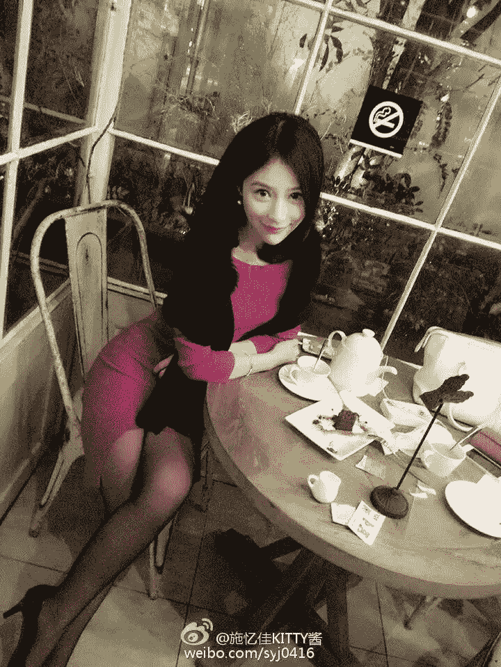

# 伪明日边缘，《死亡边陲》死亡重置，再来一次！！ 4月4...

作者：1厘米小人

TID：28394

 

# 1

*本帖最後由 1厘米小人 於 2020-4-8 07:12 編輯*

第一章更新完毕

第二章更新完毕

第三章更新完毕第四章更新完毕

PS：本文又不是盈利文，写给你们看要的只是你们的回复给予支持，没有回复像我这么懒的人，估计会没动力更新的，麻烦你们扣几个字表达一些什么给点回复，让我知道我的文有人看，谢谢……

深夜七点，无数的人已经从自己的工作中脱离，回到了温暖的家里，只有少数人为了生活依然在奋斗着。

一个渺小的绿色光点，突破了大气层冲向了地面，云层翻滚，一个大一些的黑色光点紧随其后，在空中追逐角力着，两个光点猛的对撞在了一起各自坠落，小一些的绿色光点在快要撞击地面时猛的上扬平移，表面的光逐渐暗淡，在前方一个男人拿着食盒打开了玻璃门，暗淡的绿光也随之进入。

“您好，您的外卖。”

拿着外卖的男子名叫余勇，是一家建筑设计公司的设计师，今年已经二十八了，贷款买了房，正准备和谈了四年的女友结婚，结果女友和一个有钱的欧巴跑了，于是开始了一个人悲催的房奴生活。

“哦，谢谢～就放在那里吧。”一个好听的女声从花店里传了出来。

这家花店的装潢优雅别致看着很舒服，正对着玻璃门的地方收银台后有一扇门，将手中的外卖放在了收银台桌上，透过半开的房门可以看出里间似乎空间也不小，将最后一单兼职外卖送完了，终于可以回去吃饭了。

低头整理下衣服，那是什么？地面一个亮闪闪的事物引起了我的注意，弯腰捡起发现只是一枚样式普通的戒指，大概是这家花店女主人的吧，随手戴到了食指上还挺合适。

嗯？怎么摘不下来了！

唰！戒指的表面忽然泛起了微弱的绿光，一些符文出现在了戒指表面，感到戒指处传来了强烈的吸力。

花店里，那个被戴在手指上的戒指里像是有一个黑洞，瞬间将手指的主人嗖的吸了进去，一个渺小到几乎不可见的小家伙从另一头掉了出来，叮一声，戒指以及那个渺小的小点落在了地上重新暗淡下来。

茫然的爬起来查看着四周，白色的地面散落着一些足球大小奇形怪状的石头和土块，身后是一堵银色的金属围墙，远方林立着众多巨大的圆柱建筑，难道我穿越了？

不会吧，等等～等等～我理一理，刚才我在干嘛？骑摩托送外卖，一家花店，戒指，戒指！！！那个发光的戒指！！我摸索着低头寻找那枚戒指，眼角余光无意间撇到了那银色的金属围墙，我愣了一下。

缓慢后退，再后退…………

这……围墙看起来很像是一枚放倒的戒指……戒指后面那堵高墙似乎是一个巨大的收银台，我再次环顾四周，终于看清了，那些巨大的圆柱建筑，竟然是一个个的盆栽！！！

天啦！！这是那家花店吧！！？？难道我缩小了！？

正在这时，地面有节奏的震动了起来，花店门口的玻璃门忽的被推开，一个靓丽的少女走了进来。

脚上穿着一双淡绿色的露趾凉鞋，修长健康的双腿，灰色的花边短裙，粉色的短袖T桖，脸上明亮的大眼睛，小巧而精致的鼻子，黝黑的长发披在肩上，花店里的灯光照在她的脸上反射着淡淡的光泽，彰显着少女的青春活力与美丽。

女孩名叫夏蕊，今年刚上大二，而她的姐姐夏韵经营着一家花店，位置正好在夏蕊就读大学的附近，所以夏蕊就搬到了姐姐开的花店和姐姐一起住。姐姐夏韵今年已经二十七了，而作为妹妹的夏蕊今年才十九岁，虽然姐妹两年龄差距挺大，但姐妹俩的感情却特别好。

“姐！我回来了！哇，有好吃的呀。”

少女看到收银台上摆放着的食盒，甩着手臂大步走了过去。

看到少女时余勇先是楞了一下，确实，他被少女的青春靓丽吸引了一下，不过也就那么一瞬，因为下一秒他就被少女那巨大的身影吓傻了。

对比身后的戒指，余勇的身高是1.8m，一般戒指的宽度是2～3㎜左右。

可此刻余勇的身高还没有那个戒指高，也就是说此刻他的身高也许只有1.8㎜了，整整被缩小了一千倍。

而少女的身高，对比她身边的盆栽，大概有1.65m左右。对于目前来说的余勇，那真真切切的就是一个1650米的巨人啊！！！

“嘿！！！嘿！！低头！！看地上！！！”余勇几秒后才从那种震惊痴呆的状态恢复过来，傻傻的挥动着手臂奔跑大声喊着，妄图引起这巨大少女的注意。

然而…………余勇的视野中，先是少女略微发育了的胸部遮挡了她青春靓丽的脸庞，之后那淘气可爱的灰色裙底遮蔽了少女的上半身，最后就是那差不多有足球场那么大的凉鞋鞋底，笼罩在了他的头顶。

凉鞋鞋底纹路是如此的清晰，在一道纹路上，一摊黑色的肉泥正粘在那里，看起来似乎是一只死蚂蚁，在少女的体重碾压下变成了薄薄的一片黏在了凉鞋鞋底上。

少女迈出的这一步轻盈的落在了光亮的地砖上，同时也将地砖上一个缓慢移动跳跃着的小点踩在了脚下，余勇渺小的躯体瞬间被少女这一脚压溃，当穿着凉鞋的可爱小脚再次抬起时，余勇仅仅只在少女鞋底下留下了一个非常渺小微不足道的污垢小点，甚至不如那只同黏在鞋底上的死蚂蚁来的清晰。

“啊啊啊啊！！！！！”满眼惊恐的余勇猛的坐了起来。

“呼～呼～”喘着粗气摸遍了全身，确定自己还完好无损的才舒了口气，然而四周熟悉的环境，再次让他紧张了起来。

巨大的圆柱建筑，银色的金属围墙，依然是那个花店，依然是渺小的自己。

他立刻醒了过来自己刚才不是在做梦，花店的玻璃门外，一个青春靓丽的身影正甩着胳膊往花店玻璃门方向走。

余勇的恐惧值缓慢提升，之前好像做梦一样的场景再次浮现，少女仅仅只是想去拿收银台上的食盒而往前迈了几步，而自己和她踩死黏在鞋底上的蚂蚁一样……在少女靠近收银台时被无声无息甚至毫无察觉的……踩死了……

余勇意识到，现在渺小的他在少女的脚下真的与一只蚂蚁并没有什么区别……

看着女孩靠近了玻璃门，恐惧值迅速飙升，他知道渺小的自己不可能引起少女的注意，必须自救，于是开始跑，拼命的跑想要远离少女那巨大鞋底的阴影。

“姐！我回来了！哇，有好吃的呀。”少女的声音再次响起，地面随着少女的步伐而震动着。

鞋底巨大的阴影再次笼罩了余勇，抬头依然是少女那足球场般巨大的凉鞋底，以及粘在鞋底下的可怜蚂蚁。

“啊啊啊啊！！”大口喘着粗气坐了起来看着四周，巨大的圆柱建筑，银色的金属围墙，依旧是巨大的花店，依旧是渺小的自己。

死亡不知为何有了一个循环，看着玻璃门的方向，那青春靓丽的少女正甩着胳膊走向玻璃门。

该死，自己实在太小了，根本无法引起她的注意，而渺小的双腿跑起来，在被踩死前根本没办法脱离少女这一脚的区域！难道我要在这里循环着被踩死！？

“姐！我回来了！哇，有好吃的呀。”少女的声音如地狱梦魇般再次响起。

怎么办？怎么办？

巨大的少女踩着凉鞋一步步踏近，地面的震动越来越强，只剩最后两步了！！

眼珠子乱转眼角余光瞥到不远处那银色的金属围墙愣了一下，戒指！对了，戒指是金属的不会被踩坏！！

余勇猛的爬起来向戒指冲去！！

时间仿佛突然变慢，少女的身体前移着，迈出后踩在地面的左脚逐渐承受了身体的全部重量。

右脚从脚后跟缓慢抬起直至脚尖也离开了地面，些许的灰尘从少女抬起右脚的鞋底洒落，健康有力的肌肉微微发力将右脚提至半空向前移动，穿着凉鞋的可爱小脚渐渐的笼罩了地上那个如沙砾般渺小的可怜人，身体继续前移，腿部肌肉再次发力，全身的重量开始从左脚转移至即将踏下的右脚。

“轰！！！”

巨大的鞋底轰然踩下，凉鞋的鞋跟处先落地碾压而下，巨大的凉鞋鞋底在少女的脚下有些弯曲，逐渐的鞋底的中段碾压而下，那些在余勇眼中有足球般大小的石块土块在少女的脚下纷纷发出“咯吱～咯吱～”碎裂的惨叫声，凉鞋鞋尖处最后一刻碾压而下时，余勇终于冲到了戒指旁扑倒。

银色的金属戒指在少女身体前倾全身的重量下“嘎吱！”一声前移了少许，而也就这少许的距离，将余勇和戒指的距离又拉远了不少，鞋底又压下了三分，巨大的鞋底已经触碰到了余勇的脚后跟。

如果少女落下的这一脚再多那么一点力气或者少女的重量再重哪怕那么一点点，戒指将会被推的更远，余勇就会从脚后跟开始再次被少女毫无察觉无声无息的踩死碾碎。

渺小的身体被狂暴的风压死死压住，强烈的冲击力从地面传来震的余勇全身发麻。

耳鸣～头疼～眼花～全身无比疼痛，自己还活着吗？

迷茫的余勇模糊的望着上方，鞋底那厚重的阴影抬了起来，一个巨大如山般的身影缓缓压下。

使劲晃了晃脑袋，视野清晰后反而吓了他一跳，因为少女此刻正低头弯腰盯着自己，巨大的右手伸出向他抓来。

夏蕊走到收银台前，伸手正准备去拿食盒，忽然感觉鞋底一凸。

“嗯？”

似乎踩到了什么坚硬的东西。抬脚低头看去，发现是一枚戒指，于是弯腰将戒指捡起。

至于戒指旁那个弓着身子抱着脑袋躺地上的渺小家伙，在少女的眼中确实有那么个小点，但这个小点一动不动且实在太小了，只要不是刻意去盯着看在潜意识中大多都会当成类似沙砾般的存在而忽视掉。

渺小的余勇蜷缩着在地上并没有引起少女的注意，也幸亏他没动，否则被少女注意到，十有八九会被当成蚂蚁之类的虫子吧，如此小的虫子一般情况下也许会选择无视，但谁知道呢。

 

# 2

<ignore_js_op>[56837003fa9cebe2.jpg](forum.php?mod=attachment&aid=ODIxNzd8ZWE5ZjI0ZTR8MTYyNDY5MzYxN3wxODIzMHwyODM5NA%3D%3D&nothumb=yes) *(28.13 KB, 下載次數: 6)*

[下載附件](forum.php?mod=attachment&aid=ODIxNzd8ZWE5ZjI0ZTR8MTYyNDY5MzYxN3wxODIzMHwyODM5NA%3D%3D&nothumb=yes)

2020-4-2 00:19 上傳  

正在读大二的妹妹夏蕊

</ignore_js_op>  <ignore_js_op>[-3f069287b7800171.jpg](forum.php?mod=attachment&aid=ODIxNzZ8ZGNjMGRjMDh8MTYyNDY5MzYxN3wxODIzMHwyODM5NA%3D%3D&nothumb=yes) *(112.88 KB, 下載次數: 9)*

[下載附件](forum.php?mod=attachment&aid=ODIxNzZ8ZGNjMGRjMDh8MTYyNDY5MzYxN3wxODIzMHwyODM5NA%3D%3D&nothumb=yes)

2020-4-1 23:44 上傳  

经营花店的姐姐夏韵

</ignore_js_op>  

# 3

夏蕊直起身看着手中这枚样式普通的银戒指，戒指表面刻有一些奇形怪状的凹槽纹路，虽然样式普通但做工却很精细。

“姐，我在地上捡到一个戒指，你看看是不是你的呀。”夏蕊随手提起食盒，一边把玩着手中的戒指一边向里屋走去。

巨大的鞋底忽的抬起从余勇的头顶呼啸而过，吓得他又是一个哆嗦。

“轰隆～轰隆～～轰隆～～～”一阵引起地面震动的脚步，等反应过来的时候少女巨大的身影已经消失在了收银台后面。

余勇坐在地上，双手抓头茫然的看着四周，之前那些差不多有足球大小的石土块已经全部消失不见，剩下的只有一摊摊碎渣。

连续两次被踩死，第三次他好歹活了下来，活下来之后呢？这个世界对现在的他来说是如此的巨大。

这时，收银台后传来了两个悦耳的女声嬉笑聊天的声音，地面再次微弱的震动了起来。

“不对啊，姐～穿这么性感，又是和那个应天哥出去约会吧？”少女悦耳的声音带着调笑从收银台后传来。

“哎呀，你明明知道还来问我。”一个巨大的红色丽人从收银台后走出。

红色丽人就是夏蕊的姐姐夏韵，脚踏着黑色的高跟鞋，穿着黑丝的双腿修长而又匀称，一身红色的连衣裙披着一条黑色的毛绒围巾，黑色的长发微卷，靓丽的双瞳带着些许魅惑之意，鼻头丰润，鼻翼缘柔和，厚实而性感的双唇，和夏蕊对比一个青春靓丽一个性感妖娆。(见下图)

有的时候，当你运气好时你会一路的顺风顺水，可当你运气不好时坏事总是接二连三。

“轰～轰～轰～轰隆！！”本来向着玻璃门外走的夏韵忽的转身走向了收银台，穿着黑色高跟鞋的脚很巧的落在了地砖上一个渺小的小点旁，将小点震飞。

余勇停止了打滚后一咕噜的爬了起来，不是吧，又来！！！自己得离远点，免得这女人无意识的挪一下脚把自己再给灭了。

然而让余勇没想到的是，夏韵作为花店的老板娘，最不希望见到的就是有虫子在店里，所以平时打理花店时总是会有意无意的瞄一眼地面，看看白净的地砖上有没有什么小虫子，当她走向收银台时眼神同样瞄了眼地面。

之前夏蕊弯腰捡起戒指时，余勇是蜷缩在地上一动没动的，所以被夏蕊忽视当成了沙砾般的存在，可现在的他正发足狂奔着，一个运动着的目标远比静止不动的目标要引人注意，即使他很小也很慢。

站在收银台前的夏韵，瞄向地面的眼神锁定了自己右脚边，在自己的高跟鞋旁有一个极其渺小的点正缓慢移动着，上个礼拜她发现店里有些花上爬着一些很小很小的虫子，上网百度了一下叫做蚜虫，于是她买了些除虫济喷洒在那些花上，这两天她再查看时已经找不到那些虫子了，而现在～在自己的脚边发现了一个移动中的小点，很自然的就认为是一只侥幸没有被除虫济杀死的蚜虫。

于是腿部肌肉微微发力，脚裸微动穿着黑色高跟鞋的右脚微抬，移到了那个小点上轻轻的踩了下去。

奔跑中的余勇回头看了眼天空中，原本已经被裙底遮挡住了夏韵美丽的脸庞从裙摆边探出，那带有一丝魅惑之意的双瞳注意到了自己，巨大的高跟鞋也随之缓缓抬起，遮挡了那摇摆的裙底，遮挡了那美丽的脸庞，也遮挡了他的头顶。

他认命的站在原地抬头望着，那一瞬间他看到了之前从没注意到的美景，夏韵双腿间那巨大的黑色蕾丝边内裤，一根根黑色的树干似乎很不情愿被藏起来，拼命的从蕾丝边伸出，回想了一下那个青春靓丽少女的裙底，当时太恐惧了竟然忘记是什么样子的了。

巨大的黑色的高跟鞋鞋底却是红色的，一个巨大的商标印在光亮的鞋底上稍微显得有些不协调，不过除了像自己这样的小虫子以外，没有哪个人会在乎鞋底是否好看。

看着笼罩了头顶越来越近的高跟鞋底，余勇终于无奈的发现，自己甚至还不如那个商标上的一道线条大。

“轰～”没有惊天动地的巨响，因为对余勇来说无比巨大的夏韵只是将脚轻轻的抬起了一厘米再轻轻的落下。巨大的高跟鞋与地面亲密接触，夏韵全身的重量从左脚分了一半到右脚上，鞋底下的余勇全身瞬间被碾碎压扁，当高跟鞋再次抬起时，也只是在鞋底商标的一道线条上留下了一点污垢而已。

“啊啊啊啊！！！！”余勇再次醒来，第一时间冲向了戒指。

“姐！我回来了！哇，有好吃的呀。”

一动不动躺在地上，在少女蹲下弯腰捡起戒指时，余勇近距离欣赏了少女的裙底，粉色的爱心内裤，遮挡的很好起码没有太多黑色的树干伸出。

“不对啊，姐～穿这么性感，又是和那个应天哥出去约会吧？”

“哎呀，你明明知道还来问我。”

这一次，余勇被夏韵那巨大的高跟鞋震飞后，余勇躺在地上一动不动。夏韵的视线从脚边扫过，视野中那渺小的小点自动被忽视归类为沙砾了。

“小蕊，你等下就把卷帘门放下来吧，我晚上从后门进来。”夏韵伸手将收银台的抽屉拉开，取出一个遥控器转身递给了夏蕊。

转身的那一下，夏韵的右脚原地微抬在空中改变着角度，“咯嗒～”一声落下细长的鞋跟差点碾在了被她视为沙砾一动不敢动的小点上。

“你就放心好了，记得晚点回来啊～”夏蕊微笑着接过遥控器。

等夏韵走后，夏蕊按下了遥控器，卷帘门哗啦啦的降下最后锁死，夏蕊关掉了花店的灯，转身进入里屋关上了门。

两个巨大的美女走过去，地面摇晃轰隆巨响，走过去轰隆再来。终于一切安静了下来，好不容易避免了被踩死的命运，余勇扑通一声躺在了地上，看着头顶黑压压的天空。

曾经的他作为一个兼职送外卖的建筑设计师在这个城市里奔波，如今的他却沦为了渺小的虫子般，为了不被踩死而疯狂。现在暂时脱离了被踩死的循环，可是之后呢？

余勇再次整理思绪，自己是戴上那枚戒指就变小的吧，当时感觉到从戒指里传来的恐怖吸力，问题肯定出在那个戒指上。

如果真是那样的话，肯定是要再看看那个戒指，说不定自己从戒指里钻过去就变回来了呢？那个戒指是什么玩意儿，居然能把人变这么小。

更诡异的是，自己怎么死不掉？呃不对，是能死但是只要死了时间就会重置回我刚醒来的时候，这能力有些变态呀！不对不对，现在还什么都不知道，万一这个能力有个什么冷却时间或者次数限制怎么办？

不自觉的，又想起了自己被巨大鞋底碾碎时的痛苦，余勇猛的打了个冷战。

等变回去后就赶紧交给警察吧，自己离这种诡异的东西还是越远越好吧。坐在地上的余勇开发着自己的想象力。

余勇是个很看得开的人，之前脑子里装的全是不安与恐惧，一通胡思乱想之后反而接受了现实，恐惧感没那么强烈后感觉肚子反而有些饿了，无奈的爬了起来。

就算现在有了死亡就能重置时间的超能力，可变得这么小又有什么用，肚子饿了还得想办法找点吃的。

 

# 4

很多事情，自己不去亲自去尝试，你永远想不到会是什么样的。

就像此刻的余勇，原本的他当然不可能想到，从收银台前走到收银台后面的门那里，少女夏蕊只走了四步就进去了。

然而以此刻的余勇，心惊胆战生怕门突然打开一只巨脚把自己踩死的他，从收银台前走到那扇巨门的门缝下，尽然用了一个多小时才走到。从门缝进去，余勇又贴着墙走了半个小时才勉强到达了鞋柜下。

这段时间，余勇一直在思考，地面干干净净没有一点可以吃的东西，有可能存在食物的地方就是:垃圾篓里～书桌上～茶几～餐桌上，这几个地方。然而这些地方，首先按照他的移动速度，那真是不知道要什么时候才能到了，到了的话又怎么上去，上去后如果没发现食物还要换地方再找。

而且书桌～茶几～餐桌这些地方即使自己能够爬的上去，但在上面被发现的几率实在太大了，至于垃圾篓里爬进去就很有可能出不来了。

花那么大力气都不一定能解决的饥饿问题，余勇不打算继续了。他想通了，最重要的是那个戒指，可是现在根本不知道那个关键的戒指在哪里。于是余勇咬咬牙做了一个决定，向着鞋柜下那些零散的鞋子走去。

即使已经多次被踩死，可靠近了这些静止不动巨大的鞋子时依然很是震撼，绕过了一只巨大的运动鞋，从一双巨大的坡跟鞋之间穿过，走到一只如高楼大厦般的长筒靴侧边穿过鞋缝从另一侧出来，他甚至爬进了一只倾倒的米色高跟鞋里参观了一番，闻了一鼻子的皮革味。最后，余勇停在了一双女士拖鞋前，这是鞋柜下唯一的一双拖鞋。

拖鞋的鞋底高度在余勇看来都有好几层楼那么高，不过攀爬起来却并不困难。站在拖鞋的鞋面上，余勇走到了脚掌中心处。

“就……就就这了…………”看似平静旅游般，在一群巨大的女鞋中穿行而过，其实心里却紧张害怕的要死，因为之前做的决定就是～他要自杀！只要自杀成功，时间重置他将再次回到刚刚接触戒指被缩小的时间，那时候的戒指距离他很近很近。

问题是怎么自杀？手中没刀，附近没悬崖，撞墙顶多晕过去，咬舌又狠不下心怕疼。剩下唯一的办法还是找个女巨人把自己踩死…………可这大晚上的，那个叫夏蕊的女孩一直躲在自己的屋里不出来，而花店老板娘夏韵又不在。

即使这时候夏蕊突然从屋里出来朝他走过来，想要被踩死那也是看缘分的，缘分不到你也别想被踩中，踩不中你难道还去追？开玩笑！以现在的大小来看，这两个女巨人每正常迈出的一步对于自己来说都是五六百米往上的距离，自己怎么追？

余勇想到的最好的办法就是，那个夏韵出去总会回来的吧，回来一般都会换拖鞋的吧，他往拖鞋上这么一躺，夏韵穿上后再那么一踩…………余勇不敢想了，如果不是实在没办法他绝对不想再承受一次被碾碎的痛苦。

余勇闭着眼睛躺在拖鞋的脚掌处，强行逼自己睡着，安慰自己说“睡着了就不疼啦～睡着了就不怕啦～”，然而一个正在等死的人怎么可能睡得着呢。

时间一分一秒的过去，不知过了多久，夏韵面带心情愉悦的进入了大厦后门，打开了位于一楼的自己的家，站在门口将脚上的高跟鞋脱下拎在手上，离开前是从店门出去的，她的拖鞋留在了那边的门口，她得穿过客厅才能穿上自己的拖鞋。

看着巨大的红裙黑丝美女踏着沉重的脚步往自己这里走来，余勇感觉自己心脏跳动的快要爆炸了！

余勇悍不畏死的躺在拖鞋脚掌处抬头看着，夏韵庞大的身躯走到了拖鞋旁，手中的高跟鞋“轰隆！！”一声丢在了地上，震的躺在拖鞋上的余勇哆嗦了一下。

“勒……勒……勒……来呀！！臭女人！！！αβγδθηζεικλμποξνρφΑΕσχΒΖτψ！！！有本事快来踩死余哥哥啊！！！”紧张之下的余勇叽里呱啦说了一大堆他自己都听不懂的自认为是很恶毒的脏话，瞪着大大的眼睛看着夏韵抬起右脚穿上了旁边的那只拖鞋，待看到剩下的那只黑丝巨脚缓缓抬起时猛的停住了嘴…………

在余勇惊恐的注视下，剩下的那只黑丝巨脚缓缓向拖鞋靠近，巨大的脚趾几乎是贴着余勇伸进了拖鞋里，黑色丝袜的丝线之间，余勇感觉自己的手臂都足够伸进去了。也不知是怎么想的，余勇真的把手臂伸了进去摸了下被黑丝包裹的脚底，手感很粗糙皮肤褶皱也很大，在如此渺小的视角近距离看来，再美的脚也是无法欣赏的。下一秒，黑丝巨脚猛的压下。

夏韵踢踏着拖鞋兴奋的走进了妹妹夏蕊的房间，完全不知道在自己的玉足之下，一个渺小到毫不起眼的污垢在她迈步间被碾平～融合进了包裹着自己玉足的黑色丝袜里，而那污垢曾经是一个人类。

“啊啊啊啊！！！！”余勇大叫着从地上坐起，短暂的深呼吸几次，才想起来自己该做什么。

他迅速起身冲向戒指，翻过了银色的金属围墙，上一次他是戴着戒指，被戒指圆环中产生的吸力拉扯穿过了圆环而变小的，这一次他站在戒指圆环中央，从反方向再穿过一次肯定能变回去。

“姐！我回来了！哇，有好吃的呀。”少女悦耳的声音响起，余勇信心满满的站在戒指中央，可看着那巨大的鞋底如黑云压顶般踏下，他还是哆嗦了一下。

“轰隆”一声鞋底落下，余勇在戒指圆环中被震的跳了一下坐倒在地，戒指“嘎吱～”一声移动了些许。

恍惚的晃了晃脑袋抬头看去，头顶的鞋底已经抬起移开，一只白净玉手伸出，两根巨大的纤纤玉指捏住了戒指。

满心的期待化作了一场空，看着消失在收银台后少女巨大的身影，余勇一屁股坐到了地上。

怎么不行呢？为什么从戒指中间反方向再穿一次变不回去？难道我就要以这种虫子的大小不停的在这个时间点循环？不对！！那个戒指说不定有什么开关或者别的秘密，我要把这个诡异的破戒指完全弄个明白！！

决心已定的余勇忽的站起来挥着拳头，然后茫然的看着四周，那么……现在要干嘛………………

一段时间后，夏蕊和夏韵从里屋走出。

“哎呀，你明明知道还来问我。”夏韵走向了收银台，瞄向地面的眼神锁定了自己右脚边，在自己的高跟鞋旁有一个极其渺小的点正缓慢移动着。

“勒……勒……勒……来呀！！臭女人！！！αβγδθηζεικλμποξνρφΑΕσχΒΖτψ！！！有本事快来踩死余哥哥啊！！！”余勇嘴里大吼大叫，面容扭曲一把鼻涕一把泪的狂跑着跳着…………

余勇被夏韵当成了一只小虫子踩死，猝…………

“啊啊啊啊！！！！”余勇大叫着醒来，一咕噜爬起冲向了那巨大的银色金属戒指。趴在银色的金属围墙上余勇一阵摸索，开始把自己能看到很可能暗藏机关或者奇怪的地方都摸索一遍。

“姐！我回来了！哇，有好吃的呀。”少女悦耳的声音再次响起，余勇哆嗦了一下继续摸索，巨大的鞋底笼罩了头顶，余勇依旧摸索。

“轰隆！”头顶一片漆黑，余勇被震的一屁股跌坐在地，头顶的鞋底抬起移开，两根巨大的纤纤玉指捏住了戒指，余勇被震的已经习惯了很快就清醒了过来，屁股从地上弹起直接爬到了那巨大的手指上张嘴就咬。

“哇呀呀！！你给我放开！！这东西是我的！！！我的！！！”

渺小的余勇怎么可能咬得动少女那巨大的纤纤玉指呢，这么说吧，少女完全就没察觉到自己的手指上趴着个渺小的家伙。当少女把戒指放在眼前把玩时才注意到，自己的右手大拇指上趴着一个似乎有着肢体的小点。

“咦？这是什么虫子呀？长得好奇怪。”少女瞪大了眼睛可还是看不清这是什么虫子，小心的伸出了左手的食指和大拇指想把这个小家伙捏起来找个放大镜瞧瞧，然而力道没有控制好，两根玉指刚刚触碰到一起，那个小点就被捏扁了。

余勇被少女的手指捏成了肉泥，猝…………。

“啊啊啊啊！！！！”余勇大叫着坐起冲向戒指。

“嘿！嘿！嘿！别拿走呀！刚才好像摸到了什么奇怪的东西！！”余勇气愤十足的又蹦又跳。

少女弯腰捡起戒指，视野中注意到一个小点正在戒指旁好像在一跳一跳的。

“咦～这是什么虫子？居然比蚂蚁还要小。”少女趴在地上低头靠近那个小点，可即使瞪大了眼睛也实在看不清这是什么虫子，小心的伸出了左手的食指和大拇指想把这个小家伙捏起来找个放大镜瞧瞧，然而力道没有控制好，两根玉指刚刚触碰到一起，那个小点就被捏扁了。

余勇被少女的手指捏成了肉泥，猝…………

“啊啊啊啊！！！！”余勇大叫着坐起，冲向戒指观察摸索着上一次没有摸索的地方。

“姐！我回来了！哇，有好吃的呀。”

少女弯腰伸出玉指捡起戒指，余勇闭眼死死的趴在戒指上正好被捏住。

余勇被少女的手指碾碎在戒指上，猝…………。

“啊啊啊啊！！！！”余勇爬到了戒指的内侧摸索……

“姐！我回来了！哇，有好吃的呀。”少女捡起戒指将食盒放在了客厅餐桌上，随手把戒指戴在手指上试了下。

余勇在少女手指与戒指内壁之间被摩擦碾碎，猝…………。

“啊啊啊啊！！！！”余勇大叫着坐起，冲到戒指的最外侧，整个戒指只有一处他没有观察摸索过了。他跑过去摸索着，一个巴掌大的正方体在余勇被余勇摁了下去。

“啵！！”一声怪异声音从戒指内传出，一个光门缓缓打开，余勇呆呆的把手伸向了光门，渺小的身影消失在了光门里。

一瞬间，一大串信息灌进了余勇的脑袋里。

 

# 5

*本帖最後由 1厘米小人 於 2020-4-4 12:30 編輯*

拥有超科技的X星人，他们在机械、生物以及精神领悟的技术已经达到了一种巅峰，将自己的星球改造成了飞船在宇宙中寻找着真理，X星人中有一个天才科学家Z，在时间的技术上取得了突破的进展，经过一段时间的研究，Z成功的创造出了时之锁，时之锁可以为生命体锁住某一个时间点，当需要时可以穿越时间回到锁住的那个时间。

这个技术的出现令Z的名声大涨，然而渐渐的，Z意识到了时之锁是一个巨大的错误，如果时之锁被某个恶势力利用，将会严重影响到未来，于是Z带着时之锁离开了X星域，准备毁掉自己的杰作。

然而Z早就被X星上一个组织“泯灭”盯上了，在离开X星域不久Z驾驶的科研型飞船就被“泯灭”派出的战斗型飞船攻击，混乱中Z驾驶飞船逃进了充满随机性的亚通道，“泯灭”飞船也追了进去。

从亚通道出来后，Z发现自己来到了一颗蔚蓝的星球附近。

通过电脑观察，这颗星球被星球上的一种高智慧人型生物称为地球，通过电脑的对比，Z发现这颗星球上的人型生物居然与X星人的相似度达到了99.9%，而科技水平才处于机械发展时代。

为了躲避追击寻求帮助Z穿过了蔚蓝星球的大气层。可依然在突出大气层后被“泯灭”派出的飞船追上，危机时Z将能量炉过载与“泯灭”的战斗型飞船冲撞了一次，“泯灭”飞船严重受损坠向地面，而Z的飞船也严重受损，更是付出肉身彻底被毁的代价，再也无法操控时之锁。

在肉身彻底被毁前，Z将自己的意识导入进了飞船的中控系统中。坠向地面时，Z准备将时之锁寄宿在一个地球人体内隐藏起来，然而Z惊讶的发现，地球人类与X星人虽然很相似，但体型差异却异常的大，一个地球人的体型要比一个X星人大一千倍！如此巨大的体型，并不适合时之锁的寄宿，于是Z只好改变战略，将飞船改变形态变成了一枚戒指，打算隐藏在地球人手中。

然而系统却扫描到了一个异常生命体，那是一个男性人类，这个人类能够接受以亚空间能量压缩重塑，被以亚空间能量压缩重塑后的生命体会被改造成适应当前生态环境的状态，不会因为体积被压缩而立刻受到大气压力重力等这些外在的影响而死亡，也就意味着Z可以将这个人类的体积压缩变小到可以被时之锁寄宿的程度。

而那个能够接受压缩重塑的男性人类就是余勇，当余勇将变成戒指的飞船戴在手指上时，Z启动了压缩重塑把他变小，同时将时之锁寄宿在了他的体内，时之锁的启动方式为宿主死亡后自动启动。

接收了这一大串信息后的余勇只想骂娘，你们那个什么X星的破事不自己解决，跑地球来折磨他一个人，这算什么事呀？

一个意识在脑中与他触碰在了一起，一瞬间余勇和那个意识就交流了很多，最后余勇了解到，第一自己暂时没办法变回去，因为这玩意儿没电了正在充电。第二充满电后可以就可以把他变回去同时也将时之锁破坏了。第三什么时候能充好电啊不知道，因为系统损坏了要回X星才能修好。第四在把电充满之前会尽量提高余勇自己的生存能力，每隔一段时间会给余勇生产一件装备，不然余勇总是死亡充电永远无法完成。

余勇只能妥协了，想要变回去只有配合这个把意识导入了系统中的Z，如何配合呢～就是活下去，然后每隔一段时间来这个戒指飞船里领取一件装备提高自己生存能力，而且目前就有一个装备可以领取。

好吧，来看看是什么装备吧。与意识沟通后，余勇脱离了意识交流睁开眼睛，发现自己正在一个好像卵的泡泡里，泡泡逐渐进入余勇的身体里。

渐渐的凝固后，余勇的身上多了一层黑色的盔甲，脑中多了段关于这个盔甲的信息:

“纳米融合共生型生物战斗装甲”

加强宿主的力量与速度，能够在皮肤表层生成生物装甲层，为宿主吸收周遭环境的养分保持战斗续航能力，可为宿主提供再生能力。

哇喔！！看着介绍，余勇的心都要跳出来了，这酷炫的造型，强大的能力，感觉自己变成了漫画里的超级英雄！！不愧是超科技的X星产品！！

站在原地嘿嘿嘿的打起了拳！然而还没打呢就一个趔趄差点摔倒，这时余勇才忽然感觉到，自从脱离了意识交流后，身下的地面就在不停的晃动，余勇定神看了看四周有些傻眼了，自己正站在戒指旁，而戒指正在一个名叫夏蕊的女巨人手心里。

此刻的夏蕊正将食盒放在餐桌上，低头准将自己握着的手摊开准备把玩一下刚捡到的戒指，就看到自己的手心中戒指旁，多了一个黑色的小点。

“咦～虫子，什么时候到我手上的？这虫子这么小，好像比蚂蚁还小呀。”少女将手掌举到眼前，可即使瞪大了眼睛还是看不清这是什么虫子，小心的伸出了左手食指和大拇指想把这个小家伙捏起来找个放大镜瞧瞧。

看着少女想要捏住自己的巨大手指，余勇忽然想起来，自己现在有这身超级盔甲了呀，不是原来的我了！！于是冲向了其中一根手指。

然而少女的力道没有控制好，两根玉指刚刚触碰到一起，那个小点就被捏扁了。

余勇被少女的手指捏成了肉泥，猝…………

“啊啊啊啊！！！！”余勇大叫着坐起，习惯性的冲向戒指，跑到一半忽然想起自己得了一套装甲，时间重置后应该又回到戒指里了吧，那什么装甲介绍的那么厉害，可还是被一个女孩子轻轻的就捏扁了………不过想想也对，体型力量差距太大了，虽然一样会被碾死但起码跑的更快跳的更高了。

冲到戒指旁摁下了正方体，获得了装甲重新出现在少女的握着的手心里。这一次余勇没有愣神，在少女注意到渺小的自己前冲向了手掌边缘，腿部蓄力，装甲也为余勇蓄力着，一路加速冲刺来到了手掌边缘时猛的一跺脚一个急刹车稳稳的停了下来。

趴在少女手掌的边缘，余勇探头探脑的往下望去，喔天啦，夏蕊的身高有一米六五，对于余勇来说从她平举的手掌到地面也差不多一千米的高度了，一千米啊一千米，果然名不虚传，看一眼就不想跳下去了……

然而事与愿违，夏蕊迈步后手掌微微晃动了一下，一个不起眼的小黑点从手掌的边缘掉了下去，本来按照小黑点下坠的速度角度以及夏蕊前进的速度来看，小黑点会落在少女灰色的裙摆上，可是少女前进时产生身体带起的微风却不给那个落下的小黑点这个机会，微风一带，小黑点从少女的身侧划过直接落在了地上。

躺在地上半天提不上来一口气的余勇，看着巨大的少女将食盒放在了餐桌上，把玩着手中的戒指进入了房间里。

缓过气后，余勇一脸萧瑟的走向了不远处的鞋柜。

余勇躺在拖鞋上被夏韵穿拖鞋时踩死，猝…………

 

# 6

> [land 發表於 2020-4-5 01:58](https://giantessnight.com/gnforum2012/forum.php?mod=redirect&goto=findpost&pid=431994&ptid=28394)

> 看了一部分，排版很舒服。剧情感觉进展蛮缓慢的，还有就是主角被缩小之后是不是太过吃惊了？可能这就是正常 ...

缩小后吃惊这本来就是正常反应，其实所谓的GN老人要真的被缩小了还不知道慌成什么样。剧情进展缓慢有人和我说过是好事，一个文三言两语就写完了，那算个屁文。至于X星介绍短以及主角的逗比形象自杀无惧者的样子实在是我后来懒癌犯了，本来打算写的严肃些，结果写着写着偷懒全部缩在一起成逗比了。

 

# 7

> [2295331120 發表於 2020-4-5 21:19](https://giantessnight.com/gnforum2012/forum.php?mod=redirect&goto=findpost&pid=432051&ptid=28394)

> 男主角死亡的次数恐怕已经超过了迪亚波罗了

下一章开始，开始限制男主尽量不去死，尽量从逗比重回严肃