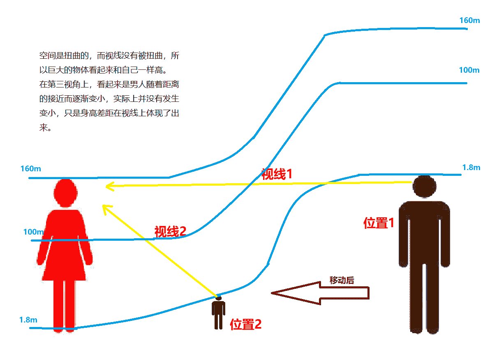

# 几个小故事的合集（3.30更新5等高线）

作者：择一鞋终老

TID：30543

 

# 1

*本帖最後由 择一鞋终老 於 2021-5-26 11:33 編輯*

目录

故事一：长度单位（一楼）

女孩填写小学数学题上的长度单位，而这会改变现实

故事二：辉夜大小姐想让我告白（一楼）

巨大的辉夜想让小小的白银告白

故事三：许愿神灯（十三楼）

灯神用扭曲的方式来满足你正常的愿望

故事四：鄙视眼镜（十三楼）

肥宅被女孩子鄙视时，会根据鄙视程度变小

故事五：等高线（十四楼）

在一个空间扭曲光线不改变的世界，远处看起来一样高的女孩子实际上比你大很多

故事六：谍中谍（未添加）

不同的gts社区(有小人和gts线下互动)发生了冲突，相互安插内鬼，那一天，小人内鬼终于想起了被敌对gts支配的恐惧

故事七：废土（未添加）

宇宙射线导致全人类缩小，部分人变异，人类被迫生存于地下。人类只要暴露在射线中就会持续缓慢缩小，但人类冒险者们不得不离开地面回到以前的城市寻找食物，以及猎杀变异物种获得“特殊物质”，使用特殊物质可在一定时间内使男性抵挡射线的变小力量，或者使女性变大。添加各种废土文的元素

故事八：女权之争（未添加）

男人和女人们的女权之争愈演愈烈，最后神明不得不出面干涉，祂满足了双方的“如果”假设，谁知女人们根本没想证明“没有男人也能活得很好”而只是想奴役男人们，噩梦开始了。

男方：如果男性不老不死，不用肩负繁衍后代的重任，女人就没用了。

女方：我们不需要不老不死，只要男性变小，并且每死一次都变得更小。

于是，不老不死的男性们最后沦为了商品玩物，每死亡一次就会贬值，却无法解脱。

故事九：脚虫（未添加）

男人只能以年轻女性的新鲜脚汗脚垢为生，他们爬进了女人们的鞋子里，但有的人认为他们帮自己除味的益虫，有的人觉得恶心。

故事十：缩小枪（未添加）

枪支暴力事件成为严重社会问题，于是新研发出的缩小枪成为可以控制敌人又不杀伤性命的优质武器，战场上用缩小枪战斗，使敌人丧失战斗力但不失去性命，警察用缩小枪打击犯人，不至于被社会批评暴力执法，普通民众也用缩小枪自卫。但缩小枪也衍生出了新的暴力犯罪问题，C国仍然保持禁枪令，但缩小枪已经在黑市中开始流传。

_______________________________________________

一 长度单位

“请用mm，cm，m，km等长度单位填空。

1.男生的身高是1.6 ____”

女孩看着练习册上的习题，陷入了苦恼，她上课没有认真听课，完全不知道怎么填。

随便填一个吧，女孩这样想道，把第一个单位填了进去。

“男生的身高是1.6mm”随着这句话的生成，学校里的男生全变成了1.6mm，而女孩子们对改变的现实并没有感到什么意外，仿佛男孩子天生就是那样的大小。

此时女老师走了过来，站在她右边，看见她练习册上的答案，皱起了眉头。

“男生的身高怎么能说1.6mm呢？你当他们是蚂蚁吗？”

“对……对不起，我一不小心填错了。”

“继续写下一题吧。”

看见老师站在身边，女孩开始紧张，额头上聚起了汗珠。

而在老师的背后，与女孩相隔一个过道的男生已经变成了1.6mm，他迷惑地站在自己的座位上，看着巨大的老师走了过来，教室里的座椅像是350m高的巨大高原，而站在高原上的他，也只能平时到老师的膝盖，抬头望去，像是巨大天神一般威严。

当1700m高的巨大老师转过身去后，一只巨大的小手啪地落在了男孩身边，差点把他吓哭，那一根根青葱的手指足有五六层楼那么高，若是这里有一栋房子，也会被她的手指压碎吧？

巨大手指的主人是他的同桌，另一个女孩，她趁着老师背过身去，边侧身来看他的答案，正好手按在了他的椅子上。

这时，被老师注视的女孩开始作答第二题。

“2.铅笔的长度是15 ____”

完全没听课的她根本不知道这些字母是什么意思，也不知道对应的汉语“毫米”“厘米”是多长，但在老师的注目下，她必须硬着头皮写了，依着瞎蒙的本能，第二题填写了第二个单位cm。

老师看见她能正确填写，便离开了，女孩松了一口气，看向下一题。

“3.女生的身高是150 ____”

小女孩开始了自己的古怪逻辑：这回运气不会还那么好了，第三题应该不是第三个，前两个都用了，那应该是第四个！女孩对自己的分析十分满意。

“女生的升高是150km”随着这句话的生成，她发现教室桌椅练习册都消失了，她迷茫地站在一片灰黄绿各色斑驳的地面上，而在自己脚边，有一片密密麻麻的黑点区域，大概和她的脚差不多大。

“发生什么了？我们在哪？”她看着班里的女同学，发现她们同样一脸迷茫地站着。

她害怕了，抬起了右脚，想要离开却又害怕迷路，于是放下了脚。

在女孩的两脚之间，她们原本生活的城市已经可以被她一只脚磨平，人们震惊地抬起头，看着城市两边的巨大山脉，连云层也在她的脚踝之下，珠峰也不过是女孩鞋子的高度，若她站在珠峰上，是可以把它压成平原的吧？

原来的学校，几百米的长宽，比女孩的小手指指甲还要小，一个指甲上能放好几个，女孩的指纹对正常身高的人而言也是10米宽的小山谷，而对学校里已经被缩小的男生而言，则是10000米的超行星级大裂谷，他们甚至可以在女孩的一个小小指纹里建立一个城市。

当女孩抬起脚时，哪怕只是亿点点，对她而言只有几厘米，对城市里的人也是万丈高山拔地起的震撼场面，试想一下七八千米高，两万米长的巨山飞起了数千米高，是何等震撼的场面，而这只是一个小女孩抬了一下脚。

而当她放下脚时，地上的城市将迎来飓风与地震。

_____________________________________

二 辉夜大小姐想让我告白

喜欢上一个人，并且向Ta告白 ，两人相结合，所有人都说这是非常美妙的事情。

但这却是大大的错误，恋人之间也存在着明确的权利关系。剥削与被剥削，付出与被付出，赢家与输家。

如果您想高贵的活着，那么绝对不能成为输家！恋爱即使战争！！喜欢上别人的一方，即是输家。 私立秀知院学院，学生会。

“可恶！居然忘带自行车钥匙了！”白银御行快步跑着，穿过学生会办公室的大门，却看见一个巨大的身影正站在那里，那是四宫辉夜正站在会议桌旁看手机。

“四宫居然没走吗？”白银不想让她看见自己狼狈的样子，环顾四周，决定找一条隐蔽路线。

“哎呀呀，会长居然把钥匙落在会议桌上了。”四宫辉夜收到早坂爱发来的信息后，装作忽然看见会议桌上的钥匙，惊讶道。

“什么？钥匙在会议桌上吗？这样我就必须从她面前经过了。如果被她看见，肯定会用那种眼神看我，说：‘会长努力拿钥匙的样子真是可爱呢，哦卡哇伊阔多。’”白银摇了摇头，开始规划新路线：人在非特定情况下是不会看自己脚的，所以当四宫辉夜在看手机时，她的鞋子便是盲区，所以自己只要先跑到她鞋子旁边，再躲到桌腿后，就不会被她发现，当她离开后，再爬上桌子取钥匙，可行！上吧，白银！

在他思考时，躲在门后的早坂悄悄探出头来，她手指上正捏着一只拼命挣扎的蚂蚁，她屈指一弹，很准确地把蚂蚁弹到了白银附近，然后闪身躲了起来。

白银御行感觉身后有一阵风吹过，是有人来了吗？他回头一看，看见一只巨大的蚂蚁有些六肢不稳地站着，当站稳后，长时间的饥饿使它瞄准了眼前那个小小的人类，它向他冲了过去。

卧槽？为什么学生会办公室里会有蚂蚁？白银来不及多想，抬脚便开始逃跑。

“不行，我不能跑太快，否则被四宫看见了就会说‘会长被小蚂蚁追着狼狈跑的样子真是可爱呢，哦卡哇伊阔多。’”白银以之前返回取钥匙的速度跑着，这样他就可以装作不知道，只是跑回去拿钥匙，而不是因为害怕蚂蚁而逃跑了。

只要跑到四宫的脚边，这只蚂蚁就会被巨大生物的气息所吓走，不对，蚂蚁是不会知道眼前的大山只是一个女孩子的脚的，所以必须让四宫动一下脚，才能吓走它。

白银这样想着，悄悄回头看了一眼，蚂蚁的速度居然加快了！这样自己可能会在四宫吓走它之前就被它吃掉，怎么办？！

“哎呀，藤原书记的书也落下了，要不要给她打个电话呢？”四宫辉夜的声音传来过来。

此时辉夜大小姐内心在疯狂暗示：快给我打电话呀！快求求我去救你呀！虽然我不喜欢鞋底粘上恶心的虫子，但既然会长诚心诚意地请求，那我也会大发慈悲地帮助你的。

对，电话。白银拿出手机，却不是给四宫辉夜打电话，让他向四宫辉夜求助，那是绝对不可能的！

他咔嚓地给自己拍了一张照，背景是学生会办公室，身后是一只巨大的蚂蚁。他发了一条推特：“回来拿东西，居然看见学生会办公室里有一只蚂蚁，打扫卫生的人真是太不负责了。这只蚂蚁居然还想追上我？呵，真是愚蠢的生物呢。”他还是不想让更多人知道，设置了仅辉夜可见。

四宫辉夜看见了这条推特，心想会长这是在暗示自己去救他呢，哼！我怎么会去主动救他呢，这样过度的关心，不就相当于告白了嘛！

照片显示蚂蚁已经很近了，她不想主动但也不想让白银受伤，憋了片刻，道：“嗯，可以回去发个推，学生会同时两个人落下东西很少见呢。”

四宫辉夜在暗示自己手机上没有推特，所以自然不会知道白银的处境，而白银想要脱离危险，就必须要给她打电话求救。

近了，近了，白银看着眼前白色的小山，那是四宫辉夜的鞋子。那只白色的巨兽虽然随着她的呼吸有几乎不可见的晃动，但根本就不足以吓走蚂蚁，辉夜，你哪怕点一下脚也行啊！

难道自己要爬上去？如果蚂蚁也爬上来怎么办？难道要钻进她的鞋缝里？万一她走了把自己也带回家了怎么办？我在胡思乱想什么。

坚持自己的尊严，不打电话求救，最后反而悄悄躲进人家的鞋里？这也太过于丢人了吧。“会长你在干什么？为了躲避蚂蚁竟然钻进别人的鞋里吗？真是可爱呢，哦卡哇伊阔多。”想到辉夜那种看虫子的眼神，白银就有些不寒而栗。

此时装作看手机的辉夜赤色的眼珠已经转到了眼眶的边缘，为了安全起见，她已经放弃了让白银来求助她，准备处理掉这只蚂蚁，但却不知道要怎样帮助他。她原本是想装作回家的样子，顺便就把蚂蚁踩死了，但现在蚂蚁和小小的白银几乎已经挨上了，再那样做的话自己脚下会直接产生两个小红点，会长的墓志铭会写到“死于四宫辉夜脚下”。如果想踩死蚂蚁并且不让白银受伤的话，需要超高的精度，除非自己蹲下来瞄准了再用手指戳，但自己蹲下来的话那不就代表自己一直在关注并且十分担心他了吗？

怎么办，怎么办，四宫涨红了脸，紧紧攥着拳头。

这时门口传来了脚步声，可可爱爱的藤原千花闪亮登场！

“辉夜同学没走呀，看见我的书了嘛？咦？你怎么了？”藤原看见身体僵硬的四宫辉夜，觉得很奇怪，顺着她的目光低头看下去。

“啊(>○<)，为什么学生会里会有虫子！”她挥舞着小手，抓狂地跳了起来，咚咚咚咚的脚砸地板声音惊到了蚂蚁，它顾不得眼前的食物，慌不择路地向另一个方向逃跑了。

四宫辉夜松了一口气，一下子坐在了椅子上。

“咦？会长也在这里？！”藤原书记安静了下来，低头看见了四宫和她四只鞋子中间的白银会长，狐疑道：“你们是不是在玩什么奇怪的游戏不带上我呀？”

“啊？没有啊！”

今日胜负：

白银和藤原胜利

辉夜败北

________________

•辉夜这个还是很切合原著的，很常见的早坂助攻辉夜营造场景(把钥匙留下来)，二人的拉锯战，最后藤原破局。不过描写和人物把控上倒是有些欠缺啦。

•剩下几个小故事过些时日再写，楼主还有一周复试，什么都没学还各种玩各种浪，要死了。

•这个帖子以后可能变成长期更新小故事合集。

 

# 2

> [zuolong 發表於 2021-3-17 21:52](https://giantessnight.com/gnforum2012/forum.php?mod=redirect&goto=findpost&pid=463084&ptid=30543)

> 第一个很有感觉，身高可以根据填空随便控制

想起小学的时候，我还是个看见女同学写自己身高km就能冲一发的少年 

# 3

*本帖最後由 择一鞋终老 於 2021-3-28 22:02 編輯*

三 许愿神灯

男人绝望地倒在了沙丘上。

他已经多日无饮无食，顶着烈日的灼烧，追寻着绿洲，而所谓希望，不过是这无尽沙漠中的海市蜃楼罢了。

而这时他的手指好像碰到了什么坚硬的物体。

他有些费力地用手指扒开沙子，那是一盏铜灯，上面刻着古老的咒文。

他把铜灯倾斜过来，倒出了水流一般的沙子。

“没水……”男人丢掉了它，再次倒在沙丘上。

“呦，就是你把人家挖了出来？”

灯口散发出一阵光雾，凝聚成了一位绝色美女，漂浮在空中。

男人无心去欣赏美色，他在思考她是否可以食用。

“我是一位被封印在灯里的神明，你可以叫我灯神，作为让我现世的回报，我可以实现你三个愿望。”

“三个愿望……”随着沙哑的声音，男人的目光中渐渐有了希望的神采。

“我要有吃不完的水和食物！”

“我要住世界上最大的豪宅！”

解决了燃眉之急的饥渴，也有了安身之处，不再受太阳暴晒，最后一个愿望许什么呢？

他这时才注意到灯神的姿色，DNA大动道：“我要每天都有美女陪伴！”

“好的，如你所愿。”灯神媚眼笑道。

酷热消失了，取而代之的是一片黑暗和潮湿，还有令人不适的脚臭味。

“什么情况？”男人的声音回荡着，“灯神呢？你把我送到哪里了？说好的豪宅呢？水和食物呢？美女呢？”

“都给你了呀！你现在已经是人家的鞋子里的小小微生物了呢，人家的脚汗死皮分泌物，对你来说不就是吃不完的水和食物吗？”

“我的鞋子对你而言比一片大陆还要巨大，这里就是你的家哦～世界上最大的豪宅！天天都有美女相伴呦，虽然是美女的脚丫，不过这可是亲密接触了呢，荣幸并心怀感激吧！”

“不——”明白了自己处境的男人大叫道：“快把我放回去！我不要这些愿望了！求求你了，求求你取消掉。”

“愿望不能取消哦！在人家的鞋子里好好生活吧！”

人类啊，真是可悲的虫子呢，明明得到了拯救，还获得了无尽的资源和财富，却不知感激。

____________________________________

四 鄙视眼镜

“又要上课了。”

死宅郭云从宿舍中走出，看着校园里一个个洋溢着青春活力的女孩子，心中生出了一阵阵向往，却又不敢将视线停留太久，偶尔与女生有了目光触碰，又连忙躲闪掉，装作低头玩手机，愈发地自卑了。

“看呐，那个男生好邋遢啊。”

“低着头，一脸阴沉的，是个死肥宅吧？”

郭云多希望自己只是像在手机屏幕上看妹子那样，可以肆无忌惮欣赏女孩子的美貌，而不会被她注意甚至反感。此时的他恨不得找个地缝钻进去。

随着想躲进地缝的感觉，他开始逐渐变小，变得只有膝盖高，本来对他而言高贵不可攀的女生们更加高大了，而他是这样的懦弱渺小，似乎能达到她们膝盖的身高，都是一种荣幸，不由地把视线压得更低了，只敢看她们的鞋子。

“死肥宅，只知道以自我为中心，学习学不好，就是对社会而言毫无贡献的蛀虫。”

“东张西望，色咪咪的眼神真是恶心呢。”

女孩子厌恶的目光从未停止，于是他继续变小。

很快，他变成了1cm大小，连女孩子们踩在脚下，连随着她们走路被压得变形的鞋子，对他而言都是一座小山了，他低着头，只能看女孩子们鞋底与地面的缝隙。

而路过的女孩子仍有注意到他的：“这个人，真像只虫子呢。”

“死宅的人生，就和虫子一样，毫无意义。”

……

很快，他变成了1mm大小，这时他倒是可以钻进地缝了。

“呸！”不知哪位女生不屑地啐了一口，吐沫将他砸倒在地，宛如一片粘稠的小潭，他用力挣扎使自己头部露出来，得以呼吸。

“看那个人，正常时是个废物，连和女生说话都不敢，变小了更丢人，费那么大劲，甚至爬不出别人随口的吐沫，呵呵。”

万分之一、十万分之一、百万分之一……郭云变得越来越小，地上的一小摊吐沫变成了无边无尽的大海，女生的身影超出了他的视线，渺小的他，甚至已经不配去看女孩子鞋底的缝隙了。

他只配做女生脚下的微生物，不知有没有淹死在唾液大海中，反正那滩唾液已经被路过的女孩子踩在脚下消失了，他或者他的尸体，已经成为粘在女孩子脚下有点湿的尘埃了吧。

 

# 4

五 等高线

设定：如图，在这个世界，空间是扭曲的，视觉不能准确反映物体大小，只有接近了才能度量。看起来小巧可人的妹子，实际上你可能没有她脚趾高。

地面和建筑物是独立的，不受人物大小影响，比方说，我从床走到门口，需要3米的路程，但如果中间站了一个实际身高160m的妹子，我会随着靠近她“变小”，随着远离“变回原样”，等走到门口可能走了两百米远（如果不能理解，你可以把它们当做是四维物体）。如果以她为圆心绕着过去的话，只需要四五米就能出去，所以在这个世界切记一句话：远离妹子！远离妹子！远离妹子！

<ignore_js_op>

**等高线.png** *(51.42 KB, 下載次數: 4)*

[下載附件](forum.php?mod=attachment&aid=ODgxMTh8ZTJiZGYyY2Z8MTYyNDY4ODY2MHwxODIzMHwzMDU0Mw%3D%3D&nothumb=yes)

等高线

2021-3-30 17:30 上傳

故事：

那年夏天，我回到了老家，见到了多年未见的表妹。

记得小时候，我把她当成小屁孩，不怎么搭理，谁知几年不见，竟然长成了我高攀不起的样子。

何为风华绝代，真是太好看了，这是人类能够达到的颜值吗？如果不是亲戚，连我这个社恐都会放下自己的尴尬，直接去不要脸地追她。

可惜啊，可惜，因为本来就不熟，甚至没法与之亲近，只是打个招呼就各自回各自的房间了。

见过她以后，玩手机都没有了滋味，鬼使神差地，我离开了自己的卧室，来到了客厅。

所谓爱屋及乌，对好看的女孩子，你甚至会觉得她的鞋子都是高人一等的，她的卧室门紧关着，鞋子放在客厅里，我忽然起了邪念，欲望控制了身体，悄悄地接近那双鞋子，想看得更仔细一些，甚至想闻一闻舔一舔。

“记住，见到女生时，要与她保持5米距离。”这是在学校时老师常说的话，其实5米中一人一米是作为缓冲，而等高线是s型的，小于3米时，左右各1m的距离只会轻微地“缩小”，而最中间的一米，是最陡峭的区间，会大幅度“缩小”，真正的危险距离只有1米，我曾见一男生一女生间隔一米聊天，男生看起来只是稍微矮了一点点，不算什么大事，但随着女生的说话，一个吐沫星子飞了出去，那个吐沫星子实际大小有10米，当时就把男生“砸小”到了地上。所以和女生相距1m时，才是需要高度警戒的危险距离。

被妹妹脚踩压过的，有些脏的小白鞋，对我而言有着强大的吸引力，似有恶魔在耳边低语：“稍微靠近点，应该没事吧。”

带着侥幸的心里，我缓缓靠近她的鞋子，最后停在了1米远的地方，这个样子太痛苦了，我多么想伸手去触碰它啊！看似近在眼前，实则远在天边。这便是男生和女生的鸿沟，是永远不能亲近的诅咒。

再靠近点吧，反正一会儿再走出来，我这样想着，挪动了半步。

鞋子在我眼中骤然变大，像是一辆小车。我咽了口吐沫，感觉妹妹实际身高可能超乎我的想象。

迈出了第一步，就不怕第二步了，在第三视角我和鞋子相距0\. 6m时，我已经和鞋底一样高了，鞋子们就像小山一样耸立在前方，我好想爬上去啊。然而对看起来大概有1\. 8cm的我而言0.6m的距离是600m，而真的只有600m吗？随着与鞋子的接近，我还会继续“变小”的，我有一种预感，我可能几个小时都无法真正靠近那双鞋子。

在第三视角我与鞋子0.4m时，我已经变成了0.18mm，宛如一粒尘埃，巨大的鞋子已经成为了数千米高的巨型山脉。在这个世界，很神奇的就是，一开始我和鞋子1m远，随着靠近，变成600m远，现在已经变成了4000m远，反而是靠越近越远。

我觉得我可能真的没法靠近它了，看着那诱人的鞋山，我真的心有不甘啊，但我必须走了，不然被发现就不好了。

“哥哥在干什么啊？”

“啊，没什么，我就路过，路过。”

真是怕什么来什么，妹妹不知何时已经在鞋子的另一边旁观了。

“呵呵，你个小变态，既然这么想看，那就给你看看吧。”说着，她抬起了她那修长的小腿，用穿着拖鞋的脚轻轻踢了一下自己的鞋子，把它踢了过来。

“我不是变态……”我还没说完，轰的一下，鞋山翻到在地，鞋洞口朝向了我，而这时在她的视角看来我和鞋子只有10cm！

10cm的距离，鞋子已经“变大”了一千万倍，我看着那不可思议的巨大洞口，仿佛能吞噬一个星球，而鞋子的壁厚，都有一万米，人们甚至可以在鞋口的边缘建一座城市！

我如愿以偿地闻到了妹妹的脚味，只是很快就受不了了，每一口都带着浓烈的气味，令人窒息。

妹妹也愣住了，她不知道我的相对实际身高居然这么小，都快要看不清了。

“哥哥就像一个小细菌呢，还是送你去细菌该去的地方吧，反正你那么喜欢。”

她蹲了下来，对着鞋子口轻轻吹了一口气，我被一阵微湿的飓风卷起，飞向了那无尽的黑洞。

鞋子变得更大了，我仿佛置身于宇宙空间，以接近光速飞行着(对我而言)，最后轰地砸进了鞋垫上不知多厚的淤泥里。

100亿倍！这是我和她的真实差距，如果之前保持1m的危险警戒线，我还能以正常的身高轻松绕着这只鞋子观察，而现在，把地球大小的物体对她而言也只是鞋子里的小沙砾吧？

我现在已经被她的鞋子“大小同步”了，想要出去，首先要走几百个地球直径的距离，才能爬到鞋子口，然后随着远离鞋子逐渐“变大”，才能离开这个客厅，当然离开鞋子比离开客厅要难几亿倍。

“千万谨记，要与女生保持5米距离，包括女生的衣物。”我终于想起来了还有后面半句话，可惜为时已晚。衣物也是十分危险的，阳台上的内裤飘落，砸到路边男性想都有可能让他一辈子走不出来。正常接近的话，还能原路返回，而我这种直接掉进去，这辈子都别想出去了吧？！只能成为妹妹鞋里微不足道的小细菌，不，比细菌还要小一万倍。

阴影遮蔽了一切，我抬头望去，一个肉色的超级天体伸了进来，那是妹妹的脚丫，哪怕一根小脚趾都比木星巨大，地球上的一整个大洲可以放进上面的一条纹路里，如此震撼的宏观场面，只是一个小女孩穿鞋罢了。

真是白嫩可爱的小脚呢。

想起了小的时候两个人比身高时会靠近用手掌放在一个人头顶然后平移到另一个人的头顶。又一次邻居家的一个女孩在和我说什么时就用手放我头顶然后平移到她脚的位置又跺了两脚，当时我就觉得很妙。

对了，她讨厌虫子，还喜欢踩蚂蚁，就是那种看见地上蚂蚁会稍稍偏左或偏右一步把蚂蚁踩死的，做什么事都会顺便把见到的蚂蚁全踩死那种。

 

# 5

> [Q神 發表於 2021-3-31 01:20](https://giantessnight.com/gnforum2012/forum.php?mod=redirect&goto=findpost&pid=464161&ptid=30543)

> 第五篇思路太绝了，，血书求续作

这个设定确实挺有意思的，是我很早以前的一个想法，时间过去这么久了很多点子都忘了却还记得它。不过它也只是个设定罢了，在这个世界观下确实可以产生很多有意思的互动，但没有必要再续一篇剧情了。这个故事的创作也为了只是表达了这种设定，表达清楚了使命就结束了，如果真要写长篇的话，可以写一个异世界人从家里到学校的各种日常，但具体也只会是大家很容易就脑补出来的桥段，便没必要续写了

 

# 6

> [伊莉雅 發表於 2021-6-19 19:05](https://giantessnight.com/gnforum2012/forum.php?mod=redirect&goto=findpost&pid=471479&ptid=30543)

> 大佬大佬，好想看后面几篇呀！求更求更

后面这些基本是有生之年系列，先放着（排队） ，也可能另外开帖写长篇，想看哪个的话可以说一下，提高一下优先顺序，但请不要抱有太多期待，等写出来肯定是很久以后的事了</ignore_js_op>