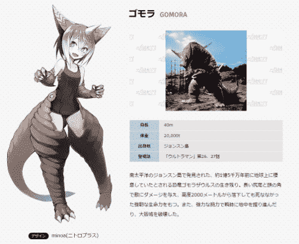
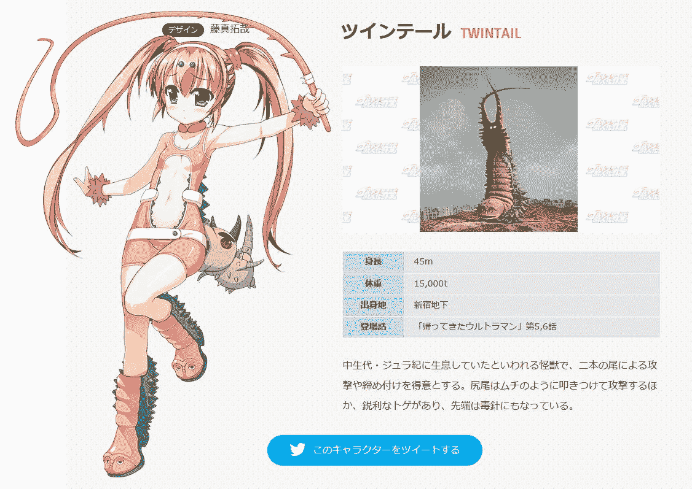
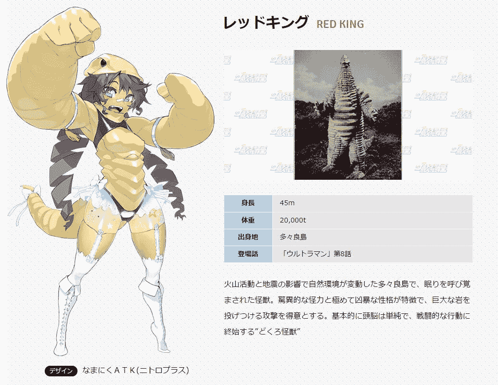
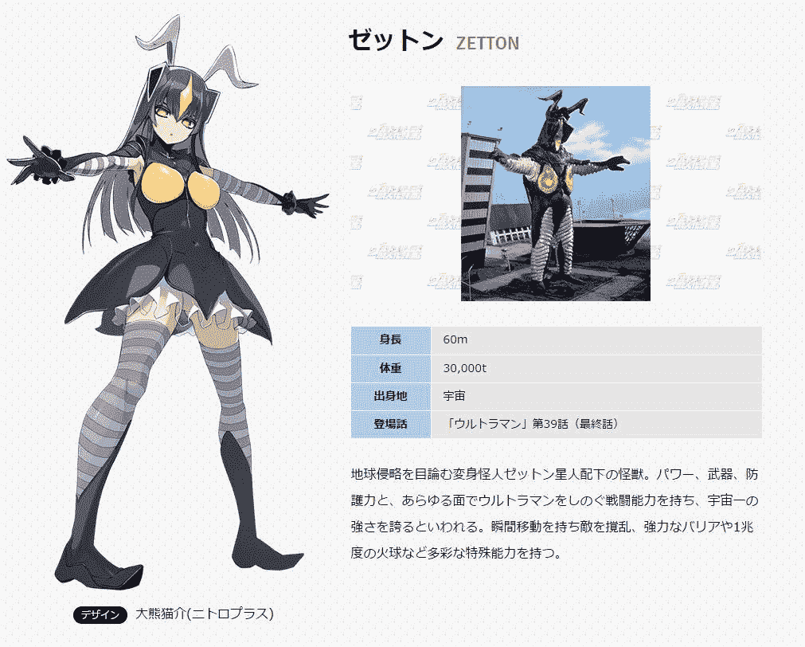
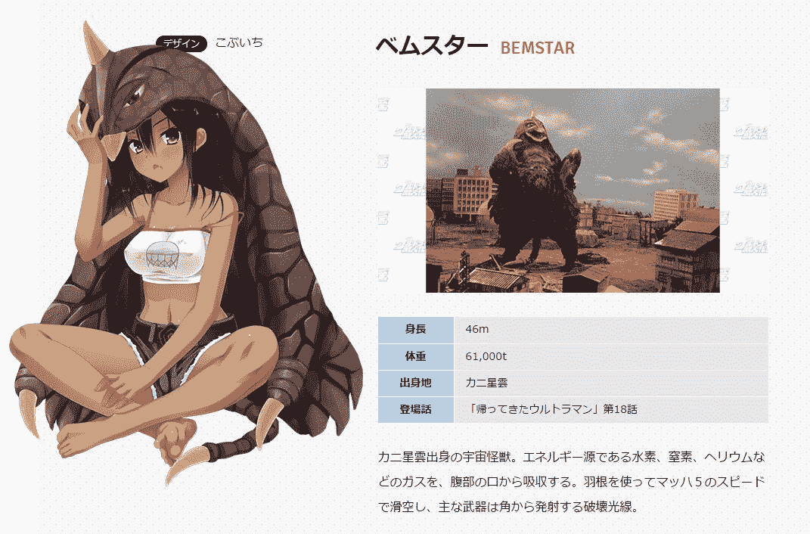
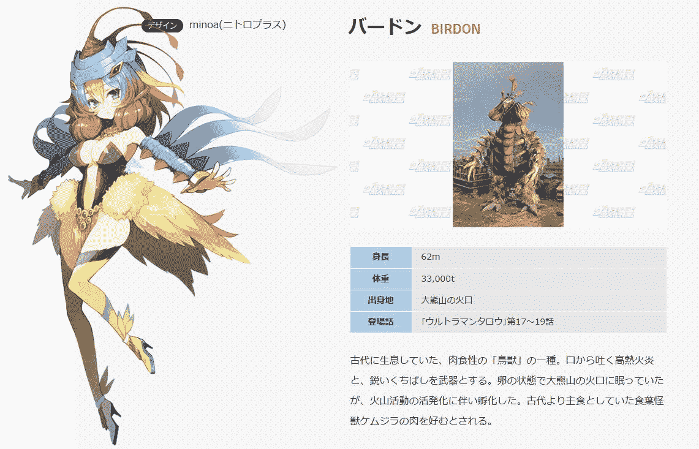
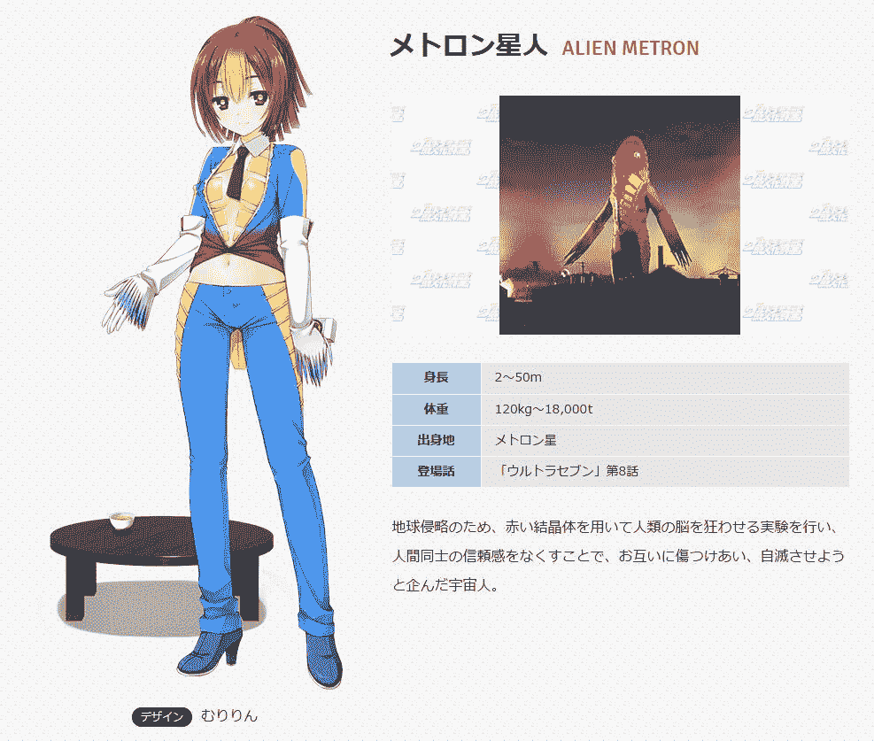

# 同人《怪兽酒场》

作者：生克七魂

TID：29540

 

# 1

*本帖最後由 生克七魂 於 2020-10-7 06:18 編輯*

序章

没人知道这栋建筑是什么时候建立的，明明昨天这里还什么都没有。建筑的上面还写着四个大字[怪兽酒场]，旁边还有一排小字[名字不全代表本店]。

“要不进去看看？”

“可万一出事了怎么办？”

大家都在七嘴八舌的讨论着。

“不管怎样，不进去看看是什么都不会知道的。”不知是谁说了这么一句话。

有一个人…一只怪兽…一个怪兽娘打开了这扇门，大家看到了里面的全貌。

右边有一个前台，一个装满酒的柜子，一台咖啡机，一台贩卖机，一台饮水机，还有一个不知道干什么用的管道。左边有一堆桌子椅子，都是以四把椅子围着一张桌子排列好的，此外还有两个沙发和一张超长的桌子。对面则有两扇门。

“这家店没有人吗？”外面的怪兽娘陆陆续续进入，纷纷找了个位置坐下。

“这个铃铛应该是叫服务生的吧。”一位怪兽娘看到放在前台的铃铛，按了一下，一声清脆的声音响彻整家店，同时，其中的一扇门也打开了。

“人…人类？还是男性！”

这名看起来十五六岁的少年朝在坐的她们看了一眼，一言不发的走到前台。

“那个，你…”那个按下铃铛的怪兽娘还没说完，少年就做了一个安静的手势，然后拿出几份类似菜单的东西。

怪兽娘打开那份菜单，前几页写着各种食物和价钱，后面还写着一句话[如果想点菜单上没有的食物，那就请不要对味道挑三拣四，价钱视情况而定，另外，本店只提供人类的食物，请配合合作。]

在翻过写满食物的那几页后，后面则写的是各种委托的价钱，同样最后也有一句话[如果想委托菜单上没有的，价钱视情况而定，另外本店严禁黄赌毒，请配合合作。]

在看完后，那位怪兽娘把菜单合上，同时发现少年直直的盯着自己，说出了大家听到的第一句话。

“欢迎光临怪兽酒场，请问要点什么？” 

# 2

话说我这是第一次发帖，很多操作都不知道，请大家多包容 

# 3

*本帖最後由 生克七魂 於 2020-9-25 11:27 編輯*

第一章 没人知道他叫什么，大家都只叫他服务员。 “你到底叫什么名字啊。”也有怪兽娘这么问起过。

“ウルトラマン。”少年头也不抬的回答。

“怎么可能，那你变身给我们看看。”

少年并没有理睬她，只是低头干自己的事。

“这家伙真让人火大。”提问的怪兽娘撅起嘴走开了。

过了一个月左右，大家对少年的称呼也渐渐从服务员变成ウルトラマン，反正这个词在以前就听过好几遍了，但他到底是不是真的，没人知道。

时间又过了一周左右，目前为止仍然只有来吃饭的，没有来委托的…

“这里就是那家怪兽酒场啊。” 由于今天刚开门，这个清脆活泼的声音回响在酒馆里。

“啊，你就是大家说的那个ウルトラマン吧。

ウルトラマン抬起头：“哥莫拉。”

“啊？你认识我吗，我们好像没见过面吧？”

“要点什么？”

“呃，那个，我想问一下，你真的是ウルトラマン吗？”

少年轻轻点了点头。

“那你应该会飞吧。”

少年轻轻点了点头。

“可不可以请你带我到南太平洋的乔森岛？”

“今天晚上九点，酒场门口。”少年说完后伸出手指了一下菜单。

哥莫拉翻开菜单：“接送委托，300日元，好便宜啊。”

晚上九点 哥莫拉来到店门前，少年正好准备锁门，看到哥莫拉，示意让她到店后面。

少年的手中散发出一道光芒，光芒渐渐凝聚，变成一根青白色的棒子。

“这，这难道是！”

少年将右手高高举起，按下了上面的按钮。

哥莫拉不敢相信的看着眼前的景象，四周都是漂浮的云朵，上面是散布无数星星的夜空下面是一望无际的大海，毫无疑问，这里是地球，而自己则坐在ウルトラマン的背上。

飞了一段时间，ウルトラマン降落在一片陆地上，弯下腰，让哥莫拉能够从他的背上下来。

哥莫拉站在地面上，看着周围的景色，这里正是自从她被人类带走后再也没回来的故乡。ウルトラマン向天空发射了一道光线，光线在到达一定高度后向四周散开，最后覆盖了整座岛屿，同时他也从红白相间恢复成人类外貌。

“这个屏障可以让外界只能观测到一座正常的岛屿，所以不用担心会被发现，不过你可不许破坏岛上的生态。”

哥莫拉已经吃惊的说不出话了，但不管怎样，有一件事她很确定，眼前这个少年，就是ウルトラマン。她兴奋地跑到丛林深处，过了一会，一个巨大的身影从丛林中浮现出来，然而那并不是怪兽的外貌，哥莫拉还是怪兽娘的模样，但这些已经无所谓了，她已经沉浸在回到故乡的喜悦中了。

“阿里嘎多，ウルトラマン。”哥莫拉坐在海岸边，两只脚在水中荡来荡去，而ウルトラマン则坐在她的肩膀上。

“你憎恨吗？”

“诶？”

“毕竟是人类把你麻醉从乔森岛送到日本你才会发狂的，而我也不得已下了杀手。所以你憎恨人类吗，憎恨我吗？”

哥莫拉听完他的话，低头沉默了一下，随后抬起头：“那个时候我的确很愤怒，思考为什么人类要这么对我，为什么你要守护这样的人类。但是我在怪兽墓场想了很久也明白了，人类本来就会对未知感到恐惧，你们把人类当作是自己的兄弟一样，所以会保护人类，而我是一亿五千万年前的幸存者，本来就应该在当时被地球淘汰，能够活这么久已经要心存感激了。”

ウルトラマン听完她的话后也沉默了一下：“噗呲。”

“笑什么？”

“我只是想到你当时断掉尾巴后还打算用尾巴攻击我，那个扭屁股的样子实在是！”

“啊！不许笑！太丢人了！” 哥莫拉红着脸想要去抓他，但ウルトラマン动作敏捷，一下子就顺着她的头发爬到头顶上。

“快下来！”哥莫拉双手不停的在头上抚摸，而ウルトラマン已经跑到她的角上了，俩人就这么折腾了半天，最后以ウルトラマン累得认输结束。 月亮已经升到正中央，暗示现在已经午夜了。

“差不多该回去了，不然会影响到岛上的生态的。”

“嗯，那我们走吧。”哥莫拉和来时一样坐在ウルトラマン的背上，ウルトラマン再次举起贝塔魔棒，从地球穿越回怪兽次元。

 

# 4

这复制过来居然成这样了，要不还是截图好了，话说这怎么删啊 

# 5

总算是改过来了，应该没有问题了 

# 6

放一下哥莫拉的拟人图 

# 7

<ignore_js_op>[77fdaaa711db4bcd3d7c6b1bbc5f798b.jpg](forum.php?mod=attachment&aid=ODUyNDJ8OTMwZGE0ZjR8MTYyNDY5NDY2MnwxODIzMHwyOTU0MA%3D%3D&nothumb=yes) *(51.69 KB, 下載次數: 1)*

[下載附件](forum.php?mod=attachment&aid=ODUyNDJ8OTMwZGE0ZjR8MTYyNDY5NDY2MnwxODIzMHwyOTU0MA%3D%3D&nothumb=yes)

2020-9-25 14:06 上傳  

</ignore_js_op>  

# 8

> Mannheim 發表於 2020-9-26 14:49

> 当时看到这个企划就在想会不会有巨大娘，后面真有(官方搞事)…

我等了这么久终于有一个回复的了，话说你也是奥迷吗???? 

# 9

第二章

依旧是平静的一天，每个怪兽娘都在干自己的事情，当然ウルトラマン也一样，现在大家都知道了这家伙是真的，一开始刚从哥莫拉那里知道这件事时炸开了锅，各种各样的怪兽娘都聚在这里，然而ウルトラマン早料到会这样，直接在门口立了一块牌子[这里只欢迎客人，不欢迎闲人，如果执意要找茬请做好死的觉悟。]

虽然大家知道了少年的真实身份，但酒场并没有因此而冷淡，反而比之前更热闹，毕竟ウルトラマン本来就不好杀戮，自己现在也没有做任何亏心事，而且之前他还帮了哥莫拉的忙，大家也就继续着平时的生活。

夜幕降临，许多怪兽娘都回去睡觉了，而怪兽酒场没有固定的关门时间，ウルトラマン的精力似乎没有尽头似的，24小时营业是经常的事，所以现在依然在运作，不过因为是晚上，所以客人很少。

直到一位怪兽娘付钱离开后，ウルトラマン才抬起头，现在酒场里就剩一个客人了，这位客人只是双手放在膝盖上，低着头，桌上的碗已经空了，她似乎还没有要离开的意思。ウルトラマン走到这个怪兽娘旁边拍了拍桌子。

“你到底有什么事？”

“啊，那个，那个…”怪兽娘扭扭捏捏的，似乎是那种容易害羞的性格。

“你再不说话我可就要强制请你离开了。”

“我，我希望可以靠自己的力量打败古墩。”

“打败古墩？可你是双尾怪啊。”

这个梳着双马尾的怪兽娘说出了让谁听都是不可能的要求，要知道，古墩是双尾怪的天敌，这么久以来只有古墩吃双尾怪的份，从来没有一个双尾怪能反杀古墩。

ウルトラマン也犯了难，挠了挠头：“再说我上哪找古墩让你打？现在宇宙中已经没有怪兽了。”

“没关系，我们这里有虚拟怪兽系统，我可以在那里对战。”

“我知道了，你先回去，让我好好想一想。”

“好吧，那拜托你了。”

过了两天

“嗯，你在写什么啊？”

“哥莫拉，你认识双尾怪吗？”

“认识啊，毕竟我们都是一亿五千万年前的生物嘛。”

“那你把这张纸条交给她，不能给其他人看，你也不能偷看。”

“哦，好的。”

又过了两天

双尾怪带着ウルトラマン来到虚拟怪兽模拟室里，为了让怪兽娘可以放开手脚，里面的空间也设置得非常大。

“你真的想到方法，可以让我打倒古墩了吗。”

“没想到我叫你来干嘛，快点开始吧。”

双尾怪启动了系统。

“按照我说的设置，场景为东京湾，时间为下午六点，人类数量为零。”

双尾怪照他说的设置完毕后，周围的景色瞬间改变，一面是城市，一面是大海，夕阳将一切染成了淡黄色。

“系统开启。”随着机械音的响起，地面传来震动，一头双手都是鞭子的怪兽从地下冒了出来，正是这次的目标古墩。双尾怪也巨大化到怪兽的身高，把ウルトラマン放在旁边的高楼上，握紧手中的鞭子(她现在还是怪兽娘的外貌)。

古墩咆哮着向她冲过来，挥起鞭子，双尾怪迅速躲开了攻击，同时用手中的鞭子抽向古墩，不过古墩也不是吃素的，马上把胳膊甩向她，结果两条鞭子紧紧的缠在一起，但古墩还有另一只鞭子，继续不断的鞭打她。

“别松手，把他拖进海里！”ウルトラマン喊道。

双尾怪虽然被打得遍体鳞伤，眼角浮现出眼泪，但还是强忍着疼痛，一步步的拽着古墩向后退去，古墩似乎也明白了她想干什么，吼叫了一声，更加用力的抽打她，但最终还是失败了。被拖进海里的古墩顿时慌了神，毕竟他的绰号是地底怪兽，来到海里可以说是太阳下的雪人一样，而双尾怪是生活在中生代冰河世纪的生物，十分熟悉水性，在海中瞬间来了精神，解开了缠绕在一起的鞭子，敏捷的避开古墩的攻击，并一下下的抽打着古墩。

ウルトラマン也浮在海面观察，虽然双尾怪信心满满，但他却发现，古墩正在忍受鞭打，一点点的靠近着双尾怪，等双尾怪意识到的时候，古墩迅速用鞭子绑住了她的双腿，把她绊倒在地上，同时张开嘴，双尾怪想起被古墩捕食时的场景顿时慌了神，连反抗都做不到，只能傻傻的看着血盆大口离自己越来越近，吓得闭上眼睛。

然而想象中的疼痛没有发生，双尾怪睁开眼，只见古墩被站在背后的一个红白相间的巨人紧紧锁住双臂，随后巨人双手一扔，把古墩丢到身后。

“杰…杰克！”双尾怪认出了目前的巨人。

“还能战斗吗？”ウルトラマン伸出手。

“嗯，我还可以。”双尾怪握住他的手站了起来，拿起掉在地上的鞭子再次向古墩冲去。古墩由于刚才那一下，现在脑袋还浑浑噩噩的，根本无暇顾及双尾怪的攻击，在她一下下的抽打后，古墩终于倒了下去。

战斗结束了，双尾怪双手抱膝坐在海边，脸上并没有浮现出笑容。

“怎么了，不是都已经打倒古墩了吗？”

“可那不是我自己做的，如果不是你的话我可能又会被古墩咬死了。”

ウルトラマン坐在她的肩膀上，看着即将落下的夕阳：“知道吗，其实你是无论如何也不可能打倒古墩的。”

“诶？”双尾怪抬起头看向他。

“这是世界的定理，无论什么物种，都一定会有制约他的力量，不可能有绝对强大的生物，不管是谁，都会有无论如何都不能打倒的敌人，即使是我也一样，ウルトラマン不是神明，会高兴，会愤怒，会悲伤，会害怕，会受伤，也会死亡。即使如此，我们也要拼尽全力去做自己认为正确的事。”接着他看向双尾怪，抚摸着她垂在耳边的头发：“你不需要证明自己能够打倒古墩，反而应该接受古墩是天敌的事实，这样才能说明，你是一个真真正正的双尾怪。”

双尾怪听完，眼神闪过一丝失望，但很快便充满活力：“我明白了。”接着露出了笑容。

“好了，回去吧，这次的委托算是失败了啊。”ウルトラマン晃了晃脑袋“话说这系统有点太过火了吧，要是真的死了怎么办。”

“啊！”双尾怪突然说道“对了，这个系统是会适可而止的，当时太害怕所以忘了。”

两个人就这么大眼瞪小眼了几秒钟，ウルトラマン举起拳头照着她的脑袋打了下去。

“你这个笨蛋，这种事都能忘，难怪打不过古墩！”

“对，对不起！” 

# 10

双尾怪的拟人 <ignore_js_op>

**823f730017e7d0ca10a3825cd746908b.jpg** *(127.05 KB, 下載次數: 0)*

[下載附件](forum.php?mod=attachment&aid=ODUzNzl8ZjRlNzQ3ZWF8MTYyNDY5NDY2MnwxODIzMHwyOTU0MA%3D%3D&nothumb=yes)

2020-9-30 11:28 上傳

 

# 11

第三章

自从大家在双尾怪那里听说自己能变身各种ウルトラマン后，怪兽酒场似乎更受欢迎了。

“喂，小子，你就是那个ウルトラマン吧。”一张大手拍在桌子上。

ウルトラマン抬起头：“门口的告示牌写着不许找茬。”

“老娘识字，你这里是可以委托各种事的吧。”

“只要不是杀人放火之类的就行。”

“那行，老娘要和你比试一下。”

此话一出，店里的人都停下了手里的动作，不约而同的看向前台。

“比试？是过招吗？”

“才不是，是要把一方打趴下才算完的比试。”

ウルトラマン站起身：“如果这就是委托的话，只要照价付款，我奉陪。”说完指了指菜单，那个怪兽娘翻开菜单：“打架要50000日元，这也太贵了吧！”

“不想付你可以去和空气斗智斗勇，当然前提是你得有智。”

怪兽娘的脸被气得通红通红的：“好，我付了。明天中午两点，敢开溜的话有你好看的！”

“多谢惠顾。”

在怪兽娘走后，ウルトラマン摇了摇头：“雷德王还真是在哪都不改这爱打架习惯啊。”

中午一点半

怪兽竞技场周围聚集了无数的怪兽娘，毕竟雷德王是竞技场的常驻冠军，而ウルトラマン则是打败了无数怪兽的战神，这场对决光是噱头就已经吊足了胃口。这个擂台是为巨大化而准备的，因此在普通人看来，这里就如同是一望无际的红色岛屿，雷德王正站在擂台的一端活动筋骨，而ウルトラマン也站在另一端做着伸展运动。

半小时后，裁判也就位了，雷德王呼出一口气，将身体巨大化，ウルトラマン手中的光芒也凝聚成贝塔魔棒，按下按钮，变身为红白相间的巨人。

“预备，开始！”

雷德王立刻扑向ウルトラマン，而他一下便闪开了，双手抓住雷德王的尾巴，甩了几圈，将她扔回原位。

“该死！”雷德王抹了一下脸上的擦伤，再次摆好架势向他冲过来，ウルトラマン一个后空翻跳到她的身后，当她转过头时抓住她的手臂，一下将她摔在地上，这一下直接把雷德王摔得头晕眼花，紧接着双手平放在胸前，然后右手举起，手中出现一个轮。

“那是，八分光轮！”会场的人惊呼起来。

“等等，竞技场上不能用致命的能力！”裁判说到。

但ウルトラマン如同没听见似的，照着她的脖子砍了下去，观众都吓得捂住了眼睛。

不过并没有切割的声音传来，大家睁开眼，只见八分光轮距离雷德王的脖子仅有丝毫。ウルトラマン收回了手：“到此为止吧。”随后飞走了。

那场对决后过了三天

ウルトラマン正在酒场调剂咖啡，突然雷德王冲了进来。

“决胜负吧，ウルトラマン！”

“怎么又来啊，上次不是已经打完了吗？”

“上次是上次，这次是这次，钱我已经准备好了，老样子，明天中午两点！”说完便跑了出去。

其他的怪兽娘看到这场景，都笑着说：“这下你可有的忙了，ウルトラマン。”

“啊？为什么？”

“雷德王会一直缠着打败她的人，直到把ta打倒为止，所以后来大家都不再和她打了，这下你被她缠上了。”

“不是吧！”ウルトラマン第一次露出了不敢相信的眼神，然后双手抱头倒在前台桌子上。〈决不能让她时不时就来找我干架，得想个办法输给她。〉

第二天中午一点半，ウルトラマン带着雷德王和哥莫拉来到他指定的地点：地球上的多多良岛。

降落后，ウルトラマン向天空发射了用来生成屏障的光线，活动了一下身体：“好了，开始吧。”

“慢着，你刚才送我们过来，还发射了一道光线，我可不想趁火打劫，等你恢复了体力再和我打。”

〈这家伙还挺聪明，不过还不够聪明。〉

过了一会，ウルトラマン的体力也恢复得差不多了，站起身来：“我恢复的差不多了。”

哥莫拉站在一旁说到：“那么，对决开始！”

两个怪兽娘同时巨大化，ウルトラマン依旧是用贝塔魔棒变身，岛上瞬间出现了三个巨大生物。

雷德王和上次一样迅速朝他扑去，ウルトラマン仍然一闪就躲开了，但他并没有反击，而是等雷德王再次摆好架势向他扑过来，就这样持续了两分钟，ウルトラマン胸前的彩色计时器开始闪烁起来，而他也渐渐体力不支了。

“怎么了？之前不是很威风的吗。”雷德王见到此情景更加兴奋，随后从地上举起一块岩石，朝他扔了过去，ウルトラマン并没有去接这块岩石，而是作出一副有气无力的样子，正中这一击，倒在了地上，恢复成人类。

“ウルトラマン战斗不能，雷德王获胜！”哥莫拉宣布了对决结果。

“赢了…是我，赢了。”雷德王以为ウルトラマン是被自己打回原形的高举双手庆贺自己的胜利，随后也倒在地上。

“啊，又来了，雷德王每次打了胜仗就会睡大觉。”哥莫拉无奈的摇了摇头随后走到ウルトラマン旁边，蹲下将他捡起放在手里：“没事吧？”

“还好，果然就她那智商，压根就不知道我在地球上只能变身三分钟，不然她一开始就会拒绝了。”ウルトラマン坐起来晃了晃手臂“这家伙以前就经常找其他怪兽打架，没想到变成女孩子模样居然还是这种性格。”

“没办法啊，有些东西是刻在骨子里的，想改也改不了啊。”

“话说她还要睡多久啊？”

“嗯，可能我们得准备在这里露营了。”

ウルトラマン看着她熟睡的样子，下了一个决定“回去一定要把打架的委托价格翻个几倍”。 

# 12

雷德王的拟人图，，，

 

# 13

<ignore_js_op>[ce255ca47cce46aaf4affd8a7fe32a95.jpg](forum.php?mod=attachment&aid=ODU0Mjd8NGUyZDRmYmZ8MTYyNDY5NDY2OHwxODIzMHwyOTU0MA%3D%3D&nothumb=yes) *(121.69 KB, 下載次數: 0)*

[下載附件](forum.php?mod=attachment&aid=ODU0Mjd8NGUyZDRmYmZ8MTYyNDY5NDY2OHwxODIzMHwyOTU0MA%3D%3D&nothumb=yes)

2020-10-2 16:04 上傳  

</ignore_js_op>  

# 14

第四章

今天还是一如既往的平静，怪兽酒场依旧热热闹闹，不过ウルトラマン却无聊到在前台睡着了，有些怪兽娘想趁此机会吃顿霸王餐，而当她们悄悄溜到门口时，一个怪兽娘突然出现在前面挡住了去路。

“你们还没有付钱呢。”

“他还在睡觉，不会发现的。”

“可你们还没有付钱呢。”

“你烦不烦，快让开！”说着想要将她扒拉开。

“嗯？”ウルトラマン被吵醒了，伸了个懒腰，然后睁开朦胧的双眼：“怎么这么吵啊？”

其他的怪兽娘指了指门口，ウルトラマン顺着方向看过去，差点没从椅子上滑下来：“杰，杰顿！”

“这些家伙想吃霸王餐，我已经制服她们了。”

“哦，哦。”

“那我走了，她们交给你了。”

杰顿走后，ウルトラマン拍了拍胸脯：“吓死我了。”

“ウルトラマン怎么那么害怕啊？”

“你不知道吗，杰顿是第一个杀死ウルトラマン的怪兽。”

“诶！有这种事！”

午夜十一点

怪兽酒场关门了，ウルトラマン锁好门，准备回到房间休息，但刚一回头，就被捂住嘴按在墙上。

“不要出声。”

ウルトラマン轻轻点了点头，杰顿才把手放了下来。

“我想委托你一件事。”

“有什么事直说不就行了，干嘛弄的这么神神秘秘，还用瞬间移动进来。”

“不行，我不好意思在众人面前说。”

“行行行，那你想委托什么？”

“我希望可以自由表达自己的情感。”

“诶？”

“你也知道，我是怪兽兵器，即使有自己的情感，也无法表达出来，用地球上的话来说，就是三无。”

“是啊，想想以前，你的脸上连五官都没有。”

“所以可不可以请你帮我这个忙。”说着杰顿两手托腮，用她那无表情的面孔做了个可爱的动作。

“唉，知道了知道了，让我好好想想吧。”

第二天晚上十二点

“你要带我去哪？”

“你不会要带我去什么二人世界之类的地方吧。”

杰顿蒙着眼睛堵住耳朵坐在ウルトラマン身上，过了一会，ウルトラマン降落在地上，帮杰顿揭下了眼罩和耳塞。

眼前是一片花丛，不时还有小鸟和蝴蝶经过。

“这里是？”杰顿从ウルトラマン的背上跳了下来，看着周围的景色。

“这是我在地球上偶然找到的地方。”

“你带我来地球做什么？”

“我想或许你在看到美丽景色的话说不定能把心里的感情表达出来。”

杰顿坐在花丛中，看着眼前的花朵，摇了摇头：“不行，还是表达不出来。”

“怎么会！”ウルトラマン惊讶的说道，随后叹了口气“那我再去想想办法吧，你先在这待一会。”说完便走远了。

杰顿从出生时就一直活在侵略之中，从未感受过世间的美好，因此在看到这片花丛后，心中似乎有什么东西被打动了。

过了一会，杰顿依旧没有等到ウルトラマン，但她已经沉浸在花丛中了，甚至萌生了一直住在这里的想法。

此时，天空突然传来一声巨响，杰顿抬起头，只见蔚蓝色的天空中出现了一个不和谐的红点，而且变得越来越大。

“那是…陨石！”杰顿睁大了双眼，一颗巨大的陨石正朝这里冲过来。

如果是以前，杰顿会立刻用瞬间移动逃走，但现在不行，因为她的心中有了想要保护的东西。

她立刻将身体巨大化，并发射出一道道火球，但陨石却丝毫没有停下来的样子，杰顿又发射出一道波状光线，陨石顶着光线的攻击，继续俯冲着。

此时距离已经近到杰顿可以感受到周围开始变热了，杰顿看了一眼地上的花丛，闭上眼睛，展开了屏障。

陨石撞击在屏障上，强大的冲击力使得杰顿双腿一下弯曲了45º，但她仍然坚持着。

时间已经过了一分钟，杰顿的体力所剩无几，想到她所珍爱的花丛，最后留下了有生以来的第一滴眼泪。

“再见了。”杰顿终于支撑不住，闭上了眼睛。

然而陨石并没有撞过来，杰顿睁开眼睛，面前是一个红白相间的巨人。

“ウルトラマン？”

此时ウルトラマン双手组成十字，发射出一道蓝色光线，那正是他的必杀技：斯派修姆光线。

“愣着干嘛，快来帮忙！”

杰顿一下子反应过来，使出波状光线，陨石被二人合力渐渐推回到空中。ウルトラマン双手握拳，双臂交叉在胸前，用念力将陨石炸得粉碎。

“呼哧呼哧…”俩人恢复成人类大小，气喘吁吁的坐在地上。

“幸好你及时回来了。”

“感觉到了异常的波动就回来看看，没想到会有这种事。”

“这样一来，我也算是保护了地球吧。”

“啊…算是吧。”ウルトラマン挠了挠头“说起来，你哭了啊。”

“诶？”杰顿摸了摸脸，上面的确有一道泪痕。“为什么？”

“你在危机下体会到了死亡，想到了对自己最重要的人或物，你不希望他们离开自己，也不希望自己离开他们。”

“……”

“你其实不需要强行让自己去像别人一样表达感情，每个人都有每个人的表达方式，在你的心中，他们都是你想要保护的，既然如此，你只要努力去做就行了，我想即使你没有在明面上表达，他们的心中也一定感受到了。”

杰顿看向这片花丛，每朵花都在微风中翩翩起舞，如同在表达感谢似的，她微微的笑了出来。

“时间差不多了，回去吧。”说完，ウルトラマン拿出了眼罩和耳塞。

“为什么回去也要戴这个啊？”

“这你就别管了，好了快点戴上。”

杰顿不情愿的戴上眼罩和耳塞，坐在ウルトラマン的身上，飞出了虚拟怪兽模拟室。 

# 15

杰顿的拟人图，，，，，

 

# 16

<ignore_js_op>[118abcb9d80b79e9c12797a06dfac4c1.jpg](forum.php?mod=attachment&aid=ODU1NDh8NzA5MmI1YTF8MTYyNDY5NDY2OHwxODIzMHwyOTU0MA%3D%3D&nothumb=yes) *(117.84 KB, 下載次數: 0)*

[下載附件](forum.php?mod=attachment&aid=ODU1NDh8NzA5MmI1YTF8MTYyNDY5NDY2OHwxODIzMHwyOTU0MA%3D%3D&nothumb=yes)

2020-10-7 22:53 上傳  

</ignore_js_op>  

# 17

第五章

“我这里没有你说的东西。”

“求求你，我快饿死了。”

“不是求不求的问题，是我这里真没有氢气氮气氦气，再说我就从没见你吃饱过。”

“你一定有办法弄到的吧，你可是ウルトラマン啊。”

“那我也不是神啊。”ウルトラマン无奈的说道“再说这种东西你应该去实验室之类的地方才对吧。”

“我已经饿的走不动了。”怪兽娘摸了摸自己的肚子。

“好好好，你先起来。”

“不行，连站起来的力气也没有。”

“我背你行了吧。”

ウルトラマン想不通自己为什么会摊上这种事，这家伙进来后直接倒在地上，本来是处于好心想扶她起来，结果却被她抓着要饭，还说想吃氢气氮气氦气，自己上哪找这些东西啊。

“贝蒙斯坦可真是什么时候都不让人省心。”

说实话ウルトラマン根本不知道该怎么办，只好变成杰克背着她在宇宙中到处飞，正好碰见了奥什码彗星，利用彗星的尘尾，让贝蒙斯坦吃了个饱。

“老带你到处找彗星我会先累趴下，得想个办法，当然，这是委托，费用要你出。”

“嗯嗯。"似乎只要能解决吃饭的问题，贝蒙斯坦不管什么要求都会答应。“啊，那个是！”

“嗯？”ウルトラマン顺着她的方向看过去，原来他们追着彗星飞到太阳系了，而那颗蔚蓝色的星球正是地球。

“那是宇宙空间站！”贝蒙斯坦巨大化后准备冲过去。

站住，那个不能吃！”ウルトラマン也巨大化将她擒住。

“我要吃！”贝蒙斯坦不停的挣扎着。

“你再胡闹，我可就要用奥特火花了！”此话一出，贝蒙斯坦马上就老实了。

回到酒馆，ウルトラマン抱着头在桌上思考着〈我上哪给她找固定的食物来源啊？〉

“怎么了ウルトラマン，身体不舒服吗？”

“是双尾怪啊，我接了一个ウルトラ麻烦的单子。”

双尾怪听完事情的经过后若有所思的点了点头：“嗯嗯，也就是说你要给贝蒙斯坦找一个食物产地对吧。”

“差不多是这个意思。”

“嗯…这只是我的一个想法，你知道远古时期的地球吗？”

“远古时期？不了解。”

“好吧，毕竟我们曾经是生活在中生代的生物，所以我查找过一些远古时期的资料，在石炭纪，昆虫都是以米为单位的。”

“以米为单位！”ウルトラマン不敢相信的睁大眼睛。

“是的，书上说是因为当时的氧气含量为35%，这种高浓度的氧气正是使它们如此巨大的原因。我想如果你有穿越时间和空间的能力，或许可以找一个适合的年代，在两个不同次元和时代间建立一个通道。”

“穿越哪有那么简单，一次我就会累得瘫在地上了，再说我上哪找……等等，那样的话或许能行，谢了双尾怪，下次我请你吃饭。”说完便跑了出去，留下一脸懵逼的双尾怪。

清晨5点

“你要带我来看什么？”

“别问了，过来就知道了。”

双尾怪拉着贝蒙斯坦来到怪兽酒场，此时还没有开门，不过双尾怪敲了敲门，ウルトラマン便走了出来。

“我是说过早点带她过来，可你这也太早了吧。”说完打了个哈欠。

“对不起，我也想让她快点看到。”

“算了，进来吧。”

三人来到平时会送出食物的管道前，ウルトラマン拿起一个密封的仪器，打开仪器口，接在管道下面，同时按下按钮，管道晃动了几下，什么也没有出来。

“你们这到底是在干嘛？”

“你先尝尝这个，这是启动键。”ウルトラマン关上仪器口，放在贝蒙斯坦的面前。

“可这里什么都没有啊。”

“所以才要你尝啊，你吃的不就是这些吗。”

贝蒙斯坦将信将疑的把嘴放在仪器口上，打开仪器口启动仪器，里面的气体瞬间冲入她的嘴里。

“这是！”

我把这个管道和一个类木行星连接在一起了，而且管道也不会妨碍到其他人的食物，你以后就可以安心吃饭了。

贝蒙斯坦吃完里面的气体后，默默的放下仪器抽泣起来。

“怎么了，不满意吗？”

“不是…”说完，贝蒙斯坦冲上去抱住了ウルトラマン：“从来没有人为我做到这种程度，我只是有点…。”

“没，没什么，完成委托本来就是应该的嘛。”ウルトラマン说道，然后松开她的手“接下来该说正事了。”

“正事？”

“我费了半天劲才找到的类木行星，这算体力费，把行星和管道接上，这算技术费，路上差点被一个黑洞吸进去，这算精神损失费，加起来总共460000日元，现结不许欠账。”

贝蒙斯坦眨了眨眼睛：“我没带钱。”

“没带钱！”ウルトラマン看了看双尾怪。

双尾怪渐渐低下头：“我，我好像忘了和她说这件事了。”

ウルトラマン默默的抬起手，一手刀打了下去。

“你这家伙还能记住点什么！”

“对，对不起！”

看着ウルトラマン和双尾怪这幅胡闹的样子，贝蒙斯坦笑了笑，抱紧了仪器。 

# 18

贝蒙斯坦的拟人图，，， 

# 19

<ignore_js_op>[d3d3023210956214145144ce924a74b3.jpg](forum.php?mod=attachment&aid=ODU1Njh8ZDEzOGUwYjJ8MTYyNDY5NDY2OHwxODIzMHwyOTU0MA%3D%3D&nothumb=yes) *(103.98 KB, 下載次數: 0)*

[下載附件](forum.php?mod=attachment&aid=ODU1Njh8ZDEzOGUwYjJ8MTYyNDY5NDY2OHwxODIzMHwyOTU0MA%3D%3D&nothumb=yes)

2020-10-9 14:22 上傳  

</ignore_js_op>  

# 20

> [CEW 發表於 2020-10-9 16:18](https://giantessnight.com/gnforum2012/forum.php?mod=redirect&goto=findpost&pid=449443&ptid=29540)

> ウルトラマン不就是Ultraman嗎???要翻譯為何就不翻成奧特曼

主要是我担心不是奥迷的人看到“奥特曼”会觉得出戏，所以就直接用日语了。 

# 21

也不知道论坛有多少特摄厨 

# 22

第六章

“我这里明确说了只提供人类的食物，人类不吃凯姆吉拉。”

“人类真的没品位，凯姆吉拉的肉可是世界上最好吃的。”

“我估计全世界就只有你会吃那条大青虫。”

“你是不是想尝尝火焰的滋味啊。”

“要不我请你吃M87光线吧。”

ウルトラマン和巴顿在前台已经吵了半个小时，周围聚集一堆看热闹的怪兽娘。

“你觉得谁会赢？”

ウルトラマン吧，毕竟他可是打败了无数怪兽的。”

“不一定，巴顿可是最强的地球怪兽，而且还杀死过佐菲和泰罗，谁会输还不一定呢。”

“话说为什么一场吵架能牵扯到战斗力啊。”

“说不定一会就打起来了呢。”

两人僵持了半天，巴顿叹了口气：“算了，那就给我一盘豆丹吧，。”

“多谢惠顾。”ウルトラマン按下按钮，一盘食物从管道里掉了出来。巴顿拿到自己的位置上，揭开盖子，里面是一堆炖熟的大青虫。

“好恶心！”其他的怪兽娘都躲的远远的，但巴顿可不这么认为，只见她拿起筷子将一条大青虫放进嘴里，吃得很香。

“果然是鸟。”ウルトラマン小声吐槽道。

一周后

“我说，你怎么老来我这里吃饭啊？”

“怎么啦，不想多点客人啊。”

“可你这一周每到饭点都来，连夜宵也是，这的饭有那么好吃吗？”

“这你就不用管了，来一盘清蒸豆腐金蝉。”

巴顿次次都来这里吃饭，就算很好吃也不可能持续这么久不间断，ウルトラマン自然会觉得奇怪。

“你该不会是有事想委托我吧。”

“才，才不是。”巴顿拿起盘子，走到自己的座位上。这时，她发现盘子上放着一张纸条，打开纸条，上面写着一行小字[如果你真的想委托，今晚十点来店的后面找我。]

“这家伙倒挺敏锐的。”

晚上十点

“说吧，什么委托？”

“你能穿越时间吗？”

“穿越时间？”

“我想回到三千年前。”

“为什么？”

“那还用问吗。”巴顿渐渐流出口水，不停的喘气，脸上也渐渐泛红“那个时候凯姆吉拉还没灭绝，我现在日日夜夜都在怀念它那鲜美多汁的肉。”

“到头来还是想吃凯姆吉拉啊。”ウルトラマン摇了摇头“只要你不打扰人类的生活，我就带你去。”

“放心，我这次的目标只有凯姆吉拉。”

ウルトラマン手上的光芒渐渐凝聚，最终化为了一个眼睛。

“这是奥特眼镜？感觉不太像啊。”

“当然不是。”说完ウルトラマン将他戴上，瞬间光芒闪耀，巴顿被晃的睁不开眼，等光芒散去，呈现在她面前的，是一个拥有两个头标的红蓝相间的战士。

“哇，有一种回到老家的感觉，快看快看，那座火山就是我休眠时住的火山！”

“也是埋葬掉你的火山。”

“诶？你说什么？”

“没什么。”

用了空间穿越和光辉繁星驱动后，ウルトラマン的体力严重不足，只好坐在巴顿的背上，幸好巨大化后的巴顿背部对于他来说还算宽阔。

日本此时正处于绳文时代晚期，当巴顿飞过一个村落的上空时，投下的影子吓的村里的人大呼小叫。

“怪鸟！是怪鸟！”

“快把孩子带回家里！”

“把投石车搬出来！”

“你看下面那些人滑稽的模样。”

“我说了别给这个时代的人造成麻烦。”

“知道了，真麻烦。”

飞了一段时间，ウルトラマン看到了一片附近没有村落的森林。

“先在那里降落吧。”

巴顿落在森林后，ウルトラマン的体力也恢复得差不多了，从她的背上跳了下来，打开系在身上的包裹，里面放着一块西瓜。

“你在干什么？”

“诱饵啊，你不知道凯姆吉拉喜欢吃西瓜吗？”

“我干嘛去了解食物的喜好啊。”

“那你以前是怎么捉到凯姆吉拉的？”

“这玩意这么大，在天上到处飞总能碰见几个，只不过后来不知道为什么找起来很麻烦。”

“我算是知道为什么现在凯姆吉拉一开始只有蚯蚓大小了。”

10分钟后

“我说，这真的能捉到凯姆吉拉吗？”

“打猎就是要耐心等待，嘘，来了。”

只见，一条绿色蚯蚓缓缓从森林中爬出来，ウルトラマン正要上去捉它，却被巴顿一掌按在地上。

凯姆吉拉感觉到一阵震动，抬起头四下观察，但这片森林很隐秘，即使是巨大化的巴顿只要趴下也可以遮蔽起来，所以在确认无事后，凯姆吉拉继续吃西瓜。

“你干什么？”

“我可不想吃这样的凯姆吉拉，我要吃的是和我一样大的。”

“不行，这只凯姆吉拉是对历史影响最小的，其他的风险太大。”

“把它变大不就可以了。”

“别开玩笑了，那么大的凯姆吉拉如果跑到村落里怎么办！”

“我可是它的天敌，要抓住它轻而易举。”

“要是没抓住呢？”

“反正这家伙迟早都是要长大的，现在就吃了它还能帮人类一把，这不是两全其美吗。”

“那干脆…”

“如果不吃大的凯姆吉拉，我就不回去了。”

“你，唉，要是出了事你就给我等着。”

巴顿松开手，ウルトラマン站了起来，手中的光芒凝聚成一个徽章，并将徽章高高举起。

“泰罗！”

出现一个深红色，头上长有两只角的巨人，向凯姆吉拉使用了奥特充能，吸收了这道光线，凯姆吉拉瞬间从3.4分米成长到47米。

“这才是我所追求的肉！”巴顿兴奋的扑了上去，不过她忘了一件事，她现在是怪兽娘，根本没有锐利的喙，这一口下去一点肉都没咬掉。凯姆吉拉感受到疼痛，从臀部喷出黄色毒气，ウルトラマン和巴顿被熏得睁不开眼，等毒气散去，凯姆吉拉已经逃走了。

“这就是你说的轻而易举。”

“呃，这个…”

“等会再找你算账，快追！”

巨人并怪鸟齐飞，村里的人看到此情此景，更是吓得跪地求神。

“你自己不也把他们吓到了吗。”

“先别管这些，赶紧找到凯姆吉拉！”

过了一会，终于在距离村落五百米外的一片树林里找到了那只身上有一圈牙印的凯姆吉拉。

“这次可不会让你跑掉了！”

“慢着，这回我要亲自雪耻。”

巴顿降落到地面上，ウルトラマン则变回人类坐在附近的一座高崖上，防止凯姆吉拉再次逃跑。

即使变成了怪兽娘，凯姆吉拉还是认出了巴顿，刻在DNA里的恐惧使它掉头就跑。

“别想跑！”巴顿见状准备吐出火焰。

“住口，你会把树林烧着的！”ウルトラマン制止了她。

“切。”巴顿吞下了马上要吐出的火焰，飞到凯姆吉拉面前抓住了它的双手，同时照着手臂又咬了一口，凯姆吉拉嚎叫着吐出有毒丝线，一圈圈的将巴顿缠绕起来，然而巴顿并没有放在眼里，带着凯姆吉拉飞上天空，丝线根本无法承受住凯姆吉拉的重量，很快就断了，凯姆吉拉嚎叫着掉在地上，这一下把凯姆吉拉摔得不轻，半天没爬起来，只好再次吐出黄色毒气，这时ウルトラマン站了起来，全身散发出光芒，变成了一位红白相间的巨人，用奥特冻霜驱散了毒气。

“佐菲…”巴顿降落到地上，看着眼前这位熟悉的巨人。

“别愣着，趁现在！”

“噢。”巴顿一下子反应过来，此时凯姆吉拉受到冻霜的影响变得缓慢，巴顿上去死死掐住脖子，没一会凯姆吉拉就断气了。

“还是那么鲜美多汁。”巴顿一边哭一边吃。

“至于吗？”

“当然了，这就好像人类久违的吃到家乡菜一样，我还以为永远都吃不到了。”

“这样的话我可以理解，但有一件事我必须得说出来。”

“什么事？”

“你好歹煮熟了再吃吧！” 

# 23

巴顿的拟人图，，，，

 

# 24

<ignore_js_op>[a17440e2d4924d86952c21e6dd658526.jpg](forum.php?mod=attachment&aid=ODU1OTV8NzI0ZWM2OTB8MTYyNDY5NDY2OHwxODIzMHwyOTU0MA%3D%3D&nothumb=yes) *(108.27 KB, 下載次數: 0)*

[下載附件](forum.php?mod=attachment&aid=ODU1OTV8NzI0ZWM2OTB8MTYyNDY5NDY2OHwxODIzMHwyOTU0MA%3D%3D&nothumb=yes)

2020-10-10 14:55 上傳  

</ignore_js_op>  

# 25

第七章

“欢迎光临寒舍。”

“所以，找我干什么？”

“没什么，聊一聊罢了，请坐吧。”

ウルトラマン将信将疑的坐在小圆桌的一侧。

“不用那么拘束，给，眼兔龙茶。”

ウルトラマン拿起杯子，但没有喝下去。

“没有毒啦，放心喝吧。”说完便喝了一口，ウルトラマン见状也慢慢喝了下去。

昨天

怪兽酒场关门了，ウルトラマン伸了个懒腰，拿起桌上的信，这是一位客人给他的，还交代他一定要在一个人的时候才能打开看。

ウルトラマン拆开信封，上面写了一句话[明天下午六点，请赏脸来寒舍做客，地图已经画在信的背面了，顺便一提，寒舍内禁止吸烟。]

“梅特龙星人在打什么主意？”

时间回到现在

ウルトラマン四下看了看，这间屋子还真是又小又旧，除了民舍的基本配置外，唯一引人注目的也就只有这个小圆桌了，而且位置还挺偏僻，和城市将近隔了300米。

“有足够生活的设施就可以了，其他只会占地方。”梅特龙似乎看出了ウルトラマン的想法，向他解释到。

时钟滴答滴答作响，窗口的风铃轻轻晃动，外面的夕阳将室内涂成金色，不过梅特龙并没有开始话题，而是安详的喝着眼兔龙茶。

“你到底想聊什么？”

“火药味不要那么浓，喝口茶平静一下。”梅特龙依旧不紧不慢的说到。

ウルトラマン只好又喝了一口茶，不过心情确实平静了几分。

“地球真是美丽啊。”梅特龙突然挑起了话题“美丽的山川，美丽的湖泊，美丽的极光，还有美丽的夕阳，即使是现在屋外的夕阳，也比不过地球的百分之一啊。”

“是啊，地球的确很美丽。”ウルトラマン也往向窗外。

“那么，同属于地球的人类，是否也很美丽呢？”梅特龙放下了手中的杯子，看向ウルトラマン。

“曾经的地球更加美丽，在人类出现之前。”

“……”

“地球不是慈祥的母亲，她也会愤怒，但人类却如同一个乳臭未干的小毛孩，只是在思考如何逃避母亲的怒火。”

“……”

“而你作为第三者，只是在一味包庇着人类，这难道不是很可笑吗？”

“……咕嘟”ウルトラマン喝了一口眼兔龙茶。

见ウルトラマン不说话，梅特龙也没再继续说下去，拿起杯子又喝了一口，俩人就这样静坐了5分钟。

“人类很丑陋。”ウルトラマン突然说到。

“嗯？终于打算好好谈谈了吗？”梅特龙表示很有兴趣。

“我也曾质疑过自己，人类是否真的值得守护。”

“但你最后还是选择了守护，因为什么？”

“所有的事物都有两面性，人类也是如此，我在地球看到了无数人类丑恶的嘴脸，友善的内心，阴险的想法，真诚的眼泪，他们会因为自己的强大而骄傲，会因为自己的弱小而悲伤，会因为自己的成功而高兴，也会因为自己的过错而忏悔。人类不是温柔的种族，也不是残暴的种族，他们会犯下许多错误，也会想尽办法去改正。人类有着无限的可能性，我想要见证他们会造就怎样的未来。或许，这就是我守护人类的原因。”

“无限的可能性啊，人类的确是很奇妙的种族。”梅特龙轻轻的笑了笑。

“谢谢你的招待，我回去了。”ウルトラマン起身便要离开。

“你好像有什么事瞒着我们。”梅特龙这句话使ウルトラマン停下了脚步。

“……”

“你知道我们为什么会变成这样吗？”

“……”

“你知道自己为什么会变成这样吗？”

“……”

ウルトラマン背对着她问道：“你知道？”

梅特龙笑了一下：“我不知道，不过我觉得，你应该全都知道吧。”

时间在那一刻仿佛静止了，阳光打在梅特龙微笑的脸上，ウルトラマン并没有转过头：“对这件事陷入太深，可不会有什么好结果。”

“是吗，对了，来猜拳吧，如果我输了，就不会对此事进行追究，如果我赢了，你就要告诉我。”

“我没理由和你玩这种无意义的游戏。”说完便开门离去，但刚走出去没几步，梅特龙便从后面搂住了他的脖子。

“玩不玩我说了算。”说完梅特龙突然巨大化，ウルトラマン一下子就被带到空中，情急之下在手上散发出光芒，光芒渐渐凝聚，变成一副红色眼睛，ウルトラマン将它戴在了眼睛上。

“jooooo！”

“好久不见啊，赛文。”梅特龙看着眼前站在夕阳下的深红色巨人说到。

“我不想和你打，梅特龙星人。”

“我也不想你和我打，不过过两招还是可以的。”说完梅特龙立刻奔向他，赛文也立刻作出反应，一脚将她踢了回去，梅特龙很快便摆好架势，从手中向他发射出一道道光弹，赛文摘下头标，将那些光弹尽数切断。

“还是那么厉害啊，赛文。”说完，梅特龙收回双手“既然如此，我也不再强求了。”说完便变回人类体型。

ウルトラマン也变了回去，梅特龙向他挥了挥手“以后有时间的话，随时可以来哦！”

ウルトラマン也挥了下手，转身离去了，而夕阳也已经完全落下，天空展现出璀璨的星空。

“这个场景，什么时候能再在地球看到呢。”梅特龙若有所思的回到了她的屋子。 

# 26

梅特龙星人的拟人图，

 

# 27

<ignore_js_op>[fe827984accc84eace2693768c4908f2.jpg](forum.php?mod=attachment&aid=ODU2MDR8NmFjYmU4ZWJ8MTYyNDY5NDY3N3wxODIzMHwyOTU0MA%3D%3D&nothumb=yes) *(100.65 KB, 下載次數: 0)*

[下載附件](forum.php?mod=attachment&aid=ODU2MDR8NmFjYmU4ZWJ8MTYyNDY5NDY3N3wxODIzMHwyOTU0MA%3D%3D&nothumb=yes)

2020-10-10 23:34 上傳  

</ignore_js_op>  

# 28

明天就要开学了，所以之后的更新随缘</ignore_js_op>