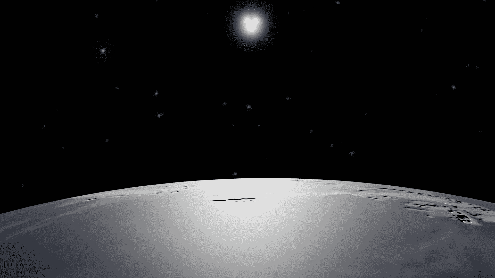
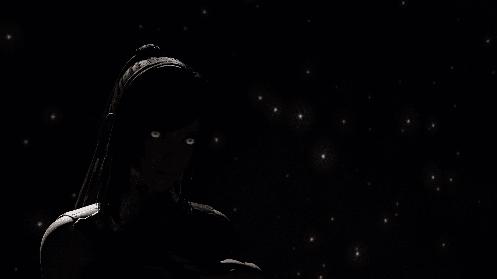
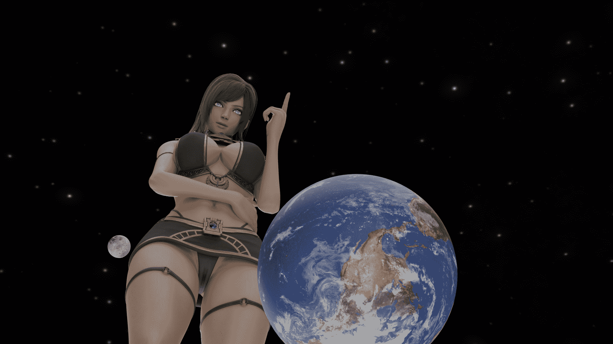
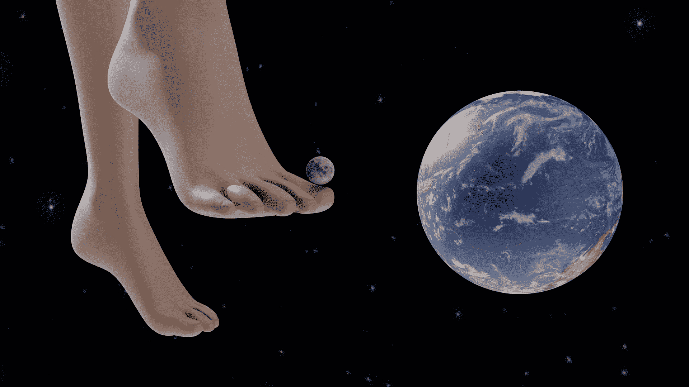
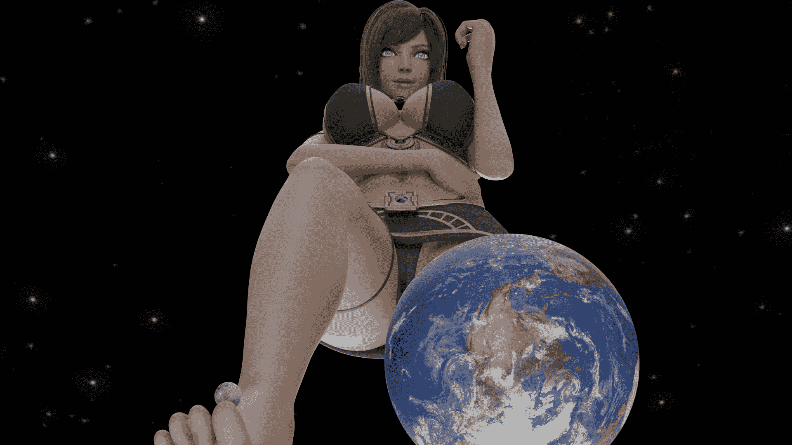
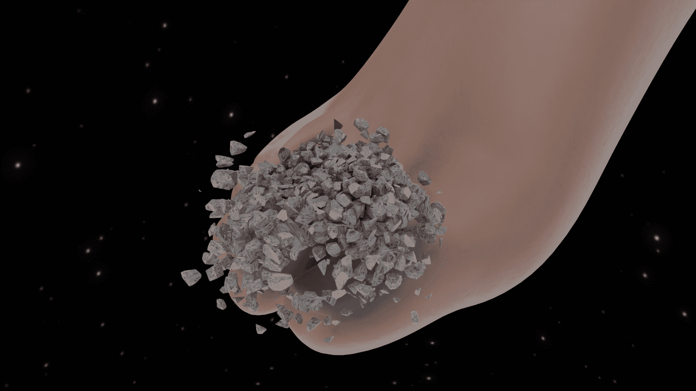
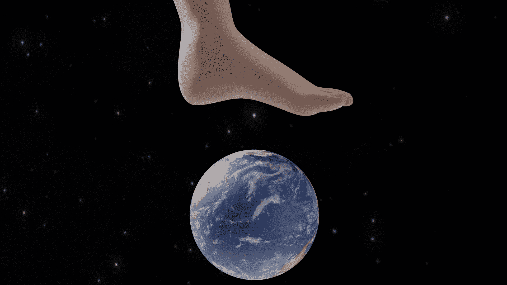
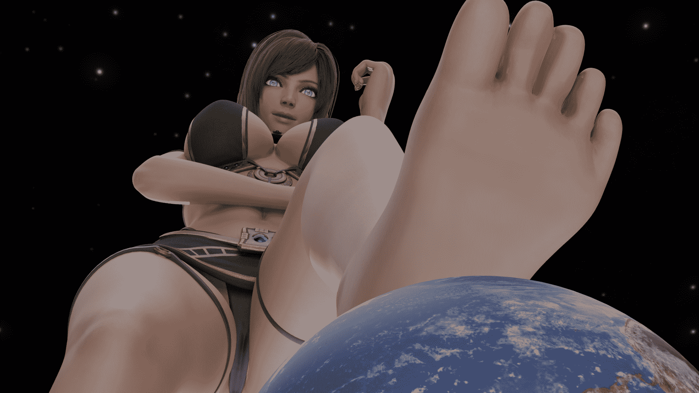
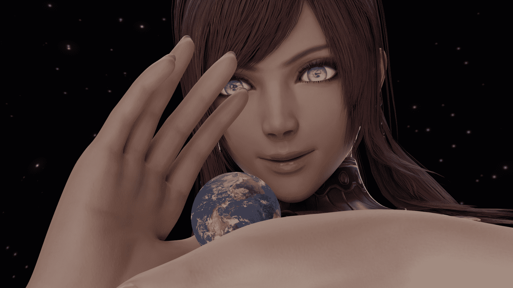
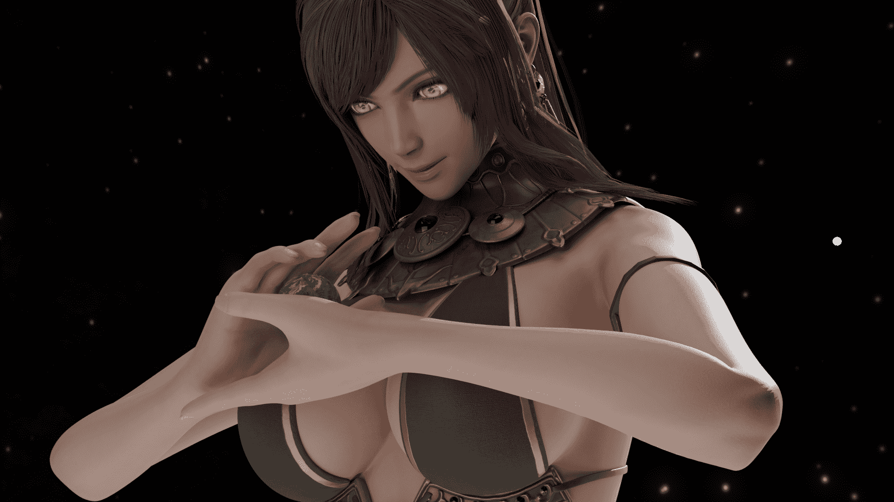

# 名为地球的自慰器（第一部分更新完毕）(有些许重口内容）

作者：mdzz233

TID：30927

 

# 1

*本帖最後由 mdzz233 於 2021-5-19 02:03 編輯*

大家吼啊，这里是MDZZ233。

之前在图片区说过我要整一个系列的图。这不，咕咕咕了好几天之后我终于来填坑了。

这次有较多的配图文，所以就来文章区发个文帖，在图片区就直接发图。想直接拿图的就去那里就好~

二楼开始为正文。

 

# 2

平行宇宙，银河系第二悬臂，太阳系，第三轨道上的行星

今天的太阳依然正常地升起落下，依附在名为“地球“的行星上的人类文明和其他繁荣的生命将很平常地度过这一天。

可真的会是这样吗？

 

# 3

<ignore_js_op>[1.png](forum.php?mod=attachment&aid=ODg4NTJ8MDYzMDNiMTh8MTYyNDY4OTc1NnwxODIzMHwzMDkyNw%3D%3D&nothumb=yes) *(1.74 MB, 下載次數: 1)*

[下載附件](forum.php?mod=attachment&aid=ODg4NTJ8MDYzMDNiMTh8MTYyNDY4OTc1NnwxODIzMHwzMDkyNw%3D%3D&nothumb=yes)

2021-5-19 01:56 上傳  

</ignore_js_op>  

# 4

如果光速是无限大的话，那么人类就会马上就会通过各种观测手段，观察到太阳系突然间有了一位不速之客。（当然，我们是记录者，自然能马上发现这个异常）至少得经过两百秒后，这个平行宇宙的人类才能发现他们的太阳被一个极其巨大的身影给遮挡了大半。

 

# 5

<ignore_js_op>[3.png](forum.php?mod=attachment&aid=ODg4NTN8ODk0MDUwNjF8MTYyNDY4OTc1NnwxODIzMHwzMDkyNw%3D%3D&nothumb=yes) *(1.72 MB, 下載次數: 1)*

[下載附件](forum.php?mod=attachment&aid=ODg4NTN8ODk0MDUwNjF8MTYyNDY4OTc1NnwxODIzMHwzMDkyNw%3D%3D&nothumb=yes)

2021-5-19 01:58 上傳  

</ignore_js_op>  

# 6

（拉近视角，接近这位不速之客）即使是在太阳的照耀之下，这位不速之客依然被黑暗所笼罩，可那散发着绿色光芒的双瞳，在这片黑暗中是如此引人注目。“哦？这样偏僻的地方都会有智慧生命？有趣。“动听的女声在我们每个记录者的心头上响起，这声音高贵却又摄人心魄，不禁让人为之神魂颠倒。“还是个和我同种族的文明？更有趣了呢~““唔，就不吃掉这个文明了，与其吃掉还不如拿回家当玩具~“

 

# 7

<ignore_js_op>[4.png](forum.php?mod=attachment&aid=ODg4NTV8NmEwNzdlODJ8MTYyNDY4OTc1NnwxODIzMHwzMDkyNw%3D%3D&nothumb=yes) *(1.94 MB, 下載次數: 1)*

[下載附件](forum.php?mod=attachment&aid=ODg4NTV8NmEwNzdlODJ8MTYyNDY4OTc1NnwxODIzMHwzMDkyNw%3D%3D&nothumb=yes)

2021-5-19 02:00 上傳  

</ignore_js_op>  

# 8

*本帖最後由 mdzz233 於 2021-5-19 12:25 編輯*

艹，第五张图和相应的文忘记发了，我会在最后面补上的，抱歉

“啪”的一声，光芒回来了，不过这光芒就像是从四面八方传来的，无法观察到光源，而且全球都是处在光芒的照耀之下。

处在地球向阳的那一边的人类，都看见了一位比他们的行星还要巨大许多的女性。

高贵，美丽，却又无比魅惑——这是每个看到这位女性的人类的共同感受。

“那么先自我介绍一下。”

“我是阿尔克斯，世界的创造者与主宰者。”

“用你们的话来讲，我是创造并统治无数平行宇宙的女神。”

霎时间，所有人类都停下手边的活，都震惊于此番话的意思与背后意义。

“您的意思是，您便是创造我们的造物主？”数秒后，当绝大部分人类还在处于震惊之中时，就有一些人类中的精英问出了这个问题。

“说是创造你们，并不是很准确。”自称女神的生命体顿了顿，“我并没有对你们这个宇宙进行过干预，你们这个物种的诞生纯粹是巧合。”

“毕竟我也懒得去把注意力放在我花园的某个角落里的某个宇宙中的事情。不过也太巧了吧，你们这个物种的特征几乎和我一模一样，区别只在于你们天生不具有创造法则的能力。”

“您真的是神吗？”

“你们怎么会问出这么蠢的问题，”女神被逗乐了，“亏你们还发展到这种程度的文明。”

“既然要质疑的话，那我也得好好证明一下我究竟是不是神呢。嘛，代价自负哦。”

 

# 9

<ignore_js_op>[6.png](forum.php?mod=attachment&aid=ODg4NTd8MTAzMTE2NmV8MTYyNDY4OTc1NnwxODIzMHwzMDkyNw%3D%3D&nothumb=yes) *(2.43 MB, 下載次數: 2)*

[下載附件](forum.php?mod=attachment&aid=ODg4NTd8MTAzMTE2NmV8MTYyNDY4OTc1NnwxODIzMHwzMDkyNw%3D%3D&nothumb=yes)

2021-5-19 09:57 上傳  

</ignore_js_op>  

# 10

女神抬起右脚，直到她的大脚趾出现在月球下方才停下来。

当太阳正常地照耀大地时，人们在天空的参照物便是太阳。当太阳“消失不见”时，月亮便取而代之。

在那只脚移动的过程中，处在海边的人们会发现海浪有些异常：浪峰越来越高。这是女神的右脚所带来的巨大潮汐力的影响。

当那只脚停下来时，人们惊恐地发现，月亮仅比那大脚趾大一点点而已。

“你们的卫星好像有点小呢，就只比我的脚指头大一些而已。”

“嘛，对我来说都差不多啦。依照我原本的体型，你们这个宇宙还没我的一个细胞大呢。”

“那么，你们就跟你们的卫星好好说再见吧。”

 

# 11

<ignore_js_op>[7.png](forum.php?mod=attachment&aid=ODg4NTh8Mzg4ZTI3Y2R8MTYyNDY4OTc1NnwxODIzMHwzMDkyNw%3D%3D&nothumb=yes) *(2.29 MB, 下載次數: 1)*

[下載附件](forum.php?mod=attachment&aid=ODg4NTh8Mzg4ZTI3Y2R8MTYyNDY4OTc1NnwxODIzMHwzMDkyNw%3D%3D&nothumb=yes)

2021-5-19 10:00 上傳  

</ignore_js_op> <ignore_js_op>[8.png](forum.php?mod=attachment&aid=ODg4NTl8OGJlNTgxZTh8MTYyNDY4OTc1NnwxODIzMHwzMDkyNw%3D%3D&nothumb=yes) *(2.4 MB, 下載次數: 1)*

[下載附件](forum.php?mod=attachment&aid=ODg4NTl8OGJlNTgxZTh8MTYyNDY4OTc1NnwxODIzMHwzMDkyNw%3D%3D&nothumb=yes)

2021-5-19 10:00 上傳  

</ignore_js_op>  

# 12

一瞬间，月亮就撞在了那晶莹剔透的脚指甲上。月亮马上就四下分裂开来，变成了一块块碎片。

那些碎片随便找一颗砸下来，人类就得灭亡。

如果……如果那个脚指头……是朝着我们移动的话……

“那你们就得全死在我的脚指头下呢。”

女神笑了笑。

人类深深地意识到自己的渺小，同时也认识到了这个女神的强大。

 

# 13

<ignore_js_op>[9.png](forum.php?mod=attachment&aid=ODg4NjB8MDRhOWIyYjR8MTYyNDY4OTc1NnwxODIzMHwzMDkyNw%3D%3D&nothumb=yes) *(2.22 MB, 下載次數: 5)*

[下載附件](forum.php?mod=attachment&aid=ODg4NjB8MDRhOWIyYjR8MTYyNDY4OTc1NnwxODIzMHwzMDkyNw%3D%3D&nothumb=yes)

2021-5-19 10:05 上傳  

</ignore_js_op> <ignore_js_op>[10.png](forum.php?mod=attachment&aid=ODg4NjF8YTRjMGViM2R8MTYyNDY4OTc1NnwxODIzMHwzMDkyNw%3D%3D&nothumb=yes) *(2.35 MB, 下載次數: 1)*

[下載附件](forum.php?mod=attachment&aid=ODg4NjF8YTRjMGViM2R8MTYyNDY4OTc1NnwxODIzMHwzMDkyNw%3D%3D&nothumb=yes)

2021-5-19 10:06 上傳  

</ignore_js_op>  

# 14

注意！重口味！请谨慎选择观看！

“看来你们都明白了呢。那好，我就不继续吓你们了。”

话音一落，那些碎片便消失不见了，就像是那个卫星本就不存在一样。

“您，您来这里是为了什么？”人类继续问。

“我原本是想找点吃的，结果遇到了你们。”

“吃的？”

“就像你们的三餐一样，我也得摄入能量，得保持平衡。”

“我的身体无时无刻都在创造宇宙。所谓的呼吸，进食睡觉，甚至是排泄，都会产生大量的宇宙，也消耗着大量的能量。我必须得回收足够的宇宙来摄入能量。”

“回收宇宙……您的意思是您把宇宙当做食物吗？”

“没错。既然是我创造的东西，那自然我也可以回收。”

“哦，对了。你们所说的‘宇宙热寂’，其实就是我消化某个宇宙时，那个宇宙快速减少暗物质与能量的所产生的结果。并不是因为宇宙的膨胀哦。”

听到如此惊人的言论，所有的天文物理学家还有天文爱好者感觉这话无比荒谬。

但又不能不当真。

“你们中有人在想奇怪的事情呢，”女神皱了皱眉，“明明你们不会接受的，却偏偏总要好奇。”

“是，我也会拿那些由于我的排泄活动所产生的宇宙来进食。不过是间接的进食。”

“本质上都是来源于我身体内部的能量，不过是形式不同罢了。有很多宇宙随着我的尿液被我从尿道口一同排出，更多的宇宙会被困在我粪便的缝隙里，被我排出，虽然相当一部分宇宙还没出现恒星就被夹碎了。”

“虽说我会进食这些宇宙，但我其实是会先把这些排泄物连同那些宇宙放到我的花园里，排泄物当做肥料供给一些类似于你们所说的蔬菜的能量储存器。”

“这些宇宙不会被当做能量吸收，而那些排泄物会有一部分形成一些宇宙。”

“我自己要进食时，则会吃上一些‘蔬菜’。”

“其实也不算很奇怪，你们也是这样做的呢。”

花园……蔬菜……肥料……

有些人注意到了什么。

“说了你们别好奇这好奇那的，往往你们这些文明发达到一定程度时，好奇心总会膨胀地很大，知道真相之后又不肯接受。”

“我们这个宇宙的起源，真的是那样的吗？”

“八九不离十吧，至于是粪便还是尿液，你们自己猜吧。”

所有明白了的人，无一例外地疯了：自己的起源，怎么可以是源于一个女性的排泄物！

“诶，咱还没说正事呢，别就这样疯了。”

说完，那些疯了的人类突然变得正常了。

 

# 15

“我原本是想着来这里找点零食吃的，就吃点比较高级的文明的星球。”

“但我遇见了你们，我很惊讶会有和我如此相似的种族，于是我决定不吃你们，把你们当做玩具。”

“玩具？为什么要把我们当做你的玩具？”

“嗯？要问为什么？这还需要问为什么吗？”

“当然需要！我们可不想就这样随意被人决定命运。”

“看来你们的反抗情绪挺高的嘛。明明可以无忧无虑地生活，只需要被我当做玩具来玩弄，死了可以复活，可使用的能量也无穷无尽。”

“可为什么，你们这些蝼蚁就总是要反抗我呢？！”

就像是变了个人一样，女神突然变得冷酷无情，怒火在话语间燃烧。

女神抬起左脚，悬在地球的北极上空。

 

# 16

<ignore_js_op>[11.png](forum.php?mod=attachment&aid=ODg4NjJ8ODc5MjYwMDR8MTYyNDY4OTc1NnwxODIzMHwzMDkyNw%3D%3D&nothumb=yes) *(2.08 MB, 下載次數: 1)*

[下載附件](forum.php?mod=attachment&aid=ODg4NjJ8ODc5MjYwMDR8MTYyNDY4OTc1NnwxODIzMHwzMDkyNw%3D%3D&nothumb=yes)

2021-5-19 12:17 上傳  

</ignore_js_op>  

# 17

“真的很想一脚踩死你们这些蝼蚁，让你们永远无法复活。可我不能这么做，那样太便宜你们了。”

 

# 18

<ignore_js_op>[12.png](forum.php?mod=attachment&aid=ODg4NjN8ZGIxNzZiZWN8MTYyNDY4OTc1NnwxODIzMHwzMDkyNw%3D%3D&nothumb=yes) *(2.46 MB, 下載次數: 1)*

[下載附件](forum.php?mod=attachment&aid=ODg4NjN8ZGIxNzZiZWN8MTYyNDY4OTc1NnwxODIzMHwzMDkyNw%3D%3D&nothumb=yes)

2021-5-19 12:19 上傳  

</ignore_js_op>  

# 19

“算了，没必要为你们这帮蝼蚁生气。反正本来就打算不考虑你们的感受的。”

话音一落，女神变得更大了一些。

此时人类发现北极上空的那只脚不见了，取而代之的是一只远比那脚要大的手掌。

“你们就先好好地睡上一觉，做好成为我玩具的准备。”

“不过其实也没啥可以准备的，毕竟你们是要被我蹂躏的东西，又能做什么呢？”

 

# 20

<ignore_js_op>[13.png](forum.php?mod=attachment&aid=ODg4Nzh8MDFhOWE4OWV8MTYyNDY4OTgwOXwxODIzMHwzMDkyNw%3D%3D&nothumb=yes) *(2.61 MB, 下載次數: 1)*

[下載附件](forum.php?mod=attachment&aid=ODg4Nzh8MDFhOWE4OWV8MTYyNDY4OTgwOXwxODIzMHwzMDkyNw%3D%3D&nothumb=yes)

2021-5-22 01:00 上傳  

</ignore_js_op>  

# 21

“那么，晚安咯~”

说完，女神合上了双手。

 

# 22

<ignore_js_op>[14.png](forum.php?mod=attachment&aid=ODg4Nzl8YTYzNTk3ZTR8MTYyNDY4OTgwOXwxODIzMHwzMDkyNw%3D%3D&nothumb=yes) *(2.54 MB, 下載次數: 1)*

[下載附件](forum.php?mod=attachment&aid=ODg4Nzl8YTYzNTk3ZTR8MTYyNDY4OTgwOXwxODIzMHwzMDkyNw%3D%3D&nothumb=yes)

2021-5-22 01:02 上傳  

</ignore_js_op>  

# 23

……

……

……

“看够了没？记录完了就跟我回去。”

女神把手掌合上后，便看向了某处地方。

“是，女神大人。”

完。

——————

拖了几天，终于更新完了（第五张待会发）

挺不容易的，花了几个晚上k人物动作，摆镜头，再花两个晚上写文……要不是作图技术不行，我就不应该选择文配图的方式说故事了

稍稍预告一下（又挖坑是吧），估计会有三个（或者四个部分），现在才到第一部分，完结还早（意思是会咕咕咕很久）

嘛，如果期待的话，就留个言吧，这对我来说是继续填坑的动力

最后，谢谢您的观看与支持~