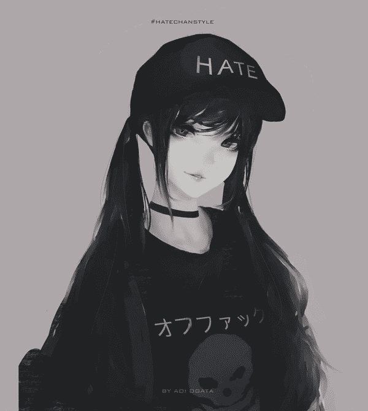
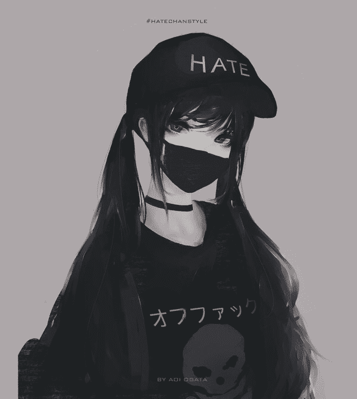

# 战争掠夺 （千倍、剧情、微小城市）8／21 更新第十一章

作者：lanbo

TID：25221

<title>1</title> <link href="../Styles/Style.css" type="text/css" rel="stylesheet">

# 1

*本帖最後由 lanbo 於 2018-8-21 03:14 編輯*

其实已经是老文了，之前发在贴吧里随着贴吧一起gg了，那就一次性把之前所有章节先发一下好了

一如既往地不知道这次会不会坑掉

歆瑶人设

<title>2</title> <link href="../Styles/Style.css" type="text/css" rel="stylesheet">

# 2

 <ignore_js_op>[IMG_6517.JPG](forum.php?mod=attachment&aid=NzI2MTR8NjExMTY3YzR8MTYyNDY5MTU5M3wxODIzMHwyNTIyMQ%3D%3D&nothumb=yes) *(45.83 KB, 下載次數: 22)*

[下載附件](forum.php?mod=attachment&aid=NzI2MTR8NjExMTY3YzR8MTYyNDY5MTU5M3wxODIzMHwyNTIyMQ%3D%3D&nothumb=yes)

2018-5-29 01:43 上傳  

</ignore_js_op> <ignore_js_op>[IMG_6518.JPG](forum.php?mod=attachment&aid=NzI2MTV8MzgzOWU0NTR8MTYyNDY5MTU5M3wxODIzMHwyNTIyMQ%3D%3D&nothumb=yes) *(44.78 KB, 下載次數: 13)*

[下載附件](forum.php?mod=attachment&aid=NzI2MTV8MzgzOWU0NTR8MTYyNDY5MTU5M3wxODIzMHwyNTIyMQ%3D%3D&nothumb=yes)

2018-5-29 01:43 上傳  

</ignore_js_op> <ignore_js_op>[IMG_6519.JPG](forum.php?mod=attachment&aid=NzI2MTZ8OGQzMWJiZjl8MTYyNDY5MTU5M3wxODIzMHwyNTIyMQ%3D%3D&nothumb=yes) *(45.25 KB, 下載次數: 14)*

[下載附件](forum.php?mod=attachment&aid=NzI2MTZ8OGQzMWJiZjl8MTYyNDY5MTU5M3wxODIzMHwyNTIyMQ%3D%3D&nothumb=yes)

2018-5-29 01:43 上傳  

</ignore_js_op> <title>3</title> <link href="../Styles/Style.css" type="text/css" rel="stylesheet">

# 3

第一章

共和国与联邦政府的全面战争至今已持续了十年，作为总共占据全球接近90%人口的两个超级大国，它们之间的全面战争所带来的后果不言而喻。

当战争进行到第五年时，战线局势便从双方均势变成了共和国的全面优势。依靠着军事技术的领先以及战场上各种优秀的统帅，双方战损比从一开始的一比一，慢慢变成了一比二，一比三…直到后来，联邦政府的征兵制度不得不变得严苛起来，从志愿兵，到增大招兵，直到最后讲几乎所有成年男性都纳入招兵的范围中，但挡不住共和国军队的前进。由于武器的落后，征来的士兵再多也只是白白增加伤亡数字，实在无法与强大的共和国抗衡。

到了第九年，共和国终于占领了联邦政府的首都，只留下街道上满满堆积的联邦政府士兵的尸体。也许他们曾是某位女士的丈夫，也许他的儿子还在家中焦急等待着父亲的归来。但此时，它只是倒在满是发黑的血水和泥土上的一具尸体。

一年后，联邦政府选择投降，大部分军队回到祖国，但仍有几个省份不认可投降协议，拒绝纳入进共和国的版图。在这些顽固抵抗的省份居民即将被前来镇压的共和国军队屠杀殆尽时，其中一个省份撕毁了核禁止协议，将在这个省份控制下仅存的一枚核弹对准共和国首都发射。然而这早已被共和国料到，尽管在战争期间联邦政府一直遵守着这一协定没有使用过核武器，但共和国依然准备好了核反制措施。在核导弹刚刚飞入共和国边境，还在太空时便与另一枚来自共和国的拦截导弹击中，由于拦截的时机很好，两枚核弹引发的爆炸并没有波及到共和国居民。

正当共和国总指挥处正庆祝着这次成功拦截并商量如何处理发射这枚核弹的那个省份上的居民时，被宇宙射线影响到的辐射尘埃缓缓落了下来。紧接着，谁也想不到的事情发生了。几分钟后，共和国全境所在的那块陆地从原本的直径三千公里缩小到只有三公里，而陆地上的一切也随之变小。

一瞬间，形势发生了惊天逆转。

联合政府在注意到这个异变后，立刻重新组织人民将自己国土夺了回来。本来就只有一小部分的共和国军队仍留住联邦政府的土地上维稳，在失去了后援后，短短的几天就已经败得溃不成军。最终，所有的士兵沦为战俘，尽数被关押起来。

而被缩小的大陆也很快被联邦政府的卫星发现，数十亿共和国居民则被以’’保护’’的名义按批次地运往联邦政府: 通常是将整块城市连同其地下土地一起挖走，如同移动盆栽那样。

但其实，谁都知道，饱受共和国军队摧残的联邦政府人民会怎样处理这些如同微生物般渺小的敌人。

一开始，人们还保留着对这些体型渺小的同类以基本的尊重，杀戮共和国平民也被看成违法行为。但短短几个月，共和国的城镇便可以合法在部分商店出售了，而这数十亿曾经的同类，也慢慢沦为了商品。

<title>4</title> <link href="../Styles/Style.css" type="text/css" rel="stylesheet">

# 4

第二章

歆瑶走进一间商铺，货柜上摆满各式各样的杂货，但她似乎并不怎么感兴趣，径直走向这间屋子更深处的地方。

推门，又是间商铺样的小屋，但这次，柜台上摆的却是一个个透明立方体。走近一看，一个个方形里却是比例极小的山脉与森林，似乎还能看见零星的乡村小镇。

还没等歆瑶来得及认真观察这些立方体，收银台上的一声怒吼引得整间屋子的人注意。

＂死吧！！都去死吧！’’

一位青年女性将刚刚购买的共和国城镇连同容纳它的透明立方体直接摔碎在自己面前，再发疯一般用脚剁碎那些本以破碎不堪的城镇。

‘把我的老公还给我！’

随后，她缓缓跪了下来，靠在身后的柜台上哭泣。旁边的服务员小妹也一脸同情，但也想不到什么可以安慰她的办法，只好默默打扫脚边这团泥土与房屋建筑的混合物。

也许废墟中还有些许

幸存下来的平民，但服务员似乎早已对这样的情形司空见惯，直接无情地将整个废墟残渣扫进簸箕里。

歆瑶虽然早就听说过这种报复性地屠戮共和国居民时有发生，但亲眼看到这一切还是觉得有些恐怖，身体不由自主向后退了一小步。

这不经意的一小退，却撞到了其身后的一座售卖品城市。这小小的倾斜引发了在缩小人看来如天灾般的晃动。不过幸好歆瑶及时站稳了身子，对居民造成的影响只是有些眩晕的感觉罢了。

少女立刻转过头用立方体上方附带的放大镜仔细观察面前的袖珍城市，似乎是在确认了刚刚没有造成什么破坏后才轻轻舒了口气。

不过同时，歆瑶注意到了一个有意思的现象，本来很松散的城市区现在却在街道上挤满了人们，一个个也都在抬头望着拿着放大镜的歆瑶。人群骚乱的样子看上去绝不仅仅是因为刚刚的晃动。

‘你们，是不是都看到刚刚那里发生的事情了。’

歆瑶说着指了指收银柜台前那片已经被打扫大半的城镇残骸。

顺着少女手指看过去的人们又不禁打了个冷颤，毕竟刚刚那种事情几乎是每个共和国居民的梦魇。作为商品的他们，还能想到的最为恐惧的事情应该就是沦为更可悲的消耗品了吧，尤其是…一次性的那种。

紧贴着玻璃的手掌在小人们看来比自己居住的小镇都要宽广，而少女慢慢微咪的双眼更让居民们紧张到冒汗。

少女似乎很满意面前这个商品，轻轻抱着它走向柜台。

<title>5</title> <link href="../Styles/Style.css" type="text/css" rel="stylesheet">

# 5

第三章

回到家中的歆瑶小心翼翼地把商品城市放到桌上，低头认真观察它。

‘好神奇…就像是在看卫星地图一样。’

歆瑶看着面前微缩模型般的都市，一时间竟不知道该做些什么，意识到此时有数万人的目光注视着自己，少女甚至还有些不好意思。

‘喂…都不许看我！’ 歆瑶冲着底下的人群命令着，不过自己很快就意识到刚刚这句话的可笑。

‘哎…算了算了，反正也管不了你们。’

少女一脸不悦，但其实只是在懊悔自己一时冲动就买下了他们，毕竟当时只是有些好奇这类事物，而自己真正得到后，反而不那么兴奋了，只是觉得自己家里瞬间多了好多好多人，隐私都没了。

‘不过既然买下了你们，也不能浪费呀，来让我好好看看你们。’

说着歆瑶把身体凑近，手也伸进城镇中，想知道这些小小的建筑摸起来是什么感觉。于是食指慢慢挪到一栋高楼上空，轻轻的点了一下。

但是由于楼房实在太小，歆瑶的食指往前多伸了那么几毫米，在那微小的触感传来时，少女也感受到了它的脆弱。整幢楼房以奇怪的角度向旁边倾斜，只坚持了一小会就导致了整个结构的崩塌。

楼房倒下的同时，破碎的残骸还压垮了周围的建筑，倒下时产生的滚滚浓烟向周围席卷，所有居民都听到了轰隆隆的巨响。

除了歆瑶，这一切的罪魁祸首。

‘碎掉了！’

似乎是不敢相信指尖下的高楼如此脆弱，可以容数千人的大厦竟然一碰就碎了。

‘等等，我刚刚是不是…杀人了？’

后知后觉的少女才意识到这件事，歆瑶立刻拿起放大镜观察起这堆看不出原本样子的残骸

可惜哪怕凭借放大镜也无法看清残骸上是否有人类尸体，不知道是之前在这栋建筑里的人已经被废墟掩埋，还是说尸体已经不成人形。

少女也注意到之前还在街道上聚集是居民此时也都消失不见，应该是在刚刚听到声响后都躲在了屋里吧。

而明明是第一次做出杀人这种事情的歆瑶也没有太多的负罪感，反而是对这些人类此时只知道躲在屋里的这种做法感到可笑…毕竟再怎么躲，也逃不出这个立方体的呀。

突然，废墟中一个缓缓蠕动的身影引起歆瑶注意。虽然还是看不太清，但大概能看出是一个被掩埋一半身子的人在呼救。

歆瑶想试着用指甲将掩埋在这个人身上的混凝土挑走，但当她在放大镜中看到自己的指甲和小人的大小差时，便意识到如果真的尝试一下也许直接就把这个可怜的人碾死了。

‘嗯…你们就没有人来试着救一下这里的人吗？干嘛都躲起来。’  

明明如果我真想做什么你们躲起来也不会有任何用处的呀… 歆瑶这样想着，却忍住没有说。

在少女略带命令的口气下，终于有人出来了。在第一个人带头下，越来越多的人开始实施救援。看着小黑点们听从指令慢慢聚集在废墟周围进行着微小的救援工作时，一丝得意的满足感在歆瑶心头产生。

‘乖，要听话哦。’ 歆瑶一脸笑意，却忽视了她刚刚这一个小举动已将数十条生命剥夺这一事实，而刚刚那第一个出来救援的人，其实是因为他的女朋友恰巧就住在这栋建筑，而他刚刚目睹的一切几近让他崩溃，但歆瑶却对这些一无所知。

‘尽管这么想不太好，但这真的有种养宠物的感觉诶。’ 少女想道。

‘诶…说到这个，你们平时吃什么呀。’

少女这才发现立方体在自己右手一侧有一块小区域堆满了密密麻麻碎屑般的物体，细一看，原来是堆积的居民日用品，由于实在太小歆瑶只能模模糊糊辨认出一些麻袋装的大米，剩下一些看上去像是一些包装好的零食。其两侧也有深坑，有一个盛放着几乎见了底的淡水，其余坑位全部是空着的。

‘喔喔对，说明书。’ 歆瑶突然想起当时购买时附赠的一本小册子，封面写着: 缩小城市运作与管理

按照册子上所写，盛放水的地方供应自家自来水就好，而食物的那一边则建议投喂专为缩小居民供应的食物，也就是那些看上去同样是残余的共和国生产出来的按比例缩小的食物。而其他空槽位则是用来放置非生活必需品的位置，只是用作改善小人生活，如电力，汽油天然气什么的，

‘噫…还得专门给你们买，好麻烦。’ 读到这里，歆瑶一脸嫌弃地盯着人们，但还是顺手用杯子接了一小杯水倒进见底的淡水槽内。<title>6</title> <link href="../Styles/Style.css" type="text/css" rel="stylesheet">

# 6

第四章

水流从天上倾斜下来，如瀑布一般，迅速灌满了整个城市赖以生存的水库。

而容纳这涛涛洪水的，仅仅只是少女日常用的小茶杯。桌面上斜摆着的巨大杯盖足足能盛放五六条街区，却转眼被歆瑶一只手轻松提了起来。

许多还在废墟中寻找亲人的居民们亲眼目睹了歆瑶所展现的实力差距后，也只能悲哀地叹一口气。

‘陈刚，别找了，没准小倩刚刚已经逃出来了呢。’ 一个中年人安慰着之前那位在废墟中寻找自己女友的男子。虽然这句安慰显得十分虚假，毕竟那栋楼房早已彻底破碎成建筑废渣。

而陈刚却像是没有听见一样，继续拼命地向外扒着混凝土块，一点不顾满手的伤痕。

走近一看，才发现男子的身体早已开始颤抖，双眼也紧闭着，努力地不让泪水留下来。

没有人敢接近男子，也无人再愿意安慰，只留下他继续进行着无谓的挖掘。

远处传来少女的轻哼声，人们隔着玻璃看到歆瑶一边津津有味阅读着说明书，一边悠然哼着小曲。仔细一听会发现这首歌曲却是多年前共和国的一名音乐家创作，也不知道此时这位音乐家境况如何。虽说大部分共和国俘虏都被无差别地对待，但还是有极少数名人被特殊处理，而拍卖则是最主要的手段。

突然，少女的手伸向城市底部摸索着什么，轻微的触摸所产生的震动让居民们心中一惊。

‘咦？原来这里还有信号屏蔽器呀。’ 歆瑶顺着说明书上的图示摸到城市下方的一个用来隔绝整座城市的黑色仪器。出于尽可能减少不必要的麻烦考虑，大部分被售卖的城市都安装了信号屏蔽器，以阻绝小人们与外部世界的沟通。

‘不过…我倒是不在意这些啦，那我关掉好了。’ 说着，歆瑶按下仪器上的开关键。

‘嗯…’ 少女皱起眉，似乎想到什么烦心事。

’诶，对了 你们有…手机什么的吗？不过就算是有也应该是没电的…’ 想到这里，少女有些懊恼刚刚没有顺便买一些城市专用的电力装置回来。

‘嘛…算了，试一下，这是我的手机号哦，如果有什么人可以使用手机的话，就给我打个电话好嘛？’’

歆瑶说完这句话后，莫名一丝恶趣味的快感涌现上来，心中也开始期待着一会与这些小不点们的第一次对话。

不过似乎这座城市的电力确实所剩不多，隔了好久才有一通电话拨打进来。

看着手机上的来电显示，少女竟然还有一点紧张，也不知道一会要说什么。

‘喂…’ 歆瑶开始有些害羞，语气也十分轻柔。

‘喂。’ 电话里传来的是男性嗓音，只是语调有些低沉。

‘请问是…’ 歆瑶想了一下称呼，’小人先生吗？’

少女说完后立刻被刚刚自己说出的这个词逗笑，不过也只是微微抿嘴，心中还是觉得有点不好意思。

注意到话筒那边没有任何回应，歆瑶担心是不是刚刚自己的话语冒犯了对方。

‘啊…不好意思…’

‘没有关系，毕竟我们对你来说也只能算得上灰尘，对吗？’ 男子的语气十分平静，用词也让他自己显得有些卑微，但却让歆瑶感受到一股强烈的敌意。

‘我…’

还没等歆瑶说出来，电话那边传来更加冰冷的一句话。

‘你去死吧’

这样的回应着实吓了歆瑶一跳，毕竟她也没想到这些体型微小的居民敢这么对她说话。再加上歆瑶觉得自己从买下城市到现在也都是友善对待，比起那位直接踩烂整座城镇的女士，自己应该算得上是非常友好了吧。但现在却被这么骂了一通，歆瑶确实有些气不过。

‘喂，我是哪里惹你生气了吗？’

‘生气？你知道眼睁睁看着最喜欢的人死掉是什么感受吗？’ 男子终于绷不住神经，声线也变得颤抖。而歆瑶这时也猛地想起来刚刚自己贪玩的小动作，也意识到刚刚的那一次小触碰所带来的残忍后果。面对恨透自己的男子，少女有些惊慌失措。

‘对不起…’ 歆瑶知道这三个字起不到任何作用，但实在是不知道说别的什么好。

如歆瑶所预料的那样，男人听后变得更加愤怒，狠狠骂出几句脏话。

‘这样，我满足你一个小要求好不好，就当作是赔偿了。’

不知怎的，少女即使在听到男子这么激烈的反应后，依然没有什么过大的负罪感，只是单纯地觉得男子有点可怜罢了。

‘要求…’ 男子听到后，停下来刚刚的咒骂，开始考虑起来。

‘嗯…只要是我能办到的，什么都可以哦。’

‘把我放出去。’

‘诶…只是这样吗？’ 少女被这样一个简单的要求震惊，

’我同意了，不过，我需要知道你在哪，我才能把你放出来。’

男子听到后犹豫了一下，但是还是讲自己的位置说了出来。

‘噢…中心街道西侧的电影院…屋顶。’少女口中低声轻喃着男子说出的地名，在并不是很高的房顶上看到了男子，尽管从歆瑶的视角看到的，如同男子自嘲的比喻一样，只是一粒尘埃。

‘呐…你就这么信任我吗？’ 歆瑶轻眯双眼，凑近看着男子。

看着天空中死死盯着自己的巨大双眼，男子当然清楚歆瑶这句话什么意思，不过他也是做好了最坏的打算，才肯将自己的位置暴露出来的。

看着这粒’灰尘’完全没有被自己的威胁所动摇，少女在心中默默敬佩着男子的勇气。

歆瑶缓缓伸出右手小拇指，放到屋顶上，示意男子走上指甲。

男子看着眼前的庞然大物，意识到自己似乎连爬上少女指甲都有些费劲，但也只是犹豫了一下，便冲上前去努力地上了指甲。

少女将坐在自己指甲上的男子放上窗台，在电话里说道，

‘’如你所愿，你现在自由啦，接下来你想去哪我都不管你，不过劝你最好快点离开这个房间，不然一不小心…你可就白白浪费掉这自由的机会咯~’

‘哼…不用你管。’ 又是这么冰冷的回应，随后男子便挂断了电话。<title>7</title> <link href="../Styles/Style.css" type="text/css" rel="stylesheet">

# 7

第五章

通话虽然已经中断，把手机举在耳边的歆瑶依然盯着陈刚。也许是被刚刚男子不尊敬的语气所冒犯，又或许是对男子的遭遇感到惋惜与自责。但不论怎样，此时歆瑶已经没有办法再与男子对话，只能看着那微粒般的身影缓缓在窗台边卑微地蠕动。

在头顶巨大少女眼神的威压下，陈刚确实有些紧张。从边缘向下望去，映入眼帘的则是千米深渊。只是看上一眼就直让人腿软。而更令人绝望的是，矗立在这深渊中的两根巨柱，仅仅只是少女光洁匀称的双腿，站在如此骇人的高度上向前看去，却是歆瑶绑在腰间的上衣系带。

正当陈刚沉浸在这恐怖的对比中时，巨物突然移动了。注意到歆瑶已经对自己失去了兴趣，男子这才敢继续往前走，尝试着完成自己的计划。

‘如果你快饿死了，或者渴得不行的话，记得再给我打电话噢~’ 少女头也不回，用轻松的口气说道，’

‘如果我心情不错，会考虑再把你接回来的。’ 歆瑶这样说着，听上去似乎很怀疑这样一个小人在野外生存的能力。

走到微型城市边的少女心事重重地俯视着眼前，而刚刚的那通电话确实让歆瑶有些不舒服。

并不是因为知道自己刚刚真的杀了人而难受，毕竟在这样的体型差距下，任何动作都有可能带来伤亡，歆瑶对此也没有太多负罪感。但刚刚电话中的声音是那么清晰，话语中悲痛的情感又是那么真实，让歆瑶有了’这些人是同类’的感觉。

但当歆瑶把目光再次投向街道上的微小居民时，这种感觉又瞬间被冲淡。这些灰尘般大小的生物，就算是曾经和自己一样，现在也无法把他们继续当作人类看待。

整理了一下情绪，少女再次挂上之前轻松的笑容，笑咪咪地俯视众人。

‘总之，现在明确了你们的手机是有信号的，如果有什么重要的事情的话可以用手机告诉我哦，’ 歆瑶停顿了下，将头埋低，让自己的阴影更大范围地盖住城市中的居民。

’换言之，如果没有什么重要的事情，请不要来烦我，我可不想整天有几万通电话打进来，那样的话…’ 歆瑶右手举高，四指慢慢握拢成拳。’就只好，稍微减少一下人数了’

说完后，少女猛地抬起头，但无意间耷拉在城市街道中的头发卷起一阵尘埃。

‘啊…怎么了！’

歆瑶急忙检查一下刚刚被头发刮到的高楼，还好都没什么损伤，但至于伤没伤到人就不好说了。

想到这里，歆瑶又马上捋起头发，仔细观察有没有小人被挂在了上面。倒不是担心他们受伤。而是一想到自己头发里可能有小小的人类在里面到处乱动，挣扎，歆瑶就浑身起鸡皮疙瘩。

‘可恶啊…’ 少女粗略的检查一番后，心里还是有些不踏实。

‘算了算了，正好去洗个澡吧。’

歆瑶眉头微皱，一脸不悦地站起身，走向厕所准备彻底地清洗一下。

伴随着逐渐远去的脚步声，惊魂未定的人们这才敢松一口气。刚刚歆瑶头发剐蹭到的街道如同被清场般地空旷，一些座椅，废旧的广告牌消失不见，想必不是被发丝甩到远处，就是现在还留在歆瑶的头上吧。只是不知道，有没有活生生的人类也被卷了进去。

幸存下来的人们也不敢想象那些人接下来会遭遇什么，因为不管怎么想，这么挂在头上被歆瑶带进浴室冲洗掉和被宣判死刑没什么区别。

其实每一个居民在共和国因为被缩小而战败时就已经料想到了自己的结局，但哪怕已经被当做商品放在橱柜上出售，人们还是会留存一线希望，期盼自己的买主会是个善良温柔的人。但显然，刚刚歆瑶的一系列举动看上去并不像是很在乎他们的生死。而他们所能期盼的，只能是歆瑶不是个嗜杀之人。

‘咦，这是什么？’

人群中突然传来一阵阵惊呼声，凑近一看，原来是有人在刚刚连上网络的手机上看见了自己所在的房间，也就是歆瑶卧室的直播视频。

很快大家就明白了，原来这是刚刚被放出去的陈刚在窗台上录制的。一些人开始猜测也许是出于报复，他想直播歆瑶的私人生活来泄愤，又一些人认为他这是在记录可能出现的的残忍暴行，来引来一些人道主义支持者的愤慨，没准积攒一定程度的关注后他们就能得救。

在大家被这一消息鼓动得激动起来时，一名高中生模样的女生却开始紧张起来。确切地说，她正在进行激烈的思想斗争。

一面希望歆瑶卧室的直播视频悄无声息的持续着，可以引来关注从而大家都能得救，虽然希望渺茫，但也值得一试。一面又想告发这一行为，从而博取歆瑶的好感，这样一来至少可以保证自己的安全，只是城市里其他人就管不了了。

女生靠在墙边，紧握着自己的手机，实在难以做出决定。

虽然城市的食物来源由歆瑶提供得十分充足，但这个小小的社会依然存在着社会等级制度。一些人掌握着分配食物的权力，而大部分人只能依靠劳动获取。

年轻力壮的男子得到充足的食物其实并不费力，只需要每天参与到劳动活动中就好了，但作为一个年轻体弱又不想出卖身体的女子，这名女生只能忍着饥饿过日子。

作为少数还保留手机的居民，她拥有了改变以后生活的机会，但她依然不敢做出这个决定，因为她也不敢保证自己告发后，事情会如自己所希望地那样发展 ，而不是白白断送有可能逃出去的机会。

然而，接下来发生的事情让她彻底倒向了背叛。

‘快看，她有手机！’

女生身边路过了一群看上去就很流氓的男青年，发现了一名弱女子却拿着他们所想要的东西的时候，各个脸上都挂着不怀好意的笑。

女生也立刻感觉到了危险，瞬间向后跑了出去，几名男青年也紧跟着追上去。

在拐过好几个街区后，女生实在是没了力气，只好绝望地随便冲进一栋居民楼，找寻藏身之处。

所幸这栋楼房的地下室还算隐蔽，再加上追她的男青年也没有看到她到底是进了哪栋楼房，只好继续在周围搜寻。

女生拿起手机，向刚刚记下的歆瑶手机号慌乱地发送了短信: ‘ 有非常重要的事，但希望你可以保证我的安全我才会告诉你。’

‘该死，没有信号！’

女生这才发现在地下室中信号实在薄弱，但在她连续发了几次之后，终于成功的发送出去。

但女生依然不敢出门，只好躲在里面等待歆瑶回信。

半个小时后…

歆瑶终于从浴室走出来，右手拿着毛巾擦着自己湿漉漉的头发。

‘咦？’

歆瑶注意到了手机收到短信的提示，但拿起读完后，却抿嘴微微笑了。幸好女生没有看到歆瑶此时的表情，不然不知道会不会被吓得不敢继续发下去。

歆瑶拿起手机写道:’ 你是在和我提条件吗？那好，我跟你说…我可不能保证你的安全，那请问

你还想不想告诉我你那’重要的事’呢？’

女生收到短信后，心中一凉。但一想到就算歆瑶不打算保护自己，继续呆在这个地下室依然是不安全，索性，豁出去赌一把吧。

于是，女生还是在短信中透露了她卧室直播视频的事情，顺便也将地址发给了歆瑶。

看着发来的短信，歆瑶万万没有想到刚刚自己的一时好心会有这样的后果，点开视频后更是让歆瑶气得咬牙切齿。

但歆瑶还得保持刚刚微笑的表情，毕竟如果不继续装下去的话，接下来就…没有意思了。

呆在地下室的女生没有收到接下来的回信，也没有听到歆瑶对着城市说了什么话，实在是焦急万分，于是又发了一条短信。

‘求求你，能不能保护我的安全，如果实在不可以，请不要让大家知道有人告密。’

‘知道了.’ 终于，歆瑶的回信出现在了女生手机上，这短短的三个字让女生心里如受到女神关怀般的温暖。

顺着视频中直播的角度，歆瑶意识到陈刚肯定还在刚刚自己把他放在的那个窗台之上。

但歆瑶没有直接走过去寻找，看着直播间的人数越来越多人发送评论，她也悄悄发了条弹幕。

‘好想走近看看她啊。’

没想到的是，这一条弹幕竟然像是带起一波节奏一样，引得很多观众发了相似的评论。

‘镜头拉近！’ ‘ 离的近一点好不好啊！’ 等等弹幕疯狂出现，但这让陈刚也不知道怎么回应，只好向大家安抚道等以后找机会什么的。

但同时，直播中出现了诡异的画面，少女突然抬起头，目光看向镜头，盯着屏幕后的每一个观众，也盯着陈刚本人。

但少女其实并没有看清陈刚在哪里，毕竟隔着这么远看一粒沙子大小的东西，实在是太困难了。

但歆瑶还是站了起来，朝大致方向走了过去。<title>8</title> <link href="../Styles/Style.css" type="text/css" rel="stylesheet">

# 8

> [52gtss 發表於 2018-5-29 13:04](https://giantessnight.com/gnforum2012/forum.php?mod=redirect&goto=findpost&pid=376038&ptid=25221)

> 感觉设定有点奇怪，那么共和国和联邦以外的地区怎么样了，

设定就是世界上只有这两个国家！

<title>9</title> <link href="../Styles/Style.css" type="text/css" rel="stylesheet">

# 9

> [顺丰快递 發表於 2018-5-29 08:00](https://giantessnight.com/gnforum2012/forum.php?mod=redirect&goto=findpost&pid=376020&ptid=25221)

> 哇，又一次能见到楼主的文章实在是高兴至极

> 

> 楼主写的giga（mega）文总是能带给人一种无力和绝望 ...

QAQ谢谢，可是坑太多了都不知道从哪开始填起

 还是写新坑简单

但是！请问实用是什么意思！

<title>10</title> <link href="../Styles/Style.css" type="text/css" rel="stylesheet">

# 10

> [轩辕剑 發表於 2018-5-29 11:50](https://giantessnight.com/gnforum2012/forum.php?mod=redirect&goto=findpost&pid=376031&ptid=25221)

> 人设图是楼主自己画的吗？感觉好棒，有一种在哪里看见过的感觉……

不是我画的！！！

是在网上找到的一个风格很喜欢的绘画作品！

<title>11</title> <link href="../Styles/Style.css" type="text/css" rel="stylesheet">

# 11

第六章

其实，身体变小了的人类平时面对正常人类时反而会有一种安全感，这种安全感源自于自己体型太小而不被人注意，就像是隐身了一样。

而刚刚一直在直播的陈刚也有了一丝偷窥的快感，毕竟这种不被注意的感觉，还是很让人享受的。

但这种快感就在刚刚被终结了，歆瑶的脚步所带来的细微震动陈刚感受地清清楚楚。虽然之前每次歆瑶有什么动作小人都是有感觉的，大部分人早就习以为常。但这次，陈刚意识到，这震动的制造者，是完全冲着自己来的。

歆瑶不紧不慢的来到窗台，略微弯腰只为了看得更清楚。

虽然陈刚的身体比起窗台实在是太过渺小，但歆瑶还是通过他衣服的颜色发现了他。

‘小人先生，是你吗？’ 歆瑶冲着她找到的那粒’细沙’说着，同时离得更近一点，让陈刚感受着自己的呼吸所带来的空气流动。尽管以陈刚的体感角度，这完全如狂风般猛烈。

‘喏，满足了吗，终于能从近处看我了吧。’

看着歆瑶得意的笑容，陈刚也明白了歆瑶肯定已经看到了自己的直播。

少女如湖水般巨大的眼睛死死盯着自己，这么恐怖的威压让陈刚连逃跑的想法都没有。

其实到了这种地步，男子也没有什么好怕的了。想到自己也没什么好的下场，与其继续在这里被可怕的少女调戏羞辱，直到玩腻后将自己碾碎，不如直接一死了之结束掉这一切。

男子自嘲般的轻笑了下，本来就在窗台边缘的他立刻转身飞奔。

陈刚从窗边纵身一跃，他闭上眼睛，将双臂张开，感受着气流划过自己身体。自由落体所带来的失重感并没有让陈刚害怕，陈刚反倒有些享受这一瞬间的感觉。

但突然，撞击来的比想象中的快，而撞击的猛烈程度也远远不及男子预想的那样。

原来，是歆瑶将手掌拦在他坠落轨迹的下方，让陈钢狠狠摔在自己手心里。

还没等到着陆在少女手心中的陈刚缓过劲来，便又立刻感受到了强烈的失重。

歆瑶缓缓蹲下，将刚刚接住的陈刚放到了地面上。

少女双手搭在膝盖上面，冷冷地看着躺在地上喘气的陈刚。

‘哼…想自杀来解脱吗？’ 少女双眼微咪，继续说道，

‘来，自杀吧，看你现在还有什么办法可以杀掉自己呢？’

躺在地板上的男子绝望地环视周围，只能看到一望无际的木制地板，以及那双拥有着令人生畏的尺寸的粉色毛绒拖鞋。

感受到男子的手足无措，歆瑶得意地笑了笑。

紧接着，少女将搭在膝盖上的右手伸向男子，将拇指和食指轻轻压在男子头顶和脚边，作出要捏住男子的动作。

陈刚不知道少女是要将自己捏起还是碾碎，只好紧紧蜷缩身子，不知所措。

但歆瑶其实只是想向他展示一下自己和他的大小差异。

‘呐…不要害怕，这只是我的指尖噢’ 少女将食指提起，再次压在男子眼前，仰头看着十米高的粉红肉墙，墙壁边缘略有反光的指甲更是像古代斩头用的巨型闸刀，此时男子只希望它直接压在自己身上，来结束掉这一切恐惧。

‘小人先生，明白了吗？’ 少女轻轻用指甲在地面上叩着，轻叩所带来的震动与巨大声响让陈刚更加深刻地体会到少女一个指尖的威力。

‘快…快杀了我！’ 陈刚抱着头，绝望的喊道。

然而歆瑶哪里听得见陈刚说的话，她只能看到这个小小的身影蜷缩在一起，很痛苦的扭曲着。

‘快杀了我！’

这时，歆瑶开着直播的手机突然发出了陈刚的悲嚎，原来是陈刚在挣扎的过程中，不小心又开启了录制声音的选项。

‘好啦好啦，’ 少女用像是安慰小朋友的语气说道，‘满足你。’  

歆瑶站起身，本来就庞大的身形此时显得更加高大得不可思议。歆瑶的身躯刚好挡住了头顶的灯光，显得少女巨大的身影更加阴森恐怖。

‘各位观众朋友，’ 歆瑶对着脚底挥了挥手，微笑着说道，’直播…结束了哟’

少女眼神变得严厉起来，抬起穿着拖鞋的右脚，用脚尖吊着拖鞋悬在陈刚上方。

足以覆盖几个街区的重物被少女用脚尖就轻轻勾起，而由于悬挂得不稳定而上下摇晃的拖鞋更是不停折磨着陈刚。

看着眼前摇摇欲坠的巨物，犹如犯人行刑前头顶的闸刀一般令人胆颤。陈刚闭上眼，享受着生命的最后一刻。

‘小倩，我来找你了。’

终于，面前的巨物还是重重地砸了下来，虽然拖鞋是棉质的，但这样大的质量的坠落还是造成了不小的冲击，其引发的空气巨浪将陈刚掀翻。

‘什…什么…’ 连着翻了几个跟头的陈刚缓缓爬起，不敢相信自己还存活着。

不知是不是陈刚顺着直播放出的最后的那句话让少女心软，歆瑶最后一刻将脚微微一偏，让其没有砸在男子身上。

歆瑶又一次半蹲了下来，没有说话，只是将小拇指躺平在男子身旁，示意男子爬上去。陈刚犹豫了一下，但还是遵照指示爬了上去。尽管歆瑶已经将指甲紧紧贴在地面，这样的高度还是让男子爬了好一会才勉强登顶。

一想到刚刚那段不算简单的攀爬竟然只是在少女指甲厚度上进行，男子再次认识到了他们之间这可怕的差距。

还没等男子缓过劲，脚下踩着的地面猛的上升，强烈的风压使男子紧紧贴在歆瑶指甲上。

等再次停下时，陈刚又看到了和自己比例相同的物品和建筑，尽管这些和自己身前的纤细且有骨感的小拇指一比显得十分渺小。

‘自己下去。’ 歆瑶命令道。

在亲眼看到自己指缝里的小黑点走进被自己小拇指占满的街道后，歆瑶才小心翼翼地收回手。

看得出歆瑶还是努力克制着自己才忍住刚刚想抹杀掉这个男人的冲动，哪怕是在已经放生之后，少女还是缓缓做了一个深呼吸，神情才恢复正常。静静地看着街道上越来越多的小黑点围上刚刚陈刚所在的位置时，歆瑶突然想到一件事。

少女摸起手机，发送道:’ 你在哪？你现在很危险，是吗？’

仍躲在地下室里焦急等待的女生像是看到了最后一根救命稻草一样，快速地将自己的位置描述给歆瑶。

巨大的少女在城市上空搜寻着，就像是在地图上找地标建筑一样，终于找到了短信上描述的那栋小楼。

看着还不如自己指关节大小的小楼，内部的地下室想想可能都渺小到无法看清。但回想起这里面还藏着一个拼命求生，刚刚还帮过自己忙的小人，歆瑶还是开始思考起拯救她的办法。

‘呐…你想让我怎么保护你？’<title>12</title> <link href="../Styles/Style.css" type="text/css" rel="stylesheet">

# 12

第七章

歆瑶只是这样想道，却并没有说出口。

而躲在地下室里的女生此时已紧张万分，一是一直没有收到歆瑶的信息，而是她清清楚楚听到了楼道外的对话。

‘刚刚就是在这里拐过来后把她弄丢了是吧？’ 一个听上去就像是大哥的粗犷声音传来。

‘是是是…小飞跑的那么快，都没追上。’ 随之几个小弟低声附和道。

‘没追上个屁！她一个小姑娘家怎么可能跑的过我们，肯定是藏起来了！’

‘大哥说的是，那…那我们不能挨家挨户搜吧，不就一个手机嘛，也不至于费这么大劲吧。’

‘你懂个球，现在通网后，这玩意太特么重要了，估计这片城里已经没几个人有能用的手机了，能轻易放过她吗？再说了，我有经验，那个娘们肯定就在这条街道上藏着，你们给我从这条街一栋一栋找，我在外面盯着看有没有人出来。’

‘那…她要是进了别人屋子里藏着怎么办。’

小弟话音刚落，大哥立刻粗鲁地把他按在墙上，吼道:’’都这世道了，没几个人敢开门救一个不认识的小姑娘了，你给我把每一层楼的楼梯，天台给我扫一遍，绝对能找到。’

被摁在墙上的小弟只好点头答应，随手拍了拍身上的灰就带着其他人找那个女生了。

躲在地下室的女生心都快跳了出来，老大虽然没有提到要搜查地下室，但她知道一旦这些人没有找到，这个入口就在楼道外的地下室肯定会引起他们的怀疑的。

于是女生再次打字请求歆瑶的救助，并把自己的情况告知了歆瑶，随后女生急忙把身旁的橱柜慢慢挪到门前，想挡住门作为最后一道防线。可就在她费力挪动的同时，她感觉到门外有什么东西靠了上来。于是她小心翼翼，悄悄用眼睛朝门缝外望去。

然而，由于女生挪橱柜的动作停下了，造成的响动也随之停止，这一下子就引起了门外站着的男子的怀疑。

‘靠，我就知道在这里！’

女生此时已经完全沉不住气，当她看见门缝外那画满纹身的臂膀时，就发了疯一样地把周围一切可以搬来的东西都费力挪了过来，而门外的男子也立刻确认了自己心中的怀疑，开始用身体撞门。

就在女生几近崩溃时，上空传来歆瑶响亮的声音。

‘喂，这个楼房的人，请出来一下。’

歆瑶想了一下，接着说道:

‘给你们一分钟的时间出来，不然的话…会变成肉酱的呢’

说着，歆瑶用食指轻轻敲了敲楼房房顶，强烈的震动席卷整栋楼的居民，示意楼房里的人自己说的正是他们。

与此同时，女生收到了短信，上面写着让她在地下室里呆好不要出来。

男子感觉到这样的巧合有些不对劲，开始怀疑是不是歆瑶的举动和门内的女生有些关系，不过一想到就算有关系，歆瑶最多就只是把女生救走，自己也不过是丢失了个好机会罢了。而且如果真的只是歆瑶碰巧玩心大发，等下女生可能会因为在歆瑶的威胁下自己就慌忙跑出来，那自己岂不是爽歪歪。

于是，男子安心地跟着这些不知所措慌张跑下来的人群一起走出楼房。

‘五，四，三…’

歆瑶的倒数声加快了这些逃命人群的步伐，但直到倒数结束还是有陆陆续续的人在从门口跑出。

歆瑶倒也不急，慢慢等着这些人一点一点出来。有些人甚至背上还有脚印，应该是逃跑时其他人慌张的把倒地的人粗鲁地踏过造成的。

最后一个人出来后，歆瑶稍微等了一下，确认没有其他人后，便发送短信让女生也走出来。

门口熙熙攘攘的人群紧张地议论着，混入的流氓老大也装作这栋楼的住户和周围人胡扯着闲天。

歆瑶过了一会，便看到门口又出现了一个瘦弱的身影，略显拘束地向自己这里看着。

大概能猜到这个身影一定是刚刚向自己求救的人。

于是，歆瑶指着人群说道:’ 那么，刚刚威胁到你的人应该就在这里面吧，请你把他认出来吧。’

看到小小的人影没有动作，歆瑶抿嘴微笑，轻轻点了下头示意女生自己并没有在说笑。

这时候，歆瑶旁边的手机铃声突然响起，由于手机就放在城市旁边，巨大的声音震得人们一惊。

歆瑶看着不认识的号码打进，不耐烦地接起电话

‘喂…’

‘我…我认不出来，’ 电话那边传来一段虚弱的女声。

‘嗯？是你呀…’ 歆瑶斜眼瞟向楼房边焦急的人群，那个瘦弱的身影果然在做通话的动作。

‘嗯嗯..我就是刚刚..’’

‘我有说你可以给我打电话吗？’ 歆瑶冷冷地打断了女生的话。

刹那间，电话那边冰冷的声音让女生的心沉到了冰窖里。自己也突然意识到之前的行为有些不妥，明明如同主宰般的歆瑶答应救自己就已经算得上仁慈，而自己却有些得意忘形地开始随意就联系起歆瑶来，短信之前是一个接一个，而现在竟开始肆意打起电话来，甚至刚刚拨打电话连句简单的道谢都没有。

歆瑶刚刚用来指人群的手指现在仍悬在自己头上，从自己的视角看去只能看到食指的一小部分，但依然强大到可以轻易压碎高楼。

‘对…对不起！！！’ 女生立刻回道，音调高到听上去像是在尖叫。’我…现在就挂断！’

‘别，’ 歆瑶微微扶额，’就这样吧，既然已经接通就不必挂了，你刚刚是说你不也不知道是谁在抓你，对吧？’

‘嗯.. ‘

‘那没关系，’ 歆瑶伸出大拇指，朝人群上空放去，’反正他肯定在这里面，对吧？’

‘既然如此，那就请大家都不要动噢。’

‘不！不要！’

听到这里，人群中爆发阵阵呼喊，随着几个人带头奔逃，其余人也都跟着四散开来。人人都知道歆瑶那缓缓下落的手指即将要做什么，所以每个人都拼尽全力，希望可以侥幸逃脱。

歆瑶眉头微皱，脸上也充满不悦，就算是密密麻麻的人群已经散开，凭借着巨大的体型她也完全可以把这些不听话人们统统抹杀殆尽，但她却迟迟没有动手。

‘为什么这么不听话…’ 歆瑶并没有打算像人们猜测的那样，抱着宁肯错杀三千也不放过一个的态度来一下子碾死所有人，只是想让大家不要动，让那位女生走近一点一个一个找罢了。但此时人们显然已经慌乱无比，完全无视了歆瑶的命令，这一举动直接激怒了歆瑶。

歆瑶将手边的那栋居民已经全部逃出的楼房捏起，任其滚落在手心，变得支离破碎。

手掌猛地握成拳，手心的楼房也被强力挤压成水泥粉末，歆瑶慢慢把手放到人群上空，让建筑碎渣一点点的摔到逃跑的人们身上。即使水泥建筑已经被研磨得很细碎，但对于人们来说还是太大，歆瑶看上去灰尘大小的细沙砸在人身上还是有一定威力的，不少被砸中的人纷纷倒在了地上。

‘真后悔买下你们…’ 歆瑶一边歪头看着越来越多的人躺在地上痛苦地挣扎，一边叹气着说道:’一点都不好玩’

歆瑶此时内心颇感无趣，自己明明没有是让大家不要动，可这些人竟全部无视命令，被一个小小的动作就吓跑。虽然歆瑶知道人群之所以这么害怕，其实就是因为自己的那小小的威胁举动，但还是有些生气，她讨厌这种无法完全掌控的感觉。

歆瑶无法直接听见人群里爆发出的阵阵悲嚎，但仍可以通过话筒听见一些惨叫，以及女生明显紧张不安的喘气声。

看着这些倒地挣扎的人们，歆瑶对着女生说道，

‘嘛，算了，起码这样的话你应该也安全了，那我这应该算是坚守承诺了对吧。’

话筒里并没有传来回应，依旧是粗重的喘息声。想到女生可能是被眼前的画面吓到了，歆瑶便又凑近喊了女生一声。

‘喂’  

由于距离原因，歆瑶这次开口带来的温湿气流差点让瘦弱的女生摔倒。

‘啊…抱歉，能不能…请你再说一遍…’ 刚回国神来的女生显然是没有听见刚刚歆瑶说的话。

‘我说，’ 歆瑶故意没有远离，继续保持着这样的距离和女生交谈。’你现在安全了，我也算是完成我的承诺了吧。’

女生头顶的天空被两瓣朱唇完全遮挡，说话张嘴时露出的牙尖以这个大小显得十分可怖。本来歆瑶说话的声音就已经很大，再加上从这样的距离听到，女生捂住耳朵都快要被震聋。

‘谢…谢谢。’由于歆瑶刚刚洗完澡，头发是扎起来的，周围的建筑倒没有像之前那样被头发刮到，但女生周围的空气已经因歆瑶的呼吸而变得湿热起来，呆在这样的环境下着实有些难受，虽然这仅仅只是歆瑶简单的呼吸造成的。面对这种情况，女生说出几个字都十分艰难。

歆瑶听到后，露出一脸笑容，但依然没有离开，保持着之前的姿势。

感受到歆瑶的目光一直注视着自己，女生心头涌上一股不自在的滋味，引得她开始回想自己之前的说法是不是有哪里不妥。

突然，禁闭的双唇缓缓张开，口腔的深红色满满显露出来。巨大的舌尖伴随着时隐时现的虎牙逐渐向街道地面接近。

宽阔的街道甚至无法容纳一个舌尖的宽度，舌尖还没有抵达地面，就已经被两侧的建筑卡住，只要歆瑶稍稍用力，这两幢楼房即刻就会崩塌。

舌尖下的女生此时其实很想通过手机问歆瑶到底想做什么，至少…可以问问自己哪里做错了。但女生始终一句话都没有说，因为她知道…即使问了，也改变不了什么。

眼前如同天灾般的场面彻底震慑住了在场的所有人，女生跪坐在地上，抱紧着自己的身子。

听着话筒中慢慢加快的呼吸声，以及女生由于害怕实在憋不住的轻微惊叫，歆瑶内心无比愉悦。巨大少女上瘾一般地享受着面前小人因恐惧而产生的生理上的反应。

舌尖的尖锐触感慢慢消失，原来是唾液顺着屋顶蔓延到了整面侧壁。歆瑶也因此意识到自己似乎已经保持张嘴吐舌这个姿势已经很久了，于是在为自己这个动作感到愚蠢的同时立刻将舌头伸回，恢复正常的姿势。

端坐后一回想起刚刚那趴在桌上像小狗一样的动作，就感到一阵寒意。

‘嘶…果然还是像这样能亲耳听到才有意思么。’ 歆瑶看着手机，想起刚刚自己沉浸在电话那一边的女子喘息声，像是打开了新世界大门一般。<title>13</title> <link href="../Styles/Style.css" type="text/css" rel="stylesheet">

# 13

第八章

女生保持着紧握着手机姿势，一声也不敢吭。

她当然清楚歆瑶只是在玩弄讽刺她的卑微，但依然丝毫反抗也做不到。她唯一能做的，也只能是乖乖看着歆瑶展现自己的力量。

歆瑶坐起后，便不再关注自己了。女生这才意识到通话已经中止，看起来自己已经失去了歆瑶的保护，不过现在至少甩开了之前那些人的追捕，也算是得救了。

转过身看着那片被碎石砸在地上倒地不起的人们，女生心中一阵寒意，也不知道这些人会不会把错怪罪到自己头上。

女生想了一下，还是决定快快离开这个地方为妙。在没有和歆瑶保持联系的情况下，自己又变成了一个普通人，甚至由于力气较小的缘故，还不如一个普通人条件好。想到这里，女生才猛地从刚刚那，被歆瑶保护时无比的安全感中晃过神来，开始思考自己的下一顿饭该怎么解决，继续面对无奈的生活。

当然，前提是人们没有将陈刚计划的泄密和自己联系起来。

而歆瑶则回忆着刚刚女生清晰的惊恐声，突然想起自己之前在网上似乎见过类似的情景。

拿起手机经过一些搜索，歆瑶果然找到了一些以小人视角拍摄的’逃生’视频。视频基本上就是描述着缩小人类在城市中逃离主人追杀的视频实录。

抖动的镜头中记录着每一个人绝望的脸庞，而身后则不断传来建筑崩塌的响声。

视频的记录者或许是为了求救，又或许只是想记录下自己生命的最后的一段时间，让自己的生命消逝时还留下一丝痕迹，而不是像其他人那样，变成普通家庭桌面上不注意看都很难看见的一抹小红点。

但这样的镜头以歆瑶的角度观看却是一种享受，没有什么比这样的第一视角更能感受到自己的力量了，虽然只是相比缩小人的卑微体现出的力量。

除了以小人视角录的视频以外，也有以普通人角度俯视城市，与小人进行互动的视频。有展现主人爱心，记录如何细心照料，建设小城市的视频，也有展现出残忍暴虐，如何屠杀戏弄小人的视频。不过这些在歆瑶看来却没什么新意，实在不如以小人角度感受有意思。

‘噫…这种破坏城市什么的视频，真的有什么意思吗？’ 歆瑶观看着一名女性赤足揉碎着城市中街道，高楼的视频，觉得有些莫名其妙。

‘跟玩玩具一样，看上去好无聊啊…’ 歆瑶想着，又看了一眼身旁的城市。

‘等等，该不会是…给你们这些人看的吧。’  歆瑶联系起她自己对小人视角的新奇影片的偏好，猜测这样的暴力破坏视频可能是满足一些缩小人的猎奇心理？

歆瑶不再多想，毕竟她也对这样的心理不感兴趣，继续浏览一下视频网站上的其他影片。

台灯照在城市四周玻璃上，折射出几缕被弯曲的光弧，映照在城市中的建筑。勾勒出歆瑶头部轮廓的阴影笼罩了半个城市，当然，在阴影之中的人们绝不会意识到脚下踩着的影子的源头究竟是哪里。除了刚刚与主人互动过的小人还没葱慌乱中平静下来，大部分人都继续麻木的在这小小的方形世界中苟且求生，没有人知道他们接下来会面对什么。<title>14</title> <link href="../Styles/Style.css" type="text/css" rel="stylesheet">

# 14

第九章

….几个星期后….

歆瑶的城市看上去已经比之前要破旧不少。 当然，在这里，’破旧’的概念是指，城市中出现了很多巨坑与建筑残骸，像是被荒废的小城，由于常年无人管理导致的遍地废旧。

‘呼…呼…’ 李建华扒开冲向他的人群，努力的逆流穿梭，去寻找刚刚在逃跑中走散的女儿。尽管人群后方悬着的巨大塑料柱状物不断逼近，他还是义无反顾地冲着它移动，同时不停呼叫着女儿的姓名。

短短的几秒钟，人群散尽，李建华终于在不远处的地面上看见趴在地上准备起身的女儿。

‘佳佳…’

男人刚刚呼喊出女儿，还没来得及赶到她身边，就感受到一股强烈风压向自己袭来。

当再次回过神来，却发现刚刚自己女儿所处的位置被亮晶晶的粉色墙壁覆盖，同时指甲油特有的香味弥漫开来。 男人愣住了，他的身体停滞在原地，大脑拼命地在分辨自己到底是否只是在做一场可怕的噩梦。

歆瑶收起了用于’鞭笞’小人们逃跑的塑料棍，用手指轻轻压向刚刚街道上的一个渺小的身影。只需小心翼翼的让目标固定在自己指甲与指肚中间的小小缝隙中，就可以既能做到不压死小人，又可以让他哪里都去不了。

当然，这样的技巧歆瑶练了很久，即使这样，歆瑶也不是可以做到每次都成功地让小人活下来。

‘呐，你猜，她还活着吗？’

歆瑶开口冲着李建华说道，语气中的玩味让歆瑶内心无比激动。

男子呆在原地，身旁另一名拿着摄影机的小人谨慎着记录着这个画面。

这名摄影师当然是歆瑶派来的，由于哪怕普通人使用再小的摄像头拍摄也无法拍出这种小人视角身临其境的感觉，于是只好让一名缩小人类担当拍摄的角色。通常录制这样影片的人在玩的时候都会小心一点，以免一不小心把摄影师杀死，之前的功劳就白费了。

‘如果你猜对了，就放了你，猜错的话…就不用我再说了吧？’

男子当然知道题目中的陷阱，以歆瑶的做法来看，此时女儿十有八九还是活着的，但就算自己猜女儿活，只要歆瑶想让自己死，也可以轻轻扭动下指尖，现场杀掉自己的女儿，来证明自己是猜错的。只要歆瑶愿意，不管怎么猜，自己都会错。

想到这里，男子回答道:’她死了。’

歆瑶通过手边的视频听到了男子的答复，与男子预料一样，狡黠的微笑浮现出来。

不过，歆瑶的话语却并不如男子猜测那般。

‘诶…’ 歆瑶拉长语气， ‘猜对了呢…’

李建华猛地反应过来，抬起头不可思议地直视歆瑶双眼

‘你说什么？！’

男人疯了一样地跑向歆瑶指尖旁，咆哮着挥舞着拳头，愤怒砸向眼前的粉色。

歆瑶闭上眼，享受着只有集中才能感受出的指尖传来的轻微触感。而男子身边的摄影师也赶紧跟上男子，同时拍摄下男子歇斯底里的举动，和歆瑶闭眼兴奋的场面。

男子眼看自己对杀害女儿的凶手无可奈何，便将愤怒发泄在一直旁观着这一切的摄影师身上。只见男子一个箭步，和摄影师扭打起来。

镜头落地的声音让歆瑶从刚刚的享受中回过神，看到被摔在地上的镜头，歆瑶气愤地提高音量喊道，

‘给我停！’

突然传来的巨大声音让两个人本冷的捂上耳朵，摄影师快速缓过神来，从男人手下挣脱开来。

歆瑶抬起刚刚压在女儿身上的手，男子这才发现女儿其实并没有如歆瑶之前说的那样死掉，从其微微颤抖的身体上来看，虽然奄奄一息，但还有一口气在。

歆瑶由于之前的摄像镜头已经因为各种原因被摔坏很多次，对这样的事情极度敏感。之前有自己不小心杀死摄影师的事情发生，也有愤怒的民众围攻摄影师导致摄影机损伤，前前后后已经让歆瑶很难在城市中收集到能用的设备了，所以这一次，歆瑶异常气恼。

虽然只需扭动下手指，就可以让这个惹自己生气的小人以最卑微的方式消失，但歆瑶还是收回已经气的发抖的手，深呼气，让自己慢慢平静下来。<title>15</title> <link href="../Styles/Style.css" type="text/css" rel="stylesheet">

# 15

第十章

‘就录到这里吧，把视频发给我。’

话语间夹杂的低声喘息足以表明歆瑶此时的气愤，其实歆瑶此时倒不是真正的生气，只是在为自己仁慈地放过那个小人而感到有点委屈，但要说真的再去把那位父亲连同他女儿一起抹杀，自己心里也狠不下去。

不过听出语气不对劲的摄影师还是紧张起来，立刻忙活起手上的摄像机开始上传视频。

而拿着摄影机的男子其实并不是专业摄影师，只是单单有幸捡到了一部摄像机罢了。其实在这小小的私人拥有的城市中，能当上录制视频的摄影师是人人都羡慕的职位，虽然可能被在自己镜头中疯狂逃跑的人鄙夷，但毕竟在歆瑶的施压下，自己理论上倒是完全可以过上吃喝不愁，安安稳稳的日子，只要…自己注意好躲避歆瑶不经意的危险动作就好。

毕竟，在这样遵循丛林法则的社会下，能有如此安稳的求生方式已经很不错了。

但今天，这个摄影师似乎遇到了些麻烦。明明已经录制好的视频，却怎么也无法上传进电脑中。只见他鼓捣了好一会儿，都没能把问题解决。

虽然视频已经完成录制，但单独连接到歆瑶手机上的直播还未中断，于是觉察到半天都没有动静的歆瑶向摄影者询问到,

‘弄好了吗？’

‘好…好像有一点问题，马上就能弄好！’

歆瑶重重呼出一口气，脸上写满着不耐烦。一想到录了这么久可能都白费，甚至刚刚那么好的一段’素材’—— 和那对父女的互动都要被浪费，现在歆瑶是真的有点生气了。

本来就紧张的摄影师手都开始发抖，因为他之前并没有怎么使用过摄像机，只是运气好捡到了一部而已，现在出现这种情况，他完全不知道该怎么办。

就在这时，郁闷的歆瑶单手服了下额头，但这样简单的动作直接吓得男子一颤，手上的摄像机都没拿稳，掉在了桌面上。

眼看本来就稀缺的摄影机被这样粗鲁地对待，歆瑶心都有些发痛。

实在忍无可忍后，刚要发怒，就突然听见视频镜头后传来的模糊女声。

‘可以让我试试吗？’

喊出这句话的女生离摄影师还有一段距离，所以歆瑶听的也不是很清楚。看见一粒黑点慢慢向刚刚摄影师的位置靠近，视频中女生说话的声音也慢慢清楚起来。

‘请问…可以让我试试吗？’

女生鼓足勇气，一边喘着粗气一遍谨慎地询问道。

‘不行！这是我…’

摄影师刚想拒绝，就被天上震耳欲聋般的命令声打断。

‘给她！’

尽管男子十分不情愿，但也无力反抗。于是，像是闹脾气般，男子把摄影机重重摔在女生手上，让本来就瘦弱的女生几近跌倒。

女生没时间去顾及阵阵发疼的手，赶紧操作起摄影机，凭借着自己之前上过的摄影课的经历，短短几十秒就设置好了视频的上传。

正操作摄像机的女生名叫俞馨，之前就住在街道右侧的居民楼里。同样地，身为女性

无法从事大量体力劳动的她平时的生活极为艰难。于是，当她躲在屋子里，看到那名摄影师一头雾水地摆弄着摄影机时，才鼓起勇气试试看能不能争取到成为摄影师的机会。

‘修好了…’ 第一次和正常大小的人说话的俞馨还是十分紧张的，说话的声音小到几乎听不见，也不敢抬头看歆瑶。

‘不错’，看到视频正在传输的歆瑶心情这才好了一点。

‘那请问…’ 俞馨憋红了脸，努力的把自己的心愿说了出来，

‘我可不可以当你的摄影师。’

‘当然可以啊’ 歆瑶语气平淡地同意着，她心里早就知道很多人都渴望这个位置，注意到女生刚刚的操作比较娴熟，自己当然很乐意她来负责操作摄影机了，再加上注意到之前的摄影师已经早早溜走，歆瑶也只能让这名女生成为新的摄影师。

女生这才敢抬起头，激动着喊向歆瑶道谢。

不知是不是斯登格尔摩综合征发作，俞馨看着和自己对视的歆瑶，心中竟产生了极度依赖的感觉。哪怕她知道，她的身体都没有盯着自己看的歆瑶的瞳孔大，也知道在歆瑶看来自己和上个摄影师一样，只不过是有那么点作用的，随时可以被替代的虫子而已。

歆瑶盯着灰尘大小的俞馨看了一会，只是为了记住她的外形特征，以免以后不小心误伤。随后便不再理会，开始处理刚刚传来的视频。<title>16</title> <link href="../Styles/Style.css" type="text/css" rel="stylesheet">

# 16

> [lzp159 發表於 2018-5-29 17:02](https://giantessnight.com/gnforum2012/forum.php?mod=redirect&goto=findpost&pid=376082&ptid=25221)

> 之前在贴吧里面看到过，居然有生之年又看见了，顶

谢谢支持！！！

QAQ谢谢不嫌弃我一直弃坑

<title>17</title> <link href="../Styles/Style.css" type="text/css" rel="stylesheet">

# 17

> [顺丰快递 發表於 2018-5-30 02:31](https://giantessnight.com/gnforum2012/forum.php?mod=redirect&goto=findpost&pid=376189&ptid=25221)

> 能让人脑内分泌多巴胺，身体雄性激素飙升的实用品

就就就就是好撸的意思嘛！

谢谢夸奖！

<title>18</title> <link href="../Styles/Style.css" type="text/css" rel="stylesheet">

# 18

> [znd002 發表於 2018-5-30 10:10](https://giantessnight.com/gnforum2012/forum.php?mod=redirect&goto=findpost&pid=376218&ptid=25221)

> 這是gator大的empire 中譯+改版，支持樓主二次創作，延續下去。

=͟͟͞͞(꒪⌓꒪*)我只是从一个叫 spoil of war 的本子中获取的灵感！没看过gator大写的文章！

请问empire是在giantess city的文章嘛！我倒确实想看一看！

<title>19</title> <link href="../Styles/Style.css" type="text/css" rel="stylesheet">

# 19

> [yun535413348 發表於 2018-5-29 17:50](https://giantessnight.com/gnforum2012/forum.php?mod=redirect&goto=findpost&pid=376089&ptid=25221)

> 之前贴吧看过，非常喜欢可惜没更新了，现在又开更了好棒

谢谢支持！！！谢谢不嫌弃我一直弃坑！

<title>20</title> <link href="../Styles/Style.css" type="text/css" rel="stylesheet">

# 20

> [魔法士 發表於 2018-5-29 21:56](https://giantessnight.com/gnforum2012/forum.php?mod=redirect&goto=findpost&pid=376135&ptid=25221)

> 我怎么好像以前看过这个文章，是类似吗

我之前在贴吧发过！名字也叫战争掠夺

<title>21</title> <link href="../Styles/Style.css" type="text/css" rel="stylesheet">

# 21

> [破地大王 發表於 2018-5-30 00:22](https://giantessnight.com/gnforum2012/forum.php?mod=redirect&goto=findpost&pid=376170&ptid=25221)

> 这不是小灰狠大佬吗，其实最希望你能把分裂的世界更下去……

！！！！！！！！其实如果希望更那篇的人多那我可以回去更那篇的！

<title>22</title> <link href="../Styles/Style.css" type="text/css" rel="stylesheet">

# 22

> [znd002 發表於 2018-5-30 11:58](https://giantessnight.com/gnforum2012/forum.php?mod=redirect&goto=findpost&pid=376246&ptid=25221)

> 原作者Gator大在幾年前把自己一系列作品在GN剷掉了，現在網上找到的都只有零碎的作品，不知道有沒有人有 ...

我刚刚在gc上找到了叫empire的作品，真的写的非常好，可以看出我借鉴的那篇spoil of war也是改编自这篇文章。

写的实在是太好了以至于我都没有信心继续写这篇了

<title>23</title> <link href="../Styles/Style.css" type="text/css" rel="stylesheet">

# 23

> [coverle 發表於 2018-5-29 22:14](https://giantessnight.com/gnforum2012/forum.php?mod=redirect&goto=findpost&pid=376140&ptid=25221)

> 很好奇整個城市到底有多小, 如果是 1/1000, 那人應該比沙粒還要小才對, 不過甚麼時候才能看到福利互動呢... ...

请问什么样的互动算是福利互动呢！！！

<title>24</title> <link href="../Styles/Style.css" type="text/css" rel="stylesheet">

# 24

> [CEW 發表於 2018-5-30 02:30](https://giantessnight.com/gnforum2012/forum.php?mod=redirect&goto=findpost&pid=376188&ptid=25221)

> 共和的人視力是有多好 無視障礙物阻礙

> 視力20000.0才能看到吧！

俯视角度看过去应该是能看见的吧！不会被障碍物阻碍到！

<title>25</title> <link href="../Styles/Style.css" type="text/css" rel="stylesheet">

# 25

> [yun535413348 發表於 2018-5-30 19:26](https://giantessnight.com/gnforum2012/forum.php?mod=redirect&goto=findpost&pid=376306&ptid=25221)

> 表示两篇都很喜欢怎么办。。

QAQ谢谢支持，其实我在想要不要快速完结掉两篇然后开始新坑

<title>26</title> <link href="../Styles/Style.css" type="text/css" rel="stylesheet">

# 26

> [abcwt112 發表於 2018-5-30 19:48](https://giantessnight.com/gnforum2012/forum.php?mod=redirect&goto=findpost&pid=376314&ptid=25221)

> 哇。。。期待后面有没有城市破坏。。和足控福利 (ಡωಡ)hiahiahia

足控福利肯定会有的！！！！！

<title>27</title> <link href="../Styles/Style.css" type="text/css" rel="stylesheet">

# 27

> [leelf1996 發表於 2018-5-30 22:08](https://giantessnight.com/gnforum2012/forum.php?mod=redirect&goto=findpost&pid=376343&ptid=25221)

> 想到了一篇叫Spoils of War的漫画

对的！！！就是改编自那个漫画！

<title>28</title> <link href="../Styles/Style.css" type="text/css" rel="stylesheet">

# 28

> [王正念 發表於 2018-5-30 23:08](https://giantessnight.com/gnforum2012/forum.php?mod=redirect&goto=findpost&pid=376353&ptid=25221)

> 樓主寫的好棒，這樣的互動描述讓人欲罷不能。

还是没有正念哥写得好！！！这些全都是在你的文章的启发下才有的！

<title>29</title> <link href="../Styles/Style.css" type="text/css" rel="stylesheet">

# 29

> [xnr 發表於 2018-5-31 12:24](https://giantessnight.com/gnforum2012/forum.php?mod=redirect&goto=findpost&pid=376438&ptid=25221)

> 那篇漫画是改编自 giantessworld里的一篇文章:

> http://www.giantessworld.net/storiesauthor.html

> 作者G ...

那篇文章我找到了！！！

这篇插图也是非常的nice！

非常感谢您提供的资源！我会去看的！

<title>30</title> <link href="../Styles/Style.css" type="text/css" rel="stylesheet">

# 30

> [xnr 發表於 2018-6-1 12:11](https://giantessnight.com/gnforum2012/forum.php?mod=redirect&goto=findpost&pid=376588&ptid=25221)

> 我当时在贴吧上就看到你的文章了，找你很久了，贴吧发信息不加好友发不了

> ...

QAQ请问您贴吧id是什么

顺便附上我找到的Empire Begining 的文章链接[https://www.giantesscity.com/forum/viewtopic.php?f=60&t=95192&hilit=+empire](https://www.giantesscity.com/forum/viewtopic.php?f=60&t=95192&hilit=+empire)

您提到的另一篇文章我也看完了！写的非常好！突然感觉这种类型的题材好多！

<title>31</title> <link href="../Styles/Style.css" type="text/css" rel="stylesheet">

# 31

> [yun535413348 發表於 2018-6-18 11:04](https://giantessnight.com/gnforum2012/forum.php?mod=redirect&goto=findpost&pid=379389&ptid=25221)

> 请问这篇文章有翻译的嘛。。英文版的无力

目前似乎是没有！只有gc上作者的原文

<title>32</title> <link href="../Styles/Style.css" type="text/css" rel="stylesheet">

# 32

> [futong56 發表於 2018-6-25 12:14](https://giantessnight.com/gnforum2012/forum.php?mod=redirect&goto=findpost&pid=380351&ptid=25221)

> 真的很喜欢这篇文章啊，当时在贴吧追了一半被封禁了就觉得很可惜，楼主一定要继续呀 ...

好的！！！我会尽量更下去！！！<title>33</title> <link href="../Styles/Style.css" type="text/css" rel="stylesheet">

# 33

> [tony 發表於 2018-6-25 15:58](https://giantessnight.com/gnforum2012/forum.php?mod=redirect&goto=findpost&pid=380380&ptid=25221)

> 哇，小灰狠大佬。这次走的是温柔还是残酷啊？

QAQ我一般都不只走一个路线的！！！不是吗！！！

<title>34</title> <link href="../Styles/Style.css" type="text/css" rel="stylesheet">

# 34

> [vvawd234567 發表於 2018-6-25 18:53](https://giantessnight.com/gnforum2012/forum.php?mod=redirect&goto=findpost&pid=380401&ptid=25221)

> 是不是fan上的一个漫画

是的是的！名字叫spoil of war！

<title>35</title> <link href="../Styles/Style.css" type="text/css" rel="stylesheet">

# 35

> [Iksxjxc 發表於 2018-6-28 13:27](https://giantessnight.com/gnforum2012/forum.php?mod=redirect&goto=findpost&pid=380740&ptid=25221)

> 这个人设图是原创吗？

不是！图是网上找的，你搜hatechanstyle应该可以搜的到<title>36</title> <link href="../Styles/Style.css" type="text/css" rel="stylesheet">

# 36

> [vvawd234567 發表於 2018-6-26 19:27](https://giantessnight.com/gnforum2012/forum.php?mod=redirect&goto=findpost&pid=380566&ptid=25221)

> 你这个可能比原著带感一些

我的天！！！！！谢谢表扬！！！！！

<title>37</title> <link href="../Styles/Style.css" type="text/css" rel="stylesheet">

# 37

> [abcwt112 發表於 2018-8-15 19:32](https://giantessnight.com/gnforum2012/forum.php?mod=redirect&goto=findpost&pid=384823&ptid=25221)

> 非常喜欢这篇文章...请问大佬能加个QQ好友吗

万分荣幸！ qq是632211506

<title>38</title> <link href="../Styles/Style.css" type="text/css" rel="stylesheet">

# 38

第十一章

转天，俞馨开始了她的第一次录制。 随着城市已经越来越残旧不堪，歆瑶玩的也越来越放肆。之前还会特地避开建筑不破坏，只是和小人互动，但现在已经完全不在乎了。

只见歆瑶轻轻用指甲掀开俞馨镜头前的一家便利超市，果然在其中发现了几个瑟瑟发抖的小人。俞馨配合的走进超市大门口，记录下每个人恐惧的表情。

由于俞馨正站在唯一的出口处，由于按照惯例，所有干扰到摄影师的人都会被立刻处死，这些人都不敢接近俞馨，也就意味着没有人能从出口逃出去，只能靠在墙边，乞求歆瑶不要看到自己。

歆瑶注意到这些人似乎都不敢靠近出口，有些好奇地想知道到底什么样的恐惧才会让他们实在顶不住压力，不顾一切地推开俞馨逃出去。

于是，歆瑶索性将比整个超市还要大的大拇指慢慢向超市压去，但小心翼翼的避开靠近出口的那部分。

随着头顶的手指越来越近，指纹都变得清晰可见时，终于有个年轻人走近俞馨，希望和摄影师站在一起可以活命。

‘不可以哟，离镜头太近也会被杀掉的呢。’ 歆瑶透过镜头，猜透了少年的行为。

但突然，年轻人跪了下来，乞求地看了一眼镜头后，安安静静地匍匐在俞馨脚边。

这样的举动歆瑶倒是没有料到，但看到跪在镜头前的少年，感受到了一丝快感。

俞馨小心翼翼地拍摄着少年，但突然，由于镜头角度向下，当自己的腿也出现在视频画面中时，俞馨心中好像有什么觉醒了一般，鬼使神差般地将右脚伸向少年。

年轻人也配合地抱住伸来的右脚，温柔地亲吻着俞馨小腿。少年这时，已经把拿着摄影机的俞馨，当成歆瑶的化身，向在镜头后观察的歆瑶展示自己的卑微。

歆瑶看着少年这令人害羞的不雅动作，感觉自己在看什么小黄片。但与此同时，一种前所未有的征服感涌现了上来。镜头中俞馨的穿着短裤的双腿虽有些灰尘，也有一点淤青，但腿部的轮廓十分完美，歆瑶低头看了看睡裙下自己的腿，感觉比自己的要修长许多。想到这里，歆瑶有些郁闷，甚至还有些微微的嫉妒。

表情复杂的歆瑶手上停下了动作，目不转睛地欣赏着这个画面，有些沉浸在其中。

其实这样的场景确实有些怪异，明明自己此时此刻正处在十分危险的境地中，不继续想办法逃跑，却着魔般地发泄起了自己的欲望。歆瑶也不知道少年是真的内心崩溃想在临死前好歹把自己隐藏在内心的不堪幻想实现一次，还是赌一把想引起歆瑶注意，从而影响到这个唯一可以扭转生死局面的人。

不过，歆瑶也可以理解，在长期的煎熬和压迫下，这些沦为商品的昔日同胞做出什么令人惊奇的事情都有可能，毕竟，比这更怪异百倍的事情都发生过了: 一个年纪不过二十的女孩子正主宰着数十万人类的命运与生死。

然而，这真正的主宰却只能眼睁睁看着镜头中的少年温柔地服侍着俞馨，自己永远也享受不到这样的待遇，毕竟面对只有不到0.6毫米的小人们，是无法从他们那可怜的身体上获得任何触感的。

似乎是感觉到了歆瑶的不爽，因为歆瑶已经好久没发出任何声音了，俞馨小心翼翼地侧头望向背后的少女，想看看歆瑶对于自己的伸出脚这个举动是什么反应。毕竟俞馨只是试探地配合一下跪在自己面前的少年，希望作为主人的歆瑶会满意这种场面。

但俞馨看到的是背后少女冷冷的面庞。歆瑶一动不动地盯着画面，但俞馨以仰视的角度看着这毫无表情的巨大面孔，难免有些发怵，于是急忙收回脚，并颤颤巍巍地后退了几步，才重新举起摄像机，继续拍摄眼前的场景。

其实歆瑶没有生气，只是完全陷入了刚刚的思考当中，从镜头中看到俞馨剧烈的反应后，才回过神来意识到自己才是这个视频的''主角''。

歆瑶轻轻叹了一口气，还没等歆瑶开口，俞馨就急忙开始道歉。

''对不起！我以为，您会喜欢这样，所以我看到他跪下才...''

''啊?'' 因为歆瑶本来也没有生气，反而也很享受俞馨之前的举动，所以对俞馨突然的道歉觉得有些莫名其妙，但很快也明白了俞馨的顾虑，于是安慰道:'' ... 噢，没关系的，我确实很喜欢...''

说到这里，歆瑶脸颊泛起微微粉红，觉得有点不好意思，''嗯...我是说，你刚刚表演地很好嘛~气势很足哦。''

看着俞馨紧张的样子，引得歆瑶好想伸手摸摸她的头，可惜哪怕只用小拇指，一不小心的话俞馨弱小的身躯也会在巨大的指尖下被挤成肉酱。现在歆瑶才刚刚对这个小人有些好感，还不想就让她这么没意义地消失。

歆瑶安抚好俞馨后，便迫不及待地对着整个城市喊道:''明天早上之前，请在城市入口聚集三千名市民，谢谢大家配合~''

看着歆瑶突然的公告，和其他居民一样疑惑的俞馨也不知道歆瑶到底是想到了什么新奇玩法，但看着歆瑶脸上忍不住的兴奋，就知道这些被选中的人的下场应该不会太好。

不过俞馨也不太紧张，毕竟自己的安全至少有了保障。

''而且...刚刚好像，被夸了呢''<title>39</title> <link href="../Styles/Style.css" type="text/css" rel="stylesheet">

# 39

> [2345 發表於 2018-8-21 03:46](https://giantessnight.com/gnforum2012/forum.php?mod=redirect&goto=findpost&pid=385422&ptid=25221)

> 惊了，居然有更新。依然是高水准的细节和心理的描写

非常感谢！！！！！！！

<title>40</title> <link href="../Styles/Style.css" type="text/css" rel="stylesheet">

# 40

> [呜啦啦啦啦 發表於 2019-2-11 15:14](https://giantessnight.com/gnforum2012/forum.php?mod=redirect&goto=findpost&pid=397008&ptid=25221)

> 楼主继续更爱啊，不要弃坑啊

楼主现在在更另一篇新文QAQ

<title>41</title> <link href="../Styles/Style.css" type="text/css" rel="stylesheet">

# 41

> [呜啦啦啦啦 發表於 2019-2-15 11:14](https://giantessnight.com/gnforum2012/forum.php?mod=redirect&goto=findpost&pid=397385&ptid=25221)

> 作者加油啊，我还等着更新呢

QAQ现在在更新另一篇文

<title>42</title> <link href="../Styles/Style.css" type="text/css" rel="stylesheet">

# 42

> [lzp159 發表於 2021-3-14 19:52](https://giantessnight.com/gnforum2012/forum.php?mod=redirect&goto=findpost&pid=462859&ptid=25221)

> 不知道我有生之年还能不能看到楼主的《缩小的世界 前传》（话说楼主还记得这个文章吗，手动滑稽）

> 

> ...

记得，不过《分裂的世界》和它应该是一个题材吧，所以有想更新的应该会直接在分裂的世界故事集下更。