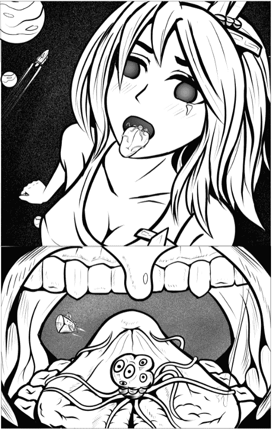
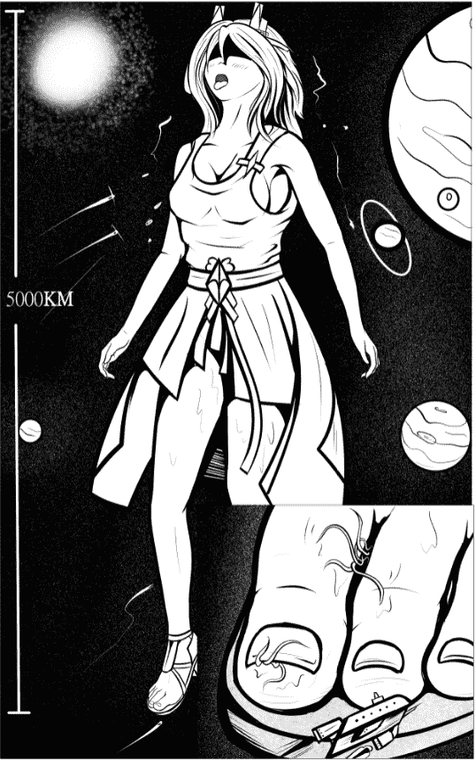
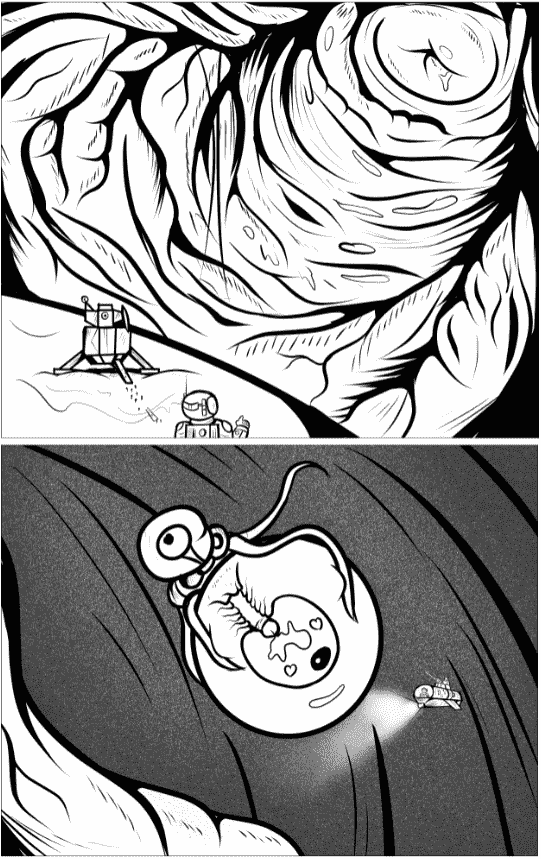

# 星际感染（多元素 附图）

作者：St2019

TID：29772

 

# 1

*本帖最後由 St2019 於 2020-11-7 13:46 編輯*

记录日期：2077年12月10日记录位置：S恒星系内，A行星附近。记录者：“先锋”医疗舰队观测描述：巨型寄生事件。寄生原描述：“邪神”寄生细胞，以惊人的繁殖力著称的危险寄生生物，在漂浮于S星系内的小行星表面十分常见。单个个体约为一个鸡蛋大小，但发育成熟后会成为身长数十公里，拥有巨大身躯与触手的章鱼类生物。已知的唯一宿主为流浪在宇宙间的“巨娘种族”。 该物种通常通过漂浮的小行星碎片传播。由于体积很小，很容易被巨娘在无意识情况下吸入口腔，或黏着在外阴，足部和其他皮肤表面，而后利用巨娘的身体组织进行快速生长。在繁殖期间，该物种更倾向于潜入巨娘的阴部，通过直接向卵巢内的卵子注射繁殖液，利用宿主的生殖系统进行繁殖。宿主描述： 游荡在宇宙间的巨娘种族。身长2000公里到5000公里不等，普遍为雌性和扶她性别。巨娘种族的智力水平与人类相当，但在科技发展方面十分落后。一部分对人类友好，但一部分对人类怀有敌意。由于巨大的体积差，只有大型飞船才能被巨娘用肉眼直接观测到。她们不断地在宇宙间流浪，交配，繁衍。 庞大的肉体和蕴藏的能量使她们成为了“邪神”细胞的目标。

观测记录“先锋”舰队的旗舰观测到航线上出现身份不明的巨娘种族， 经初步判断体长约为5000公里的雌性，以无意识的状态漂浮在太空中。由于该巨娘的位置可能扰乱航线，旗舰命令3条侦察舰前去获取更多信息。A号舰记录：A号舰负责从巨娘下身接近，顺便负责拍摄可能存在于巨娘足部的宇宙生命。当距离巨娘左足100公里时，观测到位于足部的重大异常状态。数根长度十几公里的触手组织被发现于巨娘的脚趾间，不断缠绕拍打着趾缝和脚趾根，分泌着不明粘液。触手蠕动于皮肤的褶皱里与更加宽广的脚趾缝间，同时生出更多更细小的触手不断在足底表面的皮肤上摸索着。数个大象般大小的动物被发现躲在脚趾间的皮缝中，但很快被触手找到并吞噬。A号舰更进一步接近。此时观测到额外的触手从巨娘大脚趾的指甲下伸出，活跃度很高。巨娘如山谷般的指甲缝为其提供了隐蔽的生存环境。旗舰经过分析后断定为“邪神”寄生细胞感染事件。交流任务转为勘探任务。

B号舰负责接近巨娘脸部。巨娘的头部轻微上抬，嘴部大张，无法观测到表情。更加接近后发现巨娘眼睛未闭合，经过瞳孔分析后发现其处于大量刺激导致的昏迷状态，同时观测到口部有异样。B号舰受命直接进入巨娘口腔。口内温度略微低于正常水平，粘液却反常地多。由于舌面上的粘液深度足以淹没登陆艇，登陆勘探被否决。不过B号舰偶然观测到了一些生活在巨娘唾液中的类似蓝鲸的水生生物，依靠巨娘舌面的舌苔“森林”躲避触手。在靠近舌根的位置发现大型“邪神”寄生成年体，拥有数十公里长的触手，紧紧缠绕在更加庞大的巨娘舌头上。寄生体主体则吸附在广阔的舌根内侧，位于小舌头附近，并缓慢地向巨娘的喉咙处移动。推测其正试图进入巨娘的胃部。触手只需刺激舌根下方数十公里处便可引发巨娘的吞咽反应，使巨娘自己将这寄生怪物吞下肚并可能直接摧毁B号舰。但由于此时巨娘处于昏迷状态，此情景不太可能发生。

C号舰负责进入阴部负责勘探感染情况。巨娘阴唇大张，阴道入口毫无阻碍，使得C号舰轻松进入。探测后发现巨娘阴道内十分干燥，粘液量较少且温度较低，符合登陆勘探条件。一支勘探小队乘坐登陆艇着陆于阴道粘膜上，搭建侦擦大本营。侦查员观测地形后发现该巨娘阴道后端十分松弛，且阴道壁多处有摩擦和蠕动痕迹，有的长达数公里，推测其被异物入侵过。一架“蚊”式双人侦察机，配备轻火力和高速度，奉命前往巨娘子宫进行探测。侦察机穿过子宫颈后发现了一些“邪神”细胞，最大的有普通人类的拳头大小，零零散散地散落在巨娘子宫壁表面。三个样本被收集以供研究。C号舰在左侧卵巢内发现了雌性的 “邪神”母体且其正在进行繁殖行为。 侦察机观测到该母体通过章鱼般的触手牢牢抱住高达几十米的卵子，使用其主体中心的一根棒状生殖器官直接插入卵子核心并射出繁殖液。具体过程被机载摄像机全程记录。侦察机发出的开火请求被拒绝，理由为受孕已经完成，开火有可能导致寄生体反抗并引发伤亡事件。观测结束，所有舰艇撤回。后续结果：通过多舰检测后发现巨娘脑部未受入侵。通知第三除虫大队和第一特遣战舰联队对寄生于该巨娘体内的“邪神”发动火力打击，以试图帮助该巨娘拜托寄生虫病。预计耗时60天。

 

# 2

<ignore_js_op>[UP3.PNG](forum.php?mod=attachment&aid=ODU5NTl8OWU4NjY0NmF8MTYyNDY5NDA3OXwxODIzMHwyOTc3Mg%3D%3D&nothumb=yes) *(352.31 KB, 下載次數: 6)*

[下載附件](forum.php?mod=attachment&aid=ODU5NTl8OWU4NjY0NmF8MTYyNDY5NDA3OXwxODIzMHwyOTc3Mg%3D%3D&nothumb=yes)

2020-11-7 13:46 上傳  

</ignore_js_op> <ignore_js_op>[UP1.PNG](forum.php?mod=attachment&aid=ODU5NTZ8Njg0MGQ3YjZ8MTYyNDY5NDA3OXwxODIzMHwyOTc3Mg%3D%3D&nothumb=yes) *(394.41 KB, 下載次數: 4)*

[下載附件](forum.php?mod=attachment&aid=ODU5NTZ8Njg0MGQ3YjZ8MTYyNDY5NDA3OXwxODIzMHwyOTc3Mg%3D%3D&nothumb=yes)

2020-11-7 13:24 上傳  

</ignore_js_op> <ignore_js_op>[UP3.PNG](forum.php?mod=attachment&aid=ODU5NTh8NDAxMWIyZjR8MTYyNDY5NDA3OXwxODIzMHwyOTc3Mg%3D%3D&nothumb=yes) *(373.06 KB, 下載次數: 4)*

[下載附件](forum.php?mod=attachment&aid=ODU5NTh8NDAxMWIyZjR8MTYyNDY5NDA3OXwxODIzMHwyOTc3Mg%3D%3D&nothumb=yes)

2020-11-7 13:24 上傳  

</ignore_js_op>  

# 3

[@焦冥小虫xxx](https://giantessnight.com/gnforum2012/home.php?mod=space&uid=34325) 大佬康康怎么样 

# 4

> [violetsnow 發表於 2020-11-7 18:47](https://giantessnight.com/gnforum2012/forum.php?mod=redirect&goto=findpost&pid=451369&ptid=29772)

> 2077，s星系，我懂了是赛博朋克2077

被你发现了而且是12月10号 

# 5

> [aaabcd3 發表於 2020-11-7 15:57](https://giantessnight.com/gnforum2012/forum.php?mod=redirect&goto=findpost&pid=451363&ptid=29772)

> 大佬的寄生系一直都是新颖撩人

谢谢支持我一直想把我控的其他几个xp和gts放在一起

 

# 6

> [甲鱼 發表於 2020-11-8 00:30](https://giantessnight.com/gnforum2012/forum.php?mod=redirect&goto=findpost&pid=451383&ptid=29772)

> 我自认是个比较重口的人，但是看到这篇文却感觉头皮发麻（根据文中描写大概想象了一下场景，然后密恐直接去 ...

重口是莫得上限的.jpg)

 

# 7

> [焦冥小虫xxx 發表於 2020-11-8 13:57](https://giantessnight.com/gnforum2012/forum.php?mod=redirect&goto=findpost&pid=451423&ptid=29772)

> 很棒的设定呢。如果是在h星人的世界观里，这种生命体的存在肯定是h星人的竞争对手，为了争夺巨娘资源势必会 ...

其实因为这种生物智力低下且样本很常见，感觉可以被h星人培养成为自己的武器。但是在h星人的世界里巨娘有很多能力所以可能得增加一些设定，比如魔抗强大之类的，或者能复制宿主的能力。

 

# 8

> [kriegsmarine 發表於 2020-11-8 13:37](https://giantessnight.com/gnforum2012/forum.php?mod=redirect&goto=findpost&pid=451422&ptid=29772)

> 大佬下次能ˋ不能試畫個巨娘扶她間交配的觀察報告 ?

我可以想想，好久没画futa了。