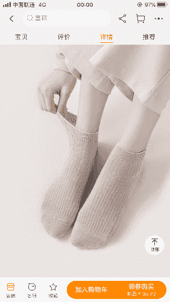

# 献唱（5.11第十章结局更新）

作者：考究BG

TID：30754

<title>1</title> <link href="../Styles/Style.css" type="text/css" rel="stylesheet">

# 1

*本帖最後由 考究BG 於 2021-5-11 11:31 編輯*

希望兄弟们能多留留言，兄弟们的留言是我更文最大的动力

前作包括：第一篇 想要生存下去

第二篇 七日物语       第三篇 第二个

目录序章第一章 甜心第二章 交谈第三章 最后的晚餐第四章 体育馆第五章 咬紧牙关第六章 阿秋的约定地点第七章 水仙花第八章 意料之外的事情走向第九章 献唱尾声

<title>2</title> <link href="../Styles/Style.css" type="text/css" rel="stylesheet">

# 2

序章

        “怎么啦？”男生看着眼前这个心不在焉的女孩问道。

        “没，没什么……”女孩无神的眼睛中看不出来在想什么。

        “少来，你就差把 心事 两个字写在脸上了。”男生喝了一下手中的咖啡，说道。

        “好叭，我告诉你，”女孩眼睛中又恢复过来一些生气，叹了一口气，“我也确实没有别人可以依靠啦，这几天我都愁的睡不着觉了。”

        “不是再过几天，就是咱们得文艺汇演了嘛……”

        “我知道了，因为上次你的失误，是不是这次的表演有些没有信心了。”男生不等女孩说完，打断道。

        “也不是说没有信心，但是因为上次失误，我总是觉得周围的人都认识我，都在暗处笑话我，这种想法经常挥之不去，让我无法集中注意力在节目上。”女孩托着下巴，难受道。

        “嗯……确实是件让人苦恼的事情呢。”男生也跟着苦恼了起来。

        “对了，还有一件事也挺让人烦的。”女孩悄悄看着男生的眼睛，平时强势得她此刻像一只小猫一样。

        “嗯……？还有啥事呀。”

        “我好像……”女孩犹犹豫豫的不敢说。

        “什么？我没听清楚呀。”

        “我好像……”

        “我好像把那个东西给丢了。”<title>3</title> <link href="../Styles/Style.css" type="text/css" rel="stylesheet">

# 3

第一章 甜心

        自从高中的那次事件之后，郁青就和阿秋成了好朋友，过了一段时间，阿秋就和郁青表了白，出乎他意料的是，郁青并没有拒绝，反而爽快的答应了。

        转眼间过了一年多，郁青上了当地一所还算不错的大学，而阿秋则在自家的生意上帮忙。上学期间，阿秋时常到郁青的学校里去找她，放假的时候，郁青也会去找阿秋玩。自认识以后，郁青也一起守护着那个奇怪遥控器得秘密，但是人是一种会犯错误的动物，郁青也不例外。

        “嗝。”满脸通红的郁青趴在汽车的后座上。“我是不是……我是不是喝多了。”

        “我说你啊，你要想吐我就立马停车，你这杂种可别吐到我的车上。”阿秋一边开着车，一边不安的回过头来告诫她。

        “你说你，就算能喝酒，也不能这么不节制的灌自己吧？”

        “这不是，高兴……嘛，我们高中那几个娃，好不容易聚一回，而且不知道为啥，我感觉他们都在轮流灌我。”郁青虽然头晕晕的，但是还是在尽量保持着清醒。

        “行了行了，你少说几句吧。哎，到了到了，这是你们宿舍吧？”阿秋轻车熟路的开进学校，开到了宿舍门前。

        “嗯……？”阿秋眯着眼睛仔细看了看，发现宿舍门已经关了。

        “怎么了呀，秋。”郁青也抬起头，“太晚了，宿舍门已经关了。”说完，趴下来呼呼睡着了。

        “叮”阿秋看到手机微信打开了一条消息。上面是一个坏笑的表情，还有一句“这次策划的怎么样？”，是大狗发给他的。阿秋哭笑不得的看着车里不省人事的郁青，不知道是应该夸大狗还是骂他。

        “嘭”，阿秋将郁青抬到了宾馆的床上，转身要走，却又放心不下的回头看了看小猫一样熟睡的郁青。“算了，还是陪你睡一晚上吧。”阿秋在心里对自己说。

        刚脱下外衣的阿秋看到郁青突然已经立在了床上。“呜啊！”阿秋吓得差点蹦了起来，“你酒醒了？”

        “嗯……我有点醒了……”郁青说话好像还是有点大舌头。

         “哦哦，那，我帮你倒杯水吧？”阿叔摸着头说。

        “喂。”

        “嗯？”

        “要不要做。”

        “……哈？”

        “要不要，做那个。”郁青拇指与食指捏成一个圆，另一只手的手指从里面穿了过去。

        阿秋会了意，但是又迟迟不敢有动作。“那个，没有那个什么，我去便利店买一下。”阿秋故作有经验的说道。

        “不必了。”郁青眯着眼笑道。

        “那不行，那我得对你负……”

         没等阿秋说完，郁青竟从身上掏出了一个遥控器，对着阿秋点了一下。

        随后，阿秋眼前一黑，感觉到一阵眩晕。

         郁青握着萝卜大小的阿秋，细细的端详着。她脸上的红晕散发着强大的信息素，阿秋被盯的紧张的咽着口水。

        “要来了哦……”郁青缓缓褪下衬衫和西裤，漏出了黑色的胸罩和内裤。她谨慎的用鼻翼蹭着变小的阿秋，另一只手在下面轻轻的揉动了起来。

        “你喜欢我嘛阿秋~”郁青看着脸前的阿秋问。

        “喜欢，我当然喜欢你！”阿秋大声喊道。

        “阿秋你认不清自己了嘛~你不配喜欢我~”郁青开始了自己的角色扮演，“不过……你实在喜欢我的话~我可以把你放到这里~”郁青将阿秋放到黑色的内裤上，一只手按住他的后背揉了起来。另一只手则在丰盈的小胸脯上揉动。

        “唔……”一阵快感传遍了郁青的全身，她手部的动作变得更加快了。

        阿秋感觉到自己的整个身体深深地投入到了巨大的黑色面料上，透过密集的窟窿可以看到面料后面郁青的巨大的阴部。阿秋没有反抗的余地，不足十厘米的他像玩具一样被自己的女朋友摆弄着。

        听着郁青一声一声的轻哼，阿秋也硬了起来，但是他那小小的帐篷，在这场游戏里，根本就是可以被忽略得存在。

        阿秋一阵失重，是自己被巨大的手指赦免了。他滑到了郁青两腿之间的床面上。而一阵剧烈的震动后，阿秋看到眼前的巨兽显出了真正的面目——郁青将自己的内裤褪了下来。还没等阿秋心中的震撼消去，阿秋感到自己又开始缩小了，他抬头看，是郁青又在调动着遥控器。

        郁青将阿秋调到了手指大小，握住了他，随后调整着手中小人的方向，慢慢塞进了自己的下面。

        “唔！啊~~”郁青感觉到了前所未有的刺激，是阿秋在里面疯狂扭动得反馈。“阿秋，被，被我的小妹妹吃掉了……”感觉到刺激的郁青用手指将里面的玩具推到了身体更深的地方，随后用手在豆豆上揉了起来。

        阿秋没有任何思考的时间，就被强行塞入了自己女朋友的禁忌之地里，浑身裹满了荷尔蒙气息的粘液。周围是闷闷的郁青的呻吟声和上上下下不停歇的抖动。很快阿秋发现，自己身边根本没有空气给自己呼吸，他奋力扭动着，想要传达自己的糟糕处境，而越是扭动，周围呻吟的声音却越大。浑身的粘液使得阿秋找不到一个着力点，自己爬出来这条路根本走不通。随着时间的推移，肺部传开了爆炸的火烧一般的疼痛，阿秋只能寄希望于快点帮助郁青达到高潮，从而从这个湿黏的地方脱离开来。顾不得疼痛，阿秋开始疯狂的像周围摩擦，打击。

        敏感的部位传来了更加疯狂的电流感，郁青两腿岔开，将臀部抬了起来。她想象着自己的男朋友被困在自己最脏最私密的地方挣扎，为了自己的快感而受尽苦头，就感觉到无比的满足和爽快，她揉搓着自己的阴蒂，嘴中停不住的呻吟着。她回忆起自己第一次折磨阿秋的时候，将他踩在自己的脚下，后来又吞吃掉了他，经历了自己消化道的洗礼。而现在，作为自己的男朋友，阿秋不但不能发泄自己，和自己共同享受快感，反而被剥夺了自由，任自己宰割。想到这里，她终于感觉到自己高潮的来临，剧烈的收缩了起来。一阵一阵的快感冲破头顶，郁青的呻吟变成了喊叫声，连成了线。

        随着疯狂的高潮过后，郁青一阵困意来袭。郁青没有忘记阿秋存在，但是她的惰意已经容不得她再有多余的想法了。郁青合着眼睛，用手找到了内裤，迅速穿上。两分钟后，郁青轻轻的鼾声就响起来了。<title>4</title> <link href="../Styles/Style.css" type="text/css" rel="stylesheet">

# 4

第二章 交谈

1

       “昨天早晨的事，你还记得不。”

        “记得啊，你没有把我从你下面取出来，就自顾自的去上课了，我在你的内裤里待了一上午。你不会忘记了吧。”

        “我当然知道……再说正事呢你别不正经。”郁青好像不满阿秋将这种事情毫无廉耻的说了出来。“后来，我就找不到遥控器了。”

        “你是什么时候注意到的呢？”

        “是晚上收拾准备睡觉的时候，一般我都会把遥控器放到枕头下面，但是当我掏背包的时候，就发现就没了。”

        “会不会是掉在哪里了呢？从包里漏出来了，掉到了地上。”

        “应该不会吧，这几天我一直都沿着走过的路走了好几遍，都没找到。而且上完课后，我就把背包放到宿舍了，回到宿舍的时候，我还摸到了背包里硬硬的一块。”

        “如果是这样的话，也就是说你不小心丢了的几率就很低了。”阿秋摸着下巴思索着，“所以说。”

        “所以说。”郁青看着阿秋，心中也有了一个答案。

        “所以说，可能是被别人拿走的。”

        两人的脸色都变得十分难看，如果真的是被别人拿走的，事情说不定会变得不可控，甚至失控，而作为遥控器的保管者，二人就算不会被偷盗者反过来攻击，恐怕也会麻烦不断的。

        虽然阿秋很想指责郁青为什么不直接把遥控器放到一个安全的地方，如果将遥控器放到一个没有人能拿到的地方，这样总比天天带在身边来的安全。事实上高中的他们一开始也是这样做的。但是人是会犯错的动物，随着时间越来越长，二人也松懈了下来，郁青随身带着遥控器的次数也越来越多。不过现在说什么也都晚了。

        阿秋叹了口气，“没事，没什么大不了的。你不是每天还要准备艺术节，还要上课吗，遥控器的事你就别操心了，哥帮你找。”

        “你，你行吗。”郁青担心的看着阿秋，虽然郁青知道阿秋办事越来越成熟稳重了，但是这毕竟是在一个他毫不熟悉的大学里。

        “放心啦，我随时和你汇报情况和进度，总之别担心啦。”阿秋站起身来，披上了外衣。“走吧，回你们学校。”

2

        “堂堂秋哥，也碰到了这种操蛋的事了呀。”大狗戏谑的说道。

        “行了，我和你说这件事可不是为了让你嘲笑我的。”阿秋觉得这个时候他很需要一个可以讨论的同伴，而在事件之内的大狗是一个完美的选择。“我先和你说说我得判断吧。倘若真的是被人偷的，究竟是一个什么人，才能打起偷遥控器的主意呢。”

        “那他一定知道遥控器的功能，不然谁会偷一个酷似空调遥控器的东西呢？对吧？”大狗跟着阿秋的分析思考着。

        “是这样的，事实上我觉得很大概率是她的室友，你觉得呢？”

        “确实，只有她的室友才有这样的偷盗。”大狗肯定着阿秋的推理。“那咱们下一步应该怎么办呢？如果被那个偷盗者掌握了遥控器的具体功能，那咱们都危险了。”

        “我知道。”阿秋明白大狗的意思，现在敌在暗，而郁青在明，可以说如果那个人想对郁青动手，一干人根本没有反击的机会，这就是遥控器的威力。

        “对了，如果那个人拿到了遥控器，那他会不会迫不及待的试试遥控器的功能呢？”

        “站在偷盗者得角度，确实很有可能。”阿秋皱着眉道，“那也就是说，很有可能已经有被缩小的人了吗……”

        “而且学校里，学生最多，那你去找一找学校里昨天今天失踪的学生，会不会有线索呢？”

        “有道理，但是这两条思路嘛……”阿秋很想现在就行动，但是仅凭他一个人，对这两个线索实在是分身乏术。

        “你缺人手是吧，哥？”大狗听出了阿秋的意思，想了想，“我安排一下这边得事，准备一下，就去找你。”

        “行，咱们待会先汇合，我给你介绍一个人。”

3

        “你好，你是秋哥的朋友是吧，你叫我胖子就好。”大狗眼前的是一个身材魁梧，但满脸堆笑的男子。

        “胖子哥，你倒是也不胖呀。”大狗上下打量着外号为胖子的人。

        “嗨，这不是之前的外号嘛，现在这是减下来了。”男人笑着摸了摸头。“说正事，说正事。”

        “这里是两张校园卡，你拿好，”胖子从兜中掏出了两张卡片，递给了大狗。“你要是进宿舍，直接刷卡就好，畅通无阻。我带你先进来吧，你也啊参观一下我们大学的宿舍。”

       “好嘞好嘞，”大狗将两张校园卡小心的放进了兜里，跟着胖子走进宿舍楼去。“你们宿舍还没采用人脸识别吗。”

        “没有，不过听说也快该换了。”胖子摇头晃脑的说，“不过这两天你用这两张卡，肯定没问题。”

        “行，我也把你领进来了，我现在就告诉你，昨天到现在都没消息的那个人，他的宿舍在哪里。”

        “……真的有？！”大狗听到这个消息，心碰碰的跳个不停。

         “没错呀，我也挺好奇你们和那个失踪的人到底是怎么一回事，”胖子挠挠头，疑惑的说，“不过嘛，我就知道一点。”

        “该问的问，不该问的不问。”胖子递给大狗一张纸条。“记得把尾款结清了，和阿秋说。”

Tips.剧情缓慢推进中(´△｀)这一章可能很无趣，那是因为相比于之前的文章，我希望这次能写一个更加完整的故事，自洽也是我最希望能看到的。<title>5</title> <link href="../Styles/Style.css" type="text/css" rel="stylesheet">

# 5

4

       “你是什么人？”宿舍门缓缓打开，是一宿舍的男同学们。

        “我是来打听小伟的消息的。”大狗露出了一个自以为有诚意的表情。“我是学校新闻组织的人，这件事老师说我们也有义务来帮忙。就是说，我们也想为寻找小伟出一份力。”大狗一边背诵着刚刚才编好的谎话，一边搓着手。

        “希望你们可以把你们知道的事情和我详细讲讲。”

         看着大狗坚定的眼神，男生让出了门口的位置。“进来说吧。”

        “昨天，小伟中午从外面回来，就一副心神不宁的样子。”看上去像宿舍核心人物的男生开口说话了。“我们看他精神比较失落，就问他怎么回事。”

        其他人都点点头，附和着他。

        “但是他不肯和我们说，在宿舍里没待多会，就又出去了。”男生低着头，缓缓的说着，“自那之后，到现在为止，他就没有消息了。”

        “我们要是当时能再多劝劝他，说不定……”一个看着柔弱的男生开口道。

         “你这叫什么话，小伟只是失踪了，你别瞎造谣啊！”

         “当时要是咱们……”男生还想说点什么，就被别的同学用眼神制止了。

        “那，你们知道小伟一般都喜欢去哪里散心吗？”大狗又问道，“也许可以找到小伟失踪前去过的地方。”

        “我知道……他经常去湖边的亭子……”还是那个看着柔弱的男生。

        又进行了一些无关紧要的谈话，大狗知道问不出什么有价值的东西了。“行，谢谢你们的线索，有进展我会第一时间告诉你们的。”大狗健步如飞，跑出了宿舍。<title>6</title> <link href="../Styles/Style.css" type="text/css" rel="stylesheet">

# 6

第三章 最后的晚餐

        晚上，餐桌上三个人聚在了一起。“也就是说，小伟有可能是因为发现了偷盗者的秘密，已经被缩小并囚禁了？”阿秋感觉到事情已经变得越来越严重了。

        “对的，今天下午的时候我还去小伟常去的亭子调查过了，并没有什么发现。”大狗道，“如果，我是说如果，小伟因为看到了偷盗者偷盗的过程，那他是不是可能已经遇害了呢？”

        “如果那个人心狠手辣的话，恐怕……是的。”阿秋道。

       “嗯？”阿秋发现郁青拽了拽他的袖角。

        “我倒觉得不用那么悲观，阿秋你忘记了？咱们将遥控器最后设定的设置的是……”

        “大概是五厘米，而且是不死模式，对吧？”阿秋稍微松了一口气，“如果不是熟练掌握遥控器的设置方法，那小伟可能暂时没有性命之忧。”

        “那我来给你们介绍一下我得两个室友吧。”郁青往下推进着讨论的进度。

        郁青用手机给大狗和阿秋分别发送了一张照片。“这是我们宿舍一起出去玩的时候照的照片。”

        大狗和阿秋仔细看着图片，那是一张在景区照的普通照片，值得惊讶的是，照片中的三个女生都颇有姿色，“左边的第一个，是以体育特长生进到学校的，她名叫阿曦，是因为宿舍不够了，才安排到和我们一起住得。”两人仔细端详着这人，虽然是体育特长生，但是她的皮肤却意外的白皙，高挑的身材比本来就不低的郁青还高了半头。

        “会是她吗？”阿秋和大狗二人面面相觑，看面相根本看不出什么。

        “另一个则是我的同班同学，叫琳茹。她平时在宿舍中，在班级中都是爱说爱笑的那种人，听说家中还挺有钱的，不过她也不是那种娇生惯养得大小姐。”看着照片中笑靥如花的女子，两个人总觉得此人没有照片上看上去那么可爱。

        “怎么样，能看出点啥来嘛。”郁青托着下巴问道。

        阿秋看了一眼大狗，“这能看出啥来呀，先吃饭吧都。”

        不一会服务员上了菜，三人都不客气，动筷的动筷，喝饮料得喝饮料。

        “对了，你那个表演节目的活动，是后天来着？”阿秋递给郁青一杯刚倒的大麦茶，问道。

        “对呀，就两天了，不过你也别担心我了，现在什么事都没有找到遥控器要紧呐。”郁青吹了吹茶道。

        “你不用担心，有大狗我们两兄弟，你上台之前，一定给你找回来。”阿秋其实心里也没有底，不过还是拍着大狗的肩膀保证着。

        郁青虽然也很担心，但是她还是选择相信她的男朋友。

        晚饭后，阿秋送回了郁青，把大狗带到旁边。大狗察觉出饭桌上时阿秋就欲言又止。“怎么了，秋哥？”

        “你应该知道吧，之前咱们也讨论过了。”阿秋点了一根烟，缓缓的说道，“这次咱们去找遥控器，可以说是非常凶险，弄不好的话……可能会丢掉性命也说不定。”

        “嗨，”大狗明白了阿秋的意思，“确实，咱们现在的一切都是基于推理得出来的，说不定那个偷盗者，第一时间就学会怎么将小人弄死了呢。”

         “你想的没错，”阿秋猛吸了一口烟，“所以我才不希望你和我们一起冒这个险呐。”

        “但是你也没有别人可用了，对吧。”大狗拍着阿秋的肩膀，“其实很多事我之前都想明白了，什么大场面，我也都见过了，我不会丢下你一个人的，秋哥。”“再说了，有我在，胜算会大些，不是吗。”

       “好兄弟，大狗。”阿秋有些感动，如果不是以前被大狗坑过的话。

        “那咱们两个，就赌一次博吧。”<title>7</title> <link href="../Styles/Style.css" type="text/css" rel="stylesheet">

# 7

终于要开始搞黄色了楼主加油更新啊！<title>8</title> <link href="../Styles/Style.css" type="text/css" rel="stylesheet">

# 8

第四章 体育馆

        在体育馆中，一群女生正在做热身运动，人群之中，有一个高挑的女生让人一眼就可以看到，她身材匀称，身材是纤细与矫健的平衡。她正和同学们一起做着压腿。她不知道的是，正有一个人在盯着她。时间过得很快，不一会就到了休息的时间。她发现自己放包的的凳子边正坐着一个陌生人，那人细胳膊细腿，不像是一个该出现在体育馆里的人。但她没有多想，只是自顾自的坐下来，掏出水瓶补水。

        “那个可以把人缩小的遥控器是你偷走的吧，阿曦。”

        阿曦面如止水，转过头看着那个从没见过的陌生面孔。“不好意思，你在说什么？”

        “什么遥控器，还有什么叫能缩小人？”阿曦疑惑的盯着眼前的男人问着。

        “呃呃……”男人被盯的浑身不自在，他尴尬的摸了摸头，“没什么……我就知道不是你……不然你的演技也太好了。”说罢，起身就要走。

        可他突然眼前一黑，一股熟悉的感觉传来，再一睁眼，他发现自己已经被缩小了。抬头看去，不知什么时候，阿曦的手中已经多了一个遥控器。

        “谢谢你夸我演技好咯，同学。”阿曦笑着说道。

        大狗心中一惊，终究还是大意了，刚才明明翻过她的背包了，什么都没有发现。难道连运动的时候都随身带着吗。

        还有一件出乎意料的事便是没想到她居然敢在大庭广众之下使用缩小器，自己特意挑选了人比较多的体育馆里来和她交涉。刚才好像也没有人看到这里发生的事情，毕竟只是一瞬间。

        “虽然有很多疑问，比如你是怎么知道这个东西的。”阿曦将遥控器在手中转了一圈。“等问清楚在处理你吧。”

        阿曦从地上大狗的衣物中翻到了大狗的手机，然后再一阵光线射过，地上的衣服鞋子也都像尘埃一样看不到了。

        “你的手机，我就先收好了哦。”

        说着，阿曦将大狗一把从地上捞了起来。“嗯~把你放到哪里呢？”阿曦翻着自己的背包，最终拿出一只白色运动袜来。

        阿曦将袜口撑开，将小人扔到了里面，随后将袜子打了个结。之后将袜子又放回了背包中。

        “阿曦，来继续训练了！”听到远处的声音呼唤着她，阿曦也继续投入到了体能训练中。

        黑暗之中的，大狗感觉到周围充斥着浓重的汗味，但是现在他做的一切不过是困兽之斗，与其这样，不如节省一点体力吧。一边想着，他一边调整姿势躺了下来。

        不知过了多久，一阵强光过后，大狗又重新获得了视野。

        阿曦正翘着二郎腿坐在他的面前。她刚刚结束了上午的训练，此时正在放松刚从鞋子中解放出来的脚。这里是……宿舍里吗。大狗环顾着四周，看到了床铺和日用品，头顶上还有散发着热浪的巨脚。

        “放心，房间里的别人都去上课了，没有人会打扰咱们的。”阿曦穿着拖鞋的脚摆来摆去，好不惬意。

        “第一个问题，你是怎么知道遥控器是我偷的？”阿曦放下了腿，两只脚踏在了大狗的两边，向他施压。

        “是，是郁青的男朋友拜托我来问你的。他们不知道是你偷的，只不过让我来试探一下你。”大狗看着两只染着红色指甲油的巨脚伸在他的两边，颤颤巍巍得说。“咱们有话好好说，我还有好多事情可以和你说，你可别杀我！”

        “少废话，我说什么，你回答什么。”

        “好。好的。”

        “也就是说，他们都知道你要来找我问话，对吧？”阿曦从兜里掏出了一个手机，“把你手机的密码告诉我。”

        阿曦打开了手机，找到了里面的聊天记录，发现和他说的八九不离十。

        “你，你在干嘛。”大狗看到阿曦手指灵巧的点在手机屏幕上，不安的说道。

        “当然是和他们发消息，让他们确定你是安全的了。”阿曦笑着说道。“顺便再和他们说，你不想在冒着危险去调查了。”

        “凭我的演技，应该可以蒙混过关吧，同学？”阿曦又把二郎腿翘了起来，颇有些得意的笑着。

        “好了，第二个问题。你对我来说还有什么用处。”阿曦眯着眼睛看着地上的小虫子。

        “遥控器，虽然你会将人缩小了。但是那里还有很多可以调制的设置，可以设置时间，大小的，你一定不会用。”大狗两股战战，已经将自己的底牌亮出来了。

        “哦？我怎么知道你是不是在骗我呢？”阿曦挑着眉问道。

        “都到了这个地步了，我还怎么骗你。”

        “不好意思，我对陌生的事物一向谨慎。”阿曦摇了摇头，说道。“对我来说，按下开关，这一个操作就够了，如果我按你说的做，被你反杀了，那是不是有够蠢的呢。”

        “真的，我说的都是真的，我只希望你能别杀我。”大狗祈求着。

        “第三个问题，”不等大狗辩解，阿曦冷酷的声音响了起来。“你想怎么死呢？”

“用手碾死，被踩死，被我吃掉，你想怎么结束自己呢？我给你选择的权利。”<title>9</title> <link href="../Styles/Style.css" type="text/css" rel="stylesheet">

# 9

“……”大狗张着嘴看着眼前这个强势的女生，“我选择不死。”

        “那不行，只能从我给的选项里面选。”阿曦不耐烦的说。“算了，直接把你踩死好了。”

        “别！”大狗喊道。“因为刚才我就被你的袜子熏得不行了，我想死的体面一点！”

        “哈？”阿曦拎起了小人，“你敢说我脚有味道？我每天都有勤洗脚勤换袜子的。”她不可置信的拿起袜子闻了闻，摇了摇头。“可能是因为你缩小了，嗅觉也变灵敏了吧。”

        阿曦嘴角忽然扬起了一丝坏笑。“直接把你弄死也太没意思了。我给你想到一个好去处。”

        说着，她从鞋柜中一顿翻找，终于翻出来了一双鞋，扔到了地上。

        “诺，”阿曦将拿着大狗的手向鞋子凑近，“给你介绍一下。”

        大狗趴在巨大的手上，想下观察着这双稍显破旧的鞋子。那是一双女式复古帆布鞋，本应是米黄色的鞋身现在只能看出暗灰色。鞋的两侧上面点缀着些许黑色条纹。

        “你不是怕臭嘛，”阿曦冷笑着道，“这双鞋应该是我最‘干净’的一双鞋子了。现在我就将你放到里面，然后穿着它去上课。”

        “你觉得怎么样呢？”阿曦表现出了一副关心的面孔。

        “不……别，别把我放进去。”大狗摇着头，蹲下来抱住了脑袋。

        “哈哈哈，我就喜欢你现在的表情。”阿曦很享受现在大狗的态度。“你觉得你有的选吗？希望你可以不那么容易就死掉了，不然也太没意思了。”说着，大狗离那双鞋子越来越近，最后落到了鞋垫上。

        “怎么样，里面的环境还适不适应呀？”

        大狗看着乳白色的鞋垫已经被踩成了黑色，上面的文字也被磨得几乎看不清楚了，不过还能依稀看到39的字样。“鞋子里面也不是很臭。”大狗向鞋子的深处走去，他看到了在鞋尖的地方，被脚趾踩出了几个黑印。

        “哈哈哈，被放到我的鞋子里，第一反应不是怎么样爬出来，而是钻了进去，真是贱呀。”阿曦面色有些潮红，虽然已经被自己变成了虫子般的大小，但她还是下意识的将大狗当成一个人来看待，将一个活生生的人囚禁在自己的脏脏的鞋子中，还真是有点不好意思。

        “好了，我要把脚穿进去了。”阿曦感觉自己花在小虫子上面的时间太多了。“对了，穿双袜子吧。”

        阿曦从床上取下来一双昨天还没洗的袜子，那是一双白色的棉袜，袜底已经被汗渍和灰尘浸的不再洁白。阿曦用手撑开袜口，接着她那修长的脚趾就熟练的穿了进去。为了调整好脚趾的位置，她的脚趾在里面肆意的扭动着。

        “好了~来了哦~”听到阿曦的声音，大狗从帆布鞋中看到从天而降的脚底，慢慢占据了所有的视野，他才如梦初醒的向鞋子里面跑去。随着一阵剧烈的颤抖，大狗被困在了阿曦的足弓下面。<title>10</title> <link href="../Styles/Style.css" type="text/css" rel="stylesheet">

# 10

虽然已经在网上进行了一次简单的学习，但是还是不知道怎么描写袜子的具体类型和样子。于是我直接打开淘宝进行一个图的截<title>11</title> <link href="../Styles/Style.css" type="text/css" rel="stylesheet">

# 11

 <ignore_js_op>[CC1CA089-DF39-4A68-A1B2-3A88A3292BA3.png](forum.php?mod=attachment&aid=ODg1NDB8ODQ1MzI3MjR8MTYyNDY5MDEyOHwxODIzMHwzMDc1NA%3D%3D&nothumb=yes) *(122.46 KB, 下載次數: 1)*

[下載附件](forum.php?mod=attachment&aid=ODg1NDB8ODQ1MzI3MjR8MTYyNDY5MDEyOHwxODIzMHwzMDc1NA%3D%3D&nothumb=yes)

2021-4-26 00:05 上傳  

</ignore_js_op> <title>12</title> <link href="../Styles/Style.css" type="text/css" rel="stylesheet">

# 12

*本帖最後由 考究BG 於 2021-4-26 01:44 編輯*

        “emmm”阿曦抬起脚，在地上活动了活动，她感觉到鞋子里面的小人在随着自己的运动而乱飞。“感觉好不舒服呀，这样根本没法好好运动。”

        她抬起脚跟，用脚磕了磕地，她就用脚趾灵敏的捕捉到了小人。“你就在我的脚趾下面吧，这样还舒服点。”

        “不过你要抓紧了哦，待会运动起来顾不上你，被踩扁了，可是你自己的问题了，”不知道自己的话有没有被小人听到，阿曦摇了摇头，走出宿舍去了。

        被钳制在阿曦脚趾下面的大狗的嗅觉受到了极大的摧残。尤其是脚趾间，更是味道浓重的地方，不仅如此，他还承受着不断的超重与失重。

        “啊，哈，啊。”为了保持位置，大狗死死抓住阿曦带有毛球的袜底，但是这样几个来回下来，他就已经很是疲惫。胳膊的酸痛告诉他需要氧气来代谢乳酸，而他身而为人的尊严却不想让他吸入青春少女污浊的气体。大狗承受着又想要憋气，又想大口呼吸的双重痛苦。经历了无数次的挣扎与折磨。最终，他克服了心里上的障碍，肆无忌惮的大口呼吸起来。

        “下午是什么课来着？”“对了，是排球课呐。”阿曦胡乱往嘴里塞了两块面包，拿上背包匆忙的跑向了体育馆。她已经差不多忘记了，自己脚下还囚禁着一个正在为改善自己鞋子里面的气味做着努力的小人。<title>13</title> <link href="../Styles/Style.css" type="text/css" rel="stylesheet">

# 13

> 1055348297 發表於 2021-4-23 20:54

> 是新坑！看起来超赞！这种描写真的太爽了，期待后续更多玩法。这么一想感觉第一篇的男主更惨了，男默女泪

> ...

唯一受害者是真的惨(›´ω`‹ )

在写第一篇的时候还没想那么多，就单纯写个爽文<title>14</title> <link href="../Styles/Style.css" type="text/css" rel="stylesheet">

# 14

         排球场上，一群高挑的女子正在练习着排球。阿曦是排球校队的首发自由人，这节课，她是来帮体育老师教授排球技巧的。

        “哎，你看学姐。”队列中，一个短发学妹正在和旁边的同学说着悄悄话，“学姐就是学姐，今天居然穿帆布鞋来上课。”

        “人家是来给咱们当助教得，又不是打比赛，人家当然是想穿什么就穿什么了。”旁边的同学说道。

        “也对。”短发妹子点点头。“你看学姐身材怎么这么好呀，让人羡慕死了。”

        “听说这个学姐她们宿舍的三个人个顶个的漂亮呢。是咱们学校有名的三个美女。”

        “这么厉害？”短发妹子低着头，“你看看我，身材就像个冬瓜一样。”“她们三个人，没有人给起个外号啥的嘛，比如三朵金花这种，嘻嘻。”

        “三朵金花，俗死你啦！”旁边的同学也是越说越来劲。“除了咱们学姐，另外两个人都不是咱们学院的，所以课都不一起上，而且听说她们三个有些不和呢。”

        同学左顾右盼，压低了声音说：“你想想，三个美女在一起，肯定是都不想自己的光芒被盖过去，肯定是明争暗斗，你信不信。”“说不定……还抢男朋友呢！”

        “哎！那边的两个同学，交头接耳说什么呢？”阿曦朝两人这边提醒道，“认真听老师讲动作要领。”

        “好的。。”两人齐刷刷低下了头，开始认真听老师讲课。

        “行了，我讲的大家应该都听明白了吧？现在就体会一下动作要领吧。”老师发了话，同学们都动了起来。“小曦，你给她们纠正一下动作吧。练习十分钟，你就组织她们打一会吧？顺便盯着看看有没有天赋不错的。”

        “好的老师。”阿曦接到命令，也活动了起来。

         此时，阿曦不停活动的帆布鞋里。“唔，唔，好臭……”随着阿曦脚部开始出汗，棉袜和鞋子中的臭味被彻底激发了出来，这让人窒息的臭味比一开始的时候浓郁了数倍。不过值得庆幸的是阿曦并没有剧烈的运动，大狗可以稍做休息，不必死抓着她的袜底了。

        然而这样的情况没有持续多久，隐约听到外面无数排球拍击地面的声音，他的世界也运转了起来。他只得再次抓紧，防止自己被甩飞。

        “学姐，这样做对吗？”

        “两只手臂再夹紧一点。”阿曦帮着学妹们纠正姿势。

        她看了看表，随后和同学们说:“好了，现在咱们分成两组，我陪你们一起打几局哈？”学妹们纷纷欢呼起来。

        排球在空中划过，阿曦高高跃起，打出了精彩的扣杀，随后平稳落地。“别看我是自由人就小看我哦？学妹们。”

        大狗的世界自刚才就开始疯狂的运动了。时而加速，时而突然暂停，时而变向，又时而高高跃起。他终于忍受不了了，两只酸痛的胳膊变得没有了知觉，最终他松开了手。松开手的那一刻，他被直接甩到了阿曦的脚跟下面。

        “怎么了吗？学姐。”见阿曦忽然停止了活动，一些学妹纷纷关心道。

        阿曦感觉到小人在自己的鞋子里被乱甩。事实上她的耐心也达到了极限。她将小人调整到脚掌下面，接着用力在地板上踏了踏，终于，脚底因为异物带来的不适感消失了。

        “没事，刚才感觉鞋子里有点不合适，不过现在好了，咱们继续。”阿曦摆了摆手，示意对方发球。

        此时的大狗被阿曦牢牢镶嵌到了她的脚掌下面，如果说刚才还有呼吸的权利，那么现在他连呼吸得权利也被剥夺了。他只有在复原—被踩扁这两个过程之间来回穿梭。

        还好和我们猜的一样，遥控器设置的为不死模式，不然的话，现在我早就成她脚底下的一层烂泥了吧。大狗一边复原，一边想到，随后一阵剧烈的抖动，又被宽大的脚掌撵了下去。

        “呼，”一节课的时间很快就过去了，阿曦听到了下课铃声，停下了脚步招呼同学下课。“下课咯~同学们~”

       此时她才发觉到自己的鞋子里已经湿乎乎黏糊糊的一片了。她搓动着脚趾，忽然想起自己脚下曾经还有一个小生命。“那个小人……应该已经我被踩成碎片了吧。”她努力感受着脚底板下的小人，却丝毫感觉不到他的存在。

        她一屁股坐在球场边的凳子上，喝起水来。穿着帆布鞋的脚感觉滚烫，她将脚从鞋子中抽了出来。

        意识模糊的大狗被强光唤醒了，他干瘪的身体也渐渐又鼓了起来。“哈，哈，这是。这是新鲜空气的味道……”大狗感受到了新鲜空气再往自己的肺部灌入，他朝着鞋口爬了过去。

        此时正坐在板凳上的阿曦肆意的张开脚趾放松。她忽然闻到了一股不好的味道。“唔！好臭！忘记我穿的是……”阿曦赶紧又将脚塞回了鞋里。

        “哎！哎！！不要！”大狗看着伸回来的巨脚，心中是万般痛苦。大狗还没呼吸几秒钟新鲜空气，就又被带回了封闭闷热的环境中。此时鞋里的温度和异味都达到了最大值。

        “哈，哈，”大狗大口的喘着气，“唔，这味道，也太犯规了吧……”他的浑身裹满了阿曦分泌的汗液。

        大狗的脸贴着身下同样充斥着汗液鞋垫上，感觉到无比的无力。“求求你了，让我呼吸一口新鲜空气吧……求求你了……”他无力的用手捶着阿曦的脚底，而得到的反馈也理所当然是——无。

        感受着肺部充满了浓郁的汗臭味，大狗感觉自己已经是这破败环境的一员了。这就是鞋垫的一生吗？从出生开始，就任人摆布，任人踩踏。被践踏以后，也不能有任何的怨言，在恶臭的环境中，也不会有任何人能听到他的苦诉。大狗觉得，自己或许真的会在这里待上一辈子也说不定。<title>15</title> <link href="../Styles/Style.css" type="text/css" rel="stylesheet">

# 15

怎么全在期待别的玩法我看着很像那种很会玩的人吗(  ･᷄ὢ･᷅)不过谢谢大哥们的回复<title>16</title> <link href="../Styles/Style.css" type="text/css" rel="stylesheet">

# 16

*本帖最後由 考究BG 於 2021-4-27 00:49 編輯*

第五章 咬紧牙关

        “哎~”回到宿舍的阿曦坐在床上，她随意的将鞋子甩掉，发现小人竟然还粘在自己的脚底板上。

        她将小人从袜子上揪了下来。“我以为你早就被我踩成一滩烂泥了，没想到你生命力这么强，居然还没死。”阿曦揪着小人的胳膊，甩了甩，发现小人居然还活着。

        “不过也好，我还能多和你玩一玩。”阿曦将小人放到了桌子上。

        大狗瘫趴在木质的桌子上一动不动，只是合着眼大口呼吸。

        “喂，你是死了吗一动不动的，我问你，在我的鞋子里舒不舒服啊~”阿曦见放到桌子上的小人一动不动，就用手指弹了他一下。

        “我……我叫大狗。”

        “哈……？你说什么？”

        “别总是你你的叫……我有名字……我叫大狗……”大狗捂着被巨大手指撞击的肚子，忍着痛说道。

        本以为被折磨的如此憔悴的小人现在应该已经对自己言听计从了，没想到竟然还有如此的骨气。阿曦先是一怔，紧接着就是一阵愤怒冲上心头。自己居然被身高不足五厘米的虫子震住了，这是何等的屈辱。

        “大狗是吧？”阿曦咬着牙道，“我再问你一次，我的鞋子里舒不舒服啊？”

        “舒服……很舒服……不要把我再扔进去了……”

        “噗。”阿曦听到大狗认怂的话，笑了出来。“我以为你有多有骨气呢。就这？”

        “差点忘了正事。”阿曦拍了拍头，“我这脑子，也是快老年痴呆了。”

        她用手将大狗拖了起来，另一只手拿出了他的手机。“其实郁青的男朋友阿秋一直很关心你呢，自我和他说你要退出以后，他给你打了两三个电话呢。”

        阿曦的嘴脸扬起了一抹微笑，“你应该知道吧，他对我来说，也是一个很大的麻烦。我现在就希望你能配合我，用你的口吻给阿秋发个微信，你就说有些话要单独说，把他约出来，明白不？”

        “不可能，我是不会背叛秋哥的！”大狗不假思索的拒绝了。

        “大狗，你知不知道我这是在给你机会？”阿曦看着忠心耿耿的大狗，觉得莫名的喜感，“你觉得就算没有你，我自己发微信文字，会差到哪里去？还是说你真的已经准备好去死了？”

        四周渐渐握起的手指让大狗惶恐不已。“我配合你，我配合你，别杀我！”大狗喊到，“我可以配合你，但是你得答应我，等你把阿秋控制住，你就不能杀害我，还我自由，让我永远离开你们这是非之地。”

        “哈哈哈，你变卦还真是比我想象中的要快呀？”阿曦笑了笑，“大狗呀大狗，你可不是一条好狗呀。不过我可以答应你，我不杀你，如何？”

        “好，好。”大狗僵硬的脸看不出他在想什么。他愧疚吗，他难过吗，没有人知道。

        大狗跪在了阿曦的手上说:“以后我就是人，不，是您的狗了，主人。”

        “滚啊，我才懒得陪你玩什么奇怪的游戏。”阿曦将大狗轻轻扔到桌子上。“既然条件谈好了，那咱们就开始想想怎么把阿秋给钓出来吧。”

        “喂，怎么了。振作起来啊？”

         此时的大狗抱着腿，正在大声和阿秋道着歉。<title>17</title> <link href="../Styles/Style.css" type="text/css" rel="stylesheet">

# 17

       重口(   ･᷅ὢ･᷄ )警告

       半小时后

       “还不错。”看着最后一条消息发出去后，阿曦夸赞了大狗一句。“看来你还是有点有点用处的，想不到任何人之间的说话习惯这么不同。”

        “要是我自己来编的话，恐怕几句话就露馅了吧。”阿曦歪着头，看向桌上的大狗。“贱狗，我说~你现在的心情怎么样？因为你的背叛，你的好兄弟明天就会成为和你一样的虫子了哦？要怎么样杀死他才好呢~”

        “该做的我也都做了……你可以放我走了吧。”

        “啊嘞？”阿曦看着大狗道，“对，我不会食言的。”

        “那就放我走吧……我会走的很远很远，不会再掺和你们的事的。”

        阿曦将大狗用手捏了起来。“虽然我答应你了，但是嘛，我不能让你在我得手之前去通风报信。”阿曦坏笑道，“那即要留你一条小命，又要放你走，又不能让你去通风报信。还真是苛刻呢~”

        阿曦走到门口，将门锁了起来，随后把窗帘也拉上了。“不过我给你想到一个好去处。”她慢慢脱掉黑色的运动短裤，露出穿着蓝白条纹内裤的丰满臀部来。

        “我也不和你卖关子了，”阿曦恶趣味的笑道，“我想把你塞到我的屁眼里。”

        “很合理吧？”不等大狗抗议，阿曦就自顾自得解释了起来。“你就在里面待着，等我下一次排便的时候你应该就能跟着我的便便一起被排出来了吧，等那时候你就自由咯？怎么样，是不是个好主意。”

        “我今天早晨刚刚那个过，所以等你出来的时候，阿秋应该已经在我的手中了吧？”

        “到时候你希不希望我把他也塞进去，让你们兄弟俩团聚呢？哈哈。”“到时候你们难兄难弟的，应该也顾不上恨来恨去了吧？在我的屁眼里报团取暖，想想就有点滑稽。”

        “你，你骗了我！”大狗绝望的喊到，“原来你一直都没有打算放过我，你这个骗子！我日你。”

        “……唉。”看着正在骂自己的大狗，阿曦叹了口气，“其实……我也不是你想的那种人的。只不过，我真的不能放你走。算了，说了你也不懂，有些事你是不会懂的。”

        不知想了些什么，阿曦眼神中又闪起了坚定的光。“好了，别磨蹭了，在墨迹会她们都该回来了。”

        阿曦正躺在床上，随后将内裤也脱到腿边。之后屁股高高抬起。低头看着阿曦抽动着的菊花，经过了摧残的大狗已经麻木，不再挣扎了。他任由阿曦的手指摆布，任由她将自己的头部抵到了巨大的菊穴上。

        “嗯，还是有点不好意思……”阿曦看不到具体的情况，只能凭借手上的小人去试触着自己的菊门，经过了几次尝试，她终于感受到小人的头正中着自己的菊门。

        大狗的身子在触碰到褶皱之后，握住他的巨手开始画着圈，将他的头部生生往里面璇进去。“唔，好痛。”感受到痛觉的大狗开始挣扎起来。但是随后他感觉自己被猛的一推，整个人就一下子到了一个狭窄的空间里。还没等大狗做出反应，周围的括约肌就像自己压了过来。

        将大狗推进菊门的阿曦感受到了些许的痛感和刺激，她不由自主的收缩了一下自己的菊花，殊不知这一个无意识的动作差点让大狗昏死过去。“不行，还得再进去一些……”意识到小人的位置还是太浅，她用中指按在菊门上，轻轻捅了进去。

        “唔！好痛呀~”没想到自己的那里会如此的敏感，阿曦疼的眼泪汪汪的，但是不枉疼痛，她感觉到小人已经被推到了自己得深处。

        “呼。”将手指抽出来后，阿曦的括约肌又紧紧的闭合了起来。她提上内裤和裤子，“喂，大狗，我的屁眼里怎么样啊~”

        没有回应。

        可能大狗回答了，只不过自己听不到了。“这么一想，还有点寂寞。”阿曦拍了拍屁股，希望以此能够和大狗互动一下。“喂，贱狗，要是听得到的话，就拼命往里面跑吧，跑的越里面越好哦？”

        阿曦眨了眨眼睛，道：“如果在我一次下次便便之前就擅自钻出来的话，我就让你死无全尸。”

         此时的大狗已经被困在了这一片黑暗之中。他被肠液不断着沾染，裹挟。随着阿曦巨大的躯体的运动而摆动。耳边是隆隆的肠鸣声，食物消化的声音，心跳声，还有依稀的阿曦的说话声，总之，他的世界都变成了阿曦。他变成了阿曦肠道里的小小的暂住者。

        随着阿曦站起身活动，本来滑到阿曦大肠深处的大狗又说着消化道不断地开始下滑。

       “如果擅自滑出来，就死无全尸哦。”

        阿曦的声音还在耳边回荡，他手脚并用，拼命的向更深处爬去，最终到达了一段横着的相对可以站住脚的肠道，那里是阿曦的横结肠。

        “呼，呼。”大狗喘着粗气，靠在了柔软的肠壁上。饥寒交迫的他实在撑不住了，终于昏睡了过去。

       “喂，大狗。”阿秋将一根烟递给大狗，“你真的不怕吗。”

        “说实话，挺怕的。”大狗不假思索的回答道，“但是又如何呢，这件事就摆在这里。如果咱们两个不去，谁去呢？”大狗点上了烟，轻轻吸了一口。

       “你还记得不，最一开始的时候，是我发现的遥控器，然后还整蛊了你一把。”

        “当然记得啊，简直是刻骨铭心呐。”

        “不过还好你和郁青因为这件事，认识了，还搞对象了，我得愧疚还少了一点。”

       “ 如果我置身于事外。如果过几天，我听到你和郁青失踪的消息，恐怕到时候什么都晚了。你说，我会不会被惭愧包围呢？”

        “我本身就是一个烂人，学业一塌糊涂，人生一塌糊涂。遇到你们之后，和你们一起玩的时候，我才能感觉到自己是一个活泼，有趣的人。”黑暗中，阿秋看着大狗的眼睛。“我已经做好了任何准备了，秋哥。”

       教学楼中

       “唉？阿曦，你来啦。”看到身材高挑的阿曦站在教室门口，一只山雀从教室飞了出来。此人一头蓝色的长发，穿着浅蓝色的羊毛大衣搭配白色短袖，下面是牛仔裤和马丁靴，是大学最受女生青睐的搭配之一。“你怎么来了呀~你是来陪我一起吃饭的嘛。”

        “咱们半小时前不都在微信里说好了，你这个小戏精。”阿曦自然的接过那人的书包，背在了背上。“今天吃什么啊。”

        “emm~吃什么好呢~”女子两只手搭在后脑，望着天，将上课的劳累都释放到了温柔的黄昏之中。“到食堂再说吧~”

        食堂中

        “你知道吗，今天有一个人来找我了。”阿曦一只手摆弄着盘子中的肉丸，一边说道。“是为了那个东西来的。”

        “啊——”女子抬起头，眼睛中出现了几丝忧虑，她的目光在阿曦身上扫了又扫，“他没怎么样你吧，曦姐。”

        “没，还好我谨慎，把遥控器随身带着而不是放到背包里，不然可真坏事了。”阿曦将肉丸塞到嘴里。

        “那……你不会也……”女生看着阿曦问道。

        “……哈？没，我可没有杀他，硬要说的话，我只是把他囚禁起来了。”

        “噢……”

        阿曦看着那个女生，将心里想的事情缓缓说了出来：“我还是觉得这样太危险了。能力越大，就代表着危险越大，目标越大。如果咱们一直拿着那东西，早晚会引火烧身的。”“所以我打算过几天，把一切了结干净后，就把那东西处理掉。”“答应我好吗，琳茹。”

        “你说的对……”女生低着头思索片刻后，答到。“你想的周全，我都听你的。”

        “嗯……你理解就好。我知道你不甘心，但是该说的我也都说了。还是按我说的做吧。”阿曦点点头，终于可以安心吃饭了。

        “那个……吃完饭一起去洗澡嘛。”琳茹漫不经心的问道。

        “洗呀，待会就去吧？”阿曦道。

        “嗯。”

      阿曦的横结肠内

       “咕噜咕噜。”一阵肠胃蠕动的声音过后，大狗渐渐醒了过来。他睁开眼睛，发现伸手不见五指，他又摸索着地板，发现自己身处于一个柔软皮质的环节状空间里。“唔，好臭。”一阵臭味从身旁弥漫过来。“这里是……这里是哪里呀……”

        随后又是一阵晃动，耳畔传来若有若无的聊天声。“我想起来了……我好像被……”大狗摇了摇头，被塞进了别人的后门，那几个字最终也没有说出口。

        “哈？你把他塞进你的后门里了？”琳茹笑出了眼泪。“这也太……你也太会玩了吧~”

        “那你现在是什么感觉？”琳茹擦了擦眼角的泪问道，“能不能感觉到他现在在哪里呀？”

        “唔……”阿曦闭着眼仔细感受着。“没有什么感觉。就是一开始塞进去的时候，有点火辣辣的疼。”“把他塞进去之前，我和他说，如果偷偷跑出来，我就弄死他，现在的他应该跑到我肚子得更深处了吧。”

        “曦姐你真是太会玩了，那他现在说不定都跑到你的小肠里了也说不定呢。哈哈，说不定已经被埋到你的便便里了。”

琳茹戳了戳阿曦的肚子，朝里面喊到，“喂，寄生虫君，在里面还好吗？我记得你的主人昨天吃的汉堡哦，可能待会你就可以见到了，饿了的话，别客气，敞开吃哦~”

        听到这些话的大狗感受到了无比的屈辱，被囚禁于此的他感受到异常孤独。耳边充斥着两个女生的不屑与嘲笑。

        “你知道吗，他刚从我臭鞋子里出来的时候，黏在我的袜子上了。更搞笑的是后来他居然说要给我当狗。哈哈哈，我直接说让他滚。”

        “这也太贱了吧~”琳茹的声音里充满了厌恶与嫌弃，“要是他和我这么说，我当场就得吐了。”

        “你说他会不会一直住在里面，不出来了？”阿曦忽然想到。

        “那也太变态了吧……你说他那么长时间不出来，不会真喜欢上那种东西了吧……要我说啊，曦姐，你还是赶紧把他和大便一起拉出去吧。一想到他还在里面，我就恶心。”琳茹吐了吐舌头。

        “我是个正常人！！”大狗喊到，但是没有人听得见。

        “你他妈才喜欢屎！”大狗又喊到，但是被灌了一嘴肠液。“咳咳咳。”

        外面的笑声还在持续着。

        “……太过分了……”大狗流下了屈辱的泪。他很想从这个该死的牢笼里冲出去，大声告诉她们，自己是一个正常人，有着自己的自尊，他是一个独立的，有着独立意识的人。但是他又怕这样做会惹来杀身之祸。

        忍耐，大狗在心里对自己说。

        坚持，大狗咬紧了牙关。

Ps.这章感觉没有上一章写的好，难受_(:* ｣∠)_<title>18</title> <link href="../Styles/Style.css" type="text/css" rel="stylesheet">

# 18

第六章 阿秋约定的地点

        “你是不是傻，谁发消息一下发的和小作文一样。”大狗摇了摇头。

        “不可以吗……”阿曦摸了摸头。

        “你这样说他一下就会认出来的，不是我在发的，我们微信交流时一般非常简短的。”

        “哦，好吧。”阿曦赶紧把自己编辑的长篇大套删除了。

        “你就直接和他说，去老地方见面，做个了断，就行。”大狗坐在地上，颓废的说。

        “哦，好的。”阿曦听话的用手指在手机上点点点。

        几分钟后

        “哎，他立马就回复了！”阿曦说，“他同意了，他说明天晚上八点半不见不散。这样的话，明天我就去把他搞定。”

        “嗯……”

        “唉，还想今天晚上一不做二不休呢。不过干得好哦，大狗兄弟。”阿曦收起了他的手机。

        虽然变数需求，不过谢天谢地，一切都在按计划进行，趴在桌上的大狗心中想到。

        大狗回想起昨天晚上与阿秋的对话。

        “你的意思是说，主动出击，直接去诈她们两个？”大狗听到听完阿秋的计划，思索了起来。

        “对，我现在在考虑，咱们是同时去，还是分开时间去。”阿秋道，“毕竟缩小遥控器只有一个，只掌握在一个人手里，一个人遭遇不测，咱们之中的另一个就能确定是谁偷走的了。”

        “可以。”大狗点了点头。“明早晨，我先去试探那个叫阿曦的女生吧。如果中午十二点钟准时我没有给你发送我得手机号码给你，就代表我遭遇不测了，可以吗？”

        “……嗯。”

        “如果不是阿曦的话，下午就由你去问她的另一个室友了哦。”

        “如果你被缩小了，一定要记得保住自己的性命。”阿秋担忧道。“毕竟不能保证，那个人到底会做出什么事情来。”

        “我懂，如果我被缩小了，那我就和她透露一些缩小器使用方法。凭咱们对遥控器的了解，那个人应该还是有兴趣留咱一命的吧。”

        “之后就借机假装倒戈，偷了缩小器的人，肯定希望可以斩草除根，被缩小的人就充当叛徒的角色，让她掉以轻心。记清楚了吧。”

        两人都抽了一口烟，看着夜景，感受着凉风吹过。两人虽然都故作轻松，但其实都有点被压的透不过气来。

        “那，咱们在哪里设下陷阱呢？”

        “就在这里吧。”阿秋看了看周围道，“咱们在这呆了一个多小时了，一个来的人都没有，光线又昏暗，堪称完美。”

        “好。”大狗点头同意，“秋哥，还有最后一件事。”

        “嗯？”

        “伪造微信的聊天记录呀。”

        “哦。对。”阿秋掏出手机，“你还真是微信小王子，总忘不了这些。”

        “啊~~吃的好饱啊~”阿曦揉着自己鼓鼓的肚子，长吁短叹道。

        “我说你，怎么吃那么多都不胖呢。不像我，每天都得控制饮食。”琳茹不满的说道。

        “因为每天我都会消耗很多能量啊，再说我也不是不控制啊。只不过吃的多一点而已。”

        正说着话，两人走进了宿舍。

        “呦，郁青也回来啦。”阿曦见郁青坐在桌前，打招呼道。

        “我还说琳茹怎么一下子冲出教室了呢，原来是去找你了。”郁青也笑着搭话道，随即又继续低头看书了。

        琳茹张嘴想说些什么，但和阿曦对了一下眼神后，惺惺的闭嘴了。

        “对了琳茹。”郁青忽然转过头，下了琳茹一跳，“明天活动中心，你会去看我的节目吗？”

        “啊……好啊，你不说我和阿曦也回去看的。”琳茹答道。

         夜晚的宿舍里一片死寂。听着琳茹与郁青均匀的呼吸声，她却有点睡不着。

        忽然，她觉得有点痒痒的。“嗯？”她的手在背后一阵摸索，竟然从内裤中找到一只小人。

        “你也太顽强了吧……”阿曦看到指间正在挣扎的大狗，由衷的小声说道。“我以为你会被吓得一辈子不敢出来，没想到你细胳膊细腿的，大晚上自己爬出来了。”

        “啊，我，我是出来觅食的……”大狗尴尬中带着心虚。“我这就回去……”

        “你觉得我是什么？容得你这样进进出出的？”阿曦眯着眼看着他，用很小的声音问道，“倘若我早几分钟睡着了，你是不是已经跑走了？是不是还想找郁青去报信？好哇你，大狗。”

        “放你娘的屁，”大狗终于忍不住了，“你和那个谁，说我的坏话，我都听到了。我不喜欢在里面待着，所以我出来了，可以吗！”

        阿曦先是一怔，“你敢这么和我说话？你不怕我把你给撵死？”

        “啊……我怕啊，但是我也要说。”

        阿曦心中忽然有了一个想法，这个想法将白天经历的一切都串了起来。为什么在自己鞋子里了一下午都没有被踩死，在自己的后门中待了这么久，不会窒息而死吗，现在又敢这样大胆的挑衅自己。难道……

        “难道说，我无法杀死你吗？是因为缩小器上大大小小很多按钮设置的原因吗？”阿曦问道。

        “啊这……我也不是很清楚……”大狗没想到眼前这个运动系的女生居然还有心思这么缜密的一面，一时间慌乱了。

        “啊~被我猜对了？”阿曦察觉到了大狗的微表情，那是真正的慌乱表情。“如果真是这样的话，那还真是个好事情。”

        “啊？”

        “所以，你是不是真的不会死？”阿曦问道，“如实回答我哦，我知道你的痛觉还在的，如果不老实的话……”

        阿曦一直手指撩起了半边嘴唇，露出了尖利的虎牙，“如果你敢骗我，我就嚼了你，看看你是不是真的不会死。”

        “我说，其实我早就想告诉你的，被缩小器缩小的人……”大狗说，“都会变成像橡胶人一样的东西，就算被压扁也会复原的。”

        “嗯……和我想的一样。那缩小时间呢？也可以设置吗？”

        “一般默认的都是永久性缩小的，除非用遥控器复原，不过也可以定时。”大狗如实说道。

        “哦，是这样……听起来，这东西还挺像特工使用的潜入装备。”阿曦掏出枕头下面的缩小器，看了又看。

        “好了，我知道了。”阿曦放下遥控器。

        “别，别，别折磨我了。”大狗看到阿曦已经解决完她心中的疑惑了，感觉到大事不妙。

       “你怎么知道我是怎么想的~”阿曦小声笑道。“其实我也不想这样，但是我实在不能放你走的~”

        “有了，我先把你放在这里吧。”阿曦在黑暗中。“我有一双靴子，以你现在的大小，估计永远都爬不出去吧。等明天办完正事，我再把你救出来哦。”

        阿曦蹑手蹑脚的下了床铺，将大狗放到了自己鞋柜中的靴子里。

        “其实我越来越喜欢你了，大狗。晚安咯~”阿曦在心中说道。

Ps.完结以后我一定要写一些能够随意施展xp的短篇番外，兄弟们有什么想看的剧情可以和我说有兴趣会写的<title>19</title> <link href="../Styles/Style.css" type="text/css" rel="stylesheet">

# 19

> leonx7 發表於 2021-5-2 13:15

> 劳动节快乐，求楼主更新啊，想看下一章了。

别急别急，已经在写了！（并没有）<title>20</title> <link href="../Styles/Style.css" type="text/css" rel="stylesheet">

# 20

七 水仙花

        老人从屋里拿出来一只瓷碗，碗里面是一株植物。长长的花茎上是一朵淡白色的花瓣，金黄色的花蕊使得这株花看上去典雅而又大方。

        “好香啊，爷爷。”小女孩还没细细端详这株花，就已经闻到了它散发出来的阵阵香气。

        “曦曦，你喜欢这个花吗？这是水仙花，是你伯伯送给爷爷的。”

        “喜欢呀 ，这朵花这么香，我很喜欢。”小女孩答道。

        “但是你知道吗，这朵花虽然这么美，但是它的汁液可是有毒的，你可小心，别碰哦。”老人摸摸女孩的头，小心的提醒着。

        “爷爷，你会因为它有毒，而讨厌它嘛。”女孩问道。

        “啊，这个问题嘛。”爷爷思索了一下，“爷爷自己很喜欢，但是一想到，如果养了这个花，会让你有中毒的风险，那爷爷宁愿不养。”

        “我会注意不碰它的，你养吧爷爷。我喜欢水仙花。”女孩大大的眼睛里光在闪烁。

       “好，好，听咱们曦曦的。”看着眼前这个可爱的小精灵，爷爷笑的眼睛眯成了缝。

        是从什么时候开始的呢？躺在床上的阿曦思绪发散向了周围的空气中。这几天发生的时候让她感到不安，她的第六感让她辗转反侧。而这一切不安的根源，正躺在自己旁边的床铺上呼呼大睡。

        我和这个冤家，是从什么时候认识的呢？

        记忆中，那是一个热情洋溢的春天。我认识了她。

        那时的她，还不像现在这般肆意妄为，为所欲为。

        高二时候的琳茹，是从别的学校转过来的。刚刚来到班级的她，像是一直小雏鸟一样，和已经熟悉了彼此的同学们格格不入。而阿曦，就是她的同桌。

        “你好，我是琳茹。”她小声的对自己说。“咱们现在是同桌了。”

        “……嗯。”当时的我，应该很糟糕吧，可能根本没有正眼看过她吧。管你是谁，走开啊。

        “你叫什么啊？”琳茹小心的问着。

        “耿曦。”

        “我叫琳茹。”她点了点头。

        这就是我们的初次会面吗，还真是有够糟糕的呢，阿曦皱着眉想到。

        后来的事？后来咱们总算是熟络了起来，但是我还是对你爱答不理的。

        “阿曦，你皮肤这么黑，是不是因为每天都去练体育的原因？”

        “你最近胆肥了……？连你都敢来取笑我啊？”

        “不是的，我最近在学化妆，我还想着可以帮你……”

        “不必了。”我冷冷的拒绝了。

        随着时间的推移，她在班里越来越活泼了，而我因为臭脾气，还是不受欢迎。只有一些男生，愿意和我开一些玩笑，而玩笑的话题，也离不开我练的体育，我的肤色，还有我身上莫须有的气味。

        “哎？你们有没有闻到一股臭味啊？”一个男生不怀好意的笑着。

        “有吗？哦哦，还真有！就在这附近呢！”另一个男生假装闻了闻，夸张的表演道。

        “你们是不是她妈的找死啊？”我拍案而起。后来我才知道，这样并不能解决问题。他们只不过是在生活中寻找一些可以取乐的事情。

        这时的琳茹，早就不是我的同桌了，她正在被男生女生们团团围着，不知道在说笑些什么。

        而在男生一阵阵的打闹声中，我把头埋在了胳膊里，假装睡起觉来。<title>21</title> <link href="../Styles/Style.css" type="text/css" rel="stylesheet">

# 21

*本帖最後由 考究BG 於 2021-5-6 09:07 編輯*

        “曦姐。”

        阿曦抬起头了，是那个笑靥如花的女孩。

        “我刚听那个谁提到，咱俩住在一个小区呢！我可不可以和你一起回家呢~”女孩笑嘻嘻的说道。

        我忘记我当时是怎么答应她得了，但是得承认，她改变了我。

        不知道从哪一天起，假小子这个词越来越少用在我身上了，我慢慢学会了防晒，学会了化妆，学会了穿衣，蓄起了长发。爱美的萌芽在心中成长，让人欲罢不能，随着你越用心的打扮自己，在意自己，周围的爱慕者和欣赏者就越多。一个人的美可以让她享受无数的便利，这也使得很多人都沉迷于它，受制于它。

        因为每天体育活动的制约，我心中爱美的萌芽得到了制约，但是琳茹呢，她会懂得制约自己吗。

        我不知道的是，那时的她，心中的一颗水仙花已经慢慢长大了。

        “你知道吗，阿曦姐。”琳茹红着眼圈跟我苦诉着，“今天有一个臭xx，先加了我的微信，然后和我问郁青的联系方式。”

        “他知道郁青有男朋友以后，居然又tm得来撩我。”琳茹咬着牙说道，“我还没受过这样的奇耻大辱……”

        我知道，那是因为上个礼拜的文艺汇演。虽然同为室友的郁青表演失误了，但是她的节目还是深深的得到了那些男性同胞的认可，不仅如此，还把在她之前表演的琳茹的光芒盖了过去。

        我安慰着琳茹，心中却有些无可奈何。因为当时的表演我也去看了，我可以理解为什么那么多人想去认识郁青而不是琳茹。我其实有些后悔，为什么当时没有帮助琳茹走出嫉妒的影子。

        是为什么呢？是因为我的懒惰吗？是因为我其实也暗暗在嫉妒郁青吗？

        我只知道，当我看到她手中拿着那个貌似遥控器的古怪玩意的时候，我是懊悔的。

        “曦姐……”琳茹低着头，背过手去，将自己手中的东西藏于了身后。

        “琳茹，你手里的是什么，拿出来。”中午的时候，我看到琳茹鬼鬼祟祟的在郁青的背包中翻找着什么，随后一溜烟跑了出去。

        琳茹一脸无奈的将手拿了出来。

        她说，她在几周前发现了郁青的秘密，她拥有一个可以将人缩小的装置。经过了这段时间的挣扎，她终于还是将那个东西偷了出来。

        “有了这个东西，我就可以将郁青……”琳茹凶狠的眼神让我震惊。

        震惊之余，我也懊悔自己为什么没有早点给两个室友调节矛盾。好在琳茹还算听我的话，将遥控器掌握在我的手中，事情起码不会失控。我还有机会和时间，和二人好好谈谈。

        但是如果让我发现谁来打伤害琳茹的主意，或许这个可以任意缩小的装置就是最好的武器。

        夜深了，明天的太阳依旧会照常升起落下。<title>22</title> <link href="../Styles/Style.css" type="text/css" rel="stylesheet">

# 22

*本帖最後由 考究BG 於 2021-5-6 17:37 編輯*

八 意料之外的事情走向        阳光洒进房间里，照在了琳茹精致的脸上。她揉了揉眼睛，发现寝室里已经没有一个人了。        “嗯~”琳茹伸了伸懒腰，穿上衣服，洗漱去了。        “唔，人都去哪里了？今天不是周日嘛……”琳茹挠了挠头，不过她也习惯了二人的突然消失。        “今天……还有重要的事情……”琳茹这样想到，然后拍了拍自己的脸颊。        大狗缓缓睁开了眼，他感受着片刻的安宁。虽然自己身处的环境依然不是那么理想，但是也比一刻不停的晃来晃去要舒服的多。        “啊，不行了。”大狗手一松，从鞋子的壁上落了下来。        经过几次攀爬以后，大狗放弃了爬出去的想法。也许专业的攀岩运动员可以爬上去，但自己这细胳膊细腿的，力量根本不足以支撑自己从这高高的皮质墙体上越过。        然而他沮丧了还没几分钟，在强的光线也照不到高高的靴子中，大狗摸着黑听到了隆隆的脚步声。        “穿那双鞋子呢？”这个声音不像阿曦那样英气十足，也不是郁青那边冷漠，应该是那个叫琳茹的女孩，大狗想到。        “来了！”感受到一阵天旋地转，没想到那个毛手毛脚的女孩真的将靴子碰倒了。大狗一溜烟从靴子里跑了出来。        “我又活啦！！”大狗一边喊着，一边一个大跳，跳出了鞋柜，落到了寝室得地板上。        “沃日，快溜。”看到了擎天柱一样又光又白两条腿在自己的周围来回摆动，大狗撒丫子就跑。        “我应该，我应该去找郁青。”一边跑着，大狗一边想到。他和阿秋之前一起来来帮忙郁青搬宿舍的时候来搬过东西，所以他知道郁青的床铺在哪边。        跑了不知多久，大狗终于跑到了郁青的床边。但是从地板上爬上郁青的床铺，又何尝不是一件更加不可能完成的事情呢？        看着天堑一样的高度，大狗陷入了思考。         训练的时间过得很快。转眼间，太阳已经在天空中溜了一圈。        这一天的训练和平时一样的刻苦。但是在专注之后，阿曦却觉得自己的心却怎么也静不下来。       与琳茹洗完澡后，她回到了宿舍，随手又确认了一下遥控器就在自己贴身的衣物中。        真的要将大狗和那个谁一起斩草除根吗，阿曦犹豫着。这也是没有办法的事情，不是吗。如果你不干掉别人，迟早会被他们干掉的，为了保护琳茹，还有自己，我一定得这么做。想到这里，阿曦握紧了拳头，但是一想到大狗那个人畜无害的二愣子，她又有些动摇。也许，可以先和那个阿秋谈判一下……？        带着些许的犹豫，她出门了。        步行了五分钟，就到了阿秋约定的地点附近了。那是亭子附近的一片树林里。        又黑又幽静，真是个约会的好地方啊，也是个动手的好地方阿曦思索着，最后停下了脚步。阿曦来到了阿秋约定的地方，她隐约看到了模糊的阿秋的背影。        不知为何，一阵风吹过，让她打了个冷颤，春天的风，何时变得如此通透了？        “喂。”阿曦朝阿秋喊到。        阿秋转过身来，一脸平静。“怎么是你？大狗呢？”        “大狗来不了了，我是来给他带话的。”阿曦说道。        “哦，是这样吗。”阿秋回答道，“那真是太可惜了。”        “咱们聊聊吗？”阿曦问道。        “聊？咱们能聊什么？”        “其实，是我拿走了缩小遥控器的。”阿曦打算给阿秋一个下马威。“现在别动……不然……”        “咦。”看到阿秋面如止水，阿曦突然感觉事情好像并不在自己的掌握之中。她的第六感在耳边轰鸣，自己的肾上腺素也开始飙升。        她想要环顾四周，警戒一下周围，但是已经太迟了，她感觉到背后有人，但是为时已晚，他已经接近自己到两米的距离了。她一个肘击砸到了后面人的脸上。但那人的手也已经抵住了阿曦的后腰。随着一阵剧痛和“霹雳啪啦”的声音。阿曦身体开始不受控制。        看到阿曦被电击棒电的跪倒在了地上，阿秋冲了上来，开始与背后的人一起在她的身上摸索翻找。        “不在外衣的兜里，秋哥。”        “再找找里面的。”阿秋一边不停的翻找，一边指挥着。        “找到了，秋哥。”原来突袭阿曦的是那个叫胖子的家伙。他将摸到的遥控器交到了阿秋的手里。        阿秋如释重负，松了口气。        “秋哥。”胖子朝阿秋点头致了下意。        “辛苦了。”阿秋拍了拍他的肩膀，接过电击棒，之后看他消失在了夜色中。        接着，阿秋转向了还瘫在地上的阿曦。        “不好意思了，美女。”阿秋摇晃了摇晃手中的遥控器。“这个东西，可不是你们可以随便持有的哦？”        “咦？”阿秋感觉到触感上有些不一样。他打开手机的手电筒，照向了遥控器。        “不……不……”阿秋结巴的说不出话，“为什么不是缩小遥控器……？”        “你把遥控器到底在藏哪里了？”阿秋朝曦慌张的吼道。        “……什么意思……？”阿曦痛苦的喘着气，不明所以道。“不是已经被你拿走了。”         “还装傻？”阿秋东张西望，很是慌张，因为他们做的一切都是为了这一刻，然而主动的出击却没有获得预想的结果。         “你仔细看看，这就是一个普通的空调遥控器。”阿秋将光打的更强了，让阿曦也看的清楚了些。        “怎么可能……”阿曦皱着眉，“难道说……”“不可能啊……怎么会。”        阿秋忽然看到面前一阵强光照了过来，阿秋只觉一阵眩晕，便觉得一切开始变大。        “不好……终究还是中计了……”阿秋想要逃跑，但是此时他的左右已经站定了两只巨脚。        “琳茹……？”阿曦认出了来的人不是别人，正是自己的好友琳茹。        “曦姐。”琳茹将阿曦搀了起来，“还好我留了一个心眼……跟你过来了……”         “那，缩小器……为什么在你手上？”         “我在你洗澡的时候偷偷调得包，没想到还能取得了这样的效果。”琳茹阴沉沉的说道。“要不你就让这个兔崽子给害了。”        不等阿秋反应，琳茹已经弯下腰找到了阿秋，然后将他攥在了手中。        “你就叫阿秋是吧？”琳茹眯着眼看着手中的阿秋。“还真是狡猾呀，若不是因为我的缘故，我们还真是被你摆了一道。”        “对于你这样狡猾的人，最好的办法就是不给你秀的机会，你说对不对~”        “等等……”阿曦制止着，但是还是晚了一步。        琳茹将阿秋高高抛起，阿秋在空中挣扎着，但最终还是没有改变落入琳茹嘴中的命运。琳茹没有犹豫，直接将阿秋咽了下去。        “待会我就让郁青来和你团聚……”琳茹感受着腹部阿秋的挣扎，恶狠狠的说道。“曦姐，这一次，无论如何你也不要再阻止我了……”        阿曦感受着尚未恢复的身体，她知道现在的她，根本无力阻止琳茹失控的行径了，只能眼睁睁看着她走向了黑暗中。        “阿嚏。”郁青打了个喷嚏。她已经梳妆打扮好了，也换好了衣服，正准备出发去活动中心表演。        “怎么回事……？”感受到一阵心悸，郁青习惯性的皱了皱眉。<title>23</title> <link href="../Styles/Style.css" type="text/css" rel="stylesheet">

# 23

> leonx7 發表於 2021-5-8 21:49

> 楼主怎么不更新了，马上就要完结了，希望可以看到结局。

这几天有点累(›´ω`‹ )有点贤者

等状态好了更，还有构思写个番外篇吧<title>24</title> <link href="../Styles/Style.css" type="text/css" rel="stylesheet">

# 24

> dfggggx 發表於 2021-5-8 23:29

> 能不能写一个缩小了人类的军队，坦克，潜艇，飞机，然后unbirth掉的剧情？

emm感觉这样写和现在这个世界观不太相符，不过也许可以出现在平行世界里？∠( ᐛ 」∠)_<title>25</title> <link href="../Styles/Style.css" type="text/css" rel="stylesheet">

# 25

九 献唱

        究竟怎样的表演，可以说是一个好的表演呢？郁青最近时常思考这个问题，她经常在短视频平台上看到那种莺莺燕燕的，或热辣，或清纯，在几十秒的时间里拼尽全力展示自己的美。

        但她感觉自己好像不适合做这种事。一想到自己在舞台上搔首弄姿的样子，郁青使劲摇了摇头，让她这样做，还不如让她去死。

        随后她转念又开始骂起了阿秋，都怪阿秋这个蠢货，听说有上台的机会，心血来潮非要给我报上名，现在报完名了，一点影子也见不到了。

        站在夕阳中的郁青看着被片片被染成火红色的云彩。郁青的脸也被染成了红色。

        将头发挽起来，戴上发卡。穿上买来就没怎么穿过的百褶裙，上身是白色的衬衣。之后化上精致的妆容。这就是郁青上台前的准备了，虽然可以在后台化妆，但是郁青还是选择在自己的寝室里准备好了一切。最后，换上自己的小白鞋。

        “咦？”感觉到脚底传来了不一样的触感，郁青将鞋子取了下来。这是一种陌生又熟悉的感觉。“难道说……”

        郁青从鞋子中倒出了一个小人。她定睛一看，此人正是自己的朋友大狗。

        “大狗？！”

        “正，正是在下。”大狗抱了抱拳，“嫂子好……谢天谢地，中午得救了。”大狗从没这么安心过。

        “这到底是怎么回事？”郁青一脸疑问。

        “郁青你应该要去表演了吧？”大狗道，“不用担心，这都是计划的一部分。计划顺利的话，阿秋应该来得及在台下看你演出噢。”

        “噢~”郁青将信将疑的点点头。“那我把你放到口袋里吧，马上要登台了，我得走了。”说完，将大狗放到自己白衬衣的胸兜中，快步出门了。

        伸手不见五指的黑暗中，阿秋恢复了意识。感受着周围柔软墙壁的蠕动，阿秋回忆起，自己好像是被琳茹给吃掉了。他深深地叹了口气。“没想到这是合伙作案，唉，这回是彻底栽了。”

        一阵摇晃后，他似乎听到了很多很嘈杂的声音，“这是……”

        “下面请欣赏歌曲《后来》，表演者郁青。”阿秋听到了一些主持人的声音，“琳茹她也来活动中心了，她是来找郁青的吗。”

        其实阿秋知道，自己现在的担心没有了用处，因为他的大意，被淘汰出局的他现在什么也做不了，只能作为一个旁观者，不，也不能算是旁观者，而是琳茹的附属物来听任事情发展。甚至自己的未来如何，也已不在自己的掌握之中了。他周围的肠鸣声附和着他。

        隐约的，阿秋听着吉他的伴奏响起，一个熟悉的声音随后也响了起来。那是郁青的声音。

        十分钟前，教学楼前。

        “郁青。”

        “咦？”听到有人叫自己，郁青回过头，看到了正拿着缩小器指着自己的琳茹。

        “我有话和你说。”

        看到她手中亮着光的缩小器，郁青的脸沉下来了，“原来是你偷走的。”如果她站在这里，是否代表阿秋的计划已经失败了呢？没有过多思考的时间，首先得保证自己的气势不能输下去。

        “少废话，我有话要问你。”拿着遥控器的琳茹张望了一下，“咱们去路边说。”

        “你最好长话短说，我还要去唱歌呢。”郁青道。

        “你还有闲情逸致唱歌？”琳茹边往边上走，边冷笑道。

        “怎么？你还要斩草除根？”郁青难以置信，不敢相信平时活泼可爱的琳茹今天竟然如此阴冷。同时她也奇怪为什么琳茹会对自己有这么大的敌意。“你有什么想问的，问吧？”

        “我问你，为什么去年你表演的节目，能有这么多的粉丝？为什么你能把他们从我周围勾走？！”

        “……哈？”郁青有点没听明白，“你的意思是，我上次表演完，就没有那么多人追你了都来追我了？”

        “这么一想，还真是确实是有很多人来烦我，都被我拒绝掉了。”郁青托着下巴回忆着。

        “你少给我装蒜了！”琳茹咬着牙道。“肯定是你暗地里做了什么不可见人的勾当，你这个骚货。”说着，一狠心按下了缩小器上的按钮。

        郁青看到光芒照到了自己身上也是一惊，连连后退。但等她睁开眼，她发现琳茹还是站在自己面前，自己好像也并没有什么变化。

        “怎么回事？怎么搞的？”琳茹又按下按钮，但是仍然无济于事。她看着郁青快步走到面前。

        郁青一个膝击，“噗”琳茹感到腹部吃痛，不由自主的跪了下来。郁青又一把将缩小器抢了过来。“虽然不知道是怎么回事，不过这个东西好像并没有对我奏效啊？”

        “不过，如果你想知道为什么我能够把别的男生从你身边吸引过来的话，不妨去听一听我的歌？”郁青将缩小器揣到兜里，匆忙离去了。

        舞台上的灯光很亮，让人有些紧张，但这讨人厌的紧张在伴奏响起的那一刻就消失不见了。因为那是这几周一直在耳边循环播放的伴奏，郁青敢保证，她可以下意识的唱完这一整首歌。

        “后—来——”歌词卡着点的脱口而出，郁青庆幸自己开头的音准没什么问题。“我总算学会了，如何去爱，可惜你，早已远去消失在人海。”

        “后来，终于在眼泪中明白，有些人，一旦错过就不在——”

        栀子花，白花瓣

        落在我蓝色百褶裙上

        爱你你轻声说

        我低下头闻见一阵芬芳

        那个永恒的夜晚，

        十七岁仲夏，

        你吻我的那个夜晚，

        让我往后的时光，

        每当有感叹，

        总想起当天的星光，

        那时候的爱情，

        为什么就能那样简单，

        而又是为什么人年少时，

        一定要让深爱的人受伤，

        在这孤独的深夜里，

        你是否一样，

        也在静静追悔感伤，

        如果当时我们能不那么倔强

        现在也不那么遗憾

        而你都如何回忆我

        带着笑或是很沉默

        这些年来有没有人能让你不寂寞

        听到这首歌时，你是否也因为年少时的懵懂而错过过一个对的人呢？爱情是世界上永恒的话题，没有人能够摆脱它。

        阿秋其实不能算作一个优秀的男友，自己也只是他阴差阳错走到了一起。他有的时候多度自信，有的时候很懒，还有的时候粗枝大叶的。但是这几年相处下来，自己也见证了他的成长，他也在包容着自己。还记得这首歌是阿秋在自己的高中毕业旅行时唱给自己的。

        “为什么要唱这首歌呀。”郁青撇着嘴的问道，“这首歌说的不是爱情中的遗憾，我不喜欢这样的遗憾。”

        “感觉有点不适合。”阿秋摸摸头，“但是刚才你听的也挺陶醉哦？”

        “……嗯，哼。”

        “你知道吗，为什么有的歌可以打动人呢？”

        “我怎么知道……”

        阿秋忽然把脸凑近，“我告诉你为什么。”

        “什么啊，你别离这么近……”郁青侧过脸。

        阿秋在郁青的脸上轻轻亲了一下。

        “你干什么——”郁青蹦了起来，心脏怦怦跳。虽然她一向自诩沉稳，但是在爱情面前，谁的第一次，又不是羞红了脸的呢？

        阿秋还在为占了郁青的便宜而洋洋得意，却看到郁青羞恼的掏出了一个遥控器样的东西。“哎？哎？”

        想到这里，郁青不好意思的笑了笑。

        永远不会在重来，

        有一个男孩爱着那个女孩

        随着最后一句唱完，郁青这才回过神来。她在人群中寻找着阿秋，但是却看到了琳茹的面孔。在伴奏的结尾中，郁青朝观众鞠了一躬。

        所以，你得到答案了吗，琳茹？

        你太过执着于去迎合那些追求者们了，以至于早已迷失了自己。

        也许你应该做的，只不过是，好好做自己？看到琳茹脸上好像有了答案，郁青不知道她的答案和自己的答案一不一样。<title>26</title> <link href="../Styles/Style.css" type="text/css" rel="stylesheet">

# 26

> leonx7 發表於 2021-5-11 11:04

> 歌词写的不错啊，不知道楼主想好番外可以写谁的了吗？

歌词是抄的呀哈哈，不过这首歌我唱的是真的棒，番外没想好也许是别的世界线吧<title>27</title> <link href="../Styles/Style.css" type="text/css" rel="stylesheet">

# 27

尾声

       一周后，学校门口的咖啡馆中。

       “所以说，咱们两个的事就这样算了？！”大狗纷纷不平道，“你知道我有多痛苦吗当时。”

        “就是就是。”阿秋小声说道，顺便把大狗喷出来的饭粒从脸上摘下。

        “所以这不就，请你们吃顿饭嘛。”郁青不卖力气的安慰大狗道。“还有你，计划不周，自己给玩砸了，最后还是得我来给你擦屁股。”

        “没办法呀，计划永远也赶不上变化。”阿秋道，他挠了挠头，问大狗，“大狗你闻闻，我身上还有没有味道了。”

        “嗯，我感觉还是有便便的味道。”

        “有吗？我这几天洗了十次了，还有味道吗？”

        “不知道呀，也可能是我鼻子坏了吧……我现在闻什么都是臭的。”

        看着两个人卖惨，郁青不好意思的挠了挠头，毕竟是因为她，二人才身负险境。“好了好了，是我不好……下次一定不会在出这样的岔子了，就算有我也自己承担……”

        “嫂子没事，你的事就是我秋哥的事，我秋哥的事就是我的事。”

        “对了，那个叫小伟的同学，怎么样了？”

        “我昨天去医院看他来着，身体没什么大问题了，但是精神好像不太好。”阿秋道。

       “这种事情放在谁身上，也接受不了吧。”郁青托着下巴看看着窗外道。

        “别说了别说了，又有画面了……”大狗捂着嘴，又想起自己从万军之中寻觅二人的场面，感觉自己刚吃的饭已经蠢蠢欲动了。

        “所以，到底要怎么跟他解释呢？”

        三个人陷入了沉思，这件事情卷入的人越来越多了，知道的人也越来越多了。以后得事情到底会怎么发展，谁又知道呢？

        “所以缩小器到底为什么没有对你起作用呢？”阿秋疑惑道。

        “忘了和你们说了。”郁青拍了拍脑袋，“昨天我和阿曦测试了十几次，为了实验严谨把白岚还找来了。”

        “白岚妹妹也来了？”大狗有些开心，“都好久没见她了。”

        “昨天来完又走了，还有你别插嘴。”郁青拍了拍他，“因为这个事也不能声张，只能把知道这件事的人叫来实验，实验结论总结一下就是……”

        二人看向郁青，屏住呼吸。

        “我，琳茹，阿曦加上白岚，都不会被缩小遥控器的各种缩小光线影响，而至今被缩小过得大狗，阿秋，还有小伟，都是男性。”

        又是一片沉默。

        “所以……这到底是为啥呢？”大狗率先打破了沉默。

        “搞不懂啊~”郁青抱着胳膊，抬着头，“但是总感觉被卷入了一个让人不安的大事件中。”

        “这件事从第一次发现缩小器的时候就发现了吧喂。”大狗吐槽道。

        “先不想这些复杂的，我给你们讲讲我被阿曦缩小以后的事，我都没给你们说过，你们真的是没在我旁边看着，当时我面对阿曦，可以说是临危不惧，如果有人拿摄像机记录下来我感觉我的演技拿一个奥斯卡真的不过分……”大狗又开始滔滔不绝，忽然他看到自己的微信显示出一条消息。

        “这个头像是一朵小花的人是谁你们认识不？”看着好友添加，大狗问道。

        “这个啊，这个是阿曦。”

        “阿曦？她加我干什么。”大狗忽然抱起了胳膊，一脸怂样。

        “也许是想和你方面道个歉也说不定。”郁青笑着猜到。

        “那，我倒是可以考虑一下……”

        “哈哈哈……”三人一起笑了起来。

        阿秋看着两个最好的朋友在自己面前有说有笑，心中感到了从未有过的放松和开心。阿秋在心中暗暗立下誓言，如果有一天，二人陷入了危险之中，他一定会拼尽全力去守护他们的，哪怕付出生命也在所不惜。                 （完）<title>28</title> <link href="../Styles/Style.css" type="text/css" rel="stylesheet">

# 28

> 1055348297 發表於 2021-5-13 13:54

> 快乐he，还蛮期待当时阿秋被吞下后会不会见到之前那一篇文的主角然后再展开一段，这样的结局也超赞，那只能 ...

谢谢喜欢，这个剧情听着好像还不错噢~有时间也许可以补一段（并不会）