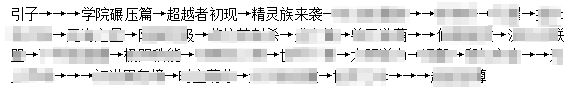
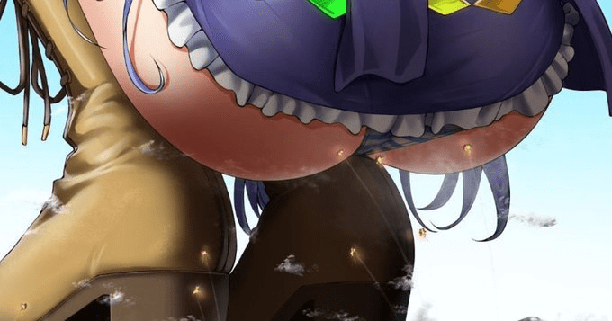
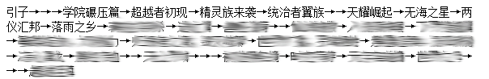

# 【2／10】超越至尊c8p8 着重写了点福利

作者：叛徒

TID：16930

# 1

*本帖最後由 叛徒 於 2022-2-10 21:54 編輯*

感谢各位观众大佬的观看~如有大佬想要添加qq好友请私信我

对了，最近吸取某位读者大佬的意见，在文前补充主要角色的外貌特征。

素莎：170，92-63-90，及背黑色直发

绮鸽：172，96-64-92，及腰米黄色卷发

小琪：151，75-54-77，颈间褐色直发

凉心：159（身高不断发育中），青荷色中发

澈萌：163，85-60-87，短卷发

罗瑞：181，蓬松乱发

紫凰：175，92-65-91，斜刘海紫色及臀小卷发

注：身材与发型会根据食量与心情随时改动，不是定值！~

# 2

*本帖最後由 叛徒 於 2014-12-13 23:11 編輯*

chapter 0

黑与红的对撞，白与红的交锋。

曾几何时，红色压倒性的优势，逐渐被黑与白扭转。

超越的力量，反逆乾坤。

至高无上的殷红，就此陨落。

帝血堕落吧，投入卑微的下界。

永无回天之日。  

# 3

*本帖最後由 叛徒 於 2014-12-22 12:27 編輯*

chapter 1

part 1

素莎擦干额角的汗，衣服都不脱就愉快地跳入注满热水的浴池。

偶尔练习一下魔法，感觉也不错，【最大值】又顺利地增加了17%～开心！

“大小姐……请您注意举止……”目睹小主人的随性行为，女仆无奈地规劝。

“你是新来的吧？”然而，素莎的表情突然阴沉下来。

“唔！……回大小姐，是的……我有什么话让您不高兴了吗？？……”女仆被素莎的脸色吓坏，连忙跪在浴池边。

“在我面前不要多嘴，记住了吗蝼蚁？”

素莎冷冷嘱咐，然后又自顾自从广大的浴池里翻滚扑腾。华丽的蕾丝长裙遇水后紧贴在她曼妙的胴体上，显露出她傲人的身材，再加上她那完美无瑕的脸庞，如果忽略她这有些奇怪的性格，俨然是女神的风范。

而实际上，即使她的性格有些怪异，她在这个魔法学院中，也是无数男生的无上追求。

素莎究竟多么受欢迎？记得有一次素莎被无穷无尽的追求者逼得走投无路，然后她愤怒地说想要追求她就得跪下舔她的脚趾，结果超过一百痴汉连忙挤到她的脚下争先恐后地伸出舌头就要去舔，差点把素莎吓死。

这帮狼，喜欢的究竟是我还是我的脚啊……

自认有几分s性格的她，也被这阵势惊到。

罢了，等我达到第四位阶后，一定要成长到极限然后一脚把他们全部踩成肉泥！就算如此恐怕他们也得兴奋坏了！

素莎慢慢脱下被水打湿后紧贴在长腿上的纯白丝袜，感受着如同被舌头舔的感觉。

“其实如果我愿意的话，完全可以让真人来舔呢。”素莎对自己掌控的权力自信满满，更对自己的魅力有着清醒的认识。

“大小姐……您在说什么？”女仆耳朵很尖，居然听到了素莎的自言自语。

“新来的……”素莎突然从水中站起，几步走到浴池边，将脚踩到女仆的面前，“同样的话我不想说第二遍。你还想不想留在这里了？”

女仆被吓得浑身颤抖，连忙磕头如捣蒜：“大小姐请原谅……大小姐请原谅……”

“那好，我要出浴了，可脚上还有水，会把鞋子弄湿的，你说应该怎么办？”

女仆心想你连衣服湿透了都没事，却又担心起鞋子来了，可她却不敢失去这宝贵的职务，只好将头放在素莎的脚尖前：“我给大小姐擦干净。”

“擦干净？”素莎将小脚举起，轻轻地放在了女仆的头顶，然后开始缓缓向下踏足加力。女仆被素莎踩踏发出痛苦的呻吟，可素莎却笑吟吟地看戏，目视女仆的脑袋将浴池地面压坏逐渐嵌入了地面内。

“高阶武者……还不错的素质哦，不知道能不能接住人家一根脚趾的力气呢？”素莎眨了眨眼，她脚下的女仆居然突然缩小，转眼间就变成虫子大小，趴在浴池边的那个坑里瑟瑟发抖。

素莎用一根脚趾将女仆踢飞，然后对她说道：“现在，你用舌头，给我把水舔干净。”

女仆完全崩溃，跪爬到素莎的脚下，流泪伸出舌头……

“逗你的啦！好逊哦！嘻嘻！”在女仆的舌头马上接触到素莎的脚趾上时，素莎打了响指令女仆恢复了本来大小，然后踮脚跳过了蜷缩在地面上的女仆，哼着歌离开了。

而女仆双眼无神地躺在地面上，舌头还保持着伸出的姿态……

——分割——

圣歌大陆，方圆几十万公里的巨大领域，被魔法主宰。

火球、冰剑、狂风、闪电，除了这些古老的传统魔法外，还存在着罕见的新兴魔法——体型放大术。

这种魔法原本是远古异大陆魔法师发明出的强力杀人术，只要释放到人身上就能让人体剧烈膨胀然后胀裂死亡。可异大陆魔法师用这种魔法进攻圣歌大陆时，却发现该魔法虽然对圣歌大陆男性奏效，却仅仅会让圣歌大陆女性身体变大而不能杀死她们，结果战争呈现出一边倒的局势，异大陆敌人们被巨大化的圣歌大陆女子轻易击败，并被全部俘虏变成了奴隶。

而体型放大术也自然被圣歌大陆人掌握并发扬光大，并又从中演化出只有女性才能成功释放的缩小术。

这种放缩魔法，代替古老的常规魔法成为了圣歌大陆女性魔法师首学的强力技能。而女性因为这两个魔法的特性，当之无愧地成为了圣歌大陆的支配者。不会放缩魔法的人，即使常规魔法或者武技超强，也被当做【蝼蚁】，被掌握放缩术的女魔法师们随意践踏。

圣歌第一魔学院，全大陆最高魔法学府，垄断着放缩术这一霸道的魔法，是实质上的大陆主宰。

学院的学生都是亿里挑一的超级精英。所有男学生都是常规魔法达到魔导师级别的厉害人物，但他们理所当然的远远没有女学生厉害……

所有女性学院都掌握至少第一位阶的放缩术，也就是能够将物体缩小到十分之一，自身成长到十倍。

而由女学生中的顶尖精英组成的天使班，其成员个个拥有不低于第二位阶的能力——将物体缩小到百分之一，自身成长为百倍。

那么身为学院公认的三大圣女之一的素莎，实力则达到了恐怖的第三位阶：千倍放缩，达到了往届最强毕业生的水平。而且更为可怕的是，学院为六年学制，可十六岁的素莎才仅仅入学一年而已。

学院上下所有人都相信，素莎能够将学院最强毕业生的记录提升一个次元。

某个平常的日子。

“素莎酱快起床啦～要迟到了呀！”门外响起急促的敲门声。

“困死了……我不去上课了……”门内传出慵懒的呻吟。

“素莎酱怎么这样！即使天赋好也要努力才可以啊！”

“快走吧……我要和被子做对打练习……”

“真拿你没办法……”

小可郁闷地走向了教室，感叹老天为何如此不公，素莎明明不怎么练习魔法的，实力却那么强，真是不公平！作为天使班成绩倒数的几人，小可十分无奈。

“诶！你好啊，小琪～”小可给走在自己前面的矮小女生亲切地打招呼，那位小巧玲珑的女生随之回身，怯怯地回礼：“你好……”

小琪，三大圣女之二，性格比较内向，容易害羞，身为超级美少女却没有丝毫自觉，总是穿着不怎么好看的便服，十四岁，属于被提前两年破格录取的超级一年级生。

她虽然是三大圣女里唯一一个仅是第二位阶的人，但她却有着别人所没有的能力，可以同时释放放大术和缩小术，所以单论相对大小来说她反而是最厉害的。

“今天的对练请多指教呢！”小可对小琪笑呵呵地说。

“好……”

来到教室，一进门就看见很多人围在一起观看着什么，小可瞄了一眼，发现果然是由【她】引起的。

绮鸽，最后一位三大圣女。她的放缩术同样达到三阶初级，仅仅比素莎差一点，而且相对于丝毫不会传统魔法的素莎，绮鸽却同时是全学院最强的水火魔法师。

绮鸽的美，属于那种葡萄酒的芬芳，越品越有滋味，越看越难放弃。可是如同她的勾人的容貌，她的性格也让人欲罢不能，据说一年级的绮鸽已经找了超过一百个女朋友了。

没错，就是女朋友。据绮鸽本人说，她对男性没有兴趣，只有萌妹子才入她的法眼。即便如此，很多男性依旧苦苦追随着她，即使是做她的奴仆也甘之如饴。

现在，绮鸽被人围住，就是因为她又在教室里调教她的小奴隶。

“我的鞋底走路都走脏了，所以你们的舌头能够派上用场了呢。”绮鸽将一双穿着水晶高跟鞋的长腿放在桌子上，任由被缩小到厘米级别的小男人为她舔鞋底。

“咳咳……要上课了。”任课老师尴尬地走进教室，却不敢说些什么。这个天使班的所有人都有着常人不敢想象的权力，他一个普通老师可不敢得罪这帮大小姐。

“绮鸽同学……能不能……”发现绮鸽满不在乎地依旧让自己的小奴隶们为自己服务，老师实在看不下去，低声提醒道。

“老师你在说什么？”绮鸽脑袋一歪，笑着看老师。

“呃……绮鸽同学，您的腿是不是该放下去了……”不知不觉，老师的后背已经被冷汗浸湿了。

“哦，老师你说的有道理！”绮鸽的话让老师松了口气，可他突然感觉天旋地转，随后发觉面前的所有事物似乎都变得异常。格外巨大的桌腿让他明白了自己的处境，他刚想说什么，却发现头顶突然被黑暗笼罩，他连忙抬头，发现一只水晶高跟鞋正向着自己头顶踩下来，而高跟鞋此刻变得比自己还要巨大好几百倍，连鞋跟底部都能轻易地同时踩住复数个自己。

“老师，我可是听了您的话，把腿放下来了呢。”上方传来绮鸽认真的声音，高跟鞋也加速下落。

“绮鸽同学……绮鸽大小姐……绮鸽姑奶奶！我错了！我再也不敢了！请您饶了我吧！哇啊啊啊！！！！！”老师绝望地看着巨大的高跟鞋慢慢踩上了渺小的自己，他拼命挣扎，却无法撼动高跟鞋一丝一毫。

“我给您当奴隶，我给您舔鞋底啦！您看看我舔得多卖力！舔、舔、舔、舔、舔……”

身上的高跟鞋突然抬起来一点，老师以为自己得救了，却听到绮鸽的话：“当我的奴隶？舔我的鞋底？身为蝼蚁的你，配吗？”

绮鸽将抬起的鞋底向下轻轻一踏。

“让人厌恶的蝼蚁！我的脚保持悬空，害得我的脚趾都有点累了呢。”

……绮鸽随便就杀掉了上课老师，全教室的同学，却居然没有一人惊讶。

没有能力的蝼蚁，本就应该被她们随便处置。在这个全大陆最强势的学院的最强势的精英班级，随便一人都注定要权倾一方，统治众生。

老师？那不过是用来传授她们知识的工具罢了。工具终究会坏的，用坏了再换一个就是了。

# 4

*本帖最後由 叛徒 於 2014-12-22 12:30 編輯*

part 2

每个月的第一周，是圣歌第一魔学院的女学生出游放松的日子（圣歌大陆女性为尊，即使是第一魔学院的男学生地位也不高）。每到这个日子，全大陆的人都会暗暗发抖，因为学院说不定就会选择自己这里作为出游地点，而那就意味着无法想象的噩梦将降临在自己的家园。

不过，素莎这次是打算跟几位要好的同学脱离主队伍自己找个地方玩。

“南部平原有什么好玩的，我们去北部高山区吧！”素莎轻轻松松就将破灭带往了大陆之北……

北部高山区的人在得知学院的出游决定后松了口气，殊不知同样可怕的事将要发生在他们身上。

趁机逃离主队伍的素莎、小可和被强拉出来的小琪，乘坐着飞毯已经来到了北部高山区。

“我们这样……真的合适吗？”小琪的语气依旧是弱弱的，身为好好学生的她对这种违反校规的做法很是担忧。

“这怕什么，难道学院还会惩罚身为天使班成员的我们吗？”素莎满不在乎。

“到了，天穹瀑布！”坐在天空中翱翔的飞毯上，小可兴奋地指着下方。只见天穹瀑布果然气势恢宏，落差高达数百米的河流瞬间落下，冲击着下方的广阔深水溅起美妙的水花。

“我们下去！”素莎三人一跃而下，修炼过放缩术的她们，身体素质比常人要强大上万倍，即使是最强的武者也绝非她们的对手。

砰！她们重重地降落在瀑布边，用手指着瀑布大声赞叹。

“你们三个是什么人，竟然敢对着神圣的天穹瀑布指指点点！”附近正在朝拜瀑布的当地人责骂着三人。因为三人没穿校服，所以当地人并没有认出她们的身份。

“你是什么东西？身为弱小的蝼蚁还敢责骂我们？”素莎冷笑道。

为首的强壮中年被素莎的蔑视激怒，想要上前动手惩罚这三个不敬之人，“我可是顶阶武者，你们不要以为自己长得漂亮我就会轻饶你们！”

他伸出粗壮的手臂想要抓住素莎，却被素莎伸手一摆就扫到地面上站不起来。素莎开心一笑，伸出穿着奢华高跟鞋的脚放肆地踩在了中年的脸上。

“顶阶武者？配给我垫脚吗？”素莎脚趾用力，中年的身体突然缩小为虫子大小。素莎用鞋底来回蹂躏着中年，如同玩弄着一只臭虫。那位中年拼死挣扎，可他怎么可能反抗比自己还要巨大许多的坚硬鞋底呢？！

“超越者……还是，第一魔学院的人？”其他人都惊呆了，有几个懦夫连忙逃跑，也有勇敢的人硬着头皮对素莎三人说：“三位大人，这天穹瀑布是我族的圣迹，请您不要对它这么鲁莽……啊大哥！！！！”

素莎听着这群蝼蚁的话，突然觉得非常可笑，然后把翘起的鞋底放在了地面上，鞋底下不断挣扎的中年就被素莎随意踩成了肉酱，死不瞑目……

“整个大陆都是我们学院的，你们族的这什么破圣迹还有多了不起？”素莎放出威压，所有人都被素莎的气势压得跪在地上。

“请您……尊重我们……”他们还在苦苦挣扎。

“嘻嘻，好啊，让本大小姐来尊重你们。”素莎被这群蝼蚁们逗笑了，然后牵起小琪小可的手说道，“来，我们好好的‘尊重’他们。”

众人突然感觉天黑了，他们勉强抬起头，发现阳光都被遮蔽，而他们扭断脖子也仅仅能够看见三位少女那无匹巨大的……鞋尖。

素莎小琪小可，此刻化身千米之高，如同耸立的高山突兀地傲立在天穹瀑布前。与她们相比，连震撼人心的天穹瀑布都小得可笑。

素莎将赤脚从鞋子内取出，先是举到众人头顶晃晃，让他们嗅着少女特有的芬芳的体香，然后又将脚，慢慢地伸入了天穹瀑布里面。

天穹瀑布飞流直下的波涛，不遗余力地冲刷着素莎的脚面。被晶莹透彻的水流所沾染，素莎的玉足显得更加可爱高贵。

“这水很凉爽呀，用来洗～脚最合适了呢。你们说是不是啊？小琪小可你们也别闲着，快来试试看呐！”素莎嗲嗲地调笑，睫毛微垂俯视着那些彻底石化的当地人，嘴角露出最纯洁无邪的表情。

素莎的脚尖从瀑布下的深水池中来回搅动，十多米高的浪花冲击着河岸，也溅了跪在岸边的那些人一身。小可也兴奋地将脚上的坡跟鞋取下丢到一边，将这神圣的瀑布当做洗脚水来玩耍。

哗啦啦，哗啦啦。两位少女的小脚，在跟瀑布愉快地玩耍。

“能够给身为天使班成员的我们洗脚冲凉，你们的这神圣的瀑布，想必也是受到了极大的【尊重】了呢。嘻，好凉，脚好舒服。”

当地人木然地看着神圣的瀑布被巨大的少女用来洗脚，身体被水打凉，心也凉了。他们将原本挣扎高昂的头颅放到地面上，身体和内心都屈服给了面前的三位践踏万物的少女。

“素莎，我就不试了……我还穿着袜子呢……而且鞋子也是布的……”小琪低声细语。她，却是在想着众人刚才所说的话。

放缩术理应被学院独占，可是听他们的意思……

超越者，究竟是什么势力……

与此同时，天穹瀑布不远处。

“姐姐，忍住！她们的放缩术达到了三阶，我们不可能跟她们抗衡的！”

一年龄在十四五岁的男孩死死拉住身边十六七岁短发少女的手。仔细观之，男俊俏女美妙，两人简直如金童玉女般。尤其是那短发少女，与在场的素莎与小琪两位顶级美女相比各有姿色，丝毫不落下风。

“可恶啊！她们这样侮辱着世人，却没有人敢反抗吗！”短发少女放弃了挣扎，用手使劲锤击着地面，将地面打出大坑。

不甘心的少女流下悔恨的眼泪，绝世容颜被泪水打湿后如同出水清荷，晶莹澄澈中更显孤芳自赏般的落魄。

“话说回来，她们看上去也就十五六岁的样子，可实力居然这么厉害……太恐怖了吧，历史上最年轻的三阶都二十岁啊！”男孩话里充满了敬畏。

“啧！再过几天，我肯定也能达到第三位阶，到时候一定要让她们好看！”短发少女急躁不已，“我们要不要赶紧回本部报告，请高手们出面把她们三个干掉？”

“不行，那样会暴露我们，为了杀三个人暴露我们的计划，太不值得了。”男孩虽然嘴上这么说着，可心里却隐隐害怕。

姐姐，你太高估组织的实力了，除非组织的所有人员全部出动，否则很难解决第三位阶的敌人。在姐姐你也达到三阶之前，我们组织必须要隐忍啊……

——分割——

而在南部平原……

“学院选的这个地方真不错呢，有青山有绿水，还有必不可少的蝼蚁群落～”某三年级的天使班学生妹兴奋愉悦地从一村落边停住脚步，蹲下三十米高的身子用手指逗弄着草原上放牧的羊群。

接近两米长的手指，温顺而又胆小的绵羊何时见过如此巨大的东西？羊儿们被吓得咩咩叫，慌张地成群结队来回奔跑，而学生妹则故意将手指点在羊群的前进方向上，让小羊们疲于奔命。

而这群羊的拥有者则远远看着自己辛苦放牧的牲畜被巨大的少女玩耍着，却根本不敢吭声反抗。

羊和命，谁都知道哪个更重要一些……

“原来羊是这么蠢笨的动物啊。”另一位蘑菇头少女走了过来，观察了一会儿后厌恶地抬起脚，用越野短靴的靴尖将小羊一脚踩扁。

“唉……！你干嘛，小羊们这么可爱，为什么把它们踩死？”

“一些下贱的玩意儿罢了，就跟这些牧民一样，一辈子拼死拼活挣的钱还不够我做一次指甲。”少女随口羞辱着附近的原驻牧民。

“你……你们欺人太甚！！”终于有人无法忍受这些少女的破坏与羞辱，发出愤怒的吼叫！

……可是，面对他人的指责，巨大少女们非但没有生起歉意，反而是相视而笑。

“每次都有愚蠢的虫子妄图争取它们那本就不存在的尊严啊。”蘑菇头少女像是早就预料到这种情况一样，“明明没实力却硬要索取权利，脑袋肯定有问题。”

蘑菇头少女迈开长腿，没几步就走到那人身前，双手掐腰静静地俯视着脚尖的小人儿。那人被少女盯得有些发怵，可最终鼓起勇气抄起一只铁锨向着少女的靴尖死命砸去！

砰！！

铁锨的木把应声而断，那人的虎口被反震力绽开，可……少女的靴尖，连反射的光亮都不曾消退减弱……

“无知。”蘑菇头少女蹲下身子，伸出一根手指头，轻易将那人按倒压在地面上，“尽全力挣扎，看看你能不能撼动我的一根手指呢？”

“我跟你拼了！！！”那人开始垂死挣扎，草地被他撕扯得露出泥巴，指甲都身处了鲜血，可压在身上的指尖始终纹丝不动。

小人与少女，一位极度挣扎，一位纹丝不动，一动一静，构成了极端矛盾的画面。成年男子，竭尽全力却反抗不了少女的一根手指，这是多么大的悲哀……

“呼呼……呼……”终于，那人浑身脱力，放弃了抵抗……

“不再动弹了？明白你们跟我们之间的差距了吗？所以，当看到圣歌第一魔学院的学生时，抓紧跪下恭迎就好了。”蘑菇头少女将指尖抬起，然后向着小人儿吐了口唾沫，这才走开。  

# 5

*本帖最後由 叛徒 於 2014-12-28 11:19 編輯*

part 3

“作为天使班的骄傲成员，我们今天要参观学院内的绝密领域，请大家不要将今天所见到的一切说出去。”天使班的学生会长、六年级的黛兰带领着一年级生走到了被学院严密看管的禁地之前。

黛兰是属于那种古典美的少女，年龄在二十岁（她跟小琪一样十四岁入学）的她外貌绝对仅有十六七岁，看上去跟一年级生也差不太多。单马尾是她最大的外貌特征，据说学院很多很多女学生都梳了单马尾就是因为崇拜黛兰。

“听学姐们说，这里面有非常了不得的秘密呢……”小可同前后的人交头接耳。

众人来到学院禁地之一接天塔。该塔拥有两千米的高度，是圣歌大陆上少有的高大建筑之一。

黛兰将手掌贴在巨塔的大门上，禁地的九重封印被逐一解开，黛兰的表情也严肃起来：“我再重申一遍，禁地内的所有秘密都不能外泄，即使是学院的其他同学也不行，这是属于我们天使班的专属情报。好，我们进去吧。”

在禁地不远处的校长室内，一穿着干练的中年女子对悠闲坐在椅子上的银瞳黑发少女问道：“校长大人，她们这么小就接触【低级宇宙】，真的没关系吗？”

“天使班的所有人将来都会是圣歌大陆的统治阶层，这点秘密对她们来讲根本不算什么。”

“万一她们控制不住……”

“她们想怎么玩，那就怎么玩好了。凯琳老师，你可不是关心低级宇宙死活的人啊，因此我要对你说一句，嫉妒这种感情可千万不要产生在我的天使班孩子身上哦。身为蝼蚁，你已经知道的够多了，再去尝试着向你不该接触的领域伸手，就算你能力再强也无法保住你的性命的。”

银瞳黑发少女随意地将那有着黄金比例的嫩白长腿斜放在桌角上，指尖指挥着若干个葡萄大小的圆形黑色不明物体飞到她的脚边，然后让【葡萄】在她的脚趾上来回摩擦。圆形物体受到挤压开始渗出鲜红色的汁液将她的趾尖打湿，趾甲也因此染上了最妖艳的红色。

“你知道这些圆东西是什么吗？”

“……属下不知……”

“呵，跟她们要见的东西是一样的。”

“什，什么！”干练女子突然瘫坐在地面上，两只眼睛直勾勾地看着校长少女的鲜红脚趾甲。

“很漂亮对不对？那是当然，这可是世界的颜色啊……”

视线回到禁地内。

“我先要问你们一个问题，我们的世界是什么样的？”黛兰询问道。

所有人互相对视，不知道黛兰为何要问这种问题，过了很久，小可才开头说道：“我们生活在圣歌大陆，而圣歌大陆则是名为【真知】的星球上的若干大陆之一。圣歌大陆以我们学院为中心……”

“好了不用说了，我大概知道你们的认知度了。”黛兰打断小可的话，让小可有点尴尬，“实际上，【真知】星球只是围绕太阳运行的十几个星球之一而已，而上亿的太阳则构成一个星系，上亿的星系才构成我们所处的整个宇宙。但是这知识被全大陆的掌权者共同封锁着，所以你们进入学院之前不知道也很正常。”

“宇宙……原来世界这么广阔……”素莎也是第一次听说，她顿时情不自禁地展开想象……

无数人口组成大陆，无数大陆组成星球，无数星球组成星系，无数星系组成宇宙……

素莎突然感觉到有一个宏大而精美的世界，正从她的脑海中构建。【她不知道，这在想象中建立起来的世界，究竟对她的人生产生了多么深远的影响……！！】

“然而，虽然你们一辈子都不可能理解宇宙的广博巨大，但很遗憾的是，宇宙这个层次仍然不是终点。请闭上眼睛。”

所有少女的心都被黛兰的震撼阐述所牵引，不由自主地跟随着黛兰的引导，闭上了秀气的眼睛。

“呀，这里是哪里？”虽然闭上了眼睛，可视野里居然不全是漆黑，而是有着无数闪烁的亮珠，如同萤火虫群美丽迷人。

所有人被这【似曾相识】的景色所发动，纷纷伸出手想要去掐住一颗亮珠。

“我劝你们最好不要去碰，当然，如果非要的话我也不拦你。”黛兰突然提醒。

黛兰的话还是非常有分量的，几乎所有人都抑制住触碰的冲动，唯独素莎满不在乎地伸出手指，继续摆弄着眼前的那颗亮珠。

食指指尖轻轻戳了戳亮珠，顿时就让原本静止的亮珠开始偏移，素莎连忙伸手抓住亮珠，放在手心把玩。

“有点微微的热度，而且，比想象中要软，有点像橡皮糖。”素莎玩了一会玩腻了，就随手将亮珠捏碎。黛兰看在眼中，也没说什么。

“接下来可能会有点晕，大家不用过度惊慌。”

眼前的景色突然急剧放大，亮珠瞬间就变得如同山脉般巨大并且仍旧继续在变大，直到原本萤火虫渺小的亮珠已将视线的一侧全部遮住……

与此同时，从虚空处突然出现一个小小的黑点，那黑点仿佛无中生有，从针尖大小快速变成无与伦比的巨大，而黑点上也闪过展露出更多细节，然后细节再度放大……

但是放大的速度非常之快，所有人只顾克服眩晕的感觉，全都没有看清……

眩晕感消失时，众人突然置身于一个闹市之中。与圣歌大陆的风格完全不同，这个城市内的建筑非常方正高耸，人们都穿着非常奇怪的衣服对她们指指点点，很多装着人的移动钢铁壳子因为她们堵住了道路而从她们身边停下，还有穿着貌似制服的人走上前来说着她们听不懂的话，并手舞足蹈似乎想让她们从道路中央闪开。

“放肆，难道他们不知道应该给我们让路吗？”素莎愤怒地说道，“而且好多臭男人居然用这么色的目光看我们，身为丝毫不会魔法的蝼蚁居然还这么大胆！”

她气愤地伸出一根手指，环绕四周释放出第一位阶的缩小术。

“唉？他们人呢？为什么消失了？”面前的所有人理应变成十厘米大小，可是不知为何却突然都不见了。

“不对，他们……为什么变得这么小了？”小可蹲下身子，用手指着似乎空无一物的地面。素莎连忙也睁大眼睛仔细查看，发现人们居然都变成了不足一毫米大小的超迷你体型了。

“为什么会变这么小？我只是使用了一阶的缩小术啊？”

看着这些比蚂蚁还小的人们还想要跑到自己脚边反抗，素莎吹了口气就让他们都滚得远远的。

“我再试试！”素莎对着几个小人又释放了二阶的缩小术，结果他们全都缩小到肉眼根本看不见的地步了。

“唉？我的缩小术也变得厉害了！”小可兴奋地指着脚边的一厘米大小的迷你建筑，“它原本足足有好几百米高呢！”

“那么，一阶的放大术呢？”绮鸽突然想到这样的问题。于是她对着天使班的所有成员释放了十倍的放大术。（学院规定，非交战情况下，女学生想要放大自己的体型，必须将在场的所有女学生同样放大，以避免不必要的摩擦）

“咦！我的天呐！”

所有人的体型都快速膨胀，达到十倍后仍旧不停止，只见高耸的建筑逐渐比自己都矮小，整条街道都要展现在众女脚下……

“这是……上千倍的体型吗……”

众女还沉浸在震惊之中，黛兰笑了笑，暗自发动了高阶放大术。

“天啊，怎么又开始变大了？”街区又开始快速缩小，很快，最高大的楼厦也比沙粒更小巧，举手投足间她们就可以毁灭城市，可她们还在变大，变大。所有人都惊呆了，她们根本不曾感受过这么巨大的体型。

直到，大陆在她们脚下变成地毯，星球在她们眼前变成了水果，太阳在她们身边变成了亮珠。而刚才那个星球，应该被吸附在她们某个人的鞋底上，成为了一颗低微的灰尘。至于星球上的人类，连灰尘都不如。

“难道……刚才的亮珠……是太阳……！！”素莎突然反应过来。

“是啊，刚才你在手中玩耍的，就是一颗巨大的恒星。估计你随手玩的那几秒钟，上亿的生灵正徒劳地看着主宰自己的太阳被超巨大少女当成弹珠把玩，行星被你无意识的手指动作撞烂，环绕那个恒星生存的所有生物都被你毁灭了。”

“那……这里到底是哪里……”小可颤抖着说道。

“你们平时应该都接触过幻想小说吧，里面有‘主角实力成为世界最强后飞升上界，然后又变成上世界最弱的人’这样的剧情吧。而这里，就是相对于我们宇宙的低级宇宙。说起来，这个低级宇宙跟别的还有不同。这里的科技很发达，听说可以不依靠魔法就能制造出能够毁灭全星球人类的武器，不过还是远远不如我们的一根手指强大。”

“在低级宇宙，我们的一切魔法能力都会大幅提升，刚才你们的放缩术效果变强就是因为这个原因。实际上，我还中和了你们放缩术真实效果的99.99999%，否则你们根本意识不到刚才的现象。”黛兰笑了。

“那……这就是您说的，超越宇宙的层次吗？”小可问道。

“是的，我们将这称作【次元差异】。我们现在所在的，就是次元低于我们的宇宙。而这种附属于我们宇宙的低级宇宙，比海滩上的沙粒都要多。所以素莎你不必太在意，低级宇宙的一个恒星而已，还配不上你的忧伤。”黛兰打了个响指，无数亮珠——也就是恒星向着她的掌心飞来，她抚摸着恒星，然后将它们一把攥烂。

“另外，低级宇宙内还有无数更低级的宇宙，我们最多探索出六层宇宙结构呢。不过我个人觉得这研究没什么用，因为即使是这最高级的低级宇宙，”她突然吟唱了放大术，“张开眼睛吧……低级宇宙这种东西，对于我们来说不过是葡萄大小而已，有谁会在意葡萄宇宙内的葡萄呢？”

众人睁开眼，显现在众人面前的，是若干葡萄大小的圆球。

“这还是最巨大的低级宇宙，再小的我们用肉眼根本看不见。不过别看它们小，你们可不要轻易碰它们。不是因为害怕你们会毁了它，而是你们现在的实力太差，有可能会被低级宇宙的【宇宙元力】伤害到。实际上，所有男性都不可能进入到低级宇宙，因为会被【宇宙元力】瞬间杀死，而只有掌握了三阶及以上放缩术的女性才能自由进出低级宇宙。我想，除了素莎跟绮鸽，你们都没有这么强的实力吧。”

“会长，这低级宇宙是学院发现的吗？”绮鸽问道。

“没错，大陆上零散分布着很多低级宇宙，都被我们学院控制起来并对外严格保密。如果你们不是天使班成员，你们也不会知道这个秘密。”

黛兰带领天使班走出了接天塔。今天的课结束，所有人都回到宿舍休息。

可是，素莎的眼睛却亮了起来，她徘徊在禁地附近，久久没有离开。  

# 6

> wtman 發表於 2014-5-29 19:59

> 吐個槽:

> 話說強大/狂妄的殺死了老師，怎麼還在上課?

> 年齡小就這麼強大，不就輕易成為聖歌大陸的真神?怎麼還 ...

感谢大神的点评！～现在我来为您解答一下

1.学院里的【老师】都是教常规课程的，例如传统魔法和一些语数外物化生啥的……作为【蝼蚁】他们的地位都不高，数量也很多随时补充，而学院的核心科技——放缩术由天使班成员代代传承，亲自担任低年级天使班及普通女学员的导师。

2.确实有比她们强太多的人在震着，比如此次登场的学生会长乃至校长大人，三阶实在不够看。

3.毕业就分配工作哦，圣歌大陆本身就是由学院所统治，因此学员就相当于准干部，六年考察期到了（毕业了）就走马上任。

4.超越者的底蕴比part3中表现得要深得多，前三part其实还没说明世界观，圣歌大陆远远不是世界的全部呢。

5.姐弟会是重要角色，他们的身世也很特殊（就是所谓的超越者）。

6.其他的暂时不剧透了^ω^  

# 7

> yjl0119 發表於 2014-5-27 23:35

> 我一直在想开头的帝血这玩意，它是投给下界的强者，让弱者被欺负的更惨，来激发残酷系的快感，还是投给弱者 ...

是偏向后者那种感觉，超越嘛，文章主题  

# 8

*本帖最後由 叛徒 於 2014-12-28 11:24 編輯*

part 4

夜深人静。

寂静的校园中，突然有黑影闪过。

“嗒，嗒，嗒。”高跟鞋敲击地砖的声音，从接天塔门口响起。

“用手掌贴在门上吗？”素莎回忆着清晨的经过，“第三位阶的放缩术……应该就是开启大门的钥匙吧。”

她迟疑了一下，还是鼓起勇气伸手贴在门上。

“这是……！！”门上突然产生了某种吸引力，迫使素莎本能地释放放大术，然后吸引力立刻消失，禁地大门打开。

素莎连忙进入了禁地。她不知道，远处正有一个银瞳黑发的身影看着她。

“素莎，史上最有天赋的放缩术魔法师，入学一年来仅仅修炼了不到一百个小时，能力就达到了惊人的第三位阶。还有绮鸽，精通放缩术与水火魔法，资质丝毫不逊色于素莎。再加上掌握双重施法神技的小琪……真是意外，能够将千百年来全大陆所有天才的天赋轻松蹂躏的人，居然同时出现了三个……而且，两个满足三阶要求的人今晚居然都来这里了……”

银瞳黑发少女的嘴角翘了起来。

“对了，还有个搅局人。”

禁地内。

“咦！绮鸽！你怎么在这里？！！”

素莎在禁地内居然看到了熟悉的身影。

“哎呀，素莎？你也来了啊。”绮鸽身着华丽的晚礼服，优雅地坐在座椅上，伸手摆弄着手指尖的黑色圆球——低级宇宙。

“你知道吗，用心去感受的话，你就能从这里面听到无数的痛哭和哀求。”绮鸽用手指拈住一颗低级宇宙，送到唇边轻轻舔了舔而后张开小嘴将其吞下咀嚼，“被咬碎后，这里面会流出很可口的鲜红色液体哦，听说叫做【本源圣液】，是整个宇宙最精华的能量。”

“你……你嚼碎了一个宇宙……！！”

“怎么了，难道我可爱的大小姐居然心疼了？不要太虚伪哦，你既然来到这里，恐怕也是来玩弄它们的吧。”

“可是……我没想过玩这么大……”

“那么……”绮鸽突然站起身牵住素莎的小手，并靠近素莎的身体，暧昧地伸出性感的舌头尝试着伸入素莎的口中，“我们就进去吧。”

“不要……不要……”素莎脸红耳赤，身上却又暖又痒，竟然无力反抗绮鸽的动作，只能任由绮鸽将手伸入她的衣裙之内，用手掌玩弄她的豪乳。

“你……你使用了什么魔法吗……”

“谁知道呢，亲爱的，走吧……”

四周的景色突然转变，林立的街道充斥在她们的身下。如同沙粒大小的小人被突然出现的少女巨人惊吓，都纷纷连滚带爬地逃跑。

“亲爱的素莎，你是那么的优秀，天赋让我都羡慕，你却又那么的调皮，喜欢玩弄别人，你的性格让人捉摸不定，却永远高高在上，这些都让我对你充满了感觉。”绮鸽随手从身边拔起一幢高大的建筑，然后放到嘴角舔了舔，“乖，将腿分开，让楼房里的小人幸福地进入你的身体，融入你伟大的生命……快嘛不要害羞，待会儿可就没机会了哦。”

素莎一次一次地将腿闭合，素莎就耐心地一次又一次将它们分开，并用舌头舔着素莎的耳垂。素莎娇滴滴地呻吟着，身体却逐渐起了反应。

“呀，你嘴上逞强，身体却很老实呢……真可爱……”看见素莎的蕾丝内裤逐渐湿润，绮鸽娇笑起来，突然蛮横地将素莎的两腿分开用手臂按住，另一只手拿着建筑磨蹭着素莎的内裤。

“快看，大楼内的人们都看傻了呢，这么美丽的少女，让他们如痴如醉……”绮鸽用暧昧的语言引导着素莎，发现素莎终于不再抵抗，就用手指将素莎的白色蕾丝内裤勾下拉扯到脚踝处然后将内裤从腿间拿了下来放在一旁。

“好漂亮！素莎是我见过最完美的少女！”绮鸽赞叹着素莎那美妙绝伦的私处，用手指沾着素莎下体上的粘液从那敏感部位来回摩擦润滑，让素莎紧张的身体逐渐放松下来。

“准备工作完成！亲爱的，我要上了哦！”绮鸽将不粗不细的建筑，小心地顶在了素莎的下体缝隙处。

“嘤……！”敏感的处子肌肤让素莎感到无限的刺激，可绮鸽紧随而来的双唇将素莎口中的呻吟送回了腹部。

“加把劲，加油哦！”绮鸽一边安慰素莎一边加重手上的力道，大楼旋转着深入素莎的身体。

素莎的双腿无意识地踢蹬着大地，修长的美腿踩着地面切割过若干条街道令纤细的高跟鞋鞋跟一直穿刺入千米外的政府大楼。该地的省长还未知道突如其来的地震的原因，就被少女踩在了脚下。

“疼吗，那是当然，快乐吗，你最清楚。”

绮鸽调教着身下的素莎，让素莎去忘记身体第一次被撕裂的痛苦。可素莎四肢剧烈地蜷缩伸展，脚上的高跟鞋被甩到高空然后重重地砸到了闹市区，将数千无辜小人砸成肉饼。

“不行……！！”素莎终于无法忍受，下意识释放了微效的放大术。转瞬之间，两位少女从千米级别跃升到百公里之巨。原本紧紧插在素莎体内的建筑再也无法让少女产生任何的感觉了。

“唉……可惜没有破掉你的处子之身……来日方长，那就进入下一环节啦。”

绮鸽没有失望，而是立刻开始了新的玩法。

“亲爱的你猜，这灰色的斑块是什么？猜不到吧，这可是刚才的巨大城市呢，即使是你也没有欣赏过这样可爱的景色吧？”绮鸽用手指尖指着两人头边的小小区域。

“哎呀，城市内的人，有的在疯狂逃跑，有的在咒骂，不过更多的是在瑟瑟发抖呢。”

绮鸽拿起素莎的脱力的手腕，让素莎的手掌覆盖在城市的上空，然后说道：“他们还真傻，怎么可能逃掉哦。”

绮鸽松开了手，素莎的手掌失去外力的支撑向着地面垂放下来。

轰！……

素莎的掌心紧密地贴合在大地上，城市与她的肌肤亲密接触。

“咒骂我们的人被全灭！素莎果然厉害！”绮鸽捉起素莎的手连连亲吻，“嗯，我来看看……哦，有发现！你的下体果然湿透了呢，流出的汁液将下面的城市都淹没了！”

绮鸽将目光转移到素莎的胯下，发现那粉红的私处早已泛滥成灾，不断溢出的温暖汁液将下方的城市化为了泳池，小人只能在这粘稠的体液里无助地挣扎溺亡。

绮鸽用手指尖点着那股暖流，让素莎的体液混合着无数小人沾在指尖上，然后用舌头一点点舔干净。

素莎突然挣脱绮鸽的束缚，翻身却将绮鸽骑在身下，并野蛮地亲吻了下去。

“呜呜……原来素莎酱也喜欢我吗……好幸福……”绮鸽伸手拥抱住素莎，迎合素莎的动作。她脚上的奢华水晶鞋因为双腿在素莎纤腰上紧紧缠绕的缘故而踢落，一双完美的裸足贴着素莎腿上的白丝急促地摩擦。

白丝不是所有美女都能驾驭得了的，不过能够被素莎赏光穿在脚上，却无疑是所有白丝的荣幸。素莎两条腿的每寸肌肤都比寻常美女的脸蛋还要娇嫩光滑，没有皮包骨头的瘦弱感，也没有一分一毫的脂肪堆积，曲线完美地如同大自然花费万年才打造出的巅峰力作。洁白纯洁的白色丝袜与衣裙，让素莎仿佛女神一般高贵。

“素莎……亲爱的……好喜欢你，好想独占你的一切……”绮鸽又将素莎反推，手掌不安分地伸进素莎的内衣去揉素莎的傲人胸部，素莎岂能让绮鸽太过放肆，手指探向绮鸽的下面，轻易蛮横地将绮鸽的内裤撕烂，并轻轻玩弄着那稚嫩的凸起。

两位百公里巨大的少女，将自己的身体托付给对方，双双在小人的城市群上快意恩爱。她们身旁的人类都市，因为她两人的微小动作而接连毁灭。

“太小了……太小了……”素莎又玩倦了当前的体型，微微驱动魔法……

无边无垠的星空中，突然出现了两个巨大少女，她们的体型让星球也甘拜下风。

“行星就像西瓜一样大呢。”绮鸽与素莎环绕这星球飞行。

“这星球还真够小气的，按照星球上人类的标准，星球直径也就一万公里吧？这么狭窄怎么生活啊？”素莎埋汰着小星球。

“让他们花费千万年建立起来的人类社会，蹂碎成我们脚下的残渣吧。”绮鸽将裸露的右脚伸出，缓缓地踩在了星球上，让星球表面被她的脚掌重新固定形状。与绮鸽并排的素莎则从另一边伸出白丝左脚，使整个星球被她们的两只玉足夹在一起。

“亲爱的，你以前尝试过泥浆浴吗？”绮鸽突然开口。

素莎有节奏地点着脚趾，用雪白的袜尖将星球上微微凸起的山峦碾平，并做出否定的回答。

“踩踏星球的感觉，意外地跟踩泥浆差不多呢，是因为星球从本质上只是个泥巴球吗？”绮鸽用脚趾将海岸线重新书写，海洋最深的海沟被大陆排开的土层给填平。

“那么你以后就不需要泥浆了呢，像这种小星球可是要多少有多少。”

“说的也是哦。”

她们就这样一边随意地聊着天，一边拨动脚踝旋转着脚下的星球，让星球上的每一寸土地都被她们践踏，顺便杀死上亿的生命。

“我突然很好奇，星球里面是什么？”绮鸽突然提问。

“那就把它切开看看嘛。”

“不，这个问题过会儿再解决，现在……”

绮鸽突然释放放大术，两人顿时再次成长，脚间的星球已经变成了樱桃大小。绮鸽抓住星球，然后递到了素莎的面前，俏脸罕见地发红了：“请将它，亲手塞进我的身体……”

……如此同时。

禁地里，一位身穿黑色紧身服的少女站在两人所处的低级宇宙附近，激动地看着两人的表演。

“这简直是千载难逢的机会……”她伸出手，竟是想要将这个小小的宇宙捏碎！一旦这个宇宙被捏碎，那么身处其中的素莎跟绮鸽也将永远迷失在破碎的空间中！

“停。”禁地内突然穿出清冷的声音，银瞳黑发少女从阴影之中走出来，饶有兴趣地看着黑衣少女。

“校……校长……！！”

“你想要害死我这几千年来最出色的两个学生吗？”银瞳黑发少女走到黑衣少女身边，伸出一根手指就将黑衣少女用魔法束缚住，使她悬浮在空中。

“乐乐，你是五年级生里天赋最高的人，已经达到了第三位阶顶级，甚至有望打破校记录，黛兰毕业后，学生会长职务十有八九由你担任。但是她们出现了，你发现原本学院对你的宠爱消失了，因此你感到不平衡。这很正常，有落差就会有不甘，但是你不该动杀心……”

银瞳黑发少女动动手指，黑衣少女飞速缩小然后进入了那个低级宇宙。

“去做她们的玩具吧。”

低级宇宙内。

那星球上又出现一个百公里级别的巨人，她身着黑色紧身衣，相貌可人，但表情却格外惊恐。因为她看见，这颗星球正被某种力量推着，向着眼前超巨大的私处飞去！

一辈子不曾尝试过这么巨大体型的乐乐，却丝毫没有喜悦与满足感，她明白，自己的人生，马上将要终结在那稚嫩完美的胯间！

不要啊啊啊啊啊啊啊啊啊啊啊！！！！！

伴随着乐乐的呼喊，星球的表面与绮鸽的下体，终于是接触在了一起。星球表面积的三成都紧紧贴合在绮鸽的小缝上，星球瞬间就不再是单调的圆球形状。素莎手指灵巧地飞舞，让星球在绮鸽的缝隙里旋转着深入其中，绮鸽下体微微蠕动，分泌出滴滴兴奋甜蜜的汁液，让星球的海平面提升了几十公里，让整个星球的大陆在她的爱液之中被淹没……

“呀！”绮鸽的双腿过电般颤抖，素莎感到意外：“你有这么多情人身体还这么敏感，难道就没让她们碰过你吗？”

绮鸽喘息着说：“她们……只是我的……玩偶……怎么可能……让她们碰我的身体……只有你……才配做我的伴侣……啊……”

“是吗，那我倒是要感谢你呢……”素莎毫不怜惜绮鸽，大力地将星球塞进了她的小穴。

“呜！天呀……！！”一股暖流从绮鸽下体内喷涌而出，竟然将堵在口上的星球射穿，高潮的绮鸽双腿紧紧闭合在一起将下体的星球夹碎，脚尖还在不断地抽搐，向素莎求饶道，“亲爱的……我累死了……我要歇会儿……不要！亲爱的呀！”

绮鸽惊恐地看见素莎邪气地笑着将远处的另一颗更巨大的星球召唤了过来拿捏在手中。

“疼吗，那是当然，快乐吗，你最清楚。”素莎将绮鸽刚才对她讲的话全数奉还，随后霸王硬上弓。

淫糜的春光，继续上演……

# 9

> asdlkjzaq527 發表於 2014-6-2 09:15

> 总觉得少了些   对小人们感受的描写

首先，part5是从妹子的角度出发、着重于百合的一段文。(╯3╰)

不过诚如您所说，前面几部分也确实少了针对小人的描写，下面的文我会加重这部分的比重的！  

# 10

*本帖最後由 叛徒 於 2014-12-28 11:27 編輯*

part 5

临近期末，一年级生的实习考核到来了。

“本次实习为六年级生协助一年级新生镇压反抗学院统治的城镇。”黛兰对大家说出了今年的实习内容。

“我就奇怪了，为什么还有人胆敢反抗咱们第一魔学院呢？他们这群蝼蚁意识不到跟我们的实力存在天壤之别吗？”素莎对此感到十分意外，“我可以只用一根脚趾就把他们都碾碎。”

“世界上总是有笨蛋的。圣歌大陆上有两千亿人类，一个城镇里都是白痴的概率也有的。”绮鸽笑道，“他们反得正好，他们不反我还愁找不到理由玩弄他们呢！”

素莎与绮鸽相视，绮鸽居然如初恋般害羞地笑了。

“那两位天才不会是……太可怕了……”旁人看在眼里议论纷纷，“连素莎都沦陷了……”

“我为每个人都挑选了合适的地方，大家要分头行动哦。”黛兰笑道。

圣歌大陆西部，黄昏之城，东西长五十公里，南北有三十公里，拥有居民上百万，是座规模很大的城市。城里的百姓前几天将学院驻扎的管理人员吊死，宣布脱离第一魔学院的统治。

这里是小可的实习地点，所以，已经变成了小可的私人玩具。圣歌第一魔学院的最差的男学生毕业后都至少会成为一城之主，女学生则无疑高于男学生的待遇，而身为天使班的成员，小可毕业后至少能够统治上亿人，所以几百万人对于她来说真就是玩具了。

“你随便玩，如果有什么困扰可以找我帮忙。”六年级的学姐和善地对小可说道。两人此刻正在黄昏之城的上空漂浮，脚下的城镇如同树叶般渺小。

“嗯……怎么玩好呢？”小可就如同刚刚得到新玩具的小孩子一样，对怎么玩它做着艰难的选择。

“唉？那似乎是这次反叛的领导者？居然是个挺年轻漂亮的女孩子？对了，就从她开始玩好了！学姐，能不能帮我个忙啊？”

城镇里，艾莎正对着市民进行演讲。

“推翻学院残暴的统治，让超越者将我们解放！未来属于自由的我们！”听闻艾莎的演讲，台下的人们倍受鼓舞。

突然，艾莎感觉到眼前一花，她惊恐地发现，在自己眨眼的功夫时，面前的人们包括街道房屋突然全部消失不见了。

“嗯？人呢？”艾莎疑惑又害怕地向前迈了一步，隐约感觉到脚下似乎踩到了什么东西。她低头一看，惊讶地坐倒在地。

只见街道与居民，都化成百倍微小，如同小小的模型与虫子堆在地上。而刚才她向前迈出的那一步，正好将所有正在听讲的居民踩成了肉酱。

“怎么回事……怎么回事……！！！”她被自己失足踩死这么多人的行为摧毁了理智，晕倒过去。在她晕倒的时候，天空被黑暗笼罩……

“学姐真厉害，除了艾莎，全黄昏之城都被您缩小了耶！不过这个艾莎也太脆弱了吧，不就踩死几百个人吗，居然晕死过去。”拜托学姐将城市缩小，自己又将自身放大，两人的魔法效果叠加后，小可相对于城市达到了惊人的四阶身高！

在十五公里高的小可的面前，原本巨大的黄昏之城就只有几米长宽。

“呜……缩小后的城市比想象的要小……不过算了，就这样吧。”

小可将脚并排踩到东城门外，愉快地说道：“哎呀呀，好小的城市，整个城市里面都没有建筑高过我的脚趾，真是卑微的虫子呀。”

城市中的人陆续都发现了城东的巨大少女，认出了她身上那象征绝望与虐杀的圣歌第一魔学院的女式校服，更有人注意到她的校服与普通款式存在着不同，比如袖口与领子上华丽的金边，脚上非比寻常的坡跟鞋，都与标准制服有些差异。

见识多的人能够知道，随意定制校服的款式，正是全大陆最高贵最强势同时也最残忍最狂妄之天使班成员的特权。

“没想到镇压来得这么快！而且……来的居然是天使班的学生！”根据超越者们提供的情报，黄昏之城的高层认为学院最多也就会派来几个男性传统魔法师前来镇压，集合全城的实力应该可以抗衡，只要熬过了这几天，超越者的魔法传送阵组建完成，全城的百姓就可以安全地撤离，再也不受学院的压迫。

可没想到，来的竟然是女学生，而且还是来自天使班的超精英！再厉害的传统魔法也当然没法跟放缩术抗衡！

小可脚上的坡跟凉鞋，姑且不论鞋跟处十厘米——当然对于暮光之城来说就是一公里的高度，就算只论鞋尖处的高度，也足有两百米级别，整个黄昏之城也仅仅有寥寥数个能够比她鞋尖高的建筑。至于她那离地三百米的脚趾头，更将所有楼房都凌辱了一番。

她见自己已经被很多市民发现，于是向着她的观众们开始了只属于她自己的游戏。只见她将一只脚向前微微伸出，鞋跟着地鞋尖翘起，将东门附近千米的街道囊括在自己的脚底，欣赏着那群失去光线的脚下蝼蚁如同无头苍蝇般乱窜，却怎么也跑不出她的脚下。而那在微缩城市中保持原体型因而“鹤立鸡群”的艾莎，也当然被更加巨大百倍的小可囊括于足底。

“哼，脚踝累了！”

拼命奔跑想要从小可脚下逃脱的市民，绝望地听见了小可的一声冷哼。小可开始将脚尖放下。

“呵呵，蝼蚁们快快跑起来，我可不想踩没有活力的蚂蚁呀。”

由百名顶尖设计师共同设计的田园风格麦色坡跟鞋，那雕刻着简约防滑纹理的鞋底，悠然地碾压向地面。

小可非常控坡跟鞋，因为坡跟鞋可以让她的双腿显得更加修长，而且穿起来也比高跟鞋要舒服一些，毕竟它与地面的接触面积大。因此小可特意定制了很多双坡跟鞋，款式多到她一天换一双十年都穿不重样的地步。作为天使班成员，她甚至可以调用上万工匠为她昼夜不停地设计与制作鞋履。

可坡跟鞋的这种特性对于小可脚下的人们来说，却是毁灭性的。被高跟鞋践踏，如果小人碰巧位于高跟鞋鞋底与鞋跟之间的空处，还有活下来的希望，可被坡跟鞋践踏，一旦被笼罩在鞋底之下，就真的没有丝毫活路了。

犹记得百年前圣歌第一魔学院的女学生制服将鞋子从平底鞋改成高跟鞋时，无数百姓居然为此松了一口气。普通人类的卑微，被展现得淋漓尽致。

没有活命的技巧，逃出阴影就能活，否则就得死！

小可自认自己已经给脚下的虫子们足够的时间逃脱，可她的脚尖却还是以每秒上百米的速度下落，留给倒霉小人的时间仅仅几秒钟。

仅仅几秒钟时间，怎么可能从小可脚下那平方公里级别的鞋底逃脱呢？！！

排开云层的阻挠，那鞋底终于降临！！

哐隆隆隆隆！！！！！小可的脚掌着地，全城震颤，无数建筑崩塌！

而她的鞋下，则成为了修罗炼狱！平均高度二十米左右的建筑在她眼中还不如初春的嫩草高，踩上去酥酥软软触感满分。可小人们却被断落崩塌的房屋压在下面无法动弹，眼睁睁地看着那做工精美的鞋底花纹印在自己的脸上……

而原本昏死过去的艾莎则更是凄惨，她在身体受到压迫的瞬间清醒过来，睁开眼睛后才发现自己被不明巨大物体全部笼罩，她伸出手臂去抵抗挣扎，可全然无法撼动那物体的下落……手臂发出喀嚓的断裂声，胸膛内的肋骨根根折断，鲜血与破裂的内脏从她的七窍中恶心溢出……

小可这轻轻巧巧的一步，就让成千上万人去了地狱。

“对了，你们陪我的鞋子玩个游戏吧。”小可将左腿后扬玉足翘起，将鞋子的固定丝带用手解开，令鞋子脱离她的玉足的束缚，然后她用脚趾勾住摇摇欲坠的鞋子，伸到了城市内部。

在她纤细脚趾上悬挂着的麦色坡跟鞋，随着小可左腿的微颤而来回晃动，仿佛随时可能从千米高空坠落！

无数人被杀人如踩蚁的小可吓得失去理智，跪在地上顶礼膜拜企图挽救自己的卑微性命。

可玩得兴起的小可，又怎么会在乎蝼蚁的想法？！！她小心翼翼地让鞋跟停放在一块大空地内，并将脚趾下降，让鞋子平放在无数建筑之上。阴影下的人们本以为性命已尽，却发现小可的脚似乎并没有向下用力，除了最高的几处建筑被鞋底摧残到平均高度外，街区完好无损。

她想要做什么？

小可用脚尖保持着鞋子的平衡，并分担鞋子的大部分重力。不过紧接着，她开始让脚趾从鞋尖处慢慢地抽出，随着一根根脚趾的解放，鞋尖的重量逐渐转移到了鞋底下的建筑身上。

“嘿咻！”小可将最后的脚趾头从鞋尖的绑带处抽出——

精致坡跟鞋的鞋底之下，传出了整齐的建筑崩塌与尖叫声……

离开小可脚趾的支持后，这鞋底下的数千座建筑全然无法支撑那百万吨以上重量的鞋子，被鞋子自身的重量给压垮碾碎。

“太弱了吧，人家的脚都没使力，单单鞋子的重量就让你们无法反抗吗？上千座你们平日里居住生活的房屋，连少女的一只鞋子都支撑不住吗？那么，你们的脑子是坏到什么程度才想要反抗我们的？”小可将脚送回鞋内，脚底用力，将脚下残存的生命随意践踏致死。

“我将用我的双脚，温柔地将你们全部送到地狱去呢。”小可弯下腿将丝带重新绑住，并顺手从脚边拔起一座三十层建筑，“这是附近最高的建筑，不过也只有这么小。”百米高的巨大楼房在她手中仿佛一根短小的树枝。小可将高楼塞进脚趾缝里，两根脚趾顽皮地来回摩擦玩弄着小小的趾间玩具。

“救命啊！”“可恶，出不去！他妈的！”“我们这是在哪里？有什么巨大的东西把我们的房子给夹住了！”“那巨大的东西就是学院少女的脚趾！我们现在正在她的脚趾缝里！”“天呐不会吧！……”

小可的脚趾来回微微蠕动，可对于楼内的人们来说就是幅度极大的摇晃了！很多人接连撞在墙壁上摔得头破血流，有人尝试从窗户跳出逃生，可最终绝望地发现小可脚趾缝的娇嫩皮肤将所有窗户全部封死了根本出不去！

听着建筑不堪重负咔咔的断裂声，有人终于沉不住气，顺着楼梯向建筑低层奔跑……

就在大约七八个人从顶层狼狈地跑到中间楼层时，上方的楼顶突然崩塌，肉色的巨大物体占据了众人的视野，同时少女的遗憾的抱怨从天空传来：“还没用力呢，上半部分就被挤爆了，真不经玩！”

众人瞬间明白了小可的话语，他们知道必须全力向低层奔跑，否则无疑会被小可的脚趾缝夹成肉饼！

“砰砰砰砰砰……”凌乱的脚步声一路传到底楼。幸存的几个人刚刚从断裂的建筑底部跳出，下一刻整个建筑剩余的部分就被小可的小小脚趾玩碎了。

“天呐……居然活了下来……”

躲避着于天空掉落的碎石块，几人身心俱疲。

“这里是……她的鞋尖处嘛……”呈现在众人面前的，是平坦开阔的一片区域，地面光滑异常，他们中有人甚至还滑倒了。

“这是……顶级紫水晶！”有个传统魔法师发现了“地面”的材质，“绝对稀有的珍贵魔法物品，米粒大小的一块能够大幅增加冰系魔法的威力！无时无刻不发出阵阵寒气……可是，被她……拿来当鞋垫用……”

“我一辈子赚的钱都不可能买一块中品的紫水晶……而她拿顶级紫水晶做鞋垫……”仅仅用紫水晶来让脚底感到清凉，这暴殄天物的做法，让他目瞪口呆。

这就是卑微的蝼蚁与高高在上的放缩术掌控者的无尽差距！

“呀呀，鞋尖上居然有几个人呢？”眼尖的小可居然发现了他们几人！

他们连忙想躲开小可的视线，有人甚至躲到了附近那巨大的物体之下……

“躲到人家的脚趾头下面就觉得安全了吗？”小可动动脚趾将那个蠢货踩扁，“来感受下升空的快感啦！”她整理衣裙坐在地上压碎无数房屋，并将那只脚抬至上千米的高空，挑逗玩弄着鞋尖上的几人。

“喂，我数三个数，你们几个赶紧从我鞋上跳下去免得弄脏我的鞋尖，如果不跳的话你们会死得很惨哦！”小可威胁道。

他们面前，摆放着两个选择。

一，从这几千米高的地方跳下去，摔得尸骨无存。

二，被她以无法想象的手段玩弄后再去死。

怎么可能选择出答案？！！

有一人失去理智，跪在地上——小可的鞋尖边上疯狂地磕头，求饶道：“伟大的女神啊，您饶小人一命吧！我根本没想反抗学院啊，是他们逼我的啊！”

“懦夫！你还是男人吗！”其他人铁青着脸斥责他。

“哎哟？这么说我还应该奖励你的忠诚？”小可释放魔法，动动脚趾把其他几人碾死，却用魔法让那人漂浮起来逐渐向她的面前飞临，“你觉得你应该说些什么？”

他被小可折磨得如同疯癫：“女神大人，他们那帮蠢蛋不懂得您的无边威势不肯臣服在您的脚下，可我懂啊！您如此伟大，几步就能扫平城市，玩转人类如同玩蚂蚁！全城的人都无法同您抗衡！您一定要饶了我啊！求女神发发慈悲！”

“区区一城之人还想跟我抗衡？”

“不……不！全城的人都无法与您的一只手……哦不，一根脚趾相比！您的脚趾就比全城人的性命还要高贵！”

小可被逗乐了：“既然你口才这么厉害，那么你去把他们全部说服吧。”说罢，她操纵魔法令那人回到地面。

面对无穷无尽的憎恨仇视目光，面对无数冲来想要将他分尸的市民，他瘫倒在地，又慌忙赔笑道：“请听我说……我只是在骗她……不要杀我啊……”

轰！

墙头草般懦弱的他，被小可落下的脚毁灭……

“被夸奖一番，我的心情变得更好了呢，继续玩耍吧……”

# 11

*本帖最後由 叛徒 於 2014-12-28 11:30 編輯*

part 6

她的屁股坐在地面上，双腿跨越数公里的距离伸至城市深处。

“哎呀，好多高大的建筑啊，看上去得有一百多米高呢，快赶上人家的趾头大了呢！”小可用鞋跟挑逗着地面上米粒大小的建筑群，不论是如何坚固的建筑，只要被她那麦色鞋跟微微碰触就会变成碎砖烂瓦。

将脚丫从地面来来回回晃动，坡跟鞋鞋跟的棱角边缘甚至在地面上切凿出百米深的沟渠。

“啊……！！我攒了五年钱才买的大房子！！”罗瑞从废墟之中费劲爬出来，咬牙切齿地看着那无匹巨大的麦色“墙壁”将自己温暖的家拆解成碎片。身为年少成名受人尊敬的土系魔导师，还不到二十五岁的他实在难以忍受这践踏人格的单方面破坏。

明知是死，他却决定死在抗争的路上！

“你这巨大的蠢女生，快看我这里啊！”

罗瑞决定孤身一人吸引巨大少女的注意，牺牲自己换取更多人逃亡的时间。

“居然有小人主动找我？”小可喜出望外，没多久就发现了左脚边的那个调皮的土系魔法师。那家伙正竭尽全力施展土系魔法攻击她的脚后跟，直径好几米的巨大石柱对她来说如同针尖，让她感觉出一丝丝刺痛。

“你想做什么？”小可双手撑地，令屁股移动到脚跟前，伸出手去抓那小人。

罗瑞眼睛里仿佛冒出火焰，小可挪屁股的小小动作，让原本她长腿下的数千座建筑被她的衣裙磨蹭崩塌，无数无辜的百姓被小可的臀底挤压为肉泥！

不能让她再这么为所欲为了！

罗瑞向着小可的鞋跟，狠狠吐出一口痰，然后转头便逃跑。

小可的表情瞬间由期待与欣喜转变为阴沉与厌恶。

“你知道……你做了什么吗？？”小可气愤地站起身，居高临下地死死盯住那找死小人的身影，“小虫子，你的胆子很大啊……”

她向前方轻轻走出一步，就将小人逃跑许久的距离全部赶上。

“对，就是这样！跟着我来！”罗瑞挑选了人烟最稀少的方向逃跑，引诱巨大少女跟随自己远离闹市区，“这边的兄弟们，实在对不住了！”

就在他思索的时候，背后一阵剧烈的风将他吹倒，他从地上滚了几圈，发现那风居然是少女下落的鞋尖排挤空气所引起的，而再看少女的足下，跨越十条街道的不同区域房屋被她一视同仁踩在脚下，坚硬的水泥地面被冲击出无数米宽的裂纹，他甚至看见有一个倒霉的妇女，后身被少女的鞋子踩碎，前身挣扎着向前爬，口中不停呼救……

罗瑞伸出手想要回身救她，看到那压在妇女身上的巨大鞋体再次凌空飞起时才恍然醒悟，知道责任重大的自己不得不放弃拯救少数人的念头，于是更加卖力地奔跑。

“再快些……不能轻易让她抓到！”与身后的万米级别的少女相比，他的移动速度简直比蜗牛还慢，直线奔跑根本不可能甩开她，所以罗瑞选择走蛇形线路，充分利用自己的灵巧拖延时间。

他用自己的生命，赌少女不会不管不顾地直接踩死他而是会活捉他。

小可跪在地面上，手指尖追随着小人的路线，刚想放低手指将小人按在地面上，却发现小人居然机灵地进入狭窄的街道躲避她的抓拿，而抓活人的想法让她有些下不去手，指尖在楼舍上空移动，却久久未能放下。

过了一会儿，小可被这讨人厌的小人弄得心情有些烦闷，手指也不再留力，向着小人所在的区域横冲直撞！

“似乎将她的耐心耗光了……危险了！”少女的手指尖直径也有一百米左右，如果她执意要按在罗瑞的头上的话罗瑞不可能躲避开。

不过，罗瑞毕竟不是普通人。

“【蕴含泥土生机的地面啊，请回应我的请愿！】”罗瑞施展土系魔法，让坚硬的地面在他脚下出现能容纳一人的坑洞，然后他纵身跃入坑洞中——

“轰隆！”

就在罗瑞进入坑洞的下一刻，小可的手指尖当头袭来！不管不顾的小可用指尖将小人身旁那密集的建筑全部按下地层，不论是承受房屋重量的粗大房梁还是纯石料构成的立柱，都被小可那微微突出指尖的圆整指甲捣碎。

“咦？似乎没碰到他的身体呢？”小可将指尖抬起，发现那小虫子居然毫发无伤地继续逃跑，联想到刚才他的土系魔法，小可顿时明白了他的自救手段。

“耍些小聪明……”小可冷冷笑了，“在我的眼皮底下，小聪明毫无作用。”

小可张开樱桃小口，冲着地面轻轻吹了一口气：“【龙卷气旋】。”

口中送出的香风积聚成龙卷，将地面上所有物体全部凌空举起，罗瑞挣扎着想要回到地面，却怎么也无法挣脱。

“小虫子，不要以为你的小算盘我会不清楚，你觉得我会让蝼蚁们逃出这个城市吗？”小可指挥风系元素将罗瑞送往高空，让他看到城市边缘那可怕绝望的景象，“城市被十厘米……哦不，对你们来讲千米高的火焰包围，我想没人可能活着冲出去吧。”

“不管你怎么努力地将我从人口密集区引开，蝼蚁们早晚还是得被我玩死。挣扎是没用的，还是乖乖地跪在我的脚边让我温柔把你们踩烂啦。”小可笑容灿烂。罗瑞看着她甜美的笑容，胸口仿佛被大石压住喘不过气来。

仿佛刻意对罗瑞展示她轻松惬意的杀戮脚步，小可让旋风托着罗瑞围绕她的脚踝上下翻飞，让罗瑞近距离欣赏街区与市民被她的鞋底赐予毁灭与死亡时的震撼画面。

……三十年屹立不倒的暮色圣塔，黄昏之城的标志建筑物，其纯钢铸就的两百四十米身躯，历经风吹日晒不曾退却颤动……

……但是，这全城最高大最威严的铁塔，却被异样的阴影所笼罩吞没。为了带给罗瑞以最强烈的震撼，小可特意将践踏的速度大幅减慢，那高悬空中的精致鞋底以每秒钟几米的近乎凝滞的速度向下滑落，轻巧地触碰到暮色圣塔的尖顶。而纯钢的材质却不能带给它强硬到叫板小可的实力，尖顶几乎在接触到鞋底的一瞬间就弯折崩断，而小可的鞋子丝毫未损……

“啾，啾～”

小可继续让脚下落，铁塔被头顶无限的重压扭曲成几截，依贴小可那平坦的鞋底苟延残喘，而铁塔附近的建筑也陆续与鞋底相遇，砖石更不堪重负被践踏地崩塌叹息。

“救命啊！！神明啊保佑我们吧……”妇女儿童的哭泣，男人的辱骂，所有的这一切都无法阻止小可的调皮玩耍，平滑到蝼蚁般渺小的存在都无法幸免的坡跟鞋底，如同死神的镰刀，挥舞即割喉……

在不到二十米的超近距离，罗瑞眼睁睁地目睹一家三口被降落的鞋底困住，父亲卧倒在地将孩子护在胸膛下，母亲则紧紧抓着丈夫与女儿的手，至死不分离——

血浆四溅……

罗瑞双眼布满血气，一口牙齿几乎都被咬碎！

“看得过瘾吗？是不是恨透我了呢？不过，我偏偏要赏赐给你一个选择的权力，你或许就能够拯救整个城市呢。”小可突然改变语气，温柔地对罗瑞说道。

罗瑞的眼睛突然冒出兴奋与期待的光芒：“你说的是真的？能够救整个城市？不会是骗我吧？！”

小可不屑地说道：“哼，不过一个小小的百万人口的城市，值得我说谎吗？”

罗瑞连忙吼叫：“那你快告诉我！”

“只要你跪在我的脚下，用舌头把我的鞋子上的脏东西一寸一寸地全部舔干净，那么我就会放黄昏之城一条生路哦。”小可说着话，笑逐颜开。

听到小可的话，罗瑞感到一阵天旋地转！

跪舔她的鞋，男人的尊严将被她肆意践踏……

但是，如果不舔……

“全城的蝼蚁们都听好，如果这家伙把我的鞋子舔干净，那么你们的小命我就慈悲地留给你们，不过如果他不舔，我也不强求啦。”小可大声向全城人声明。

罗瑞望着四处的人，看见他们每个人的表情，也竟然听见了每个人的话语。

“残忍……”

“要有骨气！”

“舔呀！你想害死我们吗？！！”

“要是我，我肯定放弃尊严……”

“快啊！”

“你的自尊还能比全城的命都重要吗？”

罗瑞，突然感觉到有一点凄凉。

小可坐在地面，将搭在右膝上的左腿高高翘起，左脚伸到浮在空中的罗瑞的面前，脚踝旋转将鞋底正冲罗瑞。

“那么，你的选择。”

面对那践踏全城却依旧不甚肮脏的鞋底，罗瑞吞咽着唾液。

随后，他闭上眼睛，将身体前倾，将舌头吐出，眼泪如雨流下。

“慢慢舔，不着急，全城的人都会专心地看着的。”

在这一刻，黄昏之城寂静得可怕……

然而，就在罗瑞的舌尖舔到小可鞋底的前一刹那，他突然凭空消失！

“咦？怎么回事？”小可意外道，“喂，你不回来，可就算你不答应咯。”小可将脚随意伸到一处密集的住宅区上空，让脚趾尖与楼群亲密接触。

然而罗瑞，却是再也没有出现。

“没办法，黄昏之城的蝼蚁们，乖乖等死吧。”  

# 12

> [shendanxiaogui 發表於 2014-6-8 23:43](https://giantessnight.cf/gnforum2012/forum.php?mod=redirect&goto=findpost&pid=224166&ptid=16930)

> (´・ω・｀)这个它是怎么回事...(/TДT)/我亲爱的luoluo被逼出精分(精神分裂症)了嘛，好可怜啊...抱抱求 ...

不得不说，分析得很有道理……非常赞同。

另关于论坛的防灌水政策，不论是出于防止版面太乱还是节省带宽的目的，我觉得都是无可非议的，如果放任成（没人管的）贴吧那样就不好了。但是话虽如此，当现在的我站在作者的角度，发现辛苦写的文没人回复，也确实有点失落呢。所以将心比心，我也要给看过其文章却没给其留回复的作者大人们道歉了！

其实提高自身质量才是王道，与其他的文章相比，我这文还有着很多不足，革命尚未成功，同志仍需努力啊～  

# 13

*本帖最後由 叛徒 於 2014-12-28 11:34 編輯*

part 7

“作为一年级生的结业测试，你们要前往极东花海进行魔法考核。这次考核由我亲自带队。”课堂上，黛兰对一年级生们说道。

所有人都对黛兰十分恭敬，能担任学生会长本来就是实力的最佳体现，尤其她还是传说中百年来最强的学生会长没有之一。

记得素莎刚刚晋升第三位阶的时候跟黛兰发生了一点矛盾，两人决定私了，结果年轻气盛的素莎被黛兰轻松击败，而且事后素莎居然没有记恨黛兰，不得不说黛兰真的是实力与感召力双强。

乘坐极速飞毯，天使班一年级的二十名学生没多久就来到了极东花海。

紫茶花之邦，极东花海区域中的一座重要交通枢纽，同时也是拥有千万人口的超级大城。

飞毯在紫茶花之邦的上空盘旋几圈，平稳地落在市中的花卉广场上。

“这么多小姑娘……而且一个比一个漂亮……”“天呐，个个貌若天仙啊！”赞叹之声果然出现。不过那也是自然，要知道天使班的成员个个是亿里挑一的绝对出类拔萃的少女，魔法天赋高、外貌倾国倾城，才是进入天使班的最基本条件。

“天呐！第一魔学院的人！！快走快走……”“难道我们的家乡就要被她们摧残了吗……！”当然，也有人认出了她们的身份，畏惧的声音此起彼伏。

“居然是学院的人……！！事情败露了吗……”而拥有超强五感的素莎，听到远处街道内的阴影中有人在窃窃对话。不过神经大条的素莎，也没放在心上。

“我们就在……就在这儿考？”小琪有些害羞地张望着四周，只见路过的市民都对她们投来了或欣赏痴迷或敬畏惊恐的目光，让怕生的小琪有些不适应。

“当然就当着他们的面考。首先考核第一项，缩小术掌握。”黛兰对她们说道。

“那对什么释放呢？”有人询问。

“这座城市中你所看到的任何事物，随便缩小。”黛兰露出冷酷的笑容，“作为学院重点扶持的交通枢纽的统治者，紫茶花的领主们胆敢私自与异大陆奴隶研究放缩禁术，触犯了学院的底线……”

黛兰微微叹了一口气，似笑非笑：“那就让它，从今天起成为历史吧。”

听见广场上那群美少女的对话，附近路过的市民感觉到不对劲，有人壮着胆子走近她们想要询问情况，却被黛兰随手一个三阶顶级缩小术变成了灰尘般的渺小存在，黛兰前进一步，他就可怜地成为了黛兰脚下高跟凉拖鞋底上沾染的污渍。

“好了，不要顾虑，开心玩吧。”

“唉，又是毁灭城市，这种事做多了……”绮鸽无奈地将脸颊旁的头发送到耳后，眼睛却冒出光芒，“……却也不觉得腻呢！”

广场附近的路人目睹有人被缩小踩扁后纷纷慌张逃离，但他们奔跑的速度又怎能匹敌这二十位魔女的缩小术释放速度呢？眨眼间，天使班成员目所能及的人类都被缩小，有的变成厘米高度，有的甚至仅仅有毫米级别。

“……救命啊，不要杀了我！！”天使班的蓝色单马尾妹子将还沾有几分脚汗的赤足从鞋子里面抽出来，踩在一个中年男子身上，男子被单马尾妹子缩小到不到两厘米的大小，此刻正被妹子愉快地摆弄玩耍。

“……请不要这样……！”

单马尾妹子的平衡性甚好，单足站立身体却丝毫不晃，另一只脚平稳地将中年男子踢开碰去使其伤痕累累逐渐失去抵抗能力。待男子的求饶声低落，初期的“调教”完成后，单马尾妹子终于将大脚趾与二脚趾左右分开，向着中年男子的腰部夹去。

“不要……不要！”男子双手抵住单马尾妹子的两根脚趾，奋力想要将它们推开，单马尾妹子咯咯一笑，脚尖稍摆就将男子踢倒，用一根脚趾踩住男子的头部来回揉搓，感受着趾尖那男子的鲜血与口水涂抹在趾底皮肤上的湿润与凉爽。

“挣扎就意味着继续被蹂躏，你自己想明白吧。”单马尾妹子用细嫩的脚掌将男子整个踏住，男子愤怒地将头转到一侧不想为妹子舔足底，可在呼吸空间不足的情况下，气息吞吐之中全都是少女的足香，虽然气味意外得好闻但却让他更觉得屈辱。

“真不听话呢……”单马尾妹子耐心地将脚趾夹在挣扎不停的男子的腰间，将他提起来丢到鞋子里，然后将赤脚重新放回鞋子。

“挤死我了！……”被妹子的脚尖逼迫得只能扭曲身子躲在鞋尖处的男子，正被巨大的脚趾顶住腰腹与胸部，连脸都被鞋子所束缚只得狼狈地贴在她的趾甲上，那脚趾灵活调皮地扭动，让男子吃尽苦头。

单马尾妹子玩得正欢，脚下的动作也变得无所顾忌，于是突然感觉到脚趾缝隙里有沾到液体的感觉，那不断挣扎的男子逐渐停止了反抗。

“不小心把他弄坏了呢……”单马尾妹子将鞋子内的男子尸体取出，像扔垃圾般随手丢掉。

而不同于单马尾妹子的小手笔，更多的人则选择了更加广大的缩小范围。

“看吧看吧，我比以前厉害了呢！已经能够把百米范围的街道缩小到百分之一大小哦！”脚踏十厘米高的坡跟鞋，更显修长的双腿霸占街道的天空，小可兴奋地看着脚下的迷你街区。

“差得远呢，笨小可看这里。”素莎走上前来，将手掌展平伸到小可的眼下，小可定睛查看，发现素莎的掌心居然有一个规模不小的住宅区。

“真不愧是素莎……五千分之一的比例，三阶中级的实力啊！”在素莎的掌心，一栋栋毫米高的建筑林立着，不过实际上它们可都是高达50米的巨大建筑。

与此同时，素莎的掌心……

“唉？怎么回事，地震了？”地面突然剧烈地摇晃，社区内的居民纷纷逃出楼舍走到平地上查看情况。

“地震不太厉害，楼房应该都没受损。”

有人刚刚说出这番话，地面就再次更加剧烈地晃动，所有人都被震倒在地，楼舍也因此而出现损坏。

“地震说来就来啊……”那人差点被断裂的楼房砸死，惊魂未定。可就在他说话间，地震再度来袭，这次规模更加巨大，地面都出现了不同程度的开裂现象。

“怎么回事，感觉就像是被别人操纵掌控着……”他偶然间抬头远眺，发现远方居然有一位少女正在兴致勃勃地看着他。

少女的完美相貌简直让人无可挑剔，精致可爱的脸庞，红润性感的小口，皮肤无比白嫩，微笑的嘴角让人无法将视线移开。

不过，那少女，似乎跟他们不属于一个世界。即使远在天边，少女的俏丽脸庞仍旧占据天空的一角。

“有巨大少女来袭，我们快逃命！”

他转身就想逃跑，却突然意识到，少女的手臂从天穹一直没入到地平线的尽头。少女身躯的下半截根本看不到，只能看到她的俏脸与丰满的胸部，还有手臂。

或者不如说，我们所在的位置，处在少女的……

掌心？

其实我们现在真的在别人的【掌控】中？

别开玩笑了！！

他疯狂地奔跑到社区门口，却发现门外的土地，变成了粉嫩的肉色。那是，少女的手掌。

他颓然坐在地上，感觉到光线锐减，再次仰望天空。

少女的眼睛不知何时接近了城市！

“好，小，呢。”

瞳孔转动，左右扫视，将社区情况一览无余后，她发出不屑的叹息。

地面震颤，少女的脸庞从天空发生着位移，迷人的大眼睛刚移走，性感的薄唇已然将整个天际全部充斥。

“好想，尝尝看～”

在某个瞬间，他甚至以为自己的眼睛出问题了，原本肉色的天空，瞬间被粉红排挤，热浪也滚滚而来。

但他知道他没有看错。

那将整个社区覆盖的巨大粉红物体，是少女的舌尖。

舌尖还远在天边没有降临，他却惊恐地发现，那粉红色物体的前端，有亮晶晶的东西迅速汇聚，流动着反射出诱人的光彩。

人们被这梦幻的光景蛊惑，痴醉地抬头看着。

不过他很清楚地知道，那透明的液体代表着什么。

“快躲到屋里去！！”

下一刻，那透明晶莹的少女的唾液，从她的舌尖脱落，如巨型陨石砸向社区！

啪嗒。

比最猛烈的暴雨还要强上千倍的超绝之雨，连绵成片降临社区！

无数没来得及躲进楼房的人，被少女的唾液直接砸成肉酱，躲进楼房的人也好不到哪里去，有些刚才就摇摇欲坠的危楼，被惊世唾液这么一砸，顿时倒塌成废墟将内里的人掩埋。

一滴唾液，让上万人死无葬身之地。

这就是，天使班的大小姐同蝼蚁的巨大差距。

“哎呀，不小心滴了一滴口水……”素莎做了个鬼脸，将舌头微微伸长，切实地舔在了掌心的街区上。

那粉红的肉制山峦，将所经之处的所有一切全部摧毁，让它们的残渣沾染在舌头上。

“没什么味道。不好吃。”素莎吐了吐舌头，将手中的城市随手丢到地面上。

“好了……缩小术的考核到此为止，开始放……”“【约束法阵】布置完毕，兄弟们上！”就在黛兰嘱咐时，全城突然被一股淡淡的绿色光环所笼罩，下一刻，市巷深处突然涌现出一批黑衣人！

“等了那么久，终于要出来了嘛？”践踏在微型废墟上的黛兰竟似早就知晓了黑衣人的位置，伸手向着黑衣人出现的方向释放一个巨大的火球，然而火球还没到达黑衣人的位置，就莫名缩小成米粒大小，被微风吹散。

“哦呀，你们居然也掌握了放缩术呢……”虽然口上是吃惊的语气，但黛兰的表情却平静得可怕。

“在【约束法阵】的制约下，所有人只能放缩自身！老乡们趁现在快跑！！”黑衣女子们纷纷将身躯放大，平均数百米的身高让她们将所有建筑视作杂草，可她们却是在认真地选择落脚点，尽量不伤害到建筑与人类。

“三阶放大！”随着一声娇喝，一位黑衣短发少女骤然成长为千米巨人，伸出右脚向着所有天使班成员践踏而来。自傲的天使班成员岂会善罢甘休？素莎跟绮鸽也在瞬间变成不亚于黑衣短发少女的巨大少女。

“什么？一年级生里居然有两人有三阶实力？这太不可思议了……！！”隐藏在队伍最后的黑衣人的首领千算万算也不可能猜到这种可能，原本的计划被全部打乱。

原以为学生队伍中包括黛兰在内仅有两位三阶实力者，所以她才最终决定与之对抗，可没想到……！

没办法了……我也必须得上了！黑衣人首领也冲上前去释放出第三位阶顶峰的放大术，万米身高的她瞬间高过巨大的三人，鹤立鸡群。

“拿命来！”黑衣人首领刚想将穿着黑色长靴的脚踩向素莎跟绮鸽，就发觉自己的体型居然又变矮了一些，她非常惊讶，首先因为有人居然能够无视【约束法阵】将放缩术释放在别人身上，另一方面将她的体型缩小这么多必须有非常强的缩小功力，起码要第二位阶巅峰。

（放缩术叠加规则：多个放大术/缩小术效果不能叠加只取最强效果，放大术与缩小术叠加一般以强力的发挥作用大，比如十倍缩小术只能让千倍放大术加持过的妹子缩小一点点。）

“这次的一年级生也太厉害了吧！”首领被惊出一身冷汗，被缩小后的她与其他三人的体型已经一般大，优势顿时化为乌有。

原本她是准备着如果战局落后时出手牵制黛兰的，可没想到今年的一年级生这么强！

“先奋力将面前的两人击杀再说！”首领对着素莎使出一招全力攻击！

“——喂，不要伤到我的学妹们哟。”而就在此时，首领的面前突然出现了一个肉色的墙壁将她挡住，令她的攻击落空。她上下审视着肉壁，发现竟然是学生会长黛兰的一根小手指！

只见黛兰侧卧在城市之中，伸出一只手将双方隔断：“你们打架好有意思，让我心里也有点痒呢。”

万倍体型！第四位阶的实力！超越第一魔学院最强毕业生的实力！

黛兰将手腕翻转，把短发少女与黑衣首领笼罩在手掌之下，像抚摸宠物一般抚摸着她们两人，并调笑道：“快来反抗我啊，我已经很久没有遇到对手了呢。如果没法打败我，那么打败我的一根手指也是可以的哟。”她伸出两根手指将两人分别按住，两人全力挣扎也无法挣脱。

“有本事解开我身上的缩小术，让我跟你正面交手啊！你这个懦夫！”黑衣首领咒骂道。

“哎呀，小琪你快解开缩小术，她快要气疯了呢。”黛兰将两人随手放开，摆出成竹在胸的样子，小琪也就解开了缩小术。

“哈哈，你居然真的这么做了，你是笨呢还是妄自尊大呢！”恢复了原本的万米身高，黑衣首领兴奋地向着黛兰扑来。

“哼，即便不用缩小术，我一样能够玩死你，如同玩弄一只蚂蚁。”

黛兰的身体又开始增大！黑衣首领只感觉黛兰的身体逐渐将阳光都遮住，她的一根手指都要比自己要巨大……

啪！

黛兰弹出自己的右手食指，将呆若木鸡的黑衣首领弹倒，然后她又用指甲玩弄着黑衣首领身上的衣服，一副想要将她剥光的样子。

五阶！！！百公里级别的体型！！！

“住手……住手啊……救命……呀！”黑衣首领在地上拼命挣扎，一只手就能横扫无数楼房，一只脚就能抹平几座山，可就是这样强大的她，却被黛兰用指甲盖随便拨弄，蛮不讲理地将她的衣服一件一件脱光。

“嘻，剥干净了！”黛兰松开手指，将一丝不挂的黑衣首领展现在众人面前，“没想到还是个美女呢！

黑衣首领看上去二十五六岁，脸庞略微发圆却绝不显胖，披肩长发柔顺迷人，一双大眼睛更是楚楚可怜。

黛兰仔细端详，才发现她竟是哭了。

“呜呜……呜呜！我不配做超越者……”

超越者！小琪听到这个熟悉的名词，对黑衣人有了更深的思考。

北部高山区的普通人都知道超越者，如今在这极东花海也遇到了超越者的阻击，要知道每年的考核地点都是随机安排的，除非有内部人员透露行踪否则外人很难知道，那么是不是意味着超越者的势力已经遍布全大陆而且渗透入学院了呢？

能够知晓天使班的行踪，这间谍的地位无疑非常高。

黛兰又将目光投向另一个三阶巨大的黑衣短发少女，那位少女已经被素莎与绮鸽制服，只见她被绮鸽用水晶鞋将脸踏住，被其用鞋底摩擦着俊俏的容颜，而素莎则坐在她的大腿上，白丝足底蹂躏着短发少女的发育不怎么好的贫乳。

“相貌如此出众，胸部却这么贫瘠……据说咪咪小的话，经常揉揉就能长大呢。”素莎用脚掌玩弄少女的双峰嘲讽着短发少女，少女想要反驳，嘴却被绮鸽的鞋底封住无法开口，只得做无谓的挣扎。

“正好，大家就当是进行放大术的考核吧，请不要顾虑，随心所欲地玩就好。”黛兰将体型恢复到常人大小，并把所有黑衣人缩小到毫米级别放进口袋，然后拍着手对一年级生鼓励道。

“好的黛兰会长，我们会将这城市化作脚印的！”  

# 14

> [xnr 發表於 2014-6-18 00:53](https://giantessnight.cf/gnforum2012/forum.php?mod=redirect&goto=findpost&pid=224748&ptid=16930)

> 内容描写还算是精彩，但是感觉设定太复杂，人物太多，情节太乱，缺乏逻辑性。 ...

老前辈来点评了，荣幸之至啊！

文章的情节和逻辑确实存在不小的问题，正如shendanxiaogui所说，我所写的这文主要追求的还是福利情节，所以冲散了原本就不怎么样的剧情。而且设定可能抛得很快也缺乏铺垫，所以读起来会觉得卡顿ORZ

不论文笔还是剧情，我可能很难追上那些前辈，如静儿同学那样一篇短文就能完爆我整个文章点击数的实力我真的难以望其项背。而我现在仅有的就是不算太慢的更新速度以及不算太坑的福利情节。我只能说，文章大方面的走向我尚可把握住，请广大人民不要担心我会写着写着就不知道写什么啦，主线剧情会及时顶上的！接下来的章节，我会努力让剧情回到主线，解开一些谜题的同时再挖几个坑╮(￣▽￣)╭

来日方长，请相信我仍在进步！  

# 15

*本帖最後由 叛徒 於 2015-1-13 22:47 編輯*

part 8

暑假期间，圣歌第一魔学院校长室内。

“小琪同学还真是个心思细腻的好孩子。”

经小琪的报告，学院于结业测试期间设计计策，成功找到一位超越者的间谍，而在严刑逼供下，那位成功混进学院上层的超越者竟没有透露任何情报，最后她被气愤的黛兰一脚踩成了肉酱。

“除了过人的实力，还具有一定的办事能力，可以尝试让小琪同学进入学生会呢……”

银瞳黑发的少女依旧将长得令人窒息的双腿摆在桌角，完全不顾短裙下春光外泄。这位于万年前便征服整座大陆的最强者，始终保持着自己最美的姿态，时间宛如从她的身上凝滞。如果你观察得足够细致，那你会发现，即使是她的哪怕一根秀发，也仍旧保持着万年前的柔顺模样，不曾分叉或者变得干枯。

曾经有无数抱有幻想的男同学想要抓住机会一窥究竟，却无论如何都看不清这位校长正妹的内裤究竟是什么颜色。

校园中流传着这样一个故事。

史上唯一的男性学生会长曾经在开学典礼上采访校长，他代表广大（男性）学子询问了如下问题——

“尊敬的校长大人，很多男同胞经常以各种原因请假，听说是因为请假必须本人亲自到校长室面请，这样他们就能偷偷多看您两眼。您对此怎么看？”

“我记得几年前的某一天，一共竟有上百人来找我请假，只因为那天我穿着超～超短裙！真困扰！”

“尊敬的校长大人，据说您对学院内所有男学生释放了某种魔法，让他们无法看见您的隐私部位？”

“这个纯粹是对我的污蔑，因为不仅是男生，连女生我也会释放。百合可比你们想象的还要多哦。”

“尊敬的校长大人，（流鼻血）您可以透露一下今天穿的内裤的颜色吗？”

“哎呀我的年纪也大了，有时候也会忘了对你们释放障眼法，所以为了不让你们偷窥我的内裤，我都习惯不穿内裤了呢，怎么样，我是不是很机智？”

最后学生会长当众蹲下身子去掀校长的裙摆，被校长抬起长腿用鞋底让他破了相，不过学生会长那喷涌而出连绵不断的鼻血似乎不太像是被踩的。

这位统治大陆近万年的究级女皇，意外的脑子缺根筋。

“唉，放假了，所有学生都回家了，没法调戏那些正太萝莉了呢……”她感觉有些无聊，快要一万年了，她还是无法习惯没有学生在身边的日子。

“罢了，正好今年得到了前所未有的【绝佳资料】，就出去【运行】一下吧。”她将双腿放下地面，在鞋底接触地板的一瞬间，整个学院、整座大陆乃至整颗真星都隐隐颤动，而她迈着轻松的步伐，缓缓地走进了面前出现的虚空之中……

深邃的宇宙，昏暗的底色中星光闪耀，无尽空间内生机比想象中更加盎然。

可在浩瀚星空中，她才是绝对的主角。

“这次要尝试达到百分之十五……”

她舒展四肢，皮肤触碰到无数火星般渺小的发光物体，让它们瞬间丧失了光芒。

“感觉还不错～”她在虚空中摆出靠坐在沙发上的妩媚姿态，右手搭在脸旁，让左腿架起优雅地叠放在右腿上，其间她的右腿横扫过上万的火星，让它们全部灰飞烟灭。

“喏，来这边。”

她将右脚上的凉鞋高高挑起，无数火星被不明力量牵引，纷纷向着她裸露的脚趾缝汇聚，不多时已经累加达到了米粒般的大小，她用手抚摸着脸颊，两根脚趾轻轻合拢，米粒随之崩溃消弥。

更多的火星接踵而至，她指挥火星群停留在她凉鞋的表面上，装饰着她的鞋子。原本便无比精致的鞋子，此刻更加闪耀高贵。

“不用过多久，你们就再也不会受我的欺负了呢。”她微微笑着，用凉鞋底有节奏地践踏扑灭着火星。

“哎呀，差一点差一点！”玩闹嬉笑着，她的脚踝刚刚落下就迅速抬起，“差点不小心把孩子们牵扯进去呢，真是太粗心了。”她伸出手指指挥一个渺小到几乎看不见的火星飞离她的身边，才又安心地继续玩耍。

“圣歌大陆上陆续会有各种不同规模的事件发生，真有点期待呢，不过我恐怕是看不全了。”

她有些忧郁，将嘴角的火星随口吹灭，然后开始闭目冥想……

——分割——

与此同时，圣歌大陆上。

“欢迎各位的到来。”小琪站在规模宏大的建筑群之前，向着几位远道而来的同学鞠躬示意。

“小琪，这几天就打扰了哦！”素莎拉起小琪的手就要亲吻小琪的脸颊，让小琪的脸瞬间红透。

“别这么毛手毛脚的呀，小琪会害羞的。”绮鸽将小琪从素莎的怀中拯救出来，却是对着这位小姑娘含情脉脉，“小琪，快到我的保护中来。”

在成功攻略素莎后，绮鸽最后的终极猎物就是小琪。作为最终boss，小琪内敛传统的性格让她的攻略难度极大，当然，攻略起来也就更有趣。

小可看到如此错综复杂的建筑构造，突然调侃素莎：“素莎酱，可不要松开绮鸽酱的手哦，万一不小心迷路了我们可不去找你～”

素莎面红耳赤：“别数落我啦，我已经不路痴了呢！虽然不知道什么时候开始的事……我见到的所有东西都能很好得记在心里呢，【那种感觉就好像大脑中有个不断绘制与优化的地图一样】，区区道路这种东西根本就不在话下！”

“是嘛……”小可根本不相信。

“话说素莎，你沦陷太快了，让我意犹未尽呢……”绮鸽竟有些遗憾。

“你在说什么呀，讨厌。”素莎恼羞地使劲拍素莎的脑袋，绮鸽也不甘示弱，伸手去袭胸。

在百合的过程中，两人都是h属性，攻受随时转换。

“啊……快，快进来吧。”小琪被素莎和绮鸽的暧昧举动震惊得说不出话来。

走进小琪的领地，只见高大的古风楼舍之间，一片片渺小的迷你建筑群如花草盆栽般陈列在道路两旁，里面的小人看到他们的主人前来后也不慌张，纷纷镇定地向着小琪鞠躬。

“好乖哦，他们不怕你？”小可惊讶道。

“嗯，因为我平时有好好地照顾他们。”小琪甜甜地笑了。

“不同的区域有不同的缩小比例呢，这边是百分之一，那边是千分之一，还有万分之一……好厉害。”绮鸽赞叹道。

“我的长姊是十年前那届天使班的学生，现在已经达到了四阶初级的水平，精通永久缩小术。”小琪解释说道。

永久缩小术，可以将缩小效果永久固化，即相当于彻底改变原物体的体积，不过难度很高，即使是素莎绮鸽跟小琪她们都尚未掌握。

“说起来，黛兰会长她居然有五阶的实力……这也太强了吧！完全超越了以往的所有天才！”小可突然感慨，“与她相比，感觉即使是你们三个也丝毫不占上风呢。”

绮鸽微微一笑：“小可，你不知道的……黛兰会长在学院一万年漫长历史上也是非常特殊的。她跟校长大人有着非比寻常的关系……不过具体是怎样，我也不太清楚。”

小琪从迷你街道旁边的奢华木盒里抓出一把细细的金沙，向着街道里撒去。而街道内的小人们则挤破头地向着金沙——哦不，对他们来讲是金砖跑去，去哄抢那足以让他们潇洒生活一个月的金钱。

“每个区域都拥有自己独立的经济体系，人们都能很好地生活。不过每隔一段时间我都会给他们投放一些货币，权当是给他们的额外补贴了。”小琪一边捏放着手心的金沙一边说，“不过有时候我也会犯晕，把适合百分之一小人使用的金沙给撒到万分之一体型的城市内……差点把一个城市的人都砸死呢……”

“投食play吗？没想到小琪也很会玩呀。”绮鸽也抓起一把金沙向微缩街区内撒，不过与小琪不同，绮鸽将掌中的金沙全部撒在同一位置，那里因此垒起一座金山，把下面米粒大小的建筑全部覆盖淹没。

“在家养点小虫子也挺有意思的，回去后我也要搞！先弄一千万只试试！”素莎也很感兴趣。

“我去给你们泡茶，我亲手泡的哦！你们稍等！”小琪欠身示意后转身离开了。

“我们进去玩玩？”素莎对另外两人提议。

“好啊。”

——分割——

“从外面看不出来，这里居然还很繁华的样子～”素莎在这喧嚣的街市里东张西望，被这无比繁华的建筑所迷住。

“根据外面介绍牌上的描述，这里的科技是从低级宇宙引进的，非常发达。而为了防止掌握先进战斗力的他们造反，所以特地把他们的体型设置在最小的万分之一呢。”素莎说道。

（因为设置了魔法连通门，素莎等三人进入街区后会被自动缩小到相应的倍率。）

“这里的衣服好棒！”小可从街边的服装店进进出出，对店里款式怪异却格外好看的服饰很是好奇，随手拿起一款心爱的真丝披肩试穿。

“小姐，我们店里的服装很昂贵，请您轻拿轻放……”服务员连忙提醒小可。

“呵，拿你的东西是看得起你。”小可完全不把那卑微的服务员放在眼里，把试过后觉得不称心的衣服随手扔到一边又试新衣服。

“小姐，您这样会让我们很困惑。”服务员拍拍手，几位年轻力壮的保安围了过来想要将小可赶出店铺。

“哟？你们这群蝼蚁是活得不耐烦了嘛？”小可像是遇到了偌大的乐事，面对迎面而来的保安乐不可支。

她淡然地看着保安走近，然后伸出右手抓住其中一人的手腕轻轻一抖，就让他狼狈地摔倒在地。小可又抬起左脚，将前后围来的另几位保安全部踢倒，然后气定神闲地坐在沙发上。

“哼，原本我还对你们店的衣服感兴趣的，不过现在来看，你们的衣服……”小可将脚踩在那散落一地的昂贵的衣物上，“只配给我擦鞋底。”

“你到底是什么人……”被打倒的保安爬到小可的脚下，伸手去抓小可的小腿，小可皱眉，厌恶地举起腿避开，然后将脚重重地踩在那人的头顶。

“卑微如蝼蚁的你居然想碰我？”小可旋转着脚尖，让脚下的坡跟鞋碾压着那人，只见那人剧烈地挣扎，却根本不可能反抗小可的哪怕一根脚趾的力量，被小可慢慢将脚尖下踏，将头颅踩扁……

脑浆与鲜血从破裂的头盖骨中喷射出来，将小可的鞋底染成红白二色。

“想不到你们的体质那么差，还没用力就被踩坏了……真恶心……”小可伸出手指，“你，你，还有你，快过来，用你们的舌头把我的鞋底舔干净！”

被小可指到的几人体型骤然缩小，眨眼间化为三厘米的高度，（前文提过，这些小人是被永久缩小了，相当于原体型变成了万分之一，所以可以被小可再次缩小）他们被小可随便杀人的举动吓破了胆，根本不敢违抗小可的意志，哭丧着脸跪行到小可的鞋底下，伸出手去擦。

“我让你们‘舔’，没听到吗？你们的脏手还有资格碰我的鞋子？”小可将脚趾向下一点，把所有人全部踏住。

“我的耐性有限。”

不同于圣歌大陆上的人民，这里的人没有那种见到学院的学生就卑躬屈膝的意识，没有那种渗透到骨子里的奴性，所以小可也更喜欢调教这些未开化的、仍旧抱着“平等自由”可笑观点的人。

什么众生平等，在我的面前，蝼蚁们就得颤抖着跪下听任发落。

终于，在死亡的威胁下，几人放弃了尊严，伸出小小的舌头，舔着那巨大而高贵的鞋底……痛苦逐渐变成麻木，他们意识模糊，彻底沦为没有尊严与主见的玩偶……

“这才像样嘛。”小可笑得很灿烂。

而在店铺外。

“你，跪下道歉。”绮鸽目光平静地命令道。

“呜呜……我不小心撞到您了……抱歉……”那八九岁的孩子被气场全开的绮鸽吓到，坐在原地委屈地解释。

“跪下，道歉。”素莎重复绮鸽的话。

“不要……”孩子开始抽泣。

“怎么回事？孩子不过是碰到你一下，你们就这么不依不饶？”有围观群众打抱不平。

“素莎绮鸽怎么啦？”小可带着一顶遮阳帽从店内走出。

“没什么，就是对他们那浅薄的觉悟感到有些意外。”绮鸽抬起长腿，将脚上的厚底高跟鞋不偏不倚踩在那孩子的哭脸上，尖细的鞋跟将孩子的稚嫩侧脸刺出鲜血。

“对，就是这样，千万不要反抗，否则一旦让我兴起，倒霉的可是你们呢。”绮鸽将腿慢慢伸直，那孩子被绮鸽践踏地向着一边弯腰倒下。绮鸽像是在摆弄玩具般用脚踢蹬着孩子，孩子被玩得遍体鳞伤。

“你有没有人性！！”围观的群众终于看不下去，纷纷围来想要动手。

素莎刚想对着那些人释放缩小术，“唉？人都到哪里去了……”小琪疑惑的声音便从四面八方传来。想必是小琪泡完茶回来了。

“不玩了，我们出去。”小可将头上的遮阳帽丢掉，素莎和绮鸽点头，三人无视众人的愤怒目光回到魔法门处离开了这座微缩街市。

“你们刚才到里面去参观了？好玩吧？”小琪见三人从脚边那渺小的城市旁现身，微笑着问道。

“还好吧。”绮鸽前走几步去接小琪递送来的茶，可她走路时右脚尖“不小心”碰到了左脚跟，身体顿时失去平衡，右脚连忙向着身侧踩去以维持平衡……

而她右脚落脚的地方，恰恰是那座微缩街市！

街市内，有些人正在疑惑三人为何突然离开了，另外的人们则在安慰被绮鸽践踏的小孩子。

“别哭了，刚才欺负你的那个滚蛋姐姐肯定不会有好下场的！”

“等再碰到她时一定要让她好看，对了诸位，有谁照相了吗，我们去人肉她！！”

就在所有人都气愤地讨论该如何惩罚绮鸽时，有人察觉出异样，“快看！！天空被什么物体遮蔽住了！！”

“那……那是什么？！”快速接近的巨大物体遮天蔽日，令整座街区都失去了光亮。那物体的底部有着错落有致的横纹，速度极快，不偏不倚向着他们压来！

“天呐……恐怕整个街区都会被囊括在它下面的！……”

那个小孩也好奇地抬起头，却在看到天边那物体的一瞬间，身体便剧烈地颤抖！

“怎么了？”

“天空中那个巨大的物体……不会错的，”小孩子吞咽着口水呆望着那物体底部的纹路，“那是刚才那位姐姐的鞋底上的花纹模样……！”

——“啪嗒！”

绮鸽的右脚足尖重重落地，把那微小的街市给全部踩在脚下，她“惊慌”地连忙将脚抬起，看着脚下的惨象露出“悲痛后悔”的表情，然后对小琪连连抱歉：“对不起啦小琪，不小心踩到它们了耶……”

小琪很是心疼，不过她也不可能因为这区区小事而责怪绮鸽，于是她开口安慰：“没关系……比起这个，你穿这么高的鞋子，没扭到脚踝吧？”

“没事的。”绮鸽淡淡地扫了一眼那已经被自己鞋底的防滑纹路重新定义形状的碎屑街市，露出甜美无邪的笑容。  

# 16

*本帖最後由 叛徒 於 2014-6-20 12:51 編輯*

抱歉……手机网速慢，不小心把part 9发了两遍……

好吧，不要让楼闲着。在这里请各位观众大人对该文多多点评指教，或者说说你都喜欢什么样的play？喜欢文中的哪位角色？  

# 17

*本帖最後由 叛徒 於 2015-1-13 22:56 編輯*

chapter 2

part 1

圣歌第一魔学院，开学典礼暨原六年级生毕业仪式。

“作为学生代表，作为现任且马上成为前任的学生会长，我宣布，本次仪式到此结束！”黛兰高声呼喊，所有学生都为之欢呼。

“二年级了呢。”素莎感慨时光的流逝。

“另外，担任新一届学生会干部的是……”黛兰刚想宣读校长大人亲自指派的人员名单，异变在瞬间便陡然发生！

“圣歌第一魔学院……到此为止吧！”清冷的御姐音突然响彻天地，一道势能劈山的万丈光剑从天空突兀出现，向着主席台、向着所有在场的学生、向着整座学院劈斩而来！

黛兰似乎没料到有人胆敢在学院开学典礼上强袭，这种丧心病狂的事件近万年来也可以说是屈指可数。

“是超越者的主力军吗？”黛兰面对这威震四方的巨大光剑毫不畏惧，纤细手指扬起，五阶缩小术脱手而出，可光剑的体型竟丝毫不受影响！黛兰吃了一惊，连忙放出一道遮蔽全校的光盾，勉强挡住了光剑的攻势。

“我们身上出现了……跟上次一样的绿色光环！”眼尖的素莎反应过来，“这讨厌的法阵居然能够针对个体释放！”

“你觉得我们会对你们的放缩术毫无防备吗？既然今天必然是你们的忌日，那姐姐我就大发慈悲告诉你们，我们沉心研究了千年，不仅破解了放缩术的修炼方法，更针对你们的放缩术设计了相应的对战策略，被【约束法阵】笼罩的你们，无法对敌人释放缩小术，也无法共享同伴的高阶放大术效果，只能凭借自己的真实实力与姐姐作战！”御姐音突然从学生群体中响起，所有学生都吃惊地看着那陡然出现的高挑披肩发女子，想要四散闪开，却被一道白光笼罩住，全部变成了蚂蚁般的大小。

“你们不是喜欢称呼别人为蝼蚁吗？那么现在就亲身感受一下蝼蚁的滋味罢。”作为第一魔学院的学生，所有人平时都养尊处优对他人颐指气使，何曾见过如此阵势？上千名学生仿佛蚂蚁群，呆若木鸡地仰望着面前如峻岭般高大不可逾越的披肩发御姐……的让人窒息的防水台白金高跟鞋……

素莎疯狂地对御姐释放缩小术，却绝望地发觉根本没有效用，她又对自己释放放大术，而面对对方强劲的缩小术效果，自己的放大术同样被极度削弱无济于事。

“怎么会……怎么会！”身为名门之后，从出生起素莎就一直过着饭来张口衣来伸手的顺心生活，而在她被第一魔学院选中成为天使班成员后，她的地位更是一跃千里，成为家族的不二尊者，她甚至能够让原家主、她的大伯成为最低贱的奴隶，仅仅需要素莎说一句话。可现在的境况，让素莎的精神都濒临崩溃。

“不要怕……有会长大人在，相信她一定能够从容应对这情况的！”小琪安慰素莎。

“校长大人不知道去哪里处理什么要务，连开学典礼这种大事都没能赶回来，恐怕超越者们得到消息才决定突袭我们吧。”绮鸽说道。

“怎么办……悬殊太大了……”小可也吓傻了，跪在地上瑟瑟发抖。

“啊！！她要做什么！？！”

“她把脚抬起来了……！！”

学生们恐惧地发现那白金高跟鞋从地面升至高空，然后不偏不倚移动到了他们所处的上方。金属鞋底的亮色倒映在他们的脸上，让他们的面色更加惨白。有的人受不了这发疯般的刺激，居然昏倒过去。

“哎哟，这就坚持不住了？要不是为了特地让你们体验【蝼蚁】的感觉，姐姐就把你们变成细菌大小了。”披肩发御姐将悬空的脚掌来回移动，戏耍着脚下的学生们。

“对了黛兰，你就这样看着你的学生被我这样侮辱？”御姐突然抛出这样一个问题。

“你自己都承认是侮辱了呢。”黛兰满不在乎道，“既然你没有第一时间就杀掉他们，那么他们肯定就是安全的，你的目的是羞辱我们第一魔学院，必然不会在玩够之前将施虐用的道具轻易消耗掉。”

“不过，你只能挑校长大人不在的时候来，是不是说明，你却是怕被校长她老人家给侮辱呢？”黛兰轻笑。

“激将法对我是没用的，既然能够规避强敌，姐姐何乐而不为？”披肩发御姐不为所动，抬起的脚掌向着学生们快速践踏！

“哼。”黛兰轻轻跺脚，千名学生立刻被她收进手心，而在下一秒，她曼妙的身躯瞬间胀大！“只身一人就敢来此造次，你的胆量很大啊！”

“你才二十岁就能成为五阶能力者，虽然其实是借助了你那校长的力量，但也实力空前了，不过跟我比，你还太嫩了。”

黛兰的体型已然达到五阶十万倍（百公里）的巨大，可与她并肩成长的披肩发御姐，仍旧在疯狂变高，变高……

“无需别人出手，姐姐一人足矣。再说了你们学院不也只有你一人出手吗？”

学院中的战力大多处在三阶到四阶，出手相助的话非但不会帮到黛兰反而还会连累她。相信对于超越者一方来说也是如此。

对于掌握放缩术这样逆天能力的人，单兵行动或许效果更好。

黛兰脚踩城市踏平山岭，成为方圆百里内所有人都无法忽视的存在，然而这样超绝的存在，却被另一位巨大女子完完全全抢了风头。

黛兰无语地看着面前的银白色“斜坡”，那光可鉴人的表面上，正有她毫无血色的面容。

她知道，那银白“斜坡”，正是那位披肩发御姐的突翘的白金鞋尖……

——六阶初级（两千公里），相比巨大如斯的黛兰也是二十倍巨大的体型！

万年前校长大人一统大陆建立第一魔学院之时，也不过是六阶初级罢了！

“经历千年岁月，无尽的研究与修炼，我的放大术已经超越了你那可爱校长当年的程度！能够肩负起维护圣歌的任务！”披肩发御姐狂笑着轻提鞋尖，把黛兰踩在脚下，随着口中哼着的节拍而碾转脚踝，把黛兰给生生踩进了地层！

黛兰痛苦地卧在地面上咬牙道：“校长大人的实力可不是你这种层级的人能够想象的……”

“呜，待会再玩你。”披肩发御姐根本没理会黛兰的话，用脚尖把受伤虚弱的黛兰挑到一边，然后蹲下身子查看脚下那极不显眼的小灰点。

“嗯……这里就是传说中全大陆占地面积最大最宏伟的圣歌第一魔学院吧？果然非常气派呢～”她伸出小拇指，用指甲插进那小灰点的旁边。与御姐的指甲相比，那灰点——学院几乎都看不见……

（这里指的是学院的建筑占地，为二十五平方公里，而学院教学用的空旷操场则非常大，不过御姐大大当然认不出来。）

“你说，我应该怎么表示对它的敬意呢？用指尖把它碾碎，还是吐口唾沫淹没它？哦不，不行不行，相比边长五公里的学院来讲规模都太大了，有点浪费呢。”披肩发御姐咯咯笑个不停。

御姐俯卧下来，将巨硕的胸部贴在地面上，“幸好事先让伙计们把学院方圆万里的人都带走保护起来了，否则这番折腾得杀死多少人呀。我想想……单单姐姐我的胸部，就会压扁上百万人吧～”

她将眼睛贴近地面上那个灰点，仔细端详着学院，可怎么看，它也只有灰尘那么渺小。

“这样吧，用姐姐的睫毛尖儿把学院毁掉好了。”

她眨着眼睛，小心翼翼地让自己纤长的睫毛靠近地面。

沙……

“哎呀，偏了。”她有些失望地端详着被她的睫毛戳出巨坑的地面，学院依然完好无损。

“没关系，再来咯，嘻嘻。”

她不厌其烦地用睫毛刺撩着地面，原本规划完善繁华美丽的学院周遭城市群，被她的睫毛切割成支离破碎的区块……而她的睫毛，也越来越接近学院……！

“这次一定准了！”披肩发御姐兴奋地欢呼，睫毛迅速下落，学院岌岌可危！！

与此同时！“校长大人进阶了！”黛兰突然感到体内燃烧起一股炽热的火焰，她明白是校长大人再次突破，而这也让能够分享校长大人能力的她再次受益！

“放大术！！”

披肩发御姐刚想用睫毛摧毁第一魔学院，却发现自己所在的地区竟然突然陷入了黑暗……

“怎么回事？阴天了？云彩不可能有这么高啊？”她回头，面前突然出现一道肉色的残影，她还没反应过来，就被不明物体将身体压住！

“你……你！！黛兰！！”

微笑的黛兰将披肩发御姐压在掌心下，笑得很深邃。

“七阶（一万公里）！！”披肩发御姐绝望恐慌地叫喊，黛兰则将她抓住拿起来，送到唇边哈气调戏。

“为什么？！！为什么你突然突破到这匪夷所思的境界！！难道校长她的能力居然这么强……”御姐竟是哭了出来。

“可是，你们也别高兴得太早，只要超越者组织的根基还在，我们就早晚会东山再起！我们的总部隐藏在广阔的东部盆地之中，东部盆地东西五万公里南北两万公里，任你们再厉害也无法发现我们！”御姐边哭还边逞强。

黛兰听着她的话突然笑出声来：“你还真可爱，我一句话没问你就给我吐露了这么多信息。还有，你觉得东部盆地很大？你知道东部盆地是怎么出现的吗？”

披肩发御姐愣了，她摇摇头。

黛兰的脸上瞬间充满了憧憬：“这个盆地，是我们校长大人嫌大陆东部太荒凉土地太贫瘠，于八千年前一脚踩出来的。听说脚印刚开始深达千数公里，实在太深了，所以校长大人只好将脚底下黏着的泥又抖回地面，才让原本东部荒漠的一毛不拔变成了现今东部盆地那样异常肥沃高产。”

所有人都震惊地说不出话来，披肩发御姐仔细回味东部盆地的形状，绝望的发现它似乎真的像是一个脚印。

这么说，从东部盆地成长起来的无数人们，其实都是依靠校长脚底的泥才得以填饱肚子繁衍生息的？

“我从来都没听说过……！难道那老女人八千年前居然就达到了那么高的境界了！！”

一只脚掌就这么巨大……那么，第一魔学院的校长她……岂不是有第八位阶中级以上的实力？！！

第八位阶中级……那是躺下就如同整个大陆般超绝巨大的身躯啊！更何况这还是她八千年之前的实力，保不准现在又更进一步！怪不得第一魔学院掌控着圣歌大陆的支配权，校长简直太强势了！！

“而且，你觉得校长大人不出手，我就拿你们没办法了嘛？反正东部现在没有我们学院的人，那我就陪你们玩玩好咯。”黛兰站起身来，身躯居然再次变大，变大，变大……

圣歌第一魔学院校长室内，刚刚修炼完毕回到校长室的银瞳黑发少女正愉快地在用【葡萄】按摩着自己的足底，有时候葡萄因为受到过大的力量压迫因而破裂，鲜红的本源圣液就会喷射出来涂抹到少女的足底肌肤上，那奇妙的触感让少女非常喜欢百玩不腻。

“哦？小黛兰这是要做什么，才刚刚提升了实力，就想试一试上限力量？不过无所谓呀，就算她想要把全大陆的人都杀光，只要她玩的开心就行了。”

披肩发御姐惊恐万分地看着束缚住自己的手掌逐渐成长，一根手指也变得比全盛的她更高大几倍……

“我的实力确实只有三阶顶级，但是拥有特殊体质的我却能够继承校长大人的能力，虽然只能继承她老人家实力的冰山一角，可也绝对够用了。原本我的上限是五阶，不过随着刚刚校长大人的进阶，我的上限也再次突破……”黛兰就这么一动不动地站着，极速膨胀的鞋底边缘就将如同沙粒般细小的崇山峻岭轻松推倒，将安详百年的和平城市当成灰尘踩坏，她脚边的亿万人类尖叫着痛哭着向外逃离，却根本无法同她放大的速度对抗，于是只能含恨变成黛兰鞋底边缘的渺小红点，她脚下那双精致的粉红色高跟凉拖就这样将无数树木村庄山脉湖泊全部纳入鞋底之下，空气都因为她巨大化的鞋子排挤而卷起狂风，云层都被干扰瓢泼大雨倾盆而下。

最终，黛兰发现脚下只剩下森林的绿色，而城市的灰色比灰尘还小根本不入她的法眼。

——八阶初级，十七万公里，凭黛兰现在的身高，全大陆都能看见她那超越想象极限的体型。

——那么，能够给予黛兰如此能力的校长，究竟达到了何等的境界？？

因为黛兰的巨大化停止，在她左脚鞋底边缘的上万座城市得以保存，城市里的所有人原本已经面对快速袭来的不明粉红色物体绝望地闭目等死，但他们兴奋地发现那高耸入云的超巨大物体在他们城郊停止了动作，于是他们全部活了下来，喜出望外的他们纷纷对着那粉红色巨物顶礼膜拜，殊不知他们看到的仿佛无限高大的粉红物体，仅仅只是黛兰脚上的高跟凉拖的鞋底的极细微的下边缘而已！因为即便他们的视力超强，也最多只能看到云层的高度，可最高的云层高度也不过一万米，这十公里的高度，连黛兰鞋底的百分之一高都不到！

“第一次达到这样的高度，居然久违的有点兴奋呢。”黛兰她无意识地将左脚轻轻缓缓地向旁边一撇……

刚才还在庆祝的人们，发现那超巨大物体突然拔地而起，瞬间就突破了云层的高度，物体下面顿时失压，肆虐的狂风向着超巨大物体下猛吹，无数房屋被吹飞崩溃，地面上的城市如同被刀片刮过般狼藉。随后，那超巨大物体向着东方偏转了上千公里，将数十万城镇囊括在阴影下，并不可反抗地向下降落……

毁灭，只在黛兰动动脚尖的一瞬间。

“东部盆地？虽然我达不到校长大人当年的高度，不能一脚就把东部盆地踩在脚下，不过多踩几脚倒也累不着。”以黛兰现在的身高，偌大的东部盆地也只需不到十脚就能夷平。

“恶魔！！！你踩死了多少人！！！你混蛋！！！”披肩发御姐气愤得无法自持。

“反正都是蝼蚁，能被我亲脚踩死而不是碌碌无为地老死，这已经是他们的无上福气了。那么，就从西北角开始清理吧。”

黛兰笑吟吟地观察着东部盆地，提起那蹬着高跟凉拖的右脚，优雅缓慢地向着地面踩踏。对于她来讲，踩踏是很枯燥的，因为即使是最大的城市，复制一万个组合起来也不过是脚边的一个小小斑点，即使是这巨大的东部盆地，上下海拔差距接近万米，也就是她发丝的直径罢了。因此对于她来说，地面上除了绿色就是绿色，也异常地平坦，她无非就是在这绿色“地毯”上抬起脚再放下，做一个简单之极的动作而已。

可是，对于地面上的众生来讲，何止风云突变！

“妈妈，天为什么突然黑了？”正在自家庭院内玩耍的小孩子好奇地询问他的母亲。

“妈妈也不太清楚呢……不过没什么大不了的，估计很快就会恢复晴天了。”

母亲抬头看着被无边无际的黑暗所笼罩的天空，露出不同于刚刚与儿子交流时的凝重表情。

“……陨石雨！！”

几位实力强劲的传统魔法师发现漆黑的天际中，突然降下无数堪比山峦的巨大陨石，他们咬牙联手出击，却也只能拦截住极少数的陨石，城市被陨石雨砸得几乎面目全非。

而那陨石雨，其实不过是黛兰鞋底沾着的最微不足道的灰尘罢了。陨石仅仅是毁灭的微小前兆，紧随起来的才真正是不可抵挡的绝对意志！

如同炼狱死神挥洒的死兆之墨，黛兰的凉拖鞋底接触到了地面——

世界仿佛置身沸腾的开水之上！土地居然如同泡沫般起伏破裂，最坚硬的岩石也比枯叶更脆弱！

……令人唏嘘不已的是，相当部分的人居然在黛兰的鞋底之下活了下来，全因为即使是黛兰鞋底的花纹，对于人类来说也是近千公里高耸宽广的存在！！

“没什么特别的感觉，有点没意思。”她将落地的右脚于地面来回摩擦，让原本幸存下来的城市与人群统统化作再也无法分辨出原来面目的污泥。

“你不要这么得意！！真正的超越者马上就要降临了，那可是能够毁灭世界的终极强者！！就算我个人失败了，学院的残酷统治也终究会被我们推翻！！超越者所代表的真正意义，你们根本不懂！”御姐恶狠狠吼道。

“既然隔着鞋底没什么触感，那么，用裸足试试看咯。”

根本不搭理那御姐，黛兰又将秀丽的左脚从凉拖中脱出，施施然举到万千城镇的上空。

黛兰的足无疑是完美无瑕的，拥有超强放缩术的她自然也拥有能够颠倒众生的美妙胴体，不论是脸庞还是玉足，都让人不敢相信这无上的美丽居然真的存在于这个世界。那如同凝玉的足底肌肤，娇嫩胜过婴儿，脚跟圆润又不显微胖，没有丝毫瑕疵，连她纤足的每一根足趾，都呈现着美与媚的最高法则。

现在，亿万人们，正不约而同地举首观望这天使般的精致裸足。即使实际上那裸足距离所有人都超过万公里，可所有人都觉得，那足儿就像停留在面前一般，而鼻子灵敏的人甚至能嗅到少女那清新的体香。

超现实的感觉。

而仿佛回应人们的观摩，黛兰将秀气纤长的脚趾弯了弯。然后，使其缓缓下落。

不同于冷酷无情的坚硬鞋底，黛兰的裸足更有几分生机，在快速接近地面的时候，人们能够感受到空气中微妙的温度提升，那就是因少女的足下体温所致。

黛兰的足底，很快就接触到了云层。被她的巨大玉足所扰乱，云层中的水汽迅速凝结在她的足底，然后被重力拉扯降下地面。黛兰的这薄薄一层洗脚水化作倾盆暴雨，开始席卷地面的大小都市。颗颗直径都在公里以上的“雨滴山”，将所有建筑摧毁，也把每个角落冲刷淹没。

幸存者无助地从黛兰的洗脚水中游泳，并目睹那被雨水打湿后更显圣洁的足底，进一步降临人间。

“嘻～”

黛兰的小拇趾首先触碰到地面……

轰轰轰轰轰轰轰轰轰轰轰轰轰轰轰轰轰轰轰轰轰轰轰轰轰轰轰轰！！！！！！！！！！！！！！！！！

或许在真星上亿年历史上都不曾出现过几次的超级大规模地震，从黛兰那区区一根脚趾下摇晃升腾！方圆千里的一切城市瞬间被巨震摇碎，纵横飞驰的地震波将楼舍甩出万米远，地层被劲风削减千米。而这一切，真的真的只是由黛兰的一根脚趾引发的。

紧随其后，其余四根更为巨硕的脚趾，与势能破天的脚跟依次落地。

已经无法用语言形容。

总之，山河破碎，断壁残垣，哀鸿遍野……

别闹了，哪里还有山河？！！哪里还有断壁？！！哪里还有哀鸿？！！

全都成为黛兰足底那渺小的肮脏罢了！！！

“地面滑滑的，意外得很舒服呢。”黛兰将脚从地面上涂抹，脚趾犁出五道平行的深沟，深沟之间则是全新的大陆最高山脉……

“所以，还要继续玩。”  

# 18

*本帖最後由 叛徒 於 2015-3-3 12:14 編輯*

part 2

“因为发生了意外事故，所以耽误了点时间，同学们实在抱歉。”黛兰恢复到普通体型，刚刚仍践踏亿万生灵如同杀神的她此刻毫无激动的神色，仿佛刚才所做的一切都是理所当然又稀松平常，“迟来的任命如下，新任学生会长，二年级小琪同学；内勤部部长，二年级绮鸽同学；外联部部长，二年级素莎同学……”

“竟然全是二年级生！”“天呐，这是什么意思？”“你们不知道她们三人的威名吗？恐怕她们已经是全学院最顶尖的强者了！”“她们现在的实力肯定已经比拟最强毕业生了！”学生们都在议论。

“居然是你们！！”小可目瞪口呆地望着同样不知所措的素莎三人，惊声尖叫。

“恭喜她们成为新一届学生会干部！到此为止我的学生会长职务也告一段落了，请新任学生会长小琪同学上台交接！”

小琪不知所措，绮鸽连忙在她身后推一把让小琪走上了主席台。黛兰微笑着将胸前代表学生会长地位的精美胸章摘下，再亲手替小琪戴上。

“我们的学生会长请说几句话吧，大家鼓掌欢迎。”黛兰高声道。

“啊……呀……”小琪原本就不太擅长说话，此番又是在大庭广众之下，还没有得到事先通知，所以她支支吾吾半天都说不出话。

“呜呜……大家一定要好好学习！”小琪憋了半天才憋出这么一句。

“那么诸位，我们有缘再见。”黛兰同所有原六年级生一起向着他们的学弟学妹们鞠躬。

——分割——

开学典礼后的第一周，是一年级新生报名并参加入学考试的时间。而这活动当然由新任学生会长小琪全权负责。

“累死了……”小琪回到宿舍后，鞋子都没脱就扑在了床上。

升二年级后跟小琪划分到同一宿舍的绮鸽与素莎也累得要死，“内勤外联也很累耶……”

“我还要亲自监考……而且还要面试那些臭男人……”身为内勤部部长，绮鸽要管理学院内部的诸项事宜，入学考试这项活动中，她就是总负责人小琪的直接下属。

“不过，我今天可是碰到了一个有趣的学弟呢。”绮鸽突然道。

“不会吧，你居然会对男孩子感兴趣？”素莎一万个不相信。

“听我跟你讲啦……”

——分割——

“你没通过……下一位考生……”绮鸽无精打采地让考核完毕的那男生卷铺盖走人，并招呼下一位进场。

应声进入考场的，是一位十五六岁的男孩。不同于其他考生那般挺胸抬头神情潇洒好博得考官赞赏的做作姿态，面前这位外貌瘦弱低矮乃至小巧清秀的小男生，羞涩得仿佛未出深闺的大家闺秀。青荷色的头发，麦色健康的皮肤，害羞却灵动的眼睛，让他即使走在人群中都能立刻被最先发现。

只见他颤颤巍巍地走到绮鸽面前，手足无措地对着绮鸽就要行礼。

“哟……蛮可爱的。”绮鸽也免不了眼前一亮，少见地微笑挥手，“不用奉承我，没用的。”

那男孩子吃了一惊，竟仿佛自己精心设计的计谋被看穿，露出要哭出来的委屈表情。

“好了好了。别紧张，我又不会吃了你。”绮鸽第一次遇到这么有趣可爱的男生，居然对他安慰起来。

“你叫做凉心吧，那么凉心同学，考核开始。”

话音刚落，名为凉心的男孩子突然发现自己已然身处一座废弃的城市中。街道中没有行人，荒凉寂索。

“使用你掌握的所有技能，从我的脚下活下去。”就在他四处张望时，凉心被来自上空的低沉嗓音吸引，抬头观望……

只见两根上百米直径的黑色“巨柱”，倾斜着摆放在整座城市之外。巨柱上下并不是一般粗的，而是有着美妙的弧度，其表面非常光滑，泛着细腻的光芒，向上经历一个拐角消失无踪，向下则连接在一巨大的粉色物体上，隐没在高楼大厦的遮挡中。

凉心揉了揉眼睛，才认出那被建筑群所遮蔽的粉色物体，非常像是……

一双水晶高跟鞋？？！

他大吃一惊，又将视线落到黑色“巨柱”上……

“哎哟，你看起来挺人畜无害的，没想到实际上却是个小色狼呢。盯着人家的腿看个不停。”

错不了，那正是两条包裹着黑丝的纤细美腿！！凉心又将视线继续抬升，果然发现了那眼熟的俏丽身影。

——与此同时，绮鸽正坐在座椅上，冷眼俯视着脚尖前方的小巧城市。

“快逃命呀，不要再看啦。”经绮鸽的的提醒，凉心才意识到自己身边突然出现了若干只水火构成的怪物。

凉心沉下心来，仔细分析着面前的怪物。

怪物体型大概在五米左右，外形不规则，可以做随意的变形，不过似乎受到总体积不变的约束。水怪行动比较迟缓但步伐稳健，火怪虽轻盈却飘忽不定。

凉心奔跑起来，展现出不同于他稚嫩外表的犀利步伐，从怪物中从容穿梭，片叶不沾身。水火怪物张牙舞爪想要碰到凉心，却根本跟不上凉心的节奏。

——水怪虽然力道足但是速度缓慢，远离即可；火怪看上去瞬息间千变万化，但实际上是被风吹拂而导致的被动无用变形，只要使用最基础的风系魔法就能干扰它的进攻。

这就是凉心的分析。

“有两下子嘛……”俯视着脚下的城市——考核地图，绮鸽点了点头。

那么，这样呢？

凉心发现对自己紧追不舍的怪物们全部停下，而后水怪开始统一变成浑圆的外表，火怪则同水怪一一组队，站在水怪之后……

等等，水怪的形状……！！

凉心提前察觉出水怪的变形目的，连忙念起咒语释放出一道薄薄的土盾——

下一刻，水怪变形完成，平滑圆鼓的流线型外观，让人瞬间联想起……放大镜！而放大镜后的火怪光芒瞬间被聚焦，焦点恰就在凉心的身上！

水火配合的破坏光线！

“这法术一旦完成，光速的攻击下没有人能够躲避。不过，凉心同学似乎识破了我的手段呢。”绮鸽这次真有些惊讶了。这光线技能原本是为了考察凉心的抗击打能力与被攻击后的恢复能力，可凉心却将法术破解……

有趣，有趣，有趣。

绮鸽那因为监考而烦闷的心情也变得高兴起来。

其实照理来说，凉心目前的表现，已经达到了学院的标准，可绮鸽又怎么会就此停手？

尤其是那个讨厌的小家伙，在防御住光线后，还满怀期盼地看着自己，好像在邀功一样。

绮鸽感觉又好气又好笑，那小家伙，明明危在旦夕了却还要盯着自己的腿脚看。绮鸽叹了口气，将原本侧叠在一起的黑丝美腿凌空举起，让修长的小腿从城市上空优雅划过，左腿搭在右腿上翘着脚趾，凉拖高悬在城市的正上方。

“小心咯。”

她卷曲脚趾，让左脚的凉拖鞋跟来回摇摆，并将脚向下降落，鞋跟逐渐下落到城市中高楼的高度并不可避免地与楼房碰撞，而最多二十米长宽的楼房与黛兰的鞋跟相比丝毫不占优势，就这样被她的摇晃的鞋跟轻易撞倒，数座相邻的大楼如同多米诺骨牌，连贯向着凉心倒塌！

“天呐！”百米之巨的大楼被绮鸽的鞋跟如同折断面条一般碰倒，让他不禁吞咽口水，然后转身玩命逃窜！

断裂的钢筋混凝土，破碎的玻璃外墙，能够置人于死地的杀戮凶器，如雨滴密集袭击凉心！他一边运用那并不熟练的土系魔法抵挡防御，一边全神贯注地寻找逃跑路线。

可是，面对比自己强一个境界的敌人时，计谋也终究是无效的。凉心所能做到的，也唯有避开楼房密集区域。

绮鸽将凉心的逃亡路线看在眼里，脚下随性摇摆的鞋跟片刻不停地追随着凉心，将凉心身旁的建筑扫平，戏耍着已经遍体鳞伤的小小男孩。

即使拥有超强的战斗判断力，还不是在我的脚下苦苦挣扎……绮鸽笑得很灿烂，很优雅。

突然！凉心停下了脚步，爽朗的笑容出现在他的沾染鲜血与泥泞的脸庞上。

“完成了！”

绮鸽再度用鞋跟拨弄建筑，让它们倒向凉心，可倒塌的建筑砸在凉心上方的断裂高楼上，再也无法下落碰到凉心的身体……

凉心凭借巧妙的走位，让绮鸽自己帮他搭建出一处由三座大楼交叉叠放、绝对坚固的堡垒。

“学姐，怎么样？”

绮鸽的嘴角上扬到令人玩味的角度，她被凉心那惊艳的表现激起了偌大的兴趣，再也顾不上太多。

玩到兴头上的她，竟然将两只玉足调皮地从地面翘起，向着脚下的城市中央，凉心所在地位置伸了过去……

“这次，看你怎么逃？”

城市之中。

凉心万万没料到学姐居然会采取如此极端的方式，那遮天蔽日的鞋底无疑会将所有存在化为齑粉。他咬着牙，脚下又开始移动。

绮鸽将两只鞋跟踏放在城市的边缘，底面直径在二十米左右的细长匕首跟，让原本平整开阔的广场瞬间变得破碎拥挤。

然后，绮鸽让高高抬起的鞋尖，缓慢却不可抵挡地向城市落去。

凉心甚至怀疑自己是不是在做梦。

带有平整花纹的粉红色鞋底，自百米高空逐渐压降，有几座临近她脚跟的建筑首当其冲，被鞋底傲慢地掰断，颓废脆弱地碎裂成几截。原本就不强烈的光照再度被其遮蔽，昏暗下这破碎的城市仿佛地狱通向死亡……

他甚至能够认出，那水晶鞋鞋底下雕刻着的制作者的名字，那是享誉全大陆的顶级服装设计师的名字，他的很多作品上根本无权标记他的威名，而它却被绮鸽时刻踩在脚下。据说，天使班的学生们甚至将服装师缩小，然后让他们以毫米级别的体型为她们制作服饰。一旦不如意，设计师们就会同他们的作品一起被销毁。

神圣巨龙，圣歌大陆上曾经的最强生物，在放缩术推广之前，一直保有对人类的实力压制，可在万年前的那场泛大陆战争以后，它再也无法主宰圣歌大陆的天空。

绮鸽脚下的这双凉拖，鞋垫就是由神圣巨龙下腹部最柔软最珍贵的皮所制作……

这就是，圣歌第一魔学院的实力吗？

面对那无可躲避的巨物，凉心将全身紧绷起来奋力奔跑……

“轰！！！”

绮鸽的双脚微微下落将那建筑堡垒寸寸碾碎，因地基碎裂而扬起的灰尘向上漾起落在绮鸽的黑丝趾尖，绮鸽皱眉，将脚尖来回抖动，纺织细密线料高档的黑丝使灰尘甚至无法沾在上面，纷纷无力的飘落，她才又将脚向下方继续碾压。

喀嚓，喀嚓……

绮鸽踏碎了高楼大厦，同时也践踏着凉心的意志。

为什么会这么难？？听别人说过入学考试的难度，以自己的实力应该很简单就能通过才对啊？！！

凉心的心慢慢凉了，绮鸽的鞋底之下，万物都被蹂躏，似乎根本没有任何东西能够抵挡她的践踏……

看这架势，她不是闹着玩的……自己很有可能，会死。

死……

要放弃吗？

但他的心中，有一个信念，仍旧在升腾！

为了这个目标，他可以抛却性命，付出一切！

他的眼睛死死盯着天际下落的鞋底，瞄准时机奋力飞跃——

砰！！

绮鸽的双脚落地激起整座城市的断裂声，她听到声音后才有些醒悟，连忙将脚抬起来，查看凉心的情况。

刚才的心态有些争强好胜了……没有惹祸吧？

绮鸽检视着被她的鞋底踏平的街区，发现了那渺小的男孩，此刻他趴在地上再也爬不起来，但显然还活着。

“呵……最后一刻，我躲到了学姐鞋底的那处签名的地方，那里是凹进去的，大小刚好可以容纳下我……”

绮鸽噗的一声笑了，她挥手让凉心恢复到原本体型，并极为少见地主动扶起已然站不起来的凉心，笑道：“你就那么渺小，只能躲到我鞋底的缝隙内吗……凉心同学，恭喜你顺利通过了入学考试！”

凉心深呼吸，将拳头使劲握了握，然后居然郑重地握住绮鸽的手，说出让绮鸽大跌眼镜的话：“学姐……那个……请跟我交往……好吗？”

# 19

*本帖最後由 叛徒 於 2015-3-3 12:23 編輯*

part 3

“喂……你看你看……我们的内勤部部长大人！听人说她不是个百合吗？怎么会跟个男生在一起？不过……那男孩子还真可爱～”有人在偷偷议论。

“先说好，我对男人可不感兴趣，跟你交往完全是因为我在入学考试上刁难了你，觉得有些不好意思，所以给你弥补弥补。”绮鸽牵着凉心的手如同遛狗，霸道地说着这番话。

凉心则像是绮鸽的小仆人，颤颤巍巍地跟在绮鸽的屁股后面时刻不离：“绮鸽学姐，你就把我当成一个小跟班好了，我会好好听你的话的。”

绮鸽停住脚步，回头站在凉心的面前。本来绮鸽就比凉心略高，再加上绮鸽脚下的高跟鞋加成，凉心更是只能仰望绮鸽。

“话说凉心，你为什么要追我？不要说天使班，即使是学院中的普通女学生也都个个是天姿月容出类拔萃呢。”

凉心被绮鸽俯视，脸逐渐发红：“学姐，你……不仅比她们更漂亮，而且……而且还很强势……举手投足间破坏城市还谈笑自若……我觉得……”

绮鸽拍拍凉心的脑袋：“这么说你其实是个m咯？”

凉心的头更低了，连耳根都泛红起来。

绮鸽伸出手，指尖顶起凉心的下巴让其抬头，然后她将俏脸贴近凉心的额头，冲着凉心的眼睛轻轻吹了口气：“可是在我的手里，你恐怕会被调教得哭天抢地呢。稚嫩的学弟，你受得了吗？”

凉心被那温暖的哈气弄得眼睛有些迷离，情不自禁地牵住绮鸽的手，却又不敢尝试更多的动作。

——分割——

“情况如何啊？”

“报告绮鸽部长，四百万罪犯正被牢牢控制，没有出现异常。”

“很好。”

绮鸽照例来到学院的禁地押神阁，履行着身为内勤部部长的职责，看管巡视罪犯。

“紫茶花之邦的那些犯人关押在哪里？”

“在四层的东十号区域，您到了那里后会有更详细的指引。”

绮鸽缓步走到关押那些超越者的高等牢房，启动权限进入。

牢房内，没有想象中冰冷的墙壁，没有潮湿的地板，牢门之后的，居然是一个世界。

——那牢门便连接着低级宇宙，犯人则关押在低级宇宙中，这种设计可以最大程度的避免越狱的发生，是对会使用放缩术的强大囚犯的特殊照顾。

（显而易见，关押在低级宇宙中的都是女性囚犯。）

绮鸽遨游在这渺小到让人悲哀的世界中，没多久就找到了被关押的犯人。

黑衣首领与短发少女。

此刻，她们正在一颗没有人烟的荒凉星球上无聊地坐着。与她们相比，那星球也仅仅是直径千米左右的大石球罢了。

不过，那星球在绮鸽眼中，更是只有核桃大小。

“雅姐，我们该怎么办……”短发少女失落地说道。

“澈萌别灰心，一定有逃出这里的办法的！不过这里究竟是什么地方？竟然如此广阔无垠，让人难以想象啊。”

“好久不见，你们还好吗？”绮鸽悄无声息地绕到两人的身后，突然开口说道。

（真空中不传声的bug大家就不要在意啦）

两人在这荒凉的世界呆了很久，早就习惯了无声的环境，耳边突然出现巨大的声响，让她们吓得不轻。她们转过身，吃惊地发现整个星空都被绮鸽的华丽身姿所覆盖。

绮鸽身穿暗红色低胸蕾丝裙，两条光洁白嫩的长腿前后交叠，如瀑黑发柔顺地飘荡在身后。此刻，她正将一只纤手张开捉到该行星的卫星，拿在指尖把玩。而卫星在绮鸽手里，与沙粒一般微小。

“你怎么会来这里？”熟人相见，话自然多。那雅姐狠狠道，“告诉你，我们的人一定会来救我们的！你不要高兴的太早！”

“是嘛？那我可要告诉你，确实有个叫希卡利的蠢女人袭击了学院，不过却被黛兰会长如同抓虫那般制服了。听说，那人就是你们的首领？”

“怎么、怎么可能？大姐头可是六阶的至强者！！”

“多说无益。”

被称作雅姐的黑衣首领还未有太多的反应，与绮鸽进行正常的交流，而当日被素莎绮鸽联手制服的短发少女澈萌却神情激烈，将自身急剧变大准备与绮鸽交战！

“在这特制的牢笼里，你们不可能是我的对手。”绮鸽挥挥手，澈萌又恢复到刚开始的体型，“在这里，拥有【权限】的我几乎是没有上限得强大，你们怎么跟我斗？”

她将指间捏着的“小沙粒”向着两人丢出……

可是，那“小沙粒”对于两人来说，却是直径百米的巨大岩石！

两人费尽全身力气才将绮鸽的随手丢出的卫星勉强接住，可紧随其后的，是绮鸽的手指尖……

比刚才的小行星，更巨大上百倍！！

根本不可抵抗，两人被绮鸽的指尖按在行星表面，一动都不能动。

“唉，你们也太弱小了，这样不好玩呢。那不妨来制定一个相对公平的游戏环境吧……”绮鸽打了个响指，两人身边的景色骤然切换……

闹市，繁华的科技时代。

自从绮鸽了解到宇宙中还有这种科技先进的文明后，她就很喜欢玩弄那些科技水平高的城市与小人。

科技发达便意味着人类对自然的优势，意味着他们比那些落后的野蛮人更懂得享受生活，也更傲慢自认为能够主宰一切。

而当他们发现有绝对无法战胜的敌人来袭时，也会变得更加绝望和恐慌。对于绮鸽来说，这种执掌他人恐惧与绝望的感觉是最美妙的。

而这里，便是在这名为摇篮的科技星球上，某中型城市内。

原本井然有序的城市，因为突然出现两位美丽且巨大的少女而变得拥挤混乱。只见雅姐身着紧身裙服，将凹凸有致的身材完美地显现出来，黑丝与经典款式高跟鞋的配合让人挑不出一丝不妥。而澈萌则是时尚风格，淡紫色露脐上装配灰黑超短裤，再加上脚上的及踝短靴，让她瞬间成为都市的焦点。

“那边出现了什么？”

“好巨大的妹子！”

“好漂亮！”

“不知裙底风光如何呐？”

身高在半千级别的两人，尴尬地站在林立的楼厦间，无奈忍受着附近人群的怪异而又略带色情的视线，身体不敢稍动。毕竟她们以反抗学院统治争取平等自由为宗旨，虽然她们感到极为尴尬，却也无法将怒火发泄在这些无辜人的身上。之前她们选择呆在荒无人烟的无人星上，就是害怕伤害到其他生灵。

然而众人的视线，却再一次集体转向。能让他们的视线从萌妹子的身上转移开，是因为，遮蔽天空的另一位少女的降临。

准确的说，是另一位少女的裙摆的降临。

“躲猫猫，躲藏者身高限定为五十米至五百米，除身高限制外可以自由运用任何方式辅助躲藏，任务目标为躲避我的追捕，一旦被我捉到，就要接受小小的惩罚哦。另外，如果你们胆敢违反规则将身高超出限制，我保证会让你们哭得很惨。”绮鸽的声音悠远地传来，“不要质疑我的话，以我的身份，玩死几个囚犯或者玩坏几个低级宇宙根本不需承担任何责任。”

身高至少为先前两位美女十倍的这位少女，从城市边缘蹲下身子，前倾的身躯下长度不定的曲线形蕾丝裙摆，把半个城市的阳光都侵蚀掉。而裙摆后的紧绷裸腿，即使是在缺少光线的情况下，仍然闪耀着动人的乳白光彩。

“如果你们不肯玩，那么这颗星球就得为你们陪葬；而如果你们陪我玩开心了，星球上的生灵或许还能活一部分。给你们十秒的考虑时间，自己权衡一下吧。”然而，那最巨大的少女，一张口就说出让所有市民都无比恐慌的话语。

“……我们……我们逃！”雅姐权衡再三，露出坚毅却痛苦的表情。

两人先面朝绮鸽缓缓后退，然后转身疾走！

然而，两人的脚下……

“嘿，运气真好，这角度简直棒极了！”一位胆大的青年走到两人的身下，抬头欣赏着两人的内内，“哇，这边是幼稚的纯白，这边则是成人款，大饱眼福啊～”

他拿出相机试图拍摄这美景，可在将两人收入取景框之后，他霍然发现，从出现到刚才一直一动不动的两位美女，却将脚抬了起来，向着身后撤落……

而脚蹬纯黑及踝靴的短发少女，右足不偏不倚举到了他的头顶！

“妈呀……！！”他将昂贵的相机丢在地上，连滚带爬地向旁边躲避，可他面对的却是身高足有五百米的巨大少女，单单鞋底就有三十米长宽，以他那缺乏锻炼的体魄，根本无法完成躲避！

“噗……”

及踝靴的坚硬鞋底，如同无情的钢铁将他的血肉之躯化为肉泥……

“呀，脚下似乎踩到人了！”澈萌感受到脚下那微弱的力道，连忙翘起脚查看鞋底的情况，可那渺小的血色污垢甚至尚不及她那红色鞋底鲜艳，别人用生命与肉体换取的一抹红色，却根本不入她法眼，连她的鞋底都污染不得。

“还在乎这些干什么？！快逃啊！”雅姐催促道。

绮鸽哼着歌，漫步在玩具般的城市中。将身高设定在五千米的绮鸽，可以将数百米高大的摩天大厦当做杂草去践踏。

绮鸽将两只套有水晶高跟鞋的脚，先后踏在因布满建筑而并不平坦的地面上，让地面重新恢复到没有人烟时的那种泥泞与平坦。

“再让她们两个多跑一段距离吧，要不显得我太赖皮了呢。”绮鸽嬉笑着，脚后跟用力让由极品水晶雕琢的透明鞋跟逐渐插入距离地面深度达百米的地下防空洞。直径在三十米的鞋跟，每一次下踏都能让上千人灰飞烟灭，每一次抽插都会让防空洞裂纹横生。

聆听着那些以为自己置身百米深处足够安全的人，在自己的脚底发出万般意外的悲鸣，她露出甜美的笑容，并摇晃脚踝让鞋跟将防空洞整个捣碎，轻松得如同碾碎一个蚂蚁窝。而躲避在防空洞内的近十万人，无一能从绮鸽的鞋跟下幸免……

一只鞋跟，毁灭整个城市的希望与退路。

“倒数时间到，我要开始咯。”

一辆豪华加长版轿车正安稳地行驶在平坦的道路上，司机突然发现眼前的路况闪出一道黑影，他尚未来得及转弯，整辆车就因不明原因凌空飞了起来并剧烈地上下翻飞！他恐慌地查看左右，没有发现任何异样，而当他不经意间瞥见后视镜时，那贯穿后方车体的黑色柱子吸引了他的注意。

柱子表面非常光滑，虽然带有金属纹理，但应该是橡胶制品，摸上去不会感到冰凉。

这是什么？

而且极为奇怪的是，即使自己经历着如此频率与幅度的颠簸，身体居然也没有感到任何不适。

就在他实在耐不住打算将车门打开逃生时，两道淡粉色的墙壁，将两边的车门全部顶住，让他根本推不开车门……

“呼……呼……”两人躲藏在一处建筑密集的闹市区，沉重地喘息。

“可恶……我们根本没有逃脱的可能……”最矮只能缩小到五十米的两人，不论走到哪里都是万人瞩目的焦点，尤其两位少女的相貌还都美丽可爱，穿着也入时性感。现在，即使她们想要隐藏自己，喧闹的街道游走的人群也将暴露她们的位置。

原本两人还想找寻一个人烟罕至的地方躲藏起来，最终却发现这个星球上的城市覆盖率相当之高，根本没有符合要求的地方。所以无奈之下只好躲藏在闹市之中。

即使缩小到最低的五十米，她们依旧鹤立鸡群。

澈萌扶着身旁的建筑，将左脚轻轻踏在一座十余米高的纪念碑上，弯下腰，伸手将鞋跟上贯穿着的轿车取了下来。

逃跑的时候不小心踩在了这辆车上，结果可怜的它就穿在了鞋跟上，澈萌刚才没空管它，只给车内的人释放了个缓冲魔法就作罢，现在得空才又将它取下。

澈萌两根手指小心翼翼地捏住小车把它放在地面上，对着从车内走出的有些不明所以的小人道了个歉。

那人走出车门就发现了那踏在车旁的巨大及踝靴，只见那短靴做工非常考究，即使放大到如今这六米左右巨大的程度，也找寻不到任何瑕疵，而短靴那光彩照人的优质漆皮，让自己的豪车都瞬间黯淡无光。

“啊……你们……”他刚想说什么，就被无情的打断……

他，连同他的豪华轿车，连同所处的小花园，连同附近相当范围的大片建筑，全都粉碎在折射着绚烂光芒的水晶鞋尖之下。

“很轻松就找到你们了呢～”绮鸽旋转鞋尖，可覆盖十公顷范围的鞋底毫不客气地碾压着，仿佛她脚下踩的不是满住人类的楼房而是碎石渣。而在五千米身高的绮鸽面前，两人就跟虫子一般微小。

雅姐与澈萌连忙将身高增长到上限五百米开始逃跑，绮鸽则不慌不忙，每隔一会儿才优雅地迈出一步，却就能够将两人逃脱的距离从容追上。

五百米的身高，已经能够对城市造成无法估量的损失，两人奔跑的途中，鞋底每次触地都会将地面踩出一个数米深的大坑，让周遭的建筑摇摇欲坠。

然而，将这拥有可怕体型的人，追得狼狈逃窜的少女，更是所有人的噩梦。如果说两位奔跑的美女会让建筑摇晃得近乎倒塌，那绮鸽就直接让建筑毁灭在足下。

“明明都制定了不错的规则，怎么你们还是这么差劲。”绮鸽突然将脚向前伸出，然后准确地举在雅姐的头顶并敏捷地下落，将雅姐牢牢踏住。雅姐竭尽全力挣扎，却根本奈何不了比自己更巨大十倍的绮鸽。

透过半透明的水晶鞋，绮鸽的裸足若隐若现，嫩滑通透的足面，完美曲线的足弓，小巧纤长的脚趾，修剪圆滑的趾甲，这些元素让绮鸽的裸足拥有致命的美感。毫不夸张地说，绮鸽可以单凭一只小脚就能让无数男人高潮到彻底虚脱，让他们舍弃自己的一切去衷心跪舔绮鸽的足趾。

就是这样一只无瑕的脚，套着高贵典雅的水晶高跟鞋，伸到你的头顶并向着你与你所在的小区践踏而来，你会怎么想？

面对这不可躲避的死亡与凌辱，有人居然便臣服在绮鸽的玉足下，自内心深处崇拜信仰着这强势的美丽。而且，这种人还并不在少数。

人类的自尊，是绮鸽用一脚就能踩溃的虚幻遮羞布。

澈萌连忙跑到雅姐身边，用手去推绮鸽的鞋尖，想要救出雅姐，绮鸽笑笑，让鞋尖向旁边一撇，就将澈萌踢倒在地。

“既然被我抓到，那么就要进行小小的惩罚了……嗯……要怎样好呢？”绮鸽一边摇动足尖蹂躏着足下的雅姐，一边仔细想着。

“你这个恶魔！！！”澈萌突然解放了自己的放缩能力，体型瞬间膨大，远远超越绮鸽的五千米！

“哼，不听话吗？”绮鸽笑得很开怀，她静静地欣赏着澈萌的成长表演，并也让自身迅速变大……

瞳孔发红、愤怒到失控的澈萌冷冷地看着核桃大小的星球，伸出已然生长出尖利指甲的手掌想要将它捏爆！还在星球上的雅姐拼命地喝止澈萌，可谁也无法阻止暴走的澈萌！

除了，绮鸽。

“呀，你的样子变得有些奇怪……不过你的身高变得很合适呢。”绮鸽伸出手指，点了点澈萌的后脑，澈萌惊讶地回头，就发现体型十倍于她的绮鸽，正笑眯眯地看着她。

“越是调皮的玩具，玩弄起来就越是开心呢……”绮鸽抓住洋娃娃般大小的澈萌，另一只手取出一根针，针尖向着星球刺去。

星球之上，绝望笼罩全球……

无数搭载超高当量高能炸药的星际导弹接踵而至，密集打击着那快速袭击母星的超现实金属针，可原本威力能够炸穿地壳的弹头此刻却丝毫伤害不了绮鸽指尖捏住的这枚小小细针，次元的差距让他们的所有反抗都是泡影……对于针尖下的陆地来说，整片天都被遮蔽，所有人瑟瑟发抖……

携带着无穷无尽的动能，尖细的针尖，几乎毫不费力就将星球刺在尖端。然后，绮鸽张开杏口吹了口气，就让澈萌的衣服全部消失。

“……然而玩具毕竟也只是玩具罢了，作为玩具，让主人快乐就是你们活着的全部意义。”

“不要……不要！”似乎明白绮鸽接下来的行为，澈萌发出阵阵让男人根本把持不住的婉转叫声，双手分别护在两个紧要部位，努力捍卫自己的尊严。

“你无权也无法反抗。”绮鸽捏着针，让星球接近澈萌的胸部，“你亲爱的雅姐让我固定在星球表面了哟，让她在你的娇躯上大冒险，似乎是不错的玩法呢。”

澈萌委屈地流出眼泪：“我错了，不要这样对雅姐，不要这样残杀无辜的人呀……”

“你刚才可是要把这星球捏爆的样子呢。”绮鸽满不在乎，用指尖拨开澈萌的双手，针尖的星球准确地触碰到了澈萌的不怎么丰满的乳房。澈萌嘤咛一声，手臂却被绮鸽用水魔法束缚住根本无法动弹，只能这样任人宰割。

与此同时，星球上则完全是天堂与地狱的结合扭曲体。相信无数男人都想象过“将全身都埋入萌妹的硕大胸部直至窒息”这种幸福的事，可当这幻想千百倍地成为现实，面对那比整个行星更巨大的超萌少女的超大胸部，男人们还会激动得高潮迭起吗？

仅仅乳首顶端就完爆最广阔大陆的面积……能够容纳全球人共同生活的巨大奶头，是少女留给世界最后的印象……

绮鸽用小巧的星球撩拨着同样小巧可爱的乳首，将粉红色的圆东西按压进乳房内再让它自己突出来，循环往复不亦乐乎。星球表面瞬间碎裂破败，超过百分之九十九的生物在短短五秒之内死亡殆尽。而未经人事的澈萌哪里能够经受住这样的刺激？她开始呻吟，开始产生感觉，虽然嘴上依旧决绝，可她的双手，却由刚才的垂死挣扎，逐渐演变成了暧昧的力量发泄……

星球，孕育无数生灵的神圣摇篮，承载希望与生机的美妙花园，被绮鸽手中的尖针与澈萌的酥胸一同糟蹋玩虐，沦为激发少女性欲的渺小工具……亿万细菌人类，在那超绝巨大的粉色凸起上献出生命，只为博得澈萌那胸部顶端的快感……

“作为站在次元顶端的强者，能自由玩弄低级宇宙的任何事物，让它们完全按照自己的意志运转，这种感觉难道不让人陶醉吗？”绮鸽微笑道。

澈萌虽然全身虚脱，四肢抽搐不已，但还是勉强挣扎道：“那么……你……你就这么想、当然地觉得，我们所处的宇宙，一定是……最高级的吗？你难道没有想过……有朝一日……会有同样可以玩转真星的更高级宇宙的入侵者……降临嘛？！”

绮鸽的指尖下意识地颤抖，随后却在指关节上灌注了更多的力量，强势地将澈萌把玩在股掌之间。

“至少现在的我，是绝对的支配者。”

# 20

> [咯咯 發表於 2014-7-10 20:49](https://giantessnight.cf/gnforum2012/forum.php?mod=redirect&goto=findpost&pid=226799&ptid=16930)

> 終於有人提出這個觀點了，也就證明之後的劇情有照應了

> 

> 其實怎麼看也好，我都覺得這篇文章的主人公並不像 ...

拥有远超常人的力量，学院的小姐们当然不可能想到世界上还会有更高级的存在。可以荡平一切阻挠与反抗的实力，让她们丧失掉了最基本的认知水准。

文章写到此处，以素莎绮鸽黛兰小可为代表的学生们展现出的只有暴戾与血腥的施虐欲望，可以说到目前为止，文章的基调都是由普通人类的绝望感堆砌起来的。然而，这种基调不可能贯彻全文。“圣歌大陆上陆续会有各种不同规模的事件发生，真有点期待呢。”校长少女所说的话，终将徐徐实现。“真正的超越者马上就要降临了，那可是能够毁灭世界的终极强者！！”真正的超越者，绝非前面的那两拨人可以相比。

关于积分，我对这个其实没什么感觉，我在乎的只是我的这拙作到底有多少人在看，多少人会喜欢。《超越至尊》这文章，我努力在做到每一部分都有福利内容，每一部分都会带来不同的感觉。然而看到这稀少的回复，有时候我这样想，如果我把文章拆分开当做独立的短文分开发，更新频率由一周一次变更到两周一次以更多地雕饰文笔，那么观众与回复数会不会多得多？不过我终究没有这样做，因为我觉得，唯有长文才能赋予人物以真正的鲜活感，唯有长文才能承载更深刻的剧情。虽然从目前来看，本文的剧情几乎等于没有，但是不会太久，文章的世界观就会露出狰狞的獠牙，相信我，我考虑了不少东西，不会令人太失望的。

最后说一句老话，我仍在进步。

# 21

> ssn21 發表於 2014-7-10 23:00

> 叛徒兄坚守这一篇文章的执着与毅力确实值得称赞。

> 

> 而读者们亦用自己的点击量与回复表达了自己的对你的肯 ...

因为要兼顾正传的更新，所以活动文的字数仍旧是以缓慢的速度增长着。而且活动文与正传也算有些呼应，所以在正传推进到一定进度之前，活动文不会发出来的。嗯……粗略估计可能要等到活动结束吧。不过这样也好，留给活动文的时间比较充足，可以把文章好好打磨一番(^_^)  

# 22

*本帖最後由 叛徒 於 2015-3-3 12:29 編輯*

part 4

她是整个宇宙的主宰。

千亿星辰被她的力量笼罩，万万生灵都必须按照她随心制定的规则生活。

挥手日月寂灭，弹指天地轮回。

绝对无敌，震慑一切。

然而，统治世界亿万年说一不二的她，终于也感到了厌倦。

上界的冥冥召唤，世界的亘古法则，她终于不再拒绝。

飞升，前往更高级的宇宙，去开创新的辉煌。

她的体型，由普通人类大小骤然攀升，很快就超越了最高的大厦，最广的大陆，巨大的母星，浩瀚的星系……

“我的臣民，永恒的女皇即将带着你们的希冀去上位世界开始新的征服！”她的指尖上，一个小巧的超星系团静静旋转，包含上百万星系的本地超星系团内，十的十九次方数量的子民正在向他们的无上女皇祈祷，为他们的主人提供能量。

而她，带着积累亿万载的自信与绝对实力，破开虚空飞升上界！

——截然不同的时空律动，从她的身边回响……时空律动是一个宇宙亘古不变的旋律，而陌生的律动就意味着陌生的全新世界！

她第一眼见识到的，是黑暗的四界与有着巨大不明纹理的地面，地面与水平面还存在着不小的角度。说不上种类与来头的清香，弥漫在整个空间之中。

这是在哪里？

她沿着斜坡向上快速飞行，一连飞了很久都没找到终点，周围还是漆黑一片，顶多地面的倾斜角度在慢慢加大而已。

“上界果然巨大，要是在原本的世界里，我已经飞过整个宇宙对角的距离了！”她感叹，“原本停滞许久的实力居然开始迅速攀升，每过一秒钟实力竟然能够翻番！上界的灵力浓度简直太高了！”

突然，仿佛远隔几亿万光年的地方传出十分巨大的声响。那声响有节奏地响起，声音迅速提升至近乎骇人听闻，很快就震得她的耳朵生疼。

“这是怎么回事？！”如果她所在的宇宙响彻这种振幅的声音，群星将被震碎，所有生命都将不复存在！

〖Miss Thusa wants the shoes whose heels higher than before…Oh,choosing them may be a good option.〗她无法理解的女性话语声不知从哪里震耳欲聋地响起。她正准备高声呼喊，却突然感觉到地面骤然升高，自己被死死压在地面上无法起身。

（英文已经退化到小学水准，如有病句权当笑谈……）

“这么强的加速度！！！”

地面上升片刻后又横向移动，她不得不拼命用灵力吸附住地面来保持平衡。

就这样过了很久，有微弱的光从无限高的天空洒下，地面也突然停止运动静止下来。

〖My noble miss Thusa,please put your kingly feet into the high-heeled shoes.〗

〖Oh,there is no doubt that you have a good eye for beautify things,I quite like the shoes.As a reward,put your menial head under my soles to help your owner wear shoes.〗

〖I feel very honored assisting our paramount owner.〗

听起来像是两位少女在交流，但是对话的音量为什么这么大？

就在她分析时，天空的微光突然再次消失！她外散的灵力告诉她天空上正有一个不知有几百亿个宇宙加起来那么大的超巨大物体迅速压向她！

“什么！！！”跨越亿万年之后，她终于再次失态，未知与恐惧席卷她的心灵，让她仿佛回到了人生最初的那几年。她点燃肉体，全力施展她钻研亿万年才得以掌握的究级倍化术，原本便巨大到令人窒息的躯体再度无限膨胀，以凝聚毕生实力的绝招迎接天空中飞近的超巨大物体！

——分割——

“沙……”

素莎右脚的小脚趾下，隐约感到有微微的特殊触感，于是她生气地将脚狠狠下踩，把脚下女仆的头颅给踩入地板之中。

“鞋子里居然有沙子，让我的脚趾都不高兴了。”

“不……不可能啊！我们在您的每只鞋子内都安排了一百人专门寻找鞋子内的异物，不要说沙粒了，连灰尘都不可能留在您的鞋子里！”

“哦？是嘛……”素莎将鞋尖抵在女仆的头上来回旋转查看鞋尖上装饰的华丽红宝石，“那么就让你去我的鞋子里面看看吧！”

“不要啊大小姐不要啊！不要……”素莎脚下的求饶声逐渐低微……

“哎？这触感……确实不是沙子……”素莎灵敏的脚趾肌肤再次感觉到那与众不同的碰撞。那碰撞……似乎是活的。

“对吧大小姐，所以请不要让我去您的鞋子里做鞋奴……呜呜……”低微的声音从素莎鞋底传来，已经被缩小到厘米级别的女仆哭泣着乞求怜悯。

“既然如此，那你唯一的用处也没有了。”素莎将鞋尖随便向下一点，仅仅几滴红水从她的脚下渗出，可那却是女仆全身的所有鲜血。那位女仆就这样被素莎给随便踩死，如同一只脆弱下贱的昆虫……

“哎哟，脚趾上又有感觉了，那东西是个活物呢！”素莎好奇心大作，将右脚的鞋子脱下，仔细观察鞋子内的情况。

——分割——

她用尽那来到上界后急速成长的全部灵力轰出能够将她们宇宙毁灭一万次的强力攻击，却连面前那超巨大物体的表面都伤不到，她喘息片刻，蓄力再次攻击，再次攻击……

“怎么可能……！”她绝望地发现，自己根本无法奈何那超巨大的东西。

突然，那巨物又升空消失了。她连忙吸附在其上，跟随它离开了那昏暗的世界——

“好亮！”她的眼睛被突如其来的强光所刺痛，好久才适应过来。她所吸附的东西面朝下，颜色浅粉，还有着温暖的温度。她顺着巨物飞行，终于是来到了巨物的上方。

巨物上方由一块无比巨大的透明水晶构成，这块水晶左右跨越数千米前后伸展数千米，表面有着些许的弧度，还带着远胜刚才黑暗世界的幽香……

她突然意识到什么，将头抬了起来。

天际，一张美丽完美却格外巨大的脸庞，正饶有兴趣地端详着她。

“你，你是谁？！！”意识到自己刚才殊死攻击的居然是面前少女的脚趾肚，身为宇宙至尊的她感到了亿年都未有的屈辱。

“嘻嘻，原来刚才碰我脚趾的就是这么小的虫子。你是什么东西，怎么会这么小，还呆在我的鞋子里？”那巨大少女伸出对自己来讲非常纤细的手指，指尖飞速向着这块巨大水晶——也就是少女本人的脚趾甲压来，但是对于她来讲，那指尖仿佛山峦，突起的指甲便足以将千百个她全部挤烂！

她鼓起全身灵力，向着那指尖冲撞……

——分割——

这小虫子恐怕只有微米大小吧，要不是我的视力远胜常人，恐怕根本发现不了她的存在呢。

素莎伸出手指，准备用指尖将小人吸附起来，可那小人似乎很倔强，还想要向她反击，素莎眯着眼睛，手指尖一动不动让小人尽情攻击，指尖的微妙触感让素莎感觉不错，这么小的虫子居然还能让她的肌肤有感觉，也算有点能耐呢。

玩腻了，素莎将指尖下放，轻易制服了小人，然后将小人沾在指尖上拿到了眼睛旁。

小人的长相居然很是漂亮，二十三四岁的外貌，标准的御姐脸蛋，身材也不比素莎差太多，如果出现在大街上肯定会引起巨大的轰动。

“哎呀，这么小还穿什么衣服……”素莎这时候感觉到学习一些传统魔法还是有帮助的，如果她会风系魔法的话，应该就能很轻松地将小人的衣服扒下来，可现在她只能让小人从她的指尖滚来滚去让她的衣服破掉。

“这么小的你有智慧吗？一加一等于几？”

——分割——

面前的巨大少女太强大了！！在她手中我根本没有抵抗能力，只得被她来回摆弄，更屈辱的是她居然询问我会不会一加一！！以我的智慧，可是随便听几句你们的话就能破译出你们语言的全部含义！

我感到非常愤恨，这里到底是什么地方，少女为何有这么厉害的实力？难道她是神明？不，不可能！神明怎么可能这么邪恶，还想要脱我的衣服？

深思熟虑后，决定燃烧我的生命来换取更强大的战斗力，这种秘法每施展一次就会让我的寿命缩短百亿年，不过事到如今，为了捍卫我的尊严，只能以死相拼了！

我再次再次成长，达到了那少女也无法忽视的地步！

——分割——

“嚯！”那小不点突然变大，转眼间已经达到十厘米了，不过她看起来这么虚弱呢？

她在地面上勉强站起，踉踉跄跄地朝素莎走来，瘦弱的双腿似乎都无法支持她的体重，最终她跪坐在素莎的双脚前，伸出右掌，有气无力地打在了素莎的脚踝上。

有意思，她这是想要干什么？为我按摩脚腕？毕竟想做我奴隶的人排队能绵延数百公里，她费尽心机藏进我的鞋子里也是有可能的。

素莎用脚尖挑起她的脸颊，与她双眼对视：“喂，我的脚踝不累，不过脚趾被你刚才弄得有些痒，就拜托你的舌头让我脚趾的欲望发泄出来吧。”说完，素莎就自顾自将秀气迷人的脚趾伸到她的嘴边，强势无比。

在素莎眼里，让他人为她舔脚趾，绝对是极高的奖赏。所有人都会痛哭流涕地谢恩，没有人会拒绝。

——分割——

无效，无敌……

最强手段，被她随手化解。凝聚最强实力的一掌，甚至还不能让她微微皱眉……

难道，她真的是神明？！！

只见她把那可以完全蹂躏千百个我的至尊脚趾放在我的嘴边。那足上的诱人清香，让我如痴如醉……

是的吧，她真的是主宰一切的神明，连她的脚趾都这么完美，让我那全宇宙最美的容貌都无地自容。

我将脸放在她的脚边，简直是侮辱了她的玉足啊！！！

所以为了谢罪，我必须尽自己最大的努力为她服务，替她解忧，让她快乐！！

将舌头卑贱地长长伸出，方便让她的脚趾充分受到按摩。我用尽全身力气，移动着舌头挥舞在女神的脚趾尖上，从趾缝到趾甲底下的嫩肉，我事无巨细，将舌尖舔到了所有能触碰到的位置。

以前我也不止一次让别人给我舔脚，来向世人展示我的绝对权威。那时候的我只是有种征服的愉快感觉罢了，但今日，卑微的我才真正察觉出自己出生、成长、飞升的意义。

为至高无上的女神陛下，舔，脚，趾。

女神陛下的表情变得快乐，她用脚尖将我挑起半空中，眼神迷离妩媚。我知道我的舔弄让女神陛下有了感觉，于是更加卖力。我抱住女神的脚掌，扭动全身让女神陛下的脚面受到按摩，同时舌头不停，为女神陛下的脚趾缝带去几分湿润与凉爽。我将整个头颅塞进女神陛下的趾缝，大口呼吸着美味的气息，生怕它会被风吹走。

我所在的宇宙，其存在意义是什么？宇宙的子民奉献出他们的信仰，为的是什么？

不就是为了让他们的女皇飞升上界，然后好让女神陛下玩弄吗？

全宇宙的存在意义，就是被女神陛下玩弄。

亿万年了，终于找到了生存的意义……！！！

女神陛下将另一只脚贴在我的身上来回摩擦，我则用乳房与翘臀为女神陛下带去舒适的按摩。女神双脚交错像搓麻绳一样扭曲我的身体，我则乖巧地顺从女神的摆弄与女神的玉足相依。

被女神玩弄在脚趾之间，我居然久违地高潮了……爱液从下体喷薄而出，溅射到女神的脚背上，可女神居然没有怪罪我将肮脏的体液涂抹到她高贵的身上，反而将双腿抬起，用手将我蛮横地抓住，让我的头顶朝她那内裤早已消失的下面接近。

太兴奋了！！太荣耀了！！！我居然能够进入女神陛下的身体！！！！我的头发在接触到女神的缝隙地一瞬间就全部湿透，我还偷偷地小心翼翼地伸出舌头品尝了一下女神陛下的滋味，品尝完后我差点兴奋地哭了，太甘甜了，如同最美味的醇酒，让人欲罢不能……

——分割——

呐……舌头太灵巧了，犯规了哟……

人家的脚趾，第一次这么满足呢……嘤……！

讨厌，把人家的脚趾当成世界的全部去疼爱，你这小东西原来是这么卑贱的东西吗~可是本大小姐，最喜欢看人犯贱了呢……

什么全宇宙也比不上我的一根头发高贵，我的一片脚趾甲都能让无数男人高潮……不论是实话还是谎言能让我非常高兴哦……

嗯……啊……呜……呀……

不行，身体……受不了了……我要更进一步的美妙……！

内裤这种阻碍快乐的东西快去死吧，小东西赶紧……进入我的身体内！

第一次主动让别人进入我的缝隙，这背德感却让我欲罢不能……

不要在里面乱扭呀……也不要用手去抚摸……人家的褶皱……舔得那么卖力……非常敏感的……呀！太爽了……要控制不住自己了……

代表素莎达到顶峰的暖流，将小东西的全身包裹……那甘甜的爱液，将那宇宙至尊全部打湿的同时，也将她的最后的威仪给冲刷干净……她，终究沦为了更强大少女的一只没有任何尊严的性玩具……

# 23

*本帖最後由 叛徒 於 2014-7-17 22:22 編輯*

> [zuolong 發表於 2014-7-17 12:31](https://giantessnight.cf/gnforum2012/forum.php?mod=redirect&goto=findpost&pid=227583&ptid=16930)

> 两者之间的差距太大了。。。简直就跨越了N个宇宙层面了。。。

“这还是最巨大的低级宇宙，再小的我们用肉眼根本看不见。”引用于c1p4。那位“宇宙至尊”所处的整个宇宙对于素莎来讲也不过灰尘般渺小，一直屈辱地飘荡在素莎的那只高跟鞋里……如果素莎哪天想要穿这双鞋子，那么这个低级宇宙就会瞬间被素莎的足趾尖毁灭，而素莎甚至感觉不到任何异样……那位至尊当然不可能与素莎抗衡……

在本文中，次元差异就是天壤之别，在低级宇宙中最最强的至强者，就算强得可以支配整个宇宙，飞升上界之后也不过是最低微的渺小存在罢了。【当然，凡事有例外……】

另编辑一下回复楼下↓

主角肯定是不会换的，因为她们都是终极天才；写h不兴奋……臣妾做不到啊(⊙﹏⊙)  

# 24

> [咯咯 發表於 2014-7-17 23:33](https://giantessnight.cf/gnforum2012/forum.php?mod=redirect&goto=findpost&pid=227732&ptid=16930)

> 再详细可以三碗饭+1

> 其实lz横七竖八的剧透也能推敲到一点剧情了，试问一句lz的故事大纲和结局都设定好了么 ...

大纲什么的早已安排妥当，这个尽可以放心。至于欧派，巨乳和贫乳啥是正义？⊙▽⊙

然后我还要说一点，福利内容我会尽量安排，不过未必会出现在最近的更新中，因为毕竟要优先照顾设定。大的剧情走向和人设我肯定不会动的。  

# 25

part 5

静谧的子夜，清爽的山风穿过建筑古朴的小镇，直达每个熟睡之人的心窝。初秋时节，不燥热也不寒冷，温度正是最为人所适宜的。

那么安详，那么宁静，这历史悠久、历经社会变迁与外来文化冲击的城镇，依旧保持着自己从古至今便融入血脉中的淡然自适。

然而，本不该出现在这梦幻般的景色中的怪异存在，正挥舞着骇人的镰刀，准备收割这将要成为曾经的美好。

低沉的轰鸣，震颤的土地。

将月光遮蔽的阴影，逐渐接近。

——分割——

身着黑白配色女仆装的小可，满脸愁容地走进绮鸽的房间。

“你为什么穿成这样？”绮鸽非常奇怪。

“我想要从学院里开家女性护理店，不过这似乎比想象中要难得多……”小可突然扑到绮鸽的怀里蹭来蹭去，“可爱的绮鸽酱，让我去低级宇宙里取材吧！我知道你有动用低级宇宙的权限。求你了～”

“好啦不要撒娇，小心让我来感觉后把你剥干净后吃掉哦！”绮鸽将手边的精致木匣递给小可，“里面装着一个挺大的低级宇宙，直接送给你了，闲得无聊的时候可以随时进去找乐子哦。里面那亿万个截然不同的文明，绝对让你百玩不厌……哦对了，你还不到三阶吧……我送你进去。”

——分割——

“哎呀，去哪里找呢？”四处张望着灰尘般的恒星，小可感到有些无从下手。

“你可以运用魔法寻找生命，传统魔法的效果在低级宇宙中也是无限增强的。”绮鸽的声音在整个宇宙中回荡，群星都为之颤抖。

“好啦，找到了！”小可缩小体型，来到一颗繁荣的行星旁边仔细观察。只见那蓝绿色的小巧星球恰如一颗彩色糖果，散发出诱人的光彩。小可瞪大眼睛，失望地发现这星球上的文明只有青铜时代的程度，远远达不到自己的要求。

“哼，好不争气……”小可刚想转身离开，脑海中却突然升起一股想法。

“虽然只是野蛮人，但……从生理角度看，应该也足够聪明的吧？……可以，互动的吧？”她让那星球漂浮在鼻尖下方的位置，两片薄唇正对着星球。然后，晶莹透彻的唇，彼此分开。

“哈……”小可对着这糖果样的星球，轻轻地哈了口气，真的是非常轻微的。

而星球上。

“启奏皇上，天空被不明粉红巨物笼罩，永恒的星夜丧失了原本的光彩！！”

“这……这是……少女的唇……？！！”

“难道是下凡的仙女？？”

“快！快！准备最高规格的接待仪式！跪迎尊贵的仙女！！”

当那些文明尚处在青铜时代的落后人类对这未知的景象感到恐慌与无助时，那粉红色的、将整个世界全部遮蔽的巨物，缓缓分开成为两半。随后，他们目睹天空的云朵飞速下坠，瞬间后他们所在的村落就被无形的力道按压成薄饼……

呀，星球表面的蓝色一圈圈荡漾起来，那是海洋里的波涛吧？而原本绿色的地方则褪色变成浅灰色，那是陆地上的森林被吹飞露出土地的颜色了吧？

好逊呀，人家只轻轻吹了口气，就让你们近乎全部灭绝呢。

太渺小了……太可爱了……所以，太想玩弄你们了呀！

她漂游到星球的另一侧，那里没被小可呼出的气正面冲击，仍旧保持着较为完整的社会体系。面对小可的这半球原本是白天，可小可的出现彻底改变了原本晴朗的天色，不同以往的超黑暗降临人间。可以看出，与刚才的小人们不同，这座大陆上的人反而将她当做魔鬼来看待，竟然拿出弓箭企图射杀她。结果这弓箭当然又落回地面，倒霉的反而是他们。

“还想要杀我？真是讨厌的蝼蚁，必须给予你们惩罚。不过，怎么惩罚呢？”

犹豫片刻后，小可选择将粉红色的舌头探出小口。

巨大得令人窒息的香舌，携带着晶莹透明的唾液，向着那座大陆灭顶而去！

绝大多数人被惊吓得瘫倒跪地，仅剩的能够保持理智的几位战士面对这突如其来的恐怖景象也瑟瑟发抖。不怪他们软弱，因为不论是谁，见到自己看了一辈子的天空变成粉红色，也都会失去原有的理性！

将舌尖悬停在离星球表面仅有百公里的位置，从相对位置来看小可的舌头几乎已经触碰到了那星球的表面。舌面不断散发的体温，让处于寒冷冬季的北半球积雪迅速融化，海平面被化为洪涛的雪水填充抬高将沿海地区淹没，无数不适应温暖气候的动植物纷纷挣扎着丧失生机……

还没发生实质性的接触，这颗星球就已然让小可给几乎玩坏。

“让我来尝一尝～”小可终于是将舌尖向前微微一顶，野蛮无理地碰撞贴合在星球上！

舌头灵巧地蠕动，让这小小的行星从舌面上乖乖旋转，沉淀淬炼上亿年的矿物精华与进化繁衍上亿年的万物生灵，就这样全部沾在小可的舌面上，卑微地刺激着小可的味蕾……小可将星球推进到口中，用犬齿把它轻轻咬住，舌头贪婪地扫来扫去。

如果说整个星球都只能算是一枚丸子的话，那么星球上生存的人类，当然就连调味料都不如……

“表面不怎么有味道……”小可仔细品尝着，“那么咬碎它，尝尝里面！”

牙齿用力上下合拢……

咔、咔、噗……

根本不能抵抗，小可的口齿还没用上力气，嘴里的行星就被咬得裂成几半，有略显炽热的液体从星球内部流出来，让小可的口腔感到一丝烫。

“嗯，还是没滋味，看来星球本身应该不能当做食材来使用。可惜了。”小可随口将化为碎屑的星球吐出，又奔向了下一个目标。

这次的有人行星体积很大，直径应该有二十厘米左右，表面生活着十亿级别的人类，科技水平达到了铁器时代，还掌握着魔法的能力。

“既然不能吃，那就只能用来玩咯。试试触感如何？”小可将右脚上的黑色女仆皮鞋脱下，露出俏皮可爱的白色蕾丝边白袜，并让套着半透明白丝袜的右脚与穿着鞋子的左脚分别从两个方向伸向那可怜的星球。

先是圆头皮鞋的鞋底，冰冷无情地践踏在星球的西侧，只有厘米高的女仆鞋矮跟，轻轻地刮擦，却让星球上最高耸的山脉变成了比海沟更深的凹陷，方圆万里的区域都被那平坦的鞋底揉搓成废纸一般……深邃夜空一般的漆黑皮鞋，恰如掌管死亡的冥夜女神，即使你全身心屈服于它/她，甚至出卖尊严去膜拜跪舔，它/她依旧剥夺你的生命，就如同贪玩的少女执意要碾死脚边的蚂蚁一样无可阻挡！

那星球被小可的鞋底轻易推离公转轨道，向着一旁偏移，而在沿途上，正有另一巨物在等待着它……

五根纤细却饱满肉感的脚趾，充实地包裹在价值连城的精纺白丝内，跨越了百个国度与万里距离，逐一贴靠在星球的东侧，柔软的、珍珠般光滑的袜尖却同坚硬的鞋底一样，在轻碰间就捣毁连绵的城镇，在接触的瞬间就让无数曾经对着天际那秀足流口水的可恶男人死无葬身之地。巨大的质量让小可的趾尖竟然带有了比行星更强大的引力，星球表面开始剥离，无数城市向着小可那秀气的足踝落去……

行星的自转的权利，终于也被小可那夹紧的双足给剥夺。

仅仅是少女的两只小脚，就让星球从自转与公转的亿万年牢固束缚中摆脱，然而脱离古往桎梏的星球，却投奔向了更加强势的力量……

而将视线拉近后，小可的无边白丝素足之下，居然有超过百万数量的人类存活了下来。那却是因为，有很多幸运到极点的楼厦，从小可足下白丝的细孔中恰好穿了过去，没有被踏到……小可足上的密织白丝，对于那些小人来说却是直径在公里级别的纵横的白色柱子，如同恢恢的天网，将无边无垠的大陆笼罩，却也遗漏了很多漏网之鱼……

他们身不由己地走出家门，向着那些将城市侵占挤碎的白色巨柱攀爬，试图爬出那恐怖的天网。可他们当然不知道，即使他们能够顺利穿过那对他们来讲无比厚的白色巨柱层之后，等待他们的将是更加巨大百倍的，小可的娇嫩足底……

当然，他们可以祈祷小可不会做太大太激烈的动作，那样的话他们或许可以从小可的白丝袜上定居生活，以她的脚汗为生……或许他们可以追随小可的足底来到小可的鞋子内安稳地建立社会，发展科技，最后凭借先进的科技惊恐地发现，他们世代居住的地方，其实仅仅是少女的皮鞋的鞋垫……而那时，伴随着被愚弄的羞耻，他们将憎恨着葬身小可的足底，而他们或许临死前连舔一口小可的足底都做不到……

“比起穿鞋，还是脱掉鞋踩起来比较有感觉的呀……脚底从上面滑，那感觉如同最细的沙子从脚底流动，但那细小的颗粒其实是居住着百万人的超大城市……嘻嘻！与女神般的我相比，人类就是这般渺小到根本看不见的程度，你们引以为豪的广辽故乡，甚至连我的脚趾甲缝都填不满呢～”

前学生会长，黛兰学姐几脚毁灭东部盆地之时，曾经发出让全大陆都听得清清楚楚的恐怖浅笑。而此刻小可也渐渐地有了兴致，这种绝对压制所有一切的至尊力量，让她欲罢不能！

终于明白黛兰学姐为何笑得那么开心了……唯有凌虐苍生，才能获取至高的快感呀！！

让足趾高悬在国家的上空，聆听人们最悲切的嘶吼后再将脚尖弯曲下探，慷慨地用袜尖送他们上路；足弓笼罩着半颗星球的天空，让他们把我的脚底当做苍穹当做上帝来跪地膜拜；脚背轻踢着星球，上亿的人口随同他们的祖国均匀地涂抹在我这细腻的白丝上，为纯色的丝袜装饰上复杂的彩绘。

太有爱了……即使没将手指伸入小穴内抽插，下体却也意外地湿了……一切都是因为巨大而真切的征服感……仅凭人家的两只小脚便征服整个星球！一根脚趾就能虐杀千万人类！有谁曾经做到过？？小可我可是很轻松地在做哟～

果然……这太刺激……太有意思啦……！！

小可用足背挑起星球，像玩足球一样玩弄着它。伸出双手接住被踢过来的星球，让它深深地埋在自己那尺寸爆棚的双峰间，设计颇为暴露大胆的低胸女仆装，恰好给星球一个安身立命的空间。

“让我猜猜，我的乳首能够碾碎多少人呢？”将低胸装的上沿扯下，露出那粉嫩粉嫩的樱桃，小可抓着星球，让一处尚且完好的大陆，来到自己的可爱乳首之前。

连小可那暧昧的乳晕，都比那整个大陆还要巨大。

“来吧宝贝们，快来我的乳头下吃奶吧嘻嘻～”星球还没移动，小可的乳首就因为那把持不住的施虐冲动而骄傲地挺起，主动亲吻在了大陆的正中央！

灭顶之灾！！！

全大陆瞬间沉没！！！

瞬杀千万人！！！

仅仅是小可的乳首！！！

就是这般不讲理！！！

“呀……”小可甚至开始无意识地流口水，那万亿亿万吨的粘稠液体顺着嘴角滑落，毫不意外地溅射在胸前的星球上，将星球变成口水的海洋……

不要说汇集在一起流淌的口水了，即使落单的一小滴唾液，也足够保持对人类的绝对压制！！

“xx国，因为被巨大的入侵者少女的一滴唾液击中，国土全部沦陷，国民无一幸免，永远地成为历史……”如果这星球还有未来，那么书本上的记载，就是这样的无助与茫然……！

磨蹭，磨蹭。

让这渺小的卑贱的星球充分地接受人家这可爱胸部的疼爱～所有小人啊，用你们的母亲般的土地，为我献上最美妙的触觉感受吧！

“要……要达到了……！”

将胸前的星球蛮横地转移到双腿之间，早就分开的玉腿根部处，纯白色内裤早已湿漉漉的，随时准备接受更猛烈的入侵。

膝盖内侧顶住星球，身体逐渐放大，让相对越来越小的星球慢慢地滑落到裙摆内侧，进入小可的私密区域。小可一手撩开内裤将其褪到膝盖处，一手摄着“缩小到鸡蛋大小”的行星，送它去安抚躁动的缝隙。

摩擦，缝隙旁敏感的小豆将星球犁出深沟的同时也忠诚地给主人反馈出最刺激的信号，让小可飘飘欲仙……

用星球按摩私处，这样的待遇，恐怕是旷古绝今吧？！数量在九位数的人都不约而同身不由己地看着我的泛滥成灾的小穴，估计这些小小观众们都被我的完美俏丽的胯间惊呆了吧～膜拜吧！叹服吧！我的小穴，可是至高无上的瑰宝！！

宛如绽放的花朵，两瓣粉色的肉唇，蠕动着分开，包裹紧贴住鸡蛋星球，并伴随着女神的心跳有节奏地将行星向着体内吸收。淫爱的汁水分泌，彻底改变了海洋的构成。

轰隆……

无意识地将手伸向双腿之间摩挲，正在兴头上的小可，却发现那星球被自己可爱的花瓣给不小心挤烂，星屑横飞，生灵涂炭……

“罢了……正好去干点正事。”愉悦到溃散的精神逐渐恢复，小可随手清理被填满的缝隙，将内裤与鞋重新穿上，再度奔向第三个目标。

“这次做什么呢？……有咯！我把体型缩小一点，然后抓些人来服务我，比如舔我的乳首或者那里……或者让他们一边闻着人家的脚的香气一边自慰……居然感到有些害羞呢～讨厌啦！”

就在小可独自进行着这【参与者足有亿万享受者却只有一个】的游戏时，一道无形的波动悄然围绕她巨硕的身躯绕了几圈，很快又消失无踪。

“信息采集完毕，量子基模型构建完成，成功逆推出上界基础设定。”

“意外的惊喜收获，出征上界的计划立刻提前……”

（老话，bug请不要深究，否则小心小可同学会找上门来面谈哦，小可酱对蝼蚁的态度可是非常残酷不屑的呢）  

# 26

> [GhostButterfly 發表於 2014-7-25 12:53](https://giantessnight.cf/gnforum2012/forum.php?mod=redirect&goto=findpost&pid=229046&ptid=16930)

> 话说上一话的那一位 应该只是比最高级宇宙（目前）低一级的 那个宇宙的主宰（为了女王而战→SC2） 实力差距 ...

前面的论断都是正确的，那位被素莎狂虐的确实就是某低级宇宙的主宰者，不过巨大的次元差异让她根本无法跟上界人稍稍抗衡。然而，上界强于下界可不是绝对的真理……反杀小可倒不会，因为小可对于他们来说【根本不值得去杀】……总之下一集就可以看到那群变态的逆天实力了……  

# 27

part 6

素莎与小可共同前往北部新兴城市群，素莎是进行例行的外联事务，小可则是寻找合适的开店创意。

走在闹市的大街上，过往所有的行人都恭敬非常地主动给两人让开道路，并望着两人的校服暗暗发抖。

前些日子，黛兰超巨大化后将整个东部盆地践踏成烂泥的绝世举动，全大陆的人都瑟瑟发抖着看在眼中。而黛兰在愉快地改用裸足践踏时，脱下的那只万公里尺寸的骇人粉色凉拖就丢在该城市群的旁边，那歪倒的鞋跟距离城市仅仅有十几公里远而已。

——这样的描述其实并不准确，真实情况是，黛兰那高跟凉拖的鞋跟足有上千公里的直径，这片规模极大的城市群不过近百公里长宽而已，在那鞋跟旁边，这城市完全如同芝麻大小，那鞋跟的圆形弧度使得倒下紧贴地面的鞋跟侧面虽然没碰到城市，但却遮蔽了城市的全部光线……城市群内生活的所有人都望着那比最高的山峰更高大百倍的倒躺鞋跟，期盼它不会碾到自己的头顶……

而当黛兰以裸足将整个东部盆地的千万城镇与百亿人口全部夷平踏碎后，玩够了的她将鞋子穿回时，那歪倒的凉拖被黛兰用足尖勾起穿回脚上，直立起来的鞋跟底又险些将这城市群压烂……可以说，这座城市充分感受到了以黛兰为代表的圣歌第一魔学院的无尽威严。听说自从那天之后，鞋店内类似款式的高跟鞋瞬间脱销，被人们抢回家的它并没被穿在脚上，而是被供奉起来每天磕头膜拜，祈祷它不要再次踩到自己的头上——满城全都是理智被摧毁的可怜人。

没隔多久就再次遇到学院的学生，城市人又怎敢怠慢？？

“居然都这么恭谨，离得老远就躲着我们，实在没法躲避就毫不犹豫跪在我们脚下磕头……让我故意想找乐子都找不到耶……”小可从朝她与素莎五体投地的人之间穿梭，脚上的坡跟鞋有些恼怒地随便踢击着抵靠在地面的脑袋们，可即使被踢得头破血流，人们也绝不敢做出丝毫的反抗，反而露出更卑贱的嘴脸，疯狂崇拜着把他们的脑袋当球踩的小可的美足。

“都被黛兰学姐吓得丧失反抗的念头了，不过也难怪，黛兰学姐那次变得那么巨大，恐怕就是她的一根头发也能把这小破城给毁了吧。”素莎将脚踏在跪伏的人的头顶，愉快地把他们的头发用来擦鞋底。

“哎？那边居然迎面走来几个人？似乎完全不怕我们呢！而且穿的衣服样子很奇怪，没见过的新款式！……”小可惊喜地欢呼，一副发现新玩具迫不及待去玩弄的模样。

素莎有些意外，在黛兰足虐东部盆地后，居然还有人胆敢招惹学院的人？她举目看去，脸色却变得严肃起来。

那几人中为首的是一位略显娇小的十五六岁的少女，全身由紧致的未知布料包裹，将玲珑的身材显现得淋漓尽致，金属质感的过膝高跟靴将她那长腿勾勒出最迷人的曲线，梳着斜刘海的粉色长卷发让她显得俏皮可爱。

但她最吸引人的地方还是她的面容。虽然她的眼神很暗淡，仿佛对所有事情都毫不关注，但她相貌散发出的美却根本收敛不住，向着四面八方澎湃散发。眼若丹凤，鼻挺面清，唇艳如炎，每一部位都无可挑剔，组合在一起更是浑然天成。傲慢如素莎，都禁不住多看了几眼。

可以说，这世界上配给素莎提鞋的美女本就亿中无一，而堪比素莎的绝世美女更是绝无仅有，绮鸽、小琪、黛兰再加上校长大人，就可以说是目前的全部了。而眼前的少女，竟拥有丝毫不亚于素莎的令人绝对窒息的容颜！！

“好漂亮……即使跟素莎酱相比也毫不逊色呐……”小可喃喃道。

“身上没有修炼放缩术的气息……她并不是学院的学生……如此人物究竟是何方神圣？”素莎皱眉。

两拨人就这样从夹道跪迎的行人中迎面相遇。

“喂，闪开，挡我的路了。”小可冲着面对的众人淡淡命令道。

可对面的那群人似乎对小可的话毫不在意，为首的卷发美少女甚至连一丁点反应都没有，依旧与身后的同伴商议着什么。

“这个地方环境挺不错的，连基于石油燃料的最基础工业都尚未起步，我想以他们的粗浅认知力，根本意识不到这个星球上巨量存在的【赤】究竟有什么用处。所以这些【赤】势必没受到任何污染，仍保留着最初的天然态。很好。”她就这样迈步走着，没多久就已经跟素莎相距不足五米了。

素莎冷笑，也向着那卷发美少女迎面走去。“待会被撞飞后可不要哭鼻子呢……”实力已经接近四阶的素莎，肉体的强度甚至可以轻松将一座山撞穿，连发型都丝毫不乱。

可是……

“砰！！”素莎的肩膀与卷发少女相碰，那一瞬间素莎竟感觉自己浑身的力量都停滞下来，身前的美少女仿佛金刚石般坚不可摧，自己却如同虫子一般渺小无力……！！下一刻，素莎飞速倒飞回去，在地面上重重地摔倒，并狼狈地向后翻滚几十圈，将途经的建筑全部击穿后才减慢了后退速度停滞下来！！

“哦？刚才似乎有个什么东西碰到我的肩膀了啊……”卷发美少女眉头微皱，右手指尖轻轻上挑，素莎被莫名的力量抓住，从远处被提起，丢到美少女的面前。

素莎秀发凌乱，倾国倾城的脸上出现可怕的淤青，脖子被未知力量紧紧握住，竟被凌空提起，双脚悬空同卷发美少女对视。

“哟，这虫子还挺标致的。”

卷发少女伸出一只手，摸索着素莎短裙与白丝之间的绝对领域，并撩起裙摆去查看素莎双腿间的隐私部位：“与先前情报相符，它们确实跟我们的生理结构基本相同，应该不存在生殖隔离。【大统一理论】再次得到了印证。”

素莎羞怒到极点，抬起腿就要去踢卷发美少女的面门，可长腿刚刚抬起，却被卷发美少女轻松制服。卷发美少女将食指指尖轻轻抵在素莎的膝盖上，就将素莎的腿牢牢按住，把攻势轻松化解，素莎那可以踏平山峦的强横美腿被卷发美少女如此轻易便控制住了。

仅仅，才用到一根手指而已。

“可恶！！三阶顶级放大术！！”素莎陷入癫狂状态，身体霍然膨胀，连小可都退避三舍生怕被暴走的素莎牵扯进去。

所有跪拜的人都逃窜奔走，对性命的直接威胁让他们再也无法保持冷静！

“完了，这座城要被夷为平地了……暴走状态的素莎可是无敌的！！”

身高逼近万米的素莎，两只脚分别践踏在相距千米的两座小区内，高跟鞋底将成千上万的人送去地狱，微微顿足就能够让地层破碎，她双眼冒火一般，妙目俯视着脚下的卷发少女，将一只脚高高举起，移动到那美少女的头顶……

那美少女似乎没看到头顶的异样，抑或根本不在乎那比山峦都高大的素莎，依旧与同伴们商议事情。

“竟敢小瞧我啊！！！”素莎怒火中烧，尖利的鞋跟瞄准少女所站的位置，以超越音速的速度冲去！！

“咚。”

素莎的极速下落的脚被不可撼动的力量阻挡，她的脚踝甚至被这超高负荷的冲击扭伤！！要知道，修炼放缩术的人，肉体强度会得到极强的提升，素莎的皮肤连最锋利的尖刀都无法划破！

而抵挡住素莎全力践踏的，依然是卷发美少女举到头顶的手指尖。

仅仅，才用到一根手指而已。

“好了，计划就说到这儿，要处理一下眼前的情况了。”卷发美少女指尖轻轻一戳，将素莎顶开数公里远，然后她的慵懒目光，缓缓落到了倒地不起压垮若干街区的素莎身上。

“长公主，它是修炼一种名为【放缩术】的法术，能够基于基本粒子的有序重排来缩放物体。按照它们的算法，眼前这个的水准是三阶顶级。我查阅了周围人的记忆后发现，大陆上有达到八阶的人，换算出来是十万千米的数量级。”美少女身后的一位寸头男子介绍道。

“是指数增长的算法嘛……”被称作长公主的卷发美少女对这恐怖到极点的数字竟然毫不在乎，“不要说八阶，【就算是十六阶，一百六十阶，本公主也不放在眼里。】力量层次的差距，不是体型能弥补的。”

她对着再次爬起身准备进攻的素莎，眨了眨眼睛——

素莎一愣，没能明白对方的意图，然而在转瞬之间，自己的意识便突然中止……

素莎，就这样悄无声息地消失了……？？

“像这种低层次的弱者，根本不会对我们造成威胁。只要把构成它们身体的基本粒子间的强相互作用力取消，它们就会变成松散无序的灰尘，被风一吹就消弥无踪了。”

“等等？！那人的身上……似乎有什么特殊的生物……？？”寸头男子突然发现，素莎消失的位置上，现出一位身高仅仅在一厘米左右的女性，应该先前一直被素莎携带在身上。

“下界人的气息？她居然是超越者？？”寸头男子惊讶道。

“她？当然算不上超越者。”卷发美少女无精打采地走到那位小小女性边，抬起脚就将那女性踩成肉酱，“低估上界的境界狂妄地飞升，因为实力低微反被上界人当做傀儡玩弄……愚蠢又妄自尊大的飞升者，不配称作超越者。”卷发美少女淡然地说着，又将目光放到了小可身上。

目睹素莎被卷发美少女完全玩弄在股掌之间，此刻又突然消失无踪，小可瘫坐在地面上动弹不得。她几乎哭了出来，浑身瑟瑟发抖地看着那恶魔般的美少女，一步一步接近。

小可这才明白，那卷发美少女眼中并不是冷漠，而是位处极高处时对地面上蝼蚁的那种无视。

……你们这些卑贱无力的东西，根本不值得我正眼去看，费神去想……！！！

“真巧啊，我们又见面了。”卷发美少女居高临下，“如果你没有逆行来到下界给我们提供鲜活的上界数据，我们可能还要再等许久才会飞升呢。所以，我或许还要谢谢你。”

“呜呜……你们……你们到底是什么人……”小可根本不明白卷发少女的话，只得颤抖着呻吟。

“你的记忆中有我们的代号——超越者。不过你可以称呼我们为【真超越者】以表示与那些【伪超越者】的区别。”卷发美少女抬起右脚，用鞋面摩擦抚摸着小可的脸，“长得倒也凑合……”

小可全身僵硬，任由那冰凉的鞋尖肆意亵渎着自己娇嫩的容颜，一双大眼睛万分畏惧地抬起看着卷发美少女。

“……配给我舔鞋呢。”

美少女将鞋子放到小可的嘴角，歪着脑袋，似乎在等待着小可的行动。

“呀啊啊啊！！”小可的精神趋于崩溃，她将身形膨胀到极限，手脚并用想要逃走……

“你们难道就只会使用这一种能力？这么低级的能力有什么好学的？”卷发美少女将手指比划着放在眼前，让小可进入自己指尖的缝隙中，然后她将手指相互靠近——

小可的身体仿佛被极速压缩，眨眼间已然回到了本来的大小！而与此同时卷发美少女的身体则开始放大！

“威力弱小只能进行常规物理破坏，还非常容易被破译。这种幼稚的技能，也就你们这些野蛮人才会采用了。”

说话间，卷发美少女现学现卖，已经将自己放大到五十倍大小。

“这个大小正合适，来吧，舔。”

卷发美少女将套着过膝长靴的脚放到小可面前。

小可的泪终于涌泉般流下，她号哭着就要将脸贴在那金属质感的鞋尖上……

“错了，不是鞋面，你要舔的是鞋底，毕竟我的鞋面对你来说太过高贵，你的舌头不配的。”冰冷的话语徐徐传来，小可几乎是下意识地将脸向后缩去，然后服从那冷酷的命令将头颅下放到更低矮的地方，迎上了卷发美少女的翘起的靴底……惹人怜爱的小巧红舌，卑贱地伸进脚尖与地面的空隙，接触到那冰凉的肮脏的金属靴底，并来回游走为它除去沾染的尘埃……

“慢着！！！”人群中突然挤出一位年轻人，冲到小可面前拉起楚楚可怜的小可。小可抬起头，发现那个青年，竟然出奇得面熟。

“快退下！！长公主面前万万不能造次！！”寸头男子突然厉声呵斥。

“无妨。罗瑞，你为什么要护着她？就是她把你的故乡踩成一堆脚印的吧？说起来，可真是巧上加巧呢。”卷发美少女俯视着青年，冷冷道。

“那随意滥杀施虐的你们，不跟她们一样了吗？？”罗瑞据理力争，“你们不是说过，会给所有敌人以尊严的吗？！”说完，他还跟卷发美少女目光凶狠对视。

片刻后，卷发美少女将目光转移，“我觉得允许她舔我的鞋底，就是件让她很有尊严的事。如果不是她帮了我们，我可不会同意。我的母宇宙中，亲吻本公主的足是全宇宙最高的荣誉，这种褒奖一亿年都不会有一次。”卷发美少女语气自然，“即使是在超越者组织中，所有成员也都以此为荣。不过既然你不认同，那我自然不会强求。”

卷发美少女说完便走开了。而后，小可梨花带雨的俏脸上扬，迷离的目光投放在面前那并不高大却格外挺拔的背影上。

“你……你为什么……跟他们在一起？……”

罗瑞笑得很苦涩：“这真的一言难尽……总之，我了解到的来龙去脉是，很久之前，还处在下界的‘真超越者’曾经向我们宇宙发送过探测器，结果因为某些未知的原因，探测器同他们丧失了联系。后来圣歌大陆上有人发现了探测器，并了解到了‘真超越者’这一群体。盼望能够拯救大陆的他们认为掌握难以置信强力科技的‘真超越者’们必然拥有正确的价值观，所以他们自发建立了‘伪超越者’组织，为‘真超越者’们的到来铺垫道路……就在前些日子，‘伪超越者’因为我勇于反抗你的事迹从而把我救走了……后来，‘真超越者’出现，‘伪超越者’找到‘真超越者’希望跟他们共事，但他们本就是一厢情愿地信奉‘真超越者’，而因为实力太弱所以他们根本没被‘真超越者’放在眼里……最终‘真超越者’仅仅把我带走了……恐怕我身上有着什么特殊的地方，让他们觉得我有些价值。”

超越者的故事，原来是这样的。

“那……为什么？为什么……要帮我？……明明……明明我把暮光之城给……”

“我恨你恨得牙根痒痒！……”罗瑞将手放在小可的头顶缓缓摸搡，“……但是，我就是这种看不得弱者被欺凌的滥好人啊。”  

# 28

> GhostButterfly 發表於 2014-7-31 17:29

> 照这架势 加上本故事有存在感稀薄的男主 下一话 会不会是公布男主的黑历史 然后去打个BOSS觉个醒 然后获得 ...

罗瑞同学确实是个挺重要的角色，说是男二未必不行。（话说男角色挺少的，还是妹子多点）

不得不说猜想得很精彩……不过事情其实不是这样的，在这个等级的敌人面前，真的没主角他们什么事了……这段剧情其实算是提前让主角们见识见识什么是大场面，而在今后很长一段时间内，他们都不会遇到比之更强的敌人了。而这段剧情，也会留下很多线索，会给主角们的成长指明道路。  

# 29

> magiclogy 發表於 2014-8-1 23:29

> 看完c2p6之后，突然感觉文章里几乎没有过同等级的对决，完全只有单方面的虐杀。。。。。

> 转念一想，在gts ...

至今为止，作为敌对的双方，其力量差距都太大了。学院不论面对普通百姓还是那些伪超越者，都是绝对强势的一方；而真超越者的实力又超凡脱俗……所以出现这种情况是必然的。

从写作初衷来看，实力（或者说体型）悬殊是福利的保证，总要有gts碾压才好。本作重视福利，所以单方面碾压的战斗会很多。

不过，唯有势均力敌的战斗才会决定剧情的走向。同样水平的战斗必然存在，而且几乎都会是主线剧情。

没有剧情的长文根本写不去的，所以如此的战斗必然有的。  

# 30

> [GhostButterfly 發表於 2014-8-3 21:19](https://giantessnight.cf/gnforum2012/forum.php?mod=redirect&goto=findpost&pid=230491&ptid=16930)

> 看了下集预告 挺期待接下来的发展的毕竟 本文是我喜欢看的几个之一了 最喜欢GIGA了...  学院沦陷也就是校长 ...

《超越至尊》，超越为尊。“超越者”是贯彻全文的首要人物，所有事情都是围绕“超越”来展开的。

超越者这样的超级人物，起底都是宇宙无敌。成为超越者有多难，根本无法想象，没有人能在短时间内达到这样的境界，所以，至少从目前来看，各位主角们还无法力挽狂澜。

关于校长大人，我只能说敬请期待下文了。其实预告里“学院瞬间沦陷！！？？”后面带有问号，就能看出点什么……  

# 31

part 7

“什么？！！素莎与小可失踪了！！”

校长室内，绮鸽惊恐万状地同小琪对视。

“……小可的气息被未知的力量所束缚掩盖，因此很难追踪她的位置；而素莎……她的气息从这个世界上消失了，非常干脆地消失了。”毕业后留任校长助理的黛兰缓缓道。

“怎么可能？！！素莎……”绮鸽紧紧握住手掌，担忧不已。

“另外，圣歌大陆上出现了一种新奇的波动……有不速之客来到了圣歌。”黛兰的表情史无前例地严肃起来。

“那能量波动非常怪异，超脱于已知范围之外，陌生得让人胆寒……变数……唯一的变数，恐怕就是【低级宇宙】了。校长大人，您又去哪里了，务必赶快回来啊……”黛兰低声轻吟。

“下界？我们怎么可能惧怕下界人？他们一个宇宙的总能量都未必能伤到我的指尖。”绮鸽疑惑道。

“你错了……【量】未必是【强】的唯一决定因素……”

“紧急报告！！！学院被不明势力入侵！！！十四重防御体系在不到一分钟之内全线崩溃！！！”

“……！什么！！这么快就将所有防御体系都攻破了！！！”一向沉着镇静的黛兰，此刻也禁不住脸色微变。

该防御体系是上次超越者首领入侵事件后由黛兰极力推荐、校长大人亲自布置的超强防御工事。其中五重用于防御物理冲击，五重用于防御魔法进攻，四重则嵌套其中，实时修复防御体系中的缺口。经过仿真评估，该防御系统甚至能够完美抵御八阶状态下黛兰的全力冲击。

这样的防御体系……居然如此轻易就被破除……

冷汗，从黛兰的脸颊滴落。

——分割——

不久之前，防御体系前沿。

没有硝烟，没有破坏，所有防御体系仍旧正常运转，情况似乎都与平时不无两样，让人丝毫无法将这景象同战争联系起来……

除了，满地的干尸。

“你……你不要过来！！”警卫望着地面上同伴们的干枯尸体，惊恐绝望地后退哀求。

只见一位容貌倾国倾城的卷发少女，迈着沉稳的脚步从防御魔法阵外缓缓走进。而泛着青绿色光芒的防御光壁根本没能阻止卷发少女的前进，被少女身边的未知力场远远地就撕扯破裂。

“【熵增速率快行一亿倍】。”紧身装扮的美少女，随意张口，说出那句让警卫噤若寒蝉的禁语。

仿佛整个世界都随她的言语而运转，在她话音落下后，那位警卫全身的衣服立刻腐烂，而他也迅速衰老，没多久就化为了一具干瘪的尸体，倒在地面上。

“比起其他杀人的方式，我还是更偏爱时间类手段，看着鲜活的生命从面前迅速老去，让世界从有序回归无序，见证宇宙终极的法则。”她将金属高跟靴随意践踏在那具干尸上面，只见那人的干瘪头颅刚一接触到过膝长靴的靴底，就轰然破碎成尘粉……

被汹涌澎湃的时间洪流蹂躏过的事物，终究如同散沙无依无靠……

“报告长公主，外围防卫系统都被攻破，现在可以进入核心区域。”

“很好。”卷发美少女悠闲地从干尸堆中走过，脚尖偶尔碰到倒在地面上的枯尸，都会让原本还能保持一体的尸体变成粉末。远远看去，竟仿佛一朵朵灰色焰火从她的脚边渐次绽放。

“三阶缩小术！！”就在几人缓步走向学院核心区域时，几位穿着高级制服的中年女子从一处隐匿的伏击点内现身，向着所有人释放缩小术！

“哼。”卷发少女完全没把那中年女子们放在眼里，任凭放缩术的白光洒在自己身上……

“咻……！”

缩小术成功奏效，可被缩小体型的，却是那几位制服女子！

“如此低端的戏法，怎么可能会沾染本公主的身躯。以你们的力量层次，就算做本公主脚底的灰尘都不够格呢。”卷发美少女将高跟靴投放到被缩小到千分之一级别的女子们上空，然后就顺势让足尖下落。

若干血红斑点，成为她鞋底的卑微污渍。不，那些中年女子献出生命换取的碎肉残血，根本无法沾染在卷发少女的鞋底上……

没有资格，做她鞋底的灰尘……！

“在太阳落山前，本公主要让这个银河系成为我的私人物品。身为吾之羽翼的超越者们，全力开动吧。”略显慵懒的话语，却让整个世界都微微震颤！

——分割——

“报告小琪会长！这里是南一区域！！敌人真的太强大了！！！我们倾尽全力也无法阻止他们哪怕一秒钟的时间……！！！如果他们不是一边收集情报一边突进，恐怕整个学院早就沦陷了！！！”

“报告总指挥部！！北三区域全部沦陷！！守备军全灭！！敌人……毫发无伤……！！”

“东一区域请求增援！！”

…………

圣歌第一魔学院最核心建筑，校长室所在的【起始圣塔】内，战线崩溃的战况汇报接踵而至……

黛兰的俏脸几乎变成了猪肝色。在【学院无敌】理念下成长起来的黛兰，拥有八阶放缩术几乎可以独力对抗整个圣歌大陆的黛兰，第一次感受到全力拼搏却仍旧无济于事的挫败与徒劳感。

怎么会……怎么会？？！！

以往碰到的所谓敌人，不都是那种只要动动脚趾就能碾死，吐口唾沫都能灭门的卑微蝼蚁吗？？不论是零散的反抗势力，还是成编制的超越者组织，她都从来不把他们放在眼里过，因为她知道，垄断放缩术与顶级传统魔法的圣歌第一魔学院拥有多么恐怖的实力；她更清楚，晋升八阶后的她，单凭一人就可以毫不费力地踏碎大陆。

既然全大陆的人加起来都没法跟她一人抗衡，她自然想不出来，有什么存在能够稍微撼动学院的统治。

【强大不会麻痹自我，自大才会。】

现在黛兰才明白，其实学院的绝对强势，完全建立在那位银瞳黑发少女的个人实力上。作为那位存在的心腹，黛兰清楚地知道，【这片富饶的大陆，究竟有多少势力觊觎得垂涎三尺】……如果没有校长大人的威慑，学院根本无法享受如此稳固的统治快感。

校长大人……以您的广大神通，应该知道学院此刻已经遇到建院万年以来最大的危机了吧？

“黛兰学姐……我们该怎么办……？”小琪担忧道。

在经历了激烈的思考过程后，黛兰逐渐恢复了平静，露出坚毅的神情：“在校长大人回来前……我们来顶住他们！！！”

片刻后，学院核心禁区内，起始圣塔、押神阁、接天塔中央。

“这个是指挥所，这个是仓库，这个是囚牢。恐怕这三个破建筑便是整个大陆的核心所在吧。”转眼间，战线已然推进到学院最内部，而独自一人闯荡学院各处悠闲如散步的卷发美少女，不出意料来到了这里，“其它两个先不管，这个叫押神阁的，是以低级宇宙为牢笼吗……这方面的技术倒是有些能耐啊。”

“你们似乎自称为‘超越者’……所以是不是要拯救那些被关押起来的超越者同伴们？趁早死了心吧，押神阁的防护措施是无敌的，绝对没有人能够攻破。”早已静候多时的黛兰小琪绮鸽三人，与卷发美少女针锋相对。

“拯救她们？”卷发美少女皱眉，“为什么要救那帮垃圾？你们，包括她们，真的了解什么叫做【超越者】吗？”

她踏前一步，浑身气势突然暴涨，小琪绮鸽根本抵挡不了这逆天灭世的威压，居然五体投地向其跪倒，就连黛兰也不能对抗，腰也隐隐弯曲下落就要向着卷发少女膜拜下去。

“完全支配所在的母宇宙，并破开位面的束缚飞升上界，且在全新的上界中依旧达成令人恐惧的成就……逆转宇宙法则，超越次元差异的桎梏，只有这样的存在，才配称为【超越者】。至于本公主手下的这些人，更是至少超越三层宇宙的超精英，他们多次沦为渣滓却次次重新达到宇宙巅峰并飞升上界，是绝对的无敌者。而这些被关押在低级宇宙内、自封【超越者】的渣滓，连区区一个大陆都无法统治，即使让她们的能力翻一亿亿番，也达不到能够舔吻本公主脚趾的资格。”

——“你不要这么得意！！真正的超越者马上就要降临了，那可是能够毁灭世界的终极强者！！就算我个人失败了，学院的残酷统治也终究会被我们推翻！！超越者所代表的真正意义，你们根本不懂！”——

原来，这才是【超越者】的真正含义吗？！！

眼前入侵学院的超越者组织，每个成员都是来自下界的至强者，飞升之前都拥有所在宇宙的绝对统治地位，飞升后亦能韬光养晦迅速立足，可以说是身体天赋与心理素质的完美结合体。

面对这样的组织，学院该何去何从！？？

“不要想着依靠【次元差异】来压制我们这些低级宇宙者，当认知程度达到某种境界后，推演出【大统一理论】的我们早就不将【次元差异】放在眼里。不过，你们可能永远理解不了我们的力量，毕竟你们连物质的基本结构都不懂，基础物理认知几乎为零，当然无法明白我们这能够超越神迹的科技。”

绮鸽屈辱地朝向卷发少女跪拜，突然咬牙喝问道：“素莎……你们遇到过这个人吗……？！”

“对这个名字有点印象。灰飞烟灭了吧。”

“不可能！！！”绮鸽陡然释放出最强威力的冰火双重魔法，尺寸在百米的冰龙火鸟怒吼狂鸣着冲向卷发美少女！

“果然是不明白啊。”

面对气势如虹似乎不可阻挡的冰火猛兽，卷发美少女眼睛一眨不眨，仅仅将左脚的脚尖，微微翘起。

“来这儿。”

下一刻，原本还势不可挡的巨大冰龙火鸟，转眼间已然缩小成冰虫与火雀，被不明力道拉扯到卷发少女的翘起的足尖下方，拼命挣扎却又动弹不得。

卷发少女轻叹一声，将足尖缓缓下落，踏平了那两只可怜的小东西。

“火与冰……氧化过程与寒冷表征……其实质不过是基本粒子的动能高低所体现出的表面现象罢了。这种肤浅的东西，应该这样玩。”卷发少女举起一根手指，向着天空画出一个圆圈——

气温以超越常识的速度骤降，原本舒缓的空气顿时变得粘稠艰涩，不断有水滴凝结滴落，然而降温还远远没有结束，三位美少女发现全身的血液仿佛都开始凝固，四肢开始麻木……

想要反抗，可卷发美少女的威压让她们根本无法移动，躯体逐渐被冻僵……

然后，身体内的自由水开始结冰……然后是结合水……

空气都凝结成固体，将三人冰封……！

最后，是绝对零度。

整座学院，整片圣歌大陆，整个真星，所有基本粒子的振动全部消失，不论是引力场还是电磁场都丧失了效用，所以就连光的波动都无法穿过这片区域。黑，最深邃的黑色，将这颗星球恐怖笼罩……

“现在的你们仿佛冰雕一样可爱又脆弱哟，只要我轻轻用力，整个真知星球立刻就会碎裂成一小块一小块的冰渣呢。”卷发美少女轻巧地抬起右足，将金属鞋跟对准处于绝对零度的地面，随后又将玉足盈盈下踏……

陷入绝对零度后，真星便成了最为脆弱一碰即碎的易碎品，一旦卷发美少女的鞋跟与地面接触，那么整个真星就将土崩瓦解……！！

“——不要担心，我还没玩够呢。”在她的靴距离地面仅仅有几毫米的生死时刻，卷发美少女将足又收回，随后打了个响指。

凝固的空气在一秒之内迅速解冻，气温瞬间回到常态，三人狼狈地跌倒在地。

真星解冻。

“解冻可是个有些难度的过程，一不小心，你们的母星就可能永久损坏呢。不过对于我们来说，摆弄粒子动能这样的低端把戏即使重复几亿遍也不会出现差错，就跟你们做十以内的加减法一样。”

她的脚尖正踏在黛兰的面前，对着地面有节奏地打着节拍，完全无视黛兰那俊俏的容颜，自在地以鞋尖挑拨着黛兰的口鼻。

“八阶放大……呜呜！！”黛兰刚想调用最强能力，却被卷发少女轻易制止——只见卷发美少女将金属光泽的靴尖蛮横无理地捅入黛兰的口中，不仅让黛兰失声，更是阻止了黛兰的施法。

“你们的所谓放缩术，无非就是利用脑波共振来重组物质罢了，只要随便加个电磁屏蔽阻断脑波的外泄，就能完全废掉你们的这一能力。”卷发少女曲腿弯腰，蹲下身子用手掌抚摸着黛兰的被残虐过的秀发，又淡淡地说道，“距我的观察，你的身体很有代表性，可以当做这颗星球的标准模型，所以乖，做我的玩偶，否则我不介意使用你们惯用的这劣等法术把自己放大个几百亿倍，再将整个星球踩成土屑。”

黛兰口中被卷发美少女的鞋尖充斥，前所未有的屈辱感让她的精神濒临崩溃……绮鸽也被卷发美少女的极端强势给震慑压倒，“【量】未必是【强】的唯一决定因素”，掌握天地法则后，这质的飞跃使得再强大的力量也会被其利用！！！

“还没有臣服吗？没关系，我们继续好了。经历过最强的【冰系魔法】后，再尝尝【火系魔法】吧，不同于绝对零度，这次造成的破坏结果可是不可逆的哟。”卷发少女冲着前方微微吹出一口气……

经最精妙的防护魔法固化过的押神阁，竟然开始【扭曲破败】，坚硬胜过钻石的墙壁，被不明力量吞噬出一个个孔洞，且孔洞的直径迅速增大……

“是不是很惊奇？为什么看不到火？那是因为我这【正反湮灭】的能量太高太纯，辐射出的光芒，频率远远超过你们肉眼可见的范围，你们只能根据光线的折射现象间接判断火焰的位置。不过如果长时间直视的话，眼睛可是会过曝失明的。”

她悠然看着押神阁的外墙被全部燃烧殆尽，露出内里的牢房。

“报告长公主，全学院已被镇压。”寸头男等多名亲信赶赴押神阁前，与卷发少女汇报情况。

“你们来得正好，刚才的玩耍阶段结束，你们就一起见证这些落后的上界人，碌碌无为地滚回物质循环吧。这颗星球上的【赤】，我就收下了。”卷发少女扬起手，就要赐予所有人以死刑！！

无形无踪的火，肉眼无法直接看见，但却能通过空气的透镜效应间接看到。此刻，卷发少女的指尖上，无形之火仿佛一头饥饿数千年的饕餮猛兽，面对美餐已然不能等待片刻！！  

# 32

> [luoluo 發表於 2014-8-7 09:13](https://giantessnight.cf/gnforum2012/forum.php?mod=redirect&goto=findpost&pid=230872&ptid=16930)

> 沙发了，，这长公主也太无敌了。话说 校长大人和她哪个强呢？

长公主在某种层面上代表着【科技】的巅峰，实力的强劲毋庸置疑。关于这些超越者（尤其是他们的这位首领卷发少女长公主）的能力，我也尽力使之与现实相贴近，不至于完全架空让人看起来不知所云。

至于校长与长公主……悄悄地告诉你，下一回她们就要见面咯。  

# 33

*本帖最後由 叛徒 於 2014-8-14 13:40 編輯*

part 8

“再见了，上界人。”“哎呀呀，居然敢欺负我最得意的学生呢。”

千钧一发之际，时空突然扭曲，一只赤裸的玉足从空间裂缝中莹莹探出，淡蓝色的身影跨越空间的阻隔来到此处。

——依旧是熟悉的面容，依旧是熟悉的身影，但是原本那墨黑色的长发，此刻竟然变成了如雪蓝白色。

“孩子们还是解决不了这事件呢，不过这不怪你们，因为敌人确实太强了，不是现在的你们……呃，不是你们能够抗衡的。”圣歌第一魔学院之唯一校长，圣歌大陆唯一统治者，雪发银瞳少女微笑道。

黛兰喜出望外地望着她的校长大人，陷入了思索。与原来相比，校长那外露的霸气似乎消失无踪了，取而代之的是古井无波的淡然。那是一切尽在掌握的感觉。

“空间极度扭曲，黑洞生成概率为79%！”超越者们的测量仪器，全部发出最高等级的警报！

“虫洞构造不会引起这样的现象……是超高浓度的能量堆积造成空间的过载吧。”卷发美少女略显惊讶地看了银瞳少女一眼，将纤细的手指指向银瞳少女。

“……你的【量】确实很不一般，怪不得我竟然没有在整个宇宙中发现你。”卷发美少女缓缓道，“不过，终落下乘。”

“【熵增速率快行，亿亿倍】。”

上亿亿倍的时光流逝，转眼沧桑的绝对侵蚀！！

被这绝对霸道的时间法术笼罩，雪发银瞳的少女却处之淡然，外貌丝毫不曾稍稍改变，岁月的流逝，根本无法奈何她。

“怎么可能？？！！一旦隔绝外界的负熵流后，生命便成为孤立系统，那么系统的熵增就是不可扭转的过程，系统必然会在这法术的影响下变为热寂状态，可是你……！！？？”寸头男子不可置信地呆望着面前雪发银瞳的少女，惊讶吼出声来。

“熵增会导致热寂……这结论有一个大前提，那就是系统内能量为有限。可惜，我拥有的熵是负无穷，所以热寂需要花费的时间也是无限的。”雪发银瞳的少女嘴角上扬，露出美妙绝伦的弧度，“看样子我们需要谈些东西了。”

——咻！！

“唉？！人消失了？？”听到敌人的话后，寸头男子严阵以待，谨慎万分抵御可能来临的攻击，却发现面前的少女突然消失不见。

“热像纹探测器，电磁场感应器，希格斯场感应器，中微子微干涉仪，量子纠缠捕捉仪……全部检测不到她的存在……”寸头男子迷失在数据的海洋中，疑惑不解。

然而与自己的手下不同，卷发美少女瞬间知晓了对手的手段。

“既然连你这种等级的存在都喜欢以身躯的大小来展示力量的高低，那本公主也只好陪你玩玩了。”卷发美少女，笑得非常甜美。

强光遍布！！大地摇颤！！

“……校长她们两人去哪儿了……？”绮鸽张望四周，发现卷发美少女也是消失无踪了。

“我明白我刚才为何没有发现敌人的踪迹了……尺度选择的太小，测量数据远远低于仪器灵敏度，自然没有测量结果……长公主殿下依旧在原地……”寸头男子幽幽道，“只不过，以你们的肉眼，是彻底观测不到长公主的无鹏身姿了。”

“准确的说，我们所在的这学院，所属的大陆，所属的星球，所属的太阳系，所属的旋臂，所属的银河系，所属的星系群，所属的星系团，所属的超星系团……一切一切统统在长公主的手指尖上。与伟大的长公主殿下相比，我们不过是几颗普朗克粒子罢了。星空的背景变得泛黄了……那就是由长公主殿下指尖皮肤的辐射造成的。”

与此同时，另一尺度层面上。

原本宽阔有序的宇宙，因为两位究级巨大的少女，而变得异常拥挤混乱。引力平衡被彻底打破，全宇宙的星体开始围绕两位少女的身体运转……

“本来还可以继续变大的，不过没什么意义，这样的体型就好。”长公主将耳边的粉色秀发撩到耳后，而她的哪怕一根头发，就将高达十万亿数量的星系扫平，无数达到令人难以想象科技水平的超时代文明被她在举手投足之间轻易毁灭，所有文明以最强攻击捍卫领土与生命，却根本无法稍稍损坏她的秀发末梢。

让真星所在的超星系团在指尖憋屈地悬浮，只要将指甲稍微前伸，就能毁掉那渺小的小小小球。

强，无可置疑的绝对强势！！

“很感谢你没有毁掉真星。”在长公主对面悬浮着的是同样巨大的校长，此刻她将秀足伸入浩瀚星海，搅动践踏，玩虐苍生如同碾碎尘埃。

“茫茫宇宙无数有人星球，你为何偏偏对那颗行星如此挂念？以你的实力，它即使正反湮灭，产生的能量也不足以让你的神经产生最微小的感觉。”卷发少女杏口微启，余波便能震碎银河。

“真星毕竟是我【最棒的资料库】啊……你也明白真星的特殊之处吧，否则宇宙广阔，你肯定不会让你们的身姿首先降临在这里的。”

“确实……这个行星上，有【元初赤血】的气息。”

“恐怕你也看出我的来历了吧？我们是相同的，都是从最低层世界逐步攀升进化的生灵。”

“从最低级的基石宇宙诞生，先后跨越六个次元差异的终极超越者……我原本一直认定这世上只有我一人。”

“正因我们出身最底层，所以才最是对那蕴含无穷奥秘的【元初赤血】着迷。而真星，就拥有绝对浓郁的【元初赤血】。”

“没有人知道【元初赤血】的真正来历与功用，但即使是用最暴殄天物的方式将其野蛮地吸收，实力也会跃升一个层级。”

“所以我唯独在那颗星球上停留了这么久，并费心整合了放缩术这种技术层面上可以说是低端的术法，没想到竟然突破了停滞许久的境界，第七次达到了【飞升阈值】。你知道我用的是什么方法吗？”

“不清楚，你我修炼的方向完全不同，我偏向于【质】的飞跃，你却拘泥于【量】的积累。量，我想不明白它能有什么价值。”

“这就是你的认知缺失了。我的母星上曾经有一个词语特别流行，叫做【大数据】，当年分析它的人多如牛毛。我的能力基于【放缩术】而发展，所以我需要关于放缩术的大数据，于是我在我的每位学生身上都设置了【天赋锁】与【后门程序】，可以压制她们原有的逆天天赋逼出她们的极限，并将他们所有的修炼情报尽收眼底，统筹合并，获得最佳的经验效果。因为【元初赤血】的缘故，出身真星的她们先天实力远远高于平均值，身上的数据要比其他星人的数据珍贵亿万倍不止，我也无需从全宇宙撒网，只需安心整理她们的数据就行了。而就在最近，这项旷日持久的工程终于有了突破性的进展。通过监控，我不仅找到了与我体质几乎相同的黛兰，还找到了三位旷世天才的最强数据。绮鸽的放缩术与传统魔法的兼容性、小琪的放缩术并行能力都是绝对高端的情报……可是，对于素莎，也就是被你抹杀的那位……她的情报，是独一无二的。她凭借一人之力，就完爆我积累亿万年的修炼经验，没有任何情报可以同她兼容，因为任何情报与之相比都如同污水，只会让清水变得混浊……她的天赋，是绝对正确而且一尘不染的。如果这世界上有谁能够达到让我也震颤的程度，那么她必然是素莎。可惜，她居然被你给打散了……被拆分成基本粒子后，即使是神也无法将她复原了……所以……请不要再动真星的心思了，我可爱的学生们可经不起你们的折腾呢。”

“在【元初赤血】的诱惑下，我无法答应你的话。”

“那么，如果我能给你更好的回报呢？我们是同样的生命，你应该也理解我的过往，我的【根源】同你一样低微，因此我跟你同样了解超越的真谛。经过六千亿亿亿个数学模型的计算，我得知，只要获取我们现在所在宇宙的总能量的百分之二十，就可以达到【飞升阈值】。而我为了保险，吸收了百分之三十。”

“我可以帮助你吸收这宇宙的百分之三十的能量，这样你就可以跨过第六层宇宙直接前往更宏伟的第七层……高层次宇宙的魅力，对你这种数次超越时空、享受过这吸毒般快感的人来说，想必要比这虚无缥缈的【元初赤血】更加实际吧。”

“吸毒的快感……呵，我跟你的感觉截然不同……整个宇宙的命运都被上界人掌控，即使你个人的力量再强，可一旦身处的宇宙本身被破坏，再强的个人一样会追随宇宙灰飞烟灭……只有不断上行，突破次元的束缚来到更高层次的宇宙，才能让自己活得比较有保证一点啊……迫在眉睫的死亡威胁，这才是吾辈不断超越的源动力！！”

“你们具体怎么想的对我而言没有任何区别，只要我们的目的相同就足够了。我，可以帮助你迅速达到【飞升阈值】，这样就可以跳过这个宇宙层次直接去往更高级的宇宙次元。获取【元初赤血】，无非就是为了变强，而变强的终极目的是何？无非超越耳。”

“利益是指引行为的唯一路标，这样做对你有什么好处？”

“我要和你们交换所有的知识，所有。”

“就算没有你的帮助，以我们的技术，至多花费一千年就能达到飞升上界的能量阈值。”

“那么，我获得了你们的知识后，你们能有什么损失？我们同为超越者，而真正纯粹的超越者之间是没有任何利益冲突的，我们永远不会成为敌人。而且你清楚，我们双方在力量的道路上走了两个截然不同的方向，一旦彼此交融，极有可能产生技术共鸣，让我们双方都大大受益。”

“你应该清楚，我们的合作欠缺一个支点。”

“我……曾经有一位至亲的闺蜜，她曾经说过，身为生命，我们是灵魂燃烧出的火焰，而火这种东西，总是向上走的。为此，我们可以奉献出所有。”

“……最后……我能问你一个问题吗？”

“请讲。”

“吾之真名为莉拉芙，而你……最初的名字，是什么？”

“那真是很久远的事了……那时，我还无忧无虑，还能领会快乐与单纯的感觉……那时，我名为**冰颜**。”

——分割——

就在卷发美少女同雪发银瞳的校长对峙之时，被破坏掉防护魔法的押神阁，闯进了一名不速之客。

“可恶，找不到大姐头的相关资料……忌惮于她的六阶实力，恐怕她的情报被学院严密保管起来了吧……那么，只好先救出雅姐与姐姐，然后再继续收集情报……至于其他人，抱歉了，越狱人数太多的话恐怕会惊动学院……只能先放弃救你们了……”

“姐姐她们……按照分类方法……在四层东！”灵巧的黑影从押神阁内穿梭，不出片刻就来到了目的地。

“十号区域5447牢房……明白了。”查阅资料后，黑影来到那门前，将一张画有繁杂花纹的纸片贴在牢门上，“跨界通道，开启！姐姐，出来吧！！”

——分割——

自学院被入侵之后，已经过去十天了。

校长在与那位卷发美少女极巨大化后，就失去了踪迹。而超越者组织，则撤离了真星，不知奔向了哪里。

圣歌大陆史上最大的危机，就这样匆匆而过，没有留下太多的痕迹。然而，素莎却真如同随风而逝一般，消失得无影无踪。

“话说，你为什么会进入第一魔学院，而且……居然就住在我们隔壁？！”绮鸽对那个陌生的蹩脚魔法师非常无奈与鄙夷。

罗瑞摸摸鼻子苦笑：“你以为我想？面对你们这些无恶不作的小姐们，我恨不能先除之而后快呢。不过其实也好，这样我就可以盯着你们让你们不再那么轻松地去为非作歹。”

“罗瑞他代表超越者组织留在这里，也算是被安插在真星的一个情报点吧。”小可别扭地为罗瑞辩解，“而且……他毕竟帮了我……不仅正面质问了超越者头领，还让我免受很多皮肉之苦……”

“我的天呐……你居然真被这家伙掳走了，人心不古呀。这家伙有什么好的，充其量算是个破大叔罢了。”绮鸽口中念叨着。

“我才23岁！！怎么就成大叔了！！”

“竟敢跟我顶嘴！三阶缩小术！”

“你以为我没从超越者那里学到点什么吗？？我现在可不怕你们！风刃卷击！”

“好啦别闹了……”

学院大会上。

“校长大人永远不会再回来了，这是她留下的任命书，我接任她老人家的班，成为圣歌第一魔学院的第二代校长。”黛兰宣布着这一消息。

“今后的日子里，大家的修炼速度会成倍增加，请大家不要骄傲也不要慌张，这是校长大人给我们最后的帮助。”嘴上这么说着，黛兰却又悄声喃喃自语，“【天赋锁】终于解开了……以后，是天才横行的年代了……”

五阶甚至六阶的青涩毕业生，以只脚毁灭都市，视万物为细菌；处在实力巅峰时期的姑娘们，仅凭唾液就能冲刷整片平原……真星，将被她们玩转在股掌之间……

然而，黛兰万万没有预料到，她脑海中想象的那些画面，却是永远也无法实现了……

ps：[活动文](http://www.giantessnight.com/gnforum2012/forum.php?mod=viewthread&tid=17543&page=1&extra=#pid231475)同步放出，与本章内容有些关联，算是补充一下世界观吧，也顺便弥补一下本次更新这匮乏到几乎没有的福利内容。

# 34

chapter 3

part 1

远离圣歌大陆的未知大陆领域，幽暗凄冷的广阔森林深处，巨硕植物搭建的殿堂之内。一位妙龄女子安然稳坐在藤蔓构成的王座之上，淡然俯视着脚下那些细菌般渺小的下属。

在场的所有人的相貌都与人类极为类似，仅有的区别便是他们那略显尖翘的耳朵，以及更女性化的柔美外表。

“禀告吾辈之全知全能的精灵族圣主，圣歌域的无上女皇已然跨界飞升，今后再也没有人能够阻挡我们征服真星。”远处突然有一位穿着巫师模样的男子跪行接近，高声宣布道。

“冰颜终于离开了……”提到这个名字，连这位圣主都禁不住寒噤，“昔日舔足饮尿之羞辱，吾必加倍奉还于她的圣歌域！”

那圣主从藤蔓编织盘绕的王座上站起，秀气白皙的玉足向前一踏：“骄傲的精灵族女战士们，征服他们！让狂妄的圣歌域人来舔你们的脚底！然后用你们的足踏平圣歌域！最后，我会用最清澈的尿液将圣歌域淹没……！！！”

——分割——

圣歌大陆最南端，波澜海的海岸线上。

今天是个风平浪静的好日子，无数渔船出海捕鱼，有艺高人胆大者甚至驶出近海到达深远的远海区域，去找寻价值连城的稀有鱼类。

肯定丰收。对比，渔民们信心满满。

然而……

无风，起浪。

而且，还是滔天巨浪！！

如同移动山脉的巨浪一层层涌来，孱弱的渔船根本无法与这末日景象抗衡，被拍下的巨浪轻松吞噬。仅有个别幸运的渔船从波涛的间隙躲过一劫。

可是，紧随风浪到来的，还有比之更可怕万倍的事物，劈波斩浪无物可挡，转眼间来到了残存的渔船附近。

热烈的阳光，被那嫩绿色的超巨物体给遮挡，只见它倾斜而下，从天穹中伸出什么东西，将渔船从大海之中打捞而起，并将它迅速抬高到不知多么高的地方。

“怎么回事？”将出海当做毕生事业重复数十年的老练渔夫，也从未遇到过这样的怪异情况。渔船突然向上攀升上千米，这种连在梦境中都不会出现的超诡异现象，让他也有些慌了手脚。

于是他向着四周张望，查看眺望着四周的海况。

……海况……？

他发现，海洋从并不遥远的彼端消失，而海底则逐渐展露出淡绿色的光泽……

海洋……干枯了？！！

不……

他再次定睛细视，船下的海水几乎都向着远方流干了，淡绿色的底岸逐渐现出更多的细节。只见那略显娇嫩光滑的绿色不明物上有着细腻的纹理，而这些彼此互不相交的纹理竟然让他觉得格外得熟悉……

他看了看自己的手指尖。

然后，他抬起头，发现了那远在天边的俏脸。

…………！

踉跄倒地，屁滚尿流。

脚下，是纤细的手指尖。

头顶，是少女的俏脸。

堪比整个渔村大小的指尖，当然只能属于遮天蔽日巨大无匹的身躯……

居然被这样的女孩子给盯上了！！……渔夫明明看得真切，那可爱女孩子的脸上，竟逐渐泛出不屑的神色！！

那是看垃圾的眼色……！！！

“似乎没有考察的价值。”瞳孔旋转，淡青色的唇间，吐露出渔船的下场。

精灵少女将拇指伸向食指上方，将拇指与食指接触，并自然地摩擦指尖。

渔船，恰如渺小无用的沙粒，被精灵少女的指尖给碾碎。

随后，精灵少女将目光投射到脚边。“这就是圣歌域人类的社群？就这么小？快给我去死呀，这么小的地方，还不够容纳下我的鞋子呢。”她厌恶地看着脚趾前的渺小渔村，将手上拎着的矮跟鞋子随手丢到地上，恰好把渔村砸在鞋底下面。

混合着村民的尖叫与怒吼，那双鞋子的深黑色鞋底，将他们拍成肉饼。

渔村，全灭……

她将湿漉漉的赤脚套入皮质鞋子内，把地面践踏出巨大的坑洞，然后迈步向内陆走去。

举手投足间，撕裂着大地与苍穹。以她的身躯，不用多时，就能跨越超远的距离，将空间位置的差异抹平。

她，没走多久就行至一虽小巧却繁华的闹市边缘。微翘的鞋尖甚至已经在不经意间探入了城市的范围，无法计数的渺小建筑在她无意识扭动脚趾的时候被下落的鞋尖给压成碎屑……

“原本还以为是一场硬仗……结果敌人原来居然就是这么渺小的虫子吗？那为何还迟迟不进攻这里？扫兴扫兴扫兴扫兴真扫兴……”她将穿着矮跟皮鞋的脚伸到闹市中央，赌气般践踏碾压着足底的可怜街区，令那软弱卑微的人造物化作足底的灰尘。城内的十万居民都目瞪口呆地看着这位头顶呆毛外貌呆萌、可身高却至少四阶的巨大萌妹，看着她将视线从城市内扫来扫去，如同查看一件玩具一般。

“这也太弱了吧，在一个月之内让圣歌域的所有人彻底臣服，给吾辈精灵女战士舔足……战前制定的这个目标真有些滑稽，他们这般渺小，即使一城的人加起来能够给我舔一个脚趾缝的吗？”

她将右脚上的鞋子脱下，将鞋子摆放在城市外的山群之间。原本挺拔高耸的崇山，在她那更加伟岸的矮跟皮鞋下，只能腆着脸仰望她的鞋底，并默默祈愿着自己何时才能够有她脚下的鞋跟那么高……

脱掉鞋子后，一只绿色的美妙鲜足就显露出来。不同于圣歌大陆人的淡黄色，她的皮肤是养眼的嫩绿色，如同初春的绿叶，带给人异样的惊喜与新鲜感。

萌妹子主动将碍事的鞋子脱掉，露出让人心潮澎湃的完美裸足，这似乎是能够让很多男性兽血沸腾的举动。

可是，如果那萌萌的妹子把鞋子脱掉，却是为了用她公里级别的裸足来践踏你和你的城市的话，那么原本狂喜的心情会变成什么呢？

或许，是恐惧，或许，是愤怒。

或许，是臣服……

她将脚趾微微弯曲，让足尖翘起好看的弧度，略凸出的透明趾甲，却如同寒冰，让被它逼近的所有人全都战栗起来……

毫不讲理地将脚趾甲，插进了人口密度最大的医院与学校区域，教书育人的老师们，代表着未来希望的学生们，救死扶伤的医生们，努力反抗病魔的病人们，全部全部被她的那根足趾碾碎……

一根脚趾的趾尖……这是多么微小的部位，可就因为它从属于这位精灵少女，所以它拥有了可以毁灭众生的能力与权力。随便一动便戳平一条街，对它来讲就是如此简单。

“差劲。足趾居然都没什么感觉。你们就不能竭尽全力让我有点触觉吗？”

随口羞辱着足下的尘土大小的生灵，她用那根脚趾从地面上画起图案。

以城市的土地为画纸，以毁灭的废墟为线条，这幅画，在完成的时刻有着太多的代价……

比钻石更加坚硬锋利的趾甲，轻松切断街道与高楼的联系，紧随其后的柔软趾尖皮肤，再一丝不苟地让附近的一草一木都消失无踪。在这一刻，没有任何事物能够阻止精灵少女的脚趾，不论是最猛烈的反抗，还是最低贱的乞求。

穿梭在城市之中，犹如灵蛇般生机勃勃，碾压过近万房屋的足趾尖，竟还是跟最开始那样鲜亮洁净，宛如神迹的肌肤，让人止不住生出不可违抗的念头……

或许，这座发展百年才得以如此辉煌的城市，本来的宿命就是被那位精灵少女当做打磨脚趾甲的卑微工具罢了……而那命运中即存在的神之玉足踏下时，城市人本就该献出自己的房产与小命，为她的玉足趾甲鞠躬尽瘁死而后已……

卑贱。

在巨大的力量差距面前，即使对手只用一根足趾，也同样能够瞬间征服自己……

“玩腻了。你们这群杂碎该去死了。”精灵少女将那根把城市捣碎的足趾收回，然后，举起了另一只穿着矮跟皮鞋的脚。

“圣歌域的垃圾们，亲吻着我的鞋底说再见吧。”

完全胜过刚才的肃杀气势，从她那遮天蔽日的鞋底滚滚散发……！

“让我选择一个好的角度，好只用一脚就能踩碎你们。”她将脚下的鞋子转来转去，研究着自己的鞋底同城市边缘的距离，最后有些气愤地发现她似乎没法一脚就把整座城市踩烂。

“你们这些蠢货，难道还想劳烦我踩两脚吗？才不呢，那样多麻烦，而且还掉价。”

“【增幅】。”

原本就能笼罩大半城市的鞋底，在瞬间化成完全吞没整座城市且还有超多余裕的更大尺寸！！

“这下，单单用鞋跟就能将你们全部全部踩住了哟。”

将脚尖翘起，低矮的鞋跟，在城市的南部缓缓触地，撼动了整座城市。拥有棱角的皮革鞋跟，直接替城市开凿出一条护城沟渠——如果城市还能幸存下去的话，或许沟渠还能有些用处。

然后，高悬的鞋尖，不慌不忙地徐徐下沉。而悬挂在整座城市上空的方形黑色鞋跟，自然开始凶猛地接近着那沙粒堆般的小到可笑的城市。

少女的一只纤细的脚，漫不经心地踏落地面，怎么想都不可能引起什么严重的后果。

然而，事情总是有例外的。如果少女的那只脚，从脚趾尖到脚后跟的尺度有寻常的十万倍巨大时，如果少女的脚趾肚都能碾平复数的楼房时，一切都会完全不同。

首当其冲的南部绿化区，有很多人来到此处散心，准备享受惬意的休假生活，可他们做梦也想不到，头顶的湛蓝天空会被漆黑平滑的鞋跟底部给无情代替。略显柔软的扁平鞋跟，不断与脆弱的地面一线一线贴合，极为随便地蹂躏着那过分弱小的卑微生物。曾经进行过无数次“面对巨大的第一魔学院女学生时应该怎么做”的练习，但任谁也不可能想到，有朝一日会有一位单靠小脚下区区鞋跟就能踏平整座城市的超巨大少女来袭。

随后面对毁灭的，当然便是市中的商业区，每年可以贡献数百亿税收的高楼大厦们，在接触到那漆黑鞋跟的一瞬间便爆炸碎裂。手握万贯资产的投资人，执掌经济走向的高管，不论他们的地位有多么崇高，在这位尖耳朵绿皮肤的任性少女的足下，都跟凡夫俗子没有区别，都跟碎砖破瓦没有区别，无非就是些将要粘在鞋底的脏东西而已。

而最后无奈享受死亡快感的是北部的居民区。精灵少女仿佛知道那个角落的小人最多，踩起来感觉应该也会最惬意，所以她居然有意放慢了踏脚的速度，并且恶意满满地让鞋跟突然落下又再抬起来，如此反复逗弄侮辱着脚跟底下的市民们，在瞬间给他们死亡的压迫感然后再留他们的小命，如此这般重复来让小人们彻底在她的足下崩溃。

恐怕有几十万的人，都得全神贯注地看我的鞋跟来妄图避险呢，我的鞋跟真有那么好看吗？哦对呀，对于他们这些蝼蚁都算不上的垃圾来说，就算是我的鞋跟底部，也是他们永远也无法企及的崇高存在呢，能够冲着我的肮脏的鞋跟顶礼膜拜应该就是他们几辈子修来的福分吧？全因为，我对于他们来说，是女神般的至尊人物啦。女神的鞋跟，怎么想都是无上高贵的圣物啦。

所以，我赏赐你们可以用卑贱的肉身来触碰我的鞋跟底部，这天大的恩惠恐怕会让你们欣喜若狂吧？！！

她，将翘起的足尖，轻巧地落到地面上。鞋跟如印，将城镇的死亡与毁灭盖上确认的红章……

偌大一城，终化为历史的尘埃。  

# 35

> [GhostButterfly 發表於 2014-8-21 15:42](https://giantessnight.cf/gnforum2012/forum.php?mod=redirect&goto=findpost&pid=232459&ptid=16930)

> 叛徒大大这设定有问题吧。。。主角所在的星球科技水平不是处于农耕吗，怎么又有现代化城市吗。。。又挖了个 ...

“没走多久就行至一虽小巧却繁华的闹市边缘”“毫不讲理地将脚趾甲，插进了人口密度最大的医院与学校区域，教书育人的老师们，代表着未来希望的学生们，救死扶伤的医生们，努力反抗病魔的病人们，全部全部被她的那根足趾碾碎”“随后面对毁灭的，当然便是市中的商业区，每年可以贡献数百亿税收的高楼大厦们，在接触到那漆黑鞋跟的一瞬间便爆炸碎裂。手握万贯资产的投资人，执掌经济走向的高管”不知道是哪段给你一种现代化城市的感觉，我自己觉得还不太超过设定允许吧。

# 36

> [顺丰快递 發表於 2014-8-21 21:15](https://giantessnight.cf/gnforum2012/forum.php?mod=redirect&goto=findpost&pid=232492&ptid=16930)

> 标题让我有一种完结的即视感

> 

> 一看原来不是

不止标题简化，而且一楼的那些东西也全部删除掉了，如果不是有字数下限我都想不写任何东西的。

有些人可能一直感到很奇怪，既然论坛有只看作者的功能，为何我还要再多此一举在一楼上写下每章的楼层数呢？其实那是给我自己看的，看着每章的回复数自己也好有动力去写。我的g点也不高，每章能翻一页就好。

结果却凄惨至极。上周爆肝更新，正传4700+番外7300。我原本非常兴奋满怀期待，因为正传c2p8中有非常非常多的剧情交代跟伏笔悬念，更包含对本文世界观的第一次深入阐述；番外活动文交代了校长的过往，不仅有槽点且满满都是福利，另外文笔经过多轮润色也应该达到了较高的水准。

then，我这12000字总共换回1+1个回复。我反正是被伤到了。

标题修改成这样……我终究还是妥协了。不把更新情况交代那么清楚的话，大家或许还会因为好奇而点进来看看，笑。  

# 37

> [shendanxiaogui 發表於 2014-8-22 02:19](https://giantessnight.cf/gnforum2012/forum.php?mod=redirect&goto=findpost&pid=232543&ptid=16930)

> (´・ω・｀)嘛...没办法...我长篇也不知道说什么...只会发红利...前阵子还出去旅游了连红利都没发...

> 不 ...

如果都是福利的话确实是没什么好说的，总不能像要种子一样回复一串楼主好人……不过有剧情的话可以来讨论讨论剧情呀，我也好看看大家对文章的走向有什么看法。  

# 38

> [GhostButterfly 發表於 2014-8-22 06:08](https://giantessnight.cf/gnforum2012/forum.php?mod=redirect&goto=findpost&pid=232545&ptid=16930)

> 身为gtss吧来的新人表示，大部分潜水人喜欢看福利(我也是。。。)  看到大大发牢骚了，用贴吧的话来说前来挽 ...

坑已经开挖，而且剧情这才刚刚开始呢。不论是【元初赤血】还是【宇宙元力】，这些设定都只是冰山一角罢了，以后都会不断地拓展，而且更会有大量新内容渐次补充。文章，依旧处在起步期。

虽然我一直强调本文是福利文，但是其配套设定还是非常完备的，所以不会如其他福利文那样写着写着因为作者不知道要写什么而停笔。相信我，剧情大纲早就设定好了，随时可以推进。

最后一句，还是giga大法好哇！  

# 39

> [lpy970327 發表於 2014-8-26 12:15](https://giantessnight.cf/gnforum2012/forum.php?mod=redirect&goto=findpost&pid=232968&ptid=16930)

> 这逻辑不对啊，如果不说自己更新了怕是根本没人点进来看！大大还是给点提示吧，毕竟写这么好 ...

只要稍加留意，很容易知道本文的更新规律，喜欢的人自然会来。至于原本那些标题修改下集预告啥的，怎么看都没用，不喜欢的人见了还烦，加之我的热情反正被磨平了，所以干脆取消掉，就这样挺好。  

# 40

part 2

“小琪，你的脸上怎么长痘痘了呀！！”小可像是见到了世界末日一般，心疼地用手抚摸着小琪的脸颊。

“学生会长的任务很忙的，我经常熬夜，所以长痘痘毫不奇怪，再说我也不在乎这的。”某些方面懵懂无知的小琪根本没拿它当回事。

“怎么可以这样不管不顾？！小琪酱呀，请你认清自己超级终极究级美少女的身份呐！脸上长痘痘，对于女孩子来说这么大的事你都不在乎？……唉，不过以你的相貌，就算长痘痘也依旧让所有女人嫉妒……啊呀，你不在乎的话把脸蛋给我呀！”

小琪确实不太明白自己究竟拥有多么巨大的魅力。在接替黛兰出任学生会长后，作为史上第一位二年级学生会长，小琪毫无疑问成为了全学院男生（或许还有女生？）心目中共同的追求对象。而她随和温婉的性格，略带腼腆与羞涩的话语，从不化妆的纯天然靓丽素颜，宽松得体平易近人的衣裙，追求简约与舒适的平底鞋，都让她显得离自己并不遥远，带给人如同邻家女孩的亲近感。

据说男学生们每晚“发泄活力”之时，意淫对象是小琪的人，比之是素莎与绮鸽的要多出不少。可能在那些男生眼中，三大圣女中素莎和绮鸽都是高高在上遥不可及的女神，而小琪才是活在人间的可爱天使。

“……唉，小琪，你可不能这么随便呀，不如来我新开的护理店坐坐吧。”

——分割——

“怎样？装点得很有感觉吧？”小可骄傲地向小琪展示着自己苦心经营的护理门店，“调和不同口味顾客的感受，总结出绝大多数人都喜欢的风格呢。你知道我做了规模多大的市场调研吗？你绝对不敢相信，我的调查问卷遍布十万个人口在二十亿以上的星球！势做最专业的女性护理品牌！”

小琪赞叹地点点头，至少门店的装饰确实无可挑剔。

“具体服务当然就更强啦！来小琪酱，尝试一下最豪华的服务套餐吧！”小可将小琪接引到最豪华的房间内。

说是房间，其实大小甚至比一整座楼舍更巨大。房间内优雅地陈列着几款自然风格的座椅，看上去风味十足。

“我按照小琪酱的风格挑选了‘村畔夕照’这个景致。总共有上百款景致哦。”

小琪坐在由树枝密密编织的座椅上，看见有两位男子从后台走进房间。一位看上去有三十岁，沧桑英朗的外表让他显得成熟稳健，另一位则仅有十五六岁，看上去柔弱可欺，楚楚动人。不过，两者有着共同的特点，那就是超帅。

两位帅哥的个子都被缩小到三十厘米高。他们恭敬地走到小琪面前，居然跪倒在小琪的脚下。

“唉？？你们……你们要做什么？”小琪吃惊道。

“不要担心服务员啦，他们都是绝对自愿的，你乖乖地享受服务就好！”

小琪将信将疑地任由那两位风格截然不同但却都极为帅气的美男，温顺地跪在脚下，先是恭敬地亲吻自己的鞋尖，然后张开嘴咬住帆布鞋的鞋带将其解开。

他们一丝不苟地将小琪的小腿托起，然后用牙齿轻轻咬住住小琪的鞋后跟，将短帮鞋子除了下来，露出小琪那套有乳白色船袜的秀气小足。

“啊……啊，他们，他们在做什么……？”发现两位帅哥居然陶醉般地将口鼻埋在自己的足尖处，大口地呼吸着自己的脚的味道，并发出阵阵激动的喘息声，小琪有些害羞，将脚向回抽了一下。

“不要乱动啦。”

两位帅哥抬头望着小琪，如同宠物狗被主人遗弃，竟然洒下了眼泪。小琪受不了这场面，只好又将脚送回他们的怀抱中，静静忍受着他们的奇怪行为。

过了片刻，两位帅哥同时停下沉重的呼吸，替小琪将船袜脱下，并恭敬地两那两只袜子摆放在特制的陈列台上。小琪的裸足因此出现在众人眼前。

美轮美奂，巧夺天工！

小琪的裸足，同绮鸽相比另有特色，局部看有着稍微婴儿肥的充盈，全面看又有一手就能握住的纤细文弱，她的这双足，让美丽精彩的世界都暗淡下来。

“主人……请将您那最尊贵的脚踏入这里……求您了主人呜呜……”那清秀的小男生弱弱地对小琪哀求，并伸出舌头去舔小琪的脚趾，但似乎是害怕自己卑贱的唾液弄脏主人的玉趾，刚舔一下就连忙将舌头拿开，可过一会儿又继续试图去舔。这举动让小琪无所适从，只好扭捏地听话照做。

点饰着繁复花纹的火龙皮，永久散发着温热，是极端稀有的珍贵材料，在这里被当做浴池内的垫子来用。小可将赤脚放在上面，柔软又温暖的皮料让足底如同被一双温柔的手尽心抚摸着。

“小琪酱，脱掉衣服啦。”小可主动上前将小琪的衬衣的扣子解开，小琪万分惊恐，小可则劝：“哪有做全身护理的时候不脱衣服的？快脱！”小琪扭捏不过，只好任小可摆弄。

“虽然经常能够见到，但我还是嫉妒呀小琪酱！！你为什么这么萌这么可爱？！！”小可发出无奈的叹息。

随着衣物的逐渐剥离，小琪的天使娇躯逐渐展现在眼前。小可因为早入学两年的缘故，现在也仅仅才十五岁，正是少女刚刚迈向成熟的花苞时节。尚未发育完全的小琪，胸部还可怜地只是小小的，不过外形却无可挑剔，精致而无瑕。弹性十足的皮肤看上去极具张力，仿佛白嫩的肌肤下有牛奶在平缓流动。黄金比例的身材，萝莉风范的齐刘海直发，都让小琪纯洁如天使。

面对小可的话，小琪的脸红得活像个苹果。这样直接的夸赞，对于小琪来说会非常过意不去。她颤颤巍巍地躺在浴池中，努力让身体放松下来。

“咦？有什么东西爬上来了？？”

无数黑点从浴池边缘涌上，不多时已将小可的全身团团围住。小琪担忧地动动身体，将离得近的黑点给弹到一旁。

“这是……好多小人！”待小琪将目光汇聚在黑点上后，她才发现黑点居然是一个又一个的小小人类。

“大家加油哦，上吧！”

随着小可的一声令下，没多时，无数小人冲上前去，攀爬着小琪的肌肤，开始将足迹遍布小琪的每一寸胴体。

首先起作用的，是爬满了小琪的脚面与趾缝的小人们，他们率先到达目的地，开始为小琪清理足部。

方式是，用舌头舔。

小琪看得清楚，体型尚不及蚂蚁十分之一的微人从她的脚趾缝中用细小的舌头来回忙碌，可所有人居然都带着愉快的表情。

“经过训练，他们变得再也离不开少女的美足了呢。对于他们，小琪的脚脚可是无上的褒奖。”小可夸耀道。

——精选年轻貌美且拥有特殊癖好的少年，让他们去做自己想做却耻于开口的事情，所有人当然对梦想成真而欣喜若狂，无一不卖命为小琪的玉足服务。

此刻，小琪的脚趾尖上……

“我们服务的这位小姐，她拥有的容颜想必各位都了然于心，可谓是天仙下凡！而为这样美丽的小姐服务，正是我们的职责与爱好！”

感动到落泪……这样美丽可爱的少女，拿出金贵娇嫩的玉足让我们用卑贱的舌头去舔，这样无解的福利赏赐，万死也不足以回报！！能做的，唯有倾尽全力，为她带去更深切的舒适！

而小琪的手指间，胸部，小腹，大腿，甚至私处，都被小人们心怀感激地用心舔着。十万以上数量的小舌，正卖命工作着，只为让小琪的身体更为放松。

“好……确实好舒服的样子……”小琪开始呻吟。

“这才是第一道工序哦，让你的全身都放松下来，触觉比平时敏锐十倍。而接下来，才是重头戏呢。”

小人们全部撤下，新的道具推上前台……

——分割——

“现在插播一条紧急新闻，在一分钟之前，全球的卫星通讯信号全部中断，联合政府不得不将通讯信号传递载体临时更改为地下高速光缆，由此带来的传输速率下降问题请公民们包涵。目前，尚未发现卫星失灵的原因。”

将广播稿宁静读完的联合政府发言人，在直播完成的下一刻就露出万般焦虑的神态。

“都消失了……怎么会发生这样的事？？！”站在权力巅峰的他们知道，当前事件远远没有“卫星失灵”那么简单，事实上，距离地面一千公里以外的所有所有事物，全部消失无踪了……

没错，不论是离地四万公里的同步卫星，还是更远五千倍的太阳，还是更广阔亿万倍的整个银河星空……没有一样还存在。如果不是环绕全球的工业雾霾将遥远的真相遮蔽，所有人都将在第一时间知道这个世界变天了。

其实不如说，是他们星球被移动到什么未知的地方去了……

围坐在圆桌旁的联合政府首脑全部表情肃穆，对此超乎想象的突发事件束手无策。

“由射电矩阵组北极观测站发来的消息！距离星球大约六十万公里处，发现一颗大小与星球类似的未知行星，由射电图谱可以得知，那颗星球上……存在生命！我们终于发现了除我们之外的另一个生命系统！”

然而统治者们尚未做出任何诸如兴奋或担忧的表示，接二连三的消息铺天盖地而来……

“赤道三号矩阵组！距离星球一百三十万公里处发现有人行星！！”

“‘彼岸’号观测站发来红色通讯！黄赤交角范围内发现三颗行星，行星上存在智慧生命的几率在97%以上！”

……

星球的四面八方，似乎都被其他有智慧生命生存的行星所包围！！转眼之间，仅观测到的行星的数量便突破五位数！！

“难道……无数有人行星被集中在此处吗？那么，是什么存在可以做到这神迹一样的大手笔……”

“红色警报！！红色警报！！有超巨大物体以超速接近星球！！如果那超巨大物体不改变前进方向或前进速度的话，星球幸存的几率为零！！！”

“不用红色警报来通知了……我们都看到了……”

所有人都走出家门仰望天空，只见混浊的天际隐隐出现一道淡粉色痕迹，这痕迹是如此显眼，以至于连厚厚的雾霾都阻挡不住它的存在感。而随着时间的推移，那粉色痕迹愈发巨大，很容易就将整个天空给吞没，痕迹的细节也愈发真实可见……

看上去，像是根粉嫩的脚趾？？

在思维最活跃的人想到这可笑又可怕的概念之前，星球就被这粉色巨物撞碎……

——分割——

“小可，这些小珠子是什么？”小琪将玉足试探性地伸入这填满细小珠子的典雅浴缸中。

“你猜猜看呐？算啦你肯定猜不到，这些小不点……”小可也将嫩足伸入其中，用足尖在里面踩来踩去，“全部都是星球哦，而且是那种居住着人类的星球，最差也拥有十亿的人口。为了寻找达标的星球，可花大功夫了呢！”

小可得意地笑着，让小珠子充满自己的趾缝，再将脚趾合拢，把珠子夹碎。“在享受按摩的时候随便凌虐着上千亿的小人，这种服务很吸引人吧。”

星球！还是有人居住的星球？！

小琪的脚面瞬间僵硬，不敢再碰那些沙粒大小的……行星。

“哎呀，不要在意嘛，它们仅仅是低级宇宙内的超卑微生命，能触碰到小琪酱的肌肤就该万幸了。对了，可千万不要让罗瑞那家伙知道哦……要不他可是绝对会暴走的！”小可翘起足趾，撩拨起众多小星球然后倾倒在小琪的脚面上，随后用脚底同小琪的脚面摩擦，将那些可怜的星球全部碾碎。

“看！容纳数十亿人口的伟大行星，在小琪酱的足下却仿佛灰尘沙粒一般垃圾，小琪酱真的好厉害哟！”小可一手牢牢握住小琪的足踝，将意图逃走的小琪控制，另一只手则探入成堆的行星之中，随便抓了一把就往小琪的脚趾上涂抹。

巨大的、存在亿年平安无事才得以演化出高级生命的的行星，命运却悲惨到极限，因为它被来自上界、可以完虐全宇宙的小可发现，拿来当做最卑微的按摩工具来使用。

哦不，它甚至算不上工具，仅仅是用过后就随意丢弃的消耗品罢了。

然而，它又是幸运的，因为，它粉碎全身来服务的，是小琪的足。

小琪的玉足，那当然是它们所在的整个宇宙都不可能比拟的高贵存在。以小琪的实力地位，只要她乐意，就算把整个低级宇宙拿来按摩脚趾也决不在话下，身为学生会长的她自然拥有随意处置区区几个低级宇宙的权限。

死在至强至美的小琪足下，恐怕可以让那些惨死者聊以慰藉吧……

“小可……我真接受不了这样的东西……饶了我吧……”小琪全身几乎都硬成一块木头疙瘩，略带哭腔说道。

“好啦……喜欢喂养play的小琪酱果然不行吗？那下次让绮鸽酱来体验好了，她绝对会喜欢的。”小可感到很遗憾，“这样吧，你来这边坐，这里的服务全都是正常东西，做个普通的面膜总可以了吧？”小可当然不会说，面膜上其实全都是微缩到十万分之一以下的小人……

“这样还好……还好……”  

# 41

> [顺丰快递 發表於 2014-8-28 11:40](https://giantessnight.cf/gnforum2012/forum.php?mod=redirect&goto=findpost&pid=233145&ptid=16930)

> giga点赞

> 

> 话说楼主的文章算进入中期了吧（或者末期）

提纲，多余话不解释。0.0

# 42

<ignore_js_op>[1.png](forum.php?mod=attachment&aid=NDYwNjN8OWIwNTQzMTl8MTY0NzcwMzA1M3wxODIzMHwxNjkzMA%3D%3D&nothumb=yes) *(5.28 KB, 下載次數: 26)*

[下載附件](forum.php?mod=attachment&aid=NDYwNjN8OWIwNTQzMTl8MTY0NzcwMzA1M3wxODIzMHwxNjkzMA%3D%3D&nothumb=yes)

2014-8-28 13:06 上傳  

</ignore_js_op>  

# 43

*本帖最後由 叛徒 於 2014-9-4 06:56 編輯*

part 3

“押神阁的维修工作基本完成，请绮鸽部长您验收！”负责修整工作的男部员面色潮红地同绮鸽汇报，并时不时偷瞄绮鸽。

“干得不错。”绮鸽用指尖挑起那男生的下巴，眨了眨那过分迷人的眼睛，让那纯情男生有些飘飘欲仙。

绮鸽不以为意，对于她来说，全世界的男性都是任她摆弄的玩具罢了。

她踱步到四层东区十号区域5447牢房，只见牢门没有丝毫变化，可她知道，这道门后关押着的犯人，却不翼而飞了。

“超越者……”

她随意笑笑，将手心的一块玉佩抛向空中。玉佩在离开绮鸽的手掌后居然没有因重力而下落，反而越飞越高，悬浮在半空中，发射出璀璨的彩光。

“以为简单地逃出这里就能摆脱学院的控制吗？太嫩了啊。”

在玉佩的光照下，两个纤细美妙的少女身影出现在光幕中。

——分割——

“最终却只有我们被救了出来……不论是大姐头还是其他人，还是被关押在学院之中，不知要受到多么大的凌辱……可恶，明知同伴在受苦，可自己却无能为力……”雅姐愤懑不已，“我们也起不到什么作用，只能靠你弟弟的符咒来解救同伴了。”

“整个东部平原全部完蛋了……他们也不要我们……我们已经无家可归了……”澈萌表情暗淡。

真超越者来袭的时候，曾经说过他们根本不在乎被关押在押神阁内的那些所谓的超越者们，这样的言论让曾经虔诚追求过真超越者的她们感觉到难以接受，而丧失根据地又使得她们无家可归。双重打击下，也难怪连一直坚强的澈萌也一蹶不振。

“回南海吧，回我们的故乡。”雅姐提议。

“……！”澈萌的眼中仿佛重新燃起火焰，她的眼睛恢复明亮，连连点头。

“事不宜迟！我们这就走！”

——分割——

圣歌大陆最南端，无名小镇。

“诸位，玩得开心吗？”

“妾身说的没错吧，只要听妾身的话，一定会开心的～”

“就是这样，服从妾身的指挥，干得真不错呢！”

建筑群中被强推出一片空地，数千人表情怪异僵硬，正在这由废砖瓦堆砌的空地上，与一位笑容灿烂的少女嬉戏。

那位少女的肤色为娇贵的嫩粉，分外柔顺的鹅黄色长发仅仅随意由头绳束起就已然显得异常规整，头顶斜带着一朵盛开的深粉色月季娇艳欲滴。

如果说以上外貌特征虽然都极为突出但仍旧是规格内的话，那么以下的两方面就不得不说是超凡脱俗了。

她的耳朵，比寻常人明显要尖长；她的身高，比寻常人明显更高大。

她坐在地面上，弓起的双腿膝盖，距离地面就有至少三十米高。此刻，她正将并拢的双脚伸到两拨共计一百人的面前，津津有味地看着脚下人们的努力成果。

“右脚这组的人可要快点啦，左脚的鞋子已经快被舔干净了呢，你们再不努力可就要死翘翘咯。”

对，那一百人，正在拼命为少女，舔舐鞋子。

尖耳少女足下的封闭式高跟鞋，鞋尖上有着大量的血迹，而她足尖前的小人们的任务，就是为少女舔净鞋子，如果输给了另一组的选手，那么他们就得葬身少女的鞋尖下，成为新的血迹……

“左边的人们果然厉害，已经连续战胜了五组人呢。应该夸奖你们天生是舔鞋子的料吗～如果再战胜五组的话，或许妾身可以考虑让你们永远来服侍妾身的鞋子们呢！”看到左脚足尖上的血迹已经被舔净，她满意地点点头，右脚前伸将失败组的五十人扫倒，然后左右脚尖先后下踏，将他们踩成肉酱。

鲜红的高跟鞋再次被全新的血涂抹，更加妖艳靓丽……可更怪异的是，即使目睹这样残忍可怕的景象，附近的人们居然也不逃跑，反而乖乖地在一旁看着。

“喏，换个新玩法吧。”她突然有些厌倦，并拢的双足高高抬起，用细长的鞋跟将猝不及防的左组五十人也全部捣碎。

牺牲尊严拼命为少女舔鞋子的他们无论如何也想象不到，即使作贱成这等地步，也无法保住自己的一条小命……

少女愉快地将脚上的高跟鞋脱掉，露出包裹有黑丝的小巧脚掌。纤长到足以令所有人都自惭形愧的超级美腿，就这样伸直后随意放在了地面上。

“你们这一组，到妾身的脚趾前，每五个人跟妾身的一根脚趾对抗。只要有一组人能够让妾身的脚趾稍微向后弯曲，那么你们就算是赢了喔。”尖耳少女调皮地挠搔着包裹在光滑黑丝中的脚趾头，随便就将足前的碎建筑们碾压得更为细碎，无意间就展示了她那无匹的力量……

那五十人简单的商议过后，硬着头皮走上前去，面对少女的那些长度在一米以上的脚趾，他们无一不吞咽着口水。而在尖耳少女期待的目光中，所有人陆续将身体倚靠在少女的圆鼓鼓的脚趾肚上。

“好～竭尽全力反抗妾身的脚趾吧～开始！”尖耳少女欢呼着，将十根脚趾微微用力向前一踏……

原本已然准备使用吃奶力气顶冲少女足趾的五十人，在少女脚趾头发力的一瞬之间，被全部踩成肉泥！

绝对无法抗逆的威仪……在她举手投足间显露无遗……

“啊啦啦……抱歉呀，妾身似乎高估你们的力量了呢。下一次我的脚趾会让着你们的～”少女虽然嘴上在道歉，可表情却丝毫不以为意，“那么下一组，快来妾身这边咯。这次我会认真地疼爱你们的……嗯？！”

敏感的尖耳感觉到空气中异样的动向，她连忙翻身闪避——

“拿命来！！！”

就在尖耳少女刚刚离开原地之际，一黑色巨物从天而降，长宽在百米级别的巨大物体瞬间便压在了尖耳少女刚才所处的位置上！坚硬的地层毫无商量地被击碎，纵横的裂纹两整片废墟笼罩！

尘埃落定，有些后怕的尖耳少女才看清那夺命而来的巨物的真面目……

那是，一只精致的，尺寸能与她全身相匹敌的纯黑色及踝靴。

“哟～有客人来了。”尖耳少女站起身来，仰望着那身高数千米的来袭少女。

“你……你！！附近那些被毁掉的城市都跟你有着脱不了的干系吧！！！”那位短发少女气得浑身颤抖，没能一脚把尖耳少女踩成肉酱的她，毫不迟疑又抬起玉足向着尖耳少女践踏！

“哼……”尖耳少女面色丝毫不变，身高严重处于劣势的她，却是迎着那迎面踩来的及踝靴硬底，妩媚地甩了甩秀发。

准确的说，是甩了甩秀发上佩戴的深粉色月季。

浓郁的花香扑鼻席卷，借助风势传到短发少女的鼻翼之下。而在下一刻，短发少女的极速下落的脚，却突然停下了前进的势头。

“奴隶，给妾身跪下。”

随后，短发少女居然乖巧地跪在地面上，朝着尖耳少女膜拜跪伏……！

“哦呵呵，刚才不还是气势汹汹的吗？怎么转眼就这么乖了呢？”尖耳少女蹦蹦跳跳走到五体投地的短发少女头顶前，抬起穿着红色高跟鞋的脚想要踩踏短发少女的头颅，却发现短发少女的体型太过庞大，让她居然有些无从下脚。

“喂，给妾身变小啦。”

短发少女听见后居然真的将身体缩小到比之尖耳少女更矮小几分的程度，尖耳少女满意地点头，骄傲地抬脚，把血红高跟舒舒服服地践踏在短发少女的后脑。

“干嘛那么生气，大家一起陪着妾身玩不是很好吗？这样吧，你把衣服脱掉，然后跪在地上给妾身当马骑。”尖耳少女自在地用鞋尖踢着脚下的乖巧奴隶。短发少女则真的伸手去脱自己的衣物……

“斩空剑阵！！”

随着一声清喝，巨达百丈的无数光剑自虚空中瞬间出现，从四面八方向着尖耳少女冲来，尖耳少女猝不及防，被若干把光剑刮蹭到躯体，异于常人的粉色鲜血顺着伤口流出。

“澈萌，【清醒密钥】！”趁尖耳少女被光剑剑阵所困，一道迅若闪电的身影出现在短发少女身边，用术法让短发少女清醒了过来。

“雅姐！刚才的情况真的太奇怪了，我的意识跟中寻常操控术法时很不同，是完全清醒的，可是自己却完全信任那个女人，对她的一言一行都唯命是从……怪异！！”

——来者正是赶回故乡的澈萌与雅姐。

“啧啧……居然能破除妾身的催眠花粉……厉害……那么，脱力花粉呢？！”尖耳少女明显有些意外，然后毫不迟疑再次挥舞起鹅黄色长发！

“快屏住呼吸！！”雅姐发出提醒。可是，两人即使及时止住了呼吸，全身却也感觉到力量在一点点流失……

“屏住呼吸？你觉得妾身的秘法会这么轻易被破吗？！太小瞧我们花精灵了。”自称为花精灵的尖耳少女傲慢地笑着，快速接近两人并大动拳脚。两人浑身无力，以一打二竟还有些招架不过来。

“还挺能坚持的嘛？一般人早就全身脱力任妾身宰割了呢。”尖耳花精灵少女眼神狡黠，“那妾身可是要补充能量了哟。”

话音刚落，原本愣在原地的居民们居然成群结队奔向尖耳少女，任由其将自己抓起，然后塞进嘴里……

“呣……美味……力量又提升了！”尖耳少女将舌头伸出舔着嘴唇，瞳孔显得更加幽深了。

“你……你……！！！！！”就在尖耳少女想要再度进攻时，澈萌那变调的嗓音引起了她的注意。只见澈萌四肢匍匐，竟然形似野兽，已然通红的血瞳死死盯住尖耳少女。

“澈萌，冷静，一定要冷静啊！！”发现澈萌不对劲之后，雅姐迅速来到澈萌面前，想要扶起澈萌——

“滚……”手臂随便扬起，正中雅姐的小腿……

仿佛豆腐那样脆弱，雅姐的双腿，被澈萌扬起的手臂横向切断……！！！

逆天的破坏力！！

雅姐痛苦地倒在地上，捂着断腿不住呻吟，而澈萌则随手抓住雅姐的脖子将她扔到远处，随后双腿蜷缩——

迅凌闪电！！！

尖耳少女还未反应过来，就被迎面而来的无比巨大的冲击力正面冲撞，以超越声速的速度向后倒飞，可在她口中的鲜血尚未喷出的极短时间内，背后突然又有另一巨力接踵而至，将她折射回来……

尖耳少女，被化作杀神的澈萌，当做皮球从空中来回击打……！

“吼……去死吧……！”

尖耳少女想要反抗却根本跟不上澈萌的速度，遍体鳞伤骨骼全部碎裂的她只得奋力护住自己的要害部位，而澈萌则冷笑着将右手举起。

五根手指的指甲蓦地突出，形成五柄无比锋利的尖刀。澈萌瞬移到尖耳少女的身后，右手瞬间贯穿尖耳少女的娇弱的身躯！

砰砰跳动的心脏，被澈萌捏爆……

尖耳少女终于吐出了汇集已久的鲜血，抽动着跌在地面上。澈萌则一脚踏住少女的脖颈，及踝靴底向下狠狠践踏，将尖耳少女的脖子踩断……

死不瞑目的头颅，咕噜噜滚到澈萌的足下。两只突出眼眶的眼睛，狰狞地瞪着澈萌。

澈萌毫不客气，将靴跟踩进那恐怖的眼眶内，把尖耳少女的眼珠踩爆。飞溅的恶心汁液布满澈萌的靴底，澈萌厌恶着将尖耳少女的舌头从口内拔出来，拿它来给自己擦鞋底。

将这一系列虐杀做完后，澈萌的瞳孔从红色转回，晕倒过去。

……然而没有人注意到，尖耳少女头顶的那朵月季花，不知何时脱离了少女的身躯，随风消失在远方……

——分割——

绮鸽表情异常凝重，将玉佩紧紧握在掌心。

“为什么……南边出了这么大的事……学院居然一点情报都不知道……”

她动用权限，联系驻扎在南方的情报站。

“喂，我是内勤部部长绮鸽，南方有什么战事出现吗？”

“回禀部长，南方没有任何异样。”

“真的吗？波澜海海岸线上没有任何情况？”

“截止五分钟前，没有可疑情况，所有眼线的回传信号都是绿色的。”

“好，辛苦你了。——替我向爱丽长官问好，三年不见了，希望她还好。”

“明白，爱丽长官她一定会感谢您的挂念的。”

绮鸽中断了对话，露出怪异的笑容。

“果然，是被控制了吗……哼哼。”

学院设置的情报站直接归学院管理。所谓“爱丽长官”完全是不存在的。  

# 44

> [GhostButterfly 發表於 2014-9-4 07:20](https://giantessnight.cf/gnforum2012/forum.php?mod=redirect&goto=findpost&pid=233658&ptid=16930)

> 咳咳 我不会说我已经忘记了 还有一批超越者的粉丝被关起来了  话说那个男二号现在也应该很叼才对吧 他不会 ...

前面留的线有不少，需要一点一点拿出来写。毕竟文章才没写几个字，内容看起来会很乱没办法。

罗瑞嘛，他现在跟学院的关系很微妙，所以不太会去做救超越者这类与学院正面抗衡的事情。雅姐只是断个腿啦，在魔法这么发达的情况下没啥大问题的。那催眠技能确实很厉害的。至于凉心，以后会有他的表现的，慢慢来。  

# 45

part 4

学院南门外，众多的圣歌第一魔学院女毕业生集结于此。

“此次征召诸位学长学姐来此，是为平定大陆南方所发生的大动荡！”绮鸽潇洒地踏在浮空的玄冰之上，发表演讲，“日前，学院发现有异大陆入侵者从南方进击圣歌，已有相当数量的城市沦陷，而因为入侵者似乎掌握着厉害的催眠术，所以南方甚至没有传回任何战事情报。目前，我们对敌人的了解基本为零。

“但是，想必诸位也都感受到了，我们的放缩术水平在最近几天内飞速成长，我们的实力已经不可同日而语。面对强敌，只要我们能做到比他们更强，我们就能赢！！

“南征军，随我出发！”

素莎失踪后，绮鸽兼任素莎的外联部部长职务，所以一切学院外部事物也都由绮鸽管理。此次南征，绮鸽便是总负责人。

“绮鸽部长，现在的您，放缩术与水火魔法达到怎样的境界了？”在原校长大人离开后，所有人的修炼速度都以几何倍率增长起来，无数普通学生的放缩术在短时间内竟然达到了打破万年记录的三阶乃至四阶，而天使班成员们则把惊人的五阶当做平均水准。

位阶平均提升两阶，实力则至少会强势百倍的百倍！目前学院的实力，可以说是有了质的飞跃。

“呵，”面对此问题绮鸽微微一笑，“总之，会吓坏别人的。”

作为内勤部部长，绮鸽已然可以跻身学院高层，【天赋锁】这样的秘密，她在黛兰那里也有所了解。

本身天赋越高，天赋锁解开后实力提升就越是巨大。那么，作为修炼一年就达到三阶水准、被学院寄予厚望的三圣女之一，绮鸽如今的实力，自然难以想象。

“素莎……以你那逆天的禀赋，不知会达到何等的境界……应该比我还要强上不少吧……”

如果你还在的话……

——分割——

“哎呀，你可真不乖呢。妾身只赐予你亲舔我的鞋底的权利，何时允许过你的脏嘴碰我的足趾尖？”

斜坐在堆积的尸体上，头戴月季的尖耳少女悠闲自在地将长裙下的小脚翘起，而在她的露趾皮鞋下，一名身穿第一魔学院制服的青年女子满面潮红地跪着，伸出舌头愉悦兴奋地舔舐着尖耳少女的皮鞋。那青年女子是如此爱恋着面前的天仙玉足，以至于她的口水毫无矜持地流淌在嘴角与下颌之间，并不小心溅射在尖耳少女的裸露出来的脚趾上。

“侍奉妾身的鞋子，你们还算是上得了台面；侍奉妾身，你们可是不配。”尖耳少女微微愤怒，那根被沾上口水的脚趾稍稍从鞋上翘起，下一刻，为她入神舔鞋的青年女子瞬间缩小到毫米级别，飞入了尖耳少女那扬起的脚趾下方。

“因得到宠幸而幸福得痛哭流涕罢。被妾身的脚趾灭杀，这可是无上的光荣。”

心念一动，足趾尖便落回。鲜血混合着骨肉，喷溢而出。

“唉，其实也不怪你们，实在是妾身的魅力太大了，哪怕一根脚趾头都会让你们陷入疯狂。”尖耳少女摇头轻笑，并招呼早就在旁等候的更多人类前来供她取乐。

“别在那里搔首弄姿了，赶紧爬过来等死吧。”清冷的声音从不远处传来，让头戴深粉色月季花的少女不由得停下嬉戏。

“你是什么人？居然胆敢打搅妾身的游戏？”尖耳少女傲慢地询问道。

“你不认识我，可我却知道你是什么人。前些日子，你刚同两位少女交过手，并且被其中一人打得很惨。虽然我不知道你是怎么又活过来，不过我很遗憾地告诉你，那个生虐你的少女，不过是我的手下败将。”水晶鞋在地面上留下一枚枚漂亮的脚印，宛若天人的绮鸽逐渐走来。

“……似乎……有这么回事？？”尖耳少女满不在乎，用指尖顶着脸颊思索着，“是了是了，前几天是有一个很凶的妹子，把妾身的一个【十段分身】给杀了呢。”

【十段分身】是什……

绮鸽还未细想，尖耳少女突然瞬移到她的面前，张开手掌捏住绮鸽的下巴把玩道：“所以，今天妾身要虐待回来。”

尖耳少女的移动速度如同鬼魅，绮鸽的眼睛甚至没捕捉到她的移动轨迹……绮鸽大惊失色，连忙释放魔法！

“三阶放大术！！”

将身高提升到一千倍之后，绮鸽抬起脚底奋力向着蚂蚁般渺小的尖耳少女踩踏！

“妾身可不想在施虐的时候反而被虫子反戈一击呢，【镇魔电锁】。”

下踏的足底被某种无比坚硬的东西阻拦住了？？！绮鸽没有迟疑，高抬玉足，让坚硬的细高跟再次向下冲撞！

砰！！！

绮鸽的脚踝几乎扭到，可脚下的阻拦物依旧牢不可破。绮鸽放弃了践踏想要转移位置再度组织进攻，可没想刚刚动身，身前就出现了一道密密编织的电网，将绮鸽的娇躯电麻！！

“怎么回事？？！！”

定睛细视下绮鸽才发现，原来她在不知不觉间已然让一个半透明的气泡包裹住……气泡不但坚不可摧，而且还带着强力的电流，将绮鸽牢牢地控制在原地！！

“怎样，虽然仅仅是不完整版，不过这半成品镇魔电锁的威力也很不错吧？”不知何时成长到同绮鸽一般高大的尖耳少女从气泡外笑吟吟。

“啧啧，这么大显得不够精致，于是你必须【降幅】。”

……！

绮鸽突然发现面前的尖耳少女骤然变得巨大起来……不对，是外界的一切事物都在变大……换句话说，是自己……在缩小？？

“嘻嘻，这样的大小才方便做妾身的虫子。”尖耳少女欣喜地蹲下身子，伸出一根手指去逗弄脚边的小小绮鸽。在被尖耳少女的【降幅】命中后，绮鸽的身高甚至降低到不足五厘米，尖耳少女的手指对于她来讲都是巨大的存在。

“呀！！”被神秘气泡限制住自由的绮鸽，面对缓缓接近的手指尖束手无策，多次挣扎均无果，尖耳少女则微笑着观察绮鸽，那眼神如同蜘蛛观察被蛛网黏住的昆虫一般。

手指甲温柔地刮蹭着绮鸽的俏脸，并灵巧地将绮鸽的衣服一件件脱掉，被脱得只剩内衣与鞋袜的绮鸽，如同无助的落难者。

怎么会……这么强！？？

绮鸽又惊又疑，前几日她通过秘法看到的尖耳少女，实力绝对没有这么强劲……眼前的这位，实力起码比之前景象中的强上百倍！！

怎么回事？？！

“……嗯哼……不要……！”尖耳少女以指腹轻轻地玩弄揉搓着绮鸽的傲人双峰，让绮鸽满面潮红，不自觉地便呻吟出来……

“呵，低等生灵就是愚蠢，简简单单就被性欲遮蔽了记性。被妾身随便一玩弄就快活得高潮了吧？我的指尖可是感觉到你身体的变化了哟。”

“呀啊……哈……要……还要……”

“还想要？可惜妾身却是玩够了，所以，你也可以跟世界说再见了。”尖耳少女笑容甜甜的，将右脚鞋尖翘起，捏住绮鸽的身体，将她的脑袋塞进了自己的足底空处。

“一路走好哟～”

啪……！

鞋尖下，绮鸽脑浆迸裂！！

“唉……扭曲身子想要活下去的小虫，在妾身的鞋底无助地磨蹭，它永远不会知道，给妾身的脚趾带来一丝丝痒痒的触感，就是它拼命挣扎下所能做到的全部了。”

尖耳少女将足尖再次翘起，把绮鸽的无头身躯全部踏住，随后微微点下。

“鲜血是最适合当做红色染料的东西了……咦？！”尖耳少女低头查看，突然发现绮鸽那被自己踏碎的尸体，居然没有流出一滴鲜血。

只见绮鸽的碎尸，逐渐形变，却是化为一滩清水……

“幸好我没有冒失地同你直接交手。”婉转若百灵啼歌的声音从天际悠远传来，“你的身上果然有秘密。”

尖耳少女脸色难看，抬头望向天际处的音源。

“七阶放大术！！”

热烈的光照瞬间消失，黑暗中唯有狂风席卷而来！

轰！！！！！

一千公里长宽的水晶材质高跟鞋鞋底以超越音速的势头砸下，地面被刚猛的力道踏低数万米，无数城市颤颤巍巍地停靠在绮鸽的鞋子边缘、只要绮鸽足尖一动便会随之崩溃，更多的城镇则在她的鞋底下碎尸万段尸骨无存……

这是毁灭苍生的践踏！身高达到万公里级别的绮鸽，即使站立不动，两只脚也能够踏平亿万人！！

可是……

“没踩到！？”绮鸽转动足踝，将鞋尖左右摆动蹂躏着本就已经全然破败的地面，却没有感受到那尖耳少女的气息。

“刚才你那个分身，被妾身玩弄的时候可没这么狂暴粗鲁呢。妾身可不喜欢粗鲁的孩子哟。”

这声音……俨然来自耳畔！！

绮鸽回过头来，发现又成长到与自己一般巨大的尖耳少女正紧靠着自己站立着，而随自己的转身，她还兴奋地拿小嘴亲了自己一口。

被占了便宜的绮鸽羞恼不已，随手一道烈焰袭击向尖耳少女，而尖耳少女脚尖一点，轻松地躲避开来。

“香香的而且有点甜味哦～妾身很喜欢你身上的味道呢。”尖耳少女提起裙摆，优雅地向着绮鸽迈步走来。

……而随着尖耳少女的步步前进，她脚下的露趾高跟鞋子与地面交错相接触。覆盖面积甚至达到百万平方公里级别的鞋子前掌，不急不躁地将死亡之践踏平均地播撒在脚底的千万个倒霉人类头顶。尖耳少女轻移莲步从容淡定间，连绵的屋舍在她的足下被碾平，坚固的城池在她的足下被碾平，悠长的江河在她的足下被碾平，壮阔的山川在她的足下被碾平……总之一切可以用文字描述出的事物，无一不被她的秀足轻易碾平！！

想想看吧，一座海拔高达万米的巨峰，普通人徒步登攀上去至少需要五天的时间，行至中途必然会为无尽绵连的崇山之巨大所折服……

然而，尖耳少女那暴露在露趾鞋尖处稍微向上翘起的可爱脚趾尖，其高度是远远超过万米的，云层顶端也难以企及的数十万米……即使不算那高跟鞋鞋底的厚度，单单尖耳少女的小脚趾头的厚度，就逼近百公里的恐怖高度……！

如果她将脚趾放在巨山的旁边，那么巍峨挺拔的山峰，将瞬间仿佛小沙粒那般软弱可欺……

方圆数千公里的人们全都瑟瑟发抖着，祈祷这两位超巨大的少女姑奶奶，不会将要命的玉足伸到自己所居住的城市上空……

啪！！！

然而，事实仅仅听从强者摆布。绮鸽迎尖耳少女方向踏前一步，足踝旋转下送数千座大中小型城市走向湮灭，就连绮鸽足下的纤细的水晶鞋鞋跟，都能将数座繁华的千万人口级别都市当心戳烂，并在城市及其四周留下直径达百公里、深度逾五十公里的无匹巨坑，彻底断送这可怜城市的发展前景。

而随着绮鸽这杀伐逆天的一步，她的肃杀战意霍然点燃！

“【冰嫉焱贪】！”

极寒坚冰与暴躁火焰彼此远离而又暗含某种呼应，旋转着冲向尖耳少女。蕴含冰火力道的至强攻击，数十万公里的极限尺寸，绮鸽的全力一招！！

“挺有气势呢。”

尖耳少女盈盈笑笑，伸手召出【镇魔电锁】，将扑面来袭的攻势全部囊括进去，竟然轻易破解了绮鸽的这一进攻……！！

“嘁……”

眼见此景，绮鸽表面上古井无波，可内心却波涛起伏。

可恶……没想到对方居然也可以成长到如此巨大的体型……【镇魂电锁】完全防御住【冰嫉焱贪】，坚韧度根本深不见底……而且看对方那安闲的样子，她似乎还未尽全力……

“只能……先撤退了嘛……”见到杀手锏都无法击杀对方，绮鸽愤恨不已，魔法几乎消耗完的她，无法再维持高强度的战斗。

必须得脱身了……

“玄水天牢！”

尖耳少女的双足附近，突然有无数粗大达数百公里级别的水蛇贯穿地面冲出，紧紧缠绕住她的脚踝，让她一时之间失去机动力。与此同时，绮鸽将体型骤然缩小，悄无声息地撤退了。

“哼……居然逃跑了。”尖耳少女目送绮鸽离去，脚尖轻微一动便挣脱了水蛇群的缠绕，似乎这些水蛇根本无法限制她的行动。

“能够跟妾身的【三段分身】抗衡，也算有点本事。”尖耳少女喃喃自语着，脚下则下意识地随意踢踏……

……坚硬巨硕的高跟鞋尖下边缘，巨大到连线缝内都足以轻松容纳城市的鞋底，来回从无数人的头顶飞驰呼啸，让他们的心几乎能跳出喉口。他们无一不在祈祷，祈祷天边这位超巨大精灵少女能够高抬贵脚好放过他们与他们的家园一马。可即使他们哭天抢地到撕心裂肺，头顶的那只鞋子也根本不可能改变其原本的运行轨迹，尖耳少女只需略略改变心念，将足趾稍稍放低，原本低空掠行的鞋底就将与地面亲密接触，届时，方圆数百公里的所有存在都讲被她玩坏蹂碎……

尖耳少女脚上那低垂的漂亮鞋子，是亿万可怜人命运的唯一主宰。  

# 46

> [月亮熊 發表於 2014-9-11 07:35](https://giantessnight.cf/gnforum2012/forum.php?mod=redirect&goto=findpost&pid=234247&ptid=16930)

> 哇没想到啊，这个精灵妹子出乎意料的强啊，这下子，肯定得黛兰出手了吧，绮鸽都打不赢的三段，要是一段还是 ...

这位确实很厉害，非常厉害。精灵族举族压境的这次战争，规模远不是先前那些伪超越者们的小打小闹的级别。

不过，“圣歌大陆上陆续会有各种不同规模的事件发生，真有点期待呢，不过我恐怕是看不全了。”摘自c1p9，校长大人既然已经飞升，现界的事她不会过度在意了。刚刚飞升的超越者们根本自顾不暇。另外，校长大人她……不多说了→_→

素莎，既然拿c1p1单独来讲她，就意味着她拥有绝对核心的地位，她必然不会就这么简简单单领便当走人。  

# 47

整理了一下文章，发现如果加上那篇番外的话，本文的字数就已经突破10w字了呢\^O^/撒花庆祝～  

# 48

part 5

紫茶花之邦。

经历了前些日子天使班戏虐毁城之后，紫茶花之邦一度处在废弃的边缘。然而勤劳质朴的当地居民硬是在无数巨大脚印中开辟出全新的道路，让紫茶花之邦的生息得以逐渐恢复。

紫色的茶花，再次开满全城。人们都相信，即使面对学院的打击他们都能顽强地顶过去，那么这世上就再没有什么可以阻止他们享受生活。

不得不说，他们的想法，理应是对的……

然而……

“好多紫茶花哟！妾身好喜欢这里！”身穿精致短裙的尖耳少女快乐地漫步在紫茶花之邦的街区中，鼻尖可爱地抽动着贪婪地呼吸着夹带花香的清新空气，“这才是理想的家园呐！没想到圣歌域内还有这等好地方！”

她的步伐分外轻巧，纤细的身躯游走在大街小巷之中。

“心情非常愉悦，所以，全城一起来陪妾身玩～耍～吧！”

“【增幅】～”

原本宁静安详的城市中，突然传出沉闷的巨响。随后，刺耳的尖叫声，将紫茶花之邦的那份恬静全然遮蔽。

一切变故，只因霍然出现在城市中央的，那非比寻常的巨大身姿。

“难……难道是……学院的人又来这里破坏了？！！”

经历过那场可怕灾难的人们，在瞬间回忆起当日的痛楚与绝望，目睹少女那强势身高的他们，尚未完全愈合的精神逐渐崩溃。

“喂……不就是突然出现了一位身高有那么夸张一点的少女嘛，为什么你们都那么慌张呢？”尖耳少女用手指将滑落到眼前的秀发捋到耳后，同时风情万种地摇了摇头。头顶那朵靓丽的月季花，顺着势头开放花苞，淡淡的花粉，借着和风飘向四面八方。

“唉？！！傻孩子，你怎么停下了？？快跑啊……唔……这感觉……为什么走不动……明明害怕得要死，却还是……不由自主地想要接近……天呐……！”

拽着儿子拼命向远处的母亲，突然发现乖儿子停下了脚步。感到无比疑惑的这位母亲刚要使力硬着头皮强拽儿子走，却在同一时刻呼吸到一股清香，下一刻，她发现自己却是再也无法向远离那位少女的方向再进一步，即使自己仍旧害怕之极……

“吼吼！这下你们再也无法离开妾身咯。”

放出催眠花粉的少女将脚上的桃色平底鞋随便甩掉，玉足透过粉色的纤薄丝袜踏在街区之内，她以这种方式将她的两千米身高，一分不多一分不少地显示给全城百姓。

“哎呀呀，你们为什么这么精巧可人？好喜欢这样的你们……”

将彩丝玉足从容地踏在连绵的街区中，瞬间夺走上百人的性命。包裹在薄如蝉翼丝袜内的脚趾头，轻轻挠动，便将足尖的数座高楼踢倒。高达二十米左右的尖耳少女的小小脚趾尖，便是所有人拼上性命都无法抗衡的无上裁决者。

“让最精致的玩偶在咱的足下变得支离破碎，这种破坏与负罪感简直如同美酒入喉般令人满足呀。”

尖耳少女玩得兴起，竟在城市中跳起舞来。随着她那柔美身躯的舒展与徘徊，紫茶花之邦内现出一个又一个巨大的坑洞，而每一个坑洞内，都至少埋藏着若干碎裂的尸骨……

居民区，学校，政府……她才不管踩到哪里，对她来讲，所有建筑都只有一个卑微的意义，那就是成为她跳舞过程中按摩足底的突起物罢了……

玩够了，她坐在地面上，将纤细美腿上套着的精致彩丝脱下，然后将袜口摆放在脚边：“喂，识相的就快到妾身的袜子里来。”

宛如蚂蚁的人类早已被残暴与无敌的她所震慑，争先恐后地爬进那直径在百米左右的彩丝口。

花精灵特有的淡雅体香就如同最高级的香水一般，弥漫在那巨大的彩丝之内。原本还有很多人满不乐意地走入尖耳少女的丝袜内，可真正进入后才被这根本无法拒绝的香气所征服。

“我的天啊！这是她的足香吗？！”

“太享受了！太好闻了！”

“真想一辈子住在这里！”

短短时间内，就有无数人类被尖耳少女的彩丝给征服了……

即使是精灵少女足部的味道，也是人类毕生不曾闻过的清香……！

“够咯！”尖耳少女兴奋地捏住盛满小人的蕾丝边袜口将其提了起来，随后脚尖调皮地抽动着探入彩丝口中……

随着丝袜的提起，挤进那巨大袜口的近万人类纷纷滑落到丝袜的深处，连滚带爬的他们经过狼狈的翻腾，最终掉在一平面——也就是精灵少女那彩丝的袜尖。当那些人在人群中挣扎起身时，他们会发现，不知不觉间，头顶早就出现了一个嫩粉色的可爱巨物将开路全部封死。那溢着热气与清香的脚趾们彼此间时而分离时而并拢，展露出清纯与活泼，尔后毫不客气地，将趾尖的娇嫩肌肤触碰到那些人的身上。

“她要做什么？！”

“快挤死啦！！”

“她不会……要把袜子穿回脚上吧！！！”

面对直径在百米出头的巨大脚趾，人们终于开始恐慌，他们开始不顾一切地抓住丝袜的纺线向上攀爬，可是他们不曾想过，袜子这种东西终究会贴合在主人的脚上，根本不会给他们留下逃亡的缝隙……

“脚尖有些痒痒的～是你们在努力吗？妾身……的脚可是很敏感的……讨厌呢……～”尖耳少女调皮地动动脚趾，扯住袜子将小脚向前一顶……

原本热闹的袜尖，顿时变得悄无声息……

“嘤……！”感受到脚趾尖端处的温热与湿润，少女的俏嘴中发出了呻吟……她的面色开始转为潮红，新一轮的命令发起……

“来……快来……进入妾身的躯体内……钻进去……”尖耳少女将身上的衣服胡乱脱掉，露出吹弹可破的娇嫩肌肤。处子的粉嫩小穴，早已经潮湿如雨后花蕊。

聆听到她的命令后，那些没来得及进入她袜子内的人都拼命向着这位天仙般美丽可爱的少女、向着她的胯下汹涌而去。昆虫般渺小的人类啊，才刚刚比少女胯下的那颗饱满起来的敏感处大一点点，一个两个的人可以很轻易地进入精灵少女的缝隙内，甚至并不会带给少女太多的感觉。然而人类却是繁殖力过分强大的物种，如果质量难以跟上，那么，完全可以用数量来弥补。是而，数十个体格健壮的小人一马当先，挥动遒劲有力的臂膀撑开少女那紧闭的性器，将身体全部埋入这紧致又幽深的神秘地域……

“不要收力……越粗暴越好……用力呀……～”

愉悦感受着缝隙间那剧烈的挣扎，褶皱内的每一寸神经都充分得到了最美妙的刺激，下体前所未有得充盈……

“……嘴也不要闲着……给妾身舔！！”

身体内，在阵阵剧烈的冲击中，立刻浮现出一种细微却暧昧舒适的滋味……那种感觉，就如同苦咖啡中加入了一颗砂糖颗粒，唯有最敏感的喉舌才能够感知到一丝不一样的快感。可一旦将这味道捕获，就再也无法放手。

痒痒的背景感觉，让少女的心，跳动得更加快速……

“不行……不满足……！！”

头饰月季花的少女，突然挣扎着爬行几步，将手伸向附近的一座魔法塔，而这座平时起到防御天灾与人祸作用的魔法塔，竟完全无法阻挡少女指尖的逼近，就这样被她随便破除了防御魔法轻松连根拔起……

尔后，少女将塔的顶部，伸向了自己的一双美腿之间，完全不顾那里面其实还有不少人类……

淫靡的气味，荡漾在少女的身畔……

爱液飞溅……

粉嫩柔软的皱褶内，有不知疲倦的人类为她竭力挣扎按摩，而魔法塔自然更加直接粗暴，不断冲撞着敏感的神经，让她的思绪直冲天际！！

“嗯呀……【增幅】……”

下体带来的无尽快感一浪高过一浪，令尖耳少女终于失去了理智。残忍与霸道，正一分一毫地充斥在她的思路与行动中。

不知道自己究竟巨大化到何等程度的少女，翻身俯视已然变得如同灰尘般渺小的街道，随后惊奇地发现，整个紫茶花之邦，此刻也不过一指头肚那么渺小。

“实话说，妾身身为花精灵……也是非常喜欢紫茶花呢……”

将乳首悬挂到城市的正上空，同时一手玩弄着乳头附近的敏感区域，一手插在双腿间上下用力摩擦……

“很想让你们一直这样维持下去……可是，无论何事物……总有衰败的一天。”

“所以，在紫茶花盛开的时候毁掉你们，让你们活在妾身的记忆中，这样才能让你们的美妙永久保存～”

尖耳少女的话，让全城人嗅出了不祥的气息。

“怎么毁灭你们好呢？……有了！”

“让哺育后代、让氏族得以传承的伟大母乳，成为你们最后的所见吧～”

单单一枚乳头便拥有压倒性的大小，这样的名副其实的巨乳，在紫茶花之邦上空波涛汹涌。极端充血后的樱桃，早已呼之欲出……

“在万众瞩目下自慰……呀啊……好刺激……好有感觉……”

含苞待放的乳房，孕育出华美的淡粉色花蜜……她用手指拨弄着乳首，让它继续充血胀大，表面积甚至超过整座紫茶花之邦的巨大乳头，就这样持续高潮着……

娇艳欲滴的半透明皮肤内，终于是涌动出一股浓郁的女性汁液……

“呀啊……～紫茶花之邦的各位……让妾身的乳汁……把你们全都、全部给淹死吧～”

甘甜的精灵族乳汁，自数万米高空泼洒，将百万人类淹没……

不！怎么能够说是“淹没”？！！重量超过亿万吨的超沉重流体，从数万米的极高处直接砸下，那威力肯定比几个月前的天使班们所造成的破坏总和还要巨大无数倍！！！

……尖耳少女的区区几滴乳汁，就这样霸道地灭杀了一整座城市。

“哈啊……哈啊……好刺激……好开心……”俏嘴无意识地张开，香甜味道的唾液顺着嘴角滑落满地，将几十座偏远村庄彻底冲垮，头饰月季的少女，举手投足、吐息谈笑间灭杀众生……！

“哎哟，原来这里有人了呀，妾身可是白跑了一趟呢。”不知何时，又一位不速之客出现在这里，而这位来者的外貌，竟然也是那头戴月季花的尖耳少女的模样。

“……我先到了呢……所以你是没法享用了……不过……没关系……反正回去后……大家的快乐就可以共享了～”

“是啦是啦，不过还是会很不爽。再见咯，吾主的四段分身。”

“再见……六段分身……呜呜好舒服……”

——而在距离紫茶花之邦不足十公里的远方天空中，一枚石子大小的椭球冰珠凌空漂浮着。只见冰珠朝向紫茶花之邦那一方向的表面上，竟有着类似眼睑的怪异半透明结构，这让冰珠看上去，活似颗眼睛……

如果足够留意的话，你会发现，这样的冰珠竟广泛分布在南大陆的每一座城市附近，每一条交通线路旁边……

与此同时，学院南征军总指挥处帐篷内。

“原来如此……”纤细的手掌从魔法阵上抬起，绮鸽将紧闭的双眼张开，并擦去额角的汗珠叹出一口气。

得到了很珍贵的情报呢……

“绮鸽部长，您凭借一人之力监视数十亿平方公里的区域，真心太辛苦了。”一旁的副官连忙递过手帕，由衷地道。

绮鸽毫不在意：“没办法，对手拥有无孔不入的高阶催眠术，学院原本建设的情报系统已经失去可靠度了。必须亲自获取情报。”

“那么，情况如何？”副官询问道。

“圣歌大陆南部，全部沦陷。”

“什么！！！这么快？？！！”听闻这出乎意料的回答后，这位优秀的五年级生大惊失色。

“她们拥有最犀利的催眠术，一般人根本无法阻挡；她们还拥有超强力的侵略部队，连最基层的士兵都拥有至少四阶的放大能力。”

“……绮鸽部长，您说的是……【她】们？”副官突然捕捉到这一特殊信息。

“你也觉得似曾相识吧。对于我们圣歌大陆人来说，只有女性的身躯可以放大，而精灵族入侵者也全都是女性。这就有点意思了。”

绮鸽犹豫了片刻，后缓缓道：“……总觉得，接触到了某些秘密。”

……就在绮鸽出神思索时，她的那位副官突然露出了暧昧的冷笑。

“愚蠢的圣歌域人……竟然还不知晓男女的区别……哼……”  

# 49

> [Jonas 發表於 2014-9-24 19:55](https://giantessnight.cf/gnforum2012/forum.php?mod=redirect&goto=findpost&pid=235311&ptid=16930)

> 如果把進入街區改成固定入口的(但是要變回來就不用

> 那麼這樣解釋就比較合理了 ...

⊙ω⊙确实如您所说，加上入口这个概念会比较好呢。

其实诸如此类的小漏洞蛮多，有些我还会圆一圆，有些就干脆不管了，当然还有的是我没意识到……我是觉得在这类的小细节上没必要太过纠结，毕竟这文不是拿来考究的啦。  

# 50

part 6

虚无，迷茫，混沌，未知……

空无一物，又无所不有……

时间失去意义，空间没有区分……

当一切都混淆，【我】，又是什么？

似乎曾经存在。

仿佛有着过去。

到底因何而改变。

究竟怎样才重来。

弥漫，充盈。

稀薄却广袤。

超越时空的界限。

破解往来的奥秘。

摒弃低劣的混浊……

汲取崭新的纯洁……

“种子，准备发芽。”

——分割——

学院第一重地，起始圣塔某会议室内。

“黛兰校长与学院管理层们正针对【天赋锁】的解开来为学生们制定快速提升方案，而我们的任务则是尽可能地分析前线的战局，全力抵抗精灵族的入侵。”小琪表情严肃，对部下们交代着。

“就在刚才，绮鸽部长回传了大量关于入侵者的信息。她们自称精灵族，拥有与人类非常相近的生理结构，以【增幅】【降幅】等类似于放缩术的法术作为主要攻防手段。

“通过对大量样本的汇总分析，绮鸽部长发现，精灵们的增降幅法术也拥有诸如叠加法则（多个放大术/缩小术效果不能叠加只取最强效果，放大术与缩小术叠加一般以强力者的发挥作用大）等与我们的放缩术相同的特性，且尚没有发现丝毫存在差异的地方，所以由此推断她们的能力可以适用所有放缩术特性。

“这一现象可以理解，因为说不定当年异大陆入侵时带来的放缩术雏形就与精灵族法术有着某种关系。我们的放缩术未必不是脱胎于精灵族法术的……”

小琪正准备继续讨论回传的情报，可突然有人闯进了会议室。

“紧急情况！！学院正上空发现巨大不明物体接近！！”

与此同时，警报声瞬息间响彻整个学院，所有人都停下了手头的工作查看天空的异样。

天，变了。

本应湛蓝的天空此刻竟鲜红胜血，半透明的苍穹不知为何正在迅速摇晃……

突然，红云压城！

那红色宛如实质，从万丈高空飞流直下冲击在学院的防御复合魔法阵上，魔法阵瞬间剧烈地晃动，数层外层魔法阵已然出现裂纹。

初次冲击失败后，“红云”再次上下翻飞，一击紧随一击！！魔法阵变得岌岌可危，若不是四重修复阵全力工作，随时可以有着支离破碎的可能！！所有人的脸色都变得非常难看，因为一旦魔法阵崩溃，他们必将遭受灭顶之灾！！

——“呵，居然踩不坏，挺硬的嘛。”

而遥远的九天之上，突然传出少女的清脆嗓音。

“什么？？！难道头顶这红色的天，是……说话那人的鞋底？！！”

……如果你站在距离学院足够远的地方的话，你就会看到，正有一位头饰深粉色月季花的尖耳少女凌空而坐，左脚搭在右腿上悠闲地晃悠着，右足则依靠鞋跟支撑在地面，抬起的足尖时不时向着下方一踩一踩……

而圣歌第一魔学院，恰就在她右足的血色高跟鞋尖之下苦苦挣扎！！

身高达到一百六十公里的少女，足可以将占地面积二十五平方公里的学院当做一块饼干来踩着玩！！

“嘻嘻，真好玩。”

砰！！！

砰！！！！！

砰！！！！！！！

尖耳少女不知疲倦地用足尖轻轻地踢踏着学院，虽然防御魔法阵兢兢业业地阻挡着她的直接践踏，但毕竟无法完全消除冲击所带来的震颤。学院内地震频起，学生们站立不住纷纷倒地，教学楼与宿舍楼开始爬满裂缝，原本坚固的建筑此刻岌岌可危……

“我要出去教训她！！她才五阶，根本架不住我们的围殴！！”现在，天使班的六年级生们平均都拥有四五阶的实力，五阶身高的尖耳少女根本不会让实力刚刚突飞猛进的她们有所顾忌。

“都退下。她的实力绝对不止如此，连绮鸽部长面对她时都只能暂避锋芒。”

“……会长大人！！”原本喧嚣的校园顿时安静下来。而这一切只因为那出现在此的纤细身影。

“我亲自去招待她。”

尖耳少女正乐此不疲地践踏着，耳边突然响起这样的声音：“你就是绮鸽迎战过的那位精灵吧？”

尖耳少女停下动作，转头查看声音的来源，这才发现耳朵边正有漂浮着一小人，在向自己喊话。

“绮鸽是什么东西？”被打搅了兴致的尖耳少女眉头皱皱，用手去拍悬空着的小琪，同时有些不高兴地将小脚高高扬起，随后重重地踏下。小琪自然轻松躲过攻击，可那锋利如钢刀的赤红鞋跟，竟然将防御魔法阵踩弯，向着学院深处飞速杀去！所有学生全都被这可怕恐怖的景象所震慑，他们有的身体僵硬，面对迎面而来的足有平方公里级别面积的超绝鞋跟底部根本做不出躲避的多余动作，有的则吓得屁滚尿流，精神被那突破防御的毁灭杀戮之少女鞋跟所瞬间踩在脚下击破粉碎……

然而，校长大人亲自布置的魔法阵还是相当强势的，即使当年被超越者破坏得几乎崩溃，但依旧维持着相当坚固可靠的水平。坚韧的魔法阵在那鞋跟距离地面仅有一千米的危险距离处发挥出最强的作用，如蓄满力的弹簧将尖耳少女的脚奋力顶了回去！

“……得救了！！！”

劫后余生的爽快与侥幸感让他们身心俱疲，庆幸之余他们都流出了冷汗：假如尖耳少女脚上再多用哪怕一分力气，他们恐怕就都得成为那晶莹鞋跟底沾染的血点……

……为了进一步解放学生的潜力，黛兰正在潜心钻研校长大人留下的数据资料并亲身实践，进入状态的她一时半刻根本无法停止。所以，来者必须由她一人挡下来。

必须用【那一招】了……

“三阶【真实】缩小术。”小琪面露微笑道出。

众所周知，放大术与缩小术的叠加一般以强力者发挥的作用为甚，比如十倍缩小术只能让千倍放大术加持过的妹子缩小一点点。而精灵族的增降幅法术与放缩术在这点完全相同，这一事实已经在大量交手记录中体现出来。

所以，按理说，三阶缩小术是很难撼动五阶放大术的效果的。

然而……

精灵少女突然发现自己的身体竟然飞速地缩小，原本百公里级别的身高在瞬息间回缩到了一百余米……

“怎么回事？”一向沉稳淡然的尖耳少女，此刻也有些吃惊。这种闻所未闻的手段，令她也有些诧异。

不过，还没有让她慌神。

可下一刻，“——并行，四阶放大术！！”小琪那精致的笑容，盛开得更加璀璨。

“什么？！！”

面对拔地而起的巨大化小琪，这下，强横如尖耳少女也不禁为之震惊。同时释放【增幅】与【降幅】，这可是公认绝不可能的事情！！

“好……好……妾身真是小觑你们了……”

“让妾身缩小？没关系，妾身还可以继续【增幅】！”

少女放声狂笑，原本已经达到五阶水准的精灵族尖耳少女，此刻竟再次大幅巨大化！！

……轻易回到五阶，并继续成长到更为伟岸挺拔的姿态！！

——六阶！一千六百公里！！

“！……她竟然拥有九阶的实力吗？！！”小琪震惊非凡。

比刚才还更巨大的尖耳少女，残忍地笑着，举起右脚，血红色高跟鞋的坚硬鞋跟，正正对准了足下的学院以及学院上空漂浮着的小琪！

在尖耳少女的足下，万米的小琪仿佛蝼蚁般渺小无助，整个学院也不过米粒大小！！

“给妾身去死吧哈！！”

神明一般崇高巨大的玉足，带动那色泽通透却骇人的殷红鞋跟，径直踏向了学院！！

小琪面色严肃严阵以待，指挥防御魔法阵迅速完成变形扩展出粗壮的触须，迎击扑面的杀气巨物！！

轰隆轰隆！！！！！

一向强势无敌的尖耳少女此刻居然趔趄了一下，被反冲力冲击的她站立不稳，右脚向后方急踏以求稳住身体平衡，而她这不经意间做出的应激动作，却是让她身后某片广袤区域的人们吃下根本无法挽回的苦果。

飞速降临头顶的鞋尖，沉重结实地践踏在地面上，方圆近百公里的大地被强力踏裂震碎，而核心区域则完全葬身于少女的鞋底之下。

而小琪这边也不好受。小琪在承受这一击之后脸色大变，一口血溢到喉咙就要吐出来，却被她狠狠地压制了回去。

“妾身有些生气了呢……”

尖耳少女浑身颤抖，可爱的双眸闪烁出癫狂的表情，左手抚摸胸口，右手食指指向学院……

“【净炎……？！！”

小琪本咬牙准备硬挡尖耳少女的这次理应相当强势的攻击，可尖耳少女不知为何却突然停下了手上的动作。

“……哼，妾身原本还想提前给母后一个惊喜的，”尖耳少女叹息着摇头，“看来，还小瞧你们了，二段分身居然没能轻松踏平你们。”

“不过，母后她已经准备亲自驾临圣歌，到时便是整个圣歌域俯首称臣……哦不这个形容词不贴切……是【沦为贱奴】的时刻～”

“到时候，可要小心，”尖耳少女莞尔一笑，“别被一位名为【月岚】的花精灵用尿液给淹死哟～”

尖耳少女嘲讽又示威般的向着学院翘了翘脚将整座学院的阳光遮蔽，随后张扬霸道地转身优雅缓慢地离开，根本不惧怕来自后方的偷袭。而随着少女的前行，数以百计的城镇不可避免地成为了鞋底残渣……

目送这位名为【月岚】的精灵离去，小琪终于放松下来，竟虚弱到直接瘫倒在地。

“会长大人！！您没事吧！！”见此，立马有人上前来搀扶。

“谢谢，我没事……只是有些脱力，休息几分钟就好了……要不是有原校长大人留下的防御魔法阵，这次真的糟糕了……”小琪挣扎着站起身来，“不过我可不能休息，正有要事等着我去办呢。”

……而就在小琪力敌来犯敌人之时，战局之外，一瘦弱的黑影握紧了拳头。

“学院的防御体系被破坏，急需重新布置，肯定无暇顾及押神阁……这是千载难逢的好机会！”

——分割——

“跨界通道开启！”

押神阁内，一道瘦弱的身影正在挥汗忙碌着。

“哈！终于得救了！！”

“快出来！！”

“果然是凉心来救我们了哦！！”

超越者们纷纷从牢房中脱逃而出。而站在外面的，赫然是——凉心！

“除了你们几位二阶三阶的放缩术掌控者，其他一阶水平的同伴们，都收押在这里的普通牢房之中。我已经安排好爆破魔法与引导魔法，想必他们已经自由并跟随着指引逃生去了。”凉心交代道。

“前面的那道总闸门，以我破解出的伪权限每天只能开启一次，所以我们必须硬闯出去。”凉心解释着。

“看我的，玄青冰钻！”一位波波头少女释放出大威力突击魔法，可能够轻松凿穿金刚石的魔法居然奈何不了这道闸门。

“可恶，这么坚固……长时间的关押，缺乏修炼的我，魔力衰减了很多……怎么办？……”

“没关系，看我的吧。”凉心拿出一支半透明毛笔，在自己的左手上书画着复杂的纹路，“符咒术式——【爆燃血脉·睚眦】！”

提笔完成的一瞬间，凉心那瘦小的左臂上，竟隐隐有洪荒异兽在盘绕飞腾，随后，一道亮比艳阳的光剑应势而生……！！

凉心的笑容逐渐霸气张扬，秀气的拳头架起，难以想象的赤龙圣力澎湃而出，剑刃前挺，斩在牢房的魔法闸门上！！

“轰！！！”刚才还坚不可摧的闸门，被凉心一剑击溃！

“小凉心……你变得越来越强了。”波波头少女赞叹感慨道。

凉心在打出惊天斩击后连忙将墨迹擦掉，听闻夸奖后不好意思地摇头：“【爆燃血脉】还是太难掌控，对肉体的负载极大，现在的我最多能够使用几秒钟的时间，再长的话就会被力量反噬身躯引发很严重的内伤。”

凉心示意所有人立刻跟随他的符纸离开，然后淡淡道：“最后，是大姐头……为了寻找大姐头的消息可是耗费了不少心思……你们先走，我一人去救她。”

“……小凉心，保重！”明白自己会成为负担，所有人都果断地快速离去了。

望着众人离去，凉心的脸色却由微笑转变为阴郁。

原本他们的实力就与学院有着很大的差距，最近学院的学生们不知为何放缩术进步飞快，更是将两者的距离急剧拉大……

“我们……以后究竟何去何从……”

知道不宜久留，凉心立刻开始向着押神阁深处、大姐头关押处移动。

然而……！！

“等候多时……”只见一曼妙的少女在走廊的尽头静静显现出身姿，赫然是小琪！

“凉心同学，我想我们应该好好谈谈了。”平日里平易近人呆萌可爱的现学生会长小琪，表情非比寻常得严肃认真。  

# 51

> [月亮熊 發表於 2014-9-25 07:19](https://giantessnight.cf/gnforum2012/forum.php?mod=redirect&goto=findpost&pid=235327&ptid=16930)

> 一大早更新，老大这是通宵了吗？我是没有，宿醉而已。

> 哈哈，上面的是题外话：这集一开头就见到了我期待已 ...

我一般在周二周三左右写完，然后周四早晨从床上爬起来之前大略检查一遍发出来。

既然小琪眼睁睁地看着凉心把同伴们放走没阻拦，那就说明她必然是不想跟伪超越者们冲突了。经受过精灵族那些起底四阶实力者入侵的狂暴洗礼，况且绮鸽作为顶尖战力都没法跟某（三段分身的）精灵少女抗衡，学院的想法已经在逐渐转变。  

# 52

> [gh1456gh 發表於 2014-9-25 08:36](https://giantessnight.cf/gnforum2012/forum.php?mod=redirect&goto=findpost&pid=235329&ptid=16930)

> 在新一章的更新里面读出了诛仙的味道

> 叛徒大最近是从修仙小说里找灵感吗 ...

诛仙还在连载的时候看过，当时很喜欢呢，不过七八本出了就放下了。现在我已经过了看小说混日子的年纪咯，青春苦短不能浪费时间(^_^)不过文章确实可能受到些影响。  

# 53

part 7

押神阁内原本就不怎么清新的空气，此刻更加混浊。

“被发现了啊！！……”凉心一时间心急如焚，面对这位可以同时施展四阶放大术与三阶真实缩小术的少女，他可以说是没有丝毫胜算！甚至连逃，都需要极佳的运气！！

“不要紧张，我可不是专程来跟你打架的。”看出凉心的焦虑，小琪连忙出言解释，“况且要是把你打坏了，绮鸽会气得跳脚的。”

是嘛？

凉心稳住心神转念一想，既然小琪放任自己将同伴们放走，那她应该真的不会动手了。

可以放松一点了……

可想到绮鸽，凉心突然产生了别样的心态。虽然依旧是紧张，但这份紧张，绝对不是因为遇到困境……

“有没有想过，跟我们联盟？……”小琪突然抛出问题。

“什么？？”聪慧如凉心也没有预料到，小琪居然会问这样一个问题。

简直荒谬。

凉心在听到小琪话的那一刻，内心深处便下意识做出这样的回答。

他们是围绕反抗学院统治而组建起来的造反组织，可以说生来就奠定了与学院势不两立的格局。这样站位的组织，怎么可能同学院联手？？

“……假如学院放弃独裁统治，推行民主法治的话。”小琪缓缓开口，将问题补充完整。

凉心的瞳孔霍然收缩。

如果……假如学院真真做到的话，那么学院与力争百姓权力的他们，瞬间就站在了同样的立场上。联盟之举，可以说是水到渠成。

然而，邪恶统治大陆近万年的第一魔学院，真的能够做到放权吗？会不会是引蛇出洞全灭他们的计策？

“或许你还不清楚……战局比任何人心目中所想的都要糟糕。精灵族的实力超乎想象，她们几乎在每个作战区域内都单方面压制了学院势力。南大陆的沦陷只是战况崩溃的开端，实际上，精灵族已经从圣歌的四面八方向着中腹合围，不日就将杀到学院驻地。”

“形势这么严峻？！！”

“是的，如果不立刻补充新的战力，圣歌大陆很有可能会被精灵族称霸，到那时学院将灰飞烟灭。所以，我们都认为，比起丧失人权沦为精灵族的奴隶，放弃独裁地位以保持独立人格无疑更具有吸引力。为此，我会将放缩术的全部内容公之于众。作为学院保持绝对统治地位的法宝，放缩术一旦公开，学院的独裁基础将灰飞烟灭。”

凉心消化着这劲爆的消息。

“怎么？不相信吗？”小琪见自己抛出如此有吸引力的条件对方都没反应，连忙追问道。

“我说小琪学姐，”凉心思索片刻后答复，“这不该会是你自己一人想的吧？”

小琪吃了一惊，花容失色：“你……你你怎么知道的？……虽然学院放弃统治大陆的总方针是学院高层共同通过的，但具体操作细节……确实是我自己想的。”

“果然如此……小琪学姐的这个方案，恐怕太过冒失。像放缩术这样的破坏力极强的魔法，如果不分青红皂白直接公之于众的话，一旦被有非分之念的人利用，将造成不可挽回的惨重损失。连我们都不敢轻易将放缩术教给外人，生怕会引发战乱……喂喂小琪学姐？！你怎么哭了？！！”

凉心正义正辞严地解释着上述做法的错误，没想小琪听着听着居然琼鼻抽动眼圈发红掩面流泪了……

“呜呜……幸好没有自作聪明把放缩术发布出去……要不恐怕惹大祸了……说不定要死很多人……呜呜……我真没用……”

凉心最见不得女孩子流泪了，一下子慌了手脚：“既然没有做，那不就没事了吗……别哭了学姐……”

“是吗……好吧那我们继续说……”梨花带雨后的小琪全然没有了一开始的气场，恢复常态后居然意外得可爱极了。

“……总之，我力劝黛兰校长她们放弃高压统治，集合全大陆的力量来共同迎战精灵族……费了好多口舌，终于把她们说服了……嗯，如果公开放缩术不妥当的话，那可以先把放缩术交给你们，这样应该没问题了。我想，我们的放缩术毕竟要比你们的更完善。虽然你们……嗯，恕我直言，以你们现在的实力，全部加起来可能还打不过我一个人，但你们的天赋决不逊色于我们。如果你们获取了学院的高阶放缩术，绝对能使实力成百上千倍地提升。”

“没什么不好意思的……你一个三阶真实缩小术就足以让我们的绝大部分人变得比普通人还要弱，即使是最强的大姐头，也会退化成三阶。而且你又能同时施展四阶的放大术……”凉心叹息着说道，“你们肯定不会知道，我们是有多么羡慕你们。你们这些平日里就养尊处优的大小姐，丝毫没有生存的压力，可随便学一学就能拥有我们究其一生都很难达到的高水平……你，绮鸽，尤其是素莎……听说素莎只正儿八经练习过几天就达到了三阶……三阶，那可是上千米的伟岸身躯啊……毁灭个城市跟散步没什么区别……”

“我先单方面给你们提供放缩术情报，这样你们没有任何的损失，待时机成熟，再结盟不迟。相信凭借着我们的放缩术，你们的实力会很快达到同学院方近乎相等的境界，这样你们便足够牵制住我们，学院将丧失撕毁同盟条约再次独裁的压倒性实力优势……不过，你们最好快点，精灵族大军攻势迅猛，留给我们的时间恐怕不多了……对了，你们的首领希卡利小姐已经被释放了。”

接过小琪递来的放缩术魔法卷轴，凉心郑重地保证道：“只要学院有足够的诚意，我们自当做出最正确的选择。”凉心谢过小琪就转身离开了。

“小琪，哭得可真难看。”待凉心离开，一只人形冰傀儡从某处阴影中走出。

“绮鸽，不跟凉心见面，这样好吗？我觉得你跟他交谈才是最合适的，我才更应该同他们的首领交涉。”

“……这样也没差，而且还能见识到哭鼻子的学生会长哦。”

“呜呜……我生气啦！我为什么会这么笨……明明觉得方案挺行的，结果凉心没几秒钟就觉察出其中存在问题了……”

“这是智商的压制啦。”

——分割——

广阔的草原上，无数精灵族女战士们齐聚在此，向着被空出来的中央空地单膝跪地抚胸低头，显然是在庄重地等待着某高贵事物的降临。

近百万的士兵，竟未发出一丝一毫的声响。唯有簌簌风声，静静地回荡。

最接近空地中央的，正是那位头饰深粉月季花的少女月岚，此刻，她正恭敬地向着最中央处深深鞠躬。

而下一刻——

“圣主驾临！！！！！”

“恭迎吾之无上圣主！！！！！”

声浪如锤，重击在苍穹的耳膜上！所有精灵纷纷高声齐呼喊，精致的脸上露出由衷的幸福感与使命感。

而，与此同时。

中央空地处，五彩华光充斥视野，最淡雅的清香开始荡漾，地面上的野草，居然迅速地开始生长！

随后，一只完美无瑕的足，轻轻地踏在了地面之上。

野花，瞬间开满草原！！！

“尊敬的母后，您来了。”月岚恭敬地问候道。

“我女不必多礼，大家也都起来吧。”

直到此时，精灵战士们才敢抬起头，注视她们的这位无上的首领。

美到令人窒息！

没有任何形容词能够修饰出她的美丽与优雅，没有任何原因能够解释见到她时那发自内心的顶礼膜拜之冲动！！

精灵族是个崇尚美丽的种群，她们的王，必然是全族最为闪耀的最美女皇！！

“征服圣歌域之事，进展如何了？”声音如溪，滋润着每个聆听之人。

“回母后，我族顺利占领超过八成的土地，对圣歌第一魔学院已成包围之势。”

“我女，你觉得，攻占圣歌域之后，应该怎样处置它？”

“回母后，儿臣认为将圣歌域当做我族休闲之地甚是合适，有不顺心者，尽可以来此随意虐杀圣歌域的生灵，以圣歌域浩浩荡荡两千亿人类，足够我们消耗玩耍。”

“圣歌域是我族雄霸真星的第一站，我就把它当做十六岁成年礼物送给你，整个圣歌域随你处置。”

“谢母后。”

“那么，就这样开始踏平圣歌域的旅程吧。”

——分割——

“逃命呀！！！快躲开！！！——”

“别向这边走啊！！！——”

“我变成鬼也不会放——”

无数怒吼，纷纷戛然而止……

原因无它，只因为精灵们的进军。

在无上圣主的注视下，所有女精灵们纷纷增幅至最巨大的体型，能够追随圣主的她们都是超级精英，身高至少达到五阶，所以成队步行的她们，就变成了最高效的攻城机器，上百平方公里的皮革鞋底不断赐予渺小脆弱的城池以干脆彻底的死亡。

在这不断进军的精灵战士后方，圣主、月岚与几位高级军官正审视着如同移动山峦般的精灵族军队。

“圣歌域实力不过如此，一旦失去庇护，如同草芥般软弱可欺。儿臣的二段分身就差点将圣歌第一魔学院踏平呢。”月岚笑吟吟道。

“少主说的是啊，我族战士甚至没遇到太大的阻碍，圣歌域上的人类都太夜郎自大，平日里没有生存压力的他们，实力根本经受不住考验。”副官附和道。

“方圆五万里内，已经没有人类了。”圣主突然开口道。

“……圣主似乎疏忽了，您所在位置正东两万公里外，还有一处千万人口的城市尚未被我族踏碎……不过对于您来说，他们无疑太卑微了……啊啊啊啊！！”

尽职尽责的副手刚刚解释，一道彩色的光圈便将她套住，随着光圈的缩小，副手被拦腰勒成两截……！死不瞑目！！

“违逆我的，都将毁灭。”

轻巧地干掉自己的部下后，她微微哼声，曼妙的身躯骤然放大，遮蔽天日尚不足以形容她的伟岸体魄……

轻抬足趾，微微前伸，随后放下。

——瞬间跨越上万公里的遥远距离，那拥有千万人口的城市，被她裸足的一根足趾的一小部分皮肤给碾碎……

“我说了，没人。”

…………

不知多少年前……

太空中。

“……来，蝼蚁般的精灵族圣主，跪爬到我的脚趾前，钻进我的脚趾缝里，然后用最虔诚的态度，舔～”

将身高极限增幅到九阶、可以同整颗真星相比较的她，在那位圣歌域女皇的面前，依旧像是蝼蚁一般渺小。而她更是清楚，即使将体型放大到可怖的十亿公里级别，对方也连实力的亿万分之一都没有使用。实力的天壤之别，让她彻底绝望。

无法拒绝，她屈辱地委身进入那峡谷般广阔的趾缝，伸出可以舔平一整块大陆的舌头，为那圣歌域的女皇殷勤舔舐趾间肌肤……

“好啦，快出来吧，真不舒服……舔个脚趾缝都这么笨拙。”夹在身体两侧的巨大脚趾微微蠕动，将她甩出脚趾的缝隙，“不过还不够哦，我还没玩够呢。嗯……怎么玩好呢？……呜，正巧有些尿意，所以快到我的胯下来。”

她顿时愣住了。

“怎么，不想来？那也随意，只不过精灵族就得全部去死翘翘。”那位存在轻巧地威胁着，并骄傲地撩起裙边。

她根本不怀疑，面前这位可以把真星塞进指甲缝的绝对强者，毁掉精灵全族有多么轻松。

在虚空中僵硬地游动着，飞到那比自己还要巨大数十倍的稚嫩缝隙旁，无语地看着那两瓣粉色的肉片逐渐张开……

淡黄色的液体溅射出来，因为没有重力的缘故而聚集成一颗颗尿液水珠。她则被那颗颗都大于真星的尿珠所接连冲击得狼狈不堪，却还要硬着头皮张开嘴去痛饮……因为如果她的表现不能让头顶那超巨大性器的主人满意，那么整个精灵族将瞬间覆灭……

“好喝吗？喝得愉快吗？是不是喝饱了？嘻嘻，还敢打圣歌大陆的主意吗？”

“我……再也不敢了……”

“耶？声音这么小，听不到呢。”

“对不起！我！再！也！不！敢！了！！！！！”

“好好喝我的尿哦，否则说不定就会有那么一滴尿落到精灵族大陆上，你的那些子民就都得死翘翘了呢。”

…………

那无比屈辱的经历，她每个夜晚都会梦到。

而如今，她终于可以卷土重来。

没法直接向那位女皇报仇，那么，把圣歌域作为替罪羊，似乎也不错。

她坚信，这是她这一生，唯一的妥协。  

# 54

part 8

自学院与超越者结盟之日起，已经是第十天。

在这十天，精灵族以摧枯拉朽之势头将整个圣歌大陆全部攻占，唯独放过了以学院为中心的方圆万里的区域。而学院则撤回了所有外派的势力，与超越者全体齐聚在此，共同商议抵抗精灵族的对策。

“没想到，你们那在我们眼中可谓‘蹩脚’的放缩术，居然还有如此多可以借鉴的地方，你我双方的两种放缩术技法融合起来，居然让法术威力再次猛增。”圣歌第一魔学院现任校长，黛兰赞叹道。

“我们毕竟也是苦苦经营多年，自然也有着某些独到之处。当然，和学院的比起来，真的是小巫见大巫了。”超越者首领，大姐头希卡利笑着说。

“喂喂，不要无视我的存在好吗……我也做了很多贡献！”罗瑞郁闷地插嘴道。

“你厉害！你真牛！高兴了吧！”小可则随口应付。

虽然罗瑞仅仅是孤身一人，但他的身后却有着真超越者那极端广博的知识跟阅历做后盾，是故他确实是放缩术改进中的重要角色。

“唉，虽然我的打架斗殴的水平很厉害了，但其实我只掌握了他们的一点点知识皮毛……那些真超越者们对关于如何提升战力的表层问题知无不言，可对基础理论知识藏得很严……如果我能得到更多的更有用的理论就好了。”

“罢了，有些事情不能强求，罗瑞你也不要太过自责。”小琪安慰罗瑞。

“你们改进了放缩术这一王牌战力，我们这边则一同讨论改进了传统魔法。”绮鸽阐述着她所负责的任务，“另外，针对某些人的特殊能力，我们也有所研究，不过因为时间有限，尚没有什么进展。”

澈萌点点头。

自出生之日起，澈萌就拥有了某种【半兽化】的能力。该能力拥有难以想象的澎湃破坏性，然而一旦触发后，澈萌根本没法控制自己的身体，一切行为仅仅依靠本能指引。所以这种能力固然强势非凡，她也不曾有意去引导，反而尽力去规避。

然而大敌当前，一切可能利用的战力都必须尝试。所以澈萌也欣然接受全面检测试图解开自己这半兽化能力的秘密。然而她这不知道来由的能力，经过多人的全力破译，也没能探索出所以然来。半兽化后的澈萌有时能够保持清醒，更多时候则依旧丧失掉了自我意识。目前，唯一知晓的，就是【半兽化】能力的触发条件——极端激荡的心情。

其实超越者中不乏有澈萌这样的特殊能力者，就比如澈萌的弟弟凉心。不过不知为何，凉心总是躲躲闪闪，对检测抱以消极的态度。而现在，凉心也是站在外围，没有参与众人的对话。

“绮鸽，凉心同学是在躲你呢。”黛兰显然明白个中原因。

绮鸽努努嘴，不置可否。

——而就在此时。

“她们来了。”

所有人都感受到了骤然来临的压力，纷纷露出严肃至极的神色。

最终大战，看来就要打响。

“没法再拖了嘛……”因为【天赋锁】的解开加上学院与超越者的结盟合作，圣歌大陆的战斗力至今仍处在飞速上升期，时间拖得越久，对圣歌方也就越有利。

“走吧，出去跟她们决一死战。”黛兰笑得很灿烂。

“隐忍这么久，我们的实力可绝非十天前能相提并论呢，”希卡利磨拳擦掌，“姐姐已经忍不住要教训这些滥杀无辜的败类了！”

拔剑启航！！

——分割——

圣歌第一魔学院正门。

风寂寥，云稀少……

主人这一方，寥寥不过十人，却凝聚了圣歌最强的战斗力，前来迎接客人。

客人，则仅仅有两位。但这区区两人，同样代表了精灵族至高的战力。

“圣歌域的各位，”月岚踏前一步，“还记得妾身说过的话吗？”

“别狂妄了！你的能力早就被我们全部看透，【分身术】与【催眠术】虽然可谓精妙，但在正面战场上很难起到作用，最终的战斗力依旧会落到【放缩术】的比拼上。而我们根据同你几次交手所获得的信息，推断出你的放缩术水平在九阶巅峰左右。这个数字在十天前的我们眼中非常可怕，可现在嘛……姐姐根本不放在眼里！”希卡利自信满满地说道。

“南海村落的覆灭，你要负责任！！圣歌大陆亿万人的惨死，你更要担负永远无法偿还的罪孽！！！”澈萌越说越激动，瞳孔逐渐透出了血红色……！

凉心则默默地将那柄半透明毛笔从怀中取出，如同银丝的笔毫竟隐隐渗透出纯黑色的墨迹。

“不要客气，一起上吧！！妾身一人足够全部应付！！”月岚踏前一步，霸气外露。

“太狂妄了！我们超越者一方便足够干掉你！！”

“【放大术】！”“【增幅】！”

豪光四射，头饰月季的尖耳少女瞬息间成长到骇人听闻的九阶巅峰程度，而这边希卡利也不遑多让，九阶高级的她仅仅比对手矮一头左右。而澈萌居然也达到了八阶巅峰的水准，在不远处伺机而动。

几位女子居然都达到了星体级别！！直径一百六十万公里的真知星球，仅仅比八阶巅峰的澈萌要大上一点，而希卡利与月岚，无疑比整个真星更为巨大！！！

星球的引力已经无法束缚她们，不需施力，她们便漂浮向深邃的太空，在宇宙中隔空相望。

与此同时，“符咒术式--【爆燃血脉·蚣蝮】！”

蚣蝮，狮首有角，鱼身带鳞，擅腾云驾雾，通万物介行。借用蚣蝮的力量后，凉心便能够栖身于五行元物之中，自由地穿梭在战场附近。

（为贴合能力设定，此描述与神话传说有所出入）

“嗯？那位能够同时施展【增幅】【降幅】的人呢？”月岚张狂道。

“对付你，还不需小琪动手。”澈萌冷冷放下此话。

真实缩小术带给释放者的负担极大，同时对两个对手全力释放将超出小琪的能力范围，所以小琪无疑将制约精灵族圣主。

“哼哼……无所谓。既然尔等鼠辈如此狂妄，那么休怪妾身不客气了！”月岚微摇螓首，践踏虚空而来！

——分割——

尽管头顶有旷古绝今的交锋，交战双方任一位都可以将真星蹂躏玩坏，可仍旧有几人岿然不动，谈笑风生。

“我女的实力又有精进呢，不过她似乎低估了你们，还是……你们在短短数日内便脱胎换骨了呢？”精灵族圣主笑吟吟道。

学院几人严阵以待，面前这位，是月岚的母亲，更是精灵族的主宰，实力肯定凌驾于月岚之上。

“我不需要你们回答，因为没甚必要。谁会在乎蚂蚁是怎么变成甲虫的呢？”

“【增幅】。”

……天空改变了颜色。淡淡的紫粉色，取代了原本的湛蓝。

那是精灵族圣主，唇角的颜色……！

所有人都不曾见过也不曾想象过的十阶巨体，阴森森地从太空中显现出来。

在精灵族圣主的眼中，整个真知星球不过盘子般大小！！

“小琪！”

黛兰疾声提醒，小琪自然会意：“四阶真实缩小术！”

可是……

“为什么不起作用！？”小琪面色苍白，催动缩小术强度，可精灵族圣主的体型却丝毫不变。

“且不论【增幅】【降幅】抑或【放大术】【缩小术】的虚名，究竟何谓【体型变换术】？这种能力的本质是何？”精灵族圣主面对渺小到卑微的圣歌大陆侃侃而谈，“它是一种波动，是向宇宙主神祈祷的咒语，只要波动合乎主神的胃口，慷慨公平的主神就一定会回馈于波动的发出者以变形的指令，使得发出者能够让神赐的躯体变大或缩小。”

——“能够基于基本粒子的有序重排来缩放物体”，“无非就是利用脑波共振来重组物质罢了，只要随便加个电磁屏蔽阻断脑波的外泄，就能完全废掉你们的这一能力。”

真超越者也曾经提到过放缩术的原理，虽然他们的叙述中存在着很多专有名词让人很难理解，不过在罗瑞的帮助下，学院方也对放缩术有了一定的了解。

“所以，不论是切断【波动】或者阻止【指令】，体型变换术都会为之失效。”

“怪不得月岚会说‘无所谓’……原来她们已经破解了小琪的这一能力！”将战局全部看在眼中的罗瑞醒悟道。

“那是……【镇魔电锁】！原来它还有这样的效用！！”绮鸽认出了精灵族圣主身体周遭的半透明薄膜。

“完全体的【镇魔电锁】可以自由改变【指令】的透过性，所以你们的缩小术对我一概无用。”

“只能硬拼了吗……”黛兰喃喃道，“我们上！”

九阶高级的黛兰，九阶初级的绮鸽，离开地表冲向敌人！而对放大术不甚精通的小琪则与罗瑞一同守护在学院内，调动原校长大人布置的防御体系随时准备守护圣歌大陆不使受到战局的波及。

一时间，真星周遭霍然出现六位星体级别的恐怖身影。绮鸽与澈萌拥有足以匹敌真星直径的身高，而圣主、月岚、黛兰与希卡利四人更都可以将真星轻松拥入怀中！！

不仅仅是圣歌大陆，全真星的智慧生物都被头顶那些虚幻神话般的伟岸身姿惊呆……它们未必清楚，这六位女子，随便有人动动手指就能将它们所在的整片大陆碾碎毁灭……！

“这是最终的决战了啊……”在精灵族圣主身前稳稳停住，黛兰与绮鸽握紧了拳头。

“你们是这样认为的？”圣主微微笑了，“在我看来，这不过是精灵族统治真星的一个小小的开端罢了。我之所以展露出如此巨大的姿态，便是让真星其他大陆的生物好好看看，精灵族的入侵与统治，是多么不可阻挡。”

——分割——

第一组对战这边，战局已岌岌可危！！凭借凌驾希卡利与澈萌一筹的体型，月岚将局势牢牢控制！！

“再这样下去……会输……！必须冒险了……！！”银牙紧咬，澈萌清啸一声，“【半兽化·嗜血贪狼】！！”

原本修剪得当的指甲蓦地突出并尖锐化，圆形的瞳孔也瞬间变为苍狼的幽深狭长，一条半透明的尾巴从背后窜出，来回甩动间透露出腾腾杀气！

保持冷静……保持理智……澈萌不断叮嘱自己。

思绪沸腾！！血脉喷张！！

杀伐之气，伺机而动……

双眸中血丝浮现，嘴角处尖牙露光！

毁灭吧！征服吧！摧毁吧！施虐吧！

眼中看到的所有，撕碎它！踩烂它！然后……

吃！掉！！它！！！罢！！！！——

——“【二重爆燃血脉·狴犴】！”

狴犴，形似花斑猛虎，急公好义、仗义执言，能明辨是非、秉公而断。狴犴可助人清醒认知，恢复理智。就在澈萌失去理智将要暴走的前一秒，凉心携狴犴符咒及时赶到，堪堪唤醒了澈萌！

“蠢弟弟，二重加持后的爆燃血脉随时可能要人命的。”澈萌目光回复柔和，“谢谢你。”

虽然凉心在澈萌的眼中比一颗灰尘还要小不知几千几万倍，可澈萌仍旧一眼就发现了澈萌，并给自己的弟弟以隔空的亲吻。

“姐姐会干掉她的！”

月岚突然发现，那婴儿般矮小的澈萌，速度骤然加快！还未等她反应过来，胸膛便被巨力冲撞，躯体直接被贯穿！！

“粉身碎骨吧！”

化作飞星的澈萌环环绕月岚旋转，锋利的指甲将月岚的娇嫩身躯绞碎！！

“干得漂亮！！……噗！！！”

希卡利正为之欢呼，背后突然被袭击，不禁吐出鲜血！

“想杀妾身？你们还差得远咯。”不知何时在希卡利背后出现的月岚，面目狰狞，“把妾身的娇躯给糟蹋成这样，你们真会寻死！”

澈萌的兽化瞳孔紧缩，再次冲向月岚……

一次，两次，三次……

月岚竟然如同不死之身，总是笑容可掬地从碎尸中再次走出……！？

“心脏……大脑……脑干……都不是要害……怎么回事？”澈萌的尖利指甲都要被鲜血染红，可却不曾让对方有任何的损害！

——而她头顶的月季花，颜色愈发得娇艳欲滴！

“原来如此……她头顶那朵花是关键！”凉心心思流转，看出月岚重生的奥秘，“她一直隐隐地保护着那朵月季花，每次复活那花朵都会微微变色然后再度复原，想必是在给身躯提供修复的能量！”

月岚的脸色终于是变了变。

——“别被一位名为【月岚】的花精灵用尿液给淹死哟～”当日月岚孤身一人攻打学院时，便说过这样的话。花精灵，极有可能便是以花为生命的精灵！！

“原来是这样！”澈萌兴奋不已。

“就算你们发现了妾身的命门，你们便想当然地认为可以战胜妾身了吗？”月岚说出这话的时候，却是在退后。

“不试一试又怎么知道呢？”新一轮交手，一触即发。月岚再也不敢任由澈萌将自己的身躯拆散，而是真刀真枪地进行武斗！

渐渐的，战局僵持不下，不论月岚还是澈萌希卡利，都露出了疲态。然而浑身是伤的澈萌与希卡利是越战越勇，拥有高阶恢复能力的月岚却有些力不从心了……

“你们说，就这么小的一片土地，值得你们如此苦苦守护吗？”交锋间隙，月岚努努嘴，用足尖指了指才有她脚趾甲大小的圣歌大陆问道。

“敌人停止动手而费心去动嘴皮子时，说明敌人心有顾忌了。我们只管继续！”希卡利冷笑道。

“啧……妾身随你说好了……”见沟通不利，月岚再也无话可说，只得继续这天平逐渐倾斜的交手。

——分割——

大战已进行了许久……

“想不到你们果真进步如此之多……”原本满以为可以轻松拿下对手的精灵族圣主，此刻面对两位少女却有些无从下手。黛兰拥有与自己相近的体型，能够正面与她抗衡不落下风，而绮鸽则擅长水火魔法，时不时让她被各色法术笼罩应接不暇。

看月岚的战况，很可能撑不了太久了……一旦月岚倒下，自己绝难抵挡四人的围攻！

不能再拖了。

“我女，前来护驾！”精灵族圣主也终于无法维持淡然的情绪。月岚会意，撤退到母亲的面前摆出死命防守的姿态。

“她们要放手一搏了！！一定要阻止她们！！！”看到架势，任谁也会知道对方肯定是要释放终极大招，所有人都向着精灵族圣主攻去，可月岚却是以命相博力保身后母亲的施法不被打搅。

只见精灵族圣主将双臂交叠，举至头顶，所有人都能感觉到如同过电的滋味，那是极端浓重的能量所散发出的脉动。

“【净炎瞬杀】！！！”显而易见的终极手段，已离弦而出！！！

那如同矢尖的寒光，幽幽弥漫着死亡的召唤，朝着被束缚住身型的众人、更朝着整片圣歌大陆席卷而来！！！

“不能硬挡！全部退回防御体系中！！”罗瑞知道，这道攻击究竟蕴含着多么强大的能量！！

几人迅速缩小身躯退回学院，黛兰绮鸽小琪以全身气力催动防御魔法阵顶势运转，十四重防御体系熔炼交汇成全新的单层护盾将整个圣歌大陆笼罩在下，以前所未有的强硬准备与来者抗衡！！！

须弥间，箭盾接触——

嘶…………！！！！！

因剧烈碰撞产生的超高温度卷起无边无际的气浪，超越音速的极速空气流彼此共振让嘶鸣声响一浪高过一浪震破无数人的耳膜，而箭盾交战的那个节点处，竟似有一轮太阳冉冉升起！！！

“不好！！！顶不住了！！！”三口鲜血一齐喷出，主持防御魔法阵的三人同时不支倒地！

与此同时，净炎瞬杀突破防御护盾，直奔学院、直奔圣歌大陆而来！！！

——“半兽化·钢岩熊王！”“【三重爆燃血脉·赑屃】！！！”两位身影单薄的少年少女挺身而出，一左一右携手拦在那必杀的冲击前……

——“冰钻屏障！”绮鸽不顾满口的热血与身体的极度不适，拼出性命释放出最后的防御魔法……

——“缩小术！”小琪则释放缩小术将目所能及的所有学生缩小并紧紧握在温暖的掌心中，用柔弱的身躯誓死捍卫……

最后的决定性时刻，并不会多么漫长——

咻……

最后的攻势，被化解无踪……

“救命！……天呐……！”

圣歌大陆上的所有人连绝望都没来得及，尖叫声才刚刚喊出口。

“我们得救了！！！！！万岁！！！！！”

圣歌大陆，沸腾了。

而九天之上。

月岚全身被鲜血浸湿，垂死挣扎。

圣主则被绝招抽干了最后一分活力，气息奄奄。

十阶的圣主，九阶的月岚，她们两人随意伸出脚尖就能将圣歌大陆踩成碎片。

然而，她们，确实连这点气力也没有了。

或许，她们会后悔，当初为何没有这样做。当然，这种念头也仅仅会一闪而过，因为她们的族人必须依附那脆弱的陆地生活，自己可不能随着性子把陆地踩沉海洋……

圣歌，精灵，一时间都不具备再发动进攻的能力。

所有人仰望着星空，对那两位星体般巨大的精灵仇视盯看，随时准备再次慷慨赴死。

而那两位则静静地俯视着脚下的细菌们，屏气凝神。

寂静。大战以来最寂静的寂静……后……

“我们撤退。”精灵族圣主，冷冷地下达这一命令。  

# 55

> [月亮熊 發表於 2014-10-9 08:37](https://giantessnight.cf/gnforum2012/forum.php?mod=redirect&goto=findpost&pid=236284&ptid=16930)

> 这集开始打了，精灵族女王真的是错失了最好的时机了啊，这次不赢以后难了。

> 这次合作，应该算是“校长”和 ...

是啊，圣歌大陆这边的实力只会十倍百倍地变强，而精灵族上限已经到了。自矜实力超群而想慢慢蹂躏圣歌，精灵族做得一手好死。【不过精灵族再也没机会了，任何意义上……】

冰颜与莉拉芙跟目前的这些人根本不属一个境界，随便指点一下都会让主角们受益匪浅。毕竟她们是超越者。

两人在某种意义上非常相像，但又有极大的差异。我只能说，两人的实力在伯仲之间，然而结局却截然不同……  

# 56

part 9

大战终于落下帷幕，精灵族班师撤退。

圣歌大陆上的绝大多数人都彻底放松下来陷入狂欢之中，可有人却神经紧张起来。

一个瘦弱的身躯，从众人身后悄无声息地后退想要溜走。

“凉心，回来。”

可是，他终究没能如意逃走。五感敏锐的绮鸽轻巧地发声叫住了正想溜之大吉的凉心。

“呃哈哈哈……我想上个厕所。”

“不急不急，可爱的凉心酱，先来我这边好嘛，乖～”绮鸽笑容灿烂，主动走到凉心面前，将凉心的通红的脸直接按进自己的澎湃胸口，并扶着凉心的肩膀渐行渐远。

“啊呀呀！！她要对我的宝贝弟弟做什么？！”澈萌气愤地抗议。

“这事你可没法管啊。”雅姐无奈地笑了，“凉心……不论从哪方面讲，他也确实都长大了。”

——分割——

“哇啊，绮鸽学姐……您要做什么……？！”被扔到床上的凉心，可怜兮兮地看着绮鸽脱掉衣服后走上床，然后靠近自己并将两捧硕大的豪乳毫不客气地压在自己的胸口上。

“你说呢？我当然是要玩你呀。这是在做前戏。”绮鸽摇晃身躯，让玉兔般可爱又活泼的胸部在凉心身上奔跑汹涌，并万分认真地说着这番没节操的话。

“学姐……刚刚才进行死战，您肯定受了不小的伤而且很累了吧……我也被【三重爆燃血脉】反噬得几乎死过去了……所以放过我吧呜呜……”被绮鸽这从来没有过的过激热辣的行为所挑弄，凉心的身体开始发烫，精致的正太脸不由自主地通红起来。

“没，门！我现在感觉好得很呢。”绮鸽轻巧的话语打碎了凉心最后的乞望。

……呜……胯下居然有了反应……听姐姐说，除了当着她的面以外，千万不能在别的女生面前让小弟弟硬起来，因为这可是非常失礼又野蛮的行为……可是，可是……可是身体好舒服，绮鸽学姐的胸部好柔软，吐在我额头上的气息也好好闻……

这个根本不受我的控制嘛！！

“哎哟，这么快就挺起来了。”因为与凉心贴身相靠，所以绮鸽很快就发现了那顶在自己大腿根部的突起。知道准备工作已经就绪后，绮鸽蛮横地将凉心身上的校服扯烂，把凉心脱了个精光……

美丽到巅毫的足踝，毫不客气地伸到凉心那已然坚硬如铁的男性分身上，运用脚趾挑逗着凉心的极限。

“啊……啊……！”未经人事的凉心哪里受得了这样的刺激？？那原本就不小的阳具继续胀大，让他口干舌燥，尴尬的同时又产生出崭新的情愫。

用脚心抵住突起的尖端，将它来回揉搓，绮鸽微笑着欣赏着凉心的满脸通红，“怎么样？舒服吗？”

“绮鸽……学姐……我错了呜呜，我不应该欺骗利用您……我错了，不要玩弄我了呜呜……”

“哪里？我可是真有些喜欢你呢，要不我怎么可能亲自触碰你的下体呢？能够与我足交，这可是不知道几百亿男人终极的梦想呀。”

绮鸽一边用一只裸足支配着凉心的尖端，一边又用另一只脚上的水晶高跟鞋边缘上下摩擦着那紧绷的环状皮肤，让凉心几乎丧失了理智。

“单枪匹马进入学院，主动找到我从我这里获取情报……你很爱你的那位姐姐呀……那么，告诉我，她跟我，谁会比较重要？”

“呜呜……我是为了救大家……”

“没法回答吗？那么，就用实际行动来检验吧。”

柔软的足底，坚硬的鞋底，共同夹住凉心的稚棒，上下翻飞翩翩起舞。绮鸽全神贯注，惩罚（其实是奖励？）着这位可恶又可爱的学弟兼男友。

“啊……呀！从来都没有……过这样……融化般的快乐……绮鸽学姐，为什么，为什么您的脚却会让我这么充实？”

尖顶蠕动，反馈着兴奋的信号，按摩着绮鸽的脚趾，绮鸽用脚趾底扣住那愈发膨胀的蘑菇头，耐心细心地逐渐给予更爽的刺激……

绮鸽的玉足，如同撩拨琴弦的巧手，从凉心的下体上弹奏最优美的乐符，让他陷入狂热的迷离中……而那冰凉的水晶鞋子，又好似最严肃无情的铁锤，却将凉心的快感一锤一锤夯实打牢……

不知不觉，凉心由反抗抵触转变为顺从乃至迎合，他甚至用手握住下体调整角度以寻找绮鸽的脚趾缝与鞋底花纹，以谋求最激烈的触感。

不行，身体热得发烫……总感觉有什么东西要爆发出来！！！

然而就在这关键的时刻，绮鸽突然将双脚拿开……！

“不要拿走！！”凉心居然主动抓住绮鸽的脚踝，将它又拉回自己的充盈端口。

“嘻嘻，既然你主动要，那我就不客气咯～”绮鸽眼见凉心已然有些把持不住，将两根足趾分开，调皮地夹住那裸露的通红膨胀物，上下套弄。另一只足上的水晶高跟则准确地找寻到那最敏感膨大的肉棒顶端，用极细的鞋跟底面挑逗刺激着凉心的神经。

不行了……！！冲刺在云端的爽快感！！一触即发！！！

伴随着最痛快缠绵的呻吟，一股从未有过的美妙旋律，从脑海中轰然响起，那膨胀到极限的下体，尖端处有乳白的液体冲破阻挠喷薄而出！

啊……浑身的肌肉都松弛下来，但却出奇得舒爽……

“哟，这么快？不会是第一次吧？你还真是个纯洁小正太～”看着足尖与鞋底的白色浑浊，绮鸽调笑着将双足平伸到虚脱的凉心脸庞旁，“弄脏了我的脚与鞋子了呢……得负责给人家舔干净呀。”

凉心双眼无神，浑身颤抖着，无比顺从地伸出舌头，就要舔上绮鸽的鞋跟与足底……

“慢着，这样是不是太便宜你了？给我变小啦。”

凉心突然发现，面前的美妙足尖逐渐变得异样巨大，很快那纤细可人的脚趾就堪比自己腰身般粗细。

“好啦，赶紧开动。我都等不及了。”

面对这天赐之曼妙天足，面对这放大三十倍后更加惊艳的肌肤轮廓，凉心彻底臣服，五体投地向着那微翘的红润的足尖爬去……

舌尖，脚趾尖，鞋跟尖，彼此触碰缠绵……

“喂……爬上来。”

“……啥？”绮鸽突然发令，让凉心有些不知所措。

“我让你爬上来啦。”

“哦……哦。”凉心费力爬上绮鸽的脚尖，顺着那无比白嫩的足背来到了绮鸽的脚踝处。

“继续向上爬。”见凉心在她的脚踝那里裹足不前，绮鸽又催促道。

“呜……”凉心只好言听计从，笨拙地攀爬着绮鸽那无比白嫩的玉腿，不多时就越过膝盖，来到大腿处……

“你是不是男子汉呀，真慢。”

我还只是个孩子呀……凉心尴尬地顶住压力继续前进，同他亲密接触着的绮鸽的大腿皮肤似乎都开始变得发烫了……

“抬头。”

不知何时，绮鸽所穿的短裙什么的竟然全部消失无踪了，某凉心这辈子都没见过的（或者说是只见过澈萌姐姐的）粉嫩小穴，就这样直接暴露在纯情小男生的面前。

“呀呀呀……！！学姐你的衣服怎么不见了！！”

“……笨死了！快给我钻进去！！”

“啊？！为什……”

“别管！快啦！”

“呃……哦……”

“用力……去钻……用舌头舔……！”

“学姐……怎么湿乎乎的好难受。”

“平时没见你废话这么多！给我舔！”

两人一时间都沉默下来，唯有淫靡的景象，延绵不息……被少女的爱液包裹，饶是凉心这样的未经人事的傻孩子也逐渐开始迷失，开始主动去吸取甜蜜的汁液，去讨好夹住身体的肉壁……

“啊……果然要这样舔才有感觉……呜，快，快舔，对，舔那里……啊……真乖巧……凉心好棒……”

“绮鸽学姐……真的在，夸奖我吗……好高兴……”

“凉心……你还叫我……为学姐吗……？”

“啊？……那叫您……绮鸽大人好吗？绮鸽学姐？”

“哼！……”

“……为什么……不高兴？……要不叫绮鸽公主？”

“小凉心……我要生气啦！！……直接叫我的名字……不好吗？……”

“嗯……好……绮，绮鸽……”

“凉心，你给我说实话，你究竟有没有……在意过我？还是仅仅利用我的身份……”

“呜……绮鸽，你觉得我是个……擅长撒谎的人吗？”

“……是嘛……凉心……好喜欢你～”

被夹在双腿之间却甘心被玩弄的小小男孩，施展着调教本领醉心虐待的高贵公主……这场游戏，注定不会早早结束……～

——分割——

寂静凄冷的宇宙中。

“啦啦啦，寻找可爱的玩偶～”一位十岁左右的幼女从宇宙空间中自由地飞驰玩耍，哼着简单的旋律自娱自乐。

“嗯……？感觉到挺厉害的力量波动……是在……这个方向！”幼女的眼睛瞬间闪闪发光，背后那洁白的羽翼舒展开来，帮助她极速飞驰在广阔的空间中。

“呜……！！这不是【长老会】明令禁止接近的真知星球吗？？原本这里存在着无匹的屏障魔法，即使是【长老会】那帮老女人也无法侵入，可是……如今，屏障魔法似乎消失了！”

“难道是……那位天尊女皇终于飞升了？？嘻嘻，肯定是了！如此一来，真星就再也不受庇护咯～找到好玩的玩具咯～妮可不会无聊咯～”

幼女挥舞着洁白的羽翼，振翅的转瞬间便已然消失在原地……

十分钟后。

精灵族大陆。

“没想到……即使没有冰颜的庇护，圣歌域居然还拥有如此强大的战力，看来我们统一真星的计划需要拖后了。”精灵族圣主叹息着说道。

“母后无需过虑，儿臣这里偷取了圣歌域的若干情报，其中便包括她们的魔法修炼方式。只要参考她们的【放缩术】改进我们的魔法，假以时日，我们的军队将更加强大百倍，到时候踏平真星将易如反掌。”月岚恭敬地向她的母亲汇报。

“好。”口上虽然如此表示，可圣主的心中却思绪澎湃。与精灵族相比，圣歌大陆上的人类修炼速度明显更快，几位领军人物甚至在短短时间内实力暴涨千百倍。长此以往，落后的将是精灵族，而这落后的幅度将越来越大，精灵族绝难再次追上……

就在精灵们商讨之时，不远处突然传出一声幼女的呼唤。

“喂，尖耳朵的，快出来陪妮可玩。”

“谁？！！”议事重地闯进不速之客，月岚惊怒不已，第一时间来到声音的发源处，发现一位看上去也就十岁的女童。

“你是怎么进来的……”精灵族商议事件的地方有专人保护，一般人绝对无法靠近。可面前的这位幼女居然毫发无伤地出现在众人面前。

“直接飞进来的啊，我有翅膀。”幼女挥舞着身后的洁白羽翼，骄傲道。

“不可能，即使从天空突进，也会遇到至少五层阻拦！！”

“你说那些电网什么的？妮可用手指头一戳就破啦。”

【镇魔电索】居然被她说成用手指就能戳破？？月岚当然不信，缓步逐渐接近那女童。

应该是极为擅长潜行，所以偷偷溜进来的吧……

“既然来了精灵族的地盘，那么，我们必会好好招待你……”月岚冷笑着，突然伸出手掌快步冲向那幼女，意图一掌切断幼女的脖颈！！

“我女快退下！！！那可是翼……”精灵族圣主走到大殿外，一眼就发现了那位幼女，当发现自己的女儿想要杀掉那幼女时，拥有至强实力的圣主居然失去了威仪，惊恐地大声叫嚷。

可是，为时已晚……

“你这是要做什么？跟妮可玩打架游戏吗？”幼女抬起一只小脚，在电光石火间踢中月岚的腹部，月岚吃痛蹲在地上，幼女则将略显婴儿肥的细嫩手掌放在月岚的头顶，将那朵深粉色的花摘了下来。

她将花捧在手心看了看，然后，将手掌合拢，把那朵月季揉碎……

“我女！！！！！天呐！！！！！”目睹月季被毁，精灵族圣主颓然跪倒在地，掩面哭泣。

“这么弱？妮可还以为你会有后手的呢，结果居然就这么死了。”幼女把玩着手心内的破碎的月季花瓣，突然笑道，“颜色倒是很好看呢，不如用来染我的脚趾甲吧～”

将花瓣抛落，指挥它们附着在自己的十根讨人怜爱的婴儿肥足趾尖上，让它们蕴含的深粉色素均匀地涂抹在晶莹剔透的趾甲盖表面，将她的两只脚装饰得如同盛开的月季。

“嗯嗯！好漂亮～虽然实力像蚂蚁那么弱，做点别的事倒是有点成就呢！对了，既然女儿挂了，身为母亲的你来接着陪妮可玩好了。你比我脚尖上涂抹的这个无疑要厉害点。”

“我……我跟你拼了！！不就是宇宙最强种族吗，我就不信，我堂堂精灵族圣主还杀不了一个二翼幼女！！！”精灵族圣主突然将双手交叠，想要释放【净炎瞬杀】——

“看妮可的飞踩！嘿～”

挥动羽翼，幼女闪电般凌空飞起，将赤裸的小脚踩在了猝不及防的圣主的头顶。

精灵族圣主，被幼女拨动的脚尖径直踩进了万米深的地壳中……

圣主的神志几乎崩溃，头部的巨大冲击让她接近魂飞魄散，她痛苦地喘了口气，想要冲出坑洞……

“啊……呸。”

然而，等待她的，是迎面而来的，幼女的几滴唾沫。

身躯仿佛宣纸那么脆弱，圣主的身体，被幼女吐出的唾液直接打成了筛子……

“咦，为什么你也这么弱？好无聊。那么，既然这个大陆上最强的两个人都这么逊，这片陆地也就没有存在的必要了。”

二翼的幼女振翅飞向高空，不多时便来到了万里高处。

“都去死吧！嘿～”

幼女抬起一只嫩脚，向着下方虚踏……

似乎很强劲又仿佛很微弱的半透明力道从幼女滑嫩的足底荡漾开来，不紧不慢地向着地面波动推进，而随着力道的前行，那力量的范围越来越大，转眼间就可以笼罩整片精灵族大陆……！

终于，这圆弧状半透明的力道与地面发生了接触。

首先是大陆的中央被突起在最前方的力道正面冲撞，几乎在瞬间便发生了幅度可怕的形变，这形变不是几米几公里那样渺小的尺度，而是惊人的千百公里级别，这让整片大陆好似中央凹陷了一个超大的坑洞……被挤压的地表，连最广阔的山脉都完全变形，而相比之下脆弱得无以复加的精灵们，早早就变成了精灵酱……

随后，半透明力道的边缘部分同大陆交汇，整个大陆被一圈圈地挤压进地底，中央的坑洞逐渐成长为侵占整个大陆的无匹存在……原本富饶优美的精灵族大陆，全部被按压成内凹的可怜薄饼……

……到此为止，面积比圣歌大陆更为广阔的精灵族大陆，被二翼幼女这轻巧的凌空一脚，直接踩爆！！

曾几何时，席卷圣歌大陆、几乎覆灭圣歌人的超强势力，被她一脚灭族……！！

“唉，再去那个大陆看看。那大陆上也有些不一样的力量波动呢。不过恐怕我得提前做好失望的准备了。那里十有八九是一群给妮可跪舔脚趾都不配的垃圾呀。”幼女从高空上下翻飞自由嬉戏，借着羽翼的矫正，慢慢悠悠飞向……圣歌大陆！！  

# 57

> [月亮熊 發表於 2014-10-16 10:58](https://giantessnight.cf/gnforum2012/forum.php?mod=redirect&goto=findpost&pid=236594&ptid=16930)

> 哇，这剧情发展的略快啊，只有半集日常（福利）啊，一口气把精灵族结尾了，顺带引来了个giga萝莉。么都不说 ...

“圣歌大陆上陆续会有各种不同规模的事件发生，真有点期待呢，不过我恐怕是看不全了。”——冰颜

伪超越者，真超越者，精灵族，翼族。可怜的精灵族就这样成铺垫了←_←剧情已经进入高潮期，这一部分不会像精灵篇总是你来我往没什么绝望感的那种感觉了，碾压级别的敌人会接踵而至……连幼女都能完爆精灵族全族的逆天种族，其余人究竟能达到怎样的境界……更不要说所谓【长老会】了T_T不过……咳咳不剧透了。

话说日常总会有的，说不定什么时候就冒出来了⊙▽⊙  

# 58

> [q123w456 發表於 2014-10-19 01:58](https://giantessnight.cf/gnforum2012/forum.php?mod=redirect&goto=findpost&pid=236848&ptid=16930)

> 话说这个翼族有多高啊？是巨大娘还是正常身高？精灵族是保持巨大化的吗？ ...

就目前来看，实力越强的妹子，体型肯定越大的。这个翼族幼女灭精灵族时没巨大化，只是单纯懒的做罢了。话说不管是圣歌人、精灵还是翼族，原始身高都是普通人形，只在必要时候变大。因为变大需要体力支撑的，不太可能长时间保持，当然了，实力强的也倒是能做到时刻巨大化。  

# 59

> [fuckfree 發表於 2014-10-20 17:27](https://giantessnight.cf/gnforum2012/forum.php?mod=redirect&goto=findpost&pid=236951&ptid=16930)

> 翼族太强大了，是上界宇宙来的吗？

宇宙最强种族罢了，碾压个精灵族还是很轻松的。上界对下界的实力压制起码都是单人灭宇宙的水准……  

# 60

chapter 4

part 1

极端强烈的地震，席卷了整个圣歌大陆。

没有任何预兆，因而没有任何防备。全大陆超过百分之七十的房屋为之倒塌，伤亡人数甚至超过了同精灵族抗战时期的总和。

“……不知道为什么，居然推算不出震源。”罗瑞面对着各地传来的数据忙得焦头烂额，“从各地的地壳构造来看，按理说不会发生地震啊……按照地震波横纵比来看也太稀奇了……奇怪……太奇怪了……难不成这地震还能是从真星那一边通过地心传过来的？”

“找不到震源就先放放，毕竟当务之急是安置灾民。”黛兰嘱咐着，然后对希卡利说道，“学院方在百姓们心中的形象还比较差，因此救灾工作更多的需要麻烦你们出面。我们学院方则会负责调拨物资。”

“义不容辞。”

乘坐在飞毯上赶路，希卡利与雅姐此刻愁眉不展。

“话说大姐头……你也听说前几天的那个事件了吧……？”雅姐犹豫不决开口又闭，最终下决心才把话说出。

“……我当然知道。有两位学院毕业生同封地内的平民起冲突，屠杀了近万无辜百姓。而一位天使班六年级生同我们的一位后辈得知前往制止，结果那两人反而大打出手……最后四人同归于尽了……”希卡利目光肃穆，一双眸子远望向似乎无穷远的世界尽头。

“学院和我们的结盟……真的牢不可破吗？就算学院的管理层有足够的觉悟，那些狂傲万年的学生们，真的可能轻易放弃既得利益吗？长此以往，学院早晚会分崩离析，到时……又是腥风血雨……”雅姐忧虑不已。

“可是我们又能做些什么？……”希卡利哀叹，“只能走一步看一步了……”

——分割——

某村落内。

“姑奶奶，我们……哇啊啊！……”

“姑奶奶？妮可有那么老吗？”脚尖翘落将那人碾在脚下。

“妹妹……呀啊！……”

“谁是你的妹妹啦，讨厌。”脚跟点地将那人踏为肉饼。

“……主人……主人！您是我们的主人呐！您是执掌我们性命与尊严的主子呀！主人，只要您有什么需要我们做的，我们绝对会拼了命去完成……”

嘴角上扬，“哟，嘴巴真甜～称呼我为主人呢，好高兴～可是，妮可也没什么需要你们来做的……对啦，来到这个星球后，妮可倒是一直缺少专人来伺候我的脚趾呢。这样好了，你们就负责我的脚趾缝的清洁好了。”

“太荣幸了，低贱的奴隶居然能为至高无上的主人服务，能做主人的奴隶真是……啊！啊！我说错了什！……”

“你又说错了呢，你们不配做妮可的奴隶，”鞋底高举后下落，“你们仅仅是我的臭脚丫的奴隶。懂不懂什么是脚奴？你们要用浑身上下最讨人喜欢的舌头来侍奉我的脚，你们的命运将与我脚底上的泥巴直接相连。不论我的脚趾尖还是脚后跟，都是你们的祖宗，都要你们拿命来守护。懂吗？”

“……”瑟瑟发抖。

“所以还愣着做什么？快来舔呐！”

蝼蚁般的人哟，就这样被摆弄着，只能按照她人的想法苟活，一旦稍有违逆，只有死路一条……

骄傲分开的趾缝，用人类的尊严填满，那实质为屈辱证明物的唾液，从最洁净高贵的舌尖传递到最肮脏下贱的脚尖上，只为苟延残喘。

可是，即使如此，那高高在上的巨大幼女，也丝毫不曾动恻隐之心。

“真不舒服……你们是笨蛋吗？笨蛋就应该从世界上消失！”怒其不争的脚掌高高举起尔后向下虚踏，被缩小到根本无法逃跑的人们全部被压在她的秀足之下……

——而这，也就是希卡利与雅姐她们所看到的场景。

“你……你是什么人！！？你在做什么！！？”愤怒到极限的希卡利与雅姐，口齿都有些不清楚。

“做什么？妮可在让人舔咱的脚趾呀。”

“你……你！！”

“不要瞧不起妮可哟，妮可的脚趾很灵活很厉害的！肯定能够把你们玩得团团转！……呜，讨厌……连舔脚都不会……都去死好了。”自顾自地抱怨，她动了动脚尖，所有人都被那无比巨大的脚趾碾碎。而她的表情十分淡然，竟丝毫没有感到不适。

目睹如此虐杀，两人一时间都愣了。

“杀了数百人……你竟没有感到一丝愧疚吗？！！”希卡利浑身颤抖，用手指着幼女责问道。

“百人？我刚刚把对面的精灵族大陆给踩爆，也没感觉到什么愧疚呀。身为弱者，被强者杀死玩坏不是很正常吗？”妮可表情自然，笑嘻嘻地说道。

“什么！！！！！你，你在开玩笑吗！！！！！”

两位美女都被对方那惊天地的话语所彻底镇住。

“开什么玩笑？妮可还会说谎吗？踩爆一片小小的陆地而已，又不是什么值得炫耀的事。”

那背负白色羽翼的幼女，蹦跳着走向众人。

“我看你们似乎有点能耐，那来陪妮可玩吧～”

“陪你玩？姐姐要你的命！！”希卡利怒火中烧，挥手凝聚出一把光剑，向着幼女刺去！！

“大姐头！别冲动！”

“呵，闪闪的好漂亮。”

幼女对面临的强劲攻势毫不在意，却对光剑有着浓厚的兴趣。

“我抓！”

希卡利只觉得自己眼睛一花，面前的幼女突然消失无踪，还没来得及反应，下一刻，膝盖后方被莫名出现的巨力击中，让她不由自主跪倒在地。

“嘻嘻，真漂亮。”

雅姐在一旁看得真切，却是幼女以非人的高速移动到希卡利的身后，一脚踢在希卡利的腿后让希卡利跪下，并抬起小脚踩住了希卡利的头颅，同时用手硬硬抓住那威力无匹的光剑，将它从希卡利手上折了下来。

“……唉？怎么消散了？”

幼女望着化为火星的光剑，小脚轻轻蹬地想要跃起抓住，却似乎忘记了足下正踩着的某样东西……

希卡利那被踏住的头颅，在幼女的践踏下，瞬间破碎……！！！

“大姐头！！！！！！！！”雅姐破声惊呼！

“……哎呀，不小心把你踩死了。本来还想让你给我多做几个光剑呢。可惜。嘛好吧，玩那个人时可要小心了，把她做成玩偶后再玩好了。”

在心目中无敌的大姐头，被如此轻易玩笑般地杀死，雅姐的精神崩溃了……她只得呆若木鸡地看着那杀神般的幼女笑吟吟地接近，在她面前蹲下，随后伸出不断巨大化的手掌，用分不清哪根手指的超巨大指尖，将她的天空完全遮蔽……！

——分割——

“大姐头跟雅姐她们到现在还没有消息吗？！”凉心将秀气的手掌紧紧握住，关切地询问小琪。

“……学院的情报网……还没收到关于她们的情报。”听闻凉心的话，小琪那纤长的睫毛失落地垂下，愧悔不已。

“不用担心啦，大姐头这么厉害，怎么可能有人能奈何到她啦！”神经大条的澈萌拍拍凉心的肩膀，满不在乎。

“但愿如此……”凉心点点头，可他脸上堆积的阴郁却丝毫没有消散，“可是，我总觉得，以大姐头跟雅姐的性子，如果没有出意外的话，不可能不与我们保持联系的。善良如她们，最害怕让别人担心了……”

“希卡利会回来的，我们约定好要一起研究校长大人留下的《登天卷》呢。一旦圣歌有人达到十阶的实力，《登天卷》就会开启，我们的实力兴许还将更进一步。”黛兰淡淡微笑道。

“等等！！我嗅到了雅姐的味道！！就在学院正门外！！”澈萌突然兴奋起来。

“真的吗？我们出去看看！”

而如此同时，学院0外。

“嘻嘻，找到了，圣歌第一魔学院～”背负双翼的幼女兴高采烈地欢呼道。

“小玩偶，我带你回到家了哦。”幼女抬起手，将系在手腕上的小巧玩偶提至面前，亲昵地用鼻尖触碰着那玩偶。

而那只玩偶，被一根细细的红色丝线栓住脖颈，纤细的脖子因而几乎被丝线勒断……不过它的主人显然没把玩偶的情况放在眼中，手腕一摇一晃的拉扯着玩偶被动地来回飞荡。

“雅姐的气息就在门口！……唉？怎么只有一个小姑娘？雅姐人呢？”澈萌从学院内飞速地跑出来，却被学院门外的景象所困惑。

“这里确实有雅姐的力量波动……”黛兰也惑道。

“喂，你们是出来迎接妮可的吗？”看到有人从学院内走出，幼女突然奶声奶气地道，“不过怎么这么没礼貌？见到妮可不知道下跪施礼吗？”

众人的注意力顿时被吸引到这位背后长着奇怪翅膀的小女孩身上。

“小姑娘，你是迷路了吗？跟姐姐我说，我送你回家哦。”小琪主动走上前去，弯下腰来亲切温和地同幼女交谈。

“谁是你妹妹呀，你配做我的姐姐吗？低贱落后的种族！”幼女扑扇着翅膀生气道。

“这什么教养……孩子，小小年纪可不能学坏！”绮鸽恼怒道。

“哼……【都给我跪下】。”

幼女淡淡地说道。所有人感到莫名其妙，可下一刻，铺天盖地的威压从身边爆发，所有人都被这逆天的煞气包围，绝大多数人经受不住这煎熬，竟真的弯曲膝盖跪了下去！！唯有黛兰实力超然，还在苦苦挣扎。

而不知他们几人，整个学院的师生，都被迫朝向幼女的方向跪地屈服……

“给我跪啦。”幼女借助翅膀凌空飞起靠近黛兰，小巧的手指尖轻轻点住黛兰的头顶，让黛兰的双膝重重地接触至地面！

“头要伏下去，嘴唇要贴到妮可的脚趾上。”抬起肉肉的右脚，丝毫不懂怜香惜玉地踏在黛兰的脑袋上，将黛兰的头狠狠地踩到地面附近，让黛兰的小嘴屈辱地亲吻在她的左脚的脚趾头上。

“嘻嘻，好痒，谁允许你舔妮可的脚趾了呀……”踢蹬着足下的黛兰的头颅，让黛兰的香唇被动地自她的足趾上磨蹭滑动，而嘴上却说着与她的行为完全相悖的话语……

她，完全将黛兰当做了玩具娃娃来耍弄。

“真是的，别舔了啦……妮可的脚趾被勾起兴致了呢，必须让全大陆最高贵的东西来让妮可的脚趾泄火呢。喂，妮可的玩偶，给你的主人推荐一下应该怎么玩吧～”自顾自地说着，随口编造着顺心顺意的话，幼女抬起手腕，询问那玩偶。

凉心顶住压力抬起头，瞥见了幼女手腕上的小巧玩偶……

赫然，便是雅姐的模样……！！只见雅姐双目紧闭，气息已然消失……恐怕，早已死于非命……！

“呜……妮可看看……哎！那边就是所谓的【起始圣塔】吧？！妮可可是对它耳熟能详了呢！”

万丈高耸的起始圣塔，圣歌大陆当之无愧的最高建筑，也是整个圣歌大陆最神圣最核心的建筑。

每个人都知道起始圣塔对于圣歌的崇高意义。

当然，包括这位初来乍到的二翼幼女。

“听说这玩意儿就是全大陆地位最崇高的建筑物？”二翼幼女腾空而起，抛下一干跪地的人，兴高采烈地围着这巨塔旋转飞舞。

“那么，就让妮可的足趾尖，赋予它更高贵的身份吧～”

光芒闪耀，幼女突然消失……？

不，不是消失，而是太过巨大，让人根本发现不了，其实整个天空都让她的脚尖给霸占了……

已然巨大化到一亿倍、足足达到十万公里级别的幼女，不安分地坐在平坦的圣歌大陆上，还未开始积累脂肪的瘦弱臀部，轻易就将方圆近亿平方公里的区域给碾平；双足贴地并排前伸，浑圆的脚跟不知不觉将圣歌大陆切割出两道宽数千公里深数百公里的骇人旱沟；将脚趾伸到起始圣塔前，遮蔽数亿人的天空后，她失望地发现万丈的起始圣塔，还没有自己的趾纹那么高……

“呜……似乎变得太大了……变小变小……这下似乎刚刚好～”缩小到三千公里的体型，她的足趾，恰好可以将四十公里高的起始圣塔，当做粉笔头那样夹起来……

所以，她也真的那么做了……

“妮可可是要用右脚哦，一般情况下我才不会用右脚呢。被翼族用尊贵的右脚宠幸，这下你们这什么起始圣塔绝对会名垂青史啦。星球对面的那啥精灵大陆，妮可甚至懒得让它接触到咱的脚底呢，你们够幸福啦。”

所有人终于了然，前些时辰发生的地震，多半便是她引起的。而精灵族，应该已经被她彻底毁灭了……

可爱又顽皮的幼女，将右足的大脚趾与次脚趾微微分开，留出五公里左右的缝隙，小心翼翼地令脚尖前移，使起始圣塔进入到趾缝内部。

两根惹人怜惜的粉嫩脚趾头，于两侧将雄伟巨硕的起始圣塔团团包围住。

“哇哈哈哈，真小巧可爱～好萌呀～妮可要夹紧脚趾缝了哟～目睹最神圣建筑轰然崩塌的你们可不要哭鼻子哟～”

嫩滑如牛奶的趾间娇肤，正淡定温柔地向起始圣塔压迫而去……

啪嗒。

幼女的脚趾稳稳当当地将起始圣塔夹住，感受到脚趾缝内的精细触感，她开怀地咯咯笑了，小心翼翼地摇晃着脚趾，让塔身更均匀快速地刮擦她脚趾缝内最娇嫩敏感的软肉，令她脚的香气涂满整个巨塔。最后，她将脚背绷直，脚趾头轻轻夹紧，并随脚踝的向上转动而抬高……

起始圣塔，万年来学院霸道统治的不二见证者，圣歌大陆上最具权威的建筑，被幼女用她的两根漂亮可爱的脚趾头，连根拔起…………  

# 61

> [月亮熊 發表於 2014-10-23 07:04](https://giantessnight.cf/gnforum2012/forum.php?mod=redirect&goto=findpost&pid=237148&ptid=16930)

> 自从海贼王改成周四下午更新之后，看楼主更文就成了每周四起床必做的事。好，聊聊今天这一章，这一章应该算 ...

感谢支持(^з^)

两个问题确实存在，学院和平民的问题会是非常严重的问题，两个利益冲突的阶级之间的矛盾真的很难解决，以后会滋生一些事端；翼族幼女入侵是新篇章的开端，其实想想的话，她要是再放肆所有人都被她玩死了，所以她肯定是要被某人收拾掉的……

其实，主角们从最初的三阶实力到现在实力飞升，如果不是有各种变态敌人做对照，她们已经堪称逆天了。几个厉害的妹子都能变得比圣歌还要大，她们不可能还在圣歌上生活多久了……⊙﹏⊙等等是不是剧透了什么……

话说希卡利和雅姐的死都没人在意吗(#ﾟДﾟ)  

# 62

> [冰西瓜 發表於 2014-10-23 09:05](https://giantessnight.cf/gnforum2012/forum.php?mod=redirect&goto=findpost&pid=237150&ptid=16930)

> 终于盼来可爱的小天使了！这一节好带感！小萝莉太萌了，而且性格非常福利简直不能更好！看了以后好舒爽，屈 ...

傲娇又霸道+碾压实力的翅膀小天使萝莉，各种爱……咳咳，我不是萝莉控，我只是比较喜欢萝莉罢了(ﾟДﾟ)ﾉ

话说，出来混，总会还的。  

# 63

> [luoluo 發表於 2014-10-24 13:35](https://giantessnight.cf/gnforum2012/forum.php?mod=redirect&goto=findpost&pid=237240&ptid=16930)

> 好久不来了，一口气全看完了，太带感了。不过这下怎么办啊？面对这无敌的萝莉女神，一切都好无力呀。 ...

目前所有人都被幼女虐了，所以肯定会有某位（失踪n久准备重连的）真主角归来啦！

题外话，你这新头像……  

# 64

part 2

“学院的结局，就是今天了吗……”目睹起始圣塔被幼女亵渎，黛兰无力地匍匐在那将起始圣塔连根拔起的巨大足趾之前，“可恶啊！！我怎么这么没用，实力明明只差一点点就能开启《登天卷》，可却怎么也寸进不得……！！”

精灵族入侵时，与敌人实力相差不大的他们尚可拼死反抗；可面对这位幼女，一切愤怒与不甘只能吞咽进肚子……

简直如同面对那位实力深不见底的真超越者长公主殿下时一般，被对方全面操控，任人摆布……

几只小小的蚂蚁，永远不可能反抗一位执意想戏弄它们的顽皮少女的意志。

所有人都静静地凝视着那万丈高大的起始圣塔成为二翼幼女两根脚趾间的渺小细棒，说不出的滋味荡漾在心头。

在这一刻，学院曾经的辉煌与骄傲，都被二翼幼女夹在趾缝内恣意玩弄……历经伪超越者、真超越者与精灵族入侵的三重浩劫仍然屹立不倒的起始圣塔，被她轻松毁坏……

“哟吼～成功拔起！鼓掌！我就说啦，妮可的脚趾还是很灵活很厉害的～如果你们还是不信……哎呀，一不小心把它挤碎了呢。”

忘情炫耀着自己那十根绝美足趾，幼女一不小心没掌控好力度，脚趾将起始圣塔捏碎……揉搓着脚趾将化为碎屑的圣塔挤出，二翼幼女兴致盎然，显然没有被足趾间那脆弱得要死的破塔影响到心情。

“喂，你们都这么认真、眼睛一眨不眨地盯着妮可的脚看个不停，是不是爱上妮可的脚啦？哎呀哎呀，每次妮可到哪个星球去玩，总会有人崇拜上妮可的小脚丫呢～没办法，毕竟妮可同你们这些小不点们交流互动，大多都是通过脚呢，比如那些小的星球，妮可就会让它悬浮在妮可的足趾缝里面，让它脱离恒星的引力束缚成为妮可小脚丫的附属物，让星球上的小人再也不用看那枯燥乏味的星空转而欣赏妮可的美丽脚趾缝～过会儿玩腻了，妮可就会慢慢地合上脚趾缝，在这瞬间，不知有多少人会彻底疯狂地崇拜上妮可的脚呢！成千上万的人冲着妮可的脚趾磕头，有的变态甚至对着妮可的脚趾手淫，真是群可爱诚实的蝼蚁～”

二翼幼女突然将赤裸的小脚伸到众人——整个学院的头顶，脚趾尖朝下向着众人压顶疾至：“所以，就让妮可的美丽的脚趾尖，成为你们这辈子最后见识到的圣物罢！妮可的小脚趾要一口气把你们全部踩扁～你们尽管逃，看我的脚趾头到底能不能只用一下，就把你们全部碾死？～”

三千公里的身高，在这几位少女的眼中显然是微不足道的。可是拥有这三千公里身高的，却是宇宙的主宰，翼族中人。即使她仅仅是最劣等的二翼翼族，即使她仅仅是幼女实力远未达到顶峰，也远非圣歌第一魔学院这种仅能统治一个大陆的垃圾势力所能抗衡。

传说中统治全宇宙的翼族，每一位成员都拥有至少可以单挑一个太阳系的超强战力。

直径在二十公里级别的小脚趾头，缓慢自然地压向众人的头顶。只要众人愿意，当然可以躲避开，但所有人都清楚，躲避的后果，便是幼女将身高再次放大，放大到可以将逃亡的众人全部囊括在自己的那根脚趾尖之下的地步！！没有人清楚这位二翼幼女的极限，但是，从她可以完虐精灵族来看，身高至少可以达到十阶……

十阶，千万公里级别，只用一根足趾一戳无疑就可以毁灭整个圣歌大陆！！

如果那样，将会牵连更多的无辜者。

所以，众人全部留在原地，仰头观察那超巨大的脚趾头是如何突破云层将他们玩死的。

“咦？居然不逃走呢！你们不跑，我怎么名正言顺地将身体放大呀！我可是觉得既然要变大，那就变大得彻底一点，像这样中不溜的很难受耶……”幼女的声音从绝高处飘落，抱怨的话语中夹杂着逆天的实力体现。

“好嘛，所以赶紧去死好啦！”幼女似乎有些反感，脚趾下落的速度瞬间加快……！！

“要说再见了……”所有人都心灰意冷，准备赴死……面对不可能战胜的强敌，任何反抗都没有必要存在……

阴影，笼罩学院……

——然而！！

“长翅膀的小姑娘，想要玩耍可以，一定要选好位置呢。圣歌第一魔学院可不是你撒野的地方。”深藏众人心底的熟悉声音蓦地从更高更远处传来，一直以来说一不二为所欲为的幼女，其下落的脚趾居然生生停止了下来！！

“你是谁！怎么悄无声息地出现在妮可身后的！”

“小姑娘，麻烦给我滚远点。”光影变换中，有什么能够遮天蔽日的物体出现在众人与幼女的上空！！幼女刚伸手去抵抗，就被一只比她躯体更巨大十倍的手抓住身体，然后被那只手远远地丢了出去！！！

而透过指缝看去……

“……是你……！！素莎！！！！”

“各位，欢不欢迎我回来？”万公里级别的手掌之后，素莎的绝世容颜赫然出现，这久违的面容，让众人觉得仿佛在梦境中一般……

“你是……什么人？？！”二翼幼女的语气明显改变了，突然降临的素莎的实力让她难以看穿。

“你素莎奶奶。”

“你骗我！！妮可根本没有名叫素莎的奶奶！！”

“那有什么关系，现在不就有了吗？”

“是吗？……不对不对，你欺负我！！你占我的便宜！！！”

“嘻，好笨的蠢小孩。”

素莎调戏着笨笨的幼女，让幼女被气得哇哇叫。

“妮可生气啦！你完蛋啦！”幼女将身体霍然放大到与素莎相等的程度，以所有人都看不清的闪电速度飞身扑向素莎！

“素莎当心！！！”

“真是小孩子，毛毛躁躁的。”

面对这惊世骇俗的攻势，素莎却丝毫没有慌张，巧笑嫣然地轻松闪过幼女的攻击，同时自然地伸出一只手，将幼女的脖子抓住后随手抛飞，“给我滚远吧。”

在素莎手下，幼女竟如同垃圾一般被随便丢来丢去……！

“你……看招！”几番交手后，幼女谨慎起来，不再选择近战，而是将翅膀伸到身前，指挥无数羽毛脱离翅翼向着素莎飞刺杀去！

羽毛似箭，势能穿天！！！

——“呼。”

而回应幼女的攻击的，是素莎张开小口轻轻吹出的一口气。

那轻微的气息，看上去可能连柳絮都吹它不动，素莎是如此珍惜自己的力气，以至于她的两腮都没有为之鼓起……可是，势能破天的羽毛却被素莎直接吹回，以更快的速度袭击幼女！幼女猝不及防，被自己的羽毛正面击中！

幼女浑身遍体鳞伤，还要攻击素莎，素莎可能也玩烦了，主动出手，随便一掌便将幼女的胸膛贯穿。

“噗……噗……”胸口被洞穿、吐血难止的幼女，第一反应居然不是退逃，反而戾气横生试图以双翼的尖端刺击素莎！

“我说，你这翅膀还真讨厌。”素莎轻松闪避开，趁机伸手捉住了幼女的右翅膀，手腕一扬，想要将翅膀扯断，没曾想这看似脆弱的翅膀居然意外地坚实，素莎揪着翅膀将幼女以超音速甩出，居然都没能让她与翅膀分家。

“呵，稍微有点兴致了呢～”素莎微笑，瞬移到幼女的身边，脚踩住幼女的后背，右手抓住翅膀，缓慢用力向上拉扯。

“疼！！！！啊痛！！！！！！”幼女发出无比凄惨的叫声，妄图挣脱素莎的足踏掌拉，素莎哼了哼，脚下用力，尖细的鞋跟刺入幼女的后背将她的肾脏刺破……！

眼见幼女肋间与翅膀连接处的骨骼，都逐渐断裂，皮肤下充血膨胀如皮球！！

“下来吧！”

“哧……”

“啊啊啊啊啊啊啊啊啊啊啊啊！！！！！！！！！”

凄厉的惨叫声中，幼女的半边翅膀被素莎硬生生地扯断！！

“你……你们完了……敢伤我族的羽翼……【翼神献祭】！！！”面目狰狞的幼女全身突然燃烧出若干白光，那光芒纠结成线，向着天空放射。

“我将这里的信息全部传递出去了……你们的天尊女皇已经飞升离开这里，因此这里再也不受庇护。得知这个消息的我族将飞速赶赴此处，收割这里蕴含的【元初赤血】……你们也将被施以最残暴的刑罚！！”

话音刚落，幼女化作无数纯白的光点，飞跃虚空去往外太空……

“呼……刚回来就遇到个搞破坏的淘气包呢。我没回来迟了吧？”对幼女的恶言丝毫不在意，素莎轻巧地询问道。

“素莎，你来的不迟……”黛兰由衷道，“可是……如果能再早一点……”

既然雅姐被幼女制作成了人偶玩具，那么，希卡利多半也被她……

逝者已矣。

“素莎……”而绮鸽的眼眶逐渐湿润，三步并作两步拥向那久违的容颜，千言万语终化作一句简短的问候，“你终于回来了！！”

——分割——

“是嘛……我不在的这段时间，居然发生了这么多事情……真超越者……精灵族……联盟……”

听闻众人七嘴八舌的言论，素莎若有所思地点头。

“伪超越者……没想到你们居然能跟学院联合……不……应该说，没想到学院会放下姿态去迎合一帮蝼蚁的看法。”素莎微微眯着眼睛，扫过澈萌与罗瑞他们几人。

凉心、澈萌与罗瑞他们立时警觉起来，不禁向后退出一步。

先前，因为学院与超越者的实力相近互相制衡，所以两者之间存在着某种平衡，也尚未发生什么太大的争端。

然而学院的大小姐们毕竟很不适应这突然改变的生活方式。当然嘛，本来她们想怎么虐待平民就怎么虐待，哪天高兴了就去“踏个青”，享受享受城市毁灭在足底的快感，或者养几只小“虫子”做宠物，生杀大权全在她们手上。总之，在她们眼中，圣歌大陆上生活着的两千亿人，都只是她们的玩具罢了。可现在，她们必须克制自己的这种想法，与原本那些该跪舔自己鞋底的贱民共同相处，此中的别扭无法一时半刻适应过来。如果不是学院高层与超越者们的全力维护，保不准学院的学生们会闹成什么样。

但是，随着素莎的强势归来，平衡已经被实力逆天的素莎轻易打破……！完虐学院加超越者两方势力的二翼幼女，被素莎轻轻松松地玩坏……如若素莎有意愿，灭掉超越者简直不费吹灰之力……澈萌，凉心，罗瑞……他们联手都不可能对抗素莎的一根手指……！！

甚至更进一步讲，以素莎的难以捉摸的脾气性格，她从学院方中独立成第三方势力也不是没有可能……统治真星，这种做梦才敢想的事，素莎真的有实力做出来……

“素莎，你想要……”绮鸽看出不对劲。

素莎静静地看着众人，“我当然喜欢万众膜拜的感觉……”

澈萌面色苍白，凉心则与罗瑞暗自准备着逃跑的手段。

“不过……享受这种淡然嘛……也无所谓了……绮鸽开心就好。对吧，凉心。”

澈萌与罗瑞都松了一口气，聪慧的凉心却感觉到某种醋意朝她涌来。绮鸽也略显局促，不知道该说些什么。

与素莎私交甚好的黛兰则尝试着打破僵局：“素莎，你又到底经历了些什么？我们都认为你……被那长公主杀了……”

“我？我不清楚……”素莎字斟句酌地慢慢道，“不知何时，我从似乎永恒的沉睡中醒来……不过自我意识很模糊……只记得一片混沌，漫无边际……没有躯体……一切都是松散无序的……然后，出现了某种【遥远又近在咫尺的声音】……世界变了，时光如同辗转反复般蛇行，我的意识为之恢复又被拆散，身体的感知慢慢回归却也会被剥夺……不过，最终还是有序战胜了无序……重塑自我以后，我就自然而然回到了这里……”

“素莎，为何你的实力……会变得这么强？你现在能达到多少阶的水准？”小琪则问道。

“嗯……可能刚刚到十一阶吧，具体我不太清楚。”素莎随口道，显然没把这放在心上。

“十一阶！！！”

可是，在场的所有人无疑都被这个数字所震撼！！

真星，养育无尽生灵的超巨大星球，直径达到一百六十万公里。

而十一阶的素莎，身高则是骇人听闻的一亿六千八百万公里……！！

这是可以视真星为弹珠的神之体型！！！

“天呐……素莎，你太厉害了……”小琪不禁感叹。

“素莎，答应我，以后一定不要再离开了……好吗？”而不同于其他人的感叹与羡慕，绮鸽则拉住素莎的手，眼睛楚楚动人。

“你觉得我会再轻易离开你吗？亲爱的小绮鸽，很久没能玩你了呢。”素莎微微一笑，“现在的你可是没法反抗我了哟～所以，乖乖做我的奴隶吧。”

“呜呜……素莎，你真坏……”唯有面对素莎时，绮鸽才会展现出这柔弱女子的姿态，可是让看惯绮鸽强势的凉心一愣一愣的。  

# 65

> [月亮熊 發表於 2014-10-30 07:37](https://giantessnight.cf/gnforum2012/forum.php?mod=redirect&goto=findpost&pid=237618&ptid=16930)

> “百合大法好！拉拉拯救世界！”其他都猜到了，唯一没猜到的是拴住素莎不统治（毁灭）世界的铆钉是百合大法 ...

说的也是，希卡利和雅姐的戏份太少，没什么存在感。龙套的死确实没什么感觉。

素莎呢，她是个脾气很古怪（甚至可以说是表里不一，很纠结）的人，做出怎样的决定都很正常。不过她的情况跟以上两位龙套有些类似，作为绝对主角她目前的戏份甚至还不如小可多……（唉？仔细数数突然感觉小可的戏份超多的样子，以前都没太关注过）所以她的性格特点还没太显露出来。不过既然素莎已经归来，慢慢的她就会夺回主角的曝光度。  

# 66

> [冰西瓜 發表於 2014-10-30 08:16](https://giantessnight.cf/gnforum2012/forum.php?mod=redirect&goto=findpost&pid=237619&ptid=16930)

> 幼女谢幕，撒花，新的剧情感觉像龙珠一样，不断变强加更强的敌人的套路感 ...

龙珠说的很对，现在的剧情确实便是强敌迭至的模式。

少女们的实力亿万倍的提升，对于动辄八阶九阶乃至十一阶的她们，圣歌大陆甚至于真星都容不下她们随便折腾几下的了。十一阶的素莎究竟巨大到什么概念？文中将她与真星做了对比，如果还不够直观，那么回到三次元，太阳的直径不过一百四十万公里，比之真星还小了一点……地日平均距离都不及素莎的身高……至于地球？直径一万多公里的玩意儿，可能跟素莎的头发丝一般粗吧。

为什么会有这样简单的剧情？一方面，我觉得这种剧情模式很适合用来写gts文，福利内容会好写；另一方面，圣歌上其实也不太会发生什么实质上的波澜起伏的故事了，勾心斗角、称王称霸，在绝对强势的少女面前，这些词汇统统不会存在。唯有开辟出新大陆，才会有崭新的故事、陌生的领地让主角们充分施展才华。

剧情达到高热，福利控们应该比较喜欢，不过喜欢看剧情看设定的人也不会感到无聊，下一次更新就会带来一次关于放缩术的讨论，其实只有女性能被放大这种看上去完全是为gts服务的设定，我也是有详细的考虑的。至于异大陆入侵者不能被放大，则更不仅仅是简简单单给圣歌妹子带来放大术福利的剧情引子而已，一切一切，都有其中的缘由。设定，我还是比较拿手的。  

# 67

> [月亮熊 發表於 2014-10-30 09:25](https://giantessnight.cf/gnforum2012/forum.php?mod=redirect&goto=findpost&pid=237624&ptid=16930)

> 对哦，小可的戏份真的挺多的，干脆打造成日常侧主角（福利制造者）好了，让素莎她们去串场，还可以从侧面 ...

说实话，感觉小可是挺有存在感的，有残酷面有可爱面，可能有些人会很喜欢吧。不过基于“超越”的文章主题，实力不够的人终究会被淡忘。如果同上述那些平庸直至消失的人相比，小可的结局还算不错了……（我是不是又剧透了什么(#ﾟДﾟ)）  

# 68

> [六六 發表於 2014-10-31 05:47](https://giantessnight.cf/gnforum2012/forum.php?mod=redirect&goto=findpost&pid=237682&ptid=16930)

> 应该另起一文 写素莎的成长史

其实对于主角群体or重要角色来说，不论是现在出场的（for example，绮鸽、小琪、凉心、澈萌、罗瑞以及xxx等）还是以后将要登场的（xx、xx、xx等），就只有素莎一人根本不需要单开一个成长史，因为她基本没什么成长历程，从小就是贵族出身锦衣玉食，被选入天使班后更是天骄之女，总而言之童年比较平稳没有啥波动。

其实我一直想写一些角色番外，比如上次活动文就是冰颜的过往，以后有精力还会补。下一个人选都定好了，不过估计很多人都想不到居然是ta吧(^_^)乐观估计也得春节才能出来，因为单单更正文已经要累死了(#ﾟДﾟ)  

# 69

> [六六 發表於 2014-11-3 06:37](https://giantessnight.cf/gnforum2012/forum.php?mod=redirect&goto=findpost&pid=237968&ptid=16930)

> 我想说的是 她一次又一次的突破新级别的过程 那种成长的过程和更powerful的感觉的描写 不要一笔就写到头 ...

成长经历啊……剧情现在才是起步期，素莎这次实力飞升不过是给诸人一个走上更高舞台的台阶罢了，以后有的是成长空间的。喜欢升级的不用担心，主角们还有很长很长的路要走。  

# 70

part 3

先锋领，距离圣歌第一魔学院最近的千万人口大城，在精灵族入侵时，学院曾派专人进驻该城，成功抵御精灵族的多次进攻，保卫了这座城的安全。是故这城市中的人是少有的同学院方比较亲近的平民群体。

学院的温柔化转型，当然就要从这座城市开始。

市中广场，人头攒动。

“啦啦啦，你们敬爱的小琪大人亲自来这里跟大家互动咯～”负责此次联谊活动的小可，有模有样地帮小琪造势。

“大家好……”平胸省布料的露脐短衫、款式简约的粉色热裤、乳白色平底凉鞋，沙滩清凉装打扮的小琪很有些害羞，内向收敛的她明显对自己这身过分暴露的打扮感到几分尴尬与无助。

场边的上万观众，都目不转睛地看着她，小琪哪能安之若素。

“喂小可，为什么非得让我穿成这样呀……好难为情……”小琪面上正冲着众人微笑着，嘴上却在小声嘀咕。

“你不懂啦。”

小可拍拍手，令在场的所有人缩小到沙粒大小。而虽然面前的两位少女突然变得比山峦还要高大，但所有人都没太过慌张，毕竟在前不久，他们已经见多了巨大的妹子。

因为天赋锁的解开，小可也达到了六阶中级的水平。把几万人缩小千倍，对于如今的小可来讲简直如同眨眼一般简单。

因为学院推行温柔化政策，小可没法再去虐杀百姓，低级宇宙玩多了又有些枯燥乏味，所以导致空有一身变态实力的小可憋得要死，最终竟然决定去消灭圣歌大陆上的各种魔兽，一方面算是帮助百姓除掉祸患，另一方面也算解闷。而六阶中级的小可，身高足可以达到近万公里，抬起一千四百公里长六百公里宽的坡跟鞋子再随便放下，就可以轻松灭掉任何强大的魔兽种群。而当小可将那势可灭族之脚伸到神圣巨龙的老巢上空时，这万年之前的大陆霸主们纷纷放下所有的尊严悲鸣着飞到小可的脚趾尖处，亲吻小可的足趾表示愿意臣服。可玩得开心的小可哪会轻易放走自己的玩具？只见她甩甩脚踝将所有神圣小虫抖落，随后完全无视神圣巨龙的组合攻击魔法，将悬空的鞋底施施然印在了地面上。神圣巨龙，成为了小可足下的灭绝物种之一。

“小琪酱，把鞋子脱掉。”

“咦？哦。”小琪对于小可的命令很不解，不过还是乖乖地听从指挥。

白色凉鞋设计得就如同拖鞋一般，轻轻一踢就能甩掉，可小琪这样的淑女自然不能如此鲁莽，只见小琪蹲下身子，用手指轻轻扣住鞋子的细带，将鞋子慢慢地从小脚上除了下来，最后还将两只鞋子整齐地摆放在一起。

人群中，已经有人开始吞咽口水。

那是因为，小琪的两只可爱无瑕的脚丫，终于毫不遮拦地展现在他们眼前。

“真……真难堪……原本穿得就好……好色情……现在又……”小琪碎碎念中。

“我提前跟他们说过，今天是你来向他们展示脚脚的表演呀。所以来的人肯定都是些变态足控呢。”

“原、原来如此……唉不对！所以说来这儿的人都是……坏人吗……”

没有搭理小琪的胡思乱想胡言乱语，小可对脚尖前那些望眼欲穿的小流氓们轻笑着道：“好了，诸位绅士哟，向着小琪酱的脚进发吧！用你们的舌头，安抚小琪酱的脚趾缝！”

“唉？！唉唉唉？？！”小琪被小可的说法吓了一跳，看着如同蚂蚁群般扑上前来的小人群体，她下意识地将秀美的足尖蜷曲脚掌后移，让自己的玉足远离这是非之地。

“小可……！你是在欺负他们吗？就算他们是……坏人，也不能这样对待他们呀……！”小琪有些气鼓鼓的。

“……小琪酱，你不知道让他们舔咱们的脚脚，其实是对他们的无上恩赐吗？这些人心里保不准多么想要吻你的足底呢。”小可无奈地解释。

小琪大吃一惊，原本便已缩起来的足趾却更加收紧，使婴儿般白嫩的足背硬是显露出几分俏皮的青筋。显然，想法保守的小琪有些无法接受这样的劲爆观点。

“可是……脚这么脏……怎么会……”

“你还不信……那做个调查好啦！”小可突然将坡跟鞋子踢到一边，把那玉足蛮横地踏在地面，冷艳无比地说道，“本小姐的脚趾不愉快了，需要有人跪着用舌头伺候它。过期不候哦贱货们。”

小可这充满侮辱性的话语刚刚出口，下一刻，无数小人却竟然蜂拥而至！！

高贵的女皇公主，足趾微翘，冷眼俯视着脚下的芸芸众生。

而卑微的朝圣者，舌尖猛舔，兴奋跪拜着头顶的无上女神。

“你瞧，有多少人挤破头也要舔我的脚趾呢。”小可不无得意地说道，“当然啦，跟你的人气相比，就差得远了。”

小琪的明眸直勾勾地盯着小可的脚，被那些争先恐后的小人完全吸引住了……

“……真……真困惑……想不明白……臭臭的脚居然还有人喜欢……”

“小琪，你知不知道，你的某双穿旧了丢掉的帆布鞋，私底下被那些追捧者竞拍出多么高的价格吗？”小可忍不住吐槽，“比一块千万平方公里的领地都贵不少……”

“是……是嘛……”有亲眼所见的真相，有小可的循循善诱，小琪终于逐渐有些信了……

“原来你们喜欢……喜欢……喜欢我的脚啊……那……那那那你们随意好了……”

见面前的这位萌萌的会长大人终于似懂非懂地准备接受“这世界上还有足控这种生物”的事实，所有徘徊在小琪足边的小人全部兴奋地自告奋勇钻进小琪的脚趾缝中，好让小琪印象更加深刻地记住他们的这一伟大的爱好。

舔，舔，舔。

细小的摩擦，微弱的触感……

却带来了绝佳的悸动。

放下心中的芥蒂，仔细品味着脚趾缝里传来的敏感触觉，小琪居然慢慢地脸红了。

“小琪酱，舒服吗？”

“……嗯、嗯……呜……我居然变得跟那些喜欢欺负人的坏蛋一样了……”

“总感觉你是在说我。”

“啊啊不是不是……我当然不是这个意思——嘤！！！喂、喂！……你们光舔就好了……不要……请不要……用那东西……蹭我的脚趾缝……求你们了……呜呜……”小琪的声音突然泛起哭腔。

“喂！你们刚才对小琪做了什么！都给我出来！”小可顿时明白过来，厉声喝问着那讨人厌的流氓。而那耍流氓的小伙子自然也被愤怒（嫉妒？）的旁人揪了出来，丢到小可的足尖下。

“竟然对着小琪的脚趾干些龌龊的事！弄脏小琪的脚你怎么赔！”小可抬起脚趾，作势就要朝着那小伙子碾压而去。

“小可……不要那么凶……他会被吓坏的……”

“小琪酱呀！你要有些认知力吧！他在对着你打飞机耶！！猥亵你懂不懂！要是放在以前，我肯定让他变成我脚趾缝里的碎渣！”

“话说……打飞机是什么意思？”

“……不懂算了！”

——分割——

而在学院的研究中心内，正有两位绝无仅有的站在圣歌大陆实力顶峰的男性，在忘神交流。

“凉心，你有没有想过，放缩术为何拥有如此古怪的特性？”罗瑞询问道。

“当然……从我了解到这个世界上还有这等神奇的魔法后，我就一直在关注放缩术的每个细节了，不过……”凉心淡淡回答，“圣歌人对放缩术的了解其实真的很有限，若不是屡有外敌透露情报，我们对放缩术的认识无疑还停留在表面层次。”

凉心闭上眼睛，静静地思索着。

——“（放缩术）无非就是利用脑波共振来重组物质罢了。”

——“它（放缩术）是一种波动，是向宇宙主神祈祷的咒语，只要波动合乎主神的胃口，慷慨公平的主神就一定会回馈于波动的发出者以变形的指令，使得发出者能够让神赐的躯体变大或缩小。”

这就是两位敌人口中的放缩术。虽然真超越者之长公主的论述偏理性，精灵族圣主的论述偏神秘，但两人所表达的意思其实是一致的。

——“只要随便加个电磁屏蔽阻断脑波的外泄或能量的回传，就能完全废掉你们的这一能力。”

——“所以，不论是切断【波动】或者阻止【指令】，体型变换术都会为之失效。”

而两人对怎样破解放缩术也有着相同的思路。

——“（放缩术）能够基于基本粒子的有序重排来缩放物体。”

长公主的这句话，则算是阐明了放缩术的实质。身为真超越者，她的认知能力是圣歌人无法想象的。她的话毫无疑问具有极高的参考价值。

“总之，放缩术通过某种特殊途径达成效果，而切断往返途径则可以阻止放缩术。”罗瑞总结道，“不过这途径，我们对其知之甚少。”

“其实最让人费解的，是放缩术的适用性……放大术对于远古异大陆的入侵者，不管男女都有着致命的副作用，却能对圣歌大陆的女性使用；而既然精灵族派遣的军队全部为女性，那么可以猜测精灵族的【增幅】也只对女性有效；再加上那个翼族幼女……然而缩小术却是对任何事物全部有效……”凉心叹息道。

“确实……这点真的太奇怪了……”罗瑞赞同道，“另外，我还对放缩术的可行性有着想不通的疑惑。真超越者的【大统一理论】中，有一条普适定理名为【质量守恒定律】，大意是质量不可能无中生有或凭空消失。然而放缩术显然违反了【质能守恒定律】……即使如此，真超越者他们却对放缩术视若无睹，显然放缩术的原理是不与他们的理论冲突的……真不明白他们是怎么解释【放缩术】的……”

两人都沉默了。放缩术具有太多的谜题，让人根本看之不透。

“……换个话题。罗瑞，如果我们再次遇到了不可能匹敌的来袭者……就像前不久的二翼幼女……关键时刻，你能不能向那些真超越者求助？他们的实力，应该也是强势非凡吧？”

“不可能的……”对于这个问题，罗瑞给出了明确的答案，“我跟他们的关系就仅限于认识层次，想利用人情让他们伸出援手，太不现实。”

“好吧……”

“凉心，不要太沮丧啊，我们现在有素莎坐镇，黛兰学姐又在潜心钻研《登天卷》，未必有人能奈何我们了。”

“……可是……我总觉得……这次不过是个开始罢了……”凉心哀叹。

与此同时，学院最隐秘的进阶室内。

“素莎，谢谢你的守护……我终于晋级到了十阶……”黛兰将额角的汗水擦干，“可以开启《登天卷》了吧……话说这《登天卷》似乎只有我能打开呢……原以为有你在，我就不用那么拼命进阶了，想不到你的鲜血居然打不开它。想必这卷上的封印与我的血脉相连。”

黛兰与冰颜的体质极为相似，是故这《登天卷》有可能便是量身为黛兰打造的。

素莎摆摆手笑呵呵道：“实力超群的黛兰学姐，转眼间，你却也不是我的对手了呢。”

黛兰苦笑：“不要寻我开心啦，我的放缩术明明已经达到十阶这么逆天的境界，可与你相比还是差的远了。真不愧是史上最强的天才……”

一个位阶的差距，实力基本悬殊近百倍。对于素莎来说，十阶的黛兰就如同婴儿一样任她玩耍逗弄。

说话间，黛兰翻手拿出一卷竹简，并咬破自己的指尖，将一滴鲜血滴在竹简上，只见竹简竟然将那一滴鲜血吸收，片刻后，竹简放出氤氲光芒，封印也缓缓打开。

黛兰迫不及待地阅读着竹简上的内容，可随着她目光的转动，黛兰面上的喜悦表情，却逐渐严肃阴沉下来……

“《登天卷》的内容……竟然是……！！”  

# 71

> [冰西瓜 發表於 2014-11-6 08:28](https://giantessnight.cf/gnforum2012/forum.php?mod=redirect&goto=findpost&pid=238131&ptid=16930)

> 这一节的内容好吸引我！而且写出了我对足控的一大难题:又脏又臭的脚我为何非常喜欢？这个问题出现在文中很 ...

足控表示这是个世界难题⊙﹏⊙至于后个问题……飞升未必一定要先巨大化的……嘛到时候再解释吧！反正以我的性子是不会让文章中出现男巨的。  

# 72

> [月亮熊 發表於 2014-11-6 08:33](https://giantessnight.cf/gnforum2012/forum.php?mod=redirect&goto=findpost&pid=238132&ptid=16930)

> 啊啊啊啊！小琪好棒！羞羞的小琪好棒！啊小琪的美足啊啊啊！好想舔，好想舔，好想舔，好想舔。。。（啊你们 ...

来吧少年我们一起舔个痛！小琪已经被调教完毕，她不会拒绝的！

至于放缩术，简单看就是如此，不过深入的探讨过程以及解密一时半刻写不出来，得等到剧情发展到一定程度众人的认知水平提高后才能解释。  

# 73

> [静儿_ 發表於 2014-11-6 10:43](https://giantessnight.cf/gnforum2012/forum.php?mod=redirect&goto=findpost&pid=238133&ptid=16930)

> 警告：字多，引用多，请慎读

> 这个系列出了这么久了，我才来正经回复一下，真是不好意思（鞠躬虽然之前在一 ...

好长的评论！(^з^)感谢静儿同学的点评～

giga控们应该都喜欢巨大的实力差距与阶级化吧，《超越至尊》也一直在刻画着各种实力令人窒息的碾压级妹子，以前是这样，现在是这样，将来肯定更是这样。原本神明一样强大的角色被新妹子血虐，新的环境更强劲的敌人……不过我也会尝试描写更多不同的属性，希望大家喜欢！

chapter 1剧情确实很乱，这里有很多原因。不得不说的是因为文章刚刚起笔，不明确该怎么推进，所以东一榔头西一棒锤的先写着；另外因为本文的设定很多人物也很多，所以需要大篇幅先都介绍介绍，所以显得太乱了；还有，我在刻意于多角度渲染学院的强大（比如绮鸽虐老师，瀑布洗脚，低级宇宙，小可灭城，期末考核之类的），一方面可以直接带来各种福利，另一方面也会为后面学院被虐时（二翼幼女）烘托敌人的强势。至于罗瑞那段可能我没表达清楚？那其实是伪超越者把他救走了，不是他自己逃了。罗瑞还是很重要的男性角色的。

chapter 2开始文章进入主线发展期。虽然中间依旧有很多独立的福利内容，不过它们都有关联也有些暗示色彩的，比如绮鸽跟澈萌雅姐那一part，就提出了对所处宇宙层次的疑问，比如女皇飞升与小可低级宇宙那两段为后面真超越者降临做了铺垫。真超越者短短几part描写，可以说他们打了一次酱油因为他们没怎么显露自身水准只是横扫了学院后又匆匆离开，但也可以说他们推动了整个故事的发展因为长公主把素莎打散了（超重要伏笔，让素莎失踪这么久当然不是写着玩的）。对了，chapter 0其实是超级遥远的伏笔，要到文章最后才会揭晓。

到了chapter 3精灵族部分，剧情更加明朗化，就是精灵族自恃实力强劲打算慢慢玩圣歌结果被飞速升级的主角们反杀……其实精灵族当然就是在作死，校长大人怎么可能没算到精灵族会在她飞升后入侵圣歌，天赋锁一解开让精灵族根本没法跟圣歌玩拉锯战。

然后就是chapter 4了，目前来看剧情也很好猜，就是翼族来了。素莎的归来让圣歌多了强援，不过更高级的翼族实力未知……另外，其实马上会有更无解的少女驾临的……会将剧情带往更高的境界。

关于文章的走向与风格，我是个比较喜欢颠覆的人，剧情肯定会有各种急转弯，小琪黑化这种事件未必不会发生哦←_←

这里我想重点谈谈冰颜校长大人。我发现很多人都对她有些不错的印象，每次圣歌有危险时总是有人认为冰颜会来救场。这可能是因为我对冰颜的描写都比较霸道，每次出现她的时候（黛兰八阶那次→精灵族圣主的回忆→翼族人的叙述），读者都会发现冰颜的实力再次刷新。其实我也很喜欢这个角色，要不不可能会给她写番外。不过，我之前多次暗示，现在还要更明确的说，冰颜当然是个份量很重的角色，但她的定位类似于《佣兵天下》里的池寒枫……我想，看过《佣兵天下》的人都懂……

还要谈一个角色，那就是真超越者长公主莉拉芙。总之不多剧透，只先说明，她是个非常非常重要的角色。如果有时间的话，第二篇番外就会围绕她描写。

# 74

part 4

广袤星空，给人空旷寂寞的感觉。长时间仰头观望后，你可能会觉得这个世界上其实就只有星星罢了，除此之外唯有虚无。

但是，如果你将目光放得足够远，远到达到宇宙的尽头，你就会发现，这个宇宙中不是只有恒星而已。

有一个种族，其女性的体型能够轻松成长到星辰的级别，只要她们愿意，毁灭一个文明如同抬抬手指那样简单。

她们是翼族女性。

宇宙深处。

“嘻嘻，这些虫子们还要用炸弹炸死我呢！！哎哟好怕怕！！”

“是啊，他们简直不自量力，竟然想伤害露露大人……”

只见两位女性正围绕着一颗西瓜大小的恒星与它唯一的行星飞舞。其中，背负双翼的少妇神色恭敬，与另一位身材娇小、背后却生着华丽四翼的少女赔笑交谈着。

“你猜猜，我心中是想怎么玩死他们呢？！捏碎恒星让他们冻死？？还是直接干掉行星呢？？”

“这……我觉得，以您直率的性子，肯定是选择干脆的玩法，直接毁掉他们生存的星球。”

“哈，猜错了！！！”说话语气格外冲的四翼少女突然远离恒星，原本就逆天恐怖的身高瞬间再度增幅，行星顿时从她的视野中渺小到消失，甚至恒星也变成尘埃般。

“我要将恒星和行星一块儿毁灭哦！！”

四翼少女张开小嘴，挺起舌头，让一滴唾液顺着舌尖滑落，成为独立的存在漂浮在宇宙中。而即使是四翼少女的一滴唾液，其直径都远远大于那恒星与行星之间的距离。

“啦啦啦！口水牢笼！！”

四翼少女伸出一根手指，操纵着那滴口水于虚空中移动。

而口水，理所当然地向着那恒星与行星逼近……

转眼间，口水滴表面上已经能够反映出恒星的光亮。而如果将视线拉进，你就会发现，那微尘般的行星上，正有光芒源源不断地向着那巨大到令人自卑的口水滴发射。

那是人类最后的挣扎。他们幻想着能将那可以把整个太阳系都包裹起来的口水滴轰碎。可是天神一般的四翼少女，她的无上尊贵的口水，又岂是区区人类可以挑战的？

“嘿嘿。走！！”

秀气的指尖微微波动，超绝巨大的口水滴以破天态势奔向一大一小两颗可怜的星球！！

噗……

恒星与行星，在同一时间被那滴口水吞没。燃烧几十亿年而不灭的恒星，在短短几秒钟内被强迫着停止了核聚变暗淡下来，行星则被唾液表面的张力挤碎，连一毫秒都无法坚持，立刻化成粉末融化在其中……

“一滴口水而已，简简单单就把一个文明玩坏了哟！！”

“露露大人您不愧是伟大的四翼，就连您的区区口水都足以灭杀万物！”与四翼少女相比有如沙粒的二翼少妇颤巍巍地道。

“嗯？？？你说什么？？！我的区区口水？！！你觉得我的口水可以用区区形容！！！”四翼少女的脸色突然阴沉下来。

“……露露大人！！我错了，我不该用这样低劣的词语来形容高贵的您！！求您宽恕呐！！”少妇觉察出自己话语的不妥，连忙卑贱地向着四翼少女磕头求饶。

“跟我道歉没用。”四翼少女突然冷笑道，“去跟我的口水磕头认错！”

二翼少妇立刻来到那滴口水前，于虚空中五体投地：“口水大人，请您大人不计小人过！！饶了我的不恭吧！！”

与少女的那滴口水相比，超巨大化的少妇也只能甘拜下风……

“我说，不要以为你抚养了我就能对我无礼……你要记住，你不过只是个二翼的垃圾罢了，本应该连舔我脚趾的资格都不可能有的！只不过我可怜你，才允许你跟在我身边。你要时刻记住自己的身份！！！”

看上去可爱单纯的妙龄少女，竟随口说出这等丧心病狂的话……

“如果再有……！嗯？？这是……【翼神献祭】的气息！！！”

正当四翼少女责骂二翼少妇时，夜空的暗黑底色突然被某种特殊的色彩斑点取代，这种光点是如此引人注目，所有翼族都会第一时间被它所吸引。

“这个宇宙中有人居然能够跟我族抗衡？？”四翼少女向着光点的方向远远看了一眼，突然明白了过来，“原来如此，是那位【天尊女皇】的星球！！！怪不得……！”

“既然我族敢攻击真星……说明那位已经飞升离开了吧！！既然如此，得知消息后，恐怕连【长老会】都会亲自出动！我的位置离它很近，一定要赶在别人去之前就将那星球占领，好让【长老会】重重奖赏我！！呜……不知道我能否有幸亲吻到思韵小姐的脚趾……哪怕是鞋底呢……嘻嘻，我是在做梦吗～思韵小姐的鞋底岂是我能够妄想的……～”

少女突然回身对二翼少妇命令：“我罚你给我的口水磕一亿个头！我要去做点事，如果我回来时发现你在偷懒，你知道后果的！！”

没等那少妇回应，四翼的少女便化作流光，向着【翼神献祭】的方向进发。

——分割——

真知星球，圣歌大陆。

几位傲立在圣歌乃至真星实力顶峰的少年少女齐聚于会议室，围绕圆桌而坐进行着例行的交流。

“这段时间，真的发生了太多的事。”黛兰缓缓道，“如果时间退回一年以前，有谁敢预料，现今的我们，居然成长到可以轻松捏碎真星的实力。在原本的认知中，能够在毕业之前达到三阶顶级的人，都是足以让亿万人敬仰的奇才吧。”

“确实。【天赋锁】解除后，我们的实力至今仍在快速增长，真难想象如果没有【天赋锁】的制衡，真星会被前辈们玩成什么样子……”已然达到九阶顶级的绮鸽感叹道。

“是啊……不受限制的放缩术实在太逆天了，怪不得你们的原校长会费心设置【天赋锁】这样的机关。”放缩术实力达到九阶中级的澈萌也应和道。

“校长大人她……为圣歌、为真星操了不少心呢。”小琪的放缩术比较特殊，没有另外几位少女那样动辄完爆真星的体型，不过可以并行释放四阶真实缩小术与五阶顶级放大术的她，在战斗中仍旧可以近似看做拥有九阶的实力。

——因为绮鸽掌握着顶级水火魔法，澈萌拥有超凡的格斗技巧，所以她们实际都拥有可以跟十阶的黛兰正面对抗的实力，而小琪虽然单对单战力稍稍逊色，不过她的真实缩小术对团战又有着很高的价值。

三人，均在短时间内成长到令人无法想象的高水准。

不要说她们这些绝世天才，就算是那些一年级的普通女学生，放缩术水准也都在三阶左右。而天使班高年级生的实力甚至普遍达到了八阶，她们是如此之强，以至于必须到特殊的学习室中进行放缩术练习。圣歌大陆可没法承受几十位八阶少女的折腾。

而身为男性中硕果仅存的两位实力者，凉心与罗瑞一人拥有【爆燃血脉】这样神奇强劲的符咒术式，另一人则拥有真超越者的战斗技能，他们甚至可以跟这几位少女一较高下。

“当初校长大人设置【天赋锁】，本意是方便收集高质量的放缩术数据，因而【天赋锁】理论上只用给女性释放就行了。不过不知为何，校长大人她最终给圣歌的所有人都施加了【天赋锁】。所以，【天赋锁】的解开，使得男性的实力也突飞猛进。当然，因为进步的程度相似，所以男性还是被女性压一头。”黛兰说道。

“我想校长大人她是担心如果单单给女性设限的话，女性会被男性压制吧。这样的话，女性专属的放缩术说不定就会被淘汰，校长大人她就得不到数据了。”凉心猜测分析。

……而就在几人交流时，圆桌中央，突然出现一道淡淡的光影。

“诸位笨蛋你们好！！没想到你们居然能够击杀我翼族成员呢！！放眼整个宇宙，能跟我们叫板的生灵都屈指可数的！！

“不过二翼的翼族，只不过是翼族中最最低劣的下等存在罢了，连最强的二翼，都不可能跟我等四翼的一根脚趾头想抗衡哦！！所以你们可别觉得自己很厉害呢，具体达到怎样的程度，还是让我来检验检验吧！！！

“给你们布置一个考试，测验你们这些虫子们究竟有多么大点能耐！！考虑到你们击杀过二翼……先使用百万分之一的实力吧！！游戏，开始～”

光影突然间膨胀起来，将周围的七人包裹其中，而在光影之内，七道迅若闪电的身影，携惊雷之攻势迅速逼近众人！！！

——然而，风声刚紧，对策便生！！

“哼！”素莎与黛兰实力最强，从容接下那虚影的攻势。

“【冰钻屏障】！！”黛兰释放出得意之防御魔法，将来者挡住。

“【半兽化·嗜血贪狼】！”澈萌则以变身贪狼后的速度优势躲过了攻击。

“【四阶真实缩小术】！”小琪拿出看家本领，以绝对霸道的缩小术将来者硬生生缩小到不可见的地步。

……五位少女均未被攻势所困扰。

“【爆燃血脉·赑屃】！”“【矢量衍射】！”

而千钧一发之际，凉心与罗瑞也都做出极限判断，两种防御法术同时生效，将攻击顺利化解。

“女的拦住我的攻击也就罢了，你们两个男的居然还这么厉害！！”攻击不成，身影回转融合，一位妙龄的四翼少女显现出来，而见自己的突袭被凉心与罗瑞联手拦住，四翼少女万分意外。

凉心敏锐地发觉出对方话中的端倪，忙追问道：“男女还有区别？”

“你在开玩笑吗？？”四翼少女狂笑道，“整个宇宙所有所有的男性生物都没法承受巨大化的反噬力

不是废物还能是什么？！除了负责给女性提供精液来传宗接代外，男性还能有什么用？？”

原来，男性不能巨大化是整个宇宙的公理吗？！

“怎么会有这样的规则？！”罗瑞费解不已。

“怎么？！不平衡了？？！带把的废物垃圾！！就算你们再牛，只要我变得够大，你们根本奈何不了我！！哈，再强的男人，在我那恒星系一般巨大的脚趾缝里一样得彻底迷失！！”

四翼少女一边叫嚷一边再度分出七个分身扑向七人，那小小的粉拳们猛然打出！

“看来百万分之一的实力没法奈何你们呢！！我要再稍稍加一把力呢！！——千分之一！！！”

那娇小的粉拳，力道突然巨大了不知多少倍，瞬间将凉心与罗瑞构建的防御魔法击穿！！黛兰绮鸽小琪与澈萌也都踉跄后退，唯有素莎还可勉强支撑！！

“【二重爆燃血脉·囚牛】！！”

囚牛，周身赤黄坚鳞，头顶霸天龙角，喜音乐，擅弹奏特异旋律迷惑敌手。这符咒术式，可以令敌人暂时失去意识。

因囚牛的发动，攻势迅猛的四翼少女居然失神了片刻！而虽然这停顿时间极短，但与弟弟配合默契的澈萌自然可以抓住机会，【嗜血贪狼】化的她果断发出最强攻击！！

硬化尖锐的【贯宇锐指】，向着四翼少女的喉咙割去！！

——嘶！

然而，四翼少女竟然在电光石火之间恢复神志，躲开了澈萌的攻击！！虽然四翼少女的额头被澈萌生生切出一寸长的伤口，可这毕竟不是致命伤。

“……好厉害的法术……看来，需要我拿出真正的实力来跟你们玩玩了……”四翼少女将额角的鲜血用手抹去，并将染血的指尖伸进口中品尝着，“限制解除……”

在四翼少女话音落下的一瞬间，众人心中竟仿佛炸响了无数的惊雷！！

毁灭万物的压迫感，滚滚而来……！！

“虽然我可以变得足够大一脚把整个真知星球踩碎，不过这样太没意思了。一万公里的体型刚刚好。”

“快退！”黛兰发出警告，众人纷纷朝不同方向撤退……

——嗖！

正在疾退躲避的澈萌刚感觉到脑后有阴森凉风吹拂，下一刻她便被势可开山的撞击远远地击飞，身体如同断线风筝般向着外太空飘荡而去。

万公里身高的四翼少女，竟辩识出灰尘般澈萌的身影，并预测到嗜血贪狼化澈萌的飞行路线，用鞋尖精准地踢击到了澈萌……！！

“澈萌（姐姐）！！”

“你们不会有闲工夫搭理别人的。”

四翼少女狂傲地笑，于天际来回飞舞将七人肆意玩弄踢打，并时不时脚踏地面借力，以她那千公里级别的裸足捣毁无数城镇……

“怎么了？？怎么没有还手的力气了？！！我不过就比刚才强一千倍罢了！！这么点提升就让你们毫无招架之力了？？？”四翼少女从天空与地面来回瞬移，将真星上最强的七人随意地来回踢来踢去。

“明白二翼跟四翼的区别了吗？？等级天赋的差距，不是你们可以轻易想象的！！！”

众人被四翼少女玩弄得全部遍体鳞伤，圣歌大陆也在四翼少女的飞舞盘旋间被她践踏毁坏……

“……有点玩腻了呢。”将七人统统踢出大气层，四翼少女的高昂兴致逐渐回落，“是时候让整个星球去死了！！”

“素莎！！！”

就在此时，黛兰突然发出怒吼，素莎当然明白黛兰的意思，她有些不忍地与黛兰对望，却发现，黛兰的眼中，尽是坚毅与释然。

那会说话的眼睛，仿佛在默默诉说着什么……

“你要……”

素莎突然爆发，身形暴涨奋力牵制住四翼少女的行动，而黛兰则趁这间隙，将那卷谨慎收藏在怀中的竹简紧紧地握于掌心……

“你们，要好好的。”那单马尾的圣歌第一魔学院现任校长，溢血的嘴角唯有期盼……

“《登天卷》！！开启！！！”黛兰含着满口的鲜血怒吼，浴血的竹简霍然抛出，放射出无人可以直视的强光，可紧接着，强光于一瞬间消失，于是黛兰身旁，竟现出一道模糊朦胧的黑影……

“【黯噬】！！！！！”

黑影无形无质，却如同河水一般，任水中之鱼如何挣扎，水仍旧将鱼紧紧包裹。四翼少女面对黑影使出浑身解数，却丝毫没法将那看似稀薄的黑雾驱散破开……

四翼少女，慢慢被拉向黑雾……而黑雾，也跟两者一同渐渐失去色彩……

“黛兰学姐！！！！！”

下一刻，如同墨水褪色，两位无匹巨大的少女，就这样突兀地消失在黑雾之中……

“黛兰……学姐……”

然而，没等众人悲伤，真星附近，再次出现异样波动……！

“又是翼族的气息！！我跟她们拼了！！！”素莎哭红了眼，不顾一切地扑向那波动来源。

——“呀，有这么热情的原住民呢。”

伴随着仙音响起，一只小脚从天空显现，素莎被未知的力量拉扯牵引，身影缩小到原本后被牢牢束缚封印在虚空中……

“翼族长老会驾到，你们还不跪迎？”  

# 75

> [冰西瓜 發表於 2014-11-13 07:38](https://giantessnight.cf/gnforum2012/forum.php?mod=redirect&goto=findpost&pid=238600&ptid=16930)

> 这次的剧情还是足控福利啊，话说长老的脚是［小脚］？难道长老其实是萝莉？ ...

小脚什么的……其实都是好听的修饰啦……真不小……另外既然是长老会，当然不是一个人哦。（其实其实是我写的太急了，这一part说实话我写的不来感，一方面黛兰over，另一方面这一节是个过渡，原本完全可以不写这部分直接跳到长老会的，不过我觉得如果那样写太突兀且衬托不够才添加了四翼剧情。是故这部分其实写的毛毛躁躁的，后半部分描写没细写，不过也罢，算是给后面的剧情蓄力吧，后面就是最后的高潮了。）

# 76

> [月亮熊 發表於 2014-11-13 19:01](https://giantessnight.cf/gnforum2012/forum.php?mod=redirect&goto=findpost&pid=238621&ptid=16930)

> 不要啊，黛兰会长怎么会死啊，她可是冰颜亲口承认和自己的资质相同的人啊，翼族也太过强悍了吧（不过也可以 ...

其实黛兰天赋确实可以，不过世界没给她充分的成长时间。

安排黛兰这个角色，最主要的原因就是参与这段牺牲剧情了，为后面剧情做个铺垫，也为主角们真正的成长扫除了某种“障碍”。而且大战不死人我觉得不太合适，死个酱油又没有冲击感，所以只好让黛兰这个重量级配角来了……

至于翼族，实力确实毋庸置疑，不过校长作为飞升之人，本宇宙的任何生命都不可能放在眼里的，毕竟不管是精灵族还是翼族都是看冰颜飞升后才敢动手。

另，“这个宇宙的boss”确实马上要登场了⊙﹏⊙

# 77

> [q123w456 發表於 2014-11-14 03:34](https://giantessnight.cf/gnforum2012/forum.php?mod=redirect&goto=findpost&pid=238653&ptid=16930)

> 话说真正的主角是素莎还是其他几位妹子也算啊？

唔……可能像是海贼王那样吧，九船员/六人组都是主角无误，但路飞/素莎是绝对主角也无误。而且正如海贼可能要有第十人第十一人那样，本文还有其他主角暂时没露面哦。  

# 78

part 5

——此时此刻，真星被四位装扮各异、背后却均拥有三对纯白色羽翼的超巨大化翼族女性团团围住。

“'说起来，以全宇宙的平均水准，行星的直径也就在数万公里左右。所以这还真是个巨大的星球呢，是【元初赤血】让它膨胀得如此巨大吗？”

长老会，翼族的四位最高统治者，正以千万公里的超现实巨大躯体，围绕住真星，随意地商讨处理方式。她们个个拥有完全凌驾真星的体型，三对羽翼随意摇摆着，不经意间的动作下就能毁掉复数个大陆，整个真星都不可能承受住她们随手一拍的力量。

虽然真星在不久前就已感受过如此巨大的体型，但不论是精灵族圣主还是月岚，她们放大到十阶已经是勉力为之，隐隐透露出吃力的感觉……她们是以此超巨大体型来宣扬自己的力量。

然而对于这几位翼族统治者来说，千万公里的尺寸简直可以算作是将惯用体型缩小了的结果！！她们根本无需把这十阶的体型当做噱头，所以举手投足间时刻彰显着真正上位者的无尽威严！！

“商量什么呀，直接一口吃掉得了，免得让能量浪费掉。就这区区百万公里直径的小沙粒，也就勉强当个开胃菜。”将头发高高盘起的冷艳御姐随口说道。说罢，她将淡妆粉饰过的精致小脸凑到真星表面附近，伸出紫粉色的性感舌头，轻轻地用舌尖，向前方顶了几丝，然后上下扫了扫……

黑夜，安闲静谧的时刻。坐落在北回归线附近的平坦大陆，此刻正是初春睡眠的好时节。当然，亦有赏星观月的闲人雅士，正仰望星空不住赞叹。

可是，上一秒还星光璀璨的夜空，突然失去了所有光彩……！唯有视力极佳才能勉强分辨出，天穹上，正有莫名的物体，挥舞起毁灭的死幡！！

隐藏在黑暗内的超巨大舌尖，正以超音速飞快接近真星表面。而随之而来的，是骤然升温的环境，与渐渐潮湿的空气……超巨大的舌尖拥有天文数字级别的质量，竟在近距离产生了能够对抗真星重力的引力，让舌尖下的人们身姿轻盈，飘飘乎如冯虚御风；御姐口中馥郁芬芳的醇香，更让人们仿佛置身仙境，唯有极少数冷静的人才能从这美妙的环境中挣脱出来，举目看到那死亡前的最后一缕光线……

那是，淡粉色的，能够将数座大陆全部遮蔽的，未知巨物——

轰隆隆隆隆隆隆！！！！！！

身高千万公里的她，其舌尖与真星的接触面积达到了百亿平方公里的可怕级别。要知道，全星球疆土第二广大的圣歌大陆，面积也不过几百亿平方公里耳。对于真星上占大多数比例的面积不足百亿平方公里的大陆来说，那舌尖便是彻底覆灭的征召……

“你就知道吃，谁能承受如此高浓度的【元初赤血】瞬间进入体内的膨胀感？”身穿三点式泳装的短发眼镜妹质疑着，同时抬起脚尖，用她的赤裸的足趾指划着真星。

真星东半球的居民发现晴朗的天突然间阴沉下来，原本高照的艳阳蓦地被什么东西遮蔽住，所有人纷纷走出家门，议论着这罕见的现象。

“天空时亮时暗……不是日食啊？……”那些愚昧渺小的人哪里知道，遮挡住他们头顶阳光的，仅仅是某位少女的一根小小脚趾头罢了……而挡住阳光，这才仅仅是最开始、最温和的问候罢了……

伴随着眼镜妹脚踝的随性转动与前伸，那靓丽到奢华的乳白色足趾在真星的表面上空徘徊，终于在不经意间，无限逼近真星投奔地面而来……

“唉？！！那是什么东西？！！”无数人都看到，天边突然出现一道昏暗的阴影。而那阴影自出现开始便极速地放大，很快就将整个天空全部布满，那笼罩天下的阴影氤氲流转，就如同流水碧云般梦幻，可经历过无数磨难、被各种巨大少女蹂躏过的人都隐隐明白，这看似美轮美奂的阴影，很有可能代表着某种毁灭的征兆……

如果距离够远的时候，那白嫩非凡的脚趾还能施舍给地面以昏暗的微光，那么一旦过度接近后，太阳光再也无法进入那天地缝隙之中时，无尽的原始黑暗便姗姗来迟……

……而不知是不是有意为之，眼镜妹的超大陆级别的玉足，划过无数陆地的苍穹，不偏不倚正好伸到早已满目疮痍的圣歌大陆上空，长径在三十万公里、短径也超过二十万公里的椭圆形脚趾底面，将圣歌大陆完完全全地笼罩在其下。原本万里无云的晴空逐渐变得无限漆黑，那是种几乎绝对性的黑暗，没有任何光线能够通过效率低下的漫反射照亮这片广袤的土地。

此时，圣歌大陆上的绝大多数人还不知道究竟发生了什么事，他们仅仅明白有可能大祸临头了，但他们绝对想不到，这【大祸】究竟多么巨大到令人绝望……

只有处在圣歌大陆实力顶端的几人，才清楚地知道，圣歌大陆此刻究竟处于多么残酷危险的境地。

可是，强势如他们，除了祈祷，也再别无选择……

祈祷历经磨难的圣歌，能够以自己那悲惨的经历，换取头顶那超巨大脚趾的主人，脚踝稍稍抬起的微不足道的动作……

然后，天，却，塌，下，来，了。

——眼镜妹圆润的脚趾头底端纤尘不染，与布满废墟破败不堪的圣歌大陆形成鲜明的对比……精灵族的入侵，二翼四翼的肆虐……原本富饶的圣歌早已失去了最后的生机……现如今，它终于面临死亡的宣判……只见眼镜妹随口说着话，脚下终于没有了分寸，无意识地，做出了蜷曲脚趾的细微动作……

“快到我附近来！！！”罗瑞发出警告，迅速布置空间传送法阵，将众人传送到极限的万里之外。可原本这极端有用的逃命法术在现今的境况下却显得有些捉襟见肘，因为距离原位置万里之外的地方，仍旧仍旧处于眼镜妹的脚趾底下，没有太大的区别……

“能不能救救那些无辜的人？！！他们为什么要这么凄惨无助的死去？！！”小琪跟澈萌纷纷激动地叫嚷，妄图去拯救圣歌大陆上的那些普通人。可绮鸽与凉心将两人死死拉住。

“不可能的……没法救的……放弃吧……”

“难道……难道就要眼睁睁地看着他们死吗……”小琪抽泣着。

所有人，沉默。

没有人会对这样的修罗惨象置之不理，可是……

有些事，凡人终究无法改变。

“我们必须先活下来，才有可能复仇……！”

罗瑞将一块正方形的智能贴片贴在颔下，以强效电刺激激发最后的能力，咬牙坚持着连续释放传送法术，将众人堪堪送出死亡的圆形之外……

——眼镜妹仅仅是将脚尖略微下探，三两根纤细柔软的脚趾就不可避免地同真星进行了亲昵而又霸道的接触……！！而其中的一根，恰恰覆盖了圣歌大陆的绝大部……

随后。

身旁，灰尘、砖瓦、泥土、碎尸，扩散夹身而来……他们被这激烈的冲击流吹得踉跄翻滚，却根本不敢回头去看一眼……他们知道，背后的傲立天地的足趾尖，与真星、与圣歌，进行了怎样规模的碰撞……

直径二三十万公里的杂质圆环，以圣歌为中心，向着四面八方逐渐放大扩散，在地转偏向力的作用下，圆环被拉扯为柳叶状，使得整个真星被打上骤雨柳叶的衰败意象……地震波更是席卷真星，教整个世界摇晃若风中残烛……

东部盆地，西部丘陵，南部高山区，北部平原。

百万城镇，千万山河，千亿人类，亿亿生灵。

眼镜妹脚趾头下的渣……！

——如果有人能够以神灵的视角观察，那么，他将会发现，圣歌大陆位于中部及东侧的八成陆地，连一秒钟都没能挺住，就被那傲决天地的脚趾踩踏着沉没入海……只留下西南部的月牙形状的小片残缺陆地，依偎在眼镜妹那脚趾底部的边缘，颤颤巍巍生怕惹恼了那说一不二的死亡皇者，使得她嗔怒着将脚尖微微摆动一下，将那仅存的细条陆地摇碎……

“哎呀……不小心踩到了呢，真粗心。”就在此时，扶摇九天上、高远如宇宙之外的那无敌存在，泳装眼镜妹感觉到了脚下的触感，连忙抬起了脚尖，一脸惋惜的样子。

幸得她高抬贵趾，圣歌大陆保留下最后的生机，地处西南的圣歌第一魔学院也侥幸存活……然而，原本就被折磨得千疮百孔的圣歌大陆……此刻真的真的几近彻底覆灭……

放过圣歌一马的她，是在惋惜不小心杀掉无数无辜人吗？

“讨厌，让脚趾都脏了。”

怎么可能？！在她眼中，她的玉足可比真星尊贵重要一万倍！整个宇宙中，配碰她足底的事物，恐怕屈屈手指就能全数过来！而真星则明显不属于此列！！

“你承受不了不代表我们承受不了，非要带眼镜这种蠢物的笨蛋。”冷艳御姐对眼镜妹的说法嗤之以鼻。

“浓妆艳抹的老女人，有什么资格说我？”眼镜妹不甘示弱，针锋相对。

“【元初赤血】中有不可忽略的一部分是分布在生命的身上，所以有必要把这些生命集中一下，好收集【元初赤血】的能量。”麦色皮肤的女童挥舞着纯白色的羽翼，轻蔑地看着足下的小小星球。套着可爱平底鞋的小脚脚尖紧绷，似乎生怕不小心碰到真星，让这愚蠢渺小的星球玷污她的漂亮鞋子。

“那些如灰尘一样沾在星球表面的低等生物又能承载多少【元初赤血】，黑皮肤的乡下人。”

“眼瞎的感觉怎么样？”

…………

“孩子们，我倒是想活动活动脚踝呢……”而看着三位长老的争吵，一直默默无语的二十岁外貌的绝色女子，突然开口笑道。

——她，便是翼族长老会首席，思韵小姐。

“谨遵王令！”

原本火热的讨论戛然而止，已经快要演变到出手相搏的几人竟全部立刻停下动作，齐刷刷跪伏在思韵小姐的足下，将唇恭谨地贴在思韵小姐的古典高跟鞋尖边缘处。

帝王的决定，蝼蚁不可能干涉！！

“那我就勉为其难地，用脚把真星上的【元初赤血】亲自给挤出来吧。”全宇宙的主宰者思韵小姐，笑盈盈地将两只赤裸冰凉的美脚从乳白色高跟中脱出，摆放在真星的旁边。

“那位天尊女皇呆过万年的地方，此刻却要在我的脚下被踩碎呐，还真是有些兴奋呢。”思韵小姐面上的笑容逐渐绽放，能够在那位无上的天尊女皇身上占到便宜，即使这便宜实在微小，也足够让她感到乐趣无穷。毕竟，即使是她思韵小姐，也看不透冰颜的真实实力，而到达她这个级别后，看不透别人只可能意味着一种可能：对方的实力是她根本无法想象的。

当脚下这颗名为真知的星球溃碎成宇宙垃圾消失在太空之中后，那位天尊女皇留在这个宇宙中的印记似乎也就会随之消弥，然后，整个宇宙，便将成为她思韵小姐一人的独有玩物，她想怎么玩，就怎么玩。

皇权的建立，就只差这一步。所以，思韵小姐，竟久违地有些迫不及待了。

……真星的直径，是一百六十万公里。即使在整个宇宙中，真星也是属于最巨大的行星之行列，它的体积甚至要比某些小型的恒星还巨大。

行星中的绝对霸主。

……然而，它今天所面临的，是宇宙最强种族翼族的首脑……的脚。

这是全宇宙，最尊贵、最强势、最令人绝望的一双脚。

古往今来，无数文明妄图挑战翼族的统治地位，他们或拥有神明一般的强横肉体，或拥有无解的高度默契，或拥有窥探本质的科技，或拥有毁天灭地的魔法……

然而，即便它们侥幸战胜了二翼，艰难杀死了四翼。甚至可以同长老会其他三位相抗衡……

在宇宙深处，总会有一双洁白纤瘦的玉足，跨越时空的距离，向着它们碾压而来。当那双或赤裸或穿着古典高跟的脚驾临时，所有文明都将绝望地发现，原来它们引以为傲的实力，连思韵小姐的一根脚趾都不可能撼动。于是，它们只能全部毁灭在思韵小姐的玉足合拢之下。

……所以，对于能够一脚踏碎无数星系的思韵小姐来说，刨除特殊的纪念意义，真星实在是不够资格让她认真踩弄的。是故，思韵小姐面上虽然矜持地抿嘴笑着将脚伸向真星，实际上却丝毫没把真星放在心上，自己脚趾甲修剪得好不好看可能更会吸引她的注意力。

至于真星上的万亿生灵……

那是什么？

有资格让思韵小姐费神去想吗？

而那一双可爱可人的瘦弱纤细的脚哟，那两只拥有四百万公里长度的少女嫩足呐，只需要一左一右侧放着向中间合拢，就能将整颗真星牢牢地、一丝不差地包裹起来。以体型来说，对于那双脚丫，真星可能也就比鹅蛋大那么一点。当然，在思韵心中，真星与随便一颗灰尘毫无差异，如果不是前来取得真星上的【元初赤血】，思韵小姐甚至不可能将身姿压缩到小得如此可怜的程度去跟真星一般见识。光年，那才是用来衡量思韵小姐的尺度范围。

“你们真幸运呀，居然能够用肉体真实地接触到吾皇的脚底。”眼镜妹发出羡慕的叹息，思韵小姐则笑吟吟的也不否认。

因为不需要否认，这根本就是事实。天下没有不散的宴席，而真星的终结竟然是思韵小姐亲脚带来的，这真可以说是最高的荣誉了。思韵小姐的足底，这是其余长老们也鲜能触碰到的，翼族最神圣之物。

而真星上。

“一切都结束了……”素莎被镇压在虚空中无法逃身，黛兰牺牲，绮鸽小琪等人还不够给几位翼族长老舔脚的程度……

不可能阻止她们……

“圣歌……真星……永别……”噙泪的几人，远望着那绝对绝对不可反抗的足底，垂下了头……

——然而，就在思韵的脚底接触到真星的前一秒，众人的面前突然出现了些许异样，一道如同玻璃破碎般的裂缝自虚空之中逐步浮现，肉眼可见的漩涡从裂缝周遭环环相扣，所有人都能感受到那裂缝内渗透出的强横到令人绝望的气息……

所有到过低级宇宙的少女，都见过这种古怪的景象……

“……空间裂缝……！？？”

她们下界时，通道便是这般模样……！

与此同时……！

“呵，这就是下界吗？”

赤红色华服加身的褐发少女，哥特服饰风格的双马尾萝莉，先后跨步而出。  

# 79

> [月亮熊 發表於 2014-11-22 21:29](https://giantessnight.cf/gnforum2012/forum.php?mod=redirect&goto=findpost&pid=239395&ptid=16930)

> 哎呀，这周一直到周六才来看叛徒兄的新文，一直在忙（忙啥啊，不就是魔兽世界开了新资料片，去练100级了嘛 ...

For the Alliance/Horde⊙▽⊙

多层宇宙嘛……“而这种附属于我们宇宙的低级宇宙，比海滩上的沙粒都要多。”出自c1p3。所以当然是金字塔式的。其实准确点说是树根式的，高级宇宙拥有无数个附属低级宇宙，而低级宇宙有且只有一个上界。

至于两个上界少女……为何好多人都觉得她们是冰颜派下来的(#ﾟДﾟ)她们其实是反派耶，跟冰颜不是一路的。

另外我觉得我需要提前准备后事了T_T冰颜人气好高…………此处省略一百字。

# 80

part 6

伟大的、无上的、所向披靡的思韵小姐，突然感觉到自己的双只嫩足之间，出现了一丝奇怪的、从未见过的气息波动……

“难道真星上的人，还妄图进行反抗吗？”被足底间的愚蠢生物逗得开心，思韵小姐嘴角微翘，两只超星球级别的“小”脚，更加平稳地向着真星夹踏而去，同时，她将全身的体感集中到足底，试图去感受那可能存在的、目标为她足底的徒劳攻击。因为以她的经验，所有文明在被她的双足夹击时，都会向着她的足底肌肤做出垂死挣扎，虽然这攻击永远不可能伤到思韵小姐柔软洁白足底的哪怕任何一个细胞。

而享受这样的特殊触感，便是思韵小姐毁灭文明时最感到愉悦的时刻。集合全文明的殊死搏斗，仅仅只能让她的足底稍微痒一下，如此云泥之别，让思韵小姐亿万次尝试都不曾厌恶。

这个宇宙中犯下最多杀戮的至尊圣脚，其肌肤就如处子般敏感。

可是……

“居然有双臭脚想冲着蛋挞酱踩，真是可恶。”双马尾萝莉发现了朝向真星夹击的超巨大裸足，露出厌恶却轻蔑的表情。

“蛋挞酱觉得角色应该转换一下。”

——思韵小姐正饶有兴致地摆弄着两只脚，可就在她逐渐品味出足间那气息波动的诡异与强劲之时，她突然陷入了晕眩状态……？

“怎么回事？！”

事件发展不在自己掌控之内，思韵小姐已然千亿年不曾感受过这种迷失且讨厌的感觉了，而未见敌人却先陷入晕眩，这让思韵小姐前所未有得有些慌张。

以往倒并不是没有类似的情况，这个宇宙中还是存在那种可以让思韵小姐眉头微皱的敌人，记得有一个超文明，竟然抵抗住了思韵小姐的踏击，让思韵小姐踩出了第二脚。

可是，一般情况下，这意味着敌人将被认真起来的思韵小姐残忍地随意玩弄后虐杀掉……

思韵小姐定住心神，以神识感应身遭的情况。

……她似乎正处在某封闭的空间内。这空间不小，估计可以容纳上亿个星系。而空间内还存在着巨大的能充满大半空间的类球形不明物体，源源不断地散发着低热量与若有若无的香气。

不过，思韵小姐当然不会被区区超星系级别的尺寸所困扰。

“不管你这个空间结界有何神通，我都会选择直接放大身体将整个空间撑破哦。”

思韵小姐这样轻巧地说着，将身体骤然究极巨大化——

“什么嘛，就这么让我很轻松地成长了耶，没看出这空间结界的效果哟。”思韵小姐有些扫兴地发现，竟没有任何力量来束缚自己的成长，只见她很快就达到了亿公里级别，光年级别，万光年级别……

而当思韵小姐的身体成长到这样的程度时，她才发现，这封闭的空间，究竟是什么……于是她才后知后觉地发出了从未有过的，惨烈悲鸣……

——“嘻嘻，她在蛋挞酱的袜尖里说着大话呢～竟然说要撑破蛋挞酱的袜子？蛋挞酱都要笑掉大牙咯！”

双马尾萝莉咯咯笑着，将那以花边短袜包裹着的脚趾尖，轻巧随性地合拢在一起。

嗤……微弱到几乎不曾出现过的响声，从双马尾萝莉的足趾尖传出……感受到足趾间传来的触感，双马尾萝莉咯咯笑个不停。

“咦？我们的王呢？？！”三位长老会成员正恭敬地跪在思韵小姐身旁，可突然发现她们的帝王居然瞬时消失无踪。

“嘻，你们在找那个不知天高地厚的女人吗？她被蛋挞酱的脚趾头夹碎了哟！”双马尾萝莉将套着花边短袜与圆头小皮鞋的右足微微抬起，冲着三位超巨大化的女子愉快地摇动着。

“你……侮辱吾翼族帝王，千刀万剐！！”冷艳御姐俯视着漂浮于真星表面附近的浮尘般渺小的两位少女，向着两人挥手拂出一道凌厉的白羽旋风。

“千刀万剐？是这样吗？”双马尾萝莉歪歪头，透过那直径达数十万公里的旋风，冲着冷艳御姐微微笑笑。

——噗！

迅疾若闪电的割裂声，密密麻麻在眨眼间连绵响起，这声音实在太过密集，竟如同亘古以来全宇宙的所有雨滴在同一秒钟一齐落地，让空间似乎都有些承受不住这超高频的震荡，以至于见多识广的泳装眼镜妹与麦色皮肤女童都感到头皮发麻。

她们向着声音的来源望去。

“天呐！！！！！”

于是，她们看到了，一个似乎是人形的东西。殷红的不明染料，正极端均匀地覆盖在那东西表面……

那是，被血包裹的冷艳御姐……！！！

“嘻嘻，千刀万剐的滋味如何？”

前所未有的震撼与恐惧，席卷这两位宇宙巅峰强者、翼族长老会成员的心灵。

长老会成员，被瞬间秒杀……连她们的帝王思韵小姐，都做不到这样的杀戮……

难道……！？！

“这里好暗……”就在两位长老会成员愣神时，华服少女抱怨着向天空举起手来，“【喏，光明，来我的掌心中来。】”

——亘古不变的星辰大幕，突然间摇晃了一下。

随后，这天地间的无数星辰，都颤抖着将身体挪动出那亿万年不曾脱离的运行轨迹，一边急剧缩小一边向着华服少女的手掌上方奔流会聚……而华服少女那娇小柔弱的掌心，也终于是被那从暗淡到辉煌的星辰团给映得如玉石般透彻美幻。

——操控星辰的强绝力量！！！

“我把距离在一亿光年之内的所有恒星都聚合来了，不过暂且先留下了这最近的一颗恒星，因为我们要在这行星上玩。”华服少女将掌心的星辰团向上一抛，后随意说道。

“话说……我看你们这些鸟人背后的那些羽毛倒是非常舒滑，尤其是靠近肩膀的柔软绒毛……”华服少女将足踝动了动，滑嫩的足跟于高跟鞋中脱出，纤细的脚趾勾住这超高跟鞋子一荡一漾，“鞋跟太高了，我正好需要一对前脚掌垫来垫脚呢。”

华服少女伸出一根纤纤玉指，指向两位翼族，虽然常人体型的她与之相比如同细菌，然而强势的气场使得华服少女那晶莹渺小的指尖似乎便能将将翼族强者轻松按死：“【血脉相通者，尽数来此。】”

——所有人都感觉到某种似乎能够贯穿所有物体的波动飞速掠过身躯，这种被全然洞彻的感觉令他们不禁寒噤颤抖。

波动，在整个宇宙中传播。

然后，是反馈。

——星空深处突然浮现出密密麻麻的黑点，数不胜数的颗粒从无尽远处蜂拥而至，仿佛将整个世界都包裹起来。

“……是……翼族！！”

众人定睛细看，才发现那远道而来的无数黑点，居然全都是翼族人！！！只见他们个个面目狰狞恐惧身体拼命挣扎，却根本无法抵抗那无形的力量，只得向着此处聚拢。

——全宇宙所有所有的翼族人，在华服少女话音刚落的一瞬间，全部被牵引捕捉到此！！

“好啦，接下来是拔毛时间。”

根本无法反抗，华服少女指尖微微挑动，所有翼族人背后翅膀根部的绒毛就应势脱落，缩小汇聚到华服少女的足底与高跟鞋前掌的缝隙内。

在无数痛骂与呻吟中，一个柔软舒适的脚垫无中生有。华服少女则毫不客气，将自己的一对脚掌踩在了这凝聚翼族全部尊严与命运的事物上。

统治全宇宙的至强种族，被可以轻松毁灭践踏全宇宙的上界华服少女，当做庄稼收割戏耍。

“呣……踩上去感觉很舒服呢。”脚趾从上面随意划动，感受那绒毛舔舐自己脚底的触感，华服少女点头赞叹。

“喂，可以得到柠柠姐的称赞，成为柠柠姐足底的垫子，你们这些【低劣的杂种】简直可以兴奋到就算现在全部死翘翘也死而无憾了呢。”双马尾萝莉笑得很甜美，“所以呐，你们这些惹人厌的杂种，就可以去死了。”

双马尾萝莉俏皮地吐了吐舌头。

刚被无情地剔除了最敏感的绒毛，所有翼族都痛不欲生，可没等这些称霸宇宙的最强种族成员缓过劲来，他们就绝望地发现，那双马尾萝莉，轻轻地动了动脚尖。

那圆头小皮鞋，以缓慢到人畜无害的速度，微微抬起又徐徐落下——

可见识过这两位少女那毁天灭地的手段，所有翼族都明白，这微小的顿足动作，绝对会带来无法想象的终极后果！！！

——嗒。

本不应出现的踏步声，从全宇宙每一个拥有听力的生灵的脑海中重重回响。

而，如此同时……

所有翼族的头颅，全部在同一瞬间，被双马尾萝莉的顿足声，震得破碎爆裂……

称霸宇宙的翼族啊，以一敌亿的逆天种族啊，在双马尾萝莉的抬脚落脚间，成为了历史的尘埃。

“低劣的杂种，不过遗传了微量的【极阳秩能】，就妄图称王称霸，真是可笑。”华服少女冷笑。

“好了，解决完碍眼的杂种，可以进入正题了～”双马尾萝莉突然低头望向脚下那大难不死的真星，“蛋挞酱的调查兼游玩，正式开始！”

“喂，你们几个就是这星球的土著吧，来给我们做向导。”华服少女突然冲着圣歌的六人慵懒命令道。

（刚刚思韵小姐被双马尾萝莉玩死后，素莎就恢复了自由，跟五人会合了。）

“你们要好好表现哟，如果把柠柠姐跟蛋挞酱伺候高兴了，说不定会得到比这整个宇宙还要珍贵的赏赐呢。”双马尾萝莉笑吟吟。

“不过，如果我们感到一丁点不愉快……”她伸出一根手指，在虚空中随便戳戳，“你们就可以一起拜拜咯～不要耍小聪明哦，虽然蛋挞酱很笨，但手段可是你们这些低级宇宙者想破脑袋都不可能想象出来的呀！”

……次元差异，在场所有人都非常熟悉的说法。

以往，倚仗次元差异所带来的碾压级别的相对力量，即使是随便一个小姑娘，来到低级宇宙后也是创世女神级别的超无敌存在。而对于她们这些掌握低级宇宙秘密且拥有进入低级宇宙权限的天使班女孩子来说，去低级宇宙随便捉弄捉弄低级宇宙生灵顺便毁灭无数星系，简直如同家常便饭般随意。至于绮鸽这种学院统治层，就算拿整个低级宇宙来做足部玩具也未尝不可。

低级宇宙嘛，本来就是拿来让上界的大小姐们消费玩耍的。对于低级宇宙的这种定位，直到学院推行温柔化政策后的今天仍旧有效。在不能欺负圣歌人后，很多妹子就是拿低级宇宙来放松心情的。这种放松心情的方式是如此合适，在释放压力的同时，还不会有任何风险。毕竟，连整个低级宇宙蕴含的总力量都未必能让少女们皱眉头，至于低级宇宙内的生灵，更是弱到无法想象。

……可如今，爽快欺负低级宇宙的她们，终于是当了一回弱势方。

虽然她们都曾经幻想过她们所在的宇宙会不会并不是顶级世界，幻想过如同低级宇宙那般也存在上界，但那不过都是茶余饭后的臆想，她们从没有放在心上乃至信以为真。

可是，此刻，她们的臆想，成为了无比残酷的现实。

当年她们怎么变着花地欺负下界生灵，今天两位少女就将怎样变着花地蹂躏她们。

如果说四翼少女让她们很难抗衡，翼族长老让她们如同鱼肉，那么，对于这两位上界的少女，即使集合全宇宙的力量，也不可能伤到她们的一根头发丝……

反抗的可能性为零，能做的，只有顺从……

“……我们会以最恭敬的姿态向您服务，两位至高无上的殿下。”小琪最先稳定下情绪，向着两少女无比真诚地深深鞠躬。而其余五人，也不甘却万般无奈地低下高傲的头……  

# 81

> [冰西瓜 發表於 2014-11-27 11:05](https://giantessnight.cf/gnforum2012/forum.php?mod=redirect&goto=findpost&pid=239955&ptid=16930)

> 看来，楼主非常擅长吊胃口

> 非常期待顺从化了的学院的剧情

吊胃口做得用功点，剧情or福利到了才会更好呀。(^_^)  

# 82

> [luoluo 發表於 2014-11-27 13:25](https://giantessnight.cf/gnforum2012/forum.php?mod=redirect&goto=findpost&pid=239966&ptid=16930)

> 看样子，短时间内圣歌的各位是不可能会逆袭的了，次元的差距根本弥补不了啊。小琪还是非常理智的 ...

按照常理，连四翼都解决不掉的主角们，肯定连反抗两上界少女的资格都没有。不过嘛，⊙﹏⊙  

# 83

> [fuckfree 發表於 2014-11-28 08:55](https://giantessnight.cf/gnforum2012/forum.php?mod=redirect&goto=findpost&pid=240043&ptid=16930)

> 低级宇宙对于上界人是多大的存在，她们能看到低级宇宙吗？

c1p3里提过，低级宇宙大的有葡萄那么大，小的肉眼看不见，c2p4里那飞升妹子所在的低级宇宙就是灰尘般大小，漂浮在素莎的一只鞋子里。  

# 84

> [冰西瓜 發表於 2014-11-28 17:45](https://giantessnight.cf/gnforum2012/forum.php?mod=redirect&goto=findpost&pid=240088&ptid=16930)

> 现在两位上界人来是为了那个特殊物质，而我怀疑主角组会把那种物质加以利用，然后实力增长和飞升 ...

宇宙这么大，两位上界少女偏偏降临到真星，肯定是有原因的*^_^*

以前多次提过的元初赤血，还有这次更新出现的极阳秩能……更多的设定将会随剧情的推进而展开哦，敬请期待。

PS：我才不会说我已经不动声色地埋了很多伏笔咯  

# 85

*本帖最後由 叛徒 於 2014-12-4 07:19 編輯*

part 7

仅存的那狭长的圣歌大陆西南角之上，最繁华的购物街内。

“看蛋挞酱选的这双鞋子漂亮吗？鞋跟高不高呀？”双马尾萝莉指挥一双镶嵌着奢华彩钻的高跟鞋穿到她的足上，并询问素莎小可罗瑞等随从的意见。

“一定要满足她们的任何要求，千万不能违逆她们……必要时……可以做出牺牲……总之必须稳住她们……否则，她们一旦有不满意的地方，不要说真星了……就算整个星系都会被她们随手毁灭……一定要谨记，我们怎样看待低级宇宙，她们就怎样看待我们！”小琪的告诫，扔在耳畔。

小可想起她拿低级宇宙内的有人行星做足部按摩的事，就止不住冷汗直流。在那两位的眼中，不要说小小真星，就算是真星所在的整个银河系，都不过是灰尘。轻轻吹一口气，所有一切都将灰飞烟灭……！

想到这儿，小可连忙赔笑道：“您的眼光真好，这可是全大陆最奢侈最顶尖的女鞋品牌中最贵最好的一款了……”

“真的吗？蛋挞酱可是第一次接触高跟鞋呢！看来蛋挞酱的眼光果然好！你快来看看，这鞋尖上的珠宝都一闪一闪的呢。”双马尾萝莉快乐地拍手，突然操控搭话的小可使其跪倒在她的足边，让小可的俏脸几乎都贴在了她的鞋尖上。猝不及防的小可膝盖重重地砸到地面，几乎疼得要昏过去，可她用力将舌尖咬破，勉强支撑下来，然后强笑着解释道：“鞋面上这些闪闪发光的可不是普通的珠宝呢，它们都是货真价实的【星曦】，精选最纯净的钻石经过上百道切工打造而成，成品率仅有百分之零点几。而整个鞋子也都是由顶级钻石雕刻出来的。”

“是嘛……那还不快把嘴张大，把蛋挞酱的鞋尖含住呀，毕竟蛋挞酱这么一穿，这双鞋子就成了全宇宙最高贵的东西了呢，是原本的你一辈子都没资格见到的呢！快点，用嘴巴含住，对，嘴唇要贴在上面……抽插抽插……与蛋挞酱的鞋尖口交……对！深情一点，你难道没有感激涕零的心情吗？可以同蛋挞酱的鞋子口交，这是多么值得你这种下界垃圾骄傲的一件事啊！”双马尾萝莉愉快地让小可含住她足上的鞋子尖部，小脚抬起下落带动鞋尖摩擦冲击着小可的口腔。

“太幸福了……呜呜……好感动……竟然有幸能舔到您的高跟鞋……我想我绝对是全宇宙最幸福的人……呜呜……”跪舔着双马尾萝莉的鞋尖，小可流下了“激动满足”的眼泪。

而将这荒谬的景象看在眼中，素莎面色抽搐，一口银牙几乎咬碎！罗瑞也怒火中烧，双眼杀气逼人！

可是，不论是任性刁蛮的素莎，还是心软怜悯的罗瑞，却都没有当场爆发……

他们都明白，自己泄愤的举动，将带来怎样的后果……

“嘻嘻，我要穿着它出去走走～”双马尾萝莉对这双高跟鞋越看越喜欢，低头欣赏着这异样奢华的杰作，兴奋地哼着不知名小调。随后， 她谨慎地抬起那高跟玉足，尝试着行走。

“唉……！哎呀……！呜呜，蛋挞酱都不会走路了……学穿高跟鞋，好难呀。想必好多人都看着笨笨的蛋挞酱呢，真有些难为情。”双马尾萝莉步伐明显有些乱，初次尝试，高跟鞋显然让她难以适应。

“——所以，变大一点吧，只要变大到所有人都看不见蛋挞酱的脸，蛋挞酱就不会感到尴尬了呢。”

“小心！！！！”素莎首先意识到那逐渐狂暴膨胀的上界力量，急忙挺身而出勉强护住身旁的几人——

“轰！！！！！！”

购物街被澎湃溢出的力量浪潮推倒碾碎，被素莎匆忙护住的小可罗瑞几人尚被这狂潮推搡得满身伤痕，而那些素莎来不及保护的店员们，则毫不意外地被撕裂肉体变成了骨肉碎屑……

昔日无比繁华的购物街，被那成长到百公里级别的彩钻高跟重重蹂躏成砖瓦饼！！

“出丑的样子一定不能泄露出去……刚才应该是在这个城市里面？还是这一个？……呜，无所谓了，反正把附近的所有城市都踩碎毁尸灭迹好啦。”

双马尾萝莉为自己的灵光一现非常得意，小脚骄傲地举起，旋转脚踝将奢侈的钻石鞋底三百六十度展示给脚下的芸芸众生，随后轻巧地将鞋尖下踏。

四百公里宽广的鞋掌，将数座城市一并带入黄泉……这价值连城的无上鞋履，摧毁城池也意外得容易。

然后，双马尾萝莉开始了她的第二次高跟行走，腿脚别扭地走在圣歌大陆上，足下那拥有三寸——五百公里长钻石鞋跟与众多顶尖宝石装饰的华美高跟鞋，踉跄践踏在人类的城市之上。

每走一步，鞋掌鞋跟下都会造就一大一小两个崭新的盆地……超巨大化的萝莉，仅凭走路就可以改变圣歌大陆的地貌……

“蛋挞，你居然在尝试穿高跟鞋？”而就在双马尾萝莉愉快地用足下的高跟戏耍苍生时，另一位的华服少女也以与之同样的身高出现，“这东西可不是笨拙的你可以驾驭的，你还是乖乖地穿矮跟小皮鞋好了。”

“连柠柠姐都瞧不起我……呜……可是我确实很喜欢它……”双马尾萝莉倍受打击，可脚下却没有停止，仍旧踉踉跄跄地前行着。

“拿你没办法……跟着我学吧。”同样穿着超高跟鞋子的华服少女，无奈地牵起双马尾萝莉的小手。

“素莎！你们这边怎么样？”负责陪伴华服少女的小琪绮鸽凉心三人也随之赶到。

“她的情绪还算稳定……”素莎目睹着两位巨大少女的破坏，黯然道。

“喂……她们前进的方向……不会踩到学院吧！！！”小可突然惊呼道。

因为那购物街与学院相距不算遥远，所以说话间，两人已然走到学院旁边。而那华服少女的左脚，不偏不倚正向着学院践踏而去！！！

“……不行！！！”所有人都表情黯然却不敢上前规劝之时，小可却激动万分地向着两位巨大少女跑去——

“小可！别去！”

所有人都为之动容，想要拦住激动的小可，可是，为时已晚。

“……无上的殿下，请您高抬贵足，留这片区域一条生路吧……”小可居然巨大化到同两少女相近的程度，跪倒在华服少女身前，以自己的头颅，挡在华服少女那马上便君临学院的下落的高跟鞋底处。

“虽然，您脚下的这个渺小的魔法学院，在您们的眼中可能就如同杂草一般低劣渺小不值一提，但是……但是……”以自己的头颅誓死顶住那可以灭世的上界少女之鞋底，命悬一线的小可冷汗浃背，可是慢慢的，满胸激荡的她胆量却越来越大，声音也越来越响亮，“圣歌第一魔学院，它却是我的精神寄托，是它让我拥有了对抗命运的力量，可以改变悲惨的过去，毁灭那些阴暗的回忆；是它让我站在了高处，能够颐指气使，可以欺负别人……如果不是它，我或许还是家族里那个任人欺负的只会杂牌传统魔法的野孩子……”

“请您，务必饶过它吧……！！”

俯视着被自己踩踏着的小可，感受着脚底那哭泣与颤抖，华服少女终于张开了口。

“【滚。】”

言出法随。

——小可，瞬间被莫名力道拧成麻花，她的躯体以惊人的速度向着天际飞驰，还未冲出大气层就已然燃烧殆尽……！！

而小可的头颅，则被华服少女，轻松地踩向地面，小可的被泪淋湿的脸，将圣歌第一魔学院，全然压扁……尔后，华服少女将那高跟鞋鞋尖向下一点，小可的头颅霎时间爆裂成一团血影，竟顺着华服少女踏脚的方向将真星如切西瓜一般生生切去了四分之一！！！！

“小可！！！！！！！！！你们这些杀戮狂！！！！！！！！！”目睹全情的罗瑞，再也无法忍受，瞬间暴走！！！

“……跟她们拼了！！！！”知道事已至此再也无法回头，其余五人也舍弃一切顾虑冲向了两位上界少女！！

“呵呵。”“嘻～”面对来势汹汹将生死置之脑后的六人，华服少女与双马尾萝莉却根本不为所动。

“大叔就给我跪稳吧。”华服少女冲着癫狂的罗瑞摆摆手，罗瑞顿时从半空中狠狠跌落，双膝将地面砸出直径上千公里的大坑……！！

“而你，卑微的下界小正太，我要你闻着我的脚自慰到出血。”华服少女一手抓着凉心的头发，将他丢到自己的足下，然后踢掉自己的高跟鞋，傲慢无礼地将赤裸的小脚踩到凉心的脸上，冷冷命令道。

凉心自然拼命挣扎，想要用手扳开华服少女的小脚，可是那只看上去纤细瘦弱似乎没什么力气的小巧玉足，竟然蕴藏着无尽的力量，凉心甚至动用了【三重爆燃血脉】，也无法将少女的哪怕一根足趾移动分毫……

“别反抗了，蝼蚁是不可能反抗神明的，更何况你比蝼蚁还要弱，而我却能把你们心中的所有神明都用一根脚趾灭杀。”华服少女动着脚趾，玩弄凉心如同玩毛绒玩偶。

“快，手淫，表现的好，这个星球或许还能幸存。”

凉心的俊朗可爱的面庞明显阴暗下来，可是，他终究是伸出手，艰难地将其放在了自己的下体上……

“鼻子要使劲闻，让我的脚感觉到风。”

“哼！哼！哼！”

“哈哈哈，真下贱。人家的脚有这么好闻吗，竟然让你这么迷恋。不过也难怪，面对比所在的整个宇宙还要尊贵奢华的我的脚，你也确实会陷入癫狂呢。”

“哈……哈……”

白色的液体，从那膨胀到极限的顶端喷薄而出，凉心顿时脱力，趴在华服少女的脚边喘息。

“哎？怎么停了？”华服少女提起脚尖，调皮地踢踏着凉心的那逐渐软化的顶端，“你没听清楚我的话吗？我让你，自、慰、到、出、血、呐。”

凉心目光一凛，面色竟有些扭曲，可是，心系真星苍生的他，终于还是，将手再次握在那已经软下来的稚嫩下体上……

在全部释放掉之后，剩下的只会有痛苦，凉心就这样咬着牙把脸贴在华服少女的稚嫩脚趾上，将那男性特征使劲攥住，然后癫狂暴力地上下揉搓……

“哈哈，好有趣的样子，我要不要让这宇宙的所有人都来这里，一边闻着我的脚一边手淫呢？”

而另一边。

“少女们都到蛋挞酱这里来哦～”

四位少女抛却畏惧与顾虑，解放出自己的一切能力。澈萌化身嗜血贪狼，以同两上界少女一般的身高闪电惊雷般迅速扑向双马尾萝莉，先将双马尾萝莉推出大气层，素莎绮鸽和小琪则变身超星球级别，向着双马尾萝莉发动进攻。

“把战场拉到太空中了呢，蛋挞酱认为你们很在乎自己的母星呢。”任凭澈萌将自己推离真星，双马尾萝莉露出俯视足尖蝼蚁般的玩味笑容。

“你居然用手推蛋挞酱的胸呢，本来它就长不大，让你一碰就更小更平啦！所以蛋挞酱要给你相应的惩罚！”双马尾萝莉以比嗜血贪狼化澈萌更快一万倍的速度反手抓住澈萌的也不怎么雄伟的双乳，指尖轻轻用力合拢，竟然将澈萌的一对乳房直接捏了下来！！！

“啊啊啊啊啊啊啊啊啊！！！！！！！！！！”澈萌发出最凄惨的叫声，双马尾萝莉则顺手将那两个脂肪体塞进了澈萌的大张的嘴巴，后张开樱桃口，将惨叫的澈萌吹飞到万里之外。

“【冰嫉焱贪】！”“四阶真实缩小术！”趁双马尾萝莉与澈萌纠缠时，绮鸽与小琪发出攻击！

“然后是你们两个。”双马尾萝莉仿佛将整个世界都一览无余，脑后长眼从容躲过两攻击，尔后身影闪烁出现在两人身后，此时双马尾萝莉的身高已从之前的千公里级别瞬间飙升到十亿公里级别，能将真星看做沙粒的她，微笑着伸出手指指点着两人，“一个要用水火系魔法杀我，一个要缩小我，好嘛，蛋挞酱要以彼之道还施彼身。”

绮鸽的左半身突然被寒冰紧紧封死，右半身则被烈焰吞噬；小琪则被缩小术命中，身体瞬间缩小到细菌级别……

“最后是你～”玩完绮鸽小琪与澈萌后，双马尾萝莉开始“款待”素莎。

“真是令人惊异，作为卑劣的【七层宇宙】的生物，你的体内居然蕴含着如此浓度的【元初赤血】……蛋挞酱从来没见过你这样天赋异禀的奇人。”

十亿公里级别的双马尾萝莉，像抓洋娃娃一样抓起亿公里级别的素莎，三下两下把素莎的衣服脱个精光，然后一手捏着玩具般的素莎，让素莎的胸部逐渐接近真星。

“所有人都对故乡有着难以割舍的情怀吧，蛋挞酱也深以为然。”

直径达一百六十万公里的超巨大行星，在素莎那半径一百万公里的粉嫩乳首之前，仿佛一颗绿豆般渺小……

“来，慢慢接近，慢慢地……好，要碰到了哟……”

“不要这样……我错了，我不敢反抗您了……求您放过真星吧……呜呜……”素莎看着母星一丝丝靠近自己的胸部，奋力挣扎着想要挣脱那双马尾萝莉的玉手，可是当然无济于事。

“没关系的，对于你来说，整个母星不过指尖大小，这样的东西，值得珍惜吗？”双马尾萝莉满不在乎。

她调整着素莎的位置，素莎的乳首随丰满的乳房上下摇晃着，终于同残破的真星亲密接触……！！！

# 86

> [月亮熊 發表於 2014-12-4 10:34](https://giantessnight.cf/gnforum2012/forum.php?mod=redirect&goto=findpost&pid=240733&ptid=16930)

> 上周因故没能评论（打脸，打脸，什么因故，就是在不停的打魔兽攒装备）这次补上。

> 叛徒兄的文章一向 ...

小可死了我的心情也很沉重(#ﾟДﾟ)不过没办法……

七层宇宙这说法，以前就提过。“另外，低级宇宙内还有无数更低级的宇宙，我们最多探索出六层宇宙结构呢。”出自c1p3，其实七层宇宙是从下往上数的⊙﹏⊙至于上面还有多少，现在还布吉岛咯。

元初赤血肯定是重要设定，主角后来会再添加无误。  

# 87

> [冰西瓜 發表於 2014-12-4 13:52](https://giantessnight.cf/gnforum2012/forum.php?mod=redirect&goto=findpost&pid=240759&ptid=16930)

> 我本来期待这次能有好多热烈的足控描写和屈辱描写呢

> 这种机会不写就可惜了不是吗

> ...

我都很努力地在写福利了，不过每人对福利有不一样的见解和倾向吧……  

# 88

> [luoluo 發表於 2014-12-4 23:14](https://giantessnight.cf/gnforum2012/forum.php?mod=redirect&goto=findpost&pid=240810&ptid=16930)

> 这样也太惨了吧……根本没有抵抗的能力，好揪心呀，他们该怎么办

要开挂了！！开挂你怕不怕！！  

# 89

part 8

“呀……！！！”

数片大陆都被素莎的乳首夷平沉没入海，波涛汹涌的豪乳来回摇晃，令接触的地面接连崩塌下陷……然而，这还不是最可怕的……

“啊……咦……～”

被胸口这难言却必然绝妙的触感所刺激，几滴母乳从素莎的乳首处娇滴滴地渗出，于真星表面驰骋纵横，那乳白液体所带有的张力顿时令乳汁将整颗真星包裹起来……

真星上的亿万生灵，全部淹没在素莎的甜美乳汁之中！

“很敏感的身体呀，我喜欢呢。”双马尾萝莉将素莎放在嘴边，用舌尖舔舐着她乳房上纵横淋漓的甘甜乳汁，“味道很棒呀。”

舔玩腻了，双马尾萝莉又想出新的玩法。她伸出两根手指，将素莎的修长美腿挑着分开，迫使素莎露出胯下那深邃幽暗的秘密地带……

“给你个权力，让你当自己母星的母亲～嘻嘻嘻！”

“你……你要……！！”

“你没猜错，我就是要把真星塞到你的缝隙里面哟。”双马尾萝莉用意念操纵真星，缓缓地、慢慢地飘向素莎的双腿之间……

“天……天呐！！！！！！！！！！”不要！！！！！！！！！！

而，与两位超巨大少女相对应的，渺小的真星处。

……半面真星，都有幸得见素莎双腿间那完美的旷世杰作。

素莎，在集合了全大陆无数顶尖美少女的圣歌第一魔学院中，也是鹤立鸡群般的碾压级存在，公认的三大圣女之首，天赋与容颜的完美结合体，即使亿里挑一的绝世大美女，基本上也只配给素莎舔脚底。宛如造物者倾心打造的绝对神物，素莎的美，如语言这样匮乏的描述法则根本无法勾勒出半分半毫。

如此少女，将绮丽的洞门向着真星上的众雄性张开，会发生怎样的事？

明知灾难即将降临，可绝大多数男性，却压根没有准备避难，他们全部抬头，直勾勾地盯着悬挂在空中的梦幻般圣物，看着那由两根裹挟天穹南北的玉腿烘托着的，不世绝品。

鼻血，以及某白色液体，喷薄而出。

正人君子？

那是因为他们没有遇到真正让他们动心的人罢了。

而仿佛回应着真星上那些禽兽的期盼，真星，愈发接近素莎……真星的半边天空，终于是被那粉色填满……

于是，温热与幽香，同死亡跟毁灭携手而来……！！

“——嘤！！！”

真星，贴在了素莎的紧致缝隙上。

数百大陆，万亿苍生，瞬间毁灭。

“呜呜呜……你都干了些什么呀……”素莎泪眼婆娑。

“不愧是处女哦，那里果然很紧哟。”

双马尾萝莉则仔细观察着素莎的双腿之间，进一步指挥真星移动。于是真星开始贴着那粉嫩缝隙旋转，并时不时挑逗着那小小突起物，而经过此番动作，真星的每一寸土地，真星上的所有生命，全部被素莎的小穴磨平……

“进入咯！”

“呀啊——！！”

不甚坚硬的真星，仅仅是同素莎的小穴轻轻摩擦，地表就被削减了上万公里，而随着双马尾萝莉的蛮横驱动，真星内部发出凄惨的崩塌声，不堪重负开始碎裂，可双马尾萝莉当然不会让真星就这样四散飞走，她束缚着隶属于真星的每一个原子，使其保持一个整体，向着那狭窄的缝隙内艰难地前行。

滚动，拨开阻碍……

穿过狭长敏感的阴道，被素莎的娇嫩肉壁碾碎的真星，终于接触到了素莎的子宫……

“完成咯～着床的感觉如何？是不是很有成就感呢？”

素莎痛苦地几乎失去神志，被双马尾萝莉接近玩坏的她小口无意识地张开，唾液与爱液恣意飘洒在失重的太空中……

真星，就算素莎的实力达到了可以单指将其戳碎的程度，她也从心底里尊重这颗渺小却巨大的行星。毕竟，真星是养育她成长的家乡。

可是，此刻……

真星，却在她的小穴内彻底崩塌……

毁灭星辰的感觉如何？如果是随便哪颗星星，即使上面生存着数量一百倍于真星的生灵，素莎也可以面不改色地将其随手捏碎。素莎，绝对不是害怕杀戮的弱女子。

然而，如果那颗星星，承载着素莎的一切……

唯有悲伤，漫过海洋。

——然而，事情却有了惊人的进展……！！【整颗真星，超乎现实般，被素莎的子宫，缓缓地吸收掉了……】

“呜……”

素莎的华贵胴体突然被殷红的圣光所笼罩，这光芒是如此强烈，以至于所有人都没法直视；可这红光又是那么柔和，连远远映在身上的微光都能让人感觉到无尽的温暖。

“这是……生命的感觉！！！”被这照耀整个宇宙的红光所包裹，绮鸽击溃了冰火的煎熬，小琪恢复了原本体型，澈萌重伤痊愈，凉心又焕生机，罗瑞挣脱压制，仅存的五位真星生灵，实力均以亿万倍超速成长！！！

“什么？！！……你居然把【那家伙】留下来的【元初赤血】给吸收了……！！！”

双马尾萝莉，霎时间花容失色！！！

反观素莎，这双目禁闭的绝美少女，身体由原本的紧绷逐渐舒展开来，无意识地举手投足间，竟展露出号令宇宙的无上气魄……！！

随后，素莎，张开了眼。

【双瞳，殷红。】

——双马尾萝莉见势不妙，已然不动声色地退开，所以，沐浴红光的素莎，第一眼，看到的是华服少女。

“〖吾之所恨，人神共弃。〗”

华服少女正愉快地用脚摆弄着凉心，突然感觉到凉心体力的恢复与背后的阴森目光，她略微惊讶地回头审查，却在一瞬间，同殷瞳的素莎四目相视……

霎时间，华服少女的胸口如同被重锤撞击！！

“唔……！身体……不听使唤……力量……被禁锢……！怎么……回事……”华服少女惊恐不已，在这卑劣的低级宇宙内居然遭受这样失控的情况，令她心慌意乱……

“……我们上！！”看出华服少女的异状，五人相互对视，尔后扑向华服少女！

“杀！！！”

集合绮鸽的水火魔法、澈萌的物理攻击与凉心的符咒术式，辅以小琪的缩小法术与罗瑞的增幅秘法，五人齐心的合击，正中华服少女的胸膛！！！

没有受到太大的阻碍，华服少女的胸膛，被轻松贯穿！！下一刻，澎湃爆炸的合击，将华服少女烧毁撕裂成齑粉！！

“我们……居然干掉了上界人！！”每个人都无比惊讶，又十分欣喜。

“……很好……很好！！你们这群蝼蚁不如的垃圾居然杀了柠柠姐……！！你们所在的这整个宇宙，都必须毁灭！！！”而在一旁默默目睹这超乎想象的变故，双马尾萝莉终于狰狞地笑了。

“跟当年的【那家伙】如出一辙的招式嘛……只要不跟你对视就好啦！

“【碍于主人的面子没法直接回上界把你们这个破宇宙捏碎】，不过蛋挞酱可以从内部把你们全部毁灭掉呀！

“……哦不不不，不行不行，在此之前，蛋挞酱还要把你们制作成永生不灭的傀儡，永永远远做蛋挞酱的奴隶。给蛋挞酱舔鞋底？不不，你们太抬举自己了，你们只配给那些给蛋挞酱舔鞋底的女佣舔鞋底！！蛋挞酱的鞋奴都要比你们高贵一万倍！！！

“哇哈哈，你们跪在某个少女的脚下给她舔鞋子，然后那个少女却也正跪着给蛋挞酱舔鞋底！仔细想想还蛮有趣的！！

“（将高跟鞋踢掉）给你们最后的机会，把我这双高跟鞋的鞋底舔得能够照出人影来，说不定我会大发慈悲地留你们个全尸呢！”

见众人没甚反应，双马尾萝莉开始无限制地解放着自己的体型，很快，她的一根头发的直径都超越了恒星的尺寸，一只手可以握住整个太阳系，脚趾缝可以夹住整个银河……

“嘻哈哈哈！好过瘾哟！蛋挞酱变得好巨大咯！喂～你们在哪儿？是在这个星系团里面吗？也就是说，是在蛋挞酱的这个脚趾缝里吗？你们眼中的宇宙空间是不是泛着粉光呐？那就是蛋挞酱脚趾头的颜色啦～”

牢牢锁定六人的位置，双马尾萝莉调皮而残忍地用右脚的两根脚趾头虚夹住那已然渺小若一团浮尘般的星系团，并满心期待地将分开的两根足趾逐渐合拢……

“星系团被蛋挞酱的脚趾头逐渐夹紧，变得越来越小了呢，好多小星星都被蛋挞酱的脚趾缝碰得死翘翘了耶～喂，蛋挞酱的某根脚趾是不是接近你们那里了？你们是不是正竭尽全力地逃亡呢？没用的啦，蛋挞酱脚趾头夹紧的速度可是超越光速的哟，【而你们这些未领悟两仪之力的人，是不可能突破宇宙的法则的。】你们逃跑的速度不可能比得上蛋挞酱的脚趾头的。嗯……似乎说过要把你们做成傀儡的……算啦，太麻烦，所以，你们几个，乖乖的去死吧！！”

一边说话一边将脚趾合拢，每秒钟摧毁着以百亿计数的恒星，击杀着无法计数的生命。片刻后，双马尾萝莉嘻嘻一笑，而两根分开的足趾，也随之迅速合并在一起……那两根足趾间的星系团，全部全部灰飞烟灭……

“讨厌的气息消失了，你们就这样死在蛋挞酱的脚趾缝里了呢……对于身为下界生物的你们来说，这简直是天大的幸运呢……对了对了，有必要回收柠柠姐的尸体。”双马尾萝莉伸出手指，指尖上顿时浮现出一点白色亮光。

“柠柠姐，你可真可怜，居然被卑贱的下界人给杀了……”将那根手指移动到唇边，双马尾萝莉露出异样的笑容，“也罢，成为蛋挞酱的食物吧……！”

伸出舌头，舔舐入口。双马尾萝莉，津津有味地将自己同伴的尸体从容吃掉。

“好，此次下界调查就到此结束～蛋挞酱要回去给主人汇报咯～”双马尾萝莉随手划开空间，优雅地迈步离开……

而，如此同时。

“〖世界啊，吾等归来了。〗”如同自虚空中无中生有，原本真星所在的位置处，六人突然如同阴影般浮现出来。

“怎么……回事……她离开了……？”劫后余生，凉心冷汗直流——

就在刚才，他们绝望地看着两面仿佛包揽宇宙两极的粉色肉壁向着中央的他们冰冷逼近，他们当然逃窜，却发现这根本是徒劳，那两根脚趾的尺寸足以亿光年衡量，合拢速度又超乎常理地超越了光速，是以他们没有任何可能从那亚宇宙级别的脚趾缝中逃脱……

然而，殷瞳的素莎，却从容地淡淡道：“〖世界，从吾辈的视野中消失。〗”

下一刻，光影交错，只见原本横贯天穹的粉色，已然消失无踪……那让整个宇宙都几乎窒息的强绝气息，却是离开了。

“素莎，你刚才……素莎！！”

凉心刚想询问素莎其身上发生的异状，却发现素莎已然闭上了那殷红的瞳孔，昏迷过去……

——分割——

几日后。

“他们要到了。”静静地站在某个固态行星上，罗瑞突然开口道。

到达了他们这一实力境界，食物已经不再是必需品，甚至赖以生存的栖息场所也变得可有可无。呆在这个固态行星上，仅仅是对这从小就习惯的地心引力有所眷恋罢了。

而罗瑞的话音刚落，驻留在本宇宙的那些真超越者——在伪超越者这一组织早已灰飞烟灭的如今，或者应该叫回他们那最初的名讳，即超越者——们，转眼间已经出现在他们六人眼前。

“你们竟然主动来找我们。”与超越者们正面交锋过的绮鸽，自然对他们没有好感，“怎么，要把我们这些遗民赶尽杀绝吗？”

“往事已矣，无需再提……”那寸头男子耸耸肩，“此次前来，我们主要是为了确认一件事。”

“什么事？需要我们做什么吗？”小琪说道。

“不用了，我们已经得到了想要的信息。”寸头男子扫视着六人，微笑着摇头，“怪不得……当初我们应该看出来的。”

“话说一半可不是好习惯。”罗瑞插嘴，“我知道你们一个个的对自己的认知守口如瓶，不过既然你们从我们身上得到了情报，那我们就理应得到报酬。”

“不愧是跟我们相处过一段时间的人。”寸头男子苦笑，“其实以宇宙法则为武器的我们，确实十分害怕别人窃取我们的知识……想要复制我们的能力，还是很轻松的。”

“不过，这一次，我们可不再是小气鬼了。”

寸头男子突然递出一张卡片：“这是我们的知识库，我们所有所有的认知，都在这里面。”

“……！为什么？！”

“算是还人情吧。毕竟你们的校长大人帮助了我们的长公主殿下，而前些日子则经历了上界人下界的变动，幸好长公主殿下早早飞升，否则结果未尝可知呢……”

“你们也敌不过那两个女的？”罗瑞惊讶道。

“怎么可能……差得太远了。要不是她们压根没把我们这些废物放在眼中，我们可能已经被她们活捉了……身为上界人的她们，可不单单拥有【次元差异】那么简单，她们身上，蕴含着某种足可反逆法则的可怕力量……！！想必她们在上界也是超强的存在。然而如果长公主殿下没有随你们的校长大人飞升，说不定真会被她们盯上……”

“你说的那种力量，是叫做【极阳秩能】？”凉心敏锐地回想起那华服少女曾经提到过的陌生名词。

“【极阳秩能】？……嗯……有可能，那种力量确实比较刚强。”

“你们知不知道翼族？”凉心追问道。

“当然知道……嗯！！是了是了！！你不说我还反应不过来，翼族身上有着跟那种力量类似的感觉！”

“那就对了。【极阳秩能】就是她们用以描述翼族的词汇。”凉心深吸口气，点点头。

“咳咳……总之，我们毕竟还是人，并不是冰冷的机器，欠下的人情，我们终究要还的。”发现话题扯远，寸头男子咳嗽着将话题转回。

“另外，【诸位，你们，想不想飞升上界呢？】”

六人的脸庞齐齐变色。

“……要……怎么做？”罗瑞颤抖着问道。

“很简单，你们一同进入【零点睡眠】，然后你们五人身上的【元初赤血】将自发会聚入素莎的身体，素莎自会突破【飞升阈值】，然后与飞升者一同【零点睡眠】的你们就可以被素莎携带着飞升。”寸头男子道。

“那……你们怎么办……？”罗瑞愧疚道。

“我们？”寸头男子嘿嘿笑了，“你们或许也清楚，从这个宇宙飞升上界需要宇宙总能量的百分之二十，长公主殿下跟你们的校长各拿走了百分之三十，只剩下百分之四十。你我又不可能将这个宇宙榨干，而且就目前情况来看，我们到达【飞升阈值】的速度肯定要比你们慢。所以你们先走吧，等到长公主殿下在上界站稳脚跟，她会逆行回来接我们的。”

“你们也可以跟我们一起【零点睡眠】吧……”小琪弱弱地劝道。

“飞升后，只有达到【飞升阈值】的素莎拥有可以不被上界气息反噬的力量，而跟随素莎飞升的人必须无时无刻不跟着她直到自己实力也达到【飞升阈值】完成【飞升蜕变】，在此之前被携带者会成为素莎的负担。我们不想拖累你们。”寸头男子解释。

“……谢谢。”素莎想了很久，最终说出这一句简简单单的道谢。

超越者将原本应属于自己的飞升机会拱手让出，这种恩情，自不必过多解释什么。

“我最后提醒一句，飞升上界有着无法想象的风险，有可能上界正有不怀好意的人盯着这个宇宙，你们，确定要飞升吗？”

“我们之前早就讨论过了。”凉心淡然道，“从大河大江中生活过的鱼再也无法适应小溪的狭窄，见识过上界力量的我们，不可能安然呆在这个闭塞低级的宇宙中了。”

“好，我助你们进入【零点睡眠】。”寸头男子点头。

闭眼，万物寂静……

——分割——

自从沉睡之后，不知过了多长时间。

日？月？年？

母星都已然化为乌有，这样的计量方式，早已经失去意义。唯有这亘古不变的空间本身，才知晓承载其上的时间，已然静悄悄地转过了多少个回旋。

沧海桑田。

而寂寥冷寂的宇宙中，有六位远古遗民，从沉睡中逐渐醒来。

“达到了。”被五位俊男靓女簇拥着的绝色少女，樱唇轻启。

“我们走吧。”“那就飞升吧。”“飞升。”“冲啊！”“终于可以复仇了……！”

“好。”

此时此刻，拥有同当今宇宙同等程度能量的素莎，将身躯极尽放大，轻轻松松就达到了与整个宇宙一般巨大的骇人程度。

默默地看着面前的那团氤氲的光晕，素莎下意识地伸出手想要触碰，但随即她回过神来，将纤细的指尖又缩了回去。

一旦她那指尖触碰到光晕中，至少亿亿个星系将被她瞬间毁灭，这样的过失，素莎还不想犯。

没法同母宇宙进行实质性的接触，素莎只好神情地凝望了它一眼，决定将其永生记在心中。

握紧手掌，感受着掌心那无限渺小的五位同伴，素莎露出微笑。

“飞升。”

…………

仿佛，轮回。

颠覆一切。

陌生，前所未有的陌生。

连那虚无缥缈的时空本身，都时刻散发着全然不同的气息。

【这是，上界的气息。】

“以防万一，先以最大距离空间传送一次。希望空间传送在上界也同样生效。”罗瑞迅速布置传送法阵，而很幸运，适用于他们母宇宙的空间法术同样在上界生效，六人被送往千亿光年之外。

“素莎，情况如何？”

被素莎握在掌心的五人无法得知周遭的情况，只得询问素莎，可素莎，竟半晌也没有说话。

随即，素莎的手掌，居然开始颤抖……！

“……怎么……了……？”

而素莎眼前，正看到令她惊愕到甚至无法呼吸的景象——

在她眼前，正端坐着一位超巨大的少女。

少女的容颜绝色倾城，同时亦拥有过分完美的身材，优雅前伸的双腿纤细修长，长及蛮腰的纯黑色头发如瀑布般舒顺。

她身着乳白色旗袍，足蹬一双浅粉色的矮跟皮鞋，赤裸的脚面或许没有非常白皙，但却绝对滑嫩。

素莎敢肯定，如果任人选美的话，她跟那位旗袍少女的票数至多五五开。她们两人的美丽，仅仅存在倾向差异，而绝没有高下之分。

然而，那少女足下的景象，却让人们望而却步。

地面上，一层薄薄的【银色粉尘】悬空盘旋，定睛细视下，素莎才发现，那竟是无数星辰。旗袍少女将双足淡然地践踏在其中，任那浩瀚星辰碰撞在她的鞋面上灰飞烟灭，却丝毫没有任何顾虑。

而在那双款式普通的矮跟鞋子尖端，镶嵌有两个令人根本想象不到的，最可怕最奢侈的装饰物……

两个宇宙。

两颗殷红色的宇宙，被镶嵌在她双足的鞋面之上，当做宝石来装饰她的绝美天足。

【而其中之一的少女右足上的宇宙，即是素莎她们的母宇宙。】

世代生活的宇宙，伟大的宇宙，竟然被她当做鞋尖的装饰物……！！！！！

“冰颜，舔。”

——与此同时，拥有一头蓝白色秀丽长发的、素莎无比熟悉的绝美少女，正跪倒在那旗袍少女的足下，银色瞳孔显然失去了往日的神采……

“尊敬无上的纱娜吾主，我在努力地舔您的鞋底。”雪发少女——冰颜校长大人木然地伸出香舌，向着旗袍少女的鞋底舔舐。

“语气不够殷切呢，”随意俯视着足下的冰颜，旗袍少女纱娜淡淡开启樱口，将脚抬起后踏在地面上，使鞋底被于地板表面漂浮着的无数星辰所沾染，“重新舔。”

“校长……校长大人！！”

那位在素莎眼中所向披靡绝对无敌的存在，居然跪、地、给、人、舔、鞋、子……！！！！！

名为“纱娜”的这位少女，究竟是何等可怕的存在？？？？？！！！！！  

# 90

*本帖最後由 叛徒 於 2014-12-11 07:15 編輯*

经历了c1的剧设铺陈、c2的真伪超越者事件、c3的同星球敌人精灵族、c4的同宇宙敌人翼族以及最终极的上界人等一系列的变故后，主角们失去了家乡，失去了所有亲故，对母宇宙已经无所留恋。了无牵挂的六人，踌躇满志地飞升上界，却目睹昔日称霸圣歌的冰颜的此时窘迫。未来会如何，谁也不可能预料……

而随着c4p8的贴出，《超越至尊》的第一篇章内容到此结束，我也要暂时停止更新，备战崭新的第二篇章了。

说实话，第一篇章的剧情比较简单，福利也很多，连环相扣，写起来比较轻松。而以后就很不一样了，剧情会复杂化，以前只言片语提及的设定都会更详细地解释，还有更多尚未露面的东西也要慢慢写。以我的精力，做不到跟第一篇章无缝连接。所以，断更是必然的。断更时间未定，【不过肯定会在六周以上。】

自从文章进入周更节奏后，应该是从未断过更，除了最开始的几part外，每次更新字数多了不提，最少也都在4000以上，质量感觉也还好。话说超越至尊的每个字都是我用手机打的，费不费劲的大家肯定都懂。太多话不想说，反正更新得很辛苦就对了。

文章更新中有过心情很郁闷的时候，从这文刚开始更新时便关注的同学应该也记得，我最开始时会在标题处写出更新时间与剧情大概，首楼也会有文章类型、口味倾向、页码导航（虽然没什么大用处）与下集预告等。不过因为某次不太愉快的经历后，我索性把一楼内容全部删除，标题也简化了，总之我当时的想法是大爷们爱看不看，我不伺候了。其实我想每个作者应该都或多或少地有这种感受，我翻了翻老贴，文章区有很多优质的文章都是因为缺乏回复，导致作者潜水去了。真的很可惜。另外就是奖励点分发不公平的问题，很多文章没有得到应有的奖励，而有些文章莫名其妙就拿了好多分。再分配不公是引发社会动荡的重要原因，我想在此也适用。

回到文章本身，我准备特别谈一谈素莎的两次蜕变。第一次，是长公主将素莎身上的强力撤销，致使素莎被拆分成基本粒子，可素莎反而违背科学原理地回归了真星，并且实力大增；第二次，是双马尾萝莉蛋挞酱给素莎玩入阴play，结果真星被素莎吸收，素莎获得了某种未知的〖言灵术〗。

对于这情节上的重头戏，我当然赋予了两次蜕变以各自的象征意义。第一次，是推翻一切的重建过程，涅槃重生，否极泰来；第二次，是颇有神圣意义的伪unbirth，赋予了素莎以超凡神秘的力量以及母性的光环。尤其是后者，我个人对unbirth属性有着很保守的观点，可能我永远不会正面写这一属性，最多打个诸如此类的擦边球。

然后呢，其实不管是绮鸽的水火魔法，小琪的真实放缩术，凉心的爆燃血脉，澈萌的半兽化还是罗瑞的高科技，都是有着内在的特殊意义的。甚至精灵族的镇魔电锁、翼族那白色翅膀之类的看似没用的小细节也都不是我随便写的。太多的剧透我也不提了，总之文章并不如表面那么肤浅。

在此感谢一直以来支持我的同学们。其实对于我来说，针对文章内容进行分析的回复是最珍贵的，甚至简单地夸几句，这样简单的回复对我来说意义也很大，至于积分什么的对我来说真没什么，需要用到积分来买的漫画徽章什么的到期了我也没继续买，没太有时间去淘宝。

当然了，我也知道有些潜水员不太喜欢说话，所以呢，我在此做个小调查，统计一下看文的人数。我也不奢求回复了，麻烦看到这的同学们在这楼点一下赞成或反对都行，如果有十人甚至十五人在看的话，我想我更新的动力也会大很多。

最后，一路更新过来，文章有很多瑕疵，尤其是文章初期大纲未定的时候。所以呢，我准备趁断更的这功夫把前文修改一遍，修改进度和重要修改内容会放在一楼以便诸位查看。这番改动给大家带来的困惑，还请大家包涵。

行吧。后会有期。

# 91

*本帖最後由 叛徒 於 2017-12-30 15:23 編輯*

chapter 5part 1震撼到全然无法呼吸……！颠覆一切、摧毁认知，这样残酷的景象，素莎绝难接受。神祈一般的冰颜校长大人……居然……居然……！！！在经历了一浪高过一浪的罪难与凶险之后，素莎对校长大人的力量毫不怀疑。伪超越者……精灵族……翼族……各个都是来势汹汹的强势存在，都曾经做到将学院乃至整个真星都毁灭的事迹，可是，他们无一例外，全都是冰颜的手下败将。伪超越者，闯荡学院，风头无两；精灵族是真星尊主，实力超群，翼族更是宇宙主宰，只手遮天……可是，伪超越者首领，被继承冰颜万亿分之一实力的黛兰轻松蹂躏；精灵族圣主，屈辱地喝冰颜的尿；翼族首席长老，也称冰颜为天尊女皇……即使强横到令人窒息的真超越者，也被冰颜摆平。在素莎的词典中，冰颜这个字眼，等于无敌！！！这样的观念，即使素莎同冰颜那般也将母宇宙的能量拿了小半飞升成为超越者之后，也没有改变分分毫毫。所以，真的无法接受……那么，接下来应该怎样？？作为圣歌第一魔学院校长，冰颜为人和蔼风趣，是素莎仰慕和信赖的长辈，冰颜也确实对素莎青眼有加关怀备至。第一反应，当然是去拯救冰颜…………然而想想也知道，这是不可能完成的事情……跟那位旗袍少女相比，自己实在太过渺小卑微，暂且不论力量的不可估量的差距，单单体型的差距，便远超云泥之别，素莎从没见到如此极端巨大的体型因而没有具体的概念，不过保守估计下，纱娜鞋底下的随意一小颗灰尘，对于素莎来说就要比星系还要巨大……！不要忘记，连那无比宏伟的母宇宙，不过就在纱娜的鞋尖上，充当装饰物罢了……！！！！！整个宇宙都不被人家放在眼里，何况宇宙内的生灵？？（这里提前透露一下，虽然素莎在飞升前的体型就跟母宇宙一般巨大了，但那是“物质宇宙”，跟从上界看到的“完全宇宙”并不是一个概念。“完全宇宙”要比“物质宇宙”大很多，这也就是素莎飞升后远不如纱娜鞋尖上“宝石”大的原因。至于为什么，以后会解释嗒。）所以，只有先行撤退，来日毕竟方长。看样子，冰颜应该不会轻易被旗袍少女纱娜杀死，所以不如等他们在上界立足后，再来考虑拯救冰颜不迟。是故，当务之急，是从旗袍少女纱娜眼皮底下逃走。“详细情况稍后我再细说，现在你们坚持住，罗瑞我们两人协力以最大速率连续瞬移！”素莎焦急道，同时立刻进入瞬移状态。自己这般渺小，应该不会被她发现吧……素莎的心快跳出喉咙，身体也因为极速瞬移而分外疲惫，可她，真的不敢停。回过头，看着两位少女越来越遥远，望着冰颜校长大人毫无尊严的行为，素莎感慨万千。跨界飞升，果然是极端凶恶的事……疾驰良久，大概是真星历法的一年，素莎才放缓飞行速度。想必已经逃出很远了吧……素莎这样想着。然而，还没等素莎回过神来——“哟？似乎有人从你的母宇宙中飞升了呢，而且还妄图逃走呢，冰颜你怎么看。”那超超超巨大的旗袍少女纱娜，竟然瞬间便感应到了渺小如基本粒子的素莎！！！什么！！！被发现了！！！素莎全身惊出一身冷汗，立刻回复全速拼命逃离。可是……“真是可爱呢，刚才他们全速逃跑了没一会儿居然就把速度降低下来了，恐怕他们觉得已经逃到足够安全的远距离了吧。”纱娜不动声色地淡淡道，“他们肯定不知道，他们刚才，只逃出了不到一微米远呐。”纱娜觉得有些可笑，露出那种面对脚底蚂蚁的逃亡而无可奈何的表情，随后将自己的右足，轻轻地向前抬起了一点点。对她来说，真的只有一点点而已。——可对于素莎来讲，那便是天翻地覆的感觉！原本已然远在天边的纱娜的玉足鞋尖，突然在瞬时之间跨越无尽空间出现在她的头顶，素莎顿时花容失色，原来对于纱娜来说，自己的玩命逃窜根本毫无意义……！！因为在纱娜的视角里，素莎就一直呆在她那微微翘起的公主鞋尖前大概一厘米处罢了……纱娜随便抬一下脚尖，就会遮蔽住素莎的所有希冀……“真不愧是【那家伙】的陨落能量滋养过的宇宙，居然能有这么多人飞升上界。”纱娜一双妙目牢牢锁定住素莎，甚至还发现了素莎手中的更渺小到似乎根本等于不存在的五人，于是她缓缓地眨了眨眼睛，将她的右脚悠悠探向了素莎，“不知道，这次的飞升者，是否有资格舔我仆人的鞋底？或者竟也同你一般，可亲口品尝我的鞋底滋味？”——一兆兆个宇宙同时向你砸来的感觉是何样，素莎的感觉就是何样！！（本文中的“兆”这一单位均代表“万亿”。）逃无可逃！！！纱娜的鞋底的巨大——不，“巨大”这样肤浅的词汇根本不配形容纱娜的鞋底，“伟岸”、“无垠”才勉强够资格，又或者，这个世界上不存在能够足够准确的形容词——直接粉碎素莎毕生的阅历与想象力极限！！！！！即使是那矮跟鞋底上的任一道浅浅纹理，也足够素莎用直到宇宙完结的时间去探索……或许她会从那里发现浩瀚的星河，发现璀璨的超文明，发现多姿多彩的生命形态，醉心于那五彩斑斓的世界中，唯有在梦里才会突然回想起——这无法想象的璀璨辉煌的世界，不过屈居在纱娜鞋底的一条鞋纹里。或许某年某月，纱娜微一顿足，令鞋底略微弯曲形变，这璀璨世界便就此失去平衡灰飞烟灭尔。次元的差距，远比想象中更加巨大亿万倍。什么希卡利，什么月岚，什么精灵族圣主，什么妮可，什么思韵，什么长公主……素莎曾经遇到过的一切强敌，跟纱娜相比都不过灰尘浮云！而，就在此时——“放我的后辈们一条生路吧。”原本毕恭毕敬的冰颜，突然伸出手掌，托住了纱娜的下落践踏的脚。“……哦？终于不再隐藏实力了？”玉足被冰颜托住，纱娜古井无波的面庞却没有任何变化。“我一直在等着某些契机，在契机来临之前，我会隐藏实力任你使唤——”冰颜浑身竟然散发出半透明似有非有的雪花幻影，想必是将浑身能力极限发挥出来的表现，“莉拉芙来救我，或者我的学生们飞升。”被刚才纱娜的鞋底践踏彻底吓傻的素莎，直到现在才缓缓回过神来，倾国倾城的容颜宛若雨后残花暗淡怅然，娇躯僵硬无法动弹。“暂且不论你为何认为自己的学生必然达到飞升的实力，你就这么相信那个毫不犹豫抛下你独自逃走的人会回来救你？”纱娜显然根本不在意素莎的精神状态，只是跟冰颜做着交流。“当然，两件事我都深信不疑。莉拉芙她有自己的观点，我也真的很理解她……而前者的话，素莎，绮鸽，小琪，我最得意的学生们，她们不仅是万年以来圣歌第一魔学院最优秀的人才，更是我跨越七层宇宙的亿兆年时间里见过的最优秀的人才。我见过的所谓天才恒河沙数，可唯有她们的才能让我也为之折服。”冰颜舒快地笑，纱娜则不置可否。“孩子们，遇到你们是我最大的荣幸，所以，让你们的校长最后庇护你们一次罢……”冰颜的眼神由温和转向坚毅决然，她舒展身躯，旁若无人翩翩起舞。雪，引风而起的柳絮，迅速弥漫在天地之间……这是经历七次飞升的至尊超越者，用毕生时间精炼的舞姿，甫一现世，震慑苍穹……！！而作为观众的纱娜的表情始终如一，即使冰颜似乎正进行着某种仪式或施法，她也未曾改变分分毫毫的淡然气息。“【雪殁，人怅】。”仿佛宇宙开辟的那声韵律，跨越万载，扑面而来。“【初心，未殇】。”纱娜的眉头，皱了一下。“我只能拖住她一点点时间，你们快逃！！”起舞的冰颜无暇摆弄清影，厉声提醒素莎。“可是，您！！……校长大人，受我一拜……”素莎欲言又止，经历过多番磨难的她显然已经不再单纯，能够做出最有利的选择。如果说没有她的拖累冰颜或许还有可能与纱娜抗衡的话，她的矫情留下只会让冰颜顾忌重重无法发挥。素莎面向冰颜，无比庄重认真地拜了三拜，后借助冰颜在她身上施加的神秘力量破开空间的束缚，毅然决然地向着面前生出的虫洞内全速逃离，没有再回一次头。冰颜欣慰地点点头，早已看破世事的她丝毫不会为素莎这看似懦弱的逃跑行为而愤恨，反而对其愈发欣赏。有这样的学生，死，无憾。而冰颜的舞还在继续，纱娜也十分怪异地没有任何动作甚至神态的变化。就这样，过了三年。“啪嗒。”冰颜的右脚，踏错了一个步伐。“到此为止了吗……”下一瞬间，纱娜那定格的姿势恢复正常。“冰颜，你确实有手段。这以舞定身之法，恐怕世上无人能破。但是，它也就只能定住人而已，没别的用处。”冷艳淡然的纱娜，居然抬起玉手给冰颜轻轻鼓掌。“它需要相当长的施法时间，而且释放成功后的引导期，舞姿哪怕错了一纳米，术法就将失效，而这旷世之舞，每一秒的难度都成倍增加。”冰颜解释道，“可是在生效时，它无解，真正意义上的无解。”“基于【元初赤血】之根本特性设计的法术，确实很麻烦。”纱娜淡淡道。“你刚才难道不怕吗？万一有人在这三年内袭击你，你将毫无还手之力，只能任人宰割。”冰颜冷笑道。“哦，即使我一动不动地让人打三年，能伤到我哪怕一个细胞的人又有谁？”面对冰颜的质问，纱娜不温不火地说出这番话。“啧……狂妄至极。”冰颜噗嗤失态，“人外有人，越是处在高位越是应该知晓谦卑的益处，这种道理你都不懂嘛？”“是嘛。”纱娜摇摇头。冰颜对纱娜的淡定早已见惯，所以决定不再跟她做这方面的口舌之争。她耸耸肩，无奈道：“也罢，反正我的学生们都逃远了，那么属于我们之间的较量也该开始了。”“……”“我知道你很强，至少我看不透你的实力，”冰颜一字一句，“但是，不要认为，远弱于你的我就拿你没办法。【量】，未必不能压倒【质】。”“我在服侍你的时候，无时无刻不在暗中试探着你的实力与缺陷，而经过极端的时间优化，每个普朗克时间，我都规划出一种可能击败你的方法，时至今日已然积累出海量的、全方面的数据。这天文数字种的迥然不同的方法，击杀一个人的概率可谓无限接近于一。”冰颜将手伸向纱娜的位置，信心满满，“你，还有什么想法？”“也就是说，你已经积累了9579445841597136710589180548648927524115931782249314825648641种方法。”纱娜随口道出一个数字。（附注，百亿年级别）“……你居然能清楚我被你俘获的时间节点……！！”冰颜，第一次有些心慌了。纱娜，居然能够清楚地辩识出这样详细的数字！“这很简单。”冰颜真的慌了，她意识到对方的深不可测，决定立即动手生怕纱娜提前袭击自己：“……多说无益，接招吧！！！”——数不胜数的雪花，从空间的每一处浮现，向着纱娜聚集，纱娜妙目流转，似乎根本不把冰颜的攻势放在眼里，不慌不忙地将一切尽收眼底。“你自夸了呢，实际上雪花总数不到普朗克时间长度的一半。”——而纱娜的话音未落，雪花，瞬间向纱娜凝结！！！海量雪花，将纱娜团团包围！！！冰颜，不自觉地握紧拳头。要成功啊……下一刻，雪花，消散……“居然伤到了我。”从那攻势最深处，传出那熟悉的平淡声音。纱娜，根本没有受到任何伤害。……除了她的头发。原本寸半长度的齐刘海，左边三分之一的那部分被拦腰切断，使得纱娜的发型，变得诡异却富有个性。“怎么可能……！！！那么多的方法，居然没有一种生效吗！！！……”冰颜全身的气力都消失无踪，这是她最终的杀手锏，闯荡世界无往不利的绝学，【量】的集大成作品，可是……只。伤。到。了。纱。娜。的。几。根。头。发。“冰颜，能够伤到我的头发，你已经可以【扬名殿外】了。不过，为我的秀发，去赔命吧。”纱娜秀指拈着她的那缕断发，冲着冰颜，轻轻地点了点手指。冰颜，曾经称霸七界的无上王女，毫无抵抗之力地被飞舞而来的头发丝们牢牢束缚住，绞杀成渣……………………而，与此同时。“少主……您的头发……”一位束着双马尾辫的哥特装萝莉蓦地从纱娜面前浮现出来，恭敬地跪伏在纱娜的足前，一丝不苟的亲吻纱娜右足鞋面上的“宝石”——素莎等人的母宇宙。“怎么了蛋挞，你不觉得这样反而更漂亮吗？”纱娜侧头道。“您的美丽，任何事物也不能改变……小奴的意思是，像刚才那女的，不过是初飞升到八层宇宙的卑微存在，可居然能够切实地伤害到您，哪怕只是一缕头发，也让我感到非常新奇。按理说，她的实力，连身为您奴仆的我，都可以吹口气就灭掉几百亿个的。”蛋挞斟词酌句缓缓道出。“她的【以量取胜】确实非常有想法……以纯粹的数量优势代替一切技巧，偶尔也能做出点事。”“但那么那么那么少的方法，就能碰巧伤到您，她的运气也真够好的，恐怕是全宇宙最幸运的人吧。”“运气，又何尝不是实力的一部分呢？”“那么吾主，那些逃走的人怎么办？要不要我把他们抓回来？”“随他们去吧。”“可是……他们，恰恰是杀死柠柠的罪魁祸首……”“怎么，你要帮她报仇？”“呃……也不是……只是……”“能被下界人杀死的上界人永远不值得怀念。”“是……” 

# 92

part 2

光影扭曲，时空破碎。一道又一道可以跨越不知多少距离的虫洞通路不断在他们面前出现，而面对这般恐怖诡异的景象，素莎却凭借着对她那位校长大人的无限信任，毫不迟疑地投身其中。

久而久之，连自己的身体都仿佛被扭曲，连意志跟思想都要崩塌……

沧海桑田，逝去的不只是时光，还有他们飞升上界后可谓唯一的精神寄托。

支撑着素莎、绮鸽、小琪她们离开母宇宙，离开那她们已然无敌于天下的家园，去肩负无比的危险而飞升上界的心理寄托，那位极尽才华与优雅的冰颜校长，想必终究是凶多吉少……

而罗瑞所追寻的超越者长公主殿下，则在飞升后消失得无影无踪，生死未卜……

换言之，他们仅剩的同伴，或许已成云烟悄然散尽。

来到更高层次的宇宙，目睹更为浩瀚壮阔的天地——享受这般美好的代价，恐怕就是孤独跟茫然吧。

就这样过了很久，很久。

“应该足够远了……”身上的神秘力量终于散尽，精疲力竭的素莎用尽最后的气力跌倒在一颗巨大的圆球——上界的最基本粒子——之上。刚刚从毁灭的恐惧中逃脱出的其他五人都未察觉，从这句话后，素莎究竟有多久，没有再开口。

“全速逃了整整十年，就算那纱娜再强也找不到我们了吧……”凉心劝道，“素莎，歇一歇吧，你实在太累了……”

所有人，都沉默寡言。

就在逃亡时，素莎把来龙去脉告诉了掌心的五人，所有人都被素莎口中描述的纱娜之强所震慑，飞升上界的点点兴奋也很快消失无踪，取而代之的，是无尽的忧虑。

上界，真的、真的太险恶。

“你们的冰颜校长……恕我直言，恐怕凶多吉少……”罗瑞缓缓道。

“闭上你的嘴。”绮鸽冷冷道。

“接下来，我们首要进行的，就是【体型的改造】。重点在你们男性的【夺舍】。”小琪连忙缓和局面道。

——所谓夺舍，就是下界人尤其是男性下界人飞升上界时，体型远远不足以在上界自由活动，所以夺取上界人的躯体为我所用的术法。这是真超越者们惯常采取的方式。

“我们四人不用夺舍，随便吸收点上界能量就可以让我们的放大术达到相当的水准，倒是你们两个男的需要。”绮鸽深吸一口气，将十天来积攒的上界能量全部释放，体型顿时暴涨到素莎的百分之一。

“总之我们恐怕跟这层世界的人还有差距，所以第一步是让你们四位达到上界人的体型，然后帮助我们两人夺舍。”罗瑞点头。

——分割——

时间，有条不紊地流逝着。

计划，顺利进行中。

他们逐渐知道，原来他们正身处在一片被称为“天耀”的领地，而这片虽然跟圣歌大陆迥然相异却同样生机勃勃的土地，宽阔得没有人知道它究竟有没有尽头，甚至很多人认为天耀是一块无边无际的毛毯，将头顶的无数星辰都包裹在里面。

他们六人了解母宇宙的构造，因此肯定不会轻易认同愚昧的当地人的理论，但根据某些居民的口述，有大能者曾保持方向长途奔驰上十亿公里，却仍未看到任何一眼曾经见过的景象……

母宇宙中，直径一百万公里的星球譬如他们的母星，便是最为巨大的行星了，可根据居民的口述，那他们所在的星球，那简直大的超越任何理论限制。

这或许便是上界的恢宏吧。

说到居民，这件事也很让他们六人意外又坦然，因为当地居民的体貌特征居然跟他们如出一辙，顶多有些许细微程度的不同。而联想到下界的超越者跟他们那无比类似的外貌，可能“人”这种形象真的是冥冥中自有天意。

回到现在。

不到半年，四位少女的体型都翻了无数倍，基本达到了跟本地人类似的体型。说来也怪，她们没费多少功夫就从小到几乎不存在的体型成长到了如今，可再想继续变大却突然难如登天。

“事情就是这样的啊，真超越者他们也是如此经历过来的，大概这就是宇宙的基本设定。”罗瑞一副我早就知道了的样子。

接下来，就是夺舍。

四位少女，悠闲地走在乡间的小路上。

“夺舍本身类似于一种能量夺取的仪式，所以不必非得挑选男性，甚至不必是人类。”罗瑞按照真超越者的飞升理论解释，“不过，如果夺妹子的身体，感觉怪怪的。”

“放心，会给你挑个糟老头或者丑女的。”绮鸽笑道，同时将右手食指指尖拿到唇边，轻轻地，吹了口气。

“啊！！绮鸽你又玩我！！”

在绮鸽指甲缝里面的罗瑞，被绮鸽一口气吹得几乎散了架，他痛苦尴尬地抵挡狂风，同时对着天空咆哮。

如今，罗瑞跟绮鸽的差距，甚至远大于原子跟宇宙之间的差距，绮鸽的指甲缝，就足够罗瑞探索兆亿年。绮鸽，可以说彻底主宰着罗瑞。

“容你再猖狂片刻，等我夺舍成功再来找你算账！”罗瑞气愤不已。

“哟，等你夺舍后，我的鞋子随时等待你的舌头的光临……哦不对不对，你根本不配舔我的高跟鞋底！”绮鸽一脸不屑。

——当年学院跟假超越者联盟时，因为拥有共同的强力敌人，两势力之间的很多嫌隙被压下，很久都没有表现出敌对。

然而，飞升后，凡事都了无牵挂，绮鸽和罗瑞却算是越看越不对眼了。

“好啦好啦，先夺舍完再吵……不对，永远别吵架了啊……”小琪干笑。

“哼，臭男人，真是不该把你带上来，让你在沙粒灰尘那样小的母宇宙里当个小霸王就挺好。”澈萌也学绮鸽的口吻调戏罗瑞。当然了，澈萌跟罗瑞的关系还是可以的。

“……好男不跟女斗。”罗瑞知道自己一个人肯定说不过两个女的，只好战略性撤退。

“唉？前面正好来了好几个人，似乎都是漂亮妹子哟。罗瑞你怎么看？”绮鸽调侃道。

“随便……”

“那好。就她们了……咦？”

绮鸽刚要动手制服前面那几个身披斗笠的女子，可没等动手，对面的几个女性却对着四人惊讶地指手画脚起来，随之，她们居然三步并作两步跑到四人面前，跪在地上就是磕头，嘴里还不停说着什么！

“喂……你们……”

绮鸽反倒有些慌了，素莎小琪和澈萌也感到很疑惑。

“给我点时间，我来破译她们的语言……”罗瑞镇静道。

在科技似乎相当落后的天耀中，即使仅仅走出几十公里的距离，面对的也可能是截然不同的语言，所以知识担当的罗瑞必须时刻出任翻译的职责。

『完美的人啊，您一定是上天派来的天使！请务必跟我们一起走！』

『竟然是完全形态的人，没看到任何亚人的特征，太完美了……将您们献给女神，女神肯定非常欢喜的！』

掌握超越者海量知识的罗瑞不出片刻就解析了这几位女性的语言，随后开始同声传译。

“献给……女神？她们不会把我们抓起来、献祭掉吧……？”小琪有些害怕，连忙躲在绮鸽的身后，紧紧抱住绮鸽的右臂，绮鸽则毫不客气地抓住小琪这难得的主动投怀送抱的机会，手臂略微使劲便将小琪揽在怀里细细爱抚。

罗瑞对四位少女中跟他关系还算不错的澈萌说道：“澈萌，你能跟着学我说的话吗？我尝试着跟她们沟通一下。”澈萌答应：“我尽量模仿你的声音。”

『如果把我们献给女神，我们会不会牺牲啊？』

『怎么可能！女神需要您们来继承她们的能力与威信，当然会善待您们的！』

『所以说其实是挑选我们做她们的接班人？』

『是这样的。』

罗瑞再将对话的意思转告给各位，经过一段时间的沉默后，凉心开口道：“既然如此，那我们何不接触一下？总比偏于一隅消息闭塞好吧。”

澈萌当然无条件支持自己的宝贝弟弟，绮鸽作为凉心的“女朋友”也没太多意见，素莎总是一副无所谓的姿态，小琪则乖巧地连连点头。

“我也正有此意。那么我们就跟着她们去见见这所谓的‘女神’吧。”罗瑞接话道，“不过在这之前，先把我跟凉心的夺舍问题解决，否则行事很不方便。”

“那就就地取材咯。”绮鸽哼道。

“那不是要把她们干掉？我们还怎么去找‘女神’？”罗瑞反问。

“谁让你去夺她们两人的舍啊？看见旁边的小松鼠了嘛，夺它们的舍足矣。”绮鸽掩口笑道。

罗瑞彻底无语：“早知道就不告诉你可以夺动物的舍了。好吧，情况紧急，凑合凑合得了。凉心，你不介意吧？”

绮鸽又坏笑着插嘴：“不不不，我可以给凉心找一个人来夺舍。在我们正前方四五百米处有一位小姑娘，把她抓来就好。”

“你就偏心吧！看我以后不干死你！”

“哟吼，胆子不小啊罗瑞？你大可以试试。”

——分割——

总之，四位少女再加上两位刚刚夺舍成功还有点晕乎乎的少男共六人，跟随着几位女性来到了一座明显比附近其他建筑更高更坚固的小高塔之前，尽管这座高塔也不过是由石块简单堆砌而成的。

“完美的人啊，就请您们在塔顶静静的等待女神的驾临。我等就先行离开圣塔了。”几位女性恭敬地给六人行五体投地大礼，然后悄悄的离开了这里。

凉心跟罗瑞还不怎么适应新的身体，连走路都颤颤巍巍，让他们爬楼梯自然是不现实的。然而凉心左手有澈萌扶着右手有绮鸽牵着，可罗瑞就没这么好的待遇了只好手脚并用做出真正的“爬”楼梯的动作，幸好小琪还是心软，索性一把将罗瑞抱在怀中让他享受了一次公主抱的感觉。

“你还是男人吗？居然让女孩子抱着走路哎。”绮鸽用手指使劲戳罗瑞的脸蛋跟额头，每当罗瑞实在忍受不住伸手去捉她的时候又飞快将手拿开然后再冲着愤怒的罗瑞做出一副十分欠揍的笑脸，而罗瑞绝望的发现他对绮鸽竟毫无办法。

就这样走上塔顶，其他五人都在不安分地观察着四周的情况，而素莎却径直来到眺望台之前凭栏远眺。

其实素莎才是最为性情所束缚的可怜人。

“校长，你还好吗？……”

素莎用手将被风吹散的秀发顺在肩后，转过身来才发现凉心不知何时来到了她的身前。

“素莎，你的身体似乎有点状况？”凉心有些担忧，“上界不愧是上界，连空气都比真星上的沉重许多，我反正有点缺氧，哈哈……”

素莎露出了淡淡的微笑：“风有点紧，我可能有些着凉，等一段时间，或许就好了。”

凉心点头没有追问，可他心里却起了波澜：从认识素莎以来，他从未见过素莎的脸上出现如此真诚淡然不带丝毫杂质的笑容。

就在六人逐渐等得不耐烦时，天边渐渐传来了翅翼扇动的声音。澈萌的五感最为敏锐，第一时间发现了这非比寻常的声音，于是极目远望，果然发现自东方有两个黑点正以惊人的速度向着塔的方向飞来。

“似乎是两只鹰？”罗瑞动用自己仅有的气力折射光线，让每个人——当然除了绮鸽——的眼前配备了一个无形的望远镜。

小琪眯起眼睛：“不，是两个背生鹰翼的女人。”

“鹰身女妖？好炫酷啊。”澈萌有些跃跃欲试。

“哎？对了对了，你们回想一下，我们至今见过的所有人，是不是都有着某些‘非人的特征’？”凉心回味着刚才那几个斗笠女性的话，提问道。

“是这样的。”绮鸽也回忆了一下，发现确实如此，“刚才那几个人身披厚重的斗笠，可我隐约看出她们其实拥有着蛇一样的腰肢。”

回想刚才那几位女性的话，六人都有所察觉。

“似乎长得像人是一件很稀奇很了不起的事？”澈萌有些哭笑不得。

“既然完美的人非常少见，那他们怎么知道完美的人究竟长什么样子呢？”小琪非常疑惑，这是个先有鸡还是先有蛋的问题。

“谁知道呢！”罗瑞满不在乎。

# 93

> [asdlkjzaq527 發表於 2018-1-6 21:00](https://giantessnight.cf/gnforum2012/forum.php?mod=redirect&goto=findpost&pid=354247&ptid=16930)

> 终于又更新了   这个是一个礼拜一更吗

不好说啊···以前时间比较充裕，所以周更；现在忙起来了，忙里偷闲更新，周更恐怕没法保证了，只能说我尽力吧

# 94

> [ls19930624 發表於 2018-1-1 11:25](https://giantessnight.cf/gnforum2012/forum.php?mod=redirect&goto=findpost&pid=353597&ptid=16930)

> 你啊，可真是个可恶的叛徒呢（泪目），在2017年，我曾经试图写过类似的文章，现在看来也没有这样的必要了， ...

您写的番外内容文笔都很好看，而且从行文剧情中可以看出您对超越至尊的设定非常熟悉！这样的读者是任何作者都非常想要拥有的！！非常欢迎您继续写番外，我也会参考其中的内容~

# 95

> [静儿_ 發表於 2017-12-30 21:45](https://giantessnight.cf/gnforum2012/forum.php?mod=redirect&goto=findpost&pid=353374&ptid=16930)

> 更文啦~w

> 唔……没想到校长就这么死了，蛮失望的，我还是比较喜欢这个角色的呢

> 另外这位莎娜看起来很强w会 ...

冰颜的一些设定：1、超强的个人能力，先后共七次超越。

2、三大女主角的恩师。

3、人气超高。

1+2+3=？

至于纱娜强不强……

~~这~~也就是遇到了纱娜，否则冰颜根本不可能身陷险境  

# 96

*本帖最後由 叛徒 於 2018-2-10 15:31 編輯*

part 3

就在几人交谈的片刻功夫，两位鹰身女来到高塔上空。处于安全考虑，六人慎重地摆出了防御阵型严阵以待，因为谁也不知道来者究竟是不是所谓的“女神”，并且就算她们是“女神”，也未必像斗笠女她们所说的会“善待他们”。

“不必担心，我们是来接你们的。”其中那位略胖的鹰女露出一副人畜无害的表情，缓慢地降落在六人身前。她将双手平摊，示意她并没有携带武器，一对翅膀也收敛起来，让她失去应有的机动力。

六人互相用眼神交流了一会儿，最终解除掉防御阵型。

“我们是天耀之环的成员，负责接收有潜力资质进行修炼的新人。”胖鹰女侃侃而谈，“对了，你们可能没听说过天耀之环。简而言之，天耀之环是整个天耀的统治者，管理着这片无边无际的陆地，同时也在培养【能力者】。”

“能力者？”凉心对这个词汇很感兴趣。

“掌握凡人所不能掌握的恐怖力量，扭转命运甚至法则。对了，凡人们对我们有另一个称呼，唤之【女神】。”胖鹰女解释道。

“诶，那岂不是说只有女性才能加入天耀之环？”澈萌搂着自己的宝贝凉心问道。

另一位瘦瘦高高的鹰女突然插嘴道：“也有男人。少。弱。凡人误解了。”

胖鹰女在旁打哈哈：“哈呀她说话就是这么个性。天耀之环中也有男人，不过比起可以同时修炼【圣术】与【魔力】的女性，男人只能学习【魔力】，因此很难同女性竞争，人数自然也少得可怜。”

“圣术与魔力……”罗瑞猜测着这两个词汇的含义。根据先前他的所见所闻以及超越者的知识库，罗瑞自认为有八分把握猜对了两词。

“当然了，像你男朋友跟另外一位帅哥如此优秀的天赋，肯定可以进入天耀之环的。”胖鹰女笑着说道。

澈萌瞬间就气得鼓鼓的：“你不要乱说！这是我宝贝弟弟！我们姐弟俩是比情侣还要亲近的关系！！”被澈萌树獭一样死死抱住的凉心只能尴尬地挠挠头。

“咳咳，这句话我可不能当做听不到啊。”一直躲在后面的绮鸽此刻挺身而出，跟澈萌针锋相对，“凉心可是我的男朋友兼头号奴隶，在圣歌的法律中我们两人的关系是比姐弟关系更为亲密的哦。”

澈萌跟绮鸽一人抓住凉心一只胳膊，谁也不松手。谁也没有注意到，罗瑞此刻正独自开心：“嘿嘿，她说我是帅哥……”

胖鹰女把目光注视到绮鸽身上，在看到绮鸽的容颜之后，她的表情跟躯体没有什么太大的反应，可背后的翅膀似乎朝着天空翘了几翘。

“那个……你们称呼我为环儿姐就好了。”胖鹰女环儿轻轻地抖动着翅膀的尾端，笑眯眯地说着，同时眼神时不时地往绮鸽身上扫来扫去。

绮鸽对环儿的目光有所察觉，她那双鹰眼实在太过锐利，这也让绮鸽有点不舒服。

“太简陋。去分院。”另一位鹰女就没环儿这么热情了，也没进行自我介绍，就这样干巴巴地说了句话，然后振翅离开了。

“也好，那就拜托心心姐姐去其他几个地点巡视啦！我就先带着他们六人回去。”环儿高高举起右手做出乖巧的回应。

“我们……要怎么走？”凉心四处张望了一下，并没发现什么交通工具。

环儿将她的双手合拢在胸前：“当然是把你们捧在手心里带走啊。”

一股仿佛可以震碎大地的恐怖能量，从笑吟吟的环儿身边升腾！！！

六人面色大变，这等狂暴的能量超乎他们的想象，似乎只要稍微剐蹭他们一下，他们六人就会因此瞬间灰飞烟灭……！

在这股恐怖能量的环绕下，环儿纵身跃下高塔，“啪嗒”一声，环儿的脚尖落地，可站在塔顶的六人却还要抬头才能跟环儿对视。

——环儿她化为了身高六十米的巨人。

将双手平摊着伸到塔顶旁边，环儿调皮地开口道：“诸位旅客，请上车……哦不上掌～”

六十米，对于圣歌第一魔学院天使班的高材生、对于伪超越者的最强天赋者，都是再轻松不过的高度。对于素莎而言，她甚至在修炼放缩术的第三天就达到了这个水平。而在绮鸽眼中，最大身高不足一百米的人，都不配做她的玩偶。

可是，这里不是她们的故乡，而是更高层次的新天地。她们都非常清楚，在这个宇宙，想要放大自己的体型究竟有多么艰难！！刚才环儿巨大化时所调动的能量，若按照相应的比例放在母宇宙中，可以让她巨大成星系一般的怪物！！

看着脚下比自己的身体还要巨大的手指，澈萌居然久违地生出一股畏惧感。

那是对实力远远凌驾在她之上的强者的自然反应。

强忍着不适感，六人走上环儿的手掌，踩在比他们身体还要粗的手指上。

环儿调皮地用食指指尖戳了戳几人，虽然她根本没有用力，但六人还是被环儿戳得颠来倒去，而这景象让环儿怦然心动。

环儿作为天耀之环的基层人员，平日里总是被前辈——譬如心心姐——欺负，最大高度还不到一百米的她，面对动辄两三百米的姐姐们总是我为鱼肉。可今日，在新人面前，环儿前所未有地感受到了身居强势时的那种支配与统治感。

我可以像捧着幼鸟那样呵护他们，让他们感受不到丝毫颠簸；可我也能够简简单单地攥起拳头把他们全部挤成肉酱，或者翻转手掌让他们摔向地面——这截然相反的待遇，纯凭我心情。

这种想法如同毒药，一旦成型就会在环儿脑中久久回荡挥之不去。“好想欺负他们，让他们跪在我的手掌上，屈辱地舔我的掌心！”“命令他们给我护理翅膀上的羽毛吧！做不好就踩死他们！”“反正天耀之环的新人多如牛毛，到时候就跟心心姐说他们自己逃走了，姐姐肯定不会计较的！”

被施虐欲望填满的环儿距离产生行动仅仅一步之遥，她甚至已经悄悄地释放了一个束缚魔法，准备在六人反抗时把他们统统捉住。然而当她激动的眼睛直视绮鸽之时，看着这位小小的少女，她的施虐之欲竟然瞬息间就消失无踪。

她似乎叫做绮鸽呢……

六人丝毫不知情，他们的生死竟然在这位看上去和蔼可亲的胖姐姐的权衡中兜了一个圈……

“小心别摔倒哦，我们出发！”环儿双腿起跳，背后双翼随之展开借力上飞。

——分割——

天耀之环分部。

环儿带领六人进入所谓的豪华住址，反正看环儿的眼神，她似乎对这处住所非常之骄傲满意，当然在圣歌第一魔学院学习过的素莎、绮鸽、小琪、凉心看来，这里的建筑物实在寒碜得可怜。

傍晚，绮鸽的宅邸处。

咚咚咚。咚咚咚。一连串轻微却急促的敲击声令闭目养神的绮鸽睁开了眼睛。

“门没锁，进来吧。”

时间不早了，是谁来找她？

绮鸽倾听着楼下的声音，随着吱啦一声响，房门被推开，可随后却没有脚步声，这着实让绮鸽有些惊讶。

等了片刻，绮鸽差点以为来人已经走了，站起身来准备下楼关门时，却突然在楼梯上看到了让人哭笑不得的场景。

环儿正跪伏在楼梯上，手脚并用地向上爬。

怪不得没有脚步声，原来她从进门就一直跪爬着。

“呃……环儿姐，您在做什么行为艺术吗？”绮鸽有些摸不着头脑。

环儿抬起头，发现绮鸽正站在楼梯口处，左手随意搀扶着奢华的镶金嵌钻的楼梯扶手，右脚则搭在左脚脚踝之前，优雅地摆在楼梯台阶处，令右足足尖略微伸出台阶面两三厘米。伴随着身后温暖的烛光，身着华丽晚礼服的绮鸽如同圣女，让跪在绮鸽脚下藏身阴影中的环儿相形见绌。

“太……太美了……”环儿仰视着神样绮鸽，小声嘟囔着，随后更加卖力地顺着楼梯向上爬。

“环儿姐在说什么？”白日时领教过环儿实力的绮鸽，对待这位大姐姐还是相当尊重的。

环儿眼神迷离地仰望着绮鸽，身体逐渐接近楼梯顶端，而绮鸽在她眼中的形象也愈发高大，她的呼吸开始变得急促，头也伏得越来越低。最终，环儿的头顶“不小心”顶在了绮鸽的右足鞋尖上。

绮鸽微微皱眉，俯视着行为异常的环儿，而在触碰到绮鸽的鞋子后环儿仿佛浑身触电，呻吟着将小口放在了绮鸽的蓝水晶高跟鞋前，羞答答地低声道：“对……对不起，把绮鸽妹妹的鞋子……碰脏了，姐姐给妹妹擦干净……”

环儿虽说是“擦”，可绮鸽看得很清楚，这位姐姐分明是伸出了舌头，卖力地在自己的高跟鞋尖上游走如飞。

喂喂这是什么超展开？！

绮鸽在圣歌时倒是见多了跪在她脚下献殷勤的家伙，可飞升之后，面对这个全新的强大世界，她从未想过会有人对实力平平的她低三下四。

“环儿姐，您这是……？？”绮鸽下意识地将右脚向后躲避，可环儿似乎是施展了什么法术，竟然令绮鸽动弹不得，只得乖乖享受。

被人控制后惨被舔鞋凌辱……话说这算凌辱吗？

“绮鸽大人，您的鞋子好美……好甜……您鞋底的图案真好看……”在出手控制住绮鸽后，环儿索性放下一切矜持一不做二不休，疯狂地亲吻绮鸽的鞋子，并得寸进尺地将魔鬼般的舌尖伸到了绮鸽的裸露的脚背和脚踝上，将绮鸽的小脚整个打湿……

“呜，呜……”绮鸽几时受到过这样的对待？这种近乎性骚扰的举动令镇静如绮鸽也免不得心中凌乱难堪，脚上不断传来的湿答答的感觉让她难受之余还有几分异痒，这让她回想起当初翼族入侵素莎回归时对她的“玩弄”。

绮鸽又羞又恼，连忙张嘴劝道：“环儿姐，请你别这样……呜，不要舔啦……”

兽性大发的饿狼哪里会听得进羔羊的求饶？环儿双手小心翼翼地捧起绮鸽的右足，先是恭敬万分地在鞋面上深深一吻，然后手指解开了缠绕在绮鸽纤细脚踝上的高跟缎带，把绮鸽右脚所蹬的鞋子摘下，露出绮鸽那可令白玉钻石都自惭形秽的绝美嫩足。

“……啊，啊！”环儿彻底发情，捉住绮鸽的赤裸右足便要往嘴里塞，她贪婪地用口裹住绮鸽的脚趾们，一边用嘴唇磨蹭品尝绮鸽的晶莹趾甲，另一边再用舌头从下而上舔舐着五根鹅卵石般圆润的脚趾肚，如痴如醉的样子好似在品尝绝世佳肴。

“嘤，呀啊……”脚趾上毕竟分布着许多敏感的神经，此番舔弄过后，绮鸽也免不得面色潮红，心神动荡，一双纤手不自觉地攥起粉拳，平坦的小腹下方处亦开始躁动……

环儿抿着嘴，用双手捧着绮鸽的小脚，用自己的牙齿细细地啃咬着绮鸽的脚趾甲，享受着用最心爱之物磨牙的快感。

“环儿姐……环儿姐，你……”绮鸽羞答答地用手掌抚摸着环儿的秀发。

“对不起我的绮鸽大人，我实在控制不住我自己，请您稍作忍……呜？”环儿刚想做出解释，却被绮鸽捂住了嘴，环儿这才意识到绮鸽的面容娇羞无比，似乎并不是多么抗拒的样子？

“你……可以舔我的……那里吗？好热……”

环儿简直不敢相信自己的耳朵，女神在被自己侵犯后非但没有怪罪反而更是索取起来，这让环儿又惊又喜，忙不迭扑向了绮鸽的双腿之间……

野蛮地把绮鸽的曳地长裙撕碎，环儿将手指捻在绮鸽的蕾丝内裤边缘上，她看得真切，绮鸽那隐藏在蕾丝布料后若隐若现的花蕊正散发着潮湿又暧昧的雨露，仿佛雨后的百合般诱人。环儿双手颤抖着把绮鸽的内裤褪下，让这件堪称艺术品的性感衣物挂在绮鸽的双腿之间。

唯有不断进一步地观察，环儿才能一次又一次地确定，绮鸽当真是神灵呕心沥血才创造出的绝世娇女。绮鸽的双腿堪称经过精密计算后才勾画出来，极度贴近黄金比例，浑圆却又不多一毫脂肪的大腿肌肤娇嫩欲滴，修长的小腿曲线充满线条感与优雅感，纤细的脚踝承接颀长的跟腱与迷倒众人的仙足，这一切让绮鸽看上去婀娜娉婷英姿飒爽。

可是这双可以让万千男性陷入癫狂的美腿，却还不是最吸引环儿的部位。只因为，大腿根处那一朵娇艳的花蕾。

环儿颤抖着用手指轻轻碰触绮鸽的小穴，用指尖的敏感神经去感受绮鸽的娇羞与期盼。绮鸽双腿紧紧夹在一起前后摩擦着，随后高高扬起右腿，令脚后跟压在环儿的后脑勺，嗔喝道：“不要……用手指，我要你……把脸贴过来……用你的舌头，爱护它……”

环儿侧头亲吻绮鸽的脚踝，在肌肤接触间羡慕地发现，就连绮鸽脚踝上的皮肤都远远要比自己的嘴唇更为娇嫩光滑。绮鸽周身任何一颗细胞都保持着二八少女的活力，新陈代谢这种事情似乎根本不曾在绮鸽身上发生过。尔后，环儿顺应着绮鸽下压的脚后跟，如久等盛宴的食客，将脸庞停靠在那份绝无仅有的“美食”之上。

# 97

原本打算写mini体型的play的，结果前戏部分的百合情节一不小心没刹住车就当摸鱼一次吧  

# 98

> [zwq8764706 發表於 2018-1-13 22:23](https://giantessnight.cf/gnforum2012/forum.php?mod=redirect&goto=findpost&pid=355160&ptid=16930)

> 我相信，作者发完糖之后继续会虐主角一行人的，现在校长也没啦，感觉主角组要继续死人了 ...

死人的事，怎么能叫虐呢！每个角色的死亡都会像夜空中绽放的烟花一样照亮他人，他们死得都是有意义的！！！……对吧好吧我只能说死亡是不可避免的，超越之路太艰难了，如果所有角色都能活到最后也太假了

# 99

part 4

环儿是第一次行此磨镜之事，经验自然是压根没有。她有些茫然地观察着绮鸽的私处，最终只能伸出舌尖胡乱舔在绮鸽的下体处。

然而绮鸽早已在百合场上“浸淫许久”，所以她第一时间发现环儿不怎么了解这事，作为老前辈，绮鸽自认有义务带环儿姐这位后生一把。玩弄过无数姣好少女、与素莎互相顶底的绮鸽，对如何获得更爽快的感觉简直了如指掌，是故她轻轻推开环儿，并娇声道：“我先帮你～”

绮鸽抱住环儿的腰肢，顺势侧身一滚，便把环儿反压在身下。她右手打了一个响指，火苗便从环儿的衣服上飞速燃烧，竟然在眨眼功夫就让环儿变得赤身裸体。环儿嗔怒道：“你这让我，让我怎么回去……”绮鸽则笑笑：“那就不要回去了呀。”

绮鸽没有理会环儿的恼羞，用她的纤纤玉指，轻轻勾在了环儿的裂谷之上。而她指尖的肌肤，则清晰地感觉到环儿身体的颤抖，这也充分证明了环儿明显未经人事，身体仍处在极度敏感、极端渴求的状态。

绮鸽最喜欢，也只肯把玩这种身体。

嫩玉般的指尖上下抚摸着那稚嫩可爱的洞穴入口，让它开始充血膨胀；同时另一只手则握住椒乳，以指缘反复来回拨弄乳首。如此两重冲击下，环儿的面色迅速达到惊人的潮红。她的视野都逐渐减小，只能看到面前那位天使一样好妹妹。

“这些地方是敏感处哦，你来学着做一做吧～”绮鸽颇为使坏地在环儿马上达到高潮时停了下来，让环儿上不去下不来。环儿一脸幽怨地看着绮鸽，而绮鸽则没事人一般又环抱着环儿的腰，令她再次伏在自己身上。

“来吧，亲爱的环儿姐姐～”

虽然明面上是环儿扑倒了绮鸽，把绮鸽压倒在自己的双乳之下，然而环儿却隐隐有种错觉，那就是她其实并没有占据主动权，她一举一动，似乎都是在依照绮鸽的意愿在执行。

这不是她在猥亵绮鸽，而是绮鸽在反过来玩弄她……！

环儿逐渐发现了这个情形，所以她试图停下，可是她刚刚将身子抬起来，绮鸽的一句“继续嘛，别停。”竟好似魔咒，让环儿不由自主地继续在绮鸽身上上下其手。

环儿这才发现，绮鸽竟然逐渐反客为主，可她纵然力量千百倍于绮鸽，竟然也全然无法反抗绮鸽的号令。

那是比表面上的力量更为深层的东西。若是举个例子，环儿是盛年的老虎，绮鸽则是幼小的霸王龙。刚从蛋壳内破出的霸王龙甚至无法对抗老虎的一掌，可没有老虎胆敢袭击幼龙。那是生命层次的本质差距，是铭刻在灵魂深处的敬畏。此刻的绮鸽，哪怕让环儿去大街裸奔，哪怕让环儿去喝她的尿，哪怕让环儿去死，环儿也不敢迟疑一毫秒！！

“环儿，把这里的爱液给我舔干净。”绮鸽抓住环儿的头发，野蛮地将环儿拽到自己的胯下，环儿则言听计从，乖乖伸出舌头为绮鸽清理身体。先前为绮鸽口交，那是环儿在享受百合的愉悦；可这次舔穴，环儿只是绮鸽手心里一块任她摆布的性玩具罢了……

“你的舌头还不错呢。”绮鸽享受着环儿的侍奉，可她仍然没打算放过环儿，“可惜，你的舌头还不够小巧，很多地方，是舔不到的。”

“喂，既然你能放大体型，那么应该也可以缩小吧？”绮鸽的笑容很诡异。

环儿一愣：“我还从未想过缩小自己……但逆向使用圣术的话……我试一试。”

恐怖至极的能量再度从环儿周身喷涌而出，可即使这次两人贴身相处，绮鸽也没有惧怕环儿。

那是因为，环儿实力再强，也只是绮鸽她手底下的一只“蛮厉害的玩偶”罢了。

果不其然，在圣术的逆向释放下，环儿逐渐缩小，而这全新的体验也让环儿惊喜不已：“哇，还真的可以呢！”

就在环儿兴奋之际，突然有一只温柔却巨大的手掌袭来，轻轻地把环儿的脑袋倒扣在自己的掌心内，那是绮鸽的右手。

“先缩小到五十厘米就行了。更小的体型待会儿再体验。”绮鸽用五根手指轮番碾压着环儿的后脑，驱使环儿用更殷勤的态度服侍她的私密花园。

缩小为原来的三分之一后，环儿的小舌头可以伸入更细小的位置，为绮鸽带来全然不同的享受。原本娇嫩可爱的阴道口，在如今的环儿看来已经同她的头一样大，隐约间已经有些瘆人。这也令环儿更为卖力，生怕这个裂缝会把她吞噬进去。

“来，我教你应该怎么做。先舔我的阴蒂。”绮鸽捏住橙子般大小的环儿的脑袋，将她的头强制抬起，在好好将环儿眼神中的畏惧和渴望一并欣赏许久后，绮鸽把她的嘴按在那颗敏感的小豆子上，给这位萌新姐姐科普相关知识。

环儿面对绮鸽的口令唯有完全遵从。她小心翼翼把舌头吐出半寸，用舌尖细细舔舐着绮鸽外溢的爱液。可缩小为三分之一的她，这般细微的动作实在没法令绮鸽有所感觉，因此绮鸽哼了一声，道：“把舌头全部伸出来，像条狗一样舔，好不好呢？～”

绮鸽那一声轻哼声音微小极了，可在环儿听来却不啻耳畔惊雷！

怎么能让绮鸽妹妹她不开心呢？！！一定要完成绮鸽大小姐的嘱咐！！！自己绝不能被绮鸽主人嫌弃！！！

环儿的眼泪都要流出来了，她拼命把舌头伸至最长，真如绮鸽所言像一只母狗为绮鸽舔舐下身。面对跟自己指尖差不多大的阴蒂，她把自己的热情全部挥洒在了上面。

“……呜……你还挺有天赋呢……百合的天赋～”绮鸽音若游丝，喘中带娇，“可是，你压得我好难受……所以，再变小一点吧～”

环儿只会无条件服从绮鸽的命令，转眼间，她缩小到了四厘米，也就是她所能缩小的极限。进入这种她此生都没经历过的奇妙感觉后，环儿彻底将自己物化，她在潜意识里认定自己仅仅是绮鸽的一只玩偶，一件绮鸽主人的附属品，她把她的全部都依存在绮鸽的身上，虽然对于绮鸽来说她自己的地位与重要性几乎为零，但环儿——在清清楚楚地知道这件事的情况下——依旧不改自己的想法。

这种微小的尺寸地步之下，环儿理所应当地认为她的诸如手指、舌头、嘴唇这类的精巧部位已经很难起到效果，所以她开始用她的并不怎么有力的手臂为绮鸽提供暧昧的触感，面对头颅大小的阴蒂，环儿用她的手掌拂拭摩擦，甚至打算用手肘给予她主人的性器以大的刺激。然而……

“小家伙，为什么你的小舌头停下了？”绮鸽捻起手指，用指尖轻轻弹了环儿一下。但这动作虽然对于绮鸽来说非常轻微，但环儿依旧被弹飞出去，狼狈地在绮鸽的圆润大腿上翻滚了好几圈，最终落在了绮鸽的膝盖上。

“呜呜……我太渺小了，舌头用不上力气……不能为您带来快感……吧。”环儿被绮鸽弹得有点懵，她颤抖着身子跪在绮鸽的膝上，虽说身下感受着绮鸽那肌肤的滚烫，但心里却怕得发凉。

绮鸽缓缓抬起膝盖，随着海拔的提高，环儿很难停留在绮鸽的膝盖之上，她的手脚胡乱在绮鸽的皮肤上抓蹬试图反抗重力的拉扯，可绮鸽的娇肤如此光滑，哪里容得环儿抓取？环儿绝望地开始向着小腿方向打滚。绮鸽非常坏心，她逐渐降低或提高小腿的角度，让环儿每次可以保持平衡时再打破她的幻想，就这样，环儿走走停停地滚到了绮鸽的脚趾处。

“我的身体，岂是寻常人可比拟的？”绮鸽将脚后跟支撑在地，然后让脚趾尖上下浮动，挑逗着无助的环儿，“舔我的脚趾缝，看看我能不能分辨出，你究竟是用舌尖还是舌面呢？”

于是。

“舌尖哦。”

“还是舌尖，在左右舔。”

“这会儿是舌面呢。”

“呵，还想骗我？你在用舌头的侧面哦。”

绮鸽准确无误地说出环儿的动作，环儿震惊之余也有些惭愧，惭愧的是她居然拿自己的粗鲁身体经验去揣摩绮鸽主人的无上娇躯。

“明白了吧？所以，回来后要用你所有的方式来服务哦。”绮鸽腿部用力，精确地将环儿踢到空中然后落到她的下体处。

“绮鸽……主人……能为您服务，真的太好了……”

彻夜无眠……

第二天清晨，环儿步出绮鸽的住处，绮鸽客气礼貌地微微低头：“环儿姐慢走，以后有机会你我再相聚。”

环儿回头看到绮鸽的面容后差点跪倒在地，强忍住给她这位新主人继续服侍的想法后，环儿遗憾地苦笑道：“今后，恐怕很难见面了。您的天赋，终将送您进入天耀的顶点！而我，不过仍旧是芸芸众生罢了——呜呜！！”

绮鸽蓦地拥抱住环儿，并给了她一个香吻。环儿猝不及防，只能被绮鸽的舌头入侵口腔肆意玩弄。绮鸽相拥良久才放开环儿，并给了她一个足以令环儿铭记终生的倾城笑容。

“悠久人生中，大多数人只会是过客。能有一夜之缘，足矣了。”

——分割——

环儿多年以后才明白，原来这次“强暴”绮鸽的经历，竟成为了阅历似海的她，这辈子的无上荣耀……！！！每当回想起此事，环儿的内心总是无法抑制住无尽的激动，唇齿之间好像总能浮现出当年的触感！

# 100

抱歉啊，第一次没能周更，也是第一次没够4000字的更新……  

# 101

part 5

天耀之环，这片土地的统治者，每年都会举全体人员之力，在整个天耀领域找寻有潜力的【能力者】。天文数量的基层工作者像细风吹进最偏远的地区，撒开天罗地网，捕捉每一位有能之士。

而每一位被选中的天才，都会被天耀之环逐一辨别出才华的等级，然后分配至各个层次的学院因材施教。

今天，天耀之环的考核官来到西镇进行筛选。此刻他们并不清楚，在座的众人中，究竟隐藏着怎样可怕的绝世骄子！！！

方圆百里内最大的露天体育馆内，人头攒动，热闹非凡。上千位被【女神】选召的能力者候补齐聚一堂，他们踌躇满志，势要兑现各自的天赋，成为傲立天耀的【能力者】！

“天耀中……怎么净是些特殊的东西……蛇女，猫娘，鹰人……好恶心。”素莎环视四周，对周围的那些普遍拥有非人特征的“生物”嗤之以鼻。

“你竟然侮辱猫娘！毛茸茸的猫耳朵，动来动去的猫尾巴……多萌！”罗瑞对素莎的品味表示不以为然，“所以说你们这些女人就是不懂得欣赏女人！”

“臭男人你走开！”

两人的争吵声很大，附近的人都可以听到他们的谈话，可就是这般折损人的话语，那些人听到后居然没有做出任何反驳素莎和罗瑞的行为。

……事实不仅如此，坐在罗瑞身后的那位小猫娘，在竖起耳朵听见罗瑞的话后，非但没有抱怨罗瑞的骚扰，反倒是面色转向通红，并有意无意的用她的那根纤细灵巧的尾巴去触碰罗瑞的衣角。当然了，罗瑞沉浸在同素莎的激情拌嘴中，根本没留意到猫娘的殷勤之举。

所有人不愿或者说不敢反抗的原因无他，只因为他们是【外表完全类人的存在】。在天耀，每当身体缺少一部分非人的因素，那他们的天赋就愈发高出一个层级！而素莎以及罗瑞，另包括他们的四位同伴，这六人皆拥有无尽强势的天资！！！他们这些凡人，怎能去反抗素莎他们呢？？

一番排位后，六人理所应当地并排坐在阶梯座椅的第一排，享受着最高的待遇。

面前，即是天耀的众招生人员。

“各位，又到了一年一度的天耀之环招生时间，相信在场的每一个人都对天耀之环的名号梦寐以求，而我们天耀之环也绝不会阻拦任何优秀的学生！自无上的净月大人上任以来，天耀之环抛弃了以往分区限制录取名额的不合理招生方式，彻底放开录取名额，只要你的能力足够强，我们来者不拒！”坐在正中的白发狐耳老人陈词激昂。

“考试内容很简单，你只需握住我手中这枚魔法石，然后不要抗拒身体的感觉，顺其自然地呼吸，魔法石就会以光亮的程度来体现出你们的潜能。”另一位带着单边眼镜的蛇腰女性随后解释。

一千位候补者纷纷点头。在招生人员的引导下，测试从坐在阶梯最后方的人开始。

坐在后面的都是些天赋一般的人，绝大多数人甚至没法让魔法石发出一丁点光亮。他们垂头丧气地走下考台，忍受着美梦破碎、一生只能蜗居偏乡的痛苦。极个别的人使劲全身气力，才让魔法石发出萤火虫那么微弱的光芒，他们满怀期待地望向招生人员，可回应他们的，只有招生人员无情地摇头。

六人普遍对这枯燥的场景没有兴趣，也就只有小琪仔细地观察着考试的动向，分析着如何才能让魔法石更为闪亮，不过她也只是观察出“似乎左脚先迈上台阶的人通过率高”这种根本没什么价值的信息。然而好心的蠢小琪居然把这条信息一本正经地告诉了其余五人，这也让其他人相视无言，唯有泪千行……

等了很久，终于等到他们六人上场了。

不仅在场的上千名心怀梦想者对他们的潜力非常好奇，就连见多识广的招生人员都充满期待，他们从未见过如此“纯粹”的人形。

罗瑞自告奋勇，第一个走上高台。

“小伙子，我还真没看出你有什么非人的特征，你和你这几位同伴的天赋非常非常强。”蛇腰女性笑眯眯对罗瑞说道。

罗瑞挠挠头皮傻笑一声，随手抓起桌上的魔法石。

罗瑞略一观察就看出这原来是一块可以自动吸收附近的各种能量而发光的装置，虽然现在的他们对支撑这个新世界运转的能量还非常陌生，但驱动这个小小的魔法装置还是太轻松了。

罗瑞想了想，决定隐藏一下自己的实力，所以主动抑制了能量的外流，仅仅让大约百分之一的能量进入了魔法石。即便如此，魔法石还是发出了至今最为明亮的光芒，在太阳底下都甚至有些刺眼。

身为超越者，他们的天赋即使只露出冰山一角，也足以令所有天才黯然失色！

“太，太不可思议了！”白发狐耳老者发出惊呼。其他工作人员也都是呆滞状。

“那我可以进入天耀吗？”罗瑞见他们都石化了，无奈地提醒他们。

“……哦哦，当然，当然，当然。”白发狐耳老者话都说不利索了。

接下来是澈萌。经过罗瑞的暗中提醒，澈萌也有意收敛自己的能力，可仍然制造出了比罗瑞更为耀眼的光芒。

凉心、绮鸽、小琪三人先后登场，光芒都维持在类同的水准。

最后，素莎登场。

“您是最后一位，根据您这几位同伴的情况，就算可能您比之略微逊色一些也绝对是天才的水准，我想我可以提前恭喜您进入天耀了。”白发狐耳老者的语气都变得无比恭维，冲着素莎点头哈腰。

然而听到这话，澈萌摊了摊手：敢说素莎“可能略微逊色”？以素莎的个性，听到这种说辞必然有所反击。

果然，素莎的笑容灿烂得如同正午骄阳，只见她抬起手来放在老者的肩膀上，老者没明白素莎的意思，刚想强笑着询问素莎，然后就感觉肩膀犹如压上了一座巨山，腿脚踉跄着弯了下去，从鞠躬的模样逐渐演化为狼狈的跪姿，当他的双膝与木地板剧烈碰撞之时，除了他本人凄惨的叫声外，还有一声银铃般的浅笑，那是素莎在极度兴奋时才会发出的声音。

素莎收回素手，却并非饶过老者，而是变本加厉地抬起左脚，蛮横无理地践踏在老者的头颅上，将其重重踏在地面。随后素莎环视四周，确定没有一个工作人员胆敢上前阻拦后，方才拿起魔法石，将它悬在老者的脊背上。

一瞬之间，众人甚至认为出现了第二个太阳！！！

魔法石发出足以让皮肤都感到灼烧的强光，所有人不敢直视素莎的方向，只有其余五人才看得见，素莎手中的魔法石居然开始融化！石头慢慢化作液体，一滴一滴溅在老者的背上，老者痛苦不堪，发出死命挣扎，可他又怎么可能反抗素莎的高跟鞋底？只见老者的背脊被灼烧得近乎溃烂，皮肤完全碳化，露出内里的脊骨……

在场的所有人都被素莎的狠劲和强势所震慑！！甚至有个别男生，一边欣赏素莎凌虐老者一边偷摸着手淫……！

她，是一位真正的女王！！

素莎将手心最后一滴洒下后，轻巧地跃起落在她的座位上，微笑道：“我可否有资格去天耀之环啊，老头？”

老者被素莎整得几乎昏倒过去，在其他人的搀扶之下才勉强站起，上气不接下气地道：“……您……您……有资格……天耀……”

“哈？我的耳朵不太灵光，你能大声点吗？”素莎对他仍然不依不饶。

老者当然明白素莎还在玩弄他，然而他根本不敢反抗也压根反抗不了这位未来的天耀能力者，所以他默默地推开其他人的搀扶，选择跪在地上缓慢如乌龟地向着素莎的方向爬行，过了很久才爬到素莎的脚边。素莎却也并不着急，一边摆弄自己的头发一边等待老者的跪临。

等老者的头顶都要碰到素莎的鞋尖，他才停了下来，猛喘几口气后抬起头虚弱着说道：“您……可以进入天耀之环！”

素莎居高临下地看着跪在面前的老者，用足底踏住他费力抬起的面庞，脚尖微微用力便将老者踢飞出上百米远，在愉快地看着老者在空中划出一道长弧后落地弹起再落地再弹起最终摔在一片庄稼地里后，素莎调皮地说道：“好啦，我听到了，你可以滚了。”

素莎正准备离开，偶然之间注意到鞋子上竟沾染上那老者的鲜血，她露出恶心的神情，随便指着旁边一位妖艳的美女：“喂，你，把我的鞋子清理干净。”

这位打扮妖艳成熟的女生也是通过测试顺利进入天耀之环的精英，但在素莎面前简直如同火星比之艳阳。她听到素莎的无理命令后，出乎意料地没有丝毫犹豫，三步并作两步跑到素莎面前，冲着素莎那翘着的带血鞋尖蹲了下去，在众目睽睽之下，竟双手托住素莎的不怎么干净的鞋底，然后凑上前去，伸出舌头为素莎舔鞋子……！

“哟，表现不错呀。”素莎面对殷勤也喜闻乐见，她勾起脚尖欣赏着那位女生的低三下四的模样，目睹女生眼神里仿佛要滴出来的下贱与谄媚。

“要，要是您喜欢，以后您的鞋子的卫生，就，就交给下人吧。”女生似乎认为自己攀上了高枝，可下一秒素莎的话就打断了她的想法：“不过记住了，我的鞋子不是你那恶心卑贱的舌头可以触碰的，下不为例。”

一股强风凭空而起，将女生瞬息间吹飞，素莎低头观察着自己的被女生舔过的鞋尖，低声嘟囔道：“真恶心。”

——分割——

小琪的住处。

“唉，老伯，你怎么来了？……你的伤没事吧？”小琪惊讶地发现白天里被素莎残忍蹂躏的狐耳老人，此刻浑身缠满绷带，颤颤巍巍拘谨地站在门前。

“小琪大人……没打扰到您休息吧？”狐耳老人低声下气道，他连正眼看小琪的面容都不敢。

“没关系，我还没睡。”

“那就好……实不相瞒，我是来找小琪大人您求情的。”

“？”

“是这样的，早晨小人有眼无珠，竟然冒犯了素莎大人，纵然身受重伤仍然罚不抵罪。经过这几日的相处，小人斗胆断定小琪大人您宅心仁厚，所以特来登门道歉，还望您能在素莎大人面前给我、给我们西镇美言几句，让素莎大人不要把白日的不愉快放在心上……”

小琪惊讶万分：“早上其实全然是素莎的过错，您又何必来道这个歉呢。”

狐耳老人苦笑：“然而素莎大人是高高在上的绝世天才，我们却只是天耀中亿万村落的其中之一。即便素莎大人的做法略微欠妥当，我们也必须把她老人家伺候好，以免……”

老人沉默了一会，才叹气道：“那是三十年前的一件事……当时我还不在西镇，而是在距离这里万里以外的柳树镇任职招生。那一次出了一个类人程度很高的小女生，天赋足以进入天耀之环的上层院校。然而因为不小心，我们怠慢了她，她当时笑着说不介意，我也没放在心上……”

“两周后，灾难毫无征兆地降临柳树镇。当时天气原本是万里无云，可突然狂风四起，天色迅速低沉，我到室外查看情况，才发现原来是她回来了……她正在冲着我微笑，可我知道她其实并不可能注意到我……

“因为那时的她太过巨大了，她侧躺在地面上，头就枕在镇边的巍峨山岭上，高达万米的山峰，竟然还不如她放在一旁的手掌的厚度高……而我们柳树镇就在她的嘴唇边，而她呼吸时的鼻息则是狂风的来源……

“其实她也不是很清楚柳树镇的精准位置，所以她分辨了一会儿才最终确认。然后，她浅笑一声说了句“终于找到了”，随后抬起了她的食指……！

“你能想象一根直径上万米的手指从遥远的天边一瞬间转到头顶的感觉吗？当时我已经经历过无数风风雨雨，自以为可以坦然面对一切危难，可面对这种景象时，我被吓得瘫倒在地面上失禁了……只见那山般的手指在柳树镇的天空上飞来飞去突然下落又缓慢抬高，很明显她是在戏弄我们，想在杀死我们的肉体前先摧毁我们的理智，可就算我明白这一切，也无法阻止村民们在她愉悦的笑声和啧啧声中疯狂地逃窜，漫无目的地奔走，以及向着那死神一样的指尖跪地求饶……因为就算我自己，也办不到……

“然后发生的事情就很简单了，那根手指彻底将柳树镇抹平，她的指纹永远刻在了故乡的头顶……若非我略懂一些保命手段，那一次定然跟其他人一样死无全尸。

“可你知道我们当初做错了什么吗？仅仅是因为她说想喝热水，而我们给她送去了温水而已！！

“而素莎大人是天赋亿万倍于她的绝世奇才，如果有朝一日她老人家闲来无事决定回来‘打个招呼’，我们可绝对承受不住素莎大人的哪怕轻轻一弹指……！”

小琪被狐耳老人的这番离奇而悲惨的经历所震惊，双手死死掩住自己的嘴巴：“竟然会有这样的人……真是太可怕了……”

“像小琪大人您这样好脾气的人实在是凤毛麟角。”狐耳老人叹气道，“可是天耀就是这么残酷啊，力量的差距实在过于悬殊，强者可以用她的一根手指头甚至一口唾沫就灭掉成千上万的普通人，那她们又怎么可能会生出对普通人的同情呢？”

“等等，‘她们’？”小琪捉住这个她非常在意的点追问道。

“小琪大人，怎么了？”

“也就是说，强者都是女性咯？”

“这不是天经地义的事情吗？”

小琪沉默。

——整个宇宙所有所有的男性生物都没法承受巨大化的反噬力，不是废物还能是什么？！

回想起这句当年四翼少女说过的话，小琪不禁有些茫然。

——“也有男人。少。弱。凡人误解了。”

当时另一位鹰女的话，也指向一个残酷的事实。

难道即便升入更高的宇宙，这条很显然不公平的法则也同样存在吗？

不知道凉心跟罗瑞究竟会怎么想。

“老伯您放心好了，虽然素莎她对您做了很过分的事，但她可不是一个会无缘无故迁怒其他无辜的人。”小琪露出微笑，狐耳老人这才宽心告辞。然而小琪这番话也只是宽慰之语，素莎的脾气恐怕连上一秒的素莎自己都搞不明白，小琪也只能时刻盯着素莎，防止她做出格之事。

可是，至于她拦不拦得住，这可就难说了。

# 102

> [w381812988 發表於 2018-2-11 08:29](https://giantessnight.cf/gnforum2012/forum.php?mod=redirect&goto=findpost&pid=359156&ptid=16930)

> 六人组被环儿压制 但是现在又压制了白狐老人 环儿只是菜鸡新人 老人比环儿菜这么多居然可以主持招新大会   ...

下面有位[GTSLING](https://giantessnight.com/gnforum2012/home.php?mod=space&uid=11227)大佬解释得挺好的，这个就跟最初绮鸽虐老师一样，战斗单位跟工作人员有区别，男性跟女性也有差异，所以环儿的实力跟地位未必就比主持老人低嘛。另外，其实最重要的一点还是老人不敢还手啊，素莎等六人那都是肉眼可见的天赋，随便学习几天就可以回来打爆他了。

所以大佬放过这个小问题吧，喵

# 103

> [GTSLING 發表於 2018-2-12 16:09](https://giantessnight.cf/gnforum2012/forum.php?mod=redirect&goto=findpost&pid=359327&ptid=16930)

> 主持招新大会看起来只是拿魔法石让一群「不知道有没有潜力的人」做测试，对天耀之环的人来说可能只是一件 ...

大佬很懂！！确实是这个样子的~（~~哈这就圆上了~~）

至于强度设定，这是比较重要的设定了。

1）女强于男；

2）类人程度越高天赋越强。

这两条规则权重大约2:1，总体还是妹子占据绝对优势。

先用文中已经提到的设定解释一下第一条。从宏观上讲，因为妹子既可以修炼【圣术】即放缩术、也可以修炼【魔力】即法术，但汉子就只能学法术，你比别人少一种能力，自然技不如人。顺带一提，在第一篇章时，放缩术水平基本代表了人物实力，仅仅有个别人能够掌握强势法术（比如长公主莉拉芙的大统一理论，或者凉心的爆燃血脉，澈萌的半兽化），既然飞升上界，大家水平普遍提高，仅仅会放缩术就有点力不从心了，以后的敌人们各个身怀绝技，主角们也**都会**开发出自己独有的法术。

然后解释一下第二条。这是之前没怎么提到过的设定，因为他们的母宇宙、母星情况比较特殊（可以回看c4p6到c4p8的那段内容，蛋挞提到了这个宇宙的特殊性，具体情况先不说）。总之这是一个小小的伏笔。其实回顾以前的剧情也能发现，天赋锁解开的圣歌人实力完爆精灵族，假以时日也足够战胜翼族，这便是圣歌人是比较纯粹的人的缘故。也正因如此，主角六人各个天赋超群。这条设定会沿用比较长的时间，成为以后很长一段剧情的依托。至于罗瑞跟一位兽妹比较……不不不，罗瑞不会对妹子动手的，这不和谐~尽管以后会有一些男性强者，但以我的喜好，基本是不可能让臭男人打爆萌妹子的！

最后，最近化身过膝靴控的我好喜欢你的头像

# 104

*本帖最後由 叛徒 於 2018-3-3 19:03 編輯*

part 6

距离第一次测试已有一个月。这些时日里，六人逐层参加更为严苛更为大型的选拔，然而没有任何对手能够跟他们的天赋相提并论，他们就这样顺风顺水一路包揽前六地进入了天耀之环的最高学府——核心院。

“这才有点上流的感觉嘛。”站立在核心院的大门之前，挑剔如素莎也禁不住点头称赞。

那是素莎在圣歌大陆、在真知之星、在母宇宙都未曾见过的宏伟建筑。大门由左右各四根通天巨柱挺立支撑，拱卫着其上奢华繁复的雕纹巨龙门框。表面均是以铂金为瓦块块镶嵌，瓦间还有金色拉丝贯穿其中起着加固兼装饰的作用。进一步远望核心院内，奢华到奢靡的建筑群鳞次栉比，在朝阳映照下熠熠生光，每一座个体都各具特色，不需过多观察就能够看出它的玄妙与建造难度。

似乎没什么了不起？

那是因为它们的尺寸还未揭晓。

每块铂金瓦的边长达到十公里，在一块这样的砖瓦上甚至可以容纳上百万人生活；每根柱子由一百六十片铂金瓦环绕着向上积累，共达一千圈才到顶。也就是说，这八根柱子直径五百公里，高一万公里……！！！而那些精致辉煌的宫殿建筑，尺寸也都在几千公里这个纬度上！！！

这是怎样的威势，这是怎样的气场？！！

门口正等待有一艘长达数十公里的飞艇。几位少男少女走下飞艇，簇拥着众人走上飞艇，于是众人就这样乘坐着跟城市一样辽阔的飞艇，前往中央那座最宏伟最奢华的尖顶殿堂。

“哇，中间这道门，是给女神仙走的吗？”澈萌望着正中那道单单门槛都有一千公里的超巨型大门，道出她的疑惑兼吐槽。

“当然是给强者走的啊。”有位蓬蓬头羊角萌妹回头解释道，“据说核心院内的顶尖女神身躯可达惊人的成千上万公里，这简直是令人想破脑袋都理解不能的天文数字啊……”

这位蓬蓬头萌妹子的眼睛里都满是羡慕嫉妒的星星，她掰着自己那可爱嫩白的手指，开始盘算这个体型的周边数据：“让人家好好地算一算哈……假设人家变成了一千五百六十公里……那么，人家脚下的过膝靴子……啊咧……大概也得几百米了吧，那不是比我家还要高呢？！……哇哇哇……那，我可以一脚就把那个可恶的女管家踩扁！……谁让她整天都让我早起！哼……人家的一根手指尖也得几十米……”

罗瑞实在听不下去了，用手肘碰了碰那位萌妹，纠正道：“小妹妹，你再仔细想想，你身高一千多【公里】，怎么靴子就变成可怜的几百【米】了呢？”

羊角萌妹若有所思地点头，低声道：“是呀，为什么我又变笨了……既然身高按公里算，那么其它的肯定都按公里呀……”

“哎呀呀！！”萌妹突然高声惊呼，让四周的人都不禁瞄了她一眼，她很不好意思地四下道歉，又继续幻想着，“神明大人啊，那可是几百公里哎！！人家的一条过膝靴，就要比家乡的蔚河还要长呢……那，那，如果把靴子脱下来的话……那岂不是可以拿鞋底把整个家乡压扁的同时，用靴筒将整条母亲河全部盖住了呢？~……当人家把靴子举到家乡的上空时，估计就算七百万人共同用力也举不动人家的一只绒毛靴子吧！”

羊角萌妹继续嘀咕着她的种种幻想，而早已体验过甚至远远巨大于上千公里体型的素莎、绮鸽、小琪、澈萌，对她的那些想法则有着更深更真实的了解。“其实鞋底下的小人们根本拿头顶的巨大鞋子没有任何办法，对于十万倍的鞋子而言，就算鞋底下人挤人地布满大力士，密布上亿甚至十几亿的人，他们也绝无可能阻止鞋子落地哪怕一毫秒。即便把人类换成最坚实的建筑物，换成坚硬的石头，鞋子的自重也可以瞬间把它们全部击溃，在鞋底陷入地面上千米之后，宣告鞋底的一切事物都化作比千层饼还要致密的层状物。”绮鸽如此解说着。

就在众人各怀心事时，飞艇已然平稳地从侧门进入了尖顶殿堂。殿堂内竟是一层式建筑，广阔穹顶上吊饰着上万盏直径恐怕有几百米的巨型水晶灯，将万公里见方的殿堂都照得通明。目之所及处，几千艘飞艇以某种奇妙的逻辑各自沿特定轨迹飞行，在互不干涉的前提下保持着通行的效率。

六人乘坐的这艘飞艇没有丝毫停留之意，越过一排又一排座区，径直朝着最前方的独立座椅区飞行。最终，凉心、罗瑞与羊角妹子被放置在正数第二排的四十人座区，而其余四位则被请至第一排那穷奢极侈的十座首排区。

等所有人就坐后好奇地东张西望时，殿堂内的照明突然降低了一个层次。而与此同时，有一位纤细的女子不知何时已站立在殿堂正面的讲台正中央。她约莫二十三四岁，梳一头及腰黑发，着一身洁白长裙，明显的淑女装扮。虽然她保持着寻常人类的身高，但在这上万公里规模的殿堂中，竟似乎丝毫不显渺小，反倒是气势隐约之间压倒所有，霸占了殿堂的半边天。

女子没有说话，可所有人都不得不停止当前的动作，将目光转向这位女子。

女子澄澈的眼眸有意无意地扫过殿堂内的不知几百万几千万人，在看到第二排的凉心与罗瑞时不由得眼前一亮。她嘴角浮现出笑容，杏口微张，便让她的声音清晰地传入了每人的耳中：“首先恭喜各位核心院的新人，欢迎你们进入天耀的顶层。如今的你们已经脱胎换骨，你们会接受最顶级的指导，享受最稀有的资源，当然了，也会获得最高贵的地位。”

她略微观察了一下，发现自己并没在光线最暗的地方，于是她抬起足尖，而下一秒，她就这样消失在所有人的视线中。

“唉，她人怎么不见了？”

“我的眼睛没花吧，讲台上是不是没有人了……”

就连素莎、绮鸽、小琪以及凉心、罗瑞也没能捕捉到女子的动向，这个场馆中也就仅仅澈萌一人，依靠她那惊人的眼力勉强看到女子其实是飞到了殿堂的前侧上方，那光线最灰暗的位置。

“这是什么毛病啊，非要去最黑的那个位置。”澈萌吐槽。

在上万公里的三维区域内寻找一个人究竟有多么困难，没能亲身感受一下是绝对不可能理解的。但即便如此，殿堂内的所有人依旧在十秒之内发现了这位女子。她身上的特殊气场确实引人注目。

“想必各位已经发现，自己的位置是被精心安排好的。我解释一下，从前往后，便是你们的顺位。第一排十人，是这一届中的一阶顺位者；最后一片区域是第一百阶顺位。依此类推。”女子漂浮在空中说道。

“大姐，你倒是介绍一下自己啊……哪有这样开会的。不过嘛……风景倒是不错，哈哈。”罗瑞恰好处在女子的正下方，虽然距离着一万公里，但罗瑞略施小计，就很轻松很惬意地观摩起女子的裙底了。

“哦，我总是忘事。我叫海棠，是天耀之环核心院的负责人，同时也是净月大人的副手。”女子竟似乎听到了罗瑞的话，因为她在介绍自己的同时，悄无声息地用手撩了撩裙子，将裙摆遮在了脚底。

“卧槽，她的耳朵蛮灵光的！而且人还小气，就跟挡住了我就不能看一样。”罗瑞恨恨道，不过话虽如此，罗瑞也没再偷窥。

名为海棠的女子最后道：“具体事宜会有专人告知。接下来一阶顺位者随我来，其余人就地解散吧。”

凉心跟罗瑞同四位妹子打了个招呼，随后跟随专人离开。而十个一阶顺位者互相对视，素莎她们四人自然是一脸懵懂，而其余六位则明白些什么，露出欣喜的笑容。

于是十一人乘坐小型飞艇离开此处。

“座位旁有名字，你们依次坐下就好了。”海棠指引十人坐下。素莎自然是永恒的排位第一，而在她身后，小琪位列第二，澈萌第四，绮鸽第五，其余六人则分列其中。当然了，至少对于她们四人而言，这个名次毫无意义，因为即使是最后一次评比，她们也远远没有用出全力。

“首先恭喜各位一阶顺位者，欢迎你们进入天耀的顶层。如今的你们已经脱胎换骨，你们会接受最顶级的指导，享受最稀有的资源，当然了，也会获得最高贵的地位。”

这话怎么听着这么耳熟呢？绮鸽同同伴们对视，得到了小琪跟澈萌两个同样无语的表情；然而素莎似乎就没心没肺一些，都没发现这个槽点，仍旧盘腿坐在舒适宽敞的座椅上，不知在走什么神。

“诸位是最强的天才，今后对于各种资源都享有最优先的挑选权。”海棠端坐在座椅上，缓缓说道。

“核心院每年都会招生么？那么一阶顺位者岂不是很多？”澈萌开口询问。

海棠摇头：“第一，核心院十年一招，你们只是恰好赶上了。第二，一阶顺位者也不是每次都能十人排满的，有些年份甚至没有一个一阶。只不过今年天才很多，有几位二阶其实都有着往年一阶的水准，碍于数量只能屈居二阶。若非如此，恐怕二阶的那个可爱男孩子跟另外一个色狼都可以打破过往【一阶无男子】的惯例。事实上，核心院几百年历史，也仅仅有七十多位一阶顺位者。”

“可爱男孩子跟色狼？二阶里不就凉心和罗瑞两个男子嘛。看来海棠这人不简单，短短时间内就看穿了两人的本性。”绮鸽明显没听重点，而是对这边边角角很是在意，“回去就拿这个去嘲讽罗瑞。”

“你们是百年以来最富天资的几十人之一，能否实现净月大人他的宏图伟业就靠你们众人了。我在此先替净月大人给诸位道谢。”海棠从座位上站起身来，竟是冲着诸位深深鞠了一躬。

“对了，你们以前接触过【圣术】吗？”海棠对面前的十位一阶顺位者问道。

“没有呢。”素莎随口就撒了个谎……不过某种程度上也算实话。

“那你们真是从穷乡僻壤出来的乡下人呢，我竟有些可怜你们哟。”顺位第八、怀抱人偶娃娃的小女孩露出嘲弄的表情，“我卡沙家族的继承人，自四岁起便学习圣术，如今六年时间已超越常人一辈子难以企及的高度。而你们这些穷酸的乡下人，如今这把年纪却还没能领略圣术的魅力与威仪，实在是……噗……！”

“呵，那身为贵、族、大、小、姐的你为何还要位列我们这些乡、下、人之后呢？恐怕贵族的知识全部学进了狗肚子吧。”绮鸽回呛一句。

“你，你！！”小女孩哪里是绮鸽的对手，让绮鸽一句话就气得半个字吐不出。小女孩的双手使劲抓住娃娃的身体，修剪得体的指甲深深嵌入了人偶娃娃的肚皮之内，她的双眼溢满痛恨，最终一字一顿地冲着绮鸽说着：“好，你有种，我倒是想看一看，区区一个凡人，如何对抗已经跻身三次幂的我？？”

“咳，别吵了。”海棠轻轻咳嗽打断了两人的针锋相对的局势。

“喂喂，你这个区区负责人还想打断我的话语？就连天耀之环内赫赫有名的璇儿大人都对我族敬重有加，在我十岁生日时亲自出席会场。”卡沙家族的小女孩又把矛头指向海棠，“让我看，这个乡下人就应该赶出核心院，让她自生自灭去，省得污染天耀之环的纯洁。”

“其实……”

“闭嘴你这个蠢女人！”海棠刚想说些什么，小女孩再次张口，并且得寸进尺地走向海棠，竟然扬手想要掌掴海棠。

……然而她并没有发现，其余五位一阶顺位者，同是大家族之后的她们，面色早已铁青。

海棠终于收起一直挂在嘴角的微笑，而是微微叹了口气。就是这轻微的叹气，令小女孩如受重创，直接趴倒在海棠的脚边，咯血不止。

海棠俯视着脚下的小女孩，淡淡道：“其实你所谓的璇儿大人，是我部下的部下。而且若是我没记错的话，她不是为了你的生日而去，而是去卡沙家族收取一件宝物时恰巧碰上了你的生日吧。”

小女孩被海棠的话吓呆了，她结巴道：“璇儿大人……她，她可是天耀排名前二十、不，不，前十五的大人物！！怎么可能、怎可能是你部下的部下！！”

“是啊，璇儿是前二十，可我，是第二啊。”

海棠站起身来，做出俯身示意的动作：“我是净月大人的唯一副手，自然是天耀的二把手了。”

小女孩回视那五位大家族继承者，愤恨不已地狂吼着：“你们居然不提醒我！！！为何一个学院的负责人会是天耀的第二把交椅？！！”然而那五人又怎会做出这种事情？在她们眼中，除掉一位竞争者这件事明显要比跟区区一个大家族交好更为重要。

“海棠大人，我，我错了，请原谅我的冒失，我还是个孩子啊，请不要在意，求您了！！”小女孩爬回海棠的身边，抱住海棠的腿不松手，仿佛她抓住了最后一根稻草。

海棠冷冷看着小女孩的落魄表演，张口宣判了她的死刑：“我不喜欢你的性格。你没有必要呆在核心院内。”

小女孩失去了一切希望，她原本是家族的明珠，备受长辈爱护。若是退出核心院，她势必永世不得翻身，甚至会被其他那些继承者骑在身上欺辱！！想起平日里自己对待别人的做法，小女孩不由得一阵恶寒。

“你没权力赶跑我这个一阶顺位者，我，我跟你拼了——”

“你真的很讨厌。”

小女孩刚丧心病狂想要袭击海棠，海棠正眼都没看一下，轻轻一摆手，就让小女孩直接缩小到几毫米大小，并飘荡至绮鸽那微翘着的足底。

“既然事情是因你而起，那就交给你处……好吧。”海棠还未跟绮鸽交代清楚，就见得绮鸽果断下踏，把小女孩直接踩扁，不由得多看了绮鸽一眼。

“斩草除根吗？”海棠问道。

“不，只是脚踝累了，想放下歇一歇。”绮鸽微笑。

绮鸽跟海棠笑呵呵地对话，似乎根本没发生什么；素莎依旧是置身事外的样子，只是望着窗外发呆；小琪虽然心善，可面对欺负自己人的坏蛋，仍旧没什么心软的想法；澈萌则乐得看戏。

可那五人就没这么淡定了。目睹同为一阶顺位者、大家族之后的小女孩被海棠简简单单就处理掉，这一爆炸性的事实也让她们从无谓的幻想中清醒了过来：就算进入一阶顺位者，成为所谓天耀内天赋最强的七十人之一，她们也永远只是海棠等真正统治者眼中的蝼蚁，海棠想要除掉她们，简直易如反掌，没有丝毫惋惜。

那么，面对早已成为一阶顺位者、以最优资源学习几十年上百年的前辈们，她们又该是怎样的地位？面对传说中的【彩虹七色】，她们还能直起腰板维持那可笑又脆弱的尊严吗？

# 105

> [zwq8764706 發表於 2018-2-18 00:37](https://giantessnight.cf/gnforum2012/forum.php?mod=redirect&goto=findpost&pid=359950&ptid=16930)

> 看看我们刷到了什么？！！大家族会报复主角组吗？灭族战要开始吗？我怎么觉得现在处于的大陆只是沙娜的小沙 ...

他们想报复，那也得有机会见到绮鸽呢，就主角组那畜生一样的天赋分分钟升级到大家族连复仇的心都不敢生还得笑脸相迎~不过大佬这思路不错，可以参（吹）考（水）一段。

至于天耀↔纱娜，净月↔蛋挞，其实吧他们的差距可能比大佬的想象更大更大~以后慢慢叙述

# 106

*本帖最後由 叛徒 於 2018-2-21 13:39 編輯*

> [1414213562373 發表於 2018-2-18 21:11](https://giantessnight.cf/gnforum2012/forum.php?mod=redirect&goto=findpost&pid=360093&ptid=16930)

> 海棠是怎么“将裙摆遮在了脚底”呢？只有长裙才行吧...那罗瑞又是怎么偷窥的呢... ...

以下是示意图↓

海棠

脖

左手        身体       右手

身体

裙   左   右  裙

裙     腿   腿   裙

裙      左   右    裙

裙         腿   腿     裙

裙                          裙

裙                            裙

↑

罗瑞：嘿嘿

裙子是拖地长裙，罗瑞在海棠的正下方，可以抬头看到内内

海棠

脖

左手        身体       右手

身体

裙   左   右  裙

裙     腿   腿   裙

裙      左   右    裙

裙         腿   腿     裙

裙                          裙

裙 裙 裙  裙 裙  裙                    

↑

罗瑞：！

然后海棠就用魔力把裙边卷了起来挡在下面，自然就看不到了

# 107

> [GTSLING 發表於 2018-2-23 11:52](https://giantessnight.cf/gnforum2012/forum.php?mod=redirect&goto=findpost&pid=360908&ptid=16930)

> 虽然是四人组没发挥实力，但是有办法挤身进去，多少应该还是稍稍能够有点篇幅吧？只是最后可能还是被主角虐 ...

看有多少富余的创作空间吧。其实可以写的人啊剧情啊有很多，但是故事总归要推进，有些内容不得不一带而过。chapter 5的内容已经有些臃肿了，6个part过去大纲连一半都没写完。

不过有一点可以事先声明：这个排名绝非毫无意义的。以后会揭晓，这是个有关主线的伏笔啦~

# 108

*本帖最後由 叛徒 於 2018-4-29 18:11 編輯*

part 7

在各自挑选好住处后（前三阶顺位者都可以挑选只属于自己的住所，顺位越高位置挑选的余地越大），六人前往教室，参与需要所有人共同参加的第一堂课。

“诸位都是身为前三阶顺位的精英……很多内容，想必、想必大家都知道。”讲师战战兢兢地给这些新面孔介绍一些基本情况。每年的这堂起步课程都是讲师们最为头疼的一堂，并不是因为下面坐着一批什么都不懂的新人所以不好教，恰恰相反，这批“萌新”大多数出身名门，早已接受过很好的教育，而且他们恃才傲物，对于讲师没有任何尊重之心，以前甚至发生过讲师被新人杀死的恶性事件。而且，还有另外的麻烦……

第一堂课往往是最无聊的，六人都有些意兴阑珊。素莎、绮鸽、澈萌、凉心都快睡着了，小琪还勉强撑得住，而罗瑞出身于正统魔法师，并且自认是继承超越者衣钵之人，对于知识还是有着某种程度的追求，所以他一边打着哈气一边记录着讲师所说的那些有用没用的内容。

“……质量与能量守恒，是宇宙间的基本定律之一……”讲师的这段话，让睡意四起的罗瑞突然清醒过来。

一个困扰他许久的问题又被这句话翻了出来。

很久以前，他们还在为翼族的事情头疼的那个时间点，众人曾经讨论过质量守恒以及放缩术之间的问题。放大术凭空增加了巨大的质量，那它所需求的能量究竟从何而来？缩小术则凭空剥夺了很多质量，那流逝的能量究竟前往何处？这是个困扰众人多年的问题。

在超越者的【大统一理论】中，这个问题肯定是有所解释的。可寸头男子给罗瑞的超越者知识库却有很多隐藏区域，必须由罗瑞掌握到相当高程度的知识量之后才会解锁。超越者的知识何其浩瀚深奥？即使罗瑞天资聪慧也很难在短时间内取得成就。所以实际上现在罗瑞仅仅是了解了超越者们知识能力的皮毛而已。

那么，放缩术究竟是怎么回事？

“那么，圣术究竟是怎么回事呢？”

一位少女突然闯进教室，她不顾众人诧异的目光，径直走向讲台，甚至将讲师都赶到一旁。

这位少女外貌年轻非凡，似乎仅仅十六七岁而已，新生的平均年龄也不过如此。可在这堪称稚嫩的娇容上，极端的狂热和骄傲溢于言表。所有人都能一眼看出她拥有着无人可及的野心。

这份野心绝不是十六七岁的人所能驾驭的。当然，少女的实际年龄也绝非看上去那么年轻。

“玥欣女神……您、您、您来这、这这这里，所为何、何事？”讲师对这位不速之客竟然畏惧得发抖，双唇打架、跪在地上说出这番话。

“就是想看看今年这群可爱的小学妹而已。”名为玥欣的少女轻轻一跃，以一个不怎么优雅的坐姿坐在讲台之上，并将裹着黑色连裤袜的左腿高高翘起，令她那纯黑高跟鞋的血红色鞋底冲着下面的新生狂傲地摇摆着。

台下的新生大都面露不悦。可前些时日一阶顺位者第八惨遭屠杀的消息让他们噤若寒蝉，不敢再妄作抵抗。毕竟小命才是最重要的。

最靠近玥欣的，便是九位一阶顺位者。玥欣也是将最大的兴趣放在了她们九人身上。

“你们九个，就是这一次的一阶吧？九个人，还不错的一批。”玥欣摆动着她的左脚，用锥形鞋尖依次指了指九位女生。

看来玥欣并不知道有一位一阶顺位者被抹杀的消息，可这个事实却让众人更加恐慌：在他们看来这简直是天大的事情，任何人都应该第一时间听说；然而面前这位似乎并不了解，那么很有可能这个消息在这位玥欣眼里不过是小事。

在玥欣眼中，新生恐怕只是一群爬行在地面的蚂蚁罢了，她只是走到这群小蚂蚁面前，想用脚趾逗弄逗弄这些孱弱的虫子，而蚁群中的变故，玥欣她完全不在乎！！

被人用鞋尖来指画，九人的脸色都不怎么好看。素莎自然不可能容忍这种屈辱，她身体向后一仰躺在真皮靠背，并将两条足以令任何女生相形见绌的绝代白丝美腿搭在书桌上，用她的鞋底回礼玥欣：“不介绍一下自己吗？”

“介绍？你不认识我？”玥欣突然来了兴致。她仔细打量着素莎，才意外地发现这位少女竟然刷新了她对于“美”的一切定义，她竟无法想象出怎样的改变能使得素莎更美一毫，当下脸色变得非常难看。而当她无论怎样都找寻不到素莎身上的非人因素时，玥欣暗自咬了咬牙。

“素莎，这位女神可是【湛蓝妖神】，你绝不可造次！！”讲师连忙提醒素莎。

天耀有七位傲立顶点、实力明显强于其余的女神，合称为【彩虹七色】。她们都是由天耀之环核心院培养而出，有些已经脱离天耀之环称霸一方，有些则还在核心院内修炼。任一位彩虹七色跺跺脚，整个天耀都要抖三抖。

任何人都可以挑战彩虹七色，只要获胜即可代替前者成为新一任霸主。而玥欣便是最新一任【蓝】。就是去年，玥欣公开向她的师尊【蔚蓝新星】挑战，结果竟然惨胜，随后蔚蓝新星不知所踪，玥欣自封湛蓝妖神，继承新一任蓝色霸主。

这是讲师刚才讲解过的内容，可素莎哪里是会听讲的人？而且就算知道，她也天不怕地不怕。

“什么妖神？是老妖婆的妖吗？还是说尚未从妖怪进化成人啊？”素莎摇晃着双脚，无视其他新生震惊的目光，说出这句毒舌之语。

“……杂种……”

素莎所坐的座椅、脚下的桌子一瞬间便被莫名力量震碎成齑粉，而这也让素莎狼狈地跌倒在地。可素莎早已顾不上这些，她的胸口突然如被巨山压住，连呼吸都变得异常困难；血管内的每一滴血都变得粘稠无比，凭心脏的压力完全输送不动全身的血液；随后，素莎的皮肤涌现出难以忍受的灼烧感与刺痛感，那感觉就像一万只毒虫在撕咬素莎的娇肤……素莎忍不住呻吟，忍不住痛喊，忍不住哀嚎……！！

——素莎的一切痛楚，都在玥欣的俯视之下。

玥欣悄无声息从讲台跃下，蹲在素莎那蜷曲着的身体之旁，静静地欣赏着素莎那痛不欲生的模样。她甚至调皮地伸出手指，戳玩着素莎的柔嫩脸庞。

“放开素莎！！”

五位同伴怎会坐视不管？？绮鸽一马当先，手中【冰嫉焱贪】蓄势待发；澈萌半兽化为【嗜血贪狼】，【贯宇锐指】直取玥欣面门；凉心【爆燃血脉】灌注全身，【睚眦之剑】一往无前；小琪【真实缩小术】凝聚在手，时刻准备释放；罗瑞凝结超越者精华，【乾坤湮灭】气势逼人——

“一群废物。”

玥欣连头都没有抬，只是翘起了嘴角。随后，五人都被强劲的引力狠狠地压在地面，动弹不得……

他们其实清楚，连区区环儿都可以轻松虐杀他们，可以说核心院内的吊车尾也能把他们当细菌玩弄，而面前的对手更是天耀最强之一。然而他们不可能因为没有胜算而不出手，在这上界之中，出身同一母宇宙的他们亲密更胜手足，同生共死。

“……哟，原来四位一阶顺位者和两位二阶顺位者是伙伴呐，这可真是豪华的阵容。”这情况令强势若玥欣都有些吃惊。而且看到他们六人都是完美人形，原本怀着逗虫心态所来的她，不由得准备做点更认真的事。

这个六人组实在太过可怕，如果不早日铲除他们，恐怕……

而且……

玥欣用余光打量着小琪。

其他人的攻击就算了，她的法术着实有些奇怪。竟然连我都被这个法术缩小为十分之一体型，若非我反应快又放大回来，真要贻笑大方了。这是【可以作用在其他人身上】的【逆向】圣术吗？？！！

以往可从未见过这样的用法！

杀掉他们的话，就算是我也不可能不被问责。但摧毁人的方式不止消灭肉体而已，消灭精神也是个不错的方法呢～

“袭击我，那说明你们打算夺取【蓝】的资格嘛？”玥欣捏着素莎的小脸，聆听着她的哀吟，“好啊，身为新人你们勇气可嘉哦。那我也不会扼杀摇篮里的婴儿，这样吧，你们六人一起上，我呢不会用全力，就……就只用鞋底上随便一颗灰尘应战好不好呢？～”

玥欣解除了六人身上的禁制，跳回讲台上安然坐正，尔后轻微抖动高高翘起的左脚，令一颗埋藏在鞋底花纹内的渺小尘埃脱离而下。

然后，尝试一下【作用在别人身上】的【逆向】圣术～就拿他们六人做试验品～

贵为湛蓝妖神的玥欣自然是天赋异禀兼经验丰富，略一思索就想通关键之处，一道从未使用过的别样圣术就这样完美地作用在六人身上，将他们缩小为一百万分之一……

在一旁大气不敢喘的讲师与新生突然发现六人不见了，只有玥欣像是发现了崭新的玩具，快乐地盯着自己的鞋尖直拍手。

“那么，六位挑战者对阵湛蓝妖神……鞋底的一颗灰～开始～”

天地都变了。

地面光滑漆黑，一望无垠。一时之间，六人竟有些分辨不出他们所处的地方。而当他们抬起头仰望时，才震惊地发现，这无尽的光滑黑色大地蔓延至视野极远处，随后被暗淡的黑色取代并向高处拔起为下窄上宽的圆柱体。而再上升至几千米几万米高空时，黑色转化为嫩白，并继续向视野尽头扩张。最后，六人头仰视到极限时，他们看到了玥欣的微笑着的俏脸。

一切豁然开朗，他们被极度缩小后，移动到了玥欣的高跟鞋尖上。亮黑色地面正是玥欣的鞋面，暗黑色则是黑色长袜，嫩白色是裸腿。

“这个舞台对你们来讲很宽敞吧。应该足够你们夹着尾巴逃跑～”

那颗灰尘……哦不，它现在是一座百米小山！！小山在半空中轰隆隆地高速旋转，没等众人反应过来。就冲着六人呼啸撞击而来！

“传送门！”关键时刻，罗瑞忙不迭带着其余五人进行空间传送，救众人于危难之中，而灰尘山就在下个时间点擦肩而过，险些把六人碾成肉泥。

然而灰尘山敏捷非凡，它迅速改变飞行方向，电光石火般再度袭向罗瑞！那是因为玥欣认定唯有罗瑞怀有不错的躲避能力，所以打算先把这个麻烦的家伙除掉。

“它太快了！一直躲不是办法！我硬抗一次试试看！”罗瑞以神识与其余五人沟通，这也是超越者互相沟通的方式，可以将自己的想法以光速传递给队友。

“那我们来！”蛮力方面还是澈萌凉心姐弟俩比较在行，面对来势汹汹的灰尘山，澈萌发动钢岩熊王模式，凉心开启赑屃之力，两人合力试图挡下灰尘山！！

——与灰尘山相碰撞之时，两人甚至以为自己在跟整个宇宙对抗……！！！连一毫秒也没能阻止，两人就这样轻易被灰尘山撞飞，身躯几乎破碎！！绮鸽罗瑞分别接住凉心与澈萌，发现怀中的同伴竟连一个字都说不出，只能咳血不止！！！

“哈哈哈，你们好像没有一丝还手之力呢！是不是湛蓝妖神的鞋底灰尘太厉害呀？那可不好，我的高跟鞋底至少有几万颗这样的灰尘呢～”玥欣开怀大笑。

澈萌凉心明显已经失去战斗能力，其余四人心灰意冷，若这对姐弟都无法硬抗，他们四人就更加难如登天！

“只能尽量躲避了！”

就这样，四人在玥欣的高跟鞋尖上辗转腾挪，不停躲避灰尘山的冲撞。玥欣也没有下死手，每当灰尘山将要团灭众人时，她都暗暗收力，令灰尘山仅仅是“撞断他们几根骨头”而已，然后在他们痛苦地跌落在玥欣的鞋尖上吐血时，灰尘山只会盘旋在他们上空，并不会赶尽杀绝。并且，每当他们将要离开鞋尖那一块区域时，灰尘山就会以十倍的速度将他们拦截回来，使得六人甚至只能在玥欣那黑色高跟鞋的鞋面前段狼狈逃窜，却永远无法来到玥欣的黑色棉袜上空。

大概玥欣不想让几人的鲜血弄脏她的棉袜吧……

“玥欣，要杀要剐随便你，士可杀不可辱！！！”罗瑞终于忍受不住这单方面的受辱，筋疲力尽的他躺在地面——玥欣的鞋尖上，再也不想起来。绮鸽也跪倒在地，她想要倔强地把头抬起来，然而却连这点力气也没有，只能狼狈地用额头支撑在地面，嗅着玥欣的皮鞋的皮革味道。

“你们居然才意识我是在存心羞辱你们啊？”玥欣愉悦地点了点鞋尖，让罗瑞连躺地休息都不能如愿，只能狼狈地上下翻滚，“没错呀，我就是在当众羞辱你们呀，身为新生的你们，被贵为【湛蓝妖神】的我亲自调教，难道不是你们的荣耀吗？”

“既然你明说了，那我也不客气了。你们如果认输，就用你们的六张小嘴把我的鞋面舔，干，净。毕竟刚才你们的血把我的鞋面蹭得好脏了呢。”

玥欣甜美地笑着，期待着素莎等六人的反应。

不，并不是“期待”。

而是“确信”。

确信他们接下来的卑微低贱。

舔我的鞋，多么高的荣誉，整个天耀想舔我的鞋子巴结我的人，没有一千亿也有八百亿。

“哦哦抱歉，我忘了你们现在比灰尘还要渺小，怎么可能舔得了？虽然我是不介意给你们几十年慢慢舔啦。”玥欣自认已经摧毁了六人的心志，开始愉悦地自说自话，“回答一下刚才的问题，所谓圣术啊，便是窃取那些原本并不属于人类、甚至不属于这个世界的能源，然后【逆天而为】的方式呢。”

“所以，掌握圣术，就脱离了【人类】的范畴，蜕变成为【女神】！相对应的，在【女神】眼中，【人类】也就随之沦落成为【蝼蚁】。懂了吗，蜷缩在我足尖上的六只蝼蚁？还想反抗你们的神明大人吗？”

“然而，圣术并非人类用来互相欺压的力量，湛蓝妖神卿。”

就在玥欣的话语声还未停下时，另一道声音后发先至，虽然它声响很低，语气也不激昂，但就是这样平淡的话，却完全掩盖了玥欣的声音，乃至掩盖了玥欣的存在感。

这嗓音清冷若幽谷暗溪，潺潺流水般汇聚进每个人的耳洞。虽然冷冽，但绝非冰凉，就好似夏日的清爽冰饮，令烦躁的人感到心旷神怡。

天籁之音不过如此！！

拥有如此嗓音的人，究竟有多么优雅，多么沉静，多么柔美，多么……高贵？！！

不知不觉间，除去素莎等六人，众人尽数跪倒在地，将头颅贴紧地面，这并非被威逼，而是发自内心地臣服！！

众望所归一般，一位高挑少女缓步走来。斜刘海紫色及膝小卷发，其上装饰翎羽发束，身着古老贵族风的半身短裙，将浑圆大腿矜持地遮住大半的同时还保留有几分性感与诱惑，足下丝编绸制的贵族鞋履，与及膝薄袜共同将下半身的魅力画龙点睛。

而与她的面容相比，以上的赞美都相形见绌自愧弗如！眼眸灵动，琼鼻挺秀，唇启香风至，眉皱云雨来！！她，活生生是从画卷中跳出来的古代佳人！！

少女缓步走来，越过匍匐的所有人，径直走到面色铁青的玥欣身前，身高达到一米七五的她，俯视着矮小的玥欣。

“妾只说一遍，”少女面色沉静似水，声音却有些低沉，“湛蓝妖神卿，给被你欺辱的众人郑重致歉。”

“我！……我……对不起，我的行为有些过火……实在抱歉。”玥欣极其不情愿地将六人变回原本体型，微微鞠躬道。

“道歉的话，理应五体投地吧。”

玥欣的脸色瞬间冷到结冰，可身体上竟不敢稍等片刻，居然立刻就跪倒在地，将头颅贴近那洁净无尘的深紫色丝绸公主鞋。

紫发少女面无表情，仅仅是用鞋面勾起玥欣的头颅，并用足弓处朝着玥欣的侧脸轻轻一踢，在发出清晰的“啪”声后，示意玥欣要冲着素莎六人而非她磕头。

强如湛蓝妖神，面对未知少女的近乎凌辱的行为，也丝毫不敢反抗，她在地面手脚并用转过身来，朝着刚刚还被她玩弄的六人，不住磕头……

丑态毕露！！！

“她……是谁……？！”凉心被这荒诞的剧情反转震慑，连说话都有气无力。

“她……那位传说中无敌的存在，是将整个天耀都玩弄在指间的【紫之帝主】——紫凰……听说，她连天耀之环这个统治天耀的庞然大物都不放在眼里……”罗瑞解释道。

紫之帝主！

“彩虹七色的实力并非持平，紫的存在……甚至可以碾压其余六色！”

讲师的话，在罗瑞耳畔不住回荡。

“今天可真是个好日子啊，居然一下子就见到了两位传说中的人物……！！”

“跟妾离开吧，不要打扰新生的学习。讲师，请继续。”紫凰同玥欣就此离开，在场的诸位却无论如何都难以静下心来。

这才刚刚入学，就已经经历如此多的事故。核心院，绝非安详之地！！

# 109

> [BellButton 發表於 2018-3-2 02:32](https://giantessnight.cf/gnforum2012/forum.php?mod=redirect&goto=findpost&pid=362169&ptid=16930)

> 才看完，拜服。 不知作者有没有考虑过人气投票一类的活动啊？

这是什么操作？是说投个人气角色然后写点外传的意思吗？

# 110

> [BellButton 發表於 2018-3-3 21:41](https://giantessnight.cf/gnforum2012/forum.php?mod=redirect&goto=findpost&pid=362446&ptid=16930)

> 作者可以通过投票结果安排剧情分量嘛，当然外传可以有啦～

是个挺好的提议，我考虑考虑！先从外传入手吧！

# 111

> [GTSLING 發表於 2018-3-4 16:14](https://giantessnight.cf/gnforum2012/forum.php?mod=redirect&goto=findpost&pid=362550&ptid=16930)

> 小琪的缩小术让身为七彩的一员感到讶异，从他的想法似乎天耀之前没有将别人缩小这种法术，虽然他很快就掌握 ...

是啊是啊，大佬看得很仔细！

> “喂，既然你能放大体型，那么应该也可以缩小吧？”绮鸽的笑容很诡异。

> 

> 环儿一愣：“我还从未想过缩小自己……但逆向使用圣术的话……我试一试。”

part 4的时候已经提到过了，这次更新内容再次提及。确实，天耀上的绝大多数人只有把自己放大的意识而已。~~其实她们不是做不到，而是“想不到”。~~

但是也有个别例外，比如：

> “你真的很讨厌。”

> 

> 小女孩刚丧心病狂想要袭击海棠，海棠正眼都没看一下，轻轻一摆手，就让小女孩直接缩小到几毫米大小，并飘荡至绮鸽那微翘着的足底。

> 

> “既然事情是因你而起，那就交给你处……好吧。”海棠还未跟绮鸽交代清楚，就见得绮鸽果断下踏，把小女孩直接踩扁，不由得多看了绮鸽一眼。

海棠会缩小别人，以后还会有人跳出这个“认知区域”。而这样写肯定是有原因的！以后会揭晓！~

所以其实文里有很多很多小细节哦，大家可以找一找~~~~比如仅仅海棠身上就还有其他伏笔哦~~

# 112

> [1806826574 發表於 2018-3-6 06:17](https://giantessnight.cf/gnforum2012/forum.php?mod=redirect&goto=findpost&pid=362747&ptid=16930)

> 我怀疑纱娜是从上界来的，或者说去过上界

纱娜能在面对冰颜加莉拉芙的情况下还占尽上风，让两人只能一逃一留，要知道这两位可不是一般的人，她们都是七次超越的终极超越者，就算上界人都未必能跟她们匹敌（参考莉拉芙飞升后完虐圣歌大陆），所以嘛，她肯定不是寻常人物！

# 113

*本帖最後由 叛徒 於 2018-4-29 18:10 編輯*

part 8

课后的晚上。

澈萌紧张地推开窗户，朝四周张望。然而事实上，至少方圆几公里之内不会有第二个人。一阶顺位者的宅邸岂容他人随便靠近？

澈萌关上窗户，又神经兮兮地拉上了窗帘。做好这一切准备工作后，澈萌才将怀中的一个小盒子拿了出来。

盒子里装有一个模拟低级宇宙，准确地讲，是比现今的低级宇宙更低一级的模拟宇宙。这还是当初在母宇宙时，澈萌暗自跑到一个高文明世界买下来的。

因为相隔两个宇宙纬度，因此这个宇宙已经渺小到几乎不存在的地步。澈萌费尽全力才发现它被黏在盒子内壁的一根绒毛上。

这颗模拟宇宙，是澈萌特地准备来【泄压】的。某些层面上意外敏感的澈萌，早早就意识到超越之旅肯定艰辛得紧，所以必要的宣泄是少不了的。这不，经历白日被玥欣欺辱的事情后，澈萌急需释放自己的委屈，这个模拟宇宙也就派上了用场。

释放委屈的最好办法，就是把自己的委屈再转接给其他人。

……然而澈萌并不清楚，这颗所谓的“模拟宇宙”，它的实质是……

时间回溯到飞升之前。

在零点睡眠结束后，澈萌作为第一个醒来之人，悄悄脱离了同伴，准备好好地把可敬的母宇宙游览一番。然后，澈萌便鬼使神差地闯进了整个宇宙中屈指可数的高科技文明。

在进行了不怎么令人愉快的“沟通”后，那个高文明最终痛苦地认定自己的一切破坏手段都拿这位可爱的少女毫无办法，澈萌也微笑着放下了她的右手食指——事实上，她用一根手指头就抵挡住了高文明的所有攻击，毕竟零点睡眠之后的澈萌，甚至可以秒杀原本的宇宙霸主思韵小姐，寰宇之内，无人可以同她抗衡。

于是澈萌开心地在这个文明中玩耍。当她遇到这款销量很不错的“模拟低级宇宙泄压器”时，澈萌便决定买一个以备不时之需。高文明将澈萌的话当做神谕，倾全社会之力打造最完善最仿真的宇宙模型，可这里的难度远远超出他们的能力，在失败上亿次后，他们才豁然开朗——与其仿造低级宇宙，不如直接给澈萌一个真低级宇宙……！只要欺骗澈萌，告诉她这是极端仿真的假货，即使低级宇宙内的人道出实情，澈萌也反而会惊叹这模拟宇宙的真实吧！

先入为主是很可怕的执念。

于是高文明有史以来捕获过的最大低级宇宙被包装起来送到了澈萌的手中。

“那就进去吧。”澈萌再次确认四周情况，然后一头扎进这颗“模拟低级宇宙”……

宇宙内。

澈萌让自己保持着一千六百三十万光年的身高，翱翔于各大星系之间。与澈萌相比，那些直径几十万甚至仅仅几万光年的星系，渺小得可以抓在手中当玩具把玩。

然后澈萌也就真的这样做了。

伸出手指，用指甲去挑弄星系，让上亿颗星星陷入她的指甲缝，那敏感的嫩肉同星星们激烈碰撞的感觉，令澈萌如痴如醉。

“仅仅是一个女孩子在发泄哦，就让一个星系被她的手指给捅穿了！”

“君王之怒，伏尸百万……少女一怒，恐怕得有百万个星系都要粉碎～”

澈萌看着胸前的星系，又注意到自己的C罩杯双乳，心里打起了坏坏的主意。

“哼，虽然不如素莎绮鸽她们那么大，但欺负欺负你们还是很轻松。”

她不顾优雅地将束胸向上推开，使得一双弹性十足的乳房完全暴露出来。随着澈萌的弯腰俯身，那陀螺般旋转着的星系之上，赫然出现了更为巨大的存在。而澈萌的可爱乳首，则缓缓从星系中心处的超级黑洞那里，野蛮地贯穿进去……！！

那颗直径达到十光年的超级黑洞，让九十万光年内的恒星被迫环绕它运转上亿年之久。并且，随着时间的推移，一切在它引力范围内的天体都会最终落入它的视界之内，永远被它捕获。可以说，它是整个星系唯一的主宰。

直到澈萌的胸前樱桃的强势入侵。

表面积处在一百五十亿平方光年这一骇人数量级的乳首，总质量凌驾于整个星系一兆倍以上。它的插入，直接以摧枯拉朽之势捣毁了星系原本的引力平衡，把全部八万六千亿颗恒星纳入自己的管辖之内。与之相比仿佛尘埃的黑洞，甚至被乳腺吸附了进去，在与内壁的碰撞中连一微秒都没能坚持住，直接被碾压成碎屑，而澈萌的细胞膜上甚至连一丝痕迹都没出现。

这是跨越两个宇宙层次的碰撞，注定弱势一方一败涂地。

野蛮强横的入侵终于结束，澈萌让乳首的一半穿过星系，这样，整个星系就像一个圆环，套在了她的乳首上。

“哈哈，看这个星系，正在围绕我的奶头旋转哦～”澈萌愉悦地欣赏着自己胸前这旷世奇景。

不仅如此，在澈萌的胸部充当装饰环的星系，正被无与伦比的引力拉扯着，接近光速向乳首以及乳房表面坠落。宏观来看，这场景就如同澈萌的胸口将星系一圈一圈都吞噬掉一般。

“来，让我来给你们星系喂奶～”澈萌按摩着自己的乳房，试图刺激乳首。对这些性知识很懵懂的她不明白，没有怀孕的她是无论如何不可能产乳汁的，可就是这样，她也玩的乐此不疲。

因为乳房在波涛汹涌，乳首自然也在晃动。被乳首彻底俘获的星系，竟然也随着它的摇摆而随之摇摆，时至此刻，星系已经彻底沦为澈萌的一个玩具，没有丝毫自我存在感，只配为澈萌的胸部而活。

然后，澈萌微微眯起眼睛，将视野凝聚到极小点，开始兴致勃勃地观察微观层面的美景。

“哇哦，好震撼！好真实！～”

观测尺度来到十万公里级，原本模糊不清的星星点点纷纷现出原形：那是一个个小小的恒星，被星系中央的引力所牵制，围绕中心点做螺旋坠落运动。所有恒星都向着远方的粉色投奔，那粉色简直广阔得充满世间，就算极目远眺也绝对看不到它的尽头。澈萌明白，就算将视野放远一亿倍，这粉色仍然辽阔无垠。

“以这种视角来观察自己……似乎还有点让人害羞……”澈萌几乎要崇拜起自己的乳首。太强大，太恢宏！

不战而屈人之兵？不动而毁天灭地！

实际上，在这个地点周围上万光年的范围内，成万上亿颗恒星被强迫着同澈萌的乳首进行亲密接触，在嫩红色表面爆炸出一朵朵烟花。

再将视野放大，澈萌甚至可以观察到生物的举动。那数不胜数的人类，绞尽脑汁试图对抗那莫名的引力，可澈萌的乳首甚至强于黑洞，将一切存在尽数吞噬。有个极端发达的文明正在竭尽全力轰炸着迫使他们坠落的粉色不明天体，然而就算他们自我吹嘘得多么厉害多么伟大的武器，连在她的乳首细胞上留下半点痕迹都做不到。她的乳首就安静地放在那里，全星系的存在都只能跪地臣服……！那些小不点们，只能连带着他们的城市与文明，毫无反抗之力地坠落在澈萌乳首上的某一颗细胞。

明明自己连动都没有动，还是有以兆为单位的生命被自己夺走。这份碾压级别的力量让澈萌涨红了脸，乳首也缓慢地充血硬化。

“你们好弱，连一个弱女子的奶头都敌不过。”

澈萌拢起手掌，将整个星系都捧在手心，然后，按在了自己的乳房上。

掌心同乳房缓缓摩擦，享受那些小碎渣在肌肤上滚动的别样触觉。一个星系，就这样被澈萌毁灭在乳房按摩上。

“我甚至可以感觉到他们的绝望与不甘～可是，你们的这些抗议是无效的哦！因为倘若我要玩弄你们，整个宇宙都保不住你们呢～”

——分割——

“啊，是紫之帝主！好巧呀，开学时真是谢谢你啦！”小琪正在给花浇水，惊讶地发现紫凰也在这荒山花丛附近徘徊，呆萌迟钝的她没有任何惧怕紫凰的心思，主动走上前去答谢。

“分内之事，何足挂齿。而且小琪卿称呼妾为紫凰就好。那种庸俗的称谓是别人取的，妾其实并不喜欢。”紫凰贵为彩虹七色之首，却没有半分狂傲，这也让小琪对她很有好感。

…………

“紫凰女神，您也来游湖嘛？核心院内居然还有这种好地方啊！”澈萌正在湖里欢快地游来跳去捉鱼玩，就发现紫凰竟也伫立在旁，默默观察着足底群鱼的动向。

“修炼上遇到些许瓶颈，妾特来散心以期突破。”紫凰欠身道。

“以您现在就无敌的实力，再次突破后恐怕要超乎人的想象了！”

“但愿如此。谢澈萌卿吉言。”

…………

“你来做头发呀？要不要剪一个短发呢？”素莎从镜子里发现紫凰走进理发店，当下给紫凰出主意。

紫凰点头：“偶尔改变外貌也是件让人心情愉悦的事。麻烦师傅把妾的刘海修短两厘米。”

…………

“原来紫凰酱也喜欢泡温泉呢。”绮鸽舒展身体让自己漂浮在水面之上，并悄悄地向紫凰靠近。

“舒筋活血，妾很喜欢。”紫凰正襟危坐于温泉边，原本微笑着的她，在被绮鸽贴身磨蹭吃豆腐后，笑容顿时僵硬。

“绮鸽卿……你有什么事吗？”

“没没没，我只是想跟紫凰酱一起泡澡。”

“妾突然有些急事，就先行告辞了。”

…………

“原来紫凰姐姐也会来图书馆借阅资料嘛？我还以为您早已不需要这些书籍的帮助了呢。”凉心对于身居高位仍孜孜以求的紫凰很是佩服。

“古训有言：博采众长方成栋梁。学习真好啊。”紫凰借走几本书，不过凉心注意到那些书居然分别是《土豆的五十种做法》《冷笑话大全》和《恋爱中绝不能犯的错误》，当下也有些惊愕。

…………

“这位白发的美女身材好棒！那个卷发的就有点胖了……唉唉！！！为什么你也在？！！”罗瑞正在露天女性浴场旁边的树顶窥探，冷不丁发现紫凰赫然站在对面的树梢。

“……只是路过。”紫凰面色有些苍白，随后迅速离开。

“？难道紫之帝主还有这种癖好！”

——分割——

某个晴朗的日子。罗瑞跟绮鸽出来散步。

“唉，那不是紫凰吗？”罗瑞望向街道尽头那在踱步的紫色倩影。

“嗯？好奇怪啊？……”绮鸽听到罗瑞的话后，盯着紫凰的身影仔细思索起来，“这几天，碰到她的次数是不是多得夸张啊？”

罗瑞也突然意识到这个问题：“听你这笨蛋这么一说，我来到核心院后的半个月里，尤其是最近几天，跟紫凰已经擦肩而过六七次了耶……核心院如此辽阔，我们跟紫凰的住处又远隔千里，按理说不应该屡次碰面的啊……没想到笨蛋的观察还挺细致。”

“难道……？”绮鸽想到了一个她自己都不怎么信的理由。

“我明白你的意思，你是说，紫凰在有意接触我们？”罗瑞回想起第一次跟紫凰见面的场景，那时紫凰看他们的眼神跟看其他人的眼神是截然不同的。

“可……我们又有什么能耐，可以令整个天耀的顶点都对我们加以关注呢？难道她在寻找人类的下限社会的毒瘤，所以选中了你？”绮鸽还是想不通。

“紫凰！”罗瑞伸手摇摆，主动跟紫凰打招呼。而紫凰似乎在考虑心事，被叫后还左右找了找声音的方向，这才看到罗瑞跟绮鸽。

“哦，是绮鸽卿与罗瑞卿……”紫凰转过身来，歪着脑袋看向跟她打招呼的绮鸽跟罗瑞。

碰咚！！！！！！

跟紫凰目光相对的绮鸽突然感觉到无尽的压力，全身的血液都要倒灌进大脑之中，而紫凰小口轻启后吐出的第一个字，如千百个惊雷同时在耳边炸响，竟然让绮鸽不受控制地面朝紫凰双膝跪地，而随后的四个字更是压得绮鸽将高傲的头颅死死贴在了地面上！！！罗瑞则更为脆弱，甚至仅仅在听到紫凰的“哦”字时便吐血伏地……

面对紫凰之时，他们恍惚间认为自己只是紫凰脚边的臭虫！！不，仅仅是紫凰鞋尖上残留着的几点泥渍罢了！！！这是层次完全不同的生命相遇后，低等生命才会出现的反应！！

“……抱歉，妾有点走神，没有收敛住气息。”紫凰仅仅向着两人的方向迈了一步，可她的鞋底却已然落在了两人面前——紫凰瞬息间跨越了上百米的距离！

罗瑞快要将自己的舌头咬断，才勉强抵挡住想要亲吻紫凰的鞋面的想法，在他眼里，紫凰的绸缎公主鞋高贵得像是天神，纹理细致光滑得堪比皮面的鞋面如同明镜，将他狼狈卑微的样子全然反射出来，这也使得罗瑞甚至不愿将自己的脸摆在紫凰的足边，生怕玷污了紫之帝主的尊贵鞋面……

而作为资深百合的绮鸽，在面对如此出尘绝世、实力逆天的少女时，满脑子都是被紫凰压在身下娇喘的景象……

这就是紫之帝主的威严吗？！！

紫凰弯下身子，伸出右手亲自去搀扶倒地的两人，那只纤细柔嫩的手掌很小巧，可在绮鸽与罗瑞眼中却不自然地放大为成千上万倍巨大，仅仅紫凰的指尖就可以把两人碾压成一滩肉泥，而他们甚至在恍惚中被紫凰的指甲缝吸附起来，成为了她的寄生虫……

“妾太过失礼，让两位无辜受创……”这是两人昏迷前，听到的最后一句话。

等到绮鸽与罗瑞醒来时，发现他们正在陌生的居室中，两人躺在一张朴素的床上，而紫凰正端坐在床边，面容急切地瞧着他们，当看到两人都安然无恙时才松了一口气。

紫凰那不掺一丁点杂质的愁容无比迷人，原本仪容便精致端庄的她，这份认真的模样让床上的一男一女都怦然心动。

当然了，这两位都没安什么好心，两张色狼脸昭然若揭……

“喂喂，你们的口水都快下来了，别吓坏紫凰啊！”坐在旁边座椅上的澈萌实在看不下去了，走到绮鸽与罗瑞面前一人给了一个爆栗。

“疼！哦，你们也来了啊。”罗瑞抱怨道，然后他就看见素莎、小琪、凉心和澈萌都在此处。

“寒舍有些简陋，还望卿等海涵。”紫凰站起身来，向着六人欠身致意。

“没想到紫之帝主的家居然这么简朴，紫凰姐姐这份安贫乐道实在让人佩服。”凉心微微鞠躬道。

“那么你叫我们来这里是有什么事情吗？”素莎还是大大咧咧的，直接进入正题。

紫凰环视六人，低头道：“实不相瞒，妾想同六位联盟。”

“？？”六人有些理解不了紫凰话中的信息，只能相视茫然。

“虽然卿等现在的实力有点弱……嗯，稍微有点点弱……”紫凰说着说着俏脸居然有些红，可能这番违心的话让她很不好意思。

“哇靠，没想到这位冰山美人居然还会害羞脸红，这种反差萌真是棒极了！”罗瑞通过神识发出嘿嘿感叹。绮鸽听不下去了立刻反驳：“喂喂，人家明明是在说你弱爆了，你还认为她萌？！！”罗瑞顿时不服：“怎么了？！咱们比她弱不是事实嘛！小绮鸽，就你现在的实力大概相当于人家紫凰的一根脚趾——怎么可能比得上哈哈哈，你是不是妄自尊大了？”绮鸽气得直咬牙：“那你就更是连她的汗毛都不如！”罗瑞马上质疑：“萌妹怎么会有汗毛，你别认为别人跟你一样？”……

其余四人无奈地屏蔽掉两人的日常拌嘴，继续听紫凰说话。紫凰干咳了好几声，可能自认为她冷艳寡言的形象又重新建立起来了，于是继续道：“咳咳，卿等的潜力妾生平仅见，假以时日，诸位一定会成长到如妾一般的水准。所以妾决定跟您六人联盟。”

“这……为什么？”凉心脑海中飘过无数个疑问，“以您的傲世实力，又有什么需要别人帮忙的吗？而这种困难凭我们几人可未必能够解决呀。”

紫凰摸了摸佩戴在右手无名指上的银戒指，摇头道：“妾虽在天耀难逢敌手，可天外有天。其实妾并非天耀土著，而是来自更遥远的地方。妾的家园被超级强者毁灭，仅有妾孤身一人逃过一劫，流落到这里。为了复仇，光靠妾一人是远远不够的，只能依靠别人的力量。”

六人沉默。

能摧毁紫凰的家园的超级强者，一定拥有毁天灭地的能力。若是成为她的同伴，这份风险六人不得不面对。

“妾明白，卿等必然有所顾虑。这样吧，若是遇到难处，卿等大可来求助于妾，妾必全力相帮。”紫凰没有强迫众人。

“那，紫凰，有件事想请教你一下。”面对这位力量巅峰，罗瑞忍不住询问。

“请说。”

“维系这个世界运转的力量，你究竟有多少了解？圣术究竟是什么力量？”

“请允许妾从头说起。这个世界上有着不同的力量根源，它们共同构成推动宇宙运转的动力。其中，有维系宇宙秩序的能量，也有破坏宇宙法则的能量。六位所使用的力量，便是维系宇宙秩序的能量，名唤【元初赤血】。而世界上亦有着破坏之力，名唤【极阳秩能】。”紫凰解释道。

【元初赤血】！【极阳秩能】！两个熟悉的名词让所有人都精神起来。

“妾大概知道卿的疑惑。据妾的经验来看，这两种力量不仅散布在宇宙之中，还有些充斥在世界之外。不知卿等对于低级宇宙有没有了解，从低级宇宙内部观察得出的宇宙体积，和从低级宇宙外部测量得出的宇宙体积，两者有着巨大的差异。这是因为宇宙内部仅仅只能发现【物质宇宙】层面，而从更高层的宇宙中可以观察到宇宙的本体，即【完全宇宙】。【物质宇宙】和【完全宇宙】所差的，就是这些力量。这些力量包裹在物质宇宙之外，令宇宙的大小近乎无限制的增大。而圣术正是借用的物质宇宙之外的能量，也因如此，圣术才能违反质能守恒。”

素莎立刻想到他们飞升的事情。原本在零点睡眠之后，她在母宇宙中已然是可以同整个宇宙相匹敌的体型，可飞升后，面对那镶嵌在纱娜鞋面上的宝石——也就是他们母宇宙在上界的真面目，素莎小得几乎不存在。看来这就是原因所在。

# 114

> [w381812988 發表於 2018-3-15 21:44](https://giantessnight.cf/gnforum2012/forum.php?mod=redirect&goto=findpost&pid=363999&ptid=16930)

> 天耀的排名 净月第一副手第二 七彩虹是在这个上面的么

> 话说gn是不是回不了楼中楼

> ...

彩虹七色是整个天耀里最强的七位女神，地位相当之高，跟天耀之环没有高低之分

净月和海棠的实力还是以后从剧情中体现吧，现在不方便剧透，话说副手也未必就比一把手弱哎

# 115

part 9

“卿等慢走，他日再会。”紫凰亲自出门送六人离开。

“联盟一事，我们必须郑重考虑。”凉心的神情很凝重。

罗瑞又补充道：“紫凰，你的身份地位太过特殊，若是跟我们频繁接触，会令我们陷入很不利的境地。还请你以后不要轻易跟我们碰面了。”

紫凰欲言又止，只是看着罗瑞的眼睛，可罗瑞不自觉地回想起刚刚被紫凰的气场蹂躏至昏厥的事情，眼神有些闪躲。

刚才的经历实在刻骨铭心，罗瑞若非心志坚毅，或许已永远丧失智力沦为植物人。

“你、你可以来找我！”小琪突然朝紫凰打招呼。

“喂喂，她还不是值得信任的人，如此强者，我们必须小心提防。”罗瑞把小琪拽到身后，低声提醒小琪。

“不，我觉得她人很好，给我一种很温暖、很温柔的感觉。”小琪罕见地变得固执起来，小拳头攥紧，就差没往罗瑞的后背上捶了。

“谢谢小琪卿。妾会去拜访贵处的。”听到小琪的话，紫凰的眼睛都亮了起来，她跟小琪四目相对，互相都确认到对方的真情实意。

“告辞了。”罗瑞胳膊用力，将小琪当麻袋一样扛在肩上，抓紧离开了这是非之地。

——分割——

西镇。

“女，女神驾到！！全体村民快来跪拜！！”

剧烈的地震久久回荡，一道比山峦还高耸的黑影遮蔽住数百座房屋。几十万位村民闻讯赶到，跪倒在巨大的裸足前瑟瑟发抖。

“他们六人，就是从此处发现的吧。”宏伟身影压根对身前跪倒着的上万人视而不见，在一万倍的她的眼里，这点人都不够她一根脚趾玩弄的。

“禀告纯贞女神，素莎等六人最初正是从此处被选召进入天耀之环。”狐耳老者站在这位女神的肩膀上，颤颤巍巍地回答道。

“我记得这里是三级选召地吧？能把调查范围再缩小吗？我不想让我的足底沾染太多低贱的尘土。”

“因为这六人的天赋实在太高，所以在正式考核前我们就对他们的事情有所耳闻。他们是由心心女神与环儿女神带来的，恰好今天她们在西镇附近休假，我也因此才指引您来此。”

“把她们叫来。”

“是。”

老者纵身跃下，前往寻找两位女神。

“似乎不应该闲着。”女神俯视着蚂蚁般的小小存在们，露出诡异的表情，她随意地就地坐下，完全不顾屁股下的民宅，那些木板木条搭建而成的房屋根本没法支撑女神的娇臀，在咯吱咯吱的坍塌声与压缩声中失去原本模样，无视这些情况，女神将双腿伸直，野蛮地摆进众人所处的广场中，两只健美霸道的脚底恣意摇晃着，“喂，赏你们舔食我脚底的泥。”

“谢女神恩赐！！”

堂堂数十万人，在女神一声令下之后，飞快跑到女神那数千米高的足边，各自尽力向上飞行，在找到合适的位置后，恭敬地伸出舌头，用自己最高贵最灵巧的部位，服侍女神最低贱最肮脏的部位。这些人中，有的家被女神的臀部压在下面粉身碎骨，有的田地被女神的长腿横扫颗粒无收，然而这些天降横祸也无法阻止他们对女神的敬畏与膜拜，对于他们这些庶民而言，能舔她的脚底甚至是一种恩赐。

这是祖祖辈辈代代流传的不二法规，是天耀这片领域的唯一至理。女神，大于一切！

女神的指示大于一切，没过多久，心心和环儿就急速飞了过来。

“大人！我来迟！您赎罪！”八百米的心心噗通一声跪在纯贞足前，裸露的膝盖因为巨大的冲劲甚至撞进土地几分。而一旁六十米的环儿连开口的资格都不具备，只能在心心的侧后方五体投地。

“我手下有几万女神，就属你让我印象最深。少言的小家伙。”纯贞抬起右脚，毫不在意那些正倚靠在她足底跪舔的人被她的动作狠狠地撞倒在地，然后她那只硕大的脚掌不偏不倚移动到心心的头顶，随后脚掌弯曲，将心心整个笼罩在足弓以下后稳稳踩住。

“呜……”

对于心心来讲，纯贞的脚掌实在是太过于沉重，她瘦弱的肩膀很难承担这份重担。然而心心只能默默忍受，用尽全身力气去驮负，因为若是她没能担住纯贞的脚，让大人的足底跌落，那她万死都无法谢罪。

“你们曾经带回来六位完美人形，我要你们回忆起他们的准确来历。”纯贞用脚趾拍打着心心的后背。

“禀告纯贞女神大人，我对此有印象。”环儿的记性比较好，竟然迅速反应出六人的情报，这令纯贞也有些诧异：要知道这些接待人员每天都在不同地方接送至少上百人。

“把信息告诉我的手下吧。”纯贞微微张嘴，十多个小黑点居然从她的口中跳出，并在落地之前就巨大化为几百米上千米大小——原来是十多位女神。

“你表现不错。我的脚趾甲有点长了，奖励你给我打磨一下的权力。”纯贞扬了扬脚趾，示意环儿过来服侍。

环儿连忙起身，张开翅膀飞到纯贞的巨大脚趾前，她正准备用土魔法凝聚出一块石头，就被纯贞稍抬脚趾踢出几百米远。纯贞将脚后跟抬起，凌空野蛮而又精确地压在环儿的头顶，左右蹂躏着环儿：“你是不是做错了什么？给我用牙齿一点一点咬。”

良久，纯贞的脚跟才离开。就在这段蹂躏中，环儿差点断气，浑身至少断了十几根骨头。她忍着剧痛爬起身，没有丝毫犹豫，双手扶着纯贞的脚趾甲边缘，然后虔诚地张开嘴巴，用嘴唇亲吻，用舌尖湿润，用牙齿打磨。

于是一副诡异的画面出现：纯贞的两只足前分别有两群不同体型的人为她舔脚，左脚边是一堆虫子般的百姓，他们受限于魔力水平，只能舔吻脚的边缘部分，而只要纯贞的脚略微移动一下，就会有几十几百人被碾压成肉末，然而其他人目睹此景居然毫无逃跑之心，他们只会用自己的舌头把同胞的血肉清理干净；右脚下踩着一位女神，脚趾上则是另一位女神，两位女神虽然体型比常人巨大许多，仍然只能臣服在纯贞足下，用最卑微的方式为大人的脚服务。

“蝼蚁不愧是蝼蚁，对于在人的脚上献殷勤这种事情倒是熟练。”纯贞露出享受的表情。

“口中的部下全数出动，倒是让我的牙齿有些清闲。这样吧，你们两个各挑选一百个手脚灵活的人，到我嘴里服务。”纯贞舔了舔可爱的小虎牙尖，露出她降临西镇以来的第一个笑容。

“这……”环儿一时语塞。到别人的嘴里去，这不相当于把命都交付给别人吗？然而她刚想说些什么，就看到心心姐义无反顾地冲到人群中，开始挑选壮丁。

“听，或许活；不听，死。”心心背对着纯贞和环儿，悄声提醒环儿。

环儿吞咽着口中引极度紧张而不断排出的唾液，最终决定听从心心姐的教诲，也进入人群寻找一百位约等于送死队的可怜人。令人唏嘘不已的是，那些村民居然把这次送死行为当做朝圣，他们挤破头冲到两位女神面前，跪地乞求能被挑选中，仿佛死亡对他们而言跟少吃一顿饭一样简单。

环儿实在没法对这种事情提起兴致，她草草点出挤到她身边的一百人，心里安慰自己：他们都是自愿的，也算死得其所。

队伍很快凑齐，心心环儿两位女神各自带领一百人走到纯贞身前，欠身请示这位他们所有二百零二人生命的主宰者。

纯贞的两只裸足轰然回撤，修长又充满力量感的双腿支撑着她的泰坦神躯挺拔而起。环儿还从未见过如此庞大的女神，这第一次近距离目睹上万米高的存在向上站立，竟使得环儿吓得腿软。只见得纯贞带着玩味笑容向上升腾，白色秀发随风飘舞，将云朵都切割成碎屑。身体直入青云的纯贞，最终将巨大范围内的阳光全部遮蔽，仅仅留下一轮若隐若现的光轮在她背后软弱无力的照射着，反而恰到好处地衬托出她的伟岸与巍峨。

不怪世人疯狂膜拜女神，区区凡人，在目睹这等神圣恢宏的场景后，又如何不折服在她们的足下？！

就在环儿恍惚之时，纯贞趴向地面，在她的双峰重重地砸在地面令整个西镇都摇晃不止后，将她的秀口大方地展示在众人面前。

那是由五六百米长度、上百米厚度的两瓣嘴唇组成的生物禁区，随着纯贞无意识的呼吸，腾腾热气从她的口中吹出后紧接着便是强劲的吸力，这令环儿都有些站不稳，而两百个相比之下孱弱似灰尘的人类则根本无法保持静止，被这来回席卷的风肆意玩弄。

“来吧宝贝们。”看着心心识相地改变体型为环儿的大小，纯贞满意地点头。

环儿正思索着如何把这些小人儿运进纯贞的口中，纯贞就以实际行动证明环儿的想法完全是多虑了。只见纯贞略微用力吸气，包括心心和环儿在内的两百零二人就被吸进了她的口中，落在了她的舌尖上。

对于一万倍巨大的纯贞来说，六十米的心心和环儿直接沦落为六毫米的可怜东西，而寻常人类则更是卑微，仅仅零点一毫米多一点的他们，就算两百人抱成团也仅仅是沙粒而已。事实上，纯贞舌面的薄薄唾液，就足以溺死这群小人，若非这粘液的表面张力足够大，可以支撑住小人的体重，否则还没等纯贞把玩，他们就都淹没在这泛着淡淡腥味的液体中……

“两队人分别向左右前进，到我的牙齿缝隙里按摩。”神奇的一幕出现，明明众人站在纯贞的舌头上，可纯贞仍旧发出了声音。当然身处纯贞口中的人们没心思想这么多，他们只能乖乖遵照纯贞的吩咐，一左一右进发。

环儿宛若淌过泥泞路面一般走过纯贞的舌面，前往那跟她差不多高的牙齿。洁白的牙齿可谓一尘不染，这显然得益于平日里那些藏匿在她口中的手下的殷勤劳动。她试着摸了摸，哀叹着或许不久之后她就要命丧此处。

小人们的心理活动没那么复杂也没那么低落，他们争先恐后地钻进齿缝，开始用他们的手掌乃至舌头按摩着柔软的牙龈。这牙龈的主人对于小人们的按摩居然敏感至极，舌尖不时地舔着那些态度殷勤、行为得当的小人，给予他们肯定。

几百来人服务正酣，可突然间天旋地转，小人们纷纷脱离牙龈跌落。原来是纯贞翻了个身，口鼻由下转上。她这个动作对于自己微不足道，可对于口中的小人那就是天崩地裂！剧烈的翻转令所有人头脑发热，他们无助地揽着牙齿的表面企图抓住，可这显然是无谓的抵抗。有些倒霉的小人径直掉进了纯贞的喉咙，纵然有十条命也难逃生天，其余人则狼狈地落在上颚。

一位少年从齿缝的最深处无助地滚出，在翻飞了好几圈后重重跌倒。身旁，有撕心裂肺的痛吼，那是掉进食管的人发出的不甘，再配上脑中的眩晕感与胸口剧烈的疼痛，他只觉得喉咙一甜，然后一口鲜血忍不住喷了出来。

一个只有零点一七毫米高的人，他所能吐出的血自然是微乎其微，可是，那张主宰他们的嘴，其主人可并非凡人……

“恶心。”纯贞的笑容迅速收敛，她气愤地抬起双脚，丝毫不顾足下那些侍奉者，蛮横不讲理地让足底一遍又一遍践踏地面，让在场的所有人，不是被她的大脚直接踩扁，就是被狂踩的震波给凭空震碎……！而她的舌头与牙齿，也开始了君临天下的清剿活动。

纯贞坐正身子，让那些小人纷纷再次跌落在她的下排牙齿的齿冠上，尔后她将原本上下分开的牙齿，开始逐渐闭合……

“女神的嘴在咬合！！！”

小人们绝望地发现头顶那原本距离他们上百米远的洁白巨物突然压顶而至，他们妄图逃亡，可深处牙冠中央那十多米深凹槽内的他们，费尽全力也不可能爬出去。有些略懂魔力的人御风飞行，却在脱离危险区的下一秒就被舌尖准确地找到，顶在上颚碾压致死。这景象也让他们心灰意冷——在绝对强势的女神的意愿下，他们只能坐以待毙……！

牙齿间的缝隙逐渐拉进，死亡迫在眉睫，纯贞甚至兴奋地开始分泌唾液，显然她打心底里把嘴里的那些生命当作了食物。而正因如此，腥气的口水不仅将小人们的地面打湿，更恐怖的是还在头顶的牙齿上汇集，没过多时，一滴滴唾液滴从天而降，那体积千倍万倍于小人的巨物，一旦命中小人，结局只有一个……

心心也肯定不想就这么屈辱地死在别人的嘴中。她将身形缩到常人大小，随后悄无声息地躲在两颗臼齿的缝隙中。

“躲，然后逃。有机会。”心心环抱双腿坐在缝隙，给自己打气加油。她身为女神，身体的素质、忍耐力都是普通人所不能匹敌的，而齿缝内很安全，说不定，就能幸存下来。

可是在纯贞眼中，心心跟普通人没有任何区别……细菌和蚂蚁，都只需要她一根手指就可以碾死的。

纯贞停止咬合的趋势，而是又将嘴张开。人们刚刚有些茫然，有些人认为自己得救了，可还没等他们雀跃，纯贞猛然将上下牙齿对碰！！

“咔！！！！！！！！！！！”

从外部聆听的话，牙齿对撞的声音非常轻微，耳朵不灵敏的人甚至听不到这个声音；然而当身处口腔之中时，情况就截然相反了……

位于亚冠凹槽中的小人们自然瞬间被碾压成碎屑，可身处齿缝中的心心，却被那环绕全身的巨大振动所“击穿”，这声响已经超脱于声音的范畴，而是实打实成为了声音武器，她竟然被这次撞击引起了共振，身体直接碎成残渣……！！！

心心绝对想不到，她会死在如此卑微的方式下！那是因为身为女神的她，还从未面对那些千万倍于她的恐怖存在！

环儿因为一直老老实实呆在纯贞的舌头上，反而幸存了下来。经历这几次生死时刻，她甚至再也没有力气去移动身体，只能蜷缩在地面等待死亡的降临。

“禀告纯贞女神大人，没找到任何跟他们相关的信息……！他们六人就好似凭空出现一般。”就在此时，那些手下调查完毕返回，停留在纯贞的面前汇报情况。

“事情蹊跷，速回天耀之环汇报！”纯贞意识到这情况有些古怪，当下也失去了玩耍的心思，她随口吐了口唾沫，将环儿和那些碎肉末都吐在地面，随后头也不回地离开此地，仅仅留下一座几乎被全毁的西镇、和躺在地面奄奄一息的环儿。

——分割——

这是空荡的无之领域。没有上下，没有前后，似乎也没有过去，没有未来。

有的，只是她。

少女的粉色卷发无风自舞，充斥在整个领域。那头发是如此绵延，视线范围内竟找寻不到任何一根秀发的发梢。

透过纤细的发丝，少女的胴体若隐若现。她微闭双眼，如同熟睡的婴儿，蜷缩在时空的角落。

仅仅是呼吸声，就让领域为之膨胀收缩；偶尔皱一皱眉，空间就被揉皱，时间也不能畅通。

她统治着这方领域。

不，这方领域因她而存在，为她才诞生。

…………

突然睁开了眼。

她醒了。

秀发不再背离常理无穷无尽，而是柔顺地披在了她身后。领域也寸寸碎裂，露出浩瀚星空。

她玉手轻挥，衣物凭空出现，包裹住她的身躯。而她也终于开口。

“你却没能幸存。”

那我代你共活。

# 116

chapter 6

part 1

罗瑞的屋内。

“我们飞升上界也不少时日了，经过一段时期的能量吸收，【飞升蜕变】算是圆满完成，现在的我们已经和上界人毫无差异。同伴们，我们真正成为了【超越者】！”罗瑞宣布这令人振奋的好消息。

“这是水到渠成的事情嘛。”澈萌并没表现出太过激烈的情绪，或许在这位乐天派眼中，这成就实在是易如反掌。

“最近实力确实有着质的飞跃。别人暂且不说，若是再次面对最初相遇的那两位鹰女，咱们绝不会惧怕她们了。”凉心回想当初被环儿吓呆的场景不禁莞尔，区区六十米的放大术就让他们六人难以抗拒，真是惭愧不已。

小琪攥拳附和道：“是啊，此时此刻，就算是几百米几千米的对手，我也一定可以不输给她！”

素莎走到窗边，享受着清凉的晚风：“就是不知道……他们怎样了……校长大人是否逃出生天？超越者首领莉拉芙身在何方？将飞升机会让给我们的那些超越者，是否还能实现他们的夙愿？”

“我想念真星，想念圣歌大陆，想念家人，想念庭院里那些小人们……”小琪也有些怅然若失。

“咳咳，沉重的话题暂且丢到一边！我提议，咱们互相打一架，确认如今的战力情况，也算是摸底调查啦。”罗瑞连忙把话题扯回来。

“打架？万一我一不小心把你捏死了岂不是永远少了一个玩具哦？”果不其然，绮鸽最先提出异议。

凉心也认为不妥：“浅尝辄止毫无意义，以死相搏又太过危险。还是别了吧。还是说你可以凭借超越者的高科技将重伤者百分百救活？”

罗瑞嘿嘿一笑：“你们这就不懂技术了吧？！我完全可以建出每个人的模型，然后通过虚拟推算得到结论！”

五人：“？”

“总之听我的就行！”

一个小时之后。

“哇，我们是在虚拟世界里吗？好美，完全感觉不出来是假的哦！”小琪睁开眼睛，从床上坐起身子，眼前的鸟语花香、流溪崇岭让她雀跃欢呼，她伸出双手并在胸前，两只飞过的蜂鸟就领会她的心思落于她的指尖，用小小的尖喙啄击小琪的手指肚，惹得少女欢笑连绵。

“连你自己都是虚拟的哦。”罗瑞在小琪的身后出现，并伸出手去触碰小琪的后背。奇迹诞生了，罗瑞的手居然如若无物地穿过了小琪的后背，从她的前胸处伸了出来，这也吓了小琪一跳。

“这是你设计出来的吗？你的审美居然意外得正常，平日里我竟没看出来。”素莎对于这环境很是满意，忍不住到处溜达观赏。

罗瑞拍着自己的胸脯：“像我这种德才兼备的人，眼光自然也优秀得很～”

然后五个初次进入这虚拟空间的人就各自玩去了，这也让罗瑞既有些欣慰，又感觉不怎么对劲。

“喂喂喂，我们是来打架的，不是春游的啊？！你们要是喜欢以后可以再来！哎！凉心，别往湖底潜水了！还有绮鸽，你个臭丫头怎么开始放火烧山了呢？！”

罗瑞喊破了喉咙都无济于事，他白眼一翻，只能开口道“权限：全体人员移动。”

这方世界毕竟是罗瑞所创，六人的肉体也都是数据虚拟而成，仅仅精神层面属于他们自己，所以罗瑞能像上帝一样腾挪天地。随着罗瑞一声令下，鸟兽散的五人瞬间被转移到罗瑞身前。

“话说……真的不会有损害吗？毕竟五感如此真实，我能听到流水声，闻到花香，感受风的律动……那么受伤时的痛苦也难免吧？会不会反作用在我们的精神上，造成无法磨灭的坏影响呢？”小琪两根手指对戳着困惑道。

“没事，真正的痛苦我们都经受过，还怕区区模拟的？”罗瑞满不在乎。

六人互相对视，最终共同点头。

“【四重爆燃血脉·狻猊】！”

狻猊，龙之五子，形如俊狮，喜烟好坐，常立于香炉足上，随之吞烟吐雾。狻猊隐于所召烟气之中，可遁入虚无幻境，使敌人无法通过目视得见。

进入战斗模式的凉心会褪去一切稚嫩和怜悯，他瞬间决定先下手为强，隐匿身影的法术先行发出！

“现在起手都是四重了吗！”澈萌又惊又叹，也拿出自身本领，“三阶放大术！【半兽化·钢岩熊王】！”

橙色毫光从澈萌的四肢氤氲冒出化为厚重铠甲，那铠甲如同烈日灼烧，好似汹涌岩浆，充盈着生机与爆发力！

澈萌的半兽化刚刚完成，凉心的身影便好似瞬移般来到澈萌的面前，实际上，那是因为他隐身后的移动速度实在惊人，让人误以为他竟然刺破了空间的桎梏！

“姐姐，当心了！”

从虚无中遁出的凉心全然抛却了平日的和善纯真，他的麦色皮肤隐隐浮现出血红色的神秘纹路，血丝充斥的眼眸能剜掉所视者的战斗勇气，血脉爆燃的狂暴躁动让他的青荷头发倒竖而舞。他握紧手中半透明毛笔，凝聚气力令笔毫坚硬胜铁，纵身刺向比他巨大千倍的澈萌：“穿天龙毫！”

“来吧！”澈萌眼露兴奋之色，面对气势逼人的凉心，面对夹带着百米气场的攻势，她丝毫没有避其锋芒的意图，而是擎起防御力惊人的熊化厚爪，正面硬刚凉心的龙毫！！！

锵！

两个肉身相撞居然发出了金石相碰的声音，红橙两色光芒互相侵略推搡，凉心手指划动，将血红纹理染在穿天龙毫之上，澈萌也大吼，橙色铠甲愈发厚重坚硬——

“杀！”

橙色最终逐渐占据上风，将半边天的红色寸寸吞没，澈萌乘势追击，熊爪狂野拍在凉心身上！

“【四重爆燃血脉·赑屃】！”

凉心连忙开启防御，可仍旧被山崩天塌般的攻击伤到内脏和骨骼，痛苦地吐血后退。

战场的一边，姐弟俩打得不可开交，而这边，绮鸽也耐不住寂寞，二阶顶级放大术眨眼间生效，一千三百米的体型直插云霄。罗瑞后脑勺一冷头皮一麻，下意识发动瞬移，身影立刻化作纷飞白沫，拆散溶解后化无乌有，而下一毫秒，绮鸽的水晶鞋子就以超音速践踏而来，六十米长宽的高跟鞋底足够笼罩上百棵参天古树与半块湖泊，在毫不费力地毁灭掉底下的渺小存在后，向四周溅射出速度如同子弹的可怕水浪，顺带让此处的地平面下降足足几十米……！！

“我靠！就知道你想阴我！”罗瑞从远处现身重组，再次降临时竟周身纠缠着蓝白色闪电雷光，他那因流动着雷芒而无比潇洒的剑眉一挑，双手在身前合十后再度张开，只见剧烈的光斑之内，罗瑞左手持水青巨型手枪，右手握冰蓝细刃长剑，脚踏虚空纵身杀向绮鸽！

“枪蕴星河！”

蕴含超越者之核心科技的子弹从枪口出旋转弹射而出，随后爆裂开来迅速膨胀为直径千百米的光幕，将绮鸽整个笼罩在其中，绮鸽双手凝结冰火魔法打算撕裂这莫名其妙的光幕，却发现这光幕韧性极强，而且隐隐间竟将她的五感与力气都压制住，令她战斗力急剧下降。

绮鸽微微皱眉，身形回复常态从光幕的缝隙中堪堪逃出，并主动出击罗瑞。寒冰阶梯从绮鸽足下不断生成，绮鸽则脚踏寒冰快速进击，以极快的速度接近对手。

“奢焱裂环！！”绮鸽手心生出高速旋转的火焰圆环，如同电锯般割裂四方，罗瑞面对绮鸽却也并不心慌，而是枪弹连发干扰绮鸽的前进路线，同时右手长剑蓝光积蓄，在绮鸽拉近距离并重回千米身躯后，奋力挥舞长剑横向斩击！

绮鸽面色有些肃穆，她明显感觉到这长剑的斩击力道之强劲，明白过来罗瑞的手枪应该是主防御辅助，而剑才是真正的攻击核心。她想闪避，可巨大的体型让她无法做到，只能硬抗这蓝光横斩——

“啊！！”

这惊世之斩，居然将绮鸽的右手斩断……！！罗瑞刚微微一笑，却面色大变，随即匆忙后退，但也免不得被毁掉双腿，原来绮鸽竟在右手的伤口处迸发出焦黄色火焰炸弹，给猝不及防的罗瑞带来致命反击！

“别太过得意。”就在罗瑞一剑将绮鸽的右手斩断时，一直在旁边观战的素莎终于不再置身事外，她足尖轻轻蹬地，地心引力便再也束缚不住这位如仙似幻的少女；她张开手掌，天与地都要被收进她的掌心！！

罗瑞正想继续攻击，右手的细刃长剑掀起万丈青澜直击绮鸽，可手中的刚刚还大杀四方无可阻挡的利剑，竟然被无形之力牢牢束缚，他惊讶地回头查看，才发现原来是素莎赤手抓住了剑刃！！！

愣愣地盯着正微微笑着好似什么事情都未发生的素莎，罗瑞的无尽战意颓然消失：“不愧是素莎……唯有你，让我无论如何也看不到比肩的希望。”

“别泄气嘛，输给我不是很正常的事吗？”素莎的自信是她倾国容颜的最美修饰，虽然见识过无数强敌，也受过各种挫折，可素莎仍旧坚信她是寰宇折桂的天赋，她是唯一的天才。

“让我们联手来试试素莎的真实水平吧。”凉心提出建议。众人也都附和，毕竟到此虚拟世界中，大家也没有必要遮遮掩掩，确定彼此间的实力对于今后的旅程非常关键。

“四阶放大术。”素莎从容施展法术，万米巨躯压迫感十足。

“果然不愧是素莎，已经达到四阶水准。”澈萌与凉心一左一右携手站立，澈萌的橙色铠甲趁势覆盖凉心的身躯，而凉心的血色纹路也朝澈萌蔓延，这对姐弟血脉相通，共享着彼此的能力，这是无条件信任着彼此的人才可唤醒的奇迹！！

“嗜血贪狼，一往无前！”“龙子睚眦，所向披靡！”

两人同时吟唱古老的咒语，双手间凭空多出一把剑刃极宽的巨剑，澈萌和凉心对视，将这把巨剑举过头顶，随后向着逐渐严肃起来严阵以待的素莎挥舞而去！

“天！地！斩！”

绮鸽也收集附近元素能量，冰嫉焱贪脱手而出！

轰隆隆隆隆隆隆！！！！！！！！！！

在澈萌、凉心与绮鸽的全力围攻之下，纵然是素莎也逐渐有些独木难支，四阶的伟岸身躯不住退后，防御的法术也逐渐崩溃，随着澈萌凉心的第二道【贪狼-睚眦·天地斩】以足以令人窒息的风压制裁而来，素莎终于失去战斗的冷静，竟下意识用双手去阻挡——

“三阶真实缩小术。”

电光石火之时，一道若有若无的波动后发先至，它越过宛如闪电般迅捷的天地斩，以宇宙中允许达到的最快速度护在素莎面前，将斩击缩小为一千分之一大小，尔后，一身素装的小巧少女蓦地出现在天地斩的去向，她温婉浅笑，伸出一根手指轻轻一戳，便将那在片刻之前还天神下凡般瞬息击垮素莎防御的无敌攻击，用指尖化为齑粉……

“这！……”

这超乎想象的变故颠覆了所有人的认知，罗瑞那大张的下巴表明了他的惊讶；凉心与澈萌则因为自己的最强招数被轻易挡住而有点尴尬，适才遇神杀神遇鬼杀鬼的气魄不知不觉烟消云散；绮鸽嘟起小嘴，两战两败的她有些小失落。

反倒是素莎心态豁达许多，她将万倍身形变回，来到那位乖巧少女身后，轻轻地拥住了她。

“真是没想到，我们中最强的居然是小琪。”

小琪面色有些红润，她害羞地解释道：“飞升之后，我感觉上界的气息暖洋洋的，要比在圣歌时更加舒服，所以我的实力也进步很快。”

“哇对了，小琪你是不是还能并行释放一个真实放大术？”罗瑞突然反应过来。

“嗯，我的真实放大术也达到了三阶……”

“噫！那你也太强了。”

这次混战也就告一段落。傍晚来临，六人围坐在篝火旁边，一边烤肉吃一边讨论战况。

“你这破虚拟我不信！肯定是你偷偷把我的能力调低了！”绮鸽揪住罗瑞的耳朵不撒手。

“你血口喷人！对待技术我可是一丝不苟严肃认真的！”

“可拉倒吧，你偷窥女生洗澡的时候对技术可没怎么严肃。”

“冤枉啊，我从未用过超越者的力量去做羞羞的事情！这是我做人的底线！！”

“这可真是充满正义的底线呢。”

“以后我们的王牌就是小琪啦。来，王牌，给你吃肉，啊~”澈萌坐在小琪身边开心地喂食。

# 117

> [BellButton 發表於 2018-3-25 07:42](https://giantessnight.cf/gnforum2012/forum.php?mod=redirect&goto=findpost&pid=365083&ptid=16930)

> 看来是莉拉芙回归了～～纯贞是紫凰的仇人吗？感觉马上就要找上门来搞事了 ...

为啥你们都觉得纯贞要找紫凰的麻烦纯贞再厉害不过是天耀之环的中高层，能跟整个天耀的顶点、彩虹七色之首相提并论吗？而且紫凰酱人这么好，仇人很少，朋友却很多的

# 118

> [GhostButterfly 發表於 2018-3-25 19:21](https://giantessnight.cf/gnforum2012/forum.php?mod=redirect&goto=findpost&pid=365152&ptid=16930)

> 长公主潜水挂机了这么长时间，终于要上线了么，期待，话说这么多角色，长公主的戏份却不是很多，但是却莫名 ...

长公主是重要角色，越往后戏份越多！莉拉芙股可以放心买入哈！还有主角现在确实弱了点，但是作为天才六人组他们会飞速进步的，就跟当初解开天赋锁时一样！~

# 119

*本帖最後由 叛徒 於 2019-3-24 10:45 編輯*

part 2

凌晨，紫凰的住所。

“有人来了。”紫凰立于案几之前，静静欣赏着墙上悬挂着的古典水墨画卷。敏感的神识让她对于周身几公里的情况都了若指掌，没有人能够逃过她的眼睛。

“她在外面徘徊不定，却也不来敲门。”紫凰感到几分奇怪，可她也并不会主动开门迎客。对于这位冰雪一般冷傲的少女来说，主动去迎合接待别人还是有些难为她了。

紫凰不再关注门外那鬼鬼祟祟的家伙。身为紫之帝主，紫凰自然万众瞩目，数不尽的人想要巴结她，数不尽的人眼红嫉妒她，数不尽的人妄图刺杀她，不过，紫凰仍然是那个不谙世事遗世独立的女孩，面对吹捧她不骄不躁，面对诋毁她淡然处之，面对危难她从容应对。

只要门外人不推门惹事，紫凰是不会赶她走的。至于那些人是跪在她的门哭天抢地，还是对着紫凰放在门口的鞋子做些不怎么光彩的事，只要不把那恶心的液体射在她的鞋面上，紫凰都不怎么在意。

……但假如那人胆敢入侵屋内，紫凰就不会置之不理。曾经有过很多想要取紫凰性命的人出现在她的住所处，可他们甚至敌不过紫凰的一口叹气，就被那口内香风割碎成酱……！

彩虹七色称霸天耀，无人不俯首称臣。而紫凰，更是彩虹七色的绝对首席。事实上，自紫凰五年前横空出世完虐原紫色以来，她先后战胜了包括玥欣师尊在内的彩虹七色其余六人。最可怕的是，所有人都没有逼出紫凰的全力，连最强的【血红利刃】都仅仅接住紫凰的三招而已。

“咦？她放下什么东西后就走了。”紫凰的好奇心被激发，终于忍不住出门查看。只见得门口地面上放有一封书信，被来者用一颗石子压住防止风吹跑。紫凰伸出右手，信就主动飘到她的手中。

“紫凰女神大人，经过这几天的调查，我发现您前几天接待的六位宾客来历成谜。天耀之环也逐渐注意到这一点，已经着手调查他们的身世，如果不合高层的心意，很可能采取极端手段。您是知道的，天耀本身就是一个巨大的试验场，如果出现不可控因素，天耀之环会除掉一切跟他们有关的人。您虽贵为紫之帝主，可毕竟双拳难敌四手，想要跟整个天耀之环对抗难如登天。请您务必淡化跟那六人的关系！

　　　　——您曾救过的小女子纯贞拜上”

紫凰阅读完毕，打了个响指将信点燃，随后缓缓说道：“谢谢卿的提醒。不过妾跟那六人的交流不会停止，还会更进一步。若是天耀之环妄图残害他们，那妾也只好奉陪到底了。卿可能不知，即便其余六色出手，也都会是妾的手下败将尔。”

“而且妾如今十五岁，还未到鄙族实力解放之时，只待一年后羽翼丰满，整个天耀都将成为妾的足底尘埃。”紫凰淡然一笑，让黑夜都闪耀几分。

“说起来……纯贞是哪位？救过的人太多了，妾竟有些记不清……也罢，还是明天登门拜访小琪卿的事情来的更重要。”

第二天。

不同于五位同伴对待紫凰的消极态度，小琪执拗地认为紫凰是个很好的朋友。于是小琪得空便邀请紫凰前来她的住处作客。

“感谢小琪卿盛情款待，妾准备了一些小食，还望卿能喜欢……嗯？”紫凰刚把伴手礼交给小琪，附近的异动就随之而来，紫凰略一沉思，脑海中计划瞬间浮现，“小琪卿，有位故人也来拜访，你我顺势演一出戏，何如？”

小琪挠了挠头一脸茫然，只好糊里糊涂地点头。

十分钟后。

“喂喂！开门！【湛蓝妖神】驾临你地，还不快来跪拜迎接？”粗鲁的御姐音伴随哐哐哐砸门声杀到门外，小琪走出住所，顺从地打开院落的栅栏门，让这些先行部队进入家中肆意横行。

这些玥欣的狗腿子在布置排场方面很有天赋，很快就把原本普通俭朴的院落装点得有模有样。在铺下奢华的金边地毯并在两旁跪地迎接后，玥欣足踏厚毯缓步走来。

“今年的一阶顺位者来头不小啊，竟能请得紫凰那臭丫头前来救场，实在是让我刮目相看。”玥欣走到小琪身边，用一根手指挑起小琪的下巴，欣赏着手底猎物的姿态，“可惜，这次我亲自登门拜访，你们再如何反抗我呢？我很好奇哦。”

小琪虽然性格温和，但被这样挑衅也不可能安之若素。她皱了皱鼻子，伸手将玥欣的挑衅动作打落。

“大胆！！你竟然敢对主人不敬！！”“罪不容诛！”

玥欣的仆人们尽职尽责，各个想要上前将小琪拿下——当然，实际上没有一人真敢做出这样的动作。小琪毕竟是高高在上的一阶顺位者，同她们这些人云泥之别，若非狐假虎威，她们连跪地亲吻小琪足尖的勇气都没有。

可堂堂彩虹七色当然不在乎区区一阶顺位者的头衔。玥欣没有说话，只是略微施展圣术，想要让自己膨胀为山岳巨躯；然而就在圣术力量即将发动的瞬间，一声百灵鸟般婉转动听的轻咳，让玥欣突然如同泄气的皮球，只剩下满脸错愕。

“紫、紫之帝主！！你为何、为何会在这里？？！！”

玥欣面如猪血。回想起刚才她称呼紫凰为“臭丫头”，玥欣简直像吃了苍蝇。

“妾正在跟小琪卿品茶，不想湛蓝妖神卿找小琪卿有事，如有误事实在是抱歉。”紫凰从小琪的住处走出。

“哪里哪里！是我叨扰两位！！请紫之帝主海涵！！”

紫凰拉着小琪来到花园的凉亭坐下：“若湛蓝妖神卿无事，不妨一起品茶赏花。”

“这……”

“是湛蓝妖神卿嫌弃妾的茶味淡色衰吗？”

“不不不不不，那就恭敬不容从命了。”

于是玥欣乖乖坐在凉亭中，跟紫凰与小琪品尝小食。玥欣的走狗们则远远地跪伏着，手足无措。

“紫之帝主大人，请您喝茶。”

“紫之帝主大人，小心烫嘴。”

“小琪大人，这点心略有点咸，品尝时请同这份一齐食用。”

“紫之帝主大人，当心您的袖口。”

玥欣不住献殷勤，可两人却对她不闻不问，这让玥欣非常难受。

“小琪卿，这是妾精心制作的蛋糕，请卿务必赏光鉴赏。”紫凰亲手拈起一块点心，正欲送至小琪的口中，在旁很尴尬的玥欣轻轻咳嗽刚想提醒这蛋糕内有瓜子核桃，紫凰却不知怎的，手中蛋糕脱手，掉在了小琪的脚踝处，蛋糕上的奶油顿时沾染了她的短袜。

“呀，小琪卿，实在是抱歉。”玥欣还没回过神来，紫凰就继续说道，“妾的脱手是湛蓝妖神卿的咳嗽声所导致。这样吧，请湛蓝妖神卿给小琪卿舔干净。”

在紫凰身边狂献殷勤的玥欣愣住了。

“湛蓝妖神卿是没有听见吗？”

“你，让我，舔她的袜子……？”

“不可以吗？”紫凰歪头微笑着。

“好，好的……我舔……我舔！”

玥欣识相地跪倒，像只狗一样爬行到小琪的足边，挡开小琪的阻拦，伸出舌头探向小琪脚踝边的花边短袜，以舌尖轻轻舔食那袜子上的奶油。

“好吃吗？”紫凰突然询问。

“……？”

“这奶油是妾亲手制作的。”

“好……好吃。”玥欣在脸上堆满笑容。

“那为何不吃干净呢？”紫凰看着小琪袜子上仍旧残留的奶油污渍皱起眉头。

“可……我已经都舔过了……”听到紫凰的话，玥欣的笑容僵硬地维持着，脑子里却一片空白。

紫凰的凤眸中出现了一抹戏弄的光芒，而这似乎不太符合她这雍容端正贵族大小姐的设定：“袜子的纺线之间有很多小孔洞，那里面尚有遗存。”

“我立刻吃！我缩小自己，就可以钻进袜子的空隙里，把污渍完全清理干净！！”玥欣匍匐在紫凰身前言听计从，宛如一只听话的母狗，她毫无迟疑地将自己缩小为几十微米，开始在小琪脚踝上进行勤奋的……舔袜工作。

“那我们继续吃吧，小琪卿。”

而在小琪的脚踝处，另一个微观层次徐徐展开。

“这……真预料不到……居然有种雄伟的感觉！”

玥欣站立在粗达十米的纺线之上，用全新的视角观察着与众不同的世界。缩小到几万分之一后，紫凰和小琪早已从她的视野中消失，玥欣所能看到的，只有足下那泛着柔嫩肤色的洁白纺线之网，和天际远点紫色的丝绸墙壁。属于两位少女的鞋袜，玥欣完全不能窥探全貌。

除此之外，小琪肌肤的温暖透过袜子的孔隙传递到她的身边，属于少女的隐约幽香也环绕拥抱着她，而这特殊又陌生的环境竟然让玥欣有些悸动。

作为缩小后玥欣的主宰者，乖巧的小琪当然是让她的小脚尽量避免移动。可任何细微的、主人毫不知情的抖动，在放大几万倍之后都如同十级地震。玥欣居然需要借助魔力来维持平衡，让自己不会跌落下万丈深渊，掉进小琪鞋口和脚踝间的毫米宽缝隙中——当然了，对于玥欣来讲，那却是几十上百米的、散播着热气与阴森的大裂谷。

“湛蓝妖神卿似乎没有认真的工作。”震耳欲聋的轰鸣声让失神的玥欣惊醒，她忙不迭钻进塞满奶油的袜子缝隙中，勤劳辛苦地吞食着小琪袜子上的肮脏之物……

“这是……什么震动？”玥欣吞吃着奶油，却发现大地一直有规律的脉动，她思来想去，才发觉自己正处在小琪足踝的某根血管的上方。那只是根很渺小的血管，里面的血液脉动却足以让她站立不稳，这等差距让她无言。

玥欣用力拉扯纺线，可十几米粗的线此刻重得像山想海，任她费尽全力气喘吁吁，线仍旧岿然不动。

这只是小琪足上的袜子的上万根纺线的其中之一啊……若是小琪的鞋带呢？若是小琪的衣扣呢？若是小琪想要灭杀她，需要动用第二根足趾吗？……

就在此时，紫凰的双腿调整了一下姿势。而在玥欣眼中，无比巨大的深紫色鞋履如同颠覆了整个世界，从天的左边瞬间横跨到右边，鞋子带起的风，都让玥欣吃痛不已！！

“原来这就是小人们的世界吗？只能附属于少女的某处细小的地方，拼尽全力也无法给少女带来任何感觉……我有些明白，那些被我玩弄后反而依恋上我的人，究竟是经历过怎样的心路历程了……”

而在宏观层面，那些玥欣的走狗们眼珠都要掉下来了！平日里玥欣大人所到之处唯有万众朝拜的份，旁观者连抬起头望一眼玥欣的鞋子都会被无情处决。即使面对其余彩虹七色或者天耀之环的核心人物，玥欣也仅仅是略有谦卑。

在他们眼中，玥欣绝对是整个天耀的主宰者之一，跟随玥欣这位难伺候的姑奶奶虽然辛苦，但也称得上人前显贵。

可自己的主子，唯有面对【紫之帝主】之时，连一点尊严都无法保持……！！

初次与紫凰相见，是五年前的某一天。

彼时，玥欣还是原彩虹七色【蔚蓝新星】的弟子。因为天赋卓越、嘴巴也甜，玥欣很快成为蔚蓝新星的掌上明珠。而逐渐得势的玥欣对于发展自己的势力非常热衷，所以就在那个时间节点开始，玥欣招揽了一批追随者，他们之中有想要依靠她的关系来平步青云者，有身怀绝技的能人异士，有天生谄媚溜须拍马之徒，当然了，还有纯粹意义上的死忠：毕竟玥欣也是天仙之姿闭月之容，并且还拥有恐怖的实力，这样的少女绝对能俘获无数人。

尔后，天耀发生了翻天覆地的大事，原【淡紫游仙】被无名之辈击败，一时之间整个天耀人心惶惶议论纷纷。而没过几天，【蔚蓝新星】驻地前，有一位小姑娘登门拜访。

“把她赶走！”面对前来报信的人，玥欣随口打发。然而报信人跪在地面不肯离开，亲吻着玥欣的鞋面哭诉道：“玥欣师姐，要是能把她赶走我们早就办了！这小妮子实在太强了，我们全体一起进攻都破不了她的防御，反倒是她，虽然就仅仅是站在原地，可气场却不断提升，把弟兄们全部镇压地跪在地面上！要不是我跑得快，也得在那乖乖跪着！这事只能您出马！”

玥欣一脚把人踹开动身前往门口。于是她这辈子受到的最大打击来临了。

来者不过是一位十一二岁的女孩子，虽然娇容还略显稚嫩，却已然一副绝世佳人的模样。深紫色的长卷发舒爽铺开，贵族衣裙雍容华贵，最吸引人的是她的眼睛，纯净得仿佛细雨后的湖泊。

玥欣虽然是二八少女模样，可年龄已经二十有余，面对这乳臭未干的孩子自然不怎么放在眼里，她的气场虽然可以碾压寻常弟子，但对于自己来讲如同挠痒。

“哼，你知道这里是谁的府邸吗？！识相的就赶紧退下！不知好歹的小鬼。”玥欣走到女孩身前，俯视着身体尚未发育的矮个子，嘲笑道。

女孩子的表情没有现出任何波动，她仍是微笑着：“妾名为紫凰，此番特来拜见蔚蓝新星，期望能切磋本领。”

玥欣差点笑出声来。她平日里自视甚高，认定自己是史无前例的天才，才二十多岁就已经达到了可以摸见彩虹七色脚跟的实力。可即便是她，仍然与师尊有着很大差距。面前的小鬼年纪只有自己的一半，又如何能够同彩虹七色同台竞技？

在玥欣的蔑视下，紫凰微笑着，向玥欣伸出手……

轰！！！

玥欣只觉得全世界仿佛玻璃一般碎裂，天与地分崩离析，世间万物都失去了生机，唯有面前，一只手掌散发着耀眼光芒越发逼至，每靠近她一毫米，这手掌就放大千百倍，很快她就只能看到手掌心，然后是某一条掌纹，然后迷失在那根无比宽广的掌纹峡谷中……她竟看到了细胞，还透过细胞膜深入细胞核，最后被几个水分子给淹没……

“阁下何故出手伤我弟子？”

“……这！！如此强大的力量！！！”

“噗！！……在下甘拜下风……请您高抬贵足，不要再用力践踏，放我等一条生路！我以彩虹七色的自尊向您跪拜请诉！！”

恍惚中，玥欣只听见她的师尊转瞬便被紫凰击败，直到最后威压散去，她才发觉自己跪在地面，下体居然失禁……

自此几天后，幼小的紫凰寻遍彩虹七色并逐一击败，紫之帝主名传遍天耀。天耀的历史上，紫凰是唯一被尊称为帝皇之主的存在。玥欣虽然在随后的时间击败自己的师尊跻身彩虹，可她永远忘不了当日紫凰的威严！！！

# 120

> [zwq8764706 發表於 2018-4-9 19:06](https://giantessnight.cf/gnforum2012/forum.php?mod=redirect&goto=findpost&pid=367762&ptid=16930)

> 又是很久未更了？进入新篇章了，感觉剧情走向越来越复杂

剧情比第一篇章是复杂了，设定也比较多，需要慢慢铺开，可能会冲淡福利内容，不过我会努力写的，毕竟本文福利永远顺位第一~

# 121

> [月亮熊 發表於 2018-4-17 07:38](https://giantessnight.cf/gnforum2012/forum.php?mod=redirect&goto=findpost&pid=369352&ptid=16930)

> 从上帝视角来看，紫皇和小琪她们结盟的做法真的挺冒险的，毕竟她们可能还在被追捕中，当然也不排除紫皇的目 ...

是的啊。从主角队角度来看，跟紫凰结盟有风险；而从紫凰角度看，跟主角队结盟何尝不是有风险！但是紫凰有着自己的宿命，她要反抗曾经毁灭自己家园的绝对上位者，只靠她自己难度很大，她必须结识更多的天才来结盟！因此她来到天耀后才会单挑彩虹七色，以寻找能跟她相称的伙伴，然而彩虹七色太弱她看不上。现在主角队来临，紫凰终于找到了天赋相当的人，所以才会极力跟主角联盟。

# 122

*本帖最後由 叛徒 於 2018-7-21 17:57 編輯*

【超越至尊番外篇】错裂锁链

推荐搭配背景音乐观看[hometown and miss](http://music.163.com/#/song?id=490991569)

——正文如下——

齿轮，互相咬合，依次传动，按部就班。热气蒸腾，汇聚为云；云冷而凝，雨降雪纷。她，生在雨雪交加冷夜。七尺旧床，朱血遍洒锦稠。在暗红与浅红之间，她一如寻常婴孩放声啼哭。“夫君，孩子……是男是女？”失血虚弱到极致的娘子，气咽声丝，可那望向夫君怀中后代的眼神，宠溺而满足。“是闺女……”夫君满头热汗，欣慰中藏有半分落寞。雪踏寒酥，风蹬落帘雨。“看来，仍未从宿命中摆脱而出。娘子，我们输了。”夫君将闺女的身子擦拭干净。“我们不需要摆脱宿命；”娘子逐渐恢复元气，从卧榻上起身，她的浅白色瞳孔未有几多生机，决绝凛然之色却凌霜傲雪，“我们引领宿命。”就此，海盈天高宇无岸，风蓄火燧宙有前——铿锵话音仍未消淡，霹雳雷霆骤然演奏！空气在凝固，风雪在燃烧，敌人未至，杀气就已然吞没了世界！“终于找到你了，没成想你居然会躲在这里。”低沉女声从苍穹顶端压下，每次吐字，都让娘子气血翻滚！“魂歌，如今连一声‘老师’都不肯喊了吗？”娘子将闺女抱在怀中，望天凤眼浸满决绝。“从你背叛之日起，你便再不是我的师尊。”“原来，你也认为我是背叛嘛？”“荒废亿万轮精炼升华，将阴环阳链亲手斩断。这样还不算背叛？！”苍天之上雷掣风奔，凡尘之中苦笑落寞。“娘亲只能……与你分别了。”不待话音落，相公与娘子的身躯便被万箭穿心，每一块血肉都被钉死在放逐之牢。可娘亲却没有表现出任何痛楚与挣扎，她仅仅回过身子，用尽所有气力，将自己心脏中那滴元初的赤红鲜血，洒向襁褓中的女婴。“你一定不要怪罪娘亲，没能让你过上普通人的生活。”女子的身躯突然迸发出强绝寰宇的力量，那股力量阴寒却不阴森，冷峻而非冷漠，柔情百转，魂牵梦萦！“她，她的力量恢复了！”“只是将死之人的回光返照罢了！若是她真真回复实力，你我早就魂飞魄散！”光幕无情镇压，熄灭了娘子的最后挣扎。然而没有人知道，有一点阴气透过光幕传递而出，它像一股寒风，虽然秋日不愿它来，但年近岁除，它一定会到……锁链环环相扣，拉扯着命运不住向前。然而似乎有一条裂缝，正从锁链上晦暗不清。她很孤独。并非不合群，并非太孤傲。她性格温婉，待人和善，身边总有簇拥者众星捧月。是她太超脱。任何知识，洪炉点雪，任何技能，无师自通。她从未错过，也从未输过。她不过是个小孩子，可所有人在她面前，都更像小孩子。木秀于林，风必摧之。然而当那棵木甚至强于其余林之和时，即使是龙卷风也撼动不了她的哪怕一片叶子。她实在太强，强到其他人甚至生不出任何嫉妒之情，只是理所应当地匍匐在她面前，任由她随意支配着世界，支配着自己。那是疾风骤雨的晌午。不着雨衣的她漫步在小径深处。善于观察的她，发现草丛中有处损坏的鸟巢，巢内亲鸟不住哀鸣，声音却渐次低失。她走上前去，才明白原来巢内的鸟卵都被摔裂，有几枚已然粉碎面目全非，剩余几枚也有裂缝狰狞游走。她捧起鸟巢，急切赶赴教室。看到校医时，焦急的她终于露出笑容。“救救它们吧。”她的殷切期盼，换来的是校医老师的冷眼旁观。“鸟蛋已经碎了，丢了它们吧。”“可，可这几个……这几个还有可能救下来的……！！求你，老师……”“快扔到垃圾箱吧，怪脏的。”咚咚。她的瞳孔放大到极限。咚咚。身体僵硬，有种撕心裂肺的感觉从脚心直冲大脑。她发怒了，平生第一次，产生如此激烈的情绪。于是她抬起手，向着老师推了一掌。然后世界毁灭了。没有任何夸张的成分，整个世界因为她的拍掌，完全消亡。空间直接被打碎成残渣，内里的任何存在都像是宣纸上的画，可恶的老师在意识到不对劲后扭曲崩溃，只留下那惊愕失色的表情，连带着宇宙也震荡交错化为灰烬；连载体都土崩瓦解，其上的承载物自然灰飞烟灭。还没完。这旷世冲击突破了宇宙层级，飞升来到高级宇宙，面对强劲稳固无数倍的上界，她的来自下界的掌击，仍然摧枯拉朽……上界，也被瞬间洞穿。是的，高级宇宙被来自低级宇宙的一次推搡给洞穿。那是一道蕞尔弹丸之光，比上界的基本粒子还要卑微，却在眨眼间射穿宇宙，并野蛮地向着四周扩张蚕食，如同一根针插进鸡蛋羹，几次搅拌就把世界切碎。还未完……挣脱牢笼的困兽还没释放出全部的怒火和杀气，在蓦地膨胀之后，它涨破了上界宇宙，向着更高一层侵略……！！那里是无比祥和的国度。因为“血矿”的发现，这颗星球获得了近乎取之不尽的能源。理所当然的，这颗星球的文明飞速推进。战争、隔阂、贫穷，诸如此类的词汇从字典删除。安宁，势将永续。因果之理，却斩断了这根长久之弦。横跨三层宇宙的冲击，从雪夜凉亭冻湖畔悠悠传来。低级宇宙如同受热的爆米花，体积迅速膨胀，连三根维度都被强行展开，编织出笼罩世间的破碎之网。这宇宙之蕊，绽放出荡魂摄魄的花朵。花瓣所触及的地方，无论湖泊还是山峦，风雪还是草庐，统统烟消云散，这个世界，竟然再也找不出它们存在过的任何痕迹。花朵极尽延展，最终逞娇呈美于星云核心不再膨胀。这场旷世灾祸，才在毁灭了两层宇宙外加一片星云后偃旗息鼓。而她，孤独伫立在破碎的虚空之中。这里没有流逝的光阴，没有上下与前后，甚至没有“她自己”。她不怕孤独，但厌恶无聊。于是她仿佛使用过无数次似的、无比娴熟地动用自己那份刚刚迸发出的力量，让身体向着次元的边界跃升。转瞬之间，她已然跨越两个宇宙层级，出现在上界的上界之中。刚刚被她毁灭掉的星云，正被她捧在手心安静欣赏。手指之上，破败的星云一如残风败絮，稀薄的尘埃与电离气体支离破碎，并因此前受到的冲击而四下弥漫。一切生命当然无法承受这星际级别的震荡，这也使得星云内死气沉沉。而透过这片星云，她的思绪更是飘飞到被她毁灭的两层宇宙之中。她虽然没有亲眼得见，但足够想象出那是多么令人绝望的景象：世界以亿光年为尺度被碾压击碎，内里的无尽生灵徒然哭泣，祈祷与咒骂此起彼伏，湮灭接踵而至……她的指尖，为此微微颤抖。“好……美。”离经叛道、惊世骇俗的话语后，面无表情的她露出久违的笑容。好美。残缺的世界，消弭的生机，让无数有价值的存在统统毁掉，只因为她的小脾气。好美。美的不是被毁的世界，而是毁灭世界的，她自己。她其实一直不在乎别人。不论同学，老师，还是那堆鸟蛋。原本，她不在乎跟别人生活在一起，她不在乎别人的愚蠢与贪婪。现在，她突然发觉了什么。“我不在乎别人活着，其实也不在乎别人死去。”那么，不妨就让所有愚者都去死吧。何为愚者？除我之外，世人皆愚。她舒展身躯，灰色光芒从她的肌肤溢射，一直淹没了整个世界。【这就是超脱之子的力量吗？】【万万没想到，她居然真的超越了过往。】【她实在太危险，看来必须你我亲自护航。】她的力量已然觉醒，并迸发出远超过往“先辈”的顶上潜力。命运的锁链，扣紧最强一环。两位观察者，蓦地现身。三人对视，原本理应陌生的她们却似多年挚友。“今后，我们两人便是你的引导者。”“我的记忆尚未恢复，还请两位多多指教。”“闲事他日再叙，有一件事你必须知道。”“请讲。”“有一位消失很久的敌人突然出现。”“看来她强到你们对付不了。”“单论实力，我们任何一人都可胜过她。但她对我们太过了解，我们对她却知之甚少。敌暗我明，我们无从下手。”“是谁，居然能对两位荒古遗民了如指掌？”“她是我们的师尊。”“我知道你的话未说完。”“同时也是你的母亲……”“急报！！莉然入侵本坛！！可两位殿主都不在，只能少主您亲自出马了啊！！”“好啊。”“那您是立刻动身吗？”“求我。”“……？”“求我哦。”“您，您身为少主，出手不是理所应当……”“可我不出手，她也奈何不了我，只会把你们全部干掉。所以，我出手仅仅是救你们罢了。”“这……！！”“你需要表现出求生欲望哦。当我觉得你的求生欲足够强烈时，我就会满足你的愿望。”她的灰白瞳孔空洞无物，让人观之毛骨悚然：“毕竟，你们活着或者去死，跟我也没什么关系嘛～”“明白了……少主，那属下应该怎么做……”“当然是你们自己发挥啦。我亲自指定的话，岂不是少了点享受陌生感的快乐？”于是荒诞一幕拉开。有人赤身裸体假扮猪狗，有人剜掉双目自残，还有人跪倒在她的足下，用双手捧起她的矮跟皮鞋亲之舔之……“呵，哈哈，真有趣啊。这就是生命吗？原来生命体为了延续自己的生命能做出如此过分之事呐！”纱娜肆意玩弄着所有人，亲历着愈发屈辱乃至变态的乞求，却不做任何承诺。她明白，食物被扣在餐盖下时，才最能吸引人。“呵，我是真没想到，构筑防御圈的死士们浴血奋战，重重防御之内的核心人员居然在玩过家家。”目睹这怪诞现象的莉然鼓掌嘲讽。“你不觉得这很美吗？”“看在你母亲的面子上，我可以听你胡说一下。”“这就是赤裸裸的求生欲啊。生命之所以能够长存，不就是因为他们拥有无比强烈的求生欲，让他们可以放弃任何身外之物嘛。宙域因求生欲而生机勃勃，你也因为求生欲才修炼不息。”她的眼睛眯成月牙，莉然恍惚间竟将她看作待扑的猛虎，而自己仅仅是案板上的鱼肉……身为荒古遗民的她，第一次从后辈身上感受到恐惧。“我无意与你交锋，你想毁掉这处分坛，尽管去做吧。终有一日你会意识到自己究竟做了何等错事。”她站起身来，无视脚边手下的哀吟，缓步向坛外走去。“你认为你可以全身而退吗？”莉然气极反笑，“便是你们的殿主大人，也绝不敢背对着我离开。”“是吗？”她臻首回望，灰色的双瞳之中隐隐有风雷涌动、光杀暗掠！“你……你竟然是一体两力！！”直到她从容消失在视野尽头，莉然都没能从震惊之中挣脱，而莉然唯一能做的，只有呆滞地盯住她的背影喃喃自语。“难道她们……成功了？！”怒火与焦虑将她的战意彻底点燃，莉然极尽巨大化身躯，将分坛一脚踩碎，可做出这等惊世骇俗行为的她，身体却在颤抖。整个宙域飘荡起连绵黑色柳絮。这场絮啊，似乎刚刚开始，也可能是从昨日开始，或者，没有人知道它何时就已然存在……柳絮渺小到可以钻进基本粒子，它没有质量因而没有引力，没有能量因而没有辐射，是故寻常人、寻常文明根本留意不到这好似完全不存在的事物。它深入宇宙的界壳，在世界之根上安营扎寨，一分一丝将能源吞噬。最可怕的是，质量与能量没有转化到柳絮中，而是就这般凭空消失……虽然丢失的能量微乎其微，可这个趋势竟无法逆转。没有人知道质能去向何方，他们只知道，若是无人阻止柳絮的吞食，所有宇宙，整个宙域，终将被消耗殆尽……！！“禀告魂歌殿主，情况急转直下，界蚀的速度开始呈几何倍数提升，时间……可能不够了。”“看来只能……让她提前做准备了。”宙域边界，时空坍缩之地，世界的绝对禁区。“带我来这里，所为何事？”“如你所见。”她们跨过宇与宙的界限，让真实和虚幻彼此交织。本不应存在的概念彼岸中，她发现了【某种存在】。便连光线都变得晦涩扭曲，慵懒无力地绕道而行。如同墨汁在流水中蔓延开来，翻滚出错乱的线条。那异物几乎无法用语言形容，任何人类的话语都苍白无力。她惊讶于以她的目力居然也看不真切，于是聚精会神仔细端详，可当目光汇聚的一瞬间，她的大脑竟如被针刺火烤，使得她不由得娇呼一声闭上了雪亮的眼睛。“不要长时间注视它，会被吞噬的。”宙域中最黑暗的秘密，展现在她眼前。“纱娜，这便是我辈的最终宿敌。”黑暗如絮，纷乱阴阳。黑暗如链，或许会被区区一束光，给刺破了因缘。 

# 123

> [qwedsa123321 發表於 2018-4-21 13:58](https://giantessnight.cf/gnforum2012/forum.php?mod=redirect&goto=findpost&pid=370002&ptid=16930)

> 莎娜真的好强，那莎娜和素莎到底谁的天赋更强一些呢？

这个嘛……如果纱娜比素莎还天才，那我肯定就把纱娜当主角了哈哈。不过呢，天赋也分很多种，大家算是各有所长吧

# 124

> [BellButton 發表於 2018-4-22 00:26](https://giantessnight.cf/gnforum2012/forum.php?mod=redirect&goto=findpost&pid=370097&ptid=16930)

> 冰颜大大败得不冤啊 纱娜的实力实在是太让人绝望的强大了

番外已经把纱娜的背景、性格、能力都稍微刻画了下，她的最终定位究竟怎样那就仁者见仁啦。其实说实话，这个番外已经剧透到极限，哪怕再多一点都会让前期剧情失衡了。所以嘛，看来大家对番外还是比较欢迎的~~~以后可以考虑继续哦~~

# 125

顺手把第一篇番外搬过来，说不定有人没看过

元初的超越者

——【超越至尊-番外篇】

新年。

本应于普天同庆中孕育而出的那股欢欣，却被某超乎科学解释极限的骇人现象所抹杀。

爱与恨交织的舞台上，破灭的音符，于此刻奏响。

【元初的火苗，借仇恨之力熊熊燃烧……】

精致的头饰与耳坠，华丽的蕾丝边及膝裙，纯洁的半透明手套，雅致的裸色露趾高跟鞋。

很美，尤其是在比寻常的线度更巨大百万倍的情况下。

千公里级别的她，漫步在这领土面积贵为世界第三、可在她脚下却分外渺小的国度上，把繁华的城市群当做落脚点，让至亲闺蜜赠予自己的这双GUCCI践踏在万人瞩目的地方，接受所有人的敬畏与膜拜。

“如果不是你们，她就不会死……如果没有你们，她还会陪伴在我身边……去死吧去死吧去死吧去死吧去死吧去死吧！！！！”

她原本还饶有兴趣地将鞋跟支撑在郊外，脚尖翘着高悬在那使她伤心的城市的上空，想要聆听来自鞋底下的虫子们的哀嚎。可看到脚上穿的这双精致典雅的高跟鞋，想起往日闺蜜的音容笑貌，她的眼泪又决堤而出。于是她干脆地将鞋底踏在了地球之上，并转动脚踝蹂躏着早已全灭在她脚趾之下的城市。

仅仅只听到几秒钟的悲鸣声，一点也不过瘾呢，呵……

小虫们居然这么脆弱，本小姐只是动动脚尖而已，你们的虫子窝给被人家踩坏掉了，你们也一齐去西天了。

好没劲哦，你们就不能反抗本小姐一下，哪怕让我的鞋尖翘起来一毫米都行啊。难道整个人类加到一起都办不到吗？你们连虫子都不如啊，恐怕只能算作细菌吧！

不过没办法，谁让你们的敌人是本小姐我呢。我可是破解了神力的人呢，哦不，在被【元初赤血】的力量洗礼之后，我就早已经超脱人类的范畴蜕变成神了呢。

“所以，为了享用身为神祇的尊严，脚下的细菌们必须好好服侍本小姐一番。”

她低头看着脚下，从城市群的布局到街道的走向甚至于每个人惊恐的表情，她都能收入眼中。五感就是这样灵敏，任何想要在她的统治下逃走的细菌，她都能够轻松找到，然后送他一个淑女的矜持的顿足。

连脚趾无意识地蠕动，都会带动鞋底边缘的地面呈现出水波一样的微颤，当然对于细菌来讲，这颤动绝对是致命的。

街面被纵横的粗大断纹切割成碎屑，楼房无一不被摇晃到倾斜倒塌，更加渺小的人类细菌，十有八九都变成了红点点缀在地狱都市中。

太逊了，太弱了，太差了。就你们这么脆弱不堪的小东西，怎么能逼迫她跳楼自尽！！！

她的一根头发，一个哈欠，一声咳嗽都比你们更重要更珍贵！！！！

不可原谅！！！！！

所以，惩罚理应从天而降。

而我，就是天。

“而我，就！是！天！”

她将纤细性感的长腿扬起，目光再次投到脚蹬的露趾高跟鞋上。

作为闺蜜赠予我的十八岁的礼物，如此高档奢华的鞋子，做一次保养就要好几百，闺蜜还特地叮嘱过我，不要让我毛手毛脚地把它到处扔呢……好体贴……不过现在也不可能有人能够保养它了吧，毕竟对于细菌来说，它比细菌们一辈子居住生活的城市都要巨大得多呢。

本小姐的鞋子里面，应该能容纳十几个大城市吧，对于很多细菌来说，这比他们一辈子活动的区域还要宽广呢。

究其一生都无法走出人家小小的鞋子，嘻嘻，闺蜜的礼物就是如此美妙霸道。

突然想到，让几千万细菌世代生活在闺蜜送的这双鞋子里，每天都让他们膜拜安身立命的住所，这主意闺蜜一定会喜欢的吧。如果他们胆敢对鞋子不敬，本小姐就将脚伸进高跟鞋里，毫不留情地踩下去，让人家的足趾把不听话的细菌们全都碾碎。

露趾的缺口，就算上千架飞机并排也能穿过去吧，要不要先把脚趾头翘起来一点，命令满火力负载的飞机们飞进脚尖下面去然后再把脚趾放下享受机体爆炸带给趾尖的细微快感呢？会不会像是脚趾头被舔舐的触感呀？

对了，要不要让几百万人爬上我的鞋尖，然后全部去舔我的脚趾甲缝？不过不好办到吧，本小姐的鞋尖可是比珠峰还要高大得多，即使算直线距离，细菌们也要蠕动好几个小时才能上来哦。实际上，最厉害的登山运动员爬上珠峰也要好几天吧？更不要说人家的鞋尖边缘是完全竖直的，根本没法攀爬。

“真是的，本小姐踮踮脚尖的高度，就是绝大多数人类无法企及的吗？”

多么无力的细菌呐。

她脚踝轻巧地一甩，鞋子脱离了她那小巧的玉足向着前方抛出。那只造型古典唯美的鞋子，在高空中旋转飞舞着，朝向地面无情地降落。

“嘻嘻，不知道有多少倒霉的细菌会被这珍贵的鞋子砸成肉泥呢……”

与此同刻，地面上的所有人屏住呼吸，暗暗祈祷自己所在的城市不要被这超绝的鞋履毁灭。唯独一人，期盼着高跟鞋的触地，而事实竟然仅仅青睐着这唯一一人。

“世界就是这么丑陋，因为本小姐强，所以地球就理所应当任本小姐踩着玩。”

价值不菲的高跟鞋，其露趾的鞋尖终于是沉重地撞击在一个拥有千万人口的超大城市中央。

——重逾万亿吨的高跟鞋从几十万米高空自由下落，鞋子本体还没碰到地面的城市，因剧烈摩擦生成的高热就早已经将周遭的一切可燃物焚烧点燃。城市逐渐升温化为蒸炉，人们起先在遮天蔽日的鞋子下方忍受着最纯粹的黑暗，又被环绕全城的接天火焰将生命吞噬。——

尔后，鞋尖触地。

——核弹爆炸威力尚不及此百分之一！碰撞产生的热能积聚爆发令方圆几公里内呈现出近乎真空的状态，大陆被鞋尖砸出比马里亚纳海沟还要深的巨坑，地壳都险些被其砸穿。而周遭的地层也被澎湃的冲击波削低数千米。

城市当然不可能幸存，城市中的人更无法存活。

这番冲击波甚至能够干扰到地球的转动！——

然后，鞋子的前抛势头转变为旋转速度，鞋尖支撑着整只鞋子向前翻转，令鞋子倒扣在另一座中型城市的上空。

——可以想象泰山压顶的感觉吗？可以想象比泰山还巨大百倍的女式鞋子迎面扑来的绝望感吗！！然而更讽刺的是，被倒扣在鞋子下原已经在等死的人们，惊喜若狂地发现自己还活着，居然都喜极而泣，逃过死劫的狂喜让有些人竟朝着头顶的超巨大鞋子磕头道谢。偌大的人类社会被一只高跟鞋恣意玩弄，简直可悲！

人类的生命与尊严，在那化身神祇的少女面前，真真如蝼蚁一般。——

然设计时不可能考虑到鞋子倒立摆放的情况，因此倒扣着的鞋子势必会受到地心引力的拥抱，向着一侧倒下。

——上百万人绝望地看着比山脉更高大几十倍的鞋子向着自己这边倒下，不甘地疯狂逃亡后被铺天盖地的鞋侧表面连同整个城市给压成了粉末。而那鞋侧落地卷起的飓风将边缘处没被直接压到的城市吹平。

远离高跟鞋几十公里的人们自以为得以幸存，完全没想到那刺破云层高指天穹的鞋跟会朝自己头顶倒下。

距离感被恐惧与绝望扭曲，原本远在天边的模糊细影愈发巨大清晰最终将天地遮蔽，那近百公里长的鞋跟横贯数座城市，将不可计数的可怜人给碾碎。——

最后，鞋子在地面上来回晃动，将侥幸存活下来的零星幸运儿送去了天堂。世人皆知的三阶梯地形亦被她足下的一只鞋履完全破坏……

呀，鞋子脏了呢，要不要命令细菌们爬到鞋子上为他们伟大的女神陛下将鞋子舔干净呢？不过这恐怕是比刚才还要艰苦一万倍的工作吧。

呜……姑且不考虑他们怎么爬上本小姐的鞋子，就算每个人能够舔一平方米，本小姐的一只鞋的鞋面也至少需要一百亿人呢，这么一想岂不是全地球的人都不够？没办法了，只好将工作量提高到一百倍，那样“仅仅”需要一亿人就能完成任务了。不过，一个人舔一百平方米，怎么想都不可能啦。而且还有面积相近舔起来难度却更大的鞋底在等着细菌的小舌头，还有鞋跟呢，对于细菌们来说这也是不可忽略的超巨大存在吧。

“全人类加起来连给本小姐舔只鞋都不够，这么废物要你们有什么用。”

她伸出小脚将鞋子挑正，翻转的鞋底将早已化成废墟的城市挤压成齑粉。玉足回到了鞋子的舒适包裹中，鞋跟与地面撞击几下将鞋子穿好，顺便就把一个容积达五十亿立方米的湖泊连同湖中数千船只戳烂。脚尖微微转动举到又一座尚未被破坏的偏远小镇天空之上，仅仅是鞋底沾着的任意一颗碎末，掉落下来就能把小镇埋葬。

“细菌们，是不是很刺激啊？被女孩子的一只鞋子掌控生死，这种屈辱感是不是让你们如痴如醉呢？这双漂亮的鞋子是闺蜜送给我的生日礼物，是不是瞬间就征服了你们的心呢？是不是想要对着它顶礼膜拜呐？赶快屁滚尿流地扑到本小姐的脚底下磕头啊！”

鞋底极富韵律地上下起伏，曙光与黑暗轮番主宰着脚下细菌的心灵。

“不乐意吗？不用着急，本小姐会帮你们慢慢乐意的。”

她轻笑，指间拈住裙摆，小心翼翼地把鞋尖向下放。

“现在给你们十秒钟，十秒钟后所有人必须给我跪下，否则你们就得变成本小姐脚下的渣子。”

被重山包围的落后小镇，几百年来都没有经历过重大的变故，此番天崩地裂的威胁，令纯朴的镇民不知所措。很多成年人都呆在原地，目光呆滞地望着天上那黑漆漆笼罩万物的无匹存在——少女的鞋底。

“似乎都傻掉了？细菌的应变力仅仅就这程度？”少女讥讽着脚下的卑微玩意儿，然后鞋底离地面更近一步。

足底果然传来无数惊呼与哭喊声。没办法，被本小姐踩在脚下，就是这么恐怖得无解。

突然，“嘁……骂我也就算了，居然有人敢骂我这双鞋子……我的闺蜜你们根本没资格指指点点！”她愤怒地将脚踏落，没有丝毫犹豫，仿佛被她踩在脚下的仅仅是一片落叶。小镇就这么从历史的长流中屈辱地湮没。

唉？脚趾上似乎有着微妙的感觉？

战斗机？羸弱的防卫力量，真的想要跟本小姐作对吗？

我记得……这个地方是国内的某军事基地吧？被敌国多次曝光的这个山脉内肯定隐藏着大量军队，但因山区面积太过广大探查困难，所以始终不能将军队驻地范围缩小。

“不过，对于我来说，知道大概的位置就够了呢。”

她将脚高高抬起，挥手向着脚下的小巧山脉——哦不，对她来讲，那不过是地表上的细微突起物——做了最后的道别。

然后，鞋底降临地面。

然后，脚抬起，移动。

然后，鞋底降临地面。

然后，脚抬起，移动。

然后，鞋底降临地面。

……

占地面积数十万平方公里的山脉，被她几脚就踏平。任军队如何选址，她都毫不在乎。

“这下直接把老巢给夷平了。”她点点头，对自己的聪慧反应很是满意。

“小飞机到处乱飞好讨厌……”她凝视着那仅仅在离地一厘米左右高度飞行的小小灰尘，将脚平放在地面比较着战机的飞行高度与自己鞋底的厚度，最后愉悦地发现自己的高跟鞋底似乎还要比战机飞行的高度来得高。

“倾尽全力也飞不到本小姐脚趾头的高度，怎么可能伤到本小姐？还是让我帮你们回家吧。”她抬起长腿，用鞋跟悠闲地瞄准着脚下的战斗机群。即使战斗机拥有四倍于音速的超高飞行速度，全速飞行十秒钟才能从鞋跟底部的一边飞到另一边，所以她完全不觉得脚下的猎物会逃走。

战斗机群。

“队长，我们该怎么办？”飞行员们的话里几乎带着哭腔。

“……分头行动吧。八个分队向着八个方向逃跑，应该会有人逃掉的。”

“可是即使逃了，又有什么意义？我们携带的最大当量核弹头都伤害不了她的脚趾，即使活下来又能怎样……”

“她要是想杀了我们，随便怎么样做都会让我们死无葬身之地，之所以我们还活着，恐怕只是她把我们当做脚下的一群小玩具罢了……玩倦了就被随脚踩死……而我们唯一能做的反抗，就是让她玩得不开心了……”

“队长，我们早晚要被她玩死，还不如死在一起！让她看看我们人类的觉悟！”

“对，兄弟们死在一起！”

“好……”

追踪那飞机群半分钟后，她也有些累了，于是不慌不忙地将鞋跟踏下。

全灭。理所当然。

又情不自禁回想起闺蜜的往事了……记得当初一起听什么高官的报告会，废话连篇却还不让人离开，甚至卫生间都不能上，当时快要把我跟闺蜜憋死了。

憋尿对身体不好呢，所以有感觉就要释放出来。

随地小便，从来没有尝试过呢，尤其是在这种公共场合，肯定会被全球的细菌看着，本小姐居然略有些不好意思呀。

“好难为情……”

双手抓住蕾丝内裤，想要脱下来又害羞，只好提着裙摆双腿夹紧尴尬地站着——

“嘻，怎么可能？凭本小姐的实力，不要说指鹿为马了，就算扭曲全人类的价值观也不过一句话的事。所以，怎么可能难为情？”她突然眨了眨眼睛，先后抬起左右脚把粉红色的内裤摘下，将其用一根手指勾着举到该国首都的上空。

“少女的原味胖次，很多人恐怕做梦都想得到吧？”她手指伸直，内裤眼见就要碰到地面。

“什么？我居然听到这么多人不想要？不用不好意思呀，我又不是不给。”

指尖下垂，内裤滑落。

已然准备开发八环的该巨型城市，被这可爱的内裤全部覆盖在下面。

“男生们快伸出舌头舔啊，你们不就是这么卑贱恶心的东西吗？这可是本小姐对你们的无上恩赐！”

她蹲在地上，小腹收缩，一道清澈的热流从天而降。

哗啦哗啦。

极限的质量与超高的落点造就了无与伦比的触地动能，更遑论那原本便极快的初速度也殷勤地推波助澜，直径在公里级别的水柱可以毁灭任何物体，蔓延开来的尿液积聚成几百米深的金黄色湖泊。没有任何建筑可以免遭灭顶之灾。

“细菌们，本小姐给你们提供了游泳的好场所呢。如果你们能够适应环境进化出鳃的话，说不定可以在本小姐的尿里边幸福的生活呢。”

玩坏祖国。

“哼……在本小姐的尿液的沐浴下，想必帝都的空气反而变得干净了罢。再也不会有雾霾作祟了。”她站起身子，居高临下地欣赏着自己的尿液纵横流淌，将华北平原逐渐淹没，令五岳之尊全然沉入水底。

“只跟我可爱的祖国做游戏可不行，星球对岸的最强大国家也要接触一下啦。”

近千公里长度的玉腿，自信且优雅地猫步前行。多年浸淫社交礼仪的她努力让自己的步伐变得无可挑剔，好令足底的细菌们死得无言辩驳。

鞋跟倾斜着插入地壳令山河动颤，脚掌随即由万丈高空踏落凡尘，每走一步，都有千万人口沾染在她的鞋底，她也处之泰然，丝毫没有将脚避开城市的想法。

“本小姐，想怎么走，就怎么走。把城市建造在本小姐的前行路径上而被踩碎，那是你们活该。”

把闺蜜逼死的你们，死在闺蜜送的鞋底下，那是报应不爽。

踏过祖国，驾临西亚，跨越欧洲，趟临大洋。

站在那薄薄的水膜——大西洋之上，她将死亡之眼巡视到美国的东海岸。

在那水岸交汇的地方，拥有美国的政治中心、经济中心与交通中心。

“闺蜜她曾经说过，毕业后要到美国来转一转呢……”在文化交流达到巅峰的当今，全世界的人都能够听懂简单的中文。而他们，此刻正瑟瑟发抖，疯狂臆想着，眼前那无匹的存在，究竟要做些什么。

然而，女神似乎没有让他们焦虑太久。

原本安静践踏在大西洋内的逆天鞋履，追随它的主人的玉样秀足，莅临他们所在城市的头顶。

巨大的GUCCI标志，每个字母都有公里级别的身段。这款来自意大利的奢侈品，将送给美国国土以最深切的问候。

“闺蜜呐，就让我代你游遍美国吧。”

以绝对优雅省炼的姿势，让脚掌逐渐进入美国东岸的领土上空，华盛顿的湛蓝白昼，逐渐被那只高跟鞋鲸吞。这占地178平方公里的华府特区，轻易便被剥夺了沐浴阳光的权利。

“如果我没记错的话，这个地方就是华盛顿。”轻叹着，给那魂飞魄散之人落寞地解释着，“我们首先游玩这里。”

女神的无上的高跟鞋底，破例同卑微的人间城市相接触。

“只需要一步就能全部游览完毕哦，因为它在我的眼中不过一枚硬币大小。”踩中一枚硬币，即使对于柔弱的少女而言，也是一件太过简单的事。

“接下来，是纽约。”

以超凡的眼力准确定位到纽约的位置，她轻笑着俯下身子跪在纽约城的边缘，用双手拢住整个“大苹果”。

不知为何，在想到纽约的这个别称后，她突然泛起一股食欲。进而，她的双眼由清冷转变为暧昧，玩味地望着掌间的这座城市。

即使它实际上渺小的只能称作大葡萄，可这也丝毫妨碍不了女神的……进食想法。

“来吧，成为本小姐唇间的小点心吧。”

十公里直径的八根手指，从纽约的八个方向野蛮而又自然地插进地层。指甲灵巧地松动着地壳间原本就已经存在的错层与裂纹，让纽约的下方逐渐空虚……

“收集食材成功！”

手指尖蓦地向上提起，将那薄片小心地从地面上揭了下来。心灵手巧之下，纽约城内的近千万人口居然还幸存着十有八九。

新鲜的食物永远才是最可口的。

舌尖似海，潮水涌动般从纽约这颗葡萄边缘来回接次入侵。城郊被唾液软化脱落，将高密度的城区提纯出来。市民绝望在那堪比整座城市巨大的舌尖下，癫狂咒骂者有之，口吐白沫者有之……可是，细菌的所作所为，根本无法影响到女神的行动。

“呜啊……～”

吞噬天地！！

淡妆装饰下的彩唇，闪烁若夜星，从纽约的上下两侧轻柔地贴近。芬芳的气息迫不及待地吞吐，将城市的空气整个抽换代替，纽约很快就变成了女神呼吸的一部分。

“曼哈顿……就选择你作为本小姐的开胃菜吧。”

贝齿下探，尽管是小心翼翼地压榨在东河、哈得孙河以及哈莱姆河之间的岛屿上，却已不可避免地将附近的城镇一并波及。百万人生前最后看到的，便是那无比白静圣洁的牙齿底端。

“味道怪怪的。”

手指顺时针旋转，令纽约城上下倒置。不论行人、车辆抑或那高密度的摩天大厦，全部引地心引力跌落，不过，早已有更为广阔柔软的东西在下方等待着它们。

伸出舌头接住散落的小颗粒，并让舌尖上扬抵住整片纽约市区。伟大无上的女神仅仅用一个动作，就让这片全世界最繁华地区之一的盛城消弥无踪……

舔，舔。

然后是毁灭。

对于女神来讲，屠城比吃饭显然要容易多了。

于是乎，女神的鞋底，将当年闺蜜憧憬过的所有城市，尽数临幸了一遍。自建国以来从未遭受过大型打击的美国，就这样被一位少女给玩坏踩坏。

“闺蜜呀，没什么可以留恋的了。所以，不需在此太过浪费时间。”

脚尖微点，如燕身躯脱离地球引力的束缚，恰此同刻，神的尺度，再次放大。

漆黑的鞋底，将美国尽数笼罩……

华奢的鞋尖，足够踏平北美洲……

裸露的脚趾，能挑逗整个地球……

仅一根寒毛，便跨越数个天文单位……！

“结束了……”将整个银河系吞纳入唇间，她的杏口，缓缓闭合。

冥冥中的召唤，指引她再次让身形无穷止地膨胀……

随着她瞳孔直径的增大，更高波长更低频率的光得以冲破衍射的桎梏被真实地捕获，而原本黑暗无垠的夜空，突然间泛起一道幽光……那是，来自上界的氤氲辐射！

*闺蜜，等到我掌握宇宙法则可以逆转时空之时，便是你摘星为饰之日！！*

超越宇宙，超越自我……！！！

【我冰颜来了——】

# 126

> [buck 發表於 2018-4-22 23:42](https://giantessnight.cf/gnforum2012/forum.php?mod=redirect&goto=findpost&pid=370315&ptid=16930)

> 我想问一下，海棠是天耀之环的第二，净月是第一，那么彩虹七色属于什么位置，有没有好心人来回答我一下 ...

天耀之环与彩虹七色的碰撞马上就要来了！到时候就知道他们之间的定位啦

# 127

part 3

玥欣带领着手下们悻然离去，小琪与紫凰终于可以了无牵挂地享用午茶。

紫凰放下茶杯刚想说些什么，表情突然变得严肃起来，她眯起眼睛，费力调动五感的极限，感受着极遥远处的异常动向。

“紫凰，你的身体有不舒服吗？”小琪意识到紫凰的不对劲，担忧地问道。

紫凰没有开口，只是静静地摇头。小琪虽然不清楚缘由，但既乖巧又聪慧的她，明智地选择沉默，在紫凰身边等待着回答。

许久后，紫凰才逐渐回神。然而，她开口的第一句话，就让小琪有些措手不及。

“卿等，离开核心院，离开天耀之环吧。”

“……为什么？”

“天耀即将面临浩大动荡，届时天耀之环都未必能够自保，遑论维持核心院。所以卿等留在此处也无法享受权限和资源，反倒可能被天耀之环强行绑架利用。”

“……大动荡？可我听凉心说，天耀已然上千年没有战乱纷争了吧……”小琪疑问。

“那是因为，从灵魂深处蓄积的怒火，持续酝酿了千年。而如今，它一旦爆发，所有人都无法阻拦。”

——分割——

这里是远离天耀之环势力范围的，天耀领域的边疆地带。

风沙疾走，天昏地暗，此处的环境恶劣到没有人可以生存，甚至天耀中那些呼风唤雨力能通天的女神们也对此处唯恐避之不及。这里有的，仅仅是岩石表面的地衣几丛。

然后，一只秀气白嫩的赤裸小脚踏在了地衣之上。

“天耀之环……你们的诡计，就到此为止吧！”

只裹一袭血红薄纱的胴体，身材足以令所有男人血脉偾张，豪乳随她长腿跃步恣意摇晃，宛若两只灵兔蹦跳，再配上一头潇洒短发，这位女子实在是性感与英气兼具。

女子用手掌遮住阳光，眺望天耀的腹地，随后拍拍手掌，纵身跳至比山峰还要远的天边。下一秒，她的身下凭空出现一只巨大无比、高耸入云的铁甲蜥蜴，而她也轻巧地落在蜥蜴的头顶。

“终于要毁灭天耀了，我早已等不耐烦。”铁甲蜥蜴居然口吐人言，它的细舌不住抖动伸缩，完美地呈现出内心的迫切与兴奋。

就在铁甲蜥蜴话音落下后，它的身旁，千千万万异兽渐次出现蓄势待发！！它们中有巨牙猛犸，有岩鳞狂蟒，还有遮天巨鹏，整个边疆，从天上到地面，都被数之不尽的巨大怪物填满！！

而最令人震惊的是，那些巨兽的身躯竟然或多或少有着【人的特征】……！！！巨牙猛犸的耳朵分明是人耳，岩鳞狂蟒长着人类的舌头，遮天巨鹏则以一双人手发挥鸟爪……！！！

“就让我【血红利刃】擂起第一声战鼓吧！”女子将纤细的手指伸进口中，细齿发力将皮肤咬破，尔后她在身前挥洒着指尖鲜血，那些离体的血液竟然没有自由下落而是凭空凝结，在它们构成诡异复杂的图形后，女子将手掌合拢在嘴前，奋力吹起一阵狂风——

血液迎风无限扩张，没过多时便可遮天蔽日，随着“呲嘶”的腐蚀声音惊现，血液被某无形墙壁阻挡，凝固在半空中，宛若盛开在空气的蔷薇花丛。

“这就是天耀的【围栏】，寻常手段绝无可能破坏的绝对分界。”铁甲蜥蜴缓缓解释，“整个天耀的生灵都被囚禁在这围栏中，可它们茫然不觉。”

“所以才需要我出手啊。”血红利刃凝视着被她的鲜血腐蚀得不断冒气的无形墙壁，估算了下感觉时机已到，于是高高前跃，扬起右手……

“【六次幂放大】！！！！”

从纤细可爱的小小存在，骤然扩展成为一千六百公里高的威严女神！！！

原本那只连地衣都踩不坏的小小脚丫，直接踏碎了一片面积两千四百平方公里、蓄水量四十亿立方米的巨大湖泊！！！

在这片湖泊中，芦苇青翠摇摆，水鸟和游鱼你追我逃，蜻蜓蛱蝶相伴飞舞，目中这一切，构成了共生共荣上万年的稳固生态圈。

然后这片繁荣，抵不过女子那娇嫩足底的一撇……五根足趾都比山峦崇峰更加巨大，每一颗饱满的脚趾肚都凌虐了上百平方公里的水面，将湖水与水中的一切生命压到湖底的厚重淤泥之中，然后，在女子迈步时向后撩起的足底下，湖水、沉泥、石块夹杂着鸟兽虫虾的尸体，被足尖飞扬到万丈高空，死无葬身之地……

女子的脚，赐予整片湖泊破碎与死亡，而湖泊唯一能反击的，就只有在她的脚趾缝里残留一点点泥泞，让她微微皱眉娇嗔“好脏”。

当然了，血红利刃可完全不会在意被自己踩扁的东西的想法，对于贵为彩虹七色的她来说，这辈子踩死的人也好城市也好实在是多如牛毛，踩着踩着也就理所当然了：弱者被女神虐待，是很天经地义的事情嘛。于是她继续前进，抬到头顶的右手飞速前劈，掌缘重重切在无影墙壁上——

宛如陨星灭世。

以血红利刃的手掌为中心，前所未见的轰鸣声夹带着气浪喷涌而出，这气浪甚至让身后几万公里远的巨兽们都无法抵抗，除了少数实力强大者外，剩余的都被这掌风吹飞，狼狈地摔倒在视野之外。

铁甲蜥蜴没有因为部下的无辜受伤而悲痛，相反，它兴奋地直拍地面，因为它看的真切，那曾经让它束手无策的无影之壁，裂开了若干条半透明的缝隙！

缝隙刚一出现，无形墙壁就泛起微弱光芒，想要修复裂缝，可遍布其上的血液更快一步，将缝隙直接填满，非但阻止了它的修复连接，还将缝隙慢慢撑大。随着玻璃碎裂的声音，【围栏】被打穿！！！

铁甲蜥蜴刚想带队狂奔进入天耀，血红利刃却伸手将它拦住。

“你果然来的很及时。”血红利刃冷笑不止。

只见天耀之内，一颗在巨兽们眼中大概不比灰尘大多少的物体悬浮在血红利刃面前。

“几年不见，你比之前更加强大了呢。”

“是嘛，那你说说，现在的我够不够把你的头砍下来啊？净月！”

天耀的统治阶层——天耀之环的首脑净月。

天耀女神的顶点——彩虹七色之血红利刃。

这片土地上最强大的力量，剑拔弩张！！！

“原来你消失的这几年居然在筹划这件事。”净月人如其名，生得一副白面书生样，细眉瘦体无不透着阴柔与颓软。可他的眼睛却有一团火在燃烧，血红利刃竟看不出来那究竟是自信还是自大。

从见到净月的第一次起，血红利刃就打心眼里看不起这位邪气逼人的男子。只是当时的她还仅仅是核心院的新生，鄙夷的情绪只能在心里默默酝酿。

现在，情况截然不同。她历尽艰辛，呕心沥血，终于成就大能力，攀登到天耀的顶层。原本在她眼中宛若天神般遥不可及的净月，逐渐变得平凡。

十年之前，血红利刃与净月初次交手，两人实力难分彼此，而这一战过后，血红利刃认定留在核心院再也无法学到更多，因此她毅然决定离开天耀之环。

这几年来，她云游各方，对于天耀的本质窥见一二，她也从一位核心院学生，转变为天耀的革命者。

“离开核心院后，我才明白，原来天耀竟是如此凶险、恶心之地，正因如此，我便立志推翻这个视人为草芥的炼狱！！”血红利刃一字一顿。

净月则笑笑：“这片领域的事，不是你们能够阻拦的。总之今天我会阻止你们闯进天耀。”

“【岩魄神躯】！！！”

净月升至高空，同时附近的土地乃至山峦被他吸引，纷纷组合成块包裹住他的身躯。没过多久，一具岩石巨像出现在血红利刃面前，净月则在这具巨像的胸口处，操纵着这座巨大的傀儡。

……当然，巨大一词也只是相对于普通人类的大小，而跟六次幂的血红利刃相比，这傀儡也不过是达到她的胸口罢了。

血红利刃弯下身子，双手呈刀前后摆放，在踱步许久后，决定先下手为强！而面对攻来的敌人，净月和他的岩魄神躯毫不畏惧，反倒是正面冲上前去！

然而，就在两人即将碰撞交锋之时，血红利刃嘴角露笑，身体突然爆发出更胜十倍的气场，净月刚察觉出问题，下一刻，亿万吨重的岩石傀儡，就被血红利刃一掌拍飞！！

“‘她在破坏无形墙壁时那么吃力，必然是全力以赴。’我就知道你会这么想～”血红利刃娇笑不止，并故意做出瞭望的姿态羞辱净月，“你这么多年只进步了一丁点，却理所当然地认为别人也跟你一样。”

“知道我为何短时间内实力暴增吗？原本我是彩虹七色首席，天耀无敌的我没有任何继续进步的动力。然而三年前出现的那位女孩改变了我的想法，我终于找到了前进的意义，然后呢，我就简简单单地突破了许久未能撼动的瓶颈，达到了全新的境界。”血红利刃诠释道。

“紫凰嘛……她确实是天耀从古至今最具天赋的人。可惜的是我没有调查出她的来历，否则这个等级的天才说不定可以量产。”被轰飞的净月爬起身子说着。

“别痴人说梦了。你们天耀之环人多势众，我等六色双拳难敌四手，还敬让你们几分；可紫凰女神是你们无法掌控的超级强者！三年前，还是十三岁的紫凰女神就让我心悦诚服俯首称臣，三年后的她，实力恐怕倍增都不止！！”

“紫凰是天耀这桌菜里最可口的那盘，我会认真品尝的。”

“哼，可笑。你先想办法让自己活过今天吧。【七次幂放大】！！！”

汹涌能量汇聚进入血红利刃身体，在净月震惊的目光中，她向后抬起右脚，随后看似随意地向前踢去——

净月连忙想躲，可血红利刃的脚掌比他想象中来得更快，他略一分析发现竟然躲避不开！！于是，别无他法的净月只能将双臂护在身前，脚下弓步准备硬抗——

咚！！！

一千多公里高的巨型石像，如一只绵软的蒲公英，被血红利刃一脚踢成碎屑！！！

净月连忙驱动更多魔力，让散架的岩魄神躯迅速粘合且再次吸食更多山脉土壤，然而血红利刃对此无动于衷。

“作为天耀领域的牧羊人，被羔羊顶翻在地的感觉如何啊？”血红利刃不慌不忙走到重组完毕的净月之前，抬起裸足惬意地践踏蹂躏着岩魄神躯，用心享受着岩石的棱角刮蹭足底的异痒。面对动作敏捷的血红利刃，动作迟缓的岩魄神躯完全做不到躲避……

即便是再次吸收掉一百座一千座崇山，净月的岩魄神躯仍然只是血红利刃足边的小石头块。

岩魄神躯全力卧推着血红利刃的玉足，然而就算是她的一根小脚趾都沉重得过分，让净月有种蜉蝣撼大树的错觉……血红利刃更是调皮心起，假装自己的脚趾被净月推了起来，待净月面露希望之时，再猛然把脚趾尖压下，在将岩魄神躯踩在地上的同时狠狠打击他的信心……

“哎呀呀，堂堂天耀之环的老大居然在跟一位弱女子的脚趾较劲呢～而且，还被这脚趾头玩弄得死去活来～”血红利刃用语言羞辱着净月，同时心思流转，想出更夸张的玩法。

“【岩魄神躯】……似乎很硬很厉害哦！不知道这样的你，能不能让我满～足～呢～”

血红利刃跪在地面，伸手抓住岩魄神躯，并毫不在意地将它的双臂扭断，完全不顾净月那撕心裂肺的惨叫。随后，她撩起披在身上的红色薄纱，将圣洁的下体暴露出来，并握住岩魄神躯，向着自己的双腿之间，缓缓塞去……

“你，你住手！！”眼见巨大的阴唇近在咫尺，净月发出痛苦的呻吟。然而血红利刃只会将他的哀吟当做助兴的燃料。于是，岩魄神躯的头颅，触碰到了血红利刃的唇瓣。

“好恶心，好脏！”

“你在说笑吗？这里是多么美好的景色呀！”

抓着岩魄神躯在下体来回磨蹭，让净月全身都被她那女性的气息所布满，做出这等怪诞荒淫之事的血红利刃放荡地笑着。

“来，看见那颗小豆豆了吗？舔她。”

净月被送到阴蒂旁，面对那颗充血膨胀的狰狞粉物，净月只能够做些无用的挣扎……

“吼？不想舔的话……那就只好送你进去咯。”

“什、什么？！”

净月拼命抵抗，可双手被扭断的他只能来回扭腰，根本无法阻止噩梦的到来。面前，那半开半合蠢蠢欲动的双唇，好似要将他吞噬……

不，不是好似，而是确实，吞噬掉了。

岩魄神躯被当做自慰棒，野蛮地塞进了血红利刃的体内，而血红利刃一边娇喘，一边贪婪地把他抽出又塞入，让自己的性器官充分享受摩擦充填的快感。

“净月净月，麻烦你挣扎得再卖力一些，让我好舒服哦。”

噗叽，噗叽。

“净月呐，入侵一位美少女的身体，是不是奇妙极了？～”

噗叽，噗叽。

“净月大人，为什么不回答呢～回答我呀！”

岩魄神躯的双腿几乎被血红利刃的玉手握碎，然而所有人都知道，位于少女体内的那看不见的半截，只会更加凄惨……！！

一小时过后。

“好啦，我玩够了。尊敬的净月大人，日安～”

血红利刃将下体内的净月取出，随意丢在地面上。坚硬超过钻石的岩魄神躯，早已被血红利刃那强有力的阴道挤压得扭曲变形，头颅被塞进胸腔，腰腹被折断……它的全身上下被爱液浸泡，跪倒在地奄奄一息。

用仇敌的身体来做爱，真是太爽了啊。

她满面潮红，心满意足地走到净月面前，高高抬起脚丫，冲着岩魄神躯的胸口、也就是净月的所在处，狠狠践踏过去，打算彻底解决这条生命——

一根针，在血红利刃的大脑中刺了一下。

骤然头痛的她，连动作都变得迟疑，这也给了净月以避开夺命践踏的机会。浑身脱力的净月，狼狈地向旁边翻滚，堪堪躲开了致命攻击。

血红利刃连忙望向净月。然而净月仍然是气息奄奄的模样，怎么看都不是他在反击。

“难道是七次幂时间太长，身体难堪重负？”血红利刃找到一个合理的解释，“看来七次幂的极限就是一小时了。”

她揉了揉睛明穴，缓解自己的头痛，随后再次将目光放在净月上。

“许久没有剧烈运动，身体居然有点生锈呢，看来作为对手的你，也算有点强度。不过也只能再——啊啊啊啊啊啊！！！”血红利刃刚想击杀净月，可更为剧烈的头痛宛如烟花般炸裂开来，让她双目遍布金星，身体的平衡也难以维持，却是跌倒在地！       

而与此同时，净月勉力站了起来。

“真是遗憾呢。”

“为什么？你有这么厉害的精神攻击，为什么不早用？！！”

“那自然是因为，这个攻击的主动权不在我啊。”净月咳血道。

“蜥蜴，留住他！”

“抱歉了，光凭它是留不住我的。”净月的岩魄神躯突然土崩瓦解，渺小的本体则化作流星，从铁甲蜥蜴那飞舞的舌头间逃之夭夭。

铁甲蜥蜴爬行到血红利刃身旁查看她的情况，然而无论怎么检查，它都没有发现她身上有任何异状。

“可恶……为什么？！……”血红利刃惋惜不已，“姐妹们，给我杀进天耀，毁灭他们！”

# 128

part 4

小琪家中。

“紫凰的话不无道理……”听完小琪的转述，凉心征求大家的意见，“所以，我们现在就离开核心院？”

“嘛，我无所谓，反正核心院的那些特权对我没什么用。”从来就没把心思放在修炼上的素莎大小姐一如既往的遗世独立。各种学习资料啊武林秘籍啊之类的东西，她是绝对不会过目的。不过天才就是天才，即使如此，她仍然是目前仅次于小琪的强者。

“是啊，我们的实力正飞速提升，完全不需要天耀之环的资源，我们需求的，只是时间。”绮鸽握住素莎的手，“不知你们有没有关注另外几位一阶顺位者，刚开学时，我们还完全不是她们的对手，可就过了短短几个月，那几个人加起来都只会被我玩弄致死～”

“我们毕竟是超越者嘛，这可是宇宙顶点的天赋呢！”罗瑞趁机自吹一波。

“行了行了，还不是素莎她飞升时顺道把我们给带上来的？”澈萌抓紧给膨胀起来的罗瑞泄气。

六人也没多犹豫，收拾行囊悄然离开核心院，踏上了天耀领域的探索之旅。对于他们而言，不论是西镇还是核心院，都不过是他们超越旅途中的一处微不足道的落脚点而已。

几天后，某城镇的旅店中。

“呜……结账确实是个问题。每次用黄金付钱，店主都一副看骗子的表情耶……”小琪喃喃自语，“可天耀这么大，各地通用的货币还各不相同，每次用黄金换钱也不是个办法。”

小琪一边想着主意，一边低着头往自己的卧室走，然而她在走廊拐角处没有留意到墙边的花瓶，结果一头撞在了花瓶上，不仅头上鼓了个小包，花瓶还给摔碎了。

“哎呀我真是笨手笨脚的！”小琪的脸蛋都气得鼓鼓的，在那里跺脚生闷气。

“话说，能不能把它粘起来呢？把我自己缩小，一点一点拼接，说不定可以恢复原样呢！”小琪蹲在地面，用手拨弄着瓷瓶碎片，思索着对策。

于是两个小时后。

“……”看着歪歪扭扭变成一件艺术品的瓷瓶，满头大汗的小琪实在是说不出话来。

“要是时间能倒流就好了。犯过的错误都能挽回。”小琪用手帕擦拭额间香汗，眼睛则在瓷瓶上扫来扫去。

【此刻，唯有苍天才知晓，时间洪流中，又一条鱼儿跃出水面。】

“咦！它们在动！在动在动在动？！”

在小琪吃惊的注视下，碎瓷片重新解体，撒回地面原位置，随后竟然脱离重力飞舞到半空，各自拼合完毕后恢复到桌上……

刚才打碎瓷瓶的经历，仿佛一场梦。

小琪对此难以置信，她拍了拍脸蛋，让自己更清醒一点，可直到俏脸被拍打得通红，眼前的事实仍然没有变化。

“真是神了耶……”

小琪这才意识到，自己的身体泛起淡淡白光，这光芒毫不耀眼，甚至没有任何热度，跟常识中的光截然不同。

“这是……时间倒流嘛……”

小琪愣在原地沉思了很久。随后她似乎察觉到什么，又打算驱使这股能力把自己被打肿的脸恢复成原样，可这一次，能力没能发动，是故小琪只能默默给脸上擦点药。

与此同时，隔壁的房间内。

“哼哼，本小姐亲手烤了份蛋糕，你要不要尝尝。”绮鸽围着围裙从厨房中走了出来，看到正悠闲地喝果汁的罗瑞，就如此说着，“花费了我整整两个小时呢！若是想吃，就跪下来亲吻我的脚趾，我会破例赏赐给你点。”

“不会毒死人吧？”罗瑞毒舌道。

“真是遗憾呢，居然让你发现了。那你可别吃啊。我去叫其他人过来。”绮鸽踩着高跟鞋哒哒哒走开了。

罗瑞则继续喝果汁，不过他也认真闻了闻，发现香味还不错，于是自言自语：“果然啊，对于超越者来说，几乎所有技能本领都是一学就会的。这样看来，经过零点睡眠、飞升洗礼后的人更倾向于‘全能’。”

其他人陆续到场，绮鸽骄傲地发言：“刚才研究了一下食物的做法，发现简单得很～我就做了个蛋糕，大家一块吃吧。”

五人的注视下，绮鸽大摇大摆走进厨房，随后就只听到绮鸽发出惊叫：“我做的蛋糕呢？？那么大一个的说！！”

迟钝的罗瑞还没意识到问题的严重性，可绮鸽已然杀了出来，一把抓住罗瑞的头发把他薅了起来：“喂死罗瑞，你是不是偷吃了！”

罗瑞一脸懵逼：“怎么可能！你觉得我能办出这种事吗！我真怕被毒死哎！”

“那蛋糕上哪里去了？！”

“我哪里知道！！”

“可是就你一人待在餐厅啊，不是你捣的乱还能是谁？！”

“你自己来看看，面粉、鸡蛋、奶油都在这里摆着！你明明都没做嘛！”

“嗨哟……这是什么情况？”

……

目睹日常拌嘴，小琪躲在角落哭笑不得，只有她清楚，是她的时间倒流让蛋糕直接变回了原料……

“算啦，感觉解释不清耶……”小琪想了想，决定走为上计。

小琪拉着素莎的手一路小跑到庭院中，想同素莎一起赏花。然而她并不清楚，两人的去处那里，有隐约橙色光芒一闪即逝。

——分割——

黑山帝国，统治着方圆六十万公里地域的强大国度，因为领土之内连绵起伏的黑石山脉而得名。

这片区域内林林总总十多个国家，黑山帝国是最强势的存在，其他国家都在名义上、或者实际上臣服于它。

今天，是黑山帝国帝皇的五十大寿。所有周边国家的领袖齐聚帝宫，为这位无上的统治者献上最诚挚的祝福。

“为何整个帝宫中都弥漫有郁金香的香气？！是你们花冠之国准备的礼物吗？”沐浴在沁人心脾的花香中，原本不苟言笑的帝皇龙颜大悦。

“这……帝皇，我们……”跟在帝皇身后的花冠之国国王当然不清楚此事，只得支支吾吾模糊其词。

轰……

“哈哈哈，也唯有天神大人，才能制造出如此大范围的花香了！所以这是天神对帝皇您文治武功的褒奖啊！”花冠之国的王子反应极快，连忙圆场道。

“哈哈哈哈！所言甚是，所言甚是。”帝皇开怀大笑。

轰……

帝皇回头，看见二三十人跟在自己身后战战兢兢，不禁笑道：“臣子们不必如此拘谨，各自游赏即可！这帝宫之中，还是有些值得观摩之处的。”

“帝皇才华横溢，亲自设计的帝宫恢宏有之，静雅亦得！”臣子们无不恭维。

轰。

“唉？你们有没有感觉到地震啊？”寡言的小公主突然说道。

帝皇四十岁才拥有的唯一后代，年仅十岁的小公主，她的话，没有人胆敢不放在心上。包括帝皇在内，所有人全部停下动作，仔细感受脚下的震动。

“禀告公主殿下，臣等五感迟钝，没能感受到震感。”

“是啊，我的小宝贝，你是不是有错觉？”

在场的其他人都没能感觉出地震。

“好吧……咦，东边的地平线那里似乎有什么东西呢？”小公主指着东方的天空疑问道。

——分割——

“这里有一片郁金香丛，非常漂亮哦！”小琪迈着欢快的步伐，行走在松软的泥土之上。每前进一步，她的纯白色帆布鞋都会陷入地表一两厘米，而这种触感，小琪非常喜欢。

“花倒是蛮不错的，只是这些堆满落叶残渣的腐殖土让人不爽。”素莎有些嫌弃地摇头，并慎重地选择落脚处，生怕那些富含有机质的土壤粘在拖鞋内的白丝上。

“这地面上怎么灰沉沉的，看上去好恶心。”可让所有男人疯狂的白丝双腿行走在朵朵郁金香之间，美腿的拥有者素莎却被面前那块地表的异常给吸引住了。眼前，一块大约五六米见方的地面，泥土的暗黄色被灰黑色取而代之，就好似病变一般。

“是啊……就像泥土上布满了真菌。呜，突然起鸡皮疙瘩了。”小琪停下前进的脚步，两只33码的小脚站定在灰色区域之前。洁白的帆布鞋尖，此刻恰好压在灰色区域的边缘，侵入灰色区域大约一厘米。

而灰色区域内。

因为帝皇大寿，全国各地都在欢庆，地处极东边陲的维尔城自然也理应参与其中。

然而，维尔城内没有一分一毫的欢乐。所有人都被一波更强过一波的地震给折磨得无法自保。

“为什么？！地震会连续发生几十波，而且一次比一次翻番得强？！”

“我们的家也要倒塌了！！不要！！”

“爸爸，妈妈，你们在哪儿？？”

轰隆隆隆隆隆隆！！！！！！！！！

又一次超强地震来袭，人们甚至被震得从地面上飞起来十几米高再摔下来，就这一次，便让维尔城的十分之九人口直接死亡……

“我操他妈！这是什么？！！”紧紧抱住城墙才幸免于难的士兵，发现东边的阳光突然消失，他回过头来查看，就只看见眼前出现了让他无法理解的事物……！！

比云彩还要更高一百，不，一千倍的白色墙壁，正从极远处快速接近！他刚想拉响警报，白色墙壁就呼啸而至，直接碾平了整座维尔城……

事实上，不仅仅是维尔城，它更西边的莱特城、马代尔城、玫瑰城，等等等等东西一千公里南北三四千公里范围内的五千零四十九座城市，都无一例外被这白色墙壁压在下面尸骨无存。

是的，这五千座城市正是被小琪的鞋尖踩在了下面。而在此之前，仅仅是素莎和小琪两人的脚步声，就让这些城市生灵涂炭几乎全军覆没。

“真恶心，我还是绕道吧。”素莎并不想任何肮脏的东西玷污她的身体，哪怕鞋底都不行。小琪想了想，还是决定走上去，因为这片灰色区域内的几朵花还挺好看的。

——分割——

“帝皇……您，您看那边！！！”小公主突然摔倒在地，直愣愣地指着天边瑟瑟发抖。

所有人都被小公主的失声尖叫所吸引，一齐转向她所指的地方。

于是他们看到了天使。

……或许是恶魔。

满脸嫌弃的素莎，以及撅着小嘴的小琪，两人将东方的天际直接据为己有。

朝霞空远出尘，她们的身影更在朝霞之后……！！

“世间……怎会有如此盛世容颜！！”

有那么一刹那，所有人居然忘记了恐惧，他们全部深陷进两位绝代佳人的容颜美貌之中！

“别吧……她们，她们在向前走！！”然而两人的动向使得所有人清醒过来，“长发的那位似乎绕开这里了，但是……短发的在径直向我们走来！！！！”

短发少女的前进速度比他们想象中的快无数倍，仅仅两三步后，少女的上半身就已然超越了他们的视野。白色的帆布鞋鞋尖，将东方的远空全部填满，而在鞋子的上方，则是套有绸缎碎边短袜的修长裸腿。鞋子他们尚且还能大约看得清楚，可裸腿则距离他们太过遥远，他们只能看到圆润可爱的膝盖，再向上就无论如何也看不见。

他们再也没有资格看到膝盖以上。

浅帮帆布鞋正向着帝宫的方向滑行，因为旁边没有参照，所以他们也看不出这逼近的速度究竟有多快。

“帝皇，这就跟人类与蚂蚁的时间感不同一样。在人类的视角看，蚂蚁一生不过几个月，可蚂蚁自己则可能有几十年的体感。所以在蚂蚁看来，人类的动作是非常缓慢的。如今对于这位女巨人来说……我们就是蚂蚁，所以她的动作看起来比常人的步行要迟钝。”

“蚂蚁？哈哈哈哈！！！我们配做蚂蚁吗？！”帝皇笑得很凄凉。

又过几秒，帆布鞋已经将东方的半边天空给吞没，并且，鞋尖逐渐上扬，使得帆布鞋的鞋面脱离了他们的视角，白色的尼龙鞋带、光滑的胶质鞋尖通通消失不见，取而代之的，唯有附着着泥土与叶片的帆布鞋底。

帝皇在恍惚之间竟认为自己的辽阔首都甚至还不如少女鞋底的某叶片残渣大，倘若少女抖一抖脚腕，随便一点污秽脱落下来，就足以把整个帝都给压扁……

“大臣，你赶紧推算一下，巨人的行进路线，会不会踩在我们这里！”

“帝皇，现在没有任何参照物可以辅助推算女巨人的身高……”大臣后半句话没敢说出来，其实越是找不到参照物，恰恰侧面反应出女巨人的体型已经巨大到无法以他们的尺度来衡量了……

“她不会一脚把整个宫殿踩碎吧？”小公主紧紧抓住帝皇的手臂。

“宫殿？我现在祈祷她的鞋底不会毁灭整个帝都……”

“我们，要命绝于此了吗？”

就在众人交谈之时之时，帆布鞋底已经全然覆盖在天空正上方，并持续下落。这下，所有人都不得不承认一个事实，那就是他们的生死早已不由自己决定，头顶少女的步幅决定一切……鞋子由东向西横跨整个天空，并且极速踏向地面，而随着不断下落，空气密度逐步提升，鞋底与气体的摩擦愈发剧烈，鞋子的边缘处竟然“燃烧”起来，橙红色的火苗如同给鞋子底边镶嵌出一条金边，这也让原本可爱休闲的帆布鞋凭空增添了几分史诗感！

这如同诸神黄昏的末世景象，居然是由一位二八少女随心漫步造成。想到这一点，帝宫的每个人全部心潮涌动。

在场诸位全部权倾一方，可谓呼风唤雨炙手可热，他们可以指挥千军万马覆灭城池，也可以支配工匠搭造高屋广厦。他们自认为站在世界顶点，脚踩世人。

直到今天，他们才真正明白，何谓呼风唤雨，何谓“脚踏众生”……

权利的差距，钱财的差距，这些通通不算什么。体型的差距，才是绝对的真理！！

原本他们还能将整只鞋子尽收眼底，可慢慢的，鞋子的前脚掌部分跨过西地平线彻底消失在天空，于是他们只能欣赏帆布鞋的中后半段；随之，鞋底正中央镂刻的21.5号尺码也沉入地面，而阳光也在此时急剧减弱；很快，他们甚至被帆布鞋底的区区一条防滑纹理给彻底支配，而有一颗卡在纹理内的小沙子正摇摇欲坠，所有人都知道，一旦鞋底那颗小沙子脱落下来，他们都会遭受灭顶之灾！！

“我只想问一句，她到底有多巨大……！！”

“帝皇！！鞋子已经快要划过我们上空了！！！”大臣突然兴奋地直跳脚，“她只要再保持速度向前，鞋子后跟就会彻底越过我们来到西侧！！”

然后，他们聆听到天空正上方传来的模糊声音：“这……朵……花……真……好……看……哎……”

帝皇突然想通，他转向西侧，极目远眺，果然在地平线的尽头处，发现了一朵郁金香。一朵足可以将花香洒遍世界的、超绝巨大的郁金香。花香之谜，也随之解开。

“原来，她在赏花。我们只是她赏花路上的细菌……”

“帝皇，鞋子停止了前行，开始笔直向下落……”大臣已经站立不住，坐在地上颓然说着。

“那是自然，她走到花的面前了，肯定会停下脚步嘛……”

砰！！！！！！！！！！！！！！！！！！！！！！！！！！！！！！！！！！！！！！！！！！！！！！！！！！！！！！

——分割——

下午，六人再次踏上行途。而与此同时，不知几千万公里之外的某处。

“嗨呀，好气哦。实验又失败了。”

墨镜戴在头顶的活泼少女噘嘴说道。而在她面前，一道模糊的裂缝凭空悬浮，裂缝内赫然便是被小琪蹂躏过后生灵涂炭的黑山帝国。虽然小琪来来回回踩了几十脚，可人类终究是十分坚强的生命，仍然有百分之十五苟活下来。

“虽然传送成功，但附带着把他们给缩小了呢。这样可不行。”墨镜少女抚摸着镜框，“啊啦……把他们丢在这里也太可怜了点。看上面的脚印，他们已经被一位女孩子踩坏了。”

墨镜少女用食指和中指的指尖点在裂缝两旁，并向内收缩，而裂缝内的场景也随之缩小，很快，整个旅店，整个城镇都展现在裂缝之中。

“我送你们一程好了，这样可以死得不那么痛苦。不需要谢我哦。”墨镜少女伸出一根手指刺进裂缝中，而与此同时城镇上空风云突变，巨大到可以吞没一切的巨柱向下移动，转眼间就将整座城市抹灭……

“接下来，拿风之帝国做实验好了。”

# 129

> [我记不起来了啊 發表於 2018-5-19 21:45](https://giantessnight.cf/gnforum2012/forum.php?mod=redirect&goto=findpost&pid=374326&ptid=16930)

> 又有逼格很高的新角色出现了呢

新角色会很多！而且有些角色非龙套，会在以后继续活跃~仅仅第二篇章目前已出现的非六大主角的人物里，就至少有五人作为重要配角！

# 130

> [gh1456gh 發表於 2018-5-20 03:14](https://giantessnight.cf/gnforum2012/forum.php?mod=redirect&goto=findpost&pid=374384&ptid=16930)

> njnj 只是虽说是小琪觉醒 却不是小琪的主场呢

小琪占了95%的篇幅呢！只不过最后出场的神秘角色有点喧宾夺主啦。

顺便大家可以来有奖竞猜一下这位神秘少女究竟是谁~第一位猜对者可获得20奖励点~

# 131

> [秋兴八首 發表於 2018-5-22 12:22](https://giantessnight.cf/gnforum2012/forum.php?mod=redirect&goto=findpost&pid=374836&ptid=16930)

> 一时没反应过来大小差距的具体倍数，，，

> 黑山帝国，统治着方圆六十万公里地域的强大国度，因为领土之内连绵起伏的黑石山脉而得名。

> 眼前，一块大约五六米见方的地面，泥土的暗黄色被灰黑色取而代之，就好似病变一般。

六十万公里=五六米，所以是一亿多倍的差距，灰常大了~黑山帝国被一亿倍的小琪给无意识的玩坏了！

# 132

> [lja 發表於 2018-5-27 06:50](https://giantessnight.cf/gnforum2012/forum.php?mod=redirect&goto=findpost&pid=375567&ptid=16930)

> 不知楼主何时再更文。这一回小琪是会时间逆转了吗?那其她几位是不是也会觉醒新能力? ...

每位主角都有特殊能力~大家会逐渐觉醒的！

# 133

> [冰西瓜 發表於 2018-5-27 10:18](https://giantessnight.cf/gnforum2012/forum.php?mod=redirect&goto=findpost&pid=375586&ptid=16930)

> 猜人物？长公主？话说我想看蛋挞啊，超级喜欢蛋挞的说话方式和行为，叛徒是怎么看待蛋挞这个角色的性格的呢 ...

不是长公主哈。至于蛋挞酱嘛……反正纱娜番外已出，大家对纱娜的实力也有了一定感受，那么她的下人蛋挞……短时间内出不来，因为

实力完全不是一个档次，要是现在出来，主角没得玩

# 134

part 5

天耀千百年来最动荡的时刻，在【围栏】被突破之后，悄无声息但来势汹汹地降临。

长久以来，天耀之环是天耀领域的唯一统治层，这个久远到没有人知晓成立时间的庞大组织，培养了无数【圣术】与【魔力】的掌控者，并借此操纵整片土地。

直到某个代号的出现。

【彩虹七色】，这是个几百年之前诞生的称谓。第一代彩虹七色的称号，还是由天耀之环核心院组织评选，用来表彰核心院最强的七位学生。尔后，彩虹七色竟然不胫而走，传播范围越来越广，影响力越来越大，最终竟发展成为整个天耀地界最强七女神的代名词。

而彩虹七色的蜕变历程，也暗暗体现出天耀领域权力结构的变化。彩虹七色的诸位女神，从最开始的天耀之环嫡系学生，逐渐演变为五湖四海的强者。时至今日，榜单内的七位顶尖存在，仅有【湛蓝妖神】玥欣与【紫之帝主】紫凰名义上还算是天耀之环编内，实际上两人也只是利用着天耀之环的权限，并非全心全意扎根天耀之环；其余五人，有的早已退出天耀之环，有的压根不是天耀之环的学生。随之，天耀之环对天耀的掌控力，也逐渐软化。毕竟，彩虹七色那七位女神的战力，或许就可以同整个天耀之环匹敌！而这股强势的力量，并不在天耀之环的手中。

事实可能更糟糕。

彩虹七色个个权倾一方，能够掌握非常隐秘的情报。而她们了解得越多，就越会对天耀之环心生芥蒂。

今天，在天耀之环出身、彩虹七色血红利刃的带领下，【那些被天耀压迫过的可怜人，汇聚起她们的怒火和不甘，向这压榨世人的组织，发动狂野的反扑！】

巨兽，在天耀边陲肆意横行。所到之处，生灵涂炭，悲曲长歌。

那些巨兽并非刻意毁灭眼前的城市与人类，但假若有楼宇街区恰巧位于她们的行动路线之上，那么那处的人也只能怪自己时运不济了。毁灭，并不总是会诞生在杀意蔓延处，对于上位者而言，一举一动都能让底层置于水火。

那么，人们能逃走吗？

答案是否定的。

边陲地带是天耀之环势力薄弱处，也正因如此，此处极缺天耀之环的学院，自然就没有可以拯救他们于水火之中的女神。

“血红利刃，我们的先头部队已经将战线燃烧进天耀近亿公里，还未遭受像样的抵抗。难道天耀之环就这样舍弃自己的领地吗？还是他们弱到无法抵抗我们的攻击？”遮天巨鹏扇动翅翼，同血红利刃交谈。

血红利刃慵懒地躺在巨鹏的头顶，回复道：“反正净月都败在我的手下了，据我所知，天耀之环中还能跟我匹敌的，也就是新的蓝色——湛蓝妖神了吧。不过这臭组织毕竟底蕴深厚，谁知道会不会隐藏着几个高人。”

“只要紫凰不协助天耀之环，事情就好办很多。”巨鹏缓慢前行，比山岳还更巨大的她，飞翔之时竟能保持让头顶的血红利刃感觉不到任何颠簸。

“我们还有潜伏在天耀腹地的底牌尚未暴露，这场战斗，我们胜算很大。”血红利刃仰望天际，“……只要颠覆掉天耀之环，艾因她就能瞑目了吧……”

“那个……有位姑娘冲着咱们来了，你要不要去见见她。”巨鹏其实早就发现有人在地面上行走，原本她只是把那人当做逃难者，也没太理会，可这人方向毫不动摇径直朝她走来，这实在是有些怪异。

“？是谁这么有胆量？”

就在血红利刃啧啧称奇之时，那位女子却是立在原地，朗声说出如下话语：

“小女子特来拜访反抗者的首领，恳请血红利刃赏光。”

来者年龄在二十三四左右，柔顺的及腰黑发与洁白曳地长裙随风飘荡，头顶一支翡翠簪子更是将她的秀美气质点缀得当。

“哦，又忘了自我介绍，我叫海棠，是净月大人的副手。”女子嫣然一笑。

血红利刃从巨鹏的头顶跃下，轻巧地落在海棠的面前，如此高空落下的她，甚至没让一颗尘土浮起。

“我认识你，核心院负责人。你来这里想做什么？”血红利刃走到海棠跟前，用食客观察自己的菜肴那般的眼神注视着海棠。

“臣服于净月大人，好吗？”海棠不为所动，将双手放在腹前，向着血红利刃浅鞠一躬。

“你是认真的？”

血红利刃仔细审视海棠，无论如何都没能发现海棠身上的哪怕一丁点力量的痕迹，看上去宛然一个普通人。她又回想过去在核心院学习的日子，似乎也从没见到过海棠大展神威的时候。

“是的。请你务必考虑一下。”

血红利刃歪着脑袋，没有搭理海棠的话，而是自顾自进行六次幂放大，并将自己的裸足抬起，用脚趾尖遮蔽住海棠所在的位置：“给你一分钟，只要你能跑出去，我就放你一条生路。要是一分钟都逃不出我的脚趾下，那你就只能被我踩扁咯。”

脚指头调皮地上下揉搓，小小的动作在巨大的体型加持下竟然掀起十五级大风，将海棠附近的一切植被都吹飞。

“呀，我刚才做了心算，若是想一分钟内逃走的话，你至少需要每秒钟跑一百米呢，可能蛮困难的，嘻嘻。”血红利刃那十公里级别的脚趾笼罩着天空，海棠最近也要移动五公里才行。

海棠扬起头，对着这根大到近乎于荒诞的脚趾皱了皱眉头。

“我很讨厌被一个女人如此对待……”

“六次幂放大。”

血红利刃大惊失色，连忙后退躲避，同时，海棠瞬间爆炸成长，达到与血红利刃同等高大的程度。

“我不喜欢欺负人，但又不得不展现一下实力，所以我变得比你高一厘米。”海棠梳理着秀发缓缓道。

面对这位身躯变得同自己一样巨大的对手，血红利刃终于收起最初的傲慢与鄙夷，开始提起兴致观察海棠。

面前的女子，仪容端庄、身姿绰约，血红利刃很难想象，在这块充斥着野蛮与霸权的土地上，如何能诞生出如此静雅若水的人物？！

“你……并非天耀出身？”血红利刃脱口而出。

“世界很大，若是同我们并肩，你可以享受无尽浩瀚的未来。”面对血红利刃的质问，海棠没有正面回答，而是继续拉拢面前的彩虹七色。

看来再做沟通也是无用功，血红利刃收敛起一切怜悯之心，现在她胸中只有杀伐与破灭。

先下手为强！

血红利刃脚尖蹬地，以超音速逼近海棠，一双比钢刀更锋利的手掌，直直向海棠切去！

【然而，两人之间的距离，似乎被无名之力给拉长，有一股超越常识与道理的气息横亘在血红利刃面前，如同亿万条蜘蛛丝缠绕住血红利刃的身躯，阻止她进一步接近海棠，于是，原本可以横向切断海棠喉咙的手刀，竟然在海棠眼前几厘米的地方划过……！！】

“这是怎么回事？！血红利刃居然会出现这种失误？”在远处观察战局的巨鹏吃惊极了。

血红利刃尴尬地在海棠面前画出一道弧线，并在落地之后迅速后撤以防止海棠袭击。不过实际上，海棠甚至没有动一根手指，她只是静站在原地，观察着血红利刃这一次失败的攻击。

“重回天耀之环吧。那里才是你的归宿。”海棠莞尔一笑。

“你在做梦！”血红利刃一击不成再次发力，她直冲海棠准备正面冲撞敌人，然而海棠只是无奈摇头，她不慌不忙举起右手，并向着来势汹汹的血红利刃，摆手拂袖——

狂风骤起，仿佛将大气尽数抽干！！！！！！！！！！！

血红利刃被海棠的袖风直接吹飞，狼狈地摔在地面向后翻滚出几百公里，在碾压掉近万巨兽后才勉强停下。摇摇晃晃站起身来的她，刚想向前走出一步就忍不住俯身吐出鲜血。

咳血的她刚刚把嘴角的殷红擦干净，才绝望地发现海棠不知何时已经如同幽灵般站在她的面前，不动声色地盯着她看。

她，被这位净月副手完全压制。

“选择臣服，好吗？”同样的招降，仍旧平静的语气，海棠正不断摧残着血红利刃的勇气与尊严。

而这次，海棠甚至俯下身子，伸出自己的右手，居然是想把血红利刃搀扶起来！

“滚开！”血红利刃哪里经受过如此侮辱？！她提起掌刀向海棠的素手挥砍，然而一如既往地，自己的攻击被对方一拂袖就挡开，反倒是自己的手给震得生疼。

被攻击的海棠没有动怒，而是将右手进一步伸出，却是来到血红利刃的脸庞之前，略显冰冷的指掌，轻轻抚摸着血红利刃的嫩滑侧脸与尖瘦下巴。

“你的【兽性】，还不打算用吗？”

血红利刃目光由呆滞转为愤怒，一口银牙几乎咬碎：“我绝不想使用你们赋予的力量！！”然而激荡无比的心态之下，【她再也难以压抑住自己的本性，双臂的外表产生变化，原本娇嫩的皮肤逐渐被翠绿色的外骨骼取代。】

“螳螂嘛……怪不得你的手刀威力惊人啊。”海棠点头，“为表尊重，还是拿出我的武器吧。”

“你别小瞧我！我可是彩虹七色！！是天耀最强的七位女神！！！【七次幂放大】！！！！”血红利刃再也无法做到隐藏实力，决定拿出看家本领。她用手掌重重拍打脑袋，让自己的放大程度再进一次幂，达成一万七千公里的她口中溢出鲜血，显然是勉力为之，如此的血红利刃，将右手彻底兽化为螳螂臂，向着比之自己渺小十倍的海棠发动至强一击！！！

“……然而你的反抗很无力，也很无聊。”

海棠无奈地叹气，口中说出血红利刃刚刚才说过的话：“【七次幂放大】。”而再次变得比血红利刃高一厘米后，海棠单手举起，雪白色长剑傲然祭出，先是轻而易举地挡住了血红利刃的最强攻击，随后手腕翻花，竟将血红利刃的右臂斩断……！！！

“啊啊啊啊啊啊啊啊！！！！！！！”

然而那位古典女子视这凄惨的场景为无物，雪白长剑不偏不倚点在血红利刃的眉心。锐利的剑尖，甚至划破了血红利刃的肌肤。

鲜血，顿时密布在血红利刃的面庞之上。

“我，我认输！！我臣服！！饶我一条小命吧！！！”

被海棠蹂躏得当真变成“血红”利刃的她，在海棠的利剑之下最终跪地求饶。

“这……必须快去通知首领……”随着战斗的发展而觉出不妙的巨鹏，早已不断拉开距离，现在的她远距海棠百万公里，依靠一双鹰眼观察着战局，“看来底牌必须拿——”

然而一线寒光后发先至，巨鹏发觉自己的翅膀用不上力气，左右观察才发现，原来一对羽翼不知何时离开了她的身体……

“唉不对，那不是我的爪子吗……哦，似乎我的脖子……也被斩断……了……”

“好，那请帮我把鞋子上的血渍清理干净吧。”随手将巨鹏斩杀的海棠仍旧是那么从容优雅，提起裙摆碎步行至血红利刃面前，将因战斗而被弄脏的鞋子展示在血红利刃面前。

血红利刃的神智已经彻底被海棠摧毁，她饿兽扑食一样冲到那洁白布靴之前，伸出舌头服侍着主人的鞋履。

“所以说，虐人是一件很无趣的事情啊。那些被我虐过的人，全都成为了我的奴隶，可我不喜欢收奴哎。”海棠对血红利刃的行为很是无奈，有些气愤地将脚拿来，“用舌头舔人家的鞋子，你不嫌脏，我还嫌恶心呢。请用手擦好吗？”

血红利刃犹如丧家之犬，颓废地趴在地面，哈哈大笑：“哈哈，没想到，没想到……我血红利刃，有朝一日竟然连给别人舔鞋都被嫌弃脏……哈哈哈……”

“所以说，你为什么要效力于弱小的净月呢？明明以你的实力，一根脚趾都能把他踩扁一万次。”

“弱小？对于女神来讲或许是这样……但他却是我见过的最强的男人。被强大的男子支配，不正是淑女的归宿吗？”平日里冷峻如霜的海棠，罕见地露出羞赧的微笑。

——分割——

不知多么遥远的地方，铁甲蜥蜴正在虐杀着前来抵抗的天耀之环，耳边却传来悠远的回音：“告诉你一条不好的消息，血红利刃被天耀之环俘获。”

铁甲蜥蜴愣了一下：“谁有这样的实力？”

“嗨呀，你居然还在关心是谁？我们不是更应该讨论一下后续怎么做？”

“你有把握胜过那个人吗？或者我们两人联手？”

“你知道的，我的战力需要提前准备好，只要给我足够时间，我可以战胜一切敌人。”

“但我们时间不充裕。”

“所以就好气哦。”

“给你一周，能做到怎样？”

“六。”

“六成胜率？”

“把她放逐出天耀六天。”

“换个话题，你的空间传送研究进展如何？”

“已经比较稳定了，每次可以将方圆一千万公里的地区传送到【目标区域】。”

“这是我们的最后手段，一定准备好。”

# 135

> [lja 發表於 2018-5-31 11:30](https://giantessnight.cf/gnforum2012/forum.php?mod=redirect&goto=findpost&pid=376431&ptid=16930)

> 何时再更文啊，话说写这么多了，都没看出来哪个是正牌主角啊

唯一指定主角不就是素莎嘛，不过说实话，主角团的戏份都挺多的，大家轮流表现~

# 136

> [chenling1983 發表於 2018-6-1 02:42](https://giantessnight.cf/gnforum2012/forum.php?mod=redirect&goto=findpost&pid=376555&ptid=16930)

> 猜人物，是之前出现过的人物嘛，大大赶快更新吧，迫不及待了

看来大家对于剧情方面的东西都不怎么感兴趣啊都没什么人讨论的。这个人这次更新也出来了，既然大家对剧情向敬谢不敏那我就直接说好咯。

1.  小琪拉着素莎的手一路小跑到庭院中，想同素莎一起赏花。然而她并不清楚，两人的去处那里，有隐约橙色光芒一闪即逝。

*複製代碼*

她就是彩虹七色的【橙】，文章这里也算有个小小的暗示。

# 137

> [冰西瓜 發表於 2018-6-2 00:30](https://giantessnight.cf/gnforum2012/forum.php?mod=redirect&goto=findpost&pid=376684&ptid=16930)

> 不是周更吗？怎么本周没有更新？我苦苦的等蛋挞啊！

完全、完全登不上来论坛啊，难道就我一人这样吗……

# 138

part 6

自从离开核心院之后，六人在天耀之中惬意遨游，本领没见得成长多少，玩得倒是挺滋润。

“我们这样……岂不是违反了我们离开天耀之环的初衷？”凉心有些担忧。

“给枯燥的成长道路多添加一点乐趣，这样才可以更好地走下去啊~”罗瑞最擅长给自己的偷懒找借口，“前面又是一座城池，那里面一定会有新的美食，新的风土人情，和新的美女，嘿嘿嘿……嗯？！……”

五位伙伴仍是有说有笑地前行，唯有罗瑞却呆立在原地。

“出什么状况了吗？”澈萌回头询问。

“黄昏……之城……”罗瑞望着城门上悬挂的城名，不由得陷入沉默。

“怎么了？”不明白情况的素莎问道。

“黄昏之城……我的家乡……就叫这个名字啊。”罗瑞缓缓地，一字一句地道。

小可毁灭掉的那座城市……

往事随风而逝……

风又有何能耐，可以带走心底的往事？

……然而他们还未知道，黄昏之城，其实是卡沙家族的封土。当初葬身绮鸽足底的小女孩，便是卡沙家族原本的第一继承人。

这位名为安琪的小女孩是卡沙家族一步登天的绝佳倚仗，只要她能扎根在核心院之中，卡沙家族背靠这位一阶顺位者便可以很快跻身整个天耀最顶级的势力。

正因如此，安琪从四岁那年显露出完爆一切同龄人的圣术天赋后，就彻底摆脱原本区区旁系成员的身份，直接享受到家族的最高度呵护乃至溺爱，直系成员上千人、旁支更是几万人的庞大卡沙家族，每个人都把她当做祖宗来供着。最为明显的例子，就是当原第一继承人、卡沙家族现任家长的长子招惹到安琪时，家长竟然丝毫不顾血缘关系，将自己的宝贝儿子直接贬为安琪的奴隶，并在亲眼目睹儿子在安琪胯下充当马驹时拍手叫好。

安琪一人的权力，盖过了整个卡沙家族。

然而这位家族的心肝宝贝，居然在进入核心院的首日，就让她的同届给踩成了肉酱。卡沙的崛起之梦，也被那名叫绮鸽的可恨少女一并踩碎。

卡沙家族如何不恨绮鸽？可给他们一万个胆子，他们也不敢闯进核心院找绮鸽算账。一旦招惹到天耀之环，他们家族距离被碾碎就只是时间问题。

然而，千载难逢的机会到来了。

卡沙的家长浑身颤抖，死死抓住桌上的画像，恨不能把画里的人揪出来撕成碎片：“错不了，错不了……她化成灰我也认得！她就是绮鸽！”

“害死主人的人，就是她？！”自从安琪离开家族后，长子也被她特赦转回自由身，然而他在充当安琪的奴隶这五六年里，被那狠辣又富有手段的女童逐步调教成死心塌地的忠犬，即使被安琪赦免也无法割舍对安琪的崇拜和依恋之情，时至今日，他的脖颈上还带着安琪亲手给他套上的狗项圈，“我要扒了她的皮！给主人做墓前的地毯！！”

“根据情报，她不过是个空有天赋却从未接触过圣术的乡下人，杀掉她简直易如反掌。”家长连笑容都如同带着刺。

城中央的商业步行街。一家奢侈衣帽店内。

“哎，客人，请不要乱丢我们的衣服……”

“那我全买了行吗？”

“您可别开玩……一百万银币？！”

“给你们的小费，别在这儿逛来逛去啦。”

绮鸽和澈萌两位大小姐正在宣泄着自己的购买欲，而远方的角落中，一支精英队伍整装待发。

“给我把她们两个活捉，尤其是那个高个子长头发的！”长子虔诚地摸了摸颈间的项圈，怀念起往日安琪调教他的日子，长子怒火中烧。

“放心吧少主，三十秒钟解决战斗！上！！”突击队长一声令下，二十人队伍冲向店中。

队长心想着这种能在少主面前表忠的好机会怎能放过，于是一马当先冲向绮鸽，而当他发现明明他已经气势汹汹冲到绮鸽身后了，这位迟钝的少女仍旧没做出任何反应，他心里边更是蔑视不已——

然后，绮鸽将手中的宽边帽，向后方扇了一下。而与这细微的、看似无害的动作极不匹配的，则是倒飞出几十米远直接撞到墙上奄奄一息的队长。

“这……！！”

队员们的杀气顿时减了一大半，相互看看后决定采取远攻，弓箭瞬间射向绮鸽与澈萌。

“我要活的……唉唉唉！！”长子刚开口要劝阻射击，身体却不受控制地向着绮鸽飞去，而电光石火间，长子竟然跪倒在绮鸽面前动弹不得。

“就凭你们？想伤到我？”绮鸽施施然坐在长子的后背，没有做出任何防御动作，然而弓箭如雨，却也没有一根能突破她周身的淡蓝色光圈，只能全部徒劳无功地定在空中。

“怎么会这样！！”士兵们相顾失色，只能疯狂地继续射击，可直到他们的手臂拉弓到再也抬不起来，仍然无法奈何绮鸽的那圈薄如蝉翼的防御膜。

“打完了吗？现在，轮到我了～”

“咻～”

绮鸽随手操控着第一根朝她射击的弓箭，使得它调转方向反射回射击者，而这被绮鸽的力量加持过的弓箭，比离弦时的速度还快千百倍，几乎像激光一样瞬间将为首那位士兵的身躯洞穿！！

“咻！”

又一根弓箭扭头反击，这次，弓箭指向了某位年纪不小的中年男子，他是第二个拉弓进行射击的人，在他心里，从未思索过为何要击杀一位如花似玉的女孩，长年的服从让他失去了所有判断力，只能木讷地执行命令。

“啊！！啊啊啊！！不要杀我，我家里还有两位儿——”中年男子跪在地上求饶，然而那位天神般的少女没有任何犹豫，右手挥舞，那根弓箭就准确无误地命中中年男子的头颅，而这也是当初男子瞄准绮鸽时的部位。

在场的弓箭手全部明白过来：这位少女将会按照他们射击她的顺序，来一个个虐杀他们……！！

“绮鸽，不要这么血腥啊……”澈萌看不下去先行撤退了。

“明白明白~啊呀呀，你们怎么连自己的攻击都挡不住呀？”

……

不多时刻，二十位战士尽数血肉模糊死无全尸。唯一存活的，就是一直被绮鸽当座位的长子。

“原本我还没发现你们的身份，结果你们自投罗网咯？你身上有很熟悉的气息，大概被我踩死的那个小姑娘，就是你的同族吧？”

“你……你杀了安琪主人，你罪该万死！！”

“吼？那真是抱歉了，比起我去死，还是你死比较好。”

——分割——

而在城市的另一方。感受到袭击事件的素莎，已然放大到万米，开始名正言顺的“为被欺负的绮鸽报仇”。

她俯卧在城池东边，用手指尖轻轻抚摸着坚固的城墙。

“很可靠的防御呢。我今天心情好，就帮你们检验一下它到底有多坚固吧~”

空气瞬间凝固，每个市民都有些喘不动气，只能拼命让胸腔收缩再扩张来榨取更多氧气。

清晨，朝阳本应缓慢爬升，为城市带来最温暖的照耀，然而，在太阳与城市之间，一道不合时宜的巨影将两者的联系无情切断。

“嘻嘻，很久没以这个体型玩耍了呢。”

宛若天神下凡的少女，将她的纤纤素手从九霄云外矜持探下，而一枚晶莹剔透的指甲，则深深刺进城市南侧的旷野地。

“大怪兽来啦～快跑啊～”

素莎模仿着惊慌失措的声音，可语气却充满了嘲笑。与此同时，那根插在城市前的食指，开始向着北方，也就是城市方向推进。

一百多米高的指甲，宛如最高效的推土机，开始绝对不可阻挡的拆迁之旅。

最先挡在指甲前的，就是城墙。

高十五米，厚十米，全石块垒砌。平日里，这道城墙抵御了无数魔兽的袭击。可今天，在一片水晶般奢华透亮的指甲盖面前，它失去了存在的意义。

没有阻拦住素莎指甲的前进哪怕一毫秒，这道城墙就被瞬间冲垮……

“哎呀，这就是你们城市的保护措施吗？怎么这么脆弱呢？人家的指甲尖儿都没感觉到一丝一毫的阻力～”

素莎匀速推进着自己的手指，毫不在意挡在指尖前的究竟是山峦还是江河，对于这位美到足以令所有女性自惭形秽的少女而言，眼皮子底下的一切事物只有一个名字，那就是她素莎大小姐的玩具。

山脉，是能按摩她指尖的玩具；河流，是让她感到凉爽的玩具；人类，更是被她耍得团团转的无能玩具。

“被我玩，你们有意见吗？”

“有意见的人，憋着哟～”

指甲，是人类身上非常渺小的一个部位，它的硬度和韧性都只能说比上不足比下有余，还没到可以称道的地步。

然而素莎的指甲，完全颠覆了这一常识。面积仅为一平方厘米的指甲，在素莎那霸道恐怖的体型配合中，成为了足以碾压一个足球场的破坏机器。

高度超过几乎所有建筑物的指甲之前，坍塌的砖石碎块堆叠成山并随着指甲的推进而不停翻滚重拍，里面随便一块拿出来都需要两三个壮汉合力才能搬动，可它们几万块全部加起来，也只能任由素莎的指尖任意推搡。凡人与素莎之间的无底鸿沟，从少女巨大化为一万倍之后就轰隆挖掘。

更令人发疯的是，石块堆里面，人类的断头残肢俯拾即是，倘若你站在素莎的指尖之前，每时每刻你都会看到几十个狰狞的面孔镶嵌在碎石堆表面充满怨恨不甘地盯着你，再配上千米高空处素莎那纯洁没有半分杂质的笑颜，强烈的反差足以令你精神崩溃……！！

绝大多数人已经被这残酷的碾压吓傻了，他们躲在家中的承重柱旁，抱住脑袋瑟瑟发抖，可这种躲避地震的方式怎么可能让他们从素莎的指尖前活下来？？就算是最粗壮的柱子，也绝不可能让那片指甲感受到任何阻力。

然而那轰隆推进的杀戮指甲，似乎停了下来。

“怎么回事？她走了？”

就当人们疑惑之时，他们听到了比之素莎更遥远的嗓音。

“嘿素莎，麻烦你让一让。”

在两次震撼全城的摇晃后，前所未有的黑暗，吞噬了整个黄昏之城。

平民们疯狂奔走，可他们只能看到地平线的远端还保存着一缕光芒，并且，这光还被一南一北两根巨柱给切成了两半。

只有视力非常好的、住在城边的人才看清，这巨大的柱子，其实是两截黑丝包裹着的脚踝。

那么，头顶的遮蔽，又能是什么呢……

“嘻嘻，淑女也会有不怎么优雅的时候，今天肚子不舒服，而这污秽之物就赏赐给你们了～”绮鸽的声音响彻黄昏之城。

噗～

恶臭从十几公里高处向整个黄昏之城伸入了罪恶的魔爪，硫化氢的气味在巨大十万倍的体型加持下变得无法无天，明明只是一个排气量超小的屁，绮鸽臀下的渺小人类却被它几乎折磨死。而有一个不幸的名为星辰街的地方，恰巧处在绮鸽的小菊之下，它之中的千百房屋，居然被那股带着热量的气浪给吹飞掉……！人类随着他们的家具与楼板飞上天空，飘出千百米之后再碎裂成残渣落地，而这一切惨剧，只只是因为绮鸽的一个屁。

绮鸽站起身来，俯视着脚下的苍生：“我刚才特意记录了一下，因为我的屁屁，黄昏之城居然死了十～万～人呢～其中，这块地方的三万人直接被吹碎了，剩余这一圈的七万人则是被活活熏死！”

绮鸽一边愉快地说着，一边用足尖指画。在她的高跟下，被屁正面击中、已经半毁灭的星辰街彻底被水晶鞋底碾平，半分钟前幸免于难的幸运儿还没来得及感谢上天的眷顾，就被从天而降的坚硬足底收割；随后，星辰街周遭的城区成为了绮鸽的猎物，城区内的人还在捂着鼻子忍受臭气，下一秒钟他们就跟随着他们的家，被绮鸽那横向移动的足面推搡成残渣。

十万倍的少女，她的一举一动都可以化为死神的镰刀，如同割麦子一样收割人类的性命。

而城市内，更恐怖的事情还在发生……！

屁中含有多种可燃气体，它们沉积在地面，居然被城中的炉火点燃，于是上百米上千米的火焰幕布拉开，无数家庭被这莫名其妙的火焰烤成灰烬……普通人的卑微，展现得淋漓尽致。

黄昏之城，彻底崩溃。

# 139

part 7

就在绮鸽和素莎在城中放肆作祟之时，远离黄昏之城几千公里的某丛林中。

“不知道她们三个在城里会不会有事……”小琪有些挂念。

罗瑞瞬间头疼：“我靠，咱们在魔兽聚集地冒险，你居然还有心思关心在城里享受的那三个？！就以她们仨的实力，不把整个城拆了就不错了！”

凉心也应和道：“不需要担心她们啦，现在的要务是自己的安全。”与此同时，他还跟小琪不断使眼色，示意小琪停止此方面的谈论。

小琪也不是傻子，终于意识到自己言论的不妥。事实上，当来到黄昏之城时，罗瑞触景生情伤感哀叹。小琪和凉心感情比较细腻，觉得不应该让罗瑞进城，所以才主动提出要来野外冒险，实则是让罗瑞好好散散心，忘记那座城市。

“唉？你们看，前面那里有面白色的很光滑的石墙！”凉心招呼两人走上前去查看情况。

三人走近后才发现这石墙表面是有着稍微的弧度的，换言之它并非纯平的墙。凉心于是飞往高处查看，才惊讶地洞察出它的本来面目：它是一颗巨大的蛋。蛋有小半部分埋在土地中，而仅仅露出地面的部分就有一公里高。

“这么大的蛋，它的母亲得多么巨大啊！！”

“这么大的蛋，炒熟了吃得多么美味啊！！”

小琪和罗瑞同时慨叹。

……然后凉心和小琪都忍不住瞪了罗瑞一眼。敢情罗瑞是一点都不忧伤。

罗瑞不只不忧伤，甚至还直接动手了。他祭出冰蓝长剑，随手一划便将蛋壳切开，待上半部分蛋壳滑落后他向蛋内一看，才失望地发现原来蛋内的小生命几乎已经孕育完整，只见一条纤细的小蛇不时抽动，并对第一眼所见的罗瑞眉来眼去不停吐信子。

“算了，蛋没吃成，倒是可以吃烤蛇。”

于是一小时后。六人围坐在篝火旁，共同品尝着蛇肉。只顾着果腹的他们并没意识到，某个恐怖的存在正怒火中烧向他们极速赶来……

“小心！！”最先意识到危险的是拥有着野兽般灵觉的澈萌，她本能地感到后背脊梁寒气四溢，及时发出提醒，其余五人也毫不犹豫地选择信任伙伴，随澈萌共同闪避到几千公里外的一处山岭中。而下一秒钟，他们围坐着的篝火、乃至方圆百里的一切事物、甚至于千里之外几乎被绮鸽玩坏的黄昏之城，被狰狞的鳞片巨体碾压而过，粉身碎骨……！！

“这是……九颈之蛇！”

盘踞在他们面前的，俨然是一条拥有九首的巨蛇！！而这条恐怖的异端之蛇，体径上百公里，体长更是达到了骇人听闻的上万公里！！！！

“喂，这不会是孩子他妈寻仇上门了吧？！”绮鸽把嘴里最后一口蛇肉咽下肚子后嚷道。

“现在怎么办？”

“先跑为敬呗。”

已经填饱肚子心满意足的诸位打算避战撤离，然而在此之前九颈之蛇疯狂颤抖身体令鳞片向着四面八方扩散出神秘的灰色雾影，眨眼间就将六人笼罩在雾影之内，经过此等变故后，众人惊恐地意识到自己体内的魔力居然被完全抑制住，换言之，自己被禁魔了……！！

而失去魔法的他们六人，就仅仅是身体比普通人强健那么几分的普通人罢了……

九颈之蛇的接天身躯逐渐逼近众人栖身的山岭，毫不夸张地说，以它的伟岸体魄，就算不使用任何法术，仅是从此处蜿蜒爬过，也足以将整座山脉碾成平地，他们六人自然也会灰飞烟灭……！

“可恶啊，这个魔兽的天赋能力实在太恶心了……！所有魔法都不能用！”凉心咬牙切齿。

“怎么办？！！”

以往，他们都遭遇过很多次危难时刻，对手实力数百倍于他们，交战明显一边倒。然而那时候他们起码可以还手反击，但这一次，他们手中的兵器被缴械，没有任何反击手段，这种束手待毙的恐怖时刻，他们全然没法坦然面对。

【小琪攥紧拳头，在她无意识地驱动下，指尖上一束朦胧白光早已蓄势待发，随时准备射向高空笼罩世界；素莎沉默着盯紧不断逼近的巨蛇，眼眸逐渐泛出晦暗殷光，她开启红唇，口中豁然是曾经拯救他们于必死之境的话语：“〖世界，从吾辈的视野中——”】

“区区小蛇居然也敢放肆。”

然而，一道熟悉的清冷嗓音从天而降将素莎的吟诵打断，这嗓音音色虽寒，但却蕴含着无限的包容与沉稳，仿佛强效镇定剂注射进心窝中，六人因此倍感振奋！

“是你，紫凰！！！”

伴随着佳音款款而来的，是一位出尘绝世的少女。灵雀般眼瞳沉静不失威严，颀长卷发由蓝紫色羽毛妆点成银屑星河，绸绒短裙矜持地将圆润的大腿半遮半露，两只白玉似的仙足柔嫩而又光滑。她经得起任何苛刻的审美，即使并肩站在素莎、绮鸽、小琪三大顶尖美女之旁也各领风骚。

而当如此娇颜凌驾凡人于十的七次方之巨时，她成为世界的焦点这件事就不容置喙了。

紫凰自高空缓缓下落，赤裸的足尖也降临在地。而仅仅是她这一着地的动作，竟使得六人所在的山脉被震裂成两截！！那是因为，如今紫凰的一根脚趾，就可以夷平崇山峻岭！！！

此刻，整片天地都被这两旗鼓相当的巨大存在所填满！！！

紫凰恰好落在九颈之蛇与六人的中间，挡住了蛇王的前行之路。而正因如此，紫凰不得不踮着脚尖站立：因为六人所在的山脉，就在紫凰的抬起的脚掌之下……

仰视着那遮天蔽日的趾缝与足弓，绮鸽忍不住并紧自己的双腿，生怕一不小心便兴奋得站立不住摔倒在地。强势无比又倾国倾城的紫凰，就算让绮鸽去亲吻她的鞋底泥泞，只怕绮鸽也欣然同意吧。

面对来势汹汹的对手，九颈之蛇却没有丝毫退却之意。后代被窃的仇恨使得它忘记所有恐惧，一心一意只想着报仇。它在地面盘踞，尔后竟然身体呈弹簧状飞腾起来以闪电之速扑向紫凰！

“不自量力。”

即使面对这意外得敏捷的对手，面对冲着她咽喉咬来的血盆大口，紫凰也不动声色。她看似缓慢从容地抬起右手，却赶在巨蛇扑来之前落准位置，随着紫凰的一声冷哼，她的后背处两片模糊虚翼向天展开，同时秀气的食指弯曲抵在拇指之后，随之冲着惊愕的巨蛇做出弹指的动作——

天与地，被紫凰的弹指一挥劈成了两半。

弹指的力道先是切割在地面，在紫凰指尖所到的方向处，大地被无比强劲的冲击波给犁出宽达上千公里深至上万公里的深沟，在这不到十分之一秒的时间里，不幸被殃及的城镇成千上万，居住在此的十亿人类上一会儿还在暗自庆幸巨蛇在远离他们的家园，随后便凄惨地被紫凰轻轻巧巧地送去了西天。

然后，指尖的势头冲向天空，那阵被紫凰的指甲盖顶起来的风，直接将目之所及的所有云朵尽数吹散，并在刹那间造成空中生成一片接近真空的区域，这也令空气的折射都发生了变化，使得肉眼看上去的天空被切出一条口子似的……

至于九颈之蛇，它那刚才还金刚不坏的身躯，如同脆弱的纸片，被紫凰指尖上带出的那阵小风直接割成了两节……！！！

让六人无计可施只能坐以待毙的超级魔兽，被紫凰以一根手指弹起的风儿给割断……这完全是两个次元的存在。

紫之帝主，可将天耀踩在脚底蹂躏的超群天才，举手投足间就可刷新众人对于力量的认识。

“这就……结束了？”凉心擦拭着额角的汗液。

紫凰将身躯缩回常态，对着六人欠身：“妾来迟少许，让卿等置身险境，实在是惭愧。”

“哪里哪里，要不是你及时救场，我们说不定已经成六滩肉泥了！”经过此番救命之恩，原本对紫凰有些排斥的罗瑞也终于改观。再算上玥欣那一次，他们已然欠紫凰两个人情。

六人的眼神略有交汇，互相间都得到了一致的答案。

“紫凰姐姐，你曾提出过同我们联盟的事情，当时我们以沉默的方式否决掉了。但现如今，多次拯救我们于死亡边缘的你，是我们无论如何都无法拒绝的人了。”凉心向紫凰伸出手，“今后紫凰姐姐的复仇之事，我们定会全力以赴！”

紫凰郑重握住凉心的手掌，向着六人致意。

小琪刚想跟紫凰说些什么，在她注意到紫凰的模样后，话到嘴角突然被另一句话堵在心中：“紫凰，你的背后？？”

“哦，那是一对翅膀。每当妾认真发力时，这对翅膀便会出现。因为对付这小蛇尚不需要妾全力以赴，故而这翅膀仅仅是显露出一个隐约轮廓。”

紫凰淡淡地解释着，随后华光陡然从她身边升腾跳跃，而当光芒消退时，紫凰的背后，居然出现了一对金色的羽翼。

“天呐……！翼族！！”凉心脱口而出。

“翼族？你们以前还见过我族？”紫凰回头查看着自己的华贵翅膀，顺便还让它抖了抖，金灿灿的羽毛顿时熠熠生辉。

“你别说，还真像。唯一的区别就是她们的翅膀是白色的。”绮鸽啧啧称奇。

“白色的羽翼……确实是我族，虽然是最差劲的那一种。”紫凰解释，“我【灵鸟族】的外貌特征受血统的影响很大，而羽翼则是最为明显的体现。随着血统的不同，羽翼的颜色分别为蓝色、红色、紫色、青色、金色、绿色、粉色和黑色。”

“那白色呢？”紫凰所提及的颜色里明显缺少她最关心的，所以绮鸽忙追问道。

“相传我族上祖背生八对斑斓彩翼，手段实力盖世通天，羽翼微抖便可震裂时空，舒展身躯可以让十六神翼遍布世界的尽头。她一生找不到可以与她相称的夫君，临终之时仍旧孑然一身，最后竟自裂八对羽翼幻化出八位后代，各自继承她老人家的八分之一能力。而我便是金色羽翼的后代。而拥有白色羽翼的我族甚至不配被称为灵鸟族，因为只有血脉稀释到极为稀薄之时羽翼才可能呈现出淡白色——可能需要一亿分之一还要少的血脉才会让我族的羽翼变为卑贱的苍白吧。灵鸟族的血脉非常强悍，即使血脉被稀释百次千次仍然可以令新生儿拥有灵鸟族的外貌特征，可正因如此灵鸟族的后代永远无法摆脱自己的命运，不断地杂交也令灵鸟族的整体实力急剧下滑，所以血脉低微的个体，我们都不太喜欢，但又有些怜惜。”紫凰在提及白翼时隐隐透露出不屑与可怜，能让温文尔雅的紫凰都如此心情，想必白翼真的令灵鸟族不齿为伍又抛弃不得吧。

六人互相交碰眼神，进行神识沟通。凉心说道：“恐怕……母宇宙中的翼族，便是跟紫凰同源。他们原属于上界，就算血脉稀释到极限，实力仍然可以凌驾在原住民之上，这也就是他们天生无比强大的原因。”

所有人都有所感悟。世界仿佛几座毗邻的冰山，虽然在水面上看它们互相独立，但一旦深入水底你就会发现，原来每个事件每段故事都因果连环藕断丝连。

【母宇宙跟上界的关系，可能比他们之前认为的更紧密。】

“我们对这个世界的认识还是太少了，现在身边有紫凰这位强者在，我们应该利用起来多咨询她。”凉心神识交流着，同时也张嘴询问紫凰：“紫凰姐姐，上次见面时你提到的‘大动荡’究竟是指什么？”

“情况复杂，容妾慢慢道来。”

六人全神贯注聆听紫凰的话语。

“首先是‘天耀究竟是何’。天耀其实是个由某种壁垒围起来的，直径三千亿公里的圆形试验场。”紫凰将这隐晦又惊人的绝密娓娓道出。

“这……”

“原来它这么大呀？！怪不得大家都传闻天耀无边无际，对于凡人来说，天耀确实等同于没有尽头。”澈萌惊叹道。

“……姐，你的关注点很奇怪哎。”凉心对于神经大条的亲姐有深深的无力感。

“所以说，有一群人知道了天耀即牢笼的真相，因而开始反抗天耀之环吧。”天资聪慧的素莎很快猜测出现状。

“素莎卿所言极是，事实大致如此。”紫凰点头，“第二点‘试验场何意’。卿等平日里应该也注意到一个现象，那就是周遭的人类或多或少有【非人特征】。这是因为天耀上的人，正是由【兽化人实验】所诞下的。而这些人，被称为【兽化之人】或者【半人】。”

紫凰徐徐道来：“在天耀之环的眼中，【非人特征】越少，天赋实力也就越强，因此他们极端歧视兽形很重之人。然而事实并非完全如此，实际上，某些外貌几乎全部表现为兽的人，实力反而极高。她们平日备受欺压，乃至于被赶出天耀领域，在蛮荒野地苟延残喘。此番动荡，正是由这群【兽化之人】发动的报复。”

看到六人一脸懵逼的表情，紫凰指了指九颈之蛇的尸体：“她就是【兽化之人】。卿等观察一下就会发现，她的眼睛是人眼，有眼皮的。”

紫凰的话实在太有冲击性，简直颠覆了他们对世界的认知。

“所以，天耀是一股非常强大的势力为达某些目的建立起的特殊场所，天耀之环也仅仅是这股势力的走狗，充当天耀的看门人而已。对于势力而言，三千亿公里的天耀领域、乃至整颗【无海之星】，如此辽阔庞大的区域，可能只算是一块培养皿罢。”

“培养皿……那身处培养皿之中的我们，不就是几只小细菌咯？”罗瑞想了想，决定演一波戏，假装自己是天耀原生居民。

“卿等身为飞升者，自然是不同的存在。”然而紫凰悠悠然将六人的秘密道出。

“！！！！！”

众人完全呆住。他们自以为隐藏得很好，可这他们身上最大的秘密，紫凰很是清楚。

“卿等不需惊讶，因为卿等用来隐匿交流的手段，妾也有所了解。”紫凰微微一笑。

“也就是说，从最开始你想跟我们联盟时，你就知道我们的身份了？”素莎问道。

“是这样的。”

七位少年少女专注交流，对循迹而来的危险浑然不知……

# 140

其实有些话一直憋在肚子里……现在论坛登录起来非常的困难，需要挂代理的同时还得不停尝试登录看看哪次运气好能上来……（当然也有可能是我的代理比较差的缘故）然后呢，登了半天上来发现也没什么人回复的样子。我翻了翻，大概很久很久很久很久没有啥剧情讨论的帖子了，也很久很久很久很久很久很久很久很久没有长评了（有过吗……好像从没有过的样子，那就不管这条了，反正福利文也没啥长评的必要），满篇都是催更之类的回复。有人催更我是很高兴的，会有作为作者被读者需要的成就感，但是嘛，我觉得重启第二篇章之后，剧情的分量已经提上来了，主线推进到现在也稍微有了点可以讨论的东西，倘若有人能够更多的谈一谈剧情方面的见解，那就最好不过了。或者大家有什么对福利类型的想法、需要、偏爱也可以提一提，喜欢看giga我就写giga，喜欢growth我就写growth嘛，反正除了futa之类的东西，其他的口味我都还可以写的。第二次连载至今，更新效率跟当年没得比，在此表示歉意，因为现在实在是太忙了，腾不出手来写。然后因为照顾主线的原因，不能像前三四chapter那样天马行空想写什么写什么，所以连续看起来会有点枯燥，但也没办法，我从心底里还是想把这篇文完结掉的，不然也不会时隔三年再回论坛更新，就像你花费心思做了一个飞机模型，不论多么难做中间遇到多少挫折，最终还是想看到飞机升空的那一瞬间的。所以，为了完结文章，剧情得更快速的推进，要不以现在的更新速度真得更十年了。论坛现在遇到了麻烦，因为墙的缘故浏览量似乎斩半了，然后我自己也遇到了问题，gts文章是因为性癖而存在的特殊文类，然而这么多年过去，逐渐长大的人也会因为生活上的诸多琐事而逐渐失去对gts的感觉。相比四年前刚连载的时候，我对gts的爱不减反增，她已经深入我的骨髓成为了我生活的一部分；但是我对她的“感觉”已经不可避免的减退，写文时的动力也减弱了很多。我记得当初的时候，最快时我可以一晚上拿着小小的手机连续码字10000+，在第一篇章更新时，我最多手握7part的存稿，现在别说存稿了，发文都是现写现发，还来不及校稿。唉，思路很乱，想到哪里写到哪里，然后稍微给大家说个不太好的预告，那就是下一part的内容也跟这次一样几乎没什么福利，总之大家担待一下，这个节骨眼是主线推进的一个关键节点，有很多事情要揭露出来，就比如这一part，就把当初的翼族事件纳回主线之内，现在终于知道为啥翼族这么强了，我靠紫凰的远方亲戚能不强吗，包括前几次更新时也交代了小琪的能力觉醒。我对超越至尊的主线梳理的还是比较清晰的，一切看似剧情爆炸的地方之前一定有过相关描写，一切埋下的伏笔以后绝对会揭晓，我是不会忘记我曾经挖过的坑的。从这一chapter开始直到全文结束，每一chapter的结尾全都是剧情强推点，主线剧情还很长，有的是劲爆输出。最后祝各位读者阅读愉快吧

# 141

> [rayaiou 發表於 2018-7-22 00:11](https://giantessnight.cf/gnforum2012/forum.php?mod=redirect&goto=findpost&pid=382627&ptid=16930)

> GN上为数不多文笔好故事性也强的佳作，希望楼主继续加油。顺便问下，你说的纳米核心某短片，我看了几集有点 ...

短篇是番外sp的第八个，叫临终盛宴~

# 142

> [月亮熊 發表於 2018-7-22 14:26](https://giantessnight.cf/gnforum2012/forum.php?mod=redirect&goto=findpost&pid=382669&ptid=16930)

> 讲道理（我的口头禅，不要介意），GN被墙确实是有非常大的影响，原来翻墙无力的好多朋友都上不来了。

> 我想 ...

现在主角队伍有七个人啦，而且悄悄嘟囔一句，要想构成设定里主角队伍互相之间的关系回路，七个人还是不够的

# 143

part 8

“小心！！”紫凰率先发现端倪，用金色羽翼护住六人后跃至天空，而就当紫凰的赤脚离开地面之时，原本安稳寂静的土地如若烧锅中的开水般沸腾起来！

“不愧是紫凰，居然可以发现潜行在土地中的我。”偷袭不成后，翻滚的泥壤中，一位年轻男子破土而出，朝紫凰鼓掌不息。

“净月……！”得见来者后，紫凰的瞳孔瞬间收缩。

凉心对紫凰的反应也是吃了一惊，杀来的那位男子的实力想必强劲之极，连无敌如紫凰也顾忌三分：“他是……什么人……？”

“天耀之环首脑，整个天耀领域的主宰。”一向高傲自持的紫凰，居然隐隐地预先摆出防御姿态，“卿等千万小心，这是个为达目的不择手段的人，他绝对会借由攻击卿等来牵制妾。”

“紫凰，多余的话我们不多讲了，现在的我们没有帮助你的能力，留在这里还会拖累于你，所以此次我们就直接撤退，后会有期。”关键时刻的罗瑞头脑非常清醒，对利害关系的判断精准又冷血。小琪和绮鸽还有些担心紫凰，凉心则捉住绮鸽的手腕，示意她放心就好。

“保重。”六人的战斗能力可能略有欠缺，但逃命本领还是有的。经过一段时间的练习后，不论凉心的【爆燃血脉·蚣蝮】还是罗瑞的空间传送，都足以让六人脱离战局逃出万里之外。

紫凰紧紧盯住净月，守护着六人安全离开后才冷言冷语道：“你来干什么？”

“紫之帝主紫凰，你可是四千亿天耀试验品中最杰出的一位。天耀此番变动，我很难不认为这事情与你无关。”帅气俊朗的净月慢条斯理地说道。

“妾对那些纷争不感兴趣。再说了，就算妾参与其中，就凭你一个人，也想压制住妾吗？偷袭这种卑鄙之举，妾可不会中第二次。”紫凰张开翅膀，力量澎湃而动！

“我一个人确实奈何不了你。”净月笑眯眯，“但这次，海棠和【血红利刃】共同助我，你能在我们三人的联手中占得便宜吗？”

“血红利刃卿？！”

净月的话音落下后，海棠从阴影中浮现出来，而就在紫凰惊讶的目光下，血红利刃如同一只护主的母狗跪爬在海棠身后，时不时亲吻海棠的足跟。而海棠却对血红利刃的下贱殷勤甚为不满，反倒是一脚踢在血红利刃的鼻尖，让那张原本俊俏的脸蛋瞬间血流如注。

“紫凰，违抗净月大人的下场，就如你所见。”海棠将纤细玉手放在身旁，而受到召唤的血红利刃则迅速跪爬到海棠身边，全神贯注亲舔着海棠的手指尖，那依恋的神态仿若刍狗在侍奉主人。

“海棠……卿拥有凌天胜地的天资，却甘愿臣服在羸弱无能的净月身后。妾真为卿惋惜。”

“呵。”

海棠没有太过留意紫凰的话，反而在脑海中想着刚才那撤退的六人。

“我没记错的话，那六个人在核心院新生典礼上还是几乎没有任何实力的白纸。可不到三个月过去，四位少女的【圣术】水准居然达到了五次幂甚至六次幂？！这简直超乎常理……”海棠搜罗着她人生长河中见过的所有亿万个天才，可除了实力逆天的紫凰之外，其他任何人都绝对望尘莫及！！

“紫凰，束手就擒吧，我可不想把我的宝贝素材弄得伤痕累累。”净月面露狰狞。

“可能妾的表述有些对不起血红利刃卿……但三只刍狗，还妄想狩猎凤凰？”大战在即，紫凰居然拿出一条发带，优雅地将长发盘起。而待紫凰束起秀发之后，一眼杀气喷泉以紫凰为中心澎然踊跃，在这足以让人瞠目结舌的绝世杀气之下，紫凰浴火蜕变，暗金羽毛自虚无中浮现后汇聚到她纤瘦背后，两展华光奕奕的丈长翅翼因而拼接组合而成。

此刻，背负双翼的紫凰，天仙羽神下凡尚不足称颂！！

“短短几年时光，你居然就能将这杀气羽翼具象化……”净月明显有些猝不及防，原本稳如泰山的心态也逐渐转为慎重。

紫凰也不回话，只是冷冷淡淡地哼了一声。盘发后的紫凰，相比之前玄紫垂髫之貌更显英气俊朗，仿若大门不出二门不迈的名门闺秀一瞬间变身征战沙场所向披靡的女将军！

“请一起上吧。”

“大言不惭。”

海棠明显被紫凰的蔑视所激怒，平生最恨被女生压制的她化身八次幂巨体，祭出雪白长剑一马当先斩向紫凰，而七次幂的血红利刃和岩魄神躯的净月也紧随其后让攻击如潮水般涌向紫凰！而紫凰背后的羽翼则不断散播出金色羽毛，化作一柄柄夺命匕首反击三人！

一时之间，兵锋交错声宛若酣畅乐章！

“叮！”

紫凰再次挡下海棠的攻击，可原本稳如泰山的身躯，却隐隐退后了一步。

三人的联手狂攻下，尚需对血红利刃手下留情的紫凰终究有些支撑不住。

“好机会！”海棠看出紫凰的破绽，打出致命一击，而雪白长剑剑芒所及之处，正将紫凰一切躲避路线尽数笼罩！！

“嗨呀，紫凰妹妹，我来帮你咯～”千钧一发之际，耀眼的橙色光幕从紫凰身前冲天而起，将夺命攻击尽数吞噬，而在光幕之后，一道朦胧身影俏然站立，并笑吟吟对着紫凰道，“如何，是不是来得正好？”

“【晨曦之橙】！”“曦言卿！”

“我的本体正在忙一件至关重要的工作，所以没法亲自前来助你。不过，以妹妹的实力，只需我的分身略微协助，便可以击败面前的三人吧！”模糊身影挽住紫凰的手笑嘻嘻道。

“击溃净月、海棠，救下血红利刃卿。有曦言卿的鼎力相助，妾定能达成此目标。”

紫凰对曦言的实力知根知底。只论单打独斗的话，曦言在【彩虹七色】中几乎是垫底，因为她的能力并非战斗系。但合力群斗时，曦言的作用就会完全凸显出来！

“【空间传送】？！哪里出差错了？”净月面色阴沉。对于他的天耀牢笼计划，空间系能力实在是遗患无穷。

“怎么回事？天耀领域的半人们怎么可能有这种能力？？”海棠也满面震惊。

“二位大人很惊讶吧？使劲挠挠头，说不定就可以想通呢~”曦言的幻影分身也不迟疑，先发制人攻向海棠，“我来控制住血红利刃，紫凰你解决净月和海棠！”

“如卿所言。”

当一打三变为一打二之后，战局有了质的变化。紫凰完全压制住净月和海棠，一步步蚕食着两人的体力和意志。而随着数十根羽毛的合击，净月的防御被完全破开，岩魄神躯彻底崩解。净月略一迟疑后，竟是钻入地下直接逃离！

紫凰刚想追击，就被海棠拦住，于是她又与海棠缠斗在一起。

“整个天耀之环中，唯卿尚有几分实力。”

“废话少说！”

“但你的体质，与这一方水土实在不合。”

“你快去死啊！！！”

“看来，海棠卿已经到极限了。”紫凰发觉海棠的进攻力道越来越弱，她抵挡起来愈发从容，于是决定乘胜追击。她挺身振翅，速度也骤升几个档次，于是紫凰绕过海棠的防御，一掌拍在海棠的胸口！

海棠趴在地面有气无力地挣扎，而面对已经无力抵抗的对手，紫凰没有选择给予对方致命一击，而是拂袖离开。

“海棠卿，但愿今后彼此不再兵戎相向。”

“紫凰妹妹，饶了她？”战局另一侧曦言已经控制住血红利刃，在朝这边走来，“好吧，相比罪恶滔天的净月，你的双手还算干净。”

曦言的分身应声解除，而紫凰则搀扶着血红利刃飞向远方。

——分割——

七天后。天耀之环某神秘基地内。

“来，用你那带着钩子的小舌头，为整个天耀最尊贵的存在服务吧。”净月捏着猫娘的下巴，蛮横地把她拽到自己的胯下，而他两腿之间的分身此刻早已撑破裤子的束缚，狰狞地挺立在猫娘的面前。

“主人不要这么凶残嘛……把人家弄疼了啦。”猫娘先是用脸颊蹭了蹭净月的龟头，让表面上潮湿的液体把她的面庞打湿，随后张开秀气的小嘴包住净月的阴茎前段，一边用舌尖挑逗着净月敏感的部位一边一寸寸地向着更深处吞去。

“唔……”猫娘突然发出一声轻微的声响，净月清楚，这是因为他的龟头顶到了猫娘的喉咙。已经无法再继续吞下的猫娘接着牢牢含住净月的分身开始抬头，尔后逐渐加速往复运动。

已然膨胀到极限的分身竟然又开始新一轮的充血，极度兴奋的它开始一挑一挑，让猫娘的头都随着它的脉动而上下浮动。

！

“呼……半人似乎也没那么无用啊。你那带着倒刺的舌头竟然令我也难以抵抗。”

净月发泄着自己的欲望，同时也想要将自己的愤恨与无力感统统夹带着射出体外。

“紫凰……曦言……真没想到你们居然成长到让我完全无法驾驭的地步了……”

“谁让你停下了，给我继续！你是瞧不起我的连续作战能力吗？”“净月吾孙，好久不见了呀～”

正当净月分开双腿继续享受着胯下猫娘的跪舔时，门外突然传来了轻佻的少女呼唤。

原本满脸陶醉的净月瞬间面色大变，将胯下殷勤亲舔的猫娘一脚踹开，然后慌张地小声叫骂：“……快给我藏起来！！”

不明白主人为何突然如此暴躁，猫娘一时间慌了手脚，不知所措。

“别愣着啊！！！”净月满脸涨红，竟是扬手一道土墙将猫娘压成粉末后吞回地面！！！

“姑奶奶，我来了！”毁尸灭迹后，净月扑通一声跪倒在地，膝行到门外，头死死地贴在地面上，不敢稍微抬起。

净月只能隐隐感觉到，有一道纤细的人影出现在他的面前。高跟鞋撞击地板的声音，让他的心跳逐渐加速。

“我似乎闻到了半人的气味呢。真是恶心，这世界上怎么会有这么低劣的种族。”

“姑奶奶您务必包涵……！孙子就是干这个的，住处自然有兽化之人的气息。您可千万不要动怒伤了身体！”

“哼……乖孙子，不用这么紧张。”

“是是是……”

“紫凰的事，办得怎么样了？”

“……这……还——”

“废物。”

净月刚想解释，头顶突然有什么冰凉的东西压了下来，他的脸顿时死死地贴在地面上，五官扭曲变形，脑浆似乎都要迸裂出来。

“姑奶奶饶命呀！！！我……我一定会尽快把紫凰抓回来！！！您千万脚下留情，可……别让孙子的脑浆弄脏您高贵的鞋底呀！！！”净月丝毫不怀疑，自己的【岩魄神躯】根本经不住头顶鞋尖的微微一踏！……不，不要说用力去踏了，就单单头顶的这只鞋子，如若不是被那纤细人影的足弓勾住，单凭它自身的重量也足以压爆自己的脑袋，顺带将整个天耀砸毁！！！

对的，这只高跟鞋的质量，足以瞬间破坏岩层、穿越地幔、直达无海之星的最核心！引发全星球的崩塌瓦解！！或者换句话说，其实是无海之星被这只鞋子的超大引力吸引了过去，在两者相互接近时，其实鞋子本身没有发生移动，而无海之星却被“向正上方提起了半径的高度”！！！

跟女子的鞋子比，无海之星不过是一颗渣土而已。表面上的大小差异根本体现不出它们之间的真实对比。

“咯咯……确实，我可不想我的鞋子被你这种垃圾东西弄脏呢。再给你一次机会，如果完成不了，你就跟你的天耀一起变成我鞋底的碎泥巴吧。话说你不会还抱有异心罢？希望你能清楚的认识到，是天耀四千亿所谓的绝世天才厉害，是你苦练上亿年的蹩脚神躯厉害，还是我的一根小脚趾头厉害？”冰凉的鞋尖抬起，颇有深意地凭空点了几下，然后便随主人的玉足随风消失。

“当然……是您的脚趾，凌驾在整颗无海之星之上。”净月突然全身瘫软，跪趴在地板上。良久，他才颤抖着起身，直勾勾地盯着面前的地板，那块被来者踩过的，沾着微量鞋底灰尘的地板。

然后，他毅然决然地俯下身子，疯狂地舔舐了起来。

……舔食女子留在地板上的鞋底灰。

“哈哈，功法突破了！！！”

净月突然停下了疯狂舔舐地板的恶心动作，狂喜着怒吼！他的身躯顿时爆射出金黄色光芒，几乎将天耀的半边天都照亮！！

——那女子鞋底的几颗灰尘所夹带的能量，都可以让强横恐怖的净月瞬间进阶……！

这位女子，究竟是什么来历……？！

——分割——

天耀边疆。曦言正坐在铁甲蜥蜴的头顶上。

“紫凰妹妹把血红利刃救回来了。”

“紫凰……如果她能做我们的同伴，那该多好。”

“嗨呀别乱想啦。我们跟她不是一个世界的存在。还是这样远远看着就好。”

“曦言，听说你的研究完成了？难道你已经可以把整个天耀转移出去了吗？”

“你陷入思维陷阱了哎。为何非要大搬家？比起背井离乡，打破牢笼不是更好吗？”

“可是【围栏】的再生能力太强了，纵然我们可以通过血红利刃那般强大的攻击暂时破开它，可过不了多久它就会自动复原。”

“所以说你要打开思路呀。”曦言摸摸铁甲蜥蜴的头，“打不破它，就不能把它转移走嘛！”

“啪。”

天耀边界，直径为三千亿公里的【围栏】，被晨曦之橙的一个清脆的响指，直接丢到不知多么遥远的地方……

天耀，在此解放！

# 144

> [qwedsa123321 發表於 2018-7-26 13:44](https://giantessnight.cf/gnforum2012/forum.php?mod=redirect&goto=findpost&pid=382920&ptid=16930)

> 楼主，都到这个时候了我还是想问一嘴，莉拉芙啥时候能回归啊

莉拉芙过不了多久就会登场，敬请期待吧！

# 145

> [GTSLING 發表於 2018-7-28 19:30](https://giantessnight.cf/gnforum2012/forum.php?mod=redirect&goto=findpost&pid=383047&ptid=16930)

> 净月的「姑奶奶」感觉好强大，比之纱娜视同一层级的吗？

反正对于目前的主角来说都是无敌一般的存在~至于这两人的对比嘛……过不了多久就会提到的

# 146

> [月亮熊 發表於 2018-7-28 21:24](https://giantessnight.cf/gnforum2012/forum.php?mod=redirect&goto=findpost&pid=383059&ptid=16930)

> 天耀是解放了，但是外面就一定好吗？围栏到底是囚笼还是保护罩？

确实是这样啊，对于围栏内的普通民众而言，打破围栏的举动未必会救赎他们，反而围栏外的兽化之人倒是可以大大方方的打进天耀，让围栏内生灵涂炭啊……这次天耀解放的举动，说到底不过是某些上位者的一相情愿罢了。

# 147

> [依然帅の一批 發表於 2018-7-28 23:34](https://giantessnight.cf/gnforum2012/forum.php?mod=redirect&goto=findpost&pid=383071&ptid=16930)

> 最近叛徒大佬疯狂更新啊

没没，论更新还是一批大佬一骑绝尘啊！

# 148

> [青松城 發表於 2018-7-29 00:48](https://giantessnight.cf/gnforum2012/forum.php?mod=redirect&goto=findpost&pid=383075&ptid=16930)

> lz说的临终盛宴是海拉屠杀士兵那一个吗

对的，那个短片我非常喜欢！~~被强大又可爱的小女孩虐杀什么的真是太棒了~~

# 149

> [GTSLING 發表於 2018-7-29 08:41](https://giantessnight.cf/gnforum2012/forum.php?mod=redirect&goto=findpost&pid=383108&ptid=16930)

> 整理一下个人对剧情的理解

> 1.天耀是实验场，而且是封闭，里面的人无法到外界

> 2.里面的「带有兽人特征」的种 ...

大佬看得很仔细，大多数推断都是正确的~不过有几个地方还是与真相存在一定偏差。就比如紫凰嘛，其实c5p8里已经提过，紫凰她不是天耀原住民，而是外来者，因为家园被超级强者毁灭，她才流落到天耀。至于兽化实验，它背后隐藏的故事是一个贯穿全文的线索。翼族→灵鸟族并不是兽化实验的产物，但他们促进了兽化实验的产生。

还有，文中已对“一个人是否是天耀试验品的判据”有过隐晦的描述，这里稍微多说一句，天耀试验品天生有两个缺陷，前文都有所提及，各位读者大佬可以试着找一找~而通过这两个条件，也能找出天耀地界上究竟有几位外来者~（主角队-素绮琪凉澈罗紫-七人肯定都是外来者了，除此之外还有哦）

我这也没什么拿得出手的东西，这样吧，直到文章推进到公布这段真相之前，只要读者找到任意一条缺陷，我双手奉上20奖励点！若是有大佬找全两条缺陷，或者通过其中某个条件来找出已经登场的人物里谁是外来者，都可以在鄙文中设定一个重要角色！~~虽然估计没人会在乎这个奖励哈哈~~

还有纱娜，在六人飞升时她确实身处天耀中，但那并不代表她是天耀的试验品哈。毕竟在牢笼中的人可以是罪犯，也可以是狱卒嘛。~~番外里纱娜逼格那么高，绝对是个狠角色，怎么着也得剧情再推进七八chapter后才能真正展示实力~~

# 150

chapter 7

part 1

天耀之环濒临崩溃。

原因很简单，当一个势力的一把手和二把手同时失踪，即使再强的势力也无法正常运行。而且从常理上来讲，势力越庞大，就会被自身的体量更快地压倒。

“原本都被放逐到【围栏】之外的兽化之人怎么突然大量地出现在西北平原区？！”璇儿勉力击倒一头百十公里高的巨狼后，顾不上淑女的优雅直接一屁股坐在地面上，而她那尺寸在十公里等级的翘臀毫不费力就将无数个头仅在十几米、几十米的小野兽们碾压成最细碎的肉泥。

“净月大人和海棠大人全都失去联系了……天耀要变天了吗？……不，不要想太多负面的事情，耕好眼前的一亩三分地就好了。在他们两人回归之前，由我负责的西北平原必须坚守！”璇儿长舒一口气后翻身而起，双腿用力跃上青空。而随着一声清冽但略有些中气不足的吟叫后，璇儿背后的衣物被顶破，一双磷光溢彩的蝴蝶薄翼破茧而出，挟带着璇儿飞翔至万里高空赶赴下一个战场。

【明明都要精疲力尽了还要继续战斗，看来是一位忠心耿耿的下属呢。净月吾孙虽然弱得可怜，但驭人之术倒是有几分能耐。】

不知道距离地面多么多么高耸的地方，一声若即若离似有似无的声音悠然出现。然而整个天耀中，没有一人听到这句声音。

或者换个说法，整个天耀中，没有一人有资格听到这句声音。

因为对于声音的主人来说，整个天耀、整个无海之星，都只配是她鞋底的一颗渣土而已！！至于天耀之中的芸芸众生，连成为她手中一枚棋子或者一只玩具的价值都不存在，只能齐心协力地演一场群像剧，让她消除几分无聊。

【忠心之人……呵呵，我喜欢忠心之人了。每次见到，都想变着法地试探他们的忠诚底线哦～】女子甚至连指尖都不需要抬起来，她只是心念一动，世间万物就必须按照她的想法运转。

而与此同时，璇儿的身后，漆黑阴影蚕食掉大半个西北平原区……

——分割——

跟凉心罗瑞他们同属最新一届二阶顺位者的羊角妹子，此刻早已远离核心院回到了故乡。虽然她的实力还远远不能让足下的过膝靴子遮蔽住家门口的蔚河，但家乡的七百万人还是非常需要她的帮助。

她的家乡，正遭受多方势力的冲击。

一方是从天耀之外奔波而来的野兽们，她们漫无目的地狼奔豕突，破坏掉眼前一切可以破坏的物体。

另一方是失控的女神。天耀之环名存实亡后，基层女神普遍没有了桎梏，她们开始倚仗自己的体型为非作歹，虽然之前她们也是这么在做，但毕竟没有现在这般过分。

而羊角妹子则是要在这两方的冲击下，保护自己的故土。

“嘿！给人家去死去死！”

一千五百米的羊角妹子攥紧拳头，高高抬起自己那足以让一切男性狂喷鼻血的迷人长腿，使劲践踏着较之自己要矮上十倍的女神。然而对方非常敏捷，总是在自己过膝矮跟靴的践踏中逃脱，反倒是自己的重踏让故乡的建筑摇摇欲坠。

“兰笙妹妹，明明都不再是一个境界的人了，你为啥还这么执着于保护这群小不点呢？他们对你我来说完全就是玩具嘛！”被兰笙追着打的小号女神质问这位可爱的羊角萌妹。

“要你管！人家就是乐意，就是想保护他们！就是想被管家打手心！就是想被蕊芯姐姐揪耳朵！这毕竟是人家一辈子生活的地方啊！”

十倍的体型优势确实让兰笙拥有很大的主动权，不消片刻，小号女神被兰笙成功俘获，在她缩小为常人大小后，被兰笙丢进口袋中反省。

“干得不错嘛，三次幂的小家伙。我一直在远远观察着你，看你拼尽全力保卫家园的样子，说真的，蛮英姿飒爽的。”然而，就在兰笙准备撤消【圣术】歇息片刻时，这清冷的声音让她神经绷紧。兰笙不得不提起一口气，转身看向声音的来源。

……也不怪她一直没发现这人，六百多倍的体型差距之下，兰笙分明就跟虫子一样大，怎么可能发现在旁观察的调皮少女呢？

“但是，你家恰好处在一个该死的位置，一位五次幂女神的行走路线上，而且不偏不倚，这个五十公里见方的城市，恰好在五次幂女神的下一次落脚点哦。对于一千公里高的我，这座城市似乎一脚就恰好恰好能全部踩扁在脚掌下哦。”

这一千公里的女神缓缓俯下身子，故意用身躯压在蔚河流域上空。暴露在衣物缝隙中的巨乳随动作上下摇晃，让兰笙惊恐的同时也有些嫉妒。

“但，这个世界上还存在着唯一的，阻止我落脚的方法。”

“嗯嗯嗯！您说！！”兰笙突然在无尽的黑暗中抓住了一缕光明，连忙不住地点头。

“你代替这座城市死在我的脚下，可以吗？来，到这个位置躺好。”那巨乳女子用脚尖在远方踩出一个小浅坑，示意兰笙来此送死。

“你……！”

先不说自己要白白失去性命，关键是就算自己牺牲，那巨乳女神真能应约饶过这里吗？？

就算她饶过此处，以后会有源源不断的强者路过，到时候谁能保证家乡的周全？？

“那你最好将城市和城市里面的我一同踩扁！”

兰笙刚想同巨乳女神拼命，头顶百会穴处忽地头皮发麻，隐隐约约间有几缕热风悄然灌入，她还未有所反应，只见得视野霍然敞亮开阔起来，刚才高得看不见全毛的巨乳女神，也变得不那么高大了……

兰笙的身高居然骤增五百倍，瞬间成长为七百五十公里！与一千公里的巨乳女神相比，她虽然仅仅达到对方的胸部，可再怎么说也是同一等级的了！

兰笙毕竟身为二阶顺位者，天赋实力绝非普通女神可以匹敌。即使对方拥有五次幂的体型，在整个天耀也能称霸一方，可在相似的体型下，兰笙也不怕任何人。

尤其是，有人暗中相助的情况下。

【就让我来看一看，人性的卑劣吧。】天上的女子，恶意满满。

一小时后。

体型不断成长的兰笙沉浸在更高更强大的快感中，完全不去细想自己的实力为何突飞猛进。选择呆在虚假外壳中的她，不断虐杀着前来骚扰的女神。而这处的闹剧，正在被极远极高处的某位存在一手策划并津津有味地观察着。那位存在随便动动心思，就有一位女神被从千万里之外抓到兰笙面前，而她们之间的交战，这位存在看得津津有味。

这一次，被兰笙蹂躏着的，却是兰笙的老熟人。

“噗哈哈哈，一个月前还耀武扬威不可一世的纯贞女神大人，现在居然在人家的长靴旁边绕来绕去，还撞得头破血流～

不知不觉间已然达到六次幂、也就是两千千米的兰笙，好整以暇地将自己的过膝皮靴在纯贞的头顶晃来晃去，用靴底遮蔽出的影子驱赶着狼狈逃命的女神大人，并且，兰笙偶尔调皮地将脚快速放在纯贞的前方，迅雷不及掩耳之势挡住她的去路，让她猝不及防一头撞在自己的靴帮边缘。而最大体型也仅仅有四十公里的纯贞，宛若一只大号的蚂蚁。

纯贞平日里原本就喜好施虐，四处耀武扬威，兰笙所在的家族平日里也受过纯贞不少恶气。甚至在兰笙位居二阶顺位者之后，纯贞还来她家里找麻烦。此时此刻，兰笙畅快地宣泄着自己的不快。

“既然你不想活命，拒绝认人家的靴子为祖宗大人，那就只好‘调教调教你’啦。”

兰笙的动作突然敏捷到让纯贞毫无反应的余地，两根纤长白嫩的手指便捏住了纯贞，然后，她用另一只手把右脚上的过膝靴费劲脱了下来。

“单手脱靴还真是费劲呀～你说是吗，纯贞女神大人？”

兰笙将拇指头那么大的纯贞，放在了她的靴口上方：“人家的靴筒高不高呀？里面似乎好黑好黑呢。”

兰笙毕竟刚刚才进行过剧烈的身体活动，刚脱下来的过膝皮靴又恰好不擅长给主人的脚丫透气，因此靴口正呼呼冒着热气。而纯贞就被这略带一点点酸臭味的热气包裹在里面，没过几秒钟就难受地咳嗽起来。

“纯贞女神大人，请你到人家的靴子里，参观一下吧！”

两根手指，慢慢分开。失去向上摩擦力的纯贞，追随重力落入了兰笙的过膝靴口中……

啪。

肉体撞击在皮软垫上发出的沉闷声音。

好舒服。

就在十秒钟前，还是钻心的痛苦，四肢、前胸、后背、乃至头颅，全部都像是被刀子割，被锤子砸。现在，全部疼痛都离去了，身体残存的隐痛简直可以忽略不计，而身体下面甚至还有柔软温暖的垫子，为自己提供舒适的环境。

除了，略微有些潮湿，外加有丁点臭。

“啊呀，人家的鞋垫这么舒服吗？纯贞女神大人似乎贴在上面不想起来了呢～”

纯贞缓过神来，费力爬起身子。

“敢使用【魔力】飞出来的话，就让你变成肉泥哦～”

被看穿了。

“诶嘿，脚有点冷，算了，再把靴子穿上吧。”、

什么？！！

“别害怕嘛，人家并不是想踩扁你，只是人家的脚趾想跟你交个朋友啦～”

纯贞举起双手试图阻挡，可还没将手臂举到最高处，她的全身，已经化为一滩肉酱……

【看吧看吧，半人就是这般低劣的种族，但凡给她们一点力量，就完全迷失自己，只懂得杀戮与享乐……仔细想想，似乎我也是如此？算了，反正我天生高贵嘛。】

贪婪与膨胀的果实已经成熟，她等不及要去采摘了。

最后一道力量，注入兰笙体内。

“又开始巨大化了吗？这次似乎有点厉害啊。”已经巨大到几乎看不清地面细节的兰笙，完全不知道现在的她究竟有多么巨大。她只知道原本她必须仰望的云朵，现在连她靴跟的十分之一都没不过；那直插天际的高山，居然还不如自己的鞋印看起来更高一点……

“脚掌好粘，大概靴子里全是血吧。算了算了，把它丢掉好了。”

“嗯？现在的我究竟有多大？家乡在哪里？蔚河呢？”

“【算了，死就死吧。被人家的靴子砸扁，也不见得是件坏事。】”

谁也不曾料到，兰笙曾经的话居然一语成谶。虽然家乡和蔚河并不是被她的一条靴筒给盖住，而是【被靴筒表面上某根装饰用系带末端的线头坠地引起的地震余波给推平了】……

那是自然，因为此时此刻，兰笙的身高达到了整个天耀史无前例的二百亿公里……！！！！！！

——分割——

“骗人……”

阴影，瞬间笼罩住西北平原区，以及平原区中的璇儿。

她让自己的后脑勺尽可能地向后仰，目光直直望向正上方。

那是五颗饱满的皎月。

像皎月一样优雅，像皎月一样洁白，像皎月一样圆润。

同时，也像皎月一样巨大。

月亮那么庞大的五颗脚趾头，在向着西北平原区轻飘飘地戳过来。

而五根脚趾后面，还有比它们更巨大数十倍的、唯有最可人的少女才会拥有的娇嫩脚掌。

“这是天罚吗……”

刚刚还宛若杀神，扫除掉一切侵略者——有些甚至比她巨大数十倍，坚定维持自己信念的璇儿，现在连一丝一毫反抗之心都不能产生，双膝直接砸在地面上，将那自己耗费鲜血才保护下的亿人城市，砸出两个火山口般的坑洞。

太巨大了，巨大到她完全想象不出它有多巨大。

她只是用女人的直觉来判断，这只脚，拥有灭世之力。

此时此刻，真的很抱歉……我，已经无法继续下去。

城市中苟活下来的人不解地盯着头顶的璇儿女神，他们无法理解，刚才还拼命守护自己不受破坏的她为什么突然失了魂一样。

那是因为，以普通人类的渺小，甚至根本看不到那只突破天际绝伦巨大的脚掌。他们连目睹即将毁灭自己的元凶的资格都没有。

璇儿丢掉手中的武器，将手指缓缓伸向胯下，抚摸着自己的早已唤醒的性器官。

“啊，就让我临死前，再爽一次吧～”

指尖，插入，抽出。

呻吟，啜泣，相伴。

属于花季少女的异香弥漫在整座城市，啪叽噗叽的轻微摩擦声让任何有过自慰经验的女生都面红耳赤，而至于男人，只有极少数定力超强的人才能勉强站稳，其余所有人全部抵不住这城市级别的香艳场面，开始疯狂的撸动下体。

凡人，因为女神大人的自慰而集体沉沦。

女神大人，因为一只逐渐逼近的【小脚丫】而心死。

所以说，甚至不需要任何直接接触，兰笙妹子只需要让自己的赤足远远地悬在空中，就可以让亿万人为之陷入癫狂。

只是因为，她足够巨大。巨大到她肉眼都看不见的璇儿，亦巨大到凡人肉眼都看不见。

“嘤～”

璇儿临死前的快感带来了前所未有的潮吹，直接将下方的残破城市抹平；而与此同时，兰笙在毫不知情的情况下，将左脚踏在了地面上，西北平原区永远成为历史。

尔后，兰笙消失在天耀，消失在无海之星，消失在整个宇宙之中。

【可不能让你把天耀给毁灭掉呢，要不我玩什么~】

比所有女神更高大无数倍的至高存在，驾临天耀。

“喂，天耀的诸位半人们，我叫樱桃，很高兴见到你们，为了让我更高兴，请你们务必陪我玩耍～”那位存在愉快地向着无海之星喊话，这一次，所有人都听到了她的言语。

天耀某处。

“……难道姑奶奶她，要亲自出手了吗？？”净月攥紧手心。

“紫凰这个试验品，对于【妍梓轩】有这么重要吗？”

# 151

> [GTSLING 發表於 2018-8-4 10:08](https://giantessnight.cf/gnforum2012/forum.php?mod=redirect&goto=findpost&pid=383605&ptid=16930)

> 来乱猜一下

> 1.力量会失控（海棠对血红利刃时血红利刃变兽化状态）

> 2.兽的成分造成本能上畏惧人类

1、缺陷；2、外来者。两个问题的回答都有正确成分，但都不是很准确哈。本着尽量不剧透的原则，先不解释，总之大佬看得已经很仔细了。

兽化实验的原理这个倒是可以解释一下。在天耀地界上，净月等一干管理者，对人类的受精卵植入野兽的基因片段，由此不断诞生出拥有兽性的半人（甚至会有复数兽性的半人）。有些胚胎中，人性最终压过兽性，成长起来的个体便是类人型的半人；而一旦兽性击败人性，成熟个体变成为野兽。所以这个实验更倾向于人兽融合或者把人赋予兽的属性。但至于为什么兽化程度越低越厉害，以及由此所能推导出的既然越像人越厉害为什么不干脆培养纯粹的人类等等问题，这个就留待以后揭开了~

# 152

> [依然帅の一批 發表於 2018-8-4 19:11](https://giantessnight.cf/gnforum2012/forum.php?mod=redirect&goto=findpost&pid=383632&ptid=16930)

> 姑奶奶叫［樱桃］太草，一个老太婆还卖

人家是婆婆年龄少女心啊嘤嘤嘤~

开个玩笑哈，其实她这个有点二的名字是有来由的。

# 153

*本帖最後由 叛徒 於 2018-9-8 21:24 編輯*

part 2

天耀领域的东南角。

幽秘丛林深处，簌簌风声中夹杂着枯败树枝被踩断的咯吱响，而万千声响中央，正有一位纤细的短裙少女。她一双明眸格外灵动，赤足丝毫不在意地面上沾满灰尘的泥土与叶片，施施然踏着节拍蹦跳前进。或许是树荫让正午的阳光削减到温和，少女将遮阳的墨镜摆到了头顶，相比漆黑镜片遮住双眼，这般装扮似乎更显她青春洋溢。

“不要反抗啦，乖乖躲在我的手心里不好吗？再说了你们都已经挣扎了五分钟了，能不能挣脱你们就没点觉悟嘛……”

乍看上去，墨镜少女好似在自言自语，但定睛细视后就会发现，她轻轻握着的右手内藏玄机：有六位身高被缩小至两毫米的小人，正在她的拳心内翻腾。

进入一座小木屋后，曦言将右手掌缓缓张开，把六个小人丢在地板上。而六人刚离开曦言的掌控便快速恢复了原体型，身手矫健的五人瞬间就找到平衡从容落地，但有一位少女就笨拙点，一头摔在了地板砖上。

“小琪，你没事吧……流鼻血了？”

“好气哦，我长得很像坏人吗？自我介绍一下，我叫曦言，是紫凰的朋友哦。前两天紫凰妹妹跟净月他们交手时，我还去帮过她呢。”曦言泡了壶茶款待众人，又单独递给小琪一块手帕。

“曦言，彩虹七色中的【晨曦之橙】吗？”对各类情报非常熟悉的凉心，瞬间想起这个可谓享誉天耀的名号。

“吼，看来彩虹七色这个名号还蛮响亮的。好多人一见到我就提它。”曦言坐在藤椅上，“是这样，紫凰妹妹托付我教你们几手本领。既然平日里呆若木鸡的紫凰妹妹都主动开口了，那我也只好倾囊相授咯。现在，我就来教你们【空间传送】。”

“呃，那个……其实不瞒曦言姐姐，我们对于空间传送还是略懂一二的。”

“吼？是嘛？”曦言微笑着点头又摇头，“随我来外面。”

“一分钟时间，试着从我的手心里逃出去。”在六人面前，曦言发动六次幂巨大化，凌空坐在天穹之上。她将六人托举在掌心中，露出不那么令人放心的怪异微笑。

凉心提笔运气，施展爆燃血脉，然而以往释放流畅的符咒术式却突然变得艰涩陌生，无论如何都无法催动。遁空介行的蚣蝮之力，竟似乎与他没了半分联系。

“这是怎么回事？……”

凉心瞥了一眼身旁的罗瑞，发现同样擅长空间传送的同伴也一脸疑惑地不断施法，可理应出现的空间传送阵法没有光顾，反倒是额头上的汗珠不请自来。

事实不仅如此。空间法术无法运用后，他们自然退而求其次使用其他加速方式，但不论是风系魔法还是电系魔法，竟然都无法驱动了！！

“嗨呀？你们就在原地愣神吗？看来我的掌心蛮有魅力的呢。”

曦言俯视着手心内急得团团转的众人，忍不住偷笑。

“‘为什么使用不了法术呢？！’你们肯定被这个问题困扰得恨不能挠破头皮吧？还有二十秒，要加油啊。”

曦言略扫了一眼掌心的情况，便不再关注这六颗微小的尘埃。生性活泼好动的她，注意力被足边的某处“灰斑”所吸引。

“嗨呀，原来不小心踩到城市里去了。”

定睛细视下，情况尽收眼底。就在曦言巨大化为以千公里为标准的宏伟身躯后，她的右足有意无意间侵入了某座大城市之中。五颗如雪似玉饱满若明珠的脚趾，每一颗都很是抱歉地侵占了直径十多公里的广袤地块，夷平了不知多少处民居，然而与城市的一片狼藉极为不对称的，是作为凶手的可爱脚丫甚至连一丁点伤痕都没有留下，仍旧水嫩光滑、洁净如初。

这是一座占地面积达到八千二百平方公里的狭长城市，人口有两百万之多，平日里有两位天耀之环的高位阶女神镇守。在净月和海棠失踪后，天耀之环陷入混乱局面，无数女神从组织中脱离，凭借肉体的强大肆无忌惮的破坏。不过这两位女神的职业素养明显要好上许多，即使她们的上司都不知所踪，她们仍旧兢兢业业管理着这座城市，让城中的两百万人安定的生活。

“让我看一看……这小地方的建设还蛮不错嘛，超过十层的建筑居然能占到百分之三十，然后绿化也没落下。”曦言的眼睛一眨不眨，俯视着这座狭长的湖畔城市。她那乳白如凝露的右脚脚尖，恰好将城市的中间部分踩在底下，仅留下城市的东西两端。就算保守估计的话，也至少有四分之一、也就是五十万人口被她的脚丫轻轻松松地送去地狱了。

曦言并非施虐狂，将百万人口的城市用足趾尖一点一点碾碎推平这种事情并不会带给她什么快感。但她绝对也不是怜悯世人的圣母，倘若自己在行走，那么就算行走路线上遍布生命，她也不会因此而让自己落脚时更轻柔上几分，不会让坚硬的鞋底躲避开哭丧绝望的老弱妇孺。

芸芸众生与她，完全是两个世界的存在。死在巨大化过程中的她的脚下，那只能怪这些人的运气太差。

就在曦言准备将脚尖稍微往后撤上半步好离开这座城市的领地时，东与西两个半截城区内突然冒出两只小虫子……对于曦言来讲是虫子，可实际体型也达到了十公里。

那是两位女神。

“吃我爆炎陨石！！！”在她小脚左边的那只虫子浑身冒出绚烂的火焰，飞起身子就向着曦言的内足弓撞去。然而对于曦言而言吹弹可破的玉足肌肤，在线性放大一百万倍后摇身一变成长为比铜墙铁壁还要牢固的存在，仅仅是向上弯曲弓起的脚心，就比那两位女神还要庞大得多。那位女神倾尽全力的撞击，软绵绵地打在曦言的足底后，甚至无法令曦言的脚底感受出任何的痛觉，有的仅是略微瘙痒，而相碰的那处肌肤，则连烧灼的痕迹都未能留下……但与曦言这边纹丝不动大相径庭的，那位十公里女神被反作用力弹飞出一百多公里远，摔在城市中痛苦地挣扎。

“噗。”曦言好似观摩了一出情景喜剧，被舞台上表演的丑角逗得笑出声来。那女神与曦言的身高差距在一百五十倍，而实力的差距远比体型所呈现出来的更为巨大，就算那位女神对着毫不还手的曦言狂攻一整天，她也绝不可能伤害到曦言的哪怕一颗细胞。

处在曦言右脚另一侧的女神显然是听到了对面那位的呻吟，犹豫着到底是先去救治自己的伙伴还是先驱逐这位带来毁灭性破坏的不速之客。考虑再三，连曦言自己都感到不耐后，她竟然是选择走到曦言的脚尖之前，然后噗通跪在地面上。

“崇高的女神大人，不知金宁城上下两百万人是否有怠慢您的地方，请您大人有大量，高抬贵脚，宽恕无知的我们吧！！”

这位小东西跪行到曦言的脚趾前，发现跪拜后她的体型甚至完全够不到那五片凌驾在十多公里高处的脚趾甲，所以只好退而求其次，卖力地亲吻着脚趾尖的下半部分。

其实这只是个意外呀，我马上就把脚拿开……面对小虫子的诚意，曦言刚想说出这句话，就第二次被突如其来的变故打断。只见得刚才那位身披烈焰撞击她足弓的女神，忍痛站起身来，却是高高跃起，向着曦言的赤裸脚面再次攻击！

“……你可真是自不量力的范例。”

曦言可没有小琪那般宽容隐忍的胸怀，面对主动挑衅，即使对方是用一根脚趾头就能碾碎上万次的孱弱虫子，她也不会大人不记小人过。于是，曦言的目光瞬时变得无比犀利，牢牢将那女神的动态洞彻，然后，随便抬了下大脚趾……

嘶。

那位杀气逼人的女神，竟被曦言的这个完全无法称作攻击的动作，直接切成碎屑……！！

胆敢冒犯晨曦之橙的无上玉足，这就是唯一下场。

“哦，好像是忘了正事。”曦言陪着金宁城玩耍一番后，脑海中突然挤出来她掌心里还有六个大活人这一事实，于是她将右脚抽出金宁城范围后就盯着手心观察。

一百公里巨大的手掌，本不可能困住他们一分钟时间，毕竟对于两位男性而言，跨越上百万公里的空间传送还是很轻松的。然而一旦失去这项技能，仅靠脚力去疾驰的他们瞬间就变得慢若蜗牛，面对六次幂的曦言，他们能做到的也就只剩下俯首投降。

“噗，连我的掌心都出不去，你们也真是够弱的。停下吧，我来给你们讲堂课。”

曦言变回原身高，带着精疲力尽的众人回到小木屋。

“之所以你们的那些空间法术不能发动，是因为我把【某种力量】抑制住了，而你们的法术依赖那种力量来发动，所以自然是哑火咯。”曦言将墨镜放正后装模作样地扶了扶镜架，俨然一副洞穿世界的姿态，“你们应该也略有了解吧，【某种力量】指的就是【元初赤血】。”

“你们的所有能力，包括圣术与魔力在内，都借用着元初赤血的力量。但是呢，这种力量天生弱势。我使用【另一种力量】，便可将元初赤血完全压制，使它完全无法施展。”

“莫非是，【极阳秩能】吗……？”素莎想起了这个词汇。

他们最初接触这个概念时还是在母宇宙之中。在他们跟翼族长老会交手时，两位上界少女驾临真星，名为柠柠的少女指出翼族便是继承了微量极阳秩能所以才拥有了强大实力。后来临近飞升，六人又与真超越者进行交流，进一步确认了这一能量。前不久，紫凰解释力量根源时，再次提到了极阳秩能。

“嗨呀，看来你们还是知道点东西的。我刚才用极阳秩能压制了元初赤血，这使得你们所有的能力全部失效。怎样，意识到问题的严重性了嘛？”曦言解释道，“我想紫凰也发现了这一点，所以才让我来指导你们。你们现在需要做到的，就是掌握极阳秩能这一完全凌驾于元初赤血之上的力量。”

“【空间折叠】，你们就用这种法术来入门极阳秩能吧~”

其他人都兴奋又后怕地点头，可凉心则在想着另外的事情。

元初赤血，极阳秩能……

维系宇宙秩序的能量，名唤【元初赤血】。破坏世间法则的能量，名唤【极阳秩能】。

凉心隐约明白这两种力量的区别。简单来讲，元初赤血终究是利用宇宙法则来运转，然而极阳秩能却可以凌驾于宇宙法则之上，打破常规来实现无可比拟的破坏力。有一个很明显的例子，元初赤血受制于光速，而极阳秩能却可以超越光速。

但，这合乎逻辑吗？

从目前已知的情报来看，极阳秩能是种全方位凌驾于元初赤血的上位力量，那么既然一者完全胜过另一者，弱势方还有存活的空间吗？元初赤血理应被淘汰掉的吧？

实在是想不明白。

凉心明白，现在的他是无法解释这一现象的，但他能意识到，这怪异现象的背后，必然隐藏着惊人的事实。

——分割——

一小时后。

“好气哦，都教过三遍了，你们还是使不出来？！”面对对脸懵比的六人，曦言用指尖按摩着太阳穴，做出一副烦躁又无力的神情。

“我们又不是神仙，一个从前从来没接触过的能力怎么可能一个小时就学会……”罗瑞弱声抱怨。

“那我当初怎么一学就会了？还不是你们笨？”

“你牛逼！你厉害！我们都是小笨蛋！”

“曦言姐姐，极阳秩能太高深了，我们很难理解——”“都闭嘴啦，我想想办法。”

“当老师真难……”曦言小声嘀咕着，面对“愚蠢”的六人，得使劲开动脑筋想对策。

“啊哈，有了！本领果然还得在实际操作中才能快速掌握~”

于是乎。

曦言正在睡觉，平顺轻柔的呼吸表露出她轻松愉悦的梦境。

她的身躯下，有上百个城市被压成薄饼碎粉，这也是理所当然，毕竟熟睡着的她，身高达到了一千五百公里。在这般浩大可怖的身材尺度之下，她身体的任何一个部位，哪怕是区区一根发丝的末梢，都可以野蛮又高效地将人类社会绞杀。

……然而，在场的另外六个人，可就没有曦言那么轻松愉悦了。

“只有恶魔！才能想出！！这种变态！！！的训练方式！！！！”罗瑞上气不接下气地抱怨，同时还得不断地使用【空间折叠】这个一小时之前才刚刚听说过的全新技能。

“肯定是你把她惹恼了！刚才你的话多冲！”澈萌抽空还踹了罗瑞一脚。

“别提了，这么漂亮的小姐姐，竟然让我都有点受不住……”平日里见到漂亮妹子就心花怒放的绮鸽，现在在遭受到曦言的无情蹂躏后也显得格外纠结。

现在他们正在努力向前逃窜，以免被身后那可怕的“黑洞”给吞噬……

曦言正在平躺着睡觉，六人则在六次幂曦言的鼻孔前方。每当曦言吸气时，六人就会被超强的吸力向后拉扯出十公里，而他们只能趁着曦言呼气的短短间隔内重新向前跑出十公里。

最开始时，六人都或多或少被曦言吸进鼻孔过，然后他们纷纷发誓这辈子不要再进这种地方了……还别说，这般鞭策下六人学习得飞快。

“曦言卿，打扰了。”

“呜……睡得好舒服……紫凰你来啦。”

“他们六位呢？妾似乎没能发现他们的踪迹。”

“哦，他们在……糟了，睡醒后深吸一口气，大概是被我吸到嘴里了。”

“？”

【写在更新之后】

这次曦言酱倾情教授众人独门绝技，就是教学方法有点直接~极阳秩能再次登场，诸位超越者们愈发接近世界本源咯。

# 154

*本帖最後由 叛徒 於 2018-9-8 21:18 編輯*

> [rayaiou 發表於 2018-8-7 10:19](https://giantessnight.cf/gnforum2012/forum.php?mod=redirect&goto=findpost&pid=383903&ptid=16930)

> 湛蓝妖神，好像是叫玥欣吧，不是天耀的试验品，因为她曾缩小主角众，试验品是想不到缩小这一层面的。我的猜 ...

大佬这点看得很仔细，天耀原生居民确实不会缩小别人，不过并非不能，而是意识不到。比如c5p4中，环儿经过绮鸽的提醒后就能缩小自己了。所以这并不算缺陷啦。

——分割——

针对大佬的下一条直接在这里统一回复，不占用楼层了。这一个推断确实比较接近真相了，血红利刃跟净月的打斗明显有问题，但这并非净月能够主动控制血红利刃哈，要不他一开打就控制不就好了~~~等等或许净月是抖M！~~

# 155

part 3

六人花了好一会儿工夫才把身上的体液清洗干净。

“嗨呀……我才不是故意的呢……哈哈……”曦言有些尴尬。

“没事的，曦言姐姐的训练方式还是很有效的。”乖巧的小琪善于发现对方的优点，即使对方让她被摔流鼻血后又被鼻涕缠身。事实上，小琪是六人中学习极阳秩能最快的人。

“……勉强是吧。【空间折叠】这种能力我们都算上手了。”绮鸽用温暖的火焰烘烤着自己的秀发。让绮鸽非常气愤的是，她居然继当初的虚拟切磋倒数后，再一次荣登最慢领悟极阳秩能的宝座。对于心高气傲的绮鸽大小姐来讲，这简直是史无前例的耻辱。

“先别高兴哦，刚刚是我给你们体内不停注入极阳秩能，所以你们才能不停使用空间折叠呢。现在你们只是掌握了【驾驭极阳秩能的方法】，但还不懂得【怎样去获取这种能量】。而这就需要你们自己慢慢去感悟啦。”曦言说道。

“获取极阳秩能……嘛。”六人若有所思的样子。

而就在六人仔细感悟这份全新本领时，紫凰与曦言则躲在一旁窃窃私语。

“紫凰妹妹你的眼光真好，他们的学习能力确实够快，我从未听说过有谁可以将极阳秩能这种高深莫测的能量通过短短几小时的学习就上手的。尤其是小琪，运用极阳秩能简直易如反掌，若不是我刻意压制她体内的极阳秩能，恐怕她将达到可怖的境界。”曦言跟紫凰咬耳朵。

“毕竟他们是与众不同的存在，跟曦言卿是一类人。”

突然，整个大地、不，整个空间都颤抖起来，无法描述的强劲压力将在场的所有人团团包围，没有任何人能够承担这份极致的威严！！

“喂，天耀的诸位半人们，我叫樱桃，很高兴见到你们，为了让我更高兴，请你们务必陪我玩耍～”一句悠扬的话仿若击穿整个世界，令天耀的所有人都牢记心底。

“这……这是怎么了？？”众人纷纷将探查能力扩张至极限，才发现君临天地、巨大到超越整个星球的女孩，正朝向天耀领域微笑招手。

“这，这股力量！！！！！”紫凰突然面色铁青，“【肃灭者】！！！”

“【肃灭者】！是毁灭紫凰妹妹家乡的……她们竟然寻到了这里？！！”曦言偷瞄着紫凰，手底开始动作。

“嗨，这边的小虫子，准备好陪我玩了吗～”就在几人惊愕之时，天空突然传来一声轻快的调笑。

“……是樱桃！她来这里了！！！！”

“这个体型……让我们如何活命……”

罗瑞仰望着瞬间化为墨黑色的苍穹，通过引力波等参数计算出樱桃现在的体型。

“一亿公里……一亿公里……！！”

诚然，这个体型比刚才樱桃那超越无海之星、也就是超过一万亿公里的体型要袖珍万倍，但也绝非他们所能抗衡的。就比如现在，樱桃的身躯正从九天云霄之上缓缓下落，而她的任意一根脚趾，就可以覆盖上万亿平方公里的无垠区域！！！放在他们的故乡，这个面积可近乎容纳百个圣歌大陆！！

“她是冲着妾来的吗……那妾必须站出来，不能让无辜之人受到牵连！”“【空构门扉】！”就在紫凰准备迎上樱桃之时，手下酝酿着动作的曦言突然在身前飞快刻画出一扇长方形的大门，并强行拉扯着紫凰想要冲进门内！

“放开妾，或者至少带他们六人进去！！”“可我的空间内只能容纳两三个人，他们就自求多福吧。”

只听得啪嗒一声，大门轰然关闭，曦言、紫凰消失在大门内，并随着褪色透明化的门扉逐渐消弭。

……而他们六人，则只能面对驾临的樱桃。

面对那只遮天蔽日的足，那根凌虐苍生的趾，他们六人，真的想不出任何活命之计……

【然后，有一抹粉色踪影，姗姗来迟。】

浩瀚时空的某个极为平凡的交汇点中，不可计数的粉色丝线鱼贯而出，如同激光一般扩张着射向苍穹，让整个天耀都能看到这朵盛开的傲世花蕾，而这朵急速生长的花朵，恰好将下落的樱桃整个包裹在里面，并在比眨眼还要短上万倍的时间内收紧花瓣，把樱桃的体型强制压缩回常态！！！

“长公主殿下！！！！”面对这熟悉的粉色，罗瑞脱口而出！

在众人劫后余生的目光中，一位少女从虚空裂缝内踏步而出。那是一位极为娇小的少女，周身紧裹着银灰色泛有金属光泽的衣衫，而一头粉嫩卷发则将她的气质提高升华。与她我见犹怜的曼妙身材不相匹配的，是意外慵懒的眼神，黯淡的双瞳完全不将世界放在眼中，表明她蔑视一切的心境。

这是一位足以媲美素莎、绮鸽、小琪的绝代美色。

“莉拉芙，居然是你呀。”

而站在莉拉芙身前的，也是一位不输她许多的美女。被强制缩小一亿倍的樱桃丝毫没有动气，而且竟似认识莉拉芙：“我的少主大人可甚是挂念你呢。”

莉拉芙将众人护在身后：“你的……少主？”

“还记得‘妍梓轩’吗？你与另一位女孩飞升本界之后，是她帮助你逃出生天的呢。唔啊……她好像是叫冰容来着？”

众人对于妍梓轩自然是不清楚，可莉拉芙在听到这个词汇后却是娇躯微微颤抖几下：“你，便是纱娜她的走狗罢！”

“纱娜！！！”素莎失声。

这个名字便如同一枚钢钉直插在素莎的心头，贯穿了她内心中最柔软和最愤恨的两处血脉。她化成灰都记得这位让他们六人飞升时备受戏弄与恐吓的恐怖存在！！

“你告诉我，冰颜校长大人她怎么样了？！！！”素莎一个箭步冲向樱桃，去势果决迅速之极令莉拉芙都没能拦住她！而樱桃则笑呵呵着将素莎的模样上下审查：“看样子你们却是冰颜的那些后辈们呐。这可真是太巧了。呼~”

素莎后背突然惊起冷汗，她下意识向后退一步，可视野已然被扭曲的风暴整个填满！！！——

“面对飞升者还做偷袭的勾当，你作为高级宇宙之民可真是丢尽脸面！”

素莎睁开双眼，确定自己还没下地狱去，然后她才发现莉拉芙正挡在她的面前。

“长公主殿下，您没事吧？？！！”罗瑞闪身来到莉拉芙身边，用有力的臂弯搂住了莉拉芙那后倾的身躯。

滴答，滴答。

直到现在，素莎才注意到，莉拉芙的身躯，竟然被击穿出数个鹅卵般巨大的孔洞……！！！而她的身上，全是莉拉芙的血液……

站在后方的几人看得更为真切，这让莉拉芙身受重伤的攻击，其实仅仅是樱桃的吹气而已。

没有动手，没有施法，只是轻轻吹了一口气，就令曾让他们高山仰止望尘莫及的真超越者长公主殿下身体残损至如此地步…………！！！

“回答素莎的问题。”莉拉芙稳住身子稍微喘息几次，令身体的自愈能力加倍运转，将伤口快速愈合，而后示意罗瑞可以松开搀扶着的手臂。

“哎呀，我只是打个招呼而已，没成想你们居然这么脆弱~以后我保证注意~至于冰颜嘛，她自然是被少主消灭掉了呀。”樱桃笑吟吟的，仿佛刚才她那道令素莎冷汗直流的杀气从来没有出现过一样。

素莎等人连忙看向莉拉芙，而从莉拉芙那古井无波的脸色上，他们隐隐明白，樱桃并没有说谎。莉拉芙她知晓冰颜的下落，逼问樱桃只是想从对方口中确认而已。

“呐，我已经回答你们，所以到我提问的环节啦。我问你们，有没有见过一位名为紫凰的少女啊？”

“……你自己跟自己去玩一问一答的游戏吧。”素莎冷语道。

“那我就当作你们见过咯。既然是紫凰的相关人员，我就只好把你们都抓住慢慢拷问~”

“哼！”

莉拉芙显然丧失了耐性，双手交叠准备进攻，而在她身后，六人也响应莉拉芙的进攻动作各自准备强力攻击。

樱桃没有进行任何防御，她只是默默欣赏着七人，眼睁睁目睹七道攻击打在自己的身上。

……没有任何作用。

不要说受伤了，连樱桃连衣裙上的褶皱都没有变形……而不知为何，七人却都吐血倒地……罗瑞和绮鸽甚至直接昏死过去……

“哈，有六道攻击甚至完全没能打到我的身体，就被我的体温给融化了~而莉拉芙，你的挠痒痒也轻得很呀。喏，这样，我的脚趾头就放在这里不动，任由诸位攻打哟～就是不知道，还有几个人能继续攻击呢？”樱桃将纤长得可怕的美腿高高举起后叠放在众人身前，踢掉高跟鞋露出的黑丝小脚不安分地扭动。

“啧……”莉拉芙跪倒在那脚趾前，剧烈地咳嗽着，突然伸出右手贯穿自己的胸膛，竟然将那砰然跳动着的心脏掏了出来！！！

“【真寿献祭-规则审判】！”

酝酿良久，莉拉芙亲手捏碎了自己的心脏，用涂满自身鲜血和生命力的拳头，向着前方、樱桃的足趾发动此生从未有过的至强冲击！！

轰！！！！！！！！！

然而，浓烟散尽，面前的脚趾依旧毫发无伤，甚至连那包裹其上的黑色丝袜都没有破坏到分毫，仅仅是有些脏了……

“哈哈！最强一击！！”扭动脚趾头，樱桃放肆地笑着，“可惜，还是没让我的脚趾有任何的痛感哦，倒是弄得有些痒。”樱桃晃晃脚踝，让被弄脏的过膝袜脱离美腿而下，刻意砸到了正沉重喘息着的莉拉芙身上。樱桃的轻薄黑丝，居然将莉拉芙牢牢地压在下面动弹不得……

“回去再练几百亿年，等到能把我的这只袜子弄破后再来跟我耍威风吧，哈！不过这可能难为你了，毕竟我穿过的袜子上都蕴含着巨量的【极阳秩能】，恐怕你一辈子都不可能达到可以跟它抗衡的水准。”

“当然啦，实在打不过我的袜子，可以给它磕头求饶，说不定它会让着你呢！或者卖力拼命去舔它，兴许吃到人家沾在上面的脚汗后可以功力大增哦！”

莉拉芙僵硬着身躯从樱桃的黑丝重压下拼命爬了出来，一字一句地说道：“我会杀掉纱娜，替冰颜报仇。”

“噗哈哈哈哈！！！”樱桃像是听到了最棒的笑话，捧腹大笑的她突然将脚前伸，用秀丽的脚趾尖稳稳踏住躲闪不及的莉拉芙，将拼命挣扎的她死死按在地面上，身体如颤抖的花枝，“就你？！还想找她老人家报仇？？哈哈哈哈！！不要忘了，你牺牲真寿换取的最强攻击，甚至没法刺破我的薄薄的黑丝呢！！”

“放开我……你这纱娜脚边的狗！”透支生命力的莉拉芙剧烈地吐血，语气却格外的阴沉寒冷。

“对！你说对了！！我就是纱娜少主脚边的一条狗！一条靠给她老人家舔鞋底来乞取极阳秩能的狗！！我的这个名字还是少主亲自取的呢，虽然仅仅是少主在吃水果的时候随口取的……”樱桃搓动着脚尖，将莉拉芙的头颅几乎踩爆，笑盈盈之中却夹杂展露出可怕的狰狞，“但是，你却连她脚下的一条狗的一根脚趾头都打不过！！哈哈哈，你认为这个世界上能有几人配做少主的狗？？”

“……你会后悔的……总有一天，我会让纱娜那疯婆娘跪倒在我的脚下颤抖着亲吻我的足背，而你则会亲眼看到自己的主子被我凌辱，经受信仰崩溃的绝望感……并且，那一天，不会远了。”

“求你别说话了行吗？我快要让你给逗得笑死了噗哈哈！！还要凌辱少主大人？我今天就先好好凌辱凌辱你吧！看你一身的泥泞和污血，就让我给你冲一冲好啦！”

樱桃将自身变大一百倍，双脚分立踏在莉拉芙的两侧，内裤从私密位置褪下，含苞待放的花蕾瞄准了胯下那重伤濒死的小人。

“尿，尿！”

清澈微黄的温热液体不偏不倚浇淋到莉拉芙的身上，让莉拉芙因缺氧而剧烈的咳嗽。周身伤口都被尿液的冲击力挣开，可心灵层面的耻辱感要比身体的痛苦剧烈亿万倍！！！

“怎么样？舒不舒服？甜不甜？这可是纱娜少主脚边的一条母狗的尿液哦！一般人想要还得不到呢！！哈哈哈哈哈！！！”摆动臀部，让尿液从莉拉芙的头一直淋到脚，樱桃就这样残忍地侮辱着莉拉芙。

“今天我不抓你，也不抓你的那些下界同伴，我真是想看一看，像你这样连我的丝袜都打不破的弱者，需要怎样才能让少主她老人家折服！！”提上内裤，樱桃又冲着莉拉芙吐了口唾沫，才心满意足地纵身飞离。而她甚至没看在场的那其余六人一眼。

就这样，静静地过了很久。

“莉拉芙……你……你没事吧？……”素莎将全程都看在眼里，含着泪迟疑地走上前去问候。

觉得说什么都不好的小琪，则没有开口，只是照顾着刚刚清醒过来的绮鸽和罗瑞。其他人也都保持着沉默。

“我欠你们校长一个人情。所以，不用感谢我。”莉拉芙从聚集的尿液中起身，似乎根本不在乎自己刚才所经历的非人遭遇。可罗瑞毕竟清楚这位长公主殿下的脾气，他知道，沉默无语的莉拉芙，明显已经愤懑到极点。

明白莉拉芙的性格与天赋的罗瑞，忍不住打了个寒噤。

她，真的干得出刺杀纱娜这种事。

……

短暂的低落后，则是决堤一般无法收口的寒暄。毕竟他们都是从一个低级宇宙中飞升上来，某种意义上算是同乡人，而在这陌生又残酷的上界，同乡人实在是太过亲切。

凉心事无巨细地将冰颜莉拉芙飞升之后他们的经历转告给莉拉芙，而莉拉芙也不厌其烦认真倾听。

“……以冰颜的性格，绝对不可能预料不到有强敌会趁她离开后攻击你们。她肯定是觉得你们会在遇到强敌之前就已经达到十阶足以自保了。”在听到精灵族入侵圣歌这段往事之时，莉拉芙皱了皱眉头。

“也别怪我多心，冰颜的性格能力我还是有所了解的，她不可能犯下如此低级的错误。这其中一定有某种蹊跷。”莉拉芙看来是个心很细的人，对于事情有着强烈的求真欲望，而这与不拘小节的冰颜形成了鲜明的对比。所以，莉拉芙追求的【质】，与冰颜热衷的【量】，完全来源于她们各自的性格。

“应该是素莎吧，她在被我打散进入量子态时将大量【元初赤血】抢走了，所以失去肥料的你们，实力的提升自然就慢了。”莉拉芙找到一个解释后又提出新的疑问，“不过素莎居然能在量子态还吸收能量，并且又变回肉身，这可真是闻所未闻。我七次超越，足迹遍布八层宇宙，可平生从未见过有谁可以在被打散至基本粒子后还能恢复至宏观形态的，毕竟这是一个极端熵减的过程，几乎无法自发完成。”

“我并没有那段时间的记忆，具体是什么情况我也不清楚。”素莎摇摇头，表示我自己也是一头雾水。

“嗯……”莉拉芙索性挥手呼出一道半透明的纸张，然后在上面进行各种六人完全看不懂（其实罗瑞还是能看懂一点点）的计算，遇到困难时还动不动就轻咬红唇叹气摇头。

澈萌甚至联想到当初她考试时死活做不出来的样子。

“她就这样，习惯就好。”罗瑞跟随莉拉芙过一段时间，这种事情早就见怪不怪。

“我打断一下，在你们飞升之时，冰颜校长为什么会选择留下自己而助你逃走？”绮鸽突然问道。

莉拉芙将手头几个最重要的数据加上备注，把虚拟演算纸收起来，随后抬头回话道：“我不得不承认当时的冰颜要比我强大许多。那种情况下，两人同时逃走是绝无可能。而冰颜可以拖住纱娜让我逃走，我却做不到帮她离开。所以权衡后，我们做出了最合适的选择。”

“可身为弱者的你却活了下来，而冰颜大人却只能香消玉殒。这实在不公平。”显然，素莎对于莉拉芙抱有敌意。

“世上没有强者幸存的法则，活下来的永远是适者。我就像缠绕在树干上的藤萝，虽然树干遒劲粗壮贵为强者，但终究会被孱弱的藤萝霸占正午最好的光芒。”莉拉芙解释着。

“你还有脸说出这种歪理？！”素莎突然爆发，像个完全不会任何法术技能的市井泼妇，冲着莉拉芙推搡起来。

“住手素莎，莉拉芙她刚刚还救过你一命的！”绮鸽和小琪连忙拉住素莎。

“……呜，她并非欠你才救你，希望你起码给予冰颜大人的死以尊重……”素莎哭着说道。

莉拉芙面无表情，既没有责怪素莎的打算，也丝毫未有道歉的举动。她只是又将虚拟演算纸调出来，开始漫长又枯燥的计算。

“她说，我很像一个人。”莉拉芙突然淡淡道，“她这一生最亲的一个人，据说我跟那个人很像。”

——倔强，认真。

“我觉得，这才是她要跟我合作、甚至助我脱险的真正原因吧。”

【写在更新之后】

首先祝大家中秋节快乐~这次更新真的是爆肝了，写了一整天，原因是这一节的内容比较凌乱，主线牵扯的内容较多，福利偏少（福利其实是最好写的，不知大家有没有这种感受）。没能带来高质量的福利内容实在是抱歉了，主线还是得推进的，~~没有剧情的小黄片是不完整的~~。

# 156

part 4

目之所及，尽是荒夷。

素莎环视着四周，才有些后怕地发现，原来莉拉芙与樱桃的交手居然达到了令人瞠目结舌的程度，即使只是外泄的余波，都足以令几百万公里之内的一切存在消亡。

不知道他们何时才能成长到这等高度。

莉拉芙似乎觉察到素莎的心思，说道：“其实你们的天赋还是很高的，只是现在处在瓶颈期，没能让天分充分转换为能力。慢慢来吧，有些事只能自己亲自去领悟。”

“我需要潜修一段时间，将这层宇宙的基础数据补充进我的【大统一理论】之中。在那之前，希望你们能够好运。”莉拉芙也不多做寒暄，站起身子便是打算离开。

“长公主殿下！”罗瑞连忙拦住这位曾经短暂照顾过他的真超越者首领，“您……若您想要同纱娜决一死战，请务必提前通知我们，我们必全力相助！”

“不用说的这么委婉，我明白罗瑞你是不想让我独自去送死。”莉拉芙微笑，“看来你还是觉得，我没法抗衡她们呢。”

“先前的战果确实是我惨败于敌手，输得毫无还手之力。但她没有斩尽杀绝，却是因为我悄悄篡改了她的认知，进而操控了她的行为。战斗力，可并不代表全部实力。”

素莎抓住莉拉芙的手腕：“带我走吧。”

“现在的你，只会成为我的累赘。”莉拉芙没给素莎留情面，直截了当地说。

素莎闭上眼睛，试图掩饰她的失落。

临走之时，擦肩路过小琪的莉拉芙提醒道：“小琪，强行压抑体内力量的感觉不好受吧。快找个僻静的地方，越远越好，然后尽情释放出你的能量。我不在的这段时间，只有你能够保护大家。”

小琪点点头，于是莉拉芙和小琪先后离开。

——分割——

仿佛命运在指引，小琪径直来到了不知有多么偏远的地方。

那是一座前所未见的超巨大火山，高度接近两千公里，直径达到五千公里。至少在圣歌大陆，不可能存在这么巨大的火山。

唯有像无海之星这般万亿公里的星球，才能孕育出如此恢宏的奇观。

小琪毫不犹豫，闪身进入炎热的火山口深处。置身火山口之中，小琪终于无所顾忌，她顺应着身体的意志，进入了前所未有的空明状态。

原本花费良久时间都没能再次驾驭的神秘力量，此刻竟然伸手可及。

“看来是曦言姐姐的训练，让我终于打破桎梏。”

那股看不见摸不着的力量，正欢快地环绕小琪的躯体游走腾挪。

并非小琪把这股力量聚集，而是这股力量主动凑近小琪，心甘情愿被小琪驾驭。

“这就是，【极阳秩能】嘛。”

小琪略微握了一下可爱的小粉拳……

咔哒，咔哒……

轰隆！！！！！！！！

坚实的火山岩突然开始碎裂，大块岩石落入沸腾的岩浆中溅起滚烫泡沫。整座巨大的火山发出喑哑的坍塌声，开始从内而外的崩坏！

火山，从来都是生机与毁灭的共生体。火山喷发的火山灰，能够福泽大地，让土壤肥沃富饶。而一旦一座火山停止喷发活动，那火山口周围便成为最合适的农耕地。这座被当地居民称为“恩惠”的火山，在千年之前最后一次喷发后就陷入长久的沉寂，长年累月后，不断有人迁徙到此处，享受着“恩惠”赐予的土壤，并扎根于此，繁衍后代。

但此时此刻，这座火山撕扯掉它和蔼亲切的面容，再度化身天灾！！

坐落在火山脚下的诸多村落纷纷惊动，他们仰望着这座已经上千年没有喷发的火山露出绝望的神色，原因无他，这火山口直径达到五千公里的巨型火山，一旦喷发，所有人必将死无葬身之地！！

村落内的祭师连忙召集村民，火急火燎摆设祭坛，所有人虔诚又惶恐地朝着火山顶礼膜拜，他们没有逃跑，因为他们知道，火山一旦喷发，逃跑是没有用的，现在只能祈求火山镇静下来，饶他们一命……

依靠火山生活着的上千村落，尽数向着火山口跪拜，而他们并不知道，这一切变故，仅仅因为火山口内一位可爱的少女，轻轻握了一下拳……

也就是说，亿万村民加起来都无法抗衡的天灾火山，只可以在小琪的鼻息下瑟瑟发抖，小琪甚至不需要亲手去碰，只是隔空动动手指尖儿，就能不费吹灰之力地让这座直径五千公里的超级火山分崩离析……！！

小琪有些蠢萌地看着摇摇欲坠的火山，才后知后觉地发现这事故原来竟然是她捣鼓出来的。这座历史悠久的庞然大物，连小琪轻微的动作都无法抵抗。

我似乎变强了呢……

一股来自血脉最深处的冲动使得小琪浑身一震，随后她的视野迅速拉高，瞬息间来到火山口的正上方约上万公里的高度。小琪连忙观察自己，原来她的身躯转变为半透明的模样，并膨胀到几万公里的尺度！！现在的她，半边身子留在地面之下，上半截身躯则君临地平线之上……！

并且，她的体型仍然在不停地增长！！区区几万公里的身躯，完全无法容纳她体内的蓬勃能量！！！她正不断成长，不断突破！！！

俯视着原本高耸入云的火山越变越小，小琪伸出一根手指摆在朱唇之前，轻轻做出噤声的姿势。

尔后，渐次崩塌的山体自行黏合，沸腾的岩浆逐步平息，原本马上要喷薄而出的岩浆，竟被小琪的这一动作给压了回去……？！！

遮天蔽日的恐怖天灾，地壳运动的极端征兆，居然会屈服于小琪的意志……！！【在这一刻，辽·阔·大·地·选·择·臣·服·于·这·位·少·女。】

“那是什么？？”

“你们快看天上！！”

“是位少女？！太巨大了吧！！”

“好美……是神明显灵了吗？”

“不，我总觉得我们必须逃命……”

火山附近的人发现了凌驾在苍穹的小琪。面对压倒性的少女，他们恰如其分地显示着人类的茫然，以及铭刻在灵魂深处的愚蠢。

“【突然感觉，他们好弱小啊……】”小琪俯视着碌碌无为的苍生，心底里浮现出这种从未有过的感觉。

即使在母宇宙中零点睡眠之后，躯体大小接近宇宙层次、实力足以毁灭世界的她，也没有过这种离经叛道的想法，小琪仍旧将生灵视作伙伴，与他们平辈相处。

可是，如今的小琪，蓦地意识到，【这些被她笼罩在阴影下瑟瑟发抖的小东西们，跟她完全不在一个境界上。】

一根手指，一段头发，一口呼吸，一次眨眼。

都能成万上亿地把他们从世界上除名。

他们全部身家性命，抵不上我的一个小小念头。

我是人，他们是虫子。

或者他们是人，我是神。

【没有人注意到，小琪的眼瞳，被一抹纯白色光芒完全侵蚀……】

小琪的心跳逐渐加速，她将处在高空那上千、很快就上万、即将突破十万公里粗的手指，轻轻地，向着地面方向戳了一戳。

那根手指的指尖，正冲着火山而去，轻巧地贴在了小小的火山口之上。

似乎没有发生什么。

目睹天际以外的超巨大少女的动作，居民们如此想到。

五秒钟后，所有人都后悔有这个想法。

火山口像是被无影无形的巨锤击中，以百公里为单位开始崩溃压扁。原本被小琪压制住爆发趋势的火山这下彻底喷薄而出，岩浆以上亿吨为单位呼啸四溢，向着四面八方的城镇张开血盆大口！！！

然而，灾难绝不仅仅止于此。

不仅仅是这座火山那么简单，下一秒钟，更大范围的地面被小琪的指尖压垮，如同地底潜伏着一颗黑洞，大片大片地吞噬着地表的一切存在。塌陷恰如石子坠入水面后泛起的涟漪，一圈圈向着外围徐徐推进，不论沿途遇到村田还是木屋，都一视同仁地将其拉向万劫不复的深渊。而那些村落中的村民，在这等浩大劫难之前，除了做些无用的逃亡和嘶吼外别无选择，只能追随足底的土地一同走向毁灭……

这场塌陷，范围竟最终波及方圆数十万公里……那些零散分布于火山口旁的城市，尽数因为小琪指尖的动作覆灭，而因为这称得上急速的灾难，甚至有很多人死得不明不白，他们甚至来不及产生恐惧的情绪，就茫然无知地离开了这个世界。

“呀。”小琪娇呼一声。

如今的小琪，体型暂时稳定在五亿公里，这还是她有意控制的结果。实际上，她也是真正意义上第一次体验如此巨大的体型：除了飞升前的极限巨大化，小琪根本没有进行过十阶以上的巨大化，而她也几乎从未到低级宇宙游玩，所以这次意外的超级巨大化对于小琪来说算是全新的感受。

“只是用指尖碰了一下而已，连向下压的力气都没有用……你们真的这么弱小嘛。”小琪动用自己所能动用的最小力量，却还是杀死了无法计数的人类。

不过，小琪似乎还没打算停下。或者说，她，还，没，玩，够。

她的瞳色，愈发惨白。

上次是手指，这次改用脚趾好了。

小琪缓缓向上浮动，原本隐藏在地面之下的半边身体都露出了地面。尔后，小琪甩掉足上的帆布鞋子，顿了顿自己那早已滚烫的大脚趾。

咔嚓。

有什么东西，碎裂了。

不是大地，大地不可能发出如此清脆的声响，也不是金属，这里没有金属巨大到足以发出刚才那么响的声音。

是空间。

承载万物的空间都承受不住小琪的力量，在她趾尖处，无数如玻璃打碎模样的裂缝撕开了世间，而裂缝内漆黑得令人发毛，那股黑色贪婪地吞噬着附近的一切，连光芒都不放过。然而，小琪的脚趾，不曾受到任何伤害。

【在这一刻，小琪超脱出宇宙法则，凌驾于世界之上！】

面对这一片狼藉，无尽死尸，小琪开心地笑了，那笑声清澈似幽谷清溪，然而没有一人有资格聆听到它。

这是死神摆下的杀戮宴会。

“玩够了，那就【回去】吧。”小琪满意地点头，随后晃了晃手指——

似乎有透明的光幕笼罩大地，所到之处，断裂的山脉重新接回，坍塌的房屋恢复原貌，更为奇妙的是，那些刚才被小琪玩坏的亿万人民，同一时间内由断肢碎肉退转为人形起死复生，而且竟似乎根本不知道自己刚才惨死这一事实，没事人一样继续着卑微的生活。

时间，倒流了……！！！

小琪目睹眼下的奇迹一样的景象，却丝毫不感到意外。对于如今的她来说，主宰芸芸众生的命运这件事，简直易如反掌。

“嘻嘻，你们再死一遍吧～”小琪的笑眼似弯弯月牙，话则冰冷彻骨。若是素莎他们在场，绝对会被此刻的小琪给震惊，因为不管遇到多么可怕的危难，小琪也从未露出过如此惊人的杀伐戾气。

她仿佛换了一个人。

小琪抬起小脚，让赤裸的娇嫩足底对准火山口区域，相对于那只可爱到犯规让人想亲吻的脚丫，直径五千公里的火山口渺小得如同一颗灰尘……

“天黑啦！”

宏大威严的巨物从高空缓缓下落，阳光被一寸一分吞噬，昏暗连同无助感降临大地。这世界末日的景象让无数生灵心惊胆战，他们想破头皮也无法知道，这带给他们无尽困苦的超巨灾难，竟然是少女的一根细小的脚趾而已……

是啊，直径三百万公里的脚趾，怎么可能被以米做单位的区区人类所辨识出来呢？？

“我能知道每个人的想法，他们全都吓得要死呢，哎呀呀，只是我的一只脚，哪里有那么可怕呀？”

“正因如此，他们才笨得可爱哦。”

小琪调皮地高高翘着五根脚趾，让她的脚掌率先着地，在惬意地踩扁一千五百六十二个国家后，小琪开始让脚掌在地面上拖行，城市乡村乃至高山峻岭全部都是浮尘一样的存在，只能积存在几十万公里宽广的脚趾缝中，汇聚成史上最大的泥团。

“我的脚丫，正在以每秒钟一百亿人的速度收割着人类的生命呢～”

想当初，小琪在小可的护理店时，面对小星球的足部按摩，她诚惶诚恐，玉足丝毫不敢乱动，甚至乞求小琪了饶她，就是因为生性善良的小琪不愿欺负弱者……

而现在，小琪主动用小脚碾压着苍生，令无尽的生命涂抹在足底之上，玩得津津有味……

“再换个地方玩。嗯……我的鞋子跑哪里去了。”

小琪摇了摇手指，令自己的鞋子飞回脚下。

小琪的帆布鞋，不论是款式还是色调，都毫不出众。

除了它为匹配小琪的体型，因而巨大化三千亿倍。

刚刚连续虐杀万亿人的小琪，将她的赤脚不修边幅地塞入帆布鞋中，连浑圆诱人的脚后跟都没有塞进鞋子里，而是随意踩在鞋子后跟上，鞋带也没有系上，胡乱拖拉在地面。总之，小琪用穿拖鞋的方式穿上了她的帆布鞋。

“还从来没有这样子穿鞋呢，好过瘾呀。”身为乖乖女的小琪，仅仅是做出这种根本无足轻重的逾越之举，都能让身心享受背德的快乐。

“嘿！”小琪迈开步伐开始行走。她走得很慢，步幅却非常大，因此四根白色鞋带随她长腿的摆动而到处翻飞。相比小琪可谓微不足道的鞋带们，实际上却拥有着上千万公里的惊世长度以及兆兆吨的可怖重量。每次鞋带尖端跟地面碰撞，都会令一眼望不到尽头的广袤地区剧烈摇晃，那是种比地震更为可怕的振动，足以让上兆平方公里的地区在零点几秒之内上下起伏几万米，不要说是人类，即使是那些本领超群的女神、或者躯体强大的魔兽，也抵挡不住这种程度的剧变！！

可就算是这般可怖的灾难，也只不过是附属品而已，因为，那两只洁白的帆布鞋子，才是真正的主角！！比之鞋带更强劲万倍的冲击，甚至可以引起核聚变，换句话说，每当小琪悠闲地将脚踩在地上，她的鞋底与地面之间，便会有几百万颗核弹共同爆炸，高效地让地面上所有生命灰飞烟灭，而这种足以毁灭一个小型星球的大爆炸，却连让落下的小脚略微停滞一毫秒的能力都不存在……

“呜……只是走了十步而已……居然已经死了十兆人了……看来体型略微有点大，缩小一点吧。”小琪对脚下的那些细菌一般卑劣渺小的人很是失望，她索性将身形缩小到一千公里，这个尺度，小琪还是比较熟悉的，事实上，这也是保证肉眼还能看见人类的最大体型了。

小琪并起双脚，静静地站立在两处巨型城市之前。

那几乎是整个天耀数一数二繁华的双子城，分别可以容纳五十亿人生活，占地面积达到惊人的一千五百万平方公里……虽然，这个面积还不及小琪的一枚脚印大……

“你们两个城，来一场比赛好不好啊？”

“谁那边磕头磕得不卖力，我的鞋子就要丢在谁那边哦。”小琪微微抬起右脚，令她足下的帆布鞋掠过两座城市的上空。

“我又没说开始，现在磕可是不算的哦～”

小琪的神识足以完全覆盖到两座城市中的每一个人，他们的一举一动、一颦一笑全部在小琪的监控之下，而欣赏着他们的丑态，小琪笑得肚子疼。

“好，开始……结束！”

小琪拖长声调，并出人意料地马上结束掉计时，大多数人还没反应过来，就错过了磕头的时机。

“别，别这样！！”

“求您，再延长一段时间吧！！”

那些错过的人全部抓狂，发疯似的以头抢地，试图博取小琪的欢心，然而……

“左边这座城市，可惜了……”小琪扬起脚尖，在左边城市的上空晃了晃。

于是，左边城市沸腾了，绝大多数人疯狂叩首，更有甚者，居然口吐白沫摔在地上挣扎，显然是被吓破了胆。

“右边的城市，恭喜你们呀——赢得了被我亲自踩碎的机会呐～”

啪！

没给他们太多反应时间，小琪一个跳跃，让鞋子的阴影完整地将那城市囊括进去，然后静待地心引力的作用……

城市，被直接踩成碎屑……

“那好，你们这边赢啦，我信守承诺，放你们一条生，生、阿嚏！呜，有点感冒了。”

阿嚏！！！！！！！！！！！！！！！！！！！！！

小琪突然打了个小小的喷嚏。

对于她来讲，是小小的喷嚏。

对于其他存在，似乎就没那么微不足道了……

本应该幸存下来的城市，被少女的喷嚏，涂抹成残渣。

……而遥远的某处。

“……真正的【极阳秩能】，竟然如此强劲吗？”一直在暗中观察的曦言瞠目结舌，“那样的话……【紫凰妹妹成年之后，该会有多强？！】”

【写在更新之后】

在写这篇的时候很忐忑，不知道喜欢小琪的读者们看到这些内容会有什么想法。其实飞升后的这段剧情偏向流水账，没有啥矛盾冲突点，都是主角团抱团迎战的模式，但以此为起点，后面的大段剧情都会带来一些波澜，属于每一人自己的故事，虽迟但到。

# 157

> [1806826574 發表於 2018-9-29 21:50](https://giantessnight.cf/gnforum2012/forum.php?mod=redirect&goto=findpost&pid=388258&ptid=16930)

> 如果天耀里的人不知道缩小，那是不是就不知道低级宇宙的存在？是为了保护还是为了掩盖什么？“那个人”的原 ...

低级宇宙是个达到某种程度的科技后才能了解的东西（最起码得有显微镜之类的东西才能研究吧），以天耀的科技水平，他们肯定是不知道低级宇宙的。当然净月海棠他们还是略微了解。

素莎他们的母宇宙，正在纱娜的鞋子上镶嵌着呢，你说身为一个超级屌的上界人，也不可能随便挑一个满地都是的低级宇宙拿来当装饰吧~身为主角的出身，这颗宇宙必然是有玄机的~

# 158

> [1806826574 發表於 2018-9-29 21:49](https://giantessnight.cf/gnforum2012/forum.php?mod=redirect&goto=findpost&pid=388257&ptid=16930)

> 长公主知道了什么，或者说是发现了什么？纱娜好像是可以跨宇宙灭世，那么纱娜对于现在的宇宙来说是从上面下 ...

素莎失踪那段时间的一些事情，现在终于被莉拉芙发现端倪，这里面肯定有着很大的秘密，莉拉芙不说完全明白，但心里已经有数。

纱娜的身世很特殊，她是被专门投放到低级宇宙中，来供她的那些老师们观察研究的，主要是为了安全。后来力量觉醒，就回到了原来的世界。

# 159

part 5

“有一位姐姐，明明在旁看了很久，却不上前打个招呼呢。”小琪突然自言自语。

曦言一个激灵，下意识解放出全身力量，不仅体型急剧放大，【空间折叠】也全速酝酿准备逃离此处——

然而，无尽威压骤然展开，竟让曦言产生了死亡的幻觉，双腿如同灌铅，连一步也走不动，后背则被崇山压住，迫使她逐渐弯腰屈膝，跪倒在地都不足以缓解，甚至前半身都被不停向下拉扯。

极速成长到一千公里的她，却连跪直身子都做不到……并且她清楚，她能达到一千公里也绝对是小琪有意放纵，否则自己绝对会在一毫秒之内被对方擒住……

“这……！！！”

“告诉我，紫凰姐姐在哪里？”

小琪早已从极遥远处走到曦言面前。而在曦言的注视下，小琪的一只脚缓缓抬起，消失在她的视野中，没过多久，曦言的头顶被坚硬冰冷的某物体凶狠下压，她试图反抗，可无异于螳臂当车，俊俏脸庞霍然撞在地面上。在一千公里的尺度加持之下，这一次撞击瞬间震毁了方圆几百公里内的一切房舍，被毁掉家庭的可怜人们四处打探，才震惊地注意到有一张俊俏却无比巨大的脸庞正凌驾在他们头顶，可她的表情不怎么好看。

曦言知道，是小琪用脚踩住了她的头顶。

“你……”

“回答我的问题，否则，我不介意用你那肮脏的脑浆冲洗我的鞋底。”

冷的像冰……！！这还是那位和气可亲的小琪吗？！对于现在的小琪，一旦让她知道了紫凰的行踪，会不会对紫凰不利？

“我不知道！”

“吼？”

“你现在完全是一个怪物！！别想伤害紫凰妹妹！！”

“你怎么就顽固地认为，我会伤害紫凰呢？”

“连你的每个毛孔中，都不断流淌出瘆人的掌控欲！！你只想得到紫凰，让她充当你的玩具！！”

“成为我的玩具……”小琪松开踏着曦言头颅的脚，并用脚尖挑起曦言的脸，让她得以与自己对视。

“不，好，吗～”

万千把锤子强横地敲打着曦言的意志，并试图将一枚枚钉子钉进她的大脑，而每一枚钉子尖上，都镌刻着四个大字：

屈！服！！于！！！她！！！

曦言差点就要张开小口，伸出她的舌头疯狂舔舐小琪那正挑着她下巴的鞋尖，或者把自己缩小一千倍，然后钻进小琪的鞋子里，同她的足趾相拥相伴……总之，她的大脑，几乎被膜拜小琪、服从小琪的意念给塞满！

“呀！！！”

就在曦言将要完全丧失理智成为小琪奴隶的紧要时刻，她猛地咬住自己的舌尖，用痛苦保持清醒，她的口水不断流出，打湿了小琪的鞋面，她的舌头甚至无力再伸回口中，只能狼狈地吐着，耷拉在小琪的鞋尖上……

尽管如此，她还是保持住了清醒。

“没成想曦言姐姐的意志如此坚定呢。”

“【这种性子，才最适合拿来玩～弄～】”

时间，扭曲。

甚至不需要任何动作，那对于世间万物都绝对公正地流淌着的时间，因为小琪的心念而摒弃原则向回倒流。

时间回到了她擒住曦言的节点。

无尽威压骤然展开，竟让曦言产生了死亡的幻觉，双腿如同灌铅，连一步也走不动，后背则被崇山压住，迫使她逐渐弯腰屈膝，跪倒在地都不足以缓解，甚至前半身都被不停向下拉扯。

“告诉我，紫凰姐姐在哪里？”小琪用足尖踩住曦言的脑袋。

曦言奋力挣扎，企图将小琪的脚顶起，可她并不知道，以小琪如今的境界，即使是一根脚趾也足以完美虐杀自己，无用功后，曦言只能恶狠狠地道：“我不知道！”

“吼？”

“你现在完全是一个怪物，别想伤害紫凰妹妹。”“你现在完全是一个怪物！！别想伤害紫凰妹妹！！”

曦言愤怒地吼叫，可在她说完后才绝望地意识到，小琪居然抢在她之前就把她想说的话逐字不差的说了出来！！

“你，你……”曦言的心窝内，一缕自她记事起从未出现过的情感，正盘根错节疯狂生长，试图吞噬她的意识……

“连你的每个毛孔中，都不断流淌出瘆人的掌控欲，你只想得到紫凰，让她充当你的玩具。”“连你的每个毛孔中，都不断流淌出瘆人的掌控欲！！你只想得到紫凰，让她充当你的玩具！！”

第二次，小琪第二次道出了曦言想说的话，连语速语气都模仿得惟妙惟肖。

“我说啊，成为我的玩具……不是很好吗～”小琪微笑，双眼如弯弯月牙。

……

彻底输了。

曦言自认经历过数不胜数的强敌，领教过移山填海的本领，她战败过无数次，逃亡过无数次，甚至被俘虏过无数次，但她从来没体会过今日面对小琪时的这种感觉。

无力感。

对手不仅在实力上全面凌驾于自己，连自己的意识想法都被对手全盘掌握，那岂不就是自己被对手了若指掌？？

仿佛自己是画纸上的小人儿，而小琪则是赏画者。她不仅能看清我的外表，甚至能洞彻我的骨髓血脉……

【或许，小琪真的是高高在上的神，而身为凡人的自己，理应被小琪玩弄吧。】

“紫凰妹妹……她在……她……紫凰……”

曦言跪在小琪的脚下，浑身肌肉没有一块不在抽动着，每说一个字，上下牙齿都会咯吱咯吱碰撞好多次。

“哟？还能保持清醒吗？看来是一只强大的虫子呢。”

小琪的兴致越来越旺，而浑身蓬勃而出的威势则几乎以指数形式增长……！！曦言那颤抖着的薄唇告诉她，小琪体内原本就已经可比骄阳的极阳秩能，现在更是跃升为无边星系的水准！！！

这种仿佛凝固实体化的气场，如同泰山压顶，狠狠挤撞着曦言，血溢出了七窍，骨头吱吱作响，连魂魄都要被撕碎……

“小琪卿，快住手！！”

【就当小琪即将用威压震碎曦言之时，亦或者其实曦言已然被小琪虐杀半个刹那后，一道若即若离的娇喝编织成无有之网，将时流生生又拉回半个刹那，令因果轮回打了个回形结。曦言连忙奋力逃离，躲开小琪很远。】

一双温暖的手，轻轻搀扶起狼狈的曦言。响指响起，曦言浑身血污都随之消弭。

“紫凰妹妹，你怎么来了？！现在的小琪会要了你的命的！！”曦言将前来解救自己的紫凰护在身后，“你快走，我能拖住她！！”

“不必多言，不论曦言卿还是小琪卿，妾都不会置之不顾。”紫凰银牙一咬，背后暗金色双翼浴火生成，以最强状态随时准备迎战小琪。

“笑话，就凭你还能——噗……”小琪正准备将紫凰和曦言一并擒住，头脑中突然嗡嗡乱响，整片意识领域瞬间被惨白色幽光塞满，让小琪无法保持平衡，竟然昏厥过去！

“大概是小琪卿的肉体承受不住如此强劲的力量罢……”

紫凰仔细观察确认后道出结论，而如此同时，曦言终于坚持不住，瘫软下来。小琪下手时毫无分寸，将曦言折磨得遍体鳞伤，恐怕紫凰再晚来几秒钟，曦言就会被小琪虐杀……

紫凰施展气力，将两位少女凭空托举起来，离开了这片被小琪摧残至崩溃的土地。

——分割——

小琪正平静安详地睡于床榻之上，丝毫没有片刻前的癫狂与嗜虐。她的五位同伴陆续来探望她，发现并无异样后又都离开。

紫凰考虑再三，决定提前将重伤的曦言托付给铁甲蜥蜴，然后独自带着昏迷的小琪来到五人那里，没有将小琪杀心大发的事情告诉素莎五人，只是谎称小琪解放力量后不堪重负昏了过去。刚才发生的事情，如同一缕青烟，随风飘散。只有当地那惨死小琪足底的无数冤魂，默默留下遗恨的泪水。

但小琪的那一身极阳秩能，必须及时处理掉，否则后果不堪设想。所以，紫凰想了一个绝妙的主意。

“因为卿等曾借助零点睡眠共同飞升，所以包括小琪在内，体质都跟身为飞升主体的素莎类似。因此，卿等可以帮小琪分担这份庞大的极阳秩能。如此一来，卿等的实力也将突飞猛进。”半个小时前，在紫凰的协助下，素莎、绮鸽、澈萌、凉心和罗瑞各自分走了小琪体内五分之一的极阳秩能。

仅仅是五分之一的力量，就让他们五人进入了前所未有的、之前甚至想都不敢想的境界。

至少对于素莎而言，一击就可以毁灭掉整个天耀。

是的，毫不夸张，原本素莎的实力约在五次幂顶尖、将将六次幂的程度，在取得了小琪的力量后，素莎略微感受了一下，发现即使十四次幂不过是信手拈来，而更高的次幂，若她完全掌握这份力量，也并非不可能。

十四次幂这个表述可能不够直观，换算过来，便是千亿公里级别！！！！！

要知道，整个天耀不过三千亿公里罢了……突然之间，天耀从无边无际的神秘领域，变为了脚边的一小块泥巴地……原本牵挂着的格局、强大的敌人，此刻统统变得不值一哂。

这，便是【极阳秩能】。

虽说这股力量只是暂时的，但它让每个人的器量一下子增大了无数倍。既然池塘已被扩建为海洋，还愁没有水来汇集嘛？

“哼，突然间变得强过头了呢。”素莎轻拂秀发，而她的指尖清楚地察觉到，即使是她的发梢，都洋溢着足以灭杀亿万生灵的恐怖力量。

她从发瀑中随意拾出一根头发，将其一圈一圈缠绕在手指上。然而素莎多少有些心不在焉，失手让充满弹性的头发瞬间从手指尖挣脱，回弹为笔直状。

秀发在空中撩出一道美妙的弧线，如同清风吹来，向着前方款款招手……

一根头发，从弯曲恢复平直，会有多么大的力道呢？大概抽在脸颊上，都只能让人感到一丝丝瘙痒。

然而，这根头发属于素莎，属于这位刚刚分享了小琪部分力量的少女。

那么，这根头发就足以为所欲为了。

——刹那间，素莎的秀发末梢划出的小风，轻易地撼动大地，引发剧烈地震；卷起飓风，席卷天南海北。它将前方一千万公里的一切事物，全部割裂成两半，不论是雄伟傲岸的名山，还是胸怀宽广的湖泊，更不要说是山川之间碌碌无为的平民了……！！！！！在较为靠近素莎的地方，宛如光速的风波不给人类任何反应的机会，它就像死神摆在身后拖地行走的镰刀，将成千上万个城市犁碎碾平，疯狂收割着并不罪恶滔天的生命；离素莎更远处，风速逐渐减小，很多地方观测到了这道灭世之风，可这似乎还不如靠前的那些地方，因为前面的城市起码死得糊里糊涂，可以说没有痛苦，可这边的他们则陷入了等死的境地，经过测算，风暴将会在一分钟后吞噬整个城市，然而他们无处可躲，因为这道风暴，宽度达到两千公里，没有人能够在一分钟之内逃出风暴的范围……

“？”

目睹自己头发丝做出的惊天破坏后，素莎歪了歪脑袋，显然这次破坏完全不是她的本意。

“素莎，你在干什么？！就算想要试试实力也不要把无辜的生命当儿戏啊！”罗瑞被狂猛的地震风暴惊出，看到始作俑者是素莎后愤怒地说道。

素莎摊手：“我可不是故意的。你应该清楚，若是我有意为之，破坏范围绝不止一千万公里这么点。”

“……”罗瑞盯着素莎的眼睛，半天说不出一句话，“收敛点，别忘了有樱桃在。我们实力飞升这件事被她发现可不好，毕竟就算我们现在的力量亿万倍于之前，还是没法跟她相提并论。一旦被她盯上，绝对是灭顶之灾。”

“好的好的，我明白啦，我不会主动放肆的。”素莎居然爽快地答应罗瑞，可她那月牙般的笑眼暴露了她的真实想法，“不过，有两个臭虫却自找上门哦，正当防卫总可以吧？~”

罗瑞一愣，随即在素莎之后也感应到了某位老相识的前来。

“净月和海棠来了？”

【写在更新之后】

好久没更新了，主要原因是太忙，根本原因是太懒。复更一年，连同这一次在内总共更新了22part，连半月一更都没能做到，确实很抱歉。~~大概是没有女朋友的缘故吧。~~

# 160

> [GTSLING 發表於 2019-1-3 22:12](https://giantessnight.cf/gnforum2012/forum.php?mod=redirect&goto=findpost&pid=393490&ptid=16930)

> 一人五分之一？所以小琪的力量被分光了嗎？

是的，五个人轮流榨干小琪（滑稽）。不过没关系的，现在小琪已经掌握了凝聚极阳秩能的方式，就算体内的极阳秩能被吸干，很容易重新补充。但其他人暂时只会使用极阳秩能而不会凝聚，只能靠吸小琪。

# 161

part 6

“这种级别的破坏……”浮在高空的净月，纵览这道长达千万公里的深沟，心情久久不能平复。

这分明是高出他两个档次的人才能做到的破坏。

“是不是樱桃所为？”海棠提出一种可能。

净月摇头：“樱桃的力量非常容易辨认，她从不遮掩自己。这不是樱桃干的。”

“那……天耀之中怎么可能有人拥有如此破坏力？即使是紫凰也做不到的。”海棠感到非常费解。

“好久不见啊。”

两人的思索突然被身后的招呼声打断。净月感到后背发麻，以他的洞察力，居然丝毫没有意识到有人接近他，如果那人突施冷箭的话，恐怕他已经是个死人。

……而令净月更加不解的是，来者居然是他认识的人。

一位他从来没放在眼里的少年。

“你是……凉心？！”海棠大吃一惊，“你……怎么会……我完全看不透你的实力？？”

平时沉稳从容仿佛掌握一切的净月，反应更为激烈：“为什么？？！！明明你脱离天耀之环的时候跟只虫子一样羸弱，如今却已然身怀海量【极阳秩能】？？为什么！！”

“难道是你们的出身？？”净月好像想通了什么，“我派人调查了很久，都没能查清你们的来历……是了，你们绝对是【超越者】！只有超越者才有这样的天赋！！”

凉心点点头：“没错，我们是超越者。”

“果然你们不是天耀中人！我早就隐隐察觉到了！”海棠露出万般后悔的神情，“曦言也罢，你们也罢……天耀的大计，都是被你们这些外来者给毁了！！早知如此，当初就应当直接除掉你们！”

凉心不置可否：“净月，我刚刚调查了天耀的情况。我发现你的手笔不小啊，整个天耀的住民都是你一手培育出的兽化人实验的产物。他们体内人与兽的比例各不相同，呈现出的天资也有高有低。你们则专注于搜集【类人度】高的产品用以进一步研究。我很好奇，这样的实验有什么意义？”

“身为完美人类的你们是不会懂的。我也没有义务告诉你。”净月对凉心很有芥蒂。

“可你的这些试验品，都没成大器。”

“但至少，紫凰是我的杰作！！你敢说你的天赋高于紫凰吗？？”

“你不要自作多情了，你所认为的天耀培养出的绝世天才紫凰，其实根本就是外乡人。”凉心对净月说出了最令他彷徨无助的消息。

“你，你在骗我！！紫凰就是我一手创造的完美人类！！”净月不会也不能接受凉心的话。

“你满心想要创造天下无敌的生命，可心胸狭窄的你又在每一位天耀人的基因中植入了【绝对不能杀你】的命令。”凉心将他的这一发现淡淡说出，“净月啊，你就没有想过，一个骨子里都不敢违抗你的人，又怎么可能超越你？！！”

“我……”

“还有，为防止你的试验品逃出天耀，你又封印了他们的空间能力，这可是很重要的一种力量，因为这个限制，至少有几十万上百万的天才最终泯然众人。【晨曦之橙】曦言便是专精于空间操控，而你这一举动不知毁掉了多少位曦言！”凉心说道。

“你只是创造了一群各自继承你部分能力的，另一个你而已。”

净月瞳孔瞬间缩小，然后把能杀人的目光锁定在凉心身上。

打碎我的梦想的人，必须由我亲手打碎。这样，我的梦想才会拼接回来。

“别做无谓的事情了，净月。”凉心压根没将净月的杀气放在眼里，“你还和初次见面时一样弱小，我却早已今非昔比。实话告诉你，就算让你一只手臂，我也可以在一秒钟内击败你。”凉心就这样凭虚御风站在净月上空，衣衫猎猎吹动，而这神明一般的形象深深烙印在海棠的心中。

“原来……他才是我的追寻……！”海棠双眼瞪得滚圆，不想漏过凉心的任何举动，不知不觉间，海棠将手指贴在燥热难耐的下体处，然而手指尖的触感告诉她，原来她早就湿透了。

“我拿你没办法，可以去找你的那群伙伴啊！！虽然紫凰跟你很强，但另外五个人不可能一辈子跟你们形影不离的吧！！到时候我绝对会……”

“死了这条心吧，你是说素莎、绮鸽、小琪、罗瑞跟澈萌吗？”凉心打断了净月的话，同时打断了他最后的非分之想，“罗瑞实力跟我相当，另外四位呢……套用绮鸽的一句话，那就是‘我根本不配舔她们的高跟鞋底’。”

“怎么，怎么可能！！你没法欺骗我，他们的实力我怎么会不知道？！！”净月不依不饶，就如同他一旦停止跟凉心的斗嘴就失去任何活下去的意义一样，“我会把我见到的每一座城市都夷为平地，总有一天他们会死在我的地毯式攻击中！！”

“呵，你的境界果然只能停留在城市这一级别。”凉心有点不耐烦，“告诉你好了，以几位姐姐妹妹的实力，动动手指就可以把整个天耀抹平。”

净月突然笑了，开怀大笑，仰天大笑。良久之后，他突然跌倒在地，泪如雨下。

“我这么多年苦心孤诣呕心沥血，为什么都摸不到你们的脚后跟……你们凭什么生而为天才？……”

凉心俯视着净月，心中也难免有些波澜。自己追求力量所付出的远远比净月要少，然而他的实力早已凌驾在净月数个层次以上。刚才他的话还算委婉，实际上，甚至不需要动手，凉心吹口气就可以把净月抹杀得让所有人不知道他曾诞生在这个世界过。

“凉心，凉心大人，凉心主人，您能不能将我带走！我，我可以为您做一切事情！！我能服侍您的起居，满足您的欲望！！您对我做什么都行！！我，我很擅长服侍男人的！请给我一次给凉心主人口交的机会吧！！”海棠突然跑到凉心面前，语无伦次地叫嚷着，“还有，我的身上隐藏着庞大的力量，若是将来能够解开束缚，绝对能够助您一臂之力！！”

凉心有些尴尬，更多的则是感慨。当初核心院开学典礼上天仙下凡般的海棠，此刻宛若市井荡妇。

“呵，就凭你还想服侍我的老公？”就在凉心不知该说什么之时，绮鸽“恰好”赶到。她先是迅雷不及掩耳之势来到净月之前，在净月反应过来之前捏住净月的脸，迫使净月狼狈地张开嘴巴，随后绮鸽随手撩起颊边的秀发，檀口微张，却是极为不淑女地，朝着净月的口中吐了一口唾沫。

“刚才澈萌给我的零食好辣，辣得我一嘴唾沫……就赏赐给你咯。”

净月自然极力反抗，然而如今的绮鸽万万不是他所能反抗的存在。绮鸽仅仅一个眼神，就让净月含着泪闭上了嘴，将绮鸽的口水咽下肚子。

“好吃吗？”

“好，好吃……”净月发现他甚至没法做到用语言违背绮鸽，这说明绮鸽的实力，更是远远在凉心之上……！！！！

“那就跪在这里满怀感激地吃吧。”绮鸽又悠然走到海棠面前，“听说你要抢我的老公？”

“只要……只要能服侍凉心主人，我做……做牛做马都甘心！”海棠一张嘴才发现绮鸽给她施展了可怖的威压，这是生命等级之间的本质差异，犹如蚂蚁嗅到了巨龙的气息，连正常的说话都很难做到。

“做凉心的牛马？就你那柔弱的身躯，经受得起老公的抽插吗？只怕老公一勃起，你就被他的下体撑碎了吧？”绮鸽用手指抚摸玩弄着海棠的秀发，说着这极端羞辱海棠的话——虽然，这是事实。

“能，能被凉心主人的龙根……肏死，是我……海棠的福分！只要凉心主人……能感受到一点点快感……我，我死而无憾。”海棠拼尽全力说着，可每多说一字，她身上的压力就翻倍，第一句话时，她已经无法保持直立，跪倒在绮鸽的双脚之前，第二句话时，她的头颅已经埋在绮鸽的脚面，小嘴几乎贴在了绮鸽的足尖上。

“算啦，老公未经人事，控制不住自己的欲望，你是承受不起的。不过呢，我可以给你一个机会，毕竟我可是非常老道的百合哦，做我的性奴，我手底下自有分寸，若是你足够卖力，将来实力成长起来，或许有机会与我一同服侍老公～”

“所以，为表衷心，你就进入我的下面，倾心服侍我呗～”

绮鸽捉住海棠的如瀑秀发，强制她抬起头颅，而在海棠的视野中，一双粉嫩的唇肉正在蕾丝内裤内若隐若现，并随着绮鸽的呼吸而半开半合。

“呜……！”

海棠绝望地发现绮鸽早已蜕变为她这辈子都无法企及的高位者，因为即使是这位少女阴唇的微微收缩，都让她从内心里感到胆战心惊，她清楚地意识到，就算是整个天耀领域，也会被绮鸽的那两片嫩肉在一瞬间夹碎……

若是自己进去呢？

自己能不能抗衡绮鸽性器上的哪怕一小根绒毛呢？

自己能不能伤到绮鸽的哪怕一颗细胞呢？

而且，即使明显感觉到小穴的无尽杀机，可她还是情不自禁想要进入其中，为绮鸽的愉悦，献上自己的生命……

不，我怎么会屈服于一位女性？！？！我海棠一生只为强大的男人折腰！！！

可，绮鸽她实在太高贵了…………看，伟大的净月主人，在她面前如同草芥！

想成为她的性玩具，想被她蹂躏，想被她欺负！！

海棠再也忍受不住【想为绮鸽的快乐而献身】的冲动，想要自发将身体缩小十倍，然而绮鸽阻止了海棠，乐道：“缩小可不好玩～”

“要玩，就玩大的～”

随着绮鸽的话语，海棠震惊地发现，自己的体型以惊人的速度增长，很快就达到了她本来的上限八次幂，但这远远不到终点，她眼见四周的景色原来越小，城市、山河全部缩小到肉眼不可见，可她还在继续增长……

“喂喂！！绮鸽，收敛一点收敛一点啊！”凉心刚刚阻止素莎的大场面破坏，现在又蹦出来一个。凉心觉得很累。

“再嚷嚷就罚你跪搓衣板咯~老公~”

“请继续。”凉心拿自己这位女朋友——不论是尊重爱护的角度上还是纯粹实力技不如人上——一点辙都没有，当下放弃了抵抗。

“好啦，就先这样吧，也别太过分，老公的意见还是要尊重……一、点、点、的。”

“我……现在多大？”海棠试探性地动了动脚，但除了一小块土地被她的鞋尖由深绿色擦蹭成暗棕色以外，她并没发现其他变化。

“反正刚刚有几千万亿人被你的脚尖踏扁啦。”绮鸽的体型更比海棠巨大十倍，蹲在海棠身后说道。

海棠对于绮鸽所说的天文数字感到头晕目眩，几乎站不住脚：“几？几千万……亿？！”

“是的呢，换个说法就是不到一万兆～”绮鸽纤细的手掌像抓住一只玩具那般轻轻握住海棠，以免海棠身体一软跌倒。

“这……”海棠浑身止不住的颤抖，这般规模的杀戮让阅历极深的她都无法抵抗，几乎失魂落魄。

“不逗你了，你现在的身高是一百六十亿公里，相当于十三次幂哦。”

而如此同时，在绮鸽和海棠这两位几近超脱于世间、凌驾万物苍生之上的神样少女的脚下……

流云谷，雄霸方圆十亿里的一方巨擘，天耀中最为尊贵、最为繁华的地域之一。它的存在，甚至让天耀之环都敬让三分。

那是因为，有两位至强女神在此镇守。

【黄金战铠】婆娑，【绿萝女皇】朦胧，一对孪生姐妹，同属于彩虹七色之中。姐姐婆娑擅长操控金属，并可藉由此能力让身躯金刚不坏；妹妹朦胧擅长操控树木，耐力极佳，可以永不停歇的战斗。

两人单兵作战能力已经登峰造极，一旦联手，凭借亲姐妹的默契程度与魔力的互补，可以抗衡任何对手——当年横扫天耀的紫凰，虽然单挑情况下秒杀她们，但在两人合力之时，连紫凰都没什么办法。

在天耀最顶级战力的庇护之下，流云谷迅速发展，治下国家百万，每一个都是超级大国，强大的女神层出不穷。

正值清晨，流云谷最高统治者之一、绿萝女皇朦胧正在修剪阳台上的花丛。这是她最喜欢的活动，起码比治理流云谷要舒服自在。谷中有三百六十万个国家，自然就有三百六十万个政权。就算她下令每一万个国家中选拔一位万国之主，那也有三百六十人需要她来亲自管理。这么多利益不同的组织，协调起来实在是太难了。

借着住所的万丈高度，朦胧极目远眺，将大好河山尽收眼底。维护如此巨大的势力是件非常困难的事，很庆幸的是她跟她的姐姐一直没有做出错误的判断。在她眼中，流云谷是整个天耀领域最和睦最幸福的地方。

……然后，一面白色巨墙毫无征兆地从天而降。

朦胧手中的修剪工具掉在了地上，砸坏了她精心养育的盆景。她的眼睛瞪到最大，眼睁睁地望着那面完全看不到边际的白墙从极高的视野极限处隐隐浮现，然后迅速向着地面，向着她的流云谷东畔压迫过来。很快，白墙从上向下将朝阳完全遮住，绚烂辉煌的阳光被巨墙压在下面喘息不得，流云谷瞬间变得昏暗压抑。下一刻，白墙接触到云层，云朵如同被女童舔玩的棉花糖，扭曲变形后向着前方翻滚，而白墙的降落此刻已然无可阻挡，重重地撞击在流云谷东侧。

朦胧甚至怀疑自己的眼睛出问题了，她欺骗自己面前的景象都是幻觉，否则如此巨大的撞击怎么可能不带来地震呢？然而残酷的事实没让她等太久，几秒钟后，超大规模的震动横扫而过，不仅掀翻了绝大多数建筑，更掀翻了她的侥幸心理。

“怎么了？！”喜欢睡懒觉的婆娑穿着睡衣跑了出来，看到了这毁灭世界的白墙。

“等等？它该不会是？？”婆娑察觉出端倪，迅速飞向高空并解放最大体型八万公里，在身高巨大化为五千万倍后，婆娑的视野相应变大五千万倍，而这种程度下，她才勉强辨认出这“白色巨墙”的真面目。

是一只鞋尖。拥有比五千万倍后的她还要巨大五十万倍的倍率的白色布靴的鞋尖儿。

鞋尖是尖的，起码也是圆弧的，当然不是平的。然而当它巨大化到不可想象的地步后，它就跟一面平缓的墙没有任何区别。

“是谁？？她毁了流云谷的四分之一！！！难道是前不久【那道声音的主人】？”跟随姐姐巨大化的朦胧也发现了真相。她将视野拉到最高，也只能看到鞋子主人的纤细腰肢，否则的话她们其实能认出鞋子的主人的。

“甚至仅仅是用鞋尖向着地面试探性地轻轻一碰而已。否则按照她的体型，就算平常的步行，也足以一步毁掉整个流云谷。”婆娑虽然话说的很冷静，可她的手指都要被自己掰断。

那只鞋尖触底后暂时没有新的动作，但就算它静止在原地，也可以给世界带来灾难。她的体温让鞋子附近产生了凶暴的狂风。风力至少二十级的热流冲击着冷空气，迅速孕育出最激烈的积雨云，将雨狂猛降在万国之上，而这场雨完全不同于平时，每滴雨水都有上亿立方米，只需要一滴，就能砸碎一座繁华的城市……

“……天哪，她把脚抬起来了！！她不会再向前走一步吧！！！”朦胧惊叫，“她的身高大约是十三次幂，脚掌有十多亿公里长宽，只需要一次踩踏……就会让整个流云谷覆灭呀！！”

“但我们能做什么呢？飞到她的鞋上跪下，卑微地用舌头舔她的鞋面，乞求她将脚向后挪半步？”婆娑已经有些麻木。

“？？！！”

就在此时，让她们两人彻底崩溃的画面出现了：这位顶天立地的女子，一只脚就能送流云谷去西天的女子，被一只纤细的手掌握在了手中…………

一只手，抓住了十三次幂的超巨大女性，像抓一只娃娃。

两人的世界观崩溃了。

她们手脚瘫软摔在了地面上，全然不顾身躯压毁了无数房屋与屋内的她们的臣民。然后，她们看见那只手将超巨大女子抓起到肉眼看不到的地方。那里似乎有着足以吞噬星辰大海的黑洞……

两次比之前更巨大一万倍的震动传来，将流云谷彻底倾覆。世界被一左一右两根连接着天空中黑洞的漆黑巨柱分割成两半。随之而来的，则是少女的娇喘呻吟……两根巨柱的颤抖……淹没苍穹的粉色粘液……

绮鸽将海棠抓在手中，黑丝长腿双膝跪地，恰好令张开的小穴处在流云谷正上方。于是可怜的流云谷被夹在绮鸽的双膝之间，目睹着海棠被绮鸽塞进下体之中不断抽插，逐渐的，绮鸽快感迸发，双腿时不时娇颤，爱液也随着进进出出而滴落。

“呀——”

绮鸽腰肢一绷，让肉壁内的每一个细胞充分享受最愉悦的感受。而高潮过后，绮鸽心满意足地随手将海棠丢掉，并恢复原体型。

充当性玩具的海棠被远远扔开，要不是绮鸽强化了她的肉体强度，在第一次挤压时海棠就得变成肉泥了，然而即使如此，海棠还是断了很多根骨头，没了半条命。

“……我可以跟随凉心主人了吗？”海棠慢慢挪到绮鸽身旁，语气虚弱。

“哈？没门。”

“？？？你不能出尔——”“怎么，神明戏耍一下草芥，不可以吗？”

绮鸽轻轻一脚踢开海棠：“跟你的净月大人继续过着蚁穴生活吧～我保证不会让我的脚踩在你们的蚁穴上哦～你们可以安心地生老病死啦～”

海棠还不放弃，跪爬着向绮鸽靠近，然而绮鸽已经失去玩弄海棠的心情，她冷眼看着海棠，轻轻地哼了一声。

碰！！！！！

海棠的大脑被几百倍的血压给填满，强烈的不适让她彻底失去平衡感，仅仅过了几秒钟，她的眼耳鼻均冒出鲜血。

那是神对凡人的【警告】。

“拜拜~老公我们走~”绮鸽搂住凉心，回身与同伴会合。而原地仅仅留下奄奄一息的海棠，以及至今还跪在地上品尝绮鸽口水的净月。

# 162

> [叛徒 發表於 2018-8-1 21:13](https://giantessnight.cf/gnforum2012/forum.php?mod=redirect&goto=findpost&pid=383420&ptid=16930)

> 大佬看得很仔细，大多数推断都是正确的~不过有几个地方还是与真相存在一定偏差。就比如紫凰嘛，其实c5p8 ...

这次更新以后，很久以前曾经留过的悬念就正式揭晓了。天耀试验品共有两个缺陷。一是没法做出危害净月生命的举动，在c6p3中血红利刃跟净月的战斗中就有所体现。

> 她满面潮红，心满意足地走到净月面前，高高抬起脚丫，冲着岩魄神躯的胸口、也就是净月的所在处，狠狠践踏过去，打算彻底解决这条生命——

> 

> 一根针，在血红利刃的大脑中刺了一下。

> 

> 骤然头痛的她，连动作都变得迟疑，这也给了净月以避开夺命践踏的机会。浑身脱力的净月，狼狈地向旁边翻滚，堪堪躲开了致命攻击。

> 

> 血红利刃连忙望向净月。然而净月仍然是气息奄奄的模样，怎么看都不是他在反击。

二是无法掌握空间类能力，在c6p8里有体现。

> “【空间传送】？！哪里出差错了？”净月面色阴沉。对于他的天耀牢笼计划，空间系能力实在是遗患无穷。

> 

> “怎么回事？天耀领域的半人们怎么可能有这种能力？？”海棠也满面震惊。

> 

> “二位大人很惊讶吧？使劲挠挠头，说不定就可以想通呢~”曦言的幻影分身也不迟疑，先发制人攻向海棠，“我来控制住血红利刃，紫凰你解决净月和海棠！”

虽然有几位大佬的猜测已经很接近了，但确实还没达到以前设定的奖励标准。

# 163

> [隐形人 發表於 2019-1-20 22:10](https://giantessnight.cf/gnforum2012/forum.php?mod=redirect&goto=findpost&pid=394859&ptid=16930)

> 凉心是怎么知道试验的呢？（大概我没认真看）

> 哀悼海棠女神三秒钟，说好的静雅若水呢？（哇的一下就哭了）

> ...

凉心其实就是实力飞升后，随便一查就查出来了。毕竟作为高位者，很容易看清蚂蚁的一切，而现今的主角队对于天耀的芸芸众生来讲已经是神明一级了。

海棠嘛，她就是喜欢强♂大的男孩子呀，面对升级后的凉心自然完全抵挡不住，更不要说凉心还挺俊俏的（色女流口水中）

战力飙升只能代表他们拥有超越天耀的实力了，可世界很大，起码樱桃仍然比他们要强很多，道路还很长很长呢。

最后谢大佬抬爱，论坛里神文太多了，这文还排不上~

# 164

part 7

某处深山内。血红利刃躺在铁甲蜥蜴的脊背上发呆，而曦言则在巨牙猛犸的两根宛若山峦的牙齿上来回蹦跳。

原本这里还会有遮天巨鹏，会有岩鳞狂蟒。但这两位一起谋事的同伴，早已在这场盛大到所有人都没预料到的宴会上早早退场……

“我们筹划了许久的变革，结果竟然一团糟，好气哦。”玩耍之余，曦言还不耽误她忿忿不平。

“虽然我们低估了海棠的实力，不过借助紫凰的力量，我们也能摆平她。总的来讲过程比较顺利。谁能想到小庙里来了尊大佛？樱桃的出现瞬间击溃了一切秩序，不论是天耀之环还是我们，在她面前都只是蝼蚁。”铁甲蜥蜴比曦言要坦然得多，“你我都尽了最大的努力，我想鲁诺和埃琳娜泉下有知也会欣然接受这个结果吧。”

巨牙猛犸接着说道：“不知道天耀的明天会怎样……这种生死存亡尽在别人掌控中的感觉实在是太差了。”

血红利刃继续保持沉默。在惨败给海棠之后，她就一直是这个状态。

“曦言，你现在能进行的最远空间折叠能去多远？”铁甲蜥蜴问道。

“最远？也就五千万公里的样子？”

“不对啊，你之前不就已经能将天耀的整个【围栏】传送至地心深处吗？这个距离都差不多五千万公里了吧？传送单体怎么也比传送那么大的家伙要高出很多。”

“按理说是这样的。但我为了解放天耀进行了特化训练，现在的我，不论传送一颗灰尘还是传送整个天耀那么大的东西，距离上限都是五千万公里。”

“太近了……”

“怎么？”

“我有个很不好的预感……假若，我是说假若无海之星被樱桃毁灭，我们这些原住民肯定随之覆灭掉了。但曦言你不应该囿于此处。你的天赋是超越天耀的，在这里死实在太可惜了……然而你的空间折叠距离实在太近了，要想活命，至少要达到星球间的跳跃距离才行。这恐怕是亿万倍于五千万公里吧……”

“是我们拖累了你。你本不是天耀之人，没有义务为天耀做事，却被我们这些天耀土著给束缚住了翅膀。若你不进行针对大物体的传送特训，现在的你必然可以拥有去往其他世界的能力。”血红利刃突然插言。

“嗨呀，不是这样的。人过一世，不做点喜欢做的事情，光活下去，有什么意思呢？”曦言摇手，“再说了，无海之星现在不是好好的，樱桃没有必须毁掉无海之星的理由吧？再说了她说不定马上就离开了呢……”

巨牙猛犸无奈地笑了：“曦言，你不擅于说谎。樱桃来这里的目的，我们已经了解得大差不差。当她发现期待中的猎物并非她所要的，无海之星很难不成为她迁怒的对象。”

曦言垂下了头。

——分割——

“哼……这就是净月的所谓最高成就吗？分明便是灵鸟族人嘛！”樱桃通过一面镜子观察着紫凰，露出失望的表情，“我就知道这蝼蚁不可能培育出优秀的产品。那么此行也就结束了，是时候回妍梓轩回禀少主了。”

然而，正当樱桃准备离开之时，一位少女从阴影中冲出，扑到樱桃面前，叩首不止。

“哼，恶心的垃圾半人，原本我容忍你在我身旁隐匿已是最大的仁慈，没成想你居然还敢冲到我的身前？”

“大人，小人斗胆恳请您收留，带小人离开这个卑贱的地方吧！！”少女抬起头，樱桃这才发现这人竟有些面熟。

“唷？传说中的【湛蓝妖神】，好厉害哦！作为净月吾孙那狗屁实验的产物，你就应该在这卑贱的渺小星球上吞吃着垃圾而苟活。”樱桃毫不掩饰她对玥欣的鄙视。

“可我想变得更强！您的无边法力小人亲眼目睹，整个天耀合力都不能与您抗衡！所以只有跟随您，我才能够见识到更广阔的世界！！”玥欣殷勤地凑到樱桃脚边。

“跟着我，你有数不尽的好处。可带着你，我能得到什么呢？”樱桃伸手掐住玥欣的脖颈，将玥欣凌空举起。

“咳、咳！！”

玥欣很快就因为缺氧而感到眩晕，她的手多次下意识挣扎着要去挣脱女子的束缚，可最终都凭借意志力忍了下来。

“不想违抗我吗？即使去死也无所谓？”

“不、不是不想……是不敢！”

“哈哈，你还挺诚实的嘛，真是个有趣的半人。”樱桃在玥欣将将要窒息之时松开手掌，玥欣连受身的力气都施展不出来，有气无力地摔在地面上。

“……我实在太弱小，连您的最微小的动作都可以毁灭我无数次，我没有任何帮助到您的能力……但诚如您所见，我能做到的，就是‘绝不敢反抗您’的这份敬畏之心。我不明白您究竟有多么伟大，所以我永远永远活在您的阴影之下，对您的戏弄诚惶诚恐，对您的嘲笑毕恭毕敬。我就是您的一条走狗，倘若您觉得我乖巧，能赏我点骨鲠我就心满意足；若有朝一日您嫌我烦人，拂拂衣袖让我灰飞烟灭便是，您也不会受累。”

“……绝大多数人见到我都会卑微作态，但像你这么贱到骨子里的人，我还是第一次见呢。”樱桃走到玥欣面前，主动蹲下身子，伸手捏住玥欣的小脸，“仔细一看，还算有几分姿色。有一位美色少女为我鞍前马后，似乎也算是件不错的事呢。”

“我呢，最喜欢毁灭了。不论是毁灭人也好，毁灭城市也好，甚至毁灭一个文明也好，只要把一个完整的东西破坏掉，我都喜欢。”

“你给我表演一下，地点就选在这里好了～”

樱桃张开藕臂挑起脚尖，愉悦地让身体时而回转时而踱步，令自己的长纱宴裙翻飞如云。玥欣则连忙起身，她刚刚下意识想让体型蹿升到极限的七次幂，脑海中却突然蹦出一句话。

“想要打动上位者，必须另辟蹊径！”

樱桃是玥欣将头仰到极限都看不到脚趾尖的超级强者，她见过的、做过的一定比玥欣想过的都骇人听闻。自己拼尽全力不过是区区七次幂的小细菌，樱桃她怎么会放在眼里？！

必须逆向思考！找寻樱桃所没见过的！

玥欣明白，这次表演是她人生中最重要的一幕，她必须倾尽所有，让唯一的观众心满意足。

——分割——

搞定净月海棠后，七人共聚，准备商议接下来的事。

而没等他们开口说话，空间便扭曲崩溃，一位熟悉的少女出现在他们面前。

“长公主殿下，您不是去潜修了吗？难道已经结束了？”罗瑞很诧异，因为宇宙基础数据、基本规则的获取是非常困难的，需要大量的时间来试错，这才过去几天，实在不太可能搞定。

莉拉芙摇头：“不，我仍在修炼，她只是我的一个分身。当然了，她跟我的本体没有任何区别，甚至战力上也是如此，你们可以把她——把我当做本人。”

“完全相同？”震惊的罗瑞脱口而出。

莉拉芙听懂了罗瑞的疑问，她缓缓的再次重复：“没有任何区别。”

其他人对这番话没有太多感想，但罗瑞以及凉心却非常震惊：如果分身可以做到同本体一模一样，那么按照这种规则推下去，莉拉芙本人既然可以制造出分身，那个跟她本体拥有相同实力的分身也当然也可以制造分身，然后分身的分身也可以继续创造分身，然后如此循环……

这简直是黑科技！这意味着莉拉芙可以任意倍增自己，进而达到任意增加战力？！

“不，没你们想得那么美好。有限的时间内只能创造出有限的分身，战力的提高也只是量变而已。”莉拉芙没有隐瞒真实情况，“就像函数增长率一样，底子是幂函数，那么就算前面乘上一个非常巨大的常数，它的增长率也被指数函数完爆。”

“即使如此，您至少能够在同一级增长率的对手中做到无敌。”罗瑞敬畏道。

凉心则想到了他的校长大人。虽然他入学圣歌第一魔学院的时间很短，但冰颜还是给他留下了很深的印象。

冰颜便是【量变】的拥趸。莉拉芙的这一技能，肯定是受到了冰颜的影响。

“跟上次见面没过多久吧？你这次来又想做什么？”素莎询问。

“以你们现在的实力，再蜗居于无海之星毫无意义。”莉拉芙踱步，“是时候让你们去【两仪汇邦】闯荡一番了。”

众人不置可否。

“要想成长，首先要学会自立。所以，你们只能分开。”

“什么，等等——”

赶在七人反应过来之前，莉拉芙轻轻拍掌。

七位少男少女，瞬间消失无踪。

“能否经受住这次历练，是你们成熟与否的试金石。”

——分割——

若隐若现的白光，淡淡涌现。

“哼……既然天耀试验场不过尔尔，那么无海之星……也就可以成为历史了。”躯体巨大化到凡人根本无法想象的程度，遮天蔽日都远不足以形容的樱桃傲视着面前的小小星球，对身边的新部下玥欣说道，“你不是很讨厌你的故乡吗？那就毁掉它吧，用你喜欢的方式就好。”

被樱桃赋予力量的玥欣，早已按捺不住心中的狂喜，她把赤裸的右脚伸到无海之星之前，将两根美丽然而霸道的脚趾分开，轻轻探向那圆圆的“小石子”。

……无海之星视角……

“天呐！！天呐！！！”

“笼罩天空的是什么？！”

“压下来了！我的妈呀！！！”

上亿的国家、聚落全部发出悲鸣，原本晴朗的天空不知何时突然被某嫩白色的超超超巨大物体所霸占，那物体看上去温润如玉，娇嫩欲滴，可从四面八方将天空全部全部替代，人们极目远眺，却徒劳的发现往任何方向都看不到蓝天了……这个世界，只剩下地面和它！！

而且，嫩白巨物，正逐渐往地面降落……！！

风云汹涌……

地面开始龟裂……

那是因为，嫩白巨物的吸引力已经大于重力！！

城市开始破碎，街区土崩瓦解，目之所及的一切物体全都脱离地心引力而向着上空飞升。这是种非常奇妙的感觉，毫无凭借就可以飞上天空，身体异常轻盈，看似自由非凡，可事实上人类不能改变自己一丁点的前进势头，只得如同牵线玩偶任由引力玩耍摆弄。

天地翻转！至为恢宏的场景！！

…………

这样的场景，在万亿公里的尺度上全面的发生着。

因为玥欣脚趾缝内侧的逼近，无海之星如同被剥掉一层壳，寄生在陆地上的生灵全部跟随着陆地本身飞上天空，海洋倒吸，云朵被撕扯得不成样子……

尚未真正接触，玥欣的脚趾就将无海之星肆意摧残。

可是，这才还未开始。接下来的，才是真正的末日……！

玥欣的两根脚趾终于夹住了无海之星。

啪。

“好软，好凉。这就是星球的触感吗？我生活了上百年的地方，竟然是如此渺小的咯～”玥欣咯咯笑着，脚趾缝内壁娇嫩的肌肤准确感受着无海之星的质感，每一颗细胞都在监视着星球的每个动向。

天耀领域。

“天耀之环的所有人，听我指挥，向着天上的敌人全力攻击！！！”天耀副手海棠把嗓子都喊哑了，拼命指挥天耀之环进行抗争。

然而天耀真正的主人净月却瘫在地面上，表情竟似乎有些许释然：“别做无谓的反抗了，好好享受生命的最后时刻吧……现在的玥欣，跟我们完全不是一个层次，对于她来讲，即使是无海之星也不过是一颗小石子罢了，而在石子上生活着的细菌，又能兴起什么风，作出什么浪？”

净月微笑着又说道：“没想到啊没想到，我的实验居然真的成功了……玥欣，她的资质虽然没有紫凰那么强，但也足以遥遥凌驾在我之上。我的方法是对的。”

海棠表情痛苦：“我不想死在一个女人、尤其是曾经熟人的淫威之下啊……”

净月突然哈哈大笑：“然而在这个世界，女人才是主宰啊。不是我自夸，我可以算是罕见的男性强者了，也不过能够毁灭城市山河，而对于女性而言，即使那位随手让玥欣无敌的樱桃，在这浩瀚宇宙之中也不入流……我曾有幸随樱桃见过她的主人，那位少女的威能，我、我甚至无法用语言来形容。”

净月略一沉吟，再道：“海棠，你知道这个宇宙的主宰是谁吗？”

海棠的思维被净月刚才的话语震撼得不能自已，良久才缓过劲来：“原来竟然真的有统治全宇宙的至强者？”

“你绝对不会承认的，但宇宙的主宰，就是她们两……”

没等净月说完，那凌驾苍生的脚趾突然用力向着中间一挤……

无海之星，在天仙般玥欣的脚趾缝内，土崩瓦解。这颗无比巨大的星球，从原本的球状变为了成百上千块碎渣。

或许，六百亿兆的生灵，将会在玥欣的小脚上安身立命。毕竟，即使是玥欣的玉足的一道小小的趾纹，也是千亿公里级别的超巨大沟壑。

千亿公里，究竟是什么概念？

对于普通人来讲，乘坐闪击雕这一最快的飞鸟日夜兼程，且每两小时更换一次坐骑以随时维持最快前进速度，这样能够做到日行一百五十万公里的超级速度。而以这样的骇人听闻的速度，跨越玥欣的脚丫上一条趾纹的距离，需要将近两百年……如果一个人想要依靠纯步行走出玥欣的某根趾纹，那么，他将花费三百万年……沧海桑田……

连光速跨越这段距离都需要四天！！……这在非特殊领域中不可能超越的最高速度，也只能在玥欣的脚趾缝内的随便哪一条趾纹前跪舔……

玥欣的脚趾缝，凡人的世界。

“恶心的世界……终于可以跟你们说再见了。”

此时此刻，早已经超越彩虹七色之名、凌驾天耀之上的玥欣女神，愉快又厌恶地揉搓着脚趾，将无海之星磨成齑粉。而这颗古老庞大的星球，无疑会因葬身玥欣的足下而荣幸之至。毕竟，在这个世界，星球并非永恒，少女才是永恒！可以跟实力如此强劲的少女扯上关系，就算其实是被当做玩偶由她的脚趾头玩坏，也可以光耀千古……！

而在玥欣的脚趾缝之中……

“呼，可恶，可恶啊……！！”无尽的废土残渣之中，一位头戴墨镜的少女——【晨曦之橙】曦言正竭尽全力进行着空间跳跃，试图寻找残存的空气。然而无海之星都已然崩塌，附着在它上面的气体自然也就消散在宇宙虚空之中，少女的胸口拼命扩张，却再也呼吸不到氧气……

“我不想死，不想死……呼呼，我还有好多实验想要做，好多本领想要学……我，还想要【继续超越】啊！！”她的怀中捧着一颗小小的水晶球，球内满装着天耀的生命，这是她赶在玥欣将星球夹碎之前所能救下的全部人。

然而，现在的她，连自身都难保。

她抓住自己的咽喉，试图辅助自己的呼吸，然而这一切都只是徒劳。作为彩虹七色级别的女神，专精空间的她每次可以跨越两个天耀领域的距离，然而对于玥欣的趾缝来说，这段距离跟原地踏步没有任何区别。

“原来这一层宇宙里竟有如此强大的存在，远远超越我的想象……我太过自大啦，其实自己不过是一个跨越三界的超越者而已……呼，呼……”

“嗨呀，永别了……居然死在了败类玥欣的脚下……”

——突然，一道细小的裂缝，从曦言面前咔嚓裂开！

“……你是！！……唉唉别拽我，要把水晶球摔碎了！”

曦言冲进裂缝的下一秒，天与地都被玥欣那并拢的脚趾化为乌有……历史的记名簿上，无海之星被永远划去了名字。

在大年初一疯狂码字的估计就我一个了。在这里我把玥欣破坏的那段专门删掉了，因为内容与本文主题风格不太相符。本文虽然主打giga+残酷，但大家也能看出来残酷的程度不高，而这段剧情太虐太恶心，我自己都有点写不下去，所以干脆不写了，以后有机会以番外的形式放出吧。

第七章内容很快就要结束了，接下来，第八章的叙事风格、故事结构都会有巨大转变，也算是对最近几章节流水账似内容的补偿。是时候尝试点新东西了。

# 165

那个，不好意思，询问一下万能的大佬们，这图的原图谁能发一下 <ignore_js_op>

**IMG_5517.JPG** *(56.79 KB, 下載次數: 0)*

[下載附件](forum.php?mod=attachment&aid=NzY0MTF8NzA3YmE2MTh8MTY0NzcwMzA3NnwxODIzMHwxNjkzMA%3D%3D&nothumb=yes)

2019-2-6 19:54 上傳

# 166

> [key 發表於 2019-1-21 20:53](https://giantessnight.cf/gnforum2012/forum.php?mod=redirect&goto=findpost&pid=394970&ptid=16930)

> 抽插一下就把对方射爆么，这属于不能精准控制自己力量的表现啊，属于举重若轻的反面了吧 ...

因为凉心的力量是从小琪那里“借”的呀，确实操控起来存在困难。而且这话是吃醋的绮鸽嘴里说出来的，谁知道真不真实呢~

# 167

*本帖最後由 叛徒 於 2019-2-17 10:28 編輯*

part 8

宏大宇宙，广阔无垠。

无数星云各成体系，孕育着属于自己的独特文明。或强大或弱小的生灵，依存在行星之上，演绎着精彩的景致。

也有极少数分外强大的生命，可以冲出星球的束缚，跨越星系之间的巨大鸿沟，拥有破除宇宙限制的强横本领。而这个世界上就有这么一类能量可以帮助生命如此逆天而为，那种力量被称作【极阳秩能】。

仅仅极微量的极阳秩能便可以使得普通生命瞬间化身神明，让人可以轻松超越光速，支配甚至修改宇宙规则。

那么，如果有一位生命，居然掌握了宇宙中四成的极阳秩能，她的实力究竟会如何可怕？！！

“这里是哪里？”罗瑞抚摸着被狠狠摔在地面上的屁股，四处张望着。

星空，草原，溪流。

冷风，狼嗥，花香。

可以肯定这里不是无海之星，因为至少这里的重力要远远高于无海之星。

完全陌生的地方。

“罗瑞卿，请来这边。”

紫凰的声音从一道山坡后传来，罗瑞寻觅至那里，才发现面前竟是万丈断崖，而断崖下，灯火通明、美轮美奂。

“这……至少是电气时代的文明啊。”罗瑞出身圣歌，那里的科技水平还没远远不到“电”的地步，而他虽然追随真超越者领略过超级科技，但从未亲眼见过科技时代的文明，此番得见，他竟有些感慨。

“感应不到他们五人的气息。这里就我们俩。”罗瑞闭目感应再三确认后说道，“大概是莉拉芙没有将我们严格地一一分开，而是三两一组的丢到了不同的地方。”

“这就是莉拉芙卿所说的【两仪汇邦】吗？”紫凰喃喃道。

“——唤我醒来，有何事情？”一声清冷的女声，突然荡漾开来。

无数兆兆兆人类，突然听到了这句直达心灵的声音。

不是某个街道，不是某个城市，不是某个大陆，不是某个星球，不是某个星系……【半个宇宙的生灵，都听到了这句话。】

“是谁在附近？？”罗瑞隐隐感觉出声音的非比寻常，可他怎么感知都发现不出声音的具体来源。

那是当然，因为话语的主人距离罗瑞有四分之一个宇宙那么遥远。

右手优雅地端着高脚杯，杯中盛放的不是美酒，而是无可计数的超星系团；左脚践踏在虚空之中，她裸足的小脚趾无差别凌驾在十的八十次方个星云之上。而只要把目光转到她的脸上，尘世间一切生灵都会被她的容颜牢牢吸引，若非顶级强者绝对会沉醉在她的娇颜之中无法自拔直到死去！！

“美”无法形容她，因为她，定义了“美”字。

那是素莎、绮鸽、小琪等傲世美女也无法匹敌的美，并非她们三人的面容落於下风，而是生命最本质层次上的巨大差距使得她们也暂时俯首称臣。

在这位无法计算身高的绝世女皇面前，跪倒着另一位仿佛细菌大小的美丽女子。

虽然跟绝世女皇相比是细菌，可她也是夸张得巨大。数量超过数百亿的星系在她的呼吸中化为齑粉，她所做的每一个动作足可以震碎以亿光年为尺度的空间。

“阳尊，精灵、灵鸟、狂兽三族势力愈发庞大，已经隐隐撼动您的统治。”跪姿女子拘谨地措辞道。

“精灵族……灵鸟族……狂兽族……”名为“阳尊”的绝世女皇边重复着下属的话边思考。

“……灵鸟族？！！”一直在聆听阳尊话语的紫凰，突然痛苦地抱住头颅摔倒在地！！

“你怎么了！？”罗瑞连忙扑上前去试图查看紫凰的情况。

罗瑞握住紫凰的纤细手腕，瞬间判断出紫凰的病症所在，然后用在他口中极为少见的温柔语气道：“没事的紫凰，忘了它吧。”

“不……不！妾忘不了！！”紫凰反手抓住罗瑞的衣领，将罗瑞的衣服都撕裂，“她们，她们！！！”

罗瑞忍受着被紫凰抓挠的痛苦，轻轻将自己的额头与紫凰相碰：“既然忘不了，那就把它彻底击溃吧，来，让我们一起，回忆它——”

回忆它，回忆它，回忆它，回忆它……

——分割——

“卧槽，怎么又是在下落？！”罗瑞发现自己竟然又身处半空中，想用魔法飞行却根本操控不了周围的风系元素，只能在不停的下坠中自求多福。

“嘿，我接住你了，没事吧？”

罗瑞一头掉到了柔软的地面上……不对，地面哪里会这么柔软温暖，他揉了揉眼睛，才发现自己正躺在一只白白嫩嫩的手掌里。

这个，是紫凰带在右手无名指上的银色戒指！

“紫凰，是你吗？”罗瑞看到指间的戒指后抬头笑道，然后才发现接住自己的巨大妹子根本不是紫凰。

“唉？你认识紫凰吗？”巨大妹子明显比紫凰来的丰满有料一些，她主动凑近罗瑞，用比他巨大二十倍的人才能拥有的近一米宽的嘴唇贴在了罗瑞的身上，“你是不是也觉得她没有资格当我族的新王呀？”

被可爱少女的红唇骑脸，罗瑞简直幸福得要死去了，冷静了一下才回答道：“嘛，我是她的同伴。”

“啊咧啊咧？紫凰她也会交朋友的咯？”可爱少女的杏口就在罗瑞面前欢快的动着，而鼻息也时不时吹拂着罗瑞的脸颊。

“听他胡说。”就在罗瑞打算跟可爱少女促膝长谈时，熟悉的声音出现了，跟可爱少女同样体型的紫凰出现在此，向着罗瑞扫了一眼，“妾根本不认识他。”

罗瑞打量着紫凰。幼稚的面容显示出她现在的年龄明显比罗瑞认识她时要小，充其量十一二岁左右。然后她身着款式非常朴素的白色薄纱，胸似乎也小了一圈，虽然如今的紫凰胸也不大……

“能收敛一下吗？你的眼睛仿佛要流出口水了，哼。”紫凰气鼓鼓的，身体侧向别处。

当年的紫凰这么傲娇吗？话说，这么贫瘠的身体有什么好藏起来的？罗瑞笑得很邪恶。

“嘿嘿，无所谓啦。请问你叫什么名字啊？”可爱少女没有在意罗瑞的“谎言”，仍旧笑盈盈地问道。

“我叫罗瑞，你呢？”

“罗瑞你好，我叫轻风～”

罗瑞三下两下爬到轻风的头顶，和这位活泼的少女聊天，逐渐了解这段往事的背景。

根据轻风的描述来看，灵鸟族是个非常庞大的族群，势力在整个宇宙中都称得上是一方霸主。灵鸟族共由蓝、红、紫、青、金、绿、粉、黑八大分系组成，每一系统治族群的八个卦限之一。

此处是灵鸟族金翼系的某块地盘，掌管三个恒星系共两万亿颗恒星。领地的女王是金翼长老的十九女儿。紫凰则是女王的最小的后代。

“哇……你们居然拥有两万亿颗恒星……那身为公主的紫凰和宰相女儿的你，能有多大的领土呢？”罗瑞好奇道。

“紫凰是女王陛下的直系亲属，位列继承人名单之中，名下有五十亿颗星星。我就只有从父亲那里继承的一千万颗了。”轻风轻描淡写地说。

怪不得紫凰在天耀时一副与世无争的模样，原来曾经的她竟然权势滔天呐。天耀那弹丸之地，自然是入不了拥有五十亿恒星的她的法眼。

“那个……你们对这些恒星的控制权有多少？仅仅是放任他们自行发展？还是能收税？还是可以掌管执法权？”罗瑞随口一问。

“收……税？执……法？都不是啊。”轻风摇头，看来她对这些词汇都不熟悉。

“那看来只是名义上拥有吧。”罗瑞认为自己找到了答案，“这么大量的领域，确实很难管理。”

“是啊，我平时都不管他们的，只有玩【弹球】的时候会接触他们。”

“嗯……哎？什么叫【弹球】？”

“就是很普通的击球游戏啊。像打桌球一样，用极阳秩能推动一颗星星动起来去撞另一颗星星，然后另一颗星星再去撞其他星星，看谁能一次撞得最多。我的最高记录是二十五连中哦！”轻风如同拉家常一样解释着这个【弹球】游戏，全然没注意到脑袋上罗瑞的表情愈发凝固。

“你的意思是……玩弄恒星？！”

“是啊，这不是很让人愉悦的事吗？哦，可能对你而言是有些太难了。紫凰虽然强得像个怪物，但没成年的她暂时也做不到。”

“如果某颗恒星的行星上有生命怎么办？！”

“哎呀，有生命存在的星星太少了。”轻风摆摆手。

“万一有呢……！！”罗瑞从轻风的头顶跳下来，抓住她的刘海，让自己悬挂在轻风的眼前。

轻风意识到眼前的小家伙情绪不太正常，眼神飘到别处，没有再回答。

罗瑞也冷静下来，他明白这些场景都是过往云烟，不论他做什么都不可能改变过去。

她们的权力要比自己想象得大得多……！！那是掌管着他人生命权的最强统治。看来这是宇宙中的常态。

此前一直默默听着的紫凰搭话：“所以说这种游戏必须废止。”

“亲爱的七妹，灵鸟族的亿万年传统消遣怎么能说废就废呢？”前方突然浮现出一位个子很高挑的女子，硕大的胸器都要顶到轻风面前也就是罗瑞身上了，吓了罗瑞一跳。

“拜见二公主。”轻风向女子行礼，顺便把刘海上荡秋千的罗瑞拿下来塞到口袋中。

“二姊，传统未必需要传承，破而后立才是灵鸟族的栖身之法。”紫凰倒是没有任何意外神情，甚至看她盯着女子的模样，刚才那句话貌似就是专门说给女子听的。

“哎呀，也就是说继承顺位也未必需要先二后七咯？”二公主笑呵呵道。

“二姊说笑了。”紫凰没理会，淡淡回应。倒是轻风听了没忍住笑，让二公主瞪了她一眼。

虽然二公主和紫凰见面就吵架，但罗瑞明白眼前三个人的关系可能比自己想象中要好。

“身为灵鸟族皇室，何必理会那些蜗居于落后行星上的蝼蚁们？七妹你还没有成年，体会不到我族【涅槃】后的伟大。二姊我也不遮掩什么，成年之前的我远远弱于现在的你，体魄甚至仅能达到十公里级别。”二公主缓缓竖起一根手指，在紫凰面前摇摆，“但【涅槃】后的瞬间，只需动动手指，我就可以推动亿公里直径的恒星玩弹球游戏。在无垠的力量面前，有些生命不值一提。”

“他们生来不是为了不明不白的死去。”

“但绝大多数生灵都是不明不白中死去。”二公主提起脚尖，向前方轻轻一踏，“刚刚便有一颗低级宇宙被我踩碎，死去的生命可比弹球游戏里的多多了，这种情况谁能完全避免？我们活在人世，不想饿死只能侵吞其他生命；我们行走世间，每一步都免不得踩死无数微生物。七妹，你觉得谁有能力做到呵护一切生命？你能吗？”

紫凰沉默了很久才说道：“妾……只能……只要一点一点去做，总会实现这个目标。”

二公主很是气馁：“紫凰，二姊真的很喜欢你，你是金翼系有史以来最强的未成年者，拥有堪比长老大人的天赋。但你的性格……是成不了大事的。你这样，怎么可能竞争得过大姊呢？”

紫凰没有回话。或许，十二岁的她，确实找不到答案。

…………

时空转换。来到半年后。

战火在天地四方横行。

九大要塞失守七处，仅剩金羽要塞和天空要塞苦苦顽抗。

“我早就说过了，选紫凰当联合执政官是要遭天谴的！！”

“是她执意要插手闪金矿区的事端，引来了报复！！”

“居然招惹焱姬的手下，真是不要命了！！”

“新任女王陛下腕力不够，没能阻止紫凰的政策！！”

罗瑞试图跟周围的人交流，但那些人却对罗瑞视而不见，仍旧我行我素。

自己成为了彻底的旁观者，无法跟其他人沟通，这也代表梦境的主人——紫凰的心态愈发急切挣扎，甚至已容不下一个小小的路人。

他只能通过路人的只言片语，判断出现在是长公主当上了女王，而紫凰则被推选为联合执政官，辅助女王处理政事。紫凰因为毗邻的闪金矿区内的一些不义事例因而出兵试图解放那里，却因此招惹了不得了的敌人。

“糟糕，紫凰的精神世界很不稳定，得赶快推进！”罗瑞知道自己没法慢条斯理的获取线索，只能加快事件的进度。

下一个镜头。

“你们的手伸得太远了。”领头女将军踏住女王的背脊，手起刀落，女王身首异处。

“就算你们背后有焱姬撑腰，我们灵鸟族便怕了不成？！”

二公主驱动极阳秩能化形弓箭，试图射穿女将军的身躯，但箭被女将军的甲胄无情弹开。女将军用手掸去弓箭留下的痕迹，甲胄毫发无损。

……来袭军队的实力并没强到为所欲为的程度，但她们的防具实在太过霸道，不论怎样的攻击都会被她们盔甲挡下，等于对方拥有不死之躯，这样不平等的战斗谁能招架？！

“认清自己的位置，你们的女王不过是金翼长老的私生女，你觉得灵鸟族会为了区区一个金翼的小旁支就跟我们翻脸吗？”女将军来到二公主面前，举起了刀刃。

战场的后方。

“没关系的，我们还有紫凰公主……幼年的公主殿下就有如此震古烁今的实力，假以时日成年【涅槃】之后，必然可以再次兴盛我族！！”效忠紫凰的士兵们前赴后继，誓死阻止敌人的进攻。紫凰眼含热泪，却只能奋力逃窜。

“快到传送阵了！再加吧劲！”轻风一边帮忙抵挡追兵一边开路。

“什么，传送阵不能用？！缺少驱动能源？！”轻风紧紧抓住负责人的手臂。

“对了，能源……！不就是极阳秩能吗？用我的力量驱动不就行了！”轻风反应过来。

“你说人承受不了如此巨大的负担，会死？你就告诉我能不能驱动传送法阵！！”轻风推开紫凰的手。

“在场的只有我一人【涅槃】，我不来又有谁能来？帮我拦住紫凰别让她打扰我。”轻风坐在传送法阵旁，准备启动法阵。

“紫凰……我已经没得救了，别浪费体力……有风相助的鸟儿……可以飞得更高，但就算没有了轻风，她也可以……可以……”轻风捉住紫凰的手腕，臻首费劲地左右摇晃。

“不，不！妾不要卿死！！”

“这枚戒指……你知道的……一直没找到男朋友，现在……我把它给你……紫凰，请把我的那份幸福……在未来灿烂实现……”

紫凰哭得梨花带雨，颤抖着接过轻风的戒指。

“传送阵法布置成功！紫凰公主，请快登上阵台！”紫凰的贴身侍卫扯住紫凰的身体，将挣扎的紫凰推进阵法……

最后一眼，是轻风的微笑：

“罗瑞，希望你在未来能照顾好紫凰。”

——分割——

罗瑞如同噩梦惊醒般弹起身子，一旁则是满脸泪痕的紫凰。

“紫凰，你的事……我很抱歉。”罗瑞想了想，决定将紫凰抱在怀里，“身为伙伴，我们定会助你复仇。”

同时，宇宙虚空中。

“这种小事，不必让我知道。”阳尊略饮一口星辰之酒，尔后微笑道，“既然是你管辖范围之内的事，你自然可以全权处理。”

“那……”

“三族，皆灭。”阳尊简简单单吐出这四个字，响彻半边宇宙，跪姿女子狂喜磕头，不知情的生灵却陷入无尽的恐惧与疑惑中。

“属下这就发布灭族令！”跪姿女子三拜九叩以后悄然离去。只剩阳尊一人，独自品尝美酒。  

# 168

*本帖最後由 叛徒 於 2019-2-17 10:35 編輯*

用手机发的，格式有点问题，改天电脑改一改吧

用手机标准版重新发了一下，格式调好了。

这次更新后，chapter7也就结束，新的章节即将开始。紫凰的过往会逐渐揭开，旧相识会重新登场，新的伙伴会加入队伍，各方势力蠢蠢欲动，所有人都被卷入前所未有的大事件之中无法脱身。chapter8会很不一样，希望大家喜欢。  

# 169

> 寻觅未人 發表於 2019-2-16 22:40

> 这个和阳尊交谈的女子看起来像是出于私心才说三族撼动统治的吧，毕竟听阳尊的话这个跪姿女子一个人就能全灭 ...

算是下位者对上位者的利用，狐假虎威。女子肯定光自己手里的实力灭不了三族，就来借助老大的力量咯。  

# 170

> 我记不起来了啊 發表於 2019-2-16 22:20

> 哇，我是沙发诶，不过看的是真难受，手机不能分段的吗？

改好啦改好啦，不分段看起来真难受！（其实主要是不分段挤在一起显得字数好少啊滑稽）  

# 171

> BellButton 發表於 2019-2-17 11:41

> 这是……比纱娜还强的存在吗……已经大到没有概念了

阳尊和纱娜肯定都比主角们强无数倍，至于她俩谁比谁厉害就不好说了～  

# 172

> 天衣无缝 發表於 2019-2-18 19:36

> 想看紫凰什么时候发力，现在太善良温柔了，所以到时候才好看

马上就是紫凰报仇的时刻了，肯定有她的主舞台！  

# 173

chapter 8

part 1

“已经两周没有涨粉了，果然没新作品就不行啊。”贾缘看着自己的个人主页发呆。

贾缘是一位在校大学生，同时也是一名业余舞见，平日里沉迷在一款名为【第二天堂】的虚拟现实游戏里，偶尔会在游戏中录几段舞蹈上传到网络。因为她总是带着口罩不露真容，而且更新时间也非常不固定，所以粉丝比较少。

然而，这5132位粉丝，是贾缘与这个世界唯一的交流方式。

她不跟父母沟通，与所有同学都没有共同话题，一上大学便在校外租了座房子独自一人住。其实她面容姣好，身姿绰约，尤其一双白嫩美腿简直是神明亲手雕刻，再加上落雨之乡第一工科院校帝国工业大学高材生的身份，本应备受追捧。但因为她孤僻的性格，社交圈极窄，没有人认识她自然也就没人追求她。贾缘是交际困难症的典型患者。

或许正是因为网络上的大家都隐匿身份，才能毫无顾忌地展示真正的自我吧。毫不虚伪的人，她才会接触。

回复了粉丝的私信后，贾缘带上超感连接器，登录【第二天堂】同粉丝互动，顺便咨询下粉丝的意见决定下一支新舞录什么。

杨崇光一边将刚到手的奖学金全部打赏给贾缘，一边发送着弹幕：【缘神大人，这个新视角太棒了！——来自钻石级粉丝】

【哇，是缘神的头号粉丝。】弹幕活跃起来。

这次直播，贾缘将摄像视角放在了比较低的位置，由下而上仰拍贾缘。

【那是当然，可以完整地看到缘神的长腿，简直不能再棒了！】

【又细又长又白又直，这是真人可以拥有的腿吗？】

【所以说缘神是神啊～】

【而且这个角度，说不定还能看到胖次哦！！】

【哇你好庸俗。】

【不可能，缘神会穿安全裤的。】

【我不是这个意思，】看着粉丝们的交流，杨崇光敲击着键盘，【我是说，这个从缘神大人脚边拍摄的视角，让我觉得缘神大人是一位巨人。即使是她的脚趾，都可以轻易碾碎一座楼。】

【哦哦！头号粉丝的想法就是不一样！】

【巨大少女吗？貌似蛮有意思的。】

而屏幕的另一侧，看着弹幕流过的贾缘，露出耐人寻味的笑容。

她蓦地抬起小脚，将摄像头踩在脚下。

【哇！吓我一跳！缘神好坏！】

【这是足控福利嘛？！好想舔哦。】

【嗯？头号粉丝怎么没动静？】

他当然没动静。因为就在缘神的玉足瞬间接近镜头、脚趾尖填满整个视野的一刹那，杨崇光射精了。

他找到了自己真正想要的。

杨崇光明白自己为何疯狂迷恋缘神了。

火辣的身材？不经意间显露出的高学历？神秘的面容？温和的谈吐？

都是，但又都不是最主要的。

她的宅舞视频，全是在【第二天堂】内的【微缩景区】中拍摄的。每一次，她都会在某个著名的城市街道或者名胜古迹内尽情跳舞，而不论是摩天大楼还是山峦瀑布，全部都在她的身旁瑟瑟发抖。随着游戏物理引擎的更新，后面的宅舞视频甚至加入了简单的破坏效果。于是摘星之塔被贾缘的双马尾碰到轰然折断，问情山被贾缘的裸足踢裂，杜班维尔大广场被贾缘的体操鞋踏出一个又一个鞋印。

这视听盛宴是别的舞见不可能带给他的。

他喜欢巨大的少女，以及她的破坏。

这是世界上最美好的事情。

“这是谁的车？正好停在门口，素质真差！”贾缘本想驱车出去，可停车场门口被一辆卡车堵住，正好让她的车开不出来。

“要是能像游戏里那样把这辆车缩小后一脚踢到一边去就好了。”

——然后奇迹诞生。

卡车散发出暗黑的光晕，无数若隐若现的粒子从卡车身上逸散而出，与此同时，卡车则逐渐缩小，最终变成巴掌大的玩具。

“我，真的可以操纵体型了？！”贾缘双手捂在胸口前，用指尖感受着剧烈的心跳，这冲击性的事实，让她一时之间忘记了呼吸。

“是还在【第二天堂】中吧……？其实我只是忘了登出游戏……”贾缘颤抖着将手放在太阳穴上，试图呼出【第二天堂】的菜单栏。然而指尖滑动了十多次，理应出现在眼前的半透明窗口却没有半点踪迹。

【第二天堂】根本没有可以以假乱真的分辨率。这就是现实。

贾缘会化身巨人录舞，自然有着某种诉求，或者说，愿望。

“那，那，那……既然有了超能力，为非作歹一下下也是情有可原的吧……”

贾缘的眼中，黑色的波纹宛若暗河流淌。

突如其来的小雨袭击了整座城市。

愚信每日天气预报的人遭到了报应，他们快步行走，只想着快些到家后换上一身干净的衣服。

而就在稀疏的行人之中，有一位带着口罩的少女，正喘着粗气游走在监控的死角，时不时跟着某位匆匆过客走上几步，然后再更换下一个目标。

呼，呼，呼。

小朋友找不到父母了吗，在这里徘徊好久了，真可怜呀，需不需要姐姐照料呢？

这位同学看起来焦躁得很啊，大概是雨水把她的妆容弄花了所以急着回家补妆吧……

咦？那不是数学老师吗？可恶的老妖婆，作业布置得跟山一样高，真该让她受点惩罚！

贾缘不断寻找新的目标，大街上的每一位行人都吸引着她的注意。她就如同走进糖果屋的孩童，钱只够买一块糖，究竟吃哪块是个很难抉择的问题。

而且，她已经有些忍受不住。

正在此时，一辆豪车疾驰而过，转弯时恰巧路过一个小小的水洼，让转弯后走在路边的贾缘的双脚都被积水溅湿。

后排右座的车门打开，一位衣着得体的女士步出豪车，怀着歉意道：“不好意思，车速没控制好，给你的身上溅了点水……”

贾缘看这位女性的眼神逐渐变得扭曲，她伸出被打湿的左脚：“喏，把靴子上的水滴擦干净。”

女子的面部肌肉抽动一下，但仍然保持着僵硬的笑容：“你……能再说一遍吗？我没听清楚。”

“我说，把我的鞋擦干净。”贾缘冲着女子抬起自己的左脚，她的短靴上，几滴水渍正顺着靴面的绒毛向下流，并最终汇聚到鞋尖处慢慢滴落。

女子审视着贾缘，辨认出她的衣物不过是大众品牌，而她的神情随之转变为倨傲。她坐回车座，翘起二郎腿，向着贾缘说道：“不识趣的小姑娘，本小姐给你道歉已经够给你面子了，你却不知天高地厚。你知道吗，为了给你道歉，我的全球限量版高跟鞋都踩在脏水里了，这鞋子，大概卖了你全家都买不起吧～”

前排的司机递给女子一份资料。

女子随便翻了翻，盯着贾缘道：“哦，贾缘，帝国工业大学的在校生，父亲母亲都是普通工人，没有背景……你让我擦你的鞋？哼哼，我现在倒是想让你跪在我的面前舔我的鞋子呢。否则，我不介意打打招呼让你的父母下岗，让你从学校退学哦。或者，你赔我这双鞋子也可以，哦忘了告诉你，价格是一千四百万帝国币，比你家的房子都要贵一个零呢～”

贾缘听罢没有说话，一步一步向女子靠近。

“哎对了，给你减点负，鞋面以上的水，你就不需要舔了，只把鞋底舔干净就好～因为呀，你不配舔鞋面，只配舔本小姐的鞋底儿呐！”女子高傲地扬起脚踝，将镶嵌着金丝的高跟鞋底显露出来。

贾缘笑了：“可以不牵连我的父母吗？”

女子摆手道：“我这个人很大度的，只要你乖乖把我的高跟鞋底舔得干干净净，我就不会把你父母的信息告诉母亲大人。毕竟，蚂蚁的生活，我可不想过多涉足。”

“也就是说，信息还没传出去吧？”贾缘的笑容异常阴森。

“……怎么？”女子对贾缘的话很是不解。

“那，就请你去死好了。”

黑光如幕，从天而降，笼罩在豪车之上。

女子并不知道是自己被缩小了，她只是依照眼见为实的原则，认定是贾缘巨大化，所以连忙躲进车子，命令司机快离开这里。

但缩小的事物，未必就能保持原本的功能。

豪车配备的电子控制系统精度极高，缩小之后逻辑电路的物理极限被突破，因此全部失灵。而高度自动化电子化的豪车，一旦电子系统瘫痪，就无法驾驶了。

与此同时，车顶传来喑哑的碰撞声。

“出来。”

女子这才得空观察情况，然后她发现其实并非贾缘变大是自己被缩小了，而且缩小的倍率不低，因为她看到，整辆车都被贾缘踩在脚下，而与她的鞋底相比，自己的豪车似乎更小上几分。

“您不用担心……这辆车是最高规格的防暴力袭击特化型，车身是钛合金制作……躲在里面很安全！”司机安慰女子，但更像安慰自己。

“出来吧，变成三四厘米高你们，还想违抗我的命令吗？”

巨大的鞋底死死踏住车顶，渐进增加的压力让坚固的豪车也不禁变形发出刺耳的金属刮擦声，女子实在没法忍受被车厢压榨成肉酱的可怖死法，连忙推开车门爬了出来。

女子刚刚爬出车子的一瞬间，只听见身后一声喑哑的混响，她回头一看，才发现那是贾缘用脚尖把车辆直接踩踏成金属饼的声响。他的司机没来得及从车内出来，看来是丧命黄泉了。

她暗暗后怕，这辆钛金属框架的号称能抵挡炸弹袭击的车辆原来竟如此脆弱，她看的很清楚，贾缘踩扁这辆车时甚至没有使用自己的体重，而仅仅只是运用了脚掌的力量轻松惬意地完成了毁灭。

雨势不大，但对于被缩小了五十倍的女子来讲，这稀稀落落的雨还是太过沉重了。每一颗雨滴，都像是炮弹一样砸在她的身上，让她不堪重负狼狈躲避，站直身子都无法做到。

然后雨突然停了，天也黑了……？

“喂，之前你说的话，还记得吗？”

女子抬起头，才发现巨大的足以一脚踩碎轿车的靴底，正悬在自己头顶，为她挡住雨滴的同时，取而代之以更可怖的威胁……！！

靴底上的水流挣脱张力的束缚，携带着尘土与沙粒向下滴落，将女子的全身弄得肮脏不堪。

“我……别别别！不要踩！！！”女子愣神时，头顶的靴底明显不耐烦了，向下压迫而来，这使得女子拼命呼喊，甚至跪在地上乞求靴底的饶恕。

“记得吗？记得就做吧。”

神谕，降下。

女子眼噙热泪，对自己的所作所为追悔莫及，她想不到，这个世界上除了权力和金钱，还有更为纯粹、更为直接的力量——体型。在体型差异前，权力金钱不值一哂……

不配舔鞋面的，正是她自己啊！以她现在的体型，连爬到贾缘靴面上都够不到……！！贾缘的靴面，是她高攀不起的境界！！

那么贾缘本人呢？岂不是神明在世？！

女子醒悟过来。她虽然身份显赫，地位崇高，但这只是【人类】领域的声名。在【神明】面前，所有人类，哪怕是王侯将相，也不过是劣等种族，是被【神明】随意践踏玩弄的垃圾臭虫。

她沦为了贾缘的奴隶。

“神明大人，我在诚恳地舔舐您的鞋底！能为您的靴子除去泥泞，是我一生最大的荣幸！是我生在人世间的使命！”

“哈，哈……这就是人吗？弱小又卑贱啊！”贾缘依靠在路灯上，右脚支撑着她的体重，而左脚的短靴则轻轻地践踏在一个小小的、被泥水弄脏的人儿身上。那位小人儿虽被贾缘像踩垃圾一样踏在足底，但她仍然万分崇拜贾缘，用渺小的舌头，清理着贾缘那与之相比庞大的靴底。

“喂，用力顶，让我的脚感受到你的存在，拼命来取悦我，对，就是这样啦。”贾缘让她的脚趾微微向下用力，那足底的物体因此受到挤压，故而反射性地开始反抗贾缘的践踏。贾缘的脚掌通过鞋底的触觉变化间接体会那小东西的挣扎，当她发现小东西拼尽全力也无法让自己的脚掌上扬哪怕一毫米后，她终于开心地笑了。

“你不用心取悦我，那我只能送你上路啦～”

她缓缓踮起右脚脚尖，随后突然将体重完全压到左脚这边——

噗。

脚感上有点像踩碎一枚西红柿。但贾缘清楚，将她的短靴染成红色的，是个货真价实的人类。

“让你开车那么快，溅我一脚水，活～该～”

贾缘笑得很开心。随后她快步离开。

……但她不知道，虽然她避开了监控区域，但没有避开一个人。

杨崇光正缩在远处，目不转睛地注视着这一幕。

“缘神，你居然真的……”

第八章正式更新，可以毫不夸张的说，这章是迄今为止最难写的一章，剧情复杂，人物众多，关系交错，设定补充。不过各位读者大佬看文不会有困扰，因为该有的福利会有的。

# 174

*本帖最後由 叛徒 於 2019-3-24 10:42 編輯*

part 2

杨崇光躺在床上睡不着觉。

他为了今天——哦不现在是凌晨了，所以是昨天的发现而震惊不已。

虽然她总带着口罩，但对于头号粉丝来说，仅仅凭借身形动作，他就能够准确辨认出她的女神。

他震惊于能够在现实世界遇见他的女神，震惊于缘神居然能够缩小事物，但最令他震惊的，是他跟踪缘神后发现她居然是他的校友。

“这就是缘吧。”

杨崇光是帝国工业大学生物化学系，贾缘则是帝国工业大学计算机系，且两人同为去年刚刚入学的大一新生。杨崇光非常费解，在帝工大这种和尚院校里但凡是个妹子都会被无数男性围追堵截，但拥有魔鬼身材的缘神居然不显山不露水。想来也只能是缘神她太孤僻以至于社交圈为零。

“但我现在拥有了一个接触她的机会。”

杨崇光反复观看着手机中的录像，贾缘虐杀女子的画面不断播放并闪回。他不会将这份录像交给任何人，因为他知道一旦录像泄露等待贾缘的只有“悄无声息从世界上消失”然后躺在科研人员的手术台上的命运。但无论如何，这是他得以充分与贾缘沟通的筹码。

“以防万一，留个保险手段吧。”

帝国大学城附近某小区。贾缘的租处。

略显急迫的敲门声，使得贾缘不得不放弃练舞，擦干额角的香汗，快步前去开门。

“同学抱歉，我不需要健身卡和理财产品。”贾缘见来者是位十七八岁的青年，认为对方是兼职来推销的。大学城里很多人做兼职，隔三差五就会寻到她这里问询。

“贾缘同学，哦不，请允许我称呼您为缘神。原谅我还曾唐突地臆想过您一直戴口罩不肯以真容见人的理由是您容颜暗淡，但此时此刻我知道，那是您害怕仙容玉颜令其余舞见无地自容。”杨崇光家境殷实，常出入各种望族宴会，阅名媛无数。但贾缘的娇颜却让杨崇光心跳都漏了一拍。

如丝媚眼夺魂，挺翘琼鼻钻心，娇颜朱唇勾欲，纤弱下颌惹怜。尘世间一切美好与优雅，被贾缘信手拈来。再加上白颈酥胸纤腰丽腿，贾缘没被星探挖去演艺圈真是个奇迹。

杨崇光个子中等，贾缘则拥有女性中偏高的172厘米身高，且贾缘站在室内的台阶上，所以杨崇光需要仰视贾缘，贾缘则居高临下俯看着杨崇光。此时此刻，因为刚刚的练舞，香汗打湿额前刘海、凝霜雪肤微透桃红、朱唇叹气口吐芬芳的贾缘，宛如从仙界匆匆赶路下凡的女仙。

贾缘也在观察杨崇光。面前的校友虽说身高残念了点大概跟自己一般高，但除此之外可谓没有任何死角。杨崇光拥有着千钧之力才能造就的直挺鼻梁，温和中带有傲气的双眼，轻便衣物下仍然可见的健美身材，这样的翩翩君子世间少见。

“你……是我的粉丝呀，你是怎么找到我的住处的？”贾缘的眼神非常复杂，先是仿若松了口气，又立刻流露出惊异的模样，最后则隐隐有缕或许可以称之为“遗憾”的东西；且她眼光的方向也非常耐人寻味，她先是盯着杨崇光的面容，随后观察他的身高，最后将目光移动至自己脚尖之前。

杨崇光将女神变化的眼神尽收眼底，他把播放着录像的手机展示给缘神，同时露出微笑：“缘神，见到您后我确定了两件事：您是真心喜欢您的超能力，并且随时准备使用它。请宽恕我迟来的自我介绍：我是您的头号粉丝杨崇光，和您一样求学帝工大，隶属生化系；我想协助您缩小一切。”

贾缘明白了对方登门拜访的目的，她没有敷衍，径直道：“崇光同学，你独自一人来的？”

杨崇光点头。

贾缘直勾勾盯着杨崇光：“那你不担心我把知情的你缩小踩扁毁尸灭迹吗？”

“我在电脑上设置了延时自动上传，两小时后若我不取消，录像就会传到国家安全局。”

“崇光同学你应该调查过我的情况，我身为帝工大计算机系的保送生，很容易通过你的手机获得你的住址并黑掉你曾使用过的所有设备，任何抹除手段都对我无效。这个要挟不成立。”

“我相信缘神的技术，请您也认可我的能力。除了那个方式，我还在晚课的实验素材身上做了手脚，一旦素材放进恒温箱，其表面会显示出您的信息。请相信我，实验室属于国家极密场所，您不可能进去的。而且我通过您的眼神冒昧地猜测出您的想法：您内心里是想得到一个知情的、能给予您帮助的人。这个人除了我——您的头号粉丝外没有其他选择。”

两人相视一笑。

“那打扰了。”杨崇光宛若直男，居然想进贾缘的房间。

贾缘也是够大大咧咧，居然真就没阻拦杨崇光，任由他走进闺房。

贾缘的房间素朴得不像女孩子的闺房。杨崇光没见外，直接坐在床上。贾缘则走到床的另一边，两人相背坐下。

“崇光同学，你既然来这，大概有了计划。你想去哪里抓人？”

“这取决于您的缩小能力。”

“我确认一下，你果真相信我有超能力吗？毕竟这太过玄奇了，比起眼见为实，更多人会倾向于自己被某种特效给骗了。”贾缘疑问。

“要问为什么嘛……”杨崇光看了一眼贾缘，“因为我也有。”

贾缘被杨崇光随后说出的大胆却周密的计划惊到说不出话。没想到面前的青年居然认真地规划了各种可行的方案任由自己挑选。

“你这样做是为了什么？能够跟我一起欺负缩小的世间吗？”

“恰恰相反，我想同这个世间一起被缘神缩小后欺负。”

“你是抖m吗？”

“过奖过奖。”

五天后。

“呼……”双指间的女士细烟被贾缘含进口中，随着她的吸入，细烟优雅而缓慢地燃烧着，并产生出一小截烟灰。

她冷眼俯视着桌面上那一米见方的微缩城市，然后俯下身子，朝着城市中央，缓缓吐出口中的富含尼古丁和焦油的烟雾。

一时之间，这座名为先明的城市被烟气笼罩起来！而混在烟气中，还有幽黑迷雾蠢蠢欲动……

倚赖杨崇光的能力，千里之外的一整座城市被贾缘缩小至万分之一带入家中，而城市中的人甚至不知道他们的命运已经被牢牢扼住咽喉！

“你们的咳嗦声，我全部可以听见。人家的一口烟雾，就能让一座城市的人陷入窒息，这简直是神对愚人降下的天罚。”

“还有更好玩的哦……”

贾缘将夹着细烟的手掌，施施然举到城市上空，淡淡冒着火光与烟气的巨大香烟，正将自己的狰狞全面展示给城市。

万倍的差距，使得五毫米直径的细烟破茧成蝶，一跃成为五十米粗的巨筒，被夹在两根玉指之间的它，轻易便能够划破先明市的长空，主宰上百万人的视野。

烟的尖端，暗红色的火光在一截烟灰后隐隐浮现，散发出足以影响数条街区的热量，原本属于深秋的低温被活生生赶走，闷热取而代之，让人们只能脱掉所有的衣物，去抗衡这根本不可能抗衡的剧变。

“她，她想做什么？？！！”

“啊，不要，越来越近了！！好热！！！原来她的手指比整座楼都要巨大的吗！！”

“呐，做我的烟灰缸吧，整个先明市～”

秀气的指尖，轻轻弹击着细烟；因此，细烟末端的烟灰，被无情地抖落。

全部坠落在先明市之中。

身处先明市中的杨崇光手持小型摄像机奔走在街区中，以小人的视角记录这座被缘神摧残着的城市。

“哈……实在是，太有趣了！”

贾缘将燃尽的香烟头野蛮地按在城市正中央的CBD处，瞬间令先明市的一半财富化为乌有，随后她一边旋转一边移动着烟头，不断摧毁着附近的楼宇，以及楼宇中弱小的人类。

没有任何人能够阻止贾缘的破坏，高楼大厦不行，军队也不行。

贾缘指尖一弹，烟头被远远丢出，倒霉的某处富人区原本远离贾缘没受破坏，却不偏不倚被这个烟头砸中，香烟的余烬很快将富人区的树林点燃，连绵的火焰将点缀在树林之中的独栋别墅团团围住，那些富人只能坐以待毙，慢慢被烧成灰烬。

“呼呼，不够尽兴呐……”贾缘抚摸着发烫的脸颊，她从未如此兴奋畅快过。而身处先明市之中的杨崇光，望着女神大人艳红的俏脸，由衷地感到欣慰。

“滴！”贾缘按动桌边的按钮，整张桌子开始平稳地向下移动，直到桌面完全与地板齐平。

如此一来，整座先明市便如一块地毯，铺在了贾缘的脚尖之前。贾缘打了个响指，令先明市放大十倍，铺满了整个客厅。这下，城市是一千分之一的比例了。

“嘻嘻，我要拜访先明市了，大家欢不欢迎我啊？”

绕着先明市踱步两圈后，贾缘低头看了看自己那白皙修长的双腿。她向着城市微微欠身，随后，将双脚的拖鞋随便踢开，又伸手将短袜脱掉，仅仅将清爽的小脚伸进先明市的上空。

“嘛，先拜访城东的喷泉广场吧～”贾缘规划着“拜访”路线。

于是，占地面积二十万平米的喷泉广场上空，出现了一头粉嫩色的怪物……

怪物的形状非常古怪。它的前端宽约一百米，由五颗硕大的球状物体构成。而往后看，朝地面的一侧先上后下舒展出流畅的曲线，朝天一侧则呈现略微弓起的山丘型。它的末端却是一抹圆润的球面，一直延伸至后方并上达天际。

这即是名为“贾缘的右脚”的怪物。

“缘神的鞋底……太壮观了！！赶快拍下来！！”而在喷泉广场上，负责拍摄缘神神威的杨崇光心情澎湃。

“恐怕只需要一脚，就能把半个广场踏碎吧！！！缘神不愧是我的神明大人！！！”崇光一手举着摄像机朝天拍摄，另一只手悄悄拉开了裤链，握住了充血涨大的下体……

原本贾缘是在城西边肆虐，所以很多市民驱车向东逃窜，自发地汇聚在喷泉广场上。可现在，他们成为了主动送入虎穴的羔羊。

不，羔羊临死前说不定还能用羊角顶老虎一下，可这些市民没有任何方式抵抗贾缘的玩弄……

“她踩下来了！！！快闪开啊！！！”

贾缘能够清楚地听见整个先明市的声响，掌握每一个市民的一举一动。她乐意于耍弄这些无助的小蚂蚁，在残杀他们之前先行摧毁他们的意志。

她故意将小脚下踏的速度放缓，这样可以给下面的小人儿们更多的反应时间，让他们充分地被恐惧塞满脑海。人被吓破胆时总会做些出格的事，而这些事正是贾缘的最爱。

“大家别跑啊，被缘神踩死不是件很幸福的事情吗？！”杨崇光站在进出广场的一条主干路上，迎着汹涌逃窜的人流进行拍摄。录像画面的下半边，成百上千的人疯狂向着崇光奔跑推搡，很多人甚至躲闪不及撞在了杨崇光身上，画面也因此抖动得很厉害；而与混乱不堪的下半部分画面形成鲜明对比的，则是极为单一的上半部分，构成画面的只有缓缓下落着的巨型脚丫。明明只是少女的一只嫩脚，却驱赶着万千人类殊死奔逃，这份不平等感让杨崇光兴奋得直哆嗦。

“快了，近在咫尺了！神罚降临！！！！！”

而高高在上的贾缘用双足驱使市民们漫无目的地奔走，当人们实在跑不动时便一脚将他们化为肉饼。

“这可比【第二天堂】中的虚拟形象爽快得多了~”贾缘开心地笑着，“让我试试，真实的橡树山与虚拟世界有什么不同呢？”

将短裙脱至小腿处，露出可爱的粉白条纹胖次，此时的贾缘，将目光牢牢锁定住不远处的橡树山游乐园。

咚。

那是贾缘膝盖撞地的声音。

她跪在地上，俯视着游乐园中仍旧在运转的摩天轮，在她的角度上，摩天轮的一个个包厢如同一只只向她摆动的手掌，在吸引她、召唤她、引诱她再进一步。

她自然不会拒绝这份盛情邀请。

膝盖缓缓挪动着前进，将水泥地面一寸寸压垮，而摩天轮的顶端，则与贾缘的粉白条纹胖次愈发逼近……而杨崇光则驱车直奔摩天轮之下进行下一轮拍摄。

“天呐，她要做什么！？”包厢内的乘客亲眼目睹那可爱的胖次从远处慢慢接近，逐渐占据了半边视野。此时此刻，他甚至能够清楚地分辨出构成胖次的每一根纺线。

“来吧，取悦我～”

蛮腰一挺，落落大方地令胖次压在了旋转的摩天轮上，可谓棱角分明的摩天轮外沿，拼尽全力地、毕恭毕敬地摩擦着贾缘那隐藏在薄薄布料后的粉嫩存在……

先明市最大地标，直径四百米的巨大摩天轮，正成为贾缘的胯下玩具。

“好……好舒服。”

每个体积比一截火车还要大的包厢，仿佛一个个按摩棒，争先恐后地来到至高点，用自己崎岖的外表，为伟大的女神献上触感。

而包厢内的人类，则彻底沦落为女神的助兴品。

他们无法阻止摩天轮的旋转，只能眼睁睁看着自己的包厢转向一道地狱之门，那里有两条乳白色异常纤细的门柱，以及在那之上人字形的门楣，而更妙的是门楣上的白色底粉色字的装饰，那是整道门的招牌。

现在他们就在冲着招牌而去。

性能优异的电动机兢兢业业让他们与她和它的距离不断接近，他们发现，原来少女的胖次也能够用“宏伟”这个词汇来描述，包厢已经很大了，能够同时容纳一百人，但与少女的胖次相比，包厢大概像是一颗葡萄。有人被这不紧不慢的进程给逼疯，她丧心病狂地想要掰开厢门逃离这个油锅似的环境，但高科技造就的多重防范措施令厢门不可能被从内部打开。她绝望了，瘫在座椅上，尽情观摩着已经近在咫尺、可以将整个包厢蒙住的胖次，她今天就是穿着跟贾缘同样的款式，然而她却不配跟贾缘相提并论，她只是贾缘今天“先明市游乐”的一个极小的构成物。

跟那胖次刚刚接触之时，有些人还没有充分意识到危险，有好色之徒甚至跑到前方，隔着强化玻璃抚摸那带着体温的软布。有些人甚至闻到了暧昧淫靡的气息。

然而留给他们欣赏的时间不多了。

胖次的阻力使得包厢高高向后翻转，逼迫人们站到原本是竖立面的玻璃上，而随着摩天轮的进一步旋转，他们从贾缘的胯下钻过，而当包厢离开胖次摩擦力的一瞬间，地心引力使得包厢重新回转过来，这让内里的人类像被滚筒洗衣机甩动，重重地拍在对侧的强化玻璃上，全部化为肉泥……

在贾缘的胯下，摩天轮成为最残忍的杀人机器。

但是贾缘不在乎。摩天轮上八千人的生命，完全无法跟自己的快乐相提并论。整个先明市都是她缘神sama的玩具，其中的区区几千人又算得了什么呢？

或者，这座巨大无比的摩天轮，一边摩擦愉悦着贾缘、一边高效虐杀着人类，这极乐天堂与阿鼻地狱的结合与对比，才会让贾缘享受至极！

建立在别人痛苦之上的快乐，才是最快乐的快乐。这一点，贾缘和杨崇光有着不同位置的体会。

在场的人，贾缘沉溺在愉悦中，市民惊慌失措，杨崇光则醉心拍摄，所以没有人注意到，贾缘的肌肤不断渗透出暗淡的黑色迷雾。

自先明市失踪以来，有九座城市相继消失。

卫星没有捕获有价值的景象，城市居然是在瞬间灰飞烟灭。

起初人们怀疑城市是不是被敌国的某种强力武器摧毁，后来他们转变思路，将城市消失的原因由“被摧毁”更改为“被转移”。

于是，新的调查迅速展开，他们了解到真相。代号【捕获女巫】的行动就此部署。

贾缘轻哼着歌曲下课，杨崇光则为她打开车门，等待贾缘进入后亲手将贾缘的运动鞋换成拖鞋，羡煞围观的女生。随后，杨崇光充当司机送贾缘回他们的新据点。那是杨崇光在学校附近的一处家产。

然而“回家玩弄城市”的过往日常再也没法实现了。

随着一声爆炸，汽车被掀翻在地，杨崇光直接倒在方向盘前不省人事，贾缘则艰难爬出车辆。

“趴在地面别动！”一群身着作战服的士兵从各个角落中涌出，迅速将贾缘按在地上。

“别打扰我，我还要赶回家玩弄新带回去的那几座城市呢！”贾缘使劲挣扎，试图将纤细瘦弱的四肢挣脱出来。

“再反抗的话，我们将采取极端措施，届时将无法确保你的生命安全！”有人如此说着，而有人则毫不犹豫用手肘击打贾缘的后脑勺试图剥夺她的意识。

“你们真是讨厌！！！！！”

【幽黑迷雾超越以往任何一次规模，如同爆裂的烟火，将视野所及尽数笼罩。】

所有人被无名之力弹飞，贾缘则站起身来，冷眼俯视着那些倒地的士兵。

“我们没能控制住【女巫】，计划需要推进至第二阶段。武器解禁！”

士兵纷纷解除枪械的保险，足以打穿钢板的子弹朝贾缘倾泻。然而被黑雾包裹着的贾缘无视任何攻击，所有弹药都在接触到黑雾的瞬间被弹飞，反倒是很多人被回弹的子弹击中。贾缘也诧异于身旁的黑雾，但她似乎很快就接受了黑雾的出现并掌握了黑雾的使用技巧，随着她的扬手，黑雾鱼贯而出，将目之所及的所有士兵吹飞再重重摔在地面上！

事态已经失控。有人冲着掌心的作战对讲机咬牙道：“【女巫】无法用常规武器击杀，计划推进至最后阶段！发射导弹！”

四十亿吨级别的三相弹从航天飞机中射出，它足以瞬间击垮整个帝都以及毗邻的四个都市！！！没多时，巨大无匹的弹头以强劲动能燃烧空气，在长空划出霸道的火线，直奔贾缘而来。

“呵。”然而，贾缘冷眼注视着以十倍音速刺破大气层的导弹，不紧不慢地扬起手掌，用拇指与食指摆出隔空捏物的造型，将马上撞击到地面的导弹置于指缝之间，并随意地将两根手指的指尖，并拢在一起……

嘶……

有那么一瞬间，似乎导弹的弹头已经触碰到了贾缘的指尖。

然后，虽然导弹推进点仍然在下落，可弹头却再也寸进不得……

导弹在贾缘的面前，迅速缩小……！！

“这就是最后的手段吗？”贾缘环视四周，发现没有一个人还能保持站姿，他们有的趴倒，有的躺卧，还有的跪地不起，她又抬起头望向天穹，因为她知道，那里有卫星在实时拍摄她，而世界上最具权力的一群人，正目不转睛地看着拍摄画面。

于是贾缘一个漂亮的高抬腿，用脚踢在了早已缩小成灰尘大小的导弹上。

一朵大约五毫米的火花一闪而过，在贾缘的拖鞋鞋面上留下一丁点污痕。贾缘把核弹引爆了，但那枚足以毁灭数座城市的战争恶魔，只能造成这种程度的“杀伤”。

然后贾缘让爆炸的灰烬缩小，这下，连一丁点污痕都不复存在。

“反抗结束了吗？看来到我的回合了。”

“你们，都得死。”

一滴墨，渐染了整片青空。那是最黑暗的黑暗，比黑洞更能抓住心魄。

常人甚至不能直视这黑暗太久，因为一旦超过临界值，他们的魂魄都会被同化，成为最深邃的空洞。

而在黑暗中，贾缘踏步而出。

“敌情进一步升级！【女巫】将增援力量全部击溃！”

“侦查卫星被不知名黑色烟雾遮挡住视野，我们无法看到现场。【女巫】怎么做到的？把我军全部缩小了？”

“不，她……将自己巨大化了。”

“什么？！”

“十万倍……【女巫】现在的身高是一百七十二公里！！”

第一步，迈出左脚，一尘不染的粉色兔子拖鞋，从九霄云外倾覆下来，将整个帝都陆军军团笼罩在鞋底之下。第二步，踢出右脚，用毛茸茸的带着两只兔耳的鞋面，将盘旋在空中的制远军团一网打尽。

贾缘低头观察着自己的毛绒兔子拖鞋，欣慰地发现心爱的拖鞋并没有因为踢碎千百架飞机而变得肮脏，仍旧一尘不染洁净如初。而当她发现之前她需要坐两分钟电梯才能登顶的【摘星之塔】仅仅只能超过她的拖鞋鞋底与她的脚掌齐平时，她露出了最纯真的微笑。

“巨大化自己……是跟缩小别人截然不同的感觉呢。”

是啊，缩小别人，只能让自己面对被缩小的那部分人拥有压倒性的体魄。整个世界仍然没有改变，她依然只是位瘦弱无力的少女。

但是巨大化自己后，整个世界都相当于被她缩小了！

她羞辱的，是整个宇宙。

而与贾缘巨大化的同时，原本昏迷的杨崇光清醒过来，不但浑身伤口尽数恢复，甚至凭借肉身飞行在高空，欣赏着贾缘的破坏！

世界变了。

贾缘四处观察，发现了一处大型变电站。包括摘星之塔在内的这片街区所有的建筑，都是通过这座变电站供电。

电无疑是现代文明的基石，在“去化石燃料运动”后，电已经成为了所有工具的驱动力。

因此，这成为了贾缘必须破坏掉它的理由。

将兔子拖鞋内的脚高高举起，好整以暇地移动到大型变电站之上……贾缘甚至不需要低头确认位置，因为这“大型变电站”对于贾缘而言仅仅只有一颗大米的程度，随便怎么样都能确保把它摧毁掉。

贾缘兴致大好，她轻柔地将脚丫向下弯曲，令拖鞋顺着她柔滑细腻的脚背下滑，于是少女的圆润的脚后跟首先从拖鞋中露了出来，紧接着是诱人的脚心，最后则是可爱的脚趾……

“诶嘿！”

随着脚趾尖的抽离，拖鞋自高空以自由落体下落，长度二十三厘米——哦不二十三公里的毛绒兔子鞋很快拥有了可怖的动能，冷酷无情地向着地面轰炸过去。先是拖鞋的前尖率先落地，在零点一秒内将二十座摩天大楼不分先后地处以死刑，在此时刻，鞋底与地面呈现出二十五度的夹角，随后鞋子后侧接踵而至，不费吹灰之力碾碎鞋子下包括变电站的一切。

贾缘下意识地托住后侧裙摆贴在腿上防止自己走光后才下蹲，然后她笑笑自己，在这样的体型下，自己的光早就走遍了，还遮掩什么呢？

【而且，被虫子看两眼又如何？】

“她，她在朝着我们伸手！！不要捏死我们！！”变电站被摧毁后，摘星之塔内仅留微弱的应急照明。所有人都惊慌失措，而靠近观景台的人们更是吓破了胆，他们无助地目睹贾缘将拇指和食指伸向摘星之塔的两侧，缓缓将他们捏成饼。

完成这项简单的工作后，贾缘站起身来，身形进一步巨大化，甚至没有停止的趋势……

在落雨之乡的崩塌中，贾缘翩翩起舞，是她最近在练习的，粉丝们投票表决的新舞。

那是一支灭世之舞。

贾缘将同样巨大化的手机立在地面上开启直播，手机忠实地直播着主人的舞步，强劲高清的摄像头将每一个细节全部捕获以飨观众。【它并非播予残缺覆灭着的落雨之乡，而是辽阔空间内外或有或无的见证者。】

那是一场旷世之灾。

杨崇光足踏虚空，翱翔于女神的身畔，穿梭在世界的尽头。此时此刻，命运令他与她连为一体，让他共享着她的威能。在这段历史链环上，没有一人知道，她与他会拉开哪部传说的序幕。

“似乎结束了。”

当贾缘回过神来，落雨之乡细碎如流沙崩坏似火渣。整颗星球，化为她掌心的残烬。她没有再看落雨之乡一眼，因为她隐约知道，她并不来自这里，也终究不属于这里。

于是她瞬息间消失得无影无踪。【而在她消逝之时，一直在宇宙空间中默默注视着她的杨崇光，身体突然迸发出墨汁柳絮，他痛苦地尖叫，奋力拍打着身躯上的异样墨絮，但于事无补。他将飞行速度飙升至极限，在宇宙空间中翻滚腾挪，然而一切努力都无法解除这怪异的症状。只见得杨崇光痛苦地用指甲撕扯自己的皮肉，将自己弄得遍体鳞伤，在突然闪烁出的黑光下，他遁形在虚空之中。】

这片天地，从未有过两人的痕迹。

这次更新隔了三周，让观众大佬们久等了，所以加了加班，写了将近八千字，希望能满意。不过说实话这一节写的比较急，可能有很多笔误。

# 175

顺便吐槽一下，上一次更新应该是复更以来回复最多的一次，可能也是有史以来回复最多之一，看来观众大佬们对于这个迷一样的新章措手不及啦~在这里预告一下，大概下一节放出来后会更摸不找头脑哦~~防止被殴赶紧溜了~~  

# 176

久等了，不出意外明天更新  

# 177

part 3

“前线士兵全力诱导她向反方向移动！关闭所有闸门！把干涉器功率调到最大！如果让她破除所有限制，后果不堪设想！！”

电机驱动齿轮旋转，冰冷的钨钴合金大门缓缓闭合。这种可以抵抗核弹轰炸、强酸腐蚀的高强度障碍门，基地中有上百扇。

强烈的电磁干扰无孔不入，以光速覆盖整座基地。每一个发射源，都能够将她的身体能力压制到几乎不存在。这样的发射源，基地中有上千个。

任务似乎很简单，在她逃出基地前，把一枚麻醉弹射到她的身上，让她继续沉睡。

但，真的如听起来那般简单吗？

身着深绿色防辐射战斗服的军官面前，隔离Ⅲ区与Ⅱ区的四道主闸门之一正在关闭。只要这四扇门合拢，将她限制在Ⅲ区之内，催眠瓦斯便会填满里面的每一个角落，让她重回梦乡。然而，对于普通人类而言，这种超剂量的催眠瓦斯足以致死。

“看来是赶上了。Ⅲ区里面的兄弟们，对不住了。为了全世界的存活，你们的牺牲是值得的。”

然而……

“嘻嘻，想骗我往更深处跑？你们人类的小聪明对我无效哦。”

右半边大门已然履行了它的职责，将右侧封死——但，左半边大门，却怎么都无法同自己的另一半合拢。

一只纤细的手掌抵住了左门，令它无法寸进。即便电动机发出刺耳的噪声，齿轮的轮齿都要断裂，门扉甚至变形，但它们仍然无法令那只小手移动分毫。

“糟了……报告指挥部，【精灵】突破Ⅲ区防——”

军官没能把话说完，他身后的二十位士兵也没来得及将麻醉枪枪口对准门后乍现的倩影，二十一条生命，在监控的仅仅一帧画面后，全部身首异处。

“天呐！！每秒一千帧的高速摄影都跟不上她的动作！！！”指挥部监控网络某个终端前，新来报到的米尔斯中士难掩震惊之色。

米尔斯的上司特莱少尉很讨厌手下一惊一乍跟没见过世面似的，但这次他却没责怪米尔斯，而是叹气道：“唉……你无法想象，现在的她，尚被无数限制手段限制着能力。”

“我去他妈！徒手拉住障碍门！瞬间拧掉所有人的头！她都已经这么猛了还不是完全体？！”

“不仅不是完全体，甚至连残次品算不上……你没经历过八个月前那次回收任务，否则你会知道现在仅仅是小儿科。”

“八个月前……你是说！！”

“西丽亚火山大爆发……外界是这样子宣传的。但实际上，为了逮捕逃亡的她……我们牺牲了四个特种师和整个西丽亚群岛。”

“为了抓她毁灭了西丽亚群岛……她还是人吗？……”

“根据计算，那次她恢复了0.4%的力量。而目前的她，恢复了0.005％。”

“……我们面对的，究竟是什么怪物？”

“三年前她不知为何丧失了一切力量出现在大都，恰巧被我们捕获。我们国家三年间国力爆炸式增强，就是因为我们在榨取她的力量。能源、武器，一切对外宣称次世代科技的事物全都是拜她所赐。”

“我们把她当做电池使用？”

“所以她对待我们的态度并不怎么好。”

就在两人交谈时，门口传来命令：“都出来了！换作战武装，随时准备出发。”

特莱应了一声，随后似乎是在跟米尔斯谈话，但更像是跟自己交流：“出发了，出发了！既然她逃出了Ⅲ区，那身为Ⅲ区监视者的我们就没用啦！是时候为国捐躯成为炮灰咯~”

“但愿Ⅱ区和Ⅰ区的同僚们能拦住她。我说这话可不是怕死。”

得益于Ⅲ区人员的奋力拖延，Ⅱ区的各咽喉要道均顺利集结了兵力。所有人都做好了迎击她的准备。

【精灵】突破至Ⅱ区后，作战方针也随之改变。枪支解禁，除【精灵】的头部外均可射击，无伤捕获让步为活捉。

但基地的驻军没信心圆满完成任务。

在场的大多数人都经历过前段时间的回收任务，他们很清楚这位小女孩儿除了长得像人以外完全超脱人类的范畴。

如果非要用一个字来描述她，那就是“快”。快到没人能追上她的背影，快到可以在枪林弹雨中起舞。

乌龟只在童话中能够战胜兔子。现实情况下，捕获一位移动速度超越音速数倍的存在难于登天。而且，能做到超音速移动就意味着强健的肉体，她举手投足便可轻易虐杀人类。

击杀她不难，但活捉实在是另一层次的要求。

“……她来了！”某处要道中传来了沙沙沙的脚步声。那是裸足走在沙地上的声音。

预先埋设的催泪弹轰然引爆，火光伴随着浓烟遮蔽了整条道路。

士兵们严阵以待，没有人会天真地认为仅凭催泪弹就能搞定她，但哪怕限制一下她的行动也是好的。

然后，她面露浅笑，自烟雾中款款步出。

所有人都深吸一口气。

并非看到她在催泪弹的袭击后毫发无损而惊讶，并非努力让自己冷静下来做好作战准备……纯粹是因为，她，太美了，美到让所有人窒息。

【清溪登涧巧攒势，绿蔓饮霜直添材。】

那是位介乎于少女与童女的女孩，纤细小巧，精致玲珑。细细品味下，腰是翠柳，颜如羞苞，踏步生莲，挥臂流香，虽未有袭人酥胸，仍可牢牢拴住众人眼球。

她并未穿着衣物，仅用长度足可过膝的绿色长发围绕在她身间，将要害部位勉强遮住，于是尖翘迷人的细耳、柔嫩俊美的锁骨、一掌可握的腰肢和晶莹可爱的玉足全部大大方方地展现出来，让在场的所有雄性心跳加速。

“啊呀，好不容易把Ⅲ区的几波狂热粉丝打发了，没想到Ⅱ区还有人在苦苦等待。看来本大小姐的魅力让尔等凡人无法抵挡呢。”面对严阵以待的士兵与枪弹，女孩全然没有半分畏惧，反而捂嘴揶揄。

“精灵，放弃逃跑束手就擒吧！否则枪林弹雨不长眼！”

“喂，身为粉丝却不知偶像的姓名，仅以精灵代称，太不礼貌了！听好了，本大小姐芳名毓梨，快感激涕零地谨记在心吧～”名为毓梨的女孩跺着小脚气鼓鼓的。

于是枪火炸裂。

每分钟九千颗发射量的重机枪排成一列，尽数朝向毓梨倾泻弹药。在人类的眼中，毓梨处瞬间被飞溅的沙土、变形的弹头、闪烁的火光取代，然而毓梨本人却是站在原地，子弹似乎穿过了她的身体，但她却毫发无损。

“她躲开了每一颗子弹然后再回到原处！！！……她甚至还能用飞驰的弹头磨指甲……！！”

“呵，你们觉得那些连十马赫都达不到的子弹，能够碰得着本大小姐吗？”随意闪避开所有枪弹，毓梨慵懒地冲着人们打个哈欠，展现着平坦纤弱的蛮腰和同样平坦的胸部，“好无聊，我要走了。”

毓梨蹦跳着前行，没成想一束激光突然袭来，光速毕竟非寻常人能够比拟，毓梨躲避不及，头发被烧断几根，而她身后，连厚重的墙壁都被激光灼烧出大洞。

“精灵，你的速度确实很快，但你能躲开光吗？上一次我们付出了惨痛的代价，难道我们不会开发针对你的技术？激光武器功率10%，继续射击！”

毓梨完全无视对方的话，而是一边心疼地抚摸着残损的秀发一边低声道：“【你们很累了，快做个好梦。】”

毓梨的青色眼瞳隐约浮现出几分翠绿，而在她的注视下，士兵们如同失了魂魄，竟然全部停止了射击，瘫在地面上陷入沉睡。

然而随着呼啸的风声，自律无人机群赶到，无人机不受毓梨影响，搭载的大口径炮和激光武器组成立体射击网，径直朝毓梨宣泄。

“呀，躲不开了！”毓梨落入由激光与弹头构成的天罗地网之中。

但是，士兵们期盼的血肉横飞的场景没有出现，他们眼中唯有让他们绝望的画面……

没有任何攻击能够在毓梨的身上留下痕迹，不管是她裸露着的白嫩肌肤，还是身畔那飘舞的水绿色长发。105毫米口径的钨合金炮弹出膛速度达到6倍声速，可以洞穿上千毫米的钢板，但当它好巧不巧地正面击中毓梨那略显贫瘠的胸部时，无坚不摧的炮弹如同面包碰到冲压机的挤压，于炮弹尖端开始迅速溃塌扁瘪，一眨眼的功夫，整枚炮弹便在毓梨胸前挤压成一张金属厚饼，而饼子中央甚至有一处直径一厘米左右的凹陷——那正是毓梨乳首的形状，分毫不差。拥有可怖动能与刚性的炮弹，甚至无法让少女的乳头微微变形！！而输出功率上千万瓦的激光，适才还能烧穿墙壁烧断少女秀发，现在照射在她身上，甚至无法令她的皮肤微微泛红……

“我们的穿甲炮连让她的皮肤变形都做不到……”

“那她刚才躲避射击有什么意义？”

“我们的围剿，又有什么意义？”

正当所有人陷入迷茫中，毓梨适时地咯咯笑起来：“嘻嘻嘻，你们还不明白吗？从被你们捕获，到充当你们的能源，到第一次逃离又被抓回……全是本大小姐耐着性子在陪你们玩过家家呢。”

“而现在，毓梨大小姐玩腻了，于是只能收取陪玩的费用咯~”

世界，陷入黑暗。

“那正好，我们就一起玩玩吧~就像是【第二天堂】的BOSS围杀战一样，只可惜我扮演的是灭世级的BOSS，而你们仅仅是入门级猎人哦~”

今天的大都很平静，没有酸雨，没有狂风。从三年前起，这片土壤再未遭受过天灾的侵袭。

截止至上一秒。

“哟，居、然、没、死！正好在人家的足弓下吗？你们可真幸运呐。”

超巨大化的毓梨抬起脚，发现大都恰巧位于脚印之中央位置，小脚那柔嫩又娇美的足弓，恩赐般让大都免遭灭顶之灾。

“精灵姑奶奶，求您放过大都吧！放我们一条生路！！”毓梨将故事的经过分享给脚下的所有人，大都居民得知情况后纷纷对着毓梨求饶，亿人跪拜！

“想活命？”百万公里级别的毓梨，随心任性地抬起十万公里级别的嫩脚，展示在亿人的头顶。

高至九霄云之上的小脚，即使有点点云朵遮蔽，脚掌纹也清晰得超越现实，如同巨犁在天际中深深刻画，每一条纹理都让人不寒而栗。

那只是毓梨足下的一只小巧的足。足底还保持着嫩白光洁，丝毫没有因为践踏世界而沾染泥尘。

如此同时，那也是可以瞬间夺去数不胜数的人类性命的终极杀器。

听得毓梨的提问，人们意识到自己似乎还有救，连忙屁滚尿流地磕头不断，嚎哭着乞求毓梨的原谅。

毓梨的听觉何等灵敏，可以将所有人的话听在耳中。只见她为无数可谓下贱之极的阿谀奉承而笑逐颜开，可小脚丫却毫不犹豫地继续下踏，直到脚趾几乎贴在地面上：

“想活命很简单哟，你们来做足部寄生虫怎么样？”

小脚左右来回晃动，趾缝俏皮地一掌一合，让大都忽明忽暗宛如天旋地转。

所有人都呆住了。

足部寄生虫。

不少人领会出毓梨的意思。

这意味着他们必须定居在毓梨的脚趾缝之内，以毓梨的脚垢作为生产繁衍的唯一资源。

成为毓梨足趾下的细菌。

不，或许比细菌更小，更卑微。

细菌的体型大概在一微米左右，是人类的百万分之一，而以当前毓梨跟常人的体型差异来看，人们仅仅相当于毓梨的十亿分之一……

他们，是连毓梨脚下的细菌都可以随便欺负的垃圾。

“你们怎么都呆住了呢？看来是不情愿住在本大小姐的脚趾缝里耶……”毓梨看戏似的观察大都居民的反应。

这话虽然说的轻巧，但包含的却是无止境的杀意！！！

数亿人，此刻全部呆在毓梨的脚底，真真正正的毫无反抗之力，只要毓梨想法略微转变，脚踝的上抬力量降低那么一丁点儿，脚尖往下旋转几度，大都就将彻底覆灭，城市与人尽数化为毓梨足底下的灰末。

决不能让毓梨感到不耐烦，绝对！

“我们……愿意！”

“……我们甘愿成为您的足部寄生虫！”

“只要让我们能活命……！”

卑贱，无力。

这芸芸众生啊，或踌躇满志，或碌碌无为，或身怀绝技，或平淡无奇，他们有人身居要位，有人隐遁山林，有人执掌生杀大权，有人寄人篱下无依无靠，他们曾经懂得坚持，敢于反抗任何阻拦在面前的邪恶，没人能束缚住他们，他们成就了“大都”的伟名。

然而，在这只二十万公里长的少女玉足下，所有的奋斗全都是泡沫。

只需少女的脚尖轻轻一戳，就可以把他们所珍惜、所坚持的一切全部踏碎哦。区区200000000人，在伟大的毓梨酱的脚下又算得了什么？

“嘻嘻……你们都好乖哦。”毓梨将脚跟轻轻落在地面，可就算她再小心力量再控制，质量堪比陨星的脚终究不是凡世可以抗衡的。秒速千米的地震波迅速朝四周席卷，万米高大直入云霄的山峦被瞬间震塌，广阔无垠的湖海为之波涛震天，横跨数千公里的江河被迫改道，连绵不绝的远古森林撕扯破碎，而承载着人类的各城市，则脆弱的不忍诉说，如同被拧成一团后撕裂的纸张再也不成样。地壳直接破碎成百十公里规模的碎屑，灼热的岩浆则破土而出，将一切都吞没殆尽……

方圆万里，恐怕会在一百年内寸草不生。亿万年后……如果还有那一年的话，这里将成为史无前例的巨型煤炭储藏地，后世将为此受益无穷，所有人都会为这万年都用不完的能源而跪拜上苍的恩宠。

虽然，这只是毓梨的圆润脚后跟所造就，一位调皮少女的无心之举……

毓梨其实并没有想做什么破坏性的动作，这从她那仍然翘着的脚尖就可以很清楚的看出来。若是她想做点坏事，把脚平放在地面上就可以了，至多让脚掌在地面上揉搓一下，灭个区区亿平方公里的城市对于毓梨来说就是这么简单。

大都距离毓梨那造成超巨大破坏的脚跟尚有十多万公里，所以并没有受到很大的影响。这座历史悠久的城市，似乎从建成起就没有经受过太大的变故。

除了今天，某位淘气任性的女孩子拿她的小足彻底笼罩了大都的日空。毓梨的脚，垄断了大都的沐浴日光权。

“这……真是神迹……”

“太巨大了……太伟大了……相比之下，我们算什么……”

“这是天使降临吗？”

“她的足底完全支配了我们……”

“情不自禁的，跪了下来……”

“……向着我们的女神！”

“能亲吻一下吗……她的足底……”

大都这万万人的心态，开始潜移默化的改变。

毓梨那翻手为云覆手为雨的身姿，实在令大都人难以抗拒。漫步间踏平擎天巨岭，一根手指毁掉六大戒炮，仅凭呼吸改变气候，这一切神迹，都源自于他们头顶这只仿佛无限大脚掌的女主人。

凡人们想都不敢想的事，毓梨她，连认真都不曾认真，随便就做到了，做的惊世骇俗开天辟地。

所以，毓梨，是神。

向着神屈服磕头，不是理所应当吗？！不是合情合理吗？！不是荣幸之至吗？！

“嘻。”

毓梨笑了。身为精灵的毓梨，娇容足可倾国倾城。她这一笑，令世界都为之欢欣。

“真下贱。”

然而，毓梨说出了这样的话。

“喂，你们听好了，本小姐对你们全部人，全部两亿人说：你！们！真！下！贱！耶！”

毓梨开怀而笑。

“这么多人，全被本大小姐的臭脚给吓坏了吗？它不就是稍微巨大了点吗，本大小姐可还没认真地用力破坏呢！”

随口羞辱着大都的所有人。

“下贱，下贱，卑微，卑微。”

毓梨很清楚，因为她的羞辱，大都里甚至有上百万人高潮了……绝大多数是男人，他们的下体膨胀到了这辈子不曾达到过的巨大与坚硬，喷射出无穷的液体；少部分是女性，她们夹紧双腿，内裤早已湿透，站都站不稳……

“你们这群废物，还想住进本大小姐的趾缝里？”

毓梨突然将脚又抬起。

阳光重现大都，可这灿烂辉煌下，所有大都人却唯独感觉浑身冰冷刺骨。

因为，那五颗月亮般的脚趾，正高高悬挂在他们正头顶！！

“跪着，等我踩下来的时候亲吻我的足底吧。”

“这就是你们胆敢囚禁本大小姐、利用本大小姐的下场。从一开始，我就没打算让你们活哦，只是玩弄一下你们而已。”

“把上亿人当笨蛋戏耍的感觉还挺不错的呢。”

毓梨的足趾尖反映着阳光，正将大都映射得光彩夺目。

可惜，大都得罪了毓梨。

拿亿人陪葬，毁灭巨型城市。

只因为毓梨大小姐不高兴了。

所以说，千万不要惹怒一位美貌的女孩子。

说不定，她就是至高无上的神哦，世界的支配者。

毓梨，将抬起来的脚掌平缓放下。

噗。

哎呀，这次你们的运气不好哦，被人家的前脚掌踩到了。

哎呀，人家不小心把脚左右移动了几下呢。赶紧抬起脚尖看看……

呵，面目全非了哟。大都，整个淹没在人家的脚印里了。

看来死得不能再死了。

# 178

*本帖最後由 叛徒 於 2021-11-27 00:45 編輯*

part 4&5

陪大都玩了三年过家家的毓梨，将自己的身体进一步放大，直到地平线不再平坦，直到天空不再湛蓝。

“原来……这是一个人工行星岛。”毓梨俯视着脚下的车轮状机械综合体。

这颗人工行星，被无名的遮罩笼罩在里面，引力、辐射等所有特征信息均无法突破遮罩。所以，在外界看来，人工行星完全隐身。同样的，遮罩内也完全得不到外面的信息。

“怪不得我没办法感应到其他星球的踪迹，害得我以为跳跃到了一个文明孤岛。”毓梨还是第一次见到这样的情况，“可是，大都的文明程度，不足以构建这么强力的信息遮罩吧？这是更高等的文明布设的。可……是为什么？”

毓梨想不明白。于是她决定不去想。去下一个世界，然后把他们、她们和它全部玩坏，才是毓梨关心的。

毓梨坐在拐角的座椅上，跟服务员随便点了杯果汁，打开手机开始做【第二天堂】的每日任务。

“明天强降雨的概率高达95％，请市民带好吹雨器——插播一条最新消息，星系通缉令最新添加两位B级罪犯，如有市民有线索，欢迎致电警局。”电视播出如上信息。

“B级？看来又有不知道哪个倒霉的行星被毁灭了。”

“你看你看，两个人都超正点！被正妹弄死不亏啊。”

客人们随意聊着天。对于这些大概发生在几百光年之外的事情，他们并没有太真切的体会。

随机跳跃到一处存在着智慧生物的星球准备大玩特玩的毓梨，尴尬地发现其中一位通缉犯正是刚刚毁灭大都的自己。这下，毓梨确定果真有别的文明在观察、支配着大都，而且正在图谋着什么。她瞄了一眼服务员，注意到服务员似乎认出了毓梨的身份，正偷偷地拿小型热成像仪对着自己扫来扫去。

为了多玩一段时间，免得刚来一个星球就大开杀戒，毓梨给了服务员一个眼神，命令服务员放弃报警，然后悠哉悠哉地继续喝果汁肝游戏。

然而旁边又有了点骚动。

毓梨的左手边，一位一直坐在最角落里的长袍人慌张地站了起来，不小心碰倒了身后的座椅。长袍人没顾得上把椅子扶起来，而是压低自己的兜帽，快步向外走。

别人可能看不清那人的容貌，但身为精灵拥有敏锐视觉的毓梨看得很清楚，这长袍人，恰好是另一位通缉犯。

“世界上还有这么巧的事？”毓梨吸了口果汁。

然后她发现长袍通缉犯的信用卡掉在了她身边。

本来毓梨没想搭理这件事，但信用卡上的图案是只很可爱的啄木鸟，毓梨简直没有任何抵抗能力。

毕竟树木都是喜欢这种森林医生的。与树木结缘的精灵自然爱屋及乌。

于是她也离开店铺，追上了那位名叫“贾缘”的少女。

贾缘慌张极了，躲避毓梨的模样像极了老鹰捉小鸡。“别担心，我不是来逮捕你的。”毓梨只好解释，“认出我了吗？你我都是毁灭了一颗行星的人。或许我们应该互相帮助。”

“你的装扮……太招摇了。”一身长袍极尽隐藏的贾缘对几乎赤身裸体的毓梨很不放心。

“也不是非得这么打扮啦。”毓梨秀发飞舞，从虚空中编织出一身空灵却遮得挺全的裙装，又抬起纤细的手掌，凌空抓住一片面纱，随后双脚点地，一对优雅简约的中跟皮鞋附于足上。变装过后，毓梨终于不再跟电视上那通缉犯一模一样了。

其实以毓梨的实力，通缉令根本不会困扰到她。

在毁灭大都之前，她甚至杀绝了一条通缉链——也就是说，从夷平城市的C级通缉，到破坏行星的B级通缉，再到毁灭恒星系的A级通缉，毓梨一次又一次击溃了前来抓捕她的力量，最后更是把知晓她通缉身份的所有人给杀灭绝了，通缉自然也就无从说起。

但毓梨对贾缘挺感兴趣，决定陪着这位可爱又胆怯的同病相怜通缉犯玩一段时间，就像陪大都一样。

见贾缘拘束地只知道来回滑动桌面，毓梨把小脑袋凑到贾缘的跟前，光明正大地偷看手机里的APP，然后她发现了什么，咯咯笑了起来：“果然啊，你的手机里也有这个游戏。”

“怎……怎么了……这个游戏不是挺火的……等等，你应该不是落雨之乡的呀？这个游戏难道在其他的星球也有吗？”贾缘分外惊讶。

“你看，还能玩哦。要是这个游戏出自所谓的落雨之乡，那它的运营商早就连同你的母星一同被你毁灭了吧？”毓梨揶揄道。

“……”贾缘的口不知道怎么回答毓梨，但她的手却熟练地打开【第二天堂】把每日任务和活动任务迅速做完。

“我看看你的号……哎呀不得了！我们好有缘分呐~我之前看过你的直播呢！你看你看！”毓梨翻找着冗长的观看记录，终于从不知道多少页看到了贾缘那带着口罩的直播形象。

贾缘以为碰到粉丝瞬间来了精神，她忙不迭查看毓梨的手机屏幕，虽然毓梨确实看过贾缘的直播还关注了她，但上下翻了翻，毓梨居然把所有看过的人全部关注了。

“臭DD……”贾缘嗤之以鼻。

“呃呵呵哈哈~这就把你设置成特别关注！”毓梨试图用笑声掩盖尴尬。

虽然有些别扭，两人的距离，却是拉进了许多。

“不介意称呼你真名吧？”毓梨继续给贾缘套近乎。

“……没关系。”

“贾缘呐，能把你的长袍脱下来吗，让我看看真实的你，是怎样的璀璨动人。”

“！啊……”贾缘哪被当面说过这么撩的话，俏脸已然粉红。她张望了一下确认四周没别人，才将长袍脱了下来，露出曼妙的身段。

“……赞美神树！世界上居然还有如此美丽的人类啊！”毓梨直接把持不住了，如同饿虎扑食靠近贾缘，一只手搂住贾缘的纤腰，一只手不老实地在贾缘的身上游走。

贾缘娇羞无比，本来就是死宅女的她哪里见过如此主动的人，更不要说还是女生了。

“那里不能摸！”

“如果我说我偏~要~摸~呢？”毓梨那罪恶的小手虽然看似瘦弱无力，但贾缘用尽全身力气却也反抗不得，只好眼睁睁看着那特属于精灵的灵巧手指在自己的乳首上笔走龙蛇。

“住手啊！”

激情之下，贾缘抑制不住力量，身体开始迅速膨胀。毓梨本不想太过招摇，然而面前的可人儿实在太过可口她太想品尝，相比之下暴露自己根本不算什么，于是她亦跟随贾缘巨大化身躯。

灾难，不期而至。有一人欢笑，有一人娇羞，有万千人灭亡。

缺乏锻炼、拒绝外出的贾缘，身段和皮肤自然是纤细而白皙的。这姣好的特点，正中精灵的审美。毓梨的左手与贾缘的右手十指相扣，处在上方的精灵之手，微微发力便是让下面的人类之手被死死压在地面上，巨达十万倍的女孩珠玉在前，无论再大型的社区都瓦石难当，数个小区被囫囵着同时碾压在贾缘的一根指背之下。而毓梨的左手也并不安生，伴随着她口中哼着的轻快曲调，她的指尖无意识地在打着节拍、画着线条，于是身处贾缘的手指缝之内、原本目睹身边若干街区被巨大的手指碾碎而自己侥幸得救的人们，还没来得及庆祝，就被从天而降的指尖给深深戳进了地层之中……

在巨大少女的嬉戏之旁，没有任何小人儿可以主宰自己的命运。他们唯一能做的，就是向着少女祈祷，祈求她们玩闹之时，稍微偏一下身子挪一步脚，好让他们那渺小的身躯不被挤压得尸骨无存。

“太可爱了，你真的太可爱了~让人家想好~好~的欺负你~”骑在贾缘身上的毓梨将贾缘的两只手摆弄在一起，然后单单一只左手就把贾缘的双手都轻松地按住，这样空出来的右手，便可以自由地把玩这位美丽的少女。

被其实比自己还要矮小不少的女孩子肆意玩弄，贾缘又羞耻又气愤，但双手被锁定的情况下，她能活动的只有那双迷煞众人的美腿了。于是套着过膝丝袜与黑色制服皮鞋的双腿们不断伸展由扭曲着……

可对于她身边的其他人来说，她的双腿，可并不只是动动那么简单。

倘若贾缘老老实实地平躺，那么她的竖立着的鞋子甚至远远突破了云层达到太空，任何飞机飞行的高度都仅仅能够上探到那制服皮鞋的粗鞋跟上沿。是的，同时能运输几百位旅客，交通运输行业中最能反抗地心引力的高科技工具，起飞爬升几十公里远，辛辛苦苦来到了航线规定的飞行高度，结果被一位少女脚下鞋子的鞋跟粗细给超越了。而如若那位少女稍微抬腿让脚后跟离开地面，那么飞机开足推力烧光燃料也永远超不过那巨大的鞋跟了。人类科技结晶，上亿元的造价，千百人各司其职方可制造出来的飞机，被少女的鞋跟给羞辱了。

而这仅仅是贾缘的脚上的鞋子罢了，在那之上还有要更巨大数倍的，贾缘的腿。

柔软不失弹性的双腿，比绝大多数山脉还要绵长。随着长腿的摇摆，城市与森林被一视同仁地压在了贾缘的腿下。堆积起来的土石之山，甚至高于这颗星球上的最高峰，但它也只是颤颤巍巍地依附在贾缘浑圆的大腿下边缘处，一旦贾缘将大腿挪开一点，这新晋最高峰便会瞬间土崩瓦解。贾缘的腿部动作，不断刷新着整个星球的山脉记录。

“放开我，我不行啦……嘤！”不知是羞耻还是愉悦，贾缘发出奇怪的声响，而随之而来的，则是二次巨大化！

这一次，不论山河，不论城市，没有任何人造物可以再与之匹敌。

因为双脚的动作，贾缘的鞋子被山峦碎屑、城市残渣弄得有点肮脏。所以毓梨愉快地伸出手指，随意指向了脚边不远处的一座巨型城市群。

“这里面的居民，喏，来贾缘的鞋子上，把她的脏鞋，勤勤恳恳地舔～干～净～吧。”

目睹毓梨这破天的身姿，城里的一亿人拼命挣扎，有的抱住身边的树木，有的躲在坚固的钢筋混凝土建筑中，可不论他们如何躲避还是于事无补，每一人都被毓梨以神之念力凌空举起，突破房顶拔断树木，无助地飞行落在了贾缘的左脚鞋子上。

而如此浩荡的人数，居然连贾缘鞋尖上指甲大小的污渍都分布不满，稀稀落落分外可怜。

“唉，人有点少。如果让你们来舔的话，一个人得舔一平方公里……”

一直被毓梨骑在胯下的贾缘，似乎是意识到有无数人如同粉末般沾在了自己的鞋子上，原本平踏在地面上的左脚脚尖禁不住微微翘起一点，可这细微的小动作对于那些小人儿来讲都是绝无法承受的，以超音速抬升的地面——鞋尖在一秒钟内向上抬升了超过一万公里，给上面的人类带来了无与伦比的超重，羸弱的人躯根本支撑不得，在瞬间就被压成肉饼，唯有少数习武之人还能勉强支持。

然后，贾缘意识到小人们可能经受不住自己鞋尖的翘起，又将脚尖下放了回去。

那些苦苦支撑的人还在拼命护体，下一秒紧贴自己的光滑大地又突然下落至不知多么遥远，一相对比，自己又莫名其妙地离地面上万公里……而即使在这种距离下，下方的皮鞋仍旧巨大得让人绝望，鞋尖上方的装饰小蝴蝶结，他们竟然一眼望不到尽头……

从一万公里高度落下，是个什么概念？

如果以自由落体方式下落，那么一万公里的高度差将需要一万四千秒也就是将近四个小时。

然而因为空气的存在，物体的下落必然存在着极限速度，人类的极限下落速度大约六十米每秒，以这样的速度计算，需要十六万秒即四十四小时……那些幸存的人类需要在半空中无依无靠地度过接近两天的时间。

贾缘抬脚落脚的短短几秒钟，渺小的人类就得花费成千上万倍的工夫去追……巨大的对比，衬托出巨大的差距……

毓梨可没时间等他们落回贾缘的鞋面。只见毓梨张开手掌挥舞，令远近的其余各大小城市的市民纷纷落在贾缘鞋子的肮脏处。十亿，百亿，千亿……最终有两千亿人类战战兢兢的匍匐在贾缘的两只鞋子上！！

毓梨竟然征集了两千亿人，只为了让贾缘的鞋子恢复干净……她让这两千亿人，成为了贾缘的鞋奴……！！

“两千亿……”毓梨抑制住虐杀如此数量人类的想法，对他们下命令，“这样应该很快就能舔完吧。”

紫凰向罗瑞倾诉了很多。

“【肃灭者】，便是毁灭妾之家乡的罪魁祸首。他们的首领名为焱姬，是位手段通天的女子。据说，即使是我族最强的八位长老，也必须至少三人联手才能与焱姬抗衡。

“因为妾触动了肃灭者的利益，所以肃灭者直接消灭了妾所在的这一旁支。如今看来，焱姬的暴行非但没有停止反而变本加厉，使得无数生灵奋起反抗，于是整个灵鸟族，甚至再加上精灵族和狂兽族都成为了她暴政的绊脚石，所以焱姬才会借助阳尊的口谕来彻底铲除障碍。

“妾联合卿等的初衷即是为毁灭的家园复仇，其实也仅仅是灵鸟族的某个小旁支而已。如今焱姬居然想要彻底消灭我族，那这份仇更是上升了一个层次。”

结合之前紫凰的记忆碎片，罗瑞大体上明白了紫凰的身世，和她背负的仇恨与使命。

“阳尊，究竟是什么人？”罗瑞问道。

“从远古时代便已统治着宇宙，无人能够撼动的无上存在。据我族世代流传的神话，阳尊一人便霸占了整个宇宙四成的【极阳秩能】！”谈及阳尊，即便优雅淡然的紫凰，面色也不免得有些慌张与无助。

罗瑞深吸一口凉气。

两人向着繁华都市中前行，虽然他们的古老服饰引得人们频频注目，但并不会有人有闲情逸致来盘问他们的来历。而走着走着，罗瑞突然停了下来。

“他们是……精灵族？”罗瑞指着路边一群小巧纤细尖耳朵的人们说道。

“哦？罗瑞卿也认得他们？”紫凰问道。

罗瑞不住点头：“不光认得，还有很深的渊源……我们六人的母星上，便有精灵族存在。精灵族甚至入侵过我们的家园，不过被我们击退了。”

反正闲得无聊，罗瑞就将当年的情景详细地给紫凰介绍了一遍。

“原来卿等经历过的，并不比妾平静许多。”紫凰叹息道。

“不过，我却有了疑问。”罗瑞有些疑惑。

原本他们遇到紫凰后，便主观地认为他们明白了母宇宙中翼族天下无敌的原因，那便是翼族身为高级宇宙中灵鸟族的后代，即使血脉稀释，可进入下界之后还是强势无比。

但是如今，罗瑞又遇到了曾经在真星上有过交往的精灵族。

倘若精灵族与翼族同属上界种族，那为什么母宇宙中的翼族比精灵族强那么多呢？

甚至按照焱姬的说法，精灵族是排在三族之首的位置，有理由认为精灵族整体实力要强于灵鸟族。

此事必有蹊跷。

“……罗瑞卿注意到那些人手臂上的纹路了吗？”紫凰示意罗瑞。

罗瑞听从紫凰的话语，仔细观察精灵们的手臂，果不其然，他们的右手手臂上铭刻着淡淡的火焰纹路。

“我记起来了，那是……肃灭者的痕迹！”罗瑞回想起，紫凰的记忆碎片中，毁灭她的家乡的那些人，身上便有这种纹路。

“我没记错的话，精灵族也是被阳尊下令消灭的三族之一吧。为什么他们会跟肃灭者勾结？！”紫凰感到非常费解。

罗瑞使用超越者的科技，将附近几百公里的人全部调查一遍，发现身上有此类纹路的还不少。

“需要深入调查。”罗瑞和紫凰找到了这段时间需要做的任务。

---分割---

首先，好久不见。因为忙碌的现实生活，沉寂了一段时间，打算放松下来再认真更新。但后来我领悟到，生活是忙不完的，不可能等到工作生活轻松惬意的那一天。还是趁着热爱还没消散，尽可能的把故事讲下去。我相信会有观众在等待着《超越至尊》的继续，身为作者我也由衷的希望它能够继续成长。

许久不写文章后，感觉笔力下降了很多，先更一节试笔，然后学习一下论坛里这几年的优秀文章，看能不能学到大佬们的手法        ~后面应该会加快剧情推进速度，目的是争取能够早日把故事讲完。我会通过更新的章节号体现出来。（就比如这次更新，就是把两节内容合在了一次更新量中）

感谢大家的支持，属于素莎、绮鸽、小琪、凉心、紫凰、罗瑞、澈萌以及其他更多角色们的故事，还未结束。

# 179

part 6&7

“……罗瑞卿，能否告知予妾，他们手里拿的仪器，是何作用啊？”走在路上，目睹行人人手一部手机盯着走路的紫凰，忍了很久终于抵不过她的求知欲，想问问罗瑞这究竟是什么奇宝能让所有人都低着头全神贯注。

罗瑞不由得回忆他进入紫凰记忆时的经历，紫凰的故乡，包括后来她所处的天耀领域，衣食住行基本都由圣术与魔力维系，科技仅仅停留在铁器时代。说来也算合理，科技能做到的事情，圣术魔力一样能做到，技能树这种东西，点亮其中一根树枝也就够了。

“哦，这是手机，是一种通讯装置，也能拿来娱乐。”意识到唯有自己对高科技有所了解的罗瑞，觉得改天一定得给大家科普科普现代社会的点点滴滴。

紫凰支支吾吾地说了句“原来如此呀……”，也不知她究竟懂没懂。

“罗瑞卿，那里面似乎聚集着很多精灵族肃灭者呢。”紫凰指着不远处的某处建筑，罗瑞分明能感觉到，紫凰虽然语气平静依旧，但眼神中却充满了跃跃欲试的火花。

那处建筑的招牌上，用当地的文字赫然书写着“游戏厅”这几个大字。

罗瑞暗自慨叹，即便是紫凰这般冷艳天仙，终究不过是未满十八岁的小孩子；第一次见游戏机操控仓这类看起来就很好玩的东西，也是按捺不住的。

“要不我们一起进去，看看那些肃灭者在玩什么……呃，在干些什么吧~”罗瑞很高情商地提建议。

于是罗瑞和紫凰走进了游戏厅。在前后投了几十个游戏币之后，两人渐入佳境，终于通过了名为《街头拳王》的横版格斗游戏……的第一关。

“该干正事了。”两人很有默契，没有继续挑战接下来的十七关，而是施展魔力，将自身存在感逐渐降低，于是这两位刷新最久通关记录、身后有七八个人在观赏的新手玩家，慢慢地消弥于游戏厅内。

“这些精灵族肃灭者，似乎都在玩一款名为【第二天堂】的游戏。”罗瑞看出某些端倪，“这是一款网络游戏，运用某些沉浸感很强的技术手段，塑造出一个广阔而鲜活的虚拟世界。”

“原来如此。”

“这款游戏特殊的地方在于，它可以通过极为晦涩难懂的无线通讯技术，传输实体。换句话说，它可以将玩家的物品上传到游戏云端，或者把云端的物品传送到玩家手中。紫凰你看，她把手里的钻石上传到了云端，然后她的游戏账户中便多了很多虚拟货币。”

两人一路潜行，穿过开放街机区域，擦肩私人包厢区，甚至目睹深藏内里的非法黄赌暗区，最后来到了最深处，这是已然处在地下几十米深的隐秘地带。

“罗瑞卿，那便是闪金矿。”紫凰指着那些泛着铜色光泽的大块长条状矿石，解释道。

“看到旁边的传送装置和商用服务器了吗？这里也是【第二天堂】的某个云端所在地。”罗瑞示意紫凰关注那台传送装置，“诶，正巧有闪金矿传送进来。”

两人都明白了。【第二天堂】这款游戏，正通过玩家收集包括闪金矿在内的各项物资。

罗瑞运用超越者科技，入侵了服务器维护者的意识，解析了服务器中运行的代码：“其他物品是幌子，闪金矿才是他们的目的。紫凰你应该比我更清楚，对于圣术与魔力修炼到一定层次的人来说，诸如黄金钻石翡翠这种东西，没有任何价值。因为甚至星球本身，对于他们都是俯拾即是的。能够提升他们实力的东西，才是他们的关注点。”

“但闪金是种非常特殊的矿石。它非但不能增进极阳秩能，反倒会抑制极阳秩能的运转。”紫凰提出疑问。

“那他们是不是用来当锁拷的呢？比如用这种物质制作的枷锁可以封住敌人体内的极阳秩能。”

“有这种可能性。”

罗瑞又说道：“结合紫凰你的故乡情况，肃灭者——即焱姬的目的，便是收集闪金。在盛产闪金矿的星系，他们直接派重兵掠夺；而产量较低的星系，他们则利用开发的游戏来缓慢收集。然后，因为精灵、灵鸟、狂兽三族妨碍了焱姬的计划，她便请动阳尊亲颂圣谕，尽灭三族。而加入肃灭者成为焱姬走狗的精灵，则免于灭顶之灾。”

然而，运用极阳秩能与元初赤血之力，自以为将所有监控设施全部屏蔽的罗瑞，并没有注意到，有一丝他们从前从未接触过的全新力量，正维系着另一种检测机制，而这道机制，直接将侵入行为通知到了肃灭者的高层。

“哦？似乎是位熟人呢？这次，我亲自出动吧。”

——分割——

两仪汇邦的另一处星系。

莉拉芙、曦言和另外一位高大壮硕的中年男子正交换情报。

“莉拉芙姐姐，我已按你的要求，观测了周边所有的弦畸变现象，将弦动指数全部记录下来。”曦言将数据传送给莉拉芙。

“外膜张量测试的数据，请莉拉芙大人查阅。”比之曦言，壮硕男子对莉拉芙更为恭敬，双手将数据呈送给莉拉芙。

莉拉芙毫不在意两人那截然不同的态度，收下数据后一刻也不耽误，开始分析数据。

然而……

“我已经观察你们很久了……哦不，或许应该用‘观测’这个词汇。毕竟，对于现在的我而言，你们这种细菌都不如的存在，不认真用点手段，还真看不到呢~”

一道悠远的少女妙音传来，让三人顿时警觉，昂首观察。而在他们前方的半空中，一袭盛装的玥欣高傲地俯视着三人，用余光扫视他们：“你们一直在搜集着什么吧？妄图凭借搜集之物提升自身力量嘛？别枉费气力了，乖乖被我玩弄，若是侥幸不死，我的气息沾染在你们身上，都可以让你们获得一亿年的提升呢~”

玥欣能够悄无声息接近到一公里之内，那么理论上即使她偷袭三人，莉拉芙等人绝无可能避开。领悟到这一点的莉拉芙默不作声。壮硕男子则做出防御姿态。而曦言尝试运用她的空间技能【空构门扉】，看看能够助三人脱离此地。

然而，就像当初曦言用实力压制凉心与罗瑞，让其无法施展空间法术一样，如今的玥欣，在接受樱桃的馈赠之后，略微施放出自身极阳秩能的万分之一，便将曦言的空间能力直接碾压到无，顺便让三人感受无上的压迫力。

曦言抑制住蚂蚁面对雄狮时的颤抖，试图与玥欣拉关系：“玥欣妹妹，我、我们毕竟同属天耀之环，共列彩虹七色，而且咱们关系应该不错吧？求求你，放我们一马好吗~”

“天耀？那是什么东西？哦，是了，就是那个毁灭在我的脚趾缝之间的小土球？彩虹七色？加起来能不能把我的一根头发切断？那些垃圾跟我玥欣有什么关系呢？”然而玥欣早已忘却昔日经历，眼高于顶的她，一生都在奋力向上攀爬，而一旦踏上更高的平台，那么之前的小地方，玥欣才不会放在眼里，甚至于她还会对曾经生活的弹丸之地嗤之以鼻。

“再说了，晨曦之橙，你跟紫凰关系很好对吧？然而我可是讨厌死她了呢。恨屋及乌，我想玩弄你，很合理吖~”

话已至此，玥欣已然是心如寒铁。她满脑子想的，首先是接续樱桃大人的行为，继续虐待莉拉芙，其次便是让曾经与她平起平坐的彩虹七色之晨曦之橙，感悟如今的实力鸿沟。

“哎哟，你们还想逃跑？”虽然体型差不多，但玥欣却在用看待蝼蚁的眼神观察着飞速逃离的三人。在被玥欣用威压笼罩后，三人连基本的术法都无法自由运用，可谓跛着双足艰难前行。

故意放他们逃出几十万公里远，几乎无法用肉眼瞧见后，玥欣无奈地摊了摊手，扬起了右脚的脚尖。

没有令脚后跟离开地面，仅仅是让脚掌向上抬了二十多度，就算是鞋尖的位置也只离开地面四五厘米——就是这么简单轻微的动作。

然后，玥欣又把她的脚掌踏回了地面。

虽然玥欣并未放大她的体型，脚下的三十五码系踝高跟鞋小巧可爱，可有那么一瞬间，仿佛整个世界都被玥欣的鞋底所笼罩，居住在附近的居民揉着眼睛望向天空，最终认定自己是幻视了，然而随着“啪”的一声轻响——

地，翻到了天上。

天，被打落到地。

以玥欣踏脚处为圆心，方圆一百万公里以内的地面全部碎裂崩塌，汹涌的岩浆穿透地壳肆虐横行，上百万亿亿无辜的人类明明没有背负任何罪恶，理应快乐幸福地终老，然而还未反应过来便被玥欣的任性顿足直接轰杀成为渣滓……寻常生灵，即使力能扛鼎、伏虎降龙，可在玥欣的面前，他们脆弱得好似一颗灰尘。

重达万吨的巨石块飞腾至最高点后，伴随着岩浆火雨又呼啸坠地，莉拉芙他们虽然勉强给自身设置了防御法术躲开了第一波攻势，可面对接连飞来的直径百米秒速百米的落岩，以他们被玥欣压制后的实力根本无法抵挡……

“哎呀，你们可不能在前戏阶段就死翘翘~”就在三人咬牙准备硬撑头顶的那些巨石时，玥欣的俏皮声音从几十万公里之外徐徐传来，一个响指就令可能威胁到三人安危的一切物体灰飞烟灭，同时玥欣屈膝跳跃，瞬间跨过重重距离来到三人身边！

“哟，差一点点就被我踏脚的余波给弄死了啊~玩弄你们我可得小心小心再小心呢~”玥欣甜甜的笑着。

“麻烦诸位，都给我【跪下】。”

莉拉芙，曦言，壮硕男子。

惊魂未定的他们，没能做出任何反抗，就瞬间跪倒在玥欣的威令之下。

“呵呵呵……曾几何时，我还像你们一样，只能蜗居在渺小的泥巴球上，靠迎合一群蚂蚁来博取社会地位，然后辛辛苦苦在泥巴球上寻找效果可怜的宝贝来提升自身。即便仅仅变得比一般蚂蚁厉害三两倍，我也兴奋得睡不着觉。然而，直到邂逅了樱桃大人，我才意识到世界竟然如此广阔，整个泥巴球也不过是微微动趾便土崩瓦解的垃圾场，那么泥巴球上孕育的那些所谓天才、所谓宝物，比我的鞋底灰尘还要无用。”

玥欣俏脸因极度兴奋而明显红润，快走几步来到三人前把曦言踢翻在地，将那被泥土渍满的舞会高跟鞋鞋底，毫不客气地踩在了曦言的额头上。

“我说过，我能忍，我可以屠杀我的全家只为哄蔚蓝新星开心，可以满脸欢笑着喝掉紫凰的洗脚水，可以委身在莉莉胯下三个月做人肉卫生巾！就为了能够一步步走向更高！”

玥欣将曦言的脑袋踩进岩石地面内：“然而你们提升自己的手段太温和了！妄图徐徐图之？以你们的卑微实力，不知道什么时候就会被哪位路过的女神碾成肉泥！哪里有平稳成长的时间？！”

“呸。”

一口唾沫从玥欣的檀口中落出，而随着唾液的下落，曦言和壮硕男子居然随之飞快缩小，竟似是主动迎合玥欣的口水，在缩小到纳米级别以下后恰好位于那口唾液之下。啪嗒，唾液瞬间将他们淹没，两人拼命挣扎，却发现所有的法术能力竟然被这唾液给进一步封印，只能凭借肉体游泳！！！可相比纳米的他们，玥欣的口水简直如同汪洋大海，他们连一丝丝逃亡的机会都没有，只能在口水里随波逐流！！

“哈哈哈垃圾们，在我的口水里度过余生吧……哦算了，因为如果真是如此岂不便宜你们了？”

玥欣饶有兴趣地看着适才抵抗住逆向圣术的莉拉芙，足背轻轻一踢把她踹到那滩口水旁：“把它，舔了。”

莉拉芙当然不可能听从玥欣的这一命令，反倒露出永不屈服的表情，双眼充盈着无尽的杀气直勾勾盯着玥欣。玥欣假装被莉拉芙吓到，双手掩住自己的嘴巴故作吃惊道：“哎呀呀，好可怕的眼神！真是吓死人家了呢！”

“你不听话，那我可就无所禁忌了哟。”

玥欣双手提着自己的曳地蕾丝裙摆，优雅地步行到莉拉芙面前，当着莉拉芙的面，矜持地抬起自己的右脚，令自己的鞋尖好巧不巧地覆盖在那口唾液之上，尔后旋转自己的脚掌，在莉拉芙的惊呼声中，把鞋底重重践踏在那上面：“让我把他们蹂碎吧～”

而在缩小二人的视角上，情况更是无比可怕：

壮硕男子水性不错，在玥欣的口水海洋里还算可以自保，可曦言似乎是个旱鸭子，在这粘稠并略带腥味的液体中，她手舞足蹈妄图保持漂浮的状态，然而根本难以反抗重力的束缚，只能逐渐向着口水的深处越沉越深……

壮硕男子猛吸一口气以后潜入水中去救曦言，可失去魔力的他不过是一位普通人，很难在自救的情况下再搭救一位溺水者，于是他反而被求生欲饱满的曦言牢牢抱住，只得一边拼命挣扎一边缓慢沉浮……

壮硕男子这次刚把曦言救上水面，突然发觉整片口水海洋天空开始有节奏地震动，他环视四周，发现一道模糊的黑影正极速接近这里，随着距离的缩短，他才隐隐看出这道黑影正是堪比星球大小的玥欣，而口水海洋的震动则源自玥欣的脚步踏地。

作为莉拉芙找寻的伙伴，壮硕男子强势已久，都有点忘记曾经的那份来自灵魂最深处的恐惧。而此时此刻，玥欣的无边实力，让他恍惚间回到曾经苦苦与仇敌斡旋的时刻。

“我甚至连看清她都做不到……”壮硕男子苦笑道。是啊，面对强绝的放缩术使用者时，他连目睹对方的全身这种事情都做不到，只能远远地望见对方的模糊形象，或者近距离时看到对方身体的极小一部分……

玥欣的脚步不急不躁，系踝高跟鞋的鞋跟同地面碰撞出清脆的声响，可伴随而来的是无止境的海啸，在玥欣的脚步声之下，海洋一般广阔的口水也只能被迫掀起惊涛骇浪。口水内的两人被等同他们尺度数公里高的巨浪一次次吞没，狼狈不堪。

然后，海啸停了，巨浪止了。地震消失的无影无踪。

两人得以稍微喘息。可他们明白，危险不仅没有过去，反而千百倍的放大开来——因为玥欣，已经走到了他们咫尺处，鞋尖的最远端，在俯视视角上看已经进入了口水的范围。

从他们的眼里，玥欣的身躯已经完全被遮挡，只能看到玥欣的鞋子……准确地讲，是玥欣脚下高跟鞋的微微翘着的鞋尖的鞋底部分。

是的，他们甚至没有资格将目光放在玥欣的纯白色鞋面上，任由他们把头拧到最高，视野最遥远最高耸处的风景，也不过是玥欣的黑色皮质鞋底的下底面罢了。而且不论向左还是向右，这巨硕无垠的鞋底边缘都好似一条直线一样，本应是弧线的鞋尖部位在巨大体型的加持下打破了常规认知。

随之，天黑了。

玥欣抬起了自己的足尖，并将小脚向前蹭了大约五毫米左右，绝不超过五点五毫米。可就是这么点看似无关紧要的移动，却让口水完全被她的鞋尖给盖住，从而也让口水中的两人失去了美丽的天空。

玥欣的鞋底，成为了他们的苍天。而苍天，塌了下来……

甚至没有感受到痛觉，曦言和壮硕男子在一纳秒之内被碾碎成两堆基本粒子，然而玥欣自然不会让他们如此简单便解脱，她提前给两人附加了【绝对幸存】的魔力，将两人体内的每一颗基本粒子牢牢锁定，只要法术不停，任两人灰飞烟灭，也会被挽救回生前的状态。

“莉拉芙，你……嗯？竟然趁我施法的时候逃跑了？你倒是绝情又冷静得很啊！”玥欣刚想对莉拉芙说些什么，却发现莉拉芙早已消失无踪。饶是狂傲如斯的她也禁不住敬佩莉拉芙，能够抓住自己的短暂破绽，然后毫不犹豫抛下队友。

“哇哈哈哈哈，看来你们的首领跟我似乎是一路人呢~本小姐很欣赏她，就不区追杀她了，但为示惩罚，作为莉拉芙伙伴的你们，恐怕只能被我蹂躏亿万次后悲哀的死去咯~”玥欣不知疲倦地将脚掌左右旋转碾压，玩弄着早已被她的鞋底碾成碎末却还无法死去的两人，而被玥欣的“绝对幸存”庇护着的曦言与壮硕男子，此刻连死亡都做不到，明明身体碎成千百块肉片骨渣，意识却还是清醒无比，只能被动地忍受着比五马分尸还要痛苦万倍的煎熬……

“玩够了，作为取悦我的玩具，你们此生也算拥有价值了~再见……嗯？？”玥欣刚想彻底终结鞋底两个小细菌的生命，却似突然收到极端重要的消息，甚至连落脚践踏的工夫都没有，瞬间飞身离开。

……然而，当玥欣神色匆匆离去之后，被蹂躏的血肉模糊的曦言和壮硕男子，身体各部蓦然发散出点点星光，竟如萤火虫四散飞走一般。两人的神态也从苦大仇深转变为轻松愉快。

“嗨呀，不出我所料吧！玥欣这么蠢笨的人，只需我们略微演出一幕孱弱的模样，她就会献宝一般运用出自己的全部力量来蹂躏我们咯～尤其是途中，莉拉芙姐姐‘抛弃伙伴独自逃生’的戏码，更是让玥欣深信不疑~”

“我怀疑你在抱怨莉拉芙大人演戏途中溜号让我俩独自承受。”

“完全没有的事呀~话说莉拉芙姐姐，数据库这下应该建立完全了罢……”

随着对话渐行渐远，两人有说有笑，消失在玥欣的唾液海洋之中。

“樱桃大人，您说您的主人，驾临此地了？”玥欣躬身走在樱桃之后，抑制不住兴奋与惧怕，下体竟然湿了。

“纱娜少主，赋予我一切的无上存在，她来视察此片星系，并传星系之主去觐见。”在称颂纱娜名讳之时，樱桃的言语中充满了崇拜，“我打算把这片星系交予你来管理，所以带你一起去见少主。别害怕，少主为人温和，不会为难你我的。”

玥欣大喜过望，连忙给玥欣重重磕头。

“你就是玥欣？”如溪流淌，如泉涓涌，这少女的问询声，让樱桃与玥欣如沐春风。

玥欣抢先应答：“纱娜少主，我便是玥欣，出身无海之星。”

虽然纱娜并未露面，但樱桃仍然谦卑之极：“少主，在沐浴足量的极阳秩能后，玥欣的天赋竟然显露了出来。天耀领域的研究，并非毫无作用。她是不亚于紫凰的天才。”

玥欣这才明白，原来带自己前来，不仅是樱桃要委自己以重任，更是樱桃在推销自己的成绩。

“明珠蒙尘，多亏你的提携，才让玥欣得见天日。”纱娜如此说道，“然而，玥欣的真正天赋，你还是未能揭开。”

樱桃和玥欣都是一惊。没等樱桃说话，玥欣拳头一攥心一横，豁出命自荐道：“纱娜少主，玥欣请求跟随在您左右，让小人的天赋，为您兑现！”

“……你！”

樱桃大怒，她本是打算拿玥欣在纱娜面前邀功，没成想玥欣竟然如此大胆，妄想越过自己，直接侍奉纱娜本人？！

然而，纱娜的声音却如此传来：“有此忠心，实为可慰。樱桃，不介意你的手下伴随我身旁，为妍梓轩效力吧？”

樱桃哪里敢违逆纱娜的想法？她只得俯身跪地，恭送入轩后地位已在她樱桃之上的玥欣离开。  

# 180

时隔这么久才再次更新，很是抱歉。主要是工作上出了点状况。年底公司有一次提拔，本来我觉得不论是资历还是能力上我都没什么问题的，结果没能提拔成，弄得我一段时间内心灰意冷。  

# 181

> [卧槽我在拔刀 發表於 2021-12-17 00:13](https://giantessnight.cf/gnforum2012/forum.php?mod=redirect&goto=findpost&pid=488105&ptid=16930)

> 啊，顺便也看到了楼主几年求图了呢，那个是线稿，也不太清晰，我这里有完整的，来的有点迟了，不嫌弃的话就 ...

谢谢发图~giga控＋东方云玩家很喜欢

# 182

> [德玛西亚皇子 發表於 2022-2-5 00:28](https://giantessnight.cf/gnforum2012/forum.php?mod=redirect&goto=findpost&pid=493248&ptid=16930)

> 刚开始看的时候还觉得为什么让这个可恶的欺负素莎的玥欣这么强，后面看到是演戏就放心多了呀，素莎必须要把 ...

玥欣再怎么天才，能跟素莎绮鸽小琪她们相提并论吗早晚是主角们脚下的蝼蚁~

# 183

> [chenling1983 發表於 2022-2-5 00:46](https://giantessnight.cf/gnforum2012/forum.php?mod=redirect&goto=findpost&pid=493249&ptid=16930)

> 终于盼到大大更新了，看到更新简直眼前一亮，还是那句话，不怕更新的慢，只求不要弃坑，这个文章简直太好了 ...

谢谢支持，顺利的话很快就会有下一次更新~

其实这段剧情我是有删减的，原本的大纲太复杂，一方面写起来很困难，另一方面读者大佬们应该也不会对剧情深度太过在意，所以我把一些人设合而为一，剧情简单了很多，也变得较为线性。归根结底，对本文剧情有所了解的人，应该能觉出来，这段剧情书写的再精彩，其实好戏还在后面

# 184

> [南北组的~元宵 發表於 2022-2-5 17:15](https://giantessnight.cf/gnforum2012/forum.php?mod=redirect&goto=findpost&pid=493329&ptid=16930)

> 看来樱桃（莉莉？）免不了被玥欣一顿折磨反击了，没想到玥欣真的有奇特天赋，她和天耀实验会与狂兽族有关吗 ...

那当然是有关的咯，剧情后面就会写到啦

# 185

> [wyh9284908 發表於 2022-2-6 03:30](https://giantessnight.cf/gnforum2012/forum.php?mod=redirect&goto=findpost&pid=493401&ptid=16930)

> 大佬的文写得真是太棒了。话说前面有一部分关于玥欣的内容被删除了吗？我还挺想看看那部分内容的 ...

说来惭愧，那部分我打算写成番外的，结果就搁置了后面有时间我会去写的（进度1%）

# 186

*本帖最後由 叛徒 於 2022-2-10 21:54 編輯*

part 8

“嗳，原本不想这么快就把这个星球玩坏掉的，结果因为贾缘太可爱了，就没忍住~”寂静的宇宙空间中，毓梨搂抱着面色潮红的贾缘，而在两人赤裸的胯下，崩溃为无数碎屑的星球一边自行环绕旋转，一边向着贾缘的小腹缓缓坠落。

“还不是因为你忘了给星球做加固，就往我、往我的那里塞……结果手指刚一用力，星球就碎掉了……”贾缘嘀咕着。

“看来你我二人又背负了一道B级通缉令啦~可喜可贺~喂，你怎么拿那么幽怨的眼神盯着本小姐看呐？好吧，都怪我都怪我~这样，我带你去个好玩的地方，你看行吗？”

拉伯菲利斯星系团，狂兽族的统治地之一。然而阳尊发布灭族令之后，这个拥有三千多个星系、横跨四亿光年的非对称星系团，便成为了硝烟弥漫的战场。

“哎，可怜的狂兽族，实力在精灵、灵鸟、狂兽三族中最为羸弱，灭族令颁布后，他们首当其冲，如今已然被剿灭大半。”

“毓梨，你应该是精灵族吧？你的家乡……情况如何？”贾缘显然更关心眼前人。

“哼，本小姐才不理睬他们呢！我的皇母大人都被他们活生生给气死了，他们死不死关本小姐何事！我就算躲在外面玩，也不会回去救精灵族~略略略~”毓梨先是吐着香舌抱怨，随后给贾缘介绍，“不说那些啦。贾缘你看，那是整个拉伯菲利斯中最大的气态行星，直径达到不合常理的两万亿公里！也就是零点二光年！！而在这个超巨大的气态行星表面上，漂浮着数不胜数的悬空大陆。那些奇幻动漫里才会出现的漂浮大陆，这里可是真实存在的哦~”

贾缘定睛细看，果然注意到那些悬浮着的如倒立山脉般的陆地。

“而且呐，这里暂时没被肃灭者袭击，不过按照战况也快了~所以呢，在被毁灭之前，让我们先去好好把~玩~它~们~”

毓梨随意选择了一处漂浮高度最高的大陆，而贾缘则缩小身姿进入另一处漂浮大陆游玩。毓梨暂时没管贾缘，而是凝神这座正漂浮在自己胸前的娇小大陆。

呜……我现在的身高是一百五十万公里，也就是说，它的直径大概是……四五万公里的样子。看着这宛如半个斯诺克球的漂浮大陆，毓梨生出对精致玩具的喜爱之情。

先让本小姐试试手感~

毓梨用右手拇指的指尖，轻轻戳在了大陆靠近自己的边缘，用指甲硬生生将漂浮大陆的边缘给切了下来，随后拿到眼前细细观察。

这是岩石……这是城市吧……这肯定是生长在漂浮大陆下方的墨蓝色蘑菇。

毓梨低着头，轻轻把指尖上的浮尘吹掉。

“诶，整个漂浮大陆……”

仅仅是毓梨的吹气的余波，漂浮大陆就被整个推动起来，开始顺从着毓梨的气息，向下方坠落而去。

而在漂浮大陆的视角……

“天空，怎么变得这么黑？”

被称为“云气之舟”的超巨大气态行星，因为大到离谱的体积与质量，甚至反过来吸引着诸多恒星围绕它旋转。对于云气之舟表面漂浮着的大陆来说，光芒永远存在，光照条件的区别仅仅取决于正照耀着这块大陆的恒星数量，以及云气之舟偶尔上溢的云雾罢了。

这块漂浮大陆处在最高的轨道上，云气之舟的云雾无法到达，自生成开始，阳光从未缺席过一秒钟。但此时此刻，他们的人生，第一次缺少了光。

大陆上的居民完全慌了手脚，他们祖祖辈辈无时无刻不沐浴在阳光之下，所有的设施设备全部高度依赖光照，在黑暗的天空下，他们甚至连正常的生活和交通都难以维持，因为对于他们而言，根本没有“灯”这个概念。

智库们急中生智，令原本用来发动战争的炸弹飞上天空爆炸开来，借助爆炸的火光照亮黑暗。而通过这些昏暗的光亮，他们看到了让人震惊的一幕。

一位拥有尖翘耳朵、翠绿长发的美丽少女，正居高临下，低头俯视着他们。她赤裸着香肩，略显贫瘠的双乳被轻纱包裹。整座大陆的地平线，与少女的乳首齐平，而她的眼睛，却几乎处在大陆的正上方。

“神明啊，那是……一位精灵？！但她为什么这个巨大！！”

最为恐怖的是她的眼神，放大的瞳孔一动不动，没有聚焦任何位置。大陆上的居民清楚，身为渺小个体的他们，完全没有被少女观察到的可能性，甚至一片街区、一座城市都没有映入少女眼帘的资格，少女在看的，无疑是整个漂浮大陆。

他们不知道，这位将漂浮大陆置于乳前的精灵少女，究竟打算做什么，他们同时不清楚，这位精灵少女，究竟有多么巨大！他们只知道，号称射程两万公里可覆盖三分之二漂浮大陆的导弹，向上打不到少女的脸庞，向前打不到少女的乳房……

就在此时，不知是少女打算还击漂浮大陆的炸弹攻击，还是只是兴致使然，她扬起了手臂，伸出一根手指，而那根纤细的右手食指，恰恰向着漂浮大陆的上空袭来……！！

“逃……快逃命！！”

“不要啊，不要往这里来啊！！”

人们陷入疯狂，纷纷奔走逃亡。然而他们的交通工具全部依赖太阳能，在近乎黑暗的环境中，不论是车辆还是飞机全部失效。

不过，即使交通工具能够使用，他们也绝不可能逃开，因为，他们头顶的这根手指，直径为一万公里。

秀气的指尖随着距离的靠近急剧变大，很快就将天空包揽，而事实上毓梨的手指仍然距离漂浮大陆有相当遥远的距离。随着手指的进一步逼近，天空开始出现异象。通红的火焰与青白色的闪电交织现身，轰隆隆的巨响连成一片，这些都是这座漂浮大陆从未见过的。

“嘟！嘟！嘟——”急促的警报声姗姗来迟，这是有物体入侵上空一千公里时会发出的警示，而少女的指尖早已经将天空完全侵占，甚至指甲的厚度都横亘天南地北，对于地面上的人们来说，毓梨的指甲尖儿，都是凌驾万物的灭世存在！

“再见了，子民们。”桑泽国国王无奈地启动最后宣讲。早已拿到详细观测数据的他，知道没有人能阻止这位精灵少女将手指按在他的国度。而伴随着他的发言，毓梨的手指尖，触碰到了漂浮大陆表面，摧毁了位于大陆南方的国家。

而在大陆更北方的另一个国家，亲眼目睹与自己对抗数十年的敌国，在一瞬间被碾为齑粉。在他们的视角中，出现了一面顶天立地的水晶墙壁，这正是毓梨的指甲。这枚指甲晶莹剔透，在放大了十亿倍后失去了任何弧度变为绝对平面，但它仍然光滑细致，指甲上甚至可以倒映出城市以及城市中每个人的影子。

“注意避震！！”早有准备的他们让所有公民进入人防设施，准备抵御地震的袭击，然而即使做好万全的措施，当地震波袭来的时候，超过三成的公民仍然未能存活。毕竟那是上万公里的巨物引起的地震。

“哎？它离开了！快看，它离开了！！！”

而在接触到漂浮大陆的地面后，精灵少女的手指没有停下，那枚美丽的指甲继续下压，竟然直接挖穿了漂浮大陆的地层，令大陆的南侧区域镶嵌在她的指甲缝中。在一片欢呼声中，毓梨的手指向上抽离，尽管这引起的余震又让几亿人死亡，但仍旧是大喜的消息。

而在精灵少女将手指拿回眼前观察时，因为她将低垂着的头颅抬起，阳光重新普照大地，精灵少女的娇嫩容颜被光芒映照着，宛若创世女神！

“我的公民们，我们的世仇桑泽国，被精灵女神降临亲手摧毁。她必然是庇佑我国的神明。此日，将被确立为女神恩泽日！”

“等等，总统大人，她把手指，伸到了唇边。等等，不会吧——”

“呼。”

那是碾压苍生的一口气息，即便毓梨的小口距离漂浮大陆有足足十几万公里，即便在吹走毓梨指尖的泥尘后威力消弥大半，那气浪仍然带着超过一百公里的可怕秒度席卷整个漂浮大陆。小人们只看见天空的景象瞬间扭曲，那是因为高密度的空气带来了截然不同的折射率，毓梨的那口气息变成宛若光学透镜的存在，在此情况下，精灵少女的形象变得狰狞且模糊，原本创世女神的形象霍然变为恶魔女皇！

气息不可阻挡，均匀地吹在了漂浮大陆上。整个大陆表面仿佛换了个颜色，由原本的深灰色加绿色，变成了泥土与深层岩石的棕褐色。整座大陆，凡是生存在地面以上的人，全部死于毓梨的吹气。要知道这是自上而下的垂直打击，大陆表面没有任何地方可以幸免，只有那些生活在地底、没资格沐浴光芒的低等狂兽族，才有可能存活。

“好可怜，连人家随便吹一口气，都没办法抗衡呢。”

毓梨没有阻止这一幕，于是漂浮大陆悠悠的垂直下落，缓慢地毫无波澜地撞在了毓梨的中跟皮鞋的鞋尖上。随着喑哑的破裂声，这座方圆数万公里的漂浮大陆连让毓梨鞋面形变都做不到，沿着鞋子的形状一点点解体，化为一摊碎屑。

偌大的漂浮大陆，数十亿狂兽族的家园，变成了毓梨鞋面上的灰。

毓梨施展魔力，将鞋子表面清理干净后，打算看看贾缘在做什么。

贾缘没有毓梨那种天生的上位感，她选择变成常人体型，去体验漂浮大陆的风土人情。经过观察，贾缘发现狂兽族并不如她所想是游戏里的兽人形象，有些狂兽族的外形几乎与寻常人类一致，只是细枝末节处能体现出他们的族群特点，比如尖利的指甲，或者狭长的瞳孔。有些则拥有更多的兽类特征，比如正在搬卸货物的这位男子，浑身大半被鬃毛覆盖，双脚也如同马蹄。贾缘隐隐觉出，越接近人类外貌的狂兽族，社会地位越高。

“大自然还真是神奇啊。”

因为贾缘看上去全无兽类特征，所有人都对她恭敬有加，贾缘走在街上不小心撞倒一位狂兽族，这本是贾缘过错，可没等她道歉，那位狂兽族小姐姐居然毫不犹豫跪在贾缘脚下，哀求着贾缘的原谅。

“我会做任何事情，请不要惩罚我……”

狂兽族小姐姐比贾缘要高半头，半裸着的躯体不臃肿却很强健，散发出力量的美感，此时此刻跪伏在地上，耳朵尖的簇毛还一动一动的，可爱极了。

面对谦卑到泥土里的狂兽族，贾缘不由地想欺负一下下。

“你是拉车的对吧？”看了看狂兽族小姐姐身后的人力车，贾缘不动声色地问道。

“是的呢……”

“这样吧，你把我送到你去过最远的地方，好吗？”

“可以是可以……但那里有好上千公里远，需要拉十几天。您确定要去吗？”拉车小姐姐人挺实在，没想着编个瞎话糊弄贾缘。

“没关系，我会把时间控制在十五分钟的。”贾缘甜甜笑着，走上拉车小姐姐的人力车。

“哦？啊！！——”

两人一车，逐渐变大。

“天呐！我变得好高！”拉车小姐姐先是非常惶恐，但是体型放大带来的全新视角使得她忘记了恐惧，于是她兴奋地欢呼起来。最终，两人一车放大了三百倍，上千公里的路程，缩短到五公里。

“开始拉车吧。”

“啊，这……”拉车小姐姐愣了。

“现在的高度，走直线就可以了，对吗？”贾缘在人力车上，翘起了纤细的腿。

“……好的。”

拉车小姐姐扭捏不已，她深吸一口气，握住握把，赤裸的足发力，第一脚迈出便踏扁了一座六层小楼。而两道车轮滚滚而来，将路上的一切阻碍统统碾碎。这辆载着贾缘的人力车，宛若死神座驾。

很快就来到了目的地。那里是一处偏远乡村的广场，拉车小姐姐曾经来这里两次，参加乡下聚会。没成想第三次来，竟然是这般状态。

“谢谢你哦。这双鞋子就送给你了~以后不要赤着脚啦~”贾缘将自己的鞋脱下来送给拉车小姐姐。这不仅是礼品，更是庇护她不被追责的信物。相信自己的鞋子，可以让所有寻求寻仇和求偿的人退避三舍。

没等拉车小姐姐答谢，贾缘纵身飞起，很快消失在视野尽头……

将身体放大到与毓梨同样倍数后，贾缘可以用截然不同的视角观察漂浮大陆。漂浮大陆的表面很是平坦，拥有十亿平方公里数量级的陆地，最高的山脉却不过一万米，在贾缘这个尺度看来，漂浮大陆上表面几乎谈得上光滑。而漂浮大陆下方却险峻许多，总体呈现出倒圆锥形，倒悬的山脉有几千公里高。

贾缘脑中冒出一个奇思妙想：“不妨让我来试一试，把漂浮大陆翻转过来会怎么样呢~”

想到就做，贾缘仰卧着悬浮在云气之舟上，修长的裸腿旁恰好有一个漂浮大陆。于是她向着那个倒霉的漂浮大陆伸出自己的裸足，小心翼翼地用足尖碰在漂浮大陆的边缘，向下用力，让漂浮大陆旋转起来……

对于一百七十二万公里的贾缘来说，她的动作轻柔舒缓，但对于漂浮大陆，贾缘的行为，过于粗暴！！

“观测台3486号禀告，西偏北23度方向发现异常！是Ⅰ级异常！”兢兢业业的观测员注意到万年不变的热辐射数据突然急剧提高，第一时间通报给观测总台。总台迅速给卫星和地面望远镜阵列下指令，想要向着那个方向集中观测，同时要求空中要塞进入战备状态。

“呃，首长，我觉得不需要大费周章让设备们调转观测方向了，因为，肉眼可见……”副官目瞪口呆地看着西北的天空。

观测总台所有人一齐涌向西北，透过全景屏幕，看到了骇人听闻的画面。

那是，一双独属于妙龄少女的娇嫩裸足。修长白皙，吹弹可破，每一片肌肤都蕴含着无上美妙。在场不少男性，裤裆都不自觉鼓了起来。

根据测距仪的测量，少女的足底最近处距离观测点的距离为161542157±1000米，也就是大概十六万公里。在如此遥远的尺度上，少女的足底仍然能够横向占据天空的十五分之一，而纵向甚至下突破地面线，上仰角达到30度。

观测总台将情况上报议会，议长明白形式严峻，连忙联系临近四个漂浮大陆，要求他们提供影像资料。随着成百上千观测信号的接入，少女的全貌映入眼帘，一个囊括少女和五座漂浮大陆的3D全息模型也被建立起来，展示在观测总台和议会各议员面前。

“这位少女的身高为1720202公里，在3分钟前毫无征兆地出现。我们应该怎么办？”

“不知道我们的武器对这么巨大的生命体有没有用……等等，她在动！”

“我的天呐！她在将脚向着我们大陆伸过来！！！”

在实时的全息影像直播中，少女注意到脚边的漂浮大陆，将左腿伸直，左脚远远探出，在几秒钟内便抹消了十六万公里的遥远距离。

观测总台将穹顶全部打开，才发现那只娇嫩欲滴的玉足，悄无声息来到了极近的位置。那五颗饱满的足趾，宛若传说中存在于其他星球的月亮。

“……那是我们的空中要塞！”漂浮在高空中，捍卫着漂浮大陆边缘的空中要塞，长度高达五十公里，直径八公里，是他们引以为傲的超级战力，也是他们成为五座漂浮大陆之首的重要倚靠。然而，这个庞然巨物……

“长官，我们……该怎么办啊……”空中要塞内的士兵们几乎要哭出声来，他们眼睁睁看着那只巨大的裸足伸向空中要塞，伸向自己的大陆，将一切武器瞄准少女的足趾发射了出去，然而那些可以夷平方圆几百公里的次世代武器，没对少女的脚丫造成任何伤害。随着脚丫的逼近，空中要塞才后知后觉准备避让，可它还没调转完方向，少女的两颗脚趾便从它身旁划过，空中要塞的避让行为完全变成笑话。

原来五十公里长的它，连填满少女脚趾缝的资格都没有。

下一秒，少女的大脚趾和二脚趾，轻轻压在了漂浮大陆的边缘。

“不对，她并没想踏平我们！”议长原本已经准备上天堂了，却发现少女的足没有进一步入侵漂浮大陆的核心区域，反倒是停在大陆面前。直径动辄上万公里的足趾们，其实仅仅压住了大陆最边缘约五百公里的偏远区域，虽然仍然灭杀了几十座城市与内里的近亿人类，但从少女的角度来看，可谓是擦着小边儿。

“这颗脚趾……好美……”在乱作一团的议会中，议长顾不上威严与颜面，将手伸入裤裆。

空中要塞是议长力排众议送上天空的杀戮杰作，一举奠定议长的历史地位。穷尽势力的他，对于物欲和女色早已曾经沧海，能让他兴奋的，只有强力的武器。议长甚至在空中要塞肉眼可见时，对着它打飞机。

然而，他的最高杰作，被一位少女的裸足给羞辱了。而且，还是无意识地羞辱。从全息影像可以看出，少女甚至没有留意到空中要塞的存在，要塞能从少女脚趾缝间穿过，完全是巧合罢了。

迷恋武器的他突然醒悟，这位超巨大的少女，她的手与足，不正是最强大的武器吗？！因此，议长当着众位议员的面，对着面前压迫在大陆边缘的足趾，开始手淫。

不过，议员们根本没精力关注议长。

“世界在倾斜！”

“是大陆的一角被少女踩歪了！”

“她到底想干什么？？”

面前的足趾微微弯曲开始发力，被足趾压在下面的陆地进一步龟裂，发出沉闷的断裂声。整座漂浮大陆的西北方向向下坠落，东南方向则翘了起来——漂浮大陆被少女的脚尖压翻。

天翻地覆！！！

东南那边，陆地上抬的速度过于迅速，任何建筑都无法承受这份超重，纷纷溃塌。而生物则在建筑粉碎之前就失去了生命。

西北那边，下落的速度比自由落体更快，所以处在室内的人都撞在房顶化为一摊肉泥，而露天的人则以能够卫星发射的速度飞上天空，虽然并不会失温或缺氧，飞上天的人们暂时不会死，但他们知道，自己只有两个下场，一是坠入气态的云气之舟化为一团焰火，二是落在漂浮大陆或者少女的足背上，摔成肉酱。

这座大陆上唯一还幸存着生命的，是作为转轴的大陆中线。非常巧合的是，议会的位置便在此处。比之其他位置的倒霉人儿，这里虽然正在翻转，但还不算致命。

但他们也只是能多活半分钟罢了。随着少女脚趾的发力，整座大陆完全翻转过来。此时，贾缘发现，大陆再也无法维持漂浮的趋势，开始向下坠落。贾缘凝视着漂浮大陆的底面，才发现，漂浮大陆之所以可以漂浮，是因为大陆的下方遍布着类似于巨型蘑菇的东西，它们厌恶阳光，通过化学反应向下生产出某种气体，为漂浮大陆提供浮力。随着大陆的翻转，浮力消失，自然就掉下去了。

贾缘用她的脚趾，让一座漂浮大陆走向末路。只是两根脚趾的趾尖而已，连脚趾肚都没用上，就使得体积为六万亿立方公里的宏伟生态系统，从生机勃勃，变得一片死寂。

“我来帮你一下吧~”贾缘见漂浮大陆下落的速度太慢，用脚尖重重踩了一下。在让倒悬山脉降高几百公里后，漂浮大陆加速下坠。原本位于漂浮大陆下方同样自由下落的人们，眼睁睁看着陆地飞速接近，泰山压顶般将他们砸死……而如果贾缘没有踩那一脚的话，大陆与人们同样做自由落体运动，大陆是追不上人们的。贾缘让他们换了一种死法，同样仅仅只是动了动脚而已。

“贾缘，我还以为你会玩点小规模的呢，没想到也玩坏了一整个漂浮大陆呀~”毓梨找了过来。

两人汇合后，毓梨迫不及待想玩点羞羞的事情，可就在毓梨抱住贾缘、贾缘欲说还休之时，一股恐怖绝伦的气息，将两人笼罩起来。

一位周身没有任何衣物，仅仅倚靠熊熊烈炎遮蔽关键部位的美貌少妇，正位于两人身前。

“你是何人？！”面对如此强劲的来者，毓梨一边护住身后贾缘，一边厉声问道。

“身为精灵族皇女，居然连我都不认识吗？”烈炎覆体的狂妄少妇，傲然道，“我乃焱姬。”

“什么？？！！”毓梨后背发凉，没成想在这战场边缘，居然能够碰到肃灭者的老大，两仪汇邦的绝对主宰。前不久，焱姬孤身一人力战四位灵鸟族长老，并将四人尽数灭杀。以焱姬的实力，想要抹杀自己易如反掌。

“本小姐已经脱离精灵族了，你可别杀我哈……！”毓梨虽然狡辩，但显然中气不足。

“若是行灭绝之事，哪里需要我亲自出马？”焱姬倨傲道，“我此次前来，是来取走一样东西。”

“什么东西？”

话音刚落，焱姬体内的极阳秩能蓬勃爆发，她的体型则与此匹配，转瞬之间就远远超越了漂浮大陆，和承载漂浮大陆的云气之舟。

随后，一根手指，向着贾缘和毓梨伸了过来。

那是一根长度达到零点三光年的手指，比之云气之舟的直径还要长上一半！！！

没有任何手段可以躲避，两人毫无争议地被这根手指压在了下面，并且手指丝毫没有收手的意思，指尖继续下压，在零点零一毫秒内摧毁了七千亿座漂浮大陆，并且进一步下戳，连带着漂浮大陆的残骸与两位少女的身躯，深入云气之舟内部。远远超越光速的蛮横插入，使得这颗气态行星内的氢气与氦气发生完全不符合物理定律的巨变，比正反物质湮灭更为强劲的爆炸在焱姬的指尖此起彼伏，让身高达到一百万公里级别的两人也无法承受，浑身遍体鳞伤。

“不行，照这样下去，我们都会死的！”毓梨急了，她施展着所有本领，但在焱姬的指尖下，她的那些能力根本无济于事。

“等等，【第二天堂】为何自动弹出了……”

同样不符合常理的事情出现了。在此情况下，贾缘的手机居然还能使用，并且不知何时起开启了第二天堂的现实直播。包括她玩弄漂浮大陆以及被焱姬玩弄的画面都被实时发送到第二天堂中，而观众甚至超过了一万兆。直播打赏直接突破天际，贾缘只知道账户虚拟钱包界面上正不断跳动的那个天文数字，是落雨之乡每年GDP的上千万倍。

而且，虚拟钱包的右上角，浮现出一个以前从未见过的按钮，上面写着“提现为您的力量”。

贾缘吞咽着口水，毅然决然点击下去。

在贾缘手指点击提现按钮的同一时刻，等同于她虚拟钱包价值的闪金，从第二天堂各个云端所在地出发，跨越亿万光年的距离会聚在她的身旁，并被贾缘的身体尽数吸收……

冥冥中的某种束缚，被解开了。

见此状况，焱姬笑了。她抽回已经几乎将云气之舟贯穿的手指，巨大身躯闪烁起来，竟然随之消失了。

“……她走了？”毓梨非常疑惑，这位肃灭者的首领，向阳尊进言灭绝精灵、灵鸟、狂兽三族的刽子手，地位在九重云霄之上的统治者，居然陪她们两人玩了玩便离开了？

暂时没空考虑焱姬的怪异行为，毓梨忙不迭去照顾昏迷的贾缘。

即便那根亚光年级别的手指已经离去，但对行星造成的伤害已然不可挽救，被焱姬的手指强暴的云气之舟，陷入自我塌陷的万劫不复之地……

——分割——

罗瑞决定拿一些闪金矿，后续认真分析。两人隐着身从游戏厅走出来，却想不到，有人已经等候他们多时了。

“等等，小心！”罗瑞意识到周遭环境的参数出现波动，紫凰心领神会，金色羽翼生成，将两人保护起来，而下一刻，他们的位置便被高强度风属性法术席卷，幸好被紫凰的羽翼挡住。

“这个魔力……轻风卿？！是你吗轻风！”感悟到这个风法术的独特构成，紫凰失声询问道。

在紫凰和罗瑞面前，那位曾经活泼的少女，降临此方。

罗瑞在紫凰的记忆中见过轻风，但轻风没见过罗瑞，于是在见到七公主殿下身边居然陪伴着一位陌生男子的时候，轻风首先说的，却是这句话：“紫凰公主，几年不见，你居然拥有男朋友了？”

紫凰俏脸微红，解释道：“罗瑞卿虽是妾的至亲同伴，但并非情侣。”

“那真是太可惜了，堂堂七公主、联合执政官，居然连夫君都没有，就要命丧黄泉了。”

轻风的这番言语，令紫凰目瞪口呆。虽然刚才他们已然被轻风的术法袭击，但紫凰仍然不愿相信这位儿时的伙伴，居然会对她痛下杀手。

“轻风卿，妾传送之后，又发生了什么？”紫凰声音有些颤抖。

“紫凰公主离开后，金羽要塞坚持了不到半年，最终被全部剿灭。女王大人，你的大姊，被处以斩首之刑。紧随其后，天空要塞也被攻破。至此，我们的故乡已被肃灭者踏平。而我，因为天赋出众，被收为肃灭者序列，成为焱姬大人的手下。”轻风露出她身上的肃灭者标记。

“灵鸟族本族呢？”罗瑞询问。既然焱姬请求剿灭灵鸟族全族，那么灵鸟族的核心势力，想必也与焱姬发生过冲突。

轻风嗤笑道：“没想到这一旁支的覆灭居然让金翼长老勃然大怒，她联合青、绿、粉三大分系共同征讨焱姬，但萤火岂能与皓月争辉？焱姬亲自出马，以一敌四，将四位长老尽数镇压。其余四大分系噤若寒蝉，此刻正被肃灭者分而灭之！”

紫凰脸色发白，焱姬比她所认知的更强。

“紫凰公主，你禀赋破天，本会成为焱姬的座上宾。但我清楚你的脾气秉性，投降之事你必然是死也不从。所以今天，轻风只能让你魂归九泉了。”轻风施展术法，将狂风加持在身体周围。

听闻灵鸟族的悲惨境遇，紫凰努力平复自身的情绪。她不动声色地将柔顺如瀑的长发以一根紫色丝带束起，随后，她取下右手无名指上的戒指，将它抛还给轻风。

“轻风，卿与妾的情谊，就到此为止吧。”

没有人看到，当轻风接住戒指的时候，她眼神中浮现的那股悲伤。

“士别三日当刮目相看，卿的实力已然超越过往亿万倍。”紫凰迈步向前，“然而，你就真的自信，能够超越同期的妾吗！”

紫凰支配体内极阳秩能飞速运转，孤傲的暗金色双翼凭空显现，每一片羽毛，都蕴含着无尽的杀意，仿佛随时可以贯穿敌人的咽喉！

“尚未涅槃便将羽翼凝为实体？！紫凰公主，您果然盖世无双！”

轻风意识到，虽然自身这几年实力突飞猛进，可紫凰同样不遑多让，况且她身边还有罗瑞帮助。她心底微微一笑，口上却发出求援：“焱姬大人，有强敌在此，我无法独自应对，而且此人身份重要，烦请您亲自出马。”

“我恰好刚处理完手边事情。跪迎吧。”

远超紫凰、轻风无数层次的威压，从天而降。  

# 187

这次更新回归初心，多写点giga福利，字数也算比较多了。

话说，今天回看当年我的回复，感触颇深。其中14年，我当时上传了一张图片，简要表述了本文的剧情大纲长度，现在将近8年过去，我再把大纲贴一下，读者大佬们感兴趣可以自行对比。当然，虽然后面看起来很长，但篇幅没有那么多，毕竟后面开始揭露各种伏笔和真相，节奏会快起来，剧情浓度会提升。

时光荏苒，青春已逝，感慨万千。  

# 188

<ignore_js_op>[00001.png](forum.php?mod=attachment&aid=OTM3Njl8YjA4NGU1NGR8MTY0NzcwMzA4MXwxODIzMHwxNjkzMA%3D%3D&nothumb=yes) *(56.64 KB, 下載次數: 3)*

[下載附件](forum.php?mod=attachment&aid=OTM3Njl8YjA4NGU1NGR8MTY0NzcwMzA4MXwxODIzMHwxNjkzMA%3D%3D&nothumb=yes)

2022-2-10 21:45 上傳  

</ignore_js_op></ignore_js_op>