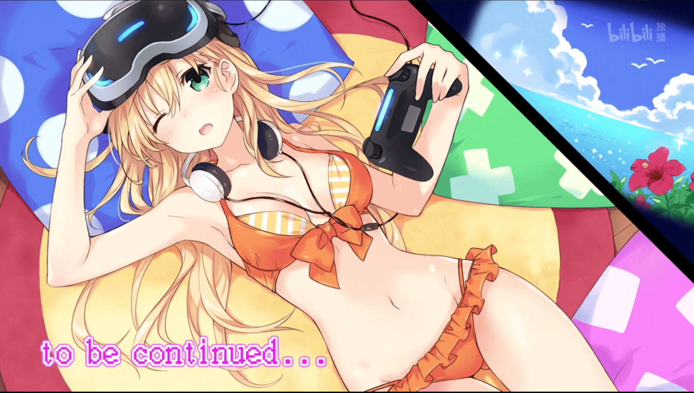

# 【GAMERS同人】天道花怜和雨野景太の最棒娱乐

作者：乔治·华盛顿

TID：31803

# 1

前言：因为最近看了很多轻小说，所以决定按照轻小说的风格写作一些短篇，因此显得相当冗长；

单纯喜欢看破坏场景的读者可以直奔二楼，但整体上口感偏淡；

故事的时间发生在小说11章后，但不影响阅读。

提示：先看完原作/番剧之后，食用更佳

祝阅读愉快！

————————————————————分割线——————————————————

“所以说，天道同学，你说的那个“花了半个月零花钱才买下来的”超现实游戏到底是什么呀？”

冬天的某个下午，我的女友，温柔善良的超绝金发美少女——天道花怜，和我约好在游戏同好会结束后，去她家一起试玩一款“前所未有的真实”的游戏。

身为重度的游戏玩家，面对可爱的女友提出的一起玩新游戏的请求，不可能有人拒绝的吧。

“嗯——”天道轻轻抬起头，将食指轻轻放在嘴唇上，做出努力思考的样子。

太可爱了——我在内心里感谢上苍没让我看漏这个决定性的瞬间，天道的表情太好看了，我目不转睛的注视着身旁的金发天使，宛如自己获得了奖赏一般。

“嘛，说起来其实我也还没有玩过哦？

不过我相信，无论是克己派的我，还是享受派的雨野君都能愉快体验的——雨、雨野君？”

糟糕，大脑差点坠机了。

“咳、咳，真是期待呀！天道同学推荐的游戏！”

我慌忙转移话题。

“啊…嗯！”

不知道为什么，天道那边也微微红着脸，低下头去了。

就这样，在冬日的午后，无言的情侣一边踩着刚开始融化的积雪，一边向着目的地进发。

“呼——”

第三次光顾神域，不对，是天道卧室的我，感受到淡淡的香味和暖意一同袭来，取下了围巾。

“话说回来，天道同学”我正色道“伯父伯母应该不在家吧？”

“雨野君，这作为来到女朋友卧室的第一句话也太差劲了吧！”天道的脸完全红了。

“不不不，只是开个玩笑！毕竟前两次都发生了那样的事……”我慌忙解释道“不说这个了，赶紧看看新游戏吧！嗯，新游戏！”

“是呢，没错！”天道拉开书桌的抽屉，从中拿出了某个无人机遥控器一般，散发着漂亮金属光泽的东西“锵锵！雨野君，现在就向你介绍21世纪最伟大的现实游戏！Llinx！”

“林…克？”抱着5个食材满地图跑的少年形象浮现在我的眼前。

“不是啦~是 L·l·i·n·x 噢! 嘛，据说是法语，所以雨野君听不懂也正常咯~”天道一脸得意的表情。

“啊，法语真的有这个单词吗？莫非是看着说明书……？”

“雨野君？”

无论如何都想象不出这样的发音会是法语。

不过看着天道脸色的微妙变化，有些话还是不说为妙吧。

“咳咳！”天道清了清嗓子“那么，想必雨野君也很好奇，为何我会给予这款游戏如此之高的评价吧？”

“啊！是的！明明看上去只是个破盒子？”

转向房间的空处，天道按下了控制器上的某个按钮，下一瞬间——

“喔———”

在特意整理出的房间空地上，一座座高楼拔地而起。

穿插着高速公路和街道的城区凭空出现，无论是鳞次栉比的公寓楼，还是地标性的高层建筑，依次出现在了卧室里——以微缩的尺寸。

我俯下身子，仔细观察着那精致的街道模型。

各种车辆在蜿蜒曲折的道路上飞驰着，就连行道树在风中微微摇晃的样子都完美的还原了出来。

“好厉害的投影技术！！”绝非某些低劣的模型所能媲美的还原度，我为“Llinx”的精美所震撼“话说回来，竟然只花了半个月的零花钱么……天道你到底有多少零花钱啊”

“嗯——和国家预算差不多吧？”

稍微思考了一下的天道竟然一脸认真的回复了我。

“你是惠比寿吗？”

“咳咳，这个，给！”

从天道手中递过来的是类似于腰带的东西，搭扣的地方有着指示灯。

“带上了之后，可以进入模型里哦？啊，我来帮你带吧？”

“进入？怎么进……”

未等我的话说完，天道已经闪到我的背后，开始捣鼓腰带了。

柔顺的金色长发一掠而过，芬芳的气息几乎使人沉醉。

虽然还是一头雾水，但姑且还是听之任之吧。

“好了！”

“哦……”

未及将心中的疑问抛出，天道又低下头开始摆弄起控制器，并且再次按下了某个按钮。

“那么，雨野君——”抬起头的天道洋溢着温柔的笑容“一路顺风——”

“哈——？”

话音未落，腰部感受到了强烈的收缩感——是腰带突然收紧了吗？

搭扣上的指示灯也发出了不祥的红色灯光。

“天道同学，这到底——”

突然，强烈的晕眩感冲上大脑，意识也渐渐模糊了起来。

最后留在脑海中的，依旧是那足以融化人心的温柔笑容。

“咦——”

再次醒来的时候，四周是从未见过的场景。

脚下是坚实的柏油马路。

“阿拉，雨野君，身体还OK吗？”

温柔却出奇响亮的声音传来，那是我一辈子不会忘却的美妙嗓音。

“天道同学？！”

我左右四顾张望，却没有看到熟悉的身影。

“我在这里哟——”

“欸————！？”

抬起头，从建筑物之间的天空出现了熟悉的白皙脸庞。猫眼石一般深邃的眼睛正一动不动的注视着我。

这毫无疑问是天道同学，但是——

“天，天道同学，你怎么变得这么……啊不对，难道说——”

再次环顾身边的环境。

和现实没什么不同，但却有着微妙的出入，像是墙壁的纹路，地上的苔藓这些细节，能够看出并非现实世界。

“不愧是雨野君，在对待自己恋爱之外的事情上一如既往的敏锐啊！没错，这里是Llinx的内部世界哦！”

“哈——”

我惊讶的探寻着周围。

比先前在高处目睹的更为壮观，仿佛置身异世界一般的体验所带来的兴奋感彻底点燃了游戏玩家的本性。

我四处探索，从玻璃幕墙中自己的倒影，到路边停着的不知名跑车。

一切都是那样的熟悉，一切都是那样的新奇。

“感觉如何，雨野君？”

“嗯，非常好玩哦！天道同学”

常说所谓的“巨物恐惧”，但是从我看来，大约6/70米高的天道完全没有任何压迫感——倒不如说，可爱的程度一起跟着放大了。

“太好了呢，雨野君！”天道的笑容更灿烂了“那我们开始游戏吧！”

“啊好的！———诶？”

“雨野君？游戏当然是要两个人玩的吧？还是说你想把我晾在一边？”

“没有没有！”我慌忙摆手“话说，天道同学……不进来吗？”

从刚刚开始，天道完全只是站在模型的外面看着我而已，完全没有要一起缩小进来的意思。

不知为何，有些不好的预感呼之欲出。

“啊啦，雨野君，我没说过吗？这个游戏的玩法？”

“完全没有！”

“很简单哦？”天道的笑容逐渐变得有些奇怪了起来“只要在规定的时间内把雨野君干掉就算我赢了哦？”

远处，整个微缩模型中，包围着最高的大楼的玻璃屏幕上，显示出了两名玩家的对战框。

“那么，我们开始吧！”站在模型外的天道，高高的抬起了被黑色过膝袜包裹着的脚。

“等一下啊，天道，“干掉我”是什么意……！”

“咚——”

话音未落，巨响传来，对于微缩模型过分巨大的脚在路面上留下了漂亮的形状，再抬起来的时候可以看到脚印里人类的残肢断臂，情况难以用言语表达。

路上的行人们仿佛刚刚发现天道的存在似的，开始向着远离巨大少女的方向逃跑。

“诶诶诶，天道桑，这到底……太、太突然了吧！”

我瘫坐在地上，双腿止不住地发抖。

身旁停着的轿车警报大作。

“哼哼，雨野君，还不跑吗？这样的话，首杀我就拿下了哦？”

刚刚还在百米开外的天道，转眼间已经跨国街道，来到了我面前。

被黑色过膝袜包裹着的漂亮脚底笼罩了我。

从这个角度就连蓝白相间的裙底都一清二楚，但我的大脑已经一片空白。

“再见咯，雨野君！”

占据了全部视野的黑色墙壁，突然飞速下降。

“啊啊啊——”

“疼疼疼——咦”

再次醒来，是在不知名的白色空间。

没有想象中身体四分五裂的痛苦，仅仅是感受到“略有些疼痛”的压迫感，游戏好像就停止了。

“不过，这里是——”

悬浮在我面前的，是显示屏一样的东西。

看样子是以俯视角度投影出了整个模型，类似地图一般的东西，其中的某些地方闪烁着绿色圆点。

“原来如此，可以自行选择复活的地点吗——”

我仔细观察着界面。

这个不断倒计时，正处于“9:30”的时间，是说我还要坚持9分半钟吗？

与之对应的，一旁三个心形图案，其中一个已经暗了下去——“什么啊，一共只有三条命？”

化身哥斯拉的天道同学实在是太可怕了。

说到底，有着这种体型差距，想要赢得游戏根本是天方夜谭。

“但是——”

中途断开连接，并不是游戏玩家应有的态度——何况这里好像也没有退出键

我站起身，仔细观察着地图。

“那好，就选——”

然而，未等我做出反应，腰部已经传来了熟悉的勒紧感。

“欸欸欸——”

强烈的晕眩感袭来。

再次醒来，占据视野的，是漂亮的落地窗。

从窗户向外眺望，可以清楚地看到几百米外巨大少女的身影。

在密集的人群中反复落下脚、将高度合适的大楼一脚踢溃……

每一次落下脚，我所处的地面就会明显抖动。

金发天使天道花怜化身成为了毁灭城市的巨大少女，而且看上去完全乐在其中了

“真是看到了天道不一样的一面啊”

我长叹一口气，瘫坐在冰冷的大理石地面上。

从外面的风景判断，大我大概是身处很高的大楼吧，这个距离暂时也不会有危险。

我冷静下来思考现状。

过去的对战游戏也好，街机游戏也好，全都是我单方面的输给天道。

这既是天赋上的不同，也是游戏理念的不同。

追求游戏技术的绝对精益求精的天道，和坚持开心第一的我，为互相的游戏风格所吸引，进而成为恋人。

天道也不止一次的做出过“雨野君，你（的战绩）也偶尔来我上面嘛”之类的请求。

抛开表达方式，想必天道也一直渴望着我能和她进行“有水准”的对战吧。

在一般的对战游戏中显然是不太可能的，不过如果是这样随机性影响极大的游戏，或许我能让天道同学多少获得一些快感也说不定？

下定了决心的我，重新站了起来。

话说回来，胜利的条件是只要坚持到游戏结束就可以了吧？

我默默回忆着天道的话。

既然如此，只要躲藏在随便什么地方，就有概率获得胜利的吧？这么说来，地下室或许是个好地方。

我赶紧跑进电梯，按下前往地下一楼的按钮。  

# 2

*本帖最後由 乔治·华盛顿 於 2021-10-6 22:40 編輯*

另一边。

漂亮的金色长发一路垂至腰间。

对于微缩模型的居民而言，过分巨大的少女天道花怜袭击了这里。

“接下来是这边~”

天道一边愉悦的说着，一边将被黑色过膝袜包裹着的右脚轻轻放到最近的公寓上。

和建筑物投影差不多大小的丝袜脚一下就将房顶压垮了，但巨大少女完全没有要停下来的意思。

“再不跑的话，就有危险了哦？”

一边用欢快的语调调侃着抱头鼠窜的人们，金发的少女一边不断用脚掌前后摩擦着成为受害者的公寓。

“喀啦——”

每一次来回移动，就会有半层楼的高度被削减掉，化为瓦砺四处飞溅。

天道已经尽可能小心的不过分破坏这幢公寓，但模型的脆弱程度超乎想象。

“哼哼，不知道雨野君躲到哪里去了呢？真想快点找到他~”

更加用力的摇晃公寓，肉眼可见的裂缝在墙体上四处蔓延。

被异常强大的力量玩弄的大楼，开始逐渐分崩离析的倒塌。

直到这时，还有大量的人们没有成功逃出。

可能是由于剧烈的摇晃而摔倒在地，亦或是被困在断成好几截的逃生通道里动弹不得。

几乎没有人平安无事。

“好，就把大家全部踩扁吧！”

天道向着脚下的人们宣判了死刑。

和天道的放纵不同，她脚边的人们完全被吓坏了。

高高耸立在头顶上的是包裹在黑色过膝袜里的修长的小腿，膝盖在更高的地方。

向为了踩破大楼而高高抬起的大腿施加体重，濒临崩溃的公寓楼瞬间变成了瓦砾堆。

“比曲奇饼干还不如啊！”

飞扬的尘土和灰尘遮蔽住了人们的视野，同时沾染在了黑色的过膝袜上。

“可别以为结束了哦！”满脸认真的金发少女不准备放过幸存的人们。

将刚刚踩平大楼的右脚向后移动，以脚尖点地的方式停在后方。

和准备点球一样的姿势，凡是看到的人们都知道接下来会发生什么。

“嘿咻！”

发出可爱声音的巨大少女，用力的向着被扬尘包围着的地方踢去。

所有在场的人们都被高速接近的脚碰到，在给天道的脚背带来一丝丝触感后立刻断气了。

化为肉片的他们和大楼的瓦砾一起被踢出，要么在空中解体，要么撞上其他的大楼。

与此同时，模型中央充当显示器的大楼上，在标有“Karen Tendo”的姓名栏下方，分数正快速上涨着。

“Lv4……嗯，再升一级的话就有特技了！”

开心的少女继续用力践踏着周围的楼房。

在鳞次栉比的楼房中，金发的巨大少女沉迷在用自己压倒性的力量摧毁街区的快感中。

并不仅仅是单纯的破坏，作为英吹高中游戏部的部长，无论在任何游戏中都要追求绝对的领先，力争尽快将城市化为废墟的少女成为了人们的梦魇。

“啊，到Lv5了！”几十米的高空中，浮现在天道面前的是游戏的操作面板，上面有着技能选择的提示。

“我看看……“侦查”嘛？每2分钟使用一次，探知对手的方位？嗯，就是你了！”

轻点了一下技能图标，电磁脉冲一般的波动便从金发少女的脚下向外扩散开来，并在某幢大楼的地下产生了回波。

“啊啦，竟然躲在那种地方一动不动，我，天道花怜，真是被小瞧了呢！”

再度迈开双腿，不断用脚拨开低层楼群的巨大少女向着被害者的位置进发。

“噫——这是什么感觉”

在某幢大楼地下停车场避难的我，突然开始打冷战。

不祥的预感涌上心头。

仿佛是印证了我的猜想一般，平静了许久的大地突然开始震动，而且幅度越来越大。

附近一同避难的人群中爆发出了喧哗。

“雨~野~君~”

“噫——”

双手抱膝坐在地上的我，惊讶的说不出话来。

悬吊着的白炽灯随着有规律的震动而忽明忽暗，在这里避难的人们陷入了莫大的恐慌。

“轰——”

从正上方传来了建筑物崩坏的巨大响声，但抬头仰视，除了黑漆漆的天花板什么也看不到。

“这里已经不能呆了！”一旁避难的某明青年男性大声说着，然后钻进了自己车的驾驶席，发动车子，朝着光亮的出口处快速驶去。

还留在原地的人们紧张的注视着他，但是——

在好不容易开到地面上的车子，阴影降临了。

“吱吱吱——”

轮胎空转着，与地面高速摩擦发出了刺耳的噪音，但是车子却无论如何也动不了。

天道用脚压住了车。

发育期少女柔软的脚掌碰上了铁皮做的车子，然后车子立刻发出了悲鸣。

车顶塌陷，玻璃破碎；

只要再稍微施加体重的话，立马就可以将车压扁，但是带着满满恶意的金发少女不打算立刻结束。

“快点！”

哭喊着拍打方向盘的司机虽然看不到上方的巨大少女，但是对自己的状况却以外的明晰。

“嗖——”

突然，车飞快的冲了出去。

“这样就好——”

在生死界线徘徊的司机以为自己获得了生的希望，努力控制着方向。

但是在他有所动作前，身体突然向前俯冲，被安全带卡住——车又突然停住了。

“什么——”经历绝望、希望又绝望的司机大脑一片空白。

然后下一瞬间，车又不受控制的左右摇晃起来。

“呵呵，像玩具一样呢~”

愉悦的声音从上方传来。

像是得到了新玩具的小女孩一般，天道倚着半毁的高楼，将脚放在小小的车上来回移动。

丝毫不在意在驾驶室内被摇晃的头破血流的司机，天道继续用脚玩弄着汽车。

留在地下室的人们看着这一幕，惊恐的捂住了嘴。

“话说回来，从女孩子的裙底下钻过，还真是失礼啊！”

从已经踩踏的不成样子的车顶上移开脚的天道，像是刻意要让我在内的人清楚看到一样，用脚将车挪到出口的正中间。

然后，她将穿着黑色过膝袜的脚放在车子的左右两边。

“那么，一路走好——”

天道向着脚下的司机宣判道。

车子左右并排着的双脚，开始慢慢靠近，金属扭曲、挤压传来了诡异的声音。

“快逃啊！”

“会被压扁的！”

被停车库阴影笼罩着的人们焦急的叫喊着。

但是车里的司机已经听不到那个声音了。

视野里破碎的挡风玻璃，以奇怪姿势扭曲的手臂，两侧越来越近的巨脚。

从黑色过膝袜上散发的带着酸味的热气更加摧毁了司机的意志

天道一边轻轻哼着歌，一边摩擦着自己的双脚，直到两脚完全贴合。

再次敞开的双脚，里面是面目全非的铁板。

但是少女还不满足，发泄似的不停在上面跺脚，直到将它踩到路面以下。

看到这样景象的人们大哭起来，生怕自己也落得这样的下场。

“雨野君，这就是小瞧女朋友的下场哦？”

“哇——”

我因害怕愣在原地，不知所措。

那种死法实在是太过惨烈，虽说只是游戏，也绝对不想体验。

身边的人们有的瘫坐在地上，有的拍打着早已失去作用的电梯。

更有甚者跪在地上祈祷。

完全是一片人间地狱的景象

“还是不出来吗？算了，结果都一样”

我还是站在原地，大脑中闪过无数想法，又在瞬间被否决。

就在这时，天花板传来不祥的声音。

转过头看的话，占满出口的两只脚只剩下一只了。

“哗啦——”

天花板突然裂开，倾泻而下的瓦砾成为了我最后看到的东西。

# 3

<ignore_js_op>[fullsizerender(1).jpg](forum.php?mod=attachment&aid=OTE2MDZ8NGMyMGE1MzB8MTY0NzcwMzYxMXwxODIzMHwzMTgwMw%3D%3D&nothumb=yes) *(2.58 MB, 下載次數: 1)*

[下載附件](forum.php?mod=attachment&aid=OTE2MDZ8NGMyMGE1MzB8MTY0NzcwMzYxMXwxODIzMHwzMTgwMw%3D%3D&nothumb=yes)

2021-10-6 22:39 上傳  

天道花怜·泳装Ver

</ignore_js_op>  <ignore_js_op>[fullsizerender.jpg](forum.php?mod=attachment&aid=OTE2MDV8NTJiMzJiOWR8MTY0NzcwMzYxMXwxODIzMHwzMTgwMw%3D%3D&nothumb=yes) *(599.86 KB, 下載次數: 0)*

[下載附件](forum.php?mod=attachment&aid=OTE2MDV8NTJiMzJiOWR8MTY0NzcwMzYxMXwxODIzMHwzMTgwMw%3D%3D&nothumb=yes)

2021-10-6 22:37 上傳  

</ignore_js_op>