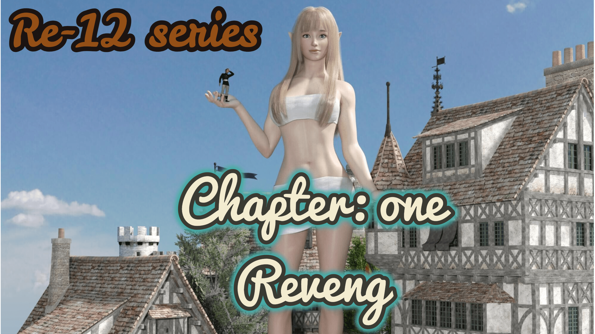

# 【Re-12】（4／15更新德拉篇 长篇 温柔为主／残酷为辅）Revenge

作者：qishiweibutong

TID：30259

# 1

*本帖最後由 qishiweibutong 於 2021-4-15 13:52 編輯*

写在前面的话：

本文是一篇长篇世界观小说，可能有些坛友觉得剧情很熟悉，诚哉斯言，本篇是那篇拙作的精修版，大致的剧情是一样的，只不过增添了亿点点细节。（原贴我已经锁了，请看过的坛友不要剧透）。完全没看过的坛友也不要担心，放轻松，享受阅读的过程吧。

鄙人虽然没有坛中大佬那么优秀的文笔，但是我还是会尽量给予大家一个良好的阅读体验。

我还会尽力利用论坛功能排版，给予大家良好的阅读体验（物理意义上的）。

关于文章

本文的世界观，我起名叫做 Re-12。方便大家记忆，此后还会有很多这个世界观下面的内容，敬请期待。

关于出现的巨大娘的大小问题

本文中出现的巨大娘均为**12倍（18M~23M）**,这也是Re-12当中的“12”含义之一。

同时也希望大家多多回复，而且为了鼓励大家回复，**第一个**猜中文章当中小伏笔，或者某些意象寓意的，按照发帖时间，我将使用我个人的Duact给予**奖励**，长期有效。

（希望我的Duact点够用，到时候要是出现大家做阅读理解，回答出了作者我都觉得你很厉害的情况，Duact点大大的有，也是鞭策我继续学习写作的动力。）

2/3更新一张封面图，在此感谢这个图的作者@nhbnfn

<ignore_js_op>

**FotoJet.jpg** *(2.07 MB, 下載次數: 1)*

[下載附件](forum.php?mod=attachment&aid=ODcyMjJ8ZDBjZGU0Mzd8MTY0NzcwNTkyM3wxODIzMHwzMDI1OQ%3D%3D&nothumb=yes)

2021-2-3 19:13 上傳

目录序章（上）#2L序章（下）#10L第一章#13L第二章#19L第三章#20L第四章#24L第五章#28L第六章#30L第七章第八章

# 2

*本帖最後由 qishiweibutong 於 2021-2-1 16:49 編輯*

序章（上）夜晚，明月高悬，罗伊发现自己站在格罗特王国王都厚重的城墙上，身后是王都内城的万家灯火，宁静祥和，身前是王都周围的千里沃野，而在城墙前端，站着一个熟悉的背影。

“父亲，是你吗？您还活着真是太好了！王都也没有被攻陷。这一切都是……”罗伊急切地冲上去，想给自己的父亲去一个拥抱，但却发现扑了个空，自己的手臂穿过了父亲的身体。

转眼间城墙内安静祥和的万家灯火，宁静祥和就成了熊熊大火，人间炼狱，求救声哭喊声不绝于耳。城墙外的田地上陈列着邻国的军队，来势汹汹，最显眼的就是他们的战争器械“火流星”，它们一个接一个地向城墙内投掷着火球，火球在夜空中划出红色的轨迹，然后狠狠地砸向地面，引起大范围的火焰。

先王的身体飘了起来，飘得比罗伊还高，脸上露出了慈祥的表情，伸出了苍白的手抚摸着罗伊的脑袋。

*“孩子，我当然死了，不过不要悲伤，到那北方的森林里去吧，去寻求巨大精灵的帮助，我们的王国才能繁荣兴盛，人类才能长存！”*

“不，父王，我不管什么繁荣新盛，我只想为您复仇，”

刹那间，巨大的火球径直朝罗伊砸过来，他躲闪不及。

突然罗伊发现自己在寝宫的床上惊醒，原来一切还是以前的模样，罗伊缓步走出房间，想去花园散散心，当他来到花园的那一刻，他惊呆了。这是怎样奇妙的景观，一个巨大的女子跪坐在王宫花园的正中心，她的姿态是那么地优雅。尽管她是跪坐着的，但是王宫里最高的塔楼还是不及她的肩膀。

罗伊下意识地想要叫卫兵，却发现一个旁人也没有，只有他和这个巨大的女子。这个女巨人皮肤白皙，全身裸体，但是丝毫没有让人感觉色气，反而是圣洁而美好。只见她俯身下来把巨大的手掌伸向了罗伊面前，手掌温暖柔软而宽广，比他房间里的床还要大上许多倍。罗伊毫不犹豫地爬上了这巨大的手掌，女巨人见到罗伊在自己的手中了，便站起身子来。她原来是那么的高大，罗伊感觉她伸手就可以摘到星星，那个女巨人像是能看出罗伊的心思似的，伸出另一个手摘下了一颗星星，递给了掌心中小小的罗伊，在递过来的同时那颗星星似乎也在慢慢变小，到了罗伊手中，他还能把它捧在手心。就像现在这个女巨人把他捧在手上一样。

这时邻国的军队又突然出现在城外，“火流星”依然在不断地抛掷着火球，城内依旧是熊熊大火。无数平民百姓哭喊着，挣扎着逃命，罗伊看见感觉悲愤交加又感觉无能为力。此时这个女巨人又完成了他的心愿，她站在那里吹一口气，城中的大火就全灭了。跨出一步，就到了城外，无边的大脚无情地落下，邻国的大军在她的脚下全部化为残渣。罗伊止不住的叫好，亲吻着女巨人的手心。

又是一步，就到了杜丹镇这里，这里是格罗特北方的边陲小镇，靠近着父亲提到的巨树林，黑暗而深邃。在巨树林的边界，女巨人把罗伊送到嘴边，给了一个轻柔的吻，罗伊小小的脑袋在大大的嘴唇这里显得微不足道。然后就把手掌放在地面，让罗伊缓缓地滑落到地面，随后转身离去，只见那个女巨人越变越小，最后比那些树还要小，消失在巨树林之中。

——————

“巨树林，我要去巨树林！”在床上猛地醒来的罗伊重复着这句话。

*森林，巨大，精灵，帮助，复仇*。

这些词语自从王都被攻破，父王被杀，自己被赶到这个边陲小镇以来一直萦绕在他的脑海。这是王国里面年迈的预言家在王宫攻破的最后一刻，神神叨叨而又断断续续地说出来的，罗伊想忘都忘不掉。这位预言家非常的厉害，说出来的预言都成功应验了，可是他却丝毫没有提到邻国的入侵。罗伊对他的感情很复杂，出逃的时候太慌张，也没太记着他，把他留在了王宫之中，不知道现在如何了。

邻国库位诺率领大军入侵，势如破竹，短时间内占领了格罗特王国的大片土地，只剩这个尚未完全开发的杜丹镇，格罗特唯一的王子罗伊逃到这里，苟延残喘，美好的梦境结束了，沉重的现实压在年轻的王子身上。

“快点给我准备好马，再叫上几个人，我今天要到巨森林里面去。”罗伊边起床边朝外面的侍卫发号施令。

“可是，殿下那里……”

“我知道，我们今天不深入。只在边缘看看”

——————

巨森林是格罗特王国北方的一大片森林，顾名思义，这里的树木出奇的巨大，据说有上百米，树干粗壮，十人不能合抱，森林延绵不绝，无边无际，是格罗特王国独有的风景线，也是吸引无数探险家来冒险的地方，可是这些探险家没有一个回来的，这里渐渐地成为了禁区。

放在平常，罗伊是绝对不想也不敢踏进这个巨森林一步的，可是他总觉得冥冥之中总有什么在等着他，吸引着他向里面深入。

马蹄踩在森林地面的落叶上滋滋作响，森林中的鸟儿也在歌唱，清晨的阳光透过树叶照在大地之上，罗伊骑着马沉浸其中，早晨来森林里面骑马散步是最好不过了，身后的六位侍从不敢惬意和放松，紧紧的盯着周围，生怕有什么危险。

“森林？巨大？精灵？”罗伊喃喃自语地组织着预言家最后说的的预言碎片，“难道说是巨大的精灵？真的有吗？”林子大了什么鸟都有。这么大一片林子有些神奇的生物应该很正常吧。

一朵白花出现在落叶堆中，顽强地探出头来。罗伊想到以前父亲的花园里面都种满了白色的花朵。每次他在花园碰见父亲时，父亲拉着他总会说，这是你母亲最喜欢的花。之后就总会摘一朵，戴在他的头上，然后就把手放在小罗伊的肩膀上，看着他的脸蛋，这样一看就是好久。

看见这朵白色的花，罗伊想起了父亲，他感觉鼻头有些发酸。

他下马蹲下准备去摘下这朵花。可是，刚刚下马，他好像看见了这朵花在疯狂地晃动，这绝对不是风吹的，是眼花了吗？罗伊把眼睛闭上晃了晃脑袋。紧接着他的身体也感受到了震动，旁边的马匹也发出了紧张的嘶叫，周围六人也感受到了危险。是地震吗？这震动越来越强，一阵一阵，丝毫没有减弱的意思，绝对不是地震。

罗伊附身把耳朵贴在地上，想明白震动的来源。

是库位诺王国的军队吗？这怎么听也只有一个东西，军队的脚步应该很嘈杂才对。

是什么巨大的野兽吗？这里有七个人只有五个带了武器。不知道，打不打得过？

突然周围的鸟儿四散而飞，这一定是危险临近了，罗伊赶忙把头转向声音传出的方向，他看见的，足以改变其一生命运，也改变了人类的命运。

————————

金色而柔顺的头发垂于肩头，就如同金色的瀑布一般，一对尖而长的耳朵，从头发中伸出，洁白的皮肤，在阳光下显得尤为可爱，胸部丰满又不失美感，身材纤细又感觉不失力量，下半身用树叶也遮挡不住那完美的曲线。简直是从童话书中走出来的，那是多么美丽的精灵啊。

可是她却没有童话书中，描写的那么娇小。视野放宽，周围参天的树木和她比起来也不是那么高了，一些低矮的灌木甚至都没有她的脚掌大。

“巨大的精灵，巨大的精灵。”罗伊喃喃的念叨着，不顾随从的阻拦，朝着那个巨大精灵快步走去，这简直和他梦境里面的女巨人一模一样，走得越近越觉得这巨大的精灵高不可攀，仰视得越费劲，从树冠落下的阳光更显得这个精灵的神圣，晃得罗伊睁不开眼，罗伊干脆不仰着头了，直接扑通一下跪下了，他感觉自己是如此的渺小，甚至比不上她脚下的尘埃。那个巨大的精灵蹲了下来，把手放在了地上，这双手是那么的完美，就和梦中的那双手，一模一样，罗伊毫不犹豫地走了上去。巨大的精灵托着罗伊站了起来，罗伊被强大的风压吹得睁不开眼，等他再次睁开眼睛的时候，视线已经完全地被这张脸给占据了。这是女神的面容吗？

他面向这个巨大的精灵虔诚地向她述说着他的遭遇，祈求着帮助。而这个精灵只是依靠着树干静静地倾听着罗伊的诉说，罗伊的诉说越发的起劲，也越发的悲伤，身边的随从无不为之动容，巨大精灵的面容也流露出同情的神色，即使这样还是那么的美丽动人。

这时巨大的精灵伸出了手指想要触碰到罗伊，看着和自己腰身差不多粗细的手指伸过来，罗伊丝毫没有恐惧，也伸出手掌去抚摸她的指尖。

越来越近，越来越近，终于触碰上了。那一刻，她和他的感觉都很奇妙。巨大精灵呼出的温暖气息包裹着罗伊，罗伊享受着这个特殊的感觉，而巨大精灵也在品味指尖传来的细小触感。

在巨大精灵脚下的随从也加入了王子的队伍，纷纷跪倒在地，哭诉着自己的痛苦和悲伤。祈求着女神的赐福。

此时巨大的精灵把罗伊放回随从之中。随即趴下身子，用着和人类身高一样宽的臂膀，给了他们所有人一个“大大的拥抱”！

被如此巨大的生物抱着，这些人类没有一点点恐惧和惊慌，反而是感到了安全和舒心。罗伊甚至觉得回到了母亲的怀抱，精灵尖尖的耳朵，贴在了他的胸前。她听见了他的心跳，他也听见了她的心跳。

在清晨的森林里，一个巨大的精灵和七个人类相拥在一起。

等众人回过神来，太阳将近落山，精灵还是静静地伫立在大树旁，依旧是那么高不可攀，罗伊仰望着那个精灵，轻轻地说“再见，明天见。”缓缓转身离去。

“再见，明天见。”婉转动人的声音从身后传来。罗伊猛地一回头，只留下摇曳的树枝和微微腾空的落叶。

明天真的会再见面吗？

罗伊这样想着，猛踢了一下马的肚子，朝着回城的方向策马而去。

罗伊立即给随从们下达了封口令，绝不能把今天的事情传出去，随从们表示自己绝对会守口如瓶。

清晨的阳光唤醒了疲惫的王子，他匆忙的叫齐了昨天的六人，让他们带上一车的食物准备去昨天的地点。

侍卫长贾德首先表示异议，现在小镇里面存粮不多，这一车的食物实在是太多。王子罗伊反驳道：“昨天你们都体会到了，这巨大的精灵是非常友好的，这对我们来说非常有利，我们要先取得信任，然后才能获得帮助，实现预言，复仇。”贾德说：“王子殿下，我们当然忠实于您。只是这里的民众看见咱们大摇大摆地把很多食物运到小镇外面去了，会不满的，加块布盖着吧。”王子点头同意，催促随从们赶快准备。

可真是一大车吃的啊，这可以够几户人家吃三天了，贾德这么想着，叹了口气，只得将马车赶得快一点，赶快出城，免得更多的居民瞧见了。他知道，这区区一块破布怎么盖得住，人家闻也闻得出来。

在路上，老好人多恩悄悄地问贾德，为什么还是叫罗伊王子殿下，这上一个国王不都没了吗，他又是唯一继承人，他不就是国王了吗？应该叫国王陛下了。贾德叹了一口气，“这不也是那个可恶的哈里森害的，他杀了咱们的国王和王后，抢占了我们的土地，罗伊殿下表示不收复失地绝不加冕，坚持让我们称呼为是王子殿下。”又是一口长叹。

“他还没准备好成为一位国王，至少现在没有。”

——————

她会来吗？罗伊一直这样想着，不一会马车就来到了昨天会面的地方，这里的土壤明显下沉，还有一些浅浅的但是很巨大的脚印，就是这里没错了。罗伊蹲下来看看这脚印，他迈了一大步，才勉强赶上。“先都吃饭吧！”罗伊对着侍从们说道。拉格麻溜地掀开布匹，马车里满是面包，还有两头烤鹿，一些烤兔子，好多苹果。拉格倒是不客气，直接撕了一只兔腿送到嘴里，王子还提醒大家，多多吃肉，说不定这森林里的精灵不吃肉。众人只当这是来森林野餐了，有的人还拿出了珍藏在贴身兜里的胡椒，还有的拿出了牛奶。正当大家其乐融融享受美食的时候，地面又开始震动了，还是那熟悉的感觉，罗伊首先放下了面包，望向震动传来的地方。

单调绿色的画卷突然出现了一抹金色，是昨天那个精灵，金色瀑布之上还多了一朵“小花”，看来她是真的听懂了昨天想要说的话。

她的鼻子轻微地动了一下，紧接着她的就发现了罗伊和马车，眼睛直勾勾地盯着，但又有些迟疑，没有直视，把视线撇开了。这些“小”动作自然都被罗伊看在眼里。

空气突然很安静，气氛突然变得有些尴尬，只有拉格在不合时宜地大嚼特嚼。罗伊率先打破了沉默。

“哦巨大的精灵，我们给您带来了食物，食…物…”罗伊边说还边指还边做把东西送到嘴巴里的动作。动作缓慢而且滑稽，周围的侍从都忍俊不禁，但是谁都没敢真的笑出来。

罗伊还在重复这个动作，巨大的精灵也学着这个发音，

“撕…木…”

“不，食……物。”

“食……物。”

“对对对，食物。”

罗伊又做了一遍把东西送到嘴里的动作。

精灵也是似懂非懂，罗伊主动的拿起车上的食物，送到嘴里。又主动地将马车往精灵那里推了推，继续示意她去吃食物，罗伊拿起一大块的面包，朝着那个精灵递过去。那个巨大的精灵缓缓地伸出手过来接住这个东西。那块面包还是很大的，一个人还可能吃不下，但是放在那只手上，还是显得十分渺小，甚至连手指的指腹都没有覆盖满，罗伊甚至怀疑这块面包会卡在她的牙缝之中。

巨大的精灵将这块“小”面包送到嘴边，伸出舌头把它吃下，精灵仿佛来了食欲，又拎起来一头烤鹿，罗伊又重复了一句食物，精灵仰头直接吞下，在场的人都惊呆了，这可真是吃东西不吐骨头，接下来又是一头。

虽然两头烤鹿已经没啦，其他的又被众人之前吃了许多，这马车还是显得很满的，只见精灵单手一抓，马车连车带马的就轻易的拿起来了，还好罗伊冲上去快步地把缰绳解开。巨大的精灵把马车里面的东西都倒入了嘴里，精灵脸上嘴角上扬，露出了满足的神情，然后发出了一声听不懂的语言。再看看底下众人，一脸茫然，这精灵吃完了之后，向着罗伊点了点头，像是要表达谢意，接着起身，又说着食物，食物，朝着森林深处走去，那修长的腿，不一会就消失在人类的视线中了。留下七个人呆呆地站在原地，拉格终于咽下去了嘴里嚼了无数遍的东西，空气里又恢复了诡异的沉默。

“王子殿下，预言说了这精灵是爱吃肉的吗？”还没吃上肉的侍从齐勒问。

“我哪知道啊？”事情超出了年轻王子的想象，他的回答带着失落和懊恼。这个精灵好像听不懂人类的语言，看这狼吞虎咽的样子那个精灵不是通晓万物法力无边的女神，而是很像一个很长时间没吃东西的野人。和梦里的完全不一样，这可怎么办？预言刚刚有点眉目，又落空了。

父亲啊，我该怎么办？罗伊直接扑通一下坐在地上，思考着应该怎么办。既然听不懂人类的语言，那么之前的行为又算什么呢？走一步算一步了，现在只要教会她人类的语言就好了。说不定她可以……

就在罗伊坐在地上想着下一步该干什么的时候，熟悉的震动又回来了，这时的精灵抱着几个橘子还有蘑菇样子的东西，这样更凸显出她胸前乳房的巨大和挺拔。抱着东西小心翼翼的走路的样子，像极了一个可爱的女孩。只是尺寸大多了。相对应的手中的橘子是真的大，一个橘子和这里最胖的约翰一样大了。蘑菇也不慌多让，马车上装两个估计够呛。巨大的精灵把这些食物在放在众人面前，好家伙，真是如同小山一般，巨大的精灵指了指它们说：“食物。”并且也像刚刚罗伊这样做了把食物送进嘴里的动作。

罗伊被惊呆了，愣了许久才从牙缝中挤出谢谢两个字，众人面对这一人高的橘子，茫然无措，精灵似乎看出了他们的难处，伸手刨开了橘子的皮。巨大的橙子露出了晶莹的果肉，并散发出芬芳的香气。侍从拔出佩剑，分割着橙黄的果肉。入口之后，芬芳满溢，身为王子的罗伊也没吃过这么好吃的水果，这就是梦境预言中说的，巨大精灵的帮助吗？爱了爱了。

从刚刚的语言动作来看，这个精灵非常聪明，教会她人类的语言应该不是什么难事。起码能让她听懂人话。

享用了香甜的水果之后，罗伊对着巨大的精灵，行了一个大礼，然后用夸张的动作指了指自己，说：“我”，又指了指那个巨大的精灵说：“你”。旁边的侍从在一旁吃着水果，看着王子的小孩子语文课。“感觉像是和小孩子讲话一样。”侍从在一旁打趣。罗伊全然不管，这些旁人的眼光如何，继续上课。罗伊说一句，那精灵跟一句，眼神中满是对求知的渴望。

大概过了两个小时，罗伊的嗓子已经支撑不住了，声音沙哑的去一旁休息了，他命令侍从替他顶上，侍从们都向后退一步，表示为难。只有侍卫长贾德，向前一步，并且对着其他人嘲讽道：“怎么？都怂了，都没跟女的说过话啊？”，其他人不敢接话，乖乖地排列好了上场顺序。

经过众人轮番上阵之后，这巨大的精灵果然聪明异常，除了一些概念不懂之外，她一个下午就能掌握一个七七八八，说出流利的句子，真的不愧是聪明的精灵，罗伊觉得开始好起来了。能在这么短的时间内掌握一门语言，这不是传说里面的聪明的精灵难道还能是什么，是时候和这个精灵好好聊一聊了！

天色已近黄昏，罗伊终于觉得差不多了，他首先开口发问道。

“您好巨大的精灵，您……您有名字吗？能告诉我们吗？”

“名字，就是别人怎么叫我的是吗？我的名字是安德里娅。”婉转的声音传遍了整个森林。

“安德里娅是吗？真是个美丽的名字。”

“太阳要没了，您们不会害怕，然后看不见东西吗？”

“不会，我们会生火，把火生起来，就看得见了。”

“火？”安德里娅露出了疑惑的表情。

罗伊直接叫人升起了篝火，并往其中添加了一大把干柴。虽然太阳还没有落山，但是巨树林当中还是昏暗了许多，篝火的点燃让这里重新明亮起来。

“哇，太阳。”安德里娅惊奇的大叫，声音显然让在场的人类感到不适，不由自主地捂住了耳朵。

“这就叫，‘火。’

罗伊自豪的解释着，这是非常好的东西。它可以让你温暖，也可以这样。”说着罗伊就从火堆中拿了一个火把出来，拿在手上。

“你把太阳，啊不，火拿在手上了。”说着安德里娅就伸手去摸，却被火焰烫了一下赶紧把手缩回去，不由得发出了一声尖叫，这显然给周围众人的耳朵带来了二次伤害，只有罗伊依然在那里淡定的解说：”这就是火，如果您离得稍远一些就会感到温暖。但是不能离得太近。太近就会感到疼。”

“火还可以用来烹饪食物。”罗伊说着用剑削下来一大块蘑菇放在火堆上去烤，不一会蘑菇的香气就会发出来飘到了安德里娅的鼻子里，她大吸一口她从未闻到过的气味。“这叫香味”在递过去烤蘑菇的同时罗伊还不忘上课。安德里娅接过小小的烤蘑菇放到嘴里，她觉得这是她吃过的最好吃的食物，看见坐在篝火旁边的侍从们正将食物穿了串来烤，安德里娅有样学样，从身旁的树上掰下来一只“小树枝”，串起了蘑菇，放在了篝火上，巨大树枝串着巨大的蘑菇伸过来，坐在篝火旁边的人都分分避让。蘑菇烤好了，安德里娅放入口中大口咀嚼，虽然很烫嘴，但安德里娅还是觉得美味无比，脸上洋溢的纯真表情让罗伊看着都为之开心，可是不一会脸上的表情就转换成伤悲。

罗伊忙问：

“您怎么了？”

“我的族人都还没吃过这么好吃的东西呢？不知道她们今天过得怎么样，吃饱了没有。”

“那么您为什么不和她们在一起呢？”

“因为在一起更吃不上东西，这片的森林食物很少了，如果不是遇上你们，我今天可能还是吃不饱。

“你们这么小肯定能吃的很饱吧！”

罗伊一听，心里咯噔了一下，想到了今天早上贾德对他所说的话，虽然他贵为王子，他的命令别人都会执行，但是自王都陷落来到这个偏远之地以来，他也没干什么正事，整天窝在房间里，把政务扔给了巴罗夫，这里的人民还在温饱之上挣扎，看来生活在这里的生物都不太容易。

他尴尬的笑道，“当然当然，我们知道如何耕种，知道如何养殖动物，然后就能让很多很多人吃饱了。”

“我和姐妹们每天光是要活着就拼尽全力了。食物越来越少，这里已经养不活我们了。” 安德里娅露出了羡慕的神情。

“那你们为什么不离开森林呢？”罗伊反问。

“离开？离开森林我们就更没吃的了。”

“你看我们不活的好好的。我们不靠森林就能养活很多很多的人。我们甚至可以让天天你吃饱，我们还可以让你的家人们天天吃饱.。我们有谷仓，里面的食物堆起来比你还高，只要我们肯去耕耘，就一定能让你们天天吃饱。”这一番慷慨激扬的演说，让一旁的侍从连连鼓掌。“真的吗？你们怎么做到的？

”来吧跟我来，到我们居住的地方去，你会明白的。让我们一起把这片森林，变成农田，变成全部都是食物的地方，让你吃饱，让你的姐妹们都吃好。”罗伊也不知道为什么，越说越激动，音量越来越高，然后浑身颤抖地看向巨大的安德里娅

“好的，我听你的，我和你走，但是你要让我吃饱，让姐妹们都吃饱。”

说完，安德里娅打了个哈欠，罗伊也跟着打了一个哈欠，身边的侍从也一个跟着一个打了起了哈欠。太阳早已落山，月亮高悬。

“你也是要睡觉的吗？”罗伊笑着说。“那么你是在哪睡觉的呢？树上吗？”

“树上？我还没死呢？我都是在树下面睡觉的。”

“那么这个火怎么办？太亮了是睡不着的”

“没事，这样就好了。”罗伊拿出随身的水袋把篝火浇灭。

“真神奇。”

“请早些睡觉吧，安德里娅小姐。”罗伊温柔地说道。

安德里娅又一次地趴在巨树下面，为自己找到了一个舒服一点的姿势，闭上了双眼。罗伊也叫侍从们就地睡觉，罗伊则睡在马车上。

轻微的呼吸声从安德里娅这里传出，这个巨大的精灵睡觉地时候也是那么的漂亮。她睡得是那么柔美，她身体构成的曲线简直让人心旷神怡，罗伊顿时兴奋无比，一股股暖流涌入体内，她的脸庞是那么水润，让人看了就有种想触碰的冲动，她的脸型是那么均匀完美，她的眼睛尤其的迷人，闭上了还是这么吸引人，洋溢出了公主般的气质。

“要是能把她娶回家……”罗伊看着她比马车还要大的胸部，咽了咽口水，翻身睡觉。

侍卫们不敢怠慢，轮流值班看守。就这么度过了平安一夜。但是他们都不知道的是，人类和精灵共同的命运就此交织，从此密不可分！从早期文明的摇篮到浩瀚星宇！

# 3

> [kale 發表於 2021-2-1 22:13](https://giantessnight.cf/gnforum2012/forum.php?mod=redirect&goto=findpost&pid=458637&ptid=30259)

> mmm我记得lz当初的文章字数挺多的，重制肯定不是一个小工作吧希望lz的重制工作可以顺利进行

> 还有 ...

感谢您的回复，提出了有建设性的意见，也谢谢您的鼓励。其实按照我的安排，要到**序章（下）**的剧情才具体出现巨大娘的身高，这的确是有些慢了，是我考虑不周。我已经在前面增加了说明，在这里也说一下，本文中出现的巨大娘均为**12倍（18米~23m）。**

# 4

> [打工是不可能的 發表於 2021-2-2 00:03](https://giantessnight.cf/gnforum2012/forum.php?mod=redirect&goto=findpost&pid=458654&ptid=30259)

> 希望这次能来点儿重口的呢，比如说排泄什么的

感谢您的持续关注，上次把排泄的剧情忘了，是我的疏忽，不过放心，这次补上！不过还是估计要结局了，但是还是请放心，我更新得挺快的。

# 5

> [大的大 發表於 2021-2-2 09:38](https://giantessnight.cf/gnforum2012/forum.php?mod=redirect&goto=findpost&pid=458676&ptid=30259)

> 希望作者可以多更一些，太赞了

恭喜您，赶上作者施工了，我马上更新。

# 6

*本帖最後由 qishiweibutong 於 2021-2-2 16:52 編輯*

序章（下）

　　巴罗夫猛然回头，地平线上出现了巨人的身影，看样子还是个女巨人，衣服也没穿，耳朵尖尖的，还好不是很高。

　　“快！召集全体士兵，拿好武器，不能让她靠近粮仓！”巴罗夫急切地发布命令。此时巴罗夫脑中闪过一个不好的念头，“该不会王子殿下……不！不会的！”巴罗夫打断了自己的思绪强迫自己集中精神到更为紧急的事情上。

　　“快！给我也准备一匹马！快啊！我要亲自监督！”巴罗夫对着下面的士兵嘶吼道。

　　巴罗夫这边火急火燎，罗伊那边慢慢悠悠，两伙人就在小镇外边相遇了。

　　靠的越近巴罗夫就越心慌，他已经在脑中预演了无数次这个女巨人会怎么激烈反抗了。至于会怎样他心里也没个底。

　　巴罗夫命令士兵在路口边结成阵型，拦住这个女巨人的去路。可是这个女巨人靠的越近，他越觉得这是个愚蠢的决定。这个女巨人只花了几步就靠近了他们，并且在士兵们面前停了下来。

　　她弯下腰，微笑地看着他们，丝毫没有巴罗夫想象的凶恶表象，轻轻地说了一句“你们好呀。”婉转动人的声音，和丰满而自然下垂的乳房，缓解了不少紧张的气氛。

　　“都怎么回事？怎么都出来了？快把武器放下。”一个年轻的声音从这个女巨人身后传来。

　　这声音，难道是王子殿下？巴罗夫挑起了眉头，不过他还是做了一个不要让士兵轻举妄动的手势。只见罗伊慢慢悠悠的从女巨人的双脚中间的缝隙里挤出来。

　　“我以格罗特王子的身份担保，安德里娅小姐绝对没有恶意，是我邀请她来的，请你们放下武器。而且他们也能为我作证。”罗伊转身指向身后的侍从。

　　“尊敬的王子殿下，请您不要再这样夜不归宿了，我都担心死了。”巴罗夫从马上下来，小步快跑地去迎接罗伊。

　　“感谢你的谨慎，巴罗夫。但是你多虑了，安德里娅小姐就是预言中提到的，要来帮助我们的精灵。”

　　要是放在以前巴罗夫是觉得不会相信那个老疯子一句话的，他还多次提议国王要把他从王宫里面赶出去省得他在这里白吃白喝，不过事到如今，他也不得不相信了。

　　“所以那个预言的意思是，森林里的巨大精灵会来帮助您复仇吗？”

　　“我想应该是的。她只用一个下午就学会了人类的语言，这不是”

　　想到这里，再抬头看看那个巨大的精灵，也没有之前那么邪恶了，安德里娅还向他友好地挥了挥手，不知是阳光的作用，还是怎么的，巴罗夫觉得这个精灵多了一丝圣洁。

　　“先回镇子上吧，我还没吃早饭呢。同样地，也给安德里娅小姐准备一份。”

　　“可是王子殿下，粮……”巴罗夫话都到了嘴边了，他硬是咽了下去，他决定慢慢引导年轻的王子。

　　“可是什么？”

　　“呃，可是这样实在是有伤风化啊，您马车这里有块布，遮挡一下吧。”巴罗夫赶紧扯开话题

　　“的确，安德里娅小姐，能不能请你用这块布，把胸部这里遮挡一下。”罗伊抬头向上对安德里娅说。

　　安德里娅虽然很不解，但还是照做了，幸亏当初罗伊他们带的那张遮挡食物的布匹足够大，不然还真不够安德里娅那巨大的胸围。

　　“这样可以吗？”安德里娅在简单的遮挡了一下重要部位之后，向下面的人类问道。虽然遮住了重要部位，但是好像更色了，让这一帮男人感觉把持不住，士兵当中还有一个流出了鼻血，巴罗夫连连说够了，够了。

　　“那么王子殿下，您要把安德里娅……呃……小姐。带到镇子上干什么呢？”巴罗夫把视线转向罗伊。

　　“那当然是去吃早饭啊，我答应过她，我会让她吃得饱饱的。”罗伊想都没想直接说出了这个话。

　　“然后她这不就留下来了，留下来之后，她肯定会有派的上用场的地方，咱们肯定养得起她的。”罗伊又悄悄地对巴罗夫耳语道，然后又使了使眼色，满脸自信的微笑。

　　“啊这……”巴罗夫一时语塞，但是他突然眼珠一转想到了什么。

　　“王子殿下，还是直接去开荒的地方吧，那里肯定用得上她，而且准备食物需要时间，这样直接带她去镇子上也不好。”

　　“嗯，也对。”罗伊点头应允。“事不宜迟，加快速度。”

　　随着王子的命令，士兵们走在前面列队快速跑步，安德里娅走在后面小步小步的跟着着，即使这样还是尴尬频出，有很多次都直接踢到了士兵的屁股。安德里娅赶忙捂嘴，说对不起。这样子感觉她就是一个可爱的邻家女孩，只不过体型大了点。

　　一路上罗伊和巴罗夫忙着向安德里娅解释人类的种种事物，比如房子，比如牛，比如桥。有的也是安德里娅自己提出的，即使她从来没见过。

　　远处的田地还有很多块地方的小麦没有收割，风吹过金色的麦浪，在安德里娅的心中掀起阵阵波澜。

　　“这就是食物，这叫小麦，当然不能直接食用，要做成面包才行。”罗伊看出了这个女巨人的心思，专门回答。

　　“要烹饪才能吃对吧！”安德里娅很是惊喜，“我记得你说过”

　　罗伊在下面滔滔不绝的给安德里娅说了一大堆小麦能做成的美食，面包，披萨，千层面，……直到一阵巨大的咕噜声打断了对话。

　　众人都把视线转到了声音的来源，安德里娅那两个又尖又长的耳朵都红了，恨不得找个地方躲起来，可是她对于这个地方来说太大了，这里根本藏不住她，她捂着脸站在那里不知如何是好。

　　罗伊忍不住偷偷发笑，同时又对那些人说道“还不快去先准备一下。安德里娅小姐的早饭”

　　巴罗夫主动请缨去亲自监督整个过程。他骑着快马，带着一部分士兵，先行离开了。

　　“没事的安德里娅小姐，您饿了，我也饿了。咱们先去开垦的田里面吧。”

　　安德里娅的出现已经让这里的开垦的农夫们感到恐慌了，罗伊赶忙去安抚他们，大部分农夫远远的看着那个巨大精灵，只有少部分胆子大的敢来靠近她。

　　“请镇定，我的子民们，没有危险。安德里娅小姐，她就是预言中提到地巨大精灵，她是来帮助我们的。也是来帮助我完成复仇的。”

　　“太感谢了，太感谢了，这一定就是女神的恩赐，女神一定听见了我的祈祷，来把我们从这里拯救出来的。”农夫头子伊恩，抢先跪在安德里娅脚下。

　　这搞得安德里娅有些不知所措，她连忙向后退了几步，当然，这对于人类来说是很远的距离了。

　　罗伊搂着伊恩的胳膊，大吼到“起来，不许跪！安德里娅是来帮助我们不假，但是这不是你们跪下的理由，有什么需要帮忙的地方，就堂堂正正地找她说就好。”

　　“是是是，王子殿下。”伊恩哆哆嗦嗦地站起身来，抬头仰望安德里娅。

　　“安德里娅……小姐，这田里面的大石头实在是太多了，您……您能帮我们都丢出来吗？”

　　“石头是吗？为什么要这样做呢？石头又不能吃。你们会吃石头吗？”安德里娅有点疑惑

　　“当然不是，这里是我们要新开垦的田地，把石头都丢出去之后，我们就可以种上刚刚你看见的麦子，然后就能做我刚刚说的那些吃的了。”罗伊抢先向安德里娅解释。“早餐还要再等一会，吃完早饭再来干活吧，安德里娅小姐。”

　　“是这样啊，你们可真聪明啊,没问题的，反正闲着也是闲着。”

　　安德里娅在伊恩的带领下，找到了他们说的有很多“大石头”的工作地点。

　　“就是这里了，安德里娅小姐。”伊恩指着这一片地方说。

　　“这里有很多石头吗？我怎么没看见？”安德里娅把手放在了两腿之上，弯下腰看着伊恩指着的那块地方。

　　“这里的确有很多，安德里娅小姐，请您蹲下来看看吧。比如这个”伊恩连忙站在一块大石头上。

　　安德里娅蹲下了，丰满圆润而巨大的臀部，暴露在罗伊和一众农夫面前，即使是树叶的包裹，在站起来的时候只能遮住很少一部分，现在完全遮掩不住，那简直就是一颗巨大的珍珠，让人忍不住想要上去抚摸一下。奇怪，现在明明是清晨，农田却上升起里一轮皎洁的满月。

　　罗伊面前的视野完全被安德里娅的臀部占住了，他不禁在心中感叹道，即使是王都最大的城门也比不上这个的大小。

　　而在前方的伊恩则看见了更加不同寻常的风景，由于阳光的关系，安德里娅的两腿之间那幽暗深邃的“洞穴”在吸引着伊恩的目光。伊恩的视线不敢看的太死，生怕眼前的这个女巨人把他一手抓起，然后快速塞进这个洞穴，抽抽插插，发出。就像他每星期六的晚上对老婆做的那样，不过他对于眼前这个大了他不知多少倍的女人，什么也不是，他就是个鸡巴。

　　就在伊恩盯着安德里娅的两腿之间胡思乱想的同时，他看见安德里娅的大手朝他伸过来。他赶忙灰溜溜地躲得远远的。

　　“这就是你们说得大石头吗？”安德里娅把手伸进土地下面，轻松一挖，就弄出来一个大石头，大量的泥土从安德里娅手指之间宽广的缝隙之间流过。

　　“很轻松啊”安德里娅说着这些话，把在一旁坐着的伊恩刺痛得不行，但是转眼间伊恩又放声大笑了起来。他爬起身为安德里娅指引这下一个石头的位置。

　　——————

　　另一边巴罗夫赶快地朝着小镇的面包房奔去。面包房的老板杜克赶紧迎接出来。

　　“巴罗夫大人，您可算来了，那里有个巨人是怎么回事啊？”

　　“你还别说，我就是为这个来的。”

　　“哟，怎么回事啊？”

　　“这个女巨人是王子殿下从巨森林里面带回来的，现在要我们给王子殿下还有她准备早餐。”

　　“那要做多少份的面包啊？”

　　“我怎么知道，100份吧。”

　　“好嘞，那我去忙了。”

　　“你们快去农场里搬一个牛奶桶过来。”巴罗夫继续指挥着士兵然后靠着面包房的墙边，看着安德里娅在远处的农田干活，思考着她的出现能否给小镇带来转机。

　　“巴罗夫大人，面包准备好了。”

　　“怎么这么快？”

　　“那就是巴罗夫大人您小看我们了，就是有这么快。快送过去吧，不然凉了。”

　　“没事，不慌。”

　　“这是怎么一回事啊？王子殿下还有这个女巨人还饿着呢。”

　　“只能先委屈一下王子殿下了，不知道，杜克先生你养过猎犬没有？”

　　“我们穷地方这里可养不起猎犬，巴罗夫大人您可是从王都来的贵人，您有经验。”

　　巴罗夫听出来了这个面包房老板在阴阳怪气他。他稍微反思了一下，刚刚的确有点高高在上。他清了清嗓子，继续说道：“在训练猎犬的时候，不能随随便便就给它东西吃，你要等它做出你想要的事情之后在去‘奖励’它食物，这样才能训练成为一个优秀的猎犬。”

　　“哦，原来如此，巴罗夫大人真是厉害了。”

　　当巴罗夫看见安德里娅从地里面刨出来的石头，已经堆得想小山一样高的时候，才挥手对士兵说：“走，快去让王子殿下用餐吧。”

　　“王子殿下，由于量很大，所以准备的时间有些长，请见谅。”巴罗夫带着装有一百人份的面包的马车，和一个大罐牛奶来到了开垦的荒地这里。罗伊和亲近的那六个侍从都还没吃早饭呢，看见之后马上靠拢过去，赶快抓起一块塞进嘴里。

　　闻到了食物香气的安德里娅也马上靠近了过来，弄出来的震动把马车上的面包山都震到了，投下的巨大的阴影把马车以及周围的众人全部盖住了。正对着安德里娅的巴罗夫还看见她咽喉处的肌肉动了一下，虽然知道她只是咽了一下口水，但是巴罗夫还是止不住地联想到了她抓起人来吃下去的样子，这喉咙可以把在场的任何一个人都毫不费力地吞下去，而被吞下去的人只能无助地挣扎，然后被吞下去成为她的养料。

　　就在巴罗夫胡思乱想的时候被侍卫长贾德拉走了，刚刚还围在马车旁的众人纷纷走开，大家都懂接下来会发生什么。只见安德里娅伸出手一把抓了几十个面包起来了，旁边的罗伊刚刚想提醒安德里娅吃东西之前要洗手，可是他好像想到自己也没洗手，便自顾自的吃面包去了，摆在桌子上差不多可以把桌子占满的面包，在安德里娅的手里显得还是不够看。安德里娅大口地咀嚼着嘴里的食物，脸上再一次露出了满足地微笑，当然正如同往自己嘴里塞满面包的人类那样，安德里娅也遇到了那个问题，呜呜地叫着。

　　“安德里娅小姐，来喝点牛奶吧！”罗伊看着咀嚼略显吃力的安德里娅，指着那边一人高的牛奶桶说。

　　安德里娅轻松拿起要四五个壮汉才能抬起来的牛奶桶，就像喝水一样轻松。她咕嘟咕嘟地大口喝着牛奶，一些牛奶顺着嘴角，划过脸颊，在下巴处汇聚成滴，滴在安德里娅的酥胸上面，她用食指蘸着那一点点牛奶，然后送进嘴里，还舔了舔手指上的面包屑，可真没有浪费呢。这些无意地“小”动作让下面这些大男人看得血脉喷张，一时间不知道是该看还是不该看。

　　马车上的面包山越来越小，巴罗夫的心也提到了嗓子眼，不会不够吃吧？终于他等安德里娅说出了那句话，“够了，我饱了。”巴罗夫终于松了一口气，走到马车跟前数了一下剩下的面包，还剩10个。这可比想象中的要少多了。

　　“安德里娅小姐，您…您真的吃饱了吗？”巴罗夫抬头问。

　　“是的，我真的吃饱了，谢谢你们。我想知道，这个‘面包’到底是怎么做出来的？我想给我的姐妹带也一份。”安德里娅满眼里都充满着期待。

　　巴罗夫转了转眼珠连忙高兴地回答“没问题，没问题，没问题，完全没问题。安德里娅小姐请跟我来。”

　　王子罗伊见到巴罗夫对安德里娅的态度变化如此之快，感到很欣慰，要求跟着同去，说要好好听着巴罗夫上课。虽然多恩表示很无聊了，但是作为王子侍卫团的一员也得跟着。

　　巴罗夫负责向前带路，众人跟在安德里娅的后面。

　　“安德里娅小姐，巴罗夫先生就是我说的有智慧的人，你有什么不懂的都问他，他知道的。”

　　“王子殿下过誉了，不敢当。”

　　安德里娅有些兴奋，显然罗伊没有满足她的求知欲望。一路上安德里娅问了好几个问题，巴罗夫一一作出了解答，在谈话中发现安德里娅的聪慧还有她旺盛的求知欲，这让巴罗夫感到很欣慰，看来她应该还有更大用处，巴罗夫摸着下巴这样想着。

　　不知道是安德里娅步子太大，还是愉快的谈话缩短了时间。他们很快到达了目的地，一块还为收割过的麦田里。和之前的一样，见到如此巨大的东西靠近，还在田里面拿着镰刀的农夫，赶紧扔下手中的工具，顾不得踩坏了几杆麦子。罗伊和巴罗夫只得亲自下马安抚。

　　“让您见笑了，安德里娅小姐。”巴罗夫给安德里娅赔笑，然后拿起掉在地上的镰刀砍下了几杆麦子拿给她看，几个饱满麦秆，在安德里娅的大手里还是不够看，她小心地捏起一根，然后放在眼前仔细观察。

　　“可是这些怎么才能变成面包呢？”

　　“别慌啊，安德里娅小姐，您得等一会了，下一步得让我们把这里都收割出来才行，这可不是挖石头，可惜您巨大的身躯帮不上很多忙。”

　　“不就是把这些黄色的草，从地里面拔出来吗？看我的。”

　　安德里娅直接上手了，只见她弯着腰，伸出手一抓，直接将这些麦子连根拔起，左右手互用，连脚没怎么动就收完了整个麦田，安德里娅还贴心的将麦子收集在一起，堆在众人面前。大家包括巴罗夫都没有想到吃惊地看着，一方面震惊与安德里娅的效率，这可是这些农夫几天的工作量啊，另一方面震惊于安德里娅的聪慧，真是前所未有的收割方式，她是怎么想出来的？安德里娅稍微伸展了一下自己的身体，“那么现在能告诉我这些怎么变成面包了吗？”

　　“那么就麻烦您，请带着这些再跟着我们来吧。”巴罗夫满脸笑容地说道。

　　大家把这些麦子收集在一起，安德里娅双手一抱，就这样把几人高的麦子堆，送到了十米高空。

　　安德里娅也小心地慢慢拖着小步，倒不是这些麦子对她来说有多重，而是这些麦子实在是有点影响视线，她生怕踩坏了什么。“安德里娅小姐，请沿着这里走，请注意脚下。左左左，好好好，现在往右……”下面的众人也在帮助她引导方向。

　　其实也没几步路，就到了小麦的晒场，安德里娅直接把麦子堆一扔，掀起的麦秆，尘土，弄得她鼻子痒痒的。她急切地想要打一个喷嚏。“安德里娅，转头，别对着麦子！”罗伊急切的喊。

　　“阿嚏”一声清脆响亮的喷嚏从晒场这里传出，声音穿的很远，连很远的小镇中心都听见了声音。掀起的狂风，使旁边的树木疯狂地摇摆，旁边的树木都被吹掉了好几片叶子。不过还好麦子没有被吹飞。不过在安德里娅喷嚏中心的侍卫多恩就没有那么幸运了，还好他身穿铁甲，不然感觉就要被吹飞了

　　巴罗夫还对这个喷嚏心有余悸，她可真是巨大，一个喷嚏就这样了，要是她发起怒来那可不好收拾了。但是旁边的罗伊王子好像就没有这个顾虑，就像教导小孩子一样直接这样说：“安德里娅小姐，这样可不对哦，打喷嚏的时候要想这样捂住嘴巴。”

　　这时这样教小孩子的方式，让把巴罗夫想到了自己教导女儿的时光，那段甜蜜的时光又涌上心头，他突然觉得眼前这个女巨人才是他找到女儿的关键，她应该能轻松打败可恶的敌人，攀上王都的城墙，穿过宽广的街道，带着他找到心爱的女儿，但现在不是伤心和空想的时候，他强压住自己的情绪，继续回到手头上的事情来。

　　“安德里娅小姐，请把那些麦子放在一边吧。刚刚收上来的麦子要在太阳底下晒几天，才能方便变成麦粒。”巴罗夫把安德里娅指引到已近晒好的麦子这里，这里有被王子殿下的侍卫“安抚”好的农民，他们正要推着小石碾，给小麦脱谷。巴罗夫从旁边的农夫手里把工具拿过来介绍着它的用法，但是一上手他就感受到了吃力，之前好像看着那些农夫推起来很轻松的样子啊，他这么想着，巴罗夫硬着头皮走完一躺，确实早已累的气喘吁吁。

　　“就…就像这样……就可以了，安德里娅小姐，吁”巴罗夫拿出手帕擦了擦汗。

　　“是这样吗？”安德里娅毫不费力地用两根手指夹起这个小石碾，把这个小石碾放在自己的掌心中滚了两个来回，距离比巴罗夫刚刚推着走的距离多了一倍不止。晒场上铺平的小麦，等待着石碾的碾压，万事俱备，可是石碾却罢工不干了，就在石碾和地面相接触的时候，吱呀的声音就传出来，安德里娅的手指施加了它承受不住的压力，在快速滚动了一小段距离之后，连接处的木棍彻底承受不住断裂开来。

　　“啊，我还没用劲呢？，这就断了。”安德里娅脸上露出了不解的神情。安德里娅又顺手拿起一个小石碾，结果又断了，她刚想继续再来一个，下面看着的农夫都惊呆了，他们扑通一声跪下了，抱在住罗伊的大腿“王子殿下，求求你让她停手吧，给咱们留几个吧，再这么下去咱们就要拿脚踩麦子了，拿脚踩一天也出不来几个麦子啊，咱们都要饿肚子了！”“求求你收手吧！这样下去，咱们都要吃不上饭了”还有几个农夫直接想安德里娅跪下求饶。

　　“真的很抱歉，但是我是来帮忙的，我没想到把你们的东西弄坏了，会这么严重。”安德里娅委屈而又有一点无助，平日里在森林的姐妹们中间她可是干活的好手啊，来到这里之后吃了这些小东西的食物不说，还害的他们没食物吃了，饿肚子的滋味是最不好受的了，安德里娅对此深有体会，突然间她眼前一亮对着农夫说。“那个，你们刚刚说可以用脚踩这些麦子，是吧？我脚大，应该能帮上不少忙。”

　　“啊…啊这。”农夫们一边聚集着商讨着可能性，但是却被罗伊打断了谈话，“还说什么，就让她来吧，她肯定是来帮助我们的，不会有事的。大家快让开吧！”

　　安德里娅重新站起身来，角度不好的罗伊想抬头仰望安德里娅的面容，可是他几乎都快把脖子仰断了，都看不清。巨大的阴影又投影在晒场之上。安德里娅缓缓地抬起了脚，虽然脚底粘上了泥土，但足弓未有沾到泥土的地方还是昭示了这个完美的造物原来的颜色，阻挡不了那完美的形状向下面的人类散发魅力，而起逐渐占据了他们的视线中的绝大一部分。

　　“都准备好了吗？我要踩下去了。”安德里娅对着下面的人类说道。

　　“好了，下来吧，记得要轻一点啊！”人类早已躲得远远地。

　　巨大的脚缓缓地落地，虽然没有想象中的如同山崩地裂一般的声音，但还是有噼里啪啦的声音，那是踩在麦秆上的声音，是谷子收到冲击，掉落下来啊声音。安德里娅双脚并用，一遍又一遍的把脚升起，又朝着麦秆踩下。巴罗夫看着这个上上下下的大脚他的心情也跟着上上下下，这得亏是一些麦秆，这脚下面要是个人类，不敢想象。

　　在安德里娅踩了足够下之后，下面的农夫们终于喊停了，她向后退了几步，罗伊看见安德里娅的脚踩了这么多谢下，脚一定有脏又累，他很想让她坐下来，然后再来给她按摩按摩，可是又不好直接说出来，也不方便亲自去做，他瞟见了粘在安德里娅脚底的麦子，灵机一动，“安德里娅小姐的脚底还粘着许多麦子呢，你们怎么能这样浪费，快去弄干净。”他摆出王子的架子去指挥着农夫，转眼又对安德里娅和颜悦色“安德里娅小姐您辛苦了，坐下来休息一会吧，更何况您脚上的麦子我们也不能浪费呢。”

　　高如灯塔的她又一次地坐了下来，把将近两人高的大脚竖着摆放在众人面前，上面沾满了泥土和整根的麦子，安德里娅忙挥手，说这些事情她自己来就好，罗伊赶忙阻止“安德里娅小姐，您的脚上还有很多很小很小的麦粒，就让我们来给你清理一下吧。”

　　在罗伊的再三请求下，安德里娅终于肯让自己的脚底被农夫们去清理清理。轻微地触感从脚底不同地方同时传来，这就是人类的手摸上去的感觉吗？感觉还不错呢。痒痒的，不过安德里娅还是控制住了自己的脚，没有乱动，不然这些农夫们可就要遭殃喽。

　　而面对安德里娅脚底的农夫们则心情复杂。他们在清理的途中小声嘀咕起来

　　“喂，你说这样的麦子还能吃么”

　　“想啥呢，以前没咱们这些石碾子的时候不都是拿脚踩出来的。肯吃，肯定能吃。”

　　“那你说这样做出来的面包，吃起来不会有一股脚臭味啊。”

　　“好好看着麦子，这是女人家的脚，和咱们这些糙汉子是不一样的。”

　　“可她不是女人啊？”

　　“那么大个奶子你没看见啊？”

　　“哪有女人家的脚比一个大活人还大的。”

　　“好好干活吧！”清理左脚的农夫用脚踹了清理右脚的农夫一下。

　　“行了，我休息够了，下一步是什么啊？”安德里娅有些迫不及待，她把两脚往后一缩，刚刚还趴在脚的上面清理的农夫差点同时摔了一个大跟头。

　　“下一步就是把这些麦草麦粒分开了，安德里娅小姐，这一步就很需要您帮忙了。”巴罗夫回答道。

　　通过刚刚的事情巴罗夫这会知道了厉害，还是使唤下面的农夫去指导一下吧，刚刚对着脚底说话的农夫，又要对着一双巨大而可爱的脸，这两个老光棍就有些结结巴巴了，不过好在聪慧的安德里娅还是理解了他们想说什么。

　　安德里娅跪坐在那里，在她的映衬下，刚刚堆起来想小山一样高的麦子也没那么高了，她抓起一把，高高举起，轻轻旋转手腕，把麦粒从手的缝隙中漏下。风儿想是约定好了似的，开始刮起，把麦子中的杂志统统带走，只留下这纯净的金色瀑布，而就在不远处的另一个“金色瀑布”则在调皮的风儿的带动下，四处飘动，显得清新飘逸。金色瀑布变成了金色水草。

　　她这么大，原来她的头发也是能被吹动的。罗伊在站在那里想着，直勾勾地看着安德里娅，风把吹乱了她的秀发，她身上的香味散开，一点一点地钻进了罗伊的心里。身处懵懂年华的他对眼前的女孩产生了情愫，想象着美好恋爱的样子，白头偕老。浑然不顾吹过来的杂草弄脏了衣服，也没注意眼前巨大手指的逼近。

　　“女儿就叫露西亚……”被安德里娅轻轻地点了一下的罗伊发出了这样的话语，仅管安德里娅控制了力道，但是罗伊还是往后推了几步才站稳。

　　“你没事吧？”安德里娅焦急地发问，“还有你刚刚说什么啊？”

　　“不不不，没什么，没什么。”罗伊的脑袋摇得像疯狂摇动的船桨。“哦，您都把这些麦子装载袋子里了。您真聪慧。”

　　“快点走吧，下一步是什么？”

　　“下一步就是把它们磨成面粉了，你们快带路。”

　　在目睹了这一切的巴罗夫在一旁捂着脸摇了摇头。

　　安德里娅没有几步路就这样的到了风车磨坊这里，这里是杜丹镇的唯一的风车，其实小镇还打算在这里附近，建立第二座第三座风车，不过由于小镇人手不够，它们还只是一堆堆在这里的建筑材料罢了。唯一修建好的风车，带这可以容得下很多人并排而睡的扇叶，这样也才勉强够得上安德里娅的肩膀。刚刚吹动安德里娅头发的微风，变得更强了一点。带动着风车不停地旋转。安德里娅的想把手伸去摸一下扇叶。

　　下面的巴罗夫就明锐地发现了这个“小”心思，出言制止。

　　“咳咳……安德里娅小姐，这是咱们小镇唯一的风车了，请不要弄坏了，不然咱们都吃不上面包了。”

　　安德里娅的脸上有些失望。

　　“不过您要是好奇的话，可以从顶上面的窗户来看里面的构造。”

　　天窗打开了，就像充满泡沫的酒杯被嘴巴吸入一部分泡沫一般，出现了一个小缺口。原本在里面可以观赏的蓝天，变成了蓝色的大眼睛，虽然这个眼睛如同蓝宝石一般美丽，没有任何工匠的作品可以匹敌。但是在这样狭小密闭的空间内，被这样一只大眼睛盯着，还是让人非常发毛。

　　不过进入到风车里面的罗伊完全没有这样的感觉，还在给那一只眼睛的主人，挥手示意。

　　“喂，谁能告诉我这个风车有多高？扇叶有多长？”罗伊突然向发问。

　　“回殿下。这个风车有10多米，扇叶也有8米长。”磨坊主马上告诉了罗伊答案。

　　“**这么说，也就是说安德里娅小姐有20多米高？**”罗伊露出了微笑，这个身高比王都的城墙都高了，收复王都的时候她一定会派上大用场的。

　　当然外面的安德里娅还不知道这一切，整个风车里面的东西都吸引她的目光，它们都在不停地旋转，有竖着转的，也有横着转的。刚刚收获下来的麦子，就被倒入了一个圆圆的物体当中，不出一会儿，就从一个小口子里面流出洁白的面粉。

　　沉甸甸的面粉袋装满了安德里娅的双手，她脸上露出了满意的笑容，这个笑容也感染了下面的众人。

　　不过看开心归开心，待会可要严肃一下。罗伊要向安德里娅交代一下，不然待会穿帮了可就不好了。

　　“安德里娅小姐，在去小镇之前先要和您说一下。”

　　“有什么事情吗？”

　　“待会我要说一些事情，我会向民众宣布你是女神的使者。然后你就向大家说你会帮助大家就好了。待会的面包都是你的。”

　　“女神？这是个什么东西啊？”

　　“这就是我要避免的情况，等之后我再和你解释。如果你做得好不仅面包都是你的，还有更多好吃的等着你呢！”

　　“真的吗？”安德里娅两眼放光。

　　“当然是真的，我什么时候骗过你。”罗伊自信满满地说。

　　身边的巴罗夫赶忙制止，显然他对王子殿下这样的浪费非常地失望，他有点不顾礼数，把手臂搭在了罗伊的肩膀上，还特意背对着安德里娅，用表情和眼睛传递了更多的信息，“王子殿下，这个…这个花费是不是有点太大了。收益是不是有点太小了。”

　　“不会的，这将是，我们做的最好的一笔买卖。”罗伊回答地更加自信了，“不过你提醒了我，我觉得投入还不够。应该加一道保险。”

　　“贾德！过来。”罗伊把侍卫长叫到身边，细细耳语交代了什么，贾德点头照办。

　　在高处的安德里娅俯视着下面发生的一切，这勾起了她的心中柔软的地方，这些小家伙的神态举止和森林里的姐妹们简直一模一样，不知道她们现在怎么样了，等拿到更多的食物就……

　　-------------------------------------

　　小镇上面早已回复了元气，安德里娅巨大的身躯自然逃不过镇民的视线。关于她的讨论中说纷纭，小镇上几乎任何人都在讨论这个事情。本来对此事漠不关心的小镇旅店老板普尔曼却被强行了解了事情，因为当他正在忙着清理柜台的时候，店里的两个伙计早就放下了手中的拖把，开始大聊特聊

　　“要我说啊，她就应该是个吃人不吐骨头的大怪物，这次来肯定是来找吃的。”

　　“扯淡，她要是真的是那样，王子殿下早就没了，而且她就快来镇子上了，你咋不跑呢？”

　　“被她吃掉吧，毁灭吧，重来吧。没救了，那你说，她是来干嘛的？”

　　“要我说啊~嘿嘿嘿…”伙计斜眼笑了起来，“她肯定是个死了老公，好久都没做的寡妇，正欲求不满着呢？从那深山老林子里跑出来，寻求能满足她的人。”

　　“好家伙，这可不是牙签搅大缸啊。”

　　两人不禁笑出声来。但是普尔曼的怒吼打断了笑声“不许偷懒，好好干活。”

　　两个伙计刚刚准备干活，外面的骚动就出现了。“大家快来看，巨人来镇上了。”

　　两位伙计放下拖把就往外跑，生怕慢了对方一步瞧见这个漂亮女巨人两腿之间的艳丽风光，普尔曼在后面追赶不及，在后面大喊回来回来。

　　普尔曼还想到了有什么事情，正犹豫要不要不要跟着凑热闹，但是当他看见安德里娅的时刻，就如同旁边的镇民一样他彻底呆在了原地。

　　这是一个怎样的女子，皮肤就像山羊乳一样洁白，晶莹剔透。女神一般慈悲的面庞越看越可爱。旁边是瀑布一样的金色头发。阳光的照射下闪耀着光芒，同洁白的皮肤相映成趣，还有从金色瀑布那里伸出来的两个尖尖的耳朵，更是引人注目。不过这个还不是最吸引眼球的，下面两个巨大的乳房占据了绝大多数的注意。成熟果实的下垂是这一点破布也挡不住的。

　　“我的女神啊…”普尔曼深吸了一口气。

　　“我的子民们！”王子罗伊洪亮的声音把普尔曼拉回现实，“如你们所见，今天我的领土上来了一位特别的客人。她这么的巨大而美丽，就如同预言说的那样！”

　　“什么预言啊？”下面传来了这样的声音，这人是谁？也太不会看场合了吧。

　　罗伊似乎没有因为下面有人打岔而恼怒，继续回答“那就是承蒙艾格尼斯女神的恩泽，来自森林里面巨大的精灵，会帮助我向那个卑鄙的哈里森复仇！也就是说她是女神的使者！！！”

　　“女神的使者万岁，女神的使者万岁”下面立马有好几个人高声呼喊，紧接着就是山呼海啸的赞美之声。有很多勇敢的人跑去轻吻安德里娅的脚趾，巨大的脚丫周围挤满了人群。此时安德里娅还有些蒙，不是来做面包的吗？但她还是记得罗伊给她说的话。

　　“我会帮助大家的！”安德里娅一字不差地重复了之前商量的好的话语，此话一出，下面的人群得狂欢得更厉害了。虽然安德里娅很想弄明白他们究竟在欢呼什么？但是现在有了更加激发她好奇心的事情，因为这双脚两边的人类似乎有些不一样？

　　她俯身下来，伸出手，一只手抓了一个，放在眼前仔细观察。手上的一男一女突然被这样一只能当床睡的大手提升这样的高度，不免呼吸急促，心跳加速，然而双臂被紧紧捏住动弹不得，全身也就脖子能动弹了，不知道该看着女神使者巨大的脸庞，还是看着一旁一起被提起来的人。但是安德里娅丝毫没有在意手上这些小东西的小动作，她还在自顾自地看着，左手这个之前已经在森林里见过了，而这个右手边的人类似乎更小一点，这胸前的东西，这身材，这样貌，比之前见到的罗伊他们更加像姐妹们，他们真的都是人类吗？安德里娅眼睛好奇得睁大了眼睛，温暖的气息吐在手中的人类身上，像是缓解了他们的紧张。

　　多恩和另一个女的怎么被她抓在了手里看了？她不是已经见过人类了吗？面对这意料之外的事情，罗伊也有点不知所措，但是下面的民众似乎没有恐慌，他还是按计划说出了接下来的台词：“子民们神的使者不会直接平白无故的创造东西，一切事物都要靠自己的双手里来创造，而神使安德里娅小姐就是来用她那巨大的双手，来和我们一起创造巨大的财富的！”

　　“她已经为我们收割了麦子，磨成了面粉，现在她要和大家一起做面包，让我们一起教她做面包吧。我们来做一个最大的面包吧！”

　　可算说到面包了，安德里娅把手上的两个人重新放回地上，对着下面密密麻麻的人群，歪着脑袋用着期待的语气说：“那么你们能教我怎么做面包吗？”

　　“啊？女神的使者不会做面包吗？”普尔曼小声嘟囔了一句，但是他的话语却被狂热的人群给盖住了。人群都各自出着主意来教着安德里娅，怎么和面，发面。

　　巴罗夫在一旁全程静静地看着罗伊一个人静静的操作，心中不免感叹，不愧是先王子嗣，多加引导他一定能成为一名优秀的国王。

　　小镇的找来了一块巨大的木板，来做和面用的案板，小镇上很多的人都参与了这一场活动，大家打水的，打水，提面粉的提面粉，即使他们费劲搬运的面粉还没有，安德里娅一个手指头搬运的多。安德里娅跪坐在小镇当中，和面的样子就像一个勤劳的主妇。

　　普尔曼看着安德里娅感叹道这女神的使者还是挺勤劳的嘛，脸上多了许多赞许。

　　等待发面的过程中，罗伊让安德里娅和镇民们多打交道，并介绍到，这才是人类，面团越发越大。安德里娅也和小镇上的各位渐渐熟络了起来。

　　终于来到了烤面包这一步，围观的群众越来越多了，面包的香气飘满了整个广场，看着面包从小面团变成大面团，再变成香喷喷的烤面包。安德里娅觉得人类真是聪明啊。这个面包可真是大啊，都快赶上安德里娅的胸了。

　　这时罗伊示意她继续吃面包，她正想将面包送到嘴边，就看见底下的民众大眼瞪小眼地看着她，不，是看着她手中的面包。这些眼神她也也见过，和族人们一样的眼神，吃不饱的眼神。她直接将面包撕了一半，“给大家吃吧！”安德里娅一语，显然这是大家没想到的，民众开始欢呼着女神万岁，女神的使者万岁。罗伊有点惊讶但是非常理解，帮忙分派面包。大家手中都拿到了一点点面包，脸上露出了难得喜悦的表情。果然人类和姐妹们是一样的啊，安德里娅这样想着。

　　民众开始更加靠近并感谢给他们带来食物的安德里娅，安德里娅感觉十分奇妙，还有些胆子大的小孩，直接爬上了安德里娅的脚来玩，搞得她痒痒的，当然这样的熊孩子很快被家长领回去了。人们幸福的享用面包，安德里娅也是开心，这种开心还带着些许的成就感，这种开心她也很久都没享受过了，至少在被赶出原来的家园之后就没有过了。

　　普尔曼也被分到一块面包，而且现在也快到吃午饭的点了，他放心地享受着手上的面包，思绪渐渐回到正常水平上来，想着要不要还在店里面的小儿子带一份，还是算了，锅里还炖着好吃的呢。糟糕！这个灶台没人看着啊，他急忙转身想会店里看看。

　　正当普尔曼转身的时候，店铺传来了大声呼救，而且还浓烟滚滚。“我操，我的儿子还在里面啊！”他着急得跳了起来，用尽力气呼喊，“我家着火了，着火了！”

　　镇子上的众人也没有犹豫，都纷纷搬水救火，他们靠向最近的水源，广场中央的水井，可是这一桶桶的水怎么够啊，火势越来越大。

　　普尔曼看见火势没有减小，焦急得说不出话来，转身看向安德里娅，如果那个巨大的女人真的是女神的使者，她应该可以去救救我的孩子吧，看见安德里娅转身离去，渐行渐远，他不禁在心中破口大骂，这是什么狗屁女神，看见火焰就跑，这分明是下贱的野兽！

　　而安德里娅则赶快把手中的面包往乳沟里面一塞，直接迈开比大树还高的长腿冲向了河边，沾湿了头发，用手捧了一堆水，又奔向火场，虽然水不停地从手中漏出来，但是仍然有很多，加上头发上的水，火势很快小了下来，再一个来回，加上众人的努力，这里的火势很快就彻底熄灭了。但是楼梯已经被烧毁了，孩子仍在哭喊，没法下来，大火烧过的建筑岌岌可危，得赶快把孩子救下来才行，可是现在哪里有那么长的梯子啊。要什么梯子，只见安德里娅直接将手伸向窗外，“快上来吧！”孩子享受着罗伊都没有享受的待遇，坐在安德里娅大而温暖的手，来到了坚实的地面上，随着孩子成功的到了普尔曼的怀里。那栋楼也应声倒下，摔在地面上，焦黑的木头四分五裂，如果孩子还在里面的话，后果不堪设想。

　　他痛哭流涕，当众跪在安德里娅的面前，不断地说着感谢的话语，还不停的扇自己耳光。周围的众人扶他起来，让他不要这样。

　　而安德里娅只是轻轻一说：“举手之劳”下面的众人爆发出一阵欢呼，都为她欢呼三声。

安德里娅！安德里娅！安德里娅！她的名字回荡在小镇的上空。

-------------------------------------

然而这一切都和纽曼·芬利无关，早在罗伊发表演说的时候，他就悄悄地离开了广场，现在一想起来他对此颇为不屑，不仅是那些言语，更是这个人。他匆忙赶到秘密传递情报的地方，他要赶快把这个信息传递给哈里森陛下，不过他要先告诉哈里森国王安插在这里的上线，然后再由他转告给哈里森。他鬼鬼祟祟地走在空无一人的道路上，虽然好像大家都去广场上面看那个巨大的精灵去了，但是万一呢？

　　他正在到路边的第三棵苹果树之下准备埋藏纸条的时候，突然一股又一股震动传来，弄垮了他刚刚挖好的小洞，可能是那个巨大的东西又站起来了吧，纽曼这这样想着，紧接着一股恐惧感爬上了他的脊梁，这种感觉就只有猎物被捕食者盯上才有的感觉，忽然间天都黑了下来，他猛地一回头，只看见

　　一个美丽而可爱的小姑娘的样子，金色还没有梳理好的头发耷拉在尖尖的耳朵旁边，脸上散发着没有被任何人污染的淳朴，娇小稚气的嘴唇就像花儿一样。

　　只可惜这个嘴巴大得能把他整个吞下毫不费力，感觉就和镇子上的那个巨人有的一比。纽曼被吓得双腿发抖不敢动弹，小姑娘巨大的食指粗暴地插入纽曼的手臂的下面。紧紧地握着，同大腿般粗细的手指弯曲着，即使握住了整个身体，长度也完全绰绰有余。轻而易举，纽曼就被提到了和这个苹果树一样的高度。这个高高的苹果树，才到她的胸部，胸前微微隆起的样子展示着美好，纽曼被迫凑近张巨大的脸，被比他脑袋还大的眼睛注视着，即使，感觉心跳都满了半拍。小姑娘又把他放进鼻子下面深深得闻他身上的味道，纽曼感觉骨头上的肉都要被吸走了，紧接着就是巨大的舌头如同红色的被褥一样，紧紧地贴在他的身体上，晶莹的口水沾湿了他的衣裳，比他脸还大的舌尖从腰间不可阻挡地滑向脸部，连带着都快把他的衣服一同带走了。最担心的事情还是发生了，那个巨大的嘴巴缓缓张开，像是幕布拉开一样，而纽曼看到的却是，可怕的红色洞窟，能把他整个吞下去不见的大洞窟，湿漉漉的，在阳光的照射也不能照亮它的尽头，还有粉红色的舌头在那里等着。

　　越来越近越来越近，呼出的水汽在腿部凝结成水珠，顺着流进了鞋子里，难道我就要交代在这里了吗？可恶啊，没能亲眼看见罗伊的狗头落地啊。想到这里他闭上了眼睛准备迎接他最后的命运。

　　“安德里娅，安德里娅，安德里娅”小镇边上传来了震天的欢呼，这个声音仿佛也吸引了这个巨大的小女孩。天旋地转，纽曼又重新沐浴在阳光之下。紧接着就是狂风从他耳边呼啸而过，眼前的景色，简直都连成了一条线，巨大的加速度让他感觉十分眩晕。

　　“安德里娅姐姐！”最后两个音节纽曼听不懂，但是前面肯定是就是那巨大的女人的名字。果然她们是一伙的。

-------------------------------------

　　还在坐在广场中接受人类拥戴的安德里娅，听见一个熟悉的声音从身后传来，猛的一回头，随即起身站了起来，快步迈向声音的来源，浑然不觉她的脚步会给下面的人类带来多大的困扰，都快把人震飞了。

　　“杰西卡！我的小可爱，你怎么来了？”安德里娅把她紧紧地抱在怀里，而那个名为杰西卡的精灵才正好到安德里娅肩膀这里，远远看去两人相拥温馨而美好，就真的如同一个大姐姐和小妹妹一样。只可惜光是她们的小腿，都比这里最高的建筑物的高上不少。

　　“安德里娅姐姐，你可真厉害找到了这么多食物，我就找到了一个，来嘛，喂我吃嘛。”说着纽曼就从一只大手交到了另一只大手上面。

　　安德里娅看着手中的人类，对着杰西卡“瞎说什么呢？他和这下面的都和我们莉特是一样的。”说着便微微蹲下，把已经有些神志不清的纽曼，放到一旁的屋顶上。

　　被这个大怪物，救了吗？纽曼这样想着，睡了过去。

　　“什么嘛？可是~安德里娅姐姐~我饿~。”

　　“来，吃这个”安德里娅从乳沟里掏出刚刚塞进去的面包，虽然被挤扁了，但是有了身体的保温，意外的还不错。

　　“哇这是什么啊？真好吃。”看着杰西卡狼吞虎咽的样子，安德里娅摸着她的脑袋忍不住露出了慈母一般的微笑。

　　下面的人类完全没有听懂她们在说什么？还在为第二位神使的到来，庆祝着双倍的快乐。要是听懂了，怕是要惊慌失措地逃跑了吧！罗伊非常想迎接这第二位神使，但是看见安德里娅和杰西卡温馨的样子不忍打断。

　　“这叫面包，我的小可爱，你怎么到这里来了？”

　　“哦对了”杰西卡马上露出了悲伤的神情，感觉马上就要哭出来一样，“森林里的食物越来越不够吃了，达莉丝她们把我们逼得越来越紧了，每天的食物只能给几个姐妹吃，吃饱再去找食物吃，剩下的就得饿肚子。再这么下去~呜呜呜~~”说道这里杰西卡已经哭了出来，如同番茄一般大小的泪珠洒在地上，浸湿了大片的土地。

　　“是真的吗？我到底多久没回去了？”安德里娅强忍着泪水，在拍着杰西卡的背安慰着她不要哭，“没事了，没事了，我找到食物了。我还能让姐妹们再也不会饿肚子。” 

　　“是这个叫面包的东西吗？”

　　“对啊，你这孩子真聪明！”安德里娅用手拭去她和杰西卡眼角的泪水，心情渐渐地平复下来。

　　“那…那个~有什么我们可以帮忙的地方吗？”罗伊终于忍不住了，虽然她们在说什么他完全听不懂，但是看着这个神情他还是可以推断出她们应该是需要帮助。

　　“哦，对不起，罗伊殿下忘了介绍一下这个是杰西卡，这是我最最亲爱的姐妹。来，说你好”

　　“你好”像模像样的发音，清脆的音质，融化了在场每一个人的心。

　　“你们看起来需要帮助的样子啊？”罗伊仰头问道。

　　“我就直说了吧，我需要面包。很多很多的面包，我的姐妹们都在饿肚子，我相信您所说的，能让我们的每一个姐妹，每一天都吃饱。我准备把她们都带过来。”

　　“好啊，可…”罗伊话还没说一半，巴罗夫顾不得什么礼节，强行打断，然后对着罗伊耳语了几下。

　　“咳咳咳，那么您的姐妹一共有多少位呢？”

　　“不算她的话一共还有这么多位……额，十位”安德里娅对着下面的人类伸出了十根纤细漂亮的手指。

　　也就是说有12个这样的女巨人？想到这里罗伊的嘴角止不住的上扬，乐开了花，他的脑中已经快进到复仇成功的样子了。那也就是说12个大胃王？想到这里他不禁担忧了起来。回头向巴罗夫悄悄问道：“咱们养得起吗？”

　　之间巴罗夫眼睛向上看，手指飞跃，这是一种流传在财政大臣之间快速计算的方法，不消几秒，巴罗夫把双手搭在罗伊的肩膀上，四目相对，身体止不住的颤抖从嘴里蹦出两个字。“可以！”

　　“而且非常的可以！这将是一笔十分划算的买卖！而且不出意外的话，收复王都有希望了！”巴罗夫激动得提高了调门。

　　“来吧，安德里娅小姐，把你的姐妹们都带来吧。”

　　“但是，我不敢保证她们都会出来，她们可没尝过面包的美味”安德里娅对这还没有收起来的案板使了一个眼色。

　　罗伊立马懂了，他高声命令道：“来人，在给安德里娅小姐做几份面包！”

　　面包的香气再次飘在小镇的上空，围观的群众还没有散去，大家的情绪高涨，12分的力气，以及两位女巨人的帮助下，很快5个超级大面包就做好了，可惜没有给她们的篮子，安德里娅和杰西卡只能一手拿着一个，安德里娅的乳沟里还能塞着一个。杰西卡只能对着安德里娅的大胸脯嘟嘴巴。

　　“等我，明天早晨，在树林的边缘等我。”安德里娅深情的向他告别

　　两位巨人大步快走，即使高大的身躯，也很快就消失在小镇人民的视野之中。

　　“你说她们会回来吗？不会就骗了几个面包就走了吧？”侍卫长贾德自言自语了一句。

　　“她们会回来的，我相信她，我相信她们。”罗伊也是自言自语般回答道。

　　序章完！

# 7

> [qishiweibutong 發表於 2021-2-2 14:02](https://giantessnight.cf/gnforum2012/forum.php?mod=redirect&goto=findpost&pid=458698&ptid=30259)

> 序章（下）

> 　　巴罗夫猛然回头，地平线上出现了巨人的身影，看样子还是个女巨人，衣服也没穿，耳朵尖尖的 ...

PS：黄色打底的语句，是特意强调人类听不懂的精灵语。这个设定之后还会出现的。尽请期待。  

# 8

*本帖最後由 qishiweibutong 於 2021-2-3 20:42 編輯*

第一章　　  傍晚，巨森林某处，杰西卡靠在安德里娅的大腿上，周围围着一圈姐妹，她们之间相互依偎，不过都在望着安德里娅和杰西卡手上圆圆的东西发愣。安德里娅告诉她们这些是食物，有些忍不住的提前伸出了手，被安德里娅打了一下手。

　　“等人到齐了再吃。”

　　森林里又恢复了安静。

　　慌乱的脚步声，和树叶沙沙地声音昭示着有人靠近。

　　“爱丽丝姐姐回来了！”欢快的声音出现在这里，声音的来源直接站了起来。“还带着食物。”

　　“好了菲比，你坐下吧！”安德里娅安抚这个躁动的小家伙。

　　“安德里娅你终于回来啦，那咱们不得多吃一点，所以我来晚了”爱丽丝把食物放在众人围成的圈里面，用着欢快的语气说道。

　　“谢谢你，爱丽丝，辛苦了。”看着这些完全不够看的食物安德里娅的眼神多了一丝无奈，“好的，都到齐了，可开始说了。”

　　“姐妹们，我当你们的族长有多久了？”

　　“安德里娅，你突然问这个干嘛？快来和大家讲讲你都在森林外面看见了什么好玩的，来边吃东西边说！”爱丽丝把一个橘子递到安德里娅手里。“你缠在胸上面的，是什么奇怪的东西啊？”

　　安德里娅看着手里的橘子，无奈地笑了一声，“对，爱丽丝，我的好姐妹，我正是要和你们说一下，我在森林外边看见了什么。”

　　“这个叫做 布 。是那些小东西叫我穿上的。说真的，这个比树叶舒服多了。但是这个不是重点！”

　　她停顿了一下“我在森林外面看见了未来，我们一族的未来。让我们一起离开森林，到外面去居住吧。”安德里娅用平静的语气说完这句话。

　　一石激起千层浪，刚刚还在安静的姐妹们，顿时炸开了锅！她们叽叽喳喳地讨论着，安德里娅则抚摸着怀里的杰西卡静静地看着她们。

　　“安德里娅！你不是饿傻了吧？森林外面可完全没吃的啊？这样姐妹们会饿肚子啊？”爱丽丝把自己的身子更靠近了安德里娅一点。

　　“那我们现在吃饱了吗？”安德里娅用了稍微严肃一点的语气，指着那样一点的食物，“别骗自己了，爱丽丝。”

　　“我…我…”爱丽丝一时间说不出话来，只是看着安德里娅。

　　安德里娅自顾自的说着“自从母亲和安娜死后，我当上族长以来，姐妹们就一只跟着我受苦，地盘越来越小，食物越来越少，还天天被欺负。看着这样我太自责了。”说完安德里娅还给了自己两耳光。

　　“安德里娅姐姐，别这样”杰西卡和爱丽丝都拉着安德里娅的手臂。

　　安德里娅又把手放在爱丽丝的肩膀上，“我知道我不在的这段时间，达莉丝又来欺负你们了，采集食物更困难了吧。是吧？爱丽丝。是吧？姐妹们。”

　　“在森林里面食物会越来越不够用了，大家每一天都吃的非常少了，在这样下去……”说道此时的安德里娅已经哽咽，她停顿了一下，把脸向侧过去，轻轻抹了一下眼泪，“我们不能再失去姐妹了，我答应过母亲，我要把你们保护得好好的。”

　　“所以让我们到森林外面去吧，森林外面不是你们想的这样完全没有食物，我在外面的每一天都吃的非常饱。因为外面有和我们长得很像的一种东西，他们虽然很小，但是很聪明，他们可以让这地面上都长满食物，然后做出面包。填满我们的肚子”

　　“面包？这是个什么东西？”

　　“就是这个！”安德里娅开始把面包分给各位姐妹，每个人都分到了半个。“这个东西比你们任何吃过的食物还要好吃。”

　　初次尝到面包的姐妹露出了和安德里娅第一次一样的表情。

“只要可以把东西洒在土地里面，我们可以在任何我们想要的地方长出食物，我们就不用每天辛苦去跑那么多地方了。才能拿到这么一点点的食物。”

　　“外面的人类还可以有一种东西叫做火，这个东西还可以让食物变得更好吃。还有好多好多你们想不到的东西。”

　　“所以姐妹们，来吧，出去吧。我们就走吧！离开森林！”安德里娅向姐妹们伸出了手。

　　马上就有一只手搭了上来。“我要跟着安德里娅姐姐，因为我也想看看外面是什么样子。”菲比第一个把手放了上去，“露比你也来吧。”她拉着旁边的手说。

　　“嗯，嗯，也加我一个。”露比也放上了自己的手。

　　“加我一个，安德里娅。”苔丝从中间插进来，“温蒂，来吧！”旁边的温蒂还在犹豫。“别担心了，我会保护好你的！我的小宝贝。”苔丝抓着温蒂的手用力往中心一拽，温蒂被跟着向前了好几步。

　　“讨厌，你这个笨蛋！”温蒂嘟起了嘴，用另一只手揪着苔丝的耳朵。“不过，我可没有反对你啊。安德里娅姐姐。”说完便把手搭了上去，还把苔丝的手扣得紧紧的。

　　“加我一个，加我一个！”叠起来的手越来越多，最后只剩爱丽丝和凯蒂。

　　凯蒂也缓缓地放上了自己的手，“也…算上我吧。”

　　“凯蒂，你也……”爱丽丝用手捂着脸，“我…我…能让大家吃饱的…只要我再努力一点…”

　　“没事的爱丽丝。大家没有责怪你的意思，不要太苛求自己，你努力搜集食物的样子我们都看着呢！如果你不去的话我们也不走了，我们是不会抛弃任何一个姐妹的！”

　　爱丽丝大声的哭出来了，“算…算我一个。”随后把手放在了最上面。

　　随后手掌往下一压，四散开来。12个姐妹们紧紧地抱在一起。

　　“咱们天亮就出发！”

-------------------------------------

　　“王子殿下站了多久了？”

　　“很长一段时间了。这太阳都这么上面了？”

　　“你说她们会来吗？叫王子殿下开饭吧。”

　　“这可是王子殿下的命令。一顿不吃没事的。”

　　“天还没亮就把我们折腾起来，又往这里野餐，那么多东西搬过来又不让吃一点，真是的。这现在都是吃午饭的点了，头儿，你还不饿吗？”

　　“你是因为你傻！”说完贾德就从衣服里面掏出两块面包。在约翰面前晃了晃。

　　“真有你的啊，头儿。”约翰正要伸手去拿。贾德制止了，“这可是我的夜宵，想吃？晚上之前给我弄一只兔子来。”

　　约翰脸上露出了鄙夷的表情，“两片面包换一只兔子，头儿，你可太会做生意了，要我说巴罗夫也别当什么财务大臣了，让您当了算了。”

　　贾德被这个高情商的说辞夸得又有点沾沾自喜，拿着面包扇着风，而约翰找准机会把面包塞进了嘴里。两人扭打在一起。

　　“妈的，年轻人不讲武德，来偷袭。噎不死你这个王八蛋，记住啊，兔子！”宝刀未老的贾德把体态肥硕的约翰瞬间摔倒在下面。地面发出了超级响亮的震动。

　　罗伊听见这个震动还以为是安德里娅来了，回头却看见这样一出闹剧，不由得板起了脸。

　　“不准胡闹，这要是让女神的使者们看见了，成何体统！”

　　罗伊甩头继续望向森林的方向，又听见了类似的声音，嘈嘈杂杂，震动越来越大，那里的堆积如山的面包顶部都倒塌下来。

　　先前见过安德里娅的人类认为他们见到了一个女巨人就没有太在意，但这一次他们还是惊掉了下巴。

　　她们每一个人都拥有黄金般闪亮的头发，云母般白皙的皮肤，还有那引人瞩目的尖耳朵。在他们面前是12个高大的女巨人。遮天蔽日，顶天立地地站在他们面前。而站在下面人类都不禁抬头仰望这一人间奇景，除了安德里娅，剩下的都没有遮挡胸部，大大小小，远近高低各不同。这简直是勿入了巨人的澡堂。

　　安德里娅站在她们的前面伸出右臂，指着那边隐约可见的人类城镇

　　“姐妹们！这就是我们新生活的开始。”

# 9

从今天开始就是正式章节了，又因为出场的人物有点多，所以我给主要的巨大娘，安排了说话的颜色，方便读者阅读。欢迎留言讨论。  

# 10

> [mj001 發表於 2021-2-3 22:24](https://giantessnight.cf/gnforum2012/forum.php?mod=redirect&goto=findpost&pid=458881&ptid=30259)

> 写的是真滴好啊，越来越期待后面的剧情

感谢大佬的关注！我会尽快更新的。

# 11

> [kale 發表於 2021-2-3 23:07](https://giantessnight.cf/gnforum2012/forum.php?mod=redirect&goto=findpost&pid=458888&ptid=30259)

> 不同颜色的字体区分确实方便，还有想问下lz在剧情方面和原来的走向会有什么不同么？还是说本次重制只是处于 ...

感谢您的持续关注！大的剧情方面没有改动，但也不仅仅是微调，新增了很多的剧情还有设定，使角色的行为更合理，还有很多CP。

# 12

**第二章**

罗伊欣喜若狂，“安德里娅小姐，您的姐妹们也是这么的美丽。”罗伊在这里发出由衷的赞美。

　　“那么食物呢，我的姐妹们赶了这么长时间的路了，我们大家都饿了。”

　　一直坚持要让她们干点什么然后再吃饭的巴罗夫，拦住了罗伊，他快步赶到罗伊身边，悄悄耳语。

　　罗伊听着连连点头叫好。满脸欢笑地对着她们说，“请耐心地等待一下，我们的人，想要让您向我们介绍一下您的姐妹们。然后在请您们躺下来，让我们的人量一量尺寸，我们会给您们做一些衣服和鞋子的。等测量完了之后我们就开饭。”罗伊说着的时候也扯了扯衣服，指了指鞋子。

　　“那，行吧！”安德里娅和后面的姐妹们翻译了一下，众精灵目前对人类这个物种的好奇心战胜了食欲。

　　“那么我先来吧！”安德里娅率先躺下来，本来高大的身躯躺下来的时候，也弄得地面轰轰烈烈地响起来。罗伊望着安德里娅小山包一样的胸部，看着出奇。

　　巴罗夫指挥这市政厅的人员，还有士兵们，拿着长长的绳子和梯子。给安德里娅测量身体。

　　差不多十几个人同时开始工作，而面对这么多小人在安德里娅的身体上走来走去，安德里娅的感觉更是奇妙，但是她知道最好不要动。

　　**“脚长2.94米”**测量脚的人员最先报出数据，巴罗夫低头在纸上面记录下来。

　　**“身高20.76米”**又一项数据出来了，站在安德里娅的耳朵旁边的罗伊，听到这个数据十分高兴，忍不出笑出声来。听见这个笑声的安德里娅突然转过头来，那是一张非常非常温柔的脸，即使是这么的巨大，睡姿也这么可爱，自然垂下的头发，如同轻薄的面纱，增添了一股朦胧的美感。

　　“你笑什么呢？”安德里娅边撩起头发问道。

　　不过罗伊完全没听见，他只顾看着安德里娅这不经意的动作，撩拨着他的心弦。

　　“哦，没…没什么。”回过神来的罗伊，赶忙转开话题，“尺寸已经量完了，您先去吃东西吧，给我们介绍一下您的解姐妹们吧。”

　　“没事，我和她们一起吃。”安德里娅起身走到姐妹们当中，把杰西卡一把抱在怀里。

　　“相信有很多人已经见过了，我来给大家介绍一下，她叫杰西卡，她很乖很听我话的。”安德里娅怀中的精灵明显是一副小孩子模样，金色的头发散落在两个尖尖的耳朵旁，而且还在被安德里娅的手不断地弄得更乱，胸前的花蕊还含苞待放，只有一点微微地隆起，而身高也只到安德里娅的肩膀。

　　“来，乖。躺着，等好了再起来，就有面包吃了。”

　　杰西卡也乖乖地躺着，就像刚刚安德里娅那样。收着传回来的数据，巴罗夫在纸上写下了这样的字：**“杰西卡，18.96米……”**

　　“下一个！”

　　“你快去那边坐着吃面包吧。”安德里娅温柔地对杰西卡说。见到这样就可以有面包吃，后面的姐妹们都瞬间躁动起来了，虽然只是一些小小的动作，但还是在不经意间让下面的人类有些害怕，罗伊更是连连后退了几步，安德里娅见到了，拿出族长威严，让她们安静下来。“一个一个来！”众精灵也安定下来。

　　“哎呀，我们的族长大人不要这么生气嘛~。”一个精灵非但没有往后退，还主动贴了上来，她站在安德里娅的身后，越贴越近，直到两个人的头发交汇在一起，但是区分非常明显，很容易知道谁是谁的。她的头发不像安德里娅那般柔顺，是波浪状的，如果是说安德里娅的头发是金色瀑布的话，那么她的头发就是金色大海上掀起的波浪，充满了力量。说到波涛，她从安德里娅身后露出的胸部，大小可以和安德里娅不相上下，甚至压过一头，下面隐约露出的腰部和臀部，同样也是如此。她把下巴放在安德里娅的肩膀上，把手臂从安德里娅的腋下钻出来，直奔那柔软的酥胸，即使这个精灵的手已经比较大了，但还是包裹不住，胸前的布条往下陷，勾勒出胸部的轮廓。做着这样的动作，她嘴角上扬，露出了笑容。

　　罗伊看着这个笑容被吓了一跳，与其说是带着包容的母姓，还不如说是色气的贵妇的艳笑。而一旁的巴罗夫则感觉太熟悉了，这种艳笑，他在宫廷舞会上见过不知少次了，一想起来就浑身起鸡皮疙瘩。

　　而安德里娅似乎对正在对她袭胸的精灵，没有任何的反感，不紧不慢地介绍。

　　“她叫伊莉雅，她对你们人类的‘布’很感兴趣，咱们姐妹们的衣服可都是她做的。”

　　巴罗夫听了感觉很不错，这样这些巨人的穿衣问题就不用分出人手来操心了。那么现在的问题就是她们需要多少布料了？虽然站在下面看她们都是巨人，但其实她们之间还有高有矮…

　　**“伊莉雅—20.2米…”**巴罗夫一边想着问题，一边听着汇报记录下数字。

　　那么就得知道她们最高的和最矮的。巴罗夫突然眼珠子一转，对安德里娅说。

　　“安德里娅小姐，现在能请您介绍一下您姐妹当中最高的那一位吗？”

　　“最高的那个，是吗？”

　　“布里吉塔！快来！”

　　天空仿佛又黑了一点，原来这个精灵一直坐在后面呢，现在才站起来，巴罗夫原本以为安德里娅就是最高的了，但是安德里娅只到她的耳朵，这个布里吉塔简直是巨人中的巨人。双鬓垂下的那两缕细发，显得特别显眼，给这个高大的巨人增添了几丝俏皮，后面则是浓密的金色秀发，带着微微的波浪垂在脖子后面。

　　“她有多高？”巴罗夫比较焦急的问。

　　**“22.8米！”**负责测量的士兵，高声回答。

　　“好的！”然后一一记录下其他身材数字。最令他震惊的是脚长，居然达到了**3.1m**，好家伙，这得要多少材料才能给她们做一双鞋啊！

　　“现在到了最矮的了，安德里娅小姐。”

　　“最矮的？最矮的是你吗？菲比？还是你露比？”安德里娅对着两个看起来模样相似的精灵，犹豫不决。

　　“我我我，我是最矮的！”苔丝直接插队过来，绕过安德里娅，一下子就躺在了测量的地方，还朝着安德里娅一通鬼笑。见到如此调皮的苔丝，安德里娅明显生气了，踢了她一脚，“你就是想早点吃东西，对吧！”

“嘻嘻嘻，对啊，安德里娅姐姐，我饿了。”

　　“给我起来，不知道让露比菲比先吃吗？”

　　“你要是不知道她们俩谁最矮，就让她们两个一起量算了。”

　　安德里娅转念一想，对啊！为什么非要一个一个地测量呢？两个两个一来不是更快一些吗？

　　而巴罗夫完全没有听懂她们在说什么？也不敢命令士兵上去测量，要是这个女巨人突然翻个身什么的，这些士兵的安全可就不好说了。而罗伊的侍卫队长贾德对这巨大精灵十分的有兴趣，干练的短发，显得非常有精神，还有即使躺着也掩盖不了的肌肉线条。是个好苗子！看起来能来一个三百六十度的回旋踢。

　　安德里娅弯下腰想巴罗夫询问，“那个…你们能不能两个，两个一起弄呢？”

　　“对啊，为什么不能两个两个一弄呢？”罗伊回过神来，“快，多叫一些人来，这样一个一个的搞，太慢了！”

　　罗伊对着下人说完命令之后，又转头对着安德里娅说：“安德里娅小姐，您可真是聪明！”

　　安德里娅不好意思地笑起来“哪有的事，都是这个想出来的。”说着安德里娅还用脚指了指苔丝。

　　“哇哦，您的姐妹们也是这样的有智慧！”罗伊继续大放赞美之词！

　　“他们怎么说？”还在那里躺着的苔丝抬起脖子向安德里娅问道。

　　“你可真厉害，我的大聪明，他们同意了，可以两个姐妹一起来！”

　　“那可不！”苔丝的嘴巴都快翘到天上去了，她一只手把自己撑起来，另一只手就选在空中，朝着她们的姐妹们挥手示意快到这里来，就像一个新婚之夜在催促新娘快点上床的新郎，“来来来，快来啊！温蒂！”

　　“我就知道你想不出来这么好的主意，是温蒂想出来的吧？”安德里娅双手抱着胸，“天天和她在一起，你也不学习一下！算了，让你们俩先吃。”

“露比菲比你们俩等一下吧。”安德里娅分别用两只手去抚摸着两个小小的女巨人的脑袋。

“没事的，安德里娅姐姐。”她们俩异口同声地说道。

　　“嘻嘻嘻”苔丝只是笑了笑，没有说话。

　　“来了！来了！”，温蒂出现在安德里娅的身边，引人注目的是长长的两个金色双马尾，直至腰纤细的腰部，在那里摇摇摆摆，和臀部曲线相得益彰。胸前的虽说也没有安德里娅的雄伟，但是微微隆起的感觉，给人一种别样的美感。五官精致可爱，像是娃娃一般。

　　罗伊看着这个脸觉得有些熟悉，似乎在哪里见过？

　　“她叫温蒂，是一个……”安德里娅把她抱着，正在像介绍其他之前的几个姐妹一般介绍这她，但是一阵大哭打断了她的话语，和刚刚的气氛显得格格不入。

　　*“这……这就…是女神的神……神迹吗？”*巴罗夫拿着纸笔，跪倒在地上，身体止不住的颤抖，一句完整的话因为用力的哭泣而变得支离破碎，泪水从他苍老的脸颊留下，打湿了地面，他是如此的伤心，好像用自己的整个生命也无法倾诉一样。

　　在场的人类和精灵茫然无措，“怎么回事啊？”罗伊和安德里娅同时发问。

　　贾德走过来用耳语悄悄告诉罗伊，罗伊听完也发出了感慨，“原来如此，真是女神的神迹！”

　　“是我做错了什么吗？不会没有吃的了吧……”温蒂抱紧了安德里娅，就如同一个犯错了的小女孩。

　　“没事的，不会的。好像人类见到我们都会这样，这个人类之前也这样了。”安德里娅朝着罗伊的方向动了动脑袋。“发生什么了吗？他好像不是很伤心，但是为什么哭得这么厉害？”

　　“是这样的，安德里娅小姐，巴罗夫他非常爱她的女儿，但是由于我们被赶出了家园，他和女儿分开了，他无时无刻不在思念她，而承蒙女神的恩泽，温蒂小姐，和他的女儿长得简直一模一样！所以他才这样了。”

　　“原来是这样。”安德里娅点点头把事情复述给姐妹们听，温蒂听了之后也露出了同情的神情，“原来这些人类也和我们一样啊。他们的家人也没了。”

　　温蒂蹲了下来，小心翼翼地把巴罗夫放在自己的手心里，用着比他腰身还要粗壮的手指小心地抚摸着他的身体，掌心轻轻慌动，正如同一个温馨的摇篮一般，温蒂嘴唇微启，缓缓地吹出温暖的气息，手掌中的巴罗夫的情绪渐渐缓和下来。

　　“阿比代尔……你真好！”巴罗夫缓缓地吐出了这些词语，便在这温暖的白色大床中睡去。

# 13

第三章

“快点送老师去休息！”助手希尔在一旁指挥市政厅的人员把巴罗夫从大手上搬下来，抬到合适的位置去休息。

　　“那么剩下的事情就交给你了，你能做好吗？”罗伊回头看向希尔。

　　“定不辱使命，敬爱的王子殿下”希尔把手放在胸前对着罗伊拒了一个躬。

　　“那么现在开始吧。安德里娅小姐请让她们躺好吧！”

　　“好的没问题。”

　　温蒂和苔丝并排躺下，两个精灵分别转头，四目相对望向对方，负责拉绳子的测量人员，正好在当中，被两个女巨人这样地看着，毛骨悚然，只得弯腰附身，像个被盯上的虫子那样仓皇爬走。

　　和刚刚的情况有些不一样，现在要同时测量两个精灵，由于人手问题，希尔现在开始也要帮忙分摊一下工作，他选择了最简单的测量脚的长度，他可不想跑个二十多米，然后被女巨人一直盯着看。

　　希尔站在这个比他高出不少的脚面前，望着出神，即使是沾满了尘土，足弓处还是展现出了这只脚原有的美丽，如同羊脂一般洁白，如果洗净污物那么这将是史上最完美的艺术品，任何东西都比不上。而且这只脚也散发着如同羊脂一般迷人的香气，希尔趴在上面，深深的吸了一口，气味充盈在鼻腔，希尔深深陶醉在其中。这是那个名叫温蒂的女巨人的脚，希尔又深深地吸了一口，气味把他带回还在巴罗夫大人家里做学徒的日子，他接受着老师的锤炼，又要负责家务之事，每天繁重的任务之下，他唯一的慰藉就是家中的小姐，而自卑的他又不敢直视小姐的脸，只看看着脚，身份的差距是的他认为自己只配作为一个虫子在阿比代尔小姐脚下活着。可是尽管如此，这样也够了，关于阿比代尔小姐脚的一切他都同那些枯燥的数据一样烂熟于心，无论是形状，大小，甚至气味。

　　而此时此刻眼前的这个女巨人脚的一起简直一模一样，气味一模一样，形状一模一样，从圆圆的如同刚出炉的面包一样的大脚趾，到如同牛角面包一样的小脚趾。至于大小那就更棒了，脚的长度量出来了，**276厘米**，希尔马上心算出答案，是**12倍**，12倍的脚，12倍的快乐！！！

　　希尔抱着比他大不知道多少的脚丫，就如同许久未见的恋人一般。紧紧地抱着。他觉得自己被这只脚踩死都无所谓了。

　　但是，伴随着一声娇喘，即使是听不懂精灵语的人类也知道这是在喊疼，不知道是那些士兵们怎么着她了。更要命的是眼前的脚丫突然动了起来，希尔更不敢松手了，就这样他整个人瞬间被压在了脚下。眼前的光线完全地就被遮住了，在黑暗中，希尔感受到了了这个温暖的脚掌，沉重的压力压着他的胸腔，感觉像要把刚刚大口吸进去的气味，全部挤出来那样，尽管这只是她无意间的动作而已，这个女巨人还没有把她全部的重量放在脚上。

　　希尔发出了痛苦的悲鸣，不过很快他就重见天日了，那一瞬阿阳光甚至有些刺眼。刚刚的压力让他清醒了许多，他狼狈不堪地站起来，看见温蒂捂着脑袋，面露难色，一改平日的斯文，大声吼道“喂！那边量身高的！怎么回事？”

　　“希尔先生，是我的错，我不小心扯掉了温蒂小姐的一根头发。”那边负责测量的小学徒戴维一脸委屈。

　　“你怎么回事？”希尔以一种难以置信的速度从温蒂的脚底冲到她的脑袋这里，给了这个小学徒两脚。就如同他在当学徒的时候犯错了之后的样子。而这个大号的阿比代尔小姐也是只是冷冷的看着，眼神也如出一辙。

　　希尔还在对那个戴维拳打脚踢，直到两只大手把他们拉分开“好了！够了！”安德里娅用拇指和食指捏住他们的腰，很轻松的分开了，拎到半空，希尔看着安德里娅严肃的神情，不自觉地退缩了，要不是因为在半空，他差点就跪下了。

　　安德里娅把他放到远一点的地方，“失…失礼了”希尔整理了一下衣服。

　　“快告诉我数字啊！”他对着小学徒说话的时候还是不自觉地抬高了音量。

　　“十……十……”

　　“多少？”

　　**“温蒂小姐19.2米，苔丝小姐19.5米！”**学徒快速而又清晰的把话说完。

　　“下次注意！”

　　“安德里娅小姐，让温蒂和苔丝小姐去吃东西吧！这边已经忙完了，再来介绍您的两位姐妹吧。”希尔转头又对着安德里娅鞠躬。

　　“露比菲比！到你们了！”

　　“好的，安德里娅姐姐！”两位精灵异口同声，然后赶到了安德里娅跟前，她们果然是最矮的就只到安德里娅的肩膀，安德里娅分别把两只手放在两位精灵的脑袋上，温柔地抚摸她们的脑袋。而这两位精灵站在这里，简直如同镜像一般，是一个模子里刻出来的，短短的头发轻轻的盖住长长的耳朵，盘到脑后挽成一个发髻，她们分别放在两边，就像两个金黄的干草垛一样。正如同早晨下的积雪没有任何一个人的脚印一样，那两双眼中流露出来的，没有被任何人污染的淳朴，和刚刚的温蒂相比又是另一种风格。如果只是看脸的话，真的让人不禁感叹她们是一对可爱的双胞胎，假如她们把发髻放下来，很容易让人分不清呢。但其实不会有这个烦恼，把视野放宽到整个身体，就很容分清楚谁是谁。

　　一个胸脯傲然挺立，丰满而又有弹性，和身边的安德里娅相比毫不逊色。在娇小的身躯衬托下，甚至感觉比安德里娅的还要大。安德里娅拍了拍她的脑袋。“这是露比。她是我们当中最乖的。”

　　她扭捏地伸出手，向大家挥手致意。

　　安德里娅又拍了拍那位平胸的脑袋，只见这个大幅挥着手臂向着人类说起来：“大家好，我是菲比，很高兴见到你们！”也不管下面的人类听不听得懂，这个明显更活泼一些。安德里娅只能笑一笑把这句话，翻译给下面的人类听。

　　“好了两个小家伙，快点躺着吧”

　　“嗯嗯。”

　　“她们都是**18米！**”学徒戴维汇报出了数据。这次他很小心地注意检查了一下脚下，没有缠到什么不该缠着的东西。

　　“嗷”就在她们起身的时候，不和谐的声音又出来了，这次是这个名字叫菲比的女巨人发出的声音，大家都把眼神往这里看，戴维的心脏简直就要停了，这次他已经检查了好多遍了。

　　希尔又要冲过来打人，安德里娅轻轻地动了一下脚，就横在他的去路上面，咚的一下，猛然踩下的脚掀起了一阵狂风，希尔也体会到了一下心肺停止的感觉，这要是踩在他身上，不敢想象。

　　“哎呀菲比，对不起。是姐姐我不好，踩着你头发了。”安德里娅一边忍着笑一边安慰着菲比，“快去吃东西吧。”

　　“没事的，安德里娅姐姐，就是些头发而已。”

　　“希尔先生，这次是我不好，和他没有任何关系。快点准备下一批吧。”安德里娅还把脚挪了一下，让戴维离希尔远一点。

　　罗伊静静地看着这一切，心中对安德里娅的喜爱又增添了几分，真是个正直善良的大女孩啊。

　　但是下面两位才是真正的大女孩，她们比安德里娅要高出半个头，左边的那位头发梳成两条不长的粗辫子，垂在尖尖的耳朵旁，在树林缝隙的阳光下闪耀着金色的光芒，安德里娅介绍说她的名字是凯蒂，右边的头发则是长长的麻花辫垂到背后，辫子编织的手法如出一辙。

　　“她叫爱丽丝，是我们姐妹们里面最会找食物的，她对你们是怎么在地里面长出食物的很感兴趣。你们愿意教她吗？”

　　“愿意，愿意，愿意”下面的人类只顾点头了。因为她们实在是太大了！她们烫了下来，那个简直就是四座高山，横亘在这些人类的面前。

　　希尔承认他不是一个爱好巨乳的男人，但是面对这样的胸部他还是止不住地咽口水。

　　“长官，她们胸太大了，量胸围的绳子不够长！”

　　“笨蛋，不知道拿量身高的绳子去换上！”

　　“先把身高的数据报给我！”

　　“报告长官，**凯蒂21.2米，爱丽丝21米”**

　　“搞快点，早点弄完，早点休息！”

　　“是，长官。”

　　这他妈得要多少布料啊？希尔暗戳戳地在心里骂了一句。

　　最后两位精灵，她们并没有很突出的亮点，身材很匀称，一位名叫莎拉，编着一个侧马尾放在肩前，微笑温暖人心，还有一个则是一个马尾披在身后，尾部形成了一个完美的尖端，就如同黄金打造的宝剑。

　　“她是德拉，她才是我们姐妹们当中最聪明的一个！”安德里娅自豪地说了两遍，一遍是人类的语言，一遍是精灵的语言。

　　“安德里娅姐姐!”德拉有些不好意思。

　　“好了好了快躺下吧！早点吃东西！”

　　事情不慌不忙的测量着，巴罗夫也醒了过来，再一次地来到了现场。

　　“老师，您醒了！这是数据”希尔把记录的纸笔奉上，“这是最后两个了，还在测量！”

　　“这个是德拉小姐，这个是莎拉小姐。”希尔在和巴罗夫介绍事情。

　　**“莎拉20.4米，德拉19.8米”**戴维跑过来想巴罗夫汇报数据，然而被希尔狠狠地瞪了一眼。

　　“老师，刚刚戴维他…”

　　“够了，我知道你想说什么，我有不聋不瞎！她们吃得好吗？每个人吃了多少你数过了吗？给她们做衣服鞋子要多少材料你算过了吗？”

　　“呃…学生没有。”

　　“没有，还不快去！”

　　“是！老师”

# 14

*本帖最後由 qishiweibutong 於 2021-2-15 10:20 編輯*

> [mj001 發表於 2021-2-14 23:58](https://giantessnight.cf/gnforum2012/forum.php?mod=redirect&goto=findpost&pid=460011&ptid=30259)

> 大佬后面还有嘛。。。。写的是真挺不戳

是有的。不过这几天过年，不是去亲戚家，就是亲戚来我家。不是在麻将桌上，就是在去麻将桌的路上。有时间一定写！

# 15

十五没过都是年，先在此给大家拜年了，祝论坛各位看我这个帖子的朋友新年快乐！

今天是大年初七了！该上班了！我的文章也会继续更新的。请多多关注！

# 16

*本帖最後由 qishiweibutong 於 2021-2-18 11:31 編輯*

**第四章　**

　　　“王子殿下，我失态了。”巴罗夫快步走到罗伊这里，低着脑袋。

　　“没事的巴罗夫！，我们都懂”罗伊的声音从上面传来，只见他稳稳的坐在安德里娅的洁白的手掌心之中，就如同在洁白的王座一上一样，阳光的照射使得罗伊显得很有威严。这让巴罗夫找回了之前在王宫里上朝的感觉，这样反倒更加得心应手了。“王子殿下，她们用餐怎么样了。”

　　“我觉她们都吃得非常饱，刚刚好，一点没剩。”

　　“那就好，那就好！”

　　“那么王子殿下，是不是可以……”

　　但是巨大的脚步声打断了谈话，几个精灵迈着人类小跑也赶不上的步伐从不远处，不一会就出现在安德里娅身后。远观令人赏心悦目的美人，到了面前就变成了比树还高大的巨人，让人感叹美得窒息！其中还有巴罗夫心心念念的温蒂，金色的双马尾走路的时候在脑后拖成两道优美地线条 ，扰动着还不到她胸部的树梢。

　　她们说着巴罗夫听不懂的语言，在树冠之上眉飞色舞地交谈着，安德里娅转过身去，一并把躺在手心里面的罗伊一起带走了。巴罗夫一时间没有了交谈的目标，他躲在树后面，透过树叶的缝隙，悄悄地观察着温蒂，作为父亲的他从来没有以这样的角度去看过自己的女儿！想到这里巴罗夫不禁给了自己一巴掌。

　　“她不是阿比代尔！只是长得很像而已！”他在心里对着自己说，“可就算是这样，看看也好啊！”巴罗夫又抬头望向温蒂。

-------------------------------------

与此同时，在树冠上面。

　　“你们吃的还好吗？”安德里娅首先发问。

　　“太好了，安德里娅，真的是太好了！我从来也没有吃过这样的食物，这真的是太好吃了，而且这是我这几天以来吃得最饱的一次。”爱丽丝拉着安德里娅的手，略有激动的说道，丝毫没注意安德里娅的手掌心上有着一个人类，而罗伊被她的大手压着不能动弹。

　　“那得多亏了他们呢！”安德里娅一下子就把罗伊送到爱丽丝手上。

　　“他们这么小，可是拿出来的食物能让姐妹们都吃饱!”爱丽丝看着手中的罗伊伸出了食指，罗伊也像之前安德里娅那样伸出手掌去回应，可是这个精灵好像感受不到指尖带来的微妙触感，同罗伊腰身一般粗细的手指并没有停下，而是顺势把他整个人都推到，粗暴地抚摸着胸膛，而在手中的罗伊就像一只不想被挼（rua）毛的小猫咪，百般抗拒却无可奈何。

　　“而且他们还可以变出这样的东西，穿在身上，这不比树叶好多了。”伊莉雅伸出两个手指，夹起罗伊的衣服，顺道就把他整个人拎到自己手上。

　　然后伊莉雅又把手伸向安德里娅背后的结，把她胸前的布条轻轻地解开，一对柔软的胸迸发而出，一大块布也舒展开来，表面带着大大小小的白色斑点。罗伊坐在手心，以绝佳的视角欣赏安德里娅的酥胸，然后就看见了延展开的布匹，这上面的应该是汗渍吧。就在想着的时候，这个布匹就铺天盖地地盖在他的脑袋上，遮挡住了他绝佳的风景。但是带来的是绝佳的气味，面包的香味，还有奶香味，汗水的味道，都交织在一起，直接往罗伊的鼻子里面灌。

　　“这个明显的和他身上的不一样，也就比树皮强一点，这么粗真不知道你是怎么穿得下去的。”伊莉雅伸出手指在安德里娅的乳头处挑逗地勾了一下，“这么好的东西可不能糟蹋了！”安德里娅胸部随即复原，并且弹呀弹地做出回应。

　　“是的，应该给我，嘻嘻”爱丽丝一把从伊莉雅手中拿走布条，然后麻利地绕胸一圈，系在脖子上，“这样就轻松多了！”丰满的乳房在布匹地支撑下对抗着重力，展现出她最完美的姿态。深邃的乳沟，感觉吞下两三个人类都绰绰有余。

　　“我待会也要让凯蒂体验一下。”

　　“先让我体验一下吧！”伊莉雅嘴角止不住地上扬，眼睛眯成了一条缝，把罪恶的双手伸向了爱丽丝的胸部。

　　爱丽丝双手捂胸躲闪一旁不让伊莉雅得逞。

　　“好了好了，你们俩，还有温蒂。应该不只是来这里的和我说这个的吧？”安德里娅制止了她们俩的打闹。“要小心，这些人类太小了。”

　　“嗯嗯，是的，安德里娅。”爱丽丝和伊莉雅都点点头，“等等，那个人类呢？”爱丽丝吃惊地举起自己的双手。

　　“罗伊？罗伊你在哪？”安德里娅有点惊慌地看向周围。

　　“安德里娅姐姐，不用找了。他在这里，在爱丽丝的胸下面。”温蒂嘟着小嘴巴，伸出手，把罗伊从爱丽丝的超级大胸下面解救出来。

　　罗伊又被放到了第三个精灵的手上，他终于可以呼吸新鲜空气了。当然趁此机会，温蒂好好地观察了一下掌心里的人类，还检查了一下手掌，但是好像并没有找到想要的东西。

　　“罗伊，你没事吧？”安德里娅一脸歉意地看着他，生怕这到手而来的合作没了“我的姐妹们，她们不是故意的。”她扭捏起了脚尖，脚后跟蹭到了下面的大树，殊不知巴罗夫就在这棵树下面悄悄地观察这温蒂，这个两人宽的大树，在安德里娅的脚后跟“轻轻地”扰动下吱呀作响，巴罗夫赶忙远离，这个大树被拦腰折断，发出噼里啪啦的声响，倒在他的面前！巴罗夫用手擦了擦额头上的冷汗。但是视野也变得开阔了，他发现罗伊殿下坐在温蒂的手掌心里面了，脑袋还在不停的摇头，隐约听见嘴里好像还说着不不不。这个不由得让他有些担心。

　　视线回到温蒂的手里“不，不，不”罗伊的脑袋转得像马车轮。“哪有的事情？我很好，我很好！”

　　“那就好。那就好。”安德里娅的心也稍稍放下了，她把罗伊放在肩头，转过头去用精灵语，轻轻地说：“这样你就不会丢了！”

　　“好了，你们到底是来找我商量什么的？”

　　“他们吃的。”爱丽丝握住了安德里娅的左手。

　　“他们穿的。”伊莉雅又拉住了安德里娅的右臂。

　　“他们用的。”温蒂从背后一下子抱住了安德里娅。

　　“我想知道他们是怎么弄出来的？”她们三个异口同声，然后就开始拉扯安德里娅。处在中间的安德里娅一脸无奈。“想知道，你们自己去问啊？找我干嘛，我就只知道个吃的啊？”

　　“要你做翻译啊！安德里娅姐姐！”安德里娅都震惊了，平日里她们都不喊自己姐姐的。

　　“怎么回事啊”罗伊紧紧抱着安德里娅的肩膀，不想让自己掉下去。

　　“她们一个想要和你们学这个，一个想要和你们学那个，就我一个会两方面的语言。她们都抢着要我！”

　　“你们干脆把我分成三瓣算了！”安德里娅有点不耐烦的甩开两个抱着她胳膊的手。

　　**“为什么就不能让您的姐妹们都学会我们的语言呢？”**罗伊抱着安德里娅的肩膀用尽全身力气喊出这句话。

　　“对啊！”安德里娅眼前一亮，对着姐妹们“你们都会人类的语言不就行了！**学！大家都学！**”

# 17

> [kale 發表於 2021-2-18 13:04](https://giantessnight.cf/gnforum2012/forum.php?mod=redirect&goto=findpost&pid=460338&ptid=30259)

> 新年快乐啊hhh，悄悄地问下重制的结局会和原来的有所区别吗？一样的还是会有略微的不同？ ...

**感谢您的持续关注！**主线结局和主线流程是不变的，变的是一些支线，这次我增添了很多支线，试图更加完整的展现这个世界观。

# 18

*本帖最後由 qishiweibutong 於 2021-2-19 12:37 編輯*

**第五章**　

　    “啊？会不会很难啊？”爱丽丝首先发问，“会不会咱们都学不会啊？”

　　“没事的，我都能学会，你们肯定都没问题的！”安德里娅自信地拍着胸脯，酥胸一抖一抖的，罗伊很难地把视线挪开。

　　“关键是，他教得好啊!”安德里娅侧着脑袋宠溺地看着肩膀上小小的罗伊，伸出手指把他摆正，让他重新能稳当地坐在肩膀上。

　　“你们放心，还有我呢。咱们要学的还有好多。”安德里娅伸手把爱丽丝杂乱的头发捋顺，“把姐妹都叫上吧！我相信她们也有好多想要向这些可爱的小家伙问的！”　

　　“那个，布里吉塔，她真的没问题吗？”伊莉雅有些担心地压低了声音，凑到安德里娅跟前。

　　“看看吧，她也是我们的姐妹啊，如果她不愿意咱们也不能勉强啊。”安德里娅有些叹气。　

　　“没事的，姐妹们，我觉得布里吉塔她会没事的，这里已经不一样了。”温蒂很有自信的说。

　　“如果您和您的姐妹想很快的学习的话，巴罗夫先生也是可以帮上大忙的！”罗伊抱着安德里娅的耳朵，轻柔地说道，这样搞得安德里娅有点痒痒的，让她不禁缩起了脖子。

　　“干嘛这样啊？”

　　“刚刚看见你在叹气，有点关心你，有什么事情都可以和我说的，我能帮上忙的。”

　　“那么谢谢你了，先把你放下来吧，巴罗夫先生他刚刚似乎有话对你说。我去找其他姐妹们了。”

　　安德里娅缓缓蹲下轻轻地把罗伊放到地上，在地上的巴罗夫看来，巨大的白色花苞从天而降，然后从里面钻出来一个人。

　　“王子殿下，怎么样了？”巴罗夫快步走到罗伊跟前。

　　“什么怎么样了？我很好啊。”

　　“不是，我是说她们学习人类语言的事情？”

　　“你都听懂了？”

　　“我刚刚就想和您聊这件事。”

　　“正好她们也都想学，你们市政厅的安排一下吧。”

　　“是，王子殿下！”

-------------------------------------

　　人类和精灵都各自聚集在一起，商量着下一步的合作，双方都在给自己这里的同伴们坐着心里预设。

　　“我和你们说啊，这些人类实在是太小了，你们可不能欺负他们。”安德里娅有些严肃的说。“尤其是你，苔丝，可千万别把他们气跑了，不然咱们姐妹们又要没吃的了。”

　　“没吃的就吃它们呗。”苔丝小声嘟囔了一句。

　　“你说什么！？”

　　“没…没什么？”

　　“等你们都学会人类的语言之后，就可以自由地向他们问你们喜欢的东西了。”

-------------------------------------

　　“5个人加上我，一共六个人，每个人负责两个精灵！”巴罗夫叫来了市政厅的全部官吏，“她们很大，但是不要怕，等她们都学会人类的语言之后，对我们小镇的发展帮助将是巨大的。”

　　“她们一天没有学会人类的语言，就一天不能参与小镇的工作上来，就浪费一天的粮食”

　　“你知道她们一个一天能吃多少粮食吗？”巴罗夫看向戴维，“戴维，你来回答！”

　　刚刚被点到的戴维有点慌张，说话有点结巴“回…回大人，是82人份的粮食。”

　　“是的，这里有十二个女巨人。她们每天消耗的粮食就有984份，都快一千人份了，我们的任务很重啊，所以要尽快教会她们我们的语言。不许偷懒！”

　　巨大而且嘈杂的震动声音传来，天空又暗淡了下来，是她们都站起来了。

　　“咱们之后都得习惯这个了！”

　　巴罗夫主动朝着安德里娅迎接上去，“安德里娅小姐，我们已经准备好了，你们只需要两两分组坐下就可以了。”

　　“哦是吗，我还需要继续学吗？”

　　“对不起，把您忘了，您已经不需要继续学了，不过您可以更快的教一教您的姐妹们！”

　　“让您的姐妹们找个地方坐着吧，我们的人自己会过去的。”巴罗夫指了指周围。

　　“姐妹们，两个人一组，找个位子坐下吧！”安德里娅说，“杰西卡，你要跟着我！”

　　巨大的脚步从下面人类的头顶跨过，有些人类下意识的躲避着身子，即使她们洁白圆润的脚趾离他们还有2层楼高的距离。

　　而巴罗夫似乎早就习惯了，他抬起头紧紧盯着那个双马尾的精灵，紧紧地跟了上去，生怕人家把她夺走了，即使也没有人敢和他抢，哪怕会被这巨大的脚丫踩得粉身碎骨，因为他再也不想失去女儿了。

　　随着轰隆声悉数散尽，她们终于坐了下来，巴罗夫赶忙到温蒂的附近，宣示着自己的主权，“好了，我就负责这一组了！”

　　温蒂优雅的侧跪坐下来，双脚并拢放在一旁，脚趾显得更加圆润，皱起的脚底皮肤丝毫没有减弱美感，跪坐的腿使之看起来更加小巧可爱，巴罗夫静静地走上前去，一句话没有说，轻柔地抚摸着这个宽度比他还要高的“小”脚丫，感叹时间都去哪了。

　　美好的回忆没有持续太久，就被打断了，超重的感觉袭来。他感觉自己的腿被狠狠地捏住了，整个人倒吊着被拎了起来，眼前是可怕的红色洞窟，红色的长蛇盘旋其中。巨大的音波喷涌而出，巴罗夫忍不住捂起了耳朵！

　　**“说话呀，虫子！她的脚也是你能碰的吗？”**苔丝丝毫不在意自己的音量会对人类的耳朵造成多大损害，而且还觉得不够，把指尖上小小的巴罗夫晃动起来。

　　巴罗夫感觉自己像一片被狂风疯狂吹动的树叶一样，随时可能掉落在地上，手上的力道越来越大了，他忍不住的叫喊了出来，而苔丝甚至更加兴奋了，摇晃得更厉害了。人类在这样的女巨人面前是多么的无力，而且最关键的是她们的身躯把视线挡住了，自己在的处境自己的人完全不知道了。现在唯一能祈祷的就是这样的事情就是这样温蒂等不能出手相救了，她会吗？

　　“把他放下来！”巴罗夫感觉自己被一只大手托举了起来，这是？温蒂的手！

　　“啊，亲爱的你干嘛？”

　　“我说把他放下来！”

　　“他们不跟那些咱们经常踩死的粉色的**虫子**不是一个样吗？软软地，小小的。”

　　“不，他们不一样！安德里娅姐姐才说了，不要欺负他们，而且我也有好多想问的，快松手，不然我就……”温蒂的音量加大，还把另一只手捏住了了苔丝的耳朵上，开始用力。

　　“好好好，亲爱的，我松手，我松手！别揪耳朵。”苔丝把手上的巴罗夫松开，他落到了温蒂的手上。

　　温蒂把轻柔地抚摸着巴罗夫，对着苔丝说，“虫子会，给你吃的吗？”

　　“嘁，他们要是能把达莉丝也给收拾一顿就好了”苔丝不屑地说道。

　　“怎么回事？”安德里娅闻声赶来。在看见了温蒂手上的巴罗夫之后她立马懂了发生了什么。

　　“你呀你！我说什么来着？”安德里娅也把手放到了苔丝的另一只耳朵上，“温蒂！你也跟着揪！要让她记住！”

　　“你们还没开始学吧。”

　　“嗯。”

　　“我来教你第一个单词！快说对不起！”安德里娅的手开始用力，紧接着温蒂也开始用力，苔丝长长的耳朵也开始变得扭曲，紧接着扭曲的是她的脸。

　　“嗷！”苔丝疼得叫了出来。

　　“快说啊！”

　　“对…对不起！”

　　“巴罗夫先生，您忙您的，有事情再叫我，苔丝她很调皮，但是她没有恶意的，请您不要太在意，刚刚的事情请别放在心上。”

　　“没事的，没事的。”巴罗夫回答，“咱们继续，继续！”

　　温蒂把巴罗夫轻柔的放下，他十分想去赞赏这个贴心的小棉袄，但他还是收拾心情，开始教她们说话，就像对待自己的亲女儿一样。看着温蒂咿呀学语的样子巴罗夫心都要化了，完全忘记了刚才惊险的事情。

# 19

先给大家道个歉，更新太慢。我是没想到的，都初九初十了还有亲戚来里我家做客（捂脸），身后拉着我打麻将（捂脸）。请大家多多回复啊，我会努力更新的。  

# 20

**第六章**

　　在早些时候，小学徒戴维，接受到了巴罗夫分配的任务，他准备去找两个看起面善一点的精灵。那边两个看起来不错，梳着长头发的样子，让他想起了自己家的母亲。

　　他特意加快了步伐，走到那里，没想到还被人抢了先。

　　“喂戴维！这两个是我的！别和我抢”

　　“可…可是，唉算了”戴维把想说的话咽了下去。起身前往那个最远的那两个精灵的地方。

　　“每一对看起来关系都好好啊。”戴维在路过其他几组精灵的时候忍不住赞叹。

　　一路小跑之后他终于到了这两个精灵这里，她们面容相似，眉清目秀，唇红齿白，稚气未脱，她们眼神透露出的清澈，安抚了刚刚有些紧张的戴维，看起来她们也是很好说话的样子。戴维记得这个胸围大到离谱的叫露比，而旁边那个有待发育的叫菲比。她们的身高是12个当中最小的，尽管如此最矮的巨人也是巨人，投下的阴影遮住了大片的阳光，让戴维感受到了一丝凉意。

　　“露比小姐，菲比小姐，您们好！”戴维弯腰鞠躬行礼，清了清嗓子，开始了他的教学，他决定用他在老师那里学到的，统统传授给她们，“总的来说，既然如何，经过上述讨论， 我们不得不面对一个非常尴尬的事实，那就是， 一般来讲，我们都必须务必慎重的考虑考虑。 而这些并不是完全重要，更加重要的问题是， 所谓学习，关键是学习需要如何写。 学习的发生，到底需要如何做到，不学习的发生，又会产生如何问题。 从这些角度来看…那么，总结的来说， …这些并不是完全重要，更加重要的问题是，了解清楚学习到底是一种怎么样的存在，是解决一切问题的关键。”边说戴维边自顾自的走起来，手臂不自觉的舞蹈起来，他陶醉在其中，觉得这些从森林里面来的女巨人肯定会人类最精华的“智慧”被折服。

　　而在上面的露比菲比看来则完全不是一回事。

　　“嘿，露比，你听见了吗？他刚刚在叫我们俩的名字。”

　　“是啊，人类看起来可真可爱啊。”

　　“我想把他拿在手里。”

　　“安德里娅姐姐说了要小心，他们太小了。”

　　“没事的，我知道的。”

　　“他在说些什么啊？”

　　“不知道啊？可能是要我们看着动作吧！”

　　“可是他好像到小小树下面了，看不见了。”

　　“咱们这样也太累了，也听不太清他在讲什么，也看不见他的动作，他们实在是太小了，露比，不如咱们趴着吧！然后在把这些小小树给拿走。”

　　“好的，菲比姐姐。”

　　她们只是简单地趴下来，可是在下面的戴维看来这是山崩地裂景象，虽然没有飞沙走石，但是巨大的物体快速地排开空气，向他快速逼近，这实在是令人恐惧，她们只是简单地蹲了下来，戴维遵循着本能背靠粗大的树干，祈祷能把自己藏起来，可这些几人高的大树在她们眼中，只不过是想刀叉一样可以轻易拿起来的东西罢了。

　　“来，露比！我们一起把这些小小树拿走！”

　　“嗯”

　　她们完全地蹲了下来，分别伸出左右手，伸向了戴维靠着的大树，喘着粗气的戴维，觉得这里实在不是一个安全的地方，脱离了这里，事实也证明了他的本能是对的，十根洁白如大理石的手指搞了过来，而这手指也仿佛宫殿里的大理石圆柱一般粗细。戴维靠着的大树，与其说是一个不如是两颗，长在一起的大树，上面刻了很多恋人的名字不过现在它们都被盖住了，树干在手指的重压下，发出了咔嗞的声音，

　　“哇哦，还是有点结实的。”

　　一瞬间之内，这两颗长一起的大树就在两个女巨人玩闹般的情况下被连根拔起，带着成吨的泥土，即使这样戴维还是可以清楚的看见这里这两棵树的根部是连在一起的，感谢这两位精灵，帮助小镇上来这里刻名字的恋人弄清楚了这个难题，就是它们的跟是不是连在一起的。

　　而后在这棵两颗树就被她们轻易地扔在一旁，树叶哗哗的掉。她们蹲了下来，四只大眼睛齐刷刷地盯着他，虽然脸上面带微笑，可是戴维还是本能地觉得恐惧，虽然温暖的气息吹在他的脸上，可他还是冷的发抖，他就像一个被捕食者发现巢穴的猎物，瑟瑟发抖，他的腿止不住的打颤，连连后退。

　　“你看，这小家伙在这里呢。”

　　“他看起来很害怕的样子啊，咱们是不是吓到他了”

　　“不会吧，我们没干什么啊？”

　　“看来安德里娅姐姐说的没错，他们实在是太小了，咱们的动作得轻一点。你看这棵小树对他们来说也是很大的，你想啊，你要是看见一个巨人，在你面前把树给拔起来了，你是不是也会很害怕？”

　　“说得有道理。”菲比连连点头，

　　戴维还在连连后退的过程中，可是一瞬间，他感觉脚下一空，糟糕，踩着树枝滑到了，这要是后脑勺着地，这可就很危险了。他闭上了眼睛，可是迎接他的不是想象中坚硬的土地，而是柔软得像床一样的东西，他缓缓睁开眼，出现在他的面前的是菲比可爱的脸，菲比长舒了一口气，面容也舒展起来，“没事就好！”然后缓缓地把戴维放到地面上。

　　重新站立起来的戴维下意识地拍了拍身上的灰，经过这样的事情，他觉得她们也没有想象中的那么可怕，不过是群善良可爱的小女孩罢了。

　　他收拾心情继续教学，而面前地两位也彻底趴了下来，弄得地面轰隆轰隆地响，不过这一次戴维没有再恐惧，看来还是巴罗夫大人说得好，“我们得习惯她们的存在”，可是眼前噼里啪啦的声音还是吸引了一点戴维的注意力，那个叫露比的精灵胸前实在是太雄伟了，巨大的质量把下面的灌木压得霹雳啪啦的响，娇嫩的乳头在这些皮实的灌木前面摧枯拉朽，她不觉得疼吗？戴维不禁产生了疑问？不过看见露比的笑容，看来答案是没有。

　　不过还没有再次教些什么，就又被一个叫声打断了，戴维和露比菲比都不约而同地把脑袋转向那里。那里是巴罗夫大人的地方，他该不会什么事情了吧？

　　正在犹豫奇怪的时候，两位精灵再次地伸出了手，不过这一次不是要搞破坏，而是好保护他。说时迟那时快，一只大脚重重地落下，咚得一声闷响，就落在戴维跟前，强大的风压吹乱了戴维的头发，看样子这个大脚的主人很生气的样子，脚下几人高的大树被拦腰截断，露出了白色的树干，被那个更加巨大的白色怪物蹂躏着，纤维已经爆出，整棵树就已经成了脚掌的形状了，不，不是树了，已经是木板了。

　　戴维看着远去的背影，金色的头发如同瀑布一般挂在脑后，果然啊，是安德里娅小姐，那怪那个脚看起来那么熟悉，那只之前护着他的大脚也能作出如此大的破坏，真是心情复杂。

　　“安德里娅姐姐干嘛去啊？”

　　“肯能是苔丝姐姐又不听话了吧。”

-------------------------------------

在教训玩苔丝之后，安德里娅准备回到她刚刚的位子上，只听见脚下面传来一个声音，下面有的人类挥舞这双臂，想要引起她的注意，这里是露比菲比。

　　“你好，请问有什么事情吗？”安德里娅弯下腰，“是这两个小家伙也闯祸了吗？”

　　“不，她们很好，她们很可爱。”

　　“哦，谢谢你。”我安德里娅又露出微笑。

　　“我有一个事情要和巴罗夫大人商讨一下，也要和您商讨一下，能一起去吗？”

　　“哦……哦，好吧。”安德里娅把手放在了嘴边，有些犹豫的样子，正在犹豫的时候她感觉到两脚之间有动静，原来戴维从她脚之间的缝隙钻了过去，一溜烟的就往巴罗夫那里跑。

　　安德里娅刚想说等一下，可是发现也没什么必要，她伸伸脚就赶上了，基本没动过。他就看见戴维给巴罗夫耳语。随后巴罗夫听着直点头。

　　“可以啊，戴维！方法不错。”巴罗夫赞赏道。

　　安德里娅一只手托着下巴，一只手托着手肘，歪着脑袋面带微笑地看着正在眉飞色舞讨论的两人，这些人类的小脑袋里面又想出了些什么好玩的？

# 21

> [nhbnfn 發表於 2021-2-22 20:53](https://giantessnight.cf/gnforum2012/forum.php?mod=redirect&goto=findpost&pid=460965&ptid=30259)

> 没吃的就吃他们，难不成会解锁vore的属性(滑稽)，期待后续!还有这个虫子是啥，也是森林里面特殊的一种生物 ...

简单回答，是的，是的。尽情期待吧。

# 22

　　“好了，姐妹们。都准备好了吗？”安德里娅问。

　　“我都等得不耐烦了。”苔丝跃跃欲试。

　　“别瞎蹦跶。踩着他们怎么办？”

　　“那正好…”

　　“你敢？！”安德里娅已经准备伸出手去揪苔丝的耳朵，苔丝立刻扭过头去用手护着耳朵，连连后退，她感觉自己的背后撞上了两个软软的东西，原来她直接进到了伊莉雅的怀里。就如同捕捉到猎物的捕兽夹，她立马紧紧抱住苔丝，熟练地用手包住了苔丝紧实挺拔的胸部，胸部被手指勒出深深的痕迹。伊莉雅把脸靠向苔丝的耳朵旁。

　　“你又说了什么惹安德里娅不高兴了？我来替她惩罚你这个捣蛋鬼！”

　  “你干嘛啊？都快被你揉掉了！”耳朵旁被吹气，胸部被蹂躏，让苔丝感觉浑身不自在，可就算这样她也觉得好过被安德里亚揪耳朵。

　　“你来的正好，布里吉塔她怎么样了？”

　　“放心吧，还有那些姐妹们陪着她呢，没问题的，刚刚她说话了，话还挺多的。”伊莉雅在说话的时候还不忘揉搓苔丝的胸部。

　　“那我就放心了。”

　　“布里吉塔说话了？我怎么没赶上。”

　　“以后多去找她玩就可以了！”在说到玩这个字的时候伊莉雅加大了重音，也加大了手上的力度。苔丝也在不断地挣扎，玩闹间两人就踩断了许多树木。

　　“好了姐妹们别玩了，咱们快点开始吧！”爱丽丝把抱在手中的要疏散的人类放在地上，还给了一个大大的微笑，但是被她抱过的人类好像有点不舍，不想离开那个地方。

　　“终于可以稍微自在点活动了。”莎拉伸了个懒腰。

　　“好耶！”露比有些兴奋的说到。

----------------------------

　　6位女巨人开始了她们的工作，与其说是工作不如说是玩闹，在这些为人类的准备的森林里面，或者说是森林上面，她们充分享受着巨大的身躯所带来的好处。十几年生长的大树，都不需要什么力气，连根拔起。

　　“这可比在森林里面摘果子强多了。”爱丽丝缓缓地弯下腰，一只手轻松地抓了一把树，

　　连根拔起，送上了十几米的高空。“这样就能种出食物来吗？”

　　“这才是第一步呢，这东西又不能吃，下一步还要把里面的石头都捡起来，就可以把食物种到我们想要的地方了。”安德里亚在一旁解释，说着就用脚夹起一棵树，然后把它轻松踢到一边，飞行的原木，横着还撞倒了许多其他的大树，一片林子就这样倒下，在安德里亚眼里也许不算远，在远处的人类看来，那就是一片可以跑马的空地了。

　　“喝呀！嘟嘟嘟，哒哒哒”苔丝在一旁疯狂的踢着脚下的泥土，成排的大树裹挟这飞溅的泥土，高高跃起，都快飞溅到菲比的眼睛里了。

　　“安德里亚姐姐你快管管她，她这样怎么能行嘛？”菲比一遍护着眼睛一遍向安德里亚撒娇。

　　“虽然，苔丝经常捣蛋，但是这次她是对的，想要种食物的话是需要把土翻一遍。”

　　“为什么呢？”爱丽丝问道。

　　“反正这些人类就是这样做的，说这样能让食物找长得更多。”

　　“那么这样，我可不能输给苔丝这个家伙。”菲比握紧了她的小拳头。

狠狠的把脚插进松软的泥土里，卖力的翻着泥土，她卖力的样子，挥舞着手臂，让在一旁看着安德里娅心都要化了。真可爱啊！

　　“苔丝，我超过……”话还没说完，菲比就摔倒在地上，咚！一声巨响！她的脸上沾满了泥土，顿时树林上空充满了快活的空气。

　　“没事的啊，菲比，不哭。”莎拉面带微笑上前去把她扶起来，轻轻地为她擦去脸上的泥土。

　　“没有，我才不会哭呢！”菲比弯下腰捡起一块石头“都是这块破石头害得啦！”她气愤的吧这块石头扔向远处，她不知道的是她扔的距离已经比小镇广场还宽了。

　　“你这样丢不行，看我的。”苔丝捡起一块更大的石头就扔。

　　……

　　于是就在六个大女孩如同玩闹一般的工作之后，临近傍晚，原本郁郁葱葱的林子就变成了开垦好的一片肥沃土地，万事俱备只欠播种。

　　“戴维，你让她们分组的想法提出的很不错”巴罗夫忍不住地赞叹道。

　　“谢…谢老师夸奖”戴维羞涩地滴下了头。

“好家伙，她们实在是太厉害了”巴罗夫望着本应该是树林的地方出神。

　　“欧呦，没想到我们文质彬彬巴罗夫先生也会用这种词啊。她们都这样了，怎么还一脸不高兴的样子啊。你的支棱起来啊老兄！”侍卫长贾德靠近来，用手肘捅了捅巴罗夫的腰。

　　“这哪还有什么不满意的，她们的聪明超乎我的想象。”巴罗夫抬头看着做在他身后的温蒂，脸上的表情舒展开来，充满了慈爱，他把手放在温蒂的脚上。“我的女…咳…这个精灵已经学的很快了！我也教的够用心了。”

　　“然后呢？”

　　“还有比她学得更快的，那个叫德拉的精灵，可真是厉害，她已经完全掌握了。看来她明天就可以位小镇出一份力了。”

　　“说的正好，王子殿下派我来问你，她们学完语言之后去干什么？你想好了没有。”

　　“她们学的太快了，我…我还没想好。”

　　“要我说，这个叫德拉的大姑娘，就去和那些建筑师玩玩吧，那些建筑师脑子这么好使，她的脑子也这么好使，这不正好。”

　　“你说的很有道理，那些建筑师会接受吗？”

　　“就是他们带头带着镇子上的人刚刚来找王子殿下了，这些大姑娘跟刚出炉的白面包似的，人家抢着要呢！”

“这…这进展的也太快了。”

　　“老…老师，咱们是市政厅是不是也要一个精灵来帮忙？”旁边的戴维扯了扯了巴罗夫的衣角，巴罗夫刚想出言喝止这个想法，但是当他看见戴维在疯狂暗示着温蒂的时候，他立马懂了。

　　“嗯，就按照她们学会语言的顺序来吧，那么这个第二个学会的温蒂就归我们市政厅了。

　　“好啊，你小子，会玩啊。”

　　“嘿，头儿，咱们护卫队是不是也要一个。”贾德身旁的约翰也凑到他耳旁。

　　“这不废话吗？”

　　“温蒂！我好想你啊！”远处传来的声音吸引了下面人类的注意力。

　　“这才多久啊？”温蒂露出了甜美的笑容，起身迎接苔丝。

　　“我觉得好久了，咱们来抱一个！”

　　“你小心一点，看着脚下。”

　　苔丝这才看向下面，把脚挪了挪位置，“我今天厉害吧，你都看见了没？”

　　“厉害厉害，哎哎哎，脚别动。”

　　“嗯？怎么了？”

　　“刚刚那些人类，说你脚趾缝里面有东西，叫你不要动。”

　　“哦亲爱的，你能听懂他们说话了吗？”苔丝的语气带着惊喜。

　　“马马虎虎吧，德拉姐姐才是厉害。”

　　“你可真厉害。”

　　于此同时在两位巨人的脚下。

　　“哈哈哈，还他妈是活的”约翰放声大笑，“来，头儿，这是您中午要的兔子！”

　　约翰把兔子从苔丝的脚趾缝当中抓出来，举到贾德面前。贾德摸着下巴，满脸微笑，抬头向上看这只脚的主人，眼睛突然一亮。

　　贾德一把把兔子从约翰手里抢来“这他妈算你抓的吗？这明明是她抓的好吗？”又转身指着苔丝告诉巴罗夫，“不管她第几个会，这个精灵我要了。”

　　“你确定，可她她她…”对于那次倒悬之急，巴罗夫还是心有余悸。

　　“我确定，她可是个好苗子。”贾德非常自信。

　　“你可真行。”温蒂挑逗地说

　　“现在他们又在说什么，宝贝，快告诉我。”

　　“他们说他要教你一点东西。好像不是说话。”

　　“那是什么啊？”

　　“教这个！”贾德瞬间把一旁毫无防备的胖约翰擒拿在地，手里的兔子也没跑掉。

　　“哇！”苔丝的眼睛都变成了金色。

# 23

虽然最近破事很多，但是我还是没有放弃更新。我会加油的  

# 24

> [kale 發表於 2021-3-3 20:54](https://giantessnight.cf/gnforum2012/forum.php?mod=redirect&goto=findpost&pid=461996&ptid=30259)

> hhh兔子塞脚趾缝里这个是真没想到期待后面更多的play呢，还有想问下，本作的gts大小和前身一样都 ...

感谢您的持续关注，本作品世界观下的的gts就只有20米左右。那个叫布里吉塔的就是最高的了。22.8M。虽然她们不会继续变大了，但是可以在某些play的时候来显得她们更大。

# 25

> [838390224 發表於 2021-3-5 19:26](https://giantessnight.cf/gnforum2012/forum.php?mod=redirect&goto=findpost&pid=462121&ptid=30259)

> 楼主写的真好，我记得原来那篇我才看到一半，所以请楼主多多更新啊 ...

感谢您的关注，我会努力更新的，敬请期待啊。

# 26

> [咕咕的攸栗 發表於 2021-3-7 20:01](https://giantessnight.cf/gnforum2012/forum.php?mod=redirect&goto=findpost&pid=462266&ptid=30259)

> 活在女人的脚趾缝里，这种卑微感太棒了

感谢大佬的关注和回复，您的《甜心的法则》真的是太棒了。这个回复，请问您是在说那只兔子吗？（笑）

我的文章还有很多细节伏笔，如果您有时间可以多读一遍，如果您能猜出来，会有奖励点奉上哦。

# 27

第八章　　       “这些够了吗？”

　　“我的王子殿下，这么一大袋，绝对够了！”

　　夜幕已经降临，之前热闹得像要把天给掀开的小树林，现在只有篝火的噼啪声和巨大的精灵们轻轻呼吸的声音。

　　熊熊燃烧的巨大的火堆吞噬着白天还生长在这里的苹果树，散发出的果木香味混杂着安德里娅身上的味道，飘进了罗伊的鼻子里。摇曳的火光照亮了安德里亚的脸，金色的头发在火光的照耀下显出一种美好的橙色，正如同这温暖的火光。

　　罗伊拖着一大袋苹果，在贾德的陪同下，缓缓地走向安德里亚。她并没有像其他精灵那样睡下，而是盘腿坐着，让杰西卡睡在大腿上，流露出的眼神让罗伊觉得很安心。

　　她的注意力全部在怀中的杰西卡上，丝毫没有注意长在向她脚边靠近的罗伊。

　　“王子殿下？要不要我帮你拿？或者喊这个安德里亚帮帮忙？”贾德看见拿着一大袋子苹果气喘吁吁罗伊说道。

　　“不，不用麻烦她，马上就到了。”

　　这可是你自己说的，贾德在心里偷笑，王子殿下主动要拿着这么一大袋东西已经很让他吃惊了，这样也好，让他锻炼一下身体。

　　经过一段时间的休息和折腾，罗伊终于走到了安德里亚脚下，经过刚刚的运动，加上后面的大火堆散发的热量，他大汗淋漓，喘着粗气。而在他面前的就是香而软的脚掌，是安德里亚的脚掌，因为盘腿而横置的脚掌都比罗伊整个人都快赶上罗伊的身高了。

　　因为比较靠近火堆，脚掌上有微微出汗，散发出微微的气味。靠得越近，香味越大，加上要大口呼吸的罗伊，他已经完全沉醉其中了。他一步一步地靠近她的脚底，靠了上去，光着脚丫这样走了这么长时间，虽然有些许灰尘，但是这个脚掌的肌肤还是这样的紧致，肉肉还是这么的柔软，罗伊一靠上去，他就感觉刚刚的疲劳好像完全的消除了。

　　安德里亚当然感受到了脚底的一点不一样，低头看见了小小的罗伊和贾德。她轻轻抱起杰西卡的脑袋，放在一遍，压低了声音。

　　“哦！是你们啊，有什么事情吗？”

　　“你和你的姐妹吃饱了吗？”

　　“当然，我们吃的很好。”

　　“今天真的辛苦你们了！”

　　“哪有，我们都玩得很开心。”

　　“你怎么还不睡啊？”

　　“你怎么也还没睡呢？”安德里亚反问一句，脸上的表情很微妙。

　　“我，我这个~”不按套路出牌的安德里亚显然难住了罗伊，他挠着头不知该怎么回答，身旁的贾德看不下去了，踹了一下罗伊一直拿着的那一大袋苹果。

　　“哦哦哦，安德里亚，你吃过这些吗？”袋子被他攥得死死的，他想一只手抬起来，可是显然做不到，还被臃肿的重物往前带了一个趔趄。看着这滑稽的动作，安德里亚都咯咯的笑了起来。

　　“这样说话太累了。”安德里亚伸出手，轻松地拿起了罗伊和那一大袋的苹果，把他们放在了膝盖上，这样的感觉很奇妙。

　　“这些是什么东西啊？”安德里亚低着头，看着膝盖上小小的罗伊，伸出手指轻松挑逗这刚刚罗伊把罗伊累坏的袋子，里面的苹果互相碰撞发出咕噜咕噜的声音。

　　“别这样，会弄坏的”罗伊从袋子里面拿出一个苹果，“看，这就是苹果，很好吃的。”

　　“你要给我吃吗？”安德里亚伸出用食指和拇指接过那个苹果。在手指上把玩起来，小小的苹果在两个巨大的手指的压力下，滚动滚动，就如同不爱吃饭的孩子用手玩弄豌豆一样。

　　罗伊听得很清楚，那个苹果发出了嘎吱嘎吱的声音。紧接着，啪的一声，多汁的苹果，喷发出一阵汁水，变成了一团黄白色的泥粘在了安德里亚的手指上。溅出的汁水喷到了罗伊的嘴里。

　　“啊，坏掉了。”安德里亚发出惋惜的声音，她把手指放到鼻子前面闻了闻，又把放到嘴巴前面，伸出舌头舔了舔，砸吧了一下舌头。

　　“唔，有一点点甜。”

　　“是的，其实很甜的。”罗伊解释到。

　　“这样肯定是吃不了了。罗伊，你喂我吃吧。”安德里亚把脸而更加靠近了罗伊，垂下的头发像是帷幕一般，把他包围。

　　“可以吗？”安德里亚说话无意间呼出的气体，吹乱了罗伊的头发，也吹乱了他的心。

　　“好，好！没问题！”罗伊点头就像啄木鸟一样。

　　“那么谢谢你了。啊~”安德里亚张开了嘴巴，红色洞窟散发的热气驱散了夜晚的寒冷，如此近距离地观察她的嘴巴，让罗伊的感觉非常奇怪，这嘴巴的宽度能轻易地把他吞下去，洁白的牙齿如同高耸的城墙堡垒，上下之间还有黏糊的口水拉出的丝线。中间俯卧这一条红色的巨蟒，巨蟒不断的扭动，渴求着猎物，它的尾部是深不见底的洞窟，是所有进入到这个红色洞穴最终归宿。

　　罗伊闭上双眼，举起袋子一股脑地把苹果都导入安德里亚的嘴巴里。

　　咕噜咕噜这是苹果互相发出碰撞的声音。

　　嘎吱嘎吱，这是水果被巨大的牙齿磨得粉碎的声音。

　　咕嘟，这是把这些东西轻松咽下的声音。

　　罗伊终于睁开了眼睛，还没完全睁开，水就浇在了他的脸上，水珠顺着脸颊流进了嘴里。咸的！泪水？

　　抹开了眼睛上的水，他看见安德里亚的鼻翼和嘴角在抽动，泪痕在火光的照射下闪闪发光。

　　“怎么了？是这个苹果不好吃吗？”

　　“不！”安德里亚用手抹去泪水，有些哽咽“太好吃了！就和之前在森林里面吃的一模一样”

　　“真的吗？”罗伊声音有些激动。“那…那你为什么哭呢？”

　　“没什么的？真的没什么的？”安德里亚嘴上说着这样，但还是难以掩饰悲伤的表情，捂起来脸压低着声音，哭起来。

　　“咦，你跑到我肚子上干嘛呀？”安德里亚低头看向肚脐。罗伊顺着她的大腿，跑到了肚子这里，小小的身躯完全趴在上面，连十分之一都没有盖满，他的手甚至都盖不住她的肚脐，可是他还在用力的揉搓，揉搓。滑稽可笑的样子，让安德里亚破涕为笑。

　　笑起来的安德里亚带动了肚子附近的肌肉，本来小心翼翼地刚好趴着的罗伊被弹飞了出去，连肚子上的肌肉都抵挡不住吗？罗伊这样想着。还好安德里亚手快，把手垫在下面，安德里亚的手就像一张大床，把他稳稳的接住。

　　“你刚刚在干吗？”安德里亚把亲亲的罗伊托到面前，止不住的笑了起来。

　　“这是我父亲生前教给我的方法，他说当我哭鼻子的时候，揉揉肚子会好受一些。罗伊回答，然后站起身靠近安德里亚的脸，用手擦去了残留的眼泪。”其实我非常想用手逝去你的泪水，可是我够不着，现在我够得着了。”

　　安德里亚有些说不出话来，可是心里暖暖的。

　　“虽然我不知道你为什么哭，可是既然你遇到了我罗伊·彼得斯。我就不会再让你哭了。我会保护你，让你每天开开心心的，让你的姐妹们开开心心的。”

　　“我母亲被人杀了，我们被赶出了自己的家园。你的苹果很好吃，让我想起了姐妹们原来吃的食物，让我想起了母亲还在的时光，谢谢你，罗伊。”安德里亚突然很淡定的说出这样的话，这样罗伊有点反应不过来，之后更让他反应不过来的事情来了，安德里亚撅起嘴巴，亲了他一下，能包裹他整个脑袋的红唇，突然袭来，于此同时到来的还有一瞬间强大的吸力，留下的只是淡淡的苹果香。

　　“我…我都不知道您经历过这些事情。”罗伊愣了许久才憋出这一句话。

　　安德里亚只是笑了笑，把罗伊放到了肩膀上，他一坐到肩膀上，就看见一轮明月高悬在天空中，他忍不住脱口而出：“今晚的月色真美啊。”

　　“那天也是这样的明月，那天也是我来也守夜。”安德里亚开始了她的讲述。

# 28

时光荏苒，上一秒还是学生，下一秒就是社畜了。忙得不可开交，不知我何时才能把文章写完。更新频率估计会大大下降了。  

# 29

*本帖最後由 qishiweibutong 於 2021-4-15 14:30 編輯*

第九章

明月高悬，透过茂密的树叶缝隙洒在地上，给巨树林里面增添了一份朦胧的，年轻的安德里亚，正在为了族人们而努力，她靠在她们族群底盘边界的大树上，手里拿着两个红宝石一般的水果，正如同她的母亲脖子上红宝石项链一般。

　　安德里亚拿起其中一个咬了一口，清脆的声音回荡在树林里面，甜美的汁水顺着她的喉咙流下去，沁人心脾，她舒服得都闭上了眼睛，想要好好品尝美味。

　　但是她听见了脚步声，警觉的她立马站了起来。

　　“谁在哪？”

　　只有摇动的树枝回应她，但是安德里亚不打算坐下，又有可疑的声音传到她耳朵里，她抓起另一个果子，朝着可疑的地方砸过去。

　　“果然是偷来的东西就是不珍惜啊！”一只手从后面伸出来，接住了果子，“姐妹们都出来，不用藏了。”那个精灵转向后面说道

　　突然间安德里亚的视野里就出现了二十多个精灵，她们手持石头和木棒，来势汹汹。

　　“你说谁是小偷？”面对这么多的精灵她毫不示弱，抄起家伙就要上前理论一番，随着视野的拉近，她也逐渐看清了对方的外貌，短到几乎没有的金色头发，短小的左耳，还有脖子上闪耀着光泽的黑色项链，她就是达利丝，她们的敌对部落——黑石部落的首领。

　　“你们天天来找茬不嫌累吗？”安德里亚嘲讽道

　　“小偷就是小偷，我是来拿回属于我们部族的东西。”达利丝带人逐渐靠近安德里亚

　　“胡说！我们才没有偷你们的东西！”但是安德里亚还在一步一步地后退。

　　“你没资格和我说话！快带我们去见你母亲！”

　　“哼！我母亲才不会和你这个贱人见面！”安德里亚突然抬高了音量，整个树树林里面都回荡着她的声音

　　达利丝突然靠近，一把抓住了安德里亚的头发，把一块锋利的黑色石头抵在安德里亚的咽喉，“再大吵大叫，就有你好看！”安德里亚不敢轻举妄动，虽然她极不情愿，甚至还想给她来上两拳，但还是被达利丝抓着胳膊往前走。

　　到了姐妹们睡觉的地方，就看见母亲带着姐妹们威风凛凛地站在那里。母亲金色的长发随风飘动，红宝石项链熠熠生辉，安德里亚赶紧挣脱束缚跑到母亲身后，而她的母亲也把她护在后面。

　　“哎呀，哎呀，露西亚，还真是护犊子啊。”

　　“达利丝，这么晚了不睡觉，来干什么？”

　　“来干什么，你自己心里不清楚吗？小偷部族的小偷族长。”

　　“你说谁是小偷？”苔丝满脸生气准备冲上前去，被露西亚伸手拦下。

　　“达利丝，你想要干什么？”

　　“真是一群小偷，上次你们的部族的贱人偷了我女儿伊莎的创意，现在你们偷了我们部族的朱果，还有脸占着这里这么好的领地？还不快滚？”达利丝更加接近了，手还摸向腰际

　　“这些朱果明明是在我们领地里面拿出来的。而且明明是你女儿偷了我们伊莉雅做出来的衣服，还拿去和别人的部族换吃的，你们才是真正的小偷吧。”

　　“哼，我的女儿怎么会做这样的事情。快点脚上你的族人们快点滚出这里，你们不配待在这里。”

　　“我们要是不呢？”露西亚严阵以待。

　　“那么我就不客气了！你知道在我们部族小偷的下场是什么吗？”她拿出了别在腰间的黑色匕首，匕首闪着和项链一样的光芒，正如同她眼睛的里面的光，“就是这样！！！”匕首径直朝着安德里亚母亲柔软的腹部捅过去，还疯狂地搅动，一刀两刀，鲜血喷涌而出洒了一地，正如她红宝石项链的颜色，露西亚挣扎着转身。

　　“安德里亚，你们…快走！”说完便体力不支到在地上，两眼渐渐失去了神色。

　　“这就是小偷的下场。”达利丝一把拽下露西亚脖子上的红宝石项链，拿在手里，“杀死小偷！”

　　她身后的部族成员如同疯狂了吼叫着“杀死小偷！”，挥舞着手中的大棒，搅动着树枝划拉划拉地响。

　　**“母亲！”**见到了母亲惨状的安德里亚失声痛哭跪倒在地。

　　**“族长！”**剩下的姐妹们齐声发出了悲痛的声音。

　　“还有你这个偷我创意的小偷！”娇小的伊莎，用着远高于她身材的气势高喊着，把石块砸向了一旁的伊莉雅。

　　石头从伊莉雅长长的耳朵顶部划过去，砸在后面的树木上，把厚实的树皮砸了一个深深的坑，树枝跟着剧烈摇摆。紧接着雨点般的石头四面八方地向她砸过来。

　　“她不是小偷！”高大的安娜和布里吉塔张开臂膀挡在了她的前面，她们两个是部族中最高的精灵，完全地庇护住了她，伊莉雅在后面哭着说谢谢。她们边走边退寻找着掩体。

　　回过神来的姐妹们也开始了反击，安德里亚抄起一个石块悲愤地嘶吼着，不顾一切地冲向了达利丝，可是还没到接近的时候，就被三四个其他的精灵按到在地，她用力地挣扎着，可是徒劳无功，达利丝把脚踩在她的脸上，用着阴阳怪气的语调说：“恭喜你啊，红石部落的族长大人，那么现在能不能请你带着你的族人们，离开这里！”

　　“搞偷袭算什么真本事？有本事堂堂正正地打一场！”

　　“小姑娘，在这个森林里面，赢了就是赢了，没什么好说的，所以乖乖地走吧，我们要接管这里了。”

　　“你个贱…”安德里亚的叫骂还没有说出口，就被姐妹们的哭喊声打断了，她听见大家哭喊着安娜的名字，但是她被死死的踩住不能动弹，看不见那边的情况，紧接着她的头发就被达利丝用力地拎起来，看清了姐妹们的情况，安娜躺在布里吉塔怀里，头破血流，两眼无神就如同。其他姐妹也浑身是伤，瑟瑟发抖，安德里亚的眼泪止不住的出来。

　　达利丝用另一只手捏着她的脸“看清楚了吗？我来教你怎么当族长，当族长第一件事情就是认清形势。”

　　然后达利丝又重重地把安德里亚摔在地上，“那么现在你的选择是什么呢？”

　　“我走~”安德里亚咬牙切齿地从嘴里挤出这句话。

　　“什么？大声点，我没听见。”达利丝嘲讽地说到。

　　**“我走！！！”**安德里亚悲愤地大吼。

　　………………

“留得青山在不怕没柴烧，你的选择很艰难，但是很正确，安德里亚小姐！”罗伊在安德里亚的耳边轻柔的说

　　“谢谢你，罗伊，不过你刚刚说的青山，柴什么的是什么意思啊？”安德里亚把罗伊从肩膀上拿下来，捧在手心温柔地等着他给出答案。

　　“就是说，只要还有森林，我们就一直会有用来烧的木头，篝火就不会熄灭！”

　　“就这样是吗？”安德里亚抓起两颗堆在那里的苹果树，朝着篝火里面添了一把“柴”，篝火烧着树木和树叶劈啪作响。

　　安德里亚换了一个舒服一点的姿势，躺了下来，用手肘撑着自己，把罗伊放在地上，篝火把她的脸照的很亮。她伸出手指，虽然每个手指都快赶上罗伊的腰了，抚摸着罗伊的后背。“那么现在可以和我说说你的过去吗？”

　　安德里亚如同城墙一样巨大的身躯躺在他的面前，丰满的乳房自然的垂下，就如同城墙上加固的塔楼，给予很大的压迫感。

他咽了咽口水，开始了他的讲述，他向她说到库位诺的欲加之罪，他们大军的偷袭，自己的父亲被杀，安德里亚听后感觉他两个的遭遇是如此的相似。

　　在皎洁的月光下，一大一小两个人聊得很开心。他们也许体型的差距很大，但是心灵已经非常接近了。

长时间的讲述之后罗伊都撑不住了，接连打了好几个哈欠。

“你现在回去就太晚了，今天你就在我这里睡觉吧。”安德里亚热情地留下了，用手给罗伊做成了最柔软的睡袋。然后给了他一个最轻柔的吻，虽然罗伊整个脑袋都被吸进去了。

不知道是这个轻吻还是安德里亚手里的温度，罗伊感到很安心，很快就沉沉的睡去了。

# 30

*本帖最後由 qishiweibutong 於 2021-4-15 14:31 編輯*

**　第十章　德拉篇**

“需要我叫他们起来吗？”德拉弯着腰问脚边的巴罗夫。

　　看着躺在安德里亚双手之间熟睡的罗伊，巴罗夫还是不忍心，自从来到这里之后罗伊王子晚上睡觉一直不安神，现在有了这样的床垫和被子睡起来一定很舒服吧。他这样想着，回头对着德拉说：“不用，让他们多睡一会吧！”

　　“那么我和温蒂今天要干什么呢？是去一个叫市政厅的地方吗？”德拉继续问道。

　　巴罗夫有些吃惊，她居然还知道这个，巴罗夫清了清嗓子，“今天温蒂的确腰随我去市政厅，不过你今天的任务另有其他。”

　　“随我来。”巴罗夫骑上快马，朝着小镇里建筑师们居住的地方快速前进。当然在20米高的德拉看来，并没有多快。

　　德拉迈开了步子，三两步就赶上了出发了有一会的巴罗夫，他的坐骑似乎已经习惯了精灵的存在，巨石一般的大脚落在身旁也没有受惊。

　　也就三十多步，就到了所谓的建筑师社区，他们不过是一群石匠和木匠，只不过随着罗伊从王都来的人过来了一个建筑师协会一个不入流的建筑师，被他带着，这些人之间也开始这样互相称呼“建筑师”了。

　　德拉的阴影投射在房子堆上，从房子里走出一个人，看面容约莫是个二十岁出头的小伙子，嘴角挂着笑容，举手投足给人一种自信之感。

　　“卡尔先生，你之前一直在抱怨人手不够，今天我帮你找来了一个大帮手，你可别再嚷嚷不够了吧。那些积压的工作是不是该解决了？”

　　“放心吧！巴罗夫大人，我会好好带她的。”卡尔自信地拍了拍胸脯。

　　巴罗夫快马加鞭地离开了，仿佛有什么更重要的事情在等待着他。

　　现在就只剩下卡尔和德拉了。和姐妹们朝夕相处在一起的德拉都容易害羞，更何况感到陌生的人类了，而且她没有单独和人类在一起过。她看着脚下的人类，不知道该怎么开始对话，不知道以一种怎样的姿势开始对话。她只能低头看着还没她脚踝高的人类，而卡尔也抬头望着她，被人类盯着的感觉让德拉感到很不舒服，她尴尬得抓起地面，地面被脚趾抓出了几道深深的痕迹。

　　反倒是卡尔先开口了，他把双手放到自己的嘴巴两旁，大声喊道：“喂！大个子！别傻站着！蹲下来！这样咱们好说话。”声音之大好远都听得见，后面的那些石匠木匠们也从窗户里面探出头来，看着这个害羞的女巨人，这样让德拉更加害羞了。

　　“我有名字的，我叫德拉！”德拉迅速捂着脸蹲下来，掀起的气浪让卡尔一个没站稳，摔了一个屁股墩。

　　卡尔躺在地上揉了揉屁股，脸上还是带着笑意，看着造成这一切的罪魁祸首。

　　德拉从指缝中露出了天蓝色的眼睛，看着躺在地上的卡尔，“对…对不起…我…不”

　　“哈哈哈，这样不是很好吗？我们都可以很轻松地说话了。”

　　“嗯嗯”德拉伸出手指把躺在地上的卡尔扶起来。

　　卡尔拍了拍衣服上的灰，“好了可以进入正题了，德拉小姐，听说你是最聪明的一个。”

　　“没有，我挺笨的。”德拉美丽的脸颊上又出现了红晕。

　　卡尔笑了笑，伸出手臂指向身后“德拉小姐你知道这是什么吗？”

　　“我知道，这叫房子！”标准的发音一听就是和上流的巴罗夫学的

　　卡尔又问，“那么你知道这是干什么用的吗？”

　　“这个，这个…我看见你们人类进去又出来，出来又进去…呃…。”

　　“没事，你不懂很正常。”

　　卡尔一路小跑到他的房子前面，用着自信切洪亮

“现在让我来告诉你，房子是用来居住的，是我们睡觉的地方，是我们生活的地方，是我们用来储存食物，储存衣服的地方。无论刮风下雨，都让在里面的人都能感到安心。”

　　听着卡尔这样的描述，德拉的眼中闪烁着光芒，从美丽的蓝宝石变成了鲜嫩的绿色，要是我们之前住在房子里面，食物就不会丢，伊莉雅做的衣服也不会丢，她们也不会被黑石部落偷袭，族长也不会死，安娜也不会死…

　　德拉越想越激动，兴奋得有些颤抖。卡尔见到他说的话有效果，提高了音量。把双臂都指向小镇的方向。

　　“你现在站起来朝这里看看，你看见了什么？”

　　德拉这次缓缓的站了起来，看向卡尔所指的方向，“额，我看见了温蒂姐姐！”

　　“什么？不，我让你看的是房子。”

　　“嗯，有很多很多的房子。”

　　“接下来看看房子周围的人，他们的脸上是不是都带着笑容？”

　　“是，是的！”

　　“这就是房子的意义，它让拥有它的人感到安全，快乐！”

　　德拉暗暗发誓，她也要让姐妹们也带上这样的笑容，不再担心，不再流浪！

　　“所以我们今天是要学怎么盖房子吗？”德拉兴奋地说到

　　“准确来说是来盖我们的房子！”卡尔纠正了一下，“先学着怎么盖我们的房子，再来给你们的姐妹们盖房子吧。”

　　“今天我们要盖的房子，准确的说是风车，材料已经准备好了，我们已经耽误了够多时间了，快点走吧！”

　　卡尔带着德拉来到了他们的仓库，看见空空如也的马车，和懒散的帮工，他略带愠色地说，“兄弟们，都这么长时间了，材料怎么还没装好？”

　　“需要我帮什么忙吗？”德拉甜美的声音浇灭了他的火气。

　　一群好吃懒做的家伙，卡尔暗中在心里骂了一句。

　　“盖房子需要材料，可是这样他们现在还没弄好。”

　　“我来帮你吧！你来说，我来帮你拿。”

　　“怎么好意思能麻烦你呢？”卡尔的脸上有过一丝难以察觉的红晕，他悄悄地把脑袋转向一边，生怕德拉看见了，不过我们的大女孩德拉完全没看见，因为她已经被这些加工好的木头和石料，吸引了目光。

　　她抓起一根圆形的木梁，在手上把玩着，用指尖感受这个圆形的美妙，她又拿起一块方木，用脸感受着方正的棱角。在场的人都惊讶于精灵和人类之间的力量差距，拿起最重的两根木料就跟小女孩拿着积木一样。

　　看着德拉的眼神，卡尔想起了小时候父亲给他做的积木玩具，他第一次拿到的时候也是这样的眼神，那时他经常幻想自己是个巨人，拿着积木盖出房子给幻想的小人住，这个童年的梦想也算是实现了吧，不过自己成了小人。

　　“好了别玩了，这个最粗的大梁只用两根！”

　　随着卡尔的指挥，德拉迅速地拿着所需的木料和石料，不消一会儿，就准备好了。

　　“重吗？”

　　“一点也不重。接下来我们去哪里呢？”

　　“我们去田边！”

　　没有沉重建材的拖累，只是载人的马车，跑的飞快，不过相较于德拉的大长腿就另说了。终于来到了麦田，这里刚刚被安德里亚收获干净，连麦秆也没有留下，只有几天没管就有杂草冒出来了。

　　“我们到了！”卡尔大声说，“兄弟们，干活了！！！”

　　德拉把东西一放下，工匠就开始进一步的组装。

　　“他们在干什么？我能帮帮忙吗？”德拉尖尖的耳朵动了动。

　　“待会你就知道了，你有另外的任务。跟我来”德拉的耳朵有些耷拉下来了。

　　卡尔神神秘秘地走到了地势略微高处的地方。

　　德拉发现这里用一些木头围成看一个圆形，她转转眼珠“这里是不是我们要盖房子的地方？” 

　　“你真棒！真聪明”卡尔没有吝惜赞美之词，他很快继续问道“那么你知道盖房子第一步是什么呢？”

　　德拉陷入了思考，眼睛朝上，把手指放在了下巴上，耳朵在时不时地在抖动。

　　“我来告诉你吧！第一件事情就是打地基！”

　　“打地基？”德拉大大的眼睛里有大大的疑惑。

　　“就如同大树有着稳固的根部一样，我们要让房子用有稳固的根部。而打地基的第一步就是夯土。”

　　“夯土？”这些新名词弄得德拉更加疑惑了。

　　“就是把土壤弄严实。这就是我带你来这里的原因。”

　　“所以我该怎么做呢？”

　　“你要用你的大脚来把这里的土壤踩严实”

　　“这是真的吗？这真的没问题吗？”

　　“踩吧！宝贝！用力踩！”卡尔早就跑到远远的了。

　　"哦，我知道了！"德拉兴奋地答应道，然后她把“两只小巧”的脚踩到了地面上，"咚！"的一声，震动传到了好远，路边树上的鸟儿都飞走了。

　　"哇！好舒服啊！"

　　"是很舒服，你试试再用力踩踩！"

　　德拉按照卡尔的教导，用自己白皙的比马车还要大的脚丫子，用力的踩着厚厚的土层，每踩一下，德拉都能听见土壤传来的咯吱响声，脚下感觉软绵绵的，德拉觉得这种感觉太棒了这是她从未有过的感觉，她又抬起了脚。

　　"再踩一点点"

　　德拉又踩了一些，她感觉自己的脚底板都已经肿了。

　　"还要踩，继续踩，用力踩，我要看到你的力量。"

　　"好的！"

　　卡尔见到德拉又抬起了脚，立刻大声的喊道，"使劲踩，我看着呢，不用客气！"

　　"我会的，我会的，我会的！"德拉再次用尽力气，狠狠的踩在土层上。

　　土壤终于变得坚硬又结实。他觉得着特意挑出来修建风车的高地都快被德拉踩成洼地了。

　　从远处看，她就和平常的女孩没什么不同。她这么大，比风车还大，我这么小，比不上她的小脚丫，我们能在一起吗？向来自信的卡尔第一次产生了一点怀疑自己的想法。

　　卡尔摇了摇脑袋说到“可以了，够了！”

　　此时那些工匠们已经带着材料出现了。德拉看见除了通常的木板，还有一很多大大小小的圆形，上面有一些小小的突起。

　　她伸出手摸着那些凸起，好奇的问道，"这是做什么呀？"

　　"这叫齿轮"卡尔的脸上带着一抹得意，我们今天盖的房子是风车，就像那边的一样，他指向那边的风车磨坊。

　　德拉也向那边看去，一个大型的风车就摆放在那边，旋转的扇叶，在阳光的照耀下发出的金光。

　　德拉看见风车和她之前看见的房子模样差得很多的时候，她感觉自己的脑袋有点不够用了，她的尖耳朵又动起来了。

　　“房子不止一种样子，而且也不止一种作用是吧。” 

　　“是的。这么聪明的头脑，加上你这么高大的身体，你以前一定过得很不错吧。”卡尔带着笑容的回答。

　　"我们以前过得还行，直到达利丝她们把安德里亚的母亲杀了，把我们赶出了家园，我们姐妹们就到处流浪，天天饿肚子。"

　　"我能想象你那段不堪回首的过去！"卡尔轻轻的叹息着，"但是你也不用害怕，因为现在你们已经找到了新的生存之道啊！"

　　“来吧，和我们一起盖房子，种粮食，然后一起生活。”

　　德拉的眼睛闪烁着晶莹剔透的光芒，她在憧憬着美好的未来。她点了点头，这样出现在这

　　"嗯，好！我们一起努力！"卡尔把手搭在她的脚趾上，德拉轻易地拿起那些需要几个工匠才能拿起来的沉重木梁，把一些小型的木架，一个个的搭在了一起，随着卡尔的指挥，在她的努力下，一幢风车慢慢成形了，一栋崭新的风车就这样出现在了他们的眼帘里。

　　"真漂亮啊！"德拉赞叹道，她用手抚摸着风车的表面，这一栋风车都快赶上德拉的高度了。

　　"喜欢吗？"

　　“喜欢！”

　　“喜欢就再来建一个吧！”

　　——————

　　在身高20米的德拉帮助下，另一座风车也迅速拔地而起。

　　新建的两座风车，加上之前的，一共三个风车，在夕阳的照射下缓缓的旋转，如同三个巨人顶天立地的站在大地之上，可是它们无论高度还是美貌都不能和这里真正的巨人相提并论。

　　夕阳给巨人们穿上了金色的长裙。

　　“德拉，你今天过的怎么样？”温蒂从小镇的方向蹦蹦跳跳地走来。

　　“啊是，温蒂姐姐。我今天过的很不错，我帮这些人类盖了两座小房子。看就是这里。”德拉马上迎上去，抱在一起。亲密的动作一看就是姐妹。不过略高一点的长得成熟的德拉在矮一点长得年幼一点的温蒂面前,竟然要叫姐姐，实在是有些令人意外。

　　“我嘛~就是……”</ignore_js_op>