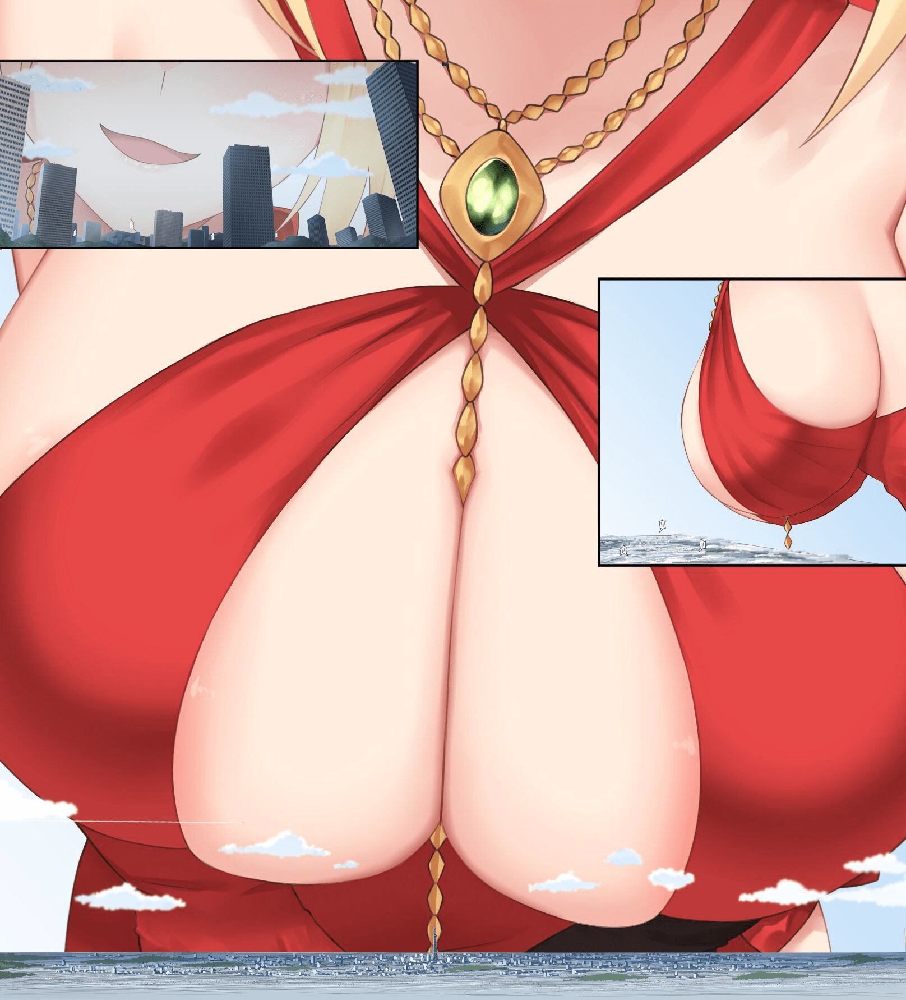

# 【元宵杯】(已完结)H星人别传(1月30日更新)

作者：焦冥小虫xxx

TID：32031

# 1

讀者評分：[https://giantessnight.com/gnforum2012/plugin.php?id=cxpform:style1&form_id=1&post=39](https://giantessnight.com/gnforum2012/plugin.php?id=cxpform:style1&form_id=1&post=39)

* * *

这是帮一位关系很好的同好代发的，因为他上gn不方便就委托我发了，希望大家多多支持他～(原作者语：本作世界观沿用的是焦冥小虫的h星人系列的外传世界观，对于作品里的“菌人”设定很是喜欢，在和虫哥交流一番后就写了这个作品。这个只是试水一下，毕竟第一次写经验不足QwQ还求大佬轻喷，最近考试较多，先拜托虫哥代发一下，后续还有更多福利情节，希望大家能喜欢～)

(下面是正文，后续他考完试还有更多福利情节)

天，与地同体。孕育万物而生。与天同大者，为食也。

国以民为本，民以食为天。天底下，最重要的事情，便是吃饭，吃饱饭。

吃饭乃是一个人一生中不可割离的一种行为。上至达官贵人，下至市井百姓。离了吃饭，谁都活不过三天。

正所谓，民以食为天。

古老的民族在长久的历史沉淀中，对于“食”字有了更加美的追求。厨师这个职业便应运而生。他们靠烹饪美味的食品来填饱别人的肚子，同时获得营生。

不过也有些厨师比较例外，他们对于“美食”的追求更加强烈。烹饪美食不是为了自己营生，而是为了制作出更好的美味。至于给别人做饭，那只是自己制作食品顺带的工作。

而春江就是一位这样的厨师，年轻漂亮的姑娘没有在厨房外的世界展现自己的青春靓丽，她只喜欢窝在自家的厨房里、与锅碗瓢盆作伴，一边品着各式各样的酒，在火焰与碗喷碰撞声中做出令人赞不绝口的绝珍美味。她开了一家在小巷里的饭馆，一来是生计确实需要，二来是自己独身一人钻研终究太过无趣，便想寻觅知音。

不过春江觅知音属实艰难：一来春江烹饪属实妙手，就算不宣传、仅仅靠着厨房缝隙里遛出的香味，就足以让路过的人食指大动。每天小店里都是人头攒动，热量饱满。在食客们络绎不绝的称赞声中，春江却只能听到浅显的“好吃”二字，属实难以注意到哪一位饕客真的尝出了自己菜中真意。二来是春江天生美人胚子，年芳20，三千青丝一半绾成两个团子，另一半则是随意的任其撒下；红色绣金高腰旗袍勾勒出少女令人遐想无限的身体曲线，旗袍开叉之下则是黑纹丝袜包裹着的修长双腿，走在饭馆的人群中仿佛一只灵动地精灵一样。令人诧异的是，春江明明是个厨师，天天与灶火相伴，可她的肩上竟还在围着一条白绒披肩。更神奇的是，这白绒披肩上竟无一丝油污，令人想不到这么一位活泼的姑娘竟然如此细腻沉稳，不让油污溅出半分。足见其厨艺高超。因喜饮酒，脸上总是带着一抹绯红，衬得她那一双媚眼更加动人。如此美人，自然有不少热血青年借寻味之名，前来寻求自己宝剑的剑鞘。奈何春江一门心思全在做菜，根本无心其它。这些小伙只好败兴而归。

不过好在功夫不负有心人，真正品出春江菜中真意的竟是一位异国少女，少女自称花月，相谈三言两语，发现甚是投缘。自此之后，两人渐成密友，春江越发的变着花样做菜，而少女却总能品出春江用意。春江甚喜，二人的关系更近了一步。

不过就算是春江这般的厨娘，也会有灵感枯竭的时段。此时的春江就在苦恼到底做些什么样的新菜给花月品尝才能让她眼前一亮。

“怎么办呢…”只有几天的时间花月就又要来拜访自己了，春江看着自己眼前的刀勺锅铲，玉眉微皱，陷入思索。

往常这种时候，春江一般会看看当日的报纸。俗话说艺术不是无源之水离不开生活，做菜亦是如此。不过近日报纸上全都是什么“菌人发现”之类的话题，就连饭馆那几个好喝酒的男人讨论的话题都是这些。就算春江再怎么不关心也无法避免自己会听到这些。

真是的，不就是一群新的看不见摸不着的东西被发现了么，有什么的。报纸上整天报整天报，真是厌烦。

难不成这些看不见摸不着家伙还能用来做菜？

春江被自己的想法惊到了一下，随后她开始寻找。她还真的找到了用这些小东西做成的食品

“这是…”春江看着自己手上这包花花绿绿的包装的糖果，两指捏住封口微微用力。

“唔，”春江向袋中看去：“感觉就是普通的跳跳糖呢…”

纤指探入袋中，捏出了细细的糖粉，仔细的放在眼前端详

糖晶是彩色的，结构说起来比自己先前见过的糖晶都要工整，除此之外似乎没有什么特别的。

外观先放在一边，比起这些，味道才是最重要的。

捏起一小撮，花月将自己的头发撩到耳后，将糖霜送到了自己的口中，舌尖轻轻品触了一下——

酸酸甜甜的感觉刺激着唾液的分泌，糖晶在嘴里噼噼啪啪的清脆爆开，似乎也——等一下！

为什么感觉甜度和酸度都在升高！

确实，明显感觉甜度和酸度比入口时要高很多——不对，自己先前就没有吃到过这种甜感的糖！似乎糖的蜜感完全覆盖了自己所有的味蕾末梢神经

春江眼睛一亮——虽然不知道到底是什么原理，但是这种糖真的好厉害！

如果要是能把其它调料也用制作这种糖的工艺处理的话…

春江立刻按着包装上的线索联系上了制糖公司

时间稍稍的往前回溯一点

蜜绿糖业，这是它在人类之中的名字

在菌人们的世界里，它的名字叫做新世界地产

不收取任何的资源，只要居住者参与地产开发就能免费的获得永久的居住权。开发商甚至还会定期向居住者提供资源，对于大批的居住在狭小空间向往更好生活的菌人而言简直是天上掉馅饼

不过建造的建筑是非常巨大的立方晶体楼，一栋能住下近万人，几乎是一个小型乡镇的规模。而且这些晶体楼非常的密集，不过既然是免费居住的，也没必要在意那么多。

不过就在绝大部分晶体楼住满了菌人之后，居住区头顶的天空忽然闭合了。在一片黑暗之中，整片居住地经历了数次大的地震之后终于安静了下来。

正当菌人们感觉事态平息之后探出头，向楼外观察情况时，头顶的黑暗被撕开了一个口子，光线唐突的从头顶射了下来

借助摄入的光线，菌人们勉强的看到了口子后边那一只巨大的眼睛

那是…眼睛…？

蝶紫色的眼瞳，在它巨大的体积加持下向着下面人们散发着巨大的压迫力

这也太大了…

那是什么…

巨人？

………

人群熙熙攘攘的议论着

就在人们议论时，巨人的手指伸入了居住地，随后捏起了数十座高达百米的晶体大楼

在春江纤弱的手指的挤压之下，坚固的晶体楼的承重结构上渐渐出现了裂纹。人们奔散着走向室外，正好和正在观察自己指间晶体的春江撞上了一个对眼

确切的来说，春江并没有注意到自己指间发生的一切

人们只能无助的看着自己连带着晶体大楼一同被送入了春江张开的秀口

朱唇闭合，春江口中的人们再一次陷入了黑暗。有的晶体大楼撞上了春江如同柔软大陆一般的舌头后竟然即刻爆开，带着其中的成千上万的菌人撞碎在了春江的皓齿上

晶体大楼没有爆开的则是被不知合适聚集而来的堪比超级海啸一般的春江的唾液冲的到处都是

求生欲涌其的存活的菌人死命的抓着自己身边小山一般的凸起。面对唾液海啸一次次的洗礼柔软的舌陆紧紧的抓着自己身下的小山

这小山其实是春江舌上柔软的味蕾，虽然菌人们大小微不足道，但是庞大的数量加上搏命的挣扎，竟让春江的味蕾越发的敏感

糖霜制成的晶体楼卡在味蕾小山的山顶，下方的菌人绝望的看着大楼被春江的口腔的温度融化，最终化成糖浆的洪流冲了下来…

最后，柔软的大陆整体翘起，唾液伴随着糖浆的洪流将菌人连同未完全融化的晶体大楼一同送进了食道。

仅仅过了半天，春江就收到了回复。

对方不仅满足了春江希望获得糖以外的调料的要求，甚至还看她腰上带着菜刀后主动提出帮她磨刀。春江回来时带了四个精巧的瓶子，一罐糖，一罐盐，一罐酵母，还有一罐据厂商所说是万用的调料，它本身没有味道，但却能激发出其它调料的味道，这让春江大为惊讶。

单从外貌上看的话，这些调料与寻常调料无异，只是更加规整一点罢了。这让春江更为好奇其中的原理。

不过春江毕竟是厨师，对于其它事情的热度不超过三分钟。她随即找出食材，右手伸向自己的专属菜刀“夜”

“嚯！”春江端详着自己的菜刀，不知道磨刀匠用了什么技巧，自己的爱刀竟变的如此光亮。春江随手揪了一根头发，丢了上去，头发应声断成两节。

“更强了呢，夜刀！”

要开始了！

先做一道主食面点

面粉加水加酵母，和面发酵

因为是私房菜，所以春江稍稍用舌头舔了一下面团

一股清爽的苦咸香，面发的不错

接下来捏型放入蒸笼，片刻之后，这些面点就会变成一个个饱满的美味食品

再来一道汤品

香菇、冬笋、火腿、鸡脯肉、放入砂锅，再加上特制的精盐，炖沸做成汤底

春江从卤水中捞出豆腐，夜刀从左进从右出，来回数十次干净利索不带一丝多余动作；左手把片成薄片的豆腐铺开，右手刀刃开始上下翻飞。整片的豆腐似乎被剁成了泥，但是当春江把豆腐用刀铲起加入底汤后，豆腐化开竟是一根一根极细的细丝，粗细均匀，长短一致不断，着实令人感慨刀工的优秀。

今天的刀真的好快～

给美味一点质变的时间～

豆腐丝渐渐浮起，这道文思豆腐便大工告成

再做一道花月喜欢吃的甜口菜吧

通黄鱼去鳞、鳃、内脏，用清水洗净。以胸腹鳍处下刀，将鱼头切下，然后再从下颌处下刀，将鱼头劈半刀，用刀略拍，剔下两面鱼肉，除净胸部细刺，鱼尾相连入油锅炸到金黄色。浇上酱汁，撒上糖盐，最后淋上一勺热油。

虽然不是正经的松鼠鱼，不过春江感觉这样制作可能更鲜美

用来招待花月的一桌美味已经做好，不过春江不知道的是这桌美味背后的代价，确切的来说是菌人付出的牺牲

罗勒和其他几百个牧羊人近日突然收到了一封邀请函，函里邀请    他们去测试一片全新的牧场

虽然带有疑惑，但是邀请函中保证的丰厚报酬使他们打消了疑虑

于是，罗勒和其他几百个牧羊人带着它们的酵母羊前往了会场

但是等待着他们的却是……

“你这巨大的畜牲！”罗勒看着天上那个巨人，此时的她正在用双手肆意的蹂躏着罗勒脚下这片白色的大地

自己的羊群不时被翻起的地面吞噬，那个巨人就像玩泥巴一样在大地上制造着白色的海啸

周围已经几乎看不到别的羊和牧羊人了，气愤和绝望到极点的罗勒冲着天空的那个巨人咆哮到：“有本事杀了我啊，杂种！”

或许巨人真的听到了，罗勒感觉自己左右两侧的大地突然升了起来，随后，巨人把它们拍了下去，罗勒陷入了昏迷。

再次醒来时，是被一只酵母羊舔醒的

这里是哪里？

周围一片黑暗，同时…感觉温度在升高…！

啊啊啊啊啊———！

最终，牧羊人罗勒被蒸熟在了一个馒头的某个气孔里

春江的刀的保养自然是交给了菌人，不过菌人接到的并不是保养菜刀的任务，它们接到的任务只是保证一块大到看不到边的钢铁大陆的边缘足够锋利

但是任务里绝对没有提到过，会有这样的情况

现在，整块大陆被一个不知道有多大的姑娘拿在手中端详着。

有的工人尝试着引起她的注意，不过他们很快放弃了

当他们看到，这个姑娘用大陆锋利的边缘切断了一座直径数十米的巨塔，而这座巨塔只是那姑娘的一根头发之后，他们就明白自己不可能引起着姑娘的注意了

钢铁大陆突然穿进了一块白色巨物之中，无数的工人被相对速度极大的白色巨物撞成了肉泥

幸存下来的又有不少在春江上下翻飞的刀刃之下被切成了一段段的残片

如果放大春江切出的豆腐丝的话，就能看到在两根豆腐丝的边缘上是各式各样的菌人残片

最后，极少数的极幸运的菌人连同着切好的豆腐被春江一同放入了砂锅之中

正当他们依附在豆腐丝上喘息时，天空中突然降下了许多晶体大楼

难道得救了么！

他们拼命的爬上了晶体大楼，迎接他们的则是绝望的呆在晶体大楼里的同胞

此时的晶体大楼和他们几乎一样，都只是汪洋中的一粟

随着砂锅被加热，菌人们感觉到晶体大楼下的海面变的滚烫了起来

更令人绝望的是晶体大楼正在融化

绝望的哭喊也好，无助的彷徨也罢

最终都沉入了渐渐沸腾的海洋

相比之下最幸运的或许是被撒在松鼠鱼上的菌人

滚烫的热油在他们还没有反应过来时，一瞬间的夺走了他们的生命

不过菌人的基数非常的庞大，即使是这样极端的环境，仍然有菌人坚强的活到了成菜装盘

不过等待着他们的是——

“春江姐姐，我来了哦～”一个穿着淡蓝色旗袍的蓝白色头发的少女走进了春江的小店，在闻到店内的香气后脸上立刻绽开了笑容：“好香的味道～！”

“快吃吧，不要客气～”

“呜啊，春江姐姐的菜还是这么好吃，简直都要走不动路了～”

“是么？”春江笑道：“那就去里屋稍微躺着休息一会儿吧～”

看着花月走进了里屋，春江锁好了店门，脱下了披肩和鞋子，向着里屋走去

“唔，等一下，还有一种调料据说能让味道变的更鲜美，还没有试过呢。”

于是春江走回厨房，去取出那一罐调料

不就之前，就在春江做菜时

就算是再怎么优秀的厨师，也难以避免会有盐粒或者糖粒掉在地上的

晶体大楼里的菌人们发现自己到了一个奇怪的荒芜之地，便开始对着周围展开了调查

最远的一支队伍走了十几公里，发现了一堵高几十米，从地平线的一侧延伸到另一侧的高墙

有的队伍则是发现了一个直径越有五六公里的大湖

运气最好的一支队伍发现了高达百米的由某种有机物组成的高山

城市的领导者此时正在进行着讲话，她在鼓励大家坚定信念，我们有充足的食物和水，一定能够活下去

突然间，她发现台下的听众注意力不在她的身上，而是抬头看向了更高的地方

她还没来得及转过头，视野里90%的荒芜平原都被黑影笼罩

紧接着地震发生了

在几百公里之外，春江的脚后跟落地了

不到一秒的时间，这座晶体大楼连带着周围的大湖、高墙的食物山以及更远处没有联系上的其它晶体大楼一同变成了春江前脚掌上的碎屑

“春江姐姐，你手里拿的是什么呀？”花月看着春江手里的瓶子好奇的问道

不过春江没有说话，而是把花月推到在了床上

“春…春江姐姐？！”

春江的上半身压在花月的上半身上，双腿夹着花月的大腿。嘴巴在花月的耳边悄悄的吹着起，没有拿东西的手解开了花月旗袍的口子

“等…等一下！我还没准备好——！咿呀——！”

春江看着花月胸前随着花月动作跳动的玉兔，迫不及待的向上撒上了那种神秘的调料

摔碎在花月乳晕上的，被收缩舒张的乳肉夹碎在乳首缝隙里的，融化在花月温度升高的乳腺里的晶体大楼释放出了其中的小人。晕头转向的它们在花月的玉兔尖上横冲直撞，让花月本就急促的呼吸变的更加急促了

看着面色绯红的花月，春江捧起花月的玉兔，轻轻吮吸着它的尖端

啊——一抹醉红涌上了二人的面颊

人间极味

春江花月夜，人间极味时

# 2

*本帖最後由 焦冥小虫xxx 於 2021-12-24 17:32 編輯*

请注意文章的科学性，这是一本严肃前沿的生物学杂志而不是少年科幻…D姐没有把退稿意见看完就关上了邮件窗口。

唉——D姐整个身体瘫到了座椅上，喝了一口速溶咖啡想要打起精神尽管自己在公司里很受人尊敬，但是自己的硬地位和职阶还是太低了H星人的研究需要更加优秀的实验设备和大量的资金，申报实验设备和资金需要经过审核，审核又要卡资历职阶，想要提升资历职阶就需要在杂志上发文章，但是自己的资历不够做出来的学术成果信服度不够发不了文章——走入死胡同了呢，果然现在没有杂志能接受这份像科幻小说一样的论文么D姐感受着自己乳首和趾隙间的瘙痒，一边为自己没有资金和设备展开进一步研究而连连摇头唉，今天也没有心思加班了

“D姐，今天还要加班么？”小鹿一样的明日静不知道从哪里钻了出来，跳到了自己的身边“啊，今天嘛，今天不加班了”“维拉姐，你今天精神看起来不太好呢？怎么了么？”不等D姐回答，静就继续安排了起来：“今天下班去吃烧鸟吧，我请客～没有什么烦恼是一顿啤酒烧烤解决不了的～”D思索了一下，目前确实也没什么事要做，倒不如简单的吃一顿，于是便答应了“好耶，走吧～”静挽着D的胳膊就开始往公司大门走，在推开公司的磨砂玻璃门时险些撞上门后站着的人“哇啊，对不起对不起…”“不要紧的…”静和呆在门后的人互相道歉时，门后的女性的眼角余光瞥到了站在一旁不知所措的D姐

“你是维拉小姐么？”姑娘试探性的问道

“啊，我是！”被突然点名的D姐惊了一下“哦，”姑娘整理了一下衣领，扶正了眼镜伸出了右手：“初次见面维拉小姐，我是西京大学临床医学副教授焦筱绿，是你所投稿的杂志《cells》的学术性审核员。根据文章的通讯作者联系方式找到你的”在打量了一番D姐之后又补充了一句：“从照片上看不出你这么高大呢。”这番话让身高1.9m穿着职业装的D姐感到一阵不自在，她一边尴尬的回应着一边观察着眼前的姑娘浅蓝色的衬衣配上玄色的裙子，长发被束成马尾自然的搭在身上。理科女生特有的精干之气甚至压过了端正的五官散发着的姑娘的柔美。

“今天前来拜访实不相瞒是有一事相求，不过看样子你们正打算要离开”筱绿想起了静刚刚拉着D姐向外跑的情景接着说道：“现在是公共交通的人流高峰，我的司机刚好在这里。不如两位坐我的车，一来我把两位送到目的地，二来我也方便在路上和维拉小姐商量一下事情的内容？”D姐犹豫了片刻，刚想开口推脱时筱绿却先一步看出了D姐的担忧：“啊，坐一个刚刚见面的陌生人的车确实有些强人所难，不过如果我可以保证你的文章发表并且对日后来源于贵公司的文章审核提供绿色通道，不知道你是否愿意接受呢？”

D姐在那一瞬间明白了资本的力量 “哇，这车…可真有个性…”小静看着眼前的停在路边的五菱宏光面包车发出了自己的感慨。毕竟她确实没有想到一个姑娘会开这样的车，或许这就是她无法理解的学者的世界么？“请进。”筱绿拉开了车门“维拉姐，这车里好暗！”静忍住了自己进一步吐槽车厢的奇怪布局的冲动，在昏暗的车厢中找到了座位安置好了自己在三人安置好自己之后，筱绿关上了车门，切断了最后的外界的光线就当静正在思考怎么样应对可能的来自筱绿的袭击时，车内慢慢亮起的柔和的灯光打断了她的胡思乱想

“哇——”

与五菱宏光粗犷的外表不同，车厢内部是看起来似乎价值不菲的奢华车具。柔软的真皮座椅在藏在装饰雕塑里的暖光等的照耀下散发着温馨和舒适的黄色。两排座椅面对面的设计拉开了D姐小静和对她们而言陌生的筱绿的距离，予以了她们心理上的舒适距离。在这种身心舒适度相当高的环境中不由得让二人身心完全的放松了下来“改装车原则上是不能上路的，不过毕竟只改装了内饰，上路对社会安全不会造成重大危害。”筱绿没有理会惊呆的二人继续说着：“要木梅利口酒？还是巴顿雷司令？”“额，我要可乐…”在看到筱绿在冰柜里翻找的手突然僵了一下后静连忙改口道：“利，利口酒吧…”在惊呆的二人缓和下来后，汽车平稳的开上了公路 “呼啊。”筱绿一边呼气，一边脱掉了高跟鞋。微微带着点热气的双脚在柔软的地毯上尽情的舒展着。随后她直接解开了上衣的扣子，仰在了靠背上，出乎意料有料的身材毫无保留的展示了出来看着对面的D姐和小静一脸惊讶的看着自己，筱绿解释道：“啊，不在人特别多的环境里就随意一些吧，这个地毯很舒服的，你们也可以踩一踩试试。”“额，我们在意的不是这个…”静尽管嘴上这么说着，为了避免尴尬，身体上还是和D姐一起脱下了鞋子踩在了地毯上，“我认知里的学者应该是那种…”“那种安贫乐道，不慕名利，热衷真理大于黄金，即使独居一室也能时时注意自己行为的人么？”筱绿接道：“唔，这样的学者确实值得尊敬，但毕竟这不是一种规定，没必要所有的学者都这样。”许久未开口的D姐终于发现了困惑自己的地方，她只是一个副教授，为什么会有这样一量看起来价格昂贵的改装车？“这辆车的内饰一定价值不菲吧？您作为一个副教授从哪里得到这样的经济支持呢？”D姐做出了推测：“难道是挪用了课题资金…”“某种意义上来说是的。啊，请让我说完，我并没有挪用国家审批的课题项目，那种行为是违法而且违背学术道德的，我向来学术端正。

“我的资金来源嘛…”筱绿接着说道：“是源自于一些私人课题。”“私人课题？”D姐好奇的问道“你知道如龙吧？对对，就是那个新港最大的黑帮头目。”“她得了癌症，我答应帮她治愈，只需要她给我提供一笔资金就可以了。”D姐差点把嘴里的酒喷了出来：“治疗癌症？！你在开什么玩笑！”焦急之下的D姐完全不使用敬语了：“你疯了吗？！那么多人全力攻克的大难题到现在也只是出现了延缓进展的治疗方法，你竟然说能够完全治愈？！”“而且那个如龙是什么人？那可是能把你在杀死在床上并且让你从此人间蒸发的狠人！”“唔，其实不止和如龙合作了。”筱绿回忆着：“还有被慢性病折磨的巨商马腾，被自身免疫病折磨的西西里黑手党头目玛丽娜•唐•柯里昂，还有…”D姐此时感觉自己身下柔软的座椅仿佛长了尖刺一般，脑子里只有一个想法：赶快离开这个女人她绝对是疯了…向这么多人许下了根本不可能的承诺…她死定了，和她接触过的人可能也要死…现在带着小静一起逃离这个国家有没有机会活下去…

“啊，看你的样子或许觉得我疯了”

筱绿看着D姐失神的样子笑道：“你来看看这个，就会明白我所说的并非疯子的妄言。” 筱绿身后的厢壁上突然出现了画面，占据了画面绝大部分的是形状古怪的森林。林子里的树木没有枝叶，光秃秃的树干泛着诡异的颜色这个颜色…怎么感觉有点像自己脚下的地毯？D姐心里有了一个大胆的猜测，她现在在等着筱绿来验证筱绿轻轻的挪了一下脚，同时手指快速的移动着镜头开始逐渐向上，在森林上方大约2km的位置是一只女性的丝足一只大到离谱的丝足D姐曾经无数次幻想过自己变的无比巨大，也曾幻想过从小人的视角仰望自己此时的画面完美的符合了她的幻想筱绿开始慢慢的把自己的脚放在了柔软的地毯上以D姐的视角来说，筱绿的脚大约有23cm像，在肉色的丝袜的包裹下配合上漂亮的脚型，是一双小巧却又不失性感的美脚而在屏幕里，筱绿五个小巧圆润的脚趾此时像五座山峰一般，降落到了由无数巨木组成的森林之中。冲击起来的气浪将无数挺拔的巨木掀弯了腰，镜头被摇滚着吹飞到了高空。

强烈的视觉冲击让D姐和静本能的抱住了头去躲避那不存在的气浪。“呵呵，我只是把脚放在地毯上而已，没有必要反应如此巨大吧？”看着滑稽的二人，筱绿饶有兴趣的开起了两人的玩笑被打趣的二人只得尴尬的应和“教授，这个视频是怎么拍摄的？”筱绿的手指又开始飞速的扭动了起来，原本掉在地毯底部的镜头开始沿着一颗“巨木”爬升，在升到顶部后开始快速的在森林顶部穿行，向着筱绿的脚趾前进随着距离的接近，筱绿的脚趾开始占据越来越多的画面，产生的压迫感几乎让D姐和静喘不上气来。

她们从来没有想过，自己会在面对一个女性的脚趾时会感受到如此的压迫力。筱绿的脚趾此时就如同山峰一般伫立在镜头前，直径半米的丝袜纤维将整个脚趾有序的包裹了起来。镜头开始攀爬起这座脚趾山，大约到一半左右时，画面定格了。“拍摄的秘密就在我的拇趾上。”挑逗一般的，筱绿抬起了脚翘起了拇趾D姐立刻凑了过去，眼睛几乎要贴到这个拇趾上“哇啊！”D姐听到了静的惊叫，发觉她在指着什么，于是D顺着她手指的方向看了过去还是刚才的屏幕，此时自己的脸占据了几乎全部的画面D姐看着这张脸，感到熟悉又陌生。熟悉是因为这确实是自己的脸，每天都会在镜子里看到；陌生的是自己的脸现在被加上了诡异的透视，显得自己的脸无比的巨大。

“别愣在我的脚趾前啊，保持这个姿势很累的。”筱绿说道：“这架势，我都担心你要舔上去了。”“啊啊啊，抱歉抱歉。”D姐飞快的退了回去：“教授，这个到底是怎么一回事？这个东西又怎么和治病联系起来呢？”筱绿开始播放起了显然早就准备好的PPT，开始了讲述你看到的是我带领的研究团队制作的BLA—17型摄像微米机器人它是我的机器人家族中的一部分，我的思路是用纳米机器人来治疗现在人类无法攻克的疾病。你来想一下，如果成千上万的机器人在你的体内精准的识别出病变的细胞，然后精准的杀死它们。

没有任何副作用，可以完全的根除所有病变细胞这个思路我觉得可行，于是我开始了行动首先我从各个被绝症折磨的富豪处，在她们抱着赌一把的心理时获得她们的资助为什么选择女性是因为她们比较感性，咳咳，跑题了…建立起了自己的实验室后，利用她们的关系，网罗来了一批又一批的技术人才当你把大量的高质量人才极高密度的集中在一起时，你就会明白科技突破有多么轻松研究开始十分的顺利，很快就制造出来了微米级的摄影机器人和手术机器人。并且在操作员的操作下确实一定程度的缓解了病人的病情但是当我们想要进一步突破时，问题来了首先，加工技术太过于有限了，根本没法加工出小于微米的机器人其次是人工智能技术算法更新停滞了，一直没有新的突破，这导致了我们的大部分机器人只能通过操作员远程操作所以我需要突破这些难题，而你就是关键。确切的来说，是你发现的“菌人”。

"我要造一个地球一旦成功的制造出地球之后，我们就可以利用菌人进行超精细加工。菌人的庞大数量会使得它们成为最合适的纳米机器人的操作者别一副觉得这不可能表情，你的报告里写过，菌人似乎具有智慧潜质，在外界刺激下表现出了高度的变异性。也就是说，我们完全有可能在微观尺度上模拟出我们的地球嗯，对，没错，条件不确定，所以这就是我邀请你一起来进行研究的原因。你比我更熟悉这些菌人拒绝我的邀请，哦，维拉小姐，我们在一起了这么久，你应该也知道我在和什么样的人打交道了吧？我们现在是一根绳上的蚂蚱，不帮我的话，我们可能会一起死掉，相反，帮了我，我们都可以拿到自己想要的啊，也就是说我们确立合作关系了？可喜可贺～别一副上当的样子嘛你要回实验室？可以！你的实验室在二十分钟前被原封不动的搬到了位于南沙海下的私人试验场里，你的公司现在对你的状态认定为“出差” 下车吧，欢迎来到我的研究中心，新任研究员维拉，明日静.“维拉姐，我能进去么？”小静的询问声伴随着敲门声一同响起。使正坐在床上发呆的D姐思绪重新拉回了现实，“啊，请进。”静轻轻打开门，溜了进来。坐在D姐的身边，像是不知道怎么开口一样。二人转而陷入了沉默自从被筱绿安排专门人员带领她们到不同房间整理安顿之后，两人就再有几个小时没有说过话了。D觉得可能两人都尴尬的不知道怎么开口。毕竟突然发生了这样的事，先是莫名其妙的上了筱绿的贼船，再是几乎被绑架一样的带到这个研究所，其次是…自己一直对着静隐瞒了H星人的发现。

“维拉姐，明早吃什么～？”小静开口了，但是言语内容却是D完全没有想到的。“诶，静你不好奇…”“维拉姐，”小静认真的说道：“现在咱们的处境比较微妙，咱们还是少去想别的事情，不要去好奇太多应该会更好。”“在这个人生地不熟的地方，我们可是彼此唯一最能信任的人。”“啊诶，你说的是没错了，但是是不是离我太近了…”“啊…抱歉…！”意识到自己几乎快要贴到D姐脸上的静连忙拉开了距离。“而且这里似乎也蛮不错的嘛～”静迅速调整了情绪：“每天的饮食都可以提前预约、光是菜单我看就有十几页。而且这个研究所基础设施配备简直奢侈的不像话，竟然还有独立的休闲区！还有啊我看我桌子上放着的一套杯子竟然是奥地利的醴铎高脚杯。”静感慨到：“同样是光荣的科研人员，为什么差距这么大啊！万恶的资本主义～”   而D姐则是看着批判着腐朽资本主义的静，看罢，便将目光落在了自己的黑丝足尖上。

“还是先等些时候，再告诉她吧。”   面对充满未知的筱绿以及背后的势力，D姐必须保留住自己最后的底牌，至少不能让她连自己的底裤都跟着看穿。   即使在信任的静面前，D姐也必须保持应有的警惕。毕竟这里可是别人的地盘，谁知道会不会在某处暗插了眼线。   “既然这样，静你也早点回房间休息吧。有任何情况，一定要联系我。”“嗯~！放心吧D姐。”不过两个人的计划伴还是随着各自的日程表被打破了。早上六点起床，一个小时的洗漱早点时间之后立刻进入了满当当的课程：超微观条件基础物理、微米机器构解初级、微米机器人操作初级、简易计算机编程、仿生学、科研道德与职业素养（D姐严重怀疑某些人把这门课加入课表前自己是否有学习过）等等…庞大的新知识和高强度的学习一瞬间使得D姐以为自己回到了考博士前的半年里。“姐啊！我考研前就一周这么学过，现在都已经半个月了…！”静欲哭无泪。

D姐虽然也很疲惫，但是她惊喜的发现这些技术对于自己未来展开对H星人的研究几乎都是必备技能（某科除外）。因而她虽然很疲惫，但也依然鼓励着静继续坚持。两人的谈话被转角走出来的传达员打断了：“打断一下！维拉小姐，所长正在B7实验室等您，还请您立即动身前往。”传达员在说完话后便扭身离开了，气的小静给了她一个白眼：“太没有礼貌了！我们刚刚还在说话诶！”问候完之后，她又转向D姐：“姐，要不我陪你一起去吧？感觉你一个人我有点不放心…”“所长找的是维拉小姐。”传达员忽然在她们的背后出现，着实把两人吓了一跳：“请不要让所长久等。”传达员又重复了一遍。   “这个家伙.....咋跟个鬼一样啊。”小静斜看着这传达员，内心一顿万马飞腾。   “好的，我这就去。静，你就在这里继续学习吧。”

在传达员的监视下与小静告别了之后，D姐到了B7实验室映入眼帘的是满满一排的正在播放视频的显示器，有的看起来是岛国特产的怪兽特摄片，有的像是乡下农庄的生活，也有的像是规模宏大的战争片筱绿坐在显示器前面的扶手椅上，身边的桌子上摆着几个盒子。坐在扶手椅上的筱绿转向了门口：“你来的刚好。”看到D姐好奇的看着屏幕，眼里满是“这是什么？”的疑问，筱绿便开始解释了起来“首先是这些盒子，它们是模拟地球模型。”D姐连忙凑了过去仔细的观察了起来：大概直径3～5cm的小球，上面被人为的制造了指甲盖大小的大陆和几滴水组成的海洋。有的小球上看起来密密麻麻的长满了霉菌，也有的小球看起来温度似乎非常的低，上面的水已经凝结成了冰晶。“这些是预实验的地球模型，只是为了摸出来初步培养条件。”筱绿解释到：“单向透光的盒子，用迷你的复合日光灯作为太阳，把H星人原种移植上去，改变初始条件来看一看什么样的条件培养比较合适。”“而这些，”筱绿指着屏幕：“这是微米机器人在模拟地球上拍摄下来的视频。”

D姐一惊：“那这些生物…”“都是H星人，你提到过它们具有高度的可变性。”筱绿指着那一块播放着特摄片的显示器说到：“在改变了’地球’的条件之后，原本进化到类原始部族文明的H星人原种发生了退化。”“为了适应寒冷但营养丰富同时竞争对手繁多的环境 ，它们进化出了长长的毛皮和巨大的身躯，用来储存大量的能量，同时在竞争中占据优势。”“而这个显示器里，这个形状奇怪的’树’其实是绿霉菌，上面趴着的蜥蜴一样的绿色生物其实是H星人，它们为了适应环境在如此简单的身体结构里竟然进化出了拟态的能力，着实令人惊讶。”

“还有这些，这两个是最有趣的，你看一下。”一块显示器里正在播放着一片祥和的田园农庄生活两三个青春动人的姑娘穿着朴实的农庄拿着洗衣服的木盆（具体材料未知），有说有笑的走在乡间的小路上。路两旁是浓绿的绿霉菌，远方似乎可以看到某种真菌被集中培养，做出了像麦田一样的视觉效果。里面几个妇女正在辛勤的劳动。土地平阔，屋舍俨然另一块显示器里，几千几万名战士正在广阔的丘陵上进行着混战，从他们身体的颜色可以看出他们分属于不同的派别。他们似乎是要抢占这一片丘陵地带，战争进行的非常的惨烈，当这些战士被斩成两节的时候，他们肢体断掉的部分流出来的是浓稠的细胞质和奇形怪状的细胞器时D姐才回忆起来了它们实际上是H星人竟然能进化到与人这么接近的程度么！“战况对蓝方似乎不太乐观呢。”筱绿饶有趣味的看着“我看不一定，”D姐说道：“你看那边，在不远的地方似乎有蓝方的城邦，那一条蓝色的细线应该就是蓝方的增援。”果不其然，当蓝方注意到增援到来时纷纷跳起了诡异的舞蹈，士气高涨的它们表现出了强大的作战能力.

“应该快到了。”筱绿突然没头脑的冒出来一句快到了？什么快到了？D姐还没问，忽然看到了战场上空似乎有什么东西正在飞速的接近伴随着崩山的轰鸣，整片战场上正在厮杀的战士倒成了一片。向着震动传来的方向望去，蓝方的城邦和援军此时在一块巨大的物体之下还没等D姐弄明白发生了什么，又是一阵剧烈的震动此时，战场左右两方各有一个巨物D姐看着画面剧烈的晃动感觉稍微有点晕特效，便看向了另一块屏幕。另一块屏幕上一个身材姣好的黑发姑娘刚把脚放进内裤的裤腿里，准备提起！“就和你想的一样，”筱绿看着D姐说道：“这两个显示器拍摄的是同一颗模拟星球。”随着姑娘提起内裤的动作，整片丘陵地区开始震动着上升了起来。

绵延起伏的丘陵地貌其实只是一根根构成内裤的纤维素纤维而已。在战士们的上空，遮蔽了整片天空的麦色美肌中间是柔软粉嫩的阴唇。只不过，即使是这阴唇上最小的一道褶皱也足够几百人在其上定居。随着阴唇越来越接近内裤表面，身经百战的战士们开始慌不择路的逃窜。有的从内裤的缝隙里掉了下去，也有运气不好的几千人被一根脱落的直径20m阴毛砸成了泥。当阴唇彻底接触内裤时，内裤微微的勒出了鲍鱼的形状。大部分人要不是被大地和阴唇挤压成了内裤上的小点，要不是就是迷失在了千百根直径20m的阴毛组成的森林里。只有最幸运的一小部分人进入了缝隙的中间但是没有时间给他们喘息，脚下的大地忽然开始升起，胡乱的往周围的肉壁上挤压。幸存的战士们不得不开始沿着肉壁上爬，体力稍弱的掉下去的就只能消失在翻腾的大地与肉壁的摩擦之中 “太不卫生了，”筱绿说道：“在自慰的时候至少要把指甲修剪一下啊，不然阴唇很容易弄伤的。”伴随着摄像机开始坠落，视频结束了 “非常有趣，不是么？”筱绿说道：“这个星球上的雌体和雄体有着极为惊人的体型差。雌性没有意识到雄性的存在，雄性也没有意识到几千几万几十万人发起战争争夺的竟然只是雌性的一条内裤而已。”“但是就算在这种雌性的一根脚趾就能抹平雄性的一座城市的体型差之下，她们竟然还是能进行交配。并且采取这种非常极端的方式，筛选出兼备运气，体力，和智力的个体进行基因交流繁衍。”“嗯？好奇智力在哪里体现么？那些分不清尿道和阴道的雄性恐怕这辈子都要迷失在在雌性的尿道里了。”

“所以这样，生出的下一代会更加的优秀。真是一种奇妙的生物体系。”D姐赞叹到“对啊，”筱绿感慨到：“H星人的可变性真是太奇妙了，我越来越坚信我们能做出来与我们的地球相似的模型，只要我们能找到合适的初始条件。”“呃，教授，你的意思是打算做很多的地球模型，然后改变初始条件，最后选出来与我们的地球相似的模型么？”“对，你有什么问题么？”“教授，这个可行性不是很高。人类文明的发展中充满了巧合，我不认为在有限数量的模型中能复刻出来地球模型。”“没错，着确实是个问题，”筱绿赞叹到：“那么，你有没有什么有建设性的意见呢？”“我们可以人为的复现这些巧合。”“复现巧合？”“教授，您在小的时候一定听过各种各样的神话故事吧？”“确实听过。”“那，这些故事里是不是有神明将智慧赋予人类的片段？”“没错，嘶——你的意思莫非是由我们将知识教学给它们？”

“没错！我们有微米机器人，完全可以充当神明的使者，给他们知识！”“哈哈哈，有趣！”筱绿笑道：“当这个文明成熟的时候，它们会把这些神明赋予知识的历史当做古时先人的浪漫主义思考，会给这些知识的起源找一个符合’科学’的解释，而不会去考虑这些知识是否是外来文明的。”“对！而且这样，我们就可以很容易的塑造菌人这个群体。”“很好很好！”筱绿笑道：“审核你的稿件真是我的幸运啊！”筱绿拿起了手机：“通知下去，K3模拟地球实验室项目由维拉小姐主管，原单位人员务必配合。”通知过后，筱绿放下了手机：“维拉小姐，请您一定不要让我失望！”   

# 3

*本帖最後由 焦冥小虫xxx 於 2021-12-24 17:39 編輯*

车水马龙的街道，走着熙熙攘攘的人群。天空上，太阳散发着温和的光，远处是连绵的群山。发展中的城市焕发着勃勃生机。一切似乎都很正常。但是这些画面是通过显微镜拍摄的。

“如您所见，模拟地球项目取得了重大的突破，”D姐站在造型怪异的机械面前，通过投影向前来询问进度的筱绿一行人汇报着。“就如同名著《人类群星闪耀时》一样，我们在关键的时刻用微米机器人对菌人进行引导，将它们的文明塑造成了我们的样子。”D姐指着街道里的一处招牌：“例如，大家请看，汉语是目前在这颗模拟行星上通用的语言。我们人为的将甲骨文传递给了原始的菌人，再在后续的过程中不断引导，使得它们现在使用的文字和中文几乎没有任何区别。无论是形，还是意。”人群中响起了赞叹的掌声。

D姐摆手了摆手，人群安静了下来。“最大的突破是这里，”D姐指向了左侧的电子设备，上面是某种通讯软件的界面。

A:“我到了，你在哪里？”D:“你到了嘛，没看到你呢，能做些显眼的动作么？”A:“可以哦，别太尴尬就好～”D姐看向人群中间的筱绿教授:“教授，您能帮忙想一个动作么？”“唔，那就伸个懒腰之后跳五下？”D:“你现在伸个懒腰跳五下。”

发送完消息之后，D姐指向了中央的显示器，在其中，繁忙的街道上一株绿色的奇怪植物下有一名青年男子“大家请看。”男子伸了个懒腰，然后跳了五下。

人群中爆发出了激烈的欢呼，这绝对是一个重大意义上的突破。某种意义上来说，这是人类第一次和非人的智慧生命体进行直接的交流，而且这两种生命体在尺寸上有着极为悬殊的差距，这个突破意义非凡。

在送走了前来视差的筱绿教授以及陪同之后，D姐开始安排K3实验室的众人继续他们的调整工作。这时D姐忽然看到了刚刚陪在绿教授旁边的一位淡金绿色长发的姑娘。“您是有什么东西忘在这里了么？”姑娘笑而不语，悄悄地把嘴巴凑到D姐耳边:“我是所长的秘书。今晚7点，所长要见你，应该是工作调动的事务。”

D姐绝对不会想到自己的情绪只需要10分钟就能变得如此低落。今天取得了重大的突破，又听到了秘书小姐告诉她会有职务调动。因而就理所当然的认为应该是权限提高，管理层级提高。只要自己能有更高的权限，或许就可以利用筱绿的资金和自己在这边掌握的技术，在这里同步进行H星人原种的研究。但是D姐没想到，筱绿在肯定完自己的成就之后，给她的新职务是特别指导员。简单的来说就是作为资深干员来指导实验室开展工作，但是实际上手中一点能够调配的资源都没有。明升暗降别说开展对于h星人的研究了，自己能不能继续影响实验的进展方向都是一个问题。

“嗨，在苦恼吗？”D姐抬头，看到自己面前站着的是矮自己一个头的秘书。“啊，你是上午的秘书小姐。”D姐苦恼的说到:“我表现得有那么明显么？”秘书咯咯一笑:“不要叫我秘书小姐了，叫我薇薇安娜就好了。至于你苦恼都写在脸上啦，好啦，别想太多～”“所长是军医出身，所以做事会非常谨慎。就像国库的钥匙会分给三个人保管一样，如果让一个人拿着国库的钥匙，皇帝的黄金可能早就被偷光了。这个项目和这个也有相通的道理。”  如果一个人从头到尾主要参与了这个项目，那他一定比所长在这个项目上更有理解和发言权。所长她为了维护自己的权威，她就需要保持这个信息差。秘书接着说道:“你看，这和模拟地球模型的K3实验室，通过离心力和磁悬浮以及自传来模拟地球宇宙环境的是一个团队。在上面诱导文明的是您的团队，而后续的扩大化培养和商品化又是另外一个团队。这三个团队都只知道这个大项目的一部分，真正完全了解这个项目的只有所长一人。”D姐似乎有些明白了，同时秘术坦诚的态度让她一瞬间对她心声好感。秘书看D姐似乎情绪有些好转，便接着说道:“那指导员小姐有没有兴趣来指导一下我们的项目呢？我们目前正在研究怎么样和菌人打交道最有效果，实验的方法您或许会很感兴趣～”

抱着打发郁闷的心态，D姐跟着秘书来到了她的实验室。映入眼帘的是一个篮球大3m x3m 大小的黑色密闭空间。

“这个模拟宇宙和您原先的K3实验室的是没法相比的。K3的那一套通过圆周运动配合上磁悬浮技术完美的消除了地球重力的影响，制造了相当接近宇宙环境的真空失重模型。这一套只是用磁悬浮把这个“地球”给悬了起来，在通过四周的沉浸式显示营造一种宇宙氛围而已。”秘书解释道。

“您在这边就可以比较清晰的看到我们的实验的全过程。那么您先熟悉一下操作，我先去换个衣服～”

D姐摆弄着旁边的机器，几分钟后她就已经完全熟悉了操作。说白了只是在那个黑色密闭空间里布置了一大堆的微米摄影机器而已。

恒星和星云散发着微弱的光，在宇宙无边无际的黑暗面前显得那么的脆弱无助。更不要说那颗脆弱的行星，似乎每一刻都有可能被宇宙的黑暗所吞噬。就在如墨的黑暗即将将行星吞噬时，她出现了。

手中拿着一根跃动着小小火苗的蜡烛，光与热虽然微弱，但似乎能够抗衡整个宇宙的黑暗与寒冷。白色的长袍上修饰着华丽的金色花纹，帽兜下的面容在红绒与烛光的映衬下显得格外的迷人。在冰冷与黑暗的宇宙之中，她的存在是一种无法用言语形容的美好，只有她自己映照着的光辉的眼眸令人沉迷。

她接近了这颗对她来说只有篮球大小的星球，目光透过自己的双峰俯视着它。星球原本因为她的出现与接近陷入了前所未有的混乱，而在她俯视大地时，几乎所有人都安静了下来。没有任何原因，他们感觉自己必须要这样做。要表现得好一点，不然天上的那位“神”会生气的神的视线扫过了一个又一个国家，一片又一片大陆眼睛里明明没有流露任何感情，但却压的人喘不过气在神的目光到达了星球上最后一个偏僻的角落后，神闭上了眼睛表情流露出了无奈的惋惜看到神这样的表情，安静的人躁动了起来。他们似乎预知到了被毁灭的命运有的人奋起反抗，尽管他们的武器根本无法接近神有的人用他自己的方式祈祷，渴望神的怜悯神没有回应驱散黑暗与寒冷的烛火化为来自地狱的烈焰，烧干了大海，烧崩了山脉，让城市变成一片废土神的指尖击碎了天空，伴随着火焰与闪光撞击了地面最高的山峰甚至填不满神指尖的纹路，最险峻的山地无法减慢神手指的行为一分一秒大地破碎，海洋沸腾神肆意的改写着大陆的地貌群山之国，阿特兰蒂斯坐落在最高的高原上神的足趾只是轻轻一点它就陷入了最深的海底毁灭持续了三天三夜在一切结束时，世界早已不是原样神并不是无情的存在她选择了高洁之人，为她布道信徒啊，你务必要牢记不可再次走上毁灭的道！

“怎么样？维拉小姐？”结束了工作的秘书坐到了D姐的身边:“所长希望我尝试利用宗教来控制它们，让菌人相信人类是“神”族，从而心甘情愿的为我们服务。”D姐点了点头:“说起来为什么感觉你这么熟练呢？”秘书婉尔一笑:“我是牧师，或者是圣女，又或者是主教，什么都好。总之，我还是明白一点神学的套路。”“用微米机器人，装作天使保护被选中让被选中的幸存者，同时让他看看惹得神明不高兴后神明蹂躏他的同胞的情景。这样他就会畏惧神明的力量，由畏生敬，由敬生信，信仰就是这般制造的。”

D姐微微有点惊讶:“你不是神职人员么，伪装成神明不是对自己职业的一种亵渎么？”“信仰什么的最终慢慢会随着时代的变化失去原来的样貌。现在信奉神明的大多数都是寻求一份心理的寄托，”秘书说到:“在作为牧师代替神明发声的时候，那时我感觉其实我就是神明。也是多亏了所长，才能让我实现拥有一门真正的以自己作为神明的宗教的愿望。”

“不要光看着了，我这里还有其它的项目，你也来试试吧。过来，我帮你挑一件合适的衣服～”从刚见到薇薇安娜那一刻起，D姐就发现她具有一种非常强大的亲和力，此时面对她的邀请似乎有一种魔力，让D姐无法拒绝。

“额，这种衣服是不是稍稍有些暴露…”“嗨呀，没问题的～你的身材很好，而且这里只有我一个人，没关系的～”“但是等一下要面对六位数以上的小人啊——啊，等一下，先不要推我啦！我做就是了！”D姐深吸了一口气，看向面前的桌子。“准备好了么？单向导光的屏幕我关了哦～”

唔，其实还是想让她等一下的！这种露出度这么高的晚礼服真的好羞耻啊…不行不行，调整好情绪，现在要扮演的是神的角色。“额，我该做什么来着…”“做什么都可以，随意一点就行～（小声）”

那先近距离观察一下菌人城市吧。D姐弯下了腰，俯视着桌子上的城市。file:///C:\Users\hasee\AppData\Local\Temp\ksohtml\wps41D6.tmp.png

真的好小啊，唔要小心不能让这条项链碰到城市。但是一节珠子就远超城市里最大的建筑物的体积了。

不过巨人视角已经体验过很多次了，这也没什么特殊的呢。“好了，可以过来了～”“诶，这就可以了么？”“嗯，”薇薇安娜说道：“现在我们需要做的就是加速菌人的时间，然后等待数据就可以了～”“加速时间？”“啊，就是调节温度，湿度这种简单条件，加快它们的代谢与繁殖罢了。原先一代的时间现在能过五六代呢。”“不过我也没做什么，能得到什么数据呢？”D姐坐到了薇薇安娜的旁边“这个实验的目的是为了探究历史记录的偏差性，就像同样的事情如果要是让两个人来记录或许会得到完全不同的结果～”“可是我只是俯身看了一下而已…”“啊，人工智能已经筛选出来了和你刚刚的动作相关的信息了哦，让我来看看～”D姐也凑了过去，引入眼帘的是一张图片。自己充满肉感的大腿根内侧与自己内裤下缘占据了大半个画面，细碎的云朵飘在柔软的大腿边上，似乎戴上了一条细细的白色腿环。透过云层望向自己内裤的下方，莫名其妙有了一种神圣的感觉。“啊呀，看来是你刚刚站在桌角时位于大腿内三角的地方刚好有一座城市呢～”薇薇安娜调侃道：“那里的男性居民真的有福呢，旁边的新闻报道上说似乎在小维拉内裤的气味和大腿的温热与肉感的视觉冲击之下，那里有不少男性小人对着天空打飞机呢～”“请别说了…”D姐怎么也没有想到，自己根本就没意识到自己开始站的地方那个桌角那里有一座城市。

“还有这个，是一段视频呢，还是从飞机上拍摄的呢。”薇薇安娜看着视频说道：“哇哦，快来看这个！”天空是蓝色的，这是常识。但是此时，从窗外看去，蓝天被一片红色溢满。如同星球一般乳房正势不可挡的向着飞机压来。机舱内的乘客完全不顾飞机的颠簸，或尖叫，或咒骂，或祈求。没有机务人员制止这一切，因为他们也参与在其中。不知道是祈求或是谩骂得到了回应，乳房停了下来，飞机从这颗红色的星球下缘飞了过去。“啧啧，小维拉的乳房真的很有压迫力呢，看看他们都像神明一样崇拜你的乳房呢～”“不能这么说吧，毕竟在他们眼里这可能是一个小行星之类的…”“小行星一样的乳房，啧啧～”薇薇安娜打趣道：“乳房都和小行星一样，那小维拉会有多大呢～”

D姐发觉自己的gts之魂正在被慢慢点燃，便急忙转移话题：“图像资料大同小异呢，这些文字资料好像有不少差异。”D姐很快明白了“就算是同一件事，让不同的人描述会有很多种版本”“这是什么情况？我有把整个乳房压到桌子上吗？”“这个更过分！我才没有不检点到用乳头横扫城市！”“啊，这个更奇怪了！说是从我乳头上的城市移居过去的！”“这个竟然说我是她的姐姐！还说我是因为邪恶的人体实验才巨大化的！”

薇薇安娜一边看着不停吐槽的D姐，一边强忍着不笑。突然D姐停止了吐槽，拿起了信息终端就向着实验桌走去。“诶，小维拉你要做什么？”“哼，”D姐说道：“当然是要给这些不敬神明的家伙一些惩罚！”首先是偷拍我大腿的桌角的城市，这么喜欢大腿的话就被它挤碎好了～即使大腿内侧再怎么柔软，在如此巨大的体型加持下其破坏力是无法估量的。防御的武器在肉色的墙壁上炸开了花，但是却没能在软肉上留下一丝痕迹。上一次，内裤的下缘还在云层之上。现在，那充满神圣感的物体破开云层，与大地来了一次亲密接触。整个城市被挤成了一堆碎屑，填满了D姐两腿之间的小三角。随着D姐稍稍一用力，整座城市被挤压成了一块实心的土球。

然后是哪个城市的家伙说我整个乳房压上去了来着…行星般大小的乳房悬在某座城市的上空。乳房的直径是城市的十倍，根本没有机会逃脱。而且D姐也没有给他们留时间。这一次，天体般的乳房在一瞬间落到了地面，威力堪比十颗核弹。

还有这个说我用乳头横扫城市的…D姐拉开了自己的一侧礼服，露出了因为兴奋而勃起的乳头。坚硬的乳头此刻直径和一座城市相当，山脉在它的面前好像几粒沙砾。伴随着肉山的轰鸣，一座城市变成了粘在乳头上的碎屑。

我那个可爱的弟弟在哪里呢？来让姐姐好好疼爱疼爱你…“连姐姐的指甲都爬不上来么？真是没用呢～”通过信息终端，D姐能看到一个青年正面对着可能有几公里高的角质高墙手足无措。

D姐的gts之魂不受控制的释放着，回过神来的时候，桌上的大陆已经消失了大半。好像…有点过火了…

薇薇安娜突然从自己身旁探出了脑袋，看着狼藉的桌子笑着说道：“啊呀，小维拉弄坏的真不少呢～”“呃…抱歉…”“要罚你补偿我呢～我想想，就罚你做这个课题组的组长吧～我是宗教司兼秘书科主任～有权力调动这些资源哦～”“主任？”D姐敏感的捕捉到了关键词：“主任就能够自主调配资源了么？”薇薇安娜察觉了D姐眼中的期望：“嗯，没错哦～只要小维拉好好在我这里工作，我会向所长推荐你的哦～”

看着D姐离开自己的房间之后，薇薇安娜脸上热情的微笑变成了嘲讽的笑。真是好糊弄，只要给一点信息就能赚到信任。用一个徒有虚名的课题组长和一份不切实际的空头支票就能让她心甘情愿的做牛做马，真是方便。“喂？所长，是我……已经处理好了，她近期都会呆在我这边，您那边放心开展工作就好。”(配图来自网络，侵删)

# 4

<ignore_js_op>[7AFEFF5A5B399C0C69FD1A89FC71A19D.jpg](forum.php?mod=attachment&aid=OTI5ODl8ZDFiNjNjZWF8MTY0NzcwMzM1MHwxODIzMHwzMjAzMQ%3D%3D&nothumb=yes) *(229.66 KB, 下載次數: 2)*

[下載附件](forum.php?mod=attachment&aid=OTI5ODl8ZDFiNjNjZWF8MTY0NzcwMzM1MHwxODIzMHwzMjAzMQ%3D%3D&nothumb=yes)

2021-12-24 17:38 上傳  

</ignore_js_op>  

# 5

D姐准时的走进了薇薇安娜的研究室，但是这一次薇薇安娜没有像往常一样拿着一沓实验数据或是当日安排等着她。看着D姐微微疑惑的表情，薇薇安娜解释到：“所长今天课题已经要收尾了，我不需要继续把你留在我身边了。”D姐这时才明白，面前这个女人靠着一个徒有虚名的课题组组长的名号把自己拴在她的身边，让自己完全没有机会去打探筱绿的研究进展。自从来到这个研究所，自己就一直处于几乎完全的被动状态之中。D姐忍住了被这些人愚弄的不悦之情，她明白如果此时表达不满对于现状没有一点改善。“那也就是说，这里不需要我了么？”D姐尽量克制住自己言语里的怒意因而使得声音微微有些发抖。“没错，”薇薇安娜甚至没有抬头看她一眼：“对了，所长说要见你，似乎是和当初她许诺给你的报酬有关，我建议你尽快过去，她不喜欢等人。”看起来似乎是特种兵装扮的全副武装的战士乘坐在全速航行的登陆艇，他们行进的方向是一座巨大的肉山。“老板，已经能够看到变异生物巢穴了，请您指示。”“只杀变异体，其它部分我要求完好无损。”无线耳机里的声音传到了每一个佣兵的耳朵里。“明白！”佣兵迅速的登上肉山，很快发现了通向肉山内部的管道。有的大到能容下一艘快艇通过，有的一个人爬进去都很勉强。像鱼一样，佣兵们以灵巧的难以置信的动作钻进了管道。“发现变异生物。”“确认其变异程度，不要杀错。”“不用确认了，直接看就行。”畸形的球状生物扭曲着挤在一起，大大小小层层叠叠的压成一团。有的发出了无数条触手浸润在肉山当中，还有正在发生的不均等的多相分裂。“真恶心。”一个佣兵说着切断了伸向自己的一条触手。“布置屠宰袋，把它们的尸体收集到袋子里。到最后结算的时候老板说了，一袋尸体能换一个金元！”佣兵们似乎被这句话点燃了战斗欲望，纷纷扑向了那些肉团。大部分肉团被迅速的剥离装入袋子里绞死，还有小部分开始脱离大群，想要顺着管道溜走。“别跑啊，小金元！”一个佣兵飞身过去切碎了一个即将钻进管道里的变异生物只用了几分钟，一整座肉山里再也看不到一只变异生物的踪影了。连那些伸到肉山内部的触手都被扯的净尽。“辛苦了，去岸上结算吧。”筱绿结束了视频通话，略带骄傲的看着身后的D姐。“肉山是如龙小姐的一部分癌组织，这些菌人顺着癌组织内部增生的毛细血管直接冲到癌巢开始清缴各种分化程度的癌细胞！”D姐凭借着自己的学识和想象力瞬间明白了在微观世界里的这场混战代表着什么。“而且尸体都被装在了特制的封袋里，甚至连炎症反应都不会引起。”筱绿得意的补充到：“而且连浸润的癌细胞的都能完全清理掉，这可是比现代医学精确了无数倍的手术技术。”D姐终于明白了筱绿一开始怎么打算用小人来治疗疾病，不过她还是有一点不明白。那就是筱绿究竟是如何让这些小人为她服务的呢？明明自己之前在薇薇安娜的实验室里呆了那么久，没有见过这些菌人屈服于这些比自己大无数倍的生物。提出疑问之后，筱绿倒也没有隐瞒，答案就是等价交易，我给他们菌人用的钱，它们替我干活，就是这么简单。我们的一元硬币对于菌人而言就是无法想象的海量金属资源，我们只需要想办法把这些资源换成菌人的“钱”就好了。但是具体原理，筱绿却只字不提，将核心技术牢牢地握在手中。D姐也不是不识趣的人，便转移话题：“那这样，如龙小姐的病是不是就可以治疗了？这样之后我们的合作关系也就结束了，希望你能兑现你当时许下的承诺。”“诶，这么着急离开西沙么？我还是很期望你能留在这里的哦。”留在这里给你打白工么？D姐忍住了说出这句话的冲动：“我还有原来的工作，而且家人也需要我照顾。”筱绿婉尔一笑：“好吧，和你合作还是蛮愉快的。”几百支千人佣兵大队集结在西峰港口，有序的登上巨大的潜水艇。“诸位！”一支佣兵团体的头目说道：“我们剑鱼佣兵团身经百战，这次才会被选上与这么多佣兵团比拼竞技。”“这一次我们要前往新发现的变异生物的母穴，前路十分艰险！”“没有地图，绝大多数情况是未知的。但是我相信，诸位能够活着回来！”“还有，最后各个队伍按照杀死的变异生物的数目发放金元！”面前的佣兵如同沸水一般咆哮着。几百支佣兵队伍登上了潜艇之后，潜艇迅速的潜入了水中。一团白色的物质很快将几百艘巨型潜艇裹住，由于潜艇是全密封设置，所以潜艇内部的人并不知情。另一边，把视角拉远。整个西峰港，西峰城连同城郊的山地和城边的一片广袤的海洋此时都被装在筱绿手上的一个单向透光的盒子里。咔啪 盒子吐出了一个白色的药片，隐约可以看到里面似乎有着密密麻麻的小黑点。“如龙小姐，请吃下它，相信我，您的病很快就能好。”如龙喘着气，脸部因为没有注射止痛药而疼痛的微微扭曲。“医生，希望你能够成功，这对你我都好。”“相信我，您刚刚和诸位一起看到了这片药的生产流程，接下来您将会看到、感受到自己的病一点点消失。”筱绿说道。如龙看着不断切换的画面，画面里一个个奇形怪状的癌细胞被装进袋子里搅碎，一条条通向肿瘤的血管被阻断结扎。不知几时，如龙突然发现，那不分昼夜伴随着自己癌性痛正在渐渐消失。分娩痛是12级，目前公认的最痛的痛度。但是它只是不到一小时的痛。癌性痛只比它弱一点，但它却能纠缠你几月几年，直到死亡为止。吗啡的镇痛能力在它面前就像是个笑话，即使每天定量注射麻醉药物，疼痛也一直缠着如龙。所以此时，当她意识到这种痛消失了的时候，她克制不住的喜极而泣。一旁的筱绿看到这一幕终于松了一口气。“谢谢你，医生”如龙看着自己的检查报告，上面显示癌细胞清除率已经接近100%，“我曾以为我必死无疑，没想到绝症竟然也能被治愈。”“您过奖了，医学绝对不会向绝症屈服。”“让我见见那些给我治病的战士吧，不向它们表达一下谢意显得我很不重情重义。”“这…”筱绿犯了难：“好吧，我会安排的，但是可能它们接受不到您的谢意。”“怎么会呢？”如龙不解“您会知道的。”剑鱼佣兵团等763支佣兵团站成一个个整齐的方阵，等待着老板的检阅同时给予奖赏。不过集会召开的地点没有选在城市里，而是选在了一个陌生的地方。荒凉到不可思议的平原，远处的天空也是灰蒙蒙的白色。异变发生了。两个巨大的身影出现在了地平线上。她们缓缓的自己的方向走来，其中一个身影的面孔所有人都认识，就是那个在网络上雇佣他们，向他们下达命令把所有人都聚集起来的老板。“那是老板么！怎么那么大！”“啊啊啊啊啊———”与菌人的混乱不同的是，两个人悠闲的向着它们走去。每走一步，靓丽的身影就会放大无数倍，很快就来到了小人们的面前。如果不知道自己面前的是一个女人的脚趾，恐怕怎么也不会把这一面把脖子仰到几乎断裂也无法望到边缘的墙壁和脚趾联系起来。“如龙小姐，已经到了，请停下来吧。”“到了么？他们在哪里？”“唔，没猜错的话应该是您右脚拇趾前。”“是么？”如龙弯下了腰，看着自己脚趾前方“只看到了底板和…一层灰尘一样的东西？”如龙站起了身：“它们在做什么？”“额，攻击您的脚趾。”如龙愕然，通过筱绿的手机他能看到，那些面对癌细胞勇猛异常的佣兵此刻正在疯狂的用各种方法攻击自己的脚趾，而自己甚至一点感觉都没有。如龙下意识的蜷缩了一下脚趾，百余公里的巨物搅动着气流，掀起的风暴给这些历战的佣兵团带来了毁灭性的打击。“啊，我不是故意的…”如龙没有继续说下去，本来是打算表示谢意的，但是自己却已经毁掉了大半的佣兵团。“即使这样它们也没有放弃对您脚趾的攻击，”筱绿说道：“如龙小姐，请把它们全部碾碎吧，它们意识到了人类的存在，留着它们会对人类造成巨大的威胁。”如龙微微叹息，自己的谢意最后竟变成了这副模样。脚趾轻轻的划了过去，筱绿的手机便再也收不到任何一支佣兵的信号了。“请不要过于自责，”筱绿说道：“它们毕竟不是人类。”“我知道，但还是感觉不习惯。”如龙说道：“毕竟这样对待有恩于自己的人…”“没事的，您会习惯的，在不远的将来。”一个月后，捷克罗斯克乏。D姐站在诺艾尔奖颁奖典礼舞台幕后，看着自己手里皱皱巴巴的讲稿，还有些恍惚。静看到D姐不太对，就关切的询问她的情况。“没事的，只是感觉…有些不真实…”D姐说道。就在几天前，D姐突然收到了筱绿的“报酬”：自己被诺艾尔奖提名了，并且已经内定为获奖者。“感谢资本的丑恶吧”筱绿的这句话似乎还在D姐耳边回响。D姐已经没有多余的精力去想筱绿为什么要这样帮自己了，她现在眼里看到的是一个奇妙的未来。H星人的发现将向全世界公开，意味着全世界都将共同投入推动菌人研究的进展。H星人已经在制药领域上表现出了惊人的潜力，在其它领域也一定不会逊色。菌人必然会融入到人类的生活之中。究竟会有怎样的未来呢？

# 6

“菌人为我们人类做出了伟大的贡献，然而它们却没能得到自己应有的待遇！在此，我呼吁同胞们！我们应当正视菌人的人权，将菌人接纳进入我们的社会！接下来来我将为大家展示一下菌人人权与融入社会的可行性…”

D•维拉看着台上的女子赞许的点了点头，她确实没有想到那个米朵在简单的培训之后能做出这样有感染力的演讲，真的是大开眼界。

或许她是真的想要推动菌人的合法权益吧？真是个愚蠢而又善良的孩子。

想到这里，D姐心中难免有一点歉意，但是她很快就主动排解掉了。

现在不是感到抱歉的时候，破绽稍纵即逝。

******

两年前

静悄悄的找到找到自己，神秘的向自己展示着三个磁悬封管

据她所言，这是在离开西沙的时候在仓库整理自己物品时顺带拿出来的

这样不好吧？虽然当时她有过这个想法，但是想到自己在西沙的不公平待遇她就赌气似的赞同了静的行为，作为自己的补偿。

不过她们的运气似乎不错，西沙那边似乎并没有发现此事

在筱绿暗中帮助自己拿到诺艾尔奖之后，D姐原本对自己的行为还有一丝愧疚，但是后来她发现自己想的太简单了。

自己是细菌的发现者，而西沙是模拟地球模型专利的唯一受益者。由于未来大部分研究的开展以及商品的研发都需要用到模拟地球模型辅助，这项专利带来的收益是难以想像的。而且几乎就在几天之后，一匹名字里带着“绿”的集团一股脑的涌上了市场，凭借着它们提供的超前许多的菌人制造产品迅速的占领了大部分的市场。如果筱绿有意参加富豪的评比，那么她仅这两年的收入可能就超过了排名前十的富豪资产总和了。

作为诺艾尔奖的得主，自己开展任何研究都被学界的一大批人所效仿，自己的任何言论都能引起风潮。同样，嫉妒自己在如此年轻的年龄就取得如此成就的学界人士大有人在，每天的各种会议与暗地里的勾心斗角整的D姐心力憔悴。

到了这时，D姐明白了这个诺艾尔奖只是筱绿为了把自己推向舆论的风口浪尖的鱼饵，这个奖项与筱绿自己趁机悄悄的在学界和商业界推动着菌人相关项目的迅速进入所带来的收益相比几乎可以忽略不计。

即使到了现在，自己也还是在为她创造价值。

*******

“维拉，发言人克瑾想要见你。”

静雀鸣一般的声音让D姐从不快的回忆中回到了现实，看着眼前可爱的明日静，D姐不禁露出了微笑。

把D姐从筱绿的木偶线下解脱出来并向她展开反击的关键就是静。

******

一年前

“姐，你看，你看！”静兴奋的拉着维拉的衣角，让她凑到自己简易实验室里唯一一台显微镜前。

“不就是菌人城市嘛…等等，中间的那个是！”

一个女初中生模样的少女正扶着头跪坐在坐在城市中间，此时的她正惊异的打量着眼前那个像学校一样的建筑物——尽管学校只有一个盘子的大小。

仔细的看去，这座城市里还有许多这样的画面——摔倒的小学生不留神坐扁了半个街道；笑眯眯的女高中生正在和她以前的同学玩着“追逐游戏”；女白领模样的职场新人正把公司的写字楼夹在了自己的双脚之间……

这样的画面都是D姐曾经幻想到过的画面，如今正真实的在自己面前这个微观的世界里上演着。

“静，这是怎么做到的？！”

“哇啊，维拉姐，手太用力了！轻一点轻一点！”

“抱歉…”D姐松开了下意识握住小静的手，还不等小静缓过来劲，D姐就又一次开口询问

“真是的，只是很简单的把非常微量的那种黑色物质委托小人公司代理，注射到了她们的身体里，然后她们就变成了比较大只的小人啦。”静解释道：“不过姐，你看她们的大小并不完全一致，我估计可能和注射的量有关，也可能和个体差异有关，可惜的是他她们巨大化之后我就联系不上那些委托的实验公司了，没法得到更详细的数据了。而且…”

说到这里，小静突然狡猾一笑，然后挽住了维拉的胳膊：“姐，这种黑色物质演研究起来真的很烧钱，而且这也不是能上台面的项目，经费申请也申请不到…”

维拉当然明白静言语里的意思，她也叹了一口气，向静解释到自己和先前并无太多不同——除了获得了诺艾尔奖之后行为更受限。

“我们一直被西沙当做提线木偶一样的操弄着，”D姐扶额：“它的背后势力太多了，我们什么都改变不了…”

“怎么会什么都改变不了呢！还远远不到绝境呢！姐，振作起来呀！”静突然燃起了莫名的斗志：“说真的，西沙这么对咱们我早就很不爽了！姐，你再仔细想想，肯定有你能改变的事！”

D姐苦笑，这孩子真的是可爱到让人不忍心告诉她绝望的现实。

D姐打开了手机，上面密密麻麻的排满了日程，各种各样无意义的会议和面谈好像一座大山，压的她喘不过气。

要说和之前不一样的地方，就是天天会有这么多人来打扰我吧。

这时，D姐似乎发现了打破现状的关键

诺艾尔奖为她带来了庞大的人脉资源

******

克瑾走进了房间，似笑非笑的表情让D姐产生了一种隐隐的厌恶。

“外面的那个姑娘讲的还真不错呢，你选了一个不错的工具，她应该能为你进入西沙谈判创造不错的条件。”

D姐一皱眉：“别把我和你归为一类，发言人克瑾先生，我从不把她看做工具。”

克瑾哈哈一笑：“但是你就是这么做的。”

D姐虽然想要反驳，但是她并没有反驳的理由。

******

毕竟如果没有克瑾以及他所代表的商业合会的支持，米朵所倡导的菌人人权运动只不过是圣母的一派妄想。

场地费用，宣传费用，网站组织，向地方政府打通关系全都依靠的是商业合会。

当然，商业合会并不是真的想要推动菌人人权运动，它们只是想抢一些东西，抢走那些被“绿”集团所占据的庞大的菌人市场。所以说，它们需要给西沙扣上一顶帽子，只要菌人人权法案通过，那么整个“绿”集团将会遭到沉重的打击。这时，商会“恰好”会推出合法的产品，迅速抢占“绿”空缺所带来的市场。

在这个过程当中，D姐扮演的是一个中介的角色。利用诺艾尔奖带来的声望和地位，将商业合会和菌人权益协会联系在了一起。

所以说，米朵对于商业合会而言，只是一个用来搬倒“绿”的工具。

对于D姐而言，虽然她不愿意承认，但是米朵对她而言也是类似的情况。

她从商业合会和米朵的资金传递中，捞走了不少油水用于支持静的研究。

她最终活成了自己讨厌的样子。

******

“我说，你不会真的以为我们是来看小姑娘在哪里做空无一物的演讲吧？”克瑾目光一寒，把维拉按在了墙上：“我再提醒你一下，你最好明白自己的定位和自己究竟需要做什么！”

静脸色一变，刚要准备动手却被D姐给拦下了

“放心吧，克瑾先生，我很清楚。”

现在的她，面对自己厌恶的对象也能如沐春风。

“哼，别以为我不知道账目上那些笨拙掩饰是你做的”克瑾冷冷的说：“你要是和她们交涉失败了，新账旧账咱们一块算。你要明白，获得诺艾尔奖的人多着呢，可不差你一个！”

“我明白的。”D姐依然表现的从容不迫。

按照计划，她和静将进入西沙，代表“菌人人权协会”完成谈判的任务。

她们需要想办法劝降西沙，让她们交出至少85%的市场。

具体事项备忘录就在D姐的包里，但是她压根就没看过一眼。

她压根就没想坐在谈判桌上谈判。

******

那是两个月前的傍晚，静忽然敲开了自己家的门。

当时的D姐并没有多想，但就在自己刚要把她迎进家里时，她却感受到一丝违和。

这份违和感，如同一根冰针一般，那是生物面对即将到来的危险本能地反应。D姐看到，平日里矮自己一头的静此刻正看着她的眼睛在笑，那一刻，D姐竟然产生了正在被静俯视着看的错觉。

“维拉姐，”静向前踏了一步，“有没有觉得我和之前有些不一样～？”被俯视的错觉变成了现实，D姐发现自己现在即使是仰头也只能看到静的胸部，静的体型在不断的增长。

“静…”

D姐感到心脏越跳越快，随后便是一阵头晕，再次清醒过来的时候周围已经变成了一片巨柱组成的森林，无数的各色纤维组成一条又一条的杂色巨柱，而远处则是屹立着超乎想象规模的米白色墙壁。

这些是什么？

然而这份疑惑并没有在D姐脑海中过多停留，转而变成了无可思议的恐惧。

这个颜色，是自己家门玄关的迎宾毯。而远处这堵巨大墙壁上的花纹logo正是小静最喜欢穿的牌子！

这不是什么墙壁，而是是静那巨大到离谱的运动鞋。

“维拉姐，你在哪里呢～？”

天色黯淡，静的脸凑近了D姐消失的地板，寻找着D姐的踪迹。由于静的脸距离现在的D姐太过遥远以至于D姐看着静感觉有些失真

“是在这里么～？”静一边说着一边从运动鞋中抽出她的右足，随后翘起拇趾，向着D姐所在的位置一路平推了过去。

宛如山洪咆哮，只见得漫天的黑云席卷大地，原本是可爱少女纤细的袜足尖端此时变成了超越自然界任何规模的巨大灾害，正以一种诡异的推进速度发出震耳欲聋的咆哮声，向D姐冲来。

轰轰轰轰轰——！！！！！！

........

.......

D姐失去了意识。

“看不到你呢，粘在上面了么？”耳边回响着静略带怜悯的声音，似乎是对自己仰望的前辈这般渺小发出无声的叹息一般。在静肉眼看不到的袜足缝隙里，无数只黑色的微小生物正在紧锣密鼓地搜索着。

很快，静的耳机中传出了消息——

“老板，找到了！”一身黑的男子对着通讯器里的静汇报着，在他的身后是被卡在两根丝线巨柱中间的D姐。

“开始实验。”

静的命令下达。一针又一针的黑色物质被源源不断的注射到了D姐体内，其总量甚至远远超过了D姐的体积。

“这是什么东西…”一个员工抱怨着：“怎么注射了这么多这人一点变化都没有？感觉已经注射了几卡车了！”

静没有烦躁，她只是耐心的等待注射结束。

作为种子的药剂已经在维拉的身体里种下，接下来就是需要外界的刺激来让它发芽

原谅我，维拉。

“这是.....？”

再次醒来的时候自己正在城市之中。

正当D姐好奇发生了什么事的时候，头尾都已经越到地平线之后的静的裸足分别在她的左右两侧降临。

“目前受灾国家初步推测527个，世界越有一半人口遇难…”

“巨大生物目前大小无法推测，初步估算其足长或超过星球直径…”

“记者在飞机上看到的情景与大家在地面上看到的没有什么区别，高度对于巨人不过是1微米和0.1微米之间的差别…”

“受巨人足部影响，全球气候陷入不稳定…”

耳边传来紧急通报的声响，身边的人群哭喊着没头乱窜

“目前军队已经向巨人发动攻击…”

D姐把目光投了过去，转播画面从雪山上的隐藏的炮兵阵地到沙漠中披着迷彩的坦克；再到海面上向着静的脚前进的舰队与水下的潜艇；远程导弹不计成本的发射着，但即使这样，差距也是令人绝望的。

战斗在静的脚微微的一次晃动中结束了，D姐甚至怀疑她根本就没有意识到发生了什么。在静看来，或许只是右脚动了一毫米，但是在军队的眼里则是一面无边的的高墙以每小时几千公里的速度在一瞬间跨越了几百公里，将自己压成了地画。

“就这点本事吗？”女神轻蔑的声音响彻了整颗星球，仅仅只是谈吐间呼出的吐息都在撼动着脚下脆弱的一切。

这三天，D姐被静安排在了静右乳乳晕上。确切的说是大约五六个国家被安排于此，D姐只是刚好在其中。

静还是很贴心的，至少没有安排在左乳，不用忍受那如同地震一般的心跳。

如果有还在运行的高精度卫星的话，便可以看到一座巨大的粉红色大陆零散地分布着无数的灰色斑点，这些灰色斑点寄生在乳肉的任何一处能想到的缝隙中，数量之多已经超越了当前地球的人口总和。但是可笑的是，它们甚至还没静乳首上的泥垢显眼。

这些国家的任务是清理乳晕上的污垢。虽然话是这么说，但D姐感觉这更是静对这些所谓国家生命的侮辱。

整个国家的命运，都被一位上班族少女的乳首统治着。

它们还能称得上是“人类”吗？

连续三天，D姐都在向着同一个方向和人群一桶清洗着静的乳首。但仿佛开玩笑一样，明明朝着一个方向连续走了三天，脚下的粉色大地依然在无穷无尽的延伸，远方静巍峨的乳首依然静静的屹立在这片粉色的平原上，在她的视野里不曾移动分毫。

D姐终于明白了静对于小人而言这令人绝望的巨大，她望着这永远望不到头的无垠粉红，竟感到有些喘不过气来。

静的睡颜又一次出现在了远方的天幕，D姐知道这已经是第三天的晚上了。

脚下的大地传来了深沉的轰鸣，巍峨的乳首似乎开始有些躁动。

静熟睡的脸颊上泛起了一点潮红，D姐明白接下来要发生什么了。

伴随着血液向乳首方向汇聚，整个乳轮扩大了几乎一圈，轻而易举的撕裂了被静安放在乳轮上的国家。

上一刻拥挤不堪的人群在下一瞬间互相从对方的视野里消失不见；原先柔软富有弹性的大地此时充血紧绷，硬度或许堪比钻石。

“果然还是睡不着啊......”

静的呢喃声从远方传来，如同雷鸣，如同神明威鸣的低语。紧接着而来的，是一柱大到无法想象的宏伟白柱。那是静伸过来的手指。

D姐已经分不清这是静的恶作剧还是什么了，手指的降落不禁不慢，似乎给了这些微生物足够的回忆时间，光线再次被夺走，连同希望也随着周围的尖叫而窒息。

“一想到我可爱的D姐在我的乳头上，我就....忍不住地想要欺负一下呢❤”

静的食指玩味地在乳首几百米的高空上扭捏了几下，最终撞击在了乳山的顶端上。实际上就是把手放了上去，这个动作，毁灭了34个国家和124亿的人口以及五千八百四四亿的牲畜和超过7890平方千米的土地。

当然是以菌人的标准。

“哈哈~❤这一下，肯定要死很多人吧。”

这些东西加起来，甚至都不能用肉眼直接观察的到。

这就是菌和人，啊不，是和神的差距。

“呐，D姐。我的维拉姐姐，你应该还在这上面吧？”

“告诉我，告诉我。在你的眼里，是什么样的景象呀~？”

森罗盘布的指纹在白柱的撸动下，与乳首的褶皱发生剧烈的摩擦，那“坚不可摧”的乳红巨山被巨指轻松地捏弄着，变换着原本的形状。在静食指“小心”的摩擦下，巍峨的乳山因为勃起而显得更加巨大，在那上面似乎有些许的白光。

D姐绝望的看着巨大的乳白色液滴从容不迫的从乳首上滑下，在从容不迫的将两个国家从乳轮上抹去了踪迹之后向自己袭来。

标高300km宽3000km

无论怎么逃都是没用的。

D姐绝望的发现自己可能要溺死在静的乳液里了。

好不甘心…    身体里有什么东西想要往外冲

为什么静有这样的力量…  奇怪的感觉穿过全身

如果可以的话为什么不是我…  身体感受到了一种莫名的冲动

我也想成为女神一样的存在啊！！！

身体感觉怪怪的，就像伸懒腰一样，很舒服。

周围的风景在飞速的缩小，原先自己走了三天也没能走出的国家现在就像一块地毯一样的铺在自己脚下。

液滴还是很巨大，但是它也在快速的缩小——不，应该是我在变大！

等到液滴真正流到自己面前时，它看起来只有一个篮球的大小。

D姐直觉认为，静这么做应当有她的原因。虽然静的动机自己没有掌握，但是现在自己这个大小——虽然比刚开始大多了，但是想要从静身体上逃开的话还是很要一番功夫的。而且就算真的逃开了，自己也只能以这种蚂蚁般的体型苟活着，这不是她想要的结局。

所以，D姐选择了向着静的乳首前进，希望以此引起静的注意。

静突然感觉到乳首上传来了一阵微弱的痒感。

“…！好痒！”

是小人们的军队么？不应该啊，这种程度刺激不到我的。

难道说…！

静拿起了一个迷你恒星夜灯，柔和的光给静的北半球带来了黎明。

“维拉姐！我就知道你可以的！”

D姐发现自己被注意到后连忙闪进了乳首的缝隙

“额…抱歉维拉姐，我可能有点激动，我们能好好聊聊么？”

看着D姐依然躲在自己的缝隙里，静有些无奈。不过确实是自己自做主张的把维拉缩小，现在她不信任自己也没有办法。

“唔…不管了！即使之后被维拉踩死也无所谓了！”

D姐忽然感觉到自己藏身的缝隙变的狭小了起来，无奈的她只得跳出缝隙。眼前的静正在快速的缩小，D姐还没想明白静为什么要这么做时静已经把自己缩小到了和自己一样的大小。

虽然静现在和自己一样大，但是D姐依然保持着相当的警惕。

静又将自己的身体缩小到了D姐手掌的大小：“维拉姐，这下总能好好听我说话了吧？”

“你…”D姐直觉认为，静确实有什么事想要告诉自己，但是自己也要做好防范的工作。

“啊维拉姐握的轻一点呀，痛！”

“听好！”D姐打断了静：“你现在老实一点回答我的问题，如果我感觉到有任何异常的话我绝对会毫不犹豫的握紧拳头！”

“诶…好过分…明明我都缩到这么小了…”静有些委屈

“第一个问题，你怎么有把物体缩小的能力？”D姐无视了静的抱怨

“是先前的那种黑色不明物质，在经过了大量的菌人实验之后我成功的制造出了两支实验型的“觉醒”药剂，在注射之后我发现了自己有能够把物体缩小的能力。”

“你说那种药剂有两支？”

“是的，第二支已经在维拉姐你晕过去的时候注射到你体内了。”

“…也就是说我从微生物变成现在这样的蚂蚁大小可以理解为是那种药剂发挥了作用？”

“是的。”静肯定道。

“那为什么要把我缩小？”

“这个…”静犹豫了起来：“这种药剂只有在精神情绪极为强烈的时候才会被激活，所以我选择了这个方法为了激活维拉姐你身体里的药剂。”

“下一个问题，你为什么要这么做？”D姐继续问道。

静突然脸红了起来，话语也变得支支吾吾：“这个…女孩子嘛…总是会幻想自己变成女神之类的嘛…”

“那你为什么为我做了这些呢？甚至想办法激活我体内的药剂？”

“这个…这个…”静吸了一口气，随后似乎下定了决心：“因为我喜欢维拉姐！”

一片沉默，只有静刚刚拿着的迷你照明恒星在空中散发着温柔的光

“自己的爱人是能无限变大的神明…这种事情真的好棒～”静继续小声的说着

D姐并非没有预料到，静对自己的心意在很多地方她都已经察觉到了，说实话，她其实早就已经有心理准备了，不过真的被告白了她还是有一点惊讶。

“那，小静，如果我要是没有觉醒呢？”D姐没有回复静的告白：“我会一辈子像寄生虫一样粘在你的乳轮上么？”

“这…”静低下了头，她确实没有想过这一点

“唔嗯…！”静被埋到了一堆软软的东西里

“因为你根本就没有怀疑过我会觉醒失败呢，”D姐替她回答道：“而我也不会辜负你的期望，觉醒是这样，你的告白也是…”

“！”静惊讶的抬起了头，看到的是娇羞涌上脸颊的D姐。

“都为我做了这些事了，这让我怎么拒绝你的告白呀…真是的…”D姐把脸别了过去：“还有下次不许这样自做主张了，这次姑且原谅你…”

静感觉自己的身体被渐渐的放大，最后恢复成了两个人平日里的身高差

“维拉姐…不对，维拉…”静双手环着D姐的脖子。在她们的身后，静的卧室里买来用于装饰的迷你星球让两人感觉自己仿佛置身宇宙。

“…我爱你。”

“我也爱你。”

两人的身后虽然是灿烂的宇宙，但是此刻她们二人的眼中只有彼此。

“要不要…做一些快乐的事？”静的手试探的抚摸着D姐黑丝大腿的内侧

# 7

“快乐的事？”维拉看着静绯红的脸颊和夹紧的双腿，自然明白了她想要做什么。

“那就来吧～”

拉尔星上有七块大陆。

大约在1000年前，星球经历了一次大的变革：星球上的部分女性发生了原因不明的巨大化，巨大化程度越大，数量越少。而位于星球顶点的10万倍巨大化的只有七人，刚好统治着七块大陆。

在星雅大陆的一角，百余米的领主们之间的斗争正在激烈的上演着。互相对立的两派围绕着两座城镇的归属而打的不可开交。

“维拉，你看，小虫子们打的不可开交呢～”

“女神来了怎么还不迎接呢？”D姐强势的把高跟鞋的鞋跟插入了正在争斗的两波人之中。

“诶诶诶，维拉你看，它们好像在攻击你呢～”

奇异的火花和肢体的冲撞攻击着D姐的鞋底，但是D姐所受到的伤害无限接近于0。

“这样太不公平了呢，我建议你们换一个目标。”D姐带着怜悯与嘲笑的眼光看着自己脚下的小东西们：“去打她，她是光脚，防御力低～”

“诶，好过分～”静虽然这样说着，但她还是把脚推到了战场的中央。

“要温柔一点哦～”

对着静光洁的左足小人们发起了更加猛烈的攻击，不过静的右脚依然是如同之前一样的白皙光洁。

“诶，你们真的有在攻击么～？完全感觉不到呢～”

用数值来反应的话，大概就是攻击力为100的攻击打到了防御力有1000000的静的裸足上。

“我要反击了哦～”

仅仅只是把脚趾翘起再放下，掀起的气浪和冲击就将位于右足前方的小巨人们的信念击垮了。

“哇啊，维拉你看，她们在爬我的脚诶～”静看着一个个小点爬上了自己的脚：“呜啊，虽然有些恶心，但是还蛮舒服的～维拉你要不要也试一试？”

D姐点了点头，随手脱下了自己的高跟鞋后发现似乎自己的鞋子无论往哪里放都会造成大伤亡。

“算了，不管了。”D把自己的鞋子随手一抛，全长27km的高跟鞋如同流星一般摧毁了落点所在的省的省会。

徐薇女神的寝宫刚好就在D姐鞋子的落点之下，此时的她刚从烟尘之中爬起。看着面前的砸毁了自己宫殿的鞋子，脑子里陷入了飞速的思考。

徐薇的身高是16km，在大陆边缘算是顶尖的存在，而这只鞋子竟然比自己还高几个头，只能是那七位当中的么？

必须赶快报告星雅女神！

“岂有此理！”星雅听完徐薇的描述后立即站起了身子，向着大陆的边缘准备出发。

不过星雅感到了一丝异常。

平常的话，云层一般在自己脚趾的地方飘浮着，自己自从成为女神之后头顶一直是晴天。

那么现在，这片阴影是从哪里来的。

轰———！

D姐的丝袜相当的轻薄，但是在D姐1900km高的身高的加持下，其重量也变得异常的恐怖。

“哇啊！这是…什么！”

好重！这是什么东西！味道好怪！

是什么新的法术，还是…

星雅忽然感觉到自己身体一轻，随后阳光又射到了自己的身上。

眼前所见的事物过于震撼，以至于星雅暂时不能思考。

自己是这个星球上唯七最强者，早已经习惯了众生仰望自己的脚趾。

但是现在，自己正在被两个远比自己更大的女人像看玩具一样的看着。

“嘿嘿，我果然没有看错，维拉你的丝袜下面果然有东西～”

“长的还不错嘛，就是有点小。”

丝袜？这像陨石一般沉重的东西是她的丝袜！

自己是称霸一方的霸主，现在正被压在一双丝袜之下？

还没来得及多想，自己就已经被握了起来

“看起来还蛮匀称的，可能比手指会舒服一些？”

等一下，你要做什么？

自己不受控制向着黑发女性的下体的缝隙移了过去

“啊…啊啊…！”

想说什么却发不出声，自己的下半身被黑发女性大开的阴部给紧紧的夹住了。

然后自己的上半身开始向着更加高大的女性怪物一般的私处缓缓的前进。

骨头要断了…

四周的肉壁疯狂的挤压着自己的身体，分泌的液体几乎要把自己的身体给填满，此时呼吸一口新鲜空气变的无比的奢侈。自己越是挣扎，两人的动作越是激烈。

感觉快要死了…

两个人的动作停下了

“海里的那是什么？”

“好像和我们现在用的这个大小差不多呢，抓过来备用吧。”

星雅想了起来自己先前联系的其她几位女神前来帮忙，此时她只想叫她们快跑

肉壁不再挤压自己的身体，自己能活动的空间更大了。

这两个女人又变大了…

这也给了星雅趁她们不注意，从阴道中脱离的机会。

藏身到阴毛的丛林中，星雅喘了口气。

透过阴毛的缝隙，希雅能看到那些过来帮忙的女神走在冲在最前面的被像捞蝌蚪一样捞了起来。其她的神开始四散逃开，但最终还是被一只一只的被捞了起来。

再之后，伴随着这两个超巨大女性对着对方乳房的赞叹之中，这些蝌蚪被两团脂肪压的没了人形…

似乎是星雅没什么玩的了，她们迈着悠闲的步伐离开了星雅大陆，留下了一地的疮痍。

衣着残破的星雅呆呆的坐在地面上，看着周围如同末世一般的景象。看着周围强者们的残破的身体，星雅终于下定了决心。

自己的国师曾经告诉过自己，似乎吸收掉更下级的巨人能够强化自己的身体让自己变的更大。不过当时的星雅自觉已经无敌，便没有在意。

现在想想，如果能变的比先前更强，或许就不用遭到这般屈辱…

看着周围强者的尸体，星雅默默的在心里道歉，然后坚定的开始进行吸收。

“那是星雅大人么！”

“怎么会这么巨大！这绝对比160km大多了吧！”

“她抬起脚了！她要做什么！”

“大人不要！”

随着星雅巨足的落下，整片大陆变成了大洋里的一个脚印。

星雅感受着脚下的触感，明白自己现在并没有做梦。

现在的她比刚才那两个女人要大的多。

她要找到她们，然后让她们体验到自己的屈辱。

现在只需要顺着她们刚才离开的方向去找她们就好了，她能看到她们那小小的脚印，她们绝对跑不掉。

咦，脚印怎么消失了…

一股不详的预感笼罩着星雅，她战栗着抬起了头。

“啊，被发现了，我输了呢～”

“嘿嘿，不要低估她们的智力呀，维拉～”

她们微笑的脸颊填满了星球两侧的天空。

“星…星雅！”

看着自己的老对手此刻正跪在自己的面前为她的领土求饶，星雅一点也高兴不起来。

她的眼里此刻尽是不甘与屈辱。

“月华…我真的…！”混杂这愤怒不甘与恐惧的眼泪淹没了半个大陆，月华在其中艰难的挣扎着。

“星雅…？”月华疑惑的问道：“天空原本就是粉红色的么？”

在模拟的宇宙里，维拉的乳首推着这颗小小的星球驶向静乳首的怀抱…

“哇哦，原来用乳首挤碎星球是这种感觉～”

“怎么说呢，抛开智慧生命体不谈的话感觉就像挤碎了一个土球嘛。”

“真是的，浪漫一点嘛～”静俏皮的说：“以后我们可以拿真正的星球来试一试哦～”

不知过了多久

现在的D姐大约身高是六米左右的样子，静依偎在她的身旁。两人把静的这间小小的卧室兼实验室占据了大半，按照其中的菌人视角来看就是两位女神几乎占据了半个宇宙。

“吼吼，着陆了，没法定位吧～？谁让维拉的森林这么大呢，就算行星在里面也会迷路呢…”

静在自己的私处摆弄着小人的样子真的好可爱。

两根脚趾叉开，夹起一颗行星送入它的恒星，再把这颗恒星夹爆。

嗯，溏心蛋的感觉，温温热热的。

或许行星上的小人会问我为什么要这么做吧？唔，我也没有想好理由，因为你们的星系在我的脚边？呵呵，有点牵强呢。

把绕着自己乳头公转的几颗星球按碎到它们的“太阳”上，D姐整理了下思绪。

是时候为未来做出一些打算了

“静，过来吧。”

静凑了过来，枕着维拉的肩膀。

“关于变成神明这件事呢，我觉得还需要再谨慎考虑一下。”D姐说道：“如果要变成神的话可能就要舍弃人的一切，这对于我们而言或许太沉重了。”

静默默不语，D姐继续说道：“最简单的来说，变成神之后或许就无法维持现有的家庭关系了。我不觉得当一个母亲看到自己的女儿成为神明之后，她还能把这个神明当做她的女儿。”

静没有评价

“而且，你有没有感觉到，我们在使用能力的时候，有什么东西在流失？”

静终于开口了：“感觉到了！”

“所以我推测，我们的能力来源于那种奇特的物质。而我们体内的物质总量是有限的。依据我们体内现有物质的总量，我们或许只能巨大化到2km左右，这与我们的预期相差甚远，贸然巨大化的话可能会被人类当做怪物给杀掉。”

静无法否认：“我记得之前看到的那颗星球上有一个微生物在吸收掉了其它的微生物身体之后体型变的更巨大了，说不定我们也可以以此作为参考。”

D姐点头，随后又摇了摇头：“不过我们没法制造这种物质呀。”

“不用造！”静说道：“这三支是我从西沙那里偷偷带回来的，那里还有两箱。”

******

D姐的目的只有那两箱药剂，至于别的都只是为了实现她和静的目的的阶梯罢了。

协助克瑾只是为了资金和向筱绿施压，帮助菌人人权协会只是为了舆论造势。借助她们，她才能进入西沙的大门。

现在，筱绿向她妥协，允许了她与静作为代表，进入西沙谈判。

克瑾虽有不满，但最终他还是在D姐与静身上加装了无数间谍装置后同意了只让二人进入谈判的条件。

“祝二位好运！”米朵捏着拳头给二人打气

“祝你们好运。”克瑾淡淡的说道，没有一丝感情

“走吧！”静看着自己，眼中充满了坚定

“嗯，走吧。”

# 8

西沙研究中心的大门在自己的身后缓缓的闭上了，将一切媒体与关切的目光与自己隔绝。D姐很清楚，从现在开始里面无论发生了什么外界都不会知道。至于克瑾在自己身上安装的窃听录像之类的小器械再出去前处理干净就可以了。

“你们好，维拉小姐、明日静小姐。”一位俊朗的青年带着几名随从向着二人迎了上来：“我是西沙防卫科主任陆行川，负责这次会议的安保与二位的引见。”

静看着陆行川做了自我介绍，下意识的也介绍了自己和D姐并且向着他伸出了右手示好，但是陆行川却让静的手尴尬的悬在了空中。

“所长的所作所为是正确的，你们可能不知道现在在这所研究中心里研究着什么样的技术，人类的科技水平将会因此而被向前推动多少年。”陆行川坚定的看着面前的二人：“你们现在的行为可能会严重阻碍人类的发展所以在此，请不要怪我，你们二位今天必须要死在这里。”

话音刚落，青年身后的随从们便不知从哪里掏出了手枪。没有一个命令，没有任何警告，枪声同时响起。

但是面前的二人并没有像预想中的一样倒下，反而像是没事人一样的看着面前的几人。

一时间，气氛有些尴尬。

“要不要再试一试？”静嘲弄的说道

一个随从立刻连开三枪，但是静的衣服上甚至都没有留下孔洞，职业装依然整整齐齐。

“怪…怪物吗！？”

随从们立刻向后四散逃开，静看着陆行川：“他们都逃掉了呢～你为什么不跑！”言语之中带满了戏谑：“是因为知道自己跑不掉么～？”

见陆行川没有接话，静只当他是吓呆了，随即开始默默的调动能力。

“虽然这个能力没有完全成型，但是应该也足够了。”

缩小传送

静将一定空间内的“武装人员”这一概念进行了一定的缩小，然后传送到了维拉左手无名指的戒指上。如果仔细看去，戒指之中是一片广阔的大陆。

刚刚还在四散奔逃的武装人员与西沙内部其它岗位上的武装人员在一瞬间被传送到了一个陌生的地方。

他们还正在对身边环境的突然变化感到疑惑时，一阵如同雷鸣一般的声音几乎要将他们震昏过去。他们抬起头，正对着他们的是一只眼睛，一直横跨了整个天幕的眼睛。

“这么看他们还有一些可爱呢～”静端着维拉的手仔细的看着：“不要着急～以后这里就是你们的家了～你们的其它同事很快也会到微观世界去陪你们的哦～”

维拉没有接静的话，刚刚静在施展能力后她的身体感到了一丝微弱的异样。

静为了确保所有的西沙武装人员被缩小传送，因而需要将范围设置的大一些。这么做的结果就是，在静不知情的情况下，海底西沙研究中心上方海域的舰队甚至空域的机群连带岸上附近的一些岸防部队也被转送了过来。

由于误差的存在，他们并没有被准确的传送到戒指当中。如果这两人仔细观察的话就会发现，此时在静高跟鞋鞋尖的前方正在有几艘处于搁浅状态的护卫舰向着静鞋尖的防水台部分发起着猛烈的轰击。舰队的指挥者面的如此的异常情况依然没有放弃战斗，尽管导弹和战机的攻击范围甚至无法到达防水台之上，但是他们依然在努力着；与此同时，在空中演习的机群突然发现空域环境发生了奇怪的改变：原本机身下方蔚蓝的海洋此时变成了桃红色的大地，自己的前方凭空出现了标高可能近十万米的超巨型山脉。队长立刻安排一部分分队降落尝试与指挥取得联系，另一部分尝试对发生异变的空域进行调查，顺带测量一下眼前的这座山究竟有多高。不知道需要在多年之后，他们才会发现困住自己这么多年的一望无际的粉色大陆其实是一个女性的乳晕、而那个巨大到令人绝望的山脉实际上是一个女性的乳头，那时的他们会是什么样的表情呢？

D姐定了定神，无视了因为极小的飞机在自己乳首附近飞行而带给自己乳首的微弱刺激（这为他们存活更久创造了条件），开始回忆起西沙研究中心的构造。

如果和当年布局一样的话，那么会议室应该就在前方。

“维拉，前面的路好像被挡住了呢～”静摸着眼前厚重的铁门说道：“看来那个防卫科长直到被缩小一直是忠于职守的嘛～”

D姐走到了静的身边，一只手搭住了静的肩膀。而后，两人的身高便轻松的突破了三米。

接下来，D姐像撕纸一样撕开了面前的30cm厚的铁门。

两人继续前进。

另一边，在会议室里。

“可以确认陆行川应该已经遇难，这不怪他，我们都不知道这两个人竟然掌握了一定的拟造阳华的能量，陆科长只准备了普通手段对付她们，失败是必然的。”薇薇安娜向正在看监控录像的筱绿报告着：“而且看来物理方式很难拖延她们，需要我多拖延她们一会儿么？”

“没有必要，对建筑结构操作让她们一直走在没有尽头的循环走廊里，现在对于她们的能力以及发动条件和缺点仅从监控还没法得出太全面的信息，我需要和她们直接接触一下。至于对建筑结构操作让她们一直走在没有尽头的循环走廊里这种拖延时间的方式，我觉得以她们的性格，打碎两边的墙壁不是没有可能，那就得不偿失了。”筱绿说道：“顺便把能源科的露尼丝主任叫过来，等一下我需要她的帮忙。”

维拉和静走进了会议室，在那张长桌的对面，她们见到了那个曾经支配了她们一段人生的女人。

“哦，你们过来了——诶？陆科长没有和你们一起么？算了，年轻人没接到你们正常，那么我们来谈一谈这次谈判的具体事项？”

“不要装了。”D姐冷冷的说道，她有九成把握，自己从进入西沙开始这个女人就一直在监控里盯着自己，不然这个女人也不会对现在接近三米的静和自己亳不惊讶。

“唔，真是的，气势上被压了一头呢。”筱绿似乎无奈的笑了笑。

“看样子，你们似乎不是打算来谈判的？”筱绿说道：“别说，让我猜一猜。”

“你们应该是为了我这里留存的拟造阳华而来的吧？”筱绿说道。

D姐默认了。

“你真是成长了不少呢。”筱绿说道：“在西沙，我毫不保留的榨取你的价值。在之后故意送给你了一个诺艾尔奖，把围绕着菌人的绝大部分问题矛盾以及学术界的目光集中在你身上，让你成为为西沙吸引注意力的挡箭牌，同时还能够对你的学术研究进行限制，甚至可以通过资金操作的方式来控制你的课题研究方向。”

“那时，我感觉自己的人生已经被你这个混蛋牢牢地抓住了…”D姐说道。

“不过你没有就此消沉，你利用了诺艾尔奖给你带来的名声，拉拢与绿集团对立的商业联合会，还建立了菌人人权组织，你利用了它们，从经济和道义两个方面来反抗西沙对你的控制。”筱绿说道：“不像无知少女一样，祈求哪天早上一醒来整个西沙被缩小到巴掌大放在自己的床头边，而是思考如何去利用自己的条件破局，拉拢力量迫使我和你面对面的坐到谈判桌前，你值得肯定。”

“但是这不是你的真正目的，你们压根就没打算和我们谈判。”筱绿继续说道：“你一直有一笔资金流向了明日静，我们还特意调查过明日静的研究室，但是里边并没有异常的研究项目，我们居然把如此明显的异常给放过了，现在想想这绝对是一个重大失误。而明日静的研究，应该就是你们从西沙带走的两支拟造阳华吧？”

D姐和静此时3米的身躯算是对此做出了回答。

“阳华是一种神奇的外来物质，你们获得了它的力量，也在使用力量时察觉到了它的消耗。”

“所以，”筱绿下出了结论：“所谓的谈判只是一个幌子，你为了进入西沙利用了他们所有人，真正的目的是到西沙拿走剩下的拟造阳华，甚至直接学习阳华的制取方式。当然这个过程不是一帆风顺的，所以你们会杀掉所有人。”

“并不是，”D姐说道：“只是想请你们移居到微观世界，然后老实呆着就可以了，在你们听从我的命令的前提下我不会妨碍你们的研究。

移居到微观世界——看来另一个人的能力是缩小

根据刚才的监控录像来看，维拉需要身体接触才能达到放大的效果

听从命令——有大概率会安排西沙同意来自外界的各种条约，说明她们还想满足那些被利用的人的需求，这又或许是因为她们吸收那些拟造阳华还需要一定的时间

至于她们为什么需要这么多拟造阳华的力量，或许是人类总是渴望力量，希望成为神明的本能所导致

筱绿默不作声的得出了一连串的推测。

“所以能请你不要动好么？很快整个西沙的研究员都会被转移到微观世界，你们可以在那里重新建立起一个研究中心——不，随便几个都可以。”

筱绿却笑着回答说：“啊，不用了，比起这个，你喜欢小猪还是小狗？”

这是什么意思？不待D姐发问：“嗯，我比较喜欢小猪呢。”

D姐还没有搞清楚状况，忽然听到旁边的静声音颤抖了起来：“维拉…我…”

D姐看向了她，静的耳朵和鼻子已经向着猪的方向发生了改变。

“这是什…！”D姐刚要去抱住静，却发现自己伸出的手也变成了猪蹄。

后面的思路已经有啦，但是呃由于学业和工作的缘故耽误了太久，导致可能无法在截止时间把所有内容全部写出来，在此先草率的暂时完结，随后会尽快把余下的部分补上～

第一次写剧情类的gts文，很有趣！同时也感觉有很多地方情节处理的不到位。还请各位多多指教！

阅读回复是一篇图文，虫虫的插画非常的优秀～希望大家看的开心～wizardforcel，如果您要查看本帖隱藏內容請[回復](forum.php?mod=post&action=reply&fid=59&tid=32031)

* * *

讀者評分：[https://giantessnight.com/gnforum2012/plugin.php?id=cxpform:style1&form_id=1&post=39](https://giantessnight.com/gnforum2012/plugin.php?id=cxpform:style1&form_id=1&post=39)

# 9

> [呵呵呵还07 發表於 2022-1-31 10:41](https://giantessnight.cf/gnforum2012/forum.php?mod=redirect&goto=findpost&pid=492615&ptid=32031)

> 纳尼，竟然停在了最精彩的地方，赶紧回复下，这篇文是属于h星人外传的if线吗

> ...

是的(=^^=)是一位同好按着世界观写得平行宇宙的故事