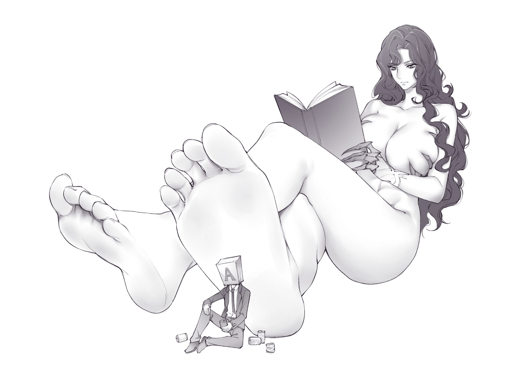

# 【元宵杯】来自群星间的呼唤 Chapter 6 一笔交易

作者：Arik

TID：32126

# 1

*本帖最後由 Arik 於 2022-1-23 19:12 編輯*

目录以及公告

Chapter 0 信仰

Chapter 1 选择

Chapter 2 真体

Chapter 3 肆虐

Chapter 4 轮回前兆

Chapter 5 如神所说

Chapter 6 一笔交易

# 2

<ignore_js_op>[4016199ec89e45a1.jpg](forum.php?mod=attachment&aid=OTM0MDB8NGNmOTJhMzl8MTY0NzcwNDM4OXwxODIzMHwzMjEyNg%3D%3D&nothumb=yes) *(127.21 KB, 下載次數: 0)*

[下載附件](forum.php?mod=attachment&aid=OTM0MDB8NGNmOTJhMzl8MTY0NzcwNDM4OXwxODIzMHwzMjEyNg%3D%3D&nothumb=yes)

2022-1-23 19:11 上傳  

</ignore_js_op>  

# 3

Chapter 0 信仰

旧一轮的余烬还未散去，新一轮的火焰便从「星神教会」中喷薄而出。

光怪陆离的群星舍弃了他们原本耀眼的姿态，尽数将辉耀洒在了这座漂浮于宇宙边界的巨大教堂。比恒星滚烫数万倍的光束透过一层薄薄的紫色屏障，汇聚在广场那高达十万米的雕像上和下面的熔炉里，让每一名前来朝圣的信众们都能感受到专属于「星之神」的无上威严。

噼啪作响的熔炉炙烤着无数被称为「废弃物」的东西——或是茫茫多的人类，或是不知哪个星球上的城市和大陆，或是一整颗蕴含生机的行星。他们都是在星之神的一念间被拖拽到熔炉中央，用来维持着整个边境的神力充沛和满足她作为神还没完全抛弃下的最后的施虐欲望。

这真的是最终形态了吗？

他自问着，并没有奢求谁来回答他。

「在教堂见到您真是少见，A先生。」

不可多得的发呆时间被星神教会的主教打断了。A先生却依旧把手搭在前排的座椅上，仰望着教堂里稍小一点的百米塑像：「有时候会来偷会儿懒，毕竟找我的人太多了，在图书馆反而很吵闹。」

「那介意再多呆会儿吗？伟大的星之神命我编撰教义，可我来这里时间不长，对上古之事知之甚少，所以，神指引我聆听您的教诲，让神的纪事能传颂至每个信徒的耳中。」

「嗯...怪不得最近她严肃了不少。」A先生摸着下巴，眼神始终没从面前水晶雕像丰满的胸脯上移开：「不过别看她见你们的时候总是一幅正经样子，但真要让她说说以前那些事时也会害羞的。」

「A先生。如果你活腻了可以直接告诉我。」

空灵悦耳的声音响彻整座教堂，原本矗立在斑驳的彩绘窗前的巨大塑像在瞬间活了起来——血肉自塑像手持的星辰权杖中迅速填满了整个水晶，诱人的身躯躲在轻纱似的长袍内，映得一双高耸的美腿像不可亵渎的白莲那样清澈。而一脚踏在祷告桌上的裸足正时刻提醒着凡人们胆敢窥视神之真容的下场，并发出嘎吱嘎吱地粉碎声音。

「伟大的星之神。」

「下午好。薇尔莎。」

「在这至少要称呼我为教皇。」

薇尔莎将她引以为傲的金发撩到耳后，冷漠地抬起脚，将一排排长椅连同A先生在内全部踩在脚下，沉闷的声响引得跪伏在甬道上的主教惊颤不已，连忙将头埋进双臂下，紧闭着双眼，不敢再动半步。

「好...教皇大人。」

感受着柔软足底带来的压迫，A先生并没有像往常那样急于挣脱，而是无所谓似的继续躺平在薇尔莎的脚下，任凭她的脚如何用力或是碾动都没有再发出一丝声音。

「有什么事就说，我很讨厌这样。」

「没什么，只是累了。」A先生勉强把脸从薇尔莎的足底上挪开回应着：「放心，我待会儿会给主教讲故事的。你还是专心解决你那边的事吧。」

「那样最好。」薇尔莎低着头，瞥了一眼脚边的主教：「记得向我汇报。」

「是，谨遵神谕。」

随着薇尔莎的分身最后用脚趾狠狠地踩了一下A先生作为饯别礼，那与真体比起来微不足道的雕像便重新回到了原处，变为晶莹剔透的水晶，开始重新流淌着丝丝缕缕的星辰能量。

「别跪着了，主教。拉我一把。」A先生躺在一片狼藉中，仰面看着教堂画满星之神肖像的穹顶，又陷入了沉思。直到年轻的主教走到他的身边时才继续说道：「嗯，我想起来从哪开始讲了。那颗星球和卡莲娜还有你那边差不多，都是魔法与冷兵器的时代。但是...要比你们那更加偏执一些。」

「偏执，您指什么？」

「某种奇怪的信仰，也可能是扭曲的信条。不管哪种都很疯狂。」A先生回答道：「不过，薇尔莎就喜欢这种地方。因为可以无所顾忌地，把所有异端消灭干净。」

「有一个女孩我现在还记得，薇尔莎甚至也经常想起她。她叫...」

.......

「瑞塔！瑞塔！快来看这个！」

巴罗尔兴奋地朝河的那边挥舞双手，迫不及待想要和他的伙伴分享找到宝物的喜悦。

而被称作瑞塔的女孩则战战兢兢，望着面前湍急的河流有些无所适从，于是她大喊着：「快回来，巴罗尔！长老会生气的！」

「没关系！你看这儿，有好多好东西！」巴罗尔在小岛的礁石林中继续跳着，棕黑色的短发在瑞塔看来像一个跃动的小猴子，还不时向她展示着手中的战利品：「看这个！绝对很值钱！」

巴罗尔手中不断摇晃地是一枚造型古怪的吊坠，绿色的铜锈爬满了圆锥体的表面，只留下尖端雕刻精细的女性塑像没有被污物浸染，在阳光照射下显得熠熠生辉，宛如太阳般夺目，令对岸的瑞塔有些睁不开眼。

「那是什么呀？我看不清，太亮了，巴罗尔！」

「是神哦！神明大人的吊坠！」巴罗尔得意地回答道：「等到晚上，星星从天空女神的庇护下升起的时候就可以带着这枚吊坠许愿。我听大祭司说，只有带着神的信物的人，他的愿望才能被神听见，到你过生日的时候我就把它送给你，瑞塔！让你获得神明的认可，用魔法和咒术，然后我们一起冒险！」

「好啦，好啦！你先回来，那里很危险的！」

瑞塔焦急地喊着，而她的闺蜜则并不在乎，依旧在礁石中穿梭，并把那枚吊坠戴在了自己的脖子上：「放心。你看，我带上了女神大人的吊坠，她会保护我的！」

「长老！她们俩在这！」

一名身穿绛红色衣饰的光头男人劈开树丛，一眼就发现了岸边的瑞塔和礁石上的巴罗尔，高声呼喊着。霎时间，原本狭窄的小道中便窜出两队和他同样装扮的人，匆匆排列在两旁。直到一位手持念住的中年人，和一边身着赤黄色色兜帽的妙龄女子走出来时，瑞塔才反应过来，惊起了一身冷汗。

「快跑！巴罗尔！快跑！是大祭司！」

「抓住她们。」

十几人顿时腾空而起，一跃百步，很快就落到了瑞塔的面前，把她提溜了起来。而对岸的巴罗尔眼看事情不对，转身想要往岛的深处跑去，可最先发现她们俩的男人早就看准了时机，踩着河流中心的巨石奔向巴罗尔，赶在她从礁石林上岸之前就拽住了她的脖颈。

「爸！哎呀！疼疼疼！放开我！」

「你就不能让我和你妈省点心？」兜帽之下，留着胡茬的粗犷男子皱着眉头，弹了巴罗尔一个脑瓜崩：「一会儿见了大祭司记得老实点，乖乖认错，听见了吗？」

「听见了，听见了。」

巴罗尔撅着嘴巴，捂着额头委屈地说着，任凭男人把她带回了岸上，和瑞塔一起跪在大祭司面前。

「大祭司。」

「嗯。」

男人点点头，平静地往前走了几步，低头看着两个擅闯禁地的女孩：「你们知不知道今天是神佛诞日，是收割之时。全族都在准备着庆典，祈祷着来年风调雨顺，生怕神佛发怒，让咱们受饥饿之苦。现在倒好，你们两个丫头竟跑到这族外禁地，诸神归所，倘若是遭了诅咒或是让双子抓走做了活祭，可想过咱们全族要被其他几个部落打压多久？」

「祭司...我们知道错了...下次一定不会乱跑了，对吧？瑞塔？」

「嗯嗯，祭司，我们绝对不乱跑了。」

「祭司，念她们初犯，又赶上神佛诞日，还是给他们次机会吧。」

浑身挂满祭祀用具的男人听过巴罗尔父亲的求情反而变得更加恼火，眉须都拧了起来，他指着瑞塔说到：「住嘴！要不是你们捡回来这么个孽种，我们族怎么会落得如此地步？看看她身上那邪恶的胎记，完全就是渎神的证明！本该连接的群星居然分崩离析！再加上因为她，瓦兰汀的剑刃、维尔普斯的智识、玛可尔的咒法、沃尔特的工匠，唯独我们杜卡的群星还没有降临，难道那边域的暗潮难道要我去清吗？」

「祭司！」

「够了！」男人长袍一挥，背过身去，不再管那跪在地上的两名女孩和她们的监护人：「维尔莉特，带她们回去。」

「是。」

旁边的少女应了一声，摘下了兜帽，露出她足以称得上是女神恩惠的动人脸庞和浅蓝发簪，略有悲悯地抬起手来：「以神佛萨迦玛哈之名，囚禁犯了神诫的两人。」

逐渐变得厚重并相当有质感的空气在少女的祈唤中凝结，变成一束束无形的绳索，横立于两名不过14岁的女孩面前。在她们的认知里，只能感受到阵阵微风吹拂脸庞的轻柔，却不知在早已窥探到神秘之门的众人眼里，那绳索，遍布着代表斥责与惩戒的荆棘。

只要被捆住，被放大数倍的苦痛一定会让两个懵懂女孩感受到比猛兽撕咬更为难以忘怀的心理阴影。

所以他们露出了不忍的表情。

但瑞塔和巴罗尔却难掩第一次见到魔法的喜悦，她们像趴在窗户边上看着商店里陈列的华丽商品一样，不约而同地张开了嘴巴，感受着魔法带给她们的惊奇与震撼。

随后一阵撕心裂肺的疼痛如闪电般击垮了她们的意识。

再次醒来时，瑞塔发现沉重镣铐的碰撞声和滴答滴答的水滴声早已萦绕在这间不足十平米的阴暗牢房中许久。

欲裂的头痛并没有让她忘记之前的事，她第一反应是寻找巴罗尔，但昏暗的牢房内除了几只硕大的老鼠和翻滚的甲皮虫外显然没有第二个人。

木梁在老鼠啃噬下变得摇摇欲坠，冻得发抖的瑞塔只能强迫自己站起来活动，避免自己再次昏睡过去。

然而刚刚站起，瑞塔就愣住了。她凑近了才发现，木梁上并不是什么虫鼠啃噬的痕迹，而是一排排密密麻麻的牙印，分明是人留下的，最后的挣扎。

绝望仿佛在流淌。

尽管此刻风雪呼啸，却依然能听到这座监狱内犯人们连绵的惨叫与哀嚎。

此时，一阵寒风吹过，顺着那简陋的窗子，灵活地钻进位于通道尽头狱卒的房间，桌上一张折起的信纸缓缓打开。

「杜卡之扉近日举行群星敬食佛事，责令十日内送去胫骨三件，肠子十副，十四岁女童的头颅两个。」

瑞塔光着脚，拖着镣铐来到了栅栏边上，燃烧的火把摇曳着向她倾诉这座监牢的血腥往事，同时，也借着微弱的火光，她才看清了监牢对面是怎样一副可怖的画面。

巴罗尔，这个唯一愿与她相伴童年的女孩已经七零八落的躺在了她曾虔诚信仰的「萨迦玛哈」面前，头颅被立在那三头八臂的神佛手持的碗里，血液自鎏金的血槽缓缓滴落在置于地上的头骨法器上，发出瑞塔醒来时就一直听到的，滴答滴答的声音。

察觉到了瑞塔的苏醒，一名浑身带有怪异纹身的僧侣从一边的凳子上站起，逐渐站到了火光下，用冷寂地眼神俯视着监牢内侧的瑞塔。手中把玩的明晃晃的东西，正是巴罗尔在禁地才找到的，那枚异神吊坠。

「这吊坠，从何而来？」

瑞塔还未曾言语，从面前突然发生的现实中回过神来，那身披绛红色袈裟的僧侣便继续若无其事地说着：「原本以为，你们只是擅闯禁地，不曾想竟带回这般亵渎神明之物。」

「那是...巴罗尔的...还给她...还给她！」

「这么说你是承认你两人为异神教徒，要毁我杜卡之信仰了？！」

「不...没..不是。」

「诚实是神佛萨迦玛哈最为看重的品德，即使你是魔女之种，被神佛降伏后也应当对神佛展露虔诚，否则你会遭受地狱的烈火，在痛苦中忏悔死去。」

僧侣蹲下身来，将吊坠送到瑞塔面前：「戴上它，告诉杜卡的同胞们，你是达里尔的堕落灾祸，将你的罪行告知神佛，你就能在死后登上神之山脉，享受极乐。不像她...要遭受最残酷的折磨才死去。」

「可是...」

僧侣将手穿过栅栏，把吊坠戴到了瑞塔的脖子上，随后，一柄锋利的祭祀骨刃轻易地划破了她的面颊。

「忘了告诉你，罪人和异徒在神佛面前要先剥掉皮，要让皮囊下的灵魂展现给萨迦玛哈，才能登上神之国度。」

僧侣这么说着。

鲜血平稳地流着。

那涂满麻痹草药的屠戮骨刃再一次割破了她的喉咙。

这时，瑞塔再也发不出委屈的辩解或是哭嚎。

她畏惧地向后退去，被突兀的石头绊倒，躺在监牢中潮湿的地板上，气管中无处流动的血液开始喷涌，浸湿了她的全身。

她感觉更冷了，她回想起她的童年，被称作孽种的日子里，就连养父和养母都不曾给予她些许关爱。

眼泪稀释了走马灯般的画面，最后定格在巴罗尔那副总是喜笑言开的脸上。

不远处的寺庙内，僧侣们还在吹奏着法器，祈求驱散邪灵。

笛声夹杂着号角声，悠远而低沉。

而那枚吊坠则在接触血液后开始显现出另一种光谱。

瑞塔想了很久，也无法想到能描述那光的形容词。

那光映照在屋顶就像星空般璀璨。

即使在白天，却如同黑夜。

美丽又让人向往。

直到她戴上这枚吊坠，不得不遵从那来自未知的、屠戮了无数生灵甚至神祗的「教皇」时，她也没能想到，那是比漫天遍野的血肉和破裂的大地以及白皙温暖的粉白平原更加具有冲击力的色彩画面。

是的。

那是毁灭的光。

是崩塌的预兆。

是噩梦的开端。

是一切美好故事的结尾。

亦是....来自群星的呼唤。

# 4

Chapter 1 选择

薇尔莎·伊德海拉在最开始并不知道究竟发生了什么。

她原本在神座休息，百无聊赖地观察着漂浮在身边的来自各个世界的星球，看着那上面无数如同沙砾般渺小的人类在惊恐和绝望中取悦她、崇拜她、信仰她，然后被她用权能拽出来，冷漠地碾碎、吞噬甚至折磨，乐此不疲。

作为群星的具现，她对生活在星球上的寄生者们抱有本能的嫌弃，可她的目的却不是要清除干净这些弱小的东西，而是想要他们的信仰。虽然很不想承认，但人类这种可爱又单纯的生物，确确实实能够让她获得成长的力量，能让她在和宇宙中更为古老的存在对抗时获得机会，也能创造出一个她梦寐以求的宇宙，一个只有她的宇宙。

这是群星的愿望，亦是她作为星神教会——教皇的愿望。

因为她和万千信众一样，同样信奉着「星之神」，信仰着她自己。

......

瑞塔再次睁开眼睛时，发现周围的一切都变了样。

碧蓝的天空飘落鹅毛般的雪花，融化在身体上却不觉得寒冷，像是在暖炉中一样熙和。

「哦？醒了啊。」

略感震撼的女性声音从上方不知哪处传来，她下意识摸了摸自己的脖颈又揉了揉眼睛，朝面前望去。

随后在巨大的手掌中不知不觉地摒住了呼吸。

之所以会忘了呼吸，看这个女神的面庞看得入神，纯粹是因为太过吃惊。

纯粹的美。

这还是瑞塔第一次把这种太过单纯而又毫无理由的形容用在除了大地与丰穰女神之外的神明身上。

白皙的肌肤和鲜红色的眼眸还有金黄色的长发。

皇冠上夺目的珠光宝石在宣誓着这名巨神至高无上的地位。

她有着仿佛拒人千里之外的冰冷眼神，但是脸庞却在狭小的视野中呈现着一丝少女的稚气，像是维尔莉特姐姐那样，带着一股暖意。

这两者混合起来，让这位凭空出现的女神的外表甚至产生了魔性。

所以她沉默着忘了回答。

而薇尔莎经过短暂的过去视，早就知道了这一切事件的经过，所以在踩碎这栋碍眼的监狱时没有任何犹豫。

即使那些侥幸活下来的人们早就奔逃着离开，去往了山丘的另一侧，但她还是坐在大雪纷飞的土丘上一边等待着手掌中女孩的苏醒，一边懊恼着接受这个设定。

毕竟她从没想过一件曾经被她丢弃的信物会在这种遥远边域的星球上被找到，而且还被强行召唤到这里。

如果这是群星的意志，那么薇尔莎理应以更加巨大的体型出现，尽情向这片蛮荒之地的人类们展现她作为星神教会教皇的伟岸与不可抗。

但事实也确实如此。

她的真体有着能一脚踏碎普通行星的高度，可在这里，经过她的横向对比和反复确认，并不是她被缩小或者是被限制了，而是这颗星球本身就要比她认知中的大。

薇尔莎在成为星之神后从来没有观测到这样一颗星球，至少在边境以及第一宇宙和第二宇宙中也从没发现过能比她还要大的并且有人类文明的地方。更不用提现在，她只保持着相当于这里的5千米的计量尺度。

很久没有用这样的视野观察人类世界了。

这是薇尔莎见到远方那远超人类视野的高耸山峰的第一想法。

她能感受到一股无法令人忽视的能量在涌动。那是只有「神」这一概念才能使用的，无比纯粹的能量。看来群星意志让她来到这里是有目的的。

虽然这次被呼唤过来面对的不是那些古老神明们让她有些失望，但想到这里的未知与神秘和许久不曾出现的新鲜感还是让她对这次旅程抱有期待。

真正让她感兴趣的还是远方的「本土」神明。

人类只是调剂品罢了。

就像现在手心里的小东西，连跨越自己的掌纹这种事都很吃力。

光是看着就觉得有趣。

「那里。那里是什么？」

薇尔莎将瑞塔送到食指的指甲上，并对着那白雾蒙蒙的山脉问到：「那是你们这里的神之居所吗？」

「是...是的。是我们五个部落共同信奉的五位神。」瑞塔害怕的爬在薇尔莎宽广的指甲上，拼尽全力才敢看了前方一眼：「所...所以...您真的是女神大人吗....大地与丰穰女神？」

「我不认识那种货色的神。」薇尔莎毫不顾忌人类幼童的美好憧憬会不会幻灭，她觉得只是忍着没将这个小东西揉碎，就已经是她能提供的最伟大的恩惠了：「听好了，我是...群星的化身——星之神。」

有那么一瞬间，薇尔莎不禁思考着自己为什么会和这样一个小东西多费口舌，而且还好心好意地给她介绍自己的来历。但在她看见瑞塔身上，那象征着自己所创建的星神教会的标记后也就释然了，这也是为什么在降临之初没有把这个将死的孩子当作普通人类一同踩碎的原因。

群星的意志从来没有放弃人类。

只不过薇尔莎·伊德海拉和多数的星辰意志觉得人类已经不可救药罢了。

「哇啊！我知道了！」指甲上刚刚还在发抖的女孩突然站起来兴奋地大叫着：「您是「杜卡的群星」！是我们部落遵从「萨迦玛哈」旨意而降临的菩萨！」

「我再说一遍，听清楚了哦小东西。我是星之神。如果再敢拿我和你们或者是那群废物神做比较，不光是你，我会把你和你们的部落一起碾碎。这样够清楚了吗？」

薇尔莎暴涨地怒火全部体现在了她悬停在食指指甲上空的中指上，只要瑞塔继续不合时宜地说些天真猜测，估计她哪怕顶着群星意志的斥责也要把指尖的人类压个粉碎。

「唔...嗯...」

瑞塔畏惧地嗫嚅着，再次缩成了一团。

看着手指上的人类终于老实了一点，薇尔莎才抬起脚看了看，瓦砾下喷洒的血迹染红了被裸足融化的雪地，红白色的液体顺着残破的台阶一直流到山谷入口。

「好脏啊。」

薇尔莎默默嘀咕着。按理说不应该会沾上的，不管是人类的肉片还是混合的泥土什么的，都不会出现在她的脚底，这是作为美丽而强大的教皇最基础的维系，也是各个星球对于她的尊重。

但这颗星球不一样。既没有意志可以沟通，让薇尔莎享有群星的特权，也没有充沛的力量可以贡献，就像一颗死星，却遍布着智慧生命。

还好她原本保存的力量没有因距离神座太远而被削弱，即使不清楚自己究竟在哪一个宇宙的哪一个时间点，依然能保持她最强大的姿态。

毕竟星星在宇宙里到处都是。

但是,仅限于白天，这里的夜晚似乎很不一样。

「呼...算了。」

薇尔莎厌恶地甩了甩脚，刚想把脚底粘着的污垢清出去，又想起接下来可能还会沾上更多后只好作罢，转身看向「山谷」的外面——那一片错落有致的城邦像极了A先生故乡那颗只存活了46亿年星球上的建筑风格，大概是...嗯...东方吧？那种用砖瓦搭建的院子和平房前都种着绿油油的树，连接他们彼此的通道是用石头铺建的，看上去文明程度并不高，连那种会飞的小玩意还没造出来。

「小东西，你飞过吗？」

「没..没有,我还没到学习咒法的年纪，不过族里的大人们都....哇啊啊啊！不要！不要丢下去呀女神大人！我我我我会听话的！所以...所以...！」

「闭--嘴。」薇尔莎厌烦地说着，中指和拇指放在了一起蓄势待发，想把指甲前的瑞塔直接弹飞出去：「我很讨厌身上带着人类，除了脚底。你想被碾死吗？」

「咿...不..不想。」

「过会儿再来找你。」

没等着瑞塔的回复，薇尔莎就用泡泡似的护罩裹住了她，并直接弹飞了出去，直直地飘向那片人类城市。

「看来暂时回不去了。」

薇尔莎整理了一下自己华贵的长袍和金色长发，将双手背在身后，威严的矗立在这片未知之地上，直到头顶那镶嵌满流光溢彩宝石的皇冠再度黯淡下来，她才下定决心，看向天空中不是那么自然的恒星：「如果想说些什么就趁现在，我没心情再和你们废话。」

「请您原谅，美丽又强大的星之神。」一名披着灰色斗篷的女人从山谷入口的丛林中探出头来，虔诚地跪倒在薇尔莎的脚前：「因您的出现，整个杜卡都散发着绚丽的光辉，您的恩泽遍布这诸神归所。」

「如果就是这些那你可以死了。」

薇尔莎从轻纱内抽出她巨大的裸足覆盖在女人的头顶，和她周围数百米、生长了几千年的古老树蔓。

「星辰啊，星辰」

「寂灭的声音已经传达」

「那庄重的仪式」

「那美味的祭品」

「那亘古不变的信仰」

「皆是阿奎莱拉的奉献」

薇尔莎停下了继续下落的脚，悬停在女人头顶十几米的地方。

「启明之星啊，我们寻找到了您的馈赠，选出了合适的祭品，唤醒了连接您神座的通道。古老的神们早已堕落腐化，灾难的梦魇萦绕着万物的心灵。请您拯救这片被邪恶与污秽浸染的星球，将星辰的光辉重新凝聚在这里。」

「哪个？」

「请原谅我，伟大的星之神。我不能称呼他们的全名。我早已是魔女，被神抛弃的子民。」

「要我说，你们找错神了。我可从来没标榜自己是什么人类的救世主或者星球的净化者。」薇尔莎用大脚趾轻轻磨蹭着女人渺小的身体，强有力的压迫下，锋利的碎石和荆棘割破了她的衣物和皮肤，而她依然咬紧了牙关，忍受着在脚趾纹路间蹂躏的痛楚。

「但你们很走运。这里足够有趣。」薇尔莎挪开脚，低头看向那个女人：「祭品我自己会找的，不过，希望你们付得起。」

她的脸上，带着一副仿佛在话的最后加上了柔软慈爱，让人类打寒颤地甜美笑容。

.......

神佛「萨迦玛哈」

三头八臂、面貌不一，是居于神之山脉首位，信众最多的神明。

每一名人类从出生开始就会受到神明的祝福，这决定了人们在往后余生将要奉献给哪一位神祗，也决定了他们能使用的奇异力量。

但凡事都有例外，那些从出生就没能获得认可的，便是所有人都谈之色变的异端，他们被称作「魔女」或是「魔人」，被视为邪神的子嗣，会招来堕落灾祸的降临。

古老且文化悠远的杜卡人更是觉得，这些毫无天赋，无法使用咒法等异术的人，他们的血肉具有强大力量。

因为他们是邪神的子嗣，把他们制成法器并献祭给神明将会取悦神明，获得幸运。所以在杜卡的领地，率先掀起了围猎活动，他们大肆捕捉那些被神抛弃的人关在兹奎厦，这个堂而皇之的监狱和屠宰场地，无数生命埋藏于其下的坑洞。

留存于世间的，只有鲜血淋漓的画卷，和用于祭祀的无上法器。

但，这些扭曲且疯狂的观念并不是牢不可破。

是啊。

毕竟，人类怎么可能与神抗衡呢？

......

「听我说！拉狄克叔叔！是真的，巴罗尔捡到的那条项链真的召唤出了女神，群星之神！」瑞塔跳着脚，向面前枯瘦的中年人解释着：「而且她马上就要来咱们这里了，为咱们净化黑潮，消灭达里尔。」

「大祭司，我刚才问过了，回来的族人们亲眼看到一个比海之女还要高出十几倍的女神把兹奎厦踩扁，浑身金光闪闪...像传说中的菩萨一样。」

「一派胡言！群星降临日还未来临，怎么可能会有菩萨从那陨落山脉中降世？我看就是这魔女用了咒法逃狱，还幻化成菩萨想要给她们一族正名！大祭司，我建议立即处死她，把她的头挂在...」

「赶紧去死吧，你这魔女！」

围观的女人突然冲了上来，红着眼睛，一脚将跪在地上被捆住的瑞塔踢倒，虽然很快便被周围的人拉住，但还是疯了似地大吼着：「我的女儿...巴罗尔...巴罗尔这么信任你！你居然还有脸提那个该死的吊坠！」

人群中央手持念珠的中年人闭着双眼，默念着经文，似乎一切闹剧都与他无关：「静。」

原本环绕在祠堂的人们顿时闭起嘴巴，不再多言，这让拉狄克有了一丝思考的机会。

瑞塔口中的神明似乎是有着比肩海之女的体型，这让拉狄克有些吃惊，因为瑞塔并不知道那些女神真正的姿态。在众多的神祗中，女神们的纯洁无一例外的体现在出众的身高上，堪比山脉的身形是最直观的表现，这在上古之卷《彷徨之章》中有所提及，但相当模糊。

谁也不曾见过那高高在上的神祗们，除了那些堕落的邪崇，再也不曾有神明降世于人间。

唯一靠谱的解释，就是上一任群星的推断。

「我们这颗星球原本并不是这样开阔。她经历了数次膨胀，神明也在随着成长，只有我们，在维持原状。」

拉狄克俯下身，平视着双膝跪地的女孩：「向萨迦玛哈保证，你没有说谎。」

「我保证！女神很大的，出去向山谷那边看就能看到,差不多和山脉一样高。」

「这不可能...」

陨落山脉足有4000米的海拔，就算是杜卡首屈一指的苦行僧也要在魔法回复充足的情况下奔袭半天，更何况根据记载，没有任何一位神祗有如此高大的体型，「双月」没有、五位掌管族群命运的主神没有、就连那至高邪崇的堕落之物也没有。

难道真的是降神？

就在拉狄克诧异之际，这位祭司手中圆滑的指骨念珠突然崩裂了一颗，金线圈也随之断裂。

价值连城的念珠劈里啪啦地掉落在石板上，滚向人群。围观的僧侣和民众紧忙弯腰去捡拾，却发现即使已经不在滚动的念珠还在有节奏地跳动，幅度越来越大，跳的越来越高。

大地在震颤。

「快散开！」

轰隆！

一声沉闷的巨响打断了拉狄克下意识地反驳和无端猜测，狂暴的风压伴随奇异的光芒照射在祠堂镂空的天窗上，像是沸腾的太阳。

紧接着，祠堂精美而巨大的穹顶被掀飞，一群足有三米高、两对上肢、背生双翼的邪恶造物落在边缘，开始渎神地嘶吼着。

就像是黑色山羊和蝙蝠还有乌鸦的共生体，它们的头颅有着一切已知生物最不洁的象征，但它们的身体好似褪了毛的牲畜般干净，只有那干瘪修长的下肢与人类相似，否则无论如何，都不可能把它们归为类人生物。

尤其是从它们上牙床里长出的棕黑色弯曲长角，每隔几厘米就会有一圈刻满这个世界禁忌的文字，那是拉狄克和所有神职者们最为忌惮的知识，只要瞥见一眼，理智就会崩溃，如同置身于地狱般疯狂。

而那漆黑并附带有血槽的长柄利器上，挂满了它们最引以为傲的战利品——人类的骨骼和内脏在挥舞中互相碰撞。不断有人被高空盘旋的邪崇抛下，坠落在人群中央，梦魇余韵催促着惊慌的人们肆意歌唱，展露出敬畏。

「达...达里尔的堕落灾祸！」

「祭司！快...快救救我们！」

「怎么会来这里！」

「呀啊啊....」

惊叫声如约而至。

一名女人才刚刚想要逃走，脚都踏出了门外，就被离得最近的邪恶孽畜瞬间用四只大手撕成两半，并炫耀似的挂在了两只长角上。褶皱的灰白色皮肤下,枯萎的血肉开始涌动着更为惊异的力量，鲜血使他们更为亢奋，一同叫嚷着发出动物声音。

「双子！」

它们沙哑的发声器官最终还是吐出了人类语言，为了呼喊他们所信奉的神祗。

拉狄克已经无暇顾及还被捆在一边的瑞塔是死是活，他颤抖着捡了几枚念珠，叨念起只有僧侣才懂得的晦涩咒语。

大门口的邪崇之物很快察觉到他妄图反抗的行为，似是嘲讽般发出作呕的声音，随后举起那只长枪，怪叫着直直冲向拉狄克。

就在枪尖马上就能洞穿眼前人类的心脏时，重叠交缠的金色光轮开始在拉狄克低语声中浮现，一环接着一环，如同他背后——神佛「萨迦玛哈」的壁画一样，双手合十，光芒万丈。

顷刻，灼热的光线折射而出，邪崇污秽的肉身在嘶吼中化为恶臭的黑烟，弥漫在人群间。

「拉狄克叔叔！上...上面！」

瑞塔用力地在地板上翻滚至拉狄克背后的桌子下，提醒他提防上空的威胁——一名脑袋上带满怪异面具，同样生有双翼的邪崇正好奇地向祠堂内打量，每个面具的孔洞下都有一双浑浊的眼睛在注视着众人，十余米巨兽般的体型更是让在场的所有人都再次发出惊叫。

金光立即瞄准了它那丑陋的眼眸直射出去，可很快就被面具的防御咒法抵挡，并反弹回比之前更强大的黑色光束。

拉狄克下意识地将手中所有的念珠抛了出去，勉强抵住了那阴沉邪恶的能量，但念珠也在落地的刹那变成齑粉，不复存在。

「该死。」

最后的底牌也已亮出，拉狄克再没有手段能击杀眼前更为强大的堕落灾祸。恐惧顿时占据了他本就不坚定的内心，他后退着倚靠在供奉桌上颤抖，为了躲避死亡，他还有选择的余地。

选择是在神佛短暂护佑下逃走，还是将这间祠堂里的所有人都献祭出去，用于提升力量。

亦或者....

「放了我。」拉狄克匆忙地将桌子底下的瑞塔找了出来并提在面前，歇斯底里地叫着：「你...你们，想要她对吧？魔女之种。吃了她你们就能获得力量。让我走，否则我就把她烧成灰，连骨头都没有！」

「拉...拉狄克叔叔？为什么？不要！不要让它们吃我！」瑞塔挣扎着，哭泣着，委屈地哀求着：「明明我什么都没有做错！巴罗尔也是！我说的都是实话，我...我真的只是想让大家能认可我，让神明大人认可我，我不想再被抛弃了....不想...」

「闭嘴！」

拉狄克厉声训斥着瑞塔的嗫嚅，并猛地用拳头打在她的腹部。

剧烈疼痛下，瑞塔才恢复一些的体力再也撑不住她胡乱地挣扎，只是啜泣着掉着眼泪，惨然接受了自己的命运。

面前巨大的脑袋和堕落灾祸停止了一切动作，一齐看向拉狄克手中被捆住手脚的少女。

「双子！双....子！」

低沉地声音引的祠堂中所有东西发出轻微共鸣，随后，原本缓慢地词语改为了急促地呼唤，更多的灾祸盘桓在这间祠堂，一同呼喊着它们神祗的名字。

「双子！」

「对，她就是双子要的，赶紧，赶紧让开！让我到安全的地方，你们就能带她回去！」拉狄克笑着，仿佛看到了生的希望，并高高举起手中提着的少女：「快让我....」

咚。

比起刚刚的轰鸣更为沉闷的异动引起了所有人类和灾祸的注意。

咚。

燃烧和灾祸愤怒的声音开始渐进。

咚。

拉狄克明显感觉到自己的脚有一瞬间离开了地面。

「小东西，回应我。」

宛若神明的柔美女声在被灾祸笼罩的天空中回荡。

「...这样啊。」

人们望向悬于天上，沾染了无数人类、房屋、草木和那令他们恐惧的堕落灾祸尸体的巨大足底。

薇尔莎·伊德海拉。

这位尚未解放真体的星之神毫不犹豫地将轻纱内的裸足踏进祠堂广场，一同终结了那些被丑恶之物啃食撕咬，半死不活的人类，将他们孱弱的血肉和溃烂的邪崇全部碾平于脚下，没有任何对生的怜悯。

地动山摇间，祠堂最后仅剩下的墙壁也轰然倒塌，邪崇们纷纷高呼着飞向更高空。就连刚刚十余米的异化灾祸也将头颅伸出祠堂，十几双眼睛在错愕中观察着突然出现的物体。

尘烟散去，矗立在一众微尘般人类和灾祸面前，直通天际的白皙脚掌显现了不容直视的威严。人类眼中巨兽般的灾祸甚至连薇尔莎的脚趾高度都无法企及，更不用提渺小如尘埃的人们，高达5000米的神明随意地一个动作都能将他们一众人等融化，变成美丽足趾下微不足道的血渍。

「双子！」

「真是一群...比人类还恶心的东西。」

薇尔莎甚至没有低头俯瞰过地面一眼，只是皱着眉头再次抬起脚，早已洞悉过去和现在的眼眸一直停留在不远处，那破土而出的像是蠕动的花朵的东西在源源不断地喷吐出堕落灾祸，向她飞过来。

裸足再次落地，精准的仿佛计量好的一般又往右边挪了挪，溅起的扬尘让祠堂的人类和周围都蒙上了一层细沙，灰头土脸的人们刚刚爬起，就发现那不可一世的巨兽灾祸已经有半个身子被压在神明足下，流出粘稠的黑色血浆。

「好麻烦。」薇尔莎厌恶地说着，她已经受够了足底粘腻的感觉，如果再不进行一次有效清理她可能会在愤怒中解放真体并把所有生物屠杀干净，所以她决定不再亲自解决那个看起来像是传送装置的东西，而是将身旁蓄势待发宛如小型恒星的光球送了出去：「别让我眼前看到这些东西。」

一瞬间，更为耀眼的光芒填满了整个杜卡南部，这片主要负责耕种和祭祀的区域，每个光球都在释放着热量，炙烤着一切，所经之处只剩下灰烬和焦黑的土壤。不一会儿，惊叫的声音就归于平静，只剩下薇尔莎巨大的裸足左右还在传来令人颤栗的声音。

「神佛...神佛的菩萨！」

「群星！勇士！」

「萨迦玛哈显灵！」

「赐福我们吧！」

「求您带领我们将这些邪崇诛杀干净吧！」

薇尔莎朝底下的人类看去，鲜红色的眼眸投射出审判般的光辉，在沉默中向前踏出了一步，把燃烧着的一切将死之物埋进土壤，裸露的足宛如玉石般细腻绵软的踩在了人们眼前。

巴罗尔的父母连带着祠堂内还存活的人们纷纷跪倒在巨足边上，高声赞颂着本不属于薇尔莎的名讳。

而拉狄克，这个年过半百的祭司很快就反应过来接下来要做什么，他再次抓起地上的瑞塔，跑到了巨大的脚趾前，喜悦地呼喊着：「菩萨啊，这个魔女！请您收下这个魔女吧，她是被抛弃的人类，是不被神佛萨迦玛哈和任何一位神明眷恋的异端，我们送上这个魔女，她的血肉一定会让您欢愉！」

「星...星之神...」

瑞塔虚弱地抬头仰望着面前的巨物，呼唤着薇尔莎，这个曾经拯救过自己生命的美丽神明。

薇尔莎将瑞塔挪动到了更远处，冷漠地踩下脚趾，让这个从一开始就唠叨不停的男人连同周围的人们逐渐无法呼吸，用一种随时都可能把他踩扁的力度教会了他人类在神的面前应该有的姿态后，对着脚趾前的瑞塔说到：「从现在开始，你就是你们族的群星。」

「诶？我？」

「嗯。」

薇尔莎应了一声，那条重新焕发着光彩的吊坠也在一瞬间戴在了瑞塔的脖子上：「你去找到那些神，我负责...净化他们。」

「可是我还没学过魔法和咒术，也没有完成祭礼，而且...还没有获得神的认可，他们都说我是魔女的孩子，是被神抛弃的。」

瑞塔低下头，声音也越来越小。

「我认可了，以后我就是你所信仰的唯一神明。」

薇尔莎破天荒的有些羞涩，似乎这样对人类讲话还是第一次，她扇了扇微微泛红的脸颊，重新保持着一个高不可攀的星之教皇形象继续说着：「没有什么繁琐的步骤，只要你抬起头，见星辰如见我。」

温暖。

像是在午前躺在草堆上晒着太阳。

既不会觉得热，也不会觉得干，偶然有风吹过只会觉得舒和。

瑞塔第一次感受到了，在这个世界，被神明所认可的感觉究竟是什么样的。相比于那时所见魔法的奇幻，这次，在这位美丽而庞大的神明面前，她由衷的感到喜悦。

世间的一切都好像在和她打招呼，为她被神明认同而喝彩。

时间仿佛在那刻停下了脚步，一秒间的风景仿佛会持续到永恒。

在这个时候，

「————咦？」

有什么正一点点地....

有什么正从背后的阴影处，

有什么，有什么，有什么，

「等...等一...」

瑞塔毛骨悚然，她顾不上眼前的美景，在虚幻中回头看去。

在静止的时间里，另一种颜色的死，迈着步子，巨大的足轮番交替，将美好的一切全部踏碎。

无数人类在奔走逃命，在跪地求饶，但最终都成为了一团团渣滓，红色的染料。

她向上望去，高入云端的神明也拨开了那碍眼的白色，轻浮又残忍的正朝她微笑着。

「还不逃命吗,可爱的小虫？是在等着被我的脚碾碎吗？」

说着，那位刚刚还认同了自己的神明就抬起了巨足，阴影笼罩了瑞塔目所能及的全部。

「拜拜咯，我可不像她一样，对你们这么容忍。」

脚趾灵活地揉动着，发出低沉的摩擦声。

「你们人类，生来就是恶心的东西。」

随后她从幻梦中惊醒。

一旁巨大又美丽的脚趾下，血肉早已溃烂，刚刚还在挣扎着想要逃脱神明摆布的人们通通变成了肉饼。

血浆再次溅湿了她的全身。

.......

庞大到让人感到震撼，也同时感到摄人心魄。

格林·海默终于赶在傍晚之前穿过人群，站在了那位即使从山脉间也能见到身形的神明前。悬于地面的光之座在黄昏时分看上去也耀眼无比，那位神明仁慈地垂下来的裸足只有脚尖着地，近在咫尺，但漂浮在周围的点点星光依旧提醒着蝼蚁似的人类僭越的下场，发出微微的鸣声。

格林若不是得到了允许，也绝不可能在众目睽睽之下，俯身亲吻着神明的脚趾。

「别得寸进尺，小东西。」

薇尔莎慵懒地说着。即使在闭目养神，格林想继续伸出舌头，品尝神明脚趾纹路间流下的露水这一想法也很快被发现。

「不是所有人类都像你这么幸运，能够活着碰到我的脚哦。」

轻轻地将底下的人类踢开，用手托住脸颊的薇尔莎说话还是那样冷冰冰的。

「你们在信奉哪个神？」

「五位神明我们都信仰着，其他部族也是一样，只是有不同的分支不同的宗族和不同的祠堂，而且主流人数也不一样。」

「哦~我不怎么喜欢不专一的小东西呢。」

薇尔莎故意拉长了声音，重新将脚伸到格林——这位正值壮年的杜卡族长的脑袋顶上。

「两个选择。让你们所有人都信仰我，也禁止让我见到其他神祗的出现..」

「神明大人，信仰...信仰不是那么容易能改变的，我们族千百年来能够与那些邪恶子嗣抗争，多亏了那五位神明的悉心教导和奇迹，我们对每一位神明都很尊崇，所以...」

「不用着急，还有第二个选择。」

薇尔莎起身跳下光之座并伸了个懒腰，巨足引发的地震将早已燃烧殆尽的焦黑骨骸震碎，留下一地黑雾。

「那就是把你们从这颗星球上抹掉。」

对人类仅存的些许温柔在瑞塔落入沉睡后消磨殆尽，余下的则是那些还不愿舍弃掉的欲望。

所以当薇尔莎的足毫无征兆地落在了围观的人们头上时，这些淳朴的居民才明白，眼前的神明和他们以往所尊崇的神没有什么两样，只不过更为强大而已。

一次快速又利落的神罚。薇尔莎所有重量全部落在了右足下，粉碎的不仅是这些人类渺小的血肉之躯，也终结了他们对新神的憧憬。

经过多次修缮的石板路发出不堪重负的声音，几近270米的脚掌甚至在人们的惨叫声还未来得及传达时就已经和他们贴的严丝合缝。

「虽然软塌塌的，但感觉还不错。」

发表了毫无怜悯地想法后，薇尔莎将另一只脚也抬了起来。

正值黄昏，家家户户还在筹备晚饭，那些低矮平房的烟囱上还冒着缕缕浓烟，在下一秒钟，他们正打算出来查看状况的时候，巨足便将他们连同做好的饭菜一起压得扁平。

「不要紧，小东西。可以再多思考一会儿，毕竟要你们放弃信仰很难，对吧？」

巨大神明的嘴角终于不自觉地向上提了提，言语间两只脚的一抬一放，已经有超过200人成为了破碎的肉泥。

如此血腥又残酷的画面，杜卡的人们并没有表现出有多么慌乱，反而像明白了自己接下来的下场后，相当平静的放下手中多余的东西，合上双眼，等待着神明下一次垂爱。

无论男女老少，这些披着奇怪斗篷的僧侣没有丝毫想要逃走的意思。

「这样啊。你们是不是以为我玩够了就会停下？」薇尔莎疑惑的表情一闪而过，很快明白了脚下人类这一不合理的举动是什么意思，她手指轻点，将格林·海默捏在指尖:「其实我挺喜欢你们这种虔诚的小东西，但如果你们信仰的神不是我，我可是会很头痛的。那么——」

「我尊重你的选择。」

始终漂浮在薇尔莎身体周围的一颗光粒开始膨胀，随着不断地扩大，光晕上开始浮现出与她礼袍中心相同的星座符号——14颗无序排列、颜色不一的恒星以及8颗接近死亡的超新星以及茫茫多的破碎的星辰。

陡然提升的能量压力让附近的空气都变得粘稠，天空的云开始飘散、大海的流向开始倒转、地面发出剧烈震颤，所有自然现象都在畏惧这颗光点似的，发出哀恸的嘶鸣。

离薇尔莎和光点最近的人类甚至连见到星辰完整形态的资格都没有，就被凶猛的压力和宇宙乱流搅碎，化为阵阵血雾，凝聚在一起，直到薇尔莎轻蔑地用脚趾再次将其粉碎，他们才真正意义地迎来了终结。

格林·海默甚至觉得骨子里都在颤栗，他从未见过任何一位神明能够布施如此强大的神迹。

他拼了命地想要从薇尔莎的食指上逃走，死亡的恐惧胜过了他对神明的崇敬。他知道，他已经背叛了神的教条，拒绝了去往「神之国度」的车票，现在等待他的，只有死亡。

「到这种时候才想起来逃跑吗？挺招我喜欢呢。」薇尔莎打量着指尖上爬动的人类，提醒他这次的选择题答案没有修改的机会：「不过，也到此为止了。」

最终，在光团吸收了足够能量后，它开始挪到了远方的天空，比此时的薇尔莎还要高出许多，能够笼罩整个城市的位置。

薇尔莎闭起一只眼，将格林所在的那根手指对准了天上那颗光团，随后在那颗光团坠落开始时，直接捏扁了那个可悲的人类。

「星陨。」

# 5

Chapter 2 真体

「我想不清楚一点，A先生。」年轻的主教停下笔，转头看着一边悠然自得躺在高处的男人：「星之神完全可以不费吹灰之力将那的神明消灭再带那个孩子回到该座。可为什么还要冒着真体失控的危险去带她周游？」

「哈，不不不，解放真体对她来说可一点都不危险。危险的是人、生命还有星球。」A先生拿开脸上的书本，继续说道：「你要知道，包括我头顶这位，有着48颗星辰构成神座的星神之女也不例外，真体解放对她们来说可是不可多得的发泄途径。我说的没错吧？艾尼·卡莲娜。」

「是这样没错。」卡莲娜摇了摇尾巴，注视着双脚前的两名人类，浮现出一抹意味深长的笑容：「A先生应该偷窥过很久吧？我那时的事。」

「偷窥...随你的便。我的工作就是这个，我也不好反驳什么。」A先生挑着眉，看向穹顶之上的星空：「主要那时候缺少一位对魔法敏感而且力量强大的星神之女，各个星球的平行线都在跃动，找到你可费了不少功夫。不得不说，这点上，你和你母亲真的很像。」

「嗯？真的吗？A、先、生。」卡莲娜捏起脚趾甲上的男人，放到掌心中继续保持着微笑质问着：「那为什么威克利顿·弥迦每次都能从我手心逃走，而且每次都能在我降临前，带着他那个人类妻子逃到九天？该不会是某个人的恶趣味吧？你说呢？」

「咳咳...我听不懂你在说什么，卡莲娜。」A先生尴尬地笑了笑，望着卡莲娜动人的脸庞和美艳的眼眸：「也许只是巧合。」

「嗯哼。对啊，巧合。」

卡莲娜把脸贴近了手掌，伸出舌头舔弄着嘴唇，喷吐出一股甜美又湿热的风。

「既然是巧合，那待会儿可以在我肚子里讲吗，我会转达给小主教的，A先生。不过凑巧被我胃里的小家伙们吃干抹净可不能怪我哟，他们应该饿了很久呢。」

「我不是Vore控。你知道的。」

「难道是足控吗？诶...怪不得母亲大人每次都是用脚的，原来A先生也这么变态啊。」

「停一停，擅自给人打上标签不是一种礼貌行为。真要说，我只是对「美」有着不一样的追求。」

「那就用脚把A先生碾碎吧，嗯...我想想，是想死在趾缝里，还是脚趾或者脚后跟呢？」

「主教，叫泊忒修斯来救我。」

「啊？这个...」

「都用一遍吧？既然A先生是足控，舔脚这种事应该很熟练呢。」

「鉴于我知晓你的过往，我对舔过你脚的人类致以崇高敬意。」

「那样最好。」

卡莲娜用食指把男人摁到了右脚的趾缝，又看了看不知如何是好的年轻主教：「你要是敢出门，就和A先生一起哦，啊，也许会让你舔A先生被碾碎后的肉酱也说不定。」

真是恶魔系女孩。

年轻主教汗颜地想着。

为什么A先生会让她来旁听呢？

......

「双子！」

「吵死了。」

舔舐着乳房上还在攀爬着的人类，口水和奶汁一同涌进她的嘴中，卡斯托娅厌恶地把跪在王座之下的人类们细细用脚揉碎，并忍受着下体和身子高潮来临前夕的饥渴，勾了勾脚腕，一群在她看来不过一毫米的人类女性便跻身于她沾满血污的足趾间，畏惧的用舌头清理着她脚趾的每一处缝隙。

「唔...用力...波拉珂...」

卡斯托娅小声地在另一名欢愉伴侣的耳边娇喘着，咬紧嘴唇，不顾她身体上被汗液冲洗而游走于各处的人类，用另一只手攥紧正在抽插于下体的邪恶用具，将更多哭嚎的人挂在外壁的细小尖刺上，然后继续让波拉珂伸进阴道内。

巨大神明小穴每一次强烈的收缩都让数以千计的人类碎裂成渣，血水和爱液涂满了整个象征回归的通道，润滑了那黑暗湿热的肉壁同时也将灵魂永远的献给了双子。

惨叫声在两个热衷于爱欲的神明愈加猛烈的喘息声和呻吟声面前不值一提，渺小的生命自他们被掳走到此时就已经消解，变为双子神最中意的祭品，升温的绝妙材料。

「啊...嗯...要..要来了..波拉珂！」

「那就再多用一些吧？」

更多的人类在下体位女神的操控中自头顶巨型监牢内抓来，均匀的送入波拉珂的舌头上。随后在她猛烈的舌吻中与卡斯托娅完成了一次体液互换，粉润的巨舌甚至只是轻轻地互相爱抚磨蹭着对方，便让那些不知所措的人类粉身碎骨，侥幸躲在舌床下的人们也无法抵挡两名女神分泌出的汹涌的口水，最终在她们刻意的舔弄下溺毙，带着绝望一同被咽进她们的胃中。

「好棒....好棒啊，波拉珂。啊....啊...」

巨舌分离开来，口水淌落她们的脖颈，她们害羞地低下头，注视着对方，又看着对方身体上痛苦的人类，高潮了。每一名还在身体上苦苦挣扎想要活着的人类们都能看到她们最快乐的游戏，以玩弄他们生命为代价的交欢。尸骸顺着她们香艳的身子流动，不断探索着新的敏感点的大手在揉搓对方的乳房，人类的疲于奔命并未引起双子神更多的注意，只是等待着碾碎然后成为血渍。

作为祭品，他们的作用仅此而已。

而作为在底层服侍着卡斯托娅双足的人类也在惊愕中发现女神的欢愉已经到来，刚要急忙离开那散发着血腥和汗液味的趾缝就被女神痉挛般的震颤下挤成一团，突然夹紧的脚趾没有给任何一个人类活命的机会，喷洒的血浆甚至夹杂着肉片一同坠落，庞大的裸足开始胡乱的挥舞，向早就跑的远远的信仰者们展示自己无上的权力，生杀予夺的绝对特权。

「去她的吧...人类...就是要这样玩啊...」

「好像比上次还提前呢...卡斯托娅。还在想那个来到九天的神吗？」

「毕竟一过来就给了我们一个下马威啊，那个表里不一的家伙。」

卡斯托娅将波拉珂搂进怀里，挪开乌黑的长发，手里把玩着她娇嫩的乳首，再次抬起脚来，招呼着下一批服侍的人类赶紧滚过来舔干净她脚趾的污垢：「直接用真体的灵魂冲过来想要撕开我们的屏障，就算是萨迦玛哈，也没她这么胆子大吧？」

波拉珂用手指拨弄着卡斯托娅大腿上正跪地求饶的人们，不时沾着汗水将他们三五成群的轻轻捏到一起，最后送进嘴里咀嚼着，发出只有人类才能听到的阵阵清脆响声：「也许是第一宇宙的吧？看她的真体，并不是那种机械造物或者灵态化。」

「管它的。」卡斯托娅摆出一副无所谓的态度，将视线投到座椅边巨大的石桌上——两个相貌丑陋的邪崇正牵着六名男人三名女人，沉默中等待着双子神的指示：「所以，有什么事，我可爱的孩子。如果是抓到的闯入者你们自己就可以享用。」

两名邪崇匍匐跪下，又仰起头嘟囔着：「双子。」

「嗯？」卡斯托娅将手腾了出来，眯起眼睛仔细观察着总共九个连微尘都不如的人类：「你们亲眼看到了？那个魔女？」

人们面面相觑，根本不敢抬起头直视卡斯托娅颇具压迫力的眼神，也不敢出声，只是默默吞咽着口水，毕竟他们完整的看到了两名巨大的神祗交欢时的残酷画面和地狱写照。

「在问你们话呢，人类。」波拉珂爬起身，也将脸庞贴近了石桌，冷漠地说着，丝毫看不到刚刚的温柔缠绵和色欲遍体：「不回话就从你开始一个个碾死。」

波拉珂伸出食指，悬在最前端的一名男人头顶。

「是的...是的...我们看到了，那个魔女。」男人跪在地上疯狂的向后缩去：「是她在陨落山脉召唤出的异神，而且，而且她似乎认得那个异神。就连她的女儿，瑞塔，也被异神带走，并且认可了她。」

「这到有意思。」

波拉珂没管卡斯托娅思索着什么，继续将指尖摁压下去，将刚刚说话的男人用指甲压碎，随即说到：「还有呢？」

「杜卡！那个异神将整个杜卡南部全部毁灭了！」一边害怕到颤抖的女人赶忙擦干净脸上的血污，向眼前巨大的神明呼喊着：「就连堕落...不不不，您的孩子，您的孩子也被她消灭了，还说什么是比人类还恶心的东...」

噗叽。

女人的话还没有说完，也成了身首异处的残渣，剩余的人们想要站起逃跑，却发现锁链变得更为沉重，强迫着他们跪服于地，根本无法反抗。

「你怎么看，卡斯托娅。」波拉珂转头看向卡斯托娅红润的脸庞，气鼓鼓地说着：「怪不得孩子们到现在还没有回来。我不允许她这么简单的在九天分得认可，不管是那个圣母、老头子、还是萨迦玛哈或者剩下的两个废物，都没有资格来染指咱们的家园。」

「当然不会，宝贝。」卡斯托娅捏了捏她的脸，用额头抵住她对视着：「亘古既然能选择咱们，就不会让他们得逞。」

「把那个玩泥巴的放出来吧，让她去开个路。」

「就这样？」

「萨迦玛哈还疯着呢。那个异神如果能替咱们把他们选出的人类都弄死，我们再出去找她也不迟。」卡斯托娅将两个邪崇放到了更远的位置，随后抬起她修长的腿，在波拉珂的注视下将石桌上剩余的人类用大脚趾磨碎成酱：「就让我们告诉她，九天这颗星星，不归任何其他的神。」

波拉珂微笑着把卡斯托娅刚刚碾死人类的大脚趾放在嘴中吮吸着，连同趾缝间的人类一起舔弄着：「最爱你了，卡斯托娅。」

「我也是。」卡斯托娅回答着：「还有我们可爱的孩子。」

......

「先去维尔普斯，必须把杜卡发生的事告诉她们。」

为首的女人焦急地开了门，立刻披上黑色斗篷，拿起放置在一旁的长剑：「快，异神降临了。」

「你都能知道的事，你认为他们不知道？」

回话的男人坐在田野里的摇椅上，嘴还叼着一根稻草，提醒女人不应该如此冒失。

「堕落灾祸在不久前刚刚派遣了一只庞大的军队去往杜卡南部，陨落山脉附近。」男人瞥了女人一眼，继续说道：「「剑刃」带了一队人想要赶去支援，杜卡的族长却制止了，然后只身去了那里。现在连他都没了音信。」

「什么意思？」

「意思就是说，那名异神，不是我们想的那般简单。如果是外来的古老种族，不可能有这么大的体型，也不可能有这么强的力量适应我们这。」

「难不成比神佛还强？」

「谁知道。」男人轻笑着，将干瘪的稻草全部放进嘴里咀嚼着：「萨迦玛哈不也是打了半天，最后让双子干趴下，老老实实的呆在山脉不出来了？」

「那你说怎么办？」

女人赌气似的将剑扔向男人，后者一把接住，抽出剑来仔细端详着：「等着呗。夜还长，九天不是谁来都能分一杯羹的。」

「可要是她们都不出手呢？」

「那就等死。」

「你到看得开，神父。」

男人拿出一个厚重的古老笔记本盖到脸上，最后说到：「你要是想去，最好离她远一点。那名异神注意到我了，只不过她心情好，没理我。我可不敢保证她不理你。」

「至少得把那个天杀的魔女干掉。」女人坐在旁边的台阶上说着：「居然把异神召唤来，她是不是脑子有问题？」

「为了孩子嘛，能理解。」

男人指了指背后巨大的浮雕，交缠在一起的两名女性。

「双子也是。」

......

「你还要在那里哭多久？」

薇尔莎依旧坐在专属于她的神座上，在一片被星光点缀的夜晚中君临，高高在上的神之体势必给这颗星球带来剧变，但现在，她已经看着焦土圆坑里的女孩哭了一个小时，像个培养女儿的母亲。

「可是...」

「在你说话之前，我要提醒你。你现在不值一提的生命在我的一念之间。而且，你现在是我的信众，小东西。神明的意志，就是你的意志。」薇尔莎换了一条腿搭着，裸足的影子在地面摇晃，提醒瑞塔不要忘记自己的身份：「告诉我，你在被我认可的时候看到了什么？」

「看到了...您，不一样的星之神。」

「哦？为什么觉得不一样？」

「因为...因为....」

「因为不像我这么优雅对吗？」

瑞塔小鸡啄米似的点头，用脏兮兮的袖口抹干净了泪痕。不光是自己的朋友和她的父母，她所认识的一切都已经成为了荒芜，同时也是因为在短短一天内，接连受到的打击让她感到悲伤的缘故，眼泪还是止不住的往下流。

「接下来的话，我只说一遍。」薇尔莎伸出一根手指，将瑞塔召唤到神座的把手上，一间金光闪耀的小屋凭空出现：「你如果不想看到她，现在就睡觉。」

瑞塔张嘴的动作在头顶的神明瞬间冰冷到极点的眼神中合上了，直到她畏畏缩缩的打开了门，走了进去，薇尔莎才在虚空中站起身来，庞大的星之神座也消失不见。

「真体解放。」

薇尔莎合上双眼，繁星闪烁的夜空折射出的光亮顿时被某种力量吸引似的，全部汇聚到了一点，引得她那被白色轻纱包裹的丰腴双峰间逐渐漂浮出一枚吊坠，形状与瑞塔所佩戴的那条相仿，但显然这个雕像更加精致，也更加和薇尔莎容貌相配。

光线和吊坠刚一接触，那强有力的白色共鸣脉冲就令薇尔莎周围的光团开始嗡鸣，轻易间毁灭了杜卡南部两千万人所留下的巨型深坑也在震颤开裂，仿佛在为新神的降临送上一阵迟来的礼袍一样，响声不断。

但这种异象并没有持续多久就归于平静，原本明亮的光团和星空一起黯淡了下来。

宇宙间,群星意志的真实形态开始在薇尔莎·伊德海拉诱人的躯体上显现。

消失、重组、膨胀。

附着其上的衣物、饰物全部破裂成星尘，再化为了完全不同于那威严的神之装束。

太阳之象征的金发在夜色退场，木棕色的长发顺着她的锁骨蔓延其上。

皇冠凝结成了她头顶生长出的漆黑双角上的繁星坠饰，法杖分成了四个恶魔之爪，牢牢抓住了她饱满的乳房和大腿内侧。而轻纱渐渐融化，在她娇艳的身体上形成一幅又一幅的红紫相间的邪恶纹身，粘稠的能量淌落在薇尔莎的小腹，游走于她完美的腹肌曲线。

光团们识趣的聚集起来，形成一股环绕在她周围的飘渺又漆黑的帷幕，贴在她下体私处，也令她光滑诱人的臀瓣在视觉上更加凹凸有致。

若是瑞塔目睹其现在宛如灭世魔神般的薇尔莎，恐怕连啜泣都已是死亡的前因。

终于，群星的呼唤迎来了最后的回声。

「把你们的一切，都献给我吧。」

薇尔莎悬于天空的身形变得模糊，身躯在膨胀，星辰在将它们的能量注入她的体内，暴涨的体型逐渐超越了第一宇宙的束缚，甚至能将一颗有生命的普通行星用两根脚趾挤碎，但在这里的计量尺度则是仅仅的一万米左右，这是唯一让薇尔莎觉得不开心的事。

但至少她已经很久没有释放自己了。

所以在成长停止后，她的内心依然躁动。

她轻柔地抚摸着自己的胯间，将食指放在嘴角吮吸着，露出一丝微笑。

「先去哪好呢？」

......

「大姐姐，这个送给你。」

身穿朴素布衣的小男孩跳着将鲜花递给了圣坛上纯洁的大地之圣女——维尔普斯的智识。

「谢谢你。愿大地与丰穰女神的恩惠与你同在。」

年轻的圣女温柔地抚摸着他的面颊，并亲吻着他的额头。

随后她一边抱起男孩一边将手中的花束举过头顶，让台下所有的维尔普斯人都能看到那象征着大地女神慈爱的白色鲜花：「维尔普斯万岁！大地与丰穰女神万岁！」

一瞬间，一年一度的篝火晚会在夜晚时分盛开，无数深植于大地的纯白尖塔上发射出绚烂的烟火，人们雀跃着端起美酒和食物一同庆祝着丰收，赞美着女神的恩赐，让他们能在如此严苛的环境中能够饱腹。

「去吧，和你的家人一起，享受丰收的喜悦。」

圣女微笑着将男孩放了下来，并从怀里掏出一只用鹅卵石打磨而成，做工精良的日晷：「来年要记得播种，在塔上，播下属于你的种子，这样大地与丰穰女神才能记住你，认可你的奉献。」

「嗯，我会的！谢谢大姐姐！」

男孩开心地从台下溜走，融进了欢呼中的人群。身边教会的修女和牧师们也在开始向人们分发来年的种子，精于魔法的学者们则聚在一起，给通过智慧考验的人们发放书籍，并嘱咐着关于种植的知识。

年轻的圣女褪下披在身上长长的绒袍，将最能彰显信仰的轻薄衣纱展露给面前侧卧于大地的女神塑像，白色的光闪耀于众人环绕的篝火前，随后，玉石台阶开始升起，托着她来到了大地的归宿——石之屋的门前。

女孩合上双眼，跪在地上轻轻默念着。

「为您诵唱，为您讴歌，大地的孩子终将归于大地。」

「为您祈祷，为您奉献，大地的子民终将行于大地。」

「维尔普斯的智识、您选中的女儿，再一次带领信众们丰收，将土地的馈赠播撒于此。」

欢呼声逐渐变小，人们纷纷放下手中的食物，把视线投向林立于最高之尖塔前的圣坛。

「石之屋啊，向我敞开吧。将九天最后的秘密、最后的知识也告知于我吧。」

圣女深吸了一口气，起身去敲响了那厚重的石门，所有人都在注视着那古朴的小屋，期待着开启只属于维尔普斯人的光荣时刻。

但过了许久，门依然纹丝不动。

宁静最终还是被圣女自嘲的笑声打破。

她转身再次面向众人。

「对不起，再次让大家失望了。」

「哪的话，圣女！您做的已经很好了！」

「就是啊，能让我们这帮老家伙们也能吃上这么好的食物，多亏了您！」

「大姐姐！加油！下次一定能成功的！」

人群开始为失落的领导者加油打气，安慰着这位年轻的圣女。

「不，既然石之屋还没有认可我，就说明我还做的不够好。」女孩低着头，向人们鞠了一躬，银白色的短发久久不愿从她的脸上离开：「堕落的邪崇、苦难的灾祸还会行走在大地上，维尔普斯的苦难还将继续。原谅我，勤劳的大家。我依旧...依旧没有办法...没有办法...结束这场苦难，结束由那邪神双子的腐化，让大地蒙羞。」

泪水滴落在她的脚前，温润的玉石上。

一边要好的修女想要上前安慰，却被站在前排的一群学者们拦住了。

一名黑色头发的年轻人微笑着转过身，把手上的书籍递给了悲伤的修女：「这是维尔普斯人和她的事，现在的她是智识，不是圣女。女神这么多年都没回应过她，我挺好奇，既然不告知她的使命，为什么当初还认可她？」

「虽然你说的没错，但也别太为难修女了。阿塔克。」一名中年人侧着头，提醒这位圣女的爱慕者不要太过分：「她们也是无知的。」

「无知不代表着无罪，我的大哥。神之山脉被邪崇封锁如此之久，既然杜卡那神佛曾经突破过，还和双子干了一架，其他的神明也应有力量回应信众的祈祷。啊，我知道了，大哥你该不会是在暗示大地女神是个怂包吧？」

「放肆！阿塔克！再敢侮辱女神定要你来年受那饥饿之苦！」

「我说错了吗？我们五个族的五个选中之人，只有智识能有机会知晓双子奥秘，托纳鲁斯之海通往神之山脉的通道。」阿塔克虚着眼睛质问着神父：「为什么一次又一次地给我们希望还沉默？现在敢和我们大吼大叫，群星在的时候怎么屁都不敢放？」

「阿塔克！」

「你别拦着我，大哥！」

「我叫你闭嘴！」

「我闭嘴了女神就能说话吗！」

「阿塔克。」

圣女慢步走到了年轻人的身前，温柔地牵住了他的手。

「塞芙尼...」

年轻人熄火似的平静了下来，注视着眼前的女孩。

随后他的双脚离开了大地，脑袋砸在了玉石上发出沉闷的响声，只有胳膊还在那圣女双手中。

一记漂亮的过肩摔。

甚至引来了台下几个看热闹的人的一阵口哨声。

「下次再敢让我听到你侮辱女神——」

塞芙尼将她有些冰凉的脚踩在了阿塔克的脸上：「我就把你埋在土里！」

现在所有人都开始起哄了。

一边大笑着，一边又开始了篝火庆祝。

但他们很快就被天空突然出现的异象吸引了目光。

突然撕裂开的裂隙里，纯洁无暇、能够赐予丰收和食物的女神并没有出现。而是一只将近1.5公里长的巨足率先踩扁了一处为庆祝丰收而举行的小型篝火晚会。

「真让我惊讶。」

未知的声音响彻整个维尔普斯北部的这个城市，异动很快招来了更多手持魔杖的学者们前来围观，他们发现尘烟中那白润的玉足比他们修建的任何一个祈祷和播种之塔都要高大，细长的灰色尖塔与脚趾比起来像个刚刚生长出来的嫩芽，在神明的足下颤抖着。

「这里的文明水平差异有这么大嘛？」

将左脚落在那一看就很像中世纪城堡的建筑群落上，数千人在薇尔莎的轻描淡写间丧命，但他们脆弱的身体和建筑碎片并没有玷污她的裸足，干净的如同水晶。

与杜卡不同，这里的人类见到薇尔莎傲岸的身体后并不是顶礼膜拜，而是在那些身穿白袍的学者们指引下有组织地逃跑，很快，薇尔莎肚脐以下的身体被无数闪耀着的尖塔光束照亮。

这些震惊于如此巨大的神明降世的学者们无一不紧张起来，更是对攀附双腿上的诡异魔纹所忌惮，邪恶的气息感染着所有人内心深处的欲望，让窥见者欢愉，让逃跑者畏惧。

「算是欢迎仪式吗？还真可爱，小虫们。」薇尔莎解放的感性让她在不自觉中就陷入了想要施虐的渴望，为了能让底下的人类能见到她现在按捺不住的喜悦，她很自然地俯下身，将柔软的乳房贴合地表，摩擦着碾碎了无数逃窜于其下的渺小之物后将两只手拍在更远处的居民区，让邪魅的脸庞和深邃的眼影能被他们所看清：「我很高兴。现在，满足我吧。」

「启动组合防御！各个尖塔，用最大功率，瞄准眼睛！」

身处中心位置的瞭望塔尖，被大地与丰穰女神选中的「智识」，这个年轻圣女几乎是同时间就做出了对他们来说最果断的决定。

洁白的光束与光球在各个学者的操作下从各地的尖塔飞涌向上，直指魔神那模糊可怖的鲜红双眸。

闪耀整座城邦的光宛如白夜。

让所有维尔普斯人产生了能够轻而易举击败神明的错觉。

但这些攻击的弹道飞行速度实在是太慢了。

慢到薇尔莎戏谑地观看了一场不错的烟花表演。

而后她伸出舌尖，将还在半空中规模庞大的能量光束全部卷进口中。

一瞬间，黑夜再度来临。

人们甚至还没来得及停下逃跑的脚步就愣住了。

「嗯...很美味呢。」

薇尔莎吐出缕缕烟雾，吹向底部黯淡的城邦，风压裹挟着尘土、人类和脆弱的建筑物，飘散到了高空，在数秒后才重新拥抱大地女神，成为扁平的肉酱：「还有别的花样吗？那个...与众不同的人类女孩？」

惊愕于眼前发生的一切不过三秒钟，调用最强功率的魔法攻击手段却在突然出现的魔神面前不值一提，只是张开了嘴，用舌头就将维尔普斯人最得意的文明结晶所产生的高阶法术化解，站在「智识」周围的一众人面如死灰。

「不要害怕！准备下一次充能！」塞芙尼利落的朝阿塔克下达了指令：「你们两个，带领居民撤退到南面，「剑刃」应该还在欧尔洛，请他帮忙掩护。剩下的人分成5组，从后边和侧面攻击，正面交给我！」

「好的。」

「是。」

「塞芙尼，小心。」

身为魔法造诣都不弱于杜卡的学者们回过神便动了起来，招呼着各小队和教会的神职者们，逆着人流在天空中魔神般的女性注视下去往尖塔，传送到各处的方位临阵以待。

「不错啊，小姑娘。」薇尔莎微笑着，对人类发出不可多得的赞赏：「真可惜你没有被认可，如果那个小东西有你一半的胆识，我也就不需要那么费心了。」

高空中邪魅的脸庞又向下压了几分，甚至离她所在的尖塔只有千米距离，女孩甚至能感觉到神明温热的吐息，可视野内只剩下一双迷离可怖的眼，在投射着阴沉的视线。

「要不要当我的宠物？可以允诺给你比现在更加强大的力量，更完美的肉体...」

「不可能的，你这异神。」女孩将双手放在面前的桌子上，魔法仪器开始以最大功率咆哮怒吼，纯白色的能量不断注入尖塔，让它愈加闪耀：「你和双子的气味一样，邪神休想玷污我们的九天！」

薇尔莎期待的表情很快被失望所填满，连人类都能听到的低语声在她周围开始悉悉作响。

「是吗。」

巨大的神明重新仰起头，看向另一侧那挤满人类的街道，将带着黑金色指套的锋利指尖放到了最前端，那船坞上排队正等待着乘船逃走的人群上空。

「别动他们！」

再一次，光束冲上天际。但这次薇尔莎甚至没有正眼看过底下的女孩，任凭能量光束突破云层击中她饱满的乳房也未曾在意，毕竟那种程度的反抗甚至连攻击都称不上，只算蹂躏人类时平添的乐趣。

「他们。」

薇尔莎最终还是摁下了手指，顷刻间，船坞连同数十艘满载的运输船全部沉入水中，一直被她巨大的指尖压进河底才碎裂开，人类的残肢断臂和船体残骸在她抬起手时全部浮了起来，血液开始浸染那清澈的水，哀嚎开始不断地刺激着女孩的耳膜。

「他们算什么？」

她询问着，看着自己手指滴落的水与血砸在人类头上，陷入莫名的沉思。

「伟大的大地与丰穰女神啊！请将束缚于大地沉重的锁链打开，让愤怒的土地响彻整个九天！」

尖塔疯狂地从大地汲取着魔力，周围的草木和水源一瞬间枯萎衰败，辐射了方圆5公里土地的强行收割令塞芙尼的身体开始受到了大地的反噬，洁白的皮肤开始像龟裂的荒原般剥落。

修女们震惊地看着塞芙尼的双脚变成了泥土，却无法帮上这名年轻的后辈女孩一点忙，只能默念着祈祷，为她送去最崇高的祝福。

塔尖的光最终汇聚成一本花纹朴素的书本，翻开一页又一页，记载着历史和魔力法术渊源的文字开始迸发出厚重的力量，一只几乎和薇尔莎的手差不多大、岩石塑造而成的拳头猛地从她下颚处冒了出来，想要给予这名异神一记漂亮的上勾拳。

「崩坏。」

薇尔莎眼睛依旧紧盯着那个女孩，只是轻吐出两个字，岩石拳头便自下而上的开始溃散。

「还没完呢！你这异神！」

阿塔克也高叫着，将自己置身于塞芙尼同样的位置，双手牢牢握紧尖塔的操纵杆，把魔力一丝不剩地投入那尖塔的熔炉里。

再次准备好充能的五方尖塔也闪耀起同样的书本，各式各样的大地造物：长枪和剑刃甚至是堪比薇尔莎头颅大小的岩石朝她庞大的身躯轰鸣而来。

「无关的小虫，就在这退场吧。」

眨眼间，灭世魔神般的薇尔莎在人类狭小的视野里消失不见，那些沉重的巨石则毁灭了他们自己所建造的无数人的家园。

他们急忙寻找着这强大的敌人，但下一秒，4座构成维尔普斯城邦主要防御力量的尖塔就被浮于天空，张开恶魔双翼的薇尔莎用裸足抹平，没有任何前兆的碾压带走了数万人可怜的拼死觉悟，融化在了她温暖的足底。

「既然这么喜欢大地，你们肮脏的身体一定很适合埋进去。」

薇尔莎轻蔑的说着，脚趾对准了最后一座尖塔。站在顶端的阿塔克此时才发现，人类的躯体等比例放大如此高的倍数，也能看上去如此完美，如此有压迫力。神明的足趾甚至能令他们渺小的人类居住，细腻的纹路一尘不染，那是比他们所热爱的大地更为美丽的存在。

「阿塔克！快跑！」

塞芙尼焦急的喊着，甚至不顾已经化作泥土的双腿离开了她的身体，用双臂支撑着来到瞭望的窗子前，寻找着自己朋友的踪影。

「哦？是吗。你的...情侣。」薇尔莎停下继续下压的脚趾，弯下腰轻松地捏起那根牙签似的尖塔，上翘的嘴角丝毫不掩饰神明的感情，而暴露给那存于掌心人类的则是更为残酷的现实：「臣服我。或者看着他死。」

「阿塔克！」

年轻的男孩无法听到圣女已经嘶哑的呼喊，他依然醉心于观赏着薇尔莎近在咫尺的乳房和脚下变了模样的大地。

「你在干什么阿塔克！」

「现在还有机会跳下去！快！」

他的大哥摇晃着他的肩膀，却无法叫醒一个对强大又美丽的神明崇拜的人类。

「看样子，被我迷住了吗？小虫。」薇尔莎将脸庞贴进手掌，让手上还在乱晃的人类们都能看到自己美艳的容貌：「那么，在你心爱的女孩面前，向我臣服吧。」

将阿塔克一个人放在了脚趾缝间后，薇尔莎毫不犹豫地攥紧掌心，并燃起紫黑色的火焰，所有的人造物和它们造物主全部化作灰烬，被神明搓捻后飘落于他们朝思暮想的大地。

「舔吧，可爱的小虫。」薇尔莎又把脚往塞芙尼所在的最高尖塔处挪了挪，让那宁死不屈的圣女也能用肉眼看到她的爱慕者以怎样的一种姿态生存于自己的脚下：「把你最肮脏的欲望展示给你可笑的同类。」

年轻人几乎是同时就把头埋进了薇尔莎脚趾间最娇嫩的软肉间，伸出舌头大口舔舐着散发着香气的肉壁。

塞芙尼复杂的心情甚至比刚刚被石之屋拒绝后还要糟糕，她看着阿塔克在巨大的异神脚趾间像发情的牲畜般狂热，那沉着的理智，那智慧的思考通通幻灭于塞芙尼的心中，就如同巨石砸在自己的胸口一样，她再也撑不下去了，在坚实的臂膀彻底丧失了力量后摔到了操作台下。

「呵呵...做的不错。」薇尔莎满意地看着那名女孩痛苦的表情，撩起她的长发，高抬起下巴：「人类就该这样，臣服我。」

「现在，再让我教教你们真正的魔法。」

「群星的火焰，比你们所信仰的大地更为炽烈。」

顺着薇尔沙的手指，火焰似乎根本不用介质便可将一切烧灼，粗壮的火柱割开大地数千米深，并将那早已逃到山的另一头的人类们悉数化为飞灰，就连山体也被融成滚烫的液体，和繁殖于其上的树木蒸发于世间。

「好好聆听，愚蠢的小虫们。用你们渺小的脑袋听——这来自群星间的呼唤。」

# 6

Chapter 3 肆虐

被称作大地与丰穰女神的普洛达温柔地将环绕她的人们捏到手心，露出了欣慰的笑容。

她的手掌上开始萌发出绿色的嫩芽，结成面包和水果一样的果实，齐刷刷地掉落在这些生前不曾饱腹过的人类面前。

衣衫褴褛的人们一边雀跃着感谢她的赐予，一边大口大口地吞咽着摆在眼前美味的食物。

「抱歉啊，让你们没有东西可以吃。饿肚子的感觉一定不好受吧？」

普洛达看着掌心可爱的人们，都洋溢着幸福的微笑，自己也不自觉地笑得更加甜美起来。

「慢一点吃，不要挑食，虽然说填饱了肚子是好事，但也要注意营养均衡呀。」

人们呜呜地回应着，每个人的嘴巴里都塞满了食物，满心欢喜地感激着大地的馈赠。

「啊，小孩子要多吃一些。」普洛达伸出食指在一群年龄较小的孩子头上缓缓抚摸着，并结出红色的枝桠，掉下许多冒着热气和油脂的肉排：「这些，多吃一点，以后才能更好的成长。」

孩子们立刻扑到她食指的周围，哄抢着掉落下来的肉，不管不顾的撕咬着，而旁边那些大人们也被肉的香味所吸引，马上停下了吞咽面包和水果跑了过来，从孩子们手上抢夺着肉排。

「不可以抢孩子们的食物，孩子们需要更多的营养啊。」

普洛达有些困扰地用指尖挑弄着那些大人，可是即使被她拨走的人又会很快回来。毕竟肉对于这些出身贫困的人们来说可是不可多得的佳肴，他们再也顾不得这样的举动会不会招来其他人的不满或是女神的愤怒，全都围在了那红色枝桠的底下，摁着那些几乎看不见踪影的孩子脑袋或是其他争夺者的手臂，拼命想要接住马上要掉落下来的肉排。

「我说了，不许抢孩子们的食物！」

有些着急的普洛达干脆将那些大人们又重新捏了起来，放到了地上，气鼓鼓地对他们说着：「每次都是这样，又不是不给你们吃呀。」

「可我们一个星期只有一次才能吃到肉啊！」

「我看您就是偏爱那些孩子吧！我们可都是您的信仰者，我们劳累了一辈子，要比那些孩子们出力更多，为大地的贡献更多啊！」

「就是啊，我们应该吃的比那些小鬼们好！」

「不如您将所有食物都给我们吧！我们自己来吃，不用您每天都要来！」

「对，我们自己分！」

面对着底下人类七嘴八舌的讨论和抗议，普洛达的脸蛋上终于显出了一丝窘迫和委屈，眉头和嘴角都沉了下来。她明明很好的在照顾着这些可怜的人们，现在又说出了不要她的这种话，让她一下子不知如何是好。

「可是...可是孩子们的确...」

她俯下身子，小心翼翼地把脸贴近，刚要和底下的人们解释自己为什么会对孩子们如此偏爱，一只黑红色指甲的光脚就踩在了她的面前，将那些吵闹着的人全部盖在底下，一边翘着足跟一边旋转碾动着，留下一件件老旧的衣物，除此之外什么痕迹都不曾留下。

「还在玩你的过家家游戏啊，普洛达。」卡斯托娅嫌弃地抬起脚，往她不知所措的脸上蹭了蹭：「明明都死了，还不让他们赶紧投胎，让我好好的玩玩他们，真是越看你越不顺眼啊。」

「卡...卡斯托娅。」普洛达挣脱开夹紧她鼻头的脚趾，有些畏惧地向后挪动，并用另一只手盖住掌心上的孩子们：「你来干什么？我都已经关上了石之屋，再也不向选中的人透露你的秘密，难道一定要把我赶出九天吗？」

「行了行了。」卡斯托娅摆了摆手，叉着腰看着底下这个快要哭出来的温柔女神，真是一点办法都没有：「我要是想，早就把你们都扔出去了。找你来是有别的事。」

「什么...?」

「去试试外边那个正在把你的小信众当虫子踩的家伙有多厉害。」

「诶？外面！外面怎么了！」

普洛达噌的一下站了起来，紧紧盯着比她高出一截的卡斯托娅，这个浑身一丝不挂的双子神则有些恶趣味地没有继续回答她，而是挥挥手，将发生在石之屋外的画面投射到普洛达的脸前。

画面中，通体尽是邪恶象征的巨大女神正浮于天空，脚下大地燃烧出的火焰甚至快要透过投影向普洛达扑来，她心心念念选中的人类女孩也在唯一矗立的尖塔上悲伤的哭泣着。

就在她想立刻让卡斯托娅把她送出石之屋，张嘴还没有发出声音的时候，那上一秒还在用脚趾来回玩弄着脚下奔逃的人类的魔神面庞瞬间填充了整个画面。

暗红色的双眼似乎在直勾勾的盯着对面的普洛达，粘稠可怖的恶意甚至让卡斯托娅都能清楚感觉到，更不用说面色苍白的普洛达。

就像在这个魔神面前没有任何值得可怜的东西，一切都是用来满足她的弱小玩具。

人类。

是的，普洛达感觉到了，在她面前自己可能真的会如同人类一般被玩坏。

「最好别再偷窥了，小老鼠们。」那名邪恶又巨大的神明微笑着：「不然等我过去，我会把你们的眼睛拽出来碾烂。」

投影在她说完话后立刻消散，卡斯托娅玩味的看着普洛达，她已经被吓得失神，就连托着孩子们的手也开始颤抖。

「怎么，害怕了？如果你还想继续在这过家家也无所谓，反正又不是我的孩子。」卡斯托娅转过身边走边说着：「不过我猜以她那个体型，把维尔普斯完全毁灭用不了多长时间，你的小信众们可就再也没办法向你祈祷了哟。真可怜啊，人类。一边和他们信仰的大地与丰穰女神祈求，想让女神大人来救他们，结果他们的女神是个怂货，只能等着被这个外来的异神用脚、用屁股、用嘴把他们一点点玩死....」

「把我放出去，卡斯托娅。」

普洛达将手掌上的孩子们放到自己脚边，坚定地和卡斯托娅说着：「大地不能再受到创伤，我要救他们，我承诺过的。」

「哈，没问题。但是有一点，你记好了。」

「什么？」

「千万别让你的灵魂也被她干碎了。」

卡斯托娅狡黠地笑了一下。

「你的神格可帮不了你复生。至少九天不能。」

......

「继续吧，小虫们。让我更高兴一些。」

薇尔莎轻快地说着，脚趾随意点在下方还算平坦地田野里，四散而逃的人类在顷刻间和他们精心培育的农作物一起被压扁。

偶尔有侥幸没被她足趾揉碎的人在恐惧中将视线投到高空，透过城市里燃起的火光和茂密的稻谷有幸见到了绝望，神明的压迫感正借着夜色抖落，不成人形的碎肉以及土块在巨大脚趾的颤动间纷纷散在他们的脸上，此起彼伏的惊叫在农田中萦绕不绝。

没等他们回过神，拨开碍事的稻谷继续朝深山中逃走，数十个紫黑色的光球便挡住了人们的去路，像小型太阳一般的光体连结成一道只要接触便会被灼烧的灰都不剩的围墙。

身后庞大到看不清全貌的足也完整的踩了下来，发出沉闷的响声。稍微聪明一点的人很快就明白这是什么意思，于是放弃了逃窜，瘫坐在地上，看着仰断脖子也只能见到的，神明丰腴的胸脯。

「还没舔够吗，色色的小虫。」薇尔莎稍微动了动脚趾，提醒自己趾缝间忘乎所以的阿塔克该换一种取悦她的方式了：「让他们也过来。」

阿塔克还未从软肉的温柔乡中享受够，就被无形力量丢了出去，落在农田里。

「不听话的东西下场是什么样的，不用我再提醒你了吧？」

薇尔莎缓缓俯下身子，蹲了下来，眼神渴望地从自己胯下看向背后乱作一团的城邦街道，舔了舔嘴唇。

白润光滑的臀肉间只有一道黑色看上去很是突兀，遮住了保守的维尔普斯人大多都没有见过的女性性器。负责照料这片广阔田野的分区上方，天空完全被薇尔莎的屁股遮住，纵使是火光也没办法照亮他们活下来的希望道路，只好大呼大叫着，祈求薇尔莎的宽恕和自身信仰的大地女神的救赎。

因为人们知道，如此巨大的臀肉一旦落下，任何生命都不可能存活下来，只会成为扁平的一滩肉饼，连血渍都无法沾染到神明的臀部上。

「只是这样的话可不行，大声一些嘛，小虫们。让我感觉到你们的崇拜。」薇尔莎脸上的笑容愈加放荡，视野中人类绝望的表情和他们内心的畏惧全部被她捕捉到，刺激着她躁动的施虐之心跳动的越来越快：「不然的话，可全要被我压死了哦。」

面对神明的要求，人类只能服从。

他们开始放弃无所谓的挣扎，朝天空中薇尔莎圆润的臀部跪拜着，痛哭流涕地将身上所有关于大地与丰穰女神的信物丢弃。某种力量顺着人们身体开始聚合，巨大神明下体处黑色能量也开始蠕动起来，不断刺激着薇尔莎敏感的器官，酥麻般的感觉流窜到了她的全身，让她的全身更加滚烫。

「啊...可爱的小虫们在求饶。在我的屁股下面...渴望宽恕。」

随着人类祈祷的声音愈加响亮，她的快感便越加上涌，薇尔莎再也控制不住那磨蹭在下体的东西，于是伸出手指捏住了它，把它往更深处推去：「阿奎莱拉...好孩子，把他们对我的信仰...转化成更棒的力量。」

面临随时都会成为肉泥的危险处境，维尔普斯人在失去了学者和神职者的引导后像失去蜗壳的蜗牛，即使见到了那可怖的东西在取悦着薇尔莎，感受到了自身的灵魂和力量在被抽取，都不曾再次起身，寻找活下来的希望。

「那么，赐给你们奖励吧。人类们。」薇尔莎不再称呼那些弱小的生物为虫子，兴奋地向后仰去：「给你们...被我的屁股碾死的奖励。」

将所有希望寄托给求饶的维尔普斯人眼睁睁地看着薇尔莎完美的臀瓣直直落下，甚至没来得及感受狂暴的风压有多么令他们窒息，就被接踵而来的软肉压个粉碎，躲藏于地下室或小屋中的人也瞬间和扭曲的墙壁贴紧，随后在无可违抗的重压下破裂成渣。

一共有两万人接受了薇尔莎的赏赐，在她不怀好意地扭动腰肢，把臀部来回在这群人尸体上蹂躏后，鲜血已经充分的压进了地表，只剩下人类骇人的白骨和建筑碎片还不愿埋藏进大地，和重量足以粉碎山脉的臀肉贴着。

股间湿热的空气缓慢流动起来，黑暗成了幸存者唯一的屏障。薇尔莎身体散发的味道令人类陷入癫狂，像花的香，萦绕在她双腿间无法逾越的沟壑。

「真幸运啊，你们。」

薇尔莎叉开腿，把指甲深深刺进他们面前，连同他们脚下站立的土地一起铲了起来，包裹在她乳房上的恶魔之爪识趣地褪下，好让这些人能在她的粉嫩的乳头上挣扎一会儿。

「还没好吗？小虫。」薇尔莎一边逗弄着乳首上惊慌的玩具，一边歪头看着田野间无动于衷的阿塔克：「还是说要我动一下脚才行？」

巨大的脚趾毫无征兆地落在了离她最近的几个人脑袋上，拖拽着他们的碎尸，开始进行新一轮收割。

就在薇尔莎感到无趣，打算将阿塔克连同零零落落的人们压扁时，身下的土地开始萌发出带着绿光的嫩芽，不惧灼热的光线似的，缠住了那些紫黑色的光体。

「哦？还以为是个只会偷窥的老鼠呢。」

堪堪比薇尔莎的脚踝高出一点的普洛达和她选中的人类一样，穿着一身白净的轻纱，与远处庞大到天地都显得渺小的神明怒视着。

「九天有自己的规矩，人类才不是你的玩物！」

看着那个绿色头发的女神凌然的样子，一个更加值得薇尔莎兴奋地想法浮现于脑海。

她挑衅似的将乳头上的人类尽数捏死，把碎片散到普洛达的面前。

「那就试着击败我，小老鼠。」

......

「我说，为什么人越来越多了。」

A先生端起茶杯，轻轻吹了口气，小心地嘬了一口。

「因为很少见，你能出来聊天。」顾柔把茶杯放在托盘上发出清脆的响声，同时观察着位于桌子中心上对坐的三名人类，继续说道：「况且...还是母亲大人的往事。」

「虽然我只是过来打发时间的，但这个谈资确实让我感兴趣。」D先生摸了摸胡茬，不顾吃相地继续把下一块曲奇饼干塞进嘴里，然后灌了一口茶：「讲到哪了，哦对，那个大地女神出场了。不是我说，能打败老大的神还没出现吧？除了那几个叫得上名字的....古神。」

「分情况。」A先生仰在椅子上，和居高临下的视线相对：「泊忒修斯如果在第一宇宙完全能凭借神座的力量和次一点的家伙们打上一架，反之第二宇宙或者九天就不行。那不是星星该存在的地方。」

「可是母亲大人依然没受到影响。」卡莲娜把下巴放到桌子上，左摇右晃得说着：「唔啊...好想去有人类的星球玩。」

「用不了多久。」泊忒修斯整个人都潜藏在宽大的斗篷里，冷漠的声音让在场的其他两名星神之女都投来了诧异的视线，毕竟这是第三次听到这个不露出真容的「姐妹」说话：「等待母神将最后的锁链解开，新的领域将会向我们开放。」

「所以我很纳闷，你为什么不跟着薇尔莎一起。」

A先生的话语中即使没有任何责备的语气，但依然招来了泊忒修斯的反攻：「那个叫瑞塔的，在跟着母神。而且，是你向母神提出让她跟着锻炼的建议。所以我才会被抛下。」

「诶？什么什么？你说...瑞塔？那不是...A先生提到的，母亲大人救过的人类吗？」

「果然。」

顾柔挑了挑眉毛，微笑着说到：「看来A先生讲的故事都很有目的性。」

D先生疑惑地看着奋笔疾书的主教，把脸凑过去问到：「瑞塔是谁啊？」

「嗯...星之神尽数将一切反抗的异端们碾碎，赏赐给他们接触神足的权利...」

「喂，主教，嘀咕啥呢？」

「啊。」

D先生陡然提高的音量打断了年轻主教的思绪，惊颤间，搁置在手边的墨水瓶不小心被他执笔的手打翻，但它并没有遵循重力的牵引落在地上，而是缓缓的回到桌子上更远的位置。

「就是一个A先生很久没提到的人类小孩。」卡莲娜又把脸往三名人类所在的地方靠近了一些，把自己的胸脯也搬到了茶桌上：「甚至我怀疑A先生都快要忘了还有这么一个人类角色存在。毕竟我根本不觉得她有什么用。」

「我在考虑你们的感受，姑娘们。」A先生往上翻了翻白眼：「如果我一直在讲人类的事，你们早就抗议了。」

「是母亲的神座吧，象征着开悟的人。」

这次轮到A先生对顾柔刮目相看，男人没有正面回应顾柔的猜测，而是从椅子上站起身，走到了她修长的手指边抬头看着她：「为什么这么想？」

「神佛萨迦玛哈还有双子。」顾柔翻转手指，让A先生走到了她的指甲上：「我在那次拜访你的故乡时，从某个人口中听说过。」

「该说是女人的直觉吗？」

「也许吧。」

「薇尔莎离成为真正的神还有差距。如果能通过吸收来获取她所缺少的能力，至少能达到最后的瓶颈。」

「那双子也是吗？」

「不太一样。每个宇宙只会有一个神能抵达边境。」

A先生微笑着说到：「即使她们一体双生。」

......

无法抗衡。

普洛达用尽了留存的力量也无法撼动眼前魔神般的薇尔莎一根脚趾。

刚刚才因她的降临而欢呼雀跃的人们脸色又逐渐回到了绝望。

究竟是为什么？

即便是双子卡斯托娅和波拉珂也不可能完全放弃防御，承受她铺天盖地的陨石冲击。

但那些灼热的陨石砸在异神的身上连痕迹都不曾留下，木棕色的长发依旧散落在她的锁骨处飘摇。

「结束了？」薇尔莎盘起腿，俯视着底下向她发起挑战的清纯女神：「还以为会让我打起些精神。这么看的话，还不如你的信众呢，至少能让我兴奋起来。」

「你...究竟是谁？」普洛达用仅存的力量将幸存的人类护在手心，周围生长出带刺的藤曼正蓄势待发准备下一次攻击：「为什么会来到这里？」

「不告诉你。」薇尔莎托着腮，玩味地说着：「不过我的信仰者可是说这里的神明都很烂，想让我来清理掉你们。」

「残杀人类的明明只有你吧？」普洛达愤怒地回应着，根本不相信薇尔莎的话：「让我心爱的维尔普斯毁灭，杜卡的大地也因你的出现而悲伤。你才是九天的敌人，最该被清理的存在。」

「真敢说啊，小老鼠。」

薇尔莎嗤笑着站起身，随意地拍了拍身上的灰尘，让体型的差距更好的展现给仰望者们。

随后她抬起脚，重重地踏向不到她脚踝高的普洛达。那些带着荆棘的藤曼完全无法抵挡薇尔莎巨足的碾压，和它们的召唤者一起被软肉覆盖，卑微的碎裂于夹缝当中。

「我说什么，就是什么。」薇尔莎抬起脚跟，继续向前脚掌施压，并用庞大的魔力结界阻止了脚下的普洛达妄图从地下逃脱的想法，引得她发出痛苦的哀嚎：「真不知道你的勇气从何而来，敢这么和我说话，小老鼠。估计我继续用力的话，你就和那些人类一样成了肉酱吧？」

「唔...啊啊啊...！」

薇尔莎稍微把脚向前挪了挪，好让脚底的女神能露出脑袋来回答她。同时她也看见了普洛达的双手依旧抱在胸前，防止掌心里的人类们因为重压而死。

「都到这种时候，还在惦记你的小信众啊？」薇尔莎索性抬起脚，有趣地注视着足印中双腿都已近乎扭曲的大地女神，蹲下身来捏起她的脑袋并举到了眼前：「想好要怎么求饶才能让我放过他们吗？」

原本保持着人形的普洛达突然变成了一群绿色的藤曼，迅速地顺着薇尔沙的手指滑落到地。

感觉自己被戏弄了一样的薇尔莎几乎是毫不犹豫地就再次把脚踩了上去，但很快她发现那群绿色的藤蔓就从足底滑走，像长长的蠕虫一般逃离她。

「真是...可爱的老鼠。」

薇尔莎冷着脸，紧盯着那朝远方逃去的藤曼，脚下的大地因她不自知而燃起的怒火而震动，一道又一道的沟壑从她巨大的裸足旁驶离，维尔普斯残存的建筑因强烈的地震而接连倒塌，那些放弃逃走的人们也在一瞬间被掩埋在废墟底下，随后一同坠落在深不见底的裂隙之中。

直到其中的一道裂隙以极快的速度追上了化为植物的普洛达，绿色的血液喷洒出来，她才看清了一直在追赶她的根本不是单纯的裂缝，而是自一开始就包裹在薇尔莎乳房上的巨大的爪子。

强忍着伤痛，普洛达无法保持着化形，腹部被那锋利的指甲割开了一道淋漓的伤口，汁液顺着她的大腿根流淌到地，长出了一片片结满果实的树丛。

薇尔莎则不紧不慢地往前踏了两步，冷漠地注视着下面奄奄一息，正趴在地上的女神。

随后扬起她的脚趾，踩住了普洛达的左手，连同里面的人类。

「不..不要！」

重物挤压的声音和普洛达的哀嚎声一同迸发，再也没有心情玩弄猎物的薇尔莎毫不在意底下还在用另一只手疯狂捶打她脚趾的女神，继续向下压着。

原本还不明白发生了什么的人们逐渐在普洛达黑暗的手心中挤压成了肉泥，只有恰好留在边缘的人才有幸接触到了薇尔莎的大脚趾，曾经保持着理智的阿塔克也在上下不同的软肉夹缝间，整个身体一点点地变得扁平，最后聆听着他们所信仰的女神指骨碎裂的声音痛苦死去，和内侧的人们一起化为碎裂的尸骸，黏在一起。

直抵灵魂的痛楚让普洛达明白了卡斯托娅最后的那句话更深的意义。

这根本不是来自肉体上的伤痕。

她的力气在和薇尔莎短暂的接触后迅速流失，神核在一点点黯淡，仿佛整个人在被无形的力量拖进深渊。

「我改主意了。」薇尔莎满意地看着自己的杰作，普洛达纤细的手掌和一群弱小的人类一同在她的脚下崩溃，留下一个温热的深坑，随后她用两只脚趾夹住了普洛达的头，不容置疑的说着：「也许让你当我的奴隶会很不错。」

没有等普洛达反抗，细密的锁链自薇尔莎胯下的能量体中紧紧缠绕住了她的脖子和四肢，并被牢牢固定在薇尔莎右脚的脚趾间，留下一枚指环摸样的饰物，套在她的第二支脚趾上。

「嗯...做的不错，阿奎莱拉。」薇尔莎翘起的嘴角表示她对它的做法相当满意，抬起脚反复的观赏着被困于自己足下的女神落魄的模样：「现在该让奴隶的奴隶们看一看，他们的神，究竟是什么样子。」

薇尔莎飞入高空，一下子跃到了数百公里外，最先逃走的那一拨人的面前。运用空间魔法的学者和神职者们才刚刚把维尔普斯的智识，那位年轻的圣女抢救回来，登上坏绕在城邦背后的山脉，快速行进时，薇尔莎白皙的足趾就已经踩碎了他们即将要登上的另一座山峰。

「想跑到哪？」

薇尔莎轻蔑地说完，便搓动着普洛达所在的脚趾，让其下的山脉岩石变成更加细碎的粉末，也让惊呼和畏惧弥散在吊桥另一头，想要寻求援助的可怜人群间。

「是那座山，还是我脚底下的这座？」

巨大的魔神将脚伸向另外一座矮小的，有着400米海拔的山峰，山顶上正在打着照明用具用于接应他们的先遣人员不可置信的看到薇尔莎遮天蔽日的足底已经悬挂在他们的头上，五只脚趾缓缓落下之时，山峰两侧修建的栈道和临时营地直接被压扁，轰鸣声响彻整个峡谷。

人们绝望的看着薇尔莎的裸足像玩弄玩具一样磨蹭着绿意盎然的山峰，细腻的脚趾在背后包裹住了他们最后的逃生路线，震撼着所有人对神的片面认知。

在一阵惊呼声中，愈加用力的脚趾下，山峰终于承受不住薇尔莎脚的重量，崩散在瞬间，飞溅的碎石甚至砸在人群间，直接令几个倒霉蛋成了碎渣。

「啊,不小心弄碎了。」薇尔莎装作无意的棒读更加让人们胆怯，直到为首的学者高呼着向反方向逃跑，一定要保护住圣女的时候，他们才清楚自己究竟在和什么作对。

「在我没允许前，最好还是乖乖呆在原地比较好。」薇尔莎用右脚脚趾直接踩在了断后队伍上，细长人流的几百人一下子和石块粉末融化在一起，在普洛达虚弱地注视下被薇尔莎抹在一边：「你们的女神也很担心你们。」

捆在脖颈上的锁链突然伸长了几分，令普洛达坠在薇尔莎巨大的脚趾间，一摇一晃的挣扎着，也让在场的人类更加绝望，因为他们所信奉的女神正像个宠物一般，在薇尔莎的脚下哀嚎。

「好看吗，刚刚才捉到的小玩意。」

「神...神父...那是真的吗？」

「我的神啊！」

「这...这不可能！一定是假的！假的！」

「我们真的逃得掉吗？」

突然出现的普洛达彻底击垮了人们活着的希望，她不仅没能救下她所温柔以待的人们，还令自己也成了奴隶般的存在。

「快逃呀...带着...塞芙尼...逃...」

小山高的普洛达最后传达的讯息并没有任何作用，人们都被她的狼狈模样惊愕到了，如果神都不能救他们，那还能指望什么奇迹呢？

「好啦，安分一点。」项圈上的束缚令普洛达更加难受，薇尔莎则继续摇晃着脚，让她在空中不停的转圈：「不用紧张，小虫们。都会死的，一个也——逃、不、掉。」

薇尔莎说完后便把脚上的「饰物」撞向山上的人们，强有力的惯性下，普洛达的身体粉碎了山体的一大半的同时也用身体压垮了无数信仰着她的人类，横飞的碎肉挂在她纯洁的轻纱上，鲜红的刺眼。

「喜欢吗？亲手碾碎人类的感觉。」薇尔莎用脚趾踩着普洛达的脸，粉碎着渺小的人类最不值一提的尊严：「把舌头伸出来，舔我的脚。你的小信徒们把我的脚都弄脏了。」

薇尔莎这么说着，但其实这个形态下，自己根本不会受到污物浸染。肉体的时刻美丽是她格外注意的事，所以她才在这个夜晚迫不及待地解放真体，肆意践踏人类的生命，收割他们的信仰。

或许是因为临死前的觉悟，普洛达并没有做出如此不齿的举动，依然妄图挣脱脖子上耻辱的锁链。

「那就多杀死几个人类好了。」

薇尔莎随意地说着，看向脚掌下，许多扒在悬崖边，马上就要落下去的人。

「很努力嘛，小虫。」

只是稍微的朝他们头顶倾斜脚掌，不少人就因恐惧而松开了手，坠落到下方的碎石堆上，成了一团血花。

但更多的还是被足底软肉所压扁的人，毫无怜悯的屠杀折磨的维尔普斯人几近崩溃，他们眼睁睁地看着自己的亲朋好友被阴影覆盖，被巨大的足踩住，流出浓稠的血浆，发出胆寒的溃烂声，最后剩下一滩滩扁平的皮囊衣物，然后那只巨大的足依然没有停下。

这时才意识到，该他们了。

「碾死你们的感觉其实真的很棒，小虫们。」薇尔莎将长发拨到耳后，稍微有些兴奋地说给幸存者们听：「尤其是你们小小的身体碎成一块块的时候，我就超想虐杀你们。顺便一提....我的信众们，认为这可是无上的光荣呢。」

「哎呀，一不小心说出实话了。」薇尔莎调皮地吐了吐舌头，不在意自己的神设是否会崩塌，反正只要看到的家伙们全部死掉就无所谓了：「不过，我相信碾死你们所信仰的女神会更让我兴奋诶。」

嵌在山体中的足趾毫不费力地将普洛达夹了起来，上半部分身体跟随着薇尔莎灵活的摆弄下一同僵硬的动着，释放了真体的星之神再也不想压抑自己，不想逗弄这些在临死前还不愿意接受现实的人。

于是她当着余下的人类面前，活生生用脚趾揉碎了普洛达，这名在九天生存了数万年之久的大地与丰穰女神最后的肉体。

沉默声显得振聋发聩，绿色的汁液在揉搓中没有一滴落到大地，全部被薇尔莎脚趾缝隙的皮肤吸收，两只脚趾像在玩弄一根微不足道的树苗，到最后只剩下空荡荡的锁链，和一团不忍直视的枯萎藤曼以及还在发出黯淡荧光的六角形神核。

「嗯...」

薇尔莎娇滴滴的呻吟奏响了余下人类的死亡乐章，越来越不知满足的渴望让她不自觉地就将脚伸向了还在观看他们信仰的神祗粉碎的人类们，几乎是没有给任何希望的，便将狭窄山道上的人们挤压成了和普洛达一样的东西，一团一团的残渣和藤曼融合在一起，昭示着群星残暴的邪恶欲望。

终于在薇尔莎想要不顾一切的，将双腿已化为尘土的圣女连同灰头土脸的神职者们踩扁时，遥远的地平线上，开始升起一缕美丽又柔和的光。

「看来你们的运气真的很好。」薇尔莎昂起头，把脚发泄似的重重踩在另外一座山包上，六角形的绿色神核也飞向了她的嘴边，在舌头温柔地接触下舔进嘴里：「在这里等着，有一个女孩会来找你们。别让知道你们跑了，不然——」

薇尔莎想了想还是省了废话，相信再怎么不怕死的人类在此时也不会违抗她的命令。

「回头见，小东西们。要是遇到了什么困难，向我祈祷的话，我也许能听到来帮你们哦。」

日升之时的第一缕光终于照在了塞芙尼和剩下的神父和修女脸上，尽管这名圣女还是没有从昏迷中醒来，但到处都是人类残肢断臂的恐怖景象终究没有让她再度受到刺激，再次崩溃已经动摇的心。

「神父，九天，为什么总能找来如此邪恶的神明？」

修女劫后余生地问着同样好不到哪去的神父。

「不知道。」神父擦了擦脸上的血迹，一屁股坐在地上：「我只知道，神明，也是会死的。」

......

「啊啊，我受不了了。」卡莲娜紧咬着嘴唇，脸色也愈加红润起来，双手潜藏在桌子底下不知道在捣鼓着什么，就连尾巴也不见了踪影：「我要去找找有没有人类可以玩。」

「我记得我上次带回来的还有剩，不过质量上都不是很靠谱。毕竟是我随手抓来的。」顾柔早已躺在巨大的沙发上，绝美的身体线条在窗外投射过来的星光映射下更加诱惑，即使依旧穿着万年不变的黑色长裙，还留在茶桌上的三名人类也没感到任何审美疲劳：「在我经常用的那个房间里，进去的时候记得让李莹滚出来。」

「哈？你对那个小不点还挺照顾的嘛。」卡莲娜伸了个懒腰，毫不遮掩的乳房在底下三个人感到一阵无奈，毕竟她在A先生的故事会中还时不时邀请他们上来玩，只不过他们都觉得不是什么好事罢了：「A先生要一起吗？也许那边的人也很乐意听。」

「饶了我吧，反人类罪在我那个年代可是要处以极刑的。」A先生一边在主教的背后看着他书写一行行优美的字体，尽管内容上并不是什么值得人类高兴的事，但相对于自己以前写的乱七八糟的东西还是客观了不少：「你要是闲的没事，就去我的图书馆帮帮忙，作为这次聊天的酬劳。」

「才不去。」

卡莲娜嫌弃的说着，起身向中庭的大门走去，但没走几步就疑惑地咦了一声：「A先生，这里，为什么会有其他人类进来啊？」

「嗯？」

「没准是偷跑出来的？」

「你们没关好门吗？没有信仰的人类怎么能玷污星之神的教会！」

「冷静点主教，字都歪了。」

「抱歉抱歉，所以是什么人？」

「嗯....好小，没有我脚趾的万分之一大诶。而且还有很多个。」卡莲娜蹲下身注视着光滑地板上连黑点都算不上的人类：「喂，问你们呢，从哪来的虫子？...哦？....嗯。」

「别嗯嗯哦了，他们是从哪来的？」

「地球...啊...是A先生那里的人吧？」

顾柔从沙发椅上站了起来，走到了卡莲娜的旁边，叉着腰往地上看去：「好像真的是。啊...李莹那个臭丫头。」

「所以要怎么处理呢？」卡莲娜俯下身像只小猫一样摇晃着尾巴，好奇地打量着这群战战兢兢的人类：「感觉吹口气就死光了诶。」

「随你们的便。」A先生摆了摆手，示意卡莲娜不要拿这种事烦他：「我从来不对这种事感兴趣。」

「可是这么小，根本没意思啊。」

卡莲娜嘴上那么说着，还是伸出脚趾踩在那群迷路的人类头上，旋碾后又在地板上拖出了一道留有自己足汗的痕迹，甚至连血迹都没留下似的。

「啊啊啊！气死我了！跑哪去了！」

稚嫩的声音回响在星神教会的中庭走廊，李莹赤身裸体的推开门怒吼着：「在这里吗？！」

看着脸色并不好看的顾柔和嗤笑着的卡莲娜，李莹尴尬地笑了笑，立马缩了回去，顺便把门也带上：「打扰了...各位姐姐...你们忙...」

「回来。」

顾柔抢先一步把李莹想要合上的门拦住，捏着她的脸蛋拽到了卡莲娜面前：「我不止一次说过了吧，不要随便来这里，也不要让人类到处乱跑。」

「意外啦...我...我不小心睡着了。」

卡莲娜高高抬起自己的右脚，伸出刚才处决完几千人的大脚趾摆弄着：「在这儿，还有活着的。怎么，其中有你的小男友或者小女友吗？」

「没有，怎么可能。」理应心虚的看了一眼卡莲娜的脚趾，又微笑的说着：「既然卡莲娜姐姐帮忙处理了就没事啦。」

「说实话。」

顾柔手上的力道又加重了几分，李莹这才哭丧着脸回答道：「是是是！哎哟别捏了，疼死了。」

「诶？...」卡莲娜慢慢的把脚放在地板上抖了抖，确定卡在脚趾纹路上的几十个人类都掉落下来后才重新踩在一边：「就这些喽...死了我也没办法，要怪就怪A先生呢，没有一点同情心。」

「我很记仇的。」

「开玩笑的啦，A~哥~哥。」

「噗...」

D先生嘴中的茶水差点喷在主教刚刚写好的教义本上，还好这次也被泊忒修斯的魔术拦下，空中失重的液体在他们三个人的注视下又回到了D先生的茶杯。

「挺会节俭啊，泊忒修斯。」

「只是不想弄脏其他地方。」

「所以，这里有你的小朋友嘛？」

「有...」

「好好照顾一下哦，毕竟我不是什么时候都很在意这种东西。」

一个身穿红黄相间袈裟的光头模样的男人在李莹尚不熟练的异能操控下带到了指尖位置，而这个人却引起了A先生的注意。

「稍等。」A先生微弱的声音依然能传到几名体型巨大的星神之女耳中：「一起来聊聊吧，接下来的故事相信这位也会感兴趣。」

「群星和信仰之间的故事。」

......

# 7

Chapter 4 轮回前兆

九天涌现过许多神明，双子神卡斯托娅和波拉珂、大地与丰穰女神普洛达、咒法之神弗兰卡托、海之女布卡等等。

他们皆响应了星球本来的意志而诞生，又随着星球的膨胀，人类文明渐渐发展起来，信仰的力量也在让他们逐渐变强，让九天能够有更多的机会来孕育自身的「核」，成为薇尔莎·伊德海拉那样强大的神祗。

但过于明显的举动招来不少隐藏在宇宙边境的上古之物，机械飞船、神话战士甚至还有和宇宙同寿的存在，他们对这颗冉冉升起的新星渴望又畏惧。

他们惧怕第二个星之神。

惧怕第二个薇尔莎·伊德海拉那样的怪物。

所以他们不约而同地来到九天，想要趁着该座还不稳定，毁灭一切生命，并将九天占为己有。可作为主神的卡斯托娅和波拉珂展现给他们的，已经是足以抵御外宇宙侵略的强大力量。

那能将至高神拖入亘古，肆意蹂躏的爱欲，令不少跳梁小丑望而却步。

直到某个疯子误打误撞，破开了双子神的穿越妨碍，降临至九天时，原本温柔又对人类喜爱的神明们，才开始了转变。

邪恶阴沉的造物横行于九天，丑陋血腥的祭祀揭开了神秘的一角。

九天甚至一度想要重启星球生态，但在愈加不受掌控的神明面前，意志也遭到了要挟。

萨迦玛哈。

一个为星星而着迷的家伙。

一个将成为薇尔莎·伊德海拉神座上的星视为最终归宿的意志化身。

呼唤、呼唤、呼唤。

念念不忘，必有回响。

......

瑞塔换好了新衣服走出门后，就来到了已经回归神圣又威严的教皇脚前。虽然瑞塔不知道她睡着的一个晚上究竟发生了什么，但眼前的神明似乎一夜没睡似的，连着打了好几个哈欠。

「那个...神明大人...您看起来很累。」

「叫我星之神。再记错就把你吃了。」

「啊...是。」瑞塔战战兢兢的来到薇尔莎脚趾前虔诚地说着：「需要我帮您做些什么吗？」

「你能做什么呢？」

薇尔莎反问着，轻轻动了一下脚趾，娇小的瑞塔就被吓得眼泪欲滴，连忙匍匐在地祈求着神明宽恕。

「唉...」薇尔莎坐在神座上叹了口气，比起那个临死前还有胆量和自己作对的圣女，瑞塔简直就像一个只要瞥一眼就想赶紧碾死的可怜虫，没有她的加护，估计连野兽都能轻易取走这个女孩的性命：「起来，然后跟着她去找到你们传唱的小勇士们。别让我失望，「群星」。」

没等瑞塔弄明白是什么意思，薇尔莎就靠在了天空中巨大的神座上睡去，再也没有理会脚边信仰者的诉求。

「跟我来吧。」

一枚漂浮于薇尔莎身边的光团缓缓落地，幻化成一个百米高的少女，模样打扮都和薇尔莎相似，腰间配着一把长剑，剑鞘几乎垂在她的脚踝，可并没有薇尔莎那样看上去就很威严的感觉，仿佛一位安静温柔，倾听了许多信徒祷告的修女般，每一脚踏在地上都像是一个响亮的吻。

少女轻轻捏住瑞塔，将她放在手心上，开始平稳地向前走着。

她带着瑞塔绕开薇尔莎留下的庞大的足迹，穿梭在残破不堪的维尔普斯城邦间，一路上，瑞塔罕见地没有出声，因为她对于那可怖脚印下的画面感到害怕——几乎能踏平整座小村庄的长度和深坑之下碎裂扭曲的人类尸体还有建筑残骸，一切她原本需要仰望的东西全部变成了薄薄的一片。

「这种时候，你应该庆幸。」黑色头发的少女依然坚定的前方，对巨大足印下的东西没有任何窥探的想法：「庆幸伟大的星之神眷顾了你，让你不值一提的生命有了新的意义。」

「是...」

瑞塔低落的回应着，她不禁思考为什么选中的是自己，明明都被神明抛弃，被父母抛弃，被所有人抛弃，在冷落和嫌恶的眼神中度过了十四年，是那样的无助和委屈，只有巴罗尔愿意陪在她的身边，给她黑暗的过往一丝光亮。

原本以为这道光亮消失时，她再也无法忍受黑暗，结果因巴罗尔的死，点亮了更为绚烂的光，然而她内心深处的阴霾并没有被驱散，反倒是越加不安，愧疚和自责。

因为她的缘故，神明才会降临于此，将神罚落在九天万物上。

「不要怜悯。」

少女似乎察觉到了瑞塔的心理斗争，她将脚步放缓，最终停在一座相对于完整的小屋前，几个灰头土脸的维尔普斯人正聚在一起，手中提着农具，颤巍巍的把妇女和两个孩子护在身后，惊恐的看着这个高大的修女。

「怜悯是对生命的辜负。」

瑞塔还在回味着少女说的话，粘稠的声音就遮住了她的耳膜。

少女银白色的高跟鞋直接踩在了前面三个男人身上，没有任何犹豫的向下挤压着，血浆开始从缝隙中流向中心的篝火，那上面正吊着一口煮沸的热汤。

明显受了伤的女人并没有哭嚎，左臂的绷带因激动而染红，随后用右臂搂住孩子，她愤怒地盯着少女，眼神中仿佛要迸射出火光：「我诅咒你们，你们这些恶毒的神。你们不得好死！」

少女面无表情的，把鞋底粘着的肉片蹭了蹭，继续抬起脚，只不过这次她提起了鞋尖，将鞋跟对准了最后剩下的人类。

「不要！别杀她们。」

瑞塔赶忙在少女想要开始折磨这个侮辱星之神的人类女性前，阻止了即将刺穿她们的银白色鞋跟。

「虽然我没有办法像星之神那样，对你有全部的掌控权，但适当的惩戒会让你有所收获。」少女低下头看着手掌中的瑞塔，并没有想象中的温怒，可她翻手便将瑞塔丢了下去，落在下面早就抽出裸足而变得空荡的鞋子里：「人类只需要信仰，除此之外，不允许有其他想法。」

瑞塔猛地掉进了柔软温暖的鞋垫上，随坡度而滚落到鞋子的尖端，那饱经五只脚趾爱抚的空间内。她惊讶于自己从如此高的地方坠落竟然不感觉到痛的同时，也迅速地顺着光滑的鞋垫向上攀爬，轻松爬到了鞋跟位置，继续哀求着少女：「她们是无辜的，她们只是想活下去，就和我一样，想活下去也有错吗？」

「没错。这是人类的本能。」少女将脚趾搭在鞋子边缘，冷漠的回应道。

「那为什么....」

「我说了，你们的生命不值一提。没错不代表你们就能活下去，一切的意愿全部遵循星之神。」

少女不再理会鞋子中的瑞塔，把粉嫩的裸足伸向前方，那两名无助的人类头上。

「死亡才是你们的荣幸。」

「才不是！」

瑞塔焦急地吼了出来，额头上浮现出星座印记，没有借助任何魔法的加护便飞出了少女的鞋子，抢先将两名马上被碾成肉酱的女人和孩子带离出少女的脚掌范围。

即使是看到这一幕，少女也丝毫没有动容。只是默默重新穿好鞋子磕了磕，思考着接下来应该怎么做才能让这名选中的人类明白，星之神交付给她的意义。

她盯着瑞塔用不自知觉醒的力量治愈着女人的伤口，然后在那名女人能够重新站起来挥舞双臂，想要感谢瑞塔时，女人原本纤细的手臂突然变成泛着黑紫色，像是那堕落灾祸般丑陋的肢体，瞬间扼住了瑞塔的咽喉，疯狂吮吸着她从神明那里获取的能量。

「额...啊...」

「双子...」

怀中的孩子惊恐的看着眼前的一幕，看着他母亲的皮囊在逐渐脱落，一头长着蜿蜒长角的邪恶生物破体而出，一直长到了三米多高。淌落的涎水甚至滴在了他的面颊上，毕竟垂涎已久的魔女终于在它不懈努力下逮住了，自然是兴奋异常。

它不惜用另一只手将女孩提了起来，在另一个小男孩和瑞塔的注视下将他的头塞进嘴里当作犒劳，锋利的牙齿轻易刺破了稚嫩的皮肤，洞穿了坚硬的颅骨，发出令人牙颤的声音。

瑞塔才刚燃起的星神祝福在眼睁睁看着男孩被堕落灾祸吞食咀嚼后陡然冷却，相比于呼吸上的困难，心情上的难过和落差感是更加让她难以忍受的。

她原本以为，从那名修女足下，凭借神的力量救下了三个人能弥补她内心因愧疚而产生的伤痕，完全不曾想到是这样一种结局。

「怜悯是对生命的辜负。」少女还是没有任何行动，默默看着足前的怪物和瑞塔，后者已经因生命力的快速流失而逐渐变得脸色苍白，无力挣扎，但额头上的星座印记反而更加闪亮：「我曾经告诫过你了。现在你要为自己的决定负责。为那个被它嚼碎的人类女孩负责。」

金发的修女反而向后退了几步，似乎根本不在乎瑞塔的死活。但实际上，她根本无法阻止那个怪物，凭借姐妹们在高空中传递回来的情报，她早已察觉到隐藏在左侧山峰上更多的邪恶造物。它们在伺机观察着她的弱点和破绽，它们的目标根本不是瑞塔，赤裸裸的杀意完全表明，这些远比足前那个丑陋生物强上数倍的古怪人类，完全是想要杀掉她祭旗，当作与星之神挑衅的信号。

「第二十六，向主星辰请求援助。」

一边戒备着来自侧方的敌人，修女悄然联系上了神座上的姐妹，可就在她打算抽出自己腰间的剑刃先行出击时，脑海中的思绪像是重锤敲击般，一股剧烈的疼痛立刻让她丧失了行动能力。

她马上就意识到了自己的愚蠢。

由于太长时间和那些修建高楼大厦的人类打交道，以至于她过于轻视这些神代造物了。

魔法，可不是狭隘的单种定义。

「哇哦，瞧瞧，多美丽的人儿啊。」

不知从何处出现的妖艳男人悠闲地走到了修女的脚边抬头仰望着，似乎根本不害怕这个百米高的少女会因为无法阻止的头痛而下意识地将他踩成一滩烂肉。

「还有这个，魔女。」男人撩了一下自己的长发，扭着腰肢端着猫步迈向被紧锁住喉咙的瑞塔，叉着腰神气地说着：「怎么样小妹妹，被双子可爱的孩子抓住，一定挺不好受的吧？」

「啊...额...」

已经快要无法维持自己思绪的瑞塔根本无法作出回答，手脚都已经冰凉，剧烈跳动的心脏告知着大脑它还不想死的讯息，加快身体的血液流动，想要赶超那堕落灾祸的吸收速度。

可在神秘力量的超负荷运转下，依然无法奏效。毕竟这具身体的主人不仅是个人类，而且还是个涉世未深的孩子。就算有了星辰的祝福，她也不能立刻就成为受洗者或是那拥有神座的星神之女。

更何况，还有一丝联系，来自星之神以外的神明，在牵动着她的身体。

「好了好了，别紧张。」男人撅着嘴巴，看着一边恐惧地浑身发抖的男孩，手指轻松地一挑，就将男孩送了过来，随后抱着他，舔了一口他稚嫩的脸颊：「要和我玩点有意思的游戏吗？」

男孩立刻展现出了对陌生人和奇怪的人的戒备，来回摇着头想要挣脱出男人的怀抱。

「诶...怎么这样...我有那么像坏人吗？」男人似乎很受打击似的，失落的说着：「我可是超喜欢你这种小男孩的，这样，要不要来我家里玩？爸爸妈妈都被那个坏女人踩死了吗？没有地方住可不行呐，我家里有很多好吃的哟。」

轰隆！咔咔...

男孩因看着这名妖娆男人脸上奇怪的浓妆而过于害怕，马上要哭出声的时候，背后巨大的少女终于稳定不住自己的体态，双手捂着头跪在地上，痛苦的忍受着来自异域魔术的精神攻击。

「终于撑不住了啊，来自群星的美人儿。」男人微笑着转过身去，羞辱着这名因大意而丧失战斗能力的少女：「你们与自己神明的联系也太脆弱了，只是切断了线，再将灵魂锁住，你们就连反抗的能力都没有了吗？」

「你这...肮脏的下等生物...呀啊...」

「下等生物？」男人扬起柳叶眉，惊异于眼前的巨大少女在这种时候都能还以颜色，轻佻地说着：「那为什么像您这样的高等生物还会因为头痛而不能自理呢？说白了，离开你们那群星神座，你们充其量只是大一些的小姑娘。就连你们那名为星之神的神祗现在也因解放过真体而沉睡了吧？双子神可是一清二楚，从你们来到九天，我们就开始探查你们的小把戏了。」

男人又捧起怀里男孩的脸颊亲了一口，下意识伸出他堪比蛇信子般的舌头，似乎在品味着留在唇齿上的，幼童的奶香。

「想留在九天，就要遵守游戏规则。上一个不遵守游戏规则的，可是已经被我们的双子神整疯掉了，呀，想起你们星之神那妖娆的身姿，我就流口水了，要是能品尝一下她流出的爱液...」

「做梦去吧！」

少女猛地将头撞向男人所在的地方，想要在疼痛转移的间隙能用出哪怕是空间魔法逃走也好，但她发现在用额头把石板和土地砸碎的时候，肉体的疼痛居然比灵魂的痛楚大上数倍，这让她更加难以忍受撕裂般的异术折磨，冷艳的面庞最终扭曲在一起，使他来回在地上翻滚着，发出阵阵呻吟。

「好险好险。」男人和钳住瑞塔的堕落灾祸一同出现在不远处的废墟堆上讥笑着：「连这点苦痛都受不了吗？哎呀，说起来，这招能进入灵魂的术法，好像对历任群星都没有用呢，那信仰着神佛的僧侣们居然还把这当作苦修，千方百计地来骚扰我们的双子神，真是烦人。」

男人喋喋不休间，遥远西方升腾起一个诡异的符号，那是维尔普斯的智识所在之地，残留的山体远远望去就和遭了神罚般崎岖，然而事实上也正是如此。

「找到了。」男人微笑道：「既然你们这么想凑齐这次的轮回，直面我们的双子，那我就成全你们。来吧，五名选定的人，越过托纳鲁斯之海，来神之山脉的最底层吧。就让司掌灵魂与肉体的卡斯托娅和波拉珂大人尽情地折磨你们，让你们不坚定的信仰在完美的神体前粉碎吧！」

「双子！」

男人再也不压抑自己的情绪，欢呼着把怀里的男孩撕成两半，张开嘴大肆吮吸起尸体中喷溅的血浆。

目睹了想要救下的无辜男孩再度在眼前逝去，瑞塔再度开始挣扎起来。

她双眼通红的踢踹着灾祸粗壮的手臂，想要扒开不断夺取她力量的手掌，但这反而更激起了那个同时拥有两性特征的家伙的兴奋，男人拖着手中一分为二的尸体来到她面前，故意将男孩的脑袋对准了瑞塔，然后在突然的用力中捏碎了仅剩的头颅。

「...我要...杀了...你！」

用着几乎要把牙齿咬碎的力气，狭窄的气管终于送上了足以让瑞塔说话的一口气，可随后脖颈的肌肉就被更加强大的力量压制，快要将她脊骨捏碎的疼痛还是没有让瑞塔平息她的怒火。

男孩让她想起了巴罗尔死去的惨状，那种不甘、委屈、悲伤、懦弱在此刻全部助燃了心中仅剩的善念，本不属于星之神薇尔莎·伊德海拉的力量开始萌动，象征着萨迦玛哈的神通开始显现。

背后的天赤色莲花随着瑞塔眼眸的一张一合而清晰可见。

「佛以神力现本色身，令此三千大千世界一切有情皆悉睹见。」

......

「佛以神力现本色身，令此三千大千世界一切有情皆悉睹见。」

「好拗口啊，A先生，能不能说些我们听得懂的话？」

「没事，我随口说的。」

A先生叼着从C女士那抢来的香烟，抬眼看了一下对坐的僧人：「关于那边的的宇宙观其实和我们认知中的相差无几，只是细枝末节处有些许差异。」

「你的思维跳度很大哦，A先生。」卡莲娜百无聊赖地趴在地上，看着面前街道上的小人们纷纷钻进会移动的钢铁棺材里，顺着街道横冲直撞的飞速逃离自己：「我还是没懂，这和瑞塔还有那个什么神佛有什么关系？」

「我是想解释神秘，但是神秘无法解释。」A先生看向一边战战兢兢的服务员，起身拿了一杯加了冰的烈酒：「言不能表，意不能会。无从探求，不可名状。」

「那不就是废话。」

顾柔白了大厦上的A先生一眼，自顾自地躺在一边，享受着小人们的足部护理，无数攀爬在她裸足上的现代文明社会的人类无一不对这位巨大女神的皮肤感到震撼，美丽的几乎没有褶皱，也没有任何值得他们清理的地方，硬要说的话，就只有粘在一起，已经被碾成肉饼的同类尸体。

「这和你理解的宇宙不太一样，顾柔是因暗能量容器获益，还算遵循着文明世界的基础。」A先生长长吐出了一个烟圈：「可在神遍地走的九天，一切的物质都因神的力量而改变，群魔乱舞似的，以太魔力都一塌糊涂。更别提人类的宗教，五花八门的分支。」

「神佛萨迦玛哈。」泊忒修斯保持着人类体型坐在A先生左手边的天台上，许久才吐出了一句话：「可以把他当成母神的仰慕者吗？」

「咳咳....」似乎是被酒呛到了，A先生立马从桌子上抽出一张纸巾剧烈咳嗽着，几次想说些什么却又停下，到最后也只好认栽：「你...你们这么理解...也可以。」

「神佛观自在，自在观群星。」

那许久不曾言语的僧侣道出了机锋：「于万物星辰间诞生的佛，自然会对这构成宇宙的基本单位眷念。就是不知施主既已知晓九天之来历，又为何请贫僧来此？更何况那密宗异术我等早已忘记，余下人心向善，不问世事，倘若是想让我等皈依星神，恕难从命。」

「啊啦，小和尚嘴巴倒是挺硬的。」卡莲娜丢掉早就揉搓的不成样子的车子，虚眯起眼睛，顺势将大厦边上的几座稍矮一些的建筑用手扫倒：「我倒是想看看，你怎么恕难从命呢？」

「卡莲娜。」

蓄势想要捏起那个看不出真实年龄僧侣的星神之女在一声呼唤中停下，至高神明冷酷的声音令所有生物都听的一清二楚。

「是。」

「来我这里一趟。」

「好的，母亲大人。」

规规矩矩的低下头回应完，卡莲娜过了三秒钟才重新站了起来。

顾柔和泊忒修斯以及李莹也在心惊胆颤间抬起头，用眼神询问着卡莲娜，后者则一边耸肩一边摇了摇头，一句话也不说的踢踏着城市逐渐变大。直到她成长到30千米左右，才整理了一下自己的头发，大大咧咧的迈了几步，走出这个与她现在体型相称的房间。

「卡莲娜大姐刚才也没说错什么话吧？」李莹小声地和顾柔嘀咕着，眼睛不时往A先生和僧侣所在的那栋大厦上瞥：「那个和尚...真有那么厉害？」

「你自己认识的，还说是朋友，现在来问我吗？」顾柔厌烦的将脚边人类细细碾死，踩着血红的脚印走到大厦边：「那我也先走了，没准一会儿母亲大人也有事找我。」

「诶？那...那我也...」

「你留在这。」顾柔对李莹说到：「群星还没呼唤你。等你什么时候能被认可，再考虑其他事情。」

「哦...好。」

「对后辈还真是严格啊。」A先生微笑着看向顾柔：「当时的薇尔莎要是有你这么....」

「A先生。」

「咳...失言。」A先生赶忙换了个话题：「慢走。顺便替我给李哲成道个歉，下午把他给鸽了，本来是要和他聊聊的。」

「他？嘁。让他老老实实的呆在我鞋子里吧，和李莹一样不让我省心。」

目送着顾柔离开，A先生转身坐在沙发上，严肃地盯着面前的僧人，用泊忒修斯和李莹都听不到的声音质问着对方：「别以为我也不知道你刚才干了什么。瑞塔现在是神座之一，我不管你们和双子怎么聊的，下一次轮回，不可能让她替你们去往九天。」

「因果早已定，施主也没办法破了萨迦玛哈和星神的缘。」

A先生手中凭空出现了一枚吊坠，星之神薇尔莎·伊德海拉的绝美身姿栩栩如生：「那是「早」，现在可说不准。」

......

长剑再次刺向高空不断下落的肉色，但攻击者显然低估了自己对于对方皮肤的坚韧程度，没有任何咒术和魔法加持，完全凭借神之躯体就将足以斩断虚无的剑刃硬生压下。

对于足底男人的再次挥砍，波拉珂对于脚趾的感觉只能算得上是有些瘙痒，就像是一下子踩扁数百名渺小人类那般荡漾，让她更加燃起了玩弄的欲望。

「怎么？只有这样吗，瓦兰汀的剑刃？」

波拉珂嘲笑似的搓揉着依旧干净漂亮的足趾，与之同行的武者们都在她另一只脚下化为点点肉酱，只剩下这个独眼的男人始终像个苍蝇一样拿着长剑，来回落在她的身体上，企图破开自己顺滑的肌肤。

「在我没死之前，人和神的胜负就没有结束。」

荒芜之地上，裸露的尖耸岩石在风的侵蚀下岌岌可危，远比看上去脆弱得多。所以躲藏在后面的同行者们一边小心地调试着从沃尔特带来的魔力火炮，一边在魔法师和武者的共同掩护下抵御着滚滚而来的堕落灾祸。

波拉珂只要想，她完全可以把这些拼死抵抗的人类全部拖进亘古，只属于两人的异度空间内，再慢慢享用他们的绝望。但她此行并不是以真体现世，光是保持着两千米左右的体型分身就遭到了九天的强烈抗议，更不用说使用能力，那样会招来不必要的麻烦。

「真是可爱呀，剑刃——穆赫。」波拉珂弯着腰看向那个站在巨石上的男人，厚重的湛蓝铠甲在荒芜之地显得格格不入：「人是不能反抗神的哟，绝、对、不、行。」

「那就不需要专门凑出什么五个选中的人来杀了你。」

穆赫摘掉头盔，左半边脸上触目惊心的灼痕几乎蔓延到他的脖子，没有办法重新按照原本样貌修复的血肉全部扭在一起，眼眶位置也被多余的赘肉填满，表面看上去和那些堕落灾祸的皮肤一样，很难判断现在的他究竟是不是人类。

这也让很多见过他真实样貌的人都无法相信，他究竟是如何在受到双子邪恶的诅咒之炎后，仅是付出了半张脸的代价就能活下来。

「你所信仰的神都没办法拿我们怎么样，难道选出你们几个人类就可以了吗？」

波拉珂嗤笑着男人天真的想法，随意抬起手来挡住了从一边发射的魔力火炮，而后猛地将手攥紧，支援队用来遮挡的坚硬岩石全部融化成灼热液体。后面还在和灾祸厮杀的人员也在一瞬间出现在波拉珂早就伸出来想要品尝美味的舌尖上，像连珠炮一样接连爆开。

还来不及明白发生什么，每个人就目睹了并肩作战的同胞们在眼前死去，血浆滴落在巨大的舌床上，只剩下一套完整的骨骼悬于空中。不过这样残酷的情景并没有持续多久，耐不住性子的波拉珂就在穆赫想要阻止她前就将这数百个人全都一口吞进嘴里，仅有很少一部分的人落在她小麦色胸脯上。

失去了目标敌人的堕落灾祸们旋即飞向半空中的选中之人，高叫着把长枪举过头顶，想要在他们的神明面前展现自己最为勇猛的力量。

「还轮不到你们，杂种。」穆赫挥起长剑，将面前阻挡他前进的灾祸们斩为两半，继续朝波拉珂蠕动的嘴巴高速移动：「九天，不需要你们！」

划破神明粘稠的以太屏障，剑锋直指波拉珂嘴唇间的缝隙。

但那两片红艳的嘴唇在他即将得手时缓缓打开。

白的牙齿间挤满了人类的残肢断臂，粉的舌头上传来各种人的濒死惨叫。

随着湿热的风一起，吹来了令人作呕的血腥味。

巨大神明动人的脸庞上布满了对他挣扎的讥笑。

有那么一瞬间，穆赫真的想要放弃这该死的称号，回老家当一个武者师傅。

可这么做实在对不起自己的老师，上一任的剑刃。

他想不明白为什么这些体型巨大的女神们执着于折磨人类从中取乐。

以前不是这样的。

他的老师就是因为想要弄明白这个问题，和杜卡的群星直面了双子。

完全体的真实双子。

据说仅仅是站在她们两个神的足下，就感觉灵魂受到了牵引，肉体渴望着解脱。

情不自禁的想要死在她们的欢愉中，做一个微不足道的奴隶。

他不知道老师是如何和群星一起活着回来的，老师也闭口不谈。

可现在看来，他隐约猜到了。

目睹同类被神明玩弄于手掌是一件多么难以接受的事。

「剑佑吾魂。」

穆赫还是继续冲向波拉珂张开的唇舌里。

不管死多少人，也要把她们驱逐。

瓦兰汀的剑刃，永不认输。

......

「是不是太早了？那个异神估计还不知道关于轮回的事，只是选了一个人类，杀了一个玩泥巴的小女神而已，现在让他们聚在一起不是彻底暴露了吗？」

「不早，亲爱的。既然我们的九天不想让我们来继承意志，也不能让其他的家伙得手。不过萨迦玛哈要格外注意，她似乎...很暴躁。」

「暴躁？」

「我去找过她一次。自从那个叫薇尔莎的家伙来这之后，她就一直很兴奋，嚷嚷着要出去，要去找她的宿命，还说她找到了自己的群星。」

「要再教训一下吗？」

「不用。你去找到那些人类就好，剩下的我来处理。」

卡斯托娅的思绪突然被砸到头上的炮弹打断，她睁大眼睛好一阵才分辨出眼前漂浮着的是沃尔特造出来的那种会飞的玩意儿。

「如果你们着急送死可以事先和我说，不用这么麻烦。」卡斯托娅抬起手就把密密麻麻的飞机群扫落，顺便抬起自己穿了黑色长靴的脚踩了上去，将那些比其他族群还要高上不少的建筑通通碾地粉碎：「说实话我很不想来这，还要特意穿上衣服，省的你们稀奇古怪的玩意让我不爽。」

卡斯托娅说了谎。

她完全就是看了那异神的装束突然想打扮一下自己，顺便给人类看看她也不是整天裸着，也还是有主神的样子的。

只不过显然四散而逃的人类并没有闲工夫去欣赏她的这番模样，也没那贼胆从她的脚边仰望她特意挑选的条纹内裤和花边裙子，只能在拥挤的街道上穿梭，最后等待着被3500米高的「帅气姐姐」踩个粉碎。

即使是排斥魔法的沃尔特——从某个领域外的宇宙战舰中存活下来的人们，用他们高超科技所建造的钢铁防线和强大火力也依然无法对卡斯托娅产生一丝一毫的伤害。

颇具几何审美的标志建筑甚至没有引起卡斯托娅额外的注意就被碾进土里，连同还在悠哉游哉参观的人们一起成了嵌在鞋底闪闪发亮的碎片。

「所以还不打算出来见我吗？沃尔特的工匠。」卡斯托娅叉着腰俯瞰着城市中心的圆形矩阵，设计出维尔普斯的希望尖塔的工程师们基本全在那里，人口密集的吓人，要是她不由分说地踩上一脚，估计整个沃尔特的科技水平要倒退数百年：「还是想让我亲自抓你？如果你不在乎这帮蚂蚁倒也无所谓，我可不会好心好意地真在这杵着。」

卡斯托娅再次向前迈了一步，庞大的高跟靴踩扁了整整两个编制的坦克部队，随后单膝跪地，细细探查着建筑物内的情况。

「嗯？居然不在这里吗？」卡斯托娅很快发现那比自己的脚还要大上许多的矩阵建筑内并没有那个男人的身影，这让她再也没有耐心和人类玩捉迷藏游戏，直接用手指开始顺着那圆顶通道压碎那些穿着白色长衣的人们：「啧，跑跑跑，就知道跑。」

直到把脚边的人类通通压成了肉饼，她才想起了什么似的站起来，一脸坏笑着的拽住皮靴的口子，慢慢将自己的整支大腿拔出来，把裸足踩在一群刚刚才抵达指定位置的士兵头上，头戴钢盔全副武装的沃尔特人们随即化成一滩黏在了她的足底。

「啊，不好意思。没看到你们。」卡斯托娅毫无诚意的道歉并没给沃尔特人停火的理由，他们马上依靠着从地下设施送上来的兵力再次开始组织进攻，这反而让卡斯托娅有了新的目标：「这么上赶着过来，那就你们先进来吧。」

她控制着魔力不会将他们弄碎的程度，将数千计的士兵和装甲车通通旋转着飞往她撑开的靴子口，匀速掉进了她黑暗湿热的靴子里。

浓郁的气味让他们一时后悔没有带上防毒面具，在启动了夜视设备后，他们很快发现了鞋垫上不自然的痕迹和散发着臭味的诡异东西。

软塌塌如同烂泥的黑色物质和不易察觉到的骨头碎片完全表明，在他们进来之前曾有许多的人类生存在这里，被卡斯托娅的巨足蹂躏压扁，又和分泌出的汗液混合在一起，成了现在的模样。

恐慌感直线上升，因为他们明白，就连那些会魔法的家伙们都无法逃出生天，自己这些钢铁造物又怎么可能在那样巨大的脚下活下来？

他们开始大叫着想要朝脚后跟的位置逃跑，可从那如同天井的靴口上方，一个更加绝望的物体顺着唯一光源缓缓下落。

那是矩阵建筑的一部分，工程师所在之地。

它被卡斯托娅粗暴地掰开放进了靴子里，不少人因她的无暇顾及而重重地摔在了鞋垫上，惊叫和哭嚎还有猛烈的气味快要令身处靴子中的沃尔特人们窒息，他们纷纷大声商量着该怎么办的时候，光源再次被遮挡住。

卡斯托娅的裸足已经搭在了靴子口，磨蹭着柔顺的皮毛，填充进这绝望的空间。

「怎么样啊，是不是已经发现我在里面养的奴隶们了？」卡斯托娅笑着，故意放慢了穿鞋的速度：「不过应该都死绝了吧？毕竟很少穿这东西，我的脚可不是很老实。」

摩擦声音随着光线的完全消失变得愈加震耳欲聋，五只饱满的涂着鲜红色指甲油的脚趾像蛇蝎一般扭捏着钻了进来。

巨大到令人绝望。

光是借着肉眼的视野就完全能体会到那种渺小。

那种神明与人类间不可逾越的鸿沟，便是卡斯托娅黑色长靴的距离。

更不用说以尖端设备看到的，更为生动的脚掌和足弓。

那完全是死的代名词。

也是践踏了人类不值一提的尊严的最后结果。

斜坡上的士兵几乎快要看呆了，即使是面对丑陋的堕落灾祸也不曾退后的人们在这一刻甚至没有勇气再拿起武器反抗。直到那只巨大的裸足贴着鞋子上沿，把脚趾伸进最前端，柔软的足跟毫不留情地踩碎了那矩阵，滑腻的声音和气浪才惊醒了一群不知所措的人。

卡斯托娅红润的脸庞正代表着她对足跟那种蹂躏的触感感到满意，所有自以为是的人类们连同他们造出来的东西全部被她放下的裸足压溃，还有什么比这种优越感更为令她兴奋的呢？

也许在这里和波拉珂一起做爱是个不错的选择。

卡斯托娅隔着内裤稍微的刺激了一下她的性器，接着放下了她的脚，将整个存活于她靴子内的东西全部覆盖在自己的足底，强迫他们低下胆敢仰望神明的头颅，化成血污般的存在。

「呀...一定挺难受的吧。黑乎乎的，又没办法欣赏我的脚。」

自言自语间，卡斯托娅已经将注意力转移到足弓下和趾缝内侧，不少人类还是蛮聪明的找到了合适的位置，在第一次冲击下活了下来。尽管那些钢铁棺材根本无法承受住她巨足的压力变成了夹心糖饼，但流出的蜜馅还是轻易黏住了那些蝼蚁，混合着汗液的分泌物会像浪潮一般吞噬他们最后的希望，一边呼吸着她脚的味道最终卑微地死去。

「下次多试试这种玩法吧。」

卡斯托娅满足地又轻轻跺了几下脚，然而在她打算一举将地下躲着的人类们全部杀死时，眼前的空中再次出现了那种会飞的玩意。

但感觉上不太一样。

嗯。

那个东西有以太魔力反应，专属于神的概念才能掌握的力量。

「是把你们的小飞虫修好了吗？伊森·劳斯？」

「哈！去你妈的！这是人类文明的巅峰，你这婊子。」

那不时变换几何图形的机械战舰于高维空间和低维空间不断穿梭，就连卡斯托娅的神之眼也无法完全捕捉到它存在的证明，时间尺度仿佛延申至了遥远的未来，星球寂灭之时。

「看好了，卡斯托娅。」年事已高、须发花白的工程师站在舰桥上，对远方高大的神明竖起了中指：「这是我得以窥见的，宇宙终极。」

......

薇尔莎是被吵闹的群星意志叫醒的。

它们叽叽喳喳的仿佛排满枝头的麻雀，不停的呼唤着她醒来，希望她能将思维重新凝聚，作为主导者君临那蕴含着无限可能的星之躯体。

「别吵了。」

脑海中即刻安静下来，薇尔莎保留的起床气全部撒在边境饲养的人类星球上，一连用裸足踩扁了七八个蕴含生机的星球后才停下，翘起腿一边确认着情况，一边打着哈欠。

「我不认识那种家伙。」薇尔莎反驳着某个星辰的质疑，不屑地回答着：「群星间诞生的神明这么多，难道要我全都记住吗？」

「可她有点...独特。」

一个人类的声音传达到至高神明的耳中，听上去和薇尔沙一般慵懒：「你应该也察觉到了，那个女孩，在被你认可前还有着另外一个神明的联系。」

「无所谓，她如果想坏我事的时候再杀了她也不迟。」

「你的解决办法依然这么高效。」

「有什么问题吗？嗯？」

「没有。」

「那就闭嘴。」

「遵命。」

薇尔莎轻轻抚摸着小腹，虽然那颗并不强大的神核还没有完全消化完毕，但也是迟早的事。对于她而言，任何能够进一步提升自己体型和力量的机会她都不会放弃。

「所以要怎么办，把那个人类也一起碾死，再找个新的人选还是怎样？」

沉默中并没有人类胆敢回她的话。

「别等我回去把你宰了。」

「可你刚才让我闭嘴。」

「你觉得我现在心情很好是吗？」

「唉。」人类无可奈何地叹了一口气：「先去搞定那的主神，你的眼光其实挺不错的，那个女孩是个值得培养的人。」

「我没那种耐心，看见她我就烦。」

「但除了你，没人能护得住他。群星联系已经被切断，我在想办法连接上，先去找你的那个小孩子吧，她有危险了。」

「呼，好吧。」

薇尔莎合上眼，意识回归了遥远宇宙地巨大星体上的身躯。

再次睁开双眸时，身边漂浮的光团星辰全部黯淡的坠在地上，像是被剥夺了力量一般呈现出一种濒死的状态。造型各异的堕落灾祸守在一旁，企图将那些圆球搬走，但随着上空神明的苏醒，那些光滑的圆球在一瞬间重新回归炙热，恒星的高温将那些邪恶的生物全部化为了气态，什么也没有留下。

「启明之星啊，您终于苏醒了。」

曾经为薇尔莎降临提供凭借仪式的魔女见星辰重新凝聚光辉，便又不知从哪冒了出来，跪在薇尔莎垂下来的脚趾前虔诚地亲吻着：「那邪恶的双子已经要将这次被选中的人类聚齐，打开她们最后的枷锁，托纳鲁斯之海将为她们开辟降世的道路。」

「嗯，知道了。」薇尔莎依然保持着托腮的姿势没有动，眼睛在看向远方的过去：「允许你以我的名义阻止他们，我一会儿再过去。」

「是，以星之神的名义，给予邪恶审判。」

薇尔莎伸了个懒腰，活动了一下身子。

随后露出一抹残忍的微笑：「敢打我的主意，真是活腻了。」

# 8

Chapter 5 如神所说

「见群星者，即窥得未来。」

看到眼前体型都放大了至少三倍以上的「神佛显圣」，男人只是短暂的失神了一下便重新拉开距离，仔细观察着这盘坐于莲花之上，充满神力的代言人。

几乎比神佛萨迦玛哈的化身还要高出一个档次。

这是男人的初步判断。

作为双子神在九天的走狗，他在千百年来已经见识过太多神灵，也见识过无数神的化身，祂们最后无一不被双子灵魂与肉体的控制而落败，成为这颗星球的养料。

可萨迦玛哈不一样。

那个疯女人曾经同时和双子神真刀真枪的打了好几架。

虽然最后没能破了她的神核，只是于某次停战闭关时癫疯，被封印在神之山脉，但这是第一个连双子都不曾战胜的对手，其代行者也一样不可小觑。

暗暗思考过后，男人还是决定先下手为强。他甩了甩身上多余的血液，踮脚跳了几下，然后从腰间抽出一把短匕冲向瑞塔。

顺时针转动的湛蓝星辰在男人迈开第一步的时候就已经停下，其表面毫无征兆地反射出一束星光，直指男人的眉心。

后者连作出反应都来不及，脑袋中央就已经开了一个指长的大洞，冒出缕缕白烟，张大嘴巴跪倒在地。

思维意识已经与萨迦玛哈融合一部分的瑞塔几乎是同时间抬起了手臂，似是在虚空中握住了什么，随后用力一丢，那以肉体作为佯攻手段的灵魂便轻飘飘地落在了地上。

「还是太小瞧你了。」

无形的灵魂体重新回到那还温热的尸体上，脑袋中心的大洞开始以肉眼可见的速度愈合，直到他再次起身，褪下穿着的外衣并露出身上刻满诡异符号和令人作呕的双子诅咒时，瑞塔才睁开眼眸。

流转的古老星盘一圈一圈的叠在一起，仿佛在计量着万物的尺度与生命，不断透过人类心灵的这扇窗户，直达星和宙的根源。

就像薇尔莎·伊德海拉的眼睛，只需短暂一瞥，就能看到每个生物的来世今生。

如同直面高不可攀的神明，足以让普通人类产生肝胆俱裂般的畏惧和压力的视线并没有吓到男人。他依然似笑非笑地摆弄着手里的匕首，又看了看背后还在苦苦挣扎的修女——她几乎要滚到了星之神留下的巨大的足印坑里。

「虽然这很无聊。」男人用匕首狠狠刺进了胸腔并划开了自己的腹部，面无改色地丢掉匕首，对着瑞塔说到：「但我赌你不会对她见死不救。」

篆刻于身体表皮之上的邪恶诅咒开始急剧向男人腹部以及胸腔收缩，柔美的像是女性的皮囊一瞬间归于完美，随后男人竟伸手从腹部取出了一枚沾满鲜血、造型古朴的小钟，抢在瑞塔的星辰再次行动之前摇响了它。

那还在忍受灵魂痛楚的修女没了声音，陷入了昏迷似的，停在了巨大的足印边上。身体也在莫名地缩小，直至她变成了一名普通大小的人类，被赶来的一群堕落灾祸带到了男人身边。

「人类很脆弱。」男人邪笑着说到：「失去了神眷顾的使者也是一样。」

没有任何示意，抱着修女的堕落灾祸就用另一双手臂将她举起，长枪的寒光和瑞塔充满神性的星辰光辉交映。

人性和萨迦玛哈的神性短暂一交汇，最终还是瑞塔的善念占了上风。

像是里面藏满奥妙的玻璃珠，湛蓝星辰以最快时间内膨胀并将修女和灾祸笼罩住，撤回到了瑞塔的背后。

她分出心思将其中的灾祸诛杀后想要确保修女不再受到二次伤害并及时治愈修女饱受折磨的灵魂，于是停滞了周身流转的星辰，但就在这一刹那，一股强大的力量瞬间包裹住了她，就像一只无形的大手在强硬地想要改变她存在的方式，肉体和灵魂在遵循着某种意志而发生改变和重组。

停下的防御流动，瑞塔襁褓中的真体即刻受到了侵蚀。

这就是男人一直在等待的机会。

毕竟这个男人早就熟悉了萨迦玛哈的战斗方式，也知道那个神佛的弱点。

这都是得益于双子的上古记忆。

他也是因此，因双子神共同为他造出的肉体和灵魂而有恃无恐。

「双生钟。这可是能使用双子无上权能的神器，只要是存在的物质都会因它发出的音律而改变。」

男人再次摇响了小钟，更为沉重的压力顿时让流光溢彩的星岚莲花开始产生丝丝裂隙。受顾于萨迦玛哈的缘也在此刻开始被双子的神性消磨，湛蓝星辰逐渐失去了深邃的光辉，最终在男人第三次敲响它时，除保护着修女的共计二十八颗星辰全部破碎，化为了阵阵齑粉。

「瞧瞧，瞧瞧。说到底还是个小姑娘，连基本的战斗方式都不熟悉，以为用力量就能解决一切问题吗？」

双手合十的瑞塔没有因挑衅和压迫而动容，只是在萨迦玛哈的指引下全力运转着体内的魔力，尽可能保证自己不会被那来自至高神的意志扭曲而变成其他的什么东西。

可这次男人不再说那些可有可无的废话，他一把夺过灾祸手中的长枪，卯足了力气向瑞塔掷了过去。

原本能贯穿巨石的锋利枪尖在即将透过她的心脏时猛然调转了方向，转而奔向那保护着修女、仅存的湛蓝星辰！

看着无动于衷的瑞塔，男人得意地嗤笑着，只要能破坏掉神佛的「悲悯之物」，她的力量便会大幅度削弱，无法抵抗双生钟的音律，变成连堕落灾祸也能抗衡的普通咒术师。

可他刚在脑海中冒出这个念头时突然想起，萨迦玛哈能称之为神佛的固有技能是远比那虚张声势的体型和魔力更为难缠的神通。

天眼通、天耳通、他心通、漏尽通、神足通、宿命通。

曾经诛杀过杜卡得道高僧的男人曾被这六种神通困扰许久，尤其是能知晓万物所想所行的他心通，一切的预谋都会成为阻碍，任何攻击手段都能提前预知，这让他不得不向双子神求助，才得到了这枚古朴的小钟。把那个僧人变作了一只昆虫后才得以献祭给双子神完成了任务。

可眼前还保持神佛化身的瑞塔显然也具备了六种神通，只要没被钟声音律所改变，肉体和灵魂则断不会失去这种固有技能。

果然，连头都没歪一下的瑞塔伸出手一把攥住了枪尾，随后在她四周汹涌而来的音律重压下，那挂满人类颅骨的长枪竟瞬间变成了一只蚂蚁，立于她青葱的指尖上。

「真是麻烦。」

男人叹了一口气又活动了一下肩膀，双生钟的使用次数有限，不能为了眼前这个神佛化身动用太多次珍贵的机会，毕竟谁知道那个表面清纯傲岸的魔神教皇什么时候会苏醒，还要给自己留个退路。

于是他沾着身体上还未干涸的血液，在那触目惊心的开口上用食指画出了一个六芒星似的图案。

「星位其三，宇宙其二。人去其肢，代以磐石。循礼而歌，蹈以献声。大呼其名，焚香净土。」

随着男人口中咒语逐渐完整，包裹着瑞塔的厚重音律也趋于活跃，对她的存在方式进行着另一种改变似的，发出连遥远的神之山脉都能听到的尖锐鸣声。

于男人周围林立的堕落灾祸们仿佛听从了神的指引，全部在人类视野观测不到的地方消失，进入那双子的专属之地，足以窥见宇宙终极且存在于至高维度的「亘古」之内。

男人在吟唱完毕之后便陷入沉默，就像是遭到大地反噬的圣女塞芙尼一样，他的四肢开始变得灰暗，化为破裂的岩石，崩坏开裂，躯干则扑通一声落到地上。在双生钟的音律下，四块已经化为石头的肢体开始有节奏地浮于空中起舞，倍感压力的瑞塔早已知晓这诡异的仪式意欲何为。

这是至高神的活祭。

也是最高规格的礼仪。

萨迦玛哈曾见到过这种仪式，那些还未变成堕落灾祸的人类们曾那样大叫着。

「双子！」

再度从亘古中回到现实的怪物大喊大叫着，连那失去四肢的男人也高呼着它们所信奉的神灵之名。

体型比那名修女之前还要庞大的臃肿生物如同一群聚在一起的肮脏蛆虫，肆意向瑞塔喷吐着浑浊的粘液，但都被无形的屏障阻挡在外，滚落到地上，融化出一个泛着黑烟的坑洞。

「来吧，萨迦玛哈的群星。」男人的躯干和脸庞浮现在这头邪恶孽畜的腹部，讥笑着她的无能：「让我看看你还能撑多久！」

一记又一记的重拳敲在仅靠一颗星辰释放出的屏障上，瑞塔的脸色逐渐难堪起来。内心中给予她力量的神明正不断地告诫她，如果在这时被堕落灾祸吞噬，即使是星之神都无法救她。趁着对方还未察觉到自己尚有余力，应该尽快放弃那颗包裹着星神使者的湛蓝星辰，把一切魔力放在逃跑上。

但是瑞塔拒绝了。

即使是相处时间不长，而且也没什么好感的大姐姐，瑞塔打心底里认为，任何生命都有被拯救的希望。

就算她说出那种「怜悯是对生命的辜负」的话，瑞塔也不打算这么执行。

毕竟啊，当时的巴罗尔就是这么一步步把自己从绝望的深渊拉了出来。

如果这个时候放弃，瑞塔宁愿一同死去。

萨迦玛哈笑了几声，随后越来越加癫狂的大笑着。

「星辰！星辰！闪耀！闪耀！」

「双子！」

「给我死吧！萨迦玛哈！」

单薄的屏障终于在蓄力许久的重锤下碎裂，怪物苍白的双拳直直落在瑞塔的脑袋顶上。

咚！咚！咚！

一连砸了数下，直到深坑中几乎见不到那光彩照人的莲花和星辰，男人才控制着怪物，投身向下看去。预想中血肉模糊的尸体并没有出现在深坑里，除了粉碎的沙石外什么都没有。

正在纳闷为何魔力感知都不能捕捉到瑞塔的身影，逃跑也没留下任何痕迹时，他发现自己已经笼罩在了一个更为巨大的阴影之下。

「为什么总是会有这么恶心的虫子。」

男人和聚合的堕落灾祸急忙转过头，发现那只堪比双子神卡斯托娅和波拉珂尺寸的裸足已经飞速压了下来，他急忙舍弃了肉体，将灵魂形态分离，目睹着那巨大的光脚视若无物的碾压着他拼劲全力才召唤出来的堕落之物。

三百余米的巨型灾祸刚刚还在不可一世的叫嚣着，现在却瞬间化为破烂的肉块，喷溅的血汁足以填满它刚刚砸出来的深坑，不断地被那只千米巨足蹂躏搓碎。一直到巨足的主人感到无趣，抬起脚来，男人才发现刚刚那轻描淡写的一踩已经把自己仅剩的肉身也碾成了渣滓，再也无法凝聚。

那个异神，是什么时候来...

「以为我看不到你的灵魂吗？」

异神悦耳的声音提醒着他。

逃跑。

必须要逃跑。

这和神之化身的战力不在一个维度。

于是男人顾不得斗胆仰望神的真容立即遁身，控制着灵魂体钻进地下，妄图躲避异神的掌控。

「有意思。」

只是一眨眼，眼前的地表就替换成了异神轻笑的美丽容颜。

「嗯，还挺清秀。」

面对夸赞，男人竟立即缓和了恐惧，勉强挤出一个笑颜，恭敬地说到：「如果您能放过我，我愿意为您做任何事，伟大的星之神。」

一句话逗得神明花枝乱颤。

他也跟着假笑起来。

但他不知道，这轻易能将他灵魂体掌控在股掌之间的神明心底在想什么。

「我很讨厌不专一的东西。」

神明一边笑着，一边用两根手指夹住了他飘渺的灵魂。

「所以，作为侮辱了我孩子这么久的奖赏...」薇尔莎的表情迅速褪下伪装，流露出那视万物为将死的鄙夷和冷漠视线：「也好好享受我的宠物给你的爱吧。」

轻轻的一点，缠绕在薇尔莎胯下的虚无之物一口将男人的灵魂吞下。

仿佛承载了比双子神诅咒更为难以忍受的咒法，在那形状如蛇的不明生物体内，视线中只有黑暗，睁眼和闭眼没有任何区别。撕裂的疼痛这样轻易的形容词根本无法描述出他所经受的折磨，就像是被巨足不间断地碾碎，而意识却是清醒的，无比清醒的，他能感受到自己的每块肉，每处灵魂都在因巨力压迫而碎裂，但就是无法死亡，无法结束。

「恶心的东西。」

异神鄙夷的声音传进了他的思维，那是他最后能听到的，神的声音。

......

如果说希望是播撒的种子，那么绝望就是残酷的乐章。

矗立在亿万人类面前的神明依偎在一起，于象征着亘古存在的王座上君临。

十六万米可以是数字，也可以是计量人类和神明之间差距的单位。

那脚趾都是足以在轻描淡写间剥夺一座城市或者一个城邦所有生物生命的巨物，视线所不能及的高空，这样庞大且完美的足趾一共有五个，正像随时可能会落下的陨石一般砸到下方被悄然缩小的大陆上。

而不远处的东方，竖着五根同样高耸的柱子，只有中间的三根用木材制成的架子上捆绑着三名不同的人类。

远远望去，很容易忽视他们的存在。

但他们曾是各个部族寄予厚望的选中之人。

现在则在另一只巨大的足下，被脚趾肆意玩弄着顶端熔铸着双子神标志的饰物，不断地摇晃着。

「好了，还差杜卡的群星和....玛可尔的咒法。」卡斯托娅说到这里笑了一声，似乎是觉得现在告诉脚下还不知道发什么的人类们真相还是太早了，所以顿了顿才继续说道：「说到底，这种无聊的游戏我还是有些玩腻了。」

一边侧着头亲吻着波拉珂，一边把手放在对方的乳房上搓揉着，卡斯托娅现在感觉爽到了极点，坐在这伸出腿就能够到人类全力奔跑都需要以天为单位才能抵达的距离，动动脚就会有成千上万的人变成肉泥。这都要感谢那个异神，让九天放弃了最后的底线，同意将轮回重启，让星球本身归于她们统治。

只要抓到最后的，由萨迦玛哈和异神选中的群星，把她带到这里一起当着人类的面弄死，将五个灵魂填满神之山脉地下大门的孔洞，枷锁便会彻底解开，她们也能用真体降临于地表，向万千觊觎着九天的神明宣誓，这里已是她们的地盘。

「那要不要换着玩？」

波拉珂咬着她的耳朵，轻轻诉说着自己的欲求不满：「反正有很多不是吗？」

那样温柔地说着，波拉珂从卡斯托娅的怀抱中消失，以刚好和卡斯托娅的脚趾一样高的体型优雅的站在了她右脚的大脚趾上，朝对方抛了个媚眼后便自顾自地跳了下去，直接落在满是人类生存居住的城市中。

扬起的尘烟就足以将上千人活埋，更不用提直接目睹了波拉珂脚掌急速下坠的家伙们，冲击波和无法想象的质量甚至间接将杜卡村落里的人类毁灭，于惊愕中化作肉沫，只有极少的人是被那双裸足直接踩扁，融化在足底成为片片血浆。

「又要这样啊。」

卡斯托娅摆弄脚趾，宠爱的说着。波拉珂已经将不远处的某个村庄从大地上剥离开，成为一个孤立的岛屿并捧在手心里，随后在一刹那的阴狠眼神下，波拉珂直接将掌心的村庄和自己的胸脯贴在一起，发出一声酥麻的呻吟。

拥有三万人口的村子全部在瞬间顺着波拉珂的乳沟滑落成为沾血的碎屑，人类悲哀的灵魂则在她的一念间撕成了碎片，无序的能量在刺激着这个掌管万物灵魂的神明，逐渐变得坚硬的乳首肆意吞噬着惨死的人类最后的轮回，一切的一切仅发生于短短的五秒内，作为屠杀的开端。

修长的两根脚趾夹住了还在体会虐杀带来的快感的波拉珂，娇嫩的皮肤间传来另一半涌动的爱意和欲望，她清楚地感受到卡斯托娅燥热的内心炙烤着她的灵魂。

「让人类们也见识一下你的爱吧，卡斯托娅。让他们抬起头就能见到你的脚趾，无论怎样逃也只能在你的脚下苟延残喘，和他们的朋友家人一起，等待着被你揉碎，让他们知道，只有成为我们的孩子才能允许活在九天。」

「正要这么做呢，波拉珂。」

相对于人类来说，光是一只脚就有两万米的神明已经超出了他们理解的范围，就算是沃尔特再尖端的设备也没办法穿透那厚厚的以太云层，观测到卡斯托娅邪恶的微笑。

横跨了杜卡和接壤的维尔普斯，巨大的足转动了朝向，不再临幸那被束缚在木桩上的选中之人。五只脚趾善解人意地拨开轻飘的云雾，弓起脚掌，挑逗着下面不知如何才能活下来的人类们，随后缓缓压下，直到在卡斯托娅感觉上已经留了一小道缝隙后才停止。

光是她的裸足产生的湿热足汗就能够为维尔普斯带来一年的降雨量，也能不费力气的淹没他们渺小的城市，让百万计能够当作寄生虫的人类溺死在某滴汗液里。

但她迫不及待了，想要体验一次痛快地施暴。没有等波拉珂从另一只脚趾间离开，她就把脚踩了下去。

卡斯托娅不太确定这一脚赐予了多少人类平等的死亡。从她的视野看来，仅仅是一个状如盆地、四周环水的方形地区，甚至没办法搁下她完整的脚，稍长的指甲盖都快捅穿了他们对岸的山脉。

行于其上的苦行僧们目睹了那半透明的巨物轻松地割开山体，把建于山顶的寺庙或是神像压碎，他们怎么也无法想象这仅仅是堕落灾祸的母神——双子神卡斯托娅的一根脚趾。

压垮那如同杂草丛生的一小部分城市后，卡斯托娅继续控制着前脚掌向后拖拽，无数建筑群落撞在她的足底化成废墟，掉落于行色匆匆的人类头上，最后被她贴着地面的前脚掌搅进去，尘埃裹着数十万人类的卑微尸骸一起抹在了她的脚下。

阵阵痛快地感触促使卡斯托娅越来越快的碾着，堆积的淤泥都已经如同骇人的海啸般可怖。深深嵌进这一块大地的脚掌下，只有一片规整且不留痕迹地深棕色土地，没有侥幸能活在她巨足下幸运的人类，毕竟波拉珂不会允许的。

「再快一点，卡斯托娅。他们还在逃跑。」

波拉珂趴在卡斯托娅高高翘起的足跟下，饶有兴趣地将胸部放在连接这个水中之城的大桥后，阻断了他们的退路的同时还得到了唾手可得的玩弄机会。即使是仅有卡斯托娅脚趾高的波拉珂依然能用一只手抓起数百人，不用管手中的人类是否会因为自己不太温柔地力气而碎裂，直接涂抹在露在外面的饱满乳房上。

黏在白润乳房上面的血印和残肢断臂，高入云端的巨足和看不到尽头的阴影，祈祷和求饶都无法为人类带来任何希望，如果是在以前，或许他们能寄希望于那选中之人，但现在，就连选中之人都被巨大的双子神抓住，他们也只能在一旁的木架上眼睁睁看着他们被巨足蹂躏屠杀，没有任何办法。

「居然敢攻击了吗？你们这群贱种。」

波拉珂温怒着看向一边在船只上释放魔法弹的人类，抬起手就将浮于大河上的四五条船攥住用力一压，几千人匆忙的防御阵连阻挡她手掌的作用都没有，就像薄薄的纸张一样碎开，直接被她的手掌捏爆。连同舱内还在搬运物资的人和避难者一起碎成了木板和木板间的肉酱。

「嗯？哪里的小人敢攻击我家亲爱的？」

听到卡斯托娅的声音，波拉珂立即收起那副想把所有人类嚼碎的狠劲，委屈巴巴地指向右侧，没有被卡斯托娅的巨足笼罩在阴影中的边缘，河岸上的人们还在想办法到达对岸逃出生天：「他们...他们欺负我诶。要把他们全都碾死哦，卡斯托娅。」

「没问题，亲爱的。看好了。」

卡斯托娅抬起脚甩了甩污泥，把大脚趾对准了河岸上那一小撮人类：「接下来让我的脚趾当你们的对手吧，人类们。嗯？不敢攻击了？真没意思啊，那就死吧。」

足趾瞬间压扁了河岸上的几万人，软塌塌的声音不停的搅动，松软的土地也被巨趾压垮，河流直接涌进脚趾挤成的巨坑里，冲洗着其下早就变得粘稠的尸骸。没有任何抵抗的人们在卡斯托娅随意地决定中死去，脚趾纹路上甚至都填充了不成人形的肉饼。

「看，帮你教训了他们哦，波拉珂。只用了一只脚趾。」

卡斯托娅将刚刚才碾碎数万小人的脚趾耷在波拉珂的面前，后者兴奋地抱住了她的脚趾，开心的舔弄着上面湿漉漉的残留物，水、血和足汗混合在一起的味道让波拉珂欲罢不能，急躁的用双乳磨蹭着她细嫩的脚趾，想要为美味再加上一些佐料。

「别这么快啊，亲爱的，我还没玩够呢。」

「不行，至少要把卡斯托娅的脚趾弄干净。不能让人类一直享受卡斯托娅的脚趾呢。」

「好吧好吧。」卡斯托娅宠爱地说着，把另一只脚大方的摆在那木架前：「你们也看到了吧？选中之人们？这就是你们最后将会看到的，现在好好记住我的脚底是什么样的，免得一会儿踩在你们头上的时候忘记了。」

奄奄一息的三人心中五味杂陈，一点说话的力气都没有。

沾满扁平房屋和人类尸体的脚如同不可逾越的高山，如同象征着神权的神之山脉，或许他们从一开始就不应该接受各自神祗的预示，这样就能和下方的人类一样毫无痛苦的死去，不用忍受着卡斯托娅的讥讽、嘲笑和折磨。

惨无人道的虐杀对面前两个神明来说根本就是取乐的方式，让她们能够更加深爱着彼此，能深爱着九天，深爱着她们的孩子。

就像薇尔莎，同样爱着她的孩子一样。

......

薇尔莎环顾着周围，原本存在的大地都瞬间消失了一样，只留下几乎触及到地幔的一望无际的裸露岩层。

「非常抱歉，启明之星。我轻视他们了。」

没有理会修女的自责，薇尔莎确定掌心中的瑞塔相安无事后才将目光转移到那名星辰意志所幻化的少女身上，她正跪伏在自己的脚趾前颤抖着，像个做错事的孩子一样紧张不安。

「如果是我真体解放的时候，你连在我的脚前悔过的机会都没有。」

「请您原谅！」

原本对万事都冷漠不闻的少女慌忙站起身，不管不顾的拥住薇尔沙的脚趾呜咽着：「请您再给我一次机会，我会让那些侮辱您的家伙，那些人类付出代价！」

「行了。」

轻轻压住少女并摁在脚底下，薇尔莎坐在神座上沉默不言，似乎在思考着该如何去教训一下这里的主神双子。不管怎样，自己在别人的地盘上，星辰意志也没办法沟通，那么唯一的办法就只剩下那个刚刚凭依在瑞塔身上的家伙了。

这个似乎和自己很熟的神明有着浓郁的星之吐息，就连薇尔沙也有一瞬间以为是某个星辰化身的援助，可她潜藏在深处的癫狂灵魂正呐喊着，这让薇尔莎犹豫不决，到底要不要把她放出来。

「星辰...闪耀！大海...堕落的女儿。入口...守卫。群星...呼唤。杀戮...救赎。」

残存在瑞塔身体上的气息凝聚成型，一个三头八臂、神情不一的女性盘坐于瑞塔同般模样的莲花上叨念着，宛如人偶般僵硬的肢体机械的舞动，像在引起薇尔莎的注意。

「期待...降临。帮助...神座。尽归...星神。」

三个面孔各自说完难懂的话便消散，仅存在瑞塔身上的神之缘也终于耗尽了能量，最终重新回到了人类的模样。

「是吗...那片海是入口。」

薇尔莎即使在如此严苛的条件下也依然理解了萨迦玛哈的意思，她将视线抛向远方，果然，托纳鲁斯之海并没有随着人类生活的大陆消失，而且底下还有着无数状如人类的生物生活着。

直到她将神识坠入万米深海才看到了那古老的青铜大门，那雕刻于其上，两个女性在裸体缠绵的图案，想都不用想，一定是封印着双子真体的地方。

就在薇尔莎想要收回神识，动身前往那片大海时，一个巨大的鱼类黑影像是发现了她的窥伺，直冲向她的意识体。

「滚。」

仅是吐出一个字就吓得那个巨大的生物接连后退，随后怪叫着游走。

重新睁开眼眸，那名少女还在一刻不停地舔弄着自己的脚趾，薇尔莎把掌心中的瑞塔丢了下去，后者则在落地之前接住了她。

「和她一起回来吧。」

「是。」

少女如获大赦地幻化成光球，再次找到自己的位置，漂浮于薇尔沙的身边。

下一刻，薇尔莎六千米左右的身体直接消失不见。

再次观测到其身形之时，已经是离原地数百万公里外的托纳鲁斯之海上方。

优雅端庄、保持着教皇身姿的薇尔莎缓缓朝着天空上的太阳伸出食指。

于十秒后，空中的恒星碎裂，光源消散，黑夜再次降临九天。

「出来，或者等着我下去把你们那恶心的身躯踩碎。」

已逐渐重新变为魔神的薇尔莎站在水面上，巨大的裸足下，是世世代代守卫着双子栖息之地的半人半鱼的生物，以及它们修建的海底城市。

不一会儿，一群长着腮腺的人鱼便浮出了水面，几百个人聚在她的脚前一起仰望着黑夜中看不清身形的神明。连月光都消失了的夜空上，只有薇尔莎可怖且散发着杀气的红色眼眸精光四射，映得水面都像人类鲜血般红艳。

「不是你们这群废物。」

薇尔莎不由分说地将脚抬到那群人鱼的脑袋上，这引来了它们的轻笑，这里是大海，即使踩下来它们也不会像人类那样变成肉酱，只会贴在她的脚上下沉而已，所以它们根被没有逃跑的意思，只是互相打趣看着。

但预想中巨足踩入水下的事情根本没有发生，那巨大的脚趾在接触波涛翻滚的海面时就像踩在了坚硬的寒冰上一样。水面仿佛一条分割线般，人鱼的头颅在巨足的降落后完全没办法回到水中，直接被无法阻挡的质量挤压，碎裂，融化在薇尔莎的脚掌下。

一部分露出水面较多的人鱼连其上半身也一同被碾碎，露出内脏和喷涌着绿色鲜血的下半身则缓缓沉进了海底。

那些没有被踩到的人鱼开始大叫起来，害怕地想要沉入深海，迅速逃走。但是那水面真的如同冻结了一样，只有水下的身体能够活动，而上半部分动都不能动。

「果然人类...不...虫子的生活环境还是很重要的。」

薇尔莎微笑着继续用脚磨平了那群人鱼浮出水面的身体部分，断裂的肢体在她裸足不断地搓揉下更加粘稠，最终在只剩下离薇尔莎裸足最远的几十个人鱼，在目睹了同类的惨状后早已害怕的说不出话来。它们不停地尖叫着，想释放临死前的恐惧，薇尔莎没有直接把他们揉碎，也在享受它们释放的恐惧。

等到它们喊不出来，声带都已沙哑的时候，薇尔莎才把它们头上不怀好意地脚趾并拢，像是踩破气泡一般，一个接一个地将它们露出在外的身体压碎。

「或许有时候用你们来玩也挺有趣的。」

薇尔莎撩拨着发丝，看着足底的海下，更多的人鱼在向上游动，其中一个接近自己脚长的人鱼正带着一只稍小一些的鲨鱼速度最快，两者都带着用海草制成的王冠似的饰物，不一会儿就冲出了海面。

鲨鱼直接张开嘴想要咬住薇尔莎的脚趾，那个女性人鱼则拿着钢叉刺向她的脚面。

「真可爱。」

只是挪了一下脚，它们的攻击意图就落了空。鲨鱼掉在薇尔沙的足下打着挺，完全没办法回到水下，只有那个女性人鱼居然在刺空后回到海里，继续蓄力然后再次跃出水面，然而巨足再次像阵风一样挪开，她也再次扑了个空。

「噗...真的还挺有趣的。」

受到了嘲笑和侮辱的海之女布卡第三次跃出海面的同时还吐出了一滩黑色浓稠的液体，能够将人类和岩石甚至钢铁融化的渣都不剩的胃液直接黏在了薇尔沙的脚底。

被恶心到了。

薇尔莎直接在空中就将她踢飞，厌恶地把脚往水面上抹了抹。其实她的脚底一点都没有沾染到污秽，但那种触感令她很恶心，所以她不再逗弄这群人鱼，用魔力把那还在空中飞行的海之女布卡拽回原地。

几乎踢断了她脊椎的力度，即使是半神体质的布卡也吐血不止，鱼尾都无法抽搐的趴在薇尔沙的脚前，一边的则是还在打挺的同伴，那只陪她长大的鲨鱼。

随后巨大的裸足直接踩在了鲨鱼的身上缓缓下压，骨骼和血肉破碎的声音大到连她自己都听不清自己在呼喊着什么。巨鲨的内脏都打了滑，从薇尔沙的脚掌下溜了出去。

「胆子不小啊。」

反复搓捻着脚下已经成为鱼酱的尸骸，薇尔莎把脚趾戳在布卡的腰上，强迫她滚到刚刚碾烂巨鲨的地方，随后逐渐用力：「把门打开，你不想变成这样吧？小鱼儿。」

「我不知道怎么打开...呀啊啊！」

「哼嗯...鱼尾都没了呢。」

「双子...比你强一万倍，你这异神。现在你所做的，必会在见到双子神后应验于你的身上！」

「废话太多了呢。」

直到在她身上得不到想要的情报后，薇尔莎直接用足跟碾烂了布卡的脑袋和上半身，就连藏在她胃袋中的神核也被薇尔莎碾的粉碎，化作能量吸收于体内。

一边目睹了首领像条虫子被踩死的人鱼们直接四散而逃，可薇尔莎并没有好心到放它们走，依旧立于水面上的魔神直接蒸腾了足下的大海。

极致的热量在不断注入托纳鲁斯之海，仿佛塞进了一个太阳般，海水都在以肉眼可见的速度蒸发，还在游弋的人鱼在汽化之前就被沸腾的海水煮熟，全部浮在了海面上。

直到数分钟后，那覆盖在九天百分之八十的大海全部汽化升腾，露出其下的远古地壳，薇尔沙才满意的落下，踩在已经成为飞灰的海底城市和人鱼的骨骸上，交替着前进，走到那扇刚好符合自己体型的大门前。

「嘁，真是没品。」薇尔莎嫌弃地说着：

「你们想要的人类在我这，亲自出来拿吧，两个姑娘。」

# 9

Chapter 6 一笔交易

主教花了很长时间才把思绪挪回现实。合不上的嘴巴让他的喉咙感到干渴，他向一旁的男人反复确认着，后者给出了他肯定的答复。

「是。这就是第一宇宙的唯一、启明之星、万千星辰意志的原初之母——薇尔莎·伊德海拉的真体。」

年轻主教的膝盖立刻软了下来，匍匐在地，嘴里叨念着薇尔莎的名号，祈求着饶恕自己刚才的僭越和直面神明的亵渎。

「没关系，主教。她还睡着。」

A先生无所谓地向前走去，肉色填充的天已经超出了人类狭隘的视野范围，如果不能以高维的视角进入星神教会的最顶端，就算是星神之女都没办法观测到薇尔莎庞大的真体究竟是用何姿势屹立。

「你看，一点反应都没有。」

「A先生...快...快住手！这是...这是神的真体！是人类...」

「是人类不可亵渎的真理，还是屠戮了万千生命的噩梦？」

A先生抚摸着头顶的肌肤，即使是超越了遐想的存在，其作为行走的肢体依然显得完美又无可匹敌，温暖的回触却像正常的人类女性那般柔软。

或许这就是她给予生命最后的怜悯。

「神只是人类的称谓，你要知道，真正的神，就是圆满。」A先生似笑非笑地说着：「神，没有需要。即使是薇尔莎，也还未达到那个层次。不过伪神也够咱们这些蝼蚁好好膜拜一番了，对吧？」

「没有其他的意思，主教。」A先生索性坐在原地，向他招了招手，示意他也坐过来：「我只是想让你明白，九天究竟有多大。毕竟没有参照物很难想象，包括我，我如果没有薇尔莎的帮助也无法想象其他宇宙还能诞生如此宏伟的星球。」

「这...」

主教战战兢兢地朝那看不到边界的天幕下走去，最终还是选择朝着薇尔莎真体的方向跪坐下来，感慨着神明的伟大。

「那..那里的生物和神明也是如此？」

「嗯。毕竟九天的体量在那摆着。这时候你应该明白了吧？为什么薇尔莎没有痛痛快快地带那个女孩回来。」A先生顺着主教的视线看去，闪烁着星光的透明地板似乎延长于时间的尽头，平行望去根本看不到薇尔莎脚趾的接触点：「不是她不想，而是她不能。」

主教吃惊地看向A先生，言语间颤抖的更厉害了：「难道双子神比星神更厉害？」

「那倒不是。主要是九天。我说了，九天很可能最终孕育成比薇尔莎还要强大的星辰，为了第一宇宙的星辰意志不会离她而去转而投靠九天，薇尔莎要做的不仅仅是带那个神佛之身回来，还要结束那里的时间，把九天的能量据为己有。」

A先生躺倒在一旁继续说着：「瑞塔，只是为了引薇尔莎降临的缘。否则就算是咱们头顶上这位，也没办法于短时间横跨宇宙，找到九天。」

「那为何九天还有星神的信物和教徒？从您说的来看，星神最初并未造访过九天啊。」

「这个嘛。」A先生干笑了几声，似乎是不太想讲出来，但憋着又让他难受，索性小声地对主教说着，并祈祷薇尔莎不在这个时候醒来：「因为我去过那一趟，那时候的九天还没这么大。」

「是您...」

「小点声。」

主教真是越来越看不懂眼前的男人，横跨宇宙的人类真的有可能存在吗？

「我知道你在想什么，没什么大不了的。一个人类和一个真体能摧毁恒星的神明，怎么看还是前者更容易穿梭吧？不过就是方法不是很光彩罢了。比起那个...那个...伦道夫什么来着,总之你就知道有人比我强多了就行。」

「神明之间的战争，尤其是薇尔莎这样的神明，足以毁掉一个星系。但是双子不肯放弃九天，薇尔莎也想要九天的力量来让自己再次突破，所以她们之间会达成某种平衡。」

「什么？」

「她们做了笔交易。」

A先生盯着主教的绿色眼眸：「选出自己的代言人，让她们来争夺九天的归属。」

......

「我如果不同意呢？」

薇尔莎环顾着四周，被称为亘古的空间里似有暗流涌动，螺旋交替的白色双子星毫不掩饰对她的杀意，光芒于忽明忽暗中试探着她的防御。

「不同意的话就只能毁了这里，你明白的，第一宇宙的星神。」卡斯托娅的声音传达进薇尔莎的脑海：「你和我们一样，想要九天的精粹，从你降临之初我就知道了。」

「所以呢？你觉得你们能拦得住我？」

薇尔莎抬手就将漂浮于眼前的几颗盎然的行星握在手里捏碎，百亿计生命的消散并没有满足她内心逐渐暴躁的情绪。她迫切渴望着控制那两颗纯白的双子星，比起虐杀那些微不足道的人类或者其他的什么东西，突破宇宙本源的力量才是不断推动她继续成长的不竭动力。

「谁知道呢。」

卡斯托娅的声音并没有任何波动，稳稳地接下了薇尔莎的威胁：「把那个女孩交出来，我们还有的聊。」

「找死。」

察觉到自己被小瞧了的薇尔莎随即冲向了那螺旋交替的双子星，期间撞碎的行星不计其数，许多才刚刚诞生出智慧的爬行生物目睹了她柔软的胸部或是锁骨与大陆板块的相接，灼热的地核也没能伤到她光滑皮肤分毫。

摧毁他们赖以生存的家园就像是呼吸般简单的薇尔莎自始至终都没有正视过他们，连观测这些微生物的想法都不曾诞生，她的獠牙才开始真整朝面前的双子星展露。

吞噬再吸收。

只要占据了她们的神核，她就能掌控这个宇宙，九天自然也不在话下。

但是目标越纯粹，容易忽视的东西便越多。

一颗环绕在她身边的光球突然失去了联系，紧接着一个女孩便被从中剥离出来，比薇尔莎还要快的飞速奔向双子星。

「别动我的东西，我最后警告你们一次。」

薇尔莎感觉到了自己的愤怒，并紧紧盯着瑞塔的飞行轨道。上次发火的时候她几乎让一个充满人类殖民统治的星系全部覆灭，甚至将不少行星搁置在自己的足缝间充当玩物。

如果在这里宣泄她的怒火，她能保证这两个双子星绝不会完整的结束，但她神座之中最重要的一颗星辰也就再也无法闪耀，意味着她无法完整的迎接下一次蜕变，成为更高位阶、直抵创世之古老者维度的神祗。

「啊呀，星神姐姐生气了呢，卡斯托娅。」波拉珂故作亲呢的声音回响在亘古：「快点结束吧，我已经迫不及待想要见识一下第一宇宙的本事了呢。」

「那要看咱们的最后一个钥匙什么时候....哎哟好险，看来是真的生气了。」

挥舞出能斩断恒星的月牙罡风和双子星的以太神力剧烈抗击着，薇尔莎并没满足于此，还在不断地控制着周围的行星汇聚，使之变为自己的攻击手段。

「别再打扰我们孩子的正常生活了，你这个坏女人。」

原本在薇尔莎控制下蓄势待发的子弹瞬间消失，回到了双子星中央，被她们的匀速运动轨道保护着。

可随着双方直线距离不断地拉近，神明间本源的对抗也越来越激烈，扭曲的物理规律和低沉的莫名音律逐渐交融，形成微型黑洞似的天体，充当起这次争斗的见证者。

「离我们远一点！」

察觉到薇尔莎真正实力的波拉珂下意识地爆发出灵魂嚎叫，刺耳的音律令真空都充满了她的绕梁余音，无数星体化飞灰，可这依旧无法阻挡薇尔莎凶猛地重击敲打在她们的以太屏障上，形成丝丝裂纹。

眼见瑞塔即将被对方收入囊中，薇尔莎趁着波拉珂专注于防御而无暇顾及瑞塔的掌控权，重新让那个女孩回到了自己的指尖。

薇尔莎毫不犹豫地把瑞塔送进了她的下体，由潜藏在那里的宠物——阿奎莱拉保护住她的性命。

「行了行了。」

卡斯托娅无奈地喊着，似乎并没有出手的意思：「开个条件，我们只要她能打开封印，至于九天咱们一半一半。」

「都是我的，包括你们。」

薇尔莎轻蔑地回答着，对现在才提出的建议感到好笑：「那个可爱的大地女神就是你们的下场，被我用脚趾夹碎。」

「真是受够了。」

双子星的其中一颗突然停下了公转，耀眼的白色光芒剧烈爆发，令薇尔莎都不自觉地眯起了眼。

「那就让我看看，你的本事。」

蛰伏于白色新星上的九天主神终于展现出了她原本的样子。

与人类创造出所有关于美的形容词毫不沾边，崎岖丑陋的外表下，是难以被任何文明所记述的灾厄之兆。没有双目的脸上被一个巨大的黑色符号占据了十分之七，细长的三组上肢和四组下肢显得如此冗余，但她依旧像玻璃球上的蜘蛛般攀附着，张开血盆大口，将面前数个星球吞入口中。

单从形体上来看，这完全是薇尔莎在九天遇到的那些被称作堕落灾祸的恶心东西的最终进化版。最引她注意的还是那嘴里长出的棕黑色的长角，阴邪古怪的铭刻正逐渐亮起淡紫色光辉，随着她不断吞噬星球而开始从下至上升腾起某种令薇尔莎最为熟悉的力量和诡异音律。

即便是薇尔莎想要屏蔽那些诞生出的声音，但那莫名萦绕在宇宙间的铃声仿佛无孔不入，就连她的以太也开始躁动不安，随着振动而翩翩起舞。

那是只有宇宙的古老存在才会记得并使用的神秘，从开拓了神这一概念前就已经存在的本源。

看来这两个双子神的确有高傲的资本。

「这才有意思。」

巨大的身段与现在的薇尔莎体型相差无几，不断凝聚的生命力量令两只棕黑长角愈发闪耀，可即便如此，与之相对的星之神依然没有行动，只是默默提着嘴角，观赏着她开战前的滑稽表演。

「Umr at-Tawill!Iak—sathath！」

借着星球为踏板，灾厄以极快的速度跃向了薇尔莎。

而另一颗星球依然打算冷眼旁观。

如果就这样被解决掉，那就证明眼前的星之神根本连萨迦玛哈都不如，也就没有卡斯托娅出手的必要。

更重要的是，她想确定一件事。

最初那个自称宇宙旅行者的人类说的到底是不是真的。

「我家那位，脾气不太好。与虎谋皮这种事我才不会做。啊对了，如果你们真的要比划比划，最好在你们的地方交手，要不然你们没有赢面。没有赢面，薇尔莎也就不会答应你们的条件。她对比自己弱的家伙可没有任何怜悯，除非像是人类这样的，弱到了极致，她或许会考虑要不要当作信众留一条命。」

「为什么相信我？两位真会开玩笑。九天被这么多神祗觊觎，你们真的有信心守住吗？不不不，没有这个意思。神佛萨迦玛哈能为你们提供最快最简单的提升途径，代价只是让真体做出一点小小的改变。」

「那种事没有意义，薇尔莎能洞悉过去，如果真的要隐藏，就带上这个。」

与她脚趾一般大小的人类将怀里的东西朝上方抛了出去。

是两枚精致的小钟。

「当作诚意，具体用法稍后告知。」

「我的目的？没什么特别的。」

那个看不清长相的人类又刻意压低了帽檐：「能有更多有意思的故事。仅此而已。」

......

睁开眼的一刻，塞芙尼以为会是双子神其中之一的足底来作为最后的道别，可没成想是瓦兰汀的剑刃那张坚毅的脸庞。

「你...」

她虚弱地侧过头，发现那个工程师——沃尔克的工匠也在一边揉着双腿。

「醒了就好。」男人将水壶拿了过来，小心翼翼地扶起她的脖子喂了两口水：「先休息一下，我想办法看看维尔普斯还有没有大地之土，总不能让你现在这个样子跟我们行动。」

「到底...怎么一回事？」

「双子神不知为何看起来像是睡着了，很长一段时间没有动静，所以底下的人上来救了我们。」

「我猜她们根本没想到会有人类能爬上来吧，连锁链都是只对有魔力的人才管用，我家女儿都能解开。」

老人往塞芙尼那里瞥了一眼，又看了看她空荡荡的白色裙摆：「双子神也去找你了？」

「不...是那个..异神。」

「异神...难道她和双子神是一伙的？」

「谁知道呢，反正是一路货色。对人类的态度不尽相同。」

剑刃把塞芙尼放在一边，起身看向几乎成为废墟的维尔普斯。巨大的足印在那片绿意盎然的土地上留下了触目惊心的伤疤，引以为傲的白色尖塔也不见踪影，只剩下被大火焚烧后焦黑一片的农田和废墟下血肉模糊的尸体。

很难想象维尔普斯在被双子神带来这里之前经历过什么。

屠戮和绝望已经把九天生命力最为顽强以及粮食产量最高的部族残虐殆尽，就连庇佑他们的大地女神也已经魂归天外，如果连神都无法带来奇迹，那么人类真的能够再次创造希望吗？

他握紧了腰间的剑柄，古老使命留下的最后一点信心就在此刻释放，想要摆脱神明掌控的时代，只能靠他们自己。

「不用去了，剑刃。听我说。」塞芙尼挣扎想要起身，拦住了马上就要去故地为她寻找重塑身体办法的男人：「你还记得卡斯托娅刚刚说过什么吗？」

「什么？」

「她们想用我们来解开九天的封印，从头到尾，我们就是钥匙，而不是什么人类的希望。」

一边的老人揉腿的动作稍稍停滞了一下，并没有接塞芙尼的话茬，又开始自顾自地活动着身体。

「我猜...这也是为什么石之屋不肯向我敞开的原因。本应庇护我们的神明早就在双子的掌控当中，上古传颂的预示和使命也在她们的操控下扭曲，变成了五名选召之人共同去往神之山脉诛杀邪神的荒唐剧本。」

剑刃仔细回想着卡斯托娅所说的话，的确曾提到过要用他们解开封印，彻底接管九天。

可为什么当时的记忆如此模糊？虽然当时不是很清醒，可这么重要的信息自己不可能不在意，更不用说置之脑后。

「小姑娘说的没错。」老人幽幽地说着：「咱们是钥匙。是九天给人类的机会。如果我们没有守住自己的部族，将双子神解放，那么就意味着人类不再是九天所考虑的目标。我们也就会全部成为双子和堕落灾祸们的玩物。」

这位年迈的前辈显然知道更多隐情，剑刃不禁继续追问下去：「您早就知道？」

「知道又怎么样？我亲眼送走了三代的选中之人，你是第四代剑刃，你敢说你能砍下卡斯托娅或者波拉珂的一点脚趾甲吗？」老人不屑地说着，根本没有在乎他手中依然微微鸣动的长剑：「别闹了，小子。从我们到这里来就已经失败了，因为在这之前我们都拿出了自己压箱底的本事，一点用没有不是吗？」

男人沉默不言，回想起与波拉珂交战的最后一刻，不，那都不能算是交战，完全是单方面的碾压，他真的就像个会飞的虫子，锋利的剑刃也不能伤到她一分一毫，甚至招来了对方的讥笑。

仅是一个弹指就破解了他的剑招，还把他击飞了几千米远。

而且他肯定，波拉珂都还没有动真格的。

「知道为什么双子现在才抓咱们过来吗？」

「因为那个异神？」

「算一部分原因。」

「是因为...以往的选中者都放弃了自己的生命吧？」塞芙尼目视前方，高空的良好视野让她暂时放下了心中的苦闷，认真地思考着自己生存的意义：「听他们说过，历代的选中之人没有善终，没有能活到五人聚齐的时候。」

「没错。」

老人叹了一口气，摇晃着脑袋又哼唧出一首曲子，似乎在为离别而悲伤，又好像在为以往死去的同胞送行。略显凄惨的曲调让在场的三人都没了念想，暗自回想着他们的一生。

「我来吧。」

塞芙尼下定了决心，苦笑着看向剑刃，平常地就像要去播种一样：「就算没办法救这些苦命的人，至少不会如双子所愿。毕竟我所眷恋的女神也已消散，没了信仰，我只是个会动的尸体罢了。以后也不会有人接替智识的名号，这样，双子永远也没办法出来了。」

「是啊，所以双子才赶紧把咱们抓来这里，毕竟你的名号一旦无人继承，钥匙就永远不完整。」老人在旁边认同着，没有想拦下塞芙尼的想法，反而将目光扔给了剑刃，这个挺拔坚毅的汉子：「这么看我干什么？你以为咱俩能活？早一步晚一步的事罢了。」

男人默不作声，他明白这两个人的意思，要杀掉现在的塞芙尼很容易，他还不至于连脑袋都砍不下来。可他总有种异样的感觉，那种灵光乍现的画面在反复于他的脑海中浮现。

总有什么不对劲。

从塞芙尼说出他们都是钥匙，传说早已扭曲的时候，那种感觉尤为强烈。

他的记忆好像被什么搅乱了一样，毫无逻辑的迸发。

「如果你觉得下不去手，那就让我亲自来吧。」塞芙尼勉强挤出一个微笑，示意自己已经决定好了：「我的心已经死了。那个异神夺走了我的心爱之人，毁灭了维尔普斯，杀了大地女神。活下来对我来说也是折磨，那些画面我永远无法忘记，至今回想起来，我都忍不住打抖。」

「就这样结束吧，好吗？」塞芙尼攥住男人的剑鞘，言语间都带了哭腔：「我真的受不了了，真的受不了了，求你了，让我解脱，不要让我再看到那些邪恶巨大的神明，看到那些堕落灾祸，真的算我求你了！」

剑刃死死握住剑柄，一个声音在催促着他快些拔出兵器，给这个可怜的女孩一个痛快。可另一个声音在警告着他不能轻举妄动，双子的阴谋不可能如此简单就落败，一定还潜藏着更大的威胁。

就在他左右为难之际，塞芙尼已经将目标投向了另一边的悬崖，疯狂地爬向木架边缘，想要一跃而下了结自己的性命。

「别冲动！」

「你放开我！」

塞芙尼立即狠狠咬了一下男人搭载自己肩膀上的手，然后继续爬向木架边缘。

或许是他真的觉得让这个女孩接受如此多的惨痛记忆太残忍了，男人磨练的武者天性竟迟缓了一瞬，也就是他放开手而犹豫的一瞬间，塞芙尼已经半个身子伸出了木架。

「愿九天安宁，愿人类和平。」

雪白长衣消失在了剑刃的视野内，这时他才惊醒过来，极速移动到边缘想要拽住塞芙尼的脚腕。

但失去了双腿的塞芙尼哪里有最后的希望可以抓住呢？

只有一名面露安详的圣女在空中绽放。

以及他眼角余光中闪过的，远方一名偷笑着的巨大女人。

男人认得她。

玛可尔的咒法。

消失了的第四人。

相传和堕落灾祸混在一起的神秘族群。

其名为——

「埃利姆·罗塞！」

「嗯？怎么了？帅帅的剑士大人？」

只穿着胸罩和内裤的白净女人歪着头，修长的高跟凉鞋边无数人正四散而逃，她故作亲昵的反问着：「再不快点，咱们的圣女可就要摔死了。摔死了的话，灵魂就会被双子掌控，肉体则会变为新的堕落灾祸，她已经是第四代，存储的力量就要满盈了——钥匙，就要完成了。」

男人暗骂着冲了下去，想要趁着他和塞芙尼的相对距离没那么远的时候赶紧将她救下来，可看到他这一幕的女人笑得更厉害了，巨大的身形都在颤动着。

「你觉得我这么好心告诉你，真的是为了让你救她？」

一个眨眼，女人涂了红色指甲油的脚趾就已经踢翻了木架，直入云端的银白鞋跟则直接悬在了剑刃和塞芙尼的正上方。

虽然没有双子神卡斯托娅那么庞大的体型，但这个女人也货真价实的是有着十万米左右的身高，无可比拟的压迫感再次伴随阴影滋生，急速下坠的剑刃想不到任何办法在空中规避她那黑漆漆的鞋跟，那看不到光亮的绝望平面是人类无法阻挡的噩梦。

「赶紧死吧，虫子。」

猛然落下的鞋跟比他挥剑的速度快上了不知多少倍，当他想用剑招阻挡住来自女人脚后跟强大的冲击之时，那不带任何温度的粗糙鞋跟已经贴近了他的脸庞。

咚！

看起来像是用了很多力气，女人看似漫不经心地一踩直接洞穿了大地数千米，坚固的陆地板块脆弱的像饼干一样开裂，留下的只有一个巨大的陨石坑，附近所有还在寄希望于选中之人的人类全部化为点点血沫。

「搞定。」

女人轻哼了一声，右手虚握，塞芙尼和剑刃失去了肉体的灵魂便收于她手，但很快消失不见。

处理掉两名人类的「希望」，女人又把目光投向刚刚踢翻的木架，那上面绝大多数人都死于坠落和自己脚趾的亲密接触，只有一个老家伙于灰尘中剧烈咳嗽着，身下则是一架精致的自动飞行平台。

「表现不错，我刚才都打算在你说出真相前就把你们一起踩死。」女人往前迈了一小步，瓦兰汀的一座城池直接在她脚下毁灭，其中正预谋着和双子神拼命做最后进攻的数十万武士们全部被她比山还高大的凉鞋压死，那没留给任何生物活命机会的缝隙间。而本人则一点感觉都没有，对这场漫不经心地屠杀毫不之情似的继续说着：「你女儿的事，我会向双子神提议的，作为给你的奖赏。」

感觉到脚趾缝间好像进了什么东西，女人弯下腰解开了凉鞋的绑带，抽出裸足点在一边木棍似的架子上抖了抖，诺大的庙宇和楼房顷刻间如雨下落，砸在老人头顶。

才摆脱了没有被女人踢飞或是压在木架下的命运，又迎来了不可阻挡的风暴，小小的砖瓦在高空加速度下都能砸穿他的机械飞机，更不用说被女人故意夹碎在趾缝间的数平方千米，本属于玛可尔五分之一个族群领土所化做的碎片。那些坚信女人正为如何对抗双子神掌控而忧愁的无辜人们直到出现在她脚趾下的前一秒还在讨论着她会用什么咒法帮助其他四位选中之人，下一秒就受到了双子神的力量干预而缩小，成为了一小块刚好填满她大脚趾印的玩物。

罗塞早已痴迷于这种背德感不能自拔。回想起她的族人们为她加冕，为她祈祷，为她送行，把她当作族群的骄傲，最后把他们的蠢样牢记，放在高跟凉鞋上，用两根脚趾就碾死了几乎百万之多的同胞，她就感受到了神明的快乐。

多么美妙的一刻。

生杀予夺全都只能看着自己的一只脚的脚趾，胆敢反对就把他们连同他们的亲戚朋友一起蹂躏致死，压垮房屋那脆弱的回触让她的心底像是长了草一般刺激，为了这种生活，背叛族群根本不值一提。

就像现在，轻易违反了刚刚的诺言，足底细菌都不如的那个老头子将会被自己脚趾缝里的沙土掩埋或是砸成一堆肉泥，想想那惨样都快湿了，估计还在念叨着没能救活他那个横死的女儿吧？

女人将鞋上的灰尘抖落的差不多以后，发现木架边依然有几个生命存活的信号，她不想放过那个老头子，也没想放过几个更差劲的东西，那些只能匍匐在神明脚边的蝼蚁有什么可值得怜悯的？

她似笑非笑的提起一边的裸足，装模做样的和废墟底下残存的几只人类用脚趾打着招呼，然后缓缓地压了上去。

光是罗塞的一只脚趾就已经能填满瓦兰汀最大的盆地，直径五千余米的脚掌足以覆盖人类肉眼的极限视野，所见之处都将被她的这一只脚掌覆盖，肉色的天将一切阻挡着她的云全部吹散，轰鸣的风压里满是她足汗的味道。

她很享受这一刻，就像年幼时自己躲在某个只剩半边房子里，踮着脚向窗户外望去，卡斯托娅巨大的足将一切碾平时一样。

一样的兴奋、一样的震撼、一样的向往。

一样的声音。

厚重的山体和土石在她的裸足下崩裂，整条河流都被她足底的细纹下隔断，不管是人类、牲畜也好还是会飞的蚊蝇也好，全部的全部最后都会成为一滩泥巴，混着她脚的味道的烂泥。

那味道一定很棒吧？

罗塞默默地替她足下的虫蚁发表着感想，然后左右旋碾着，清楚地感觉到来自脚下毁灭的万物最后的悲鸣，发出淫荡的嘤咛。

「嗯啊...」罗塞高翘着那只脚，把手贴紧自己有些发烫的脸颊，沉醉的说着：「我真是...太坏了。」

有些意犹未尽的罗塞把目标放到了不远处的另一座城市，那闪闪发亮的微弱光辉似乎是魔法弹的痕迹，曳光弹的轨迹打在她脚趾的侧面，甚至没办法飞得更高了。

尽管很想嘲笑这些不知天高地厚的虫蚁们，可罗塞已经兴奋地说不出话来，毕竟她早就幻想过这个场景，想象一座城池的人们在城墙之上拼死拼活地释放着魔力法阵，投射着火药炮弹甚至诅咒她的命运，但发现打在她脚趾上却一点用也没有的时候，那个表情，绝对相当绝望。

一下子把他们全都碾碎还是太没劲了，罗塞捉住了那名老人的灵魂，一同收进身体里，开始面向瓦兰汀的这座城池，动用自己的言语咒法温柔地吐出了两个字：

「跪下。」

一时间的所有攻击全部停止，就连已经点燃引线的炮弹也停在了炮膛里没来得及瞄准，几十万人轻易被罗塞的咒法掌控，面向她脚趾的方向顺从地跪了下去。

他们只能眼睁睁地看着那巨大的裸足踢开云彩，降临在城池之外，望不到边的巨物震慑地平民百姓胡乱叫喊，部分武者也面色铁青地说不出话来。

只有些几度想要站起身来，至少不能跪着死的汉子们全部开始咒骂着眼前的背叛者，可就是反抗不了那来自罗塞的咒法束缚。

「早就知道，瓦兰汀的男人们都很勇敢。没想到竟然这么厉害呢。」

罗塞低着头，反复对比着她的脚和前面的城池。要是搁做平常，这座城池完全还不如路边随处可见的杂草堆高，轻轻一踩便烟消云散，几十万人都会成为肉泥，可她并不执着于瞬间的快感，杀人诛心这种事可比一滩滩肉饼有意思多了。

所以她才让这些自尊极高的男人们通通跪在地上引颈受戮，她要让这些人明白一件事，那就是人类没有反抗神的机会。尽管她现在也只是双子的狗，可也不是这些凡人能比拟的。

她找了一处平民最多的地方把脚趾踩了下去，十几万人根本没办法逃跑，在恐惧中就已经粉身碎骨，肉和肉黏在一起，嵌在了她的脚下。

「不过都只是连可怜平民都保护不了的废物，你们说呢？」

再次抬起脚趾时，咒骂声基本成了求饶声。

这让罗塞更为燥热，她情不自禁的朝这座渺小的城池伸出舌头，让他香甜的唾液来夺去这些人类的生命。

水团坠落的刹那就润湿了她刚才踩碎的深坑，粘稠的口水飞溅的到处都是，石墙和纸糊的一般碎裂，甚至直接让数万人形销骨立变为血沫。

「看起来你们很喜欢，那再来一些？」

找准了那里的城主府，罗塞弯下腰再次轻吐了一口，那座雄伟的建筑直接坍塌下沉，甚至没有这团口水顶高的城主府连同里面的仆人和士兵一起扑腾了几下就溺毙在罗塞的唾液海洋里。

所有人生前都还是保持着跪姿死去，看上去既滑稽又可怖。

这正是罗塞想要看到的。

摧垮人类的自尊比直接用他们的身子骨取乐有意思多了。

她毫不掩饰地笑着，声音大到存活的人们耳膜都流了血。

不时用脚趾拨弄自己的口水，让更多的人以一种无法想象的方式死去，只能跪在她脚前等死，简直卑微的不像样子。

感觉到差不多玩够了的罗塞夸张地伸直她的长腿，摆弄着她诱人的身姿，随后在唾骂中结束了剩下人类的性命。

「垃——圾。」

那是被她裸足足底取代后的天空，最后发出的声响。

......

卡莲娜俯下身子仔细观察着面前的城市，又抬头看了一眼薇尔莎高耸的脚趾，最终还是疑惑的询问着自己的母神：「真的没发现有什么不一样诶，母亲大人，感觉就是很普通的人类城市。」

「那你觉得，神和人最大的区别是什么？」

薇尔莎并没有回答卡莲娜的疑问，而是抬起大脚趾轻轻抚摸着她的脑袋，坐在神座上宠爱地看着她。

「力量？高高在上，想做什么就做什么，人类还要无条件的服从，不然就会死。那种掌控一切的感觉最棒了。」

悄悄用尾巴缠住巨大的脚趾，卡莲娜很识趣地为她的母亲大人增添一些乐趣，很快，那种舒爽的按摩服务就令薇尔莎感到轻松和高兴。

比碾碎饱含人类生存的城市或者星球更有余韵，柔滑的尾巴在轻轻震动着，让薇尔莎的脚趾有一种不一样的酥麻感。

「那你觉得自己现在算是神明了吗？」薇尔莎提起脚趾，让刚好和她脚趾齐平的卡莲娜像个小挂件一般倒吊在人类城市上空，宛如钟摆一般摇晃来摇晃去：「你也是作为人类长大到现在的，尽管真体和人类有略微差异，但还没摆脱人类赋予你的框架，长相和形态都和人类无异不是吗？」

卡莲娜捏着下巴认真地思考起薇尔莎的问题：「这个...至少在人类眼中是嘛。」

薇尔莎·伊德海拉将脚趾踩了下去，随意地一抹，人类文明就于一秒中荡然无存，孱弱的躯体被碾碎成肉泥，土崩瓦解后的废墟也只在金碧辉煌的地板上飘摇了一会儿便消失的无影无踪。

「他们和他们的看法不重要。」

薇尔莎翘起腿，将双手优雅的叠放在面前：「人类就算再多，哪怕是几万颗星球的人类聚在一起拼尽全力，都没办法阻止我的脚趾。这仅仅是我的恩赐，让他们能通过肉眼见到我的真体。人类，如果不向神明祈祷，他们永远也无法明白宇宙的真理。」

「所以要感谢母亲大人的恩泽呢。」

卡莲娜趴在指甲上亲吻了一下，朝薇尔莎可爱地笑了起来。

「重要的是其他的存在。」

薇尔莎勾了一下手指，刚刚毙命于她脚下万千人类的灵魂汇聚成团，无序地漂浮在卡莲娜眼前。已经丧失了正常理智的人们正痛苦地哀嚎着，扭曲的五官挤在一起，似乎在遭受着临死前那一刹那反复的折磨。

卡莲娜同样兴奋地凑近了仔细地观察着，毕竟她曾经同样以这种手段玩弄着那些以为肉体死亡便是终结的人类们，不过像这样把如此多的人类控制在一起她还没办法，所以她好奇地朝薇尔莎撒娇着：「母亲大人，什么时候我也能变强一些啊？」

「不久。」

薇尔莎用另一只脚的脚趾将这团人类灵魂顶住，逐渐缩小成刚好能被卡莲娜一口吞下的大小后把她摁倒，反复磨蹭着指甲上卡莲娜小小的身躯。

「你同样见过那些和人类大相径庭的古老存在，那才是你应该警惕和在意的。」薇尔莎对卡莲娜舌尖的舔舐感到满意，于是更加轻柔地逗弄着她，但话语内容却相当严肃：「过段时间会让泊忒修斯带你和顾柔完成一项任务，有些事情需要你们来做了。」

「嗯...好的...母亲大人。」

人类密密麻麻的灵魂力量逐渐填满了卡莲娜的全身，让她不得不变大一些，来储存住这些人类最后的奉献。不过还是因为母亲大人温暖的脚趾让她更舒服，她情不自禁的意淫着，服侍着薇尔莎的脚趾，幻想着自己也是刚刚被碾碎人类的其中之一，对巨大的裸足崇拜着。

「比起吸收，你应该找一些特别的东西用于提升自己。有时候人类的能力会让你逐渐理解真理。」

薇尔莎挪开脚趾，其下方再次浮现出各种人类的灵魂，只不过他们看上去无比平静，像是被夺取了心智，和收藏品般一一展列于卡莲娜的面前。

这不同于那些普通的人类，即使是卡莲娜也能清晰感受到他们蓬勃的灵魂还在跳动，就像以往遇到的强大魔法师或是剑士一样，但显然薇尔莎展列的藏品不止于此，甚至有兽、光球、不可名状的生物等等。

他们全部锁在薇尔莎的脚趾下无法挣脱，无法重新进入轮回。

卡莲娜崇拜的眼神愈加浓烈，情不自禁地想要触摸那些更饱含力量的灵体，但却被薇尔莎轻轻踢开了。

「行了，记得控制好自己的情绪，小恶魔。」薇尔莎抖了抖脚，把意犹未尽的卡莲娜甩了下去，不再管那个撅着嘴的女儿：「还有一件事。」

「嗯？」

「转告A先生。」

薇尔莎神色如常，看似随意的说着：「别让他到处乱跑，就说是我说的。」

「他怎么了吗？」

「没什么，他会明白的。」

薇尔莎不经意地舔了一下嘴唇，然后伸出舌头，将嘴边的一整颗星球当作零食般吃掉。

「人类有不少聪明的呢。」

......