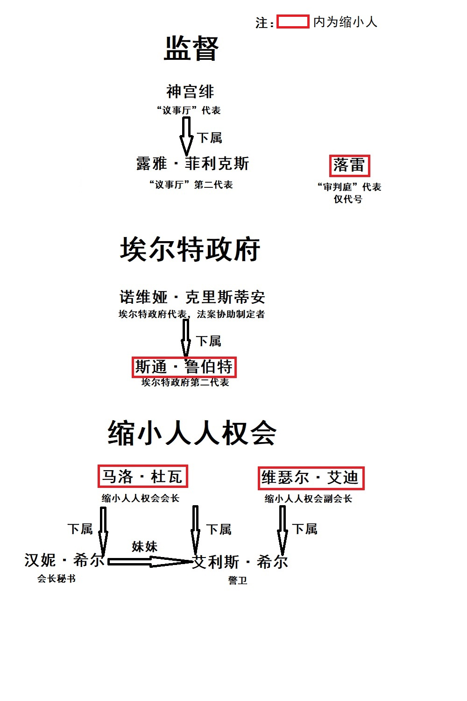

# [悬疑][推理]《暮雪的终猎》(已完结)

作者：jack369605

TID：31209

# 1

*本帖最後由 jack369605 於 2021-7-7 10:56 編輯*

【在埃尔特常年被暴雪笼罩的玛诺罗勒山脉深处，有一座僻静的庄园，一场关乎全世界缩小人命运的封闭会议在此举行。而会议前夜，也就是缩小人保护法案失效的前夕，缩小人人权运动领袖马洛·杜瓦惨死在房间内，与之一同死亡的，还有他的女秘书汉妮·希尔。层层疑云笼罩在与会者的心头，会议能否继续下去，缩小人的命运又将何去何从……】

（第一次尝试写推理类型的文，结果到了后面似乎成了悬疑，不过也算了了自己一个愿望吧，希望大家喜欢）

背景：34年前，缩小病爆发，导致全部人类男性和部分女性的体型缩小为十厘米左右。在历经数十年的缩小人人权斗争运动后，缩小人保护法案终于在埃尔特实行。随着法案日渐完善，缩小人的生存空间越来越安全，社会地位也逐渐提高。

直升机轰鸣着降落，我早已晕到站不起身了。在接触到新鲜空气的一瞬间，像获得了新生一般，然而下一秒就被刺骨的冷空气冻得头皮发麻。

“没想到这么冷，我们还真是来对时间了…”，我哆嗦着身子，对穿着厚厚的防寒服的像山一样少女说。

“在玛诺罗勒山脉的气温低谷期，选择这个时间也是无可奈何吧，毕竟那位大人物忙得很呢”，少女有些无奈，“不过你这个…座驾也挺有重量呢，我手都酸了。”

“诶，别这样说了，我会难过的。”

“你又欠我人情了。”

“我……！”

“咳……你俩稍微安静点吧，有什么话私下说”，走在前面的女性回头看了看，“我们已经晚来了一天，该尽快进入工作状态了。”

“啊，不好意思，神宫议事长！”少女慌忙弯腰道歉。

第一章 落暮

赫拉尔山庄内并非想象中那么奢华，毕竟主要用作会议场地，不过典雅大方还是绰绰有余。脱下厚厚的防寒服后，一行人在大厅的圆桌旁落座，缩小人则坐在圆桌上的特制座位。

“欢迎各位前来参与会议，那么我先来介绍一下各方代表吧，”神宫议事长站起身微微鞠躬，“我是埃尔特议事厅代表神宫绯，旁边的这位是议事厅的第二代表露雅·菲利克斯小姐。”

黑色长发的少女站起来轻轻鞠躬。

“这位缩小病患者是审判庭代表，按照审判庭的规定只透露其代号为‘落雷’。以上两位与我是会议的监督方，也希望大家能配合我们的工作。”

我也像她们一样站起来鞠躬，对面似乎有人露出了有些轻浮的表情…就当是错觉吧，反正也习惯了。

“然后是会议主办方，也是赫拉尔山庄的两位管理者，贝拉和多拉。”

圆桌旁站着的两名穿着古朴典雅女仆装的女性弯腰鞠躬，作为赫拉尔山庄的管理者，她们负责山庄环境的维护，同时也受命于议事厅。议事厅给她们官方称谓是“管理者”，而外面的人们则因为服饰更多地认为她们是“女仆”，久而久之，“赫拉尔山庄的女仆”也人尽皆知。

“那么接下来是政府方，埃尔特政府代表诺维娅·克里斯蒂安女士，以及诺维娅女士的助手，同时也是缩小病患者的斯通·鲁伯特先生。”

一位金色长发的女性站起来微笑着鞠躬，同时她面前桌上的戴眼镜男性缩小病患者也站起来鞠了个躬。虽然同为缩小病患者，但这个消瘦的男人却给我一种备受疾病折磨的感觉。

“然后是缩小人人权会的会长，马洛·杜瓦先生，以及副会长维瑟尔·艾迪。此外还有马洛先生的秘书汉妮·希尔和警卫艾利斯·希尔。”

圆桌对面的几个人站了起来，正中间位置的两个缩小人，其中一个是大名鼎鼎的马洛·杜瓦，也是我所敬佩的人，正因为他的努力缩小病患者的人权才得以夺回。年近六十的马洛·杜瓦看起来依然硬朗，他微笑着向在座人员挥手。而另一个三十多岁的男性缩小人是维瑟尔·艾迪，传闻中他组织了团队在秘密研发缩小病的解药，但是目前依然没有官方消息的证实。他们后面坐着的两位女性，其中一位褐色短发的女性，看起来和我年纪相仿，却意外地很干练，但是她的脸色似乎有些阴沉的样子。另一位褐色长发、眼神中透露着温柔的女性，脸上带着微笑，应该就是马洛的秘书汉妮·希尔，这两位年轻女性外貌很相似，看起来应该是姐妹。近年来缩小人人权会的实力逐渐雄厚起来，缩小人也终于有了话语权，所以正常体型的人类为缩小人提供服务也越来越常见，能有这样的变化，还是离不开马洛会长的功劳呢。

在介绍结束后，各方代表互相寒暄，与马洛·杜瓦会长握手是我这样的小角色梦寐以求的。马洛微笑着对我示意，伸出了手，我匆匆走过去握住。但是眼神交汇的那一瞬间，一股寒意涌上心头，他的目光中似乎有一丝戏谑…我只能装作没有发现，挤出笑脸和他寒暄。不经意间余光与他身后巨大的女性警卫对视上了，她冰冷的目光死死的盯着我，似乎我一旦有什么不轨行为就会立即动手。

这之后，我一直脑袋昏昏沉沉的，和男性握手，和女性鞠躬，繁琐的礼节和内容一成不变的寒暄结束后，与会者终于回到了自己的房间。

<ignore_js_op></ignore_js_op> **人物关系(1).jpg** *(165.33 KB, 下載次數: 0)*

[下載附件](forum.php?mod=attachment&aid=ODk1NTV8M2ZkZDliZjZ8MTY0NzcwNTY0NHwxODIzMHwzMTIwOQ%3D%3D&nothumb=yes)

人物关系图

2021-7-5 21:37 上傳 

“噔噔噔～”

“请进。”我按了下手中的遥控器，远处的房门发出了解锁声。

“嘿嘿，我要进去了哦。”

黑色长发的少女推开门，又跑又跳地来到我面前。

“好可怜哦，像个宠物一样被关在透明房子里。”

“喂！你倒是，进门还要先说‘噔噔噔~’，是不是被冻坏了脑子啊！”我走出透明房，抬手指着她。

桌子上的小屋作为酒店给缩小病患者提供的特制居所，坚固且方便移动，现在已经普遍使用了。不过这里提供的透明的小房子显然是为安全考虑，看起来也更加坚固。

“嘿嘿”，巨大的少女脱下外套，坐在我前面，“难得的自由活动时间，等会议开始了就没时间和你玩了~”

“别别，我现在不想玩……”，我双手推开她戳我的手指，席地而坐，“刚才和马洛会长握手的时候，我感觉，他的眼神有些不对劲啊，好像在玩弄我的样子……”

“嗯？他和我打招呼的时候很正常啊，还挺热情的，怎么奇怪了呢？”

“他的眼神，就跟……把我当动物一样…很奇怪，我汗毛都竖起来了…”

“诶…！这是……怎么回事？”

“我也不知道…大概是自己多虑了吧。我还是很崇敬他的，如果没有他，我们这些缩小人也过不上这样的生活呢。”

“确实是这样，听说缩小病刚爆发的时候，缩小病患者都过得很凄惨呢，连生存都很难做到，还有的女人故意……”

“不过…与其说什么患者，不如说是男女平等的崩塌吧？正常体型的男人我从来没听说过，完全成了女权社会了。”

“你啊，少看点这些东西吧”，巨大的少女用手指戳了戳我的头，“你们男的还好，缩小人里的女性更惨吧，现在重点保护对象也是女性患者呢。你们男的，有很大一部分，都会对正常体型的女生产生崇拜呢，体型这么小还挺开心，是吧~”

“你又是哪里听说这些的？！那是他们，我可不是这种人！”

“诶，消消气。咱两认识这么多年，我还不知道你有什么小心思吗”，少女坏笑着，脱下鞋子，啪地把巨大的黑色丝袜足搭在桌子上，“上次去海落的时候，你一直盯着其他小姐姐的脚看，别以为我没发现哦~”

“你……！脚好臭！”，我踉跄着站起来，捂住怦怦跳的胸口，“露雅·菲利克斯，你怎么可以……”

“激动的话都说不出来了吗，”她脸上泛起一丝红晕，“怎么可能臭嘛，你仔细闻闻，我知道你喜欢这个~”

“…滚……！”

第二章 雪暴

晚餐的时候，依然是寒暄与互夸的环节。缩小人也有特制的餐具和餐品，两位女仆对晚餐条件的安排十分周到。

晚餐流程与标准会议晚安没什么区别，唯一给我留下深刻印象的就是秘书给马洛会长喂食的情形。对屏幕上那个高大伟岸的男人的印象受到了剧烈冲击，以至于餐品的味道都变得索然无味。马洛一边与维瑟尔副会长有说有笑，一边张嘴慢慢接过秘书递过来的食物。秘书汉妮一脸微笑，警卫艾利斯低头用餐一言不发，这诡异的场面让我有些后背发凉。

“落雷先生，可以跟我来一下吗？”

正准备回房间的时候，被女性的声音叫住了。

“是诺维娅小姐啊，有什么需要我做的吗？”

“可以来我的房间吗，有些话想私下谈谈。”

诺维娅的房间，只有床头灯亮着，光线昏暗。

“请讲吧，诺维娅小姐。”

“嗯~”，她轻轻把我放到了床前的地面上，自己坐在床上翘起了腿，“落雷先生，对马洛会长有什么看法呢？”

这种奇怪的氛围，而且这样的姿势真的适合谈话吗…看着她居高临下看我的眼神，一种莫名的屈辱感涌上心头。但还是压制住这些，努力保持平静的语气：“马洛会长是给缩小病患者带来希望的人，我很敬仰他。”

“是这样吗~但是刚刚晚餐时他的行为，你也看到了吧？”诺维娅眼神里有些笑意，脱下高跟鞋放在我身边。

“……”，巨大的高跟鞋故意放在我身边，屈辱感越发强烈…不行…要忍住…我挺直了腰板，“马洛会长的生活行为我无法评价，但是他为缩小人的权益做出了卓越的贡献，依然值得我钦佩。”

“哦？你真的很单纯呢…”， 诺维娅巨大的丝袜足紧贴着落在我身边，一股味道扑面而来，“马洛会长，你是真的不了解呢~”

“诺维娅小姐，请你放尊重些！”再也忍受不了了，完全就是明晃晃的挑衅和侮辱！我用力推着她的脚，却被反作用力推倒在地。

“呵呵，小弟弟真可爱呢，不过还是太年轻哦”，诺维娅挪动脚掌到我上方，眼看就要踩下来，却突然收回了，“被吓到了吧，呵呵，快点走吧~”

“……”，我拍了拍身上的灰尘，瞪了诺维娅一眼，转身向门口走去，思考片刻，背对着诺维娅说，“至少，马洛先生给我们带来了很多权益，这就够了。”

“呼…真是肤浅又顽固呢…姐姐给你开门吧，以后多来玩哦~”

夜晚的熟睡中，传来一阵急促的敲门声。我连滚带爬地穿上衣服，按下了开门开关。

“请问是落雷先生吗！发生了紧急事件，请您收拾一下立刻前往现场！”

身着女仆装的女性快步走过来，我狠狠揉了揉脸让自己清醒了一点。

“发生什么事了？！”

“我现在就带您过去！”

没来的及反应，女仆就把我捧在手中，快步走出了房门。

“啊，那个，忘了自我介绍了，我是赫拉尔山庄的女仆贝拉”，女仆顾不得低头，边匆匆行走边介绍说，“发生了很紧急的事情，神宫议事长希望您能尽快过去！”

快步穿过走廊，来到一扇打开的房门前，挤进围观的人群，我惊呆了：巨大的女性仰躺在地上，胸口被双手紧握的一只钢笔深深刺入，鲜血弥漫在地板上；而她的表情却十分平静，看不出来被刺穿心脏的痛苦，安静地闭着眼。但是更令我毛骨悚然的是，马洛·杜瓦的上半截身体赫然匍匐在女性的脸上，鲜血几乎覆盖了巨大女性的脸庞，他的表情狰狞地望着女性的眼睛，却早已没有了生命迹象。

我感觉一阵反胃，马洛尸体的惨状令我头皮发麻。我转过身去，这才发现白天参与会议的众人都到齐了。

“各位，马洛先生和他的秘书汉妮·希尔在凌晨四点三十分的时候，被多拉小姐发现遇害了，”红色长发的神宫议事长走出人群，面对着众多来客，“请大家不要惊慌，我们会立即进行调查。会议还需要继续进行，缩小人人权会的副会长维瑟尔先生会暂时代替行使马洛先生的职权。此外，还希望各位能到大厅集中等待，我们调查清楚死因后会第一时间告知各位。”

第三章 暝霭

在大厅，我坐在圆桌的一角，执行监视与会宾客的任务，心里却一团乱麻。监督团的另外两位女性都去调查现场进行一次调查了，只有刚才的女仆贝拉守在我身边。在非私人场合，缩小人需要有正常体型人类的保护已经成为了共识，这也是缩小人得以保障生存安全的关键原因。

马洛·杜瓦在重要会议的前夕死亡，明显是有人想破坏会议的进程。维瑟尔副会长一脸凝重，紧握双拳低头沉思；警卫艾利斯·希尔眼睛红肿，一言不发。埃尔特政府的代表诺维娅则在于她的同行者斯通说着悄悄话。诺维娅看起来有些不安，斯通则轻抚着她的手背。时间一分一秒地过去，我的睡意渐渐消失，窗外泛白的时候，二人和另一位女仆过来了。

“各位，”神宫议事长停在圆桌前，“经过我们三人的调查，现在有一些情况想要告知。”

“首先，如各位所见，马洛·杜瓦先生的死因是身体断为两截，失血过多而死。而汉妮·希尔小姐则是因为心脏被破坏衰竭，血液停止循环而死。”

“其次，两位死者的遇害原因尚无定论，还需要进行二次调查。”

“我就说！”维瑟尔副会长拍桌子站了起来，“一定是有人蓄意谋害会长！一定是只有体型正常的人才能办到的！我觉得就是……”

“…！”，一瞬间，我看见维瑟尔后面的警卫艾利斯，正狠狠地盯着他，如果是这样的眼神盯着我，恐怕会吓得双腿发软。

“维瑟尔先生，请不要激动，”神宫议事长打断了他的话，“目前我们能做的，只有尽力侦破案件，同时保护好自己。监督方的责任是保障会议进行，所以各位可以先回到自己的房间休息，下午的第一场会议按照原计划进行。”

“议事厅制定这种秘密封闭会议程序，真的没有考虑这种事件发生的可能吗……”，我自言自语。

“那么，落雷”，神宫议事长看向我，“作为审判庭的代表，处理案件是你的工作，会议前的这段时间就辛苦你了。”

“我会尽力的”，晃着昏昏沉沉的脑袋，向神宫议事长点了点头，“请问，我的助手是？”

“我们人手比较紧张，看来只能是…”，她转身看向黑色长发的少女，“露雅，你还有处理会议资料的工作，能应付过来吗？”

“啊…？哦！没问题，交给我吧！”她好像有些走神，也是太累了吗。

“此外，这里的女仆多拉小姐作为主办方，也会参与调查，希望你们相互配合，尽快查明真相。”

“咳…那么落雷……先生，我先带你去调查现场吧。”露雅揉揉眼睛，打起了精神，轻轻将我托在手心中。

“谢谢你，露雅小姐。”

“……第一次见你这么认真呢。”

“马洛会长是从灾难中拯救了我们缩小人的领袖，虽然与他没有什么交集，但是我能活到现在，也离不开他的努力，所以我理应为他寻找真相…”

“这样吗，那就加油吧……”

“那个…两位…你们走过房间了…”，身后传来女仆的声音。

“啊，不好意思多拉小姐！”

房门推开，一股血腥味扑面而来，两位女性捂住了鼻子。虽然已经经历过不少案件，但正常体型的尸体并没有过多接触。在露雅手中，看着巨大的女性尸体，我有些心跳加速。

“汉妮·希尔，女，25岁，马洛·杜瓦的秘书。从小受到马洛的影响一直在参与缩小人人权运动，毕业后跟随马洛从事法案制定与维护的工作。”

“一直跟随着马洛会长吗……多拉小姐，”我望向站在门口低着头的女仆，“你是第一个发现现场的人吧？”

“是的。我在凌晨四点三十分例行巡夜的时候，听到这个房间内有细微的哀嚎声，以为马洛先生出了什么意外，就推开了门。”

“那个时候，马洛先生…还活着吗？”

“我推开门的时候，，马洛先生还在汉妮小姐的脸上喘息…不过已经接近死亡了……”

哀嚎声……断成两截的人…他一定很痛苦吧…被露雅轻轻托起来，屏住呼吸压制情感查验马洛的尸体，断开的边缘不平整的断面基本可以确定，他不是被什么工具切成两截，这个形状应该是……

“露雅，可以把汉妮小姐的嘴打开吗？”

“嗯…？果然和我想到一起了吗。”

露雅把我放在汉妮尸体胸口，用手指扒开了她的嘴，一股莫名的血腥味涌出。

“果然是这样”，我捏住鼻子走了过去，看着她的口中，马洛的下半截身体就在里面。

“………！”，露雅透过手指缝看着马洛的尸体，说不出话来。

“你们在一次调查中发现这个了吗？”

“…虽然想到了这种可能，不过没有打开看…我们只是进行预先调查排除安全隐患啦，深入调查还是你们专业人士的工作。”

“那么接下来是汉妮小姐，”我走到她的胸口，“钢笔深深地刺入了心脏…没有很多血喷出来。她的双手紧紧握着钢笔，已经僵硬了，看起来似乎是自杀，不过…”

“不过她的表情……”

“很平静，不像是经历了痛苦的自杀，应该说是很安详的表情吧？”我触摸着钢笔，“而且刺破心脏本应有大量血液喷涌出来，这里的血液量要少很多，像是静脉血一样，流动速度很慢。”

“你认为她是他杀吗，落雷。”

“钢笔上有凌乱的指纹，但没有鉴定仪器也无法确定是谁的。从双手握笔的力度来看，是她用自己的力量将笔刺入心脏的，但是经历这样的痛感表情绝不会如此平静，再加上没有剧烈挣扎的痕迹，”我环顾着四周，“目前一种推测是马洛先生出于某种原因被汉妮小姐…咬死了，而汉妮小姐………露雅，你可以去看一下监控吗，晚上有什么人进过这个房间。”

“啊，可以的，那，多拉小姐，可以带我去控制吗？”

“当然可以哦。”

两位女性离开了，空荡荡的房间飘着血的气息。我跳下来绕着巨大的女性尸体转了一圈，除了血液量有些异常的不足之外，并没有什么……不对……我蹲下来闻了闻，凝固的血中似乎有淡淡的药味，似乎是镇静剂？！

这样一来，自杀就成立了，而且从双手握笔的力度来看，怎么都不像是被别人塞进去的…

探索了许久，依然找不到镇静剂的注射器。首先还是得看尸体上有没有针眼吧…不过这种事应该交给女性来办的…

“凌晨一点15分，汉妮·希尔小姐进入了马洛先生的房间，除此之外没有别人。”

“啊…诶…！吓我一跳……”，突然响起的少女声音让我从思绪中回过神来，“也就是说，只能是自杀了吗…”

“你已经推理出来了？”

“血液中有药物的味道，应该是一种特殊的镇静剂。如果将其注射进体内，短时间内是几乎不会有痛感的，这也是她表情安静的一种解释。尸体上如果有针眼就可以印证我的判断了。”

“诶，我现在检查一下吧，请你…转过身去。”

“考虑很周到呢，那就加油吧。”

第四章 长夜

“你是说，汉妮小姐将马洛先生杀死之后，又选择了自杀？”维瑟尔瞪大了眼睛，表情有些扭曲，汗珠从他脸上滑落。

“根据目前的线索分析是这样，凌晨一点15分汉妮小姐进入了马洛先生的房间。不知出于何种原因，汉妮小姐将镇静剂注射入体内，随后将钢笔刺入胸口倒在地上，同时将马洛先生咬成了两截”，我看着他的眼睛，“证据就是刚刚在汉妮小姐颈部发现的针眼，以及双手握笔的力度，不过目前还没有在马洛先生房间找到注射器。”

维瑟尔愣了愣，叹了口气，像是虚脱一般瘫在椅子上。他身后的警卫艾利斯·希尔脸色阴沉，一言不发。

神宫议事长将一册资料放在桌上，拍了拍露雅的肩膀，看着众人：“按照规定，此次会议在结束之前，除了无法进行会议的情况，是禁止与外界进行联系的。汉妮小姐和马洛先生的尸体已经封存了起来，等会议结束之后会有外界专业人员检验，进一步确认死因。”

“了解，神宫议事长”，诺维娅小姐看了维瑟尔副会长一眼，开始低头整理资料，斯通也走到了资料边协助她。

“然后，露雅和落雷，你们可以回房间休息了，下午三点第一场会议开始，不要迟到”，神宫议事长说。

“好…我已经迷迷糊糊了…议事长下午见…”，露雅伸手抓一把起我，放进了胸口的衣袋里。

“…喂…！你干什么啊……！”

“你说…汉妮小姐为什么要杀马洛先生呢…”，房间里，露雅把脸埋进枕头，迷迷糊糊地说。

“…我…呃啊…我不知道…但是这样下去我…就要被你捏死了…！！！”被巨大的手掌紧握住，我挣扎着。

“啊…抱歉…！”，露雅立刻松开手，抬起头看着我，脸上露出了坏笑，“你认真的时候还是很帅的呢~”

“……还真是多谢夸奖呢…”，我活动着肩膀，坐在枕头上，“辛苦你了…”

“总算是可以稍微歇歇了…汉妮小姐和马洛先生的尸体已经和两位女仆小姐合力封存起来…放进地下室了…呜，好困……”，少女继续将脸埋在枕头中，“落雷…”

“你休息一会吧。”

“…呼……”

看着眼前的少女，我思绪泛滥。“山一样的少女”是中学时我给她起的外号，那个时候，缩小人保护法案的落实力度还不够，她是能挡在缩小人同学身前保护他们的存在，正因此，也曾经是我仰慕的人。分别这么久，在工作中再度相逢，我们已经是以维护秩序与公平为己任的同道中人了。

“露雅，如果没有马洛先生的努力，我不可能进入审判庭的，”倾听少女的鼻息，轻抚着她的头发，“但是如果没有你，我可能早就死了。”

“可是马洛先生那个时候的眼神…唉…”

下午，第一场会议在赫拉尔山庄的大厅召开。埃尔特政府代表诺维娅·克里斯蒂安小姐和缩小人人权会代表维瑟尔·艾迪先生互相交换了诉求，并且进行商议。最后由监督方代表神宫绯确认，新的缩小人人权保护法案顺利通过。

但是，隐约中感觉，维瑟尔似乎有些没底气，话语也偏向妥协型，好在有监督方保证公平，法案的内容并没有使缩小人的利益受损。

“维瑟尔副会长，明天的第二场会议内容，需要提前提交材料吗？”

“…不需要了…”，维瑟尔有些紧张地看着神宫议事长，又看看我，“我…该回房间休息了…”

“我送您回去。”艾利斯小姐表情有些冷淡。

“啊…好…辛苦了…”，维瑟尔看了看艾利斯小姐，又向我们投来奇怪的目光，充满了焦虑和不安。随后，他被艾利斯小姐送回了房间。

“那么，我们也该回房间了”，诺维娅小姐面带笑容站起来轻轻鞠躬，带上斯通先生离开了大厅，好像对会议结果很满意。

“维瑟尔副会长…好奇怪啊…”，我凑到露雅旁边悄悄说，“他好像很紧张的样子。”

“毕竟马洛先生遇害了，他突然就多了这么多职责，应该压力很大吧。”

“也许吧…”

第五章 迷雾

晚餐过后，小憩片刻。朦胧中被巨大的手掌抓起来离开了房间。

“…唔…露雅…什么情况……”

“又发生了。”

“…唔…什么……！”，我头皮有些发麻，清醒了过来。

来到门前的大厅，神宫议事长紧锁眉头盯着地面。在我们前面的是刚赶过来的诺维娅小姐和斯通先生。

“怎么会这样…？”诺维娅双手捂住了嘴巴，她肩膀上的斯通先生一脸凝重。

神宫议事长摇了摇头，长叹一口气：“就在刚才，维瑟尔·艾迪副会长在晚餐过后回房间的途中，经过大厅时被艾利斯·希尔抓起来扔向地面，然后踩踏导致死亡。”

顺着神宫议事长的视线，地面上有一滩红色的物体，对于这样的景象我虽然见过很多次，但这次依然后背冒出了冷汗。

“那…”

“艾利斯·希尔杀了维瑟尔副会长之后，就夺门而出，贝拉小姐已经去追她了，”神宫议事长望向窗外，暴雪丝毫没有减弱的迹象，“至此，会议无法继续进行，我会向外界呼叫支援，各位可以准备收拾行李了。”

“神宫议事长，贝拉已经在控制室等候了。”多拉一边收拾凌乱的会议桌，一边说。

“希望贝拉小姐能早些回来吧，”神宫议事长苦笑着，离开了大厅。

“这…”

“对了，落雷，案件过程的监控录像之后也会给你。”走廊处传来神宫议事长的声音。

“……”

诺维娅站在那里，默默地将手中的发言稿捏成了团，转身离开。

“那么，落雷…接下来是你的工作了…”，露雅轻声说道。

和经历过的大多数踩踏案件没什么区别，大量血液和碎肉，模糊不清的特征，几乎只能通过衣物来识别被害者。通过肉泥大致的纹路可以描绘出加害者的鞋印，通过纹路比对几乎就可以确定加害者的身份。

忍住呕吐感草草写完了案件调查报告，示意女仆多拉可以清理现场了。

“这样的案件，经常发生呢”，露雅用手轻轻把我托起，“不过现在处罚越来越重，也比以前少很多了。”

“每次看到这种场面，我都会想到自己…也许有一天我也会变成这样吧。”

“诶，不许这么说！”，露雅用指尖戳了戳我的头，“这不是有我保护你吗。”

“哎呀，别戳了，疼…！”

“啊，抱歉…”

在床上翻来覆去睡不着，重重疑虑萦绕心头。缩小人人权会的会长被秘书所杀，副会长被警卫所杀，导致会议无法进行。这样的事件在公开后审判庭必然面临着很大的压力，到时候案件就会交给顶尖的调查员处理，我也只会作为目击者被询问一些问题吧。

但是这样就能摆脱自己的职责了吗？离奇自杀的汉妮·希尔和冲入暴雪中的艾利斯·希尔，她们这样做的原因究竟是什么？还有去追艾利斯的贝拉小姐…这样的恶劣天气真的不会出事吗……

“噔噔噔～”

“……”，按下手中的遥控器，房门发出了解锁声。

“这么晚了来找我，应该不是单纯的聊天吧？”

“嘿嘿，起床啦”，露雅关上门打开灯，“我突然想起了一些细节，想和你讨论下。”

“嗯？不愧是你呢，愿闻其详。”表面努力保持平静穿衣走出玻璃屋，内心雀跃着。这种时候，她果然和我一样吗。

“汉妮·希尔颈部的针孔，我现在才反应过来有些奇怪，”露雅挠了挠头，“你也看见了针孔有两个，是常用的镇定剂专用双针头的注射器。”

“对啊，这种注射器一般都是和镇定剂配套使用的，这也是我认为她注射镇定剂的理由。”

“但是这两个针孔你没发现有什么异常吗？”

“这……虽然没有测量，但应该就是标准尺寸吧？”

“不，你看”，露雅拿出了尸体颈部的照片，“你没发现，这两个针孔刺入的方向有些不一致吗？”

“诶，仔细看的话确实……也就是说，她可能是注射了两次药物…”，我打了个激灵，“镇定剂是不需要打两次的吧？！”

“联想到之前盛传的维瑟尔副会长组织研制的药物，我觉得可能与这个有些关系。”

“但是，我们并没有在马洛先生的房间搜查到注射器吧？”

“关于这个…你跟我来。”

露雅把我放进了胸口的衣袋中，一路来到二楼控制室门前。思量片刻，输入了一串密码，控制室的门应声而开。

“你怎么会知道密码的？！”

“白天多拉小姐带我来这里的时候，不小心就看见了~”

“你…真强！所以我们来这里是要…？”

露雅没有说什么，轻轻关上门，打开了监控屏幕，翻找着记录。

“这不是昨天凌晨的录像吗？只有汉妮小姐进入了马洛先生的房间…”

“不，你看这个。”

“……！这…这是诺维娅小姐吗？！这是，凌晨两点三十二分，她和汉妮小姐一起进入了马洛先生的房间，三点钟的时候独自拎着一个黑色手提箱回到了自己的房间！”

“果然，和我的猜测一样…”，露雅脸上浮现了一丝笑意，“你忘记了，我们比他们晚到一天吗？你再看这两天的录像和前几天录像的对比，是不是显示时间的格式都不一样了？”

“这…！也就是说……”

“多拉小姐给我看的，是我们到来的前一晚的录像，而昨天凌晨真正的录像，应该是有诺维娅小姐的这个。多拉小姐在给我播放的时候，确实有些紧张呢。”

“居然是这样吗…这样一来，诺维娅小姐带走的手提箱里边，装的应该就是注射器吧？！可是多拉小姐为什么要…”

“我也不知道…但是我有个计划，这个手提箱的型号…或许可以搞清楚箱子里有什么…”，她把目光转向了我，“落雷…你要试试试吗？”

第六章 追猎

“啊，诺维娅小姐，这么晚了，还不睡吗？”

“已经习惯这样的作息时间了呢，露雅小姐有什么事吗？”

“神宫议事长为了防止那样的事件再次发生，嘱咐我拜访一下各位，确保你们的安全。”

“辛苦你了，我会注意的。”

“嗯嗯，那就好，我先走啦。”

“再见。”

房门砰的一声关上，我踉踉跄跄跑进了墙角，好在只有床头灯亮着的昏暗灯光下可以很好的隐藏身形。这样的环境，之前经历过一次呢…真不想再见到她了，如果被抓住下场一定会很惨吧……

“真没办法…希望她还在门口等着吧…”，我嘟囔着，慢慢接近墙角的黑色手提箱。

“臭虫子，藏在哪里了！”

“…………！”

突然传来的声音令我毛骨悚然，我慌不择路地跑到手提箱后面，却发现巨大的女性并没有过来。

诺维娅双手叉腰，轻哼一声：“趁我去开门的时候，又逃到哪里去了吗？虫子！”

“主人…主人…！”昏暗的光线中，一个赤身裸体的缩小人跑到诺维娅脚边跪下，高声呼喊着。

“听你的真是把我害惨了！”诺维娅一脚把他踢开，男性缩小人在地上滚了几圈，挣扎着爬起来。

斯通·鲁伯特！借着灯光，我认出了这个消瘦的男人。原来那种备受折磨的病态，是这样导致的吗…

“主人…！”，斯通连滚带爬地跑过去，抱住诺维娅的拖鞋，“请原谅我吧！”

“原谅你？审判厅会原谅我吗？等艾利斯·希尔被抓回来，我们都会被关起来审判！”

“不会的…！我会保护你，我会承担所有责任！你什么都不知道！”

“你以为他们是傻子吗？我这个帮凶他们会放过我吗？！”，诺维娅伸手抓起斯通，怒视着他，“还有，你这只小虫子不是只会发情吗？！”

斯通挣扎着，诺维娅顺手关灯上了床，时不时发出奇怪的喘息声。对于这些，已经不是我需要在意的了……不过从他们的对话来看，他们似乎和马洛与汉妮的死有关系…

爬上手提箱，按照露雅给的方法，这种型号手提箱的密码锁有个致命的弱点，只要把手伸进缝隙里……借着月光，慢慢拨动齿轮，观察着床上的动作，在声音最大的时候，拨动最后一个齿……

“咔嚓！”，密码箱应声而开。掏出特制的小电筒，钻进箱子里，终于看见了：两个装在透明袋子中的注射器，已经启用过了；此外，还有几个奇形怪状的注射器和一些装着透明液体的小玻璃瓶。角落里，有一张卷起来的字条。我把字条拿上钻出箱子，又轻轻锁上了手提箱。

“搞定…~”，长吁一口气，接下来只需要躲在墙角，等露雅来接应就好了。

床上的声音一直未曾间断，不断传来的是女性的娇喘声，偶尔夹杂着男性微弱的叫喊声，知道敲门声再次响起。诺维娅慌忙整理好头发，打开了门，在两个女人寒暄的期间，我箭步冲了出去。

“怎么样，我的方法好用吗？”

在自己的房间里，露雅坏笑着，手指头戳了戳我。

“先别说这些了，看看这个！”

“诶，这是手提箱里面的东西吗？”露雅解开了字条的胶封，“说好不随便动里面的东西的…”

“里面还有一些注射器和药瓶…这个应该是说明书吧？”

“Rst2-6591，缩小人人权会研发的用来恢复体型的药物，包含两支试剂，需要使用特定的注射器，并且二者配合使用，短时间内可使缩小病患者恢复”，露雅读着字条，脸上逐渐露出惊讶的表情，“单独使用时会出现其他效果。Rst2-6591-A，令使用者失去痛觉，出现假死，血液流动变得极为缓慢，且短时间处于休眠状态。Rst2-6591-B，短时间内增强使用者的愈合能力……)

“………”

“……这也太……”，露雅放下字条，和我大眼瞪小眼，“难道说汉妮小姐…注射的是A…这个药物吗…说不定她根本就就没死…？”

“现在就去看看她的尸体吧！！”

第七章 破局

在封存尸体的地下室，露雅打开了干瘪的尸袋。虽然料到了这样的可能性，但依然难以接受。更震惊的是，在凌乱的衣物中间，我分明看到了一个小小的身影…

“汉妮…小姐…！？”露雅叫出了声。

小小的身影转了过来，她脸上带着微笑，重获新生一般释怀的微笑。汉妮·希尔，马洛·杜瓦的秘书，非缩小病患者的她，此刻却是十厘米左右的缩小人。

露雅蹲下身，满脸都是吃惊:“汉妮小姐，你为什么会变成这样啊？！”

“露雅小姐，你好啊。”

汉妮没有回答她的问题，径自走向露雅。露雅将手放在地上，汉妮便走了上来，一丝不挂。

“喂，变态不许看啦！”露雅用手指把我摁进了口袋中。

“那个，汉妮小姐…你不是已经…”

“维瑟尔副会长还活着吗？”

“诶，他在昨天被杀害了…”

“这样吗……”，汉妮的声音开始有些颤抖，我偷偷掏出头，看到了她在月光下的曼妙身躯，慢慢蜷缩起来哭泣着。

“汉妮小姐…这到底是…？”

汉妮招了招手，露雅将耳朵贴了过去。汉妮说着听不清的话语，我只看见露雅的表情由惊讶转为纠结与无奈，最后是苦笑。

“辛苦你了，汉妮小姐…我知道该怎么做了…”，露雅将汉妮装进另一个口袋，转身离开地下室。

“喂，你倒是告诉我啊…！”

大厅，不知道什么时候，已经亮起了灯。

双手被反绑在椅子上的褐色短发少女挣扎着，用激烈的言辞表达自己的不满。一旁的神宫议事长眉头紧锁，倾听着女仆贝拉的描述。

“发生什么事了吗？”诺维娅小姐和斯通先生跟在两位女仆后面来到了大厅，诺维娅小姐脸上似乎还有难以抑制的红晕。

汉妮从露雅胸前的口袋中探出了头，对艾利斯微笑着。艾利斯终于再也忍不住了，眼泪掉了下来。

“虽然我也不清楚怎么回事，不过看来真相能在这里揭晓了呢，对吧，露雅。”我无奈地看着黑色长发的少女，拍了拍她的胸口。

“是的…抢了你的功劳呢…”，露雅用手指戳了戳我，环视四周，“各位，请听我解释事件的真相吧。”

“缩小人人权会的维瑟尔副会长，组织研究了一种名为Rst2-6591的药物，并计划与马洛会长共同在会议上使其合法化。但是其药效并不像说明书中所说”，露雅掏出药物说明字条，扔到了会议圆桌上，“Rst2-6591的药效只能使女性缩小人恢复正常体型，对男性无效。所以他们的计划改为了，通过制造Rst2-6591的反效药物Rst2-6592，并将其通过飞行器大范围播洒，达到使全人类缩小的效果。这样一来，就可以使正常体型的人类从世界上消失，他们就站在人类的顶端了。”

神宫议事长依然眉头紧锁，诺维娅和斯通瞪大了眼睛。

“为了阻止他们的计划，汉妮小姐和艾利斯小姐，以及在座除了监督方外的所有人，在监督方到来的前一天已经进行了秘密会谈，做好了行动计划。在马洛先生遇害的凌晨两点三十二分，诺维娅小姐和汉妮小姐进入了马洛先生的房间，并且为汉妮小姐注射了Rst2-6591-A，之后汉妮小姐将钢笔刺入胸口，并将马洛先生咬死，成功伪造了死亡状态。在这之后，诺维娅小姐将装有药物的黑色手提箱拿回了放假，并且由多拉小姐更换两天的监控录像，这就是我们昨天所看到的结果。”

多拉小姐低下了头，汉妮则一直在微笑着，看着啜泣的艾利斯。

“在尸体封存之后，多拉小姐为汉妮小姐注射了Rst2-6591-B，使她渐渐痊愈，并且恢复体力。回到我们的会议上来，第一场会议内容是缩小人人权保护法案，而第二场会议的内容就是Rst2-6592的广泛使用。为了阻止会议进行，晚餐后艾利斯小姐杀害了维瑟尔副会长，并且逃离了山庄。”

“艾利斯小姐因为体力不支晕倒在了雪地里，被我带回来了哦。”贝拉轻声说道。

“而就在刚才，我们在地下室，发现了汉妮小姐，这也是她告诉我的真相。”露雅指了指衣袋里的汉妮。

艾利斯挣扎着：“姐姐，你为什么要这样！不用管我的！明明就差一点就可以……”

“艾利斯”，汉妮依然面带微笑，“我们已经胜利了，不需要再忍耐了。”

“可是……！”，艾利斯摇着头，“可是我这样做，都是希望你能…”

“艾利斯，我不会让你一个人的。”汉妮微笑着说。

“…可……！”艾利斯还想说什么，却说不出口了。

“但是，汉妮小姐，为什么要这样做？而且你现在为什么变成了缩小人？”一直沉默的神宫议事长望着汉妮。

“不是变成了缩小人，我一直都是缩小人哦。”

“！！！！”众人目光一致望向汉妮小姐，她依然微笑着。

“姐姐一直以来，都靠缩小人人权会的药物，维持着正常的体型…”，艾利斯低下头，有些咬牙切齿地说，“但是，那两个混蛋……！”

“毕竟，恢复正常体型是有代价的呢”，汉妮的微笑慢慢变成了苦笑，“曾经敬仰的马洛·杜瓦，不也是个只会为自己谋利的小人么…”

“表面上光彩照人，不断提高缩小人的社会地位，暗地里利用自己的职权凌辱女性缩小人，收揽巨额财产…这样一个人，该怎么对待才好呢，唉………”，汉妮闭上眼睛，仿佛在回想什么，“那些女孩子，被关在笼子里，失去了自由，甚至生命…马洛要我把她们都踩死、吃掉…！为什么啊？！她们不是我的同胞吗？！！”

汉妮越说越激动，赤身裸体爬出了露雅的衣袋。露雅忙用双手将她托住，轻轻用纸巾挡住她的身体。

“但是马洛这个混蛋，就是喜欢这些！他喜欢我因为杀死同胞而内疚的感觉，他让我浑身都沾满了鲜血！如果我不照他说的做，我就不能使用药物，也只能像那些女孩子一样！我好害怕啊！！”

汉妮的声音越来越高，情绪越来越激动，把纸巾撕扯成了碎片。艾利斯默默流着泪：“对不起，姐姐，我没有保护好你…”

“汉妮小姐，你的故事讲完了吗？”

“……结束了……”，汉妮像是泄了气一般，瘫坐下来，盯着天花板，“已经累了……”

“姐姐……”，艾利斯低下了头，“我会永远和你在一起的…”

“那么诺维娅小姐和斯通先生，有什么需要解释的吗？”

“我…！”诺维娅瞪大了眼睛，却又说不出话来。

“都是我的提议”，诺维娅肩膀上的斯通举起手，“我愿意承担一切责任，诺维娅小姐的行动都是被我欺骗了的。”

“你…！”诺维娅一把将斯通攥在手中，盯着他。斯通笑了笑，摊了摊手。

“还有多拉小姐，你作为会议主办方，理应保证公平的。”神宫议事长转头看着身边的女仆。

“神宫小姐，在听过汉妮小姐的倾诉之后，我已经决定要帮助她了，无论是作为主办方代表，还是多拉自己，我都相信这是正确的选择。”多拉看着神宫议事长的眼睛，面色平静。

“多拉的选择，也是贝拉的选择哦”，女仆贝拉也轻轻说道，“这样的行动计划如果通过，一定会给很多女孩子带来痛苦的。”

“这样啊，这就是你们的选择吗…”神宫议事长沉思良久，窗外渐渐天明。

第八章 黎明

“马洛·杜瓦这一次计划，真的触及到了很多人的底线呢…曾经有利益关系的诺维娅小姐，这次也选择了站在他的对立面…”

“马洛想要的世界，你喜欢吗？”黑色长发的少女理了理头发。

“还是算了，那样只会更加残酷吧…这样就挺好的…”

“嗯？什么挺好？巨大的女孩子挺好吗？”

“你……！为什么一直觉得我会想这些东西啦！”

“嘿嘿~”

“唉……不过，很多时候程序正义不一定能带来好结局呢…”

“嗯…神宫议事长作为监督方的最高级别，做出了这样格外宽容的决定。这虽然有悖于她一贯的风格，但是，结果还是好的呢。”

直升机再次到来之际，会议取得圆满成功的消息开始在全世界传播。缩小人的权利进一步得到了保障，社会地位也有所提升。缩小人人权会会长马洛·杜瓦与副会长维瑟尔·艾迪于签订协议后的夜晚，在突如其来的大火中与暴雪山庄一同化为了灰烬，彻底被积雪所覆盖。会长秘书汉妮·希尔与警卫艾利斯·希尔失踪在茫茫暴雪中，再也没有了踪迹。其余人员幸存。

赫拉尔山庄的女仆并入了不远处怒风军事营地，成为守护玛诺罗勒山脉的一部分。诺维娅小姐和斯通先生带着会议决议前往帝都，这一份法案将为缩小人带来更好的福利与地位。

轰鸣的直升机上，黑色长发的少女小心翼翼地抱着怀中的箱子。

“这样，真的可以吗，神宫议事长…”，少女有些忐忑不安。

“这种情况…也见过不少吧，有舍有得，就是你以后要多关心她们了…”我有些无奈地笑了笑。

“现在是非工作时间，叫我绯姐姐就好”，神宫议事长摆了摆手，“这样的选择虽然抛弃了人权，但是法案并没有禁止。而且，这也是她们自己的选择吧。”

“明白了，绯姐姐……”露雅轻轻揭开箱盖，用指尖轻轻戳了戳里面抱在一起酣睡的两个女孩，“我会好好照顾她们的。”

“不过真没想到，那个看起来又凶又坚强的女孩子，居然也是……你想到了吗，露雅…”

少女微笑着，没有抬头看我。

“小妮，小艾，以后请多多指教哦。”

[完]

# 2

> [yjz123 發表於 2021-7-5 22:34](https://giantessnight.cf/gnforum2012/forum.php?mod=redirect&goto=findpost&pid=472934&ptid=31209)

> 悬疑的很新奇呢，很少见的题材，作者加油

多谢支持~顺便这篇文肯定不会咕的啦，嘿嘿

# 3

> [aassddff 發表於 2021-7-5 23:37](https://giantessnight.cf/gnforum2012/forum.php?mod=redirect&goto=findpost&pid=472946&ptid=31209)

> 确实题材很罕见的，推理形式的gts文印象中很少。

毕竟这类型文章重点还是剧情和逻辑，福利太多可能会影响逻辑性，gts还是更适合爽文一些

# 4

> [柳淯栊 發表於 2021-7-5 23:47](https://giantessnight.cf/gnforum2012/forum.php?mod=redirect&goto=findpost&pid=472947&ptid=31209)

> 感觉提示有点少，不太好确定凶手 ，还是等楼主更新吧

因为关键线索部分基本都在最后几章了，主角是缩小人活动能力很受限，而且感觉这种相对正式的场合没有明确的证据确实不好随便调查

# 5

> [大理三道茶 發表於 2021-7-6 22:46](https://giantessnight.cf/gnforum2012/forum.php?mod=redirect&goto=findpost&pid=473052&ptid=31209)

> 啥时候更新下一章啊

很快就完了哦毕竟只有八章来着

# 6

> [有机体 發表於 2021-7-6 23:13](https://giantessnight.cf/gnforum2012/forum.php?mod=redirect&goto=findpost&pid=473054&ptid=31209)

> 呜呜呜jk就嗯吊胃口，很烦，gkdgkd啊

这不是怕一下子看这么多太累呢，追番多好

# 7

> [leo1223 發表於 2021-7-7 00:03](https://giantessnight.cf/gnforum2012/forum.php?mod=redirect&goto=findpost&pid=473066&ptid=31209)

> 哇……比想象中好看啊，期待ing！

多谢~主要也是为了把这个想法写出来啦，离真正的推理文还是差挺多的~

# 8

> [柳淯栊 發表於 2021-7-7 00:45](https://giantessnight.cf/gnforum2012/forum.php?mod=redirect&goto=findpost&pid=473072&ptid=31209)

> 楼主打算以后再写一些推理的文吗，感觉写的已经非常好了，氛围角色塑造的都很好 ...

如果反响不错的话应该会写的~目前还不清楚这类型文在圈内有多少受众呢~  

# 9

> [ganbalakun 發表於 2021-7-7 13:24](https://giantessnight.cf/gnforum2012/forum.php?mod=redirect&goto=findpost&pid=473108&ptid=31209)

> 蛮有意思的呢这题材（可能自己喜欢推理类）

谢谢~感觉圈内这类型还是挺少的，所以就想试试啦

# 10

> [12345678901 發表於 2021-7-7 16:31](https://giantessnight.cf/gnforum2012/forum.php?mod=redirect&goto=findpost&pid=473123&ptid=31209)

> 悬疑推理用在这里意外的特别有趣，真的很有趣，氛围什么都很好，不过我更喜欢悬疑恐怖，不过推理也很好，能 ...

悬疑恐怖可能会有更多的番茄酱之类的，感觉可以参考克苏鲁，这个以后可以试试的~

# 11

> [ahri 發表於 2021-7-7 17:48](https://giantessnight.cf/gnforum2012/forum.php?mod=redirect&goto=findpost&pid=473129&ptid=31209)

> _(:з」∠)_来看jk大佬的文章，很有意思的题材

感谢捧场毕竟初衷只是为了满足自己推理的爱好而已，能有人喜欢就很开心了