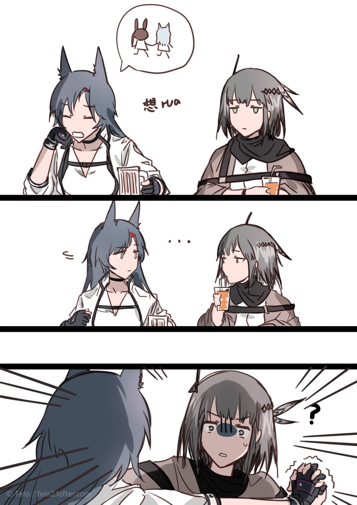
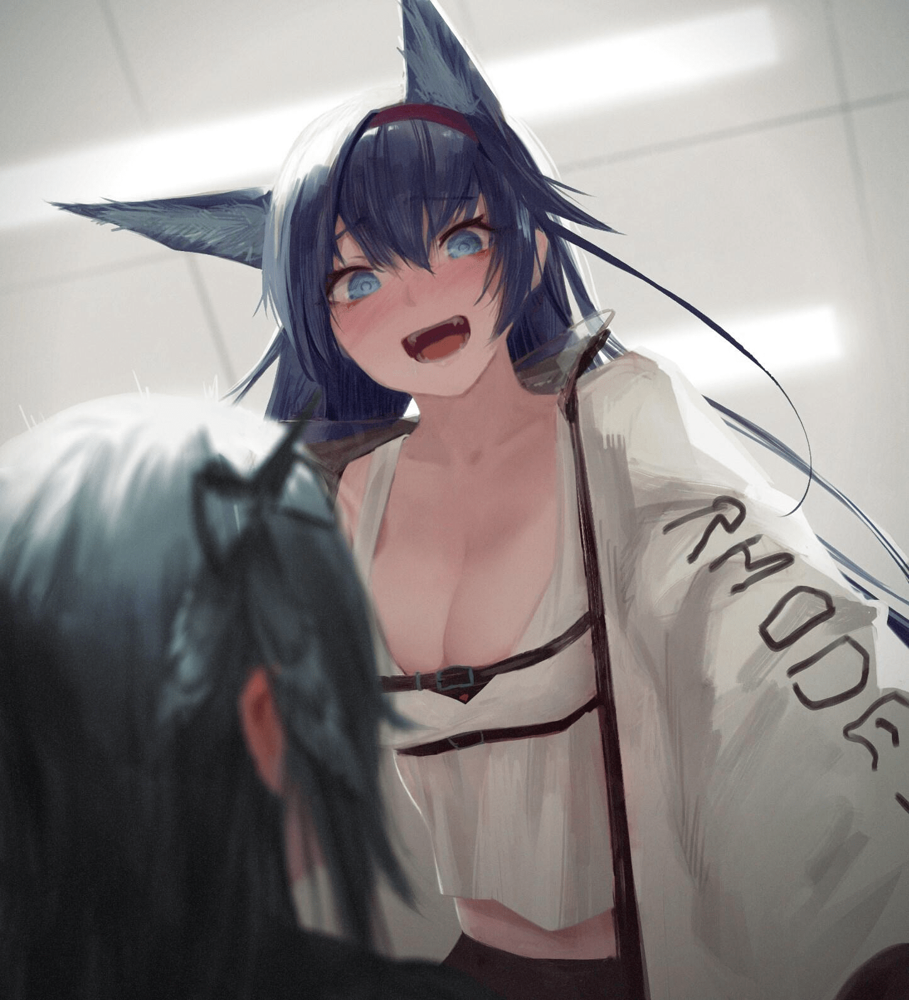

# 【方舟同人】灰喉的城市管理

作者：Timo

TID：32509

# 1

这里是**逍遥如歌**，纯新人。第一次尝试发文，欢迎大家来留长评指出问题！

看名字就知道和某篇《铃兰的城市管理》有千丝万缕的关系好吧。       https://giantessnight.com/gnforum2012/forum.php?mod=viewthread&tid=29611&highlight=%E9%93%83%E5%85%B0本篇沿用了这篇的世界观，顺便直接进行一个铃兰的催更

灰喉真的很可爱，建议大家当女儿养成

按理来说这里该写些什么？提笔感悟？我有点编不下去了……

总，总而言之！希望大家多多给出意见建议！再有就是多多产出点方舟同人！

（其实本来想发元宵杯来着，最后面那些当成元宵杯的谜底看就好）

# 2

<ignore_js_op>[Cache_-38da50ef7969a1c..jpg](forum.php?mod=attachment&aid=OTM0ODV8ZjkzYWEwZTV8MTY0NzcwMzc3N3wxODIzMHwzMjUwOQ%3D%3D&nothumb=yes) *(204.44 KB, 下載次數: 4)*

[下載附件](forum.php?mod=attachment&aid=OTM0ODV8ZjkzYWEwZTV8MTY0NzcwMzc3N3wxODIzMHwzMjUwOQ%3D%3D&nothumb=yes)

2022-1-30 15:41 上傳  

</ignore_js_op> <ignore_js_op>[Cache_-55a7ad7ceb885d3c..jpg](forum.php?mod=attachment&aid=OTM0ODZ8ZTZlNjFlYjR8MTY0NzcwMzc3N3wxODIzMHwzMjUwOQ%3D%3D&nothumb=yes) *(172.03 KB, 下載次數: 5)*

[下載附件](forum.php?mod=attachment&aid=OTM0ODZ8ZTZlNjFlYjR8MTY0NzcwMzc3N3wxODIzMHwzMjUwOQ%3D%3D&nothumb=yes)

2022-1-30 15:41 上傳  

</ignore_js_op>  

# 3

*本帖最後由 Timo 於 2022-1-30 15:56 編輯*

“诶嘿，小燕子，快让我搓搓~虽然没有小兔子可爱但是也没关系的啦~”身材高大的煌痴笑着一步一步地朝被逼进墙角的灰喉走去，双手不停地相互摩擦着。“听话，让我摸摸！”       “你个笨蛋，不要过来！”面对步步紧逼的煌，灰喉一个闪身企图从煌抬起的胳膊下钻出去，却不曾想被她直接扯住了短裤的松紧带，无论怎么用力也挣脱不开不说，还把自己的内裤微微露了出来。       “哇，是白色，好可爱。诶对了，先说明一下，这可是阿米娅让我来的。”煌突然想起了什么，从衣服当中掏出一份文件：“这是小兔子让我给你的。之后作为交换可以让我搓搓了吧？”       “无路赛！”灰喉一把夺过煌手中的文件，拍开她的大手逃回了自己的宿舍。       “哈，哈…真是的，煌那样的笨蛋，博士和阿米娅到底是怎么应付的啊…不过话说回来，是什么文件？又要有护送任务了嘛？”躲过煌魔爪的灰喉打开了牛皮纸的文件袋，拿出了一张任命书。“B-3实验室任命书？昨天铃兰不是被调到B-2去了？再者为什么会是我？不过，上面有博士的签字，应该没什么问题吧…”从训练室里高强度加练回来的灰喉本身就疲惫不已，再加上中间煌的插曲更是让她心神憔悴。没有思索那么多，她利索地脱下衣物，扯过被子盖好，很快进入了属于自己的梦乡。       …       …      “嘿嘿嘿小燕子，你就不要挣扎啦，我的手指这样伸进去很舒服的对吧？…”      “啊！”灰喉从梦中惊醒，身上的冷汗和不知甚么液体打湿了很大面积的床单。幸好灰喉暂时是单人宿舍，不然她夜里的梦呓肯定会令室友面红耳赤。“这是怎么了，平常是噩梦今天梦到春梦也就算了，偏偏还是和那个笨蛋…”把这个怪异的梦暂时压在心底，灰喉草率地洗了澡擦干净了双腿间的水渍，整理下着装后，打开了宿舍的门。在她眼前路过的，是矮自己不止一头的铃兰。换做是以前的灰喉，是绝对不会和除了阿米娅的任何感染者打招呼的，但是经过阿米娅代领的几次任务后的她，也稍稍变得放的开一些了。       “早，干员铃兰。”       铃兰像是没听到一般急匆匆的跑了过去，看她的方向好像是B层。灰喉曾经听过干员之间对铃兰的高度评价，按理来讲如此懂事的孩子不可能这么失礼，难不成实验室出了问题？自己接手期间不会也出差错吧？灰喉叹了口气，也朝着B层走去。只不过，凭借自己敏锐的观察力，灰喉在路上已经察觉到了一丝怪异：B层一个男性干员都没有，而且每个实验室都是气密的大门。从罗德岛舰尾的电梯一路走来途经B-2实验室时，她注意到原本应该是绿色的门禁此刻是红色的，大概是里面有铃兰在看管的意思吧？看了看漫长的走廊两侧的实验室，灰喉愈发疑惑起来：准备如此之多的实验室，到底要做什么？        把胸口的工牌随意的朝门禁一贴，闸门就伴随着空气的流入向右缓缓的移开了。进入没有灯光的泄压室后，气压开始平衡，头上也响起了阿米娅的声音：“干员灰喉，这里是提前录好的录音，所以有什么问题请事后找博士反应。接下来我将像你解释门后面的情况。在门的后面本身是一个人口几十万的小城市，这是罗德岛利用源石技艺的最新的成果，我们把这座城市复制缩小了6000倍搬了过来，连同里面的居民一起，所以进去的时候请注意脚下，当然不小心踩到了也没有关系，一切由你自己决断，还有进门请脱鞋哦，以上。”里侧的大门缓缓打开，首先映入灰喉眼帘的就是被漆成蓝色的天花板和悬挂在上面，充当城市光源的球形日光灯。地上则如同阿米娅所说的那样，一座被缩小的城市在她身前一米的位置平铺开来，占据着实验室的大部分地面。看起来被复制的城市非常的发达，按照比例来算的话，在没被缩小前，能有半数以上的大楼都达到了100米的高度。只不过现在的它们，可能连灰喉的指尖的厚度都达不到。“这就是…源石技艺？嘶…太危险了…”灰喉在心里惊叹了一下的同时再度加剧了她对源石的抗拒，有着心事的她忘记了之前阿米娅的提醒，直接踏进了房间。       城市的边际和地面有着20厘米的高度差，应该是为了防止里面的居民出逃的措施。但是那几个红线外侧的“越过此线后果自负”几个字到底是写给谁看的？6000缩放倍率的小人恐怕站在他们最高的建筑上也只能看见几个笔画吧。对自己任务一头雾水的灰喉跨过了城市的一角，朝自己的办公桌走去，打开了上面的笔记本电脑。“这个软件是监控，还有记事本…还要扫二维码？扫一扫…这是什么，数据库？”按照电脑里记事本的提示，灰喉快速浏览了一下城市的数据库。经过特殊训练的她轻易地记住了大部分内容，但是直到现在，她仍对这份调任存在疑惑：任命书上只写着：因为源石导致了局部区域的变化，特派灰喉干员来观察。仅仅这么简单么？自己明明是战斗小组的狙击干员，却来观察一份城市？自己可是从来没有做过研究工作，也没有担任过博士助理的经历。在一瞬间，灰喉突然又想去出护送的任务了。“算了，既然是博士和阿米娅的安排，那就听从吧。说不定是博士的深意。”灰喉从桌下拉出椅子坐好，开始在电脑上用城市的摄像头观察里面的居民。       但是对于城市里的居民而言，他们所看到的可就不是这么普通的事情了。       一大早，就有住在市郊的农民发现原本紧挨着的临近的移动城市突然消失不见，驾车向外开了不久才发现：原本是两个城市之间的边界，但另一侧像被削去了一样，取而代之的是一个1000多米的金属悬崖，边缘非常的整齐，像是机械切割的工艺。地形的突然变换本就让人紧张不已，城市跟外界的移动通讯设备全部无法联系的消息传开后，更是让市民慌张。就在人们讨论对策的时候，有眼尖的人发现，远处的景色也开始了诡异的变化。伴随着一阵听不太清的女声传来，群山突然缓缓移动起来，露出了一大块黑色的空间以及，一个巨人小姑娘。毫无悬念地，整个城市立刻陷入了惊恐之中，人们惊叫着朝地下和楼群中躲藏。部分人侥幸地认为或许新出现的悬崖能阻挡她的脚步，不过他们实在是太低估了巨人的身高，在看到单是鞋帮都高于他们的依仗后，也放弃了活下去的希望。平日里能让站在街上的行人看不见远景的高楼相对于她而言只是不到鞋底而已，高高在上的云层竟然仅仅达到她的腰部。两根裹着黑丝的腿让城市里最雄伟的山峰也感到高攀不起，在城市正上空注视着人们的，如同湖泊一样巨大的眸子更是让人们感到绝望的体型差异。灰喉踩在地面上所带来的震动已经让一些质量说不过去的豆腐渣工程倒塌，呼吸产生的气流吹走了上空原本堆积的云彩。如同黑色山脉一样的鞋子从城市边踏过时，让不知多少人哭天喊地：毕竟比大楼都要高上几倍的脚要是踩了进来，生还的可能性怕是为0都不为过。鞋底的纹路已经清晰可见，但是并没有坠在城市里，而是落在了城市相邻边缘的悬崖外，去了那个相对她身高大小的巨大办公桌。巨人的一步，跨过了人们认为的四千米。等到灰喉落座以后，虚惊一场的人们相互拥抱着哭泣着庆幸劫后余生，尽管灰喉从来就未曾进入城市，也没有任何恐吓的动作，仅仅是跨过了他们的上空。       事实上，他们应该庆幸遇到了灰喉这样行动敏捷而又谨慎的干员；虽然忘记了脱鞋的规定，但是身材轻盈的她也并没有对城市造成多少实质性的破坏；若是换做嘉维尔这样大大咧咧的，亦或是虽然非常小心但是穿着厚重防护服的泥岩，那么结果也就可想而知了。就这样，灰喉在电脑前坐了一上午，都在记录自己观察到的情况。作为一个精通狙击的干员，她还额外的记录了城市里的高楼高塔的位置，或许在以后出任务用得到。       在移动一个摄像头时，她看到一张条幅，挂在了摄像头的斜对面：我是本市市长，请你联系一下我，电话xxxxxx。稍加思索，灰喉拿出了自己的通讯设施，拨出了那个号码。不出所料，刚刚响铃一秒电话就被接起，里面传来了一个低沉但饱含愤怒的男声：“你是罗德岛的干员吧？我要向你们罗德岛的高层提出申诉，向乌萨斯政府求助！你们这是在践踏人权，乌萨斯的政府不会放任你们的所作所为…”灰喉一边听着，一边起身再次来到城市的边缘，没有用通讯设备的接收器而是直接向城市说了出来：“首先，你们为什么会被缩小原因尚且不明，而且罗德岛为各位提供了道义上的援助，你们本应该抱有感激；第二，我并没有对该市造成实质性的破坏；第三，即使造成了破坏，你们也无法把求助信号发出去。利弊之下，”灰喉轻轻地俯下身，巨大的墨绿色的眸子死死地盯住市中心的一幢大楼：“我希望市长先生能考虑周全。哦，还有，我不希望城市出现内乱，市长先生你要负起责任。”凭借自己优秀的动态视力以及敏锐的感官，灰喉能意识到原本已经趋于平静的城市再度惊慌起来，渺小的人们又开始在街上四处逃窜，或者是躲藏进高楼之中。见威慑目的已经达到，灰喉也无意再多停留，回到桌前拿起自己的物品离开了实验室，去食堂解决午饭。       午饭的时候又看到了心事重重的铃兰干员，这个小姑娘独自一人坐在食堂的角落里默默地吃着饭，九条尾巴无力地顺着椅子垂了下来。灰喉感同身受的叹了口气，本来想去找她好好攀谈一番，但是看到煌这个家伙端着饭盘一脸寂寞地过来时，灰喉忙扒了几口饭，逃也似的离开了这里。       等到她回到实验室时，原本看起来如同灰色地毯一样的城市已经有四五处细细的烟冒出——是感染者和乌萨斯政府和市民在对抗。在如此荒谬的压力之下，认定自己早死晚死都得死的某些感染者干脆做起了亡命之徒，上街去争取一些自己应有的“权利”。在他们的鼓动下，原本就不平静的城市像是被点燃的薪车一般，混乱的火焰席卷了整座城，到处都是械斗，抢劫，杀人越货。母亲无力保护自己的孩子、年轻夫妻没法相聚。人性，仿佛已经不存在了。就好像如同切尔诺伯格一样，人们在制造天灾前最后的疯狂。只不过，这次将要来临的天灾他们自己的行动换来的。       灰喉静静地在线外站着，再一次拨通了市长的电话：“市长先生，你对城市的现状难道没有措施吗？我说过的吧，我不希望看到城市内乱，这样我的任务就完成不了了，罗德岛没法观察一座暴乱的城市。”“我们已经尽力在维持了，但是效果…”灰喉话里的威胁含义，他一个从官场漂泊上来的人怎么不知？       但是灰喉对他含糊的推辞并不满意：“那么，既然你们管理不了的话，还是我来吧。”       “等等，你要干什…！”      灰喉抬起了她的脚，移动到了红线以里。不需要高抬腿，仅仅是普通的跨出一步，就踩在了边缘的铁台阶——也就是在人们看来一千米的金属悬崖上。随后，另一只脚也如约而至，踩进了城市的市郊。重压挤出了泥土中混有的水分，给灰喉的感觉就像踩在了雨后的田地里一样惹人心烦。而一同被变成片状物的居民，房屋，稻田所带来的感觉连灰喉的鞋底都穿不过去，传达不到。      “感染者也好，普通人也罢，既然我们以自己的意志踩在这片土地上，就必须要努力活着，对吧？但是，你们当中的有些人，失去了生活的意志不说，还去摧毁别人的生活…不可饶恕！无论是感染者还是普通人！”灰喉冷冷地说完，开始朝城市内乱的源头——市中心走去。      足以供应半个城市的粮食的市郊大粮田，差点容纳不下灰喉并排摆放的双脚。而后，巨人开始了走动，平均高度100米的摩天大楼群，被灰喉的鞋底轻易的踏毁，连带着周围一圈的街道都变做压实的泥土。原本在灰喉正下方的人们期盼着能靠着鞋底的纹路逃过这一劫，但是很不幸，周围路面的强度不足以支撑灰喉这个小姑娘的体重，混凝土的下陷让鞋纹区域的人们和他们脚下的土地以一个极高的相对速度撞在的灰喉的鞋底，化为一滩滩看不见的血肉：毕竟他们只有几微米的相对身高，就连大楼的破裂，也无法让灰喉感到任何的异样，更何况是他们这种渺小的存在。灰喉所经历过的战斗里从来没有过如此简单，压倒性的胜利，就像在清除蚂蚁一样。不，倒不如说，野外的蚂蚁清理起来还要更费力一些。就这样，灰喉不紧不慢的，一步步地来到了这座城市的中心。      虽说是城市最繁华的地方，实际上也只是能勉强容纳灰喉两只鞋子的大小而已。中间的地标建筑：500米的信号塔勉强能与灰喉的鞋舌根部平齐，而其他的人们引以为傲的大厦连她的鞋外底的高度都达不到。灰喉在那里一动不动的站着，俯瞰着城市里的人的动作。被一个比云彩还要高出一半的巨人在城市旁边用带着杀意的眼神注视，市民们放弃了内斗，纷纷惊叫着朝市中心外跑去。此刻的街上，显出了另一种混乱：争相逃命的人们失去了平日的理智，老弱被无情的推在一边，或者被踩在脚下无人注意；踩实了油门不在乎人命的司机；为了争夺交通工具而大打出手等等。而灰喉只是在一旁看着而已。      “你们这种人，不值得被拯救，不值得同情！明明刚刚已经告诫过你们…”话音落下，灰喉面无表情地抬起了自己的脚悬在了他们的头顶：被带到空中的混凝土碎块和黏在鞋底处的土块落下，提前在城市里造成了些许的伤亡。但真正带给小人恐惧和死亡的，是缓缓放下的巨大的黑色鞋子。原本对市民来说蓝色的天空此刻正变成黑色，上面还能清晰地看见鞋底的纹路和一些见证岁月的磨痕。灰喉特意地放慢了自己落足的速度，以便让人们更好感受这股力量。带着不可抗拒的气势的小脚先折碎了地标建筑的塔尖，接着是塔身；随后便是那些被设计出来用于商业贸易的高楼。人们辛苦几年，十几年的造物丝毫不能阻挡灰喉的意志，纷纷随着鞋子的下落而支离破碎。在大街上的人们惊叫着，直到自己的身体被碾碎的前一秒，仍然拼命的奔跑着，只可惜灰喉不会给他们任何生还的机会。在小人看来地面下陷几百米后，灰喉的脚才有了踏实的感觉。就像是踩在了饼干上一样的触感，数不清的大楼崩碎的感觉终于能带给灰喉一丝感觉，让灰喉轻轻地挑起了眉毛。而仅仅一脚，就已经造成了上万人的死亡。“接下来，是你们这侧。”灰喉目光转向另一侧。又用鞋帮推平了另一侧的街区。刚刚鞋子触地的从冲击中爬起来的人们还没有来得及再度逃跑，就被一堵泥土的洪流卷入。这次踩实后她又抬起了脚跟用力地旋转了几下，彻底抹除了这座乌萨斯城市中曾经最为繁华的一片存在。      “本应该互帮互助的普通人和感染者，为什么要相互敌视？…啊，鞋子脏了。不过好像实验室要求脱鞋来着，现在脱下了好像也不晚。”灰喉用鞋跟交替蹬掉了鞋子，脚尖随意的一挑，鞋子的一只就朝城市的一角飞去。原本还在庆幸自己所在的区没有被注意的人们眼睁睁地看着鞋子在他们眼前逐渐变大，最后像一颗黑色的陨石一样砸进市区。脆弱的高楼无法有效抵消鞋子的冲击，剩余的能量化作动能继续滑行。在灰色的钢铁丛林中留下了一大片棕色的痕迹。处于滑行范围内的大部分人们非常不幸地死于鞋口与地面所形成的土墙，但还有另外一部分人和建筑被冲击甩到了天上，而后落在了灰喉倾倒的鞋子里。柔软的材料为他们提供了落地的保护，但是他们再也无法凭借自己的力量逃出这个牢笼了：虽说是侧过的鞋子，但是鞋口边的厚度也是有60米的高度，跳下去后果可想而知。面对黑漆漆的鞋尖深处，人们没有探索的欲望和勇气，只能聚在鞋口处等待着大概会出现的救援。或许是因为之前灰喉的动作幅度有些太大，亦或是实验室的温度太低，鞋子里热气弥漫。带着少女体香和一丝汗味的气体不断化成白雾从鞋口飘出，代替了空气被人们吸进肺部。部队和施工队想通过爆破的方式挖开鞋下的土地查看可能的幸存者，但是无论他们设置多少炸药，也无法破坏鞋子内壁一丝，鞋舌上面的37数字冲击着人们的内心：这仅仅是一只少女的鞋子，一个鞋码37少女的鞋子。但也仅仅是灰喉的一只鞋子，就摧毁了这片区域的三分之一。如法炮制，灰喉抛掉了另一只鞋子后，站起了身子。      “现在的这里大家都在争斗，那就由我，给感染者和普通人带来公平。那就是，都会被我踩死。”       向这座城市的人们发出了死亡宣告之后，灰喉回到了这个灰色“地毯”的边缘，开始沿着边际线来随意的踏毁街道和楼房。长1350米的黑色丝足因为吸收了泥土中的水分和小人们的血，颜色更深了几分。如果是正常的状态，灰喉小巧的脚加上如此的穿搭不知会让多少人面红耳赤，但是在眼下，那双巨大的脚带给人们的只有恐惧和死亡。不需要刻意的动作，仅仅是像平日里散步一样，就能够轻松地宣判一群人生命的结束。而且，透过丝袜传来的感觉可是远超那坚硬的鞋底不知多少倍，酥麻的感觉证明着大楼在脚下无力地崩碎，刺激着灰喉敏感的脚心。可能惩罚的性质已经在不知不觉中变了，灰喉开始对于摧毁人们的建筑和设施产生了极大的兴趣，每一步都在细细体会那种大楼破碎的触感，每一步都高高的抬起，再慢慢的落下。脚掌随性地在人们头上扫过，享受够了人们的惊呼后再找个看起来建筑密度最大的地方落下。无数人哭喊着想要逃离灰喉脚掌的范围，但是在几秒内跑出一千多米的距离显然是不可能的。等到脚掌落下时，一切都重归平静；而脚掌抬起时，剩下的便只有大地和一个巨大的脚印了。可能还有几个残存在灰喉丝袜纤维中间的幸运儿，但是在下一次的落脚时他还能这么幸运吗？       在一片比较繁华的城区，灰喉停下了脚步，尝试着去用脚趾触碰林立的高楼。在高楼中的人们只能看到巨大的黑丝足愈发接近，期盼着灰喉能在脚趾击碎玻璃前停下动作。只可惜，尽管灰喉对于自己的身体行动控制得极为细节，但不到一毫米的细微抖动也决定了高楼的命运：被拦腰截断。如同多米诺骨牌一样，大楼开始了连锁反应，7、8幢大厦因大楼碎片的撞击而相继倒下。自知搞砸了的灰喉吐了吐舌头，两脚踏平了整个区域后又朝着新目标走去了。对于城市中的，能达到自己小腿肚的山脉，灰喉很是在意，清理完边沿的市区，她立刻迈着步子靠了过去。足底搭上了山的主峰，只不过轻轻一抵，就让山失去了100米的海拔高度。“仅仅这种程度…？”感到无趣的灰喉轻轻抚走了脚底粘上的尘土，跨过了这个小土丘对着其余的城市继续她的惩罚。       刚刚把脚跟踏入一座全新的区域，灰喉便看到了非常奇怪的一幕：居然会有几个小人还会在城市里站定不动等待。为了确认对方是不是吓呆了，灰喉跪坐了下来，伸出手指在他们头上晃了晃。被长筒丝袜包裹的双膝深深砸入地面，断绝了这个山脚下城市的唯一出去的高速路的同时还压扁了很多正在逃命的居民。一根直径几十米的玉珠在头上来回移动带来的风压吹飞了商业街上的防雨棚，但是那几个人的身姿却岿然不动。“黑色的…士兵…难不成是乌萨斯内卫？！”灰喉猛然想到了这支乌萨斯最精锐的部队。对方并没有回答她的提问，自顾自地发起了突击。在正常状态下的内卫，屠杀罗德岛普通小队根本不成问题。但在这样的境地下，未免就有些可笑了：相对于常人来说近乎离谱的速度在灰喉的眼里只是稍微快了那么一点，随手一拍，一名冲锋中的乌萨斯内卫就被按进了地面。厚重的防护和艰苦的训练挽救了他的性命，但是他手中的武器无论如何也戳不破灰喉的手心的皮肤，只能给灰喉带来一丝感觉而已。“好痒，你居然真的在攻击…？”灰喉讶异地抬起自己完好如初的手掌查看着，不敢相信这就是皇帝的利刃的实力。其余的两名内卫趁着这个时间已经到达了灰喉的身边，手中能穿透几层水泥墙的长枪扎进了灰喉的丝质袜子挑破了几根纤维，却不能更进一步。“如果乌萨斯的内卫真的有这么弱就好了…”把两名内卫连同他们身下的土地一并用手铲起，再把之前的那个陷进土地里的内外也捏了过来：现在在自己手心里的就是这座乌萨斯城市最强的抵抗手段。“各位已经做的很好了，面对我这样的巨人还能与之一战。但是很可惜，战斗已经结束了，我还要去清理城市。”五只手指渐渐朝掌心合拢然后捏紧，三名内卫被泥土和钢筋建材挤压着，最终无法对抗这股蛮力，与泥土融为了一体。捏成的小土块被灰喉放在了一旁的山顶，作为灰喉对这些强大的战士最后的敬意，至于这座城市则被灰喉毫不在意地用手推平。小小的插曲之后，灰喉重新提起兴致，站直身子朝着新城市走去。       也许是看到了内卫的惨败后认定了逃跑无望，城市里的整合运动，单独的感染者，乌萨斯士兵和志愿帮忙的市民纷纷拿起了能用的源石武器妄图阻止灰喉。可惜，就连献祭了128个术士和半个整合运动分部储存的源石的法阵发出的冲击所带来的伤害仅仅是能让灰喉感觉到脚下一暖而已。在他们看起来足以摧毁一座小型移动城邦的巨型火球相对于灰喉的脚掌而言就像一个火柴的火苗一般，撞在了灰喉的脚底消失不见，随后所有人就步了市中心市民的后尘，化为了灰喉袜底上的污渍。但是，他们所不知道的是，这一无知的反抗举动彻底地惹火了本不愿接触源石的灰喉。      “居然用源石的法术来攻击我…如果我染上了矿石病……”本来抱着工作心态来到实验室的她没有做非常周全的防护工作，怒火中烧而又担忧的的灰喉不再顾忌什么，用力的朝脚下的城市部分跺了下去。强大的蛮力直接贯穿了脚下范围的一切设施，在地面留下了一个深三百米的巨坑；同时，气压所形成的的冲击向四周扩散，轻易地撕裂了不少仍在大街上徘徊的不幸者的身体。      “博士和阿米娅说过，无论我做些什么都是被允许的。那么，把你们一丝不剩地，全都消灭掉也是没有问题的吧？要怪就怪你们的同类吧。”伴随着灰喉的话音落下，她在手机上操作了几下，原本占据着这个三百平房间大部分面积的城市开始向中间收缩，最后变成了仅仅有她的脚掌大小。“这双袜子，反正已经粘上了大楼的残片和小人的尸体，回宿舍清理起来也很麻烦，干脆就把它在这里利用起来吧。”灰喉缓缓地脱下了自己腿上的黑色长筒丝袜，指尖撑开袜口罩住了城市，随后猛地一抬手，这座乌萨斯的城市就翻转着掉落到袜尖的位置了。在城市中的人们看来的视角则是，原本身高万米的灰喉再度变大，而她踩在城市里的脚掌还未拿出。本就令人望而生叹的包在黑丝中的脚趾此刻朝着外面不停地扩大着，沿途的一切建筑，设施，载具都无差别的被卷到那粉嫩的脚底下变成土壤的一份子。还有人驾驶着车辆想要和灰喉比拼一下两个人的速度，只不过灰喉增重的身躯进一步压垮了地面，小人的赛道还没有开始就布满了裂痕，最终只能付出失败的代价：性命。在灰喉鞋边的城市也一样惊恐：她的鞋子也不属于这所城市，在他们再度缩小时同样相对着不停变大，推平了还在鞋口边徘徊着想要对里面的遇难者施以援手的人们。至于鞋里的人，只能伏在震动的鞋壁上祈祷着这变大的停止，他们对于离开鞋子的期望随着高度的增加不断的减少着。       变大的双足扫平了半个城市后，人们已经看不到灰喉的脸了，云层之下，视野里只剩下她左右的双脚。突然，大地猛地颤动起来，但人们只能看到原本踩在城市外左面的通天山脉突然消失，片刻后又重新出现，只不过黑色变成了肉色。然后，一个巨型黑色的网状物体隔绝了城市的阳光，空气中漂浮着一丝汗液的味道。伴随着灰喉的动作，城市被带到了万米高空后开始上下翻转，在长筒袜中做着自由落体运动。只不过，偶尔擦到长筒袜腿的城市在落到袜尖之前，已经被刮蹭掉了大半，在坠落中存活的生物更是寥寥无几。幸存者在他们的庇护所中出来，但是几乎看不清黑暗中的景象，自然也意识不到自己此刻处在一位少女之前穿过的袜子中。      用另一双丝袜把两条袜子团成一个球状物后，灰喉不知为何想起了昨天的煌：她那个样子，是不是从比自己弱气的人身上找到了一丝乐趣呢？毕竟是个战斗狂人，好像也不是不能理解了。又回想起今天早上自己梦境里的为数不多的春梦，灰喉坐在实验室冰冷的地面上红着脸拉开了自己的短裤拉链，用丝袜团在自己的内裤外开始缓缓蹭起来。她并没有这样做过的经验，但是在如此的氛围下，好像是本能驱使着自己的动作一般。       “这样就没问题了。隔着这么多层的布料，即使有感染者小人在城市的废墟中生还，矿石病也是过不来的吧…啊…好像有点舒服…”       原本对城市的惩罚，在不知不觉中已经变成了灰喉自己欲望的宣泄。       不知道是单纯的动作带来的快感还是因为欺凌城市和小人带来的征服快感，灰喉感到了别样的乐趣。手上摩擦的速度渐渐加快了，但是终究是隔着内裤的一层棉料不太得心应手。她费力地把内裤从坐着的臀部下面拉到膝盖的位置，拿着丝袜团的手直接迎上了充血的阴蒂，开始反复地上下摩擦。另外一只手也没有闲着，撩开了自己的上衣后伸到了文胸里揉捏起了早已经挺立的乳头。半个丝袜团被压缩着强行进入了灰喉还未曾开发过的娇嫩下体，阴唇剧烈地开合着，仿佛在大口呼吸一样。如此强压之下，城市里的楼群早已经变成了纤维之间的碎片，个位数的幸存者奋力地抓住比他们身子还要粗上几倍的丝线，可是他们连自己身处何方都不清楚。明明是非常正常的一天，他们应该像往常一样正常的起床，工作，放工后和家人或者朋友聚餐饮茶享受生活。但是，他们现在却在一个不知名的黑色丛林里，在剧烈的震动中尝试着稳定自己的身体。只可惜，他们对于生存的希望是传不到灰喉那里去的；或者说，即使传到了，正在兴头上的灰喉也不会听的吧。纤细的几十米长的手指在丝袜后面不停地捅进来又拔出去，即便隔着数层丝料也是沾上了一点水渍，在指尖和阴唇间拉出了一条晶莹的线。在里面的小人看来，究竟会是怎样一副光景呢？他们恐怕不会意识到自己现在的处境吧？周围的世界不规则的扭曲着，应和着“噗呲”的水声轻易地取走他们的性命。只是想想，就愈发感到欲罢不能，彻底发情的灰喉加快了手上的频率。随着灰喉可爱的娇呻，在一次插入中，她迎来了高潮。大量的无色液体涌出，彻底浸透了丝袜和丝袜里的尸体和残骸。那几个天选的幸运儿最终还是没有女神来眷顾，在灰喉的爱液中不停地尝试游出去，但是因层层丝袜的阻隔最后因缺氧而昏迷，溺亡。       “哈…哈…好像做的太过火了…这下子还怎么观察…”看着空无一物的凸出来的高台和有些水渍的地面，灰喉苦恼地坐在地上，手里的丝袜不知该如何处置。       “灰喉，在吗？”       气压门的位置突然传来阿米娅的声音。灰喉顾不上自己的下体还没有擦干净，慌慌张张地提上自己的内裤和短裤，把手背到了后面：“怎么了？”       “博士说要你去一下他的办公室，我还要去控制中枢和彩虹六号的干员们工作，就不陪你一起去了。先走啦！”说完，门外便没了声音。说不定是什么要紧的紧急任务，灰喉没有多想，草率地调整了下衣物便立刻蹬上鞋子出门去了，并没有意识到还有着数百个微生物级的小人仍然苟活在鞋子的深处。       ……       灰喉紧张的站在博士的办公桌前面，她的衣服兜里还揣着那个沾满自己气味和液体的丝袜球。一路上都非常不巧地有其他干员在，灰喉并没有找到机会处理掉这个棘手的东西，就这样直接来到了博士的办公室。       “哦，你来了啊，今天的工作怎么样？接下来的半个月还要你继续观察。”       “我…”       “怎么了？”       “那个缩小城市，出了点意外…”       “意外？哦，不用担心，只是源石技艺的复制产品。再复制一份就好，没多大经济价值的，只不过我得去给凯尔希递一份申请。话说回来，你观察到了什么吗？”       “…观察到了城市的制高点，还有感染者和正常人的交往和冲突。以及城市里有着乌萨斯内卫存在。”       “这就对了，我知道你对感染者有着抵触和恐惧，你要接着这个机会好好调整。懂了吗？”博士起身摸了摸灰喉的头部，眼神不由自主地飘向了她兜里的那一团湿漉漉的黑色物体。而灰喉并没有察觉到博士兜帽下的目光，只是任由博士抚摸着自己的脑袋。       “...谢谢博士关心，我身体有些不舒服先回了。”        ……        ……       “还懂得照顾干员的情绪，你一点也不是之前的巴别塔恶灵了。”凯尔希坐在博士办公室的沙发上，双腿搭在一起，像是自言自语道。       “诶，希希，快让我抱抱！”       “想死？”M3突然不知从哪里闪现出来，嘶鸣着。       “阿米娅已经去工作了哦，和彩虹六号那些人一起，大概几天之内回不来的。”       “.…..”       “希希~”       “死鬼，下次把你也用源石复制变小踩死算了。”看到凯尔希朝着博士扑过去后，M3失落地离开了。       “（幸好无所不知的太后还不知道我把自己复制进了灰喉的城市，要不然怕是要被关在鞋子里不知道多少天…）”         ……        （为什么gn发文以后没有颜色也没有首行缩进了呜呜） 

# 4

灰喉一脸无奈地看着第十二座复制城市爆发了内乱。仅仅是上个厕所的功夫，城里的小人就无视了她的警告和往常一样地争斗起来。没办法，她只能再一次脱下鞋子，慢慢地用自己的丝足从边缘开始清理掉这个已经失去研究价值的试验品。

在上次欺凌城市之后，灰喉也没有完全的沉溺于此，而是尝试着去阻止城市中会引发的战火来完成自己的工作。但无论哪次复制出来的城市，市民都会如出一辙的陷入疯狂，最后她不得不半享受半恼火地摧毁城市重新来过。内卫在最后几次的复制中并没有出现，大概是因为任务原因离开了这座乌萨斯的城市，让灰喉失去了最后一丝玩弄这个城市的想法：每次都是重复地踩踏，踩踏，那种初次体会到细小物品崩溃的快感再也没有出现过。城市无论是分板块慢慢的踏毁，还是进一步缩小直接一脚毁灭，都无法再让灰喉体会到一丁点的征服感。只有内卫——他们有着和自己对抗的能力和想法，虽然最终的结局还是一样单方面的胜利，但是这种新奇的感觉是城市中只会一昧奔跑的虫子无法带来的。

巨足刚刚扫平了城市的西南角，正在朝市中心移去的时候，大门突然传来了操作的音效，气压平衡的声音在静谧的实验室显得格外响。灰喉惊讶的抬起头，看到羽毛笔正扒在门边探出小脑袋朝里面看着。

“哦，没有找错，是灰喉小姐。”

看到灰喉的羽毛笔本要直接冲进来，但眼神扫到了摆放在金属台阶旁的灰喉的鞋子后立刻停住了身形。她吐了吐舌头掩饰着自己的冒失，手指在鞋跟处一推，那双奇怪的，用塑料封住了空隙的休闲凉鞋落在了地上。布满汗珠的玉足踩在了冰冷的地面，让羽毛笔打了个冷战，她连跨几步毫无顾忌地直接踩进了台阶上的城市来躲避凉意，小脚踢飞了这座全新城市市郊的矿物储藏仓不说，还直接点燃了一旁的燃气管道。大火猛烈地烧起来，但是在羽毛笔脚部无意识地移动下直接被踩在了下面，因隔绝氧气而熄灭。没有了过冬的资源，羽毛笔的散发着热气的脚作为一个新的供暖装置来为小人们驱散寒冷。

“地面好凉！还好这上面还比较暖和。”

“所以拉菲艾拉干什么来了？博士有任务找我？”灰喉对眼前的人能直接进入实验室并不感到奇怪。博士对黎博利种族十分的关照，羽毛笔最近担任着博士助理，有些比较高的权限。她更关心的是拉菲艾拉为什么会来。

“不是博士哦，是煌。她托我转告你：她现在去乌萨斯出紧急任务了，希望你在没有她的时间里不要太寂寞，她回来会找你的。”

灰喉有些无语地看着这个一脸认真的姑娘：她恐怕没有听出来煌话里面开玩笑的成分，只是当做了一般的嘱托。不好当面戳破事实，灰喉只能换了个话题：“你看，你现在脚下踩着的可是城市。”

“诶~？好小哦，人们好像还没有我的脚趾高。他们这是在逃跑吗？感觉好有趣。”羽毛笔翘了翘几十米高的脚趾，比对着一旁已经充满裂纹的大厦。为了看清城里面的人她干脆直接趴了下来，深灰色的像乌云一般的眸子对准着一条街道不断地贴近着。在那条街道上的人们自知再也没有手段来保命，反倒停止了逃亡，在自己当前的位置上静静地等待着死神降临。

“还是很难看到…啊，我的衣服好像砸到大楼了，没关系吧？”羽毛笔羽绒服的下摆不知何时已经贴到了地面，随着她的动作扬起一排又一排的建筑。她仰起头，紧张地看向一旁矗立的灰喉。

灰喉看了看羽毛笔按在城市重工业区的双手，摇了摇头。羽毛笔便兴奋地再次低下头去，拿手指在地面上不停地划着印记。

就这样玩了好一阵，羽毛笔方才想起博士还交代她早些回去。和灰喉互道再见之后她也没有擦拭整理自己布满灰尘和尸体的双脚，提上鞋子后便蹦蹦跳跳的跑走了。灰喉目送着她离开，转过头盯着已经破败不堪的城市，脑中回想着羽毛笔之前的话：“煌去了乌萨斯…煌去了乌萨斯…”

煌去了乌萨斯？！

灰喉连鞋也没穿，沾着大楼残片的袜足踩在地上直奔办公桌而去。她连忙调开桌面上的文件再次确认了一遍，现在实验室里的，也是乌萨斯的城市，而且实验室可以自主选择几个不同城市生成。

“能不能…能不能…”灰喉看了看时间，煌到达乌萨斯大概还需要两天左右。她看了看在金属台上凌乱的城市废墟，突然就又有了新的期待。

……

两天后。

灰喉早早地来到了实验室，这个时间点大部分人还在睡觉。她看到除了办公桌以外空无一物的室内略微有些惊讶，但走进后才发现在金属台阶上的正中心摆放着一小片城市，大小和她的脚掌差不多。灰喉这才想起自己昨天晚上临时调整的生成设定，她急急忙忙走过去跪在了地上，把手搭在城市两边，低下头观察着有没有一个蓝色头发的，拿着电锯的菲林。

“好像…没有呢…”

人们惊恐地抬起头：他们的天空已经被一片碧绿色的看不见边际的眸子所替代。几百根长160米的黑色柱子不停地从城市的上空扫过来又扫过去，温热的鼻息化作强风吹走了那些没有遮蔽物的居民。比雷声还要响上几倍的轰鸣在耳旁响起，人们纷纷痛苦地捂住了耳朵。但尽管声音如此之大，他们也不能听清灰喉已经高度失真的话语，自然也不知道自己的城市因为没有一个人就面临着灭顶之灾。

“真的没有，看来不是这座城市。”

灰喉仔细地找了半天，但是并没有看到自己想要的目标。她失望的站起身，抬起脚没有丝毫的犹豫踩了上去。在城市中的人们连发生了什么都不清楚，只知道绿色的天空变成了蓝色，又换成了飞速靠近的黑色，就像夜空坍塌了下来一样。根本、、没有逃跑，也没有惊慌，因为根本来不及。无论是谁都不肯相信那落下来的会是少女的鞋子吧。最终，鞋底和实验室台阶亲密的接触了。再抬起脚的时候，那里仅剩下一小股尘灰和夹杂在尘灰中的几十万人的躯体。重新设定了新的复制城市后，灰喉决定去食堂打发中间等待的时间，顺便补一下还没有吃的早餐。

手里捧着蓝毒做的糕点，灰喉满足的回了实验室。新的复制城市已经在那里恭候她多时了。和上次一样，她再次趴在地上用自己超乎常人的视力来搜索着那个人的身影。很不幸地是，依旧没有任何的成果。灰喉气恼的用手掌把这座缩小了两万倍的缩小城市拍的细碎后，重新设定了一座城市。她的手在冲击过城市之后直接抓住了放在一旁的糕点，无数还没有完全损毁的楼房和里面幸存的小人就这样被撒到了缀满了奶油的面包上。紧接着，他们的高度骤然变化，等到令人晕眩的移动停止的时候，身下已经变成了深不见底的红色洞窟，被奶油黏住的人们动弹不得，只能眼睁睁的看着自己被送入这闷热的牢笼。唾液的洪水涌了上来，轻易地把他们从奶油上取下而后一并进入灰喉的食道。幸好灰喉只是沉溺于糕点的美味，要不然若是意识到了自己不小心把源石造物的小人等咽了下去，她恐怕会立刻扣着嗓子吐出来吧？

又是对于灰喉来讲漫长的等待时间，她巴不得新的小城市现在就能生成完毕。一小时之后，终于能进入实验室的灰喉火急火燎的冲了进去，顾不得城市能不能禁得住这股冲击直接扑了过去，目不转睛地盯着这片宝贵的东西。在她的手指扫过第八条街道的时候，灰喉终于看到了她一直想要找的那个人——煌。仅仅90微米高的她正一脸不可思议的站在最高的楼顶，朝灰喉挥着手。

“……终于，成功了。”

灰喉笑了出来，手指慢慢地朝着那栋大楼所在的市区压了下去。煌震惊的看着这根肉色的柱子在自己的视野里不断放大，直到指纹都能容纳自己的身形都没有反应过来是什么状况。虽然是精英干员，但她也有很多搞不清的东西。

随着指尖落下，一切都归于平静。灰喉重新设定了城市的大小，等待着下一次的生成。

……

煌最近很是心烦。

先是罗德岛突然给了自己一项紧急的任务，临走的时候连招呼都没能和阿米娅和灰喉打上。这次任务又不是像营救博士那样强袭的战术，飞行员禁止她在飞行器上不背着降落伞直接跳下去这件事令她十分的不满。到了任务地点之后接头人也迟迟不出现，她已经在街上闲逛了五十分钟了。

“会不会是有什么意外？”

煌不禁担心起那位接头人的安危：如此长时间没有到位，很难不去猜想他是否已经遭遇不测。感到惆怅的煌找了一栋高楼，坐在楼顶想象着自己跳下去的爽快感受来缓解自己的空虚。她抬头远眺远处的群山，突然就产生了一丝疑惑：地图上这里明明是几座移动城市的正中间，怎么会有山峰出现？想要和罗德岛联系确认一下，但通讯装置里只有“哗哗哗”的杂音。煌一改之前的散漫，把背上的电锯拿在了手里：有情况是一定的，能制造出如此大的幻象，绝对不是一般的源石技艺。敌人要比任务上提到的强不知道多少倍。

幻象发生了改变，“群山”竟然错位了。煌紧张的看着那个从黑暗中走出的高的离谱的身影，猛然间愣住了。

“灰喉？！这是敌人的能力？！”煌难以置信的看着灰喉越走越近，身型也越来越大，直到连大楼都不足她的鞋子高。的确是灰喉，煌对于她的深度了解证明着这不是伪装。但是灰喉为什么会这么大？煌拼命仰起头才能看到远在云层之上的脸庞，伸出双臂挥舞着，高声呼喊着灰喉的名字。可是巨大的灰喉好像根本没有注意到她的存在，只是看向城市中心毫无感情的说道：“根据罗德岛的命令，我来清除这座城市。大家有五分钟的准备时间，之后我会进入城市。现在计时开始。”

煌虽然不知道灰喉所谓的“罗德岛的命令”，但是很显然她将在五分钟之后利用自己的体型优势来摧毁这里的一切。鉴于之前的呼唤并没有传达到，煌看着街道上混乱的人流，思考着自己该躲到哪里去。目测灰喉大概有万米的高度来吧？那样的话，在大街上一定是不安全的，和那么多人一起目标太明显了，不提被直接踩中，单说鞋底的坠落物应该就能置人于死地。地下？好像也不稳妥，没有什么地下室能禁得住这样一个巨人的体重吧？煌看了看灰喉的位置，突然有了一个大胆的想法。

“要是我直接到她的脚边，会不会直接从头上迈过去？”

说干就干，煌利索地在大街上抢了一辆摩托车，把电锯挂在了车头一路杀了出去。原本任务里要被渗透的整合运动出现了，在这种关头依然想要拦住煌的去路，不过悉数被电锯捅穿了身体。离城市边际越来越近，灰喉的身影也越显得高大，那双被穿在脚上的黑色战术靴子要比煌之前攀爬的任何一座大山还要雄伟。有那么一瞬间，煌突然想去尝试着登顶鞋口朝下展望。

在大概两分半的时候，煌成功地到达了城市的最边缘。绿色的平原突然被斩断一般，外面是一个金属的一千米高悬崖。煌扒在边上向下看去，少有的晕眩感涌上了她的脑袋。她连忙缩回身子，坐在离悬崖十来米的地方等待着灰喉的行动。

灰喉提早有了动作，她好像突然想起什么一般，弯腰伸手去拽下自己的鞋子，摆在了悬崖的旁边。蒸腾着热气的鞋口扩散着少女足的气息，一旁不远的煌首当其冲，灰喉的体香和脚部的微微酸意混杂着进入煌的鼻子，让她有些难以忍受。意识到这样下去一定会出事，煌连忙扶起摩托朝着城市中重新驶去。

“那么，五分钟时间到了。”

还没走出去多远，灰喉震耳欲聋的声音就从正头上传来了。煌回头望去，刚刚自己坐着的位置连带着周围一片土地已经被裹着黑丝的巨大的前脚掌所占领，要是自己还没有走，恐怕结局就和她脚下的树木一样化为薄片了吧。明明之前就是一个自己能拥在怀里的小妹妹，但是现在却成了主宰自己性命的神。不过灰喉并没有再给她多瞎想的时间，因为紧接着，另一只脚也踩了进来。单单一只脚就有着一千米的长度，轻而易举地赶上了煌这几十秒用摩托车抢出来的距离。看了看已经已经指向200km/h的速度表和无论如何也不能再转下去的油门，再看看已经超过自己的脚掌投下的阴影，煌咬了咬牙，一转车头朝着左面驶去。空气中已经响起了“轰隆隆”的音爆的声音，但煌孤注一掷的仍这样行驶着。带着死亡气息的黑色山脉最终落在了她身后几米的地方，冲击掀翻了她和摩托。但是凭借着平日里从大楼上跳下的经验，煌很快在空中调整好了自己的身形，稳稳地落在了灰喉的脚印里。看着灰喉朝市中心靠近，煌松了口气，疲惫的瘫在了原地。

“终于…暂时告一段落了…”

但是告一段落了吗？

煌听到再一次逐渐接近的低沉的脚步声，惊恐地支起身子，灰喉不知为何又朝着来时的地方走回去！这一次没了摩托的帮助，煌仅靠自己的爆发的速度，又怎么比得过已经在下落的巨足呢？

“可恶，只能最后试试了！”

手腕一翻，电锯从她的身上出现。煌周围的空气开始燥热起来，随着电锯链条的刺耳声音，不停的有火花迸溅出来。煌站起身子，电锯毅然举向了天空：这是她最强力的技能，连整合运动的干部霜星最终都败下阵来。

“好像…有点热？”

接触到电锯的足底本没有反应，直到把电锯踩出了机械破损的声音后才好像意识到这里有着什么不同寻常的东西。黑暗消失了，灰喉抬起脚，眯起眼睛看向了这里，脸上强摆出了惊愕的表情。

“这是…煌？！”灰喉在心里疯狂反思着自己演技的尴尬：为了让煌朝着市区移动，她故意地脱下了鞋子放在台阶边上，又特意避开了煌踩下了两步，现在又装作才刚刚发现煌的样子，都变得那么小了，怎么可能就凭借一个电锯就能被自己轻而易举的发现？还好煌没有看出来。

煌欣喜若狂的晃了晃胳膊，被发现的快乐令灰喉不正常的反应都被忽视了。最起码，她不需要再在灰喉的脚下为了自己的性命奔波。

灰喉蹲了下来，在手机上操作着什么。在地上的煌立刻感觉到自己的身体发生了变化，在不停的变大着。刚刚自己躺着的看不到边缘的脚印已经只比自己大一倍的时候，变大停止了。饶是如此，现在的煌也有着五百余米的身高，足以傲视这个城市中的所有建筑。

“这是…什么技术？”

灰喉没有回答煌的提问，反倒是放下了手机，一脸奇妙的表情看着躺在地上的煌：“煌还是第一次感受到这么强大的我吧？”她伸出手去，指尖在煌的脸上来回抚摸着。本想推开她手指的煌拼尽全力才发现，即便自己已经变大了这么多，依旧无法匹敌灰喉的力量。

“煌之前，总喜欢把我逼到墙角里看我窘迫的样子呢。现在到我反击的时候了吧？”

毫无预兆的，灰喉开始撕扯煌的衣物。由罗德岛用特殊材料定制的战斗服轻易地被灰喉的手指扯碎，煌这个平日里豪放的人，竟然意外的害羞起来了。她死死的捂住胸口和胯部，守护着自己身上最后的两片布料。但灰喉不会允许她这种行为。把煌的双臂强行掰到头顶后，她用指甲划开了内衣的袋子，紧接着又脱下了煌的内裤。煌就这样赤身裸体的被灰喉吊在城市的正上方，被全城的人直视着她的身躯。

“灰喉…！你干嘛？！”

灰喉玩味的笑了笑，她早就想看看煌这幅气恼的而又无可奈何的表情了。随手把煌扔在不远处自己还没来得及破坏的市区中后，灰喉站起身子慢慢地走了过去，用脚踩住了煌的身体。

虽然常年在战斗第一线，但煌的身体意外的柔软。感受着煌在自己脚下无力的挣扎着，灰喉的胜负欲得到了极大的满足。她以脚跟为轴，用脚掌摩擦着煌的小小的身躯。对于煌来说可就没有那么好过了。刚刚被从空中扔了过来砸进市中心的城市，身子还酸痛不已的时候，灰喉的巨足就从天而降。虽然自己已经变大了很多倍，但是足下的压迫感依旧一点没有减少。丝袜的纤维摩擦着煌的身体的同时也碾碎了之前被震飞到煌身上和周围的小人，虽然明明是自己在被凌辱，但是乳头和下体却被摩擦的有了感觉，脸也隔着一层丝料埋在灰喉的趾缝之间被迫吸入灰喉的气息煌感觉自己开始有些奇怪起来，双手不再那么用力地推搡灰喉的脚底。

“不会踩坏了吧…这是？”

灰喉移开脚掌，蹲下身来查看煌的情况。她敏锐的发现了煌胯下的一丝反光，用手指去探了探，竟然有些湿润。煌的躯体也在她触碰到的同时，颤抖了一下，对她的刺激做出了反应。

“煌居然是这样的人，真是下流。”

虽然这么说着，但是从灰喉的表情来看她很是开心。她在自己脚边的低矮民宅里挑了看起来最结实的一栋，用指甲轻轻地挖起想要送到煌的身下。它辜负了灰喉的期望，根本没有塞进去的机会，在灰喉尝试去捏住它的时候便直接破裂了。之后的几栋也是如此，灰喉只能暴力地把粉末按到煌的小穴中去，但是那样的刺激微乎其微，不痛不痒。

“真是的，果然最后还是要我来。”

灰喉再一次用手指把煌的双臂吊在头顶。这一次，她选择用舌头去舔舐煌的身体。温热，粗糙的舌头先是把上身肆意地舔了个遍，还故意地在乳头上多反复了几个来回；随后就是下半身。在把煌的修长的双腿遍布了唾液后，灰喉的舌尖灵活地撬开了她的双腿，直冲那柔软的私处。

“咿！”

煌发出了与人设不符的可爱叫声，身躯不停地左右扭动着尝试躲开灰喉的侵略，可惜她做不到。灰喉的舌苔不停地在煌的阴蒂上抚摸着，偶尔还会把两瓣阴唇撞开，强行伸入一下巨大的舌尖。感觉到这样不尽兴，灰喉干脆直接把煌的下半身含进了嘴中，空出双手来服务自己的身体。来到自己主场的舌头更加游刃有余，在唾液包裹的环境下它在不同的方位对煌的下体发动着冲击，再加上吮吸所带来的感觉，煌感觉自己要忍不住了。她明显地感觉到，灰喉的口腔里除了舌头还有着什么插在阴道口刺激着自己，大概是被自己的身体一起带进口腔的建筑物不知为何进到了那里。她的双手无力地敲在灰喉的薄唇上，没有丝毫作用；胸脯被灰喉的湿热的鼻息吹拂着，乳头经受一冷一热的交替刺激，更增添了一丝快感。她想求饶，但是话说不出口就变成了嗯嗯啊啊的呻吟。终于，煌失守了，胯下流出的液体并没有走出口腔，被灰喉连带着自己的口水一并咽入肚中。

“煌，高潮了呢，被我这样的，小孩子，弄到高潮了，所以，你也要，对我，对我负起责任。”

灰喉把煌拿了出来，呼吸十分急促。她兴奋地，断断续续地表达完自己的意思，便急忙把煌往自己的胯下送去。煌这才看见，灰喉的内裤早就脱到了膝盖上，下体已经被她手指服侍得湿答答的，混着白带的爱液从阴唇间滴落到城市中，砸毁了不少建筑。

“不行，站不住了…煌你快动，不然，不然…”

灰喉因腿软毫无形象地跌坐在地上，臀部碾平了好几条街道，她把煌放在了双腿间的地上，以一个M型开腿的姿势，期待地看着煌。刚刚经历高潮的煌也是疲惫不已，但是她必须强打起精神来满足自己面前发情的巨人。煌看了看有些张开的阴唇，从身边拔了几栋百米高的建筑丢进了里面，换来的却只有灰喉的几声低声的娇呻。她又尝试着爬上灰喉的胯下，把大楼拍碎在灰喉的滚烫的阴蒂上，这次有了不小的成效，灰喉的阴唇猛的开合了一下，煌躲闪不及，踩在阴唇上的脚掉了进去，被小穴紧紧吸住。自己的脚底很显然踩到了之前扔进去的建筑，酥痒的感觉让煌拼尽全力想要把脚移开，这样做不但没有任何结果，反倒刺激了欲求不满的灰喉。

“煌，好慢！”

再也等不下去的灰喉擅自开始了行动。她用手指控制住了住了煌的头按在了自己的阴蒂上。鼻尖与阴蒂的摩擦可远比那些小人要刺激的多。煌的脸不停地把残存的市民们击飞，其余趴在阴蒂上的则直接把他们变为一滩血痕。享受够了以后就是最终的正戏了。灰喉把煌的身体慢慢地全部塞入到自己的小穴中去，这次煌所到达的位置远比上次的丝袜要深的多，灰喉不禁快乐的叫出了声。捏住煌的肩膀反复地抽，插，已经被爱液润滑过的阴道吸附着煌的身体，她正在被灰喉当作性玩具所使用着。凭借着阴道口的一丝光芒，她看到无数小人的尸体正漂浮在环绕自己身体的爱液之中，其中竟然还有着博士的身影？那深蓝色的大衣兜帽，煌绝对不会认错。到底是为什么呢？竟然连无所不能的博士都被卷入其中，这一切都如此奇幻，大概是一场梦吧，自己还在乌萨斯的旅店里没有醒来。在剧烈运动中的煌闭上了双眼，尝试用这种想法来麻醉自己。但灰喉可不会让她这样清闲，大口的，混着无数小人尸体的爱液灌进了煌的口中，她的肩膀已经出现了被手指大力捏压的青色痕迹。在灰喉最终高潮时，两眼无神的煌随着爱液的洪流一起冲出，落到了城市里。

“哈…哈…好棒……”

灰喉也是有些脱力：用煌来自慰的那种征服欲远比城市大多了，虽然之前也有过一次高潮但是绝对没有这次舒适。她捡起了身上沾满爱液的煌，到台阶旁草率地只把脚尖伸进了鞋子，踩着后跟一路踉跄着回到了办公桌旁。简单地擦拭了下煌的身体后，灰喉把她扔进了抽屉锁好，自己趴在桌子上沉沉睡去。

……  

# 5

“小小的煌，快逃啊。我可要踩下来了？”灰喉站在城市的最中心，眼神火热地盯着一道正在街道上奔跑的身影。不知是第多少代复制品的煌，此刻正在绝赞逃命中，她不明白为什么巨大的灰喉会出现在城市中，而且特意宣布要和煌来一场堵上命运的竞速游戏。求生的本能告诉她，不要停下自己的脚步，不然性命堪忧。

“你真的在认真跑吗？这样脆弱的煌，不需要。”

一句话，宣判了这代复制煌的死刑。在地上逃命的煌只感觉天色一暗，但她没有时间抬头去看，只能再一次的提升自己的速度。很可惜，煌终究没有在黑丝巨足落下之前逃出灰喉的镇压，即便是精英干员，也抵挡不住这股强大的冲击，当场化为了一小片几乎看不见的，黏在袜底的血渍。

灰喉自从上次以后便把复制的模版改成了那天煌所在的城市，结束每天的观察活动后她也不急着走，一定要用自己的身体来终结掉城市里煌的性命：反正也只是源石的造物，明天再造一个城市便好了。就这样，灰喉前前后后，几乎用掉了各种方法来杀掉不知道复制了多少次的煌。被吞进嘴里，简简单单的踩死都已经是家常便饭。最初的那个有幸进入了灰喉身体的煌仍然活着，灰喉出于某些想法把她锁在了办公桌里独自使用。灰喉已经习惯了自己对于煌来说是无上神明的存在这样的事，甚至有些沉溺其中。

这天下午，她正用电脑观察着城市。

就算是觉醒了什么不得了的癖好，但灰喉对于工作的态度还是认真负责的；若是忽视掉她现在微微颤动的大腿和绯红的脸庞，任何人都会感叹于灰喉的敬业。她的双腿间看起来好像并没有什么异常，黑色的包臀短裤遮住了里面的一切，自然也看不见内裤中正在两瓣阴唇中挣扎的煌。闷热的环境本就喘不上来气，雌性费洛蒙的气息更是熏得她头昏脑胀，四肢无力。本来马上就要爬出阴道口，但是灰喉的一个夹腿的动作使得阴道抽搐了一下，立刻让煌前功尽弃，半截身子重回这湿漉漉的洞窟。这个存留到现在的煌，一直在灰喉工作时被塞到她的下面作为提神的工具。她也不是没有反抗过，曾经在一次灰喉的疏忽中逃出了那个抽屉。但是仅仅不到十厘米的身高根本无法打开实验室的气压门。而她又没法进到城市中躲藏：相对于小人而言她也是一名身高三百四十米高的巨人了。最后，她在地上徘徊了一个晚上，在第二天早上被灰喉发现。灰喉对于她的“越狱”并没有什么表示，只是再一次地把内裤扯开，把手掌对准了里面。自那以后的煌再也没有出逃过。

门铃声响了，灰喉奇怪地抬头看了看，思索着会是谁。按理来讲如果是阿米娅，羽毛笔或者是博士，凯尔希都应该能直接刷卡进来的啊？或许只是有什么私事来找自己罢了。本想把煌拿出来的灰喉想了想，突然一笑，直接站起身子走过去开门了。可怜的在内裤中的煌还不知道发生了什么，自己的世界就颠倒了过来。脑袋向下，血液倒流的感觉很是难受，但是煌又有什么办法？

“是谁？”灰喉一边问一边打开气压门。眼前的是一位高个子的女性菲林，一头长长的蓝发随意地披散开。她的衣服上还有着几处破损，里面隐隐能见到血痕和烧伤的焦痕。灰喉愣了半天，方才意识到自己此刻最不该见到的人就站在自己面前——出任务归来的煌。

“小燕子有没有想我啊～？本来想先去搓搓小兔子，但是她好像加班加的太多身体有些异常去医务室待了很久，我就先来找你了。”煌热络地贴上了灰喉的身子，双臂环住了灰喉的脑袋埋在自己的胸口。见灰喉迟迟没动弹，煌诧异地问道：“怎么，我连进实验室都不行？”

此时的灰喉哪还有什么心思管实验室的条例，她下面的那个复制品一听到煌的声音就开始剧烈地挣扎起来，在自己的阴道里上上下下地蠕动着，要不是此刻被煌洗面奶她甚至已经腿软坐在地上了。挣开煌的怀抱后，灰喉艰难地走到了办公桌旁边，拿起自己的手机对着某个位置按了一下。立刻，胯下那股异样的感觉消失不见，复制品重新回到了六千分之一的大小。松了口气，灰喉刚想坐下休息一下，煌的声音就从背后传来了。

“小燕子刚刚很可疑啊…居然脸红的这么厉害…让我看看！”

煌的手从灰喉肩下突破了她贴身短裤的防线，在灰喉惊恐的目光中在自己的内裤外面摸来摸去。手指尖按压的感觉从下体传来，薄薄的一层布料被轻易地推进了阴唇之间夹住。自己内裤湿透的事实完全被煌了解了。

“……小燕子，仅仅见到我，就湿的这么彻底？”

煌拿出手指，若有所思地看着还在上面泛着光的水渍。她何尝不对灰喉抱有别样的感情，只不过碍于灰喉的性格一直以玩笑的形式在表露着自己的真心。现在既然有这个契机在，煌自然也就不加掩饰，她直接公主抱起了娇小的灰喉，放到了摊开的城市正中央。

“等等！煌你要干嘛？！”方才缓过神来的灰喉躺在地上害怕地问道。她还以为是煌知道了她自己做的事情来兴师问罪。

而煌根本不言语，只是跪坐在她的身上扒着她的衣服。这一次，轮到灰喉泪眼汪汪，护着胸口了。但是作为一个狙击的年轻干员，又怎么反抗的过一名身经百战的近卫干员。她的短裤和内裤被强行脱下下来，落在了离脚底不远的市区里。还浸着少女爱液的内裤遮天蔽日般从空中落下，覆盖了数十栋住宅民居楼，侥幸从被压塌的楼中钻出的人们只能见到一片白色的幕布代替了蓝色的天空，还散发着令人着迷的气味。灰喉的上衣也好不到哪去，都被掀到了胸口以上，嫌文胸太碍事煌干脆直接扯断了它。

“哦，小燕子身材不错嘛。”煌夸了一句灰喉苗条的身段后便不再多言，直接捏住了灰喉小小的乳头。这是灰喉第一次被别人侵犯自己的身体，她又羞又怕，竟然趁着煌失神挣脱了她的禁锢，赤身裸体地跑向门口。

煌挑了挑眉毛，不紧不慢地从城市中站起身子一步步地靠过去。

“不要过来！不然…不然我就去找，找博士。”灰喉仿佛发现救命稻草一般，那一刻她抓住了希望，抓住了未来。煌不可置否地点了点头，一个箭步冲过去就再次抓住了灰喉的胳膊：“前提是你出得去这个实验室。”她粗暴地拽过灰喉的身体搂在怀里，强行把灰喉又一次带回城市。这一次为了防止灰喉再逃跑，煌一直用手掐住她的两只手腕。看着身下紧张的灰喉，煌笑了笑，双手直接攀上了她的胸口，不停地揉捏着。“博士啊，好像不在罗德岛呢，因为是凯尔希听取我的报告，满意了吗？”

灰喉张大了嘴巴，但什么也没说出来。煌也不再多说什么来刺激她了，一心一意地忙活着手头的事情。她的攻势很快就令灰喉败下阵来，两个乳头不争气地高高挺了起来。见状，煌笑了出来，随手在一旁的城市里抓碎了十几栋大厦洒在灰喉的胸口上。无数的碎片落在两座凸起的山丘之间，存活下来的小人立刻意识到一旁就是灰喉初具规模的乳房。煌的两只大手抓住了灰喉的双峰，朝着中间挤去。人们纷纷抱着头哭嚎着蹲下，但是想象之中的肉壁并没有挤压过来。胆大者偷偷抬起头，看到煌一脸无奈地松开了灰喉的胸：“虽然知道不太可能，但果然啊合不拢啊。”

然后下一秒，一只巨大的粉色怪兽就从灰喉一望无际的小腹上袭来。煌放弃了用胸夹碎人们的想法，她把身子往下挪了挪，弓着腰把脸贴上了灰喉的肚子，伸出了舌头一路舔上去。从几乎不存在的乳沟中不慎滑出去的人们是第一波牺牲品，不到0.3毫米高的小人连给煌留下感觉都做不到，便被舌尖碾碎在灰喉的小腹处，血渍也被残留下来的唾液所抹除，没有任何存活过的证据。接下来就是剩下的停留在胸部中的小人。煌在感受到数百小人的躯体在味蕾上碎裂的感觉后收回了舌头想要品味一下是什么味道，不过什么也没品出来就是了。她又抓了一把城市，这次直接对准了乳头散落。待到大厦的碎片都纷纷刺激完灰喉的神经后，煌便直接含住了左边的乳头。舌尖搅拌着口水和建筑残渣混合的浊液，不停地撞击着她敏感的乳头。灰喉羞红了脸想要推来煌的身子，但是两只纤细的手腕被煌轻而易举地单手握在了一起，被限制住行动的她突然回想起了之前自己在欺凌复制煌的时候：那时的灰喉也是仗着自己的力量和体型优势强行地锁住了复制煌的双臂，肆意地舔舐她的身子。不过煌可不知道灰喉的想法，她为了多听听灰喉的矫吟开始用牙齿轻轻地动刮着乳头。从出生到现在，灰喉最多也只是自己抚慰自己的胸口，哪里经受过这种刺激，她的双腿已经开始胡乱地瞪着大地，仍裹着黑丝的足底推平了好几片住宅区的建筑；虽然有心想要挣脱煌的魔爪，奈何煌她力大无比，灰喉两只手一起发力依旧无法把自己的胳膊拽到胸前。

意识到灰喉的抗拒，煌恋恋不舍地从胸上松了口，转而用双唇堵住了灰喉的嘴巴。她的嘴唇轻易地被煌打开，那个温热的舌尖在灰喉的口腔里横冲直撞，把之前黏在舌头上的尸体悉数抹在灰喉的牙床上。被强吻的太突然以至于灰喉一时间呆住了，手上也没了用力的迹象。她的呼吸紊乱起来，在煌炽热的鼻息下感到了氧气的稀缺，想要张口辅助呼吸，但却被煌牵制的死死地，嘴唇与嘴唇之间没有一丝缝隙。可能是能量供应不足，抑或是灰喉有些发情了，她的思绪一团乱麻，只清晰地回荡着煌的身影，就连煌离开了她的嘴唇都没有感受到。

“是不是把小燕子亲出啥问题了？”煌仍坐在灰喉的胯部，看着躺在城市中一脸痴笑的灰喉有些纳闷，伸出手去拍了拍灰喉的屁股。从幻想中惊醒的灰喉恼羞地看着煌，冷哼一声别过头去不肯直视煌的眼睛。这幅赌气的样子在煌看来并不意外，她自有让灰喉转过头来的办法。煌盯上那座接近十厘米的电视塔很久了，她记得自己这次出任务时好像还在塔上跳下去过，没想到会在这座缩小城市见到。不过现在拿它可不是为了体验自由落体，而是给灰喉体验飞扬的感觉。

灰喉只感觉到有什么东西被放在了自己身下，摩擦着阴蒂。她不用想就知道是煌在动手动脚。本来不想理她，让她反思下自己的错误，但是煌竟然得寸进尺，开始冲击自己的胯下。何况那是全市最高也最坚固的建筑，带给灰喉的快感不是一点半点。本就湿润的阴唇此刻更是不断开合，一小股爱液从中流出，化为瀑布落在她的双腿之间。灰喉的呼吸渐渐急促起来，止不住地偷瞄煌的脸，但后者正漫不经心地握着塔的地基刮蹭着灰喉早已经充血的阴蒂，丝毫没有进一步的意思。

煌早就察觉到了灰喉的那点小心思。自己作为最精英的罗德岛干员怎么可能察觉不到那股含着怨念又有一丝期待的目光，而且，自己身下的灰喉的双腿早就紧紧夹在了一起，即便没有限制她的双手，也没有把自己推开，其含义不言而喻。但煌更想挑逗一下这个心急的小燕子，故意地没有任何进展。

“你到底要蹭到什么时候……”终于，被坐在身下的灰喉张口说话了。声音很轻，而且头也没有转过来。煌对此并不满意，仍自顾自地动着手。

“我说，也差不多该好了吧…”见煌没有反应，灰喉终于转过头来，但是眼神依旧偏忽不定，不肯与煌对视。煌停下了手里的动作，俯下身子趴在了灰喉身上：“小燕子不想让我做的话，那我只能停手了。”

灰喉瞪了煌一眼，咬着嘴唇再度别过头去：“不是这个意思，笨蛋…”

“那小燕子是什么意思呢？”煌不急着侵犯灰喉的身体，装作迷惑的样子。

“就是，就是伸进去…”声音已经几乎小的听不见，灰喉已经是满脸通红。

“小燕子想让我伸进去？可以啊，求我。”煌的手之前一直没闲着，在灰喉的阴蒂上作着文章。此刻她连摩擦阴蒂都停了下来，就为了欣赏灰喉犯难的表情。

“…求，求你了……”再说下去，灰喉恐怕就会羞愧死了。煌也就不再逼迫，掐了掐灰喉的小脸后就坐直了身子用手扒开了她湿的一塌糊涂的阴唇。虽然看起来完全不需要前戏了，但煌仍然先试探性地扔进去了几栋无辜的大楼。百米高的大楼被巨大的指尖拔起，随后又被抛入灰喉门户大开的下体中，成了巨大少女性爱的催化剂。如此敏感的灰喉不可能感觉不到这样小小的刺激，阴道口猛地抽动了一下。等到这扇大门再度打开的时候，原本那几栋楼房所在的位置现在已经只剩下一团被蛮力压缩到扭曲的钢筋水泥了。确信了灰喉已经到达了可以进入的状态，煌把之前那座高塔轻轻地捅了进去。尽管它只有不到八厘米的长度，但是塔尖在阴道内壁的刮蹭感依旧让灰喉欲罢不能，阴唇再次蠢蠢欲动起来，显然是受到了刺激又要收缩一次。不过，这次煌的手指搭在阴唇的两边，纵使它再想遵守自己的本能，也比不过煌手指的力量，只能在煌指尖的位置抽动了几下。在高塔里没来得及逃脱的人们可谓是人生的大起和大落，原本高塔被拔起时他们已然绝望地认为自己必然死于巨人之手，与那大得出奇的阴蒂相互摩擦时更是纷纷顺着放平的塔滑到了一侧。不过他们身下的观景玻璃并没有碎裂，仅仅是有几处崩碎的痕迹；同样，塔身也只是掉了一点点外层的装饰用的材料，本身的骨架并没有损坏。于是人们以为即便是巨人也无法奈何这座做工精良的高塔，随后被手指放到了一旁更是让他们兴奋不已，以为自己逃过一劫。哪知道这只是他们的一厢情愿，在煌调戏完灰喉之后，塔又一次被拿起，人们惊恐地看着自己身下玻璃外的景色从大地变为高空，再变成一望无际的粉色。透过玻璃传来的水声进入人们地耳朵。粗糙的肉壁张牙舞爪地朝着塔身撞来。更有眼尖的发现一片粉色之中有着些许的黑色，仔细一看才知道是之前被扔进来的大楼的残骸。小人们丝毫不知道的是，自己的生死只在煌的一念之间，但凡煌松开了放在阴道口的手指，他们的下场便会如那些失去了保护的大楼一样，变为阴道里的垃圾，人们现在能做的便只有祈求了。虽说上天有好生之德，但煌没有那样多余的妇人之仁，更何况还是一群没有价值的人造物。玩腻了之后，煌就放开了一直控制的阴道口，任由肉壁蹂躏其中的脆弱的电视塔。到最后煌强行把紧紧吸住的电视塔抽出来时，它早就变成了一根小棍子的形状，再也看不出什么地标建筑的伟岸。

尽管灰喉的下体已经夹碎了不知多少人的身体，但是她所期望的强大刺激依旧没有来临。煌向四周看了看，确定了没有什么恰好大小的建筑之后，随意地铲起了一片广场。广场上挤满了避震的人群，他们被悉数倾倒在了灰喉的阴蒂上。虽然只是充血，但是对于小人们来说就是滚烫的地面了，他们不知道煌此举何意，只是呆呆地站在灰喉的阴蒂上。“我们来比赛一下，规则是谁能先让小燕子高潮谁就获胜，你们有两分钟时间，计时开始！”

大部分人都还在愣神，看到身边的人疯了一般跑起来才意识到自己接下来要做的事情：刺激这个比山还要大的阴蒂，让少女高潮。很多人就地开始捶打这凹凸不平的地标，又蹦又跳，尝试着带给灰喉一丝感觉。无奈人们实在是太小了，何况还有宁死不从的一部分反抗者，他们坚持着自己的尊严对着高空之上煌模糊的脸庞大声咒骂着，想要体现自己的正义。

不过煌根本听不见就对了。

两分钟很快就过去了，除了让灰喉感觉到阴蒂上痒痒的，更撩拨起了她的欲望外，并没有任何的进展。她再次转过头来红着脸带着一丝嗔怪地埋怨道：“笨蛋，不要再搞比赛什么的了，快一点…”煌本身也就不愿再等下去，于是她便伸出自己的手掌按在了灰喉的胯下，食指和中指轻而易举地撬开阴唇的大门，像里面进发。没有想过煌直接如此强硬，灰喉显然没有做好什么心理准备，她的腰一瞬间就挺直了起来，身子绷得紧紧的；阴道也是吸附住煌的手指不肯放开，甚至想让它们更进一步。成熟的煌自然是懂得怎么进行，她的指甲在灰喉的肉壁上肆意地划着，引得身下人阵阵颤栗；偶尔又猛的撞向深处，再慢慢地退回来。修长的手指灵活地在阴道里进出着，在途径一个位置的时候，煌感受到灰喉有着剧烈地反应。她坏坏地笑了，故意地用指尖围着那个地方打着转，若是灰喉的娇吟声小下去了，或者她的身子不在紧绷，煌就出其不意地再次袭击那个位置，让灰喉欲罢不能。

混乱之中，还有着别样的视角。

复制煌被勒在阴道里听到和自己一模一样的声音时便知道机会来了，她拼命地挣扎着，用嘴去咬阴道里的软肉，为的就是让灰喉出丑，来让真正的煌怀疑。被塞进灰喉身下这么多天，她早已对灰喉的弱点了如指掌。但她未曾想过灰喉如此冷静，复制煌在几秒之后只感到天旋地转，等到平复时周遭的景色已经不是那个束缚住自己的粉色牢笼里，而是更宽阔的山洞，洞顶高高在上，下面流淌着足以没过胸膛的爱液。复制煌一瞬间就明白了，自己再一次被缩小了。她不甘心地哭了，一边哭一边捶打着起伏的阴道，却被无意识的收缩震飞了出去。她在空中看到阴唇的形状突然改变了一下，随即恢复了正常。外面传来了模糊不清但又震耳欲聋的说话声，之后便是天旋地转，阴道整个斜了过来。复制煌急忙扒住一块凸出的软肉才得以稳住身形，没有直接坠到阴道的最深处。外面又是什么交谈的声音，复制煌不知道她们在做什么，但是自己抓住的肉壁确实越来越兴奋，反反复复地震动着，险些再一次掀飞。复制煌在这剧烈地运动中，换位思考了一下，马上就明白了二人的行为。她何尝不想去欺负可爱的小燕子，又何尝不想去感受小燕子对自己的爱意呢？但现在自己却在小燕子的阴道里，被真正的煌的示爱行为搞的死去活来，难道就因为自己是复制品吗？

容不得复制煌再想下去，因为阴唇突然间打开，几幢大楼呼啸着坠了下来。凭借着多次九死一生的战斗经验，复制煌堪堪躲过，但是仍然被飞在空中的玻璃和土块划伤了小腿，难以再发力。复制煌躺在望不到洞底的肉壁上，绝望地看着自己的任务地点——那座高塔被两个肉色的庞然大物夹住朝着自己塞了进来。塔尖上锋利的避雷针几度险些剖开自己的腹部，但最终只是划到了身旁的肉壁上，连一丝痕迹都留不下。在危难之中的复制煌煌也没有忘记思考出路，她看到高塔有节奏地伸缩着，便想要利用塔尖把自己带出这座监狱。只可惜就在她马上要成功抓住那根舞动的避雷针时，真正的煌手指突然松开了。塔身失去了指尖的保护，立刻被两边早已饥渴难耐的阴道壁夹碎，复制煌的身体也被带飞起来，落向了更深处。

眼看着离阴唇越来越远，复制煌拖着几乎断掉的左腿，艰难地抓着阴道里的褶皱朝着外面爬去。她想要活下来，想要证明自己的存在。复制煌的意志是坚定的，她的努力也见了效，甚至爬过了之前自己所在的位置。眼看着离希望越来越近，但是，一根玉色的柱子破开阴唇的大门伸了进来，又一次地把复制煌推向深渊。身子被那要大上好几倍的指尖所推动着，直接飞向了灰喉的g点。在随后手指的侵略中，复制煌就如同暴风雨中海上的一艘孤舟，在爱液中沉浮，在震动中随波逐流，连挣扎都失去了意义。最终，她被一股强大的吸力拽到了洞穴的最深处——子宫颈上。那样微小的身体，轻而易举地被子宫所吞噬，让她成为了灰喉和煌爱的结晶。与别人的不同就是可能她再也没有出来的机会了，灰喉的子宫单方面地宣判了复制煌的无期徒刑。

灰喉感受到什么极其细小的东西进到了自己的小腹里，断断续续地小声说着：“煌…煌进去了…”不明所以的煌还以为灰喉在示意自己可以让她高潮了，也就不在留手，对灰喉的下体发起了全面的攻势。她的手指以一个令人眼花缭乱的速度在灰喉的阴道里进进出出，不断地扩张着不大的阴道口。仅仅如此，灰喉的身子就痉挛了起来，身子不停地左右扭动着，最终送出了一条涓涓细流，流入城市中混进了横贯城市的大江。高潮之后的灰喉疲惫地停止了动作，双臂摊开随意地砸在了早已被夷平的城市里便要睡去。煌用舌头仔细地舔干净了灰喉的阴部后，用纸揩净了自己的唾液，替灰喉穿好了衣服。

她抱着灰喉早早地离开了实验室。在罗德岛的走廊里见到这幅情形的干员都感叹着煌的体贴：毕竟在她们看来这只是煌在送昏昏欲睡的小燕子会宿舍而已。更有一些老牌员工不禁回想起了当年煌还是个孩子的时候被精英干员关爱的事情。在煌进入灰喉的宿舍之后她们也就停止了回忆，纷纷忙于自己手头的事物去了，也就没有人注意到煌在里面待了多长时间。

……

再后来，煌搬进了灰喉的宿舍。而灰喉也去找凯尔希推掉了实验室的工作。凯尔希并没有任何的反对，只点了点头并让灰喉推荐一位新的黎博利人选。着急回宿舍的灰喉没有多虑，直接报出了她第一个想到的羽毛笔的名字。她急急忙忙地转过身推门而出，并没有看到凯尔希脸上难以言喻的奇妙表情。不过就算是看到了，灰喉又能多问什么吗？她不敢。

煌早已经在楼廊里等着她了，就像等待着丈夫回来的妻子一样。她像久别重逢一般，直接从背后抱住了灰喉娇小的身体。只不过手掌不安分地在小腹上游走着，有着朝大腿移动的趋势。

“这样就湿了吗，真色气呢小燕子～”

“等等等等，这可还是在走廊里，被大家看到的话可是会…嗯！…”

煌用突袭的战术打断了灰喉的话语，整个干员宿舍的走廊里弥漫着淡淡的春意。  

# 6

原本打算猜的灯谜问题是：博士到哪里去了？

凯尔希不声不响地在博士的办公室里已经呆了半小时了，她的眼睛一直没有离开那几份实验室报告。博士自感有什么大事要发生，找了个借口便要逃离这里。

“第一件事，这个月罗德岛的源石储存和电力储存少了一半，博士你有什么头绪吗？”

就在博士的手刚刚抓到门把手时，凯尔希终于说出了她今天的第一句话。博士讪笑着回过头来，不敢直视太后的眼睛：“那我怎么知道嘛。会不会是可露希尔偷偷地克扣了电的实际使用量？”

“不知道就算了，我还以为会有人私自动用实验室的复制投影装置。”凯尔希淡淡地应答了一句，放下了手中的报告。冷汗从博士的脸上流下，但是被面罩遮住凯尔希应该是看不见。他不清楚凯尔希是不是知道了什么消息，特意过来诈他。无论如何，博士是不会承认这种事情的，不仅仅是尊严问题，更还有自己的性命的缘故。

凯尔希抬起头，盯着博士兜帽里的一片阴影：“第二件事，我审讯可露希尔的时候得知，博士私自动用了实验室的复制投影装置。不仅如此，她详细地供述了博士从干员杰西卡那抢钱，到贿赂她删掉监控并且开启权限，最后博士复制了自己的意识进入了干员灰喉所管理的城市的全过程。”

博士膝盖一软，差点当场跪下。他在心里怒骂那不靠谱的奸商竟然出卖自己，但他也知道，凯尔希的手段不会有人不说实话的。眼下自己的行为已经被完全知晓，摆在眼前的只有一条黄泉大道可行。博士咬了咬牙，突然推开门朝着干员宿舍跑去。

只要，只要能到达那个地方……

M3把博士随意地丢回到办公室里，欢快的嘶鸣着。凯尔希居高临下地俯视着趴在地上瑟瑟发抖的博士，毫无波澜地说着：“逃跑，罪加一等。”她按下了腰上的一个装置几分钟后，一位身穿白大褂，带着药箱的菲林推开门进来了。凯尔希走过去打开亚叶的药箱，在后者仍一头雾水时把一小管麻醉剂朝着博士的脖子扎了下去。博士软绵绵地瘫倒在地，凯尔希头也不回地离开了，只留下了一句话：“送他到实验室去。”亚叶不敢多问老师他们老夫老妻之间到底发生了什么，拽着昏睡博士的衣服一路拖到了实验室。

……

……

博士揉了揉睡眼，从地上醒来。周围是实验室的装置。在他面前，是坐在办公椅上翘着腿的凯尔希。太后把左脚的鞋子脱了下来，赤着足对着博士的脸。博士不明白现在是什么状况，站也不是坐也不是，只能在地上老实地躺着，一动也不敢动。

“接下来是对你的惩罚。为期一个月，自求多福。”凯尔希似乎懒得多言，直接宣告了博士的刑期。话音落下，凯尔希的身体开始膨胀，办公椅已经禁不住她的体重，“乓”的一声碎裂开来。那对绿色的猞猁耳朵率先捅破了实验室的天花板，楼上的沙石和设备纷纷落了下来，险些砸中博士的身子。那只被脱下的高跟鞋同样也在变大，不过它远没有另一只被穿在脚上的破坏力更大。细细的鞋跟带来了极大的压强，直接洞穿了凯尔希脚下的地板，下面就是罗德岛的移动装置，凯尔希的变大速度显然快的很，还没等到巨大的齿轮把她的双腿卡住，就先踩毁了整个发动机。实验室再也容不下她的身体，隔绝各个区室的墙壁被悉数撞破。最后，凯尔希的身体已经在舰桥之上了，但身高仍在增长着。

趴在地上避难的博士只看到凯尔希迅速地变大，周围的光亮突然消失。在剧烈的震动停止以后，凯尔希也消失了，他战战兢兢地顺着扭曲的合金窗框爬出了实验室，来到了罗德岛这个移动工具的外面。除了斜上方有一束光线能照亮这里的环境以及身后部分燃起大火的罗德岛以外整个空间就再无任何光源。饶是见多识广的博士，一时间也认不出这是哪里。为期一个月，到底是什么意思？

“我知道你有很多疑问，博士。”不知为何，博士总觉得凯尔希的语调里有一丝小小的兴奋。头顶上突然出现了新的光源，刺眼的光芒照的博士一时间睁不开眼睛。等到他终于能看清那张照片时，不由得倒吸一口凉气：那是一张照片，照的是凯尔希的高跟鞋，只不过在脚跟处那块透明的塑料的斜下面，有着一点点的光亮。“这座罗德岛是源石的复制品，但博士你不是。所以在鞋子里好好反省吧。”

博士仍愣在原地的时候，凯尔希的足已经自鞋口伸入了。脚尖很快伸到了鞋跟处，阻挡住了珍贵的光线。此时才认清自己身处凯尔希鞋子中这个现实的博士立刻凭着自己的刚刚记忆朝着身后跑去，但是之前仅仅距离自己几步之遥的火光此刻却显得尤为遥远，仿佛在千米之外。轰隆隆的脚背摩擦鞋壁的声音折磨着博士的耳膜，宣告着脚掌的靠近。最终，博士仍没有跑到罗德岛的残骸处，就被脚尖踢飞，失去了意识。

再醒来时，就在伸手不见五指的漆黑之中了。不清楚自己的位置，不知道自己的大小。身旁好像都是参天巨柱，但是鞋子里哪有这种柱子？博士摸索着前行，他身边扶着的柱子不知为何开始规律性的倒伏，地面也开始向下倾斜。但这不重要，因为他看到了火光。

跑了不知有多远，跌了不知多少跤，博士终于到达了这部分罗德岛的残骸前面。岛上的应急灯闪着光，倒是勉强能看清里面的路径：是食堂和干员宿舍。博士在变了形的走廊里艰难地穿梭着，推开一扇又一扇不成样子的电子门，终于找到了一只手电以及些许的食物和饮品。随便地在那张破损的床上坐下，博士狼吞虎咽地塞完所有的食品，打算继续上路。

异变突发，整个空间突然晃动起来，博士被这股震动掀飞出宿舍的窗户，落在了几根巨柱之间。他连忙打开摔碎了玻璃的手电朝天上照去，却只能看见一片无尽的肉色和足以塞进几十个博士宽的条条沟壑。刚刚那部分罗德岛，已经在这无尽的肉墙之下消失的一干二净。博士惊恐地伏在地上，内心祈祷着凯尔希的仁慈。但是凯尔希怎么会呢？再者，刚刚只是她无意识地稍微蜷缩了一下脚趾，并不知道博士经历了怎样一场磨难。之后她还有两场会议要开，三场手术等着她动刀，龙门的商谈等着她进行。博士，他的未来又会怎样？

至少博士现在已经学会去舔舐毛孔中分泌的汗液，学会在震动时抓住一旁的绒毛柱子稳定身形。或许他之后还能学会去啃食脱落下来的角质，当然，如果能活下来的话。

一个月后。

凯尔希又一次来到了实验室，像上次一样脱下来那只鞋子，翘着腿坐在了椅子上。“给你两个小时的时间，自己爬到鞋跟那去，之前的事就结束了。”饱受摧残，近乎失智的博士像听到了神谕一样，跌跌撞撞地开始朝着在自己斜上方的鞋跟处奔跑着。不过十几厘米的距离，博士一直在移动，却丝毫看不见进展。他从跑，到走，再到在地上朝前爬动，体力早已经完全耗尽，仅仅是凭着求生的意志在前行。只不过，博士实在是变的太小了。

“时间到了，看来你不愿意出来。那就永远地住在里面吧。阿米娅会接手你所有的工作。”

黑暗再度降临。博士拼死所走完的路程，被凯尔希轻轻一掀鞋子，便化为乌有。她满不在乎地蹬上鞋子，在地上用力磕了磕，在脚完全卡在鞋壁上后就离开了实验室忙乎今天地工作去了。博士则在那一小方震动的天地中，绝望地闭上了眼睛。

早知道太后会这样，自己当初就不应该去看灰喉……

这样死掉还是太丢人了，我堂堂博士，巴别塔地恶灵，整合运动的毁灭者……

不知多少天后，可能是一小时，可能一天，可能几个月。

博士呆滞地坐在地上，任凭这天地颠倒也没有任何惊讶。他知道凯尔希应该是踢掉了高跟鞋准备就寝，所以地面竖过来已经是一种自然现象了，不足为奇。但是，料想中的宁静并没有出现，地面轻轻地颤动着，好像有什么在接近。博士抬起了他的头，看向了望不到头的远处：那里有着一片模糊的肉色在接近，大概是凯尔希又在穿鞋吧。他机械地站起身子，手掌抓住了一旁的柱子等待着被踩在身下，但那片肉色并没有从他头上越过，而是准确地分出两股，搭在了博士的两侧，然后慢慢收拢。博士看着那一样布满沟壑的肉色天空，有一道突兀的，青色的东西镶在其中，正散发着奇异的光芒。

“博士，找到你了，抓住我的手……”

# 7

> [内置冰刺的水柜 發表於 2022-1-31 04:34](https://giantessnight.cf/gnforum2012/forum.php?mod=redirect&goto=findpost&pid=492590&ptid=32509)

> 不过真要说的话“居然用源石的法术来攻击我......如果我染上了源石病.......”这句话，其实按照PRTS的干 ...

感谢长评！！！

前面那段话确实考量比较少，当时只想着不ooc把小燕子写出来（虽然依旧ooc了）

至于后面那个山，我设想的就是有一座山横亘在两片行政区之间那种效果。我所在的城市就有这种山，虽然不高但是需要绕路才能过。

总而言之可能还是欠考虑了，写出来的观感不太对orz

# 8

> [内置冰刺的水柜 發表於 2022-1-31 21:41](https://giantessnight.cf/gnforum2012/forum.php?mod=redirect&goto=findpost&pid=492680&ptid=32509)

> 其实不错了qwq

> 给自己立个小目标，文章能和你写的一样好了qwq

> 这种的话感觉就是用《城市天际线》弄一个示 ...

作为新人，我也有很多东西要和写了很多的大佬学习的。

至于说山...嗯...在我的城市里就有四座山，在城郊还有更多的无名山丘。所以我个人觉得蛮正常。

不过考虑到这个三线落后城市的发展，肯定是不如上海北京高楼林立就是了（）

# 9

> [エスト 發表於 2022-2-2 02:01](https://giantessnight.cf/gnforum2012/forum.php?mod=redirect&goto=findpost&pid=492865&ptid=32509)

> 最后一段是谁啊，不玩方舟完全不认识人。

> 整个文都相当棒，作为第一篇文也太强了

是游戏女主角之一的阿米娅哒，她的能力是和情绪有关，能感受到博士害怕的情绪。最后那句话对应游戏开篇的剧情：阿米娅让博士抓住她的手（当然游戏不是巨大娘）

# 10

> [彼念 發表於 2022-2-3 01:24](https://giantessnight.cf/gnforum2012/forum.php?mod=redirect&goto=findpost&pid=492982&ptid=32509)

> “煌用突袭的战术打断了灰喉的话语”

> 笑死我了，建议后续：

> 煌：“尝尝我的*链*锯*延伸模块！接沸腾～爆— ...

如果是百合的话，链*锯*伸展会不会有些奇怪呢（

三技能就没话说了（