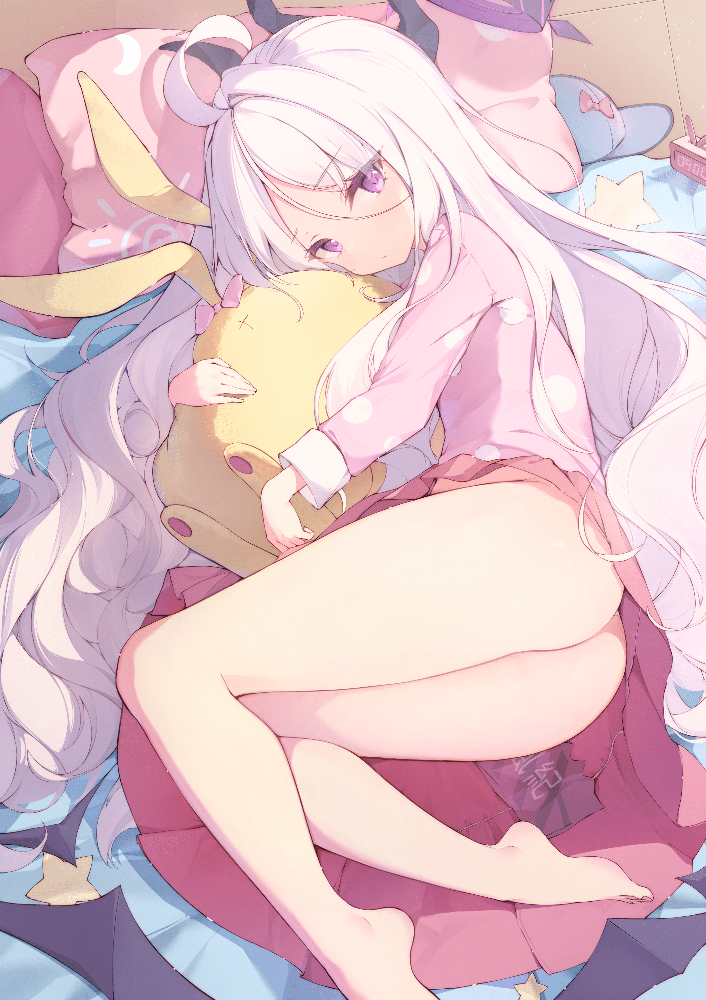

# 【温柔／minigts】自宅魔王与理想国(3.9更新)

作者：知らない

TID：32795

# 1

*本帖最後由 知らない 於 2022-3-10 00:28 編輯*

前言

　　我一向是很讨厌阅读以类似“魔王勇者”和“剑与魔法”作世界观设定的作品的，一是用的人太多而显得俗旧，二是框架和体系可能会限制想象力的发挥，三是它们往往伴随着体量极大而事无巨细的架空设定——小说搞得像网游一样，这完全是作者在自嗨嘛！如果情节严谨，那些设定只是起到增加小说娱乐性还好，要是大部分剧情都要依靠架空设定来推动，那可就太逊了。

　　于是本篇小说虽然选取了“魔王勇者”作为题材，却理所当然的是“反套路”的。还是说，在反套路勇者魔王成风的今天，这种写法才是“套路”？……

　　不管怎么说，亲笔写自己不喜欢的东西，还是会有一种傲娇表白的错觉…(并不)

　　另外，接下来简单交代背景设定(表面)的序章是全篇少数还在剑与魔法“套路”之内的东西，而本人又没做什么功课…导致完全不知道怎么写…补课的成本和收益也不平衡…真的是说都不知道怎么话。所以个人建议跳过序章直接到第一章即可。反正没什么重要的。

═════════════════════

章序 再演的Starlight？

　　这是个充斥着人类无法理解之物的大陆。

　　从蛮荒时代开始，人类就与它们相生相斗。有用肌肉和剑术武装自己的战士，有收集智慧与魔法试图看破天机奥秘的魔法师，有推演炼金术化万物为己用的炼金术师，还有集众家之所长，魔武双修的圣骑士……

　　以及精灵、巨龙、亡灵…这些可以或多或少操纵魔法，被人类统称为“魔族”的非人之物。

　　所谓“魔法”虽然可以为人类所用，却也只是在实验中误打误撞总结出来一些“经验谈”，进而用这些“规则”进行简单的分解重组，其根源的原理尚未被人类所理解。而“魔族”要比魔法更加神秘。它们无法理解，难以驯化，脾性喜怒无常，更有性情凶恶以人类为食的个体或族群存在，还比人类拥有更强大的肉体或更好的魔法相性。人类与魔族的战争在教会编撰的史书中仅纸面记载的就有大大小小十余次。

　　而坐落于大陆极北之地尽头的魔王城，便是所有高智慧魔族的大本营，传说城中每一千年轮回便会诞下一位象征灾厄的魔族之王，本就噬人咽骨的魔族在他的带领之下将更加残暴，最终给世界带来地狱般的动乱与屠杀。

　　当然，有象征灾厄的魔王，自然也有与之相对的正义存在。而我就是由各国国王御手授勋的，当今时代的勇者。击败杀死新生的魔王，为人类赢得下一个千年之前的和平与安宁，是我唯一的职责。

　　……

　　“呜——”

　　剑刃斩入披着厚重鳞片的脖颈之中，卡顿片刻，带着电光火花和血肉旋出，悲怆的龙吟也戛然而止。

　　地下迷宫尽头最后一条恶龙那兀满毒刺的头颅终于被我砍下，通往魔王城的必经之路也至此畅通无阻。

　　走出地道，四周尽是枝杈狞立的枯树，极目远眺，隐约可见数根尖塔状的漆黑轮廓耸立于枯木重围之中。方向不会有错。

　　跋山涉水，游历诸国，跨过大陆进三分之二的土地，如今这场艰苦卓绝的旅程终于要被划上句号。

　　“这一天，终于来了……”

　　我拭去刃上热血，收剑归鞘，毫无迟疑地向魔王城方向迈开步伐。

<ignore_js_op>

**20220302_214910.jpg** *(971.82 KB, 下載次數: 0)*

[下載附件](forum.php?mod=attachment&aid=OTQ0MDZ8NjEwNDMyYTV8MTY0NzcwMzIwNXwxODIzMHwzMjc5NQ%3D%3D&nothumb=yes)

2022-3-9 09:29 上傳

<ignore_js_op>

**-6a8ed4806b5a6292.png** *(4.68 MB, 下載次數: 0)*

[下載附件](forum.php?mod=attachment&aid=OTQ0MDV8MDY1MDEyYzV8MTY0NzcwMzIwNXwxODIzMHwzMjc5NQ%3D%3D&nothumb=yes)

2022-3-9 09:29 上傳

(不是hina的同人嗷，只是感觉和女主人设意外地很像所以放两张图在这里)

# 2

章一 这刀，岂是你配用的！

　　魔王城正殿的玄色大门古朴而厚重，雕塑纹路和鎏金饰边更是为大门增添一层立体的美感。

　　感觉老老实实敲门并不是什么有仪式感的选择，当然这种时候也不能再因为建筑艺术而束手束脚。

　　我握紧手中利刃，灌注魔力，横向向大门挥出一剑——

　　“嗡——”

　　紫色的法阵纹路于门上浮现，门本身却连一道擦痕都没有，反而是我的双臂被反冲魔力震得一阵发麻。

　　魔王城建筑有前代魔王遗留积累下来的魔力防御也在情理之中，不如说我不勘察弱点就贸然进攻实在是考虑不周。

　　不过这一剑也不是完全没作用。

　　比如说，门开了。

　　一位身穿朴素黑白女仆装的短发少女从缓慢开启门缝中显现身形。

　　“那…那个，哈，可以按门铃来着…”

　　少女憋得满脸通红，表情简直和那个大于号小于号对顶的可爱颜文字如出一辙。大门对于她这个等级的魔族来说果然还是太重了。

　　“抱歉抱歉…太激动了没看到…”我连忙上去搭把手，姑且是帮她把门完全推开了。

　　等等，这种和平的氛围是怎样。

　　“唉，勇者大人您来得实在有点不巧，其实我们家魔王平常都起得挺早的。”

　　女仆好像知道我的身份和来意，休息片刻就说要为我带路。我跟在后面，边走边听她抱怨。

　　“别提了，她脑筋不知道怎么就那么死，非要受那先审后播的气，我寻思小网站它不好用吗。”

　　仙沈厚剥？一种新的刀法么？

　　“这不昨天晚上有个片子突然拉稀更新了五集，她老人家抽了风一样非要全部看完，肝到半夜三点才睡觉。”

　　坦白地说，我听不懂。我明明过了魔族语六级啊。

　　“晚上不睡就算了，早上还不起，这都快十一点了，一点醒的兆头都没有。食堂的炎魔大妈忙着准备午饭，我就只能亲自厨房大殿两头跑，一遍遍的又是热饭又是叫她起床。”

　　我一时看不出这位女仆小姐是什么种类的魔族。虽然她的声音非常圆润耐听，逼逼叨叨了一路也没让我听烦，而且从清秀稚嫩的样貌来看确实也就十八九岁。不过为了保险起见，我还是要询问清楚才能放心。

　　“那个，敢问小姐今年芳龄几何？”

　　女仆小姐很骄傲地甩了下头发。

　　“啊，别看我以你们人类的审美看还很年轻，但其实我出生没多久就开始侍奉魔王大人，到现在快四十年啦。”

　　果然是更年期吗。

　　越向内走，大殿内的光线就越少。我们到达目的地的时候，四周已经是伸手不见五指的程度了。

　　以经验谈来说，魔王城大殿的后方正中应该是一尊仅供魔王一人使用的王座。可面前物体的轮廓怎么看都比王座大太多。

　　“请您等一下，我去把窗帘拉开。”

　　女仆小姐从左边绕了个大弯，消失在物体后方。一串“哗啦啦”的金属碰撞声传来，阴郁至今的黑暗瞬间被驱散无踪。

　　阳光透过横梁上垂下的粉色薄纱，经褶皱和纹饰的过滤投下一片纷繁复杂的光影。淡紫色的床单从粉帐层叠下蔓出，像一幅后现代主义的抽象画。

　　魔王城大殿内部其他的装修没什么可说，压抑的配色，狰狞的造型。正常得有些俗套。

　　可这本该是王座的地方却突兀地摆着一张少女心爆棚的公主床。

　　“emmm…”

　　一个纤瘦的人影从帷帐中爬起来，两条细胳膊带动躯干用力向上拉伸，发出很放松的呼噜声。

　　放下胳膊，人影用极其缓慢的速度移动到了帷帐出口。一双精致的光脚丫从薄纱中一点点滑出，宽松的睡裤让我最多只能看到她如茭白般的脚踝。

　　一张明显没睡醒的俏脸硬顶着纱帐探出来，忽闪的眼眸中不时乍泄出一点紫光，身后一袭过臀白发在阳光下泛着金边，大量发丝被帷帐挡住，再随着其主人身体移动被带出，一根根一簇簇地散落回原位。

　　少女登场的惊艳感一点不比我刚才看到公主床时逊色。但无论是我用魔力探查她实力时真真切切感到的战栗，还是玄乎的“宿命的预兆”，都在提醒我，这位看似只有十七八岁的可爱少女，就是当今世界一切灾祸的根源、魔族之王。

　　“呼哈～…噢，女仆还有勇者君啊。两位早上好。”

　　好你个头。都快十一点半了。

　　“好了，过家家就到此为止吧。”我拔出宝剑指向少女，提防她的一举一动。魔王的个人爱好与我无关，杀了她才是我的使命。

　　魔王沉默片刻，随后不做任何防备动作，反而张开双臂，贫瘠的前胸大开，拿腔捏调地对我大喊。

　　“勇者呦！你的任务已经完成，此刻便是功成名就衣锦还乡的时刻是也！”

　　魔王顿了一下，又换回原来平淡的语气。

　　“就是说，你现在可以回家交差啦，问就说我已经被你打败了，八百年后再来。需要我的尸体么？等会用炼金术给你捏一个。别用来做什么奇怪的事哦。”

　　“噗…”

　　好像听到女仆没蚌住。

　　“你怕死？”握剑的手微微颤抖，我感觉自己根本没有被她们放在眼里。

　　“你杀不死我。”

　　“龙 槌 闪 ！”

　　懒得再多啰嗦，我先手使出一招跳劈。这一击蓄积了我全身的魔力和足足两米的重力势能，威力远超一般的全力挥砍，就算被躲开我也有信心震塌这座宫殿的半边穹顶。

　　“轰——”

　　我的手成功锤进地面，崩起一圈中村方块，但是剑却不翼而飞了。

　　“强化等级还挺高的嘛。”

　　转向声音传来的方向，我发现魔王竟举着宝剑装模作样地端详着。

　　“什么时候！？”

　　“你喊那个中二度爆表的技能名的时候。”

　　我的大脑有些无法理解这超现实的光景。于是当我发现她握拳向我肚子打来时，已经来不及了。

# 3

章二 我已经怒不可遏了！

　　“不算！我没来得及用魔力护体！…咳咳…”

　　刚才一拳捣得我胃里早饭和酸水直往喉咙眼冒，一说话就好像要开始反向喷射，早知道当时就该少吃两个包子。

　　“省省吧，回家再练两年都成，别来烦我。”

　　魔王“咣当”一下把剑扔到地上，直不起身的我只能眼睁睁看着她穿着棉拖的脚后跟逐渐走远。

　　“行了行了打完了就快去梳妆洗漱吧，您头发乱得跟耳机线一样。怎么说您好歹也算个魔王，真不想数落您，但把自己周围整得想哪个堕落天使一样成何体统？怎么给下面的晚辈树立榜样？还有您这一起晚可把我的工作直接推迟了半天，早饭的面条也铁定糗得不能喝了。‘魔王带头浪费粮食’万一出现这样的闲言碎语怎么办？……”

　　“呼哈～我知道了…你最近好啰嗦啊。”

　　“不耐烦的语气说明您还是没有意识到错误……”

　　听着两个女魔头的叽叽喳喳，我脑中突然蹦出一个想法。

　　不合常理的床、魔王奇怪的态度、大到玄幻小说家都不敢采用的实力差距…如果我中了幻术，那么一切就都说得通了。

　　而施术嫌疑最大的角色，便是第一个暴露在我面前的，我没能认出所属种族的女仆小姐。

　　这时魔王正好因为哈欠睁不开眼，女仆背对我整理床铺。现在就是最佳时机。

　　我悄悄捡起宝剑，做了一个不易察觉的蓄力动作，爆发全身力量，将剑尖向幻魔女仆的心脏以突破音障的速度刺去。

　　——

　　一切发生得太快，当我的身体已经因为墙壁的反作用力跌向地面的时候，才反应过来自己被击飞了。

　　一个柔软的物体压着我的太阳穴加速了跌落的过程，和我的头在同一时间与地面碰撞的还有早已脱手的宝剑。

　　“怎…”

　　一只裸足重重踏在我的头和剑之间的地上。大殿中荡起几声悠长的回响。

　　“不 许 对 其 他 人 出 手”

　　魔王每吐出一个音节就像是在我的肺上用力攥一把，如此强大的压迫力，几乎无法想象这和刚才懒散戏谑的语气出自同一人之口。

　　“否则和你的贱一个下场。”

　　裸足移到了剑柄上。

　　品质足以称为稀世珍宝的合金和宝石、现代冷兵器的最高杰作，在她的脚下就好像泥巴和豆糕一般脆弱，大脚趾和二脚趾只是看似很轻松地错位一夹，握把部分就变成了一根扭曲的废铁。裸足不停地原地碾动，五根玲珑玉趾像热刀切黄油一样插进剑格里乱搅一通，惨烈的金属重塑和矿石崩裂声顺着地面振动直击我的听觉中枢…

　　我终究没能抵抗住这窒息般的压力。

　　世界落入黑暗。

# 4

*本帖最後由 知らない 於 2022-3-5 21:32 編輯*

章三 战败CG？

　　我醒过来的时候，天已经再次暗下来了。

　　“我还活着啊…”

　　还以为头被踩爆了。

　　四周很黑。我试图用魔法照明，却发现自己的魔术回路好像被封印了，魔力就像河道被泥沙阻塞后的河水，只能释放出连涓涓细流都算不上的一丝。

　　忍着经脉仿佛要爆裂的酸胀感，强行点起一束小火苗，照亮了我当初认为的方圆一米的空间。

　　看墙上和地上的大坑，我似乎依旧躺在被击飞后的落点，不过身上笨重的盔甲不知去向，身下多了一床被褥和枕头，枕边还放着一张信纸。

　　信纸上的字不出所料是用魔族语写的，字迹看上去写得很急，大体上还算工整。

> 因为客房已经满了，一时腾不出空，幸好还有多余的被褥，就只能委屈您在这睡一晚啦>﹏<至于身高和魔力回路的事情还请您不要惊慌，只是魔王大人为了防止您冲动伤人采取的保险措施●v●魔王城可是世界上最安全的地方呦

> 　　明天会努力帮您争取客房的！

> 　　女仆敬上♡

　　火苗熄灭，黑暗重新聚拢过来，我因为过度催动魔力而脱力跌回地铺上。

　　女仆小姐竟然为自己准备了这么多东西，明明上午还差点杀了她。心中开始对她生出些歉意。

　　魔术回路果然是魔王做的手脚？她竟然能做到这种事？简直闻所未闻。在她面前我弱小得就像个孩子。宝剑被踩烂了，魔法无法使用，身处魔族大本营，堂堂勇者却变成了手无缚鸡之力的普通人。

　　打败我后却没有杀死我，她们想对我做什么？

　　我的理想、我的信念、我迄今为止的努力，都被她轻松地击碎了。我的故乡…还能活着回到那个地方吗？不过说回来，就算回去了也会抬不起头吧。

　　……

　　等等，“身高和魔力回路”又是什么意思？

　　……

　　不知道哪里的钟表机构不厌其烦地发出死气沉沉的嘀嗒声，除此之外便寂静地不像人世之地。眼前是高悬在黑暗中的穹顶，向我倾泻着无边无际的绝望与孤独感。无论做什么都会被空旷的黑暗吞没，无论怎样感受都得不到一点回应，空转的大脑不由得被一个个念头占据，又很快过去，换上下一个，前赴后继。

　　“——”

　　不过这种状态很快就被一串细微的脚步声打断了。

　　一个人影停在我的身侧——不过我也不确定那是个“人影”，毕竟横穿了大半个大陆的我也没见过哪里有三米多高的人形生物，我努力站立起来平视视线也不过刚刚到它胯部。

　　抬头仰望，一轮紫色的火焰恰时在我们之间点亮，我看到了她无表情的冷脸，宽松的可爱睡衣，深紫色的瞳孔，以及直垂到小腿的白发。

　　大概理解女仆说的“身高”是什么意思了。

　　大脑还没来得及检索能改变生物体型的术式有哪些，火焰就毫无预兆地熄灭，同时衣领被一股大力抓住，将整个身体带离地面。我在黑暗中无声地抵抗，不过全盛状态下尚且只有被连到晕厥的份，现在连魔法都放不出来的我更不可能对她造成一丝一毫的阻碍。我现在的样子绝对滑稽得像只不听话被抓住后颈的猫，疯狂的拳打脚踢落在她光滑的手臂皮肤上就像76mm穿甲弹15°入射BB鱼雷防护装甲，而勇者的自尊还不允许我真的像猫一样用挠的和咬的。

　　魔王沉默地向某个方向走了几十秒便停下来，把我扔到了一个柔软又弹性极佳的平面上。

　　经过窗帘的过滤，原本冷冽的月光照在大殿里就只剩了些朦朦胧胧的意境，让人看不清任何细节，却又能看出所有东西大致的轮廓。也多亏了这微弱的光亮，让我很快认出现在所在的地方就是上午在大殿里见过的公主床。

　　已经有我两人高的魔王像尊雕塑似的抱胸立在床沿，腔调感觉很没好气。

　　“我不管你有多少问题想问，又有什么难言之隐，但是今晚你给我好好睡觉。这可是全魔王城品质最好的床铺，而且有我陪着你，再玉玉就出去喝西北风，多大的人了还哭哭啼啼的。…我最见不得人流泪了。”

　　哭？我？

　　抬手触摸脸颊，发现双腮确实有两道尚未干透的泪痕。

　　竟然被死敌看到如此不堪的一面…我的脸颊不由得有点发烫。

　　“这这这…这不重要！倒是你把我扔到床上想干什么！就算我的贞操被夺走了，精神也不会屈服的！”

　　“…你是初中生吗？还活在感觉是个女生就对自己有意思的心态里？我纯粹就是看你抹着眼泪打地铺太可怜了，要是不睡觉就再把你扔回去。别压我被子。”

　　身下的被子突然被抽走，我也跟着在床单上滚了两圈。

　　魔王背对着我躺下，床面传来明显的下沉感。

　　我精神紧绷地盯了一会，见魔王没有其他行动，才松了口气，稍微打量起这个“放大”了的世界。

　　二倍体型差让她身上的每一处曲线都向我施加着比之前更强的冲击力和吸引力，月光和公主床陈设共同营造的朦胧氛围让未经人事的我有些心跳加速。眼前的光景过于超现实，以至于我对自己的身份和一直以来坚持的目标都产生了些许迷惑。

　　“我的身高和魔术回路都是你干的？”

　　冒着被扔回地铺的风险，我问。

　　“是。在我完全信任你不会再有伤人的意图之前就先委屈你保持这个状态。不过不用担心，我会保证你的安全。”

　　“……”算了，想必就算抗议也不会有任何效果。

　　“对了，”她顿了顿。“上午的时候是我冲动了，向你道个歉。不过你挨那两下还真不冤，要不是我反应及时就出魔命了。”

　　我不由得愣了一下。

　　“…你真的是魔王？”我忍不住问她。

　　说实话，我越来越难以将身旁的少女与教会的宣传中那种妄图征服世界、使大陆生灵涂炭的魔王重合在一起。

　　会因为熬夜睡过头，见到我若无其事地打招呼，打败了我也没有下杀手，反而关心我的情绪，甘愿同床共枕，甚至因为暴打我的事向我道歉。

　　完全没有一点死敌的样子。

　　“我不像？”

　　“嗯…至少，头上要有一对角，背后再长一对蝙蝠翅膀…”

　　“是不是还要残忍凶暴、作恶多端？”

　　“这两点倒是符合…不不不这是你说的，我可没提。”

　　“…刻板印象。”

　　她小声嘟囔了一句。

　　“世界并不是大多数人想当然的样子…在这里待几天你就明白了。”

　　“就不能放我走吗…”

　　“在·得·到·我·的·信·任·之·前，不能。”

　　“那我怎么才能让你相信我？”

　　这句话之后就没了应答，不知道是不想回答，还是她真的困了。没过多久侧耳就传来了均匀的呼吸声。

# 5

章四 在魔王城说晚安

　　当时我还想不通为什么大殿内只住着魔王一人，床上的枕头却有两个。不过能让我和她保持距离，不至于共用一个枕头，总不是件坏事。

　　但是，我依然失眠了。

　　也难怪，从上午十一点一直昏睡到现在半夜一点，如果还能继续睡，怕不是上辈子是在某不变质网站当审核加班加到猝死的。

　　况且还是在魔王的床上。

　　极北之地的夜很冷，大殿里估计也没有什么取暖设施，刺骨的凉气不时从身体和被子的空隙间溜进被窝，夺走我的体温，也强迫着大脑保持清醒。

　　可能是体型变化加剧了神经对温度的敏感程度，我感觉一旁魔王的躯体如同火炉一般散发着融融暖意，简直就像…不，这就是恶魔的诱惑。

　　我慢慢把身体转个180°，让视线正对魔王的睡颜。她的睡相不怎么老实，姿势已由背对我变成了平躺。一米多长的银白长发像被倾倒的瓶中水一样流泻在枕头和床单上，裸露在外的皮肤在月光下泛着凝脂似的光泽。鼻翼不易察觉地起伏着，安详恬静的面容宛如活在每个男人理想中的纯真实妹，完全看不出是站在魔族顶点的魔王，还是旁边躺着个陌生男人兼宿敌的情况。

　　“稍微挨近一点…也没事吧？”

　　毕竟没有碳基生物能拒绝寒夜里的火炉。

　　我小心翼翼地一点点挪过去，紧靠她的右臂躺下。结束的时候意外碰到了她的手指，紧接着我便感觉她的右手颤了一下，反手握住了我的左腿。

　　“对对对不起我不是故意——”

　　左腿被向内拽，魔王的左胳膊也伸过来，搂着我的脖子，将我抱进怀里。

　　这不过是一个呼吸之内发生的动作。本来已经开始组织遗言的我，大脑瞬间宕机了。

　　她的睡衣比看上去还要轻薄，身材也没想象中那么纤瘦，布料下极富柔韧性的曲线几乎毫无保留地传给了我全身的神经细胞，温热柔软的肉体像睡袋一样包覆住我的全身，紧密到我可以清楚地捕捉到她呼吸带起的轻微胸腹起伏。右脸颊从一块软乎乎的肉团处感到一串均匀的振动。耳边是两人一快一慢的心跳声。

　　“……”

　　憋气憋到极限也没等到她有其他攻击性动作。中途甚至还蜷起双腿把我的下半身也夹在了胯下。

　　“嘿嘿…佩洛洛大人…我的佩洛洛大人…姆nia姆nia…”

　　“……梦话？”

　　我稍微放下了心，如果全是她梦中无意的行为，之后我狡辩起来也不会有太大心理负担了。

　　她的大腿弹性极佳，一开始还觉得下半身有点重，不过很快就适应了这种轻微的压迫感，甚至还有活动的余裕，让我彻底打消了要挣脱的想法。

　　不，不如说，就算双腿被压到血流不畅坏死截肢，我也不一定会生出逃跑的念头吧。

　　“好暖和…”

　　“像是被扔进了棉花里”这种浅薄的比喻简直是对她的侮辱，均匀的心跳和吐息、温润的触觉和气氛…这种由平和的生命力带来的抚慰是任何无机质寝具都无法达到的效果。

　　恰到好处的体温煨得大脑昏昏沉沉。似乎感觉夹着脸颊的两块肉团在轻轻磨蹭。紧绷的弦变得松弛，肌肉使不上力。…嗯？什么？她的梦话我也已经听不清了。身份、命运、责任…那些曾无时无刻压在我身上的重物突然飘得好远。回忆开始翻涌上来，浮现出无数凝重而阴郁的人、事、物。但它们慢慢也都在眼前模糊了轮廓，最终消散在这温婉娴静的月夜里。

# 6

*本帖最後由 知らない 於 2022-3-5 21:27 編輯*

章五 陌 生 的 天 花 板

　　“哇…好亮…”

　　这次醒来的感觉还算正常，只是右方照过来的阳光闪得我一时睁不开眼。下意识地在周围乱摸了两下，似乎只剩下蓬松的被子盖在身上。

　　“既然醒了就快过来吃早饭喽，勇者大人。已经等您很久了。”

　　“…谁？哪儿？…”

　　等瞳孔适应了阳光，我才看见床右边的窗台下有一张小圆桌，魔王和女仆小姐就在上面慢悠悠地喝着早茶。

　　“嘿咻…。好了，请慢用～”

　　为了能让我够到桌面，女仆小姐亲自把我抱到了一张高凳上。期间我的记忆则不断反刍着昨天我向她捅刀子的画面，脸颊愈发地滚烫。

　　早饭配置很普通，没有印象中那种人肉宴或满是眼球和触须的魔族食材。半块黄油吐司，半个煎蛋，半条培根，半杯——对现在的我来说是半碗的牛奶。

　　吐司和培根或许因为放时间长了，有点凉，但煎蛋残留的热量还算的上温热，而且煎蛋的火候控制肉眼可见的精妙。煎蛋底面是恰到好处的焦皮，为蛋的口感赋予了层次感，又没有苦涩的糊味；煎蛋正面则像是刚刚凝固便停止加热，托起的时候甚至可以观察到蛋白果冻般的抖动，下口咬开，蛋黄绵腻，蛋白软嫩，却不见溏心，真乃满口流香…

　　“勇者酱喜欢吃蛋黄还是蛋白？”

　　我还沉湎于煎蛋的美味之中无法抽身，魔王却突然搭话将我的幻想打散了。真是个不懂得察言观色的女人。我在心中暗骂。

　　“跟你有什么关系？”

　　“当然有啦。比如说下回我可以帮你精准吃掉蛋黄或蛋白，不用再拿刀切。女仆酱煎的这种一面焦一面嫩的蛋切起来还真有点麻烦。”

　　“…我他妈谢谢你。我还是更喜欢两部分一起吃。”

　　魔王吐了吐舌头。

　　吃完固体食物，我趁着牛奶还有一丝热气，准备一口饮尽。捧起茶杯，第一口牛奶刚灌满口腔，魔王就又出声了。

　　“勇者大人感觉魔王城的早餐如何？”

　　“嗯。”

　　“不要那么敷衍嘛。昨晚睡得怎么样？”

　　“嗯。”

　　“生物钟调整回来了没？”

　　“嗯。”

　　“会不会想家？”

　　“嗯。”

　　“我的胸软不软？”

　　“嗯。…什…咳、咳咳咳…！！”

　　我喷出的牛奶染白了半边圆桌。

　　“啊啊啊啊，真是的，魔王大人太坏了，调戏勇者大人也就算了，还凭空给我增加工作量。”女仆小姐连忙拿出抹布擦拭，还不忘轻拍我的后背。

　　“抱歉抱歉。”魔王淡定地擦去脸上的白色液体。“不过，勇者酱倒也不用太紧张，我不主动去抱，你不可能挤进我怀里这点事我还是清楚的。毕竟我也不是那种硬要碰瓷说你摸了我的腚的钕〇，你在我衣服上留下水迹的事我就当没发生过了…虽然很不爽。”

　　“呃…水迹…？”

　　难道是昨晚因为身体接触太紧密没能把持住？应该不会，这种非常容易刻骨铭心的经历，我却根本就没有类似的记忆……

　　…不。我回想起来了。那根本就不是什么生理反应留下的痕迹。

　　瞳孔猛地放大，背后渗出冷汗，头皮好像被头发向外拉一样发麻，心脏因为恐惧而跳得厉害。

　　头脑陷入一阵眩晕。听着两人交谈的声音，都好像来自千里之外。

　　“只是被抱住就控制不住自己的生理反应，处男还真是一种可悲的生物…”

　　“诶…可是魔王大人也还是处女吧，况且勇者大人比您还年轻了一百多…”

　　“啧，你这家伙怎么胳膊肘往外拐…”

　　……

　　我努力站起来，尴尬地笑笑，想着至少先从大殿离开。

　　“感谢魔王大人的宽宏大量和不杀之恩…所以为了防止这种情况再出现，我还是自己住一间单独的客房比较好。女仆小姐，可以麻烦您为我带路吗…？”

　　女仆小姐向魔王抛去询问的眼神。

　　“嗯嗯…”魔王双臂抱胸闭起眼装模作样地点了点头。“所言极是。不过在这之前，勇者酱，我要先问你一个问题。我看你没怎么犹豫就开始对着早餐大快朵颐，难道就不怕我在食物里下毒么？”

　　很奇怪的问题。我稍微思考了一下。

　　“因为我的食物都是半份，而女仆小姐在帮我上座途中我就注意到你的餐盘里正好多了整整齐齐的半份，于是我猜测我被切走的半份是不是就在你的餐盘里，后来我们的对话也证实了这个推论。况且我好歹也是帝国钦定的勇者，食物里有毒药我一般用舌尖试一下就可以察觉到。再说以你的实力，对付我也没有下毒的必要吧？”

　　“这样啊，那我就放心了。”

　　“…放心？”

　　“指‘他不会免疫或者有解药吧’这种啦。”魔王用右小臂撑住桌面，手心托着下巴，嘴角泛起一点弧度，一双闪着紫光的眸子直勾勾地盯着我。

　　“勇者酱，你说啊，有没有一种可能，嗯，就是说，我下的这种药，只对人类有效，而魔族可以完全免疫？”

　　“绝～无可能。从来没听说过。…啊嘞…？好像有点晕…呃……”

　　一波汹涌的困意突然从四面八方围过来，我的双眼不自觉地开始打粘。隐约听见女仆小姐在急切地叫我的名字，不过很快就被魔王喝止了。听觉中枢最后能接受到的一句话，也是来自她的。

　　“女仆酱。给我把他扔去，喂魅魔。”

# 7

> 哈姆咳的 發表於 2022-3-7 23:56

> 这文梗不少啊 开头刺了某b一刀，中间吸引军迷，动漫（漫画）在魔王城说晚安（幻视），有没有一种可能…… ...

动画不管哪个平台都要先审后播，刺的倒也不是阿b

梗确实玩了不少，没事干可以配合搜索引擎找找(  

# 8

章六 温淫而知纯(淫らを温ねて正しきを知るっ)

　　第一次见到她时，她还蹲在溪边浣洗衣物。娇小的身躯和乱糟糟的银灰色短发似乎暗示着并不宽裕的生活条件，尚可遮羞的短褐下却裸着令人印象深刻的健康肤色。

　　我一向是不喜欢傍晚的。阳光由明变暗，温度由暖转凉，似乎总透着一股离别的忧郁。但她急切跑近时那带着一丝担忧的容颜，却给了负伤的我生命中最美的夕阳。

　　那三天我一直在后悔，为什么被魔物偷袭时没能伤得更重一点？那样我也许就能有理由在她家休整更长时间。她的身影就像针对我心灵的成瘾药，越是得到就越想渴求。渴求包扎时的温存，相拥夜话时的纯真，伤愈后的安心，还有…告别挥下的眼泪。

　　我一向是不喜欢傍晚的。

　　时隔多年，我依然记得她如何用干净的嗓音呼唤我。

　　“……！…”

　　嗯…叫我什么来着。

　　“……哥！…”

　　…对，好像就是这个。

　　……

　　“…勇者哥哥！”

　　“呜哇！…你吼辣么大声干什么嘛！…诶…？”

　　起床气刚想发作，就被眼前的面庞硬生生憋了回去。

　　堪堪到脖子的银色卷发，中纬度阳光塑就的小麦色皮肤，就连梨花带雨的可爱模样都与多年前分别时别无二致。

　　“勇者哥哥你终于醒了！还以为你再也醒不过来了呜呜…”

　　我似乎躺在一张很大的床上，她就在我身上跨坐着，两条纤长的手臂一左一右撑在两旁。

　　我伸手抚摸她的头发，试图安慰她。

　　“没事的，哥哥没…！唔…”

　　话语无法吐出。

　　她的脸突然压过来，近到我的视野只能容纳她娟秀的鼻梁，近到我的脸能清晰地享受她紊乱而炽热的吐息。

　　嘴唇感到一阵令人心悸的柔软，一个湿乎乎的东西闯进嘴里。

　　我被强吻了。

　　我现在的体型太过可怜，与其说是舌吻，不如说是她在单方面抽插我的口腔。我的舌头没有任何主动权，完全顺从着她身上最有力的那块肌肉的摆弄，一退再退，被搅得乱七八糟。

　　在这场暴乱中，她的舌尖无疑是最积极的那个。它总是引领着后方宽厚的舌面绞卷摩挲我那可怜的舌头，或是中途休息一下，调皮地轻轻划拨上颚，让我因为口腔和心底的瘙痒而全身难以自已地发起痉挛。有时它又十分粗心地深入咽喉，舔舐出一点点吐意，以至于我必须尽全力应付她的舌头并专心吞下源源不断濡来的唾液，以防被这些突发状况呛到。

　　 ……

　　这一定是梦。和她做这种事，我甚至想都没敢想过。

　　“为什么…”

　　被吻到脱力原来真的不是假话，现在的我只是吐出这三个字都需要费尽全身力气。

　　“勇者哥哥…不是一直想和我做这种事吗…？”

　　依旧粗重的吐息从脸庞慢慢转移到右耳，又湿又热的气流拂过耳廓，顺着耳道直达大脑，每吐出一个字就代表着更剧烈的增压，像电流一样让我半边身子陷入极乐般的酥麻。我不知道怎么思考，想不到如何动作。我好像还清晰地听着她喃喃的低语，又好像什么都听不到了，只是在她在用一边倒的肉体厮磨交流着我们各自的意愿。

　　“我也想…和勇者哥哥一起…”

　　她在接吻期间就不知不觉变换了姿势，转而用两条长腿侧着将我的身体挟进胯下。她也并不满足于此，进而像是在细心的操纵一台脚踏式缝纫机一般，双腿不断缓慢挪移，调整着与我接触的每一寸肌肤。她的力量对现在的我来说是难以抵抗的，以至于我总被她身上粗糙的亚麻布磨得生疼，但也正因如此，接触到她裸露在外的细腻皮肤时才会更显得像久旱逢甘露一般难能可贵。

　　“求求你…哥哥…不要拒绝我…”

　　我逐渐主动，变得急不可耐，双手开始撕扯她身上那些碍事的破布。她并不阻拦，但也不完全纵容，只允许我在她需要的时刻配合她的行动，火候过旺时便会用不容置疑的力量压制住，以将节奏牢牢掌握在她自己手中。

　　我终于将她的下半身完全解放。她突然再次夹过来，两条大腿一上一下挤压着我的胸口。也许是察觉到我逐渐困难的呼吸，她又将大腿慢慢滑下去，细细地推过那顶不屈的小帐篷——

　　这终于成了压垮我的最后一块铅石。

　　只在春梦…不，比春梦中体验过的还要强烈千百倍的快感划过已如乌云夜空般混沌的大脑。

　　“啊…”

　　力量极速流失，转而是潮水般的无力感席卷而来。

　　“…不，不够，呼…还要更多…”

　　夜空响起一声炸雷。

　　她反复亲抿我的耳垂，湿糯的舌尖尽力伸进更深处舔舐，像是在吸食我那已经被她的吐息融化的脑浆，好让我的下半身完全脱离残存理智的控制。

　　她用膝盖在那里划着圈，挑衅、嘲弄着它一时的软弱。于是它中计了，再次站起来企图耀武扬威地展示它的勇猛。

　　可它在她面前仍旧是弱小的。我感到她屈着的腿再次压迫上来，它也毫无悬念的被膝盖压倒，屈辱的接受紧接而来的小腿蹂躏。她的肌肤即使隔着衣物也仍旧发挥着摄人心魄的魅力，更别说最后凸凹有致的完美足部，在布料外滑动时传来的美妙触感反而多了一层偷情般的氛围。朦胧、隐秘，予以我足够惊险刺激的心跳体验。

　　“哈…哥哥…很喜欢这个吧…？”

　　丢盔弃甲也为时已晚，她的脚丫已经瞄准了衣物间的缝隙，长驱直入，立取敌首。敌军的营帐瞬间化为她执行审判的牢笼，它即使偶尔能够因她的疏忽屹立也似缴械前的回光返照。有时是脚趾，有时是脚弓，有时是脚踝。挟扣、拨弄、交替厮磨…这是她作为战胜者的权力，尊严尽失的我只能发出一声声哀求般的喘息，交纳出一次次赔款，驱使她践踏得更加用力…

　　……

　　“还不够哦，勇者哥哥…”

　　……

　　“哥哥…我爱你…满足我吧…”

　　……

　　“不够…更多…”

　　……

══════════════════════

　　用舌尖刮上颚真的会痒到无法承受。好想被女孩子这样对待啊。

# 9

*本帖最後由 知らない 於 2022-3-9 09:13 編輯*

章七 飞来的女子有底裤吗

　　抛开不好的方面来说，“涓滴不剩”也算是一种新奇又少见的体验。尤其是我之前还多次被强制昏睡，明明身体又酸又麻连一根手指都动不了，头脑却清醒得可怕，简直像是在坐牢。

　　周围的环境似乎预示着刚才的经历并非只是单纯的梦境。一模一样的房间，一模一样的大床，除了被子像蚕蛹一样给我捆了个结结实实，不知道是谁干的。不过现在房间内没有其他乐子人存在就已经是老天爷开眼了，如果这时候旁边还站着一个努力憋着坏笑的魔王和满脸怜悯的女仆，我可真就受不了了…

　　吱呀——

　　我才这样想着，房间门就被推开了。

　　“呦，你醒啦。”

　　来者非常不客气，进了门就直接爬上床，在我身前盘腿坐下。

　　“…你谁啊。”

　　这是个很高的女孩子——并非是说现在缩水了一半的我的主观感受，而是非常客观的推断，就算我恢复原版身高估计也要比她矮一点。

　　她上半身只披了一件纯白的半透明蕾丝边睡裙，薄纱由胸口下方向两边分开，露出光滑平坦的小腹。下半身是一件宽松的短裤，盘腿的姿势正好能让我的视线穿过大腿和短裤之间的空隙，窥见深处疑似真空的黑暗。

　　少女闭起眼随意甩了甩脑后靓丽的淡粉色长发，一股洗发水和沐浴露的香气随即扑过来。我注意到她裸露在外的白皙肌肤上还有一些尚未干透的水珠。

　　“我们才刚刚云雨过多久，就不记得我了？”

　　“不要用那种看负心汉的表情对着我，除非你下次用真身来一遍再问。”

　　感谢我为了背诵咒文而练习出的记忆力，让我还能记得昏迷前魔王说的最后一句话。而魅魔能够幻化成他人意中人的能力我也有所耳闻。

　　“呀，你还挺敏锐的嘛。我还以为勇者小处男会哭着问我刚才那个银发小女孩去哪儿了呢。”

　　少女背后伸出一对漆黑的小恶魔翅膀和尖端长成心形的小尾巴，炫耀似的晃了两下。

　　“你们魔王城对处男是不是有什么怨念…比起这个，魅魔小姐，我想拜托你一件事。”

　　“不帮。”

　　“我可以当你的长期食堂。”

　　“已经是了。”

　　“…我草…那，随身便当盒呢。”

　　“这个玩法不错。嗯姆，说吧。”

　　“可以请魅魔小姐…”

　　“叫姐姐。”

　　“我tm…呼…”

　　默念两遍不生气，长命百岁生如意。

　　“魅魔姐姐，可以请你帮我一个忙吗？”

　　“说。”

　　“带我去找魔王。”

　　“不帮。”

　　要不是被她榨得没力气还被被子捆住了，我绝对要把她绑在十字架上用柜子撞她的小脚趾。

　　魅魔一副理所当然的表情看着我。

　　“那个宅女给我的任务就是尽量别让你去烦她，不然我为什么要费那么大力气榨干你还用被子捆住。我可不想惹恼她，不然后果会很可怕的。唔…现在还是觉得好撑…”

　　说到这，我又对另一个话题起了兴致。

　　“宅女？指魔王吗？很可怕的后果又是什么？我感觉她一般不会很暴力地对待别人吧…大概。”

　　“嗯…借鉴以往类似事件的话，大概率会被强制调去下地种田。说实话，我宁愿她打我一顿。在大太阳底下累得要死不说，还容易晒黑皮肤。要是因为这个今后觅食的时候对男人的吸引力降低，才是最要命的。”

　　“…哈？”

　　“你以为魔族都是永动机么？除去我们魅魔不说，绝大多数魔族都是要吃饭的。”

　　“不是说这个。明明黑皮和晒痕才是最色的好吧？”

　　她的脸顿时黑了。

　　“哈？难道不是白嫩无暇的肌肤才最能体现少女的美妙？”

　　“略略略，在这方面男人才最有发言权，你们这些对少女之美一无所知的异性恋女人就不要乱指点江山了。”

　　“尼娅的给我放尊重点，女人抛弃了繁殖的冲动干扰才能更好的欣赏女人，你们这些只知色不知美的黄色废料垃圾桶！”

　　“打死我吧你打死我吧！魔王肯定没让你榨死我要是我死了她肯定罚你去太阳底下晒成黑皮到时候你就懂我有多么正确了唔姆姆…”

　　扣，扣，扣。

　　房间外传来不合时宜的敲门声。已经骑到我身上开始扯我腮帮子的魅魔应声停下了双手。

　　“谁？你叫的来蹭饭的姐妹？”

　　“我还想问你。我就是叫两个巨型哥布林爆你菊也不会让人来蹭饭。”

　　魅魔小姐从我身上下来，快速理了理散乱的发丝。

　　“那个，请进。”

══════════════════════

　　说起来写到第三章的时候突然发现这个魔王的人设有些太像ブルーアーカイブ的空崎ヒナ了。战力都很高，都有“魔王”之名，都有超级可爱的睡衣形态(我的魔王好像只有睡衣形态XD)，如果去掉hina的光环、翅膀和角，外貌硬件就几乎一模一样了。不过好在魔王大人的性格和hina是完全不同的。

　　楼主现在的网络好像不太好，之后网络顺畅的话会在一楼放几张hina的图片( *ˊᵕˋ)✩︎‧₊</ignore_js_op></ignore_js_op>