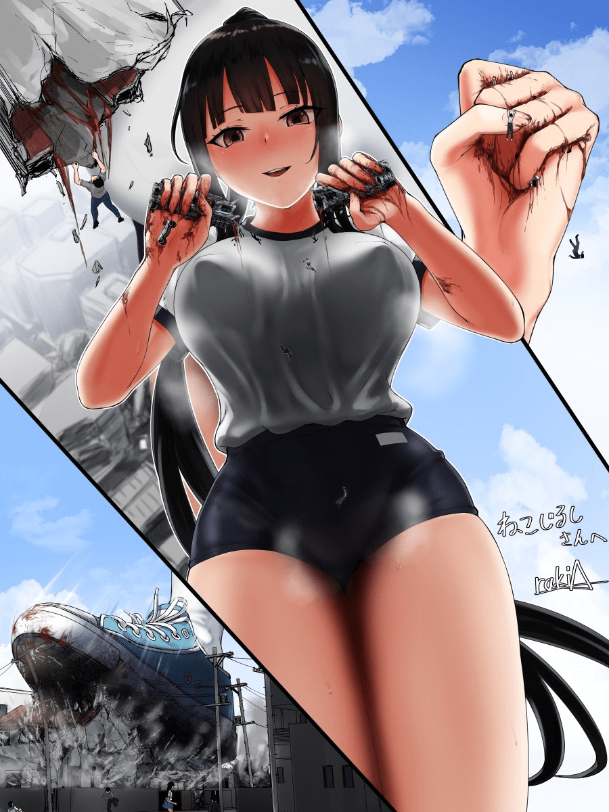

# 【翻译】2.26更新 大海！死库水！！还有巨大少女！！！（...

作者：乔治·华盛顿

TID：32589

# 1

*本帖最後由 乔治·华盛顿 於 2022-2-26 20:12 編輯*

大家好~

我是乔治·华盛顿。

今天带来的是ICECAT的佳作《海だ！スク水だ！！巨大娘だ！！！》

一如既往地拥有丰富的破坏描写，同时用细腻的文笔勾勒出女主角的心路历程、态度转变，使得文章中的人物性格十分鲜明，可谓是一片上乘的佳作。

本作为该系列第一篇，内容描述名叫榊千花的少女在大海中遭遇事故，醒来后发现自己成为了1000倍的巨大少女，随后对城市开展破坏的故事。

第二篇作为第一篇的续集，主要讲述千花虐杀赶来的航空母舰编队的故事。

碍于本人水平尚浅，在本作的翻译中对某些难以理解的词句、谚语进行了意会，还望多多谅解。

嗯，如果新入站的朋友们也能喜欢我的作品的话，我会很高兴的。

最后，欢迎大家浏览我的其他翻译/原创作品

————————————《海だ！スク水だ！！巨大娘だ！！！》————————————

大海。

广阔无边，是万物的母亲、生命的起源。

与被黑暗封闭的寂静、未知的深海不同，碧蓝的水面泛起涟漪，沐浴在盛夏的阳光下闪闪发光。

今天，玉津岛的大海也闪耀着蓝色的光辉，比大都市的海港更加清澈。

美丽的大海，平静悠闲，然而海面却是一片寂静。

简直就好像即将发生的大暴风雨的前兆一样。

穿着深蓝色学校泳衣的少女正在那片海上优雅地游泳。

她的名字是榊千花，是当地高中游泳部的女生。

容貌秀丽，学业、运动都很优秀，而且是出身名门的大小姐，品行端正，可谓是完美本身的代名词。

本人虽然可能没有注意到，但在校内很受欢迎，甚至有专属的粉丝俱乐部。

结果就是，在海边游泳的时候，仰慕者在岸上不知不觉的聚集了起来，虽然并不讨厌，但还是有些不好意思。

他人的目光会使自己不能集中精力，所以今天也要避开人们的目光，去往离岸边稍远一些的海域。

千花在比平时更加平静、寂静的大海中悠然自得的畅游。

但是，当她游到某个地方时，却遭遇了异变。

周围的海水突然闪耀出五彩的光芒，啪嗒啪嗒地浮起气泡，甚至有几条死鱼浮到了海面上。

（毒气…！？）是不是突然冒出了什么不好的气体？

感到不妙的千花，立刻屏住了呼吸，尝试远离这片海域，但是慌忙之中屏住呼吸所能坚持的时间是在不长。

感到肺部疼痛的千花最终无力支撑，被迫浮上海面大口呼吸空气。

当然，那个从海水中涌出的不明气体也跟着一起吸入了。

（…呃…怎么回事……什么啊……感觉好舒服……）奇妙的感觉一转眼就充满了她的整个身体，这可能是一种未知的物质。

一开始，轻微的头晕袭来，接着身体慢慢变得疲倦，甚至开始失去平衡感，不久之后手脚也几乎没有力气了。

（已经……不行了……）

然后，千花在大海的正中央陷入了昏迷……

＊ ＊ ＊ ＊ ＊

回过神来，我好像漂流到了某个浅滩上。

大概是运气好，海浪把我带到附近的无人岛上了吧。

但如果是那样的话，为什么完全看不见附近的风景呢？

哪怕站起来环视周围也是一样的。

哪里都看不到来时的小岛。

放眼望去，只有海和天空在蔓延。

周围也只有几个长着苔藓的岩礁。

现在所在的地方似乎也只是一个足以一步跨过的小礁石。

“到底是怎么回事……”

莫非是随着海流飘到了遥远的地方？

“这样的话或许很难得救了吧……”

但即使发牢骚，也什么都改变不了。

“如果有什么线索的话就好了……”

怀着这样的想法，我再一次蹲下好好观察岩礁。

这种时候，一般都会找找看附近可能会有的线索。

首先是脚下的小礁石。

…只是一块普通的礁石。

接着，将它与旁边稍大的岩礁对比。

“……嗯？…这是…？”

绿苔中星罗棋布着丰富多彩的石子。

凝神仔细一看，那些好像是一幢幢小房子。

大小大概是可以轻松放在小指上的、极小的尺寸，但是形状和颜色却各不相同，越看越能发现细节部分都做得很精密。

这样的小型房屋到处散布着，而且在房屋和房屋之间，铺上了道路似的线。

“啊，做得真好啊。到底是谁做的呢？”

这样的的成果令人佩服。

除了大小之外，和真的一模一样。

道路上竟然还跑着车，尽管速度非常慢，但确实在跑着…在跑！？

芝麻大小的汽车并不是被风吹着，而是沿着道路前进。

而且，仔细一看，能隐约看到像罂粟粒一样的物体…。

虽然不像是昆虫，却是非常眼熟的矮小生物。

试着将指尖伸向地面，慎重地挖出地面的一部分，观察它们，也许是多心了吧，仅仅1mm左右的物体看上去简直就像是变小的人类。

“不，不会吧……但是，那种事……”

不，还不能断定。

尽管还不能完全断定…

但是，映入眼帘的却是记忆中存在的光景。

总之先把手指尖上的地面轻轻地放回原来的地方，然后将目光沿着道路移动，首先看到的是民房林立的海岸大道。

对，再往前走，有一所刚刚改建了校舍的小学，在那前面有一座神社，它的前面有三座鸟居。

观察了其他地方，发现和自己所生活的玉津岛形状一模一样，只有大小不同。

也就是说…

“哇，我……变大了吗…？”

实在是难以置信。

但是，眼前的小小礁石，确实是玉津岛。

住宅、学校、商店街……

虽然这是第一次从空中看到，但我对这一切都有印象。

与模型不同，也有人，车在行驶，虽然很小，但却能感受到生命的气息。

当然，我也稍微考虑过玉津岛变小的可能性，但是周围的风景也一起变小了，地球本身也看起来很圆，所以应该不是。

也就是说，我好像真的变大了。

而且变得非常大的。

从建筑物和岛的大小来推测，恐怕…

“1000倍……”

对于这个太过不可思议的数字，我目瞪口呆。

我原本的身高大概是160cm，1000倍的话，就是1600米…

总之，我现在是世界上最大的人，这点是不会错的。

不仅如此，我大概比地球上所有的建筑物都要高得多吧？

就算和大山比起来似乎也能打个平手，现在的我在人们看来，简直就像是山在动一样。

当然，如果那样巨大的我行动起来的话，确肯定会给周围带来巨大的损失，哪怕是一个不经意的动作，也会轻松地改变地形吧。

实际上，脚下的邻岛海岸线的形状已经发生了很大的变化。

到底该怎么处理这份过于强大的力量呢？（你都是ICECAT笔下的人物了，你说会怎么处理？）

无论怎么慎重地行动，无论多么小心，行动都会马上演变成大破坏，而且会在不知不觉中伤害到人们。

光是那样想就觉得可怕。

如果在玉津岛登陆的话，广阔的土地和房屋就会在我的赤脚下消失吧。

一瞬间就会把在那里的很多人卷进破坏里。

但是，另一方面，心中也有一种难以言喻的优越感。

如果变得这么大的话，什么都可以按照自己的想法去做…

谁也无法违抗我。

谁也不可能从我脚下逃开。

破坏也好，杀戮也好，统治世界也好，创造天地也好，一切都随心所欲。

不管是哪一个，都是平时想都没想过的事情，但不知为何，我现在被那些想法吸引了。

实在是很甘甜、非常有魅力的诱惑。

当然也是绝对不能尝的禁断的果实。

但是……这样大小的话，恐怕是无法和人们共存的，但我也没有理由勉强自己去迎合他们。

既然事情已经到了这个地步，索性就按照自己的想法去做吧。

“那么，先去城市看看吧……”

果然，还是想避开故乡玉津岛。

不管长得多大，我还是个人类女孩。

和什么都不想就乱闹乱闹的怪兽不同，我有理性。（你要真有理性，也就不会有这篇文章了）

而且，还没有明确的想到要做什么。

如果是城市的话，哪怕这么大的我，也许也可以和人们共存？

虽然不知道结果会是好是坏，但是那种事情等到去了之后再考虑也不迟。

然后，千花走向了“都市”。

＊ ＊ ＊ ＊ ＊

踏进大海的我，一步一步地前进。

一开始我想游泳去城市，但没想到大海对现在的我而言，实在太浅，周围比起浅滩，更像是水洼。

脚碰到海底后，海床就深深地沉了下去，尽管如此，脚踝也只是略微被打湿的程度。

在这样的浅海中，要想不被柔软的地面绊倒，只能一步步的小心地前进。

虽然往前走了一段时间，大海开始渐渐变深了，但也许是我太大了，所以海水最多也就能浸到腰附近。

虽说“大海好像浅滩一样呢”，但其实这里的深度应该在500米以上，所以这么说总觉得有点奇怪。

在大型船只能够安全航行的海域，我悠闲地走着…。

实际上，不久前海面上漂浮着一艘类似客船的船。

监尽管在我看来就像玩具船一样小而可爱，但实际上有着100m以上的大小，里面应该有着数百个小人吧。

虽然也可以什么都不做，但我对他稍微有点兴趣，于是，为了不让船被波浪淹没，我小心翼翼地靠近客船，将双手伸进船底下的海水，然后尽量温柔地把船抬到脸的高度。

“呵呵，让你受惊了吧？对不起。不过，我只是看看，所以请放心。”

我跟船上的人打了招呼，然后慢慢地观察起船。

在雪白的船体上画着几条淡蓝色的横线，好像是往返小岛和城市之间的渡船。

大概是看到恐怖的东西，战战兢兢站在甲板上的人，颤抖着逃进船舱的人……，光是看着就很享受观察人类的乐趣。

虽然变大了，但是对人们能在我的眼前逃跑还是有点不满。

另一方面，本应在大洋安全航行的渡轮却陷入了大混乱。

原本在平静的海面上一边劈开海浪，一边前进的船突然开始剧烈摇晃。

到底发生了什么事？

在甲板上的几十个人很快就知道了原因。

穿着学校泳衣的巨大的少女慢慢向船靠近。

很快船上的所有人都知道了这件事，可是即使想逃跑，在这广阔的大海中又能跑到哪里去呢？

别说游泳逃走了，就连救生艇也不能放下船。

人们在无处可逃的船上四处奔逃。

就在这时，少女也接近了，她把船从大海中捞了上来。

渡轮从海面上升到几百米的高空种。

数千吨的重量对巨大少女而言似乎完全不算什么，渡轮就这样轻松地被她拿着…

在少女的手中，是已经对自己的命运感到绝望的人们。

她对人们说：“放心吧。”。

当然，大多数人并不会因此就放心，但不知该说是勇敢还是鲁莽，几个人听到少女的话后，战战兢兢地走上了甲板。

虽然也有想看看恐怖东西的猎奇想法，但更多则是出于想要近距离欣赏美少女的心理。

不过，从甲板上只能看到少女的脸和被学校泳装包裹着的胸部，尽管如此，他们还是满足于她可爱的笑容和丰满的胸部。

结果，这十几个人被她那清澈的大眼睛盯着，几乎都逃走了。

当然，现在还有很多人在船里颤抖。

话虽如此，正如少女所说的那样，她没有对人们出手，不久之后，就小心地将船放回了海面。

“谢谢。你们可以走了。”

渡轮再次回到海上。

乘务员和乘客都充满了死里逃生的欣慰心情。

虽然结束后多少有些依依不舍，但少女不知道什么时候会变改变心意，所以在少女微笑着送别渡轮的同时，船还是全速离开了她。

不过，这艘渡船和玉津岛一样，是非常幸运的存在…

＊ ＊ ＊ ＊ ＊

在微笑着目送着缓缓离开的渡船之后，我再次向城市走去。

过了一会儿，水深又变深了，从腰，一直到胸口，都浸在水里了。

虽然这个时候开始游泳似乎也不错，但是那样的话一定会引发巨大的海浪的吧？

为了避免（小人的）牺牲，先确认一下周围有没有船。

结果，发现了右前方有一艘小船正朝这边靠近。

我虽然对不能游泳有点遗憾，但更多的还是对那艘船的行动感到惊讶。

虽然不是我的本意，但是面对我这么大的存在，按常理应该逃走才对吧，这艘船到底有什么目的呢？

总之先靠近看看。

我小心的不引起太大的风浪。

尽管刻意放慢了步伐，船的速度还是远远比不上我。

那是一艘巡逻船。

船头搭载了机关炮，炮口朝向这边。

从森严的气氛来看，好像不是带着善意来的，但是，是不是因为城市被暴露在危险之中而来要求我回去呢？

确实是那样。

只不过，巡逻船用炮击代替了警告。

「………？」

小小的爆炸声不绝于耳。

但是，与其说疼痛，不如说连触感都几乎没有。

不过，不管怎么说，不经警告直接射击实在是太过分了。

炮弹也同样落在脸上。

“竟然伤害一个手无寸铁的女孩子…！”

虽然没有受伤，但我确确实实是被攻击了。

还好身体很结实，但一般来说的话，应该已经被炮弹打成马蜂窝了。

“你这是什么意思…！”

我有点生气，于是紧紧抓住了还没有停止攻击的巡逻船。

但是，不知是不是没有掌握好力度，我一下子就把船握碎了。

张开手一看，船的大部分都被压坏了，看起来很惨…

我不可思议地没有罪恶感。

倒不如说，心情很好。

只是轻轻地惩罚了攻击我的自大小船。

我没什么不对的。

不对的是，这艘过分弱小的船。

“…哼，这是你们的错。我是正当防卫喔？”

我一边说着，一边把扭曲变形的巡逻船扔了出去。

话虽如此，但还没有完全下定决心。

刚刚因为是被攻击了，所以才反击了。

接下来要做什么…还是会犹豫。

但是，到底是什么在困扰着我呢？

因为做的是坏事？

反正谁也不会怪罪我的。

因为我有理性？

反正没有任何东西能束缚我。

“……总之先游泳吧”

稍微在内心里思考了一下，但也没有得出明确的答案。

这种时候，通过游泳把一切抛之脑后就好了。

我吸了一口气，就尽情畅游了起来。

用两只脚来回拨动，分开大海，向前游去…丝毫不管周围发生的事。

结果巨浪接二连三的产生，不过，注意到这一点已经是之后的事了。

“…噗哈哈”

过了一会儿，我从大海中探出头，然后站直身体。

浪花四溅，海浪像同心圆一样扩散开来。

虽然海水一度变深，但从刚刚开始又渐渐变浅了，难以继续游下去，所以我爬起来了。

尽管如此，还是游了相当远的距离，终于可以看到陆地了。

“终于要到了……咦…！？”

虽然离盼望已久的城市只剩下一点点距离了，而且我也想马上接近陆地，但是低下头，我突然发现海面上有好几艘船翻覆，七零八落。

这么说来，刚才我还在游泳呢。

一定引起了很多海浪吧？

对我来说普通的波浪，在小人看来一定很大。

——回头一看，又看到几艘倾覆的船只了。

一定沉了很多船吧。

“啊……已经晚了吗？”

看来是意外地造成了巨大的损失。

虽然觉得后悔，刚才应该更加小心地游泳，但也没办法了。

这种行为无疑让我看起来像是怪兽吧？

话虽如此，却感觉不到难过，甚至有种终于摆脱了枷锁的感觉。

因为不管怎么努力，早晚也会是这样的结果吧？

今后也不必再去在意那些小小的人了。

反正已经发生的事，再怎么样也不可能改变结果。

那么，尽情地胡闹也不错吧。

何止是不错，光是想想就会感到兴奋。

“…我原来是这么坏的孩子吗？”

一想到自己造成了眼前的惨状还觉得没什么，令我自己都觉得有些可怕。

事到如今，再怎么努力想装成和人们和平共处的好孩子也已经晚了。

相反，今后无论怎么胡闹，坏孩子最多也就是变成更坏的孩子而已。

再说，好不容易变得这么大了，不好好享受一下的话就太可惜了。

“……好，就尽情地玩吧！”

是的，这只是玩耍而已。

破坏、杀戮之类的，也并不是多么了不起的东西。

我只是想享受罢了。

用手，用脚，用身体的各个地方享受。

这么说来，刚才握碎巡逻船的时候，心情很好。

破坏其他东西也会一样吧，不，一定会让我更加快乐吧…

首先成为目标的是全长超过300米的大型油轮。

因为离我所在的海域有点远，所以航行时并未倾覆。

最初，油轮的船头朝向千花，但是立刻就大幅度的调转船头想要避开。

但是，千花不准备放过油轮。

“啊啦，你想逃到哪里去呢？”

千华一边露出邪恶的笑容，一边慢慢地向开足引擎逃窜的油轮走来。

她以过分惊人的速度很快就地追上了船，不顾陷入恐慌的船员们，使劲地捞取海水然后淋在船上。

海水像瀑布一样涌入船体。

甲板被冲刷，船员也被冲进大海。

“能坚持到什么程度呢？”

再来多一点。

这次海水以超过刚才的量和高度倾泻。

排水工作还没来得及开展就被灌入大量海水的油轮失去了平衡，最终慢慢沉下去了。

“呵呵，真邋遢啊。”

千花嘲笑着尽管很大、却被自己用两捧海水就击沉了的油轮

接着，城市的湾内的船只接二连三地遭到袭击。

满载货物的中型集装箱船被千花抓住船体中央部分，抬到了胸部的高度，一边洒落集装箱，一边被千花的手紧紧地捏碎，裂成两部分扔进了海里。

小型油轮被一脚踩碎，然后被脚掌压进了海底，大型巡逻船在被海浪袭击、引擎进水而动弹不得时，被小腿拱了一下，简单地就翻覆了。

然后，千华的魔爪伸向了载着大量乘客的邮轮。

这艘载有近500人的客船已经结束了漫长的航行，即将停靠港口，但千花却无情地准备摧毁这艘船……

“真是一艘漂亮的客船啊，可以载我一程吗？”

说完，千花将双脚跨在船的两侧，弯下膝盖，慢慢坐在了船上。

被泳衣包裹住的巨大的屁股，慢慢覆盖了整个船的上空，然后逐渐接近，碰撞，然后粉碎了所有上层建筑。

烟囱、雷达桅杆、救生艇，然后是上层建筑。

从最高一层甲板开始，按从高到低的顺序，乘务员和乘客在什么都不知道的情况下，连同船舱一起被压坏了。

仅仅几秒钟的时间，上层建筑就完全被挤溃了，船也很快沉没了。

“啊，我有那么重吗？对不起。”

千华一边把船的残骸坐在屁股下，一边微笑着道歉。

但是，已经没有人能听到了…

除此之外，在千花前往城市的路上，几十艘各种各样的船都被千花手和脚击溃，沉入水中。

千花用脚来回撩动、摩擦、踩踏停在附近港口的船只，直到所有还漂浮在海面上的船全部翻覆或沉没为止。

至此，千花终于登上了“都市”…

＊ ＊ ＊ ＊ ＊

# 2

<ignore_js_op>[ICECAT2(RGB)(auto_scale)(Level3)(x2.000000).jpg](forum.php?mod=attachment&aid=OTM2NDJ8ZTQzMzE5Y2V8MTY0NzcwMzU0MnwxODIzMHwzMjU4OQ%3D%3D&nothumb=yes) *(375.55 KB, 下載次數: 9)*

[下載附件](forum.php?mod=attachment&aid=OTM2NDJ8ZTQzMzE5Y2V8MTY0NzcwMzU0MnwxODIzMHwzMjU4OQ%3D%3D&nothumb=yes)

2022-2-6 01:44 上傳  

[(auto_scale)(Level3)(x2.000000).jpg")](javascript:;)</ignore_js_op>  

# 3

*本帖最後由 乔治·华盛顿 於 2022-2-6 01:49 編輯*

思考了一下

女主的形象应该是这个样子的：长长的单马尾、身材姣好的运动系少女

# 4

<ignore_js_op>[fullsizerender(RGB)(auto_scale)(Level3)(x2.000000).jpg](forum.php?mod=attachment&aid=OTM2NDR8NDU4MTdlMTR8MTY0NzcwMzU0MnwxODIzMHwzMjU4OQ%3D%3D&nothumb=yes) *(1.25 MB, 下載次數: 9)*

[下載附件](forum.php?mod=attachment&aid=OTM2NDR8NDU4MTdlMTR8MTY0NzcwMzU0MnwxODIzMHwzMjU4OQ%3D%3D&nothumb=yes)

2022-2-6 01:48 上傳  

[(auto_scale)(Level3)(x2.000000).jpg")](javascript:;)</ignore_js_op>  

# 5

超巨大少女的赤脚落在了陆地上。

那是一名穿着学校泳衣的少女。

已经被她引起的海浪淹没的港口仓库群一下子被踩平，下一个瞬间，少女的巨大身体带来的强烈冲击使这一带剧烈震动。

仅仅这样，附近的建筑物就被粉碎了，甚至相隔很远的地方也有大量的建筑物轰然倒塌。

另一只脚也踏上陆地。

这次，堆积如山的集装箱群和几座大型起重机成了少女的脚垫。

这实在是过于强大而可怕的力量。

今后，她还会做出什么事来呢？

不，我真的不知道。

今后陆地也会像大海一样，所有的一切东西都被粉碎、破坏吧。

巨大的少女已经登陆了，再不逃跑的话就来不及了。

在巨大少女上岸引发的两次冲击中，有不少人摔倒，被卷入了坍塌的瓦砾中，但是大部分人都强忍剧烈的震动还有身上的伤口所带来的疼痛，不顾一切地想要逃到了内陆避难。

但是，无论眼前的景象多么可怕，人们还是会不由自主地回头看。

然后，所有回过头的人们都愣在了原地。

少女一边将右手叉在腰上，左手捋着长发，一边俯视着大城市。

端庄的容貌，长而富有光泽的头发。

从丰满的胸部向下，是纤细的腰部，再然后是修长的双腿。

再加上优雅的动作，用“美少女”这个词来形容实在是再贴切不过了。

另外，海水不断从紧贴着身体的泳装上滴落，这样的场景实在是过于美艳。

面对过分美丽的巨大少女，人们在不知不觉中看得入迷，甚至一度忘记了逃跑，但他们很快就回到了现实——

少女发出了破坏的宣言，开始行动了。

我将右脚踩在了陆地上。

因为没有能够容纳我的脚的地方，所以干脆踩在了仓库一样的东西上。

将左脚也踩在集装箱码头上，终于完成了登陆。

虽然可以马上开始破坏，但首先，要向世人展现一下我自己。

我稍稍张开腿，挺起胸膛，将右手叉在腰上，左手轻轻地撩起头发。

从底下人们的视角来看，我一定正在以凛然的表情俯视城市。

当然，不仅仅是为了展示自己，在这期间，我也仔细地观察了都市。

远处可以看到许多超高层建筑，狭窄的地面被大大小小的建筑物铺的满满当当。

除此之外，道路和铁路在建筑物的缝隙中穿行、延伸。

树木装点形成绿色只能勉强看见一点点，完全就是大都市应有的风景嘛。

**从现在开始，我会将这里化为地狱。** 

怎么破坏呢？

光是想想，身体就不由自主激动地开始打寒战。

将目光稍稍偏移一些，好像是从办公区慢慢过渡到了住宅区，所以高层建筑逐渐减少，取而代之的是公寓和住宅。

接下来，沿着大海，工厂、仓库、石油储罐等设施不断增加。

还可以看到几个人工岛，距离我登陆的地方不远处就有一个比较大的。

人工岛上大多是仓库和交通枢纽等港口设施，当然还有连接岛和本土的两座大桥。

船已经都沉没了，如果毁掉大桥的话这个岛就会被完全孤立了吧…

“呵呵，那就先从这个岛开始吧…”

在陆地上的愉快游戏，就从这里开始。

因为是第一次，所以一定要礼貌地对待人们。

先把桥破坏掉，然后慢慢追逼剩下的人们，最后清理掉漏网之鱼——

但是在这之前，先发表一下破坏宣言吧。

不仅是对这个岛，同时也是对整个城市。

我抬起头来，深吸一口气，然后高声说道：

“小人的大家，初次见面，我是榊千花。现在开始，我要毁掉这座城市，所以请尽可能让我开心~”

不知不觉中，我自然而然地说出了“小人”这个词。

芥子粒大小的人，当然和我是不同的存在。

渺小的……人？

除了“小人”以外，好像也想不到第二种称谓了。

但说到底，也只不过是我游戏的道具而已。

“那么，我开始了哟！！”

我打起精神，兴奋地说道，然后立刻开始了破坏。

首先，我大步向人工岛走去，仅仅几步就到了对岸，从桥的旁边跨上人工岛，一边注意不要弄坏大桥，一边调转身体的朝向，然后回头看去。

岛上好像有很多以桥为目标的小人正朝着这个方向过来，但是，我来到桥上后，人流突然停了下来。

可怜的小人们由于害怕我的一举一动而停留在原地，一动不动。

“噗”

看着那样的他们，我不禁笑了出来。

在挤满了很多人和车的大桥上也发生了大混乱。

想要前进的人，想回去的人，互相推挤。

好不容易想办法从混乱中脱身的人们不顾一切地向本土跑去——

但是，我可不允许这种事发生哦？

我膝下弯曲，慢慢坐下，屁股正好落在本土一侧的桥台附近…

扑通一声，两座桥的大部分简单地被我的屁股压塌了。

即便是还剩下的一小部分，如果用指尖猛冲的话，桥上的小矮人和车也会被轻易击溃。

“啊哈，真是太弱了。”

这么一来，这座人工岛就被彻底孤立了。

因为大海好像还很荒凉，所以小人们也不能游泳逃走。

目光重回岛上，小人们不知是不是走投无路了，几乎全都停了下来。

但是，如果人们不拼命跑的话，游戏就没意思了，所以我用食指轻轻地一推附近的几个人，催促他们，结果大家都像被弹飞出去一样向着岛内不同的地方跑去。

赌上性命、快乐到不行的捉迷藏开始了。

“呵呵，你们能逃到什么时候呢？”

我立刻站了起来，巨大的赤脚一下接一下地落在四处逃窜的小人身上。

也没有特别做什么，只是普通地来回走，光是这样就把他们变成了脚底的污点。

不管是躲在建筑物里还是车里都没关系，反正都会被我践踏、踩平。

先将过分脆弱的仓库群一口气踩碎，再将停在一起的车辆一起踩扁。

每一次我落下脚，都会在岛上形成一个漂亮的脚印，接着失去了阻拦的海水便争先流入。

就这样，人工岛很快没入海平面以下，几乎消失了。

当然，我并不是不经思考就开始了踩踏。

从人工岛的一端开始，依次将土地踩平，让小人们渐渐失去能顾逃跑的地方。

结果，好不容易幸存到最后的小矮人也被我巨大的光脚驱赶到了集装箱装卸场。

光着的大脚悬在他们的正上方，然后慢慢地降落了下去。

“这样的话，捉迷藏就结束了。我很开心哦！”

在发出小小的感想之后，赤脚便扑通一声踩到了地面。  

# 6

<ignore_js_op>[RAKIA1.JPG](forum.php?mod=attachment&aid=OTM2ODV8YzNhNjJlMGN8MTY0NzcwMzU0MnwxODIzMHwzMjU4OQ%3D%3D&nothumb=yes) *(199.78 KB, 下載次數: 4)*

[下載附件](forum.php?mod=attachment&aid=OTM2ODV8YzNhNjJlMGN8MTY0NzcwMzU0MnwxODIzMHwzMjU4OQ%3D%3D&nothumb=yes)

2022-2-6 21:53 上傳  

感觉上也挺符合千花形象的

</ignore_js_op>  

# 7

咦咦咦好奇怪啊

这篇怎么没人看呀  

# 8

> [青松城 發表於 2022-2-7 02:54](https://giantessnight.cf/gnforum2012/forum.php?mod=redirect&goto=findpost&pid=493570&ptid=32589)

> _(:зゝ∠)_ 我在看呀，lz翻译得还是很好，其实我非常期待第二篇的内容。喔不过我觉得不论是写文还是译文， ...

确实

我加完之后也觉得不妥

从第二次更新后也就不加了

# 9

> [YYXHCWK 發表於 2022-2-7 15:32](https://giantessnight.cf/gnforum2012/forum.php?mod=redirect&goto=findpost&pid=493628&ptid=32589)

> 千华和我这种人称不一致，我觉得可以改一下。。。

不同的称呼代表叙述视角由第三人称向第一人称转换，反之亦然

# 10

> [咕咕的攸栗 發表於 2022-2-18 09:13](https://giantessnight.cf/gnforum2012/forum.php?mod=redirect&goto=findpost&pid=495148&ptid=32589)

> 冰猫大大的图文是真棒啊，无奈长篇大论的生肉实在是啃不动，希望楼主大大能全部翻译了 ...

ICECAT的文大概有20篇的样子

虽说最长的本篇也就20000字的样子

但全部翻译下来这个工作量……没个一两年是不可能的吧

# 11

把人造岛破坏得无影无踪的我，终于登陆了大城市所在的本土。

首先映入眼帘的，是在海岸线上连成一片的石油联合企业。

在被废弃了的精炼厂里，整齐地排列着一大排像是白色的小豆粒一样的石油罐。

我试着踩坏了那个罐子中的几个，结果发生了爆炸。

“哇…”

在脚的周围能看到火球，产生的火焰一直窜到脚背的高度。

…但是也就这种程度。

一点也不热，别说是火焰了，就连飘散的烟雾也够不到我腰的高度。

话虽如此，这种玩法倒是挺有意思的。

不管是声音还是触感都很舒服。

还剩下的油罐也一个接一个地被沉迷于踩油罐游戏的我踩坏，然后发生爆炸。

大火开始熊熊燃烧。

虽然周围发生了大火灾，但我还是继续沉迷于破坏，结果不知道什么时候，石油联合企业里的石油罐已经一个都不剩，全部烧毁了。

“这就结束了吗？明明还想再多玩一下……”

因为石油储罐在脚底下爆炸的感觉出乎意料地好，所以我很想继续这种玩法。

但是，作为玩具的石油储罐没有了的话，那也没办法了。

再说，城市不仅只有石油储罐，还有很多能让我开心的东西。

这里还只是大城市的一小部分。

“那就稍微期待一下吧……”

接着，我踩坏了无数烟囱林立的工厂地带。

虽说不能感受到石油储罐爆炸那样的刺激，但破坏建筑物也是很有快感的。

大型工厂的话，就光着脚直接踩扁，小工厂的话，找准角度，然后一口气将它们用力踢散。

火力发电站也不能幸免，用脚尖咯吱咯吱地折断烟囱后，我将发电设备也全都践踏破坏。

因为在发电站的厂区里也有石油储罐，所以我也不忘踩扁石油罐，享受爆炸带来的快感。

随后，我踏入货运集散场，随性地踢开油罐车队，让它们在远处的住宅街爆炸，接着再用脚的大拇指将连接着的几十节集装箱车依次碾碎，将井然有序地堆放着的集装箱群扫散在场内……

有一辆货运机车停放在车厢的前面，是正准备启动吗？

我用脚趾从火车的前面撞上去，想将火车头和后面的货车连接起来。

结果，明明只是轻轻地碰了一下，火车头却因为力度过大而与后面的集装箱车猛地撞在了一起，损坏得面目全非。

我把它们集中起来，然后一口气踩上去，然后再去破坏别的货车。

没过多久这里也变成了一片废墟。

＊ ＊ ＊ ＊ ＊

此时此刻，附近的机场。

许多人蜂拥而至，想逃离超级巨大的少女——千花。

如果是陆地的话，逃不出去也在情理之中，但如果是天空的话，或许能从她身边逃走也说不定。

但是，即使动用机场所有的飞机，也无法一下子运送这么多人，何况飞机起飞前的作业也需要花费很多时间，所以放飞飞机的工作一直没有进展。

更不用说，由于人流量处于爆满状态，事态一直在恶化。

尽管如此，几架飞机还是成功从停机坪滑行进入了跑道，进入了起飞状态。

虽然比预定的时间稍晚了一点，但打头的一架飞机终于从跑道上加速离去。

这样就得救了。

终于起飞了，乘客们心中悬着的石头终于放下了。

当巨大的少女从海的另一边出现的时候，人们还在想会怎么样呢，但好在终于是逃了出来。

虽然对还留在机场的人不太好，但还是先告辞了……

但是，没有什么事是那么容易的。

少女朝着飞机的方向看了看。

而且，飞机的高度不到1000米。

这样下去恐怕大事不妙。

正机长根据副机长的判断，大幅度旋转操纵杆，改变航向。

虽然想尽可能离开她一点，但少女却以惊人的速度逼近，距离不但没有扩大反而缩小了。

这样的话，剩下的手段就只有提高高度了。

机长拉起操纵杆，一边防止飞机失速，一边尽可能的快速爬升。

1400、1500、1600m………

恐怕少女的身高也只到这个高度，看来已经成功甩开巨大少女了……

然而失败了。

飞机大幅度摇晃后，停在了空中。

“呵呵，抓住你了哦~”

千花笔直地伸出手，抓住了头顶上的飞机。

虽然差点儿被它逃走，但最终还是顺利地抓住了飞机。

当然，如果有一架飞机、两架飞机成功逃跑也完全没关系，那只不过会稍稍影响心情而已。

不过，好不容易能抓住的话，自然是再好不过的了。

那么，这架小小的飞机该怎么办呢？

机体只有铅笔那么宽，长度也只有我的小指那么长，但这里面应该有数百个小人整齐地坐着。

就这样把小小的飞机捏碎就太没意思了。

现在开始，我要让里面的小人们充分体验一下恐怖的回忆。

“这样如何？”

我张开嘴，将收获的飞机慢慢向口腔靠近。

她打算把我们吃掉！

随着巨大少女的嘴逐渐逼近，机舱被巨大的尖叫声淹没。

当然，被少女抓住的时候，尖叫声也很厉害，但现在比之前更绝望了。

被吃掉实在是太恐怖了。

和那种死法比起来，我宁愿一下子死掉。

但是，被少女捏着的飞机却无情地不断前进，最终完全进入了黑暗的口腔中。

完了。

然后我们会被咬断？还是说被直接吞下？但不管怎么说，我们的人生已经结束了…

“怎么说呢？这种对身体有害的东西，怎么可能会真的吃下去呢？”

预想落空了——不过是朝着好的方向。

虽然声音像雷鸣一样响亮，但巨大少女确确实实的说，他并不打算吃掉我们，接着就把飞机重新拿到了外面。

得救了……

机舱再次沐浴在阳光的照射下上，人们也暂且放下了悬着的心。

但是，他们马上又开始大声尖叫了。

因为这次飞机被嘴唇夹住了…

“啊嗯~”

我稍微威胁了一下飞机中的小人们之后，接着就用嘴唇叼住了飞机的前半部分。

一开始温柔的包裹住，然后，逐渐向嘴唇上施加力量。

于是，主翼一下子就被折断了，掉到了嘴唇上，剩下的机体部分也开始渐渐上下塌缩了。

最后，在嘴唇完全闭上的同时，飞机也啪嗒一下断成了两截了。

顺便一说，露在空中的后半部分因为失去支撑而坠落，结果撞到我的胸口上，弹了好几下之后才勉强停下。

然后，我张开嘴，将留在嘴里的残骸吹飞，把胸上的残骸也掸落后，我为了寻找更多的猎物向机场走去。

我在跑道中间咚的一声踩下了脚。

要起飞的飞机猛地撞上了我的脚，但结果，那架飞机大破爆炸起火，我却没有受伤。

“哼，太弱了。”

我一边用捂着嘴轻笑，一边俯视机场。

细长的航站楼站，停着十几架客机的停机坪。

不同的飞机长度从小指的一半到食指那么长都有，共同点是每一架飞机都很纤细。

停机坪的旁边是整备场，有相当大的机库，那里似乎也有几架飞机。

航站楼后面有管制塔，还有单轨电车车站等基础设施和停车场。

除此之外，就在我脚下的跑道入口也停着三架飞机。

恐怕是在排队等待起飞吧，但是因为跑道已经被我的大脚占据了，所以无法使用了。

不过，飞机都好不容易排队了，还是按顺序踩坏吧。

当然，只要一脚踩下去，飞机就会全部粉碎，但是因为我很无聊，所以耐着性子，仔细调整了脚尖的方向，按赵顺序——

“诶！嘿！呀！”

库匣！库匣！库匣！

连身体都没有移动，我只用一只脚就踩坏了三架飞机。

脚下的飞机就像被踩扁的虫子一样，厚度被压缩为0，黏在了跑道上。

接着，我朝着停机坪走去，坐了下去，用屁股压坏了几架飞机。

其中一架好像被夹在两瓣屁股之间而崩溃了。

能感觉到飞机从屁股底下出来蹦了出来，稍微有点刺激。

一边体味着这奇妙的感觉，我一边挥下停留在空中的双脚——来到了正下方的航站楼。

“欸！”

伴随着吆喝声，我的双脚气势汹汹地砸进了航站楼。

一瞬间，建筑物不是被脚压碎就是被随之引起的冲击震塌了。

大楼倒塌，掀起周围的瓦砾、玻璃，就连客机也被震飞了起来，然后猛地撞上地面，发生爆炸。

趁着这股气势，我就这样左右张开双腿，于是航站楼完全崩塌，变成了废墟。

“啊，这也太没意思了！”

我轻松地完成了大破坏，完全沉醉在自己的力量里。

之后，我采取了爬行的姿势，挨个用手捏碎、用小腿捣碎还完好的飞机。

接近管制塔的时候，用食指将其戳碎，旁边的建筑物也用食指和大拇指夹住捏烂。

我就这样保持着爬行的姿势，移动到整备场，像是要覆盖机库一样把身体靠近地面。

就在我感受到胸部触碰到建筑物的瞬间，下一秒，身体就接触到了地面，建筑物崩溃的感觉蔓延全身。

当然，机库被全部损毁，等待维修的飞机也被胸口和腹部压碎。

幸运的是，有一架飞机没有被击溃而幸存了下来，但我将身体稍微向前移动一下，那架飞机就像是被磨破了的豆腐一样消失了。

然后站起来的我，把单轨电车的车站踢坏，把停车场等设施也全部踩烂后，偌大的机场里除了各种形状的大坑和残骸之外已经什么都没有了。

＊ ＊ ＊ ＊ ＊  

# 12

提醒一下，每一次文章出现“＊ ＊ ＊ ＊ ＊”的分隔符，代表视角转换，由小人/第三人称向千花本人的第一人称改变，或者反之，请大家注意，以免造成阅读困扰。  

# 13

啊啊啊

求回复

下一次更新就能忘接了

如果有人喜欢看的话，可能会开续集的翻译  

# 14

> [奥莱好 發表於 2022-2-22 00:42](https://giantessnight.cf/gnforum2012/forum.php?mod=redirect&goto=findpost&pid=495515&ptid=32589)

> 冰毛的小说在e站有看过图片版，可惜日语没法读。希望楼主多多翻译

E站原来有的吗？

不知是否方便g给个链接？

# 15

> [YYXHCWK 發表於 2022-2-23 02:06](https://giantessnight.cf/gnforum2012/forum.php?mod=redirect&goto=findpost&pid=495632&ptid=32589)

> 看着这篇文章还挺不错的，话说这篇文章续集讲的啥

续集的内容在1楼已经简要概括了喔

# 16

*本帖最後由 乔治·华盛顿 於 2022-2-26 01:07 編輯*

将机场也被破坏了的我，一边踩踏着住宅街，一边悠闲地一步一步接近市中心。

在星星点点的高层公寓和住宅区里，点缀着无数色彩鲜艳的住宅。

只是走出一步，几百幢这样的房子就一次性消失在了我的光脚下，抬起脚，就只剩下了漂亮的足迹。

建筑物在脚底下崩坏的松脆感，就像是走在沙滩上一样，我一边享受着这奇妙的感觉，一边无拘无束地走着。

“哎，真是弱得不像话啊~”

这个住宅区除了被我践踏破坏之外也没什么存在的价值了。

不顾那里学校的存在，我一脚踢坏校舍，然后用脚后跟踏碎体育馆，再把操场踩平。

绿意盎然的公园，只要一脚踩下去，树木就会叽叽喳喳地倒塌，变成茶褐色的空地。

医院和KTV也是一样。

将人造的东西全部踩碎，压缩后埋在地下。

走在主干道路上，只一脚，我就踏破了几十、上百辆汽车，稍微走几步的话，就能把车站和电车踩坏。

当然，住宅街上也有很多小人，但是我没有注意到，于是理所当然地迈开脚踩了下去。

不久，我来到了一条大河前。

过了这条河之后，离市中心就只有一点点距离了。

虽然河的宽度有300米左右，但对我而言，只不过是迈开腿就能轻松跨过的距离。

就在我打算马上跨过去的时候，脚的周围突然升起了几朵小小的火花。

不仅如此，身体各处随后也同样冒出火花。

「………？」

是攻击…吗。

只能勉强感觉到有什么东西轻轻地碰了一下。

首先将目光聚焦到前方，对岸的低洼山地和上空似乎有什么东西正在攻击我。

仔细看的话，那些像坦克、直升机、战斗机一样的东西，大概就是小人们的军队吧？

好像所有武器都在竭尽所能地进行攻击——然而我还是没有受伤就是了。

“那个，你们觉得那样的攻击对我有什么效果吗？“

我双手叉腰，一边俯视着小人们的军队，一边目瞪口呆的问道。

虽说我只是个在读高中的女孩，但现在的我可是比小人高1000倍的无敌大巨人。

海巡船的炮击也毫无作用，即使踩坏了石油储罐也没有一点烧伤。

尽管如此，你们还是认为能用这么小的武器打败我吗？

话虽如此，他们还是特地来“找我玩”的。

作为回应，我也不能置之不理。

必须好好疼爱，弄坏，玩弄他们。

“…哼~ 倒也挺有趣的。我会让你知道我的力量的。”

在那之前。

受到巨人接近的情报而紧急出动的自卫队在这里构筑了防御阵地。

虽然原定在对岸击退敌人，但巨人的速度实在太快，再加上如果分散进军的话，有可能会被各个击破，所以没有办法，只好放弃在对岸的防御计划，转而集结部队在这里进行作战。

本次作战是以大城市周边的防卫部队，配合陆上和空中自卫队共同歼灭巨人的计划，航空部队已经基本上完成了展开，进入了攻击状态，但陆上部队由于交通状况的恶化，迟迟无法展开作战部署。

就在这时，将河对岸化为地狱的巨人跨过了大河。

那是身高1000米以上的巨人。

她自称“千花”，是个高中生模样的少女，不知为何穿着学校泳衣。

而且是个姿容端丽，让人禁不住看得入迷的美少女。

但同时，她也是破坏街道，屠杀大量市民的恶魔般的存在。

为了避免更大的损失，军队决不能在这里袖手旁观。

虽然战力不足，对于取胜也不知有几分把握，但也只能做了。

不得已，司令官向着临时准备的武器和人员下达了攻击命令。

以此为信号，自卫队和巨大少女的战斗终于开始了。

首先是只有几辆的坦克发射了榴弹和对空诱导弹——他们对巨人进行了密集的齐射，步兵分队也依次发射迫击炮、对空导弹，同时用重机枪交叉进行火力掩护。

除此以外，在空中也有几架攻击直升机用火箭弹和加特林机炮进行猛烈射击；从阵地的后方，十几架战斗机组成编队，依次发射对空导弹。

面对过于巨大的目标，所有的攻击就算不特意瞄准也一样全部命中，巨大少女的身体被滚滚的爆炸烟雾包围。

但是，该说果然如此吗？

不管受到多么猛烈地攻击，巨大少女似乎都不以为意，只是一脸呆然地环视着自己的身体，然后突然凝视着阵地。

没有伪装的航空部队自不必说，陆上部队原本还以为会被树木等遮蔽物遮住一点，但不管怎么从空中俯瞰，硝烟都是很明显的吧。

尽管如此，事到如今也不能停止攻击了，所有人都在坚定的执行命令。

结果，巨大的少女一边俯视我们，一边用吃惊的语气说了「不起作用」。

过分的压迫力和雷鸣般的声音，就连空气也开始颤抖。

恐惧的情绪在自卫队员之间开始蔓延。

结果，攻击的节奏慢了下来，甚至有自卫队员试图扔掉武器逃走，司令官也明白，继续攻击已经毫无意义，马上下达了撤退命令，但是一切都为时已晚了。

我跨过河，脚踏在对岸的河堤上。

事到如今，小人的军队虽然已经停止了攻击，正在逃跑，但我不打算放过他们。

先用一只脚摧毁被扔在原地的武器和逃跑的士兵，再将另一只脚踩在山上，弯下身体，对着飞来飞去的直升机呼出一口气。

也许是因为气流紊乱，直升机无法操纵了吧？

结果所有的直升机都打着转快速下落，坠落在地上发生了爆炸。

保持着这个姿势，我向在地上四处逃窜的士兵们出声“问候”。

“啊啦，攻击了我，还想逃到哪里去？嗯？你们应该已经做好了觉悟了吧！”

然后，我像是要趴在地上来回舔邸一样，用力呼气。

溃逃的士兵们以滑稽的姿态在空中飞来飞去，就连树木和卡车等东西也在空中飞舞。

“啊哈，小人们简直就像垃圾一样~”

吐了几次气，地上的部队也被我简单地清理干净了。

很多士兵消失在了不知道什么地方，只有几辆坦克幸存了下来。

我慎重地捏住其中一个，试着拿到脸前。

“被女孩子抓住，不感到羞愧吗？吼啦，不甘心的话就开炮吧。”

我用完全是瞧不起的态度故意邀请他攻击。

好不容易遇上战斗，不稍微努力一下的话就没意思了。

然后，让他们充分认识到力量的差距后再将它彻底击溃

——或许是挑衅起作用了，被夹在手指之间的坦克开始了炮击。

不过，一个接一个地射出来的炮弹在我脸上连没有一点损伤都没有留下，就被轻易地弹飞了。

尽管如此，坦克仍在拼命地持续炮击，但不知是不是炮弹用尽了，结果还是沉默了下来。

“呵呵，已经结束了吗？那么，这次轮到我了！”

我笑着说道，指尖开始一点一点地用力。

芝麻大小的坦克渐渐扭曲，没过几秒钟，就啪嗒啪嗒地被捏碎了。

看着在手指间变得扁扁的坦克的残骸，我沉浸在了压倒性的优越感中。

其他坦克也不会放过，用手指弹飞，直击远处的高层大楼，或者用脚趾夹住压碎，剩下的用脚掌压住后慢慢碾碎，最后一辆则放在两胸之间用欧派夹碎，于是小人的军队很快就全灭了。

“哼哼，知道力量的差距了吗？”

我骄傲地看着散落在地上的军队残骸。

虽然很遗憾，但战斗机飞的太快，逃掉了。不过算了，如果我有想的话，应该可以轻易追上的吧？但比起那个，我更想早点破坏市中心。

在林立的超高层建筑之间，有一个很大的交通枢纽。

还有很多中小建筑，都很有魅力。

“这些也会全都被我弄坏的吧。呵呵，还真是让人毛骨悚然。”

然后，我终于踏入了市中心…

# 17

马上要期末考试了，三学期制真是蛋疼。

祝各位安好

顺便，在上一段文章当中，有一段采取自卫队员的视角进行描写，请大家注意不要误会。  

# 18

顺便能够请读者反馈一下，这段文章的排版格式正常吗？

我发现GN在谷歌浏览器中打开时，会因为自带的繁简翻译而产生格式上的区别  

# 19

半夜更文是不是不太好啊

可能大家都看不到？

