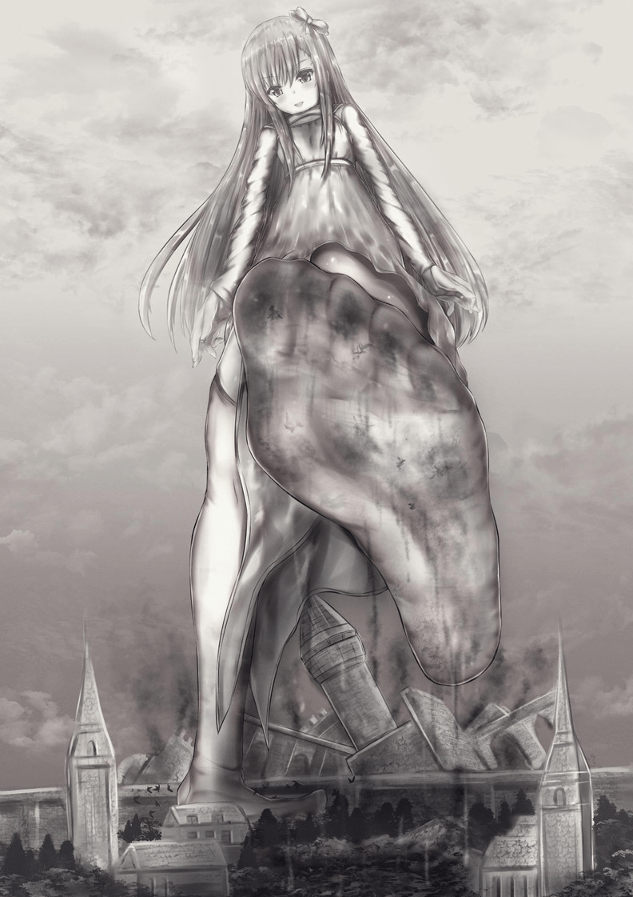
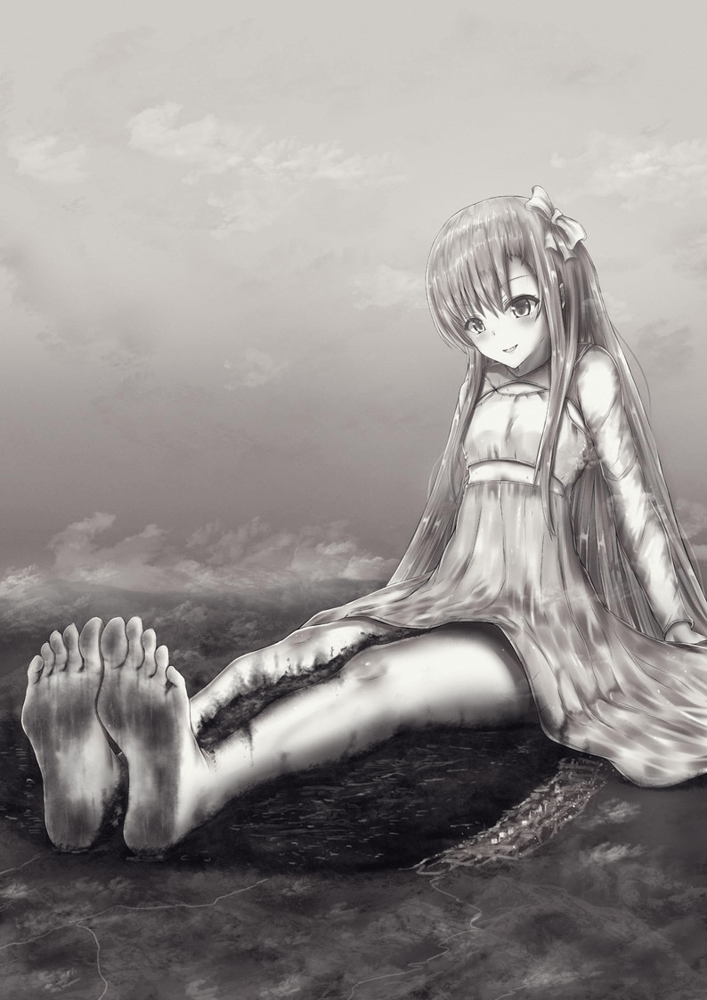

# 【翻译】勇者的报复（黑化、growth、残酷、带插图）

作者：rilongshen

TID：31182

# 1

*本帖最後由 rilongshen 於 2021-6-29 21:24 編輯*

这是我在fantia上花了550日元买的，算是纯粹的实用爽文，带两张沙弥匁画的插图，希望喜欢的朋友多多投Ducat。

本文作者：むらさめまる twitter: [https://twitter.com/murasame_novel](https://twitter.com/murasame_novel) fantia:[https://fantia.jp/fanclubs/3135](https://fantia.jp/fanclubs/3135) 插图画师：沙弥匁   twitter:[https://twitter.com/sayame_0](https://twitter.com/sayame_0)  fantia:[https://fantia.jp/fanclubs/7451](https://fantia.jp/fanclubs/7451)

（注：请不要将Fate里的伊莉雅带入到本文的伊莉雅）

# 2

**勇者的报复**嚓嚓嚓! !魔王的胸前插着一把银剑，从缝隙中射出耀眼的光芒，仿佛邪恶被净化一般。**“哈……哈……太好了……哈!终于成功了!”****“你……啊!为了弱小的人类……啊!……你一定会后悔的……”**魔王倒下了。这数百年，被魔王折磨的世界，我，伊莉雅终于给它画上了休止符。**“……哼，败犬的哀嚎罢了。”**伊莉雅说完，挥动着金色的头发和白色的斗篷，离开了魔王城——◆◆◆◆◆◆◆◆◆◆◆◆◆◆◆◆◆**“你真漂亮啊，伊莉雅小姐。”****“啊，谢谢。”**照顾伊莉雅的人一边这样说着一边梳着她的头发。这里是王城的一个私人房间。打倒魔王的我，回到祖国后被当作英雄供奉起来。我被赋予了地位和名誉，国家也保证我能过上无忧无虑的生活。。我从小失去父母，在孤儿院长大。那个保证对我而言很难得。今天预定举行庆祝我凯旋的宴会。因此，我现在穿着纯白的礼服，齐腰的金色头发被白色的缎带装饰着。**“作为照顾者，我很羡慕又强大又美丽的伊莉雅小姐。”**听到这句话，伊莉雅用那双又红又大的眼睛看着照顾她的人，露出天真的笑容，说道。**“你一定是……嫉妒我了!****♪”**这句话让照顾伊莉雅的人哑然失笑，但她对这种十几岁少女的天真无邪的话，并不会感到愤怒。◆◆◆◆◆◆◆◆◆◆◆◆◆◆◆◆◆◆伊莉雅来到宴会上。不愧是王宫，在豪华绚烂的室内，天花板很高，桌子上摆满了吃不完的菜。就像耶稣基督最后的晚餐上所描绘的那样，桌子旁坐着好几个似乎是这个国家的大人物的人。对在孤儿院长大的伊莉雅来说，这是一个完全陌生的座位。老实说，她甚至觉得是不是不合时宜。**“伊莉雅大人，您为我们国家尽了力，我对您只有感激。”**那是这个国家的国王。他留着白色的胡子，手里拿着一根手杖，上面镶着钻石，大得可以把人打死。衣服也以红色和金色为基调，十分华丽，俨然国王的样子。伊莉雅对政治没有特别的兴趣，连国王的名字都不知道。在孤儿院里，伊莉雅虽然年轻，却是剑术达人，有特别的才能。本来就稍微比男人强的伊莉雅就这样实力被认可，虽然年纪轻轻却加入了王国的魔王讨伐队。她在实力社会的队伍中也是出类拔萃的，虽然伊莉雅只有10多岁，但是却成为了队长，率领着魔王讨伐队。在最后的殊死搏斗中，除了伊莉雅以外全军覆没……但正是因为他们的牺牲才使国家得到了保护。**“能从国王那里听到这句话，我感到非常荣幸。”**我犹豫了。现在我已经打败了魔王，接下来该做什么呢?今后也率领队伍为国家工作?不，我并不是特别想为这个国家工作。延续了几百年的这个王国，在经过长期执政后变得腐败是很自然的。说实话，我没听到什么关于它的好传闻。我之所以为了讨伐魔王而努力，是因为小时候听父母说打倒魔王是我的使命。我不知道父母为什么会这么说。父母在我小的时候就突然去世了。答案恐怕一辈子都找不到。但我还是要感谢孤儿院，我在孤儿院得到了修女的疼爱。等这一切结束后，去修女那里，向她表示感谢，并提供资金援助吧。然后再慢慢思考人生的意义——。我一边想着这些，一边喝着倒在玻璃杯里的饮料。**“……! ?”**我喝下的瞬间，被异样的味道吓了一跳，伸手捂住了嘴。……嘴里发麻?……喉咙像烧灼一样痛。为什么……?我从椅子上摔了下来。剧烈的疼痛让不知道发生了什么的我陷入了混乱。于是国王走了过来。**“哈哈哈哈哈!勇者伊莉雅大人，你是我们王国的威胁。”**……呃?**“如果你用那样的力量去发动革命，那是我无法忍受的。”**声音嘶哑。为什么?想发出声音却发不出来。想要向王伸出手，却连力气都用不上。**“你的父母也是我杀的，你们一家都流着勇者的血。”**……勇者的血?**“很简单，只要在饮料里放一点毒药，你就会一下子死掉。”**国王呵呵地笑着说。父母是被杀的……?而且是在这个王国?在这个国家?父母都是为国家效力的军人。父亲强壮而又坚毅，每次回家都陪我玩。母亲也很坚强和温柔。父母都很热爱国家，为了国家利益比任何人都努力工作。怎么会……父母……。**“啊啊啊啊啊啊啊!”**我发不出声音，连力气都没有。但是，在充满了憎恨和憎恶的现在，不可思议地使出了力。我把手伸向国王，可能是已经受了毒的影响，视野模糊，嘴里吐着血拼命伸手。咕呲——我感到一阵冲击，看到一把剑从我的胸口刺出。。从嘴里喷出了大量的血。**“哦，顺便说一下，你长大的那个孤儿院好像发生了意外事故，所有人都死了。你去那边的话，替我向她们问好。”**绝望。我失去了生存的寄托，失去了父母，失去了一切。我无法呼吸，但不可思议的是感觉不到疼痛。我想再次将我的手和脸朝向可恨的国王，但已经没有力气了，扑通一声瘫倒在地。(啊……父亲……母亲……修女……连谢谢都没好好说……)我的意识渐渐模糊，眼前一片漆黑。◆◆◆◆◆◆◆◆◆◆◆◆◆◆◆◆◆◆◆◆睁开眼睛，我发现自己身处一个陌生的空间。一切都是虚无，没有光。但不可思议的是，我并没有感到恐惧。我死了。这里是死后的世界吗?我到底是为了什么而战？为国家而战却被国家杀害。父母也被国家杀害，王国夺走了我的一切。我好恨，我好恨，我好恨，我好恨，我好恨，我好恨，我好恨，我好恨，我好恨，我好恨，我好恨，我好恨，我好恨，我好恨。**“我告诉过你，你会后悔的。”**突然传来一个声音。我记得听过这个声音。**“……这个声音……魔王! ?”**我摆好架势。因为想起了那场恶斗。**“人类是愚蠢的，弱小的，害怕比自己强大得多的东西。你憎恨人类吗?”****“……。”**憎恨吗……?当然是憎恨的。没有不恨的理由。憎恨憎恨憎恨憎恨——**“沉默就是认可……那么，我将力量赐予你吧。用这力量，为了身为魔王的我，让人类彻底灭绝吧。”**我只要能复仇，什么都可以做。我如愿以偿，作为魔王的手下获得了力量——★★★★★★★★★★★★★★★★★★★★★★★★★★伊莉雅再次醒来，发现自己身处可恶的王国的郊外。**“……原来力量就是这样的啊——。”**没错，伊莉雅并不是复活了，而是以100倍的大小醒来。眼前的自然景色全都像迷你模型，树木也只有伊莉雅的脚踝那么大。伊莉雅已经光着脚踏上了草原。**“地面这么柔软啊。”**伊莉雅试着抬起那雪白的腿。茶色的泥土从脚底啪嗒啪嗒掉下来，白色的脚被染成了茶色。**“呵呵，这样不错嘛。”**伊莉雅露出小恶魔的表情，朝着背叛自己的王国走去。咚咚... ... 咚咚巨大的声音和摇晃使王国陷入了恐慌。集市上挤满了前来购物的国民，很多国民开始骚动起来。**“喂喂，怎么了!魔王应该被打倒了吧! ?”****“是哪个国家攻过来了? !”****“没关系的!只要我们的王国有城墙，他们就无法侵入其中!”**是的，王国被5米左右的城墙包围着，人们依靠这堵墙免受魔王的威胁。但是，随着地面的摇晃越来越剧烈，国民们开始感到不对劲。于是，太阳突然从他们的头顶消失，变得像黑夜一样昏暗。当他们抬头仰望时，一堵巨大的墙从他们的头顶笔直逼近，瞬间他们就被压扁了。**“哈哈，太棒了，我要把你们所有人都杀了。”**伊莉雅因为憎恨，下意识地将踩在地面的脚狠狠地摩擦着。咔嚓、咔嚓、咔嚓，脚下响起了肉和骨头碎掉的声音。伊莉雅抬起脚，脚底下已经没有原型的肉块吧嗒吧嗒地掉下来。**“真是的，这样的墙，连我的脚踝都够不着。”**说着，伊莉雅把还在踩着地面的脚往旁边一滑。嘎啦嘎啦地把地面和建筑物以及国民卷入其中，蹂躏着人们建立起来的国家和王国。房子、集市、教堂、广场全都被伊莉雅的赤足践踏，对于四处逃难的国民伊莉雅也毫不留情，毫不犹豫地像小恶魔一样一边嘲笑一边踩扁他们。或许有小时候疼爱自己的人，或许有熟悉的店，但是，伊莉雅因为憎恨和报复而并没有去想那些事，也没有因此而感到悲伤。于是，伊莉雅终于来到了国王所在的王宫。伊莉雅把蹂躏了王国的肮脏的赤脚抬到王宫的顶上。**“啊，王宫果然很大啊。”**变得100倍大的伊莉雅的巨足长达23米，可以轻松踩碎10栋建筑物，但却无法一脚踩碎王宫，王宫远远超出了她的脚的大小。**“那就这样吧。”**伊莉雅说完，把赤足放回原位，双手合十，注入力量。于是，伊莉雅被耀眼的光芒包围，从那里倏地消失了。在王宫工作的国民们危机过去了吗？这样想着，他们刚刚稍微放下心来的同时，传来了前所未有的摇晃和“咚咚咚”的巨响。由于摇晃，人都站不起来，之前没有被伊莉雅的巨足踩塌的房屋也完全倒塌。**“呵呵，这样就可以了。”**没错，伊莉雅的大小足足超过了1公里。伊莉雅双手叉腰，在王国的两侧矗立着能轻易踩扁一个国家的巨足。**“哎呀呀，原来王国是如此渺小的存在啊……****♪****”**伊莉雅又天真地笑了，把大大的赤脚举到王国的顶上。王国失去了太阳，被黑暗包围，好不容易从伊莉雅的蹂躏中逃出来的国民开始骚动起来。**“呵呵呵呵，要被这么可爱的女孩子光着脚踩死了。”**伊莉雅不停地动着脚趾，嘲笑着渺小的国民。从他脚趾的缝隙和脚肚上黏着的泥土啪嗒啪嗒地往下掉，已经有几个国民被掩埋致死了。**“那么，再见。”**伊莉雅的赤足发出咯吱咯吱的声音。但是，就在快要把他们踩死的时候，伊莉雅的巨足停了下来。**“但是这么轻易地就把你们踩死可不好……对了****♪!”**伊莉雅说完，在原地坐了下来。然后，把赤足放在王国的两侧，使之相对。**“这样才能切实地杀戮全体国民呢****♪那么，这次就拜拜了~”**脚底渐渐逼近，首先将郊外零星存在的农村卷入其中，然后迅速地将每一寸土地上的建筑物和人们卷入其中并蹂躏。然后，随着王国的墙壁被巨足推进，被蹂躏的悲惨遗迹，被遗留下来的建筑物和人们也被卷入其中。最后，王宫也被卷入其中，她的两只赤足一下子贴在了一起。伊莉雅咯吱咯吱地移动着巨足，揉搓着足底，把建筑物和人们连同泥土一起粉碎。然后猛地张开赤足，除了脚底被泥土弄成茶色之外，什么也没有留下。伊莉雅从那里站起来，抬起胳膊，伸了个大大的懒腰。**“那么，接下来要蹂躏哪里的人类呢——****♪”**◆◆◆◆◆◆◆◆◆◆◆◆◆◆◆◆◆◆◆◆

# 3

*本帖最後由 rilongshen 於 2021-6-29 03:29 編輯*

伊莉雅失去了一切。她的家乡，她的家，她熟悉的商业区，教堂，所有的一切。因为伊莉雅把一切都破坏殆尽了。被国家抛弃，被祖国的国王毫无道理地毒杀。然后，被魔王赋予了向人报复的力量，在被仇恨染黑的心灵的影响下，她毁灭了自己一直生活的祖国。父母已经遇害，如果不是教会的修女们代替她忙碌的父母抚养她，她对自己的祖国没有任何感情。即使是自己从小到大生活的国家，伊莉雅也毫不留情地用白色的赤足践踏着家家户户，人们也被踩死了。本是纯白的脚底沾满了血肉，蹂躏着国家，杀害了所有的国民。当然。服从背叛我的国王的所有人都是敌人，这整个世界都是敌人。必须让人类灭绝，这就是我现在的使命。我要消灭他们，我要消灭全人类——◆◆◆◆◆◆◆◆◆◆◆◆◆◆◆◆◆◆◆◆**“嗯，脚好累啊。”**伊莉雅揉着又黑又脏的脚。灭亡了一个国家的伊莉雅恢复了100倍的大小，在可以眺望灭亡的国家的小山上休息。原本的国家现在只留下了巨大的足迹，到处冒着黑烟。平时因为通商和入境，外面也很嘈杂。现在却安静得出奇。**“啊，这么说来……”**伊莉雅像是想起了什么，把手伸向纯白礼服的口袋。取出的是白色的长袜（过膝袜）。**“我还是喜欢光脚的凉快……穿这个的话，脚会不会舒服一点?”**说着，伊莉雅掸了掸光脚上的泥土，把她那双白皙修长的腿伸进了长袜口里。她光着脚的脚踝很圆润，皮肤散发着少女的清新气息。白色的长袜恰到好处地收紧了伊莉雅的双腿，凸显出少女柔软的大腿的魅力。**“好!这样就行了。”**伊莉雅把长袜穿到膝盖以上，站了起来。**“那我就试试……哎!”**Gusha!伊莉雅说着，踩塌了附近的一间小小的古民居。虽然比光着脚踩上去的触感要淡一些，但穿袜子踩确实比光着脚更不容易累。**“呵呵，好啊~我喜欢这样的感觉****♪****”**伊莉雅高兴地说着，摇晃着头上的白丝带，走向下一个王国。**“下一个地方是……帕里斯王国吧****♪做点有趣的事情吧~****♪****”（Paris，这里应该是NETA的巴黎……）**◆◆◆◆◆◆◆◆◆◆◆◆◆◆◆◆◆◆◆◆**“你、你说什么? !你不要说谎! !”**地面上传来用拐杖敲击发出的咔嚓声和国王的怒吼声。**“不，我没有说谎。我亲眼看到了。在侦察隔壁王国的时候，突然出现了一个巨大的金色的小姑娘，就这样蹂躏了布里斯泰因王国，把它毁灭了——!”（Bristain，这里应该是NETA的不列颠……）****“陛下，我不认为这个侦察兵在说谎。”****“嗯……嗯……。”**这里是帕里斯王国的宫殿。帕里斯是被伊莉雅毁灭的布里斯泰因王国的邻国，它们之间正相互对峙。在双方持续对峙的情况下，为了窃取对方的情报，帕里斯王国向布里斯泰因王国派遣了侦查兵。但是，当那个侦察兵穿着破破烂烂的衣服回来的时候，他却说是一个巨大的少女侵略了邻国，并将其毁灭了。莫名其妙。一时让国王难以置信。**“陛下!如果那个巨大的生物是真的，我们应该马上——”****“闭嘴!在亲眼看到之前，我是不会相信的——难道你们要骗我吗? !不能原谅，立刻把他们处死!”****“! ?陛下!** **您一定要保持清醒!”****“斩首!卫兵!赶快把这两个人带走!”**坐在阁下两侧的被铁铠甲和头盔包裹着的卫兵走近亲信和侦察兵，抓住他们的双臂，毫不留情地拖着反抗的两人，向两扇木制门的出口走去。**“陛下!这是国家的大事!冷静的判断!”**砰的一声，门被关上了。这个国家的国王就是一切。国王说的都是正确的，都是正义的。**“哼，真是的，让人不愉快的家伙。”**国王坐在用黄金装饰的豪华椅子上，跺着脚。他拿起放在玉座旁边的金器里的新鲜水果，扑通一声放进嘴里。他狼吞虎咽地乱嚼着，果汁从嘴里溢出，滴在了地板上。因为太过粗鲁，王室的卫兵都睁大了眼睛，但是在铁盔的包裹下，不用担心国王会注意到他们的表情。**“国家持续了数百年，就会诞生傲慢的国王吗？”**突然，门外传来一个陌生的声音。王室全体成员都注意着门的同时，门猛地打开了。这时，一个身高不到150cm的纤弱少女出现了。她及腰的长发是金色的，穿着朴素的白色礼服，头上的缎带摇曳着，穿着白色的过膝袜走路。**“什么，什么家伙!喂，卫兵!赶快把她抓起来!”**国王边说边发出命令，卫兵面对突然出现的美丽少女，虽然有些狼狈，但还是走了过去，然后抓住了伊莉雅白皙纤细的手臂。**“哎呀，别随便碰我。”**少女说着，用没被抓住的另一只手摸了摸卫兵的身体。然后卫兵突然被神秘的光芒包围，从眼前消失了——不，缩小到了1/10大小。**“呵呵，被小女孩瞧不起是什么感受呢?”**伊莉雅露出可以说是嘲笑的笑容，一边炫耀着并不满意的胸部，一边仁王站着俯视着卫兵。卫兵不知道自己发生了什么，一副混乱的样子。少女变大了?不，是自己变小了吗? 他无法掩饰对眼前这种情况的震惊。。卫兵抬头看了看少女，可能是因为没穿鞋走路的缘故而变得脏兮兮的白色过膝袜的脚心越来越近了。**“呵呵呵，你居然能摸到我的脚……请感谢我吧。”**伊莉雅就这样放下脚，踩着变小的卫兵。卫兵被对他而言有两米长的大脚压住，动弹不得。**“被变小了，还被女孩子踩了……好惨啊。”**伊莉雅稍微施加了下体重。米西米西……卫兵的骨头和身体被紧紧勒住，发出痛苦的叫声。**“啊哈!我想知道，如果我像这样稍微磨一磨，会发生什么？”**伊莉雅轻轻抬起身体，左右摇晃着脚。虽然是不会致命的程度的压迫，但更像是让他无法死去的折磨，卫兵的肺被压住，因为无法呼吸的痛苦而使眼睛和脸充血。再加上一部分受伤的内脏器官的出血，液体从口中溢出。他呜呜地发出含混的声音，想向周围的卫兵求救。**“不，住手!”**无法忍受同伴卫兵痛苦的样子，在场的所有人都拔出腰间的银剑，与伊莉雅对峙。**“哎呀，同伴意识高是值得称赞的，可是把剑指向女性，真是野蛮啊。”**伊莉雅说完，又伸出手臂，在眼前形成一个球体状的光。当卫兵们想要知道发生了什么时，已经被笼罩着他们的眩光缩小到了1/100的大小。**“啊呀，这么小，人都看不见了。”**伊莉雅一边用手轻轻捂着嘴，一边发出少女特有的纯真的笑声。伊莉雅说着，用手抓住刚才踩在地上的卫兵。卫兵已经没有挣扎的体力，处于束手无策的状态。然后，伊莉雅走到地面上一个瘦小的卫兵跟前——**“那么，再见 ~ ~”**伊莉雅抬起脚，踩了下去。只听到“咚”一声用力踩在地面上的声音，卫兵瞬间变成了袜子上的斑点。**“啊哈，把一个变得这么小的人踩扁了也没有什么触感……嗯?”**与此同时，数名缩成一团的卫兵正用剑砍向伊莉雅的脚。但是，理所当然地，刀刃不锋利，被伊莉雅纯白的过膝袜包着的脚没能受伤。**“哎呀，你们不这么做逃走不就好了吗？”**伊莉雅就这样轻轻挪动了下脚步，轻轻地踩死了剩下的卫兵。抬脚一看，白色的过膝袜脚底上有点点红色的斑点。**“卫兵们的同伴意识真的很厉害，我也在军队里服过役，所以也不是不知道。”**说着，伊莉雅和国王对峙起来。王只能在王座上看着眼前发生的惨状，至今仍无法相信眼前这个稚气未脱的小姑娘所做的事就是现实。**“你、你的目的是什么? !钱吗? !权力吗? !我什么都可以给你!”**伊莉雅迈着轻盈的少女般的脚步走近国王。在国王看来，小姑娘走近的时间十分漫长。冷汗从他的后背流了下来，心脏都仿佛要炸开了。国王的心跳加速，感到了死亡的恐惧。然后，伊莉雅站在国王的面前，她当场伸手将头发散开。从伊莉雅身上飘来的马卡龙般的甜香抚摸着国王的鼻子。然后伊莉雅用手撑着膝盖，稍稍向前倾。国王和伊莉雅以一推就会紧挨着的距离面面相觑。用清澈的红色眼睛盯着国王，伊莉雅把食指伸到自己的眼前，轻轻摸了一下国王的鼻尖。7然后，触摸的瞬间，国王被神秘的光包围，慢慢变小——并且，变成了1/10的尺寸。伊莉雅用又白又长的手指从王座上抓住在王座上颤抖的国王，再次把他放在自己面前。虽然她一句话也没说，但眼睛里却充满了对人类的憎恨，美丽的光辉也被黑色的感情所掩盖了。王一心不想死，拼命挣扎，想要挣脱束缚自己的手指。但是，伊莉雅的手指纹丝不动。更何况伊莉雅根本不会在意这些。于是，伊莉雅突然松开了手指，让王掉到地上。就在国王觉得自己被解放了的同时，他突然意识到自己是从几十米高的地方掉下来的。国王发出怪异的悲鸣，从几米高的地方被摔到地上。随着一声闷响，国王像一张被丢弃的废纸一样滚落在地。**“啊哈哈!掉下来死可能会轻松一些吧?”**王虽然已经奄奄一息了，却还是没有死。他浑身疼痛，呼吸困难，仰面朝天，用全身力气呼吸着。面对这种状态的王，伊莉雅又加上了踩死了卫兵的脚，但他没有把她的全部体重放在上面。伊莉雅的脚底不可思议地飘着甜甜的香味，有些温热。然后，伊莉雅停顿了一下，把体重一口气压在了踩着国王的脚上。与1/100的尺寸不同，有一定大小的1/10的尺寸会让伊莉雅感到阻力。但是，国王的身体在吱吱作响，他的骨头发出惨叫，他的和内脏受到挤压。国王使出最后的力气，发出求救的声音。但是，因为肺部破裂，声音被从嘴里流出了大量的血淹没了，国王发不出任何声音。国王感受到了了临死的恐惧和绝望。超过某一点后，伊莉雅的脚一下子着地，感觉就像踩碎了熟透的西红柿。周围飞溅着大量的鲜血，甚至波及到了伊莉雅的脸。纯白的礼服被溅出的鲜血弄脏了，连袜子也弄脏了。但是，伊莉雅并没有在意脏东西，就那样扭着脚，把它磨得粉碎。人肉发出咯吱咯吱的声音，变成了肉糜状，伊莉雅抬脚一看，脚上粘着糊状的人肉。**“……大家都死了就行了，然后……”**他手里还握着最初的卫兵。他无法接受眼前发生的惨状，脸上写满了恐惧。戴着的头盔随着伊莉雅的动作而脱落，那绝望的表情被伊莉雅看到了。**“那么你——”**伊莉雅用另一只手抓住卫兵的一只脚，举到头上。然后，她张开嘴巴，露出黏糊糊的粉红色舌头和漂亮的牙齿，松开了掐着的手指。卫兵就这样掉了下来，带着绝望的表情被扔进了伊莉雅的嘴里。嘴巴一下子闭上了，在嘴里用舌头舔了舔卫兵，然后用舌头把卫兵引向喉咙深处，咽了一下喉咙，卫兵咕噜一声流进了胃里。**“——让你成为我的营养吧。”**伊莉雅噗的一声发出可爱的声音。伊莉雅的脸上沾满了鲜血，露出满足的纯真笑容，眼前的大门再次打开。数十名卫兵听到国王的喊声，集结起来。**“哎呀，都怪你们无能，国王已经死了。”**伊莉雅一边给他们看自己被血弄脏的样子一边说。卫兵们简直惊呆了。是这个年纪还那么小的小姑娘造成了这样的惨状吗?她是训练有素的杀手吗?赶来的卫兵畏缩不前。**“那么，现在让我来扭转局面吧。”**说着，伊莉雅把自己的身体缩成一团，注入力量。然后，伊莉雅被神秘的光芒包围着，卫兵们被耀眼的光芒刺得睁不开眼睛时，少女渐渐变大了。在建筑物中逐渐变大的伊莉雅把周围的东西都卷了进去，宫殿顶层的王室大厅的地板因为无法承受伊莉雅的重量而掉落。各个楼层的支持国王的大臣们和什么都不知道的女仆们也被卷入伊莉雅的身体下，死于非命。拥有数百年历史的宫殿轰然倒塌，化为瓦砾，伊莉雅的巨大化也停止了。在帕里斯国中央的一个小山丘上，端坐着一个小女孩，一个突然出现的巨大少女。丝绸般顺滑的头发长及腰部，一身纯白的礼服。虽然胸部很窈窕，但双腿却十分修长光滑，被白色的过膝袜包裹着，恰到好处地突出了不像小孩子那样的肥嫩的大腿。一看就是个美丽的少女。但是，少女的体型却是如此之大，以至于她轻而易举地超过了这座小山。她有普通人的一百倍大。**“嗯，在建筑物里变大的话，中途还是很痛苦的……”**伊莉雅举起手臂，舒展身体。因为是原军人，身体很紧实。虽说不上丰满，但也有适当的隆起的胸部和成长中的腰的纤细通过舒展身体展现在了周围的人眼前。原本衣服和过膝袜被血弄脏了，但因为变大过程中产生的光有净化作用，让包括衣服在内的身体变得干干净净。**“不过，帕里斯王国还是很发达的。”**伊莉雅环顾四周。四面都被各种建筑物填满，一直延伸到地平线。与布里斯泰因王国相比，这里的建筑物大量使用了砖石，因此气氛也更现代一些。道路全部用石头铺成，马车频繁来往。所有的国民都注意到了伊莉雅的存在，从建筑物的窗户、路上、马车中仰望着伊莉雅。在这种情况下，伊莉雅突然站起来，高声向国民宣布。**“我是伊莉雅。布里斯泰因王国的英雄。从现在开始要毁灭这个国家，趁现在快逃吧。”**伊莉雅结束宣言后，首先踏上了宫殿山脚下的建筑物。住宅对伊莉雅来说只是一个不足十厘米的箱子，小到可以用一只脚轻松踩烂。白色的过膝袜遮住了太阳，建筑物上投下了脚型的影子，伊莉雅就这样慢慢地踩下了脚。当伊莉雅的脚到达建筑物后，慢慢地把体重施加上去。。建筑物发出悲鸣声，安装在窗户上的玻璃也在上方的压力下碎裂，雨点般落在地上。她的脚并没有停下，发出咔叽咔叽的响声，一下子踩到了地面，然后左右扭动，咯吱咯吱地碾碎房屋的残骸，确保让里面的小人毙命。然后，抬腿一看，白色的袜子被泥土和瓦砾弄成了茶色，残骸粘在一起，扑簌簌地往下掉。**“哈哈!你的家被女孩子踩扁了，感觉怎么样啊?****♪”**然后，伊莉雅开始破坏宫殿脚下的商业区。建筑物的高度只能达到伊莉雅的脚踝，即使不抬脚也能踩扁。Gusha! Gusha!（这是拟声词）伊莉雅就像什么都没有一样，只是走着，用整个脚踢开密密麻麻的建筑物，把它们破坏掉。被踢飞的建筑物四处飞散，向周围倾泻而下。此外，这不仅包括建筑物，还包括小人。建筑物中还残留着的小人和为了逃离巨大的女儿而在路上奔跑的小人都被卷入其中，要么撞在地上，要么撞在了其他建筑物上，小人的身体四处飞散，散落在四面八方，难以想象的惨烈景象到处蔓延着。然而伊莉雅完全没有自责，反而对造成了这样的惨状感到很开心。**“哈哈哈!本来以为用一百倍的大小话会没那么好玩，但是看到人类像玩具一样飞来飞去的样子还是很开心呢!”**◇◇◇◇◇◇◇◇

# 4

<ignore_js_op>[图片1.jpg](forum.php?mod=attachment&aid=ODk0Mzh8OTViZDA5MTR8MTY0NzcwNTY2MnwxODIzMHwzMTE4Mg%3D%3D&nothumb=yes) *(158.78 KB, 下載次數: 19)*

[下載附件](forum.php?mod=attachment&aid=ODk0Mzh8OTViZDA5MTR8MTY0NzcwNTY2MnwxODIzMHwzMTE4Mg%3D%3D&nothumb=yes)

2021-6-29 03:21 上傳  

100倍

</ignore_js_op>  

# 5

突然出现了一个巨大的女孩。起初我还在悠闲地以为是多么美丽的女性，但突然间，她开始破坏我们的城市，她那双非常大的脚把我们熟悉而美丽的城市变成了地狱。我住的地方稍微有点远，总算来到大家聚集的广场。大家都在，这里有守卫城镇的卫兵们。**“姐姐!”**在调整紊乱的呼吸的过程中，突然从后面抱住我的金发小女孩，是我的妹妹。**“爱丽丝!太好了，你没事吧!对不起，让你担心了。”****“不，没事……!是一个不认识的哥哥把我抱到这里来的。”**我和爱丽丝拥抱在一起，重新认识到自己还活着。她的身高只有我的一半左右，我一抱她，她就完全埋在了我的怀里。爱丽丝温暖的身体，微甜的马卡龙香气，在这样的状况下也让我松了一口气。爱丽丝的衣服是一件像洋娃娃一样飘逸的连衣裙，我很喜欢，但被灰尘和泥土弄成了茶色。不过还好保住了性命。**“在这里的话会没事的，卫兵们会干掉那只怪兽的。”****“嗯!这里的卫兵真厉害!我在绘本上读过!”**这个广场上的卫兵大概有一百个左右。还设置了数十个投石器，操作十分熟练。准备这么多的话应该就没问题了……我相信。咚咚咚——咔嚓咔嚓咔嚓——怪兽终于来到了广场附近。那只怪兽太大了，踩在地上的两条腿就像粗大的柱子，让人头晕目眩。怪兽走过来的背后是一片混乱的道路和建筑物的残骸，虽然看不太清楚，但隐约可以看到有几个人倒在地上。倒在地上的人有的没有了胳膊，有的关节歪向奇怪的方向，有的浑身是血，让人无法想象之前那里是一条多么欢乐的商业街。我下意识地用力握住爱丽丝的手。**“啊，姐姐，好痛啊。”**“啊，对不起，爱丽丝。”我不能不安。爱丽丝是我的宝贝妹妹。我绝对要活下来。◆◆◆◆◆◆◆◆我们在卫兵争取时间的时候逃到了更里面。这个帕里斯王国在城镇的各个地方都有城门。门的左右两侧是三层楼高的石墙，很难逾越。这是为了在敌人进攻的时候防止他们进一步入侵而设计的，我们也因此得以安心地生活。但是——**“喂喂……真的吗……”****“这怎么办啊……”**我也哑口无言。门……已经崩塌，完全堵住了。门的周围是用石头砌成的，所以不耐震动。是怪兽走路时的震动造成的吗……?不，光是这样应该不会崩崩塌。……答案很简单。怪兽踢飞的残骸不幸击中门，破坏了它。城里的人为了保护自己的生命而建造的大门，现在却讽刺地将自己的生命置于危险之中。

我手心冒汗，什么也想不起来。**“姐姐?怎么了?这里不能通过吗?”**爱丽丝像个孩子一样坦率地问。咚……咚……怪兽的脚步声越来越近。摇晃也越来越大，一起逃跑的近百人集体发出惨叫。然后终于……**“哎呀，这里不是有很多小人吗?”**——我们已经被发现了。齐腰的金色长发。一双红色的，大大的，清澈的眼睛。她的胸部并不大，但确实还是有些隆起。几米开外的大柱子，就像被白色过膝袜包裹着的巨大岩石。真的，乍一看她只是个美少女……但是很大。仅仅这一点她就对我们构成了威胁——恐怖——是我们的敌人。**“刚才广场上也有很多小人……”**怪兽像是要向我们展示轻易就能把房子踩扁的巨足。脚掌上沾满了曾经是人类的红色东西，白色的过膝袜混杂着泥土和瓦砾，到处都染上了红色。由此不难想象发生了什么。**“你这个怪物……啊!”****“你把我们的城市搞得一团糟!我要杀了你!”**在我们的集体中，血气方刚的男人们一边对怪兽恶语相向，一边靠近怪兽的脚，用掉落的石头和手中的刀砍向怪兽。但是，刀刃非但没有穿透袜子，甚至连一道划痕都没有，怪兽的表情也完全没有改变……反而笑了。**“咦?怎么了?你不是要杀了我吗?”**怪兽一边笑着，一边轻轻挪动巨足。仅凭它所动产生的风，就轻易吹走了周围的人。**“如果要杀了对方……就得有被杀的觉悟!”**怪兽突然抬起脚，把脚伸向被吹走的一群男人，一口气踩了下去。咚!咯吱咯吱……不仅是男人们，房屋也被卷入其中，在发出活生生的惨叫声的同时，被长达二十五米的过膝袜包裹的巨足踩扁。怪兽的巨足像巨大的压缩机，男人们和房屋都被平等地压缩，骨头发出吱吱的悲鸣。怪兽抬起脚，只见那里只留下了漂亮的脚印和几处混有血迹的泥土。**“哈~把小人踩扁了，感觉真好。~”**我们都吓了一跳。背后是无法攀爬的岩壁，左右两边都被高高的房屋困住。唯一的突破口正面被巨大怪兽阻挡，眼前数名男子被她残忍杀害。**“呵呵，我想到了一个好主意!”**怪兽说完，抬起了脚。终于要被踩扁了吗，我做好了这样的心理准备，但好像不是。怪兽开始从外向内推倒正面左右两侧的建筑物。还安然无恙的建筑物被巨足踩得倾斜，倒在地上变成了瓦砾堆。**“这样就逃不掉了吧!”**我们完全被关起来了。唯一的出口——正面也被倒塌的建筑物封住，我们完全就成了她的囊中之物。爱丽丝似乎也感觉到了自己的生命危机，她像小羊一样颤抖着，用力拉着我的衣摆。**“那么……来吧。”**怪兽突然开始脱下右脚上的过膝袜。袜口穿过细长的双腿，露出白皙的肌肤。水嫩的皮肤看起来湿润柔软，脚趾头也软绵绵的。指甲打磨得很漂亮，脚后跟也伸展出美丽的圆润曲线，没有多余的赘肉。这一切构成了美丽的脚的造型。她那之前裹着过膝袜的赤足扭动着脚趾，似乎在显示被释放的喜悦。然后怪兽弯下膝盖，蹲了下来。太阳的光线被挡住了，怪兽的影子笼罩了我们周围的区域。会被她做些什么呢?谁都无法想象。随后，一只可以轻易压扁我们的巨大右手出现了，我所在的左侧的人们被抓住了。当巨手出现并抓住人们的那一瞬间，感觉好像听到了扑哧扑哧的声音，但怪兽并不在乎，她把抓住的人扔进了刚才还穿着的过膝袜里。还没死的人们发出尖叫，坠入过膝袜的深渊。最后，终于只剩下了我们十几个人了。遗憾的是，即使我想逃也逃不掉——我看了看四周，运气很好，在我身后找到了一个由瓦砾构成的小缝隙。怪兽关注着袜子，没有注意到这边。……机会来了!**“躲在这里!爱丽丝!”****“诶……诶!”**爱丽丝迷惑不解，我半强迫地把爱丽丝藏进瓦砾的缝隙里。**“听好了，绝对不能出声哦。能做个约定吗?”****“啊……!不要不要不要。我想和姐姐在一起!”**爱丽丝轻轻地摇着头，泪流满面。**“这是姐姐和你最后的约定。如果你不遵守这个约定，姐姐会哭的。”**我抓住爱丽丝的双肩，目不转睛地盯着爱丽丝，对她说。**“……知道了。我——爱丽丝会忍耐的，你一定要平安回来啊。”****“嗯，约好了。”**最后，我紧紧抱住爱丽丝。温暖的身体和甜美的香气扑鼻而来，让我感到幸福。如果抱得太紧，她那脆弱的身体很容易就会崩溃的。尽管如此，爱丽丝仍然拥有温暖他人心灵的强大力量。然后，我放下拥抱，直面现实。怪兽的巨大右手抓住了剩下的我们十几个人。不知轻重的怪兽用纤细的手指用力勒紧我们的身体，可能是内脏受了伤，我口吐鲜血。很痛苦，很痛……意识快要飞起来却飞不起来。我甚至会想，如果意识消失了，该有多轻松啊。一起被抓起来的几个人被力量压垮，看起来已经没命了。怪兽直接把我们拿到袜子口附近，松开抓着的手，把我们扔了进去。我也因为重力自然地朝地面坠落……——可是，我却偏离了袜口，沿着过膝袜的外侧滑了下去。心想再这样下去会摔到地上的我，立刻伸手去抓袜子。但是，在以惊人的速度滑落的过程中，即使伸出手，胳膊也会弹回来，什么也抓不住，我只得朝着地面掉下去。高度约六十米，大概相当于是从二十楼跳下来。不可能得救。我以为我已经死了。但是，我却感觉不到内脏充血的不愉快感了。**“哎呀，也有运气好的小人呢。”**我被怪兽的右手抓了起来。巨大的红色瞳孔直勾勾地盯着我。晶莹剔透的眼睛，老实说并没有什么不好的感觉，只是因为某种原因而产生了强烈的憎恨和报复的念头。我以为她会就这样杀了我。实际上，我以为我肯定会被她摔在地上。说实话，我不希望爱丽丝看到我的尸体。如果可以的话，我想就那样进入过膝袜里。想在爱丽丝看不到的地方被杀……。但是，怪兽出乎我的意料，弯下膝盖，把我放回了地面。**“你运气真好啊，我会特别放你走的!”**怪兽微微一笑，双手张开左手拿着的袜子，右脚轻轻插入。过膝袜顺利地穿到了一半，只有在底部积存着的人们在蠕动着。然后，白色的赤脚就这样伸到了人群聚集的地方。**“哎呀，有点痒痒呢。”**怪兽一边说着，一边把袜子穿到最后。右脚还在空中，从外面也能看到人们在脚掌上发狂般地挣扎着。**“那么，如果我把脚放下来的话会怎么样呢?”**我毛骨悚然。这种事谁都心知肚明。被地面和怪兽的脚夹住，会被压缩成肉饼吧。然后，怪兽首先温柔地把脚放低，轻轻触碰地面。触到地面的瞬间，短袜的底部比平时动得更加激烈。……里面的样子是很难想象的。**“哈哈哈，一接触到地面小人就发狂，真有意思~~****♪****”**怪兽很享受这一点，不停地上下移动脚，仿佛要准备触碰地面。怪兽偶尔会加重体重，煽动不安的情绪，把人们的生命当作玩具一样对待。也许对玩了很久的玩具感到厌倦了，怪兽的脚跟落在了地上。**“好了，那么……拜拜!”**怪兽把脚跟作为支点，咯咯地笑着把她的脚放了下来。脚慢慢着地，起初，过膝袜里开始骚动了起来。然后，到达了怪兽感觉到强烈抵抗的位置，她的脚停止了移动，但很快怪兽在那里一口气把自己的体重全压在了上面。咕嚓！强有力的脚战胜了人们的骨头和肉的抵抗，顺利着地。她的脚就这样扭来扭去，把袜子里的人全部碾死了。溢出来的血就这样被袜子吸走了，纯白的袜子被染成了红色。我呆呆地站在原地，凝视着这一幕。那里面也有很多我认识的人。一直以来，周围理所当然的伙伴、朋友，都被巨大的少女夺走了性命。**“姐姐——! !”****“啊!”**我感觉到身后传来了小小的碰撞。一个柔软的小东西抱了过来。**“爱丽丝……姐姐我，已经失去了一切……。”**我转身面向爱丽丝，紧紧地抱住她。甜甜的香气扑鼻而来，让我感到内心十分温暖。**“姐姐……我还在哦!我会一直在姐姐的身边!”**我被一双水灵的大眼睛注视着。啊，为了这个孩子我可以活下去。只要有这个孩子就好。我是这么想的。**“嗯……一起活下去吧。”**我对着爱丽丝说，然后更用力地抱住她——**“……我改变主意了!** **♪”**吧唧——可能是用手指弹了什么，周围响起了水一样的东西飞溅的声音，肉片和大小四肢飞溅在了墙壁上。巨大的少女白皙精致的手指被染成了红色，弄脏了。**“啊哈哈，我仅仅是弹了一下手指，两个人就轻易地飞散了****♪嘛，她们两个好像关系很好，一起死也算是不错吧****♪****”**伊莉雅将被逼到绝境的小人全部杀戮，然后心满意足地把周围的还安然无恙的房屋踢得粉碎。◆◆◆◆“果然是差不多累了啊。”到此为止，伊莉雅已经破坏了所有的住宅、商店、教堂等建筑，但仅以100倍左右的大小，根本无法将偌大的帕里斯王国彻底破坏殆尽。这个大小对于玩弄小人来说正好合适，但是对于破坏城镇来说有点不足。**“嗯，再变大到现在的三十倍就好了。”**想到这里，伊莉雅又握紧双手，闭上眼睛念念有词。于是，伊莉雅的身体再次被耀眼的光芒包围。踩着小人住的房子的白色赤足，也像挖开周围的地面一样，随着大地的轰鸣，开始巨大化。还平安无事的五颜六色的房屋被碾碎，小人也被卷入瓦砾中毙命，所有的建筑物和生物都被卷入其中，最终伊莉雅的巨大化停止了。**“嗯——! 3000倍的话，人类就像垃圾一样了!”**伊莉娅双手叉腰，环视四周。与百倍时相比，视野明显提高了，每栋房子的大小都不到五厘米。**“呵呵，我的一步会造成多大的损失呢?”**伊莉雅的脸上浮现出高兴的表情，将过膝袜举到了还安然无恙的区域。……但是纯白的长袜上也沾满了泥土和血肉，说实话，穿起来并不舒服。过膝袜吸收了小人的血肉，感觉很沉重，就像被大雨淋过后的状态一样。虽说经常有净化的作用，但如果经常把过膝袜弄干净的话，伊莉雅的体力是不会持续太久。**“嗯，我已经厌倦了把袜子弄干净了。我想我就光着脚，这样我就不用担心弄脏了。”**说着，伊莉雅把手搭在白色的过膝袜上，颤悠悠地脱了起来。因为刚才的杀戮而践踏了许多小人的袜子很重，而且还黏在白色的光脚上，很难脱下来。然后，伊莉雅把脱完的过膝袜扔在了地上。用布做的袜子通常不重。但是，被放大到3000倍的话，那块布的重量会非常惊人，袭击了房屋。咔叽咔叽——哗啦啦——原本成型的房屋无法承受布的重量，和躲在里面的小人一起被压扁了。**“啊哈，光我脱下的袜子的重量，就把小人的家给毁了。怎么样?我的袜子暖和吗?好了，差不多该重新开始蹂躏了。”**伊莉雅露出喜欢恶作剧的孩子般的表情嘲笑着，慢慢地重新开始攻击。勾勒出平缓曲线的脚后跟和沾满泥土和瓦砾的脚掌被举到房屋顶上，然后放下来。。她双手交叉放在腰后，咔嚓咔嚓地踩着，就像踩在沙滩上一样，摧毁着小人创造的城市。即使有小人的回忆和羁绊，也会因为伊莉雅的赤足而简单地归于零。一脚踩下去，就能看到几十栋房子、道路、四处逃窜的小人被无情的纯白压力机压成了薄片，一部分还黏在了脚底上。伊莉雅的赤足，可以一脚就造成巨大的灾难，继续平静地清理小人们创造的城市。**“呼，我有点厌倦用脚破坏了，不如这样。”**伊莉雅说着就坐了下来，用她那小而紧致的屁股一边破坏建筑物一边着地。她向前弯腰，把她那不太大的瘦瘦的胸部贴到地上，完全趴在了地上。**“……这么近一看，总觉得怪怪的。”**她支起手肘，用双手支撑着头，用红色的眼睛注视着精巧的建筑物和四处逃窜的小人。我原本也是个小人……伊莉雅一边茫然地想着这些，一边使劲地用手指戳着建筑物。。建筑物被一根细长但巨大的白色柱子嘎吱嘎吱地给戳倒塌了。**“啊哈，这是神罚哦~”**她前后摆动着膝盖以下的腿，一个接一个地压碎它们，就像在家里放松一样。有时她还会瞄准逃跑的小人，用手指戳他们，然后滑动手指，把他们磨得一点形状都没了。然后，在一定程度上将建筑物压扁的伊莉雅张开手臂，用手臂包围了眼前的一部分区域。**“呵呵，小人们真着急啊。”**就像把小动物用手臂围起来一样，不让他们出去，用手臂筑起了一堵墙，伊莉雅从上面窥视着那个洞。金色光洁的头发和精致的脸蛋遮住了太阳，那个区域被黑暗包围了。**“那么，你们能想象我接下来要做什么吗?……就这样慢慢把手臂收缩，然后把你们搓烂吧?”**她的手臂轻轻地收缩起来。被关起来的许多小人发出惨叫……但手臂很快就停了下来。**“啊哈哈!稍微动一下就有那么大的反应……真开心!** **♪”**就像玩玩具一样，伊莉雅享受着这种状况。小人们颤抖着。我打从心底害怕这个玩弄着我们的生命的巨大少女。……就这样要被她碾碎了吗?就在我像走马灯一样思考着这件事的时候，这个巨大的少女解开了手臂的包围圈，双手撑地，变成了匍匐的姿势。现在，我们的头顶就在少女那贫瘠的胸部附近。能被解放吗……?老实说，这是不可能的事，但在生命紧迫的情况下，只能依靠有限的希望，在包围圈被解除的瞬间，他们向巨臂造成的深沟方向冲去。但是——咚咚咚咚……伊莉雅放松了支撑着纤细身体的双臂，把所有的重量压了下去，用胸部压扁了在身体下面的城市。**“正确答案是用我的胸部压扁****♪知道了答案的小人……已经死了吧?”**说着，伊莉雅立马站了起来，啪的一声把沾在她纯白裙子上的泥土和瓦砾弄掉。环顾四周，曾经那么繁荣美丽的城市，如今处处烟雾弥漫，宛如战后的空地。**“呵呵，这个城市也破坏殆尽了，差不多该结束了吧。”**伊莉雅说着，双手合十，强烈地祈祷着——于是，在炫目的光芒下，伊莉雅的身体又一下子变大了。她的脚也开始巨大化，吞噬了周围的残骸。最终伊莉雅变得天空中漂浮的云差不多都只能到达腿的高度了。**“嗯～!果然长大到1万倍后，就感觉自己的大小是以国家为单位了。”**环顾脚下，已经可以看到帕里斯王国的全部景象，走五六步就可以蹂躏一切。**“最后还是这样吧。”**说完，为了不踩到帕里斯王国的城市，她猛地跳了起来，越过外墙，来到城墙外。轰隆轰隆——在前所未有的地震和轰鸣声中，勉强维持原状的建筑物和石墙都轰然倒塌。原本先建造城墙再建造城镇的帕里斯王国，建筑物密集，道路狭窄。这导致了灾难，由于伊莉雅的破坏和蹂躏，建筑物的残骸分裂了道路，城里的人们陷入了不能轻易出去的状况。但是，如果这个巨大的少女离去，一切都将变得无关紧要。慢慢逃脱就好了。现在只要静静地躲着就好了。小人们暂时放弃了逃避，屏住呼吸潜伏着。但是——这样的计划却轻易地被挫败了。**“嘿咻!”**伊莉雅一出外墙，就用两条巨大的腿建造了一堵雪白柔嫩的巨大墙壁，将帕里斯王国包围起来。**“嘿嘿，这是杀死小人最好的方法了。啊哈哈，真的是太小了，已经无法看清小人了~****♪****”**伊莉雅用手捂着嘴，嘲笑似地俯视着夹在两腿之间的帕里斯王国。在伊莉雅眼里，小人已经与尘埃无异，建筑物也只有米粒那么大。但是，国民们没有办法注意到这压倒性的大小差异，察觉到接下来的事情的小人们开始逃离伊莉雅。熟悉的城市被巨大的怪兽践踏殆尽，变成一片空地，熟人、朋友也被卷入其中而死去。少女的腿的长度超过了6公里，这个国家的城墙看起来已经很小了。如果这两条巨大的腿合上了就没救了，全国人民应该都能理解吧。但是，现在大家都陷入了恐慌，根本没有思考的余地。**“那就结束吧，在我合上这两条腿之前，我再给你们10秒。”**突然，地狱的倒计时开始了。少女的腿轻而易举地包围着这个帕里斯王国。也就是说，要逃跑就必须逃到城外。——毫无道理。全国人民都这么认为。明知道活不了命也全力逃跑的人。最后和心爱的妻子、丈夫以及孩子一起拥抱的人。相信神，向神祈祷的人。与其被卷进腿里碾死，还不如自己割开喉咙自杀的人。简直就是人间地狱。**“5 ~……4 ~……”**倒计时在混乱中被无情地刻了下来。叫声、悲鸣、怒吼，计数越接近0，就越大。**“1 ~……0 !”**然后，巨大的腿终于动了起来。咕嘟咕嘟……咔嚓咔嚓——伊莉雅的双腿将建筑物与整个地面挖开，只为破坏那里的东西而移动。房屋、人们在周日聚集的漂亮而辉煌的教堂、孩子们经常玩耍的广场、喝酒的街道、购物的街道以及在周末变得热闹的药店——一切都像泥石流一样被巨大的肤色墙壁轻易吞噬和摧毁。没来得及逃跑的国民也一个接一个被卷入其中，和建筑物一起被弄得乱七八糟。**“那个那个～****♪****我会不断用我的腿破坏的哦～****♪****”**伊莉雅脸上露出小恶魔般的表情，开心地享受着。她的腿完全停不下来，一边发出轰隆的声音，一边把所有有形的东西都变成空地，最后双腿完全合上。——在合上的双腿之间，出现了一座小山，里面堆满了泥土、建筑和尸体。**“呼，既然已经把大国都毁灭了，剩下的就只有小小的乡村了。先一步一步地把它们踩烂……完了再去找魔王商量吧。”**伊莉雅说着站了起来，赤脚踏上这座刚建成的山，开始了对新城市的入侵——◆◆◆◆◆◆◆◆◆◆我是古代历史研究家，明石相铁。今天助手带来了一本记载着旧传记的书。下面介绍一部分内容。勇者伊莉雅。虽然只是十几岁的少女，却有着胜过男人的性格，不仅是剑技的才能，也是兼具知性的才色兼备的少女。这样才华横溢的少女率领军队为了守护人们和城市，打败了魔王，得到了地位和名誉，应该过着一帆风顺的人生。她本质上是个善良的少女。即使拥有地位、名誉、力量，也会正确的使用。但是，他的父母被害怕勇者力量的国王夺走了性命，她自己最后也被杀害了，有着非常悲伤的过去。这样的勇者从她打倒了的魔王那里得到了力量，得到了让她重新燃起对人们的憎恨的力量。传记上有她一个人就消灭了两个大国的记载，但没有定论。因为一个少女真的能毁灭两个大国吗?大概是用了魔法吧。无论它是真是假，现在都已经被笼罩在黑暗中了……这与现代日本毫无关系。那么，今天的天气也确认一下吧。我漫不经心地打开了电视。一如既往。但是，当看到电视画面上的景象时，我手里的遥控器掉了下来。**“今天凌晨，穿着白色连衣裙的巨大少女出现在了日本的首都……!已经死亡了数万人——! !”**End

# 6

<ignore_js_op>[图片2.jpg](forum.php?mod=attachment&aid=ODk0Mzl8OTYyYzBkYTJ8MTY0NzcwNTY2MnwxODIzMHwzMTE4Mg%3D%3D&nothumb=yes) *(147.51 KB, 下載次數: 21)*

[下載附件](forum.php?mod=attachment&aid=ODk0Mzl8OTYyYzBkYTJ8MTY0NzcwNTY2MnwxODIzMHwzMTE4Mg%3D%3D&nothumb=yes)

2021-6-29 03:23 上傳  

1W倍

</ignore_js_op>  

# 7

> [尤格萨隆 發表於 2021-6-29 07:50](https://giantessnight.cf/gnforum2012/forum.php?mod=redirect&goto=findpost&pid=472456&ptid=31182)

> 轻小说里勇者果然是用来吃瘪的啊

本文的勇者怎么也算不上吃瘪吧  

# 8

> [我是萝莉控 發表於 2021-6-29 20:56](https://giantessnight.cf/gnforum2012/forum.php?mod=redirect&goto=findpost&pid=472504&ptid=31182)

> 所以说，译者大大翻译的是哪位作者的fantia赞助文呢？

我在一楼更新了作者信息和画师信息。