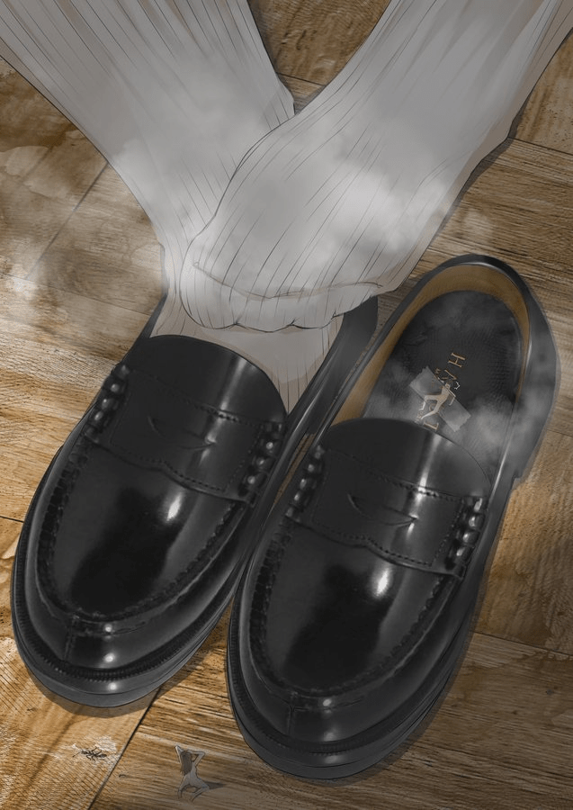

# 【翻译+改写】65%《巨大少女排除压力的方法是……...

作者：乔治·华盛顿

TID：31116

# 1

*本帖最後由 乔治·华盛顿 於 2021-9-4 23:30 編輯*

前言：大家好久不见！自从前作《巨大少女排除压力的方法是...》发表已经过了大半年的时间了，作品受到了超过我本人想象的好评。当时承诺过会继续进行类似的翻译+改编创作，但由于疫情与高考的影响而迟迟未能兑现承诺。终于，现在有空开始新篇章了，敬请观众姥爷们期待。

原文：[https://www.xcream.net/item/207737](https://www.xcream.net/item/207737)

原题：巨大メイドの都市蹂躙【宫沢ちはる】

—————————————————————— — ———————————分隔符———————————————————————————————

“欸？这种事情……办得到吗？”

“当然！不是已经有过先例了吗？”

“但、但是之后的生活……”

“嘛，嘛，只要这样的话……”

8月的某天。

某座城市。

在强大的副热带高压控制下，天空万里无云。

伴随着晴朗天气的，是让人难以忍受的酷暑。

不过，热浪抵挡不住人们的高涨的热情——一年一度的KM漫展正在这个城市热火朝天的举办着

有对着各式各样cosplay服装的少女们不停按动快门的人，也有满怀信心售卖自己辛苦制作的同人本的黄油玩家（星之守心春既视感）。

每个人都在以自己的方式尽情享受，将平时的压力抛之脑后。

然而，就在这充满欢乐气氛的环境中，有什么声音逐渐盖过了鼎沸的人声。

“咚！——咚！——咚！”

宛如什么东西重击地面一般的巨大声响，伴随着逐渐变强的地震，袭击了整座城市。

不管是在参加漫展也好，还是仅仅单纯的走在路上，人们纷纷停下来，试图寻找震动的来源。

很快，人们就发现了震源。

不知何时出现在城市郊外、穿着女仆服装的少女正一步步的靠近城市。

“快看！是千春酱！”人们第一时间发现了那个少女的真面目。

黑色的皮鞋、大幅缩短过的围裙、仅仅剩下胸罩部分的上衣包裹着不太成熟的胸部，搭配上蝴蝶结和白色头巾的标志性装束——

毫无疑问，这是全国的宅们所追捧的偶像，宫泽千春，因为绝妙的女仆装和用动人的“欢迎回来，主人！”而收获了几千万粉丝。

但是，看见偶像的兴奋仅仅持续了一秒钟。

因为千春的体型巨大的令人哑然。

“咚！——咚！——”

高达128米的巨大女仆在城市边缘站定，印有数字37的黑色皮鞋在放大了80倍后拥有15.5米的惊人长度，配合那天文数字的重量，将原本处在巨大少女位置的二层公寓踩到了地表以下，留下了脚印形状的大坑。

此刻，巨大少女歪着脑袋，脸上露出困惑的表情。

如果仔细观察的话，可以发现少女的右耳戴着类似于监听耳机的东西，那里面似乎正源源不断的传出声音。

“那个.......”突然，俯视着广大城市的巨大女仆开口了。“唔...这里是....宫泽千春”

宛如从高功放音箱中发出的声音传递到了每个人的耳朵中。

和平时爽朗又可爱的形象相反，支支吾吾的少女似乎对介绍自己感到相当难为情。

“因为被威胁了毁灭世界之类的事情……所以要将大家选做牺牲品……非常抱歉。”

人群中迎来了死一般的寂静。

人气偶像变成巨人，因为不明所以的理由准备将自己置于死地。

无论如何也理解不了状况。

“先是……路上的人...吗？嗯……我明白了...”千春低声的重复着耳机中传来的指令。“对不起...大家，但这是没办法的...所以”

朝着人流密集的主干道，在人们反应过来之前，千春高高的抬起了皮鞋，巨大的阴影笼罩了数十的人们。

“轰！——”

从60米的高空到地面，巨大的皮鞋只花了1秒不到的时间。

连遗言也来不及留下，数十人在千春脚下化为了血沫。

在四万吨体重的加持下，坚硬的柏油马路对于千春而言，简直宛如柔软的沙滩一般，每走一步就会凹陷下去；

不仅如此，巨脚下落产生的风压将附近的人们吹飞，将路上的车辆掀翻，踩踏发出的剧烈声响更是震碎了十几米内建筑物的玻璃。

“呜...好厉害...和诗织前辈说的一样呢……”脸颊微微变红的少女低声呢喃道，但忙着逃命的人们显然没有时间关心千春的自言自语。

以刚刚落下的右脚为轴，千春再一次高高抬起了左脚，对准无法动弹的人们，向他们宣判了死刑。

宽度接近十米的道路几乎容不下千春并排的双脚。不用说非机动车道，就连人行道也被迫纳入了袭击范围。行道树像杂草一样被千春踩到在脚下，书报亭更不可能承受得住万吨的压力，在碰到皮鞋的瞬间解体成塑料片。

“大家...请快点离开...”红着脸的千春并没有停下脚步，而是继续用远超走路需要的力量用力的践踏着脚下的人们。

“呼...完成了...”

全长百余米的道路，不过花费了千春几十秒的时间。回头望去，巨大的鞋印有规律而紧紧地分布着，到处都充斥着面目全非的残肢断臂，横溢的血液在鞋跟留下的深坑里汇聚成一个个小池塘，热闹的街道在千春脚下变成了人间地狱。

回过头，仔细端详着自己造成的惨剧，千春稍稍整理了下被汗浸湿的刘海。

“唔……好厉害……仅仅是走路，就造成了很厉害的破坏……”

将数以百计的、和自己相同年龄前途光明的同龄人粉碎在脚下的背德感和羞愧感一下子涌上了心头。

那其中，也有不少从全国各地赶过来，观看自己Live的年轻粉丝们。

但是，还有什么别的情感在积聚。

虽然隔着厚厚的皮鞋，但是，每当一个或几个小人，挣扎着被皮鞋碾碎的时候，微弱的快感就会传递到脚心，沿着神经，直达大脑。

那样的快感让大脑也发热，思考也变得迟钝。

“…滴、滴”

耳机中若有若无的声音打断了巨大少女的遐想。

千春又一次歪着脑袋，一边看着不远处的铁轨，仔细听着耳机中传来的内容。

“...拆掉列车？...用...用屁股？!……明、明白了...”

满载着逃难旅客的电车正在铁路线上以允许的最高速度疾驰着，但那样的速度在巨大的千春眼里甚至比不上慢跑。

千春踏到了铁轨上，正对着迎面向自己驶来的列车。钢轨被轻而易举的埋进了土里。

因为沿线楼房遮挡的缘故，无论是司机还是乘客都没及早看到千春。等到发现前方的铁轨被巨大的黑色物体占据的时候已经来不及完全刹停了。

“轰！——”铝合金的车头在巨大的冲击力下向内凹陷了进去，后续的车厢也全部脱轨了，然而千春的皮鞋却连一点凹痕都没有留下。

“唔...下面的大家没有事吧...”千春稍稍的弯下腰，仔细的从破碎的车窗中一窥究竟。

经历了突然减速和强烈冲击的旅客们在车厢内人仰马翻，座椅、吊环纷纷异位，车窗也尽数破裂，车厢内一片狼藉。

“怎么会这么脆弱呀....明明是撞到我身上可自己却被撞扁了吗......”

千春轻抚黑色的长发，慢慢的转过身子，背对着面目全非的列车，然后缓缓的蹲了下去。

“话虽如此，但因为要坐溃大家的关系，就当做...扯平了...再加上....”

千春慢慢撩开本就不长的围裙，保持露出内裤的状态持续下蹲着。

因为出汗的缘故，白色胖次的某些地方被浸湿而若隐若现。

“这个……就当做补偿……”

随着从破碎的车窗中照射进来的阳光一点一点消失，淡淡的汗味和女性特有的荷尔蒙味取代了车厢内的空气，让人头脑发晕。

在刚刚的撞击中幸存下来的人们惊恐的发现，千春硕大的臀部正慢慢靠近自己。

“所以...抱歉了，请大家死掉吧....”千春用银铃般的声音向列车中的人们宣判了死刑

“咚！——”

伴随着沉闷的响声和飞扬的尘土，原本是两节列车的地方被千春的屁股牢牢地占据着，留下了一个巨大的深坑。

放佛是要将死去人们的冤魂彻底碾进地狱一般，千春双手撑着地，来回扭动着屁股，将胖次底下的铁皮扭曲的更加变形。

“啊...啊...”千春的脸更红了。“好...好舒服...啊，不对……”

回头看向身后，剩余的几节列车里，已经有恢复意识、能够行动的人们争先从破碎的车窗里逃出来了。

“这是什么，心情变得奇怪了。”

明明是将无辜的人们用羞耻的地方压碎了，但是，心情很好，很舒服。

但是耳机沉默了。

心脏扑通扑通的跳着。

要怎么办？

“如果是为了世界的安全的话，牺牲也是没有办法的...”

千春用双手撑住地面，慢慢向后挪去。

巨大的臀部宛如压路机一般，源源不断的将一节节列车拖入深渊挤扁。

不到半分钟的时间，搭载着几百人的列车就彻底化为了千春屁股下的废铁。

“嘿咻~”

千春站起来，拍拍屁股上的灰。白色的胖次上占满了铁皮碎片和零碎的血色，宛如垫了超过负荷的卫生巾一般。

低头看去，被压平到二维的车厢还在源源不断的流出血液和破碎的人体组织。

# 2

题外话 日本人对于女仆是真的很喜欢嘛

不仅在这里拍摄了以女仆为主题的片子，在更早的Gen's Lab系列中就有女仆形象演员的出境，即Online GTS-2，在15年时由@柳一闯 率先转载在优酷上，引进时叫做“巨大化入侵2”  

# 3

*本帖最後由 乔治·华盛顿 於 2021-6-20 19:56 編輯*

无奖竞猜：

究竟是谁在给宫泽千春酱下命令呢？

A.境外势力

B.反二次元吧吧友

C.罪该万死的P社玩家D.变态的GN坛友

E._______（期待诸位的回答）

# 4

> [御坂01403 發表於 2021-6-19 00:05](https://giantessnight.cf/gnforum2012/forum.php?mod=redirect&goto=findpost&pid=471425&ptid=31116)

> 我的天居然真的出续篇了！！老师的几篇文章全都直击xp，写得真的是太棒了！！特别喜欢！！希望老师继续更新 ...

ありがとうございます！

谢谢你！

# 5

有个问题

怎么让大家看到标题就知道这是续篇

而不是第一篇被挖坟了呢？  

# 6

在高楼密布的商业街里，不断带来死亡的“咚、咚、咚”的声音消失了。

尽管千春很高，但，比她身体更加大的建筑有很多，因此千春的身影完全被大楼挡住了。

街区外面的人看不到发生了什么。

但是正和千春面对面的人都吓得不敢说话。

“嗯……”

千春正站在某幢比自己还高的大楼面前。

和商业街的其他大楼一样，外表不是钢筋混凝土，而是玻璃幕墙。

“大家，在哪里呢？”

千春将脸凑近大楼。

水灵灵的大眼睛透过玻璃仔细地观察着。

凌乱的桌椅，还亮着屏的电脑，洒在地上的文件，但是没有看到人。

但千春知道，大部分人们都还躲在里面，没有跑出去。

要问为什么的话，之前跑出来的人都被悬在大楼门前空地上方的黑色皮鞋踩破了。

“千春不会对大家做坏事的，请大家出来吧。”

躲在办公桌下面、咖啡机后面、被困在断电的电梯里面的人们不敢相信。

不知从何而来的女仆装扮的巨大少女，踩毁了街道，坐溃了火车，现在盯上了自己。

过于巨大的少女，就连少女的眼睛的全貌都无法从同一层楼看清。

腿的高度更是跨越了几十层楼。

反抗是不可能的。

唯一能做的是祈祷巨大的少女主动放弃，或者军队也好警察也好能够将自己救出去。

然而，两边的选项都是不可能的。

“抱歉，但是如果大家不出来的话，那我就只能自己动手了”千春继续上下扫视着不同的楼层。

“因为被要求“将人放在自己的身体上”，所以没有大家的协助是不可能完成的。”

千春巨大的身体向后退了一点。

为什么偏偏选择了这幢大楼呢？

想要人类的话，地铁站，道路上或者其他什么地方都有的是。

被困住的人们不能理解少女的心意。

“那么，我进来咯？”

千春向着玻璃幕墙伸出了手。

“砰、乓！”

千春的手轻而易举的粉碎了玻璃，入侵到了大楼的内部，肆无忌惮的搅动起来。

办公桌也好，电缆也好，乃至承重墙也好，没有什么可以阻止千春的手的搅动。

不停地有电脑、桌子、文件柜从破碎的玻璃处掉下大楼。

所有的东西都一团乱糟了——人们也不例外。

“啊，有了~”

可以感到有什么温暖的、会动的物体被手掌困住了。

千春将手轻轻轻轻握紧，离开大楼。

手掌里是两个小人。

大大的眼睛和小小的眼睛对视了。

少女的脸上是温柔和放松的微笑，但是两个人的脸却因为过渡的恐惧扭曲了。

“抱歉，但是请不要害怕。”

握着两人的手掌慢慢的移动到胸部的上方，然后松开了。

顺着沾满汗水的白皙肌肤划下，两个人被囚禁在了千春的胸部下方和衣服的空隙里。

“我说了吧，不会有事的哦”千春一边说着，一边重新看向楼里。

被搅得一团乱糟的楼层，失去了遮挡物的人们被看的清清楚楚。

从黑色动人的眼睛里散发的目光扫视过每一个人。

千春如法炮制，将不同楼层的十数人关进了布料和皮肤的监狱里。

因为关着人们而隆起的布料，白皙又圆润的胸部，伴随着微风飘来的少女的气息，这样扣人心弦的景象甚至让其他人产生了美好的想象。

但胸部的情况相反。

人们堆叠在那里。

下方是柔软的布料和其他人，站立也做不到。

上面是摇晃着的巨大的肉色的球状物体。

虽然没有被压扁，但是人们并不能感到安心。

沐浴在阳光直射下的千春，正在不停出汗。

从胸部不停地有汗水滴落在人们身上，少女甜腻的气味在小小的空间里蔓延着。

温度也非常高，空气稀少。

快要被窒息的人们挣扎、蠕动着。

“嗯……”千春的口中发出了小小的声音。

可以透过柔嫩的肌肤感受到人们在自己的胸部挣扎着。

胸部的温度陡然上升了，千春的脸也慢慢的泛红了。

感觉很痒，但却很舒服。

“抱歉，马上就解放大家。”

千春挺起胸部，朝着大楼移动。

千春将自己的胸部仅仅压在了大楼上。

大楼的结构接受不了几千吨的胸部的冲击，一边发出嘎吱嘎吱的声响，一边被胸部入侵了。

好几层楼被波及，天花板被削除，千春的胸填满了四层楼的空间。

受到巨大的胸部和大楼双重挤压的人们全部死亡了。

“这是什么，感觉很好~。”

回过神来的时候，胸部已经不自觉的动了起来。

可以看到零散的人们在大楼里因为自己的行动翻滚着，随着各种东西从窗口滑落出来，落在胸部上，然后继续掉下去。

但是千春没有停止，更加用力的向前挤压着。

巨大的胸部像是拆迁建筑用的铁球一样粉碎着大楼的结构。

先前承重墙已经被损毁的楼层无法继续保持稳定，以千春的胸部为转折点，变成了“く”字形，倒塌在了千春的胸部上，然后化作瓦砺洒在下面的街道。

不仅是胸部，柱子一样的大腿也向前，膝盖戳如大楼，将逃生的空间损毁掉。

人们被胸部挤扁，大楼也被压碎。

因为想体验一下损毁玻璃感觉，而挑选了大楼作为目标的千春，迎来了近乎绝顶的刺激。

胸部、手、大腿、脚……身体的各部分都可以感受到大楼的垮塌。

“抱歉，因为是命令，所以没有办法。”

实际上损害已经远远超出“命令”理论上的范围了。

千春左右晃动身体。

大大的胸部随着身体的晃动一起移动，将大楼内部进一步的嚼碎。

倾斜的大楼，粉碎的逃生通道，被挤扁在楼层之间的电梯……没有人可以从即将崩溃的大楼里逃出去。

“哗啦——”

伴随着震天动地的巨响和浓烟，大楼终于全部倒塌了。  

# 7

> [摸鱼摸鱼 發表於 2021-6-19 20:29](https://giantessnight.cf/gnforum2012/forum.php?mod=redirect&goto=findpost&pid=471489&ptid=31116)

> 把续字改到书名号的前面去？可能大家看见就会知道了。也感谢大佬的文，甚至有种想把影片搞到手传给大佬看 ...

谢谢你的好意呀~

不知道你买的是哪几部呀

# 8

大家喜欢看什么情节呢

这篇完结之后 其他文章我看情况发～  

# 9

刺耳的警报声在街道上响起。

在布满深坑和各类残骸的路上勉强行驶的警车载着警员们作为第一批的防卫力量，终于抵达了千春的脚下。

“你已经被完全包围了，还不赶快投降吗！”拿着枪的警察们，腿在发抖。

过于巨大的少女，一击就可以让大楼化为废墟，对这样的存在，枪真的有用处吗？

“唔…那个……”千春轻轻弯下腰，露出了勉为其难的表情。

“再…再不投降的话，我们就要开枪了！”

“抱歉…但是，因为是命令，所以请不要阻止我……”震耳欲聋的声音甚至刺痛了警察们的耳膜。

警察们并不明白巨大少女口中“命令”是什么，但是，必须阻止那样的怪物。

“如果你现在……”

“太晚了”突然，千春直起了身子。“踢飞……吗？我……知道了”

警察们注意到千春的戴着的耳机在闪烁。

“是你们的不好喔……”

说着，千春将右腿向后高高抬起，对准了面前的警察和警车。

察觉到了不详气息的警察们，对着千春的鞋子开枪了。

然而，闪耀着黑色光芒的巨大乐福鞋，比起坦克的装甲更要厚重，子弹全部被弹飞了。

下一瞬间，巨大的乐福鞋撞击了地面。

即使挖开柏油路面，巨大的乐福鞋也丝毫没有减速，而是保持着势头再次抬起。

依次碰到鞋尖的警车就这像易拉罐一样被千春踹飞，在空中解体，撞进几百米外大楼的外墙，翻到在屋顶，或者在路上卷着小人一起翻滚。

零件洒落一地，而人类更是在接触到鞋子的瞬间被撞击成了肉末。

在过于巨大的少女面前，人类束手无策。

认清了这一现实的幸存的警察们，丢下了手中的武器，纷纷窜回警车，想要逃走。

“唔……如果逃跑的话，我会很为难的。”

向着慌乱发动汽车的警察们，千春高高的抬起了脚。

适合千春小脚的可爱皮鞋对于人们而言，是可怕的破坏兵器。

阴影笼罩了躲在警车内的警察们。

然后，千春的大脚瞬间落下了。

巨大的乐福鞋压碎了闪烁着的警灯，压垮车顶，将坐在驾驶室的人也压扁，然后将引擎和车体也全部粉碎，最后压溃了底盘，将警车的残骸和面目全非的尸体深深地压进路面以下的位置才停止。

“唔……请不要逃跑！”对着已经发动了的警车们，千春困扰的说着。

此时，逃跑的警察们终于体会到了罪犯们听到“站住，不要跑！”时的心情。

时速几十公里的车，对于百米的巨人千春而言，就像是蠕动的西瓜虫一样。

稍微跨出一步，就够人们跑上好久。

更何况，路上还有千春留下的深坑一般的脚印阻挡着人们。

“れます！” “れます！”

警车接二连三粉碎在千春的巨大乐福鞋下。

里面的人别说是平安无事，就连肢体完好的都没有。

只剩下最后一台警车了，因为过于慌乱，而陷在了千春的脚印里，动弹不得。

坐在警车里的是一名年轻的男性警官。

死死握着方向盘，将油门踩到底，可是车子却纹丝不动。

从挡风玻璃透进来的阳光渐渐消失了，取而代之的是粘满了残骸的黑色鞋底。

“抱歉，很快就好了。”

千春用银铃般的声音向年轻的警官宣布了死刑。

除了眼睁睁的看着巨大的黑色皮鞋接近自己，却无能为力。

绝望的警察闭上了双眼。

但是，下一秒，巨大的皮鞋停住了。

“脚垫……？这…这种事情也太……！……我明白了……”

千春慢慢收回了笼罩在警车上的大脚，然后坐了下来。

睁开双眼，惊讶于自己还活着的年轻警官，看到的是面向自己而坐的千春。

从这个角度，可以看到张开的裙子里的内裤。

过于强烈的现实反差，让警官一时不知所措了。

“抱歉，因为一直捂在鞋子里，可能会有点臭”

小人听不懂千春在说什么。

“嘿咻~”轻轻解开鞋带，托住后跟，千春将右脚上巨大的黑色皮鞋脱了下来。

千春巨大的赤脚暴露在空气中。

因为剧烈运动的关系，脚趾也变得通红，甚至可以看到汗水反射着阳光，从巨大的脚掌上一路留下。

巨大的脚立在道路上，占满了两车道的宽度，站在近处的话，甚至不能将脚后跟和脚趾尽收眼底。

“咳咳！”警官不停地咳嗽起来。

从长时间的穿着中解放出来的赤脚，散发着浓烈的脚臭味。

可以看到白色的水汽不断地从蒸得通红的脚底上不断冒出来。

“抱歉，好像比想的更加严重一点……”

从千春这里闻起来相当浓烈的味道，对于小人而言和毒气没什么两样。

一边搓动脚趾，一边轻轻摆动着脚掌，被搅动的空气将浓烈的气味送到了远方。

“请忍耐一下…一下就好”

千春迅速伸出巨大的手，轻轻松松抓住了有人的警车。

透过挡风玻璃可以看到里面惊恐的小人，一想到他即将面临的处境，羞耻感和兴奋感充满了心头。

尽管没有用力，但是被千春巨大手掌夹住的警车，车门向内凹陷，车体发出了悲鸣。

“请进…”

千春用力的将警车塞进了和脚掌一样冒着热气的乐福鞋里。

比巴士更大的乐福鞋，可以轻松容纳小小的警车。

但是，比刚刚更加恶劣的气味和潮湿闷热的空气一同向被困住的警察袭来。

就连挡风玻璃也被浓浓的白雾覆盖。

（“如果穿进去的话，会立刻被踩扁的，怎么办呢”）

虽然内心里感到犹豫，但千春仍然站了起来。

看着被困在自己鞋子里的小人和警车，千春慢慢挪动赤裸的右脚，向鞋口靠近。

（“被闷在臭鞋子里很痛苦的吧，不能再让他忍受了”）

这样想着的千春，坚定了决心。

“唔！好舒服”

因为出汗而变得闷热、黏糊糊的脚趾一下子接触到了冰凉的铁皮，产生了强烈的快感。

为了尽快结束因为自己而被虐待的小人的痛苦，也为了更多的感受冰凉的触感，巨大的赤脚加快了速度。

（“可以感受到有什么东西碎掉”）

锋利的脚指甲一下子贯穿了车顶，侵入了驾驶室，座椅也被踩烂，随后而来的脚掌则将后备箱彻底压平。

感受到阻力，千春更加用力的将脚伸进鞋子。

在无法让人忍受的桑拿中，小小的警察连带着驾驶室的前部在脚趾和鞋尖的双重挤压下彻底崩溃了。

警车变成铁皮，警察也变成了血沫，挂在脚趾上，但是千春也感受不到，因为和脚汗的量相比，血液太少了。

（“不知道怎么样了呢……”）

轻轻用脚尖点点地的千春，不知道鞋子里发生的惨剧。

*   *    *

城市里尚完好的某地。

某些还没有被波及到的正常形态千春的粉丝们没有闲着。

对奇怪的耳机感到在意，不相信自己的偶像会做出屠杀这种事情的人们，坚想方设法的要找出在暗地里给千春发号施令的人。

# 10

*本帖最後由 乔治·华盛顿 於 2021-6-26 02:15 編輯*

一些仅供联想的图片

原作的图片下载时出了点问题 之后在送上

# 11

<ignore_js_op>[43E5066B-DFEA-4AAB-87F3-D9DCF7487783.jpeg](forum.php?mod=attachment&aid=ODkzOTB8MThlNWNhYjJ8MTY0NzcwNTEzMHwxODIzMHwzMTExNg%3D%3D&nothumb=yes) *(96.53 KB, 下載次數: 2)*

[下載附件](forum.php?mod=attachment&aid=ODkzOTB8MThlNWNhYjJ8MTY0NzcwNTEzMHwxODIzMHwzMTExNg%3D%3D&nothumb=yes)

2021-6-26 02:15 上傳  

</ignore_js_op> <ignore_js_op>[7E78EF9A-0134-474F-8E14-B999B03062B8.jpeg](forum.php?mod=attachment&aid=ODkzODl8MjkyZWZhZjF8MTY0NzcwNTEzMHwxODIzMHwzMTExNg%3D%3D&nothumb=yes) *(98.91 KB, 下載次數: 3)*

[下載附件](forum.php?mod=attachment&aid=ODkzODl8MjkyZWZhZjF8MTY0NzcwNTEzMHwxODIzMHwzMTExNg%3D%3D&nothumb=yes)

2021-6-26 02:15 上傳  

</ignore_js_op> <ignore_js_op>[36FB9583-9447-451B-ADBD-A783372D8192.jpeg](forum.php?mod=attachment&aid=ODkzODh8OWVlMTlkM2V8MTY0NzcwNTEzMHwxODIzMHwzMTExNg%3D%3D&nothumb=yes) *(193.05 KB, 下載次數: 3)*

[下載附件](forum.php?mod=attachment&aid=ODkzODh8OWVlMTlkM2V8MTY0NzcwNTEzMHwxODIzMHwzMTExNg%3D%3D&nothumb=yes)

2021-6-26 02:15 上傳  

</ignore_js_op> <ignore_js_op>[354F2057-F369-4A89-87DE-C42537FF7A42.jpeg](forum.php?mod=attachment&aid=ODkzODd8NWQwODQ2M2N8MTY0NzcwNTEzMHwxODIzMHwzMTExNg%3D%3D&nothumb=yes) *(108.54 KB, 下載次數: 3)*

[下載附件](forum.php?mod=attachment&aid=ODkzODd8NWQwODQ2M2N8MTY0NzcwNTEzMHwxODIzMHwzMTExNg%3D%3D&nothumb=yes)

2021-6-26 02:15 上傳  

</ignore_js_op>  

# 12

“千…春…小…姐…！”

微弱的声音传进千春的耳中。

用眼光仔细搜寻的话，可以看到在现代化的百货中心的楼顶上，有许多人挥舞着横幅，正用高音喇叭努力的引起千春的注意。

感到好奇的宫泽千春，一边粉碎着街道，一边小心的靠近那里。

“千春酱……怎么可能做出那种事……？”

“那么温柔的千春酱……一定是被人威胁了！”

“没错！都是躲在耳机后面发号施令者的责任！”

不愿相信千春化为巨大少女屠杀人类这一事实的粉丝们，自发的聚集在一起，试图帮助千春。

之所以来到百货中心的楼顶，当然是因为只有从高处才能安全的吸引到身高近百米的少女的注意力。

之前也有试图通过地面和千春取得联系的人，但在被注意到之前就被巨大的乐福鞋碾碎了。

不过除此之外，还有更重要的原因：

在百货公司的楼顶上，装备着大功率的信号塔。

稍加改装一下的话，就可以在一定范围内屏蔽掉无线电信号，因此，自然也就无需担心耳机中的幕后黑手了。

——至少，粉丝们是这么想的。

“唔……”

即使是和周围的建筑比起来，百货公司也算是很高的建筑了，但也只能勉强能达到千春的胸口就是了。

“千…春..小..姐..！我..们..知..道..你..是..被..胁..迫..的..！”

那里的团体中，起到负责人职责的人接过高音喇叭，用能达到的最高的音量大喊着。

“大家……谢谢”

从如同蚊子一般的嗡嗡声中，勉强听懂了对话的千春，露出了惊讶的表情。

从从轻启的朱唇中，带着千春口腔味道的阵风一下子席卷了那个百货公司的楼顶，许多人被吹翻在地。

意识到失态的千春轻轻地用手捂住小嘴。

“没..关..系..的..，千..春..小..姐..！”从地上爬起来的负责人指着身后的发射塔，兴奋地说道“这..是..我们做的...屏蔽器！这里的话，不用担心....命令”

“诶！？”因为过于惊讶而扬起眉毛的千春几乎化为了石像。“是…是真的……吗？”

“是..的！这是..我们……所有人的努力..！”负责人自豪的说着。周边的粉丝们也都聚拢了过来。

“呜呜……谢..谢谢大家！”

从少女那宛如湖水一般清澈的双眼中，孕育出晶莹剔透的泪水。

“对…对不起，但，但是……”用双手捂住发红的眼睛，千春全身都微微的颤抖起来。

可爱的偶像哭泣的样子，深深地铭刻在每个在场粉丝的心中，甚至有人暗暗为能目睹这一场景而祈祷。

“没有关系的！”

“我们会永远支持你的！”

从数十人的团体当中，接二连三的发出支持和鼓励的话语，仿佛是在安慰一个不慎打碎了花瓶的小女孩。

“嗯嗯！再也不用……”擦干眼泪，千春将还带着泪痕的清秀的脸庞靠近那里的人们，嘴上挂着淡淡的微笑。“还有别的人参与吗？千春想要一起感谢她他们！”

过于巨大的白皙脸庞完全占据了所有人的视野但没有人往后退去。

“没有了哦！大家都在这里了！”宛如邀功请赏一般，负责的人兴奋的大喊着。

“原来如此…话说”突然，从人们的视线之外，巨大的阴影突然从人群头上略过。

那是千春的右手。

“这个，就是信号塔吧？”

千春一边说着，一边弯下身子，慢慢的将张开状态的手靠近在百货公司顶楼中央的信号塔。

从那里发出的屏蔽信号正有效的干扰着附近的通讯。

“当……当心！”从负责人的口中发出的忠告指的是信号塔，但比起那个，他应该更关心自己的安全。

因为靠近信号塔的缘故，千春庞大的身体也跟着凑近了大楼。

巨大而饱满的胸部越过了安全线，君临了人们的上方。

最靠近千春的负责人，一下子就被那个过分巨大的胸部压到下面去了。

即使再有弹性，人也不可能在以千吨为单位的重量的压迫下存货。

幸存的人当中爆发了骚乱。

人们才想起来，自己面前的是几十倍大小的巨大少女。

“喂！压…压到人了……”瘫坐在地上的人发出了尖叫，但更多的人开始逃跑了。

可能是因为失去了唯一的高音喇叭的原因，千春没有停止动作。

巨大的胸部像是推土机一般，嘎吱嘎吱的向前削减着天花板。

燃气管道也好，空调外机也好，因为过于惊恐而动弹不得的人也好，全部都被卷进了隆隆前进的巨大胸部。

“千春很感谢大家的努力哟，但是……”距离刚好的手，将小小的信号塔完全握了起来。“但是，这样的话，果然是行不通的……”

“嘎——吱——”

慢慢向右手施加力量，钢铁做成的信号塔在强大的力量下被握溃了，塌缩成扭曲的一团。

“千春，会记得大家的，所以，请大家帮我保守这个秘密……”

要让人完全保守秘密的话，最安全的方式只有一种。

稍稍抬起身子，面目全非的人类尸体和混凝土碎块从巨大的胸部上抖落。

被压碎的负责人的血液在白色衣服面料上留下了鲜明的痕迹。

不难想象在混凝土地面和胸部之间被挤死是多么痛苦。

“因为是大家的关系，所以至少……”

对着已经空无一人的天台，千春不紧不慢的说着。

大概有1/4的人被胸部碾碎了，但更多的人已经跑进了大楼里面。

从被胸部削减而露出钢筋结构的天花板，可以隐约看到正在拼命逃跑的人们。

千春稍稍弯腰，用双手从下将沉甸甸的胸部托起，用力抬到最高，然后一下子松开手。

“呼——”

因为弹性力的缘故，失去双手支撑的胸部以更快的速度落了下去。

已经经受了一次胸部攻击而变得脆弱的天花板，承受不住那样巨大的动能，塌了下去。

一层。

两层。

三层。

无论是体积还是重量都过于巨大的两颗球状物，将从顶层往下的三层都砸毁了。

千春的胸部深深地陷进失去了上部的百货公司里。

“但是，为了保险……”

以小人们的速度，就算做电梯也不可能在这么短的时间里往下三层楼，但是为了安全起见，少女决定要将整幢楼一起毁掉。

大楼里不仅仅有那些粉丝们。

倒不如说，和在大楼内避难的人们和职员来说，几十人的粉丝反而可以忽略不计了。

在经受了那样强烈的撞击之后，不仅人们倒在地上，连照明和电力系统都停止工作了。

不仅如此，承重墙也出现裂缝，唯一的逃生通道也是人挤人的状况。

无论怎么看都是很危险的样子。

“呼——”

用手拂去残骸的千春，慢慢抬起脚。

哪怕是削减了3层楼，大楼也还是有着相当的高度。

虽然并非没有其他的方式，但千春还是决定用最传统的办法。

抬高到大楼中部附近的巨大乐福鞋，各类残骸从鞋底的纹路中落下。

在窗边近距离欣赏到这一恐怖情景的人们不由自主的感到腿软，瘫坐在地上，或者抱着脑袋躲在货架旁和桌子下。

“请不要害怕，一下就好。”

伴随着从视线之外传来的那样温柔的声音，被黑色的乐福鞋包裹着的脚慢慢靠近大楼，和玻璃幕墙接触了。

脆弱的玻璃没有做任何抵抗，完全接受了千春的脚。

不仅如此，巨大的脚和脚踝，消去天花板，将商店、货架和人们推开，撞断承重柱，从中间插入逃生通道，不断向着里面推进着。

被卷入鞋底下的人们完全被压成了肉糜。

最终，10几米长的巨脚完全伸进了百货公司里。

只要稍稍一放松的话，楼层就会因为承受不住重量而坍塌的吧。

“噫……好痒”

因为没有穿袜子，所以可以感觉到碎掉的玻璃、商品还有小人之类的掉入鞋子和脚背之间的空隙里。

感觉到不快触感的千春，决定立刻了结大楼。

“咚！”

一下子向脚上施加了压力的千春。向着大楼踩了一大脚。

十几层楼一下子就被踩穿了。

拥挤在断裂的逃生通道中的人们也好，躲藏在卫生间的人们也好，纷纷失去平衡，翻滚着跌落下去，或被巨大的鞋底压平，或被埋在混凝土当中。

当然，有大洞的大楼是不可能完好立着的。

建筑剩下的部分很快也一起稀里哗啦的倒塌了。

在扬起的浓烟中，能够容纳上万人的百货公司荡然无存了。

# 13

呜呜呜呜

我更新了，大家快回来吧

下次不鸽了  

# 14

> [青松城 發表於 2021-9-15 01:58](https://giantessnight.cf/gnforum2012/forum.php?mod=redirect&goto=findpost&pid=479654&ptid=31116)

> 终于更新啦。我怀疑所谓幕后黑手，不会就是千春自己吧？

嘘????... ...

... ...... ...... ...... ...... ...... ...... ...我也不想去你的