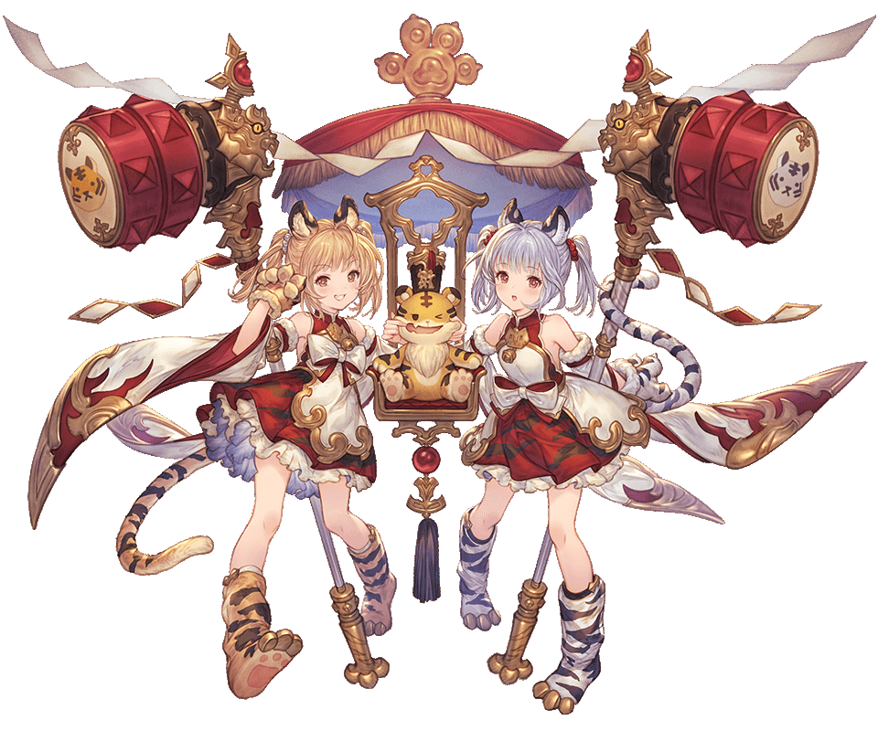

# 【翻译】歳神少女の吉兆招き蹂躙

作者：kongming

TID：32406

# 1

作者：断頭台

原文：[https://www.pixiv.net/novel/show.php?id=16758377](https://www.pixiv.net/novel/show.php?id=16758377)

GBF同人文，主角是新出的岁神，虎神将双子

黄擅长打扮不擅长看H书

白擅长看H书不擅长打扮

​​​ <ignore_js_op>

**虎妹.png** *(238.83 KB, 下載次數: 1)*

[下載附件](forum.php?mod=attachment&aid=OTMyNDl8MWRmYjIwNzN8MTY0NzcwNDM4MXwxODIzMHwzMjQwNg%3D%3D&nothumb=yes)

2022-1-12 15:23 上傳

倒不是说对虎有什么幻想，毕竟我不是萝莉控。但是该说不说的，虎确实有点好看，我不是萝莉控，但是有一说一，确实有点好看。我也不是说喜欢萝莉，但是这个虎确实是挺好看的，不过我不是萝莉控。

# 2

格兰赛法。

是苍色的空之世界中旅行的一个骑空团的骑空艇。

骑空艇上，两名少女皱着眉头，窃窃私语。

「黄，怎么办」

「怎么办，就算你这么说」

她们是黄和白。

十二神将中的一员･･････。不，是两人。她们二人共同作为寅神宮的守护神辛妲拉。

但是，现在她们皱眉的理由和那件事无关。

她们皱眉是因为她们的力量——风水。双虎风水带来的感知。

风水。

从事物的方位格局、色彩以及各种各样的方面，可以看出事物的运势和吉凶。

对于能将这种力量在战斗中运用自如的她们，能够轻易就看出当前的运势。

正因如此，才知道了。

如果继续这样前进的话，格兰赛法将会迎来毁灭的危机。

不，前进不行，后退不行，留在原地也不行。

周围的方位布局已经凶险到了这种程度。

周围不是浮岩，而是浮岛。

尽管都是无人岛，不用担心破坏了会造成什么影响，她们也有足够的力量能够破坏这片群岛，但是想要把浮岛弄碎打乱布局的话，也需要几天时间。①

这样的话，完全赶不上格兰赛法的凶兆降临。

「明明知道接下来会发生不好的事，却什么都做不到吗」

「嗯･･････格兰赛法里全都找过一遍了，没有找到能打破现在局面的吉兆。」

已经无计可施了吗，好不容易才踏上旅程，居然这么简单就要结束了。就算这样也要想想办法，向着格兰赛法里存在吉兆的地方走去。突然，脚下碰到了什么东西。

「这是什么？」

「不知道･･･････、啊，是手电筒吗？」

「真的！发光了！嗯，那个？･･････？白，你缩小了吗？」

「不，是黄变大了」

「什、什么！？」

那是她们加入骑空团前不久的一段时间。

短暂地加入这个骑空团，梦想着成为骑空士的少年们【不小心】留下的东西。②

当然，如果被某个爱管闲事的炼金术师发现的话，肯定会大发雷霆的。

但是，是她们，辛妲拉发现的。

如果变得很大的话，怎么样呢。

（古兰会再次迷恋上我！）③

（古兰，又用下流的目光看我･･･････）

暂且不提两人内心奇怪的想法。

计划当晚就开始执行了。

夜幕降临。

格兰赛法已经在凶兆的影响下遍体鳞伤了，但总归是成功暂时停泊了下来。

已经没有时间了。

「走，走吧！白！」

「嗯，黄」

从寂静的格兰赛法的甲板上，辛妲拉探出了身子。

下方等待的是，死之大地。

但是，那样的东西已经没有关系。

两人让对着手电筒，让光照在自己的身上。

十倍、百倍。

脚还没接触到天空下广阔的大地。

但是，还没结束。

千倍，然后，一万倍。

最终到了十万倍左右。

她们的脚，同时踩在了赤色地平线上，发出了巨大的轰鸣声。④

「呃～～～、稍微有些惊讶」

「但是，成功了。格兰赛法也是，嗯，大家都没醒」

本来听到那么大的轰鸣声，起来也不奇怪。

但是，由于双虎风水的应用，在吉兆的位置停泊后，格兰赛法就察觉不到袭来的凶兆了。

这样一来，在她们解决整件事情前，团长他们都不会察觉到了。

「好！那么，上了！吼！」

「嗯･･････」

两人从背上取下了巨大的战锤。

「「哟西！」」

如果是平时的战斗，两人会在轮流进行攻击后，默契地进行合击。

但是，如果不需要躲避敌人的攻击的话，两人立刻就可以进行合击。

随着撕裂空气的轰鸣声，巨大的质量被抛向空中，宽度足有二十万米。

那是曾经黄与白两人之间的战斗，让一座小小的岛屿失去了大部分面面积之一的原因——太极猛虎战锤。

现在有了万倍的大小。

威力已经无法计量。

「啊，吹飞出去了」

「稍微有点强过头了･･･････」

正如字面那样，是压倒性的强度。

使用武器一击，可能有点过度了。

正如字面意思的过度火力。

挥舞下去的一瞬间，岛屿就坠落了，落到了赤色地平线上。

「等等，这样有点过头了･･･････」

「是啊。但是，如果不用武器的话，怎么办呢？」

「嗯，那个･･････ 我，看过一本书･･････」

白巨大的手掌慢慢地抓住了巨大的岛屿。

「嗯，我也是，偶然看到的那本书，是什么呢，像这样做的･･････」

说着，白把抓住的岛屿贴在了自己还没成熟的胸部上，开始摩擦。

「H、HHH、H是不行的！？白！」

「嗯，但是，不这么做，吉兆，不会来的･･････时间不多了，真的不做吗･･････？」

摩擦，摩擦，摩擦，白露出了舒服的表情。

吐出了小小的、微微颤抖的炽热气息。

「･･････呜」

看到另一人的模样，黄的喉咙发出了小小的呜咽声。

少女的巨大手指战战兢兢地伸向了无人岛，慢慢地抓住了它。

「呐，要怎么做呢？黄」

「烦、烦死了」

说着，她抓住岛的手，移到了两腿之间，隔着她可爱的内裤，缓缓地摩擦着她的裂缝。

「呀，什么，这，呼，这和平时，不一样･･････呜」

她做过的次数很少，真的很少，现在和用指尖的感觉完全不一样。

虽然岛上没有人，但是也有很多生命，大地粗糙的表面和比手指更坚硬的触感，刺激着她的身体。

「哈、哈･･････哈･･････」

当然，先开始的白也一样。

摩擦着尖端的时候，她的呼吸变得粗暴而炽热，未成熟的前端，比大地还要硬，随着摩擦，传出了甘甜的香味，岛屿逐渐崩碎。

「啊，要去了･･････」

那个声音是从谁发出来的呢。

被甜蜜感觉冲昏了头脑的两人，已经完全意识不到了。

她们在朦胧的意识中，拿起了一个小岛。

比刚刚的岛更小，是一个狭长的岛屿。

「呐･･････、黄」

说着，白衔着岛屿的一端，伸向黄。

「･･･････只是今天」

黄红着脸，接受了邀请，美丽的白色牙齿，模仿着她，咬上了岛屿的另一端。

那种感觉像是饼干一样，在嘴里发出脆脆的响声，她们嘴中蔓延的不是泥土的味道，而是更加复杂的味道。

不知道是因为变大的原因，还是原来就是这种味道。

但是，至少现在，她们的感觉，只有美味二字。

在这期间，少女们也互相寻求着快乐。

像对自己做的一样，黄的手指，在白的裂缝上，白的手掌，在黄的胸上。

互相爱抚，互相爱抚着，少女们为了快乐，互相爱抚着对方的身体。

最终，岛这个点心，终于完全落入了二人的口中，两人的舌尖交缠起来，唾液混杂在一起。

赤色地平线上，想要干涉两人的幽世生物都被碾碎了。

而空之世界中，即使发现到了异常也到达不了这片空域。

这个位置已经是凶兆的位置了，不管怎么做，发出什么声音，都无法被认知到。

因为这样调查都被推迟了。

这样就不用担心被谁发现了。

「所以･････」

「就算弄坏很多，也没关系啊･･････」

彼此之间攻击对方的不习惯的部分，已经够了。

被对方玩弄的不习惯的部分带来的痒痒的感觉反而激起了她们的性欲。

保持着亲吻的状态，用各自的身体一起夹住岛屿。

就这样，互相摩擦着身体，在彼此的双腿之间，消耗着小小的岛屿们。

终于，她们忍不住了。

「已经不行了･･････」

「嗯，我也是，所以，这是最后了，黄」

抓住了团长们停泊着的那座格外大的无人岛，白让它漂浮在自己的双腿之间。

「一起，快乐吧？」

「･･･････嗯」

两人用双腿夹着岛屿，互相摩擦着身子。

造成了和空域中发生的大异变相同程度巨大灾害的当事人，只是两个少女，谁都想不到吧。

狡知的恶魔知道的话一定会捧腹大笑吧。⑤

但实际的情况，确实是天崩地裂。

从世界诞生就存在的岛屿，一瞬间就被消耗掉了。

而且还不够，贪婪地把嘴唇贴在一起，抓住周围的岛屿来使用。

第三个岛屿，第四个岛屿......两人的快乐达到了顶点。

在相拥的她们之间，在大地剥落的轰鸣声中逐渐粉碎。

「哈･･････哈……怎么样，白」

黄疲惫地躺在大地上，仰望着上方的浮岛群。

「嗯……这样的话，凶兆就过去了吧」

躺在她身边的白，回应道

「･･･････呐，白」

「･･････嗯」

下次再来一次吧。两个少女咯咯地笑着，看着自己破坏的痕迹，满足地做了约定。

①：个人剧情里有说过她们因为争夺辛妲拉的名号打了三天三夜把无人岛打碎了一半

②：虎神将落地前的一个活动是哆啦A梦联动，该道具是放大灯。

③ ：古兰是碧蓝幻想由玩家操控的主人公，官方名称男性为古兰，女性为姬塔。（官方同人短漫里出场的古兰是萌新非洲人，而姬塔是超规格战力欧洲人。姬塔常作为futa出现在各种同人里）

④：该世界观的“天”与“地”，天是空之世界，地是“空之底”赤色地平线。一般人都生活在空之世界的浮空岛屿上，赤色地平线位于空之世界下方，是荒芜的无限广阔的死亡大地，现已经被来自异世界的异形军队【幽世】占据了。了解更多请搜索【幽世】词条

⑤：狡知的恶魔指的是堕天司贝利尔，很骚的男人。</ignore_js_op>