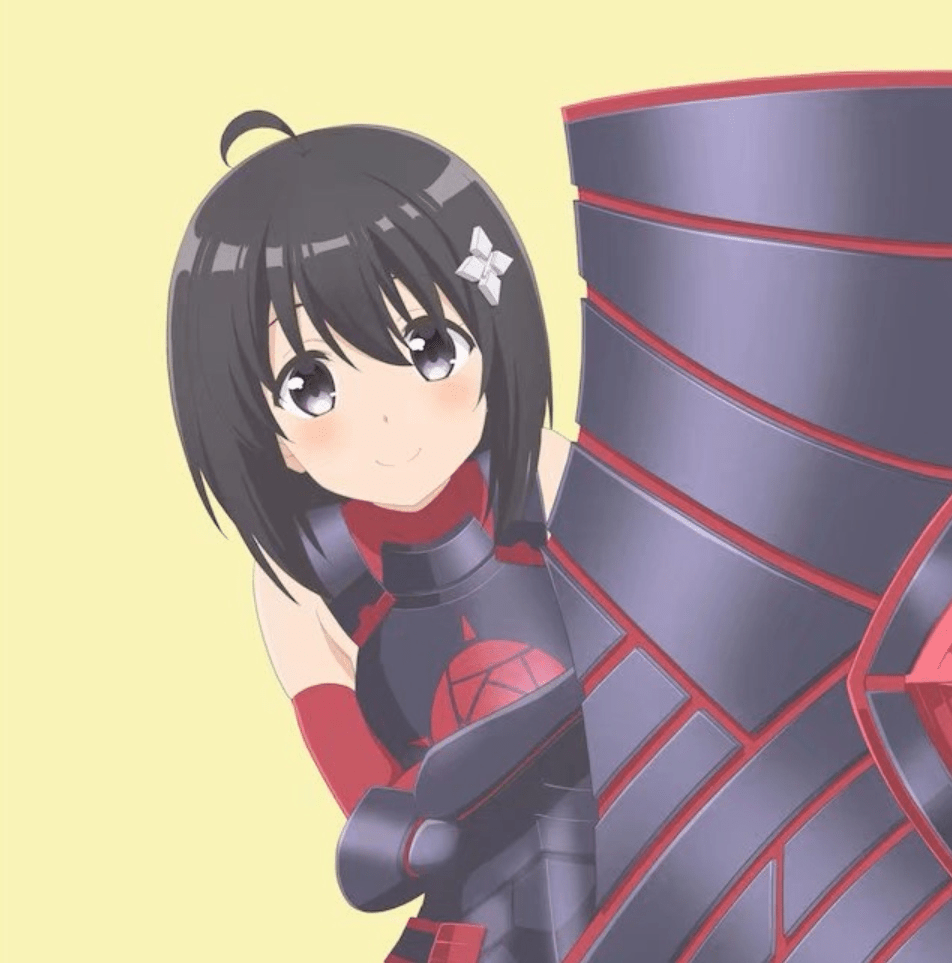
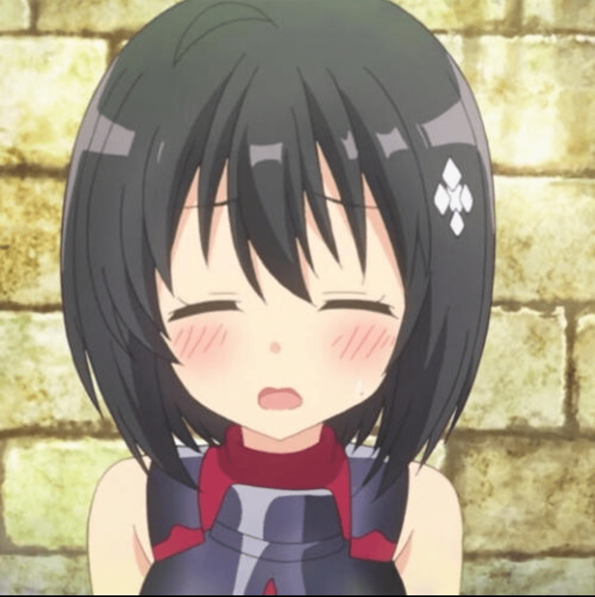

# 【长篇】连载中☆进击的梅普露 6.10☆更新

作者：冰蓝发丝

TID：30847

# 1

*本帖最後由 冰蓝发丝 於 2021-6-11 14:06 編輯*

大家好，这里是冰蓝发丝【银奈】

☆————————☆

在发文章前，银奈想先声明。这篇文章是我的朋友一位活跃在文游群的朋友【AK】（燕帖木儿）让我代发的，同时……银奈也对文章进行了修补。

在这之前，她是在b站发文，最近她跟我说，想发到GN论坛上去，于是就找了银奈帮忙。

嗯……具体就是这样，希望大家多多支持她。  

# 2

<ignore_js_op>[Screenshot_20210506_181909_com.tencent.mobileqq_edit_145833261745455.jpg](forum.php?mod=attachment&aid=ODg2NjR8ZTU4NjA0MDZ8MTY0NzcwNTQ4OHwxODIzMHwzMDg0Nw%3D%3D&nothumb=yes) *(153.43 KB, 下載次數: 5)*

[下載附件](forum.php?mod=attachment&aid=ODg2NjR8ZTU4NjA0MDZ8MTY0NzcwNTQ4OHwxODIzMHwzMDg0Nw%3D%3D&nothumb=yes)

2021-5-6 18:21 上傳  

</ignore_js_op>  

# 3

*本帖最後由 冰蓝发丝 於 2021-5-25 21:39 編輯*

《进击的梅普露》第一章巨大少女☆梅普露！☆梅普露与德拉息国！

**德拉息公国有着这么一句谚语：“头狼生下来便要做头狼，骑士生下来便要做骑士。”****这句在公国家喻户晓的谚语无疑展现了他们的骄傲——正如同他们认同的祖先——野狼一样。****上天把野狼一般的凌驾于狼群之上的高贵，和为了狼群奉献全身的责任，包括头狼一般的狡猾、勇猛、坚毅，也如此赋予骑士身上。****  公国并没有太森严的等级制度，只要成年之后比武大会上拿到一个好的名词，就可以晋身贵族，而非通过世袭——当然了，大多数骑士的父辈也是骑士，毕竟“家学渊源”，身经百战的骑士的儿子受到的，也必然是最好的武技指导。****  这样肩负荣耀的战士，这样尚武的国家，应该在如狼群一般在草原上称雄的——公国的人也都信奉狼的哲学：物竞天择，适者生存。他们每每如同瞄准猎物一般一般侵略邻近的国家，又如同围猎羊群一般去歼灭邻国的军队。满载而归的战利品和满是阿谀之辞的媾和请求，是最光彩的荣耀，也是骑士们生存的原动力。他们未必要占有这些战利品，也许是把它再分给穷人们——但这并不是无私的，那些收到赐予的人们要给他传颂赞歌。“荣耀是蓝宝石，比金子还要宝贵”他们不惜为此付出生命。**  …………  现在，他们正在草原上列出军阵，严阵以待。骑士们骑着高头大马，连人带马如同铁罐头一般，处处带满了铠甲，正列阵在队伍的中间。四周和前方都是手持剑盾、或者长刀得步兵们，他们衣服并不太好，却也衣着整齐、列队严整。  他们的任务是与敌人缠斗并保持阵线，等到敌军露出破绽的时候，骑士就能突然从中插入，将敌人的阵型撕开一个口子——然后他们就能再簇拥上去，对着已经失去组织反抗能力的敌军穷追猛打，直到他们投降为止。这是他们胜利的秘诀。

不过今天，这种简单粗暴却屡试不爽的战术完全没有了用武之地。他们怒目盯着对手，指挥官却连命令他们冲上去都不敢。  他们不仅不怪指挥官，自己对胜利也并没有什么信心——毕竟他们面前的目标就十分诡异，是有上千米高的、被太阳照的黑光四射的山一般的重盾——以及她的主人。  …………  “唉……还打不打了……明明是一群男人，在身娇体软的女孩面前，却个个都像胆小鬼一样～真叫人生气呢……呼……真是的，无聊得让我有点犯困呢。” 少女好像有点不耐烦了，她把盾抬起来，露出了年轻少女的模样。少女，这样常常在人梦中萦绕的存在，是如此的迷人，如此的可爱呀！  乌黑靓丽的短发，水汪汪的大眼睛，以及那吹弹可破的脸蛋，还有那一身兵装拿着重盾的反差萌，那是多么惹人怜爱呀！可她拥有上千米的身高，黑色的重盾比高山还要伟岸。公国的城墙对她来说等于没有，寻常走路就可以一下子跨过。

公国的军队看到了这样的巨人，马上心理就凉了一大截。而这般慵懒的、带有轻蔑的话语，则让他们感觉到无比的屈辱。  俗话说得好，士可杀不可辱，面对这样的状况，不管怎样，必须给她一点教训了。

“可恶，居然瞧不起我们。给她一点厉害瞧瞧，骑士团！冲啊———” 公爵一声令下，步兵都冲了上去，直扑向巨人。  然而，巨人好像并没有看到这些，她把盾牌插到地上放一边，蹲了下来，一下子遮住了太阳。这一下子让士兵们怎么办？可是军令难违，再恐怖也得冲啊，于是士兵们全都冲了上去，围着那山一般高的黑色靴子，全力殴打起来。  “喝——啊——让你见识一下人海战术的厉害！” 骑士怒吼着，他带领着其他士兵用全力攻击女孩的黑色靴子，面对这如同铁壁一般的黑色巨墙。枪、剑等武器的攻击在女孩的巨靴前显得实在很无力。  …………  “hhh～你们在做什么？一个个围在我的靴子前，小小的，真可爱～” 少女如此轻松的声音，更是让士兵们感觉到了奇耻大辱。他们那么奋力的攻击，不仅仅连鞋子都没能砍坏，还换来了这“可爱”两个字？  有的骑士已经失去了理智，也不顾军令如何了，直接就冲了上去。可结果是什么？哪怕是勇猛的骑士，对少女来说也就是虫子罢了，怎么能指望他们对如此的高山有什么破坏嘛？这样滑稽的动作反而把少女逗笑了，她轻轻放下手，开始把那些围绕在脚边得士兵，拢到手里。

“小不点们～都到本小姐的掌心里来吧～” 梅普露微笑地捕捉起脚边的小人。

这样的动作无疑是可怕的，数百米长的玉指突然降落，如抓虫子一般捕捉起士兵们来。巨人的反击一下子唤醒了他们原先被耻辱遮盖的恐惧，冷汗从头顶一下子凉到脚后跟，再从脚后跟浸到头顶。  不管是坚定的步兵还是勇敢的骑士们，他们脑子里面都想着少女抓住他们之后的各种下场…被手指一个个碾死，被手掌一下子握住干掉，还是被舌头一下子卷走？他们每个人想的都不相同，但一定都是很恐怖的吧……整个军队都崩溃了 他们一股脑的溃逃下去，如同遇到了饿狼的羊群一般——只是，这根本无法赶得上少女捕捉的速度。

“各位………稍微冷静下来吧？嗯哼～我有话想对大家说，还希望大家对我抱有谅解的心态呢。” 少女慢慢把所有人（包括公爵）都放到手上，并对着他们微笑。  少女的微笑好像有一股魔力，把他们恐惧的内心平复了下来，让他们感觉她没有恶意。这样和善可爱的女生，哪会做什么杀人的事情呢？

“完蛋了……要被杀掉了……” 公爵绝望地低语道。但，少女接下来的发言却又出乎了他的预料，但他陷入到了疑惑与震惊当中。  …………  “抱歉……那封信只是为了让你们重视起来的……只是我的一时兴起，所以写下了那样的挑战书。”不知道怎么说呢，如此挑衅性强的书信，还真的把他们全都打败而且俘虏了。少女本来是想要凭自己强大的力量吓唬一下他们，却没想过要怎么收场。这下真的战胜了他们，反而不知道怎么做才能化解敌意了。  “没想到……大家居然这么轻易地就被我打败了，一下子收下这么多败将。本小姐有点不知道该怎么处置呢。要是因为这件事导致国家与国家的关系恶化，好像就不好办了呢。要不，干脆直接把你们的国家踩烂……？”

…………  少女恶毒的话语清楚地传入了每个人的耳中，气氛瞬间安静了下来，仿佛空气都要凝固了一般。这种时候，所有士兵全都面如死灰、一句话也说不出来。就在这样尴尬的时候，一个沙哑的声音出现了。  …………  “不必了，这个国家以后就是你的了，请善待他们……” 一个衣着华丽、面容苍老的男子站了出来。

“我们不会做出任何抵抗，并且承认自己战败了。所以，请不要破坏掉这片土地。以你的力量，想轻松踩碎一切根本不在话下。虽然我很弱，但我多少有些自知之明。” 男人用沙哑的声音宣告着【他输了】。  纵使满是屈辱和不甘，但他输的如此的彻底，对手是如此的无法战胜，他又是如此的不堪一击……可这能有什么办法？纵使他失败了，他也要当一个贵族。愿赌服输，自觉让位，这样还能有个好看的退场——这也是这里的城邦的游戏规则的一部分。

“啊………不是不是！不需要这样啦！我好像不知不觉中做得有点过分了……” 男子这样干脆利落地宣告自己的失败，少女反而羞红了脸，她低下头来，像做错事了的孩子一样，委屈道：“我本来没有这个意思的………只是想用这种方式……恶作剧一下……就是想吓唬一下大家。”

“恶作剧………？” 听到这样的话，公爵不仅没有感觉到庆幸，反而是更大的屈辱以及说不出的愤慨。  “难道你把我们跟抓虫子一样都抓起来，就是为了恶作剧？那种猫捉老鼠的游戏？我们是蚂蚁、老鼠吗？” 他一下子抽出配剑，砍向少女的肌肤。但无论那肌肤看起来如何滑嫩，还是比那小得可笑的剑要厉害多了，根本无法造成哪怕一丁点的伤害。  这一下更让少女又羞又后悔、哑口无言了。自己真就做了一件大怪兽一般的蠢事？少女看着手掌上人们的恐惧和愤慨，感觉到自己简直十恶不赦，于是哭了出来:  “呜呜…………对不起啦，我知道自己似乎有隐藏着的抖S属性，有时候……不知不觉……就会发作。”

“诶………”公爵实在没有想到，自己生气的举动，却让她哭了起来。如此天真可爱的女生被自己骂哭了……公爵有点难为情，也不管她刚刚如何欺侮，大着胆子走上前去，正对着那恐怖而又可爱的脸庞，半跪下来，高声道“女士…公国欢迎您的到来。您是最尊贵的客人，将要受到最好的对待。”他的声音铿锵有力，一边说着，一边还把手向前伸去——这是贵族所常有的礼仪。

“谢………谢谢！大家能接受我失态时的举动，真是太好了。” 少女擦了擦眼泪，小心翼翼地伸出手指，轻轻凑过去，碰了上去。  那手指巨大到可以轻松碾碎这里所有的小人，甚至带动起来的风都让公爵有些站不稳。如此巨大的压迫感啊………公爵有点害怕，但碰到之后却是很柔软的，也没什么压力。她没有敌意，公爵想着。  …………  只是就算没有敌意的招呼也如此强大，这实在是太……太可怕了啊………少女把手指放上去之后也没有说话了，看起来和她强大的实力不一样的是，她待人接物还是很青涩单纯的呀………这样想着，公爵清了清嗓子，正对着巨指道：“公国欢迎您。在下是公爵卡尔比斯，您的名字是？”

“梅………梅普露。” 女孩小声地说出了自己的名字——【梅普露】

“什………什么！？” 不光是公爵，连手下的士兵都吓了一跳。那可是鼎鼎大名的魔王啊！不过，说是魔王，却没有听说过她有什么作恶的事情，人们平常也就只有一点恐惧和好奇（毕竟一个女生怎么能成为魔王），对她也没什么憎恨。所以人们只是惊讶得目瞪口呆，但却也控制住了自己，并没有害怕到发狂或者如何。

“是………是被称为魔王啦……” 梅普露羞红了脸，不好意思地把巨指挪开，挠了挠头。

“你是……魔王大人………明明是这么可爱的女孩子…………” 公爵看她这样反应，反而释怀了。他故意站了起来，弯腰行了一个侍者的礼节。  “给魔王大人请安。” 虽是行礼，但表现却有些滑稽，弄得严肃的骑士们也都开始哈哈大笑起来了。

“噗………hhh～你在给我请安嘛？” 梅普露也被逗笑了，那巨大的朱唇呼出的超强气流一下子就把手中包括公爵在内的一半人都吹飞了。还好她反应够快，一下子就都拢起来了，然后慢慢放回去。  “啊……抱歉，实在是太好笑了，没克制住～”

…………！！？  只是来自女孩的轻松一笑就有这样强大的力量。  这太强大了……公爵在害怕之余，为了避免尴尬，忙跪倒在“地上”亲吻起手掌来，一边这样一边用老人训教的语气说道“唉，又回到了温暖的大地上，还是大地好呀！”幽默总是化解敌意的利器，这样一来，大家全都又笑起来——包括大魔王梅普露，不过这次她可是把嘴巴捂住了。

待续☆

# 4

*本帖最後由 冰蓝发丝 於 2021-5-6 18:32 編輯*

明天再见喽☆这篇文会连续更新的，要是大家喜欢就好了呢。

# 5

<ignore_js_op>[u=552938972,3195920136&amp;fm=26&amp;gp=0.jpg](forum.php?mod=attachment&aid=ODg2NjV8NWVmNmEzMDR8MTY0NzcwNTQ4OHwxODIzMHwzMDg0Nw%3D%3D&nothumb=yes) *(28.59 KB, 下載次數: 5)*

[下載附件](forum.php?mod=attachment&aid=ODg2NjV8NWVmNmEzMDR8MTY0NzcwNTQ4OHwxODIzMHwzMDg0Nw%3D%3D&nothumb=yes)

2021-5-6 18:32 上傳  

</ignore_js_op>  

# 6

第二章

☆梅普露与竞技场☆

☆———————————☆

从梅普露到了公国之后，公爵立刻给她修了宫殿，让她住下。那宫殿比高山还要宏伟，让整个公国都感觉到了压迫感，也感受到了大魔王这个特殊的存在是多么的强大和不可思议。

…………

“hhh～真好玩☆这就是暴龙嘛？好小，好可爱。” 梅普露嬉笑着捉弄着一条来自公国的暴龙，女孩坐在床上，身旁是服侍她的仆人。

“梅普露大人，这个好可怕呀……！这样真的好嘛……” 一个侍从模样的小人连滚带爬地移动到梅普露的手里。

大魔王梅普露这时正在床上侧卧看着对这在自己眼中如同小虫子一般大的暴龙是如何横行霸道的。这不，她刚把暴龙放到床上，这个小侍从就吓得跑了呢。

“啊啦，你不是说我比暴龙可怕多了吗？” 梅普露轻轻把暴龙用手指捏起，然后放回到盒子里。那可怕的暴龙还不如她的手指大小，根本没有丝毫反抗的力量。

小人抱住巨大的手指，一边蹭一边道：“魔王大人比起暴龙的话，战斗力可以说是强得非常多啊……当然比暴龙厉害！只是……暴龙也比我厉害很多，放任它在床上的话，我会被吃掉的啦……”

“所以……你说～错～了～哦～～～暴龙根本不怎么样呢，都怪你太弱了。” 梅普露眨眨眼睛，坏笑着把小人轻轻捏了起来，用非常飘忽的语气道 “该怎么惩罚你呢～大魔王可不能轻饶了你。”

梅普露虽然力大无比，却还是个小孩子，调皮的习气仍然不改。她“咯咯”笑着，把巨大的虎牙露了出来。小人胆战心惊地看着——那虎牙甚至可以轻松切碎一栋大楼！一边又将小人放到巨大的红舌之上。

小人也知晓梅普露调皮但还是心地善良，绝不会害死他；但作为侍从，总要逗梅普露开心，于是就像个没头苍蝇一般地跑来跑去，一边跑还一边大喊“魔王陛下饶命！魔王陛下饶命！”

“哼～果然是摆出了这幅惊慌失措的模样呢。” 梅普露把嘴里的小人拿出，好一顿抚弄之后，放到了手掌上。那小人浑身沾满乐唾液，且刚出虎口，好不狼狈，一下子摊到在手心里了。

“还不快谢谢救命之恩？小侍从？” 梅普露轻轻用纸巾把小人身上擦干，侍从忙跪了下来，磕头如捣蒜，并且不断谢恩道“谢谢魔王大人救命之恩！刚刚我差点被吃掉了……好可怕……好可怕的！魔王大人真是一个恐怖的女人呢……”

“哈？恐怖？好啊你………” 梅普露脸色一黑，把小人放下。然后自己换了个姿势，坐在床上，并把巨足伸了出来。那巨足像高山一般庞大宏伟，并且晶莹剔透，好似无一点瑕疵。这巨足要是落下，会是山崩地裂吧………小人咽了口唾沫，慢慢往后退。

“哼哼………恐怖是吧，小侍从，你过来，本小姐让你见识一下什么叫真正的恐怖。” 大魔王一脸恶作剧地把大脚趾摁了下去。那脚趾可比高楼还恐怖一些。如果她在公国中肆无忌惮地散步，那么所有的建筑都会如多米诺骨牌一般哗啦哗啦地倒下吧……人且更不必说………小人知道梅普露不会杀人，但却忍不住内心的胆怯了，开始死命挣扎起来。但他这样的蝼蚁，挣扎哪回有用呢？是以挣扎得越多，压迫也就越升级。他一会儿就筋疲力尽，就快要窒息了。

“哎，真没意思。你也太弱了吧……要是换成我的师父来教训你的话，你岂不是要变成虫渣？啊……不对，或许会连渣都不是呢。”  看着小人已经承受不住了，梅普露慢慢收回了巨足，缓缓地叹了一口气。

在放开玉足后，小人如获新生，一边趴着喘气一边颤抖道：“您的师父……？”

梅普露的师父是谁，关于这个问题可是非常敏锐的说。本来，在这里是几乎无人知晓的；不过这个侍从原先和梅普露就有过旧交，也一起见过她的师父。说到这里，他又想起了那被支配的无穷恐惧：“梅普露大人……您可千万别这么说………关于她……我是想也不敢想啊……”

只是这样说着，他的心脏都快跳出来了。这反应，可要比刚刚被梅普露欺负，还要害怕的多。

“嗯哼～怕了吧～别说你们了，就算我遇到了师父，那也是跟虫子一般……不对，比虫子还不如呢～” 梅普露得意的挺起胸膛：“不过她是很温柔的女人哦～虽然对你们肯定是不怎么看得起，但……对我的话……一定是非常好的！嘻嘻，我稍微有点想她了呢。”

“嘛～不过，看在我是救下你们的恩人，我可以稍微对她说点好话呢。如果不是本小姐收敛一下自己的抖S模式，你们早就是我脚下的亡灵了！”

“是……是啊，……多谢你那时候没有对我们继续出手……我们还能好好活着。” 小人心有余悸，他不愿意这个话题往下说了，忙扯开话题道：“大人，公国有一个有比武大会，您要不要去看看？”

“嗯？比武大会？好呀好呀～” 梅普露天性爱玩，一听说比武大会，就两眼放光：“快带我去啦！”

“罪过罪过……比武大会的人们，真是对不起了……”小人小声嘟哝了一句，双手插腰，反客为主道: “那大魔王出去要乖哦～要是造成什么麻烦的话，我会找公爵和宫相大人哦～”

公爵和宫相是这个公国的管理者，而且德高望重。梅普露虽然强大到可以轻易毁灭这个公国，但不愿杀人的话，也不能不遵从他们的安排。何况混熟了之后，他们就开始“倚老卖老”起来，“大魔王”稍有不乖，就各种指责训斥。而大魔王呢，也正跟他们预料的那样，乖乖低头接受教导。

听到这里，梅普露自然也害怕了，忙道“绝对不会乱来的！绝对！请相信我，本魔王一向信守承诺。”

“真的嘛………感觉魔王大人很不值得信任呢…………” 小人又偷偷嘟囔了一句。这个大魔王实在是调皮，每次总会把教导放在脑后的。只是她确实善良，不会造成什么大的破坏，那也还不罢了。小人想着，坐在床上，翘起了二郎腿：“快背我去啦！”

“啧………真嚣张呢。这次，我就稍微开启一下温柔模式吧。” 梅普露这时有求于人，只好恭恭敬敬的把人捏起，放到肩膀上。

“哼，回去再找你算账………要是我玩得不开心的话，一定要加倍惩罚你！” 不知道是不是故意的，梅普露这句小声嘟哝可是让小人打了个激灵：看来要现在经受的调教和欺负，还远远不够呢。

☆—————比武场—————☆

“哼……还差一点呢……” 比武场上，一个带着墨镜和面罩，举着重盾的黄发男子轻蔑地笑了笑，对着用大斧奋力砍向盾牌的彪形大汉道“就这点实力吗……” 他轻蔑的语气无疑惹怒了大汉，那大汉又举起斧头，重重砍了过去。说来也奇怪，那大汉赤裸着上身，满身都是肌肉不说，还比黄发男子高了两个头，却丝毫不能撼动那瘦弱的男子手中的重盾。黄发男子冷笑一声，轻轻一推，便把那大汉摔了个四脚朝天，连斧头都丢掉了。

“黑角………你别得意！”那大汉站起身来拍了拍土，用手指着对面道“你得意不了多长时间的！”他也算公国的一员猛将了，这次过关斩将迅速杀到决赛，信誓旦旦要挑战之前卫冕的冠军，却被如此轻易的打败了。这实在让他心有不甘。

“我告诉你，别的我不敢说，玩儿盾这方面，我可不服任何人。至少这个公国，没人能战胜我手里这副重盾” 黑角得意洋洋道。

他是从外来到这里的雇佣兵，素来做的都是为雇主护卫挡刀的事情。越危险的差事也越来钱，就算高阶的法师弓手，也没有他的佣金高。他能在这个尚武成风的国家崭露头角夺得冠军，并在数年内保持卫冕，名声已然大震。所得到的佣金，也随之提高。他的自信自不用说了。

“吹牛！哈哈哈哈哈………你就吹吧。” 让对方没有想到的是，这番话说出口，大汉却笑得前仰后合。“你都打不过我，你还不服吗？”

“不……不是我不服……是有人来治你了…哈哈哈哈哈哈……”大汉一边说着一边笑，一边笑还一边指着前方“不信？你看看后面……”

“嗯！？” 黑角还没说完，就听到身后有一阵阵的震动，伴随而来的地震更让黑角都有些站不稳。等他回过头来的时候，更是大吃一惊：整个习武场，都被一个如山一般巨大的黑影笼罩住了。

“梅……………梅普露！？”

“唔姆～刚才是谁说自己玩盾最厉害的呢～本小姐想见识一下。” 梅普露一边笑着，一边蹲了下去，看着还不如自己的脚大的演武场。

那可爱脸庞一下子就笼罩了场内众人，里面的这些常年以一当百的猛人们可以说直接感受到了绝对的实力带来的压迫感和恐惧。就连她说话间带来的香风，都让整个习武场呼呼作响。所有参与者，尤其是黑角，都在等着那可爱少女做出裁决。

“嘿嘿……是哪一个呢，让我瞧瞧。” 梅普露找了一圈，马上盯着习武场中间的黑角。她的眼睛很好，那一粒小芝麻都能看的清清楚楚。随后她伸出玉指，从习武场中间的空当伸了过去，直指着那可怜的小黑角，黑角吓得一下子摊坐到了地上，大汉则马上跑到自己的位置坐着了。

“你过来，我们来比一比谁厉害！怎么样～” 从天而降的声音让黑角得心直接提到了嗓子眼。

“裁判大人，这样可行吗？人家好想跟他玩一玩武斗～” 梅普露“乖巧”地问了裁判，裁判也不可能敢于忤逆大魔王的意见，只能说道: “好。虽然一般来说，需要过关斩将，通过淘汰赛才能进入决赛，但您似乎没这个必要，就破例让你和他比吧。”

“嗯～谢谢。总之，本小姐先做个自我介绍吧。我是梅普露，你们的大魔王。”

“我………我叫黑角，是个雇佣兵……” 黑角擦了擦头上的汗。听说梅普露以前也从事雇佣兵工作，但实在是想象不到她是怎么进行工作的……想着想着，黑角站了起来，大起胆子道: “安全第一，比赛第二。我们比武要点到为止！”

“放心吧，我会小心的。但，是你攻击我的话，你下死手都可以哦～” 魔王一边捂着嘴“咯咯”笑着，一边又道: “不过，有一点我想先声明。大魔王可不稀罕区区冠军的称号。所以，我们来赌大的，你要是赢了，那么大魔王让给你；输了的话，你这个佣兵去我这里当守卫，我会给你足够佣金的。”

“守卫？你还需要守卫？不就是当小宠物吗？” 黑角心知肚明，却丝毫不敢说出来。而那肩膀上的侍从，则在不断嘟囔着“大块头……要是你被她不小心给弄死的话，你可千万别怨我啊……先说好……”

…………

虽然有些令人紧张，但不管怎么说，黑角都得出来了。

大家给魔王和黑角让好了位置，两个人站好，比武就开始了。黑角举着重盾，就一下子扑将上去，撞向魔王的黑色巨盾。虽然黑角已然全力以赴，那山一般的巨盾还是纹丝不动，反而是黑角自己被轻松弹开，摔倒在地上。

毕竟，谁能撼动得了大魔王的防御力？黑角感到一阵屈辱，但比赛就必须全力以赴。如果能够对那巨山有所影响，自己也能挽回尊严了吧……黑角想着，又撞向了巨盾。可是还是被弹开了。一次………两次……三次………这么连续做了七八次，大魔王还一动不动，黑角就已经被弹得遍体鳞伤了，而重盾却一动也不动。

“认输吧………别太逞强了，黑角。” 大汉虽说之前被轻蔑过，却也心疼黑角的身体，在场外如此劝说道。而更多的人则抬头看那高不可攀的大魔王——这猫捉老鼠的游戏该玩够了吧？什么时候直接反击，把这个游戏收场？

“别急………大家稍安勿躁。” 梅普露好像知道大家的意思，她依旧屹立在那边，好像是自言自语，也好像是对他们辩白道: “习武场就如同战场一样………一定不能放弃……”

“呐，我说，小不点。你很厉害嘛，换成别人的话，早就站不起来了吧？再来攻击我试看看？”

“好………” 听到魔王的鼓励，黑角又一次站了起来。他拍了拍身上的泥土，这次是最后一次了………他走到赛场的边缘，一阵助跑之后，直接冲了上去。而这次，他冲到那黑色的高山之后，高山竟然重心不稳，连退了好几步！？他这次没被弹开，而是前顷摔倒在了地上。但他没感觉到疼痛，而是感觉到有一些不可思议。

有志者事竟成，他这个愚公，竟然真的把“山”给移了！他一下子扔掉盾牌，对着观众们大喊道“我赢了！我赢了！”观众们有的摸着眼泪，有的挥舞着拳头，还有的在鼓掌……不过他们都在欢呼。

当然了，其实嘛………只是大魔王怜悯心作怪，故意让了他几步而已。比赛结果嘛………大魔王岂是他们可以战胜的？至于冠军………那还是黑角卫冕了，大魔王可不稀罕他们小人之间比赛的名次。后续嘛？黑角自然成了大魔王的“守卫”——其实是宠物了。

不过他一点都没感到侮辱，反而感觉到……这么一个能够在关键时刻让他几步的主人，也不是那么难相处，更不是什么坏人。他做这个宠物，反而是一件很光荣的事情呢！

待续☆  

# 7

第三章

出行☆

“总之就是这样……” 公爵一脸苦恼地说完之后，看了看四周，这些人可是公国最强的战力。黑角和彪形大汉逵达坐在两边，他们两个分别是演武大会的冠军和亚军；侍卫长亚特骑士侍立在公爵旁边。坐在对面的则是魔女小宫，她专精法术，并不愿意去习武场和那些大男人们PK，不过实力有目共睹的。当然了，也包括场地的提供者，坐在容纳其他人的桌子前面的大魔王梅普露，和依偎在她怀里的宠物龟。

不过……咳咳……“最强战力”也包括正站在众人旁边的那只暴龙——这可能就是公爵愁眉苦脸的原因之一吧………不过现在它还算乖巧，就远远的看着，也并没有凑近。这次国王要在梅普露的家里开会，实在是遇到了很难看的事情需要解决。

那就是，“海上的商队发出救援……遇到了巨型海怪……”

逵达是个粗汉，知道敌人马上脱口而出道: “让咱过去试试！就算再大的怪物，那也是活物。被俺那斧头砍两下，还能有活的？给俺一千个士兵、几十条船掩护，咱保证把他们全须全尾都带回来，哪怕自己死了也成！”这话说的很是豪放，但却马上被反驳了。

黑角翻着白眼道: “别说两下了，我主人的手指头放在这里，你砍个一百下看看，能破皮我就叫你爷爷。”

“嗯？你们把我当成什么啦？难不成是怪物咯？而且……你敢命令我把手指放这里么！？” 梅普露坏笑着用巨指按住黑角，对逵达道: “来～砍本小姐试试？”

“诶呀呀……我怎么敢侵犯大魔王得身体？” 逵达看着那比高楼大厦一般手指，举起大斧头道: “黑角兄弟，对不住了，来生再见吧！”

“淦！”看着大家都笑了，黑角却无地自容，只能对着逵达淬过去。梅普露也将手指缩了回去。小宫正坐着看书，这时把书合上道: “说了半天，这个怪兽到底是在哪儿呢？”

“救援信号并没有说地点，只是说在一个孤岛据守。”公爵捂着头，自责道: “那片海域总有经过的人遇害，我却没有及时禁止属下出海……唉………”

“嗯，看来是个未知的荒岛……” 小宫从衣服中拿出地图，比划道: “那艘船应该是三级帆船，速度中等。从这边出海，一般要走到……这一片区域”

“这片区域…………” 梅普露一看遍知“应该是有一种巨型鲨鱼在此兴风作浪。那个鲨鱼我见过的，你们那点实力都不够她吃的。”

”那您能不能帮帮忙？”公爵一听，眼巴巴看着梅普露“毕竟您那么强大………”

“哼～俗话说，吃人嘴软，拿人手短。本小姐还能拒绝不成？” 梅普露不由分说，直接把他们收进手里，走出宫殿。随后，乌龟便知趣地跳出怀抱，开始变大……直到变到比梅普露还大了，这简直就是一座岛屿！大家都很吃惊，梅普露则直接跳了上去，乌龟就起飞了。梅普露把大家都放在怀里，众人感受着这般温暖，也并没有那么恐高了。

“到了，主人。您可以下来了，请小心。” 不一会儿，乌龟就到达了目的地，轻轻落下，并且变小，自己直接飞到梅普露的肩膀上。梅普露把小家伙们换到了肩膀的另一边“抓好”大家在这比山还要高的肩膀上，自然不敢怠慢，紧紧抓住了她的秀发。

梅普露的两只脚踩在海面上，就像溜冰一般划起水来，掀起惊涛骇浪。只要大魔王愿意，就连大海都能随意改变，何况渺小的人类呢？

“哎哎……梅普露大人小心点啦……差点就把我给甩下去了。” 小宫紧紧抓着秀发，出于好奇伸长了脖子看了下下边，一下子又害怕地缩了回来道: “小心点底下……梅普露大人……小心有船………要是擦到他们的话……他们大概会被梅普露大人的巨大身躯撞碎吧……”

“嘛，都到深海了，肯定没问题的！相信本小姐。” 梅普露看起来并不太上心。她虽说心地善良，但是人类对她来说，实在是太渺小了，她并不会时时都对人类保持充分的尊重和爱护——甚至是平等对待呢，这并不奇怪。

小宫见她好像并不太在乎小人们，担心自己刚刚顶撞了她，害怕地低头道: “抱………抱歉！我好像多嘴了……”

“别这样说，已经到了哦～” 梅普露指了指面前的小岛，停下了步伐。

这里说是小岛，其实可能就比刚刚变大的乌龟大了那么一点点。这上面还有些密密麻麻的小人和一些简陋的建筑，这样都无法让魔王落脚。孤岛上有个大大的旗杆，那是公国的旗帜，这是作为标记用的。大家早已看到了海的彼端出现了的梅普露的身影，因此都期待起来；看到那个身影越来越大、越来越近，都忍不住欢呼了。

…………

“啧……无语。你们在欢呼些什么………？” 有个衣冠楚楚的中年男子看起来怒不可遏，指着周围的人道: “还不快列阵………还不快准备好工事！”少年看起来风尘仆仆，全副盔甲金光闪闪，看上去的确是位厉害人物。

他叫申嵐，是负责护卫商队的镖头。这次商队可是带着价值连城的宝物，可不仅仅带了自己的军队，还花高价请了镖师护送。镖局送镖之前必须先交巨额的押金，若运镖失败，押金也就送了水漂。这么大金额的货物，要是押金没了还要赔偿，那真得倾家荡产不可……申嵐心知责任重大，可不但商队的人们都在欢呼，镖局的镖师们也都没动静——他们只不过是跑腿的小员工，看到大魔王，跑都是来不及呢，怎么敢去得罪她呢！

“诶嘿☆～初次见面，本小姐就是大魔王——梅普露，还请多多指教～” 梅普露突然的下蹲，把阳光都遮住了，……这让所有镖局的人都吓得不轻。

他们之前问过商队的人们，知道她是公国的人；但如此巨大的存在，谁敢保证她不会突然出什么鬼点子了呢？可能就是魔王的一念之差，就会有不知道多少人命丧黄泉了！公国的人信任她的善良，他们则对她毫无接触，并不相信。可是相信不相信又能如何呢？申嵐镖师看着如山倾倒一样的场面，吓得一屁股坐到了地上。

梅普露用手指把他轻轻捏起，更让他吓得胆都要破出来了，哆嗦道：“您………有何贵干……？”

“你不是要准备工事嘛～工事准备得如何啦？” 梅普露歪着头，皱起了眉头，像是在思考准备做什么恶作剧一样。

“这………” 申嵐咽了口唾沫，低下了头，不敢在说话了。

梅普露用另一只手在地上拨弄了一下，那能轻易摧毁高楼大厦的巨指一下子就把小人们临时搭建的两个箭塔给捣毁了；激起的风压，甚至把周围的小人都吹得四脚朝天。

“我说，之前是不是个大鲨鱼搞鬼？把具体情况告诉本小姐，快点。”

“是………” 申嵐好像遭到了审问一样的害怕和屈辱，但他不敢隐瞒“是一个大鲨鱼，看起来有一二百米长。不过它好像并不愿意一下子吃掉我们，而是把我们赶到了这个荒岛上。”

“噗………是不是蓝色的大鲨鱼？头上有个伤疤？那个鲨鱼是我师父的宠物，最喜欢的就是把人困死在岛上，等别人救，然后一起歼灭。” 梅普露笑着摸了摸申嵐的头道: “若不是我来帮助你们解决问题，想对付它，就算这个公国的人都来了，也就是给它送外卖的”

“呼………原来是这样………那还要麻烦魔王大人帮助我们处理事情了。” 公爵心有余悸道: “我当时听到了消息，马上就要去救援。后来不是宫相劝我跟你说一下，要不然……不知道要多多少麻烦呢。多谢魔王陛下了，您真是太厉害了。”

“哼哼………你当我是谁嘛～我可是魔王大人。” 梅普露挺起胸膛得意道: “那条鱼看到我的身影，肯定吓跑了吧？那个小家伙要是被我抓到，肯定炖汤了不可！”

一个让自己吓得心惊胆战的巨大怪兽被眼前更加巨大的少女吓跑了………申嵐实在无法想象这种事情，只能闭上眼睛，慢慢回答了。他实在不敢再睁开眼睛了，这都太离谱了………

“哦………对了，说起来，你这个家伙的名字很有趣呢。” 梅普露坏笑又摸了摸他的头道: “你愿意做我的宠物嘛？”

“我？”申嵐苦笑道“我是申嵐，一个无名小卒罢了。为什么要找我这样的家伙做您的宠物呢，魔王大人。”

“因为深蓝是我姐姐的名字呀，她很可爱的！” 梅普露歪着头道: “你知道我姐姐？”

“啊，申请的申，云嵐的嵐”申嵐哭笑不得，原来是同音字。

“呐，我很想让深蓝姐姐当我的宠物，但她就是不同意。既然你的名字和她很像，干脆就你来当我的宠物吧？怎么样？嘿嘿～”

“这………不太好吧……” 申嵐实在是不愿意同意。但一睁开眼睛，便看到了她那巨大的身躯………那闪闪发光的大眼睛露出了期待的眼神，目不转睛的盯着他……在他看来就是一片沼泽一样，巨大而又恐怖，时刻可能把他吞下去。他一下子惊出一身冷汗，脱口而出道: “遵命！”

“好耶！！！！！又收获到一个新宠物了呢。” 就是这样，大魔王欣喜若狂，把大家都带着，原路返回了。

☆下集预告☆

“师父，这条鱼又跑外面兴风作浪………不如我们把它………” 一个少女手里紧紧把着一条鲨鱼，一脸生气地盯着下边的大铁锅。那鱼眼睛里写的都是绝望，不断地扑腾着，却一点力气都使不出来——毕竟还不到少女的手臂长。

“且慢，还不用炖，它另有用处。” 高空中传来了银铃一般的少女的声音。那声音很大，而且有一种不容置疑的霸气在里面；寻常人听了，非得先惊出一身冷汗来。

“那鱼是不是说了梅普露在哪里嘛？关于那孩子，我倒是真想见见呢。把那条鱼放了吧，一会儿我亲自处置一下就行。死罪可免，活罪难逃，下去吧。”

“是，师父。” 少女深施一礼，把鱼放走，自己恭恭敬敬地离开了。

…………

“哼～好久没见到梅普露那孩子了呢，就让我去会会她。顺便展示一下自己这强大的力量，在那些小小的人类面前，我一定是怪物吧？”

☆待续☆  

# 8

*本帖最後由 冰蓝发丝 於 2021-5-25 21:36 編輯*

第四章

新的巨大少女☆

“这是何方妖孽啊？怪物……！是怪物！！是巨大少女！！！” 一队骑兵列好了阵势，死死围住眼前的不速之客——面前的少女。

那少女一头绿色的头发，眼睛闪出深绿色的光芒；一身从帽到鞋，也都是绿色的。就连皮肤虽然白皙，却也隐隐闪出绿色的光泽。当然了，骑兵们围困她的原因并不是长相——而是她那大厦一般的身高。

“快走开，不然……休怪我不客气！” 骑兵们严阵以待，但少女可并不愿意和他们纠缠。还没等骑兵们反应，少女就是一个抬脚，一个下踏——瞬间，一个可怜的骑士，就被那足足有一层楼高的巨足所取代了。旁边的几个骑士，则都被溅了一身的血肉。

“哼！这是你们自找的！！”

“混账，她把活人踩死了，不用跟她讲什么了，杀啊！！” 随着领队的一声大喊，骑士们都拿起了武器，杀将上去。——然而，少女的动作很快，下一个瞬间，那个领队也跟上一个同伴一样，变成了一摊血肉。

少女并没有停止，接下来一个，两个，三个………骑士们渐渐被恐惧控制，一个个尖叫着往后跑去——可是少女不想放过他们。少女的手中出现了一团黏黏糊糊的绿色的胶状物，一下子把面前的所有敌人一股脑抓了起来。随后，少女一边走着，一边微笑着看着他们挣扎，挣扎………越是挣扎，对他们的绑缚也就越深。

…………

渐渐的，少女再也听不到那胶状物当中挣扎和尖叫的声音了……而是被骨头“咯吱咯吱”的响声代替了——响应的，地上其他的被踩死的骑士的血肉，也都被那怪物都吞噬干净了。少女破坏了证据之后，收回了怪物，又恢复了开心的神情，往自己的目的地跑去了。

“窃贼来报………说有个女巨人在向城市方向移动……附近的百姓吓得四散奔逃……” 宫殿内，一个全身黑色、但须发皆白的老者对着公爵道: “根据窃贼观察估计，那个巨人有几十米高。至于最前方的哨骑和箭塔，他们的消息都没有被获得。恐怕………” 老者低头叹了口气，摸了摸眼睛里的泪水。他就是宫相，德高望重，对公国忠心耿耿，是公爵最主要的辅政大臣，也是公爵的叔叔。

“唉……别说了，先点一下兵将吧。” 公爵也是一副苦恼的样子。

“别说能战胜她如何如何，至少得保护附近的人民”

“嗯……”宫相突然想起来了“既然几十米的话……梅普露大人收拾她不是很容易吗？”

“对啊……确实如此！”公爵拍了拍手“说实话每次都这么求人的话，我还真不好意思。”

“别这样说，咱们也都算魔王大人的属下嘛，在下倒是觉得没什么。”宫相倒是很轻松，耸了耸肩道“反正每次都是您开口”

“呵………” 国王气笑了 “这次你去，这是命令！”

“事情的经过就是这样……” 宫相在桌子上无奈道，他已然把前因后果都说了。而桌子对面的梅普露则已经笑得前仰后合了“国王陛下真没用呢，又有事情要拜托本小姐嘛？没有本小姐的话，你们岂不是要被那个女孩狠狠羞辱一顿？”

“虽然话语很刺骨，但……真让人无言以对呢……梅普露大人……总之，说正事吧……” 宫相哭笑不得道: “拜托了，就是这件事……希望魔王大人能够帮一下我们。那个怪物浑身是绿色，而且根据探报来看，她的脚印经过探查，上面也都是绿色的粘液。”

“绿色的粘液，难道说……是小绿！？” 梅普露脱口而出，又惊又喜。不过看那宫相一脸疑惑的表情，又补充道: “小绿是我的一个仆从……这次来找我，肯定有要事的。”

“有事就可以杀人了？”宫相马上举起拐杖，梅普露吓得忙解释道“这……这一定有误会！我………我马上准备一下，马上过去看！将………将功补过！”说着，马上就收拾了一下仪表，赶了出去。

“哎……明明我是魔王大人，为什么要怕他。”

“呼……幸好我们这边有梅普露大人。” 宫相蹲坐到了地上，只剩下苦笑了。要不然能说什么？上千米高的巨人，要是愿意的话，这个公国都能被她很快毁灭掉。她那种害怕和犯了错的神情，也还是出于她的善良温柔，不肯和小人们计较太多。至于为什么死了人，也是仆从的过错。如果主人就不把小人当回事，这又有什么呢？他实在是没话去指责她。可她这么快走又是为啥？他这把老骨头不说，就算是个年轻小伙子，也没法从几百米高的桌子上下来，再从几百米高的台阶上下来啊……

☆————巨大少女主宰的战场上————☆

“快跑啊………”小人们看着后方快速行进的巨大少女，一个个失魂落魄，惊慌失措地逃跑。那个少女倒没有怎么样，只是一脸轻蔑地看着下边的蝼蚁们，一边往前走去。当然，她还是稍微注意一点脚下的——毕竟刚刚收拾鞋底可费劲了，这般卑贱的虫子，可不能再沾上自己高贵美丽的鞋子。“咚咚咚”的声音不断的响着，一个又一个的巨大脚印被制造出来……这么多人都无法反抗一二，小人顿时感到了无助和屈辱。

“咚咚咚………”这一阵阵大的多的声响和伴随而来的地震，让小人更加惊慌失措了。不会是她逼近的吧？小人们往前看了看，她还在远处………于是向后看，又是一阵欢呼——有个拿着重盾的少女的身影，正在慢慢变大。

她正低着头踮着脚，用自己还算不错的视力去注视着地面——自己这个身高可不会撞到什么，千万别踩到小人啊………在那个少女看来还在自己膝盖部位的民居，在她眼里，就连脚趾都比不上了。可不得好好看着吗？虽然还在远处，但梅普露的影子，已经比那怪物大了………小人们虽然还在逃跑，但都忍不住欢呼起来。

“是主人………！！是梅普露大人！！” 小人都看见了，那小绿不更看见了嘛？好久不见了，她实在是很想念主人，真想快步跑过去，早点见到主人……不对，要是这样的话，会踩到小人的，主人最讨厌我不在乎小人的生命的………虽然她一直并不在乎小人的性命，但在主人面前，还是收敛一点吧。她这样想着，更重视脚下的小家伙们了。

…………！！？

“嘿嘿，抓到你咯～” 很快，梅普露就一下子抓住了小绿。那能轻松踩死小人们的巨人竟然还比不上一根玉指的规模，弯腰的动作更如同高山倾倒一般………太……太巨大了！小人们都跪了下来，感谢之余，更多的还是崇拜吧。

“主人………我终于见到你了。” 小绿亲昵地蹭着主人的玉指，一边蹭还一边讨好地舔了舔，以示自己的服从。她原来是一只巨型绿色史莱姆，危害人间杀人无数，后来被梅普露收服。

收服之后就变成了梅普露手里如泥巴一般揉捏蹂躏的玩具，一来二去竟然产生了感情，梅普露遂请求师父将其化成人形。

既然是巨型史莱姆，变大之后也是巨人了，而且是个美丽的少女，然后由梅普露教她识字说话。从此她对梅普露的不杀之恩感恩戴德，并且乖巧伶俐，很快和梅普露结成了深厚友谊。当然了，就跟人类新手喜欢拿小型史莱姆刷怪一样，她对小人也是非常看不起，甚至有些痛恨的——当然了，在主人面前，可不能表现出来。

“QAQ疼………主人，你在做什么啊？” 没想到小绿如此讨好之后，梅普露直接加大了捏的力度“说吧，杀了多少人？”梅普露忍住之前的期待，眼睛冷的差点把小绿給冻死。

“这………主人……” 小绿有些不知所措，急得快哭出来了。

“有几个箭塔和十几个骑兵要拦住我……所以就……”

…………

“笨蛋。你就不会把他们抓住再放跑吗？他们看到你的力量，就不会和你纠缠了”梅普露说着，松开指头，让她落在手上。虽然说面色还是冷若冰霜，但嘴巴已经不断对着她的腰部吹气了。“不……不疼……”小绿揉了揉刚刚被捏的地方，愧疚地低下了头道: “抱歉……主人还这么关心咱”

“再有下次，看我不杀死你，再也不要你了。说吧，有什么事儿？”

“啊……小绿想转告主人，关于大主人要来这里……” 小绿委屈巴巴地说道。“呜呜呜，主人怎么了，居然对小绿发火。”

…………

！？

“啊？师父？”梅普露吓了一跳。

【就在这时，震耳欲聋的声音突然从高空降下】

“那么可爱的小宠物，你不要，我可是要的。我说，梅普露，好一段时间没有见到你，你似乎站到了人类那一边去了呢。居然还会担心人类的伤亡，这可不像你。” 从天空突然传来了巨响，随着巨响，整个天空，也变成了一个少女的面部。

那个少女摆动着的玉指都是遮天蔽日的样子，稍微一接近，覆盖一个城邦都绰绰有余了。要是它稍微落在地上，这个公国恐怕就此覆灭了，要是它在往前滑行呢………不仅仅是这个公国的天空，整个大陆的天空，也都是这张少女的脸庞。

就算如此巨大的比例也找不出一点点破绽，仍然是碧玉一般地皎洁无暇不说，浅蓝色的秀发几乎让人感觉就是天空，但在飘动中又让人感觉那“天空”随时都要落下；两只金色的充满光芒的眼睛，甚至就是两颗太阳了——只是比太阳还要晶莹、深邃。

如此的强和美，在小人看来，简直都是极致中的极致——若非今天得见，实在是想，都想象不到的存在，比一些小人们心中的“极致”，还要彻底的存在。

“哼～虽然我有点看不惯你的转变。但，他们两个，都被我劝说过了。他们不会怪罪你的朋友杀人这件事。”

关于师傅其实是对两人使用了魔法来强制让他们听话这件事，她是不会说出来的。

虽然整个大陆——甚至其他的大陆和海滨的人都在听她的训示，但她只是在对着梅普露她们说话。其他的人不仅仅敬畏，还不知道这个可以轻松支配他们生死存亡的少女是什么意思——当然，他们恐怕也知道少女并不在乎他们。

梅普露一边听着，一边看着自己脚边突然出现了两个小人。他们两个眼神空洞无神，好像是经历了什么无法承受的打击一样……他们俩就是公爵和宫相了。

“他们说了，杀人的事情就那么算了。至于说家属，我会好好抚恤的。本王特意使用了魔法来保护你们。毕竟，我这么大，哪怕是说点什么话，也会吹飞你们。这都是为了你啊，梅普露。” 少女用手指指了指她的方向，梅普露则高兴的大叫“谢谢师父！要不是师父给这里安上护罩，大家早就被师父说话时吹出的飓风给卷飞了呢。师傅真是的，每次出现时都要展示出自己那如同女神一般的体型，不提先通知的话，会吓坏大家的啦。”

“啧……你那喜欢油嘴滑舌的这个毛病还是没变呢………” 师傅嘟哝了一句，又道“小家伙，你既然不希望师父杀人，师父就暂时收敛一点吧。这次师父突然过来拜访，你有什么要说的吗？或者……换个问题，因为我的突然出现，给大陆带来了许多麻烦，你不会责怪老师么？” 师父可是另一个世界的领主。梅普露跑到这里并且有了魔王的威名，是之前对师父辞别过的。这次师父成了不速之客，怕是惹出了不少麻烦，确实是该道歉的——当然，谁也不敢提出这一点的

“我倒是不会责怪啦………师傅已经使用魔法来尽可能地保护大家了。要不是有保护罩，一定会造成不可估量的伤亡。” 梅普露看了看脚边百姓们，他们都乖乖对着师父的位置跪了下来。

“是嘛～那我就稍微放肆一点咯～” 少女银铃一般的笑声响起之后紧接着的，就是对梅普露来说都心惊胆战的大响声了——然后人们都看见了，不知道多远多远之外，一根巨指屹立在天地之间，就如同是支撑天地的柱子一样，高大巍峨，无坚不摧。

如果往最下面看，或许能看到巨柱底下有几座高峰，这应该都是小人们引以为傲的最高峰了，虽然它们比起那玉柱真是微不足道——何况往上看的话，那玉指在天边无限延伸着，根本没有尽头……大家都知道，这至少是一个较大规模的城邦被摧毁了。或者是，好几个城邦被同时压在了这只玉指的下面？

“刺拉——”又一声巨响，那玉指突然消失了。人们就算转着圈看，也未必能捕捉到玉指的行进——这个幅度实在是太大了，速度也太快了。不管是高山还是深谷，不管是巨龙还是城防军，哪怕是已经强大到称霸天下的超级巨人，都无法阻挡巨指哪怕一个刹那。众生平等——众生的反抗阻拦都是虚幻的，无论怎么反抗都等于0，对那玉柱来说都是无用的。

无数的国家，无数的城市，无数的人，都已经湮没于巨指之下，都将湮没于巨指之下……更何况因为如此带来的山崩地裂而死的，因为逃跑的混乱不幸遇难的，甚至直接因此被吓死的……小人们每每捕捉到巨指都有自己或许就是下一个的错觉，每每看到巨指离开的时候都会有那么一点庆幸——当然，巨指横扫的方位的小人们，是来不及发现自己将被横扫了的，而是会直接就被带飞。毁灭你，与你何关？

毁灭你，与你无关。

巨指从南向北把大陆分割成两个整块后，又瞬间从西向东划了过去。这片大陆，也是这个世界上最强大的两个东部大帝国，前一天边境线上还有数百万大军，并且修了比山还高还厚的城墙，而今天就被顺着边境线一下子擦过去了。小人们几十年战争的尸山血海之后的战线也没有根本性的变化，但不到一秒钟，战线已经完全消失——何况那个两帝国如今也已经土崩瓦解了——不仅手指经过了很多富庶的商业城市以及战略要地，甚至还摧毁了一个国家的国都。另一个国家稍微幸运了一点点，但如此灾难也足够让他们的国家支离破碎了。就那一瞬间，大陆被一分为二；又一瞬间，又被二分为四。中间的峡谷比海还深，如果那个世界如地球一样，或许在熔岩层的最深处吧？若不是她还保留着一点点仁慈，不愿这个世界人类全部灭绝，因此设置了几个小结界。恐怕海水会直接灌进峡谷里面，导致更强大的生态危机吧？有时候，生物灭绝也并不是一件难事。

只要她愿意的话。

“啊啦～我是不是做得太过火啦？” 切割完大陆之后，少女仍然若无其事的看着。大自然运行上百万年都无法形成的地貌，让少女在一瞬间形成了。

人们都明白了，在她眼里，并不是自己本身有多弱小，甚至不是人类文明有多弱小。在她眼里，渺小的，是整个世界。小人们仰望着那晶莹完美的脸庞配上那冰冷皎洁的神色，在无比的敬畏下，实在不敢责怪、痛恨她什么。

毕竟她是不属于这个世界的，更加高贵强大的存在；对弱小卑贱的多的这个世界的支配行为，本就不该让这个世界的人来置喙。他们反而想着让她多留一会儿，多注视一眼她那美丽的面容。“这是给你们的见面礼哦………算是我到来之后留下的痕迹吧。

“你们一定会永远记住我的，对吧～”底下小人们山呼万岁，一边欢呼一边还跪着磕头。他们内心都很复杂：一方面希望高贵美丽的少女稍微注意垂青一下这里，另一方面又害怕少女会对他们降下什么灾难。生和死，就在她的一念之差罢了。

“哇啊啊………” 突然，好几个城邦的百姓同时发现天黑了。他们绝望地喊叫起来，着一定是少女的巨指的降临…然后又一阵巨大的暴烈声，他们惊喜的发现，自己还活着，自己还活着！他们还能远眺到玉指，就在前方，只能看到指肚处，却连指纹都能看的清清楚楚——原来巨指突然改变了方向，朝着旁边几千里外的另一个位置降落了。 “谢谢女神大人的救命之恩！” 他们看着那巨指，百感交集，涕泗滂沱。他们对那玉柱和玉柱的主人感恩戴德，对着玉柱不断地磕头谢恩——毕竟一个人即将失去什么的时候可能才会最重视它，包括生命。只是……人们痛哭流涕、磕头谢恩的时候，有几个眼尖的小人突然惊恐地看到——那巨指又挟着尘土，慢慢变大了………

“呼呼～”少女轻轻把沾在手指上的一层薄土吹飞之后，将手指轻轻点在额头上，脸上露出了恶作剧一般的笑容——毕竟刚刚自己不仅仅划开了大陆，还对小人们开了一个天大的玩笑：先将手指放到一个地方，象征着他们即将被毁灭——然后再放到别的地方，象征着毁灭的是别人，他们受到了宽恕——再挪回来，毁灭他们。那几个城邦小人们都是带着感谢离开的吧……少女这样想着，轻轻把脸贴了上去，离大陆几乎没有什么距离了。

这时大家进一步清楚了恐怖为何物。之前还能遥远朦胧地看到少女的整个脸庞，如今却只能看到少女脸庞上某一个部位的极细微的地方。少女的鼻尖处都是一个城邦，眼睛，眉毛，脸庞，嘴巴，额头……如此巨大的压迫下，他们感觉不是少女这个巨人凑了上来，而是自己作为一个微生物，贴在少女的肌肤上——所以了，有不少小人对着天空拥抱、亲吻，好像对着少女脸庞如是一般——但对他们来说，少女的脸庞离他们比山还远不知道多少倍呢，岂是他们所能接近的？少女的眨眼和鼻息本来对他们来说都是灭世的飓风，只是少女特意用了防护罩防住了而已。

“哼哼………”少女笑着慢慢抬起头来，大家终于得到了一点解脱。“这几个沟壑，给他们桥梁吧”一声令下，身后几个随从马上飞了出来，开始听命。先是将沟壑旁边的土石全部吸走——当然这个过程免不了吸走好多小人、建筑（这也许就吸走了不止一个国家）然后再在这些沟壑之间施法建立了桥梁。那些桥梁的长度和宽度甚至比一个国家的规模还要恐怖。东南西北四个地方互相都有了连接点，这个大陆一分为四，以桥梁作为链接……他们赖以生存的大陆永远改变了，以后这个大陆的小人们的历史，也将永远改写了。就这么一段时间内，小人们以后千百年的历史，就此发生了改变，而且永远无法逆转。

“拜拜～有空再见哦～”还没等小人们谢恩，少女就已经慢慢变得淡色，消失于人们的仰望中了。“再见”这个词让小人们有些期待，但更多的还是害怕……不过期待和害怕有什么用呢？小人们以此自嘲了一下，又开始新的生活了。日子还是要过下去的，既然活下来了，那么就继续吧，以后的日子还是会步入正轨的。

但愿如此吧。

待续☆  

# 9

*本帖最後由 冰蓝发丝 於 2021-5-25 21:27 編輯*

第五章☆伊蕾娜登场

“…………” 所有人都跪伏在地上，不敢有一点声音，甚至都不敢稍微抬头——看一眼那刚刚将一个城市踩在脚下的，远远高处云海的巨足；而巨足的主人，粉红色头发的巨大少女，则凝视着眼前的巨大沟壑，久久说不出话来。世界都因此而沉寂……她是这个世界的领主，本来是尊贵的、把世界上所有事物都轻松踩在脚底下的存在。可在今天，她不仅先被一位蓝色头发、金色眼睛的少女召唤并踩在脚下，还要眼睁睁看着那巨大少女轻松切开了她的世界中最繁华的一块大陆！她看着那对岸的沟壑，虽然显得不是太大，自己还是可以迈过去的——但这竟然是用手指完成的杰作！被支配的恐惧和屈辱让这个骄傲的女孩子久久不能忘怀，一直凝视着，望眼欲穿…………

“呵～～真没意思，在我脚旁跪着的弱者们～你们真是相当可悲呢！” 少女邪魅地笑了笑。紧接着，那些跪伏着的小人们，瞬间便被巨足所代替。少女回过身来，看着面前图案一般的城市，以及那个国家，冷笑道:“那家伙来的时候，你们是不是都叩拜了？我想知道～那时候，你们的态度是不是比对我时还恭敬？”

…………气氛很安静。小人们如此渺小，显然无法回答这个问题，但少女无疑已经有了答案。“啧～不说话是吧？那么，看好了吧……”话音刚落，少女慢慢又抬起了巨足，又有一个城市，被黑暗笼罩住了………

“………”帐篷里的人们都惊呆了，眼睛瞪的都快跳出来了。而众人目光中的大魔王，则满嘴油光，若无其事地继续啃着羊肉。她离开了公国，带着朋友们环游世界。要是不方便的时候，还是得变小了，变小的拘束感常让她很不痛快，除了这个时候。

“唔姆～舒服！真美味呢，谢谢款待☆” 梅普露将羊骨扔向那已经堆了好几座小山高的羊骨堆，看着周围人道:“再来！不是烤了很多了吗？继续啊”虽说变小了，但梅普露的食量还是不小的——毕竟要留够恢复大小之后的能量储备。

“这………未免太恐怖了吧？” 旁边，黑角左看看如今这个一身新手村装备的魔王大人，右看看那堆成山的羊骨头，再往后看看帐篷外放着的比山还高剑、盾、铠甲，实在是有些发怵。那些装备周围站着好些当地的牧民。他们一边看着一边指指点点，一个个眼里都充满了好奇和敬畏。“主人………吃够了吧………你都快把他们的羊都吃完了……他们都很可怜啊。”

“嘛～反正我都给钱了，一只羊一百金币呀～好不容易变小，难道不能让我好好吃一顿嘛！？嗯！？” 梅普露一拍桌子，桌子一下子便碎了。

“能能能………只是魔王大人啊，我觉得您现在都变小了，穿的还是新手村装备。我们这些人加起来应该能打败您了吧～”黑角坏笑着拿起盾牌，看了看周围的人们“一起上？还是一个个来？”

“当然是一起上咯～让本小姐来好好教训一顿你们这些狂妄自大的家伙。” 梅普露觉得好玩，看黑角这般说法，心理还真的痒痒的，真的想试一试。

“这里可都是高手哦～大魔王可别得意” 申岚也站了起来，拿出宝剑。之前被魔王收做宠物，虽然如今已经不怕了，可还是想洗刷一下屈辱。

“高手？hhh～能比我还厉害嘛？那你们一起上吧！” 梅普露拿着新手装的剑道“就这个，就这个就行了啦”

“大家点到为止！”小绿也站了起来，她对着主人眨眨眼睛，挑衅道“要是无所顾忌，伤了主人，那就不好办了哦～～～”她是深知主人的实力的，知道就算变小了，他们也绝对打不过。不过既然已经要打了，还是得给他们提提气的“哼哼，这次我可不会站在主人一边哦”

“好啊好啊好啊，大姐来了，那我们赢定了” 黑角大喜，看了看旁边的小宫“你先来，展示一下你那自豪的火球术，给魔王大人看看！”

“好………真拿你没办法……” 看这样子，小宫也不敢怠慢，马上拿起法杖，召唤出了一个大火球，打向梅普露。梅普露一点都不慌，连闪都不闪，直接接下了那招火球。“hp—0……？”黑角惊得下巴都要掉了：这个火球若是砸在他的身上，就算举起盾牌全力防御，怕也得受重伤，何……何况她一点都没挡？？？

“略略略～～真弱☆”梅普露对着众人大做鬼脸，并且一下子凑到黑角身边“要不～我让她对着你打那么一下，怎么样呀？”

“别…………会死人的。”黑角只是摇头，这家伙的实力变小了也强的太过分了吧，变大了还得了？

“咚咚咚”

…………

“？”

“唔，地震了嘛？”

突然，一阵阵巨大的响声和地震，整个天地都在晃动，这整个帐篷都快塌了。

“怎么回事？是谁来了………？这可是魔王大人特制的帐篷啊……来的人是巨大少女嘛？” 梅普露身边的侍从看着头顶的帐篷，苦笑道“其他牧民的帐篷，估计还得再塌一次……”是的，之前大魔王过来的时候，帐篷都已经被震塌了………

“根本不用想，一定是又来了新的巨大少女……”众人不安地喧闹着。“完了，又要有新的麻烦了。”就在大家议论着要不要逃跑时，帐篷马上被掀开了，取而代之的，是一个长发少女的可爱脸庞。那个少女大概也有几十米高，眼睛大大的，不断闪烁着可爱的光芒。她把这个帐篷掀开，怕是好奇产生的恶作剧吧……这让帐篷里的人很是不满，黑角马上指着少女道“懂点礼貌好不好啊，要是这个坏了，你赔啊？”既然大魔王在，那还怕这种家伙做甚？黑角这么想着，胆子自然也大了起来。

“不对………刚刚的地震……感觉像魔王大人………”小宫则缩了缩脑袋道，感觉到了事情没那么简单。而大魔王那边，则满脸都是兴奋“哇塞，你来了……？”

“怎么都很熟的样子……？”小家伙们正摸不着头脑的时候，突然发现了——震动还在继续，而且………一个身影越来越近，越来越近了。那是如梦一般的少女，一头雪白的秀发随风飘扬如同云彩，雪白的肌肤仿佛冰山；湖泊一般的蓝色瞳孔中闪烁着坚定的光芒，还透着些许深邃。一身稍显复古的魔女服古朴有致，落落大方，与手中的魔法棒与书本相得益彰，体现出少女的身份和渊博。大家都被迷住了，只是，她为什么那么巨大呢？空旷的平原被少女将近两公里的身躯所取代，那少女就是山——雪山，同样的神秀，却还带有春天万物生长的柔和气息，稍带含蓄地展现在了人们面前。

“咦？师姐！？” 梅普露看到之后直接跑了出去。又是一阵巨响，一座高山拔地而起——梅普露特意跑到空阔的地方，也开始了巨大化。她轻轻用手指拂走装备旁边看着的牧民，穿搭好盾娘应有的装备后，屹立在了少女面前。两个将近两千米的巨大少女各占据了草原的半壁江山，剩下的牧民们则在少女们的脚边徘徊：自己应该何去何从呢？

“刚刚给大家造成了什么麻烦呢？真是抱歉了～”少女轻轻闭眼微笑，夺走了牧民们的心。他们怎么敢责怪少女刚刚造成的地震，又怎么忍心呢？见牧民没说什么，少女有道“我叫伊蕾娜，是个魔女。那个捣蛋鬼是我妹妹，大魔王梅普露哦～”

在伊蕾娜的身后还跟着一个高大的女孩子，她的名字叫小若，是伊蕾娜的跟班。

“小若妹妹……” 小绿也变大了，变成了和对面的少女差不多的，大厦一般的身高。人们看见那巨大的鞋子心里便有些发怵，这两个大厦一般的少女能够轻易踩死他们，就跟踩死蚂蚁一样。但她们两个比起两人的主人那高山一般的巨足，则显得何其渺小！就在这一瞬间，草原上竟然分出了三个等级，每个等级对她的下一级都有绝对支配的力量。

“伤脑筋耶。好像………吓到他们了？” 梅普露并非不知自己带来的压迫感，她感觉有点不自安，挠了挠头道“呃，有些过意不去呢……因为我的缘故，巨大的女孩子又增加了。”

“hhh～妹妹还真是善良，和以前一模一样。” 伊蕾娜轻轻微笑，静静说道“高山不必惭愧于自己的雄伟，老鹰不必惭愧自己的翱翔。小雀飞得矮，更不必嫉妒高山和老鹰。我们又没有恶意，这又有什么呢？还是放开点，把我们的身躯和力量展示给大家，看看他们如何崇拜我们的吧。”

“这……不太好吧？”梅普露有点难为情，但是看伊蕾娜那让人无法拒绝的笑容，点了点头道“那好………姐姐说，要怎么样呢？”

“恶作剧什么的，还是妹妹更会做嘛～根本不需要向我请教吧？” 伊蕾娜歪着头道:“比如说………我们两个人要是坐下了，会是什么结果呢？”说着，周围的小人们，包括小绿和小若，都被一种蓝色的光圈包裹起来了，并且浮向天空。正在大家摸不着头脑的时候，接着就是惊天巨响，伊蕾娜提起裙子，轻轻坐在了草原之上。

天文数量的体重一下子降落下来，比山地裂还要恐怖的自然现象已经形成。不仅坐着的位置被一下子毁灭，周围也都变成了一条条裂纹——那都是一条条深谷。笑盈盈的文静少女看着自己降下的“灾难”，并没有说什么，只是若无其事地看着妹妹。妹妹挠了挠头，放下盾牌，也坐了下来。妹妹毕竟是妹妹，并没有姐姐那么文静的举止，坐下的动作显得更快更冒失，因此造成的震动也就更大——何况，她这个盾娘穿着顶级的盔甲，质量上可是重多了。

“轰轰隆隆…………”这自然又是一场“灾难”了。小人们都瞠目结舌，其震撼都无法用语言形容了。他们只能暗自庆幸一下少女刚刚的仁慈，若是没有这样的保护，别说被压住了，光是震动造成的冲击波，就能让自己瞬间化为齑粉。

“就是这样。妹妹，尽情展示自己的强大吧。我们都是高山！他们都是小人。” 伊蕾娜把小人们又放了下来，然后轻轻脱掉鞋袜。一双完美的玉足就这样被解放出来了，并且在众人的瞩目之下落地了。伊蕾娜特意挑了一块空地，并没有踩到小人；但如此巨大的玉足，还是造成了不小的震动，周围的小人都被震得在地上打滚，好久才能起来。

起来之后，便能看到那以惊人规模展现的玉足——不仅上千米高的少女，是山一般的；上百米高的玉足，也是山一般的。那玉足虽然庞大，却看不到一点瑕疵，而是如同温玉一般的白皙柔嫩。不仅如此，白皙的肌肤还透着一股健康的红润，或许是太阳照射的缘故，这种美玉的色泽并不完全是内敛的，而是有那么一些闪闪发亮。

当然了，最震撼小人的，还是那脚面上的纹路——不知道多长多大的，小人一直能看到它们不断活动的血管和筋骨。这是生命的象征，是生命力的象征。伊蕾娜的脚面纹路的旺盛强大的活动和小人们那渺小微不足道的脚面相比，这是生命的差距，也是绝对力量的展现。就连那有大厦一般大小的小学妹小若在巨足面前，也只是大脚趾旁边的一个沙粒而已，何况小人们呢？

“嘿咻～好哦，让大家见识一下美少女该有的姿态！” 梅普露也把鞋子脱下，将巨足放到了自己前方。两对完美无瑕的巨足就这样对着，而人们就在巨足的周围活动。

一位山一般的少女和两只山一般的巨足的压迫感已经是震撼无比，何况还有一位，并且正好堵住了他们的退路。“整个草原被她们两个分割开了……”一身白衣的老牧民看了看前边，是高耸入云的大脚趾；后边，也是高耸入云的大脚趾。

他看了看天边，也被少女的身躯完全挡住了。于是感叹道“欸！你们两个是要毁灭我们的吗！”

“大叔，才不是呢～我们才没有这么坏！”伊蕾娜并不是完全不注意脚边的情况，见到老牧民这样说后， 自己脚趾靠近了一点点，回复道“我们姐妹肯定刚刚多有得罪，还请恕罪，我们会给你们去赔礼的。只是，如今是我和妹妹的时间，我们只是在玩乐而已。你们若是不愿意的话，可以把我们赶走噢～”她说的轻飘飘的，甚至都有点少女撒娇的意思。但如此巨大的身躯，还有巨足的靠近，实在是让牧民无法不害怕了。他马上便对着巨大的脚趾鞠躬道“抱歉………抱歉！”

“这......抱歉！”梅普露见到老牧民被吓成这样，心里有些过意不去。她羞红了脸，对伊蕾娜道：“姐姐.......这般不是太过分了吗.........”“妹妹不必多虑。这里我们是君王，他们是臣民”伊蕾娜说着，带着梅普露站了起来。两座高山“腾”地立了起来，便是把太阳，都给遮住了。“各位~”伊蕾娜弯下腰来，注视着牧民们，对他们道：“老鹰渴望高空，大雁纵横南北。你们是要死守这片草原，还是要跟着我们，去享受更大、更广阔的天地呢？”

“我们愿意跟随大人!”牧民们性格粗犷，喜爱辽阔。之前他们并不觉得自己脚下的草原会变得渺小，反而觉得无边无际；但先见到一位脸庞占据天空、手指切开大陆的超巨大少女，又见到两位占据了整个草原的少女。他们如此坚定的信念，一下子被打成幻影，连渣都不剩了。他们虽然有些害怕——毕竟两位少女实力强大。但对待他们还是比较谦和有礼的，因此他们相信并无恶意。既然没有恶意，又为何不接受呢？——毕竟要是有恶意的话，他们又如何对抗呢？

待续☆

# 10

*本帖最後由 冰蓝发丝 於 2021-5-25 21:47 編輯*

第六章☆伊蕾娜的徒弟☆小若

“小若～刚刚你不是很厉害嘛～”伊蕾娜一边说着，一边看着在自己脚趾之下的小若。  小若被伊蕾娜的大脚趾紧紧压住，往上看去，则是将近三百米长的巨足。伊蕾娜一边压住小若，一边又用脚趾将她从左蹭到右边，从右蹭到左边。三十米高的巨人小若，此时就是伊蕾娜脚下的小奴隶、小玩具而已。

“嘿………你们看，她也不过如此嘛” 黑角就坐在旁边，翘着二郎腿，一边磕着瓜子一边看着。刚刚他还在被小若踩在脚下，如今踩在脚下的家伙便换人了。今儿个老百姓真呀真高兴……他实在是高兴极了——不过很快就乐极生悲了：

小若打滚引起的巨大沙尘，又卷了过来，呛得他一把鼻涕一把泪。

“哎，人家被踩在地上，也比我们高大多了，真可怕。” 一个老村民走了过来，摊手道。黑角狼狈不堪，这时候也是哭笑不得：谁说不是呢？伊蕾娜的巨足可比山还要雄伟，自己真的连尘埃都不如了。

“妹妹啊～你那么弱～感觉只要我稍微不小心可能就把你玩死了呢～真是的，一个比大厦还高的少女也是小人眼中可怕的大巨人了吧？但，在我眼中也不怎么样呢～” 伊蕾娜愉悦地说着，一下子将抬起巨足，覆盖住了村庄的天空。

那数百米的巨足可以覆盖的区域是无法想象的，若是再走上几步，整个村子都会被毁灭。村民门都知道，这样强大的巨大少女，自己根本没有跑路的时间，只能跪地求饶，换取少女的一丝怜悯。

“各位，我的玉足如何呀？” 伊蕾娜眨了眨眼睛，突然将巨足压了下去——离人们很近的距离时，再轻轻收回来。人们九死一生，惊魂未定。

除了磕头谢恩，也做不出什么了。

而伊蕾娜看到小人这般举动，突然灵机一动：她一下子又压住小若，坏笑道：“同样是巨人，你怎么拿不出一点威严来呢？”

小若见伊蕾娜又有鬼点子了，除了苦笑，也说不出什么：伊蕾娜和梅普露姐妹两个，虽然都是温柔而不伤人的，做事风格却大有不同。梅普露做事调皮喜欢欺负人，却往往和小人们不分彼此打成一片；伊蕾娜看起来更优雅恬静，但是却更享受凌驾于小人之上的感觉，并善于使用各种方式让他们臣服。

总之这两个人有什么鬼点子，你都反抗不了。伊蕾娜见小若没反应，便用巨大的脚趾夹起了她，并且高高抬到天空，在小人们看来，把太阳都遮起来了。

看了看重新跪在地上的小人们，伊蕾娜眯着眼睛，用她哪独特的如同蜜糖一般甜蜜的语气道“各位先生、女士们～你们对在下如此调教这个大巨人～有什么意见嘛？”

小人们对此面面相觑，虽然得罪了她非常危险，但那个被脚趾夹住地“小”家伙，又何尝不能轻易让他们消失呢？

“嗯——？”伊蕾娜一看这个态度，马上指挥起了巨足，夹着小若上下摇摆起来。巨足一会儿迫近，一会儿又上来；一会儿迫近，一会儿又上来，这实在是折磨得小人心惊肉跳，也让小若感受着天旋地转的压力。为此，小若忙对着下边大喊道“难道你们连姐姐大人的命令也不听了吗？”

“大人好厉害！” “大人做得对！” 小人们忙摆姿势，对着那巨足磕头谢恩。

“噗嗤～”伊蕾娜被逗笑了，忙将巨足收了回来，并且解脱了可怜的小若。

小若又羞又恼，见到村民们关闭竹门，围住了村庄，更是气不打一出来，一下子便打碎了围于外边的栅栏，便要冲将上去。小人们本来要四散奔逃，又发现那张牙舞爪的无敌巨人被两根远比她大的玉指所捏起，更是大气也不敢出了。

高山也极少有上千米高的，这种高山一般的存在，真是时时刻刻都在撞击小人们的心灵。而她那可爱的面容，又无疑折服了小人，让他们相信——她是美丽纯洁的存在，自己则如尘埃一般渺小，万物都是她的陪衬。

毕竟，没有什么能阻止她的。

“嘿嘿…”伊蕾娜心想要玩够了，微笑着轻轻鞠躬道:“刚刚我和妹妹玩的，好像有点太过分了？如果是的话，那真是抱歉了～还望大家多多包涵哦～”  鞠躬的动作配合温柔的语气，山一般的少女进行着淑女的道歉。

大家本来还沉浸在对少女的崇拜当中，突然听到这样的道歉，心中还有些不可思议。

“呃………” 众人哪敢不做出回应呢？他们又怎么忍心责怪这么温柔可爱的少女？伊蕾娜轻轻蹲了下来，将巨收慢慢放到了村口，手指正对着门“大家都快上来吧～小家伙们～～～”她矜持地笑着，眯着眼睛注视着下边的生灵。话语如同绸缎一般温柔细腻，但却没有人敢于违抗，畏缩一阵后，都走上了手掌

“唔姆～是不是太高了呀～”小家伙们甫一上去，就被抬上了上千米的高空，连站都站不稳，在地上打了好长时间的滚。

站起来后，更是一阵阵感叹“好高……”“好宽……”他们四处张望，又看了看面前的巨大少女，自己该是多么渺小的存在啊？

“噗嗤～”伊蕾娜被逗笑了，捂着嘴巴看着手上惊讶的小家伙们。她可不敢怎么乱动，甚至连嘴巴都是轻轻捂住的——不然气流甚至都会把他们吹飞。

一边看着 ，一边把脸凑上前去——如此带来的压迫感，可是让好些小人吓得乱跑，然后被拢起来的手掌挡住。伊蕾娜还是捂着嘴巴，用哄婴儿睡觉一般的轻柔语气道“孩子们～大姐姐这样………没有吓到你们吧～”伊蕾娜的眼睛里满是宠溺，好像他们真的是自己的孩子一样。

“没……没事的………”小人们可不敢说什么，只能一边摇着头，一边道“大人高兴就好………”“叫大姐姐啦～”伊蕾娜发出银铃一般的笑声，用百灵鸟一样灵巧的声音纠正道“这样显得亲近呀～孩子们，大姐姐难道不是和你们的亲人一样温柔的吗～”

“是………大姐姐……”伊蕾娜看小人如此乖巧，轻轻用玉指抚摸着了一阵。动作非常轻柔，那些尘埃一般的存在也没受到什么伤害。而小人们则感受着比大厦还要雄伟的玉柱如何凌驾于自己身体之上的，那种柔软的感觉与绝对的力量带来的压迫感，更加大了他们对少女的崇拜。

“可爱的——小动物们？你们那么可爱，大姐姐甚至有点想把你们当成宠物养起来了呢～”依旧是哄婴儿一般的轻声细语，却让人们都惊慌失措，面面相觑起来，他们怎么就变成宠物了呢？可如此大的差距，他们又该怎么办呢？“噗嗤～开玩笑的啦～小动物们——大姐姐怎么会这样呢～”伊蕾娜眯着眼睛对着小人们，一口一个“小动物”，毫不掩饰自己对这些渺小的生命的轻蔑——巨大手掌上的小人们则感到了深深的无力，自己比起少女，实在是太弱小太弱小了。

“小动物们～大姐姐要洗脚了哦，然后穿鞋——”伊蕾娜说着，走了过去，把小人们都放到了江边。

“这是…………”小家伙们看见眼前的巨大少女又离开了，她慢慢把两座山提了起来，再缓缓走将过来——小人这才发现，那两座“山”，其实都是她的靴子。“小心点哦～”少女将靴子轻轻放下，把小人们一下子拢了起来。

正在小人们疑惑不解之时，让他们始料未及的天旋地转突然上演了………他们一次性下降了数百米，这让人感觉连头脑都要被甩飞掉；回过神来，则耳边除了“轰隆轰隆”再无别的声音了。

他们大着胆子走到手边，低下头看——少女的大腿旁边，大地完全龟裂开了，并且不断地继续着余震，不管是山体还是森林都在经受着震动。自己的那个村庄因为离得最近，已经被震地基本毁灭了；周围的几个村庄，也都在被地震包围。

当然了，他们可无瑕顾及自己已经无家可归的这个事实，而是卑微恭顺地跪在手心里——无敌的巨大少女，如此强大的力量………他们能活在这位少女的手心里，当一个她口中的“小动物”，已经表现了那个少女最大的仁慈了。

“小动物们———”巨少女们将小家伙们放到裙边，然后将脚轻轻放进江中。那几百米长的巨足几乎和江的宽度平齐，江水的深度更是连上百米高的脚踝都到不了，只能勉强盖过脚面。

超巨量的江水腾涌起来，不仅将无数渔船卷入掀翻，更是直接摧毁了对岸的港口。杀………杀人了……小人们惊地下巴都要掉了，他们胆怯地回头看伊蕾娜，看那个巨大少女是个什么反应。而伊蕾娜自己却没什么——她虽然并不故意杀人，但假如说自己的动作杀了人什么的，也并不会在意。这种事情总是难免的。

毕竟，他们实在是太渺小了。

比如说现在，伊蕾娜就将双脚并在一起，反复搓动起来，这样能令上面巨量的泥沙被搓掉。同时，凉凉的江水不断流动、浸泡着少女的脚丫，也让她不由得感觉冰冰的、痒痒的，就跟接受脚底按摩一样。

这样想起来，她就不由得用她那巨足去搅动江水，使得江水变成漩涡状，不断旋转起来。

而对岸的小人们则看到了巨龙一般的江涛，他们就算只是远眺，也只能看到那巨龙卷走了岸边的小人们，并且以移山倒树的威力席卷过来，把自己村中的建筑物和人畜都卷了过去，然后粉碎在少女的脚下……

裙摆上的村民们，则只能相互拥抱着痛哭，这种闻所未闻的灾难，他们实在是无法接受。而伊蕾娜本人，则带着一副天真无邪的笑容：她只是注视着自己的巨足，怕是连注视到这种灾难都没有呢。 

毕竟，不是所有事都值得少女注目的。

待续☆

# 11

第七章☆

“哇啊哇啊…………”恍若世界末日，一阵阵哀嚎响彻了城市。各种爆炸声此起彼伏，人们如同没头苍蝇一般地奔跑，然后或者被吓死，或者被挤死，或者被建筑物的碎片砸死，亦或者被踩死、被吃掉………城市在不断地被压缩着，好多个大厦一般的少女包围了城市，并且不断侵入进来…人们都在思考：自己能不能活下来？又该往哪里逃呢？

“妹妹快看，这个楼比咱们都高多了呢～”一个紫发少女盯着屹立在城市中央的高塔，和对面的红发少女正好一前一后，把这座小人眼中的骄傲热巨塔给围住了。那巨塔足有上百米高，确实比这两个四五十米高的少女要魁梧一些——可那是塔，那是人呀！巨塔内部的小人们胆怯地看着外面少女的笑容，他们知道底层肯定已经几乎被少女的靴子堵死了，（他们无处可逃。能寄希望的，可能只有那巨塔本身的坚固了吧？眼前的两位少女都是附近巨人族的女孩，她们时不时的，就喜欢成群结队，跑到别的地方作怪。

“是呢………啪，啪！”红发少女一边回答着姐姐，一边稍微看了看脚下——有巨塔里的几个小人受不了恐怖的气氛，想要趁着她们不注意，绕过巨足而逃生，却被少女抓个正着，一脚踩死了好几个，两脚下去就见不到生还者了。低层的小人直接看到了这个景象，不忍地闭上了眼睛；高层的只是看那个动作便已经想到了惨状，自然也是胆战心惊了。“姐姐呀，我发现这个塔里的叔叔阿姨们，都不太乖呢……”红发少女挠了挠头，眯着眼睛盯着巨塔里的小人，他们看见那比他们让还大的眼睛，吓得尖叫着乱跑。

“是嘛，那是妹妹吓到他们了哦～对小动物们更多的要是爱心，而不是凶巴巴的～你看姐姐这样～”紫发少女一边说着，一边直接把巨塔如同怀抱大树一般，抱在了怀里。那和年龄极不相符的巨大欧派直接冲破窗户的阻拦，一下子进入了巨塔之中，把小人们直接压扁；好些小人直接因为巨塔的摇晃被甩了下去。幸存着的，大脑里全都是巨塔摇晃下“咯吱咯吱”和同伴们“哇呀呀”的叫声，眼睛看着不断的天旋地转，上下颠倒，好像下一刻被甩出去的，就是自己了。

“噗～这个塔怎么那么弱呀”红发少女看着已经破败不堪的巨塔，发出了“咯咯”的笑声，并且把自己的手指插进中去，在里面随意移动。那巨指的指甲一下子就切碎了好几个小人，并且上下、左右横扫着周围房间。钢筋混凝土都被轻易横扫了，脆弱的小人们更是被随意支配………巨塔中的小人们，都已经知道生的希望已经不存在了；他们或许还残留的希望，只是要这个痛苦尽快消失吧。

只求速死。

“嘻嘻～”突然，红发少女也张开怀抱，对着巨塔抱了过去。巨塔实在承受不了两个巨大少女的力量，被怀抱的部分一下子便化为了齑粉，顶部则失去了支撑，往旁边倒了下来，击毁了一大片街区。“哗啦哗啦”如雨一般往下落的各种家具、土石、小人尸体，则不断冲击着附近街区和小人，让他们也成为遇难者的一员。这些可怜的小人们只是少女消遣的玩具罢了，大家都不过是她们的玩具——城市的其他地方，还有其他这样玩耍的少女。整个城市的人们，都陷入深深的绝望之中。

这时，城市旁边又出现一道倩影——有个好像两百多米高的，更加巨大的少女，出现在了城市的边缘。她浑身银发，红宝石一般的血色瞳孔闪烁着不一样的光芒。脸庞白皙到少有光泽，配合着淡淡的笑容和得体的举止，让人有一种冰山一般的印象。人们快要被她迷住了，只是——她到底是为了什么而来的，想要再给这个城市雪上加霜吗？毕竟——在这个城市肆虐的这几个少女眼里还算高大的建筑物在她眼里，或许连脚踝都到不了呢。

“你们这些人………”少女盯着城市中肆虐的少女们，点了点数量“四五个……”然后，少女便发出了宣言“你们将会为自己的行为，付出代价。”

“？？！”形式突然逆转，之前还在以绝对力量横行城市的巨人族少女们，一下子就变成了任人宰割的猎物。她们自己知道自己肯定对抗不过，急忙跑了起来。而小人们虽说有种大仇得报的得意感，却也说不上轻松——那个数百米高的银发少女，为了抓捕这几个家伙，也踏入了城市。

“哗啦啦……哗啦啦………”随着白色丝袜黑色高跟鞋的巨足不断移动，小人们的建筑物成排成排地倒下了。和之前的巨人不同的是，她并不会以建筑物为障碍而绕行，而是直接穿行过去——阻碍她的建筑物，甚至都不用迈过去；只是比大厦还高的脚一抬起来，他们便都毁灭了。少女并不太顾及脚下的小人的状况，那些破坏生事坏小子是更可恶的，可不能让她们逃走了。要是她们跑到别处作案，受伤害的人会更多——在这种想法的鼓动下，随着一次次遮天蔽日的巨人的弯腰动作，那些破坏城市的小家伙们，都被抓起来了。这些能够轻松摧毁建筑物的巨人只能在巨指的支配下束手就擒。

“大………大人”见银发少女返回了原位，一个躲在防空洞里的小人战战兢兢地出来，鞠躬道“谢谢您了……若不是您，整个城市怕都会被“消费”掉了”他是这个城市的市长，以前早就听过几个巨人族的少女毁灭整个城市的消息，没想到让自己给遇上了………遇上了就没有办法，除了躲在防空洞里指挥抵抗和逃生，还能如何呢？要是没有银发少女，自己也迟早会遭殃的吧……因此对银发少女，自然是很感谢的。他恭敬地鞠躬敬礼，问道“请问您尊姓大名……本城市里所有人都铭记您的恩德。只要您愿意，本城所有人都会为您服务。”

“不了。在下是可畏，只是一个路过的少女而已，刚刚还带来了不少麻烦”可畏轻施一礼，问道“梅普露姐姐……就是那个大魔王，现在在哪儿？”

“她呀………”市长挠了挠头“在德拉息公国，一直往西走就到了。她之前才出去周游了一圈………对了，还找了一个白发的少女，也和她一般巨大。”

“好………”可畏思索了一阵，鞠了一躬“多谢了！”

待续☆  

# 12

第八章☆

“可畏姐姐～”梅普露紧紧抱着可畏，躺在床上。旁边，伊蕾娜也坐在床上，一边静静地看着，一边道“所以………最后那几个熊孩子呢？怎么办的？”梅普露带伊蕾娜回国后，公爵应她的要求，将宫殿好一阵扩建，并安排伊蕾娜也住下来。可畏找到这里，自然也给她安排了个房间。安顿好后，可畏便将路上经历的事情，都说了一通。“送还给他们父母了………顺便又去看了一下那个小城市，他们说破坏太多无法重建，我就把他们都带来了，就是刚刚那群人………”可畏一边说着，一边表示挣扎，这抱的有点憋气……“啊？啊……抱歉QAQ”梅普露会意，马上松开了可畏，让她在床上缓缓。

“话说可畏姐姐来了的话………”梅普露突然想到了什么“话说，我当坦克，可畏姐姐做辅助干扰，伊蕾娜姐姐去魔法输出………我们基本无敌了呀～要是独角兽妹妹也能来就更好了！”大魔王得意洋洋着，伊蕾娜则凑近摸了摸头“大魔王本来就是无敌的嘛……不信你说呢～”说着，轻轻用手指点了一下在手心里的公爵大人。

“是……大魔王最厉害了…”国王大人满脸横线，这么大的人当然厉害了……“既然要组建战队，不叫上我们嘛～”伊蕾娜的裙摆上，一个银铃般的声音响起——是一个裙摆上的小人说的话。虽然说是“小人”，但大家都不敢怠慢：毕竟大家可都记得呢，这就是之前笑眯眯切开大陆的那个少女——文柔熙，只是变小了罢了。现在文柔熙正在抱着小宫的胳膊蹭着，依偎在她的怀里，显得非常可爱；小宫也喜欢这样，但想起自己怀里的少女曾经不由分说把大陆一分为四，又胆怯起来，不住地往后缩缩。“那不就更无敌了吗，以后要是我们战队打不过了，就让师父出马，一下子秒杀！”梅普露更是得意洋洋：“无敌战队，横行天下呢”

“嘛………”文柔熙倒不在乎梅普露说了什么，而是转过头来，轻轻捏了捏小宫的脸“小魔女别怕啦～大姐姐可是很温柔的～”说着，莞尔一笑，让人心都化了。“我………”小宫感受到对方的善意，于是大着胆子，一下子抱住了那个之前毁天灭地的大巨人，然后对着耳朵轻轻道“这……这样行吗……”“噗嗤～”文柔熙却笑了“等我再变大的时候，你害怕也不迟。你叫小宫对吧～你们这个大陆所有人都知道我了，却不知道我的名字。我叫文柔熙哦，你们叫我小柔就行～就这样吧”说罢，直接不由分说地揪住小宫的猫尾，打了几个滚，缠着猫尾巴撸毛了，让小宫只觉得好痒，好不自在。

“这………”公爵看着巨人们的行为，不由感慨起来。这个卧室内的，可都是强者：小绿小若这种巨人都不用说了，就是小宫、黑角这些，也算是公国数一数二的战士了。可是哪怕是文柔熙这么可怕的存在，都露出了如此少女的小鸟依人的一面………好像没有上下、没有强弱、没有尊卑一般。其实要是她愿意的话，当这个世界的王者，又有何难呢？梅普露、伊蕾娜，她们要是称雄天下，也该很轻易吧………公爵想到了自己征战一生，难道所建立的霸业反而被她们置若敝屣? 毕竟整个公国对她们来说，都无所谓的呀！公爵慢慢从之前的无限屈辱和自我怀疑中走了出来，抛开了胆怯，抬起头来：能够轻易取得霸业的人都不去追寻他，那霸业又算得了什么呢？公国在巨大少女眼里不过草芥，那么公国，又算得了什么呢？那个文柔熙的身躯已经无边无际了，何况真正的世界呢，岂不是更大的没谱了！公国之间的战争，对比无垠的世界，就是个蜗牛角而已；在蜗牛角上定胜负输赢，实在是太可笑了！

毕竟，人还是为自己而活的。

“哼哼………”在房间里，小若坏笑着捏着一个小人，并且不断把玩起来。巨人经常有很严格的等级，小若在伊蕾娜面前非常渺小，但在小人面前也是个大巨人了，可以为所欲为。她手里的，是文柔熙的一个小徒弟，也就是小若的姐姐了——只是作为小人，也就只能被巨人欺负。现在，小若就把脸庞轻轻凑过去，用很轻很轻的声音说道“嗯——哼——学姐～我要把你吃掉，怎么样？”

“呜意？不………不好！”学姐小妖脸上满是恐惧，颤抖道“才………才不好呢！”“放心啦～我又不是魔鬼～”小若轻轻用手指点了下小妖的脑袋，眯着眼睛，一脸“慈爱”道“我又不是什么魔鬼～不是嘛～”说着，小若一下子便将小妖放进了口中。小妖一下子就陷入了深渊，往哪儿逃都不是，就只剩下害怕了。“不………不是魔鬼吖QAQ啊啊啊为什么就是这个戏码吖QAQ”

“因为……要是踩碎学姐的话，就得看着学姐支离破碎，那不是太惨了吗～一个完整的学姐被我吞掉，慢慢消化，这岂不美妙～”小若说着如此恐怖的话，竟完全是愉悦，这让学姐很是害怕：“QAQ可可可可可是……为什么要出人命吖吖吖！”虽说她知道小若只是吓唬，不会真的要她性命；但是被这样欺负，也实在是太可怕了点，她连话都说不利索了。

“噗嗤～因为我愿意哦～”这样的反应适得其反，反而逗笑了那拥有绝对力量的支配者。这更让小妖学姐不忿了，她一边捶打舌头一边嘟囔道“不是魔鬼却胜似魔鬼的性子呢……”当然，这个举动——马上换来了自己的身体被巨舌完全卷了起来。“呜呜呜………”舌头不断蹭着，学姐也只能抱着舌头，讨好着蹭着，希望如此能就此放过她。

“嘿嘿～我可不是魔鬼～”小若一边说着，一边把学姐拿了出来，学姐就被唾液沾在手指上，随后就被捧在手里。“学姐真可爱呢～”看着学姐这个样子，小若更是发出了“真可爱”这般赞叹。“幸灾乐祸………”学姐实在是狼狈，一边挠着头发一边嘟囔“坏心眼………xwx”

“你说什么——”随着巨指的接近，学姐只能求饶了“我错惹惹惹惹惹惹QAQ”对面的恶魔更是嘲笑不止了。

待续☆  

# 13

*本帖最後由 冰蓝发丝 於 2021-5-21 12:18 編輯*

唔……不小心重发了一遍第九章…………

失误，失误。

# 14

*本帖最後由 冰蓝发丝 於 2021-5-25 22:02 編輯*

第九章☆ 舰娘

“叔……非来这个地方吗……” 一个年轻的俊后生一边仔细擦着步枪，一边对旁边摆弄航海图的络腮胡男子道“这里………听说很危险啊。”  

“这有什么？企业的管理区我们都走过去了。” 络腮胡男子大大咧咧地说道。他点起烟斗，用装着勾子的另一只手手叼到嘴巴里，一边吐着烟圈一边道“情报上说负责这个范围管理的是个新来的，还天天一副睡不够的样子。你说，怕她作甚？”  

这个男子是个海盗头子，之前常常欺男霸女，打家劫舍，无恶不作。后来在劫掠过程中经历了一场惨败，大半的喽啰都惨死掉了，而他侥幸逃生。逃生之后，马上集合起剩下的喽啰们，又要过去“大干一票”了——毕竟之前那场惨败之后，队伍急需财富补充，方能维持士气。  

“可是，那毕竟是舰娘啊………您之前不是………” 后生瞥了一眼他那个胳膊——那是他最大的耻辱，是被俘后不知道哪个驱逐舰给揪断的。

然后马上便后悔了，闭紧了嘴巴，缩了缩脖子，再不敢说话了。  

“………企业！企业！………企业！”果然，男子暴跳如雷起来，用勾子把航海图打了个粉碎“企业………！企业！老子总有一天，会亲手打败她，一雪前耻！”  

“是吗………唔姆～”突然而来的少女的声音，着实把他们都吓了一跳。那声音异常空灵，好像来自底下的海面，却又好像是来自四周，让人摸不着头脑；声音虽然很大，却有着少女独有的柔和，让人全身都感觉一阵酥麻。  

还在人们诧异之时，突然经历了一阵差点把船直接掀翻的震动，一座高山拔“地”而起——一位山一般巨大的少女直接从海面，浮了上来。  

“这………？” 人们又惊又怕，全都注视着这个少女。

少女有着两个大大的狐狸耳朵和能遮住太阳的狐狸尾巴，如雪一般得，洁白无瑕，一尘不染；好似天上的白云，云中的白鹤。  那一头也一样雪白的披肩长发，从头顶伸展下来，随着海风轻轻荡漾着，真是如同丝绸一般的顺滑细腻。一抹阳光照射下来，先洒向少女那洁白的蚕丝丝绸一样的头发，又沁入少女那洁白剔透、微微红润的肌肤，更点亮了中间那睁得大大的、蓝宝石一般晶莹且深邃的眼珠。

从上往下看去，欧派如两座山一般隆起凸出；双臂虽然比例上看似瘦弱，实际上却也是大厦一般的巨柱；典雅的蓝色衣裙以惊人规模展开，被白裙掩盖的极其粗壮的大腿则不断指挥着白色过膝袜包裹着的两条看不见终点点的小腿上下摆动，并不断激起惊涛骇浪。

恍如天倾地覆，船只被那巨浪不断打起、落下，持续摇晃起来。里面的海盗们都快被甩出去了，但他们对这种等级的灾难丝毫没有办法，就连尖叫也会被海浪的咆哮声盖过。沧海无垠，绝不会吝情于其中一粟。  

这般天旋地转，人们眼中少女的美丽景象也随之不断变动着……那如梦一般的少女是他们最向往的存在，如今近在咫尺，却又如悬崖峭壁一般的难以接近；而且，少女有可能是他们的死神，而他们如同小虫子一般，等待着少女的裁决。   

“唔姆………就这点力量………还想打败企业前辈呢………” 对面的少女看上去很是慵懒，她揉了揉眼睛，纤细的手指指着周围的船只转圈，温婉的笑容中带有那么一点俏皮“你们看出来了吗……你们的船现在之所以没有侧翻，是因为这个！”

人们向上看去，果然，有蓝色的巨大蝴蝶一样的东西在上空飞舞扑腾，船只的运动好像也是跟着那蝴蝶的翅膀的。

“不信吗………”说着，少女突然指向了一艘船，然后把手直接 收了回去。  蝴蝶好像听到了少女的指示，一下子就飞到少女的身边，绕着少女舞蹈起来。而在那只蝴蝶下方的倒霉的海盗船，一下子便被巨浪卷入，湮没于汪洋了。   

“啊啊啊啊啊”当然，预料中的，四周都响起了尖叫。那个倒霉的海盗船的海盗们是来不及尖叫的，那些尖叫都是那些可怜的同伴所发出的。这些海盗们五德不修、八端皆忘，“弱肉强食”就是他们唯一的准则。  

如今他们在少女的大腿边上晃动着，真是比蚂蚁还要卑贱和弱小，少女随时可以结果掉的存在了，他们有什么反抗的余地呢？不知道他们有没有想起之前被自己劫掠和杀戮的商船以及沿海的百姓们，如今自己只是换了一个位置呢？   

“唔………这么弱呀………”少女四出看看正在尖叫和挣扎的海盗们，轻轻指令蝴蝶，把海盗们全都收到了手里。“人还不少呢………”随着少女的一声冷笑，大厦般的玉柱一下子降临到了人群中间。相应的，有数十人一下子就被直接埋在了指尖之下。   “叔！”后生看到这一幕，直接哭喊了出来。他们被收到手里之后，由于一阵眩晕和恐慌，他和叔叔直接被人群冲散，只能在远处看着对方。

而就在那一瞬间，手指覆盖处的小人们只来得及露出了惊恐的神情的时候，就被直接被覆盖掉了。  巨大而完美的玉柱就这样屹立着，连已经被修好的指甲都横着切碎了好几个小人。它仿佛就在告诉人们，你们又算什么呢？   

“你叔叔？你叔叔是个大坏蛋哦，竟然做强盗。”少女轻轻把手指抬起，举到了后生的头顶。后生能看到指纹缝隙处的血液和残肢，这也许是包括他叔叔在内的刚刚的死者的最后一点痕迹吧，血腥气完全笼罩住他了。可刚刚在远处看只能看到那毫无瑕疵的玉指，如今看血迹也看不太真切——这些渺小的人类在巨大少女的手指上的痕迹真是微不足道，甚至没有资格被她察觉。  

从天而降的玉柱步步紧逼，这种巨大的压迫感直接把后生压到了地上，除了发抖之外，什么都做不出来了。   

“噗嗤～”看着指尖下体似筛糠的蝼蚁，少女更是笑了起来。她用沾有他的亲人遗骸的手指讲他轻轻捏起，然后伸出了怪物一般的巨大红舌，将手指放到舌头上，慢慢将小人收回口中，然后仰起脖子，让小人们感受吞咽的声音和少女喉头的移动。  

整个动作优雅、流畅，不带一点拖沓。小人在此过程中连挣扎都做不出来，毕竟只是一个小道具而已，连配角都算不上。她是这片大海的主角，这可是属于她的独角戏。     

“啊啊啊啊啊啊…………” 手掌里的小人们更癫狂了，少女直接把人给活吃了！那些罪大恶极的小人们今日终于明白了身为弱者的滋味，他们有的急忙跑了起来，却发现只能走到手掌边缘，再往下就是深海，只能望而却步；有的已经完全失去了理智，直接跳将下去，最后葬身鱼腹。反抗、逃生……这两种都成了滑稽可笑的事情之后，人们不约而同地选择了一件事——求饶。  

海盗们一齐跪了下来，颤抖着说出赞美的语言，请求饶了他们性命。而少女呢，则轻轻眨了眨眼睛，乖巧地对手掌心内的可怜虫们道“真乖呢……竟然对我求饶了呀～那我可得好好感谢你们一下哦～”  

这……是要饶了我们了吗？小人们喜出望外，有的马上叩头感谢这无上的恩典。只是，少女的话还没说完......  

“可悲~就让本小姐来给你们一个痛快哦～嘻嘻~~”说着，少女的手掌一翻，所有海盗全都落入大海。任凭他们多么会水，任凭他们怎么挣扎，反正随着少女的远去，是没有人会知道这件事的，也没有人会去救他们的，他们更无法游上岸。等待他们的，只有死亡。        

新闻：**一伙横行不法的海盗集团于近日突然失踪，下落不明，不过部分尸体已经被岸边的渔民捡到，并且认出这些海盗身份的渔民对这些尸体进行了鞭挞。据传，之前这伙海盗的头目曾经带领大部分海盗侵入过企业的辖区并被全部俘获，经过商议后对其头目揪断右臂放归，以表示恐吓，但不知为何剩下的海盗连头目都于近日神秘失踪，有关情况有待下一步调查。现在请听下一条新闻………**

**待续☆**

# 15

*本帖最後由 冰蓝发丝 於 2021-5-25 22:36 編輯*

第十章☆

所谓“天外来客”的消息很快传遍了这个世界。几天前，不速之客突然黑进了这个世界联合国总部的电脑，发出要有异世界的游客前来拜访的消息。是某个超级黑客的恶作剧？还是真的有异世界和异世界的人？人们都好奇并期待着那位异世界游客的到来，希望给他们以最好的款待。至于异世界的人的侵略？他们也担心过，不过相信以自己的世界的实力，是不用害怕的。但真的如此吗？

“芜湖～”这边，一位蓝发少女轻轻放下双脚，看了看四周，欢呼起来。她的金色双瞳映出了对面大陆和湖泊的模样，仿佛少女是在看一幅地图。可惜这并不是，而是注视着自己脚下的，无限渺小的异世界。文柔熙，这位已经在一个世界做下切开大陆这种壮举的少女，要将自己那无可比拟的身躯完全降临到另一个世界中去，还要带上自己的同伴——在肩膀上坐着的杜若大人。她们两个人今天，正如约拜访那异世界的微生物们。

“啊啊啊啊啊！！！！！”而小人们，则进入了前所未有的恐慌之中。遮天蔽日的巨人突然降临，落脚的地方上百个国家直接被压扁，周围的国家也都被冲击波完全掀翻，连话都说不出来。若不是这个世界也大的可怕，少女这一降临，恐怕就差不多灭世了。小人们仰望着少女的鞋底、少女的巨足、少女的裙摆、少女的全身………离得近的自是无法看到少女的全貌，而离得远的则可一睹芳容。太大了………人们无法顾及到之前的灾难，而是直接对着少女跪了下去。而少女则轻轻看着底下的世界，她的大脚没有山能够比拟，完全能够同时覆盖多个大陆；大陆和大海则都匍匐在少女的脚边，如同小沙粒一般。少女那上万里高的巨足已经足够君临整个世界了。

“大人啊，说起来这里还真是广阔呢～”文柔熙说着，轻轻蹲了下来，正对着大陆，用手打起招呼来。那巨手有着大陆的面积，一下子便能覆盖几十个国家。底下的微生物们大气都不敢出，他们齐齐地跪在地上，一边跪着还一边思索：这么巨大的少女，怕是看不见他们吧？

“啪！”突然的，没有征兆的一声巨响，少女将手掌直接就拍了上去。就那一瞬间，数十个国家、几十亿小人，就这样被消灭了，不留一点痕迹。如此巨大的动作还掀起了惊涛骇浪，不断淹没四周的国家。“哗——”人们还没来得及害怕，那可以傲然于群山的巨掌突然动了起来，左右来回，不断将周围的国家收入掌下。巨掌所到之处全无逃生的机会，周围更大的面积也被冲击波及而毁灭。受害者根本来不及恐惧，而那些可怜的旁观者们除了恐惧，也做不了什么了。

“让我也下来吧～”随着杜若的要求，文柔熙将杜若轻轻用手指捏起，再伸长胳膊，放到了不知几万里之外的另一块大陆上。被文柔熙用手指支配的杜若，在小人眼里却是地地道道的无敌巨人。她提起裙子坐到了地上——这一下子压扁了一个国家；然后将两条腿盘成一个圆形，圆形中间则又是一个国家。那个国家的人们不断如没头苍蝇一般逃跑，可四周都是少女的范围，他们怎么逃呢？少女一边哼着歌，一边将两腿慢慢收拢，黑色丝袜包裹着的巨山不断碾碎高山大河，慢慢拢了起来，完全无法阻挡。不仅逃跑和反抗都是毫无希望的，就连请求都毫无用处。毕竟，他们比尘埃还渺小。

另一边，文柔熙则开始了“周游世界”。宇宙规模的质量的双足不断抬起、放下，国家数十个数十个地被消耗着。文柔熙四处张望着，终于发现了自己想要找的目标：联合国总部所属。联合国总部不属于任何国家，掌握着一整个这个世界上最大的大陆，拥有不少于百亿人民。而在少女看来，这块大陆则差不多有自己的两三个手掌的大小——比起周围那些可怜的大陆，这已经大的很夸张了。少女灵机一动，轻轻伸出手指捏住大陆——这一下子摧毁了上百个都市——然后再施法术给大陆施加护盾，然后轻轻捏了起来——这样大陆就不会被轻易弄成粉末了。少女看着自己手中薄如蝉翼的一整块大陆，歪了歪头，直接张开了大嘴。人们惊魂未定间，便被送到了巨大的红舌和皓齿之间……“嘎嘣”“嘎嘣”如同嚼饼干一般，少女用牙齿轻轻切开大陆、用舌头搅拌，然后和着海洋规模的唾液，送入了腹中。

“还行………”少女吞咽下去之后，思索了一阵，又站起身来，睥睨四处。小人们看着少女如此恐怖的进食，心中早已吓破了胆；又看到她注目到自己所在的大陆，更是心都直接凉透了。恐慌完全支配了那个国家，逃跑和发疯的人不断地造成混乱，直接被吓死的人也不计其数，政府的功能完全消失………这个少女的眼神，都能使一个国家走向毁灭。

“唔姆…”那边，杜若感觉到有些累了，直接躺了下来。好几个国家彻底灭亡的同时，少女也找到了一个足够舒适的姿势——侧卧着低头，轻轻看着底下如同微生物一般的众生。 底下的小人们对视着那遮天蔽日的巨大笑脸，心中早已没有了生的希望。“轰隆隆隆……”杜若轻轻把手指压了下来，不断用巨大的玉指将名山大川都收入指下，变成无法识别的一团污渍。

“主人玩的很好嘛～” 又是一阵轰隆隆的声音，不过这一次规模宛如世界末日，绝不是刚刚杜若这个小家伙能比拟的——巨大女仆文柔熙，就在她的主人杜若的对面，侧卧了下来。周边的小家伙们就连哀鸣都没发出，便压在了这宇宙规模的身躯底下。可以说，要不是她施法做了护盾，光是如此造成的冲击波，估计都能让这个小小的世界，支离破碎。而如今冲击波却被消弭，两位巨大少女正面对面躺着，向芸芸众生展示她们无与伦比的量级。当然，她们两个还是有区别的——一个躺在大陆之上，另一个则根本无所谓大陆，自己躺下，就是最大的大陆——毕竟连之前那个最大的大陆，都是她吭哧吭哧几口吃掉的。 

“变小一点吧………”杜若看了看巨大有压迫感的文柔熙，歪着头道“你这样…让我有点难受……”一边说着，一边打着滚，让无数小人被卷入自己的身下。“好………变成………200KM？”如此提议自然让杜若很是称赞，她一下子站了起来，蹦蹦跳跳道“那就………变小吧？不过……变小到哪边呢………！？”没等杜若商量，文柔熙便带着杜若一起变小，变在了一座小岛岸边。这时的文柔熙已经变成了200KM的身高，而杜若则被握在她的手心里，大约千米左右。

“………”岛国的百姓们是最绝望的。两位遮天蔽日的少女在他们眼前突然消失，又突然以变小之后的形态出现。虽然变小了，但对他们来说还是无比的巨大……生的希望先被浇灭，又重新燃起，然后又被浇灭……这实在是太残忍了，整个国家都陷入了癫狂之中：不论男女老少，都不断抢酒喝，希望自己沉醉于生命的最后一刻；司机开车横冲直撞，直到自己也被撞个血肉横飞；老板将自己积攒的金银和钞票随处乱丢，一边丢还一边傻笑；工人们不是去拿钱了，而是拿起铁掀，互相打了起来，并且时不时有人把工厂烧掉引爆………殊不知，这一切都被天上的巨大少女看了个清清楚楚。

“真是……卑贱呢～”文柔熙完全没有把脚下的尘埃当做人来看待过，此刻更是没有丝毫的愧疚，有的只是感叹于自己的强大的成就感和对这些微生物更深一层的轻蔑，一边这样感叹着一边伸出巨足，毫不容赦地踩了下去。一座座已经疯癫的死亡之城被少女精致的鞋子所取代，在不断的轰隆声中，一座岛屿也就这样被踏平了。

待续☆

# 16

*本帖最後由 冰蓝发丝 於 2021-5-25 22:28 編輯*

。。。。。。。。。。。唔☆

# 17

*本帖最後由 冰蓝发丝 於 2021-5-26 22:58 編輯*

唔～今晚给文排版了

希望大家多多支持。原作者是个女孩，她委托银奈帮忙发这篇文，银奈的任务就是发文+排版。

就是这样☆

# 18

<ignore_js_op>[u=1274276256,324397641&amp;fm=26&amp;gp=0.jpg](forum.php?mod=attachment&aid=ODg5MjV8N2U0MjM5MDh8MTY0NzcwNTQ5MnwxODIzMHwzMDg0Nw%3D%3D&nothumb=yes) *(29.51 KB, 下載次數: 0)*

[下載附件](forum.php?mod=attachment&aid=ODg5MjV8N2U0MjM5MDh8MTY0NzcwNTQ5MnwxODIzMHwzMDg0Nw%3D%3D&nothumb=yes)

2021-5-25 22:03 上傳  

</ignore_js_op>  

# 19

> [嘉言懿行 發表於 2021-5-26 22:26](https://giantessnight.cf/gnforum2012/forum.php?mod=redirect&goto=findpost&pid=469520&ptid=30847)

> 顶一下下下下下下下下下下下下下下

谢谢你的顶帖哦！！！！！

# 20

*本帖最後由 冰蓝发丝 於 2021-5-29 23:33 編輯*

过渡章节

“这………”听完文柔熙的讲述，大家全都倒吸一口凉气，有的甚至浑身发抖起来。两个少女的拜访导致了一个世界几乎毁灭这种故事要是别人说起来，那自然只会被当成笑话；可文柔熙说出来，那就会带给他人无尽的恐惧了。毕竟她确实能做到。        只是，大家看着那看着娇小可爱的少女，实在是想不到她实际上有如此巨大的身躯，以至于一举一动都是绝对的力量，都是绝对的毁灭。毕竟今天是宴会，大家都变小了坐在一起，不分上下，也不分大小。宠物甚至能欺负主人，小人也能对着昔日恐惧的大巨人吆五喝六了。这是属于大家所有人的快乐时光。

“诶呦喂………”黑角摔在地上，打了好几个滚之后，方才勉强站了起来“主人这太强了吧……”对面一身新手装的梅普露得意洋洋地站着说道“你看～我都没出手，你就倒下了～这还当护卫呢…”

“主人防反太厉害了………”黑角摸了摸脑袋，不作声了。

“您看……舒服吗？”一个黑发少女小心翼翼地站在文柔熙身后，恭敬地捶背。她是公国的骑士，也是一位女将军，负责日常治安。她并不是被强迫来捶背的，而是之前已经积攒了太多太多的对这位少女的敬畏了。能这般“击打”她的身体，实在是让人有些得意到无法了呢………

“诶呦………轻一点……”文柔熙发出娇弱的声音，并且紧紧闭上了眼睛。变小后的她并不是那个随意制造山崩地裂的巨人了，女将军用的力道，实在是有些消受不起了。

“卡……卡哇伊………”少女觉得文柔熙力量如此强大，身体强度也应该很高很高才对，本来还担心自己力道太小了呢，怎么会这就疼了？本身就美丽到极致的少女展现出了如此可爱的一面，尤其是之前强大力量和如今的娇弱形成的反差萌，更是一下子把她的心给夺走了。

这么可爱，真想……欺负一下呢……反正宴会上不分上下，少女这么想着，一下子揪住了文柔熙的脸蛋，轻轻揉捏起来。

“……莫…别闹………”这个被叫做“莫”的少女正得意的时候，突然发现自己的脚离开了大地，全身都不听使唤起来——原来是文柔熙施法让她悬空起来的。她浑身都飘了起来，惊惶地四处张望起来——忽然，她看到文柔熙那冰窟一般冷峻的眼神之后，浑身一凛，汗毛都竖了起来——好似自己掉进了那个冰窟一般。

文柔熙最讨厌这个动作了，莫则几乎陷入了绝望——自己还能有什么好下场吗？那眼神真的和之前她超巨大状态下凝视大陆一模一样呀！都是那样的冷峻、平静，并且带有深深的不屑。毕竟少女根本不在乎他们这些尘埃，他们对少女来说，也的确算不得什么。可是现在……该怎么办呀！

“………”文柔熙摆了摆手，将她放了下来，淡淡道：“没事了。”莫下来之后，噗得便跪下了，一边哭一边求饶起来。“……”文柔熙更是觉得厌烦了，她背过身来，喝起茶来，干脆不理她了。宴会上的人们看到这一幕，都停下了眼前的玩乐，凝神秉息起来，不敢有半点动静。她要是发怒起来，这个公国怕都是要完蛋了……

这时，梅普露突然跳了出来，搂住了师父。她们名为师徒，其实亲热的就是一家人一般，自然也不怕什么。她轻轻蹭着师父的肩膀，对着师父撒娇道“师父……师父本来就没生气吧？毕竟师父胸怀宇宙，才不会为这种小事计较呢～”众人见有人解围，都松了一口气，不过也都暗暗嘀咕：这胸怀宇宙，说的是物理上的吧？

这时，梅普露突然跳了出来，搂住了师父。她们名为师徒，其实亲热的就是一家人一般，自然也不怕什么。

她轻轻蹭着师父的肩膀，对着师父撒娇道“师父……师父本来就没生气吧？毕竟师父胸怀宇宙，才不会为这种小事计较呢～”众人见有人解围，都松了一口气，不过也都暗暗嘀咕：这胸怀宇宙，说的是物理上的吧？

“本来就没生气啊～”文柔熙轻轻笑了笑“虫子还值得我生气吗～”“不不不，师父不要这样”梅普露一本正经地盯着师父道“您这样不还是把他们当成蝼蚁尘埃，把他们的存在当做一个笑话了吗？师父您现在变得不和他们一样大了吗?”“什么意思……？”

文柔熙突然明白过来了，点了点头“嗯……我确实还是没有把他们平等对待…”

“是，师父一直觉得他们都只是蝼蚁尘埃，只是暂时放下身段罢了。其实师父啊，他们虽然比师父弱小很多，但还是有和师父一样的感情呀～您自己都变小了，不应该放下超巨大的时候那种神明一般的架子，和普通人一般嘛？和小人们生活，体验他们的快乐，不也是师父一直以来的愿望吗？”

伊蕾娜突然走了过来，慢慢说道“或许师父还能用您那强大的实力帮帮小人呢。您用对您来说十分微不足道的一点点力量，就能创造出对他们来说的奇迹了呢”

“是………”文柔熙点了点头，换成了笑脸，拍了拍莫的脊背道“小姑娘，以后跟姐混吧～姐会让你见识很多意想不到的东西哦”

待续☆

# 21

第十一章      “小心点………”少女凝视着脚下的情况，一边抬起左脚，踩了下去，将旁边的蚂蚁踩死。然后她轻轻蹲了下来，看着脚下的小人儿们，做出了“已经安全了”的手势并微笑。

少女带着白色的水手帽，披肩的白发载着太阳的余光，显得熠熠生辉；金色的大眼睛让原本就稚嫩水灵的脸庞更显得娇小。与这些可爱特点不符的则是她那无比巨大的身姿，四周小帐篷模样的建筑物连她的脚踝都达不到，而她正在这些建筑物中间蹲着，注视着脚下的小人们。她是这个岛的岛主，御园凛音，她的身旁则是比她要巨大太多的一颗椰子树。不知为何，这座岛屿上很多事物都被缩小了，人类更是除了她之外全是缩小人。那些讨厌的没有缩小野兔和蚂蚁对缩小人来说几乎就是无敌的怪兽，只能靠她来保护，并且定期提供食物和水。她倒是在这里有个家，对小人来说如山一般的屋子也是她的别墅。饿了就下海捕鱼，渴了便摘椰子树上的椰子解渴，生活也并没有什么不方便的。只是除了这些椰子树之外，这座岛上也没有什么比她大的生物了。她就是王——荒岛的孤独女王。      “喔………”小人们惊讶地看着后面蚂蚁的残骸，真是目瞪口呆，震撼不已。对他们来说无敌的钢铁怪兽，竟然被这个少女一瞬间就解决了，真是可叹可怖。不过看少女的面容却找不到一点点恶意，只能感到安心了。小人们无比感谢少女的义举，更崇拜起她的力量来。少女看着小人那感谢和崇拜的眼神，则羞红了脸，踮起脚来，逃出了这里。虽然说这样生活已经很多年了，但每次被小人们环绕起来，她都觉得不好意思。

也该捕鱼了吧……少女这样想着，从椰子树下拿起鱼叉，往海边走去。不仅自己要吃，还得给小人留一点呢～幸运的是，这里除了少女外也没别的什么渔夫来，岛边不像寻常的人流密集渔夫众多的岛屿一样鱼虾稀少，而是挤满了各种各样的海洋生物。这样就算瘦弱的少女，也能比较容易地捕到猎物了。只是今天，少女刚走到海边，便看到了远处有一道巨大的倩影：这是……？

那道倩影很是巨大，以凛音的经验估算距离，实际上估计大概高两公里吧。她和凛音模样很像，戴着一顶白顶黑檐的海军帽，白发披肩如同绸缎一般无二。海军帽中间是苍鹰的图形。整体着装整齐有致，白色的连衣裙和黑色的短裙与腰带搭配地相得益彰，而且都穿的整整齐齐，一丝不苟。黑色的过膝袜严实包裹着小腿，两只穿着如雪橇一般的黑鞋的脚一步一步地划着海面，掀起巨大的波澜。只是黑色的外套刻意露出了肩膀，但就算这么一种随意的穿戴，却也没有一丝一毫得让人感觉有邋遢的感觉，反而是严肃的正装盛宴之外的一点饭后甜点。她手上拿的装备也很是奇怪，巨大的好似航母甲板一样的东西，和超级巨大的长弓。她面容坚毅威武，雪白的长发好似白云一般飘起，却并不是无所顾忌地乱飘乱走；眼眸射出白光则如刀尖一般锐利，如冰雪一般寒冷。蓝紫色的瞳仁就这么注视着前方，若细细品味而进入其中的话，莫不是要将它错认成大海了。眼睛是心灵的窗户，最能反应人的心灵如何。她的眼眸射出的不仅有坚毅和执着、冷峻这种与战争有关的东西，瞳仁更是有着大海、蓝天这般意味：她属于海天之间的广阔宇宙，更属于那坚毅、奋进所向往的自由。姣面如洗，却闪出严肃和执着，还有那一阵阵令人莫名安心的感觉。凛音入了神，她赶忙跑过去，想要更接近她，更接近这样庞大而又美丽、让人安心的巨人。就这样……      “你是………？”巨人并不是一点都看脚下的情况，她看到凛音朝着自己跑，马上停下步伐，并用手指捏起，放到手心里：“女士……你请您小心一点，这样会很容易让在下伤害到您的……”说着，便要把凛音放回岸边。     “不不不………”凛音对着巨人摆手道“您是谁？在这里要做什么呢…？”“在下是企业……碧蓝航线的一员战士。在下是来这附近的海域巡逻，还有就是顺便要一点补给。”企业轻轻把头低下，尽量让自己的视线与对方平齐：“如果您能帮到我一点的话，就多谢了！”       “这个岛上就我一个人呦～”凛音摆了摆手道“恐怕让您失望了～不会这话也不准确……总之就是………您上来就知道了！”说企业完全没有让她害怕，那是假的；但企业这般恭谨的态度，也确实让她安心了起来。她蹦蹦跳跳得吸引企业，让企业一下子无所适从，慢慢顺着她的意思道“这就谢谢您了………”一边说着，一边就将凛音放到了肩膀上。“这样看不清啦………”“好………”企业轻轻卸下舰装，也变小了，走到了岸上。

“说起来………我的指挥官小文也是个缩小人呢……”企业一边嘟哝着，一边踮起脚尖，轻轻靠近过来。

“停……停下！”饶是企业已万分谨慎，但她的一步，还是很长的一段距离，把凛音吓得不轻。停下后，凛音崇拜地看着企业如山一般的靴子，心中满是憧憬。她一直作为强者保护小人们，这是她第一次感受到被强者保护的感觉。企业正是成了这样的存在。

“您能否………再用这样的身高，把咱捧起来？”凛音巴望着企业，展开了双臂。企业点了点头，轻轻蹲了下来，把手指轻轻点到地上，一边恭敬道“这是阶梯……上来检阅吧。”

“不太好意思呢………”凛音突然红了脸，轻轻踩住手指，慢慢爬了上来。“我知道，我渺小得如同蝼蚁一般……却每天都需要像一个巨人一样……”凛音一边抱着手指，一边轻轻啜泣道“每次我看向大海，去那边寻找食物…都没人知道……没人知道我害怕它……如果有一天海盗来了，如果有一天浪花腾起……我不行了，他们也就都完了……”这个少女承担了她所难以承担的重任，她把小人们的安危看得极其重要，每天都忧心忡忡着，还不敢让小人们知道。这下终于有人可以倾诉了………而且凛音还在期待，期待企业能够大发慈悲，帮她一把。这样自己就不必那么累了。

“…………”正在企业为难之际，另一座高山一样的倩影，也映入了众人的眼帘。那银发飘飘大小姐一般的巨人，也就是可畏，以上千米高的身姿，驶入了岛屿。“企业前辈，好久不见～我正准备回港，看到你在这里，就过来了。”可畏一边说着，一边低头注视着凛音，轻轻微笑道“之前你和企业姐姐的对话，我都偷偷观测到了呦～”凛音则惊呆了，而缩小人门更是乱作一团，不知如何是好。凛音这样的存在就已经够巨大了，企业就更不用说了，这还又来了个可畏！？     只见可畏轻轻蹲下来，把手指放到地上。一位蓝发少女轻轻带着紫发少女走了下来，来到凛音身边。紫发少女凛音并不认识，而蓝发少女则是无人不知的——那就是之前切开大陆的存在，可以说是无敌和恐怖的代名词了。“灭……灭世女神！？”凛音浑身发抖着，不知道该怎么了。      “我现在那么小呢～”文柔熙摸了摸凛音的脑袋，尽量抚平她的情绪，一边道“其实刚刚那个企业，要是黑化了，能变得和我一样大哦～只是我也只见过她黑化一次……”文柔熙微笑着摸了摸凛音的脸蛋，对她道“我和企业也是好朋友哦～不如说我和港区所有人都是好朋友，和指挥官小文——其实你不知道吧，那个小文也是个缩小人——是好朋友。你既然信任企业姐姐，那就不必害怕我。”

“是………是吗？”凛音听完，胆怯地看了看企业。企业微笑点头示意。

“这………”凛音放下心来，又疑惑道“你们的指挥官……也是缩小人吗？”

“是的。其实企业为难我也知道，如果要保护好你们让你们完全放心，最好的办法就是把你们都带回港区，我们一起生活。”文柔熙一边摸凛音的头，一边道“可是………如果是企业的话，是不太愿意这样自作主张的。不过我就不一样了～这样吧，我给你，也给小文做主了，让他们都过去吧～”“这………”  凛音低头问小人道“你们愿意吗……？”“只要是大人说的，我们都愿意！”小人们都极信任凛音，说到这里，一致同意起来。“看吧～”企业挥舞着拳头，对凛音打气道“加入我们吧，一起朝着碧蓝的大海，进发！”“好！”凛音鼓足了勇气，对着挥拳道“朝着碧蓝的大海，进发！”

待续☆

# 22

大家多多回复与支持哦。拜托了，w。

# 23

<ignore_js_op>[Screenshot_20210610_164140_com.UCMobile_edit_303676914249495.jpg](forum.php?mod=attachment&aid=ODkxMzl8NmUzMTAxMDN8MTY0NzcwNTQ5MnwxODIzMHwzMDg0Nw%3D%3D&nothumb=yes) *(222.84 KB, 下載次數: 0)*

[下載附件](forum.php?mod=attachment&aid=ODkxMzl8NmUzMTAxMDN8MTY0NzcwNTQ5MnwxODIzMHwzMDg0Nw%3D%3D&nothumb=yes)

2021-6-10 16:42 上傳  

</ignore_js_op>