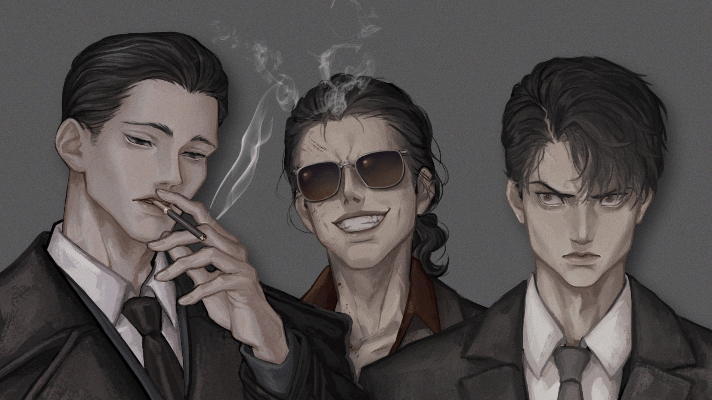
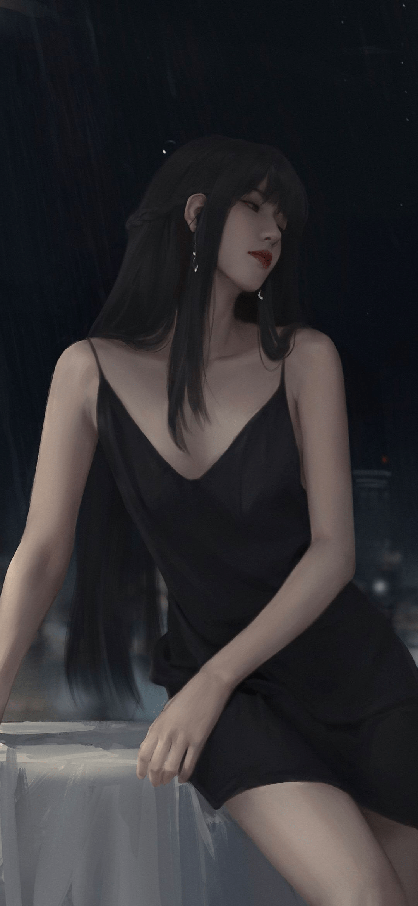

# 《阿奎莱拉的暗潮》Chapter 5 ＋番外 1.22更新

作者：Arik

TID：31676

# 1

*本帖最後由 Arik 於 2022-1-22 20:36 編輯*

阿奎莱拉暗潮

目录

Chapter 1 ................... 书店的过客 Chapter 2 .................... 星之梦

Chapter 3 ................... 委托 Chapter 4..................... 窥豹

Chapter 5......................心怀畏惧的真相 

# 2

<ignore_js_op>[E0WoFc6VkAEdpyB.jpg](forum.php?mod=attachment&aid=OTExNTB8YjYxMzBhNjJ8MTY0NzcwNDI0N3wxODIzMHwzMTY3Ng%3D%3D&nothumb=yes) *(316.94 KB, 下載次數: 2)*

[下載附件](forum.php?mod=attachment&aid=OTExNTB8YjYxMzBhNjJ8MTY0NzcwNDI0N3wxODIzMHwzMTY3Ng%3D%3D&nothumb=yes)

2021-9-18 16:04 上傳  

画师：• 팬딩클래스 OPEN @qxBELLxp

</ignore_js_op>  <ignore_js_op>[1617418245407.jpeg](forum.php?mod=attachment&aid=OTExODh8MTQ3OTQ0YmN8MTY0NzcwNDI0N3wxODIzMHwzMTY3Ng%3D%3D&nothumb=yes) *(156.04 KB, 下載次數: 1)*

[下載附件](forum.php?mod=attachment&aid=OTExODh8MTQ3OTQ0YmN8MTY0NzcwNDI0N3wxODIzMHwzMTY3Ng%3D%3D&nothumb=yes)

2021-9-18 23:24 上傳  

初云

</ignore_js_op>  

# 3

*本帖最後由 Arik 於 2021-9-12 14:48 編輯*

我曾经做过一个梦。

梦中的我有着某种与众不同的能力，直到那天我又一次出现在街上闲逛的时候，发现路边有个蚁巢，里面的蚂蚁似乎观察到了我，并且把我当成神来崇拜的时候才发现。

它们宣称我是这个世界上至高无上，独一无二的神明。我瞧了瞧周围，街上人来人往，大概蚂蚁们看不到其他人类吧。

它们颁布了许多「信条」，什么信我者上蚂蚁天堂，不信我者下蚂蚁地狱之类的，我想了想，我都不知道我死后上哪，它们倒是已经安排上了。

它们给我塑造了神像，那是一座金光闪闪的大蚂蚁像，还有很多「神使」像，银光闪闪并且长着翅膀的小蚂蚁像。虽然看起来很厉害，但是我扫了一眼自己，有手有脚四肢健全，妥妥的灵长类脊椎动物，和那些昆虫纲节肢动物神像怎么都对应不起来。

最后它们甚至著书立说，编纂经典，宣称某位蚂蚁是我的亲儿子，是我派它到蚁巢行走地面拯救它们的。

够了！我可不想和蚂蚁攀什么亲戚。

于是我解开裤链朝蚁巢撒了一泡尿，把蚁巢淹了个七七八八，并用脚把那些逃跑的蚂蚁们一一碾死，顿时蚂蚁们的哭喊声钻到我的耳朵里：

「诺亚大洪水！」

「索多玛的天罚！」

「都是你们这帮异教徒和无神论者，神发怒了，末日审判来了！」

我面无表情地提起裤子回到街上，看到一个传教士正在卖力干活。

不由得啐了一口，还不如那些蚂蚁呢，蚂蚁们至少亲眼见过我这尊女神了，他们的神又在哪条街上准备脱裤子放水呢？

就当我继续想找寻下一个蚁巢时，

梦醒了。

我还是孤身一人。

Chapter 1 书店的过客

2015年5月3号，龙海市老城区。

又是一年里雨最多的季节。华北地界的雨虽然比南方来的更实在，没有那种淅淅沥沥的小雨，但也架不住令人头痛的积水像潮汐似的侵蚀着这间没有名字的古朴书店。

老城区的改造工程还没定下来，雨污分流和地下水规划在这里形同虚设，郑渊一边在门口抽烟看「海」一边暗骂着屋漏偏逢连夜雨——这个月要是再没有客人来，他就真的得请罗涵来救济一下了，就算房租不用交，自己的肚子可不能欠着。

昏暗的房间里被三个年代久远的木柜阻断了空间和视线，只要一进门它们就会将客人紧紧包围，潮湿且饱含历史质感。同时也是因为狭小，私密又沉静的体验还算这间书店的「特色」，坐在门口的郑渊好似守书人一般凝视着外面的广阔天地，光线的变化在不经意间改变了他的时间尺度，一个晃眼便是一天，这是对他来说抚平创伤的最好方式。

「呼，还是先歇会吧。」

郑渊把烟掐灭，转身躺在了柜台边上的摇椅上闭目养神，适当的白噪音让他比以往的午睡时光来得更加踏实，全然忘记了早上只吃了一个干烧饼，就连鸡蛋都没舍得煮的清贫生活，很快就有了困意。

叮铃铃....

刚觉得自己马上就要进入梦乡，门上的风铃声却不合时宜的响了起来。郑渊抬起眼眶上的胳膊，微微瞄了一眼——一个身穿白色衬衫系着红色领带的上班族模样的男人刚刚收起雨伞放在了一边的伞架上，略显紧张地看着他。

「没事，您随便看就行。」

郑渊慵懒地说着，根本没有想从摇椅上爬起来的意思。这个点雨下的最大，住在老城区的人都知道越往里走水就越深，就算有车也不会贸然开进去。更何况眼前这位大叔很眼熟，经常在这附近推销他们公司的清洁产品，想来是刚结束上午的工作才来这里避避雨而已，所以他也没必要装模作样的起来欢迎，免得被推销一番。

「诶...好。」

男人讪笑着应了一声，长年加班熬夜塑造的臃肿体型在这间略显拥挤但总体收整得当的地方才能走到最后一排，不然很有可能出现被书架卡住的尴尬境地。郑渊几次想和房东商量着把隔壁的仓库也盘下来，既能扩充空间让店面亮堂点，还能加上几张桌椅供客人阅读，自己也能空闲的时候找人聊聊天，打发打发时间。

可那位不苟言笑的女房东只用了一句话就让郑渊彻底打消了这个念头：「在你的通缉令没有撤销之前，犯罪嫌疑人没有资格申请改造牢房。」

「我要是犯人，你就是翻版的塞缪尔·诺顿。」郑渊心里默默嘀咕着，一下没有了继续睡觉的念头，刚想抬头看看那位大叔在看什么的时候，他的左声道就传来了一个不幸的消息。

咣当！

「哎哟！」

随着一声巨响，老旧的书架二号机，沉默。

胜利者既不是使徒也不是暴走的初号机，而是一个正躺在书堆里呻吟的中年大叔，似乎在为自己劳损过度的腰椎再次受到冲击而感到悲痛。郑渊重重地叹息了一声，本来不想再浪费体力的他还是不情愿地走到案发地点把男人拽了起来，书架还好是向墙壁那边倒去的，不然一号机和他估计都难逃一劫。

「没事吧，老哥。」

「没事没事....唉，不好意思啊，本来想拿底下的这本书，结果一猫腰就把后边这个碰倒了。」男人咧着嘴回应着，手里还拿着刚刚夺来的战利品——93年朝华出版社出版的《梦林玄解》

看得出来这位大叔还算懂得爱惜书本，摔倒的时候故意侧身躺在了分隔板上，没有压坏身后有些年头的老书，不然也不至于还在揉着他的尾骨不放。

「人没事就行，您先坐那歇会，这边我来吧。」

郑渊架起男人的胳膊准备往柜台走，却遭到了男人的竭力反对：「别别别，这哪好意思，我跟着一块，额...再看看哪些书破损的比较严重，我赔给您。」

「不用了，这地方小，您又刚摔完，还是服服老吧。」郑渊微笑的说着，尽量维持着不计小节的年轻店主形象：「至于书...一会儿我收拾完，应该没什么问题。」

男人还是有些过意不去，但回想起刚才狭小的窘迫场面也只好作罢。这间书店的确不适合他这种「前凸后翘」的人来回穿梭，加上有些昏暗的白炽灯光和高大书架造成的视线阻碍，想要在这种环境下整理书本确实不是件易事，只好边扶着腰边坐到摇椅上翻看手中的旧书。

「麻烦你了啊，唉。」

郑渊点点头，随手捡起几本濒临散架的旧书先放到了边上稍矮一些的架子，这些一看就很有年代感的古代文献抄本和近代民俗新编都是他网上淘来的收藏品，有些是因为便宜，有些是因为兴趣，总之基本上都是些古怪玩意。他的店里从来不摆什么热销书籍、网络小说或者各类名著，所以这里比起书店更像是一个古典装横的二手黑市，基本上没有什么人在这里驻足。

郑渊也乐得清闲，反正他的收入也不是靠倒卖这些古董来的，只是方便在干活的时候能有个「接待所」而已。

「最近做奇怪的梦了？」郑渊拾起最后一本书掸了掸，抬头问到：「里面的解释可不太尽人意，比咱经常看的《周公解梦》要模糊的多。」

「嗨，这不图个心安嘛。其实我也不怎么信这些东西的，但是这两天老是做一样的梦，晚上也就算了，白天午休也是，整天恍恍惚惚的，这才想了解了解是不是有什么寓意。」

男人揉了揉太阳穴无奈地向他抱怨着，抬头纹都拧成了一团，露出心力憔悴的神态，似乎梦境的所见给他的现实生活带来很大影响，即使是经年在外跑销售晒出来的黝黑皮肤都不能遮掩住他深邃的「隐形墨镜」。

「梦到什么了？不妨说说。我也算研究过一些稀奇古怪的事，解梦虽然不擅长，但是能帮您分析分析。」郑渊走到柜台朝男人递了支烟，对方摇头拒绝后才自顾自的点上，拉出一边的板凳坐下，打算趁着今天这场暴雨不方便办事的功夫解解闷。他轻缓地吐出第一口烟并翘起腿，烟雾缭绕间颇有一幅世外高人的样子。

「这个.....」

男人面露难色，本来惆怅的脸上有了一丝羞愧，似乎是很难以启齿的事情。

「春梦啊？」

「哎，可不能瞎说。」

郑渊轻笑了一声，见眼前男人也笑着摆了摆手，总算是稍微卸下了一些戒备，他才继续说到：「没事儿，我又不是街头那群天天扭秧歌的大妈，天天碎嘴子。权当唠家常，把我当您客户就行。」

「干这行的可就怕您这种看着就有学问的，不好骗...不是，不好聊，哈哈。上次我和一位大学教授推销产品，人家一说话有条有理，张口就是什么化学成分、效用时间，差点给我整懵了。」男人把书放到一边，深呼了一口气，又看了看一脸认真的郑渊说到：「咱可得说好，你别笑话我啊，这梦确实有点奇怪。」

「您放心吧。」

男人点点头，把手肘放在腿上，身体前倾：「我梦见一个大美女。」

「那不还是....」

「我还没说完呢。」男人打断了郑渊的话，接着说道：「不是你想的那种，这个‘大’是...字面意思的大，比楼房都大的那种。」

郑渊短暂一怔马上就反应过来面前男人所说的意思，他挑了挑眉，开始把玩起他的打火机。金属盖开开合合发出叮叮地清脆响声：「巨人。可以这么说吗？」

「是，但是样子特别模糊，我绝对见过她，就是想不起来在哪了。然后就和那种怪兽电影似的，一堆人跑啊，喊啊，特别乱。每回我就在人堆里看着，也不想跑，就想看看她长啥样，但是基本上都用不了多长时间我这一片就被她给踩了。你可不知道那鞋有多大，就我从咱这条街的钟楼上往市区看，才能看见她那高跟鞋的鞋跟。」

男人有些激动地朝郑渊描述着他梦中的经历，丝毫没有刚才的颓势，见郑渊没出声他也就继续说到：「但是最近不太一样了。原先我做这个梦也就十几分钟的功夫，被踩到也就醒了，可最近几天开始那个巨人有点怪，就搁那杵着，半天也不动地。」

「然后呢？」

「这个我也记不清了....反正就是特别怪，对，而且这几天我老婆还说我梦游，叫唤。这给她吓得。」

「嗯.....」

郑渊抽了口烟继续问道：「有没有看见什么...奇怪的东西？」

男人看这位书店老板听的这么认真，也没有笑话他，便认认真真地回答道：「没有啊，害，哪顾得上看旁边，你说你眼前要是真出现这老大个的巨人你不害怕？」

「反正是梦嘛，要是我，估计会尝试和她聊聊。」

「哦！对了对了！」男人好像想起了什么事，起身拉了一条板凳坐到郑渊对面，皱起凝重的眉头仿佛要说什么国家机密一般，凑到他的面前小声说到：「最近每次醒之前，她都会说话。」

「说话？」

「我听不懂她在说什么，好像是英语...也不是，反正发音挺奇怪的。」

叮。

郑渊合上打火机，把烟头掐灭，将嘴里的最后一口烟尽数灌进肺里后才不声不响地拿走了柜台上的那本书。微微湿润的书皮再度拿在手里时只令他感到粘腻，不管是从男人的神态表情还是语言组织来看都不像是拿自己找乐子或是试探的，而且这种梦境他确实再熟悉不过。

阿奎莱拉。

这个近乎垄断了所有通讯市场的网络平台上曾经有人讨论过关于这一离奇梦境的遭遇，和眼前这位大叔所描述的相差无几。最先开贴讨论的人已经近五年没有再更新他的主页，因为他的名字和那些有着同样经历的人们一起，在2010年6月上了本国的新闻头条

——经公安立案侦察，确定曾经留言讨论的12985人全部失踪，具体的案件细节因过于匪夷所思未曾向社会公开，关于这个梦境的所有线索也在一夜间也被舆情监测部门控制，只留下了一个已经编纂、杜撰成都市传说的模因、一封尘封已久的空白卷宗和一个目前在逃、受到通缉的幸存者。

以至于郑渊现在已从现代人退化成了一只猴子。失去互联网的联系，在如今这个社会不光意味着信息闭塞，还代表着彻底脱离群居，拥抱那些潜藏在暗潮深处的无名之物。

「真是阴魂不散。」

「啊？」

「没什么，挺有意思的梦。」郑渊微笑着回头说到：「谓梦幻乎，一人一事一物一境，寝而见焉，觉而憶之。按这上面的解释来说，总归还是好事，走桃花、事业上升都是可能的。更何况您梦见的还是个大美人，当饱眼福。」

「您就别笑话我了。」男人摆摆手，瞥了一眼右手腕的机械表后便从板凳上窜了起来：「哟！都这个点了，这么着兄弟，这本书我买了，也算给你赔个不是，我这还得回家给孩子做饭，就不多呆了，等回头不忙了，咱俩再好好聊聊。」

「没问题，但是这本书好像有些破了，回头我叫人送本新的过来。」郑渊绕过柜台，从底端的抽屉里拿出一本便利贴递给了男人，「您留个手机号，到时候通知您。」

男人犹豫了一下，又点点头，飞快地拿起笔在便签上写下了自己的名字和电话，随后就脱下鞋子，抓起雨伞往外赶：「那回头再联系啊，老板。」

郑渊笑着挥手致意，眼看男人淌着快到小腿肚子的水离去后，他才褪下了虚伪的假笑，眉宇之间满是愤恨和不甘。

就当他想要拿起便签仔细看看时，突然隐隐约约地觉得有一道凌厉的视线投向手中的那本泛黄的《梦林玄解》，又带着恶意般朝他袭来。他猛然回过头去，昏黄的雨云趁他忙着收拾书籍时压了上来，玻璃门外的街道依然是瓢泼大雨和一片汪洋，对门的小卖部早就摆好了防汛沙袋关了门，只留下了一张用水笔写了联系电话的纸板在狂风的呜咽中飘摇。

看上去一切正常，就像前几年的今天一样——沉闷压抑又恍然若失。

郑渊狠狠地咬住烟嘴，雨点顺着捎过来的狂风拍在门上发出子弹般的响声，他敢肯定，自己被盯上了。

他三步并作两步，迅速拉下卷帘门，随后又拿出柜台旁的蜡烛点上。借着昏黄的烛光，勉强分辨出男人写下的「岳辉」这两字和电话号码，但很快，他的双眼开始模糊，困意突如其来地降临。

迫切想要沉睡的欲望夹杂着多年前的往事疯狂地浮现在他的眼前，惨叫、哭嚎、轰鸣种种被篆刻于大脑的声音也不甘落后地冒了出来，一时间他已分辨不出究竟何处是现实，何处是虚幻。

郑渊颤抖着擦着脸上的虚汗，食不果腹的日子令他的身体每况愈下，根本无法免对突如其来的恐慌症。那些曾被某个存在赋予的知识也在黑暗中沉默不语，伺机等待着他的再一次入眠。

他合上了眼，向他们妥协了。

终于，他要做梦了。

# 4

Chapter 2 星之梦

「昨晚，星梦集团旗下「群星互娱」成功在深圳证券交易所上市，按发行价11.50美元计算，市值约32亿美元，群星互娱及其子公司通过发行4200万股ADS，融资额高达4.83亿美元；加上承销商可能执行的630万股超额配售部分，星梦集团最大募资额将达到5.5545亿美元。」

「截至目前，旗下著名虚拟综合网络互动论坛——『阿奎莱拉』注册会员已达5亿人次，进一步表明了互联网时代已经向全世界走来。新的起点与新的征程在深交所的礼花中落下帷幕。星梦集团董事长发表了名为「梦与现实」的主题演讲，鼓舞激励了我国市场潜力的同时也为世界发展主题奠定了基础。」

咚咚咚。

「进。」

「总经理。」

赵婉转身关好门，把手中的文件放到了桌子上。背后的大型投屏还在播放着公司上市的专题报道，播音员磁性的声音引起了阵阵共鸣，却丝毫没让她的心有所动摇。

「坐吧。」男人不再去看背后的投影，往沙发椅上一仰，慵懒地说着：「你这个位置要是想离职得经过董事会讨论的，我可没有你的人事权。」

「但您也是董事会的一员。」赵婉认真地说道，「我觉得以我现在的状态并不能继续胜任这份工作，同时，也无法认同现在的工作。」

「你可以去休假。带薪休假一年也没关系。只要能保持论坛稳定运转，任何要求我都能向董事会申请。钱、人、权力，你想要的一切都能在现实中实现。」

「比起那种物质追求，我更向往质朴的一切。」

男人似乎听到了什么好笑的笑话，竭力保持着自己不笑出声，几次用手掩住嘴想要继续询问时，都被控制不住的面部肌肉折腾的说不出话来。

「你...你是说接着回到你那山沟沟里面？....哈哈哈哈哈，别逗我笑了，赵婉。别说你，你问问你爸妈同不同意？」男人用手指敲着桌子，肆意表现着他的不屑：「在阿奎莱拉，你可以是睥睨众生的女神，但在这，你只是公司的员工。别忘了，你在那可是杀过很多人的，没有千万也有几百万了吧？你不是玩得挺开心的吗？我欣赏过你用城市自慰的画面，那时候有你有多招人喜欢，怎么？女神当够了，相当蚂蚁了？」

赵婉死死攥住自己的包臀裙并把头深深低了下去，好让她近乎扭曲的五官避开男人的视线，裹进她柔顺的披肩长发中。才刚做好的心理准备和结束一切的决心瞬间被眼前男人用刻薄的嘲讽所击溃。毫无人性可言的残杀画面历历在目，伴随着她放荡的笑声和恶毒的言语，一个个人类、一座座城市都化为了乌有，究竟为什么直到现在才从这个不切实际的幻梦中惊醒？

是当时星梦经纪公司带着她见识到了那车水马龙的世界还是那隐隐作祟的优越感？

赵婉快要忘记了。

她只记得，在每月一次全村播放电影的时候，坐在台下的她也渴望成为跃动在银幕上的明星————光鲜亮丽、楚楚动人、幸福美满。

但当她真正实现了这个梦想的时候，才发现一切是如此的空虚。换句话说，她受不了这过于强烈的落差感。每次结束「星之梦」后，都犹如跌落悬崖般令她目眩神迷。

她花了很长时间来适应，直到她可以做到一边轻笑着一边将不足她指尖高的人捏碎，一边保证放过自己脚下苟延残喘的军人一边在高潮来临之后狠狠压下她套着丝袜的脚，然后唾弃着同为人类的他们，拥抱那足以令她癫狂的无上快感。

如果不是在一次工作中邂逅了那个奇怪的男人，或许现在的她还沉迷于公司的造神梦里不能自拔。当然，这只是促成条件，真正令她放弃这一切的还有其他原因。

「是。」赵婉说到，「我不会再接受群星互娱和阿奎莱拉的任何要求，我正式向公司提出离职。」

赵婉昂起头来和坐在沙发椅上准备继续挖苦自己的男人坚定对视着，后者显然也没有预料到居然真的有人会从阿奎莱拉中挣脱，回到已经见识过光明的黑暗里游荡。

作为群星互娱的主要负责人兼董事会成员，埃克利·克拉夫特，这个英俊魁梧的高加索人展现出了他应有的应变能力和态度，他收起那副玩世不恭的样子，操着一口流利的普通话认真地告知了赵婉这么做的后果：「不光违约金，你要知道，公司不会允许一个像你知道如此多机密的人离开，口头保证和合同书可换不了你的自由，赵婉。只有死人不会说话,而公司，最不缺的就是死人。一窝一窝的死人。你的亲人和朋友都会因为你的错误决定付出代价，这可不是划算的买卖。」

埃克利站起身来，绕过那张厚重又宽阔的办公桌走到赵婉的椅子旁边，缓缓撩起她的长发，嗅着指缝间浓郁的洗发液的味道：「别耍脾气了，我的女神。你值得和那位最为强大的星神之女站在同一舞台上，把那些下等人连同他们的世界一起毁灭，到那个时候，你就不需要穿梭于阿奎莱拉，不需要在过你的人类生活。就算是我，也只能作为你脚边毫不起眼的虫子，为你献上一切。」

「但那些东西不会。」赵婉转过头注视着埃克利：「那些躲在阿奎莱拉角落里的东西，一直在盯着我——一直，一直，一直在阴影里，在那群该死的大楼里盯着我。从我第一次到那边的时候我就能感觉到，那团连形状都没有的东西在拼了命的找我，尤其是穿梭的时候，每次我都会离它越来越近。你以为你瞒得住吗？！」

埃克利短暂一怔，他维持着僵硬在脸的微笑，毫无预兆的抓住了赵婉的脖颈并狠狠地将她的头摁到了办公桌上，发出沉闷的响声。

「是谁他妈告诉你的？！而且你说你早就遇到了，为什么不——早他妈告诉我！」埃克利近乎咆哮着的，大声质问着赵婉。孔武有力的手臂因极度愤怒而不正常的颤抖，同时也是因为恐惧，他的手掌并没能用上十分力气，不然现在的他完全可以像一只愤怒的灰熊一般将赵婉的颈椎拍碎。

「快点说话，你这——」

「埃克利。」

背后的投屏不知何时早已停下了新闻播报，变成了连接着远在美国总部的星梦集团董事长的办公室画面。这个梳着马尾辫的干练女人戴着一幅银白边框的墨镜，一边拿着手中厚厚的文件夹一边用笔做着批示，一旁秘书模样的年轻男人正毕恭毕敬的等候着，就像刚刚被点名的埃克利一样，低着头一言不发。

「对我们的女神尊重点，她还没离职呢。」

女人停下笔，重新阅览了一遍手中的文件，确认检查无误后递给了秘书，又从左手边堆积如山的文件中拿下一叠再次开始看了起来，丝毫没有抬起头观看闹剧的想法。沉稳的气场和那身挂着星梦集团标志、有星辰点缀的白色西服在背后「远见」——一幅出自无名艺术家之手的宇宙绘图——的衬托下更显得神秘与威严。纵使远隔千里也让埃克利身临其境般，迅速冷静了下来。

「非常抱歉，董事长。」埃克利松开手整理了一下西服，深呼了一口气继续说道：「但您刚才也听见了，她被那玩意盯上了，而且没有第一时间告诉她的经纪人。按照公司的规定，完全有权解除合约并把她投放到阿奎莱拉。」

「你先出去吧，我和她聊聊。」

似乎早就预料到了女人接下来要说什么，埃克利微微鞠躬并应了一声后便头也不回的走出这间本属于他的办公室，没有再看向赵婉一眼。

「比起你的离职或者遇到的东西，我对你见过的人更感兴趣。」女人又向一边的秘书递出了一个文件夹，但没有继续工作，而是扬起下巴饶有兴趣地看着面前正因刚才剧烈撞击和惊吓而咳嗽不停的赵婉：「那个手里一直拿着笔记本，看起来神神秘秘的男人和你说过什么，对吗？」

「咳咳...不知道...我听不懂您在说什么，董事长。」赵婉抚摸着自己的脖颈，细嫩皮肤上埃克利手掌的印痕正不断提醒着她走错一步的下场，但她内心中渴望一个简单结束的想法促使她鼓起勇气继续说道：「我只想作为一个普通人继续活下去，除此之外，别无他求。」

「这很奢侈，亲爱的。」女人微笑着，单手托起下巴，温和地说着：「原本的确可以将你的记忆删除掉再送回家里，完成你这个梦想。但现在，你只能以一个普通人的身份死去。因为用不了多久，它就会从你房间的各个角落里追过来，在你漂亮的脸蛋上开一个大洞。即使这样，你也愿意从公司离开吗？」

赵婉拢起耳边的长发用力搓了搓脸，确认自己没有做梦后用力地点了点头，默默地等待着那边的回复。自始至终，她都没敢看那位星梦集团董事长一眼，只是沉着头，完全不敢将当时与埃克利对峙的勇气拿出来去面对屏幕上的女人——毕竟她所在之处宛如超新星的具现化一般，扩散的辐射足以将世间的一切毁灭，不留一丝痕迹。

赵婉亲眼见识过。

那是星星的怒火，也是审判的丰碑。

「看来他向你保证了很多。」女人轻笑着拿起笔，再次开启工作模式：「回去吧，我会告诉埃克利给你办离职手续。」

「谢谢您....」

「也会给你挑一块位置不错的墓地。」

........

破碎、寂静又令人窒息。

郑渊不得不把视线从远方的星图中移开以免被那万千闪耀着的新星给勾去了思绪，从而忽视了眼前正在打量着自己的巨大女人。

足有近300米高的初云撩开自己的紫色短裙缓缓蹲下，胯间几座稍高一些的商业大厦在触碰到她宽阔到能展开一幅画卷的蕾斯内裤时轰然倒塌，尖端的避雷针甚至没能在在那看似柔软的针织物上破开一个孔洞就被压弯了过去，伴随着人群的惨叫和巨物坠地的声音，成为了一团废铁。

蓝紫相间、布满花纹的幕布和足以媲美金融中心高的股间在顷刻间和地上的人群拉近了百米，无法描述的压迫感骤然将街道上急速升温的恐慌逼停，落入临死前的麻木时刻。

无数双眼睛从初云穿着肉色丝袜的脚踝一直到诱惑的胯间游荡，那相当情趣的内裤里面，丝丝缕缕的耻毛在初云不怀好意地抖动下，仿佛有意识般盘旋在那群只剩半截的大厦上空。而一些还没明白发生了什么，侥幸没有被天花板压碎的员工们则被一个接一个的扫落出去，甚至被这根本不符合物质构成原理的、散发着体味的阴毛径直洞穿，挂在了上面，活像电影中可怖的怪物在狩猎人类一样令人胆寒。

尖叫声开始不约而同地响起，这些受过良好教育的文员们眼睁睁看着自己的同事像被逮住的虫子一样颤抖着，纷纷连滚带爬地想要逃离现场。但恐惧的喊声却引来了初云的注意，她微微低下头打量着自己的胯下，露出一副厌恶的表情。

「脏死了。」

语气平常的真的就像她这个年纪的女生不小心碾碎虫子在身上的感觉一样，就连她伸出手指当作无事发生般，轻易抹去了阴毛上还在垂死挣扎的数十人的生命时也没有丝毫犹豫，完整的人体在巨大的食指和拇指间细细搓捻下化作碎屑淌落在地，没有任何尊严可言。

「还有你们。」

找到「罪魁祸首」的初云没有给大楼里还没来得及出逃的人们辩解的机会，染上红晕的手指便直接伸到其中一幢商业大厦上方迅速摁下，坚固的混凝土和钢筋用最直观的方式宣告人造物的失败——崩坏、开裂、破碎，这同时也是这栋楼内人类的结局，全都都输给了初云的一根食指，覆盖住他们所有生还希望的一根手指。

「你们也是。」

初云皱着眉头将一座花费一年时间才修建完成的大厦压缩进地下停车场后，将目标放在了另一边作为呼应的第二栋大厦上。

相比于第一栋遭难的大楼，第二栋里的人们明显反应要迅速许多，狭长的街道上早就填满了急于逃命的人和车子，门的那边还有人在源源不断地加入这只逃命大军，他们绕过从楼顶掉下来的残骸和血肉模糊的尸体，用汽车的警报和鸣笛声当发令枪，展开人生中可能会是最后一次的障碍赛跑。

可惜这次的裁判吹了黑哨。

「啊啊，跑得还挺快的。」

初云漫不经心地吐槽着，随后轻松的用食指碾碎了最前端十字路口上挤作一团的人们，钢铁刺耳的折弯声音夹杂着令人厌恶的、肉与肉间的摩擦声令周围幸存者们遍体生寒。

精心护理过的指甲轻而易举地切割开数个人的身子，扎进柏油路中，和顺着只剩半截的大巴车中段淌落在地的浓密血浆映衬着。心惊胆颤的屠杀在这一刻让人们进一步体会到了不可逾越的鸿沟，即使这是一名长相柔媚、嗓音动听的巨大美女的一根手指，也无法改变目睹了一切的人们内心深处的恐惧。

「不跑了？那就都给我先死一死吧。」

居高临下望着乱成一团的街道，初云多少对这一成不变的景象感到厌烦，她站起身子，粗暴的甩掉套在右脚上的高跟凉鞋，露出完全能用宽广来形容的性感足底。

圆润饱满的脚趾在丝袜的包裹下不安分的扭动着，潮湿且浓郁的气味随着这只庞大到令人绝望的玉足落地，刹那间把数十名神态迥异的人当作最为渺小的蚂蚁踩碎时，那铺天盖地的扬尘才勉为其难的透过丝袜的缝隙，散发出奢靡又极具美感的嗅觉冲击。

踮起脚尖，把足下早已透过空隙填满袜子的人类肉饼和被踏的扁平的车子进一步用力左右碾动起来，丝袜摩擦传来滑溜溜的触感让初云的心情稍微好了一些，更是因为看着自己漂亮的脚掌和底下四散而逃的渺小的「同类」之间的对比，让她感到一阵兴奋。

「看什么呢？真恶心。」

注意到前脚掌边上一个双手抱头、趴在地上正色眯眯盯着自己脚趾看的男人，初云双眉间难以掩饰的嫌恶感更加浓重，几乎是话音刚落，裹着轻纱的大脚趾便毫无怜悯的将这个蓬头垢面的男人摁碎，沉重的力道甚至将人行道上的砖瓦都化为了齑粉，更不用说相比那只高大美丽的脚趾之下，低贱的犹如虫子般男人的身体。

「就应该把你和他们的眼挖下来。」

恶狠狠地自言自语着，初云并没有把脚抬起来，而是拖着足下的碎尸硬生生撞进了一边低矮的门脸房中，破开脆弱的玻璃大门、压过脆弱的课桌板凳直到即将碾平最后一间屋子时，稚嫩的尖叫声才透过摇摇欲坠的天花板传了出来。

但初云似乎并没有听到如此细微的特殊喊叫声，只是想着用脚多碾碎一些东西，好平复一下自己今天不太愉快的心情。被告知老实呆在教室就不会有问题的小学生们在混乱之中便全部被她的脚趾碾的扁平，声音也在初云落下脚后跟时归于沉寂。

他们只比他们的老师多活了半分钟而已。

「抱歉打断一下，初云小姐。有些事想和你聊聊。」

突然传进耳朵里的声音吓了初云一跳。虽然她可以借助权限，有意识地选择听到底下细弱蚊虫的人类的声音，但从没有人能反向将声音传给自己。

初云疑惑的朝刚刚从「星图」中掉下来的男人看去，此刻的郑渊正站在一座三层楼高的天台小咖啡厅上摇动双手，一身老旧的棕色风衣正因刚刚轰然倒塌的楼房所产生的气流而随风摆动，迫使他不得不抽出一只手来护住身体，以免承受更大的阻力。

「你...」

初云下意识地用脚将那间咖啡厅50米外的房子全部抹平，给膝盖留出位置后跪坐了下去，沉闷的巨响宛如地震来临的预兆，惹得郑渊不得不抓牢扶手保持平衡，才能在这巨大的体型差间维系一个相对严肃的对话场景。

终于风停了，郑渊把凌乱的头发重新用手背了回去，又拽了拽风衣的两侧，把头仰了起来，和高高在上的初云对视着——一张颇有古典美的清秀脸蛋正好奇的压了过来，刚好遮住了天空上刺眼的不像话的太阳。略显疲倦的棕黑色眼眸在眼角泪痣的衬托下看上去柔媚不少，乌黑的长发顺着楼宇间播撒，低胸连衣裙中挺拔的胸脯若隐若现，在和内裤全然一套的蕾斯胸罩中摇摇晃晃，似乎随时都会因成熟而掉落，看的郑渊一阵出神。

轻柔的鼻息扰乱了周围空气流动的同时带来了一股栀子花香，为两人的初见增添了些许味道。

回忆的味道。

如果不是郑渊早已遍历无数异景，恐怕初云这一足以称得上是如梦似幻的浪漫举动完全能让这个还没谈过恋爱的男人陷入爱河。但很可惜，他那早已千锤百炼地理性支柱没能让他感受到这一景色的美好，危机感时刻刺痛着他紧绷的神经，完全没有机会让他考虑除了复仇以外的事。

「你是谁？为什么....我能听到你说话？」

郑渊点起一支烟说到：「善于聆听可是不可多得的美德，正说明你的心灵和你的外表一般美丽。」

千万般回答在初云的脑海中汇聚成型，唯独没想到这个看上去瘦弱的、胡子拉碴的大叔模样的人会突然蹦出来如此自然的一句称赞。而且并没有如今网上视频那些「恋爱教学」中的那般油腻和滑稽，初云只是觉得由衷的惊讶和开心。

虽说她刚刚还无所谓的像消灭蚂蚁一般屠杀了数以千计的人，那种阴暗的毁灭欲望并配不上心灵的赞美，但这些所谓的人类其实不过是阿奎莱拉捕捉到的梦境精神体，并不是现实中活生生的人。

所以她把现实和梦境分开，在阿奎莱拉的经历权当发泄的游戏，只不过郑渊的这句话差点让这位古色古香的姑娘再次陷入「星之梦」的迷茫境地。

初云可爱的脸庞上浮出一抹阔别已久的羞涩，上一次出现还是在当时第一次进入阿奎莱拉，身穿短裙的她被底下形形色色的人们看光内裤的时候。

虽然现在也是一样，但完全是因为不同的感触。

「....凭这招撩过许多姑娘了吧？大叔。小心我也把你像刚刚那样捏死哦。」

初云有些嗔怪地说着，抑制不住的嘴角却暴露了她内心的感受，给了敏锐捕捉到这一点的郑渊可乘之机：「只是实话实说。毕竟群星互娱中你是我最欣赏的一位偶像。」

「嗯？真的？」

「当然。像《穿梭》《星与海》还有《降临》都是我特别喜欢的歌。所以见到你的时候很开心。虽然...你刚才的样子很令我害怕，那些人...都被你踩死了。」

「那你为什么不害怕？」

「我说了，我相信一个心灵美丽的姑娘不会做出这么残酷的举动，如果有的话，也可能是在梦里吧？」

「别装傻了。」初云拢起耳边的长发俯下身子，尽量贴近小房子上的郑渊：「虽然以前的确有过不小心把睡着的人连同肉体传送过来的事故，但现在还是很精确的。就算真的有，一个普通人不可能像你这样保持清醒，还这么镇静。更何况，你是从星图里出来的，我看的一清二楚哦。」

「算了算了，我的确不适合演戏。」

郑渊无奈地笑了笑，从风衣的内侧口袋里掏出打火机来回甩动，发出清脆的扣击声：「本来还想和美女多聊会天的，既然这样，那我就直说了。你可能和我一样被盯上了。」

「被什么...盯上？」

「不知道，总之是一些见不得光的东西。比如——狗。」

# 5

> [2878632 發表於 2021-9-12 20:20](https://giantessnight.cf/gnforum2012/forum.php?mod=redirect&goto=findpost&pid=479481&ptid=31676)

> 我其实一直不太明白所谓克系是啥·get不到点，不过作者笔力不错呀

如果是没有了解过克苏鲁神话的话就当成一种惊悚＋奇幻题材就好，没有什么特别复杂的设定，这点放心。文中只是带有一些元素，感兴趣可以了解一下。同时谢谢称赞。

# 6

**群星互娱究竟在造谁的梦？**

灰色产业链、黑恶势力勾结、邪教传销式的企业文化、言负其实地“造梦”演讲，今年以来，群星互娱及其子公司阿奎莱拉的种种违法违纪行为层出不穷。人们在使用论坛和聊天软件分享生活轶事，观看着以初云和赵婉为代表的“主流”明星们的精彩演出和动听旋律的同时也不禁发问：“群星互娱究竟在造谁的梦？”

多位业内专家近日接受《龙海日报》记者采访时说，群星互娱的平台、商家等依赖“算法”评判市场，依靠星梦集团体量优势，斥巨资垄断了业内娱乐发展，并培养了一批才不配位甚至德不配位的“女神”明星，甚至将自身企业形象与之捆绑起来，塑造成了一个更为虚幻的明星企业。以及在对这些年轻貌美的偶像明星的盲目推崇中形成“拜物教”，对年轻人价值观产生了极为负面的影响。

专家们表示，经济发展和生产总值不能成为违法乱纪、扭曲社会主流价值观的挡箭牌。特别是要营造良好的营商环境和风清气正的“逐梦”之路，做到给人们许诺的美梦要兑现；给人们承诺的喜梦要实现；给人们允诺的清梦要再现。不能沉迷在造梦怪圈当中，只说不改或是只说不做。

造梦归根结底是要造老百姓的幸福梦、安康梦而不是一些人投机取巧、违法乱纪的发财梦。

这需要各方协作合力整治，特别是要阻断梦中的暗流涌动，才能溯本清源，让美梦成真，让喜梦成真、让清梦成真。（记者 罗涵）

**【责任编辑:王佳宁 】**

# 7

*本帖最後由 Arik 於 2021-9-17 21:02 編輯*

Chapter 3 委托

2015年5月4号。

龙海市高新区，芝雅清洁有限公司。

「岳哥，正找你呢。刚才有个客户打电话，说是下午找时间聊聊。」

岳辉脚还没踏进办公区，销售经理就恰好推开办公室的门，兴高采烈地迎着他走了过来：「好好准备一下，有什么不懂的问问小何，争取把这单谈下来，这个客户很重要，咱们部门的绩效月第一可都指望你了昂。」

「这个...经理，我下午得去我闺女学校一趟，学校老师都催我半天了，说...」

销售经理直接搂住岳辉宽阔的臂膀出了办公区，一直拉着他走到楼梯口才语重心长地说到：「我知道，您这个岁数有难处，可咱谁都不容易啊是不是？您看看我，俩月，整整俩月我都没回家，一直给咱部门拉客户跑项目办手续，每天加班到两点，为啥？不就是多挣点钱嘛。」

「是，我也想多挣点，可这不是真有事嘛。」老岳耷拉着一张圆脸无奈地说到：「我闺女今年高三，还叛逆的很嘞，就怕她在学校出点事，这不，刚给我打的电话，在学校搞早恋被抓了，让我赶紧去一趟，哎哟，可急坏我了。」

一听岳辉闺女出了这么档子事，经理也着实有点难办。他抽出手环抱胸前，皱着眉头盯着眼前坐在楼梯上的老岳，思考着怎么样才能不错过这一单业绩的同时还能兼顾解决私人问题。

突然间他想起了这个要约见岳辉的客户身份，立马就换回了刚刚高兴的样子和岳辉说到：「哎，那你就更得去了。」

「我去啥啊我。」

「你知道这个约你出来的客户是谁吗？」

「谁啊？我闺女他们学校的校长？」

「校长算个屁。人家是群星互娱的分管经纪人，年收入比咱公司流水都多，几百万呢。」

「那有啥用，再说了，那人家哪能帮我这么一搞推销的？哎，你快让我去学校一趟吧，一会儿真给我闺女开除了咋整？」

经理一把拉住岳辉的胳膊，推了推鼻梁上松动的眼镜，认认真真地说到：「你这样，你可以不经意地透露给他，最近有点麻烦事，看看能不能帮你这个忙——群星互娱最近的宣传工作可没少往学校做，他们肯定和这些一把手关系好。你给他优惠点，没准人家满意了，一个电话就摆平了，你想想是不？」

「老总刚开完会，说不让和客户走得太近，这要是让他知道了我饭碗不没了？」

「你说你闺女重要还是工作重要？又不是公务员，没了就没了呗，凭你这工作经验还愁哪个公司不要？岳哥你真糊涂了。」

岳辉盯着这个面庞干净、衣冠楚楚的后辈经理，想来想去的确是这么一回事。再怎么说他也干了小半辈子的销售，也积累了不少人脉，想换个地干还是容易的。

「那...我试试？」

「现在两点，约的三点半，你估计能抽空先去一趟学校，先了解了解情况，甭着急。」

「行，那我先去一趟，你忙着，回头请你吃饭。」

说完，岳辉就头也不回的下了楼梯，只留下董连越一个人皱着眉头，看着他渐行渐远。

........

郑渊放下书，借着亮光抬头看了看表，昨天和初云约的两点见面，现在已经两点半了。早知道就在刚起床的那会儿垫点干粮，然后再下楼等她。要不然也不至于在肚子轻柔的交响乐中读书。

看来这位当红偶像并不是想象中那么严于律己，他想着。

随后他继续把心思投入到手中小说的断档处，用心体会着故事中的主人公在面临无法理解的怪物时的那种不安和恐惧，但他仍一无所获。

麻木的情感已经许久不曾泛起波澜，文字的力量在此刻显得微乎其微。也许只有再次和她见面时，才能爆发出那种像主流网文男主角那样天不怕地不怕的干劲儿吧。

门外传来了轮胎摩擦和汽车关门的声音，郑渊如释重负地合上书往门口看去——一辆崭新的奔驰SUV停在了他这间老书店的门外，初云精致的高跟凉鞋踩在地板的声音比风铃声抢先跳进他的耳朵。

今天这位保持着正常体型但也有一米七五的美女更像是个干练的邻家大姐姐，一身修身的长款黑色毛衣配上一条绘有古典水墨画的披肩，也挡不住胸间诱惑的颤动和更为火辣高挑的身材。

白润的手掌半缩在袖子里好似着了凉般，让人一眼看去就萌生出想要握住为她取暖的想法。

成熟又潮流的衣着品味，一下子就能拉近彼此间距离似的。

郑渊眨了眨眼。

不仅看上去温文尔雅也把傲人之处展现的淋漓尽致，和昨天的打扮完全是两种人，若是再拿上个手提包，活脱一个上城名媛。

不得不说，群星互娱那帮经纪人的眼光确实毒辣，能挖掘出这位如此古色古香的美女，想必是在阿奎莱拉天天「看」才练出来的。

「外面等我。」

这个刚结束上午工作的当红偶像毫不掩饰对这间书店的失望与嫌恶，要不是在摘下墨镜那一刻刚好和郑渊对上视线，她当即就想退出去找个体面点的酒店再来见面。

「如果是刻意掩人耳目大可不必，我从来不在乎那些小狗崽们追着我。」初云白了一眼挂着礼节性微笑的郑渊，没好气的说着：「让我一直站着吗？」

郑渊指了指一边的摇椅后便头也不回的走进后屋，看着这个丝毫不拿自己当回事的古怪男人，初云的火气腾的一下上来，后悔自己没有在当时把他的脑袋拧下来。

但她又想到昨天谈话的内容和郑渊霎有其是的样子，思量再三还是坐到那把看起来像是上世纪八十年代的老物件上，等着郑渊从屋子里出来再做决定。

「你对H.P洛夫克拉夫特有了解吗？」

「啊？那是什么？」

「一个...经常做噩梦的美国人。」

郑渊端着两杯茶从门帘边缓缓倒退着钻了出来，他把茶水放递给了疑惑的初云，自己则抽出一条板凳坐在了对面，相当自然的观赏着初云修长匀称的双腿。

「没完了？」初云把两条腿搭在一起，并把包臀毛衣往下拽了拽，不耐烦地说着：「说重点，我抽时间来找你是想知道到底你昨天说的东西是什么，还有....10年6月的那个案子到底是不是和群星互娱有关。」

「我也想知道。」

「你昨天可不是这么说的...你要是敢骗我，我就....」

「就把我像虫子一样碾死？」

郑渊吹了吹玻璃杯上飘出的热气，眼神随着茶叶飘落到杯底后才重新聚焦到初云脸上：「那件案子和你有关吗？」

「有...又怎样？没有又怎样？」

「如果没关系，我建议就此打住。因为接下来我们要对自己的生命安全负责，同时也是更好回答你的第一个问题。」郑渊把茶杯放在地上，熟练地从兜里掏出烟盒和打火机，并随便从桌子底下掏出一个填满烟头的矿泉水瓶：「介意吗？」

「介意。」初云脱口而出地回答着，「我不想被弄得满身烟味，更何况你胆子还真大啊，在自己的书店抽烟。」

「我防范意识很好，而且这几天下雨，还挺潮的，应该烧不起来。」郑渊还是从烟盒里掏出了一只烟叼在嘴里，手里玩起打火机，并没有点上它：「那我先简单说明一下现状，你可以考虑要不要委托。」

「嗯。」

「阿奎莱拉是星梦集团的技术结晶，囊括了网络、量子物理、时空间、天文、甚至神智学等等专业的尖端核心，这点在你上岗成为「受洗者」的时候就应该能明白，通过搭建的网络服务平台进入某个时空隧道一样的东西，这根本不是正常的科技水平。」

「不过他们只是需要对外界有个幌子，真正危险的是你经常光顾的存在于宇宙裂隙的亚空间。通过注册为阿奎莱拉会员时进行的一系列生物验证，进而用某种手段捕捉人类意识，塑造成一个梦境聚合世界，记录下数据，再让你们负责消灭这些梦境残片。整个过程看起来像是为了服务一些...特殊人群，但...这只是冰山一角。」

「这些我不关心，说、重、点。」

初云平稳地拿起茶杯抿了一口，不同于平时喝的那些所谓的名贵茶叶，杯子里经过短短几分钟浸泡就能散发出独特茶香的淡褐色液体在口感上却像是温和的葡萄酒一样，让她迅速在各种迷离的香气中安静了下来，劳累也缓解了不少。

「这是什么茶？还挺好喝的。」

「这个我还真不知道。我房东送我的，说是帮我戒烟。」

郑渊苦笑着跟着抿了一口，随即面露难色，像是喝了一小口砒霜水一样：「如果你喜欢可以送你一些。」

「....买就好了，我不想这么快就欠你人情。」

「那你还是别要了。要是被她知道我把茶卖了，回头不忙了你就发发善心，来这把我埋了得了。」

「嘁，不要就不要。」初云再次瞥了他一眼，并抬起脚踹了他膝盖一下：「接着说。」

「好，我接着说。」郑渊把嘴里的烟滚到另一边，假装点燃了似的吸了一大口：「阿奎莱拉这个空间还不稳定，毕竟当时还处于测试阶段，所以你们在进入的过程中难免会看到一些古老的东西或者被祂们看到。」

郑渊眯起眼，把目光投向不自觉间正襟危坐的初云，那张标致的脸蛋上开始有了一些动容，正期待着一个找寻许久的答案从郑渊的口中说出。

「从2010年第一次进入时间通道的时候，你还有一同成为受洗者的六名女士就已经被锁定了。你一定见到过星图中那些状如眼睛的星星，那就是从单细胞生物都未曾出现时就已经存在的家伙。祂们蛰伏在时空间里，是最难缠的猎手，只要被盯上就会跨越次元，不计一切杀死猎物。」

「永恒捕手、穿越者的天敌、角状时间的异体。」

「当然，它还有一个最广为人知的名字——」

「廷达罗斯的猎犬。」

.......

王淼百无聊赖地敲击着奔驰车上厚重的方向盘，虽然对初云突然要来这老城区办事感到疑惑，但作为分管经纪人和初云的贴身管家，还是需要他以认真负责的态度服务好目前这位仅剩于国内的候补者。

托了某个不知好歹的女人的福，工作量减少了一半。现在能有空闲时间给初云当司机，还是要比整天窝在公司里忙这忙那的强。

可是这也太折磨了。

初云从前脚迈进这个老式筒子楼的门脸书店后已经过去了50分钟，离下午和人约好的时间还有10分钟，就算当成警车开也没法子从老城区赶到市里。

这帮往返于阿奎莱拉的女士们的时间概念确实有待提高，他无奈地想着。

就在他考虑要不要给对方打个电话说明一下情况的时候，大小姐终于从那间老旧书店里出来了，但是看起来有些不安——她的一只手放在锁骨处，迫切想要平静自己的心情似的，即使坐到车上也不愿意放下。

「哎哟喂，姑奶奶您终于出来了？」

「回家。」

王淼看着后视镜，敏锐的察觉到了初云的异常状况，冷下脸来继续问着：「怎么茬？那小子非礼你了？他妈的，老子这就把丫书店烧了，我后备箱正好有两桶汽油......」

「别烦人。把空调关了，送我回家。」

王淼还想张嘴说些什么，但他看到初云已经闭起眼睛侧头睡去，只好叹了一口气后带上那副蛤蟆镜启动了车子。

一路上，只有董连越的一通电话惊扰了后排的睡美人，剩余的时间里，王淼都在思考着怎么解决那个敢掰老虎牙的记者，找几个人打一顿然后埋了？不太合适。一帮不认识的条子盯着自己，还是让小雅直接给他做掉比较妥当。

可以后再出这种刺头怎么办？保不齐再冒出来个赵涵、李涵的继续写这种东西，到时候可不只是挨顿骂就能糊弄过去的。

王淼一边思索着一边把车停在别墅门口，下意识地抬起头再次看了一眼后视镜，却发现初云早已起身，不自然的僵直在后排。

她也在注视着镜中的自己，用一种诡异的微笑盯着他，看的他心里发毛。就在他想开口询问初云怎么了的时候，她却做了个噤声的手势，并缓缓靠近前排座椅间，用手轻轻抚摸着王淼的脸庞，轻声哼唱出一首音律古怪的歌谣：

「星辰啊，星辰」

「寂灭的声音已经传达」

「七名受洗者，正是您慈悲的象征」

「那庄重的仪式」

「那美味的祭品」

「那亘古不变的信仰」

「皆是阿奎莱拉的奉献」

「在那边境的神座」

「卡莲娜、泊忒修斯都是您忠诚的使徒」

「散布着群星的光辉」

「歌唱着群星的故事」

「降临吧、降临吧、降临吧....」

愈加刺耳的调值从初云早已颤抖的嗓子里被挤出来，车厢内冰冷浑浊的空气在旋律的跃动下凝滞在了一起，王淼能清楚的感觉到，车窗的玻璃已经承受了巨大的压力，发出了即将碎裂的声音，一种熟悉的力量在这首像是呼唤的歌谣中膨胀开来。

他有些紧张。

因为初云也在跟着这股力量膨胀。现在的她已经接近两米高，她的头已经紧紧贴在了车顶，注视着前方来来往往的行人，就像一只随时都可能冲破牢笼、大开杀戒的兽，癫狂且暴躁。

不同于以往的星之梦，这次王淼面临的，是已经被阿奎莱拉的梦境所扭曲进现实的初云，是随时都可能将梦境中的权能瞬间爆发出来、碾平一切的受洗者。

他必须得做点什么，否则在初云接触到外界时第一个被碾成渣滓的就是自己。

王淼咽了口口水，微微弯下腰，躲开初云还在不自觉摆动的、已经和他的头差不多大的手掌，想要开启副驾驶座位下方的储物门。

但就在响动的一瞬间，他就被初云抓住了胳膊，用力地握住并将他拉到怀里。

「想做什么？你也想阻止我，对吗？阻止星星降临到这糟糕透顶的世界？」

力道大的出奇，王淼忍着胳膊几乎要脱臼的疼痛挣扎了几次都没能从初云的怀抱中挣脱，现在的他完全和小学生一般，一身的腱子肉却在大人的「关照下」哪都去不了。

「冷静，姐，冷静。还不到日子呢。」王淼放弃挣扎，把头从初云的双峰间拔了出来，大口呼吸着她身上浓郁的栀子花香，尽量平稳地说到：「咱没在阿奎莱拉，姐。哎哟，你清醒点。」

「不，已经到时候了。我能清楚地听到星星的愿望....将那些人类碾的渣都不剩，就是我该做的。」初云一脸陶醉的低头看向王淼，并舔了舔嘴唇：「不如，就从你开始吧？啊啊，我真的好兴奋。先把你的脑袋拧断好吗？我快忍不住了。」

「啊哈，看我发现什么了？一睁眼就感到你们俩打情骂俏？哦，我的老天，阿奎莱拉的分级制度什么时候才能实行啊？我还未成年呢！」在王淼打开副驾驶储物间后掉落下来的一只沉睡的黑色小猫终于醒了过来，它爬到座椅顶，饶有兴趣地舔弄着爪子，用流利的英文继续说着：「怎么样？老大说的没错吧？最近带上我准没错。」

「猫？...嗯嗯...好可爱。来我这里，猫咪。」

「哦哦，这可不行，女士。咱们现在得清醒一下，不然我会被你弄死的。」

黑色的小猫跳到前排座椅中间，优雅坐下，用闪烁着星光的竖瞳直视着上方初云略显疑惑的眼睛，温柔地说到：

**「That is not dead which can eternal lie」

「And with strange aeons even death may die.。」**

.......

「先生，我们这快打烊了，您看您还需要什么，我们做给您，然后移步别的地方可以吗？」

在咖啡厅服务员亲切的讯问中，岳辉才回过神来看了眼手机。晚上9点了，客户还是没来，给董连越打了十几个电话也没说到底几点过来，反倒是学校的老师在打了第三通电话后就明确说了：「第二天七点到学校办理退学手续，过时不候。」

岳辉复杂的心情无以言表，但还是抱着最后一丝希望期待着客户不会爽约，有气无力地对服务员说到：「再等一会儿，行吗姑娘，就一会儿。」

身着正装的女服务员还是维持着职业微笑，似乎看出了客人的苦衷，毕竟在这里待到这么晚的无非就那么几种情况：失恋、失业、逃避、无家可归或者..看上了店里的哪个姑娘。

面前胖乎乎的中年人似乎是属于第二种或者四种，正在借着咖啡厅静谧闲暇的环境而舒缓心情顺便等待着什么人。

「实际上我们八点钟就已经要休息了，看您有事所以才忙活了一阵，现在我们是真的要下班了，这样吧，给您一张我们店的会员卡，以后到这边来都有八折优惠，欢迎您明天再来可以吗？」

服务员从兜里掏出一张精美的卡片递给岳辉，但岳辉却摇了摇头，用一种近乎恳求的语气说道：「求求你们了，他一会就过来，我给你们钱好不好？加班费都算我的，我真是没法子了。」

服务员脸上的微笑终于有些挂不住了，她回头看了看正在擦拭杯子的老板，发出求救信号，随后老板默默点了点头，示意她回来：「你和小刘先走吧，我留这，时间不早了，你们一块回去也有个伴。」

「嗯，好的。」

服务员松了一口气，转身要去员工间换衣服走人，可一回头门外突然又来了一个估摸二十左右、胳膊和大腿上都有鲜艳纹身的社会女孩似的客人，推开玻璃门正环视着四周：「哪个叫岳辉？」

「我！我是！」

岳辉循着声音看向这个叼着棒棒糖的少女，从座位上起身，迎着她走了过去。

女孩上下打量了他一遍，不屑地说了一句跟我走后，便拖拉着人字拖头也不回的出了门。

「谢谢几位了啊，那个，我先走了，回头有时间我常来！」

岳辉赶忙拿起自己的公文包跟着出门，正好看见了女孩上了一辆停在路边的依维柯，并回头给了一个让他跟上的眼神。

「对不住啊，老哥，路上有点事耽误了。」王淼见岳辉上了车，朝他微微颔首后说到：「咱们长话短说，还是边吃边聊？」

突然把选择权交到自己手里，岳辉有些不知所措。他看了一眼旁边以极其不雅观的姿势坐在沙发上叉着腿的女孩，又看了看餐桌边穿着黑衬衫、扎着小辫的王淼，一看就是道上混过的主，感觉坐哪都不合适，于是讪笑着回答道：「长话短说，长话短说。」

「那也别站着啊，坐坐坐。」王淼等岳辉坐到对面，潇洒地从上衣兜里摸出一张名片递给了他：「简单介绍一下啊，群星互娱华北地区分管经纪人，王淼。」

「诶，幸会幸会。这是我的名片。」

王淼点头接过名片，拿起雪茄用打火机烤了一阵后沉默了会，直到他确定眼前的男人稍微冷静一些了才开口说到：「是这么着，我们公司最近想进一批专门用来清洁陶瓷砖啊、地板天花板之类的那种喷剂，听我们办公室的说你们这个还不错，所以叫你过来聊聊。」

「哦，好，没问题，您说说您想了解点什么，我们公司这个产品是这样的...」

「不聊钱。」

岳辉一愣，他觉得自己听错了似的直勾勾盯着王淼的墨镜，想从两片漆黑的镜片中得到一个「开玩笑的」答复，但很快，对方就继续说道：「有多少要多少，钱不是问题。重要的是效率，效率你懂吗？三天内全都给我拉到阿奎莱拉的园区，有问题吗，老哥？」

「啊？」

「啊什么啊？就三天，拉到了按你们正常价一次性付清，拉不到一分钱也没有。」

「这我得和领导请示一下...」

「不用请示，我和老董说了。估计他们早就开搬了。」王淼邪性地笑了一下，继续说道：「让你等着，是有别的事，哈哈哈。」

「哎，老哥，别让你闺女上那破学校了，来我们这吧，正好有个位子空着。」

........

「太棒了，初云小姐！哦不不不，初云女神！瞧瞧这漂亮的脚趾，还有这足弓弧度，这粉白的颜色，简直就是世上最美的造物！」一个赤裸上身的男人挥舞着手中沾了颜料的画笔，继续陶醉地说着：「啊~再看看您脚下的人，他们都对您无比崇拜、无比渴望、无比畏惧，仰视着您的脚就如同见到伟大的星之神那般，荣幸之极！」

初云低头看着脚边还在大喊大叫地画家，胃里一阵阵翻涌。才刚睡醒就被告知自己曾在王淼车上再次陷入了星之梦，必须呆在阿奎莱拉做进一步观察，心情自然不会好过。

更加令她头痛的是没办法和郑渊取得联系，据他所说，那东西已经迫近了，一个星期内的任何时间都有可能从无法想象的地方出现，嗅着她的味道来到这个次元。必须要尽快做好准备，否则自己可能会像赵婉那样，像条流浪狗一样从公司离开。

真该死。

噗叽！

初云愤怒地把脚踩进下方的祭坛，数十名被捆在石床上的人们即刻在她的足底绽放出血浆最美丽的时刻，每一个人临终前脸上的表情都被站在巨大十字架上的男人悉数记住，就像逐帧播放的电影般一遍又一遍的在他的脑海中回放。

「赞美星之神！」

男人的瞳孔随着五只巨大脚趾的摆动而不断变得清澈，他大吼着，在一阵又一阵人体破碎的声音间将鼻子凑到画笔尖端用力的吸食着，仿佛刺鼻的颜料味道才能让它保持创作热情，好让他能把所见所感全都映到面前的画布上。

他卓越的画法和高超的上色技巧令铺满大半张画布的巨大脚掌显得如此性感诱人而不失莫名的威严，如同自天国降下的神罚，从画布左上方射下来的异域的光辉照亮了那被束缚在古老石床上扭动的像蛆虫一样的人们。最先被大脚趾压碎的「罪人」在尖叫中变成了一滩精致的酱，旁边的人则侧着头看向那近在咫尺的脚趾和下面不断流出的血浆，而足弓处还未迎接审判的人们神色各异，他们或恐惧、或怒骂、或陶醉、或闭上眼不愿接受这渎神的画面。

以祭坛中心的一朵白色鲜花为焦点，在那巨大的足下，像夹缝中生存的唯一希望，饱满的姿态与沉闷压迫的噩梦之景格格不入。周遭古老且压抑的一排排无名浮雕和石床在它身后向深处蔓延，就连男人精湛的画技也不可阻挡的令墨迹在尽头的黑暗纤维间晕开，仿佛一个连接地狱的孔洞般吞噬了他想表达一切。

精巧的构图似乎能将观者身临其境，让他们身处这一反水彩淡雅印象、遍布焦土的祭坛画境，对天空降下的巨足顶礼膜拜间还能听到某种高维赞歌、某种花的芳香、某种令他们精神崩溃的灾噩之梦。

「请您继续！初云女神！」男人一边发了疯似地拿着画笔继续挥舞甚至直接用手沾起颜料涂抹一边观赏着初云巨大的脚在那些渺小祭品上踏溃的画面：「艺术在您的脚下绽放，这是献给神最美丽的礼物！」

「你在命令我？皮尔斯·卡特？」初云坐在巨大的石椅上，威胁似的将脚伸到怀特所在的十字架前，愠怒的说着：「以为我真的是你的模特吗？别忘了你的身份。」

「哦，您想多了，我的女神。我怎么敢命令您？」怀特将涂满颜料的手指放进嘴中吮吸着，扭曲又沉醉的表情像是吸多毒品的瘾君子，他把画板转了一个面，虔诚的对着初云的脚趾跪下：「看，您的身影多么伟岸和巨大，您的足是多么美丽...啊啊，我闻到了，血的鲜甜和您散发着花香的胴体正在填满整个阿奎莱拉，我简直无法控制自己的臆想，想要融入您的身体，再次完成一幅震惊世界的绝妙画作！」

「歇会吧，卡特。虽然董事长和几位先生女士们都很喜欢你的画作，但也得慢慢来，你能见识的还有很多，别缠着我们初云不放。」

埃克利·克拉夫特不知从何时站到了他的身后，与他一同仰望着高高在上的初云，撇下一句话后便消失不见：「你出来一下，董事长找你。」

「知道了。」

初云应答着，将足下圆形祭坑中还在惨叫的人们悉数碾碎又蹭了蹭脚底，直到确认那密密麻麻的石床上没有一个活着的人才要起身离开。当她调动出阿奎莱拉的虚拟操作界面时，似乎又想起了什么，看了一眼皮尔斯·卡特——这个疯子已经跃到了那满是血肉的祭坑中放声歌唱起来。

「我不管你受了谁的指示，但如果你再敢在外边跟着我，我一定会让你成为他们的其中之一。」

说完，她巨大的身形也在一瞬不见，只留下卡特一个人沐浴在血肉中。

他抱着一具只剩半截身体的女人跳起了交际舞，似乎根本没有听到初云那满是杀意的警告继续跳着，直到他顺着光滑的石板路跌跌撞撞的到了中心位置，舞步才停下。

他丢下尸体，蹲下身来看着那朵丝毫没有沾上血污的栀子花。

「艺术不死，这是最伟大的恩惠。」

......

郑渊默默盯着坐在面前一言不发的男人，冷峻的面庞让他想起了那个在《疾速追杀》里饰演John Wick的基努·里维斯，感觉下一秒他就会从那厚重的笔记本里掏出一把手枪然后把自己干翻。

「你可以不相信我，但总得相信知识。」这个阴沉怪仄的男人摘了灰色的礼帽，不断摩挲着笔记本鎏金的封面，认真地说道：「还是说，作为谒见过那位太古存在的人类，你已经丧失了对知识的渴求了吗？」

「你这是在偷换概念。」郑渊毫不客气地回应着：「我只是在质疑方法的有效性，毕竟伟大种族伊斯可不会管一个星神阵营的人类死活。更何况，我需要的是你的能力，我可比你知道的多，廷达罗斯的猎犬虽然无法用常规手段战胜，但据我所知，你还是能靠一些非常规手段来规避这一死局。」

「有意思。」男人闭起眼睛，翻开了笔记本中的某一页，空白的纸张开始浮现出一些泛着紫黑色的来自宗教的亵渎符号和画面，他再次睁开眼睛时，像完全换了一个人似的，言语中都充满了诱惑和不洁，令郑渊都想把嘴里的烟吐到他的脸上：「这是我等第一次和穿越过门的人类交谈，真的不考虑将你那知识交换给我等吗？一切愿望我等都能替你实现，长生不老、金钱、权力，就像那个女人，即使她早已在梦境之地徘徊多年，也依旧无法逃脱时间的侵蚀，最终还是向我等寻求庇护。」

「你是在说赵婉吧？」郑渊摇了摇头，把烟灰精准地弹在水瓶里：「挖星梦集团墙角这种事的确只有你们能干出来，但这次不一样，我将作为初云的担保人，代价是告诉我你知道的关于星梦集团所有的事。尤其是2010年的。」

「只是担保人？啊，这可不行，交易不对等。」

「说说你的条件，除了进我的脑子。」

「倒不如说说你还能做什么？在没有允许的情况下，你估计连这间屋子都出不去吧？」

「我有我的办法。」

「嗯...」

男人摸着下巴思索着，半晌后突然盯着郑渊背后的一幅画久久不愿离开视线：「你认识皮尔斯·卡特吗？」

「我认识的外国人屈指可数，你...你们算一个，还有就是几个传教士。怎么，他欠你东西？」

「哦，当然。欠了不少。」男人笑了笑，无所谓的语气让人捉摸不透内心的想法，但他还是做了决定，向郑渊提出了一个无法拒绝的条件：「找到他，我告诉你想知道的。明天晚上我会再来，你先准备一下，然后叫那个女人到这里受诫，算是预付款，如何？」

「没问题。你都这么说了。」

随后男人合上了笔记本，重新戴回了礼帽，再次回到那副冷漠的表情，朝郑渊鞠了一躬后便头也不回的走出了书店。

郑渊也松了口气，他也没想到这场交易会如此顺利，顺利到反常，甚至能嗅到一丝阴谋的味道。但他没有其他选择了，如果想揭开星梦集团和阿奎莱拉最后一道神秘面纱就必须置身于那些女神的面前，毕竟只有她们才有资格看到更高处的风景，更远处的未来。

他更需要找回那场案件中丢失在阿奎莱拉的记忆，为此，他不得不寻求帮助。

郑渊拿出手机，给通讯簿中唯一一个联系人发了一条短信。

「别写稿了，罗大记者。帮我买点烧烤再来两瓶酒，我好几天没开荤了。」

# 8

*本帖最後由 Arik 於 2021-11-13 00:41 編輯*

Chapter 4 窥豹

2015年5月5号早晨，开发区德荣丽景三号别墅。

赵婉躺在她那张绵软的大床上，耳畔响起的电话铃声是她最喜欢的一首歌。五年前，她刚17岁就被群星互娱的那群人带到市里。第一天安顿在这里的晚上，王淼陪她在街上闲逛时，恰好赶上了影院刚刚上映的《山楂树之恋》。

从小喜欢看电影的她自然不会错过每一幕崭新的演出，她在座无虚席的影厅间，很快就被那淳朴、美好的爱情故事所打动，也被那沉默的悲剧所折磨的撕心裂肺。直到现在，她依旧能记得这首苏联时期的歌谣伴随电影落幕时，眼泪淌落脸颊的感觉。

她想起了和乡间的伙伴、偷偷暗恋着的男生道别时的情景，却忘了那个站在角落里一直盯着她、送她鲜花的男生落寞的表情。

共情绝对是这个世界上最难以接受的天赋，但赵婉还是对此怀揣感激之心，因为这是唯一能从现实与梦境之间体会到活着的真实感的能力。多少次徘徊在星辰间的混沌宇宙，在杂乱的低语和邪恶的注视下，她总是能靠着自己坚强的信念挣脱开神的枷锁，回归平凡。

也许这就是她和初云最大的差别，她根本不是那个要站在星系间发光发亮的女神，从她坐在观影席上的那一刻她就明白，她注定在台下，而初云早已在台上完成了她的第一次蜕变。

赵婉拿起手机，看了一眼来电人姓名，犹豫了一会儿还是接通了电话。

「喂？」

「在哪？」

「家。」

「一会儿我过去，我请了三天假陪你。」

「咱们分手吧。」

「你说什么？」

即使隔着手机差到极致的收音装置，赵婉也能听到刺耳的轮胎在她心底摩擦的声音。

「分手。别来找我了。」

「别做傻事，赵婉！我这就到，你冷静一点！」

「我很冷静，谢谢你。」

赵婉无视了继续传来的急躁的问询，手指一点便挂断了这通最后的电话并关掉了手机。她很清楚公司不会就这么放过她，即使得到了那个男人的庇护，公司也不可能让一个普通人保守阿奎莱拉隐藏多年的秘密。所以，断绝一切的社交关系只是为接下来可能会出现的意外做出的第一步准备。

毕竟她是从阿奎莱拉的注视下一路逃回了家，没有接受记忆删除，也没有交出权限就回到了这个生活了5年的房子里。

再也不用注射那些稀奇古怪的药剂，许多早已忘记的事情在一次次的睡梦中浮现，但她所有的梦早在17岁那年就应该结束了。

「至少得活个明白。」

赵婉自言自语地从床上爬起来，穿上昨天散落在地上的衣服和鞋子，临行前又看了看试衣镜中的自己，苦笑着出了门。

趁着梦醒，该去做点有意义的事。

......

「您听我解释，听我解释，雅姐，雅姐！」

男人将双手举过头顶，战战兢兢地仰视着上方涂了黑色指甲油的脚趾，他和他的一众兄弟们在六层楼差不多高的高跟凉鞋前，连见到正主的脸庞都变成了一种奢望。

「嗯，说。」

借着阿奎莱拉为她提供的堪称异能的权利，即使这些家伙们被缩小成蚂蚁大小，却依然能听见他们的窃窃私语。这一切都归功于她选择信奉的某个神祗，才能获得如此的殊荣，在现实世界也可以完成她那些妹妹们无法做到的事。

毕竟她的工作和她的妹妹们完全不一样。

「我们真的不知道赵婉是怎么跑出去的。」男人大汗淋漓地，继续向面前巨大脚掌的主人解释着：「当时那个外国人...对，卡特也在，他说他来监督删除记忆，我们就在外面守着，然后没过多久里面就爆炸了...」

「你说什么？」小雅把腿叉开，低下头虚眯着眼睛：「皮尔斯·卡特也在？」

「是！您也知道，本来这种活都是我们来监督，可这次他说他是总经理让他过来的，因为婉姐记忆特殊，不能泄露,然后让我们都在外面等。」

「你们是猪吗？」

小雅微笑着说到，然后甩掉了套在脚上的凉鞋，不顾这些被缩小了的行政人员会不会被闷死在自己的脚下，径直踩了下去。裸足上粘腻的汗水一下子就被足底大惊失色的男人们吸收殆尽，原本整洁干净的白色西服也在小雅的脚下揉皱，变得和他们脸上的表情一样扭曲。

「噗哈！...雅姐！...要..要死了...骨头！骨头！」

「最好给我死，一群不让我省心的东西。」

小雅朝沙发仰去，扶着额头叹了口气，脚下的力道却一直没有减弱。她抖动着脚踝，不断左摇摇右晃晃，让这帮手下们在地板和她的足底间来回摩擦，直到她大脚趾处的一个倒霉蛋差点被她无意识间的用力给摁死在地板上，发出撕心裂肺的嚎叫时，小雅才嫌弃地翘起脚。

「自己从脚上滚下去。」

听到命令，一群二三十岁的健壮男人们这才把自己的脸和小雅温热的足底分开，摆脱了汗液湿润的束缚，齐刷刷地掉在地上，不约而同地发出「哎哟」的声音。

「怎么了？小细胳膊被弄断了？」小雅凭借链接着阿奎莱拉的高效大脑，迅速找到了刚刚发出声音最大的那个人，他正捂着自己的胳膊痛苦地坐在地上，一边挣扎着想要起身，却被小雅用脚趾再次摁了回去：「别乱动。」

她拿起旁边玻璃桌上摆放着的一瓶清洁剂似的瓶子，弯下腰来，对准男人的位置随意喷了两下后又倚回沙发上，不温不火地说着：「然后呢，卡特去哪了你们也不知道？」

「我们进去的时候一个人也没有，监控也找了，您说是不是进里边了？」

「你以为谁都能进里面吗？」小雅抽回右脚，踩在沙发上。看着刚刚不小心被她踩断胳膊的男人不可置信地在喷剂里起身，又活动了一下肩膀，对他朝自己脚趾磕头的样子还算满意，随后说到：「一会儿去后勤搬几箱这个玩意儿，效果还不错，只要你们脑袋不搬家就还有救。」

「好嘞，没问题，谢谢雅姐！」

「谢谢雅姐！」

「行了，还不滚远点。下次记住了，除了我和总经理的命令，谁也不听，尤其是那个疯子，离他远点，小心死都不知道怎么死的。」

一众人等点点头，自发地站成了三列。在不知从何处刮来的一阵微风的吹拂下，他们如同蚂蚁般的身躯瞬间散落成灰烬，但很快便又在这间总统套房的门口凝结，变成正常大小的体型。

为首的班长谄媚地朝小雅敬了个相当不标准的礼，然后赶紧打开了门，带着一群人逃之夭夭。

「你啊，就是太惯着他们了，这帮小子迟早让你惯坏了。想当年我跟着陈哥，在龙海都是横着走，哪有这么怂包的小弟。」王淼翻了个身，把脸埋进小雅趾缝更中间的位置，呜呜囔囔地继续说着：「诶，对了，还有个事你也得找时间去一趟。」

「说说说。就知道指使我，天天跟着初云到跟个哈巴狗似的。」

小雅缓缓夹紧左脚的脚趾娇嗔到，鼓起嘴巴的样子丝毫没有昨天和王淼一起见客户时那样凶恶，反倒更有些青涩少女的味道。

「腰，腰！嘶...轻点。」

王淼被两边厚重的肉墙蹂躏地有些难受，他伸出手来，轻轻挠着头顶上小雅脚趾缝的软肉，只过了不到三秒钟小雅就败下阵来，一边嘤咛着一边把脚趾松开：「讨厌死了，别挠啦。」

「这不是给你按摩吗？」

「哪有你这么按摩的？」

「说正经的。」王淼坐了起来，倚靠在足缝间抬头看着小雅稚嫩的脸庞：「那个叫罗涵的，你抽空找他一趟。」

「龙海日报写公司负面消息的那个？」

「老大说让你看着办，想杀就杀，想收就收，就是得做得彻底点，别让条子知道。」

「干嘛不直接找他们领导，不让他发不就得了？」

「不知道。」王淼回想起埃克利当时和他谈话时的表情，相比于新闻报道的言论所造成的影响，某种对于罗涵这个人过分的关注才更加奇怪：「可能是以前就有仇，也可能是他知道的太多。反正看你，你要是嫌麻烦，给他扔到里面也行。正好初云下次的祭品还差着。

「啧啧，现在要的是不是越来越多了？」

「少打听，最近这事都不怎么对味儿，你也得小心点，我听说教会的那个神父原先就和赵婉走的很近，去之前记得把那个崽子带上。」

「啊？哪个崽子呀？」小雅疑惑的把王淼捏在手里，柔声说道：「我就想带你去，你现在就像个小崽子。」

「我还得忙别的事儿呢，小雅。」

「哼，不就是带接赵婉位子的那个高中生吗？叫什么来着？」

「岳荷。不过她出道肯定不能用这个名字。」

「要我说，那个叫岳辉的没你想得那么聪明，把他一绑，记忆一删，啥事没有。」

「你也觉得他能梦见里面是巧合？」

「不然呢？」

王淼把湿漉漉的头发重新梳理到一边，转过头来看着小雅的眼睛：「从来没有巧合，就像咱俩当时认识，我就觉得是命中注定。」

......

「喂？是岳哥吗？哦，我是前天那个书店的老板，想告诉您一声新书到了，您看什么时候方便取一下。行，没问题。」

放下电话，郑渊才仔细打量起眼前带着兜帽的年轻女性。赵婉和初云那种美艳而神秘的感觉不同，她深沉忧郁，眉眼间都带着一丝疲惫，仿佛有种朦胧的雾气在她身边，遮住了大部分本应被眼睛所捕捉到的信息。一切的一切都同电视机上那种洋溢着青春笑容的活力少女形象相去甚远。

看来她还没能解决她的问题。

「谁叫你来这的？」

「教会的神父。」

「我以为像你们这样的明星们更愿意信佛教或是道教。不过也是，你应该还没向星星奉献。」郑渊抬起手，示意赵婉坐下说话：「所以是为了什么事？如果是关于廷达罗斯的猎犬，那他明显比我更有经验。」

赵婉嘴唇微动，想说些什么，但挣扎了许久到最后只挤出来了一句话：「都不是真的。」

「什么？」

「我以前，认识你。」赵婉抬起头继续重复了一遍：「我以前在阿奎莱拉见过你，郑渊。那次失控的时候，在里面，你被...你被带走，关在控制塔。」

「等一下等一下。」郑渊从破碎的语句中立即拼凑出了一个大胆的猜测，但混乱的记忆无法进一步印证，他只好打断了赵婉：「首先，失控是什么意思？」

「你真的一点都不记得了吗？就是一零年那次，你还教我怎么控制情绪。」

越来越不知所云的回答让郑渊的心情略感浮躁，他只好摸出一支烟点燃，借着尼古丁的作用强行让他沉寂的脑细胞活跃起来：「听我说，赵小姐。神父他叫你来是告诉我一些消息，而不是让你来当谜语人。冷静一些，要喝杯茶吗？」

「嗯。」

郑渊点点头，起身去了后屋泡茶，再次出来的时候，赵婉已经在摇椅上缩成了一团，直到他轻声叫了赵婉三次名字才回过神来，颤抖着接过了茶杯。

「刚才我们聊到了失控，对吗？能说说是什么失控吗？」

「阿奎莱拉。」赵婉说：「我见过它。起初我和她们一样，以为阿奎莱拉只是那种很高科技的VR，通过隧道进入一个虚拟空间，但是后来我在工作的时候出了意外，星图...你应该知道星图吧？那个宇宙地图一样的东西，有一颗太阳开始变得特别耀眼。然后有一个特别巨大的怪物，从星图里面冲了出来。我那时应该是有一千米高，但它几乎有几万米。」

说到这，赵婉喝了一口还稍稍烫嘴的茶水，陷入了更加沉浸的回忆，继续说道：「它没有头、眼睛、四肢什么的都没有，像球一样，只有一个嘴巴，灰色的，全身都是那种特别恶心的血管和肉瘤...然后它似乎看见我了，朝我冲过来。我当时被吓傻了，不知道为什么就是不想逃跑，当时就觉得死了也无所谓。」

「后来呢？」

「后来，董事长，星梦集团的董事长不知道从哪出现救了我...她整个人就像星星一样，一瞬间那个怪物就害怕的不动了...」

就当赵婉还想继续说下去的时候，她的电话铃响了起来。

「神父。是的，我告诉他了。好的。」

赵婉把手机递给郑渊，再次抽回双腿蜷了起来，不再多说一句话。

「这算是预付款吗？」

「你怎么想都行。」电话那头熟悉的声音还是显得那么冷峻：「保护好赵婉，我这有点麻烦。也许你也会有，如果处理好了，晚上正常时间再打过来。」

男人说完就挂断了电话，郑渊面色凝重地思索了一会，如果他都认为是麻烦的事，那自己现在的处境也不会好到哪去，甚至更糟。

同时，从赵婉刚刚说的那些话来看，信息量多的吓人，这根本不是她能向外界吐露的秘密，需要找个时间再找她好好聊一下。不过赵婉不是已经离职了吗？为什么还会保有这段记忆？

糟了。

郑渊突然想起初云第一次来书店时的情形，她曾经说过，比起廷达罗斯的猎犬，最近还有许多不知道打什么主意的人在盯着她们。初云已经尽量确认来的路上没有人跟踪到书店，但不能打包票。

这也就意味着赵婉也可能受到了监视。以她现在的状态估计没有心思去做那些反侦察的手段，毕竟在以前，这种事都是神父安排好的。可现在就很危险了，一个知晓如此多秘密的受洗者是不可能在没有庇护的情况下在外面随意走动的。

神父还真是给自己找了个好差事，郑渊无奈地想着。

「神父说暂时让你在我这呆会儿。」郑渊微笑着把手机递给赵婉：「楼上坐会吧，我有一些安神的焚香，可以睡一觉再聊。」

「那真是太好了。」

沉静的对话被一个浑身挂着淌血骷髅头的黑发男人打断，他推开书店的玻璃门，伸长脖子，陶醉地闻了闻店内的空气，随后邪魅地笑着：「最近为了找到这，我可是失眠了好久。要不是我们的初云女神太过敏感，上次我就应该提前来拜访了，老板。」

郑渊紧紧盯住眼前这个笑容满面的高个子拉美人，裹得相当严实的羊皮大衣也挡不住那刺鼻的颜料味道和夹杂着的血腥味，像突然投掷的一颗催泪瓦斯，它们很快将这间书店为数不多的墨香给挤了出去，令郑渊和赵婉不得不皱起眉头，向后挪动。

事实上，他们只是对这个外国人拿着的东西感到惴惴不安。

皮尔斯·卡特炫耀似的举起手中的小家伙——一把能在这个狭小的空间内一秒射出12发子弹的冲锋枪。

MAC-10黑漆漆的枪口直指郑渊。

「是自己和我走，还是我帮帮忙？郑老板？」

......

「以后这就是你的房子了，门锁都是自动的，没有钥匙。想吃什么给他——你的临时经纪人说一声，想要什么也找他，总之，在这里，出了任何事首先向经纪人报告，不要自己做决定。听明白了吗？」

王淼把一边羞涩的年轻人拽了过来，拉下墨镜直勾勾地盯着他的眼睛：「又他妈不是给你介绍对象，你脸红个什么劲儿呢？」

「对不起，王哥，我...」

「别我我我了，好好伺候人家，别和上回似的，把人姑娘晾一边不管，昂，记住了。」

王淼重新戴上墨镜，朝客厅那名还在感叹富丽堂皇的少女招呼了一声：「岳...不是，夜弥，有事call我，一会儿有人带你去那边，我先走了啊。」

「啊，嗯。拜拜王哥。」

穿着深黑色JK服的少女欢快地朝王淼摆了摆手，转身又蹦跳着去了那大到出格的餐厅，琳琅满目的厨具和餐具让这个一直就渴望公主生活的女孩突然有了梦想成真的感觉，眼睛里都好像能掉出星星似的，对周围的一切都是那么憧憬。

似乎是察觉到了男孩腼腆的视线，她停下了参观新家园的脚步，已经正式任职于阿奎莱拉的少女活泼而大方地走到了男孩面前做了个自我介绍：「我叫夜弥，在十九中上学，额，你看起来应该也在上高中吧？」

「嗯...啊...太..太近了...」

「嗯？什么？」

「你贴的...太近了。」

察觉到失态的夜弥不好意思地讪笑着，赶紧将脸从另一张红得像西红柿的脸上挪开：「抱歉抱歉，一不自觉就...主要是你长得好像我以前认识的一个同学，真的超~级像。」

「我叫任侠，在七中上学，读高二...」

「哈！我就知道！」

夜弥一幅得意的表情拍了拍面前的男生，为自己的猜测正确而欣喜着：「以后叫我...额...夜弥姐，以后出了事我罩着你。七中那边我可熟了。」

「哦，好。」

男孩冷淡的应了一声，转身去拿堆在门口的行李箱。而夜弥的一套社交组合拳下来居然没打的这个青涩男生节节败退，这让她有些意想不到。按理说这么一个见到女生都会口吃的男孩在得到她这样的美少女的认同都会更加好说话才是，怎么眼前这个不仅没上道还开始钓她的鱼了？

难道刚才那副羞羞地表情都是装出来的？王哥一走他就要对自己进行偶像那样的严苛管控？

与其坐以待毙不如主动出击，绝对不能让面前这个男生占了上风。

夜弥在班里怎么说也是说一不二的大姐头。要不是因为几个故意整她的婊女，在某次去KTV的过程中被她们灌了太多酒，衣冠不整地和一个傻子照了相还被告了老师，她哪至于和一个小男生来这勾心斗角？

不过她对能住上这大别墅的这件事的喜悦也是真的。

为了自由自在，牺牲一点色相算什么？

「欸欸欸，我也一起，这么多不用你一个人搬啦。」

有意而为之的温柔魔爪伸向了任侠提着旅行箱的手，但这个男孩的反应却着实吓了夜弥一跳。

「别碰我！」

任侠大吼着甩开了夜弥的手，并飞速后退着，眼神里的那股子凶狠劲儿像极了发现敌人的鬣狗。

「额...我..不小心...」

「...抱歉，如果你不想招来不幸，最好不要碰到我。」

发现了自己的反应太过于激烈，任侠很快意识到失礼，他垂着头向夜弥低声倒了个歉，随后重新提着重重的行李箱，飞速奔向了二楼夜弥的卧室。

「中...中二病？还是真的没和女生说过话？」

夜弥惊愕地看着任侠，默默的嘀咕着。

.......

「那么，你觉得你对星之神忠诚吗？」

坐在对面石椅上的男人审视着初云，与那种随处可见的色情视线不同，男人的目光所及总有种异样的感觉，就像在观察一粒种子，期待着初云这粒精心挑选的种子能够用实际行动回应他。

「是的。」初云坚定的回答着：「我已经将一切奉献给了阿奎莱拉——星之神的仆从，在祭祀和巡礼还有灵魂上，我都准备好受洗，成为神的女儿。」

面黄肌瘦的男人似乎对回答并不满意，他交叉相握的手指分离开，转为有节奏地敲击。

「我记得在入职前，你们的经纪人都会告诉你们一条不能违反的铁律。」男人说到：「那就是不能隐瞒对未知之物的窥伺。你身上的线在崩裂，连接宇宙的能量在逃逸，而且还会陷入星之梦，你知道这是为什么吗？」

突然当着总经理和一众看不清相貌并已经成为受洗者的女人的面，将初云最为害怕暴露的真相公之于众，无疑是将她座下的石椅烧得滚烫。

想起之前与她同一时间入职的一批人，到最后其实只剩下了她和赵婉。那些丝毫不弱于初云美色的女孩们最终的结局要比赵婉惨上太多，初云就曾经亲自将想要逃离公司的朋友用脚碾个粉碎，而那些或是失踪、莫名其妙在家和阿奎莱拉里面死亡等等的，都在预示着她们根本没有回头路可以走。

只有被选中，成为受洗者，才能获得进化，获得永生。

换言之，如果没被选中，恐怕都无法超生。

「D先生...我...」

男人抬手打断了初云慌张地辩解，继续说道：「廷达罗斯的猎犬会撕开你在宇宙时间中所有的联系，星之神座离这里又太过遥远，能量会紊乱，所以你会在现实和异界徘徊。但好在，它不是很难对付。你的姐妹们要比你遇到的古老生物还要可怖，黑山羊、星之彩、眷族甚至直面了旧日或者外神。」

「当然，并不意味着你就安全了。皮尔斯·卡特说，你曾经向一名书店老板询问过这些事，而且他还向你保证会解决这一问题。他和「教会」的关系很好吗？还是说，他和赵婉一样，与那位神父关系不错？」

「这个...我不太清楚。」

「初云。」左手边离她最近的女人轻声说着：「D先生在给你机会。把你所知道的，全部讲给我们听，我们会帮你，帮你清除掉阻碍你的一切。」

「啊啦，可别带上我哟，大姐。」右手第二位受洗者讥笑着接茬到：「她自己作的死可不能让咱们来抗嘛。」

「这句话，我不能当没听到。你最好有为自己的言行负责的觉悟，三。」

「啊啊，错了错了，大姐，别这么严肃嘛，我就开个玩笑。」

「行了。」

D先生及时制止了可能会混乱不堪的争端，继续将话头抛给初云：「不用有心理压力，既然能再次叫你过来，就意味着还有挽回的可能。赵婉加入教会这事，你应该知道吧？」

「是的，我知道。」

「那你知道那个教会是咱们最大的敌人吗？亘古教会。他们所信奉的是星之神的死敌。所以我很重视这件事。」D先生继续敲击着石桌，看向一边的埃克利：「而且他们都很...不顾一切。为了去往他们的九天，他们什么都做得出来，对吧，老弟？」

「是啊，比起我们这几位星神之女，他们可要危险得多。」

「那么，你知道该怎么做了吗？初云。那个书店老板、赵婉、还有你们董事长提到的，手拿笔记本的奇怪男人，现在都是一伙的。」D先生站起身活动了一下肩膀：「表露你的忠诚，有位星神之女会帮你。散会。」

......

「很荣幸能见到您来这里。」

穿着白色西服的干练女人虔诚地匍匐在门前，国家公园的参天大树根本无法阻挡这位刚刚才从门里走出来的星神之女前进的脚步，纷纷在精致的鞋底下发出痛苦哀嚎，也引得女人背后的一众员工惊叹和恐惧，紧忙低下头，不再和那双漆黑的巨大高跟鞋对上视线。

仅仅向前踏出了一步，万物就已臣服。

「嗯。」

冷漠地应了一声，算是给了C女士和D先生一个面子。

按照常理说，顾柔根本无需在意人类的想法，即使脚前跪服的是母亲大人派来的的监督者，也没办法左右她一个真真正正获得神座规格的星神之女。

「我们准备好了住处和盛宴，用于迎接您的降临。请您跟随我屈尊去往...」

「为什么离得这么远？」

顾柔边质问着，边将长发重新绑成马尾辫，让她整体的风格更加适应她这一身低胸开叉的黑色修身长裙。

「因为那里的国家并不适合您的降临，也同时会惊扰到现在的亘古教会。」

女人回答道。

而顾柔沉默着，将玉足从那只百米长的高跟鞋中抽了出来，并轻轻踢翻，刚好将散发着诱惑气息的鞋子内侧立在女人以及背后的一众人类前，光脚踩在鞋子的侧面。

「爬进去。」

「......」

轮到了女人沉默。

但并没有持续多久。

她保持着匍匐的姿态，从泥土和草坪上，像狗一样的爬行着。

而身后，任职于星梦集团的高层以及普普通通的员工都在看着。

他们眼中威严的董事长在一点一点地，爬向那巨大的高跟鞋。

万年不变的纯白西服也在一点一点的，变得污浊。

「你们也一样。」

顾柔搓动着脚趾，摇晃着鞋子，对余下错愕和感到蒙羞的人类说到。

「他们是我的员工，同样信奉着星之神，是虔诚的信众...」

「闭上嘴。」原本冷漠地声音出现一丝并不和谐的波动：「人类没有资格。」

随后，离女人最近的一名男人明白了现状，也同样开始爬着，从坚硬的石板台阶到柔软的草坪，紧随着她。

剩余的人在层叠的台阶下面面相觑，也只好照做。

他们离那只鞋子更远，要像爬行动物一般，登上更多的台阶。

但还是整齐划一地，排成了一列。

偶尔有偷懒甚至站起来直视顾柔的虫蚁，都被顾柔用脚趾碾的粉碎，巨大的脚趾并不能精细的只处死一个人，所以经常是前前后后的无辜人类一起变成了肉酱。

这给了后续而来的人极大的阻碍。

因为他们不得不在巨趾碾压的坑洞和前人的尸骸中爬行。

逃走，是不可能的。

他们只能忍着呕吐不断地朝上面行进。

终于，顾柔宽阔的鞋子逐渐变得拥挤，密密麻麻的挤满了不知所措的人类。

最后几名想要爬进鞋子的人被顾柔无视掉，她迫不及待地用脚将鞋子立起，把鞋垫上的人类全部甩进前脚掌，那个不见天日，黑暗又湿润的地方。

「侥幸能在我的脚底下活着的话，就把你们小同事的尸体舔干净吧。」顾柔轻蔑地朝鞋子口说着：「你们的董事长应该很有经验，会教你们怎么贴着我的脚和趾缝一点点用舌头弄干净，不过要轻一点，让我觉得不满意的话，同样会死的，变成肉片。」

顾柔抬起裸足，将脚伸了进去。

重压回到了前脚掌。

一半的人瞬间成了足和鞋垫缝隙间的液体，而另一半还在巨大的脚趾间苦苦挣扎。

「差点忘了，还有你们。」

顾柔微笑着，翘起高跟鞋，把原本躲藏在前足的人类又晃到了脚心处，并将高塔般的鞋跟对准了最后没有爬进鞋子里的人。

「叫几声听听，狗狗。」

「汪！汪！汪！」

「噗哈哈...真乖。」

完全没想到鞋底的人居然真的这么听话，没有一丝犹豫的模仿起了她最喜欢的宠物叫声。

「不过...学的一点都不像呢。」

鞋跟彻底将最后的几个人压扁，活生生摁碎到了深入地下几米的地方。

顾柔深吸了一口气，看着前方的都市，感觉又回到了从前。

这颗星球马上也会归她接管。

或许该把李哲成接过来玩上一段时间。

他一定喜欢。

[剧情开始交汇，建议搭配食用](https://giantessnight.com/gnforum2012/forum.php?mod=viewthread&tid=31965&extra=) 星的雨 Chapter 2 交欢

# 9

番外其一

初云礼貌地朝虚空中不存在的摄像机打了一个招呼，随后很快就将注意力转移到自己的脚边，那里正有许多穿着朴素的平民从他们小小的栖身之所逃出来，查看着大街上的骚动究竟是怎么一回事。

他们很快就被眼前巨大的不明物体所震惊到，整整一排的房屋都消失不见，取而代之的则是那个高的望不到脸的巨人穿的鞋子，花纹和材质都不像是平常随处可见的布靴，通体白色的上面还有不少铁环孔洞，且还有粗绳系带的装饰他们这辈子都不曾见过。

莫不是前几日秦皇求药引来了神仙众怒，派了大仙入凡惩治那些方士吧？

众百姓嘀咕的间隙，那神仙便口吐雅言，听声来说想必是个温婉的女子。

「各位请看，这便是阿奎莱拉目前能投射到的最早的时间点，公元前214年。这里的人基本保留着历史上的记忆和智慧，而且通过计算力，我们还能复原现阶段其他大陆的生活风貌，甚至每天的天气也能模拟出来，但碍于时间关系我们只能挑选大家比较熟悉的地方来展示。」

初云的自言自语分毫不差地传递到了现实中大荧屏后的一众投资者们的耳朵里，他们或点点头或质疑着真实性，也有的人开始拿起手机拍照，打算发到自己的社交平台上，但他很快发现照片怎么也发不出去。

「这位先生，这是商业机密，还请您自重。」

一边的美女拍了拍他的肩膀提醒道，后者则哼了一声，嘟囔着收起手机，继续看着画面里的初云。

「语言是互通的，在测试成功后各位可以无障碍的交流，内置的数据甚至可以即时翻译方言和古汉语。」

初云随便找了一个人捏了起来，在她看来只有两三厘米的古代人惊叫着，想要挣脱开两只巨大的手指，但完全是徒劳的，只能眼睁睁地看着自己飞入高空，任由其摆布。

「你叫什么名字？」

「回...回神仙大人的话，草民姓胡名元...是...」

噗的一声，没让他继续说出自己的出生地，初云便云淡风轻间将那名百姓捏碎，食指上只留下一身布衣和如同拍死一只蚊子般留下的点点血迹。

「从我们以往的试验来看，各位如果想体验一把当皇帝的感觉也不是不可以，灵魂投影也在日趋完善，相信不久的将来就能让各位在各时间点体验到不同人生。」

初云继续向不远处的皇宫走去，路上没来得及给她那双穿着帆布鞋的巨足让路的平头百姓和商贾官兵甚至文人雅士都平整的被她踩成了肉饼，惨叫声环绕于现实中电影院般的会场内，但大多数人都没有抗议或是不忍直视，反而更加兴奋地前倾坐姿，欣赏着一侧稍小一些的投影屏幕——初云巨足留下的足印里横躺着数个血肉模糊的尸体，还有几个人跳进里面大声哭泣，亲友的尸首早已化作带着鞋底纹路的肉泥，显然不可能全都装在棺材里了。

不过大多数的屏幕都是固定在初云姣好的肢体部位上，脸蛋、胸脯、臀部和腿还有脚上，这些专门的摄像视角让这些有某种癖好的投资者们看的津津有味，早就顾不上聊天，而是默默吞咽着口水。

而初云也相当懂得外面那些投资者们的心思，不时故意停下脚步找寻一些人多的地方装作不经意的踩下，将数个倒霉蛋一齐碾成了肉酱然后抬起鞋子，给摄像机一个拍摄角度。

鲜血淋漓的碎肉填充进那只帆布鞋的纹路间，丝毫看不出来他们曾经是什么样子。40多米长的脚掌足以把这些生活在科技并不发达的「祖先们」践踏的面目全非，就连现实中的热武器都没办法伤到初云分毫，更不用提从道路两侧急忙赶到的军兵们。

手持铁剑、长枪还有弩箭的皇城护卫们大喝一声，排列成一个步兵方阵，整齐划一地横在街道中间，想要在这里拦住眼前这个巨人的脚步。

初云微笑着，没有着急行动，而是立着左脚的鞋子叉着腰，继续向那些观众们说到：「如大家所看到的，秦朝在建立之时虽然有过收天下之兵，聚之咸阳，销以为钟，金人十二，重各干石的记载，但统领军队的技术战略还是领先其他文明很长时间的。更何况，这些士兵大多都经历过扫六合，战力和士气当属最高。」

说完后，初云便抬起左脚，当着面前一两百余的士兵方阵的面，将一个搀扶着受伤百姓的士兵笼罩于其下，并刻意放缓了下降的速度。

直到确认自己的鞋底已经能触碰到底下小人的脑袋的时候迅速地踩了下去，只留了两名小人的上半身在她的视线内，下半身则在她接下来的旋碾中融化，痛苦地嚎叫声并没激发初云的怜悯之情，她挑衅似的把脚一点点地向前挪动，慢慢磨碎了两人最后用来呼吸的脏器后，惨叫声才停下，迎来的则是面前士兵们的怒吼。

弩箭倾泻在她的鞋面上，甚至有几只箭顺着缝隙掉进她的鞋子里，异样感有些让初云觉得不爽，所以她毫不犹豫地再次抬脚，在一众百姓的注视下踩进了那个征破六国的方阵。

铁甲骤然弯曲的刺耳摩擦声伴随着肉体爆开的声响，一齐从她的鞋子底下传了出来。最前排手持铁剑的士兵直接死去十之五六，原本无懈可击的雄壮汉子们在初云轻飘飘地一踩下也和那些手无寸铁的百姓们下场一样被压溃，如果硬要说区别，可能是他们流出的血要比普通人多上不少吧。

「接下来是专门为了回报大家的福利呢。」

初云似乎想起了什么，撩了一下长发，对着看不到的摄像机说着：「尤其感谢瑞丰建设集团的李董，听说您还单独给我送了礼物，实在感谢。」

座位上的投资者们看了眼前排的秃头男人，随即露出了会心的微笑，看来想让这位姿色上乘的女明星投怀送抱还是少不了钱。

大荧幕上的画面转换成初云的白色帆布鞋，她用手指钩住鞋跟，把裸足从那只染了不少血的凶器里抽出来大方地抬起，还扭动着脚趾撩拨着这些投资者们的心弦，让他们能更细致的看到她的干净足底。

之后她便将脚趾点地，弯下腰抓起几个因刚才一幕失神的士兵，随意地丢进鞋子里。弥漫未知气味的监牢让他们不知所措，纷纷抽出剑刃想要划开她的鞋子寻找一个出口，可不管如何用力，那完全是布料制成的墙却纹丝不动甚至连划痕都没有。

没去管鞋子里的小人，初云找准了那个见情况不妙想趁机逃走的郎官，轻而易举地捏住了刚骑在马背上的他，把他放在了自己大脚趾和二脚趾的间隙并微微夹住保证他不会滑走，随后再次抓起三个士兵把他们分别塞进了趾缝。

「那么，李董比较想看什么样的呢？可以告诉一边的服务人员，我会尽量满足的。」初云朝虚空中抛了个媚眼，暗送的秋波差点让座位上的男人直接射出来，他尽量保持着冷静，还是轻声和一边的服务员说了几句话，随后初云便点了点头，甜美的笑着：「那我这就开始，视频文件也会在散会后不久寄到邮箱里。」

踩在鞋面上的足趾再次开始揉动起来，会场的荧幕也特意拉近到特写的距离，被夹在脚趾间的士兵正慌乱的大吼大叫着，但下一秒就传来了碾碎的声音。特意给小人留出的脑袋一下子不再胡乱摇晃，从嘴巴里挤出的鲜血直接喷吐在初云白润修长的脚趾上，脖子以下的身体显然没有能承受住两侧软肉带来的压力，直接粉碎成肉泥。

「接下来是你喽。」

初云将旁边趾缝里的士兵用指甲捏了起来，放在相同的地方，并在他眼前「不小心」把剩下的那颗宛如污垢般的小脑袋挤碎，用有些发嗲的声音说着：「把这里舔干净，能听得懂吧？用舌头，舔。」

但趾缝间的士兵在惊恐和慌乱中显然不会这么做，应激反应告诉他这时就应该拼尽全力挣扎，赶快逃走，其他的任何指令大脑都不会接受。

有点怕搞砸了的初云只好嫌弃的蹲下来，用手指甲钳住他的脑袋，强迫将他的脸摁在自己趾缝的软肉上，间隙还抬起头对着摄像机还了一个抱歉地微笑，随后说着：「看来这种小虫和李董的品味不一样，要不要惩罚一下呢？」

稍稍等了三四秒，初云就笑得更开心了，于是点点头，把那个快要窒息的士兵从血污中捏起来，不由分说地就用指甲割断了他的胳膊。

没来得及感受到疼痛，甚至用另一条手臂捂住伤口，士兵的两只腿便也被柔软的指腹压扁，剧烈的疼痛直接将他疼昏了过去，初云自言自语地说了句「明明照做还能给你个痛快的」后便伸出舌头将那个小小的古代士兵舔进嘴里，放在门牙的中间，故作亲昵地眨了眨眼，然后咬了下去。

从最大的荧屏上看几乎观测不到那个对比起来小得可怜的士兵，但从一侧的特写镜头上则是堪称B级片的出血量，白色的断头台大的出奇，若不是明知这是初云的表演甚至很难想象这只是她的牙齿而已。

「呀，跑掉了。」

最用不上力的小脚趾间的士兵顺着她翘起的弧度滑落，急匆匆朝民房胡同逃蹿出去，但300余米的初云怎么可能放过这只胆敢逃走的家伙，于是无所谓地把还在趾缝间最后一名士兵夹碎，然后抬起脚，把那里还在搬运货物的摊贩连同民房一起压扁，用翘起的前脚掌挡住了他逃跑的路径。

「想跑到哪去？」

精心准备的台词让初云完全代入了角色，充分扮演着一个残酷的外来者该有的举动，然后刻意留出拍摄时间，让那些观众们有意淫的空暇，最后朝着那名士兵再次逃走的路线旋转脚腕，在他即将逃出初云裸足的长度的时候，用足跟结束了他的性命。

「啊，讨厌。李董别说这么让我难为情的话啦。」

通过传递的讯息，初云装作不好意思地对另一头的投资者撒着娇。但随后初云脸色微变，稍显严肃地说着：

「好~请稍等，我接个电话，不好意思中断一下。」

画面一黑。

......

# 10

Chapter 5 心怀畏惧的真相

2015年5月5号，老城区书店。

郑渊不得不撕下自己唯一一件衬衫的袖子来包扎右腿的伤口。

大动脉破裂而造成的失血过多带来的不仅是疼痛，还有些许幻觉。他一直通过节食所带来的饥饿抑制这种古怪的疾病，他需要血液里的糖分和氧含量保持最低，才能让那深受摧残的大脑消极下来，不再超负荷的运转，不再出现上次那般钻进阿奎莱拉的奇异经历和诡异幻视。

他很难讲清那些不自觉冒出来的幻觉到底是什么。断断续续的画面毫无逻辑：一群蚂蚁排列开来，用触角触碰着对方，一同匍匐在一座神殿内高声诵唱未知存在的大名、星球腐化成一滩脓水熄灭了太阳、某种生物在深夜的公园内翩翩起舞，身上还穿着用白色丝绸做成的长袍，周围还有一群类似祖格的小精灵在打着节拍。

最重要的是，他也曾经见过一个女人宛如神明般降临于地球，庞大到遮盖住三大洲的阳光而不留一丝缝隙。那明亮的眼眸反射出星空般的光辉，头顶还有像天使般的圆环笼罩，光怪陆离的色彩伴随着刺耳的女声咏唱，仿佛世界末日般的景色让他心悸不已。

那张脸在初见时就已唤醒了他内心最深处的记忆。

以初云作为出道名的女子明星曾多次于他的幻视中登场。

可他一次都没有窥见之后的事，就仿佛是游戏CG的惊鸿一瞥，回过神来的时候，一切都恢复如常。

他甚至没有自我意识，如果是梦，那么不应该在他还未入眠的时候就冒出来。而如果不是梦，就代表着他快要疯了。

但不是现在。

至少得把性命之忧解决再考虑其他的事情。那个大高个外国人还在盯着他，比起猎犬他更像是个抬起前爪的棕熊，接近两米的身高在他这间狭小的书店内显得如此格格不入。

值得庆幸的是他对赵婉似乎没有兴趣，在一瞬间打晕她并给了郑渊几发子弹后并没有着急继续说明来意，而是在一边默默盯着郑渊，看着他痛苦地包扎伤口，并用另一只手在虚空中画着什么，来回确定自己的观赏角度。

「有那么疼吗？别唧唧歪歪了，一会儿就有人接咱了。」高个子外国人终于说了话，尽管言语中不乏对郑渊的讥讽，但至少证明他想带回去的不是尸体：「本来打算直接打电话告诉你你书店里有炸弹，等你跑出书屋的时候直接把你扔进车里带走，然后再真的炸了这。」

男人聊起了他的初预案，把枪放在一边，自己则随手拿起了一本书看着：「哦，《17世纪的女巫异术研究》，这是什么鬼？还有这个，《藏传密教的修行》。你这里是什么超自然研究会所吗？怎么全是这些稀奇古怪的玩意。不过这上面的插画挺不错的，看的出来，这个画家和我一样，很有艺术细胞，啊哈哈。」

这个高加索人讲着流利的普通话，胡乱翻腾着书架。如果是平时，郑渊一定打电话报警把这个捣乱的家伙赶出去，可现在他仅是保留意识就已经很不容易，更不用说出言反击这个外国人刻板的看法。

「我操！这种书真的卖得出去？」

男人晃了晃手里残破不堪，用绳线装订的发黄旧书，郑渊花了很大力气才认出他手里拿的是什么——那是他的房东留在这里的非卖品，尽管他也不想让这么疯狂的东西摆在书柜上，但无奈于栖身之地的主人有明令要求，他也只好希望顾客不会被这玩意吓到。

「《人体解构——取悦神灵的秘法》。‘人的各个肢体都象征着不同的方位，代表着不同的星辰，在祭祀中将其排列好顺序，代替磐石，将会连接宇宙高维度的大门，甚至与神对话。具体方法如下...’你是从哪搞来的？」

男人轻浮的笑容逐渐被严肃和惊讶代替，他越来越快速的翻动着书页，一篇篇详细记载了如何于文明社会的现代沟通神秘的仪式框架的纸张轮番交替，突然他的瞳孔猛烈的振颤了一下，停下了继续翻动，看着崭新纸张上的黑体印刷字感到脊背发凉。

显眼的标题上赫然写着一个他也不敢直呼其名的神祗，让他眼前一黑。他立即合上了书本深呼吸着，努力平复刚刚记住了人类不可窥见的知识而产生的恐惧。

他想赶紧把那些东西从脑子里清除出去，他感受到那些文字已经开始侵蚀他的思维，他的每一处艺术气质都被升腾的几何图形还有光芒璀璨的星辰填满，就像每次观赏初云的祭礼一样，那从天空投射下来的光会把整个世界搅乱，最终落于那个神祗的掌控。

「妈的！」

他高高抛起那本书，然后将手中冲锋枪的子弹倾泻而出。碎纸和天花板的尘埃令这间小屋烟雾缭绕，声音甚至引来了对面小卖部老板的疑惑，可他伸长脖子从玻璃门向里打量书店时却只看到了坐在摇椅上安睡的郑渊。

「给老子说实话！这玩意到底哪来的？！」男人怒不可遏地拽起郑渊的衣领，把他挤到了墙上：「你——你们怎么敢，尝试降临他神？」

「我...听不懂你在说什么。我从没看过那本书。那是我的朋友送我的。」

「胡扯。」

男人把他扔到了前台底下，焦躁地四处打量起那些旧书本。现在他再也不敢翻看这里的书了，有了刚刚的教训，他愈发感觉老大的直觉是对的。

这个手无缚鸡之力的书店老板绝对还隐藏着什么秘密。

叮铃...

风铃响了起来。

意味着有人来了。

「你再慢点这家伙就要死...你他妈谁啊？」

一脸震惊且疑惑地胖男人往后退了几步，明明在外面看见的郑渊还在睡觉，他特意轻声进了门，可没想到眼前一切都变了样，还多出一个人高马大的外国人。

「我...我来取书。」

郑渊暗骂着睁开眼皮，岳辉圆滚滚的脑袋正惊恐地朝他这边伸来。他痛恨自己根本忘了通知这位好心顾客临时有事，不过他也没办法通风报信，不然早就报警了。

让普通人卷进一群有着狂热信仰的疯子之间的战争是没有好下场的。就像以前的他，过早地接触了这些隐藏在科学外衣之下的未知神秘，现在落得这步田地。

得想办法让无辜的人尽可能离这些东西远点。

不能再让五年前的事再发生一次。

但是他没有这个能力。

岳辉刚刚张开嘴想要询问郑渊到底怎么了的时候，那个外国人已经换好了弹夹，对准了他那颗圆滚滚的头，再次倾泻了一次火力扫射。郑渊想喊出来，但就是提不上来那口想要救他命的气。

爆裂开来的头盖骨和搅烂的脑组织飞溅，郑渊头一次感受到人类的热武器是那么的没用——这种只能用作同类自相残杀的东西甚至没办法伤及那些古老存在的分毫，凭添的血腥背后是谁都不愿提及的初衷。

「真是服了，怎么连普通人都能进这里来？哦？你瞧，郑老板，看这幅画。」男人眼前一亮，丢开那具血肉模糊的尸体，仔细打量起白净墙面上的颜料，些许碎肉还在像蜗牛般缓缓下坠：「你看，这才是艺术。啊,你等等，我再添上几笔，这样你就更好理解了。」

沾着他人鲜血的手指来回在玻璃门旁的那堵墙上游走，不出几分钟的时间，这个颇具疯子艺术家气质的外国人就已经完成了他的画作——赤身裸体的初云正侧视着低头俯瞰，掌中是那无数次被用作天文杂志封面的太阳系平面图。

他在画胸前和腰臀时格外投入，就好像真的在一边抚摸着对方的胴体一边画画一样。

「啊~太美了。这才是人类应该信仰的神，比起那些长着触手或者一看就很恶心的怪物，你不觉得她们才是最应该站在银河间的真神吗？你想一想，这样美丽的躯体，举手抬足间，无数颗星球都将被她们毁灭，人们站在那样一颗渺小的星球上，连她们的全貌都无法窥见，只能等死的那种绝望....天呐，这简直是...」

「傻逼。」

郑渊颤巍巍地倚靠在墙上，适当的接下了他的话茬。

「去你妈的吧，你这个疯子。」

摆放在前台的招财猫被郑渊当作回应的武器丢向那个具有反人类倾向的外国人，后者则轻松接住并小心翼翼地重新放回前台上，甚至还摸了摸招财猫的头。

「你知道吗？和疯子说话要注意别触及他们的底线。尤其是像我这种——有信仰的疯子。」

比郑渊大腿还要粗壮的胳膊猛烈紧绷起肌肉，一记能把他打出脑震荡的直拳已经贴近了他的面门，呼呼作响。

「你要是不知道什么叫绑架，我可以重新教你一遍，皮尔斯·卡特。」

一名女人不知何时出现，纤细的手腕替郑渊挡下了这记需要做鼻梁骨手术地拳头。

「一时尽兴，一时尽兴。」

刚刚还杀气四溢的高个子一下子败下阵来，讪笑着收回手，眉梢都翘到了天上。

「失礼了。因某些原因，我们不得不用这种方式造访。」穿戴和长相都更像是英国绅士的飒气女人整理了一下风衣，甩着精美的拐杖并脱下白手套，向郑渊行了一个老式见面礼：「同时作为受洗者，对您和您曾经谒见过的存在致以敬意。」

「有时候你们真的很有意思，一边渴望超脱于人类，却忘不了人类的繁文缛节。」郑渊轻笑着，毫不客气地回应道：「是不是在杀人的时候还要祷告才能安心？」

女人回过头看了看一旁的尸体和墙壁上的画，愧疚地说到：「请您原谅，对于卷进普通民众的事我表示抱歉，但这也是没有办法，您应该明白自己身边有多么危险，赵婉暂且不论，不可能所有人都有那么幸运。」

「是吗？原来是我的错。」郑渊扬起下巴，侧歪着头，他的右腿已经开始止不住地打颤，但依然维持着他最后的尊严：「受害者有罪论我听够了，和你们这种人没什么聊的。不过在那之前，记得和我的房东打个招呼，她看到这里的样子，一定会抓狂的。」

「我们会的，但现在，请您和我走吧。」

「去见——我们的董事长。」

......

叮铃铃。

小雅后退了一步，她再次确认了一眼楼层和标号。

沾了不少灰尘的春联和福字填充了整张防盗门，就连猫眼也潜藏在那福字底下，被掏出了个孔洞出来，像极了穿过层层阻碍的窥探者之眼。

事实上这个名为罗涵的新闻记者也确实在用他的眼睛来窥探，比起娱乐圈记者，他所观察到的事情要比情感绯闻和猎奇传说更加有分量。

同时作为龙海日报的签约记者，他完全可以不顾一些部门和单位的脸色将那些最不齿的行为撰写成稿，而他的上司也乐见其成。毕竟在网络媒体盛行的今天，第一手新闻资讯和惊爆眼球、火药味十足的文章可是传统媒体的底牌，能让舆论压力瞬间落到群星互娱公关部头上还不敢反抗。

但现在不一样了，公司正在摆脱那些人类社会的束缚，转变成真正的启明之星，所以，有些难办的事正好需要她这样的人来处理。

很快，门打开了。

「你好，找谁？」

「早上好，罗记者。」

罗涵疑惑的表情一闪而过，更多的是对眼前穿着花哨、打扮紧俏的年轻女孩的警戒。他的眼神在小雅的大腿和胳膊上停留了三秒，确认过那是货真价实的骷髅头和玫瑰花纹身后，他把打开的门又往回拉了一些。

「有什么事吗？」

「想和你聊聊昨天和今早刚刚发表的两篇新闻。」

小雅将手也挡在了门上，尽量凑出一副亲和力十足的微笑，而罗涵浓厚的眉毛开始挤在了中间。

「如果你是群星互娱的，就现在请回。如果是其他报社的，下次找时间预约，我们可以出去聊。」

说完，罗涵就用力地往回拉门，根本不考虑面前十七八岁的女生可能会因此被拽个踉跄。

但是这堵老式防盗门却纹丝不动，甚至在小雅的谈笑间敞地更开了：「罗涵，男，汉族，1990年6月23日出生，未婚，龙海大学新闻专业毕业，父母在2010年失踪，唯一经常有联系的亲人只有在盘山村的外婆，养了两头牛、三只鸡....和一头可爱的小猪。」

「你们就是他妈的一群疯子，要是敢动她，我一定和你们拼了！」

小雅把手机举到他的脸前，画面上是罗涵的外婆正坐在家门口的台阶上和小雅的自拍合影，老人笑容慈祥、和蔼可亲。

「现在能进去聊一聊了吗，罗记者。」

罗涵深呼吸了一口气，他早就知道自己在发表这种负面言论后会有这么一天，但没想到先来找他谈话的是群星互娱而不是他的领导们。他努力压下了涌到喉咙里的市井谩骂，松开了门把手。

「请进。」

「谢谢。」

小雅走进房子，用右手带上了门。出乎意料的是，罗涵的家看起来十分整洁，淡雅的墨香与经常打理过的木制家具混合成了一种类似巧克力的味道。

如果染上血腥味大概会很煞风景吧。

小雅这么想着，随罗涵一起踱步到客厅。在他眼神示意下，轻轻拽了拽自己的牛仔短裤后便坐到了椅子上，饶有兴趣地看着一边办公桌上的笔记本电脑。那上面还有罗涵没写完的新闻稿子，加粗的新闻标题很容易看到——《当红明星背后虚伪的一面——赵婉的真实出身》

显而易见，这并不是给日报社提供的稿子。那种充斥着政治和严肃气息的新闻媒体是不会允许如此不入流的绯闻刊登在他们的头版的。但这类新闻还在公司控制的范围内，不如说反而更能博眼球，炒热她这位姐姐的流量。

即使她现在用不到了，也无所谓。

「聊什么，说吧。」罗涵搬了条凳子，坐在电视机前，和小雅保持着远超社交距离的位置：「还有什么花样你不妨说出来我听听，我挺想看看你们是怎么把人弄失踪的。」

「请不要把莫须有的罪名推到我们公司身上。」小雅微笑着，将手放在搭到一起腿上，来回甩动着她黑色的厚底凉鞋：「我知道您对您父母的失踪很急切，但咱们还是不要把负面情绪带到工作中来。」

「行。你说，我听。」

罗涵无奈地笑了，这帮凶手如此明目张胆的跑来威胁他，事到如今居然还讲条条框框。

「您可以提前享受退休生活。薪资是你现在工资的三倍，全部由我们公司承担，而且您和您的外婆或者以后的亲人可以享受本公司内部的医疗住房以及教育，我们会为您尽可能提供最好的待遇，前提是——」

「不让我再写稿子？」

「您也可以为我们公司撰稿，稿费也会很不错。毕竟让一个人放弃从事的行业很残忍不是吗？」

「你们就不怕我向安全署举报吗？你们以前的罪证我已经收集的足够多了，够把你们公司所有的领导全都送进大牢，不，直接判死刑。」

「您是聪明人。」小雅换了条腿搭着，玩弄着脚上的夹趾凉鞋，神态轻松且轻蔑：「如果有用，您觉得我会出现在这里吗？估计您早就开始喜大普奔，撰写阿奎莱拉破产的头条消息了吧？」

「你们这是违法犯罪！那么多无辜的人你们说杀就杀，对失踪的使用者不闻不问，你知不知道多少家庭还在等待着亲人归来？结果你们还在宣传女子明星，大肆敛财，甚至还想占据舆论封住我们的嘴？去你妈的群星互娱，你们都是杀人犯！」罗涵激动地站了起来，指着小雅的鼻子细数着早就憋在心里的罪行：「我告诉你，你也转告你们的头儿，我是绝对不会和你们这群狗娘养的混在一起，钱收买不了一个敢说真话的人，也诱惑不了一个为受害者执言的记者！」

「说得好。」小雅轻轻拍了拍手，站起身赞许地说着：「我就知道您是个有理想的人。的确，您这种敢于说真话的人会越来越多，我们也和您比起来卑鄙多了，只能搞这种下流手段。假如啊，我是说假如。」

小雅扭动着腰肢，抚摸着罗涵的脸颊，凑近他的耳边细语着：「假如我们能杀了所有人呢？」

「你说什么鬼话！」

罗涵下意识地退后了几步，迅速远离这个充满危险气息的年轻女子。甜美的声线配上那云淡风轻的假设，他不得不考虑要不要现在就夺门而出，去老家接上外婆然后一起从龙海逃离。

长时间的卧底和消息打探让罗涵明白这帮人都是群极其没有底线的家伙，但也没想到如此的疯狂。他想到郑渊昨天在谈及星梦集团和阿奎莱拉时的表情，忧愁、愤恨又无奈。

这位老朋友建议他就此罢手，说什么他不该掺和这件事。可当罗涵问及郑渊难道放弃了找寻他的爱人和向阿奎莱拉复仇的时候，那个瘦弱的男人却又显得麻木。

「你不明白，老罗。你知道我是干什么的。有些事，有些东西，不是咱们说了算的。」

「我不管谁！你难道忍心让这么多的人白死吗？现在，就现在，我已经拿到了群星互娱总经理指使杀人的铁证，就差最后一步了，我想让你帮我一把。」

「我能帮你什么？写个讨贼檄文？」

「郑渊！」

「我说了这事你不要掺和了！」

瘦弱的男人把头往前伸去，迎着他愤怒地视线，最后说了一句话：「能逃多远逃多远。龙海，烂透了。」

「在想什么呢，罗记者。」

小雅的声音从四面八方传来，感觉像是电影院的环绕音一样。他回过神来的时候，上空的视野已经全部被那条齐臀的牛仔短裤所覆盖，延伸出来的大腿根仿佛从猛犸象嘴里长出的巨牙，巨大的同时又颇具攻击性。

「很遗憾，咱们没能达成一致。」小雅将胯下失神的男人捏了起来，拽住这个不足自己鞋底高的缩小版人偶的衣服提到了眼前：「有需要我转达给您亲人的遗言吗？我记得记者都会带录音笔吧？就用那个吧。」

「是吗...是这样啊。」

「嗯？」

「怪不得连尸体都找不到，一个个大活人就这么消失了。现在的科技，已经发展到这种程度了吗？不，不对，这不是科学能解释的。你们，到底是...」

听着罗涵口中的碎碎念，小雅不禁感到一阵好笑，于是她决定再逗弄一下这个被震撼到了的男人，将他放在了自己的脚趾间那一片空地上。

「是啊，毕竟谁会从垃圾桶里的袜子里或者鞋里去找尸体呢？」小雅就势把罗涵当作夹趾绳夹在脚趾间，告知了他失踪的人的下场：「你算比较平静的那类，像那种开口就大喊大叫地说什么这是梦啦，快把我变回去啦，转身就跑的啊，死的都很快。而且...死的也不好看。」

突如其来的重压迫使罗涵的肋骨发出最清脆的响声，即使他再怎么不愿意相信两边湿润的肉墙是刚刚那个女生的脚趾，可疼痛是一切唤醒梦境的最后底线，已经有三根骨头像饼干一般断裂，刺进了他的内脏。

他痛苦地大叫了起来，用力想要解放他的手臂，好让他能顺着上方逃离出去。可察觉到他这一想法的女生反而更开心了似的，两只脚趾也不局限于合拢，而开始上下搓揉着他的身体，玩弄着他活下去的希望。

「我可是忍了很久了。从你说那些道貌岸然的话的时候。」小雅的眼神平静了下来，没有了往日处刑那些妨碍者们时的兴奋和邪恶，对着她脚趾间还在呜呜喳喳说不出一句完整话的罗涵讲起了自己的看法：「没有星梦，没有群星互娱和阿奎莱拉，龙海到现在估计也只是个县城而已，你们这些城里人有时候真的挺可笑的。只牺牲了几万人换来的安居乐业还不满足吗？当个既得利益者也算亏待你们了？那我们这些山里的是不是就理所当然的去死？」

「你在说...什么？这和你们杀人...没有任何关系！」

「闭上你的狗嘴！」

小雅再次用力，她的脚趾已经能感觉到某种温热液体流出，但她根本不在乎。

「你们这种东西，都是一副狗样子。**五年前**你们都想让群星互娱驻进开发区，说是也该轮到龙海过好日子了，结果五年后，到现在又跳出来说群星互娱就是一帮败坏风纪的疯子，阿奎莱拉则是用来拴住民众的绳索，巴不得我们死。**就是因为有你们这帮畜生，到现在我们还是不能完成我们的梦想，让星星降临到这该死的地方**。」小雅深吸了一口气，再次捏住他的脑袋，从脚趾间把他提了起来，森白的肋骨已经刺穿了他的两侧，血污也已经浸湿了他的衬衣，整个人已经摇摇欲坠，随时都会因小雅的轻松一捏而脑袋开花：「再叫两声听听啊？嗯？不叫了？很好。你不是想知道你爸妈都去哪了吗？我现在告诉你。」

满怀怨恨的女孩将手中如同瘫软的肉虫般的人放在了鞋子的坡跟上，高翘着白净的裸足，让那个不知所畏的男人只能在艰难呼吸的同时看着自己的脚掌死去。

「他们都像只虫子一样被我碾死了，两只，一起。」

她的脚后跟像重锤般砸落，到最后也没有给罗涵讲出遗言的机会。挤压出的碎肉和黏在一起的薄薄肉饼一次又一次地被小雅的足跟碾成更为细碎的糜状物，只有衣物和鞋子勉强能证明女孩地脚下曾经存活过一个人。

即使是以后，小雅就算能将一整个龙海的人踩碎也会怀念今天的感觉。

因为她终于放下了自己不愿回想的过往。

哪怕是用一个正直且勇敢的人作为牺牲品也在所不惜。

星星必须降临，阿奎莱拉，也必须准备好——

迎接的祭品。

......

「女士，这里需要预约。我们不接受散客和非会员。如果您想品尝美味只能劳烦您明天办理完会员卡并预约后才能....您...您这是做什么...啊...啊啊啊啊！」

「话真多。」

穿着黑色长裙的女人甚至不想多看那名侍者的碎尸一眼，径直走上了台阶。她的耳边再次爆发出人类的惨叫和慌乱间的惊叹——一个身强力壮的活人在那名绝美的女子抬手攥拳间就直接成了一滩碎肉，就好像用了什么无形力量般挤压、扭曲最后破裂，鲜血甚至洒到了一旁还在调情的一对情侣脸上。

「快，快报警！」

「我的天啊！快跑！」

女人没有理会他们的惊叫，依然优雅地进了那扇金碧辉煌的大门。门口负责将客人引领到指定座位的女侍者捂着嘴巴瘫坐在地上，才想起她应该逃走的时候，刚好迎上了驻足在她身边的女人那居高临下的冷漠眼神。她吓得快要哭出声来，但还是忍住了，她默默抽泣着，极力阻止自己的本能发作。

「站起来，别让我等太久。」

即使说出的还是本属于她那个世界的语言，但传达到人类的耳朵里则是已被翻译过后的英语。那标准的发音让女侍者立即明白了女人表达的意思，扶着墙缓慢的爬起来后极力做出微笑的表情并鞠了一躬，用那抖成筛子的腿努力向餐厅的位置前进。

尽管有些不耐烦于侍者的行进速度，女人还是勉强将心思放在了墙壁两旁的挂画和摆式上，一边慢悠悠的散步，一边观赏着这个世界的艺术品。走马观花般的一扫而过，就在她快要失去了兴趣想大开杀戒的时候，一件封存在厚厚的防弹玻璃中的精巧铜铃吸引了他的注意。

尽管上面绿色的铜锈昭示着它的历史悠久，可掩盖不住这件器物本身所具有的神秘能量。铭刻的花纹和古怪文字就连女人也不曾知晓其来历，所以她好奇地停在了这个展柜前试探着。

「这个东西，你们是从哪得来的？」

「不...不知道，我只是听说老板花大价钱从东方一个国家买来的。据说是有几千年历史的古董。」侍者心惊胆颤地回答着。

「哦。」

女人冷冷地应了一声，又把视线转到了另一侧的展柜。那是一座三头八臂的佛像，在灯光的照射下显得流光溢彩，鎏金的边缀和托起的7颗圆形蓝宝石混着通体的白玉已经显露出这在人类世界也是属于极其贵重的物件。三张神色各不相同的脸庞雕刻得栩栩如生，就仿佛真的存在过这样神奇的超脱之物一样。

她曾经见到过类似的这类雕像，不过是在博物馆里，那里曾存放着来自世界各地的遗产，记录了那时的人类曾经的辉煌。

或许这里就是她那时的平行时空，各种物件都和那时的审美不尽相同。

女人思索了一会，摇了摇头，自嘲似地笑了笑。

「继续走吧。」

「来了就不能提前打声招呼？你知道你刚才杀完人的视频在阿奎莱拉上有多少点击量？五十万！这才几分钟我的大小姐？善后处理很难的！」一个穿着明显与这上流的华贵餐厅不符的年轻男人快步走了过来，并打手势让那个侍者赶紧离场：「怎么了？你想要这俩玩意可以，但是你得答应我别惹麻烦。」

「你应该庆幸我没把你这小餐馆一脚踏平，D先生。」女人勾了勾手指就将D先生吸了过来，像提起一只奶猫的后颈一般把他抓了起来，让双方都能细致的观察到脸上细微的表情：「虽然不能真的把这颗星球毁灭，碾死几个人类还是在母亲允许的范围内的。」

女人几近一米八五的身高让这个本就矮小的男人看上去更加瘦弱，一点反抗能力都没有的D先生只好服了软。他知道眼前的女人的确做得出来，连负责迎接的星梦那一群人都给塞进鞋子里当鞋垫死了大半，他真的考虑要不要完事之后打个小报告，让他们换个星神之女过来。

「你要是敢打小报告，我就把你的四肢全扯了，然后放在盐水缸里泡到任务结束为止。」女人甜美的笑着，轻松地说出如此残酷的刑罚：「反正你也死不了，不如让我多玩会儿？我一直想要一个不会死的人类当脚链呢。」

「我开玩笑的，大小姐。」

「我认真的呀。」

「咳...我保证，我保证还不行吗，以我的名义发誓，绝不向他们传达任何有关于现排名第三的星神之女的任何负面消息。」D先生正经的举起右手朝说着：「这样行了吧，大-小-姐。」

顾柔哼了一声，把D先生丢到一边自顾自地向前走去：「下次别带上那个排名，我不喜欢。」

「好好好，您说什么是什么。」

D先生无奈地掸了掸衣服起身跟上了她，看似打情骂俏的闹剧并没能让他心里的疑问打消，尽管和埃里克还有初云保证星神之女会来解决一切问题，让他们安心准备仪式的事，可他怎么也想不到会是顾柔负责。

原本预定的是那位更加可靠且更加强大的女武神亲自来监督，这个世界上没什么比她的威能更适合一边控制阿奎莱拉一边提供源源不断的以太能量。

也不是说顾柔不行，只不过她这个性格显然要麻烦许多，和那个白毛恶魔有过之无不及。

「我听得见，D先生。」

顾柔回头瞥了一眼正皱着眉头思索着的男人，真不知道他是故意在她身边思考还是真的忘了她能听得见心声，总之既然聊到了性格问题，那顾柔也有必要予以回应。

「大姐临时去执行其他任务了，所以才让我过来。虽然我很烦这个任务，但毕竟是母亲的命令，我不会越界，也不会妨碍到你们。这和性格没关系，只是对于人类的态度我更极端一些而已。」

顾柔掀开红色的帷幕，里面早已等候多时的数十名侍者都在第一时间致意，中央华丽的三角形桌子上摆满了山珍海味，看上去眼花缭乱的。顾柔大方地坐在了首位，正对着其巨大的高墙上那看上去无比威严的徽章——星神教会的标志。

「我已经教训了一下那个亘古教会的神父，按照母亲的指示没有杀他，他现在应该需要很长时间才能恢复过来，所以暂且不用考虑他们会坏事。」

没有先品尝食物，顾柔更想多喝一些酒，她将高脚杯中的红色液体一饮而尽，旁边的侍者则迅速的重新倒至三分之一的位置。毕竟除了李哲成做的饭，其他的任何食物都不能给她带来味觉上的满足，还不如趁着没有玩腻人类大小的体验暂时封住部分能力，让她重新感受一次宿醉。

「但你知道的，不光亘古教会，还有不少本地的宗教在觊觎着我们的技术和力量。如果让他们得到阿奎莱拉，那些旧日和外神就会把他们的触手伸进大气层，一切就功亏一篑了。」

「你在说废话吗？D先生。」顾柔严肃且认真的问着：「还是你觉得我连这群科技水平都不配给我当奴隶的人类都收拾不了？」

「有一个，我所知道的就有一个。」

顾柔觉得他在拿自己寻开心，这里的人类难道还能有什么能力，就连她也收拾不掉的？

「一个穿过银匙之门的家伙，真亏他没有疯掉。」

「银匙之门...」

「对，就是你想到的那个。这也就是为什么阿奎莱拉暴躁的原因，五年前他曾只身造访星图，我见过他一面。尽管生物学上能证明他属于灵长类，但神秘学上他已经脱离了人类范畴，你见过一眼就能明白，他的灵魂融合了不属于这个世界的元素，光是存在就已经很不可思议，毕竟那可是无限维空间的投影。这让阿奎莱拉也感到了恐惧，故而它现在不怎么听话，只能靠你们来安抚或者控制，让仪式能进行下去。」

「他在哪？」

「龙海，你不是去找过那个神父了吗？没发现他？」

「我没闲心每只虫子都看一遍。」

「也是。」D先生举起酒杯，顾柔的到来怎么说也是给他吃了颗定心丸，目前最大的麻烦将会由能力最强的人解决，他也就能安心做好自己的事，所以举杯的动作都显得洒脱许多：「那敬大小姐一杯，远道而来，辛苦了。」

「记得等会的甜点，要不然我会很无聊的。」

顾柔也举起杯子将酒一饮而尽，随后捏住前来倒酒的清秀侍者的下巴，并缓缓把他的头压了下去，直到他紧张地趴伏在地，长裙中的美腿才显露出真容。顾柔甩掉了高跟鞋，把脚踩在他的头上并摆弄着他仰倒，躺在自己的脚下。

「你们的老板有教过你们该做什么吗？」

「是，请您放心，尊贵的女士。」

侍者恭敬地用嘴咬住顾柔另一只鞋子的鞋跟，轻轻褪去包裹她左脚的人类造物，小心翼翼地伸出舌头舔舐着顾柔的脚趾，像一只恭顺且受过训练的犬科动物，取悦着主人的同时也在享受着赏赐。

「还挺可爱的。」

顾柔低头微笑着，用脚趾逗弄着脚下的侍者，似乎很满意他的服侍。

「满意就好，不过我说真的，我一提起来要有人来服侍你，这帮小子可是争先恐后的，毕竟嘛，哈哈，来我店里的还是些年老八十的妇人居多。」D先生已经开始切着刚端上来的牛排，调笑着说到：「便宜他们了，要不是我还有别的事，我肯定亲自上场。」

「滚。」

「怎么，李哲成还吃醋？」

「他敢吗？」

「那我哪敢问。」

顾柔白了D先生一眼，继续逗弄着桌子底下的宠物，不时用脚趾夹住他的鼻子或是舌头，完全没有了刚才轻描淡写间将一个人压成肉饼的冷漠肃杀之气，更像是一个真正的有钱人家的大小姐来体验生活般，享受着下等人的膜拜。

就在她打算在不经意间将足下的玩物撕成碎片并换另外一个人来清理的时候，一名侍者神色慌张地跑到了D先生身边，小声说了几句话。

她也听到了，所以脚掌的动作也在下意识中更为粗暴了一些，让那名侍者发出呜呜地委屈声音。

但很快，顾柔的脚就堵住了他的嘴巴，完全不像是人类女性的力量快要把他的牙齿都踩落，他想要挣扎却想起了老板说的注意事项，那就是不能让她感到厌烦，否则的话只能自求多福。

于是他安静的忍受着那名上位者的虐待，默默祈求自己能活下来继续服侍这位绝美的女性。

「你也听见了吧，我现在得回去一趟。」

「我带你去吧，正好看看那个人类到底有什么能耐。顺便瞧瞧你选出来的几个‘准妹妹’。」

D先生犹豫了一下，还是点点头：「我先说好，就连我也不清楚他到底是什么来历，你可以不相信我的判断，但应该相信星神的眼。」

「嗯，知道了。」

顾柔给了足底那名看起来不过二十岁的年轻男孩最后一抹微笑，美的像画中臆想出来的梦中情人般诱人，一颦一笑都牵动着凡人的精神，主宰着万物的从容。

而足下那名年轻的侍者显然也没见过如此令他心动的异性，尤其是透过丰腴的胸脯仰视着顾柔逆着光的面容就生出了幻觉，大脑不由自主地回味起曾有幸接触过神之女高贵的脚趾后的芳香，细腻、柔软、令他上瘾。

他都能想象出眼前这名神女以巨大的身姿俯瞰城市的画面，数万人甚至都无法环抱住他刚刚舔舐的一根脚趾。

耻物狂暴地想要冲破他下体的衣物，亲自见识一下这位神女虚假的温柔爱意，但顾柔已经没有那个心思再去调戏他了。

「走吧。」

顾柔重新穿好鞋子站了起来，眼眸闪烁起淡紫色的荧光，下一个眨眼就和D先生消失不见。

「真的...好美。」

那个男孩流着口水，眼神还停留在那位大小姐坐在椅子上的身姿。

他明白，往后有限的生命里都不可能对其他异性有任何性冲动了。

毕竟他见识过了宇宙最巧夺天工的造物。

......