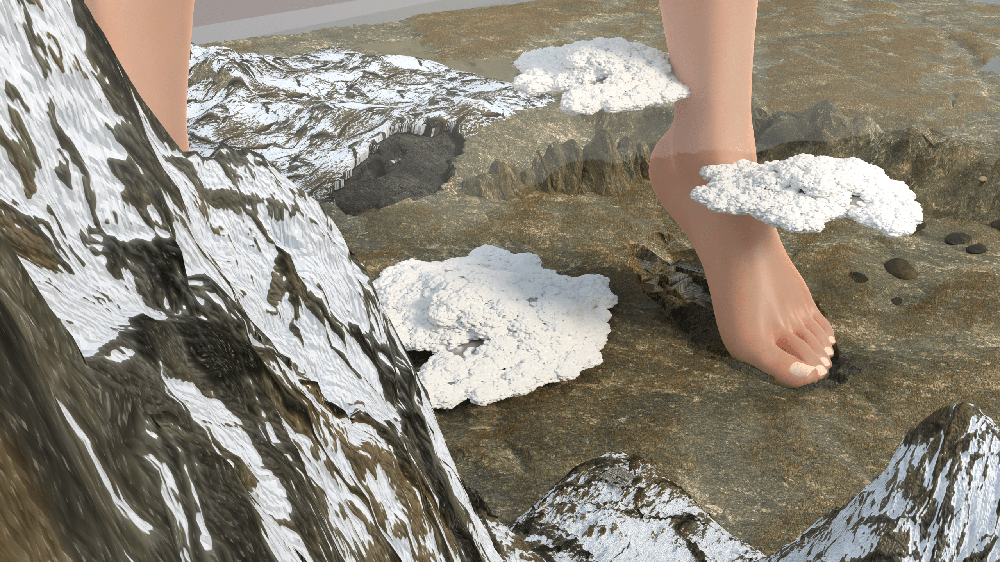
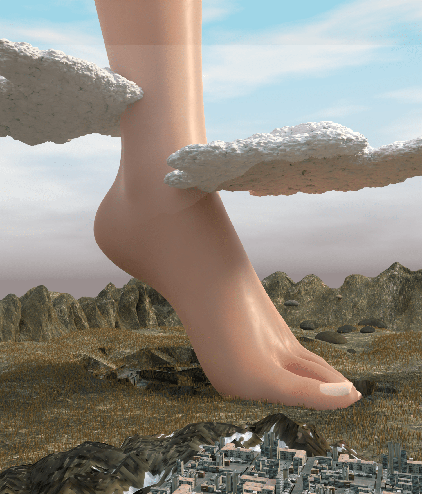
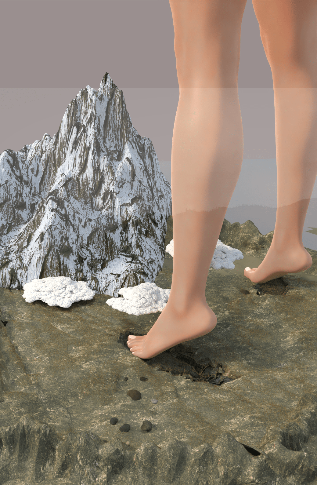
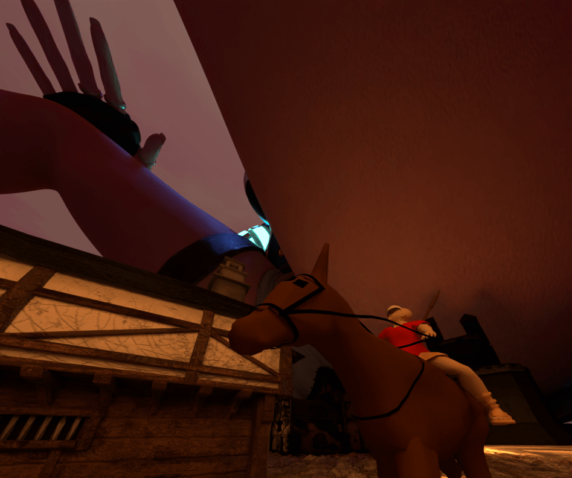
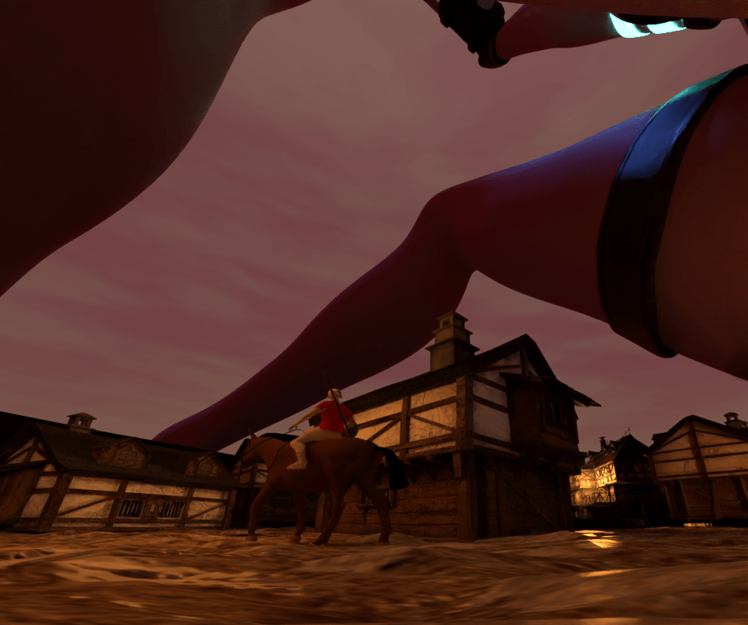
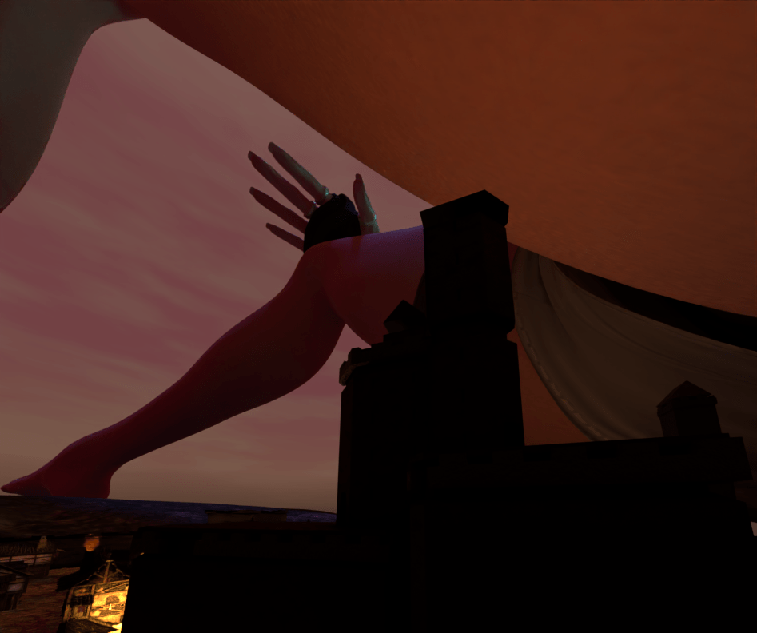
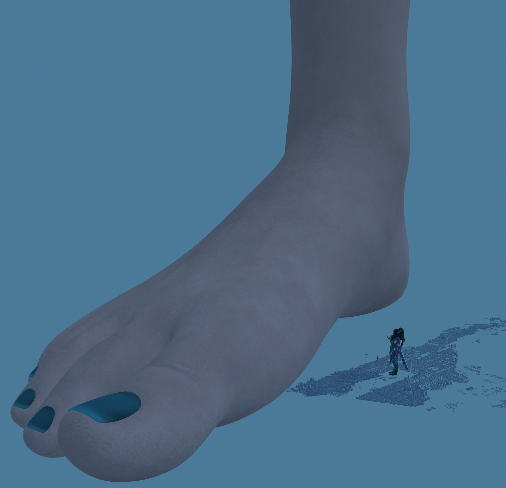
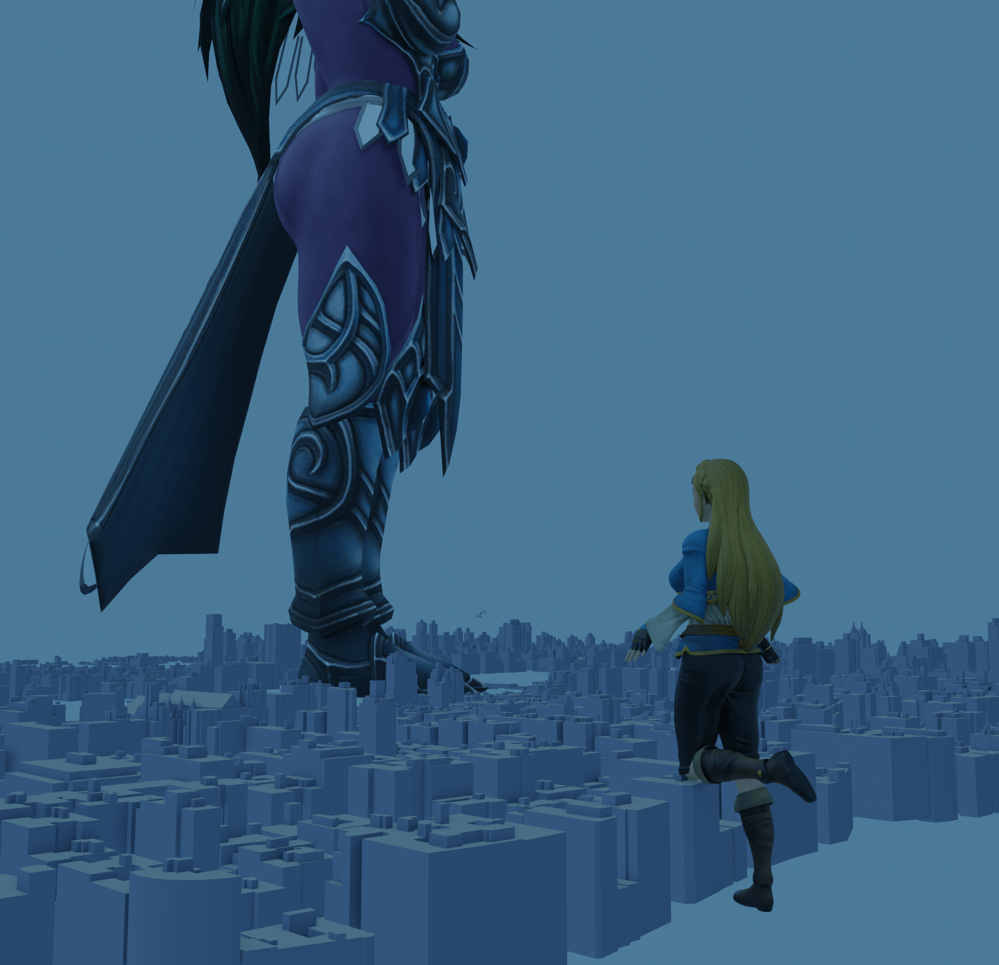
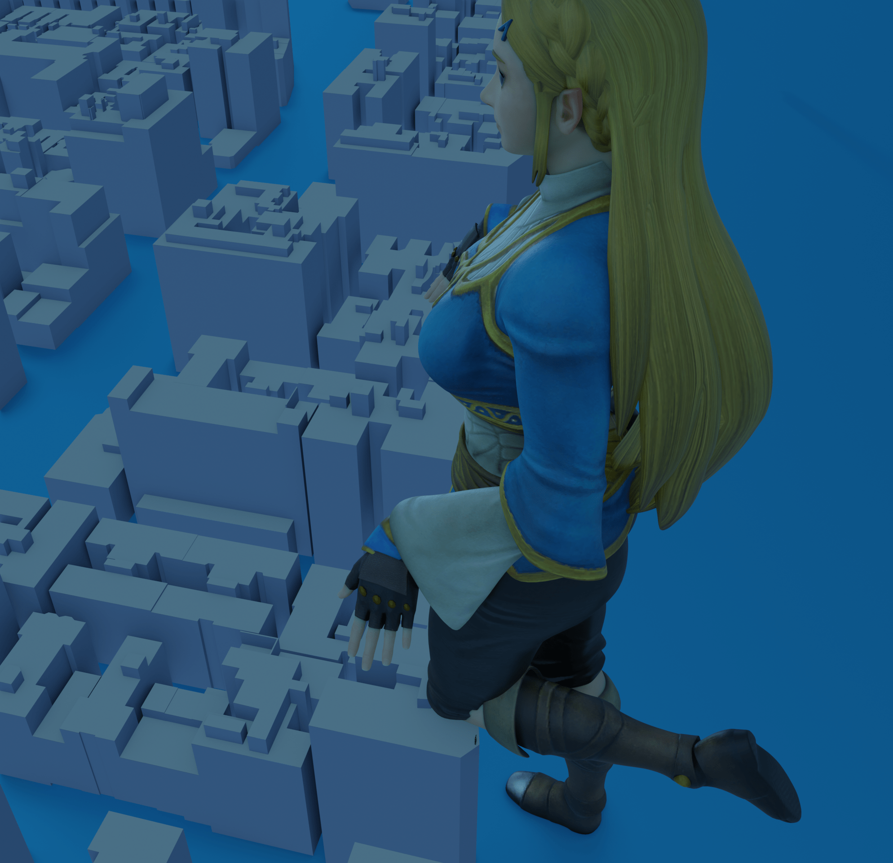
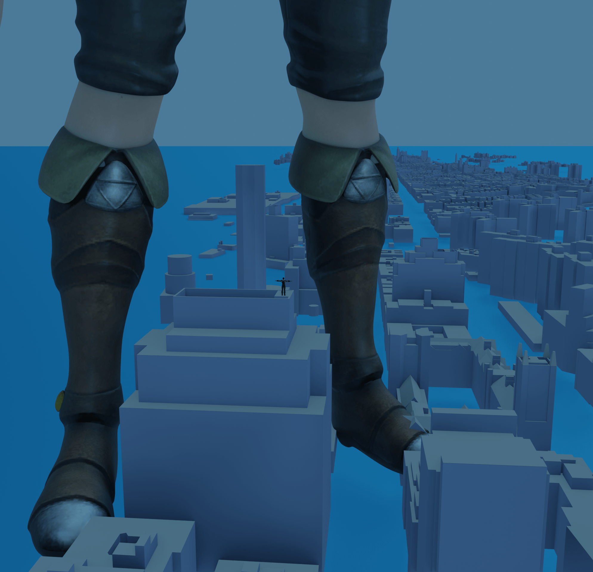

# Little Princess 3.18文章更新(giga 无意识 多重大小）

作者：wenjingzhi

TID：32716

# 1

*本帖最後由 wenjingzhi 於 2022-3-18 18:25 編輯*

潜水多年，第一次在论坛写文，有什么问题还请多多包涵。本文的灵感来源于《小王子》，打算对原书的剧情稍加改编，尽量写长篇。更新日志：

2.23第一章 3.9插图

2.24第二章 3.11插图

2.25第三、四章

2.26第五章

2.27第六章

2.28第七章

3.3第八章

3.5第九章

3.7星球结局1

3.15大小比较插图  

3.18星球结局2 未完

还有，不是翻译的！

—————————————————————————————————————————————————————————————————————————

1.早餐

宇宙中除了地球，有千百万个别的星球，当一个天文学者发现了其中一个星星，他就给它编上一个号码，B-612行星就是其中之一。这个比地球稍小的星球同样有着无数的生命，但其上的亿万生灵却不像地球上的生命这般走运…圣山，全B-612行星最高耸的山峰，这个高度近五万米的火山即便是山腰都非常人可视，无数云雾环绕在其两侧。而山脚之下则是无数人的家园，肥沃的火山灰适宜农作物生长，火山周边有无数的矿物质，但这些都不是千万居民聚集在圣山脚下的圣城的主要理由。圣城之所以能够养活百万人口，全都要得益于这个星球上的巨大神明。又是圣城平凡的一天，清晨，阴影笼罩了整个火山，居民们纷纷躲进了山体中深入地下数百米的地下城中。由于地面对于人类来说太过危险，这座地下城才是圣城真正的本体。**咚！咚！咚！**狂风席卷，巨大的物体从万米的空中落下，巨大的声响使得大地一同震颤，如果这时从地面向上望去，只能望见两根直达云霄的巨柱。居民们知道，这便是行星的主人，被称为公主的巨大存在，仅仅是其的双脚，对人们来说便已经是无尽的肉色墙壁，更不用说云端以上的小腿，再往上是什么，已经是人们不可见的了。可爱的少女穿着便装短裤，手持着装有早餐的袋子从家中走到火山处，少女赤裸双足，两万米的小脚踩在火山两侧，将地面变为千米的深坑。但凡地下城稍稍靠外，都会被这双脚彻底夷平吧。地下城的位置是人类多年摸索出来的经验，在无数惨痛的教训之后，人们终于明白，无论挖多深，都无法与神明的巨足抗衡，只能在其不易踩到的火山周围一小块区域里才能生存。多年前，曾有人想将地下城继续外延，现在看，那片外延的城区已经成为了一个巨大脚印的一部分，每当有人提出继续向外扩大地下城市，城中的老人就会带领其来到千米的悬崖边。当看到万米的脚印里面像丝线一般一条一条的黑色痕迹后，那些提出建议的人便心服口服，再也不敢多嘴了。  对于常人十万倍的公主而言，膝盖高的活火山让她热早点很方便。火山口冒出的烟雾向上延伸数十公里，对少女而言也不过是几十厘米。巨大的身躯缓缓蹲下，将山前彻底遮蔽。少女打开足以装得下全人类的面包袋，拿出一片面包，巨大的面包长宽皆有数公里。于人类而言，即便是种下全世界的小麦，再收获数十年，也无法做出能解决少女早餐的一片面包，即便做出来，将上千米长的面包运往万米的火山上烤熟，也是一项不可能完成的任务吧，但少女只不过是伸出手将面包拿起，在几分钟内解决了人类上万年都无法做到的神迹。面包烤熟了，在遥远天空上，两根名为手指的巨塔夹住千米的面包，然后将其送入数万米的高空中，少女拿着面包开始咀嚼，巨大的咀嚼声传入整个地下城中，人们知道时间快到了。果然，随着巨大的轰鸣声与大地的颤抖，无数面包屑从天而降，对于少女来说不过是几毫米的面包屑，对于人类来说却是几十米至上百米不等的面包山，只要一块便能解决全城人数天的温饱。地下城的军队纷纷出动，上千人的部队带领着上万名矿工，在面包山下，开始用稿子分离出一块块几米大小的面包，放入车中运回城内。许多矿工冒着生命危险爬上百米的大型面包山，寻找带有少女唾液的面包块。少女的唾液不仅能够解渴，更能治百病，直接提高人们的身体素质，使无数人不远万里来到圣城。看见远方无数被唾液包裹的面包屑从天界掉入少女脚边深千米的巨坑中，人们只能深感可惜，感叹自身的渺小。吃了几口面包，少女不由感到口渴，拿起腰间别着的水壶中喝起水来。其中的水量足以与人们难以逾越的大海相媲美。几滴水从少女千米长的小巧嘴唇处落下，重重的砸在深坑中，形成新的湖泊，近百米高的巨浪由落点向四周散开。这些少女唇边滴下的水滴既是人类生存的必需品，也是大敌之一。曾经便发生过千米的巨大水球正好砸在地下城出口的事件，滔天巨浪席卷了一大片地下城，将无数人赖以生存的家园毁灭。现在，地下城的出口被牢牢加固，万米长的管道连接着深坑，将脚印湖中的水源源不断的抽入城中。吃饱喝足，少女哼着小曲，迈着轻快的步伐离开了。小脚离地后带起巨大的沙尘暴，将地面上先前离肉色墙壁过近的开采队连人带卡车一同掀起，飞到百米高空。装着巨大面包块的卡车无法抵挡巨风，从空中落下摔成烂铁。万幸的是，人们为应对这样的情况，早就配备好了降落伞。在地下的人们听见外界的轰鸣声，将入口再次开启。一段时间后，一辆辆卡车装载着巨大的面包块回到城中，许多人带上安全面具离开地下，来到外界进行工作，少女的一举一动都带来地形的改变，从脚下掉落的灰尘对人类来说也是数米到数十米大的土块，工人必须将被土块覆盖的道路清理，以便下一次的采集。少女的早餐结束，而人们的忙碌的一天也开始了。

# 2

<ignore_js_op>[第一章配图1.png](forum.php?mod=attachment&aid=OTQ0MDl8ODdkZDczNzl8MTY0NzcwMjk2NXwxODIzMHwzMjcxNg%3D%3D&nothumb=yes) *(6.81 MB, 下載次數: 13)*

[下載附件](forum.php?mod=attachment&aid=OTQ0MDl8ODdkZDczNzl8MTY0NzcwMjk2NXwxODIzMHwzMjcxNg%3D%3D&nothumb=yes)

2022-3-9 19:33 上傳  

</ignore_js_op> <ignore_js_op>[第一章配图2.png](forum.php?mod=attachment&aid=OTQ0MTR8MWE2MDFlYmN8MTY0NzcwMjk2NXwxODIzMHwzMjcxNg%3D%3D&nothumb=yes) *(2.93 MB, 下載次數: 6)*

[下載附件](forum.php?mod=attachment&aid=OTQ0MTR8MWE2MDFlYmN8MTY0NzcwMjk2NXwxODIzMHwzMjcxNg%3D%3D&nothumb=yes)

2022-3-9 23:08 上傳  

</ignore_js_op> <ignore_js_op>[3.png](forum.php?mod=attachment&aid=OTQ0NzB8M2E3OTM5ODZ8MTY0NzcwMjk2NXwxODIzMHwzMjcxNg%3D%3D&nothumb=yes) *(2.58 MB, 下載次數: 0)*

[下載附件](forum.php?mod=attachment&aid=OTQ0NzB8M2E3OTM5ODZ8MTY0NzcwMjk2NXwxODIzMHwzMjcxNg%3D%3D&nothumb=yes)

2022-3-11 23:31 上傳  

</ignore_js_op>  

# 3

*本帖最後由 wenjingzhi 於 2022-3-12 23:12 編輯*

　2.夕阳

B-612行星有着广阔的平原，但物资丰厚的原野却不适宜人类生存。原因在于公主大人的乐趣。B-612行星的生物千奇百怪，却没有能与少女体型相媲美的生物，即便是大自然都无法与其对抗，行星上的山脉对于其来说不过是脚腕高的突破，海洋也只不过是过脚深的小水池，一切都是这般无趣。

自认为是星球上唯一的智慧生物，公主殿下孤独的生活里唯一的乐趣便是观赏夕阳西下的温柔晚景。最多的一次，她曾在一日内连续看了四十三次日落。拿地球做比方，当美国是正午时分，在法国，正夕阳西下，只要在一分钟内赶到法国就可看到日落。

但对于行星上的其他居民而言，直径万公里的行星即便是坐着最快的飞机也要半天才能到达另一端。但对于少女来说，星球的直径只有百米。日落不过是向前走几步便能欣赏到的美景。在观看完一场日落后，她可以搬着自己高近百公里的椅子挪动几步，便又是另一场新的日落。

在B-612行星，由于少女的个人爱好，夕阳与落日被赋予了特殊的含义。对于人类而言，夕阳是毁灭与荒芜的象征。当夕阳降临时，常常伴随着巨大的地震与从天而降的巨足，这一切都让人类感到恐惧。少女为了观看落日，可以在一天内绕星球数圈，对她而言不过是走几步路，对脚下的人类而言却带来了毁灭。

行星上的人们从小便听过这个故事：在星球上某个富饶的平原上，曾经有一个强盛的国家，强大的领主带领无数骑兵统领着整个草原，成为周边地区公认的霸主。但如此强大的国家却在仅仅一个夕阳中毁灭。当时，领主正享受晚餐，忽然，大地开始震颤，整个都城被两堵向两边和天空蔓延的肉墙包围。两脚之间形成山脉，周边的土石飞溅，百米的石块溅入城中，将宏伟的教堂轰塌。人们如无头苍蝇般四处逃窜，躲避飞石。

万幸的是，过了一阵，墙壁缓缓升起向前踏去，只留下巨大的沙尘和从天而降的石块。还好，城市没有被墙壁直接砸中。正当领主暗自庆幸，城中的居民为肉墙离开而兴奋的祈祷时，不幸又降临了。

天空中巨大的阴影并没有向往常一样退去。忽然，又响起了连绵不断的轰鸣。

“今天没带椅子，算了！就坐在这里看吧！”

往常，巨人应当带着一把表面比都城还巨大数倍的椅子，将天空遮蔽，可今天却不是这样。两只遮天蔽日的巨掌撞向都城后方的地面，接着，少女的臀部便遮住了整个都城，伴随着地面的颤抖，无边无际的臀部缓缓下降，如果少女是一个正常人，她紧俏的臀部可能会引起色狼们的骚动。但现在，她却引起了所有人的骚动，居民们无暇观赏天空中下降的臀部，而忙于寻找避难处。领主骑上最好的马向城外飞奔，却也无法逃离万米的巨臀。随着一声响彻周围千里的轰鸣，这个强大国家首都连带周围百里彻底毁灭。

少女手撑着地坐下，将万米长腿伸开，轻轻晃动着双脚，对少女而言平凡的动作产生巨大的震波，两脚铺平，将百公里外的城市瞬间毁灭。欣赏着夕阳，少女的心情愉悦，但当地的所有人都无法见证这一切了。

随着夕阳落下，少女缓缓站起，巨大的身体上甩出无数巨石，巨石从天而降，将城市砸的连残骸也无法留存。唯一能证明这个城市存在过的证据现在仍保留在少女臀部，宽广的裤子上仍留有无数渺小的红点。但恐怕少女不会发现这些肉眼无法看见的微点了。她随着夕阳向前走去，为前方的土地继续带去毁灭。

现在，也有人会在夕阳下来到那两个巨大的盆地边，感受当年领主所面临的一切。

# 4

<ignore_js_op>[2.6.png](forum.php?mod=attachment&aid=OTQ0Njl8YTA2YjIyMGZ8MTY0NzcwMjk2NXwxODIzMHwzMjcxNg%3D%3D&nothumb=yes) *(534.32 KB, 下載次數: 1)*

[下載附件](forum.php?mod=attachment&aid=OTQ0Njl8YTA2YjIyMGZ8MTY0NzcwMjk2NXwxODIzMHwzMjcxNg%3D%3D&nothumb=yes)

2022-3-11 23:26 上傳  

逃跑的领主1

</ignore_js_op>  <ignore_js_op>[2.5png.png](forum.php?mod=attachment&aid=OTQ0Njh8ZmNjYmVkNGZ8MTY0NzcwMjk2NXwxODIzMHwzMjcxNg%3D%3D&nothumb=yes) *(507.2 KB, 下載次數: 1)*

[下載附件](forum.php?mod=attachment&aid=OTQ0Njh8ZmNjYmVkNGZ8MTY0NzcwMjk2NXwxODIzMHwzMjcxNg%3D%3D&nothumb=yes)

2022-3-11 23:26 上傳  

逃跑的领主2

</ignore_js_op>  <ignore_js_op>[2.2.png](forum.php?mod=attachment&aid=OTQ0Njd8ZTkxMjE2ZDZ8MTY0NzcwMjk2NXwxODIzMHwzMjcxNg%3D%3D&nothumb=yes) *(361.81 KB, 下載次數: 1)*

[下載附件](forum.php?mod=attachment&aid=OTQ0Njd8ZTkxMjE2ZDZ8MTY0NzcwMjk2NXwxODIzMHwzMjcxNg%3D%3D&nothumb=yes)

2022-3-11 23:26 上傳  

少女坐在椅子上欣赏夕阳

</ignore_js_op>  <ignore_js_op>[2.7.png](forum.php?mod=attachment&aid=OTQ1MDB8ZmEyNTk0N2V8MTY0NzcwMjk2NXwxODIzMHwzMjcxNg%3D%3D&nothumb=yes) *(353.18 KB, 下載次數: 0)*

[下載附件](forum.php?mod=attachment&aid=OTQ1MDB8ZmEyNTk0N2V8MTY0NzcwMjk2NXwxODIzMHwzMjcxNg%3D%3D&nothumb=yes)

7 天前 上傳  

少女坐下

</ignore_js_op>  

# 5

> [打工是不可能的 發表於 2022-2-24 00:56](https://giantessnight.cf/gnforum2012/forum.php?mod=redirect&goto=findpost&pid=495697&ptid=32716)

> 设定是这个星球是少女的房间吗？

主角住在星球上，在星球上有自己的房子和田，其他地方可以当作是面积超大的后花园（至于哪来的材料建造只能说是凭空变出来的）

# 6

*本帖最後由 wenjingzhi 於 2022-2-26 19:35 編輯*

3.花（1）种子在公主的星球上，过去一直都生长着一些只有一层花瓣的很简单的花。这些花非常小，一点也不占地方，从来也不会去打搅任何人，虽然这些小花对常人而言仍是数百米高的参天巨树，但至少对少女而言不占地方。这些花儿早晨在草丛中开放，晚上就凋谢了。少女也对这些小花提不起兴趣，只在看过几次后便再也不去专门看了。忽然有一天，在少女的花园里，不知从哪里来了一颗种子。不久后，这种子发了芽。小苗一天天伸张，高过所有小花，甚至有几十厘米高，高过了下方的云层，使少女开始关注起这株与众不同的植物。但这株植物很快就停止了生长，从植物的顶端开始孕育一个花朵。看到这颗苗上长出了一个很大很大的花蕾，少女感觉，从这个花苞中一定会出现一个奇迹。而这朵花也耗费了很长时间生长，先是生长出无数小小的枝芽，然后再长出无数片绿叶。随后，花朵也开始慢慢张开。白天，花朵散发出阵阵清香，夜晚，无数萤火虫围绕在花边飞舞。随着花朵接近开放，少女对这株花也愈加关心，她仔细的观察着这株植物，并亲自为其浇水，生怕其受损。一天，少女突发奇想：“这朵花还没有开，会不会是因为上面有好多虫子？”于是少女缓缓蹲下，脸庞贴近花的枝芽仔细查看起来。她看到无数小的如同尘埃般的微小生物正在花枝上缓缓移动，许多微小生物见少女将脸靠近，居然还成群结队的飞起，想要靠近少女的脸。这可吓坏了少女，少女伸出手来驱赶这些渺小的生物，待驱赶完毕后，又鼓起腮帮，向着花枝吹去，想要将花枝上的微小昆虫彻底吹走，经过好一番折腾，她才再次观察起了花朵，看到花枝上已经没了这些微小的生物，少女这才放心，从花朵旁离开了。—————————————————————————————————————————————————————————————————————————

采蜜人是生活在公主的花园里的人类联合而成的一大部族，他们世代居住在巨大的花朵之下，依靠百米高的花枝和遮住天空的花瓣遮风避雨，他们依靠采集巨大花朵的花蜜为食，凭借从花瓣上落下的露水解渴。对于公主而言的小花，在人类眼里却是巨树，采蜜人的各个小部族分别居住在一颗颗巨树下。与圣城的居民相比，采蜜人的生活平淡而甜蜜。但随着圣城内技术的不断发展，采蜜人部族也开始向圣城学习技术。霍尼是一位年轻的采蜜人，他这一代充分享受了科技带来的便利。霍尼的父母以前居住在白树城下，每当轮班到他们需要采蜜时，都要提前带上数天的食物，从家中出发来到巨树下，通过凿在树干上的梯子爬上百米高的树顶，再顺着白色的巨大花瓣走向花蕊，在花蕊丛林中采集花蜜，然后再从这里返回，这个过程需要消耗数天，期间，采蜜的人需要在树干内挖出的洞穴中过夜。如遇到不测，采蜜的过程还有可能持续更多天。霍尼的父母向他讲述过许多次那场白树城之灾的事情。当时，恰好轮到他们采蜜，他们耗费了大半天才爬上花瓣，对着下方数百米的地面与还在天梯上攀爬的同伴们指指点点。忽然，巨大的风吹来，将许多没有还在攀爬的人吹飞，那些没有抓稳的人当场便摔落下去。远方，是突破天际的巨柱，对于人民来说已经高达近千米的花瓣对少女而言一厘米不到。霍尼的父母只能看见远方云层下如同山一般朦胧的脚趾。虽然少女离白树城还有十多公里远，但巨大的脚趾却像是在人们面前一般。另一只巨大的脚也在万米之外落下，又掀起一阵巨风，花开始微微摇晃，梯子被震动所破坏，又被大风带起，刚刚还紧紧抓着梯子的人瞬间也连着梯子一同飞向天空。少女漫不经心的向前走去，经过地上的白色小花旁，离开了花园。对于白树城的居民而言，从巨树旁经过的几步路让地面遭受了毁灭性的打击，幸福的生活变得惨淡，一栋栋房屋被掀翻，通往树顶的天梯也破裂了，城主不得不请求其他部族的帮助，耗时数年才让城市得到恢复，这场因少女的两步路而造成的灾难至今被白树城的居民铭记于心。霍尼的父母十分幸运，他们虽然被少女的足指掀起的风吹飞，却精准的落在了花蕊丛林里，保住了小命。在天梯还未修复好的数个月里，他们回归了最原始的生活，每天依靠采蜜为食，从百米大小的露珠中舀起水来喝。在天梯修复，救援队赶来后，他们终于从花瓣上回到了地面，本以为能回到温暖的家中，却发现家园也受到了冲击，房屋被毁，亲友失踪，他们又一同加入了修复工作中，共同的经历让二人日久生情，最终成婚，生下了霍尼。到了霍尼一代人，科技的发展让采蜜的机械化成为可能，尽管许多老人认为这样过度开采是违背自然，将招致天罚的决定。从圣城请来的技术人员在百米的树干内部建起巨大的运输梯，运输梯直达花蕊处的林场，无数管道插进一根根花蕊中抽取花蜜。花蜜经由加工后，被装入卡车，从坚固的地下通道中运往千里之外的圣城。霍尼等年轻人已经不再从事采蜜的工作。他的许多朋友都进入了花蜜工厂，或者做了卡车司机，但他凭借自己的努力进入了圣城大学深造，并以学者的身份回到了白树城。他现在居住在树干内部的公寓里，这里冬暖夏凉，还不用担心原先城下的房屋一样，会受到露水砸下引发的洪水影响。霍尼的研究课题与植物相关，他的导师是个圣城人，为了研究，也受邀来到了城中，居住在巨大花瓣上的别墅区内。傍晚，在公寓内忙于研究一天的霍尼刚准备休息，却突然接到了导师的电话。“没时间解释了，来了再跟你细说，你快点过来！快点！”霍尼还是第一次见导师这样，平常的导师都从不着急，一定是有急事。想到这里，他连忙穿上衣裳出门，向公寓区外的枢纽区跑去。霍尼搭乘中央电梯来到花瓣出，他看到无数人正挤在花瓣上吵吵嚷嚷，按理说，这里平常也没这么多游客啊。他心生疑惑，顺着人们手指的地方抬头望去，远处有一颗巨大的流星正从天边划过，引发人们的阵阵惊叹。“难道导师叫我是来看流星的？这是要改行吗？”霍尼一边嘟囔着一边来到了导师目前所居住的别墅。看见导师和几个同僚正在和几个天文学家紧张的争辩着。“看来我们真的要改行了”霍尼心想。“女神在上！这怎么可能，你跟我说天上那个不是陨石，是个种子？哪有这么大的种子，都快比白树还大了！”有个天文学者正和导师争论。见霍尼来了，导师停下争辩，“霍尼，你拿望远镜看看天上那个东西是什么？”“那是我的望远镜，别瞎动啊！”天文学者说着带领霍尼来到望远镜前。“这！”仔细观察，霍尼震惊了，“要是按我们学的东西来看，这确实是个种子…可除了那位公主的菜园里，哪能有这么大的种子？”“难道是公主闲得无聊扔种子玩？把种子扔了过来？这确实有可能！如果是那位的话，恐怕这个东西还没她手指大呢！”一位植物学者说。“已经确认没有这种可能，我们已经问过了，圣城的通报能证明，公主现在圣城那边，那边现在应该还在落日吧！”顿时有人回应。“都别吵了！这玩意要落地了！”轰隆！随着一声巨响，巨大的种子砸进了白树远方的地表。千米的陨石砸入地面这种事，在地球必然会引起恐慌，但B-612上的居民世代生活在少女脚下，区区千米的陨石，怎么会比两万米长，八千米宽的巨足更吓人？不过是一根小脚趾落下的程度，简直是小巫见大巫，人们自然对此不会感到惊慌。于是花瓣上观看的人群渐渐散去，各干各事去了。“你收拾一下吧！明天一早我们估计就得出发了。”导师对霍尼说道。“这颗种子无论是外形和来历都值得我们研究一番。另外，你看！这帮人现在还不相信我的话呢。“说着看了看那几个天文学者，学者也回应给导师一个不屑的眼神。”明天，咱们自然见分晓。“于是第二天一早，霍尼与一支学者专家组成的考察小组一同登上卡车,准备出发前往种子着陆的坑洞处。

# 7

> [云中骏 發表於 2022-2-25 00:38](https://giantessnight.cf/gnforum2012/forum.php?mod=redirect&goto=findpost&pid=495794&ptid=32716)

> 灵感是不是来自小王子啊，一个小的星球和一朵玫瑰????

是的。后面也打算按小王子的剧情写 让主角去别的星球

# 8

> [dengml123 發表於 2022-2-25 00:38](https://giantessnight.cf/gnforum2012/forum.php?mod=redirect&goto=findpost&pid=495795&ptid=32716)

> giga感觉超级棒！就是篇幅太短了

确实有点短 每次写着写着就懒得写了 我之后试着写长点

# 9

*本帖最後由 wenjingzhi 於 2022-2-26 19:34 編輯*

4.花（2）开发短暂车程后，一行人来到降落的种子坑旁，直径一公里的种子下半部分已陷进了砸出的大坑中，上半部分则露在地表。现场来了不少人，不少专家拿出专业的攀爬工具，冒险爬上其表面采样考察。随着人员、设施不断完善，现场建成了一个小型考察营地，在刚刚支起的帐篷中，导师等人开始对这疑似种子的成分进行分析。“嗯，这确实是颗种子，而且…天哪！这颗种子仅仅是表皮里所包含的成分都是我们难以理解的！但它的结构却又如此规律有序…看起来完全不像是天然形成的一般！怎么会这样呢…看来我们对这个世界的理解还是太浅薄了啊…”“天哪！太神奇了！如果我们能发表一篇这颗种子的论文，那我们在学术界的地位将会…哈哈哈哈！”导师一众人沉浸在发现新大陆的喜悦中，可霍尼却感觉到感到有些不对劲。“你们有没有感觉地面在晃动？他问。“好像是有点…大概是那位公主路过吧?”“要是公主路过,我们肯定能看见的，这个世界上没有比她更引人注目的事物了。各位，我们都已经确认这是颗种子了，有没有可能，这是种子的根在生长？”“我们现在离那几公里远，这种子才刚落下不到半天，如果是种子生长的话，那这长得也太快了吧，我们之前似乎也没见过生长如此之快的巨型植物…”经过一番商议，考察小组决定在研究后将种子的事和资料上报采蜜人部落议会和圣城元老院，同时，霍尼和导师等人将继续留在此处观察种子的生长。一周后仅仅用了一周的时间，种子便已经破壳而出，并飞速生长，宛如“杰克与魔豆”的故事一般。但杰克的魔豆仅仅才到云层便到了头。如果杰克在B-612星球种下魔豆，恐怕再怎么让魔豆生长，也只能让他勉勉强强爬上公主的脚趾吧。但凡少女稍微翘一下脚趾头，都会高出那根渺小的藤蔓一大截。而童话中生活在云层中的巨人与她相比，就更是显得微不足道了。巨人的城堡建在云上，但无数片云加在一起才能有少女脚掌的面积，只要她微微抬脚，然后再轻轻放下，就能让巨人连带整个城堡，不，是整个云层一同消失，而这不过是行星居民们每天都在经历的少女步行。再来看这颗种子吧，仅仅是种子的大小就已经能与魔藤相媲美，更不要提其生长一周的大小了，这颗种子每天都在以千米以上的速度生长，据专家估计，其目前已经高过了10000米。这样算下来，这颗植物每天都要生长1500米，也就是在以每分钟一米的速度生长。如果再这样生长下去，再过一周多，它的高度就能到达少女的小腿肚了，那已经是常人一生无法触及的高度了，即便是现有的飞行技术也很难到达，正常的客机最多也只能在少女的脚腕处飞行，但如果真的想要到达她的脚腕，还要考虑少女走动带来的巨风影响。所以说，这几乎是一件不可能完成的任务，少女脚腕以上的部位是人类目前还无法探索的。植物快速的生长让霍尼一众人感到惊喜的同时也感到担忧。一方面，经过数天的研究，他们发现，这颗植物内部的结构里蕴含着巨大的能量，对于现在的用量而言几乎是无穷无尽。虽然尚不清楚这种能量的来源，但却不妨碍人们利用这种资源，只要能够将这颗植物的能源开发，整个星球所有人类的生活质量或许都能够有所提升。但同时，植物快速生长也消耗了大量的土壤肥力与水分，其附近的森林由于缺乏水分已经大片枯萎，附近的河流水位也在下降。霍尼猜测，植物的根部很有可能已经蔓延到了白树城附近。很快，这颗植物就要抢占白树的水分和养分以供给自身生长。这让霍尼感到头疼。正当霍尼忧心的同时，向上汇报的结果也出来了，植物蕴含的巨大资源足以让所有人心动。采蜜人部族虽然想要独占资源，但其技术却令其难以开发，只好再次求助于圣城，希望圣城能协助其开发。而圣城也希望独占开发权，只向采蜜人支付一定开采费用。甚至是购买此地。双方代表就此事商议几天也没有达成效果，收获甚微。经过多轮磋商，最终，由于圣城的技术优势，采蜜人不得不妥协，将许多利益让给了圣城。但同时，采蜜人也找来了临近巨大植物的另一方势力——大洋边的港地共和国，寻求三方的共同开发，以防止圣城独占话语权。一周的商议后，三方决定共同派兵守卫植物，并派代表监督开发。三方代表及军队很快便来到了通天的植物脚下，圣城带来了大量技术人员，采蜜人距离较近，负责提供劳工，而富有的港地则为此次联合开发提供大量资金。工人们不管地面的摇晃，挖开巨大的植物壁，架设管道抽取植物内部的特殊物质。巨大的工程需要历经数月才能完成。在开发时，植物也仍在生长，为施工带来了一些困难，植物长出了许多分叉，分叉上长出绿叶，将天空遮蔽，使施工不得不在黑暗中进行。植物每天生长千米多，工人白天从地表进入植物内部架设，晚上出来时就已经在千米高空。但这些困难相比另外一个问题，就显得轻松多了。植物的生长引发了公主的注意。十万倍的少女常常来观察植物的生长。少女缓缓蹲下，小心翼翼的抚摸这朵未开放的小花，轻轻触碰两旁的叶子。将脸靠近花朵仔细观察，少女的鼻息让花朵微微摇晃，当然，这些只是从少女的角度出发。对施工的工人们和驻扎于此的军队而言，状况显然不是这样。每天早上，工人们都在大地的颤抖下醒来，宿舍建在地下，巨大的震动让工人的床上下摇晃，建在地下虽然不是很舒服，但这也是必要之举，更为安全，因为地上的建筑很容易便会被少女蹲下产生的巨大风压吹飞。到地面打开宿舍大门，放眼望去，是中间的参天大树与比参天大树还巨大的肉墙。本身在地下，人们便已经无法判断白天黑夜，但在地上，由于少女巨大的身躯遮天蔽日，人们还是无法见到太阳。离开地下时，工人们必须携带降落伞与特制鞋子，因为少女脚趾微微的晃动都有可能将人扇起到高空。走近巨树时，还要小心旁边随时可能会袭来的参天巨指，少女巨大的手指足足有6000米长，比山还高的手指却不像山一样固定在一处，反而十分灵活，在植物的各处抚摸。手指来到植物靠近地面的部分，带起的大风将树木连根拔起，把还没进入植物内的工人和停靠在外的车俩吹飞。手指抚摸叶子，让植物内部的工人不得不停止手头工作，牢牢抓住边上的植物内壁，抵御巨大的摇晃。还好少女没有用手指去触碰地面，不然，若是让上万亿吨的力量与地面相碰。必然会引发天崩地裂，让军队与工人损失惨重。军队不敢驻扎的离植物太近，以免被少女指尖划过带来的狂风吹飞，也不敢驻扎过远，直接被万米巨足踏扁，只能驻扎在不近不远的地方。军队虽然也住在地下，却还要进行每日的巡逻。总有军队在巡逻时被吹上天空，被迫练习降落，让士兵们十分劳累。此外，军队还要负责清理每天少女走路时溅起的飞沙走石。虽然少女走过的地方在数万米外，但总会有百米的巨石溅起，影响交通。虽然安全工作做的很好，但也免不了意外伤亡。几个人小规模还容易解决，但也有曾过大规模伤亡。一次，少女像往常一般观察植物，却突然做出了与先前不同的动作，将遮蔽天空的绝美面庞靠近植物低下，植物下工作的劳工和驻扎的军队发觉一阵暖风吹来，将成千上万的人们吹飞，人们正打算使用降落伞降落，不料紧接着又是一股强烈的吸力袭来。少女微微的呼吸将地面上的器械，车辆和人员都吸入千米大的鼻孔中。鼻孔如同无边的深渊，卡车和人类都被黏在数百米高，十米宽的鼻毛上，狂风不断从巨大的孔洞中吹进吹出，将被吸入鼻中的人们不断折磨着。“鼻子里好像进了点东西…有点痒阿…”被困的人们发觉四周传来巨大的轰鸣。鼻孔处仅有的亮光被肉色的巨柱所替代。紧接着，便被伸进鼻孔的巨指碾碎。地面上的幸存者们看见直达云霄的巨指突然垂直升起，顿时间松了一口气，但他们一口气还没完，却又听见了震耳欲聋的声音。“阿！阿！阿嚏！”幸存者抬头向上，无边无际的红色巨唇张开，从中发出强烈的气浪。即便是一个普通人，在打喷嚏的瞬间，鼻腔的气流速度也可高达每小时上百公里。那十万倍的少女打喷嚏时，气流又能有多块？人们没有时间想这个问题了，因为庞大的气流从万米的天空冲下，将云层撕裂，而后降临地面，直接将人们瞬间撕成碎片。地面上的植被也完全被破坏，整个地面都被吹去数十米深。但这还没有结束，紧接着，无数十米至白米大的巨型水球也飞速撞击地面，巨大的水球洒落在各处爆开，淹没地面。有的水球直接穿透地表，将在地下避难的劳工活活砸死，又流入其他工人宿舍，将地下淹没。少女的一个喷嚏，引发了建设途中的最大灾难。三国付出了大量的抚恤金安抚家属，又给出颇高的工资，才重新填补了人力的空缺，这直接让建设的费用翻了几倍，还好港地与圣城财大气粗，才让施工得以继续。经历了一系列困难，施工在三方不懈的努力下初步完成了，巨量的植物汁液从植物内部的管道中流出，再转化为无穷无尽的能源运输到各地。圣城解决了能源问题，采蜜人缓解了采蜜自动化后的就业问题。港地的投资商赚了大钱。尽管开发过程中遇到了不少麻烦，但从结果来看，这个工程确实值得。但这会造成什么后果吗？

# 10

*本帖最後由 wenjingzhi 於 2022-2-27 23:17 編輯*

5.花（3）精灵族精灵族是远方行星的种族。她们从母树中繁衍，并居住于巨大的世界树上，并将世界树的种子散播至其他星球。从宇宙中飞来的种子就是她们的一艘飞船。飞船只需要有成年精灵监控即可，自动驾驶只要在出发前设置好地点就能自动到达，将未出生的精灵种子一同保存至飞船中，然后就可以进入其中开始休眠，到达目的地后，只要种子扎根，吸收了充足的营养，就可以直接将内部休眠的精灵们唤醒，并为尚未发育完全的小精灵提供营养供其成长。萨希拉是前往B-612行星的飞船舰长，同时，她也将在飞船着陆后担任该星球的精灵女王，负责确保精灵在当地的殖民活动顺利进行。———————————————————————————————————————已经到了吗… 萨希拉从休眠中醒来，感到自己的身体十分虚弱。她所在的区域是控制飞船的中枢，种子内部发育成花苞的位置，她从休眠舱内挣扎的爬起走到前方，操纵起内部的机器，并观看相关数据。“什…什么?怎么会?”她睁大眼睛，惊讶的大叫。从数据来看，种子内部所获取的营养明显异常，有巨量的能量因异常而流失，使得花朵无法正常绽放。现在，不光她自身的能量极为短缺，就连供给幼年精灵生长的能量都完全不足，虽然精灵种子已经成长为精灵，可大部分精灵的生长状况都比预估情况低了90%。看到这个惨淡的数据的她赶紧跑到种子储存区查看。来到储存区的萨希拉发下，大部分的精灵由于营养不足，在生长过程中，发生了退化，变为了只有正常精灵10/1大小的次级精灵——妖精，甚至还有个别精灵变为了只有100/1大小的下等精灵。只有少数精灵幸免遇难，还处于正常大小。萨希拉唤醒了自己的同胞们，但能量依旧在不断流失。作为这里未来的精灵女王，她必须尽快查清原因，挽救自己的同胞，她从花苞内部的管道向下，准备前往地面，但在攀爬途中，几个奇怪的小点引发了她的注意…———————————————————————————————————————在夜晚巨树下,人们正为三国联合开发项目大成功而欢庆,自从项目完工后,大量的植物汁液流入市场,被开发成各式商品,在各地广泛流行。含有树汁的能量饮料能够大幅度提高人们的身体素质，功效甚至能与少女的体液相提并论，这令其受到消费者的追捧，各地买不到少女口水或脚汗的消费者都对这种饮料赞不绝口。巨树旁边被布置成了豪华的室外晚宴举办处，三国的代表们坐在巨树下的一张张圆桌旁，享受着刚刚从参天巨树上榨取出来的汁液所制作的新鲜饮品。本次的宴会主要成员都是三国的权贵和巨商，以及一些知名人士。托导师的光，霍尼也能参与进来一同享受美味，但此时的他却坐在宴会一角，心不在焉的向外面看去。宴会外也在庆祝，人们放起烟花，远方的天空传来阵阵响声和闪光。在工程进行的期间，霍尼等学者对从天而来的巨树又有了进一步的了解。他们发现，巨树内部似乎有依靠巨树而生存的生物，但还没人能爬上树顶的巨大花苞查证一番。学者将此事上报，却被上面压了回来。首先如果对此事进行考察会延误工期，另外，巨大的利益让代表们根本不在乎什么树上生物，在他们看来，树上的生物无足轻重，并不能对工作带来什么影响。“小子！快来吃啊！”导师走过来，招呼他。“你怎么自己呆在这个角落里别再想那些事了。”“可是…”“没什么可是的,即便我们再怎么说也没用,那还不如就当作没发现过。”导师说罢便要把他拉起来。突然，远处传来震颤，霍尼抬头看去。只见天空中有无数只两米长的小脚向下落下。欢庆中的人们被突如其来的变故所惊吓，许多人不知所措，一位客人愣在原地，紧接着就被一只天降的嫩足重重的压倒，只见这人倒在地下，艰难的从压在身上的脚下伸出双手，向周围的人求救。突然，那只压在他身上的脚的主人向下施力，他瞬间就被活活压成了肉泥。沾满鲜血的脚又再次抬起，寻找下一个猎物。“护卫呢！护卫！”有人大声呼救，却不见护卫的踪迹，宴会中的许多护卫还没反应过来就已经被碾死，血液的腥味盖过了宴会美食的香气。无数只脚从四处袭来，如同驱赶羊群一般追逐场内逃窜的人群，一群人挤着要从出口处逃离。这时，又是一声巨响，门前的人们看见一堵肉墙降下，再仔细一看，发觉，这是一只二十多米长的脚。“不想死的话，就乖乖站住别动，小虫子们。”人们环顾四周，身前，百米高的巨大精灵用巨足挡住了前方的去路，身后，无数十多米高的妖精则把来路封住。人们只好乖乖束手就擒。接着，又从天而降一个百米高的精灵，巨大的精灵伸出直径十米大的手掌，抓起一把小人，扔进了另一个精灵手中所持的，用粗壮藤蔓编制的框里。代表们只见从天而降一只巨手，然后就被用巨大的力量毫不温柔的抓起。接着就被重重扔进了框中不省人事。霍尼和导师躲在角落瑟瑟发抖，看着数个百米的女巨人带着大批十米的女巨人肆意妄为的抓走一个个代表、权贵，好在这些长耳朵的女巨人并没有发现他俩。巨大的精灵和妖精展开翅膀，带着代表们向巨树上飞去。———————————————————————————————————————在拷问过一些小人后，萨希拉了解了现状：那些该死的虫子竟然趁着自己休眠，偷偷吸取着母树所蕴含的能量！萨希拉从小人身上大致清楚了这个世界的状况。这个世界除了一位不知道有多大的女神，其余的人都是些不值一提的生物，即便是自己手下最弱的妖精，也可以轻松的将最强壮的人类一脚踢飞。了解了情况，她召集自己的同胞们，开始策划反击的计划。数日后，萨希拉通过母树的眼看到了小人为宴会做的准备。她也打算借此机会，进行一场出奇不意的进攻。趁着夜色，萨希拉带领族人们从巨树上飞下，先飞向了人类的军营上空。紧接着，她操控着自己巨大的身体从云端向地面俯冲下去，重重砸在了军营上。军队里的人们执勤多日，有不少人已经放松了警惕，不少执勤的人员正观望远处的天空中绽放的烟火，烟火的响声掩盖住了精灵的移动，没有人注意到自己的正上方。仅仅是一瞬间，两个巨大的肉球从天而降砸在帐篷群中央，顿时砸死了数十人，让地面出现两个十米深的巨坑。驻扎于此的军人听见巨大的响声，连忙查看，从帐篷出来，却只看见两旁的两堵肉墙正高速向中心合拢，不等其掏出枪，就被两堵肉墙碾压成为肉夹馍。萨希拉从高空冲下，巨大的双乳先砸向地面，将许多小帐篷砸扁，接着，又将两只手臂横向伸直，再快速的合并，将地面画出半径八十多米半圆，扫去地表的一切。后方的军队刚要赶来驰援，却又被两条近百米的大长腿碾压而死。萨希拉从地上站起，继续向前走去，二十米长的脚摧毁人类的防御工事。人类的枪支对着她的腿扫射，但却只能让她感到一点酸痛。“真是脆弱啊，小东西们！”她嘲笑这下方还不如她脚趾大的，正缓慢向前移动的微小人类，用另一只脚踏向逃窜的军队前方，将军队两面包夹。两脚间的军人正在肉墙间寻找逃生的道路，可萨希拉扭动脚趾，瞬间将跑动的小点碾成脚上的红点。“轰！轰！轰！”一发发大炮射向萨希拉的脸，她连忙用手挡住来袭的炮弹。“啊！啊！好疼！”地面上操控着大炮的人们还没来的及庆祝对巨人造成了伤害。就见萨希拉开始愤怒的踏着双脚，忍着疼痛将地面上的大炮纷纷踩碎。与此同时，其他百米大小的精灵也开始破坏其他区域，而十米的妖精则在破坏完成后，从空中落下，把剩余的残兵纷纷踩死。许多逃窜到远方的人以为自己已经安全，却被突如其来的巨足踏成肉泥。这场精灵与人类的第一次战斗几乎成为了精灵的单方面屠杀。精灵们在短短一个小时内扫平了驻扎于树下的大部分军队。这也给了精灵们充分的信心，萨希拉坚信，只要精灵团结一心，即便是这个世界的主人，也能够战胜，让精灵成为这个世界的新主人。确实，精灵们的战绩已经接近了少女的一个喷嚏，这样的战斗力已经是人类的军队完全不可想象的了。但少女的喷嚏速度更快，伤害范围更广，力量更强。精灵们如果面对少女，就算能撑过一个喷嚏，也会伤亡惨重，但现在，精灵们还没有感受过少女的力量。在B-612行星，人类的军事武器还不算很发达，因为人类内部的战争需求较小，不常有大规模战争发生，因为巨大的少女无时无刻都在摧毁文明，许多大型战争的结果都是双方一同被路过的巨足产生的冲击波全歼。由于少女主宰这这个星球，人类只能在其不常到达的地方才能形成聚落生存。因此，人类形成了许多小城邦，而城邦之间的战争，又常因为少女路过其中的一方，或者路过一方正在行军到达另一方的军队而结束。前者通过物理消灭的方法让双方彻底失去纠纷（一方直接没了）。而后者则让另一方不费力气的赢得战斗（另一方没兵了）。同时，人类没有发明强大武器的需求，因为人们也坚信少女是不可战胜的存在，大家普遍认为与其发明同少女对抗的巨型武器，还不如发明一个能快速吸取少女体液的巨型机器。在这样的背景下，人类目前的武器还很难对百米大的精灵造成严重的损伤。在人类的军队被击败后，萨希拉带着族人横扫了整个宴会，将许多人类的权贵活捉回了母树之上，向世人宣告了精灵族的崛起。但这只是精灵复仇计划的第一步。

# 11

另外，大伙儿有什么建议也欢迎提出  

# 12

> [ASQTTR 發表於 2022-2-26 21:47](https://giantessnight.cf/gnforum2012/forum.php?mod=redirect&goto=findpost&pid=495970&ptid=32716)

> 《小王子》新编（不是

> 应该是吧…

差不多是这意思...不过我开头就写了是参考的小王子

# 13

> [ASQTTR 發表於 2022-2-26 23:59](https://giantessnight.cf/gnforum2012/forum.php?mod=redirect&goto=findpost&pid=495990&ptid=32716)

> ????，小王子是一篇讽刺性极强的文章，没记错的话讽刺的是那些自以为是的“大人”。本文可谓是继承了其优 ...

“大人们喜欢数字”，确实，咱们这里从某种意义上来说就是喜欢数字。另外，刚开始我确实想过按原书那个大小，但我个人比较喜欢十万倍，所以就设定成这样了。

# 14

> [顺丰快递 發表於 2022-2-27 11:21](https://giantessnight.cf/gnforum2012/forum.php?mod=redirect&goto=findpost&pid=496024&ptid=32716)

> 支持高倍率无意识互动。。。。。。

感谢支持                          ！      

# 15

*本帖最後由 wenjingzhi 於 2022-2-27 23:18 編輯*

6.港地很久之前，在少女刚刚建造起自己的花园时，在她的花园一侧，只有一些坑坑洼洼的小水坑，其中最大的水坑大小也只是同少女的手掌相当，最深的水坑深度也只能末过少女的手指。在人类眼中，这些水坑是赖以生存的湖泊，直径大概为10000米大，深数千米，其中生活着无数鱼类，每个湖泊都可以养活无数人。为了保证花园里的植物能够有充足的水源，少女决定，把这些在花园里的水坑扩大，并于远方的小湖连接，作为水渠引入花园中，为花园的植物提供水源。水坑边的土质很松软，少女只是踩上去，地面就陷了进去。少女将一只脚伸进小水坑，想要感受一下水的清凉，可薄薄的一层水只有1000米深，连脚趾头也只能末过一点，完全无法让少女有什么感觉。于是，她将脚抬起，随意甩了甩。湖旁生活的居民们突然发现天空被巨大的阴影遮挡，由于太过渺小，他们根本无法知道，这只是少女的一只小脚。紧接着，巨大的肉墙从天而降，少女踩入湖面，把湖中捕鱼的渔船，湖内生活的鱼群一同踩个粉碎。少女的巨足踏在水坑里，可水坑周边生活的居民也无法逃过一劫。生活在岸边的居民被接连不断袭来的地震、巨风和数十米高的巨浪吞噬。少女的脚抬起，地面上的渺小人类看见肉墙回到天空，还来不及高兴，就发现天空中肉墙开始晃动上面无数颗数百米大的水滴从天而降，又在地面上产生巨大的浪潮继续吞噬幸存者。少女脚下产生了一层微不足道，不足一毫米的薄薄水层。对人们而言，数十米深的洪水正将整个世界淹没。为了扩大水坑，少女又将一只脚深入坑中，然后将深入水坑的脚向下压，让水坑加深几千米。水流入土中，把周围的土松动，把水坑变成了泥坑。少女接着又将陷进泥坑的脚继续向一边拖动。拖了一会儿后停下，用脚将积累起来的淤泥向外甩出。接下来，少女辛勤的工作着，不断重复这个过程，将水坑与花园外的小湖连成一片，创造出一个水渠。少女脚下，近处的人们连思考的时间也没有就被远方飞速推进的墙壁碾碎。但在距离少女一米以外的地方，也就是人类的100000米外，远方的人们有幸观看到了他们所认为的，神明创造世界的过程。只见直通云霄的巨柱从天而降，将云层冲散，远方的大湖变为巨坑，巨大的震动即使是在十万米之外也能够清楚的感觉到。接着，震动接连不断，人们难以理解少女的双腿究竟是何物，只当是支撑着世界的天柱。天柱不断移动着，大地无法承受无敌的力量，只能不断的破裂，成为长数万米的超巨型裂谷。接着，天柱底端的无边巨足将足有千米厚，亿万吨重的地面掀起。巨足挑起，比山还要巨大的土块瞬间飞到了50000米高的平流层以上。少女将脚上的泥土甩出，泥点溅落在地面上，在远方形成一座座上千米高的泥土巨山。远方十万米乃至几十万米外的人类本以为自己是被选中观看神明创世的幸运儿，不想自己却也参与了进去。一座小镇里，人们发现数十万米外的一个巨型陨石在几秒中内便从远方袭来，小镇先是被阴影遮蔽，紧接着，一块先前少女脚上的小泥点将小镇完全掩埋在了其创造的千米高山下；一座高山的城堡上，守卫和领主刚刚还坐在高高的瞭望塔观看神明创世的神迹，突然传来一声巨响，让坚固的瞭望塔开始震颤。等守卫和领主缓过神来，才发现城堡所在的山前又多出了一座远比这座山更高的山脉，将日月遮蔽；在更远方，一座高山上，一位探险家登上山峰，在山顶插旗宣告自己登上了这里的最高峰，俯视着下方的平原，忽然一阵颤动，平原上就出现了无数座比他登上的山峰更加宏伟的山脉。人们已经无心观看创世，但主不在乎，尽管无数人一同向天柱跪拜祈求天神的宽恕，但天柱继续进行着工作，在其下延长巨大的裂谷，在远方创造更多山峰，如同神罚一般。人们接连祈求了几个小时，远方的天柱终于停了下来，此时，巨大的裂谷已经同远方的海洋连接了起来，亿万吨重的海水从四周漫入巨坑，填充着裂谷。神明已经完成了创造与毁灭，现在到了休息的时刻。少女的手脚上沾满泥污，需要清洗。正巧，眼前的湖面就是洗手洗脚的好地方。少女在湖边坐下，又创造出两个盆地。双脚伸入湖中，对人们而言不敢进入的大海深处，少女只要将腿稍稍伸直，就已经进入了，同时身子却还留在地面上。人们只敢当作科幻故事的“海底两万里”让少女轻易的实现了。今日的地球也难以想象的海洋最深处被少女的脚轻易到达，但即便是此时的海面，也只能盖过少女的脚腕，少女的脚旁，鲸鱼，巨型乌贼等无数海洋中的巨大生物被突然改变的水压撕裂。两只小脚踏在海洋的最深处，随意的改变着海底地形。海底火山爆发，炽热的熔岩喷出，灼热的岩浆喷发在少女脚底，对少女而言也不过是给脚做了个简单按摩。少女将两只手伸进水中，为自己洗脚。万米的巨足与巨掌相互撞击，引发水中的巨大波动，恐怕不久，海洋周边就会产生巨大的海啸。在清洗过程中，上千亿吨的泥土落入海中，在海底创造出巨大的山峰，不少泥土甚至创造出了岛屿，足够漂流的人们生存。清洗过后，两只脚伸出水面拨弄着水面，溅起上千米巨大的水花。少女清洗完毕，回到花园，看着海水逐渐流向自己费了不少力气才挖出的水渠，成就感满满。而在海洋边，灾难中的人们正祈求神的宽恕。被人们认为是永恒不变的海洋流向已经被改变，海洋一侧的国家被少女嬉戏玩水所制造的百米高的巨浪拍打，房屋完全无法抵挡少女无意间制造的小水花，被轻易摧毁。另一侧的国家正惊奇的发现海平面正在飞速下降，沿海城市的一侧由海洋变为了沙漠。在先前居住于花园边的人类看来，神为了惩罚人类，创造出了巨大的天险，一道数十公里宽，上千公里长的巨大河流，河流把两侧的人分隔开来，难以相见。少女的力量轻易的战胜了自然，百川入海，但少女凭借一己之力就让海洋倒灌如巨川之中。在天降千万大山的神迹后，有人号称收到神谕，带领无数家园被一天内新出现的山脉和河流毁灭的难民来到了少女建造引水渠时，在水道旁无意间踩出的几个脚印边，在此处已经形成了新的湖泊，有数个从少女脚下掉落的泥点在脚印大湖中形成了岛屿。人们在脚印湖里的岛屿和湖旁重新建造城市，在多年的发展后形成了港地共和国。今日的港地共和国，一面环海，而另外三面都是巨大的脚印形成的沼泽，再加上强大的港地海军，让其几乎不可能被攻破。巨大的脚印湖脚跟位置连接着水道，让港地的船只能够进入神明般少女建造的巨型水道中，沿河进行贸易，同时又不会被水道带来的巨浪所影响。这样的位置让港地的贸易行业十分发达，成为了掌控两岸间贸易的巨头。港地可以接收大量对岸的商品，再卖到圣城和采蜜人部族，然后又购买当地的特产转卖，收获巨大的利润。不仅仅作为中间商，港地也有自身的特色产品。先前少女脚踩下，造成地震断层滑动时，摩擦热产生熔融作用，产生了大量的天然玻璃，（别认真，瞎扯的），少女别处的脚印形成的巨坑难以通行，很难进行开采，而这里的脚印却非常合适。通过开采，港地在玻璃产业上也十分发达。另外，港地脚印巨湖中的湖水据说混有少女比平常更多的脚汗，使当地水产丰富，渔业也十分发达。繁荣昌盛的港地享受了多年和平安定的生活，易守难攻的地形防止了外敌入侵；由于在引水渠旁，少女不会随意路过；通过捕鱼，也能解决食物问题。在历任尊贵总督的带领下，港地商业蓬勃发展。近些年，更是通过参加榨取巨树汁液的开发获利无穷。但现在，港地也遇到了危机：突然出现的巨大种族——精灵在一场袭击中绑架了数个港地巨头，让港地的内部政治矛盾扩大。同时，寻求复仇的精灵开始扩张，而人类的军队在精灵的力量面前显得十分脆弱，精灵们通过巨大的身躯一次又一次击败采蜜人部落的联军，将战线不断拉长。现在，已经将领土扩大到河道旁的精灵们即将攻打港地，而港地强大的海军在有着翅膀的精灵面前失去了作用…————————————————————————————————————欢迎提建议！求回复！

# 16

> [打工是不可能的 發表於 2022-2-28 01:38](https://giantessnight.cf/gnforum2012/forum.php?mod=redirect&goto=findpost&pid=496094&ptid=32716)

> 能够加上放屁吗？

> 或许重口了点………

对我来说确实有一点重口，我之后可能会加吧，但应该不会让主角去做重口的动作。

# 17

> [长寿青蛙 發表於 2022-2-28 03:42](https://giantessnight.cf/gnforum2012/forum.php?mod=redirect&goto=findpost&pid=496101&ptid=32716)

> 非常好看，没什么建议啦，资瓷！

蛤蛤，感谢资瓷，一颗赛艇！     

# 18

> [135802469 發表於 2022-2-28 11:48](https://giantessnight.cf/gnforum2012/forum.php?mod=redirect&goto=findpost&pid=496114&ptid=32716)

> 改造地貌那部分看着很有感觉，爱了，如果能对气候进行干预的话就更好了，毕竟凭借人体的温度，要创造降雨， ...

好主意 我之后可以在后面章节加上

# 19

7.阻击战

尽管港地军队拼尽全力抵抗，但最终仍抵挡不了无数十米乃至百米大的精灵。十米高的妖精飞上港地战舰，轻易的将战舰上乱套的水兵活捉。许多水兵想要跳进水中求生，突然发现船在不断抬升。只见百米高的精灵抬起双手，将战舰高高举起，然后奋力向前一扔。战舰被砸向陆地，瞬间摧毁了数栋房屋。另一艘船上，船员看着十多米大的巨手舀起水向船上人们泼去，让船只内部被水淹没，紧接着，船边直接沉入水中。在精灵同妖精们在水上嬉戏玩闹中，港地的舰队几乎全军覆没。  港地由于多年处于和平之中，陆军装备水平差，训练程度低，再加上对手是强大的巨人，令士兵们毫无士气。精灵们并排走在前方，不管脚下的一切建筑，像是在郊游漫步一般。而脚下无数的人们像蚂蚁般逃窜。画面犹如《进击的巨人》中地鸣袭击马莱的场面，但可爱的精灵却远比引发地鸣的超大型巨人巨大，可以说是加强版的“地鸣”。60米的超大型巨人也只够160米精灵的零头，如果让精灵的军队与地鸣对抗，精灵们能够一脚踢飞好几个巨人，然后再扇扇翅膀稍微飞起，随手掰掉艾伦的狗头。另外，精灵们也更加灵活，她们能够一边走动，一边伸手抓向地面，随手抓起几个小人玩弄，这样看来，港地共和国所面对的敌人似乎比另外一个世界的马莱帝国强大的多得多。但庆幸的是，精灵的目的并不是消灭人类。在港地总督宣布投降后，精灵们没有再继续前进。她们宣布占领港地，将港地的人类贬为奴隶，在进行劳动的同时，为精灵提供某些清洁和娱乐服务，比如说论坛里常见的舔脚趾，进下体等等等（此处省略几千字）。精灵在港地留下数个百米的精灵作为守卫，然后便班师回树，准备进行最后的远征。精灵们认为自己几乎征服了这片大陆，虽然其所在的大陆对少女来说，不过是她常在的自家小屋外做饭用的小火山，花园和农田一片，加起来总共能有差不多两亩地大小，也就是一千多平方米。但对人类而言，少女的一米是人类的一百公里，也就是100000米，所以说，少女的一平方米就是人类的一万平方公里。人类眼里，这些区域的大小是一千多万平方公里，相当于欧洲大小了。精灵们目前还有一个，也是这片大陆的最后一个值得注意的对手，也就是被精灵们当作缩头乌龟，深居于火山地下的圣城。随着精灵们占据大陆，其所需的能源也逐渐充足，越来越多十米大的妖精们可以通过母树晋升为百米大的精灵。精灵的数量越来越多。终于，即将就任的萨希拉认为时机已到，派出手下精灵们前往火山，自己则坐镇母树，准备晋升成为千米高的精灵女王。———————————————————————————————————————                      圣城内部，执政官收到了远方传来的消息，精灵即将进攻，于是他立刻召集军队。元老院已经为这场战争准备了数月。各式各样以精灵为假想敌的新武器被大量制造，已经准备投入到战斗中去。最重要的是，他们还有一个最终的计划，人们坚信女神会庇护他们！战斗前一天，圣城外许多少女的脚印内部都布置了重重机关，军队躲藏在脚印里的地道中，等待着精灵们的到来。  精灵们很快如往常一般到来。按照惯例，精灵们先是在空中扔下几十米大的巨石砸向地面。可以往十分有效的招式这次却显得没什么效果，地面传来声声巨响，但却没有往常的惨叫。圣城的军队时不时就要带领劳工在少女的脚下争夺巨大的面包屑，不提少女脚步行走带来的巨石，就连面包屑也有几十上百米大小，远比精灵砸下的几十米石头可怕的多，简直是小巫见大巫。长期的训练让士兵们都能够灵活躲避巨石，更何况有地道壕沟辅助，精灵们的第一波进攻失败，她们纷纷从天空中飞下，打算再来一出“地鸣”。  先头的精灵才刚刚冲下地面，两脚一着地，就听见轰隆一声。身下全是烟雾，她想要起抬脚检查，却发现已经没的可抬了！特制的地雷直接将精灵的双脚炸断，精灵为自己的傲慢付出了代价。随着一声巨响，精灵倒在地上，来不及惨叫，又触发一颗地雷，被炸的血肉模糊，当场没了小命。许多后面的精灵刚冲下来，打算营救同伴，却也踩上了地雷，又被炸的粉碎。有精灵想要直接飞向火山，却被火山上架着的巨炮打碎了翅膀，摔落地面，又被炸死。  精灵吃了不少苦头，只能像人类一般，在地面千米深的脚印里又挖起百米深的壕沟，一点一点向火山处推进，一边挖掘，一边丢出巨石探测前方是否有炸弹。这种战术似乎明显奏效了，虽然精灵推进的速度大幅下降，但却没有什么伤亡。照这样下去，只要继续向前挖，明天一早就可以到达火山。想到明天就能够进到这群小人的蚂蚁窝里，精灵们充满了干劲，不停的在脚印里挖掘着隧道。百米高的精灵们不停的挖掘，隧道延长数百米，从少女脚印的一端挖到另一端，再来到下一个脚印。经过一夜的努力，胜利似乎就在眼前了。  突然，精灵感到一丝诧异，敌人在上方的火力怎么停下了？有精灵探出头去，发现所有的小人都在飞速撤退。“看来我们要赢了！”“敌人已经败退了了！他们都在逃窜！”  精灵们大声宣告即将来临的胜利，以掩盖自己在脚印里挖了一天土，令精灵感到耻辱的事实。就当精灵们准备冲向火山下时，天空突然暗了下来。远方传来了巨大的震动，精灵们还在迷惑。“这又是什么武器？”“怎么回事，我记得天才刚刚亮啊？”  震动幅度越来越大，让最前方百米高的巨大精灵都无法站稳，重重摔倒在地上，压死一片没来得及逃走的小人。后方的精灵看到两根通天巨柱，想要飞起躲避，但飞到几千米的高空中，才发现在云层上方已经被遮挡天空的肉墙盖住。少女缓缓走向火山，准备吃今天的早点。如果她能够仔细观察自己的脚下，应该能发现很多一毫米大的小点在移动，那些小点都是一只只强大的百米高精灵，人类对她们而言不过是一厘米的蚂蚁。现在，她们在少女脚下却成了蚂蚁都不如的灰尘。可惜的是，少女并没有注意自己的脚下，谁会在乎灰尘呢？她踩在自己之前的脚印上。精灵们终于尝到了到小人的感觉，她们百米深的壕沟也完全阻挡不了万米的巨足。即便她们比人类大许多，但这只脚对她们而言也有两百米大小。精灵们来不及逃跑，就被空中下落的巨足碾碎。巨足落下，少女脚边溅起一些一厘米不到的微小土块。对人类而言千米大，对精灵来说只有十米大的土块飞起，但砸到精灵头上，结果也和对人类差不多。逃窜的精灵被巨大脚着地引发的颤抖晃倒，接下来，巨石砸下，结束了精灵的性命。还有幸存的精灵，却也只能在脚印里一动不动。大地的颤动让精灵无法站起，精灵们想想自己的现状：就算能够飞起来，也会被两条腿行走时产生的风吹得四处乱跑，如同飞蛾一样四处扑腾吧。但精灵还是没有认清事实：对少女而言，她们还不如飞蛾大呢，只能和会飞的蚂蚁比较。先前还将数只精灵并排的步伐比作加强版的“地鸣”，现在看来真是可笑。还好进击的巨人没有来到B612行星，因为精灵的军队能轻易战胜地鸣，却战胜不了一只脚。少女的一只脚就强过了帕拉迪岛内所有的巨人，比这些巨人加起来更重，更有力量。地鸣的巨人一个大概宽20米，要有400个巨人并排行走才能达到有少女的一只脚宽，更不要提高度和长度了。另外，似乎少女只要随便走路产生一个脚印，就能够让故事中的始祖巨人和超大型巨人被困住一辈子。这样看，这些号称“巨人”的微生物还是不要侮辱“地鸣”这个词了。在人类眼中，需要无数阴谋诡计才能拖延，强大不可战胜的精灵军队就这样在几个脚印里被少女前来做早饭的步伐消灭了。神确实在不知不觉中扭转了战局，拯救了人类！少女一如既往的做了早饭，然后又正常的离开，今天与往常没有什么区别，一场大战产生的痕迹比不过几步路产生的脚印。

在神明的庇护之下，精灵的主力被消灭殆尽，据可信情报，目前的精灵母树上只有精灵的指挥官和一些妖精，而指挥官正处于晋升前的虚弱状态，执政官分析大局，做出了判断：夺回土地的时间到了，接下来，是人类反攻的时候了！

# 20

> [广翼云 發表於 2022-2-28 15:09](https://giantessnight.cf/gnforum2012/forum.php?mod=redirect&goto=findpost&pid=496134&ptid=32716)

> 非常棒！建议的话感觉也没啥，无意识的giga写起来应该不算很简单，辛苦了

> ...

感谢大佬支持！                                   

# 21

8.母树

在精灵母树上，萨希拉心急如焚。她晋升的日子即将来临，可精灵的主力部队在圣城下被少女无意间的步伐消灭。而现在驻扎在母树附近的部队则多为十米级的妖精，一旦人类发起进攻，很有可能无法抵抗。为此，她不得不进行收缩，将原本被精灵征服的大半个花园让了回去。目前，圣城的部队已经来到了少女的花园内，正一朵一朵的将采蜜人居住的巨花收复。精灵虽然有着体型优势，但人类却有主场的优势：多年来，人类都在研究少女的每日作息时间和兴趣，并根据长期的经验判断少女在各个时段内可能前往的区域和平常习惯的路线。但对于精灵来说，她们对少女的分析远远不够。尤其是少女开始关注精灵母树的开花进度后，便越来越频繁的来到花园。在圣城一战后，人类就开始在花园中利用少女在花园中的日常散步让精灵处于不利地位。原本凭借巨大身体横行霸道的精灵在少女脚下和人类没什么区别，少女的散步速度大约是50万公里每小时，走几分钟就能绕地球一圈，精灵即便能飞行也无法逃离少女的脚步。人类派出敢死队诱导精灵追击到少女可能经过的地方，接下来，在少女的散步中，0.001毫米的人类和0.1毫米的精灵被一视同仁，都如同灰尘一般在无意的行走间便被黏在了少女足下。只不过精灵作为更大一些的灰尘，黏在少女脚下时可能会让她在洗脚的时候多费几秒钟。现在，长期处于少女脚边环境的精灵们如同经历过越战后开始害怕树丛的米国兵，只要微微听到一点震动就吓得慌不择路。可少女虽然只有50000000000000（50万亿吨）吨重，但走起来还是会有响声，即便在几十万米以外也能清晰的听见。这让许多精灵彻底失去了理智，士气低下，又不知该往哪里去。因为整个大陆也不过是少女的后花园而已，少女每天都会在后花园走几圈作为散步，对于失了智的精灵部队来说，少女在不断的追杀她们，像玩弄猎物一般折磨着精灵。可她们却把自己的分量想的太重了，因为少女根本不知道她们的存在，少女是个友善的女孩，如果知道的话，她说不定会低下头道歉吧。当然，精灵的溃败也从侧面体现出了人类坚韧的适应力。在对强大的精灵都如此恐怖的环境下居然还能够发展出了自己的文明。（但这个世界的人应该不会用“足下“来称呼别人吧，太不吉利了）从古至今，人们把少女当作神明崇拜，认为少女的一举一动是神明降下的赐福或惩罚，这次，人们也在为神明降下的赐福所庆祝着，凭借着神的一举一动，精灵被威慑，纷纷回到了母树，这些全是神的庇护！ 但人类接下来是否又会遭受惩罚呢？

人类还没有遭到惩罚，精灵们就迎来了压倒骆驼的最后一根稻草：（前情提要）随着花朵接近开放，少女对这株花也愈加关心，她仔细的观察着这株植物，并亲自为其浇水，生怕其受损。一天，少女突发奇想：“这朵花还没有开，会不会是因为上面有好多虫子？”于是少女缓缓蹲下，脸庞贴近花的枝芽仔细查看起来。她看到无数小的如同尘埃般的微小生物正在花枝上缓缓移动，许多微小生物见少女将脸靠近，居然还成群结队的飞起，想要靠近少女的脸。这可吓坏了少女，少女伸出手来驱赶这些渺小的生物，待驱赶完毕后，又鼓起腮帮，向着花枝吹去，想要将花枝上的微小昆虫彻底吹走，经过好一番折腾，她才再次观察起了花朵，看到花枝上已经没了这些微小的生物，少女这才放心，从花朵旁离开了。在精灵军团的接连失败后，萨希拉已经不敢再去招惹巨大的神明，她决定将一切重心放在自己的晋升上，只要晋升成为千米高的精灵女皇，她也许就能向一只飞蛾一样飞到十万米的高空，引起少女的注意，并同她对话，祈求少女了。少女很喜爱精灵母树，或许会愿意帮助她们更多。这些天，少女虽然在不知不觉中就破灭了精灵霸权，但她来到花园散步时，可能会为母树随便浇上一小瓶水，而这一点点举手之劳却带来的亿万吨水源却能够让母树的能量飞速回升，比她们从人类手里拿到的多得多。萨希拉心想，如果少女能稍微贡献出自己的一点排泄物作为肥料就更好了，少女的体内蕴含着巨大的能量，即便是排泄物，当然，只要一点点就够，太多的话就会成为新的山脉了。正幻想着晋升完成后的未来，她听到远方传来的巨响，看来是少女又来了，她赶紧让精灵们躲回树上，以免被少女走路带来的风吹跑，或者被她手中海洋般的水瓶浇下的千米大的巨大水球打中淹死。萨希拉自己则赶紧来到待开放的花朵中，开始了晋升仪式，通过少女这次浇灌提供的能量晋升。今天的少女与往常不同，平常，她在浇水后就会离开，可今天，她却蹲了下来，低下头，贴近仔细观察着母树。母树上的精灵和妖精们收到命令，回到树上，看着远方从天而降的超巨型水球落到地面，产生巨大的爆炸而感慨时，突然感受到了巨风袭来。这是少女蹲下时所造成的超强风浪，让母树都开始颤抖，许多妖精被直接从母树上吹了下去，连带着她们手中的小人奴隶一块卷入风中不知所踪，精灵也无法抵挡少女蹲下的力量，被纷纷吹倒，百米的巨大身躯把周围躲在母树枝干的纹路里的小人奴隶压死。精灵还在感慨自己的幸运，但少女却没停下动作，精灵们看到少女的脸庞从天际降下，无边无际的脸庞到达精灵母树旁，但这次精灵却没有慌忙，反而是呆住了。由于少女的脸一般都在十多万米的高空，人类无法见到她的真容。这次，精灵有幸欣赏了少女的芳容。少女实在是太美了，精灵们自诩为最完美的种族，在少女的面貌下也显得黯然失色。没有什么言语能表明精灵们现在的感受。精灵也向人类般承认了少女神明的地位。许多精灵扇起翅膀，想要接近无边无际却又找不出一丝一毫瑕疵的洁白墙壁，飞到名为脸的大陆上，想要更好的欣赏少女的美。但精灵的举动却引发了神明的不悦，在少女开来，花上的微小飞虫就要飞到自己的脸上了。她连忙伸手在自己的脸旁扇风，想要赶走这些飞虫。对于精灵而言，一堵肉色巨壁以极快的速度飞来，精灵们甚至没有反应的时间，就被气流撕成碎片，然后又粘到了肉色巨壁上。巨大的风压摧毁了所有想要接近神明的不敬者，但神明的惩罚还未结束，洁白的墙壁突然飞速鼓起，让墙壁两侧形成巨大的山丘，这是少女在调动自己的腮帮，接下来，几千米长的红唇张开了，一道几千米宽的裂缝出现，从中又喷出热浪，直接对母树进行攻击，先前不经意的蹲下所带来的风就足以战胜树上的精灵，何况是少女为了对付她们而专门的炙热吐息？巨风将母树吹弯，在树支上的精灵房屋被巨风直接吹成材料碎片，而后碎片又变为灰烬，被卷飞，房屋里的精灵和人类奴隶也都无法承担这无限的力量，当场被灼烧成灰烬，然后同树上的其他事物一同灰飞烟灭。似乎是担心还有生物存活，少女用手指抚摸着母树，对于树内部的精灵来说，这就如同两座山脉相互撞击一般。即便隔着一层厚厚的植物壁，她们也战胜不了少女一根手指的力量，随着少女手指不断冲击巨树，树内的所有生物的五脏六腑都在颤动，精灵们感到撕心裂肺的阵痛，再也撑不下去，一个个倒了下去。虽然树表的精灵几乎全灭，但精灵们也应该感到荣幸，毕竟，能让少女亲自对抗的敌人，她们很有可能是第一个，虽然仍然是少女单方面的屠杀。少女在几次呼吸间用几次呼吸赢得了又一次胜利，虽然精灵与人类进行了许久的战争，但在人类的战绩里，90%的精灵都是依靠少女的力量才能够成功被人杀死，经历了这一战后，这个比例又上涨到了99.9%。少女对着花朵仔细观看后，确定没了虫子，才准备离开，继续在花园中散步，当然，她完全不知道自己又完成了一次载入史册的大战。精灵女王还在晋升之中，而树上的精灵已经彻底失去战斗能力。人类不会错过这个机会，联合部队从四面八方调来，许多为对抗精灵而设计的特殊武器纷纷上阵，这次，局势扭转了，人类即将围攻精灵的母树，然而精灵却没有了办法。

# 22

B612上的剧情再过几章可能就结束了，之后会换地图，按原作那样让主角去别的星球。当然，欢迎提供些建议和脑洞之类的，比如第一个星球的国王，第二个星球上的虚荣的人等等分别有什么不错的剧情。（我自己现在还没啥具体想法，想的是让这些人物也作为各个星上的巨娘登场，但没想好具体剧情）。

求回复！  

# 23

> [135802469 發表於 2022-3-4 12:19](https://giantessnight.cf/gnforum2012/forum.php?mod=redirect&goto=findpost&pid=496450&ptid=32716)

> 我去读了一下原故事，想了一下发现第一个星球上的国王顽固守旧的性格和处事原则可以调整得更加让人喜欢，比 ...

感谢！我之后会参考的，我也觉得确实不能都按原人物来，因为大部分都是在讽刺各类人。我后面也可以舍掉一些人然后自己原创几个。  

# 24

*本帖最後由 wenjingzhi 於 2022-3-6 18:59 編輯*

9.开花

萨希拉晋升还未完成便感受到了外界传来的巨响，随后便感受到了四面八方不断传来的震颤。她现在正与母树融为一体，可以感受到母树的感觉，此时，她只觉得一座大山，不对，是无数座大山压在她的身体上，这是少女在抚摸母树的枝芽。紧接着，她又感受到巨大的龙卷风将其吹的摇摇欲坠。直到族群几乎被毁灭，压在她身上的山脉才离开。但还没等她喘一口气，就发觉人类的军队已经从四面八方赶来了。人类联军为了这次进攻母树的战役，专门准备了特制的对树用投石车，随着指挥官一声令下，无数投石车被拉出军阵，向着精灵母树投出一颗颗特制炮弹。无数子弹在巨大的树干上炸开，顿时间，号称不可熄灭的烈火就将精灵母树引燃。精灵们刚刚才经历了少女带来的灾难，根本无力与人类对抗，甚至没有足够的人手灭火，再这样下去，熊熊烈火即将烧毁整个树干。在树顶巨花中的萨希拉此时已经完成了晋升仪式，获得了千米的巨大身躯，可她此时却深感无力。此时此刻，无数幸存于上一个灾难的精灵和妖精在树干内呼喊着，她得到了力量，可却已经无法拯救族群，想到这里，她无助的呐喊着：“精灵母神呐，求求您救救我的子民吧！”千米高的精灵女王发起呼喊，绝望的声音响彻天空，让下方的精灵感到绝望，同时让地面上的人类也不得不捂住耳朵。神没有回应她的祈求，可却有人听见了她的话语。少女刚刚才离开花朵不远，还没走两步，就听见悄悄话一样微小的声音，似乎在呼救一般，她转过身子四处张望，也没见到任何人影，这时，她看到，刚刚才看过的那朵花绽放了。“多美的花啊，是你在叫我吗？”少女向花问道。花自然是不会说话的，但此时花中的萨希拉却看到了一丝希望。危急时刻，她也没法多思考，便焦急回应道“是啊，求求你救救我吧！”“我该如何帮你？”听到花儿用焦急的声音向自己求助，善良的少女连忙答应。“呃…对了！我才刚开花，现在真是十分口渴，就快要渴死了，能不能帮我拿一壶水？”少女听到此话，顿时感到心急如焚，再不去帮忙，一个生命可能就要在自己的眼前凋谢了，她飞速拿起水壶，便冲向一旁的湖边接水。此时，少女焦急的奔跑让亿万生灵遭受劫难。巨大的响声响彻大陆，两万米长的脚遮天蔽日，从天而降，而后重重的砸在地面，将平原，山脉与河流一同砸碎，变为数千米深的脚印盆地。奔跑的少女每一步都比核弹更为强大，将地面撕裂后又在脚边延伸出巨型裂谷。巨大的冲击波将少女脚踏下区域旁几万米内的动植物，房屋，一同毁灭。即便不是脚下经过的区域，也被少女脚底甩下的无数巨石砸中，无数生灵失去生命。不幸中的万幸是，少女的奔跑对人们而言速度过快，人们还没来得及反应就已经被毁灭。许多人类从未见过少女的奔跑。远方的某个国度里，人们信奉着天柱教，这些人并不了解天柱只是少女的小腿，他们只知道，平常的天柱不会如此狂暴，而今天，天柱似乎发狂一般，要撕裂远方的大陆。大祭司宣布，这是天柱神对人类的不满，必须献祭四十四个活人才能免除灾祸。即便少女根本不知道这个国家，甚至都没路过那里，远处的人们就要因为她做出牺牲。少女来到湖边，来不及做什么动作，直接把喷壶塞进湖中，往壶中灌水。万米大的喷壶进入水中，引发无边巨浪，远处住在海边城市的人们只见百米的巨浪飞速将城市湮灭。海洋中，渔船和鱼群都随着亿万吨的巨浪一起被吸入壶中，壶内已经形成了新的海洋。（这个海是个对人类来说大的跟海差不多的湖，不然细说的话海水也没法浇植物）少女接上水，便跑回花边，将途径的区域再一次袭击，仅仅用了几分钟，就跑完了来回，途中消灭了上百万人，可少女却毫不知情。她正焦急的为花儿浇水。在天边，亿万吨重的超巨型喷壶被少女用手举起，巨大的喷壶中开始滴落毁灭一切的水滴，画面如同神罚一般。人类联军的指挥官从听到天空中巨大的对话就已经感到不妙，要求军队立即撤退。可少女的动作实在太快了，在几分钟内就来回了近万公里，人类虽然军纪严明，此时也才刚刚开始撤退。无数直径近千米的水珠从天而降，先是熄灭了先前不可能浇灭的熊熊烈火，而后又落在地上，形成百米高的巨浪，向军队袭来，纵使军队配置了大量的特制皮艇，也没法保证能承受住百米乃至千米的巨浪。士兵们一分钟前还在平原上撤退，一分钟后就变为了在海洋中漂流。同时，他们还要躲避天空中持续降下的千米水珠，但明显，人们只能靠运气进行躲避。号称是人类最巨大的反攻，已经被一壶水浇灭了，就像先前精灵不可战胜的军队一样。空中的水滴终于停下，抓着皮艇，苟延残喘的人们发现巨浪慢慢退去，心生希望，只要划出这片海洋就能回到家里！但远方的天空中，精灵女王又发话了。“真是太谢谢你了！能不能再麻烦你帮我松松土？”少女又答应了花儿的请求，她向湿润的土壤伸出双手，为花儿松土，在松土后，又用双手包住一片土壤，在花儿的四周围起小土坡。漂流着求生的人们发觉地面在不断震颤，少女轻轻拍打地表，再次引发无数海啸。紧接着，四周又被高过云层数倍的肉壁包围，少女的手推着土壤，让人们所在的海洋越来越小，好不容易要划出海洋的人们只见肉墙飞速袭来，墙上的每一个纹路里都能塞进无数救生艇。接着就连人带船一起被肉壁吞噬。“完成啦！”少女拍拍双手，巨大的击打将手上无数千百米的泥土，微小的救生艇和人类从指纹中拍落砸在少女刚刚创造的坑中。“还有什么需要吗？”少女又向花儿问道，然后耐心的等待着花儿的答复。“去把你挖的沟边上有个脚印，请再踩两脚。然后，再把花园里那些小的白花都拔了。最后，去做早饭用的火山，把火山四周打扫干净！最好把整座山都擦一遍！” 萨希拉很想这么说，让少女帮自己继续毁灭人类，但她又不能明说，她正想着应当找什么借口骗过少女，突然，几只精灵气喘吁吁的跑入花中，打断了她的思路。她蹲下，低下头问道“怎么了？”其中一只精灵将手伸向萨希拉，接着张开手，里面是一只妖精，妖精又伸出手来，只见里面是几个人类。妖精手中的人类尽力呼喊，但体型差距过大，人类喊的再大声也没法让千米高的萨希拉听见，十米高的妖精将话转述给百米高的精灵，精灵再向千米高的女王转述，这才让交流得以继续。————————————————————————————————————————————————————————————原来，霍尼等人在许久之前宴会后，还没回到城中就被精灵抓住，被关进了母树之中，在机缘巧合之下，遇见了一位营养不良而只有三米高的微型妖精，从她口中了解了精灵的故事，又凭借着自己高超的嘴炮技巧说服了妖精，使其相信人类于精灵能够和平共处。在接下来的数月里，他们又齐心说服了树内的许多精灵和被关的各地高层，其中包括科研专家，宗教领袖，军队高层，政界精英，资本巨头等等重要人物。今天，随着精灵女王晋升，霍尼等人知道，不能再拖延了，几个精灵带着霍尼一众前往树顶，在经历一系列波折后终于见到了女王。（这块直接列大纲了，之前本来打算写长单独写一章或者两章，但感觉偏离主题了，全是过剧情对话太多，又都是mini和百倍以内的互动，再加上我文笔也一般，最后决定舍掉）

惯例，求回复

# 25

> [mjw123456 發表於 2022-3-6 06:12](https://giantessnight.cf/gnforum2012/forum.php?mod=redirect&goto=findpost&pid=496630&ptid=32716)

> 感谢楼主的更新，没有翻译基本是不会看英语的文章

我这是自己写的阿。。。不是翻译，是不是标题引起误会了

# 26

> [135802469 發表於 2022-3-6 18:27](https://giantessnight.cf/gnforum2012/forum.php?mod=redirect&goto=findpost&pid=496693&ptid=32716)

> 仔细读了几遍原著，发现原作者并没有明确的说主角是用什么方式前往别的星球的（这个世界观里没有超能力）， ...

原著好像是骑着鸟飞走的...毕竟本身就是儿童文学,随便编怎么都行,所以我在好多设定上也干脆避而不谈,比如说主角哪来的椅子,平常上厕所怎么办关于怎么前往别的星球的,我自己有几种想法

1直接开摆,一笔带过

2跟你想的差不多

3主角本身就不是本行星土著,从什么逃生舱里落到这个星,然后之后才记起来,通过人类帮助用各类修复好的高科技离开(这样还能顺便解释一下主角哪来的物资)

4主角被星球祝福当上了类似星球守护者之类的玩意,然后得到变大十倍或者更大的能力,然后找个空地弹射起步溜了

# 27

> [六月 發表於 2022-3-6 20:11](https://giantessnight.cf/gnforum2012/forum.php?mod=redirect&goto=findpost&pid=496709&ptid=32716)

> 作者大大原著的故事是什么

**《小王子》** （法国儿童文学短篇童话）

我魔改的内容挺多的 除了一些基本设定以外和原著没什么关系，如果你说原著内容的话，可以读一下，没多长，以下摘自百度：

《小王子》是法国作家安托万·德·圣·埃克苏佩里于1942年写成的著名儿童文学短篇小说。本书的主人公是来自外星球的小王子。书中以一位飞行员作为故事叙述者，讲述了小王子从自己星球出发前往地球的过程中，所经历的各种历险。作者以小王子的孩子式的眼光，透视出成人的空虚、盲目，愚妄和死板教条，用浅显天真的语言写出了人类的孤独寂寞、没有根基随风流浪的命运。同时，也表达出作者对金钱关系的批判，对真善美的讴歌。

小说叙述者是个飞行员，他在故事一开始告诉读者，他在大人世界找不到一个说话投机的人，因为大人都太讲实际了。

接着，飞行员讲了六年前他因飞机故障迫降在撒哈拉沙漠遇见小王子的故事。神秘的小王子来自另一个星球。飞行员讲了小王子和他的玫瑰的故事。小王子为什么离开自己的星球；在抵达地球之前，他又访问过哪些星球。他转述了小王子对六个星球的历险，他遇见了国王、爱虚荣的人、酒鬼、商人、点灯人、地理学家、蛇、三枚花瓣的沙漠花、玫瑰园、扳道工、商贩、狐狸以及我们的叙述者飞行员本人。

飞行员和小王子在沙漠中共同拥有过一段极为珍贵的友谊。当小王子离开地球时，飞行员非常悲伤。他一直非常怀念他们共度的时光。他为纪念小王子写了这部小说。

# 28

> 135802469 發表於 2022-3-6 21:54

> ps 飞行能力的优点是以后还能回到母星，也能和日后交到的朋友一起回来玩，要是像原作那样要经历离别的伤感 ...

其实我最一开始，刚刚构想的时候还想了半天怎么让主角被蛇咬死（不会这样的），这不比离别的伤感过分多了。  

# 29

*本帖最後由 wenjingzhi 於 2022-3-7 19:23 編輯*

10.B612行星结局-精灵的胜利

“伟大的精灵女王啊！求求您听我一言！”霍尼说道，直接面对着精灵女王上百米的脸，下方的所有人类都显得极为紧张。

“哦？小不点，你有什么想说的吗？”

“人类无意与您和您的种族作对，只是，我们希望借您的口同那位强大的女神对话，我们想说的话您可以随意决定要不要跟那位神明转述，希望您多加考虑！如果可以说服那位的话，那么我们可能就能有无限的资源，两族就再也不会冲突了！”

“那么，为什么我不能自己和这位’女神’沟通呢？而非要给你们当传话筒呢？”

“额…我们人类世代居住于这颗星球上，或许能够更好的与神明沟通，另外，难道您就不想要人类的科技么？有了这些技术，您的族群也能过上更好的生活。另外，如果您能同意，我们人类一定会倾尽全力帮助精灵族恢复。”

“你们几个，如何代表人类？”

“这里的各位都是人类的领导者，另外，我们现在所做的决定已经传达给了各国政府，并得到了授权，我们足以作为人类的代表与您对话。”

这样吗？萨希拉开始思考。现在，她虽然可以以花的名义让少女为她做事，但即便让少女毁灭人类，也没法从巨大的脚印下捞到好处。人类的话确实有一定道理。与其毁灭人类，不如留下其为精灵族服务，并以少女作为威慑，控制人类。经过一番权衡，萨希拉做出了决定。

“我接受你们的建议，可以饶人类不死。但是，我是不会给你们传话的，我将亲自同她对话，你们的神只需要知道我的存在即可，如何？”

霍尼等人知道，眼下已经是个不错的结果，虽然无法与神对话，但至少人类的安全保住了。此时最好的方法就是见好就收，如果逼急了女王，她完全有可能驱使巨神毁灭人类。于是，他们当即答应了女王。

于是，女王同远处天空中等待的少女开始了对话。

“我有个请求想要你帮忙。”精灵女王向天空大喊，下方的人类赶忙远离，戴上耳塞，以免被双方巨大的声音震破耳膜。

“请说吧。”天边传来少女的声音。

“其实，我是生活在花朵中的花精灵。之前您当作虫子的生物，其实是我的同族，还请您不要伤害我的同族。”

“什么？”少女被这句突如其来的话震惊了。难道她之前杀死的虫子，都是一个个有智慧的生命？被事实震惊的她站在那里一动不动。这时，她看见一个只有自己手指大的飞虫飞来，这次，她没有做出任何驱赶的动作，而是小心翼翼的低下头，弯腰，然后又伸出手，让其登上自己的手指。

千米高的萨希拉伸展翅膀从花中飞起，虽然十分小心，但她的翅膀扇动时还是卷起了一阵巨风，差点将脚下的小人们吹跑。还好其脚边站着数个百米大的精灵，用身躯帮人类挡住了女王翅膀制造的大风。人类躲在百米精灵的身下，看着飞向天空的巨大身躯，心中无限感慨。

凭借着晋升为女王后的巨大身高，萨希拉飞上了数万米的天空，她飞在云层之上，但仍然只能见到同地面上一样的两根巨柱，对于这个世界来说，少女实在太高了，几万米的天空也不及其膝盖。萨希拉只能继续向上飞行

终于，萨希拉飞到了十万米的高空中，此时的她已经耗费了大量的体力，喘不过气来，感觉无力继续向上飞飞行，但她的面前只是从巨柱变为了一面巨大的墙壁。虽然是十万米的高空，但她仅仅才到少女的腰部，她已经没有力气继续了，几乎要摔落下去。这时，从前方突然飞来一个肉色的平台，稳稳接住了萨希拉，是少女平原般的万米巨掌。

萨希拉坐在肉色的巨掌中，喘着粗气，这时，她再一次感到了自己的渺小，自己已经是千米大小的超级巨人，但五根手指仍入牢笼般将自己围住。但自己好歹还能知道这是少女的手掌，若是人类站在自己现在所处的掌心，应当无法理解自己的位置，只能看见远方飘渺的五根巨柱，甚至是掉进指纹里，只能看见墙壁一样的指纹吧。

少女捧着手中的小人，将双手伸向脸前，仔细端详着仔细手中的小人，千米的萨希拉在其手中连洋娃娃也不如。这是少女认识的第一个智慧生物。“真可爱啊。”少女看着小小的精灵女王，心中感慨道，紧接着又想起了之前发生的事情。

“对不起，都是我的错。”她向手中的小精灵道歉。

看着少女真挚的表情，萨希拉也不好再说什么“这件事情不能完全赖您，您也确实不知道我们的存在。我只是想恳求您，帮助我们恢复。另外，还请您小心行动，不要再误伤我们。”

少女随即答应了精灵的请求，在后世，这一天被整个星球的精灵和人类牢牢记住，称之为神谕者纪念日，标志着神第一次通过代言人向世人传话。——————————————————————————————————————————————————————————————————作为精灵女皇，萨希拉千米的身高使其成为了星球上唯一能同少女沟通的存在。现在，少女虽然知道了微小的精灵族的存在，却不知道还有更小的人类。为了更好的掌控人族，萨希拉同人族的高层商议，利用了人类的信仰。在少女不知情的状况下，将各种将其视为神明的教派整合，并成为了神教的神谕者，统领整个人类。

在新的教义中，精灵女王是女神的代言人，能够同神进行对话，而百米的精灵族虽然不能与神沟通，却能引起神的注意，成为了高人一等的存在。而人类虽然成为了精灵的仆人，却也得到了实打实的好处，人类只要居住到神谕者同神明商议好的区域内，就不会再像以前一样，被神无意间降下的神罚毁灭，而他们只需要服侍好区域内的精灵就可在其中居住。

少女始终对精灵怀有愧疚，愿意听从萨希拉的指示，帮助精灵族进行各类施工。在少女无限的力量下，大自然被轻易的改造着，直至其符合精灵的需求，万米的大山被少女几脚随意夷平，伸出双手抚摸就能将高原变为盆地。随后，一座座新的城市就在少女制造出来的新地形中兴建。不仅如此，少女将万米的巨足摆在巨大的冰川上，冰川承载不住少女亿万吨的重量，当场粉碎，然后又被少女的体温融化成水。少女通过自己的体温改变洋流，在需要的地方制造出渔场。在指定的地方洒一碗水，制造出湖泊，需要时，还可以用体温制造降雨。当然，这些事情对少女来说绝对不是什么幸苦的工作，全部都只是举手之劳。

虽然已经为上亿智慧生灵创造居所，改善环境。但少女认为这些事还是随随便便就能完成的，不足以弥补自己造成的损失，她常常亲自下厨，为精灵烹饪美食。在一座城市中心，巨大的广场上空被阴影遮蔽，但下方的精灵和人类却没有着急。少女轻轻的落脚，将两脚放在城市的两端，这个城市的大小只有她脚掌一般。她根本不知道这是个城市，只当这里是个精灵村庄，因为她只能看见几个显眼的精灵房屋，无法看见沙子一样，人类建造出的高楼大厦。她紧接着，一块几千米的小面包被少女巨大的手指送到了广场的中央，这只是少女做出来面包掰下的一小块，但已经足以将宽敞的广场填满，“吃吧，小精灵们！”少女轻柔的声音对下面的精灵来说仍然巨大。

面包长宽高都有几千米，精灵们从楼房一样的面包中挖出砖头大小的面包块，自己吃着，又掰下再小一些的面包屑扔到地上。对于更小的人类来说，这座千米高的面包已经高过云层，没有办法直接食用，只能开着货车，搬运精灵扔下的几米大的面包屑，像以前在圣城一样。有的精灵弯下腰，让脚边几十个人类爬上她的手，然后再飞到面包上，将人类放下。渺小的人类站在上千米的面包上，如同登上了一座高原。几百人在高原上不断挖掘，也没能让地面产生一个小坑。而飞上面包的精灵则轻松在面包高原上挖出一个个像陨石坑一样的大洞。少女自己也开动了，在天空中，同地面一样数千米长宽的面包高原被少女一块一块塞入嘴中，在人类眼中仿佛是在吞噬山脉，天空中隆隆作响，少女咀嚼着面包。“我吃完了！你们呢？”少女低下头查看“诶，怎么一点都没动？不好吃吗？”

对于精灵和人类来说，这块面包还是太大了，全城一块吃了几天也吃不完。之后，萨希拉只好转告少女，让她不必再拿出这样的面包块，只需要一些面包屑就足够了。————————————————————————————————————————————————————————————————————在少女的精心呵护下，精灵母树也茁壮成长着，愈发高大，顶端的花朵也愈发鲜艳。这天，少女来浇花的时候，萨希拉叫住了她。“请等一下，您帮助了我们这么多，现在，是时候回馈您了。”

她说罢，花朵顶端便有一股能量喷涌而出，汇聚在少女身上。少女感到自己突然多出一双无形的翅膀，虽然无法看到摸到，却能够让自己飞起。“请您想象扇动翅膀，在天空飞翔的感觉。”

少女闭上眼睛，想象自己在天空飞行，再次睁眼时，自己已经漂浮在了空中。

“好神奇！”

“这是精灵族赐予您的能力，可以消耗您体内的能量进行飞行。另外，如果您玩累了，落地的时候千万轻点，飞到地面再停下！。”如果少女从对她来说几米的地方直接降落，虽然不会伤自己，但对星球上的居民而言，会像陨石撞地球一样可怕，所以萨希拉必须提醒一下。

“好的，知道啦！” 对着地面回复后，得到飞行能力的少女飞上了天空。

# 30

> [135802469 發表於 2022-3-9 10:07](https://giantessnight.cf/gnforum2012/forum.php?mod=redirect&goto=findpost&pid=497011&ptid=32716)

> 第十章的标题是暗示有另一条if线是人类的胜利吗

是的，会写一条主角发现人类存在的世界线  

# 31

今天更新的第一章插图，之后可能会给别的章也配上，另外，要是插图多的话我就在图片区另开一贴  

# 32

> [wenjingzhi 發表於 2022-3-9 19:38](https://giantessnight.cf/gnforum2012/forum.php?mod=redirect&goto=findpost&pid=497059&ptid=32716)

> 今天更新的第一章插图，之后可能会给别的章也配上，另外，要是插图多的话我就在图片区另开一贴 ...

另外 如果按体型的话 这张图的云其实高了不少

# 33

> [六月 發表於 2022-3-9 21:25](https://giantessnight.cf/gnforum2012/forum.php?mod=redirect&goto=findpost&pid=497064&ptid=32716)

> 这个插图是作者大大画的吗画的好有感觉了                                                               ...

不是画的，是我拿建模软件做的图。

# 34

> [135802469 發表於 2022-3-9 23:21](https://giantessnight.cf/gnforum2012/forum.php?mod=redirect&goto=findpost&pid=497072&ptid=32716)

> 还有一点是我很好奇也一直想问却又有点羞于启齿的问题，主角的衣着是怎样的，前面好像没有说上身的衣着，只 ...

主角衣着 发型 长相什么的都可以自己想象，就算我之后给了带衣服或者脸的图也不算是设定（因为我用的模型都是各种游戏人物的）

# 35

*本帖最後由 wenjingzhi 於 2022-3-11 23:40 編輯*

刚刚上传完图片才发现图里有穿模 真难受。另外，我还跟上次一样，多做了几张，之后单独开个贴发

# 36

> [135802469 發表於 2022-3-11 23:44](https://giantessnight.cf/gnforum2012/forum.php?mod=redirect&goto=findpost&pid=497248&ptid=32716)

> 第二章的插图感觉倍率小了点，十万倍的膝盖高度已经超过好几座珠峰的高度了，但是图里面目测看来只有几座城 ...

是这样的，太大的话有点拍不出来，我不好找视角，真要是人类视角就会和小说描述一样，完全看不出来是什么东西，要是从上往下看又完全看不见城市，因为太小了。另外，放太大我怕模型也会更糙。

# 37

> [135802469 發表於 2022-3-12 07:56](https://giantessnight.cf/gnforum2012/forum.php?mod=redirect&goto=findpost&pid=497269&ptid=32716)

> 还有一个事，虽然感觉这样有点唐突，但我还是想问问故事线写的怎样了，很期待文字部分的更新

> ...

我最近开学，在上网课，边上边做渲染还可以，但写东西太容易分神了，就一直没写，之后抽空吧。  

# 38

*本帖最後由 wenjingzhi 於 2022-3-15 22:37 編輯*

人类、精灵、精灵女王和少女的大小对比，能够直观感受到十万倍到底多大 这种大小几乎只能和完整的城市和自然景观做对比，因为其他的东西都太小了

（精灵直接用了一些知名模型，估计大家也都能认出来）

另外，问一下，图片顺序有没有办法调整？我像搞成从小往大的

# 39

<ignore_js_op>[6.png](forum.php?mod=attachment&aid=OTQ1NzZ8Mzk3ZDlmMzJ8MTY0NzcwMjk3NnwxODIzMHwzMjcxNg%3D%3D&nothumb=yes) *(3.89 MB, 下載次數: 2)*

[下載附件](forum.php?mod=attachment&aid=OTQ1NzZ8Mzk3ZDlmMzJ8MTY0NzcwMjk3NnwxODIzMHwzMjcxNg%3D%3D&nothumb=yes)

4 天前 上傳  

十万倍的少女，仅仅是脚掌就足以覆盖数倍于城市的面积，精灵女王只有其脚趾大小 ... ...

</ignore_js_op>  <ignore_js_op>[5.png](forum.php?mod=attachment&aid=OTQ1NzV8MzlhZjJlYTR8MTY0NzcwMjk3NnwxODIzMHwzMjcxNg%3D%3D&nothumb=yes) *(4.17 MB, 下載次數: 2)*

[下載附件](forum.php?mod=attachment&aid=OTQ1NzV8MzlhZjJlYTR8MTY0NzcwMjk3NnwxODIzMHwzMjcxNg%3D%3D&nothumb=yes)

4 天前 上傳  

人类千倍大的精灵女王，仅仅是脚就已经高过了城市内大部分的建筑，成为城市中最引人注目的存在 ... ...

</ignore_js_op>  <ignore_js_op>[3.png](forum.php?mod=attachment&aid=OTQ1NzR8ZDcyYmFhMTN8MTY0NzcwMjk3NnwxODIzMHwzMjcxNg%3D%3D&nothumb=yes) *(4.34 MB, 下載次數: 2)*

[下載附件](forum.php?mod=attachment&aid=OTQ1NzR8ZDcyYmFhMTN8MTY0NzcwMjk3NnwxODIzMHwzMjcxNg%3D%3D&nothumb=yes)

4 天前 上傳  

一般的建筑物尚不及普通精灵的膝盖

</ignore_js_op>  <ignore_js_op>[1.png](forum.php?mod=attachment&aid=OTQ1NzN8NWM5MzBlZTh8MTY0NzcwMjk3NnwxODIzMHwzMjcxNg%3D%3D&nothumb=yes) *(4.01 MB, 下載次數: 2)*

[下載附件](forum.php?mod=attachment&aid=OTQ1NzN8NWM5MzBlZTh8MTY0NzcwMjk3NnwxODIzMHwzMjcxNg%3D%3D&nothumb=yes)

4 天前 上傳  

比人类巨大百倍的精灵，人类对其来说像虫子一般

</ignore_js_op>  

# 40

另外，下次更新大概会更一下文，还有，如果想让我优先做哪一章的配图，做剧情里哪个部分，大概什么构图，可以在评论区跟我说。

求回复  

# 41

*本帖最後由 wenjingzhi 於 2022-3-18 20:29 編輯*

结局二：接触前夕书接第九章经过一番嘴炮和承诺，一众人成功说服了精灵女王。女王也决定，暂且相信这些渺小的人类，毕竟，许多同族也相信了他们，而且，人类提出的计划掌控权完全决定在自己手中，不会对精灵不利。她拿着小人们走向花上的操作装置，将小人们放在操作台一旁，开始操作起来。萨希拉将花的传音功能打开，使花能像喇叭一样向上传音。接着，她把小人拿到了操作台边一个喇叭花一样的植物里。通过通过对着这朵花喊话，人们将声音从母树顶端的巨花中传出，使少女听见。她示意小人捂住耳朵，然后向天空喊道：“谢谢您，我现在没有什么请求了，但是，有人希望我能给你传达一些信息，可以吗？”听到回复，一旁站着开小差的少女虽然没听清，但也赶紧回答“当然没问题，请说吧！”“那个，能不能稍微低一点头，把耳朵靠近花？这样才能听清。”萨希拉补充道。于是少女操纵着她上百公里的身躯蹲了下来，头部从十几万米外来到花前。即便在母树内部，人们都能清晰的感觉到外界少女移动身躯带来的震颤。喇叭花里的人被震的纷纷跌倒，但又不敢轻慢神，不顾鼻青脸肿，忍着痛站了起来。代表所有人说话的是一位德高望重的宗教领袖，他是被许多人认可的神学专家，人们一致认为，他能够最好的同神交流，同时又不惹恼神明。即便刚刚经历了少女蹲下剧烈的震动，但他还是保持跪在地上的姿势一动不动，向喇叭口内大喊“尊贵的女神啊！我祈求您的宽恕，居然想要同您进行对话，但我们也确实是迫不得已，还请您原谅我的无礼。”此时的少女还没听完就被教士的言语吓了一跳，她连忙回头，寻找女神到底在哪。过了好一会，她才回过神来，对着花问道。“那个，你是想让我把这话传给一位神吗？可我根本不认识你口中所说的女神啊？”“不，我们就是在和您说话，尊贵的女神，另外，我们不敢要求您。”少女着急了。“为什么？我和神一点也不沾边啊？”“神呐，请您不要愤怒，我们只是您脚下卑微的蝼蚁，希望您能够对我们再仁慈一些，至少能够告诉我们，应当如何做才能让您满意，不再降下天灾？”少女彻底懵了“什么天灾？你到底是谁？又在说什么？”可下方的教士却依然一刻不停的赞颂着神明，诉说着神明的事迹。与其他人不同，他曾亲历过所谓的神罚，在一次少女行走后留存的脚印里生存了数月，期间以脚汗解渴，脚泥充饥，并成为幸存的唯一一人，这让他对少女有着极其狂热的信仰。但他诉说的那些神明随意杀死上百万人的神罚却让少女震惊了。“这种恐怖的事情怎么可能是我干的？请你不要再胡说了！”少女站起来，转身就要走，万米的巨足急促踏下，让天地震动，在花前形成两个巨大的深坑，深坑还在向四周不断延伸出一道道千米长的裂谷，可见，少女确实不高兴了。这两个脚印踩下，如果下方是人类的城市，那绝对会造成比教士口中所说的神罚更加恐怖的危害，但少女却对此完全不知情。少女正要离开，又听见一个微弱的女声似乎在呼唤自己，她回过头来，才发现一个只有自己手指大，长着翅膀的人向自己飞来，少女伸出手，让小人飞到了自己的掌心上。“你好，我是精灵族的萨希拉，看来刚刚那群人类的交涉出现了很大的失误,还是要我来才行呢…”——————————————————————————————————————“所以说，你们精灵族除了你以外，都只有这么大？”少女伸出拇指和食指，比划出一个几百米的小缝隙，然后伸向另一只手掌心的萨希拉面前。“是的。“虽然少女并不是在侮辱精灵族，但萨希拉仍然感到了自己种族的渺小，精灵族引以为傲的巨大身躯，居然还不如少女指缝。“然后，人类是一个比你们还要小的种族，只有….额额…这么大？“少女努力的在手指间比出一个更小的缝隙，想要想象人类的大小，但缝隙还是太大了。其实，少女就算将两只手指贴上，人类也能够躲在少女的指纹里，因为指纹对他们来说已经够高了。“还是太大了呢，你想一想你和我的差距，人类和你的差距比我们的差距还要大十倍呢，所以，你大概比人类大十万倍吧。”“十，十万倍？这得多小啊？”“这颗星球对你来说大概直径大概一百多米，而你一根脚趾的大小对那些微小的人类来说都有一千米哦，所以对人类来说，你的脚趾可是能够生存的星球呢！你指甲下的空间对人来说可是非常宽敞，无数人类都可以钻进你的指甲里面，在你的脚趾上建造村庄，把房子建在指纹间的沟壑里…”“不要再说了！”少女羞红了脸，急忙打断了精灵的话语“既然他们想和我谈话，就赶紧去找他们吧！”说罢便要走。“等等，你打算怎么找到他们呢？你在这颗星球上生活了这么久也没发现这些小不点人类。另外，不论是人类还是人类的城市，对你来说都只是小一点和大一点的灰尘，你要是就这样去找人类，搞不好又会一个不小心就让几百万人流离失所哦？”“呃呃呃…”听到这话，少女停了下来，确实，她不知道是自己太大了还是人类太小了，但一想到自己确实在无意之间杀了可能有上千万的人类，她就无比自责，觉得自己全身沾满了鲜血（其实，几千万人的血对少女来说只是一滴毫米大的水，就算全世界的人血流干，加起来也就是一滴水珠）。她现在希望尽早见到这些被他无意间伤害的小不点，并向他们赔礼道歉。“这样吧，之后，我去找那群人类，安排好时间和地点，让我们三方能够来一场正式的会面。但你现在要帮我把我的同族安顿好，你刚刚走的那几步可造成了不少危害。”接下来，少女听从精灵女王的指示，开始在周围救灾，伸出一只手，让千米大的精灵女王把百米的精灵从地面救起，放在手心，少女娇嫩的手掌对于精灵来说是宽阔的操场，可以让上千精灵自由活动。另外一只手在精灵发出指示后，将自己不注意留下的脚印掩盖，地面上万米长的脚印一会儿就被填上，比大自然的鬼斧神工更为强大。精灵女王让少女在手心上图上唾液，在掌心形成一个小湖泊，将受伤严重的精灵放入唾液湖中漂浮。不一会儿，精灵的伤痛就接近痊愈。随着精灵的恢复，越来越多的精灵也参与到了救援活动中，在女王的指示下，她们将存活的人类也一并救起，从地面飞上少女的掌心。由于百米的精灵飞行能力有限，几万米已经是极限，少女又不敢完全坐下，怕伤到地面上的人员。只好蹲在地上，缓缓的将手掌尽可能放低，即便如此，手掌的高度依然在空中万米有余。在地面上的人看来如同巨大的空中大陆。一名人类的记述里是这样描写他所见的：“当时，我们才刚刚经历了神降下的洪水与巨风，许多人葬身于瞬间形成的海底，还有不少人被当场吹走。我们的小队乘着救生艇在洪水里艰难求生，直到其散去。本来我们以为结束了，可又有大地震紧接着袭来，让前方的平原瞬间成了裂谷。饥寒交迫又无路可走的情况下，我们都觉得要死了。虚弱的躺在地上等待着死亡的降临。然后神迹发生了，我们看到巨大的天堂浮岛从天空中缓缓降下，从中飞出天使，将我们带上天堂。天堂的地面十分柔软，也十分温暖，瞬间让我们从寒冷中解脱。天堂里还有着巨量的圣水，我们被浸泡在圣水形成的湖泊里，大口喝着几乎无尽的圣水。当时的我沉浸在幸福当中，我想，即便是港地的巨头也没法这般奢侈，用圣水沐浴吧。后来我们才得知，我们居然是在神的手掌上，这真的是神迹啊！（记录的后半段全是大片赞美神的话语）”通过这次救援和信仰神明的出现，人类和精灵也达成了一定程度的和解，最终，三方的会面被定于一月后，在圣城上方的圣山上举行。当然，这对少女来说就是在自家厨房里进行,她也第一次了解到，原来自己的厨房下居然是人类最大的城市，而城市的食物来源居然是自己的剩饭剩菜，这让她更加同情人类了。在这期间，她每次做饭时，都有意的避开人类可能活动的区域，并特意把食物留下一块，放在山脚，供人类取用，虽然她几乎感觉不到人类在搬运这块食物。而圣城人类每天的食物得到了充足的保证，千米大的整块食物如同山脉一般，被放置在距离出口较近的位置，矿工很容易就能进行采集，大量的人手被解放出来，进行更为重要的工作。大量的工人和技术人员都被派去制作一个巨型机器，通过从母树上释放的人类，圣城的领导者已经了解了大致情况，希望通过机器来与神进行直接对话，现在，城内的所有人都已经被动员起来，在为此次同精灵族以及神的对话进行各方位的准备。                                                                                                                                       未完待续...