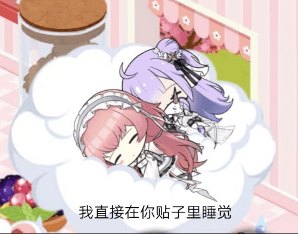

# azurlane帕尔修斯

作者：yunjieu

TID：32868

# 1

写了大概一万字，名字还没有想好，是萌新的处女作，希望各位不要耻笑其中一些犯病桥段，如有不好的地方，还请指点#(爱心) 文章原创，如有雷同，算你抄我（bushi  

# 2

<ignore_js_op>[IMG_20220303_220639.jpg](forum.php?mod=attachment&aid=OTQ1OTJ8MGM1NTUzMGJ8MTY0NzcwMjk1MXwxODIzMHwzMjg2OA%3D%3D&nothumb=yes) *(47.08 KB, 下載次數: 0)*

[下載附件](forum.php?mod=attachment&aid=OTQ1OTJ8MGM1NTUzMGJ8MTY0NzcwMjk1MXwxODIzMHwzMjg2OA%3D%3D&nothumb=yes)

前天 00:53 上傳  

</ignore_js_op>  

# 3

*本帖最後由 yunjieu 於 2022-3-17 00:55 編輯*

[...虽说，早起的鸟儿有虫吃，但...指挥官的话...是呢...大概是属于会饿死的鸟儿吧...]

在少女甜美的声音出现的同时，指挥官的意识也在朦胧中凝聚。与初晨极不相配的阳光透过窗户照射进来，洒落在少女粉色的发间，洁白的翅膀在阳光下轻轻的扇动着。倘若没有搞清楚状况，想必一定会以为是自己人世的使命已尽，生活在遥远天空的少女使者已经前来引导尘世受苦受难的灵魂前去解脱吧。

[...工作就和即将到保质期的食物一样，放着不管会出问题的，指挥官...]

甜美又略带责备的声音再次回响在耳边，搞清状况的瞬间，指挥官如同被弹簧弹起般迅速跳起。

[英...英仙座。你怎么...在这]

[任务都不愿意去完成，就像是小懒猫一样啊...你呀]

被称呼为英仙座的少女将脸微微侧了过去，再怎么没有表情的脸庞也难以藏匿住那一瞬的嫌恶。

（糟糕...被她讨厌了，明明还想着在她面前留下好印象来着...）

指挥官面略露难色，不知该如何辩解，而对方似乎也并没有打算接着往下说什么，二人就这样陷入了短暂的沉默。于是，碧蓝航线港区新的一天在这尴尬的气氛里开始了。

数月前，港区

（呼姆，今天的港区还是一如既往的清闲和平呀）

和以往的清晨一样，我正在前往办公室的路上，感慨着每天都在感慨的话。工作也可以说恰到好处的忙，每天下达命令监督舰船们完成，并制定和修改之后的作战计划。而我手下的舰船们，也大都工作认真负责，兢兢业业。在我担任指挥官前，还并没有指挥官这种存在，这里的舰船们一直以来，在没有指挥官的时候也能讲港区管理的有井有条。然而面对塞壬越来越强大的攻势，上层编制的指挥官一职，而我也被委派到港区，就任这一职位。据说是因为上头看中了我对心智魔方的适性什么的，可对我来说这种有别于他人的特殊还是第一次，来这里工作让我产生不少紧张感。自我来到这港区后，我们的对手塞壬似乎安分了许多，港区也在不断迎来新的舰船加入，因此上头们也开始将开会的重点从塞壬调到科研上，不过我身为指挥官坐镇舰船后方这件事倒是不会有何改变就是了，我也对指挥官这职位在港区是否必要产生了疑问。

（对了，今天好像是有新的皇家的舰船要来港区的，其中好像有比独角兽还要晚辈的孩子，得先关照她一阵子）

想起之前做好的安排，我便加快了前往办公室的步伐。

[主人，英勇大人和各位新人们已经抵达了]

[好，现在就去迎接她们吧]

和以往欢迎新加入的舰船们一样，依次听她们自我介绍稍并作交谈后，让刚刚引领她们的贝尔法斯特再带领她们熟悉港区的其他地方就算完成了。

伊丽莎白女王级战列舰的英勇。额...这孩子有点活泼呀，和伊丽莎白一样爱使唤人啊；乔治五世级战列舰的豪。打扮的像皇家骑士的贵族小姐，态度和刚刚的英勇天差地别，既礼貌又纯真；航空母舰鹰。唉？！这孩子为皇家立下这么多汗马功劳吗？看来是个很认真负责的船；戴朵级巡洋舰的赫敏。风格和天狼星戴朵完全不一样，也似乎要比她们要能干很多，感觉挺能让人亲近。         

最后是独角兽说的那个后辈吧...咦？

最先映入眼帘的是一种可爱的粉色，我在港区见过许多种粉色头发的舰船，但这种...似乎给我一种无比熟悉的感觉。对了，是小时候只有在草莓味甜点的包装上才会有的可爱又甜蜜的粉色。被白色发饰装点后更显的甜美可爱。柔美的长发搭在胸前两边，两弯眉毛仿佛皱着又仿佛舒展着，像挂在天空的一抹轻烟。半眯着的眼睛有着和发色相配的瞳色，透着欢喜又透着哀愁。微微鼓起的脸颊调皮可爱，与那令人琢磨不透的眼神形成强烈反差，竟显更加可爱。白色美丽的萝裙包裹着的身体是连作为前辈的独角兽都显得年幼单薄的丰神绰约。透着淡淡肉粉色的白丝包裹的修长双腿，踩着一对与发色相配的小巧舰装高跟鞋。粉白渐变的衣带，更让其显得优雅。手持战戟，背后的白色羽翼跟随轻轻的呼吸一起微微摇摆着。内慧外秀，楚楚动人，惹人怜爱，仿佛高洁的天使方从空中降临，我成为指挥官恐怕也只是为了能与她相遇吧。啊呀，就连身旁的那只...额...圆脸肥鸡？也一同惹人喜爱.............

[巨像级航空母舰·英仙座。是在大战之后才加入的，所以也没有太多足以夸耀的功绩.....但我会用自己的方式努力的……这样就可以了吗?…呼]

突如其来的可爱声音将我拉回了现实，虽然最后一句因为声音太低没有听的太清楚就是了。

[嗯？英仙座是吗。刚刚工作的疲惫有些失态了，欢迎来到港区。这边有各种各样的舰船前辈，里面自然也有你熟悉的舰船，我会让她们多关照你，带你熟悉这边的。]        

英仙座听完略低头沉默了一瞬，之后抬起了头，似乎下定决心一般。

[嗯。皇家海军，英仙座。唔啊，叫我帕尔修斯也没关系。…那么....还有什么要说的吗？…那就，请多关照。]  

额，后面几句声音又变小听不太清楚了。不过没关系，看样子似乎给她留下了...好印象？大概吧？她应该没有对我那样盯着她看感到反感吧？不不不，总觉得似乎还是丢了些脸呢。得在她面前表现的好一些来补救....为什么我会这么在意她对我的看法.....

之后也和以前欢迎新舰船来到港区的情节一样，在那更往后的日子，还好是和平常一样和平。不过，我似乎越来越被那艘轻航吸引。我决定以港区太过和平锻炼不可松懈为由，让她担任一阵子秘书舰，依此来拉进与她之间的距离。

想不到让她上任秘书舰的第一天就让她看见我赖床了......唉，一想到明天就要与她共事差点让我欣喜的险些彻夜未眠。竟导致第二天起来就被她责备了，不过话说回来那比喻是怎么回事？害，我还有闲工夫想这么多干嘛，得先挽回我在她面前丢失的形象呀！

[指挥官，我听得到，所以请不要在我身边发出很大的声音，有点吵]

[有什么需要帮忙的，可以告诉我。不过在那之前，还请先自己一个人试着努力完成]

[夕张和明石她们，好像经常在做一些有意思的试验呢。嗯，我有点感兴趣…]

[指挥官，再不收，任务奖励就要过期了。]

[指挥官，有你的邮件…没什么，只是举手之劳。]

库唔。感觉这孩子...似乎并不想和我亲近的样子...甚至无聊的想着去找其他人呢...看着她工作的可爱模样，明明触手可得，却又那么遥不可及。还有那可爱洁白的羽翼，就像她是天空自由飞翔的鸟儿，美丽可爱却又无法得到，而我只能在地上仰望着她。 算了，今天的工作不多，就先到这吧，先回去了。话说英仙座刚出门去找明石了，这个点了应该很快也就会回来吧，那就先等她......

（嗯？这个是？）

一个精巧的小按钮放在桌上不起眼的一角，话说我在这呆了这么久居然没发现这个。我捡起这个小摁钮，对比了一下，这个按钮竟小到没我最小的一块指甲大，那么这是某个精细机械身上的零件吗，稍后交给明石看看吧。带着好奇心，我轻轻摁下那个小按钮。

（...身体...好难受...）

突然一股眩晕感和无力感袭来，我失去平衡向后倒去，眼睛模糊看不清东西，没有彻底失去意识，我躺在地上休息片刻，试图回复体力调整好状态。很快，我的身体恢复了些。

（嗯？怎么家具都不见了？）

看着周围平坦空荡，我心中更多了些疑问。

（奇怪，怎么感觉房间变宽敞了许多，是家具突然不见产生错觉了吗）

我仔细观察四周，这才发现周围的一切变的巨大无比，我的位置刚好在桌子腿旁，仅仅那只巨大的桌腿对我来说它的宽度已经直逼一栋小楼，而那一路直通天边支撑起桌子的高度已经无法计算了。

（怎么回事，周围怎么变得这么...不，是我变小了吗？难道是刚刚的按钮？！）

我的心情变的十分焦躁，在这样大小的体型下，想要生存是十分困难....不，对我这种废柴来说应该是完全办不到的。

（必须赶紧找到那个按钮，想办法变回来！不...等等...就算找到了按钮又能怎么办？上面也只有一个按钮吧，摁了或许会变回来？不，要是变的更小就彻底完了，现在至少还有大概一厘米的身高吧？应该去找其他舰船，让她们发现我！贝尔法斯特？赫敏？天狼星黛朵其她人也好？！等等...英仙座？不行，不能让她发现我这般丑态！）

心急如焚的我已经彻底乱了阵脚，平时工作都有充足的时间和绝对的安全，让我可以不紧不慢的修证计划，而现在我失去一切，这让我已无法冷静。

（要是被谁踩死了，被哪个动物虫子吃了，话说那个破按钮掉哪了？！......）

无数可怕的念头让我更加难以集中精神思考，而就在这时房门被打开了，而进来的自然也只可能是英仙座，巨大的粉色白色的身形进入这个空间，而我也没时间再沉浸在对她的各种妄想。

（英仙座！）

慌乱的情况让我险些叫出，不...即便叫出了这个差距她也听不见吧。当务之急，本能让我立马钻进不远处的沙发底下，而可笑的是明明我刚钻进沙发，英仙座立马就到了沙发旁边坐了下来。巨大的压力让沙发颤抖了一瞬，或许在巨人的视角看，英仙座只是轻轻的坐在沙发上吧，但对我来说那微小的颤动也让我此刻敏感的我震撼到。现在想，没动脑直接逃命似乎是个正确的选择。

外面又传来一阵骚动，结束后我从沙发底下小心又缓慢的探出头来，眼前的景象再一次震撼到了我。巨大的粉色高跟鞋映入眼帘，充满了压迫感，此时的我也就比鞋底高上一点吧。而高跟鞋更上面并没有记忆中的白丝美腿，只是一双巨大的粉色高跟鞋矗立在那，威严却又十分的性感。我傻傻的站在那，那幅景象在我心中顿时激起一滩涟漪。我的重要之处竟对这双高跟鞋产生了欲望？我摇了摇头，用手拍了拍我的脸颊，只到可能会在脸上留下红印，我才克制了一些。话说英仙座为什么要脱下鞋子？是因为刚从明石那里回来太累而周围又没有人，才暂时没有顾虑皇家淑女的形象吗。那么英仙座....那个....难道在更上面？

要品尝仿佛要禁忌之果一般，我带着忐忑与期待的心情，继续往上方看去——巨大的白丝足如同广阔天边浓厚洁白的云一般，遥远的在天上白色的足底透着些许肉色，显得粉嘟嘟的，可爱又性感。我被眼前的景色彻底迷住，甚至恨不得飞上空中将整个人都钻进那白白巨大的云朵中。而英仙座再次的调整坐姿发出的巨响，把我的意识拉回现实。

（不行，都这种时候了还在想这些，真是不知死活。）

我嘲笑了自己的的无耻与无能，开始想办法。

（对了，也许我可以借这机会爬上沙发，打一下英仙座的手指引起她的注意。）

原本打算不让她发现的我已被刚刚的景象冲昏了头脑，当我看向沙发时我傻眼了。巨大的沙发以及一旁完美的两根白色肉柱如同神话一般，凭渺小又无能的我想要爬上去是不可能的。

（不，还有个办法。或许可以爬上刚刚的粉色高跟鞋，当英仙座穿鞋的时候一定能注意到鞋面上的我！）

不知是还没从刚刚魅惑的景象中出来，还是这危机中的焦虑感。或许两边都有，竟让我想出如此愚蠢的计划，并深信这个计划的可行性，做出这样的判断。

此时，我再看向那巨大的高跟鞋，早已控制不住的欲火以及危机感所带来的本能化作了动力，爆发出平常不敢相信的体能，使得我很快便冲向最好攀爬的粉色鞋尖，并三下五除二的爬上了鞋面。可当我上去的时候我才想起，该怎么引起她的注意呢？

我慢慢靠近鞋子里面，希望她在穿鞋的时候可以注意到鞋面上的我。

[哈啊，指挥官真是的，明明都快结束工作了居然还不回来，是又躲到哪里偷懒了吗...哼姆，这样就感到疲惫的指挥官就像小鸡一样....嗯？这个是.....]

啊，又被嘲笑了，话说像小鸡是什么意思，跟小鸡一样懒惰吗？我记得港区的小黄鸡挺勤快能干的，我还真比不上它们。是说的一直跟着英仙座的那头肥鸡吗？难道说，我在英仙座眼里，已经是一头又蠢又懒又圆的肥鸡了吗？真的是....太让人伤心了.....

此时的我又沉浸在伤感中，在那一瞬并没来的及察觉英仙座发现了什么。

[这个按钮是.....]

英仙座发现了一个奇怪的按钮，拾起之后带着好奇心也摁了下去。而同时我也再次产生了刚刚那样的眩晕感，但这次我似乎比上次更快取回状态。

观察下四周，刚刚我好像掉到了什么地方，别是掉到鞋子下面去吧，我好不容易才上来用光了力气，已经没法像刚刚那样爬上来了。

周围似乎一片肉色，我似乎在某个巨大的肉色的洞穴里，四周有一股香味同时夹着些许的酸味，与那香甜一起竟更加好闻。我往后面望去，后面是一个巨大肉色的坡，而光亮也从上方照射进来。联想到我刚刚的位置，难不成之前我晕倒是掉到英仙座鞋子里面去了吗？而我的位置还是在最里面的脚尖处？

不仅如此，四周比我想象的还要巨大，刚刚还能翻上去的鞋尖，现在从里面看都已经是数倍于我高了。我竟似乎又变小到大概原来的五分之一！

[天呐，这怎么办....英仙座！听得到吗！]

我赶紧顺着斜坡上爬，尽可能的希望能被她发现，为了不让自己滑下去，我尽可能的趴在鞋垫上前行。然而即使这样，我也情不自禁的兴奋起来。我一边嘲笑着自己的无可救药，一边拼命的晚上爬。过了好一会儿，我终于来到鞋子里的最上面，当我抬起头看时，我才惊讶的发现——鞋帮已经大到和港区最大的房子一样高，而且鞋壁甚至是向内凹陷，为了能到这里我已经快耗尽了体力，根本不可能爬出去的！

（英仙座！看的到我吗！听的到我说话吗！英仙座！）

无助的我像一只蚂蚁一样，在英仙座的高跟鞋里狼狈的呼喊着，现在的我已经完全顾不上对方会怎么看我了，即使她会觉得我是个hentai我也顾不上了！看着上方巨大无比的英仙座似乎并没有察觉到我发出的声音，依旧在饶有兴趣的把弄手上的东西。

（那个是....该不会？！）

[英仙座！帕尔修斯！别按啊，千万别按那个啊！！]

原来我刚刚又一次的缩小是因为英仙座按了那个按钮吗？！我心里祈祷着，英仙座千万别在按了，不然我真的就回不去了！

然而事与愿违，英仙座打量着还是再次摁下了那个按钮，而我却只能在她的高跟鞋里，无助的看着巨大可爱温柔的她无意识的对我宣判残忍的死刑！

这一次，晕眩的感觉没有以前那么严重，当我回过神时，她的鞋帮已经变的如同我在大城市里看到的高楼大厦一样耸立着，至于远处的英仙座...已经只能看到模糊的影子了.....

我已经....变得有多小了...明明刚刚还在和她交谈着，明明只是一个不及我肩膀，温柔可爱的舰船少女。而现在...我却犹如她鞋子里的小虫子，不被她注意，连被她察觉都做不到...宛如生活不同次元里的人...

[指挥官还不回来，这么磨蹭简直就像是....唉，算了，去找找看吧]

突然间，巨大的白色物体遮天蔽日般出现在鞋口，将英仙座的影子挡住，我完全看不清楚她的表情如何，只能依稀看清她终于似乎看向我的位置。不过，我已经可能小到她完全看不到的程度了吧...这可能是我最后一次看到她了....

巨大的白丝肉体轰隆隆的塌下来，而我只能无助的往更深处跑。

[不要啊，这种事情不要啊]

被穿上的话一定会死的，结局一定是会变成英仙座白丝足底下不知道是在哪处里的一个不起眼的小红点。我狼狈的向下逃着，就连我自己也不知道自己是在跑还是在滚。我逃亡着，但是下面的斜坡在不经意间开始变缓和，甚至在往另一边倾斜着

[不，不要啊]

我绝望的叫喊着，被一个小姑娘无意识的翘起鞋子，就让我如此的狼狈。我摔倒了，然后趴在鞋垫上滑了下去，无助的看着前方鞋内深处离我上方越来越远，头上越来越大白色巨物遮住了我的的视线，将我完全覆盖，占据了我的全部视线将我狠狠压在下面。一阵天旋地转，我竟以躺着的姿势被压在不知道哪里的白丝足下。

（呜，好挤啊，英仙座，拜托妳，求求妳察觉到我啊！）

我无助的拍打着眼前巨大的白丝肉壁，被踩死只会是迟早的事。周围的空气全是她白丝足散发的气味又甜又酸....我继续绝望地拍着肉壁。

（等等，我的身体又感觉奇怪了，不，别再变小了，救命啊.....

醒来时，周围只有难以呼吸的闷热空气，以及无助的黑暗但没过多久，我便逐渐适应了这个环境...........简直像英仙座白丝足下的寄生虫一样呢....

眼前的景象让我彻底说不出话了，无数巨大的白色柱子相互交叉缠绕，坚固却又显得柔软，柱子间的空隙对我来说也十分巨大，透过空隙我可以看到肉色的肉壁。

（是吗已经变的这么小了啊...）

到了如此绝境我已心如死灰，已经完全没法感受到外面的世界了，得要准备做好迎接我新的人生.....新的人生吗.....现在已经不能称之为人了，只是一个美少女脚下的寄生虫罢了....我陷入伤感中，一小时前我还在桌边看着秘书舰的她，那样的窈窕淑女。这么长的时间，我一次又一次的想要接近她，而她就像港区里的那些海鸥，看见我来就飞走，留着我在原地卑微的，看着她在天空中高傲自由的飞翔着。我也无数次想要跟她一样，长出一对翅膀，与她一起飞翔，渴望与她一起飞过这片充满回忆的港区，飞过这片危险的大海，飞上蔚蓝的蓝天，飞入云彩里，在里面歇息，没有任何东西能约束我们。等到夜幕降临，天空中挂满繁星。之后下起了流星雨，她依偎在我身旁，指着天边遥远的星星，在我身边亲昵的说道[那边的几颗星星就是英仙座，今天是英仙座的流星雨。]之后她飞向空中，向我展示她那天使般的身姿，我看着她和她的可爱样子，最后如同天使般，降临到我的面前

[我喜欢你，最喜欢了]

[我喜欢你，最喜欢了]

一起说出爱的告白，然后一起飞向英仙座，忘却一起烦恼忧愁，相互陪伴，直到永远........

不自觉间，我的身体又开始兴奋起来，将我拉回现实。真是的，都这种时候了还这么不争气...我苦笑着，看着眼前绝望的困境，我悲叹着

（最后，还是没能得到她呀）

或许我的幻想只有最前面实现了，那就是我在地上，像个丑陋的虫子一样看着天上的她。不过现在看来我这样子还更好些，至少不会被她抛下，一直生活在她的白丝足下，像个丑陋的虫子一样，不被她察觉。她是否会在未来直到，消失的指挥官其实一直在她的脚下，以寄生虫的方式陪着她呢？大概不会知道，谁也不会知道吧 ....她要是会怎么想呢...

想起她与我之间的互动，恐怕只会觉得我是个讨厌的恶心的又不知廉耻的hentai吧。我突然觉得自己不只是个可悲可怜的家伙，而是一个更加彻底的混账。得不到，便通过这种方式接近她。我放弃了本想打算穿过白丝，去触碰肉壁的打算。像我这种家伙，果然还是干脆死在她的白丝，不，死在她鞋底下都是宽恕呢。我放弃了，从白丝里挣脱出来，看来这段时间我又变小了呢。我摔在了鞋垫上，嗯不对，身下这是，什么啊，原来是我的纽扣啊。我看了看自己身上断了纽扣的地方，再看看身下那巨大的纽扣，就连口子中间缠线的洞我也能进去了呢。

是吗，已经小到这种程度了吗，这个口子应该是被穿进鞋子里是弄掉的吧，也就是说大概已经小到这种程度了...这哪是寄生虫啊，已经是微生物了.....只要我跳进纽扣的洞里，那里就会是我的坟墓吧，但是拒绝这样的下场，即使人渣到这种程度，直到自己只配死在纽扣的洞里，我还是想要承认这份感情，希望最后还是能被她用白丝踩死。我跳下纽扣来到鞋垫上，深知自己不配触碰她的肉壁，就算不被踩死，也让我在她的鞋子里虚弱死或者缩小到死吧。或许运气好，老天爷怜惜我，让我在小到失去知觉时摔进她的白丝里，摔进她的肉壁，掉进她的趾缝，遗失在她的指甲缝里。

怎样都无所谓了。

我躺在鞋垫上，感受着自己，感受着她，献出自己一吻，然后闭上眼。身体再次发生变化，无所谓了。我的感觉十分的轻松，已经不会被现实中的任何事舒服，仿佛获得了幻想中那份自由般。或许我的梦想，以不同的方式实现了....

[天使（英仙座）大人啊。请让我消失在您高贵的足下救赎我吧]

幻想着，如同神明般的英仙座穿着一直以来的那一身衣服，抬起穿着粉色高跟鞋的白丝足，对着我踩了下去......

此时，指挥室里的英仙座用一种轻松的方式穿好了鞋子，站起了身子。因为等不到指挥官，烦躁的把玩着捡到的按钮，随后再一次，仿佛赌气一般，手指疯狂的连摁着按钮。不知过去多久，摁了多少下，她的不满才终被发泄。然而，那个按钮却因为用力过大甩了出去，消失在地板上。

（算了，去找一找指挥官吧）

其实，英仙座也一直在乎着指挥官，她并不讨厌他....指挥官总是愿意和有交流障碍的她说话，愿意摸摸她的头...倒不如说，她也最喜欢指挥官了。然而她觉得自己是个笨蛋，明明每次想要和指挥官搞好关系，却每次都...说出那样的话....最后，她甚至害怕指挥官讨厌她，甚至相信着一定就是这样。这次的秘书舰机会对于她来说也是一次机会，然而指挥官的异常行动再一次打击了她，她认为指挥官是觉得自己太差劲才想锻炼自己，却又不在乎她才睡过头的.....甚至在最后突然消失了......

（去找他吧，这次一定要好好道歉。把心意，传达给指挥官）

英仙座害羞的甩了甩自己的脚然后踏着轻快的步伐离开了办公室，而在她踏出第一步的时候，刚好踩到了掉失的按钮，并将其瞬间踩碎，而英仙座并无察觉，继续轻松的迈开步子，而那个按钮已经被踩的粉粉碎，只有部分残渣粘在地板上，以及英仙座那粉色高跟鞋的鞋底上.......

end？  

# 4

[喵呜！明石做的道具放哪去了喵！]

发出可爱叫声的，是港区的奸诈商人同时也会制造奇怪发明的维修舰——明石

[喵呜！好不容易完成的喵，明石喵还在继续实验的喵，究竟放那去了喵！]

因为太过着急，已经慌乱成每说完一段话都会加上后缀的明石正把自己的仓库弄得一团乱。

前阵子，在塞壬出没的海域里探索完并返回的舰船带回来许多战略物资，一些值得研究的技术，以及...一些难以理解，不知是什么的设计图。这些资源本应该上交，却在整理的时候被某个女仆舰船丢失了一张设计图。

（我骄傲的主人啊，即使是这么简单的工作，天狼星...也一定会全力以赴的完成的！）

在那名冒失女仆离开不久，一个小小的身影出现在掉落的设计图旁。

（呼喵呼喵，现在的港区也太过和平了，明石商店的箱子都快要卖不出去了喵，用来刷紫色箱子的黄色油漆也很贵的喵，明石需要拓展一家主攻和平时代的人会去光顾的商店喵，但是这部分资金还是不够，果然还是给指挥官弄一些好货，让指挥官赞助赞助明石喵）

抱着本该装满红尖尖实际却空荡荡箱子，并且不断发着牢骚的明石突然被地上的东西吸引了注意。

（呼喵？这个是....）

之后，明石将设计图带回了实验室。她作为商人的嗅觉非常敏锐，她的直觉告诉她只要把图纸上的东西完成，一定会给她带来想要的。于是，明石夜以继日的攻克困难，没有去经营本该打理的萧条商店。她将自己一直以来制作小道具所用的知识与经验关注，终于按照图纸完工了在实验阶段的道具。

因为明石娇小身体的缘故，以及本是实验阶段，道具制作的也非常小巧。一个如同小拇指直接盖大小的按钮，只要读取某个生物身上的一小部分然后摁下，就会发生奇妙的事。至于是哪个生物，会发生什么事，明石心里虽可能有些眉头，但也是没个底。明石找了港区几乎所有的生物实验了一番，小到在极其隐蔽的地方躲藏的昆虫，大到即将被送上餐桌的牛羊，甚至连用伪劣心智魔方造出的没有思维的残次品舰船都没起作用。

（喵嗷！这什么破玩意，这不是完全没有用喵？）

疲惫不堪的明石打算放弃了，可就在这时她想到了一个人。对，港区唯一的人类。因为和心智魔方有特殊适性的人类，被委派到港区指导大家的——指挥官。

明石潜入到指挥官的办公室，看看能否找到属于指挥官的东西，终于在沙发上找到一根只可能属于男性的一根短发。

（呼喵。居然在沙发上偷懒睡觉，指挥官又被明石抓到新把柄了喵）

读取到指挥官的短发，接着就是找到指挥官并且实验了。然而就在此刻，明石怔住了。虽然平时经常欺负指挥官，但拿指挥官实验未知道具，实在是做过火了吧。明石陷入自责，打算就此终止实验收手。

[明石？你再指挥官办公室做什么？]

[呜喵！]

明石如同反应过激的小猫一样，吓得差点窜到天花板上。等明石反应过来，发现声音的主人是是名为三笠的行事认真却有些古板，与时代脱节的舰船。

[什，什么都没有喵！明石才没有想拿指挥官实...不是喵！明石只是好奇喵，只是看到指挥官门没锁才好奇进来了喵！]

慌张的明石惯例的喵无伦次了。

[是吗，指挥官真的是粗心啊。刚刚指挥官告诉我，说从明天起就要让新人舰船来担任秘书舰来锻炼她了，在最后一天我想整理好指挥官房间，免得让新人小看了我这个前辈。]

看来，这位三笠舰船确实太过单纯了。不过新人舰船倒是引起了明石的注意，港区最近来的新人里有一个对明石做的各种小道具有很大兴趣，经常帮忙参与实验，可是最近一段时间没有见过她。一来是因为明石专于研究，二来是那孩子好像最近一直跟在指挥官旁边。或许明天的秘书舰就是那个新人吧。

[哦，对了。话说回来，明石。刚刚有穿着制服的蛮啾去了你的仓库，说是要查查你的货合不合格，你不去看看吗？]

[呜喵！]

明石再次吓得差点窜到天花板，然后以惊人的速度冲出办公室。

[喵嗷！！明石的箱子没有刷多余的漆，只是不小心撒了上去而已！！]

三笠愣在原地，为明石捏了把汗。

[哎呀，现在的小家伙都这么活泼啊，那我也赶紧检查检查.....嗯？这是？]

三笠在地上找到一个小号零件，她捡起来，打量一下，无法理解那是什么，拥有较强的自我管理意识的她也没去做多余的事，然后她将那小东西放到指挥官桌旁的一角。

[指挥官真是的，东西不放好的老毛病又犯了，放在这指挥官应该能注意到，可别又把重要的东西搞丢了]

打扫完房间的三笠确认了房间里甚至连小虫都不会有后离开了。

回到明石这边，与蛮啾大闹一通后的明石第二天忙完才发现自己的小道具不知掉在了哪里，正在仓库急切的找着。

[明石，你在找什么]

明石往门口看去，只见英仙座打开仓库门，踩着那双粉色的高跟鞋轻轻的走来。不愧是皇家的淑女，举手投足间都透着尊贵华丽的气质，犹如仙女来到人世。

[别动喵！]

英仙座被明石突然的尖叫喊住，维持着右脚单独站立，左脚略微向后抬起的姿势。英仙座不解明石的用意，为了维持这个姿势，她将身体的力量全部压在右脚。

[明石喵丢了个很小的东西喵，怕被你踩到。所以，注意一下脚下喵]

英仙座维持着面无表情，单独站立的样子，小小的翅膀为了保持平衡轻轻扇动了一下，显得异常可爱笨拙。

[英仙座喵也来帮忙找一下喵，是个很危险的东西，所以要特别小心喵]

英仙座面无表情的轻轻点头，将重量转移到左脚，右脚得到解放。

[但是，明石，我还有更重要的事情找你。]

英仙座一直难以被人看出感情的脸竟漏出些许娇羞。她将十根手指放在胸口前，分开并对应触碰，手掌没有相互接触。也许是刚刚右脚站立有些辛苦，她将重量又分配到左脚，而右足惦着，用脚掌来回碾踩着地面，用来缓解害羞的心情。

[那个....就是指挥官他...又像个猴子一样健康的跑出去玩了....直到现在都还没有回来.....所以明石！]

英仙座放下双手，右脚终于安分，并且稍微向前轻踏一步，仿佛下定决心般，而那一脚也像是回应她的决心，也踩的有些用力。

[可以先帮我找到指挥官吗！]

如果是刚到港区的英仙座，肯定不会这么在乎指挥官，毕竟这里是指挥官的港区，那么大的人绝对不会凭空消失，即使有困难，港区到处都有那么多喜欢指挥官的舰船，一定会争着去帮助他。而自己即使在场，可能也只会被围在最外面，帮不上任何忙吧。但是现在的英仙座不一样，她非常关心，非常在乎指挥官的事，即使指挥官没事，她也想确认指挥官是不是以为讨厌了自己受不了才离开的。

一想到这，英仙座开始略感失落，穿在鞋子里的两只白丝足的足趾蜷缩着，紧紧抓着鞋垫。英仙座低着头，看着自己的双脚。指挥官一定讨厌自己了吧，明明说了那么多奇怪的话。英仙座再次放松自己的双脚，又开始自顾自的碾踩着什么似得。

而明石听到后也放下手上的活，她担心是不是有人摁了那个道具才让指挥官失踪的，那么造成这一切的罪魁祸首就是她。她必须为这件事负责。

明石看向英仙座，着急的她早已失去了皇家淑女应有的礼仪，仿佛做错事般低下头，看着脚下，双腿也因为着急乱动着，样子滑稽可爱。可明石心里愧疚，翻出一台追踪仪，那个可以追踪指挥官下落。明石早在很久前就将指挥官衣服上一个纽扣替换成追踪器，也因此那个纽扣也比其他的松散些。本来这个追踪器是在指挥官欺负了明石，就把这个批量复制，卖给赤城大凤罗恩恰巴耶夫等一众对指挥官抱有激烈情绪的舰船的，虽然并不及海伦娜meta的sg那种水平就是了。

明石看着追踪仪，上面没有指挥官的踪迹，那就说明指挥官的追踪器已经比破坏了，那也说明指挥官遭遇了不测。

英仙座看到明石面露难色，便轻轻靠近明石，明石吓了一跳，激烈的反应也让英仙座踉跄着后退几步。

[这样英仙座喵，明石现在也想不到办法喵，你先回去喵，明石有消息就第一时间告诉你喵]

英仙座看着慌张的明石，歪了歪头，没有表情的脸上透露些许失落，眼睛垂下，在与明石道别后踏上回后宅的路。

英仙座缓缓的走着，一路上看见许多舰船姐妹三三量量聚在一起开心的讨论着，内容一半是港区的生活趣闻，一半应该都是关于指挥官吧。英仙座也想加入她们，和她们一起聊自己帮明石实验发生的趣闻，一起聊指挥官和自己的初遇。可是笨拙的她每次都很难表达出自己的感情，最后用尴尬的比喻让气氛降到低点。好不容易因为指挥官，英仙座开始慢慢克服这个弱点，甚至在家里摆了很多镜子，自己对着镜子练习。然后现在，指挥官也离开了自己了，肯定也是受不了自己了吧。一想到这，英仙座感觉自己的脚别的越发沉重，于是自己独自一人坐在公椅上休息，有时闹别扭般甩着双腿。

明石赶紧翻出图纸，抓紧时间用备用的零件做出新的道具，并且试着用自己的理解，将功能试着倒转过来。然后赶往指挥官办公室，桌边找到了新的头发，心中来不及嘲笑指挥官是个秃驴，便完成道具并摁下，道具起了没见过的反应，明石松了口气，打算回去联系英仙座。

而英仙座这边并没有回去，只是自己一个人漫无目的的走着。等回到后宅，天色已经很晚了。英仙座走进自己房间，突然感到自己右脚下有什么东西很膈应，于是脱下鞋子，将闷在鞋里一晚上的白丝足抽出，踩在地上，检查了鞋内，似乎并没有什么。当英仙座又感觉自己脚下有什么东西在动时还没来得及查看，右脚仿佛被什么东西顶起来一样。只见指挥官呈大字躺在自己家里地板，他的脸被英仙座的白丝右足踩在下面，脚跟踩在额头，脚掌踩住鼻子，脚趾踩在嘴上。而他的散发着奇怪又熟悉的味道，同时指挥官自己也正惊恐的盯着她。

双方尴尬的对视着，突然的情况让他们愣住足足十秒，甚至更久。两人一直维持着指挥官被英仙座手里拿着高跟鞋抬起腿踩着的姿势，如果外人刚好看到，一定会以为是在玩什么奇怪的play吧。当英仙座感受到足趾间指挥官的呼吸，以及指挥官的目光不经意的看向自己裙子里时，英仙座才吓得慌忙后退......

[所以.....如此这般....如此这般.....如此这般]

[唔.....嗯]

解释完反生什么事后，两人又再次陷入了沉默。

（完了，这回彻底完了。虽然能够回来，但是....感觉还不如不回来呢.....）

到此为止吧。指挥官想着打算破罐子破摔，而刚要开口，英仙座却先发出了声。

[太好了....还以为....是你讨厌我才消失不见的呢....]

指挥官愣住了，本以为自己会被当做在自己脚下蠕动的可悲变态，意想不到的开展，让自己手足无措，一片空白的大脑让自己说出了自己最想要问的话。

[你是，怎么看待我的呢]

[对指挥官的看法吗？....就像夜航中突然袭来的暴雨一般....啊，不，我不是想说这个，我想说的是....其实我对指挥官是....]

指挥官注视着英仙座，她的脸上写满了不知所措，笨拙可爱，完全无法想象刚刚自己一直在这样楚楚可怜的女孩子脚下挣扎。最后，英仙座终于鼓起了勇气

[其实，我并不讨厌指挥官的...指挥官总是和我说话，愿意摸摸我的头....也就是说....是喜欢....嗯]

艰难的一字一句缓慢的说完，英仙座的脸彻底红了，害羞的将头垂下。指挥官听完，也面红耳赤，反正今天厚着脸皮这么多回了，那就在来一次吧。于是，从口袋里，拿出了那枚准备了很久的戒指........

（好耶，作者懒癌发作摆烂了！摆，摆tnnd）

[前方发现塞壬舰队，同志们，高歌猛进吧，胜利在朝我们招手！]

冲在最前方的喀琅施塔得发现敌情，准备替身后的岛风和吾妻抗下伤害。

[...交给我吧]

但是，出现在后方的可爱声音以及三波空袭以更快的速度解决了遭遇的敌舰。前排的先锋们还没搞清楚发生什么事，突然从后方有船冲到她们脸上，一人塞了两口治疗然后又迅速回到后排，只留下愣住的三船。

[这次，也和前排好好的互动了呢...]

英仙座返回到后排，紧张的轻喘。刚刚三轮空袭中的两轮，以及两口群体治疗正是她的杰作。一旁负责召唤第三波空袭的天鹰，此时嘴里也被堵着两口治疗，苦笑的看着。

[最近感觉...不止对指挥官，和其他的舰船伙伴们能更好的说上话了呢，都是因为有指挥官在我身边，给了我勇气和鼓励....]

返航休息的英仙座，一个人走在走廊，自言自语的说着话。嘴里在不停乱动着，仿佛在回味这和指挥官新婚当晚接吻的时候吧。

英仙座打开自己房门，走了进去，开了灯，一伙人围了上来。回到家的英仙座笑了笑，有点不舍似得张开了嘴。只见口腔里，一个被玩弄到没有力气，身上全是唾液的小人趴在英仙座的舌头上。英仙座将小人轻吐在手上。然后小心翼翼的放下，随后小人被团团围住。

被围住的小人回复了体力，他不是别人，正是这个港区的指挥官，出征时为了绝对的安全，待在了英仙座的“指挥舱”。看着围着他的无数白丝足，小人仿佛习以为常。这些大舰巨娘都有个共同点，她们有漂亮粉色的长发，无名指上都带着戒指，都正绕有兴趣的盯着眼前的小人，似乎下一秒就要把他吃下去一样。

[指挥官？果然有点虚弱呢，要补充点营养剂吗]

声音的主人正是英仙座，此时的她穿着一身护士装扮，粉色的长发梳成双马尾垂在两侧和刚刚的英仙座宛如两人。

那天之后明石被英仙座找到，被要求制作了和以前一模一样的道具后，并给了封口费。作为商人的明石确认了指挥官安全后自然讲诚信，只是英仙座不仅要走了那些道具，还要走了追踪仪和一些其他的.....

（或许那个道具是塞壬为了方便带走指挥官制作的吧，也有可能为了带走完整的特地留有保护指挥官的功能。）

明石想着，也打算过问太多，只知道从那以后，指挥官很少出现在公共场合了。

[港区刚到了一批新的器材，指挥官，能麻烦你为我和我的复制人们当一回实验....不对，协助对象吗]

面前的英仙座和当初已经完全不同，将指挥官小人温柔却又牢固的玩弄在手。其她被称之为复制人的英仙座也轻轻发出笑声，她们手上每个都拿着不同的道具，她们的脸上也漏出不同的表情。或是和最初的英仙座那样面无表情，或是露出甜蜜动人的笑容，或是露出强烈欲望的注视，或是露出担心的忧愁，或是露出激起某些群体兴奋的嫌弃眼神.......她们的动作也各不相同，有点白丝足焦躁的乱动着，有点轻轻抚着自己的小腹，有的则是按摩着自己巨大的胸部....而最初的那位，看着眼前的小家伙，舔着自己的嘴唇，她和其她英仙座一样，将小人沐浴在强烈的爱的视线中。

end  

# 5

终于写完了，后续尝试用了不同的写法，感觉不错。就是觉得前面自己写的跟犯病了一样。大家尽管取笑我吧。前面本来还有想要补充的，现在还是算了吧，摆了。之后可能会写一些超短的纯爽文。当然，只写碧蓝的。应该都会围绕皇家阵营，比如海王星，黛朵啥的。不用抱有期待，因为我可能会摆烂，把这篇弄成最初也是最后的文orz  

# 6

> 月蚀YumiChannel 發表於 2022-3-17 13:50

> 很m的第一人称，意境写的也可以，事故的玩法意外地表现出人设之间的温馨。至于发病，谁还没对舰娘的白丝发 ...

谢谢，不过我说的犯病是指后面奇怪的幻想。。。而且本来是想写反差萌的，还有巨大体型差和绝望感，结果给整成了m，真的是太失败了orz。总之，谢谢大佬评论