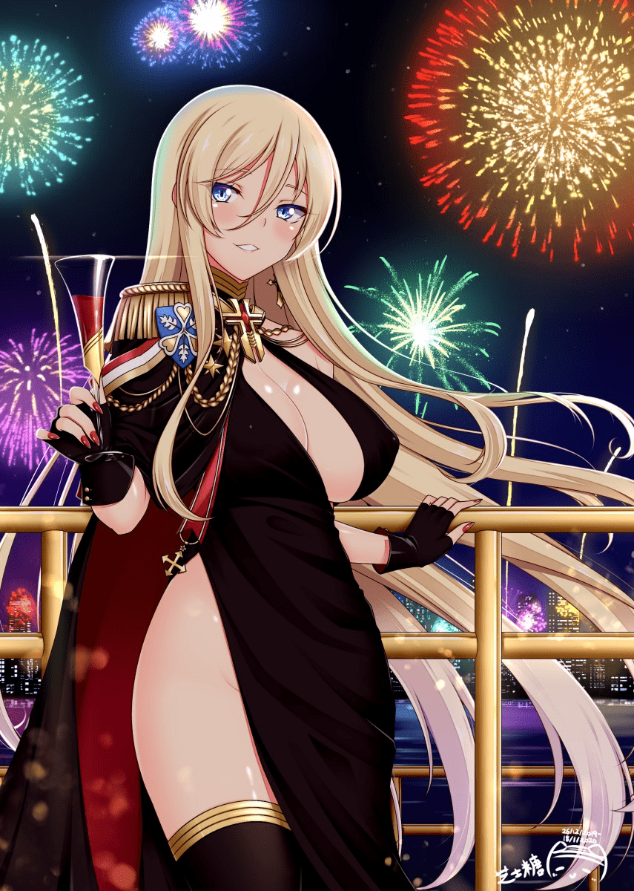
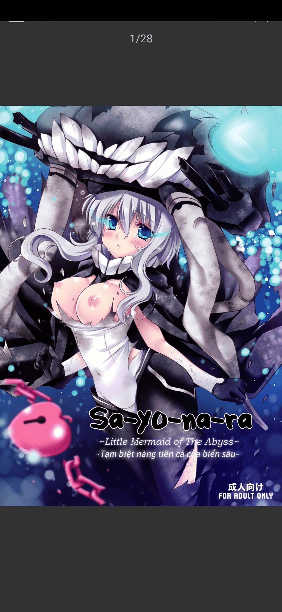
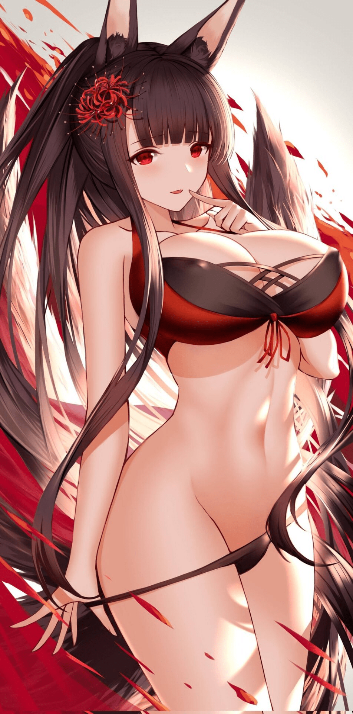

# 关于满级舰游弃坑大佬被舰娘找上门这件事

作者：疾风少年

TID：31287

# 1

关于满级舰游弃坑大佬被舰娘找上门这件事

“啊!终于搞定了，最后一次”被窝里这个人看着屏幕上最后一个被自己刷到满级，满羁绊，结了婚的舰娘舒了一口气，市面上所有的舰娘游戏，这个男人都做到了满好感，满级，全婚。货真价实的超级指环王。

“怎么这么晕啊？”这是这个男人最后的意识，就算是肝帝，连续数天不起床肝游戏也是受不了的，极速起身带来的供血严重不足，直挺挺的磕到了柜子上晕倒了，作为一个只要出了新船就会请假进行肝肝肝的秃子，24小时不睡觉只是基本操作。就连吃饭都是认识的外卖员直接送进屋子，还好过来送外卖的外卖员进屋的时候发现了晕倒的苏湖。

“严重的精神疲惫，劳累过度，供血不足，加上你晕倒的时候磕到了脑袋，导致轻微脑震荡。。。今年的伤势格外严重啊？”好不容易出院的苏湖听到了医生在这里絮絮叨叨的念着他把自己玩出来的毛病尴尬的笑着。从舰娘游戏出来之后平均每年都会出现这种情况，就连苏湖的老爸也认识了这个老医生。

“总而言之，你现在身体极度亚健康，需要均衡运动，摄入营养，好好休息，少玩游戏，或者不玩。。。预计. 。。。嗯。。2年吧？你就能恢复了，为了防止你在这么糟尽自己，在你家人的同意下，我帮你找了个家政”

“大夫，虽说你认识我父母，不过这么做不好吧？我还没同意呢？”

老大夫斜了他一眼“想什么呢？你以为是照顾你的家政？老苏怕你性取向有问题，也为了防止你在疯狂玩游戏，给你从孤儿院领养了一个孩子，是你要照顾她不是她照顾你”

“等等？她？女孩子？老爹要干嘛？”

“哦～他嫌你丢人，现在在造一个来不及了，所以去收养了一个，听说给那孩子取名叫苏理，你懂了吗？”老医生不紧不慢的说着。

“还真是老头子的 。。。做法啊？感情是给我弄了个祖宗啊？算了，好好当个乖宝宝好了，她到哪了？”

“你诊断书的时候她就到你家了，估计现在在收拾屋子吧？”

“不!!!”“对不起了，张叔，我回去了!。。。。不然我的藏品都完蛋了啊？!!”就像是邻居家的熊孩子进了你藏手办的屋子一样，苏湖爆发出了十几倍的动力，以完全不像是一个病人的行动力，飞也似的冲了下去。

“真是。。。难怪会有那种想法。。。”老大夫一脸这已经是一个废人的表情看着苏湖远去的背景“。。。哎。。。明明挺优秀的人，为什么一有舰娘游戏就成这样呢？”

几乎是一路急行军回到家里的苏湖看到屋子里有一个黑色头发的小姑娘，个子大概在1.5左右，正在悠哉的玩着自己的手机，房间被收拾的井井有条，粗略的扫了一眼，所有的东西都在应该在的地方“呼，我还以为你都扔了呢？”

“嗯。。。抱歉，我用了这个。。。好像叫。。改名卡？”小女孩怯生生的说着，苏湖所有游戏名都叫苏湖，或者是名字里带苏湖二字，看着手机上被改成叫妹妹苏理的游戏角色，苏湖苦笑了一下，伸手揉了揉女孩的小脑袋。

“哎。。。没事，你比我想的还不怕生啊，这东西有的是，你就是苏理吧？”

“是我”

苏湖环视了一周“以后不用做家务了，我可下不去这个心。难怪老爷子幸灾乐祸，真是。。。给我找了不少事干嘛”

苏湖伸出手“那以后就是一家人了，多多担待啊？”两双手握在一起“嗯”“不过不要乱玩我的游戏”说着，苏湖用改名卡再次把名字改了回来。

就这样，苏湖遵医嘱的2年没打游戏，至少是没有机会像那样打游戏，本来他以为未来会这么安稳的一直下去，直到。。。那场车祸发生为止，或者说是，人为制造的车祸。有钱又不愿意和别人同流合污的父亲开车送苏理去上学的时候，出了车祸，防弹的汽车被直接装的稀烂，无人生还，苏湖接手了公司，青涩年轻人没人指导，跌跌撞撞的继承了家业，再也没有时间玩游戏了。

本来在正常人看来一切都是顺理成章，不过，苏湖不知道，这一切只是为未来埋了一颗钉子。

被迫继承家业的苏湖，因为不够成熟，被迫放弃了娱乐活动，艰难维持着公司的存续，对于这个父母一生的心血，苏湖就是再嫌麻烦也得努力一下。不过这一切对于一个17岁少年而已太过沉重了。

科学理论证明了平行世界是存在的，自然，平行世界之间会互相影响，有些东西，不能用另一边的眼光来计算。

舰娘，一种恨不得把所有物理学家气的从棺材里跳出来高呼不科学的存在。不管是那一种设定里，考虑到名为深海的敌人，舰娘都拥有等比例缩小船只的部分力量，或者是在海上时拥有全部的力量。以千吨起步的力量，30节每小时的航速，缩小但是破坏力不减的武器，即使缩小了也有百吨起步的体重，看似柔软却比坦克防御力还强的皮肤，能够看出善恶的直觉，以及对提督听言计从的忠心。

不过怎么看，舰娘的一切被称为神也不足为奇，正常情况下，舰娘对于一般单位的战斗力是压倒性的，陆地上所有武器对舰娘基本上无计可施，如果提督有什么鬼心思的话任何想要控制提督的机构都是扯淡。但是，舰娘毕竟是有名为深海的对手的，那，如果深海消失了呢？人类的恶意会如何对待舰娘呢？

真正的战斗可不会像游戏里那样，辽阔的大海上舰娘打一次副本的时间就需要数天，乃至数月，不可能像手机那样几分钟一把，点一下就够了，那么，如果你进入你的游戏角色里，你在别人看来是什么样呢？

正确答案是聪明，耐劳，全年无休，百战百胜的英雄，事无巨细，衣食住行都丝毫不落的好男人，以及，给舰娘和自己安排996加班，每天24小时处理工务的的工作狂人。满足舰娘每一个请求，完美的爱人。不用惊讶，所有舰娘游戏里提督基本就是这个形象。

那么如果你是世界第一镇守府，在深海消失之后，你会被政府怎么处理呢？答案是，如果有可能的话，你被切片，因为你的成绩已经不是正常人能做到的，没有那个国家会允许你这个能够自己佣兵自重的提督安安稳稳的坐在那里什么都不做，舰娘明白，你也明白。

“提督，要来喝可乐吗？”提尔比茨是今天的秘书舰，当她进入办公室的时候，那个一直在桌子前处理工务的提督已经不见了。“提督不见了!快找啊？”舰娘们把镇守府翻了一遍都没找到。“提督消失了。。。”“不用担心一定会回来的，不管多久，不管在哪。一定”俾斯麦的戒指上闪着微光，安慰着自己的妹妹

消息很快传开了，作为平行世界投影的苏湖镇守府，举世闻名的超级指环王，一个人贡献了深海击杀数10分之一的大功臣，苏湖失踪了，而且3年了，镇守府里的舰娘已经用了一切的方法，都找不到人，现在，这里拒绝一切试图接管镇守府的人员，而且闭门不出，静静地等待着提督的归来。

# 2

1   舰娘等级正常情况下是1到100级这个级别增长的是舰娘对自己原本力量的掌控能力，100级可以视为完美控制原型战舰全部的力量。

2    深海栖姬按等级换算是100到200级这一块，基本上深海栖姬的原型都是岛屿，所以单对单情况下舰娘几乎是打不过深海的。

3   舰娘世界的设定，在四个互相相似但是不相同的舰娘世界里，人类的人口大概是30亿左右，剩下半数人类被深海杀死。

4  舰娘存在相同的情况，及时吸收了阿尔的力量，也只有历史上第一艘原型能突破200级的等级上限。而提尔比茨镇守府这里全是原型。

5   深海并不是坏人，准确来说深海是地球对于破坏环境的人类的惩罚，提尔比茨这边的深海敌视人类的原因其实是人类政府这里先动手的。

6   阿尔把四个世界所有星球都捏合到一起，整合成一个超大的平面世界，各种牛鬼蛇神都有，这个世界已经成了不适合人类生存的地方

7    原型舰的诞生是全世界唯一的，也就是只有一个，舰娘大部分情况下不会伤害人类，而其他镇守府的舰娘基本上都是仿造原型建造出来的。

8   苏湖的真正成绩是《四个世界里第一个站出来抗击深海的英雄，有了他顶着才有第一批镇守府的诞生》

9   人类政府是深海攻击人类后残留人类组建的，在四个世界里，人类政府烂的各有千秋，比如提尔比茨这边人类被消减一半基本上都是人类政府先向深海发射核弹造成的。深海力量来自于星球的怨念，几百颗核弹进海自然是大暴走。

10    如果阿尔不来，四个世界里所有舰娘都会因为人类政府利用舰娘对人类的信任消灭舰娘，然后被背叛的舰娘成为深海，毁灭一切。

11   各自舰娘的设定，以历史上存在的舰船诞生的舰娘，以历史上国籍为阵营划分，比如德国的舰娘以力量至上为原则。

12   关于深海wo没什么对话这件事。。。低级深海没有自我意识，只有达到深海精英以上才有个人意识。

13    精神力网络。人类和舰娘都有的能力，由人类联通自己舰娘之间通讯网络就是精神力网络，精神力随舰娘等级提高而变强，精神力强过提督十倍以上的情况下就可以强制解除舰娘和提督之间的联系。

14     舰娘等级提升带来的体型提升，0到一百级是正常人的十倍，101是100级的十倍，然后101到200级每升10级身高增长一半，200以上是原型机特有的领域，是200级的100倍，但是可以自己控制身体的大小。200以前没有这个能力  

# 3

第二章

作为第一个发现提督不在的提尔比茨非常的自责，只要有时间就会在办公室里待上一整天，大部分时间都在办公室不出门，一直等着提督回来。

一年，一年半，舰娘们踏遍了大陆上每一个角落，冲入未知的海域一次又一次的寻找，充满希望，然后失望而归。直到2年零2个月的时候，东方人会过的春节的日子，代替提督处理公务的提尔比茨趴在桌子上睡着了，等她醒了，发现自己身上披着提督的衣服，她知道，他。回来了。但是不管怎么寻找都找不到，提尔比茨去了浴场，想要放松一下。不过真相可不是她想的那样。

“优，吃饭了。”阿尔和优已经在这个虚无中过了很久了，以想象力为骨架，借由阿尔的权能，参考盔甲的构想，由优提供能量，终于制成了这个独一无二的，屹立于万千世界之上，自动吸收优逸散出来力量的豪华别墅，在这里优可以尽情的玩闹也不会破坏外界一丝一毫，孤独的人终于找到了港湾。

“阿尔，阿尔，你看这个，这个(*≧▽≦)ﾉｼ))”优一手举起手中的手机，一手举起便签本。

“都说了多少次了，在这里你不用担心毁灭世界的小问题，来，给我看看？”阿尔拿过了手机，画面上，是趴着的提尔比茨。“嗯。。。这个是。。。从我搞得那个失物招领筐里拿出来的吧？不过这东西有这种动画吗？”

ヾ(｡｀Д´｡)ﾉ不是这个意思，优写着，你没发现吗？这个东西更像是。。。。看电视那个。

“你是想说遥控器吧？不过确实是呢？缘分的线连着好几个世界呢？让我看看。。。”阿尔拿过了手机，看着里面的提尔比茨，想了一下，加了一件衣服给她。

“嗯。。。因果已经看到了哦，真是悲伤的故事啊？”“优，要不要来搞点事情玩玩？”

(O∆O)搞事情禁止，优在本子上写着。

“不过如果我们不干涉的话，这个可是一个很悲伤的故事哦？”阿尔把手机放在一旁，把饭菜端上桌子，总之，先填饱肚子吧？饭后再去玩玩。话说你能不能不用笔记本写话啊？就算现在学会了用颜文字也不行哦？

“如果习惯了说话出门会很麻烦的，所以还是用笔记本好了”优写着，然后坐在桌子上开始吃饭，过来一会，“不过如果不出手干涉，结局会怎么样？”

“那个啊？，没什么，所有有联系的舰娘自沉，成为500多个深海大boss，然后所有人一起玩完”阿尔摆了摆手，就是这样。

“。。。那还是帮帮她吧？”

“好啊，吃完饭就去，简单干涉一下就行，嗯，看来等会有的忙了，得把这些世界揉合到一起才能禁得住咱们的降临啊？看来能有新同伴了”

与此同时，浴场里，提尔比茨享受着这舒适的温暖，巨大的足够半个镇守府一起泡澡的浴场是提督要求建的。提尔比茨把头沉下水，咕嘟咕嘟的吹着泡泡，洁白的柔软在水里晃晃悠悠的，这时候，门被踢开了，俾斯麦带着一个深海wo走了进来。

“嗯，姐姐？深海不是消失了吗？那这个是？你打算留个纪念？”

“别打岔，你看看这张脸”俾斯麦把wo级扔进了水池。

“这是。。。。等等，怎么可能？难道说。。。是政府那帮人干的？”

“有一定可能，不排除是他们，毕竟我们没去那里找过。”俾斯麦看着自己的妹妹说着“我们需要她失去反抗力量，所有的舰娘里只有你能做到。不管是不是真的，但是只要有她在就有希望”

“好的，交给我”提尔比茨的语气一下子变了，那是战士的语气，北方的孤独女王重新归来，俾斯麦看了看认真起来的妹妹，走了出去，认真起来的提尔比茨在全镇守府里都能排上前十，已经不需要担心了。

舰娘的天赋能力大致分为4种，进攻型的增强炮火，防御性的给自己和队友套盾，支援型的替队友挡刀或者是远距离火力支援，以及战略型的，只有满足条件才能使用的各种增幅自己，削弱敌人的能力。

提尔比茨就是第四种能力，范围性的战略型技能《北方女王的孤独》根据自己对某一个地点认知为家之后，随时间推移而不断扩张的领域。同时削弱任何被提尔比茨认知为敌人的人的所有各种能力。航速，火力，防御和。。。生命。然后按一定的比例加给自己。几乎可以称为是杂鱼淘汰器，以及持续战之王，认真起来的提尔比茨在遭遇战上能派件所有舰娘里的前十，而持续作战则是第一。

“一切指向女王的力量，终将臣服于女王的威严之下，没有坚定的信念，畏惧我的，恐惧我的，崇拜我的，只要没有资格站在我的面前的舰娘与深海，任何妄想攻击我的举动都会受到影响逐渐削弱”

源自提尔比茨诞生之前的历史原型，既强大又不怎么移动的缘故，提尔比茨成为一种很有趣的舰娘分类，如果她到来的时候是一个镇守府刚刚建立的时候，那么提尔比茨会是一个可靠的大姐姐，名副其实的北方的的孤独女王，在镇守府的小学生刚刚建造出来的时候，会成为一名合格的保护者，尽心尽力的为镇守府出谋划力，然后，在镇守府多了其他的可靠的舰娘之后，在舰队可以脱离提尔比茨帮助的时候，提尔比茨会很快被宅物腐化，成为北宅，如果提尔比茨来到镇守府的时候镇守府已有了规模，那你只能看到北宅，只有陷入绝境，或者俾斯麦被打伤的时候，你就能看到女王的出现。

“这张脸。。。真像啊？”提尔比茨展开了领域，被丢进池子里的深海立刻被压制的无法动弹，提尔比茨轻轻的扒开了wo那奇怪的帽子，那是名为苏梦的，在镇守府露过脸的，提督的妹妹。“深海化带来的白发红眼，但是脸型没变，看来姐姐说的没错，你就是希望啊？”wo级按照本能去攻击着提尔比茨，但是不能阻止提尔比茨把她抱在怀里，刚刚诞生的深海不足10级，更何况wo级是航母，在没有补给的情况下根本打不动提尔比茨一丝一毫，按游戏数值计算，wo级现在不超过15级，而提尔比茨则是120级。

舰娘的战斗力来自等级，提升等级的方法是战斗，战斗带来的熟练度会强化舰娘，在无特殊情况下，一般的舰娘最高能达到100级，在得到了婚戒的情况下，舰娘可以达到120级，而这基本都是舰娘的极限了，深海和舰娘同源，基本上关系网如下       没有智慧的深海到舰娘到超越120级以后吸收深海怨念成为保留舰娘记忆的深海栖姬＝正常诞生的深海栖姬，用等级来衡量的话，深海栖姬都是200级以上的。

本来就柔弱无力的深海wo级，被连续削弱之下已经毫无反抗能力，两人的身体紧紧贴合，wo级只能用本能去咬向提尔比茨的胸前。

“唔，好疼”胸前的樱桃突然被咬，提尔比茨惊呼了意识皱了皱眉头，仍旧紧紧抱住深海wo“真是不听话的家伙啊？不过我可不会放手啊？”

“嗯，打扰你们。。。。在玩游戏了吗？”突然，旁边出现了完全没有听过的声音“怎么可能，完全没有感觉？你是。。。等等居然是两个人？你们是谁？”

提尔比茨回头，看见一个身材不输给自己的穿着泳装的人类女性，以及一个银色头发的少女，泳衣外面套着盔甲的造型令人印象深刻。再低头，发现wo级一动不动，天上的飞虫都停止了移动“这是，时间停止？你们是谁，从何而来？要干什么？”

“放轻松，我们是来帮你的”自我介绍一下，吾名为阿尔托莉雅，那边那个叫优，我们从时间的彼岸听到了你的祈愿，过来看看而已。”

“这么说？你们是神？”提尔比茨挑了挑眉，感觉有点不可置信但是时间就好像真的暂停了一样。“从广义上来讲我们确实是所谓的神哦”“那你们能做到什么呢？”提尔比茨感受了一下，自己联系不上其他舰娘了，扔出去的物品就直愣愣的停在了空中，不由得她不信。

“只要你想的到的我都能做到，想不到的我也能做到”金发的女性如此宣言着。然后，她取出了一块宝石，扔给了提尔比茨。“那试着许个愿吧？”

“许愿，任何事都行吗？”“没错哦～”“那么代价是什么呢？“没有哦～“提尔比茨想了一下，突然，宝石发出了柔和的闪光，光芒笼罩了提尔比茨，然后逐渐扩大。

“嗯。。。优”阿尔看着发光的提尔比茨，问着身边的同伴“这个。。。不是正常的效果啊？是第一代的那批吗？”

(O∆O)好像确实是我做的那批，你好像拿错了，优在笔记上写着“回去要不要把浴场扩建一下？”

“行啊？不过她的愿望是什么？你听到了吗？”阿尔若无其事的说着。“( •︠ˍ•︡ )想看看世界的真相。。。”优和阿尔对视一眼“嗯。。好像惹祸了呢？你还记得这个世界刚让我调整过吗？”

“(꒪ȏ꒪)？忘了”“顺带一提。。。初代的许愿石可是能在造一个和你现在力量差不多的人哦”

“和我力量差不多？连权能也是一样吗？”

“只是不包括权能而已”优确信的写着

“好嘛，看来回去能在加一个房间了。嗯，你醒了？”阿尔想着“没有权能，我看未必，毕竟你可是。。。。”

“还真是任性的神啊？”提尔比茨苦笑了一下“就连那种事都做得到吗？”“我想找到我的提督，你有什么办法吗？”

“这个世界已经承受不住我的力量了，不过这个深海 。。是这么说的吧？她就是钥匙哦，我是靠她才找过来的。”

“这样啊？那你们现在打算做什么？”

“什么都不做”阿尔看着提尔比茨一字一顿的说着，我只是过来看看而已，“现在，你已经有了扭转未来的力量，我自然看戏就行了。对了时间停止会在一年后解除，好好休息一下吧？”说完这些提尔比茨就再看不到阿尔和优了，不过提尔比茨知道，她们就在这里。

提尔比茨闭上眼，仰着靠在浴场靠背上，wo级仍旧像是树袋熊一样咬着提尔比茨的巨乳，提尔比茨开始回想起刚才看到的一切。

光芒发出之后，提尔比茨好像逐渐变大一样，星球，星系，宇宙，星系团，星云，数千万的星系团，无穷无尽的星系，一切都被透明的薄膜包裹成为一个小小的光点，停留在一个洁白的墙壁上，然后视角逐渐放大，那不是洁白的墙壁，是柱子，能看到的光点越来越多，越来越大直到看到了尽头。那是阿尔的手指，自己的视角继续上升，直到和阿尔平齐，然后，终于能理解阿尔在说些什么了。

“。。。。缘分的线所链接的就是这些了，低魔世界啊？看来要好好处理一下了，嗯？优。来了，手里的那是什么？”

⸜₍๑•⌔•๑ ₎⸝漂泊的灵魂，从游戏里蹦出来的。

银发的少女写着，似乎心情不错的样子。“我感觉你需要这个，就带过来了”

“啊啊，那可不错，就以这个灵魂为锚点好了，看来能省下不少时间了”阿尔挥了挥手，然后4个光点就从下面飞到了手指尖上，然后就像是灯泡过载一样，噗的一声消失了。

“╭( ￣ ▽￣)╭阿尔，搞砸了哦？”

“唉看来需要换种方式了”阿尔捂脸，然后消失的光点重新出现，这一次，阿尔把它捏在了一起，就像是橡皮泥那样组合成了一个稍微大了点的光点，然后靠了过去，嘴唇贴近光点“呼”吹气泡一样，光点极速膨胀到了可以握住手心里的大小，但是里面已经变成混沌一片。

“(O∆O)你把她毁灭了？”

“看来又没有控制好力度啊？”算了，再调整一下好了，随着阿尔的话语落下，混沌的球体再次浮现出生命的光辉，没等阿尔把手拿开，球体里再次出现了无数的闪光，光点极速减少。

“看来你。。。直接复原了吧？，重叠的星球碰撞毁灭了”优在一旁写着，“需要好好调整一下啊？”

“要你管？”连续出洋相的阿尔有点恼羞成怒的感觉，直接双手合拢，把小球碾成了一张纸，然后再松手的时候，就连提尔比茨都能明白___阿尔把世界变成了平面的了。

“嗯，调整完成，一切都没问题了，好了咱们进去吧？”阿尔说着进去，反而往另一个方向走着，优也跟了上去，提尔比茨眼前一黑，再睁眼时就看到那两人就在自己面前。  

# 4

*本帖最後由 疾风少年 於 2021-7-18 11:14 編輯*

回想完毕的提尔比茨捂脸苦笑“唉，怎么看都是自己在不知不觉中死了好多次的感觉，算了，好好睡一觉吧？一定是一个无比漫长的梦吧？”

提尔比茨感觉自己身体里充满了能量，这股力量在不断的强化自己，笑了一下闭上眼沉沉的睡去，然后提尔比茨忘了关闭自己的技能。

《北方的孤独女王》的效果是逐步削弱有敌意者的属性，最后连生命也会被剥夺，在未知能量的强化下，技能有了新的功能，在不剥夺生命的情况下，可以所有属性全部削弱到极点，然后继续剥夺跟多的属性，身高，体重，感知，等级，全部剥夺。货真价实的不容违背的王权之力

咬着提尔比茨乳头的wo级在逐渐衰弱，用游戏里的说法是，现在她除了血量还有1以外什么都没有了，然后领域继续作用，渐渐的乳头已经咬不住了，再继续被剥夺身高直到到灰尘大小，渺小的身体进入了提尔比茨力量的辐射圈，直愣愣地掉入了无底深渊，温泉可以治愈舰娘身上的伤势，wo级因为身体太小被认证成了提尔比茨的一部分，然后无可剥夺的wo级就连最后的生命也被缩减了。

千分之一滴血，换成游戏里的数值就是这样，然后，提尔比茨呼吸让胸部颤抖了一下“噗“就像是气球爆开的声音，深海wo级被击沉了。

深海的诞生源于怨念，如果舰娘没有特意净化，怨念不息，深海永无止境，但是不管什么复活，都需要一定的物质基础，舰娘或者是深海的躯体，世界上最后一个深海就在这里，在这个白色的海洋里wo级从自己的尸体上复活了，因为太过渺小，被温泉治愈，恢复了原来的属性，变强，然后继续被掠夺属性，再被提尔比茨身体的颤动击沉，循环往复，被快速剥夺属性的深海wo级不断的被北宅的呼吸击沉，为北宅提供经验，然后漆黑的雾气逐渐在洁白的海洋上越来越多，越来越浓，wo级不断粉碎的残骸诞生出更多的深海，然后继续这个流程。

一次两次，就像是反复研磨一样，深海的怨念越来越浓，深海越来越小，从最开始的被心跳粉碎，到被海洋的浪花碾碎，随着wo级一次次的复活，海洋里诞生的深海也越来越强，50级100级稀有的金色深海，紫色深海，然后是。。。深海栖姬。

作为深海最强的单位，深海栖姬是不灭的，每一次死亡都会在深海怨念最强的地方再次复活，那么，世界上深海怨念最强的地方是哪里？答案是就在提尔比茨乳腺的一个细小分支里。

数个巨大茧浮在海面上，然后肆意的吸收着周围的雾气，等颜色变成深紫色的时候，茧破口了，从里面走出来一个穿着哥特装的小不点，与此同时，其他茧也爆开了，飞机场姬、战舰栖姬、离岛栖鬼，港湾栖姬，以及一个一直没有爆开的小一号的茧。周围数万的强大深海仰天大吼，为深海的王的降生而欢呼。

“呼，看来这里的怨念很强啊？居然可以同时复活这么多的深海”冠以深海之名的少女根本无惧这里昏暗的环境“呐，港湾，你好像是最后被击沉的，这是你的后手吗？”

有着巨大胸襟的有着巨大而狰狞的爪子的港湾栖姬，确实深海里少有的好脾气“嗯，没有印象，不过这里好像是海底溶洞之类的吧？不过居然有这么多的深海聚集到这里还真是少见”

“扑通”正在讨论的深海栖姬被一股声音打断了，那是何等巨大的声音啊？只是音量就把所有的深海栖姬打成重伤，击沉了半数以上的深海舰队。

“怎么可能？究竟是从哪里？”还没等最强的战舰栖姬缓过劲，一股巨浪迎面而来，深海不会淹死，但是承受不了巨大的冲击。就像是不曾存在过一样，只有海面上残留的残骸证明着这些深海曾经存在过

# 5

会写一下我想要加进去的舰娘，不会只有一个，  

# 6

再次复活的深海栖姬们聚在一起“看来这里恐怕是海底火山一类的地方”战舰栖姬分析着“恐怕是深海的间歇性火山，然后深海的残骸沉进了这里之后侥幸复活之后不断被火山爆发毁灭”

“看来确实是这样，火山应该在上面，这里应该是溶洞一类的地方，你看这些深海已经达到了精英级，但是还没有诞生个人意识。”离岛分析着，作为深海栖姬里少有的头脑派，离岛是少有的能够制定战略的。

“恐怕，咱们需要确定这里是海底多深，而且这里很有价值不能破坏，只要咱们能找到稳定离开这里的方法，这里就是舰娘无法接近的兵营。”飞机场姬计算着。“不过这里磁场混乱，没有什么微生物，分不出大致的方向，即使是我们的视力也找不到什么方法离开这里。使用炮火破坏这里几乎是找死，如果真的是海底火山那这里的压力恐怕瞬间就能压死我们”

“有什么方法吗？北方好像还没有复苏，没事吧？”港湾担心的看着那个一直没有破壳的茧。“不过。。。有点希望。。如果火山再次爆发，咱们就能分辨出来上下，然后再找出去的方法。”

“也就是再被击沉一次。。。。还好，这里的怨念在复活我们之后还能让我们再次强化”战舰栖姬斩钉截铁的说着“我一定要再一次攻击人类”

“扑通”正在讨论的深海再一次被巨大的声音打成重伤，然后又一次淹没在了洁白的海浪之中。等黑色的雾气弥漫海面的时候，栖姬们的身影再一次出现了。

“感觉到了吗？”“嗯，就在上面，确认了，只要爬上去就好了。”“港湾，你在担心什么？”战舰栖姬摸了摸旁边光滑的黑色平面“咱们得在下一次喷发之前确认上面到底有多高。”看着在那边不知道想什么的港湾，战舰在催促着“不用担心，茧里的深海栖姬不会受到伤害，只要找到离去方法就没问题”

“总感觉，这里有那里不对劲，但是说不出什么，你们闻到这股香味了吗？”“那是你的错觉，溶洞里基本就是这个味”离岛安慰着港湾，然后放下心的港湾也开始了攀爬。

“这个墙壁好奇怪，居然是有弹性的，而且，居然不会被我们的力量破坏”深海栖姬的纯力量基本上是舰娘的20倍左右，就连钢板对于栖姬来说也不过是柔软的橡皮泥，现在这里有四个栖姬，居然没有破坏这面墙壁一丝一毫。

“扑通”第三次爆发来了，栖姬们不出意料的再次被击碎，再次复活的她们重新聚集在一起“可恶，根本来不及爬上去”“时间 。。。。变长了，火山进入停歇期了”“而且没有第一次猛烈，没有掀起海啸，我们的死亡是因为从高处摔下”

“在加把劲，我刚才看到了，黑色的墙壁之后是白色的墙壁，那里有一个平台，咱们要是在那里复活的话，就很方便了”

第二次的攀爬开始了，这次仔细感受异常的港湾发现了一件很恐怖的事情，这黑色的光滑墙壁并不是非常结实而是因为有弹性，任何石头都不会有这样的性质，而且仔细感知还会有体温一样的感觉。“这怎么可能？如果是温度带来的弹性，这里应该很热才对啊，等等，难道说”港湾把这个骇人听闻的发现埋在了心里，和同伴一起攀爬上了这个漫长的黑色墙壁，到了那白色的所谓的平台附近。

“嗯，比我想象中要好，居然这里还有一个湖泊，而且深海怨念浓度也不低。”战舰满意的看着这个狭长的湖泊，“这里足以支持咱们复活了，你怎么了港湾？”

已经在湖水里等待下一次重生的深海看着瑟瑟发抖的港湾栖姬“怎么了，你在恐惧什么？这片白色的大地我们也得探索三次才差不多，你发现什么了吗？”战舰看着瑟瑟发抖的港湾问着。

港湾低下头捧起了一碰白色的水撒在自己的巨乳之间，用力挤压，深邃的乳沟挤在一起形成一个小水潭，留住了一点点水，然后就好像是失去力量一样松开双手，放任柔软的乳球顺着弹性自然回弹，那些白色的粘稠的水顺着谷间流下，把厚重的毛衣浸湿，牢牢的贴合在身体上，可惜没人欣赏这种美景。港湾沉思了一下，炮口抬起，用打信号弹的方式向空中打出一连串的火炮，栖姬级深海的炮火口径相当的大，一连串的炮弹飞向空中就像是一连串的闪光弹一样，然后所有栖姬都看见了，白色的大地向上延伸，然后出现一小段的黑色，再是像是门牙一样的白色墙壁，最后是。。。标准的像是章鱼一样的怪兽一角。

“那是什么？港湾？””空母wo级的帽子，我以前手下有很多，一定错不了”港湾一下子失去了力量，瘫坐到地上，这姿势意外的色气，但是所有的深海栖姬在这一刻都面如土色，空母wo级作为深海的中级单位，每个栖姬手下都有不少，仔细想想刚才看到的，那就是一副标准的深海特有的空母wo级的模样。

“为什么会如此巨大。。。”战舰吓得合不拢嘴，就在她们恐惧的时候，扑通，咕咚，两次巨大的震动席卷而来，一个从侧面，一个是。。。。脚下。柔软的起伏把栖姬弹到天上，然后被空中的震波再次杀死。

如果换一个角度来看，深海栖姬经历的一切不过是在几秒钟之内发生的，深海是合格的兵器，只有高级深海才有自我思考能力。空母wo级，就是在马上就能拥有个人意识这条分界点上。自然心跳也是有的。

在世界被阿尔捏成一个平面之前，世界上已经没有深海了，但是凡事都有例外，被优带过来的灵魂成为了最后一个深海，那是苏湖的妹妹苏理的灵魂，在被提尔比茨的技能反复被剥夺身高，直到被心脏跳动产生的震动就会被粉碎的wo级，已经缩小到了一个难以想象的程度。没有智慧的生物都会凭本能行事，自然，wo级也会产生负面情绪，深海怨念在wo级的负面情绪下不断的增强，直到从wo级的残骸上诞生出了第一个深海。之像是研磨豆子一样，越是碾压，细小的深海越多，怨念成平方级增长，直到数量足够的深海产生的怨念支撑栖姬级深海的复活，可是在这样的环境里复活的栖姬级深海也像是被研磨的粉末一样的渺小。

（wo级，以后叫苏理）在怨念足够的情况下，精英级的深海复活就能逐渐的变强，苏理的灵魂是钥匙。4个舰娘世界算是低魔世界，（除了舰娘和深海以外没有其他的超自然力量了），即使如此，想要支撑阿尔和优的进入也是不可能的，如果强行把苏湖的世界融进去，怕不是人类一下子就会催生出一堆的深海，然后苏湖死于非命。

苏理是被阿尔送进去的（阿尔是另一部书的主角，你可以理解为是6宝石灭霸，只强不弱，优是另一个主角，力量是无法计量的）作为钥匙的苏理自然也拥有绝无仅有的特质，（提尔比茨接受的是优的力量，正在逐渐向阿尔的级别发展）无等级上限，而且绝对不会死亡，否则低级深海就算复活也不是原版的了，，随着等级的提高，苏理的身体也会逐渐变大，目前的速度基本上和提尔比茨抽取属性的速度不相上下，港湾则是在不断的缩小，才感觉到震动间隔越来越长。

# 7

出场部分角色图，之后我再找找看，尽量出场人物都有一张

# 8

<ignore_js_op>[IMG_20210710_052848.jpg](forum.php?mod=attachment&aid=ODk4ODB8YjU0NzBmYmN8MTY0NzcwNTUyMHwxODIzMHwzMTI4Nw%3D%3D&nothumb=yes) *(284.1 KB, 下載次數: 0)*

[下載附件](forum.php?mod=attachment&aid=ODk4ODB8YjU0NzBmYmN8MTY0NzcwNTUyMHwxODIzMHwzMTI4Nw%3D%3D&nothumb=yes)

2021-7-22 22:18 上傳  

赤城，加贺

</ignore_js_op>  <ignore_js_op>[IMG_20210714_051743.jpg](forum.php?mod=attachment&aid=ODk4Nzl8MTAyNWFmN2R8MTY0NzcwNTUyMHwxODIzMHwzMTI4Nw%3D%3D&nothumb=yes) *(96.07 KB, 下載次數: 0)*

[下載附件](forum.php?mod=attachment&aid=ODk4Nzl8MTAyNWFmN2R8MTY0NzcwNTUyMHwxODIzMHwzMTI4Nw%3D%3D&nothumb=yes)

2021-7-22 22:18 上傳  

俾斯麦

</ignore_js_op>  <ignore_js_op>[IMG_20210716_204242.jpg](forum.php?mod=attachment&aid=ODk4Nzh8OWZhNTI5YzN8MTY0NzcwNTUyMHwxODIzMHwzMTI4Nw%3D%3D&nothumb=yes) *(47.24 KB, 下載次數: 0)*

[下載附件](forum.php?mod=attachment&aid=ODk4Nzh8OWZhNTI5YzN8MTY0NzcwNTUyMHwxODIzMHwzMTI4Nw%3D%3D&nothumb=yes)

2021-7-22 22:18 上傳  

齐柏林

</ignore_js_op>  <ignore_js_op>[IMG_20210721_221336.jpg](forum.php?mod=attachment&aid=ODk4Nzd8MDAxMzcwYWZ8MTY0NzcwNTUyMHwxODIzMHwzMTI4Nw%3D%3D&nothumb=yes) *(307.8 KB, 下載次數: 0)*

[下載附件](forum.php?mod=attachment&aid=ODk4Nzd8MDAxMzcwYWZ8MTY0NzcwNTUyMHwxODIzMHwzMTI4Nw%3D%3D&nothumb=yes)

2021-7-22 22:15 上傳  

</ignore_js_op> <ignore_js_op>[IMG_20210719_104443.jpg](forum.php?mod=attachment&aid=ODk4NzZ8OGM1MGUyZmZ8MTY0NzcwNTUyMHwxODIzMHwzMTI4Nw%3D%3D&nothumb=yes) *(212.97 KB, 下載次數: 0)*

[下載附件](forum.php?mod=attachment&aid=ODk4NzZ8OGM1MGUyZmZ8MTY0NzcwNTUyMHwxODIzMHwzMTI4Nw%3D%3D&nothumb=yes)

2021-7-22 22:15 上傳  

</ignore_js_op> <ignore_js_op>[_-1874660833_IMG_20210721_212539_1626873939000_xg_0.jpg](forum.php?mod=attachment&aid=ODk4NzV8MTc5ZDgxNWF8MTY0NzcwNTUyMHwxODIzMHwzMTI4Nw%3D%3D&nothumb=yes) *(272.36 KB, 下載次數: 0)*

[下載附件](forum.php?mod=attachment&aid=ODk4NzV8MTc5ZDgxNWF8MTY0NzcwNTUyMHwxODIzMHwzMTI4Nw%3D%3D&nothumb=yes)

2021-7-22 22:15 上傳  

</ignore_js_op> <ignore_js_op>[IMG_20210722_205817.jpg](forum.php?mod=attachment&aid=ODk4NzR8MmY5NWI4NGN8MTY0NzcwNTUyMHwxODIzMHwzMTI4Nw%3D%3D&nothumb=yes) *(512.74 KB, 下載次數: 2)*

[下載附件](forum.php?mod=attachment&aid=ODk4NzR8MmY5NWI4NGN8MTY0NzcwNTUyMHwxODIzMHwzMTI4Nw%3D%3D&nothumb=yes)

2021-7-22 22:14 上傳  

</ignore_js_op> <ignore_js_op>[IMG_20210722_041710.jpg](forum.php?mod=attachment&aid=ODk4NzN8M2MyMTEyZjl8MTY0NzcwNTUyMHwxODIzMHwzMTI4Nw%3D%3D&nothumb=yes) *(95.08 KB, 下載次數: 0)*

[下載附件](forum.php?mod=attachment&aid=ODk4NzN8M2MyMTEyZjl8MTY0NzcwNTUyMHwxODIzMHwzMTI4Nw%3D%3D&nothumb=yes)

2021-7-22 22:14 上傳  

</ignore_js_op>  

# 9

找不到怎么改了再来一次，然后后面根据剧情加入看看再弄点图

# 10

<ignore_js_op>[IMG_20210704_220239.jpg](forum.php?mod=attachment&aid=ODk5MzF8YmM0NTg3MTN8MTY0NzcwNTUyMHwxODIzMHwzMTI4Nw%3D%3D&nothumb=yes) *(112.22 KB, 下載次數: 0)*

[下載附件](forum.php?mod=attachment&aid=ODk5MzF8YmM0NTg3MTN8MTY0NzcwNTUyMHwxODIzMHwzMTI4Nw%3D%3D&nothumb=yes)

2021-7-24 22:22 上傳  

加贺

</ignore_js_op>  <ignore_js_op>[IMG_20210709_070228.jpg](forum.php?mod=attachment&aid=ODk5MzB8NWZjMTk5ZjZ8MTY0NzcwNTUyMHwxODIzMHwzMTI4Nw%3D%3D&nothumb=yes) *(262.23 KB, 下載次數: 0)*

[下載附件](forum.php?mod=attachment&aid=ODk5MzB8NWZjMTk5ZjZ8MTY0NzcwNTUyMHwxODIzMHwzMTI4Nw%3D%3D&nothumb=yes)

2021-7-24 22:22 上傳  

俾斯麦

</ignore_js_op>  <ignore_js_op>[Screenshot_20210717_135650_io.github.nekoinverter.ehviewer.jpg](forum.php?mod=attachment&aid=ODk5Mjl8Y2NiMzE1M2F8MTY0NzcwNTUyMHwxODIzMHwzMTI4Nw%3D%3D&nothumb=yes) *(1010.3 KB, 下載次數: 0)*

[下載附件](forum.php?mod=attachment&aid=ODk5Mjl8Y2NiMzE1M2F8MTY0NzcwNTUyMHwxODIzMHwzMTI4Nw%3D%3D&nothumb=yes)

2021-7-24 22:22 上傳  

深海wo（苏梦）

</ignore_js_op>  <ignore_js_op>[IMG_20210719_104455.jpg](forum.php?mod=attachment&aid=ODk5Mjh8MzQ3ZGFmOTV8MTY0NzcwNTUyMHwxODIzMHwzMTI4Nw%3D%3D&nothumb=yes) *(317.89 KB, 下載次數: 0)*

[下載附件](forum.php?mod=attachment&aid=ODk5Mjh8MzQ3ZGFmOTV8MTY0NzcwNTUyMHwxODIzMHwzMTI4Nw%3D%3D&nothumb=yes)

2021-7-24 22:22 上傳  

欧根

</ignore_js_op>  <ignore_js_op>[_-1874660833_IMG_20210721_212539_1626873939000_xg_0.jpg](forum.php?mod=attachment&aid=ODk5Mjd8YjllMTQxMmN8MTY0NzcwNTUyMHwxODIzMHwzMTI4Nw%3D%3D&nothumb=yes) *(272.36 KB, 下載次數: 0)*

[下載附件](forum.php?mod=attachment&aid=ODk5Mjd8YjllMTQxMmN8MTY0NzcwNTUyMHwxODIzMHwzMTI4Nw%3D%3D&nothumb=yes)

2021-7-24 22:22 上傳  

信浓

</ignore_js_op>  <ignore_js_op>[IMG_20210722_205817.jpg](forum.php?mod=attachment&aid=ODk5MjZ8MWQ1N2E5NTF8MTY0NzcwNTUyMHwxODIzMHwzMTI4Nw%3D%3D&nothumb=yes) *(512.74 KB, 下載次數: 0)*

[下載附件](forum.php?mod=attachment&aid=ODk5MjZ8MWQ1N2E5NTF8MTY0NzcwNTUyMHwxODIzMHwzMTI4Nw%3D%3D&nothumb=yes)

2021-7-24 22:22 上傳  

港湾栖姬

</ignore_js_op>  <ignore_js_op>[_1387231036_IMG_20210721_221336_1626876816000_xg_0.jpg](forum.php?mod=attachment&aid=ODk5MjV8NTNlZjU0YTh8MTY0NzcwNTUyMHwxODIzMHwzMTI4Nw%3D%3D&nothumb=yes) *(229.21 KB, 下載次數: 0)*

[下載附件](forum.php?mod=attachment&aid=ODk5MjV8NTNlZjU0YTh8MTY0NzcwNTUyMHwxODIzMHwzMTI4Nw%3D%3D&nothumb=yes)

2021-7-24 22:22 上傳  

赤城

</ignore_js_op>  <ignore_js_op>[IMG_20210724_184613.jpg](forum.php?mod=attachment&aid=ODk5MjR8MTU0ZWYzZjZ8MTY0NzcwNTUyMHwxODIzMHwzMTI4Nw%3D%3D&nothumb=yes) *(295.41 KB, 下載次數: 0)*

[下載附件](forum.php?mod=attachment&aid=ODk5MjR8MTU0ZWYzZjZ8MTY0NzcwNTUyMHwxODIzMHwzMTI4Nw%3D%3D&nothumb=yes)

2021-7-24 22:22 上傳  

俾斯麦和提尔比茨

</ignore_js_op>