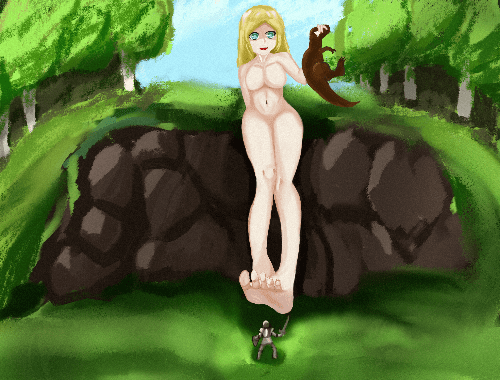
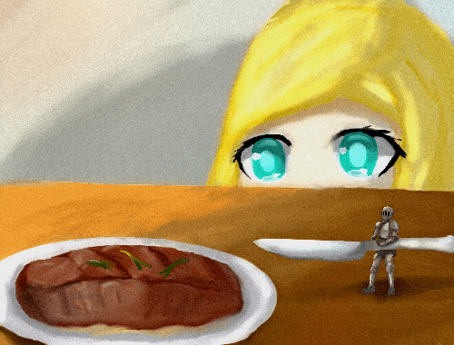

# 勇者

作者：doster

TID：32558

# 1

*本帖最後由 doster 於 2022-2-12 21:06 編輯*

至千万年前的你

发现可以和以前写的文结合，把这个当前传看吧。

“最新研究表明，恐龙可能是某些更巨大的智慧生物所饲养的家畜……”

“什么垃圾营销号文章。”

我躺在床上刷着手机。丝毫不在意脏乱的床铺，积满灰尘的地板，角落里堆积如山散发着恶臭的外卖盒。

没错，我是个废柴死宅。在多次求职无果后，我彻底放弃了自己，整日宅在家里靠着父母寄来的生活费勉强维持生计。

直到……

“你好”——这是写在足有一米高的蕨类植物叶子上的问候。当我开门取外卖的时候，这片叶子突兀地盖在了我的床铺上。

“呐，妈妈”女孩坐在木椅上，手里捧着树叶，双脚兴奋地在桌下扑腾。“未来的人真的可以看到我写的话吗”

“只要你用心的话，说不定可以哟。”母亲领着暴龙走向厨房。

这类被后人描述为“地表上最大的肉食性动物”、“万年前的顶级掠食者”、“白垩纪的霸主”现在却像褪毛的鸡一样被按在砧板上。

这便是恐龙时代真正的霸主

他们自称为“巨人”

白垩纪晚期出现，经过数万年的发展，已经发展出了相当程度的文明

他们体型巨大，成年女性平均身高50米，没有天敌。即使是人类已知最大的梁龙与其相比，也就是大型犬的尺寸。他们将恐龙圈养，作为食物来源 ，然后集中销毁，这就是所谓的化石。

“好啦好啦，安心睡觉吧。”母亲轻抚着女孩的头。

“嗯!”女孩紧紧攒着树叶，进入梦乡，吹弹可破的脸上浮现出浅浅的笑容。

我将叶片从床上拖下来。

这么巨大的蕨类绝对不可能是现代的植物，只可能来自——远古

但这也新鲜过头了，翠绿的叶片，清晰的脉络，是刚被摘下不久的样子。

但这种世界级的收藏品为什么会突然出现在我这三十几平米的破旧出租屋里。

“难不成……”

吹开写字台上积淀的灰尘，在发黄的纸上工整的写下“你好”二字。接下来……有了，上次剩下的糕点。把糕点压在纸上，然后和取外卖的时候一样打开门……

不出所料，一转头的功夫，糕点连同纸张一起消失。

女孩做了个梦。梦见自己来到了一个寒冷的地方，面前小小的城市里挤满了鳞次栉比的建筑，还有相貌与自己类似，但只有蚂蚁大小的生物。她迈出了第一步，全身瞬间火焰覆盖，她痛苦的嚎叫，缓缓倒下。

梦醒了，女孩松开紧握的双手。手里的树叶消失了，取而代之的是一张小巧的纸张，蛋糕融化在了女孩的手心，奶油沁进了掌纹。女孩轻舔着掌心，细细的端详着纸张。

“你好”虽然这两字小到几乎要眯眼才能看清，对于女孩来说，冲击力是巨大的。

“回信了!妈妈!真的回信了!”

我躺在床上，期待着来自远古的回信

“我到底在想什么呢……”

今天，沉重的被褥压得我起不了身，艰难的爬下床。不再是树叶了，半寸厚的信封几乎占据了半个房间。就此，我确定了通过这间屋子可以与来自古代的某人互通书信。

“我叫丽莎，我们做朋友吧！”

从那之后，我每天都会给这位名叫丽莎的笔友写信。

从她的描述中，我了解到她14岁，是中学生。来自……应该是白垩纪。虽然难以置信，但这是从她随信寄来的“香蕉大小的利齿”“一米长的角”推测出的大概年代。

那个时代似乎和现在没什么不同，丽莎和她妈妈过着朴实的乡村生活。

起初，我和她交流只是因为能用廉价的零食换取价值不菲的恐龙骨架。

渐渐的，我居然产生了朦胧的爱慕之情。

“真想和你见面啊!”

那娟秀的字迹里，若有若无的残留着她淡淡的体香。

但是，我们在不同的世界

“别傻了小姑娘，我们来自不同时代，甚至是不同的物种”

既然都发生这种事了，还有什么是的不可能呢。

周围的一切都无比陌生，无比巨大。

她坐在那里，与我四目相对。

金黄干练的短发，刚刚褪去稚嫩的脸庞，明亮澄澈如湖水般的蓝色眼眸，无不洋溢的青春活力。简直和我想象的一模一样

看得出来她很兴奋，温热的鼻息不断轻抚着我。

“太可爱了吧!”她率先打破沉默了。

一人高的食指覆盖了我的视线，看来丽莎想要抚摸我。

但似乎没有掌握好力道，我清楚的感受到脖颈被巨力压断，头颅如断线木偶般垂在胸前。没有当场死亡，甚至在渐渐复原。因为这是……梦!

虽然她皮肤柔嫩的触感无比的真实。

我们真的打破了时空的障碍，浪漫的在梦中相会了？

已经无所谓了，我奋力一越，扑到了她的胸上。虽然才14岁，但初具规模的胸部柔软到已经可以将我微微弹起了。我肆意的嗅着，翻滚着，努力使全身都沾满了少女的体香。

“好痒……但是，我不讨厌。”

少女轻喘着，和我一样，享受着这个过程。

“好想把你吃掉。”

樱唇微张，填满了我的视线，轻易的把我卷入口中。

没有尖牙利齿，但这张嘴的的确确的站在了食物链顶端。

粉色的巨兽盘踞在洞窟里，品尝着她的猎物。

潮湿粘稠的香津裹满了身躯，少女在吮吸我。感觉像要散架一样，香舌紧裹着我，源源不断的将携带着我味道的唾液推向深渊。

丽莎似乎玩够了，“巨兽”把我送上的行刑的“铁处女”——臼齿。雪白的巨物下压，缓慢且不容抗拒。在即将把我碾成碎渣时，却又突然停下，来回的摩挲。尖锐的凸起摧残我的肉体，鲜血与唾液混合，流进了少女的胃。

这才是真正的结合。

在梦里，无论多致命的伤势，都可以瞬间恢复。

少女似乎也意识到了这点，嘴里的动作愈发大胆。

时而被锋利的门齿一刀两断，时而被香舌压的粉身碎骨，时而被臼齿碾成碎肉与骨渣……我和少女都乐在其中。

最后，像被咀嚼完的口香糖一样，我被吐到了地上，准确来说，是少女洁白细嫩的脚背上。

虽然是农村孩子，整只脚的气息有些许浑浊，但对于我来说，这是种享受。我轻挠着足背，猛嗅着她独特的气味。

“好……好痒。”

玉足微动，我像坐滑梯一样滑进了肉壁之间——这是她是指缝。这里的气息是最浓烈的，甚至微微有些湿热，四面被软肉包裹，脚趾上下摩擦着我，简直比市里最豪华的桑拿房还舒服。

脚趾松开了，我终是落在了泥地上。头顶的渐渐下落的阴影告诉我，体验还没结束。

公交车大小的脚掌带着巨大风压，精确无比的落在了我刚好能触及的高度。由于她光着脚，掌缝不免粘上了泥土，玉足香味混着泥土的清香，熏的我有点上头。以至于我会伸出了舌头，舔舐她的脚掌，在玉足的衬托下，上面是污垢似乎都纯洁无比。

这美好的梦境，结尾却有些不愉快。

先是一阵巨响，冲天的火光吞噬了我们所在的小屋，她化为碎片，灰飞烟灭。

我从梦中惊醒，猛地弹了起来。满身的汗浸湿了被褥，不仅是因为兴奋，也有些许恐惧。

是啊，她生活在白垩纪。

6500万年前，一颗直径数十公里小行星的撞击，将恐龙直接从地球上抹除。全球性的飓风和海啸以及蔓延的有毒气体摧毁了脆弱的生态环境。苟活的只有在洞窟里的哺乳动物。

巨人的文明更像是消失了，不说骨骼化石，甚至连一点生活过的痕迹都没有留下。

晚上，我收到了她的来信。

“叔叔，妈妈说明天要带我去很远的地方，我好害怕。”

终于还是来了。

我自然知道发生了什么，却不忍心直接说出来。

“好好听妈妈的话，叔叔会在未来等你的。”

信消失了。

从那之后，再也没有收到她的回信了。

一切似乎都回归平常，只有陈列在墙角的信封告诉我——她存在过。

但这就是命运，象征着毁灭的陨石注定会摧毁他们的时代，我什么也改变不了。

他们真的灭亡了吗？

未必如此。

地下深处在震动，我能明显感受到震源离这里越来越近。

五条肉色巨龙破土而出，将我卷在其中。

是久违的温暖呢。

在黑暗中，我似乎经历了很长时间的高速下坠。

再次睁开眼，已经被带到了一个开阔的走廊，四面幽暗的蓝色光线照在内壁上，泛着金属光泽。

我抬头看着将我放在手心的少女，虽然是和丽莎一样的金色短发，面容也有几分相似，但气息完全不同。面无表情的她披着宽松的白大褂，给人一种拒之千里的感觉。

“那个……你好？”

她视线稍微下移了一点，看我的眼神里充满了不耐烦。

“我的祖先想见你。”

走廊的尽头，是一块坚冰，储存在罐状仪器里。

这是……冷冻舱？!

我曾经在科幻作品里见过，这种技术将人储存在低温中，维持人最微弱的生命体征，使人以极低的消耗度过漫长的岁月。

巨人族几万年的科技积累怎么可能应付不了区区陨石。他们在地核附近建立基地，吸收来自地核的庞大能力，维持着数千万套这样的生命维持设备运行。等到时机成熟，他们便会苏醒，踏平脆弱的现代文明，重回食物链顶端。

看着坚冰融化，熟悉的身影再次浮现，我感动地留下了泪。她等待了数千万年，只为了与我相见。

水雾散去，丽莎紧紧地将我拥在怀里。

“好久不见。”

“是啊……好久不见。”

完

# 2

因为不知道gn怎么分行，所以观感极烂。  

# 3

> ACE 發表於 2022-2-7 15:28

> 楼主牛逼！太棒了，催更！(话说这不是就完结了吧

不敢当，自己回看的时候还是发现了很多错误。的确还有一点点就完结了，毕竟是随笔，不敢写太长）  

# 4

*本帖最後由 doster 於 2022-2-12 21:00 編輯*

前传共2818字，历时五天完结（鸽出来的）

以前写的文都是一半弃坑，这算是第一篇写完的文（？。感觉还是有非常多不足，比如男女主感情进度快得惊人，男主的日常生活没写，描写方面的问题更是多如牛毛。

总之非常感谢各位读者的观看哈。  

# 5

> key 發表於 2022-2-7 20:58

> 首先恭喜完结，不过论坛和贴吧不一样的，不到3000字发这么多楼有灌水的嫌疑，希望能整合到一楼 ...

如果可以我想删了重发，但实在不懂gn怎么删帖，见谅  

# 6

<ignore_js_op>[PicsArt_01-15-09_EDIT_1.53_EDIT_1.32_EDIT_1.png](forum.php?mod=attachment&aid=OTM3MTN8OTYyNDM5NDR8MTY0NzcwMzI2MnwxODIzMHwzMjU1OA%3D%3D&nothumb=yes) *(82.88 KB, 下載次數: 0)*

[下載附件](forum.php?mod=attachment&aid=OTM3MTN8OTYyNDM5NDR8MTY0NzcwMzI2MnwxODIzMHwzMjU1OA%3D%3D&nothumb=yes)

2022-2-7 21:32 上傳  

</ignore_js_op>  

# 7

勇者

主线和可能会写的外传加起来预计一万来字，是以前文章的重置和续写，和前传沿用同一世界观。学业繁忙，很少有空更新（）

2035年，数千万大厦尺寸的舱室拔地而起，分布在世界各地。

她们回来了。

凭借人类难以想象的巨大体型和先进科技，势如破竹地吞噬人类的占有地。

史称“地鸣”

仅仅三个月，巨人们终结了属于人类的时代。

崭新的大地上，来自远古的动植物肆意生长，生态系统重回白垩纪。

不知是有意还是无意，仍有部分人类躲过了遮天蔽日的“地鸣”，在巨人极少涉足的野外建立乡村。但这些多如繁星的人类“据点”始终过于脆弱，即使躲得过巨人的践踏，也无数村庄被兽脚、蜥脚类的白垩纪怪兽夷为平地，科技停滞在了中世纪。

“地鸣”后42年，一个人类少年蹲在一条小道边，他满头是汗，沾满泥土的手指紧紧抓住了一根绳子，绳子那头绑着滚石机关。

没错，他要“讨伐巨人”。

男孩名叫格尔，是众多人类村落中非常普通的一员。

4岁时，他居住村落被一个巨大娘发现。

手持武器的人类要打败恐龙这类十米级的怪物尚且要付出数十人的牺牲。在巨人压倒性的体型优势前，更是形如蚂蚁，是吹口气都能杀死的存在。

“那一天，人类想起被巨人支配的恐惧”

女孩在里森林野采，发现了新玩具。

沾满淤泥的赤足轻易的越过了数十米高的围栏，踏在人类的木质建筑上。

像踩在棉花上一样，房屋没有任何阻力的凹陷下去，只有薄片中微微渗出的红色液体提醒着村民，一条生命消逝了。

天灾降临，这些人甚至连反抗的勇气都没有。

唯一能做的只有逃离，人们如群聚的蚂蚁，向同一个方向狂奔——村口。

“不要想着逃跑。”

女孩坐下来，用胯部堵住了唯一的出路。

抵御外敌的坚固围墙变成了囚笼，即使知道不能撼动，村民依旧疯了似的捶打着山峦般巨大的女孩。

“虽然妈妈说吃饭前不能吃零食，但稍微偷吃一点应该没关系吧。”女孩小声嘀咕着，又像是在宣布小人的命运。

像在吃糖果，沾着唾液的手指抓起小人，扔进嘴里，人们似乎还可以听见哭泣声在女孩口腔里回响，但随着喉咙处的微微鼓动，一切归于平静，这是他们每个人的下场。

“我要开动了哦～”

又一个村庄消失了，消失在女孩的胃里。

银铃般悦耳的笑声在格尔的耳中变成巨兽的咆哮，年幼的他被父母抱着，在巨大娘的阴影下，作为极少数的幸存者逃离了村庄。他亲眼看到了巨大娘将他的玩伴吞噬，却无能为力。

“向巨人复仇”

格尔17岁时，已经成长为了一个意气风发的少年，村中人都对这个棕发碧眼的英俊少年十分欣赏。

他一直没有放弃讨伐巨人的梦想。

“现在，是时候了。”

格尔凝望着以前村庄的画像，暗自下定了决心。起身下床，轻巧地穿上衣服，拾起墙角早已收拾好的行李。从箱子里取出那把每日都会打磨的利刃，收入剑鞘。他顶着寒风，走出从小就被告知不到迫不得已绝对不能出去的村庄。

“站住！你要去干什么!”

在村口处，父亲叫住了他。

“当然是去狩猎巨人”显得平常且轻松。

理所当然般的语气掩盖不了戈尔内心的亢奋。

“什么？!”尽管早有察觉，他怎么也想不到格尔真的会去实施这几乎是送死的计划。

“我知道你去复仇是为了我们，但被她们发现只有被碾碎的下场，这就是命运……”

格尔加快脚步，消失在了寂静的夜幕中。

他的目的地是以村中几十个猎人牺牲为代价总结出的地图中的一条道路，据说巨人偶尔会经过那里。

排除了巨人，白垩纪的丛林也是十分危险的。即使是体长与人类相当的昆虫，凭借群居的习性也是不小的威胁，更不用说一个人根本战胜不了的中大型恐龙。庆幸的是，在两天两夜的旅途中，这些他都没遇到。

深夜，格尔坐在路边简单地整顿，马不停蹄地开始布置陷阱。他用火药炸出深坑，巨大的蕨类树叶遮盖坑洞。然后将数一人高的巨石推上路边的土坡上，用绳子固定。

布置完这些，已经是第三天的中午了。

格尔蹲在草丛里，树叶覆盖身体，来回巡视着他目所能及的路段。

地面传来了沉闷的响声，伴随着轻微的颤动，他期待的“猎物”出现了。

一个妙龄少女在丛林小道上散步，这本是一件多么美好的事情。可在格尔眼中却是另一副恐怖景象:遮天蔽日的巨人踏着行军般沉重的步伐缓缓而来。

格尔的心提到了嗓子眼。4岁之后，他就再也没看见过巨人了，对体型的预估出了一些“小”差错。

“嗯?”

行走中的少女踩中了格尔挖的“陷阱”，半只脚掌陷进了一个小坑，极细的丝线反射着微弱的光穿过小路。好奇心驱使她弯下腰，轻轻地抽出细线。

“完了!”

格尔被雷霆万钧地力量拉出草丛，后脑撞在坚硬的泥地上，昏了过去。

不知过了多久，格尔缓缓睁开眼睛。少女留着金色的长发，穿着白色运动服，显得十分清秀可爱。湖泊般蔚蓝的眼睛直直地注视着他，格尔汗毛直竖，弹了起来。

“那个……很抱歉打扰你打猎，人类的生活应该很辛苦吧。”少女率先开口了，言语中竟充满愧疚了。

“没有摔坏吧?”少女缓缓伸出手。

这个举动，以前村里人告诉过格尔——这是要将他碾碎。

条件反射般地，他快速抽剑迎上。利刃砍在少女两米多长的食指上。

似乎被小人突然的动作吓了一跳，保持蹲姿的少女失去平衡坐到了地上。

格尔以为苦练的剑法成功吓退了少女，刚刚的恐惧化作了兴奋。

巨人也不过如此……吗？

格尔跳上了少女的鞋子，像用斧子砍树一样，对准白皙中带着红润的脚踝劈砍。

尽管每一击都结结实实地砍中了，但无论是刺击、竖砍还是横劈，这把村里最优秀铸铁师铸造的欧式巨剑甚至不能在少女细嫩的脚踝上砍出哪怕一丝痕迹。

似乎是怕伤到格尔，少女保持坐姿一动不动，饶有兴致地观察着小人的一举一动。

格尔挥剑的手逐渐麻木，他用尽了力气，瘫坐在地上，像以前训练时一样。

见小人主动离开自己，少女转身离开了。

听着脚步声渐渐远去，气喘吁吁的少年长舒了一口气。

他感受到一个不同于巨人的“震源”在接近。

是暴龙，白垩纪最凶猛的掠食者。

虽然在体型与智慧完全不如巨人，但凭借弓箭刺不穿的坚硬鳞甲和可以咬碎任何防御的尖牙利齿，对人类来说是不亚于巨人的威胁。

暴龙张开血盆大口，血腥味扑面而来，要将他吃干抹净。

“也许这就是命运吧。”他缓缓闭上了眼睛。

少女抓住暴龙的脖颈，拎小鸡似的提起，将这头超过10吨的怪兽扔进森林。

“果然放心不下这个小家伙呢。”少女叹了口气，轻轻的捧起陷入昏迷的格尔，回到了属于巨人的城市。

# 8

*本帖最後由 doster 於 2022-2-27 17:57 編輯*

糊了一张儿童水彩画，让大伙对剧情有大概的印象）（被压缩看起来更丑了  

# 9

<ignore_js_op>*(537.63 KB, 下載次數: 0)*

[下載附件](forum.php?mod=attachment&aid=OTQwODd8YWZmZWEyYjl8MTY0NzcwMzI2MnwxODIzMHwzMjU1OA%3D%3D&nothumb=yes)

2022-2-27 17:53 上傳  

</ignore_js_op>  

# 10

*本帖最後由 doster 於 2022-3-6 19:51 編輯*

不知过了多久，格尔缓缓睁开眼睛。

“我这是在……哪？”

如触电般坐起，陌生的环境使他瞬间清醒。

下意识的寻找腰间的剑鞘。

在红色的丝绒毯里，格尔发现自己一丝不挂。

环顾四周，白色的巨壁覆盖了地平线，唯一的光源是在高处悬挂太阳般耀眼的白炽灯。

看起来是长辈们描述中的城市呢。

只不过是巨人的。

熟悉的震动传来，在桌面的孤岛上他根本无处可逃。

格尔蜷缩在少女为他准备的小窝里，身体止不住地颤动，他不敢想象人类在巨人的领域会被拿去做什么。被吃掉？被踩死？但为什么这个少女之前没这么做，他不得而知。

一阵肉香打断了格尔的思绪，震动也在消失。

格尔微微探头，桌上摆放的食物看起来十分精致，甚至已经为他准备好了人类使用的餐具。

格尔继续躺了好一会，即使他已经两天没吃饭了。

周围完全没有巨人的气息，纯粹的食物气息诱惑着格尔。

“也许做个饱死鬼也不错？”

他这样想着，走向那盘食物。

端起碗，四周依旧出奇安静，他终于狼吞虎咽起来。这食物似乎比自己十几年光阴里吃过的都要美味。

或许是吃得太急，格尔噎住了，他奋力捶打胸口，试图吐出卡在喉咙里的食物。

“慢点吃，别噎着了。”

一股巨力冲击了格尔的后背。

“谢……谢谢。”格尔长舒一口气，摸向身后。是巨大而柔软的触感。

“不会吧……”

他的头像生锈的齿轮一样缓缓转去，与微笑的少女四目相对。

格尔跪下了，面对天敌他不由自主的腿软。

“我就不打扰了，你慢慢吃吧～”少女迈着轻快的步伐离开，留下了一脸疑惑的格尔。

配图：

# 11

<ignore_js_op>*(544.24 KB, 下載次數: 0)*

[下載附件](forum.php?mod=attachment&aid=OTQzMzF8Yjg3YTU4NjR8MTY0NzcwMzI2MnwxODIzMHwzMjU1OA%3D%3D&nothumb=yes)

2022-3-6 19:45 上傳  

</ignore_js_op>