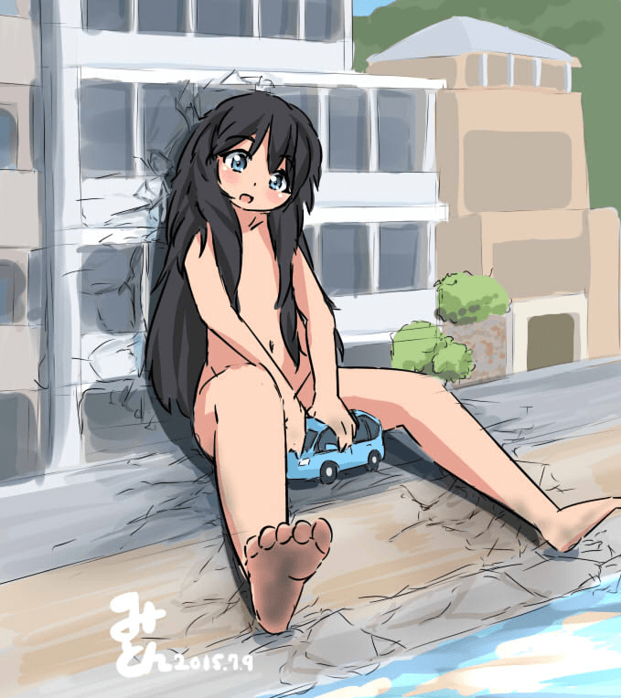

# 小说＜MM9＞巨大少女部分翻译（10.28更新，无福利）

作者：a1236gh

TID：31950

# 1

*本帖最後由 a1236gh 於 2021-10-28 18:55 編輯*

<MM9>是日本作家山本弘写的系列小说，算上外传共计四本，因为作者本人对特摄作品的热爱，此系列作品充满了对各种诸如《哥斯拉》《奥特曼》等作品的致敬。也曾在2010年改编成了日剧，有兴趣的朋友可以自己去搜搜。本人所有的翻译都来自于英文版的电子书，外加一些繁体中文版内容做参考。之后三部只有日版就难找了。

**因为长度关系外加之后几部缺失，我只翻译小说第一部有巨大少女出现的篇章，一些小说世界观的设定和少女本人的介绍会另开一帖子，同时还有日文维基百科上记载的，之后几部小说的故事梗概。**

—————————— <ignore_js_op>

**MM9 ヒメちゃん.jpg** *(81.33 KB, 下載次數: 1)*

[下載附件](forum.php?mod=attachment&aid=OTE5Mzd8YTA2MDM5MjN8MTY0NzcwNDg2MnwxODIzMHwzMTk1MA%3D%3D&nothumb=yes)

2021-10-28 18:51 上傳

（P站51329017，作者みとん） **　　前所未有的怪獸出現了，牠的外表居然是個十歲小女孩！人形怪獸向來是最難對付的，更別說要當著大眾眼前，射殺一個十歲小女孩，就算牠比普通的十歲小女孩大了二十倍。在牠掀翻大城市之前，氣特對眾人究竟能不能找出拯救城市和小女孩的雙贏方法？**

第二话 危险！少女逃亡中

“荷包蛋煎好了哦！”

听到母亲开朗的呼唤声，案野一骑穿着睡衣蹒跚着走下楼梯，打了个大大的哈欠舒展着小身子。悠里哼着歌在布置起居室的桌子。现在是早上六点三十分——距离她儿子去上学还有段时间，但她相信他们母子至少应该在早上有一些时间悠闲地交谈，所以一骑每天都要早起。

上完厕所后，睡眼惺忪的一骑坐在桌边，吃起了荷包蛋，再加上一片吐司，足以让小学生的胃撑到中午。

悠里整理着衣物间。 “你做完功课了吗？”

“功课是朗读......”一骑不满地瞪了妈妈一眼。 “你昨天不是很晚才回来吗？”

“哦。”她双手合十，做出道歉的姿势。 “妈妈对不起，亲爱的。会议拖的比想象的要长。”

为了完成他的朗读作业，他需要阅读日语课本中的选集，并让家人在作业纸上签名。

因为他的母亲经常回家很晚——有时甚至根本不回家——他经常无法完成作业。老师虽然理解案野家的情况不会生气，但一骑总是觉得很惭愧。

他叹了口气。 “没关系，每次都这样。我差不多该学坏了.......”

“什么？”

看见母亲惊讶的样子，一骑笑了。 “只是在开玩笑啦，我不会学坏的。”

他的笑容不是装出来的。尽管男孩子独自一人吃微波炉晚餐很寂寞，也懊恼母亲没有参加学校的家长探访日，但他心里知道这是无可奈何的。他母亲的工作非常重要。虽然他还是个小孩子，但他明白她的所作所为，他为她感到骄傲。

“我很抱歉，”她说。 “等你吃完早餐，马上念给我听吧。”然后她的手机响了——铃声是动漫主题曲。 悠里有一种不好的预感。这么早打过来，肯定是紧急情况。一接起电话，不出所料，是MMD（气象厅特异生物对策部）的内勤人员山際俊夫。

“我是山際，抱歉这么早打电话。”

“是怪兽吗？”

“我想只能这么形容。”他的声音不知为何很困惑。 “据报道出现在岐阜市。刚接到部长的联络，还不清楚详情。”

MMD 的所有成员都在紧急电话联络网中，而悠里的顺位几乎是最末端。其他成员肯定都接到通知了。

“如果是在岐阜，之前目击到的是鸟型的——”

“不，应该说是不曾见过的类型吗........大约属于MM4或5吧。 TBS已播出现场报道场。你自己看实物吧。”

（MM是本作里用来衡量怪兽大小和灾害规模的单位，数字越大就怪兽也就越大。举个例子，MM4的怪兽体重40～100t，身高11～15m，MM5的怪兽体重100～250t，身高15～20m） 悠里慌忙找出遥控器。 “电视台动作那么快吗？”

“听说是早上的情报节目要转播当地活动，偶然遭遇的。”

她打开电视。画面的右上方打出<岐阜市出现怪兽>的字幕，主播和现场记者正在讨论民众疏散状况。

一开始，悠里无法分辨出怪兽在哪里。摄像机对准了一个女孩子的脸，年龄像是小学四年级和六年级之间。她看起来像日本人，只是皮肤被晒成了褐色了，长长的头发蓬乱。她带着天真无邪的笑容缓缓环顾四周，仿佛不太了解周围发生的事情一样。手持摄像机画面上下左右晃动，似乎是在远方拍摄。悠里不禁纳闷，拍摄这个女孩做什么？为什么不拍怪兽.......

此时，镜头拉远，映入周遭风景。悠里倒吸一口凉气。

只见女孩从五层楼的公寓楼屋顶弹出头。她的头比屋顶上的水塔还大。 

# 2

*本帖最後由 a1236gh 於 2021-10-28 18:29 編輯*

与此同时，在东京某处——

“是的，我正在看。”

男人穿着睡衣坐在沙发上，悠哉的听着电话，在等离子彩电上看着这个女孩。他快五十岁了，年轻时可能是个美男子。一对细长的眼睛昏昏欲睡，浓密的胡茬布满嘴边。

电话那头的人高声嚷着。但胡茬男不为所动。 “这应该是梅宫搞出来的吧？还有其他可能吗？不是转移过程中出错，或者没胆解决想动用自卫队…或者是根本什么都没在想。”

他懒洋洋地挠挠头，口吻粗鲁。 “你问我该怎么办？我认为我们无能为力，都到了这个地步了，不能阻止梅宫的胡作非为是你的失败。一旦那家伙获得解放，根本就阻止不了，只能走一步算一步而且公安和警方马上就会行动，我们安分点比较好——对，没错，别管CCI，反正只是个幌子。大部分的钱已转移到其他地方，我们还能重新开始”

话筒彼端的人不停喊叫，但他厌烦的打断。“有空打这通电话，还不如赶紧逃命。一个人逃吧，看起来没有时间雇佣搬家公司了——对了，别忘了消灭所有证据。除了带走重要文件，而且一定要用程序消灭电脑里的所有档案。记住，删除这只手机的通话记录后立刻扔掉。那就这样。”

男人挂断电话，环视着这间装修豪华的房间，这是一套月租二十五万日元的公寓，位于本市黄金地段的大厦。

“我真的挺喜欢这里的啊。”

他叹了口气。一脸烦闷的起身换衣服。

————————

女孩十分兴奋，满心雀跃。她第一次见到如此广阔的地方。不，或许很久以前见过，但已经从记忆中消失了。她只记得一个不亮的灯泡、灰色的墙壁、灰色地板和灰色天花板，仅此而已。

夜晚，她躺在树木繁茂的山谷中，仰望着漆黑的天空。她被眼前的景象震惊了。世界原来有这么大吗？墙外居然有这么多东西吗？在那布满裂缝的灰色天花板上，居然有这么广阔的黑色天花板，以及这么多漂亮的光点？一切都超越年幼的她稚嫩的想象。

起初，当天空迅速变亮，星光黯淡时，她有些失望。但随后云彩被涂上了鲜艳的色彩，一个巨大的、耀眼的灯泡出现在群山之外。眼前的景象让她非常感动，忍不住【哇】的大叫一声。灯泡亮到无法直视，少女撇过脸去。她眼下延伸的地板上并排着无数个盒子，几乎就像积木一样。少女在好奇心的驱使下，小心翼翼地从山腰上下来。

有些小的箱子抵到了少女的小腿，大箱子有她的头那么高。所有的箱子侧面都嵌有透明板。较小的盒子则覆有五颜六色的盖子，突出尖尖的像铁丝一样的东西。她第一次见到这么多不同的颜色和形状。与她所熟悉的黑暗、灰色、平坦的世界相比，这里简直就是童话里的国度。

箱子之间的缝隙里，是由黑色物质铺成的的狭窄小路。表层薄脆，底下则像海绵一样柔软。每走一步，少女身体的重量都导致路面下沉。黑色物质一旦裂开，裂缝有时会喷出水柱。通道两旁的灰色棒子林立，悬挂着到少女膝盖高度的黑线。当她的腿被绊到时，黑线便会断裂，随之发出微小的火花和轻微的刺痛——虽然不算巨大的冲击，但着实让她吓了一跳。之后，她便小心翼翼的跨过那些黑线行走。

在下面，她看到很多发亮的白色小动物尖叫着，慌慌张张的在道路上逃窜。体积大约和老鼠差不多，但它们用两条腿移动的。虽然女孩觉得他们慌乱的动作十分滑稽，但少女对眼前的盒子更感兴趣，不打算追赶。

她蹲下来看其中一个盒子。窗户后面有什么东西在发光——一个可以放在掌心里的小箱子。朝着少女的那一面闪闪发光，她能听到里面传来微弱的声音。是一个魔法箱！她想要，便伸手去拿。手指轻轻一按，薄薄的透明板立刻碎裂了。她的手轻而易举地伸进去抓住了盒子。

但是当从大箱子里拉出来以后，魔法盒的正面变成了灰色，再也听不见声音了。

“唔。”少女十分不满，扔掉了箱子。但她的失望只是转瞬即逝。一个玩具坏掉了，没什么大不了的。这么宽敞的房间里还有很多玩具。

既然如此，坏掉几个也没关系吧？

# 3

千代田区竹桥‧气象厅本厅──

　　「少女……不，少女姿态的怪兽从刚才就坐在长良川沿岸的道路上，抓着一辆轿车，前后滑动，就像在玩玩具似的。啊，现在拿起来了，哇，拿得好高。轿车里看起来并没有乘客……」

　　听着电视里播报记者的紧张口吻，特异生物对策部部长‧久里滨祥一非常焦躁。

　　"脸已经看够了！给我拍头部以下的部位！头部以下！"

　　"部长，请不要提出无理的要求。" 山際俊夫安抚他，"这是电视台的极限了。"

　　"真是的，这样的话，我们什么都不知道啊。"

　　悠里也跟着抱怨。从接到怪兽出现的通报以来，已经五个小时。各家电视台都已派出采访小组前往现场，开始进行转播，然而不论哪个电视台都给少女头部以下的部位打了马赛克。这是电视台担心如果播放全身的画像会触犯儿童色情防治法的自我规范，可是对气特对而言，不知道怪兽的全身模样，实在相当令人烦躁。

　　 "岐阜分局的专线呢？" 久里滨问。

　　“还没接上。" 年轻的内勤回答他，“好像哪里出了问题。”

　　“室町他们呢？”

　　“他们半小时前抵达了名古屋，我想应该已经到达现场了。”

　　“到底在搞什么！” 久里滨两只手撑在桌上，神经质地转动着原子笔，“陆上自卫队已经在现场布好阵势……MMD的出动却慢这么多拍，真是太不像话。到时候又要被媒体抓来修理了。”

　　MMD的工作内容是事前预测怪兽的出现，出现之后则是推测怪兽的行进方向，分析怪兽的性质，将怪兽灾害限缩在最小范围内。自卫队则以MMD的建议为基础，决定是要捕获还是歼灭怪兽，采取作战行动。尤其是像这次的特殊种类的怪兽，不知道会发生什么事情，所以必须慎重处理因应。要是MMD无法和进到现场的自卫队合作的话，自卫队也无法行动。

　　 “部长，有几个电视台来询问了。” 女性内勤单手拿着话筒，对久里滨说，“六号怪兽的固定名称还没决定吗？”

　　 “怎么可能决定！我根本都还没看到怪兽全身的样子！”

　　 “部长！” 另一个内勤高兴地报告说，“和现场的室町先生接上线了！”

　　 “好，给我接上萤幕！”

　　机动班班长‧室町洋二郎的脸孔出现在大萤幕上。他的背后是陆上自卫队的82型指挥通讯车跟89式装甲战斗车，可以看见自卫队员忙碌地穿梭其中。

　　 “抱歉，联络晚了。现在已经抵达现场。”

　　 “情况如何？” 久里滨问。

　　 “怪兽六号移动到西边了。不过不久之前，就一直停在金华山西北、长良桥附近。” 室町俐落地报告，“我现在在长良川下游的忠节桥旁边，距离六号大约两公里。六号目前没有什么大动作，我将画面传送过去。”

　　摄影机往右边横移，映出了长良川上游。画面一拉近，室内所有人的视线全都盯在那个画面上。

　　 “哇……” 室内一阵吵杂。

　　一丝不挂的女孩坐在河川右岸，抓着轿车玩耍着，乍看之下，是非常悠闲的光景。女孩长发垂到腰际，像是披风般覆盖了上半身。除了皮肤颜色较黑之外，简直就是普通的日本人，难以相信她是怪兽。尤其是这个距离缺乏大小的对比，更是如此。看起来就是就像是普通大小的女孩子在玩三十公分左右的玩具车。因为被别的桥挡住，看不清楚她的下半身。

　　 “好可爱……”

　　悠里不由自主地脱口而出真正的想法，其他部员也是如此。年龄（以人类来算的话）大约十岁左右吧。从发丝缝隙之间看见的胸部，似乎还没有发育。

　　“陆自的第十师团与第三十五普通科连队已经沿着国道七十七号、一百五十七号、两百四十八号展开，包围了六号。”室町继续报告，“还有一半的岐阜市民尚未避难，不过岐阜市的北部，以六号为中心，半径三公里的范围内几乎是无人状态。现在正在确认还有没有尚未逃离的市民。只要确认避难完成之后，随时都可以攻击。六号的身高推测为二十公尺，最多就是MM5，因此战车炮或是反坦克飞弹就可以处理了。只是有个问题……”

　　“那个样子，是吧？”久里滨说。

　　“是的。”

　　人形巨大怪兽──也就是巨人的出现，并不是什么特例。地球上所有的动植物都有可能因为某种契机变得异常巨大，成为怪兽。媒体经常误以为这种状况叫「突变」，不过这并非生物学上的演变，而是打破质量守恒定律发生的非物理现象。至今为止有各种巨大生物在世界各地出现。蚂蚁、蝗虫、螳螂、蜘蛛、蝎子、蜗牛、章鱼、蜥蜴、蛇、鳄鱼、鸡、老鼠、土拨鼠、兔子、人猿……人类既然也一种动物，那么怪兽化也不是什么怪事。而且，如果追溯历史的话，世界各地自古以来都有巨人传说，不用怀疑过去曾经到处都存在过和人类相异的巨大种族。虽然现在已经灭绝，但是和恐龙一样，曾经有过以假死状态在地底沉睡的巨人醒过来的罕见例子。

　　光是二十世纪，美国曾经发生过两次，包含其他国家在内，共有十几次巨人出现的事件。巨大或是凶暴的巨人以射杀处理，MM0～3（1～16吨）的小型巨人则是加以捕捉饲养。

　　问题是这些巨人大多都是成年男女，没有任何人听过有孩童型态的巨人。而且大小居然是MM5（一百吨）等级──这甚至比一九五七年出现在内华达沙漠，史上最大的巨人格伦（身高十八公尺，MM4.7）还要来得巨大。

　　“目前看来，六号的智商并不高，完全没有发出任何类似语言的声音。看起来并不是普通的小女孩突然巨大化──虽然也还不能完全确定就是。”

　　自卫队束手旁观的原因也在于此。就算模样和人类一样，和人类是不同的生物，而且只有和动物相等的智商的话，就能够判定为怪兽。如果是MM5以上，即使是草食性的乖巧怪兽，它的存在本身就已经一种威胁，只要接近人类的居住地就可以无条件射杀。就算未满MM5，只要判断为危险的怪兽，也是加以射杀。然而，目前还没有小女孩不是人类的确凿证据。不，即使断定为怪兽，射杀人类型态的生物，也肯定会遭到许多非难。

　　“它是MM5吗？”

　　“感觉上应该是非常接近，只是从这个距离的目测没办法断定。”

　　“真伤脑筋。” 久里滨叹了口气，“没有任何关于它的真面目的线索吗？像是从哪里出现之类的。”

　　“它似乎是从权现山的南边斜坡出现的，但是因为是天亮之前，所以没有目击者。听说有山崩的痕迹，所以我打算和淡岛过去看看。”

　　“我希望有更靠近它的影像。” 悠里说，“还有，可以的话，希望是它走路的样子。”

　　“灰田他们接下来会试着开车到更接近它的地点拍摄，我想他们应该马上就要出发了。”

　　“只有年轻人没问题吧？”

　　室町露齿一笑，“藤泽的驾驶技术绝对没问题。”

　　搭上岐阜分局准备的厢型车的是气特对机动班成员，灰田凉、小出朝也和藤泽樱三人。凉和朝也都是二十几岁，高中毕业后进入气象厅的樱则是十九岁。因为年轻就是本钱，所以经常被派到怪兽灾害的第一线。

　　厢型车的后车厢，坐着两名身着迷彩装，负责保护三人的陆自队员。年长的橿原陆士长带着八十四公厘无后座力炮（通称卡尔‧古斯塔夫）。部下伊崎一等陆士则是负责炮弹装填的副炮手，除了预备炮弹之外，他还携带了八九式步枪。八十四公厘炮不用说，步枪的五点五六公厘子弹虽然不能击倒打小有人类十几倍大的怪兽，但是应该可打穿皮肤，令怪兽感到疼痛吧。

　　“真的没问题吗？” 橿原担心地对握着方向盘的樱问道，“还是准备护卫的车辆比较好吧……”

　　“啊，不，没问题的。” 樱一脸紧张地回答，“只有一辆车的情况比较轻便。因为要逃的时候，都会很慌张。万一有吉普车在的话，一不小心发生车祸，那就麻烦了。”

　　“曾经发生过这种事情喔。” 凉帮腔说道，“十几年前在美国曾经发生科学家的车和军用车辆在逃走时撞在一起，两辆车都被怪兽踩扁了。在那之后，我们就决定要接近怪兽调查时，只开一辆车。”

　　“原来如此。” 橿原虽然点了点头，但似乎还是无法接受。自己和部下的性命要交给年轻女孩的驾车技术，多少还是会不安吧。

　　“出发了……”

　　樱缓缓发动车子，延着长良川北岸的道路往上游开，朝着六号前进。

　　开了快一公里，在金华桥北侧的十字路口停下车，接着回转，以倒车的方式接近六号。这也是规定的顺序。等到要逃走时，才拖拖拉拉地回转的话，会被怪兽踩扁。凉看着车后，「好、好。」地引导。朝也则从天窗探出头，以摄影机的望远镜头拍摄少女。

　　樱在长良桥前面的长良川国际会议中心后面停车，从这里可以一眼望尽全长两百五十公尺的长良桥。也可以清楚地看见背靠着对岸旅馆墙壁坐着的少女，仍旧沉迷于玩车，并没有发现厢型车的接近。

　　“……已经接近到四百公尺左右了。” 凉小声地对麦克风说，“接下来要外出拍摄。”

　　凉和朝也以及两名陆自队员，安静地下了厢型车，只有樱在驾驶座上待命。为了可以随时逃走，车门敞开着，引擎也维持空转状态。

　　朝也将摄影机以脚架设置在马路上。以GPS确认目前位置，向总部报告。总部则会分析影像，以到目标为止的距离和画面上的大小来算出身高。

　　“距离感好像有点乱了呢……”

　　樱从副驾驶座的窗户探出头去，悠哉地自言自语。位在四百公尺对岸的少女，此时看起来，和自己的距离好像只有三十公尺。少女发出低沉的「喔、喔……」将车子当成小球一般地不断丢向空中。每当少女的大手接住车子时，就连对岸都会听见「乓」的一声。

　　“就像丢枕头一样？”凉说。

　　“不过感觉很乖巧呢。”

　　正当樱这么说的时候，可能是玩腻了，少女忽然将车子用力地高高扔出。车子画了道巨大的弧线落下，撞到了长良桥的栏杆。撞烂的车子发出巨大的声响，也撞掉了栏杆的一部分，然后掉进了河里。

　　这时候，少女发现了停在对岸的另外一辆车──还有站在车子旁边的小生物。

　　「喔？」

　　少女缓缓起身，她的动作造成了旅馆墙壁崩塌，墙壁的瓦砾从她背上不断滚落。她那天真无邪的黑色双眸，因为发现新的玩具而闪闪发亮。她的行进速度像是电影里的慢动作，从堤防走下长良川，踩过只有她脚踝深的河水，溅起了水花。她弄翻了系在岸边的捕鱼船，慢慢接近厢型车。

　　“糟糕！”

　　凉等人立刻坐上厢型车准备撤退。不等车门关上，樱就发动了车子。

　　厢型车沿着河岸奔驰，朝也从天窗探出身子继续拍摄。涉水而来的少女就这样爬上堤防跑到马路上，追在车子后面──满脸笑容，非常开心。

　　“好快！”

　　凉回头望去，不由得一阵战栗。少女的行动虽然很慢，然而她的步伐距离是人类的十倍以上，因此速度非常快。厢型车的速度明明已经超过时速五十公里，她却还是紧紧跟在后面。长度超过十公尺的黑色长发在空中飘扬。她每走一步，就发出炸弹爆炸似的巨大声响，柏油路被狠狠踩碎。这也难怪，毕竟是数十吨的重量从好几公尺高的高度往下砸。

　　如果被踩到的话，绝对会不成人形。

　　“甩掉她！”

　　不用凉这么说，樱便加快车速。快要抵达金华桥了，可以看见停在更往前一公里的忠节桥的自卫队车辆的炮口对准厢型车的方向，准备发射中。

　　樱突然在金华桥北侧的十字路口往左开去。车子发出尖锐的声音，转了九十度。樱无视因为离心力被甩到右边的凉的「你在干什么！？」的吼声，就这样高速开过金华桥。看见这个状况的少女，再次从马路上跳下河里，斜斜地冲过长良川。樱一穿过桥，便再度左转，这次沿着长良川南岸往上游开去，少女从侧面逼近厢型车。

　　少女差点就在金华小学附近抓到厢型车。车子好不容易躲过少女长长伸出的手腕，而她再次爬上马路，开始追赶车子。

　　“你到底要怎样！？”

　　樱不管凉的抗议，继续开着厢型车。少女像是跨栏赛跑似地跳过马路上的电线，执拗地追着车子跑。伊崎一等陆士从打开的后车门想要开枪，却因为车身的摇晃始终无法对准。无后座力炮在这个状况下也无法发射，因为发射时的排气会伤到车内其他人。

　　厢型车直直地往前开，冲入了穿过金华山下的金华山隧道。少女像是棒球选手似地以头部滑垒。她的滑行掀起了马路的柏油，她的身体随着巨大的声响撞上了隧道的入口，手腕伸进了隧道里。然而厢型车早就开走了，少女看似懊恼地大叫了一声「哇！」拍打着地面。

　　开出隧道后，樱停下车子。

　　“你究竟想怎样？”

　　凉喘着大气质问她。樱承受着身后四个男人的责难眼光，喃喃说道：

　　“因为那样直直往前开的话……”

　　樱转过头说：

　　“那样直直往前开的话，战车就会打她了啊！”

　　看见樱那对湿润的双眼，凉不禁有点退缩，但他立刻振作起来。

　　“……妳不要再给我因为自己的感伤就把我们卷进去，要死的话，妳自己去死。”

　　听凉这么说，樱不由得一阵沮丧。

**（待续........）**</ignore_js_op>