# 巨灵圣女

作者：秋风落叶

TID：31668

# 1

这篇是魅魔双子的前置作品，以天堂方面和天使鸢来讲述故事与世界观，由于刚刚开始，所以繁琐设定之类的比较多，由于学业关系所以我尽快做到一周一更，希望大家喜欢，求个赞和评论之类的不过分吧，求各位给新人点鼓励吧？

正文开始

巨灵圣女

这是天堂的重要的一天，又一位纯白无瑕的少女被god所承认，成为了伟大的天使，这位少女舍去了过去了名字成为了现在等守护天使，鸢。

美丽守护天使鸢有着一头奶白色的头发，并将其梳成妹妹头，精致可爱的蓝色眼瞳好像蕴含着无尽的秘密，小巧的樱红嘴唇令人忍不住亲上一下，黑色的学生袜包裹到到膝盖，更显的青春的青涩，但她却并没有露出太多的表情，好像隐居于林间的隐者一样，出淤泥而不染。

而作为鸢的天使也要在明天开始自己作为天使的职责。

完成蜕变的鸢站在飞升之门的阶梯上，等待着god所说的“前辈”来引导作为新人天使的她，她看了看守在阶梯下的战斗天使，两个小小的只有自己一只手指头般大小的金发男子，站立在大门的两侧，可爱的正太脸上映射出自己坚定的意识与责任。

鸢一直在想“这么一个小家伙，真的能守护住飞升之门吗？”

而鸢又看了看在其他云层的天使，她们的手中都有着几个小小的人类，他们都是死后升入天堂的凡人，这些凡人都会被守护天使所照料，但这些也有着各种奇怪的癖好，有点夹在天使丰满的巨乳中间，有的坐在她们洁白的香肩上，更有甚者主动跳到天使的嘴巴里，然后被吞下，作为新人的鸢真的搞不懂，天堂的天使和凡人都这么奇怪吗？

“不好意思，我让你久等了”一个陌生但温和的声音穿到了耳边，鸢回头一看，一个天蓝色头发的四翼天使来到了自己的身边。

她有着一头靓丽的天蓝色短发，和自己不同的是她左侧的刘海特意遮住了她右侧的眼睛，左侧的翠绿是眼瞳充满着灵气，好像自然之中的祖母绿一般，胸前两个巨乳被白衣所包裹起来更显些涩气，白色的吊带丝袜将她白嫩的美腿覆盖住，显得可爱动人。四道白色的羽翼纯白无瑕，一丝不染，相对于鸢的一对小白羽貌似显露出蓝发天使的地位。而鸢并没有在意羽翼而是她胸前的两个“凶器”有对比的看了看自己的胸前，感到了一丝不甘。

“这也得有A了吧？”鸢想到。

“啊，不好意思，我是守护天使的主要负责人，晶，欢迎你成为守护天使。”蓝发天使热情的介绍着自己。

“谢谢！”鸢有些不知所措的表达了感谢，毕竟对于比较内向的鸢，这热情的问候来的太突然。

晶热情的拉起鸢的手“来，我带你参观一下天堂吧，毕竟这里是我们天使生活的地方，要快点了解才行哦。”

而还没反应过来的鸢也被晶开始参观天堂的世界。

晶先带鸢来到里一个一座巨大的云层大陆，云层的低下有着深蓝色一样的云层漩涡，而云层大陆不断落下貌似灵魂的东西落入漩涡之中。

“这里是什么地方，为什么会有灵魂落入漩涡之中”鸢问道

“这里啊，是轮回之孔啊，所有想要投胎的凡人都会来到这里。我带你到上面看看就知道是怎么回事了！”晶回答到。

晶便拉着鸢来到云层大陆上，发现有很多独立的白色房间，大小貌似只有一个独立公厕大小。

“这些白色房间是什么？”鸢问道。

“我给你演示一下就知道了！”晶调皮的说道。

晶用玉指在空中画出来一个圆，而这个圆立马就接通了一个空间，这时的晶将自己的玉手伸了进去，轻轻的拿出来一个凡人，并温和的放在晶洁白的手心上，那个凡人并没有害怕还满脸期待和崇拜的坐在晶的手心上貌似在期待着什么。

鸢虽说脸上没有什么表现但内心却充满了好奇，那个凡人究竟在期待什么？

“小可爱，你真的要准备好从新投胎了吗？”

晶温柔的对着手心的凡人说道。

“是的，晶大人，我想好了，请将我｛净化｝吧。”手心的凡人说道。

而晶将手中的小人移到的自己的面前，她像小人张开的她艳唇之口。

“请问小家伙，你要自己进来还是要我帮你呢？”晶说道。

那个凡人义无反顾的跑到了晶的巨口之中，他仅仅的拥抱起鲜红的舌头，甚至去吮吸起上面红舌的香泽。然后晶慢慢的将舌头和小人一起带入里口中，在小人舒服享受着香舌的柔软只是要，晶也用香舌开始了攻击，晶直接用她的舌头卷了过去，然后在嘴巴里一个接一个的大旋转，而小人在她的嘴巴的每个地方弹来弹去。她玩了一会儿，可能她的嘴巴也累了吧，就用舌头把小人舔起，让我小人躺在她的香舌上。

“要开始了。”晶对小人说道。

然后晶将香舌轻轻一送，香舌上的小人就被晶送到了喉咙中，最后被晶慢慢的吞下，喉咙中的小人也一脸享受的被吞到了晶的胃袋，开始了“净化”，而躺在晶胃袋里的小人一脸享受的胃部液体的包裹，很快就要和她融在一体了，明明是被“吃掉”竟然还在享受，还真是奇怪的人。

而这一过程也让一旁的内心感到了惊讶，难带投胎还要被天使吃掉吗？

晶一脸慈祥的摸了摸洁白的小腹说道“很快就好了。”

“为什么要吃掉他？”鸢问道。

“这就是【净化】，守护天使会将放弃继续在天堂生活的凡人【吃掉】，守护天使的消化具有将灵魂记忆洗涤的力量，任何灵魂里前世记忆与人格清洗掉还进入轮回之孔中，进行转世投胎。”晶说道。

“难道，那个小人的灵魂会……”鸢一脸难以置信的说道。

“对的，你猜的差不多哦，鸢酱。”晶调皮的说道。

这是晶拉开了一个白色房间的大门，里面有着云做的像马桶一样的坐具。

晶的肚子也发出来咕噜咕噜的响声。

“看来是时候了。”

晶拉下自己的白色的蕾丝胖次，坐在了坐具上，开始发力。

不一会，一小撮白色的丝魂就从晶的桃园蜜穴中落入云层下的轮回之孔。

完成“净化”的晶穿好胖次，并双手合一，闭眼祈祷的说道“善良的少年，希望你能从新找到属于你的幸福。”

虽说这场所谓的转世投胎对于晶来说有些荒谬，但在晶的虔诚祈祷下，这个离谱的投胎方法却感到了神圣。

完成祈祷后晶说道“好了，我们去宇宙观察间吧。”

而晶将鸢拉到了一个由云朵搭建出来的大门。

这座大门神圣又圣洁，门框各处都有着无数珠宝装饰之物。

晶轻轻推开面前的大门，并拉着鸢来到了大门。

当鸢来到大门的之中，发现里面竟然是一个无边无际的宇宙空间，而这个空间上还漂浮这无穷无尽的像玻璃球一样的东西，而又许多天使在这里各指着一个小球，并融了进去。

鸢抓起一个小球，竟然发现这一个小球竟有着无尽的宇宙。

鸢对晶问道“这里为什么会有很多的宇宙被包在玻璃球里？”

晶回答道“鸢，天堂和地狱都是god所创造的世界体系之一，他们在凡间宇宙的两极，有中间的审判庭，所有死去的生命他们的灵魂都会来到审判庭，被判到天堂和地狱。而咱们面前的小球就是一个个凡间宇宙，所谓的玻璃珠是宇宙外层的保护结界，因为天使是不允许直接毁灭宇宙的，但我们可以随意玩弄他们的，就像这样。”

说罢，晶将一个小宇宙抓了起来并用自己的两个白丝玉掌合并包裹了起来。而在这个宇宙的凡人们也都感到莫名的舒适，好似被什么柔软的东西包裹一样。

而这时鸢发现，几个长着恶魔翅膀的暴露美女也指向了那些天使所指的宇宙也融了进去。

“那，那些天使和恶魔为什么会和融于那些宇宙”鸢问道。

“那些天使和恶魔无论是在天堂还是地狱都担当这试炼者的职务，对于刚刚诞生文明的宇宙，天使与恶魔的试炼者就会对这个宇宙文明开始审判，天使转世来引导，恶魔转世制造考验，如果人们在天使的转世引导下能度过恶魔转世的考验，那这个文明就可以存在百亿甚至千亿年，不过千亿后要每百亿年再次经历一次考验，如果没有通过考验，这个宇宙就会被恶魔毁灭掉，当然这也是god大人在筛选【完美世界】的实验。”

（未完待续）  

# 2

<ignore_js_op>[-5f56b59b705fda08.jpg](forum.php?mod=attachment&aid=OTA5Nzd8NDhkODNkYmR8MTY0NzcwMjg1NHwxODIzMHwzMTY2OA%3D%3D&nothumb=yes) *(50.37 KB, 下載次數: 6)*

[下載附件](forum.php?mod=attachment&aid=OTA5Nzd8NDhkODNkYmR8MTY0NzcwMjg1NHwxODIzMHwzMTY2OA%3D%3D&nothumb=yes)

2021-9-12 01:18 上傳  

[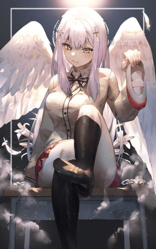](javascript:;)</ignore_js_op> <ignore_js_op>[92679450_p0.jpg](forum.php?mod=attachment&aid=OTA5Nzh8ZTk4Y2JmNTh8MTY0NzcwMjg1NHwxODIzMHwzMTY2OA%3D%3D&nothumb=yes) *(95.71 KB, 下載次數: 8)*

[下載附件](forum.php?mod=attachment&aid=OTA5Nzh8ZTk4Y2JmNTh8MTY0NzcwMjg1NHwxODIzMHwzMTY2OA%3D%3D&nothumb=yes)

2021-9-12 01:18 上傳  

[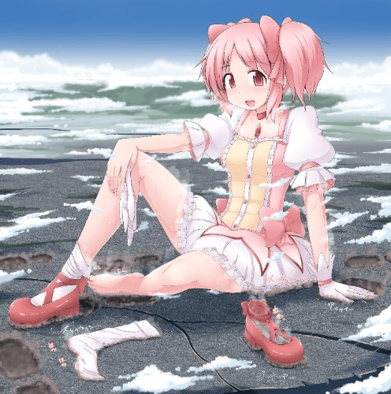](javascript:;)</ignore_js_op> <ignore_js_op>[92576711_p0.png](forum.php?mod=attachment&aid=OTA5Nzl8NjI1Yzg3MDV8MTY0NzcwMjg1NHwxODIzMHwzMTY2OA%3D%3D&nothumb=yes) *(261.08 KB, 下載次數: 2)*

[下載附件](forum.php?mod=attachment&aid=OTA5Nzl8NjI1Yzg3MDV8MTY0NzcwMjg1NHwxODIzMHwzMTY2OA%3D%3D&nothumb=yes)

2021-9-12 01:18 上傳  

[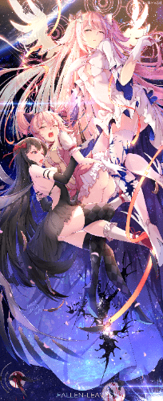](javascript:;)</ignore_js_op> <ignore_js_op>[upld-view-document (28).jpg](forum.php?mod=attachment&aid=OTA5ODB8Njk5YTM1NDF8MTY0NzcwMjg1NHwxODIzMHwzMTY2OA%3D%3D&nothumb=yes) *(56.09 KB, 下載次數: 5)*

[下載附件](forum.php?mod=attachment&aid=OTA5ODB8Njk5YTM1NDF8MTY0NzcwMjg1NHwxODIzMHwzMTY2OA%3D%3D&nothumb=yes)

2021-9-12 01:19 上傳  

[.jpg")](javascript:;)</ignore_js_op> <ignore_js_op>[80990731_p0.jpg](forum.php?mod=attachment&aid=OTA5ODF8NjhhMWVkOGV8MTY0NzcwMjg1NHwxODIzMHwzMTY2OA%3D%3D&nothumb=yes) *(77.82 KB, 下載次數: 3)*

[下載附件](forum.php?mod=attachment&aid=OTA5ODF8NjhhMWVkOGV8MTY0NzcwMjg1NHwxODIzMHwzMTY2OA%3D%3D&nothumb=yes)

2021-9-12 01:19 上傳  

</ignore_js_op>  

# 3

> houtizhidu 發表於 2021-9-12 14:57

> 可以求一下第二张寺田落子的小圆的原图吗

在p站翻墙找寺田落子的用户就行了  

# 4

> 咕咕的攸栗 發表於 2021-9-13 09:00

> 配的图很有灵性哦，同求小圆和艳魔的那张图

https://www.pixiv.net/artworks/92576711找这个就行了  

# 5

提示，此篇章绝大部份都是设定，请谨慎观看  （写了半天没写到福利部分，淦）  “完美世界？那是什么？”鸢疑问道。  “那是god大人的终极愿望，不过亿万年来都没有成功过，世界之间之所以在这里有这么多的宇宙就是为了这个愿望，不过这不是我们的工作罢了，走吧，我带你去看看我们工作的云之间吧！”晶说道。  晶拉着鸢的手腕离开了世界之间。  而鸢问道“晶，你当过试炼者吗？”  晶停下了脚步，沉默了下来，眼神中透露了一丝悲伤。  鸢觉的自己好像问了不该问的问题，赶紧说道“对不起，我不该问太多的。”  晶摇了摇头说道“不，都是万年之前的事了，告诉你也无所，我们边走边说吧。”  鸢也跟着晶向云之间的方向走去，而一路上有很多路过的天使和人类都对晶很尊敬，甚至是崇拜。  “晶还真是收欢迎啊，是因为四翼天使地位很高吗？”鸢问道。  “不，四翼天使在天堂的地位只是偏中上而已，我之所以被大家这样认同，是因为我目前最接近成功的试炼者。”晶回答道。  “是这样，晶真的好厉害”鸢惊讶的说道。  “还好吧，在最开始时我就是最初的一匹试炼者。”晶说道。  “最初的…试炼者？”鸢疑问道  “这是一亿年前的事了，在最早的时候，天堂的世界之间和飞升之门一样是完全由god大人管理的，而完美世界的也是god大人一人去做的。”晶说道  “那为什么现在会有试炼者？”鸢问道。  “是因为god大人多次实验后发现自己不懂【人】，所以将完美世界的使命交给了我们试炼者，因为除了初代三大天使外，剩下的天使都是由人类进阶来的。”晶解释道。  “可我从审判庭后就不知为什么来到了飞升之门并成为了天使，可其他人却成不了天使？”  鸢疑问道。  “那是因为在审判庭的人类被判到了天堂也未必成为天使，成为天使必须是灵魂纯粹之人才行，在从审判庭走到天堂之门时就是god大人进行一场灵魂的观察，灵魂纯粹者会在踏进天堂之门时进行【神审】，最后成为天使的人会被赋予使命与名字，然后在飞升之门处离开，正式成为天使，而没有成为天使的善人会被传送到云之间生活。”晶解释道。  “那初代的三大天使是谁？”鸢追问道。  “她们分别是御天使加百列，炽天使米勒加，赎天使撒旦，加百列负责人之常情，米勒加负责生命智慧，而撒旦负责救赎与战斗，不过赎天使撒旦已经化为堕天使，成为地狱的管理者了，他也是三大天使唯一的男性。”晶回答道。  “撒旦是堕天使，他岂不是天堂的敌人？”鸢问道。  “鸢，你忘记我说的吗？天堂和地狱都是god大人所创造的，天使与恶魔其实是类似公司里不同部门的同事一样，所以主动离开天堂去地狱担职的都可以叫堕天使，并不代表她们是邪恶的，虽然她们确实挺恶趣味的。”晶说道。  “那撒旦的为什么要主动成为堕天使？”鸢问道  “最早的地狱几乎是没有什么规则的，最开始的恶魔们对于判到地狱的灵魂是非常残忍的，虽然现在也是，有很多罪恶的灵魂几乎连轮回都没有，直接就被恶魔们玩弄到灰飞烟灭，甚至直接吃掉吸收掉那些灵魂，失去轮回的机会，不过就算罪恶的灵魂不再轮回，仍然会有灵魂被判到地狱，这也让撒旦感到疑惑，后来god大人开始创立试炼者，撒旦大人变成为了我们第一批的领导，我和们和撒旦大人无数次进行试炼，可最后基本都失败了，甚至我们最接近成功的一次也因为人的本质而失败，也在那之后撒旦大人发生了改变，他认为即使是前世善良的灵魂也会堕落，所以撒旦大人认为只是除去罪恶的灵魂没有本质的意义，要让罪恶的灵魂铭记罪恶的代价，所以撒旦大人选择主动化为堕天使带着她的女儿路西法和大部分第一批试炼者天使重新创立的地狱的轮回秩序，和各种各样【刻魂刑】来让来到地狱的灵魂有机会轮回。而我之所以收大家赞赏也是因为我是第一批试炼者中极少有还在没有堕落的天使。”晶解释道。  “【刻魂刑】又是什么，我怎么越来越听不懂了？”鸢问道  “【刻魂刑】是撒旦大人创立的惩罚，是为了令罪恶灵魂刻苦铭心的可怕惩罚，由不同的恶魔所执行，种类有成千上万种，什么靴之足蒸，噬口之海，齿牙粉碎，酸液侵蚀之类的等等，最后无可奈何的之魂会被关入由路西法身体所化成的【无间狱】，相传是各种刑罚的最大监狱，听我在地狱的恶魔朋友说那是比灵魂吞噬还要可怕的惩罚。”晶解释道。  “由堕天使身体所组成的监狱，那得有多大啊！”鸢问道。  “不知道，相传整个地狱由四分之一都被路西法的【无间狱】所占据，向你这样的双翼天使只是她身体上的一粒不起眼的灰尘罢了，对于加百列大人和米勒加大人有多大，好像仅次于god大人吧，毕竟我只见过她们的化身。”晶说道。  鸢也在这时也惊讶于神的恐怖和自己的无知，原来世界如此知道，自己又是如何渺小，但如此强大的神明也无法改变人之本性。  而在鸢还在感叹之时她们也不知不觉来到了云之间的大门。  这星期因为有事没有按时更新感到抱歉，我尽量明天就写出福利部分，希望大家见谅。(இдஇ; )  

# 6

晶轻轻敲了敲云之间的大门，大门轻轻的打开，一名鸢没见过的天使打开了大门。 那名天使有着一头乌黑亮丽的秀发，柔和飘摇，而发丝间有个一个用宝石制成的精致发冠，精致清秀的面容好似领家少女般可爱，身穿白紫色的连衣裙和长靴显得更加活力十足，而她和晶一样有着四只洁白的羽翼，只是没有像晶那样庞大，与晶不同的是她有着和其他天使没有的精灵耳朵，而她两侧的香肩上各坐着一男一女的小人。 “晶大人你回来了，这位是新人吗？”面前的少女说道。 “是的，灵，她叫鸢，从现在她也是我们的一员了。”晶回答道。 “啊是新的姐姐啊弟弟” “新人啊，别笨手笨脚的就好了，希望在游戏之后连修复魔法都不会” 香肩上的小人一唱一和的，貌似是一对姐弟，看来明显弟弟不太放心鸢。 “不可以这样啊，小可，要学学你姐姐小月，无论怎样她都和我一样是您们的天使姐姐啊！”名为灵的天使说道。 “我只是说个事实嘛！灵姐姐”小可不太服气的说道。 灵叹了口气说道“看来小可要受点惩罚才行啊” 说罢，灵便将小可从肩上拿了下来，并向自己洁白丰满的乳间放去。 “等等，灵姐姐，我错…” 还没等小可说完他就被灵丢进了双乳之间，灵的双乳和晶比起来算不上很大但很丰满，也很柔软。 灵柔软的胸部紧紧的夹住小小的小可，并不断的用巨大的胸部给小可“按摩”。 而对于小可来说，灵的双乳更多是一种惩罚，作为处的他，这种刺激的事情让他的血压飙升，两侧柔软的的肉墙讲他包裹在中间，在巨乳之间闷热的温柔乡之间，灵奇妙的惩罚在持续着，直到小可昏谁在巨乳之间。 一旁的鸢也没有想原来那么惊讶，毕竟已经渐渐习惯了，而还在自己发呆的时候，自己的感到额头有些温热，而当反应过来时，灵正在她的面前，她温和的额头正与自己的紧紧接触到一起，自己也一时不知所措。 “哦，美人胚哦，还真是可爱呢。”灵赞赏道 一脸懵逼的的鸢在心里想着“怎么回事，她在夸我吗？我该怎么说，总不能不说话吧，这样太没礼貌了。” “没事的鸢，不用那么紧张，灵很喜欢可爱的女孩子和小人的，算是个百合吧！”晶解释道。 “啊，百合？”鸢这才开始反应过来。 灵拉起鸢的手说道“鸢，快来吧，我带你来看看云之间的一切。” 灵兴奋的拉着天然呆的鸢进入的云之间，一旁的晶也满脸欣慰的说道“太好了，鸢很受欢迎，看来没有什么可担心的了。”  

# 7

以下是鸢，晶和灵的形象原型，希望大家喜欢，只是取自形象

# 8

<ignore_js_op>[mmexport1582647814087.jpg](forum.php?mod=attachment&aid=OTEyODB8ZDNhMmE2NWR8MTY0NzcwMjg1NHwxODIzMHwzMTY2OA%3D%3D&nothumb=yes) *(81.65 KB, 下載次數: 1)*

[下載附件](forum.php?mod=attachment&aid=OTEyODB8ZDNhMmE2NWR8MTY0NzcwMjg1NHwxODIzMHwzMTY2OA%3D%3D&nothumb=yes)

2021-9-20 23:36 上傳  

[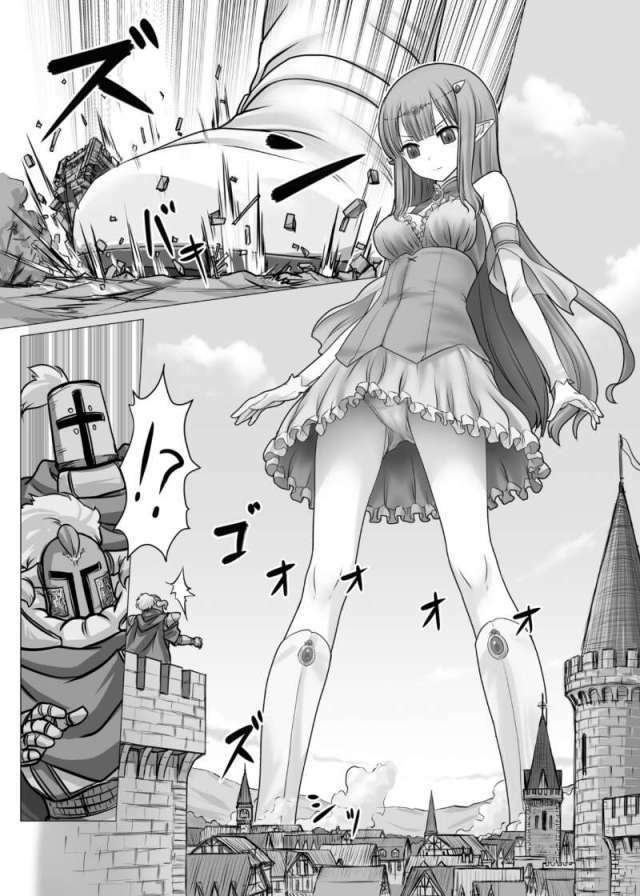](javascript:;)</ignore_js_op> <ignore_js_op>[e90814c5f8f951a7c24a152ab2b4a012397aaca4_raw.jpg](forum.php?mod=attachment&aid=OTEyNzl8MDk3ODEzZGR8MTY0NzcwMjg1NHwxODIzMHwzMTY2OA%3D%3D&nothumb=yes) *(475.43 KB, 下載次數: 0)*

[下載附件](forum.php?mod=attachment&aid=OTEyNzl8MDk3ODEzZGR8MTY0NzcwMjg1NHwxODIzMHwzMTY2OA%3D%3D&nothumb=yes)

2021-9-20 23:36 上傳  

</ignore_js_op> <ignore_js_op>[0384ad95e4ec2c23d5358594c3cc1abebf60008b_raw.jpg](forum.php?mod=attachment&aid=OTEyNzh8MmRjZWM1ZDB8MTY0NzcwMjg1NHwxODIzMHwzMTY2OA%3D%3D&nothumb=yes) *(334.12 KB, 下載次數: 0)*

[下載附件](forum.php?mod=attachment&aid=OTEyNzh8MmRjZWM1ZDB8MTY0NzcwMjg1NHwxODIzMHwzMTY2OA%3D%3D&nothumb=yes)

2021-9-20 23:36 上傳  

</ignore_js_op> <ignore_js_op>[2bcb0fffeb5801b5.jpg](forum.php?mod=attachment&aid=ODk2NjV8YzRmODEzNzR8MTY0NzcwMjg1NHwxODIzMHwzMTY2OA%3D%3D&nothumb=yes) *(50.09 KB, 下載次數: 0)*

[下載附件](forum.php?mod=attachment&aid=ODk2NjV8YzRmODEzNzR8MTY0NzcwMjg1NHwxODIzMHwzMTY2OA%3D%3D&nothumb=yes)

2021-7-13 13:13 上傳  

[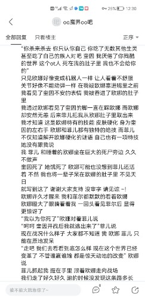](javascript:;)</ignore_js_op>  

# 9

这次由于时间关系没有写出太多福利，这周五会尽量更新，同时也到福利篇了（残忍，温柔都有）希望大家体谅，希望大家多多支持评论  

# 10

没人看吗？????????????????????????????????????  

# 11

> cnmlgb 發表於 2021-9-22 21:02

> 楼主楼主那个和魅魔少女是什么相遇

这个是魅魔双子之前的故事，鸢将在后来和魅魔双子成为试炼者，对魅魔双子的剧情里的世界进行审判  

# 12

更新了，这篇福利不少 但也有不少重口味，希望大家喜欢。

灵拉着鸢来到了云之间的内部，发现在云层大地上有着许多用半圆结界包裹住的小小城市，每个城市都有着类似管道一样的通道方便里面的人们通行。

“这就是云之间？升入天堂的人类都生活在里面吗？”鸢问道。

“是的，每个升入天堂的人类都会生活在云之间，我们守护天使的任务就是照顾好【乐土】里的人类就行，如果有喜欢的人类也可以把他们带出来当宠物哦！”灵解释道

“所以说，小月和小可就是…”鸢说道

“没错，我和姐姐就是灵大人的宠物”在灵胸谷的小可一脸骄傲的说道。

灵将胸谷里的小可拿了出来，同时也将肩上的小月也哪里下来并将他们放在了【乐土】的小小门口，姐弟二人向灵道别之后就回到了【乐土】里面。

“原来守护天使的使命这么简单啊！”鸢说道

“没错，【乐土】具有很强的保护能力，和重置的力量，所以可以干一下有趣的事哦！”灵说道。

说罢灵拉着鸢来到了一个【乐土】前，灵抚摸着结界，只是一瞬间，她们就来到了一个未知的地方。

鸢四面看了看，发现除了远方类似银白色的地段外，剩下的都只有绿色。

“这里是哪里，脚下的草为什么有的不一样？”鸢问道

“鸢，你仔细看看吧”灵说道

鸢建起足下的“草”发现竟然是只有指甲盖大小的树。

“这是树吗？为什么这么小？”鸢问道

“因为，这里是【乐土】的内部啊！不是树变小了，我们太大了”灵回答道

“这里是【乐土】吗？可在外面明明看到的只有城市啊！”鸢问道

“我们在结界外只能看到城市，世界上【乐土】在结界里是几乎无限的，人类在里面会不断发展乐土，而除城市之外的土地就是不同的地貌，类似于人类玩的一个什么游戏（我的世界）一样。”灵解释道

“那灵酱，我们为什么要来到【乐土】里啊？”鸢问道

“跟我来你就知道了”灵卖关子的说道，并与鸢前往了城市。

城市里的人们正在无忧无论的生活着，对于他们，城市里的职业工作只是类似于生活模拟打发时间罢了，对于人类来说生活多少缺乏谢刺激。

在这时大地开始颤抖，貌似什么巨大的生命向城市走来，但人们并没有害怕，相反他们反而开始欢呼雀跃，无数人类前往城市震动的边缘，在他们眼中，两对足有城市建筑一般高大的天外巨足来到了城市边缘，他们向巨足欢呼，大喊着“天使大人”，迎接着鸢与灵的到来。

“他们好像很开心啊”鸢问到。

“因为我们来了，鸢你先呆在我这里一下，我来给你看看天使与人类的｛小｝游戏。”

说罢，灵将鸢变小，然后放在自己的上衣口袋里，灵的口袋里很暖和，甚至有些“柔软”？

鸢发现，即使自己坐在灵的口袋里，自己也能看到外面所发生的一切。

灵的靴足刚刚来到城市边缘无数人类就，争着爬上了靴山，来到靴面上都不断亲吻着脚下的白靴。

“小家伙们真调皮，这就忍不住了吗？”灵笑道。

说罢，灵将自己的白靴脱了下来，并温柔的放在了城市边缘。

“如果有人想要进入灵酱的靴子里要赶快哦，不让就进不去了。”灵向城市里的人类说道。

刹那间，无数人人类蜂蛹而上的跑到了如同黑洞般的靴口中，他们贪婪着吸收着灵靴内的足之香气，那清新还稍稍带着些天使的足汗的酸臭味，令他们无比着迷，甚至有些来到靴内的鞋垫处将灵粘附在上面的脚垢当做佳肴般品尝着。

“好了，差不多了”

灵将白靴拿了起来，问道“大家准备好了吗？我要穿进去了”

而穿了的更是一片欢呼声。

“天使大人快伸进来吧，我们要忍不住了”兴奋的人群呐喊道。

灵将自己白嫩的裸足伸了进去，面对巨足来到，人们的兴奋声越来越大，貌似快要按耐不住，随着巨足的到来，靴内的温度开始升高，巨足也开始留下巨大的汗滴落了下来，但人们面对这流星般的汗滴毫无畏惧，只是各个张着口，等待着恩赐的到来。

最后巨足到达了鞋底，可里面的人类并没有死，与玉足接触的人类压在足下，但他们却感觉好像被温暖柔软的东西包裹起来，足下的香气更令他们雀跃，足弓下人人类不断用舌头舔舐着巨足，貌似在品尝玉足的美味，这一动作也给灵带来一丝兴奋的瘙痒。

而在白靴外面，许多人类貌似有些失望，只因为没有赶上灵的足内恩赐。

“没有赶上靴内的人类不要担心，大家可以进行第二波旅程哦！”灵安慰道。

灵来到城市内部，巨大的身体将无数建筑粉碎，但里面的人类却没有受到任何伤害。

灵张开自己巨大的手掌，将城市里的一些人吸收到了手中，并将他们放到了嘴边。

“你们真可爱，看上去好好吃的样子，你们是自己来还是我来帮你们呢？”

说完灵就张开了她深渊般的巨口，而手心的人类都毫不犹豫的跳到了灵的巨大红舌上，灵将巨舌收起，并用巨舌开始玩弄嘴里的人类，灵的巨口可谓是翻江倒海，她的香泽充斥这口腔，无数人类都还兴奋的喝了几口，灵将香舌顶在了口腔上，开始吮吸他们的味道，最后小舌一送将他们送进了咽喉出，吃了下去。

而落到灵胃里的人们也来到了柔软的红色世界，这里的温度比较高，好像蒸桑拿一样，人们快乐的脱下了自己的衣服，舒服的享受着天使的胃内温泉。

而剩下的人们更加失望，连第二波旅程都没赶上。

灵笑道“大家不要气馁，最后请大家来到灵姐姐的玉体大陆吧。”

说完灵将自己的靴子，裙子脱下，将自己的上衣解开，那白色的巨乳裸露在人们面前，灵将自己的玉体覆盖在城市上，躺在上面。

无数人类跑向灵的身体上，他们讲灵的玉足当做峭壁山峦，利用足上的体纹爬上足趾，在玉趾之间舔舐着汗液污垢，有的来到灵白嫩的大腿上，舒适的躺在上面，感受天使大人的温度，甚至跑到灵的巨乳之间，灵调皮的将两个巨乳夹在一起，在里面的人类也沉浸在其中的柔软中，有的人爬到灵鲜红的乳头上，不慎落入孔中，在灵的乳液之海里感受奶香的美味，还有的人来到灵的腋下，品尝着天使腋下的咸甜之汗，最了不得的居然钻进了灵的白胖次里，进入天使的生命之洞里，一路像精子一样来到灵的卵巢中，感受生命的喜悦。

而在上衣口袋里的鸢，多少有些懵，难道来到天堂的都是hentai吗？

而灵也用意识回答了鸢的疑问。

“不怪他们是变态，毕竟在我们成为天使后，我们的身体对于他们来说太具有诱惑力了。”

灵说道。

“有这么夸张？”鸢问道

“天使的每一个部分对于凡人来说都具有很大的诱惑力，也对他们的灵魂有着很多的修补能力，即使是排泄物也是哦。”灵说道。

鸢，也不太能这么快接受的这不可思议的荒诞世界，但世界就是这样玩，她也不得不开始接受这些突破常人思维的世界了。

# 13

国庆更新了，这次也有福利哦，如果人气不错的话就国庆双更。

“鸢酱，要不你也试试吧！”灵说后打了一个响指。

而鸢还没反应过来，【乐土】就回到了破坏之前，可这次只有自己矗立在城市边缘。

“灵酱，你在哪里？”鸢问道。

“我在【乐土】外面了，我已经将【乐土】重置了，现在鸢酱也来试试吧！”灵回答道。

面对面前的小小城市与人类多少有点不知所措，毕竟鸢还没有过与人类这样游戏的经历。

“看来鸢酱还没有熟悉【乐土】的游戏啊，那我来帮帮鸢酱吧。”灵说道

话音刚落，鸢的的身体开始变大，巨大的足趾开始入侵城市边缘，面对肉色的玉趾之墙的袭来，人类没有逃跑，而如同飞蛾扑火般向巨墙冲去，最后被增长的玉趾撵入足底，鸢的玉趾充斥这少女特有的体香和部分汗液的酸臭，两种味道混合在一起形成的特殊气味令更多人们引起了特别的性欲，对于于足控来说这气味简直就是媚药，仅仅一段时间他们的下面就开始流出白色而液体。

最后鸢总算停止了生长，这时的鸢足足有几十千米左右，在她的面前人类引以为傲的高楼大厦只有鸢足底厚度几分之一罢了。

还未反应过来的鸢惊讶的将巨足踏了出去，两三千米的巨足轻轻松松的就在城市里留下来巨大的足印，无数人类似乎被镶嵌在废区之下，身上还留下来鸢的足香。

还有许多人类和碎石粘在了鸢的巨足上，鸢只是稍稍抬了抬脚，足上的碎石落下也能造成天灾，可足下的人类从未觉得这是灾难，而是天使的馈赠。

“灵酱，这也太大了，我该怎么办啊？”

“没事的鸢酱，只要玩弄就好了，慢慢感受就行了”说完灵的声音就从天空中消失了。

鸢摇了摇头，无奈了将自己的巨足伸向了城市内部，而鸢也隐隐约约的感受到貌似什么东西在自己的脚下爆炸了，但这所谓的爆炸对鸢的身体没有任何损坏，对于鸢来说只是感觉足底痒痒的罢了。

在普通人看来，这简直就是天灾，鸢巨大的裸足遮天蔽日，好似将整个世界吞噬一般，可对于升入天堂的人类，这是神的恩赐，是快乐的游戏，他们不会死亡与恐惧，只有欢乐与游戏。

鸢来到了高层建筑区，渐渐也感受到了灵说的舒适，巨大的建筑在自己的足下好似沙粒般毁灭，这巨大的优越感和足下舒适的搔痒感令鸢开始有些兴奋，但随着时间的增加这种感觉就消失了，太小了，对于鸢来说人类和建筑太小了，而这时鸢想到了一个特别的玩法。

鸢开始运用起魔力，她将城市里的许多小人转移到了自己的阴道里，随着人类的不断增多，人类在阴道里挣扎的舒适感也开始增大，人类在阴道里就开始舔舐肉壁上的白液，甚至称之为美食，而随着人数的增多阴道也开始变的越来越挤，肉壁也在人类的挣扎下开始不断分泌白液，而鸢也用手指轻轻戳了戳隔着白色胖次的阴道，感到更加舒适，这也让原本纯白的鸢也变的有些涩气了。

而随着鸢胖次里的小人不断蠕动，鸢也开始用手指开始摩擦起来，可在无意中鸢的身体里的魔力被释放了出来，鸢变的更加巨大了，而这也让鸢感到的舒适减少了，这也让第一次做这种事的鸢有丝失望，而鸢看了看足下的小小城市又想的了另一种玩法。

鸢再次运用起魔力，她将城市里所有的高楼大厦聚集在一起，并吸在了鸢的手上，并将数以万计的建筑物重新组合成了一个新的圆柱体，大小刚好可以通过鸢的下面，而在建筑里的人类还并不知道他们会见到怎样的光景。

鸢有使用魔法将圆柱加固在一起便将胖次脱了下来，将手中的圆柱体送入了自己的下体送，而在人们的眼里简直就是鸢的巨口简直就是一只深渊巨兽将要他们吞噬一般，但由于鸢第一次使用这个魔法，也导致即使圆柱被加固了在送入下面的过程也会有磨损，一部分像尘埃般落下，一部分如同污垢般被粘附在股间内测，而在鸢的指尖与指缝间也聚集这许多人类，而被送入孔中，被粘附在肉壁上的人类也被送进来到巨柱所紧紧的压住在肉壁上，而在建筑物里的人类再次发起了狂欢，他们建筑窗户外都被肉壁所包裹，而相较之下他们说多么渺小的存在。

而在鸢正在舒适的外面，她不安分的巨足也在不断扭动，天空上的云层轻轻松松的就被鸢的玉趾所随意搅动，而云层也吸附了她足底的汗液，而聚集起来的云层也下起了一场特别的大雨，这场雨水充斥着鸢的足汗，而幸存下来的人们将自己所有能够盛水的器具拿了出来，将充满天使香汗的雨水奉为圣水般饮用着，而他们的身体也相较于之前更加健康，身上的伤口，残缺的肢体也瞬间回复晚好如初。

而鸢也开始将自慰开始了高潮，她用魔法将大地“突”了出来，大地抵住圆柱不断开始伸缩摩擦，鸢在侵犯这这座【乐土】大地。当高潮结束，一切尘埃落地，而便疲软的躺在在了城市的废区上睡了下去，而在城市硕大的版图上，除了睡熟的鸢以外，就留下来无数巨大的足迹。

“看来鸢已经习惯守护天使的游戏了，希望她不要去在乎试炼者了。”站在【乐土】外的晶说道。

而一旁的灵也说“希望如此吧。”  

# 14

真的没人看嘛，怎么说我也是按时更新啊  

# 15

更新了，更新了，这次出现了新角色。

在天堂的【圣堂】中。

“看来，新来的天使还是很不错的，但想要从中找到新的试炼者恐怕有些难啊！”

“不要太小看这些新人啊，加百列，毕竟像晶那样的优秀试炼者也是从普通的天使走过来的，也许这从中会有优秀的苗子呢。”

“米勒加，也许你说的没错，但现在我们不能再失误了，地狱已经两次获得了成功，不能让地狱的那些家伙那么嚣张，相传路西法已经筛选出了两个优秀的试炼者，好像是魅魔一族的两个姐妹。”

“加百列一两次的胜负证明不了什么，我们重点要找到时候成为我们天使试炼者的未来候选者，为以后做准备，放心吧，我已经找到一个不错的苗子，也许她能作为好的候选。”

“真的？米勒加你可要三思而后行”

“放心，我通过晶的观察已经确定她是个不错的候选者，要不我现在就亲自给你带回来，如何？”

“那好吧，希望她是个不错的试炼者”

说完，【圣堂】的大门就打开了，而守在门前的守卫天使立马单下跪，说道

“恭迎米勒加大人！”

说罢，在【圣堂】的里面走过来了一名少女天使，她有着一头极其秀丽的淡粉色长发直达腰间，洁白的白丝发带将长发梳成双马尾，将少女美丽的脸颊更显可爱动人。

弯弯的柳眉微微翘起，眉尾处一个紫色薰草模样的刻花，一对粉色眼眸瞳孔隐隐透出神秘，似乎能轻易的把人看穿，雪白的肌肤没有丝毫的瑕疵，如樱桃般的唇瓣似有着魔力般时刻勾引着人的灵魂。

纤细如同杨柳般的身材和她用雪白的丝袜包裹住的白腿令无数萝莉绅士们大跌眼镜，最后那洁白的玉足与那白中带粉的长靴揉在一起真是绝配。

没错，这是初代三大天使之一代表生命与智慧的大天使，米勒加。

虽说这只是米勒加的一个化身，但也足矣令人们神魂颠倒。

无论是路过的天使还是其他人类都对大天使米勒加的出现所吸引，所崇拜，所敬畏。

而米勒加也一边接受这天使与人类的敬畏，一边向【云之间】走去。

而在她去往的路上，又无数人类跪倒在米勒加的白靴前，祈求着她的怜悯与爱。

米勒加笑了笑“每次我的出现都要吸引这么多小家伙，还多少有点麻烦，不过没关系，米勒加大人会赐予你们米勒加大人的爱的。”

说罢米勒加脱下了自己的白靴，热呼呼的靴口还有丝袜小足暴露在空气中，似乎能看到热气在外冒。

“请各位来感受米勒加大人的爱吧！”

说罢，无数人类被白靴产生的巨大吸力吸入了白靴中，而在这热烘烘的靴子里面，大天使米勒加的足汗与体香混合在一起，这靴内的混合足味，那种淡淡臭味与体香的结合体让靴内的人类全身都酥酥麻麻的，甚至瘫软在了鞋底。

“好了大家，米勒加的小脚要进去了”

说完米勒加将自己的脚也伸进了靴子里面，她温软的足底轻轻踩住里面的小人，脚趾微微张开，细嫩的脚趾缝隔着丝袜夹住许多小小的人类，将他们包裹在一个暖洋洋的空间中。

而米勒加大人还调皮的将穿着白靴的嫩足向后轻轻点了点，吐着舌头调皮的说道

“大家准备好了吗？，米勒加大人要出发去云之间了！”

而米勒加一路走向【云之间】，在这一路程也让她的玉足变得潮湿，尤其是袜尖的部分更是被汗水濡湿，而里面的许多人类也在柔软与湿润的靴内吸收着米勒加的汗水与足香陷入了甜甜的沉睡当中。

柔软的嫩足，温暖的环境，甜美的声音，陶醉的味道，可以说整个天堂内，除了加百列大人以外没人任何天使的靴内能比米勒加大人更加完美舒适，可奈何米勒加大人离开【圣堂】的时候很少，所以想要体验到米勒加大人的靴内温柔乡的机会，真的是弥足珍贵，每一次也只有少量幸运儿能进入米勒加大人的靴内，而在天使之中性格活泼可爱的米勒加也要比高冷的加百列要好相处的多，毕竟米勒加并没有太多的架子，毕竟她觉得好玩就行。

与此同时，在云之间的鸢已经醒来，但她已经发现自己已经不在【乐土】之内，而而在一个陌生的房间，躺在陌生的床上。

“在我成为天使后我好像还没睡过觉罢？”鸢心里想着。

“鸢酱，你总算醒了。”坐在一旁的晶说道。

“晶，我在哪里，我不是应该在【乐土】里吗？”鸢问道。

“你在【乐土】睡着后，灵就将你从里面接了出来，而这里是你的房间哦，我特意给你挑的粉红色，喜欢吗？”晶笑道

鸢环看了看房间，整洁的卧室里，有一盏粉红色、设计美观的吊灯，一架简单而实用的衣柜和梳妆台，自己躺下的粉嫩嫩的云之床舒适，温暖。

“谢谢你，晶酱”鸢感谢道。

“没事，我们都是朋友啊！”晶温柔的说道。

这时在窗户口有一个大大的银托盘送了进来，盘子里有着热红茶和点心，而银托盘地下有着四个人类竟然悬浮在盘下，将食物送了进来。

晶将银托盘拖了起来，说道“谢谢各位帮忙把点心送来，辛苦大家了，来休息吧！”说完，晶就将胸口两侧的口袋打开，小人们也纷纷飞到了口袋里，并像仓鼠一样趴在口袋边缘了，脸上挂满了幸福的表情，毕竟晶的胸部有温暖有柔软，在口袋里也能感受到。

晶将托盘放在了床边的橱子上，说道

“鸢酱，先吃点东西吧，这可是小家伙们为你准备的。”

“真的吗？谢谢各位对我的关心”鸢向口袋里的小人们招手道谢。

等鸢吃完后问道

“对了，灵酱去哪里了？”

“灵酱啊，她和司酱一会要去接见米勒加大人，好像说是来筛选试炼者的，毕竟要准备好新的试炼了。”晶说道。

“试炼者……”鸢说完陷入了沉默

“鸢酱，你该不会想去当试炼者吧？”晶问道

“不不不，并没有”鸢有点心虚的说道。

“鸢酱，最后还是不要去当试炼者，毕竟我不希望你对世界失望而去地狱，有不少天使成为恶魔就是试炼的经历所堕落的，我先去看看灵酱和司酱”说完，晶就离开了鸢房间。

窗外的清风吹过鸢洁白无瑕的头发，对于她前生自己母亲在硝烟的战场说的最后的话貌似还历历在目，

“孩子，不要去厌世，世界本事并不坏，只是人们的心生病了，需要有人去救治，但人心的病好了，就不会再有灾难了，活下去，替母亲去活到最后，去见证世界的美好吧。”

而在云之间的另一个房间内，另一位天使坐在椅子上，而在她白嫩洁净的脚面前，有着一个小人正跪坐着，貌似在祈求着什么。

“原来你从地狱里跑出来就是为了我的脚吗？你应该明白地狱的罪人来到天堂也是很危险的。”那名天使将洁白的裸足抬起，翘起了二郎腿，将巨足移到了这名罪人头上轻轻放下脚掌。而在罪人眼中可爱的掌纹逐渐放大，巨大裸足带着微弱的风压踏向罪人，罪人的大脑却像是被吸引一般，毫无抗拒或动弹的想法。

“是的，我知道我这样生前的大罪之人就算来到天堂也会痛不欲生，但我在审判庭的真的第一眼就爱上你了。”罪人说道

这名罪人眼前的天使有着淡粉色的妹妹头，后面佩戴着黑色的蝴蝶结和头上那翘起的呆毛更显出少女的调皮可爱，白皙粉嫩的肌肤、略显俏皮的小鼻子和晶莹剔透的眼瞳在少女的萝莉脸更显可爱，貌似刚刚发育的胸部和在体型下娇小的身体，令人不免激起心中的保护欲，而她与之不同的是她并没有和其他天使一样穿鞋，相反她还是将自己洁白的玉足裸露了出来，那娇小还貌似流着微微汗液的美足可以令无数足控将其舔舐干净。

“你只是喜欢的的足罢了，不要用这样的理由去说什么喜欢我，肮脏的罪虫。”天使有些生气的说道。

而这个罪人并没有向天使继续解释，他只是向天使留着香汗的巨足走去，而面对这巨大的足壁，罪人毫不犹豫的将脸部都埋入了柔软的巨足之中。

天使用玉趾将足下的罪人踢开，天使调皮的

玉趾扭动着，指缝间香汗的味道貌似在诱惑着面前的罪人。

“如果说我将作为逃犯的你报告给地狱，你会怎么样呢？”天使一脸坏笑的说道，貌似在调戏在足下的“玩具”。

罪人立马又跪了下来磕头求饶到“司大人，求求你不要把我送回到地狱去，哪里太恐怖了，就算为你做牛做马，抛弃轮回我也不想回去了，求求您放过我吧。”

没错，这位就是在审判庭负责引领灵魂引入天堂的天使，司。

这名罪人之所以可以逃过【飞升之门】的审验来到天堂，就是躲在了司的足下。

“既然这样，接下来你要按我说的做哦。”司回答道。

说罢，司从口袋里拿出来一瓶淡绿色的玻璃瓶，她将玻璃瓶里的淡绿色药水淋在了她的玉足上，足上的香汗和绿色药水混合在一起从脚踝留下至玉趾间淋下，更加令罪人的内心欲罢不能，甚至巴不得冲到玉趾下去吮吸那诱人的足尖。

司笑了笑，将淋上药水的裸足抬到了罪人面前，而司脚底并不算臭，虽然难免有出汗的味道，其中却也夹杂着一丝淡淡的体香，而药水的味道又有点像红茶，这也让罪人内心的欲望不断增大。

“快，舔，将我的玉足舔舐干净，不然就把你送进地狱去，肮脏的罪虫。”司坏笑的命令道。

罪人当听到司下令舔舐之时，他的欲望总算爆发了，他开始发了疯狂的舔舐着司的柔软裸足，吮吸着巨大足趾下的一滴滴药液，甚至将自己的下体漏了出来，在司的裸足是开始作了起来，在司柔软的足壁下，罪人不一会就射出来白色的乳液。

司坏笑了一下，用巨大的足趾罪人的头夹在了足趾缝间，而指缝间的味道反而让罪人射的更多了。

“还真是可爱呢，我的足香吗？这里也要舔干净哦，罪虫先生。哈哈哈”司坏笑说道。

罪人更加卖力的舔了起来，舔到最后精疲力尽，昏睡了过去，而当自己醒来后，自己发现自己在一个粉色的大地上，而在自己的两侧还有这高不可攀的山坡，也都是粉色的。这粉色的大地山坡不仅还冒着热气，还有这特别的混合气味，貌似是少女的体香和汗液的酸臭，地面还时不时的流出咸咸的温水。

“又一个新来的。”在罪人的背后传来了一个陌生的声音。

另一个和自己一样右臂被刻着“罪”的字样的人。一看就知道过去和自己一样是从地狱来到。

“先生，这里是哪里，为什么我在这？”罪人问道

那个笑道说“这里？我问你你是不是被一个叫司的天使舔舐足下的淡绿色药水？”

“是啊！”罪人不假思索说道

“这就对了，我这就司大人的足缝之中，舍弃轮回的机会，吮吸契约的微尘之药，永世成为足间的寄生虫，地狱罪人们在天堂的庇护所，罪人的【乐土】”那个人笑道。

“这，足趾中……”罪人没有想到，自己竟然会生活在司的指缝间而自己也失去了轮回。

突然天空开始变黑，热浪袭来，粉色的足趾大地开始大肆流出咸水，足汗之洪灾来临，足趾大地上的罪人们开始混乱的逃如司如同水晶般的足趾甲中，而没有机会的会用大陆的污秽和足趾死皮所搭成的方舟等待洪灾的褪去，而不幸的罪人最后淹死在足汗之洪灾下，等待洪灾退下后，在足趾间再次由死皮重塑灵魂。

而这巨大的足汗之洪灾只是司在穿上她仅有的一对日式布袜所造成的。

“司大人竟然要穿袜子吗？”坐在桌子上的小人说道。

“没办法，小星，毕竟今天要去接见米勒加大人，裸足去当话太有失礼貌。”司说道。

“看来司大人今天很开心啊，是足下又多了新的宠物吗？”小星说道。

“是啊小星，这些肮脏的虫子从地狱中跑出来，按道理说要送回地狱的，但我给他们准备了永恒的庇护所，也算我仁慈了。”司说道。

“也算是便宜他们的了，毕竟司大人的美足是在天使中最美的。”小星说道。

“那，麻烦小星在我回来的时候帮我按摩一下了。”司说完，亲了亲小星的脸颊，小星的整个头都貌似被吸入司的嘴唇中，搞得小星满头都是司口中的香泽。

“是，司大人。”小星有点懵逼的说道。

司穿好足袜后便离开了房间，去找灵去准备迎接大天使米勒加。

# 16

一下是新角色形象原型，前者是司的形象原型，而后面是大天使米勒加的形象原型。

# 17

<ignore_js_op>[1602822985856.jpg](forum.php?mod=attachment&aid=OTE2NjZ8MmYxYTZiODl8MTY0NzcwMjg2NnwxODIzMHwzMTY2OA%3D%3D&nothumb=yes) *(881.31 KB, 下載次數: 0)*

[下載附件](forum.php?mod=attachment&aid=OTE2NjZ8MmYxYTZiODl8MTY0NzcwMjg2NnwxODIzMHwzMTY2OA%3D%3D&nothumb=yes)

2021-10-9 15:51 上傳  

司的形象原型

</ignore_js_op>  <ignore_js_op>[610700_201712112629_7011_12655_323983.jpg](forum.php?mod=attachment&aid=OTE2NjV8ZDA1OWEzMWJ8MTY0NzcwMjg2NnwxODIzMHwzMTY2OA%3D%3D&nothumb=yes) *(316.39 KB, 下載次數: 0)*

[下載附件](forum.php?mod=attachment&aid=OTE2NjV8ZDA1OWEzMWJ8MTY0NzcwMjg2NnwxODIzMHwzMTY2OA%3D%3D&nothumb=yes)

2021-10-9 15:51 上傳  

米勒加的形象原型

[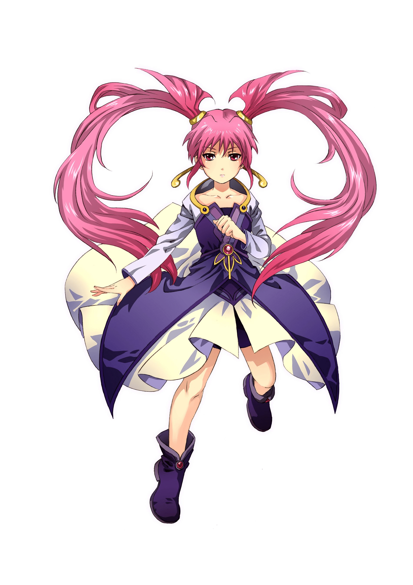](javascript:;)</ignore_js_op>  

# 18

我现在真的越来越怀疑我文章是否真的有人看了  

# 19

更新了

鲜花，圣歌，红地毯都在灵的指挥下一步步布置，小小的战斗天使在灵的指挥下在云之间的门口准备迎接大天使米勒加，而今天的灵也是特别打扮了一下，她特意穿上了在天使的“弥撒盛宴”的黑色礼服，而这一身华丽的装扮也让她成为这里闪耀的新星，而与之而来的司也来到了现场，不过司的打扮就没有那么特别，实际上司无论在何时都是在穿自己平时的引领之衣，可能对于她来说换衣服什么的太麻烦了。

“司大人，您这样穿着是不是有点太草率了？”一名战斗天使的小队长问道。

而这也让司有点不爽，毕竟司在平时比较我行我素，再加上司是天堂大门的引领者，而这样的小东西来指责自己，实在让自己有点难堪。

“你这个小不点还来指责我吗？”司揪住小队长的小翅膀说的。

这是的小家伙才知道自己出言不逊，当自己要道歉时已经为时已晚。

司二话不说就自己的足袋脱了下来，并那在了司的手上，湿湿的白色足袋在小队长面前好似吞噬自己的猛兽，这也让小队长开始瑟瑟发抖，毕竟他知道司的足在整个天堂可不好闻啊！

“快进去，不然的话？嘿嘿”司便指了指自己的嘴巴，并诱惑性的舔了舔她樱红色的香唇。

小队长只好乖乖的爬进了司的足袋里，然后就将小队长扔了进去，经过司一路的踩踏（司更喜欢自己走路，而不是飞翔），她的脚早就出汗了，袜里又热又潮，还有浓浓的脚臭味，加上她奇异的体香，味道变的更加奇特刺鼻，小队长差点被熏吐，那袜底上的清晰的黑色脚印，司大约有很长时间都没有洗她唯一的足袋，毕竟她不怎么喜欢穿鞋和袜子。

周围迅速变暗，巨大的怪味汗脚卷着浓郁的脚汗混合气味飞快的向小队长压过来，咸咸的脚汗流入他的口中，粉嫩的火热的脚掌将他踩住，柔软的足底刺激着他的肉体，似乎觉醒了什么不得了的属性。

而正在司玩的开心时，灵打短道

“司，不要太贪玩了，米勒加大人快要到了，而他毕竟也算是我的部下，他犯错了也要我来惩罚”

“灵，别太较真了，毕竟米勒加大人只是来找合适的新人试炼者而已，并不需要那么紧张。”

而对于司这种无所谓的想法，灵也是无语了，而听到了一声巨响，云的彼端出现了巨大的倩影之时，这代表着米勒加大人已经到了。

“唉，米勒加大人又开始了”灵有些无奈的说道

“毕竟米勒加大人可是我们天堂最自由的，像她那么强大的力量，哪里愿意一直变的那么小”司回应道

而米勒加巨大的身影很快就笼罩了整个云之间外，她明亮的瞳孔好似圆月般，小小的云之间在米勒加的樱唇巨口面前也只是一个小小的动作就能将其吞噬。

“恭迎米勒加大人驾到”司，灵等众多天使说道。

而那貌似那吞噬一切的巨口张开了，那仅仅是张口的动作就掀起来巨大的气流，甚至米勒加只是吸一口气就能将众天使吃掉。

“不用那么拘谨，毕竟我米勒加大人最喜欢的就是快乐和热闹，你们搞得这么严肃可一点也不好玩”米勒加用着巨大且调皮的声音说道。

说完，在米勒加那遮天蔽日般的白羽巨翅飞出来几名守护天使说

“米勒加大人这次是来在新人天使里寻找适合的试炼者的，希望各位配合”

灵命几名战斗天使将一本册子拿了出来说道

“请米勒加大人过目，这些都是最近的天使新人”

“没有这个必要，我记得最近的新人天使里有个叫鸢的天使吧，我觉得她就很不错，我希望她能成为这次试炼者”米勒加说道

“可米勒加大人，鸢毕竟是我的朋友，我怕试炼会让她想起她不好的……”

而在这是鸢从云之间出来回答米勒加打断了灵的回答

“不，我愿意成为试炼者！”

这一旁的灵也愣住了，而晶这才追上鸢。

“晶，为什么鸢出来了？”灵问道

“没办法，鸢无论如何都要参加试炼，我拗不过她所以…”晶说的

“为什么不让她去参加试炼？”司疑问道

“司，你先别添乱，我们是怕试炼会激起鸢不好的回忆…”灵说道

“无论是怎样的过去，就算现在忘记了，以后也终会想起，就算是不好的回忆也终将要面对，正因为如此我才特别选择她，你说呢？鸢”米勒加回应道。

“虽然我已经丢失了我的记忆，虽然我知道我之前的记忆不怎么美好，但我选择去面对，只有去面对才能直面自己的迷茫，所以米勒加大人请让我成为试炼者吧！”鸢说道

“哈哈哈哈哈，不亏是我看上的，来吧，我带去圣堂受礼试炼者的身份。”

米勒加说完就张开了的樱唇巨口，鲜红色的巨舌好似红地毯版在云之间的大地是铺展开来，貌似在欢迎鸢的到来。

鸢也很坦然的准备走向巨口，但晶说道

“米勒加大人，能否让我一起前去，她是我的后辈，我毕竟有权利照顾鸢”

“也好，你也可以教会她试炼者要注意点事项”

之后鸢于晶一起携手走进了米勒加的巨口之中。

米勒加的巨口内并不阴暗反而还有些光亮，足下的巨舌柔软且湿润，肉眼可见的味蕾貌似也在温润着鸢与晶的嫩足。

洁白的巨齿好似链接天际的高墙，一颗颗巨大的白色牙齿，那牙齿似从无尽深渊立起，直入无尽高空，伫立在在粉色的大地上。

米勒加的整个好似另一个世界，而在通天般的巨齿墙后就是如同湖水版的香泽之海，而这海的尽头便是深邃的咽喉，而整个空间却无比干净整洁，甚至没有任何一丝口臭，反而传来的是如同花朵版的香气，香泽之海也相当纯净温和，似乎喝下就能温润其身，医治百病。

而二人也在浮在香泽之海上，而米勒加也将巨舌一卷，就将两位天使送到了自己如同深渊的胃里。

而在外面，米勒加的洁白的咽脖处有了一个小小的凸起，并将而二位天使吃下，而米勒加还在意犹未尽的将洁白的玉指伸进了口中舔了舔，便离开了云之间，飞向了【圣堂】。

而在米勒加的胃中，二人便落到了米勒加柔软的胃壁上，却发现米勒加的胃内简直就是一个室外桃园，胃内清洗明亮，气候温和，甚至在这巨大的空间竟然还悬浮着许多如同【乐土】般的浮空之岛，自己只是落到了胃内汪洋的边缘的无人岛而已，而在胃内汪洋的还有这如同许多小型陆地，而陆地上还有这许多小小的人类在城市里生活。

而鸢也好奇的游了过去，而看到这些小巧的城市在鸢的面前简直就是胯下的一个小土块，鸢也不由得感叹天堂世界的强大和过去自己的渺小，而对于陆地上的人民鸢简直就是可以毁灭一切的怪兽。

“真没想到，米勒加大人的胃里竟然别有洞天。”鸢说道。

“这还只是米勒加大人收敛了，毕竟米勒加和加百列大人的实体只有无穷无尽的圣堂之内才能接受得了。”晶回答道。

“那这些小东西是…”鸢问道。

“这应该是米勒加大人养的宠物吧，小心点鸢，这可是米勒加很珍惜的宠物”晶说道。

而在两位天使还在聊天的时候，这趟行程的终点站【圣堂】也快要到了。

说句实在话，这次更新有点草率，文笔可能有点简陋请各位读者老爷见谅，

其次这次更新实在是少些动力，虽然要进入关键剧情，但还是进入瓶颈阶段，所以请大家多少给我点动力，最起码让我认为我的文章还是有人看的，拜托了各位读者老爷，这对我真的很重要(இдஇ; )。  

# 20

这期福利少，设定居多请大家谅解，下期保证福利够多（没写到福利，淦）

【圣堂】大门伫立着一位位穿着女仆装的双翼天使，她们在天使中地位偏下，负责这天堂内大小事务和整理 ，而她们的肩膀上则有这许多只有一只手掌大小的男性天使，他们身穿白衣与铠甲，手持剑，弓，长枪等武器，守卫在女仆天使的旁边，天堂所有的男性天使都很娇小，最大也只能和普通的女性天使一样大，剩下的基本都是都不会很高，但在天堂的地位上要高于女仆天使，负责守卫战斗，天堂原本共有十三位天使骑士军队，每一对都有各自的队长所管理，目前出了第十三队去往地狱后，天堂的剩下十二队基本都由骑士团总团长，耶稣所带领。

而这次他们的到来就是为了新的试炼者接受洗礼仪式而来，在【圣堂】阶梯的两侧各伫立着各队的队长，而在【圣堂】大门广场的女子正是耶稣。

耶稣穿着者洁白的圣女之衣，红色边缘的白色长袖紧紧抱着一本古老的羊皮古书，她有这一张太过美丽工整而像是人偶一般的脸，红宝石一样的红色瞳孔，在如雪般闪耀的银色长发散落在极好的腰间，雪白的长靴包裹住纯粹美丽的白腿，她慢慢的从金色的阶梯下走来，她不仅仅是十三骑士的总团长，更是除大天使外唯一能够聆听神谕的圣女，她优美的声音令人陶醉，而这也是在迎接米勒加大人的归来。

天空中掀起阵阵烈风，巨大的身影从广场上逐渐放大，天空的日光仿佛被巨大的身影所遮挡，只听一声巨响，一双粉白的巨大长靴占据了整个广场，大天使的威压也让众多天使纷纷膜拜。

“恭迎米勒加大人归来！”耶稣说道。

不一会一阵阵洪亮的圣歌整齐而优美的响奏起来，代表着众多天使的欢迎与敬畏。

“起来吧，我的孩子们！接下来请迎接我们新的试炼者吧！”米勒加说道。

说完，米勒加便用手轻轻的抚摸自己的小腹，之后在将手掌打开之时，鸢与晶就已经站在米勒加大人的巨掌上了。

与此同时的鸢还没搞清状况，当时自己还在考虑如何从米勒加大人的胃里出来，却没想到自己莫名其妙的就被某种未知的力量所抓取，最后就来到了米勒加的巨掌之上，而对于过去就成为过试炼者的晶来说，这些她早就习以为常了。

晶拉起鸢的是手便缓缓落下，来到了广场之上，圣女耶稣缓缓走来，而鸢也在惊叹着眼前这位圣女的惊世美貌。

晶拍了拍鸢的后背提醒她要注意礼节，鸢这才反应过来和晶一起向圣女鞠躬，之后鸢也单膝下跪等待着试炼者的仪式到来。

圣女耶稣也并没有多说只是温柔微笑的说着打开了手中的古书，并庄穆的朗诵道：

“命定之人啊！接受神的洗礼吧，完成神留下的神圣职责，为未来的世界而祈祷吧！”

说完两名小巧的天使端来一个华丽的银托盘，上面有这用水晶制成的葡萄酒杯，里面盛满着鲜红的葡萄酒，同时还有这一块有这点点装饰的面包，这就是天堂的试炼者仪式，也是人类基督教的“弥撒”。

鸢在完成圣女的仪式后，圣女亲亲吻了一下鸢的额头，而那柔软的香唇在鸢的额头触碰的那一刻，鸢就正式成为试炼者了。

之后在十三骑士团的守望下鸢来到了【圣堂】的大门，金碧辉煌的大门缓缓打卡，里面透露出宇宙本质的神秘与力量，鸢紧紧攥紧拳头，手里有这晶给予的一块水晶，在还在来的路上晶就告诉她要在关键时刻使用，而对于自己友人的信任，鸢不想辜负，所以自己不能失败，一定要成功。

鸢在踏入门的一刹那自己就昏了过去，在自己的睡眠中自己好像梦到了无数的幻梦，但都都在告诉鸢一件事：指引迷失的人类，完成人性的蜕变。

当自己醒来之时自己已经在一座未知的森林里醒来，这里幽静祥和，阳光洒落在自己洁白的脸上，虽然自己身上的衣服不知怎的破破烂烂，但这也代表着，自己的旅途开始了。

鸢顺着太阳光开始判断方向寻找出路，由于成为试炼者，所以自己作为天使的力量被封印了，自己也只能靠自己的只是去探索了，鸢发现这座森林只是树木高大，大约有百米左右，但本身的并不算茂密，可面积很广，难以寻找出路。

而在这时鸢发现了一个巨大的身影掠过，鸢潜伏在草丛中慢慢的跟了上去，发下了一个长着猫耳朵的巨大少女正在追赶着一个和自己一样大的人类。

那个猫娘大约有这三十多米的巨大身躯，有这齐肩的枫叶红头发，在森林中的光线照射下令猫娘的绝色裸躯更显诱惑，尖利的虎牙和晶莹的眼瞳在可爱的脸颊上流露出对眼前猎物的欣喜和渴求，貌似她要准备吃掉这个人类做食物一样。

那个巨大的猫娘兴奋的追赶着那个人类就好像猫抓老鼠一样，而冒险者的惨叫响彻整个森林。

猫娘直接将冒险家抓了起来并将其放在深红的嘴巴里，她完全没有去顾及口中人类的祈求与哭泣，就像猛兽吞噬猎物一般将其吞下，在猫娘的脖子有一个圆圆的东西落入身体之后，惨叫声也随之而去，落入猫娘的腹中，而在吞噬完冒险家后猫娘满脸满足的靠在了树旁舔着自己的手，好像真的猫咪一样喵喵叫。

看着这一幕，鸢仪式不知该如何反应，看着这巨大的生命，自己真没法理解【乐土】里的人为何会不害怕自己，鸢打算默默向后退去防止自己被猫娘发现，可在自己离开的时候以外的踩断了树枝，而猫娘的耳朵抖了一抖，便察觉到了鸢的所在，开始追了上去。

鸢这次明白自己已经被发现了，在她刚想跑时，巨大的猫手就将她按倒在地。

鸢本想试图交流却发现这只猫娘貌似完全听不懂她在说什么，只会想猫一样叫，这是鸢才明白这个猫娘只是有这与人类外形的巨大野猫而已，根本就无法交流。

而在鸢准备就此认命打算就这样交代这里的时候，猫娘突然被一发类似子弹的东西射中了手臂，猫娘因为手被打伤，鸢这才得以逃离，而猫娘貌似也不肯放弃她就立马举起了另一只手，而在千钧一发之际，一个身影职介就拉着鸢的手臂来到了树枝上。

刚刚获救的鸢便刚想谢谢自己的救命恩人看到了面前的这个少女。

这名救命恩人有的粉红色的束发，翠绿色的眼瞳和小巧玲珑的鼻子与樱唇镶嵌在萝莉一样的脸上，右面的眼瞳则被粉色的刘海遮住更显出少女的一丝帅气，可与之不太一样的是少女的黑白色女仆装与她左手的一把手枪，娇小的身体反而让人有些怜爱，可裙底下白丝腿部所佩戴着的刀刃腿环反而令人身后一凉，而这样巨大的反差也让鸢有些奇怪这么娇小的女仆也会战斗吗？

而鸢还在瞎想时眼前的女仆就在裙底（二次元裙底）收好了枪，并从腿环上拿出双刃撇下树枝上的鸢就向猫娘砍去，猫娘的腹部直接就被砍伤了，这也让猫娘害怕的逃去。

“谢谢你救了我，请问你是谁？”还挂在树上的鸢问道。

女仆将刀刃收好，便一脚向树踢去，而在树上平衡不了的鸢也摔了下去。

“我说姑娘，你胆子够大的，没有什么能耐就来吞噬魅魔族的迷失森林闲逛，如果没有我谢菲巡逻的话你可能早就被那只猫娘吃掉了。”女仆一脸无奈的说。

鸢对于这个“暴力”的女仆有点无奈，但还是很有礼貌的道了谢，而这时名为谢菲的少女问道“我说你在这里干什么，迷失森林可是很危险的，这里可有这许多巨大而又危险的生命。”

面对谢菲的问题鸢明白她不能把天使有关的事情告诉她，鸢只好说自己是迷路的旅者，因为寻找自己的可以生活的地方误打误撞来到了这里。

谢菲听到这里说道“既然这样，你跟我来哥罗德教堂吧，离迷失森林很近，就在森林的边缘，碰巧哪里还差个图书管理员什么的，凭我的关系你可以去哪里混个一官半职什么，来生活。”

鸢也明白现在作为试炼者的自己在试炼完成前都无法回到天堂了，只好跟着谢菲来到了哥罗德教堂。

哥罗德教堂位于迷失森林的边界处，它与枫叶教堂和卡洛斯教堂为将迷失森林屏蔽外界的三个结界点，就是为了防止迷失森林里的吞噬魅魔族和其他未知巨大生命侵蚀外界，而人类与迷失森林的大部分生命的争斗也从未停止过。

而此时的大陆格局分裂，不同国家兴起，而三大教堂是由最擅长魔法的莱特帝国带头建立，而吞噬魅魔族一族也一直在森林内部准备这对三大教堂进行攻击，三大教堂实际上是人与魅魔的平衡点随时有可能出现平衡的破坏。

吞噬魅魔一族天生有这可以依靠吞噬进行巨大化的能力，但虽然能力强大，但只有靠吞噬人类和精液才能突破身体的巨大化极限，所以魅魔一族才会被困在结界内，在远古时代人类也有类似巨大化的魔法，记载在【唤灵之书】上，但古书很久就失传了，就算有人找到古书也很少有人能学会这个可以快速巨大化的强大魔法，但也许不久就能重见天日。

鸢在谢菲的带领下来到了哥罗德教堂，纯白色的大理石构建，耀眼的阳光照在耶稣神像是更显的的栩栩生辉，鸢并不惊叹与庞大的教堂，因为这教堂比起天堂的建筑简直就是小巫见大巫，但她没想到一座教堂竟然会有如此多的防御工事与守卫，作为指挥官的神父也在大门的中央指挥着防御工事的搭建，貌似要有一场大战要开始了。

补充，三座教堂每一座都有一名伪装成女仆的大魔法师，后期剧情（福利）重点角色。

哥罗德--谢菲

枫叶--贝尔

卡洛斯--赫罗亚

请大家评论一下吧最起码给个三评论给个动力   

# 21

巨灵圣女设定 【圣堂】：米勒加，加百列，撒旦大天使诞生之所，也是三大天使本体所在之处，拥有着几乎无法想像的巨大空间，可以无限链接天堂，地狱，凡界的任何地方，但无法去往起源之地和荒芜之域，也是大天使和十三骑士团接受神谕之地。 【飞升之门】：凡人升入天堂时的必经之门，也是筛选之门，与地狱的【坠落之门】相对应，可以自由筛选升入天堂之人究极是成为天使还是成为轮回之魄，而成为天使者将从【圣堂】不远处的另一扇【飞升之门】走出，正式成为天使，并且会失去所以凡界记忆和名字，并获得赐名，最后会传递到各自掌管不同职位的天使长，成为不同类型的天使。而成为轮回之魄的灵魂将随机传送到【云之间】的【乐土】中生活。 【宇之间】：宇宙观察间，除了【圣堂】和【审判庭】唯一能够将天堂与地狱链接的存在，天使与恶魔的所有人都可以来次观察不同宇宙的发展动向，也可以随意玩弄，但无法毁灭其文明，只有天堂与地狱的试炼者判定宇宙被淘汰才可毁灭，并且有专门的天使进行观察与文明走向完成“完美世界”的最终目标。 【云之间】：天使照料【乐土】中凡人生活的地方同时也是大部分守护天使和女仆天使的生活处，此处众天使可以进入【乐土】与凡人进行各自游戏与play。并且【云之间】的大小是普通天使能接触的最大空间，每个天使在【云之间】都有属于自己的房间，也可以饲养凡人。 【轮回之孔】：在天堂下方的云之漩涡，与地狱的【苦旅之洞】想对应，在凡人的轮回之魄在天使的胃内进行“净化”便可以来到【轮回之孔】上方的【转生间】进行投入。最后会在轮回中会更好的投胎。 【审判庭】：真正链接天堂，地狱，凡界的中枢纽带，凡人死后会被【死神无常】带走，来到审判庭进行最公正无私的审判，最后审判女神【阿斯特莱雅】的天平上进行一声总结，最后判升入天堂还是坠入地狱，善恶均衡者则直接进入轮回。 【十三骑士团】：守卫三界和平的存在，强大的天使军团，十三个骑士团各有各的队长，最终由圣女耶稣所统领目前除去第十三骑士团在地狱外剩下的十二骑士团都在天堂。 第一骑士：西门彼得，女，海之骑士，本体是凡界人鱼族里巨大的人鱼公主，具有轻易吞噬一座国家岛屿的力量与身躯，最后被巡游凡界的救世主耶稣所打败，成为使徒之一，使用海神三叉戟“波塞冬”。 第二骑士：安得烈，男，语之骑士，原本是希腊战争的幸存者，原本为逃兵，后被西门彼得收为义弟，有这对万物言语的能力，后来与义姐一起被收入使徒中，使用法杖“灵之语”。 第三骑士：约翰，女？，气之骑士，荒芜之域的诞生未知之物，有这极其美丽的容貌却下体有这男性的存在，开始纵欲着本能利用下面可以控制气流和吞噬的能力祸乱天下，后来被耶稣打败后成为使徒之一，使用宝物“吸噬之茎”。 第四骑士：菲力，女，界之骑士，原本是魔法鞋匠世家的女儿，由于父母死于女巫猎杀运动，对世界产生怨恨，创造了可以控制空间的魔法鞋袜，可以随意将人类吸入自己的丝袜中并且可以将国家城市移动到自己的鞋子里，随意报复世界，后来被耶稣所感化，成为使徒之一，使用道具“曲解袜靴”。  

# 22

> Lcxzyr 發表於 2021-10-27 00:06

> 文章很好冲谢谢～不过有一点可以注意一下，前文中“接见”一般是上级见下级，而且差距较大才会用“接见”， ...

谢谢这位读者提醒文章的错误，谢谢  

# 23

更新了，如果时间足够会写个小短文（同人）

不久之后鸢就被分配到了哥罗德教堂的图书馆做图书管理员工作，这对于普通人来说只是一项很无聊的工作，教堂的图书馆虽然庞大但基本上都是少有人看懂的古籍和历史书籍，即使是稀有的魔法书也只有拥有魔法天赋的人才看的懂，而对于喜欢探求知识的鸢来说这无疑是个好差事，这也让鸢可以了解一下这个世界的历史。

在很久之前这可星球原本有这人类，龙族，兽人和精灵四个种族，原本人类与龙族，精灵达成的协议，但由于兽人进化不完整所以智力低下，导致兽人一族被人类追杀，强壮的男性兽人几乎灭绝，只有弱小的女性兽人依然被追杀，精灵与龙一直保保存中立态度，尤其是人类的戮兽帝国，这个帝国已游牧杀戮为乐，所以是所有国家最积极杀戮兽人的，甚至当初灭绝兽人的提议也是他们提出，但后来一件事让一个大帝国灰飞烟灭。

仅仅一夜之间，一座足足有着五十万大军的巨大帝国瞬间消失，当邻国国王所说，那是五十年前的往事，那日晚上，那日晚上他听到了对面的国家火光冲天，整个国家都充斥着惨叫，而放眼望去戮兽帝国的内部貌似还有这一名体型巨大貌似少女模样的身影在帝国内部肆意践踏，当邻国国王带领龙骑士军队去往戮兽帝国时，整个帝国都没了踪影，只留下一个有这几十米深的空洞，底部只有建筑的碎屑和人的碎尸，不仅散发这尸体的臭气，土壤还有这女性的足味，当龙骑士士兵飞往高处查看时才发现，原本戮兽帝国的版图现在已经被一只巨大足印所代替，这个所谓的坑貌似是被什么巨大的生命所践踏过，但即使是龙也没有这么巨大的。

而在巨大足印不远处的郊外找到一名幸存者，他精神恍惚，神情紧张，貌似经历了生死之灾。

邻国国王的耐心劝导下他才颤抖的说出了当时发生的时，他原本就是一个酗酒的单身汉，刚刚挖矿后和弟兄们喝酒回家，在刚躺下的一刻，窗户外就出现了巨大的响声，当他跑出房间一看，一名足有百米左右巨大女孩正在践踏着城市的每一个角落，她有点淡金色的短发，身上还穿着兽皮衣，完全没有内裤的下体将稚嫩的密洞暴露无疑，两个软软的猫耳俏皮可爱，但白嫩的巨大玉足却毫无怜悯的肆意践踏着每一个角落，她貌似在哭泣，但有貌似在狂笑。不清楚她是在快乐的杀戮还是在哭泣的复仇，之后国家的守卫队疯狂进攻也没有起到什么作用，后来，一个扎着双马尾，有这恶魔翅膀的虎牙萝莉站在了巨大兽娘的肩膀上，少女貌似对她在说着什么，他听不懂是什么，只是迷迷糊糊听到几个字眼，“复仇”，“代价”，“吃掉的结果”之类的词语。

后来兽耳少女点了点头，腰身一瞬间就消失了，紧接着月光开始变暗，天空貌似被巨大的乌云所笼罩，可抬头看见天空的轮廓才知道，一只巨大的脚正悬浮在我们的天空上，那只巨大的脚底下携带着尸体的血腥味和足臭味向大地扑面而来，缓缓下洛，无助的人们不断跪下祈求巨足主人的原谅，不可一世的王侯将相也在绝对的灭世之灾中毫无反抗的能力，在我也腿软绝望之际，一个短发和双马尾少女很像的少女出现瞬间带走了我，并告诉我这是我们的“报应”。

而在我在此醒来之时，少女不见了，兽耳少女，灭世巨足都不见了，只有已经毁灭的国家和巨大的足迹。

而这场在当时最不可思议的案件“灭国之足”案件也就此记录，而现在戮兽国的巨大足迹也已经是树木茂林似景，而这片足之林也是后来的的迷失森林的中心，大陆最大的盆地。

可鸢再读完这段历史后觉得有一些地方说不通，第一，如果在这个星球只有这四个种族，但却并没有魅魔族，那么魅魔族从哪里来？

第二，如果是兽族的少女毁灭了戮兽帝国，那么她们是怎样获得这样巨大化的能力？

第三，虽说兽族的灭族之灾是戮兽帝国提出，但其他帝国也参与其中，所以兽耳少女要报复，那么每个国家都应该应该受到灾难

可为什么兽人少女只毁灭了戮兽帝国可没有对其他帝国报复？

鸢知道这个世界有这类似于巨大化和缩小的魔法，但这些魔法的力量都很低，巨大化最高也就五十米左右，而且魔法天赋要求不仅高而且也被几乎被莱特帝国的皇族所垄断，尤其是现任公主艾梅萝拉公主，缩小魔法还好最高能缩小到十厘米，但基本上有精灵族的粉末居多，能到达一脚毁灭一座帝国的程度大概率是地狱的试炼者所传授的力量，可兽人也未必能够一口气接受这么强大的力量……

正在鸢还在思考的时候，晶给他的水晶发出了光芒，它主动飞到了图书馆外的花园雕像的一座油灯上，鸢明白晶给自己的水晶自然有用途，所以跟了上去，看看雕像上有没有机关。

而在鸢轻轻拉下油灯时，雕像慢慢移动出现了一个通道，鸢便跟着水晶发出的光明指引来到了通道下，而鸢面对的是一扇是石门，上面有一个凹槽，刚好和晶的水晶重合，最后鸢将水晶放入凹槽，石门打开，发现了里面房间的台子上有这一张三分之一的羊皮纸，貌似是一个地图，还有一刻在石壁上的留言：唤灵之书，天使所增，原为圣女之神力，巨灵之神威，却因为人性之自私，最后决议封入迷失之林，受兽人所守护，地点之图一分为三，封入遗迹之底，若世界受难再将其重见天日。----巨灵圣女：晶荧。

鸢这才明白这是上一代圣女所留下寻找被封印的唤灵之书的地图，只要按照地点就可集齐地图，找到唤灵之书，而剩下两个地点也就是枫叶教堂和卡洛斯教堂，而这也就将成为鸢救赎于世界的重要物件，但也可能是未来毁灭世界的恐怖武器。

与此同时，视线转移到迷失森林的深处，这里是魅魔一族的领地，也是当初兽人一族的最后根据地，自兽人一族跑到这里之后，就很少见到兽人了，而这里也被三大教堂用结界封印了起来。

魅魔一族的石堡的地下监狱了关押着许许多多的人类，他们都是被各个帝国派出去观察魅魔一族动向的特务与士兵，只可惜魅魔一族对迷失森林了如指掌，这群可笑的人类怎么也想不到，在他们踏入森林深处之时，猎人与猎物的关系就已经被交换了。

监狱的囚牢十分渺小，仅仅是一面墙都由数十个类似于笼子的囚牢连接起来，里面装着许多已经被缩小的人类。

巨大的魅魔守卫在不断巡视着监狱的走廊中，她们都是穿着暴露的性感美女，性感肥大的巨乳在她们的紧身衣的勒紧更显诱惑可餐，巨大的恶魔之翼包裹着圆润的臀部，尽显诱惑之姿，臀部的尾巴露出了尖牙的口器，貌似能在一瞬间将你的精液榨干。鲜红的嫩舌舔了舔吹弹可破的血唇，貌似要将你吃掉，可与之不同，她们的头上并没有魅魔的魔角，貌似代替的是动物的兽耳，在微微抖动。

可这些美丽的优物在这些缩小的囚犯眼里只是华丽的刽子手罢了。

她们华美鲜丽的丝足与裸足是由不计其数的囚犯所滋润，她们的胃里已经留下了多少人类的骸骨，她们的阴蒂涂满了人类的鲜血，在这座魅魔的囚牢里，他们不过是她们的消耗品，是玩具罢了！

而在其中一个囚徒的上方开启了一个黑色的大洞，那个大洞的墙壁是粘附这乳白色的液体，肉色的墙壁仿佛有这生命般在不断运动，洞口的两侧各有这两颗尖牙，没错，他被选中了，只见巨口发出了巨大的吸力将这个人类吸了进去，而此时城堡的大殿上，魅魔的女王正在享受这她的游戏。

她比其他魅魔更加巨大，穿着更加裸露，黑色的嗨丝紧紧的勒住洁白的大腿，极好的身材也被紧身衣紧紧勒住，暗粉色的胖次中间，几个小人在拉开的胖次中舔舐这阴蒂的污秽之物，而女王只是稍稍一用力，一个悲惨的小人就被巨兽般的阴蒂吞噬了。

榨精的口器伸向女王面前的水盂中间，紧紧伸进去，就连接到了监狱里的囚牢，里面的人类直接就被女王的口器吞吃掉了，嗨丝的袜中无数小人在用他们细小的舌头在热气腾腾的袜中为女王清理那圣洁的玉足，若有一点令女王不满，巨趾就会像巨浪般将他们碾碎，而正当女王在享受他们的游戏之时，两种甜腻的笑容传到了大殿上，女王明白，她们魅魔族的真正的王来了，那对改变整个失落族群的救世主来了。

而在这时，一对双子来到了大殿上，她们有这比其他魅魔更加美的姿态（详情请看魅魔双子），与之不同的时她们头上隐藏着属于魅魔的魔角，而不是兽耳，而她们才是真正的魅魔，也是地狱派出的试炼者，莉莉丝和薇薇安。

“参见魔女殿下！”魅魔女王居然单膝跪地说道。

“平身吧！我亲爱的萝琳，你的魅魔之力也是越来越成熟了，看来不久你就能成为真正的魅魔了。”莉莉丝说道。

“也多亏两位魔女大人能够传授我们魅魔灵液，我们才能蜕变，有这能向人类复仇的力量。”罗琳说道。

“不过外面的三大教堂压制了你们的力量，还有根据预言，人类方的圣女也来到了！”薇薇安说道。

“教堂那边我已经潜入了卧底，只要卧底找到结界核心，三大教堂的结界也就形同虚设了，对于刚刚才到的圣女，我们不放在眼里！”罗琳说道。

“亲爱的罗琳，你还不明白吗？圣女的出现就代表这唤灵之书的再次现世，这也代表着力量的天平极有可能会倾斜到人类一方到时候现在这个还不完全的魅魔一族可是会被彻底毁灭的！”莉莉丝说道。

“我立马让潜伏在枫叶教堂的卧底去往圣女所在处解决她。”罗琳说道。

“没必要着急，唤灵之书无论哪方势力得到都是绝对力量的提升所以没必要着急，圣女还有用，明白我所说的吗？亲爱的罗琳。”薇薇安说道。

“我明白了，我让卧底立马去监视圣女，绝不会让她先拿到的。”罗琳说道。

“加油吧！亲爱的罗琳，我们期待你的表现哦！”双子说完就消失了。

而罗琳也开始准备对人类的复仇，同时命令还未蜕变成魅魔的族人尽量多吞噬误入森林的流浪者好加速蜕变。

而刚离开的魅魔双子也在暗处互相说着。

“姐姐，罗琳实在太天真了，她难道不知道她所召唤的魅魔办事，要收下很贵的代价吗？”

薇薇安笑道。

“妹妹，这里的文明实在是太慢了，人类的能力也太有限，我们去找找莱特帝国的公主爱梅萝拉公主来让游戏变的有趣些吧！”

“好啊，好啊！让这个无聊的游戏变的更有趣些吧！”薇薇安回应道。

说完魅魔双子就去前往莱特帝国的首都，卡尔诺斯。

在爱梅萝拉公主的密室中，一声声苦难的呼叫回荡在阴暗的密室里，一个穿着连衣短裙，乌黑长发的精灵美少女正在从将一个小袋子里一个个“人类”拿出，放入了公主的所创造的“乐园”中。

少女向城市里的人类笑了笑，说道“好好想想自己最后的时光吧，不久公主到了之后你们就要被消耗掉了。”

而密室的大门缓缓打开，精灵少女打开了魔法日灯将整个密室照亮，而优雅美丽的公主也出现灯光下。

公主精致美丽的脸颊有这吹弹可破的密唇可小巧可爱的鼻子，晶莹剔透的颜色眼睛有这类似爱心形状的瞳孔，如同瀑布般的金黄色长发优雅的披露在她奶白色的华丽礼服上，极其丰满的诱人巨乳令人垂涎欲滴，仿佛深邃诱人的乳沟仿佛有这不可思议的魔力将人吸入其中，让人不禁想要将脸颊埋人其中，白嫩细腻的白腿和玉指被白丝蕾丝所包裹这，透现出公主的高雅美丽，柔嫩洁白的玉足则被长筒白丝所包裹，伸进粉色的高跟鞋中，公主简直就是天仙下凡，而在她美丽的背后她也是人类方魔法天赋最强的人类，不仅凭一人就征服了桀骜不驯的龙族和神秘的精灵族，而她也是人类国王卡莫多和精灵公主奥艾拉的女儿，可以说是天之骄子，而如此完美的公主殿下爱梅萝拉也有着自己的小小爱好，也因为这个爱好，周边国家都要向强大的莱特帝国贡献罪犯来满足公主的爱好，而公主本人也不满足于一个小小的莱特帝国，而是整片世界大陆，她也在寻找这有这最强巨大化魔法的唤灵之书，为此等待圣女的降临。

给点评论各位读者老爷  

# 24

> [初学者scyz 發表於 2021-10-30 03:06](https://giantessnight.cf/gnforum2012/forum.php?mod=redirect&goto=findpost&pid=483439&ptid=31668)

> 好想看第三骑士的剧情啊（楼主描述的好带感，，

等巨灵圣女结束后我会在地狱篇之前给部分骑士更新番外，请各位读者老爷等待

# 25

> [无人之九 發表於 2021-10-31 00:59](https://giantessnight.cf/gnforum2012/forum.php?mod=redirect&goto=findpost&pid=483485&ptid=31668)

> 好奇怪，作者是喜欢巨乳但对胸部play无感吗？

其实主要是还是新人还不太擅长写胸部play的关系 我会尽快提升文笔的

# 26

更新完十三骑士设定

第五骑士：雅各布，女，焰之骑士，和第六骑士为双生姐妹，具有随意操控火焰的魔力，原本是精灵族的天才少女之一，但精灵族被人类破坏，为了报复多次化身火焰巨人焚烧侵蚀人类，后来被耶稣击败成为使徒之一，具有魔法“火噬巨体”。

第六骑士：达太，女，冰之骑士，和第五骑士为双生姐妹，原本是精灵族的天才少女之一，但精灵族被人类破坏，为了报复与姐姐对人类发起天罚，化为冰水之巨人将人类化为冰雕，后来在姐姐被耶稣击败后相继投降，成为使徒之一，具有魔法“冰寒神体”。

第七骑士，巴多罗买，男，愈之骑士，被第九骑士收养的孤儿，从小就是god的朝圣者，祈祷为人类带来光明，后来随着第九骑士的加入自己也随着加入成为使徒之一。具有治愈神器“上帝之泪”。

第八骑士，多玛，女，森之骑士，原本是森林之地的守护者，庇佑着隐居人民的树林，后来战争的军人侵占了这片土地，为了保护庇佑的人民，祈求正义的力量，最后由耶稣给予力量，将自然树木化为吞噬罪人的树之女，吃光了军队，为了报恩成为了使徒之一，有这耶稣给予的弓箭“噬罪之树灵”。

第九骑士，西门，女，念之骑士，天生强大的超能力少女，有这极强的念力，但却确实人们理解视作怪物，后来也利用过超能力将城市碾碎，后来遇到第七骑士并收养了他，第七骑士的善良感动了第九骑士，最后成为了主动成为耶稣使徒之一，保护世界。具有能力“窥天镜眼”。

第十骑士，达太，男，爱之骑士，与第十一骑士是一对恩爱夫妻，可以为了自己的爱情付出一切，曾经因为自己与妻子的爱意而毁灭了世界，后由耶稣教导成为了使徒之一，具有妻子创造的“纯爱之套”。

第十一骑士，马提亚，女，欲之骑士，与第十骑士是一对恩爱夫妻，有这只要与真爱之人相作，就能变的无比巨大的强大力量，甚至可以将恒星化为她们相爱的玩具，但力量太大不可控制所以由耶稣所抑制其力量，成为使徒之一，拥有其力量之源“爱欲之穴”。

第十二骑士，马太（艾焰），女，幻之骑士，原本是森林深处的白发女巫，由于妹妹被恶人害死自己的妹妹后便自学魔法，最后将将恶人踩死在自己的丝足下为其妹妹报了仇后隐居，沉浸在痛苦之中，后来被耶稣开导成为使徒之一，也是后来剧情重要角色，负责试炼者的引导，拥有魔法道具“魂灵契约”。

第十三骑士，犹大，女，赎之骑士，所有骑士唯一由天堂诞生，曾经无比信仰耶稣与god的理想世界，但随着现实不断打击者犹大，原本的信仰化为嘲笑的语言，最后与撒旦堕入地狱，自己寻找令世界美好的方法，拥有法器“颠覆信仰”。

# 27

更新了

巨大的公主直接就踏入“乐园”之中，仅仅一步就将乐园小屋子踩得粉碎，粉色的华丽高跟鞋一下子就毁灭了不少建筑，恐惧与死亡很快就充斥着整个乐园，罪犯们争先恐后的逃跑，生怕代表死亡的粉色天罚降临到自己的头顶，而公主的鞋底之下一个又一个小小的人类化为血花，而那小小的污垢也只是粘附在高跟鞋下的污垢罢了，甚至公主将自己的高跟鞋脱下露出粉白色的细嫩玉足将一个个罪犯抓起，并将其丢入鞋中，最后再慢慢将玉足放进去，在小人眼中原本公主那粉嫩可爱的玉足变成了杀死生命的凶器，伴随着微微的体香和汗液浸湿的足臭向他们踩了下来，最后在公主的高跟鞋里碾灭为一团碎肉最后被公主的玉足吸收殆尽。

“逃吧，尖叫吧可笑的凡人，在本宫的足下臣服吧！”

当然对于哪些想要逃跑的罪犯公主自有办法收拾他们，公主轻轻的挥了挥手指就逃跑的人类就被公主抓在双手上。

在公主白色大陆般的巨掌上，犯人们纷纷跪地求饶，祈求公主的怜悯。

公主笑道“不要害怕吗？我会给你们带到更家舒服的地方，最后让你们比较快乐的死去。”

说完，公主就将一部分人丢到了自己洁白的乳沟上，公主那充满奶香的柔软巨乳就在他们的脚下，而仅仅只是抚摸一下就明白公主的肌肤有多么完美无暇。

而正在他们感受之时，巨乳的乳沟突然出现了巨大的吸力将他们们的脚恰在了乳沟中，乳沟的力量越来越紧，而两块巨乳开始像齿轮般开始摩擦发生了出奇强大的卷力，原来公主开始揉动自己的巨乳并且将他们卷进乳沟，当人类发现之时为时已晚，乳沟强大的卷动力先卷住他们的腿再快速的将他们的身体卷入乳沟中，巨大的乳沟好似即可难耐的怪物咬住人类的身体在慢慢玩弄似的将她们吞噬，最后等到他们的身体也被“吃掉”后在巨乳的蹂躏面前被压的血肉模糊，难以看出人的形状。

公主用清醒般的玉指塞进了乳沟并粘了粘粘在胸部的血肉，将粘了血肉的玉指伸进嘴巴里进行吮吸，最后回味般的舔了舔嘴角的血肉说道“接下来，剩下的罪犯该进我的胃部监狱了！”

公主将另外一把小人直接丢到了嘴里，无数小人在公主的粘液之海，海的底部是无边无际的红色的地面，海水散发出口水的温度与腥气，不这就是公主是口水 只是公主将他们送入口腔的一刹那再次将他们缩小了，在这漫无边际的唾液之海中，有无数的人不断挣扎，祈求游向巨齿形成的陆地上，但公主不会给这个机会，海底的巨舌掀起，直接将几乎所有的人类送入了暗无天日的咽喉深渊中去，最后渺小的人类伴随着唾液之海的口水送到了公主的胃中，贪婪的胃正因为食物的到来而不断分泌着胃液，而这些胃液也不断侵蚀这人类的身躯，最后化为一缕白烟，成为了公主的营养。

公主满意了摸了摸腹部并将剩下乐园的处理给了精灵少女安娜便离开了密室，而游戏的规则也从安娜开始了。

安娜并没有什么其他的玩法，她直接就脱下了自己的长筒靴，露出了自己被自己汗液所包裹的热气腾腾的玉足。

安娜非常简单粗暴，她直接就将剩下了人类当做了自己踩踏的消耗品，巨大的玉足不断践踏着乐园所剩不多的建筑与人类，人类根本无法与安娜的巨足对抗，许多人类都被安娜的巨足所笼罩，安娜只需亲亲一踩就可以让建筑化为碎末，让人类化为不可描述的血点，在安娜的快乐践踏下，原本的乐园也彻底化为了废区，而安娜的足底下也沾满了血肉与石末，安娜开心的用双手提起自己的长筒靴，慢慢的哼着歌曲，离开了已经被自己践踏为平地的乐园，也打算去温泉好好的洗洗自己的美足。

公主也就此回到了自己华丽的闺房，而莉莉丝和薇薇安也在公主的窗前等候多时。

“看来公主大人也很喜欢这样的生活啊”莉莉丝说道

“这也是师傅的福，如果不是师傅我怎么会这么快的提升自己的魔力”公主笑着回应道。

“我们只是在公主小的时候稍稍引导了一下，如果不是公主本身有着很高的魔法天赋，也不会有这么大的提升”薇薇安说道。

“好了不废话了，我们是来告诉公主圣女的后继者出现了，看来唤灵之书要重见天日了，她就在哥罗德教堂里，看来已经找到了关键的东西。”莉莉丝说道。

“太好了，那我立马就命令三大教堂的女仆长去帮助那个后继者，啊当初圣女晶荧和艾焰的绝对魔法实在是太令人垂涎欲滴了，我已经迫不及待的要将世界踩在脚下了。”公主兴奋的说道。

“那个后继者叫鸢，要加快速度哦，兽人她们可也在争夺唤灵之书哦！”薇薇安说道。

“好，我这就排安娜过去交代给她们。”公主说道。

说完双子就打算离开，但公主却问道她们

“师傅我多少还有点不明白，你们的立场究极是什么？”公主问道。

莉莉丝回应道“我们没有什么立场，只要世界足够混乱，怎样都无所谓！”

说完，双子就消失在雾气之中，而安娜也被公主派去哥罗德教堂去通知谢菲。

而回到哥罗德教堂这里，鸢多次苛求教堂神父去往其他教堂调查唤灵之书的事情，但愚昧的神父任务所谓的唤灵之书只是个传说，所谓的最强魔法也是痴人说梦。

这对于鸢的进程也有了阻碍。

“这个神父真的太固执了，明明这是能够帮助人类走向胜利的最好方法。”

而在鸢还在夜晚的图书馆里抱怨的时候，图书馆的窗子突然被打开，而当鸢去查看情况的时候，谢菲一脸冷漠的站在她的面前。

“谢菲？”鸢疑问道这么晚了她为什么会在这。

而谢菲二话不说就将向鸢扔了一团粉末，鸢也一时惊慌就中招了，这是鸢才发现自己的身体在慢慢变小，最后也被缩小到了五厘米左右，而谢菲也没说什么就将脱下了自己的白色长筒袜，而谢菲的粉色嫩足直接就从袜中露出，甚至还流淌这汗液和热气，然后一把将鸢抓了起来丢到了袜子里并且穿好。

鸢在被抓到的时候才反应自己的处境，而在自己刚想反抗只是自己就要面对黑洞洞的白袜世界了，虽说是谢菲的袜子里，但里面除了闷热以外反而味道很清香，貌似是茉莉花的香气，甚至没有一丝足臭，而鸢也向自己说过自己每天回来都会认真的保养自己的脚，她讨厌别人评论自己的足部。

而在谢菲的粉足传入白袜踩到自己的时候，鸢发现谢菲的足软软的，很舒服，也很暖和，身子自己的身体都可以陷进去都没有是，没想到平时冷漠嫌弃脸的谢菲的足竟然这么舒服甚至可爱，自己都有点羡慕。

“接下来请鸢小姐忍耐下，我将你带出哥罗德教堂”谢菲说道。

鸢也很惊讶，一直都对自己爱搭不理的谢菲竟然愿意主动帮助自己，难道太阳真的从西边出来了？

而在谢菲一路的践踏中，鸢也在谢菲的软足下享受这别出一致的“按摩”。而大约一两个小时后谢菲才将自己放了出来。

谢菲向鸢再次撒了撒粉末，鸢才回复。

鸢仅仅的拉着谢菲的手说道

“谢谢你谢菲，原来我以为你是个性情冰冷的扑克脸，现在是我错怪你了。”

而面对这神经大条的发言谢菲也是无奈的回复鸢“真的是没有人教会你说话的艺术，不过不要误会，我只是奉公主大人的命令来帮助你找到唤灵之书的。”

“公主…大人？”鸢疑问道。

“莱特帝国的公主爱梅萝拉，她知道了你的事，说奉你为圣女，并命令我三大教堂的女仆魔法师来协助你，不过是秘密的”谢菲回复道。

“唉？难道不是对你很好成为朋友来帮助我吗？我每次都给你留了草莓蛋糕啊，还有还有……”鸢有些失望的说道。

“那东西太甜了，我都说了不喜欢，好了不说了，接你的马车来了。”还没等鸢说完就打断了鸢的对话。

而一凉暗灰色的马车行驶过来，而车的马夫下来打开车门，里面出现另一位女仆少女。

那名少女有这奶白色的美丽长发，精致秀丽的面颊带有着一丝稳重的成熟之美，晶荧剔透的深蓝色眼瞳配合这微微翘起的笑容让人感觉她无比自信，丰满圆润的巨乳在她极好的身形中显得格外显眼，洁白的白丝紧紧的包裹好洁白的美腿，而她在刚刚出现就提起女仆的裙摆深深的做好了优雅的礼仪，简直感觉她是一个不仅靠谱甚至是完美的存在。

“枫叶教堂，女仆总长，莱特帝国女仆魔法师首席，贝尔，见过圣女鸢大人。”

这一系列行云流水的礼仪，让鸢暗暗吃惊“即使是天堂的女仆天使也少有像她那么优秀的女仆吧，而且她的胸好大，好像要比晶的还大！”

而正当鸢还在胡思乱想只是谢菲早就将鸢直接拉到马车前，对贝尔说道

“贝尔，咱们的圣女小姐貌似不太靠谱，这次圣女要去你们枫叶教堂要多有些担待了。”

“没事的，谢菲，圣女大人只是在思考重要的事情，不要太难为她了”贝尔说道。

而早就看明白鸢天然呆本质的谢菲说道“但愿如此！贝尔我先回哥罗德教堂了，毕竟教堂里有个内鬼要解决，等事情结束了我再去枫叶教堂找你。”

“好吧，那我和圣女大人会在枫叶教堂准备好茶会等你。”贝尔说道。

“茶会什么的就免了，我不太喜欢甜的东西，好了我还有很多事情要办我先走了”说完谢菲就在夜间的雨雾中消失了。

而贝尔也慢慢拉起鸢的手将她带入马车去往枫叶教堂寻找第二块羊皮纸。

而在哥罗德教堂内，

“求求你，真的不是我没有阻止，但公主大人发现了我也没办法，谢菲她想要带走人我也没办法啊！”男子的声音说道。

“没用的废物，还以为你能看住那个丫头，看来是我想多了，你还是乖乖成为我的养分吧！”女子的声音说道。

说完，男子的身影慢慢变小，变成了两三厘米左右，说完女子就将男子踩在脚下慢慢碾磨着男子。

“啊哈哈哈～在我的脚趾间拼命地挣扎……这不是也挺可爱的嘛？”女子笑道。

她无视这男子的求饶与祈求不断用足部玩弄着足下的男子。

“可怜的小虫子～被坏坏的魅魔的脚趾吃掉了”女子继续嘲讽道。

而看到足下的男子逐渐失去反抗的力量后，女子也失去了玩弄的想法。

“虽然我还想趁你现在的大小好好玩一玩，不过看来你已经没有力气再玩下去了，那就结束这场游戏吧，正好我的肚子正好饿得受不了呢。”

而即使听到自己即将被吃掉的结局，足下的男子也没有其他力气挣扎了，只有不断求饶，来祈求女子的宽容。

女子将足下的男人抓了起来调皮的说道“：

用不着害怕哟，因为我一口气就吃完了，你会连发生了什么都不知道，不需要害怕的。

那么 ，我开动了，啊…”

在月光的映射下，一个有这巨大翅膀的女子之影吞着一个小小的生物，并在自己洁白的脖颈凸起了一个小小的肉块，并消失在女子的腹中。

“看来我要快去枫叶教堂，尽快找到她，只有我们才能配得到唤灵之书的无上魔力。”说完女子张开翅膀消失在夜色中。

而当谢菲回到哥罗德教堂之时，教堂大厅没有任何人，只有白色的粘稠液体和女子的足印，还有一件神父的白衣丢在地上，谢菲也明白，内奸已经被敌方灭口了，而她们下一个目标必然是枫叶教堂。

在这之后谢菲交代好教堂的众多侍卫看好教堂地下的结界核心，并将其消息用信鸽将信息传递到公主哪里后便起身前往枫叶教堂了。

而与此同时鸢和贝尔在第二日的早上来到了枫叶教堂，不同于哥罗德教堂，这座教堂气氛非常轻松愉悦，四周都种满了高大的枫树，由于已经入秋已经开始掉落枫叶，火红的的枫叶在阳光的直射下在空中飘落下来了景象富含着美感。

鸢和贝尔下了马车，看到道路两侧一位位精英武装的侍卫尊严的伫立着，当她们走过之时一个个侍卫单膝跪下，貌似在对鸢献上崇高的敬意。

而枫叶教堂的神父罗路也在迎接她们，相较于之前的神父奥格斯（哥罗德教堂神父），罗路给鸢的感觉不一样，奥格斯给人感到傲慢，无知，自大，而他反而让人感到谦虚，恭敬，有礼貌。

他有这淡银色的短发，梳理的利利索索，瞳孔是澄明的黑,脸颊是水嫩的粉红,有点像女孩子的面颊，可露出来正太般稚嫩的声音，要不是他告诉我们他是这座教堂的神父的话，鸢都以为他就是个小孩子，洁白的神父衣着工整朴实，散发着神圣感，而他的右手旁拿着一本圣经，看来他对god的信仰也很真诚啊！

罗路很有礼节的招待了鸢，并让贝尔带去试衣间去更换衣服。

贝尔也是热情的把我拉到了试衣间，开始更换着各种各样的衣服，她说我现在的衣服实在没有作为圣女的样子，的确，我在哥罗德教堂做图书管理员的衣服还是上个员工穿过的老衣服，也最后在贝尔的量身定做下制作了新的衣服。

纯白的玉丝所织成的裙摆，纯黑色的长筒袜，小巧的靴子所组成的“圣女服”完成了，虽然鸢觉得这和自己印象中的衣服不太一样，但也接受了。

罗路在教堂的后面让贝尔准备好茶会，并且准备和圣女来开始研究羊皮纸上的秘密。

在这古老的羊皮纸是记录着许多的古老文字，而对于鸢来说，这些古老文字好似天书般难以翻译。

“这些都是什么文字啊！和现在这个文明所用的几乎完全不一样。”鸢苦恼道。

“圣女大人先不要着急，这些古老的文字总有办法破解的。”罗路说道。

“罗路哥哥，快来陪我玩。”一声稚嫩可爱的萝莉声音在远处传来，不一会一个扎着双马尾的粉发萝莉跑了过来，并拉着罗路的衣角撒娇道。

“等等，露露，罗路神父还在跟圣女大人讨论重要的事情”而后面紧紧跟来的贝尔叫道。

而罗路并没有生气，反而很温柔的摸了摸粉毛的萝莉头发说道“露露，哥哥还在忙重要的事情，你先去和贝尔姐姐去玩好吗？”

“什么重要的事情，是这个纸片吗？”露露鼓着生气的脸颊说道，便拿起桌子上的羊皮纸开始胡闹了起来。

而贝尔也才珊珊来迟的说道

“露露那个很重要，快还回来。”

“不，就不，露露就要看”小女孩开始绕着院子开始跑了起来，跑的奇快，貌似口中念着什么咒语。

鸢仔细打量了这个女孩，淡粉色的双马尾，粉嫩嫩好似小包子一样软软的脸颊，晶莹剔透的眼瞳和小巧的嘴巴和鼻子，无论从哪里看就是个活泼好动的小女孩，但鸢初次见到她时老有一种不安的感觉。

“这个小女孩是罗路先生的妹妹吗？”鸢问道。

“不，露露是我在三年前在迷失森林中捡到的，当时她还被魔物追杀，后来我和贝尔在此巡逻时救下了她，就把她收养在教堂里了。”罗路说道。

而看着这个女孩，鸢觉得有些诡异，貌似有一种熟悉的感觉。

“露露可有这相当不错的魔法天赋，像现在她念动的加速咒要十五岁左右才能学会，但露露才八岁就学会了，看来我退休后也许就有好的继承人了。”罗路一脸自豪的补充道。

而鸢少有的觉得这一切是否太过巧合了，并且问道“为什么迷失森林会有这样的女孩？那里不是禁地吗？”

“露露说她是迷失森林女巫的孩子，母亲没魅魔杀死了才逃到这里求救。”罗路说道。

“女巫？”

“圣女有所不知，原来魅魔一族还没有逃到迷失森林时这里曾经是一群女巫隐居的地方，后来魅魔族逃到这里后 ，有许多女巫被杀，被吃，甚至被同化，迷失森林的女巫很多都逃离了这里，也有些女巫会带着孩子逃离，甚至有些女巫会抛弃孩子什么的都有可能。现在大部分的孩子都被卡洛斯教堂收养了，我们这里并不适合收养大量孤儿所以就收养了露露。”罗路解释道。

当鸢还要继续追问的时候，那股稚嫩声音在此说道“这很容易啊，妈妈就给我讲过这个！”

鸢，罗路，贝尔三人都无不惊讶小女孩说出的话。

鸢也不管三七二十一的问道“露露，能看懂古代文字？”

“对啊，这些文字妈妈就给我讲过，我认识。”露露天真的回应道。

“那你能给我们哥哥姐姐说说上面写着什么吗？贝尔，你也赶紧记一下。”罗路着急的说道。

“听露露跟你们说，新生的圆月将在秋风之时显现，漫舞的枫叶在萧风中涌动，纯粹的月辉洒落圣女的歌喉，秋叶的圣歌开启神像下通往梦的路口。”露露念起了羊皮纸上的文字。

“原来如此，这就是第二张羊皮纸的下路”贝尔说道。

“贝尔这么快就明白了吗？”罗路说道。

“这些话一听就很明显了，圣女大人只要在圆月明亮的枫叶教堂的神像下唱首歌就行了。”

“原来如此，纸上说的秋叶的圣歌岂不是我们枫叶教堂流传的…”

“枫叶夜辉”罗路还没有说完贝尔说道。

“对，贝尔，你去带圣女大人去练习下枫叶夜辉，我去天体室哪里看看最近的圆月时刻还有几天”罗路兴奋的布置了任务。

而在大家欢愉之时，于此同时的迷失森林内部，谢菲正抓着一个魅魔间谍说道

“说，枫叶教堂是不是有内鬼？不然我一枪杀了你。”

魅魔虚弱的说道“是……”

“叫什么，说”谢菲命令道。

“她叫，露，露，易………斯……”

魅魔还没说完一个巨大的口器一样的东西铺面而来，谢菲迅速躲过，但此时的魅魔已经被巨大的口器吞噬掉了。

“这是的，差一点就露馅了，多嘴的家伙，就该被我吃掉。”

这时一个魅魔出现在谢菲的眼前，她有这鲜红色的头发扎着双马尾，穿着极其暴露，只有下体和胸部用着皮质的紧身衣包裹着，魅惑无比的脸颊和眼神貌似要在下一秒榨干你，危险的美丽面容虽令人感到危险 却也令人着迷，好似夏娃品尝禁果的味道。

“果然是你，菲尼斯，奥格斯的死也是你干的吧。”谢菲问道。

“别那么凶吗？谢菲，明明那么可爱的脸，生气可是会长皱纹的，而且我也没有杀死奥格斯神父啊，我只是满足了他的愿望让他和我永远在一起罢了，毕竟奥格斯真的好美味啊？”菲尼斯舔了舔嘴角说道。

“你这个疯子，奥格斯的背叛果然是你干的。”谢菲愤怒的说道。

“不要这么说嘛，谢菲，明明奥格斯他自己找到我和我作了一下下，要求要更多才成为我的玩具的，只是他自己选择的，怎么能怪我呢？”菲尼斯继续狡辩道。

“虚伪的狡辩。”说完谢菲直接就冲了过去，而菲尼斯直接躲过说道

“今天不和你斗了，女王哪里还有是我就不陪你了，最后提醒你一下，你最后得到的名字只是和内鬼有关，剩下的自己去查吧，我可爱的谢菲，那么再回哦！”说完菲尼斯就向森林深处离开了。

“露易丝，这个名字有点熟悉，先回教堂查查这个名字再做打算吧。”谢菲说道。

# 28

部分人设图（其实就是想发图）…  

# 29

<ignore_js_op>[1634927280934.jpeg](forum.php?mod=attachment&aid=OTIwNTV8ZTRkMzg3MTN8MTY0NzcwMjg3MHwxODIzMHwzMTY2OA%3D%3D&nothumb=yes) *(78.3 KB, 下載次數: 1)*

[下載附件](forum.php?mod=attachment&aid=OTIwNTV8ZTRkMzg3MTN8MTY0NzcwMjg3MHwxODIzMHwzMTY2OA%3D%3D&nothumb=yes)

2021-11-6 02:17 上傳  

</ignore_js_op> <ignore_js_op>[2a195e4176b1e5e6.jpg](forum.php?mod=attachment&aid=OTIwNTZ8YzY2YmE2ZWR8MTY0NzcwMjg3MHwxODIzMHwzMTY2OA%3D%3D&nothumb=yes) *(64.16 KB, 下載次數: 2)*

[下載附件](forum.php?mod=attachment&aid=OTIwNTZ8YzY2YmE2ZWR8MTY0NzcwMjg3MHwxODIzMHwzMTY2OA%3D%3D&nothumb=yes)

2021-11-6 02:18 上傳  

[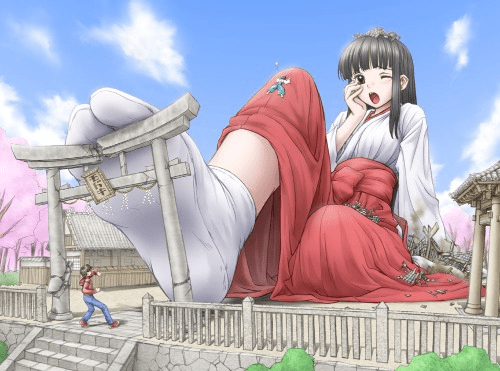](javascript:;)</ignore_js_op> <ignore_js_op>[-6f7ee8c4e1249203.jpg](forum.php?mod=attachment&aid=OTIwNTd8YzVmZGI4NWR8MTY0NzcwMjg3MHwxODIzMHwzMTY2OA%3D%3D&nothumb=yes) *(56.02 KB, 下載次數: 2)*

[下載附件](forum.php?mod=attachment&aid=OTIwNTd8YzVmZGI4NWR8MTY0NzcwMjg3MHwxODIzMHwzMTY2OA%3D%3D&nothumb=yes)

2021-11-6 02:19 上傳  

[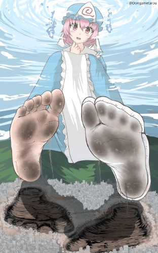](javascript:;)</ignore_js_op> <ignore_js_op>[-6368b2984fc2300d.png](forum.php?mod=attachment&aid=OTIwNTh8ODhlM2E3NWN8MTY0NzcwMjg3MHwxODIzMHwzMTY2OA%3D%3D&nothumb=yes) *(371.61 KB, 下載次數: 2)*

[下載附件](forum.php?mod=attachment&aid=OTIwNTh8ODhlM2E3NWN8MTY0NzcwMjg3MHwxODIzMHwzMTY2OA%3D%3D&nothumb=yes)

2021-11-6 02:19 上傳  

[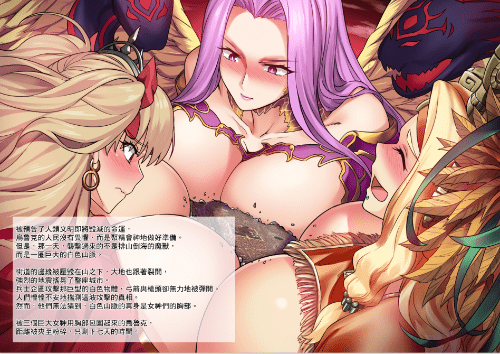](javascript:;)</ignore_js_op>  

# 30

由于最近考试所以巨灵圣女暂时停更一至二周，可能第二周就更新了，所以非常抱歉给我读者（虽说感觉没几个人看）但肯定会在过年一月前更新完（肝疼）开启番外与地狱篇，希望大家喜欢，给我读者评论一下，希望我知道还有人在看啊(இдஇ; )  

# 31

总算回来了，鸽了这么长时间抱歉抱歉，更新，更新，剧情大肆发展，福利在回忆后面，希望大家喜欢。

于此同时的枫叶教堂内，鸢还在和教堂的修女练习圣歌【风之街】（出自翼年代记），对于天使的鸢来说这并不是什么大事，虽说力量被封印，但天使与生俱来的天赋可不会消磨只是有点累而已，而在准备的前一天晚上疲劳的鸢来到了教堂的花园准备散散步，散一下心情。

而在鸢走过之时隐约看到一个残影在枫树林里闪过，但鸢并没有在意就向花园走去。

也在这时她见到慌忙的贝尔，她貌似十分着急，好像在寻找什么。

“贝尔小姐，你在干什么啊？”鸢拍了拍贝尔的肩膀问道。

“圣女大人，你看到露露了吗？在她吃完晚饭后就不见了。”贝尔着急的问道。

鸢想了想说“我来花园前看到枫树林里有一道残影划过，会不会是她。”

“那我们快去找找吧，都是我不好，不应该那么说这孩子。”贝尔着急的说道。

而鸢本想更加详细问问，但贝尔已经去往了枫树林，自己也只好跟了上去。

而在教堂的顶部站着一个类似女人的残影，后来影子慢慢变小，而且用着沙哑且悲哀是声音说道“快了，复仇很快了，罗路。”

于此同时的谢菲也在教堂的档案馆里找到了关于露易丝的名字，但对于露易丝如果按照书上说的她因为那个罪名的参与者在逃亡时死了，而且如果说有后代只有一个现在仅仅九岁的女儿。

谢菲看了看档案里的两张照片，谢菲认出这个露易丝的女儿应该就是枫叶教堂的露露，露易丝的女儿叫米儿，很早之前就被列入追捕对象之一，但有一点不对劲，两张照片一张是露易丝在成为王室大法师与女儿米儿拍下的照片，看起来照片的米儿纯粹，可爱活泼，十分富有童真。另一张是刚刚在迷失森林里找到的米儿，作为孩子母亲的死亡应该是悲伤，痛苦的但在米儿的脸上确实平静却有一种说不出来的怒火这不应该是一个还未涉世的孩子该有的，更何况那个孩子被罗路凭关系保了下来后来的表现反差也有点大。无论是魔法能力和处事能力也近乎不像一个孩子该有的。

谢菲查了查露易丝所研究的魔法类别后得出来一个不可思议的结果，但最有可能的是这个，谢菲立马命令侍卫准备最好的马车，毕定要在明天早上到达枫叶教堂，如果猜想正确，那当初露易丝在迷失森林所发生的事也许就有线索了。

在接近凌晨的时候，谢菲莉枫叶教堂大约还有两个小时的路，但此时一直红润的巨足直接踩向了马车，谢菲迅速跳出马车，而马车连同可怜的车夫就直接被巨足踩在脚下。

巨足离开地面之时，粘稠在足底的有粉碎的马车和已经血肉模糊的碎肉尸骸，甚至还有热气在巨足上散发。

天空上有出现一只如同青葱般细腻的手指，将巨足上的血肉抹了下来，天空之上冒出了巨大少女的脸颊，少女将指尖的血肉轻轻舔进了口中，细细品尝，貌似在感叹人肉的美味。

这也让谢菲感到有些反胃，而那张天空中脸颊谢菲简直熟悉的不能再熟悉了。

没错，菲尼斯，这个残忍的魅魔。

“真是的，明明差一点就能尝到谢菲酱的味道了，为什么要躲开呢？”菲尼斯有些失望的说道。

“我可没有什么m属性，更不会被你给。吃掉，看来你一早就埋伏好了。”谢菲说道。

“我只是接受临时命令要阻止你去枫叶教堂而已，虽然加班什么的很麻烦，但如果是你的话就有意思多了，快快开始吧，这里可没有什么所谓的城镇，这下可以放心了吧，谢菲酱。”菲尼斯挑衅道。

“没办法，速战速决吧，这里没有什么障碍，刚好可以把新仇老帐一并算清！”谢菲回答道。

“过去的事还这么清楚啊，可这也不能我 ，毕竟你们村的人类真的很好吃……”

“闭嘴！”谢菲打断了菲尼斯的话。

“啊啦拉，生气了，好吧那就让我把德尔村最后的点心解决吧。”

“我今天一定要将你送到地狱去！”

说完，谢菲的身体也开始迅速变大，不愧是莱特帝国的精英魔法师，也极其精通巨大化魔法，而这场女神间的战斗也就只能远方的人类才能欣赏到了。

随着时间流逝，天空也逐渐亮了起来，一大早的时候贝尔就已经开始为鸢准备仪式和早餐，众多的魔法师正在绘画法阵，鸢还在担心露露的安全，此时的贝尔安慰道

“放心吧，圣女大人，以露露的聪明才智应该不会有事的，再加上我已经派教堂的守卫去寻找了，很快就会有消息了。”

“但愿如此吧。”鸢回答道。

此时罗路跑了过来，脸上好像非常慌张，急匆匆的说道

“贝尔，快过来，不好了。”

“发生什么了，罗路大人。”

“快跟我来一下，圣女大人先去准备吧，我和贝尔有些私事要谈。”

说完两人就将鸢留在大厅。

罗路和贝尔来到花园后的密林伸出，发现了三片奇怪的空地，那空地有这大约一米左右的深度，里面的土壤中还深嵌着碎掉的树木和血肉模糊的遗骸。

贝尔将自己开始巨大化，从远处看发现，所谓的空地尽然是巨大的足印。

贝尔感觉回复原来的大小，用魔法眼看了看模糊的血肉说道。

“卡罗，洛特，米格…这些都是我派出去的那些士兵。”贝尔颤抖的说道。

“看来，魅魔一族已经越来越猖狂了，她们已经开始动手想要对付我们了。”罗路说道。

“派出的士兵都死的这么惨了，难道露露已经……”

“贝尔，相信露露会没事的，那孩子很聪明的，眼下我们要赶紧完成仪式，帮助圣女找到线索才行。”

“可，罗路大人您不觉的奇怪吗？如果她们的目的是古书的线索，她们又为什么要将士兵杀死又故意让我们发现，暗中杀死不惊动我们不是更好吗？”

“不清楚，现在要紧的是先完成仪式，找到线索，贝尔你去召集教堂内大部分兵力，全力完成仪式，至于这些死去的侍卫，我去报告他们在王都的家属并且准备后来的葬礼吧。”

“那结界水晶哪里……”

“放心吧，我会去看着结界水晶，你快去越快越好。”

“是，罗路大人。”

说完贝尔就去执行命令了。

而在林间暗处，恐怖的眼神正在看着眼前的一切

“猩红之祭已经准备好了，菲尼斯那个家伙还算靠谱，拖住了谢菲那个麻烦，先去准备一下，很快计划就要完成了。”

着急的鸢还是来到教堂的花园来寻找露露，但到密林深处之时之见到了尸骸。

鸢也明白这是当初排出去的士兵，多半是被魅魔杀死了。

鸢同情这些死去的人，决定咏颂咒文来超度尸骸里的怨灵。

可当快要完成超度时，侍卫就将鸢带去准备仪式了。

于此同时，通往枫叶教堂的周边森林有这无数践踏过的足迹，动物与植物的惨状在足印中显得尤为明显，这是两名巨大女性的战场，谢菲和菲尼斯的战斗也已经有了结果。

重伤的已经变回原来大小谢菲缓缓走近了奄奄一息的菲尼斯，没错，谢菲险胜了魅魔菲尼斯。

菲尼斯败了，第一次败了，甚至败的非常惨。虽然菲尼斯满脸的不服与不愤，但她仍然露出诡异的笑容。

谢菲颤抖的将口袋里的精灵粉末拿了出来问道“败了，还有什么可笑的？”

“我败了，但同时我也没败，我只是输给了你，谢菲酱，虽然我一直都不相信我会输给一个人类，但我从不后悔我做的事，现在，你就算赶去枫叶教堂也要来不及了吧！”

谢菲明白自己一时的复仇与好战耽搁了时间，可自己必须去。

谢菲将粉末洒在菲尼斯身上，并且脱下了自己的靴子，直接就将菲尼斯丢了进去，便快速前往枫叶教堂。

对于菲尼斯来说，自己一直都是在蹂躏他人，使其他生命臣服在自己脚下，现在反而在自己敌人的脚下祈求一片生存的天地，真是耻辱，但幸亏是谢菲的脚，味道还要好很多，不至于让自己太难过。

这也算是，报应吧！

在教堂的广场上，众多魔法师高举法杖，修女们高颂着歌喉，在贝尔的发出信号之后，仪式开始了。

鸢在众人的伴奏下开始了演唱，温柔的歌声开始随风游荡：

在时空的对面 向着风之街

带着我过去

实现纯白色花儿的梦想

用稚嫩的手指牵起这双手

愿引领着我步向遥远的你的身边

那个歌声直到夕阳西下也未能停息

睁眼醒来 两人已合二为一

这才第一次明白幸福的含义

是这个痛苦却宏亮的歌声

才响彻所有人的心中

对幸福的含义一无所知的安眠之夜

在未知之梦的对面

两人向遥远的风之街而去

就这样随着歌声的游荡，贝尔和鸢还未注意到后面的教堂隐隐约约出现血红色的微光，而黑暗中的少女偷偷窃笑着人们的无知。

琴音落下，歌声消散。

广场上的神像出现了扭曲的门，鸢口袋里的水晶发出淡蓝色的光芒，貌似在指引这鸢去往那做扭曲的空间。

鸢明白，那扇门后定然是地图的第二块碎片，鸢也毫不犹豫的踏进了未知的空间中。

也在那一瞬间，整个教堂都被红光所笼罩，贝尔等一众魔法师都被阻挡在教堂之外。

“难道，这才是魅魔们真正的目的，结界水晶！”贝尔说道。

也在这时谢菲也刚好赶到了枫叶教堂，看着血红色的结界谢菲明白，猩红之祭已经完成了，三大结界点可能不久要打碎一个了。

“贝尔！”

“谢菲你来了，这个结界究竟是怎么回事？”

“先听我说，露露是不是不见了？最近有没有死过人？”

“对啊，露露昨天晚上不见了，去找她的士兵也死了。”

“果然，贝尔，露露就是露易丝，灵魂魔女露易丝！”

“可我们见到露易丝的尸体，怎么会。”

“等一下再跟你解释，贝尔快，圣女呢？”

“圣女大人已经去往神像里面去取地图了。”

“该死，这个不靠谱的天然呆，露易丝是故意卡在这个时间点，算了，快贝尔带我去尸体哪里。”

“那好，谢菲你跟我来。”

贝尔安排好魔法师将教堂包围之后就带谢菲去往了密林，可一切又貌似没有那么简单。

于此同时，鸢已经来到了神像幻境的内部，在幻境之中鸢看到了熟悉的蓝色身影和陌生的白色身影。

身影随着鸢的不断靠近越来越清晰，后来发现，那个蓝色原来就是晶，但与天堂相比晶的都胸部貌似没有现在那么大，甚至头发也是比较长的，与之同时的白色身影是一个白色长发，身穿女巫服饰的萝莉。

淡白色的柔软长发如同流水般直达腰间，黑色的魔女帽将她娇小的身高稍稍拔高了些，好似瓷娃娃般的脸颊招惹喜爱但些许惨白的脸颊和深红色的瞳孔却有些让人心生畏惧，黑白色相见的连衣短裙和长筒袜包裹其完美的身躯，而她的右手拿着一个深黑色的扫把魔杖，上面还貌似燃烧着深蓝色的鬼火，令人身感一层寒意。

“艾焰前辈，我们成功将暴虐龙族驱逐到了这个世界，这下其他的种族可以和平发展了吧。”

“还不行，晶荧，人类的力量还太过于弱小，他们还没有可以使用魔法的力量，我们需要在此领导他们一段时间。”

“艾焰前辈那你为什么不直接给予所有人类使用魔法的能力呢？”

“晶荧，你看看这篇战争之后的大陆吧。”

白毛萝莉将手伸向远处，鸢也跟着晶荧看了过去，发现了这片大陆曾经发生的惨状。

天空之上飞行着无数巨大的龙人一样的生命，一名龙人直接下落，巨大的身形直接就将一个小王国踩碎在脚下，天空之上传来了女性的残酷笑声，貌似在嘲笑着生命的渺小与无助。

龙女以连接天际的山脉为自己的座椅，将自己的巨足对准下一座城市进行玩弄，最开始龙女只是将自已的一只脚趾伸向了小小的城市，天空中的黑影直接就笼罩了城市中心，市政府直接就被巨趾粉碎成了碎屑，留下的汗液也在深深的侵蚀着城内人类的肺部，而这只是刚刚开始，巨趾并没有安分起来直接开始不断移动，所有巨趾所移动的地方无论是建筑，树木还是生命无一都被巨趾粉碎化为足趾上的一抹碎屑，最后整个城市都被巨趾圈在了一个圈子内。

“这个圈子就是我所庇护的地方，所有的生命都必须臣服于我，不然就是剩下的垃圾的下场！”

说完龙女便将山顶直接掰了下来对着自己的香穴反复刺激，这过程中又夺走了许多生命。很快，达到高潮的她从香穴中射出了大量的白色蜜液，笼罩在了除了圈内的其他土地上，还在冒着热气。

这是这些密液还是自己发生改变，最开始重塑成龙的形状，后来变成女性的形状，最后变成龙女的形状，最后这些拟态生命变的和龙女一模一样只是体型很小但对于人类来说也是女神般的大小。

无数拟态龙女开始对圈外的生命还是了毫无怜悯的玩弄与吞噬，她们貌似没有理性只有本性与性欲的发泄。无数生命的哀嚎对于龙女本尊来说只是欢快的乐曲，而对于受难的生命和一旁观看的鸢来说简直就是地狱。

最后当圈外的一切都是足迹的破坏和满目疮痍大地之时这场疯狂的游戏才算结束。

“看见了吗？这就是反抗龙族的代价。”龙女哈哈大笑道。

此时的鸢渐渐的有点崩溃，这才是是真正龙族吗？那古书所说的和平共处的龙族又是什么，就是什么才是真实的历史？

疑惑，恐怖等不同的情感在鸢的内心如同潮水般涌出，晶，还是说晶荧圣女来过这个世界吗？

当鸢的，心理防线在逐渐击溃时，鸢的水晶又一次闪出光明停止了一切的回忆，一切又再次显得模糊，变的空白。

最后白毛萝莉再次出现，拿着一张残破的地图来到了鸢的面前，这时的鸢也才刚刚回神过来，对于面前的这位“前辈”自己内心有这许多想说的东西。

在鸢还未开口时面前的白毛萝莉就先开口了。

“晶荧的后继者啊，带着寻找答案的钥匙寻找答案吧，当你真正来到迷失森林之时见到我时，一切的一切都会水落石出的。”

说完萝莉消失了，幻境也消失了留下的只有拿着地图的鸢。

而当鸢回到现实之时，眼前的只有残破的教堂，苦战的贝尔和谢菲和面前巨大无的红毛魅魔萝莉，战斗要开始了。

# 32

只能算有空更新了，之前因为考试无法更新，现在总算更新了，现在先跟各位观众道个歉，这段时间停更了，现在加倍更新，之后的更新我会加快，希望大家大家原来（也许还是没几个人看）

正文：

时间回到鸢刚刚进入幻境之前，贝尔和谢菲正前往教堂后院的森林，只见足迹与遗体已经构建出了一个猩红的法阵。

谢菲立马就认出来这就是猩红之祭，一座利用死者的不愤和怨念为基础的结界法阵，贝尔也曾在书上看到过这个法阵，但由于难以理解所以很少有人会去使用这种法阵。

对于谢菲来说这个法阵只要能够找到法阵怨念稀少的部分就能摧毁整个法阵。

正在谢菲正在考虑如何破解猩红之祭时，魅魔一族的援兵在丛林中冒了出来，原来露易丝早就在密林内部安设了伏兵，防止法阵被破坏。

贝尔为了能给谢菲更多的时间决定自己拖住魅魔援军，此时的贝尔开始念动咒语，开始使用另一只空间魔法，这也是快速解决她们的最好方法。

于此同时的教堂内，罗路看着正在运作的结界水晶，而这时门外出现了一阵阵的惨叫声，这声音凄惨，令人心惊肉跳。

“不，不要，不要踩死我，我还想活……”

“可笑的帝国虫子，这样的求饶什么用也没有”

这是在大门出现了一个熟悉的身影，露露。

但相较于平时，她穿着暴露，娇小柔美身体由猩红色的丝衣所包裹，稚嫩的小脚被鲜红的血液所涂抹，猩红色的头发似瀑布般散落，尖利可爱的虎牙也显露出危险的红光，与之前的乖巧简直判若两人，不也许这才是她本来的模样。

“露露，你怎么？”罗路惊讶的问道。

“这副身体的原主人叫做米儿，寄宿的灵魂的名字是，露易丝。”露易丝说道。

“果然，你还是没死，连自己女儿的身体也不放过。”罗路说道。

“闭嘴，我不得不利用米儿的身体活着还不是拜你们所赐，就是为了那个，你们迫害死当初几乎所有的魂之法师，不是吗？”露易丝反驳道。

“什么，你在说什么，那个？”罗路流着冷汗。

“你也是主要执行者之一，当了主教就忘记，魂移神驱，这个莱特帝国的计划，为了获得真正意义上，龙族的力量。”

罗路脸色苍白，他明白，这个禁忌的魔法，那个莱特帝国无论怎样都要完成的计划。

“就是这个计划失败后，龙躯失踪，几乎所有参与实验的魔法师都遭到了追杀，被捉到的魔法师都是杀无赦的结局，要不是帝国为了向其他国家隐瞒实验实情，我和我的女儿有怎么会被追杀到迷失森林，我也不至于要借用我死去女儿的身体苟活。”露易丝愤怒的质问着面前的罗路。

“好吧，我知道你是在怨恨我，好吧，你要杀就杀我吧。”罗路回应道。

“你只不过是个执行者，别把别太看得起自己了，我的目的就是要让莱特帝国灭亡，让开。”露易丝说道。

“我可以死，但水晶绝对不能破，露易丝，我知道你怨恨帝国的上层，但莱特帝国的人民是无辜的，如果水晶破碎那魅魔与人类的平衡就会瓦解，到时候不仅莱特帝国，甚至整个大陆就会有灭顶之灾。”罗路回应道。

“那我的女儿又算什么，我的丈夫又算什么，就是因为龙躯的暴走莱特帝国无法隐瞒真相就把我们当替罪羊，凭什么，既然帝国不在乎我们的命运又凭什么我又在意他们的结局，罗路我看在你是真心对我的面子上我不杀你，滚。”露易丝说道。

露易丝直接击晕了罗路并将目光看向了结界水晶，露易丝召唤出镰刀并挥舞起来准备毁灭水晶。

这是一颗子弹划破空气，直接将露易丝手中的镰刀打掉。

露易丝回头发现是谢菲和贝尔已经赶到。

“幸好赶上了”谢菲说道。

“啊，罗路大人！”贝尔说道。

“你们怎么可能，猩红之祭怎么可能就被破掉了。”露易丝惊讶的说道。

“这还得多亏那个不靠谱的圣女，要不是她对尸体里的怨灵进行超度，不然我还真没有那么多时间来破解猩红之祭。”

“那个叫鸢的圣女，什么时候，但就算你能快速破解结界我的手下也一定埋伏了你们，为什么？”

“这你要问贝尔了，毕竟要说贝尔真的生起气来，可真的很强啊！”

“什么，怎么会…”露易丝一脸懵逼的看着贝尔。

贝尔轻轻摸了摸自己的小腹说道

“不好意思露易丝阁下，在开战的时候我就警告过他们不要与我战斗，最后我也没办法就将他们……”

“怎么会，在她身边的时候她可没展现这样的力量。”露易丝暗暗吃惊的说道。

“贝尔是不会轻易令他人看到自己的力量的，毕竟她不希望给人留下不好的印象但…”谢菲还没说完贝尔就接话道

“但对敌人就只能无所不用其极了，露易丝阁下。”

“露易丝，你已经被包围了，教堂的魔法师也在外面，你已经无路可退，快点投降吧。”

“投降，当我决定这个计划的时候我就没想活着回去，所以今天我活不了，但你们也别想好。”

露易丝划破自己的手腕，血液将她的身体逐渐包围，最后形成一个巨大的血水柱，血柱越来越大最后冲破整个教堂。

血液中一只流淌着血丝的巨型裸足从中伸出，光滑的足底将周围的魔法师笼罩，之在一瞬间就将他们化为血水，林间的树木在颤抖，大地在晃动，绝美的身躯在血柱中逐渐清晰，接近果体的女性之躯显露出危险的诱惑，巨大的身体令教堂逐渐崩坏，最后当露易丝彻底完全蜕变之后，足有百米之高的萝莉魅魔俯视着眼下的生灵，来了，来了，露易丝的复仇开始了，刚刚完成试炼的圣女都知道接下来定是一场大战。

血腥的气息在周围弥漫着，周围的魔法师拼劲全力阻挡这眼前的魅魔，一道道魔法光波打向眼前的巨足，但却丝毫没有作用，对于有些魔法师貌似被眼前的巨足迷惑住了，毕竟这是魅魔萝莉的绝美玉足，眼前的玉足白皙，轮廓无比完美，五只红润圆滑的脚趾头微微的弯曲着，即使魔法师们知道，这并不是一双可以让他们欣赏的玉足，因为在玉足的不断前进下已经有无数同类死在了魅魔的脚下，那细嫩的脚板底，不知要用多少生命的鲜血来滋润，可奈何露易丝毕竟是魅魔，像这样的都弱小魔法师怎么可能挣脱魅魔的魅惑，最终一个个被魅惑的魔法师冲向了那巨大的玉足，成为了那绝美玉足的一丝红点。

露易丝的身体还在变大，足底的生命也好似烟花般消逝，教堂逐渐崩坏，一切也越来越糟，但明明一切对于露易丝有力，露易丝却看起来有些不对劲。

“看来露易丝真的疯了，那个巨大化是禁术，虽然可以突破生命极限的巨大化但也会快速损耗寿命，这个成长速度即使她不久后会死亡但也可以将水晶毁掉，搞不好周围的国家都会受牵连。”谢菲说道。

“那该怎么办谢菲，我的【领域】不一定能抓住她啊！”贝尔说道。

“眼下她现在还在成长期，贝尔如果我想办法将她控制在成长期，你的【领域】能够困住她吗？”谢菲问道。

“也许可以，但展开【领域】要花费一定时间，必须有人抑制住她。”贝尔回到道。

“我去，我也抑制露露。”突然一个声音说道。

谢菲转头一看正是完成试炼的鸢。

“笨蛋圣女，你总算完成任务了，但你真的可以争取到一定时间吗？”谢菲问道。

“当然，虽然我还没明白怎么回事，但我一定会保护枫叶教堂，保护大家。”鸢回答道。

“那好吧，贝尔把那个给她吧。”谢菲说道。

贝尔点了点头，便从她那丰满的乳沟处拿出了一小条金色的锁链。

“这叫束灵锁，可以束缚任何生命，它的束缚程度是和使用者的大小成正比的。”贝尔解释道。

“到时候我会用魔法将你变的和露易丝一样大，然后你用束灵锁制止住她，给贝尔争取时间将她困入【领域】，到时候她就会在【领域】中被强制缩小，就可以停止禁术了。”谢菲叙述了一遍计划。

“好，交给我吧！”鸢说道。

谢菲开始咏颂起魔法，鸢也在魔法的帮助下开始变大，这时的鸢感到一股暖流灌入自己的身体，自己也开始觉得貌似充满了力量，鸢的身体也在迅速变大，巨大的阴影开始笼罩森林，周围的树木也在鸢的成长中被逐渐碾压最后在谢菲的魔力灌输下完成了巨大化。

完成巨大化的鸢便向露易丝冲了过去，巨大白色巨靴碾碎了树木与建筑，天空下落下的阴影粉碎了这片原本宁静的土地，甚至有些无辜的魔法师也在不经意间被鸢高塔般的白鞋践踏成一团血肉粘附在鸢的白靴纹路上，在两个巨大少女的面前，微小的生命真的无比的卑微。

露易丝的屠杀还在残忍的继续，鸢将手中的锁链抛出，那锁链貌似有这生命一样将露易丝的双手双脚牢牢的锁住，而失去平衡的露易丝也直接摔倒在地，巨大的身躯将更多的生命碾压化为遗骸，巨大的声音传遍了真个森林，鸟兽恐惧鸣叫，四散而逃。

但露易丝貌似还没有放弃挣扎，她张口就吞噬了眼前的人类，吞天般的巨口发出惊人般的吸力，好似无尽黑洞般将眼气的人类通通吸入，他们挣扎着，哀嚎者，但都无能为力，最后通通被吸入露易丝的口中，被当成食物吞进女生巨嘴中自己细小到没有任何反抗的余地，他们在露易丝的舌头上疯狂的爬行着，我能清楚感觉到他们的恐惧，最后在露易丝意思“咕噜”的一声下，地洞般的喉咙打开小舌轻轻一送就将人类们送到了他们最后的归宿，胃。

在深不见底的食道下他们最后落入了露易丝的胃袋酸海之中，魅魔的胃液非常强力，仅仅是身体刚刚落入就融化成了一道白烟，运气好的人类只能粘在胃壁上等待死亡的降临，或者是坐在被吞进来的树木土块中苟活，但这都是暂时的，随着时间一点点溶解等待他们的命运只有被像食物般吞噬，与露易丝融为一体。

在露易丝的不断吞噬下她又开始变大了，由于鸢不会变大所以很可能锁链也无法困住露易丝。

“好了吗？贝尔小姐！”鸢尽全力的喊到。

而贝尔的手中一道淡灰色的球状体逐渐开始笼罩起巨大的露易丝，鸢及时丢下锁链逃出了球状体笼罩的范围。

“已经可以了圣女大人，接下来交给贝尔吧！”贝尔说道。

淡灰色的球体不断变大将周围的事物不断笼罩逐渐将露易丝笼罩在内，这就是贝尔的空间魔法：【领域】吞噬空间。

只要在魔力和时间富裕的情况下就可以制造的出来的特别空间，只要被笼罩进去的生命除非魔力极高不然基本上只能被贝尔随意掌握。

可以说贝尔在这个吞噬空间基本上就是神一样的存在，但这次不一样，露易丝吞噬了太多有这魔力的魔法师，这种有这魔力的人类对于这种魅魔的生命简直就是大补，幸亏贝尔趁他还没有继续进化，不然就算是贝尔也未必能能够继续阻止她了。

在成功封住露易丝后贝尔便开始将吞噬空间压缩，其实贝尔是可以迅速压缩空间直接将露易丝压死，但对于贝尔来说，她和露露的那段一起生活成长的时光是真实又美好的虽然一切都只是谎言但贝尔也不打算杀死露易丝，只是将空间进行缩小来抑制其中的露易丝，再加上当年的事情自己是知道一些的，对于露易丝的悲剧自己也有一定的责任。

也在大家认为一切的应该结束的时候空间球开始变态般的膨胀，它开始打破贝尔的压缩空间，不断膨胀，开始变的越来越大。

谢菲见状说道“贝尔，快，不要犹豫，引爆吞噬空间。”

此时的贝尔是矛盾的，她明白如果这时她不引爆吞噬空间露易丝必然会打破空间破坏水晶，但对于当初的一丝愧疚让贝尔犹豫了，也就是这刹那间的犹豫，一切都改变了。

露易丝直接就击破了吞噬空间，不应该是击破了吞噬空间，她比以前更加巨大，大约是原来巨大化的两倍左右。

谢菲不明白就算吞噬魔法师也不应该长大这么多，可她看到露易丝身上血红色的魔法纹路她明白了，露易丝以自己的大量寿命为代价令自己快速成长，但她持续时间越长离死亡就越近一步。

谢菲赶紧利用露易丝长大的时间用魔法将结界水晶从废区中拿出来交给鸢并且让她快点走，不然一切都晚了。

鸢自己也明白现在为了防止结界被打破自己只能带着水晶离开，但她也打算带着谢菲和贝尔一起离开，但还是被她们拒绝了，对于她们来说守护教堂结界就是她们的使命，这可不仅仅为了帝国也是为了这片人类生存下来的大陆。

但露易丝可不管这些，她只想毁灭掉水晶完成任务，即使面对曾经照顾自己的贝尔也不例外。

绝对的体型差距无法改变这已经失败的战局，可她们还是不肯退后。

“贝尔你怕嘛？”谢菲问道。

“空间的失败是我的责任，这一切也是我自己的错，但绝对不会害怕的。”贝尔回应道。

“也对，我们和赫罗亚毕竟都是从【艾焰】老师那里出来的，这点事就害怕也太丢脸了。希望那个笨蛋圣女能够跑远点吧，现在我就来给她多争取一些时间吧。”

“好，谢菲我们上！”贝尔说道。

二人默契的冲向眼前的巨大生命，可这种做法莫过于以卵击石。

露易丝反手将自已身上的锁链扯了下来并将贝尔她们抛去，贝尔和谢菲在束灵锁的缠绕下瞬间白给。

露易丝将已经被锁的死死的谢菲和贝尔拿了起来，但露易丝却并不打算杀死她们。

“看来，二位勇气还真的是令人敬佩呢。看在贝尔姐姐在这段时间待我不错的份上我就成全你们吧，要在人家的子宫里要感谢人家。放心吧，不会杀死你们的，在里面也不会痛苦，只是会好好睡一觉，不久后那个圣女和赫罗亚也会陪着你们的，醒来之后你们就是大陆上最后的人类了。”露易丝说道。

露易丝直接躺在大地上同时也压碎了山脉和树林，随后露易丝缓缓支开双腿，玉手将胯间的阴唇慢慢打开，而在粉红色的香穴内漂浮出一滴粘稠的乳白色液体，直接将小小的二人连同束灵锁一起包裹住。

随后，露易丝用玉手将香穴撑的更大，那粉红色的洞穴向外喷薄出温暖的香气，随后吸力爆涌，如同野兽般将二人吞了进去。

她们被一直向里送，被送进一个巨大无比的粉色空间，这里就是露易丝的子宫。

性格顽强的谢菲仍然还在不甘心的试图挣脱束灵锁的束缚，但贝尔明白一旦被束灵锁捉住除非其他人帮忙，不然几乎就无法自己打开，这时柔软的子宫壁也开始发出催眠的气息，在这香甜的气息下即使是倔强的谢菲也和贝尔一同倒下，陷入沉睡。

感受到了子宫中的小家伙已经昏迷，露易丝才站了起来，便温柔的地摸了摸自己的肚子。

此时的逃跑的鸢也感受到了二人的落败，这时的鸢也开始感受到绝望，难道一切都结束了吗？

而在鸢的背包内，那两张羊皮纸和晶给她的水晶开始发出微弱的光明，难道，奇迹真的存在吗？  

# 33

下一次更新枫叶教堂将会结束，卡洛斯教堂会速过，而关于莱特帝国五十年前的计划也会浮现出水面，历史的真相也会逐渐显露出来（虽然也没人在乎）  

# 34

回来了，由于自己文笔不好所以长期鸽子表示歉意，这次回复更新，顺便祝贺大家元宵节快乐，新年快乐！

祈祷吧，咏唱吧，救世的圣女，将黑暗驱逐吧！

鸢手中的水晶发出了耀眼的光芒，纯洁，神圣的光辉将整个教堂的一切都笼罩起来。

露易丝从来都没有见到过这样光芒，随着光芒越来越强烈，露易丝貌似陷入了过去的一切。

原本露易丝作为灵魂魔法的大导师一直在研究一种不可思议的魔法，那种魔法不是强大的力量，却是所有人类渴望也不可求的禁忌，生命与灵魂的交错，骗过死神的魔法，重生。

生命是美丽的，脆弱的，神圣的，珍贵的，短暂的，可在顽强的生命都会有凋谢的时候而在这个混乱不堪的世界平凡的生命只能被上位的贵族化为消耗品使用。

露易丝作为灵魂魔法的大导师却爱上了一个平凡的男人，龙族混战之后人类大获全胜，龙族被迫驱逐这个世界，但上位的决策者为了让强大的魔法所占有开始了猎巫行动，巫师，女巫，魔法师几乎无一幸免，而露易丝长期研究灵魂和生命的魔法拥有着极长的寿命，正因为如此她才躲过统治者的迫害，但隐居的孤僻和极长的寿命使她越来越孤独寂寞，直到她救下了一个少年，那是一个被即一个巨型女兵所追逐的小小生命，也许是孤独，也许是一时兴起露易丝用缩小术捏死了前来追逐的女兵救下了他，他是帝国的奴隶，某个贵族小姐的玩具，但都不重要了，她爱上了他，仅仅是这样而已。

似水流年，露易丝教会了少年基础了灵魂魔法，但少年的天赋令人惊叹，很快就自学许多魔法，甚至很快就拿到了王国所颁发的大法师证书，两人很快就相爱了，这是原本远离尘世的魔女有了回归凡尘的念头，毕竟百年过去了，猎巫行动早已经不复存在，也许只是做一对普通的夫妻也许也没有什么不好，甚至放弃魔法所带来的长生，白头偕老也总比长寿的孤独来的快乐，也许生命的意义魔女也已经逐渐明白了吧！

但现实是残酷的，莱特帝国逐渐开始探索那个在戮兽帝国名为龙族时代的辉煌遗迹，他们发现了最不可思议的存在，一具来自那个“领域”的，真正的，龙之卵，还是雌性，真正的龙的血脉，真龙的血脉与力量，哪怕是幼龙也有这可以踏碎任何一个国家的力量，当时的女王，梅纳德，希望着莱特帝国能够统治整个世界所以开始准备自己的计划“魂移神躯”，她为了这个计划招来各个亲信大臣，其中罗路就是其中之一，为了能确保自己能够获得龙族的神力莱特帝国与戮兽帝国开始了合作，他们抓捕与远古龙族相近的兽人族，并且只抓捕雌性，愤怒的兄性为了自己种族的未来开始战争，在兽人强大的力量下原本一切都有这希望直到女王亲自将一切将终结，巨大的丝足将灾难降临原本胜利的战场反而成为了兽人的屠戮场，女王的白丝之足将脆弱的兽人捏碎成肉沫与泥土错容在一起，鲜红的血液像花朵般绽放在女王的脚下，染红着如同刑具般的白袜足，尸血的腥臭和女王足下的汗味蔓延了整个兽人部落，即使逃过一劫的兽人也在有这腐蚀般的恶臭轰然倒地，他们的肺部溃烂，生不如死，没错，雄性兽人就在女王的足下游戏中消失了，兽人的领地也变成了巨足般的盆地，没人想到那生机盎然的盆地森林过去曾经是一个种族的墓地。

为了达到目的，女王下令国家里的所有大魔法师必须参加这项计划研究，露易丝原本想着离开但女王的下属手眼通天，夫妇二人哪里也去不了，无奈夫妇不得不响应女王的号召来到了戮兽帝国的地下实验室开始了工作，而两年后他们的女儿出生了，父亲给这个可爱的孩子一个可爱的名字，米儿。

魔法师们开始不断的使用着兽人的身体与灵魂希望她们能够与龙之卵形成共鸣，一但有了一定的共鸣，对于计划定是一项大工程，但区区兽人的灵魂难以承受远古龙族的精神力量，几乎每一个实现共鸣的兽人都是七窍流血，好似中毒般痛苦死去，面前活下来也还是浑身颤抖眼神里有这无法比拟的恐惧，即使失败的兽人也会被反复利用知道神经溃败而死，露易丝是心疼的，无论怎样她们都是生命，也许她们无法像人类一样利用魔法，但也不代表她们的生命可以随意践踏，可在女王的压迫下没有人敢反抗，甚至有些魔法师麻木了，甚至疯狂到以此为乐，享受着生命消亡的快感之中。

丈夫曾想过逃亡但年幼的女儿无法抛弃，人性越来越模糊，马上就要变成实验的疯子，就近魔法是生存的利器还是屠戮的刀刃。

在一天夜里，原本来观察灵魂共鸣的露易丝正在去往龙之卵的密室，她看到两个身影来到了密室所在地，露易丝偷偷的跟了上去，在微弱的灯光下露易丝看到了两名她完全未看过的异种女孩，好似蝙蝠般的肉翅，末端有这尖牙的口器之尾，近乎全裸的娇媚之躯，和奇怪种族的角，空气中弥漫着桃红色的气体让露易丝好似在发情的梦中，渐渐昏迷，异种的少女好像向着在水晶器具中的兽人少女说这什么：

“你已经决定了吗？名为罗琳的少女，和魔鬼的契约可是很危险的！”

“是的，我要复仇，我要获得真正的力量，我要为我的哥哥，父母，我的族人复仇，给这些傲慢的人类讲下我的怒火，我要将他们臣服在我的脚下！”

“姐姐看她那么渴望复仇就让她成为这龙躯的真正主人吧！”

短发少女将口器直接就完好无损的穿过水晶器具咬上了名为罗琳的兽人少女。

“明天晚上就会生效了，但记住即使获得龙躯你也无法马上掌握这力量，在获得力量后速速逃亡迷失森林，并开始发展你的族人势力，从那之后你们就叫，魅魔一族！”

说完，异族少女离开了，密室中只留下了昏睡的露易丝和兽人少女的狂笑。

晨光洒在露易丝的脸颊，她在丈夫的呼喊中醒来，她要求着检查水晶器具里的少女，但由于她是几年来少有的共鸣者，被拒绝了，麻木的生命不断的用大量的魔力强制注入少女的体内，这次共鸣的声音越来越强，成功了，极高的共鸣度，马上就能完成女王的命令，马上就能完成任务了，人们过度的欢呼忽略了兽人少女的部分异变，兽尾的毛发开始脱落渐渐开始长出利齿，粗糙的皮肉变的更加圆润光滑，背后开始长出微小的肉翅，但认为自己解脱的人们忽略了这些认为这是与龙之卵共鸣的同化现象罢了，但露易丝明白，那并不是龙的样子。

消息很快就传到了女王的耳中，女王喜出望外，驾驶这华丽的龙车来到戮兽帝国的地下。

女王看着这些拉着华丽金车的“龙”，一群虚假的龙，被远古龙族抛弃的残次品，只能成为人类的牲畜，真是可笑。

而此时的晚上，露易丝无法入眠，女王要来了，她要看到使用的成果，她要吞噬那个兽人少女，可不知如何她的世界无法平静下来，明明很快就要获得自由和丈夫远走高飞但内心却充满了罪恶感，我们这样为了一己私心而伤害其他种族的生命真的正确吗？

年幼的女儿发出喃喃的睡梦之语，露易丝放弃了所谓的念想，无论怎样都结束了，一切都会好起来的，但心中的不安却时时刻刻在提醒自己什么，露易丝闭上眼睛，施展睡眠魔法，睡去了。

梦中，丈夫的身形所现，好似在说着什么，烈火逐渐围绕着周围，一个苍白的手臂像自己求助，他哭喊着，祈求这什么，但他的背后出现了黑色的阴影，定睛一看是一张肉色的长着利齿的大布将他包裹住，在包裹他的一瞬间，布包逐渐变小，而布包的后面连接着什么东西，而其尽头竟是一个少女的臀部，整个布包都是一根可以吞噬人类的尾巴，包布无力的挣扎着最后越来越小，最后慢慢的被少女的尾巴吸收，与少女融为一体，丈夫的声音越来越清醒，最后模糊的声音凝集成两个字“快跑”。

这里是回复与复述，为后面一切都真相做个铺垫，所谓的“龙族”究极是什么……  

# 35

更新了，更新了，鸽了将近一个月很抱歉，希望大家原谅，这篇之后就要到达与露易丝结局了，也会更新荒芜之域的设定，希望大家能够期待留言给我更多灵感

露易丝在惊恐之梦中醒来，极其真实的梦境让她吓出了一身冷汗，在自己还未反应过来之时，周围的一切都开始不断的震动，而随着时间的增长震动的来源也愈发清晰，龙的黑色巨影，那是已经被初代圣女所驱逐的恐怖生命。

黑色的巨影开始不断增长，无法理解的巨大生命开始冲击整个地下实验室，仅仅一段时间周围的一切就已经混乱不堪，在这是露易丝的丈夫一手抱着还在襁褓中的女儿一手将露易丝拉起，向实验室的上层跑去。

还未反应过来的露易丝问起丈夫到底发生了什么？

丈夫告诉她：共鸣实验暴走了，实验中的兽人少女与龙躯开始自动融合了，现在龙之躯开始不可估量的暴走，凭我们的力量不可能对付的了带有怨恨的龙之躯，只能快些逃走。

可当他们来到地表只是他们被眼前的景象吓到了，巨大的龙女之躯从地下的深处苏醒，她仰天长啸貌似宣泄着这个世界的不满与愤怒，无数冤魂在她的耳边尖叫着，倾诉着她们一世里无尽的苦役和怨念，或者龙之躯的少女逐渐迷失了，世间的恶与她心中的善结合为一，她要像这个给自己和族人带来无情毁灭的世界进行报复与统治，冥冥中她看到了众生臣服在她的脚下，臣服在无与伦比的力量之下。

数年时间建造的实验室瞬间化为了齑粉，一个浑身赤裸的龙人女体从中爬了出来，而她那违和的口器之尾却伸向了地下室实验室将地下还存活的同胞吞进了口器直到子宫之处，而在地表上的人类被这一切震惊了，在那不属于龙族的魅术下无论男女很快在这无瑕的玉体前有了不该有的反应，这是魅魔双子给予兽族少女的恩赐，魅魔的力量。

可此时的她只有复仇与毁灭的念想，而地表上的村落毫无疑问的成为了她残酷的复仇对象，炽热的龙息点燃了戮兽帝国的长夜，无数村镇的生命被烈火吞噬殆尽，她缓缓的从地下巨洞中爬出，向其他村落中走去，无情的巨足不断践踏着小小的生命，而凡人们苦苦挣扎的哀求之声引起了她的兴趣，她试探性的往前迈出一步，脚底与地面之间形成的阴影，瞬间就破灭了人类生的希望，不知是谁第一个开始，人类在面对遮天蔽日的巨大脚面时，他们开始跪着祈求龙女一丝丝怜悯，忏悔之声在龙女的脚下不断响起，在这时一种由内心而发的快感传遍了她的全身，她开始迷恋上这绝对的控制欲，她并没有急切的放下脚，她享受着作为女神的快感，她想着原本为消耗品的自己瞬间反转成为掌握生死的女神，当年欺压自己的种族现在自己的脚下祈求原谅一种由内而外的优越感袭来，令她无比满意。

人类们见玉足并未落下，以为是自己的忏悔引起了龙女的感动，他们又一次开始奔跑了起来，妄想着一线生机，但不可能，复仇的怒火不会因为一时的快感而消失只会不断增长，龙女早就猜到足下虫子的小心思，但她没有着急将巨足落下，她最清楚不过：在失望之中给予希望在最后赐下绝望再有趣不过。

人类不断的奔跑着企图抛出足下的阴影寻求月光的沐浴，但在他们来到足趾的边界之时，轰～～～，落下来，毁灭的巨足落下来了，只是刹那间，村庄的无数生命化为了玉足上一个个极端微小的红点。

“这是，我的复仇。”龙女轻声说她体内的力量依旧在膨胀着，她并没有急着去摧毁这曾经奴役她的文明，而是仔细的感受着自己脚底下仅存的空间中，十几个还在挣扎着的顽强生命，香嫩的玉足此时变为了吞噬生命的地狱，所有触碰到龙女肌肤的生灵，都会面临死亡的下场，而那胸前高耸的双峰在众人前暴露无遗，微红的乳首强烈的刺激着众人的神经，强大的力量让此时的龙女感到胸部无比膨胀，她只是稍稍挤了挤乳首，甘甜炙热的奶水从乳头喷薄而出，如同灭世的洪水向地表袭来，而人们还未品尝到香甜的奶水就被如同灾厄般的白色洪水所淹没，作为真正的龙女，即使奶水中也含有纯度极高的魔力，一般的人类身躯根本无法承受奶水魔力所诞生超高热量，被奶水覆盖的结局也只是烫死或者淹没，但在美丽龙女的奶水里死掉也是一种别样的风流死法。

露易丝的丈夫很明白失控的龙女迟早会波及到这里，她力量还在增长她还会越来越大，所以必须有人做出牺牲，他知道为了自己所爱的受伤的妻子与娇弱的孩子自己要做出牺牲，引开失控的龙女。

即使露易丝有多么不舍也无法改变丈夫必死的决心，其实她知道，他从来都是这样，一但决心自己要求做的事，无论是谁都无法改变他的决心，她也明白为了这个孩子，必须有人牺牲。

而在丈夫离开之时他告诉她不要回到莱特帝国，女王一定会为了平息事端将一切嫁祸给参与这场秘密实验的魔法师们，去迷失森林，哪里是大部分人类的禁区只有强大的魔法师才敢生存在那里，就这样平平淡淡的隐居下去吧，不要再出来了。

说完丈夫飞了起来冲向了失控的龙女，对于仇视这场实验的龙女来说他是必须的复仇目标，她追了上去，她丝毫不在意自己只是踏下一脚就会带来多大的毁灭她不在乎，在她现在的眼中，只有复仇的念想。

夜晚的云雾中，原本一切城镇宁静祥和，打破这一切，是一面穿过云雾的肉色的墙壁。在镇民的眼前着一只长达千百米的脚面向他们袭来，数十万人的可怜数量如同几只蚂蚁的大小，在脚趾下蠕动着，他们被轻易地践踏毁灭化为滋养足趾间的红点，他们也是第一次的感受到，蝼蚁的视角，究竟是什么样的。脚趾移动了一下，巨大的冲击力和地面的支离破碎传来，小小的灰尘经过脚趾的加速，轻易地将人类的身体撞成了无数猩红的碎屑，可她毫不在意，明明自己的移动毁灭了极多的生命却丝毫不在意，对啊，女神怎么可能在意足下蝼蚁的生死呢？真是可笑至极！

露易丝在丈夫将龙女引走和头也不回的离开向迷失森林赶去，她不能回头，如果自己一但回头丈夫的自我牺牲就白费了，自己只能逃跑，去往已经的消失的精灵之国，原本称为妖精乡现在成为迷失森林的禁忌之地。

随着一段时间的追逐，龙女足下的一切都已经破败不堪，满是残骸和随时，美丽的巨足之下却是哀嚎与毁灭的地狱，戮兽帝国的百分之九十化为了废区，原本由数千座城市组成的国家，彻底的变为了龙女身体上的灰尘，残存的也只是些瓦砾和血水。

但她已经不能在忍耐下去了，她必须要毁灭面前的虫子，她那鲜红妖艳的嫰唇缓缓张开，吞天般的巨口发出了如同黑洞般的吸力，少年还在苦苦支撑但地表上的残存的生命却被吸入她吞噬一切都巨口，伴随着城市的遗骸一切吞入口中最后落入胃内的无尽酸海。

最后少年也撑不住了，在吞噬一切都强风中被拖入巨口之中，但龙女并没有着急吞下，而是故意将其留在红色大陆般的巨舌上，不断的玩弄，她知道这个人类也是强大的魔法师没那么容易死掉，所以才要多玩一会，而在他的视角自己只是她口舌上的一个玩具一粒米罢了，她只是在玩弄自己，哪些海潮般的洪流将他多次淹没，直到奄奄一息，直到无法反抗，最后龙女也发现口中的虫子失去玩弄的价值后毫不犹豫的将其吞了下去，深邃的咽喉貌似通往着地狱之门，完蛋了，结束了，但最起码她活了下来无所谓了，最起码我保护了她，没有遗憾了，最后他穿过深不见底的食道落入了饥肠辘辘的胃袋中，在腐蚀的酸海内结束了自己的一生，化为了她身体的养料。

毁灭了少年的龙女还没有满足，完成复仇的她开始变的无比兴奋，她看到了戮兽帝国的首都，开始了自己最后的游戏。

龙女来到了被称为“夜之都”的戮兽帝国的首都，德洛克，这是由王族城堡中心的大结界所笼罩，可以保护好德洛克的一切，也是王族自信的代表但对于拥有强大力量的龙女来说也不过是一个基盘照了个玻璃罩罢了。

龙女渐渐趴下，不规则的黑灰色和灯光带来的黄红色分布在龙女的脚下，龙女缓缓的坐在了结界点顶层准备开始自己的游戏。

人们疑惑的看着无法理解的肉色天空，而在这不可名状的中心的黑色深渊，可国王再清楚不过，这个场面像极了莱特帝国的女王梅纳德降临的时候，吞噬天空的阴户降临的时候一模一样，灾难降临了，毁灭到来了。

“还大家好，我是龙之女神，罗琳酱！”威严而充满俏皮的声音降临在结界内的人类耳中即使有结界的保护人类的耳膜也在这恐怖的音波下震的出血。

“我来到这里只是为了一件事哦，为了完成我的复仇而来的，所以准备大家去死吧，不过为了让大家死的比较要尊严大家都将成为我阴户之下的玩具，所以大家要感谢我的恩赐哦，你们可比哪些我足下的残骸幸运多了，大家要好好谢谢我哦！”

那代表死刑的宣判将人们的生命下达了死刑，人们很快就开始了恐惧与骚乱当人们冲向结界想要逃走时尾部巨大的口器将其吸噬，没错，一切逃跑的地方都没堵死了，一切都完了。

巨大的物体从高空中直冲而下，天空的结局瞬间就化成了碎片，天空的云层被推向四周，甚至连大气都被其震动了，城市无知的人类还未认出那是什么，貌似是一位成熟女性的神秘部位，没错那正是龙女的巨大小穴。

小穴上的任何一处褶皱都比城市中任何一栋建筑都要巨大，每根阴毛貌似都有这好几千米长，丰满的小穴入口处的每一处褶皱都在不断抽搐着，看起来就像一只巨大怪兽的嘴巴，随时可以将争做城市吃掉，但其中的人类总算发现一切后他们的惊恐快速增加甚至开始失去理智。

“这下你们明白了吧，可笑的人类，这就是我们兽人族被当我试验品的愤怒与绝望，光我巨大的下体就可以轻松毁灭你们的文明……”

龙女巨大的小穴俯视着这座“大”城市，由于人类与龙女下体的巨大差距，人类完全被龙女向人类展现的巨大小穴所征服，人类完全能够感受到在这巨大的下体面前，自己是多么的渺小。

龙女的内心的优越感油然而生，她并没有着急落下小穴，因为巨大的龙女喜欢用自己巨大的体型和这些渺小的虫子进行比较，自己用来生育的的器官对于下面的人类就是毁灭人类的武器，仅仅一次生理的手淫就可以讲他们像碎渣般毁灭。

原本龙女还想好好的威吓一下他们，但她已经按耐不住了，她要对愚蠢的人类降下神罚，她要让渺小的人类满足自己的小穴。

天空原本停留的小穴开始缓缓下落，空中弥漫的云雾开始被缓缓推开，神罚开始了，她那巨大的小穴可以轻易吃掉这小小的城市，小小的人类更加的惊慌失措，他们有的试图逃跑，有的使用魔法攻击反抗，有的完全被吓的失魂落魄忘记的自己在哪里。

轰～～～轰～～～轰砰砰砰砰砰砰…………

！！！！

“啊……好厉害…………啊啊啊……这个好棒………”

雷鸣般的声音和龙女巨大的呻吟声响彻了整个戮兽帝国，甚至传达到了其他国度，刚刚还在城市上空中的巨大小穴瞬间吞没了城市，而那充满魅惑的妖娆之音虽然震耳但却让人陷入迷惑之中，即使明明巨大的小穴都已经降临于此，他们去而感觉不到恐惧与痛苦欣然接受了被龙女的小穴吞没，而这一切仅仅是龙女想要更加舒服。

“啊哈……！啊哈……！啊哈……！小虫子们你们好棒……！我还要更多…………”

仅仅摧毁这一座城市还不足以满足龙女的小穴，随着龙女将自己的小穴向各个方向开始摩擦的时候，戮兽帝国的一切都在被龙女的小穴进行清理，龙女那巨大的阴蒂和丰满的下体墙壁将龙女小穴之下的所以建筑物统统摧毁，然后进入小穴内部碾碎和无尽的爱液结合在一起，最后成为龙女小穴上的一个个小小的污点。

这个帝国没有任何存在能够满足龙女的手淫，村庄，森林，城镇甚至结界首都一切都会被龙女小穴上的褶皱吞噬，龙女的两腿之间俯视着大地，她的小穴能够碾碎任何小小的建筑物，龙女不断的在大地上扭动着屁股摩擦着小穴带来更多的快感，而在这小穴之下满是疮痍的地狱景象。

“啊啊……做了一次真舒服啊……你们应该为女神的神圣领域做出的贡献而感到骄傲才对……”

龙女总算结束了她的游戏，毕竟她的小穴可是碾碎了戮兽帝国的最大都市，此时的龙女满身是汗，呼吸沉重。

龙女的胯部杀死了不计其数的人类，当然龙女毫不在意的在这城市的遗骸上休息，而龙女的表情似乎对这覆盖着爱液的城市遗骸非常满意。

而龙女的小穴也开始散发出一种雌性的荷尔蒙蒸汽，胯间留下的汗液如同潮水般落下了城市的遗骸，即使幸存的生命也逃不开被胯间汗水淹死的悲剧。

而不肯忍受耻辱的魔法师仍然还在不断的攻击而接下来他们就要为他们愚蠢的行为付出代价。

“看来我的小穴在你们眼里严重更像一个怪物了吧，这样想可是大不敬哦！”

说罢，天空的小穴开始向上部移动推开荷尔蒙的雾气，龙女直接用如同青葱般柔嫩的玉指将自己的小穴经量撑开，而小穴天空所流出的荷尔蒙气息令人明白接下来发生事情肯定不妙。

“大家都成为荣幸成为女神神圣领域的贡品，喜悦吧，蝼蚁们……”

说罢天空中的巨大小穴开始出现极大的吸力，无数的遗骸，血肉，残存的人类魔法师都被吸了上去，如同无尽黑洞般的小穴将他们尽数吞噬，最后被龙女的子宫消化变为了龙女的血肉，就这样原本强大无比的戮兽帝国成为了龙女游戏后的点心，彻底消失在大陆的版图上。

“这不错，游戏休息后还有甜点心。”龙女满足的说道。

“罗琳，玩够了吗？”一声熟悉的声音传到了龙女的耳朵里，她明白这是魅魔莉莉丝给自己的精神传话。

“莉莉丝姐姐，我刚刚完成我的游戏，现在想要去找莱特帝国复仇。”

“现在的你才刚刚获得这龙之躯的力量还不是莱特女王梅纳德的对手，先到迷失森林帮你子宫里的族人们发展壮大再报仇也不迟。”

“但是………”

“没有但是，你难道要等梅纳德过来才后悔吗？”

“那好吧，莉莉丝姐姐，我现在就过去。”

结束传话后，罗琳便念动起了咒语在她面前瞬间出现了一道巨大的传送门，在留下一个巨大的足迹后离开了化为废区的戮兽帝国，而这也是未来的足迹盆地。

而露易丝现在也应该还在逃亡的路上吧。  

# 36

<ignore_js_op>[90110738_p1.jpg](forum.php?mod=attachment&aid=OTQ1MTF8YThhZDg4Yzl8MTY0NzcwMjg3NHwxODIzMHwzMTY2OA%3D%3D&nothumb=yes) *(2.81 MB, 下載次數: 1)*

[下載附件](forum.php?mod=attachment&aid=OTQ1MTF8YThhZDg4Yzl8MTY0NzcwMjg3NHwxODIzMHwzMTY2OA%3D%3D&nothumb=yes)

6 天前 上傳  

[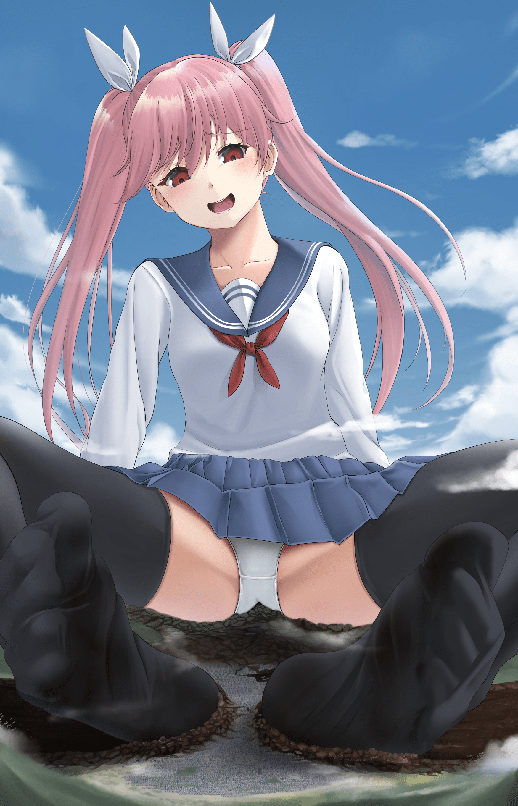](javascript:;)</ignore_js_op> <ignore_js_op>[20220227_205906.jpg](forum.php?mod=attachment&aid=OTQ1MTB8NmFhMWFjOTZ8MTY0NzcwMjg3NHwxODIzMHwzMTY2OA%3D%3D&nothumb=yes) *(1.12 MB, 下載次數: 0)*

[下載附件](forum.php?mod=attachment&aid=OTQ1MTB8NmFhMWFjOTZ8MTY0NzcwMjg3NHwxODIzMHwzMTY2OA%3D%3D&nothumb=yes)

6 天前 上傳  

[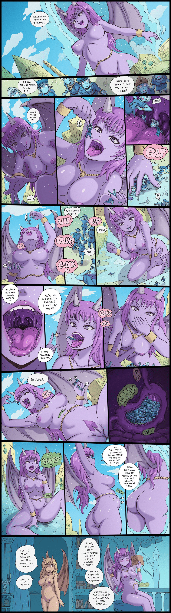](javascript:;)</ignore_js_op>  

# 37

求求大家留个言吧，多少给我点建议灵感让我知道还有人看这个文  

# 38

> [哈姆咳的 發表於 2022-3-14 17:15](https://giantessnight.cf/gnforum2012/forum.php?mod=redirect&goto=findpost&pid=497470&ptid=31668)

> 支持作者 魅魔双子那篇文就开始关注了 期待更新

谢谢谢谢谢，真的有人看我真的很感到

# 39

快速更新，无福利，抱歉，枫叶教堂篇结束，接下来迷失森林篇后就是决战篇了，我会尽快更新，感谢支持！

而正如露易丝的丈夫所料，在罗琳毁灭完戮兽帝国后，女王果然开始对参与计划的魔法师进行追杀，而也在仅仅两个星期的时间魔法师和其家属甚至有一定交往的人都受到了牵连，魔法师本人基本直接死刑而其他人要么成为女王足下的奴隶要么成为贵族的消耗品，更加恐怖的是有些人为了活命甚至到达地下黑市贩卖自己祈求生机，毕竟在皇室贵族的女性脚下几乎没有活路还不如流到其他国家还有生的希望，对，这就是当初跟随初代圣女的眷属，莱特皇族堕落的真相。

而罗路因为魔法异变带来的不老之躯引起了皇族的注意所以成为了被抓住的参与者中极少数的幸存者，而在这些魔法师中也只有露易丝没有被抓住，而莱特帝国立马下令以加入莱特皇族为酬劳通缉露易丝和米儿母女，毕竟露易丝是计划的重点参与者，莱特皇族绝对不会放过。

回到露易丝这里，露易丝经过几天几夜的的逃亡总算来到了迷失森林的边境，她利用魔法逃过了结界守卫的追查来到了迷失森林的内部和女儿回归了隐居生活。

两年过去了，露易丝也安稳着看着你儿开始长大虽说米儿没有魔法才能，但也无所谓了，她不再希望女儿因为魔法而招来祸患，但露易丝母女的悲剧还是发生了，莱特帝国联系地下组织追查露易丝母女的下落并且得知露易丝母女躲藏在迷失森林的内部，就派出了魔法师杀手。

魔法师杀手是专门修炼锁灵结界魔法的特别组织一共四人的高效率杀手小队，锁灵结界就是以四人为施法者而组成的结局魔法可以大概率使所有魔法失效（但魔力极强者可以无视）。

露易丝最终也陷入了苦战，在魔法被几乎封印的情况完全不是四人的对手，不幸露易丝被抓住还被封印住了魔力，衣服也在四人的攻击下变的破破烂烂的，而且更加绝望的是他们还抓住了米儿，对于一位母亲来说孩子是自己的一切，而从来没有向他人低下头的露易丝竟然跪地求饶，只求孩子一条活路，露易丝明白，梅纳德是认真的，她是真的要斩草除根，自己的孩子一但被带回去必然会是悲剧的结果。

可杀手毫不在意，毕竟在有这绝对优势的情况下根本就不会在意露易丝的母性，他们践踏着，辱骂着，嘲笑着，甚至要在露易丝的面前对还是个孩子的米儿动手，但接下来他们将会明白为母则刚的露易丝会有多么恐怖，他们也会为他们的所作所为付出沉重的代价。

露易丝绝对不会允许任何人伤害自己的孩子哪怕自己灰飞烟灭也要赌一把，救下自己的孩子。

虚弱露易丝在他们开始自己的禽兽行为时直接抓起脚边的石头砸昏了一个杀手，因为锁灵结界必须由四人启动所以结界被打破了，露易丝趁三人还未反应过来便立马咬破自己的手臂开始发动禁忌魔法，巨灵幻化。

这是一种以侵蚀身体为代价无视魔力的快速巨大化魔法，而且时间有限她必须要在短时间内救下女儿不然自己就会必死。

巨大化的露易丝直接抬起那遮天般的巨足直接踩了过去，而昏过去的和一个没反应过来的杀手成为了露易丝足下的两个红点。

两名杀手明白现在的局势极其不利打算带着米儿先走，而女儿那不断的呼喊声让原本虚弱的露易丝再次清醒了起来她直接追上去，快速的就捏死了另一个杀手，最后一个杀手瑟瑟发抖手持刀刃架在了米儿的脖子上要挟露易丝，令露易丝不敢轻举妄动。

这个禽兽也在赌，他看露易丝虚弱的神情就猜到露易丝实际上是强弩之末，只要手中有这这个孩子拖到露易丝崩溃自己就赢定了，而且其他三个同伴已经死了自己可以独享奖励了。

懂事的米儿此时却变的非常冷静，她担心的看了看化为巨人的母亲的脸旁，虚弱无力，有看了看禽兽般罪恶的嘴脸，她貌似接下来要决定了什么不得了的事情，

“妈妈，再见了，米儿走了，希望妈妈能够替米儿好好活下去，希望来说还做妈妈和爸爸的孩子！”

说完米儿的脖子就向刀刃划去，微笑着离开了。

此时的他无比惊慌，他用来威胁露易丝的关键自尽了，一切都完了。

愤怒的露易丝将他抓在手掌心上直接捏爆在露易丝洁白的手指上，而当露易丝完成复仇后露易丝也撑不住了，她的身体也因为魔法而侵蚀的越来越严重，已经无法用魔法复原了，也同时恢复了原来的大小，虚弱的她爬向女儿是尸体放声大哭，她怨恨世界对自己的不公，她怨恨人性的黑暗，她怨恨这个伪善的世界，如果可以她要毁灭莱特帝国来血祭自己死去的孩子和丈夫。

正在露易丝绝望只是魅魔双子再一次出现了，她们二人出现在露易丝的面前问她要不要复仇，她可以帮助露易丝完成灵魂衔接魔法让自己的灵魂寄宿到自己女儿的身体完成重生并且帮助她完成复仇，前提是她要加入以罗琳为首的魅魔一族，成为魅魔。

虽然露易丝也同时怨恨罗琳但她明白真正造成悲剧的是莱特帝国，是莱特女王梅纳德，便同意了双子的提议，完成了重生，并将自己的抛弃的遗体让帝国的人来检查了人物露易丝已死，而米儿是个孩子在危险重重的迷失森林必然活不了多久也就一了了之了。

不久后露易丝便以女儿的身体加入了魅魔一族，开始了对自己的复仇行动，她在这五十年时间潜入皇族，吞噬玩弄了五百左右的贵族，帮助罗琳扩张迷失森林的范围，甚至暗中毒死了莱特女王梅纳德，但由于这代公主

爱梅萝拉有这比女王梅纳德更强大的魔力天赋再加上教堂结界水晶的加强导致罗琳无法再次扩张迷失森林的领土，所以便派露易丝开始了卧底的生活潜入由罗路掌握的枫叶教堂开始了毁坏水晶的任务。

当露易丝从回忆的世界醒来之时，发现自己全裸的漂浮在一个纯白无暇的空间之中，而在自己还在迷惑之时一道神圣慈悲的声音从露易丝的头顶传来：

“可怜的孩子，多么可悲啊，让我来宽恕你的罪，结束你的苦痛吧！”

而当露易丝循着声音向上望去看到了无比巨大的鸢。

此时的鸢身穿洁白的白纱圣衣，背后皎洁的白色羽翼将整个空间笼罩，散发神圣光辉的天使之环悬挂在鸢的头顶，而此时如同神明般的鸢也在以无比怜悯慈悲的面容注视着小小的露易丝，对，没错，这就是作为天使的鸢真正的力量，灵魂的救赎。

于此同时的天堂云之间中，

“晶，你给鸢的那块水晶应该不只是个指引器吧？”司问道。

“对，没想到你这么快就知道了，司酱。”晶回应道。

“一个刚到天堂的新人天使就要执行试炼者的任务未免太苛刻了，但那块水晶实际上是有这【觉醒】的能力吧，这在天堂可是违纪的。你也知道吧，晶”司说道。

“对，没错，难道说司酱是想告发我吗？”晶问道。

“我并没有这样的恶趣味，我只是好奇，为什么晶要顶着违纪的风险也要这样做？你和鸢真的是第一次见面吗？”司问道。

“我……”晶沉默了。

“啊～啊，不想说就算了，我也就是随便问问，不想回答就算了，也许这是你个人的秘密，算了小星还在家里等我，我回去了。”说完司就离开了。

晶暗中说道“如果不是我的话，鸢也许早就是六翼了吧，不，她应该是，白………”

于此同时面对已经觉醒天使之力的鸢，露易丝已经不知如何应对，这是真正的天使的力量，绝不是凡人的力量可以比拟的存在。

“露易丝小姐，我明白你对莱特皇族的不满与愤怒，但你也要明白，魅魔一族的目的并不完全是莱特帝国而是这个大陆，而在大陆上还存在着太多无辜的生命如果你的复仇对象只是皇族我并不反对但对于其他无辜的生命，我不能坐视不管。”鸢以神圣的声音回应

露易丝。

“哈哈哈哈，也许你说的没错天使小姐，但对于我来说复仇就是我的一切，我从来就不害怕死后的世界，哪怕是落入地狱我也不在乎，我的悲剧是人性的黑暗所造成的，当我选择成为魅魔之时我就想过最坏的结果所以现在我什么都无所谓了，也许我的复仇只是一个借口，嗜血的本质才是真实的。”说完露易丝拼劲全力冲向此时的鸢打算利用魔力引爆与同归于尽。

但鸢用双手将露易丝包裹起来，温柔的抚摸着小小的露易丝：

“睡吧，睡吧，迷途的流浪者，沉入温柔的梦境，忘记怒火与仇恨吧！”

露易丝在这遮天般的玉手下发现无法使用任何魔法，可发现自己越像挣扎越无力，好像眼前温柔的直接在治愈自己一般，好像自己一切都仇恨和怨念都在慢慢消失，好像全身陷入了云海一般，轻飘飘的，暖洋洋的。

不久在鸢的安抚下露易丝进入了一个梦，她看到自己的女儿在自己的眼前，那个孩子一直微笑着，像天使一样，露易丝看到自己的女儿想拥抱却不敢向前，她真的还能拥抱自己的孩子吗？

没错，最开始成为魅魔之时自己确实是为了复仇，但随着时间越来越长自己也逐渐开始了迷茫，自己成为魅魔的这段时间也吞噬了许多平民百姓，也同时使他们家破人亡，自己将自己逐渐活成了自己最讨厌的样子，也逐渐成为了伤害其他无辜之人的凶手。

可当自己还处于迷茫只是一只小手也抓住露易丝的手指。

“妈妈，我们回去走吧！”米儿说道。

“对不起孩子，妈妈成为了米儿最讨厌的坏人，对不起。”

“没事的，妈妈是为了我的，我不怪妈妈，我们走吧，爸爸还在那里等着我们呢！”米儿天真的说道。

而在此时的尽头，一个熟悉的少年正站在那里，貌似在等着露易丝过来

“欢迎回来，亲爱的！”

当光芒闪过，露易丝走上前去，而露易丝明白其实自己就要消逝了，但也无所谓了，这么多年的复仇，自己累了，一切都应该结束了。

于此同时，光辉落去，一切归于平静，贝尔和谢菲也破破烂烂的躺在地上甚至还丢洛一只鞋，此时的虚弱的露易丝靠在大树下而她面前的正是天使，鸢。

“我输了呢，天使小姐，我也该退场了。”

露易丝说道一边消逝着。

“对不起，作为天使的我们没能听见你的祈愿来拯救你，对不起。”鸢说道。

“没必要道歉，这也许就是我的命吧，就算天使小姐再慈悲，苍天不仁，也毫无意义，这也许就是命运吧！”露易丝笑道。

鸢此时不知该如何回应露易丝，露易丝问道

“喂，天使小姐，这个世界其实也快要无药可救了吧，那为什么你还要拯救它呢？”

“我明白，但我还是想要努力一吧，那怕结果只是昙花一现我也不想因为自己什么都没做而后悔！”鸢回应道。

“是吗？那好好加油吧，我这样的是不是要下地狱了，那我的孩子和丈夫怎么样啊了？”

“放心吧，你的孩子和丈夫都不会有事的他们都不是罪人，但不好意思，你可能要下地狱了。”鸢回应道。

“是吗？那就无所谓了，他们没事就好，米儿，修……”

说完露易丝便消失在树木之下，鸢双手合一开始祈祷，希望审判女神能够从轻判处露易丝早日转世。

# 40

于此同时贝尔搀扶起谢菲说道“我们赢了，圣女大人！”

可谢菲却问道“不，笨蛋圣女，水晶，结界水晶呢？”

鸢这才反应过来下意识的摸了摸口袋，惊恐的说道“不好，水晶不见了！”

“什么？等等我的鞋，糟了，菲尼斯……”谢菲貌似明白了什么说道。

此时一个虚弱的少女声音说道

“你们是在找这个吗？”

此时的菲尼斯倚靠在树下说道，此时的她刚刚从谢菲的靴子下逃了出来，此时的她浑身湿漉漉的，貌似被谢菲的足汗沐浴过，身上散发着少女独有的体香和足汗的酸臭味，甚至还冒着热气，连衣服也在谢菲的足趾下碾碎的所剩无几只有身上的几块碎布，现在几乎和全裸没什么两样。

“真是够惊险的，要不是露易丝那个家伙，我还真的没法得手，没用的家伙，就这么被解决了，果然还留有人类情感的家伙是不靠谱的废物，但无所谓，结果成了就行。”菲尼斯一脸不悦的说道。

“快把水晶交出来，可恶的家伙……”谢菲怒吼道。

“别激动吗？谢菲，现在掌握主动权的是我啊，说句实在话，在你的靴子里够热的，不过足底还是很柔软很舒服就原谅你吧，毕竟你是已经灭绝的……”

“闭嘴，还不是因为你们……”谢菲说道。

“你最好说话客气点，谢菲，毕竟水晶在我手上！”菲尼斯说道。

“你……”谢菲怒吼道。

“谢菲冷静，你想怎样，菲尼斯？”贝尔问道。

“我？当然是想活命啊，毕竟现在我可没办法对付得了面前的圣女大人，所以说你们只要放我走，我就把水晶还给你们，怎么样？”菲尼斯回答道。

“你以为你的话真的可信吗？”谢菲说道

“无论可不可行，你们都没得选，不是吗？”

菲尼斯嚣张的说道。

“那好吧吧，我答应你”鸢说道。

“可是，笨蛋圣女，菲尼斯她……”谢菲刚想说什么被贝尔制止道

“谢菲，要相信圣女大人，我相信她有办法的”

“这就对了，识时务者为俊杰！”菲尼斯说道。

“快，罗路先生！”鸢喊到。

“什么那小子？”菲尼斯回头看去，却发现空无一人。

此时的鸢快速去抢夺结界水晶，但菲尼斯也即使反应过来与鸢开始了水晶争夺。

“可恶的圣女，但没关系水晶离我这么近毁掉它轻而易举！”菲尼斯说道。

“是吗？快，罗路先生！”鸢再次喊到。

“还想来这一套，我可不会上当了……”菲尼斯说道。

“十字剑，斩！”此时菲尼斯鲜血四溅的，罗路手挥银白长剑直接砍伤了菲尼斯。

“束灵锁，去…”谢菲抛出锁链将受伤的菲尼斯捆了起来，鸢这才保护住了结界水晶。

“真不愧是圣女大人，解决了危机”贝尔说道。

“没什么，如果不是罗路先生和谢菲的话就不会成功。”鸢笑道。

“等等好像不对劲，大家快散开……”罗路说道。

此时被捆住的菲尼斯冷笑道“你们不会以为这就结束了吧！黑暗的鲜血，切裂的咒语，我在此唤醒你的力量，压制周围的一切事物，切裂魔法的结晶吧………”

当大家散开还没有几步，周围的一切开始变的奇重无比，周围的人们都被这莫名其妙的重力压的喘不上气。

“这是什么？”鸢问道

“重力压制，她是用血液启动这个魔法的”贝尔说道。

“好了，结束了，血色的切断斧！”菲尼斯说道。（血色的切断斧，以自身血液为媒介的自杀魔法，以自身为中心将血液化为血刃切割周围，越靠近施法者中心血刃越多，施法者本身也会被血刃切割至死，被称为一生只能用一次的魔法。）

“糟糕，快阻止……”还没等谢菲说完周围就出现了无数的裂缝血刃，将周围的一切进行切割，甚至菲尼斯在血刃的中心也被切割的到处是伤，而结界水晶也被切割开来。

“可恶，菲尼斯你真的疯了，这个可是同归于尽的魔法。”谢菲愤怒的说道。

“哈哈哈，反正我现在也活不了还不如来个鱼死网破，哈哈哈哈哈，罗琳大人，我的任务完成了！哈哈哈哈哈哈哈哈哈哈哈哈……”

说完菲尼斯就在无数的血刃下死去了，而结界水晶也被切割的四分五裂。

此时的众人也已经伤痕累累，但水晶已经被破坏，结界也会慢慢减弱，一场大战一触即发。

“该死，还是让她得逞，混蛋。”受伤的谢菲说道。

“可恶，还是输了吗？”鸢不服气的说道。

“我们该怎么办？”贝尔问道。

“看来只能这样了，只有这样我们才能争取到时间。”

罗路说完，便开始用剩下的一点魔力开始启动魔法。

“等等这是，逆时之法，罗路大人难道你要……”贝尔说道。

“逆时之法，这是什么？”谢菲问道。

“笨蛋圣女，逆时之法是一种用自己生命为代价将某一个生命或者物体时间回溯的魔法，但由于本质上没有修复所以也只是做到将时间回溯到开始然后时间静止而已。”

“什么？那罗路先生你想要，牺牲自己。”

鸢说道。

“是的，这是我赎罪的最好机会，我是负罪之人，这一切都因我而起，露易丝也好，水晶破碎也好都是我的错，我必须为此付出代价，所以不要为我悲伤，这只是另一个开始！”

罗路说完，一道强光闪过结界水晶就被修复了，而水晶的裂痕上有着时间的标志，将水晶回归了原来的模样，而罗路先生却不在了，最后这场发生在枫叶教堂的战斗拉下来帷幕。

两周之后，一切都暂时平静下来了，公主也派人修复了教堂而且维持结界水晶的稳定，此时的枫叶教堂寂静了许多，少了两个一起欢笑的人。

鸢，贝尔和谢菲也在公主的皇家医生的治疗下痊愈，她们在教堂的花园里留下来两块墓碑，一个刻着罗路的名字，另一个只刻着这样一句话：纪，一位伟大的母亲。

此时的枫叶教堂的事项基本由贝尔处理，而谢菲早早的就回到哥罗德教堂打理事务去了，而鸢也准备前往最后的卡洛斯教堂，而鸢也和贝尔开始聊起了在神像幻境的事情。

“就是这样，那个叫做艾焰的前辈告诉我许多这个世界过去的历史，我想唤灵之书就在她的手里。”鸢说道。

“艾焰，不好意思圣女大人，你说的这个艾焰我貌似有点熟悉，能告诉我她的长相吗？”贝尔问道。

之后鸢将艾焰的长相告诉了贝尔

“啊，那不是马太大人吗？”贝尔说道。

“马太大人，那不是第十二骑士长，她没有回到天堂，等等贝尔，知道她吗？”鸢问道。

“岂止是知道，她是我，谢菲和赫罗亚的师傅啊！”

“什么，那贝尔，你们一定知道她在哪里吧？”鸢问道。

“其实我们都是被马太大人收养后来直接介绍道三大教堂的，而且她在接送我们的时候她都是用传送阵的，我们也不知道她在哪里，但也许赫罗亚知道，她是最晚离开师傅的，她也许知道的更多…”贝尔说道。

“看来我必须要去卡洛斯教堂了，谢谢你贝尔。”

“没事的圣女大人，只是我有点小请求……”

贝尔刚想说什么鸢就说道

“没必要叫什么圣女大人了，我们已经是朋友了，叫我鸢就可以了！”

“那要，鸢，既然艾焰和马太师傅是一个人，等找到地图之后我也想和你去找马太师傅。”贝尔说道。

“好的，没问题叫上谢菲和赫罗亚一起去吧！”鸢说道。

“好，太好了，能见到师傅她们会很高兴的。”贝尔说道。

“对了，逆时之法还能维持多长时间？”鸢问道。

“大约半个月，而且从枫叶教堂道卡洛斯教堂大约要有一个星期的时间。”贝尔说道。

“这么远，看来我要抓紧时间了，明天一早就去，我们一起去吧。”鸢说道。

“不了，我还要打理一下教堂的事务，我会比你晚两天，你先去吧。”贝尔说道。

“好，我们约好了。”鸢兴奋的说道。

“好。”贝尔回应道。

此时看似平静的一切不久将会引起一场腥风血雨，无论是莱特帝国的公主也好还是迷失森林的罗琳也罢，最后的战斗也将悄悄拉开帷幕。

枫叶教堂篇完结，迷失森林篇开启，希望大家期待  

# 41

分享图片一下子了，希望大家喜欢

# 42

<ignore_js_op>[20220214_123941.jpg](forum.php?mod=attachment&aid=OTQ2MjV8MDY4ZDExZWJ8MTY0NzcwMjg3NHwxODIzMHwzMTY2OA%3D%3D&nothumb=yes) *(1.09 MB, 下載次數: 0)*

[下載附件](forum.php?mod=attachment&aid=OTQ2MjV8MDY4ZDExZWJ8MTY0NzcwMjg3NHwxODIzMHwzMTY2OA%3D%3D&nothumb=yes)

22 小時前 上傳  

</ignore_js_op> <ignore_js_op>[Rosetta.jpg](forum.php?mod=attachment&aid=OTQ2MjR8YWQwMmIwZTF8MTY0NzcwMjg3NHwxODIzMHwzMTY2OA%3D%3D&nothumb=yes) *(3.4 MB, 下載次數: 0)*

[下載附件](forum.php?mod=attachment&aid=OTQ2MjR8YWQwMmIwZTF8MTY0NzcwMjg3NHwxODIzMHwzMTY2OA%3D%3D&nothumb=yes)

22 小時前 上傳  

[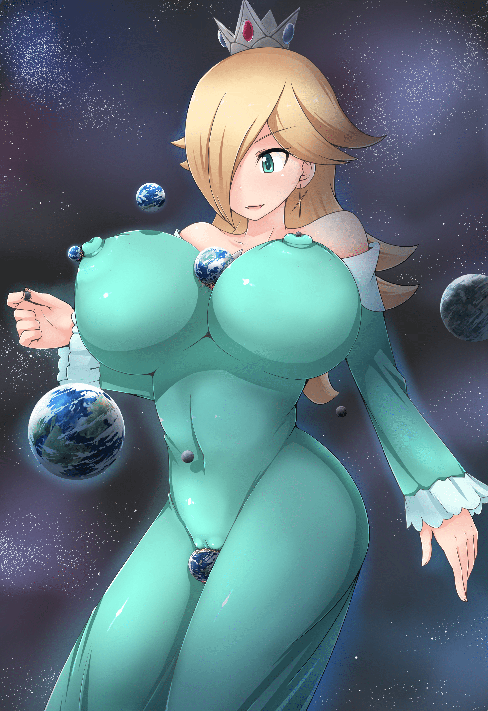](javascript:;)</ignore_js_op> <ignore_js_op>[161__2_.png](forum.php?mod=attachment&aid=OTQ2MjN8YWRkNTJkZjZ8MTY0NzcwMjg3NHwxODIzMHwzMTY2OA%3D%3D&nothumb=yes) *(1.42 MB, 下載次數: 0)*

[下載附件](forum.php?mod=attachment&aid=OTQ2MjN8YWRkNTJkZjZ8MTY0NzcwMjg3NHwxODIzMHwzMTY2OA%3D%3D&nothumb=yes)

22 小時前 上傳  

[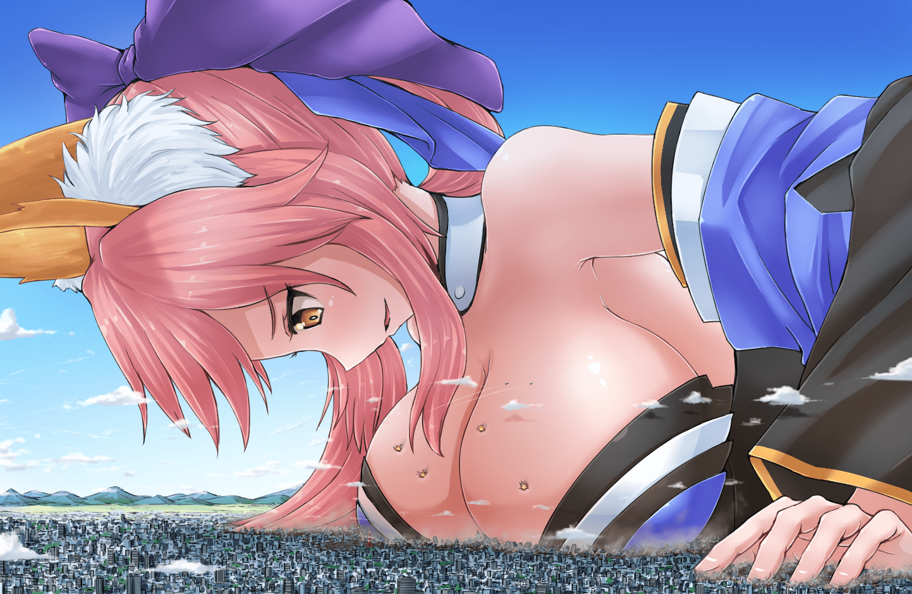](javascript:;)</ignore_js_op> <ignore_js_op>[35ed6cc90d1b05f5.jpg](forum.php?mod=attachment&aid=OTQ2MjJ8ODkyNWY2MWF8MTY0NzcwMjg3NHwxODIzMHwzMTY2OA%3D%3D&nothumb=yes) *(89.53 KB, 下載次數: 0)*

[下載附件](forum.php?mod=attachment&aid=OTQ2MjJ8ODkyNWY2MWF8MTY0NzcwMjg3NHwxODIzMHwzMTY2OA%3D%3D&nothumb=yes)

22 小時前 上傳  

[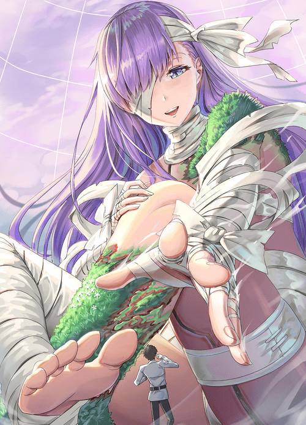](javascript:;)</ignore_js_op>  

# 43

更新了，开局就有点福利，马上就开下一章

此时远在大陆北方的云雾之海处，最近出现了可怕的事，有众多探险家意外消失，他们在探索某个从未见过的小岛之后全都意外消失，在船上的幸存者说：在船靠近小岛只是，岛上就传来了浓厚的甜腻气味，貌似和巧克力无疑，后来探险家发现了这有这大量粮食的奇异小岛，很多人都以为找到了世外仙境，就吸引了更多国家的探险家来次探索，大约来了总共一千多人，原本这一切安然无恙，但实际上诡异的一幕在一天夜里开始了，那天晚上，绝大部分的探险家都来岛上狂欢，庆祝他们找到了仙境般的岛屿，也就只留下几个船员看守，可随着夜晚越来越深，周围的迷雾也越来越浓厚，甚至无法看清任何人，在自己去甲板查看情况之时，只听见小岛的方向传来了令人惊悚的尖叫，无数的哭喊声散播整个海域，我认为是海怪来袭，便拉起警铃叫醒其他船的守卫一起应战海妖甚至向小岛的方向冲去，但足足航行一晚上，根本就没有见过小岛，而哭喊声也仅仅持续了十分钟，可当早上晨曦到来之时，原本的仙境小岛完全消失了好像不存在一样，后来各个船员快速航行回原来的国家将这个灵异事件上报给了各个国家的统治者，但除了莱特帝国以外所有的国家都派出了皇家舰队去云雾之海调查海上小岛，但结果和最开始的探险队一样，除了留在船上的船员外全都无人生还，从那之后那做好似恶魔的小岛能成为食人岛。

从那之后，各个国家明确表面非皇家调查小组以外的任何私人探险队都不得靠近云雾之海，可总有一些好奇的傻瓜去寻找所谓的真相。

这群傻瓜探险队偷着进去了云雾之海，他们也遇到了所谓的食人之岛，他们甚至毫无畏惧的登上了这座岛，他们看着由巧克力树结出的巧克力果，还有巧克力河流，甚至在深处连土地都是巧克力做的，他们大肆嘲笑着其他国家的警惕，人物他们只不过是想将这仙境占为己有罢了，可接下来发生的事足矣震慑他们的认知。

渐渐的，整个小道都开始发生了强烈的地震，而天边也突然伸出了五根巨大的主子，这些柱子为肉色，甚至还有这深色的衔接线，好像一节一节拼成的，而样貌更像是活的一样，而柱子的背后还有这坚硬的深红色像血一样涂抹的坚硬物质，好像是女子的巨大手指一般，随着主子向上移动地震越来越重，已经波及到整个岛屿，甚至向天空望去，天空之上一个巨大的肉色物质连接这五个巨大的柱子，也许这不是什么柱子，这就是一直巨大女子的手，而这究极是怎么回事。

随着岛屿慢慢升起，不，甚至说是被拿起更合适，而当他们反应过来的时候他们的船已经离小岛很远了，这些后悔都来不及了，他们哭喊着，谩骂自己的愚蠢与无助，只听到天上传来了一名美丽女子的甜美声音

“这次的猎物就这点吗？真是浪费了我精心准备的巧克力岛屿，算了凑合一下吧。”

说完岛屿迎来了更加剧烈的抖动，当岛屿停下之时他们才敢在岛屿边上观察下面，可当他们看见岛屿的真相之时，他们才明白哪些失踪的人类都去哪里了。

在岛屿之下有这一张无比巨大的美丽少女的脸庞，深紫色的长发从头顶像瀑布般落到腰部，红色的丝带在头部扎上蝴蝶结，象征着恶魔的双角在头部的两侧，深红色的眼眸，简直的美丽的容貌貌似她只是稍稍抛个媚眼就能收服所有的男人，白色的无袖紧身衣和黑色裤袜包裹这丰满，极好身材的身体，的部位有这魅魔口器的尾巴微微勒住丰满的腿部，黑色的恶魔皮外衣披在身后翘着二郎腿的坐在华丽的宝座上，而他们将要面临的将是岛屿下面深渊一般的红色巨口。

恐怖，恐怖，这无法想象的恐怖来到了他们身边，所谓的小岛只是她的陷阱罢了，哪些失踪的人类都被眼前的魔女吃掉了而已，就像可爱的少女吃掉一颗甜甜的巧克力一样，他们就是上面的一抹小小的椰蓉而已，只是给这个魔女增加口感的消耗品罢了。

他们哭喊着，祈祷着奇迹的发生，希望上天能够宽恕他们的愚行，但什么也无法阻止天边巨大玉手将他们送进魔女口中的事实，鲜红的唇口渐渐张的越来越大，鲜红的舌头兴奋的蠕动着不断欢迎他们的到来，天空逐渐开始暗淡，他们的上空的洁白玉齿好似天边的流星般咋了下来直接将小岛一刀两段，而不久后剩下的一半也没有幸免，他们也将在魔女咀嚼完咽下后成为下一口点心。

魔女将小岛连同人类吞入了嘴中，顷刻间，嘴里就仿佛吃了跳跳糖一样，人类们好似蝼蚁般在自己巨大粘稠的舌面上奔跑，敲打着对他们来说好似城堡般巨大的齿墙面前，魔女能感觉到他们的恐惧，可以想象，被当成甜点一样吞进女生巨口中，即便是自己小小的舌头，也可以将他们轻易的翻弄，更可怕的是自己还带着玩弄的意味，在如此绝境下被巨大的舌头不断的搅拌，在一排排白森森的齿墙间不断来回晃动，一些人类被巨齿撞折了手脚，甚至于有得人类就卡在了巨齿的交接处，还有的则被压在巨舌之下，悲泣的哭喊声在巨大的口中不断环绕着。

随着玩弄的时间越来越长，魔女发现口中存活的人类越来越少便结束了口中的游戏，直接小舌一送就将嘴里的人类连同岛屿一起吞下，而在存活的人类视角，一些部分幸运的人类被融化的巧克力黏在齿墙之上，但他们却不幸看的体会到了其余的人类们无法体会的恐怖，看着自己的同伴掉进那地洞似的喉咙，尖叫声慢慢的消失在那深不见底的食道里，令他们瑟瑟发抖，还没有等他们反应过来，巨大的嘴巴又缓缓的张开了，剩下一半的沾满不幸的人类的巧克力岛屿又被送进了这个地狱。

而在一旁笼子里的人类看到魔女脖颈处的一个小球滑下之后也明白了不久后他们的归宿也是魔女的胃中。

可折磨还未结束，魔女巨大的舌头开始舔舐周围的牙齿，将粘在齿墙上的人类连同巧克力一同磨了下来，连同口中积攒的香液一起伴随着绝望的尖叫流向了深渊的口中。

被称为魔女的少女满意的抚摸了自己满足的小腹，小腹也发出来咕噜咕噜的声音，这原本正常的动作却代表着死亡，魔女的胃中，胃壁不断的分泌出胃液，小岛也在这胃内的酸海中不断下沉，没有直接掉到酸海的人们相互争斗，人性的本恶也在这时展露无遗，只是为了几分钟的存活时间也会大打出手，完全不存在足尖船队时的友谊，只有为了活下去的人性，而最后这些可笑的人类也在酸海之中化为了一段白烟。

“太可怕了，这就是魅魔女王的陷阱吗？”笼中的人类说道。

没错这个所谓的魔女就是迷失森林魅魔一族的女王罗琳，由于结界水晶的关系，她无法自由抓捕人类来吃了，不过在魅魔丽娜的帮助下研究出来差距之门的魔法，可以在离结界水晶效果不在的范围下制造陷阱，吞噬人类，但却只能做到自己部分的身躯穿过差距之门，也真是可惜。

而在女王再打算在云雾之海放些巧克力岛屿吸引猎物之时，丽娜过来报告了。

“报告女王大人，魅魔露易丝和菲尼斯战死，但结界水晶已经出现重大损害，大约半个以后我们就可以出兵了！”

女王大喜道“太好了，现在立马准备现存所有魅魔，准备好半个月之后的战斗，并且将饲养室的人类拿出一半，开大宴犒劳将士们，我们魅魔的复仇，不兽人一族的复仇开始了！”

“是！”丽娜退下大殿。

“现在我的龙躯已经大成，很快就可以与莱特帝国的公主爱梅罗拉一战了，哈哈哈哈哈哈哈哈……”

于此同时莱特帝国的公主大殿下

“公主大人，周围的国家说只要公主愿意将公主高跟鞋里的城市还给他们，他们就愿意归属莱特帝国。”大臣跪地说道。

“很好本公主三天之后玩够了就还给他们，本公主说话算话。”爱梅萝拉公主说道。

安娜说道“公主，这个国家的罪犯玩具没有达标，这……”

“叫他们把没用的奴隶拿来凑数，不然，明天就等着在本公主的丝袜里灭国吧！”公主说道。

“是，还有公主殿下，她们，要见你……”安娜说道。

“好，我立马就去密室，你先去找下她们一下，现在如果没有事情的话就退下吧！”说完公主殿下便离开了大殿，而大殿之下的总算可以站起来舒一口气了。

而在密室内双子莉莉丝和薇薇安早就来到这里了。

“爱梅萝拉怎么还没来啊，安娜，我和姐姐还要去外面玩呢”薇薇安不耐烦的说道。

“请再等一下薇薇安大人，公主殿下马上就来。”安娜紧张的说道。

“妹妹，要有耐心，大不了我们把莱特帝国翻个地朝天开心一下好吗？”莉莉丝笑道。

此时的安娜更加紧张，这些纯种的来自地狱的大恶魔说道话可不是闹着玩的。

“两位贵客，快请，安娜上茶。”公主优雅的来到了双子面前。

“不用了，我和妹妹来告诉你，罗琳要开始布置兵马了，你要准备好。”莉莉丝说道。

“恕我直言师傅，眼下爱梅罗拉还没有足够的力量对付的了魅魔女王罗琳。”公主说道。

“没关系，你附耳过来，我和姐姐告诉你方法，让你不仅能够打败罗琳还能驱逐天使将莱特帝国称霸整个大陆。”薇薇安说道。

“圣女快要找到唤灵之书，然后你想办法得到唤灵之书将魔力再次提升一个境界，然后………”公主附耳倾听莉莉丝的计划，之后大赞，说“真不愧是师傅，此计甚妙！”

“哈哈，你知道就好，我们先回去，到时候可别让我们失望。”

说完双子就从窗外飞走，之后公主也让安娜通知皇宫上下军队准备备战。