# 新闻集 （更新： 建筑项目因沙堡建筑而延误)

作者：kyojingirls

TID：31240

# 1

*本帖最後由 kyojingirls 於 2022-1-20 04:04 編輯*

**广州塔在恋人争吵中被损坏**广州最引人注目的标志之一，广州塔，在其外墙被当地居民范美打碎一大块后，将需要进行大规模的维修。范美身高580米，几乎与该地标一样高，在她的微博账户上发布了一张在其旁边摆姿势的自拍。据报道，事件发生时，范美在电话中与她的男友发生了激烈的争吵。目击者发布在微信上的视频显示，范美对着手机大喊"你为什么要和我分手"。警方下令立即疏散该地区的人员，因为范美继续来回踱步，边走边踢开至少6辆车。然后，仍旧生气的范美抓起广州大厦顶部的外墙，扯下一段外墙，然后把它扔到了地上。财产损失总额尚未估计，但据传是广泛的。范美的男友，李伯光，在当地一家科技创业公司工作，据说他去年通过交友软件探探认识了范美。李伯光没有发表评论，但朋友们说，他正计划结束与范美的关系，理由是他们的身材差异"太难克服"。根据记录，李伯光身高约为167厘米。作为一个谜一样的个人，李伯光某似乎也对他与范美某的关系的公开性感到不舒服；他们的约会被当地媒体广泛报道。在当地政府的说服下，他某同意继续与范美约会，"以维护公共安全"。据报道，市政府将为他的麻烦每月支付一笔津贴。与此同时，范美已经为她的行为正式道歉，并提出如果市政府给她一瓶"适当大小"的氰基丙烯酸酯胶水，她将帮助修复广州塔。另一位广州居民，身高572米的吴欣凌是单身，但据说她也是通过交友软件寻找男朋友。她的微信账户上最近发布的一张照片显示，她站在北京路，表面上是在约会，手里拿着一个身份不明的男人。

# 2

<ignore_js_op>[zg10.jpg](forum.php?mod=attachment&aid=ODk2MTZ8M2RiNjNjNGV8MTY0NzcwNDI3OHwxODIzMHwzMTI0MA%3D%3D&nothumb=yes) *(999.6 KB, 下載次數: 5)*

[下載附件](forum.php?mod=attachment&aid=ODk2MTZ8M2RiNjNjNGV8MTY0NzcwNDI3OHwxODIzMHwzMTI0MA%3D%3D&nothumb=yes)

2021-7-10 23:07 上傳  

</ignore_js_op> <ignore_js_op>[fromtheheadlines5.jpg](forum.php?mod=attachment&aid=ODk2MTV8OWQ3Yzk4NjB8MTY0NzcwNDI3OHwxODIzMHwzMTI0MA%3D%3D&nothumb=yes) *(1.06 MB, 下載次數: 5)*

[下載附件](forum.php?mod=attachment&aid=ODk2MTV8OWQ3Yzk4NjB8MTY0NzcwNDI3OHwxODIzMHwzMTI0MA%3D%3D&nothumb=yes)

2021-7-10 23:07 上傳  

[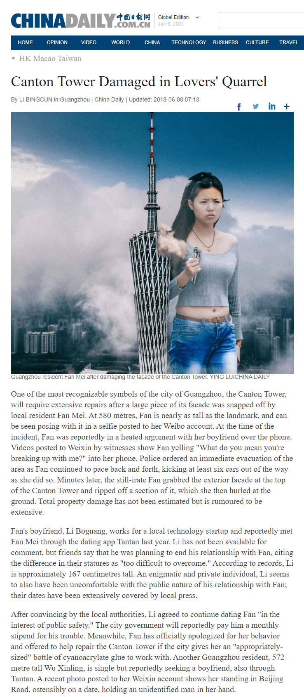](javascript:;)</ignore_js_op>  

# 3

> [天使的足迹 發表於 2021-7-11 13:15](https://giantessnight.cf/gnforum2012/forum.php?mod=redirect&goto=findpost&pid=473499&ptid=31240)

> 咦，转身就发现楼主的另一篇文。这种大家都默认城市中生活着巨人的设定虽然有些无厘头但确实很有趣 ...

哈哈，谢谢你，我很喜欢这样的生活片断的感觉，希望你也喜欢。

# 4

> [呵呵呵还07 發表於 2021-7-11 12:26](https://giantessnight.cf/gnforum2012/forum.php?mod=redirect&goto=findpost&pid=473493&ptid=31240)

> 我觉得，嗯，可以找更有女神范一点的，这张照片眼睛像是没睁开啊

我想每个人对 "女神 "的定义都不一样，很抱歉她不符合你的口味。

# 5

**星巴克中国推出更大的杯子尺寸**随着需求的增长，星巴克中国为北京和上海等城市常见的"向上流动"的大块头女性人口推出了新的、更大的杯子尺寸。Cento，或普通话中的"超巨大杯"，推销给像去年搬到天津上大学的高天真这样的消费者。高天真以前被迫使用她从高速公路上"获得"的一辆小型油罐车作为临时的杯子。高天真喜欢的南开大学校园附近的星巴克也安装了一个可伸缩的屋顶，以方便她。高女士以前不得不躺在地上，把手伸进门里取回她的饮料，这种景象被一些当地人形容为"不雅观"。该连锁店的一位发言人指出，咖啡馆的设计通常不能容纳巨大的手，过去几年中发生的许多涉及玻璃破碎和家具凌乱的事件证明了这个问题。北京一家受欢迎的咖啡馆不得不为每个班次雇用一个额外的"伙伴"，其唯一的职责是重新安排椅子，并在这些顾客到访后打扫卫生。然而，并非所有人都对新杯子感到满意。上海居民抱怨乱丢垃圾，包括一个不小心丢在东方明珠塔底的空杯子。上海市长龚正发表声明，呼吁停止乱扔垃圾，说散落的大量垃圾是"有碍观瞻，玷污了我们伟大城市的形象"。当地建筑师提出了新的摩天大楼，其凹陷的屋顶可以作为办公大楼和垃圾容器。

# 6

<ignore_js_op>[zg16.jpg](forum.php?mod=attachment&aid=ODk2MjB8NGYwMzVjMmJ8MTY0NzcwNDI3OHwxODIzMHwzMTI0MA%3D%3D&nothumb=yes) *(1.1 MB, 下載次數: 3)*

[下載附件](forum.php?mod=attachment&aid=ODk2MjB8NGYwMzVjMmJ8MTY0NzcwNDI3OHwxODIzMHwzMTI0MA%3D%3D&nothumb=yes)

2021-7-11 14:49 上傳  

</ignore_js_op> <ignore_js_op>[fromtheheadlines4.jpg](forum.php?mod=attachment&aid=ODk2MTl8MDAxZmY1YWN8MTY0NzcwNDI3OHwxODIzMHwzMTI0MA%3D%3D&nothumb=yes) *(1.05 MB, 下載次數: 2)*

[下載附件](forum.php?mod=attachment&aid=ODk2MTl8MDAxZmY1YWN8MTY0NzcwNDI3OHwxODIzMHwzMTI0MA%3D%3D&nothumb=yes)

2021-7-11 14:49 上傳  

[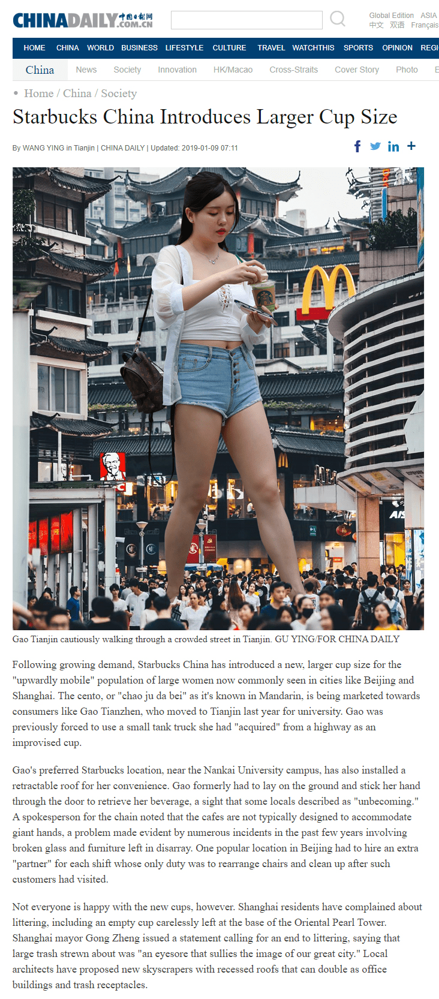](javascript:;)</ignore_js_op>  

# 7

**东京敦促结束校园欺凌行为**

高中三年级学生森田里美(Satomi Morita)多次要求文京学院大学女子高级中学的学校官员调查她被另外两名学生欺负的说法，这两名学生的名字没有被公布。现在，东京都政府也正式呼吁学校采取行动。

在今天上午发表的一份声明中，省长指出了几起造成财产损失和市民困扰的事件。"她说："森田女士是持续骚扰的受害者，但这种鲁莽的行为影响到了所有人。其中一起事件发生在上个月，当时森田被一名被指控的肇事者推入一栋办公摩天大楼。虽然这栋楼需要更换玻璃和加固地基，但几乎没有受伤的报道。"在该楼工作的工薪族铃木隆(Takashi Suzuki)说："前一刻我还在办公桌前，后一刻我就靠在墙上了。

业主长田英夫不得不自掏腰包支付油漆服务费，因为有人用口红在他的大楼的几层楼里涂上了 "里见真烂"。"我以为几十年前毕业后，我已经把高中戏剧的琐事抛在脑后，"他说。学校官员尚未作出正式回应，但接近校长的人士说，他不愿意采取纪律行动。他说："我们尽量不介入这种身份的学生之间的事情，因为对学校的任何恶意可能会导致一只大鞋穿过我们的大楼。"

# 8

<ignore_js_op>[standoff.jpg](forum.php?mod=attachment&aid=ODk2NDB8MjU5ZmFmNDd8MTY0NzcwNDI3OHwxODIzMHwzMTI0MA%3D%3D&nothumb=yes) *(1.83 MB, 下載次數: 2)*

[下載附件](forum.php?mod=attachment&aid=ODk2NDB8MjU5ZmFmNDd8MTY0NzcwNDI3OHwxODIzMHwzMTI0MA%3D%3D&nothumb=yes)

2021-7-12 05:07 上傳  

[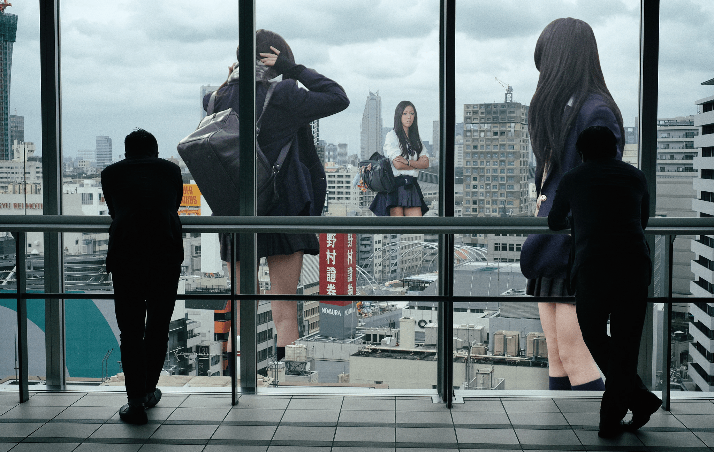](javascript:;)</ignore_js_op> <ignore_js_op>[fromtheheadlines1.jpg](forum.php?mod=attachment&aid=ODk2Mzl8NTlmNTgwY2F8MTY0NzcwNDI3OHwxODIzMHwzMTI0MA%3D%3D&nothumb=yes) *(572.47 KB, 下載次數: 3)*

[下載附件](forum.php?mod=attachment&aid=ODk2Mzl8NTlmNTgwY2F8MTY0NzcwNDI3OHwxODIzMHwzMTI0MA%3D%3D&nothumb=yes)

2021-7-12 05:07 上傳  

[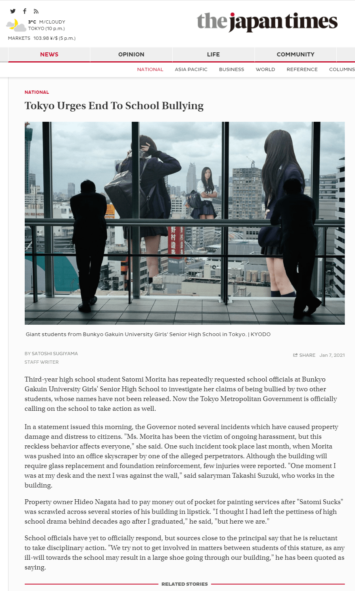](javascript:;)</ignore_js_op>  

# 9

> [838390224 發表於 2021-7-12 01:31](https://giantessnight.cf/gnforum2012/forum.php?mod=redirect&goto=findpost&pid=473544&ptid=31240)

> 用China daily来p新闻稿可还行，弄得跟真的似的

谢谢你！                                   

# 10

**研究发现，新宿区办公室的生产力在夏季下降了23%。**研究发现东京新宿区的办公人员的平均生产力与去年相比下降了23%。办公人员绝大多数都回答说，在该地区居住的一群巨大女性对他们的工作效率产生了巨大的影响。当地的一名大学生吉田春香（Haruka Yoshida）说，她几乎每天都和她的朋友来新宿。"她说："这里附近的所有海滩都已经挤满了我们这种体型的女孩，所以我们想，为什么不留在市中心呢？"这五个女孩每天清晨到达，在前往商业区之前，她们巧妙地踏过新宿车站的火车轨道。虽然吉田小姐承认，城市公园的草地不像海滩的沙子那么舒服，但她说她已经习惯了。居民们说，公园现在看起来几乎很荒芜的，树木、丛林健身房和长椅都被躺在上面的女孩的重量压扁了。当地的上班族可以一览无余地看到女孩们的日光浴，他们承认自己被分散了注意力。"我可能花了太多时间站在窗边休息，"一位当地雇员说。即使对于那些在办公桌前勤奋工作的人来说，噪音也可能是一个问题。女孩们近乎不断的笑声堪比小型爆炸的声音，她们经常带着收音机来听音乐。当地的一家旅游公司哈多巴士将它的一个露天游览车改道，每天驶过该地区，吹嘘说顾客甚至有机会看到吉田小姐和她的朋友们互相涂抹防晒霜。然而，这种做法很快就被终止了，因为吉田小姐的朋友之一清水惠美抓起一辆巴士，把它倒过来，玩命地把乘客甩到吉田小姐的肚子上。没有人受伤，但哈多巴士表示，这一事件暴露了"责任问题"。吉田小姐则表示，这些人"很痒"。尽管他们的规模很大，但这群朋友显然对他们的周围环境非常小心。唯一关于建筑物损坏的报告来自于一个错误的飞盘，它在落到附近的屋顶之前刮到了一栋建筑物的侧面。一次醉酒后的舞蹈在附近地区引起了小地震，但在新度量表上只记录了4级地震。

# 11

<ignore_js_op>[fromtheheadlines10.jpg](forum.php?mod=attachment&aid=ODk2NDZ8OGNhMWU1NWJ8MTY0NzcwNDI3OHwxODIzMHwzMTI0MA%3D%3D&nothumb=yes) *(844.05 KB, 下載次數: 3)*

[下載附件](forum.php?mod=attachment&aid=ODk2NDZ8OGNhMWU1NWJ8MTY0NzcwNDI3OHwxODIzMHwzMTI0MA%3D%3D&nothumb=yes)

2021-7-12 22:28 上傳  

[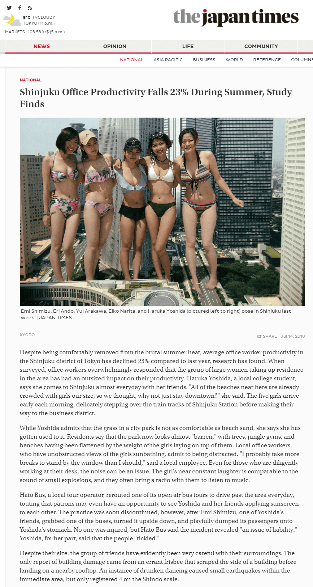](javascript:;)</ignore_js_op> <ignore_js_op>[cityselfie4.jpg](forum.php?mod=attachment&aid=ODk2NDV8MTIwYzZjMzV8MTY0NzcwNDI3OHwxODIzMHwzMTI0MA%3D%3D&nothumb=yes) *(1.13 MB, 下載次數: 2)*

[下載附件](forum.php?mod=attachment&aid=ODk2NDV8MTIwYzZjMzV8MTY0NzcwNDI3OHwxODIzMHwzMTI0MA%3D%3D&nothumb=yes)

2021-7-12 22:27 上傳  

[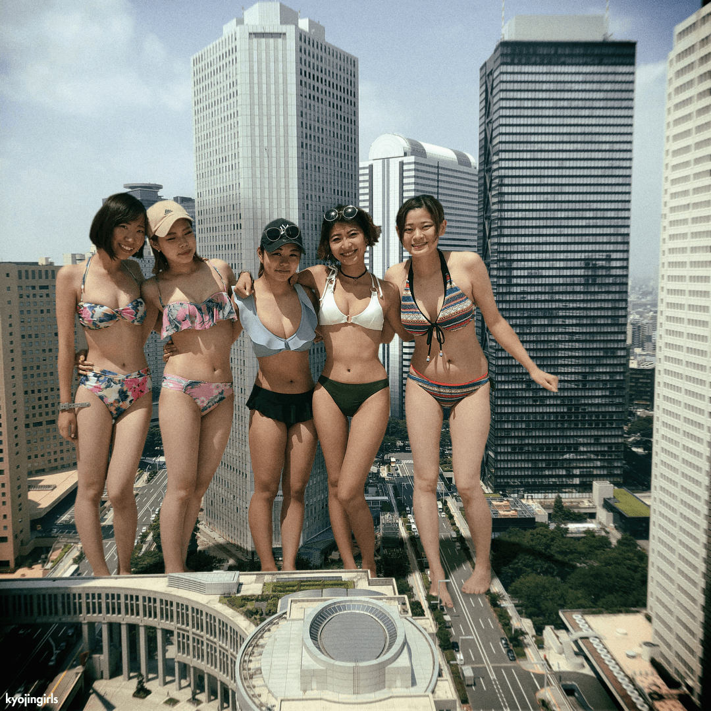](javascript:;)</ignore_js_op>  

# 12

**热浪重新点燃了与大市民的紧张关系**在东京创纪录的高温下，一些居民发现比其他人更难保持凉爽。"今天太热了，"白田真希(Maki Hakada)在周一被听到说。当许多东京人在商场、咖啡馆或家里躲避时，身高约200米的白田小姐却发现很难从天气中解脱。她经常躺在新宿商业区的大型摩天大楼的阴影下。谷歌地图等GPS应用程序正在鼓励用户报告在道路上看到的任何"大型"障碍物，以便他们能够重新安排用户的路线。白田小姐最近尤其引起了一些居民的愤怒。据报道，上周，她刺破了新宿一座大型摩天大楼顶部的几扇玻璃窗，并将手指伸了进去。她说："我只是想知道人们一直在谈论的'空调'是什么样的。"同一天，社交媒体上的用户上传了她把一个广告牌从大楼的支架上扯下来，像扇子一样挥舞的视频。过了一会儿，显然不满意，她说"没有用的"，随手把广告牌扔到旁边的十字路口。也许最令人震惊的事件是，一架正在拍摄空中录像的新闻直升机被白田小姐的大手抓住，并向侧面倾斜，似乎也是为了制造一个临时的风扇。幸运的是，直升机被放到了附近的一个直升机停机坪上，损失很小，没有人受伤。"她通常是一个非常好的女孩，"一位熟悉哈卡达女士的当地居民说。"我认为，热度对每个人都有影响，我们都应该有时能冷静下来。"她提到了上周发生的另一起事件，两个女孩在东京湾互相泼水，掀起了危险的波浪，使几艘船倾覆，海滩上的人也被浸泡。当地活动家中村正弘(Masahiro Nakamura)在网上发起了一场运动，敦促白田小姐和其他巨人在夏天离开东京。"你应该去北海道旅行吧"该活动的一个标志写道。札幌市官员在征求意见时说，他们不知道这项活动，但似乎不同意其信息。"东京有更大的建筑，"一位市政府官员说。"更多的树荫意味着更多的舒适。"

# 13

<ignore_js_op>[fromtheheadlines2.jpg](forum.php?mod=attachment&aid=ODk2NTZ8NGUxOWNmNDJ8MTY0NzcwNDI3OHwxODIzMHwzMTI0MA%3D%3D&nothumb=yes) *(825.97 KB, 下載次數: 2)*

[下載附件](forum.php?mod=attachment&aid=ODk2NTZ8NGUxOWNmNDJ8MTY0NzcwNDI3OHwxODIzMHwzMTI0MA%3D%3D&nothumb=yes)

2021-7-13 03:07 上傳  

[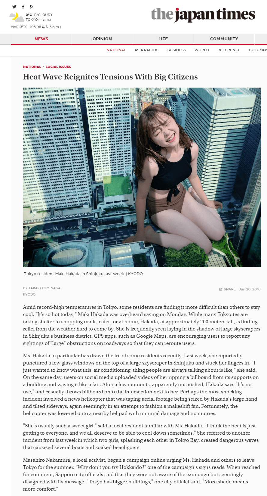](javascript:;)</ignore_js_op> <ignore_js_op>[toosunny.jpg](forum.php?mod=attachment&aid=ODk2NTV8OGFmMzJmY2J8MTY0NzcwNDI3OHwxODIzMHwzMTI0MA%3D%3D&nothumb=yes) *(1.13 MB, 下載次數: 1)*

[下載附件](forum.php?mod=attachment&aid=ODk2NTV8OGFmMzJmY2J8MTY0NzcwNDI3OHwxODIzMHwzMTI0MA%3D%3D&nothumb=yes)

2021-7-13 03:07 上傳  

</ignore_js_op>  

# 14

**机场官员被当地妇女训斥**今天上午，当成田机场的官员们得知来自印西市的永坂温美计划在他们的停机坪上进行一天的休息和放松时，他们感到很沮丧。"我们理解宽阔的空间对像永坂女士这样的年轻女性很有吸引力，但我们要求她们不要利用我们的设施，"今天上午在网上发表的一份声明说。"这是一个机场，不是一个公共公园。尽管他们反对，她很快就出现了，没有被机场周围2.5米的围栏所吓倒。永坂女士随后脱掉了她的T恤和短裤，把它们丢到了16L跑道上，导致多个航班延误或取消。她很有礼貌地将一个空的登机口作为一个晒太阳的地方。当机场官员走近永坂女士，要求她把衣服从跑道上移开时，她用一连串的脏话和一个猥亵的手势回应。永坂女士因为这样的行为在千叶县周围获得了恶名。2017年，她从当地一家啤酒厂的酒罐中偷喝了数量不详的啤酒后，脱光了内衣，在千叶市的街道上跳舞，然后在新龟川车站附近睡着了。她因这一事件遭到了市政府官员的斥责。近年来，像永坂女士这样的女性在成田机场越来越多地被看到。虽然机场不鼓励在停机坪上进行休闲活动，但看飞机被认为是可以接受的。"一位官员评论说："我们不介意这种规模的飞机观察者，因为他们注意到了周围的环境并尊重机场的规定。2012年，一位名叫野原花香的女士因为拯救了一架起飞后遭受鸟击的全日空国内航班而成为国际新闻。注意到飞机的不稳定运动，广田跳过航站楼，及时跑过跑道，在飞机坠毁前抓住了飞机。  

# 15

<ignore_js_op>[fromtheheadlines3.jpg](forum.php?mod=attachment&aid=ODk4MDR8YjQwYzZiNmZ8MTY0NzcwNDI3OHwxODIzMHwzMTI0MA%3D%3D&nothumb=yes) *(757.79 KB, 下載次數: 3)*

[下載附件](forum.php?mod=attachment&aid=ODk4MDR8YjQwYzZiNmZ8MTY0NzcwNDI3OHwxODIzMHwzMTI0MA%3D%3D&nothumb=yes)

2021-7-18 00:19 上傳  

[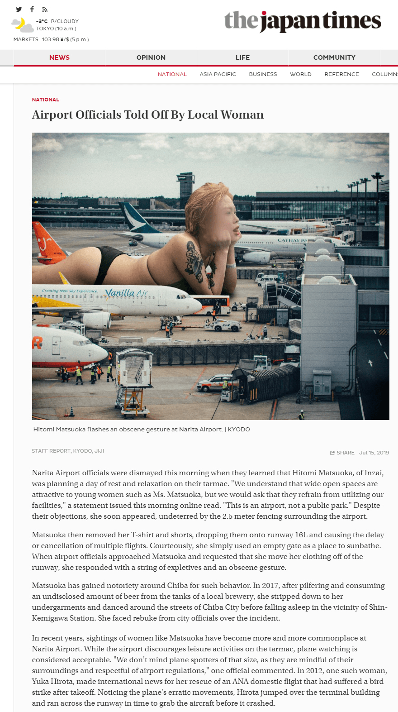](javascript:;)</ignore_js_op> <ignore_js_op>[airport7.jpg](forum.php?mod=attachment&aid=ODk4MDN8Mzc2MWUyMjd8MTY0NzcwNDI3OHwxODIzMHwzMTI0MA%3D%3D&nothumb=yes) *(1.19 MB, 下載次數: 1)*

[下載附件](forum.php?mod=attachment&aid=ODk4MDN8Mzc2MWUyMjd8MTY0NzcwNDI3OHwxODIzMHwzMTI0MA%3D%3D&nothumb=yes)

2021-7-18 00:19 上傳  

</ignore_js_op>  

# 16

**为巨大学生提供更多兼职工作机会的公司**日本各地的商店和餐馆正在通过雇用越来越多的巨大学生来促进包容性。虽然他们的身材曾经被视为一种负担，但巨大学生已经成功地在工作场所证明了自己。埼玉县美里市的大山英理（EriOyama）和山崎舞（MaiYamazaki）在过去一年中一直在当地的一家麦当劳餐厅工作。当站立时，两人的身高是其工作场所的两倍多，因此，在停车场看到他们在工作时翘着二郎腿坐着已经成为一种常见现象。山崎已经被提升为轮班经理。这是一个真正的成就标志，因为餐厅为她制作一套新的制服而花费了不少钱。大山的主要工作职责包括在自动取款机旁接单。"看到英理在车边灿烂的笑容，对我的孩子们来说仍然很新鲜，"三乡居民、两个孩子的母亲说。"他们说这让他们想起了'侏罗纪公园'中T-REX的场景"。大山被授予"本月最佳员工"奖，因为她帮助了一位早上停下来喝咖啡但上班要迟到的工薪族。目击者说，她轻轻地扶起那名男子的车，一直跑到松户市，在那里她把车放到了高速公路上，并挥手和微笑着送他离开。麦当劳在吸引大客户方面也一直是一个潮流的引领者。去年的一个全国性广告活动中，三个巨大学生在麦当劳内吃饭和交谈。该公司的一位发言人指出，这是艺术上的许可；一个大个子高中生的平均身高是18米，他们不可能舒适地呆在一般的餐厅里。

# 17

<ignore_js_op>[mcdonalds.jpg](forum.php?mod=attachment&aid=OTAwMTV8MDBhOTUxMDJ8MTY0NzcwNDI3OHwxODIzMHwzMTI0MA%3D%3D&nothumb=yes) *(2.35 MB, 下載次數: 1)*

[下載附件](forum.php?mod=attachment&aid=OTAwMTV8MDBhOTUxMDJ8MTY0NzcwNDI3OHwxODIzMHwzMTI0MA%3D%3D&nothumb=yes)

2021-7-29 00:02 上傳  

</ignore_js_op> <ignore_js_op>[fromtheheadlines7.jpg](forum.php?mod=attachment&aid=OTAwMTR8MmZlY2NjMmN8MTY0NzcwNDI3OHwxODIzMHwzMTI0MA%3D%3D&nothumb=yes) *(714.95 KB, 下載次數: 1)*

[下載附件](forum.php?mod=attachment&aid=OTAwMTR8MmZlY2NjMmN8MTY0NzcwNDI3OHwxODIzMHwzMTI0MA%3D%3D&nothumb=yes)

2021-7-29 00:02 上傳  

[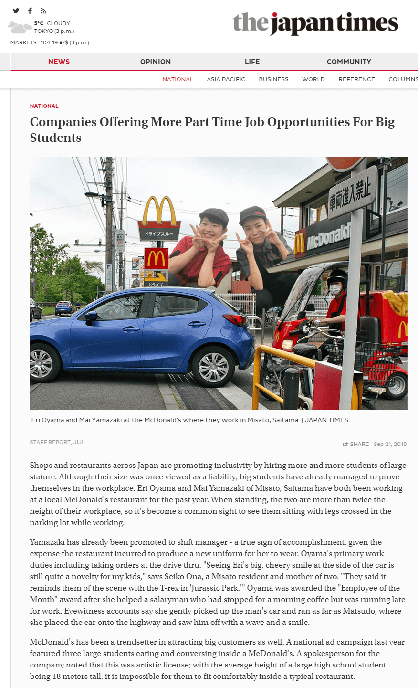](javascript:;)</ignore_js_op>  

# 18

**鼓励广大居民注意缆车的安全**

上周发生的涉及长江索道和重庆居民秦岭的事件，促使市政府发表声明，敦促巨型居民注意缆车。像许多像她这样身材的重庆本地人一样，她经常脱掉鞋子，涉足长江水来往于该市南岸和渝中区，这种做法得到了市政府官员的容忍。然而，上周四，她在过河时显然非常专注于她的手机，以至于她没有注意到有一辆缆车径直挡在她面前。据报道，她的头与汽车相撞，在几个街区外可以听到她大喊 "哎哟！"

社交媒体上发布的一段视频显示了这一事件的直接后果，她似乎不假思索地用手抓住了缆车，愤怒地盯着里面的人。她很快恢复了平静，放开了车，让它完成了过河的旅程。此后，她为这一事件道歉，并承认这是她没有注意的错。她在这次碰撞中没有受伤，当时缆车上的乘客只报告了轻微的鞭伤。这起事件的视频被改编成幽默的声音效果，并在优酷上获得了成千上万的浏览量。这起事件并不像2011年那样严重，当时同样来自重庆的史家宝为躲避缆车而躲闪，但随即被一艘渡轮绊倒。她无法保持平衡，跌入水中。虽然所涉及的渡轮已被撞毁，但她能够安全地将所有乘客从水中捞起。

# 19

<ignore_js_op>[zg27.jpg](forum.php?mod=attachment&aid=OTAyNjN8NmQ3N2E3Mjh8MTY0NzcwNDMwNnwxODIzMHwzMTI0MA%3D%3D&nothumb=yes) *(651.59 KB, 下載次數: 1)*

[下載附件](forum.php?mod=attachment&aid=OTAyNjN8NmQ3N2E3Mjh8MTY0NzcwNDMwNnwxODIzMHwzMTI0MA%3D%3D&nothumb=yes)

2021-8-10 22:49 上傳  

</ignore_js_op> <ignore_js_op>[fromtheheadlines6.jpg](forum.php?mod=attachment&aid=OTAyNjJ8NmJmYTY3ODV8MTY0NzcwNDMwNnwxODIzMHwzMTI0MA%3D%3D&nothumb=yes) *(858.86 KB, 下載次數: 1)*

[下載附件](forum.php?mod=attachment&aid=OTAyNjJ8NmJmYTY3ODV8MTY0NzcwNDMwNnwxODIzMHwzMTI0MA%3D%3D&nothumb=yes)

2021-8-10 22:49 上傳  

</ignore_js_op>  

# 20

**当地妇女成为东京的第一大旅游景点**

日本国家旅游组织今天报告说，22岁的荒川由纪树已经超过了天空树和明治神宫等著名地标，成为东京游客最多的第一景点。身高600米，几乎与东京晴空塔一样高，并已成为与城市形象同样相关的事物。在夏季，乘坐飞往羽田机场的航班的乘客通常能够看到她在代代木公园晒太阳。

她一生都生活在东京，但城市和旅游官员以前在宣传材料中淡化了她的存在，理由是要尊重她的隐私。甚至在她的高中时代，她的霸气也被刷出了旅游手册的照片。"我记得她还是个小学生的时候，大概这么高。"一位当地居民说，并对着天空做了个宽大的手势。

她正在通过日本开放大学攻读景观工程的远程学习学位课程，但她说她没有计划停止她作为旅游景点的工作。游客可以在遍布全市的 "荒川由纪中心 "商店购买带有她肖像的品牌T恤衫、杯子、巧克力和类似商品。在晴朗的日子里，她还戴着一顶特殊的帽子，作为观景台，带领游客参观这个城市的独特之处。"一位来自德国的游客在游览后说："我本来以为会很颠簸，但实际上却很平静，令人愉快。官员们指出，荒川有多年在城市街道上小心翼翼地穿梭的经验，他们称这些街道 "对她来说是一个狭小的空间"。

# 21

<ignore_js_op>[shinjukuswimwear4.jpg](forum.php?mod=attachment&aid=OTIwNzR8NWVhMDhiZDV8MTY0NzcwNDMwNnwxODIzMHwzMTI0MA%3D%3D&nothumb=yes) *(1.08 MB, 下載次數: 1)*

[下載附件](forum.php?mod=attachment&aid=OTIwNzR8NWVhMDhiZDV8MTY0NzcwNDMwNnwxODIzMHwzMTI0MA%3D%3D&nothumb=yes)

2021-11-8 22:28 上傳  

[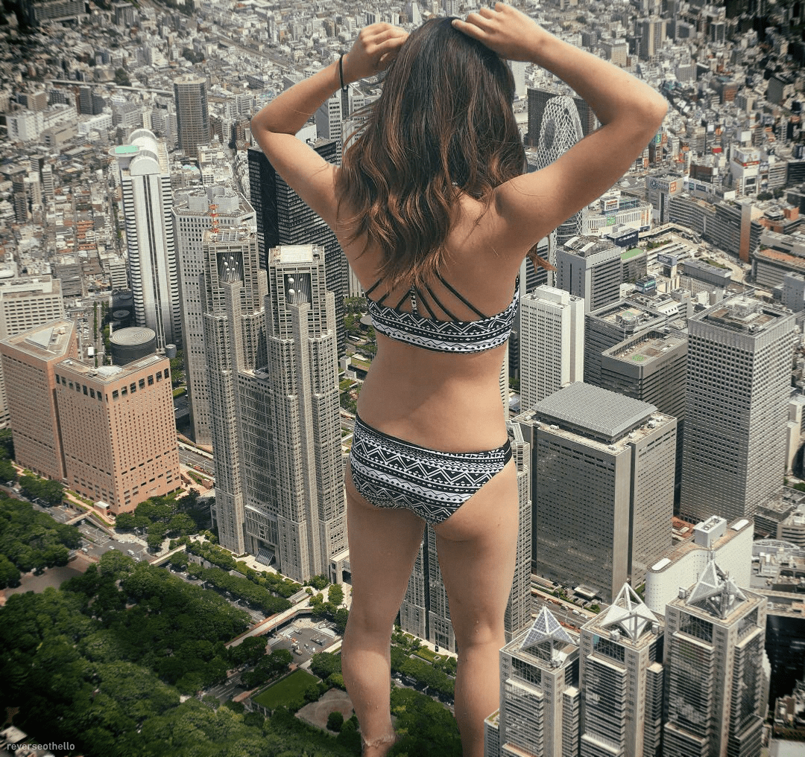](javascript:;)</ignore_js_op> <ignore_js_op>[fromtheheadlines8.jpg](forum.php?mod=attachment&aid=OTIwNzN8MGNiZDNjZDl8MTY0NzcwNDMwNnwxODIzMHwzMTI0MA%3D%3D&nothumb=yes) *(770.14 KB, 下載次數: 1)*

[下載附件](forum.php?mod=attachment&aid=OTIwNzN8MGNiZDNjZDl8MTY0NzcwNDMwNnwxODIzMHwzMTI0MA%3D%3D&nothumb=yes)

2021-11-8 22:28 上傳  

[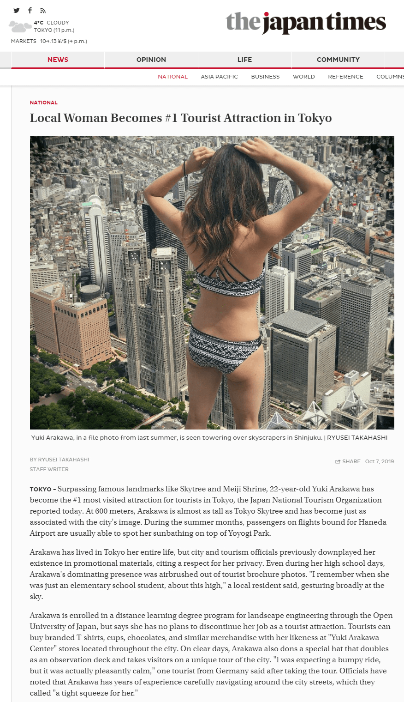](javascript:;)</ignore_js_op>  

# 22

*本帖最後由 kyojingirls 於 2022-1-20 04:06 編輯*

**建筑项目因沙堡建筑而延误**山手线新车站的建筑工人刚刚结束一天的工作，就听到两个巨大女人走过来的明确声音。这已经不是最近几个月他们第一次来到他们的施工现场了。"当地建筑工人松永浩说："整个夏天，这些穿着比基尼的女孩在城市里跑来跑去，我想在这种体型下，她们觉得一切都只是供她们消遣的玩具。他指出，他目睹了一台8吨重的推土机被推来推去，"就像玩具一样"，还有一辆大型混凝土搅拌车被移出工地，后来被发现遗弃在神奈川县的一座山上。此类事件已经频繁发生，足以引起人们的关注。被授予新车站建设合同的鹿岛公司已经将完工日期推迟了好几次，最初将延误归咎于 "我们无法控制的事件"，但最终将这种说法简化为 "天灾"。"有时我们早上来到工地，发现一切都乱七八糟，为了回到我们应该开始的地方，我们损失了半天时间，"该项目一名建筑工人说。工人们还报告说，他们发现工地周围留下了颜色鲜艳的超大塑料桶和铲子，不使用重型机械就无法清除。近年来，随着国家面临长期的劳动力短缺，一些人建议在建筑项目上雇用城市的大居民，这一建议没有得到建筑工人的赞同，他们提到了工作安全和与 "几乎与东京塔一样大的人 "一起工作的风险。尽管如此，至少有一家公司已经启动了一个试验项目，测试这个想法，尽管到目前为止结果不一。自称是 "尼特族 "的300米高的秋山由佳被雇用于港区一栋新的摩天大楼的建设中，但工地上的工人抱怨说，她一天中大部分时间都在打盹，这使得 "任何重大进展 "无法取得，因为她庞大的身体意味着工人无法在工地上自由行动。该项目的工头在秋山威胁说如果他继续命令她就吃掉他之后辞职。<ignore_js_op>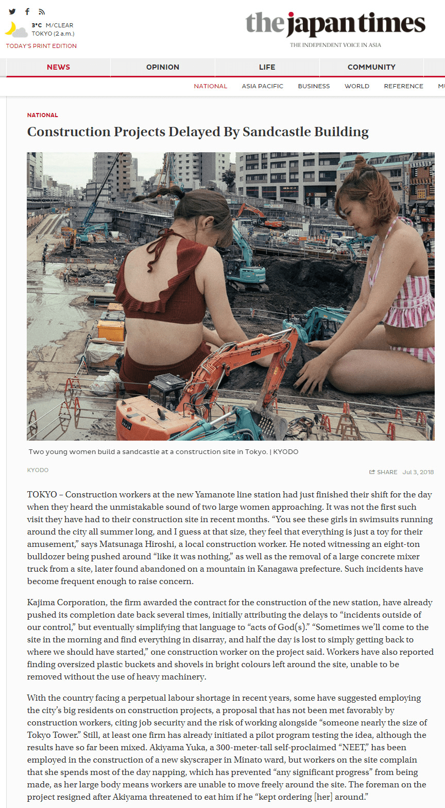</ignore_js_op> **fromtheheadlines12.jpg** *(668.46 KB, 下載次數: 1)*

[下載附件](forum.php?mod=attachment&aid=OTMzNzh8YjkyMmZiOWR8MTY0NzcwNDMwNnwxODIzMHwzMTI0MA%3D%3D&nothumb=yes)

2022-1-20 04:03 上傳