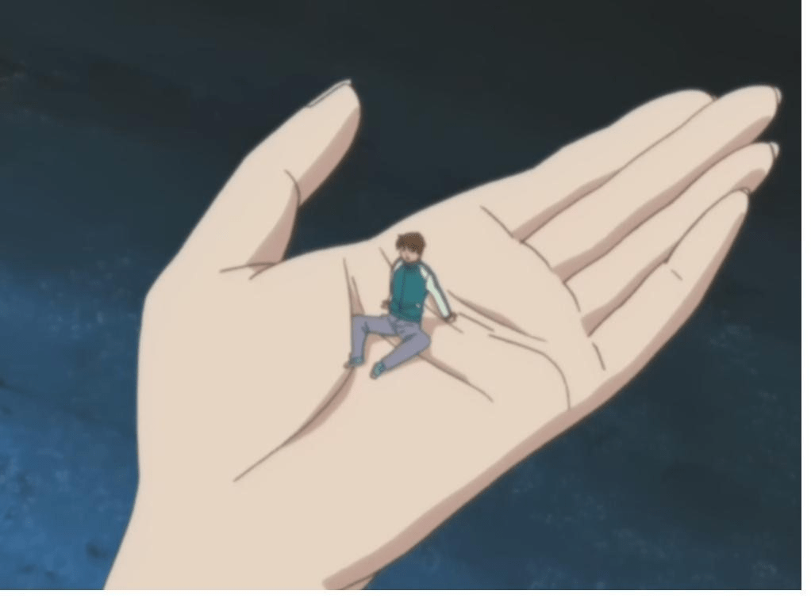
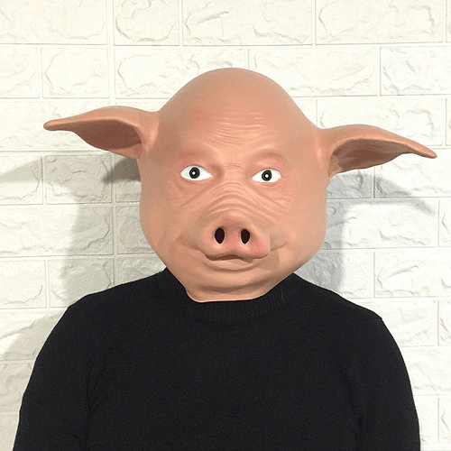

# 杀业（7.14请假申请，外送两段GTS爽文节选，以证功力）

作者：gts-c

TID：31197

# 1

*本帖最後由 gts-c 於 2021-7-14 23:52 編輯*

大家好，我是GTS-C

我想这个坛子里应该已经没有几个人还记得我是谁了吧？

虽然我以前还算是活跃分子，但……后来GN上不了……必须翻墙……之后。

我就好几年没来了。

我就是那个从来不写你们可能看过的GTS类型故事的那个作者……自认为文笔还不错……

我写故事，从来是喜欢气氛，但今天翻以前的资料，突然发现我竟然曾经写过一个“应用文”

就是……你们懂的……那种……自娱自乐的那种故事……

这是一个关于CRUSH的故事

讲一个**美女踩死了一群男人**的故事……

**我写这东西是给自己看的，因为一般的GTS文章已经刺激不了我了**

在写这故事时，我还有个心愿，就是想挑战一下，**单纯就一个“踩死”的过程，能够写出多少种完全不同的文学笔法来……**

毕竟，**“踩死”的过程，以及动机、气氛，女强的压迫感……还有心理描写，才是GTS文学的永远的主题**

那种写着写着就写成小说的……全都是甭门邪道……（其实说的就是我自己）

当然，故事中还有其它的杀生方式和GTS互动

算是点缀吧

个人自信这是一篇**顶级的GTS爽文……**

**色情度（针对残酷系GTS FANS）相当于《红唇狩猎场》的10倍**

不过，**前面几章可能涉及到GTS内容不多**

还请大家多多包涵

毕竟有铺垫才有反转嘛。

好了，牛皮吹了，大话说了

就看到时候，是成功装逼，还是打脸了……

# 2

*本帖最後由 gts-c 於 2021-7-6 23:52 編輯*

河北洪山殿，素以超度、消业之事闻名平日里香火不断

这一日，主事僧坐在解缘台前突然来了一位女施主

这是一个异常丰满、美艳的女子，面容姣好，胸脯高耸……与正常女子相比，她的身材更为高挑、结实……但整体体型匀称……可以说是一个几乎挑不出来任何缺点的极品美人。

但奇怪的是，美女一进殿门，似乎就有一股阴气袭来……主事僧不禁一凛要说这阴气，确实古怪……寻常人等看不清楚，只是单纯的感觉有些骨冷，皮肤隐隐有些刺疼……但这僧人眼中，却是这女人身边一层煞气……仿佛黑夜阴风，地狱邪炎……细看之下，隐隐间感觉自己灵魂深处，似乎听到有人哭喊、悲求、哀号之号

杀业！很重的杀业！！！

主事僧猛的睁开双眼，细细的打量这个女人。美女似乎早已习惯了被人查觉注目，但无论如何被一个和尚如此仔细的端详还是不怎么常见……但很快的，美女就查觉到了这和尚对自己的关注，与寻常登徒子并不相同。

“女施主这身煞气”和尚说话间不禁倒吸一口气“莫非有杀业在身？”“杀业？”美女对这个词有些陌生，于是问道：“你说的是，杀人吗？”和尚静默不语

看到和尚的反应，美女想了想，口气有些犹豫的说：“我，可能杀过人。”

这话说得让人摸不着头脑什么叫“可能”杀过人？

看到这个情形，美女解释说：“我不能确定，我杀的……到底是不是‘人’？那些东西……可能……从某个方面算是人类吧，但……我也不能确定的说他们是什么？”

和尚有些听不懂美女的话，于是试着诱导她：“那么你可以确定的就是……你杀了人？”“杀？”美女听到这里，仔细的回味了一阵这个词，想了想后，点了点：“算是吧。”

又是一个不确定的回答。和尚不知道该怎么问下去了。

对方是不是人类不能确定已经够奇怪的了杀还是没杀，这又有什么不能明确的呢？

而且，这女人身上的杀业……是确凿无疑的……不但如此，这和尚坐此解惑数十年，从未见过有人身上有如此强烈的杀业……想来，这不但是杀过人……而且，还不止一个……不，恐怕只有杀过上百人，才会有如此杀业……

杀人？上百？一个女人？但她自己甚至连是不是杀过都不清楚……和尚实在有些不明白了。

美女也感觉到自己的回答实在难以让人感觉，于是试探着问：“你说……踩死……算不算‘杀’？”“踩死？”和尚大为惊异，

这……这……这……这是什么奇怪的杀人方法？

看到和尚难以置信的表情，美女点点头，然后开始解释的用手指了指地面，接着比划了一个一寸左右长度，说：“比如说那里，有一个这么大的东西”和尚顺声望向一方地面，但就那么突然之间……美女抬起脚，“啪”的落在刚才自己指的地方然后，美女抬起头，看着和尚说：“我就是这样的……踩死了他”这情形，就像是在描述自己踩死了一只蚂蚱一样

但是和尚却完全呆住了……

当和尚看向那地方时，那女人完美的玉足，就那么没有任何提防的冲进僧人的眼中……这双脚纤长优雅，无一点赘肉，也没有明显的青筋，总体上平滑圆润。脚跟暗红偏白，看不到任何折皱。脚趾饱满而修长，整齐的并在一起，指甲晶莹，暗藏粉色。肌肤似雪，润如凝脂。看上去柔爽顺滑，如丝绸般光洁。

和尚原本就怕这女施主美色，言谈之时，心中佛号念个不止……突然冷不防看到这双玉足，顿时间禅心不稳……再加上这女施主所说之事更是奇怪之极……一时间不知所措

美人见这僧人动了凡心，不禁有些好笑……毕竟她自持美貌，这情形倒也并不意外。但她来这寺院并不是为了撩拨男人……若是这僧人失了定力，对自己也没啥好处。于是嫣然一笑，默默的将脚缩了回去。

“哦”和尚见她脚动，顿时清醒……惭愧之余，也慢慢的收拾了平常之，继续问话道：“你是说，你踩死过什么东西？”美女点点头“阿弥陀佛”和尚双手合十看来事情也就是这样了，这女施主似乎踩死过什么东西……虽然不清楚那是什么，但想来不过是虫蚁蛙鼠之类……虽然也是杀生，但……毕竟也不违天道法律

但……面前女施主这一身杀业又是从何而来呢？若只是单纯的踩杀虫蚁，无论如何不该有如此重的一身杀业吧？面前这个女施主，怎么看都只是一个正常的美丽女子……

“我杀死的，准确的说我踩死的……可能，真的是人”类美女解释说说到这里，美女伸出手掌，比了一下自己的小指：“他们……可能是一种……象人类一样的东西……男性生物……非常细小……比我的这根指头还小。”这话令和尚大为惊奇：“施主可是亲眼见过？”美女肯定的点了点头

“哦”和尚不知道说什么好了这事儿听着奇怪，但至少这女施主的一身杀业，似乎可以解释的通了

但……真有那么细小的男人吗？而且，如果真的有那么细小的男人，踩死他……能算罪过吗？无论是人类，还是什么生物……若真的小到虫子一般大小，那么被面前这位美女无意中踩死……应该也是很自然发生的事情吧？

“阿弥陀佛”想到这儿，和尚双掌合十，朗声说道：“若是施主无心之失，那也不算什么大的罪过。”

“不”美女表情有些不自然：“我，不是无心的。”“哦”讲到这儿，美女终于放下了包袱，她看着和尚，认真的说：“我是刻意的……把他们……踩死了。”和尚大吃一惊

于是，那大美人就开始讲述自己的故事。 

# 3

<ignore_js_op>[无标题.jpg](forum.php?mod=attachment&aid=ODk1MjJ8ZDhjYzM2ZWF8MTY0NzcwMzIzMnwxODIzMHwzMTE5Nw%3D%3D&nothumb=yes) *(204.23 KB, 下載次數: 2)*

[下載附件](forum.php?mod=attachment&aid=ODk1MjJ8ZDhjYzM2ZWF8MTY0NzcwMzIzMnwxODIzMHwzMTE5Nw%3D%3D&nothumb=yes)

2021-7-3 02:40 上傳  

</ignore_js_op>  

# 4

> [yinxuan168 發表於 2021-7-3 02:16](https://giantessnight.cf/gnforum2012/forum.php?mod=redirect&goto=findpost&pid=472706&ptid=31197)

> 好久不见，能发以前的老文吗，满满的回忆

你点我的名字查我的主题，就能找到

# 5

*本帖最後由 gts-c 於 2021-7-7 05:08 編輯*

有一段时间，我在乡间旅游时住进了一家位于深山中的旅馆那不是一个著名的风景名胜，地方很静，很偏僻，四周没有人烟……但那里的朝霞很美……

不知为什么，我莫名的喜欢那个地方有好几天，我都住在那里，想远离尘市，让时间停下来……也许是上天回应了我的愿望吧，在住进去之后，连老板都离开了……一边几个天，我甚至连白天都没见到过他。整个旅馆就我一个客人……

这其实有些怪毕竟在荒山野岭中，一个女游客独自住在那里……这个情形怎么看都不太像是很安全的样子

现在想想，我这人真的有些大条特别是最开始，我局然还幸福的享受了几天孤独，庆幸没人打搅

但不久我就感觉有些不对劲儿了……

太荒凉了别说旅馆附近甚至我爬到附近的山顶上极目四望……视野范围内也看不到任何有人的样子……

有些可怕……但……也不是特别的强烈虽然有那么一点点与世隔绝的感觉……但毕竟网络是通的……让人感觉到安心一些

然而，真正可怕的是在晚上那段时间，一到晚上，我总是听到隔壁房间有人说话……声音不大，隐隐约约的好几次，我不能确定到底听见没有

但我知道，屋子的那边是个储物间，根本没有住人

于是，我以为这是自己在“幻听”，据说人在特别安静的地方都会有这个经历

但后来……这声音开始变得越来越频繁了

第三天，夜里……

那天晚上，我关了灯，迷迷糊糊正准备睡觉……忽然，我又一次听到有人在说话……

这次不是在隔壁声音就在我现在睡觉的屋子里面！！！就在门口附近。

我吓了一跳，就打开灯，循声望去……门边的角落里，除一个小小的储物柜……啥都没有……

“唉”我长长的叹了一口气那一刻，我讨厌死我的这种无聊的“幻听”了那里根本不可能有人嘛毕竟房间很空，如果一个人出现在角落，是不可能看不见的……

但就在我准备关灯的一刹那……我又一次听到那里传来了人的声音……“啊~~~！！！”

这次的声音……很真实……就像是有人突然遇到了非常可怕的猛虎、犀牛或是其它什么怪兽时，发出的那种声音……我确定我听见了，而且……就是在那个柜子那里……虽然这声音仍然不是很大……

我不得不站了起来，穿起床边的拖鞋……走到柜子边上看看到底是什么？

有东西！！！我不由得一惊！

借着阴暗的灯光……我隐约看到柜子与墙之间的缝隙中……似乎一个小小的影子……大约不到10CM的样子……似乎，还动了一下……

这里解释一下我不是那种娇小的女生，我的胆子比好多男性都大……小的时候我就是这样，很多女生看到蟑螂、老鼠……还有蜘蛛什么的……都会吓得尖叫起来……而我却是每次都直接上去，一脚将它们踩死

现在，虽然那东西是什么我不知道……但怎么看都是我能一脚踩死的东西所以……我那时并没有感觉到害怕嗯！与我相比……应该感觉害怕的是它吧？

我慢慢的移开柜子柜子的那一头仍然抵着墙壁……而我移开的这边，则形成了一个扇面。随着扇面不断扩大，更多的灯光照了进去……我慢慢的看清了那个东西的形状……

是一只壁虎！很大的一只算上尾巴，大约有15厘米左右这个尺寸算是很大了，但不管怎么说，毕竟这儿是山里……出现这么大的壁虎也不奇怪。

“呼……”我长长的出了一口气但很快的，我就疑惑起来……这东西，怎么能出发那么奇怪的声音？难道，这东西……成精了？

我被我这念头感觉到好笑……但就在这时，那壁虎突然动了起来，先是往前一窜……但很快就发现柜子与墙相抵的地方根本没有可钻的地方……左右两边，柜子是贴地的……与地面没有缝隙……于是这东西便往我奔了过来……

我吓了一跳，赶紧用脚一档……封闭了柜子的这边一，把它堵在里面那壁虎于是又往回走……顺着柜子往上爬，我赶紧伸手拍柜子上面……那壁虎受了惊吓，不敢往上……就贴着柜子的一面上下游走……走了一阵，终于发现几面都被我堵死……于是，就贴在柜子边上，又不动了……

怎么办？我思索了一个瞬间，便立刻有了答案：把它踩死！不管怎么说，自己睡觉的地方，有个东西到处乱爬……这感觉不怎么美好

于是我就试着敲柜子边，想把它震下来……发现没用，然后，我就脚扫它，沿着柜子边一下一下的扫它……终于，没几下，它就被我扫下来了。那壁虎掉到地面上，楞了一下……我趁这个机会，迅速的一脚下去……啪！！！

感觉脚底下，有东西微微一搁……而在我的脚边，那东西有一段尾巴露在外边，猛烈的动了一下……就不再动了……

我慢慢的抬起脚……然后，我皱起了眉头好恶心！

我踩死的是一只很大的壁虎，而且它的整个身体都被我踩烂了……鲜血、内脏糊得满地都是……我撇了撇嘴……心里有些犯愁

这情形，该怎么跟店主去说呢？是怪他这店不干净？还是承认我弄脏了他的地板和店里提供的拖鞋……但不管怎么说，我都得承担一个“踩死了那~~~~~么大一只壁虎”的猛女形象……嗯，这形象……很彪悍……很不女人……我突然感觉脸上有些发烧……

算了，多一事不如少一事我几乎没有犹豫，拉开储物柜，找到一个塑料袋，就把带血的拖鞋往里一扔……然后，就准备把那柜子移回去……彻底盖住案发现场……但就在这时，我突然发现那柜子和墙壁之间的三角形里似乎还有一个东西……

# 6

> [AlexYuan 發表於 2021-7-4 00:04](https://giantessnight.cf/gnforum2012/forum.php?mod=redirect&goto=findpost&pid=472755&ptid=31197)

> 老哥当时的红唇狩猎场下部找不到了。。

> 帖子里的那个连接应该很早就解析不了了 ...

严格的说没有下部，这是作者官宣。

但……其实也可以说是有……

《梦醒蓝月岛》，就是以《红唇》中的阿雪为主角，讲的一个很长很长的GTS故事。

其中有很大的一个段落，就是讲《红唇狩猎场》故事前后发生的事情。

不过，我现在缺少把《梦醒蓝月岛》写下去的动力。

可能过一段时间，我会把已经写完的“第二部”发出来吧。

# 7

> [yinxuan168 發表於 2021-7-4 01:26](https://giantessnight.cf/gnforum2012/forum.php?mod=redirect&goto=findpost&pid=472766&ptid=31197)

> 你好，的那个蓝月岛我们没法看 ，要权限

不是权限，是被隐藏起来了……

呃……话说几年前，我创业……就相跟“从前的自己”来个道别，于是拜托但丁，把我之前写的文章全都封了。

现在想想，嗯……感觉……那时有些年青。

我看吧，要是能联系上但丁，就解封吧。

# 8

> [yinxuan168 發表於 2021-7-4 03:00](https://giantessnight.cf/gnforum2012/forum.php?mod=redirect&goto=findpost&pid=472775&ptid=31197)

> 你没有存搞吗？遗憾了，但愿能联系上

存稿还在……不过，重复发不好吧？

而且原先的回贴都还在，回忆也还在

# 9

*本帖最後由 gts-c 於 2021-7-6 23:52 編輯*

我把柜子打开了更大了一些但那东西……没有动……

我认真的看了过去……似乎，是一个小小的人偶……不高，大约5厘米左右

我伸出手，将它抓在手中……然后我走回我床上……坐在床头，开始细细的观察……

呀~我不由得惊叹一声

这个人偶……真是，太逼真了……人像的形象，像是个男性青年，很帅气……紧闭双眼，盘腿坐着……如同老僧入定一般但他的身上，却是穿着一件普通的运动衫……整体上是一个现代人的打扮

但这人偶的细节却是精巧到了极致……

皮肤不知是什么材料做的，不像一般的塑料或是硅胶。靠近一看，感觉似乎毛孔都隐约可见。不但如此，一般人偶，头发的粗细都会跟人类差不多……但这个人偶，头发细的几乎看不清楚……这么算来，就算是这么一个5CM大的人偶，发量恐怕也会跟人类差不多吧？

这种便宜旅馆，会放置这么精细的人偶模型吗？我几乎不敢相信？这应该很值钱吧……竟然放得这么随意

不对，这东西是掉在柜子缝里的，而且我这几天都没见过……所以，这应该不是这个旅馆的东西估计，是之前哪个客人丢下的吧

我伸手摸了摸，触感很有弹性，比塑料软，但比硅胶涩……感觉比一般的XX玩具还要真实……

于是，我脑中闪过一个念头……这类的玩具，通常是“可动”的吧？

我咬了咬嘴唇……开始掰他的胳膊……最开始有些费劲……但稍一用力，还是可以掰得开的……果然，是“可动人偶”而且，是全包皮的

但这人偶的关节转动起来的却有些奇怪……完全没有正常人偶关节转动时摩擦的均匀力感……有时需要用力，有时却又轻得像是胳膊都掉出来了可能是丢的时间长了还受了潮，有些僵硬了吧？

但无论如何，这个是一个非常完美……而且极为可爱的人偶……而且是我一生中，从未见过的最逼真的人偶

嗯……而且，还很萌

不知不觉之中，我已经深深的被这个漂亮、真实的不像话的人偶吸引了，刚刚才踩死一只大壁虎的糟糕体验早就被我抛到九宵云外去了……

作为一个对自己容貌颇有自信的女人，我可以说是对任何男性都有一定的免疫力……但，如果一个男人，非常非常的细小……那我就不一定能把持的住了。

几乎所有人类都会在小小的萌物面前失去抵抗力，特别是女人……忍不住去抱，去捏，去吸，去捏……或是欺负一下，吓唬一下……期待着它们能露出更丰富的表情

我把他放在手心，然后攥紧拳头……就像卖仓鼠的老板娘，逗玩自家的萌宠一样。同时，还学着她们的样子，一边慢慢把捏紧，一边微笑着吓唬它说：“我捏死你好不好？”

“哎呀”突然之间，我感觉到手心里一下刺疼……我赶紧张开手掌，手心里，在那个小人边上，有一滴鲜红的血迹

我赶紧抓起这个小人偶……这才注意到……这个小东西的衣服里，竟然藏着一段明晃晃的银针……

“X”我很淑女的说了一声脏话怎么我就总是摊上这么倒霉的事儿……小时候睡觉的被子里有妈妈缝完一半忘了的针……毛绒绒的玩具熊里有尖锐的拉链扣……搓了一半儿的橡皮泥里有木屑……连自家的车里都不知什么地方藏着只大马蜂……现在，怎么连这么精巧的橡胶玩具中都藏了针……

我赶紧把那精巧的人偶扔到一边，开始借着灯光察看我的手掌伤口不深，还好毕竟我只是抱着玩弄的心态去捏那个人偶

但血的颜色却有些异常……不像鲜红的样子，隐隐间有些淡绿的颜色……我心中浮起一丝不详的感觉……但就在这时，我突然感觉到一阵晕眩……然后，就轰然倒在了地上。<ignore_js_op>

**无标题.png** *(396 KB, 下載次數: 0)*

[下載附件](forum.php?mod=attachment&aid=ODk1NDZ8MWJiYmMxM2R8MTY0NzcwMzIzMnwxODIzMHwzMTE5Nw%3D%3D&nothumb=yes)

2021-7-5 00:58 上傳

（图片是网上找到，坐姿与故事的内容略有出入。）

# 10

> [yinxuan168 發表於 2021-7-4 23:21](https://giantessnight.cf/gnforum2012/forum.php?mod=redirect&goto=findpost&pid=472833&ptid=31197)

> 你需要什么动力说出来，大家可以支持你呀

先联系但丁，把第一部解封出来。

然后我再发第二部

之后，就看大家的反响吧。

# 11

不知过了多久，我醒了过来整个身体似乎笼罩于一种奇怪的感觉之中，感觉自己很轻……同时又有些麻木

比之身体的感觉，更奇怪的是我处的环境我……不知道到了什么地方……脚下，是一片黄色的大地。不是土，踩上去有些硬……还有些光滑。有一个像是太阳的东西挂在天空，但感觉不高……好像就是在上方一公里的样子，而且不但不热，还似乎只能照亮我身边的一小片地方……

但还是很刺眼的，我发现这光芒很暗……也很局限性……我身后的地方是一大片阴影……什么都看不见其实，就算是光芒好，我的视线也很奇怪……

眼里的一切，都像是处在一个不动变动的哈哈镜中……不断的摇晃、扭曲……而且越往远往……世界就变形的更厉害

但……最奇怪的是我没有感觉到奇怪好像这就是整个世界应该的样子似的……

嘻嘻嘻嘻嘻嘻嘻嘻嘻嘻

就在这时，一阵欢乐的笑声传来……我往那边一看，发现那里，不知什么时候出现了两个滑梯……七、八个男人模样的家伙……正兴奋的在那两个滑梯里爬上爬下……

这个场面很怪异那些个男人，都穿着粗布的衣裤……一副过时的打扮更奇怪的是那两个滑梯……几乎一模一样，并排放着……滑道不长，也不陡，甚至还没有边缘，只有几根绳索样的东西绕着……

最奇怪的是，是根本没有上去的台阶

而那些奇怪的男人，就那么从一个接一个的，从一个滑梯的边上，攀着绳索上去……然后从另一个滑梯滑下来……但有几个男人，他们并没有去滑滑梯，此刻，他们正兴奋的躺在另一个滑梯的下面，左闻闻，右嗅嗅……高兴起来，甚至还直接打起滚来……也不知道为什么这两个奇怪的滑梯能让他们这么开心

越过梯子，再过去大约几十米左右，是两个奇怪的粉红色的小山，大约两层楼高，形状……像是半个火山，一边是平缓的小坡，但另一边却是直立的山壁……而山顶，有一个像是火山口似的存在。最奇怪的是，两座小山几乎一模一样……而且就那么并排放着……

我看到有几个人，像是登山一样……从那小山的一边往上爬，很快，就爬到了火山口……接着，他们就站在山口往下看，同时商量着什么……感觉，好像是火山口里有什么东西似的……

突然，传来一阵惊呼……我顺声望去，原来是那两个滑梯中的一个，因为上面站了太多的人……突然一甭，倒了下来，于是一群男人噼里啪啦的往下掉……但好在那滑梯不高，似乎没有人摔着。

奇怪的滑梯奇怪的小山穿着奇怪的男人还有最奇怪的……感觉什么都不奇怪的我

“呼~~~~”

就在这时，我听到了一边，有像是风声向我传来。我转过头

在距离我不远的地方，有三个人三个三个奇怪的人

三个人，都戴着猪头头套，冲我“笑”着……嗯，我不确定他们是不是“笑”，因为这个笑容是来自面具上的，那猪头非常逼真，眼睛睁得大大的，但却在笑……睁大眼睛大笑……不得不说，这是一个非常诡异的笑容。

<ignore_js_op>

**无标题.png** *(387.18 KB, 下載次數: 0)*

[下載附件](forum.php?mod=attachment&aid=ODk1NzZ8MDVhZGM0OTR8MTY0NzcwMzIzMnwxODIzMHwzMTE5Nw%3D%3D&nothumb=yes)

2021-7-7 21:50 上傳

嗯，这里说明一下：我说是三个人，但……其中一个，我其实不确定它是不是一个“人”他的身体是赤裸的，但好像还是半透明的，可以清楚的看到他猪头下面露出白森森的骨架……但，却看不到身体里的其它东西，例如内脏什么的……整个人，悬在半空中，同时两手往前，柱着一根半透明的木杖……但看上去，却并不像是这木杖让他悬浮，而是整个人连这根木杖都是悬浮的。总之……感觉不太像是人类的样子……

而其它两个，却是穿着两套灰色的马褂，感觉有些简朴，但看上去比较正常。嗯，至少我感觉他们的穿着是正常的……虽然这衣服，我好像是第一次看到有人这样穿着……但，似乎就应该这么打扮才是。

此刻，这两个人就站在地面上，向我挥手……同时像在跟我说话……我看到那它戴着的那个奇怪的猪头面具，竟然像是做出了说话的口型……但，我却只听到他发出风的声音：

“呼~~~~~”

飘浮的猪头人，带着诡异的头套……应该说，这是一个很恐怖的场面但奇怪的是我却并不害怕更奇怪的是，我听得懂那像是风声一样的语言：

“你终于回来啦~~~~”这是他在跟我说话

然后，随着这声招呼，又一个怪异的场面出现了……那两个站在地面上的男人，这时身体也突然开始变得透明起来……不，不止身体，连身上的粗布衣服、裤子……也开始透明起来。而且，不是像中间那位那样能看到骨头……而是直接消失……只留下那个猪头面具，仍然浮在半空

“呼~~~~~”中间那个飘浮的，又向我说了一句风话“走吧”我听懂了这话，于是点了点头

然后……我就跟着他们走了跟着两个在半空中飘浮的猪头，还有一个浮在空中，也戴着猪头头套的骨头架子……豪不犹豫的走了……一切，都是那么的自然

没走多远，就遇到一群人……聚在山脚下似乎在说着些什么……那里似乎是一个山口，一边的山势壁立，如同刀切。另一边也是高耸的绝壁但却从那山中一直延伸出去……

我抬起头，那绝壁高不见顶……直直的伸入黑暗之中……

我看到那些人聚着的地方，有一个怪物……体型很大，像是一条很大的鳄鱼……感觉可以一口把人吞掉似的……但好在已经死去了……而且身体也支离破碎，除了一条尾巴以外，都化成了一摊烂泥，几乎不成形状。

但仍然很吓人……围观的人有很多，但没有几个敢接近……其中有一个，大着胆子走近……但就在这时，那死得不能再死的怪物的尾巴，竟然剧烈的动了一下……于是一群人顿时吓得四散，远远的躲开去。

看到那些村民害怕样子，似乎可以为他们感到庆幸。毕竟这么一个可怕的怪兽，竟然就那么豪无征兆的死去了。但随后却又担心起来……

怪物这么可怕……那杀死怪物的东西……岂不是更令人担心？

不知为什么，我似乎非常关心这些人的安危……于是，对什么都不感觉到奇怪的我，终于开口问了第一个问题：“那么可怕的怪兽，是被谁杀死的？”

听到这话，那三个飘浮的猪头震了一下，但……却什么都没有说……也没有停下脚步……

# 12

> [xnr 發表於 2021-7-11 16:42](https://giantessnight.cf/gnforum2012/forum.php?mod=redirect&goto=findpost&pid=473513&ptid=31197)

> GTS文章的快感来自：真实性（感官体验，逻辑合理）+ 屈辱感（落差感）

> 

> 如果设定太过复杂会影响观众的脑补 ...

兄台，好久不见。打个招呼

你的意思我明白。之前《梦醒蓝月岛》和《小屋》都是写着写着就写成小说了。

所以我才在前面交代这个故事的时候特意那么说。

放心，这回这故事，所有的一切都是为了GTS内容服务的。

这故事是为了让我自己爽的，所以……非GTS内容我真的是不想写……

但，有了这些东西，真的可以增加代入感和屈辱感……

不多，就这几章……写这个是为了反转……

马上就要进入正常的GTS文章了，请再忍一两章吧。

# 13

*本帖最後由 gts-c 於 2021-7-14 23:54 編輯*

很抱歉哈，前几天得闲，于是开始写这个故事。结果没想到才写到第六章，突然来活儿了……于是就忙起来了。

这下子尴尬极了，因为前几章全是铺垫……几乎没有GTS内容。

铺垫还有一章就结束了，然后全是爽文。

没想到……竟然就……耽搁了……

**在此立誓：**

**此坑必填，否则GTS-C王八蛋！转世成虫，被油男踩死！！！**

# 14

*本帖最後由 gts-c 於 2021-7-14 18:57 編輯*

**下面两段，来自我之前的故事《梦醒蓝月岛》

前面写了太多非GTS内容，这里补两章……算是给大家洗洗眼睛……****对作者多点点信心。** 

**我向毛主席保证，《杀业》后面的故事，绝对是这个水平。** 

**（注：以下内容，不是《杀业》的故事情节，这里只是节选，供大家参考）**

***第十九章 如何杀死小男人*** *怎么办？

突然间，她把心一横，眉目间射出一道寒光。

“弄死他！”

阿雪咬咬了自己性感的嘴唇，慢慢走到桌边。

她的右手紧紧的握着，身体因为紧张而有微微有些颤抖。

掀开玻璃杯

那小东西还躺在桌上，静静的一动不动。

即像是昏迷，也像是睡着了似的……当然，还有一种可能：

装死

阿雪把拳头轻轻的放在他的身上，这拳头完全盖住了他的全身，根本看不到这个女人拳头下有什么东西。

然后，她沉沉的呼了一口气，慢慢的把拳头举起来。悬停在这小怪物身体上方约二十公分处的地方。

这小东西无论如何是挨不起这美人一拳的。

这一拳下去，恐怖他就会像是砸扁一只蚂蚱一样一命呜呼。

阿雪突然犹豫了。

自己真的是在击杀一只昆虫之类的生物吗？

现在，静躺在这美人那相对硕大的拳头下面的，是一个可以说话、思考，甚至具备一些人类都没有的超能力的智慧生物啊。

把这样的生命一拳砸扁……也应该算是杀人吧？

阿雪曾经经历过许多极端的场面，也见过许多不同死相的人。

有死于车祸的，也有跳楼自杀的。有被火车撞碎的，也有在河里泡了三天，整个身体涨大三、四倍的浮尸。

如果自己这一拳真砸下去，这家伙少不得骨断筋折、肚破肠裂……

想像一下……他身上所有骨头都会粉碎，头颅被砸扁，脑浆喷溅……整个躯干被当场爆开，肝、脾和一些分不清的内脏溅出了身体外……而肠子和一大堆下水则会从他身体的另一侧射出去。

突然，阿雪感觉到胃里一阵痉挛，似乎到有一丝丝的恶心。这才发现自己想像力是实在是旺盛过了头。

真讨厌！

明明一拳砸扁这个家伙就完事儿了，偏偏自己产生了丰富的联想。这时既使还有心想继续也有些排斥情绪。

……至少也会弄脏桌子吧？

她回头看了看墙角，那里有被她踩扁两个怪物的尸体。

“还是踩死算了。”阿雪终于拿定了主意。

既然用拳头亲手击杀会产生类似于杀人的古怪感觉，那如果用脚踩死他感觉应该就像是踩死蟑螂一样吧。

看来还是踩死他比较符合这种男性生物的归宿。

而且这还是阿雪比较喜欢的方式。

阿雪把他带到了昨天踩碎的两个小怪物的尸体旁，轻轻放下，然后她把脚悬在这个小家伙的上方，

脚部的阴影完全覆盖了它全身。

阿雪深吸了一口气，带着平静的表情准备给这小东西一个他远远无法承受的重踏。

但就在这时，那小东西突然复活了。

只见他从她脚下翻身爬起，向别处逃开。

阿雪吓了一跳，情急中来不急多想，一脚踩住了他。

就在这时，一阵强烈的快感，突然间从脚部传遍阿雪的全身。就像过电一样。阿雪一震，脚趾因为快感而猛然抬起。

还好这个感觉的反射是让阿雪抬脚，不是往下压，小怪物因此从她脚下捡了一条命。饶是如此，刚才那一脚还是踩得他屁滚尿流，他再也不敢跑了。

阿雪把踩住他的脚移开，盯着他看了一会儿。

那小东西吓得不知所措，只知道用无助的眼睛望向眼前这个美丽的女人，全身一阵阵的发抖。

阿雪回味刚才在踩他时产生的那种感觉，实在是舒适无比，那种兴奋和充实感，比做爱还要爽许多。

但这种感觉却并不像是来自于阿雪那奇怪的性取向。更像是一种被动的刺激。

“你能听懂我说话吗？”阿雪问。

小东西眼珠转了转，最后点了点头。

如果能够沟通，似乎生存的机会会大一点，这是正常的想法。

“很好”美丽的女人灿烂的笑了笑，然后，她紧咬了咬嘴唇，沉吟了一会儿终于开口说道。“很抱歉，我要把你踩死。”

即使是像阿雪这样冷美人，在说这话之前还是停顿了一下，毕竟这相当于死刑判决。只见那小东西脚一软瘫在地上。

虽然在阿雪把他带到这里时他就知道在劫难逃。但直到亲耳听到这个女人说出对自己的处罚时还是无法承受这一刺激。

“在踩死你之前，得你给想一个名字。”阿雪对小东西说，虽然她认为这对这个小东西并没有太大的意义，但她需要将来对今天发生的事情有个纪念。

“叫你‘无梦’吧，嗯，因为你没有机会让我做梦了。你也许有些遗憾，是不是？”

说话时，阿雪把脚伸到他面前，慢慢的放下。

与阿雪那惊魂夺魄的美貌非常相称的那双纤美的玉足可能是整个世界上最令人消魂的一双脚了。

……正常的男人恐怕被这只美脚踩死也不会有怨言吧。

但小人类的感觉却是完全不同的，相对于普通的大刀之类的刑具，阿雪那美丽、修长的玉足对于小人类来说所带的恐怖感显然要大上数百倍。

正常人可以想像一下，如果你面临一死，而且死刑的方式是让一头大象翻过来慢慢的把你压碎。那是一种什么样的恐怖感。

而从比例上来说，阿雪的脚可比一头大像大多了。

许多人即使有了死的觉悟，但在看到刑场的刑具上的鲜血之类的刺激内容时还是会崩溃的。

所以他就在阿雪美丽、恐惧至极的“刑具”面前哇哇大哭起来。

阿雪皱了皱眉，要知道这个要强的女人天生就不太喜欢男人。而且如果这个讨厌还要分个三六九等的话，那她最讨厌的其实那些奶油小生，也就是最没男人味的男人。

眼中，这个男人贪生怕死的态度不但一点儿都没激发这个冷血女人的同情，反而产生了一丝丝的厌恶。

阿雪缩回脚，在自己面前的地面上，用脚尖画了一个圆圈。然后用脚指了指圆圈里面，对那小东西说：“到这里来。”

那个圆圈正好和那个两个被踩得粉碎的小人类的残骸呈一条直线。

这，应该就是所谓的“刑场”了吧。* **（注：以上内容，不是《杀业》的故事情节，这里只是节选，供大家参考）**

# 15

*本帖最後由 gts-c 於 2021-7-14 18:56 編輯*

**下面两段，来自我之前的故事《梦醒蓝月岛》

我向毛主席保证，《杀业》后面的故事，绝对是这个水平。** 

**（注：以下内容，不是《杀业》的故事情节，这里只是节选，供大家参考）*****第二十章 死亡快感*** *“你应该知道，你没有反抗的余地。”阿雪面对着脚下这个弱小的生物，嘴角浮起一丝轻蔑的笑容“当然，你也没有逃跑的可能。”确实，对于这小东西来说阿雪的体型完全是另一种概念的生物。阿雪走一步就够他跑半天了。小东西死到临头，也只能一边哭一边机械的摇着头，他已经不知道做什么好了。腿吓软了站不起来，只能坐在了地上，但他的双手还是撑着地试图一些移动……虽然这移动不可能在半小时之内让他逃离阿雪一步的范围，但潜意识中他还是想离阿雪那要命的脚远一点。她看着这小东西的狼狈相，平静而淡然的说：“我可以把你踏死，也可以把你踩死。如果你老实一些，我可以给你一个痛快。”从人类的角度来说，“踩”与“踏”似乎很没有什么区别，但从这小怪物的角度来说就不一样了。踏死虽然来得猛裂，而且死相很惨，但毕竟死的比较利索。但踩死有时就不一样了，之前许多被踩死的同类都曾在女宿主的脚下品尝到了身体被一点一点压碎的痛苦死法。阿雪虽然不知道这些怪物的历史，但也知道这两种死法之间的区别。但小东西对阿雪的话看似全无反应，他已经吓得快要疯掉了。只见他瘫坐在地上抬头望着阿雪，一边哭一边使劲的摇着头。他的精神已经完全彻底崩溃，除了竭斯底里的大哭，他似乎没有任何其它的反应。阿雪感觉有些不耐烦了，终于，她伸出脚又一次用脚踩住了他。小东西一声尖叫，但这女人却并没有踩他，而是用两根脚趾夹住了他的脑袋。她抬起脚，将他的身体带离地面，然后移到刚才指定的圈子上方，往下一甩！这动作可一点都不温柔，小东西一下子摔在那圈子里。虽然这下子摔得很疼，但出于死亡恐惧的本能，还是让这家伙一下子做出了逃离的反应。可惜，他还没来及站起来，就被阿雪一脚踏在了下面。她这一脚踩得不轻，小东西的身体受到了沉重的挤压，一时间，他肺里的空气全部从身体里被压了出来，令他发出“嘎”的一声怪叫。同时，在意识到自己正被踏在这个美女的脚下时，巨大的恐怖感让那小家伙猛的打了一个激灵。而在阿雪这边，一股强力的兴奋直冲脑门，她像是被人猛击了一个，猛然间张开嘴，发出一声娇媚的呻吟！好爽的感觉！过了好大一会儿阿雪才回过神来。她喘着粗气，慢慢的平抚激烈的心跳。低下头，看到这小东西的整个身体已经被自己踏在脚下，只留下一个脑袋还在外边无谓的挣扎。随着他的挣扎和身体颤抖，一阵阵麻酥酥的快感从脚下慢慢的传来，让人精神愉悦，不能自己，难以自拔。阿雪踩着他，迷朦的双眼射出一丝渴求的欲光……她轻咬着自己的嘴唇，慢慢的运动着自己的玉足。她的动作很轻，生怕稍微一用力就踩碎了这个家伙的身体。在这个美人脚下，那小东西的身体正在被慢慢的挫揉、碾压着。随着她右脚的运动，一阵阵令人窒息的快感像一阵阵电流一般从她的脚下传了上来。阿雪有些意乱神迷，整个人都被这种强烈的性欲彻底包围。她把双手放在自己的胸前，用心的抓捏着自己性感的胸部，随着她对自己双乳激烈的挤压，那来自脚下的快感像水泵一样传遍整个身体。阿雪闭上了眼睛，高仰着头，张开了嘴巴，像是承接着渴望的春雨一般感受着这无比欢畅的性刺激。蓝月岛初春那阴冷的天气，在这美丽女人发热的身体周围罩上了一层淡淡的薄雾，无数道晶莹的汗液沿着玉人的粉颈汇流在一起。她可以清楚的听到自己心脏的跳动，身体像是着了火似的变得燥热无比。在极度的刺激之下，美丽的女人香汗漓漓、娇喘声声，一时间满屋春色。若有男人在场，定会被僚得欲火烧身，鼻血而狂喷而死吧。随着她的动作，这美人的呼吸越来越急促，身体也开始无法控制的前后摇晃。在双手的作用下，华丽的双峰剧烈上下舞动，同时脚下动作的辐度也越来越大。终于，在极度的兴奋中，阿雪的脚无意识中重重的一压！随着“叭嗤”一声，几道鲜血从她的脚下飞射出来，可怜的小东西顿时粉身碎骨！……而快感也戛然而止。正处于高潮中的阿雪猛然一惊，无论如何，她是不想这么快结束的。但在极度的兴奋时，任何女人都无法控制自己的身体。阿雪低下头，用手摸了一把自己的下体，那里早已是春潮一片了。……美人脸上浮起一丝红晕。而当她抬起脚时，脚下却是一片血肉模糊，与她那白嫩细滑的肌肤形成鲜明的对比。……玉人足下，岂有生机？“终于还是把他给踩死了。”阿雪皱着眉头，叹了口气，看来下一次，一定要采用相对安全一些的“接触”。但，还会有“下一次”吗？到目前为止，所有见到的小怪物都已经被自己粉碎了，两个踩死，一个一屁股坐死。尽管全都是无意的，但阿雪在面对这种生物时，似乎很难控制住那压倒性的力量。这究竟是什么东西？为什么可以进入别人的梦中？为什么可以通过皮肤接触能让对方产生快感？这种生物是不是只有男性？而他们的作用力是不是只是对女人有效？而且，似乎这种生物可以通过接触对女人产生强性的性冲动。而且似乎是他们越恐惧，产生的快感就越强烈。透过房门，阿雪又一次望向那向奇怪的房间。昨天在那神秘的房间里挪那个柜子前，她曾听到那后面有声音。而且那时看到的那些奇怪的影像应该也是这种怪物作祟。这屋子里，应该还有这种怪物没有被消失掉吧？这是好事儿还是坏事儿呢？但是，如果那房间里的怪物，就是这种可以被她轻易踩死的像昆虫一般的存在。那还有什么值得她害怕的呢？* **（注：以上内容，不是《杀业》的故事情节，这里只是节选，供大家参考）**

# 16

*本帖最後由 gts-c 於 2021-7-14 23:05 編輯*

> [xnr 發表於 2021-7-14 22:17](https://giantessnight.cf/gnforum2012/forum.php?mod=redirect&goto=findpost&pid=473840&ptid=31197)

> 感觉缺乏对小人感官的描写，让读者无法带入到小人身体当中去体会巨大的玉足压在身上的感觉。

> 

> 快感还是来自 ...

呀？

你竟然还看到了？

我想着这东西没有任何更新预告，估计应该是没人看到才是。

多谢关注哈。

不过，你的说的那些话……和那些所谓的“参考”……

你是在逗我吗？

专业作家和文学爱好者之间的功力你看不出来吗？

事实上，我个人对自己的文笔很自信……

无论是在GTS界还是在现实中

最后，我这些故事，是女方视角……这跟《红唇》不一样

男方视角，看的是屈辱、压迫感。

女方视角，看的是控制、轻视以及自信。

不同流派而已……

# 17

> [xnr 發表於 2021-7-14 22:17](https://giantessnight.cf/gnforum2012/forum.php?mod=redirect&goto=findpost&pid=473840&ptid=31197)

> 感觉缺乏对小人感官的描写，让读者无法带入到小人身体当中去体会巨大的玉足压在身上的感觉。

> 

> 快感还是来自 ...

突然想起一事儿来……

我当年混GN时，总有个人跟在我贴子后面吹冷风……

我忘了是谁了。

莫不就是你吧？

# 18

> [yinxuan168 發表於 2021-7-15 00:52](https://giantessnight.cf/gnforum2012/forum.php?mod=redirect&goto=findpost&pid=473860&ptid=31197)

> gn论坛关闭了 还是有很多回忆哦 ！！

没关啊，这里就是啊。

没注意到吗？</ignore_js_op></ignore_js_op>